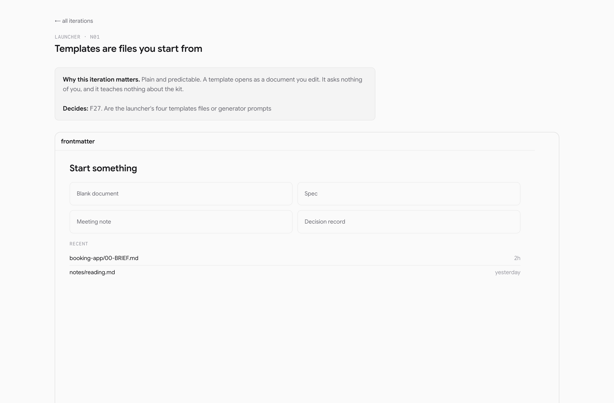
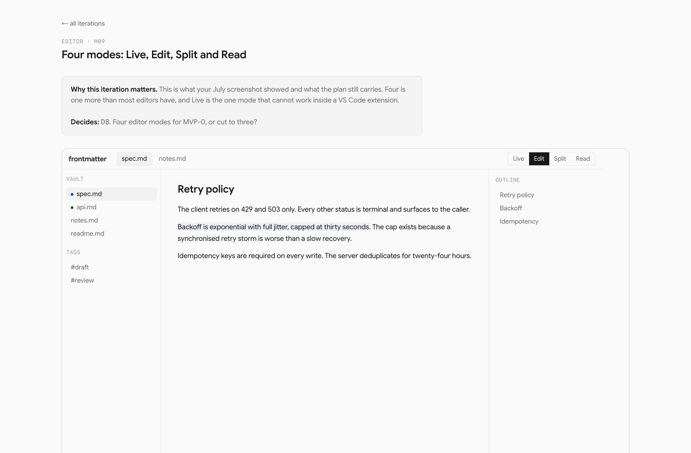
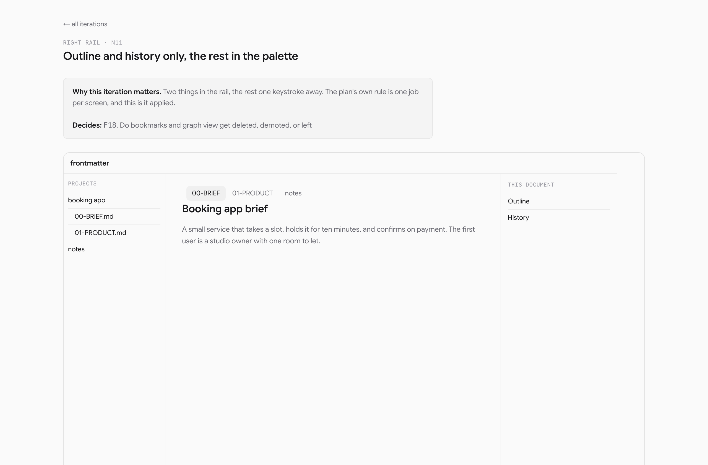
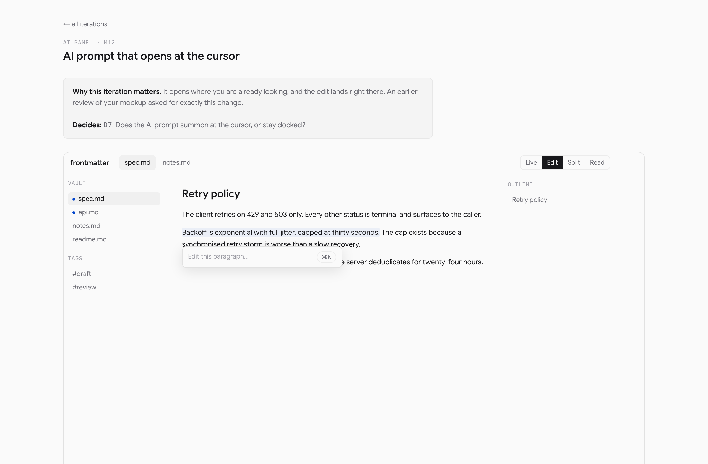
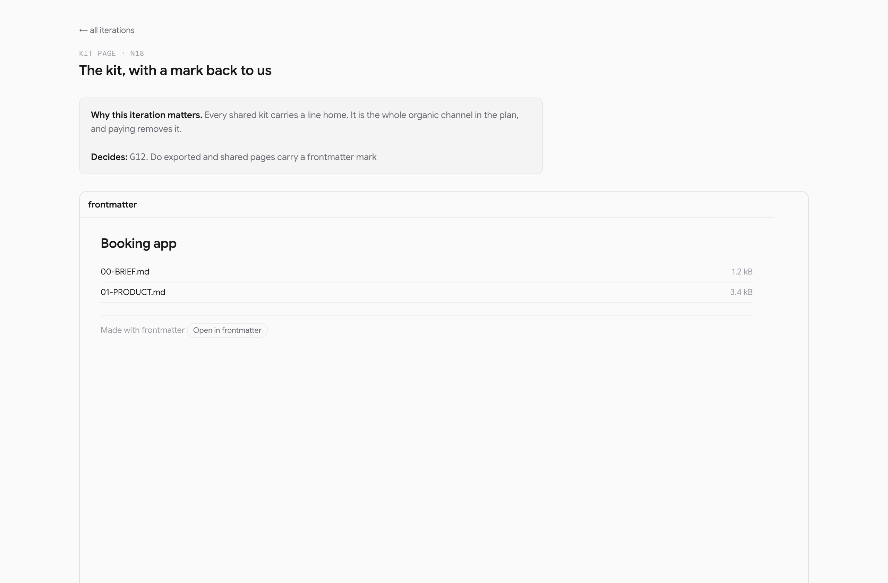
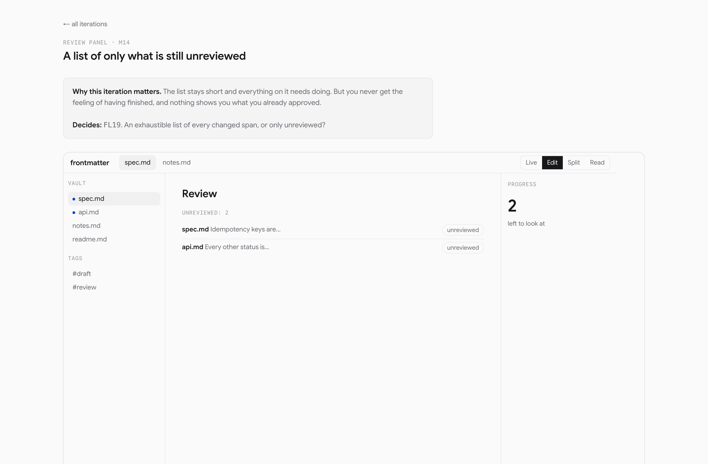

# What frontmatter is, and what the evidence says

A brief for Sagnik and Amit. Everything with a number attached was measured or fetched, and
the date it was measured is beside it. Where I could not check something I have said so
rather than filling the gap, and there is a section at the end that does nothing but list
what is still unknown.

---

## 1. The sentence

**frontmatter is where you write the documents your agents read.**

An editor first. You paste what a model gave you, you clean it up, and you get something you
can hand to a person or to another machine. On top of that it writes the document kit a
project needs, and the instruction files the coding agents obey.

The version of this sentence we carried until last week was different. It led with review
state, which is the idea that you should be able to see what an agent changed and know what
nobody has read. That claim is not gone, and section 3 explains where it moved to and why.

## 2. What changed, and why

On 13 September the product was reset to a bare bones editor with a document generator as
the way in. That was not a change of taste. Three things forced it.

**The headline claim was overtaken.** Of the four claims the product rested on, three became
free features of other tools inside nine weeks. Claude Code, Codex and VS Code all shipped a
way to see what an agent changed. VS Code shipped per-file review state. The one claim nobody
copied was sold by a company called Almanac, which raised $45M and shut down on 31 January
2025.

**The pace is one person's.** The measured rate is 1.21 engineering days a calendar week, and
80 of 80 commits have a single author. Every date in every earlier plan assumed two people.

**The editor is a fork.** 202 of 228 source files are byte-identical with sgnk-md, and none
exist only in frontmatter. We have been planning a product on top of somebody else's shell
without saying so.

## 3. What the market says

Four findings. The first one changed the plan.

### 3.1 There is a standard for the files agents read, and it is large

From agents.md, fetched 13 September 2026:

- **over 60,000 open-source projects** use `AGENTS.md`
- it is stewarded by the **Agentic AI Foundation under the Linux Foundation**, so it is a
  governed format rather than one vendor's file
- roughly two dozen agents read it, including Codex, Cursor, Jules, Aider, Zed, Warp,
  Windsurf and GitHub Copilot's coding agent
- the files nest, the nearest one up the tree wins, and the main OpenAI repository holds
  **88 of them**

The Claude Code manual describes four scopes for its own `CLAUDE.md`, from an
organisation-wide policy file down to a local one. More usefully, its troubleshooting section
lists three things that go wrong: the agent does not follow the file, the file is too large,
and the instructions are lost after compaction.

A vendor documenting in its own manual that the hand-written file is often too big and often
ignored is a description of a gap.

### 3.2 Those files are maintained, heavily, and they drift

I sampled eight repositories through the GitHub API on 13 September 2026. This is a
convenience sample of large, active projects, so it says what happens in a live repository
and not what a median project does.

| Repository | Commits touching `AGENTS.md` | Size |
|---|---|---|
| `openai/codex` | 77 | 22,397 bytes |
| `apache/airflow` | 64 | 36,577 bytes, roughly 6,100 words |
| `vercel/next.js` | 35 | 30,720 bytes |
| `danny-avila/LibreChat` | 14 | 7,415 bytes |

Two things fall out of that table. These are not config stubs, they are documents of several
thousand words. And a six thousand word instruction file sits exactly on top of the "too
large" failure the vendor documents.

Then the finding I was not looking for. `apache/airflow` and `vercel/next.js` have identical
git blob shas for `CLAUDE.md`, across two unrelated repositories, which only happens for a
symlink. Git mode 120000 confirmed it. Both point `CLAUDE.md` at `AGENTS.md` so there is one
source of truth and one file to maintain.

`LibreChat` did not do that. It keeps two real files, and they have drifted to 7,415 bytes
against 23,170.

That drift is the problem, happening in public, with nothing addressing it.

### 3.3 Nobody asks who you are before letting you work

Measured on 13 September 2026 by fetching each landing page and counting sign-in, sign-up,
log-in and create-account in the HTML, with script blocks stripped out first.

| | Sign-in words | Editor on arrival |
|---|---|---|
| dillinger.io | 0 | yes, a Monaco editor in the landing HTML |
| stackedit.io | 0 | yes |
| excalidraw.com | 0 | yes |
| hackmd.io | 16 | no |
| typst.app | 8 | behind a canvas |
| **frontmatter today** | **the page is the login screen** | **no** |

`(vault)/layout.tsx:11` returns the login screen when nobody is signed in, so a stranger
cannot open a file, paste anything or export anything. This is the single largest gap between
the plan and the funnel the plan depends on.

### 3.4 Everyone gives the editor away

Obsidian gives the editor away. Its paid products are Sync and Publish, with a separate
commercial licence. HackMD runs Free, Prime and Enterprise.

Nobody charges for the editor. They charge for where the files live and who can see them.
That is what our pricing already proposes, and it is now measured rather than argued.

### 3.5 Where review state goes

It stops being the headline, because the repo-wide version of it lost to four free tools in
nine weeks and the one company that sold it closed.

It becomes something narrower that nobody has taken: **has a person read the instruction file
your agent is about to obey, or did an agent write it while nobody was looking?** Same
machinery, much smaller claim, and it applies to a file that is acted upon rather than merely
read.

## 4. What we found in our own code

Three things, from an audit on 13 September. Two of them contradicted our own record.

**Two of five exports send the whole document to our server, not one.** Both PDF items call
it, at `ExportMenu.tsx:108` and `:114`. The browser print path was written, exported at
`export-doc.ts:130`, and is imported by nothing. The Word export is the HTML renderer with a
`.doc` extension, which Word opens but which is not a docx.

**The setup turns strangers away**, as section 3.3 sets out.

**The empty editor has nothing to press.** A bare editor is the goal. A bare editor with
nothing in it is a blank page somebody leaves.

## 5. The screens

Forty-four iterations are drawn and live at the decisions site, grouped by screen with a
dropdown so two versions of the same screen can be compared side by side. One representative
of each is below. Every one of them answers a decision that is in the set.

### The launcher, the first thing a stranger meets

### The editor

### The right rail

### The AI panel

### The kit page, which is the funnel

### The review panel, which comes after the pilot

## 6. What we build, in order

1. **Open the front door.** The editor at `/`, local only, no account until the first save or
   share. Nothing else in this plan works without it.
2. **One sample in the empty state** that turns into a document kit, so the thing that is
   actually different is visible before anyone has typed a word.
3. **Fix the export path.** Wire the browser print function that already exists, and decide
   the server route, which makes the privacy claim true with no exception to explain.
4. **The document kit, with a consistency pass.** Twenty made by hand first.
5. **The instruction files agents read.** On the evidence in section 3, this may belong above
   the kit rather than below it.
6. **Share and comment**, not live editing.

Templates by project type, slides as a single command, offline with the user's own key, and
reading a repository all come after, in that order. Repository access stays read only
whenever it arrives.

### Three things I would not build

**Live collaborative editing.** It needs either operational transforms or CRDTs, and this
project settled against CRDTs on evidence that has not changed. It would cost months and
compete with Google Docs on the one axis where they are strongest. Share and comment gets
most of the value for weeks of work, and asynchronous review is what a document actually
gets.

**Slides as a headline.** Marp, Slidev and reveal.js are free, good and established. Ship
slides as one command with one template and no options, which is days of work, and never
price or position them as a reason to switch.

**Writing to a customer's repository.** Reading one to write better documents about it is a
different proposition, legally and commercially, from writing to it. Writing makes us an
intermediary holding their code, with duties costed at 74 founder hours that nobody has paid.

## 7. What is still open

There are 208 decisions on the site and **65 of them block the MVP**. The rest are staged for
later and are out of the way. Seven items that were dressed as decisions are listed separately
as chores, because they have one sensible answer and somebody simply has to do them.

The five to take first, in this order, because each narrows what the next one can be:

1. **Do we hold document bytes?** Six other legal cards wait on this one.
2. **What are we building, and on what surface?** One core or two, and which ships first.
3. **What do the paid tiers gate?** The editor free and storage paid, or something else.
4. **What is the pace, and who builds?** Every date rests on this.
5. **What is frontmatter?** The noun, and where review state sits now.

Each card carries the thing being decided as a diagram, where it stands, what forces a
choice, the evidence behind it, and what every option buys and costs. The recommendation on
each is a position, not an answer. Disagreeing is a normal outcome and the export records it.

**Answers live in one browser.** Export the JSON after every sitting.

## 8. What nobody has checked

This is the honest part and it is short.

**Nobody has been asked whether they would pay.** Not one interview across the whole
programme. Every demand claim in this brief is inferred from public behaviour, shipped
features and what other companies charge. That gap is the largest one and none of the
research above closes it. Twenty conversations would.

**The instruction-file sample is eight repositories**, chosen because they are large and
active. A random sample would tell us what a median project does, and it might say something
quite different.

**The kit has never been made by hand twenty times**, which is the gate the plan sets before
any of it is written as code.

**Almanac's numbers come from a podcast summary**, not from the founder's own writing.

---

*Prepared 14 September 2026. The decision set is at frontmatter-decisions-sagnik.vercel.app
and the screen gallery is one click from it.*
