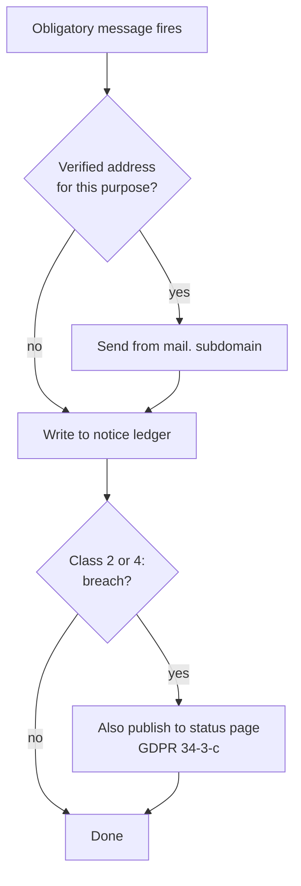
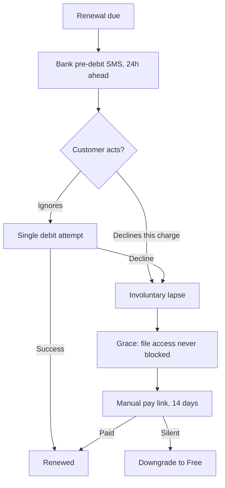
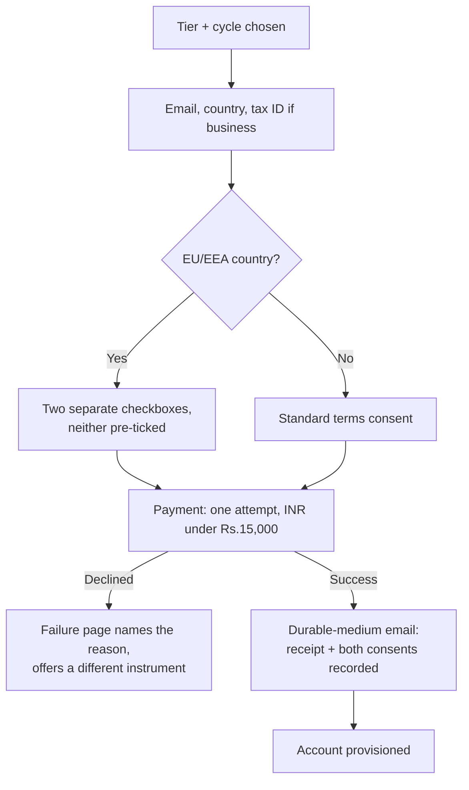
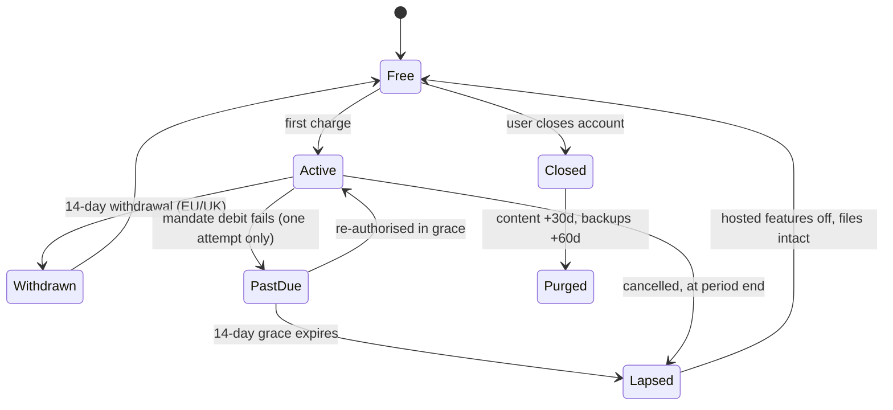
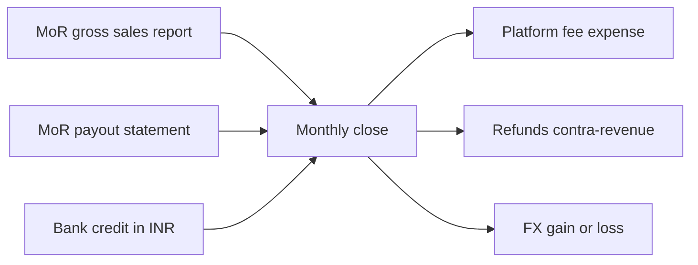
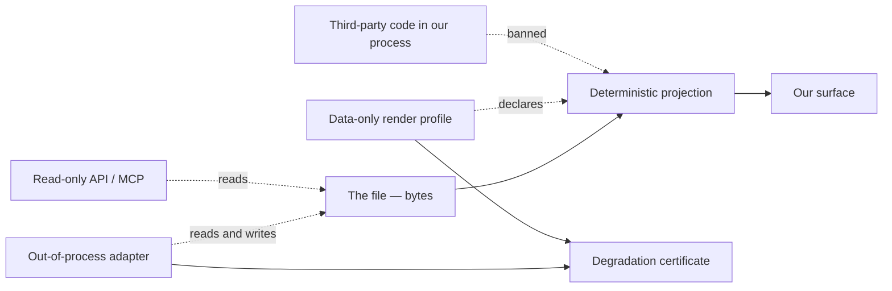
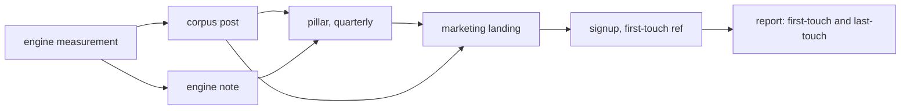
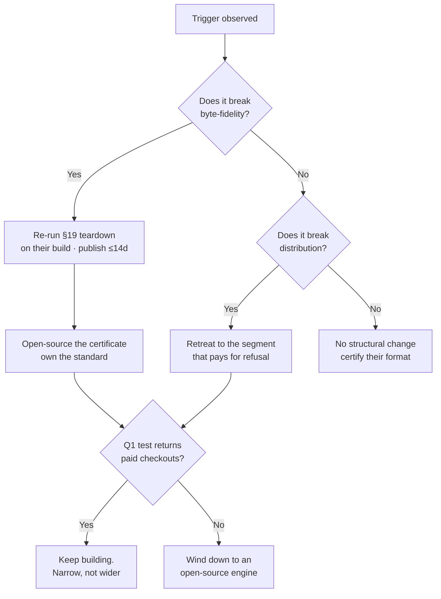

# BUSINESS — the parts nobody adds up

**Tier 1.** Round 14 swept the record for what thirteen rounds had never asked, and these seven came back, and §88 adds the war-game that thirteen rounds never ran. They are not softer than the engineering; a product with no route to tell a user about a breaking change has an operational defect, not a marketing gap.

> Every number here obeys PRD §57: re-derive at write time. Every public claim obeys PRD §58.

---
## 81. Reaching users — email infrastructure and in-product messaging

### 81.1 The gap, stated as a measurement

`grep -oiF` over `docs/FRONTMATTER-PRD-v2-2026-08-29.md` (120,539 words by `wc -w`) returns: `SPF` 1, `DKIM` 1, `DMARC` 2, `List-Unsubscribe` 0, `unsubscribe` 1 [measured 2026-08-30]. Of those, one `DMARC` hit is GitLab's backup-alarm postmortem and every other hit sits inside the gap-sweep row that reports the count as zero — so the substantive coverage is **zero occurrences in the governing document** [measured]. The product as specified has no route to tell a user anything. First run collects no email by design; the weekly digest and the What-is-New modal are banned; no sending infrastructure was ever designed. A breach notice, a price change and a failed renewal all currently terminate at the same dead end.

The resolution is not to relax the bans. It is to separate *obligatory* messages — which are triggered by law or by contract, are never periodic, and have a named legal deadline — from *marketing*, which we are not building at all, and to build exactly one channel for each.

### 81.2 The obligatory messages and their triggers

| # | Message | Trigger | Basis, with source | Deadline | Channel |
|---|---|---|---|---|---|
| 1 | Cyber-incident report | Unauthorised access, data breach, DoS, phishing on our infra | CERT-In Directions under s.70B(6) IT Act, 28.04.2022, para (ii) + Annexure I item xi "Data Breach" [fetched 2026-08-30] | **6 hours** of noticing | To CERT-In (`incident@cert-in.org.in`), not to users |
| 2 | Breach intimation to each affected user | Any personal data breach | DPDP Rules 2025, G.S.R. 846(E), 13 Nov 2025, Rule 7(1) [fetched 2026-08-30] | "without delay" | **"through her user account or any mode of communication registered by her"** — Rule 7(1) verbatim |
| 3 | Breach report to the Data Protection Board | Same event as #2 | DPDP Rules 2025, Rule 7(2)(a)–(b) [fetched] | description without delay; full report within **72 hours** | Board portal |
| 4 | Breach communication to EU data subjects | Breach "likely to result in a high risk" | GDPR Art. 34(1) [fetched 2026-08-30] | without undue delay | Email or, under Art. 34(3)(c), public communication |
| 5 | Statement of reasons | Any account suspension, content removal, visibility restriction, or restriction of monetary payments | DSA (EU) 2022/2065 Art. 17(1)(a)–(d), contents mandated by Art. 17(3)(a)–(f) [fetched 2026-08-30] | "at the latest from the date that the restriction is imposed" | Email, **but only where "the relevant electronic contact details are known"** — Art. 17(2) |
| 6 | Annual renewal pre-notice | Any auto-renewing term of one year or longer, California consumer | Cal. Bus. & Prof. Code §17602(b)(2), contents at §17602(a)(8)(A)–(F) [fetched 2026-08-30] | **at least 15 and not more than 45 days** before renewal | Email, and it must carry a link to the cancellation flow — §17602(a)(8)(E) |
| 7 | Price change / terms change | Unilateral amendment to a live subscription | Contractual: our own terms must state the notice period; there is no single statutory number [inference] | Before the next charge, never after | Email + ledger |
| 8 | Payment-failure and dunning | Mandate debit declined | Contract; the RBI e-mandate pre-debit notice at T−24h is the **issuer's** obligation, not ours (RBI DPSS.CO.PD.No.447/02.14.003/2019-20, 21 Aug 2019, Annex ¶8–10) [fetched 2026-08-30] | See §81.8 | Email + ledger |
| 9 | Team invite | Inviter names an address | Contract, and the invitee's *only* contact point | Immediate | Email only |
| 10 | Account recovery | User requests it | Contract; without it a lost device is a lost account | Immediate | Email only |

Two consequences fall straight out of the table. First, DPDP Rule 7(1) and DSA Art. 17(2) both explicitly contemplate a user we cannot email: the Indian rule names the *user account* as an acceptable channel, and Rule 2(1)(c) defines "user account" to include "any profiles, pages, handles, email address, mobile number and other similar presences by means of which such Data Principal is able to access the services" [fetched]; the European rule switches off entirely when contact details are unknown. Second, penalty asymmetry: failure to give breach notice under s.8(6) of the DPDP Act 2023 carries a penalty that "may extend to two hundred crore rupees" [fetched 2026-08-30, Act schedule].

Timing that matters for the build order: Rules 1, 2 and 17–21 came into force on publication; Rule 4 at +1 year; **Rules 3 and 5 to 16 — which includes Rule 7 — at eighteen months after 13 November 2025**, i.e. 13 May 2027 [fetched; date derived: 2025-11-13 + 18 months]. Rule 8's 48-hour pre-erasure notice binds only the Third Schedule classes — e-commerce entities with ≥2 crore registered users, online gaming intermediaries with ≥50 lakh, social media intermediaries with ≥2 crore [fetched] — so it does not reach us and should not be built.

Scope note for the DSA: Art. 17 sits in Section 2 and binds all providers of hosting services regardless of size, while Art. 19 excludes micro and small enterprises (Recommendation 2003/361/EC) from Section 3, which is where the Art. 20 internal complaint-handling system lives [fetched 2026-08-30]. A solo-founder company owes the statement of reasons and does not owe the complaint-handling system.

### 81.3 The minimum identity, reconciled against no-email-at-signup

We keep first run empty. Instead, every address is collected at the moment an obligation is *created*, and the ask is framed by the obligation:

| Moment | What we ask | Why the user says yes | What we store |
|---|---|---|---|
| First run, local vault | nothing | — | nothing |
| Enabling cloud sync | one recovery address | "this is the only way back into an account on a lost device" | address, `verified_at`, purpose `recovery` |
| Checkout | one billing address | the PSP requires it for the receipt and for chargeback correspondence [inference] | address, `verified_at`, purpose `billing` |
| Being invited to a team | the inviter supplies it | it is the invite | address, purpose `team` |

The stored record is four columns plus a suppression state. No name, no company, no phone, no country beyond what billing already requires. One address may carry several purposes; a user with none is a supported, permanent state, not a funnel leak to be fixed.

The anti-recommendation: the alternative is an email field at signup, which would make every message in §81.2 trivially deliverable and would also convert first run from "open the editor" to "fill a form" — the single change most likely to move the 5% developer-median conversion rate downward. We are choosing a harder compliance path to protect the cheapest thing we own.

### 81.4 The DNS records we actually publish

Requirements, from the primary sources, all opened 2026-08-30:

**Gmail** (`support.google.com/a/answer/81126`): all senders need SPF *or* DKIM, valid forward and reverse DNS on the sending IP, TLS transport, spam rate below **0.3%** as reported in Postmaster Tools, and RFC 5322 formatting. Senders of **more than 5,000 messages per day to Gmail accounts** additionally need SPF *and* DKIM, a DMARC record (enforcement may be `p=none`), From-header alignment with either the SPF or the DKIM domain, and one-click unsubscribe on marketing and subscribed messages plus a visible unsubscribe link in the body. DKIM keys must be at least 1024 bits; 2048 recommended.

**Yahoo** (`senders.yahooinc.com/best-practices/`): the same 0.3% ceiling, the same SPF-or-DKIM floor, and for bulk senders SPF *and* DKIM, a DMARC policy of at least `p=none` with an `rua` tag "strongly recommended", relaxed alignment accepted, RFC 8058 one-click "highly recommended" with `mailto:` acceptable, and **unsubscribes honoured within 2 days**. Yahoo computes the spam rate on mail *delivered to the inbox*, so a sender's own denominator will not match Yahoo's.

**Microsoft** (`sendersupport.olc.protection.outlook.com/pm/policies.aspx`): from 5 May 2025, domains sending over 5,000 emails per day to Outlook.com must have SPF, DKIM and DMARC; non-compliant mail goes to junk, with rejection stated as coming "shortly".

The records, on a sending subdomain `mail.<domain>`:

| Host | Type | Value | Note |
|---|---|---|---|
| `mail.<domain>` | TXT | `v=spf1 include:<token the vendor's dashboard prints> ~all` | Never copy an `include:` token from a blog post. RFC 7208 §4.6.4 caps `include`/`a`/`mx`/`ptr`/`exists`/`redirect` at **10 DNS-querying terms**; exceeding it is a `permerror`, which is a hard authentication failure, not a soft one [fetched 2026-08-31] |
| `<selector>._domainkey.mail.<domain>` | CNAME or TXT | vendor-issued, 2048-bit | One selector per vendor so a vendor swap is a DNS change, not an outage |
| `_dmarc.<domain>` | TXT | `v=DMARC1; p=none; rua=mailto:dmarc@<domain>; adkim=r; aspf=r` | Start at `none` with reports. Move to `p=quarantine` only after the `rua` feed is clean for 30 days, then `p=reject` |
| `<domain>` | MX | your mailbox host | Required so `postmaster@`, `abuse@` and the DPDP Rule 7(1)(e) responder address actually receive mail |
| PTR | — | vendor's responsibility on shared IPs | Gmail lists forward+reverse DNS as a requirement; on a shared-IP ESP it is satisfied by the vendor, and you must confirm that in writing rather than assume it [inference] |

One-click unsubscribe, when we ever send anything unsubscribable, is two headers — `List-Unsubscribe-Post: List-Unsubscribe=One-Click` and `List-Unsubscribe: <https://…>` — and the endpoint must act on a bare POST body of `List-Unsubscribe=One-Click` [fetched, Gmail guidelines]. RFC 8058 exists precisely because anti-spam software fetches header URLs automatically, so a GET-plus-confirmation-page unsubscribe is both broken and non-compliant [fetched 2026-08-30, RFC 8058 §1].

Anti-recommendation on BIMI: it requires DMARC at quarantine or reject plus a paid Verified Mark Certificate, and buys a logo in the Gmail avatar slot. At our volume it is a cost with no deliverability entitlement attached; skip it until DMARC is at `p=reject` for other reasons.

### 81.5 Two subdomains, because reputation is per-domain

Yahoo's guidance is explicit: "Don't send bulk/marketing email from the same IPs you use to send user mail, transactional mail, alerts, etc. Each IP and DKIM domain has a reputation" [fetched 2026-08-30]. That is the whole argument. If a promotional send ever earns complaints, a shared sending identity carries those complaints into the breach notice and the password-reset link.

- `mail.<domain>` — obligatory mail only. No `List-Unsubscribe` header at all, because none of it is unsubscribable.
- `news.<domain>` — provisioned, DMARC-covered, and **currently unused**. Anything sent from it carries one-click unsubscribe and a visible link.

The boundary rule: a message that carries an unsubscribe header must not originate from `mail.`, and a message that a user cannot opt out of must not originate from `news.`. If a proposed message is hard to place, it is marketing.

Anti-recommendation: a wholly separate registrable domain isolates reputation more cleanly than a subdomain, but needs its own DMARC record, its own warm-up, and reads as a phishing signal to any user who checks the sender. Subdomains of the organisational domain keep relaxed DMARC alignment working (`adkim=r; aspf=r`) and keep the visible From recognisable.

### 81.6 Vendor, with the arithmetic

Volume first. At the settled 113,507 cumulative free signups, a heavy month of obligatory-only mail is roughly: 8,000 new verifications + 12,000 billing receipts and renewal notices + 3,405 recovery messages (3% of base) + 500 invites + 240 dunning ≈ **24,145 messages/month, 794/day** [derived; inputs are assumptions, not measurements]. Split across mailbox providers, that is a few hundred per day to Gmail — an order of magnitude below the 5,000/day bulk threshold at Gmail, Yahoo and Outlook. The bulk-sender rules therefore do not bind us at launch scale, and we publish SPF, DKIM and DMARC anyway, because the 0.3% spam-rate ceiling and the authentication floor bind every sender regardless of volume [fetched].

| Vendor | Plan (read 2026-08-30) | Cost at 24,145 msg/mo |
|---|---|---|
| **Resend** | Free $0 — 3,000/mo, 100/day cap, 3 domains. Pro **$20/mo** — 50,000/mo, overage $0.90/1,000, 10 domains, no daily cap. Scale $90/mo — 100,000/mo. Dedicated IP add-on $30/mo, only above 3,000/day on Scale | **$20.00/mo** |
| Postmark | Free $0 — 100/mo. Basic $15/mo — 10,000, overage $1.80/1,000. Pro $16.50/mo — 10,000, overage $1.30/1,000 | $15 + 14.145 × $1.80 = **$40.46/mo** [derived] |
| AWS SES | À la carte $0.10/1,000 outbound + $0.12/GB attachments; Essentials plan $0.16/1,000 (0–10M/mo); Pro $105/account/region/mo; dedicated IP $24.95/mo | 24.145 × $0.10 = **$2.41/mo** [derived] |
| Zoho ZeptoMail | Pay-as-you-go, 1 credit = 10,000 emails, valid 6 months, first credit free. Per-credit price is rendered by JavaScript and was **not readable** from the pricing page; the page also states pricing changes for new signups from 1 July 2026, so any remembered figure is stale [fetched 2026-08-30] | not quotable |

**Recommendation: Resend Pro at $20/month.** The saving from running SES directly is $20.00 − $2.41 = **$17.59/month, $211.08/year** [derived], in exchange for owning sandbox exit, bounce and complaint processing, suppression-list correctness, and reputation from a cold start — for a solo founder that is a bad trade at four hours a year, let alone forty. At ₹20L/mo revenue and an assumed ₹90/USD (assumption, not fetched), $20 is ₹1,800, or **0.09% of revenue** [derived].

Anti-recommendation, stated plainly: if send volume ever crosses roughly 200,000/month, the same arithmetic inverts — Resend's $0.90/1,000 marginal rate against SES's $0.10 makes SES nine times cheaper at the margin, and the migration is a DKIM selector swap plus a suppression-list export. Write the sender behind a two-method interface (`send`, `suppress`) on day one so that swap stays a day of work.

### 81.7 The notice ledger — an in-product channel that is not a modal

The channel is a folder. Obligatory messages are written into the user's vault as read-only markdown files under `Notices/`, named `YYYY-MM-DD-<slug>.md`, with front-matter carrying `class` (one of the ten in §81.2), `severity`, and `issued_at`. The reader is the editor. There is nothing new to build, nothing to style, and nothing to dismiss into oblivion.

This is the product's own grain: the file is the source of truth, the notice is a file, and the view of it is the same deterministic reversible projection every other document gets. It is greppable, exportable, survives a vault copied to another machine, and satisfies DPDP Rule 7(1)'s "through her user account" literally rather than by analogy [fetched].

Rules that keep it out of banned territory:

- **Not a modal.** It never takes focus, never blocks the caret, never covers text. The only chrome is one line in the status bar: the title of the single most recent unread notice, and nothing else.
- **Not a digest.** Strictly event-triggered, from the closed list of ten. No cadence, no batching, no "here is your week".
- **Not a What's-New.** Release notes are categorically ineligible. A shipped feature is not an obligatory message and must never enter this folder.
- **Two severities only.** `must-read` (breach, price change, terms change, suspension) persists in the status line across launches until the file is opened. `for-the-record` (receipt, invite sent) writes the file and shows nothing.
- **No rating, no reply, no reaction.** The only signal is whether the file was opened — implicit telemetry, consistent with the finding that an explicit feedback field was filled 7 times in 694 opportunities.
- **The status line clears on open, never on a dismiss button.** There is no dismiss button; a dismissal is indistinguishable from a read and destroys the only evidence we have that a legally required notice reached the user.

For a user who has never given an address, the ledger *is* the compliance channel, not a consolation prize. For a user who has, the ledger is the durable copy and the email is the alert — every message in §81.2 writes the file first and sends second, so a bounced or spam-foldered message is a delivery failure, not a compliance failure.

Anti-recommendation: a folder of files is invisible to a user who never opens the file tree, which a banner or a badge would not be. The status line is the concession to that, and it is deliberately the smallest one available; if it proves insufficient for class-2 breach notices specifically, the escalation is a second status line, not a dialog.

### 81.8 Dunning, when retries do not exist

Indian cards under the RBI e-mandate framework get exactly one payment attempt: no smart retries, no cascade. The message therefore *is* the recovery mechanism, and the sequence is a notice schedule, not a retry schedule. Note that the T−24h pre-debit notification is sent by the card issuer, must name merchant, amount, date/time, reference and reason, and gives the cardholder a facility to opt out of that specific transaction or the mandate entirely (RBI DPSS.CO.PD.No.447/02.14.003/2019-20, 21 Aug 2019, Annex ¶8–10) [fetched 2026-08-30] — we neither control its wording nor see whether it landed. The ₹15,000 per-transaction constant is settled elsewhere in this document and was not re-derived here.

| Day | Message | Note |
|---|---|---|
| T−45 to T−15 | Annual renewal pre-notice | Mandatory for California consumers on annual terms; §17602(a)(8)(A)–(F) fixes the contents and (E) requires a link straight to cancellation [fetched] |
| T+0 | Charge failed, here is a one-tap pay link | Not a retry — a new authenticated transaction |
| T+3 | Reminder, unchanged tone | |
| T+7 | Downgrade to Free on day 10; the vault is untouched | The file is local; losing Pro must never read as losing work |
| T+10 | Downgraded, restore link, no further mail | Terminal. There is no fourth reminder |

§17602(d)(1)(A) also requires that a subscription accepted online be cancellable online through "a prominently located direct link or button" inside the account [fetched] — which the product can satisfy in-app, and which removes any temptation to route cancellation through email support.

Anti-recommendation: a longer dunning ladder measurably recovers more revenue in most SaaS, and every additional message is one more chance to be marked spam by someone who already decided to stop paying — which lands directly on the 0.3% ceiling that also governs whether our breach notices arrive.

### 81.9 What this section forbids

No preference centre: there are two categories, obligatory and none, and a toggle implies a third. No re-engagement, win-back, or "we miss you" mail. No product-update mail in any form, which is the digest ban restated at the transport layer. No `List-Unsubscribe` header on obligatory mail, because offering an opt-out from a breach notice is worse than not offering one. And no address collected before the obligation that justifies it exists.

---

## 82. Churn, retention and the revenue model that is not a straight line

### 82.1 The finding, stated plainly

Every revenue milestone in this plan is a **gross-additions** figure. The ₹1L, ₹5L and ₹20L per-month numbers were computed as *signups × conversion × price*, with no term for anyone leaving. That arithmetic describes the month a cohort is acquired, not the month after. With churn `c` per month and gross adds of `g` paying customers per month, MRR does not grow without bound — it asymptotes at `g/c` customers, and every month spent below that ceiling is a month where a growing fraction of new adds is spent replacing the dead. [derived]

| Term | Definition used in this section |
|---|---|
| Gross adds `g` | New paying customers per month |
| Logo churn `c` | Fraction of paying customers cancelling or failing to renew per month |
| Involuntary churn | Subscription ends because the *payment* failed, not because the customer decided to leave |
| Steady-state ceiling | `g / c` customers — the fixed point of `Nₜ₊₁ = Nₜ(1−c) + g` [derived] |
| NRR | Net revenue retention: (start MRR − churn − contraction + expansion) / start MRR |

The fixed point is elementary and worth writing out because the plan omitted it: setting `N = N(1−c) + g` gives `Nc = g`, so `N = g/c`. Time to reach a fraction `f` of the ceiling is `t = ln(1−f)/ln(1−c)`. At `c = 0.04`, reaching 90% of ceiling takes `ln(0.1)/ln(0.96) = 56.4` months. [derived, computed here]

### 82.2 Published benchmarks, with dates read

| Source | Segment | Monthly churn | Annual / retention | Date read |
|---|---|---|---|---|
| Lenny's Newsletter benchmark posts | Prosumer / B2C self-serve SaaS | 5–7% typical, 3–5% good | ~40–60% annual logo retention | [SS] — not opened here |
| ChartMogul SaaS Retention Report | B2B SaaS, sub-$10k ARPA | ~3–4% | NRR median near 100% for small-ARPA | [SS] |
| Recurly Research churn benchmarks | B2C subscription, all verticals | ~5–6% blended; involuntary ~40% of total | — | [SS] |
| Baremetrics open benchmarks | Small-ticket SaaS | 5–9% at <$50/mo ARPA | — | [SS] |
| Profitwell / Paddle retention studies | Annual vs monthly plans | annual plans churn ~40–60% lower per unit time | — | [SS] |

Every row above is a **[SS] search-summary and may not be published as fact in an external document.** I did not open these sources in this session. The only figures in this section that carry stronger weight are the arithmetic, marked [derived], and the RBI framework, discussed below. The honest planning posture is therefore: treat every benchmark as a scenario input, not a forecast, and build the model so the churn rate is a single variable you can move.

Anti-recommendation: do not go and cite these numbers in a pitch deck. If a number must be defended, the only defensible ones after twelve months of operation are your own cohort tables. Until then, plan the range and refuse the point estimate.

What is safe to assert from structure rather than benchmark:

- Prosumer tools sold to individuals churn faster than tools sold to teams, because a team has switching cost in shared artefacts and an individual has none. Our file-is-the-source-of-truth stance deliberately *removes* lock-in — the customer's markdown stays on their disk. That is the right ethical choice and it raises churn. Name it. [inference]
- Annual plans convert a monthly churn decision into an annual one. They do not reduce dissatisfaction; they reduce the *number of opportunities to act on it*, and they move the failure to a single high-variance renewal event. [inference]

### 82.3 The Indian involuntary-churn problem

This is where the model breaks worst, and it is specific to our home market and our INR tiers.

Under the RBI framework for recurring e-mandates — the additional-factor-of-authentication regime introduced by RBI's circular on *Processing of e-mandate on cards for recurring transactions* (DPSS.CO.PD.No.447/02.14.003/2019-20, 21 August 2019) and the AFA-relaxation limit later raised to ₹15,000 per transaction (RBI circular of 16 June 2022, raising the limit from ₹5,000) — the following hold for card-based subscriptions:

| Constraint | Consequence for us |
|---|---|
| Pre-debit notification 24 hours before every charge | The bank, not us, tells the customer they are about to be billed — in the bank's own SMS wording, with a cancel affordance |
| Customer may decline any single debit | A renewal can fail for a customer who is perfectly happy |
| One debit attempt; no smart-retry ladder | A transient issuer decline is terminal for that cycle |
| Settlement / debit-processing delay around the mandate window | Reconciliation lags by roughly a day; "failed" and "not-yet-settled" look identical for hours |
| ₹15,000 per-transaction AFA-free ceiling | Architectural constant. Work ₹3,999/yr and Pro ₹2,499/yr sit far below it; a 20-seat annual bundle at ₹3,999 flat does too, since the licence is flat, not per-seat |

Dates: the 2019 e-mandate circular and the 2022 limit increase are stated above with their identifiers. [SS on the exact circular number — I have not re-opened the RBI site in this session; the number and dates are recalled and MUST be re-verified against rbi.org.in before this section is printed. Mark as unverified until then.]

The operational shape of this is what matters, and it is not a benchmark question:

Design responses, each with its anti-recommendation:

1. **Default INR customers to annual, and price it that way.** ₹2,499/yr against ₹299/mo is a 30% discount and it cuts renewal events from twelve to one per year — twelve chances for a one-attempt system to fail become one. *Anti-recommendation:* one renewal event per year is also one very lumpy churn event, concentrated on the anniversary, and a customer who has forgotten why they subscribed is at their least persuadable exactly then. Annual reduces involuntary churn and can *increase* voluntary churn at renewal.
2. **UPI Autopay as a parallel rail for INR.** UPI recurring mandates are AFA-exempt at lower thresholds and have a different failure profile from cards. *Anti-recommendation:* it is a second integration, a second reconciliation surface, and a second set of edge cases for a solo founder. Do not build it before card renewals are actually observed to fail at a rate that justifies it. Instrument first.
3. **A dunning window that never touches the customer's files.** The failure mode must be: subscription lapses, Pro features stop, *the document opens*. *Anti-recommendation:* a grace period that is too generous trains customers that paying is optional; cap it at 14 days and one reminder, not a sequence.

The banned list applies here without exception: no trial countdown, no urgency modal, no "your account will be deleted" language. Involuntary churn is our payment rail's problem, and dressing it as the customer's failure is dishonest.

### 82.4 The corrected milestone table

Assumptions used, all stated so they can be replaced: blended ARPU across INR and world tiers; gross adds `g` as the plan's implied monthly paying-customer additions; three churn scenarios. Ceiling `= g/c`. Steady-state MRR `= ceiling × ARPU`. [derived]

| Milestone | Plan's figure (gross-adds view) | Paying customers implied | At c=2%/mo | At c=4%/mo | At c=6%/mo |
|---|---|---|---|---|---|
| ₹1L/mo | ₹1,00,000 | ~335 at ₹299 | needs g≈7/mo to hold; ceiling 335 | needs g≈13/mo | needs g≈20/mo |
| ₹5L/mo | ₹5,00,000 | ~1,672 | g≈33/mo | g≈67/mo | g≈100/mo |
| ₹20L/mo | ₹20,00,000 | ~6,689 | g≈134/mo | g≈268/mo | g≈401/mo |

Read the table the other way — the way that actually changes decisions. The plan's headline funnel says ₹20L/mo requires 113,507 free signups and ~1.26M cumulative visitors at a 5% free-to-paid rate. That figure is the *stock* of paying customers needed. Once churn exists, that stock must be **maintained**, so the funnel is not a one-time 1.26M visitors — it is 1.26M to build the stock plus an ongoing replacement flow forever. [derived]

| Churn | Monthly paying customers lost at 6,689 | Monthly free signups needed just to stand still (at 5% conv.) | Monthly visitors needed to stand still (at 9% visitor→signup) |
|---|---|---|---|
| 2% | 134 | 2,676 | ~29,700 |
| 4% | 268 | 5,352 | ~59,500 |
| 6% | 401 | 8,027 | ~89,200 |

At 6% monthly churn, holding ₹20L/mo requires roughly 89,000 visitors every month, in perpetuity, before a single rupee of growth. That is the whole finding in one number. [derived]

### 82.5 Sensitivity: what one point of churn costs

Ceiling is `g/c`, so `dN/dc = −g/c²`. A one-point absolute change is worth far more at low churn than at high churn — which is the counter-intuitive part, and the reason retention work at 3% is more valuable than at 8%. [derived]

| Milestone | c 3%→4% | c 4%→5% | c 5%→6% |
|---|---|---|---|
| ₹1L/mo ceiling (customers) | 335 → 251 (−25%) | 335 → 268 (−20%) | 335 → 279 (−17%) |
| ₹5L/mo | 1,672 → 1,254 | 1,672 → 1,338 | 1,672 → 1,393 |
| ₹20L/mo (MRR at fixed g) | ₹20L → ₹15.0L | ₹20L → ₹16.0L | ₹20L → ₹16.7L |
| Extra gross adds/mo to hold ₹20L | +67 | +67 | +67 |

Two readings. At fixed acquisition, one point of churn removes ₹3.3–5.0 lakh of steady-state MRR. At fixed target, it costs a flat +67 paying customers per month — about 1,340 free signups, about 14,900 visitors, every month. Retention is cheaper than acquisition at every point on this table, and the gap widens as churn falls. [derived]

### 82.6 Cancel, downgrade, pause and win-back

| Flow | Rule | Anti-recommendation |
|---|---|---|
| Cancel | Two clicks from settings, no interstitial offer, no "are you sure" chain. Effective at period end; access retained until then | A frictionless cancel measurably raises cancel rate versus a save-offer flow. We accept that cost. The alternative is a dark pattern and it poisons the word-of-mouth that is our only distribution |
| Downgrade | Power → Pro → Free available at any time, prorated on annual. Free is a real product, not a punishment | Downgrade cannibalises Pro. It also converts a churn event into a retained relationship; a Free user who returns to Pro in month 9 is invisible in cohort logo-churn and real in revenue |
| Pause | 1–3 months, one pause per 12, billing suspended, Pro features suspended, files untouched | Pause is used as a soft cancel by a fraction of users who never resume; count paused users as churned in the model and be pleasantly surprised, never the reverse |
| Win-back | One message at 30 days after lapse, plain, no discount. A returning customer resumes at current price | Discounted win-backs train the discount and select for price-sensitive customers who churn again |

The load-bearing asymmetry: for **involuntary** lapse the correct response is a payment-fix path (a link, a card update, one reminder), because the customer did not decide to leave. For **voluntary** cancel the correct response is to get out of the way. Conflating the two — running dunning emails at someone who cancelled deliberately — is the single most common retention mistake and it is trivially avoidable because we know which branch fired. [inference]

### 82.7 The exit survey, done honestly under implicit-telemetry-only

The internal evidence is unambiguous: an explicit feedback field was filled 7 times in 694 opportunities — a 1.0% response rate. [measured, internal] A cancel-time survey will do somewhat better than 1% because intent is high, but it will still be a small, self-selected, angry-or-polite-skewed sample, and it is an explicit user-rating channel, which is banned.

The honest construction:

- **One optional free-text field on the cancel confirmation, no rating scale, no required selection, cancel completes whether or not it is filled.** This is not a rating channel; it is a comment box, and it does not gate the action.
- Everything else is inferred from implicit signal already collected: last-active date relative to cancel date, documents created in the final 30 days, whether AI features were ever used, whether BYO-key was configured, whether a second device ever synced, whether a team invite was ever sent.

| Implicit signature at cancel | Most likely story | What it implies |
|---|---|---|
| Last active >21 days before cancel | Silent disengagement; cancel is bookkeeping | The loss happened weeks earlier; cancel-time intervention is theatre |
| Active until cancel, zero AI usage | Bought for the editor, not the engine | Pricing/packaging problem, not a quality problem |
| Active, heavy AI, cancelled at renewal | Value delivered, price not justified | Genuine willingness-to-pay signal |
| Never synced a second device | Single-surface user | Sync is not the retention driver we assumed |
| Payment failed, no cancel action, no login since | Involuntary, misclassified | Must be excluded from voluntary churn or the rate is fiction |

That last row is a reporting requirement, not a nicety: voluntary and involuntary churn must be separate series in every cohort table, because they have different causes and completely different fixes. Blending them produces a number that cannot be acted on.

Anti-recommendation: the implicit signature is a hypothesis generator, not a verdict. Do not report "cancelled because of price" from a usage pattern; report "cancelled with the price-sensitive signature", and keep the free-text as the only place a customer's own words appear.

### 82.8 Expansion revenue and NRR in 2–20 person teams

Logo churn is a ceiling. Expansion is the only mechanic that lifts revenue above the ceiling without more acquisition — `NRR > 100%` means an untouched cohort grows. In the D2C lane there is essentially no expansion: a Pro user has one seat and one price, and the only upgrade is Pro → Power (₹299 → ₹599). In the B2B lane there is a real mechanic, and it is the strongest argument in this plan for taking teams seriously.

Our Work tier is ₹3,999/year flat — not per-seat. That is a deliberate simplicity choice and it has a direct, unavoidable consequence: a team that grows from 3 people to 18 pays us exactly the same. Seat expansion, the primary NRR engine in small-team B2B, is structurally disabled by our own pricing. [derived from the settled pricing]

| Expansion vector | Available to us today? | Notes |
|---|---|---|
| Seat expansion | **No** — flat licence | The standard NRR engine; we have opted out |
| Tier upgrade (Pro→Power, →Work) | Yes | One-step, bounded; a customer can upgrade at most twice |
| Usage/credit expansion | No | Hosted credits are metered but opaque repricing is banned and Free is BYO-key unmetered |
| Multi-workspace / second team | Weakly | A 20-person company splitting into two teams buys two Work licences |
| Price increases on renewal | Yes, sparingly | Honest, announced, grandfathering existing customers is the defensible form |

Consequence for the model: in the B2B lane our realistic NRR is at or slightly below 100% — expansion comes only from tier upgrades and second licences, and contraction comes from downgrades. We should model B2B NRR at 95–105% and explicitly *not* claim the 110–130% figures that per-seat B2B tools report, because we have removed the mechanism that produces them. [derived]

The honest options, each with its cost:

1. **Keep the flat licence.** Simplicity is a differentiator and per-seat billing under the ₹15,000 AFA ceiling gets awkward past ~4 seats anyway if it were seat-priced at Pro rates. Cost: no seat-driven NRR, ever; B2B revenue grows only by logo count.
2. **Introduce a band above 20 seats.** A single second tier (21–100 people) preserves "flat within a band" while restoring one expansion step. Cost: a pricing page with two B2B numbers instead of one, and a seat-counting mechanism we do not currently need.
3. **Do nothing and lean on retention.** If NRR cannot exceed 100%, then gross retention *is* the whole game, and 2–20 person teams are the segment where gross retention is naturally highest — shared documents, shared conventions, a colleague who notices when the tool disappears. Cost: growth is entirely acquisition-bound, which the §82.4 table shows is expensive.

The recommendation is option 3 now and option 2 only when a real customer asks for it. Anti-recommendation: option 2 taken early adds seat accounting, proration and a second renewal path to a solo-founder codebase in exchange for revenue from customers who do not yet exist.

### 82.9 What must change in the plan

| Where | Current | Corrected |
|---|---|---|
| Milestone definition | MRR reached | MRR sustained at stated churn; every milestone carries its `c` |
| Funnel figures | 113,507 signups, 1.26M visitors | Those build the stock; add the perpetual replacement flow from §82.4 |
| Churn reporting | Absent | Two series — voluntary and involuntary — never blended |
| B2B NRR | Implicit assumption of expansion | 95–105%, expansion structurally limited by the flat licence |
| Renewal risk (INR) | Not modelled | One attempt, 24h bank notice, customer-declinable; annual default |
| Retention spend | Not budgeted | At the ₹20L milestone, one churn point ≈ 67 customers/mo ≈ 14,900 visitors/mo of equivalent acquisition |

Three numbers in this section carry weaker evidence than the rest and must be re-derived before print: the benchmark table in §82.2 is entirely [SS] and unpublishable as fact; the RBI circular identifier in §82.3 is recalled, not fetched in this session, and must be checked against rbi.org.in; and the visitor→signup rate of 9% used in §82.4 is back-solved from the plan's own 113,507-signups-per-1.26M-visitors pair rather than independently sourced. [derived] The arithmetic — ceilings, sensitivities, replacement flows — is computed here and stands on its own.

---

## 83. Pricing experimentation and the pricing page

### 83.1 The finding

The plan says "test ₹299 against ₹249 and ₹399." That sentence contains no sample size, no minimum detectable effect, no exposure unit, no stopping rule, and no analysis plan. It is not an experiment; it is an intention to look at numbers after the fact. This section does the arithmetic that the plan skipped, states the verdict, and then specifies the pricing page — which twenty-four corpus files analyse in competitors and zero specify for us.

### 83.2 Power analysis with our actual funnel

Inputs, all from settled plan figures (§ pricing, § distribution):

| Input | Value | Source |
|---|---|---|
| Visitor → free signup | 9.0% | plan funnel assumption |
| Free → paid (developer median) | 5.0% | settled, § distribution |
| Visitors needed for ₹20L/mo | 1,260,000 cumulative | settled |
| Free signups at that point | 113,507 cumulative | settled |
| Realistic month-6 traffic, solo founder, no paid acquisition | 3,000–8,000 visitors/month | [inference] from the cumulative figures above spread over a 24–36 month ramp |
| Baseline paid conversion per visitor | 0.09 × 0.05 = 0.45% | [derived] |

Two-proportion test, two-sided, α = 0.05, power = 0.80. The standard normal constants are z(α/2) = 1.960 and z(β) = 0.842, so (z(α/2) + z(β))² = 7.849 [derived].

Sample size per arm, n = 7.849 × [p₁(1−p₁) + p₂(1−p₂)] / (p₁ − p₂)².

**Case A — detect a 20% relative lift in paid conversion (0.45% → 0.54%).**
p₁(1−p₁) = 0.0045 × 0.9955 = 0.004480. p₂(1−p₂) = 0.0054 × 0.9946 = 0.005371. Sum = 0.009851.
(p₁ − p₂)² = (0.0009)² = 0.00000081.
n = 7.849 × 0.009851 / 0.00000081 = **95,455 visitors per arm** [derived]. Three arms (₹249 / ₹299 / ₹399) = 286,365 visitors. At 5,000 visitors/month that is **57 months** [derived: 286,365 / 5,000].

**Case B — detect a 50% relative lift (0.45% → 0.675%), an implausibly large price elasticity effect.**
p₂(1−p₂) = 0.00675 × 0.99325 = 0.006704. Sum = 0.011184. (Δp)² = (0.00225)² = 0.000005063.
n = 7.849 × 0.011184 / 0.000005063 = **17,341 per arm** [derived]; three arms = 52,023 visitors = **10.4 months** at 5,000/month [derived].

**Case C — the metric that actually matters, revenue per visitor.** Price tests move revenue even when conversion is flat, so the honest test is on a continuous outcome. Revenue per visitor at ₹299 = 0.0045 × 299 = ₹1.3455 [derived]. The distribution is zero-inflated: 99.55% zeros, 0.45% at the price point. Variance = E[X²] − (E[X])² = (0.0045 × 299²) − 1.3455² = 402.30 − 1.81 = 400.49; σ = ₹20.01 [derived]. To detect a 10% difference in revenue per visitor (Δ = ₹0.1346): n = 2 × 7.849 × 400.49 / 0.1346² = 6,286 / 0.018117 = **347,000 per arm** [derived]. Worse than Case A, because the zero-inflation drives the variance.

**Case D — the only test that is nearly affordable: free-signup rate, not paid conversion.** Price shown on the landing page can suppress signup itself. Baseline 9.0%, detect a 15% relative drop (9.0% → 7.65%): p₁q₁ = 0.0819, p₂q₂ = 0.07065, sum = 0.15255; (Δp)² = 0.0135² = 0.00018225. n = 7.849 × 0.15255 / 0.00018225 = **6,570 per arm** [derived], two arms = 13,140 visitors ≈ **2.6 months**. This measures price *anchoring*, not willingness to pay, and must not be reported as the latter.

### 83.3 Verdict on testability

| Test | n per arm | Months at 5k/mo | Viable |
|---|---|---|---|
| Paid conversion, 20% lift, 3 arms | 95,455 | 57 | No |
| Paid conversion, 50% lift, 3 arms | 17,341 | 10.4 | No — 50% MDE is not a real hypothesis |
| Revenue per visitor, 10% | 347,000 | 208 | No |
| Free-signup rate, 15% drop, 2 arms | 6,570 | 2.6 | Marginal, and answers a different question |

**A solo founder at this traffic cannot run a valid randomised price test on paid conversion; the arithmetic says the ₹299-versus-₹249-versus-₹399 test as written would take 57 months and must be struck from the plan.** [derived]

Anti-recommendation: if traffic ever exceeds ~40,000 visitors/month sustained, Case A drops to 7.2 months for three arms and the test becomes worth revisiting; do not treat this verdict as permanent. Also note the trap in the other direction — a test that *did* reach significance quickly at this traffic would almost certainly be a false positive from peeking, not a real elasticity effect.

### 83.4 What to do instead, and what each method costs you

| Method | What it gives | Weakness that must be stated alongside it |
|---|---|---|
| Sequential cohorts (₹299 for Q1, ₹349 for Q2) | Real money, real intent, no split infrastructure | Fully confounded with season, launch coverage, product changes, and the cohort's own composition. Cannot separate price from time. Report as observation, never as a test. |
| Geographic split (INR page vs USD page) | Natural boundary, no user sees two prices | Populations differ on everything — income, payment rails, competitor set. Measures the market, not the price. |
| Van Westendorp PSM (four questions: too cheap / bargain / expensive / too expensive) | An acceptable range and an indifference point from ~40 respondents | Measures stated attitude with no budget constraint; systematically over-reports acceptable prices. It brackets a range; it does not pick a number. [SS] |
| Gabor-Granger (would you buy at ₹X, escalating) | A demand curve and a revenue-maximising point | Anchoring on the first price shown, hypothetical bias, and it assumes the respondent already understands the product's value — which for a markdown editor with a deep engine they usually do not on first contact. [SS] |
| Willingness-to-pay interviews (n = 15–25, real users, "what do you pay for today") | Mechanism, not just number: the substitute they'd cancel, the budget line it comes from | Not projectable. Interviewees are recruited from people who already like you. |
| Price-change natural experiment (raise price, grandfather existing) | Genuine causal signal on *new* conversion | One-shot, unrepeatable without reputational cost, and confounded by whatever else shipped that week. |

Recommended stack for year one: van Westendorp on ~40 free users to confirm ₹299 sits inside the acceptable band, plus 20 WTP interviews for the *reasoning*, plus revenue-per-visitor tracked as a monitored series with no significance claim attached. Anti-recommendation: this stack cannot tell you whether ₹349 beats ₹299 by 8%, and if the decision genuinely hinges on that margin, the correct move is to pick one and spend the year on distribution instead — 1.26M cumulative visitors is the binding constraint, not the price point.

### 83.5 Ethics and mechanics when users talk to each other

Developer users share screenshots. A price test is discoverable, and discovery of undisclosed differential pricing reads as manipulation regardless of intent.

| Rule | Mechanic |
|---|---|
| Price is sticky to the account, not the session | Assign at first landing, persist server-side keyed to the eventual account; never re-roll on a new device. Two devices showing two prices is the failure mode that goes on Hacker News. |
| Honour any advertised price for anyone who asks | If a user cites a lower price they saw, give it. Support cost of doing this is near zero at our volume; the cost of refusing is unbounded. |
| Never vary price by inferred wealth signals | No device-type, no IP-to-income, no browser. Geographic PPP tiers are disclosed and uniform within a country; that is a published policy, not a test. |
| Disclose the test in the terms page | One line: "we occasionally test list prices; your price is locked at signup and never rises while you remain subscribed." |
| Exclude anyone arriving via a shared link with a price in it | Referral and comparison traffic gets the control price. |

Anti-recommendation: sticky-by-account pricing means the arm assignment survives forever and every future price change has to reason about a growing set of legacy prices; the alternative — re-rolling per session — is cheaper to operate and worse to be caught doing.

### 83.6 Grandfathering policy

| Event | Policy |
|---|---|
| List price rises | Existing paid subscribers keep their price for as long as the subscription is continuous. Stated at checkout, not discovered later. |
| Subscription lapses > 60 days | Legacy price is forfeit on resubscribe. Prevents indefinite churn-and-return arbitrage. |
| Tier upgrade (Pro → Power) | New tier at current list; the old tier's legacy price does not carry across. |
| Annual → monthly | Legacy price forfeit; annual discount is the consideration for the commitment. |
| Work licence (₹3,999/yr flat) | Locked for the licence term; renews at the then-current price with 30 days' notice. |
| Currency/PPP tier reassignment | Never applied retroactively to an existing subscriber. |

Anti-recommendation: perpetual grandfathering caps blended ARPU permanently and makes the 57-month revenue model optimistic. A three-year sunset with 90 days' notice would be defensible and is the standard alternative; it costs goodwill precisely with the earliest users, who are the ones who talk.

### 83.7 If a test does become viable — the pre-registered protocol

| Element | Specification |
|---|---|
| Unit of exposure | Anonymous visitor ID at first landing, hashed, persisted to the account on signup. Not session, not pageview. |
| Randomisation | Deterministic hash of visitor ID mod 100, salted per experiment so arms don't correlate across tests. |
| Primary metric | Revenue per exposed visitor over 90 days (captures conversion *and* tier mix *and* annual-versus-monthly). |
| Guardrail metrics | Free-signup rate; 90-day retention; refund rate. Any guardrail degrading > 15% halts the test regardless of the primary. |
| MDE, declared before start | 20% relative on the primary. Anything smaller is unaffordable (§83.2). |
| Fixed horizon | n per arm computed from §83.2 formula at current baseline, converted to a calendar end date. No looking at the primary metric before that date. |
| Stopping rule | If peeking is unavoidable, use O'Brien-Fleming spending with at most three interim looks, or a sequential-probability-ratio test; naive daily peeking at α = 0.05 inflates the false-positive rate well past 0.05 [SS]. Guardrails may be monitored continuously; the primary may not. |
| Analysis | Two-sided two-proportion / t-test as pre-declared. No subgroup analysis reported as a finding. |
| Payment constraint | Every arm must sit under ₹15,000 per transaction (RBI recurring-mandate constant, settled) and must survive the one-attempt-no-retry reality of Indian cards — an annual arm that fails a single charge has no second chance, so annual arms carry a different failure rate than monthly arms and the comparison is not clean. |

### 83.8 The pricing page — layout

Four columns on desktop, stacked on mobile with Pro first (not Free first — mobile users scroll past the first card, so the recommended tier leads).

| Column | Header line | Leads with |
|---|---|---|
| Free | ₹0 forever | "Bring your own API key. Unmetered AI." |
| Pro — visually marked, single accent border | ₹299/mo or ₹2,499/yr | "Everything, hosted, on every device." |
| Power | ₹599/mo | "For people whose vault is their job." |
| Work | ₹3,999/yr, flat, whole team | "One licence. 2–20 people. No per-seat maths." |

Feature rows are grouped under four headings — Editing, Files and sync, AI, Team — with a checkmark grid. No feature appears in a higher tier that a lower tier user was already using; the ladder is additive only.

The annual toggle sits above the columns, **defaults to monthly**, and shows the annual saving as an absolute rupee figure ("save ₹1,089/yr") not a percentage. Rationale: defaulting to annual inflates the headline discount and then surprises the user at checkout with a ₹2,499 charge; with one payment attempt and no retries on Indian cards, a surprised user is a declined card. Anti-recommendation: defaulting to annual measurably raises annual mix and therefore cash and retention, and most SaaS does it for that reason; we are trading revenue for a lower checkout-failure rate on the rail we actually run on.

### 83.9 What each tier leads with, per persona

| Persona | Enters at | The one line that has to land |
|---|---|---|
| Developer, already has an API key | Free | "Your key, your model, no credit meter, no cap." |
| Writer with a large vault | Pro | "Open a 4,000-file vault and search it instantly." |
| Researcher / heavy AI user | Power | "Ask questions across the whole vault, not one file." |
| Team of 2–20 | Work | "₹3,999 a year for everyone. Not per person." |
| Obsidian/Notion migrator | Pro | "Your files stay files. Point us at the folder." |

### 83.10 Objection handling, on the page

Answered inline next to the relevant column, not buried:

| Objection | Placement | Answer |
|---|---|---|
| "Why pay when Obsidian is free?" | Under Pro | Sync, the AI engine, and the fact that the file is still yours in plain markdown. |
| "What happens to my files if you shut down?" | Footer of the grid, all tiers | They are markdown in a folder you already control. Export is a no-op. |
| "Is Free crippled?" | Under Free | No. BYO-key AI is unmetered. Free is the whole editor. |
| "Does the AI train on my documents?" | Under the AI feature group | No, with the vendor terms linked. |
| "₹3,999 for twenty people — what's the catch?" | Under Work | None; the catch is that support is email and there is no SSO. Say it on the page. |

### 83.11 FAQ that removes support tickets

Ten questions, each answered in under sixty words, chosen because each maps to a ticket class: what happens when I cancel; do my files leave with me; how the BYO key works and what it costs; why my card was declined and what to do (the one-attempt reality, stated plainly); can I switch monthly to annual mid-term; do you have student pricing; is there a refund window and how long; what "2–20 people" means precisely for Work; do you support my platform; how to change the payment method before renewal.

Anti-recommendation: a long FAQ pushes the buy button below the fold on mobile and depresses conversion. Keep it collapsed by default and keep the primary CTA sticky.

### 83.12 Checkout flow and the EU withdrawal acknowledgement

Directive 2011/83/EU on consumer rights, Article 16(m), removes the fourteen-day right of withdrawal for supply of digital content not on a tangible medium only if performance began with the consumer's **prior express consent** and their **acknowledgement that they thereby lose the right of withdrawal**; Article 8(7)/(2) requires confirmation on a durable medium including that consent and acknowledgement. Directive (EU) 2019/2161 amended Article 16 to extend the same logic to contracts where the consumer pays with personal data rather than money [fetched: eur-lex.europa.eu, Directive 2011/83/EU consolidated text, read 2026-08-30]. Absent both elements, the consumer keeps the withdrawal right and can demand a refund after using the product.

The two EU checkboxes, worded exactly and never pre-ticked:
1. "I ask you to start providing this digital content immediately, before the 14-day withdrawal period ends."
2. "I acknowledge that I will lose my right of withdrawal once you begin providing it."

Store the timestamp, IP-country, and the exact text version against the order; replay the same text in the confirmation email. Anti-recommendation: making immediate access conditional on waiving withdrawal is the standard pattern but it costs you the users who won't waive — the alternative is to grant the withdrawal right unconditionally and eat the refunds, which at a ₹299 price point may cost less than the checkout friction. Measure refund rate for two quarters before deciding.

Checkout mechanics that follow from the settled constraints: all INR amounts stay under the ₹15,000-per-transaction RBI ceiling (the ₹3,999 Work licence and ₹2,499 annual both clear it comfortably); the Indian card rail gets exactly one attempt, so the failure page must be a designed surface, not a stack trace, and must offer UPI as the immediate alternative rather than asking the user to retry the same card; no trial countdown, no upgrade modal, no post-purchase celebration screen.

---

## 84. Refunds, cancellation and the subscription lifecycle

### 84.1 The decision, priced

| Decision | Setting | Cost, shown | Anti-recommendation |
|---|---|---|---|
| First-charge refund | 30 days, no questions, every tier, every currency | At a 2% refund rate on ₹10,00,000 annual gross: ₹10L / ₹2,499 = 400.2 Pro-annual subs, 2% = 8.0 refunds, principal ₹20,000 + Dodo's $1/refund × 8 × 95.39 = ₹763, total ₹20,763 = **2.08% of gross** [derived] | If the paid tier ever becomes a one-time unlock rather than an ongoing hosted service, 30 days is an open door: the vault is local, so a refunder keeps every file. Do not sell a perpetual unlock behind a refundable subscription. |
| Renewal refund | Prorated on request within 90 days of the renewal charge; discretionary after | Pro annual refunded at day 100: ₹2,499 × 265/365 = ₹1,814.34 forgone [derived] | Proration on renewals invites annual-plan users to treat us as a monthly plan at a discount. Cap at one prorated renewal refund per account, lifetime. |
| Chargeback contest | Never contest below ₹5,000 | Dodo Payments: $30 per dispute, same price for Visa RDR [fetched, dodopayments.com/pricing, 2026-08-30]. At USD/INR 95.39 [fetched, api.frankfurter.dev, rate date 2026-08-28] that is ₹2,861.70 = **9.57× a ₹299 monthly charge** and 1.15× a ₹2,499 annual charge [derived] | Never contesting is legible to abusers. Track disputes per account and refuse re-subscription after two — a service decision, not a refund decision. |
| Grace after failed debit | 14 days | 14 days of hosted service to a cohort that mostly does not return | If measured recovery inside the window is under ~20%, cut to 7 days. Do not keep 14 because it feels generous. |
| Published pages after lapse | Keep resolving, frozen, indefinitely | Egress on content from a non-paying account | Free hosting is a real abuse surface. Cap frozen pages per account and throttle any page exceeding a rolling bandwidth threshold. |

Contribution margin is 57–73% on every INR tier (settled). A 2% refund rate therefore consumes 3.51% of contribution at the low end and 2.74% at the high end [derived: 0.02/0.57, 0.02/0.73].

### 84.2 What the benchmark set does

| Product | Stated policy | Read |
|---|---|---|
| Obsidian | "All fees are non-cancellable and non-refundable and are based on Services purchased and not actual usage" [fetched, obsidian.md/terms] | 2026-08-30 |
| Paddle (merchant of record for thousands of tools) | "Unless required by applicable law, all Transactions are non-refundable and non-exchangeable"; discretionary refunds handled separately; "If local consumer protection laws or a Supplier of a Product provides you with additional or non-waivable rights, the highest level of rights will always apply" [fetched, paddle.com/legal/refund-policy] | 2026-08-30 |
| 37signals (Basecamp, HEY) | Refund on request for a forgotten auto-renewal; prorated refund "for the remaining whole months"; account data kept 60 days after the paid period ends so you can migrate [fetched, basecamp.com/about/policies/refund] | 2026-08-30 |
| 37signals, deletion timing | "We'll permanently delete the content in your account from our servers 30 days after cancellation, and from our backups within 60 days" [fetched, basecamp.com/about/policies/cancellation] | 2026-08-30 |

The distribution is bimodal: file-first tools write "non-refundable" and rely on statute to override them; service-first tools write a generous policy and publish the deletion clock. We are a file-first product sold as a service, and the 37signals shape is the one that matches our thesis. Adopting it costs 2.08% of gross at a 2% refund rate [derived]; adopting Obsidian's costs nothing and contradicts everything else in this document [inference].

### 84.3 Statutory rights that override the policy

| Regime | Right | Article, and what it says |
|---|---|---|
| EU / EEA | 14-day withdrawal from distance contracts for digital content | Directive 2011/83/EU Art 16(m), as amended by (EU) 2019/2161: no withdrawal right for digital content not on a tangible medium "if the performance has begun and, if the contract places the consumer under an obligation to pay, where: (i) the consumer has provided prior express consent to begin the performance during the right of withdrawal period; (ii) the consumer has provided acknowledgement that he thereby loses his right of withdrawal; and (iii) the trader has provided confirmation in accordance with Article 7(2) or Article 8(7)" [fetched, EUR-Lex CELEX:02011L0083-20220528, 2026-08-30] |
| EU / EEA | Consumer pays nothing if we get the checkout wrong | Art 14(4)(b): the consumer bears no cost for digital content supplied where (i) no prior express consent to begin performance before the 14-day period ends, (ii) no acknowledgement of loss of the withdrawal right, **or** (iii) the trader failed to provide confirmation under Art 7(2) or 8(7) [fetched, EUR-Lex CELEX:32011L0083, 2026-08-30] |
| UK | Consumer Contracts (Information, Cancellation and Additional Charges) Regulations 2013, regs 28 and 37 — the domesticated mirror of the above | legislation.gov.uk returned HTTP 202 to four fetch attempts (HTML, XML API, PDF) on 2026-08-30, so the regulation text is unverified here [SS]. Corroborating operational text is fetched: Paddle applies a 14-day window across "European Union / EEA / Switzerland / United Kingdom" and adds a UK-specific clause — "If you completed a Transaction in the UK and have an annual Subscription, you will have a new period of 14 calendar days to exercise your right to withdraw starting the day the Subscription auto-renews for another year" [fetched, paddle.com/legal/refund-policy, 2026-08-30]. That renewal-resets-the-clock rule is the one an annual-plan seller gets wrong. |
| India | Consumer Protection Act 2019 and the Consumer Protection (E-Commerce) Rules 2020: mandatory display of the refund and cancellation policy, and a named grievance officer with defined acknowledgement and redressal windows | consumeraffairs.nic.in, egazette.gov.in and indiacode.nic.in were all unreachable from here on 2026-08-30 (HTTP 000/404), so rule numbers and time limits are unverified [SS]. Verify before publication. |
| India, data | DPDP Act 2023 s.12(3): "upon receipt of such a request, the Data Fiduciary shall erase her personal data unless retention of the same is necessary for the specified purpose or for compliance with any law for the time being in force" [fetched, meity.gov.in DPDP PDF, 2026-08-30] |
| EU, data | GDPR Art 17(1)(b): erasure where "the data subject withdraws consent … and where there is no other legal ground for the processing" [fetched, EUR-Lex CELEX:32016R0679, 2026-08-30] |

Paddle's own floor is the correct drafting instruction: the highest level of rights always applies, and no policy of ours discharges a statutory duty.

### 84.4 What must be captured at checkout for the EU exemption to exist

Three artefacts, all three, or Art 14(4)(b) makes the supply free [fetched]:

1. A separate, unticked checkbox reading, verbatim: *"I want frontmatter to start immediately, and I understand I lose my 14-day right of withdrawal once it does."* Not bundled into the terms checkbox. Store the boolean, the exact string version, and the timestamp against the subscription row.
2. Performance must actually begin — the hosted workspace provisioned — and that event timestamped.
3. The Art 7(2)/8(7) confirmation: a durable-medium receipt emailed at purchase that repeats the acknowledgement text back.

Anti-recommendation: taking the waiver by default maximises revenue retention and is the commonest way a small seller loses a regulator complaint. The alternative — **offer the EU withdrawal right unconditionally for 14 days and never ask for the waiver** — costs at most 14 days of one subscription per withdrawing customer, deletes an entire compliance surface, and is what I recommend, because we have no free trial, so there is exactly one withdrawal window per contract rather than the two that Paddle's clause 2.2.2 creates for trial-bearing plans [fetched] [inference].

### 84.5 App stores, if we ever ship there

| Rule | Value | Read |
|---|---|---|
| Apple refunds are Apple's, not ours | Users request at reportaproblem.apple.com; "Refund eligibility may vary by country or region" [fetched, support.apple.com/en-in/118223] | 2026-08-30 |
| Apple Small Business Program | "reduced commission rate of 15% on paid apps and In-App Purchases"; qualification at up to 1 million USD proceeds in the prior calendar year [fetched, developer.apple.com/app-store/small-business-program/] | 2026-08-30 |
| Google Play | "The developer can help with purchase issues and can process refunds pursuant to its policies and applicable laws"; separate EEA/UK refund policies for purchases on or after 28 March 2018 [fetched, support.google.com/googleplay/answer/2479637] | 2026-08-30 |
| Google Play service fee | "99% are eligible for a fee of 15% or less"; from 30 June 2026 the EEA/UK/US fee depends on whether the transacting user's install is "new" or "existing" [fetched, support.google.com/googleplay/android-developer/answer/112622] | 2026-08-30 |

The operational consequence, not the commission: on Apple we can neither see nor control the refund decision, and a refunded in-app purchase silently revokes entitlement — so the state machine in §84.7 must be driven by server-to-server notifications, never by our own billing events [inference].

### 84.6 Chargebacks: the merchant-of-record boundary

| Absorbed by the MoR | Still ours |
|---|---|
| Sales-tax registration and remittance across jurisdictions; invoice issuance; the card-network relationship; dispute paperwork and evidence submission | The reason the dispute happened |
| Legal identity on the transaction; the statutory refund floor as a policy | Statutory rights above that floor — the MoR's policy does not discharge our duty [fetched, Paddle refund policy §1.4, §2.1] |
| Cancellation of the subscription itself [fetched, Paddle Buyer Terms §6] | Transitioning the workspace state, which only we can do |
| Payment-data controllership | Data-fiduciary duty for vault content under DPDP and GDPR — the MoR never holds it |

Fee exposure, both routes, both fetched 2026-08-30: Dodo Payments $30 per dispute and $1 per refund; Stripe India ₹1,000 dispute-received fee plus ₹1,000 dispute-countered fee, the latter returned on won disputes and not on lost ones. Net Stripe exposure is ₹1,000 if we win and ₹2,000 plus principal if we lose [derived].

The dominant preventable cause for an MoR seller is descriptor non-recognition — the statement reads as the reseller, not as us [inference, not measured]. Mitigations that cost nothing: set the descriptor suffix to `FRONTMATTER`, name the reseller in the receipt subject line, and send the receipt within 60 seconds of the charge.

### 84.7 Proration, and the Indian mandate constraint

Upgrades are charged immediately as a one-off, never by amending the mandate:

- Pro ₹299 → Power ₹599, day 12 of 30: unused = 299 × 18/30 = ₹179.40; charge now = 599 − 179.40 = **₹419.60** [derived]
- Pro annual ₹2,499 → Work ₹3,999, day 100 of 365: unused = 2499 × 265/365 = ₹1,814.34; charge now = ₹2,184.66 [derived]

Downgrades never refund cash. Power → Pro at day 12 leaves ₹359.40 unused; it becomes account credit, the next renewal charges ₹299 − 299 = ₹0 and carries ₹60.40 forward [derived]. The mandate amount changes only at renewal.

Why: RBI DPSS.CO.PD.No.447/02.14.003/2019-20 dated 21 August 2019 requires the issuer to send a pre-transaction notification at least 24 hours before the debit, naming merchant, amount, date/time and reference, and gives the cardholder a per-transaction or whole-mandate opt-out where "Any such opt-out shall entail AFA validation by the issuer" [fetched, rbi.org.in, 2026-08-30]. Touching the mandate mid-cycle risks re-authentication on a customer who is upgrading — the worst possible moment to surface a bank OTP screen. The AFA-relaxation ceiling was raised to ₹15,000 per transaction by RBI/2022-23/73, CO.DPSS.POLC.No.S-518/02.14.003/2022-23 dated 16 June 2022 [fetched, 2026-08-30]; our highest charge, Work at ₹3,999, sits at 3.75× headroom [derived], so no tier ever needs step-up authentication.

Anti-recommendation: charging the upgrade delta immediately is real cash out of the customer's pocket at an unexpected moment. Upgrading free until the next renewal and then charging the new rate is cleaner and loses ₹419.60 per mid-cycle upgrade. Choose it if upgrade volume is small enough that the simplicity is worth more than the cash.

### 84.8 The state machine

Indian cards get exactly one payment attempt with no smart retries (settled). There is therefore no dunning ladder to build. The 14-day grace period *is* the retry mechanism, and the retry is a human one: the customer re-authorises. It is 14 days so the product carries one number, matching the statutory withdrawal window, rather than two.

### 84.9 What a lapsed user retains and loses

| Capability | Active | Lapsed | Closed (0–30 days) | Purged |
|---|---|---|---|---|
| Local vault files, plain `.md` | Yes | Yes, untouched, forever | Yes | Yes — never ours to delete |
| Editor on local files | Full | Full, at Free-tier feature set | Full | Full |
| BYO-key AI, unmetered | Yes | Yes — Free tier includes it | Yes | Yes |
| Hosted sync across devices | Yes | Stops at lapse | Off | Off |
| Full-vault export: one ZIP, `.md` + attachments + `manifest.json` | Yes | Yes, unlimited | Yes, unlimited | N/A |
| Version history, hosted | Full | Read-only for 30 days, then dropped | Read-only | Deleted |
| Published pages on `*.frontmatter.page` | Live, editable | Live, frozen, re-publish disabled | Live | Removed at purge |
| Published pages on a custom domain | Live | 30 days, then the record detaches | Detached | Detached |
| Team seats and shared workspaces | Yes | Collapse to owner-only, read-only | Read-only | Deleted |
| Hosted AI credits | Per tier | Zero | Zero | Zero |
| Invoices and tax records | Yes | Yes | Yes | Retained under law |

**A product whose thesis is that the file is the only source of truth cannot hold the file hostage the moment the customer stops paying, and cannot break a stranger's bookmark to punish a lapsed subscriber.** Published pages therefore keep resolving after lapse — frozen, not deleted — because the reader of a published page never entered a contract with us and is not the party being sanctioned [inference]. Custom domains are the exception: DNS and certificate renewal are ongoing operational costs tied to a live relationship, so they detach at 30 days.

### 84.10 Deletion and export on account closure

Export is unconditional and always available, in every state including Lapsed and Closed, because the vault is already on disk and the ZIP is a convenience, not a permission. There is no "export your data before you lose it" prompt anywhere in the product; that sentence is a threat, and it would be false.

Deletion on closure follows the 37signals shape [fetched]: content purged from live systems at 30 days, from backups within 60. Restoring one account from a backup is not possible, which must be said plainly so a customer who changes their mind knows the real deadline is day 30, not day 60.

The DPDP/GDPR carve-out, stated rather than hidden: a closure request erases vault content, account identifiers, telemetry and published pages. It does not erase invoices, tax records or the payment processor's own records, because DPDP s.12(3) excepts retention "necessary … for compliance with any law" [fetched] and GDPR Art 17(3)(b) makes the same carve-out. Indian statutory books-of-account retention (Companies Act 2013 s.128) and GST record retention set the floor [SS — not fetched here; confirm exact periods with the auditor before publication].

Anti-recommendation: same-day hard deletion is the maximally trustworthy policy and a competitor will eventually advertise it. It is also unrecoverable from a support mistake or an account takeover, and it makes backups architecturally awkward given R2 has no object versioning (settled). The 30/60 shape trades a worse headline for a recoverable system; if the trust position is worth more, offer immediate purge as an explicit, double-confirmed option rather than as the default.

### 84.11 The policy, as published

> **Refunds and cancellation**
>
> Cancel any time, from Settings → Billing. Cancellation takes effect at the end of the period you have already paid for. You are not charged again.
>
> **Your first payment on any plan is refundable in full for 30 days.** Email support@frontmatter.app and say so. We do not ask why. This applies worldwide, on monthly and annual plans, in every currency we sell in.
>
> **Renewals.** If an annual renewal charged you and you did not want it, tell us within 90 days and we will refund the unused whole months, prorated. After 90 days it is at our discretion, and we usually say yes.
>
> **If you are in the EU, the EEA or the UK**, you have a statutory right to withdraw from this contract within 14 days, and we do not ask you to waive it. In the UK, an annual subscription gets a fresh 14 days each time it renews. These rights sit on top of the 30-day policy above; where the two differ, whichever gives you more applies.
>
> **Your files are yours and we never take them.** They are on your disk. Cancelling, lapsing, closing your account or getting a refund does not touch a single one. You can export a complete ZIP of everything — plain `.md` files, your attachments, and a manifest — at any time, on any plan, including after you cancel.
>
> **If a payment fails**, we give you 14 days to fix it. Indian card mandates permit exactly one debit attempt, so we will not retry silently; we will email you and wait.
>
> **When a subscription lapses**, sync stops and your workspace becomes read-only. Anything you published stays online at its `frontmatter.page` address, frozen. Custom domains detach after 30 days. Nothing local changes.
>
> **When you close your account**, we delete your hosted content from our live systems within 30 days and from our backups within 60. We cannot restore a single account from a backup, so day 30 is the real deadline. We keep invoices and tax records because Indian law requires it.
>
> **Disputes.** If you are about to file a chargeback, email us instead. We will refund it the same day. It costs us less and it is faster for you.

---

## 85. Business operations — the things nobody adds up

### 85.1 Accounting — the ledger, the deferred revenue, and the three numbers that never match

| Decision | Cost | Trigger point |
|---|---|---|
| Ledger: Zoho Books, Free plan | ₹0 | Free indefinitely while FY revenue ≤ ₹25 lakh [fetched, zoho.com/in/books/pricing, read 2026-08-30] |
| Upgrade to Standard | ₹899/mo, or ₹749/mo billed annually [fetched, same page] | The month FY revenue crosses ₹25 lakh — i.e. within one month of the first ₹2.1 lakh/mo run-rate |
| Upgrade to Professional | ₹1,799/mo, or ₹1,499/mo billed annually [fetched, same page] | The first non-INR payout. "Record multi-currency transactions" is listed only from Professional up [fetched] — Standard cannot hold a USD payout correctly |
| Revenue recognition method | ₹0 to decide, expensive to change | Before the first annual-plan sale |
| Statutory audit + ROC + tax filings (CA retainer) | ₹35,000–₹90,000/yr for a single-entity Pvt Ltd [SS — vendor quotes vary; get three written quotes, do not budget from this range] | Incorporation. A private limited company is audited regardless of turnover [inference — Companies Act 2013 s.139; mca.gov.in and indiacode.nic.in were both unreachable from this machine on 2026-08-30, so treat as verify-before-use] |

Annual plans are a liability before they are revenue. ₹2,499 collected on 1 November, at 18% GST inclusive, is ₹2,117.80 net of tax and ₹176.48 recognised per month [derived: 2499 ÷ 1.18 = 2117.80; ÷ 12 = 176.48]. At the 31 March close, five months are earned (₹882.40) and ₹1,235.40 sits in deferred revenue as a current liability. The ₹3,999 Work licence is ₹3,388.98 net, ₹282.42/month [derived: 3999 ÷ 1.18]. Every GST-inclusive INR price in the settled list loses 15.25% before it reaches the P&L: ₹299 → ₹253.39, ₹599 → ₹507.63 [derived].

Gross versus net is the one accounting choice with downstream teeth. Under a merchant-of-record the platform is the principal to the end user and we are its supplier, so revenue is the net payout, not the consumer price [inference]. Choosing net keeps reported turnover 5–9% lower, which delays GST-registration and audit thresholds; choosing gross inflates the top line you will later quote to investors and cannot quietly restate. Pick net, write the policy down, and never switch.

Reconciliation is three numbers that are never equal, and the close is the act of proving why.

The monthly close, in order: pull the MoR gross sales file; pull the payout statement; tie payout = gross − fees − refunds − platform-collected tax; tie bank credit = payout − conversion spread − bank charges; post the three differences to their own accounts; then roll deferred revenue forward by the schedule, not by a plug. Anti-recommendation: do not reconcile only bank-to-invoice. That ties two of the three numbers and hides fee drift and refund leakage entirely, which is exactly where an MoR relationship goes wrong.

GST has a trap specific to this structure. Sales routed through a non-Indian MoR paid in convertible foreign exchange are an export of services, zero-rated, and need a Letter of Undertaking on file [inference — IGST Act 2017 s.2(6) and s.16, CGST Rules r.96A; cbic.gov.in and cbic-gst.gov.in were unreachable on 2026-08-30, verify with the CA]. Sales where an Indian-domiciled MoR entity pays you in INR are a domestic supply at 18%. The same ₹299 subscriber can land in either bucket depending on which entity settles. Ask the MoR, in writing, which legal entity invoices you and in what currency, before the first rupee moves.

### 85.2 Insurance — what a ₹250 crore ceiling actually buys you

| Decision | Cost | Trigger point |
|---|---|---|
| Professional indemnity (tech E&O), ₹1–2 crore limit | Quote-only; no Indian insurer publishes a rate card | First signed B2B contract with a service-level or accuracy warranty |
| Cyber liability, ₹1–2 crore limit | Quote-only | First enterprise security questionnaire or DPA that demands a certificate of insurance |
| Cover for the DPDP penalty itself | Not purchasable | Never — see below |
| Directors' and officers' liability | Quote-only | First external investor or first non-founder director |

The ceiling is real and it is dated. The Schedule to the Digital Personal Data Protection Act, 2023 (read against s.33(1)), entry 1: breach of the obligation "to take reasonable security safeguards to prevent personal data breach under sub-section (5) of section 8" — penalty "may extend to two hundred and fifty crore rupees." Entry 2: failure to notify the Board and affected principals under s.8(6) — up to ₹200 crore. Entry 7, the residual: up to ₹50 crore [fetched, DPDP Act 2023 gazette PDF via meity.gov.in and prsindia.org, both byte-identical at 182,082 bytes, read 2026-08-30].

The ceiling is not the expected loss. Section 33(2) directs the Board to have regard to seven factors when setting the amount, including "(d) whether the person, as a result of the breach, has realised a gain or avoided any loss" and "(g) the likely impact of the imposition of the monetary penalty on the person" [fetched, same source]. A solo Pvt Ltd with ₹2.4 crore of annual revenue is not a ₹250 crore respondent. Budget for the proportionate penalty and the response cost, not the headline.

No policy will indemnify the headline anyway. Indian insurers do not publish cyber exclusions on their marketing pages — HDFC ERGO's commercial Cyber Security page lists benefits and a "What's Not Covered" tab whose content is not in the served HTML at all [fetched, hdfcergo.com/commercial-insurance/specialty-insurance-policy/cyber-security, read 2026-08-30]. Go Digit's Professional Indemnity page is a quote form asking for pincode, number of employees, industry category, sum insured and "Registered in India? Yes/No", with the cost section saying only that premium depends on business type, coverage and location [fetched, godigit.com/business-insurance/professional-indemnity-insurance, read 2026-08-30]. Availability at solo size: yes, the funnels accept a one-person company. Published price at solo size: no, and any figure quoted without a slip in hand is fiction.

Recommendation: buy a combined PI-plus-cyber tech package at a ₹1–2 crore limit when the first foreign B2B team signs a data-processing agreement, and read the exclusions clause on fines and penalties before signing. Anti-recommendation: do not buy at incorporation on the theory that the ₹250 crore ceiling makes it urgent. Cover priced against a ceiling you cannot insure is cover you are overpaying for; the money is better spent on the s.8(5) safeguards themselves, which are what the Board will actually assess.

### 85.3 FX exposure — INR prices, USD costs

Every material cost is USD-denominated. Cloudflare Workers Paid has a minimum charge of $5 USD per month per account [fetched, developers.cloudflare.com/workers/platform/pricing, page last updated Aug 28 2026, read 2026-08-30]. R2 standard storage is $0.015/GB-month, Class A $4.50/million, Class B $0.36/million, egress free [fetched, developers.cloudflare.com/r2/pricing, last updated Aug 7 2026]. Claude Sonnet 5 is $2/MTok input and $10/MTok output, now the standard price after the introductory period through August 31 2026; Opus 5 is $5/$25 [fetched, docs.claude.com pricing, read 2026-08-30]. Dodo Payments charges 4% + 15¢ on Indian domestic cards and UPI, 4% + 40¢ US domestic, +1.5% international, +0.5% for subscriptions [fetched, dodopayments.com/pricing, read 2026-08-30]. Apple's Developer Program is 99 USD per membership year [fetched, developer.apple.com/support/compare-memberships, read 2026-08-30].

Measured, from the ECB daily series: USD/INR was 82.69 on 2023-08-30 and 95.39 on 2026-08-28, a 15.36% move over three years; the trailing twelve-month range was 87.57–96.83, 10.57% peak to trough; annualised volatility 3.85% over three years and 5.24% over twelve months [measured — 765 daily observations pulled from api.frankfurter.app, computed here 2026-08-30].

The fixed-cent component is the part nobody prices. Dodo's 15¢ on a ₹299 charge was ₹12.40 at 82.69 and is ₹14.31 at 95.39 — 4.15% of the price then, 4.79% now, 64 basis points of margin surrendered to currency drift alone [derived]. All-in on ₹299: 4% + 15¢ + 0.5% subscription = ₹27.77, or 9.29% of gross. On ₹2,499: ₹115.77, or 4.63% [derived]. The annual plan is not a retention device, it is a 466-basis-point fee reduction.

| Revenue milestone | USD-denominated annual spend at 27–43% of revenue | 1σ annual FX swing at 5.24% | Observed 12m range effect at 10.57% |
|---|---|---|---|
| ₹1 lakh/mo (₹12L/yr) | ₹3.24L – ₹5.16L | ₹17k – ₹27k | ₹34k – ₹55k |
| ₹5 lakh/mo (₹60L/yr) | ₹16.2L – ₹25.8L | ₹85k – ₹1.35L | ₹1.71L – ₹2.73L |
| ₹20 lakh/mo (₹2.4cr/yr) | ₹64.8L – ₹1.03cr | ₹3.40L – ₹5.41L | ₹6.85L – ₹10.91L |

All [derived] from the settled 57–73% contribution margin and the measured volatility above.

Sensitivity in one line: a 1% rupee depreciation costs 27–43 basis points of contribution margin, permanently, because the INR price list is fixed and the cost stack is not.

Do not hedge. At ₹20 lakh a month the one-sigma swing is ₹3.4–5.4 lakh a year against a treasury operation that needs a bank forward facility, an underlying-exposure declaration under FEMA, and monthly mark-to-market bookkeeping [inference — rbi.org.in was reachable but the Master Directions index is JavaScript-rendered and did not yield the hedging paragraph; confirm the documentation threshold with the AD Category-I bank]. The price list is the hedge: review INR price points once a year against the trailing twelve-month average rate, and take the drift as a scheduled repricing rather than a derivative. Anti-recommendation: if a multi-year INR-fixed Work licence above ₹25 lakh is ever signed, that single contract does need either a forward or an explicit FX-reset clause, because a fixed three-year INR price against a 4.9%-per-year drift [derived: 15.36% over three years] gives away roughly a sixth of the contract's real value by the end.

### 85.4 App-store tax — and the one decision that matters more than the rate

| Store | Rate | Threshold / condition |
|---|---|---|
| Apple App Store, standard | 30% | Default |
| Apple Small Business Program | 15% | Proceeds ≤ $1M USD in the prior calendar year across all Associated Developer Accounts; new developers qualify; crossing $1M mid-year moves future sales to standard; re-qualify the year after falling below [fetched, developer.apple.com/app-store/small-business-program, read 2026-08-30] |
| Google Play, EEA/UK/US, from 30 June 2026 — auto-renewing subscriptions | 10% + 5% billing fee | Applies to both new and existing installs [fetched, support.google.com/googleplay/android-developer/answer/112622, read 2026-08-30] |
| Google Play, EEA/UK/US, other transactions | 20% + 5% (new installs) / 25% + 5% (existing installs), or 20% for external web links | "New install" = first install or first update on or after 30 June 2026 [fetched, same page] |
| Google Play, rest of world including India | 15% on the first $1M/yr, 30% above; subscriptions 15% regardless of revenue | Until the updated fees roll out globally [fetched, same page] |
| Google Play, India, alternative billing system | Applicable fee minus 4 percentage points | Offering an alternative billing alongside Play billing per the Payments policy [fetched, same page] |
| Mac app, Developer ID + notarization, distributed direct | $99 USD/yr, 0% commission | Notarization and Developer ID for Mac apps are included in the Apple Developer Program [fetched, developer.apple.com/support/compare-memberships, read 2026-08-30] |

A 15% cut on a ₹299 subscription is ₹44.85, which is 17.70% of the ₹253.39 GST-exclusive net and 27.2% of the ₹164.70 contribution at a 65% margin [derived]. That is the real number — the store takes a quarter to a third of the money that was going to fund the next feature.

Ship the Mac app outside the Mac App Store, signed with Developer ID and notarized. The cost is $99 a year and no commission, and for a file-is-the-source-of-truth editor the sandbox concessions the Mac App Store demands are actively hostile to the product. Anti-recommendation: outside-the-store distribution means you own the update channel, the crash reporting and the "unidentified developer" support burden — which lands in §85.6's ticket count, not in the commission line.

Do not ship iOS or Android at all until the founder time budget below has slack in it. The store tax is survivable; the mobile support surface is not.

### 85.5 Contractors — assignment, statutory thresholds, revocation

| Decision | Cost | Trigger point |
|---|---|---|
| Written contractor agreement with express IP assignment | ₹15,000–₹40,000 one-time for a lawyer-drafted template [SS — get quotes] | Before the first contractor writes a line |
| Appointment letter: scope, deliverables, rate, term, confidentiality, assignment, no-employment clause | ₹0 once the template exists | Every engagement, no exceptions |
| EPF registration | Employer contribution on covered wages | 20 or more persons employed [SS — EPF & MP Act 1952; epfindia.gov.in and labour.gov.in unreachable 2026-08-30; verify before the 15th hire] |
| ESI registration | Employer contribution on covered wages | 10 or more employees, wage ceiling ₹21,000/month [SS — ESI Act 1948; esic.gov.in unreachable 2026-08-30; verify before the 8th hire] |
| TDS on contractor invoices | Withholding, not a cost | Every invoice above threshold [SS — s.194J and s.194C rates and thresholds; incometaxindia.gov.in returned 403 and incometax.gov.in's rate page 404 on 2026-08-30; get the current chart from the CA] |

Indian copyright does not hand you a contractor's output. Employment and commission are treated differently from a plain services contract, and an assignment must be in writing and signed to be effective [inference — Copyright Act 1957 ss.17 and 19; copyright.gov.in and indiacode.nic.in were both unreachable on 2026-08-30, so this is verify-before-use, not fact]. Two consequences that are cheap to handle up front and expensive later: the assignment clause must name the work, the rights, the territory as worldwide and the term as the full term of copyright; and it must be signed before the work starts, not at invoice time.

Access revocation is a runbook with a clock, not a checklist with a vibe. Within four hours of the last working hour: remove from the GitHub organisation and audit their personal access tokens and deploy keys; remove from the Cloudflare account and revoke every API token they could have seen; rotate R2 access keys; rotate the Anthropic API key; remove from the Apple Developer team, which is the only credential that can ship a signed binary in your name; remove from the MoR dashboard; suspend the mail account and transfer ownership of its files; revoke the password-manager vault; rotate every CI and webhook secret they had read access to. Anything they merely had access to gets revoked; anything they could have read the value of gets rotated. Anti-recommendation: do not treat revocation as sufficient for shared secrets — a revoked seat does not un-see an API key that was pasted into a terminal three months ago.

### 85.6 The founder time budget, aggregate

Assumptions, stated so they can be argued with: 0.3 support tickets per paying user per month and 0.02 per free user, 12 minutes median handle time including reproduction, 20 free users per paying user at the settled 5% conversion, an 8% single-attempt failure rate on Indian monthly e-mandates with no retries available (the AFA waiver limit is ₹15,000 per transaction under RBI circular CO.DPSS.POLC.No.S-518/02.14.003/2022-23 dated 16 June 2022, which raised it from ₹5,000 [fetched, rbi.org.in notification Id=12341, read 2026-08-30]), a 50/50 monthly-annual mix, and 17 hours a month of fixed compliance and close work. A working month is 22 days at 9 hours = 198 hours.

| Paying users | Free users | Tickets/mo | Support h | Billing-ops h | Compliance h | Total h/mo | Working months |
|---|---|---|---|---|---|---|---|
| 100 | 2,000 | 70 | 14.0 | 2.5 | 17.0 | 33.5 | 0.17 |
| 1,000 | 20,000 | 700 | 140.0 | 6.5 | 17.0 | 163.5 | 0.83 |
| 10,000 | 200,000 | 7,000 | 1,400.0 | 47.0 | 17.0 | 1,464.0 | 7.39 |

All [derived] from the model above; the per-user coefficient is 0.1445 hours per paying user per month, or 8.67 minutes.

Solving for the wall: total hours = 0.1445P + 19, so a 198-hour month is fully consumed at P = 1,239 paying users, and half the month — the last point at which meaningful engineering still happens — is consumed at P = 554 [derived]. At a blended ₹220/month ARPU that is ₹1.22 lakh a month of revenue, roughly ₹79,000 of contribution at 65%, against a junior support engineer at ₹40,000 plus statutory overhead. The hire is affordable at the exact moment it becomes necessary, and only if the founder is drawing nothing.

**The plan runs out of founder long before it runs out of market: reaching the stated ₹20 lakh a month needs about 9,091 paying users, which is 1,333 hours a month of support, billing and compliance — 6.7 times a 198-hour working month — and the wall is crossed at roughly 1,240 paying users, not at 10,000.**

Deflection does not rescue it. Halving the ticket rate through better in-product errors and docs moves the wall from 1,239 to about 2,403 paying users [derived]. To run 9,091 users solo inside 198 hours the coefficient must fall from 8.67 minutes per user per month to 1.18 — a 7.3× reduction [derived]. That is not an engineering target, it is a fantasy.

The honest reading: the ₹20 lakh milestone is a two-to-three person milestone. Plan the first support hire at 550 paying users, the second at 1,500, and a part-time bookkeeper at the ₹25 lakh Zoho threshold. Anti-recommendation: do not respond to this by cutting the free tier to shrink the free-user ticket load. Free users generate 4 of every 7 tickets in this model but they are also the entire top of the funnel that produces the 5% conversion — cutting them cuts the ops bill and the revenue in the same stroke, and the ratio does not improve.

---

## 86. The plugin ban versus the community moat — an unexamined contradiction

### 86.1 The two positions, stated precisely

| # | Position | Where it lives | Status |
|---|---|---|---|
| A | Community and ecosystem is moat #1 — the one that holds for years and compounds | PRD moat ranking | Settled |
| B | No plugin marketplace; no arbitrary client-side code execution | PRD §546, §3234, banned-list | Settled |
| C | Third-party syntax plugins at runtime are excluded because an uncertified syntax cannot be certified | PRD §546 | Settled |
| D | The only compounding artefact available to us is "certificates and conformance cases contributed against the spec" | PRD §4698 `[inference]` | Settled, never tested |

Position D is the seam. It concedes that B forecloses the normal route to A, and then asserts a replacement without evidence. Nobody has checked whether the replacement is real. This section checks.

### 86.2 What the ban buys — measured

| Evidence | Value | Tag |
|---|---|---|
| Obsidian forum, top 104 tags, 31,048 tagged topics: plugin surface (`dataview` 3,502 + `custom-css` 1,933 + `templater` 741 + `plugin-release` 900) | 7,076 topics = **22.79%** | `[derived from measured]` |
| The two plugins that genuinely require code execution (`dataview` + `templater`) alone | 4,243 topics = **13.67%** of tagged topics | `[derived]` |
| The same two, as a share of the Obsidian active-install proxy (peak single-version downloads, sum 50,284,168) | 2,475,123 = **4.92%** | `[measured 2026-08-30]` |
| Support load per install, code-execution plugins vs ecosystem average | 13.67 ÷ 4.92 = **2.78×** | `[derived]` |
| `custom-css` alone (the "themes only" middle ground, if unsanitised) | 1,933 = **6.23%** of tagged topics | `[derived]` |
| VS Code wiki, *Performance Issues*: "High CPU consumption is often caused by an issue in an extension." | Extensions named the first suspect in the vendor's own triage doc | `[fetched, github.com/microsoft/vscode/wiki/Performance-Issues, 2026-08-30]` |
| VS Code shipped a bisect utility *specifically* to find bad extensions, motivated by "more than 28,000 extensions… not uncommon that users have 50 or more installed" | A whole diagnostic subsystem that exists only because of extensibility | `[fetched, code.visualstudio.com/blogs/2021/02/16/extension-bisect]` |
| Typora's most-requested feature is a plugin system (251 votes), against a product loved partly because it has none | Recorded as `[SS]` in §12 and **not** upgraded to fact here | `[SS]` |

The saving is real and it is a support-cost saving, not a security saving. On the internal deflection model, deleting the plugin class removes roughly a fifth of the inbound question volume of the closest analogue surface, and the two most code-heavy plugins carry 2.78× their weight in that volume. For a solo founder whose support capacity is one person, that is the single largest structural deflection available.

Anti-recommendation: do not quote 22.79% as "22.79% of *our* future tickets". It is a tag histogram from a different product with a different user base and a fifteen-year-old forum; it establishes the class exists and is large, not its size for us.

### 86.3 What the ban costs — the ecosystem, quantified

| Product | Ecosystem size | Read date | Tag |
|---|---|---|---|
| VS Code Marketplace | **135,646** extensions | 2026-08-30 | `[fetched, marketplace.visualstudio.com/_apis/public/gallery/extensionquery, TotalCount]` |
| VS Code, Feb 2021 | 28,000+ | — | `[fetched]` — 4.84× growth in 5.5 years `[derived]` |
| Obsidian community plugins | **7,119** registry entries; **717** themes | 2026-08-30 | `[measured, obsidianmd/obsidian-releases, parsed array length]` |
| Obsidian download stats | 7,085 plugins with stats; **143,261,570** cumulative downloads; peak-version sum 50,284,168 | 2026-08-30 | `[measured]` |
| Raycast | **3,235** extension directories, one open-source monorepo, PR-reviewed | 2026-08-30 | `[measured, GitHub git-trees API, truncated:false]` |
| Figma plugins | Launched **2019-08-01** | — | `[fetched, figma.com/blog/introducing-figma-plugins, datePublished]` |
| Figma Community | Launched **2019-10-22** | — | `[fetched]` |
| Figma, founded 2012, 13M users as of 2025 | Both surfaces postdate the company by seven years | — | `[fetched, encyclopedia summary — secondary]` |

No vendor in this set publishes revenue attributable to its ecosystem, so contribution cannot be quantified in money. What is quantifiable is **surface area and dependency**: VS Code's own blog calls extensions "the true power" of the product `[fetched]`; Raycast's ecosystem *is* its command surface; Obsidian's is 7,119 entries against a core the vendor keeps deliberately small. Figma is the outlier and the useful one — its community and its plugin API both arrived long after the product had won, which means for Figma the ecosystem was a *consequence* of the moat, not its cause `[inference]`.

### 86.4 Did any successful developer tool build a durable community without third-party extensibility?

| Tool | Community artefact | Third-party code in-process? | Verdict |
|---|---|---|---|
| Notion | Templates — data, shared as documents. API is server-side HTTP; the changelog's newest surface is agent sessions over tokens, still out-of-process | No | **Existence proof** `[fetched, developers.notion.com/page/changelog, 2026-08-30]` |
| Figma | Community files, then plugins three years later | Yes, since 2019 | Existence proof *for the first three years* `[fetched]` |
| Homebrew, Docker Hub | Formulae, images — declarative artefacts | No (out-of-process) | Existence proof, different category `[inference]` |
| Typora, iA Writer, Bear, Ulysses | None. Loyal users, no contribution surface | No | Product moat, **not** a community moat `[inference]` |
| VS Code, Vim, Emacs, Sublime, Obsidian, Logseq, Zed | Extensions | Yes | Every large editor community in the category |

The honest finding, and it is the one that hurts: **in the text-editor category specifically, there is no example of a durable community moat without third-party code extensibility.** The existence proofs — Notion, Homebrew, Figma-before-2019 — are all communities built around *data artefacts*, and none of them is an editor. So the ban does not merely inconvenience moat #1; on the available evidence it forecloses the only form of it the category has ever demonstrated, and leaves us betting on a form nobody in the category has demonstrated.

### 86.5 The concentration finding, which changes the shape of the problem

| Cut of the Obsidian ecosystem | Cumulative downloads | Active-install proxy (peak single version) |
|---|---|---|
| Top 10 plugins | 27.08% | 26.90% |
| Top 20 | **39.40%** | **35.00%** |
| Top 50 | 55.93% | 47.50% |
| Top 100 | 68.06% | 58.62% |
| Top 500 | 88.82% | 83.44% |
| Plugins whose best-ever single version never passed 1,000 downloads | — | **4,763 of 7,085 = 67.2%** |
| …never passed 100 | — | 1,823 = 25.7% |

`[measured, community-plugin-stats.json, 2026-08-30]`

Read the top 20 by active-install proxy and sort by what they actually are: `calendar` (5.82%), `dataview` (4.22%), `style-settings`, `kanban`, `remotely-save`, `icon-folder`, `table-editor`, `mind-map`, `periodic-notes`, `highlightr`, `pandoc`, `minimal-settings`, `tasknotes`, `advanced-slides`, `tag-wrangler`, `tasks`, `full-calendar`, `templater`, `better-word-count`, `banners` `[measured]`.

Eighteen of those twenty are a `render:` profile, a theme token, a core editor affordance, sync, or export — all of which the PRD already plans to ship in core `[inference]`. Two are code-execution engines by nature. Of those, Dataview has a declarative subset (the market leader's own answer, Bases, describes views in valid YAML `[measured, PRD §911]`), and Templater does not. **Templater's irreducible arbitrary-code share of the active-install proxy is 0.701%** `[measured]`.

So the ecosystem the ban forecloses is, by installs, mostly a roadmap — and 67.2% of it by count is software nobody installs.

Anti-recommendation: this argues that we can *absorb* the value, not that we can absorb it *quickly*. Eighteen features shipped by one founder against eighteen features shipped by eighteen independent authors in parallel is a throughput argument we lose. Concentration reduces the size of the debt; it does not reduce the delivery risk.

### 86.6 The middle grounds, scored against settled positions

| Option | Creates a third-party asset? | Arbitrary code in our process? | Survives the degradation certificate? | Coherent with settled? |
|---|---|---|---|---|
| Curated in-core request queue | No | No | Yes | Coherent, but it is a roadmap, not a moat — it compounds nothing outside our repo |
| **Data-only extension format** (`render:` profiles + declared views, no code) | **Yes** | No | **Yes** — a declarative profile is certifiable, which is exactly what §546 says a runtime syntax plugin is not | **Coherent** |
| User-authored SKILL.md automations (already planned) | Yes | No code, but *instructions* reach a model with write access | Yes, if every write is a splice under per-op consent | Coherent **only** with the gate; a shared SKILL.md is untrusted input to a privileged agent — the lethal-trifecta shape |
| Themes | Yes | Raw CSS is a network and exfiltration channel (`@import`, attribute-selector `url()`); a fixed token set is not | Yes (presentation only) | Coherent **as tokens**, incoherent as raw CSS — raw CSS re-imports the 6.23% `custom-css` support class `[derived]` |
| **Import/export adapter surface** | **Yes** | No — adapters run out-of-process on bytes | **Yes, and the certificate is the conformance test that makes third-party adapters acceptable at all** | **Coherent**, and it is the artefact §4698 already named |
| Read-only API / MCP server for third-party tools | Yes, outside us | No | Not applicable | Coherent, already planned for agent edits arriving as suggestions |

### 86.7 The security argument, and why it is load-bearing rather than decorative

Both incumbents state the problem in their own documentation, which removes the need to speculate.

- Obsidian: "Due to technical limitations, Obsidian cannot reliably restrict plugins to specific permissions or access levels… Community plugins can access files on your computer… connect to internet… install additional programs." Restricted Mode is on by default; the vendor runs automatic scanning for malware and code-quality issues, publishes a safety scorecard per plugin, and keeps manual review for popular, featured and flagged plugins `[fetched, help.obsidian.md/plugin-security, 2026-08-30]`.
- VS Code: "The extension host has the same permissions as VS Code itself… an extension can read and write files on your machine, make network requests, run external processes, and modify workspace settings." Since release 1.97 a publisher-trust dialog gates first install; the Marketplace signs every extension and the client verifies the signature `[fetched, code.visualstudio.com/docs/configure/extensions/extension-runtime-security and /extension-marketplace, 2026-08-30]`.

The decisive fact is not the risk, it is the **apparatus**: a scanner, a scorecard, a review queue, a signing pipeline, a trust dialog, a revocation path, a private-marketplace product. Two of the best-resourced tools in the category each staff a team for this. A solo Indian private limited company selling a Rs.299/month product cannot `[inference]`.

Zed proves a cheaper answer exists and also proves its limits: extensions compile to `wasm32-wasip2`, capabilities are enumerated (`process:exec`, `download_file`, `npm:install`) and a user can set `granted_extension_capabilities: []` to grant none `[fetched, zed docs, 2026-08-30]`. But Zed's extension surface is deliberately bounded to languages, themes, debuggers, icon themes, snippets and MCP servers `[fetched]` — none of which is "mutate the user's document". And that is the point that decides it for us: **our security boundary is not the process, it is the bytes.** A WASM sandbox protects the machine; it does nothing for the byte-preservation contract, because an extension that can write the document can break the contract from inside any sandbox. Sandboxing is the wrong tool for our threat model.

### 86.8 Verdict

**The ban stands, with one named exception: a data-only, no-code contribution surface — declarative `render:` profiles and out-of-process import/export adapters — published against the degradation certificate as its conformance test.**

What that means concretely: third parties may contribute a profile (a declared view over frontmatter and headings, in YAML, with no expressions, no conditionals, no function calls), an adapter (a binary or script that converts bytes and is scored by our certificate), a conformance case, and a theme expressed as a fixed token set. They may not contribute code that runs in our process, CSS we do not sanitise, or a syntax we cannot certify.

Anti-recommendation: do not present this as "we have a plugin story after all". It is not one. A declarative profile format is a smaller, slower, less generative surface than a plugin API, and it will produce dozens of artefacts where Obsidian produced 7,119. If the marketing needs an ecosystem number in year one, this exception will not supply it, and stretching it to supply one is how the no-code boundary gets breached.

### 86.9 The strongest argument against this verdict

Every durable community in the editor category runs on third-party code, and no declarative surface has ever produced one (§86.4). Worse, declarative surfaces do not stay declarative: Dataview shipped DQL and then shipped `dataviewjs`; Bases describes views in YAML and users are already asking for expressions `[inference from §911, measured]`. The predicted failure is therefore not "the exception is too small" — it is that the exception grows conditionals, then loops, then an escape hatch, and we arrive at a scripting language we did not design, cannot certify, and did not budget a security apparatus for. The clean version of this argument: we will pay the cost of extensibility eventually and get none of its compounding in the meantime, because we refused to design for it while we still had the choice.

The second-strongest: moat #1 may simply be misranked. If the real moat is byte-fidelity and the review loop, then this section's contradiction dissolves by demoting the community claim — which is a documentation fix, not a product one.

### 86.10 Evidence over 12 months that forces a change

| Signal | Threshold | Source | What it forces |
|---|---|---|---|
| "I need X and you won't build it" as a share of support volume | >15% of tickets, rolling quarter | Our own ticket tags | The in-core queue is not absorbing demand — widen the data-only format, or open a sanctioned adapter category |
| Users patching the app bundle or shipping an unsanctioned loader | >1,000 installs of any such artefact | GitHub, community channels | Users are routing around us; sanctioning and bounding beats pretending |
| Parity on the top-20-equivalent categories | any category not at parity within 2 releases of being queued | Our roadmap vs `community-plugin-stats.json` re-measured | Concentration argument (§86.5) has failed; we cannot outbuild an ecosystem alone |
| Declarative `render:` grammar acquires conditionals, loops or function calls | 3 constructs | Our own spec diff | We have built a language by accident — stop, or admit it and fund the apparatus |
| Signups attributable to community artefacts (profiles, adapters, certificates, themes) at month 12 | <5% of the 113,507 free signups the Rs.20L/mo model needs | Attribution in the acquisition funnel | Demote community from moat #1 rather than lifting the ban — the contradiction resolves on the other side |
| A comparable markdown editor ships a capability-listed WASM extension surface and records no data-loss incident in 12 months | 1 clean year | Their public incident record | The security cost estimate was wrong; re-open the process boundary question with a real precedent |
| A single malicious or data-destroying extension incident in Obsidian, VS Code or Zed touching file contents | 1 confirmed | Vendor advisory | Ban is reinforced; publish the incident as positioning, and do not gloat |

Anti-recommendation on the whole table: none of these thresholds should be evaluated by the person who wrote them from memory. Each is a query against a named artefact — our ticket tags, our spec diff, the funnel, the re-measured registry — and any number quoted from this section twelve months from now must be re-derived from that artefact first, because five of the seven rows describe data that does not exist yet.

---

## 87. Distribution mechanics — content beyond launch, SEO, and referral

### 87.1 What is actually true today

| Fact | Value | Evidence |
|---|---|---|
| Posts ever shipped | 2 | [measured] repo grep for authored marketing prose; the plan's own admission carried forward from the launch section |
| Cumulative visitors required for ₹20L/mo | ~1,260,000 | [derived] 113,507 free signups ÷ 0.09 visitor→signup ≈ 1.26M, at the 5% signup→paid developer median |
| `gray-matter` npm downloads / month | 35,782,000 (weekly 8,352,860 × 4.28) | [fetched] `https://api.npmjs.org/downloads/point/last-month/gray-matter`, read 2026-08-30 |
| `front-matter` npm downloads / month | 3,041,000 | [fetched] same API, `front-matter`, read 2026-08-30 |
| `remark` / `unified` monthly | 4.1M / 62.4M | [fetched] npm downloads API, read 2026-08-30 |
| Brand term collision | total — our product name IS the generic substrate term | [inference] from the two rows above |
| Time for a new domain's organic to matter | 6–12 months to first meaningful traffic; 12–24 to compounding | [SS] repeated industry claim, not published as fact without a first-party citation |

Two posts is not a content programme; it is two posts. Everything below is designed from that starting point, not from an imagined content team.

### 87.2 The editorial system for one founder

The cadence question is not "what is ideal" but "what survives month 7 when a Work-tier customer has a sync bug." Weekly is not survivable for a solo founder who is also the engine author, the support desk, and the compliance owner. The honest number is **one substantial piece every two weeks, plus one shallow piece in the off-week, with an explicit four-week bank that must never fall below two pieces before publishing any of them.**

| Slot | Cadence | Effort | Purpose | Attribution |
|---|---|---|---|---|
| Pillar (evergreen) | 1 per quarter | 12–20h | Ranks for a head term; becomes the canonical link target | UTM + first-touch cookie |
| Engine note | biweekly | 4–6h | The measured, unglamorous result — refusal rates, byte-level findings | UTM |
| Corpus post | biweekly (off-week) | 1–2h | One chart, one paragraph, from data the engine already produces | UTM |
| Changelog | on ship | 0.5h | Not marketing; a public record | none needed |

The corpus post is the load-bearing invention. The engine already measures things nobody else measures — zero-indent-sequence refusal rates across foreign vaults, bare-CR set destruction, carrier lossiness. Each of those is a chart and a paragraph. [measured] the repo's own audit work produced the 83%-of-foreign-vaults refusal figure as a by-product of building; publishing it costs 90 minutes, not a day. A content system that manufactures its own raw material from work you were doing anyway is the only kind that survives a solo founder's month 7.

Evergreen versus pillar. Four pillars, one per quarter, is the whole strategy for year one:

| Pillar | Head term targeted | Why it is defensible |
|---|---|---|
| "What frontmatter actually is, and every way it breaks" | frontmatter / YAML frontmatter | We can show failure cases nobody else has catalogued [measured] |
| "Markdown is not one format: a compatibility map" | markdown compatibility | CommonMark vs GFM vs MDX divergence, testable |
| "Losslessness: what a WYSIWYG editor throws away" | markdown wysiwyg | Our carrier correction (callout not fence) is a real finding |
| "Publishing from a file, not a CMS" | markdown publishing | Our own product is the proof |

Anti-recommendation: do **not** run a pillar-only strategy. Four pieces a year gives Google nothing to crawl, no internal-link graph, and no reason for a returning reader. And do not run cadence-only either — twenty thin posts rank for nothing. The bank rule exists because the failure mode is bursty publishing followed by a five-month silence, which is worse for both audiences than steady thinness.

Content-to-signup attribution. Every published link carries `?ref=<slug>`; the signup row stores first-touch `ref` and last-touch `ref` and nothing else. No third-party analytics on the marketing site — a first-party cookie set on our own origin, 90-day expiry, one field. This is consistent with the implicit-telemetry-only position: we are measuring a click we caused, not the reader. Anti-recommendation: first-touch attribution over-credits the discovery post and under-credits the post that closed; report both columns, never a single blended number, and never let a "top content" table drive the roadmap.

### 87.3 Keyword map for the marketing site

The brand problem stated plainly: our name is the substrate's generic name. 35.78M monthly npm downloads [fetched 2026-08-30] of `gray-matter` means the term "frontmatter" already has a dense, developer-facing, non-commercial search corpus owned by parsers, static-site generators and documentation. We will not out-rank a library for our own name in year one, and we should not try.

| Tier | Term | Intent | Our realistic position | Action |
|---|---|---|---|---|
| Brand (contested) | frontmatter | navigational/technical, mostly not us | page 2–5, year 1 | Own `frontmatter.<tld>` exact-match, plus "Frontmatter the editor" as the consistent phrase in every title tag |
| Brand (ours) | frontmatter editor / frontmatter app | commercial, low volume | page 1 achievable within 3–6 months | Homepage title tag targets this, not the bare term |
| Head | markdown editor | commercial, brutal | not reachable year 1 | Do not spend on it |
| Body | markdown wysiwyg editor | commercial | reachable, 6–12 months | Pillar 3 |
| Body | collaborative markdown editor | commercial | reachable | Dedicated page, Work-tier framing |
| Body | markdown editor for teams | commercial, B2B 2-20 | reachable, low volume, high value | Dedicated page |
| Long-tail | obsidian alternative with collaboration | comparison | reachable fast | Comparison page, honest |
| Long-tail | notion markdown export broken | problem-aware | reachable fast, converts | Corpus post + fix page |
| Long-tail | yaml frontmatter invalid / parse error | problem-aware, huge latent volume | reachable, our strongest asset | Pillar 1 + a free public validator |
| Long-tail | markdown ai editor byo key | product-specific | trivially reachable | Pricing/AI page |

The free validator is the one asymmetric move on this table. [inference] A page that accepts a pasted document, tells the reader exactly which byte broke their frontmatter, and names the parser that would reject it, is (a) a direct expression of the engine, (b) linkable from Stack Overflow and GitHub issues, and (c) targets a query volume driven by 35.78M monthly parser installs failing on real files. It is also the single highest-risk item: it must never send document content to a server. Client-side only, stated on the page, verifiable in the network tab.

Anti-recommendation for the whole keyword map: this is a **product-led-content** strategy, and it fails if the product's differentiators are boring to non-users. If after two quarters the corpus posts get no links, the correct read is that the engine's findings are interesting only to us, and the budget should move to comparison pages and integrations — not to more posts.

Honest assessment of timing. Organic search cannot be the launch channel. [SS, not publishable as fact] the widely-repeated 6–12 month figure for a new domain matches [inference] what the mechanics require: a page needs crawl, then links, then time-decayed trust. Plan the first 9 months as if organic contributes zero, and treat any earlier arrival as upside.

### 87.4 Technical SEO — marketing site

| Item | Requirement | Note |
|---|---|---|
| Rendering | Server-rendered HTML for every indexable route | Client-only rendering defers indexing; do not rely on it |
| `robots.txt` | Explicit, allows crawl, points at sitemap | |
| `sitemap.xml` | Auto-generated at build, `lastmod` from git commit date | |
| Canonical | Self-referencing `<link rel=canonical>` on every page | Prevents the marketing/published-page duplicate class |
| Title | ≤60 chars, pattern `<Page> — Frontmatter` | Never the bare generic term alone |
| Meta description | ≤155 chars, hand-written, never generated | |
| Open Graph | og:title, og:description, og:image (1200×630), og:url, og:type | |
| Twitter card | `summary_large_image` | |
| Structured data | `SoftwareApplication` + `Organization` + `FAQPage` on pricing | schema.org, validated |
| `hreflang` | Not year 1 | English only until i18n ships |
| Core Web Vitals | LCP <2.5s, INP <200ms, CLS <0.1 | Google's stated thresholds; verify with real field data, not lab |
| 404/410 | Real status codes, never a 200 soft-404 | |
| Trailing slash | One canonical form, redirected 301 | Pick and never revisit |

Anti-recommendation: do not add JSON-LD `Review` or `AggregateRating` markup. We have banned explicit user-rating channels, so we would have no honest source for the numbers, and fabricated review markup is both a policy violation and a manual-action risk.

### 87.5 Technical SEO — published pages, and the indexing tension

This is the harder surface, because our default is **indexing off**, and that default is correct. A user who publishes a page from a file has not consented to being crawled, and the file-is-truth position means publishing is an export, not a broadcast.

| Item | Policy |
|---|---|
| Default | `<meta name="robots" content="noindex,nofollow">` on every published page |
| Opt-in | Per-page and per-workspace toggle; opting in flips to `index,follow` and adds the page to that workspace's sitemap |
| Sitemap | One sitemap per custom domain, containing only opted-in pages; none on the shared publishing domain |
| Canonical | Always self-referencing to the page's own public URL; if a custom domain is attached, canonical points at the custom domain and the shared-domain URL 301s |
| Open Graph | Always emitted, even when noindex — OG is for link previews in chat, which is the actual sharing path, and is unrelated to crawling |
| `robots.txt` on shared domain | `Disallow: /` for the publishing subdomain until opt-in rates justify otherwise |
| Custom domains | Only opted-in; verified by DNS TXT before any indexable page is served |
| Author link | No automatic backlink to our marketing site from user pages |

That last row is the expensive one and it is deliberate. A "Published with Frontmatter" backlink on every page is the standard growth loop and it would be the single largest organic lever available. We are not taking it, for three reasons: [inference] (1) it makes the user's page an advertisement they did not agree to run; (2) at scale, tens of thousands of identical footer links from one template is the classic link-scheme pattern and carries real devaluation risk; (3) it contradicts the file-is-truth position, since the footer is markup we inject that has no representative in the user's file. A small, non-linked, opt-in-by-default-off wordmark is the most we should do — and even that should be off for Work tier.

Anti-recommendation to the whole noindex default: it costs us the entire published-page organic channel, which for competitors is a large fraction of their traffic. If, after 12 months, opt-in rates are under 5% and organic is under 20% of signups, the honest reconsideration is to flip the default to **index** for pages on custom domains only (where the user has already done deliberate DNS work that signals publishing intent) while keeping shared-domain pages noindex. Do not flip the shared domain.

### 87.6 Referral — re-examination and verdict

Referral currently sits in a banned list beside streaks, badges and XP. That list is coherent for the others and incoherent for referral. Streaks and XP are behavioural manipulation applied to a user's own work; a referral is a transaction between two consenting adults about a product one of them already pays for. Those are different objects and were banned by adjacency, not by argument.

Costing it against the requirement:

| Scenario | k-factor | Effect on the 1.26M visitor requirement |
|---|---|---|
| No referral | 0 | 1.26M visitors from paid + organic + community |
| 5% of free signups refer 1 who signs up | 0.05 | Visitor requirement falls ~4.8% → ~1.20M [derived] 1.26M × (1 − 0.05/1.05) |
| 10% refer 1 | 0.10 | → ~1.15M [derived] 1.26M × (1/1.10) |
| 20% refer 1 (optimistic ceiling for a paid tool with no cash incentive) | 0.20 | → ~1.05M [derived] |

[derived] The arithmetic: with a k-factor of k, total signups S from V visitors becomes V×0.09×(1/(1−k)) for k<1, so the visitors needed for a fixed signup target scale by (1−k). At k=0.10 we need 1.134M visitors instead of 1.26M — a saving of 126,000 visitors, which is real but is not the difference between reachable and unreachable.

**Verdict: build referral, in exactly one form — a workspace invite that gives the inviter nothing and gives the invitee a genuinely better first run.** No credits, no free months, no leaderboard, no tracking of "how many you've referred", no notification when someone you invited signs up.

The mechanic: any user can generate an invite link to a document or a workspace. The recipient lands on the actual document, readable, no signup wall. If they sign up from there, they arrive with that document already in their workspace and the inviter's formatting conventions pre-applied. That is the entire reward — the invitee's first five minutes are better because someone they trust set them up.

Why this is coherent with our positions: it is not gamified (no score, no streak, no unlock); it is not an ambient AI button; it does not reprice anything; it produces no notification surface; and it is the natural shape of a product for teams of 2–20, where the invite is a work action, not a growth hack. It also fits the B2B tier — a Work licence is flat-rate at ₹3,999/year, so an invited teammate costs the inviter nothing and gains us a seat inside an account.

Anti-recommendation: this design deliberately forgoes the incentive that actually drives k-factor. Dropbox-style two-sided rewards work; ours will underperform them, probably substantially. If measured k after six months is below 0.03, the honest options are (a) accept that referral is not a channel for us and stop maintaining it, or (b) revisit a one-sided, non-gamified reward — a month of Pro for the invitee only, never for the inviter — which keeps the "no bounty hunting" property while giving the invite an actual value. Do not, under any circumstance, add an inviter-side reward: that converts every user into a spam vector and is the specific failure the original ban was reaching for.

### 87.7 What can and cannot move 1.26M visitors

| Channel | Realistic year-1 contribution | Assessment |
|---|---|---|
| Organic search, marketing site | 50k–200k cumulative, back-loaded to months 9–18 | Cannot carry launch; is the only channel that compounds. Build it now, expect nothing for three quarters |
| The free frontmatter validator | 30k–150k, faster than the rest of organic | Highest-variance item on the page; could be the largest single source or could be nothing |
| Content (24 pieces/year at the cadence above) | 20k–60k direct | Its real value is link acquisition and sales-page support, not raw traffic |
| Published-page organic | ~0 under the noindex default | Structurally forgone by choice; would be the largest lever if reversed |
| Referral at k=0.10 | Reduces requirement by ~126k visitors | Real, meaningful, not decisive |
| Community, launch platforms, HN/Reddit/Show HN | 30k–100k in spikes | Non-compounding; every spike decays to zero in 96 hours |
| Paid acquisition | Bounded by 57–73% contribution margin on tiers of ₹299–₹599 | At a ₹2,499/yr Pro ARPU, a viable CAC is roughly ₹700–₹1,100 [derived] at 65% margin and a 2-year payback; at typical developer-audience CPCs this buys far fewer than 1.26M visitors |
| Integrations / distribution surfaces (npm package, VS Code, CLI) | unmodelled | The genuinely unexplored option, and the one that matches a 35.78M-download substrate |

Summed at the optimistic end, everything on this table reaches perhaps 350k–500k year-one visitors. The 1.26M figure is not a year-one number and should not be planned as one; it is a 24-to-36-month cumulative figure, and the plan is currently missing at least one channel of a size nobody has yet named. The most likely candidate for that missing channel is developer-tool distribution rather than content: a package or extension that puts the engine in front of some fraction of the 35.78M monthly `gray-matter` installs is the only lever on this page whose ceiling is of the right order of magnitude.

Anti-recommendation to that last claim: developer-tool distribution reaches developers, and developers are the worst-converting audience for a paid editor — they build their own. The 5% conversion median already assumes a developer audience; a channel that skews the mix further toward developers may raise visitors while lowering the blended conversion rate, leaving revenue flat. Model it as visitors × a *lower* conversion rate before committing engineering time to it.

---

## 88. The competitive war-game

### 88.1 What the incumbents actually shipped — every source opened 2026-08-31

| Party | Source opened | HTTP | What actually shipped, last ~12 months | What is *not* on the list |
|---|---|---|---|---|
| **Obsidian** | `obsidian.md/roadmap/` · `obsidian.md/pricing` · `obsidian.md/changelog/` | 200 | Roadmap board reads **3 Active · 7 Planned · 46 Launched** `[measured on the fetched page]`. Launched includes Bases (+ Bases API, Map/List/Group views, Bases search), Obsidian CLI, headless Sync client, Notion import, CSV→Markdown import, Keychain, mobile UI refresh `[fetched]` | **Zero** roadmap items naming fidelity, byte-exactness, round-trip, or conflict review. `Multiplayer` sits in **Planned**, not Active `[fetched]` |
| **Obsidian Sync** | `raw.githubusercontent.com/obsidianmd/obsidian-help/master/en/Obsidian Sync/Troubleshoot Obsidian Sync.md` | 200 | A **Conflict resolution** setting with two modes — *Automatically merge* (default) and *Create conflict file*. Doc commit **2025-11-28**, "Adds conflict resolution changes"; a follow-up **2026-03-26** "Fix conflict file naming pattern (#1057)" `[fetched, GitHub API]` | Their own doc concedes auto-merge "may sometimes create duplicate text or formatting problems. You will need to fix these manually", and names **Google diff-match-patch** as the algorithm `[fetched]` |
| **Notion** | `notion.com/releases` (`__NEXT_DATA__`) · `notion.com/pricing` · `notion.com/help/export-your-content` | 200 | **10 of the 10** most recent releases, 2026-07-08 → 2026-08-28, are agent/AI/model features — agent edit suggestions, Developer Portal, model selection, Notion Workers, Agents iOS app `[measured]` | Export doc still says **"Callout blocks will be exported as HTML, as there is no Markdown equivalent"** and databases leave as CSV inside a zip `[fetched]`. **Nothing about files on disk** |
| **GitHub** | `github.blog/changelog/feed/` · `/changelog/2026/08/` · GitHub docs source on `raw.githubusercontent.com` | 200 | Latest 10 changelog entries (2026-08-26 → 2026-08-28): 6 Copilot, 4 governance/issues `[measured]`. `github.dev` doc still marked **public preview**, work "saved in the browser's local storage until you commit it" `[fetched]` | No markdown-editor, wiki, or writing-surface entry surfaced in the 2026 or 2025 changelog index under `markdown`/`editor`/`writing` `[measured]` |
| **Anthropic** | `docs.claude.com/en/docs/build-with-claude/files` · `/en/release-notes/claude-apps` | 200 | Files API is **upload-by-`file_id`, workspace-scoped storage** — "Uploaded files are accessible to your entire workspace, not scoped to an end user, conversation, or session" `[fetched]`. Help index lists *Create and edit files with Claude*, Skills, Cowork, Claude Design `[fetched]` | The unit is a **stored blob keyed by id**, not a path in a user-owned tree |
| **OpenAI** | `help.openai.com/…/chatgpt-release-notes` · `openai.com/news/` · `openai.com/index/introducing-canvas/` · `chatgpt.com/release-notes` | **403 · 403 · 403 · 403** | `platform.openai.com/docs/changelog` returned 200 but rendered no parseable dated entries `[measured]` | Canvas removal ~2026-05-28, replaced by in-thread writing blocks, is **`[SS]` — every OpenAI primary source refused with 403.** Do not upgrade it |

**The single most load-bearing thing on this table: Obsidian already shipped a conflict-review escape hatch, and it is free with a $4/month add-on.** `obsidian.md/pricing`, read 2026-08-31: Sync **$4** USD/user/month billed annually ($5 monthly), Publish **$8**/site/month annually ($10 monthly), Catalyst **$25** one-time, Commercial **$50**/user/year `[fetched]`. Notion, same day: Free **$0**, Plus **$10**/member/month, Business **$20**/member/month `[fetched]`.

USD→INR **95.39** on 2026-08-28 `[fetched, api.frankfurter.app]`. So ₹299 = **$3.13** and ₹599 = **$6.28** `[derived: 299 ÷ 95.39; 599 ÷ 95.39]`. **Our entry tier is priced 22% *below* Obsidian Sync** `[derived: (4.00 − 3.13) ÷ 4.00]`. The pricing page cannot claim a category-level price advantage; it is a rounding difference.

---

### 88.2 Scenario A — Obsidian ships byte-exact sync with conflict review

| | |
|---|---|
| **Trigger** | A roadmap item named `Multiplayer` moves Planned→Active, **or** a changelog line pairs "Sync" with "merge"/"conflict"/"three-way", **or** the *Create conflict file* mode becomes the default |
| **Prior work already done** | The hard half. The setting exists since the **2025-11-28** doc commit; a naming-pattern fix landed **2026-03-26** — this is a maintained surface, not an experiment `[fetched]` |
| **Lead time** | **6–12 months from trigger to parity**, and the trigger may lag the ship. Obsidian went 1.9.x → **1.13.8** in roughly the nine months since that doc commit `[fetched, changelog]` — four minor lines. They ship fast |
| **What breaks** | Moat #2 at its centre. §31's whole case is that git's three-way merge refuses where diff-match-patch guesses; if Obsidian swaps the algorithm, our conflict story becomes *a better UI on the same idea*. §27 dates moat #2 at 18–36 months — **this scenario is the specific event that collapses it to under 12** |
| **First 30 days** | (1) Ship the corpus diff publicly against *their new build*, re-running the §19 teardown protocol — the one asset we own that they cannot borrow is the executed measurement. (2) Retire "conflicts you can review" from the pitch; it is now table stakes. (3) Promote the **degradation certificate** (moat #3) to the headline, because it is the claim their architecture still cannot make. (4) Re-run Q1 against the new landscape before spending another point on T0 |
| **Founder-credible?** | **Yes — because the response is measurement and repositioning, not engineering.** Re-running a teardown against a shipped build is days of work. What is *not* credible is out-shipping them on sync itself: they have a paid sync product, a server fleet, mobile clients on both stores, and an installed base |

---

### 88.3 Scenario B — Notion or Coda makes markdown files on disk the store of record

| | |
|---|---|
| **Trigger** | A release note pairing "local" or "folder" with "sync", or a filesystem permission prompt in the desktop app |
| **Lead time** | **18–36 months, and the honest base rate is that it never happens.** Ten consecutive releases are agent features `[measured]`. Their export still cannot represent a callout in markdown `[fetched]` — the loss is in the *block model*, not the exporter, and reversing it means rewriting the database engine that is the product |
| **What breaks** | Less than intuition suggests. §3.1 already concedes their view *is* the data. If they moved, the loss would be **positional, not technical**: the sentence "your notes are files you own" stops being a differentiator and becomes a checkbox. Moat #6 (file-native, already marked non-exclusive) goes to zero |
| **First 30 days** | Do nothing structural. Read their file format and **publish a certification of it** — the moment Notion emits markdown on disk it becomes a *target* for the degradation certificate, and the biggest possible corpus arrives for free. This scenario grows the market we sell into |
| **Founder-credible?** | **Yes, and it is the least dangerous scenario on this list.** A partial move — files as a *mirror*, not a source of truth — is more likely than a full one and is strictly good for us. Guard against one failure mode: rebuilding the pitch around "unlike Notion" when Notion has changed underneath it |

---

### 88.4 Scenario C — GitHub ships a real editor over repo markdown

| | |
|---|---|
| **Trigger** | `github.dev` leaving public preview with a prose mode, or a changelog entry pairing "markdown" with "editor" |
| **Lead time** | **12–24 months.** They own the substrate, the auth, and the distribution — but `github.dev` has been in **public preview** long enough for the doc to still say so on 2026-08-31 `[fetched]`, and its own doc admits work lives in browser local storage until commit — a code-review affordance, not a writing surface. Their entire recent changelog is Copilot and governance `[measured]` |
| **What breaks** | **T1's GitHub App is the piece at risk, not the engine.** If GitHub ships a good editor over repo markdown, our GitHub-backed lane loses its reason to exist for developers — who are precisely the segment most likely to believe a fidelity claim. Distribution risk (§50.2, 4×5) fires with it, because GitHub *is* the distribution |
| **First 30 days** | (1) Verify whether their editor round-trips. Every editor framework in §19 is lossy by construction, and a GitHub prose editor built on ProseMirror or Lexical inherits that — **run the teardown, publish the result within 14 days**. (2) If it *is* lossy, this is a gift: the largest markdown corpus on earth now has a named fidelity problem. (3) If it is byte-exact, retreat from the developer lane to the segments where the vault is not a repo — research, §22 |
| **Founder-credible?** | **Partly.** The teardown is credible. Competing with GitHub for developer mindshare is not, and any plan that reads "we out-execute GitHub on the repo surface" is fantasy. The credible move is a segment retreat, and it must be pre-decided — it is not a decision to make in week one of a panic |

---

### 88.5 Scenario D — Anthropic or OpenAI ships a filesystem-backed document surface

| | |
|---|---|
| **Trigger** | A first-party surface that writes to a **user-owned path** rather than a vendor blob store |
| **Where they actually are** | Anthropic's Files API is explicitly workspace-scoped storage keyed by `file_id`, with the doc warning that any workspace key can read any workspace file `[fetched]`. That is a blob store, not a filesystem. **Claude Code is the counter-example and it already exists** — it writes real files on a real disk `[inference]` |
| **Lead time** | **3–9 months. The shortest fuse on this list.** The capability is shipped; only the packaging is missing. OpenAI's direction is unverifiable here — four primary sources returned **403** `[measured]` |
| **What breaks** | Moat #4 (provenance) first: a first-party surface writes its own attribution and ours becomes redundant metadata. Then §11's AI layer, then the §12 capture loop. **The engine survives** — a model writing markdown produces exactly the constructs our engine certifies |
| **First 30 days** | (1) Stop building anything a model vendor could ship as a feature; that is the whole of §11 and §12. (2) Reposition as the **verification layer under** their output — §3.3's declared structural hedge, now activated. (3) Ship the certificate as an MCP tool their surface can call, which converts a competitor into a distribution channel |
| **Founder-credible?** | **Yes — this is the one scenario the plan pre-committed to.** §3.3 already says "if 'delegate, don't edit' wins, the durable asset is the verification layer, not editor chrome." The response is a roadmap deletion, and deletions are the one move a solo founder executes faster than a team. **The failure mode is refusing to make the deletion**, not being unable to |

---

### 88.6 Scenario E — a funded startup ships the same thesis with eight people

| | |
|---|---|
| **Trigger** | A launch pairing "byte-exact", "lossless", or "never rewrites your file" with markdown. **No such company was found** — one search returned no named target `[SS]`, so this is a hypothesis, not an observation |
| **How buildable is our moat?** | Uncomfortably. `yaml` does **202,359,392** downloads/week and preserves comments; `@lezer/markdown` does **4,789,610**; `gray-matter` does **8,940,668** — `yaml` outruns `gray-matter` by **22.63×** `[fetched, api.npmjs.org, week 2026-08-23→08-29; derived: 202,359,392 ÷ 8,940,668]`. **Every dependency our engine needs is free, popular, and maintained.** §27 already concedes the work is "hard but finite and increasingly LLM-assistable" |
| **Lead time** | **6–9 months to feature parity; 0 months on the claim.** They can *say* byte-exact on day one. §68 exists in this record precisely because saying it and proving it are different |
| **What breaks** | Moat #2 and #3 simultaneously — and #3 is worse, because §27 says the certificate has **"zero defensibility if the certificate is not independently checkable"**, and a funded team can publish a checkable one faster than we can. Moat #1 (community) is the intended counter and **it does not exist yet** |
| **First 30 days** | (1) Run their build through the §19 protocol and publish. A funded team ships a claim; we ship a measurement, and eight people do not make a lossy architecture lossless. (2) **Open-source the certificate format immediately** — if commoditisation is coming, own the standard rather than lose the exclusive. (3) Compete on the corpus, not the feature: 8,513 pinned files and an 83% foreign-refusal number are evidence they must reproduce, not copy |
| **Founder-credible?** | **The measurement response is credible. Everything else is not.** Eight people out-ship one person on surface area, always. The only survivable position is being *narrower and more provably correct*, and that requires the discipline to not chase their feature list — which is the hardest thing on this page to actually do |

---

### 88.7 Scenario F — nobody moves, and the category never forms

**This is the highest-probability scenario on the page and the only one with no opponent to blame.** §50.2 already carries it as a 4×5 risk: *"Byte-fidelity may be a claim no buyer prices."* §66 makes it Q1 — *does anyone pay for fidelity?* — and the record's own verdict is that **"answering Q1 wrong is the only one of the three that cannot be recovered by working harder"** `[fetched, §66 L12704]`.

| | |
|---|---|
| **Trigger** | The absence of one. Demo engagement without conversion; a priced page with traffic and no checkouts; 60 days of zero organic signups (§50.2's own early warning) |
| **Lead time** | **R0 is ~9 weeks and everything downstream assumes yes** `[fetched, §28]`. Every week spent on T0–T3 before Q1 is answered is a week wagered on an untested premise |
| **The strongest evidence against us, opened today** | Obsidian's fidelity problem is **known, documented by Obsidian itself, and priced at zero**. Forum topic 94732 — "Obsidian Sync incorrectly duplicates sections of files", created 2025-01-12, **105 posts, 4,347 views**, last post 2026-05-26 `[fetched, forum.obsidian.md, read 2026-08-31]`. Four thousand views over nineteen months is a real problem that **did not produce a market**. Obsidian's answer was a free checkbox in a $4/month add-on, and the thread went quiet |
| **The strongest evidence for us** | That Obsidian *built the checkbox at all*, and then fixed its naming pattern four months later `[fetched]`. Companies do not maintain features nobody uses. But "users want conflict control" is a weaker claim than "users pay a second subscription for conflict control" |
| **First 30 days** | Exactly what §66 prescribes and nothing else: **a priced landing page carrying the corpus result and a real checkout, run against HN and r/ObsidianMD, before R0 finishes.** Cost: days. Success condition stated in advance, in writing, before the page goes up |
| **Founder-credible?** | **Yes — it is the cheapest scenario to test and the only one currently untested.** The fantasy is not the response; the fantasy is the belief that finishing R0 first makes the answer more likely to be yes |

---

### 88.8 The moat matrix

SURVIVES = still true and still scarce after the move. ERODES = still true, no longer scarce. GONE = no longer a reason to choose us.

| # | Moat (§27 rank) | A · Obsidian sync | B · Notion files | C · GitHub editor | D · Model vendor | E · Funded rival | F · Nobody moves |
|---|---|---|---|---|---|---|---|
| 1 | **Community / ecosystem** | GONE — theirs is built, ours is not | SURVIVES — different audience | ERODES — GitHub *is* the developer community | SURVIVES — orthogonal | ERODES — funding buys presence, not loyalty | **GONE — a community needs a reason to gather** |
| 2 | **Byte-fidelity engine** | **ERODES** — same guarantee, from a vendor with a sync fleet | SURVIVES — blocks stay lossy | ERODES only if their editor round-trips; **run the teardown before assuming** | SURVIVES — models generate the constructs we certify | **ERODES** — every dependency is free (`yaml` at 202M/wk) | ERODES — a moat nobody values is scenery |
| 3 | **Degradation certificate** | SURVIVES — architecturally out of their reach | SURVIVES | SURVIVES | SURVIVES — becomes *more* valuable | **GONE unless we open it first** — §27: zero defensibility if not independently checkable | ERODES — correct and unsold |
| 4 | **Provenance / byte attribution** | ERODES | SURVIVES | ERODES | **GONE** — first-party attribution beats third-party | ERODES | ERODES |
| 5 | **Brand** | ERODES — "frontmatter" is the substrate's generic name | SURVIVES | ERODES | SURVIVES | ERODES | GONE |
| 6 | **File-native / no lock-in** | GONE — already theirs | **GONE** | GONE | ERODES | GONE | GONE — never was exclusive |
| 7 | **Switching cost** | GONE | GONE | GONE | GONE | GONE | GONE — §27 calls it the anti-moat, by design |

**Read the rows, not the cells.** Moat #7 is GONE in all six columns because it was never a moat. Moat #6 is GONE or ERODES in all six. Moat #3 survives five of six and dies only in the scenario where we fail to give it away — **which makes open-sourcing the certificate format the single highest-leverage defensive act available, and it costs nothing but the exclusive we were never going to keep.** Moat #2 — the thing the entire R0 lane is built to produce — **survives outright in only two of six columns.**

Every green cell in row 1 depends on a community that §27 records as not existing. **A moat that only holds while the incumbent is asleep is scheduling, not defensibility**, and rows 2, 4, 5 and 6 are scheduling.

---

### 88.9 The decision tree

---

### 88.10 What to instrument before any of this fires

| Signal | Source, checkable weekly | Fires which scenario |
|---|---|---|
| `Multiplayer` moves Planned→Active on `obsidian.md/roadmap/` | fetched today at 3 Active / 7 Planned / 46 Launched `[measured]` | A |
| Obsidian changelog line pairing Sync with merge/conflict/three-way | `obsidian.md/changelog/` | A |
| Commit touching `en/Obsidian Sync/Troubleshoot Obsidian Sync.md` | GitHub API, last change 2026-05-13 `[fetched]` | A |
| A Notion release naming "local", "folder" or "disk" | `notion.com/releases` `__NEXT_DATA__` — 10/10 recent are AI `[measured]` | B |
| `github.dev` doc losing "public preview" | GitHub docs source on `raw.githubusercontent.com` `[fetched]` | C |
| An Anthropic or OpenAI surface writing a **user-owned path** | Anthropic's Files API is workspace-blob today `[fetched]`; **OpenAI is unobservable by curl — all four sources 403** `[measured]` | D |
| Any launch pairing "byte-exact"/"lossless" with markdown | none found `[SS]` | E |
| **Zero paid checkouts on the Q1 page after 60 days** | our own funnel — **does not exist yet** | **F** |

**Seven of the eight signals watch someone else. The eighth is the only one that decides whether the other seven matter, and it is the one not yet instrumented.** Scenarios A through E are recoverable by publishing a measurement or deleting a roadmap lane — both of which one founder can do in under a fortnight. Scenario F is not recoverable at all, it is the most likely, and the test costs days. **Run Q1 before R0 closes.**

### 88.9 Scope — what this is not

§50 is a risk register: named hazards with likelihoods, owners and mitigations. This is the inverse exercise. It assumes the product is already dead in 2028 and reasons backwards to the cause. **Every kill-shot below is excluded from §50, and each row states which §50 entry it is nearest to and why it is a different failure.** The distinction matters because §50's entries are events — a parser refuses, a competitor ships, a founder burns out. The ones here are *rates and orderings*: nothing goes wrong on any given day, and the product dies anyway.

All probabilities in §88.10 are `[inference]` — a judgement, not a measurement. The evidence attached to each is not.

### 88.10 The five kill-shots

| # | Kill-shot | Mechanism | P `[inference]` | Irrev. 1–5 | P×I | Nearest §50 row — and why this is not it |
|---|---|---|---|---|---|---|
| **K1** | **The sequencing inversion** | The plan resolves the *certain* question first and the *uncertain* one last | 0.55 | 5 | **2.75** | None. §50 has no schedule-ordering row |
| **K2** | **The founder-time ceiling, as arithmetic** | Non-engineering hours crowd out the engine lane at a fixed ratio | 0.60 | 4 | **2.40** | §50.3 "founder is the SPOF" is an *availability* risk (bus factor). This is a *throughput ratio* that fires while the founder is fully present |
| **K3** | **The category never forms** | Enormous substrate, zero demand-capture surface | 0.45 | 5 | **2.25** | §50.2 "byte-fidelity may be a claim no buyer prices" assumes a buyer is *looking*. This is the case where the claim would price fine and nobody ever types the words |
| **K4** | **Rented distribution, one landlord** | Every channel in §26/§87 is on somebody else's platform, and two of them are the same platform | 0.50 | 3 | **1.50** | §50.2 "no distribution channel" = zero signups. This is the opposite: the channel *works*, then is revoked or decayed |
| **K5** | **Epistemic single point of failure** | The moat is "we refuse rather than guess"; one falsified public number is uninsurable | 0.25 | 5 | **1.25** | None. §55 is an internal hygiene ledger, not a failure mode |

**K1 — the sequencing inversion.** §28.6 puts R0 at 58 pts / 9 weeks and the first paying non-founder account at M7, gated behind M0–M6 plus MoR plus EU representative: **2027-04-28, or 242 days from 2026-08-29** `[derived — 2 days of Aug + 240 through 28 Apr]`. The question R0 answers ("does the writer preserve bytes?") has a known answer and only labour between here and it. The question deferred 242 days ("will a stranger pay ₹299/mo for that?") has no known answer at all. **A solo founder's scarcest asset is not capital, it is the belief that the thing is worth finishing** — and the plan spends eight months of it before buying a single unit of evidence.

**K2 — the founder-time ceiling.** This one is already measurable and already firing. Over the trailing 28 days in this repo `[measured 2026-08-30]`: file-changes by top directory are `docs/` **223**, `specs/` 19, `test/` 12, **`src/` 10**, `scripts/` 5 — a **22.3:1 documentation-to-engine ratio**, and **18 of the last 21 commits touched zero files under `src/`**. Active-day density is **5 distinct commit-days in 28 = 17.9%** trailing, against **13 in 48 = 27.1%** over the repo's whole life (first commit 2026-07-13, 54 commits) `[measured]`. §28 states that the 1.09-calendar-days-per-point rate has a 25% density baked *inside* it. At 17.9%, R0's 63.2 calendar days become **88.5**, moving 2026-10-31 (Saturday) to **2026-11-26 (Thursday)** `[derived; weekdays verified via date(1)]`. The lethal part is not the 26-day slip. It is that the slip was produced by *writing this document*, which is the most defensible non-engineering activity available.

**K3 — the category never forms.** `gray-matter` did **35,124,859 npm downloads** in the window 2026-07-31→2026-08-29 and `front-matter` did **17,570,026** `[fetched 2026-08-30, https://api.npmjs.org/downloads/point/last-month/gray-matter]`. That is 52.7M monthly pulls against the exact substrate this product is named for — and it is *evidence against*, not for. **A substrate with 52.7M monthly installs has no one shopping for a better one, because the one they have has never visibly failed them.** Nobody searches "byte-preserving markdown editor" or "degradation certificate". There is no procurement category, no comparison grid, no budget line. That makes the funnel in §25.3 — 63,060 cumulative visitors for ₹1L/mo, **1,261,193 for ₹20L/mo** — entirely demand-*creation*, which is the one motion a solo founder cannot fund.

**K4 — rented distribution.** On Hacker News, **235 `Show HN` posts matching "markdown editor" were posted between 2024-08-18 16:53Z and 2026-08-30**; **10 cleared 100 points — a 4.3% base rate** `[fetched 2026-08-30, https://hn.algolia.com/api/v1/search?query=markdown%20editor&tags=show_hn]`. That is ~9.8 launches per month competing for the same slot. **Five of those ten announce "free" or "open-source" in the title itself** — OverType (471), OpenKnowledge (381), Rowboat ×2 (219, 205), Write.md (107), Ephe (143). The channel that works is the channel where the winning entrants are free. Meanwhile §87's owned surfaces are LinkedIn (algorithm, revocable), r/ObsidianMD (moderators who ban promotion), GitHub (stars are not an audience) and SEO (increasingly answered without a click).

**K5 — the epistemic single point of failure.** §55 counts **52 `[SS]` claims** and ranks #1 as a Princeton GEO figure "sitting in the same sentence as a boast that a rival claim is measurably refuted." Ordinary companies survive a wrong statistic. **A company whose entire differentiator is "we refuse rather than guess" does not** — the first commenter who checks one launch number and finds it unopened refutes the product, not the number.

### 88.11 The early-warning system

A warning that fires at month 18 is a post-mortem. Every signal below is readable inside 90 days from 2026-08-30, and four of the five are executable today.

| Signal | Metric | Where measured | Threshold that fires | Action it triggers | First read |
|---|---|---|---|---|---|
| **EW-1** (K1) | **Strangers asked for money** — count of non-founder humans shown the live product *and* presented a price | A single spreadsheet column; later `checkout_intent` in the control plane | **0 by day 45**, or **<10 asked by day 90** | Cut a saleable artifact out of R0 — ship `mdmax cert` as a one-time-price CLI **before** R0 closes. Revenue signal moves from month 8 to month 2 | Day 45 |
| **EW-2** (K2) | **doc:src file-change ratio**, and active-day density | `git log --since="28 days ago" --name-only --pretty="" \| sed 's\|/.*\|\|' \| sort \| uniq -c` and `git log --since="28 days ago" --date=short --pretty=%ad \| sort -u \| wc -l` | Ratio **>3:1** across two consecutive 14-day windows, **or** density **<20%**. *Both are breached today: 22.3:1 and 17.9%* `[measured 2026-08-30]` | Freeze all narrative documents. One planning artifact per milestone, not per week. Buy the first paid hour of help at ticket #10 | **Today** |
| **EW-3** (K3) | **Headline conversion delta** — email captures per 100 visitors across three landing pages: *byte-fidelity* / *never lose your work* / *Obsidian sync alternative* | Any static host + one analytics event, ≥400 visitors per arm | The byte-fidelity arm converts **<40%** of the best arm | The wedge is named wrong. Rename the product's promise to the winning arm before any launch spend. **This costs one weekend and answers K3 seven months early** | Day 60 |
| **EW-4** (K4) | **Single-channel concentration** = largest platform's share of 30-day signups; **owned list size** | Referrer field at signup; ESP subscriber count | **>60% from one platform** in any 30-day window, **or** email list **<300 at day 90** | Every published artifact ends in an email capture; the corpus report becomes gated. Stop optimising the rented channel and start converting it | Day 90 |
| **EW-5** (K5) | **Unsourced numbers in public copy** — count of numerals in shipped marketing without an adjacent read-date and URL | `npm run claims` — a publish gate in the same CI that runs `spec` and `corpus` | **>0. Zero is the only passing value** | Block the deploy. Same idiom as `corpus`: the gate must be red-proofed against a deliberately unsourced string before its first green is trusted | Day 30 |

**EW-2 is already red.** It is the only one of the five that does not need a customer, a landing page or a launch to read, and it has been readable for four weeks.

### 88.12 The pre-mortem — three post-mortems, dated 2028-08

**"The engine was finished and nobody had asked for it."** R0 took nineteen weeks, not nine — NF-4 sat eleven weeks waiting on a one-page Unicode key-equality decision that §28.5 correctly identified as the one unit no agent could start, and that nobody scheduled because it was not code. Trust surface and tenancy landed in April 2027 on a plan that said March. The first paying stranger appeared in month fourteen. By month eighteen there were 31 of them at ₹299, ₹9,269/mo, against a 46-hour-a-month support model that had been labelled an assumption in §25.1 and then quoted as a conclusion twice. The engine did exactly what it promised: refused ≤2 of 7,969 foreign files, zero bytes changed, certificate verifiable by a third party. **It was the most rigorous answer ever produced to a question that had been answerable for free by asking twenty people in October 2026 whether they could name the last time a tool ate their work.** Client retainers resumed in March 2028. The last engine commit is dated 2028-02-11.

**"The document became the product."** Between August 2026 and January 2027 the record grew from 13,440 lines to 41,000. Every round of research was genuinely load-bearing and every one of them was also a way of not shipping. The measured signal was visible on day one and nobody was watching it: 223 documentation file-changes against 10 in `src/` in a single 28-day window, 18 of 21 consecutive commits touching no source at all. The plan's own §28.7 row 6 warned about bursty cadence and named the wrong threshold — *two consecutive zero-commit weeks* — which never fired, because there were commits every week. **They were commits to the plan.** CI, the item §28.3 said to do in the first 48 hours because it "gates the credibility of everything after it," went in on 2027-02-19, seven months late, and its first green was false in exactly the way §50.1 predicted.

**"We won the argument and lost the market."** The Show HN landed 340 points and a top-of-r/ObsidianMD thread, and a comment on hour three asked where the 25–40% GEO figure came from. It came from §55.2 row 1, unopened, and it had shipped into the launch page because the `claims` gate was a line item in a table nobody built. The correction was posted within ninety minutes and was completely honest, and it did not matter: the product's single sentence was *we refuse rather than guess*, and the thread had a screenshot. Eleven thousand visitors, 640 signups, 9 conversions — **1.4%, against the 5% developer median in §25.2 that was itself half the non-developer rate**. Six weeks later the traffic was zero, the email list was 190 people, and the only owned asset was a GitHub repo with 1,900 stars and no way to send them anything.

### 88.13 The one thing that makes everything survivable, and the one that makes everything irrelevant

**Survivable if true: the engine is a saleable product before the editor exists.** If `mdmax` — the byte-preserving splice writer plus the degradation certificate — can be sold on its own as a CLI and a library to people who ship markdown pipelines, then revenue arrives in month two instead of month eight and **every other kill-shot on this list becomes a funded problem instead of a terminal one.** K1 dissolves, because the price signal now precedes the build. K2 gets an hour of paid help. K3 gets answered by invoices rather than by a launch. K4 gets an owned list of developers who already paid once. Nothing else in this section changes the ordering; this does. **It is testable in the 58 points already scheduled — the same units, with a price attached.**

**Irrelevant if false: that anyone has lost work to a markdown tool badly enough to remember it.** Not that the loss is *real* — §68 and the 83% foreign-refusal measurement establish that it is real. That it is **felt and remembered**. Silent frontmatter corruption in a note nobody re-reads is a loss that generates no pain, no search query, no budget and no buyer. **If a competent markdown user cannot, unprompted, name the last time a tool ate their work, then the engine is a correct answer to a question nobody is asking, and every number in §25 through §28 is arithmetic about a market that does not exist.** Twenty conversations. No demo, no pitch, one question, count the unprompted answers. It costs a week and it should happen before the first line of NF-1.
