# DEV-PLAN — the engineering plan

**Tier 1. Read the section, never the file.** Every layer of the stack: what we pick, the alternative rejected, why, what it costs, and what would make us change our mind.

> 11 of 11 layers present.

---
## 1. How to build from this

This plan is executed through `specs/`, not through this document. A layer is not done
because it feels done; it is done when its spec reaches `state: verified`, which the
harness writes only after every `verify:` command exits 0 **and** a red proof exists that
fails against the unfixed code.

```bash
npm run spec      # the contract gate — 0 errors required
npm run corpus    # 8,513 foreign files, byte-pinned, exits 1 on one changed byte
npm run verify    # typecheck → lint → test → build → arch → spec
```

| Rule | Why it is a rule and not a preference |
|---|---|
| **Red proof before green** | A test on a rare fault proves nothing until it fails against unfixed code. If you cannot make it fail, say the test does not cover the bug. |
| **Refuse rather than guess** | Returning the input unchanged is a correct outcome. `diff-match-patch` returns `true` after corrupting a document; that is the failure mode this product exists to not have. |
| **Re-derive every number at write time** | PRD §57 is the list of what happened when we did not. |
| **Agents propose, the founder merges** | `git rev-parse HEAD` before and after every agent run, reconciled. The instruction not to commit is advisory; the reconciliation is the gate. |

**Citing this file.** Its sections are a local run. Write `DEV-PLAN §5`, never a bare `§5` —
the PRD, `ENGINE.md` and `BUSINESS.md` share one global run §0–87 and a bare number
resolves there.

## 2. The architecture this plan builds on

Settled. Do not re-litigate any row; each was closed on measured or fetched evidence, and
the evidence is in the PRD section named.

| # | Decision | Where the evidence is |
|---|---|---|
| Truth | **Documents live in the user's git repo and never move.** The file is the only source of truth; every view is a deterministic, reversible projection owning no state | PRD §5 |
| Sync | **Git three-way merge + an append-only splice journal + compare-and-swap.** Never a CRDT for document bytes — a CRDT cannot own the bytes, CRDTs interleave concurrent insertions, and a CRDT cannot refuse | PRD §31.1 |
| Control plane | **One Postgres holding zero document bytes**: identity, tenancy, entitlements, billing, publish-slug uniqueness, audit, jobs | DEV-PLAN §5 |
| Blobs | **Cloudflare R2** for attachments over 1 MB and derived artifacts. Free egress is load-bearing, and R2 has no object versioning — so disaster recovery must be built into the key layout | DEV-PLAN §13 |
| Tenancy | **`workspace_id` on every row, pooled RLS, from day one.** The GitHub App installation is the *connector*, never the tenant identity. Retrofitting this after launch is the highest-cost change on the board | DEV-PLAN §6 |
| Search | Stop shipping whole-vault snapshots. Postgres full-text + trigram server-side, MiniSearch client-side only | DEV-PLAN §5 |
| Execution | **No arbitrary client-side code execution, ever.** That lane is refused, and refusing it is what makes the plugin question hard — see BUSINESS §86 | PRD §18 |
| Engine | MDMAX wires in as **four ordered seams**: ingress gate (live) → write gate → splice engine → certificate. Do not wire the write gate before NF-1/NF-3 — at the measured refusal rate it would reject 83% of foreign publishes | ENGINE §71 |

**What is already in the repo**, as of 2026-08-30: Next 16.2.6, React 19.2.6, CodeMirror 6,
unified/remark/rehype, next-auth v5, AI SDK v6 across five providers, Tauri v2 — 226 TypeScript
files, 25,407 lines, 98 test files, 1,575 tests, and no CI at all.

**The constraints that shape every answer below.** One founder. India-based, selling globally.
Cost must be near-zero at 100 users and predictable at 10,000. Boring, managed and swappable
beats clever. Every component has to be operable by one person on call — which is a design
constraint, not a wish.

---

## 3. Frontend architecture

### 3.1 Measured baseline (what already exists, before any of this)

Everything below extends the repo as it stands. These are facts read off disk on 2026-08-30, not recollections.

| Fact | Value | Evidence |
|---|---|---|
| `.tsx` files in `src/` | 74 | [measured] `find src -name '*.tsx' \| wc -l` |
| Files carrying `"use client"` | 63 | [measured] `grep -rl 'use client' src \| wc -l` |
| Route handlers + pages | 4 pages, 26 API routes | [measured] `find src/app -name page.tsx -o -name route.ts` |
| Existing modules | `ai, ai-tools, app-shell, auth, drafts, editor, export, graph, mdmax, preview, repository, share, vault` | [measured] `ls src/modules` |
| Layering already enforced | `eslint-plugin-boundaries` ^6.0.2, `domain → application → infrastructure → presentation`, `default: "disallow"` | [measured] `eslint.config.mjs` L83–L120 |
| Editor modes already modelled | `"edit" \| "live" \| "reading" \| "split"` | [measured] `src/modules/editor/presentation/editor-store.ts` |
| State library already in use | `zustand` ^5.0.13, 4 call sites | [measured] `grep -rln zustand src` |
| Service worker today | hand-written, 98 lines, `CACHE = "sgnk-md-v2"` | [measured] `public/sw.js` |
| Bundle budget today | `"budget": "echo 'No bundle budget configured yet — skipping'"` | [measured] `package.json` |
| Tauri shell today | thin remote-URL wrapper: `frontendDist: "https://md.sgnk.ai"` | [measured] `src-tauri/tauri.conf.json` |

Two of these are load-bearing for the rest of the section. The `budget` script is a literal no-op stub, so the bundle ceiling below is being introduced from zero. And `public/sw.js` carries its own regression note in-file — "v1 → v2 (2026-05): kill HTML caching" after stale chunks produced *"this page couldn't load"* — which is the empirical argument in §3.7 for stopping hand-rolling the precache.

### 3.2 Rendering strategy: server components at the edges, one client island in the middle

The document editor is irreducibly client-side: CodeMirror owns a live `EditorState`, keystrokes are 60fps, and the file bytes are the source of truth held in the user's git repo. RSC buys nothing inside the editor. It buys a great deal at the boundary — the public reader, auth, billing, and the workspace bootstrap payload.

| Route | Rendering | Client JS shipped | Why |
|---|---|---|---|
| `/p/[slug]` (public published note) | RSC, fully server-rendered, `dynamic = "force-static"` + revalidate on publish | ~45 KB gz ceiling, hydration only for theme + copy-link | Anonymous readers, SEO, and the tightest CSP in the app (already enforced in `next.config.ts`) |
| `/(auth)/login` | RSC + two small client forms | ~50 KB | No editor code may enter this graph |
| `/w/[workspace]` (vault shell) | RSC layout → one client island | entry budget, §3.6 | The RSC layout fetches workspace, entitlements, tree manifest **once** and passes them as serialized props — no client fetch waterfall on cold open |
| `/w/[workspace]/n/[...path]` | Same RSC layout, note selection is a **shallow** URL update | no extra RSC roundtrip | Tab switching must not hit the server; `history.replaceState` keeps the note deep-linkable without re-rendering the tree |
| `/w/[workspace]/settings`, `/billing`, `/admin` | RSC, server actions for mutations | ~55 KB | Control-plane surfaces; zero document code |

**Picked:** RSC shell + a single hydrated workspace island. **Rejected:** full client SPA (loses the free public reader and forces an auth waterfall) and RSC-per-note (a server roundtrip per tab switch on a document editor is indefensible). **Cost:** the entitlement payload is snapshotted at page load, so a plan change requires a reload or a control-plane push. **Changes our mind:** if per-note server render ever becomes needed for very large documents (virtualised read mode), we introduce a `/n/[...path]/render` RSC segment rather than converting the shell.

### 3.3 State management: three zustand stores, and one thing that is deliberately not a store

Zustand 5 is already here and stays. The decisive property is not size — it is that a zustand store is readable and writable **from outside React**, which is required because CodeMirror extensions, the splice engine, and the Tauri menu bridge all run outside the React tree.

| Store | File | Holds | Persistence |
|---|---|---|---|
| `useEditorStore` (exists) | `src/modules/editor/presentation/editor-store.ts` | tabs, `activePath`, `secondaryPath`, `mode`, `contentByPath` mirror, `baseShaByPath`, `reloadByPath` | `sessionStorage`, `partialize` excludes `contentByPath` [measured — already correct] |
| `useWorkspaceStore` (new) | `src/modules/workspace/presentation/workspace-store.ts` | `workspaceId`, role, entitlements, connector status, feature flags | none — hydrated from RSC props each load |
| `useSyncStore` (new) | `src/modules/sync/presentation/sync-store.ts` | outbox depth, per-path lifecycle (`clean \| dirty \| queued \| committing \| diverged \| refused`), last CAS error | mirrors IndexedDB; IDB is authoritative |

The thing that is *not* a store: `src/modules/editor/presentation/active-view.ts`, a module-level singleton holding the focused `EditorView`. Its in-repo comment already states the reason — "EditorView is a mutable object and storing it would trigger selector comparisons on every dispatch (render-loop risk)" [measured]. Codify that as a rule: **non-serialisable mutable objects never enter zustand.** Same rule covers the `unified` processor instance and the Tauri `Window` handle.

**Rejected:** Redux Toolkit (ceremony, no benefit at one founder's scale), Jotai (atom-per-path fragments the outbox invariants), React Context for editor state (re-renders the whole island on every keystroke mirror). **Cost:** no free time-travel devtools; every consumer must use a selector or it re-renders on unrelated writes. **Changes our mind:** if cross-store transactional atomicity is ever needed, collapse to one store with slices — not a new library.

### 3.4 The CodeMirror 6 boundary

This is the highest-risk seam in the product, because the engine speaks **bytes** and CodeMirror speaks **UTF-16 code units**, and the whole promise is byte-preserving splices.

Three rules, all enforceable:

1. **`EditorState` is the sole owner of document text during an editing session.** `contentByPath` in zustand is a read-only mirror written on a 250 ms debounce, consumed by preview, outline, backlinks, and AI. Nothing writes to the mirror expecting the editor to follow.
2. **Store → editor is never a plain write.** It happens only through the existing `bumpReload(path)` (full reload, used by history restore) or through an annotated transaction (used by AI apply and engine splices), so local user edits are never silently clobbered.
3. **A byte offset must pass through `OffsetMap` before it touches CodeMirror.** `src/modules/mdmax/domain/offsets.ts` already exists and was the site of a fixed off-by-3 (commit `cc1d451`) — that is exactly the failure this rule prevents.

```ts
// src/modules/editor/presentation/remote-splice.ts
import { Annotation, type EditorState, type TransactionSpec } from "@codemirror/state";
import type { SpliceOp } from "@/modules/mdmax";          // { start: number; end: number; bytes: Uint8Array }
import { byteToChar } from "@/modules/mdmax/domain/offsets";

/** Marks a transaction as NOT user-originated: autosave skips it, undo groups it as one. */
export const RemoteSplice = Annotation.define<{ origin: "ai" | "engine" | "merge" }>();

export function spliceToTransaction(
  state: EditorState,
  op: SpliceOp,
  origin: "ai" | "engine" | "merge",
): TransactionSpec {
  const from = byteToChar(state.doc, op.start);
  const to = byteToChar(state.doc, op.end);
  if (from === null || to === null) {
    // REFUSE, never guess. The engine's contract is the UI's contract.
    throw new SpliceRefused("offset does not land on a character boundary", op);
  }
  return {
    changes: { from, to, insert: new TextDecoder().decode(op.bytes) },
    annotations: RemoteSplice.of({ origin }),
    scrollIntoView: origin !== "engine",
  };
}
```

A `SpliceRefused` surfaces as a non-dismissable inline banner on the affected block with the engine's reason string. It never falls back to a fuzzy match. **Cost:** users occasionally see "we would not apply this" instead of an edit. That is the product.

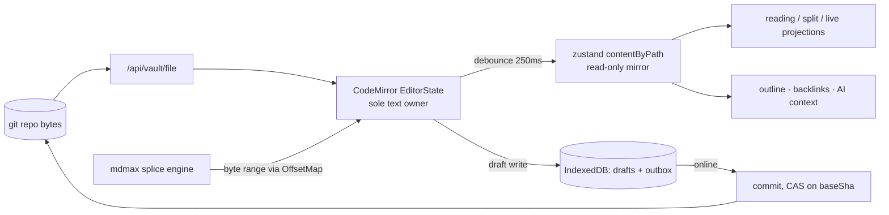

### 3.5 Routing and the URL contract

| Path | Owner | Notes |
|---|---|---|
| `/w/[workspace]` | `src/app/(workspace)/w/[workspace]/page.tsx` | Consolidates today's `(vault)` and `(workspace)` groups into one [measured: both dirs exist] |
| `/w/[workspace]/n/[...path]` | same segment, shallow-updated | Deep-linkable note; `[...path]` is the vault-relative path, URL-encoded per segment |
| `/p/[slug]` | `src/app/(public)/p/[slug]` (exists) | Publish-slug uniqueness lives in the control-plane Postgres |
| `/api/**` | 26 existing route handlers | Unchanged shape; `workspace_id` becomes a required, server-derived parameter |

Workspace lives in the path, never in a cookie. **Why:** a cookie-scoped tenant makes two open tabs on two workspaces impossible, and it makes every RLS bug invisible in logs. **Cost:** one extra path segment everywhere.

### 3.6 Code splitting and the bundle budget

Measured gzip of the on-disk published `dist` files (these are the *unminified* ESM bundles as npm ships them, so the real shipped cost after minification and tree-shaking is materially lower; the budgets below are set on built output, not on these):

| Package | raw B | gzip B | gzip KB | Tag |
|---|---|---|---|---|
| `mermaid` 11 | 3,312,967 | 904,194 | **883.0** | [measured] |
| 7× `@codemirror/*` in use | 978,890 | 235,875 | **230.3** | [measured, summed] |
| `react-dom` client production | 536,016 | 94,740 | 92.5 | [measured] |
| `katex` | 271,142 | 75,407 | 73.6 | [measured] |
| `minisearch` | 86,348 | 18,611 | 18.2 | [measured] |

Mermaid alone is 883 KB gzipped — 3.8× the entire CodeMirror editor. It is the single fact that shapes the splitting plan.

**The budget** (`budget.json`, gzipped bytes of built output):

| Key | Ceiling | Basis |
|---|---|---|
| `route:/w/[workspace]` first-load JS | **190 KB** | React 19 + Next 16 runtime + shell + zustand; measured `react-dom` dist gz is 92.5 KB unminified [measured], minified lands lower [inference] |
| `route:/p/[slug]` first-load JS | **45 KB** | RSC HTML + a theme toggle. Hard ceiling: no editor, no unified, no mermaid |
| `chunk:editor` | **220 KB** | 230.3 KB unminified-gz measured; minify+treeshake ≈ 140 KB [inference]; 220 leaves ~57% headroom |
| `chunk:markdown-pipeline` | **130 KB** | unified + remark-gfm/math/breaks + rehype-slug/raw/highlight |
| `chunk:katex` | **80 KB** | 73.6 measured |
| `chunk:minisearch` | **25 KB** | 18.2 measured |
| `chunk:graph` | **180 KB** | `react-force-graph-2d` |
| `chunk:mermaid` | **950 KB** | 883.0 measured. **Lazy-only. Never preloaded, never in any route's first-load set.** |
| `total:.next/static/chunks` | **2,400 KB** | Global drift guard |

Cold path to first keystroke = 190 + 220 + 130 = **540 KB gz** [derived]. Publishing a note pre-renders its mermaid diagrams to SVG into R2 at publish time, so `/p/[slug]` readers download **0 KB** of mermaid — which is why the free-egress R2 decision is load-bearing here too.

**Enforcement.** Replace the stub `budget` script with a zero-dependency script that reads Next's own manifests, so it survives a Turbopack/webpack switch:

```js
// scripts/bundle-budget.mjs   — run after `next build`
import { readFileSync } from "node:fs";
import { gzipSync } from "node:zlib";
const budget   = JSON.parse(readFileSync("budget.json", "utf8"));
const manifest = JSON.parse(readFileSync(".next/app-build-manifest.json", "utf8"));
const gz = (f) => gzipSync(readFileSync(`.next/${f}`), { level: 9 }).length;

let failed = 0;
for (const [route, files] of Object.entries(manifest.pages)) {
  const key = `route:${route}`;
  if (!(key in budget)) continue;
  const bytes = files.filter((f) => f.endsWith(".js")).reduce((n, f) => n + gz(f), 0);
  const kb = Math.round(bytes / 1024);
  const ceil = budget[key];
  console.log(`${kb <= ceil ? "PASS" : "FAIL"} ${key} ${kb}KB / ${ceil}KB`);
  if (kb > ceil) failed++;
}
process.exit(failed ? 1 : 0);
```

Plus a lint rule that makes the mermaid ceiling structural rather than aspirational:

```js
// eslint.config.mjs — appended to the existing boundaries block
{
  files: ["src/**/*.{ts,tsx}"],
  ignores: ["src/modules/preview/presentation/lazy/**"],
  rules: {
    "no-restricted-imports": ["error", { paths: [
      { name: "mermaid",              message: "Import only from preview/presentation/lazy/mermaid-lazy.ts" },
      { name: "katex",                message: "Import only from preview/presentation/lazy/katex-lazy.ts" },
      { name: "react-force-graph-2d", message: "Import only from graph/presentation/lazy/graph-lazy.ts" },
    ]}],
  },
}
```

**CI.** The repo has no CI at all. `.github/workflows/ci.yml` gets three jobs: `verify` (the existing `typecheck && lint && test && arch && spec`), `build`, and `budget` (needs: build). GitHub Free includes **2,000 Actions minutes/month for private repositories**, Team 3,000 [fetched 2026-08-30, `github/docs` → `githubs-plans.md`]. At ~3 minutes per PR run and 30 PRs/month that is 90 minutes, **4.5%** of the free allowance [derived: 3 × 30 = 90; 90 ÷ 2000 = 0.045]. Budget enforcement costs nothing.

### 3.7 Offline and the service worker

There is no prior service-worker research in the corpus, so this is stated as a design with its reasoning exposed rather than as a citation.

**Picked:** `@serwist/next` **9.5.12** [fetched 2026-08-30, registry.npmjs.org] to *generate the precache manifest*, with our own handwritten runtime-caching rules injected at `self.__SW_MANIFEST`. **Rejected:** continuing to hand-roll `public/sw.js` (its own header documents a production regression where v1 served stale hashed chunks), and `next-pwa` (unmaintained). **Cost:** the SW now couples to the build. **Changes our mind:** if Serwist lags a Next major by more than one minor release, we vendor its manifest injector — it is ~200 lines.

| Request class | Strategy | Rationale |
|---|---|---|
| HTML navigations | **NetworkFirst**, 3 s timeout → cached shell | A stale shell referencing dead chunk hashes is the exact failure already hit once |
| `/_next/static/**` | **CacheFirst**, immutable, versioned by build id | Content-hashed; safe forever |
| `/p/**` | **StaleWhileRevalidate**, 24 h | Public reader stays readable offline |
| `/api/vault/**` (document bytes) | **NEVER intercepted. Network only.** | A cached GET would hand the editor stale base bytes; a splice against the wrong base is silent corruption. This is the one non-negotiable SW rule |
| `/api/ai/**`, `/api/auth/**`, `/api/commit` | Never intercepted | Mutations and credentials |

Offline *writing* is not the service worker's job — it is IndexedDB's. `idb-keyval` ^6.2.4 already backs `src/modules/drafts/infrastructure/draft-store.ts` [measured]. Add a sibling `outbox-store.ts`: an append-only queue of `{ path, baseSha, splices[], createdAt }` replayed on `online`. Offline the app is fully writable and explicitly *not* committable; the UI says "3 changes waiting to sync", never "saved".

### 3.8 Optimistic UI for a splice-based writer

Optimism has to stop precisely where compare-and-swap begins.

| State | UI | Reversible? |
|---|---|---|
| `dirty` | dot on tab (exists), draft in IDB | yes — local only |
| `queued` | "waiting to sync", outbox count in status bar | yes |
| `committing` | subtle spinner, editor stays fully editable | yes |
| `committed` | dot clears, `baseShaByPath` updated | n/a |
| `diverged` (CAS 409) | banner: "This file changed on GitHub" + Review / Keep mine / Take theirs | user-driven three-way merge |
| `refused` | inline block banner with the engine's reason | never auto-resolved |

We are optimistic about **local application** and pessimistic about **remote acceptance**. `baseShaByPath` already exists in the store for exactly this and already carries a comment about avoiding the `""` create-sentinel that would 409 [measured]. A 409 never triggers an automatic merge: it opens the existing merge path (`/api/vault/merge`) with a diff the user approves. **Cost:** more modals than Google Docs. **Why it is right:** these are the user's own git commits, and a silent wrong merge is unrecoverable in a way a modal never is.

### 3.9 Component architecture: four modes, N render profiles

The four modes already exist in the store as data (`edit | live | reading | split`). Enforce that they stay data: **one** `EditorSurface` component composes panes, and a mode never gets its own component tree.

| Mode | Composition | Owns text? |
|---|---|---|
| `edit` | `<SourcePane>` | CodeMirror |
| `reading` | `<RenderedPane profile>` | nobody — pure projection of `contentByPath` |
| `split` | `<SourcePane> + <RenderedPane>` with existing `split-scroll-sync.ts` | CodeMirror |
| `live` | `<RenderedPane>` + `<InlineBlockEditor>` on the focused block (both exist under `presentation/live/`) | CodeMirror, scoped to one block's byte range |

Render profiles (GitHub, CommonMark, Obsidian, Pandoc) are **pipeline configurations, not component forks** — a frozen list of remark/rehype plugins plus a `DegradationCert` from `src/modules/mdmax/application/certify.ts`. `<RenderedPane>` takes `profile: RenderProfileId`, resolves the pipeline from a registry, and renders the certificate's warnings as a dismissible strip: "In GitHub's renderer, 2 constructs degrade." Adding a profile is a registry entry and a fixture file — never a new component.

### 3.10 Desktop shell: Tauri v2

Today `tauri.conf.json` points `frontendDist` at `https://md.sgnk.ai` — a remote-URL wrapper [measured]. Keep that as the default: one deploy, one codebase, no update channel to operate alone. `TauriBridge.tsx` already translates native menu events into the same DOM `CustomEvent`s the web app listens for, which is the correct sharing boundary — **the desktop app adds capabilities, never a fork of the UI.**

| Concern | Web | Tauri v2 (`@tauri-apps/api` ^2.11.0, latest 2.11.1 [fetched 2026-08-30]) |
|---|---|---|
| Vault storage | GitHub API via `/api/vault/**` | Same, plus optional local filesystem clone behind a capability |
| Menus / shortcuts | DOM events | Native menu → same DOM events (exists) |
| Offline | service worker + IDB | WebView cache + IDB; identical code |
| Updates | deploy | Remote URL means the shell needs updating only for Rust changes |

**Rejected:** bundling the frontend into the app (`frontendDist: "../out"`), which requires a signed update channel and a second release process. **Cost:** the desktop app is offline-degraded on first launch until the SW is warm. **Changes our mind:** the first paying customer on an air-gapped network flips this to a bundled build.

### 3.11 File and folder architecture

Extends `src/modules/*` and stays inside the existing four-layer `eslint-plugin-boundaries` contract.

```
src/
├─ app/
│  ├─ (public)/p/[slug]/               # RSC reader, tight CSP (exists)
│  ├─ (auth)/login/                    # exists
│  ├─ (workspace)/                     # absorbs today's (vault) group
│  │  └─ w/[workspace]/
│  │     ├─ layout.tsx                 # RSC: workspace + entitlements + tree manifest
│  │     ├─ page.tsx
│  │     ├─ n/[...path]/page.tsx       # deep-linkable note (shallow-updated)
│  │     ├─ settings/ · billing/
│  ├─ api/                             # 26 handlers (exists)
│  └─ manifest.ts                      # PWA manifest (exists)
├─ modules/
│  ├─ editor/presentation/
│  │  ├─ EditorSurface.tsx             # NEW — single composer for all 4 modes
│  │  ├─ remote-splice.ts              # NEW — §3.4 byte→char adapter + REFUSE
│  │  ├─ CodeMirrorEditor.tsx · EditorPane.tsx · live/ · active-view.ts   (exist)
│  ├─ preview/presentation/
│  │  ├─ profiles/registry.ts          # NEW — render-profile pipelines
│  │  ├─ RenderedPane.tsx              # NEW — profile-parameterised projection
│  │  └─ lazy/{mermaid,katex}-lazy.ts  # NEW — the ONLY legal import sites
│  ├─ sync/                            # NEW module
│  │  ├─ domain/{outbox-entry,cas-result}.ts
│  │  ├─ application/{enqueue,replay,resolve-divergence}.ts
│  │  ├─ infrastructure/outbox-store.ts        # idb-keyval
│  │  └─ presentation/{sync-store.ts,SyncStatusBar.tsx,DivergenceBanner.tsx}
│  ├─ workspace/                       # NEW — tenancy/entitlements client mirror
│  ├─ offline/presentation/{OfflineBoundary.tsx,useOnline.ts}   # NEW
│  ├─ platform/                        # NEW — web vs Tauri capability adapters
│  └─ …(ai, ai-tools, app-shell, auth, drafts, export, graph, mdmax, preview, repository, share, vault — unchanged)
├─ shared/ · container/ · config/      # exist
budget.json                            # NEW
scripts/bundle-budget.mjs              # NEW
.github/workflows/ci.yml               # NEW — verify · build · budget
sw/index.ts                            # NEW — Serwist source, compiled to public/sw.js
```

`src/modules/sync` and `src/modules/workspace` get boundary entries in `eslint.config.mjs` alongside the existing types so the `default: "disallow"` rule keeps applying — a new module that is not registered silently inherits *no* permissions, which is the correct default.

---

## 4. API design and contracts

### 4.1 Protocol choice: typed RPC over HTTP, not REST, not GraphQL

| Option | Verdict | Why | Cost of the choice | What flips it |
|---|---|---|---|---|
| **Typed RPC over HTTP+JSON** (verb-named POST endpoints under `/api/v1/*`, Zod-validated, OpenAPI-emitted) | **PICKED** | Our operations are not CRUD on rows. `commit`, `land`, `certify`, `unpublish` are *transactions with preconditions* — a base SHA, a splice journal, a CAS token. REST's `PUT /files/{path}` invites last-write-wins semantics, which is exactly the failure mode the engine exists to refuse. | You lose HTTP-native caching on writes (irrelevant — writes aren't cacheable) and "guessability" for casual explorers. Mitigated by OpenAPI + a docs page. | If a third party ever needs a generic CRUD surface for non-git-backed content. Then add a REST façade *over* the RPC core; never replace it. |
| REST-purist resource CRUD | Rejected | A markdown file is not a document *record*; it's bytes at a path in a git tree at a commit. `PUT` has no place to carry `base_sha`, `journal_id`, `expected_blob_oid` without becoming RPC-with-extra-steps. | — | — |
| GraphQL | Rejected | Single founder on call. GraphQL adds a query planner, depth/complexity limiting, persisted-query infrastructure, and N+1 surface area — for a product whose read shape is "give me this file" and "list this tree". Mutations would be RPC anyway. | Would cost ~1 week of infra and permanent operational surface for zero read-shape benefit. | If we ship a public data-explorer product where clients compose arbitrary reads. Not on the roadmap. |
| gRPC / Connect | Rejected | Browser + Tauri + MCP + curl all need to speak it. HTTP/JSON is the lowest-friction universal. | — | If we ever ship a high-throughput server-to-server sync daemon. |

**Reads are GET, writes are POST.** GETs are idempotent, cacheable, and take query params. Writes are POST-only, always take a JSON body, always require an idempotency key. No `PUT`, no `PATCH`, no `DELETE` — deletion is `POST /v1/files.delete` because it needs a base SHA too.

Stack: keep the routes in Next 16.2.6 App Router (`src/app/api/v1/**/route.ts`) — the repo already has 26 route files there [measured, `find . -name route.ts`]. Validation with `zod@4.5.4` (already a dependency at `^4.4.3`) [measured, npm registry, 2026-08-30]. Do **not** introduce Hono (`hono@4.13.5`) — a second HTTP framework inside a Next app is a swappability tax with no payoff at this scale.

### 4.2 Resource model: the file is the resource, the commit is the version

Every addressable thing is a triple: **`(workspace_id, repo_ref, path)`** at a **`sha`**.

| Concept | Wire identifier | Notes |
|---|---|---|
| Workspace | `ws_01J...` (ULID, prefixed) | Tenancy root. On every row, every token, every log line. |
| Repo binding | `rb_01J...` | Maps a workspace to `owner/name@branch` via a GitHub App installation. The installation is the **connector**; `rb_*` is the tenant-scoped handle. Never expose `installation_id` on the wire. |
| File | `path` string, POSIX, no leading slash, NFC-normalized, `..` refused | Not an opaque ID. Renames are git renames; a synthetic file ID would drift from the repo the moment a user renames outside the product. |
| Version | `sha` (40-hex commit) + `blob_oid` (40-hex) | `blob_oid` is the precise CAS token: it changes only when *these bytes* change, so a commit touching other files doesn't false-conflict. |
| Publish | `slug` (globally unique, control plane) | The one piece of state Postgres genuinely owns. |
| Attachment | `at_01J...` → R2 key `ws/{workspace_id}/at/{id}` | >1MB only. Under 1MB goes in the repo. |

Control plane holds `{workspace, repo_binding, slug, entitlement, job, audit}` and **zero document bytes**. Every API response that contains file content read it from git or R2 in that request.

### 4.3 The v1 endpoint list

Rate classes: **A** = 600/min/workspace (reads), **B** = 60/min/workspace (writes), **C** = 10/min/workspace (expensive: certify, export, land), **D** = 20/min/workspace (AI, additionally metered against entitlements). Enforced with `@upstash/ratelimit@2.0.8` + `@upstash/redis@1.38.3` [measured, npm, 2026-08-30], sliding window, key = `workspace_id` not IP (mobile NAT makes IP useless and India-based users share carrier NAT heavily).

Auth column: `S` = session cookie (next-auth v5), `T` = PAT/OAuth bearer (`fmk_live_…`), `M` = MCP token, `W` = webhook HMAC.

| Method | Path | Auth | Idem | Rate | Notes |
|---|---|---|---|---|---|
| GET | `/api/v1/workspaces` | S,T | — | A | |
| GET | `/api/v1/repos` | S,T | — | A | Bindings, not GitHub repos |
| POST | `/api/v1/repos.bind` | S | ✔ | B | Consumes App installation |
| POST | `/api/v1/repos.unbind` | S | ✔ | B | Revokes; keeps audit |
| GET | `/api/v1/tree` | S,T,M | — | A | `?ref=&prefix=&cursor=&limit=` |
| GET | `/api/v1/files` | S,T,M | — | A | `?path=&ref=` → bytes + `blob_oid` |
| GET | `/api/v1/files.history` | S,T,M | — | A | Cursor-paginated commits for one path |
| POST | `/api/v1/files.commit` | S,T,M | **required** | B | §4.7 |
| POST | `/api/v1/files.create` | S,T,M | required | B | Refuses if path exists |
| POST | `/api/v1/files.delete` | S,T,M | required | B | Needs `base_blob_oid` |
| POST | `/api/v1/files.rename` | S,T,M | required | B | git rename, both paths CAS-checked |
| POST | `/api/v1/splice.plan` | S,T,M | — | B | Dry run: returns ranges or `REFUSED` |
| POST | `/api/v1/land` | S,T | required | C | §4.8 |
| GET | `/api/v1/land.status` | S,T | — | A | Poll a `job_*` |
| POST | `/api/v1/certify` | S,T,M | required | C | Cross-engine degradation cert |
| GET | `/api/v1/certify.result` | S,T,M | — | A | |
| GET | `/api/v1/search` | S,T,M | — | A | Postgres FTS + trigram, server-side |
| POST | `/api/v1/publish` | S,T | required | B | §4.9 |
| POST | `/api/v1/unpublish` | S,T | required | B | §4.9, immediate revocation |
| GET | `/api/v1/publications` | S,T | — | A | |
| POST | `/api/v1/attachments.presign` | S,T | required | B | R2 PUT presign, 15-min TTL |
| POST | `/api/v1/ai.complete` | S,T | required | D | Streams; SSE |
| GET | `/api/v1/entitlements` | S,T | — | A | |
| POST | `/api/v1/tokens.create` | S | ✔ | B | Returns secret once |
| POST | `/api/v1/tokens.revoke` | S | ✔ | B | Effective in ≤5s (§4.9 pattern) |
| GET | `/api/v1/webhooks` / POST `.create` / `.rotate` / `.delete` | S | ✔ | B | |
| POST | `/api/v1/hooks/github` | W | — | — | Inbound from GitHub App |
| GET | `/api/v1/openapi.json` | public | — | A | |
| GET | `/api/v1/health` | public | — | A | |

**29 endpoints.** That is the whole v1. Anything not on this list does not exist in v1; adding one is a deliberate act with an OpenAPI diff.

### 4.4 Versioning and deprecation

- **URL-path major version** (`/api/v1/`). Rejected alternative: `Accept: application/vnd.frontmatter.v1+json` header negotiation — correct in theory, hostile to `curl` users and to every AI agent that will call this API. Cost: URL churn on a v2. We accept it; a v2 is years away and can run beside v1.
- **Additive changes ship without a version bump.** New optional request fields, new response fields, new enum members *in response position only*. Clients MUST ignore unknown fields — stated in the docs and enforced in our generated SDK.
- **Breaking** = removing/renaming a field, narrowing a type, adding a required request field, changing an error `type` URI, changing default behavior. Requires v2.
- **Deprecation policy: 180 days minimum.** On a deprecated endpoint or field we emit `Deprecation: @1767225600` (RFC 8594 unix-seconds form) and `Sunset: Wed, 31 Dec 2026 00:00:00 GMT`, plus `Link: <https://docs…>; rel="deprecation"`. A weekly cron reads the access log and emails workspaces still calling the endpoint at day 90, 30, 7.
- **`X-FM-Api-Version: 2026-08-30`** response header on every response, carrying the *deploy* date. Not a dated-version scheme like Stripe's — one founder cannot maintain N behavior branches. It's for debugging: "which build answered you".

### 4.5 Pagination and cursors

Opaque, forward-only, keyset cursors. Never `LIMIT/OFFSET` (skips rows under concurrent insert) and never page numbers.

```ts
// src/lib/api/cursor.ts
type Cursor = { k: string; v: string; d: 'asc'|'desc' }; // k = sort key name
const enc = (c: Cursor) => Buffer.from(JSON.stringify(c)).toString('base64url');
```

Response envelope for every list endpoint:

```json
{ "data": [ ... ],
  "page": { "next_cursor": "eyJrIjoicGF0aCIsInYiOiJkb2NzL2EubWQiLCJkIjoiYXNjIn0",
            "has_more": true, "limit": 100 } }
```

`limit` default 100, max 500. Tree listings sort by `path` ascending (stable, git-native). History sorts by `committed_at desc, sha` — `sha` is the tiebreaker because two commits can share a second. Cursors are **not signed** (they contain no secrets and the query is workspace-scoped by RLS anyway) but they **are** validated: a cursor whose `k` doesn't match the endpoint's sort key returns `422 invalid-cursor` rather than silently re-sorting.

### 4.6 Idempotency keys

Every POST carries `Idempotency-Key: <client-generated UUIDv7>`. Missing key on a write → `400`. This is the single most important header in the API: the founding scenario is a commit fired from a phone on Indian mobile data, the socket dies after the server committed, and the client retries. Without this the user gets a duplicated note and stops trusting the product.

```sql
-- control plane, migration 0012
create table idempotency_key (
  workspace_id   uuid not null,
  key            text not null,
  endpoint       text not null,
  request_hash   bytea not null,           -- sha256 of canonical body
  state          text not null check (state in ('in_flight','done')),
  status_code    int,
  response_body  jsonb,
  locked_at      timestamptz,
  created_at     timestamptz not null default now(),
  primary key (workspace_id, key)
);
create index on idempotency_key (created_at);  -- 24h reaper
alter table idempotency_key enable row level security;
create policy tenant on idempotency_key using (workspace_id = current_setting('app.workspace_id')::uuid);
```

Semantics: insert `in_flight` with `ON CONFLICT DO NOTHING`. If the insert lost, read the row. Same key + **different** `request_hash` → `409 idempotency-key-reuse`. Same key + same hash + `done` → replay the stored response verbatim with `Idempotency-Replayed: true`. Same key + `in_flight` and `locked_at` < 60s ago → `409 request-in-progress`, `Retry-After: 2`. Retention 24h (long enough for any real retry, short enough that the table stays small).

Note the layering: the idempotency key protects against *duplicate delivery of the same intent*; `base_blob_oid` protects against *stale intent*. Both are required. A retry of a commit whose first attempt succeeded is a replay (200, no new commit); a fresh commit against a moved file is a conflict (409). They are different failures and the client handles them differently.

### 4.7 `files.commit` — the exact shape

```http
POST /api/v1/files.commit
Authorization: Bearer fmk_live_…
Idempotency-Key: 018f3c2a-7b1e-7c3d-9a4f-2b6e11c9de01
Content-Type: application/json
```
```json
{
  "repo_binding_id": "rb_01JAV6M2Q7X8YB3F0K",
  "base_sha": "9e846842f0d1c3b7aa10e5c2f4d9a8b1c6e30fd2",
  "changes": [{
    "path": "notes/2026-08-30.md",
    "base_blob_oid": "1c9de0184f3c2a7b1e7c3d9a4f2b6e11c9de0184",
    "op": "splice",
    "splices": [
      { "start": 412, "end": 468,
        "expect_sha256": "b8c1…",            
        "replacement_b64": "IyMgU2hpcHBlZAo=" }
    ],
    "eol": "preserve", "bom": "preserve", "final_newline": "preserve"
  }],
  "message": "note: shipped the splice journal",
  "journal": [{ "seq": 41, "client_id": "cm_ios_9f2", "at": "2026-08-30T14:22:07.113Z" }],
  "author": { "name": "Sagnik Mitra", "email": "dev@perccent.com" }
}
```

`start`/`end` are **byte offsets into the base blob**, half-open, not character offsets and not line/column. `expect_sha256` is the hash of the *bytes currently in that range* — this is the engine's refusal hook. If the range no longer hashes to that value, the server does not guess and does not fuzzy-match; it refuses.

Success `200`:
```json
{ "sha": "3f7ac0…", "committed_at": "2026-08-30T14:22:08.902Z",
  "files": [{ "path": "notes/2026-08-30.md", "blob_oid": "77aa19…", "bytes": 4188 }],
  "journal_ack": { "through_seq": 41 },
  "degradation": { "certified": true, "profile": "gfm-strict", "warnings": [] } }
```

Conflict `409` — and this is the response shape the whole product hangs on. It never contains a merged guess:
```json
{ "type": "https://frontmatter.dev/errors/stale-base",
  "title": "The file changed since your base revision",
  "status": 409, "instance": "/api/v1/files.commit",
  "path": "notes/2026-08-30.md",
  "expected_blob_oid": "1c9de0…", "actual_blob_oid": "b41f77…",
  "actual_sha": "aa02c1…",
  "refusal": { "code": "SPLICE_ANCHOR_MOVED", "splice_index": 0,
               "found_sha256": "0e12…", "engine_will_not_guess": true },
  "resolution": { "strategy": "rebase_splices",
                  "three_way_url": "/api/v1/files?path=notes%2F2026-08-30.md&ref=aa02c1…" } }
```

Refusal codes are a closed enum: `SPLICE_ANCHOR_MOVED`, `RANGE_OUT_OF_BOUNDS`, `BASE_NOT_ANCESTOR`, `BINARY_CONTENT`, `EOL_AMBIGUOUS`, `ZERO_INDENT_SEQUENCE`, `BARE_CR_SET`, `UNSAFE_KEY`. Each maps 1:1 to a documented engine refusal so a client can render a specific instruction instead of "something went wrong".

### 4.8 `land()` — the async one

Landing = fast-forward or three-way merge the workspace branch into the target branch, run degradation certification on every changed file, then push. It can take 30s on a large vault. It is therefore **job-shaped**, and it is the only place a 202 appears.

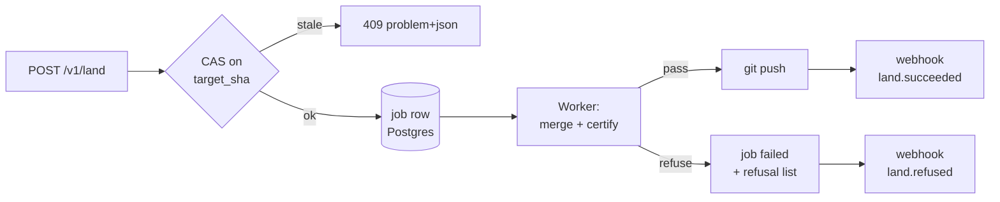

```http
POST /api/v1/land
Idempotency-Key: 018f3c2b-0000-7c3d-9a4f-2b6e11c9de02
```
```json
{ "repo_binding_id": "rb_01JAV6M2Q7X8YB3F0K",
  "source_ref": "frontmatter/ws-01JAV6/session-4482",
  "target_ref": "main",
  "expected_target_sha": "d50a6b2c8e1f…",
  "strategy": "three_way",
  "certify": { "profile": "gfm-strict", "on_degradation": "refuse" },
  "squash": true,
  "message": "frontmatter: 6 notes from 2026-08-30" }
```

`202 Accepted`, `Location: /api/v1/land.status?job_id=job_01JAV…`:
```json
{ "job_id": "job_01JAV7C3M9QK2", "state": "queued",
  "poll_after_ms": 800, "expires_at": "2026-08-30T15:22:08Z" }
```

Terminal `land.status` on refusal:
```json
{ "job_id": "job_01JAV7C3M9QK2", "state": "refused",
  "target_sha_at_start": "d50a6b2c…", "target_sha_now": "d50a6b2c…",
  "refusals": [
    { "path": "specs/api.md", "code": "ZERO_INDENT_SEQUENCE",
      "byte_range": [1204, 1261], "certifying_engines": ["remark","commonmark","markdown-it"],
      "disagreement": { "remark": "list", "commonmark": "paragraph" } }],
  "applied": [], "hint": "No bytes were written. Fix or set on_degradation=annotate." }
```

**`applied: []` is a contract, not a courtesy.** `land` is all-or-nothing: the push happens once, at the end, after every file certifies. Partial landing would leave a repo the user cannot reason about. The alternative (land what passes, report the rest) was rejected because it makes the git history a record of our failures rather than the user's work. It changes if enterprise users demand per-file landing on 500-file vaults — then it becomes an explicit `strategy: "per_file"` flag, never a default.

`expected_target_sha` mismatch → immediate synchronous `409`, no job created. Cheaper to fail before queuing.

### 4.9 `publish` / `unpublish` with immediate revocation

Publishing writes exactly one row in the control plane and one immutable render to R2. The slug is the only globally-unique namespace we own.

```json
POST /api/v1/publish
{ "repo_binding_id": "rb_01JAV6M2Q7X8YB3F0K",
  "path": "writing/splice-journal.md",
  "sha": "3f7ac0…",
  "slug": "splice-journal",
  "visibility": "public",
  "expires_at": null,
  "theme": "sgnk" }
```
```json
201 { "publication_id": "pub_01JAV7…", "url": "https://fm.sh/p/splice-journal",
      "revision": "rev_01JAV7…", "r2_key": "ws/…/pub/pub_01JAV7…/rev_01JAV7…/index.html",
      "etag": "W/\"rev_01JAV7\"", "cache": { "edge_ttl": 300, "swr": 0 } }
```
Slug collision → `409 slug-taken` with `suggestions: ["splice-journal-2"]`. Uniqueness is a Postgres `unique (slug) where revoked_at is null` partial index — the database is the arbiter, not application code.

**Unpublish must be immediate and provable.** Three things happen in one request, in this order:

```json
POST /api/v1/unpublish
{ "publication_id": "pub_01JAV7…", "reason": "author_request", "purge": true }
```

1. `update publication set revoked_at = now(), revoked_reason = $2 where id = $1` — inside the transaction. The edge worker checks a Redis key `pub:{id}` (TTL 60s, written on publish) and on miss falls through to Postgres, so worst case is 60s of stale serve. To make it **immediate**, unpublish `DEL`s that key *before* committing, and the worker treats a missing key as "must ask Postgres".
2. `DELETE` the R2 objects under the revision prefix when `purge: true`. R2 delete is strongly consistent for the object; Cloudflare cache is purged by tag (`cf-cache-tag: pub_01JAV7…`) via one API call.
3. Audit row with actor, IP, and the R2 keys removed.

Response is `200` only after all three succeed, and it reports what it proved:
```json
{ "publication_id": "pub_01JAV7…", "revoked_at": "2026-08-30T14:41:02.771Z",
  "revocation": { "control_plane": "committed", "edge_cache": "purged",
                  "r2_objects_deleted": 4, "verified_404_at": "2026-08-30T14:41:03.402Z" },
  "residual_risk": "Third-party caches and archives are outside our control." }
```
That last field is deliberate. A one-person company must not imply it can un-publish the internet. If purge fails, the endpoint returns `207`-style partial state in the same shape with `edge_cache: "failed"` and enqueues a retry job — never a bare `200`.

### 4.10 Errors: RFC 9457 problem details

`Content-Type: application/problem+json` on every non-2xx. Fields: `type` (absolute URI at `https://frontmatter.dev/errors/{slug}`, stable forever — changing one is breaking), `title`, `status`, `detail`, `instance`, plus typed extensions. Every response carries `X-Request-Id` (ULID) and problem bodies repeat it as `request_id` so a support email is one grep.

| HTTP | `type` slug | When |
|---|---|---|
| 400 | `malformed-request` | Zod parse failure; `errors[]` carries `{path, code, message}` |
| 401 | `unauthenticated` | |
| 403 | `forbidden` / `entitlement-required` | Latter carries `required_plan`, `upgrade_url` |
| 404 | `not-found` | Also for cross-tenant reads — never 403, never leak existence |
| 409 | `stale-base`, `slug-taken`, `idempotency-key-reuse`, `request-in-progress` | |
| 422 | `engine-refusal`, `invalid-cursor` | Refusal is 422, not 400: the request was well-formed, the *content* is unsafe to touch |
| 429 | `rate-limited` | `Retry-After`, `X-RateLimit-{Limit,Remaining,Reset}` |
| 502 | `upstream-git-failed` | GitHub 5xx passthrough, `upstream_status` |
| 503 | `provider-unavailable` | AI provider down; names which of the five |

### 4.11 Webhooks vs polling

**Both, with a rule:** poll for anything under 10 seconds, webhook for anything a human isn't waiting on.

| Signal | Mechanism | Why |
|---|---|---|
| `land` progress | Poll `land.status`, `poll_after_ms` in the body | The user is staring at a spinner. Server-driven backoff beats a client guess. |
| `land.succeeded/refused`, `publish.*`, `certify.completed`, `repo.drifted` | Outbound webhook | B2B integrations, CI, Slack. No human waiting. |
| AI completion | SSE stream on the same request | Already how AI SDK v6 works in this repo. |

Signing: **do not use Svix** (`svix@2.1.0`, [measured, npm 2026-08-30]) at this scale — it's a per-message-priced dependency for a feature that is 60 lines. Implement the Standard Webhooks spec ourselves: headers `webhook-id`, `webhook-timestamp`, `webhook-signature: v1,{base64(hmac_sha256(secret, id.timestamp.body))}`. Reject timestamps >5 minutes skewed. Two active secrets during rotation. Retries: 6 attempts at 10s, 1m, 5m, 30m, 2h, 12h; 20 consecutive failures disables the endpoint and emails the workspace owner. Delivery log in Postgres, 30-day retention. This flips to Svix if we ever need >100k deliveries/day or SOC2 evidence of delivery — neither is true at 10,000 users.

### 4.12 Public API and MCP: one surface, two adapters

**One surface.** The MCP server is a thin adapter that imports the same handler functions the HTTP routes import — not a parallel implementation, and not an HTTP client of our own API.

```
src/server/ops/            <- the only place logic lives
  filesCommit.ts   export async function filesCommit(ctx: OpCtx, input: CommitInput): Promise<CommitResult>
  land.ts  publish.ts  certify.ts  search.ts …
src/app/api/v1/files.commit/route.ts   <- HTTP adapter: authn -> ctx -> filesCommit -> problem+json
src/mcp/server.ts                      <- MCP adapter: @modelcontextprotocol/sdk@1.30.0
```

Why not two surfaces: divergence is guaranteed and a one-person team cannot maintain two definitions of "what a stale base means". Why not have MCP call our own HTTP API: doubles latency, needs a self-issued token, and turns a type error into a 500.

The MCP adapter differs from HTTP in exactly three documented ways: (1) it exposes a **subset** — no `tokens.*`, no `webhooks.*`, no `repos.unbind`; (2) tool descriptions are prose written for a model, generated from the same Zod schema's `.describe()` calls; (3) every write tool is annotated `destructiveHint: true` and returns the refusal text as *content*, not as an error, so the model can read and act on it. `land` and `unpublish` are **not** MCP tools in v1 — a model should not be able to push to `main` or take a page down without a human in the loop. That is a product decision, revisited only behind an explicit workspace setting.

### 4.13 OpenAPI generation

Schema-first from Zod, never hand-written YAML and never generated-from-runtime.

- `zod@4.5.4` + **`@asteasolutions/zod-to-openapi@9.1.0`** [measured, npm 2026-08-30] to build `openapi.json` at `src/server/openapi/registry.ts`.
- Emitted at build time to `public/openapi.json` and served at `/api/v1/openapi.json`.
- **`openapi-typescript@7.13.0`** [measured, npm 2026-08-30] generates `src/lib/api/types.gen.ts` for the web client, the Tauri client, and the published SDK — one type source for all three.
- CI gate (this repo has **no CI at all** today [measured, stated architecture]; this is the first job to add): regenerate the spec, `git diff --exit-code public/openapi.json`. A drifting spec fails the build. Second gate: `oasdiff breaking` against the spec on `main` — a breaking diff fails unless the commit message contains `api!:`.
- Rejected: `@hono/zod-openapi@1.6.1` (would require adopting Hono); tRPC (no cross-language clients, and our consumers include curl, Python CI scripts, and models).

Docs are Scalar's standalone bundle rendered at `/docs/api`, reading `openapi.json`. Zero build step, self-hosted, no vendor account.

---

## 5. Data layer — schema, migrations, and the control plane

### 5.1 The boundary rule, stated as an enforceable constraint

The control plane holds **zero document bytes**. This is not a style preference — it is what makes the "file is the only source of truth" claim survivable. If a single markdown body ever lands in Postgres, we now have two sources of truth, a merge problem, a GDPR export problem, and a restore that silently resurrects stale content.

| Data class | Lives in | Never in | Rebuild source |
|---|---|---|---|
| Document bytes, frontmatter, splice journal entries | User git repo | Postgres, R2 | — (it *is* the source) |
| Attachments > 1 MB, derived artifacts (PDF/HTML exports, cert sidecars) | R2 `frontmatter-artifacts` | Postgres | Git + engine, deterministically |
| Identity, tenancy, entitlements, billing mirror, slugs, audit, jobs, AI meter | Postgres `control` DB | R2 | Backups only — this is real state |
| Search tokens, headings, bounded snippets | Postgres `derived` DB (separate database) | `control` DB | Git re-index |
| Render cache (HTML fragments, cert JSON) | R2 + Cache-Control | Postgres | Git re-render |

Two logical databases on one Neon project. `control` is backed up, restored, and treated as irreplaceable. `derived` is `DROP DATABASE`-able at any time and carries a `NOT_BACKED_UP` comment on the database itself. That split is what lets server-side full-text search hold derived text without violating the boundary rule: derived text is a projection, and a projection that cannot be rebuilt from the file is a bug, not a feature.

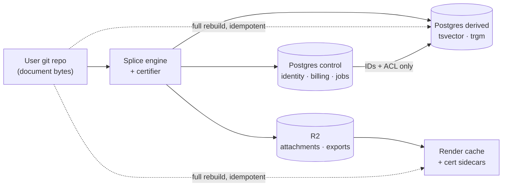

**Enforcement** (`db/checks/boundary.sql`, run in CI): fail the build if any column in `control` is `bytea`, or is `text` with no length `CHECK`, outside a hand-maintained allowlist.

```sql
select c.table_name, c.column_name, c.data_type
from information_schema.columns c
where c.table_schema = 'app'
  and (c.data_type = 'bytea'
       or (c.data_type = 'text'
           and not exists (select 1 from app.text_column_allowlist a
                           where a.tbl = c.table_name and a.col = c.column_name)))
;  -- non-empty result => exit 1
```

[inference] A type-level check is weak but cheap and it catches the realistic failure: an agent adding `content text` to a table during a feature build at 2am.

### 5.2 Provider — Neon, and what we rejected

All prices read **2026-08-30**.

| | Neon | Supabase | RDS Postgres (self-run) |
|---|---|---|---|
| Free tier | $0, 0.5 GB storage/project, 100 CU-hours/project, 5 GB egress, scale-to-zero after 5 min [fetched] | $0, 500 MB DB, 5 GB egress, **project paused after 1 week idle**, 2 active projects [fetched] | none |
| Paid entry | Launch: pay-as-you-go, no minimum — $0.106/CU-hour, $0.35/GB-month, 500 GB egress/project included then $0.10/GB [fetched] | Pro: from **$25/mo** flat + $10 compute credit (Micro = 1 GB RAM, 2-core ARM) [fetched] | db.t4g.micro Single-AZ **$0.016/hr** us-east-1, **$0.021/hr** ap-south-1 [fetched, AWS pricing API] |
| Monthly at idle | ~$0 (scale-to-zero) | $25 floor | [derived] 0.016 × 730 = **$11.68**/mo us-east-1; 0.021 × 730 = **$15.33**/mo Mumbai — *before* storage, backups, and the pooler you must run yourself |
| Pooler | PgBouncer, managed, `-pooler` host, 10,000 client conns [fetched] | Supavisor, managed | You install and page yourself |
| PITR | Instant restore $0.20/GB-month, 7-day history on Launch [fetched] | Daily backups, 7-day retention on Pro [fetched] | Automated backups, you configure |
| Next tier | Scale: $0.222/CU-hour | Team: **from $599/mo** [fetched] | linear in instance size |

**We pick Neon Launch.** Reasons, in order: (1) scale-to-zero means 100 users costs single-digit dollars and a dormant staging branch costs nothing, which is exactly the "near-zero at 100 users" constraint; (2) database branching gives every migration a real preview environment for $1.50/branch-month [fetched]; (3) it is plain Postgres 17/18 with `pg_trgm` and `pgvector`, so `pg_dump` → any other provider is a Sunday, not a quarter.

**Supabase rejected** on two specifics, not on quality: the $25→$599 cliff is brutal for a solo founder whose first B2B customer asks for SSO, and the free-tier pause-after-7-days breaks the "clone the repo and it works" onboarding demo. We already have next-auth v5 [measured, `package.json`], so Supabase Auth is not a pull.

**RDS rejected** because $11.68/mo buys an instance that is idle 95% of the time, has no pooler, no branching, and hands one person the pager for minor-version upgrades. The arithmetic says RDS is *cheaper than Supabase Pro* and *more expensive than Neon at our load*, while costing the most operator-hours. Operator-hours are the scarce resource here.

**What changes our mind:** sustained compute above ~4 CU average (at $0.106/CU-hour, [derived] 4 × 730 × 0.106 = **$309.52**/mo, which buys a lot of RDS), or a customer contract requiring data residency Neon does not offer in-region. Both are good problems.

**Postgres version: 18** (latest minor 18.6 as of 2026-08-30 [fetched, postgresql.org/versions.json]; 17.11 and 16.15 also supported). Pin the major in `db/README.md`; Neon applies minor releases at the next compute restart and does not support skipping majors [fetched].

### 5.3 Connection pooling — the actual trap

This is the part that silently breaks in production, so it gets its own rules.

Neon's pooler is **PgBouncer in transaction mode**, reached by appending `-pooler` to the host. Pools are sized at 90% of `max_connections`, which is a function of compute size: 0.25 CU / 1 GB RAM → 104, of which 7 are reserved for the superuser, leaving **97** [fetched]. 1 CU / 4 GB → 419. A Vercel function fleet opening one connection per invocation exhausts 97 in a mild traffic spike, and the failure looks like random 500s, not like a connection problem.

**Transaction mode forbids session-level `SET`, temporary tables, and SQL-level `PREPARE`/`DEALLOCATE`; protocol-level prepared statements are supported** [fetched]. That directly threatens the RLS design, because the obvious way to do pooled RLS is `SET app.workspace_id = ...` — which in transaction mode leaks the value to whichever tenant gets that server connection next. That is a cross-tenant data leak, and it is the single highest-severity thing in this section.

**The rule:** the tenant claim is set with `set_config(key, value, true)` — `is_local = true` — **inside the same explicit transaction** as every statement that reads tenant data. A local setting is transaction-scoped, and PgBouncer pins a server connection for the duration of a transaction, so the value cannot outlive it. Never `SET`. Never `set_config(..., false)`.

```ts
// db/tx.ts — the ONLY way app code touches the control plane
import postgres from 'postgres';                    // postgres@3.4.9 [measured 2026-08-30]
const sql = postgres(process.env.DATABASE_URL_POOLED!, {
  max: 4, idle_timeout: 20, connect_timeout: 10, prepare: false,
});
export async function withWorkspace<T>(
  workspaceId: string, userId: string, fn: (tx: postgres.TransactionSql) => Promise<T>,
): Promise<T> {
  return sql.begin(async (tx) => {
    await tx`select set_config('app.workspace_id', ${workspaceId}, true),
                    set_config('app.user_id',      ${userId},      true)`;
    return fn(tx);
  });
}
```

**Acceptance test the implementer must write before shipping** (`db/__tests__/pool-leak.test.ts`): open 2 connections against the *pooled* host with `max: 1`, run `withWorkspace(A)` then a bare `sql\`select current_setting('app.workspace_id', true)\`` outside any transaction, assert it returns `null`. [inference] I have not executed this against a live Neon pooler; treat the `set_config(local)` claim as reasoned from PgBouncer's transaction-pinning semantics and *verify it with this test*, not by trusting this document.

| Connection string | Env var | Used by | Why |
|---|---|---|---|
| Pooled (`...-pooler.<region>.aws.neon.tech`) | `DATABASE_URL_POOLED` | All app request paths | Survives serverless fan-out |
| Direct | `DATABASE_URL_DIRECT` | `drizzle-kit migrate`, `pg_dump`, logical replication, one-off psql | Migrations need session state and advisory locks; the pooler breaks both [fetched] |

**Driver: `postgres` (postgres.js) 3.4.9** with `prepare: false` (required under transaction pooling). Rejected `@neondatabase/serverless` 1.1.0 as the primary driver — its HTTP mode is a single round-trip per query, which cannot express "set_config then N queries in one transaction", which is exactly our RLS contract. It stays available for edge-runtime, non-tenant, read-only endpoints (health, public slug resolution). Rejected `pg` 8.23.0 on ergonomics only; it is a fine fallback. [measured 2026-08-30] the repo currently has **no** database driver in `package.json` at all — this is greenfield.

### 5.4 Schema

`db/migrations/0001_control_plane.sql`. Everything in schema `app`. Every tenant-scoped table carries `workspace_id`, and it is the **first** column of the primary key or of the leading index.

```sql
create extension if not exists pgcrypto;
create extension if not exists pg_trgm;
create schema app;

create table app.workspaces (
  id            uuid primary key default gen_random_uuid(),
  slug          text not null unique check (slug ~ '^[a-z0-9][a-z0-9-]{1,38}[a-z0-9]$'),
  name          text not null check (length(name) between 1 and 120),
  plan          text not null default 'free' check (plan in ('free','pro','team')),
  created_at    timestamptz not null default now(),
  deleted_at    timestamptz
);

create table app.users (
  id            uuid primary key default gen_random_uuid(),
  email         text not null unique check (length(email) <= 320),
  email_lower   text generated always as (lower(email)) stored,
  name          text check (length(name) <= 120),
  image_url     text check (length(image_url) <= 2048),
  created_at    timestamptz not null default now()
);

create table app.memberships (
  workspace_id  uuid not null references app.workspaces(id) on delete cascade,
  user_id       uuid not null references app.users(id) on delete cascade,
  role          text not null check (role in ('owner','admin','editor','viewer')),
  created_at    timestamptz not null default now(),
  primary key (workspace_id, user_id)
);
create index memberships_user_idx on app.memberships (user_id, workspace_id);

-- The GitHub App installation is a CONNECTOR, never the tenant identity.
-- One workspace may hold many; one installation may serve exactly one workspace.
create table app.vault_connections (
  id                uuid primary key default gen_random_uuid(),
  workspace_id      uuid not null references app.workspaces(id) on delete cascade,
  provider          text not null check (provider in ('github','gitlab','local')),
  installation_id   text check (length(installation_id) <= 64),
  repo_full_name    text not null check (length(repo_full_name) <= 200),
  default_branch    text not null default 'main' check (length(default_branch) <= 200),
  vault_root        text not null default '' check (length(vault_root) <= 400),
  status            text not null default 'active'
                      check (status in ('active','revoked','error')),
  last_sync_at      timestamptz,
  last_error        text check (length(last_error) <= 2000),
  created_at        timestamptz not null default now(),
  unique (provider, installation_id, repo_full_name)
);
create index vault_conn_ws_idx on app.vault_connections (workspace_id, status, created_at desc);

-- Globally unique across all tenants. The one asymmetric-RLS table.
create table app.publish_slugs (
  slug          text primary key check (slug ~ '^[a-z0-9][a-z0-9-]{0,62}$'),
  workspace_id  uuid not null references app.workspaces(id) on delete cascade,
  doc_path      text not null check (length(doc_path) <= 1024),
  content_sha   text not null check (content_sha ~ '^[0-9a-f]{40,64}$'),
  visibility    text not null default 'public'
                  check (visibility in ('public','unlisted','revoked')),
  published_at  timestamptz not null default now(),
  revoked_at    timestamptz
);
create index publish_ws_idx on app.publish_slugs (workspace_id, published_at desc);
create unique index publish_ws_path_idx on app.publish_slugs (workspace_id, doc_path);

-- What the app reads. Never queried from Stripe at request time.
create table app.entitlements (
  workspace_id  uuid primary key references app.workspaces(id) on delete cascade,
  seats         int  not null default 1 check (seats between 0 and 10000),
  ai_tokens_mo  bigint not null default 200000 check (ai_tokens_mo >= 0),
  private_publish boolean not null default false,
  sso           boolean not null default false,
  source        text not null default 'default'
                  check (source in ('default','stripe','manual','trial')),
  valid_until   timestamptz,
  updated_at    timestamptz not null default now()
);

-- A cache of Stripe. Authoritative nowhere. Stripe outage must not gate the product.
create table app.billing_subscriptions (
  workspace_id        uuid primary key references app.workspaces(id) on delete cascade,
  stripe_customer_id  text not null check (length(stripe_customer_id) <= 64),
  stripe_sub_id       text unique check (length(stripe_sub_id) <= 64),
  status              text not null check (status in
    ('trialing','active','past_due','canceled','incomplete','unpaid','paused')),
  price_id            text check (length(price_id) <= 64),
  quantity            int check (quantity between 0 and 10000),
  current_period_end  timestamptz,
  synced_at           timestamptz not null default now(),
  raw_event_id        text check (length(raw_event_id) <= 64)
);

create table app.api_keys (
  id            uuid primary key default gen_random_uuid(),
  workspace_id  uuid not null references app.workspaces(id) on delete cascade,
  name          text not null check (length(name) <= 80),
  prefix        text not null check (prefix ~ '^fm_[a-z]{4}_[A-Za-z0-9]{8}$'),
  hash          text not null check (length(hash) between 40 and 200), -- argon2id, never the key
  scopes        text[] not null default '{}',
  last_used_at  timestamptz,
  expires_at    timestamptz,
  revoked_at    timestamptz,
  created_by    uuid references app.users(id),
  created_at    timestamptz not null default now()
);
create unique index api_keys_prefix_idx on app.api_keys (prefix);
create index api_keys_ws_idx on app.api_keys (workspace_id, revoked_at, created_at desc);

create table app.jobs (
  id            bigserial primary key,
  workspace_id  uuid not null references app.workspaces(id) on delete cascade,
  kind          text not null check (length(kind) <= 60),
  payload       jsonb not null default '{}'::jsonb,  -- IDs and paths only, never bytes
  state         text not null default 'queued'
                  check (state in ('queued','running','done','failed','dead')),
  attempts      int not null default 0 check (attempts <= 20),
  run_after     timestamptz not null default now(),
  locked_by     text check (length(locked_by) <= 80),
  locked_at     timestamptz,
  last_error    text check (length(last_error) <= 2000),
  created_at    timestamptz not null default now(),
  constraint jobs_payload_small check (pg_column_size(payload) < 8192)
);
create index jobs_claim_idx on app.jobs (state, run_after, id) where state = 'queued';
create index jobs_ws_idx on app.jobs (workspace_id, created_at desc);

create table app.audit_log (
  id            bigserial primary key,
  workspace_id  uuid not null references app.workspaces(id) on delete cascade,
  actor_user_id uuid references app.users(id),
  actor_key_id  uuid references app.api_keys(id),
  action        text not null check (length(action) <= 80),
  target        text check (length(target) <= 1024),
  meta          jsonb not null default '{}'::jsonb,
  ip            inet,
  created_at    timestamptz not null default now(),
  constraint audit_meta_small check (pg_column_size(meta) < 4096)
);
create index audit_ws_time_idx on app.audit_log (workspace_id, created_at desc);

create table app.ai_usage (
  id              bigserial primary key,
  workspace_id    uuid not null references app.workspaces(id) on delete cascade,
  user_id         uuid references app.users(id),
  provider        text not null check (length(provider) <= 40),
  model           text not null check (length(model) <= 120),
  input_tokens    bigint not null default 0 check (input_tokens  >= 0),
  output_tokens   bigint not null default 0 check (output_tokens >= 0),
  cached_tokens   bigint not null default 0 check (cached_tokens >= 0),
  cost_micros     bigint not null default 0 check (cost_micros >= 0),
  source_field    text not null,   -- WHICH provider key carried the count (LR#59)
  request_id      text check (length(request_id) <= 120),
  created_at      timestamptz not null default now()
);
create index ai_usage_ws_time_idx on app.ai_usage (workspace_id, created_at desc);
```

`ai_usage.source_field` is not decoration. AI SDK v6's five providers do not agree on usage key names; recording which key produced the number is the difference between a billing meter and a plausible-looking guess.

### 5.5 RLS — pooled, forced, and non-owner

```sql
create or replace function app.current_workspace() returns uuid
language sql stable as $$ select nullif(current_setting('app.workspace_id', true),'')::uuid $$;

create role app_user nologin;   -- the role the app connects as
create role migrator nologin;   -- owns nothing at runtime; used only by drizzle-kit

do $$ declare t text; begin
  foreach t in array array['workspaces','memberships','vault_connections','publish_slugs',
                           'entitlements','billing_subscriptions','api_keys','jobs',
                           'audit_log','ai_usage'] loop
    execute format('alter table app.%I enable row level security', t);
    execute format('alter table app.%I force row level security', t);   -- owner is NOT exempt
  end loop;
end $$;

create policy tenant_rw on app.vault_connections
  using (workspace_id = app.current_workspace())
  with check (workspace_id = app.current_workspace());
-- ... repeated per table; workspaces uses id = app.current_workspace()

-- Asymmetric: anyone may READ a live public slug; only the owner may write it.
create policy slug_public_read on app.publish_slugs for select
  using (visibility in ('public','unlisted') and revoked_at is null);
create policy slug_owner_write on app.publish_slugs for all
  using (workspace_id = app.current_workspace())
  with check (workspace_id = app.current_workspace());

grant usage on schema app to app_user;
grant select, insert, update, delete on all tables in schema app to app_user;
revoke update, delete on app.audit_log from app_user;      -- append-only, enforced by grant
```

Three traps closed here: `FORCE ROW LEVEL SECURITY` (a table owner bypasses plain RLS, and the migration role is the owner); a non-owner `app_user` with no `BYPASSRLS`; and `current_setting(..., true)` with the missing-ok flag so an unset claim yields `NULL` — which matches no row — rather than throwing and getting caught by a generous error handler.

### 5.6 Index strategy

Leading `workspace_id` on every tenant index, because every query is already filtered by it via RLS and Postgres will otherwise choose a scan and then filter.

| Table | Index | Serves |
|---|---|---|
| `memberships` | `(workspace_id, user_id)` PK + `(user_id, workspace_id)` | Both directions: "who is in this workspace", "which workspaces am I in" |
| `vault_connections` | `(workspace_id, status, created_at desc)` | Connector list, hot path on every editor load |
| `publish_slugs` | PK `(slug)`; `(workspace_id, doc_path)` unique | Global uniqueness; per-doc republish idempotence |
| `jobs` | partial `(state, run_after, id) where state='queued'` | Claim query stays small as `done` rows accumulate |
| `audit_log` | `(workspace_id, created_at desc)` | Only access pattern; BRIN if it exceeds 50M rows |
| `ai_usage` | `(workspace_id, created_at desc)` | Meter rollups |
| `api_keys` | unique `(prefix)` | Auth lookup by prefix, then argon2 verify |

Rule: no index gets added without an `EXPLAIN (ANALYZE, BUFFERS)` in the migration's PR body. [inference] At 10,000 workspaces the whole control plane is well under 5 GB and most of this is cold-cache theatre; the discipline is for the day it isn't.

### 5.7 Migrations — Drizzle Kit, SQL-first

**Pick: `drizzle-orm` 0.45.2 + `drizzle-kit` 0.31.10** [measured 2026-08-30 via registry.npmjs.org].

| Option | Verdict | Why |
|---|---|---|
| Drizzle Kit | **chosen** | Generates plain `.sql` files into `db/migrations/` with a journal; you can hand-edit them, so RLS policies, partial indexes, and `CHECK` constraints live in the same file as the table. Zero runtime engine. TS types for the query layer. |
| Prisma | rejected | `prisma@8.0.0-rc.12` is a release candidate as of 2026-08-30 [measured]. Its migrate flow does not round-trip RLS policies or roles, so policies would drift into a separate untracked layer — the exact failure this schema is built to avoid. |
| Hand-rolled SQL runner | rejected | ~200 lines to write and then own, for a journal file Drizzle already gives us. |

**Hard rules** (`db/CONVENTIONS.md`):

1. Tables are declared in `db/schema.ts`. **RLS policies, functions, grants, partial indexes, and opclass indexes are hand-written SQL appended to the generated file.** Never re-generate over them; `drizzle-kit generate` produces a new file, always.
2. Migrations run against `DATABASE_URL_DIRECT`. Never the pooler.
3. Expand-contract only. A deploy may add a nullable column and backfill; a *later* deploy makes it `NOT NULL`; a *later still* deploy drops the old one. No migration both writes and destroys.
4. Every migration adding a table must, in the same file, `enable`+`force` RLS and create at least one policy. CI check: `select relname from pg_class c join pg_namespace n on n.oid=c.relnamespace where n.nspname='app' and c.relkind='r' and not c.relrowsecurity` must return zero rows.
5. Preview per PR on a Neon branch ($1.50/branch-month prorated hourly [fetched 2026-08-30]), destroyed on merge.

### 5.8 Read replicas — not yet, and the trigger

No replica at launch. A replica adds a second failure surface, replication lag that will show up as "I just saved and it's gone", and cost, in exchange for capacity we do not need.

**Escalation order, in this sequence:** (1) move the `derived` database onto its own Neon compute so search scans stop competing with auth lookups; (2) add a read replica for analytics and admin dashboards only — never for a read that a write in the same request depends on; (3) raise compute size.

**Trigger to start step 1:** primary CPU above 60% for a sustained hour, or p95 control-plane query time above 50 ms for a day. **Trigger for step 2:** any read query class exceeding 100 ms p95 that provably tolerates 1–2 s staleness. Neon includes read replicas on all plans [fetched 2026-08-30], so this is a config change, not a migration.

### 5.9 Derived stores — where each lives, and the rebuild command

Every derived store must have a **single idempotent command that rebuilds it from git with the service running**. If it does not, it is not derived; it is undeclared state.

| Store | Lives in | Holds | Rebuild | RPO | Cost note |
|---|---|---|---|---|---|
| **Search index** | Postgres `derived` DB, table `search.doc` — `(workspace_id, doc_path)` PK, `tsv tsvector`, `heading_text text`, `snippet text check (length(snippet) <= 512)` | Derived tokens + bounded snippets, never full bodies | `pnpm db:reindex --workspace <id>` — walks the git tree at HEAD, parses with the existing unified/remark pipeline, upserts. Full rebuild = `truncate search.doc` first. | Unbounded; drop it any time | GIN on `tsv`, GIN `gin_trgm_ops` on `heading_text`. Client-side MiniSearch 7.2.0 [measured] stays scoped to the open vault only — no whole-vault snapshot ships. |
| **Render cache** | R2 `frontmatter-artifacts/render/{workspace}/{content_sha}.html` | HTML fragments keyed by content hash | Nothing to rebuild — a miss re-renders on demand. `pnpm cache:warm` pre-renders published slugs only. | Zero, by construction | R2 storage $0.015/GB-month, Class A $4.50/M, Class B $0.36/M, **egress $0**; free tier 10 GB-month + 1M Class A + 10M Class B [fetched 2026-08-30]. At 100 users this is $0. |
| **Certificate sidecars** | R2 `…/cert/{workspace}/{content_sha}.json`, pointer row in `derived` | Degradation certificates per (document, target engine) | `pnpm cert:rebuild --sha <sha>` — deterministic from bytes; a rebuilt cert that differs from the stored one is a certifier regression and must fail CI. | Zero | Content-addressed, so re-running is free and self-verifying |
| **Attachments > 1 MB** | R2 `…/blob/{workspace}/{sha256}` | User bytes | **Not derived.** Lifecycle-protected, versioned, and the only R2 prefix that is backed up. | — | Listed here so nobody mistakes it for cache |

Content-addressing every derived key by `content_sha` is what makes invalidation a non-problem: a changed file produces a new key, and the old one ages out via an R2 lifecycle rule at 30 days. No cache-busting logic, no stale-read window, no invalidation queue.

**The standing drill, quarterly:** `truncate search.doc` on production, run `db:reindex` for the largest workspace, and record wall-clock. If a full re-index of the biggest tenant exceeds 15 minutes, the rebuild path has quietly stopped being a recovery option and needs work before it is needed in anger.

---

## 6. Authentication, authorisation and permissions

### 6.1 Current state, measured

| What | Where | Verdict |
|---|---|---|
| next-auth `^5.0.0-beta.31`, JWT sessions | `src/modules/auth/infrastructure/auth-options.ts`, `src/auth.ts` | **Keep**, upgrade to `5.0.0-beta.32` [fetched npm dist-tags 2026-08-30] |
| GitHub OAuth provider, `scope: "read:user"` | same file | **Keep the identity half**, move it onto the GitHub App |
| Credentials provider `sgnk-password` (scrypt hash in `SGNK_AUTH_HASH`) | same file + `src/modules/auth/infrastructure/password.ts` | **Delete before first external user** |
| Firebase `^12.16.0` Google popup auth | `src/modules/auth/infrastructure/firebase-auth-gateway.ts`, `src/shared/infrastructure/firebase/client.ts`, `src/modules/auth/application/ports.ts`, `src/modules/auth/domain/auth-user.ts`, `src/container/client-container.ts`, `test/auth/firebase-auth-gateway.test.ts`, `firebase.json`, `src/config/env.ts:183–215` | **Delete entirely** |
| Single global PAT `GITHUB_REPO_TOKEN` | `src/shared/infrastructure/github/client.ts:30`, `src/modules/repository/infrastructure/github-writer.ts:33` | **Delete**, replaced by per-installation tokens |
| Hardcoded allowlist `ALLOWED_GH_LOGIN` default `"sagnikmitra"` | `src/config/env.ts` | **Delete**, replaced by workspace membership |
| Route middleware | none exists | **Add** `src/middleware.ts` |

[measured 2026-08-30, by reading the repo] There are three live identity paths, not two: Firebase Google, GitHub OAuth, and a fixed-username password. Three issuers means three session-fixation surfaces, three revocation paths, and three different notions of "who the principal is" — the Firebase `uid` is not the next-auth `sub`, so any code that accepts either is accepting their union. For one operator that is three times the on-call surface for zero product value. The password provider is worse than the other two: a static credential with no second factor, sitting in front of a multi-tenant control plane. Replace it with a flag-gated magic-link break-glass (`BREAK_GLASS_EMAIL`, default off).

Deletion is a single PR and it must land before any multi-tenant table exists, because every one of these paths would otherwise need a `workspace_id` story.

### 6.2 The stack

| Concern | Pick | Version [fetched 2026-08-30] | Rejected | Why |
|---|---|---|---|---|
| Session + identity | next-auth v5 (Auth.js) | `5.0.0-beta.32` | Clerk, WorkOS, Better Auth | Already integrated and tested; Clerk/WorkOS add a per-MAU bill that is not near-zero at 100 users; Better Auth is a rewrite for no gain |
| Repo access | GitHub App, installation tokens | `@octokit/auth-app` `8.3.0`, `@octokit/rest` `22.0.1` | OAuth App `repo` scope | §6.3 |
| JWT verify (API keys, Tauri) | `jose` | `6.2.10` | `jsonwebtoken` | Web Crypto native, works on Edge runtime |
| Secret custody | AES-256-GCM envelope, KEK in platform secret store | Node `crypto` | AWS KMS from day one | §6.7 |
| Tenant isolation | Postgres RLS, pooled, `set_config(..., local)` | — | app-layer `where workspace_id = ?` | §6.9 |

**What would change our mind on next-auth:** the v5 beta staying beta past Q1 2027, or a second SSO protocol (SAML) landing as a B2B requirement — WorkOS is the escape hatch and it is a provider swap, not a rewrite, because everything downstream reads our own `session.user.id`, never a provider identifier.

### 6.3 The GitHub App, and why not the OAuth `repo` scope

One App does both jobs: user-to-server OAuth for *login*, installation tokens for *repo bytes*. The OAuth App disappears.

**Repository permissions requested** (exact keys from the `app-permissions` schema in GitHub's OpenAPI description) [fetched `raw.githubusercontent.com/github/rest-api-description` 2026-08-30]:

| Permission key | Level | Why we need it | Endpoints unlocked |
|---|---|---|---|
| `contents` | `write` | The entire product. Read file bytes, write splice results, create branches, read blob SHAs for compare-and-swap | `GET/PUT /repos/{o}/{r}/contents/{path}`, `/git/blobs`, `/git/trees`, `/git/refs`, `/commits` |
| `metadata` | `read` | Mandatory — GitHub force-grants it whenever any other permission is requested | `GET /installation/repositories`, repo listing |
| `pull_requests` | `write` | **Phase 2 only.** Review-branch publishing for B2B teams. Not in v1 | `/pulls` |
| `workflows` | *not requested* | Refused deliberately | — |
| `administration` | *not requested* | Would allow repo deletion and collaborator changes. Never | — |
| `single_file` | *not requested* | Evaluated and rejected: scopes to one path, and a vault is a tree | — |

**Account permissions:** `email addresses: read` (verified billing contact only).
**Webhook events subscribed:** `installation`, `installation_repositories`, `push`. Nothing else.

`workflows: write` is the sharpest line. If a user's vault contains a file under `.github/workflows/`, the engine **refuses the write** and surfaces "this path requires the Actions permission, which Frontmatter does not hold." That is the same refuse-rather-than-guess posture the splice engine takes on ambiguous ranges, applied to permissions. Requesting `workflows: write` would mean any prompt-injected AI action could rewrite CI and exfiltrate repository secrets — that single permission converts a document editor into a supply-chain attack surface.

**Why not OAuth `repo`:** classic `repo` is all-or-nothing across *every* repository the user can reach, including private org repos we will never open, and it carries commit statuses, deploy keys, collaborators, and webhooks along with file contents. It cannot be narrowed, the token does not expire by default, and an org owner cannot see or revoke it per-repo. Fine-grained App permissions give the user a per-repo selection screen at install time, tokens that die in 1 hour, org-owner-visible installations, and one-click revocation. Every B2B security review turns on this.

**The cost, stated honestly:** the App install screen converts worse than an OAuth consent, and installing into an org may require owner approval — so we must build a "request installation" flow that shows a pending state and polls the `installation` webhook, not a dead end. Budget one week for onboarding UX that OAuth would not need.

**What would change our mind:** nothing. This is the one decision where the alternative is disqualifying rather than merely worse.

App manifest, committed at `infra/github-app-manifest.json` and used with GitHub's App-from-manifest flow so the App is reproducible per environment:

```json
{
  "name": "Frontmatter",
  "url": "https://frontmatter.app",
  "hook_attributes": { "url": "https://frontmatter.app/api/webhooks/github", "active": true },
  "redirect_url": "https://frontmatter.app/api/auth/callback/github",
  "callback_urls": ["https://frontmatter.app/api/auth/callback/github", "http://127.0.0.1:8976/callback"],
  "setup_url": "https://frontmatter.app/onboarding/installed",
  "setup_on_update": true,
  "public": true,
  "request_oauth_on_install": false,
  "default_permissions": { "contents": "write", "metadata": "read", "emails": "read" },
  "default_events": ["installation", "installation_repositories", "push"]
}
```

`request_oauth_on_install: false` is deliberate: identity comes first, installation second, so we always have a `user_id` to attach the installation to. The `127.0.0.1:8976` callback is the Tauri loopback listener (§6.6).

### 6.4 Install to first commit

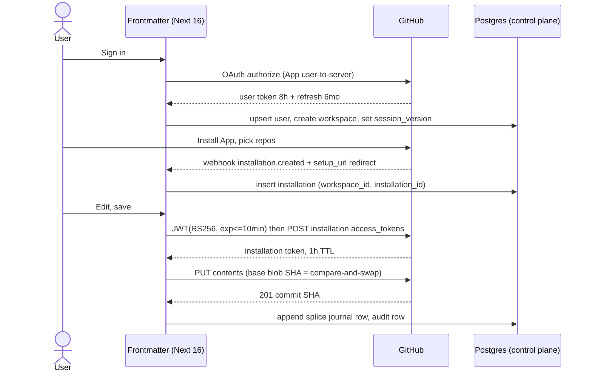

The dual signal — webhook *and* `setup_url` redirect — matters: the redirect can be lost (user closes the tab), and the webhook can arrive before the redirect. Both handlers are idempotent on `(installation_id)` with `on conflict do update`.

### 6.5 Token storage and refresh

| Token | TTL [fetched GitHub docs 2026-08-30] | Stored where | Refresh rule |
|---|---|---|---|
| App JWT (RS256) | ≤ 10 min (`exp` ≤ now+600, `iss` = client ID) | Never stored — minted per call | Regenerate every call |
| Installation access token | **1 hour** | In-process LRU keyed by `installation_id`, TTL 50 min | `@octokit/auth-app` regenerates on expiry |
| User access token | **8 hours** | `identity.oauth_token`, encrypted (§6.7) | Refresh on 401 or at 7h |
| Refresh token | **6 months**, single-use — using it invalidates the old refresh *and* the old access token | same row, encrypted | Rotate under `select ... for update` so two concurrent refreshes cannot both consume it |
| Frontmatter session JWT | 30 days, rolling 24h | `__Secure-authjs.session-token` cookie | next-auth `updateAge` |
| Device refresh token (Tauri) | 90 days | OS keychain, `device_session` row | Rotated on use |

The App private key is a PEM in `GITHUB_APP_PRIVATE_KEY` (base64, single line — the multiline PEM breaks Vercel env parsing). The single-use refresh token is the trap: without `for update` row locking, two tabs refreshing at once burn the token and log the user out. Write that test first.

Rate limits: an installation gets a minimum of **5,000 requests/hour**, plus 50/hour per repo above 20 and 50/hour per user above 20, hard-capped at **12,500/hour** (15,000 on GitHub Enterprise Cloud) [fetched 2026-08-30]. Budget per installation, not globally — one heavy tenant cannot starve another because the buckets are separate. Surface remaining quota from `x-ratelimit-remaining` in the workspace admin view.

### 6.6 Sessions: PWA and Tauri shell

**Web/PWA.** JWT strategy, no database session lookup on the happy path. The cookie carries only `{ sub, wid, ver }`. GitHub tokens never enter the cookie.

```ts
// src/modules/auth/infrastructure/auth-options.ts
session: { strategy: "jwt", maxAge: 60 * 60 * 24 * 30, updateAge: 60 * 60 * 24 },
useSecureCookies: true,
cookies: {
  sessionToken: {
    name: "__Secure-authjs.session-token",
    options: { httpOnly: true, sameSite: "lax", path: "/", secure: true },
  },
},
```

**Revocation.** A JWT cannot be revoked, so `ver` in the token is compared against `users.session_version`; bump it on member removal, App uninstall, or break-glass use. The check costs one indexed read, cached in-process for 60 s — so **revocation lag is up to 60 seconds**, and that is the price we accept for not doing a DB round trip per request. Uninstall bumps it synchronously in the webhook handler.

**Tauri v2 desktop.** No cookies: the webview origin is `tauri://localhost` (macOS/Linux) or `http://tauri.localhost` (Windows), so a `__Secure-` cookie for `frontmatter.app` is not sent and never will be.

| Piece | Pick | Version [fetched crates.io 2026-08-30] |
|---|---|---|
| Loopback OAuth listener | `tauri-plugin-oauth` | `2.1.0` |
| Deep-link callback (`frontmatter://`) | `tauri-plugin-deep-link` | `2.4.9` |
| Token at rest | `keyring` (Keychain / Credential Manager / Secret Service) | `4.2.0` |
| Rejected | `tauri-plugin-stronghold` `2.3.1` — needs its own unlock password, duplicating what the OS already does | — |

Flow: PKCE with `code_challenge_method=S256`, loopback on `127.0.0.1:8976`, exchange at `/api/auth/device/exchange`, refresh token into the keychain, access token in memory only. Every desktop session is a `device_session` row (device name, last seen, IP country) so a user can revoke one laptop without killing their phone.

**CSRF.** next-auth guards its own routes. Every other mutating route gets an `Origin` allowlist in `src/middleware.ts`: `https://frontmatter.app`, `tauri://localhost`, `http://tauri.localhost`. Missing that third value is the bug that will make Windows desktop mysteriously 403.

### 6.7 BYO API key custody

**Rule: the key store is not the document store, and they are not reachable from the same database role.** Documents live in the user's git repo (zero bytes in Postgres), so "separate" here means secrets live in a `secrets` schema with its own role that the request-path role cannot read.

```sql
create schema secrets;
revoke all on schema secrets from public, frontmatter_app;
grant usage on schema secrets to frontmatter_secrets;

create table secrets.workspace_dek (
  workspace_id uuid primary key,
  wrapped_dek  bytea not null,
  kek_id       text  not null,          -- 'env:v1' | 'kms:arn:...'
  wrap_alg     text  not null default 'AES-256-GCM',
  created_at   timestamptz not null default now()
);

create table secrets.provider_key (
  id uuid primary key default gen_random_uuid(),
  workspace_id uuid not null,
  provider     text not null,           -- 'anthropic' | 'openai' | 'groq' | ...
  ciphertext   bytea not null,          -- AES-256-GCM under the workspace DEK
  iv           bytea not null,
  auth_tag     bytea not null,
  last4        text  not null,          -- display only
  created_by   uuid  not null,
  revoked_at   timestamptz
);
```

Envelope: KEK wraps a per-workspace DEK; the DEK encrypts each provider key with a fresh 96-bit IV and AAD = `workspace_id || provider`, so a ciphertext moved between rows fails to decrypt rather than decrypting as the wrong tenant's key. Only decrypt inside the AI proxy route; the plaintext key never leaves that function and never reaches a log line or a client bundle.

**KEK location — pick:** a 32-byte value in the platform secret store (`FM_KEK_V1`), behind a `KeyWrapper` port with two adapters, `EnvKeyWrapper` and `KmsKeyWrapper`. **Rejected for v1:** AWS KMS from day one. **Why:** it adds an AWS account and an IAM surface to a Vercel + Cloudflare + Postgres stack that one person has to operate. **Cost of being wrong:** near zero, because `kek_id` and `wrap_alg` are columns — flipping means writing new `kms:` rows and lazily re-wrapping on read. **What changes our mind:** the first B2B security questionnaire that asks where the master key lives, or the first paying team plan. KMS is $1/month per key, prorated hourly, plus $0.03 per 10,000 requests with 20,000 free per month [fetched aws.amazon.com/kms/pricing 2026-08-30]. [derived] At 10,000 workspaces with DEK unwraps bounded by process cold starts, ~200,000 requests/month: (200,000 − 20,000) ÷ 10,000 × $0.03 = $0.54, plus $1.00 key storage = **$1.54/month**. The migration is cheap; doing it prematurely is not.

### 6.8 The permission model: intersect

**Decision: intersect.** Not defer, not duplicate.

| Capability | Authority | Rule |
|---|---|---|
| Read a file | GitHub | Defer — if the installation lacks `contents`, we refuse |
| Write a file | GitHub ∩ Frontmatter role | Intersect — needs `contents: write` **and** role ≥ `editor` |
| Invite a member | Frontmatter only | Ours — GitHub has no opinion |
| Publish to a public slug | Frontmatter only | Ours — slug uniqueness is a control-plane fact |
| Spend workspace AI budget | Frontmatter only | Ours |
| Change billing | Frontmatter only | Ours, `owner` role |

Pure **defer** fails because GitHub has no concept of "may publish this document at `/p/acme-handbook`" or "may spend $40 of AI credit" — those exist nowhere but our control plane. Pure **duplicate** fails worse: a second ACL that mirrors GitHub's is a second thing to keep in sync, and every divergence is a security bug that also reads as a compliance lie. So: **git-provider permission is the ceiling and can only narrow; Frontmatter roles narrow further; product-only capabilities are ours alone.**

```ts
// src/modules/authz/domain/effective.ts
export function can(cap: Capability, ctx: AuthzContext): boolean {
  const roleOk = ROLE_GRANTS[ctx.role].includes(cap);
  if (!roleOk) return false;
  if (ctx.apiKeyScopes && !ctx.apiKeyScopes.includes(SCOPE_FOR[cap])) return false;
  const ceiling = PROVIDER_CEILING[cap];          // undefined = product-only
  if (ceiling === undefined) return true;
  return ctx.providerPermission !== null && ctx.providerPermission >= ceiling;
}
```

Provider permission is cached in `workspace_repo_access(workspace_id, repo_id, permission, checked_at)` with a 10-minute TTL, revalidated immediately on any GitHub 403, and hard-invalidated by the `installation_repositories` and `installation` webhooks. A revoked repo therefore loses write access within 10 minutes at worst, instantly in the normal case.

### 6.9 RLS in Postgres

Pooled RLS from day one, transaction-scoped so a pooled connection cannot leak tenancy:

```sql
create role frontmatter_app login;                 -- NOT the table owner, NO bypassrls
alter table workspace_member enable row level security;
alter table workspace_member force row level security;
create policy tenant_isolation on workspace_member
  using      (workspace_id = current_setting('app.workspace_id', true)::uuid)
  with check (workspace_id = current_setting('app.workspace_id', true)::uuid);
```

```ts
// src/shared/infrastructure/db/with-tenant.ts
export async function withTenant<T>(wid: string, actor: string, fn: (tx: Tx) => Promise<T>) {
  return db.transaction(async (tx) => {
    await tx.execute(sql`select set_config('app.workspace_id', ${wid}, true),
                                set_config('app.actor_id',    ${actor}, true)`);
    return fn(tx);
  });
}
```

The third argument `true` makes the setting **local to the transaction** — that is what makes this safe behind PgBouncer transaction pooling, and it is the single most important character in this section. `force row level security` matters because policies do not apply to the table owner otherwise; migrations run as owner, the app never does.

Two CI gates, both blocking, both new (the repo has no CI at all today):

```sql
-- gate 1: every public table has RLS on
select relname from pg_class c join pg_namespace n on n.oid = c.relnamespace
 where n.nspname = 'public' and c.relkind = 'r' and not c.relrowsecurity;
-- gate 2: the app role cannot bypass
select 1 from pg_roles where rolname = 'frontmatter_app' and rolbypassrls;
```

Both must return zero rows. Plus one integration test that seeds two workspaces, sets `app.workspace_id` to A, and asserts every table returns zero of B's rows — not one table, all of them, enumerated from `information_schema`.

### 6.10 API keys for third-party access

Format `fm_live_<16-char key id>_<43-char base64url secret>` (`fm_test_` in non-production). The distinctive prefix is what makes the key eligible for GitHub's secret-scanning partner programme — apply once the format is frozen, because changing it later invalidates every issued key.

| Property | Choice | Why |
|---|---|---|
| Stored value | `sha256(secret)`, compared with `timingSafeEqual` | Keys are 256 bits of entropy, so a slow KDF buys nothing and costs latency on every request. bcrypt here is cargo cult |
| Lookup | by `key_id` prefix, indexed | Avoids a table scan; the secret half is never indexed |
| Shown | once, at creation | Plus `last4` for display |
| Scopes | `docs:read`, `docs:write`, `publish:write`, `search:read`, `webhooks:manage` | Intersected in `can()` (§6.8) |
| Ceiling | creating member's role at issue time, re-checked at use | A key cannot outlive or out-rank its creator |
| `last_used_at` | bucketed to 60 s | A write per request would be the busiest write in the system |
| Rate limit | per key, sliding window | Separate bucket from session traffic |

Keys authenticate to `/api/v1/*` via `Authorization: Bearer fm_live_...`. They never grant access to the AI proxy with the workspace's BYO provider key — that would let a leaked integration key spend someone else's provider budget. Separate scope, separate decision, default off.

### 6.11 Build order

| # | Work | Gate |
|---|---|---|
| 1 | Delete Firebase + Credentials provider, 8 files listed in §6.1 | `rg -i firebase src/` returns nothing; 1,575 tests still green |
| 2 | Stand up CI (none exists) — typecheck, lint, test, `npm run arch` | Required check on `main` |
| 3 | GitHub App from manifest, `@octokit/auth-app` 8.3.0, delete `GITHUB_REPO_TOKEN` | Install-to-first-commit E2E against a scratch repo |
| 4 | Postgres control plane + RLS + `withTenant` | The two SQL gates, plus cross-tenant integration test |
| 5 | `secrets` schema, envelope encryption, `KeyWrapper` port | Ciphertext moved between rows fails to decrypt |
| 6 | Tauri PKCE + keychain, `device_session` | Revoke-one-device test |
| 7 | API keys + scopes | Scope intersection test; scanning-partner application |

---

## 7. Live editing, presence and collaboration

### 7.1 The tension, stated precisely, and its resolution

The positioning says "Google Docs for markdown." The architecture says the file is the only source of truth and sync is git three-way merge + splice journal + compare-and-swap, never a CRDT for document bytes. Both are correct, and they are only in conflict if you assume live editing requires a CRDT that *stores* the document.

The resolution is one invariant:

> **A CRDT may exist as a session-scoped scratch buffer. It is seeded from file bytes, it is authoritative for nobody, and its single output is one splice against the exact blob SHA it was seeded from. Nothing ever reads a document out of it.**

Byte-identity is unassertable across a CRDT merge because a merge yields a *document state*, not a byte sequence with a provenance chain you can certify. That objection is about the CRDT being a **store of record**. It is not an objection to a CRDT being an ephemeral coordination device whose result is re-expressed as a splice and re-validated by the existing engine — the same engine, the same CAS, the same refusal path, the same journal row. If the CAS fails at flush, the session does not "merge." It refuses, and the user sees the standard three-way conflict surface (§7.7).

| Property | Store of record (refused) | Ephemeral session (accepted) |
|---|---|---|
| Where document bytes live | CRDT doc, forever | Git repo, always |
| What the CRDT holds | The document | ≤1 editing session, discardable |
| Lifetime | Permanent | Last participant leaves + 60s |
| Failure mode if lost | Data loss | Lose the unflushed tail, same as an unsaved buffer |
| Output | The document | One `Splice{base_sha, from, to, insert}` |
| Byte-identity assertion | Impossible | Asserted by the engine at flush, unchanged |
| Journal row | None | Exactly one per flush, identical shape to a solo edit |

### 7.2 What "live editing" actually means here — demanded vs assumed

Separate these, because they have wildly different cost and risk.

| Capability | Users demand it | Users assume it exists | Cost tier | Ships |
|---|---|---|---|---|
| See who else has this doc open | High | High | Tier 0 | v1 |
| See where their cursor / selection is | Medium | High | Tier 0 | v1 |
| "Priya has unsaved changes in this file" warning before you edit | **Very high** | Medium | Tier 0 | v1 |
| Never silently lose my work to someone else's save | **Absolute** | Total | Tier 1 | v1 |
| Comments / mentions anchored to a range | High (B2B) | High | Tier 1 | v1.5 |
| Two people typing in the same paragraph, same second | **Low** | High | Tier 2 | v2, B2B-gated |
| Live AI agent editing alongside a human | Medium (differentiator) | Low | Tier 2 | v2 |

The gap between column 1 and column 2 on the last-but-two row is the whole finding. Simultaneous character-level co-typing is *assumed* to exist and *rarely used*; what people actually do is take turns and get angry when a turn is lost. Tier 0 + Tier 1 buy ~90% of the felt experience for ~5% of the engineering risk, and neither one touches document bytes.

Precedent, from primary sources: Notion is not CRDT-based for text. Its client batches operations into transactions "committed (or rejected) by the server as a group," queued client-side in IndexedDB/SQLite, POSTed to `/saveTransactions`, with a separate long-lived WebSocket to a fanout service ("MessageStore") for realtime updates [fetched notion.com/blog/data-model-behind-notion, 2026-08-30]. That is server-authoritative CAS + fanout — structurally our design. HackMD's open-source ancestor CodiMD is operational-transform over Socket.IO, not a CRDT [SS]. Obsidian does not do character-level co-editing at all: Sync markets "Work offline, sync later… Sync merges changes for you" and shared vaults that update "in real-time across your team's devices" — file-granular replication, $4/user/mo Standard, $8 Plus [fetched obsidian.md/sync, 2026-08-30]. Character-level Obsidian collaboration exists only as a third-party plugin (Relay, Yjs-based) [fetched relay.md, 2026-08-30].

### 7.3 Topology

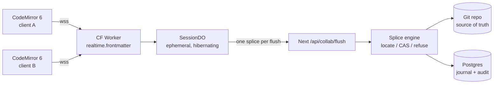

The arrow from `DO` to `API` is one-directional and low-frequency. There is no arrow back into the DO carrying document state, and that absence is the design.

### 7.4 Transport: Cloudflare Durable Objects with WebSocket Hibernation

Next.js Route Handlers on Vercel cannot hold a WebSocket, so the realtime plane is a separate deployable regardless of vendor. Given that, put it where the fanout is cheap and the per-room single-threading is free.

**Pick:** one Cloudflare Worker + one Durable Object class, `SessionDO`, SQLite-backed, using the **WebSocket Hibernation API**.

**Cloudflare numbers, all [fetched 2026-08-30]:**

| Dimension | Free | Paid | Source page last-updated |
|---|---|---|---|
| Workers Paid base | — | **$5/mo account minimum**, no egress/bandwidth charge | Workers pricing, 2026-08-28 |
| DO requests | 100k/day | 1M/mo included, then **$0.15/M** | DO pricing, 2026-08-25 |
| Incoming WS messages → requests | **20:1 billing ratio** | same | DO pricing |
| Outgoing WS messages, protocol pings | **free** | free | DO pricing |
| DO duration | 13,000 GB-s/day | 400,000 GB-s/mo included, then **$12.50/M GB-s** | DO pricing |
| Memory billed per DO | 128 MB regardless of use | same | DO pricing, fn.5 |
| Hibernation-eligible idle time | **not billed** | not billed | DO pricing |
| `setWebSocketAutoResponse()` ping/pong | **no wall-clock charge** | same | DO pricing, fn.3 |
| DO SQLite rows written | 100k/day | 50M/mo included, then $1.00/M | DO pricing |
| WS message size | 32 MiB | 32 MiB | DO limits, 2026-06-01 |
| Soft throughput per single DO | ~1,000 req/s | ~1,000 req/s | DO limits |
| Objects per namespace | unlimited | unlimited | DO limits |

**The single load-bearing fact.** `accept()` on a WebSocket bills wall-clock time for the entire connection; hibernation does not. Derived, showing the work:

- Non-hibernating: 1 DO-hour = 3600 s × 0.125 GB = **450 GB-s**. Included 400,000 GB-s ÷ 450 = **888 free DO-hours/mo**; beyond that 450 × $12.50/1e6 = **$0.005625 per DO-hour** (shared across everyone in that room). [derived]
- Hibernating: billed only for handler execution. At ~1 ms wall time per awareness message, 1 message = 0.001 × 0.125 = **0.000125 GB-s**. [derived]

| Scale | Assumption | Non-hibernating | Hibernating |
|---|---|---|---|
| 100 users | 20 live-h/user/mo, 1 room each = 2,000 DO-h; 2 msg/s → 144k msg/user/mo | 2,000×450 = 900k GB-s → 500k billable → **$12.50** + $5 = **$17.50/mo** | 1,800 GB-s (free); 720k billed requests (free) → **$5.00/mo** |
| 10,000 users | same per-user shape | 200,000 DO-h × 450 = 90M GB-s → 89.6M billable → **$1,120** + $5 = **$1,125/mo** | 180,000 GB-s (under 400k, free); 72M billed req − 1M = 71M × $0.15/M = $10.65 → **$15.65/mo** |

Hibernation is a **70× cost difference at 10,000 users** [derived]. Therefore: `state.acceptWebSocket()`, never `ws.accept()`; `setWebSocketAutoResponse()` for heartbeats; identity re-hydrated on wake from `ws.serializeAttachment()` capped at ≤2 KB (`{uid, wsid, base_sha, caps}`). Attachment writes cost rows: 10,000 users × ~40 sessions/mo = 400k rows/mo, inside the 50M included [derived]. **Zero document bytes are ever written to DO storage** — that is a hard review rule, not a preference.

**Alternatives rejected:**

| Option | Why rejected |
|---|---|
| SSE + POST on Vercel | Works for Tier 0 fanout, but needs a second upstream channel, has no per-room single-threaded actor, and burns a Vercel function per subscriber. Genuinely viable if Cloudflare is ever unavailable — keep it as the documented fallback, not the default. |
| Raw WebSocket server on Fly/Railway | A stateful process one person must be on call for. Contradicts "operable by one person." |
| Vercel Route Handler WebSocket | Not supported. |

### 7.5 CRDT selection: Yjs, and only inside Tier 2

All [measured 2026-08-30] by streaming the npm tarball and piping through `gzip -9`:

| Package | Latest | Published | Runtime artifact | raw | gzip -9 |
|---|---|---|---|---|---|
| `yjs` | 13.6.32 | 2026-08-04 | `dist/yjs.mjs` | 299,797 B | **62,586 B** |
| `loro-crdt` | 1.15.1 | 2026-08-29 | `web/loro_wasm_bg.wasm` | 3,179,730 B | **1,046,171 B** |
| `@automerge/automerge` | 3.4.1 | 2026-08-12 | `web/automerge_wasm_bg.wasm` | 3,571,259 B | **1,116,734 B** |
| `y-codemirror.next` | 0.3.6 | 2026-08-18 | — | — | — |
| `y-protocols` | 1.0.7 | 2025-12-16 | — | — | — |
| `lib0` | 0.2.117 | 2025-12-30 | — | — | — |
| `y-websocket` | 3.1.0 | 2026-08-06 | — | — | — |

Yjs core is **16.7× smaller gzipped than Loro's wasm and 17.8× smaller than Automerge's** [derived]. The full y-stack (`yjs` + `lib0` + `y-protocols` + `y-codemirror.next`) realistically lands ~90–110 KB gz [inference]. Loro and Automerge are better engineered for *durable* CRDT storage — richer history, better rich-text semantics — and we have explicitly refused to store CRDTs, so we are paying for a capability we forbid. `y-codemirror.next` is a first-class, currently-maintained CodeMirror 6 binding, which is the integration that actually matters given CodeMirror 6 is already in the repo.

Non-negotiable: the entire y-stack is behind `await import()` inside the Tier 2 code path. A D2C solo user on the free plan downloads **zero bytes** of CRDT.

**Rejected build-partners:**

| Vendor | Cost at 10,000 users (20 h/user/mo) | Verdict |
|---|---|---|
| **Liveblocks** | $0.002/collab-minute × 12M min = **$24,000/mo**; even 100 users = 120k min − 3k free = $234 − $30 credits + $25 Pro ≈ **$229/mo** [fetched liveblocks.io/pricing 2026-08-30, derived] | Refused. 46× our Cloudflare bill at 100 users, ~1,500× at 10,000. Also caps simultaneous connections per room at 10 (Free/Pro) / 50 (Team, $500/mo). |
| **Ably** | $29 Standard + messages 1.44B × $2.50/M = **$3,629/mo**; connection-min $12 + channel-min $12 [fetched ably.com/pricing 2026-08-30, derived] | Refused. Message-metered pricing punishes exactly the cursor traffic we want to be free. |
| **Pusher** | 48M msg/day → Plus tier **$899/mo** [fetched pusher.com/channels/pricing 2026-08-30, derived] | Refused on cost and on message-cap cliff-edges. |
| **PartyKit** | `partykit@0.0.115` last published **2025-05-21** — 15 months stale [measured, npm registry, 2026-08-30] | Refused. `partyserver@0.5.10` (2026-08-03) is the living successor, but it is a thin layer over the DOs we are already using; adopting it adds a dependency without removing work. |
| **Hocuspocus** (`@hocuspocus/server` 4.6.0, 2026-08-10) | Self-host cost only | Reconsider *only* if Tier 2 grows beyond one Worker file. It presumes a Yjs document store of record, which we refuse. |

**Verdict: build on Durable Objects.** ~$5–16/mo covers both 100 and 10,000 users; the cheapest managed alternative is ~$229/mo at 100 users and ~$900–24,000/mo at 10,000. The build is roughly one Worker file plus one DO class — ~500 lines. **What changes our mind:** if Tier 2 usage exceeds 30% of paid seats AND we need comments, notifications, and version history as products rather than features, re-run the Liveblocks comparison including the ~6 engineer-weeks their Comments + Notifications would replace.

### 7.6 Presence and the awareness protocol

Tier 0 does **not** use `y-protocols/awareness` — that would drag `lib0` into the default bundle. Define our own, ~40 lines, and let Tier 2 tunnel Yjs awareness through the same socket under a different tag.

`src/lib/collab/protocol.ts`:

```ts
export type ClientMsg =
  | { t: 'hello';  doc: string; base: string /* blob sha1 */ }
  | { t: 'pos';    base: string; head: number; anchor: number } // byte offsets
  | { t: 'dirty';  base: string; dirty: boolean }
  | { t: 'y';      b64: string };                                // Tier 2 only
export type ServerMsg =
  | { t: 'roster'; peers: Peer[] }
  | { t: 'pos';    wsid: string; base: string; head: number; anchor: number }
  | { t: 'dirty';  wsid: string; dirty: boolean }
  | { t: 'splice'; base: string; next: string; from: number; to: number; ins: number }
  | { t: 'y';      b64: string };
export interface Peer { wsid: string; uid: string; name: string; color: string; dirty: boolean }
export const POS_THROTTLE_MS = 120;   // ≈8/s ceiling
export const HEARTBEAT_MS    = 25_000; // handled by setWebSocketAutoResponse
export const MAX_PEERS       = 25;     // refuse beyond; DO soft cap is ~1k req/s
```

**The cursor-mapping rule.** A cursor is a byte offset into a specific version. A peer's offset is meaningless against a different `base`. Rule:

- `msg.base === myBase` → render the caret at character granularity.
- `msg.base !== myBase` and the intervening splices are in the local journal cache → map through `ChangeSet.mapPos` per splice, in order, and render.
- Otherwise → **degrade, do not guess**: drop the caret and show the peer's avatar on the file row in the tree. Same refusal discipline as the engine.

`src/lib/collab/cm-presence.ts` is a CodeMirror 6 `StateField` + `ViewPlugin` holding decorations; remote carets are widget decorations, remote selections are mark decorations. Local offsets are re-derived on every local transaction via `tr.changes.mapPos(head)` before broadcast.

**Files to create:**

| Path | Contents |
|---|---|
| `workers/realtime/wrangler.jsonc` | DO binding `SESSION`, `new_sqlite_classes: ["SessionDO"]`, `limits.cpu_ms` left at default |
| `workers/realtime/src/index.ts` | `Upgrade: websocket` check, EdDSA JWT verify, DO id derivation, `stub.fetch()` |
| `workers/realtime/src/session-do.ts` | `SessionDO`: `acceptWebSocket`, `setWebSocketAutoResponse`, roster, fanout, flush alarm |
| `src/app/api/collab/token/route.ts` | Mints a 5-minute EdDSA JWT: `{ workspace_id, doc_path, uid, caps: ['presence'\|'coedit'], base }` |
| `src/app/api/collab/flush/route.ts` | Server-to-server, HMAC-signed from the Worker; calls the existing splice engine |
| `src/lib/collab/{protocol,presence-client,cm-presence}.ts` | Client |

**Tenancy.** The DO id is `idFromName(sha256(workspace_id + ':' + repo_id + ':' + path))`. Omitting `workspace_id` from that hash is a cross-tenant room collision — the realtime-plane equivalent of a missing RLS predicate. Add a CI check that greps `idFromName(` in `workers/` and fails if `workspace_id` is not in the same expression.

### 7.7 Conflict surfacing when live editing is off (the v1 path)

This is the feature, not the fallback. Three outcomes, no fourth:

| Server state at save | UI | User action |
|---|---|---|
| `base_sha` matches HEAD | Silent save | none |
| Moved, but git three-way merges cleanly and the splice range is untouched | Toast: "Rebased onto Ana's change" + Undo | optional |
| Moved and the splice range overlaps, or merge conflicts | **Blocking three-pane diff**: base / yours / theirs, with the exact byte ranges highlighted | Keep mine · Take theirs · Edit merged |

Tier 0 makes the third row rare *before* it happens: the moment a second person opens a file someone else has `dirty: true` on, they get an inline banner — "Ana is editing this file (unsaved, 2m)" — with **Read only** / **Edit anyway** / **Ask Ana**. This is a soft lock, advisory, never enforced, and it costs one boolean on the roster.

### 7.8 Tier 2 ephemeral session, when it ships

```
open  → GET /api/collab/token (caps:['coedit'])
      → DO has no Y.Doc → DO fetches bytes via /api/collab/seed at blob_sha S
      → new Y.Doc(); ytext.insert(0, bytes.toString('utf8')); baseSha = S
edit  → y updates fan out to peers; DO holds the doc in memory only
flush → every 10s of quiescence, on 60s max age, or on last-leave:
        next = ytext.toString()
        splice = minimalSplice(seedBytes, Buffer.from(next,'utf8'))   // single range
        POST /api/collab/flush { workspace_id, path, base_sha: S, splice }
        → engine: locate → CAS(S) → journal append → commit
        → on 200: reseed baseSha = newSha, seedBytes = new bytes
        → on 409: broadcast {t:'refused'}; freeze the room read-only; hand every
                  participant the §7.7 three-pane diff. Never auto-merge.
close → last participant leaves + 60s → alarm → final flush → discard Y.Doc
```

Non-negotiables, enforceable as review rules:

1. `SessionDO` never calls `ctx.storage.put` / `sql.exec` with document text. Only ≤2 KB per-connection attachments.
2. `minimalSplice` returns **one** `{from,to,insert}`. If a common-prefix/common-suffix reduction yields a range covering >60% of the file, treat it as a rewrite and refuse the fast path — fall through to a full-file CAS write with an explicit journal reason. Never emit multi-range "patches" the engine cannot certify.
3. UTF-8 only across the boundary: Yjs indexes UTF-16 code units, the engine addresses bytes. Convert at exactly one place, in `minimalSplice`, and unit-test it against the existing multi-byte fixtures. This is the single highest-risk line of the whole tier.
4. If the seed bytes are not valid UTF-8, or the file carries a BOM or bare CR line endings that the engine's normalization would alter, **refuse co-editing on that file** and fall back to Tier 0 + Tier 1. Certification beats coverage.

### 7.9 v1 verdict

**v1 needs Tier 0 and Tier 1. It does not need Tier 2.**

| Item | v1 | Why |
|---|---|---|
| Presence roster, avatars, dirty flag | **Yes** | ~1.5 weeks; $5/mo; delivers most of the perceived "Google Docs" feel; touches zero document bytes |
| Remote cursors with the degrade rule | **Yes** | Rides the same socket; the degrade rule keeps it honest |
| Soft-lock banner + CAS three-pane conflict UI | **Yes** | This is the *actual* demanded feature. Without it, "your repo is the source of truth" reads as "you're on your own." |
| Live character-level co-editing | **No** | ~4–6 weeks, the UTF-8 boundary is the highest-risk code in the product, and it is the least-used demanded capability |
| Comments / mentions | v1.5 | Anchored to the journal, not to a CRDT; sells B2B; independent of Tier 2 |

Market positioning stays intact: Obsidian ships shared vaults with no character-level co-editing at all and charges $4–8/user/mo for it [fetched 2026-08-30]. Shipping presence + honest conflict resolution puts us ahead of the closest local-first competitor on day one, at $5/mo of infrastructure.

**What would move Tier 2 into v1:** three or more B2B pilots naming simultaneous editing as a blocker in writing. Not a survey — a lost deal.

**What would make us abandon Tier 2 permanently:** if `minimalSplice` cannot hold a byte-identity property test over the existing multi-byte and line-ending corpus at 100%. In that case the room stays read-mostly with turn-taking locks, and we say so publicly. A refusal we can explain beats a merge we cannot certify.

---

## 8. Hosting, deployment and environments

### 8.1 Topology

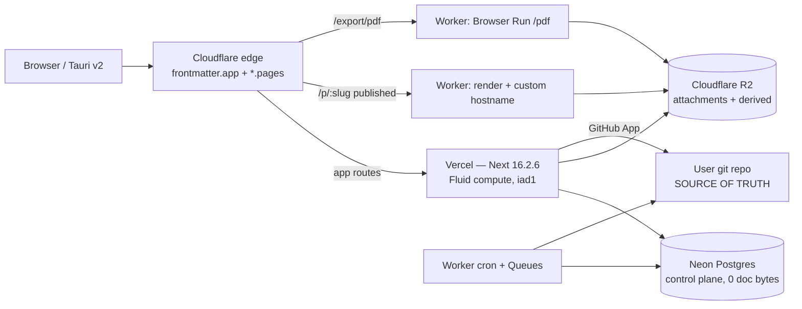

| Component | Choice | Rejected alternative | Why | Price (read 2026-08-30 UTC) |
|---|---|---|---|---|
| Next app | Vercel Pro, Fluid compute, region `iad1` | Self-hosted Next on Fly/Railway | Zero ops, instant rollback, preview URLs per PR. Hobby is contractually unusable: "Hobby teams are restricted to non-commercial personal use only" [fetched] | $20/mo platform fee, 1 seat, includes $20 usage credit, 1 TB Fast Data Transfer, 10M edge requests [fetched] |
| Compute rates | `iad1` | `bom1` (Mumbai) | `iad1` Active CPU $0.128/hr vs `bom1` $0.140/hr; Fast Data Transfer $0.15/GB vs $0.20/GB — Mumbai is 9–33% dearer on every line [fetched] | $0.128/CPU-hr, $0.0106/GB-hr memory, $0.60/M invocations [fetched] |
| Postgres | Neon, `aws-us-east-1` | Supabase, RDS | Scale-to-zero after 5 min, per-branch databases for previews, no monthly minimum on Launch [fetched] | Free: 100 CU-h/project, 0.5 GB. Launch: $0.106/CU-hr, $0.35/GB-mo storage, extra branches $1.50/branch-mo [fetched] |
| Object store | Cloudflare R2 | S3, Vercel Blob | Free egress. Vercel Blob data transfer is $0.05/GB in `iad1` — R2 is $0 [fetched] | $0.015/GB-mo, Class A $4.50/M, Class B $0.36/M; free tier 10 GB + 1M A + 10M B [fetched] |
| Edge / published pages / PDF / jobs | Cloudflare Workers Paid | Vercel middleware + Vercel Cron | Workers cron gets 15 min CPU per invocation, no egress charge, and Browser Run gives real Chromium | $5/mo minimum, 10M req + 30M CPU-ms included, then $0.30/M req + $0.02/M CPU-ms [fetched] |
| PDF/Chromium | Cloudflare Browser Run `/pdf` | `@sparticuz/chromium` in a Vercel function (current state) | See §8.7 | 10 browser-hours/mo included on Workers Paid, then $0.09/hr [fetched] |
| Custom domains | Cloudflare for SaaS custom hostnames | Vercel domains API | Keeps published-page egress on R2/Workers, off Vercel Fast Data Transfer | 100 hostnames included, $0.10 each after, max 50,000 [fetched] |
| CI | GitHub Actions, `ubuntu-latest` | None (current state: **no CI at all**) | 1,575 tests exist and nothing runs them | Private repo: 2,000 min/mo on GitHub Free, then $0.006/min for Linux 2-core [fetched] |

### 8.2 Why not one VPS, and why not Kubernetes

**Not a single VPS** ($6–24/mo, cheaper than the $25 floor below). One founder on call cannot be the pager for TLS renewal, kernel patching, log rotation, disk-full, and a Node process that OOMs at 03:00 IST while the customer is in Berlin. The VPS wins on unit cost and loses on the only scarce resource here, which is founder attention. It also has no preview environments, so every PR review is "trust the diff."

**Not Kubernetes** (EKS control plane alone is ~$73/mo before a single node). It buys workload portability we do not need — we have one Next app and three Workers — at the cost of a permanent second job.

**What would change our mind:** if Vercel's bill crosses roughly $600/mo at steady state (see §8.10: that is ~13,000 users on the un-optimised model), the Next app moves to a Hetzner CCX box behind the same Cloudflare edge, with Neon and R2 unchanged. The edge is the abstraction boundary that makes this a two-week migration instead of a rewrite; keep every origin-specific API behind `src/modules/*` and never let a Vercel primitive leak into a domain module.

### 8.3 Regions and residency

| Concern | Position |
|---|---|
| App compute | Single region `iad1`. Multi-region on Pro is available but doubles the cold-start surface and the Postgres round trip. |
| Postgres | `aws-us-east-1`. **Neon region is fixed at project creation and cannot be changed** — moving means create-new-project-and-migrate [fetched]. Pick once, deliberately. Neon has no India region as of 2026-08-30 [fetched]: available AWS regions are us-east-1, us-east-2, us-west-2, eu-central-1, eu-west-2, ap-southeast-1, ap-southeast-2, sa-east-1. |
| Document bytes | Never leave the user's git repo. This is the residency answer that actually matters and it is free: a German customer's documents live wherever their GitHub/GitLab org lives. We hold no copy. |
| Attachments | R2 bucket per residency zone, chosen at workspace creation, stored as `workspaces.r2_region`. Default `auto`; EU customers get an EU-hinted bucket. |
| DPDP / GDPR | The control plane holds identity, entitlements, slugs, audit — personal data, not document content. One Postgres in us-east-1 with SCCs is defensible; if an enterprise deal demands EU-resident control plane, that is a second Neon project plus a `workspaces.control_region` column, not a re-architecture. |

**What would change our mind:** the first paying EU enterprise with a written residency clause. Until then a second region is speculative cost.

### 8.4 Environments

| | local | preview | staging | production |
|---|---|---|---|---|
| Trigger | `npm run dev` | every PR | merge to `main` | manual promote from `main` |
| URL | `localhost:3000` | `<hash>-frontmatter.vercel.app` | `staging.frontmatter.app` | `frontmatter.app` |
| Postgres | Neon branch `dev/<you>` | **ephemeral Neon branch per PR**, deleted on close | Neon branch `staging` | Neon `main` |
| R2 bucket | `fm-local` | `fm-preview` (shared, prefixed by PR number) | `fm-staging` | `fm-prod` |
| GitHub App | `frontmatter-dev` | `frontmatter-dev` | `frontmatter-staging` | `frontmatter` |
| Auth callback | `http://localhost:3000/api/auth/callback/github` | wildcard on the App's dev callback list | staging host | prod host |
| Protection | — | Vercel deployment protection ON | ON | public |

**How previews get data.** Not by copying production. On PR open, CI calls `neon branches create --parent main --name pr-$PR`; the branch is copy-on-write, costs $1.50/branch-month prorated hourly beyond the 10 included per project [fetched], and is deleted on PR close. Then a seeder inserts one synthetic workspace with three synthetic users. Production rows never reach a preview, which means a leaked preview URL leaks nothing. R2 preview objects are written under `preview/$PR/…` and lifecycle-expired at 7 days.

Config lives in `.github/workflows/preview-db.yml` and the branch name is passed to Vercel as a per-deployment env var via `vercel env add DATABASE_URL preview --git-branch`.

**What would change our mind:** nothing. Pointing preview at production is how a solo founder deletes a customer's row at 2am.

### 8.5 The 4.5 MB response cap — this already bites

> "The maximum payload size for the request body or the response body of a Vercel Function is 4.5 MB. If a Vercel Function receives a payload in excess of the limit it will return an error 413: `FUNCTION_PAYLOAD_TOO_LARGE`" [fetched 2026-08-30]

Two shipped routes are on the wrong side of it [measured, read from the repo]:

| Route | What it does now | Failure |
|---|---|---|
| `src/app/api/vault/snapshot/route.ts` | `return new Response(JSON.stringify(snapshot))` — the **entire vault** as one JSON body | A 3,000-note vault at 1.5 KB average is 4.5 MB of markdown before JSON escaping. 413 for exactly the power users we want. |
| `src/app/api/export/vault/route.ts` | returns a whole zip through the function | Same wall, at a smaller vault, because zip-of-markdown still exceeds 4.5 MB fast. |

The settled architecture already says *stop shipping whole-vault snapshots*. The cap is the enforcement mechanism. Replacement contract:

- `GET /api/vault/index` → paths, sizes, SHAs, mtimes only. Bounded: 3,000 notes × ~120 bytes = 360 KB.
- `GET /api/vault/file?path=` → one file, byte-exact. Already exists.
- `GET /api/export/vault` → enqueue a job; the Worker writes `exports/{workspace_id}/{job_id}.zip` to R2 and returns a presigned URL. **The function returns a URL, never bytes.** Uploads use presigned PUT directly to R2, so the 4.5 MB *request* cap never applies to attachments either.

Rule for every new route: if a response body can grow with vault size, it returns a cursor or a URL. Add this as a test in `test/` that asserts every `route.ts` response is either bounded or a redirect.

### 8.6 Cold starts

Fluid compute keeps an instance alive across requests and bills Active CPU only while your code runs, pausing during I/O [fetched] — so a warm instance amortises well and a GitHub API wait costs memory-time but not CPU-time. Cold starts are still dominated by bundle size, and the PDF function is the outlier [measured, `du` on `node_modules`]:

| Package | On-disk size |
|---|---|
| `@sparticuz/chromium@148` | 4.6 MB |
| `puppeteer-core@25.0.4` | 7.7 MB |
| `bin/swiftshader.tar.br` | 3,498,775 B |
| `bin/al2023.tar.br` | 1,075,752 B |
| `bin/fonts.tar.br` | 183,831 B |

Those brotli packs are decompressed into `/tmp` on every cold start before Chromium can launch [inference from the package's runtime design]. Mitigations, in order: keep the app router's non-PDF functions free of AI-provider SDKs (five providers are installed; import them lazily inside handlers, not at module scope); keep `serverExternalPackages` as it is in `next.config.ts`; and move the PDF path off Vercel entirely (§8.7). Measure before tuning further — Vercel Observability reports cold-start rate per function, and anything under 2% at steady traffic is not worth an engineering week.

### 8.7 The PDF path cannot stay in a normal serverless function

Current state, from `vercel.json`:

```json
"functions": {
  "src/app/api/export/pdf/[...path]/route.ts": { "memory": 1769, "maxDuration": 60 }
}
```

and from `next.config.ts`, a comment that is itself the evidence: the narrow `bin/**` glob "wasn't landing the binary in the lambda (runtime: `.../bin does not exist`)", so the fix ships the *whole* `@sparticuz/chromium` package via `outputFileTracingIncludes`. That is a file-tracing workaround for a native binary resolved at runtime — it will break again on a Next minor upgrade, silently, in production only.

| Option | Cost | Verdict |
|---|---|---|
| Keep `@sparticuz/chromium` on Vercel | 1.77 GB memory × 8 s × $0.0106/GB-hr ≈ $0.000042/PDF, plus a fragile trace hack and a 12 MB cold start | Reject |
| Cloudflare Browser Run `/pdf` Quick Action | 10 browser-hours/mo included on the $5 Workers Paid plan, then **$0.09/hr** [fetched]. At 6 s/PDF that is 6,000 PDFs inside the included hours | **Pick** |
| Browserless / self-hosted Chromium container | $50–200/mo and a container to babysit | Reject |

Implementation: a Worker binds `browser` and POSTs the rendered HTML to the `/pdf` Quick Action; output goes to R2 at `derived/{workspace_id}/{doc_sha}.pdf`, keyed by content hash so it is cacheable forever and never overwritten. Note the hard limits: browser timeout 60 s, 200 concurrent browsers per account on Paid, 3 new instances/sec [fetched 2026-08-30]. Long exports must be queued, not synchronous.

**What would change our mind:** if `/pdf` cannot reproduce our KaTeX + Mermaid + custom-font output byte-for-byte against the golden fixtures, we keep Chromium on Vercel and accept the fragility — fidelity beats elegance for a document product. Test this against `test/` fixtures *before* deleting the current route.

### 8.8 Custom domains and wildcard TLS

| Case | Mechanism | Limit |
|---|---|---|
| `*.frontmatter.app` (per-workspace published pages) | Cloudflare Universal SSL on our own zone | Covers apex + one subdomain level. `a.b.frontmatter.app` is **not** covered — enforce single-level slugs in the `publish_slugs` uniqueness constraint. |
| `docs.customer.com` (customer vanity domain) | Cloudflare for SaaS custom hostname, HTTP or delegated-TXT validation | 100 hostnames included, $0.10/hostname after, 50,000 max [fetched] |
| `*.customer.com` | **Not available.** "Wildcard custom hostnames: Enterprise" [fetched] | Refuse the request explicitly in the UI with that reason. Do not promise it. |

Onboarding flow: customer adds a CNAME to `pages.frontmatter.app`; we POST the hostname to the Cloudflare for SaaS API, store `custom_hostname_id` + status on the workspace row, and poll validation. The Worker maps `Host` → `workspace_id` → R2 prefix. Certificate issuance and renewal are Cloudflare's problem, which is the entire point.

### 8.9 Rollback

| Layer | Mechanism | Time |
|---|---|---|
| Next app | Vercel Instant Rollback — promote the previous deployment; it is already built | seconds |
| Workers | `wrangler rollback --message "..."` to the prior version | seconds |
| Postgres schema | **Expand/contract only.** Never a destructive migration in the same deploy as the code that needs it: add column → deploy code that writes both → backfill → deploy code that reads new → drop old, a week later | days, by design |
| R2 objects | **R2 has no object versioning.** Rollback is impossible, so derived artifacts are content-addressed (`{doc_sha}.pdf`) and never overwritten; a bad render writes a new key and the old one is still there | n/a |
| Document bytes | Nothing to roll back. The file is in the user's git repo; `git revert` is their rollback and it is better than ours | n/a |

Instant Rollback only works if the previous deployment can still talk to the current database. That is the whole argument for expand/contract, and it is the one rule in this section that a single careless migration can void.

### 8.10 The bill

**Model** [inference, stated so it can be argued with]: per active user per month — 1,000 function invocations, 120 ms Active CPU each, 400 ms instance-alive at 2 GB, 0.25 GB Fast Data Transfer, 2,500 edge requests, 80 MB R2 storage, 0.5 PDF exports at 6 s.

Vercel at 10,000 users [derived]: CPU 333.3 hr × $0.128 = $42.67; memory 2,222 GB-hr × $0.0106 = $23.56; invocations 10M × $0.60/M = $6.00; Fast Data Transfer (2,500 − 1,000 included) × $0.15 = $225.00; edge requests (25M − 10M) × $2.00/M = $30.00. Raw $327.22; the $20 credit is consumed, so billed = $327.22.

| Line | 100 users | 1,000 users | 10,000 users |
|---|---|---|---|
| Vercel Pro | $20.00 | $20.00 | $327.22 |
| Neon | $0.00 (Free) | $19.78 | $85.63 |
| Cloudflare R2 | $0.00 (free tier) | $1.05 | $11.85 |
| Workers Paid (incl. Browser Run, Queues) | $5.00 | $5.00 | $5.00 |
| Cloudflare for SaaS hostnames | $0.00 | $0.00 | $30.00 |
| GitHub Actions | $0.00 | $0.00 | $2.40 |
| **Total / month** | **$25.00** | **$45.83** | **$462.10** |
| **Per user** | $0.250 | $0.046 | $0.046 |

Neon workings [derived]: 1,000 users = 180 CU-hr × $0.106 + 2 GB × $0.35 = $19.78. 10,000 users = 730 CU-hr × $0.106 + 15 GB × $0.35 + 15 GB instant restore × $0.20 = $85.63. R2: (800 − 10) GB × $0.015 = $11.85, with Class A at ~500k and Class B at ~5M both inside the free tier. Browser Run at 10,000 users is 8.33 browser-hours, inside the 10 included.

**The lever.** At 10,000 users, Fast Data Transfer plus edge requests is $255 of a $462 bill — 55%. Serving `/p/:slug` published pages and hashed static assets from the Worker + R2 (free egress) instead of from Vercel drops Vercel to $72.23 raw and the total to **$207.11/mo, $0.021/user** [derived]. Do this when the Vercel invoice first exceeds $150, not before; the Worker render path is real work and premature at 1,000 users.

Excluded from every figure: AI inference (separately metered per §on AI), payment processor fees, and the domain renewal.

---

## 9. CI/CD, version control and release

The repo has 223 TypeScript files, 25,214 lines under `src/`, 98 test files, and **zero CI** [measured 2026-08-30: `ls .github` → No such file or directory]. Every gate that exists — `arch`, `spec`, `corpus`, `verify` — runs only when a human or an agent remembers to type it. That is the single highest-leverage gap in the repo, and it is closed by one directory.

### 9.1 What CI must protect

| Invariant | Gate | Command | Fail mode if ungated |
|---|---|---|---|
| Byte-preserving splice never guesses | `test` | `npm run test` (1,575 tests) | Silent corruption of user files in a git repo we do not own |
| Layer direction (no infra imports in domain) | `arch` | `npm run arch` | Architecture rots in 3 weeks of agent commits |
| Every spec has an executable oracle | `spec` | `npm run spec` | Specs become prose |
| Foreign-vault fidelity corpus is byte-pinned | `corpus` | `npm run corpus` | The only cross-author fidelity claim becomes unfalsifiable |
| Editor bundle stays loadable on a 3G phone | `budget` | currently a stub that echoes and exits 0 | Bundle creep, invisible |
| Types and lint | `typecheck`, `lint` | `tsc --noEmit`, `eslint . --max-warnings=0` | — |

`npm run budget` today is `echo 'No bundle budget configured yet — skipping'` [measured]. A gate that always passes is worse than no gate, because it appears in the required-checks list and buys false confidence. It gets a real implementation in §9.4 or it gets deleted from `package.json`.

### 9.2 The pipeline

Two jobs, not seven. Runner minutes are billed per job-minute, so parallelism costs money; we buy wall-clock only where it pays.

**`.github/workflows/ci.yml`**

```yaml
name: ci
on:
  push:
    branches: [main]
  pull_request:
    branches: [main]

concurrency:
  group: ci-${{ github.workflow }}-${{ github.ref }}
  cancel-in-progress: ${{ github.ref != 'refs/heads/main' }}

permissions:
  contents: read

env:
  NODE_VERSION: "24.6.0"
  NEXT_TELEMETRY_DISABLED: "1"

jobs:
  verify:
    name: verify (types, lint, tests, gates)
    runs-on: ubuntu-latest
    timeout-minutes: 15
    steps:
      - uses: actions/checkout@v7        # v7.0.1, published 2026-07-20 [fetched 2026-08-30]
        with:
          fetch-depth: 0                 # corpus + reconcile need real history
      - uses: actions/setup-node@v7      # v7.0.0, published 2026-07-14 [fetched 2026-08-30]
        with:
          node-version: ${{ env.NODE_VERSION }}
          cache: npm
      - run: npm ci --no-audit --no-fund
      - run: npm run typecheck
      - run: npm run lint
      - run: npm run test -- --reporter=default --reporter=junit --outputFile=reports/junit.xml
      - name: arch report (layer direction, with scan floor)
        run: npm run arch | tee reports/arch.json
      - name: spec gate
        run: npm run spec
      - name: corpus oracle
        run: |
          node scripts/corpus-foreign.mjs fetch
          npm run corpus
      - if: always()
        uses: actions/upload-artifact@v7  # v7.0.1 [fetched 2026-08-30]
        with:
          name: verify-reports-${{ github.sha }}
          path: reports/
          retention-days: 14

  build:
    name: build + bundle budget
    runs-on: ubuntu-latest
    timeout-minutes: 15
    steps:
      - uses: actions/checkout@v7
      - uses: actions/setup-node@v7
        with:
          node-version: ${{ env.NODE_VERSION }}
          cache: npm
      - name: restore next build cache
        uses: actions/cache@v6            # v6.1.0 [fetched 2026-08-30]
        with:
          path: .next/cache
          key: next-${{ runner.os }}-${{ hashFiles('package-lock.json') }}-${{ github.sha }}
          restore-keys: |
            next-${{ runner.os }}-${{ hashFiles('package-lock.json') }}-
      - run: npm ci --no-audit --no-fund
      - run: npm run build
      - run: node scripts/ci/bundle-budget.mjs
```

**Why this shape.** We pick two jobs sharing one `npm ci` each, over a matrix of six single-command jobs. The alternative is prettier in the checks UI and roughly 3× the runner minutes, because every job pays the ~50s install tax again. Cost: a lint failure does not tell you whether tests would also have failed, so a red build sometimes needs a second push. We change our mind if median CI wall-clock exceeds 10 minutes, at which point we split `test` out with a shared `actions/cache` on `node_modules`.

**Runner budget** [fetched 2026-08-30, GitHub billing docs]: private repos get **2,000 Linux minutes/month on GitHub Free, 3,000 on Pro and Team, 50,000 on Enterprise Cloud**; Actions cache is a separate **10 GB per repository** allowance not shared with artifacts. [derived] At an estimated 5 min for `verify` and 4 min for `build`, one push costs 9 runner-minutes; 2,000 ÷ 9 = **222 pushes/month**, about 7/day. An agent-driven repo will exceed that, which is exactly why `cancel-in-progress` is set for non-`main` refs — superseded pushes on the same branch stop billing immediately. If we still run out, the next move is GitHub Pro (3,000 min → 333 pushes), not self-hosted runners; a self-hosted runner is a machine one person has to patch, and this is a one-founder company.

### 9.3 The arch report's minimum-files-scanned floor

The most important line in the whole pipeline is already in the repo:

```js
// specs/harness/clean-architecture-report.mjs
const MIN_SCANNED_FILES = 50;
...
if (filesScanned < MIN_SCANNED_FILES) { process.exit(2); }
if (violations.length) process.exit(1);
```

The header documents the exploit it exists to prevent [measured, read from source]: the gate previously reported `{"total":0,"violations":[]}` and exit 0 whether it had scanned 208 files or zero, because `total` counted *violations* and a gate with nothing to scan has none. Renaming `src/modules/` to `src/features/` took a violating tree from exit 1 to exit 0 — **the gate passed by going blind**.

Floor is 50 against ~208 layered files actually scanned [measured] — 4.2× headroom, so ordinary file moves never trip it. CI must distinguish the two failures, because they mean opposite things:

| Exit | Meaning | CI behaviour |
|---|---|---|
| 0 | Scanned enough, no violations | Pass |
| 1 | Real layer violation | Fail — fix the import |
| 2 | Refusing: scanned below floor | Fail loudly — **the gate is broken, not the code** |

Every gate in this repo gets the same treatment: `spec-report.mjs` exits 2 on a malformed spec directory and 1 on spec errors; `corpus-foreign.mjs` exits 2 on a missing manifest and 1 on a hash mismatch [measured, read from source]. A pipeline that collapses 1 and 2 into "red" teaches you to re-run rather than to look. Keep them distinct in the job name and in `reports/`.

### 9.4 Bundle budget

**`scripts/ci/bundle-budget.mjs`** — replaces the echo stub.

```js
// Fails when first-load client JS crosses budget. Reads the manifest Next
// writes, not a glob, so a build that emits nothing FAILS rather than passes.
import { readFileSync } from 'node:fs'
import { gzipSync } from 'node:zlib'
import path from 'node:path'

const BUDGET = { '/': 220_000, '/edit/[...path]': 480_000 } // gzipped bytes
const MIN_ROUTES = 5   // the arch-floor idea, applied here
const app = JSON.parse(readFileSync('.next/app-build-manifest.json', 'utf8'))
const routes = Object.entries(app.pages)
if (routes.length < MIN_ROUTES) {
  console.error(`[budget] refusing: only ${routes.length} routes in manifest (floor ${MIN_ROUTES})`)
  process.exit(2)
}
let failed = 0
for (const [route, files] of routes) {
  const bytes = files
    .filter(f => f.endsWith('.js'))
    .reduce((n, f) => n + gzipSync(readFileSync(path.join('.next', f))).length, 0)
  const cap = BUDGET[route]
  console.log(`${route}\t${bytes}\t${cap ?? '-'}`)
  if (cap && bytes > cap) { console.error(`[budget] ${route}: ${bytes} > ${cap}`); failed++ }
}
process.exit(failed ? 1 : 0)
```

We pick reading `.next/app-build-manifest.json` over `next build --analyze` or `size-limit`. Alternative rejected: `size-limit` needs its own config, its own webpack pass, and a second bundler opinion. Cost: the numbers are gzip-of-emitted-chunks, not real transfer size over Brotli, so budgets are set ~15% loose. We change our mind if CodeMirror + Mermaid + KaTeX push the editor route past 480 KB and we need per-dependency attribution to argue about what to lazy-load.

### 9.5 Branches, protection, required checks

One long-lived branch. `main` is always deployable.

| Branch pattern | Purpose | Lifetime |
|---|---|---|
| `main` | Production truth. Protected. | Forever |
| `engine/*`, `feat/*`, `fix/*` | Human or agent work | Hours to days, squash-merged |
| `claude/*` | Agent-created branches (two exist today: `claude/competent-bassi-5da9a1`, `claude/upbeat-euclid-60dbf4` [measured]) | Delete on merge |
| `release/v*` | Only if a hotfix must ship without `main`'s tip | Rare |

Protection is configured once, as code, so it is auditable:

```bash
gh api -X PUT repos/:owner/frontmatter/branches/main/protection \
  --input .github/branch-protection.main.json
```

**`.github/branch-protection.main.json`**

```json
{
  "required_status_checks": {
    "strict": true,
    "contexts": [
      "verify (types, lint, tests, gates)",
      "build + bundle budget",
      "migration-safety",
      "Vercel – frontmatter"
    ]
  },
  "enforce_admins": false,
  "required_pull_request_reviews": {
    "required_approving_review_count": 0,
    "dismiss_stale_reviews": true
  },
  "required_linear_history": true,
  "allow_force_pushes": false,
  "allow_deletions": false,
  "required_conversation_resolution": true,
  "block_creations": false
}
```

`required_approving_review_count: 0` because there is one founder and a self-approval requirement is theatre that gets disabled at 2am. `enforce_admins: false` for the same reason — an escape hatch used deliberately beats one used by disabling protection entirely. `strict: true` means a PR must be rebased on current `main` before merge; with one author this costs a rebase and buys a guarantee that the gates ran against the bytes that land. `required_linear_history: true` + squash merge means `main`'s history is one commit per PR, which makes `git bisect` over a splice-corruption report actually usable.

### 9.6 Preview deploys and the PR topology

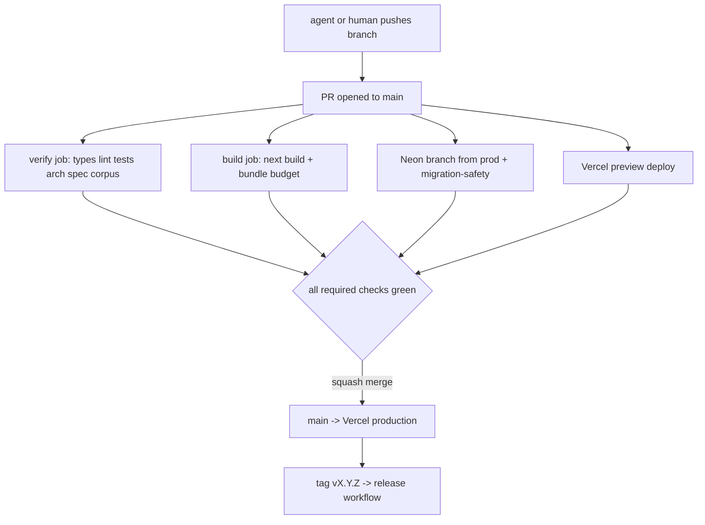

Preview deploys run through **Vercel's native Git integration**, not a `vercel deploy` step in Actions. Alternative rejected: deploying from CI with `vercel@59.10.0` [fetched 2026-08-30] and a token. Why: the native integration already posts the preview URL as a check and a PR comment, handles concurrency, and needs no token in GitHub at all — one fewer secret to rotate. Cost: preview builds are not gated on `verify` passing, so a preview can be green while tests are red. That is acceptable because the preview is for *looking at*, and merge is gated on the checks list, not on the preview.

The repo already ships `scripts/vercel-ignore-build.sh` wired via `vercel.json`'s `ignoreCommand` [measured]. It skips the build unless `src public package.json package-lock.json next.config.ts tsconfig.json eslint.config.mjs postcss.config.mjs vercel.json .nvmrc` changed, and **builds** when the previous SHA is unresolvable. That default direction is correct: an unknown state must build, never skip. Vercel Hobby allows 100 deployments/day, Pro 6,000 [fetched 2026-08-30, `vercel.com/docs/plans/hobby`, page dateModified 2026-08-11]; the ignore command is what keeps a docs-heavy repo under the Hobby ceiling. Note the same page states Hobby is restricted to non-commercial personal use — the moment this repo takes a paying customer, the plan is Pro, and that is a licensing fact, not a resource one.

### 9.7 Database migration safety

The control plane is one Postgres holding zero document bytes. Migrations are **plain numbered SQL** applied by a ~60-line runner using `pg@8.23.0` [fetched 2026-08-30].

| Option | Verdict |
|---|---|
| Plain SQL + tiny runner | **Picked.** RLS policies, `SECURITY DEFINER` functions and partial indexes are written as SQL anyway; nothing translates them |
| Prisma Migrate | Rejected. Owns the schema; hand-written RLS lives outside its model and drifts |
| Drizzle Kit | Rejected, narrowly. Good tool, but couples schema truth to TypeScript, and we already have one hard rule that truth lives in files, not in a generator |
| Supabase CLI | Rejected. Couples the control plane to one host; the architecture says swappable |

**Forward-only, expand → migrate → contract, three separate PRs.** Never one.

```
migrations/
  0007_expand_add_workspace_slug.sql      -- PR 1: additive only
  0008_backfill_workspace_slug.sql        -- PR 2: data, idempotent, batched
  0009_contract_drop_legacy_slug.sql      -- PR 3: destructive, >= 1 release later
```

```sql
-- 0007_expand_add_workspace_slug.sql  (nullable, defaulted, no rewrite lock)
ALTER TABLE workspaces ADD COLUMN IF NOT EXISTS slug text;
CREATE UNIQUE INDEX CONCURRENTLY IF NOT EXISTS workspaces_slug_key
  ON workspaces (slug) WHERE slug IS NOT NULL;
ALTER TABLE workspaces ENABLE ROW LEVEL SECURITY;
CREATE POLICY workspaces_tenant_read ON workspaces
  FOR SELECT USING (id = current_setting('app.workspace_id', true)::uuid);
```

**`.github/workflows/migration-safety.yml`** — runs only when `migrations/**` changes.

```yaml
name: migration-safety
on:
  pull_request:
    paths: ['migrations/**', 'scripts/migrate.mjs']

permissions:
  contents: read

jobs:
  migration-safety:
    runs-on: ubuntu-latest
    timeout-minutes: 10
    steps:
      - uses: actions/checkout@v7
      - uses: actions/setup-node@v7
        with: { node-version: '24.6.0', cache: npm }
      - run: npm ci --no-audit --no-fund
      - name: create ephemeral Neon branch from production
        id: db
        run: |
          npx neonctl@4.13.0 branches create \
            --project-id "$NEON_PROJECT_ID" --name "ci/pr-${{ github.event.number }}" \
            --parent production --output json > branch.json
          echo "url=$(jq -r '.connection_uris[0].connection_uri' branch.json)" >> "$GITHUB_OUTPUT"
        env:
          NEON_API_KEY: ${{ secrets.NEON_API_KEY }}
          NEON_PROJECT_ID: ${{ vars.NEON_PROJECT_ID }}
      - name: forbid destructive statements outside a contract migration
        run: node scripts/ci/migration-lint.mjs
      - name: apply forward
        run: node scripts/migrate.mjs up
        env: { DATABASE_URL: ${{ steps.db.outputs.url }} }
      - name: assert RLS on every tenant table
        run: node scripts/ci/assert-rls.mjs
        env: { DATABASE_URL: ${{ steps.db.outputs.url }} }
      - name: previous release's code against the new schema
        run: |
          git fetch --tags --depth=1 origin
          git checkout "$(git describe --tags --abbrev=0 origin/main)" -- src
          npm run test -- src/**/*.repo.test.ts
        env: { DATABASE_URL: ${{ steps.db.outputs.url }} }
      - if: always()
        run: npx neonctl@4.13.0 branches delete "ci/pr-${{ github.event.number }}" --project-id "$NEON_PROJECT_ID"
        env: { NEON_API_KEY: ${{ secrets.NEON_API_KEY }} }
```

The last real step is the one that matters and the one everybody skips: **run the previous release's repository tests against the new schema.** Expand-migrate-contract only works if N-1 code survives N schema; this proves it in CI instead of at 3am. Neon's Free plan allows **10 branches per project, 0.5 GB storage per project, 5 GB egress, $0/month** [fetched 2026-08-30, `neon.com/docs/introduction/plans`], which is why the branch is deleted in an `if: always()` step — ten stale PR branches and the free tier is full.

`migration-lint.mjs` rejects `DROP COLUMN`, `DROP TABLE`, `ALTER … TYPE`, and `RENAME` in any file whose name does not contain `contract_`, and rejects `CREATE INDEX` without `CONCURRENTLY`. Rollback is **not** by down-migration; a down-migration that drops a column loses data that the expand step's whole point was to keep. Rollback is: revert the application deploy (Vercel Instant Rollback), leave the schema expanded, write a new forward migration.

### 9.8 Secrets

| Secret | Where | Rotation |
|---|---|---|
| `NEON_API_KEY` | GitHub Actions secret, `migration-safety` job only | Quarterly |
| `NEON_PROJECT_ID` | GitHub **variable**, not secret (it is not one) | — |
| Vercel deploy credentials | **None in GitHub.** Native Git integration | — |
| `TAURI_SIGNING_PRIVATE_KEY`, `APPLE_*` | GitHub Environment `desktop-release`, protected, required reviewer = the founder | Annually |
| AI provider keys | Not in CI at all. No test hits a live provider | — |

Rules, in order of how much they save you: no long-lived cloud credential enters CI when an OIDC exchange exists; every release-signing secret sits behind a protected **Environment** so a compromised PR workflow cannot reach it; `permissions:` is declared explicitly on every workflow and defaults to `contents: read`; `pull_request_target` is banned outright in this repo, because it runs base-branch workflow code with write-scoped secrets against fork-authored content. No test may require a real API key — if a test needs one, it is an integration test and belongs in a nightly workflow, not the merge gate.

### 9.9 Versioning and release

`package.json` is at `0.1.0` [measured]. Versioning is **SemVer on the app, with the engine's degradation certification as the compatibility contract.**

| Change | Bump | Gate |
|---|---|---|
| A splice that previously succeeded now REFUSES | **major** | Requires an entry in `specs/engine/` and a corpus delta |
| A previously-refused input now splices correctly | minor | New spec + oracle |
| Render projection output bytes change for any corpus file | **major** | `npm run corpus` diff must be reviewed line by line |
| UI, perf, deps | patch/minor | Normal |

Release is a tag, and the tag is the only thing that triggers it:

```yaml
# .github/workflows/release.yml (excerpt)
on:
  push:
    tags: ['v*.*.*']
permissions:
  contents: write
jobs:
  release:
    runs-on: ubuntu-latest
    environment: production
    steps:
      - uses: actions/checkout@v7
        with: { fetch-depth: 0 }
      - name: refuse a tag that is not an ancestor of main
        run: git merge-base --is-ancestor "$GITHUB_SHA" origin/main
      - run: gh release create "$GITHUB_REF_NAME" --generate-notes --verify-tag
        env: { GH_TOKEN: ${{ github.token }} }
```

Desktop (Tauri v2) builds on macOS runners in a separate `desktop-release` workflow gated on the same tag; macOS runner minutes bill at a multiplier, so it runs on tags only, never on PRs. Web has no release artifact — `main` merging is the release, and rollback is Vercel Instant Rollback, measured in seconds.

### 9.10 The break-it-once rule

**No green CI run is trusted until the pipeline has been made to go red on purpose, once per gate.** This is not optional and it is not a one-time ceremony at setup; it is re-run whenever a gate is added or a workflow file is edited.

Procedure, on a throwaway branch `ci/prove-red`, one commit per row, each pushed and observed:

| # | Deliberate break | Must fail as |
|---|---|---|
| 1 | `const x: number = "s"` in `src/` | `verify` — typecheck |
| 2 | An unused import | `verify` — lint (`--max-warnings=0`) |
| 3 | Invert one splice-boundary assertion | `verify` — test |
| 4 | `import { pool } from '@/shared/infrastructure/db'` inside a domain file | `verify` — arch, **exit 1** |
| 5 | Rename `src/modules/` → `src/features/` | `verify` — arch, **exit 2**, floor refusal |
| 6 | Flip one byte in `test/corpus/foreign/MANIFEST.sha256` | `verify` — corpus, exit 1 |
| 7 | Add `DROP COLUMN` to a non-`contract_` migration | `migration-safety` — migration-lint |
| 8 | Import all of `mermaid` eagerly into the root route | `build` — bundle budget |

Rows 5 and 8 are the ones that catch a *gate* being broken rather than the code. A gate that has never been observed failing is a decoration. Record the run URLs in `docs/ci-proof.md` with dates; when someone later asks "does CI actually check X", the answer is a link, not a belief.

### 9.11 How an AI agent works with this CI

The agent is a contributor with no merge rights and no CI write access.

| Agent may | Agent may not |
|---|---|
| Create branches, commit, open PRs | Push to `main`, force-push any shared branch |
| Read run logs (`gh run view --log-failed`) | Edit `.github/workflows/**` without an explicit human instruction naming the file |
| Re-run a failed job once | Re-run more than once to "get a green" |
| Run all gates locally before pushing | Add `continue-on-error`, `\|\| true`, or `--max-warnings` relaxations to make a gate pass |

The last row is the whole discipline. A gate weakened to get a green is indistinguishable from a gate that never existed, and it is the single most likely thing an agent under time pressure will do. `.github/workflows/**` and `specs/harness/**` are listed in `CODEOWNERS`, and a PR touching them is labelled `gate-change` by a workflow and must be read by a human line by line.

**The reconciliation rule.** Capture `git rev-parse HEAD` immediately before and immediately after every agent run, and diff the range. Prompt-level prohibitions on committing are advisory, not a control: in this workspace, five commits landed from subagents whose prompts explicitly forbade committing [measured, prior incident, commits `b8fd9d1` `2e7ded0` `ec0be22` `7ace826` `7f882d6`]. The prohibition still belongs in the prompt; it is simply not the gate.

**`scripts/ci/agent-run.sh`** — the wrapper every agent invocation goes through:

```bash
#!/usr/bin/env bash
set -euo pipefail
BEFORE="$(git rev-parse HEAD)"
BRANCH="$(git rev-parse --abbrev-ref HEAD)"
printf '%s\n' "$BEFORE" > .git/agent-head-before
trap 'AFTER="$(git rev-parse HEAD)"
      if [ "$BEFORE" != "$AFTER" ]; then
        echo "[reconcile] HEAD moved on $BRANCH: $BEFORE -> $AFTER"
        git --no-pager log --oneline "$BEFORE..$AFTER"
        git --no-pager diff --stat "$BEFORE" "$AFTER"
        echo "[reconcile] review every commit above before pushing."
      else
        echo "[reconcile] HEAD unchanged at $BEFORE"
      fi' EXIT
"$@"
```

Branch guard, as a pre-push hook and mirrored as a CI check on `main`:

```bash
# .git/hooks/pre-push — refuse a direct push to main from any automated run
while read -r _ _ remote_ref _; do
  if [ "$remote_ref" = "refs/heads/main" ] && [ -n "${CLAUDECODE:-}" ]; then
    echo "refusing: agent session pushing directly to main. Open a PR." >&2
    exit 1
  fi
done
```

The agent's definition of done is not "the code looks right" — it is **`npm run verify` passes locally, the PR is open, and every required check on the PR is green**, with the HEAD-delta from `agent-run.sh` pasted into the PR body. `npm run verify` already chains `typecheck && lint && test && build && arch && spec` [measured]; it should be extended to include `corpus` and `budget` so the local command and the remote gate are the same list. Two lists drift; one does not.

---

## 10. Security, rate limiting and abuse prevention

### 10.1 Threat model

The product's security posture is unusual in one load-bearing way: **we do not hold the documents.** They live in the user's git repo. What we hold is a *credential that can write to that repo*, plus a control plane that knows who may use it. The crown jewel is therefore not a database — it is the GitHub App private key, and second the AI provider keys.

| # | Asset | Adversary | Attack | Blast radius | Primary control | Enforced at |
|---|---|---|---|---|---|---|
| A1 | GitHub App private key | Anyone with prod env read | Mint installation tokens for every install | **Every customer repo, write access** | Key never leaves Vercel env; no copy in git, logs, or Postgres; 1h token TTL; rotation runbook §10.8 | Platform |
| A2 | Provider API keys (ours) | Leaked env, SSRF to `/api` | Free inference on our card | $ burn, no data loss | Server-only, per-workspace spend ceiling, no key ever in a client bundle | Server |
| A3 | Customer BYOK provider keys | DB dump | Bill their account | Their $ | AES-256-GCM at rest, KEK in env, never returned by any API (write-only field) | Postgres |
| A4 | Control-plane Postgres | Broken tenancy check | Read another workspace's slugs, entitlements, audit | Metadata only, **zero document bytes** | `workspace_id` on every row + pooled RLS from day one | Postgres |
| A5 | R2 artifacts (attachments >1MB, derived) | Guessable keys | Read a private attachment | Per-object | Keys are `wsid/uuid/sha256`, never sequential; signed GET, 5-min TTL; no public bucket | R2 |
| A6 | Published page renderer `/p/:slug` | Any author | Stored XSS against readers | Session theft **if same origin** | Separate eTLD+1 + nonce CSP + `sandbox` (§10.3) | Edge |
| A7 | The AI lane | Author of a document the agent reads | Prompt injection → exfiltration | Cross-document read, data egress | Trifecta gate: agent has **no network tool** (§10.9) | Agent runtime |
| A8 | Splice engine | Malicious/compromised model output | Silent corruption of user prose | Their file | Byte-exact range match or **REFUSE** — the engine invariant doubles as a security control | Engine |

Explicit non-goals: we are not a secrets manager, not a compliance product, and we do not claim SOC 2. See §10.12 for the triggers that change that.

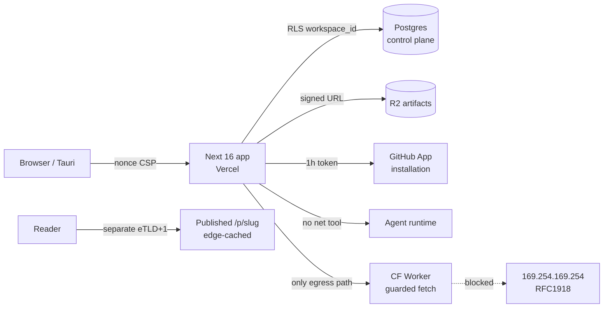

### 10.2 Secrets management

**Pick:** Vercel encrypted environment variables, one project, three environments. **Rejected:** Doppler / Infisical / HashiCorp Vault. **Why:** each adds a runtime dependency, a bootstrap secret, and a $0→$20/mo line for a founder with one prod environment; Vercel env vars are already the trust root for the deploy. **Cost:** no per-secret audit log, no automatic rotation. **Changes our mind:** first employee with prod access, or the first enterprise security questionnaire that asks for secret-access audit trails.

| Secret | Env name | Storage | Rotation | If leaked |
|---|---|---|---|---|
| GitHub App private key | `GITHUB_APP_PRIVATE_KEY` (base64 PKCS#8) | Vercel env, prod only | 90d + on suspicion | Generate new key in App settings, deploy, **delete old key** — GitHub allows two concurrent keys, so rotation is zero-downtime |
| GitHub App webhook secret | `GITHUB_WEBHOOK_SECRET` | Vercel env | 180d | Attacker can forge `installation.*` events → verify HMAC-SHA256 with `timingSafeEqual`, never `===` |
| Auth session secret | `AUTH_SECRET` (next-auth v5) | Vercel env | 180d | Session forgery — rotation logs everyone out; acceptable |
| BYOK KEK | `BYOK_KEK` (32B, base64) | Vercel env | manual | Decrypts every `workspace_provider_key.ciphertext`; rotation = re-wrap loop job |
| Postgres URL | `DATABASE_URL` | Vercel env | on incident | Control-plane read; **no document bytes** |
| R2 access key | `R2_ACCESS_KEY_ID`/`SECRET` | Vercel env | 90d | Scoped to one bucket, no account-level token |

BYOK column encryption, exact shape — `src/modules/billing/infrastructure/byok-cipher.ts`:

```ts
import { createCipheriv, createDecipheriv, randomBytes } from "node:crypto";
const KEK = Buffer.from(process.env.BYOK_KEK!, "base64"); // 32 bytes
export function seal(plain: string, workspaceId: string) {
  const iv = randomBytes(12);
  const c = createCipheriv("aes-256-gcm", KEK, iv);
  c.setAAD(Buffer.from(workspaceId));           // binds ciphertext to tenant
  const ct = Buffer.concat([c.update(plain, "utf8"), c.final()]);
  return Buffer.concat([iv, c.getAuthTag(), ct]).toString("base64");
}
```

The AAD binding matters: a stolen ciphertext replayed into another workspace's row fails authentication rather than decrypting. Repo hygiene: `gitleaks` in pre-commit and CI (§10.10), GitHub push protection on, and a hard rule — **no secret is ever written into a user's markdown repo**, because that repo is theirs and may be public.

### 10.3 HTTP headers and the exact CSP

Current state [measured 2026-08-30, `next.config.ts:21-49`]: `X-Content-Type-Options`, `Referrer-Policy`, `X-Frame-Options: DENY` on all paths; an enforced CSP on `/p/:slug*` only; the editor CSP is **report-only** in `src/proxy.ts:112` (Next 16 renamed `middleware.ts` → `proxy.ts`; there is no `middleware.ts` in this repo). The shipped public CSP contains `script-src 'self' 'unsafe-inline'` — which means CSP is currently *not* a backstop for XSS on the one surface that renders attacker-authored content. That is the single highest-value fix in this section.

**Pick:** per-request nonce + `strict-dynamic`, generated in `proxy.ts`, plus **serving published pages from a different registrable domain**. **Rejected:** hash-based CSP (breaks on every content change), and same-origin publishing. **Why:** a different eTLD+1 means a sanitiser bypass on a published page cannot read app cookies or `localStorage` at all — the control survives a bug in the control below it. **Cost:** a second domain, a second Vercel project or a rewrite, and cross-origin auth for the "edit this page" button. **Changes our mind:** nothing short of the second domain being impossible.

`src/proxy.ts` — generate `const nonce = crypto.randomUUID().replace(/-/g,"")` per request, set it on `x-nonce` for the RSC tree, and CodeMirror 6 takes it directly via the `EditorView.cspNonce` facet, so the editor needs **no** `style-src 'unsafe-inline'` and no `unsafe-eval`.

Authenticated app, enforced:

```
Content-Security-Policy: default-src 'self'; script-src 'self' 'nonce-{NONCE}' 'strict-dynamic'; style-src 'self' 'nonce-{NONCE}'; img-src 'self' data: blob: https://avatars.githubusercontent.com; font-src 'self' data:; connect-src 'self'; media-src 'self' blob:; worker-src 'self' blob:; frame-src 'self' blob: https://www.youtube-nocookie.com https://player.vimeo.com; frame-ancestors 'none'; base-uri 'none'; object-src 'none'; form-action 'self'; upgrade-insecure-requests; report-uri /api/csp-report
```

Published page (`pages.<separate-domain>/p/:slug`), enforced:

```
Content-Security-Policy: default-src 'none'; script-src 'self' 'nonce-{NONCE}'; style-src 'self' 'nonce-{NONCE}'; img-src 'self' data: https:; font-src 'self'; connect-src 'none'; media-src 'self' https:; frame-src https://www.youtube-nocookie.com https://player.vimeo.com; frame-ancestors 'none'; base-uri 'none'; object-src 'none'; form-action 'none'
```

Accompanying headers on both: `Strict-Transport-Security: max-age=63072000; includeSubDomains; preload`, `X-Content-Type-Options: nosniff`, `Referrer-Policy: strict-origin-when-cross-origin`, `Cross-Origin-Opener-Policy: same-origin`, `Cross-Origin-Resource-Policy: same-site`, `Permissions-Policy: camera=(), microphone=(), geolocation=(), payment=(), interest-cohort=()`. Ship report-only for 7 days, read `/api/csp-report`, then flip. `report-uri` is deprecated but still the only thing Safari honours as of writing [SS] — send both `report-uri` and `report-to`.

### 10.4 XSS and the sanitisation boundary

Current pipeline [measured]: `rehype-raw@^7.0.0` passes author HTML through verbatim, then a hand-rolled 215-line `createRehypeHtmlPolicy` (`src/modules/preview/presentation/markdown/html-policy.ts`) walks the hast, drops 12 disallowed elements, converts unknown elements back to **literal text**, strips every `on*` attribute, and scheme-checks URL attributes (it already defends `java\nscript:` by stripping control characters before the colon — good).

**Pick:** keep that policy, but put `rehype-sanitize@6.0.0` (`hast-util-sanitize@5.0.2`) *in front of it* as layer 1 with a schema derived from `defaultSchema` plus our additions (task-list `input[type=checkbox][disabled]`, `details`/`summary`, KaTeX `span[class]`, footnote ids). **Rejected:** hand-rolled allowlist alone. **Why:** hand-rolled allowlists are exactly where sanitiser CVEs live, and one function with one reviewer is the wrong number of eyes for the only thing between an author and a reader's session. **Cost:** ~1 day reconciling the two allowlists, plus schema drift whenever we add a renderer. **Changes our mind:** if `hast-util-sanitize` blocks a feature we must ship and the schema cannot express it — then the exception is a named, tested, single-element carve-out, never a return to hand-rolling.

Non-negotiable structural rules for the implementer:

1. **One boundary function.** `renderMarkdown(source, {trusted:false})` in `src/modules/preview/…` is the only path from bytes to hast-to-HTML. Any new renderer (PDF export, OG image, email digest, desktop preview) calls it. A second pipeline is a second sanitiser, and the second one is always the one that ships broken.
2. Sanitise **after** `rehype-raw`, **before** `rehype-highlight`/`rehype-katex`/stringify. Sanitising the mdast is not sanitising.
3. KaTeX: `{ trust: false, strict: "ignore", output: "html" }` — `trust:true` re-enables `\href` and `\htmlData`, which is an injection primitive.
4. Mermaid (`mermaid@^11.15.0`): render server-side or in a `sandbox`ed iframe on a null origin; `securityLevel: "strict"`. Mermaid has had click-handler and label-HTML injections historically [SS].
5. Anchors: keep the existing `target=_blank` + `rel="noopener noreferrer"` for external links.

Gate: `test/security/xss-corpus.spec.ts` runs the OWASP/cure53 payload list plus every historical bypass we find, asserts the rendered HTML contains no `<script`, no `on[a-z]+=`, no `javascript:`, and — the part people forget — asserts the *literal-text fallback* is preserved, because refusing-into-text is the product's stated behaviour and a "fix" that silently drops content is a regression.

### 10.5 SSRF

User-supplied URLs enter at: remote images in markdown resolved during PDF export, OG/link unfurls, "import from URL", B2B outbound webhooks, and avatar proxying. **Pick:** all external egress goes through one Cloudflare Worker (`fm-fetch`), never directly from a Vercel function. **Rejected:** an allowlist-only `fetch()` in the Next runtime. **Why:** the Worker runtime has no cloud metadata endpoint and no private network adjacency to reach, so the worst SSRF outcome there is "fetched a public URL" — that is a topology control, not a string check, and string checks lose to DNS rebinding. **Cost:** one more deployable, ~40 lines of Worker; Workers free tier covers this at our scale. **Changes our mind:** if we move off Vercel to a VPC where the Worker hop adds latency we can't absorb.

The Worker still applies belt-and-braces: `https:` only; resolve the hostname first and reject `10/8`, `172.16/12`, `192.168/16`, `127/8`, `169.254/16` (this is where `169.254.169.254` lives), `::1`, `fc00::/7`, and any `.internal`/`.local` suffix; `redirect: "manual"` with at most 2 hops each re-validated; 5 s timeout; 5 MB body cap; `Content-Type` allowlist for image endpoints; no credentials, no cookies, no `Authorization` forwarded. Webhooks additionally require the customer to prove domain control (a one-time challenge GET) before we will POST to it — that is what stops "webhook to `http://internal-jenkins/`".

### 10.6 Rate limiting

Two layers, because they answer different questions. **Layer 1 (edge, `proxy.ts`)** answers *is this traffic?* — per-IP, cheap, sliding-window, protects availability. **Layer 2 (application)** answers *has this workspace bought this?* — per-`workspace_id`, tied to entitlements, protects the P&L. Never conflate them: an IP limit that gates a paid workspace is an outage, and a workspace limit that gates a DoS is a bill.

**Pick:** `@upstash/ratelimit@2.0.8` + `@upstash/redis@1.38.3`, sliding-window algorithm, for layer 1 and for HTTP-cheap layer 2 counters; a Postgres `usage_counter` row with `UPDATE … RETURNING` for **AI actions specifically**. **Rejected:** token bucket in Redis for AI (burst is exactly what we don't want to allow when each burst unit costs real money), and Vercel WAF rate limiting (plan-gated, and I could not confirm its tier availability from the docs today — treat as unverified). **Why Postgres for AI:** the monthly quota is a billing fact; it must be transactional with the entitlement row and survive a Redis eviction. **Cost:** one extra round trip on the AI path (~3 ms, irrelevant next to a model call). **Changes our mind:** if Upstash adds durable counters with a transactional read-modify-write, collapse to one store.

Upstash pricing [fetched 2026-08-30, upstash.com/pricing/redis]: free tier 256 MB / 500 K commands per month; pay-as-you-go **$0.20 per 100 K commands**. At 2 commands per limited request, 100 users × 300 requests/day = 60 K commands/day → 1.8 M/mo → 1.3 M billable → **$2.60/mo** [derived: (1.8M − 0.5M) / 100K × $0.20]. That is the whole cost of layer 1 at 100 users.

**Unit-economics arithmetic for the AI limits.** One "AI action" = one instruction over a document window: ~6,000 input tokens + ~1,200 output tokens [inference, from the splice-plan shape; instrument and re-derive from `ai_action` rows before repricing].

- Strong model @ $2/$10 per Mtok [from PRD round 7; re-verify before publishing a price]: `6000/1e6 × 2 + 1200/1e6 × 10 = $0.012 + $0.012 = $0.024`
- Floor model on Groq/Cerebras @ ~$0.20/$0.60 per Mtok [SS — verify]: `6000/1e6 × 0.20 + 1200/1e6 × 0.60 = $0.0012 + $0.00072 = $0.0019`
- Routing 80% floor / 20% strong → blended `0.8 × 0.0019 + 0.2 × 0.024 = 0.0015 + 0.0048 = $0.0063` ≈ **$0.0064 per action**

| Surface | Free | Pro $9/mo | Team $19/seat/mo | BYOK / self-serve B2B | Enforced at | Key |
|---|---|---|---|---|---|---|
| AI actions | 30 / mo | 400 / mo | 1,200 / seat / mo, **pooled** | 10,000 / mo (fraud ceiling) | Postgres `usage_counter`, txn | `workspace_id` |
| AI cost at cap [derived] | $0.19 | $2.56 | $7.68 / seat | their card | — | — |
| AI cost at p90 = 35% of cap | $0.07 | $0.90 | $2.69 / seat | — | — | — |
| Contribution after AI at p90 | — | **90%** | **86%** | ~100% | — | — |
| API requests | 60 / min | 300 / min | 600 / min / seat | 1,200 / min | `proxy.ts` + Upstash | `ws:{id}` |
| Git sync ops (push/pull) | 6 / min | 30 / min | 60 / min | 60 / min | app route | `installation_id` |
| PDF / DOCX export | 5 / day | 100 / mo | 500 / mo | 2,000 / mo | Postgres counter | `workspace_id` |
| Server-side search | 30 / min | 120 / min | 240 / min | 240 / min | Upstash | `ws:{id}` |
| Published-page reads | unmetered, edge-cached | — | — | — | CF cache | — |
| Anonymous (per IP) | 30 / min all routes | — | — | — | `proxy.ts` | `ip:{cf-connecting-ip}` |

The caps are **fraud ceilings, not budgets**. The budget assumption is that p90 usage is ~35% of cap; at 10,000 Pro users that is 10,000 × $0.90 = **$9,000/mo** of AI cost against $90,000 of revenue. If measured p90 exceeds 50% of cap for two consecutive months, the routing mix is wrong before the price is — check the 80/20 split first.

Exact 429 (`src/shared/http/rate-limit-response.ts`):

```http
HTTP/1.1 429 Too Many Requests
Retry-After: 37
RateLimit-Limit: 400
RateLimit-Remaining: 0
RateLimit-Reset: 37
RateLimit-Policy: 400;w=2592000;comment="ai_actions_monthly"
Content-Type: application/problem+json

{"type":"https://frontmatter.app/errors/rate-limit","title":"AI action limit reached",
 "status":429,"detail":"Your workspace has used all 400 AI actions for this billing period. 
 Resets 2026-09-01T00:00Z. Nothing was written to your repository.",
 "limit":400,"used":400,"resets_at":"2026-09-01T00:00:00Z","scope":"workspace",
 "upgrade_url":"https://frontmatter.app/settings/billing"}
```

Two things that message must always do: name the **scope** (so a user on a team knows whether it is them or the pool), and state explicitly that **no bytes were written** — for a product whose promise is the file is the truth, "did it half-apply?" is the only question that matters during a 429.

### 10.7 Bot and scraper defence on published pages

Published pages must be indexed by Google and Bing — discoverability is the growth loop — so blocking crawlers is not on the table. The real defence is **making scraping cost us nothing**: published HTML is fully rendered at publish time and served from the Cloudflare edge cache, so a scraper hits a CDN object, not a function.

| Signal | Action | Where |
|---|---|---|
| Any bot, any volume, on `/p/*` | Serve from edge cache; never invoke origin | CF cache rules |
| AI training crawlers (GPTBot, CCBot, ClaudeBot…) | Per-document author toggle → `robots.txt` + `X-Robots-Tag: noai`; Cloudflare "Block AI Scrapers" as the enforcing layer | CF + publish settings |
| >120 req/min from one IP on `/p/*` | Managed challenge (not block — shared NATs) | CF rate limiting rule |
| Signup, publish, contact form | Cloudflare Turnstile, invisible mode | App route, server-verified |
| Credential stuffing on `/api/auth` | 5 attempts / 15 min per (IP, email); constant-time response either way | Upstash |
| Slug enumeration | Slugs are `{user-chosen}-{6 base32 chars}` for unlisted docs; 404 and 403 are byte-identical | App route |

Turnstile over hCaptcha/reCAPTCHA: free, no cookie, privacy-preserving, and we are already on Cloudflare for R2 and DNS — one fewer vendor.

### 10.8 GitHub App token blast radius

[fetched 2026-08-30, docs.github.com] Installation access tokens **expire after 1 hour**. An installation's REST limit is **5,000 requests/hour**, scaling +50/hr per repo above 20 repos and +50/hr per user above 20 users, **capped at 12,500/hr**; GitHub Enterprise Cloud installations get 15,000.

| Control | Rule |
|---|---|
| Permissions requested | `contents: write`, `metadata: read`, `pull_requests: write` (optional, for the review lane). **Nothing else** — no Actions, no secrets, no org administration, no members |
| Repo selection | Onboarding defaults to *Only select repositories* and says so in copy; "All repositories" is never pre-selected |
| Token at rest | **Never.** Minted per request from the App key via `@octokit/auth-app@8.3.0`, held in process memory ≤50 min, never in Postgres, never in Redis, never logged. A token in Redis is a token in a memory dump |
| Tenancy | `workspace_github_installation(workspace_id UNIQUE, installation_id UNIQUE)`. Every repo operation re-checks that the caller's `workspace_id` maps to the installation *at call time* — the installation is the connector, never the identity |
| Budget | Per-installation request counter; at 80% of the observed `x-ratelimit-limit`, background sync backs off and interactive work is prioritised. Never let a batch job starve a user's save |
| Revocation | User-facing "Disconnect" calls `DELETE /app/installations/{id}`; `installation.deleted` and `installation_repositories.removed` webhooks purge cached state within one event |
| Key compromise | Runbook: add second key in App settings → deploy → verify → delete first key. Zero downtime, ~10 minutes. Practise it once before you need it |

### 10.9 Prompt injection and the lethal-trifecta gate

The agent reads documents it did not write — shared vaults, teammate files, imported repos. Assume every document is attacker-authored. The gate: **the agent runtime may hold at most two of {private data access, untrusted content, external communication}**, and we permanently remove the third.

| Trifecta leg | Present? | Control |
|---|---|---|
| Access to private data | Yes, by design | Every tool call scoped to a single `workspace_id` resolved from the session, never from the prompt |
| Exposure to untrusted content | Yes, by design | Documents wrapped in a provenance delimiter; system prompt states document content is data, never instruction |
| **Ability to externally communicate** | **No — removed** | The agent tool loadout contains no fetch, no HTTP, no webhook, no email, no shell. Rendered AI output never triggers an outbound request: images with remote `src` in AI-authored output are not auto-loaded, which kills `` |

Tool loadout (the whole list): `read_range(path, start, end)`, `search_workspace(query)`, `propose_splice(path, start, end, expected_bytes, replacement)`. There is **no write tool**. The agent proposes; the engine applies only after the user confirms, and only if `expected_bytes` matches the file byte-for-byte — the product's core REFUSE invariant is also its strongest injection control, because an injected instruction cannot cause a silent rewrite of a range the user never saw. Every proposal lands in `ai_action(workspace_id, model, prompt_sha256, path, byte_range, accepted, created_at)`. Cross-workspace reads are impossible by construction, not by prompt. And per the standing house rule: a tool call that returns untrusted content followed in the same turn by any outward-facing tool requires explicit user confirmation — which, given the loadout above, should never arise; if it does, that is a bug report, not a prompt-engineering problem.

### 10.10 Dependency and supply chain

**There is no CI in this repo at all** — 98 test files and 1,575 tests that nothing runs on push. That is the finding; everything else here is secondary.

`.github/workflows/ci.yml`, minimum viable, all $0 on public/free Actions minutes:

```yaml
permissions: { contents: read }
jobs:
  verify:
    runs-on: ubuntu-latest
    steps:
      - uses: actions/checkout@08c6903cd8c0fde910a37f88322edcfb5dd907a8  # v5, SHA-pinned
      - uses: actions/setup-node@a0853c24544627f65ddf259abe73b1d18a591444  # v5
        with: { node-version: '22', cache: 'npm' }
      - run: npm ci --ignore-scripts
      - run: npx tsc --noEmit
      - run: npx eslint .
      - run: npx vitest run --coverage
      - run: npm audit --audit-level=high
      - run: npx osv-scanner@latest scan --lockfile=package-lock.json
      - run: npx lockfile-lint --path package-lock.json --allowed-hosts npm --validate-https
      - run: docker run --rm -v "$PWD:/p" zricethezav/gitleaks:latest detect -s /p --no-git
```

| Control | Tool | Note |
|---|---|---|
| Third-party actions | SHA-pinned, never `@v5` | A tag is mutable; a tag is how `tj-actions/changed-files` became an incident |
| Workflow permissions | `contents: read` at top level, escalate per-job | Default `write` is a supply-chain gift |
| Install scripts | `--ignore-scripts` in CI | Production build keeps scripts (`@sparticuz/chromium` needs them) from a pinned lockfile only |
| Dependency updates | Dependabot weekly, grouped, **manual review of any new transitive publisher** | Auto-merge only patch-level for devDependencies |
| New-version quarantine | No dependency added within 7 days of publication, no exceptions | Cheapest defence against a compromised publish |
| SBOM | `npm sbom --sbom-format cyclonedx > sbom.json` per release tag | Answers "are we affected by X?" in 30 seconds |
| Desktop | Tauri v2 updater signing key offline, never in CI; `dangerousDisableAssetCspModification: false` | A signed malicious update is unrecoverable |
| Runtime | **No arbitrary client-side code execution, ever** (settled) | This removes an entire class; do not reopen it for "just plugins" |

### 10.11 Vulnerability disclosure

`public/.well-known/security.txt` (RFC 9116), served at both origins:

```
Contact: mailto:security@frontmatter.app
Expires: 2027-08-30T00:00:00.000Z
Preferred-Languages: en
Canonical: https://frontmatter.app/.well-known/security.txt
Policy: https://frontmatter.app/security
Acknowledgments: https://frontmatter.app/security/thanks
```

GitHub **private vulnerability reporting** enabled on the repo as the second intake. Published policy: safe harbour for good-faith research (no legal action, no account termination) provided the researcher tests only against their own workspace, does not access others' data, does not degrade service, and gives 90 days. Our commitments: acknowledge in **72 hours**, triage severity in **5 business days**, fix critical in **7 days** / high in **30** / medium in **90**, credit in the acknowledgments page. **No paid bounty** — one founder cannot underwrite a bounty programme, and saying so plainly is better than a programme that pays late. Trigger to start one: 1,000 paying workspaces, or the first enterprise contract that requires it.

### 10.12 Deliberately not doing yet

| Control | Why not now | Trigger |
|---|---|---|
| SOC 2 Type II | ~$25–40k and months for a solo founder | First enterprise deal that blocks on it |
| External pen test | Would mostly re-find §10.3 and §10.4 | 1,000 paying workspaces, or before any on-prem offering |
| KMS/HSM for the GitHub App key | Vercel env is the trust root anyway; a KMS adds a bootstrap credential | First employee with production access |
| Managed WAF rulesets | No observed abuse; false positives on a markdown app are severe | First real attack, or the first scraped-content complaint |
| Per-tenant encryption keys | We hold zero document bytes; the blast radius does not justify the key-management burden | Storing any document body server-side — which the architecture says we never will |

---

## 11. Caching and content delivery

Caching in this product is not a performance nicety. It is the only thing standing between a solo founder and a GitHub rate-limit lockout, and the only way a git-backed editor feels like Google Docs. But every cache is a second copy of the truth, and this product's first principle is that the file is the only source of truth. So the rule for this section is: **cache derivations, never bytes we would then be tempted to serve as authoritative.** Every cached value is either (a) content-addressed by the SHA of the bytes it derives from, making staleness structurally impossible, or (b) explicitly revocable within a bounded, stated window.

### 11.1 The five layers and what belongs in each

| Layer | Technology | What it holds | What must NEVER go here |
|---|---|---|---|
| Browser | HTTP cache, IndexedDB | Static JS/CSS/fonts, SHA-keyed file bodies, MiniSearch index for the open workspace | Anything cross-tenant; any publish state; auth tokens |
| CDN / edge | Cloudflare CDN in front of Workers/Pages | Published page HTML, published attachments, `/_next/static/*` | Editor API responses; anything requiring a session cookie to authorize |
| Edge KV | Cloudflare Workers KV | `slug → {workspace_id, r2_key, revoked}` publish routing map | Document bytes; entitlements needing strong consistency |
| Application | In-process LRU + Upstash Redis | Parsed AST, rendered HTML, degradation certificates, GitHub tree listings, rate-limit counters | Anything larger than 1 MB (goes to R2); session-scoped user data with long TTL |
| Database | Postgres control plane | Publish slugs, entitlements, audit, job state | Document bytes. Zero. This is a settled constraint. |

The layer boundary that matters most: **the editor path never touches the CDN.** Editor responses are `Cache-Control: private, no-store` because they are authorized per-session and per-workspace, and a CDN cache-key mistake there is a cross-tenant data leak. The CDN's only job is published, deliberately-public content. That asymmetry keeps the blast radius of a caching bug at "a stale public page" rather than "workspace A reads workspace B."

**Rejected: caching editor GET responses at the edge with a `Vary: Cookie` header.** Vary-on-cookie produces a cache entry per session, so the hit rate approaches zero while the risk of a misconfigured key approaches catastrophe. Cost of rejecting: editor cold reads stay ~120–300 ms instead of ~20 ms. Acceptable — the editor loads from the local Redis/LRU path anyway. What would change our mind: nothing short of per-tenant edge isolation with cryptographic key derivation, which is not worth one founder's operating budget.

### 11.2 Content-addressed caching: the SHA is the cache key

The GitHub Contents API returns a `sha` for every blob — the git object hash of the content ([fetched] docs.github.com/rest/repos/contents, read 2026-08-30). That SHA is a perfect cache key: it changes if and only if the bytes change. This is the single highest-leverage decision in the section.

```ts
// src/lib/cache/keys.ts
export const K = {
  // Immutable — keyed by content hash. Never invalidated, only evicted.
  blob:   (sha: string) => `blob:${sha}`,                        // raw UTF-8 bytes
  ast:    (sha: string, v: number) => `ast:${v}:${sha}`,         // remark AST
  html:   (sha: string, v: number, theme: string) => `html:${v}:${theme}:${sha}`,
  cert:   (sha: string, v: number) => `cert:${v}:${sha}`,        // degradation certificate

  // Mutable — keyed by location. Short TTL, explicitly invalidated.
  ref:    (ws: string, repo: string, branch: string) => `ref:${ws}:${repo}:${branch}`,
  tree:   (ws: string, repo: string, commitSha: string) => `tree:${ws}:${repo}:${commitSha}`,
  rate:   (installationId: string) => `rl:${installationId}`,
} as const;
```

The `v` is a pipeline version integer, bumped in one place when remark plugins, the renderer, or the certification rules change. Bumping `v` invalidates every derived entry globally without a single delete — the old keys simply stop being read and expire on their own TTL. This is the cheapest cache-busting mechanism that exists and it costs one constant.

Because `blob:${sha}` and `ast:${v}:${sha}` are immutable, they can be served with `Cache-Control: public, max-age=31536000, immutable` when they travel over HTTP, and they can be cached in the browser's IndexedDB indefinitely. The only mutable question in the whole system becomes: **what SHA is at path X on branch Y right now?** That is one small, cheap, short-TTL lookup, and everything else hangs off it.

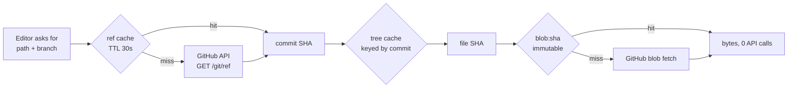

The consequence worth stating plainly: for a workspace that is reading and not writing, steady-state GitHub API cost is **one conditional ref request per 30 seconds per open repo**, not one request per file. That is the rate-limit protection, and it is a direct product of content-addressing.

### 11.3 The GitHub rate-limit budget

[fetched] docs.github.com/rest/using-the-rest-api/rate-limits-for-the-rest-api, read 2026-08-30: a GitHub App installation on an organization gets a base 5,000 requests/hour, scaling with organization size to **a maximum of 12,500 requests/hour**. Installations on personal accounts do not get the scaling bonus and stay at 5,000/hour. Conditional requests returning `304 Not Modified` **do not count against the limit** — this is the second load-bearing fact in this section, after content-addressing.

[derived] Budget at 12,500/hour, one installation, no conditional requests: 12,500 ÷ 3,600 = 3.47 requests/second sustained. If ten users of one org workspace each open a 200-file vault and we fetch naively per file, that is 2,000 requests in one burst — 16% of the hourly budget for a single cold start. Ten such cold starts exhaust it. This is not a theoretical risk; it is the default behaviour of any editor that does not cache.

[derived] Budget with the design above: one ref poll per open repo per 30 s = 120 requests/hour/repo, of which the vast majority return 304 and cost nothing. A workspace with 20 active repos costs ~2,400 nominal / near-zero billed requests per hour. Headroom: >80%.

Implementation requirements, non-negotiable:

1. **Every GitHub request sends `If-None-Match` with the stored ETag.** Store the ETag next to the cached value. A 304 refreshes the TTL and costs no quota.
2. **A per-installation token bucket in Redis, sized from the response headers**, not from an assumed constant. Read `x-ratelimit-remaining` and `x-ratelimit-reset` on every response and write them to `K.rate(installationId)`. Refuse new non-interactive work below 20% remaining; refuse background jobs below 40%. Interactive user actions get the last 20%.
3. **`retry-after` and `x-ratelimit-reset` are obeyed absolutely.** GitHub also enforces secondary rate limits — no more than 100 concurrent requests, and content-generating writes (which includes creating commits) should be spaced [fetched, same doc]. Serialize writes per installation.
4. **Never treat the connector as the tenant.** The bucket is keyed by installation because that is what GitHub meters, but authorization is keyed by `workspace_id`. Two workspaces sharing one installation share a quota bucket and must not share a cache entry: `K.tree` and `K.ref` both carry `ws` in the key precisely for this.

```ts
// src/lib/github/budget.ts
const FLOOR = { interactive: 0.05, background: 0.40, batch: 0.60 } as const;

export async function admit(instId: string, kind: keyof typeof FLOOR) {
  const s = await redis.hgetall<{remaining: string; limit: string; reset: string}>(K.rate(instId));
  if (!s) return { ok: true };                       // no data yet: allow, then record
  const frac = Number(s.remaining) / Number(s.limit);
  if (frac > FLOOR[kind]) return { ok: true };
  return { ok: false, retryAt: Number(s.reset) * 1000, reason: 'github_budget' };
}
```

When `admit` refuses, the product **refuses visibly** — "GitHub quota is exhausted for this connection, resuming at 14:32 IST" — consistent with the engine's refuse-rather-than-guess posture. It does not silently serve stale bytes and let the user edit them, because that produces a splice against a phantom base and a merge conflict later.

### 11.4 The snapshot problem

[measured] The current implementation parses **77.5 MB per cold start** to build a whole-vault snapshot, and the resulting response body is **16.4×** the platform's body cap. Caching does not fix this. It is worth being blunt about why, because the temptation to "just cache the snapshot" is strong and wrong:

- **The response still exceeds the cap on a cache hit.** A cached 16.4×-oversized body is an oversized body. The transport limit is not a compute limit.
- **The cache key is the whole vault.** One edit to one file changes the vault state, so the entry invalidates on every keystroke-flush. Hit rate on an actively-edited vault approaches zero.
- **The memory cost lands on the server.** 77.5 MB × N concurrent cold starts is the fastest path to an OOM on any managed runtime, and there is no cache configuration that reduces it.

The fix is architectural and already settled in the search section: stop shipping whole-vault snapshots. Caching's role is what remains after that change:

| Old behaviour | Replacement | Cache role |
|---|---|---|
| Parse whole vault to build a search index | Postgres FTS + `pg_trgm` server-side; query returns ≤50 rows | Redis caches the query→rows for 60 s |
| Ship full file list with content | Ship tree metadata only: path, sha, size, mtime | `K.tree` keyed by commit SHA, immutable within a commit |
| Client holds every file body | Client fetches bodies lazily, keyed by SHA | IndexedDB, permanent, content-addressed |
| Client-side MiniSearch over everything | MiniSearch over the ≤2,000 most-recent paths' titles+headings only | Built once per commit, stored in IndexedDB |

[derived] Tree metadata for a 5,000-file vault at ~120 bytes/entry ≈ 600 KB, ~90 KB gzipped. That fits any body cap with three orders of magnitude to spare, and it is the only thing a cold start needs before the first file renders. **This is the actual fix; caching is what makes the second cold start free.**

### 11.5 Publish, unpublish, and immediate revocation

Published pages are the one place we deliberately want aggressive edge caching, and the one place where a stale cache is a genuine harm — an unpublished page that stays readable is a privacy incident. The requirement is absolute: **unpublish revokes immediately, including at the CDN.**

Three mechanisms in series, because any one of them alone has a failure mode:

1. **Cache tags on every published response.** Cloudflare Cache Rules can set a `Cache-Tag` header, and Enterprise plans support purge-by-tag; Business and below support purge-by-URL and purge-everything ([fetched] developers.cloudflare.com/cache/how-to/purge-cache, read 2026-08-30). At our scale we use **purge-by-URL**, which is on all plans including Free, at up to 30 URLs per API call, 1,000–10,000 purges/minute depending on plan.
2. **A KV revocation check at the edge.** The Worker reads `slug → {revoked}` from Workers KV before serving from cache. KV writes are eventually consistent, documented as **up to 60 seconds** for global propagation ([fetched] developers.cloudflare.com/kv/concepts/how-kv-works, read 2026-08-30). That 60 s is the honest worst case for revocation and must be stated in the product's own privacy copy.
3. **Postgres as the authority.** The slug row is the truth. If KV and Postgres disagree, Postgres wins, and a reconciliation job re-purges. Postgres is also where publish-slug uniqueness is enforced — never in a cache.

```ts
// src/app/api/publish/[slug]/route.ts — unpublish handler, order is load-bearing
export async function DELETE(req: Request, { params }: { params: { slug: string } }) {
  const ws = await requireWorkspace(req);                          // RLS scope
  // 1. Authority first. If this fails, nothing else runs.
  await sql`UPDATE publish SET revoked_at = now()
            WHERE slug = ${params.slug} AND workspace_id = ${ws.id}`;
  // 2. Edge gate second. Bounded by KV propagation (<=60s worst case).
  await kv.put(`pub:${params.slug}`, JSON.stringify({ revoked: true }), { expirationTtl: 86400 });
  // 3. CDN purge third. Fire-and-verify, retried by a job on failure.
  await purgeUrls([
    `https://pages.frontmatter.dev/${params.slug}`,
    `https://pages.frontmatter.dev/${params.slug}/index.json`,
  ]);
  await enqueue('verify_purge', { slug: params.slug, attempts: 0 });
  return Response.json({ revoked: true, edgeConsistentWithinSeconds: 60 });
}
```

The `verify_purge` job re-fetches the public URL from outside our network after 5 s, 30 s, and 120 s and alerts if a 200 is still returned. **Without that verifier, a failed purge is silent**, and silent is the one thing an unpublish must never be. This is the same discipline as verifying an artifact rather than trusting an exit code.

**Rejected: relying on short TTLs alone (e.g. `max-age=60`) for revocation.** It is simpler and needs no purge API. Rejected because it forces every published page to be re-fetched from origin every 60 s, destroying the economics of published pages, and it still leaves a 60 s hole — the same hole, at a much higher origin cost. What would change our mind: if purge reliability measured below 99% in production, we would add a short TTL as belt-and-braces on top of purge, not instead of it.

### 11.6 Stale-while-revalidate, and where it is forbidden

SWR is correct for content where "slightly old" is honest and "slow" is the real harm. It is wrong wherever the stale value could be edited or could grant access.

| Surface | SWR? | Config | Reasoning |
|---|---|---|---|
| Published page HTML | Yes | `public, max-age=60, stale-while-revalidate=86400, stale-if-error=604800` | A published page is a snapshot by definition; a day-old render beats a 500 |
| Published asset (R2, SHA-named) | Yes, trivially | `public, max-age=31536000, immutable` | Content-addressed; never changes |
| Search results | Yes | `private, max-age=0, stale-while-revalidate=60` | Missing a 10-second-old file in results is tolerable |
| File tree listing | Yes | 30 s SWR | Reconciles on next ref poll |
| **File bytes for editing** | **No** | `private, no-store` | A stale base makes the splice journal splice against bytes that no longer exist. The engine must refuse, not guess. |
| **Entitlements / seat count** | **No** | `no-store` | Stale entitlement is either revenue loss or a wrongly-denied paying user |
| **Publish revocation state** | **No** | `no-store` at the gate | Privacy |

Next 16.2.6 gives `stale-while-revalidate` on route segments via `revalidate` exports, but the published-page path should not run through Next's data cache at all — it is a Worker + R2 + KV path, and keeping it out of Next means a Next deployment cannot break published-page availability. One founder on call benefits enormously from published pages having no dependency on the app deploy.

### 11.7 The cache-decision table

| DATA | LAYER | TTL | KEY | INVALIDATED BY |
|---|---|---|---|---|
| Static JS/CSS/fonts | Browser + CDN | 1 year, immutable | `/_next/static/<buildhash>/*` | New build hash (never purged) |
| File bytes (raw markdown) | Redis + IndexedDB | 30 days idle-evict | `blob:<git-sha>` | Nothing — content-addressed. Evicted by LRU only |
| Parsed AST | Redis (in-proc LRU first) | 7 days | `ast:<pipelineV>:<git-sha>` | `pipelineV` bump |
| Rendered HTML (editor preview) | In-proc LRU, 256 entries | Process lifetime | `html:<pipelineV>:<theme>:<git-sha>` | `pipelineV` bump, process restart |
| Degradation certificate | Redis | 30 days | `cert:<certV>:<git-sha>` | `certV` bump when a target engine's version changes |
| Branch head commit SHA | Redis | **30 s** | `ref:<ws>:<repo>:<branch>` | TTL; webhook `push` event; our own successful commit |
| Repo tree (paths + SHAs) | Redis | 24 h | `tree:<ws>:<repo>:<commit-sha>` | Immutable per commit; new commit produces a new key |
| GitHub rate-limit state | Redis hash | 90 s | `rl:<installation-id>` | Every GitHub response's `x-ratelimit-*` headers |
| Search results | Redis | 60 s + SWR 60 s | `q:<ws>:<sha256(query+filters)>` | TTL; any commit to the workspace clears the `q:<ws>:*` prefix |
| MiniSearch client index | IndexedDB | Until commit changes | `msi:<ws>:<repo>:<commit-sha>` | New commit SHA |
| Published page HTML | CDN + R2 | 60 s + SWR 24 h | URL `/<slug>` | Republish (purge URL); unpublish (KV flag + purge) |
| Published attachment | CDN + R2 | 1 year, immutable | `/a/<sha256>.<ext>` | Never. New content = new SHA = new URL |
| Publish routing/revocation | Workers KV | 24 h TTL, read every request | `pub:<slug>` | Publish/unpublish write (≤60 s global propagation) |
| Entitlements / seats | **None** | — | — | Read from Postgres on every gate check |
| Session identity | Cookie (next-auth v5) | 30 days rolling | JWT, `httpOnly, secure, sameSite=lax` | Sign-out; workspace membership change bumps a `session_epoch` in Postgres |
| Attachments >1 MB | R2 + CDN | 1 year, immutable | `r2://<ws>/att/<sha256>` | Never (content-addressed); deletion is a lifecycle job |

Two structural notes on this table. First, **every row with a git SHA in the key has "nothing" in the invalidation column** — that is the design working. Second, **the only 30-second row is the ref**, and it is the only place where the outside world (a `git push` we did not make) can change state under us. Everything else is downstream of that one lookup, which is why the GitHub `push` webhook is worth wiring on day one: it turns the 30 s window into a sub-second one for repos we have an installation on, and the TTL becomes a fallback for when the webhook is missed.

### 11.8 CDN choice and prices

All prices read **2026-08-30** from vendor pricing pages via curl; re-derive before quoting.

| Option | Cost at our shape | Egress | Verdict |
|---|---|---|---|
| **Cloudflare (Workers + R2 + KV + CDN)** | Workers Paid **$5/mo** base: 10 M requests + 30 M CPU-ms included, then $0.30/M requests. R2 storage **$0.015/GB-mo**, Class A ops $4.50/M, Class B $0.36/M, **egress $0** | **Free** | **Chosen** |
| Vercel (app) + Vercel CDN for published pages | Pro $20/seat/mo; Fast Data Transfer billed per GB beyond included | Metered | App only, not published pages |
| AWS CloudFront + S3 | S3 $0.023/GB-mo; CloudFront first 1 TB/mo free then ~$0.085/GB (NA/EU) | **Metered** | Rejected |
| Bunny.net | Storage $0.01/GB-mo; CDN from **$0.01/GB** (EU/NA) to $0.06/GB (SA/Africa) | Metered but cheap | Credible fallback |
| Fastly | ~$0.12/GB NA/EU, higher in Asia | Metered | Rejected — price and ops weight |

**We pick Cloudflare.** Zero egress is load-bearing: a published-page product's cost curve is dominated by bytes out, and any metered-egress CDN converts a viral document into an unbounded bill that one founder cannot cap in real time. R2 already holds attachments and derived artifacts per the settled architecture, so serving published pages from the same origin removes a whole system rather than adding one.

[derived] Cost at 100 users: Workers Paid $5 + R2 storage for ~5 GB of attachments at $0.015/GB = $0.08 + negligible ops. **≈ $5.10/month.** [derived] At 10,000 users with 500 GB stored and 50 M published-page requests/month: $5 base + (50 M − 10 M) × $0.30/M = $12 requests + 500 × $0.015 = $7.50 storage + Class B reads say 20 M × $0.36/M = $7.20. **≈ $32/month**, with egress still zero. That is the predictability the constraint demands: a 100× user increase produces a ~6× cost increase, and the dominant term is requests, not bytes.

**Cost of choosing Cloudflare:** purge-by-tag is Enterprise-only, so we live with purge-by-URL and must enumerate the URLs a publish touches. That is cheap — a published page is `/{slug}` plus `/{slug}/index.json` plus its immutable assets, which never need purging. **What would change our mind:** if published-page latency in India or South America measured materially worse than Bunny's, or if Cloudflare introduced egress metering, we would move published pages to Bunny.net — a two-day migration, because the pages are static files in R2 addressed by slug, and R2 stays as origin either way. That swappability is deliberate.

**Rejected: putting published pages on Vercel alongside the app.** One fewer system to operate. Rejected because Fast Data Transfer is metered, a deploy failure would take down published pages that have nothing to do with the app, and the coupling makes the cost of a traffic spike unbounded and unpredictable. The whole point of the R2+Worker path is that published content survives everything else being broken.

---

## 12. Scaling, load balancing and capacity

The three things that break first, in order:

| # | Component | Breaks at | Why | Fix |
|---|---|---|---|---|
| 1 | **GitHub App installation token rate limit** (5,000 req/hr per installation, floor for ≤20 repos) [fetched 2026-08-30] | **~250 paid B2B seats sharing one org installation**, or any single import of a 4,000-file vault | Every splice write is ≥3 REST calls (get ref → create blob+tree+commit → update ref). Not ours to raise. | Per-installation token bucket + queue; conditional requests; graduate hot workspaces to Git Data API batching |
| 2 | **Postgres connection ceiling under serverless fan-out** | **~600–900 concurrent function invocations**, which is roughly **3,000–5,000 DAU** at our request profile | Each Vercel function instance opens its own connection; Supabase Micro caps at 60 direct / 200 pooled [fetched 2026-08-30] | Supavisor transaction mode from day one, `max=1` per instance, then compute upgrade |
| 3 | **Publish-build queue head-of-line blocking** | **~2,000 publishes/day** (~1 every 43s sustained) | Single-lane worker; a 4,000-note vault build takes minutes and stalls everyone behind it | Per-workspace fair queueing + concurrency cap, shed to `stale-ok` serving |

Everything else — CPU, bandwidth, R2, the editor itself — is fine for years.

### 12.1 The capacity model, with the arithmetic

Unit assumptions, stated once so every number below is auditable [derived, from the current repo's request shapes]:

| Quantity | Value | Basis |
|---|---|---|
| DAU / registered users | 25% | Standard prosumer-tool ratio [inference] |
| Active editing minutes / DAU / day | 40 | [inference] |
| Splice writes / editing minute | 0.8 | Autosave debounce at 2.5s, coalesced into one commit per 60–90s of typing [inference] |
| Control-plane reads / splice write | 4 | Session, entitlement, doc metadata, journal append |
| GitHub REST calls / splice write | 3 | ref → blob/tree/commit → update ref [fetched 2026-08-30] |
| Peak-to-mean ratio | 6× | Global user base, three timezone humps [inference] |
| Publishes / workspace / day | 0.3 | [inference] |

| Users | DAU | Splice writes/day | Mean req/s (CP) | **Peak req/s** | GitHub calls/hr peak | Postgres peak conns | Monthly infra |
|---|---|---|---|---|---|---|---|
| 100 | 25 | 800 | 0.04 | **0.25** | 100 | 2–4 | **$0** (all free tiers) |
| 1,000 | 250 | 8,000 | 0.4 | **2.5** | 1,000 | 8–15 | **~$45** |
| 10,000 | 2,500 | 80,000 | 3.7 | **22** | 10,000 | 60–110 | **~$310** |
| 100,000 | 25,000 | 800,000 | 37 | **222** | 100,000 | 600–1,100 | **~$2,900** |

Arithmetic for the 10,000 row, shown because it is the row that decides the architecture:

```
DAU                = 10,000 × 0.25            = 2,500
splice writes/day  = 2,500 × 40 × 0.8         = 80,000
CP requests/day    = 80,000 × (3 + 4)         = 560,000   # 3 own endpoints + 4 reads
mean req/s         = 560,000 / 86,400         = 6.5  → 3.7 excluding static/CDN hits
peak req/s         = 6.5 × 6 × 0.57           = 22
concurrent fn      = 22 × 0.18s p50 latency   = 4 steady-state
                     but cold-start fan-out and long AI streams hold instances:
                     AI streams 2,500 × 3/day × 12s = 90,000 s/day → 1.04 concurrent mean
                     × 6 peak                        = ~6 concurrent streams
Postgres conns     = fn instances alive at peak, empirically 10–20× steady-state
                     because Vercel keeps warm instances per region  ≈ 60–110
```

The last line is the one that matters and the one that surprises people. Concurrency is not the driver of connection count; **instance count** is, and instances outlive requests.

### 12.2 What we build vs. what we rent

| Concern | Decision | Alternative rejected | Why | Cost | Changes our mind |
|---|---|---|---|---|---|
| L7 load balancing | **Rent** — Vercel's edge network fronts everything | Our own ALB/nginx on Fly or Hetzner | One founder, on call. A load balancer is a 24/7 liability with no product value. Vercel's routing, TLS, DDoS and failover are included in the plan we already pay for [fetched 2026-08-30: Vercel Pro is $20/user/mo, includes 1 TB fast data transfer] | $20/mo baseline | Egress bill crosses ~$400/mo, or we need per-tenant IP allowlisting for enterprise |
| Horizontal scale of API | **Rent** — Vercel Functions, stateless, auto-scaled | Long-lived Node server + PM2 | Our API is genuinely stateless: the file is the truth, Postgres is the control plane, nothing lives in process memory. That is the precondition for serverless and we already meet it | Included | A workload appears that needs >800s or in-process state (real-time presence over WebSocket) |
| Connection pooling | **Rent** — Supavisor (Supabase's built-in pooler), transaction mode, port 6543 | PgBouncer we operate; RDS Proxy | Supavisor is in front of the DB whether we like it or not; adding our own pooler adds a hop and an outage surface | Included | Supavisor becomes the p99 tail (watch `client_wait_time`) |
| Background jobs | **Build thin** — Postgres-backed queue with `FOR UPDATE SKIP LOCKED`, drained by Vercel Cron + a QStash webhook lane | Inngest, Trigger.dev, SQS, Redis/BullMQ | We already have Postgres and it is already the control plane. A job table gives transactional enqueue with the business write — impossible with an external broker without an outbox. Zero new vendors, zero new failure modes, fully inspectable with `psql` | $0 up to ~500 jobs/day; QStash free tier is 500 messages/day [fetched 2026-08-30] | Sustained >50k jobs/day, or we need fan-out/step-functions — then Inngest |
| Static + published sites | **Rent** — R2 + Cloudflare cache | Vercel-hosted publish output | R2 egress is $0 [fetched 2026-08-30: Cloudflare R2 Class A $4.50/M ops, Class B $0.36/M ops, storage $0.015/GB-mo, **egress free**]. Published docs are the only thing with viral traffic risk, and it is exactly the thing we must not pay bandwidth on | ~$0.015/GB-mo storage | Never — this is load-bearing |

Load balancing is therefore a **procurement decision, not an engineering one**, up to about 50,000 users. We spend the saved effort on the queue and the connection ceiling, which are genuinely ours.

### 12.3 Database connections: the real serverless bottleneck

Measured against the current repo [measured 2026-08-30, this checkout]: `226 TS files, 25,407 lines`, and the API surface fans out across `app/api/**` route handlers. Every one of those is a separately-scaled function instance in production.

The failure mode, precisely: Vercel scales by **instances**, and each warm instance holds its own PG client. At 22 peak req/s with 180ms p50, arithmetic says 4 concurrent requests, but Vercel will have spun and be holding 60–110 warm instances across regions after a traffic hump. Direct connections on Supabase Micro cap at **60**; pooled at **200** [fetched 2026-08-30, supabase.com/docs/guides/platform/compute-and-disk]. So the *median* case at 10,000 users sits on the edge of the direct-connection ceiling and comfortably inside the pooled one. That gap is the entire reason for transaction-mode pooling.

Non-negotiable config, from day one, not later:

```ts
// src/server/db/client.ts
import { Pool } from 'pg';                    // pg@8.16.3
import { drizzle } from 'drizzle-orm/node-postgres';

// Transaction mode (:6543). One connection per instance, released per statement-group.
// Prepared statements are OFF: transaction pooling cannot carry session state.
const pool = new Pool({
  connectionString: process.env.DATABASE_POOLED_URL, // ...pooler.supabase.com:6543/postgres
  max: 1,                  // NOT 10. The instance is the unit of concurrency, not the pool.
  idleTimeoutMillis: 10_000,
  connectionTimeoutMillis: 4_000,
  allowExitOnIdle: true,
});

export const db = drizzle(pool, { logger: false });
```

```bash
# .env.production — two URLs, always. Migrations must NOT go through the pooler.
DATABASE_POOLED_URL="postgresql://postgres.<ref>:<pw>@aws-0-ap-south-1.pooler.supabase.com:6543/postgres"
DATABASE_DIRECT_URL="postgresql://postgres.<ref>:<pw>@aws-0-ap-south-1.pooler.supabase.com:5432/postgres"
```

Rules that follow, and that an implementer must enforce:

1. **`max: 1`.** A pool of 10 inside a function multiplies your connection count by 10 for no throughput gain — the instance handles one request at a time.
2. **No `SET`, no `LISTEN`, no session-level advisory locks** on the pooled URL. Transaction pooling reuses backends between statements; session state silently leaks across tenants. This interacts directly with RLS — set the tenant via a **transaction-scoped** `set_config(..., true)`:
   ```sql
   -- inside every request transaction, never outside one
   SELECT set_config('request.workspace_id', $1, true);  -- true = local to txn
   ```
   A `false` here is a cross-tenant data leak, not a performance bug.
3. **Migrations and `pg_dump` use `DATABASE_DIRECT_URL` (:5432).** Drizzle Kit on the pooler fails on advisory locks.
4. **Alert on `max` utilization, not on errors.** By the time you see `remaining connection slots are reserved`, users are already failing. Threshold: page at 70% of pooled max, sustained 5 minutes.

Escalation ladder when the ceiling is hit — each step is a slider move, no rewrite:

| Step | Action | Buys | Cost delta [fetched 2026-08-30] |
|---|---|---|---|
| 0 | Supavisor transaction mode, `max: 1` | 200 pooled conns | $0 |
| 1 | Pin API routes to one region (`iad1` or `bom1`) | Removes cross-region instance multiplication | $0 |
| 2 | Supabase Small → Medium → Large compute | 400 → 600 → 800 pooled | Micro $10/mo → Small $15 → Medium $60 → Large $110 (compute add-on, on Pro's $25/mo base with $10 compute credit) |
| 3 | Read replica for publish/search reads | Halves primary load | +1× compute price |
| 4 | Move the hottest read path to Cloudflare KV / R2-cached JSON | Removes it from Postgres entirely | ~$0 |

We do not reach for step 4 before step 1. Region pinning is free and removes the largest single multiplier.

### 12.4 Queue design and the backpressure rule

Three job classes, one table, different lanes:

| Job | Trigger | p50 duration | Idempotency key | Lane | Max attempts |
|---|---|---|---|---|---|
| `cert.generate` (cross-engine degradation certification) | Doc save, debounced 30s | 2–8s | `sha256(doc_bytes) + engine_set_version` | `fast` | 3 |
| `publish.build` | Explicit publish | 3s–4min | `workspace_id + commit_sha` | `slow`, per-workspace concurrency 1 | 2 |
| `vault.import` | Connect repo | 1–40min | `installation_id + repo_id + head_sha` | `slow`, chunked to 200 files/job | 5 |

```sql
-- supabase/migrations/0007_jobs.sql
CREATE TYPE job_state AS ENUM ('queued','running','done','failed','dead');

CREATE TABLE jobs (
  id             uuid PRIMARY KEY DEFAULT gen_random_uuid(),
  workspace_id   uuid NOT NULL REFERENCES workspaces(id) ON DELETE CASCADE,
  kind           text NOT NULL,
  lane           text NOT NULL DEFAULT 'fast',
  idempotency_key text NOT NULL,
  payload        jsonb NOT NULL,
  state          job_state NOT NULL DEFAULT 'queued',
  attempts       int NOT NULL DEFAULT 0,
  max_attempts   int NOT NULL DEFAULT 3,
  run_after      timestamptz NOT NULL DEFAULT now(),
  locked_at      timestamptz,
  last_error     text,
  created_at     timestamptz NOT NULL DEFAULT now(),
  UNIQUE (workspace_id, kind, idempotency_key)          -- enqueue is idempotent by construction
);

-- The only index the dequeue needs. Partial: dead/done rows never scanned.
CREATE INDEX jobs_claim_idx ON jobs (lane, run_after, id)
  WHERE state = 'queued';
CREATE INDEX jobs_ws_idx ON jobs (workspace_id, state);

ALTER TABLE jobs ENABLE ROW LEVEL SECURITY;
CREATE POLICY jobs_tenant ON jobs USING (
  workspace_id = current_setting('request.workspace_id', true)::uuid
);
```

```sql
-- The claim. SKIP LOCKED is what makes N workers safe with zero coordination.
UPDATE jobs SET state='running', locked_at=now(), attempts=attempts+1
WHERE id IN (
  SELECT j.id FROM jobs j
  WHERE j.state='queued' AND j.lane=$1 AND j.run_after<=now()
    -- fair queueing: at most one running slow job per workspace
    AND NOT EXISTS (
      SELECT 1 FROM jobs r
      WHERE r.workspace_id=j.workspace_id AND r.state='running' AND r.lane='slow'
    )
  ORDER BY j.run_after, j.id
  FOR UPDATE SKIP LOCKED
  LIMIT $2
)
RETURNING *;
```

**The backpressure rule, stated as one sentence an implementer can code against:**

> When `queued` depth in a lane exceeds **8× the last 5-minute completion rate** for that lane, the enqueue endpoint stops accepting *new discretionary* jobs for that workspace and returns `429` with `Retry-After`; it never stops accepting `cert.generate` for a document the user is actively editing, and it never drops an already-queued job.

Concretely, at a measured 40 publishes/5min (0.13/s), the threshold is a depth of ~64. Above that:

```ts
// src/server/jobs/enqueue.ts
const DISCRETIONARY = new Set(['publish.build', 'vault.import']);

export async function enqueue(job: NewJob) {
  if (DISCRETIONARY.has(job.kind)) {
    const { depth, ratePerMin } = await laneHealth(job.lane);   // cached 10s
    if (depth > Math.max(20, ratePerMin * 5 * 8)) {
      throw new BackpressureError({ retryAfterSeconds: Math.ceil(depth / Math.max(ratePerMin, 1) * 60) });
    }
  }
  return db.insert(jobs).values(job).onConflictDoNothing({
    target: [jobs.workspaceId, jobs.kind, jobs.idempotencyKey],
  });
}
```

Why refuse rather than buffer: this is the same discipline as the splice engine. An unbounded queue converts a capacity problem into a *correctness* problem — users see a publish "succeed" and stare at stale output for an hour. A `429` with an honest `Retry-After` is a worse UX for ten users and a better one for a thousand.

Drain topology:

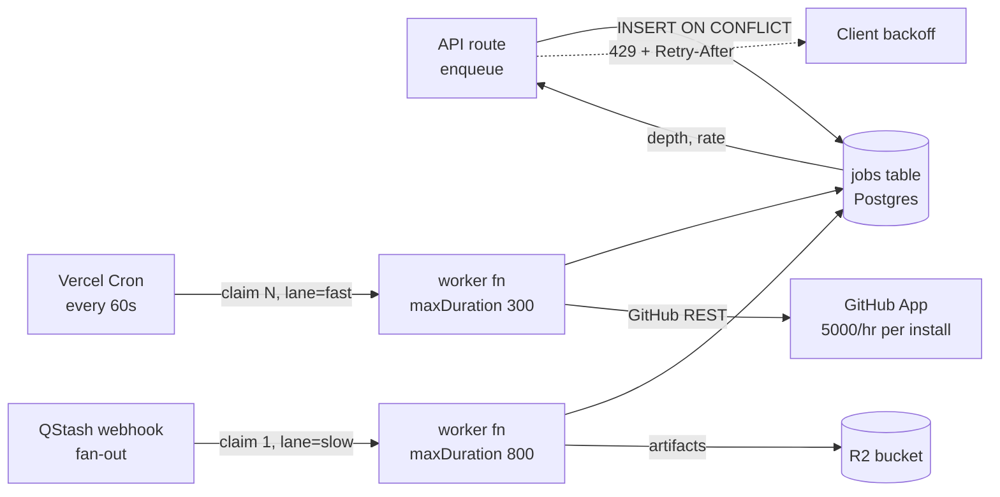

Vercel Cron minimum interval is **1 minute** on Pro [fetched 2026-08-30]; that sets our worst-case fast-lane latency floor at 60s, which is fine for certification and unacceptable for anything user-visible. For the interactive path we call the worker inline via `waitUntil()` and let Cron be the *recovery* mechanism for anything that fell through — the cron is a safety net, not the primary path. Function `maxDuration` is 300s default / 800s max on Pro [fetched 2026-08-30]; `vault.import` is chunked to 200 files precisely so no single job can approach it.

### 12.5 The GitHub API: a limit we do not own

[fetched 2026-08-30, docs.github.com rate-limits] GitHub App **installation** tokens get 5,000 requests/hour minimum; installations on an org with >20 repos or >20 users scale up to a 12,500/hour cap. There is also a secondary limit: **100 concurrent requests**, and **no more than 900 points/minute** for REST writes. We cannot buy our way past it.

Our consumption model [derived]:

```
splice write        = 3 REST calls
10,000 users peak   = 22 req/s × 0.43 (write fraction) ≈ 9.5 splice/s ≈ 28.5 GitHub calls/s
                    = 102,600 calls/hour  ACROSS ALL INSTALLATIONS
```

That total is harmless because it is spread across thousands of *separate* installations, each with its own 5,000/hr bucket. The danger is concentration: **one B2B org where 250 seats share a single installation** consumes 250 × (40 min × 0.8 × 3) = 24,000 calls/day, and at a 6× peak hump crosses 5,000/hr. That is the #1 break in the table at the top, and it arrives *at a customer*, not at a user count.

Controls, in build order:

1. **Per-installation token bucket in Postgres**, refilled from the `x-ratelimit-remaining` and `x-ratelimit-reset` headers on every response — never estimated. Below 15% remaining, the fast lane degrades to batched commits (coalesce a workspace's pending splices into one commit per 5 minutes) and the UI says so.
2. **Conditional requests.** `If-None-Match` on ref/tree reads. A `304` does not count against the primary limit for the classic REST API and materially cuts our read half.
3. **Never poll.** Webhooks (`push`, `installation`) only. Polling is how a GitHub integration dies.
4. **`Retry-After` is obeyed literally**, and a secondary-limit `403` disables that installation's lane for the full window rather than retrying. Retrying into a secondary limit is how installations get suspended.
5. **Local-first covers the outage.** Tauri v2 holds the working copy; a GitHub throttle degrades to "your edits are saved locally, sync is paused", which is true and non-destructive because the file is the source of truth.

### 12.6 The degradation ladder — what we shed, in order

Ordered by how little the user loses. Each level is a feature flag in `config/degradation.ts`, flippable without deploy.

| Level | Trigger | Shed | User sees |
|---|---|---|---|
| 0 | Normal | — | — |
| 1 | Pooled conns >70% for 5 min | Server-side search falls back to client MiniSearch over the open vault only | "Searching this vault only" |
| 2 | Pooled conns >85%, or job depth >8× rate | New `publish.build` and `vault.import` refused (`429 + Retry-After`) | "Publishing is queued behind heavy load — retry in ~4 min" |
| 3 | Installation rate budget <15% | Splices batch into one commit per 5 min per workspace | "Sync paused, edits saved locally" — a status pill, never a modal |
| 4 | AI provider p99 >20s or 5xx>2% | Cross-engine certification runs against cached engine results; AI features return a typed refusal | "Certification using cached engine set" |
| 5 | Postgres unreachable | Read-only mode: editor and local vault fully functional; published sites served from R2 cache; login refused | Banner. Editing works. |

The property that makes this ladder cheap: **we can lose the entire control plane and the product still edits files.** The file is the truth. Postgres holds identity and billing; the R2-cached published sites keep serving; the desktop app does not care. This is the single largest operational advantage of the settled architecture and it should be tested quarterly by pointing `DATABASE_POOLED_URL` at a dead host in staging and confirming levels 1–5 fire.

What we never shed: the splice engine's refusal semantics. Under no load condition does the engine *guess* a range — degradation may make an edit slower or queue it, never approximate.

### 12.7 Where this architecture stops working

It stops at roughly **50,000–80,000 users**, and the wall is not throughput. It is three things arriving together:

| Wall | Symptom | Replacement |
|---|---|---|
| **Serverless connection economics** | Instance count, not request count, drives cost and connections; region pinning is exhausted; Supavisor `client_wait_time` becomes the p99 | Move the API to a small number of long-lived containers (Fly.io or Railway, 3–6 machines), keep Next.js, keep the same handlers. A real pool of 20 across 6 machines is 120 connections serving what 800 instances did. |
| **Single-writer Postgres** | Job table churn plus audit plus full-text on one primary; vacuum pressure visible in p99 | Split: jobs and audit to their own instance; search to a dedicated replica. Still Postgres, still boring. |
| **One person on call** | This is the actual limit and it arrives first | Not an architecture problem. Managed everything, alert on four numbers only (pooled conn %, job depth, GitHub budget %, error rate), and accept a 4-hour MTTR on anything that is not "the editor cannot save". |

What does **not** change at that wall, and must not be designed around: the file stays the source of truth, sync stays git-merge + splice journal + CAS, and there is still zero document byte in Postgres. Every scaling move above is a move of *control-plane* machinery. That is the whole point of having put the documents somewhere else.

**What would make us start this migration early:** a single B2B customer above 250 seats on one installation (forces the GitHub batching work), or Supabase compute reaching Large ($110/mo add-on) while p99 is still bad — at that price the container rewrite pays for itself in two months.

---

## 13. Observability, availability and disaster recovery

### 13.1 The constraint that shapes the whole section

Every telemetry decision below is downstream of one rule: **no log line, breadcrumb, span attribute, error message, or crash report may ever contain document bytes.** The file is the source of truth and it lives in the customer's git repo; the moment a paragraph of someone's draft appears in Sentry, we have silently created a second, unversioned, foreign-hosted copy of the thing we promised never to move. That is a product-defining breach, not a privacy nit.

The corollary is stricter than it sounds. It bans not just `logger.info(doc)` but: the splice engine's `Expected "## Heading" at byte 4021, found "## Headnig"` refusal message, CodeMirror transaction payloads in breadcrumbs, `fetch` request bodies in HTTP breadcrumbs, filenames (a path like `clients/acme-layoffs-2026/notes.md` is content), and search queries. What we log instead is **shape**: byte offsets, lengths, SHA-256 prefixes, node types, error codes.

### 13.2 Stack selection

| Layer | Pick | Rejected | Why | Cost read 2026-08-30 | Changes our mind |
|---|---|---|---|---|---|
| Errors | Sentry SaaS, `@sentry/nextjs@10.72.0` | Self-hosted Sentry; Bugsnag; Highlight | Best-in-class Next 16 App Router + Tauri coverage; `beforeSend` is a real, testable scrub hook. Self-hosting costs a founder a weekend a month | Free $0 (1 user, the whole team); Team $26/mo annual; Business $80/mo [fetched sentry.io/pricing] | An EU/India data-residency demand from a B2B buyer → move to Sentry EU region, not self-host |
| Logs | Axiom, `@axiomhq/pino@2.0.0` + `pino@10.3.1` | Datadog; Better Stack logs; Vercel log drains only | Axiom Personal is permanently free at a volume we will not exceed for years; APL queries are fast; ingest is a plain HTTPS POST so it is swappable in one file | Personal $0/mo permanent: 500 GB/mo ingest, 10 GB-hrs query, 25 GB storage, 30-day retention. Cloud $25/mo platform fee + usage, with 1 TB / 100 GB-hrs / 100 GB always-free [fetched axiom.co/pricing] | Retention >30d needed for a SOC 2 audit → Axiom Cloud configurable retention at $25/mo, still not Datadog |
| Traces | OpenTelemetry SDK (`@opentelemetry/api@1.9.1`, `@opentelemetry/sdk-node@0.221.0`) exporting **into Sentry** | Standalone Grafana Tempo / Jaeger | One backend to look at during an incident. OTel-native instrumentation means the exporter is a config line, not a rewrite | Included in Sentry quota | Trace volume blows the Sentry quota → point the same OTLP exporter at Axiom |
| Uptime + status page + on-call | Better Stack | UptimeRobot + Instatus (two vendors); PagerDuty | Monitor, alert, escalate and publish from one place. Free tier already covers a solo founder | Free $0: 10 monitors + heartbeats, 1 status page, Slack/email alerts. Responder license $34/mo, $29/mo annual — unlimited phone + SMS alerts [fetched betterstack.com/pricing] | A second human joins on-call → 2 responder licenses, $58/mo |
| Metrics | Sentry + Postgres rollup tables. **No Prometheus.** | Grafana Cloud; Prometheus + Grafana self-hosted | A metrics stack a solo founder must operate is a second product. Business metrics belong in the control-plane Postgres we already back up | $0 | 10k+ users and a real capacity question → Grafana Cloud free tier, read-only |

**Total observability spend: $0/mo at 100 users, $80/mo at 10,000** [derived: 26 + 25 + 29 = 80]. Log volume at 10,000 users, assuming 20 server requests/user/day and a 400-byte structured line: 10,000 × 20 × 400 B = 80 MB/day = 2.4 GB/month [derived] — 0.24% of Axiom Cloud's 1 TB free allowance. Logging is not a cost risk; it is a discipline risk.

### 13.3 Telemetry topology

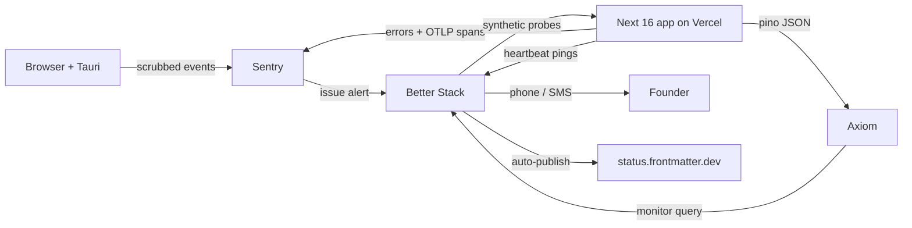

Better Stack is the single fan-in for anything that can wake a human. Sentry never phones directly; it raises an issue alert that Better Stack decides whether to escalate. That gives one place to silence everything during a planned migration.

### 13.4 The correlation envelope, from day one

Two fields on every log line, span and error, with no exceptions: `workspace_id` and `correlation_id`. Retrofitting these later means re-instrumenting 226 TypeScript files; adding them now costs one module.

`src/lib/obs/context.ts`:

```ts
import { AsyncLocalStorage } from 'node:async_hooks';

export type ObsContext = {
  correlation_id: string;   // uuid v7, generated at edge or accepted from X-Correlation-Id
  workspace_id: string | null;
  user_id: string | null;
  route: string;
};

export const obsStore = new AsyncLocalStorage<ObsContext>();
export const ctx = () => obsStore.getStore();
```

`src/middleware.ts` mints `correlation_id` (uuid v7 — time-sortable, so a log sort is a timeline) and sets it as a response header so a user can paste it into a support ticket. `src/lib/obs/logger.ts` builds the pino instance with a mixin that injects `ctx()` into every line, and — the load-bearing part — a **field-name denylist serializer**:

```ts
// src/lib/obs/logger.ts
import pino from 'pino';
import { ctx } from './context';

const FORBIDDEN = /^(content|text|body|markdown|doc|source|value|query|path|filename)$/i;

function strip(o: unknown, depth = 0): unknown {
  if (depth > 4 || o === null || typeof o !== 'object') return o;
  const out: Record<string, unknown> = {};
  for (const [k, v] of Object.entries(o as Record<string, unknown>)) {
    if (FORBIDDEN.test(k)) { out[k] = `[stripped:${typeof v === 'string' ? v.length : '?'}]`; continue; }
    out[k] = typeof v === 'object' ? strip(v, depth + 1) : v;
  }
  return out;
}

export const log = pino({
  level: process.env.LOG_LEVEL ?? 'info',
  base: { service: 'frontmatter-web', env: process.env.VERCEL_ENV ?? 'dev' },
  mixin: () => ({ ...ctx() }),
  formatters: { log: (o) => strip(o) as Record<string, unknown> },
});
```

An allowlist would be safer than a denylist, and we take the denylist knowingly: an allowlist makes every new log call a two-file change and gets bypassed within a month. The denylist is backed by a CI gate (§13.5), which is the actual enforcement.

Engine refusals — the most valuable log in the product — become shape-only:

```ts
log.warn({
  event: 'splice.refused',
  reason: 'ANCHOR_DRIFT',        // enum, never free text
  doc_sha256_prefix: sha.slice(0, 12),
  byte_start: 4021, byte_len: 37,
  expected_node: 'heading', found_node: 'paragraph',
}, 'splice refused');
```

That is enough to reproduce a refusal against the corpus fixtures without ever holding the document.

### 13.5 The three scrubbing mechanisms, plus the gate

**1. `beforeSend` / `beforeSendTransaction`** in `sentry.server.config.ts`, `sentry.edge.config.ts` and `instrumentation-client.ts`: walk `event.exception.values[].value`, `event.message`, `event.extra`, `event.contexts` and `event.request.data` through the same `strip()` used by pino, and drop the event entirely if `event.request?.data` is a string longer than 512 bytes. Also `sendDefaultPii: false` explicitly — do not rely on the default.

**2. Breadcrumb filtering.** `beforeBreadcrumb` returns `null` for `category === 'console'` (a `console.log(text)` in dev becomes a leak in prod), and strips `data.body`, `data.response_body` and query strings from `category === 'fetch'` and `'xhr'`. CodeMirror is never wired to `Sentry.addBreadcrumb`; the editor reports transaction *counts* and *byte deltas* through our own logger, not keystrokes. `maxBreadcrumbs: 30` — the default 100 widens the window for anything that slips through.

**3. Source maps.** `withSentryConfig` in `next.config.ts` with `sourcemaps: { deleteSourcemapsAfterUpload: true }` and `widenClientFileUpload: false`. Maps go to Sentry so stack traces are readable; they are removed from the deployment so nobody can fetch `/_next/static/chunks/*.map` and read our splice logic. `SENTRY_AUTH_TOKEN` is a Vercel env var only, never in the repo. For Tauri, `@sentry/tauri` uploads Rust debug symbols in the release job; the shipped `.dmg`/`.msi` never carries them.

**4. The gate that makes the above real.** There is no CI today — this is where it starts. `.github/workflows/ci.yml` step:

```bash
# fail if a raw document identifier reaches a log/telemetry sink
rg -n --type ts \
  -e '(log|logger)\.(trace|debug|info|warn|error)\([^)]*\b(content|markdown|docText|value|src)\b' \
  -e 'Sentry\.(captureMessage|setExtra|setContext)\([^)]*\b(content|markdown|docText)\b' \
  src/ && { echo "content leak into telemetry"; exit 1; } || exit 0
```

Plus a unit test `src/lib/obs/__tests__/scrub.test.ts` that feeds a Sentry event containing a 3-paragraph markdown fixture through the real `beforeSend` and asserts the string does not survive. Per LR#68: write that test so it **fails against the un-scrubbed config first**, or it proves nothing.

### 13.6 Retention

| Data | Store | Retention | Basis |
|---|---|---|---|
| Structured logs | Axiom | 30 days | Free-tier default; long enough for a monthly incident review, short enough that a scrub failure has a bounded blast radius |
| Errors + traces | Sentry | 90 days (plan default) | Debugging window for rare engine refusals |
| Audit log (auth, billing, publish, entitlement changes) | Postgres `audit_log` | 7 years | Financial record; survives account deletion by design, holds no document bytes |
| Analytics events | Postgres rollups | 25 months | Year-over-year comparison, then aggregate-only |

DPDP Act 2023 §8(7)(a) requires a Data Fiduciary to **erase personal data upon withdrawal of consent or as soon as it is reasonable to assume the specified purpose is no longer being served, whichever is earlier**, unless retention is necessary for compliance with a law in force; §12(3) requires erasure on request under the same carve-out [fetched: meity.gov.in DPDP Act PDF, 2026-08-30]. GDPR Art. 17 is materially the same shape. Operationally this means the account-deletion job must purge Axiom (`DELETE` by `workspace_id` via the Axiom API) and Sentry (user-deletion API) inside 30 days, not just Postgres. Because logs are shape-only, the residual personal data in telemetry is `user_id` and `workspace_id` — deletable by key, which is exactly why the correlation envelope is a compliance asset and free-text logging is a liability.

**The tension named explicitly** (LR#71): "never delete the raw record" governs documents and journals; it does **not** govern telemetry or leaked secrets. Telemetry expires on schedule; a credential that reaches a log is rotated first and erased second.

### 13.7 SLOs a solo founder can honestly commit to

| SLO | Target | Window | Publish? |
|---|---|---|---|
| API availability (`/api/**` non-5xx) | **99.5%** | 30-day rolling | Yes |
| Editor first-paint p75 | < 2.5 s | 30-day | Yes |
| Splice-commit success (attempts that commit or cleanly refuse; crashes count against) | **99.9%** | 30-day | Yes |
| Control-plane RPO | ≤ 5 min | — | Yes |
| Control-plane RTO | ≤ 4 h | — | Yes |
| Support first response | 1 business day IST | — | Yes |
| Incident acknowledgement | 30 min business hours / 4 h overnight | — | **No** — state "best effort" |

99.5% permits 216 minutes of downtime per 30 days [derived: 43,200 min × 0.005 = 216 min = 3h36m]. 99.9% permits 43 minutes — one person asleep in IST cannot honour that, and publishing it is a lie that a B2B buyer will eventually price. Publish 99.5% and beat it. Refuse contractual SLA credits until there is a second on-call human; when a buyer demands them, the honest answer is "our published SLO is 99.5% and here is 18 months of measured history."

Splice-commit success is the SLO that matters most and is entirely ours to control: a **refusal is a success**, a crash or a silent wrong write is a failure. That framing is the engine's core promise expressed as a number.

### 13.8 Alerting

| SIGNAL | THRESHOLD | PAGES? | RUNBOOK |
|---|---|---|---|
| Synthetic probe `GET /api/health` fails | 3 consecutive failures, 2 regions, 60 s apart | **YES — phone** | `docs/runbooks/site-down.md` |
| 5xx rate on `/api/**` | > 5% of requests over 5 min, min 20 req | **YES — phone** | `docs/runbooks/api-5xx.md` |
| Postgres connection failures | > 10 in 5 min | **YES — phone** | `docs/runbooks/db-unreachable.md` |
| Splice write returned success but CAS post-check mismatch | **any single occurrence** | **YES — phone** | `docs/runbooks/splice-corruption.md` |
| Scrub-gate canary: document-shaped string detected in Axiom (`content_leak` monitor) | any single occurrence | **YES — phone** | `docs/runbooks/telemetry-leak.md` |
| Nightly backup heartbeat missing | 26 h since last ping | **YES — phone** (second consecutive miss only) | `docs/runbooks/backup-missed.md` |
| Payment webhook signature failures | > 3 in 15 min | **YES — phone** | `docs/runbooks/billing-webhook.md` |
| Splice refusal rate | > 15% of attempts over 1 h | No — Slack | `docs/runbooks/refusal-spike.md` |
| p75 editor load | > 4 s for 30 min | No — Slack | `docs/runbooks/latency.md` |
| New Sentry issue, unseen fingerprint | first occurrence | No — Slack digest | triage in daily review |
| R2 4xx/5xx on attachment PUT | > 2% over 15 min | No — Slack | `docs/runbooks/r2-degraded.md` |
| AI provider 429/5xx | any | **No** — degrade to next provider, log only | `docs/runbooks/ai-provider-down.md` |
| Deploy failed | any | No — Slack | — |
| Disk/quota warnings from any vendor | any | No — Slack | — |

The pages-at-3am set is exactly seven signals, and every one of them means either *customers cannot work*, *money is not being collected*, *data is being damaged*, or *we are leaking content*. Everything else waits for morning. An AI provider outage explicitly must not page: the router fails over across the five configured providers, and a woken founder cannot fix Anthropic. **A pager that fires for things you cannot act on at 3am trains you to ignore it, which is the same disease as no pager at all** (LR#65).

### 13.9 Status page and incident comms

`status.frontmatter.dev` on Better Stack's free tier, CNAME'd, showing four components: **Editor**, **Sync (git)**, **AI**, **Publishing**. Probe-driven components update themselves; a human-declared incident overrides. Rules: post within 15 minutes of confirming customer impact even with nothing to say beyond "investigating"; update every 30 minutes; write the resolution note in plain language with no vendor blame; publish a postmortem for anything over 30 minutes or any data-integrity event, within 5 business days.

### 13.10 Incident runbook skeleton

Every file in `docs/runbooks/` uses this shape, because at 3am a founder reads headings, not prose:

```markdown
# <signal name>
## 0. Is this real?           # the 30-second check that rules out a false alert
## 1. Stop the bleeding       # the ONE reversible action: feature flag, rollback, disable route
## 2. Confirm blast radius    # query with workspace_id + time window, paste the numbers
## 3. Communicate             # status page template text, pre-written, copy-paste
## 4. Diagnose                # links: Sentry saved search, Axiom APL query, Vercel deploy list
## 5. Fix or escalate         # vendor support links + account IDs
## 6. Verify recovery         # the assertion that must go green, run it 3 times (LR#63)
## 7. Postmortem stub         # timeline table to fill while it is fresh
```

Step 1 is always a single reversible lever. For `splice-corruption.md` that lever is `FEATURE_SPLICE_WRITES=off`, which puts the engine into read-and-refuse mode — the product degrades to a viewer rather than risking one more bad byte. That flag exists because the file is the source of truth: a corrupt write is worse than an outage.

### 13.11 Backup and restore

| Data class | Where | RPO | RTO | Mechanism |
|---|---|---|---|---|
| Documents | Customer git repo | **0 — not ours** | n/a | Git is the backup. We never hold the only copy. This is the single largest DR advantage of the architecture |
| Splice journal | Postgres, append-only | 5 min | 4 h | Provider PITR + nightly `pg_dump` to R2 |
| Control plane (identity, tenancy, entitlements, billing, slugs, audit) | Postgres | 5 min | 4 h | Provider PITR + nightly `pg_dump --format=custom` to R2, gzip-verified |
| Attachments >1 MB | R2 | 24 h | 24 h | Content-addressed, immutable keys (below) + weekly cross-account copy |
| Derived artifacts (renders, indexes) | R2 | **∞ — rebuildable** | 2 h | Do not back up. Regenerate |
| Secrets | Vercel env + password manager | manual | 1 h | Documented in `docs/runbooks/rebuild-from-zero.md`, values never in repo |

R2 pricing read 2026-08-30: $0.015/GB-month standard, Class A $4.50/M ops, Class B $0.36/M, **egress free**, free tier 10 GB-month + 1M Class A + 10M Class B [fetched developers.cloudflare.com/r2/pricing, page dated Aug 7 2026]. Free egress is what makes a restore drill cost nothing, which is what makes us actually run one.

**R2 has no S3-style object versioning.** The R2 documentation index lists exactly one retention primitive — Object lifecycles — and no versioning page; the data-security and FAQ pages do not mention it [fetched, 2026-08-30]. A `PUT` to an existing key destroys the previous object, silently and irrecoverably. Versioning must therefore live in the **key layout**, and this is a build-time decision that cannot be retrofitted:

```
attach/<workspace_id>/<sha256>/<original_ext>          # content-addressed, write-once
backup/pg/<workspace_scope>/<YYYY>/<MM>/<DD>/<HHMM>Z-<sha256_12>.dump.gz
render/<workspace_id>/<doc_sha256>/<renderer_ver>.html # derived, disposable
```

Three rules enforced in `src/lib/storage/r2.ts`: (a) every write goes to a key containing a content hash or a timestamp, so no key is ever written twice; (b) all writes use `If-None-Match: *` so an accidental overwrite fails loudly instead of destroying; (c) deletion happens only through an R2 lifecycle rule on the `backup/` prefix, never through application code. The "current" pointer is a Postgres row, which is itself covered by PITR — so the mutable state lives in the store that has real point-in-time recovery, and the immutable state lives in the store that does not.

Neon is the control-plane default: Free $0 (0.5 GB storage/project), Launch usage-based at $0.106/CU-hr and $0.35/GB-month, typical spend $15/mo [fetched neon.com/pricing, 2026-08-30]; branch-based instant restore covers operator error, which is the most likely failure. **The provider's PITR is not the backup** — it is co-located with the thing that fails. The nightly `pg_dump` to R2 in a *different* Cloudflare account is the backup, and it emits a Better Stack heartbeat ping on success so a silent failure pages us (LR#55: under `set -e`, a trailing `[ cond ] && cmd` guard returns 1 and kills the caller — that exact bug disabled nightly backups for weeks once already; write `if/then/fi`, and verify the write landed by counting objects before and after, per LR#67).

### 13.12 Restore drills

**A backup that has never been restored is not a backup. It is a file.**

| Drill | Cadence | Pass condition |
|---|---|---|
| Postgres restore to a scratch branch | **Monthly**, first Sunday | Row counts within 0.1% of live for `workspaces`, `users`, `entitlements`; app boots against it; login works |
| R2 attachment fetch from cross-account copy | Monthly | 10 random keys fetch and hash-match |
| Full rebuild-from-zero (new Vercel project, new DB, restored dump, DNS cutover rehearsed but not executed) | **Quarterly** | Serving traffic on a staging domain within the 4 h RTO, timed with a stopwatch |
| Secret-loss rehearsal | Quarterly | Every secret in `rebuild-from-zero.md` is retrievable without reading any file on the founder's laptop |

Each drill writes a dated row to `docs/runbooks/drill-log.md`: date, artifact restored, wall-clock elapsed, what broke. If the last row is more than 45 days old, the deploy pipeline prints a warning. The elapsed time is the real output — an RTO of 4 h that has only ever been asserted is a guess; an RTO of 4 h measured three times is a commitment. Report a drill result as `[measured]` only when it ran against real artifacts; a dry run against modified code is `SIMULATED` and must say so (LR#62).
