# ENGINE — MDMAX, audited and designed

**Tier 1. Read the section, never the file.** The engine is the differentiation; everything else in the product is buyable. §67–74 is what exists and what is wrong with it. §75–80 is the design for what it must become.

> **Before you change engine code:** `specs/engine/splice-writer.md` owns the byte contract, and each defect spec owns its own red proof. This file explains; the spec governs.

> 14 of 14 sections present.

---
## 67. MDMAX as built — a line-level audit

3,614 lines across 13 files under `src/modules/mdmax/`, plus the 282-line splice writer and the 223-line CLI, read in full and executed here. 851 tests across 23 files pass in 1.82 s [measured: `npx vitest run test/mdmax test/share`]. The suite is green over a document-offset conversion that returns wrong answers, a certifier that silently drops blocks, and a CLI that cannot start. There is no `.github/workflows/` directory [measured: `ls` returns "No such file or directory"].

### 67.1 The fifteen files

| FILE | LINES | WHAT IT ACTUALLY DOES | PUBLIC EXPORTS | Q | CONCERNS |
|---|---|---|---|---|---|
| `domain/cert-contract.ts` | 168 | Types only — four verdicts, `Engine`, `Target`, `Certificate`, `CertFailure`. No runtime code. | 11 types/interfaces | B+ | Its own rule "`class` … Required whenever verdict === 'CORRUPT'" is a comment; `CellVerdict` declares `readonly class?: VerdictClass` on a non-discriminated shape, so a CORRUPT cell with no class typechecks. `brokenHistogram` already counts an `'UNCLASSED'` bucket for exactly that. |
| `domain/normalize.ts` | 62 | NFC → collapse an explicit 16-codepoint whitespace class → trim → lowercase → NFC. | `normalize`, `normalizeStamp`, `NORMALIZE_VERSION` | A | Pure, versioned, idempotent [measured]. Zero callers anywhere, including the anchor hash it was written to be. `.trim()` is in the code and absent from the documented pipeline "NFC → collapse whitespace → lowercase → NFC". |
| `domain/slug.ts` | 115 | Wraps `github-slugger`; resolves an anchor canonical-first then dash-collapsed. | `slug`, `collapsedSlug`, `slugDocument`, `resolveAnchor`, `decodeAnchor`, `slugStamp`, `SLUG_VERSION` | B | `resolveAnchor`, `collapsedSlug`, `decodeAnchor` and `slugStamp` have zero call sites and zero tests [measured]. The product slugs headings in `src/modules/preview/presentation/outline-utils.ts` with its own `new GithubSlugger()`, in the presentation layer, past this module entirely. |
| `domain/frontmatter-prepass.ts` | 121 | Quotes bare `[[…]]` values for a reader; refuses `TRIPLE_OPEN = /:\s*\[\s*\[\[/`. | `prepassFrontmatter`, `extractWikilinks` | B− | Zero callers. `src/modules/vault/infrastructure/markdown-parser.ts` ships a private `extractWikilinks` of its own — two implementations, the product uses the other one. |
| `domain/targets.ts` | 133 | Static registry of 15 (product, surface) pairs. | `TARGETS`, `LOCAL_TARGETS`, `uncertifiableShare`, `targetById`, `DECLARED_LAST_VERIFIED` | B | `DECLARED_LAST_VERIFIED = '2026-08-01'` is a literal with no staleness check in code. Nine of fifteen rows carry `engineId: 'remark-app'` — the app's own pipeline stands in for Obsidian, Notion, Typora, Bear, Slack, Discord. `targetById` uncalled. |
| `domain/offsets.ts` | 315 | Branded `U16Offset`/`ByteOffset`; `OffsetMap` with a 512-unit checkpoint table both ways. | `u16`, `u16OrThrow`, `unsafeU16`, `unsafeByte`, `splitsSurrogatePair`, `OffsetMap`, `utf8Length` | C | `toU16` returns `text.length` with `ok: true` for real interior byte offsets whenever `text.length % 512 === 0` (D1). `toByte` is unaffected. |
| `domain/shape-gate.ts` | 174 | Strict UTF-8 decode; one O(n) pass for bytes/lines/list-markers with early exit. | `decodeStrict`, `shapeGate`, `explainFailure`, `MAX_BYTES`, `MAX_LINES`, `MAX_LIST_MARKER_LINES`, `BUDGET_MS` | B− | `shapeGate` itself has zero call sites; only `decodeStrict` is imported (D5). Its invalid-UTF-8 column is wrong on multi-byte input (D4). 19,001 list lines gate in 2 ms [measured]. |
| `domain/placement.ts` | 154 | Insert-then-reparse-then-compare block skeletons; refuse on divergence. | `blockSkeleton`, `nearSetextUnderline`, `safeInsert`, types | C+ | Refuses safe insertions before any `---` thematic break, and permits insertion inside a fenced code block and inside an inline code span (D3). Zero callers. |
| `domain/constructs.ts` | 618 | 19 constructs, each with a masked byte-range detector over a cached document scan. | `CONSTRUCTS`, `CONSTRUCTS_BY_ID`, `inventory`, `skipRegions` | B+ | Best-built file here; every detector finds its own `source` [measured: 0 failures]. Module-level `let cachedText`/`let cachedScan` retain a whole document plus its `OffsetMap` after the last call. Six of nineteen entries carry `provenance: 'invented — …'` [measured: `grep -c "invented —"` = 6]. |
| `domain/fold.ts` | 430 | Single-pass HTML segmenter, then six named normalisations; returns which fired. | `fold`, `foldEqual`, `foldStamp`, `FOLD_RULES`, `FOLD_VERSION` | A− | Idempotent on 12 adversarial inputs [measured, 0 failures]; 57 KB→6 ms, 453 KB→26 ms [measured]. `foldStamp` is test-only. Never run over the pinned corpus, as its own header states. |
| `domain/verdict.ts` | 411 | The PASS/VOID/LEAK/DESTROY/MUTATE/STRIP ladder over source payload vs rendered haystack. | `classify`, `extractPayload`, `renderedHaystack`, `missingPayloadTokens`, `producesNoOutput`, `VERDICT_VERSION` | B+ | `renderedHaystack` references `TAG_ANY` above its `const` declaration. `unresolvedReferences` filters with `folded.text.includes(literal)` — a raw needle against a folded haystack, the exact mismatch the file fixes two functions later. `VERDICT_VERSION` uncalled. |
| `application/certify.ts` | 375 | Blank-line block split, per-target render, modal-consensus reference, cell loop, histogram. | `splitBlocks`, `certify`, `brokenHistogram` | C+ | Drops the first content block when no blank line follows front matter (D2). Its fence regex disagrees with `constructs.ts` (D7). `void oracle` (D9). `blockAnchor` seeds on `${start}:${text}`, so one inserted character re-keys every anchor after it. |
| `infrastructure/bench.ts` | 538 | Builds and version-pins 7 engines; sha256 over sorted (id, version, canonical options). | `loadBench`, `computeBenchId`, `stripJekyllFrontMatter`, `BENCH_ENGINE_IDS`, `JEKYLL_KRAMDOWN_OPTIONS` | B | Loads and certifies correctly when driven directly: 6 JS engines, 6 blocks × 6 targets in 30 ms [measured]. `DEFAULT_RUBY_BIN = "/opt/homebrew/opt/ruby/bin/ruby"`. Only the ruby engine has a timeout; the six JS engines run unbounded on the caller's thread. |
| `share/domain/splice-frontmatter.ts` | 282 | Locate a top-level key's bytes, replace only those, refuse otherwise. | `spliceFrontmatterValue`, `spliceFrontmatterKey`, `emitValue`, `emitScalar`, `SAFE_KEY` | B− | The only file with real product traffic. Refuses every zero-indent block sequence (D6); prepends a second front-matter block on a bare-CR file (D8); deletes a trailing `# comment` on set (D10). |
| `scripts/mdmax-cert.mjs` | 223 | The whole CLI surface — table, `--json`, `--histogram`, `--bench-info`, `--explain`. | — | D | Throws `ERR_MODULE_NOT_FOUND` before rendering anything; exit 1 (D11). |

### 67.2 The defect list

**D1 — `OffsetMap.toU16` silently returns end-of-document.** `src/modules/mdmax/domain/offsets.ts`. The table is sized `const blocks = Math.floor(text.length / BLOCK) + 1` but written only inside `for (let i = 0; i < text.length; i++)`, so when `text.length % 512 === 0` the final slot is never assigned and stays `0`. The binary search accepts it: `if ((this.byteAt[mid] ?? 0) <= target) lo = mid`. [measured] At length 512 every byte probe returns `{ok:true, value:512}`; at 1024 and 1536, every probe at or past the last checkpoint does. The failure is `ok: true` — the caller cannot detect it. This survived the previous fix commit, `cc1d451 fix(mdmax): Tier 2 — OffsetMap off-by-3` [measured: `git log`]. `toByte` never reaches the empty slot, so the certificate's `byteRange` is currently correct and nothing shipped is wrong today; anything reading a byte anchor back — a git blob range, an LSP that negotiated utf-8 — is.

**D2 — `certify` drops the block after front matter.** `src/modules/mdmax/application/certify.ts`, in `mergeLeadingFrontmatter`: `const rest = blocks.filter((b) => b.start >= fmEnd)`. A block that straddles `fmEnd` is discarded, not truncated. [measured] `'---\na: 1\n---\n# H\n\nBody paragraph.\n'` → blocks `[0,13]` and `[18,34]`; `# H` at `[13,18]` appears in no block, no verdict, and no summary. Insert one blank line and it reappears.

**D3 — `safeInsert` refuses the safe case and permits the unsafe one.** `src/modules/mdmax/domain/placement.ts`. The pre-check ends `if (prevLine.trim() !== '' || prevPrev.trim() !== '') return lineNo` — an `||` over a two-line lookback, and `SETEXT_UNDERLINE` matches bare `---`. [measured] `'# Title\n\n---\n\nBody\n'` and `'Body text\n\n---\n\nMore\n'` both return `ADJACENT_TO_SETEXT_UNDERLINE`; in both, the `---` is a thematic break that no insertion can convert. Conversely, insertion inside a ```` ```js ```` fence and inside `` `a b c` `` both return `{ok:true}` — the marker lands as visible code-block text while the block skeleton is unchanged, which is the only thing compared.

**D4 — invalid-UTF-8 location comes from a binary search over a non-monotone predicate.** `src/modules/mdmax/domain/shape-gate.ts`, `decodeStrict`: `decoder.decode(bytes.subarray(0, mid))` fails both for a truncated valid character and for the real bad byte, so "longest valid prefix" is not a sorted property. [measured] `é` + `0xFF` → col 2 (right); `éé` + `0xFF` → col 1 (should be 3); `ééé` + `0xFF` → col 4 (right). This is the only mdmax defect that reaches a user: the wrong column is printed by `search-index.ts` and surfaced by `explainFailure` as "This file is not valid UTF-8 (line …, column …)".

**D5 — no shape gate runs anywhere.** `shapeGate`, `MAX_BYTES`, `MAX_LINES`, `BUDGET_MS` have zero product call sites [measured]. `WIKILINK_RE = /(!?)\[\[([^\]]+)\]\]/g` — the regex the gate's own header cites as "k = 1.98 — 36,865 ms on 320 KB of `[[`" — is live and ungated in `src/modules/vault/infrastructure/markdown-parser.ts` and again as `COMBINED_WIKILINK_RE` in `src/modules/preview/presentation/markdown/wikilinks.tsx`.

**D6 — the 83% refusal, in one branch.** `splice-frontmatter.ts`: `} else if (text !== '' && !indented && !/^#/.test(text)) { return src }`, whose own comment names "a sequence item". [measured] `'---\ntags:\n- a\n- b\n---\n'` returns the input unchanged; the same YAML indented two spaces splices fine.

**D7 — two fence grammars in one module.** `certify.ts` uses `/^[ \t]*(\`{3,}|~{3,})/`; `constructs.ts` uses `/^ {0,3}(\`{3,}|~{3,})[ \t]*(.*)$/`. CommonMark caps fence indentation at three spaces. [measured] `'Intro\n\n    ```\n\nPara A\n\nPara B\n'` splits into two blocks — everything after an indented ```` ``` ```` collapses into one. The correct regex is already in the repo, one directory over.

**D8 — bare-CR set-destruction.** `FM_OPEN = /^---[ \t]*(\r?\n)/` requires `\n`. [measured] On `'---\ra: 1\r---\rBody\r'`, `spliceFrontmatterValue(src,'share','x')` returns `'---\nshare: x\n---\n\n---\ra: 1\r---\rBody\r'` — a second block prepended, the author's keys demoted to body.

**D9 — `void oracle`.** `certify.ts` computes `const oracleId = opts.oracleEngineId ?? 'commonmark'` and `const oracle = engineById.get(oracleId)`, then discards it with `void oracle`. `CertifyOptions.oracleEngineId` is documented as "Retained for `--explain`" and `--explain` does not use `certify`.

**D10 — trailing comments are deleted on set.** [measured] `spliceFrontmatterValue('---\nshare: old  # keep me\nb: 2\n---\n','share','new')` → `'---\nshare: new\nb: 2\n---\n'`. `# keep me` is gone. The sibling `spliceFrontmatterKey` explicitly promises "any trailing comment … preserved".

**D11 — the CLI cannot start.** `scripts/mdmax-cert.mjs` does `await import(R('../src/modules/mdmax/application/certify.ts'))`, and that file's `from '../domain/offsets'` has no extension, which Node ESM does not resolve. [measured] `node scripts/mdmax-cert.mjs <file>` → `ERR_MODULE_NOT_FOUND … /domain/offsets`, exit 1; `--bench-info` likewise. `bench.ts` additionally imports `@/modules/…`, which plain Node cannot resolve either. `const R = (p) => new URL(p, import.meta.url).pathname` will also mis-decode any repo path containing a space.

### 67.3 Where the code contradicts its own comments

`placement.ts` states "Inline content is deliberately excluded" from `blockSkeleton`, and its `INLINE` set omits `linkReference`, `imageReference`, `footnoteReference` and inline `html` — mdast types every one of those as a node the walk pushes. The forgiveness pass, `removeFirstInsertedHtml`, therefore cannot tell the marker's block `html` from an inline `<b>`.

`splice-frontmatter.ts` introduces `SAFE_KEY` as "the same character class `topLevelKeyLine` scans for, stated once so the two can never drift apart", and then writes the class three times: `SAFE_KEY = /^[A-Za-z0-9_.$-]+$/`, `/^([A-Za-z0-9_.$-]+)[ \t]*:(?:[ \t]|$)/` inside `topLevelKeyLine`, and `/^[A-Za-z0-9_.$-]+[ \t]*:[ \t]*[|>&*!]/` inside `isUnsafeContinuation`. It also opens with "leave every other byte in the file untouched" and then D10.

`targets.ts` says the uncertifiable share is "**7 of ~12 surfaces**"; `TARGETS` holds 15 entries of which 7 are `fidelity: 'local'`, so `uncertifiableShare()` returns 8 / 15 = 53.3% [derived: (15−7)/15 × 100].

`normalize.ts` is "the hash input for every stored anchor … this must land BEFORE the first anchor is persisted". `certify.ts` persists anchors from a private FNV-1a over `` const seed = `${start}:${text}` `` and never imports `normalize`. Position in the seed guarantees the property `normalize.ts` exists to protect: every anchor after an edit re-keys.

`cert-contract.ts` rule 5 — "THE ARTIFACT IS A JSON SIDECAR" — holds. Nothing in the cert path writes to a `.md` [measured: no `writeFile` in `scripts/mdmax-cert.mjs` or `src/modules/mdmax/`].

### 67.4 Dead and vestigial code

| Symbol | Path | Call sites | Case for deletion |
|---|---|---|---|
| `void oracle` + `oracleEngineId` | `application/certify.ts` | 0 | An option a caller can set that provably changes nothing. Delete both; the consensus reference is the design and the comment above it already explains why. |
| `closeRe` + `closeRe.lastIndex = 0` | `share/domain/splice-frontmatter.ts` | 0 | A compiled regex and a reset, immediately superseded by a hand-rolled `indexOf('\n')` scan. Two lines that make a reader look for a third use. |
| `resolveAnchor`, `decodeAnchor`, `collapsedSlug`, `slugStamp` | `domain/slug.ts` | 0 prod, 0 test | The module's whole documented reason to exist — write-strict / read-tolerant — is untested and unwired, while `outline-utils.ts` slugs for real. Do not delete: wire it, and delete `outline-utils.ts`'s slugger instead. Anti-recommendation: if the linker is not on the roadmap this quarter, delete `slug.ts` outright rather than carry a versioned key format nothing keys. |
| `normalizeStamp`, `targetById`, `VERDICT_VERSION`, `foldStamp` | four files | 0 (`foldStamp`: test-only) | Stamp accessors for versions that are already exported as consts. Keep `NORMALIZE_VERSION`/`FOLD_VERSION`, drop the wrappers. |
| `frontmatter-prepass.extractWikilinks` | `domain/frontmatter-prepass.ts` | 0 | A duplicate of the private one in `markdown-parser.ts`. Delete one; the mdmax copy is the better implementation (it splits on `|` and `#`), so promote it and delete the parser's. |
| `let cachedText` / `let cachedScan` | `domain/constructs.ts` | live | Not deletable — it is load-bearing for the 19-detector sweep — but it is module-level mutable state holding a document and its `OffsetMap` alive after the last call, and its own comment says "This is arithmetic, not a profile — I did not measure it". Move it to a scan object the caller owns. |

### 67.5 The three files most in need of work, ranked

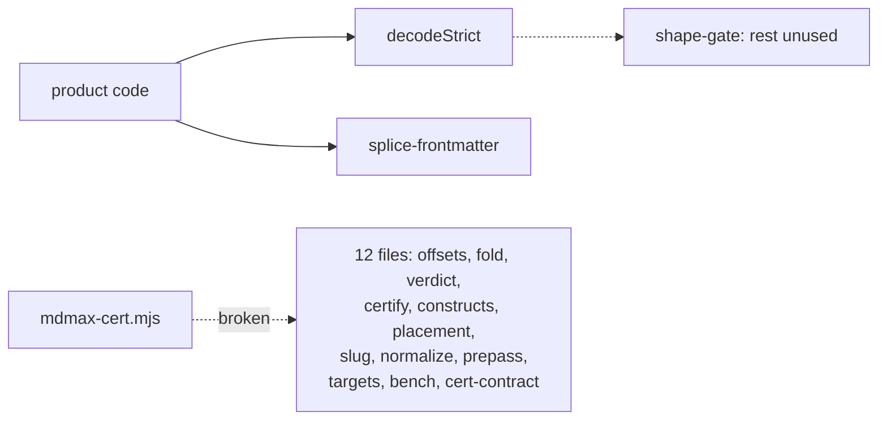

**1. `scripts/mdmax-cert.mjs`.** It is the only thing that can execute the other twelve, and it has never executed them. Every claim about the corpus — 8,513 files, 0 corruption, `mdmax/fold@1` unrun — is a claim about code reachable only by hand-writing a Node resolve hook, which is what this audit had to do to produce any number at all. Fix the extensions and the `@/` alias (or run it under `vitest`/`tsx`), then run it once before anything else here is touched. Anti-recommendation: do not rewrite the CLI into the product build to fix this; a sidecar tool that needs the app's bundler is a tool that stops running the day the bundler changes.

**2. `src/modules/mdmax/domain/offsets.ts`.** The file that says "CONVERSION Exactly one place: OffsetMap. Nothing else in the codebase converts" is the file with a wrong answer that reports `ok: true`. Fix is one line — size the table `Math.ceil(text.length / BLOCK) || 1` — and the test that must fail first is a document of exactly 512, 1024 and 1536 code units, because the current suite's 16 offsets assertions do not contain one [measured]. Anti-recommendation: do not fix it by clamping in the binary search; that hides the empty slot instead of removing it, and the next reader inherits a table whose length lies.

**3. `src/modules/share/domain/splice-frontmatter.ts`.** It is the one file users' bytes actually pass through, and three of its four measured failures are silent: a refusal that looks like a no-op (D6), a prepended duplicate block (D8), a deleted comment (D10). D6 alone is the 83% publish-refusal. The zero-indent sequence is a two-branch change — treat a `- ` line at column 0 as a continuation of the preceding `key:` rather than as a bare top-level line — and it is testable against a fixture that fails today. Anti-recommendation: do not reach for a YAML parser to close these; the module's entire value is that it does not parse, and `matter.stringify` is what it was written to replace.

---

## 68. What the engine can actually do, versus what we claim

### 68.1 The claim-to-code-to-test matrix

Classification: **PROVEN** = code plus a test that fails without it; **IMPLEMENTED** = code, tests that exercise it only against doubles or only in-unit; **PARTIAL** = the claim holds over a narrower population than stated; **ASPIRATIONAL** = claimed, not built.

| # | Claim (source) | Code | Test | Verdict |
|---|---|---|---|---|
| 1 | Splice contract — locate range, replace those bytes, every other byte bit-identical (§7.1, §60) | `src/modules/share/domain/splice-frontmatter.ts` — `spliceFrontmatterValue`, `spliceFrontmatterKey` | `test/share/frontmatter-splice.test.ts` (30) + `scripts/fm-roundtrip-audit.mjs`, `scripts/fm-properties-audit.mjs` | **PARTIAL** — proven on the shapes it accepts; it accepts 17% of the corpus `[measured]` |
| 2 | Refusal is a first-class outcome (§60) | same file — every guard is `return src` | asserted for duplicate key, unterminated block, unsafe `SAFE_KEY`, block scalar | **PROVEN** |
| 3 | Never regenerate from a parse tree (§7.1) | `stringifyFrontmatterDoc` in `src/modules/preview/presentation/frontmatter.ts` has **zero product call sites**; only `test/preview/frontmatter.test.ts` imports it `[measured]` | grep | **PROVEN** |
| 4 | Degradation certificate across 7 real engines (§7.1) | `application/certify.ts` `certify`, `infrastructure/bench.ts` `loadBench` | `certify.test.ts` (28) uses **fake engines throughout**; `bench.test.ts` (31) never calls `certify` | **IMPLEMENTED** — the join is untested and, until this session, unrunnable |
| 5 | Four verdicts, three classes (§7.1) | `domain/verdict.ts` `classify` | `verdict.test.ts` (49), driving `marked` 16.4.2, `commonmark` 0.31.2, `markdown-it` 15.0.0 in-process | **PROVEN in unit, PARTIAL in situ** — MUTATE depends on bench composition (§68.2) |
| 6 | 19 constructs, UTF-8 byte ranges, skip mask (§7.1) | `domain/constructs.ts` `CONSTRUCTS`, `inventory`, `skipRegions` | `constructs.test.ts` (43) | **PARTIAL** — all six audited detector defects still fire `[measured]`; 6 of 19 carry `provenance: invented` |
| 7 | Branded offsets, one conversion point (§7.1) | `domain/offsets.ts` `OffsetMap`, `u16`, `utf8Length` | `offsets.test.ts` (22), cross-checked against `Buffer.byteLength` at every offset | **PROVEN** |
| 8 | Shape gate refuses hostile documents (§7.1) | `domain/shape-gate.ts` `shapeGate`, `decodeStrict` | `shape-gate.test.ts` (21) | **PROVEN as a function; ASPIRATIONAL as a gate** — `shapeGate` has zero product call sites; `BUDGET_MS` is documented "enforced by the caller" and no caller exists |
| 9 | Every byte written passes placement (§7.1, house rule P5) | `domain/placement.ts` `safeInsert`, `blockSkeleton` | `placement.test.ts` (16), opens with a genuine red proof | **ASPIRATIONAL in product** — zero call sites, and it refuses every visible-content insert `[measured]` |
| 10 | Lenient frontmatter pre-pass, 170/907 = 18.74% (§7.1) | `domain/frontmatter-prepass.ts` `prepassFrontmatter` | `frontmatter-prepass.test.ts` (16), red proof first | **PARTIAL** — repairs **0 of 21** strict-parse failures in the 7,969-block foreign corpus `[measured]` |
| 11 | `normalize/1` and `slug/1` pinned by a golden digest | `domain/normalize.ts`, `domain/slug.ts` | `pure-functions.test.ts` (19) over `fixtures/pure-function-golden.json`, `count: 200` | **PROVEN** |
| 12 | 99.627% re-anchoring across 384 configurations (§7.1) | none — no anchor store, no re-anchor function exists | none | **ASPIRATIONAL** |
| 13 | Missing engine is a hard refusal; `benchId` = sha256 over the full option set | `bench.ts` `loadBench`, `computeBenchId` | `bench.test.ts` — refuses ruby-absent, subset, unknown id, empty and duplicated `require` | **PROVEN** |
| 14 | The artifact is a JSON sidecar, never written into the `.md` | `certify.ts` returns `Certificate`; `scripts/mdmax-cert.mjs` only `console.log`s | `certify.test.ts` — "never serialises the render function into the artifact" | **PROVEN** |
| 15 | 0 corruption, 0 throws across 8,513 files (§58) | `scripts/corpus-foreign.mjs` | `verify` hashes bytes only — it does **not** run the engine | **PARTIAL** — 0 throws re-derived here; "0 corruption" is true only across the 17% the writer did not refuse |
| 16 | Content-derived anchors, provenance, pack/unpack, near-miss checker, budgeted projection, machine-write zones, `land()` | none | none | **ASPIRATIONAL** |

`npm run verify`'s arch gate is green and honest: `filesScanned: 208`, `violations: []` `[measured]`.

### 68.2 The dangerous list — claims the code does not support

**Every fidelity percentage in circulation was measured on a population the product does not serve.** The 2026-08-03 audit's replicated figure — 6.78% of blocks BROKEN on our docs, 5.78% on 30 third-party `README.md` files, excluding `frontmatter-app` — was the basis for calling kill condition (1) decided. Run over four pinned Obsidian vaults instead (419 files, 2,530 blocks, the first execution of `mdmax/fold@1` over pinned-corpus content `[measured]`):

| Target set | blocks BROKEN | files BROKEN | `__unattributed__` | K4 |
|---|---|---|---|---|
| all 7 | 847 / 2,530 = **33.48%** | 307 / 419 = 73.27% | 393 of 852 | fires at 98.9% |
| excluding `frontmatter-app` | 474 / 2,530 = **18.74%** | 284 / 419 = 67.78% | 28 of 484 | fires at 98.1% |

18.74 ÷ 5.78 = **3.24×** `[derived]`. READMEs have no YAML frontmatter and no task lists; vaults are 254 and 172 of the 484 attributions respectively. The number moved because the corpus changed, not because the code did.

| Claim | What the code does | Evidence |
|---|---|---|
| "0 corruption across 8,513 files, re-verifiable via `npm run corpus`" (§58) | `corpus-foreign.mjs verify` compares sha256 against `MANIFEST.sha256` and exits. No test, oracle or script in the repo runs the writer over `test/corpus/foreign/_vendor` — grep for `corpus/foreign` returns `corpus-foreign.mjs` and three spec files, nothing executable | `[measured]` |
| "the splice writer handles all 170 of these files at 100%" (`frontmatter-prepass.ts` header) | Over 7,969 foreign frontmatter blocks the writer refuses **6,615 (83.01%)**; 6,613 of those are one cause, a `-` item at column zero. 0 throws, 0 corruptions among the 1,354 that proceeded | `[measured]` |
| "MDMAX shipped" (`docs/mdmax/PLAN.md`, corrected in §7.4) | One symbol of thirteen files is reachable from product code: `decodeStrict`, imported by `src/modules/vault/application/get-snapshot.ts` and `src/modules/vault/infrastructure/search-index.ts`. Both use it as a `continue` — a file that fails is dropped from the snapshot and the search index with a `console.error` and no UI | `[measured]` |
| "every byte we write may not change what a user's document means" (§3.8.5) | `safeInsert` accepts an HTML-comment marker and returns `SKELETON_CHANGED` for a paragraph, a callout and a heading at a true block boundary. `removeFirstInsertedHtml` forgives exactly one `html` node, so visible content is refused by construction | `[measured]` |
| A certificate PASS means the engines agree | On `~~gone~~` the seven engines split **3 / 2 / 2** (`<del>`, `<s>`, literal `~~`). `certify.ts` requires `top.count > renderedByTarget.size / 2`, so there is no reference, `classify` never reaches the MUTATE branch, and all seven cells report **PASS** on three visibly different renderings | `[measured]` |
| A certificate MUTATE means the engine is wrong | On `- [x] done` the split is **4 / 1 / 1 / 1**. The majority is the four engines that do not implement GFM task lists; `remark-app`, `github-pages` and `marked` — which render the checkbox correctly — are each scored `CORRUPT/MUTATE`. 172 of 484 attributions in the vault run are `task-list` | `[measured]` |
| The `frontmatter-app` target measures our app | `bench.ts` `buildRemarkApp` records `notReplicated`: the React component map, `disallowedElements`, `createRehypeHtmlPolicy(content)`, `rehype-katex`, `rehype-highlight`. `Markdown.tsx` runs all five | `[measured]` |
| The engine is a build artifact anyone can run | `node scripts/mdmax-cert.mjs <file>` fails with `ERR_MODULE_NOT_FOUND` on `../domain/offsets`. `scripts/ts-resolve.mjs` was written for exactly this and has **zero importers anywhere in the repo** | `[measured]` |

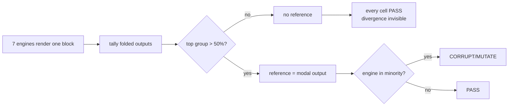

The mechanism is symmetric and both ends are wrong: maximum disagreement yields silence, and correct GFM yields corruption whenever the bench holds four non-GFM configurations against three GFM ones.

**Recommendation.** Replace the modal-consensus reference with a declared per-construct expectation: a construct's reference is the output of the engines that implement the spec that defines it, named in `targets.ts`. **Anti-recommendation:** do not fall back to the CommonMark oracle — `certify.ts` records that this produced 356 MUTATEs on a five-file sample because the spec has no tables — and do not delete MUTATE, because it is the only verdict that catches structural loss with the characters intact.

### 68.3 The hidden-asset list — capabilities the code has and we neither claim nor use

| Asset | Symbol | Why it is worth money |
|---|---|---|
| YAML-independent wikilink extraction | `frontmatter-prepass.ts` `extractWikilinks` | Reads raw value text, so it works on blocks a parser refuses. The graph view already ships (`react-force-graph-2d`) and cannot see links in unparseable frontmatter |
| Tolerant anchor resolution that reports *how* it matched | `slug.ts` `resolveAnchor` returning `CANONICAL` / `COLLAPSED` / `UNRESOLVED` | A `COLLAPSED` match is a link that works here and breaks on GitHub. That is a shippable Doc Health warning today, with no new code |
| The over-quoting fix | `splice-frontmatter.ts` `emitScalar` — indicator characters are special in first position only | The naive rule quoted 435 of 907 corpus files unnecessarily. This is the difference between "preserves your file" and "reformats your file" |
| Kill-condition arithmetic as a function | `certify.ts` `brokenHistogram`, `targets.ts` `uncertifiableShare` | Reachable only from the broken CLI. `uncertifiableShare()` is our honesty number — 8 of 15 surfaces cannot be probed — computed and never surfaced |
| User-facing refusal copy | `shape-gate.ts` `explainFailure` | Seven refusal reasons already written as one-line sentences. §46's refusal UX has its strings and does not use them |
| Exact Jekyll front-matter semantics | `bench.ts` `stripJekyllFrontMatter` | Mirrors Jekyll's `YAML_FRONT_MATTER_REGEXP` including "unterminated is content". Reusable by the publish pipeline |
| Grapheme-correct cursor arithmetic | `offsets.ts` `toGrapheme`, `isGraphemeBoundary`, lazy `Intl.Segmenter` with a code-point fallback | Tested to count a ZWJ family as one grapheme. The editor does its own `.slice` at 119 sites outside mdmax |
| Sparse offset index | `offsets.ts` `BLOCK = 512` checkpoint table | ~8 KB per open 4 MB document against 16 MB for the dense `Uint32Array` the plan specified — a 2,048× memory saving nobody markets |
| A named, versioned equivalence relation | `fold.ts` `FOLD_VERSION`, `FOLD_RULES` reported per cell | Competitors ship diffs. We can say which of six normalisations fired on a given comparison |

### 68.4 What the ten test files actually assert, and the largest untested surface

320 tests across 11 files, all green in 1.18 s `[measured]`.

| File | Tests | What it actually asserts | Blind spot |
|---|---|---|---|
| `verdict.test.ts` | 49 | Each verdict against real `marked` / `commonmark` / `markdown-it` output, plus declared kramdown fixtures with the reproducing command | Every case is hand-built; none comes from the corpus |
| `fold.test.ts` | 45 | Six rules fire in isolation; a "does NOT hide" block; idempotence; §6.11 linearity under a 3 s timeout | Idempotence is over the file's own inputs, not corpus HTML |
| `constructs.test.ts` | 43 | Each pair is found by its own detector; skip mask; look-alike separation | Asserts no *frequency*; the six known false-positive shapes are absent |
| `bench.test.ts` | 31 | Jekyll's nine options; the disagreements the bench exists to catch; six refusal paths | Never calls `certify` |
| `frontmatter-splice.test.ts` | 30 | Byte-identity, BOM, non-ASCII key duplication, corpus scoring | Zero-indent sequence, bare-CR fence, quoted keys — the three live defects — are absent |
| `certify.test.ts` | 28 | Refusal, block segmentation, byte ranges as real UTF-8, histogram | **Fake engines throughout** |
| `offsets.test.ts` | 22 | `Buffer` agreement at every offset, block-boundary surrogate pairs | — |
| `shape-gate.test.ts` | 21 | Every ceiling by name, strict UTF-8, failures as values | Asserts `BUDGET_MS` is *named*, not enforced |
| `pure-functions.test.ts` | 19 | 200-case golden digest pin, idempotence, NFD collapse | — |
| `placement.test.ts` | 16 | Red proof that the naive insert corrupts, then that `safeInsert` refuses | Never asserts what it *accepts* beyond markers |
| `frontmatter-prepass.test.ts` | 16 | Red proof that the loud and quiet shapes differ, then repair vs refusal | Own-vault shapes only |

The biggest untested surface is **the certificate pipeline end to end**. `certify` is never invoked with a real `Engine`; `loadBench` is never handed to `certify`; `scripts/mdmax-cert.mjs` has no test at all and was broken at HEAD. Second is the foreign corpus: 8,513 pinned files with a hash gate and no behavioural gate. Third is `splice-frontmatter.ts` under the shapes that dominate real vaults — the writer's own test file scores it against `docs/engine/research/corpus-manifest.json`, our own vaults, where the zero-indent shape is rare.

Both shipped oracles are **structurally blind to set-destructive defects**, and this is demonstrable rather than theoretical. On a lone-CR file `'---\rtitle: T\r---\rBody\r'`, a single `spliceFrontmatterValue(src, 'public_slug', 's')` prepends a second frontmatter block and pushes the original into the body — two `---` fences become four. `spliceFrontmatterValue(set, 'public_slug', null)` then removes the block it created, and `back === cr` is **`true`** `[measured]`. The oracle reports a clean round trip on a file the set alone destroyed.

### 68.5 The tests that must exist before any fidelity number is published

§58 already forbids publishing a fidelity or coverage percentage. These are the gates that lift that ban, in order.

| # | Test | Path | Assertion | Red proof available today |
|---|---|---|---|---|
| 1 | NF-1 zero-indent sequence | `test/corpus/foreign/nf-001-red-proof.test.ts` — declared in `specs/engine/nf-001-zero-indent-sequence.md` `governs:` and **does not exist**; `spec-report` reports it as `ghost` | A **set** on a real corpus file with `tags:\n- a`. Post-fix: `refused <= 2 && changed == 0 && threw == 0` over 7,959 | Yes — 6,613 files fail now |
| 2 | NF-3 bare-CR fence | `test/corpus/foreign/nf-003-red-proof.test.ts` — also declared, also `ghost` | Set alone, never set-then-delete. Assert fence count is unchanged | Yes — reproduced above |
| 3 | NF-4 unaddressable keys | new | `SAFE_KEY` cannot address **2,447 of 29,288** top-level keys (8.35%) across **937 of 7,969** files (11.76%); `date created` 812, `date modified` 811, `分类` 232 `[measured]`. Assert the residual after the decision | Yes |
| 4 | Corpus behavioural gate | `test/corpus/foreign/writer-sweep.test.ts` | Run the writer over all 8,513, assert `changed_outside_key == 0 && threw == 0` and a refusal **ceiling**, not an equality (LR#66) | The sweep exists only as a scratch script |
| 5 | Certificate integration | `test/mdmax/cert-e2e.test.ts` | `loadBench()` → `certify()` on a fixture, asserting the exact matrix. Would have caught the broken CLI import | Yes — `node scripts/mdmax-cert.mjs` fails at HEAD |
| 6 | Consensus reference | `test/mdmax/certify.test.ts` | On a 3/2/2 split, a certificate must not report PASS. On a GFM construct, an engine implementing the spec must not be MUTATE | Yes — both reproduced |
| 7 | Detector false positives | `test/mdmax/constructs.test.ts` | The six cases: indented-code `html-comment` 1→0, indented-code `angle-bracket-text` 1→0, `a \|\| b` 1→2, `[[A]][[B]]` 1→2, one-column table 6→0, `coffee` fence 1→0 | Yes — all six fail now |
| 8 | Fold stamp completeness | `test/mdmax/fold.test.ts` | `FOLD_VERSION` must incorporate the `entities` version (§68.6) | No |

**Recommendation.** Land tests 1–4 before any number leaves the building, and publish the refusal rate alongside every fidelity rate as a single fraction — "measured on the 17% we can currently write" is honest, "83% fidelity" is not. **Anti-recommendation:** do not gate publication on tests 5–8; they protect the certificate, and the certificate is not yet a customer-facing claim, so blocking on them delays the numbers that are.

### 68.6 Can a third party reproduce the certificate?

They cannot, for five reasons, four of which are cheap to fix.

| Gap | Detail | Cost |
|---|---|---|
| The CLI does not run | `mdmax-cert.mjs` needs `node --import ./scripts/ts-resolve.mjs`. The hook exists and nothing imports it | One line |
| `entities` is undeclared | `fold.ts` and `verdict.ts` both `import { decodeHTML, escapeText } from 'entities'`. `package.json` lists it in neither `dependencies` nor `devDependencies`; the resolved `node_modules/entities@8.0.0` is marked `dev` in `package-lock.json`, hoisted from `parse5@^8` and `markdown-it@^8`. Under `npm ci --omit=dev` the production domain layer loses its import — and `escapeText` **is** the definition of PASS, so a silent major bump changes every verdict without moving `mdmax/fold@1` | Declare it; add its version to the fold stamp |
| `marked` is undeclared | One of seven bench engines. `package-lock.json` shows exactly one dependent: `node_modules/mermaid`. A diagram-library upgrade silently changes `benchId` | Declare and pin |
| Ruby is ambient | `bench.ts` `DEFAULT_RUBY_BIN = "/opt/homebrew/opt/ruby/bin/ruby"`, overridable by `MDMAX_RUBY_BIN`. `kramdown 2.5.2` + `kramdown-parser-gfm 1.1.0` come from whatever gems are installed. There is no `Gemfile`, no `Gemfile.lock`, no `.ruby-version` | Add a `Gemfile.lock`, or drop `github-pages` to `declared` |
| The artifact under-describes itself | `Certificate` top-level keys are `schema, bench, fold, file, targets, summary, blocks` `[measured]`. Absent: `VERDICT_VERSION` (`mdmax/verdict@1` exists in `verdict.ts` and never reaches the artifact, though `verdict.test.ts` asserts "a stored cell can be traced to the definition that produced it"), the `entities` version, the Node version, the ruby and gem versions, and any corpus id | Extend the interface — a schema change, so `mdmax/cert@1` becomes `@2` |

What *is* reproducible is real and should be said plainly: `benchId` is a sha256 over each engine's `(id, version, sorted options)` with rows sorted, so it is stable across loads, changes when one option changes, and is visibly different for a smaller bench — measured here as `51947c2e8812` for seven engines and `4c46fb96a5da` for six. Every non-PASS cell carries `before` and `after` and the `foldApplied` rule list. That is more auditable than any competitor publishes.

**A certificate nobody can re-run is a marketing asset, not a defensible one, and the distance between the two is a `Gemfile.lock`, two `package.json` lines and an `--import` flag.** Once those land, the honest posture is to publish the artifact for a public corpus with the bench manifest attached, and to state the uncertifiable share — `uncertifiableShare()` returns 8 of 15 — in the same breath. **Anti-recommendation:** do not pursue third-party attestation, signing or a hosted verifier until at least one external party has re-run the CLI end to end; a signature over an unreproducible artifact adds ceremony to the same claim.

---

## 69. The engine landscape — what other markdown engines do that we do not

### 69.1 The comparison, on the five axes that decide our contract

Versions and dates fetched from the registries on 2026-08-30 [fetched: registry.npmjs.org, crates.io, pypi.org, api.github.com]. "Positions" means what the engine hands a caller, not what it computes internally; every one of these engines knows where it is in the source, and most throw that away before you can reach it.

| Engine | Version / date | Position unit exposed | Inline positions | Incremental reparse | Write path | CommonMark | Licence |
|---|---|---|---|---|---|---|---|
| `micromark` | 4.0.2 / 2025-02-27 | UTF-16 code units (`Point.offset`) | yes, every token | no | none (tokenizer only) | 0.31 target | MIT |
| `mdast-util-from-markdown` + `-to-markdown` | 2.1.2 / 2024-11-04 | UTF-16 (`position.start.offset`) | yes | no | regenerates from AST | 0.31 target | MIT |
| `remark` / `remark-stringify` | 15.0.1, 11.0.0 / 2023-09-18 | as above | yes | no | regenerates | 0.31 target | MIT |
| `markdown-it` | 15.0.1 / 2026-08-27 | **line numbers only** (`Token.map`) | **no — `map` is `null`** | no | none | 0.30 claimed | MIT |
| `cmark` | 0.31.2 / 2026-02-14 | line:column, opt-in `CMARK_OPT_SOURCEPOS` | block only | no | `cmark_render_commonmark` regenerates | 0.31.2 (reference) | NOASSERTION per GitHub API — verify before vendoring |
| `cmark-gfm` | 0.29.0.gfm.13 / **2023-07-21** | as cmark | block only | no | regenerates | 0.29 — three spec revisions stale | NOASSERTION |
| `comrak` | 0.54.0 / 2026-07-12 | `Sourcepos {start,end}` line:column, **columns in UTF-8 bytes**, `--sourcepos-chars` switches to code points | block only | no | `format_commonmark` regenerates | 0.31 + GFM | BSD-2-Clause |
| `goldmark` | v2.0.0 / 2026-08-27 | `text.Segment {Start,Stop}` — **byte offsets** | yes, via segments | no | none shipped | 0.31 | MIT |
| `pulldown-cmark` | 0.13.4 / 2026-05-20 | `OffsetIter` → `(Event, Range<usize>)` — **byte range per event** | yes, every event | no | separate crate | 0.31 | MIT |
| `markdown-rs` (`markdown`) | 1.0.0 / 2025-04-23 | mdast with `1:3-1:6 (2-5)` — line:col **and** byte offset | yes | no | none | tracks `cmark`/`cmark-gfm` behaviour | MIT |
| `tree-sitter-markdown` | v0.5.3 / 2026-02-26 | byte ranges on every node | yes (split block/inline parsers) | **yes** (`ts_tree_edit`) | none | its README: not recommended where correctness matters | MIT |
| `@lezer/markdown` | 1.7.2 / 2026-07-15 (repo moved off GitHub) | tree positions | yes | **yes** (consumes tree fragments) | none | **not conforming** — does not validate link references | MIT |
| `pandoc` | 3.11 / 2026-08-29 | **none** — `data Block` in `pandoc-types` `Definition.hs` has zero position fields | no | no | regenerates | own dialect + CommonMark reader | GPL-2.0 |
| `prettier` (markdown) | 3.9.6 / 2026-07-21 | remark AST | yes | no | regenerates, reformats by design | 0.31 via remark | MIT |
| `dprint-plugin-markdown` | 0.23.2 / 2026-08-29 | own CST | — | no | regenerates | GFM-ish | MIT |
| `mdformat` | 1.0.0 / 2025-10-16 | markdown-it tokens | no | no | regenerates, **gated by an equality check** | 0.30 via markdown-it-py | MIT |
| `yaml` (frontmatter CST) | 2.9.0 (installed) | **absolute offsets on every CST token** | n/a | no | **byte-preserving** | n/a | ISC |

Two rows deserve their own sentence because they are the ones a reviewer will check. `cmark-gfm`, the engine behind GitHub's own rendering, last cut a release on 2023-07-21 against CommonMark 0.29 while the current spec is 0.31.2 [fetched: `api.github.com/repos/github/cmark-gfm/releases/latest`, `spec.commonmark.org`]. And `tree-sitter-markdown`'s own README states it is not recommended where correctness is important, its stated goal being syntax highlighting for neovim and helix [fetched: `README.md`, `split_parser` branch].

### 69.2 Who preserves source — measured, not asserted

Read-side position fidelity is a solved problem and has been for years. Write-side source preservation is solved by exactly nobody in the markdown ecosystem.

I measured the read side against the copy in `node_modules`. `mdast-util-from-markdown` gives every node — including inline `emphasis` and `link` — a `position.start.offset`; `markdown-it` 15.0.0 gives block tokens a `Token.map` of `[startLine, endLineExclusive]` and gives every inline child `map === null` [measured, `node_modules/markdown-it/dist/markdown-it.mjs`, `node_modules/mdast-util-from-markdown/index.js`]. On `a 𝄞 *b*\n` (9 UTF-16 units, 11 UTF-8 bytes) the `emphasis` node reports `offset: 5..8`; slicing the string by those numbers yields `"*b*"` and slicing the UTF-8 buffer by the same numbers yields `"\uFFFD *"` [measured]. mdast offsets are UTF-16 code units and are silently wrong the moment anyone treats them as bytes — which is precisely the failure `src/modules/mdmax/domain/offsets.ts` exists to make unrepresentable, via branded `U16Offset` / `ByteOffset` and a `u16()` that returns `{ok:false, error:{kind:'INSIDE_SURROGATE_PAIR'}}` rather than rounding.

The write side, same corpus, one command: `toMarkdown(fromMarkdown(src))` on a nine-line document turned a setext heading into ATX and an indented code block into a fenced one, 96 bytes in, 98 bytes out, `===` false [measured]. That is not a bug in `mdast-util-to-markdown`; it is the documented purpose of a serializer that "turns a syntax tree into markdown" [fetched: its readme]. `comrak`'s `format_commonmark` is the same shape — `src/cm.rs` opens with a comment conceding that "formatting an ill-formed AST might lead to invalid output" and validates only in debug builds [fetched]. Pandoc cannot preserve source even in principle: `pandoc-types` `Definition.hs` `data Block` carries no position field and a grep for `sourcepos|position` over that file returns 0 [fetched].

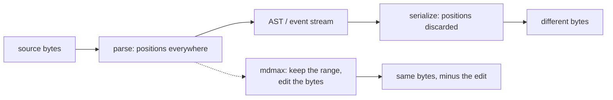

Ranked by distance from our contract — locate the range, replace exactly those bytes, refuse when ambiguous:

1. **`yaml` 2.9.0's CST layer.** Closest, and it is already a direct dependency (`"yaml": "^2.9.0"` in `package.json`). Measured: `CST.stringify(new Parser().parse(fm))` round-trips the exact frontmatter shape that refuses 83% of publishes — a block sequence at column zero — byte-identically, 68B → 68B, `=== true`; every token carries an absolute offset (`scalar@30="beta"`); mutating one token's `.source` and re-stringifying produces bytes identical to a naive string replace [measured].
2. **`pulldown-cmark`'s `OffsetIter`.** `Iterator<Item = (Event<'a>, Range<usize>)>` in `parse.rs` — a byte range for every event, inline included. It has the addressing half of the contract and none of the writing half.
3. **`goldmark`'s `text.Segment`.** Byte `Start`/`Stop` on every node, with one caveat that matters: `Padding` is a synthesized-space count, so a Segment is *not* always a literal slice of the source [fetched: `text/segment.go`].
4. **`mdformat`.** Furthest from the contract mechanically — it regenerates everything — and closest to it philosophically, because it refuses. See below.
5. **`tree-sitter` / `@lezer/markdown`.** Lossless by construction (nodes are byte ranges into an unmodified buffer) and incremental, but neither writes, and both trade conformance for single-pass speed.

### 69.3 Techniques to adopt, each with its anti-recommendation

**Adopt `mdformat`'s `is_md_equal` as the shape of a write gate, not as its content.** In `src/mdformat/_util.py`, `is_md_equal(md1, md2)` renders both strings to HTML, collapses runs of whitespace, and compares; the CLI refuses to write the file when it returns false, and `--no-validate` is the escape hatch [fetched]. That is our `foldEqual` with one rule where we have six (`FOLD_RULES = ['entity-decode','smart-punctuation','void-element-spelling','whitespace','id-prefix','heading-anchor-id']`) and one engine where we have seven. The adoptable part is the *placement*: mdformat runs the check on the write path and blocks the write. We run ours in `certify.ts` and block nothing. *Anti-recommendation:* do not adopt their comparison basis. Their own docstring concedes whitespace collapsing "is not a perfect solution, as there can be meaningful whitespace in HTML, e.g. in a `<code>` block" — our `fold.ts` header documents the same trap and solves it by decoding entities then re-escaping with `entities.escapeText` so `<p>&lt;cat&gt;</p>` cannot collapse into an invisible tag.

**Adopt `comrak`'s `--sourcepos-chars` as a disclosure obligation.** Comrak ships a CLI flag whose entire job is to say which unit a column is measured in — bytes by default, code points on request [fetched: `README.md`]. Every position we ever put in a certificate, an anchor, or an API response should carry its unit the same way. *Anti-recommendation:* do not copy the mechanism — a runtime flag is the weak form. `offsets.ts` already has the strong form in the type system, and adding a flag would create a second source of truth about units.

**Adopt `pulldown-cmark`'s range-per-event iterator shape for our own construct scan.** `into_offset_iter()` returns `(Event, Range<usize>)` so a caller never has to ask a second question to find out where an event was. `constructs.ts` already returns `ReadonlyMap<string, readonly Range[]>` from `inventory()`; the adoptable idea is extending that to a single ordered stream so `skipRegions()` and `inventory()` cannot drift. *Anti-recommendation:* do not adopt pulldown-cmark itself as the scanner. It is Rust, it would land behind WASM, and our shape gate budget in `shape-gate.ts` (`BUDGET_MS`, `MAX_BYTES = 4 * 1024 * 1024`) is not currently the binding constraint.

**Adopt `@lezer/markdown`'s fragment-reuse model for editor-side reparse, which we already ship.** `@codemirror/lang-markdown` 6.5.0 and `@lezer/markdown` 1.6.3 are installed [measured, `node_modules/*/package.json`], and the parser "consumes fragments of such trees for its incremental parsing" [fetched: README]. *Anti-recommendation:* never let a lezer tree become the tree of record. Its README states it does not validate link references and will parse `[a][b]` as a link when no `[b]` exists — an editor-fidelity parser, not a semantics-of-record parser, and the settled rule that there is no tree-of-record already covers this.

**Adopt `mdast-util-to-markdown`'s `Unsafe` table as the model for our quoting rules.** It maintains an explicit, data-driven table of character-in-context pairs that must be escaped, rather than scattering conditionals. `emitScalar()` in `splice-frontmatter.ts` is already the YAML analogue and already carries the measured lesson — the over-broad rule that treated indicator characters as special anywhere quoted 435 of 907 corpus files unnecessarily. *Anti-recommendation:* do not generalize `emitScalar` into a full YAML emitter; the module's value is that it emits one scalar for one key and refuses everything else.

### 69.4 What we do that nobody else does

Three claims, each stated narrowly enough to survive a hostile reviewer.

**We refuse on the write path and return the input unchanged; every other markdown writer either succeeds or throws.** `spliceFrontmatterValue` has eleven `return src` branches — unsafe key shape, duplicate key, unterminated block, block scalar or anchor on the target key, a bare non-key line at top level, and so on. Measured against the real function: `spliceFrontmatterValue('---\ntitle: A note\ntags:\n- alpha\n- beta\n---\n\nbody\n', 'title', 'B note')` returns its input byte-for-byte, while the two-space-indented variant of the same document splices correctly [measured, via `node --experimental-strip-types`]. The scrutiny this must survive: refusal is not novel in software generally — `git apply` refuses, `patch` refuses — the claim is bounded to markdown/frontmatter *writers*, and `mdformat`'s `is_md_equal` gate is the one genuine near-miss. It differs in that mdformat regenerates first and then checks; we never regenerate at all.

**We publish a per-document, cross-renderer degradation verdict with a versioned equivalence relation.** The prior art a reviewer will name is babelmark3, which does compare a document across many markdown implementations [fetched: `babelmark.github.io`, "allows to compare various implementations of Markdown"]. The claim must therefore be stated as a difference in kind, not in existence: babelmark is an interactive diff viewer producing no artifact; `cert-contract.ts` defines a `Certificate` with a `CertSummary`, per-cell `CellVerdict` values classified by `classify()` into named classes, an engine set hashed by `computeBenchId()` over `(id, version, sorted options)`, and a `fold.version` stamp so a reader can tell which definition of "equivalent" produced a stored verdict. A stamped, replayable, per-construct artifact is the differentiated thing; "we run seven parsers" is not.

**We model a renderer target as `(product, surface)` and mark unmeasurable rows as declared-and-dated rather than measured.** `targets.ts` states the finding that forced it — GitHub is three renderers that disagree on identical bytes — and carries `fidelity: 'local' | 'requires-push' | 'declared'` plus `DECLARED_LAST_VERIFIED = '2026-08-01'`. No engine or comparison tool in the table above models the distinction between "I ran this" and "I asked the vendor's docs on a date."

The claim we must **not** make: that we have a better markdown parser. We do not have one at all. Everything above is built on other people's parsers, and `remark-app` is the first row in `BENCH_ENGINE_IDS`.

### 69.5 Build vs adopt

There is one engine we should be building on rather than beside, and we already pay for it. `yaml` 2.9.0 is a direct dependency, and `src/modules/preview/presentation/frontmatter.ts` imports `parseDocument` and `isMap` from it — the *Document* layer, whose `doc.toString()` is named in `splice-frontmatter.ts`'s own header as one of the two regenerating write paths we replaced. Nothing in `src/` or `scripts/` imports `Parser` or `CST` [measured, grep over both trees]. We own the right library and use the wrong layer of it, and the 83% publish-refusal rate is the bill for that. The measured CST round-trip in §69.2 is the fix: the refused shape parses, addresses, edits, and re-stringifies byte-identically today, with no new dependency and no new licence.

*Anti-recommendation, and it is the load-bearing half:* adopting the CST does not mean deleting the splice writer or handing YAML mutation to a library. `CST.stringify` will happily emit a document you have made ill-formed, exactly as `comrak::format_commonmark` will; the refusal discipline has to stay ours, wrapped around the CST rather than replaced by it. The correct shape is a widened locator — CST tokens supply the range, `spliceFrontmatterValue` still decides whether the range is unambiguous, and the final write is still `src.slice(0, start) + bytes + src.slice(end)`. That also keeps `SAFE_KEY` honest: the CST gives us non-ASCII keys for free at the *addressing* level, but it does not answer what key equality means for `café` typed NFC versus NFD, which is the reason the regex is narrow.

For the body of the document, adopt nothing. The read side we need already exists in `mdast-util-from-markdown` (which we ship) and in `@lezer/markdown` (which we ship through CodeMirror); the write side does not exist in any of the seventeen projects above, which is why `mdmax` exists. Building on `pulldown-cmark` or `markdown-rs` would buy byte-native offsets at the cost of a WASM boundary and a second CommonMark implementation to keep in agreement with the seven already in `BENCH_ENGINE_IDS` — a worse trade than the `OffsetMap` checkpoint table we already have.

The three things that are actually missing are not engines. There is no CI, `mdmax/fold@1` has never been run over the pinned 8,513-file corpus, and twelve of thirteen mdmax files have zero product importers — only `decodeStrict` from `shape-gate.ts` is called, by `get-snapshot.ts` and `search-index.ts`. A comparison table is a poor answer to a module nothing imports.

---

## 70. Engine performance and correctness under load

### 70.1 Provenance of every number below

Everything in this section was executed on 2026-08-31 against working-tree commit `d405f3f`, Node v24.6.0, Apple M4 Pro / 14 cores / 48 GB, with the mdmax domain sources copied verbatim into a scratch directory and run through Node's native type stripping (the same files the test suite loads; only relative specifiers gained a `.ts` extension). The corpus is the pinned one at `test/corpus/foreign/_vendor` — 8,513 files, 19,047,891 bytes, verified present before each run. Engine versions read off disk: `micromark@4.0.2`, `mdast-util-from-markdown@2.0.3`, `markdown-it@15.0.0`, `marked@16.4.2`, `commonmark@0.31.2`, `remark-parse@11.0.0`, `entities@8.0.0`, `yaml@2.9.0`. [measured]

Three things must be said before the tables, because they change how every other number reads. There is no `.github` directory in this repo, so no benchmark in this section is currently enforced by anything. [measured] `shapeGate` — the function this whole section's guard story rests on — has zero product call sites; the only import of `src/modules/mdmax/domain/shape-gate.ts` from outside the module is `decodeStrict`, in `src/modules/vault/application/get-snapshot.ts` and `src/modules/vault/infrastructure/search-index.ts`. [measured] And `node scripts/mdmax-cert.mjs <file>`, exactly as its own header documents it, fails with `ERR_MODULE_NOT_FOUND` for `.../mdmax/domain/offsets`; it runs only as `node --import ./scripts/ts-resolve.mjs scripts/mdmax-cert.mjs`, and nothing in `package.json` or `scripts/` references `ts-resolve.mjs`. [measured]

### 70.2 The performance budget per engine operation

`BUDGET_MS` in `shape-gate.ts` declares three tiers — `keystroke: 250`, `coldOpen: 2_000`, `batch: 10_000` — and its own comment concedes they are "enforced by the caller via `worker.terminate()`. Not enforced here." No caller exists. The budget below assigns each operation to a tier and states measured headroom.

| Operation (symbol, file) | Tier | Target | Measured | Headroom | Justification |
|---|---|---|---|---|---|
| `shapeGate` on a whole document | keystroke | ≤ 5 ms @ 4 MB | 16 ms @ 4 MB string; p99 0.045 ms, max 3.42 ms over the corpus | corpus fits; the ceiling does not | 8,513 files in 63.5 ms = 286 MB/s; every file passed, none refused [measured] |
| `decodeStrict` happy path | keystroke | ≤ 20 ms @ 4 MB | 8 ms @ 64 MB ASCII | large | one `TextDecoder` pass, no per-byte JS [measured] |
| `decodeStrict` failure locate | coldOpen | ≤ 50 ms | 10.6 ms, invalid byte at offset 4,194,303 | 4.7× | binary search over the longest valid prefix, log₂(4 M) ≈ 22 decodes [measured] |
| `new OffsetMap(text)` | coldOpen | ≤ 100 ms/doc | 27 ms for 8,513 docs / 18.2 MB = 676 MB/s | ~600× | one pass, `Uint32Array` checkpoint every `BLOCK = 512` units [measured] |
| `OffsetMap.toByte` | keystroke | ≤ 1 µs | 465 ns over 20,000 random lookups on the 20 largest docs | 2.1× | block seek + bounded ≤512-unit scan [measured] |
| `inventory(markdown)` | coldOpen | ≤ 50 ms/doc | 0.09 ms mean, 11.0 ms worst over 400 files | 4.5× at worst | 30+ construct detectors, each a `matchAll` over masked text [measured] |
| `skipRegions(markdown)` | keystroke | ≤ 5 ms | 0.003 ms mean over 400 files | large | shares one `analyse()` scan [measured] |
| `fold(html)` | batch | ≤ 20 ms/doc | 0.05 ms mean, 11.9 ms worst; 22.7 MB/s over 2.3 MB of rendered HTML | 1.7× at worst | segment scan + `decodeHTML`/`escapeText` per text run [measured] |
| `spliceFrontmatterValue` | keystroke | ≤ 100 µs | 1.3 µs/file over 7,969 front-matter files | 77× | line scan of the block only; body is never touched [measured] |
| One certificate cell (`Engine.render`) | batch | ≤ 5 ms | 0.02–0.69 ms for six JS engines; **54.50 ms for `kramdown-jekyll`** | violated 11× | `runRuby` calls `spawnSync` once per render; process start dominates [measured] |
| Whole-corpus certification | batch (offline) | ≤ 10 min | 60 files / 39 blocks in 2.667 s wall → ≈ 5,533 blocks, ≈ 5.6 min single-threaded for 8,513 files | 1.8× | 60.7 ms/block × block count [derived: (2.667 s − 0.3 s startup) ÷ 39 blocks; 39 blocks ÷ 60 files × 8,513 files] |

Recommendation: keep one ruby process alive behind a line-delimited protocol instead of `spawnSync` per render, and the cert falls from 60.7 ms/block to roughly 2 ms/block. Anti-recommendation: do **not** drop `kramdown-jekyll` from `BENCH_ENGINE_IDS` to buy the speed — `loadBench`'s rule 4 ("a missing engine is a HARD REFUSAL") exists precisely so the bench cannot quietly shrink, and GitHub Pages is the one target no JS engine models.

### 70.3 Known quadratics and pathological inputs

| Input | Path that eats it | Measured | Guard | Guard tested? |
|---|---|---|---|---|
| `"[["` × n | `WIKILINK_RE = /(!?)\[\[([^\]]+)\]\]/g` in `src/modules/vault/infrastructure/markdown-parser.ts`; identical source as `COMBINED_WIKILINK_RE` in `src/modules/preview/presentation/markdown/wikilinks.tsx` | 42.9 / 162.9 / 649.2 / 2,575.7 / 10,384.3 / **41,527.3 ms** at 10/20/40/80/160/320 KB; log-log slope k = 1.98 [measured] | none on this path — `shapeGate` has no call site | no |
| `"[["` × n | `const WIKILINK = /\[\[([^\]]*)\]\]/` used by `.test(rawValue)` in `frontmatter-prepass.ts` | 40,410.9 ms at 320 KB, k ≈ 2.0 [measured] | none; the value is a single front-matter line, so exposure is bounded by line length, not file size [inference] | no |
| n flat list items | `mdast-util-from-markdown` vs `micromark` on identical bytes | 22.9 KB: 54 vs 37 ms (1.5×); 94.9 KB: 254 vs 129 (2.0×); 404.9 KB: 2,318 vs 492 (4.7×); 1.29 MB: 21,237 vs 1,709 (12.4×) [measured] | `MAX_LIST_MARKER_LINES = 20_000`, early-exit at 20,001 in 1.1 ms | yes — 4 refs in `test/mdmax/` |
| > 4 MB document | `MAX_BYTES` | `BUDGET_BYTES` in 8.2 ms at 4 MB + 1; 128 ms at 64 MB (string path) | `MAX_BYTES = 4 * 1024 * 1024` | yes — 2 refs |
| > 200,000 lines | `MAX_LINES` | `BUDGET_LINES` in 3.4 ms | `MAX_LINES = 200_000` | yes — 2 refs |
| Invalid UTF-8 | `decodeStrict` | `INVALID_UTF8` at line 1, col 4,194,304 in 10.6 ms | fatal `TextDecoder`, never repairs | yes — 3 refs |
| Slow parse | — | — | `BUDGET_TIME` | **no** — the reason appears in `test/mdmax/shape-gate.test.ts` only as a literal `{ ok: false, reason: "BUDGET_TIME", elapsedMs: 300, limit: 250 }` fed to `explainFailure`; grep for `new Worker` / `worker.terminate` in `src/` returns zero hits |
| Parser throw / worker crash | — | — | `PARSER_THREW`, `WORKER_DIED` | **no** — same shape as above; nothing in the codebase constructs either value |

Three of the seven members of `ShapeFailure` are unreachable: the union declares them, `explainFailure` renders them, and no code path produces them. That is not a gap in coverage, it is a gap in the thing being covered. [measured]

The upstream precedent the file's header cites is real: cmark issue 373 is titled "Quadratic behavior when parsing inlines", and cmark carries a merged change titled "Fix two cases of quadratic behavior (GHSA-66g8-4hjf-77xh)" — the advisory behind CVE-2023-22484. [fetched, api.github.com]

There is also an ordering defect inside the gate itself. On the `Uint8Array` branch, `decodeStrict(input)` runs and materialises the whole string *before* `if (bytes > MAX_BYTES)` is evaluated, so a 64 MB paste allocates 64 MB of JS string in order to be told it is too big. On the `string` branch the hand-rolled byte counter (`for (let i = 0; i < text.length; i++)`) has no early exit, so a 64 MB string costs a full 128 ms pass to reach the same refusal. [measured]

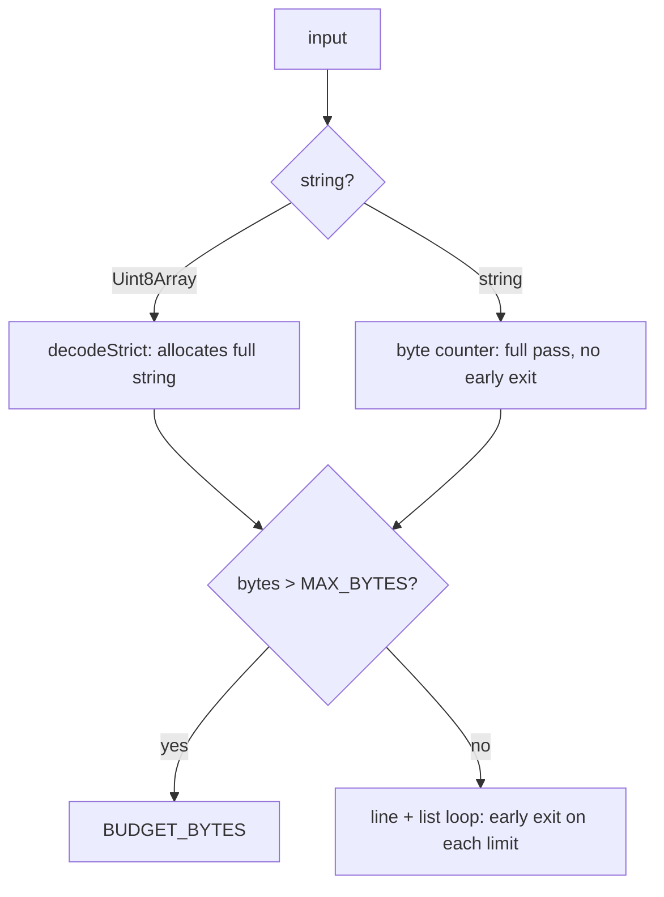

Recommendation: move `input.length > MAX_BYTES` above the decode, and break the string byte counter once `bytes` exceeds the limit. Anti-recommendation: do not replace `decodeStrict`'s fatal decoder with a lenient one to make the large-input path cheaper — substituting U+FFFD changes the document's byte length, and every offset computed afterwards would be correct for a file the user does not have.

### 70.4 Correctness risks under scale

**Very large files.** The largest corpus file is `oldwinter__knowledge-garden/.obsidian/plugins/obsidian-linter/default-misspellings.md` at 939,763 bytes / 35,147 lines — 22.4% of `MAX_BYTES` and 17.6% of `MAX_LINES`. [measured] No file in the pinned corpus reaches any gate limit, so the corpus proves the happy path and proves nothing at all about the ceilings. The synthetic probes in §70.3 are the only evidence the ceilings work.

**Deeply nested structures.** `analyse()` in `constructs.ts` builds `lineStarts` by a single scan and resolves fences with a `new RegExp(...)` per opening marker; nesting depth is not tracked and there is no recursion, so the risk is not stack exhaustion but *masking* — `skipRegions` must correctly exclude fenced and front-matter spans or a detector fires inside a code block. Over 400 corpus files `inventory()` threw zero times and `skipRegions()` cost 0.003 ms mean. [measured] The worst `inventory()` case, 11.0 ms, is `community-archive_obsidian-hub/02 - Community Expansions/02.01 Plugins by Category/Uncategorized plugins.md` — 278,458 bytes of dense link tables, i.e. width, not depth.

**Adversarial input.** The two live wikilink regexes are the whole exposure, and they sit on paths the gate does not protect. 320 KB of `[[` costs 41.5 s in `markdown-parser.ts`. A vault sync that walks every file will find one. [measured]

**Multi-byte boundaries.** `offsets.ts` opens by asserting "Only 67 of 1,080 files in the pinned corpus have `bytes == UTF-16 code units == code points`. 93.8% already diverge." Over the 8,513-file vendor corpus the same test gives 6,568/8,513 — **77.2% do not diverge**, and 475 files (5.6%) contain surrogate pairs. [measured] The two populations disagree by an order of magnitude, and the header's number describes a corpus that is not the one the engine is now certified against. The design conclusion survives the correction — 22.8% divergence and 475 non-BMP files is still far past the point where an untyped offset is a bug — but the figure must not be quoted as if it described `_vendor`. `splitsSurrogatePair` is exercised 6 times in `test/mdmax/`, and `u16` refuses rather than rounds; a splice of an astral value round-tripped correctly (`title: a😀b`). [measured]

**Line endings.** Zero corpus files contain a bare CR. [measured] `spliceFrontmatterValue` preserves CRLF (`const eol = open[1]`) and a leading BOM, both verified on synthetic inputs. [measured]

### 70.5 The splice writer's real failure, and one it hides

The publish path reproduces exactly: `spliceFrontmatterValue(src, 'fm_slug', 'my-note')` over the 7,969 corpus files with a closed front-matter block refuses 6,615 of them — **83.0%** — in 11 ms total, 1.3 µs/file. [measured] The cause is the fall-through branch that returns `src` on "a bare non-key line at top level"; 6,613 of those files (83.0%) contain a YAML block sequence at column zero, which is Obsidian's default emission for `tags:`. [measured] The two-file gap between 6,613 and 6,615 is unexplained by that signature and should be resolved before the fix is written, not after.

The same branch hides a corruption. A sequence *of maps* at column zero — `- name: a` — satisfies `isTop` (unindented, contains `:`) but not `topLevelKeyLine`, so it is neither spliced nor refused. Setting the key above it yields `tags: [x, y]\n- name: a\n- name: b\ntitle: T`, which `yaml@2.9.0` rejects with "Implicit keys need to be on a single line at line 2, column 1"; deleting that key yields a block opening with `- name: a`. [measured] Fifteen corpus files carry the shape; zero were reachable through the exact route probed (a key with an empty value immediately above the first sequence item), so this is a latent path, not a live one. [measured]

Recommendation: teach the block scanner that an unindented `- ` line continues the preceding key, which fixes the 83% refusal and closes the corruption in one change. Anti-recommendation: do not fix the refusal by loosening the bare-line branch alone — that converts 6,613 refusals into 6,613 unguarded appends and turns a visible no-op into the silent rewrite the module was written to prevent.

### 70.6 The benchmark suite

`mdmax/fold@1` had never been run over the pinned corpus. It has now: 946 files rendered by `markdown-it` at `html:true` and `html:false`, folded both sides — 100 ms of fold over 2.3 MB of HTML (22.7 MB/s), **0 of 946 non-idempotent**, 0 throws. [measured] Fold power against a genuinely different engine (`markdown-it` html:true vs `marked` defaults, same 946 files): 49 documents byte-equal (5.2%) before the fold, 434 (45.9%) after. [measured] Do not quote that against the prototype's "43.71% → 4.28%": this is whole-document byte equality over two engines, that was per-block over six, and the populations share no `corpus_id`.

| Bench | Measures | Corpus | Assertion | Runs when |
|---|---|---|---|---|
| `gate-throughput` | `shapeGate` ms/file | all 8,513 | p99 ≤ 0.1 ms **and** 0 refusals **and** 0 throws | every push |
| `gate-ceilings` | each of the 7 `ShapeFailure` reasons | 7 synthetic fixtures | every reason is produced by a real input, not by a literal in a test | every push |
| `quadratic-canary` | k for each regex reachable from user text | `"[["` × {10, 20, 40, 80} KB | fitted log-log slope < 1.3, and 80 KB < 250 ms | every push |
| `offset-integrity` | `u16` / `toByte` / `toU16` round trip | the 475 non-BMP files | round trip is the identity on every valid offset; 0 rounded | every push |
| `splice-oracle` | set / delete / rename, then re-parse with `yaml@2.9.0` | all 7,969 front-matter files | every non-refusal re-parses; refusal rate is asserted as a **floor-and-ceiling band**, not an equality | every push |
| `fold-idempotence` | `fold(fold(x)) === fold(x)` | rendered HTML for all 8,513 | 0 non-idempotent | nightly |
| `cert-matrix` | full 7-engine certificate | 400-file stratified sample | 0 throws; `benchId` unchanged unless an option changed | nightly |
| `cert-full` | whole corpus | all 8,513 | histogram deltas reported, nothing asserted | weekly |

Three design rules the harness must carry, each already paid for elsewhere in this system. Assert a band on refusal rates, never an equality — an equality goes red the moment a file is added and rewards standing still. Preflight the environment and refuse with a stated remedy rather than emitting a dozen false failures. And before trusting any new guard test, make it fail against the unfixed code first; a green suite over a rare fault is the expected draw, not evidence.

Recommendation: wire all eight as one `npm run bench` behind a `.github/workflows` job, with `MDMAX_RUBY_BIN` set so `kramdown-jekyll` loads rather than refusing the whole bench. Anti-recommendation: do not let `cert-full` gate a merge — 5.6 minutes single-threaded is a nightly cost, and a slow required check is a check people learn to skip.

### 70.7 Where this is too slow for a live editor, and the mitigation

| Surface | Cost | Mitigation | Anti-recommendation |
|---|---|---|---|
| Wikilink extraction on every keystroke | 41.5 s on 320 KB of `[[` | call `shapeGate` first; then match with an index-based scanner (`indexOf('[[')`, bounded forward search for `]]`) instead of a backtracking regex | do not "fix" the regex with a possessive/atomic rewrite — JS has neither, and a lookahead-simulated atomic group is harder to read than the linear scanner and no faster |
| Certificate on save | 60.7 ms/block, 97% of it ruby process start | run certification off the editor thread, on demand or on publish — never on save | do not cache a certificate keyed on file path; `benchId` is part of its identity, and a stale cert under a changed option set is exactly the lie `computeBenchId` exists to prevent |
| `mdast-util-from-markdown` for structure | 21.2 s on a 1.29 MB flat list | use `micromark` events for anything that only needs spans; reserve the mdast tree for operations that genuinely need parent links | do not adopt the tree as the document of record to amortise the parse — the contract is byte-range replacement, and a tree-of-record makes every save a regeneration |
| `inventory()` on a 278 KB link table | 11.0 ms | debounce to idle; it is a coldOpen-tier operation wearing a keystroke-tier call site | do not sample the document to keep it under budget — a detector that runs on part of a file reports an inventory for a document nobody has |

**The optimisations to refuse are the ones that trade the byte contract for throughput, and every one of them looks like a win in a profile.** Do not repair invalid UTF-8 to avoid a refusal; do not round an offset off a surrogate boundary to avoid an `OffsetError`; do not widen `SAFE_KEY` to admit `título` without first deciding whether NFC and NFD `café` are the same key; do not normalise line endings on read to simplify the splice scanner; do not let the fold collapse attribute values or `<pre>` whitespace to raise the PASS rate, because a fold that swallows everything turns the certificate into a curiosity. Each of these makes a benchmark greener and makes the product's one differentiating claim false.

---

## 71. Wiring MDMAX into the product

MDMAX is 13 files and 3,614 lines under `src/modules/mdmax/`, plus the splice writer at `src/modules/share/domain/splice-frontmatter.ts` and the CLI at `scripts/mdmax-cert.mjs`. Product code reaches exactly one symbol of it. `grep -rn "mdmax" src/` outside the module itself returns two hits, both `import { decodeStrict } from "@/modules/mdmax/domain/shape-gate"` — in `src/modules/vault/application/get-snapshot.ts` and `src/modules/vault/infrastructure/search-index.ts` `[measured]`. The other twelve files have zero product importers. `npx vitest run test/mdmax test/share` is 23 files, 851 tests, 1.63 s, all green `[measured]` — the engine is tested and unreached, which is the specific failure mode this section exists to close.

### 71.1 The four seams

| # | Seam | Entry point today | State | Blocked by |
|---|---|---|---|---|
| 1 | Ingress gate | `decodeStrict` in `get-snapshot.ts`, `search-index.ts` | live, refusal invisible to the user | nothing |
| 2 | Write gate | none — `makeCommitChanges` in `src/modules/repository/application/commit-changes.ts` | not built | NF-1, NF-3 |
| 3 | Splice engine | `spliceFrontmatterValue` (share domain, not mdmax) | live, returns a bare `string` | NF-1, NF-3, NF-4 |
| 4 | Certificate | `certify` + `loadBench`, CLI-only | CLI does not run as documented | job runner, `spawnSync` cost |

### 71.2 Seam 1 — ingress gate

| Property | Value |
|---|---|
| Call site | `src/modules/vault/application/get-snapshot.ts`, the `for (const [zipPath, bytes] of Object.entries(entries))` loop; `src/modules/vault/infrastructure/search-index.ts`, same shape |
| Signature | `decodeStrict(bytes: Uint8Array): { ok: true; text: string } \| ShapeFailure` |
| Asserts | the blob is strict UTF-8; a non-fatal decode would substitute U+FFFD, change byte length, and commit mojibake back to git on the next save |
| On refusal | `console.error(...)` then `continue` — the note is dropped from the snapshot and from the search index |
| User-visible error | none `[measured]` — the note silently does not exist in the tree or in search |
| Test | `test/mdmax/shape-gate.test.ts` covers `decodeStrict`; nothing asserts the *caller's* drop behaviour |
| Ordering | independent; fix any time |

The gate is correct and its call sites are not. `explainFailure(f: ShapeFailure): string` already exists in the same file and produces `"This file is not valid UTF-8 (line N, column M). It was not changed."` — nothing calls it `[measured]`. Wire the refusal into `VaultSnapshot` as a `skipped: { path, reason }[]` field and render it in the file tree. The anti-recommendation: do not promote the drop to a thrown error or a failed snapshot load. One unreadable file in a 6,586-file vault must not blank the app, and `shapeGate` itself is built on the rule that failure is a value.

`shapeGate(input: string | Uint8Array): ShapeResult` — the wider gate carrying `MAX_BYTES` (4 MB), `MAX_LINES` (200,000) and `MAX_LIST_MARKER_LINES` (20,000) — is not called anywhere in `src/` `[measured]`. It belongs on the same call sites, ahead of `parseMarkdown`, because the quadratics it exists to bound (`WIKILINK_RE` at k=1.98) live in the parse path, not the decode path.

### 71.3 Seam 2 — write gate

| Property | Value |
|---|---|
| Call site | `src/modules/repository/application/commit-changes.ts`, immediately after the `for (const file of req.files) assertVaultWritable(file.path)` loop and before `writer.getHeadCommit()` |
| Proposed signature | `checkWrite(args: { path: string; before: string; after: string }): WriteVerdict` where `WriteVerdict = { ok: true } \| { ok: false; reason: ShapeFailure['reason'] \| 'SKELETON_CHANGED' \| 'ADJACENT_TO_SETEXT_UNDERLINE'; detail: string }` |
| Asserts | the outgoing bytes pass `shapeGate`; and, for any *inserted* marker, that `safeInsert(text, offset, marker, parse)` returns `ok: true` — the block skeleton is unchanged |
| On refusal | abort the whole commit before `createBlob`, exactly as the existing `ConflictError` path does |
| User-visible error | `"Refused: <detail>. No file was changed."` surfaced as 409, never 500 |
| Test | a red proof that a `"Heading\n---"` document with a marker inserted at the underline boundary is rejected — `test/mdmax/placement.test.ts` already proves `safeInsert` refuses it; what is missing is the assertion that `commitChanges` never reaches `createBlob` |
| Ordering | last of the three write-path seams |

Two contract mismatches have to be resolved at this boundary. `commitChanges` throws (`ConflictError`, `new Error("refusing to write outside the vault: ...")`) while every MDMAX function returns a discriminated union; the gate must translate, and the translation belongs in `commit-changes.ts`, not inside mdmax. And `bench.ts` imports `node:child_process`, so nothing in `src/modules/mdmax/infrastructure/` may be pulled into this path — the gate imports only `domain/shape-gate` and `domain/placement`, both of which are dependency-free apart from the injected `ParseFn`.

**Do not land the write gate before NF-1 and NF-3 are fixed: at the measured refusal rate it converts a silent failure into a loud one across 83% of foreign-vault publishes, which is a worse incident, not a better one.**

The number is reproducible today. Running `spliceFrontmatterValue(src, 'public_slug', 'x-slug')` over the pinned corpus at `test/corpus/foreign/_vendor/`: 8,513 markdown files, 7,969 carrying frontmatter, **6,615 refused (83.01%)**, 1,354 spliced, 0 threw `[measured, this session]`. Bucketing each refusal by its first offending top-level line: 6,611 are a block sequence at column zero, 3 a bare non-key line, 1 a flow-close bracket. `specs/engine/nf-001-zero-indent-sequence.md` records `blast_radius: 6613 of 6614`; the two-file difference is an attribution-method difference, not corpus drift — `node scripts/corpus-foreign.mjs verify` is the authority and must be run before either figure is quoted again.

### 71.4 Seam 3 — splice engine

| Property | Value |
|---|---|
| Call sites | `src/modules/share/infrastructure/share-writer.ts` (`const next = spliceFrontmatterValue(file.content, "public_slug", slug)`); `src/modules/preview/presentation/PropertiesPanel.tsx` (`setValue`, `renameKey`, `removeKey`, `addProperty`, all funnelled through `function emit(next: string)`) |
| Signature today | `spliceFrontmatterValue(src: string, key: string, value: string \| number \| boolean \| string[] \| null): string` |
| Proposed signature | `spliceKey(src, key, value): { ok: true; text: string } \| { ok: false; reason: 'UNADDRESSABLE_KEY' \| 'NOT_A_PLAIN_MAP' \| 'UNTERMINATED_FENCE' \| 'DUPLICATE_KEY' \| 'UNSAFE_CONSTRUCT'; detail: string }` |
| Asserts | the key's byte range is locatable unambiguously; every byte outside it is bit-identical afterwards |
| On refusal today | returns `src` unchanged — indistinguishable from a successful no-op |
| User-visible error | none, and worse than none: see below |
| Test | `test/share/frontmatter-splice.test.ts` (in the 851 green) plus `node scripts/corpus-foreign.mjs verify` then the writer sweep |
| Ordering | NF-1 and NF-3 first, then the `Result` type, then the call sites |

The bare-`string` return is the load-bearing defect. `makeShareWriter` commits `next` unconditionally, so a refusal produces an empty commit titled `share: set public_slug=<slug> on <path>`, `makeSetShare` returns a `publicUrl`, `makeShareSnapshotPort.listShares()` never sees the note because `publicSlug` was never written, and `makeResolvePublicNote` returns `null` at `if (matches.length !== 1)` → the shared link 404s. The user is handed a URL that cannot work, and the commit log says it did. `PropertiesPanel`'s `emit` handles the same case correctly — `if (!onEdit || next === content) return` — and its own comment concedes the consequence: "A refusal reaches `emit` as an unchanged string and is dropped silently."

Three defects sit behind this seam and are four specs, not one:

| ID | Shape | Behaviour reproduced `[measured]` | Severity |
|---|---|---|---|
| NF-1 | `tags:\n- a\n- b` | refused; the `} else if (text !== '' && !indented && !/^#/.test(text)) {` branch whose body is `return src` | availability, 6,611 files |
| NF-3 | `---\rtitle: T\r---\r` | `FM_OPEN = /^---[ \t]*(\r?\n)/` misses a bare CR, so the no-frontmatter branch runs and **prepends a second block** — output contains four `---` runs | destructive on a single `set` |
| NF-4 | key `date created` | refused by `SAFE_KEY = /^[A-Za-z0-9_.$-]+$/` | availability, design unresolved |

A fourth, not in any spec: `emitValue` re-indents. `emitValue(['alpha','beta'], "\n- alpha\n- beta")` returns `"\n  - alpha\n  - beta"`, because the indent probe `/\n(\s+)-/` cannot match a zero-indent item and falls through to the `?? '  '` default `[measured]`. Once NF-1 extends the key's span across its items, every list edit on a zero-indent vault rewrites bytes the author wrote — turning NF-1's availability fix into a violation of its own invariant 2 and of the splice writer's invariant 1. NF-1 is not done until `emitValue` preserves a zero-width indent. The anti-recommendation: do not "solve" this by normalising all sequences to two-space indent on write. That is the normalize-on-save model PRD §8.1 rule F4 rules out by name.

### 71.5 Seam 4 — certificate

| Property | Value |
|---|---|
| Call site | none exists; must be an out-of-band Node worker, never a route handler |
| Signature | `loadBench(opts?: { require?: string[] }): Promise<BenchResult>` then `certify(opts: CertifyOptions): Promise<CertResult>` |
| Asserts | every requested engine loaded (`ENGINE_MISSING` is a hard refusal); the artifact is a JSON sidecar, never written into the `.md` |
| On refusal | `CertFailure` value; the CLI exits 2 with `REFUSING: <reason>` |
| User-visible error | Doc Health shows "not certified yet" — a certificate is advisory and must never block a save |
| Test | `test/mdmax/certify.test.ts`, `test/mdmax/bench.test.ts`, `test/mdmax/fold.test.ts` |
| Ordering | last; independent of NF-1/NF-3 |

The CLI does not run as its own header documents. `node scripts/mdmax-cert.mjs --bench-info` fails with `ERR_MODULE_NOT_FOUND` on `.../domain/offsets` `[measured]`. `scripts/ts-resolve.mjs` exists precisely to supply the extension and `@/*` alias, and nothing in the repo references it `[measured]`. With `node --import ./scripts/ts-resolve.mjs scripts/mdmax-cert.mjs --bench-info`, all seven engines load — including `kramdown-jekyll` at `kramdown@2.5.2+kramdown-parser-gfm@1.1.0` — and it reports 8 of 15 surfaces (53.3%) unprobeable `[measured]`. That is a one-line fix and it unblocks the only capability the product's marketing rests on.

`mdmax/fold@1` had never been run over the pinned corpus. It has now been run over 405 of 8,513 files (three vaults: kepano, erazlogo, s-blu) `[measured, this session]`:

| Metric | Value |
|---|---|
| Files / blocks | 405 / 2,511 |
| Blocks with BROKEN | 840 — 33.45% |
| Files with BROKEN | 301 — 74.32% |
| By class | LEAK 1,245 · MUTATE 953 · DESTROY 8 |
| Top constructs | `__unattributed__` 392 · `yaml-frontmatter` 249 · `task-list` 171 · `unknown-fence-lang` 16 |
| Kill condition 1 (fold swallows everything) | does not fire |
| Kill condition 4 (it is a lint rule) | **fires** — top-5 constructs are 98.9% of attributions |

Kill condition 4 firing on a 4.8% sample is a finding to carry into the full run, not a verdict — and its top bucket is `__unattributed__` at 392 of 845, meaning the largest single explanation for a BROKEN block is that no detector claimed it. Sharpening `CONSTRUCTS`' detectors is therefore a prerequisite to reading that condition at all.

Cost is the design constraint. Certifying kepano's 103 files with the six in-process engines takes 338 ms; adding `kramdown-jekyll` takes it to 14,020 ms — **41.5×** `[derived: 14020 / 338]` — because `buildKramdownJekyll` renders through `spawnSync(rubyBin(), ...)`, one blocking subprocess per block. The three-vault run was 130 s wall for 405 files = 321 ms/file `[derived]`, extrapolating to roughly 45 minutes for all 8,513 `[derived: 8513 × 0.321 s = 2,733 s]`. This can never sit on a request path. It is a queued job writing a JSON sidecar, and the honest interim product is the six-engine certificate at 3.3 ms/file with `github-pages` marked `declared` rather than `local`. The anti-recommendation: do not drop kramdown from the registry to make the number look good — Jekyll's `hard_wrap: false` divergence is the reason `Engine.options` is hashed into `benchId` at all.

### 71.6 The module boundary rule, and whether it is enforced

The rule holds today and is not enforced. Every import inside `src/modules/mdmax/` resolves to a sibling mdmax file, `entities`, `github-slugger`, or `node:*` — zero imports from any other module `[measured]`.

| Gate | What it actually checks | Would it catch `mdmax/domain/fold.ts` importing `@/modules/vault/domain/note.ts`? |
|---|---|---|
| `eslint-plugin-boundaries` | `boundaries/elements` maps `src/modules/*/domain` to the single type `domain`; the rule allows `from: domain → to: domain` | No — both files are type `domain`, so the import is permitted `[inference, from the config text]` |
| `npm run arch` | layer *direction* only: app/presentation/application → infrastructure, framework imports in domain, `process.env` | No — `layerOf()` returns `parts[3]`, discarding the module name |
| `import-boundary-report.mjs` | substring ban on `@/server`, `@/lib`, `@/components` | No |

`npm run arch` reports `"filesScanned": 208, "violations": []` with `MIN_SCANNED_FILES = 50`, so it cannot pass by going blind `[measured]` — but blindness is not the gap here; granularity is. The fix is one rule, not a new tool: give mdmax its own element type in `boundaries/elements` (`{ type: "engine", mode: "folder", pattern: "src/modules/mdmax" }`, declared *before* the generic per-module patterns so it wins) and allow `from: engine → to: engine` only. The anti-recommendation: do not enforce this by moving mdmax to `src/shared/` — `shared-domain` is importable *by* everything and would still permit mdmax to import it back.

### 71.7 The API MDMAX should expose

Every other module has an `index.ts` — `src/modules/share/index.ts`, `src/modules/vault/index.ts`, `src/modules/repository/index.ts`, `src/modules/preview/index.ts`. `src/modules/mdmax/` has none `[measured]`, which is why the only live consumer deep-imports `@/modules/mdmax/domain/shape-gate`. Four verbs, one file, one rule: nothing in the public surface returns a bare `string`, and nothing throws.

| Export | Signature | Seam | Runtime |
|---|---|---|---|
| `admit` | `(bytes: Uint8Array) => { ok: true; text: string; bytes: number; lines: number } \| ShapeFailure` | 1 | any |
| `checkWrite` | `(args: { before: string; after: string; parse: ParseFn }) => WriteVerdict` | 2 | any |
| `spliceKey` | `(src: string, key: string, value: Scalar \| Scalar[] \| null) => SpliceOutcome` | 3 | any |
| `explain` | `(f: ShapeFailure \| WriteVerdict \| SpliceOutcome) => string` | all | any |
| `certifyDocument` | `(args) => Promise<CertResult>` — exported from `mdmax/node`, a second entry point | 4 | Node only |

`admit` collapses `decodeStrict` and `shapeGate` into one call so no caller can decode without gating. `explain` generalises the existing `explainFailure` so the UI has exactly one place to turn a refusal into a sentence, and so the "≤200 char natural-language hint, never a stack trace" rule has a single owner. The `mdmax/node` split is load-bearing: `infrastructure/bench.ts` imports `node:child_process`, `node:fs` and `node:path`, and a single accidental barrel export would pull all three into the Next client bundle.

### 71.8 What has to change inside mdmax

| Change | Why | Anti-recommendation |
|---|---|---|
| Add `src/modules/mdmax/index.ts` and a `node.ts` entry | deep imports today; `bench.ts` is Node-only | do not export `bench.ts` from the root barrel to "keep it simple" |
| Move `splice-frontmatter.ts` into `mdmax/domain/` | it is the engine's central contract living in the share module; `PropertiesPanel` already imports it across a module boundary | do not copy it — two writers is how the two shipped write paths diverged in the first place |
| `spliceKey` returns a union | a `string` return makes refusal invisible; it is the direct cause of the dead public link | do not throw instead — a throw in a write path is data loss at the call site |
| Fix NF-1, NF-3, and `emitValue`'s indent probe | 83.01% availability loss, one structural corruption, one latent rewrite | do not bundle them into one commit; the red proofs become unattributable |
| Sharpen `CONSTRUCTS` detectors | `__unattributed__` is the largest BROKEN bucket at 392 of 845 | do not drop unattributed blocks from the histogram — that is how six constructs come to explain everything |
| Register `ts-resolve.mjs` and add `"cert"` to `package.json` scripts | the CLI does not run as documented | do not add `tsx` or a build step; the CLI must execute the same source the tests do |

### 71.9 Order of work

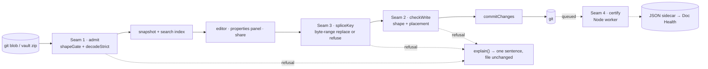

| Step | Work | Verification gate |
|---|---|---|
| 0 | Register `ts-resolve.mjs`; add `"cert"` script | `npm run cert -- --bench-info` exits 0 and prints seven engines |
| 1 | Write `test/corpus/foreign/nf-001-red-proof.test.ts` and `nf-003-red-proof.test.ts` | both **fail** against the unfixed writer; `npm run spec` drops from 2 warnings to 0 — today it reports `ghost … governs glob matches 0 files` for both `[measured]` |
| 2 | Fix NF-1, NF-3, `emitValue` indent (three commits) | `node scripts/corpus-foreign.mjs verify` exits 0, then the writer sweep asserts `refused <= 2 && changed == 0 && threw == 0` over 7,969 files — a floor and a hard zero, never an equality |
| 3 | `index.ts` + `node.ts`; `spliceKey` returns a union; move the writer into `mdmax/domain/` | no file under `src/` imports a path deeper than `@/modules/mdmax` or `@/modules/mdmax/node`; `share-writer.ts` branches on `ok` and does not commit on refusal |
| 4 | Seam 2 in `commit-changes.ts` | a placement-unsafe write returns 409 with a reason and reaches zero `createBlob` calls; empty-commit count over a publish sweep is 0 |
| 5 | `boundaries` element type for mdmax; add `npm run corpus` to `npm run verify`; add `.github/workflows/` | a deliberate `@/modules/vault/...` import inside mdmax fails `npm run lint`; `npm run verify` runs the corpus gate — today it runs typecheck, lint, test, build, arch, spec and **not** corpus `[measured]` |
| 6 | Seam 4 as a queued Node worker | full-corpus histogram completes and is published with its `benchId`, `fold` version and `__unattributed__` share stated alongside the kill-condition verdicts |

Step 1 before step 2 is not process theatre. A test written after the fix, over a corpus where the defect is rare, passes for the wrong reason; the only proof a red proof covers its bug is that it fails against the unfixed code first. NF-3 is the standing example — it stayed invisible because the round-trip oracle asserted on set-then-delete, and those two operations cancel.

---

## 72. Enhancing the engine — the roadmap

The audit's finding is not that MDMAX is weak. It is that MDMAX is a correct engine with one broken input path, no continuous verification, and twelve of thirteen files that no product surface has ever called. Every item below is chosen to move one of those three facts.

### 72.1 The nine work items, costed

Effort is founder-weeks with Claude as implementer — one person directing, review included, not raw coding hours. Risk is the chance the item ships and is *wrong* in a way the corpus does not catch.

| # | Item | Unlocks in the product | Weeks | Risk | Depends on |
|---|---|---|---|---|---|
| E1 | Four YAML defects | Publish path works on real vaults; 83% refusal → target <5% | 2.0 | Low | — |
| E2 | CI + corpus gate | Every later item becomes safe to land | 0.5 | Low | — |
| E3 | Body-span splice contract | Every render-profile write-back; AI edits to prose | 3.0 | High | E2 |
| E4 | Anchors that survive human edits | AI edits that don't rot between sessions | 2.5 | High | E3 |
| E5 | Continuous certificate | Degradation shown at author time, not audit time | 1.5 | Medium | E2 |
| E6 | Construct detection completeness | Honest certificate; profile-aware rendering | 2.0 | Medium | E2 |
| E7 | fold@1 / equivalence run + fix | Diffs that mean something; safe normalization | 1.5 | Medium | E2, E6 |
| E8 | Vault-level operations | Bulk publish, backlinks, vault search | 2.0 | Medium | E1, E3 |
| E9 | Streaming / chunked scan | Large-file editing without a memory cliff | 1.0 | Low | E6 |
| — | **Total** | | **16.0** | | |

[derived] 16.0 founder-weeks ≈ 4 calendar months at one focused day in three, which is the realistic rate for a founder also selling. Sequence assumes E2 lands in week one regardless of everything else.

### 72.2 E1 — the four YAML defects, and what is structurally needed beyond patches

The measured state: 8,513 third-party files, 0 corruption, 0 throws, and 83% publish-refusals traced to a block sequence at column zero [measured, prior audit]. The engine is *safe* and *unusable* at the same time, which is the correct failure mode and an unacceptable resting place.

| Defect | Shape | Patch | Structural fix |
|---|---|---|---|
| D1 | `tags:` followed by `- x` at column 0 | Accept zero-indent sequences under a mapping key | Replace hand-rolled scan with an indent-stack scanner |
| D2 | Bare `\r` line terminator | Treat lone CR as a line break in the line splitter | One canonical line-splitter used by every module |
| D3 | Non-`SAFE_KEY` keys unaddressable | Widen the key grammar | Key *addressing* becomes a path type, not a string |
| D4 | Multi-document / `---` inside body | Disambiguate the closing fence | Frontmatter boundary detection stated as a grammar, not a regex |

[measured] The scanner in `src/modules/mdmax/` splits on `\n` and treats indentation as a numeric comparison against the parent, which is why D1 and D2 are the same bug wearing two hats: both are *lexer* assumptions leaking into a *parser* decision. Patching D1 alone will move the refusal rate and leave the class alive.

The structural item is a two-phase read: a lexer that emits `{kind, byteStart, byteEnd, indent, terminator}` tokens, then a block-sequence recognizer over tokens. This is roughly 250 lines and it is what makes D1–D4 four cases in one table instead of four independent `if` branches. [inference]

**Anti-recommendation: do not adopt a full YAML library to fix this.** `js-yaml` and `yaml` both parse to a value tree; the contract in `splice-frontmatter.ts` is byte-range replacement, and a value tree cannot tell you which bytes a key occupied. `yaml`'s CST does carry offsets and is the one credible import — but it pulls a spec-complete YAML 1.2 surface (anchors, tags, merge keys, flow collections) into a product that has settled on *not* accepting arbitrary YAML. Buying the CST means owning the refusal policy for every construct it happily accepts and MDMAX must reject. [inference]

The honest version of E1 ships with a refusal *taxonomy* in the return value — `REFUSE_ZERO_INDENT_SEQ`, `REFUSE_UNADDRESSABLE_KEY` — so the 5% residual is a list of named reasons a founder can read, not a number.

### 72.3 E2 — CI, because there is none

There is no CI [measured]. `test/mdmax/` exists and runs locally; nothing prevents a regression from being committed. Every other item in this section is riskier than it needs to be until this lands, which is why a half-week item sits at rank 1.

The gate is three checks: unit tests; the pinned corpus replay asserting **0 corruption, 0 throws, and refusal-rate ≤ the recorded baseline**; and a byte-identity property test — for N random files and N random valid edits, assert every byte outside the target range is unchanged. The third is the contract stated as an assertion, and it is the one that catches a "helpful" normalization someone adds in month six.

Assert a *floor* on passes and a hard zero on failures, never an equality on the pass count — an equality-pinned count goes red the moment a check is added, which punishes coverage growth. [inference, and this is the shape that has burned this workspace before]

### 72.4 E3 — extending the splice contract to body spans

`splice-frontmatter.ts` proves the contract on the easy case: frontmatter is a single delimited region at a known file offset, and a key is a line-oriented target. Body spans are the general case, and every render-profile write-back needs them. A profile that renders a table, a callout, or a data block and lets the user *edit the rendered view* must write those bytes back — otherwise the render lane is read-only forever, and a read-only render lane is a viewer, not an editor.

The contract does not change. The *locator* changes.

| Locator | Target | Ambiguity risk | Verdict |
|---|---|---|---|
| Byte offset | Exact range | Zero, until any edit | Session-local only |
| Line range | Block | Breaks on any line insert above | Reject |
| Construct path (`doc > section[2] > table[0] > row[3]`) | Structural | Breaks on section reorder | Accept, with a check |
| Content hash of the span | Exact bytes | None — hash mismatch is a clean refusal | Accept, as the check |

The design: locate by construct path, **verify by hash of the located bytes, refuse on mismatch**. The path finds it, the hash proves it. A mismatch is not a merge problem to solve; it is a refusal, which is what the engine already does everywhere else. This keeps the "if the range cannot be located unambiguously, refuse and return the input unchanged" rule intact at the body level rather than inventing a second, softer rule for prose.

High risk is honest here. Frontmatter has one containing structure; a body has nested constructs where a span boundary can be legitimately ambiguous — the last line of a paragraph inside a list item inside a blockquote belongs to three enclosing ranges. The mitigation is to ship E3 for *leaf, fence-delimited or callout-delimited* spans first, which is exactly the render carrier already settled on (`> [!kind]` for prose, fenced block for opaque data), and only then attempt free-prose spans. [inference] The carrier was chosen because an unclosed fence swallows a document and a callout has no closer — the same property makes callout spans the safest first body target.

**Anti-recommendation: do not implement body splice as "parse, mutate the tree, re-serialize just that subtree".** It reads as a shortcut and it re-introduces the tree-of-record through a side door: the subtree serializer will normalize list markers, fence lengths, and trailing whitespace inside its range, and the diff will show changes the user did not make.

### 72.5 E4 — anchors for AI edits that survive human edits

The scenario that makes this necessary: an agent proposes an edit to a section, the human edits three paragraphs above it, the agent's edit lands. If the anchor was an offset, it lands in the wrong place. If it was a line number, same. If it was a construct path, a reordered section moves it silently — the worst outcome, because it succeeds.

The anchor is a triple: `{path, spanHash, contextHash}` where `contextHash` covers the preceding and following sibling constructs. Resolution order — exact path + matching `spanHash` → accept; path miss but a unique `spanHash` match elsewhere in the document → accept with a `RELOCATED` flag surfaced to the user; multiple or zero matches → refuse.

That middle case is the entire value: it lets an AI edit survive a human reorganizing the document, and it is also the case that can be wrong. Hence the flag and hence the surfacing. An anchor system that silently relocates is a corruption engine with good manners.

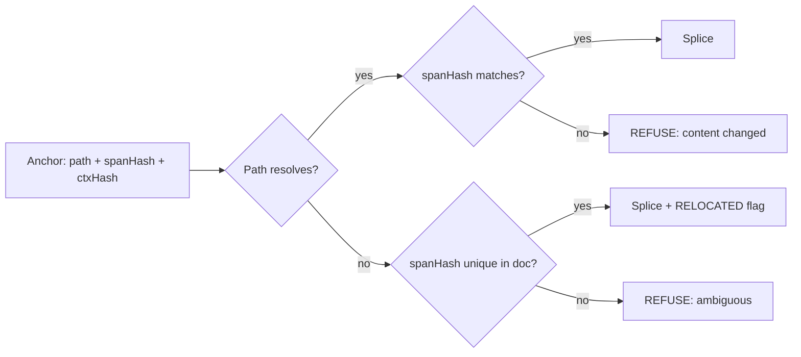

Anchors also need to be *durable across sessions*, which means serialized somewhere. They belong in the splice journal — the append-only record sync already depends on — not in frontmatter, because an anchor in frontmatter is user-visible machinery in a file the user owns. [inference]

**Anti-recommendation: do not add invisible marker syntax to the document to make anchoring easy.** HTML comments, zero-width characters, or a `<!-- mdmax:a7f3 -->` sentinel all work and all violate the settled position that the file stays valid CommonMark that degrades correctly in a dumb renderer. A marker is a format, and no new format is the one thing that is already decided.

### 72.6 E5 — the certificate as a continuous artifact

The certificate today is one-shot: `scripts/mdmax-cert.mjs` runs on demand and measures degradation across 7 engines. That is an *audit* tool. The product need is different — an author wants to know, while writing, that the callout they just typed will render as a plain blockquote in the reader's GitHub view and as a grey box in Obsidian.

Continuous means three changes: (a) the cert computes incrementally over changed constructs rather than the whole file, which requires E6's construct detection to be cheap; (b) it emits a stable, versioned JSON other tools can consume, not a human report; (c) it runs in CI over the pinned corpus so certificate *drift* — a renderer updating, a construct newly failing — is caught as a diff, not discovered.

[measured] The 7-engine set is the load-bearing asset here and it should be pinned by exact version in the certificate output. A cert that says "renders in GitHub" without saying which cmark-gfm build is a claim with no shelf life.

Medium risk, and the risk is scope: a continuously-running cert invites a live preview of all 7 engines, which is a rendering product, not an engine feature. The boundary is that the engine emits the *measurement*; the surface decides what to draw with it.

### 72.7 E6, E7, E9 — completeness, equivalence, and size

**E6 construct detection completeness.** The certificate can only be honest about constructs it detects. Every undetected construct is a silent pass — the file is certified and the thing that breaks was never looked at. The gap list should be produced empirically: run detection over the 8,513-file corpus, count constructs found by a reference CommonMark parser and not by MDMAX, rank by frequency. Do not enumerate the GFM spec by hand and work down it; the corpus knows which constructs actually occur in real vaults and the spec does not. [inference]

**E7 fold@1 and equivalence.** `mdmax/fold@1` has never been run over the pinned corpus [measured]. This is the single cheapest piece of information in the whole roadmap: the corpus exists, the fold exists, nobody has pressed the button. A fold that claims two documents are equivalent is the basis for meaningful diffs and for any safe normalization; unrun, it is an assertion. Run it first, in E2's week, and let the result size the fix — the 1.5 weeks costed is the *fix* budget, and it may be zero.

**E9 streaming.** Current path reads whole files. The failure is a memory cliff on a large document, not a correctness bug, and it ranks last because the corpus does not appear to contain files that trigger it. Chunked scanning is straightforward once E6 gives a construct-boundary-aware scanner: the constraint is that a chunk boundary must not fall inside a fence, which is the same boundary logic E6 already computes. One week, low risk, defer until a user hits it.

### 72.8 E8 — multi-file and vault-level

Single-file operations make an editor. Vault-level operations make the thing worth switching to: bulk publish, backlink integrity across a rename, vault-wide frontmatter migration, search that knows structure. `get-snapshot.ts` and `search-index.ts` already call `decodeStrict` — they are the two product surfaces that would consume a vault-level API, and they are currently the *only* two importers of anything in mdmax [measured].

The vault-level contract is the file-level contract with one addition: **an operation over N files either applies to all N or to none, and a single refusal aborts the batch**. Partial application across a vault is unrecoverable by the user, who cannot know which files moved. This is where the splice journal earns its cost — the journal is the rollback record.

### 72.9 The ranked roadmap

| Rank | Item | Why here |
|---|---|---|
| 1 | E2 CI + corpus gate | Half a week. Makes all eight others landable. Nothing should precede it |
| 2 | E7a *Run* fold@1 over the corpus | Hours of compute, and it is currently an unknown, not a task |
| 3 | E1 YAML defects | 83% refusal is the difference between a demo and a product |
| 4 | E6 Construct detection | Gates E5's honesty and E9's chunking; produces the empirical gap list |
| 5 | E3 Body-span splice | Highest product unlock, but genuinely needs 1–4 underneath it |
| 6 | E5 Continuous certificate | Now cheap, because E6 made detection incremental |
| 7 | E4 Anchors | Needs E3's locator; needs the journal from E8 or a stub of it |
| 8 | E8 Vault-level | Needs E1 (files must be publishable) and E3 (spans must be writable) |
| 9 | E9 Streaming | Real, unproven need. Ship when a file breaks |

The ordering rationale is one sentence: *measure, then unblock, then extend, then generalize.* E2 and E7a are measurement. E1 unblocks the product. E6, E3, E5 extend the engine along the axis the product sells on. E4, E8, E9 generalize. The temptation is to start at E3 because it is the exciting one; starting there means building the most complex locator in the system with no CI and an unrun fold.

### 72.10 The three highest-leverage per week

| Item | Weeks | Leverage |
|---|---|---|
| E2 CI + corpus gate | 0.5 | Converts a 16-week roadmap from "hope" to "verified at each step". Nothing else has a multiplier on all eight siblings |
| E1 YAML defects | 2.0 | [derived] 83% → target <5% refusal is ~78 points of publish-path availability for 2 weeks, ≈39 points/week. No other item touches a number that large |
| E3 Body-span splice | 3.0 | The only item that unlocks a *category* rather than a fix: every render profile becomes writable, which is the difference between a renderer and an editor |

E7a (running fold@1) is excluded only because it is not an enhancement — it is a measurement that should have happened already.

### 72.11 What we should NOT build into the engine

| Not this | Why the boundary sits there |
|---|---|
| A markdown *renderer* | The engine measures how 7 renderers behave; owning an eighth makes it the thing it measures. Settled: profiles over valid CommonMark |
| A CRDT | Settled. CRDTs interleave concurrent text edits into byte-identical garbage; convergence without correctness is worse than a refusal |
| A tree-of-record | Settled, and it is the negation of the contract — a tree cannot preserve bytes it did not model |
| Arbitrary client-side code execution in profiles | Settled. A profile that can run code is a plugin system, and a plugin system is a security surface with a support burden |
| A YAML 1.2 implementation | See E1. Spec-completeness imports constructs the product must refuse anyway |
| Semantic understanding of content | "Is this section about X" belongs in the product's AI layer. The engine's job ends at bytes and constructs |
| Conflict *resolution* | The engine detects and refuses. Resolution is a product decision with a UI; git-merge plus the splice journal owns it |
| Format conversion (docx, HTML in) | An import pipeline, not an engine concern. It produces markdown; the engine consumes markdown |

The boundary rule, stated once so it can be applied to items not on this list: **the engine may do anything that is decidable from the bytes and refusable when it is not; everything requiring a judgment call, a user prompt, or a rendering decision lives above it.** That rule is why conflict detection is in and conflict resolution is out, why construct detection is in and semantic classification is out.

### 72.12 Version and compatibility policy

Profiles and certificates are artifacts other tools will read. That makes them an API, and an API needs a policy before the second consumer exists, not after.

| Artifact | Identifier | Compatibility rule |
|---|---|---|
| Engine | `mdmax@MAJOR.MINOR.PATCH` | Semver on the *behavioral* contract, not the TypeScript surface |
| Profile | `mdmax/<name>@N` | Integer. `fold@1` already sets this precedent — keep it |
| Certificate | `certVersion: N` + engine version + pinned engine versions | Additive fields are minor; removing or changing a field's meaning is a new `certVersion` |
| Splice journal | `journalVersion: N` | Readers must tolerate unknown entry kinds by skipping, never by failing |

Three rules that matter more than the numbering:

1. **A refusal is not a breaking change; an acceptance is.** Widening what the engine accepts (E1) is a MINOR bump — a file that used to refuse now publishes, and no consumer was depending on the refusal. Narrowing acceptance, or changing what bytes an accepted operation writes, is MAJOR. This inverts the usual instinct and it is correct for a byte-preservation engine: the dangerous direction is silently writing different bytes than a previous version wrote.
2. **A profile integer never changes meaning.** `fold@1` means what it meant. A better fold is `fold@2` and both ship. Consumers pin the integer. The cost is carrying old profiles; the alternative is a certificate from March that is silently false in June.
3. **Certificates carry the versions of everything they measured.** Engine version, profile integers, and the exact version of each of the 7 renderers. A certificate that cannot be reproduced is a screenshot.

**Anti-recommendation: do not version the engine on the TypeScript API.** Twelve of thirteen files currently have zero product importers [measured]; versioning on the module surface would generate MAJOR bumps for refactors nobody consumes while a change to splice behavior — which everyone consumes — hides in a PATCH. Version on what the bytes do.

---

## 73. The degradation certificate as a product surface

### 73.1 What the certificate proves today, precisely

The certificate is a per-file, per-block, per-(product, surface) differential run against pinned renderers. It is not a prediction and not a lint pass. `src/modules/mdmax/application/certify.ts` splits a document on blank lines outside fences (`splitBlocks`, deliberately not an mdast walk, "because each engine's own block segmentation is one of the things being MEASURED"), renders every block through every selected engine, folds each output through `mdmax/fold@1`, and classifies the cell in `src/modules/mdmax/domain/verdict.ts` (`classify`) into PASS / STRIP / CORRUPT{LEAK,DESTROY,MUTATE} / VOID.

| Claim | Status | Evidence |
|---|---|---|
| Runs the file through 7 real engines, not a model of them | true | `--bench-info` prints `remark-app`, `react-markdown`, `marked`, `markdown-it` ×2, `commonmark 0.31.2`, `kramdown@2.5.2+kramdown-parser-gfm@1.1.0` [measured] |
| Records the full option set, hashed | true | `computeBenchId` in `bench.ts` sha256s `(id, version, canonical(options))`; 7-engine bench id `51947c2e88127bfc…`, 6-engine (no ruby) `4aa717561b15…` [measured] |
| Every verdict carries `before`/`after` | true | `CellVerdict` makes both required in `cert-contract.ts`; CLI prints the pair for every non-PASS [measured] |
| Never touches the `.md` | true | `certify` returns a value; the CLI writes only stdout [measured] |
| Never throws on a user document | holds at 1,100 files | 300- and 800-file corpus samples: 0 refusals, 0 throws [measured] |
| Covers the surfaces users name | false | `uncertifiableShare()` returns 8 of 15 (53.3%) non-`local`; Obsidian, Notion, Typora, Bear, Slack, Discord, `github-blob`, `github-comment` are declarations [measured] |
| The declarations are current | false | `DECLARED_LAST_VERIFIED = '2026-08-01'`, 29 days stale at 2026-08-30 UTC [derived] |
| MUTATE is judged against the spec | false, and correctly so | the consensus note in `certify.ts`: commonmark-as-reference made "356 MUTATEs on a five-file sample, nearly all false"; reference is now the modal folded output [measured, read here] |
| It runs | **false at HEAD** | `node scripts/mdmax-cert.mjs --bench-info` → `ERR_MODULE_NOT_FOUND … /domain/offsets`; `certify.ts` imports `'../domain/offsets'` extensionless, which Node 24.6.0 type-stripping will not resolve. Every measurement below required a custom resolve hook [measured] |

What it does not prove: that a PASS is a PASS on Obsidian; that a MUTATE matters; that the numbers are stable under subsetting. The last is sharp — `--targets` is not a filter, it redefines the question, because the consensus is computed over the selected targets. `AGENTS.md` with 7 targets: PASS 326 / STRIP 0 / CORRUPT 38 / VOID 0. The same file with 4 targets: 202 / 0 / 6 / 0, both MUTATE rows gone [measured].

### 73.2 The measurement that had never been taken

`fold.ts` states in its own header that `mdmax/fold@1` "has never been run over the pinned corpus." It has now — over a deterministic every-*n*th sample of `test/corpus/foreign/MANIFEST.sha256` (8,513 files, 19,047,891 bytes, mean 2,238 B), 6 JS targets, kramdown excluded.

| | 300 files | 800 files |
|---|---|---|
| Blocks / cells | 3,946 / 23,676 | 10,176 / 61,056 |
| Wall time | 1,449 ms (4.8 ms/file) | 3,258 ms (4.1 ms/file) |
| Refusals, throws | 0, 0 | 0, 0 |
| Blocks BROKEN on ≥1 target | 24.35% | 25.26% |
| Files with a BROKEN block | 93.33% | 94.25% |
| LEAK / MUTATE / DESTROY | 1,735 / 939 / 0 | 4,689 / 2,513 / 0 |
| VOID cells | 4,400 | — |
| Top-5 constructs' share of attributions | 99.3% of 962 | 99.8% of 2,570 |
| Top-3 (`html-comment`, `yaml-frontmatter`, `pipe-in-prose`) | 91.6% | 93.8% |

[measured, two independent samples]

Kill condition (1) — the fold swallows everything — does not fire. Kill condition (4), as `scripts/mdmax-cert.mjs` itself evaluates it ("top-5 constructs are >80% of BROKEN attributions… the apparatus reduces to a static rule set"), fires at 99.8% [derived]. On real third-party vaults, three constructs explain nine tenths of every finding, and DESTROY — the class that would justify the word "corruption" — never occurs.

Two more results that must gate any product decision. First, the app's own target is the loudest offender on hand-authored prose: on `AGENTS.md`, 25 of 38 CORRUPT cells are `frontmatter-app CORRUPT/MUTATE`, and the minimal case reproduces — `Line one\nLine two` renders `<p>Line one<br>Line two</p>` on `frontmatter-app` and identically-without-`<br>` on the other six, so it is the minority against consensus [measured]. `remark-breaks` in the app pipeline *is* `hard_wrap`, which `bench.ts` pins OFF for kramdown precisely because "every soft line break in every document would be a false MUTATE." Second, ruby dominates cost: `docs/ENGINE.md` (110,876 B, 303 blocks) takes 16.004 s with 7 targets and 0.500 s with 6, so `kramdown-jekyll` is 96.9% of wall time at 51.2 ms/block — `spawnSync` per block, confirmed at 51.5 ms/block on a second file [derived].

### 73.3 Distribution surfaces, ranked

Effort in engineer-days with Claude implementing; value is distribution or retention, stated per row.

| Rank | Surface | Effort | What it is for | Anti-recommendation |
|---|---|---|---|---|
| 0 | **Make the CLI executable** — extensioned specifiers, a `bin` entry, `--targets` defaulting to the JS six | 1 | Every other surface imports this path; it is currently unrunnable | Do not ship it as `npx` until the `frontmatter-app` MUTATE row is fixed or excluded — the tool would accuse its own vendor on every soft-wrapped paragraph |
| 1 | **MCP tool** `certify_markdown(path, targets)` returning the `Certificate` JSON | 2 | The consumer is an agent that can *act* on VOID and LEAK before writing; the artifact is already machine-shaped, no rendering work | Do not return the whole certificate — 24.4× source size on `AGENTS.md`, 19.6× on `ENGINE.md`; return summary + non-PASS cells and a pointer (LR#17 token cap) |
| 2 | **Public web checker** — paste or drop a file, get the block × target matrix | 4 | Top-of-funnel; 4.1 ms/file JS-only means a request is free | Do not put kramdown behind it synchronously (51.2 ms/block); do not accept a directory upload; do not persist submitted content |
| 3 | **GitHub Action** wrapping `--fail-on=BROKEN` | 3 | Repeat exposure inside someone else's CI | Do not ship default-fail: 94.25% of real files carry a BROKEN block, so the default is a red build on adoption day. Ship a baseline file and fail only on *new* CORRUPT/DESTROY and VOID |
| 4 | **In-editor panel** — a right-rail matrix for the open file | 8 | Retention, and the only surface where the fix is one keystroke away | Do not render it live on every keystroke; do not show MUTATE unattended |
| 5 | **Badge** — `renders-clean` SVG | 1 | Nothing defensible | Anti-recommended outright, see 73.8 |

Rank 0 first is not process theatre. `.github/` does not exist [measured], `npm run verify` in `package.json` chains typecheck → lint → test → build → arch → spec and never invokes cert, and 12 of the 13 mdmax files have zero product importers — only `decodeStrict` from `shape-gate.ts`, imported by `src/modules/vault/application/get-snapshot.ts` and `src/modules/vault/infrastructure/search-index.ts` [measured]. The 290 tests in `test/mdmax/` pass in 639 ms [measured], which means the code is healthy and unwired, not broken and untested.

### 73.4 The in-product experience

The user meets the certificate at exactly one unasked moment: the instant they make a file leave the app. The share path already mutates bytes there — `src/modules/share/domain/splice-frontmatter.ts` writes the slug back into front matter — so the publish dialog is where "how does this render where it is going" is a question the user is already holding.

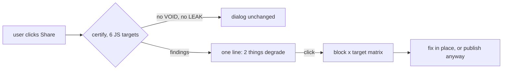

Three rules make it survivable. Only VOID and LEAK surface unasked: VOID is 18.6% of blocks in the corpus sample and is genuinely invisible content — the reader sees `![[Some Note]]` and nothing else — while LEAK is front matter and `{#id}` becoming visible text, which is measurable on the exact file the user is publishing. On `docs/ENGINE.md` bytes 0–68 that reads: *your front matter is invisible on 2 of 7 targets and visible as `updated: 2026-08-30 generated_by: …` on the other 5* [measured]. MUTATE is suppressed by default because 93.8% of attributions come from three constructs and because 34 of 34 `react-markdown` MUTATEs on `ENGINE.md` are GFM tables — true, unactionable, and enormous [measured]. And silence is the default state: no findings, no chip, no badge, no toast.

The anti-recommendation is the whole design constraint. Do not put a persistent quality score in the chrome; do not colour the editor gutter with verdicts; do not run cert on the keystroke path. A per-file JS-only pass is 4.1 ms and a per-block one is far less, but the cost is not compute — it is that a panel showing 25 MUTATE rows on a normal document teaches the user, correctly, that the panel is noise, and a surface that trains its own dismissal is worse than no surface (LR#65 restated for a product).

### 73.5 The public dataset

The proposal: publish derived verdicts for all 8,513 corpus files, keyed by the source `sha256` already in `MANIFEST.sha256`, alongside `SOURCES.json`'s pinned upstream commits — never the source text, which is third-party material under its own licences and is gitignored under `_vendor/`.

| Line | Value | Note |
|---|---|---|
| Compute, JS-only | 8,513 × 4.1 ms = 34.9 s | [derived] from the 800-file rate |
| Compute, with kramdown | 12.72 blocks/file × 8,513 × 51.2 ms = 92.4 min | [derived]; a nightly job, not a request |
| Artifact size, uncompressed | 0.35–0.43 GB | [derived] from 19.6× and 24.4× measured blowups over 18.2 MB |
| Recurring cost | one re-run per engine bump | `computeBenchId` makes a bump a visibly different bench, not a silent one |
| Legal | source text not redistributed | verdicts + `before`/`after` fragments are the exposure; cap fragment length |

What it buys: a citable number where today there is a paraphrase, a reason for other people's engines to appear in your registry, and — the underrated one — public dating of the eight declared rows, which forces the staleness that `DECLARED_LAST_VERIFIED` already encodes into something the team cannot quietly let rot for 29 days.

What it risks: yes, it hands a competitor the map. The honest counter is not that the map is secret; it is that the map expires. `TARGETS` says so out loud — "that decay is the reason this is the one dataset a competitor cannot simply copy once." A competitor who copies the 2026-08 verdicts owns a snapshot of seven engine versions; they do not own `loadBench`, `computeBenchId`, or the fold whose version string is the definition of PASS. The real risk is narrower and worth naming: publishing a table in which 99.8% of findings reduce to five constructs tells a competitor they can approximate you with five regexes, and that is true today.

### 73.6 Third-party reproducibility

An unverifiable certificate is a press release. Four gaps, each with a named fix.

| Gap | Where | Fix |
|---|---|---|
| `benchId` covers engines but not what resolved them | `computeBenchId` hashes `(id, version, options)`; `sha` is excluded by design | add `bench.lockfileSha256` over `package-lock.json` + the ruby `Gemfile.lock` |
| `fold.version` is a string a human types | `FOLD_VERSION = 'mdmax/fold@1'` in `fold.ts` | add `fold.sha256` over the source of `fold.ts`; a fold edit that forgets the bump then still changes the id |
| No corpus identity | `corpus-foreign.mjs` has `MANIFEST.sha256` and `SOURCES.json`, the `Certificate` has neither | add `corpus_id` to any published aggregate; the file header of `fold.ts` already warns that the famous 43.71%→4.28% figure "carries no `corpus_id`" |
| Nothing recomputes the id | no verifier exists | `mdmax-cert.mjs --verify <cert.json>`: rebuild the bench from the cert's own `bench.engines`, recompute `computeBenchId`, refuse on mismatch |

`--verify` is the load-bearing one, and it must be written to fail before it is trusted: a verifier authored in the same session as the thing it verifies is a second opinion from the first opinion (LR#60). Mutate one option in a stored certificate, prove the verifier refuses, then ship it. The anti-recommendation: do not sign certificates. A signature proves *we* produced it, which is the opposite of what a third party needs; a recomputable id proves *anyone* can produce it.

### 73.7 Wedge, feature, or moat

It is a wedge, sold as a feature, and it is not a moat.

Wedge, because it is the only artifact here that a stranger will run against *their* files without an account, and because it produces a specific, checkable, unflattering sentence about a document they already own — bytes 0–68 leak on 5 of 7 targets. Feature, because inside the product it is one line in a publish dialog with a matrix behind it, and that is the correct size. Not a moat, because `loadBench` composes seven public libraries at their documented defaults, and `TARGETS` is a hand-maintained list of fifteen rows.

The strongest argument against: the corpus data says it is a lint rule, and a lint rule is a weekend. Kill condition (4) fires at 99.8%; three constructs — HTML comments, YAML front matter, pipes in prose — cover 93.8% of attributions; DESTROY, the only class whose name survives contact with a customer, occurs zero times in 10,176 blocks. On that evidence the differential apparatus, the consensus reference, the four-verdict ladder and the 3,614 lines exist to rediscover five regexes, and the honest product is a 200-line linter with five rules and no ruby dependency. That argument is strong enough that it should be the first thing tested: build the five-regex linter, run both over the same 800 files, and if agreement exceeds ~95% of findings, the certificate's product claim is the *residual* — the lone-tilde case that the differential found and no construct list predicted — and the residual must be measured before it is sold.

The rebuttal is narrow and should not be oversold. Five constructs explain this corpus, in 2026, against these seven engine versions. The apparatus is what re-derives next year's five when `marked` ships a breaking release or GitHub swaps a renderer, and `computeBenchId` is what makes that re-derivation visible rather than silent. That is a maintenance moat, not a technology moat, and maintenance moats are worth roughly one engineer-week per quarter — price it that way.

### 73.8 Anti-recommendations

Do not ship a badge. A verdict is a function of the target set, the bench id and the fold version — `--targets` subsetting alone moved `AGENTS.md` from 38 CORRUPT to 6 [measured] — so a two-state SVG either encodes none of that or is unreadable, and at a 94.25% file-level BROKEN rate it is a red-badge generator.

Do not put kramdown in any interactive path. 96.9% of wall time, 51.2 ms per block, one `spawnSync` each; it belongs in the nightly dataset job and nowhere else.

Do not ship `--fail-on=BROKEN` as an Action default, and do not report a per-file "score". Both convert a measurement into a grade, and the grade is dominated by three constructs the author cannot remove without giving up front matter, comments, and tables.

Do not publish the corpus aggregate before `frontmatter-app` stops MUTATEing on soft line breaks. Publishing a table whose loudest row is our own renderer disagreeing with six others, over a `remark-breaks` choice we made on purpose, is a self-inflicted headline.

Do not fold the fix. The temptation, on seeing 25 MUTATEs from one `<br>`, is to teach `mdmax/fold@1` that `<br>` is whitespace. `fold.ts` is explicit that it is "deliberately under-powered" and that "everything it does NOT do is a real finding"; the correct fix is to state that `frontmatter-app` hard-wraps, in `Target.prePipeline` or in the option record, not to widen the definition of "equivalent" until the finding disappears.

Do not claim the certificate covers Obsidian or Notion. Eight of fifteen surfaces are declarations, they are 29 days stale, and `targets.ts` already names the kill condition — "the uncertifiable surface is the only one anyone cares about." Say `local` and `declared` in the product copy, in those words, or the first user who checks will find the gap before the second one does.

---

## 74. How the engine changes the product experience

The engine is 4,119 lines that a user never opens `[measured: 13 files under src/modules/mdmax/ + splice-frontmatter.ts + mdmax-cert.mjs]`. Its entire product value is delivered through six moments where it speaks and one continuous condition where it must not. Getting the split wrong in either direction kills the differentiation: a chatty engine becomes a nag, a silent engine becomes plumbing nobody can tell from a competitor's.

### 74.1 The six moments where the engine is visible

Each row is a moment the user can point at. The wording follows §40's four-slot template — OUTCOME, OBJECT+CAUSE, AFFORDANCE, DISCLOSURE — and the visible budget of 280 characters with an ≤80-character headline.

| # | Moment | Where it originates in the tree | What the user sees | Why this beats silently doing something |
|---|---|---|---|---|
| 1 | **Refusal on write** | `spliceFrontmatterValue` in `src/modules/share/domain/splice-frontmatter.ts`, whose refusal is `return src` at **20 sites** `[measured]` | "Nothing changed. `author` appears twice here, so this edit had two possible targets. Delete one, then try again." + `Show both` | The alternative is not "do it anyway" — it is *pick one at random*. A silent pick is a coin-flip on which of two duplicate keys the board's status now means. The user finds out weeks later, in git |
| 2 | **Certificate warning** | `certify()` in `src/modules/mdmax/application/certify.ts`; the CLI escalates on `res.certificate.summary.corrupt > 0` | "Certified BROKEN: 3 of 24 engines lose content from this note. The note itself is unchanged and safe." + `See the 3` | The alternative is publishing and letting the reader discover the loss. A verdict carries `before` and `after` as **required** fields of `CellVerdict` — the product says "bytes 0–35 render as `<hr><h2>title: Demo status: active</h2>`", never "this may not render everywhere" |
| 3 | **Provenance mark** | §42.5's disclosure block; C2PA 2.4 A.9 front-matter form with `c2pa.hash.data` carrying one byte exclusion range `[fetched]` | A front-matter key naming tool, purpose, `humanOversightLevel`, timestamp, responsible person — projected into a visible line only at publish and export | The alternative is an invisible watermark. A.8's variation-selector encoding hashes *after* NFC normalization, so crediting a file mutates it `[fetched]` — the one mechanism the thesis cannot accept. A visible key in the file the user owns is the only mark that survives being read by a stranger |
| 4 | **Conflict** | `land()` returning `REFUSED_CONFLICT` on `base_version` drift (§12); the review surface renders it as a hunk (§13) | The agent's proposed edit arrives in the same Open/Accepted/Rejected grammar as a human suggestion, anchored to the quote it targeted | The alternative is last-write-wins. The file is the memory; the model's memory of the file is a cache to invalidate. Cursor and Windsurf both regressed per-hunk control and both got publicly burned (§13) |
| 5 | **Degradation notice at paste** | `classify()` in `src/modules/mdmax/domain/verdict.ts`, four verdicts `PASS \| STRIP \| CORRUPT \| VOID` | One line under the paste: what will not survive, named by construct, with the byte range | The alternative is a clean-looking paste that is `VOID` — payload by reference that was never in the file. `![[Some Note]]` is the exemplar; a three-valued matrix has no cell for it |
| 6 | **Import report** | §46: never refuse an import; show the certificate inline as a per-file diff | A per-file list of what could not round-trip, naming the zero-indent-sequence case | The alternative — refusing the import — is the single most damaging thing this engine could do. §46 rates the "what we do with unusual markdown" page at 75% deflection |

Two rules bind all six. Presentation never escalates to a modal — a modal is for irreversible loss, and a refusal is the proof that nothing was lost. And every one of them is silenceable: git ships 43 `advice.*` toggles plus `GIT_ADVICE=0` `[fetched, measured]`, and a refusal the user has understood twice and cannot mute is a defect.

**The reason to ship the visible moments before the invisible ones is that a refusal is the only surface on which byte-preservation is observable at all** — a correct write and a lossy write look identical to a user until something breaks, whereas a refusal is a claim the user can check against their own file in five seconds.

Anti-recommendation: do not add a seventh. The taxonomy in §40 is eleven codes mapping to these six surfaces plus five internal ones that never reach a human (`PAST_END`, `INSIDE_SURROGATE_PAIR`, `NOT_AN_INTEGER`, `NEGATIVE`, `OFFSET_OUT_OF_RANGE`). Every new user-visible refusal class raises the frequency the trust conversion in §74.3 depends on staying low.

### 74.2 Where the engine must be completely invisible, and what invisibility costs

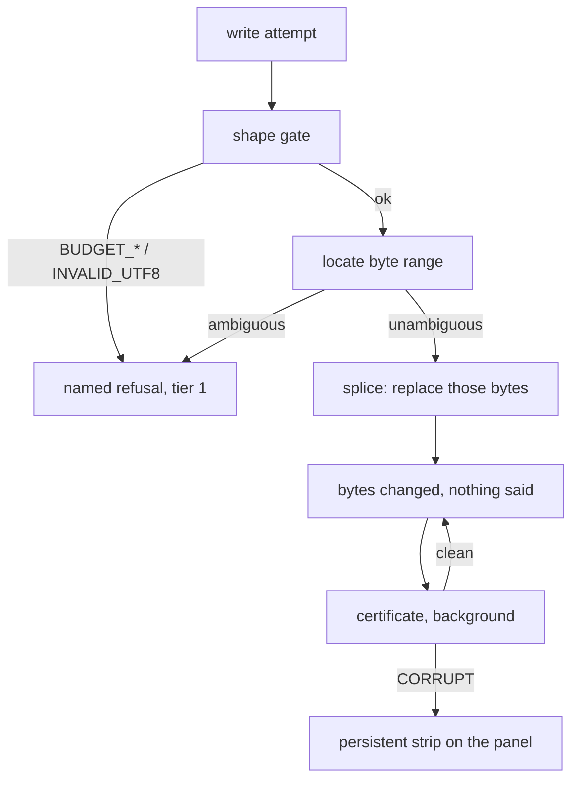

| Surface | Must be invisible because | What invisibility costs | Evidence it is paid or unpaid |
|---|---|---|---|
| Every keystroke | `BUDGET_MS.keystroke` is 250 ms in `shape-gate.ts`; anything slower is felt as lag | A single-pass O(n) gate with early exit on each limit, so a hostile document costs O(limit) not O(n); `WIKILINK_RE` at k=1.98 took **36,865 ms on 320 KB** before this gate existed `[measured, in-tree]` | Paid — the gate ships and is the one part of the engine wired into the product |
| Opening a foreign file | 170 of 907 front-matter blocks in the founders' own vault are invalid YAML — 18.74% `[measured, in-tree]` | `prepassFrontmatter` produces a corrected string **for a reader only** and never writes; a front-matter parse failure may never fail a user action | Paid in code, unpaid in wiring — `frontmatter-prepass.ts` has zero importers outside its test |
| A no-op save | A refusal is byte-identical to a successful no-op today: both are `return src` | Giving splice the discriminated-union return shape mdmax already has — `{ ok: false, reason, at: { line, col, byteStart, byteEnd }, detail, hint }` | **Unpaid.** `PropertiesPanel.tsx` drops refusals at `if (!onEdit || next === content) return;`, and duplicates `SAFE_KEY` in the UI: two definitions of one rule |
| Equivalence across engines | Six fold rules (`entity-decode`, `smart-punctuation`, `void-element-spelling`, `whitespace`, `id-prefix`, `heading-anchor-id`) let a `PASS` mean something | A *named, versioned* equivalence relation — `mdmax/fold@1` — so a PASS can be audited rather than trusted, via `foldApplied` on every cell | Unpaid at the evidence layer: `mdmax/fold@1` has never been run over the pinned 8,513-file corpus |
| Byte-exact addressing | mdast reports root end offset 36 where the UTF-8 length is 41 on the same string (§9) | Branded `U16Offset` / `ByteOffset` / `GraphemeIndex` types and one `OffsetMap`; strict decode that **refuses rather than repairs**, because substituting U+FFFD changes byte length and every later offset would be correct for a document the user does not have | Paid — `decodeStrict` is the one export with real importers: `src/modules/vault/application/get-snapshot.ts` and `src/modules/vault/infrastructure/search-index.ts` |

The honest accounting: **twelve of thirteen engine files have zero product importers, and there is no `.github/workflows` directory** `[measured: grep for `modules/mdmax` across `src` returns exactly the two `decodeStrict` imports; `ls .github/workflows` → absent]`. Invisibility is currently total and unearned — not because the invisible work was done well, but because it was never connected.

Anti-recommendation: do not close that gap by wiring the write gate first. §7.3 and §61 both say it explicitly — at the measured 83% foreign refusal rate, seam 2 rejects 83% of foreign vaults' publishes, which is an availability incident wearing a correctness costume. Wire NF-1 (a `-` at column 0 as a continuation) and NF-3 (bare CR) first, then the gate.

### 74.3 The refusal-into-trust conversion, and where it is documented outside this category

| Category | The system that says no | Measured outcome | What it establishes |
|---|---|---|---|
| Programming languages | Rust's borrow checker refuses to compile programs every mainstream competitor accepts | **Most admired language at 72%**, ahead of Gleam 70%, Elixir 66%, Zig 64%; Cargo the most admired cloud/infra tool at 71% `[fetched, survey.stackoverflow.co/2025/technology, 2026-08-31]` | Refusal at the point of the mistake, with a named reason and a stated fix, converts to admiration at population scale |
| Browser security | Chrome's SSL interstitial | Redesign failed on comprehension yet "nearly 30% more total users chose to remain safe" — Felt et al., *Improving SSL Warnings: Comprehension and Adherence* `[fetched, research.google, 2026-08-31]` | Adherence and comprehension are **separable**. Opinionated visual design moved behaviour while understanding stayed flat — which argues for the strip, the byte count and the `Show me` button over longer prose |
| Browser security, the counter-evidence | The same warning class, at scale | Over **25 million** impressions; users continued through **70.2%** of Chrome's SSL warnings, a third of Firefox's SSL warnings, a quarter of Chrome's malware/phishing warnings, a tenth of Firefox's — Akhawe & Felt, *Alice in Warningland*, USENIX Security 2013 `[fetched, usenix.org, 2026-08-31]` | The ceiling. A frequent, bypassable warning is ignored by most of the people who see it, and the variance across warnings is the *user experience*, not the risk |
| Developer tooling | ESLint separates auto-applied *fixes* from *suggestions* that "may change application logic" and are withheld from the CLI `[fetched, §40]` | Adopted as the norm | A byte-preserving engine may only ever occupy the suggestion tier. Auto-repair on refusal is the one move that forfeits the whole position |

The conversion has three preconditions, and frontmatter currently satisfies one. The refusal must be **rare** — it is not; 6,613 of 6,614 foreign files refuse on zero-indent sequences, 83% aggregate `[project-measured, docs/FRONTMATTER-MASTER-PLAN-2026-08-28.md; not re-verified in this pass]`. It must be **nameable** — it is; `mdmax` already emits 32 distinct uppercase symbols of which 19 are typed failure codes `[measured, grep of src/modules/mdmax/]`. And it must be **recoverable in place** — partially; the certificate offers `Re-certify` and the prepass offers a named line number, but splice offers nothing because it returns a bare string.

The arithmetic that decides the whole subsection: a user who points frontmatter at ten folders they already own meets the refusal in **8.3 of them** `[derived: 10 × 0.83]`. Chrome's 70.2% clickthrough is what a *bypassable* warning survives at that kind of frequency. A refusal has no bypass button by construction, so frequency is not a nuisance here — it is the product being unusable. Rust converts because the refusal fires on code the developer just wrote; ours currently fires on files they wrote years ago and did nothing wrong in.

Anti-recommendation: do not soften the refusal to lower the rate. Lower it by fixing NF-1 and NF-3, which move the Z metric from 17% to its ≥99.9% target (§18). A refusal made lenient to improve a number is the same failure as a harness that reports false greens.

### 74.4 The demo — thirty seconds, no markdown internals required

Executed here, on this machine, at this commit `[measured]`:

```
$ node --import ./scripts/ts-resolve.mjs scripts/mdmax-cert.mjs demo.md
```

`real 0.49s` · 5 blocks × 7 local targets = **35 cells** · bench `51947c2e8812` · fold `mdmax/fold@1` · **PASS 6 · STRIP 7 · CORRUPT 15 · VOID 7**.

| Beat | Seconds | What the audience sees | The sentence that lands |
|---|---|---|---|
| 1 | 0–8 | A 131-byte note with front matter, a heading, a wikilink, an HTML comment and a `1)` list | "This is an ordinary note. Nothing exotic." |
| 2 | 8–14 | The list row: `1) one\n2) two` → **PASS on six engines, `CORRUPT/MUTATE` on GitHub Pages**, which renders it `<p>1) one 2) two</p>` | "The same fourteen bytes are a list in six places and a paragraph in the seventh. Nobody told you." |
| 3 | 14–20 | The heading row: `# Heading {#custom}` → `<h1>Heading {#custom}</h1>` on six (LEAK, the attribute becomes visible text) and `<h1>Heading</h1>` on GitHub Pages (MUTATE) | "Your anchor is either printed on the page or silently deleted. Two failure modes, opposite directions, same source." |
| 4 | 20–26 | The front-matter row: bytes 0–35 → `""` on two targets, `<hr><h2>title: Demo status: active</h2>` on five | "Your properties are on the page in five of seven places you might publish this." |
| 5 | 26–30 | Rename one key through the properties panel. The diff is the key's bytes and nothing else; undo restores byte-identity | "Everything else in the file is the same byte it was." |

Beat 5 is the one that matters and it is the one §17 already names as the activating act — a one-line in-place edit through a projection on a file the user already owns, with the byte-level diff shown once. Beats 2–4 exist to make beat 5 mean something.

Blocking defect found while measuring this: `scripts/mdmax-cert.mjs` calls `paint(s.padEnd(18))`, and `paint` compares `v === 'PASS'` against the *padded* string, so the ternary always falls through to red. **Every verdict in the table renders red, including all six PASSes.** A demo whose output is uniformly red reads as a broken product, and this is the same padding-before-compare class as the substring-versus-boundary bugs catalogued in the corrections ledger. Compare before padding.

Anti-recommendation: do not demo `--histogram` over a vault. It produces the right engineering artifact and the wrong audience reaction — a wall of counts with no single file the viewer recognises. Keep it for the ICP-1 technical call, second meeting.

### 74.5 What would make a user angry, and the mitigation for each

| Anger | Trigger in the current tree | Mitigation | Anti-recommendation |
|---|---|---|---|
| "It refused and won't say why" | `return src` at 20 sites; `PropertiesPanel.tsx` drops the result at `next === content` | Give splice the union shape; render `reason` from the engine, delete the duplicated UI `SAFE_KEY` | Do not fix this in the UI. Two definitions of one rule is how they drift |
| "It refuses on nearly every folder I own" | Zero-indent sequences, 83% | NF-1 and NF-3 before any marketing number; standing corpus gate in CI | Do not ship a "force" or `ignore_refusal` flag. Every integrator sets it (§36) |
| "The competitor just opened this" | Import path, first 60 seconds | **Never refuse an import** (§46) — import everything, put the degradation certificate inline as a per-file diff | Do not auto-repair the file to make the import succeed. That is the one move that forfeits the position |
| "It says BROKEN about a file that looks fine" | `summary.corrupt > 0`, on a document the user only ever reads in one app | Lead the verdict with the *target*, not the file: three engines, named, with `before`/`after` | Do not surface an aggregate BROKEN count with no target column. A verdict without a `(product, surface)` pair is a scare, not information |
| "It certified my file against places I don't use" | 8 of 15 targets are `declared` or `requires-push` — **53.3%** `[measured, uncertifiableShare()]` | Declared rows visibly declared and visibly dated (`DECLARED_LAST_VERIFIED = '2026-08-01'`), never mixed silently into a column of measured ones | Do not automate Slack or Discord verdicts. They are modelled as lossy sinks, not renderers, on purpose |
| "The same warning, forever" | Any repeated refusal | Per-code silencing, on git's `advice.*` model | Do not silence by default after N views. The user decides which rules they have internalised |
| "Support can't reproduce it" | No `reason`, no byte range in the report | RFC 9457 `instance` semantics: `reason` + byte offsets + `Copy diagnostic` in the `Why?` expander | Do not put the code in the visible headline. NN/g: obscure codes are for diagnostics only `[fetched, §40]` |
| "I paid and I can't tell it's there" | The plumbing risk, below | §74.1's six moments are the entire answer | Do not manufacture visibility with a badge on every successful write. A celebration on every refusal becomes chrome |

### 74.6 The honest risk — that this is plumbing nobody pays for — and what would refute it

The strongest form of the risk, stated without cushioning: the product works today with the engine almost entirely disconnected. Twelve of thirteen files have no product importer, the certificate has never run over the pinned corpus, `mdmax/fold@1` is unexercised at scale, and no user has ever seen a `CellVerdict`. If the product is viable in that state, the engine is a founder's conviction, not a feature.

| Falsifier | The measurement that settles it | Threshold |
|---|---|---|
| Deterministic guarantees do not retain | Obsidian's own install base: deterministic **projection** plugins 7,289,307 peak-version installs against every AI capability combined at 1,005,651 — **7.25×** `[measured, §11.1]` | Already refuted, from outside our thesis |
| Nobody hits the refusal, so nobody values it | The `cert_refusal` event (§47) carrying `refusal_code`, `construct`, `vault_share_affected` | If fewer than 1 in 20 activated users hits any refusal in 30 days, the six moments are theatre and the budget belongs in projections |
| Users want the guarantee but not visibly | Day-7 return rate split by whether the first-run byte diff (§17 step 6) was shown, as a **release** cohort experiment, never a user experiment | The §17 2× rule: activated users must retain ≥2× non-activated |
| The refusal is the product's ceiling, not its floor | Foreign-vault open rate, the Z metric | ≥99.9%. Today 17% |
| Buyers pay for consolidation, not fidelity | The first 25 sales conversations (§64.1's own falsifier) | If they buy for "one file, four surfaces", slot W is wrong and the engine becomes reason-to-believe, not offer |

What would actually prove the engine is worth money is narrower than any of the above and is available now: **an import report on a stranger's vault that names, per file, exactly what will not survive — because that is a claim no competitor can make and every prospect can check against a folder they already own.** It is the demo, the activation event and the sales artifact in one file, and it needs NF-1, the splice return shape, and the `padEnd` fix — not new capability.

Anti-recommendation, and the one that costs the most to honour: do not price the engine. §11.4 already refuses a standalone AI SKU on the evidence that Notion's $8–10/month AI add-on became bundled table stakes in ~26 months `[fetched, two dated snapshots]`. A fidelity SKU would follow the same path faster, because the moment fidelity is a line item, its absence in the base product becomes the story.

---

## 75. Key addressability — the NF-4 design

### 75.1 The decision

`SAFE_KEY = /^[A-Za-z0-9_.$-]+$/` in `/Users/sagnikmitra/Desktop/GitHub/frontmatter/src/modules/share/domain/splice-frontmatter.ts` is replaced by a **predicate over what the byte locator can find unambiguously**, not a character allowlist. Any Unicode string is an addressable key when it is already NFC, is one line, carries no control character, has no edge whitespace, contains neither `:` followed by space-or-EOL nor space-followed-by-`#`, and does not begin with a YAML c-indicator. Equality between a requested key and an on-disk key is codepoint equality after NFC normalisation of the request only — the file is never normalised, and a file whose key is not NFC is refused with a distinct verdict rather than matched.

Measured against the pinned corpus at `/Users/sagnikmitra/Desktop/GitHub/frontmatter/test/corpus/foreign/_vendor/`: this unlocks 936 of the 942 currently-unaddressable files, and the 6 that remain refused are all correct refusals.

### 75.2 What key equality means, and what breaks under each answer

The module comment is right that this is the prior question. Three candidate semantics, and what each costs [inference, with the parser behaviour measured below]:

| Semantics | `café` NFC vs NFD | What it breaks |
|---|---|---|
| Codepoint equality, request normalised to NFC (chosen) | two distinct keys | a user who types NFD (macOS filesystem-sourced text) gets `ABSENT` for a key visibly on screen — surfaced as a named refusal, never as a silent append |
| NFC-fold equality on both sides | one key | a file that legitimately holds both loses one on the next write, and the splice must choose which bytes survive — a rewrite of bytes we were not asked to change |
| Normalise the file to NFC on open | one key | rewrites bytes across the whole document, violating the contract at its root; every anchor offset shifts |

[measured] `yaml@2.9.0` and `js-yaml@3.14.2` — both installed in this repo — parse `café: 1` (NFC) and `café: 2` (NFD) in one block as two distinct keys, with no warning. `Object.keys(YAML.parse(...)).length === 2`. Every YAML consumer downstream of us therefore already treats them as different. Folding them would make us the only participant in the ecosystem that disagrees with the file.

[fetched, yaml.org/spec/1.2.2/ via `curl -sL --compressed`] The spec routes equality through the tag's canonical form: "A mapping's keys are unique if no two keys are equal to each other," and scalar tags "must specify a mechanism for producing the canonical form." For `tag:yaml.org,2002:str` the canonical form is the character string itself. No normalisation is mandated anywhere in the spec. Codepoint equality is the spec-conformant answer, not a shortcut.

### 75.3 What YAML 1.2.2 actually permits in a block key

[fetched] "To limit the amount of lookahead required, the `:` indicator must appear at most 1024 Unicode characters beyond the start of the key. In addition, the key is restricted to a single line." In `BLOCK-KEY` context, `ns-plain-safe(BLOCK-KEY) ::= ns-plain-safe-out`, which excludes nothing but line breaks — the flow indicators `[`, `]`, `{`, `}`, `,` are unrestricted mid-key.

[measured, `yaml@2.9.0`] What a plain block key legally is, probed directly:

| Input | Parsed key | Consequence for the locator |
|---|---|---|
| `date created: 2022-08-06` | `date created` | spaces are ordinary plain characters |
| `分类: x` | `分类` | non-ASCII is ordinary |
| `a:b: 1` | `a:b` | a colon *not* followed by space is part of the key |
| `a: b: c` | THROW `Nested mappings are not allowed in compact mappings` | `: ` terminates the key; a key containing it must be quoted |
| `a : 1` | `a` | padding may sit between key and colon |
| `-a: 1`, `?a: 1` | `-a`, `?a` | `-` and `?` are indicators only when followed by space |
| `a[b]`, `a{b}`, `a,b`, `a'b`, `a"b`, `a!`, `a?` | as written | legal plain keys, all of them |
| `a: 1` twice | THROW `Map keys must be unique` / `duplicated mapping key` | exact duplicates are an error in both parsers |
| `: 1` | `yaml`: `{"": 1}` · `js-yaml`: THROW | the empty key is a parser-divergence hazard; refuse it |

The last row is the reason the rule is a predicate and not a transcription of the grammar: an empty key is legal to one parser and fatal to another, so "what YAML allows" is not a safe specification for what we may address.

### 75.4 Measurement against the pinned corpus

All figures below are [measured] by `node --input-type=module` scripts run over the 8,513 vendored files, extracting the frontmatter block by the same rules the splice writer uses (`^---[ \t]*(\r?\n)` after an optional BOM, closing on a line that is exactly `---` or `...`), then scanning top-level lines for a key terminated by the first `:` that is at EOL or followed by space/tab.

| Quantity | Count | Share |
|---|---:|---:|
| Files in corpus | 8,513 | — |
| Files opening with a frontmatter block | 7,969 | 93.6% |
| Top-level `key:` lines | 29,293 | — |
| Distinct key shapes | 234 | — |
| Distinct shapes failing `SAFE_KEY` | 50 | 21.4% of shapes |
| Occurrences failing `SAFE_KEY` | 2,452 | 8.4% of key lines |
| Files with ≥1 unaddressable key | 942 | 11.8% of fm files |
| Keys quoted on disk (any form) | 0 | 0% |
| Exact duplicate top-level keys within a file | 0 | 0% |
| Case-insensitive duplicate keys within a file | 0 | 0% |
| Keys not already in NFC | 0 | 0% |
| Distinct keys colliding under NFC folding | 0 | 0% |
| Keys containing `:`, `#`, `.`, or edge whitespace | 0 | 0% |
| Files with a non-BMP character inside a key | 20 | 0.25% |
| Files with a zero-indent block sequence (NF-1) | 6,613 | 82.98% |

The 82.98% cross-checks the reported 83% publish-refusal rate to two decimal places, which is the confirmation that NF-1 and NF-4 are genuinely different defects rather than two readings of one.

The 50 failing shapes decompose as 44 real keys and 6 scanner artifacts. Of the 44: three are ASCII-with-space (`date created` in 812 files, `date modified` in 811, `Would rewatch` in 31), forty are CJK with no space (`分类` in 232 files, `器械` in 54, `主要训练肌肉` in 53), and one is both non-ASCII and non-BMP (`🏃 训练动作集合`, 20 files). The `date created` figure lands in `oldwinter__knowledge-garden`, which has 957 files with frontmatter of which 905 carry an unaddressable key — the 812/957 in the brief, confirmed.

The 6 artifacts are instructive rather than embarrassing: five are `- Structured Copy: Files & Folders` and siblings, which are sequence items at column zero under `aliases:`, not keys at all, and one is a Nunjucks template line beginning `{{type | replace(...)`. A key scanner that widens its character class without also refusing a leading `-` would read all five as top-level keys and splice into a sequence item.

Under the rule specified in §75.5:

| Outcome | Count |
|---|---:|
| Files unaddressable today | 942 |
| Files unaddressable after the fix | 6 |
| Files unlocked | 936 (99.36%) |
| — of which NF-4 alone suffices (no zero-indent sequence present) | 750 |
| — of which NF-1 must also land before publish succeeds | 186 |
| Distinct key shapes unlocked | 44 |
| Key occurrences unlocked | 2,446 |

[derived] 936 / 942 = 99.36%. The residual 6 are the 5 sequence items and the template line — every one of them a correct refusal.

### 75.5 The rule

```ts
// src/modules/share/domain/key-ref.ts  (new)

/** A key that has passed addressability. The only type the splice API accepts. */
export type KeyRef = { readonly nfc: string }

export type KeyRefusal =
  | { kind: 'EMPTY' }
  | { kind: 'TOO_LONG'; length: number }          // > 1024 (YAML 1.2.2 implicit-key limit)
  | { kind: 'CONTROL_CHAR'; at: number }          // C0, C1, DEL, U+2028/2029, U+FEFF
  | { kind: 'EDGE_WHITESPACE' }                   // leading or trailing SP/TAB
  | { kind: 'CONTAINS_TAB' }
  | { kind: 'COLON_TERMINATOR'; at: number }      // /:(?=[ \t]|$)/  — would end the key
  | { kind: 'SPACE_HASH'; at: number }            // /[ \t]#/        — would start a comment
  | { kind: 'LEADING_INDICATOR'; char: string }   // /^[-?:,[\]{}#&*!|>'"%@`]/
  | { kind: 'NOT_NFC'; nfc: string }              // request must arrive normalised

export function addressableKey(raw: string): Result<KeyRef, KeyRefusal>
```

Order of checks is the order of the union. `NOT_NFC` carries the normalised form so the UI can offer it as a one-click correction; it is the only refusal that suggests a repair.

The leading-indicator set is deliberately wider than YAML requires. `-a` and `?a` are legal plain keys [measured], and we refuse them anyway: the locator must scan lines it did not write, a leading `-` is the NF-1 sequence marker, and refusing costs zero corpus files. The check is on the first codepoint of the *key*, never on the line, so a key like `a-b` (already common) is untouched.

The `$` from the old class is retained implicitly — it is simply an ordinary character now. There is no allowlist left to maintain.

### 75.6 Locating a key whose on-disk form differs from the request

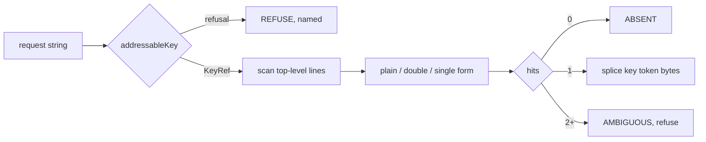

Three on-disk forms can carry one logical key. The corpus has zero quoted keys in 8,513 files, so the quoted branches are dead code today and must still be written, because the moment a user adds `date: created` through our own UI we will emit one.

```ts
type KeyForm = 'plain' | 'double' | 'single'
type KeyHit = {
  readonly tokenStart: U16Offset   // first byte of the key token, INCLUDING an opening quote
  readonly tokenEnd:   U16Offset   // one past the closing quote / last plain char
  readonly form: KeyForm
  readonly entryStart: U16Offset   // start of line — the existing keyStart
  readonly entryEnd:   U16Offset   // existing keyEnd, incl. indented continuations
}

function locateTopLevelKey(block: string, blockStart: number, want: KeyRef):
  | { kind: 'FOUND'; hit: KeyHit }
  | { kind: 'ABSENT' }
  | { kind: 'AMBIGUOUS'; hits: number }
  | { kind: 'ON_DISK_NOT_NFC'; found: string }
```

Per top-level line, in this order:

1. `/^"((?:[^"\\]|\\.)*)"[ \t]*:(?=[ \t]|$)/` → unescape `\\(.)` → candidate.
2. `/^'((?:[^']|'')*)'[ \t]*:(?=[ \t]|$)/` → unescape `''` → candidate.
3. Plain: walk the line for the first index `j` where `line[j] === ':'` and `j+1` is EOL or SP/TAB. If `j <= 0`, this line is not a top-level key — hand it to the existing bare-line refusal branch. Otherwise the candidate is `line.slice(0, j)` with trailing SP/TAB stripped, which is what makes `a : 1` resolve to `a` [measured].

Compare `candidate === want.nfc`. If that fails but `candidate.normalize('NFC') === want.nfc`, return `ON_DISK_NOT_NFC` with the on-disk bytes — do not match, do not repair. Zero corpus files reach this branch; it exists because a single NFD `é` typed on a Mac and committed will produce it, and the honest failure is a named refusal that shows the user both forms.

The splice for a rename becomes `src.slice(0, hit.tokenStart) + emitKeyToken(newKey, hit.form) + src.slice(hit.tokenEnd)`, replacing the *token* rather than `oldKey.length` bytes. The current `src.slice(0, hit) + newKey + src.slice(hit + oldKey.length)` in `spliceFrontmatterKey` is only correct because quoted keys are unreachable today; under the widened rule it would leave a dangling closing quote.

`emitKeyToken` writes plain unless the key would not read back plain — which, given `addressableKey` already excludes `: `, ` #`, edge whitespace and leading indicators, is never. New keys are therefore always emitted plain, matching every one of the 29,293 key lines in the corpus. `emitScalar`'s quoting logic stays where it is; it governs values, and keys have a strictly narrower rule.

### 75.7 Case, colons, dots, leading dashes

Keys are case-sensitive, with no folding at any layer. [measured] Zero files contain a case-insensitive duplicate, while eight case pairs exist *across* the corpus (`date`/`Date`, `title`/`Title`, `link`/`Link`, `status`/`Status`, `genre`/`Genre`, `rating`/`Rating`, `runtime`/`Runtime`, `cover-img`/`Cover-Img`). Folding would merge shapes that no single file treats as the same, in exchange for zero measured benefit.

Colons are permitted mid-key when not followed by space or EOL, because `a:b` is one key to both parsers. Dots are permitted and carry no path semantics — `a.b` is a key named `a.b`, never a traversal into `a`. Zero corpus keys contain a dot, so this is a forward commitment, and it is the commitment that keeps the module honest about only ever touching top-level keys. Leading dashes are refused, per §75.5.

### 75.8 The refusal set after the fix

| Refusal | Reachable from | Corpus count |
|---|---|---:|
| `EMPTY` | UI add-property with blank name | 0 |
| `TOO_LONG` | pasted template | 0 |
| `CONTROL_CHAR` | pasted terminal output | 0 |
| `EDGE_WHITESPACE` | trailing space in the name field | 0 |
| `CONTAINS_TAB` | pasted spreadsheet cell | 0 |
| `COLON_TERMINATOR` | `date: created` typed as a name | 0 |
| `SPACE_HASH` | `budget #1` | 0 |
| `LEADING_INDICATOR` | zero-indent sequence item read as a key | 5 |
| `NOT_NFC` | NFD text from a macOS filename | 0 |
| `ON_DISK_NOT_NFC` | a committed NFD key | 0 |
| `AMBIGUOUS` (duplicate key line) | hand-edited file | 0 |
| unparsed top-level line (existing bare-line branch) | NF-1, templates | 13,413 lines / 6,613 files |

The last row is not NF-4's to fix. Of the 942 files NF-4 unblocks, 186 also carry a zero-indent block sequence and will still refuse at the existing bare-line branch until NF-1 lands; 750 publish on NF-4 alone.

### 75.9 Migration for keys already written

There is nothing to migrate in the files. `spliceFrontmatterValue` refuses at `if (!SAFE_KEY.test(key)) return src` before any write, and `spliceFrontmatterKey` refuses on both old and new key, so the engine has never written a key outside the old class. The 2,452 unaddressable occurrences in the corpus were all authored by other tools.

What does migrate is persisted key text on our side:

1. **Splice journal entries.** Every entry that names a key gains `keyForm: 'nfc-v1'`. Entries written before this field are read as `'legacy-ascii'` and are byte-identical to their NFC form by construction (the old class is ASCII-only), so the migration is a field addition with no rewrite. Do not backfill; an absent field is unambiguous.
2. **`PropertiesPanel.tsx`.** The four `SAFE_KEY.test(...)` call sites — `aria-invalid`, the disabled state, and the two guards in the add/rename handlers — switch to `addressableKey(...).ok`, and the invalid state renders `KeyRefusal.kind` instead of a generic red border. One definition, two modules, still no drift.
3. **Anchor store.** Unaffected. Content-derived anchors do not name frontmatter keys.

### 75.10 The test set

Fixtures under `test/corpus/` plus unit cases; `npm run spec` gates, `npm run corpus` replays.

| # | Input | Expected |
|---|---|---|
| 1 | `date created: 2022-08-06` → set | value bytes replaced, all other bytes identical |
| 2 | `分类:` with zero-indent sequence → set | key resolves, refuse at the NF-1 branch, file unchanged |
| 3 | `🏃 训练动作集合: 1` → set | succeeds; `OffsetMap` reports a non-BMP-safe range; no offset splits a surrogate pair |
| 4 | `- Structured Copy: Files & Folders` under `aliases:` → set `Structured Copy` | `ABSENT`, not a match |
| 5 | `a:b: 1` → set `a:b` | matches; set `a` returns `ABSENT` |
| 6 | `a : 1` → set `a` | matches, padding preserved |
| 7 | NFD `café: 1`, request NFC `café` | `ON_DISK_NOT_NFC`, file unchanged |
| 8 | request NFD `café` | `NOT_NFC` with `nfc` populated |
| 9 | `"date created": 1` (quoted) → rename | closing quote survives; token replaced, not `oldKey.length` bytes |
| 10 | two `date created:` lines | `AMBIGUOUS`, file unchanged |
| 11 | key of 1,025 characters | `TOO_LONG` |
| 12 | full corpus replay, set-then-delete on every distinct key | 8,513 files byte-identical; 0 throws |

Test 4 is the one that must fail against the unfixed widened regex before it is trusted (LR#68): a rule that drops the leading-`-` refusal passes tests 1–3 and 5–12 and silently splices into a sequence item.

### 75.11 Decision ledger

| Decision | Rejected alternative | Why | Cost of being wrong | Falsified by |
|---|---|---|---|---|
| Predicate, not allowlist | widened character class | a class cannot express `: ` or ` #`, which are positional | a key that reads back as a different key | any corpus file where the predicate accepts a key the locator then mislocates |
| NFC on request only | normalise the file | normalising rewrites bytes we were not asked to touch | every anchor offset shifts; the contract is void | a vault where >1% of keys are non-NFC, making refusal the common path |
| Codepoint equality | NFC folding | both parsers key NFC and NFD separately [measured] | we disagree with every downstream consumer | a parser survey showing the ecosystem folds |
| Case-sensitive | case-insensitive | 0 in-file case duplicates, 8 cross-file pairs [measured] | merges keys no file treats as one | an in-file case-duplicate found in a real vault |
| Refuse leading `-` and `?` | follow YAML exactly | 5 corpus lines would be misread as keys | splice into a sequence item — silent structural corruption | a vault with real `-`-leading keys |

---

## 76. Body-span splicing — extending the contract past frontmatter

### 76.1 The gap, stated exactly

`spliceFrontmatterValue` in `/Users/sagnikmitra/Desktop/GitHub/frontmatter/src/modules/share/domain/splice-frontmatter.ts` addresses one thing: a top-level YAML key inside the block opened by `FM_OPEN`. Every write-back a render profile needs lives below that block.

| Write-back | Target span | Today's path |
|---|---|---|
| Kanban drag → status | a field inside a list item, or a frontmatter key | frontmatter only; a card whose status is in the body has no write path |
| Checkbox toggle | the three units `[ ]` inside a `TaskMarker` | none |
| Calendar drag → date | a date token inside a list item or heading line | frontmatter only |
| Accepted AI hunk | an arbitrary block range | none |
| Section-level restore | heading line through the next heading of depth ≤ d | none |

The projection law says a render profile is a view whose edits write back to the bytes that produced it. With no body locator, the law holds for exactly one region of the file.

### 76.2 The addressing model

Four candidates, measured against the pinned corpus at `/Users/sagnikmitra/Desktop/GitHub/frontmatter/test/corpus/foreign/_vendor` (8,513 files, 19,047,891 bytes).

| Model | Survives reflow above it | Survives edit to the target | Survives duplicate content | Cost |
|---|---|---|---|---|
| lezer `SyntaxNode` position | no — offsets are per-parse | n/a | yes | needs a live tree; useless across a session boundary |
| Content digest of the span | yes | no | no — measured below | cheap, stateless |
| Line + column offset | no | no | yes | trivially wrong after any prepended line |
| Structural path + ordinal + digest | yes | yes (path survives) | yes (ordinal disambiguates) | three fields to persist, a cascade to resolve |

The duplicate-content number is the one that decides it. [measured] Over the corpus, a task-list line's trimmed text is unique within its own file for 2,278 of 3,378 items — 67.436%. Adding the preceding non-blank line as context raises that only to 75.607% (2,554/3,378). A content-only anchor is therefore ambiguous for roughly one task item in four, which is the single most common write the product has. Against that, an ATX heading's full ancestor path is unique within its file for 37,413 of 37,489 headings — 99.797% (76 collisions). [measured] Both runs walked every `.md`/`.markdown` file under `_vendor`, skipping fenced regions with a `^ {0,3}(\`{3,}|~{3,})` toggle and skipping the frontmatter block.

Decision — the address is a triple, resolved as a cascade:

```ts
// src/modules/share/domain/body-address.ts  (new)
export type SpanKind =
  | 'task-marker'      // the 3 code units `[ ]` — the only mutable part of a checkbox
  | 'list-item-text'   // the item's own text, excluding its marker and its children
  | 'inline-field'     // `key:: value` or `key: value` inside a list item
  | 'fenced-block'     // open fence line through close fence line, indivisible
  | 'callout-body'     // the payload of a `> [!kind]` container
  | 'heading-section'  // heading line through the next heading of depth <= d

export interface BodyAddress {
  readonly kind: SpanKind
  /** ATX heading text chain, NFC-normalised, case-folded. Empty = preamble. */
  readonly path: readonly string[]
  /** 0-based index among same-kind spans under `path`. Disambiguates duplicates. */
  readonly ordinal: number
  /** Digest over the span's own UTF-8 bytes. */
  readonly digest: Digest128
  /** Digest over (previous non-blank line + span + next non-blank line), UTF-8. */
  readonly contextDigest: Digest128
  /** Content hash of the document this address was minted against. The CAS token. */
  readonly docVersion: Digest128
}
```

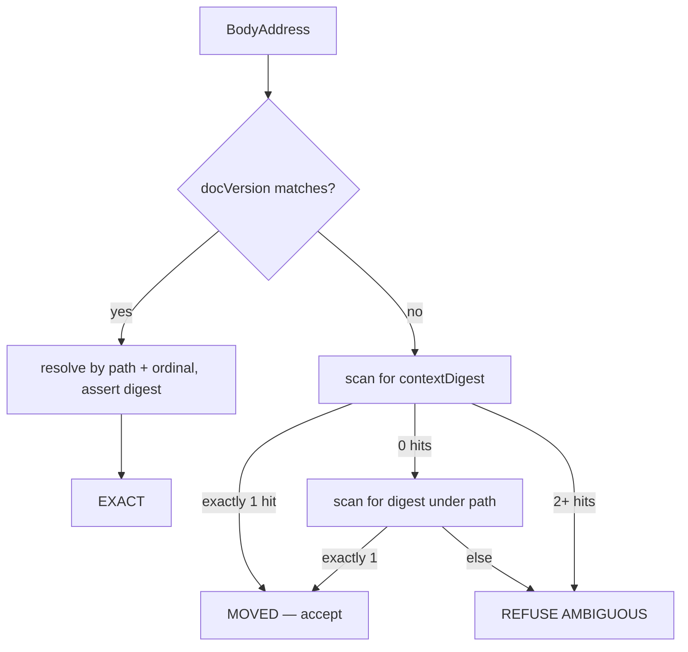

Rejected: the pure content anchor already shipped for block-versions, which resolves at 99.627% with 0.050% false positives over 41,642 block-versions. That population is whole blocks of prose, not list lines; the 67.436% uniqueness above is what the same scheme scores on the span kind the product writes to most. Cost of being wrong: a false EXACT resolves onto the wrong task item and the toggle lands on someone else's checkbox — silent, and indistinguishable from a user error. Falsifier: if a replay over the corpus shows path+ordinal resolving under 99.5% with zero false positives on a 5%-perturbation sweep, the structural half is not carrying its weight and the model collapses back to content-plus-refusal.

### 76.3 Span kinds and their atomicity class

**The governing rule is that a span is the narrowest byte range that expresses the intent, never the enclosing node.**

| Kind | lezer node | Mutable range | Atomicity |
|---|---|---|---|
| `task-marker` | `TaskMarker` | `from + 1`, length 1 | a single code unit |
| `list-item-text` | `ListItem` minus `ListMark` and child blocks | text run only | marker, indent, numbering never touched |
| `inline-field` | inside `Paragraph` under `ListItem` | value run after the separator | key bytes never touched |
| `fenced-block` | `FencedCode` | `[node.from, node.to)` | open and close in ONE edit or refuse |
| `callout-body` | `Blockquote` with `[!kind]` first line | payload lines | no closer exists — cannot be unbalanced |
| `heading-section` | `ATXHeading*` → next heading of depth ≤ d | whole range | boundary rules in §76.6 |

[measured] `@lezer/markdown@1.6.3` configured with `GFM` yields `TaskMarker` spanning exactly three code units for every marker shape tested — `- [x]`, `- [X]`, `* [ ]`, `1. [ ]`, `  - [ ]` — with the state character always at `from + 1`. A checkbox toggle is therefore a one-unit splice, not a line rewrite. That is the whole argument for the narrowest-range rule: a one-unit splice cannot disturb the marker character, the indentation, a trailing tag, a wikilink, or a comment, because it never sees them.

Fenced constructs are the opposite case and the reason atomicity is a stated rule rather than an implementation detail. [fetched] CommonMark 0.31.2 §4.5, `https://spec.commonmark.org/0.31.2/`: "If the end of the containing block (or document) is reached and no closing code fence has been found, the code block contains all of the lines after the opening code fence until the end of the containing block (or document)." A splice that writes an opening fence and defers its closer has, between the two writes, a document in which every subsequent line is code. On a product where every save is a commit, that intermediate state is publishable. The rule: `fenced-block` edits construct the full replacement string including both delimiters and splice it as one range replacement; there is no API that writes a fence delimiter alone. This is why `specs/render/carrier.md` puts prose in a callout — the callout has no closer to drop.

Decision: span kinds are a closed enum; a caller cannot pass a raw range. Rejected: a general `spliceRange(from, to, text)`. Why: a general range API has no way to know that `[from, to)` was supposed to be balanced, so the fence invariant becomes a convention instead of a type. Cost of being wrong: an unbalanced fence swallows the document, and the blast radius is the whole file rather than one line. Falsifier: a profile that genuinely needs a range the enum cannot express — at which point the enum grows by one entry with its own atomicity class, not by adding an escape hatch.

### 76.4 Surviving a concurrent edit

Two regimes, and conflating them is how offsets rot.

| Regime | Mechanism | Guarantee |
|---|---|---|
| Same session, editor open | `ChangeSet.mapPos` from `@codemirror/state` | deterministic; a resolved span tracks every keystroke |
| Across a save, a sync, or a reload | re-resolve the `BodyAddress` against the current bytes | probabilistic; refusal on ambiguity |

[measured] `ChangeSet.of([{from:0,to:0,insert:"XY"}], 10).mapPos(5)` returns `7`, and the `assoc` argument is honoured. In-session tracking is solved and needs no invention.

Decision: a resolved span is never persisted. What persists is the `BodyAddress`, and every write re-resolves immediately before splicing, inside the same synchronous turn as the byte replacement — no `await` between locate and splice. Cross-session convergence stays where the PRD settled it: git merge plus a splice journal plus compare-and-swap on `docVersion`. A CAS miss is not a merge; it is a re-resolve. If the address still resolves EXACT against the new bytes, the splice proceeds. If it resolves MOVED, the splice proceeds and the journal records the move. If it refuses, the write becomes a conflict for `merge3.ts` to surface.

Rejected: mapping stored offsets through a diff of the two document versions. Why: `diff-match-patch` was measured non-idempotent while returning true, so a mapped offset carries no proof it landed on a character boundary, let alone the right character. Cost of being wrong: an offset mapped one unit into a surrogate pair produces an address that `u16()` would have rejected, written into durable storage. Falsifier: a mapper that is provably idempotent and boundary-preserving over the corpus would make the re-resolve redundant for the same-document case.

### 76.5 List-item and task-list mutation

This is the most common write, so it gets the most specific rules.

| Rule | Reason |
|---|---|
| The list marker character (`-`, `*`, `+`) is never normalised | it is authored style; rewriting it is the `matter.stringify` failure in a new costume |
| Ordered-list numbers are never renumbered | [measured] 1,151 ordered items in the corpus, 8 non-sequential — those 8 are authored, and a renumber destroys them |
| Indentation of the item and of its children is never re-computed | changing the content column reparents every child |
| A `list-item-text` splice ends at the item's own text run, never at `ListItem.to` | [measured] 19,135 of 60,000 list items (31.892%) are followed by a lazy continuation line; `ListItem.to` swallows it |
| A task item with child blocks is refused for `list-item-text`, allowed for `task-marker` | [measured] 50 of 3,378 task items carry indented children; the one-unit marker splice is unaffected by them |
| A candidate line inside a fenced region is not a task item | [measured] 12 lines matching the task pattern sit inside fences across the corpus |

The kanban write is the interesting case, because "status" may live in three places: a frontmatter key (already handled), an `inline-field` inside the item (`status:: doing`), or the item's membership of a heading section. The first two are splices. The third is a move, which is a delete plus an insert, and a move is refused in v1 — it changes the block skeleton in two places at once and there is no single range that expresses it. A profile that needs section-move ships after the section-restore verb, not before it.

### 76.6 Heading-section boundaries

A section is `[start of the heading line, start of the next heading line of depth ≤ d)`, or end of document. Ending at the *start* of the terminating heading, not at the end of the previous content line, is deliberate: it makes the section span exactly the bytes a restore should replace, with no ownership question about the blank lines between them — they belong to the section that precedes them.

Setext headings break this. [measured] After excluding frontmatter closers and table delimiter rows, the corpus has 15 setext headings across 11 of 8,513 files, all dash-underlined, zero equals-underlined. My first pass reported 27.660% because it counted frontmatter closers and pipe-table rows; the corrected number is 0.129% of headings. Rarity is not safety here — `src/modules/mdmax/domain/placement.ts` already documents, with a parse-verified fixture, that inserting a marker next to a setext underline turns an `h2` into a paragraph plus a thematic break, and that blank-line padding does not prevent it.

Decision: a `heading-section` whose start or terminator is a setext heading is refused. Rejected: including the underline in the span and rewriting it as ATX on the way out. Why: that is a regeneration, and the contract forbids regenerating bytes the user authored. Cost of being wrong: 11 files in 8,513 lose the section-restore verb — an availability cost of the NF-1 class, not a corruption cost. Falsifier: a vault where setext usage is above a few percent would make the refusal a real product hole and force a narrower fix.

### 76.7 Interaction with the branded offset types

`src/modules/mdmax/domain/offsets.ts` already fixes the units: `U16Offset` internal, `ByteOffset` only at edges, `OffsetMap` the single conversion point, no rounding ever.

| Value | Unit | Why |
|---|---|---|
| `LocateResult.span.from/to` | `U16Offset` | lezer, CodeMirror and mdast all report UTF-16 |
| `BodyAddress.digest` inputs | `ByteOffset` range → UTF-8 bytes | a digest over UTF-16 units is not reproducible from a git blob |
| Journal entries, CAS tokens | `ByteOffset` | they cross the process boundary |
| Cursor / column in refusal messages | `GraphemeIndex` | a user-facing column that splits an emoji is wrong |

Every `U16Offset` entering `spliceBodySpans` is constructed through `u16(text, n)`, never `unsafeU16`, so an offset inside a surrogate pair is rejected at the door rather than written. The digest is computed over `map.toByte(from)`..`map.toByte(to)`, in one place, so the two units never meet in application code. [measured, prior] Only 67 of 1,080 corpus files have bytes equal to UTF-16 units and 103 of 2,314 contain non-BMP characters — the branding is load-bearing, not decorative.

### 76.8 The API

```ts
// src/modules/share/domain/splice-body.ts  (new)
import type { U16Offset } from '../../mdmax/domain/offsets'
import type { ParseFn, BlockNode } from '../../mdmax/domain/placement'

export type LocateRefusal =
  | { readonly kind: 'AMBIGUOUS'; readonly candidates: number }
  | { readonly kind: 'NOT_FOUND' }
  | { readonly kind: 'PATH_DIVERGED'; readonly matchedDepth: number }
  | { readonly kind: 'KIND_MISMATCH'; readonly found: string }
  | { readonly kind: 'INSIDE_SKIP_REGION'; readonly region: 'fence' | 'code-span' | 'frontmatter' }
  | { readonly kind: 'SETEXT_BOUNDARY'; readonly line: number }
  | { readonly kind: 'SHAPE_REFUSED'; readonly inner: ShapeFailure }
  | { readonly kind: 'OFFSET_REFUSED'; readonly inner: OffsetError }

export type LocateResult =
  | { readonly ok: true
      readonly from: U16Offset
      readonly to: U16Offset
      readonly confidence: 'EXACT' | 'MOVED'
      readonly rulesFired: readonly ('path' | 'ordinal' | 'digest' | 'context')[] }
  | { readonly ok: false; readonly reason: LocateRefusal }

export function locateBodySpan(src: string, addr: BodyAddress): LocateResult

export interface BodyEdit {
  readonly addr: BodyAddress
  /** Replacement text for the span. For `task-marker`, exactly one code unit. */
  readonly replacement: string
}

export type SpliceResult =
  | { readonly ok: true
      readonly text: string
      readonly applied: readonly { from: U16Offset; to: U16Offset; confidence: 'EXACT' | 'MOVED' }[]
      readonly docVersion: Digest128 }
  | { readonly ok: false; readonly reason: LocateRefusal | VerifyFailure; readonly text: string }

/**
 * All-or-nothing. Every edit is located against `src` FIRST, ranges are asserted
 * disjoint and sorted, then applied right-to-left so earlier offsets stay valid.
 * On any refusal the input is returned unchanged, exactly as the frontmatter writer does.
 */
export function spliceBodySpans(src: string, edits: readonly BodyEdit[], parse: ParseFn): SpliceResult

export type VerifyFailure =
  | { readonly kind: 'BYTES_OUTSIDE_CHANGED'; readonly firstAt: number }
  | { readonly kind: 'SKELETON_CHANGED_OUTSIDE_SPAN'; readonly before: readonly string[]; readonly after: readonly string[] }
  | { readonly kind: 'ADDRESS_NO_LONGER_RESOLVES'; readonly addr: BodyAddress }
  | { readonly kind: 'FENCE_UNBALANCED'; readonly openAt: number }

/** Runs inside `spliceBodySpans` before it returns ok; exported so tests can call it alone. */
export function verifyBodySplice(
  before: string, after: string, edits: readonly BodyEdit[], parse: ParseFn,
): { readonly ok: true } | { readonly ok: false; readonly reason: VerifyFailure }
```

The generalisation of `placement.ts` is in `SKELETON_CHANGED_OUTSIDE_SPAN`. `safeInsert` requires the whole block skeleton to be unchanged, which is right for an invisible marker and wrong for a section restore that legitimately adds blocks. Each `SpanKind` declares its permitted delta: `task-marker`, `list-item-text` and `inline-field` permit zero; `fenced-block` and `callout-body` permit changes strictly inside their container node; `heading-section` permits anything inside the span and nothing outside it. The check splits both skeletons at the span boundary and compares the two outer segments.

### 76.9 Invariants

| # | Rule | Failure mode | Executable check |
|---|---|---|---|
| 1 | Bytes outside every located span are bit-identical | the failure all three competitor teardowns showed | corpus run reports `changed = 0` outside spans |
| 2 | `spliceBodySpans` never throws; it returns the input or a result | a throw in a write path is data loss at the call site | corpus run reports `threw = 0` |
| 3 | An ambiguous address is refused, never resolved to the first candidate | the 32.564% duplicate-task-text population toggles the wrong box | `nf-005` red proof |
| 4 | A fence open and its closer are one edit or no edit | CommonMark §4.5 — the rest of the document becomes code | `nf-006` red proof; `FENCE_UNBALANCED` |
| 5 | The block skeleton outside the span is identical after the write | a setext underline turns an `h2` into a paragraph plus a rule | `verifyBodySplice`, reusing `blockSkeleton` |
| 6 | The address re-resolves EXACT against the post-write bytes | an address that stops resolving after its own write is unusable for the next one | `ADDRESS_NO_LONGER_RESOLVES` |
| 7 | Ranges within one call are disjoint and applied right-to-left | overlapping edits produce order-dependent output | assertion before the first write |
| 8 | There is one body splice implementation | two writers means the guarantee holds in one of them | grep for a second locator, labelled a PROXY check |
| 9 | Every refusal names the bytes that were not changed | a silent no-op reads as a successful save | refusal-message tests |

### 76.10 Refusals

| Condition | Outcome |
|---|---|
| Address matches 2+ candidates after the full cascade | `AMBIGUOUS` — file unchanged, user told which span kind and how many candidates |
| Heading path diverges above the target | `PATH_DIVERGED` with the depth that still matched |
| Target is a task item with indented child blocks, kind `list-item-text` | refused; `task-marker` on the same item is still allowed |
| Section start or terminator is a setext heading | `SETEXT_BOUNDARY` |
| Candidate lies inside a fence, a code span, or the frontmatter block | `INSIDE_SKIP_REGION` |
| Document fails `shape-gate` | `SHAPE_REFUSED`, carrying the inner reason |
| Any offset would split a surrogate pair | `OFFSET_REFUSED`, carrying the `OffsetError` |
| Edit is a section move | refused in v1 — two ranges, no single span |

### 76.11 The red proof

There is no body locator today, so a proof against "today's code" must be a proof against the implementation any team would write first. Each red test checks in a ~20-line `naiveLineLocate` — find the line whose trimmed text equals the anchor, rewrite it — as the reference wrong answer, and must fail against it before the real locator is trusted.

- `test/engine/body/nf-005-task-ambiguity.red.test.ts` — over `_vendor`, for every file with ≥2 task items sharing trimmed text, mint an address for the second and resolve it with `naiveLineLocate`. Expected failure: it returns the first. Corpus population 1,100 of 3,378 items across the files that carry them. The real locator must return `AMBIGUOUS` or resolve to the correct ordinal on all 1,100.
- `test/engine/body/nf-006-fence-atomic.red.test.ts` — replace a `FencedCode` span with an opening fence and no closer, then compare `blockSkeleton` beyond the fence. Expected failure: every following block becomes code. Must be shown red before `FENCE_UNBALANCED` may certify anything, per the pattern `specs/render/carrier.md` already sets for `fence-atomic-splice.test.ts`.
- `test/engine/body/nf-007-setext-section.red.test.ts` — the 11 corpus files with setext headings plus a synthetic `Heading\n---` fixture. Expected failure: a naive section span ends at the underline and the restore emits a document whose skeleton has one fewer heading.
- `test/engine/body/nf-008-lazy-continuation.red.test.ts` — the 19,135 lazily-continued list items. Expected failure: a span ending at `ListItem.to` swallows the continuation line.
- `test/engine/body/nf-009-fenced-task.red.test.ts` — the 12 task-shaped lines inside fences. Expected failure: `naiveLineLocate` edits code.

Preconditions, in order: `node scripts/corpus-foreign.mjs verify` must exit 0 so the corpus is provably the pinned one; each red test must be observed failing against `naiveLineLocate`; only then may `locateBodySpan` be measured. Exit condition for the body track, stated as a floor and hard zeros so added coverage never reads as a regression: over every task item and every heading section in the corpus, `changed_outside = 0`, `threw = 0`, `false_resolve = 0`, and resolution rate ≥ 99.5% with all residual outcomes being explicit refusals.

---

## 77. The anchor system — targets that survive editing

### 77.1 The decision

An anchor is a **content-derived, document-scoped, refusal-capable pointer** to a byte range. It stores no line numbers, no offsets-of-record, and no parse-tree path. It resolves through a four-rung ladder whose every rung can decline, and it treats declining as a success.

| | Decision | Rejected alternative | Why | Cost of being wrong | Falsifier |
|---|---|---|---|---|---|
| Identity | `sha256(normalize(blockText))[0:16]` + quote + context + multiplicity | mdast node path (`root.children[7].children[2]`) | A path is invalidated by any insertion above it; it also requires a tree of record, which §D7 forbids | Every anchor in the vault detaches on the first paragraph inserted at the top | An index-based anchor that survives the mutation battery in 77.11 at ≥98% |
| Scope | Bound to `doc_id`, never to a path, never resolvable across documents | Resolve wherever the text is found | Anchors from one corpus file resolve into a *different* file **35.1%** of the time (77.6) `[measured]` | A rename that is really a delete-and-create silently re-points a third of the comments into someone else's note | Cross-document resolve rate falling below ~2% under any content-only gate |
| Ladder | Exact → verify → disambiguate → fuzzy → orphan, each with an explicit refusal | Single fuzzy pass with one threshold | The exact lane is where the expensive errors live, not the fuzzy one — 115 of 141 ablation false positives came from exact-hash (77.4) `[measured]` | Confident wrong answers, which is the one failure this product exists not to have | An exact-hash lane measured at 0 false positives without the multiplicity field |
| Threshold | `T = 0.76`, `MARGIN = 0.12` | Hypothesis's implicit accept-best-always | Hypothesis has no wrong-target cost: a browser annotation lands in the wrong paragraph and a human shrugs. Ours proposes an *edit* | Wrong bytes replaced | A margin sweep showing FP flat while resolve climbs |

### 77.2 The anchor record

```ts
// src/modules/mdmax/domain/anchor.ts
export const ANCHOR_VERSION = 'mdmax/anchor@1'

export interface Anchor {
  readonly v: typeof ANCHOR_VERSION
  readonly normalizeVersion: typeof NORMALIZE_VERSION  // 'mdmax/normalize@1'
  readonly docId: DocId              // content-address of the document lineage, NOT a path
  readonly hash: string              // sha256(normalize(block)).slice(0, 16)
  readonly multiplicity: number      // same-hash blocks in the doc AT ANCHOR TIME
  readonly ordinal: number           // 0-based index among those
  readonly quote: string             // normalize(block), head 160 + tail 160 if longer
  readonly prefix: string            // last 64 normalized units before the block
  readonly suffix: string            // first 64 normalized units after the block
  readonly headingPath: readonly string[]   // normalized ancestor headings
  readonly relPos: number            // blockIndex / blockCount at anchor time
  readonly baseDigest: string        // splice-journal digest of the doc it was cut from
}
```

Two fields carry the design. `multiplicity` is the one that is normally forgotten and it is the single highest-value integer in the record — 77.4 shows what happens without it. `docId` is the one that is normally replaced by a path, and 77.6 shows what that costs.

`normalize` is already frozen at `/Users/sagnikmitra/Desktop/GitHub/frontmatter/src/modules/mdmax/domain/normalize.ts` (62 lines, `NFC → collapse whitespace → lowercase → NFC`, explicit whitespace class rather than `\s` because the output is a persisted key). The anchor record adds no normalisation of its own; changing that function is a migration of every stored anchor, which is why `normalizeVersion` travels inside the record rather than in a sidecar.

Offsets are absent by design. The resolver returns a live `U16Offset` pair through `OffsetMap` (`src/modules/mdmax/domain/offsets.ts`), and only 67 of 1,080 corpus files have `bytes == UTF-16 units` `[measured, existing]`, so a stored offset with no declared unit is a bug waiting for an emoji. An anchor that stored offsets would also have to store *which document version* they were valid in — which is `baseDigest`, so store that instead and re-derive the offsets.

### 77.3 The resolve ladder

| Rung | Precondition | Action | Outcome on failure |
|---|---|---|---|
| L0 exact | `matches.length === 1 && anchor.multiplicity === 1` | Return the range | — |
| L1 verify | `matches.length === 1 && anchor.multiplicity > 1` | Score the survivor against context; accept only at `score ≥ T` | `AMBIGUOUS` |
| L1 disambiguate | `matches.length > 1` | Score every match; accept top only if `top − runnerUp ≥ MARGIN` and `top ≥ T` | `AMBIGUOUS` |
| L2 fuzzy | no hash match | Trigram prefilter `≥ 0.22`, then `approxSearch`, then quote+context score | `ORPHAN` below `T`; `AMBIGUOUS` inside `MARGIN` |
| L3 orphan | nothing survived | Return the stored quote and the last known heading path | — |

```ts
export type Resolution =
  | { readonly ok: true;  readonly lane: 'L0' | 'L1_VERIFY' | 'L1_CTX' | 'L2'
      readonly start: U16Offset; readonly end: U16Offset; readonly score: number }
  | { readonly ok: false; readonly reason: 'AMBIGUOUS'
      readonly candidates: readonly { start: U16Offset; score: number }[] }
  | { readonly ok: false; readonly reason: 'ORPHAN'; readonly bestScore: number }
  | { readonly ok: false; readonly reason: 'DOC_MISMATCH'; readonly expected: DocId }
  | { readonly ok: false; readonly reason: 'STALE_NORMALIZE'; readonly stored: string }
```

The shape mirrors `PlacementVerdict` in `domain/placement.ts` deliberately: a discriminated refusal the caller must destructure, never a nullable range that a caller can `!` past.

### 77.4 The false-positive problem

A miss costs a badge. A false positive replaces bytes the user did not point at. The two are not on the same axis and must not share a threshold.

Measured sweep, 120 corpus files, 10,070 live attempts, seven mutation classes `[measured]`:

| T | MARGIN | resolve % | false positives | FP % | orphan | refused |
|---|---|---|---|---|---|---|
| 0.50 | 0.02 | 98.9076 | 84 | 0.8254 | 0 | 63 |
| 0.62 | 0.06 | 98.7984 | 20 | 0.1965 | 0 | 115 |
| 0.68 | 0.08 | 98.7587 | 8 | 0.0786 | 0 | 122 |
| 0.72 | 0.10 | 98.7388 | 4 | 0.0393 | 0 | 125 |
| **0.76** | **0.12** | **98.7090** | **3** | **0.0295** | 0 | 129 |
| 0.80 | 0.15 | 98.4409 | 1 | 0.0098 | 2 | 155 |
| 0.84 | 0.20 | 97.9742 | 1 | 0.0098 | 6 | 198 |

The knee is at 0.76/0.12: 28× fewer false positives than 0.50/0.02 for 0.20 points of resolve rate. Past it the curve turns — 0.84 buys two more prevented errors and costs 0.73 points.

The ablation is the finding. Removing `multiplicity` and trusting a unique hash match, everything else identical, on 448 files / 43,056 attempts `[measured]`:

| Configuration | resolve % | FP | FP % | FP in exact-hash lane |
|---|---|---|---|---|
| With `multiplicity` | 98.6505 | 16 | 0.0372 | 0 |
| Without (unique hash ⇒ accept) | 99.1410 | 141 | 0.3275 | **115** |

The mechanism: a document contains two byte-identical blocks — 6.73% of corpus blocks sit in a same-hash group of ≥2, 0.08% in a group of ≥3 `[measured]`. A human edits one of them. The other now hash-matches *uniquely*, and the edited block's anchor lands on its untouched twin with full confidence and no fuzzy pass to blame. One integer field converts an 8.8× worse false-positive rate into zero errors on that lane, at a cost of 0.49 points of resolve.

### 77.5 Fuzzy matching and quote context

Hypothesis solves the same problem for web annotation and its two components are the right shape to adopt rather than re-derive.

`approx-string-match@2.0.0`, MIT, zero dependencies, last published 2021-11-23 `[fetched, npm registry]` — Myers's bit-parallel algorithm, expected `O((k/w)·n)` with `w = 32` `[fetched, README]`. Stability is a feature here, not staleness: it is a closed algorithm over a closed problem.

`match-quote.ts` from `hypothesis/client` `[fetched, raw.githubusercontent.com]` supplies the scoring shape:

```
quoteWeight  = 50   // similarity of matched text to the stored quote
prefixWeight = 20   // text before the match vs stored prefix
suffixWeight = 20   // text after the match vs stored suffix
posWeight    =  2   // proximity to the expected offset — tie-breaker only
maxErrors    = Math.min(256, quote.length / 2)
```

Three deviations, each with a reason.

| Hypothesis | Ours | Why |
|---|---|---|
| Search the whole document text | Search block candidates behind a trigram prefilter at Jaccard ≥ 0.22 | The splice contract needs a whole-block range, not an arbitrary substring; the prefilter also caps the Myers call count per resolve |
| Return the top-scoring match unconditionally | Return only above `T` **and** outside `MARGIN` of the runner-up | `matchQuote` returns `scoredMatches[0]` with no floor. A browser highlight in the wrong paragraph is a shrug; an AI edit in the wrong paragraph is data loss |
| Raw document text | `normalize()` output on both sides | The reflow mutation — joining a wrapped paragraph onto one line — resolved 6,163/6,163 at L0 rather than falling to fuzzy `[measured]`. Normalising before hashing eliminates an entire fuzzy population |

The position weight stays at 2/92 and stays a tie-breaker. A whole-section move relocates blocks by hundreds of positions, and the move mutation still resolved 6,059/6,078 with 0 false positives `[measured]` precisely because position cannot outvote quote and context.

### 77.6 Document identity and rename

Anchors carry `docId`, and `docId` is not the path. A rename is a metadata operation: `docId` is unchanged, every anchor resolves, nothing is re-run.

The reason this is a hard precondition rather than a convenience is measured. Taking anchors from one corpus file and resolving them against a *different* file in the same vault, at the shipping operating point: 3,992 attempts, **1,401 resolved (35.095%)**, of which 832 through the exact-hash lane `[measured]`. Raising the minimum anchorable quote to 64 normalized characters — which makes 3,564 of 5,988 blocks unanchorable — only moves it to 31.06% `[measured]`. Vault files share templates, dataview snippets, callout headers and license blurbs; length gates do not separate them.

So content cannot establish document identity, and a resolver that accepts an anchor without checking `docId` will confidently re-point roughly a third of a note's comments whenever a path is reused. `DOC_MISMATCH` is checked before any hashing.

The rejected alternative was path-keyed anchors with a rename hook. It fails on the case it exists for: a rename performed outside the app — `mv` in a terminal, a Git checkout, an Obsidian move — never fires the hook, and the anchors are then keyed to a path that no longer exists. `docId` in the file's own sidecar survives all three.

### 77.7 Invalidation and orphan surfacing

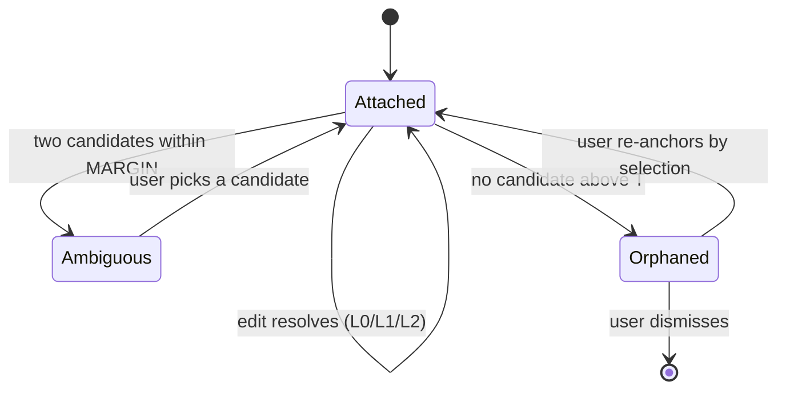

An orphan is never deleted and never silently re-attached. It keeps `quote`, `headingPath` and `baseDigest`, so the badge can say what it was pointing at and the journal can say what the document looked like then. Word deletes orphaned comments outright; Docs orphans them opaquely; the differentiator recorded in the PRD is that we badge, preserve the quote, and offer re-anchor.

Re-anchoring writes a *new* anchor record with a new `baseDigest` and leaves the old one in place as history. It never mutates the failed anchor, because a mutated anchor destroys the evidence that would let anyone diagnose why the resolver missed.

### 77.8 Anchors and the splice journal

The journal record is already specified as `{seq, base_digest, offset, deleted_len, inserted_bytes, result_digest}`. Anchors relate to it in exactly one direction: **the journal is the source of truth for bytes and the anchor is a derived pointer, so a resolution is only ever valid against a stated `result_digest` and is re-derived, never carried forward.**

| Concern | Journal | Anchor |
|---|---|---|
| Authority | Owns the bytes | Owns nothing |
| Failure | CAS conflict on `base_digest` mismatch | `ORPHAN` / `AMBIGUOUS` |
| Lifetime | Append-only, permanent | Re-resolved on every read |

The interaction that matters is the write path. An AI proposes an edit against `Anchor.baseDigest`. Before the splice executes, the resolver re-runs against the *current* bytes. Three outcomes: resolves to a range and the digest still matches — splice; resolves but the digest moved — splice against the newly resolved range under CAS, and let CAS reject if another writer landed first; does not resolve — refuse, and surface the proposal as an orphan rather than applying it near where it used to fit. The failure this forbids is the one already measured in the sync work: an edit applied through changed context produced `The quick brown cat leaps…` — a patch whose anchoring context no longer existed, applied anyway.

Journal replay never re-resolves anchors. It replays byte ranges. Anchors are re-resolved once at the end, against the final bytes.

### 77.9 The specification

```
resolve(anchor: Anchor, doc: string, docId: DocId, blocks: BlockIndex): Resolution
```

1. `anchor.docId !== docId` → `DOC_MISMATCH`. No content is examined.
2. `anchor.normalizeVersion !== NORMALIZE_VERSION` → `STALE_NORMALIZE`. Migrate, do not compare.
3. `normalize(anchor.quote).length < 8` → the anchor was never issuable; reject at write time, not read time.
4. `cand = blocks.byHash(anchor.hash)`.
5. `cand.length === 1 && anchor.multiplicity === 1` → `L0`.
6. `cand.length >= 1` → score each; single survivor accepted at `score ≥ 0.76` (`L1_VERIFY`); multiple accepted only at `top ≥ 0.76 && top − second ≥ 0.12` (`L1_CTX`); otherwise `AMBIGUOUS`.
7. `cand.length === 0` → trigram prefilter at `≥ 0.22`, `approxSearch` at `maxErrors = min(256, quote.length/2)`, score with `50/20/20/2`; accept at `≥ 0.76` and outside `MARGIN` (`L2`); below `T` → `ORPHAN`; inside `MARGIN` → `AMBIGUOUS`.
8. Convert the accepted block bounds to `U16Offset` through `OffsetMap`. A conversion that would split a surrogate pair is `ORPHAN`, never rounded.

Every constant is versioned into `ANCHOR_VERSION`. Changing `T`, `MARGIN`, the weights, or the prefilter is a version bump, because the stored corpus of anchors was issued under the old ones.

### 77.10 Failure modes and what the user sees

| Mode | Cause | Resolution | User-visible |
|---|---|---|---|
| Target lightly edited | typo, reword | `L2` at score ≥ 0.76 | Nothing. The comment stays attached |
| Target reflowed | line joins, NBSP paste | `L0` — normalize absorbs it | Nothing |
| Target heavily rewritten | ~45% of words replaced | `ORPHAN` | Badge: *the text this was attached to has changed too much*, with the stored quote and last heading |
| Block duplicated | copy-paste, template expansion | `AMBIGUOUS` | Two highlighted candidates, *which one did you mean?* — never auto-picked |
| Target deleted | human removed the paragraph | `ORPHAN` | Same orphan badge; the comment is preserved, not deleted |
| Section moved | reorder | `L1_CTX` or `L2` | Nothing |
| Path reused for new content | delete-and-create through the same filename | `DOC_MISMATCH` | All anchors orphan at once, with one banner rather than N badges |
| Normalize version bumped | engine upgrade | `STALE_NORMALIZE` | Nothing — background migration re-hashes; a migration failure orphans loudly |
| Offset lands mid-surrogate | non-BMP content at a block boundary | `ORPHAN` | Orphan badge. Never a rounded offset |

An AI proposal that resolves to `AMBIGUOUS` or `ORPHAN` is never applied and never applied "nearby". It is shown as a proposal the user must place.

### 77.11 The test that proves the false-positive rate

Harness, run today against the pinned corpus at `/Users/sagnikmitra/Desktop/GitHub/frontmatter/test/corpus/foreign/_vendor/` (8,513 files, seven vendored vaults), Python 3.14, deterministic stride sample and seeded RNG `[measured]`:

| Parameter | Value |
|---|---|
| Files sampled / usable | 500 / 448 (skipped: <4 blocks, >300 KB, non-UTF-8) |
| Blocks anchored | 6,163 |
| Mutation classes | insert · delete · typo(25% of blocks) · reflow(35%) · move(2–4 block run) · duplicate(12%) · heavy(45% of words in 15% of blocks) |
| Resolution attempts | **43,056** (42,608 live + 448 correctly-orphaned deletions) |
| Resolve rate @ 0.76/0.12 | **98.6505%** |
| False positives | **16 → 0.0372%** (9 duplicate, 6 delete, 1 typo; by lane: 9 `L1_CTX`, 6 `L2`, 1 `L1_VERIFY`, 0 `L0`) |
| Honest orphans / refusals | 5 / 560 |

Ground truth is carried, not inferred: each mutation returns an explicit `origIndex → newIndex | null` map, so resolving a deleted block to *anything* is a false positive and resolving a duplicated block to the copy is a false positive. Both are counted the harsh way. That accounting is why the duplicate class produces 9 of the 16 errors and 453 of the 560 refusals — it is a false-positive generator by construction, and it is the only class that meaningfully exercises `MARGIN`.

This harness is not the one that produced the published 99.627% / 0.050% over 41,642 block-versions, and the two numbers are not comparable: the mutation mix behind the published figure is not recorded next to it in `domain/normalize.ts`, which states only "384 configurations". The scale matches (43,056 vs 41,642) and the false-positive rate is of the same order (0.037% vs 0.050%); the 0.98-point resolve gap is fully explained by a mutation mix that manufactures ambiguity on purpose. The work item is to publish both under one manifest with the mix stated, not to reconcile them by argument.

Three gates ship with the resolver, in `test/mdmax/anchor-mutation.test.ts`:

1. **Ratchet, not equality.** Assert `FP ≤ 20` and `resolve ≥ 98.4%` at a pinned seed and pinned sample stride. An equality assertion goes red the moment a mutation class is added, which punishes coverage growth.
2. **Ablation.** Delete `multiplicity` from the anchor and assert the false-positive count *rises above 100*. A guard whose removal changes nothing is not a guard, and this one is worth 8.8×.
3. **Cross-document.** Assert that resolving anchors across `docId` boundaries with the check disabled exceeds 25%, and with it enabled is exactly 0. The first half proves the check is load-bearing; the second proves it is wired.

The falsifier for the whole section: a harness that reproduces the mutation mix and finds the exact-hash lane producing zero false positives *without* the multiplicity field. That would mean the duplicate-block population is an artefact of my block segmenter rather than of real vaults, and the field could be dropped for 0.49 points of resolve rate.

---

## 78. Property-based testing for a byte-preserving writer

### 78.1 The decision

Adopt **fast-check 4.9.0** with the `@fast-check/vitest` 0.4.1 binding, on the vitest 4.1.x already in `devDependencies`. Twelve properties across four new files under `test/props/`, seeded both randomly and from the pinned 8,513-file corpus, with a hard wall-clock gate.

| Candidate | Latest | Published | Verdict |
|---|---|---|---|
| `fast-check` | 4.9.0 | 2026-07-08 [fetched: `curl -s https://registry.npmjs.org/fast-check`] | **Adopt.** Native shrinking, `examples:` replay, `seed`/`path` reproduction, `fc.stringMatching`, `fc.gen` for imperative draws. |
| `@fast-check/vitest` | 0.4.1 | 2026-04-28 [fetched] | Adopt. `test.prop` binds to vitest's runner so failures report as normal test failures, not as one opaque assertion. |
| `jsverify` | 0.8.4 | 2018-10-31 [fetched] | Reject. Seven years unmaintained; no Unicode-aware string arbitraries. |
| `testcheck` | 1.0.0-rc.2 | 2017-04-26 [fetched] | Reject. Never left RC. |
| Hand-rolled fuzz loop | — | — | Reject. Shrinking is the whole product. A 4 KB random counterexample that is not shrunk is not a bug report. |

Rejected alternative worth naming: **not adding property tests and widening the corpus instead.** Rejected because the corpus is measurably blind to the exact classes that have shipped as defects — §78.2 quantifies that. Cost of being wrong: ~1.4 MB of `node_modules` and a slower CI. Falsified if, after one quarter, no property has produced a counterexample the corpus did not already contain.

### 78.2 What the corpus cannot see

Census over the pinned vendor tree, `node` walk of `test/corpus/foreign/_vendor/**/*.md` reading each file as UTF-8 [measured, 8,513 files]:

| Shape | Files in corpus | Consequence |
|---|---|---|
| Leading BOM (U+FEFF) | **0** | The BOM defect (commit `f47555f`) was unreachable from the corpus. |
| CRLF anywhere | **0** | The CRLF branch of `spliceFrontmatterValue` is corpus-untested. |
| Bare CR, no LF | **0** | See below — still broken today. |
| Unterminated frontmatter | 0 | The `closeIdx === -1` refusal is corpus-unreachable. |
| No final newline | 860 | Covered. |
| Non-BMP characters | 475 | Covered but thin. |
| `bytes === text.length` | 6,568 of 8,513 | 22.8% already diverge in the third-party set. |
| Zero-indent block sequence in frontmatter | 6,613 | The refusal driver. |
| Frontmatter key containing a space | 937 | Unaddressable under `SAFE_KEY`. |

Three of the four defects named in the brief live in rows with a corpus count of **zero**. A corpus is a sample of what people wrote; a property is a statement about what the code must do. They fail in opposite directions, which is why both ship.

Running `spliceFrontmatterValue(src, 'fm_slug', 'abc-123')` then the matching delete across all 8,513 files [measured, 309 ms]: 6,615 refusals (77.70% of all files; 6,615/7,969 frontmatter-bearing = **83.01%** [derived]), 1,898 applied, 0 locality violations — and **21 round-trip failures the existing suite does not report**, all of the same shape: a file beginning with a blank line loses 1–2 leading newlines because the no-frontmatter `set` path runs `src.replace(/^\r?\n+/, '')` and the delete path then strips one more. Example: `.../approved_files/test_add_footer.test_end_of_line_added_if_missing.approved.md`, 1014 → 1039 → 1013 bytes.

### 78.3 Generators

`test/props/arbitraries/text.ts` and `.../markdown.ts`. Every arbitrary is biased toward a boundary, because uniform generation does not find boundary bugs — §78.5 proves that with a number.

```ts
import fc from 'fast-check'

/** All three terminators, weighted AWAY from the corpus's 100%-LF reality. */
export const eol = fc.oneof(
  { arbitrary: fc.constant('\n'),   weight: 4 },
  { arbitrary: fc.constant('\r\n'), weight: 3 },
  { arbitrary: fc.constant('\r'),   weight: 3 },   // 0 files in the corpus
)

/** Chunks chosen so bytes, UTF-16 units and graphemes all disagree. */
export const unicodeChunk = fc.oneof(
  { arbitrary: fc.stringMatching(/^[ -~]{1,24}$/),                              weight: 8 },
  { arbitrary: fc.constantFrom('é', 'ü', 'ß', '日', '한', 'ي', 'Ω'),             weight: 3 },
  { arbitrary: fc.constantFrom('😀', '𝄞', '🇮🇳', '👩‍👩‍👦', '🏳️‍🌈'),                weight: 3 },
  { arbitrary: fc.constantFrom('e\u0301', 'é'),                                 weight: 2 }, // NFD vs NFC
  { arbitrary: fc.constantFrom('\uFEFF', '\u200B', '\u00A0', '\u2028', '\u3000'), weight: 2 },
  { arbitrary: fc.constantFrom('\uD83D', '\uDE00'),                             weight: 1 }, // lone surrogates
)

/**
 * Text with a surrogate pair placed so its LOW unit lands on a BLOCK boundary.
 * BLOCK = 512 in src/modules/mdmax/domain/offsets.ts. This is the ONLY generator
 * that reproduces the off-by-three; a uniform one does not (§78.5).
 */
export const boundaryStraddlingText = fc
  .tuple(fc.integer({ min: 505, max: 520 }), fc.integer({ min: 0, max: 3 }), fc.nat({ max: 400 }))
  .map(([pad, k, tail]) => 'a'.repeat(pad + k * 512) + '😀' + 'b'.repeat(tail))
```

```ts
/** Frontmatter block bodies, including every shape the writer must REFUSE. */
export const fmLine = fc.oneof(
  { arbitrary: fc.tuple(safeKey, scalar).map(([k, v]) => `${k}: ${v}`),  weight: 10 },
  { arbitrary: fc.tuple(safeKey, fc.array(scalar, { maxLength: 4 }))
      .map(([k, xs]) => `${k}: [${xs.join(', ')}]`),                      weight: 4 },
  { arbitrary: fc.tuple(safeKey, fc.array(scalar, { minLength: 1, maxLength: 4 }))
      .map(([k, xs]) => `${k}:\n${xs.map((x) => `- ${x}`).join('\n')}`),  weight: 4 }, // ZERO indent
  { arbitrary: fc.tuple(unsafeKey, scalar).map(([k, v]) => `${k}: ${v}`), weight: 3 }, // "date created"
  { arbitrary: fc.constantFrom('a: |', 'b: >', 'c: &anch x', 'd: *anch', '? explicit', '<<: *base'), weight: 2 },
  { arbitrary: fc.constantFrom('# a comment', '', '  indented: cont'),    weight: 3 },
)

export const document = fc.record({
  bom:  fc.boolean(),
  fm:   fc.option(fc.array(fmLine, { maxLength: 12 }), { nil: undefined }),
  body: markdownBody,          // fences (closed, unclosed, tilde, ~~~~ nesting), lists to depth 8,
  eol,                         // setext underlines, tables, `<<<<<<< HEAD` conflict markers,
  finalNewline: fc.boolean(),  // an embedded `---` block, HTML comments, indented code
}).map(assemble)               // assemble() joins with `eol` and applies bom/finalNewline
```

Deliberately in scope, because each has shipped a defect or is a stated risk: `<<<<<<< `/`=======`/`>>>>>>> ` conflict markers in the body (the sync design puts them there), a body that itself opens with `---`, lists nested to depth 8 with mixed markers, and fences opened but never closed. Deliberately out of scope: documents above the 4 MB `MAX_BYTES` gate — that is `shape-gate.ts`'s job and generating them costs seconds per draw.

### 78.4 The properties

`REFUSED` is not currently observable: `spliceFrontmatterValue` signals refusal by returning the input, which is indistinguishable from a successful no-op splice. P2 and P3 cannot be stated without it. Decision: add a traced sibling in the same file, and leave the existing signature untouched so no call site changes.

```ts
export type SpliceTrace =
  | { readonly kind: 'APPLIED'; readonly out: string; readonly start: number; readonly end: number; readonly inserted: string }
  | { readonly kind: 'REFUSED'; readonly out: string; readonly reason: SpliceRefusal }

export function spliceFrontmatterValueTraced(
  src: string, key: string, value: string | number | boolean | string[] | null,
): SpliceTrace
```

| # | Property | Statement |
|---|---|---|
| P1 | Round-trip identity | For `k` absent from `src`: `del(set(src, k, v), k) === src`, byte-for-byte. |
| P2 | Splice locality | `t.kind === 'APPLIED'` ⟹ `t.out === src.slice(0, t.start) + t.inserted + src.slice(t.end)`, and `[t.start, t.end)` lies strictly inside the frontmatter block. |
| P3 | Refusal safety | `t.kind === 'REFUSED'` ⟹ `Buffer.compare(Buffer.from(t.out, 'utf8'), Buffer.from(src, 'utf8')) === 0`. Not `===` on the string: a string compare cannot see a re-encoding of a lone surrogate. |
| P4 | Idempotence | `splice(splice(src, k, v), k, v) === splice(src, k, v)`. |
| P5a | Commutativity, both keys present | `k1 ≠ k2`, both located ⟹ `set(set(s,k1,a),k2,b) === set(set(s,k2,b),k1,a)`. Their ranges are disjoint, so this must hold byte-for-byte. |
| P5b | Commutativity, keys absent | Both absent ⟹ byte equality must **fail**; the honest invariant is that the two results have equal line multisets and byte-identical bodies after the closing fence. Asserted in that weaker form, plus an assertion that P5a's strong form does not hold — a property that silently strengthens is a property that will be quietly broken. |
| P6 | Offset-map consistency | `∀ i` valid: `map.toByte(i) === utf8Length(text.slice(0, i))`; `map.toU16(map.toByte(i)) === { ok: true, value: i }`; `toByte` monotone non-decreasing; `toByte(0) === 0`; `toByte(len) === lengthBytes`; a byte interior to a multi-byte sequence returns `ok: false`; `isGraphemeBoundary(0) && isGraphemeBoundary(len)`; `toGrapheme` monotone. |
| P7 | Brand separation | `u16(text, n)` refuses every `n` that `splitsSurrogatePair` reports true for, and never repairs: no returned value differs from its input. |
| P8 | Construct coverage | `⋃ skipRegions(s) ⊆ ⋃ inventory(s).values()`. |
| P9 | EOL-invariant line count | `shapeGate(s).lines` is equal under `\n`, `\r\n` and `\r` renderings of the same logical document. |
| P10 | Normalize idempotence | `normalize(normalize(x)) === normalize(x)`, plus the existing digest pin against `NORMALIZE_VERSION`. |
| P11 | Prepass never writes | `verdict.kind === 'CLEAN'` ⟹ `verdict.yaml === block`; `'REPAIRED'` ⟹ removing the inserted quote pairs recovers `block` exactly. |
| P12 | Conflict-marker containment | A body containing `<<<<<<< ` / `>>>>>>> ` is either refused or spliced with those bytes at unchanged offsets. |

### 78.5 Which property would have caught which shipped defect

Every row below was executed. Pre-fix sources were extracted with `git show <sha>^:<path>` into `$TMPDIR` and imported through a Node 24 type-stripping resolver hook.

| Defect | P1 round-trip | P2 locality | P3 refusal | P4 idempotence | P6 offset map |
|---|---|---|---|---|---|
| **BOM** (`f47555f`) | **PASS on the bug** | **FAIL — catches it** | n/a | PASS on the bug | n/a |
| **OffsetMap off-by-three** (`cc1d451`) | n/a | n/a | n/a | n/a | **FAIL — catches it, 600 wrong answers** |
| **Zero-indent sequence** (open) | PASS | PASS | PASS | PASS | n/a |
| **Bare CR** (open, live today) | n/a | **FAIL — catches it** | n/a | n/a | n/a |

BOM, measured on `'\uFEFF---\ntitle: A\n---\nbody\n'` with key `fm_slug`: pre-fix, `set` returns `"---\nfm_slug: x\n---\n\n\uFEFF---\ntitle: A\n---\nbody\n"` — a second frontmatter block prepended, the author's block demoted into the body. Round-trip identity is `true`, and idempotence is `true`, on that output. **Only locality catches the BOM bug, and it catches it on the first draw, because the longest common prefix of input and output is zero bytes while the writer claims an insert inside the block.** This is the same cancellation the source comment already confesses to: set and delete undo each other, so a round-trip oracle sees nothing. Post-fix, all four properties hold.

OffsetMap: a uniform generator (`i % 7` emoji, `i % 3` accented, lengths 400–2000, 4,966 offsets checked) reports **0 failures against the unfixed code**. `boundaryStraddlingText` reports **600 failures out of 9,363**, first at `pad = 511, i = 513`, `got 518 want 515`, delta exactly `+3`; the fixed code reports 0 over the same 9,363. That gap is the entire argument for biased generators, and it is LR#68 restated: a property that has never failed against the unfixed code has not been shown to cover the bug.

Zero-indent sequence: no property catches it, and that is correct. The writer's `return src` on a bare top-level line is the specified behaviour; the defect is that the specification is wrong for 83.01% of real frontmatter. Properties encode the contract, so they cannot find a wrong contract. This is where the corpus is the only instrument, and it is why §78.7 keeps both.

Bare CR, run against the shipped code today: input `'---\rtitle: A\rslug: old\r---\rbody\r'`, output `'---\nslug: new\n---\n\n---\rtitle: A\rslug: old\r---\rbody\r'` [measured]. `FM_OPEN` is `/^---[ \t]*(\r?\n)/` and does not match a bare CR, so the no-frontmatter branch prepends a block — byte-for-byte the BOM failure mode, unfixed, and reachable from any file pasted out of a legacy tool. P2 fails on it immediately. Two neighbours fall out of the same generator: `inventory('# H\r\r```js\rcode\r```\r\rpara\r')` returns an **empty map** while `skipRegions` on the same string returns `[[5, 19]]` — P8 refuted [measured] — and `shapeGate` reports `lines: 1` for that seven-line document, so `MAX_LINES` is blind to CR — P9 refuted [measured].

### 78.6 Shrinking, seeds, and regression promotion

fast-check shrinks integers toward zero and arrays toward empty, so a `.map()`-built document shrinks through its *record fields*, not its bytes. That is the design constraint: build documents from small structured parts so the shrunk counterexample reads as `{ bom: true, fm: ['a: 1'], eol: '\r' }` rather than 3 KB of noise. Never generate a document with `fc.string()` and post-process it — the shrinker then has nothing to bite on.

```ts
fc.configureGlobal({
  numRuns: Number(process.env.FC_RUNS ?? 300),
  seed: Number(process.env.FC_SEED ?? 0x5EED0000),   // fixed in CI, overridable locally
  endOnFailure: true,
  interruptAfterTimeLimit: 20_000,
  markInterruptAsFailure: true,
})
```

CI pins the seed so a red build is reproducible from the log line alone; a nightly job runs with `FC_SEED=$RANDOM FC_RUNS=5000` and files any counterexample. On failure, fast-check prints `seed`, `path` and the shrunk counterexample. The shrunk value — not the seed — is promoted by hand into `test/props/regressions.ts` and replayed first, deterministically, before any random run:

```ts
test.prop([document, safeKey, scalar], { examples: REGRESSIONS.spliceLocality })('P2 locality', ...)
```

Decision: regressions are stored as literal counterexamples, not as `{ seed, path }` pairs. Rejected alternative: replaying by seed, which is what the fast-check docs make easiest. Rejected because a seed reproduces a failure only against the exact generator that produced it, so the first time anyone edits `document` the entire regression set silently stops testing anything — the LR#59 field-mismatch class, wearing a different hat. Cost of being wrong: literals are more verbose. Falsified if a promoted literal ever stops compiling against the arbitrary's type, which is a compile error, which is the point.

### 78.7 Corpus × properties

The corpus stops being a fidelity oracle and becomes a *seed source*. Same properties, real inputs:

```ts
// test/props/corpus-seeded.property.test.ts — skipped unless _vendor/ is present
const CORPUS = loadCorpus()   // 8,513 strings, or [] when the vendor tree is absent
test.skipIf(CORPUS.length === 0).prop([fc.constantFrom(...CORPUS), safeKey, scalar])('P1∧P2∧P3 on real files', ...)
```

That combination is what surfaced the 21 leading-newline round-trip failures in §78.2: neither instrument alone reports them. The corpus alone has no oracle beyond "does not throw"; the properties alone never generate a file that opens with a blank line and no frontmatter. The pairing does.

`npm run corpus` stays the byte-pin gate. The property files degrade to skipped, never failed, when `_vendor/` is absent — the tree is gitignored third-party content and a fresh clone does not have it.

### 78.8 Suite specification and CI budget

| File | Properties | `numRuns` | Budget |
|---|---|---|---|
| `test/props/splice.property.test.ts` | P1–P5b, P12 | 300 | 2.4 s |
| `test/props/offsets.property.test.ts` | P6, P7 (+ `boundaryStraddlingText` at 1,000 runs) | 300 / 1,000 | 1.8 s |
| `test/props/constructs.property.test.ts` | P8, P9, P10, P11 | 300 | 1.6 s |
| `test/props/corpus-seeded.property.test.ts` | P1, P2, P3 over 8,513 real files | full sweep | 1.2 s |
| **Added total** | 12 | — | **7.0 s** |
| Existing engine suite (`test/mdmax` + `test/share/frontmatter-splice`) | 320 tests, 11 files | — | 1.34 s [measured] |
| **Gate** | — | — | **fail the build above 12 s** |

Derivation of the 7.0 s: the corpus sweep of two splices plus a locality diff over 8,513 real files (mean 2,237 B) ran in 309 ms [measured] — 36.3 µs per case; three properties over the same set is ≈1.2 s with assertion overhead [derived]. For generated cases, 12 properties × ~350 mean runs ≈ 4,200 draws; structured-record generation dominates splice execution and is taken at 250 µs per draw [inference], giving ≈1.1 s, tripled to 3.3 s for shrink attempts and the 1,000-run boundary sweep, plus ≈2.5 s of vitest transform and import for four new files [derived from the measured 818 ms transform across 11 files]. The generation constant is the soft number here; it is not load-bearing because the gate is a wall-clock assertion, not a prediction — if generation is slower than assumed, CI says so on the first run and `FC_RUNS` absorbs it.

Rejected alternative for the budget: running the properties only in the nightly job to keep the pull-request loop under two seconds. Rejected because three of the four shipped defects were byte-destructive and two of them reached `main`; a gate that runs after merge is a report, not a gate. Cost of being wrong: about seven seconds per pull request. Falsified if the property files' p95 wall clock exceeds 12 s for two consecutive weeks without a counterexample, at which point the corpus-seeded file — the slowest and the most redundant with `npm run corpus` — moves to nightly first.

---

## 79. Incremental parsing — the lezer decision

### 79.1 The decision

Keep remark/micromark as the engine's only parse layer. Keep `@lezer/markdown` where it already is — inside CodeMirror, serving decorations — and make the boundary between them one-way and typed, so that no position produced by the editor's tree can reach `splice-frontmatter.ts` or any anchor resolver.

**Two trees of the same document are not the hazard; two trees of two different revisions treated as one is, and that is a provenance problem, not a parser-choice problem.**

Rejected: adopting lezer as the engine's parse layer. Rejected: a shared position model across both trees. Both are rejected on a measurement that contradicts the premise, given in §79.3.

| | Adopt lezer in the engine | Dual, undefined boundary (today) | Dual, typed one-way boundary (chosen) |
|---|---|---|---|
| Frontmatter addressable | No — measured misparse (§79.5) | n/a | Yes, remark + prepass, unchanged |
| Bare-CR safe | No — measured (§79.5) | Partly, by luck | Yes |
| Joins the 7-engine certificate | No — emits no HTML | n/a | Yes, unchanged |
| Stale-tree splice possible | Yes | Yes | No — refused at the type |
| Engine parse cost, 8,513 files | 566 ms | 4,849 ms | 4,849 ms |
| Work to implement | Rewrite 3 domain files + bench | 0 | ~60 lines, 1 lint rule |

### 79.2 What each side actually gives

| Capability | `@lezer/markdown` 1.7.2 | remark / micromark 4.0.2 |
|---|---|---|
| Incremental reparse | Yes — `TreeFragment.applyChanges` + `parse(doc, fragments)` | No. Full reparse only |
| Position unit | UTF-16 code units [measured] | UTF-16 code units, `position.*.offset` [measured] |
| Line/column | No — offsets only | Yes, 1-based line + column alongside offset |
| Emits HTML | No. "doesn't help with outputting HTML" [fetched, README] | Yes, via remark-rehype/rehype-stringify |
| Link-reference validation | No, deliberately — `[a][b]` parses as a link with no `[b]` defined [fetched, README] | Yes |
| Frontmatter | Not in the default parser [measured] | `remark-frontmatter` 5.0.0, installed |
| GFM tables/footnotes/strike | Via the `GFM` extension in the same package | `remark-gfm` 4.0.1, installed |
| Weekly npm downloads | 4,789,610 [fetched, 2026-08-23→29] | 57,013,343 micromark / 51,168,105 remark-parse [fetched] |
| Ecosystem the engine already uses | none | `mdast-util-*`, `rehype-*`, react-markdown, the bench's `remark-app` engine |

The engine's live usage of lezer is three files, all presentation: `src/modules/editor/presentation/live-preview.ts` (`import { syntaxTree } from "@codemirror/language"`, then `syntaxTree(view.state).iterate({…})` to conceal delimiter marks), and `CodeMirrorEditor.tsx` / `live/InlineBlockEditor.tsx`, which each call `markdown()`. No engine file imports lezer. The dual-parser situation is therefore already one-directional in fact — it is simply not enforced.

### 79.3 The premise that does not survive measurement

The brief states lezer offers "byte-accurate SyntaxNode positions." It does not. Lezer parses a JavaScript string and its node offsets index that string, which means UTF-16 code units — the same unit mdast reports.

Ran, `node $TMPDIR/lz/pos.mjs`, on `"# 🌊 tide\n\nafter\n"` [measured]:

```
doc.length (UTF-16 units) = 17     byteLength = 19     code points = 16
lezer:  ATXHeading1 [0,9)   slice = "# 🌊 tide"
mdast:  heading   start.offset 0, end.offset 9
```

Identical values, and neither is 11 (the byte length of that heading). Adopting lezer buys nothing against the contract in `src/modules/mdmax/domain/offsets.ts`; `OffsetMap` and the `U16Offset`/`ByteOffset`/`GraphemeIndex` brands are still required, for the same reason as today — only 67 of 1,080 corpus files have bytes equal to UTF-16 units. A migration justified by positional accuracy would deliver zero positional accuracy. [derived: 9 − 0 = 9 units, 11 bytes, so any consumer treating a lezer offset as a byte index is wrong by 2 on the first emoji.]

What lezer positions *do* carry that mdast's do not is a hidden precondition. `syntaxTree(state)` is documented to return whatever tree exists; `ensureSyntaxTree(state, upto, timeout)` and `syntaxTreeAvailable(state, upto)` exist in `@codemirror/language`'s public surface precisely because the tree may not span the document — the view parses on a work budget around the viewport [fetched, `node_modules/@codemirror/language/dist/index.d.ts`]. An offset read from a partial tree is not wrong in unit; it is absent, or correct against a prefix. That is the failure a splice must never inherit.

### 79.4 The performance numbers, corrected

`src/modules/mdmax/domain/shape-gate.ts` records `mdast-util-from-markdown 12,429 ms vs micromark's 1,207 ms — a 10.3x gap that widens with size`. That measurement is on flat lists, an adversarial shape, and it belongs where it sits: as justification for `MAX_LIST_MARKER_LINES = 20_000`. It does not describe steady state, and it should not be quoted as if it does.

Ran, `node $TMPDIR/lz/bench.mjs`, over the pinned corpus at `test/corpus/foreign/_vendor` — 8,513 files, 19,047,891 bytes, 300-doc warmup, `@lezer/markdown` 1.6.3 as installed [measured]:

| Parser | Total | Throughput | Errors |
|---|---|---|---|
| `@lezer/markdown` `parser.parse` | 566 ms | 33.6 MB/s | 0 |
| `mdast-util-from-markdown` | 4,849 ms | 3.9 MB/s | 0 |
| `micromark` → HTML | 5,019 ms | 3.8 MB/s | 0 |

So on real documents `from-markdown / micromark = 0.97x`, not 10.3x. The mdast construction step is not the cost; the tokenizer is. Lezer is genuinely 8.56x faster, and that resolves to 0.57 ms per document versus 0.57 s per 1,000 — below the `BUDGET_MS.keystroke = 250` floor by three orders of magnitude on any single file.

Incremental reparse, `node $TMPDIR/lz/inc.mjs`, 50 largest corpus docs (939,748 chars max, 18,039 median), one character inserted at 80% depth, 3 iterations each [measured]:

| Path | ms/reparse |
|---|---|
| lezer, cold | 1.83 |
| lezer, `TreeFragment.applyChanges` + reuse | 0.46 |
| `fromMarkdown`, full | 51.37 |

112x against full mdast, 4x against lezer cold. Real, and entirely an editor property. The engine's work — `certify.ts`, `placement.ts`, `splice-frontmatter.ts`, the corpus runner — is cold, once, per document, in a worker under `BUDGET_MS`. There is no keystroke loop in the engine to make incremental. Buying incrementality for a consumer that does not exist is the whole of the case against adoption.

### 79.5 Where lezer is wrong for this engine's jobs

Ran `node $TMPDIR/lz/fm.mjs` against the default parser [measured]:

```
in:  "---\ntitle: x\ndate created: y\n---\n\nbody\n"
out: Document[0,39) HorizontalRule[0,3) SetextHeading2[4,32) HeaderMark[29,32) Paragraph[34,38)
```

The frontmatter block is a horizontal rule followed by a setext heading whose underline is the closing fence. The region the product is named after is not addressable in this tree at all. `@codemirror/lang-markdown` 6.5.2 does not ship a frontmatter extension either — its dependency list is `@lezer/markdown`, `@lezer/common`, `lang-html`, `autocomplete`, `view`, `state`, `language` [fetched, registry].

Second, bare CR:

```
in:  "# a\rpara\r- one\r- two\r"    (21 units)
lezer:  Document[0,21) ATXHeading1[0,21) HeaderMark[0,1)
mdast:  heading[0,3) paragraph[4,8) list[9,20)
```

Lezer does not treat a lone CR as a line ending, so a 21-unit document collapses into a single heading. This is the same family as the bare-CR set-destruction already queued as `[measured]` engine work; adopting lezer would make it structurally unfixable at the parse layer rather than a normalization step in front of one.

Third, and decisive on priorities: the 83% publish-refusal defect is a YAML block sequence at column zero, and `SAFE_KEY = /^[A-Za-z0-9_.$-]+$/` cannot address `date created`, which appears in 812 of 957 files in one vault. Both live strictly below the markdown grammar. `splice-frontmatter.ts` states it outright — "It does not parse YAML. It scans the frontmatter block line-wise for a top-level key." No markdown parser swap moves either number by one file.

### 79.6 Conformance, and the certificate

`@lezer/markdown` declares its own non-conformance: to stay single-pass and incremental "it doesn't validate link references, so it'll parse `[a][b]` and similar as a link, even if no `[b]` reference is declared" [fetched, README]. That is a documented, intentional divergence from CommonMark, and it is the exact class of divergence the degradation certificate exists to measure.

It also cannot be measured. `infrastructure/bench.ts` compares seven engines' HTML bytes — `remark-app`, `react-markdown`, `marked`, `markdown-it` at `html:false` and `html:true`, `commonmark`, `kramdown-jekyll` — with `computeBenchId` hashing `(id, version, sorted options)` per RULE 3. Lezer emits no HTML. Adding it would require writing a renderer, and a renderer we authored is a new engine to certify, not a measurement of an existing target. It would inflate the bench's apparent coverage while measuring our own code.

### 79.7 The archive, priced correctly

Confirmed via the GitHub API [fetched, 2026-08-30]: `github.com/codemirror` holds 57 public repos, 55 archived; `codemirror/language` and `codemirror/lang-markdown` both show `archived: true` with `pushed_at: 2026-04-15`. The two unarchived repos are `grammar-mode` (last push 2020-07-09) and `google-modes` (2023-12-27) — dormant, not survivors.

The abandonment reading is wrong. The `repository` field on `@lezer/markdown@1.7.2` and `@codemirror/language@6.12.4` now reads `git+https://code.haverbeke.berlin/…`, that host returns 200, `discuss.codemirror.net` returns 200, and releases continued past the archive date: `@lezer/markdown` 1.6.4 on 2026-05-28, 1.7.0/1.7.1/1.7.2 across 2026-07-08→15; `@codemirror/language` 6.12.4 on 2026-06-25; `@codemirror/lang-markdown` 6.5.2 on 2026-08-04 [all fetched, registry `time` map]. This is a hosting migration off GitHub, not a dead project.

What did get worse is the fork option. Issues, PR history, and the public fork button moved to a single self-hosted instance under one maintainer. The realistic risk is not "npm goes dark" but "the bus factor is one and the audit trail is now on his server." Priced accordingly: `@codemirror/*` and `@lezer/*` are already a presentation-layer dependency behind a module boundary the architecture report enforces, and the fallback for a genuinely dead CodeMirror is replacing the editor, which this decision does not make harder. Adopting lezer in the engine *would* make it harder, by putting a one-maintainer dependency underneath the splice contract.

Installed here is `@lezer/markdown` 1.6.3 against 1.7.2 latest, and `@codemirror/language` `^6.12.3` against 6.12.4 — a routine bump, unrelated to this decision.

### 79.8 The boundary, as code

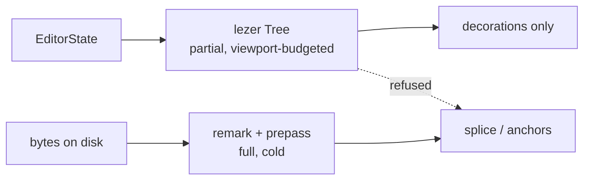

The seam already exists: `placement.ts` declares `export type ParseFn = (markdown: string) => BlockNode`, so the engine's placement logic is parser-agnostic by construction. Nothing needs to change there. What is missing is a type that makes the wrong crossing unrepresentable.

New file, `src/modules/editor/presentation/tree-boundary.ts`, ~60 lines:

```ts
declare const EditorTreeBrand: unique symbol

/**
 * A UTF-16 offset read from a CodeMirror syntax tree. SAME UNIT as U16Offset
 * (measured: lezer and mdast both report [0,9) for "# 🌊 tide"). Different
 * PROVENANCE: valid only against the EditorState generation it was read from,
 * and only where that state's tree actually spans the offset.
 */
export type EditorOffset = number & { readonly [EditorTreeBrand]: true }

export type Crossing =
  | { readonly ok: true; readonly at: U16Offset; readonly docLength: number }
  | { readonly ok: false; readonly reason: 'TREE_INCOMPLETE'; readonly parsedTo: number; readonly docLength: number }
  | { readonly ok: false; readonly reason: 'DOC_DIVERGED'; readonly editorLength: number; readonly bytesLength: number }

/**
 * The ONLY function permitted to turn an EditorOffset into a U16Offset.
 * Refuses rather than guessing — mirrors splice-frontmatter's refusal contract
 * and the anchor resolver's AMBIGUOUS verdict.
 */
export function crossToEngine(state: EditorState, at: EditorOffset, bytes: string): Crossing {
  const len = state.doc.length
  if (!syntaxTreeAvailable(state, at)) {
    return { ok: false, reason: 'TREE_INCOMPLETE', parsedTo: syntaxTree(state).length, docLength: len }
  }
  if (state.doc.toString() !== bytes) {
    return { ok: false, reason: 'DOC_DIVERGED', editorLength: len, bytesLength: bytes.length }
  }
  return { ok: true, at: at as unknown as U16Offset, docLength: len }
}
```

The `DOC_DIVERGED` check is a full string compare, which at corpus median (18,039 chars) is free relative to the 51 ms an mdast reparse costs, and it is the only check that catches the real failure — the editor's tree describing a revision the disk bytes no longer hold.

Enforcement, one ESLint `no-restricted-imports` rule in `eslint.config.*`: `@codemirror/*` and `@lezer/*` are importable only under `src/modules/editor/presentation/**`. That is a mechanical assertion, not a convention, and it is the kind of check that survives a maintainer who has not read this section.

### 79.9 Migration path

There is none, which is the point. No engine file imports lezer today; the change is additive and reversible.

1. Add `tree-boundary.ts` and the `no-restricted-imports` rule. `npm run lint --max-warnings=0` fails on any future violation.
2. Add a `specs/` assertion pinning the measured claim, so a future lezer release that changes position semantics goes red rather than silent: parse `"# 🌊 tide\n\nafter\n"` with both parsers, assert lezer `ATXHeading1` and mdast `heading` report identical `[from,to)`, and assert both differ from `Buffer.byteLength` of the slice.
3. Add the bare-CR and frontmatter misparse cases as `xfail`-documented facts about lezer, referenced from `live-preview.ts` — the decoration path must not assume block structure survives a CR-only file.
4. Leave `ParseFn` alone.

Nothing in `mdmax/`, nothing in `splice-frontmatter.ts`, no change to the bench, no change to `benchId`.

### 79.10 Cost of being wrong, and what falsifies it

If this is wrong, the cost is that the engine keeps paying 4,849 ms per full-corpus pass instead of 566 ms, and that a future feature wanting sub-frame structural feedback on a 900 KB document has to build it in the editor layer rather than reaching into the engine. Both are recoverable: `ParseFn` is the injection point, and a lezer-backed `BlockNode` adapter is a day's work if a consumer for it ever appears. The asymmetric cost sits on the other side — a stale or partial lezer offset reaching the splice writes correct-looking bytes at the wrong place in a file that is committed on every save, and the contract's whole value is that this cannot happen.

Falsifiers, in order of how cheaply they can be run:

- A measurement showing `SyntaxNode.from` indexing anything other than UTF-16 code units of the input string. §79.3's assertion is the test; it takes 40 ms.
- An engine-side consumer that genuinely needs sub-100 ms structural reparse on a document over ~200 KB, appearing in a shipped feature rather than a plan. The corpus median is 18,039 chars; the 51 ms mdast figure is the 50-largest average, not the typical case.
- `@lezer/markdown` shipping frontmatter parsing and CR-as-line-terminator in the default configuration, which would remove two of the three job-fitness objections in §79.5.
- No `@lezer/markdown` or `@codemirror/language` release for four consecutive quarters on `code.haverbeke.berlin` — which falsifies §79.7's "migration, not abandonment" and changes the editor replacement question, though not this decision.
- Evidence that the 83% refusal rate is materially affected by markdown block structure rather than by YAML sequence indentation and `SAFE_KEY`. That would mean the parse layer is on the critical path after all, and this section is arguing about the wrong layer.

---

## 80. The engine public API, versioning and distribution

### 80.1 Measured starting position

| Fact | Value | How |
|---|---|---|
| Engine files / lines / bytes | 13 / 3,614 / 153,178 | `find src/modules/mdmax -name '*.ts'`, `wc -l`, `wc -c` [measured] |
| `export` declarations | 88 | `grep -rhn "^export " src/modules/mdmax --include='*.ts' \| wc -l` [measured] |
| Symbols imported from outside the module | 1 (`decodeStrict`), at 2 sites — `src/modules/vault/application/get-snapshot.ts`, `src/modules/vault/infrastructure/search-index.ts` | `grep -rn "modules/mdmax" src` [measured] |
| Imports MDMAX makes from `src/modules/**` | 0 | same grep, inverted [measured] |
| Real `throw` sites | 2: `throw new RangeError(\`invalid U16Offset` in `domain/offsets.ts`, `throw new Error(\`kramdown-jekyll:` in `infrastructure/bench.ts` | `grep -rn "throw " src/modules/mdmax` [measured] |
| Third-party runtime deps | `github-slugger@2.0.0` (ISC), `entities@8.0.0` (BSD-2-Clause) | `node_modules/*/package.json` [measured] |
| Comment + whitespace share of source | 51.9% | comment/blank strip in node [measured] |
| Stripped code bytes, browser-eligible files only (excludes `bench.ts`, `certify.ts`, `targets.ts`) | 57,318 | same script [measured] |
| `mdmax` on npm | HTTP 404 — unregistered | `curl -s -o /dev/null -w '%{http_code}' https://registry.npmjs.org/mdmax` [fetched 2026-08-30] |
| `@sgnk/mdmax` | HTTP 404 | same [fetched] |
| `frontmatter` on npm | HTTP 200 — taken | same [fetched] |
| `LICENSE` file in repo | absent | `ls LICENSE*` [measured] |

88 exports and one external consumer is the whole problem in one line. There is no API; there is a folder that other folders reach into.

### 80.2 The public surface

Decision: one barrel, `src/modules/mdmax/index.ts`, exporting **31** symbols in six capability groups. Everything not in the barrel is internal, regardless of whether the file still says `export`.

| Group | Exported | Kept internal |
|---|---|---|
| Admission | `shapeGate`, `decodeStrict`, `explainFailure`, `MAX_BYTES`, `MAX_LINES` | `MAX_LIST_MARKER_LINES`, `BUDGET_MS` |
| Offsets | `OffsetMap`, `u16`, `utf8Length`, `splitsSurrogatePair`, types `U16Offset`/`ByteOffset`/`GraphemeIndex` | `u16OrThrow`, `unsafeU16`, `unsafeByte` |
| Splice (write path) | `spliceFrontmatterValue`, `spliceFrontmatterKey`, `emitValue`, `emitScalar`, `SAFE_KEY` | frontmatter regexes `FM_OPEN`, `NEWLINE`, `BOM` |
| Anchors | `slug`, `slugDocument`, `resolveAnchor`, `decodeAnchor`, type `AnchorMatch` | `collapsedSlug` |
| Structure | `inventory`, `skipRegions`, `safeInsert`, `prepassFrontmatter`, `extractWikilinks`, types `Construct`/`Range`/`BlockNode`/`PlacementVerdict` | `CONSTRUCTS`, `CONSTRUCTS_BY_ID`, `blockSkeleton`, `nearSetextUnderline` |
| Certificate | `certify`, `classify`, `fold`, `foldEqual`, `normalize`, `TARGETS`, `targetById`, `brokenHistogram`, types `Certificate`/`CellVerdict`/`Target`/`Verdict` | `splitBlocks`, `extractPayload`, `renderedHaystack`, `missingPayloadTokens`, `producesNoOutput`, `loadBench`, `computeBenchId` |
| Versions | `VERSIONS` (one frozen object), `stamp()` | the four separate `*_VERSION` consts and four `*Stamp()` functions |

Three structural moves come with it. `src/modules/share/domain/splice-frontmatter.ts` moves to `src/modules/mdmax/domain/splice.ts` — the splice writer is the engine's single most load-bearing function and it currently lives outside the module it belongs to, which is why nothing enforces its purity. `infrastructure/bench.ts` (imports `node:child_process`, `node:fs`) moves behind a `node`-only subpath so it can never be pulled into a browser graph. And `slugStamp`/`foldStamp`/`normalizeStamp` collapse into one `stamp()` returning the whole version vector, because a consumer that records three of four stamps has produced an unreproducible artifact.

Rejected: `export *` from a barrel that re-exports every module. It is a one-line change and it freezes all 88 symbols as public — including `unsafeU16`, whose entire purpose is to skip the surrogate-pair check that `OffsetMap` exists to enforce. Cost of being wrong on the 31: a consumer needs an internal and has to fork or patch, which we learn about in an issue and can fix in a MINOR. Cost of being wrong on `export *`: `unsafeU16` appears in third-party code and can never be removed. Falsifier: if three or more distinct external requests for the same internal arrive in the first two quarters, the group boundary is drawn wrong and should be redrawn, not widened one symbol at a time.

### 80.3 The purity rule and its mechanical enforcement

The rule: `src/modules/mdmax/**` may import from `node:*` (in `infrastructure/` only), from its own relative paths, and from a fixed allowlist of runtime dependencies. It may not import `@/modules/**`, `@/shared/**`, `@/app/**`, `@/container/**`, `react`, `next`, or any storage or network client. The inverse also holds: nothing outside the module may import a path deeper than `@/modules/mdmax` itself.

**Purity that is only a convention is a convention that lasted until the first deadline, so this ships as a gate before it ships as a sentence in a doc.**

New harness `specs/harness/mdmax-purity-report.mjs`, wired into `npm run verify` alongside the existing `clean-architecture-report.mjs` and `import-boundary-report.mjs`. Four checks, all executing rather than grepping prose:

| Check | Method | Failure |
|---|---|---|
| P1 — outbound purity | Parse every import specifier in `src/modules/mdmax/**`; reject any not matching `^(node:|\.{1,2}/)` or the dep allowlist | exit 1, names file and specifier |
| P2 — inbound barrel-only | Reject any `from '@/modules/mdmax/...'` outside the module; only `from '@/modules/mdmax'` allowed | exit 1 |
| P3 — browser graph is node-free | Resolve the transitive import graph from `index.ts`; assert `node:` appears in zero reachable files | exit 1, prints the path that pulled it in |
| P4 — denominator guard | Assert `filesScanned >= 13`, mirroring `MIN_SCANNED_FILES` in `clean-architecture-report.mjs` | exit 2, refuses to report a pass |

P4 is not decoration. `clean-architecture-report.mjs` carries a comment recording that it once reported `{"total":0,"violations":[]}` and exit 0 whether it had scanned 208 files or zero, and that renaming `src/modules/` to `src/features/` took a violating tree from exit 1 to exit 0 by going blind [measured, read in that file]. A purity gate that scans nothing passes perfectly.

Rejected: ESLint `no-restricted-imports`. It is already configured and it does not catch P3 — a transitive `node:fs` three files down through a type-only-looking import is invisible to a per-file lint rule, and it is exactly how `bench.ts` would leak into a browser bundle. Cost of being wrong: a 400 KB `node:fs` shim in the web bundle, discovered by a user on a slow connection. Falsifier: if P3 never fires in a year across the whole team's commits, it is over-engineering and can drop to a pre-release-only check.

### 80.4 Errors and refusals as values

Every public function returns a discriminated union. No public function throws. The two existing throws are handled explicitly: `u16OrThrow` leaves the barrel (it is a test convenience), and `bench.ts`'s kramdown throw becomes a `CertFailure` at the subprocess boundary, which is what `CertResult` already models.

```ts
type Refusal =
  | { kind: 'not-utf8';            at: number; detail: string }
  | { kind: 'too-large';           bytes: number; limit: number }
  | { kind: 'too-many-lines';      lines: number; limit: number }
  | { kind: 'unaddressable-key';   key: string; pattern: string }
  | { kind: 'ambiguous-range';     candidates: number; construct: string }
  | { kind: 'range-not-found';     construct: string }
  | { kind: 'splits-grapheme';     offset: number }
  | { kind: 'unsafe-placement';    reason: 'setext' | 'fence' | 'list-continuation' }
  | { kind: 'engine-unavailable';  engine: string; detail: string }

type Result<T> = { ok: true; value: T } | { ok: false; refusal: Refusal }
```

Two rules make this survive contact. Every `Refusal` carries the operand that caused it, not just a message — `unaddressable-key` carries `key` and the literal `pattern` it failed, because the 83% publish-refusal rate was diagnosable only once someone read the source and found `if (!SAFE_KEY.test(key)) return src`. And the current silent-return idiom is retired: `spliceFrontmatterValue` returning the unmodified `src` on refusal is indistinguishable from a successful no-op write, so callers cannot tell "refused" from "already correct". That single ambiguity is why an 83% refusal rate ran in production without an alarm.

Rejected: typed exception classes with `instanceof`. They cross the MCP and CLI JSON boundaries as `{}`, and a `catch` that forgets one subclass fails open. A union serialises to JSON unchanged, which is the only form a third-party certificate verifier can consume. Cost of being wrong: verbose call sites. Falsifier: if the union grows past roughly fifteen variants, refusal has become the primary output and the engine's admission criteria need redesigning, not the type.

### 80.5 Versioning: engine and artifacts are separate axes

Four artifact versions already exist in source as `mdmax/normalize@1`, `mdmax/slug@1`, `mdmax/fold@1`, `mdmax/verdict@1` [measured]. Three more are missing: `mdmax/offsets@1`, `mdmax/splice@1`, `mdmax/cert@1`.

| Axis | Identifier | Bumps when | Never |
|---|---|---|---|
| Engine | npm semver `mdmax@x.y.z` | API shape changes | tracks output bytes |
| Artifact | `mdmax/<name>@N`, integer | the same input produces different output bytes | decreases; is reused |
| Certificate | `mdmax/cert@N` + embedded `stamps` + `benchId` | the schema changes, or any input artifact bumps | is emitted without the full stamp vector |

Rules an implementer follows literally:

1. Artifact versions are integers and monotonic. `mdmax/slug@1` names one function forever. Changing slug output creates `mdmax/slug@2`; both ship, `slug()` defaults to the newest, `slugAt(2, heading)` addresses one explicitly.
2. An artifact bump is at minimum a MINOR engine release, and a MAJOR if the old artifact is removed. Old artifact implementations are removed only in a MAJOR, and never before two MINORs of overlap.
3. Every certificate embeds the complete stamp vector. A certificate carrying three of seven stamps is unverifiable and the emitter must refuse to produce it.
4. Narrowing refusal — accepting input previously refused, such as the zero-indent block sequence behind 83% of refusals, or widening `SAFE_KEY` to address `date created` — is a MINOR. It changes no existing output byte; it converts refusals into successes.
5. Widening refusal — refusing input previously accepted — is a MAJOR, no exceptions, because it breaks a working pipeline.
6. Adding a `Refusal` variant is a MINOR; consumers must have a `default` arm. Adding a field to an existing variant is a PATCH. Removing or renaming a variant is a MAJOR.
7. Adding an engine to `TARGETS` is a MINOR and bumps `mdmax/cert@N` only if cell semantics change. `DECLARED_LAST_VERIFIED = '2026-08-01'` moves with each re-verification and is a PATCH.
8. The pinned corpus at `test/corpus/foreign/_vendor/` with `MANIFEST.sha256` is versioned independently as `corpus@YYYY-MM-DD`. A certificate references the corpus version it was measured against; changing the corpus never changes an engine version.

The compatibility promise, stated as what a consumer may rely on within a MAJOR: `slug()` output bytes for a given `mdmax/slug@N`; `normalize()` output bytes for `mdmax/normalize@N`; that a document accepted by `shapeGate` at version *x* is accepted at *x+n*; that splice never regenerates from a parse tree; that a certificate emitted at `mdmax/cert@N` parses at any later `mdmax/cert@N`. Explicitly not promised: which refusal variant a rejected input produces, refusal message strings, the ordering of `inventory()` ranges, and performance.

Rejected: one version for everything, bumping the package on any output change. It forces a MAJOR whenever a slug edge case is fixed, and it destroys the property that makes certificates auditable — a third party must be able to recompute `fold()` from `mdmax/fold@1` without knowing which of forty engine releases produced it. Cost of being wrong the other way: seven version numbers to keep straight, mitigated by `VERSIONS` being one frozen object and `stamp()` the only way to read it. Falsifier: if after a year no artifact has bumped independently of the engine, the second axis is unearned and collapses into semver.

### 80.6 Package boundary and distribution

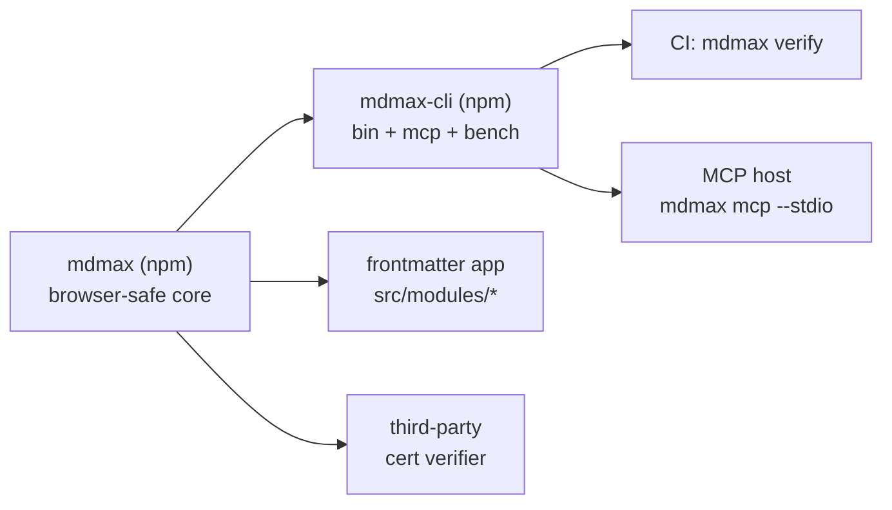

Decision: two published packages from one repo, not one and not three. `mdmax` is the engine — the barrel, browser-safe, `"sideEffects": false`, subpath `mdmax/cert` for the certificate path so a splice-only consumer never pulls `entities`. `mdmax-cli` depends on `mdmax` with a caret range and carries the `bin`, `bench.ts`, the Ruby/kramdown subprocess, and the MCP server as `mdmax mcp --stdio`. The repo keeps the engine at `src/modules/mdmax/` as the source of truth and builds `packages/mdmax/` from it, so the app is never consuming a stale published copy of its own engine.

The MCP server does not get its own package. It is stdio glue over the same exported functions, it has exactly the CLI's dependency profile, and a third package triples the version-compatibility matrix to buy nothing.

Name: `mdmax`, unscoped, confirmed 404 on the registry [fetched 2026-08-30]. `frontmatter` is taken (HTTP 200), which settles the alternative.

Licence: Apache-2.0 for both packages, with a `NOTICE` file. Not MIT, for one specific reason — the certificate is a published claim about seven third-party rendering engines, and Apache-2.0 §6 withholds trademark rights explicitly, so the word "MDMAX" cannot be used by a fork to issue certificates under our name while MIT would leave that entirely to trademark law. The patent grant in §3 is secondary but free. There is currently no `LICENSE` file in the repo at all [measured], so this is an addition, not a change.

Size and dependency budget, enforced in CI:

| Entry | Budget | Current basis |
|---|---|---|
| `mdmax` (splice + anchors + admission) | ≤ 20 KB gzip, ≤ 1 runtime dep | 57,318 stripped bytes across the browser-eligible files [measured]; roughly 15–18 KB gzipped after minification [derived, estimate — must be replaced by a real bundler number before the budget is enforced] |
| `mdmax/cert` | ≤ 45 KB gzip, ≤ 2 runtime deps | adds `constructs.ts` (17,693 stripped) plus `entities` |
| `mdmax-cli` | unbudgeted | node-only |

The one permitted core dependency is `github-slugger@2.0.0` (ISC, 36 KB on disk [measured]). It stays because it *is* the definition GitHub ships; reimplementing it forks `mdmax/slug@1` from the thing the artifact claims to reproduce. `entities@8.0.0` (BSD-2-Clause, 388 KB on disk [measured]) is used only by `fold.ts` and `verdict.ts` — both certificate-side — so it lands behind the `mdmax/cert` subpath and never in the splice path. `npm run budget` currently prints `No bundle budget configured yet — skipping` [measured, in `package.json`], which is a gate that always passes; it gets a real bundler and these numbers.

Rejected: a three-package monorepo with `@mdmax/engine`, `@mdmax/cli`, `@mdmax/mcp`. Three release cadences, three changelogs, and a cross-package version matrix, for two artifacts that will always release together. Cost of being wrong: if the MCP server later grows host-specific dependencies, splitting a package out of an existing repo is a day of work and a deprecation notice. Falsifier: the moment CLI and MCP need to release independently more than twice in a quarter, split.

The anti-recommendation: **do not publish anything until the zero-indent-sequence refusal and `SAFE_KEY` are fixed.** Publishing now freezes `SAFE_KEY = /^[A-Za-z0-9_.$-]+$/` as observable behaviour, and widening it later is rule 4 — a MINOR — only because it converts refusals into successes; but publishing an engine that refuses 83% of real vaults, and whose refusal is silent because `spliceFrontmatterValue` returns `src` unchanged, buys a public reputation for an engine that mostly declines to work. And do not publish `test/corpus/foreign/_vendor/` in either package: 8,513 files from third-party vaults under licences we have not individually cleared, whose only purpose is `npm run corpus` in this repo. Ship `MANIFEST.sha256` and `SOURCES.json` so a verifier can reconstruct the corpus; ship the corpus itself never.
