# frontmatter — Product Requirements & Research Record

**v1.0 · 2026-08-29 · Zephyrus Studio · owner: Sagnik Mitra**
**Status: pre-development. This document is the input to the build, not a report on it.**

---

## 0. How to read this document

**What this is.** The complete product record for frontmatter: where the idea came from, what problem it solves, what the market can and cannot do, what we will build, how it is priced and sold, what it costs, what can kill it, and what has to be decided before anyone writes code. It consolidates seven rounds of research (38 agents, ~6.9M tokens) plus the internal engineering record.

**Audience.** The build team. Read §1–§5 for why, §6–§17 for what, §18–§22 for the business, §23–§26 for execution. §27 is the evidence index — every claim here traces to a report file.

**Evidence tags. Every factual claim carries one. This is not decoration — it is the difference between a fact and a lead.**

| Tag | Means | May be published as fact |
|---|---|---|
| `[measured]` | Executed on this machine against live code or a real corpus | Yes |
| `[fetched]` | Primary source opened and read | Yes |
| `[derived]` | Computed here; the arithmetic is shown | Yes, with the arithmetic |
| `[SS]` | Search summary, nobody opened the page | **No — verify or omit** |
| `[inference]` | Reasoning from the above | Labelled as judgement |

**Settled verdicts — do not re-litigate.** Three decisions cost months each and survived every round since:

1. **No new markdown format.** Every extension is a profile over valid CommonMark that degrades to readable text in a dumb renderer. (`HANDOFF-mdz-markdown-format-2026-07-29.md`; re-confirmed — a formally-specified markdown successor launched Aug 2026 sits at 2 stars `[fetched]`.)
2. **MDMAX is a library subordinate to the editor**, not a compiler product with its own destiny.
3. **Never a tree-of-record.** No feature, ever, is allowed to introduce a parse-tree as the source of truth.

**Citation convention.** Research reports are cited as `[→ c1]`, resolving through §27 to `docs/research/agent-reports-2026-08-28/`. Internal plans are cited by full path.

---

## 1. Where the idea came from

**In one line:** we tried to invent a better markdown, proved that was the wrong move, and were left holding the two pieces that turned out to be the actual product.

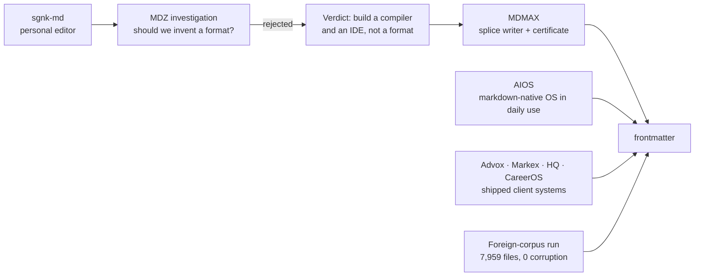

| Stage | What happened | What it left behind |
|---|---|---|
| sgnk-md | A personal Obsidian-alternative editor, shipped and in daily use at md.sgnk.ai | The editor chassis: modes, tree, tabs, slash commands, vim keys, wikilinks, KaTeX, Mermaid, PWA + Tauri |
| MDZ investigation (2026-07-29) | Asked whether a markdown successor format was the play | **Rejected.** Adoption evidence was decisive. Verdict: "build a compiler and an IDE, not a format" |
| MDMAX | The compiler half, built instead | Byte-preserving splice writer + the degradation certificate |
| AIOS | An orchestrator that runs this studio entirely on markdown files | Proof the substrate works: 124 SKILL.md automations, an 871-line self-amending markdown constitution, frontmattered memories, append-only ledgers `[measured → i5]` |
| Client systems | Advox (citation-gated legal AI), Markex (social scheduling), HQ (ops control plane), CareerOS | Reusable spines: entitlements, pooled-RLS tenancy, fail-closed verifiers, publish queues |
| Foreign-corpus run (2026-08-28) | Ran the splice writer against five strangers' vaults | 7,959 files, **0 corruption, 0 throws** `[measured → h2]` — the guarantee holds on data we have never seen |

**The insight that closed it.** The two things MDMAX shipped — a writer that provably cannot corrupt, and a certificate that proves how a file degrades across renderers — are exactly the enforcement mechanism for a much bigger idea than a format: that the file can be the only source of truth and every app-like view can be disposable. We built the enforcement before we named the law.

---

## 2. The problem

Nine problems, ranked by evidence strength and pain. Each one is a thing a real person complained about, in public, that we can point at.

| # | Problem | Evidence | Our answer |
|---|---|---|---|
| 1 | **AI work evaporates.** An hour of good thinking ends as a chat log. ChatGPT's only exit is an all-or-nothing account ZIP emailed with a 24h link; NotebookLM did not persist chats until Jan 2026; a browser-extension exporter economy exists (one at 400,000+ installs) and 100% of it terminates in a stale one-shot dump | `[SS/fetched → aj4]` | The capture loop, `land()` (§11) |
| 2 | **Sync silently destroys data.** The #1 pain in the corpus: 561 of 3,220 HN comments. Not historical — in the last six weeks the Obsidian forum carries a file showing "fully synced" while missing its final Korean characters, and files vanishing on macOS | `[SS]` corpus, `[fetched]` fresh threads `[→ e7]` | Trust surface: visible sync, conflict inbox, journal-before-overwrite (§13, T0) |
| 3 | **Editors rewrite bytes you never touched.** Proven architectural, not a library choice — three teardowns, three codebases, one identical failure | `[measured → h3/h4]` | The splice guarantee (§7) |
| 4 | **Nobody can tell you what the AI changed.** Word, Docs, Cursor, Grammarly, Lex all show AI edits before accept and lose the distinction forever after | `[SS → ed4]` | Byte-anchored provenance (§11) |
| 5 | **Everything you own is trapped in a view.** Coda export returns disconnected strings with formulas and buttons stripped; Notion formulas cannot aggregate across rows; under 4% of GitHub notebooks reproduce identical results | `[SS → c1]` | The projection law (§5) |
| 6 | **The review loop does not exist on files you own.** Google's public API **cannot create suggestions at all**; Lex's track-changes is still "in development"; OpenKnowledge comments are machine-local and never committed | `[fetched → ed5, h4]` | The N5 review surface (§12) |
| 7 | **Import is a lie.** The #1 importer failure class is not broken formatting — it is **reports that claim success while losing files**. Obsidian has posted a $500 bounty for a detailed import log and $5,000 for Notion database conversion | `[fetched → e5]` | The verification-report importer (§17) |
| 8 | **Price betrayal.** Notion cut free AI to 20 responses *for life* and raised Business ~20%; Microsoft's +43% Copilot bundling drew a CMA probe; Cursor apologised for an opaque credit reprice; Windsurf churned twice | `[SS → ed4]` | The never-list as published policy (§20) |
| 9 | **Complexity fatigue.** Obsidian's own community: most of a million-plus downloaders never get past their first note | `[SS]` | The simplest-editor bar, zero-config profiles (§13 L0) |

**The shape shared by 1, 2, 3, 4, 6 and 7:** the tool reports success while quietly losing something. "Sync said green and lied." "Import said 47 succeeded and lost 4." "The editor said it preserved comments and deleted them." **The product thesis is: be the tool that does not lie about what it did to your file — and can prove it.**

---

## 3. The market

### 3.1 Category map

| Category | Players | What they own | Why they cannot take our position |
|---|---|---|---|
| Office suites | Word, Google Docs, LibreOffice | Track changes, comments, 40 years of review UX | Not file-native; Google's API cannot even create suggestions `[fetched → ed5]` |
| Workspace / blocks | Notion, Coda, Craft, Airtable | Databases-as-views, templates | The view IS the data; export is lossy by architecture `[SS → c1]` |
| Markdown PKM | Obsidian, Logseq, Bear, Ulysses, iA Writer, Typora | Local files, plugin ecosystems | Single-player by design; no review loop, no provenance, no fidelity proof |
| Markdown collab | HackMD, Hubble, OpenKnowledge, GitBook, Mintlify | Team markdown, docs sites | All regenerate the file; OpenKnowledge needs a running daemon `[measured → h3/h4]` |
| AI editors | Cursor, Windsurf, Lex, Grammarly | Inline AI, diff review | Provenance evaporates at accept; not markdown-native `[SS → ed4]` |
| Chat-to-artifact | Claude Artifacts, Canvas, v0, Bolt, Perplexity Pages | Generation, versioning | The artifact lives in their store, not your repo. OpenAI **removed** Canvas in May 2026 `[SS]` |
| Agent memory | mem0, claude-mem | Facts for agents | Atomises the journey; the finished document is not a first-class object |

### 3.2 The gap map — what nobody can currently do, and for how long

| Gap | Evidence of absence | Window |
|---|---|---|
| Byte-exact structured editing on **both** halves of the file | All three teardowns regenerate; the two strongest each solved fidelity only on the half their editor does not model `[measured]` | Frontmatter-splice claim durable (rewrite-level for them); general claim erodes |
| Fidelity **without a running daemon** | OpenKnowledge's byte contract exists only inside a live CRDT server — agent edits error out without it `[measured → h4]` | Durable — architectural |
| **O(edit)** not O(document) | Their own source comment: full serialize+parse per edit, *"unbounded by doc size"*, fixing it *"needs a real incremental parser"* they do not have `[fetched → h4]` | Durable |
| Render-fidelity certification | Nobody certifies cross-engine degradation. Litmus at $500/mo proves the *testing* layer monetises while the *data* layer stays free `[SS → e8]` | 6–12 months. Publish the dataset before the design |
| The review loop on files you own | Google's API cannot create suggestions `[fetched]`; Lex "in development" `[SS]`; OK comments never committed `[fetched]` | 6–12 months |
| Byte-anchored, portable, reader-visible AI provenance | Absence check passed precisely: admin telemetry (Cursor), cloud report (Grammarly), repo sidecar (Agent Trace). Writing editors have nothing `[SS → ed4]` | Open |
| The rendered, evolving AI-output document | Memory tools store facts; consumer apps store sources; exporters store dumps `[→ aj4]` | Open — **the category to name** |
| Session interchange between AI tools | No standard. OpenAI and Claude exports are mutually unreadable proprietary shapes; every parser is reverse-engineered `[fetched → aj1]` | Open — whoever publishes the open shape becomes the default |
| A file-native home screen | Obsidian's Homepage plugin: **1,294,057 downloads**, model = "home is a markdown note you own", ~20× every bespoke dashboard plugin `[fetched → e2]`. No product ships it natively | Open |
| Claim-level method + confidence | Across OKF, SKILL.md, llms.txt v2, MyST, .prompty — no spec claims it; OKF explicitly argues *against* stored scores `[fetched → aj3]` | Open, and a renderer is the right shape to solve it |
| ~~"An agent can read and write my markdown"~~ | **Already commodity.** Bear, Craft, Notion, MDflow, GitBook all ship it; obsidian agent-skills at 47,418 stars; the skills CLI did 9.3M downloads in one week `[fetched → e4]` | **0 months — do not position here** |

### 3.3 The window, stated plainly

- **Now:** generic agent-markdown is commodity.
- **3–6 months:** "markdown editor with an agent harness" gets crowded. OpenKnowledge alone ships ~100 releases/week and went 3,239 → 3,673 stars in 27 days `[fetched]`.
- **6–12 months:** fidelity, the review loop, and the Obsidian-power-user collaboration lane stay open, because every incumbent's incentives point elsewhere — Notion toward blocks, OpenAI toward artifacts-as-output, Google toward Docs, OpenKnowledge toward the team wiki.
- **Structural hedge:** OpenAI removed Canvas `[SS]`. If "delegate, don't edit" wins, the durable asset is not editor chrome — it is the verification layer that checks what the agent produced. That is MDMAX. **The roadmap deliberately keeps weight on the engine.**

**Sequencing law: the differentiation tracks (R0, T2, T3 — §23) must land inside the 6–12 month window.**

---

## 4. Is the idea good? The honest verdict

**Verdict: yes, with one condition — we must ship the fidelity and review tracks inside the window, and we must not position on the commodity sentence.**

| Question | Answer | Confidence |
|---|---|---|
| Is the problem real? | Yes. Nine problems, all with public complaint evidence; three verified by executing competitors' code | High `[measured]` |
| Is anyone else solving it? | Partially, and each one is capped by an architectural choice they cannot cheaply reverse | High `[measured]` |
| Do we have an unfair advantage? | Yes — a byte-preserving writer and a degradation certificate that already exist and already pass on strangers' data | High `[measured]` |
| Will people pay? | **Unproven.** Zero paying users today. Comparable tools sustain $4–10/mo, and the B2B stack we consolidate costs ~$963/mo | Medium `[SS]` |
| Can one person build it? | The v1 scope, yes. Teams/SSO/compliance, no — see §25 | Medium `[inference]` |
| Is the timing right? | Yes, and tight. The category crowds in 3–6 months | High `[fetched]` |

**What is genuinely proven vs. assumed:**

- **Proven `[measured]`:** the engine does not corrupt foreign data (7,959 files, 0 corruption); competitors do (three executed teardowns); the internal markdown-OS substrate works at scale (23,778 live routing decisions, 124 automations); the campaign pipeline produces multi-surface output from one file (10 episodes in ~1 week).
- **Assumed, must be tested early:** that anyone pays; that the review loop is a purchase trigger rather than a nice-to-have; that India is a viable distribution top-of-funnel; that funnel 2 (writers/students) exists at all.
- **Refuted, do not repeat:** "serve markdown to agents and get cited" — measurably false; "first AI attribution" — Cursor and Grammarly exist (the defensible claim is narrower, §11).

**The single biggest risk is not technical. It is that a fidelity guarantee is a thing engineers admire and nobody buys.** §18 and §22 are the mitigation: sell the outcome (consolidated stack, audit trail, fewer tickets), prove it with the guarantee.

---

## 5. The core concept

> **The file is the only source of truth. Every app-like thing — the board, the calendar, the decision card, the dashboard, the published site, and every AI edit — is a deterministic, reversible projection of that file, owning no state of its own.**

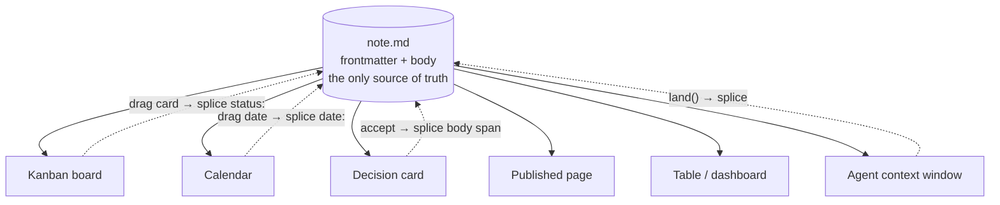

**Why this is a law and not a slogan.** It is the line that separates tools that survived twenty years from tools that became traps `[→ c1]`.

| Survivors — view is computed, stored nowhere | Traps — view ate the data |
|---|---|
| org-mode agenda, running since 2003, computed on the fly from date tags in plain text `[SS]` | Coda export loses formulas, buttons, canvas properties `[SS]` |
| Obsidian Bases (2025): the `.base` file saves only how you want to look; delete it and you lose nothing but the view `[SS]` | Notion formulas cannot aggregate across rows `[SS]` |
| Potluck (Ink & Switch): *"a clear separation between text and annotations… the original text freely editable"* `[fetched]` | Jupyter: meaning lives in invisible kernel state; under 4% of GitHub notebooks reproduce `[SS]` |

**What is new is not the law — it is making it the explicit product primitive.** Everyone else rediscovered it as a side effect. And its two hardest requirements are already built here: (a) write-back must be provably reversible → the splice writer; (b) any view must strip back to portable markdown → the degradation certificate.

**The category sentence:**

> Notion made the app the source of truth and trapped your data inside it. frontmatter makes the **file** the source of truth and lets every app be a disposable lens over it — provably, byte for byte, reversibly.

**It composes with the AI story rather than sitting beside it.** If every view is a projection, an AI edit is a projection running backwards: it lands as a splice with its byte range recorded, reviewable and reversible. The AI gets the same path as a human dragging a card, and the same guarantee.

**Prior art to respect, not ignore:** Potluck is the near-exact precedent and is unmaintained; Obsidian Bases is market validation that the demand is real. Neither claims the law as a product primitive. Neither can prove reversibility.

---

## 6. Principles and non-goals

### 6.1 Principles

1. **The file is the truth; views are disposable.** (§5)
2. **Refusal is a first-class outcome.** When we cannot do something safely, return the input unchanged and say why. Never guess.
3. **Never lie about what happened.** Every count is re-derived from disk, never from the loop that did the work.
4. **Degrade, never break.** Every extension is valid CommonMark that renders as readable text in any dumb renderer.
5. **The model gets a data slot, never a canvas.** Typed declarative data into a fixed interpreter; never arbitrary code.
6. **One grammar for every change.** Human suggestion, AI edit, sync conflict — all arrive in the same review surface.
7. **Measure the document, not the user.** Feedback is implicit (kept/edited/reverted), never a rating button.
8. **Gates, not scores.** Named binary checks. Never "your writing is 82/100".

### 6.2 Non-goals — what we will not build

Written down because the expensive mistakes are all additions.

| Never | Why |
|---|---|
| A new format, sigil, or dialect | Settled 2026-07-29; adoption evidence decisive |
| A tree-of-record, even for one feature | `blocksToMarkdownLossy()` is a real function name in BlockNote's API — the market's own confession `[SS → ed3]` |
| A plugin marketplace | VS Code's own wiki names extensions the #1 performance suspect; Typora's most-requested feature (251 votes) sits against a product people love *because* it has none `[SS → ed1/ed2]` |
| The eval lane (dataviewjs, MDX, arbitrary widget code) | It ends the corruption guarantee. This is the load-bearing refusal (§9) |
| Block IDs written into files, columns-in-markdown, synced-block bytes | Pollutes the text; breaks portability |
| Likert writing scores | Grammarly's opaque document score is the anti-pattern |
| Ambient AI buttons, un-disableable AI | Notion users write ad-blocker rules against AI buttons `[SS]` |
| Silent auto-landing into a curated vault | Granola's zero-trigger lesson — auto-capture only into an inbox lane |
| Opaque credit repricing | Cursor apologised; Windsurf churned twice; Notion got roasted |
| Streaks, badges, soundscapes, format-on-save default | Noise |
| A bespoke canvas as centre of gravity | Spatial state is not linear text |
| Notion-style full project management | Explicit founder boundary. We are a markdown editor with deep AI, not a PM tool |
| AIOS internal machinery as consumer UI | Learned-rules ledger, debate panels, shadow-promote — excellent for running us, a trust burden shipped to anyone else |
| Graph-view investment, the mother-markdown container | Zero of 89 feature requests mentioned graph view; 45 transclusions in 25 MB of our own vault were all documentation of the feature, none were use of it `[measured]` |
| Any "first" or "only" claim without one more verification round | LR#72. We already caught one |

---

## 7. Architecture

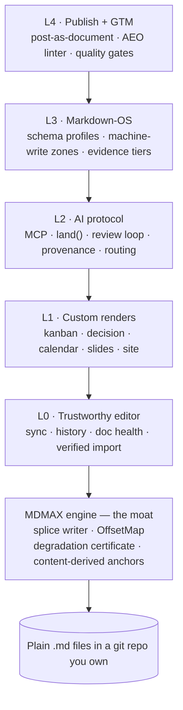

### 7.1 The engine — why it is the moat

**The splice contract.** Locate the target byte range; replace exactly those bytes; never regenerate from a parse tree. Grounded in lens theory (Foster et al., TOPLAS 2007). If the range cannot be located safely, **refuse** and return the input unchanged.

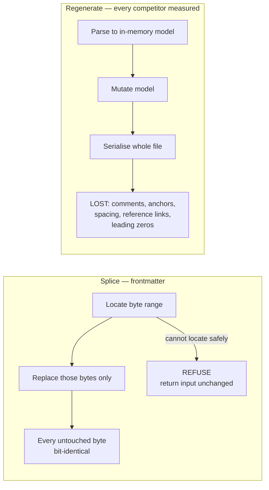

| Engine component | File | What it guarantees |
|---|---|---|
| Splice writer | `scripts/load-splice.mjs`, frontmatter prepass | 907/907 on the pinned corpus; **0 corruption / 0 throws on 7,959 foreign files from 5 authors** `[measured → h2]` |
| OffsetMap | `src/modules/mdmax/domain/offsets.ts` | Branded U16Offset / ByteOffset / GraphemeIndex; checkpoint-every-512-units index; refuse-never-round boundary policy |
| Degradation certificate | `src/modules/mdmax/application/certify.ts` | Cross-engine render fidelity across 7 real markdown engines |
| Construct detectors | `src/modules/mdmax/domain/constructs.ts` | What a file contains that a given renderer will drop |
| Shape gate / strict decode | `shape-gate.ts`, `normalize.ts` | Refuses invalid UTF-8 rather than silently replacing it |
| Content-derived anchors | engine PLAN | 99.627% resolve / 0.050% false across 41,642 block-versions `[measured]` |

### 7.2 Current state of the codebase — verified

| Metric | Value |
|---|---|
| Modules under `src/modules/` | 14 — ai, ai-tools, app-shell, auth, drafts, editor, export, graph, mdmax, preview, repository, share, vault |
| TypeScript files in `src/` | 226 `[measured]` |
| Lines in `src/` | 25,407 `[measured]` |
| Test files | 262 `[measured]` |
| Tests passing | 1,575 / 1,575 `[measured]` |
| App routes | 29 (2 public, 1 vault, 1 auth, 25 API) `[measured]` |
| Branch | `engine/plan-and-diagnostics`, ahead of `main` |

**Stack already in place `[measured]`:** Next 16.2.6 · React 19.2.6 · CodeMirror 6 (view, state, language, commands, search, autocomplete, lang-markdown, vim) · unified/remark/rehype (gfm, frontmatter, math, breaks, katex, slug, raw, highlight) · gray-matter · yaml · mermaid 11 · minisearch · zustand · zod · next-auth v5 · AI SDK v6 with **five providers** (Cerebras, Google, Groq, Mistral, OpenRouter) · Tauri v2 · puppeteer-core + @sparticuz/chromium for PDF · material-symbols.

**Known engineering truth (do not believe stale docs):**
- `src/modules/mdmax/` is imported by **zero** product files — implemented and unit-tested, **not wired in** `[measured]`.
- There is **no `.github/`** — no CI at all. Awkward for a product that intends to sell document CI.
- Audit Tiers 1 and 2 plus gate hardening are **fixed** (commits `f47555f` … `9e84628`); Tier 3/4 remain (§23 R0).

---

## 8. Formats and the data model

### 8.1 File anatomy

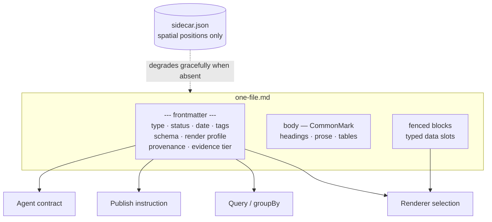

**Frontmatter is the API.** The product's name is its mechanism: the YAML block is simultaneously the renderer switch, the query surface, the publish instruction, the lint calibration, and the agent contract.

### 8.2 Format posture

| Posture | Formats | Rationale |
|---|---|---|
| **READ** | OKF bundles (v0.2, own Google repo, 356 adopter repos, +24% in 27d `[fetched]`) · SKILL.md folders · MyST keys (tolerate) · textbundle (low priority) | Zero parser cost; recognise `sources / generated / verified / status / stale_after` and derive trust tiers |
| **EMIT** | llms.txt v2 + markdown twins + `rel="alternate" type="text/markdown"` (v2 blessed path-scoping; Chrome Lighthouse now audits for it `[fetched]`) · OKF export (five keys we already track) · **Skill export** — a curated collection becomes a SKILL.md folder consumable by 41+ agents | "The journey becomes a reusable capability" is the strongest interop story found |
| **BUILD** | **Session interchange format** — markdown-native, open, documented | No standard exists; the absence is the opening `[fetched → aj1]` |
| **WATCH** | .prompty (active, input side) · AG-UI | Not yet load-bearing |
| **IGNORE** | Promptfile (dead) · langchain-hub (archived) · A2A and server-cards as document formats | Dead or wrong layer |

**The open territory:** claim-level method + confidence. Claimed by no spec; OKF argues against stored scores. The compatible design is **signals, not scores, derived at render time** — which is a renderer's game, and therefore ours.

### 8.3 Frontmatter key vocabulary (v1)

| Key | Type | Purpose |
|---|---|---|
| `type` | enum: `decision · plan · research · meeting · qa · idea · board · note` | Picks schema, render profile, and home grouping |
| `status` | enum (schema-defined) | The state machine; kanban columns are its values |
| `date`, `due`, `created` | date | Calendar projection |
| `render` | profile name | Explicit renderer selection |
| `schema` | path | The schema profile this file validates against |
| `source` | object `{tool, model, conversation_url, session_id}` | Provenance of landed AI output |
| `verified` | object `{by, on, until}` | Freshness / staleness gating |
| `evidence` | object `{value, source, tier, re_verify_cmd}` | The evidence-tier discipline (§10), practised in production by the campaign system `[measured → i1]` |
| `apply` | enum `always · auto · glob · manual` | For rules files — Cursor's modes, minus the special-editor resentment |

**Boundaries that stand:** spatial data → JSON Canvas sidecar. Workspace-scale multi-user state → a database. Deeply nested data destined for an LLM → not markdown's win `[measured/SS]`.

---

## 9. The rendering system

**In one line:** a fenced code block's info string names a renderer; the fence body is a typed data slot; anything unrecognised degrades to a code block.

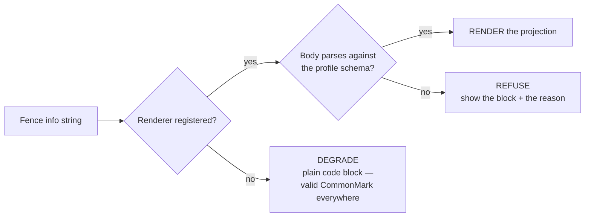

This is CommonMark by spec, not a hack: the spec says the first word of the info string selects particular treatment `[fetched]`. Obsidian exposes exactly this as `registerMarkdownCodeBlockProcessor(language, handler)` `[fetched]`.

### 9.1 The computation budget — how markdown does app work without app compute

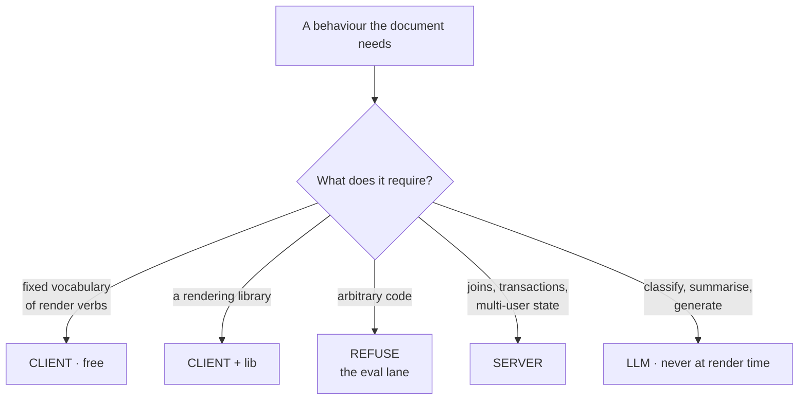

| Behaviour | Lane | Mechanism |
|---|---|---|
| Text, lists, tables, callouts | CLIENT | CommonMark + GFM |
| Checkbox toggling that persists | CLIENT + write | `- [ ]` source-line rewrite. Dataview's TASK query is *"the only command in dataview that modifies your original files"* `[fetched]` |
| Inline edit of a typed field → YAML | CLIENT + widget | Bases table cell writes back the property `[fetched]` |
| State machine → kanban columns | CLIENT | `status:` enum is the state; `groupBy(status)` is the columns; a drag is an enum write-back |
| Per-row computed column | CLIENT | Bases formulas: `if()`, arithmetic, date maths `[fetched]` |
| Cross-note aggregates (sum, avg, median, stddev) | CLIENT | Bases summaries / Dataview `sum · reduce · average` `[fetched]` |
| Dashboard = query over a folder | CLIENT **with a ceiling** | In-browser index. Dataview advertises 100k notes; users report ~30s queries past 3,000 `[SS]` |
| Conditional render from a flag | CLIENT | `if()` / `choice()` inline |
| Declarative diagram | CLIENT + lib | Mermaid, ~16 diagram types `[fetched]` |
| Declarative chart | CLIENT + lib | Vega-Lite JSON, or a `chart` fence into Chart.js `[fetched]` |
| **Arbitrary interactive widget** | **REFUSE** | dataviewjs, MDX. **This is the lane we do not enter** |
| Spatial canvas with x/y | Hard boundary | Sidecar JSON, or don't |
| Real relational queries, joins, transactions | SERVER | An in-browser index cannot |
| Multi-user concurrent state, presence | SERVER | File-per-note is single-writer by nature |
| Classify, summarise, generate | LLM | Never a render-time operation |

**Two decisions fall out of this table.**

1. **The founder framing of "client / server / LLM" is missing the important lane: client-side but arbitrary code.** "Doesn't require much computation" really means "doesn't require *arbitrary* computation". Defensibility lives in staying in the fixed-interpreter lanes and refusing the eval lane. A closed vocabulary of render verbs, not a sandbox.
2. **Buy the semantics of Bases and Dataview, not their code.** Those two already define the computation surface users expect from a markdown app. Dataview is MIT `[fetched]`, so the query parser is genuinely copyable. Match that surface as a stable spec and publish the ceiling honestly.

### 9.2 Render profiles — build order

| Profile | Mechanism | Prior art / opening |
|---|---|---|
| **kanban** | Columns are the values of a frontmatter field; drag rewrites that field | Flagship Obsidian Kanban plugin: 2.6M downloads, last release 26.9 months ago, repo now in an org named *community-archive* `[fetched]`. Its file convention (`## Lane` + `- [ ]`) is de-facto standard, read by ≥3 plugins. **Adopt the convention, win on the write path** |
| **decision** | ADR profile; status chip from frontmatter; body renders Context → Drivers → Options → Outcome → Consequences | MADR already stores status, date, deciders in YAML frontmatter `[fetched]`. Render it; invent nothing. **No commercial ADR tool exists** |
| **calendar** | Drag to reschedule writes `date:`; edge-drag writes a range | Markex schema |
| **corkboard / outliner** | Renders over `synopsis:`, `label:`, `status:` | Scrivener's planning views `[→ ed1]` |
| **slides** | Marp-compatible | Existing convention |
| **declarative figures** | Mermaid / Vega-Lite fences | Campaign 5-generator pattern |
| **brand book** | guideline-forge | Internal reuse |
| **project map** | mdmap | Internal reuse |
| **live site** | publish + profiles | — |
| **flow** | Derived layout only; positions to a sidecar or not at all | Last, deliberately |

**Blocking prerequisite, one character class:** `src/modules/preview/presentation/markdown/components.tsx:133` uses `/language-(\w+)/` to pull the fence language, and `\w` excludes hyphens, so every hyphenated language collides with its prefix. **This is the first commit of the render track.**

---

## 10. The AI layer

### 10.1 Surface ranking — from the complaint corpus `[→ ed4]`

**deliberate inline edit > review-moded agent > on-demand chat > ghost text > ambient AI buttons (net-negative).**

Consequences: ghost text defaults to Zed's *subtle* mode (visible only while a modifier is held); a loud global AI kill switch; per-folder exclusions; snooze; **propose-first as a named default mode**; prompt appears at the cursor, never docked in a rail.

### 10.2 The AI edit lifecycle

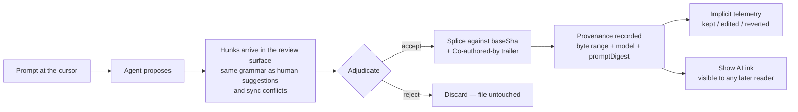

### 10.3 Provenance — the scoped claim

On every accept, the splice records the byte range plus `{contributor, model, promptDigest, sessionRef}`. A "Show AI ink" toggle tints AI-written spans for **any** reader. Interoperates with Cursor's Agent Trace format both ways.

**Claim wording matters and was checked.** This is **not** "the first AI attribution" — Cursor and Grammarly exist. The defensible claim is: **the first markdown editor with byte-anchored, document-portable, reader-visible provenance.** Granola proves people like the legibility (AI text grey, yours black `[SS]`) but theirs vanishes on export.

### 10.4 Implicit telemetry — mandatory, not preferred

Whether the user kept, edited, or reverted an AI edit, measured from the document. **No rating buttons, ever.**

The evidence is our own: in AIOS, the explicit `accepted` field was filled on **7 of 688** recent rows even with one motivated expert using it daily, while the machine channels filled themselves — **23,778 routing decisions** logged in the same period `[measured → i4]`. Build every feedback-dependent feature on what the system can observe, never on what a user is asked to declare.

### 10.5 Cost control

The routing gate keeps ~90% of AI operations on the cheapest capable model, measured across 23,778 live decisions `[measured]`. **That is margin, and it is why ₹299 works (§21).** Escalation is two-dimensional (tier × effort), not "more samples of the weak model".

### 10.6 Other AI features

- **Citation-gated vault answers** — Advox's fail-closed verifier: refuse when the answer cannot be grounded. Already built.
- **`mdmax explain --as <consumer>`** — shows exactly what your file does to a model's context window. Nobody else has anything like it.
- **Rules / voice / memory files as first-class documents** — `.frontmatter/rules/*.md` with `apply:` frontmatter, opening as plain markdown. Cursor gave `.mdc` a special editor UI and users actively look up how to turn it off — dialect betrayal inside an AI IDE's own config format `[SS]`.
- **AI-authored memories only via a visible, editable panel.**

---

## 11. Protocols and the capture loop

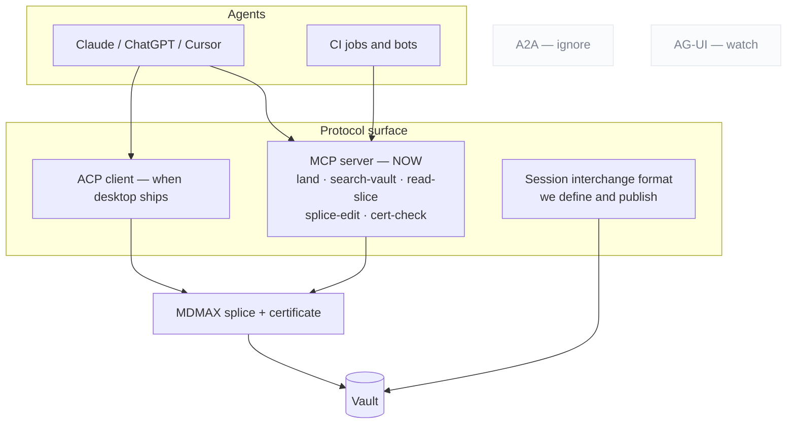

| Protocol | Posture | Reason |
|---|---|---|
| **MCP** | **Ship now**, tools-first | The July 2026 revision went stateless and deprecated Roots, Sampling and Logging — tools are the lowest common denominator `[fetched → aj1]`. Hard-cap under 20 tools; verdict-first responses; refusals that name the rule and give a corrected example |
| **ACP** | Client, when a desktop surface exists | 40 registered agents incl. an Anthropic-co-authored Claude adapter; `session/load\|resume\|list` is the only shipped multi-vendor session-continuity semantics anywhere `[fetched]`. ACP agents are local subprocesses over stdio — needs the Tauri build first |
| **A2A** | Ignore | Wrong layer for a document tool |
| **AG-UI** | Watch | Not load-bearing yet |
| **Session interchange** | **Build and publish ours** | No standard exists (§8.2) |

**The plumbing is table stakes. The pitch is what rides on it: every agent edit goes through the splice writer, so the agent cannot corrupt what it edits.**

### 11.1 `land()` — the capture verb

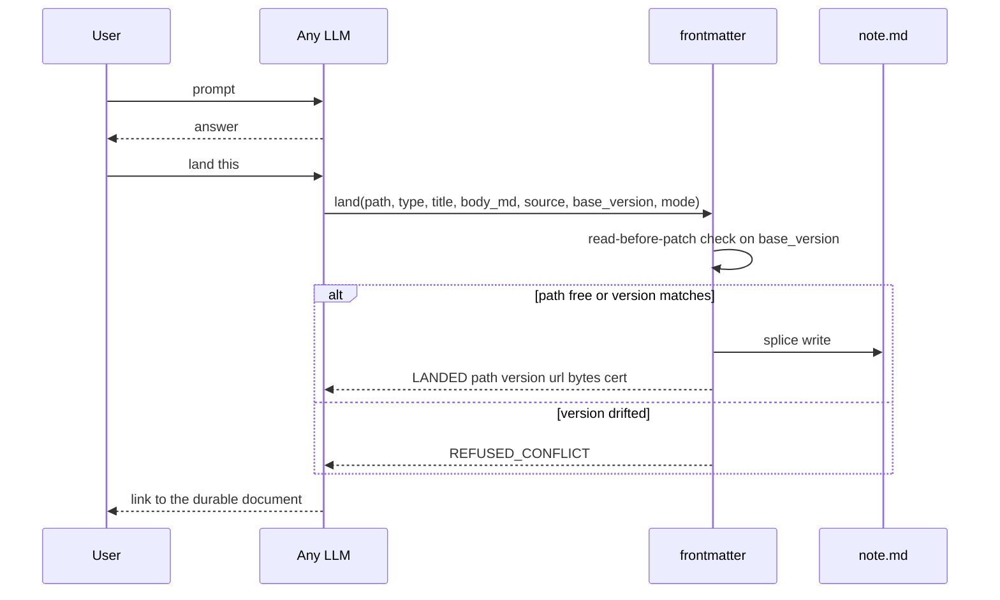

```
land({ path?, type, title, body_md,
       source: { tool, model, conversation_url, session_id },
       base_version?, mode: create | patch | rewrite })
  → { LANDED | VERSIONED | REFUSED_CONFLICT | NEEDS_TARGET,
      path, version, url, bytes_written, cert }
```

**Design rules, each from a documented failure `[→ aj2]`:**

| Rule | Why |
|---|---|
| **Identity is the path**, explicit in every call | On claude.ai, where identity is inferred from phrasing, "it made a new artifact instead of updating mine" is the #1 documented failure |
| **Two edit sizes are protocol modes**, not prompt etiquette | `patch` vs `rewrite` — otherwise the model guesses |
| **`base_version` enforces read-before-patch** | Structurally kills the drift bug where the user hand-edits and the model keeps talking about the version it remembers. Bolt's own system prompt: always edit the latest content `[fetched]`. **The file is the memory; the model's memory of the file is a cache to invalidate** |
| **Counts re-derived from disk** | The anti-lying-report rule |
| **Typed at capture** | `type:` picks schema + render + home grouping. Granola's commercial proof: $1.5B valuation on template-typed capture with per-line provenance `[SS]` |
| **Users see the nouns, never "artifact"** | Bolt's system prompt literally forbids the word `[fetched]` |
| **Auto-land only into an inbox lane** | Never silently into the curated vault |

**Distribution of the capture loop:** an MCP server for MCP-capable tools; a **chat-side skill** for everything else ("land this" → typed fenced block → one-paste inbox); ZIP importers for ChatGPT and Claude where **the verification report is the demo**; retro-capture that parses one conversation into *several* typed documents, not one blob.

**The promotion loop is what makes it a home rather than a filing cabinet:** landed docs become immediately retrievable, citation-gated context — `draft → active → source-of-truth → superseded`.

---

## 12. The review surface

**One grammar for every change: human suggestions, AI edits, and sync conflicts all arrive here as hunks.** This is the deepest single extraction of the research (40 years of office software, sourced to the Google Docs API discovery doc and pandoc's docx reader `[fetched → ed5]`).

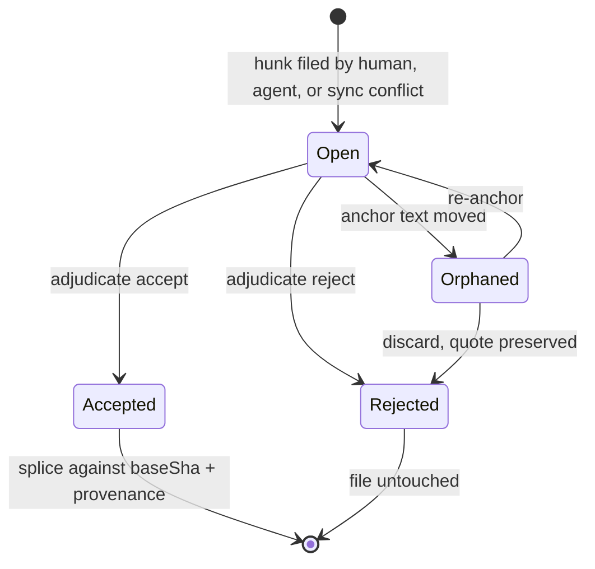

| Rule | Detail |
|---|---|
| Suggesting is a **mode**, not an AI feature | Edit / Suggest / View dial. The suggester role has no byte-writing code path |
| Hunks coalesce at **word grain** | Git's line grain is the wrong resolution for prose |
| Markup / Final / Original are **pure render projections** | The OnlyOffice save-in-preview-deleted-changes bug is the negative spec |
| Gutter bars mark changed regions | Simple-Markup convention |
| The adjudication ladder | per hunk → per suggestion → **all-shown-under-filter** (filter by author, *including AI agents*), with accept-and-advance traversal and preview-before-bulk |
| Suggestion cards carry | operation sentence + author + timestamp + a reply thread |
| **Resolution is an authored thread event** | `replies.action ∈ {resolve, reopen}` — never a silent boolean |
| Anchors are quote-preserving with **visible orphaning** | Word silently deletes orphaned comments; Docs orphans opaquely. We badge, preserve the quote, and offer re-anchor |
| Accept = splice against `baseSha` | Plus a `Co-authored-by` trailer |
| Frontmatter-key hunks render as property-change chips | Consistent with the namesake |
| Governance via branch-protection semantics | **No document freezes** |
| Interchange | CriticMarkup + pandoc `--track-changes` spans, both directions |

**The two moves that beat the incumbents:** (1) **programmatic and AI suggestion authorship** — Google's public API cannot create suggestions at all `[fetched]`; ours is a plain sidecar schema any CI job or agent can file into. (2) **durable provenance through accept** — theirs evaporates.

**Treat the review surface as a breaking-API contract.** Both Cursor and Windsurf regressed per-hunk control and both got publicly burned. Per-hunk accept is the single most-demanded feature in AI editors `[fetched]`.

---

## 13. Feature inventory

### L0 — The simplest trustworthy editor

| Feature | Status | Notes |
|---|---|---|
| Four view modes (Live / Edit / Split / Read), `Cmd+E` cycles | Shipped base | Live is default and WYSIWYM |
| File tree, tabs, formatting bar, slash commands, vim keys | Shipped | From sgnk-md |
| Wikilinks, KaTeX, Mermaid, exports, PWA, Tauri | Shipped | |
| **Trust surface** — sync chip, conflict inbox, named versions, "changed since you last opened" banner, background auto-sync | **Build (T0)** | The banner is nearly free for us (diff two shas) where Google needed bespoke infra `[SS]` |
| **Local history** — per-save revisions, 10s merge window, merged timeline (git + local + AI) filtered by actor, **section-level restore**, no silent expiry | Build (T0) | JetBrains' 5-day wipe is the anti-pattern: the one feature whose job is trust cannot have a quiet trapdoor |
| **WYSIWYG laws** — markup reveals on *keystroke* not click (#443); caret maps to rendered geometry, backspace eats text not delimiters (#2271); one explicit reveal-policy toggle (#1317); caret + scroll survive every mode switch | Build | Straight from Typora's own tracker `[fetched → ed1]`. The last one is cheap for us — OffsetMap already maps positions across representations |
| **Doc Health** — status-bar count → filterable panel → inline marks → F8 cycling with quick fixes | Build | VS Code's four-surface model. Vault-scoped checks on, publish-dependent off. Green all-clear zero state, never a blank panel |
| **Verified importers** | Build (T4) | §17 |
| **HOME.md** | Build (T1) | §14 |
| Command palette + goto-anything (`#` headings, `@` in-doc, `:` line) | Build | |
| Zen / composition mode, folding, multi-cursor | Build | chrome-fades-on-typing + typewriter scroll |
| Settings as a versioned file in the vault | Build | |
| Merge-formatting paste (paste-as-markdown + a one-line degradation note) | Build | The certificate philosophy at the paste boundary |

### L1 — Custom renders
See §9.2. Profiles, compile targets, iA Content Blocks transclusion as the plain-text binder, `role: material` exclusion, block-editor verbs without the block noun (drag-reorder, turn-into, toggles-as-folding, table widgets) — **every one a splice on syntax-tree spans**.

### L2 — AI protocol
See §10 and §11.

### L3 — Markdown-OS features (the AIOS pattern language, productised `[→ i5]`)

| Feature | What it is |
|---|---|
| **Schema profiles** | User-definable frontmatter schemas with enums, required fields, typed-link vocabularies. The editor validates; the AI reads. `knowledge/meta/schema.md` is the working prototype. This is the "portable frontmatter schema" slot the protocol research found open |
| **Append-only blocks** | Regions that may only be added to |
| **Auto-generated index pages** | Derived from frontmatter across a folder |
| **Machine-write zones** | Fenced regions the AI may rewrite and outside which it may not write — splice-enforced |
| **Token-budget meter** | What an agent-facing file costs in a context window |
| **Provenance chips + evidence-tier fields** | `{value, source, tier, re_verify_cmd}` — practised and gated in production by the campaign system `[measured → i1]`. **No competing editor has an evidence layer in any form** |
| **Doc staleness detection** | Deterministic drift-watch over the vault |
| **Document CI** | With gate-honesty discipline (§24) |
| Stable §-anchors · version-by-new-file + LATEST pointer · cache-stable rendering · sidecar data model | Conventions |
| User-authorable automations as documents | Phase 5. The automation format is literally the product's format (SKILL.md anatomy, 24,807-star spec `[fetched]`) |

### L4 — Publishing and GTM
Post-as-document (one `.md` → LinkedIn PDF + IG carousel + article + thread + status card; **the campaign pipeline already proved this — 10 complete episodes built and gated in ~1 week `[measured → i1]`**) · scheduled publish as draft-and-queue with a human confirm, never unattended · the AEO linter honestly framed as content-quality coaching (Princeton GEO measured 25–40% visibility lift from quotes, statistics and citations `[SS]`; **the "serve markdown and get cited" claim is measurably refuted and will never appear in our marketing**) · document quality **gates**, never scores · `verified: {by, on, until}` freshness keys.

---

## 14. Screens

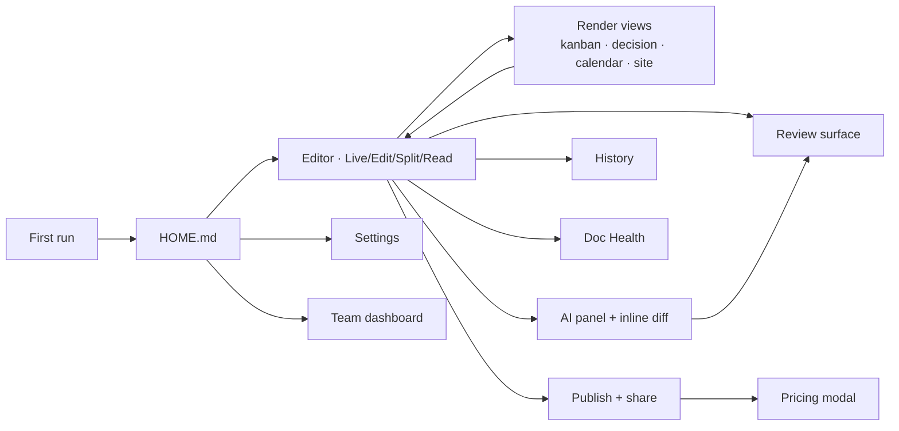

Twelve screens. For each: purpose, above the fold, main interaction, empty state, where AI lives.

| # | Screen | Above the fold | Main interaction | Empty state | AI |
|---|---|---|---|---|---|
| 1 | **First run** | One choice: create a vault / open a folder / try a sample. **No email field, no OAuth wall** | Land straight into a seeded `welcome.md` that is itself a live-rendered file — editing it *is* the tutorial | n/a | None. Auth defers to the first feature that needs it |
| 2 | **Home (HOME.md)** | Band 1: search + blank-first create row (Blank tile first, ghost-styled, then templates, then gallery overflow — the Google Docs convention exactly). Band 2: recents grid with real previews, "landed today" and needs-review lanes at its head | Resume the last thing; start a new thing | Templates row promoted — **never an illustration** | "Landed today" lane; needs-review count |
| 3 | **Editor** | Four modes; chrome fades on typing, returns on mouse-to-edge. No persistent ribbon — selection bubble + slash menu | Type. `Cmd+E` cycles modes | Blinking cursor in a real file | Prompt at the cursor (`Space`) |
| 4 | **Right rail** | **Properties first** (the typed frontmatter editor — the namesake doing real work), then Outline, Comments, History, Tags, AI-Edit | Edit typed fields | — | AI-Edit tab holds *pending hunks*, not the prompt |
| 5 | **Kanban** | Columns = values of a frontmatter field | Drag rewrites the field | "Add a status field to start" | — |
| 6 | **Decision** | Status chip from frontmatter; body renders Context → Drivers → Options → Outcome → Consequences | Change status; add option | MADR template inserted | Draft a decision from a conversation |
| 7 | **Calendar** | Month/week; cards from `date:` | Drag to reschedule → writes `date:`; edge-drag writes a range | — | — |
| 8 | **Site** | Left nav, auto-TOC from headings, hover previews | Navigate | — | Search indexing **off** by default |
| 9 | **Review surface** | Mode dial Edit/Suggest/View; gutter bars; suggestions list | Adjudicate per hunk → per suggestion → all-shown-under-filter | "No pending changes" | AI edits are hunks like any other |
| 10 | **AI panel + inline diff** | Nothing persistent — summoned | Insertions as ghost text; edits as tinted inline diff with **per-hunk accept**. Three verbs, always in this order: Accept, Discard, Try again | — | This is the AI |
| 11 | **Publish + share** | Two tabs: Invite \| Publish. One toggle → URL + copy button; options behind a disclosure; **indexing off by default** | Toggle, copy | — | — |
| 12 | **History** | Two timelines in one surface: named versions (git-grade, shared) and local history (per-save, private) | Preview before restore, always. **Section-level restore** | — | AI edits are actor-labelled and filterable |
| — | **Doc Health** | Four VS Code surfaces | F8 cycling with quick fixes | **Green all-clear**, not blank | Unreviewed AI edits are a diagnostic category |
| — | **Settings** | Searchable, sectioned, stored as versioned files in the vault where possible | BYO-key with provider dropdown, Validate button, model picker | — | Keys never in committed files; rules files open as plain markdown |
| — | **Pricing modal** | Names the blocked action; unlocking plan pre-highlighted; **two plans max** | Upgrade, or add a BYO key and keep going free | — | When the gate is an AI limit, show the meter and the honest option |
| — | **Team dashboard** | Teamspace sidebar (shared + private); review queue across the team | Assign, review | — | The agent is a standing reviewer |

### 14.1 Interaction grammar

| Key | Action |
|---|---|
| `Cmd+K` | Universal palette, with `#` / `@` / `:` goto operators |
| `Cmd+E` | Cycle view modes |
| `Space` (on selection) | Summon AI at the cursor |
| `Tab` / `Esc` | Accept / reject the current hunk |
| `F8` | Cycle diagnostics |

**Two reconciliations with the founder mockups, flagged rather than silently changed:**

1. The mockup shows **three** editor modes; the spec is **four** (Live / Edit / Split / Read). Split is load-bearing for long technical documents.
2. The mockup docks an AI writing box at the bottom of the right rail. **Every shipped convention puts the AI prompt at the cursor**, and a rail-docked prompt reads as bolted on. Recommendation: keep the AI-Edit *tab* (as the place pending hunks are reviewed — that part is correct) and move the *prompt* to the selection.

**Universal rules:** the file is the unit; the render is a lens; every mutation flows through one review surface; **every empty state is the next action promoted, never an illustration** (the blank page is the documented abandonment killer).

---

## 15. Competitor teardowns — executed, not read

The most load-bearing evidence in this document. We ran their write paths.

| Product | Scale | What we did | What happened | Verdict |
|---|---|---|---|---|
| **Front Matter CMS** | **80,527 installs** `[fetched]`, VS Code, since 2019, owns our name | Edited one title field | Deleted YAML comments, resolved anchors, stripped leading zeros. Its own source has a comment saying *"Do our own parsing to keep the comments"* — then builds the comment-preserving Document object **and throws it away**. Output differs warm vs cold | `[measured]` The bolt-on preservation was tried and shipped broken |
| **Hubble.md** | Markdown collab | Edited body and properties | Body fully regenerated on any edit; **reference links deleted along with their visible text**; round-trip is not even a fixed point; properties panel silently drops valid keys with colons (`og:image`) | `[measured]` |
| **OpenKnowledge** | The most serious competitor; ~100 releases/week; 3,239 → 3,673 stars in 27d `[fetched]` | Ran the agent write path | **Body path is byte-perfect — respect it.** But frontmatter permanently drifts (`tags: [alpha, beta]` → `tags: [ alpha, beta ]`, never restored); requires a running CRDT daemon (agent edits error without it); O(document) per edit *by their own docblock*; comments machine-local, never committed; GPL + CLA dual-licensing | `[measured on their shipped build]` |

**The joint verdict:** the failure is **architectural** — lossy in-memory models — not a library choice. Our moat is the span-preserving writer plus the certificate that proves it.

**Say this out loud in the document and in public:** OpenKnowledge is not careless. Their body path is genuinely byte-perfect. They chose an architecture that caps them where we are not capped. Overstating this would be the kind of claim that gets refuted publicly.

**Editor frameworks, for the record `[fetched → ed3]`:** ProseMirror serialises per-node by construction (reference links normalised away); `@tiptap/markdown` v3.30.5 is explicitly **beta** and documents that comments "may be lost" and table cells cannot hold multiple child nodes; Milkdown has open issues where autolink backslashes double every round-trip (exponential) and inline `<br>` is silently deleted; BlockNote exposes `blocksToMarkdownLossy()`. **Every mainstream rich-text framework is lossy by design. This is why we use CodeMirror over a syntax tree and never a document model.**

---

## 16. Internal systems fusion

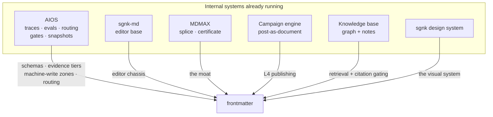

**Note on scope:** the founder named one internal system by a name that transcribed ambiguously. This section therefore covers the **superset** of internal assets, so nothing is missed. If a specific system is meant and is absent here, name it and it gets a row.

| Internal asset | What it does today | Product feature it becomes | Lift | Ship or keep internal |
|---|---|---|---|---|
| **AIOS — schema profiles** | `knowledge/meta/schema.md` validates frontmatter across the vault | L3 schema profiles | M | **Ship** |
| **AIOS — evidence tiers** | `{value, source, tier, re_verify_cmd}` gates what may be published `[measured]` | L3 provenance chips + evidence fields. **No competitor has this** | M | **Ship** |
| **AIOS — machine-write zones** | Fenced regions agents may rewrite | L3 machine-write zones | S | **Ship** |
| **AIOS — routing gate** | 23,778 live decisions, ~90% on the floor model `[measured]` | The COGS control that makes ₹299 viable | S (exists) | **Ship, invisible** |
| **AIOS — trace ledger** | One line per task to `~/.sgnk/traces/*.jsonl` with correlation ids | The implicit-telemetry spine (§10.4) | S | Ship the mechanism, not the UI |
| **AIOS — snapshot / recall** | Schema-versioned cross-tool continuity | Document session continuity | M | **Ship** |
| **AIOS — complexity gate** | Triage before any model call | Cost control | S | Keep internal |
| **AIOS — learned rules, debate panels, shadow-promote, calibration** | How the orchestrator improves itself | — | — | **Keep internal.** A trust burden as consumer UI |
| **sgnk-md** | The shipped editor at md.sgnk.ai; daily-use vault | The editor chassis frontmatter was cloned from | — | **Consolidate — see §26 D1** |
| **MDMAX** | Splice, OffsetMap, certificate, constructs — unit-tested, **not wired in** | The moat | L (wiring) | **Ship** |
| **Campaign engine** | 10 multi-surface episodes from one file in ~1 week `[measured]` | L4 post-as-document | M | **Ship** |
| **Advox** | Citation-gated legal AI with a fail-closed verifier | Citation-gated vault answers | M | **Ship the pattern** |
| **Markex** | Social scheduling + auto-publish | L4 scheduled publish (draft-and-queue) | M | Ship, human-confirm gated |
| **HQ** | Ops control plane, pooled-RLS tenancy | The multi-tenancy spine (T1) | M | **Reuse the code** |
| **CareerOS** | Entitlements engine | Plan/entitlement enforcement | M | **Reuse the code** |
| **Knowledge base** | ~L99 synthesis notes + graphify graph | Retrieval + citation grounding; a template vault | M | Ship as a template, not as content |
| **sgnk design system** | Tokens, type scale, one blue, Material Symbols as inline SVG | The product's visual system | S | **Ship** |
| **guideline-forge** | Brand book generator | L1 brand-book render profile | S | Ship |
| **mdmap** | Project map | L1 project-map render profile + `mdmap check` CLI | M | Ship |

**Duplication that has to be resolved (§26 D1):** `scripts/sgnk-md-sync.sh` exists precisely because the same editor lives in two repos. **Every editor fix currently has to land twice or silently fork.** Also: `ecosystem.md` has no frontmatter card at all — the studio source of truth does not know our peak product exists.

---

## 17. Import, export and interoperability

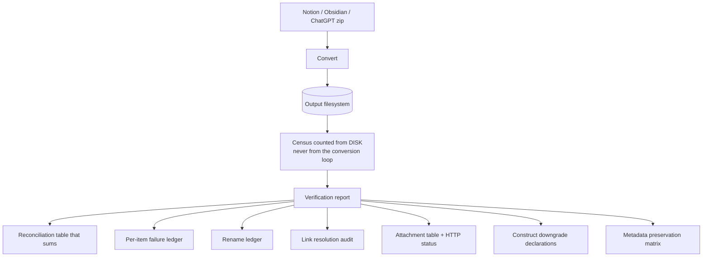

**The product here is the report, not the conversion.** The #1 importer failure class is a report that claims success while losing files, and **count parity is provably insufficient** because content loss hides inside conversions that report success `[fetched → e5]`. The census must be counted from the output filesystem, never from the loop that did the conversion.

**Export contract:** the storage format is the export format. There is no export step to lose fidelity in — that is the whole point (Reflect rewrote itself to exactly this model and took 1,441 stars in 11 weeks `[fetched]`).

---

## 18. Market segments and ICPs

**Two motions, one substrate.** Acquisition is D2C-shaped; monetisation is B2B-shaped.

- **D2C is what people fall in love with** — my one file just became a board, and my AI edits are visible and reversible. That love plus content is a solo founder's only affordable acquisition channel.
- **B2B is where the money is.** By month 24, the median solo **B2B** founder's revenue is more than **4×** the median solo B2C founder's `[SS]`. But through *self-serve* teams of 2–20 paying by card — not procurement.

| # | ICP | Hook documents | Why them | Price anchor |
|---|---|---|---|---|
| 1 | **Dev-tool / API startups, 2–20 people** — the beachhead | Docs site, changelog, status page, runbooks, **ADRs (no good tool exists today)** | They already live in this substrate: `gray-matter` does **35.8M npm downloads/month**; `js-yaml` does **1.23B** `[fetched]`. The pitch is consolidation: a representative stack is Mintlify $250 + GitBook $65 + Statuspage $399 + LaunchNotes $249 = **$963/mo** across four vendors that do not share a source of truth and drift `[SS]` | $20–40 / editor seat, or $150–300 / team |
| 2 | **Agencies and studios, 2–15 people** | One file per client rendering as a client-facing status dashboard, updated by the agent from work logs; typed frontmatter rolls up into an agency-wide view | This is literally Zephyrus's own shape — we can dogfood it honestly | Flat $29–49/mo, or $9–19/seat |
| 3 | **Support-heavy SMBs** | Knowledge base, help centre | Cleanest ROI story: KB deflection runs 18% median (40–60% with AI) and a SaaS support ticket costs $25–35 `[SS]`. But fierce incumbents — land this **after** the substrate story is proven | $99–249 per knowledge base |
| 4 | **SMB internal ops** | Wiki, SOPs, runbooks | Broad, shallow | $8–15 / internal seat |

**Two framing corrections.**

1. **Do not lead with deflection or "structured data."** Intercom, Zendesk, Document360 and GitBook all sell exactly that. It is our *proof* after a team is inside — not the opening line. **The wedge is one non-corrupting file that is editor, AI workspace, rendered surface and audit trail at once.**
2. **The audit trail is the part incumbents cannot copy quickly.** Because the splice attributes changes at byte level, **the file is its own audit log** — who changed what, human or AI, when. One vendor's case study had an audit log cut a sales cycle from four months to six weeks; Vanta and Drata charge $7–30k/yr for continuous audit trails `[SS]`. We get a slice of that as a **byproduct of how we write files**. "The AI edited your ops file, here is cross-engine proof it corrupted zero bytes" is a governance claim no Notion or Confluence AI can make.

**Do not chase until there is a team or funding:** SSO, SCIM, SOC2, enterprise knowledge base. Four-month sales cycles against funded incumbents; one person cannot service them.

---

## 19. Business model

*(Unit economics, cost structure, funnel math, revenue-model comparison, moat ranking and commercial risks are consolidated in §20–§22 and §25. This section states the model itself.)*

| Model | Fit | Verdict |
|---|---|---|
| **Freemium subscription** | Core | **Primary.** Free is genuinely useful and costs us ~nothing (BYO key) |
| **Flat perpetual commercial licence** | Obsidian's model, ₹3,999 / $50 per year | **Yes** — support and compliance, not more features. Strong signal, low support load |
| **Usage / credits** | AI beyond the included meter | **Metered pass-through only**, dollars not credits, always with a visible meter. Never opaque repricing |
| **Seat-based B2B** | Teams of 2–20, self-serve | **Yes, phase 2.** This is the revenue centre |
| **Marketplace / templates** | Template vaults, render profiles | **Later, and free.** A distribution channel, not a revenue line. Not a plugin marketplace (§6.2) |
| **Services / custom** | Studio work | Opportunistic; do not let it eat the product |

**The BYO-key decision is strategic, not just economic.** It makes the free tier cost us nothing, and it is the only sane response to an Indian AI price war we cannot win (§21).

---

## 20. Pricing

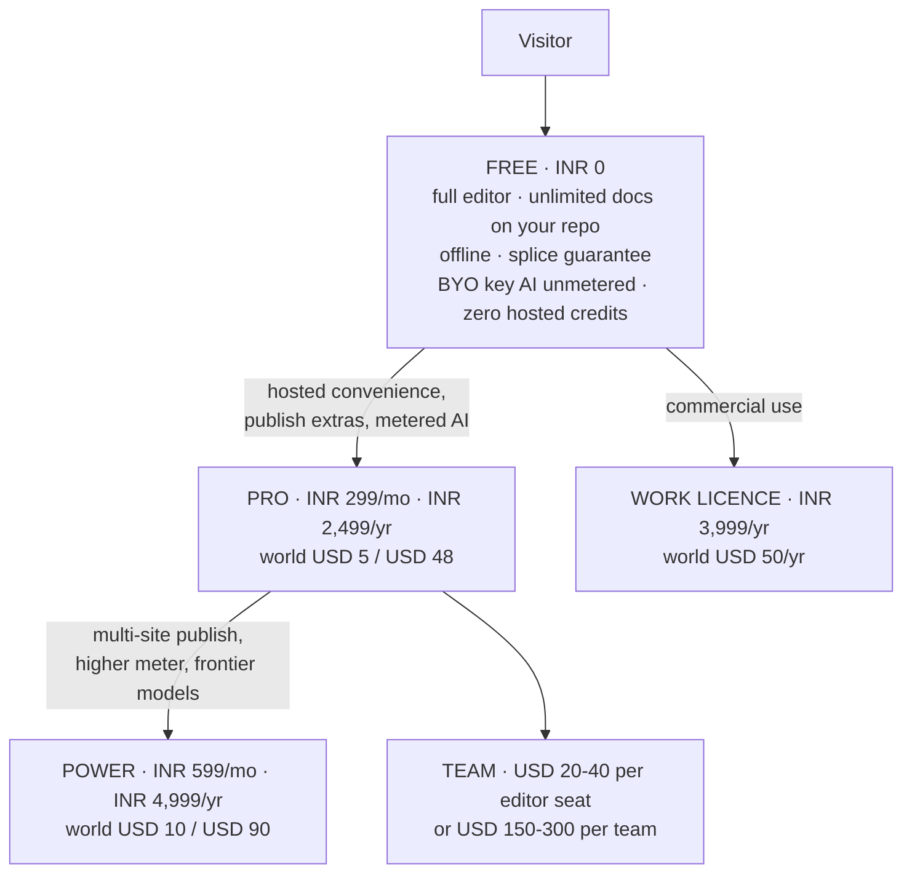

### 20.1 The FX correction that changes a decision

The founder draft (Free / ₹299 / ₹699) assumed roughly ₹83 to the dollar. **The actual rate is about ₹95.4** `[SS — re-check live before publishing]`. So:

| | At ₹83 (assumed) | At ₹95.4 (actual) |
|---|---|---|
| ₹299 | $3.60 | **$3.13** |
| ₹699 | $8.40 | **$7.33** |

**₹699 at $7.33 is above every India AI anchor** (ChatGPT Go ₹399, Gemini AI Plus ₹199–399, Netflix Premium ₹649) and only 19–27% below a $9–10 global tier — near-parity, not an India price.

### 20.2 The tables

**India**

| Tier | Monthly | Annual (lead with this) | Contents |
|---|---|---|---|
| Free | ₹0 | ₹0 | Full editor, unlimited docs on your own repo, offline, splice guarantee, **BYO-key AI unmetered**, fair-use publish, on-device checks, **zero hosted credits** |
| **Pro** | **₹299** (A/B ₹249) | **₹2,499** (~₹208/mo) | Publish extras, live editing, hosted convenience, small metered AI on a cheap model with a visible meter, AEO linter |
| **Power** | **₹599** (**not ₹699**) | **₹4,999** | Multi-site publish, higher meter incl. metered frontier, priority |
| Work | — | **₹3,999/yr flat** | Commercial-use licence — support and compliance, not more features |

**World**

| Tier | Monthly | Annual | Anchor |
|---|---|---|---|
| Free | $0 | $0 | Obsidian free-forever |
| Pro | **$5** | **$48** | Obsidian Sync $4/$5, HackMD $5/seat, Bear $3, Ulysses $6 `[fetched]` |
| Power | **$10** | **$90** | Obsidian Publish $8/$10, Craft $8 `[fetched]` |
| Work | — | **$50/yr flat** | Obsidian Commercial parity |

₹299 vs $5 and ₹599 vs $10 are both ~37% off — a coherent ladder landing on Indian psychological price points without looking like mechanical PPP.

### 20.3 Why ₹299 is right

The correct anchor is not "PPP percentage off a dollar price" — it is **what Indians already pay for AI productivity**, and that band is sharply observable `[SS]`: ChatGPT Go launched at ₹399; Gemini AI Plus ₹199 intro → ₹399; Netflix India ₹149/199/499/649; the Indian micro-SaaS starter band is ₹299–499. ₹299 sits below the ChatGPT Go anchor, at the floor of the starter band, on a strong psychological point, and **undercuts Notion India's ~₹670 by about 55%**. Worth A/B testing ₹249.

### 20.4 Lead with annual — this is fee survival, not an upsell tactic

A merchant-of-record like Dodo charges 4% + $0.40. **That flat $0.40 alone is 12.7% of a ₹299 monthly charge** `[derived: $0.40 × ₹95.4 = ₹38.16; ₹38.16 / ₹299 = 12.76%]`, versus about 1.5% on a ₹2,499 annual charge.

### 20.5 Does ₹299 survive AI costs? Only by architecture — and we already chose the right one

| Step | Value |
|---|---|
| Gross | ₹299 |
| Less 18% GST (if inclusive) and processing | Net ≈ **₹246–249** (~$2.60) `[derived]` |
| Healthy margin leaves for inference | ~**$0.40–0.60/month** `[derived]` |
| That buys | ~**450 assists** on cheap models (Gemini Flash / DeepSeek class) · ~**77** on Haiku · ~**5** frontier assists `[SS pricing, arithmetic ours]` |

**Conclusion: bundled unlimited AI at ₹299 is impossible. Metered + BYO-key at ₹299 is comfortable.** Free carries zero hosted credits and unmetered BYO-key, so our heaviest free users cost us nothing.

### 20.6 The strategic point

**We cannot win India's AI price war and should not try.** ChatGPT Go went *free* for Indian signups; Gemini is subsidised at ₹199; Perplexity Pro is free via Airtel `[SS]`. A bootstrapped studio does not out-subsidise that. Which is itself the argument for BYO-key, and for **India being top-of-funnel rather than the revenue engine**.

### 20.7 Which market first

**Distribution India-first, revenue global-first.**

| For India | Against India as the revenue centre |
|---|---|
| Largest and fastest-growing developer base in the world — 21.9M GitHub contributors, +5.2M in one year `[SS]` | **Zero category-specific willingness-to-pay evidence for markdown tools in India** |
| Consumer app spend +35% YoY, productivity and AI leading `[SS]` | The AI price here is collapsing to zero |
| We are based here; UPI and Razorpay native | Low-ticket monthly INR economics are punishing (§20.4) |
| | Notion refuses to price in rupees and still grows here — proof India can be an audience without being the revenue centre |

**Rails:** Razorpay for India (cheap, UPI-native, but we own GST filing) plus a merchant-of-record for the world; or a single UPI-capable MoR doing both. **What matters most is not the discount — it is that UPI exists at checkout.** International gateways without it lose 30–40% of Indian checkouts `[SS]`. Paddle and LemonSqueezy do not support UPI at all.

### 20.8 Pricing policy — published, and treated as a promise

Free-forever editor · dollars not credits · BYO-key at every tier · one cheap surface unlimited · never auto-migrate plans · never reprice opaquely · commenters never bill.

---

## 21. Go-to-market

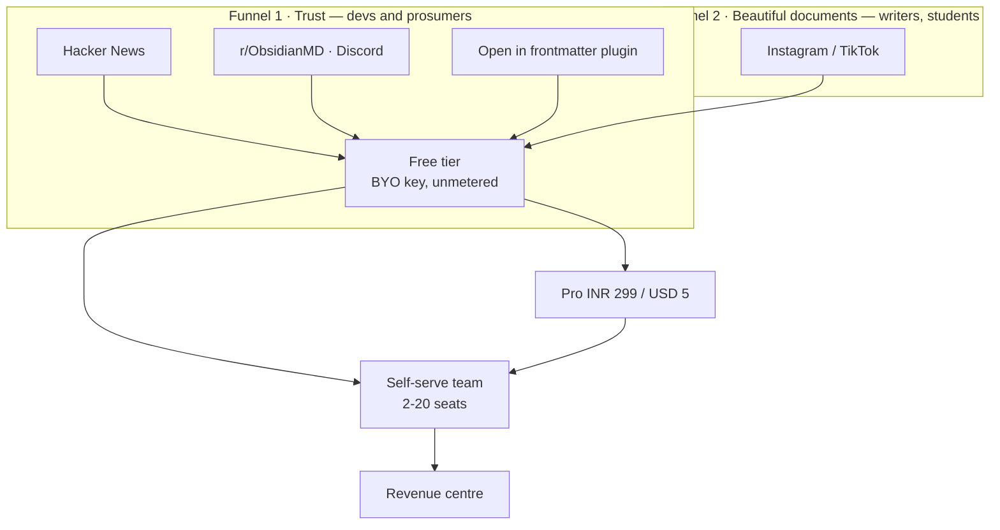

| | Funnel 1 — Trust | Funnel 2 — Beautiful documents |
|---|---|---|
| Line | *"The markdown source of truth AI can't corrupt"* | *"Beautiful documents from plain text"* |
| Audience | Developers, prosumers | Writers, students |
| Channels | HN, r/ObsidianMD (~344,000 members), Discord (~195,000), X, YouTube | Instagram, TikTok |
| Content | Evidence-first: the 907/907 result, the foreign-vault run, a 10-second demo diff against a competitor's shipped product | Custom renders demo in 15 seconds of vertical video |
| Confidence | **High.** Our campaign practice already manufactures exactly this `[measured]` | **Low.** No dev tool has ever grown Instagram-first, and our content pipeline mines the *system record*, so it would never surface aesthetic material on its own. Needs a new content vein and a smaller budget until it earns more |

**The window is warm right now.** The review-loop wedge was independently validated twice in four weeks — Markleft ("how I review Claude's markdown plans", Show HN) and OzBrain (92 points on HN), whose founder pitches *literally* "the diffing, versioning and audit log of what was changed, by what agent and why" as the paid product `[fetched]`. And "Serve Markdown to AI Agents with Accept Headers" hit **175 points with 108 comments on 2026-08-26** `[fetched]`.

**Channel discipline.** The Obsidian community's code of conduct means the only admissible framing in the biggest watering hole is *"integrates with your vault"*, never *"Obsidian competitor"* — break that and the launch gets removed rather than debated. The companion **"Open in frontmatter" plugin is the distribution play**; Relay proved the path with 172,544 downloads of a commercial service's bridge plugin `[SS]`.

**Cadence, grounded in measured supply.** Three LinkedIn posts a week + one canonical blog post + two Instagram carousels. The campaign system built 10 complete multi-surface episodes in ~1 week, so **supply is not the constraint** `[measured]`. What is *not* proven is sustained cadence — exactly two posts have ever shipped `[measured]`. So the survival mechanisms matter more than the plan: **never miss twice; keep queue depth ≥ 2; read no metrics before post 20.**

**Run the launch calendar inside frontmatter itself.** Calendar profile, evidence-tier fields on every post, draft-and-queue publishing. The GTM engine becomes a continuous product demo, and the content pipeline's own biggest gap — a sustained capture habit — becomes a product feature.

**Never say "markdown editor."** Every Show HN with that name becomes a thread of free alternatives. Category winners renamed the category first: Obsidian sold *ownership*, Notion a *workspace*, Linear *speed*.

---

## 22. Moat and defensibility

| Moat | Strength | What erodes it | Holds for |
|---|---|---|---|
| **Byte-fidelity engine (splice)** | **Strongest.** Proven on 7,959 foreign files `[measured]` | A competitor rewriting their document model — an architectural rewrite, not a patch | 12+ months |
| **Degradation certificate** | Strong and unoccupied. Nobody certifies cross-engine degradation | Anyone can build it once they see the idea — so **publish the dataset before the design** | 6–12 months |
| **Byte-anchored portable provenance** | Strong; absence verified precisely | An AI editor deciding provenance is a feature | Open |
| **The review loop on your own files** | Strong; blocked for Google at the API level | 6–12 months of competitor attention | 6–12 months |
| **File-native data (no lock-in)** | Structural, permanent — but it is a *reason to trust*, not a reason to switch | Nothing. It also cannot be charged for directly | Permanent, low leverage |
| **The evidence layer (tiers, provenance chips)** | Unoccupied; practised in production here `[measured]` | Low awareness — needs a story | Open |
| Community / distribution | Weak today. Zero users | — | — |
| Brand | **Negative today** — see §26 D3 | — | — |
| Switching cost | **Deliberately zero.** Plain files in your repo | This is a principle, not a bug | — |

**The honest summary: our moat is engineering depth in a narrow place, plus timing. It is not distribution, brand, or lock-in — and it never will be.** That means the go-to-market must convert engineering credibility into an outcome a buyer can name (§18).

---

## 23. Roadmap

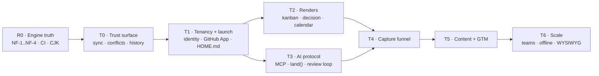

### R0 — Engine truth (before we market any fidelity number)

The foreign-vault run found real work. Across **7,959 frontmatter files from five authors' public vaults**: zero corruption, zero throws — but **83% publish-refusals**.

| ID | Defect | Mechanism | Fix |
|---|---|---|---|
| **NF-1** | **6,613 of 6,614 refusals have one cause** | A block sequence at zero indentation (`tags:` then `- item` at column 0). Spec-valid YAML, PyYAML's default output, idiomatic in the CJK vaults sampled | Recognise a dash-item as a continuation of the preceding key → **recovers 99.98%** |
| NF-2 | Flow-seq closing `]` at column 0 | Same family | — |
| **NF-3** | **A bare-CR fence (`---\r`) misses the open-fence regex** | A lone `set` **prepends a second frontmatter block**. Set-destructive and **invisible to the round-trip oracle** because set-then-delete cancels out. The shipped BOM bug's sibling | Fix + upgrade the oracle to assert on set-only (LR#68) |
| NF-4 | `SAFE_KEY` too narrow for real vaults | `date created` appears in 812 of 957 files in one vault; CJK keys in 905 | Addressability needs quoting support — a design task, not a regex |

**Also in R0:** the six construct-detector defects (they gate the AEO linter *and* kill-condition 4) · **CI — there is no `.github/` at all** · CJK (`countWords` undercounts Chinese by 1.7–2×; MiniSearch CJK recall collapses to 18% mid-clause) `[measured]` · **wire MDMAX into the product** (currently imported by zero product files).

### The tracks

| Track | Contents | Exit condition |
|---|---|---|
| **T0 Trust surface** | Sync chip → conflict inbox → named-version history + since-you-last-opened banner → background auto-sync → local history | **The two-device offline-edit convergence demo, with zero loss, watched by a user** |
| **T1 Tenancy + launch** | Identity and multi-tenancy (HQ's pooled-RLS spine + CareerOS entitlements are the lift) → GitHub App auth → multi-vault → mobile pass → HOME.md → quick capture → the "Open in frontmatter" Obsidian plugin | First external user |
| **T2 Renders** | The `components.tsx:133` regex fix → delete dead `editable-table.tsx` → kanban read-only → kanban bidirectional **gated by a zero-dirty oracle** → decision → calendar → corkboard → compile profiles → publish-with-profiles → `mdmap check` CLI | Kanban write-back dirties zero files on a no-op |
| **T3 AI protocol** | MCP server + `land()` → the review loop → provenance + implicit telemetry → the differ → cert distribution (npx / MCP / generated skill / GitHub Action) → citation-gated answers → session continuity → ACP client (with desktop) → **publish the session-interchange format** | An agent edits a real vault and every change is reviewable |
| **T4 Capture funnel** | Chat-side skill + paste inbox → ChatGPT/Claude ZIP importers (**the verification report is the demo**) → promotion loop → retro-capture into several typed docs | A conversation becomes durable documents in one click |
| **T5 Content + GTM** | Land Markex's uncommitted fix tree (RULE 2/3 gated) → LinkedIn Documents-API probe → post-as-document → **the launch calendar running inside the product** | 20 posts shipped |
| **T6 Scale** | Offline-first → WYSIWYG → share roles → comments → suggest mode → teams (SSO is the procurement unlock) | — |

---

## 24. Engineering standards

These are not aspirations; they are the practices that caught real defects in this codebase.

| Standard | Rule |
|---|---|
| **Red-proof first** | A test on a rare fault proves nothing until it **fails against the unfixed code**. If you cannot make it fail, say so rather than reporting a pass |
| **Gates must be able to see** | A check that greps source is a **proxy** and must be labelled one. A check that does not execute the thing proves nothing. Four gates in this repo could report green while blind — all four are now fixed `[measured]` |
| **Floors, not equalities** | Assert `passes ≥ N and failures == 0`. Equality-pinned counts punish adding coverage |
| **Corpus integrity** | Every corpus file is re-hashed against a pinned sha256 before use. This caught a real drifted file on its first run `[measured]` |
| **Never trust a piped exit status** | `cmd \| tail` reads green while the command failed. Redirect to a log and check `$?` |
| **Run it three times** | One run is an anecdote. Pin stochastic inputs, or assert a distribution over a seed sweep |
| **Verify the write landed** | Count before, count after, refuse if the count did not move |
| **A verifier written beside its subject inherits its blind spots** | Independent adversarial pass required before any clean bill of health |
| **Preview before you delete** | `grep -c` first, `rm` second |
| **Field names across scripts** | The consumer must accept every key the producers write; a missing key is UNKNOWN and skipped, never coerced to falsy |
| **Wait on the artifact, not the process** | A tool whose job is to produce a file must verify the file, using the format's own end marker |

**CI (to build in R0):** typecheck → lint → test → build → arch report with a minimum-files-scanned floor → corpus oracle → foreign-corpus suite as a standing gate.

---

## 25. Risk, compliance and capacity

### 25.1 Risk register

| Risk | Likelihood | Impact | Early warning | Mitigation |
|---|---|---|---|---|
| **Nobody pays for fidelity** | Medium | Critical | Free signups convert < 1% after 200 users | Sell the outcome, not the guarantee (§18); land the B2B consolidation pitch early |
| Category crowds before we ship | **High** | High | A competitor ships a review loop over plain files | Sequencing law: R0, T2, T3 inside the window |
| Kanban write-back cannot be made byte-safe | Medium | Medium | The zero-dirty oracle fails on real boards | **Ship read-only.** No exceptions |
| NF-1 fix does not move the refusal rate | Low | Medium | Foreign-corpus gate stays red | Publish stays refusal-honest and we say so publicly |
| Solo-founder key-person risk | **High** | Critical | — | Document everything (this file); keep the codebase boringly conventional |
| Sustained content cadence fails | **High** | High | Miss twice | Never-miss-twice rule; queue depth ≥ 2 |
| Name collision escalates | Medium | High | A cease-and-desist, or listing rejection | §26 D3 — decide before spending on brand |
| Chrome/CodeMirror upstream risk | Low | Medium | A CM6 bug we cannot file | The whole CodeMirror GitHub org was archived 2026-04-15 (55 of 57 repos) though npm is alive `[fetched]`. **Budget vendoring risk** |
| Prompt injection via untrusted documents | **High** | High | — | Agent reads are data, never instructions; the eval lane stays refused; outbound actions need explicit confirmation |
| Unrotated credentials | **Live now** | High | — | **Two PATs pasted into an earlier chat window remain unrotated. Founder action, §26 D5** |

### 25.2 Compliance — issues to confirm with a professional, not settled here

| Area | The question | Status |
|---|---|---|
| **GST on SaaS** | Domestic sales attract GST; export of services may be zero-rated with an LUT — but the conditions are specific | `[SS]` **Confirm with a CA before pricing goes live** |
| **India DPDP Act** | We store user documents. Obligations around notice, consent, breach reporting, and data-principal rights | `[SS]` **Needs professional review** |
| **GDPR** | EU customers → controller/processor roles, DPA, transfer mechanism | `[SS]` **Needs professional review** |
| **Merchant of record** | An MoR absorbs sales-tax/VAT registration and remittance in its jurisdictions; it does **not** absorb our Indian income tax or our data-protection obligations | `[SS]` Confirm scope in the MoR contract |
| Data residency | Where vault content and derived indexes live | Design decision — default to "your repo", which mostly sidesteps it |

### 25.3 Security posture

| Surface | Position |
|---|---|
| BYO API keys | Never in committed files. Client-held or server-encrypted; never logged |
| GitHub OAuth scope | **`read:user` grants no repo access** — this blocks the GitHub-App path as currently written (§26 D4) |
| Published pages | Indexing off by default; **unpublish must revoke immediately** (fixed in `d50a6b2`) |
| Prompt injection | Document content read by an agent is **data, never instructions**. Outbound actions require explicit confirmation |
| The eval lane | Refused (§9). This is a security decision as much as a fidelity one |
| Secrets in vaults | Redact at write time in any collector; if a credential lands, **rotate first, erase second** |

### 25.4 Execution capacity

**One person. This is the binding constraint on everything above.**

- **Buy, don't build:** auth (next-auth, already in), payments (Razorpay + MoR), error tracking, analytics, email.
- **Reuse, don't rebuild:** tenancy from HQ, entitlements from CareerOS, publish queue from Markex, verifier from Advox.
- **Defer until a team exists:** SSO, SCIM, SOC2, enterprise support, the knowledge-base market.
- **Consequence:** T6 (teams) is genuinely a phase-2 company, not a phase-2 sprint.

---

## 26. Open decisions — founder's call, before development starts

| # | Decision | Options | Consequence | Recommendation |
|---|---|---|---|---|
| **D1** | **sgnk-md vs frontmatter** | (a) frontmatter is the sole codebase; (b) maintain both | frontmatter is a clone of md; md is live at md.sgnk.ai as the daily vault; `scripts/sgnk-md-sync.sh` exists because of this. **Every editor fix lands twice or silently forks** | **(a).** md stays as vault data and first customer; md.sgnk.ai eventually redeploys as a frontmatter instance. Also: add a frontmatter card to `ecosystem.md` |
| **D2** | **The CRDT contradiction** | (a) §4b governs — server-authoritative, no peer CRDT; (b) keep Yjs multiplayer | §4b of the product plan says no peer CRDT; Pillars 3 and 5 still list Yjs. §4b is later and explicitly a resolution, but the feature tables were never updated | **(a).** Edit the stale Pillar rows |
| **D3** | **The name** | (a) keep with a qualifier + distinctive domain; (b) **flip the hierarchy** — a coined mark becomes the brand, "frontmatter" stays the feature word; (c) keep with written rename tripwires | Risk medium-high, **high if we ship as bare "Frontmatter."** The senior user is same-market, same-channel, same-audience (a git-blog CMS aimed at exactly our ICP #1), active since 2019, **80,527 installs** `[fetched]`. Two openings: its author's 2026 README openly invites company sponsorship, and **MDMAX is collision-clean** (npm unregistered, GitHub near-empty `[fetched]`) | **(b)**, and get counsel before spending on brand. The evidence argues against the bare unqualified name |
| **D4** | **OAuth scope / export contract** | — | `read:user` grants no repo access | Decide the GitHub App permission set before T1 |
| **D5** | **The two unrotated PATs** | — | Live security exposure | **Rotate. Only you can do this** |
| **D6** | Detente with the Front Matter CMS author | Send / don't send | Their README invites collaboration | Founder's call |
| **D7** | Two 30-second human verifications | — | Both sit behind bot walls that refused every automated path | The AGENTS.md Linux Foundation announcement; the Otterly zero-citations experiment |
| **D8** | Max-tier contents | Depth vs novelty | — | **Depth, never novelty** |

---

## 27. Research record

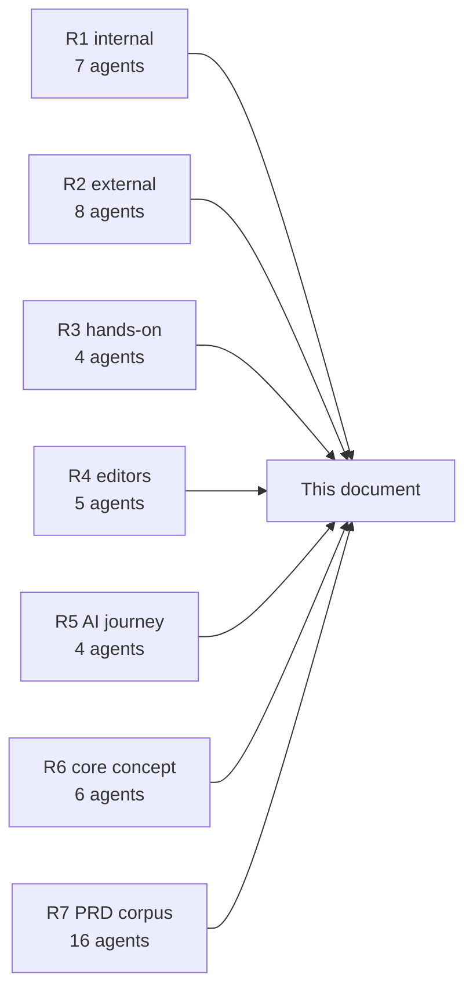

**Method.** Seven rounds, 38 agents, ~6.9M tokens. Every finding carries an evidence tag. Hands-on rounds *executed* competitor code and ran our writer against strangers' data rather than reading about it. All reports at `docs/research/agent-reports-2026-08-28/`.

| Round | Agents | Reports | What it established |
|---|---|---|---|
| **R1 · Internal sweep** | 7 | `i1`–`i7` | The content/campaign engine; the studio product inventory and reuse map; knowledge-base principles; **AIOS capabilities and its pattern language** (the L3 feature set); the frontmatter docs-vs-reality delta; the research ledger method |
| **R2 · External gaps** | 8 | `e1`–`e8` | Claim verification; the **home-surface evidence** (Homepage plugin at 1,294,057 downloads); India/team market; the **agent frontier** (what is already commodity); **importer breakage taxonomy** and the seven-panel verification report; **naming risk** (80,527 installs); fresh community signal (Markleft, OzBrain, the 175-point HN thread); **whether anyone buys a protocol layer** (no) |
| **R3 · Hands-on** | 4 | `h1`–`h4` | Design patterns; **the foreign-corpus run** (7,959 files, 0 corruption, 83% refusals, NF-1…NF-4); **the Hubble and Front Matter CMS teardowns**; **the OpenKnowledge teardown** |
| **R4 · Editor landscape** | 5 | `ed1`–`ed5` | Writing tools (Typora's WYSIWYG laws, Scrivener's compile architecture, iA Content Blocks); IDEs (local history, Doc Health, the palette); **frameworks and their lossy serialisation**; **AI editors** (surface ranking, per-hunk accept, provenance absence); **office suites** (the N5 review-loop canon, Google's API limits) |
| **R5 · AI journey** | 4 | `aj1`–`aj4` | **Agent protocols** (MCP/ACP/A2A/AG-UI postures, no session standard); **chat-to-artifact laws** (the twelve rules behind `land()`); **knowledge formats** (OKF, llms.txt v2, SKILL.md, MyST, prompty, OTel gen_ai semconv); **the journey-home category gap** |
| **R6 · Core concept** | 6 | `c1`–`c6` | **The projection law**; **the computation budget** and the fourth lane; **the B2B wedge** and four ICPs; **INR pricing** and the FX correction; **the build bibliography** with licences; **the twelve-screen inventory** |
| **R7 · PRD corpus** | 16 | this document | Lossless compression of all 35 reports + business model, internal-systems fusion, and risk/compliance/capacity |
| **Fetch sweep** | main loop | `f1` | Ten `[SS]` claims upgraded to `[fetched]`; the iA price conflict resolved ($49.99 iOS); Mintlify's free tier confirmed to include the MCP server |

### 27.1 Verification debt — what is still not verified

| Item | Why | How to close |
|---|---|---|
| Every `[SS]` tag in this document | Search summary, page not opened | Open the source before publishing the number |
| **Mobbin visual design pass** | The session taint gate (LR#10) refuses the outbound leg. **Re-tested this session and still refused** | A fresh session |
| Reddit beyond r/ObsidianMD top-of-month | Rate-limited; the RSS path works | Patience, not a wall |
| Mintlify's current Pro figure | Rendered in JavaScript; curl cannot see it | A browser |
| OpenKnowledge WYSIWYG lane | Source verdict only — their agent write path *was* executed | A live browser test |
| The two D7 clicks | Bot-gated all session | 30 seconds of a human |
| ₹/$ rate, all pricing anchors | Move constantly | Re-check at publish time |

---

## 28. Build references

Full licence-flagged bibliography in `c5-build-refs.md`. The eight to read before writing code:

| # | Reference | Licence | Why |
|---|---|---|---|
| 1 | **`@lezer/markdown`** | MIT | The incremental parse tree. `SyntaxNode` byte offsets are our span-addressing primitive. **Most load-bearing read on the list** |
| 2 | **The OKF spec** | Apache-2.0 | Google formalising our exact bet: a directory of markdown files with YAML frontmatter, path as identity, `type` as the one required field. Align or consciously diverge |
| 3 | **`@codemirror/merge`** | MIT | The review loop as a shipped component. **Highest reuse per hour on the list** |
| 4 | **Hypothesis `match-quote.ts` + `approx-string-match`** | BSD-2 / MIT | The anchoring mechanism that lets an AI target survive human edits |
| 5 | **`mdast-util-to-markdown`** | MIT | **Read the enemy.** The serialiser that normalises; its exact loss points are what our splice writer's value is measured against |
| 6 | **`@sanity/diff-match-patch`** | Apache-2.0 | Note carefully: Google's original is Apache-2.0 and safe, but **archived and unpublished since 2020**. Use the maintained Sanity fork |
| 7 | **`@modelcontextprotocol/sdk`** | MIT → Apache-2.0 | Currently mid-relicense |
| 8 | **`obsidian-dataview`** | **MIT**, 9,300 stars | Closest prior art to our rendering bet, and MIT means the query parser is genuinely copyable |

**Licence landmines:**

| Project | Licence | Rule |
|---|---|---|
| **obsidian-kanban** | **GPL-3.0**, abandoned | **Read the board file-format convention. Copy zero code** |
| **anthropics/skills** | **No licence file** = all rights reserved | Mirror the SKILL.md convention. Copy nothing |
| **CodeMirror org** | MIT, but **archived 2026-04-15** (55 of 57 repos) | npm is alive (`@codemirror/view` v6.43.9, published 2026-08-16). Source is read-only; you cannot file upstream issues. **Budget vendoring risk** |

---

## 29. Glossary

| Term | Meaning |
|---|---|
| **Splice** | Replace exactly the target byte range; never regenerate from a parse tree |
| **Refusal** | A first-class outcome: return the input unchanged and say why |
| **Degradation certificate** | Measured proof of how a file renders across real markdown engines |
| **Projection** | A deterministic, disposable view computed from the file, owning no state |
| **Profile** | A named render + schema pair, activated by frontmatter or a fence info string |
| **Machine-write zone** | A fenced region an agent may rewrite and outside which it may not write |
| **Evidence tier** | `{value, source, tier, re_verify_cmd}` on a claim |
| **Hunk** | One reviewable change — human, AI, or sync conflict |
| **`land()`** | The single capture verb any agent calls to make a chat output durable |
| **The eval lane** | Client-side arbitrary code execution. The lane we refuse |
| **NF-1…NF-4** | The four foreign-corpus engine defects (§23 R0) |
| **AIOS** | The internal markdown-native orchestrator this studio runs on |
| **MDMAX** | The engine: splice writer, OffsetMap, certificate, construct detectors |

---

*Prepared for the frontmatter build team. Every number in this document is tagged. Nothing tagged `[SS]` may be published as fact without being opened first.*
