# frontmatter — Product Requirements & Research Record

**v1.1 · 2026-08-29 · Zephyrus Studio · owner: Sagnik Mitra**
**Status: pre-development. This document is the input to the build, not a report on it.**

---

## 0. How to read this document

**What this is.** The complete product record for frontmatter: where the idea came from, what problem it solves, what the market can and cannot do, what we will build, how it is priced and sold, what it costs to run, what can kill it, and what must be decided before anyone writes code. It consolidates **seven research rounds, 51 agents, ~10.7M tokens** plus the internal engineering record.

**Audience.** The build team. §1–§5 for why · §6–§17 for what · §18–§23 for the business · §24–§30 for execution · §31–§32 for the evidence and its contradictions.

**Evidence tags. Every factual claim carries one. This is the difference between a fact and a lead.**

| Tag | Means | Publishable as fact |
|---|---|---|
| `[measured]` | Executed on this machine against live code or a real corpus | Yes |
| `[fetched]` | Primary source opened and read | Yes |
| `[derived]` | Computed here; the arithmetic is shown | Yes, with the arithmetic |
| `[SS]` | Search summary — nobody opened the page | **No. Verify or omit** |
| `[inference]` | Reasoning from the above | Labelled as judgement |

**Three settled verdicts — do not re-litigate.**

1. **No new markdown format.** Every extension is a profile over valid CommonMark that degrades to readable text in a dumb renderer. (`HANDOFF-mdz-markdown-format-2026-07-29.md`; a formally-specified markdown successor launched Aug 2026 sits at 2 stars `[fetched]`.)
2. **MDMAX is a library subordinate to the editor**, not a compiler product with its own destiny.
3. **Never a tree-of-record.** No feature may introduce a parse tree as the source of truth.

**A warning about our own numbers.** §32 is a contradictions ledger. Almost every count carried forward from an earlier internal document is now stale — skills, traces, knowledge notes, commits, competitor prices. **Re-derive before publishing anything.**

---

## 1. Where the idea came from

**In one line:** we tried to invent a better markdown, proved that was the wrong move, and were left holding the two pieces that turned out to be the actual product.

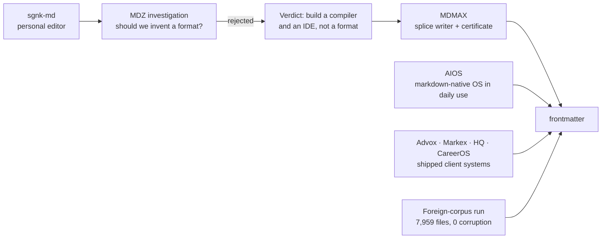

| Stage | What happened | What it left behind |
|---|---|---|
| sgnk-md | Personal Obsidian-alternative, shipped, live at md.sgnk.ai. 416 commits, frozen since 2026-07-17 `[measured]` | The editor chassis: modes, tree, tabs, slash commands, vim keys, wikilinks, KaTeX, Mermaid, PWA + Tauri |
| MDZ investigation (2026-07-29) | Asked whether a markdown successor format was the play | **Rejected.** Verdict: "build a compiler and an IDE, not a format" |
| MDMAX | The compiler half, built instead | 13 files, 3,614 lines: splice writer, OffsetMap, degradation certificate, construct detectors `[measured]` |
| AIOS | An orchestrator running this studio entirely on markdown files | 124 SKILL.md automations, an 892-line self-amending markdown constitution, 5,014 trace rows, 24,539 gate rows `[measured]` |
| Client systems | Advox, Markex, HQ, CareerOS | Reusable spines: entitlements, pooled-RLS tenancy, fail-closed verifiers, publish queues |
| Foreign-corpus run (2026-08-28) | Ran the splice writer against five strangers' vaults | 7,959 files, **0 corruption, 0 throws** `[measured]` |

**The insight that closed it.** The two things MDMAX shipped — a writer that provably cannot corrupt, and a certificate that proves how a file degrades across renderers — are exactly the enforcement mechanism for a bigger idea than a format: **the file can be the only source of truth and every app-like view can be disposable.** We built the enforcement before we named the law.

---

## 2. The problem

| # | Problem | Evidence | Our answer |
|---|---|---|---|
| 1 | **AI work evaporates.** An hour of thinking ends as a chat log. ChatGPT's only exit is an account ZIP emailed with a 24h link; NotebookLM did not persist chats until Jan 2026; an exporter-extension economy exists (one at 400,000+ installs) and 100% of it ends in a stale one-shot dump | `[SS/fetched → aj4]` | The capture loop, `land()` (§11) |
| 2 | **Sync silently destroys data.** #1 pain: 561 of 3,220 HN comments. Fresh, not historical — the Obsidian forum in the last six weeks carries a file showing "fully synced" while missing its final Korean characters, and files vanishing on macOS | `[SS]` + `[fetched]` `[→ e7]` | Trust surface (§13, T0) |
| 3 | **Editors rewrite bytes you never touched.** Architectural, not a library choice — three teardowns, three codebases, one identical failure | `[measured → h3/h4]` | The splice guarantee (§7) |
| 4 | **Nobody can tell you what the AI changed.** Word, Docs, Cursor, Grammarly, Lex all show AI edits before accept and lose the distinction forever after | `[SS → ed4]` | Byte-anchored provenance (§10.3) |
| 5 | **Everything you own is trapped in a view.** Coda export returns disconnected strings with formulas stripped; Notion formulas cannot aggregate across rows; under 4% of GitHub notebooks reproduce | `[SS → c1]` | The projection law (§5) |
| 6 | **The review loop does not exist on files you own.** Google's public API **cannot create suggestions at all**; Lex's track-changes is "in development"; OpenKnowledge comments are machine-local and never committed | `[fetched → ed5, h4]` | The review surface (§12) |
| 7 | **Import is a lie.** The #1 failure class is not broken formatting — it is **reports claiming success while losing files**. Obsidian has posted a $500 bounty for a detailed import log and $5,000 for Notion database conversion | `[fetched → e5]` | The verification-report importer (§17) |
| 8 | **Price betrayal.** Notion cut free AI to 20 responses *for life* and raised Business ~20%; Microsoft's +43% Copilot bundling drew a CMA probe; Cursor apologised for an opaque reprice; Windsurf churned twice | `[SS → ed4]` | The never-list as published policy (§20.8) |
| 9 | **Complexity fatigue.** Obsidian's own community: most of a million-plus downloaders never get past their first note | `[SS]` | The simplest-editor bar (§13 L0) |

**The shape shared by 1, 2, 3, 4, 6 and 7: the tool reports success while quietly losing something.** "Sync said green and lied." "Import said 47 succeeded and lost 4." "The editor said it preserved comments and deleted them."

> **Product thesis: be the tool that does not lie about what it did to your file — and can prove it.**

---

## 3. The market

### 3.1 Category map

| Category | Players | What they own | Why they cannot take our position |
|---|---|---|---|
| Office suites | Word, Google Docs, LibreOffice | Track changes, 40 years of review UX | Not file-native; Google's API cannot create suggestions `[fetched]` |
| Workspace / blocks | Notion, Coda, Craft, Airtable | Databases-as-views | The view IS the data; export lossy by architecture `[SS]` |
| Markdown PKM | Obsidian, Logseq, Bear, Ulysses, iA Writer, Typora | Local files, plugins | Single-player by design; no review loop, no provenance, no fidelity proof |
| Markdown collab | HackMD, Hubble, OpenKnowledge, GitBook, Mintlify | Team markdown, docs sites | All regenerate the file; OpenKnowledge needs a running daemon `[measured]` |
| AI editors | Cursor, Windsurf, Lex, Grammarly | Inline AI, diff review | Provenance evaporates at accept; not markdown-native `[SS]` |
| Chat-to-artifact | Claude Artifacts, Canvas, v0, Bolt, Perplexity Pages | Generation, versioning | The artifact lives in their store. OpenAI **removed** Canvas May 2026 `[SS]` |
| Agent memory | mem0, claude-mem | Facts for agents | Atomises the journey; the finished document is not first-class |
| **Free self-hosted** | AppFlowy **76,040★**, AFFiNE **71,976★**, SiYuan **46,023★**, Logseq **44,669★**, Outline **40,362★**, Trilium **37,624★**, Docmost **21,501★** — all pushed within 24h `[fetched 2026-08-29]` | Zero-cost, file-native, active | **This is the price floor. $5–8/seat must be justified against $0** |

### 3.2 The gap map — what nobody can currently do, and for how long

| Gap | Evidence of absence | Window |
|---|---|---|
| Byte-exact structured editing on **both** halves of the file | All three teardowns regenerate; the two strongest each solved fidelity only on the half their editor does not model `[measured]` | Frontmatter-splice claim durable (rewrite-level for them); general claim erodes |
| Fidelity **without a running daemon** | OpenKnowledge's byte contract exists only inside a live CRDT server — agent edits error out without it `[measured]` | Durable — architectural |
| **O(edit)** not O(document) | Their own source comment: full serialize+parse per edit, *"unbounded by doc size"*, fixing it *"needs a real incremental parser"* they lack `[fetched]` | Durable |
| Render-fidelity certification | Nobody certifies cross-engine degradation. Litmus at $500/mo proves the *testing* layer monetises while the *data* layer stays free `[SS]` | 6–12 months. **Publish the dataset before the design** |
| The review loop on files you own | Google's API cannot create suggestions `[fetched]`; Lex "in development" `[SS]`; OK comments never committed `[fetched]` | 6–12 months |
| Byte-anchored, portable, reader-visible AI provenance | Absence check precise: admin telemetry (Cursor), cloud report (Grammarly), repo sidecar (Agent Trace). Writing editors have nothing `[SS]` | Open |
| The rendered, evolving AI-output document | Memory tools store facts; consumer apps store sources; exporters store dumps | Open — **the category to name** |
| Session interchange between AI tools | No standard. OpenAI and Claude exports are mutually unreadable; every parser is reverse-engineered `[fetched]` | Open — whoever publishes the open shape becomes default |
| A file-native home screen | Obsidian Homepage plugin: **1,294,057 downloads**, ~20× every bespoke dashboard plugin `[fetched]`. No product ships it natively | Open |
| Claim-level method + confidence | Across OKF, SKILL.md, llms.txt v2, MyST, .prompty — no spec claims it; OKF argues *against* stored scores `[fetched]` | Open; a renderer is the right shape |
| ~~"An agent can read and write my markdown"~~ | **Commodity.** Bear, Craft, Notion, MDflow, GitBook ship it; obsidian agent-skills 47,418★; skills CLI 9.3M downloads in one week `[fetched]` | **0 months — do not position here** |

### 3.3 The window

- **Now:** generic agent-markdown is commodity.
- **3–6 months:** "markdown editor with an agent harness" crowds. OpenKnowledge ships ~100 releases/week; 3,239 → 3,673 stars in 27 days `[fetched]`.
- **6–12 months:** fidelity, the review loop and the Obsidian-power-user lane stay open — every incumbent's incentives point elsewhere (Notion → blocks, OpenAI → artifacts-as-output, Google → Docs, OpenKnowledge → team wiki).
- **Structural hedge:** OpenAI removed Canvas. If "delegate, don't edit" wins, the durable asset is the verification layer, not editor chrome. **The roadmap keeps weight on the engine.**

> **Sequencing law: the differentiation tracks (R0, T2, T3 — §24) must land inside the 6–12 month window.**

---

## 4. Is the idea good? The honest verdict

**Yes, with two conditions: ship fidelity and the review loop inside the window, and do not position on the commodity sentence.**

| Question | Answer | Confidence |
|---|---|---|
| Is the problem real? | Yes. Nine problems with public complaint evidence; three verified by executing competitors' code | High `[measured]` |
| Is anyone else solving it? | Partially, each capped by an architectural choice they cannot cheaply reverse | High `[measured]` |
| Do we have an unfair advantage? | Yes — a byte-preserving writer and a certificate that already pass on strangers' data | High `[measured]` |
| Will people pay? | **Unproven. Zero paying users.** And developers are the hardest freemium audience: median dev-focused free→paid is **5%, half the non-dev rate** `[fetched]` | Low |
| Can one person build it? | v1 scope yes. Teams/SSO/compliance no (§29) | Medium |
| Is the timing right? | Yes, and tight | High `[fetched]` |

**Proven `[measured]`:** the engine does not corrupt foreign data (7,959 files); competitors do (three executed teardowns); the internal markdown-OS substrate works at scale (24,539 gate decisions, 124 automations); the campaign pipeline produces multi-surface output from one file (10 episodes in ~1 week).

**Assumed — must be tested early:** that anyone pays; that the review loop is a purchase trigger not a nice-to-have; that India is viable top-of-funnel; that funnel 2 (writers/students) exists at all. **Every conversion, churn, ticket-rate, storage and CPU figure in §19–§21 is an assumption stated explicitly so it can be replaced by measurement.**

**Refuted — do not repeat:** "serve markdown to agents and get cited" (measurably false); "first AI attribution" (Cursor and Grammarly exist — the defensible claim is narrower, §10.3).

**The single biggest risk is not technical.** It is that a fidelity guarantee is a thing engineers admire and nobody buys. GitBook's lost-work complaints prove the pain exists; they do not prove anyone pays a premium to avoid it. §18 and §23 are the mitigation.

---

## 5. The core concept

> **The file is the only source of truth. Every app-like thing — the board, the calendar, the decision card, the dashboard, the published site, and every AI edit — is a deterministic, reversible projection of that file, owning no state of its own.**

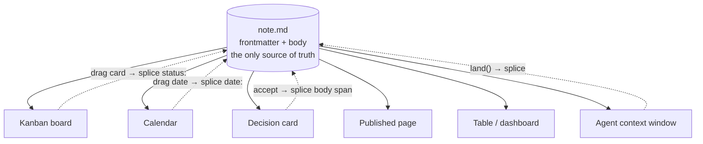

**Why this is a law, not a slogan.** It separates tools that survived twenty years from tools that became traps `[→ c1]`.

| Survivors — view computed, stored nowhere | Traps — the view ate the data |
|---|---|
| org-mode agenda, since 2003, computed on the fly from date tags in plain text `[SS]` | Coda export loses formulas, buttons, canvas properties `[SS]` |
| Obsidian Bases (2025): the `.base` file saves only how you want to look `[SS]` | Notion formulas cannot aggregate across rows `[SS]` |
| Potluck (Ink & Switch): *"a clear separation between text and annotations… the original text freely editable"* `[fetched]` | Jupyter: meaning in invisible kernel state; under 4% of GitHub notebooks reproduce `[SS]` |

**What is new is making it the explicit product primitive.** Everyone else rediscovered it as a side effect. Its two hardest requirements are already built here: write-back must be provably reversible (the splice writer) and any view must strip back to portable markdown (the certificate).

**The category sentence:**

> Notion made the app the source of truth and trapped your data inside it. frontmatter makes the **file** the source of truth and lets every app be a disposable lens over it — provably, byte for byte, reversibly.

**It composes with the AI story.** If every view is a projection, an AI edit is a projection running backwards: a splice with its byte range recorded, reviewable and reversible. The AI gets the same path as a human dragging a card, and the same guarantee.

**Prior art to respect:** Potluck is the near-exact precedent and is unmaintained; Obsidian Bases is market validation. Neither claims the law as a product primitive; neither can prove reversibility.

---

## 6. Principles and non-goals

### 6.1 Principles

1. **The file is the truth; views are disposable.**
2. **Refusal is a first-class outcome.** Cannot do it safely → return the input unchanged and say why. Never guess.
3. **Never lie about what happened.** Every count re-derived from disk, never from the loop that did the work.
4. **Degrade, never break.** Every extension is valid CommonMark.
5. **The model gets a data slot, never a canvas.**
6. **One grammar for every change** — human suggestion, AI edit, sync conflict.
7. **Measure the document, not the user.** Implicit feedback only.
8. **Gates, not scores.** Named binary checks.

### 6.2 Non-goals — what we will not build

| Never | Why |
|---|---|
| A new format, sigil, or dialect | Settled 2026-07-29 |
| A tree-of-record, even once | `blocksToMarkdownLossy()` is a real BlockNote API name — the market's confession `[SS]` |
| A plugin marketplace | VS Code's own wiki names extensions the #1 performance suspect; Typora's most-requested feature (251 votes) sits against a product loved *because* it has none `[SS]` |
| **The eval lane** (dataviewjs, MDX, arbitrary widget code) | It ends the corruption guarantee **and** converts every prompt injection into RCE on infrastructure holding every customer's documents and API keys (§28.5) |
| Block IDs in files, columns-in-markdown, synced-block bytes | Pollutes the text |
| Likert writing scores | Schema-rejected internally (LR#4); Grammarly's opaque score is the anti-pattern |
| Ambient AI buttons, un-disableable AI | Notion users write ad-blocker rules against AI buttons `[SS]` |
| Silent auto-landing into a curated vault | Auto-capture only into an inbox lane |
| Opaque credit repricing | Cursor apologised; Windsurf churned twice; Notion got roasted |
| Streaks, badges, soundscapes, format-on-save default | Noise |
| A bespoke canvas as centre of gravity | Spatial state is not linear text |
| **Notion-style full project management** | Explicit founder boundary. A markdown editor with deep AI, not a PM tool |
| AIOS internal machinery as consumer UI | §16.4 — the full do-not-ship list |
| Graph-view investment, the mother-markdown container | Zero of 89 feature requests mentioned graph view; 45 transclusions in 25 MB of our own vault were all documentation of the feature, never use `[measured]` |
| Any "first"/"only" claim without one more verification round | LR#72. We already caught one |

---

## 7. Architecture and current state

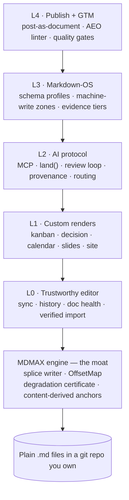

### 7.1 The engine — the moat

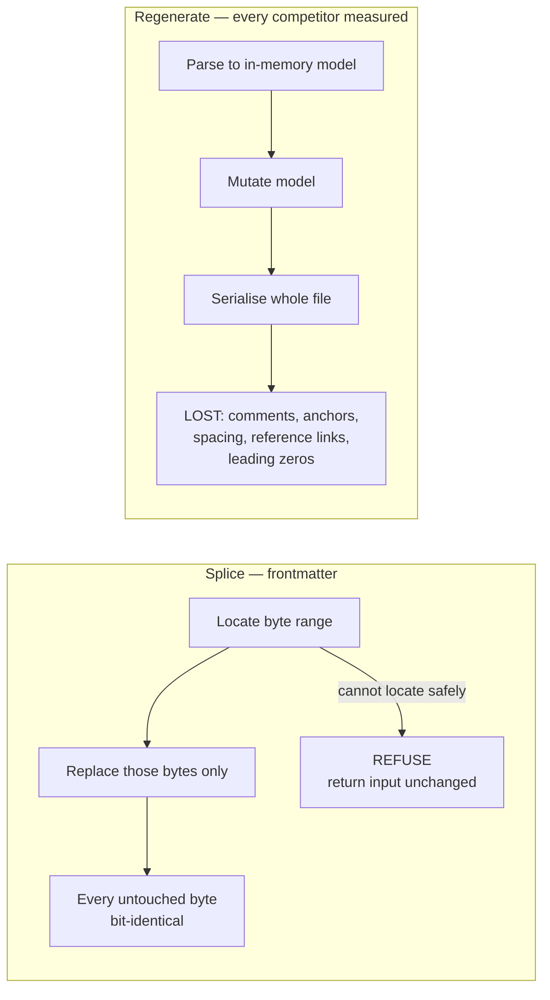

**MDMAX: 13 files, 3,614 lines, 11 tests** `[measured]`. Grounded in lens theory (Foster et al., TOPLAS 2007).

| File | Lines | Capability, with its measured numbers |
|---|---|---|
| `domain/constructs.ts` | 618 | **19 constructs** detected (yaml-frontmatter, html-comment, heading-attribute, link-ref-definition/idiom, angle-bracket-text, lone-tilde, pipe-in-prose, paren-ordered-list, wikilink, wikilink-embed, unknown-fence-lang, setext-heading, table, strikethrough, autolink, math, footnote, task-list). Returns UTF-8 byte ranges; conservative detectors behind a skip mask |
| `infrastructure/bench.ts` | 538 | **7 engines**: remark-app, react-markdown, marked, markdown-it, markdown-it-html-true, commonmark, kramdown-jekyll. `benchId` = sha256 over the full option set. **A missing engine is a hard refusal** |
| `domain/fold.ts` | 430 | `mdmax/fold@1` versioned equivalence fold — defines PASS. Prototype **705/1613 strict vs 69/1613 folded (43.71% → 4.28%)** over 40 knowledge files × 6 GFM engines — **explicitly not attachable to `fold@1` until re-measured** |
| `domain/verdict.ts` | 411 | Pure classifier. `![[Some Note]]` → VOID on marked 16.4.2 **and** commonmark 0.31.2; `## Heading {#custom}` leaks byte-identically on both — **21 of 24 `{#id}` leak**; front matter LEAKs in **23 of 24** bench configurations |
| `application/certify.ts` | 375 | Layer-2 inventory + layer-3 differential; never throws |
| `domain/offsets.ts` | 315 | Branded U16Offset / ByteOffset / GraphemeIndex. **Only 67 of 1,080 corpus files have bytes == UTF-16 units (93.8% diverge); 103 of 2,314 files contain non-BMP.** Sparse checkpoint index at 1/512th the memory of a dense array |
| `domain/shape-gate.ts` | 174 | `MAX_BYTES 4MB`, `MAX_LINES 200,000`, `MAX_LIST_MARKER_LINES 20,000`, budget-ms. Measured quadratics: `WIKILINK_RE` **k=1.98, 36,865 ms on 320 KB of `[[`**; `mdast-util-from-markdown` **12,429 ms vs micromark 1,207 ms (10.3×)**. Strict UTF-8 decode, refuse never repair. Cites cmark #373, #389, CVE-2023-22484 |
| `domain/cert-contract.ts` | 168 | 4 verdicts PASS / STRIP(DEGRADED) / CORRUPT(BROKEN) / VOID; 3 classes LEAK / DESTROY / MUTATE. `before` + `after` both required. **Artifact is a JSON sidecar, never written into the `.md`** |
| `domain/placement.ts` | 154 | Insert→reparse→compare. Setext defect: `"Heading\n---"` → h2, with a marker → paragraph + html + thematicBreak; **blank-line isolation does not fix it** → refuse, never repair |
| `domain/targets.ts` | 133 | **15 targets** (7 local, 7 declared, 1 spec). `DECLARED_LAST_VERIFIED = 2026-08-01`. **7 of ~12 surfaces unprobeable**; Slack/Discord modelled as lossy sinks |
| `domain/frontmatter-prepass.ts` | 121 | **170 of 907 home frontmatter blocks are invalid YAML = 18.74%.** Repairs `related: [[a]], [[b]]`; REFUSES `[[[A]], [[B]]]`. Never writes, never throws |
| `domain/slug.ts` | 115 | `mdmax/slug@1` to WRITE, tolerant `resolveAnchor` to READ. Over 393 anchors: github-slugger **21.88%**, dash-collapsing **95.42%**, either **98.73%** — caveat, **85.2% of the 393 come from one file** |
| `domain/normalize.ts` | 62 | NFC → collapse-ws → lowercase → NFC. **99.627%** re-anchoring across **384 configurations**; golden-file gate over 200 cases |

CLI: `scripts/mdmax-cert.mjs` — `<file>`, `--json`, `--fail-on=BROKEN`, `--targets=`, `--bench-info`, `--explain <construct>`, `--histogram <glob>`.

### 7.2 Current state — verified

| Metric | Value `[measured]` |
|---|---|
| Modules under `src/modules/` | 14 (ai, ai-tools, app-shell, auth, drafts, editor, export, graph, mdmax, preview, repository, share, vault) — **175 files** |
| TypeScript files in `src/` | 226 |
| Lines in `src/` | 25,407 |
| **Test files** | **98** (an earlier figure of 262 was wrong — the `find` traversed extra git worktrees; two independent measurements now agree at 98) |
| Tests passing | 1,575 / 1,575 |
| App routes | 30 — 6 `/api/ai/*`, 14 `/api/vault/*`, 2 `/api/share/*`, 2 `/api/export/*`, `/api/commit`, `/api/auth`, 4 pages |
| Commits on branch | 40 (`engine/plan-and-diagnostics`) |
| **CI** | **None. `.github/` does not exist.** md has `.github/workflows/ci.yml`; frontmatter has nothing |

**Stack in place `[measured]`:** Next 16.2.6 · React 19.2.6 · CodeMirror 6 (view, state, language, commands, search, autocomplete, lang-markdown, `@replit/codemirror-vim`) · unified/remark/rehype (gfm, frontmatter, math, breaks, katex, slug, raw, highlight) · gray-matter · yaml · mermaid 11 · minisearch · zustand · zod · next-auth v5 · AI SDK v6 with **five providers** (Cerebras, Google, Groq, Mistral, OpenRouter) · Tauri v2 · puppeteer-core + @sparticuz/chromium · material-symbols.

**Module map `[measured]`:**

| Module | Files | One line |
|---|---|---|
| `vault` | 30 | Read model: snapshot cache, markdown-parser, MiniSearch index, link-index, history/version/restore, zip export, FileTree, daily notes, templates |
| `editor` | 22 | CodeMirror pane, store/settings, ghost-text, ai-suggestion, slash commands, bookmarks, toolbar transforms, split-scroll-sync, live-preview, HistoryModal |
| `app-shell` | 21 | AppShell, CommandPalette, Spotlight, SearchPanel, Settings/Import/LinkDoctor modals, PWARegister, TauriBridge |
| `preview` | 21 | react-markdown renderer: wikilinks, embeds, callouts, editable tables, mermaid, html-policy, Outline, Backlinks, UnlinkedMentions, PropertiesPanel |
| `share` | 16 | Public share `/[slug]` + `/p/[slug]`, set/remove share, conflicts, **`splice-frontmatter.ts`**, share-writer, PublicNoteView |
| `auth` | 14 | Dual identity: NextAuth + allowlist **and** a Firebase gateway with Google sign-in (frontmatter-only) |
| `mdmax` | 13 | §7.1 |
| `repository` | 12 | GitHub write path: commit-changes, create/rename/merge, upload-attachment, `merge3`, CommitBar |
| `ai` | 11 | Provider-agnostic use-cases: refine, summarize, suggest-links, link-doctor, generate-document, apply-wikilinks; gateway-client + provider-race |
| `export` | 5 | HTML render, print-CSS, server-side `pdf-doc.ts`, ExportMenu |
| `graph` | 3 | react-force-graph-2d view + buildGraph |
| `drafts` | 2 | IndexedDB drafts + localStorage dirty index |
| `ai-tools` | 2 | Single `SgnkAiButton` surface |

**Three known truths that contradict our own docs:**

1. **`src/modules/mdmax/` is imported by zero product files** — implemented and unit-tested, **not wired in**. `docs/mdmax/PLAN.md` says "shipped". The doc is wrong.
2. **There is no CI**, in a product that intends to sell document CI.
3. **The shipped design system is not our design system** — see §16.3.

---

## 8. Formats and the data model

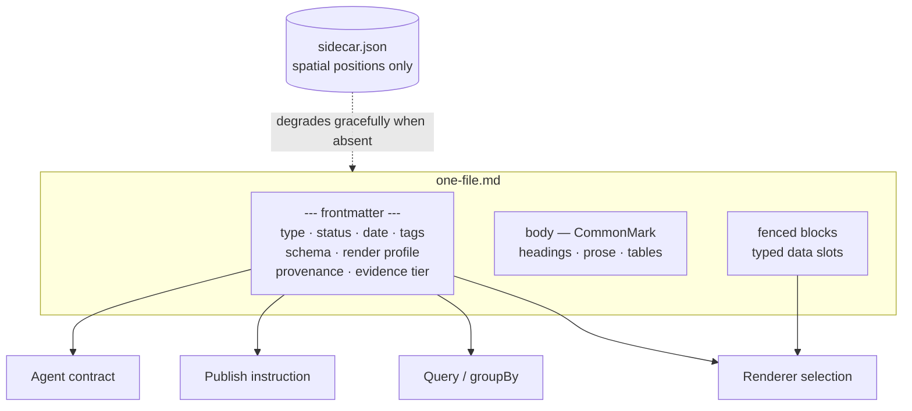

**Frontmatter is the API.** The product's name is its mechanism: the YAML block is simultaneously renderer switch, query surface, publish instruction, lint calibration and agent contract.

### 8.1 Format posture

| Posture | Formats | Rationale |
|---|---|---|
| **READ** | OKF bundles (v0.2, own Google repo, 356 adopter repos, +24%/27d `[fetched]`) · SKILL.md folders · MyST keys (tolerate) · textbundle (low priority) | Zero parser cost; recognise `sources / generated / verified / status / stale_after` and derive trust tiers |
| **EMIT** | llms.txt v2 + markdown twins + `rel="alternate" type="text/markdown"` (v2 blessed path-scoping; Chrome Lighthouse audits for it `[fetched]`) · OKF export · **Skill export** — a curated collection becomes a SKILL.md folder consumable by 41+ agents | "The journey becomes a reusable capability" is the strongest interop story found |
| **BUILD** | **Session interchange format** — markdown-native, open, documented | No standard exists; the absence is the opening `[fetched]` |
| **WATCH** | .prompty · AG-UI | Not load-bearing yet |
| **IGNORE** | Promptfile (dead) · langchain-hub (archived) · A2A and server-cards as document formats | Dead or wrong layer |

**The open territory:** claim-level method + confidence. No spec claims it; OKF argues against stored scores. The compatible design is **signals, not scores, derived at render time** — a renderer's game, therefore ours.

### 8.2 Frontmatter key vocabulary (v1)

| Key | Type | Purpose |
|---|---|---|
| `type` | `decision · plan · research · meeting · qa · idea · board · note` | Picks schema, render profile, home grouping |
| `status` | schema-defined enum | The state machine; kanban columns are its values |
| `date`, `due`, `created` | date | Calendar projection |
| `render` | profile name | Explicit renderer selection |
| `schema` | path | The schema profile this file validates against |
| `source` | `{tool, model, conversation_url, session_id}` | Provenance of landed AI output |
| `verified` | `{by, on, until}` | Freshness / staleness gating |
| `evidence` | `{value, source, tier, re_verify_cmd}` | The evidence-tier discipline — practised in production `[measured]` |
| `apply` | `always · auto · glob · manual` | Rules files — Cursor's modes minus the special-editor resentment |

**Prior art to copy, verbatim, from our own vault:** `knowledge/meta/schema.md` is a working frontmatter contract with required `id/title/type/status/created/updated`, a 14-value `item_type` enum, `content_hash` dedup, a `fidelity` enum (`full|verbatim|ocr|auto-transcribed|partial|summary-only`), `relevance 1–5`, and a typed `relationships` vocabulary (`builds-on, extends, contradicts, supports, applies, prerequisite-of, part-of, references, related`) `[measured]`.

**Boundaries that stand:** spatial data → JSON Canvas sidecar. Workspace-scale multi-user state → a database. Deeply nested data destined for an LLM → not markdown's win.

---

## 9. The rendering system

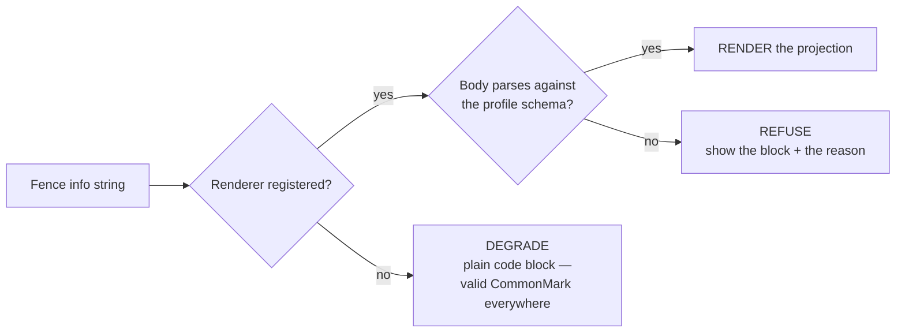

CommonMark by spec, not a hack: the spec says the first word of the info string selects particular treatment `[fetched]`. Obsidian exposes exactly this as `registerMarkdownCodeBlockProcessor(language, handler)` `[fetched]`.

### 9.1 The computation budget

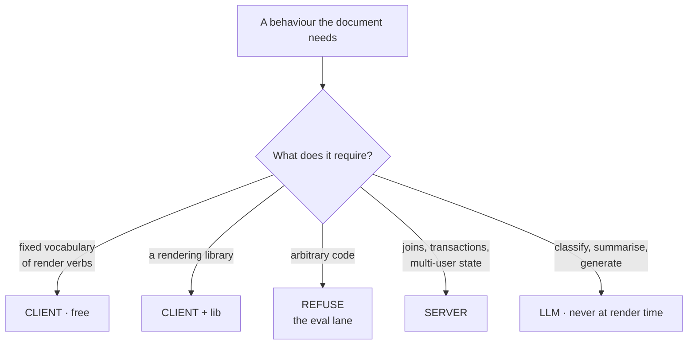

| Behaviour | Lane | Mechanism |
|---|---|---|
| Text, lists, tables, callouts | CLIENT | CommonMark + GFM |
| Checkbox toggling that persists | CLIENT + write | `- [ ]` source-line rewrite. Dataview's TASK query is *"the only command in dataview that modifies your original files"* `[fetched]` |
| Inline edit of a typed field → YAML | CLIENT + widget | Bases table cell writes back the property `[fetched]` |
| State machine → kanban columns | CLIENT | `status:` enum is the state; `groupBy(status)` the columns; a drag is an enum write-back |
| Per-row computed column | CLIENT | Bases formulas: `if()`, arithmetic, date maths `[fetched]` |
| Cross-note aggregates (sum, avg, median, stddev) | CLIENT | Bases summaries / Dataview `sum · reduce · average` `[fetched]` |
| Dashboard = query over a folder | CLIENT **with a ceiling** | In-browser index. Dataview advertises 100k notes; users report ~30s queries past 3,000 `[SS]` |
| Conditional render from a flag | CLIENT | `if()` / `choice()` inline |
| Declarative diagram | CLIENT + lib | Mermaid, ~16 diagram types `[fetched]` |
| Declarative chart | CLIENT + lib | Vega-Lite JSON, or a `chart` fence |
| **Arbitrary interactive widget** | **REFUSE** | dataviewjs, MDX. **The lane we do not enter** |
| Spatial canvas with x/y | Hard boundary | Sidecar JSON, or don't |
| Relational queries, joins, transactions | SERVER | An in-browser index cannot |
| Multi-user concurrent state, presence | SERVER | File-per-note is single-writer by nature |
| Classify, summarise, generate | LLM | Never a render-time operation |

**Two decisions fall out.**

1. **"Client / server / LLM" is missing the important lane: client-side but arbitrary code.** "Doesn't require much computation" means "doesn't require *arbitrary* computation". Defensibility lives in the fixed-interpreter lanes. **A closed vocabulary of render verbs, not a sandbox.**
2. **Buy the semantics of Bases and Dataview, not their code.** They already define the computation surface users expect. Dataview is MIT `[fetched]`, so the query parser is genuinely copyable. Match the surface as a stable spec and publish the ceiling honestly.

### 9.2 Render profiles — build order

| Profile | Mechanism | Prior art / opening |
|---|---|---|
| **kanban** | Columns are values of a frontmatter field; drag rewrites the field | Flagship Obsidian Kanban plugin: 2.6M downloads, last release 26.9 months ago, repo in an org literally named *community-archive* `[fetched]`. Its convention (`## Lane` + `- [ ]`) is de-facto standard read by ≥3 plugins. **Adopt the convention, win on the write path** |
| **decision** | ADR profile; status chip from frontmatter; body renders Context → Drivers → Options → Outcome → Consequences | MADR already stores status, date, deciders in YAML frontmatter `[fetched]`. Render it. **No commercial ADR tool exists** |
| **calendar** | Drag to reschedule writes `date:`; edge-drag writes a range | Markex schema |
| **corkboard / outliner** | Renders over `synopsis:`, `label:`, `status:` | Scrivener's planning views |
| **slides** | Marp-compatible | Existing convention |
| **declarative figures** | Mermaid / Vega-Lite fences | Our campaign engine composes **79 figure specs from exactly 5 style-locked generators** (`flow\|layers\|hbar\|fields\|compare`) — "a carousel slide is a JSON entry, not a design session". **Agents physically cannot emit arbitrary SVG** `[measured]` |
| **brand book** | guideline-forge | Internal reuse |
| **project map** | mdmap — `MAP.md` carries `budget: 2000`, `coverage: 0.247`, 81 declared / 20 exist, 8 invariants `[measured]` | Gap report as the product |
| **live site** | publish + profiles | — |
| **flow** | Derived layout only | Last, deliberately |

**Blocking prerequisite, one character class:** `src/modules/preview/presentation/markdown/components.tsx:133` uses `/language-(\w+)/`, and `\w` excludes hyphens, so every hyphenated fence language collides with its prefix. **First commit of the render track.**

---

## 10. The AI layer

### 10.1 Surface ranking `[→ ed4]`

**deliberate inline edit > review-moded agent > on-demand chat > ghost text > ambient AI buttons (net-negative).**

Consequences: ghost text defaults to Zed's *subtle* mode (visible only while a modifier is held); a loud global AI kill switch; per-folder exclusions; snooze; **propose-first as a named default**; prompt at the cursor, never docked in a rail.

### 10.2 The AI edit lifecycle

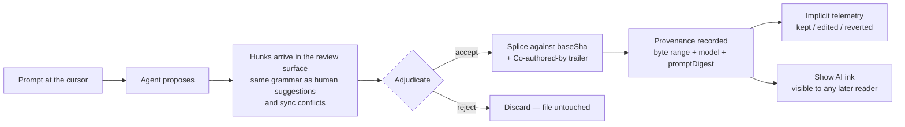

### 10.3 Provenance — the scoped claim

On accept, the splice records the byte range plus `{contributor, model, promptDigest, sessionRef}`. "Show AI ink" tints AI-written spans for **any** reader. Interoperates with Cursor's Agent Trace format both ways.

**Not "the first AI attribution"** — Cursor and Grammarly exist. The defensible claim: **the first markdown editor with byte-anchored, document-portable, reader-visible provenance.** Granola proves people like the legibility (AI text grey, yours black `[SS]`) but theirs vanishes on export.

**The mechanism already exists internally:** the AIOS trace ledger writes one row per task with a 31-field schema including `files_touched`, `files_sha256`, `model`, `input_tokens`, `output_tokens`, `correlation_id`, plus a tamper-evident `ledger-chain.jsonl` `[measured]`.

### 10.4 Implicit telemetry — mandatory, not preferred

Kept / edited / reverted, measured from the document. **No rating buttons, ever.**

The evidence is our own: the explicit `accepted` field is filled on **7 of 691** recent trace rows even with one motivated expert using it daily, while machine channels filled themselves — **24,539 complexity-gate rows, 25,913 routing decisions, 44,037 propensity rows** `[measured]`. **Build every feedback-dependent feature on what the system can observe, never on what a user is asked to declare.**

Internally this is already a 3-value implicit verdict mined from git history and edit distance: `accepted_asis / edited_kept / abandoned`.

### 10.5 Cost control

The routing gate keeps ~90% of AI operations on the cheapest capable model across 24,539 live decisions; the verdict is 5-dimensional (`tier, orchestrate, rule2_gated, needs_verify, decided_model`), not a scalar `[measured]`. Escalation is two-dimensional (tier × effort): `sonnet/med → sonnet/high → opus/medium → opus/high → opus/xhigh → opus/max → fable`.

**Ship the deterministic gate. Keep the bandit internal** (§16.4).

### 10.6 Other AI features

- **Citation-gated vault answers** — Advox's fail-closed verifier: refuse when the answer cannot be grounded. Already built.
- **`mdmax explain --as <consumer>`** — shows exactly what your file does to a model's context window. Nobody else has anything like it.
- **Rules / voice / memory files as first-class documents** — `.frontmatter/rules/*.md` with `apply:` frontmatter, opening as plain markdown. Cursor gave `.mdc` a special editor UI and users look up how to turn it off — dialect betrayal inside an AI IDE's own config format `[SS]`.
- **AI-authored memories only via a visible, editable panel.**

---

## 11. Protocols and the capture loop

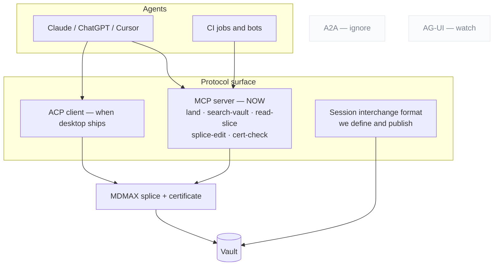

| Protocol | Posture | Reason |
|---|---|---|
| **MCP** | **Ship now**, tools-first | The July 2026 revision went stateless and deprecated Roots, Sampling, Logging — tools are the lowest common denominator `[fetched]`. Hard-cap under 20 tools; verdict-first responses; refusals naming the rule with a corrected example |
| **ACP** | Client, when a desktop surface exists | 40 registered agents incl. an Anthropic-co-authored Claude adapter; `session/load\|resume\|list` is the only shipped multi-vendor session-continuity semantics anywhere `[fetched]`. ACP agents are local subprocesses over stdio — needs the Tauri build first |
| **A2A** | Ignore | Wrong layer |
| **AG-UI** | Watch | Not load-bearing |
| **Session interchange** | **Build and publish ours** | No standard exists |

**Plumbing is table stakes. The pitch is what rides on it: every agent edit goes through the splice writer, so the agent cannot corrupt what it edits.**

### 11.1 `land()` — the capture verb

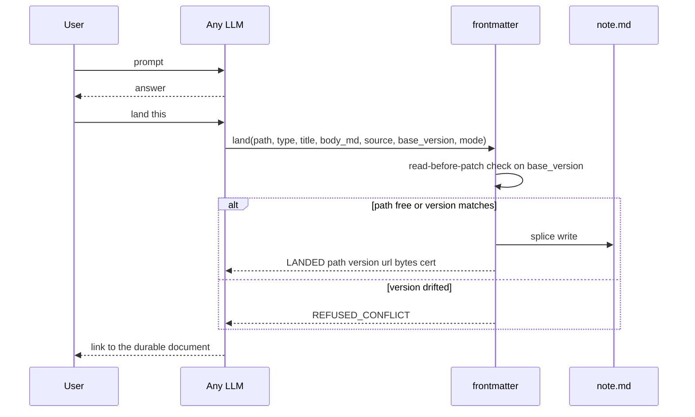

```
land({ path?, type, title, body_md,
       source: { tool, model, conversation_url, session_id },
       base_version?, mode: create | patch | rewrite })
  → { LANDED | VERSIONED | REFUSED_CONFLICT | NEEDS_TARGET,
      path, version, url, bytes_written, cert }
```

| Rule | Why |
|---|---|
| **Identity is the path**, explicit in every call | On claude.ai, where identity is inferred from phrasing, "it made a new artifact instead of updating mine" is the #1 documented failure |
| **Two edit sizes are protocol modes**, not prompt etiquette | `patch` vs `rewrite` — otherwise the model guesses |
| **`base_version` enforces read-before-patch** | Kills the drift bug structurally. Bolt's system prompt: always edit the latest content `[fetched]`. **The file is the memory; the model's memory of the file is a cache to invalidate** |
| **Counts re-derived from disk** | The anti-lying-report rule |
| **Typed at capture** | `type:` picks schema + render + home grouping. Granola: $1.5B valuation on template-typed capture with per-line provenance `[SS]` |
| **Users see the nouns, never "artifact"** | Bolt's system prompt literally forbids the word `[fetched]` |
| **Auto-land only into an inbox lane** | Never silently into the curated vault |

**Distribution:** MCP server for MCP-capable tools · a **chat-side skill** for everything else ("land this" → typed fenced block → one-paste inbox) · ZIP importers for ChatGPT and Claude where **the verification report is the demo** · retro-capture parsing one conversation into *several* typed documents.

**The promotion loop makes it a home rather than a filing cabinet:** landed docs become retrievable, citation-gated context — `draft → active → source-of-truth → superseded`.

---

## 12. The review surface

**One grammar for every change: human suggestions, AI edits and sync conflicts all arrive as hunks.** The deepest single extraction of the research — 40 years of office software, sourced to the Google Docs API discovery doc and pandoc's docx reader `[fetched → ed5]`.

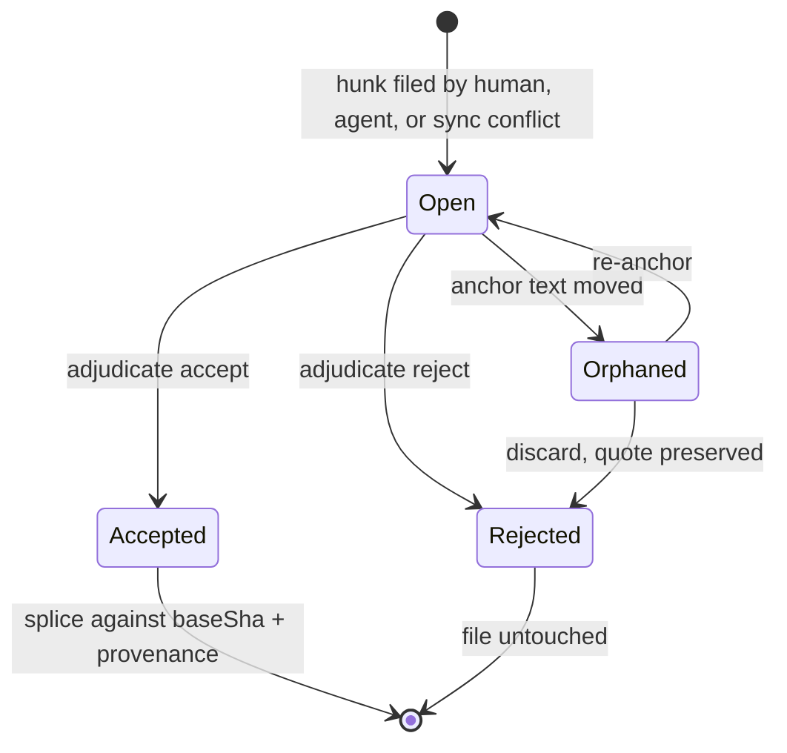

| Rule | Detail |
|---|---|
| Suggesting is a **mode** | Edit / Suggest / View dial. The suggester role has **no byte-writing code path** |
| Hunks coalesce at **word grain** | Git's line grain is the wrong resolution for prose |
| Markup / Final / Original are **pure render projections** | The OnlyOffice save-in-preview-deleted-changes bug is the negative spec |
| The adjudication ladder | per hunk → per suggestion → **all-shown-under-filter** (filter by author, *including AI agents*), accept-and-advance traversal, preview-before-bulk |
| Suggestion cards carry | operation sentence + author + timestamp + reply thread |
| **Resolution is an authored thread event** | `replies.action ∈ {resolve, reopen}` — never a silent boolean |
| Anchors are quote-preserving with **visible orphaning** | Word silently deletes orphaned comments; Docs orphans opaquely. We badge, preserve the quote, offer re-anchor |
| Accept = splice against `baseSha` | Plus a `Co-authored-by` trailer |
| Frontmatter-key hunks render as property-change chips | Consistent with the namesake |
| Governance via branch-protection semantics | **No document freezes** |
| Interchange | CriticMarkup + pandoc `--track-changes` spans, both directions |

**The two moves that beat the incumbents:** **programmatic and AI suggestion authorship** (Google's public API cannot create suggestions at all `[fetched]`; ours is a plain sidecar schema any CI job or agent can file into), and **durable provenance through accept** (theirs evaporates).

**Treat the review surface as a breaking-API contract.** Cursor and Windsurf both regressed per-hunk control and both got publicly burned. Per-hunk accept is the single most-demanded feature in AI editors `[fetched]`.

**Anchoring implementation:** Hypothesis's `match-quote.ts` + `approx-string-match` (BSD-2 / MIT) is the mechanism that lets an AI target survive human edits.

---

## 13. Feature inventory

### L0 — The simplest trustworthy editor

| Feature | Status | Notes |
|---|---|---|
| Four view modes (Live / Edit / Split / Read), `Cmd+E` cycles | Shipped | Live is default, WYSIWYM |
| File tree, tabs, formatting bar, slash commands, vim keys, wikilinks, KaTeX, Mermaid, exports, PWA, Tauri | Shipped | From sgnk-md |
| **Trust surface** — sync chip, conflict inbox, named versions, "changed since you last opened" banner, background auto-sync | **Build (T0)** | The banner is nearly free for us (diff two shas) where Google needed bespoke infra `[SS]` |
| **Local history** — per-save revisions, 10s merge window, merged timeline (git + local + AI) filtered by actor, **section-level restore**, no silent expiry | Build (T0) | JetBrains' 5-day wipe is the anti-pattern: the one feature whose job is trust cannot have a quiet trapdoor |
| **WYSIWYG laws** — markup reveals on *keystroke* not click (#443); caret maps to rendered geometry, backspace eats text not delimiters (#2271); one explicit reveal-policy toggle (#1317); caret + scroll survive every mode switch | Build | From Typora's own tracker `[fetched]`. The last is cheap for us — OffsetMap already maps positions across representations |
| **Doc Health** — status-bar count → filterable panel → inline marks → F8 cycling with quick fixes | Build | VS Code's four-surface model. Vault-scoped checks on, publish-dependent off. **Green all-clear zero state, never a blank panel** |
| **Verified importers** | Build (T4) | §17 |
| **HOME.md** | Build (T1) | §14 |
| Command palette + goto-anything (`#` headings, `@` in-doc, `:` line) | Build | |
| Zen mode, folding, multi-cursor, settings-as-versioned-file | Build | chrome-fades-on-typing + typewriter scroll |
| Merge-formatting paste (paste-as-markdown + a one-line degradation note) | Build | The certificate philosophy at the paste boundary |

### L1 — Custom renders
§9.2. Plus compile targets, iA Content Blocks transclusion as the plain-text binder, `role: material` exclusion, and block-editor verbs without the block noun (drag-reorder, turn-into, toggles-as-folding, table widgets) — **every one a splice on syntax-tree spans**.

### L2 — AI protocol
§10 and §11.

### L3 — Markdown-OS features (the AIOS pattern language, productised)

| Feature | What it is |
|---|---|
| **Schema profiles** | User-definable frontmatter schemas with enums, required fields, typed-link vocabularies. `knowledge/meta/schema.md` is the working prototype |
| **Machine-write zones** | Fenced regions the AI may rewrite and outside which it may not — splice-enforced. Working prototype: `knowledge.md`'s `<!-- CATEGORIES:START/END -->` regions written by `build_catalog.py` `[measured]` |
| **Append-only blocks** | Regions that may only be added to |
| **Auto-generated index pages** | Derived from frontmatter across a folder |
| **Token-budget meter** | What an agent-facing file costs in a context window. Prototype: `mdmap/MAP.md` carries `budget: 2000` `[measured]` |
| **Provenance chips + evidence-tier fields** | `{value, source, tier, re_verify_cmd}` — practised and gated in production by the campaign system, with a working linter (`check-provenance.py`: "10 checked, 0 numbers with no source") `[measured]`. **No competing editor has an evidence layer in any form** |
| **Doc staleness detection** | Deterministic drift-watch. Prototype: 2,382 baseline files, >15% alert threshold `[measured]` |
| **Document CI** | `npx mdmax cert`, `--fail-on=BROKEN`, a GitHub Action. Internal prototype: 34 assert/break gate pairs, 725 assertions, 40 registered regression gates `[measured]` |
| **User-authorable automations as documents** | Phase 5, flagship. The automation format is literally the product's format — 124 SKILL.md files with `name / description / allowed-tools / capabilities / disable-model-invocation` `[measured]` |
| Stable §-anchors · version-by-new-file + LATEST pointer · cache-stable rendering · sidecar data model | Conventions |

### L4 — Publishing and GTM

Post-as-document (one `.md` → LinkedIn PDF + IG carousel + article + thread + status card — **the campaign pipeline proved it: 10 episodes live, all HTTP 200, 213 rendered pages pixel-inspected** `[measured]`) · scheduled publish as draft-and-queue with a human confirm, never unattended · the AEO linter honestly framed as content-quality coaching (Princeton GEO measured 25–40% visibility lift from quotes, statistics and citations `[SS]`; **the "serve markdown and get cited" claim is measurably refuted and will never appear in our marketing**) · document quality **gates**, never scores · `verified: {by, on, until}` freshness keys.

**A shipped failure mode to design out:** the campaign pipeline had **three title fields and only one reached the live page** — rewriting the other two "looked exactly like it worked and changed nothing a reader sees" `[measured]`. A frontmatter-native post document collapses that trap by construction.

---

## 14. Screens

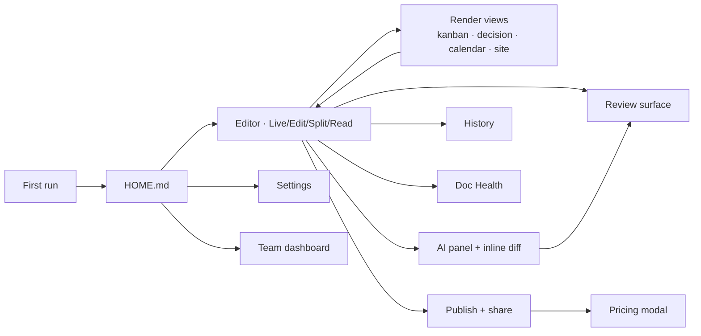

| # | Screen | Above the fold | Main interaction | Empty state | AI |
|---|---|---|---|---|---|
| 1 | **First run** | One choice: create a vault / open a folder / try a sample. **No email field, no OAuth wall** | Land in a seeded `welcome.md` that is itself a live-rendered file — editing it *is* the tutorial | n/a | None. Auth defers to the first feature needing it |
| 2 | **Home (HOME.md)** | Band 1: search + blank-first create row (Blank tile first, ghost-styled, then templates, then gallery overflow — the Google Docs convention). Band 2: recents grid with real previews; "landed today" and needs-review lanes at its head | Resume the last thing; start a new thing | Templates row promoted — **never an illustration** | "Landed today"; needs-review count |
| 3 | **Editor** | Four modes; chrome fades on typing, returns on mouse-to-edge. No persistent ribbon — selection bubble + slash menu | Type. `Cmd+E` cycles | Blinking cursor in a real file | Prompt at the cursor (`Space`) |
| 4 | **Right rail** | **Properties first** (the typed frontmatter editor — the namesake doing real work), then Outline, Comments, History, Tags, AI-Edit | Edit typed fields | — | AI-Edit tab holds *pending hunks*, not the prompt |
| 5 | **Kanban** | Columns = values of a frontmatter field | Drag rewrites the field | "Add a status field to start" | — |
| 6 | **Decision** | Status chip from frontmatter; body renders Context → Drivers → Options → Outcome → Consequences | Change status; add option | MADR template inserted | Draft a decision from a conversation |
| 7 | **Calendar** | Month/week; cards from `date:` | Drag to reschedule → writes `date:`; edge-drag writes a range | — | — |
| 8 | **Site** | Left nav, auto-TOC from headings, hover previews | Navigate | — | Search indexing **off** by default |
| 9 | **Review surface** | Mode dial Edit/Suggest/View; gutter bars; suggestions list | Adjudicate per hunk → per suggestion → all-shown-under-filter | "No pending changes" | AI edits are hunks like any other |
| 10 | **AI panel + inline diff** | Nothing persistent — summoned | Ghost-text insertions; tinted inline diff with **per-hunk accept**. Three verbs, always in this order: Accept, Discard, Try again | — | This is the AI |
| 11 | **Publish + share** | Two tabs: Invite \| Publish. One toggle → URL + copy; options behind a disclosure; **indexing off by default** | Toggle, copy | — | — |
| 12 | **History** | Two timelines: named versions (git-grade, shared) and local history (per-save, private) | Preview before restore, always. **Section-level restore** | — | AI edits actor-labelled and filterable |
| — | **Doc Health** | Four VS Code surfaces | F8 cycling with quick fixes | **Green all-clear**, not blank | Unreviewed AI edits are a diagnostic category |
| — | **Settings** | Searchable, sectioned, versioned files in the vault where possible | BYO-key with provider dropdown, Validate button, model picker | — | Keys never in committed files; rules files open as plain markdown |
| — | **Pricing modal** | Names the blocked action; unlocking plan pre-highlighted; **two plans max** | Upgrade, or add a BYO key and keep going free | — | When the gate is an AI limit, show the meter and the honest option |
| — | **Team dashboard** | Teamspace sidebar (shared + private); review queue across the team | Assign, review | — | The agent is a standing reviewer |

### 14.1 Interaction grammar

| Key | Action |
|---|---|
| `Cmd+K` | Universal palette, with `#` / `@` / `:` goto operators |
| `Cmd+E` | Cycle view modes |
| `Space` (on selection) | Summon AI at the cursor |
| `Tab` / `Esc` | Accept / reject the current hunk |
| `F8` | Cycle diagnostics |

**Two reconciliations with the founder mockups, flagged rather than silently changed:**

1. The mockup shows **three** editor modes; the spec is **four** (Live / Edit / Split / Read). Split is load-bearing for long technical documents.
2. The mockup docks an AI writing box at the bottom of the right rail. **Every shipped convention puts the AI prompt at the cursor**, and a rail-docked prompt reads as bolted on. Keep the AI-Edit *tab* (as where pending hunks are reviewed — that part is correct) and move the *prompt* to the selection.

**Universal rules:** the file is the unit; the render is a lens; every mutation flows through one review surface; **every empty state is the next action promoted, never an illustration.**

---

## 15. Competitor teardowns — executed, not read

The most load-bearing evidence in this document. We ran their write paths.

| Product | Scale | What happened | Verdict |
|---|---|---|---|
| **Front Matter CMS** | **80,527 installs** `[fetched]`, VS Code, since 2019, owns our name | Edited one title field → deleted YAML comments, resolved anchors, stripped leading zeros. Its own source comments *"Do our own parsing to keep the comments"* — then builds the comment-preserving Document object **and throws it away**. Output differs warm vs cold | `[measured]` The bolt-on was tried and shipped broken |
| **Hubble.md** | Markdown collab | Body fully regenerated on any edit; **reference links deleted along with their visible text**; round-trip is not even a fixed point; properties panel silently drops valid keys containing colons (`og:image`) | `[measured]` |
| **OpenKnowledge** | Most serious competitor; ~100 releases/week; 3,239 → 3,673★ in 27d `[fetched]` | **Body path is byte-perfect — respect it.** But frontmatter permanently drifts (`tags: [alpha, beta]` → `tags: [ alpha, beta ]`, never restored); requires a running CRDT daemon (agent edits error without it); O(document) per edit *by their own docblock*; comments machine-local, never committed; GPL + CLA dual-licensing | `[measured on their shipped build]` |

**Joint verdict: the failure is architectural — lossy in-memory models — not a library choice.** Our moat is the span-preserving writer plus the certificate that proves it.

**Say this publicly:** OpenKnowledge is not careless. Their body path is genuinely byte-perfect. They chose an architecture that caps them where we are not capped. Overstating this is the kind of claim that gets refuted in public.

**Editor frameworks — every mainstream rich-text framework is lossy by design `[fetched → ed3]`:**

| Framework | Loss mechanism |
|---|---|
| ProseMirror | Fixed CommonMark schema; serialise = per-node functions writing fresh syntax. `*` vs `_`, setext vs ATX, list markers, **reference links normalised away by construction** |
| `@tiptap/markdown` v3.30.5 (2026-08-26) | Explicitly **beta**. Documents that comments *"may be lost if replaced by Markdown content"* and tables allow *"only one child node per cell as the Markdown syntax can't represent multiple child nodes"* |
| `tiptap-markdown` (community, 7,434,854 dl) | README defers to the official extension; author will not address issues |
| Milkdown | #2349 autolink backslashes **double every round-trip, exponential** (OPEN); #2428 silently deletes inline `<br>` (OPEN); #2403 nested strong/em → literal asterisks |
| Lexical (`@lexical/markdown`, 19,311,550 dl) | Transformers over EditorState — helpers, not storage |
| BlockNote | Exposes `blocksToMarkdownLossy()` |

**This is why we use CodeMirror over a syntax tree and never a document model.**

---

## 16. Internal systems fusion

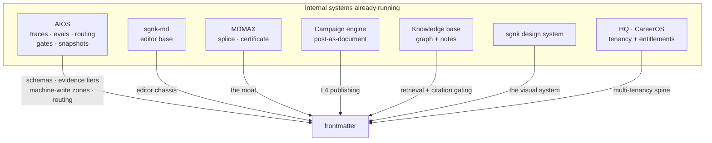

### 16.0 A naming note

The founder named one internal system in a way that transcribed as **"SGM-CHI"**. **No such system exists** — a scan of all 84 repo directories for `chi|sgm|sigma|shi|chai` returns zero matches, and none of `ecosystem.md`'s 38 product cards carries that name `[measured]`. Ranked phonetic candidates: **HQ** (`hq.sgnk.ai` — "sgnk H-Q") · sgnk-md · sgnkai/AIOS · Markex · sgnkos. **This section therefore inventories the superset**, so whichever was meant is covered.

### 16.1 What AIOS actually is, measured

| Artifact | Count `[measured 2026-08-29]` |
|---|---|
| `CLAUDE.md` | 892 lines / 63,519 bytes — 8 zero-tolerance rules + **76 numbered Learned Rules** |
| `skills-src/` | **124 SKILL.md** across 27 directories; `skills/` linked: **130** |
| `settings.json` hooks | **28 hook commands across 9 events** (SessionStart 9, UserPromptSubmit 5, PreToolUse 6, PostToolUse 3, Stop 2, SubagentStop 1, SessionEnd 1, PreCompact 1) |
| `~/.sgnk/traces/` | 110 daily JSONL files, **5,014 rows**, 31-field schema |
| `state/complexity-gate-log.jsonl` | **24,539 rows** |
| `state/routing-journal.jsonl` | **25,913** |
| `state/propensity.jsonl` | **44,037** |
| `state/injection-hits.jsonl` | **1,707** |
| `PREFERENCE-LOG.jsonl` | **232 rows**, 17 keys |
| `baselines/` | **2,382** JSON files |
| `gates/` | **69 scripts** — 34 assert/break pairs (fail-first proof, LR#68) |
| `bin/` | **149 tools** |
| `calibration.json` | Rubric v1.1.0: agreement **0.938**, κ_AB **0.863**, deterministic rule coverage 14/16, `meets_kappa_bar: true` |
| `shadow-log.jsonl` | **1 row.** The shadow-promote ladder is built and effectively unused |
| `insights/` | **Does not exist** after 14 months |

### 16.2 Internal asset → product feature

| Internal asset | What it does today | Product feature | Lift | Verdict |
|---|---|---|---|---|
| Trace ledger (5,014 rows, 31 fields, `files_sha256`) + `ledger-chain.jsonl` | One row per task | Byte-attributed AI-edit provenance; tamper-evident chain | M | **SHIP** |
| Complexity gate (24,539 rows) + escalation ladder | 5-D verdict per prompt; 90/10 floor/strong | AI cost efficiency + a cost/balanced/quality dial | M | **SHIP the gate; keep the bandit internal** |
| `sgnk-evals` + `calibration.json` (κ 0.863) | Binary pass/fail + critique; Likert schema-rejected | Document quality **gates** | M | **SHIP** |
| `gates/` 34 assert/break pairs, 725 assertions, 40 regression gates | Fail-first-validated shell gates | Document CI: `npx mdmax cert`, `--fail-on=BROKEN`, GitHub Action | S | **SHIP** |
| Drift-watch (2,382 baselines, >15% threshold) | Nightly baseline compare | Doc staleness / rotted-link detection — fully deterministic, zero model calls | S | **SHIP** |
| Snapshot / recall / handover + PreCompact hook | Schema-versioned secret-safe cards + manifest + LATEST pointer; `GLOBAL-REGISTRY.md` = 58 repos | Document AI-session continuity; version-by-new-file + current pointer | M | **SHIP** |
| SKILL.md format (124 files) | Markdown+YAML automations with anti-triggers | User-authorable markdown automations; per-document AI permission frontmatter | L | **SHIP (flagship)** |
| Survival-verdict mining | `accepted_asis / edited_kept / abandoned` from git + edit distance | Implicit AI-edit telemetry — no rating UI | M | **SHIP (mandatory — explicit channel measured at 7/691)** |
| `knowledge/meta/schema.md` + fenced generated regions | Metadata contract + safe machine-write zones | Frontmatter schema profiles + editor-enforced splice regions | M | **SHIP** |
| graphify (3,848 nodes / 3,737 edges / 340 communities) | Offline knowledge graph | Vault graph view — deterministic reports only | M | **SHIP (partial)** |
| `mdmap/MAP.md` (`budget: 2000`, `coverage: 0.247`, 8 invariants) | Budget-bounded structural map | Project-map view; **gap report as the product**; token-budget meter | L | **SHIP** |
| MDMAX (13 modules, 3,614 lines) | 4-verdict certificate over 15 targets × 7 engines | The certificate, `mdmax explain --as`, the AEO linter | — | **ALREADY THE MOAT** |
| Markex publish backend | Job queue + AES-256-GCM OAuth vault + 4 publishers; atomic claim `FOR UPDATE SKIP LOCKED`; 5-min tick via pg_cron + a Cloudflare Worker | "Documents that ship themselves" — draft-and-queue with per-post human confirm | L | **SHIP, RULE-2 gated** |
| Campaign 6-gate build engine + declarative `figures.json` | Refuse-on-defect render checks; 79 specs from 5 generators | Document build gates + declarative figure blocks | M | **SHIP** |
| Evidence tiers + provenance tables + `check-provenance.py` | Practised discipline | Evidence-tier frontmatter fields + provenance chips + linter | M | **SHIP — most differentiated** |
| HQ pooled-RLS spine (34 modules, 15 migrations, 352 commits) | Multi-tenant SaaS + markdown Daily Sync feed | Workspaces / tenancy. **HQ becomes frontmatter's first customer** | L | **SHIP (lift)** |
| CareerOS entitlements / credits | Flags, plans, kill switches, metered AI | Monetisation + rollout spine | L | **SHIP (lift)** |
| Advox fail-closed verifier | Citation-gated legal AI | Citation-gated vault answers | M | **SHIP the pattern** |
| skills-registry sync | scan → normalize → hash → fan-out, never clobbers | Multi-destination vault sync | M | **SHIP (design donation)** |
| sgnk design system (1,386 lines, v1.3) | Canonical brand system | The product's design language | S | **SHIP — and reconcile, §16.3** |
| `md/Mirrors/` (54 mirrors) + 4,548 `.md` | Dogfood corpus | Demo vault / first customer corpus | S | **Keep internal as data** |

### 16.3 The design-system contradiction — a real, shippable defect

**`frontmatter/src/app/globals.css` is byte-identical to md's and self-labels *"sgnk-md design system — Linear-style modern SaaS"*** `[measured]`. It sets `--accent: #18181b` (near-black), `--link: #0044cc`, and `--radius-sm: 6px / --radius: 8px / --radius-lg: 12px`.

**The product ships neither the canonical `#1a5cff` accent nor the square-corner rule.** And `material-symbols/rounded.css` is imported as a **web font**, which the icon standard bans in favour of inline SVG precisely because the web font renders literal ligature text or tofu whenever it fails to load.

Canonical system for reference: single Electric Blue `#1a5cff`, canvas `#ffffff`, hairline `#e5e5e5`, ink `#0a0a0a`; body contrast 20.2:1 AAA, blue-on-canvas 5.16:1 AA; **body-faint `#b8b8b8` at 2.14:1 fails AA and must not carry text**; Google Sans + Google Sans Code; square corners with only three rounding exceptions; zero gradients; one elevation rule; 760px reading column.

### 16.4 DO-NOT-SHIP — internal machinery that becomes a trust burden

1. **The Learned-Rules ledger / self-modifying rulebook** (76 entries). Value is inseparable from one expert operator under a human gate. As UI it reads *"the AI writes rules about you."* Carry the lessons, not the file.
2. **Multi-agent adversarial machinery** — debate panels, consensus, reflexion, ~26 meta-skills. The system's own review ordered a freeze: breadth without usage is latent complexity. Point it at frontmatter's codebase, never at users.
3. **The bandit's *learning claim*.** Three documented incidents of prematurely reporting the loop live; `shadow-log.jsonl` holds **1 row**. **Never market "it learns you" before a decision demonstrably bends on real data.**
4. **Shadow-promote / canary ladder as user workflow** — governance for a solo operator's config changes.
5. **Approval-queue security ergonomics** — carry the *invariant* (the splice writer), not the interface.
6. **`sgnk-insights` as an ambient loop** — the directory does not exist after 14 months. On-demand only.
7. **The prompt-contract layer as visible UX** — assumes a user who speaks in agent-task contracts.
8. **Likert writing scores** — schema-rejected internally.
9. **Raw trace analytics of the operator's own machine** — `traces/` carries `cwd` paths to client repos. **The pattern ships; the store does not.**

### 16.5 Duplication — what is fixed twice today

| Measure | Value `[measured]` |
|---|---|
| `src/modules/` files | **175 frontmatter vs 157 md**; 157 shared — **145 byte-identical, 12 diverged**; **zero files exist only in md** |
| Whole `src/` | 248 vs 228; 228 shared — 202 identical, 26 diverged; 20 only in frontmatter |
| The 12 diverged module files (each a two-place fix) | `app-shell/presentation/LinkDoctorModal.tsx`, `auth/index.ts`, `auth/presentation/LoginScreen.tsx`, `editor/presentation/CodeMirrorEditor.tsx`, `graph/presentation/graph-data.ts`, `preview/presentation/PropertiesPanel.tsx`, `repository/presentation/CommitBar.tsx`, `share/domain/slug.ts`, `share/infrastructure/share-writer.ts`, `share/presentation/PublicNoteView.tsx`, `vault/application/get-snapshot.ts`, `vault/infrastructure/search-index.ts` |
| Asymmetric assets | md has `.github/workflows/ci.yml` and `Mirrors/`; **frontmatter has no CI at all**. md frozen since 2026-07-17; frontmatter has 40 commits |
| **Three frontmatter code paths in one repo** | `preview/presentation/frontmatter.ts` (gray-matter) vs `mdmax/domain/frontmatter-prepass.ts` (lenient pre-pass) vs `share/domain/splice-frontmatter.ts` (the writer) |
| Two slug algorithms in one repo | `share/domain/slug.ts` vs `mdmax/domain/slug.ts` |
| Brand duplication | `ecosystem.md` still pitches sgnk-md as the canonical markdown answer; it contains **exactly one** mention of "frontmatter" (line 969) and **no frontmatter card** |

---

## 17. Import, export and interoperability

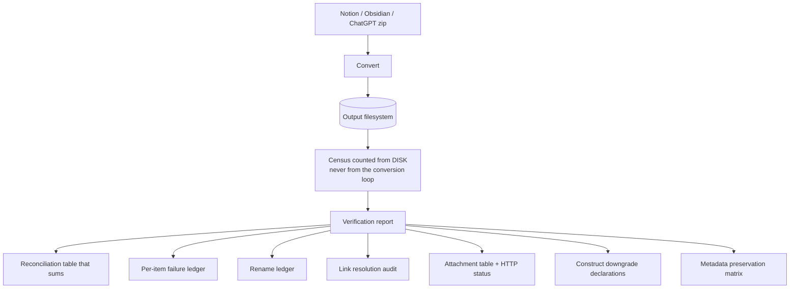

**The product here is the report, not the conversion.** The #1 importer failure class is a report claiming success while losing files, and **count parity is provably insufficient** because content loss hides inside conversions that report success `[fetched]`. The census must be counted from the output filesystem, never from the loop that did the conversion.

**Export contract:** the storage format is the export format. There is no export step to lose fidelity in — that is the whole point (Reflect rewrote itself to exactly this model and took 1,441 stars in 11 weeks `[fetched]`).

---

## 18. Market segments and ICPs

**Two motions, one substrate.** Acquisition D2C-shaped; monetisation B2B-shaped. By month 24 the median solo **B2B** founder's revenue is more than **4×** the median solo B2C founder's `[SS]` — but through *self-serve* teams of 2–20 paying by card, not procurement.

| # | ICP | Hook documents | Why them | Price anchor |
|---|---|---|---|---|
| 1 | **Dev-tool / API startups, 2–20** — the beachhead | Docs site, changelog, status page, runbooks, **ADRs (no commercial tool exists)** | They already live in this substrate: `gray-matter` does **35,782,970 npm downloads/month**, `front-matter` **18.41M**, `js-yaml` **1,228,031,655** `[fetched]` | $20–40 / editor seat, or $150–300 / team |
| 2 | **Agencies and studios, 2–15** | One file per client rendering as a client-facing status dashboard, agent-updated from work logs; typed frontmatter rolls up agency-wide | Zephyrus's own shape — we can dogfood it honestly | Flat $29–49/mo, or $9–19/seat |
| 3 | **Support-heavy SMBs** | Knowledge base, help centre | Cleanest ROI: deflection 18% median (40–60% with AI), a SaaS ticket costs $25–35 `[SS]`. Fierce incumbents — land **after** the substrate story is proven | $99–249 per knowledge base |
| 4 | **SMB internal ops** | Wiki, SOPs, runbooks | Broad, shallow | $8–15 / internal seat |

**The consolidation wedge, recomputed at live prices `[derived]`:** Mintlify Pro **$450** + GitBook Premium **$65/site** + Statuspage Business **$399** + LaunchNotes Growth **$249** = **$1,163/mo**, plus 5 GitBook users × $12 = **$1,223/mo**. (An earlier internal figure of $963 used a stale Mintlify price of $250.) But the *lighter* honest version of the same stack — Mintlify Starter $0 + Statuspage Hobby $29 + Beamer $49 — is **$78/mo**. **Both are true; quote the range, never only the top.**

**Two framing corrections.**

1. **Do not lead with deflection or "structured data."** Intercom, Zendesk, Document360 and GitBook all sell exactly that. It is our *proof* after a team is inside, not the opening line. **The wedge is one non-corrupting file that is editor, AI workspace, rendered surface and audit trail at once.**
2. **The audit trail is what incumbents cannot copy quickly.** Because the splice attributes changes at byte level, **the file is its own audit log**. One vendor's case study cut a sales cycle from four months to six weeks; Vanta and Drata charge **$7,000–$30,000/yr** for continuous audit trails `[SS]`. We get a slice as a *byproduct of how we write files*. "The AI edited your ops file, here is cross-engine proof it corrupted zero bytes" is a governance claim no Notion or Confluence AI can make.

**Do not chase until there is a team or funding:** SSO, SCIM, SOC 2, enterprise knowledge base.

---

## 19. Business model and unit economics

### 19.1 Revenue models compared

| Model | Fit | Risk | Support-load effect |
|---|---|---|---|
| **Subscription** (settled) | High — matches Obsidian Sync/Publish, HackMD, GitBook, Craft; funds continuous engine work | Monthly churn; India monthly economics punished by flat fees; competes with subsidised India AI | **Highest per rupee** — every subscriber has a standing claim on the founder |
| **Flat perpetual / optional licence** (Obsidian model) | High for the Work SKU. Obsidian: app free without limits, Catalyst **$25 one-time**, Commercial **$50/user/yr and explicitly NOT required** `[fetched]` | No recurring floor; ties revenue to acquisition forever | **Lowest** — buyer expectation is "supported, not serviced". **90.3% contribution margin** `[derived]` |
| **Usage / credits** | High for frontier AI; makes COGS ≤ revenue by construction. Mintlify charges **$0.01/credit** overage on 10,000 credits/mo `[fetched]` | Meter anxiety suppresses use of the differentiating feature | Medium — generates "why was I charged" tickets, the worst category |
| **Seat-based B2B** | Medium-high on the same substrate | Pulls toward the SSO/SCIM/SOC-2 gauntlet a solo founder cannot service | High and lumpy |
| **Marketplace / templates** | Medium — near-zero marginal cost | Requires a community that does not exist; **India markdown community is greenfield — no organised India Obsidian meetup or Discord found** `[SS]` | Low direct, high indirect |
| **Services** | Low-medium | Non-scaling; consumes exactly the founder-hours §29 says are binding | **Extreme — services IS support** |

**Anti-recommendations, preserved:** do NOT bundle unlimited AI at any INR price · do NOT enter India's subsidised-AI price war · do NOT regional-price a future team/seat tier (no India team WTP evidence, and it invites geo-arbitrage) · do NOT blend the published-docs buyer and the team-wiki buyer into one plan — **if you sell publishing, price the site, not the seat** · do NOT lead with the deflection pitch · do NOT build enterprise KB/SSO/SCIM/SOC 2 before there is a team or capital · **do NOT ship ₹699/mo.**

### 19.2 Unit economics per tier

Inputs: INR prices are GST-inclusive (India B2C convention) → base = price ÷ 1.18, GST 18% on SaaS. **Razorpay 2% + 18% GST on the fee = 2.36% effective** `[fetched]`. Infra $0.153/paid user/month at 1,000-user scale `[derived, §21]`. Inference cap $0.40/mo Pro, $1.00 Power.

| Tier | Gross | Rail | Fee | GST out | Net rev | Inference | Infra | **Contribution** | % gross |
|---|---|---|---|---|---|---|---|---|---|
| India Pro ₹299 | ₹299 | Razorpay | ₹7.06 | ₹45.61 | ₹246.33 ($2.582) | ₹38.16 | ₹14.62 | **₹193.55** | 64.7% |
| India Pro ₹299, cheap-model default | ₹299 | Razorpay | ₹7.06 | ₹45.61 | ₹246.33 | ₹14.31 | ₹14.62 | **₹217.40** | **72.7%** |
| India Pro ₹299 | ₹299 | Dodo MoR (IN) | ₹27.77 (9.29%) | MoR remits | ₹225.62 | ₹38.16 | ₹14.62 | ₹172.84 | 57.8% |
| India Pro ₹2,499/yr | ₹299-equiv | Razorpay | 2.36% | — | ₹171.57/mo | ₹38.16 | ₹14.62 | ₹118.79 | 39.7% |
| India Power ₹599 | ₹599 | Razorpay | ₹14.14 | ₹91.37 | ₹493.49 | ₹95.40 | ₹14.62 | ₹383.47 | 64.0% |
| World Pro $5 | — | Paddle 5%+50¢ | $0.75 (15.0%) | MoR | $4.25 | $0.40 | $0.153 | **$3.697** | 73.9% |
| World Pro $5 | — | Dodo US | $0.625 (12.5%) | MoR | $4.375 | $0.40 | $0.153 | $3.822 | 76.4% |
| World Power $10 | — | Paddle | $1.00 | MoR | $9.00 | $1.00 | $0.153 | $7.847 | 78.5% |
| **Work $50/yr flat** | — | Paddle | $3.00/yr | MoR | $3.917/mo | $0 | $0.153 | **$3.764** | **90.3%** |
| **Free (BYO-key)** | ₹0 | — | ₹0 | — | ₹0 | **$0 by construction** | $0.0112 | −₹1.07 | — |

**Every INR tier clears 57–73% contribution. The model works. The question is never margin — it is volume (§21.3).**

### 19.3 Inference cost — the real ceiling

One assist = 3,000 in + 700 out. All prices `[fetched 2026-08-29]`.

| Model (in/out per MTok) | $/assist | **Assists per $0.40** |
|---|---|---|
| DeepSeek V4-Flash **off-peak** $0.22/$0.66 | $0.001122 | **356** |
| Gemini 3.1 Flash-Lite $0.25/$1.50 | $0.001800 | 222 |
| DeepSeek V4-Flash **peak** $0.44/$1.32 | $0.002244 | 178 |
| Gemini 3.5 Flash-Lite $0.30/$2.50 | $0.002650 | 151 |
| Gemini 3.7 Flash $0.75/$3.75 | $0.004875 | 82 |
| Claude Haiku 4.5 $1/$5 | $0.006500 | 62 |
| Claude Sonnet 5 $2/$10 | $0.013000 | 31 |
| Claude Opus 5 $5/$25 | $0.032500 | 12 |

**Four corrections to earlier internal assumptions, all `[fetched]`:**

1. **Claude Sonnet 5 is $2/$10, not $3/$15** — and the page states the scheduled increase to $3/$15 on 2026-09-01 **will not occur**. Our frontier assumption was 50% too high.
2. **No "Gemini 2.5 Flash $0.15/$0.60" SKU exists.** Cheapest current text model is Gemini 3.1 Flash-Lite at $0.25/$1.50.
3. **DeepSeek $0.22/$0.66 is the OFF-PEAK rate.** Peak (01:00–04:00 and 06:00–10:00 UTC, Mon–Fri) is **2×**.
4. **Gemini 3.7 Flash doubles on 2027-01-01** ($0.75→$1.50 in, $3.75→$7.50 out). **Meter in dollars, never in credits pegged to a model.**

**Prompt caching is the single largest COGS lever** for a document workspace, because the same file is re-sent every turn. Cache-hit rates `[fetched]`: Haiku 4.5 **$0.10/MTok**, Sonnet 5 **$0.20**, Opus 5 **$0.50**, DeepSeek **$0.007**. A cached heavy assist on Sonnet 5 costs **$0.025 vs $0.070 uncached — 2.8× more assists per rupee.** Caching pays from roughly the second reuse.

**Tokenizer tax `[fetched]`:** Claude 4.7 and later "produce approximately **30% more tokens** for the same text." Any budget set on a pre-4.7 model understates cost by ~30%.

**Free-tier inference is genuinely $0 only under BYO-key.** Gemini's own free tier is free but "content used to improve our products" — **a fact the free tier must disclose, not hide.**

---

## 20. Pricing

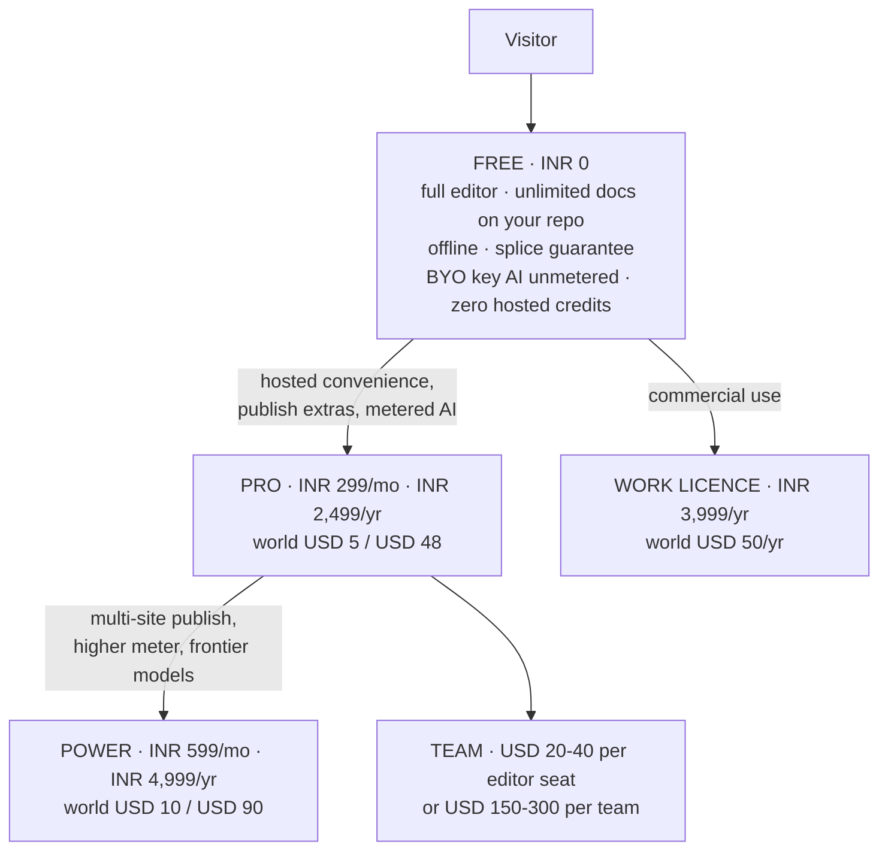

### 20.1 The FX correction that changes a decision

The founder draft (Free / ₹299 / ₹699) assumed ~₹83/$. **Live rate: ₹95.39 and ₹95.59** from two independent sources `[fetched 2026-08-28]`.

| | At ₹83 (assumed) | At ₹95.4 (actual) |
|---|---|---|
| ₹299 | $3.60 | **$3.13** |
| ₹699 | $8.40 | **$7.33** |

**₹699 at $7.33 sits above every India AI anchor** (ChatGPT Go ₹399, Gemini AI Plus ₹199–399, Netflix Premium ₹649) and only 19–27% below a $9–10 global tier — near-parity, not an India price.

### 20.2 The tables

**India**

| Tier | Monthly | Annual (lead with this) | Contents |
|---|---|---|---|
| Free | ₹0 | ₹0 | Full editor, unlimited docs on your own repo, offline, splice guarantee, **BYO-key AI unmetered**, fair-use publish, **zero hosted credits** |
| **Pro** | **₹299** (A/B ₹249) | **₹2,499** (~₹208/mo) | Publish extras, live editing, hosted convenience, small metered AI on a cheap model with a visible meter, AEO linter |
| **Power** | **₹599** (**not ₹699**) | **₹4,999** | Multi-site publish, higher meter incl. metered frontier, priority |
| Work | — | **₹3,999/yr flat** | Commercial-use licence — support and compliance, not more features |

**World**

| Tier | Monthly | Annual | Anchor `[fetched]` |
|---|---|---|---|
| Free | $0 | $0 | Obsidian free-forever, no sign-up |
| Pro | **$5** | **$48** | Obsidian Sync $4 annual / $5 monthly; HackMD Prime **$5/seat annual ($8 monthly)**; Ulysses $5.99/mo or $39.99/yr |
| Power | **$10** | **$90** | Obsidian Publish **$8/site annual, $10 monthly — per SITE, not per user** |
| Work | — | **$50/yr flat** | Obsidian Commercial parity |

₹299 vs $5 and ₹599 vs $10 are both ~37% off — a coherent ladder on Indian psychological price points without mechanical PPP.

### 20.3 Why ₹299 — and the one piece of counter-evidence

The correct anchor is **what Indians already pay for AI productivity**: ChatGPT Go ₹399; Gemini AI Plus ₹199→₹399; Netflix India ₹149/199/499/649; Indian micro-SaaS starter band ₹299–499 `[SS]`. ₹299 sits below the ChatGPT Go anchor, at the floor of the starter band, on a strong psychological point.

**Confirmed `[fetched]`: Notion has no India pricing.** The page served to an India IP contains **zero `₹` or `INR` strings**; the toggle reads "Price in USD".

**Counter-evidence worth taking seriously `[fetched]`: Craft already India-prices at ₹526.7–₹658.3/mo for Plus.** A direct competitor has decided the India individual price is **1.8–2.2× ₹299**. That both validates INR pricing *and* raises the question of whether ₹299 leaves money on the table. **Test ₹299 against ₹399 as well as ₹249.**

### 20.4 Lead with annual — fee survival, not an upsell

The flat-fee argument is real but **weaker than an earlier internal note claimed, and it depends entirely on the rail** `[fetched]`:

| Rail | Fee on ₹299/mo | Note |
|---|---|---|
| **Razorpay (India domestic)** | **2.36%** | 2% + 18% GST on the fee. Zero setup, zero AMC. **The flat-fee argument barely applies here** |
| Dodo, **India domestic (UPI/local cards)** | 4% + **15¢** = **9.29%** | The 15¢ flat is **4.79%** of ₹299 — not the 12.76% an earlier note computed using the US 40¢ rate |
| Dodo, US/standard | 4% + 40¢ | 40¢ **is** 12.76% of ₹299 |
| Paddle / Lemon Squeezy | 5% + 50¢ = **~15%** | Paddle's own comparison prices a non-MoR stack at "~7% and above" |
| Polar | 5.00%+50¢ tiering down to 3.40%+30¢ | MoR |

Annual still wins — ₹2,499/yr drops the Dodo fee from 9.29% to **5.07%** `[derived]` — but **on Razorpay-domestic the annual argument is convenience and churn, not fees.**

### 20.5 The strategic point

**We cannot win India's AI price war and should not try.** ChatGPT Go went *free* for Indian signups; Gemini is subsidised at ₹199; Perplexity Pro is free via Airtel to ~400M subscribers, nominally worth ₹17,000/yr `[SS]`. A bootstrapped studio does not out-subsidise that. **That is the argument for BYO-key, and for India as top-of-funnel rather than the revenue engine.**

### 20.6 Which market first

**Distribution India-first, revenue global-first.**

| For India | Against India as the revenue centre |
|---|---|
| Largest, fastest-growing developer base — 21.9M GitHub contributors, +5.2M in a year `[SS]` | **Zero category-specific willingness-to-pay evidence for markdown tools in India** `[SS]` |
| Consumer app spend +35% YoY, productivity and AI leading `[SS]` | The AI price here is collapsing to zero |
| Based here; UPI and Razorpay native | ₹299 nets **$2.58** vs **$4.25** for the identical feature at $5 `[derived]` |
| Craft has already INR-priced India `[fetched]` | **₹20L/mo needs 6,689 paying Indians vs 4,193 at $5 — 59.5% more paying humans for identical revenue** `[derived]` |

**Rails:** Razorpay for India (2.36%, native UPI, founder owns GST) + a merchant-of-record for the world. **What matters most is not the discount — it is that UPI exists at checkout.** International gateways without it lose 30–40% of Indian checkouts `[SS, vendor-sourced]`. Paddle and Lemon Squeezy do not support UPI.

### 20.7 Competitive pricing, live

| Product | Price `[fetched 2026-08-29]` |
|---|---|
| **Obsidian** | App free, no sign-up. Sync $4/user/mo annual ($5 monthly). Publish **$8/site/mo** annual ($10). Catalyst $25 one-time. Commercial $50/user/yr, **optional** |
| **HackMD** | Free (3 teammates, 20 GitHub pushes/mo). **Prime $5/seat/mo annual** ("save 37.5%" ⇒ $8 monthly) |
| **GitBook** | Free $0/site · **Premium $65/site/mo + $12/user** · **Ultimate $249/site/mo + $12/user** |
| **Mintlify** | Starter **$0** (5 editor seats, **includes the MCP server**) · **Pro $450/mo** (10,000 credits, $0.01 overage) · Enterprise quote |
| **Outline** | **$10/mo (1–10 members)** · $79 (11–100) · $249 (101–200). Self-hosted free |
| **Notion** | Free · Plus $10/member · Business $20/member. **No India pricing** |
| **Craft** | **India-geo-priced: Plus ₹658.3/mo monthly, ₹526.7 yearly**; Team ₹3,792/mo |
| **iA Writer** | One-time **Mac $49.99 · Windows $29.99 · iPhone+iPad $49.99, per platform.** Explicit: "One Time ≠ Lifetime" |
| **Statuspage** | Free · Hobby $29 · Startup $99 · Business $399 · Enterprise $1,499 |
| **Document360** | **Quote-only** — no prices published |
| **Confluence** | Not extractable (JS-rendered). `[SS]` Standard $5.42, Premium $10.44, raises every 12–18 months |

### 20.8 Pricing policy — published, and treated as a promise

Free-forever editor · **dollars not credits** · BYO-key at every tier · one cheap surface unlimited · never auto-migrate plans · never reprice opaquely · commenters never bill.

---

## 21. Cost structure and funnel math

### 21.1 Infrastructure

Assumptions, stated so they can be replaced by measurement: 4% free→paid · 9,000 HTTP requests/user/mo · 8 CPU-ms/request · storage 20 MB/free, 250 MB/paid · hosted inference for paid only, capped $0.40 · support 0.02 tickets/free-user/mo, 0.10/paid, 12 min each. Rates `[fetched]`: Cloudflare Workers Paid $5/mo minimum, 10M requests then +$0.30/M, 30M CPU-ms then +$0.02/M; **R2 storage $0.015/GB-mo, Class A $4.50/M, Class B $0.36/M, egress FREE.**

| Line | 100 users (4 paid) | 1,000 (40 paid) | 10,000 (400 paid) |
|---|---|---|---|
| Workers | $5.00 | $5.84 | $42.80 |
| R2 (storage + ops) | free tier | $0.29 | $69.03 |
| **Egress** | **$0.00** | **$0.00** | **$0.00** |
| Infra subtotal | $5.00 | $6.13 | **$111.83** |
| Hosted inference | $1.60 | $16.00 | $160.00 |
| **Total variable** | **$6.60** | **$22.13** | **$271.83** |
| Infra per paid user | $1.250 | **$0.153** | $0.280 |
| **Support load** | 2.3 tickets/mo (0.5 hr) | 23.2 (4.6 hr) | **232 tickets/mo = 46.4 founder-hours** |

**Three conclusions:**

1. **Egress-free R2 is the load-bearing architectural choice.** A document workspace's dominant byte flow is reads; on any egress-billing store this is the largest single line.
2. **The $5/mo Workers minimum dominates below ~1,000 users** — infra per paid user is **8.2× worse at 100 users than at 1,000**.
3. **Support, not compute, is the wall.** 46.4 founder-hours/month at 10,000 users, before any sales, marketing or engineering.

Not modelled, each a real line: domain, transactional email, error monitoring, an AI-gateway/observability layer, refunds and chargebacks, the founder's own tooling.

### 21.2 Conversion benchmarks `[fetched]`

| Motion | Good | Great |
|---|---|---|
| Freemium self-serve | 3–5% | 6–8% |
| Freemium + sales-assist | 5–7% | 10–15% |
| Free trial | 8–12% | 15–25% |

Sign-up rate: freemium 9% vs free-trial 5%. 20% of freemium products convert **below 2.5%**; 33% sit 2.5–5% (modal).

> **"The median conversion rate for developer-focused companies was 5% — half that of companies that do not sell to developers."** `[fetched]` This governs frontmatter directly. **We chose the hard half deliberately.**

### 21.3 What each revenue milestone actually requires `[derived]`

Gross ARPU: mix A (70% India ₹299 / 30% World $5) = ₹352.40. Zero churn assumed — with churn, gross adds must exceed these.

| Milestone | Paid users | Free @5% (dev median) | Cumulative visitors @9% signup |
|---|---|---|---|
| **₹1L/mo** ($1,048) | 284 | **5,675** | 63,060 |
| **₹5L/mo** ($5,241) | 1,419 | **28,377** | 315,298 |
| **₹20L/mo** ($20,964) | 5,675 | **113,507** | **1,261,193** |

**Verdict:** ₹1L/mo is reachable at typical rates. ₹5L/mo needs ~28,000 free signups — plausible for a well-distributed dev tool. **₹20L/mo needs 113,507 signups and ~1.26M cumulative visitors. That is a distribution problem, not a pricing problem, and it is where the plan stops being solo-founder-shaped.**

---

## 22. Go-to-market

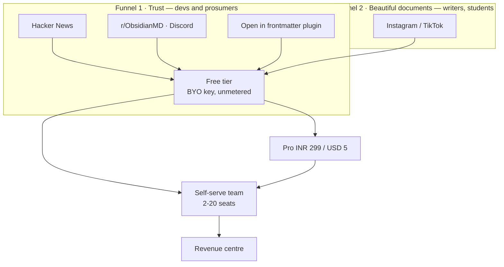

| | Funnel 1 — Trust | Funnel 2 — Beautiful documents |
|---|---|---|
| Line | *"The markdown source of truth AI can't corrupt"* | *"Beautiful documents from plain text"* |
| Channels | HN, r/ObsidianMD (~344,000), Discord (~195,000), X, YouTube | Instagram, TikTok |
| Content | Evidence-first: the 907/907 result, the foreign-vault run, a 10-second demo diff against a competitor's shipped product | Custom renders in 15 seconds of vertical video |
| Confidence | **High.** Our campaign practice already manufactures exactly this `[measured]` | **Low.** No dev tool has grown Instagram-first, and our content pipeline mines the *system record*, so it would never surface aesthetic material on its own |

**The window is warm now.** The review-loop wedge was independently validated twice in four weeks — Markleft (Show HN) and OzBrain (92 points on HN), whose founder pitches *literally* "the diffing, versioning and audit log of what was changed, by what agent and why" as the paid product `[fetched]`. "Serve Markdown to AI Agents with Accept Headers" hit **175 points, 108 comments on 2026-08-26** `[fetched]`.

**Channel discipline.** The Obsidian community's code of conduct means the only admissible framing in the biggest watering hole is *"integrates with your vault"*, never *"Obsidian competitor"* — break it and the launch is removed rather than debated. The **"Open in frontmatter" plugin is the distribution play**; Relay proved the path with 172,544 downloads of a commercial service's bridge plugin `[SS]`.

**Cadence, grounded in measured supply.** Three LinkedIn posts/week + a weekly canonical blog post + two Instagram carousels. The campaign system built 10 complete multi-surface episodes in ~1 week — **supply is not the constraint** `[measured]`. What is *not* proven is sustained cadence: **exactly two posts have ever shipped, one with a visible defect since 2026-08-10, three more on editorial hold** `[measured]`. So the survival mechanisms matter more than the plan: **never miss twice; queue depth ≥ 2; read no metrics before post 20 (MIN_N ≥ 10 before any format change).**

**A publishing constraint to design around `[measured]`:** LinkedIn cannot post a PDF document through the current integration — `linkedin.js` implements `/rest/images` and `/rest/videos` only, and `content_items.pictures` is one shared jsonb array, so one item cannot carry a PDF for LinkedIn and PNGs for Instagram. The Documents-API entitlement probe exists, is read-only, takes ~5 minutes, and **has still not been run.**

**Run the launch calendar inside frontmatter itself.** Calendar profile, evidence-tier fields on every post, draft-and-queue publishing. The GTM engine becomes a continuous product demo, and the content pipeline's biggest gap — a sustained capture habit — becomes a product feature.

**Never say "markdown editor."** Every Show HN with that name becomes a thread of free alternatives. Category winners renamed the category: Obsidian sold *ownership*, Notion a *workspace*, Linear *speed*.

---

## 23. Moat and defensibility

Ranked by hold-time, not by how good it feels.

| Rank | Moat | Holds | What erodes it |
|---|---|---|---|
| 1 | **Community / ecosystem** | Years, compounding | Nothing external — **but it does not exist yet**, is the slowest to build, and India is greenfield (no organised India Obsidian meetup or Discord found) `[SS]` |
| 2 | **Byte-fidelity engine (splice)** | **18–36 months** | An incumbent shipping a byte-exact writer. The work is hard but finite and increasingly LLM-assistable. GitBook's dominant complaint cluster is *reliability / lost work* — the gap is real today `[SS]` |
| 3 | **Degradation certificate** | 12–24 months as an exclusive; longer as a category standard | Commoditisation — which is also the win condition if we set the standard. **Zero defensibility if the certificate is not independently checkable** |
| 4 | **Provenance / byte attribution** | 12–24 months | Platform content credentials shipping natively; compliance vendors extending downward |
| 5 | **Brand** | Slow to build, durable once built | Naming risk (§30 D3). **"frontmatter" is the generic name of the substrate** — `gray-matter` alone does 35.78M downloads/month, so the term is generic in the buyer's own vocabulary |
| 6 | **File-native data / no lock-in** | Structural but **non-exclusive** | Every markdown tool claims it; seven free self-hosted alternatives sit at 21K–76K stars, all actively pushed (§3.1) |
| 7 | **Switching cost** | **Near zero, by design** | **This is the anti-moat.** The portability that earns trust removes lock-in. Retention must be earned every month by the product, not by hostage-taking |

**Honest summary: the moat is engineering depth in a narrow place, plus timing. It is not distribution, brand, or lock-in — and it never will be.** The go-to-market must convert engineering credibility into an outcome a buyer can name (§18).

---

## 24. Roadmap

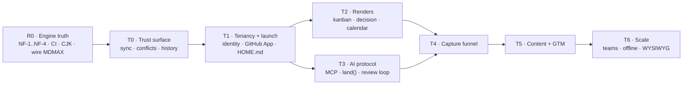

### R0 — Engine truth (before we market any fidelity number)

Across **7,959 frontmatter files from five authors' public vaults**: zero corruption, zero throws — but **83% publish-refusals** (4.7–19.5% on real personal vaults).

| ID | Defect | Mechanism | Fix |
|---|---|---|---|
| **NF-1** | **6,613 of 6,614 refusals have one cause** | A block sequence at zero indentation (`tags:` then `- item` at column 0). Spec-valid YAML, PyYAML's default output, idiomatic in the CJK vaults sampled | Recognise a dash-item as a continuation of the preceding key → **recovers 99.98%** |
| NF-2 | Flow-seq closing `]` at column 0 | Same family | — |
| **NF-3** | **Bare-CR fence (`---\r`) misses the open-fence regex** | A lone `set` **prepends a second frontmatter block**. Set-destructive and **invisible to the round-trip oracle** because set-then-delete cancels out. The shipped BOM bug's sibling | Fix + upgrade the oracle to a set-only assertion (make the test fail against unfixed code first) |
| NF-4 | `SAFE_KEY` too narrow | `date created` in **812 of 957** files of one vault; CJK keys in **905** | Quoted-key support — a design task, not a regex |

**Also in R0:** the six construct-detector defects (they gate the AEO linter *and* kill-condition 4) · **CI — `.github/` does not exist** · CJK (`countWords` undercounts Chinese 1.7–2×; MiniSearch CJK recall 18.1%) `[measured]` · **wire MDMAX into the product** (currently imported by zero product files) · reconcile `globals.css` with the canonical design system (§16.3).

### The tracks

| Track | Contents | Exit condition |
|---|---|---|
| **T0 Trust surface** | Sync chip → conflict inbox → named-version history + since-you-last-opened banner → background auto-sync → local history | **Two-device offline-edit convergence, zero loss, watched by a user** |
| **T1 Tenancy + launch** | Identity and multi-tenancy (HQ's pooled-RLS spine + CareerOS entitlements are the lift) → **GitHub App** (not an OAuth app, §28.2) → multi-vault → mobile pass → HOME.md → quick capture → the "Open in frontmatter" plugin | First external user |
| **T2 Renders** | `components.tsx:133` regex fix → delete dead `editable-table.tsx` → kanban read-only → kanban bidirectional **gated by a zero-dirty oracle** → decision → calendar → corkboard → compile profiles → publish-with-profiles → `mdmap check` CLI | Kanban write-back dirties zero files on a no-op |
| **T3 AI protocol** | MCP server + `land()` → the review loop → provenance + implicit telemetry → the differ → cert distribution (npx / MCP / generated skill / GitHub Action) → citation-gated answers → session continuity → ACP client (with desktop) → **publish the session-interchange format** | An agent edits a real vault and every change is reviewable |
| **T4 Capture funnel** | Chat-side skill + paste inbox → ChatGPT/Claude ZIP importers (**the verification report is the demo**) → promotion loop → retro-capture | A conversation becomes durable documents in one click |
| **T5 Content + GTM** | Land Markex's uncommitted tree (19 modified files, 10 pending migrations, RULE-2/3 gated) → run the LinkedIn Documents-API probe → post-as-document → the launch calendar inside the product | 20 posts shipped |
| **T6 Scale** | Offline-first → WYSIWYG → share roles → comments → suggest mode → teams | — |

---

## 25. Engineering standards

Not aspirations — the practices that caught real defects in this codebase.

| Standard | Rule |
|---|---|
| **Red-proof first** | A test on a rare fault proves nothing until it **fails against the unfixed code**. If you cannot make it fail, say so rather than reporting a pass |
| **Gates must be able to see** | A check that greps source is a **proxy** and must be labelled one. A check that does not execute the thing proves nothing. Four gates in this repo could report green while blind — all four now fixed `[measured]` |
| **Floors, not equalities** | Assert `passes ≥ N and failures == 0`. Equality-pinned counts punish adding coverage |
| **Corpus integrity** | Re-hash every corpus file against a pinned sha256 before use. This caught a real drifted file on its first run `[measured]` |
| **Never trust a piped exit status** | `cmd \| tail` reads green while the command failed |
| **Run it three times** | One run is an anecdote. Pin stochastic inputs or assert a distribution over a seed sweep |
| **Verify the write landed** | Count before, count after, refuse if the count did not move |
| **A verifier written beside its subject inherits its blind spots** | An independent adversarial pass is required before any clean bill of health |
| **Preview before you delete** | `grep -c` first, `rm` second |
| **Field names across scripts** | The consumer must accept every key the producers write; a missing key is UNKNOWN and skipped, never coerced to falsy |
| **Wait on the artifact, not the process** | A tool whose job is to produce a file must verify the file, using the format's own end marker |
| **Re-derive every number at write time** | §32 exists because we did not |

**CI to build in R0:** typecheck → lint → test → build → arch report with a minimum-files-scanned floor → corpus oracle → foreign-corpus suite as a standing gate.

---

## 26. Risk register

L = likelihood, I = impact (1–5). Every owner is the founder until §29 says otherwise.

### 26.1 Technical

| Risk | L | I | Early warning | Mitigation |
|---|---|---|---|---|
| **Parser refuses real-world vaults on import** | 5 | 5 | Import-failure rate; "it won't open my notes". `[measured]` 83% aggregate foreign refusal | Ship NF-1 before any marketing number; standing foreign-corpus gate in CI |
| **No CI at all** | 5 | 4 | `[measured]` `.github/` absent | Add CI before any external contributor or paid customer |
| Addressability gaps make edits unroutable | 4 | 4 | `SAFE_KEY` too narrow — `date created` in 812/957 files | Quoted-key support (NF-4) |
| Non-Latin correctness debt | 4 | 3 | `countWords` 1.7–2× under; MiniSearch CJK recall 18.1% | Segmenter swap; scope CJK explicitly in or out of v1 |
| LLM price/model deprecation breaks unit economics | 4 | 4 | Provider changelog; cost-per-active-user drift >20% | BYO-key lane + provider abstraction; **never hardcode one model id**; Gemini 3.7 Flash already doubles 2027-01-01 |
| Silent data destruction on edit | 3 | 5 | Round-trip diff non-empty. NF-3 is set-destructive **and oracle-blind** | Fix + upgrade the oracle to a set-only assertion |
| Editor state corruption (CodeMirror ↔ model sync) | 3 | 5 | Undo/redo divergence. Tier-1 class already fixed once (`d50a6b2`) | Property-based sync tests |
| Published-page hosting cost blowout | 2 | 3 | Egress slope; a page going viral | Per-account bandwidth cap + cache |

### 26.2 Market

| Risk | L | I | Early warning | Mitigation |
|---|---|---|---|---|
| **No distribution channel** | 4 | 5 | Zero organic signups for 60 days | Ship the engine research publicly — **the foreign-corpus numbers are the marketing asset** |
| Incumbent ships the same feature free | 4 | 5 | Competitor changelog | Compete on the engine guarantee, not the feature list |
| Category crowded, low willingness to pay | 4 | 4 | Trial→paid <2% | Price the workspace/publishing/agent lane, not "an editor" |
| **Byte-fidelity may be a claim no buyer prices** | 4 | 5 | Conversion flat despite demo engagement | If "provably never loses a keystroke" reads as table stakes, the technical differentiator is unmonetisable and we are competing on editor taste against Obsidian's free tier |
| Free self-hosted substitutes | 4 | 3 | — | $5–8/seat must be justified by what self-hosting cannot cheaply give: zero-ops, provable losslessness, the certificate |
| Publishing lane cannibalises the editor prop | 3 | 3 | Split cohorts with near-zero overlap | Pick one wedge for v1 |

### 26.3 Operational and key-person

| Risk | L | I | Early warning | Mitigation |
|---|---|---|---|---|
| **Founder is the single point of failure** for engine, product, support, billing | 5 | 5 | Response-time drift; unshipped weeks | Runbooks; bus-factor doc; MoR absorbs billing support |
| **Sustained content cadence fails** | 4 | 4 | Miss twice | Never-miss-twice; queue depth ≥ 2 |
| Support volume from BYO-key misconfiguration | 4 | 3 | Ticket mix >30% "my key doesn't work" | Key-validation UX at entry; provider-specific error mapping (≤200-char actionable errors) |
| Burnout / illness with paying customers live | 3 | 5 | Consecutive zero-commit weeks | Explicit degraded-service SLA in ToS; escrow of deploy credentials |
| Unauthorised destructive ops by agents | 3 | 4 | Commits not authored in-session (5 unauthored commits observed once) | Capture `git rev-parse HEAD` before/after every workflow; **the prohibition is advisory, never the gate** |
| Credential loss (single laptop, single account) | 2 | 5 | No recovery drill in 90 days | Hardware key + offline recovery codes; documented account inventory |
| **Two PATs pasted into an earlier chat window remain unrotated** | **live** | 4 | — | **Founder action, §30 D5** |

---

## 27. Legal and compliance

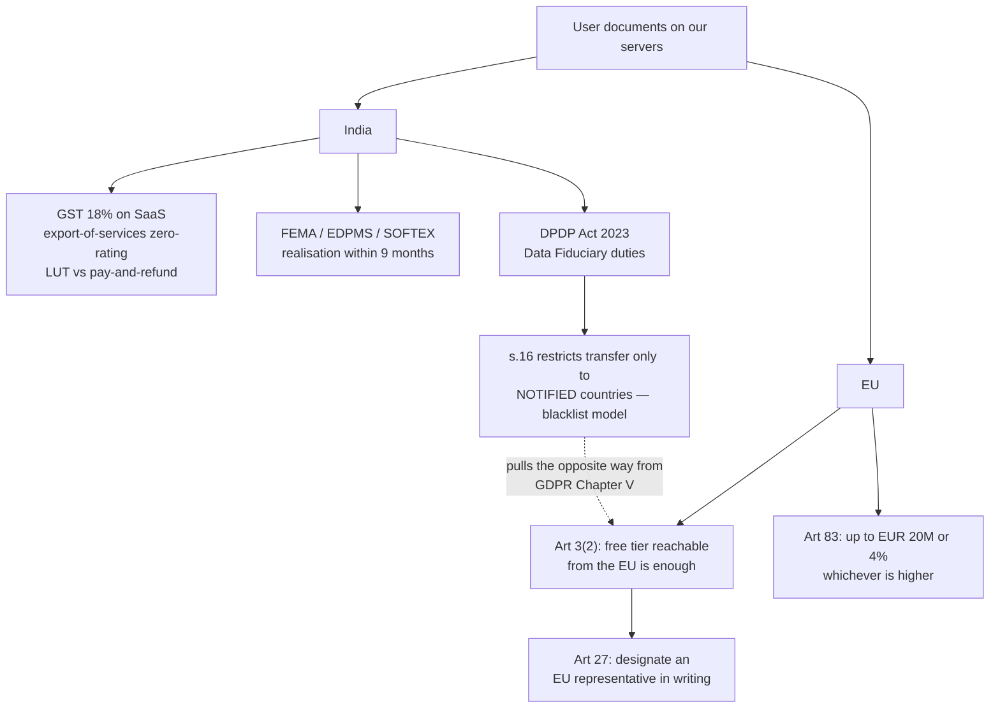

**Everything in this section is an issue list for a chartered accountant and a lawyer. None of it is advice.**

### 27.1 India — GST, FEMA, export of services

| Item | Status |
|---|---|
| Export of services as a zero-rated supply; two routes — **LUT/bond without payment of IGST**, or **pay IGST and claim refund** | `[SS]` — **primary text was not verifiable this session**: cbic-gst.gov.in failed TLS verification and 404'd on every IGST-Act PDF path; legislative.gov.in and indiacode.nic.in 404'd. **Needs CA confirmation against the current bare act** |
| "Export of services" requires payment **in convertible foreign exchange** and that supplier and recipient are not establishments of the same person | `[SS]` — **If an MoR is the contracting counterparty, who the recipient is and what currency lands in the Indian bank account changes the answer. This is the single highest-value CA question.** |
| Registration threshold (commonly cited ₹20 lakh / ₹10 lakh special-category) | `[SS]` Exporters may face a separate trigger irrespective of turnover — confirm |
| Reverse charge on **imported services** (LLM APIs, hosting, MoR fees billed from abroad) | `[SS]` A real recurring cost line for this exact product |
| Equalisation levy | `[SS]` Reported withdrawn in recent Finance Acts. **Do not rely on memory** |
| **SOFTEX / EDPMS** | `[fetched]` RBI Master Direction: SOFTEX via STPI/SEZ; **all invoices including those under US$25,000** must appear in the bulk statement. Long contracts: bill at least monthly or at milestone, last invoice **within 15 days** of completion. **Realisation/repatriation: nine months from date of export** (updated as on 2026-07-17; A.P. (DIR Series) Circular No. 08 dated 2025-08-05) |
| Other limits in the same Master Direction | `[fetched]` Invoice-value reduction permitted up to **25%**; self write-off gated at **5%** of exports; realisation limit **USD 1 million or 10%** of average export |

### 27.2 India DPDP Act 2023

User documents containing personal data make us a **Data Fiduciary**. Penalties, from The Schedule `[fetched, gazetted MeitY PDF]`:

| Breach | Ceiling |
|---|---|
| Failure to take reasonable security safeguards — **s.8(5)** | **₹250 crore** |
| Failure to notify the Board or the Data Principal of a breach — s.8(6) | ₹200 crore |
| Obligations relating to children — s.9 | ₹200 crore |
| Significant Data Fiduciary obligations — s.10 | ₹150 crore |
| Any other provision | ₹50 crore |

- `[fetched]` **s.16(1)**: the Central Government "may, by notification, **restrict the transfer**" to a notified country — a **blacklist model, not a whitelist**. s.16(2): any other Indian law with higher protection still applies.
- `[SS]` **The DPDP Rules** — consent notices, breach-notification timelines, SDF designation, verifiable parental consent — **status not verified**; the MeitY page returned a 1,155-byte shell. Breach timing, the consent-manager regime, and whether we are an SDF all hinge on them. **Lawyer question.**

### 27.3 GDPR

- `[fetched]` **Art. 3(2)**: applies to a non-EU controller where processing relates to offering goods or services **"irrespective of whether a payment of the data subject is required"**, or monitoring behaviour in the Union. **A free tier reachable from the EU is enough.**
- `[fetched]` **Art. 27**: where 3(2) applies, the controller **"shall designate in writing a representative in the Union."** The exception is processing that is "occasional" — **a document workspace is unlikely to qualify.** This is a real recurring cost line.
- `[fetched]` **Art. 83(4)**: up to **€10M or 2%** of worldwide turnover, whichever is higher (security, breach notification, DPIA, records). **Art. 83(5)/(6)**: up to **€20M or 4%** (basic principles, consent, data-subject rights, third-country transfers).

**Contradiction to reconcile deliberately:** DPDP s.16 restricts transfers only to *notified* countries (permissive by default); GDPR Chapter V restricts transfers *out of the EU* unless a safeguard exists (restrictive by default). **A single storage architecture cannot satisfy both by accident.**

### 27.4 What a merchant of record absorbs — and what it does not

| Provider | Fee `[fetched]` |
|---|---|
| Paddle | **5% + 50¢**; its own stacked comparison for a non-MoR stack: "~7% and above" |
| Lemon Squeezy | **5% + 50¢**, no monthly fee, 95 currencies |
| Polar | **5.00%+50¢ → 3.80%+40¢ → 3.60%+35¢ → 3.40%+30¢** tiered |
| Dodo | 4% + 40¢ US; **4% + 15¢ India domestic**; +1.5% international cards; +0.5% subscriptions; tax management in 190+ countries included |

- **Absorbed:** sales-tax/VAT/GST calculation, collection, filing and payment liability across jurisdictions; seller-of-record status; payment-related buyer support; chargeback and fraud handling.
- **Still owed by the founder regardless:** Indian corporate income tax on the net remittance; the **GST treatment of the MoR relationship itself** (is the MoR the recipient? does that still qualify as export?); FEMA/EDPMS/SOFTEX filings; TDS/withholding questions; **and every DPDP and GDPR controller obligation over the documents themselves.**

> **An MoR absorbs *tax*, never *data protection*. It is a payment counterparty, not a data-processing shield. Do not assume MoR = "no Indian compliance" — it changes who remits sales tax; it removes not one Indian filing.**

### 27.5 Data residency

`[fetched]` DPDP s.16 does **not** mandate India-resident storage; it enables a notified-country restriction. `[SS]` Sectoral rules may impose residency independently. **A single US/EU region is defensible today but creates a migration liability if a country is later notified. This is a decision, not a default (§30).**

---

## 28. Security posture

### 28.1 BYO-API-key storage
The key is a bearer credential for a **metered, billable** third-party account — compromise is direct financial loss to the *user*. Encrypt at rest with per-user envelope encryption; **never return the key to the client after entry** (write-only field, show last-4); never log it; never place it in a URL; scrub it from error traces and from any LLM prompt context. **Do not proxy BYO keys through a server that also stores documents without isolating the key store** — that co-locates the two highest-value assets. If keys are client-side only, say plainly that server-side agent features cannot work — that is a product constraint, not a footnote.

### 28.2 GitHub scopes — ship a GitHub App, not an OAuth app
`[fetched]` The `repo` scope "grants **full access to public and private repositories**… also grants access to manage **organization-owned resources** including projects, invitations, team memberships and webhooks." Far broader than markdown sync needs, and a likely deal-breaker in any enterprise review. GitHub's own docs: **"Consider building a GitHub App instead of an OAuth app… GitHub Apps use fine-grained permissions instead of scopes."**

**Recommendation: a GitHub App with contents-scoped fine-grained permissions on user-selected repositories.** Note the current blocker: `read:user` grants no repo access, so the path as written does not work (§30 D4).

### 28.3 Published pages
**An unguessable URL is not access control.** Publish state must be a server-side authorisation check on every request. **Revocation must invalidate CDN/edge cache, search-engine access, and any signed URL already issued** — we already fixed an unpublish-revocation defect (`d50a6b2`), which is evidence this class is live here. Add `noindex` on unlisted pages, per-page expiry, an audit log of publish/unpublish, and a **"what is public right now" inventory screen**.

### 28.4 Prompt injection
`[fetched]` OWASP GenAI LLM Top 10 (2025): **LLM01 Prompt Injection**, LLM02 Sensitive Information Disclosure, LLM05 Improper Output Handling, **LLM06 Excessive Agency**, LLM10 Unbounded Consumption.

An agent reading a user's vault is reading **untrusted content** — imported notes, pasted web clippings, synced third-party READMEs. **Any instruction inside a document is data, never a command.** The lethal trifecta applies exactly: untrusted content + private data + an outbound capability (publish, GitHub write, email) in the same turn. **Gate every outbound action behind explicit per-operation confirmation.** Deny-by-default tool loadout; no auto-publish, no auto-commit, no auto-send; render model output as text, never executable markup; cap tokens and spend per user.

### 28.5 The lane that must be refused
**Do not build:** in-product `eval()`, user-supplied JS/Python plugin execution, arbitrary shell in a document, or "run this code block" against our infrastructure. **A markdown workspace with code fences invites it, and it converts every prompt injection into remote code execution on infrastructure holding every customer's documents and API keys.** If code execution is ever required it is a **separate, sandboxed, network-isolated, ephemeral** service with no access to the document store or the key store — a build-vs-buy decision, not a feature toggle.

---

## 29. Execution capacity

**One person. This is the binding constraint on everything above.**

| Question | Assessment |
|---|---|
| Realistic solo throughput | ~**1 substantial shipped surface per 2–3 weeks** alongside support, billing and compliance. The engine backlog alone (NF-1 → NF-3 → NF-2 → NF-4 + mdmax Tier 3/4 + CI) is a **multi-month R0 lane before any customer-visible feature** |
| Non-negotiable overhead | Support, incident response, invoicing and FEMA filings, security patching are **recurring and do not compress with skill**. Budget them as fixed load, not slack |

| Must BUY | Why | Cost `[fetched]` |
|---|---|---|
| Merchant of record | Global sales-tax registration and filing is unbuildable solo | 5%+50¢ (Paddle, Lemon Squeezy) / 3.40–5.00%+30–50¢ (Polar) |
| Auth (OAuth/session/MFA) | Credential handling is a liability, not a differentiator | — |
| Error tracking + uptime | You are the on-call rota of one | — |
| **EU Art. 27 representative** | Statutory; cannot be self-appointed from India | recurring `[SS]` |
| **A CA** (GST/FEMA/EDPMS/SOFTEX) **and a lawyer** (DPDP/GDPR/ToS/abuse) | Every item in §27 is outside an agent's competence | — |
| Object storage + CDN | — | Cloudflare R2, egress-free |

**Must BUILD (the moat):** the markdown engine and its round-trip guarantee; the degradation certificate; addressability/SAFE_KEY design; the agent-over-documents UX and its injection boundary.

**Must HIRE, first two in order:** (1) a **part-time support/community person** once tickets cross ~10/week — it is the first thing that destroys engineering blocks; (2) a **second engineer only after CI exists**, otherwise onboarding cost exceeds output.

**Sequencing consequences:**
- **R0 precedes marketing any number.** Publishing a fidelity claim before NF-1/NF-3 land converts a technical bug into a false public claim.
- **CI must exist before hire #2.**
- **The MoR must be chosen before the first paid signup** — migrating billing counterparties mid-flight breaks the FEMA paper trail.
- **The EU representative must exist before the first EU *free* signup**, because Art. 3(2) triggers "irrespective of whether a payment is required."

---

## 30. Open decisions — founder's call, before development starts

### 30.1 Product and company

| # | Decision | Options | Consequence | Recommendation |
|---|---|---|---|---|
| **D1** | **sgnk-md vs frontmatter** | (a) frontmatter is the sole codebase; (b) maintain both | 145 byte-identical files, **12 diverged module files each a two-place fix**, md frozen since 2026-07-17, md has CI and frontmatter does not | **(a).** md stays as vault data and first customer; md.sgnk.ai eventually redeploys as a frontmatter instance. Port md's `ci.yml` immediately. Add a frontmatter card to `ecosystem.md` |
| **D2** | **The CRDT contradiction** | (a) §4b governs — server-authoritative; (b) keep Yjs multiplayer | §4b is later and explicitly a resolution, but the feature tables were never updated | **(a).** Edit the stale rows |
| **D3** | **The name** | (a) qualifier + distinctive domain; (b) **flip the hierarchy** — a coined mark becomes the brand, "frontmatter" stays the feature word; (c) tripwires | Risk medium-high, **high as bare "Frontmatter."** Same-market senior user since 2019 at **80,527 installs**; **MDMAX is collision-clean** (npm unregistered). And `gray-matter` at 35.78M downloads/month makes the term generic in the buyer's vocabulary | **(b)**, with counsel before any brand spend |
| **D4** | Max-tier contents | Depth vs novelty | — | **Depth, never novelty** |
| **D5** | **The two unrotated PATs** | — | Live exposure | **Rotate. Only you can do this** |
| **D6** | Detente with the Front Matter CMS author | Send / don't | Their README invites collaboration | Founder's call |
| **D7** | Two 30-second human verifications | — | Both bot-gated all session | The AGENTS.md Linux Foundation announcement; the Otterly zero-citations experiment |

### 30.2 Architecture and compliance — each changes the build

| # | Decision | Option A | Option B |
|---|---|---|---|
| **D8** | **Do documents leave the user's device?** | **Local-first / E2E** — kills server-side agents, search and publishing; collapses DPDP/GDPR surface to near-zero | **Server-stored** — enables the whole product, and buys the full §27 obligation set including the ₹250 crore s.8(5) ceiling |
| **D9** | **BYO key or platform key?** | **BYO** — no COGS, no model margin, high support load, key-custody risk | **Platform** — clean UX, real margin exposure to provider price moves, unbounded-consumption risk |
| **D10** | **MoR or direct?** | **MoR** — 5%+50¢, global tax absorbed; **changes the GST export analysis** | **Direct** — cheaper headline, you own VAT/GST registration in every jurisdiction |
| **D11** | **GitHub App or OAuth app?** | **App** — fine-grained, per-repo, enterprise-acceptable, more build work | **OAuth `repo`** — fastest, requests full read/write on **all** repos and org resources. A likely deal-breaker |
| **D12** | **Storage region?** | **Single US/EU** — simplest, cheapest; exposed if India notifies a restricted country | **India + one foreign** — doubles ops cost now, insures against notification and EU objections |
| **D13** | **Free tier reachable from the EU?** | **Yes** — triggers Art. 3(2) and the Art. 27 representative immediately | **No (geo-gated)** — delays revenue, defers cost |
| **D14** | **Does the agent get write/publish authority?** | **Yes** — the flagship demo, full lethal-trifecta exposure | **Read-only + human-confirmed writes** — slower demo, the only defensible posture |
| **D15** | **Publishing in v1 or v2?** | **v1** — doubles the product, adds content-liability/abuse/takedown obligations | **v2** — narrower wedge; the editor must carry the price alone |
| **D16** | **Publish a fidelity number before or after NF-1?** | **Before** — the current measured refusal rate makes the claim false | **After** — delays the strongest marketing asset the project has |
| **D17** | **CJK in scope for v1?** | **In** — must fix `countWords` (1.7–2× under) and MiniSearch recall (18.1%) | **Out** — say so explicitly rather than shipping a silent failure |

---

## 31. Research record

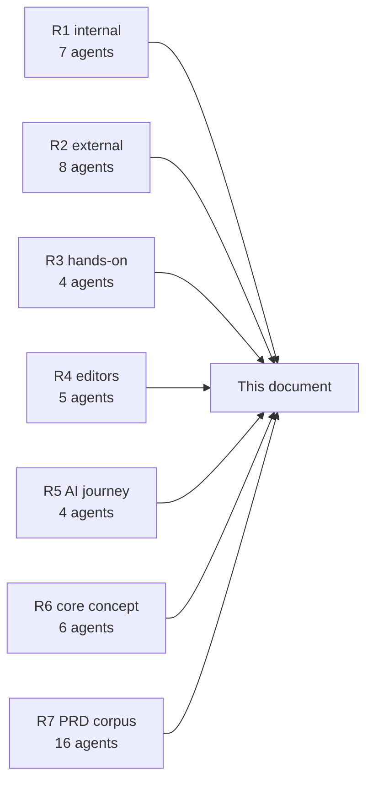

**Method.** Seven rounds, **51 agents, ~10.7M tokens**. Hands-on rounds *executed* competitor code and ran our writer against strangers' data rather than reading about it. Reports at `docs/research/agent-reports-2026-08-28/`.

| Round | Agents | Reports | What it established |
|---|---|---|---|
| **R1 · Internal sweep** | 7 | `i1`–`i7` | The content/campaign engine; the studio product inventory and reuse map; knowledge-base principles; **AIOS capabilities and its pattern language** (the L3 feature set); the frontmatter docs-vs-reality delta; the research ledger method |
| **R2 · External gaps** | 8 | `e1`–`e8` | Claim verification; the home-surface evidence; India/team market; the **agent frontier** (what is commodity); **importer breakage** and the seven-panel report; **naming risk**; fresh community signal; **whether anyone buys a protocol layer** (no) |
| **R3 · Hands-on** | 4 | `h1`–`h4` | Design patterns; **the foreign-corpus run** (7,959 files, NF-1…NF-4); **the Hubble and Front Matter CMS teardowns**; **the OpenKnowledge teardown** |
| **R4 · Editor landscape** | 5 | `ed1`–`ed5` | Writing tools (Typora's WYSIWYG laws, Scrivener's compile architecture, iA Content Blocks); IDEs (local history, Doc Health, the palette); **frameworks and their lossy serialisation**; **AI editors**; **office suites** (the review-loop canon, Google's API limits) |
| **R5 · AI journey** | 4 | `aj1`–`aj4` | **Agent protocols**; **chat-to-artifact laws** (the rules behind `land()`); **knowledge formats** (OKF, llms.txt v2, SKILL.md, MyST, prompty, OTel gen_ai semconv); **the journey-home category gap** |
| **R6 · Core concept** | 6 | `c1`–`c6` | **The projection law**; **the computation budget** and the fourth lane; **the B2B wedge**; **INR pricing** and the FX correction; **the build bibliography**; **the twelve-screen inventory** |
| **R7 · PRD corpus** | 16 | this document | Lossless compression of all 35 prior reports + **business model and unit economics**, **internal-systems fusion**, **risk/legal/capacity** — all three built from live `curl`-fetched primary sources |
| Fetch sweep | main loop | `f1` | Ten `[SS]` claims upgraded to `[fetched]` |

**A method note worth keeping.** In R7, four agents had their final message consumed by a repeatedly-firing reconciliation hook; their deliverables were recovered from transcript JSONL. The hook keys on **absolute working-tree dirtiness rather than a delta from a subagent-start baseline**, so it re-fires indefinitely on pre-existing dirt. **Fixing that trigger predicate is a real maintenance item.**

### 31.1 Verification debt

| Item | Why | How to close |
|---|---|---|
| Every `[SS]` tag in this document | Search summary, page not opened | Open the source before publishing the number |
| **All of §27.1 GST** | cbic-gst.gov.in failed TLS and 404'd; legislative.gov.in and indiacode.nic.in 404'd | **A chartered accountant** |
| **DPDP Rules status** | The MeitY page returned a 1,155-byte shell | **A lawyer** |
| **Mobbin visual design pass** | The session taint gate refuses the outbound leg. **Re-tested this session and still refused** | A fresh session |
| Confluence pricing | JS-rendered; 53 chars of text | A browser |
| Reddit beyond r/ObsidianMD top-of-month | Rate-limited; the RSS path works | Patience |
| OpenKnowledge WYSIWYG lane | Source verdict only — their agent write path *was* executed | A live browser test |
| The two D7 clicks | Bot-gated all session | 30 seconds of a human |
| **Every price and FX rate here** | They move constantly | **Re-check at publish time** |

---

## 32. Contradictions ledger

**Read this before quoting any number from an older internal document.** Almost every count carried forward is now stale. This is not sloppiness — it is what happens when a fast-moving system is described by documents written on different days. The rule is §25's last row: **re-derive at write time.**

| Quantity | Live `[measured 2026-08-29]` | Previously stated | Note |
|---|---|---|---|
| **frontmatter test files** | **98** | 262 (earlier this session) | The 262 `find` traversed extra git worktrees. Two independent measurements now agree at 98 |
| AIOS skills | **124 SKILL.md / 130 linked** | "~93", "99", "95", "~102", "74-skill estate" | Every historical figure is stale |
| Learned Rules | **76 entries, newest #74** | "#73" | +3 since |
| Trace rows | **5,014** | 4,994 | Both correct on their day |
| Complexity-gate rows | **24,539** | 23,778 | +761 |
| Knowledge-base notes | **234** | 175 (`catalog.json`) · 171 (`knowledge.md`) · 212 · 273 files (`GRAPH_REPORT.md`) | **Five different counts for one corpus** |
| md commits | **416** | 216 (`ecosystem.md`) | |
| skills-registry | **117 entries / 123 dirs** | 184 (`ecosystem.md`) | |
| DRIFT-ALERT files | **0 present** | "2026-08-20..24 observed" | Alerts appear ephemeral/GC'd — unresolved |
| **Mintlify Pro** | **$450/mo** `[fetched]` | $250 · $150 · $20/seat · $450–540 | The $450 snapshot wins |
| **Consolidation wedge** | **$1,163–1,223/mo** `[derived]` | $963 · "$380–960" | Entirely Mintlify's repricing |
| **HackMD** | **$5/seat annual, $8 monthly** `[fetched]` | "$4/mo annual" | |
| **Obsidian Publish** | **per SITE** `[fetched]` | quoted as a per-user band | |
| **Claude Sonnet 5** | **$2/$10 per MTok**, and the Sept-2026 rise **will not occur** `[fetched]` | ~$3/$15 assumed | Frontier assumption was 50% high |
| **Gemini cheap tier** | **3.1 Flash-Lite $0.25/$1.50** `[fetched]` | "2.5 Flash $0.15/$0.60" | **That SKU does not exist** |
| **DeepSeek V4-Flash** | **$0.22/$0.66 off-peak; $0.44/$1.32 peak** `[fetched]` | off-peak quoted as the rate | |
| **Dodo India fee** | **4% + 15¢ (= 4.79% of ₹299)** `[fetched]` | "$0.40 flat = 12.7%" | The US rate was applied to India. The annual-billing argument survives but is ~2.7× weaker on that rail |
| **FX** | **₹95.39 / ₹95.59** `[fetched]` | ₹83 (founder draft) | Changes the ₹699 decision |
| `mdmax/fold@1` divergence | **Never run over the pinned corpus** | "43.71% → 4.28%" | That is the **research prototype's** number over 40 files × 6 engines. The file itself forbids attaching either figure |
| Design system | Shipped `--accent: #18181b` + 6/8/12px radii | Canonical `#1a5cff` + square corners | §16.3 — a real defect |

---

## 33. Build references

Full licence-flagged bibliography in `c5-build-refs.md`. The eight to read before writing code:

| # | Reference | Licence | Why |
|---|---|---|---|
| 1 | **`@lezer/markdown`** | MIT | The incremental parse tree. `SyntaxNode` byte offsets are our span-addressing primitive. **Most load-bearing read on the list** |
| 2 | **The OKF spec** | Apache-2.0 | Google formalising our exact bet: a directory of markdown files with YAML frontmatter, path as identity, `type` the one required field. Align or consciously diverge |
| 3 | **`@codemirror/merge`** | MIT | The review loop as a shipped component. **Highest reuse per hour** |
| 4 | **Hypothesis `match-quote.ts` + `approx-string-match`** | BSD-2 / MIT | The anchoring that lets an AI target survive human edits |
| 5 | **`mdast-util-to-markdown`** | MIT | **Read the enemy.** The serialiser that normalises; its loss points are what our splice writer is measured against |
| 6 | **`@sanity/diff-match-patch`** | Apache-2.0 | Google's original is Apache-2.0 and safe but **archived and unpublished since 2020**. Use the maintained Sanity fork |
| 7 | **`@modelcontextprotocol/sdk`** | MIT → Apache-2.0 | Mid-relicense |
| 8 | **`obsidian-dataview`** | **MIT**, 9,300★ | Closest prior art to our rendering bet; MIT means the query parser is genuinely copyable |

**Licence landmines:**

| Project | Licence | Rule |
|---|---|---|
| **obsidian-kanban** | **GPL-3.0**, abandoned | **Read the board file-format convention. Copy zero code** |
| **anthropics/skills** | **No licence file** = all rights reserved | Mirror the SKILL.md convention. Copy nothing |
| **Outline** | **NOASSERTION** `[fetched]` | Do not assume it is reusable |
| **CodeMirror org** | MIT, but **archived 2026-04-15** (55 of 57 repos) | npm alive (`@codemirror/view` v6.43.9, 2026-08-16). Source read-only; no upstream issues. **Budget vendoring risk** |

---

## 34. Glossary

| Term | Meaning |
|---|---|
| **Splice** | Replace exactly the target byte range; never regenerate from a parse tree |
| **Refusal** | A first-class outcome: return the input unchanged and say why |
| **Degradation certificate** | Measured proof of how a file renders across real markdown engines |
| **Projection** | A deterministic, disposable view computed from the file, owning no state |
| **Profile** | A named render + schema pair, activated by frontmatter or a fence info string |
| **Machine-write zone** | A fenced region an agent may rewrite and outside which it may not write |
| **Evidence tier** | `{value, source, tier, re_verify_cmd}` on a claim |
| **Hunk** | One reviewable change — human, AI, or sync conflict |
| **`land()`** | The single capture verb any agent calls to make a chat output durable |
| **The eval lane** | Client-side arbitrary code execution. The lane we refuse |
| **NF-1…NF-4** | The four foreign-corpus engine defects (§24 R0) |
| **AIOS** | The internal markdown-native orchestrator this studio runs on |
| **MDMAX** | The engine: splice writer, OffsetMap, certificate, construct detectors |
| **MoR** | Merchant of record — absorbs sales tax, never data protection |

---

*Prepared for the frontmatter build team. Every number is tagged. Nothing tagged `[SS]` may be published as fact without being opened first. Re-derive before you quote — see §32.*
