# frontmatter — Product Requirements Document

**v2.1 · 2026-08-30 · Zephyrus Studio · owner: Sagnik Mitra**

*v2.1 adds the four-page digest that opens this document, and the compact typeset. No finding was added, changed or removed from v2.0.*

**Supersedes** `FRONTMATTER-PRD-2026-08-29.md` (v1.1), `FRONTMATTER-BUILD-PLAN-2026-08-29.md`, and `FRONTMATTER-DECISIONS-2026-08-29.md`. Those three are now historical; this is the single governing document.

**Status: pre-development.** This is the input to the build, not a report on it.

---

---

# The whole thing, in four pages

*Read this. Open the rest only when you need the working. Every claim below is expanded, sourced and evidence-tagged in the section named beside it.*

**The product.** A markdown editor with a deliberately simple surface and a deep engine. You prompt any LLM anywhere; the outputs that matter land as structured, rendered, agent-legible markdown in files you own.

> **The law (§5).** The file is the only source of truth. Every app-like thing — board, calendar, decision card, dashboard, published site, and every AI edit — is a deterministic, reversible projection of that file, owning no state of its own.
>
> **The category sentence.** Notion made the app the source of truth and trapped your data inside it. frontmatter makes the *file* the source of truth and lets every app be a disposable lens over it — provably, byte for byte, reversibly.

**The problem, in one line (§2).** Six of the nine problems share one shape: *the tool reports success while quietly losing something.* Sync said green and lied. Import said 47 succeeded and lost 4. The editor said it preserved comments and deleted them. **So: be the tool that does not lie about what it did to your file — and can prove it.**

### What is actually proven

| Claim | Evidence |
|---|---|
| Our engine does not corrupt strangers' data | **8,513 files, 7 vaults, 0 corruption, 0 throws** `[measured]`, byte-pinned and re-verifiable via `npm run corpus` |
| Competitors do | Three write paths **executed**: Front Matter CMS deletes YAML comments while its own source says it preserves them; Hubble deletes reference links with their text; OpenKnowledge's frontmatter permanently drifts `[measured]` |
| Every rich-text framework is lossy by design | `blocksToMarkdownLossy()` is a real shipping API name `[fetched]` |
| The internal substrate works at scale | 124 SKILL.md automations, 24,539 gate decisions, 5,014 trace rows `[measured]` |

### What is not proven

**Nobody has paid us anything.** And developers are the hardest freemium audience there is — median dev-focused free-to-paid is **5%, half the non-developer rate** `[fetched]`. Every conversion, churn, ticket-rate and cost figure in §23–26 is an assumption, stated so it can be replaced by measurement.

**The biggest risk is not technical: a fidelity guarantee may be something engineers admire and nobody buys.**

### The decisions, all of them

| # | Decision | Why | §|
|---|---|---|---|
| 1 | No new markdown format | Profiles over valid CommonMark that degrade in a dumb renderer | 0.2 |
| 2 | **Carrier = blockquote callout for prose, fenced code for opaque data** | A callout has **no closing marker to lose**; an unclosed fence swallows the rest of the document (CommonMark §4.5) | 8.2 |
| 3 | **Sync = git-merge + splice journal + compare-and-swap. Never a CRDT** | A CRDT cannot own the bytes, cannot refuse, and **interleaves** — convergence buys byte-identical garbage (arXiv 2305.00583) | 31.1 |
| 4 | Never a tree-of-record | The market's own confession, above | 0.2 |
| 5 | **The eval lane is refused** | It ends the corruption guarantee *and* turns every prompt injection into RCE on infrastructure holding all customer documents and keys | 9.2 |
| 6 | Control plane in Postgres, zero document bytes; `workspace_id` from day one | Retrofitting tenancy post-launch is the highest-cost change on the board | 7 |
| 7 | MDMAX wires in as four ordered seams | Currently 1 symbol from 1 of 13 files is used | 7.3 |
| 8 | Publishing v1 = narrow, paid, `noindex`, no uploads | Paid + noindex + random slug removes the entire commercial abuse motive | 44 |
| 9 | Not a Notion-style PM tool | Founder boundary | 0.2 |

### The numbers that decide things

| | |
|---|---|
| Foreign-vault refusal rate **today** | **83%** — one cause, zero-indent YAML sequences. **Every fidelity number we would market is false until NF-1 and NF-3 land** (§28.1, §58) |
| FX | **₹95.4/$**, not ₹83. So ₹699 = $7.33, above every India AI anchor → **₹599** (§24.1) |
| RBI ceiling | **₹15,000/transaction** is an architectural constant. Indian cards get **exactly one** payment attempt (§45) |
| Contribution margin | **57–73%** on every INR tier. Margin was never the problem (§23.2) |
| ₹20L/mo requires | **113,507 free signups, ~1.26M visitors.** A distribution problem, not a pricing problem (§25.3) |
| Support wall | **46.4 founder-hours/month at 10,000 users** — before engineering (§25.1) |
| Cloudflare R2 | **No object versioning.** The standard DR recipe does not port (§32.1) |

### The plan

**R0 engine truth → T0 trust surface → T1 tenancy → T3 AI protocol → T4 capture → v1.** R0 alone is ~9 weeks and is the part most likely to be wished away. Renders (T2) are out of v1 except two one-line cleanups.

**First week (§28.8):** rotate the two PATs · stand up CI and **make it fail once** before trusting a green · NF-3 red proof (set-only, on a synthetic fixture — the corpus has zero bare-CR fences and cannot prove it) · NF-1 fix · re-derive the recovery rate to replace an inference with a measurement · write the NFC/NFD key-equality decision.

### What only you can decide (§54)

The name · whether documents leave the device · BYO vs platform key · does the agent get write authority · CJK in or out of v1 · does `café` in NFC equal `café` in NFD for key addressing — **the one engine unit an agent cannot start.** And the two unrotated PATs, today.

### What we may not say in public (§58)

Any fidelity percentage · "NF-1 recovers 99.98%" (an inference, not a measurement) · anything about Obsidian's onboarding funnel (the widely-repeated claim is **unsourced**) · "first AI attribution" (Cursor and Grammarly exist) · "serve markdown to agents and get cited" (refuted) · any `[SS]`-tagged number.

---

## 0. How to read this document


**What it is.** The complete product record: where the idea came from, what it solves, what the market cannot do, what we will build, how it is written on disk, how it is priced and sold, what it costs to run, what can kill it, and what must be decided before anyone writes code. It consolidates **twelve research rounds, 105 reports, 374,866 words**, plus the engineering record of this repository.

**Audience.** The build team. §1–5 for why · §6–10 for the substrate · §11–20 for the product · §21–27 for the business · §28–49 for the build · §50–60 for operating and deciding.

### 0.1 Evidence tags — the difference between a fact and a lead

Every factual claim carries one. This is not decoration; §57 exists because we once did not.

| Tag | Means | Publishable as fact |
|---|---|---|
| `[measured]` | Executed on this machine against live code or a real corpus | Yes |
| `[fetched]` | Primary source opened and read | Yes |
| `[derived]` | Computed here; the arithmetic is shown | Yes, with the arithmetic |
| `[SS]` | Search summary — nobody opened the page | **No. Verify or omit** |
| `[inference]` | Reasoning from the above | Labelled as judgement |

### 0.2 Settled verdicts — do not re-litigate

Each cost weeks and survived every round since.

| # | Verdict | Cost of reopening |
|---|---|---|
| 1 | **No new markdown format.** Every extension is a profile over valid CommonMark that degrades to readable text in a dumb renderer | Settled 2026-07-29. A formally-specified markdown successor launched Aug 2026 sits at 2 stars `[fetched]` |
| 2 | **MDMAX is a library subordinate to the editor**, not a compiler product with its own destiny | — |
| 3 | **Never a tree-of-record.** No feature may introduce a parse tree as the source of truth | `blocksToMarkdownLossy()` is a real API name in a shipping framework — the market's own confession `[SS]` |
| 4 | **Sync is git-merge + a splice journal + compare-and-swap. Never a CRDT** | §31.1 gives three independent disqualifications |
| 5 | **The render carrier is a blockquote callout for prose and a fenced code block for opaque data** | §8.2. This corrects PRD v1.1 §9 |
| 6 | **The eval lane is refused** — no arbitrary client-side code execution | §9.2 |
| 7 | **Not a Notion-style project-management tool** | Founder boundary |

### 0.3 Three rules that govern the build

1. **Red proof before green.** A test on a rare fault proves nothing until it fails against the unfixed code. If you cannot make it fail, the test does not cover the bug — say so rather than reporting a pass.
2. **Agents propose, the founder merges.** Capture `git rev-parse HEAD` before and after every agent run and reconcile. The instruction not to commit is advisory; the reconciliation is the gate.
3. **Re-derive every number at write time.** §57 is a list of twenty numbers that went stale because we did not.

### 0.4 How this document is executed

Through `specs/`, not through prose. A lane is done when its spec reaches `state: verified`, which the harness writes only after every `verify:` command exits 0 **and** a red proof exists.

```bash
npm run spec      # the contract gate
npm run corpus    # the fidelity corpus, 8,513 files, byte-pinned
npm run verify    # typecheck → lint → test → build → arch → spec
```

---

---

## 1. Where the idea came from


**In one line:** we tried to invent a better markdown, proved that was the wrong move, and were left holding the two pieces that turned out to be the product.

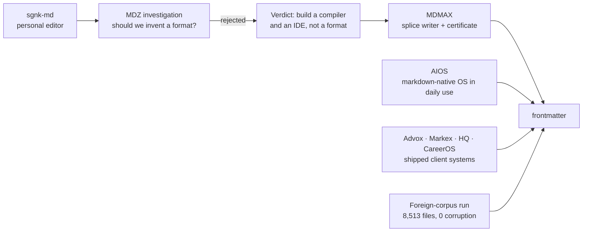

| Stage | What happened | What it left behind |
|---|---|---|
| sgnk-md | Personal Obsidian alternative, live at md.sgnk.ai. 416 commits, frozen since 2026-07-17 `[measured]` | The editor chassis: four view modes, tree, tabs, slash commands, vim keys, wikilinks, KaTeX, Mermaid, PWA, Tauri |
| MDZ investigation | Asked whether a markdown successor was the play | **Rejected.** "Build a compiler and an IDE, not a format" |
| MDMAX | The compiler half, built instead | 13 files, 3,614 lines: splice writer, OffsetMap, degradation certificate, construct detectors `[measured]` |
| AIOS | An orchestrator running this studio entirely on markdown | 124 SKILL.md automations, an 892-line self-amending constitution, 5,014 trace rows, 24,539 gate decisions `[measured]` |
| Client systems | Advox, Markex, HQ, CareerOS | Reusable spines: entitlements, pooled-RLS tenancy, fail-closed verifiers, publish queues |
| Foreign-corpus run | Ran the writer against seven strangers' vaults | **8,513 files, 0 corruption, 0 throws** `[measured]` |

**The insight that closed it.** The two things MDMAX shipped — a writer that provably cannot corrupt, and a certificate that proves how a file degrades — are exactly the enforcement mechanism for a much bigger idea than a format: **the file can be the only source of truth, and every app-like view can be disposable.** We built the enforcement before we named the law.

---

---

## 2. The problem


| # | Problem | Evidence | Answered in |
|---|---|---|---|
| 1 | **AI work evaporates.** An hour of thinking ends as a chat log. ChatGPT's only exit is an account ZIP emailed with a 24h link; NotebookLM did not persist chats until Jan 2026; an exporter-extension economy exists (one at 400,000+ installs) and all of it ends in a stale one-shot dump | `[SS/fetched]` | §12 |
| 2 | **Sync silently destroys data.** The single most-cited pain: 561 of 3,220 HN comments. Fresh, not historical — the Obsidian forum in the last six weeks carries a file showing "fully synced" while missing its final Korean characters | `[SS]` + `[fetched]` | §31 |
| 3 | **Editors rewrite bytes you never touched.** Architectural, not a library choice — three teardowns, three codebases, one identical failure | `[measured]` | §7.1, §19 |
| 4 | **Nobody can tell you what the AI changed.** Word, Docs, Cursor, Grammarly and Lex all show AI edits before accept and lose the distinction forever after | `[SS]` | §11 |
| 5 | **Everything you own is trapped in a view.** Coda export returns disconnected strings with formulas stripped; Notion formulas cannot aggregate across rows; under 4% of GitHub notebooks reproduce | `[SS]` | §5 |
| 6 | **The review loop does not exist on files you own.** Google's public API **cannot create suggestions at all**; Lex's track-changes is "in development"; OpenKnowledge comments are machine-local and never committed | `[fetched]` | §13 |
| 7 | **Import is a lie.** The #1 failure class is not broken formatting — it is **reports claiming success while losing files**. Obsidian has posted a $500 bounty for a detailed import log and $5,000 for Notion database conversion | `[fetched]` | §20 |
| 8 | **Price betrayal.** Notion cut free AI to 20 responses *for life* and raised Business ~20%; Microsoft's +43% Copilot bundling drew a CMA probe; Cursor apologised for an opaque reprice; Windsurf churned twice | `[SS]` | §24.8 |
| 9 | **Complexity fatigue.** Markdown tools overwhelm the people they are meant to serve | see note | §18 |

> **Note on problem 9.** The widely-repeated claim that *"most of Obsidian's million-plus downloaders never get past their first note"* is **unsourced** — it traces to an unattributed pull-quote in a 2025 author blog post with no Obsidian source, no methodology and no denominator `[fetched]`. **Do not cite it.** The complexity problem is real; that particular statistic is not evidence for it.

**The shape shared by problems 1, 2, 3, 4, 6 and 7:** the tool reports success while quietly losing something. *Sync said green and lied. Import said 47 succeeded and lost 4. The editor said it preserved comments and deleted them.*

> **Product thesis: be the tool that does not lie about what it did to your file — and can prove it.**

---

---

## 3. The market


### 3.1 Category map

| Category | Players | What they own | Why they cannot take our position |
|---|---|---|---|
| Office suites | Word, Google Docs, LibreOffice | Track changes, 40 years of review UX | Not file-native; Google's API cannot create suggestions `[fetched]` |
| Workspace / blocks | Notion, Coda, Craft, Airtable | Databases-as-views | The view IS the data; export lossy by architecture `[SS]` |
| Markdown PKM | Obsidian, Logseq, Bear, Ulysses, iA Writer, Typora | Local files, plugins | Single-player by design; no review loop, no provenance, no fidelity proof |
| Markdown collab | HackMD, Hubble, OpenKnowledge, GitBook, Mintlify | Team markdown, docs sites | All regenerate the file; OpenKnowledge needs a running daemon `[measured]` |
| AI editors | Cursor, Windsurf, Lex, Grammarly | Inline AI, diff review | Provenance evaporates at accept; not markdown-native `[SS]` |
| Chat-to-artifact | Claude Artifacts, Canvas, v0, Bolt, Perplexity Pages | Generation, versioning | The artifact lives in their store. OpenAI **removed** Canvas in May 2026 `[SS]` |
| Agent memory | mem0, claude-mem | Facts for agents | Atomises the journey; the finished document is not first-class |
| **Free self-hosted** | AppFlowy 76,040★ · AFFiNE 71,976★ · SiYuan 46,023★ · Logseq 44,669★ · Outline 40,362★ · Trilium 37,624★ · Docmost 21,501★ — all pushed within 24h `[fetched]` | Zero cost, file-native, active | **This is the price floor.** $5–8/seat must be justified against $0 |

### 3.2 The gap map

| Gap | Evidence of absence | Window |
|---|---|---|
| Byte-exact structured editing on **both** halves of the file | All three teardowns regenerate; the two strongest each solved fidelity only on the half their editor does not model `[measured]` | Frontmatter-splice claim durable; general claim erodes |
| Fidelity **without a running daemon** | OpenKnowledge's byte contract exists only inside a live CRDT server — agent edits error out without it `[measured]` | Durable — architectural |
| **O(edit)** not O(document) | Their own source comment: full serialize+parse per edit, *"unbounded by doc size"*, and fixing it *"needs a real incremental parser"* they lack `[fetched]` | Durable |
| Render-fidelity certification | Nobody certifies cross-engine degradation. Litmus at $500/mo proves the *testing* layer monetises while the *data* layer stays free `[SS]` | 6–12 months. **Publish the dataset before the design** |
| The review loop on files you own | Google's API cannot create suggestions `[fetched]`; Lex "in development" `[SS]`; OK comments never committed `[fetched]` | 6–12 months |
| Byte-anchored, portable, reader-visible AI provenance | Absence check precise: admin telemetry (Cursor), cloud report (Grammarly), repo sidecar (Agent Trace). Writing editors have nothing `[SS]` | Open |
| The rendered, evolving AI-output document | Memory tools store facts; consumer apps store sources; exporters store dumps | Open — **the category to name** |
| Session interchange between AI tools | No standard. OpenAI and Claude exports are mutually unreadable; every parser is reverse-engineered `[fetched]` | Open — whoever publishes the open shape becomes default |
| A file-native home screen | Obsidian's Homepage plugin: **1,294,057 downloads**, ~20× every bespoke dashboard plugin `[fetched]`. No product ships it natively | Open |
| Claim-level method + confidence | Across OKF, SKILL.md, llms.txt v2, MyST, .prompty — no spec claims it; OKF argues *against* stored scores `[fetched]` | Open; a renderer is the right shape |
| ~~"An agent can read and write my markdown"~~ | **Commodity.** Bear, Craft, Notion, MDflow, GitBook ship it; obsidian agent-skills 47,418★; the skills CLI did 9.3M downloads in one week `[fetched]` | **0 months — do not position here** |

### 3.3 The window

- **Now:** generic agent-markdown is commodity.
- **3–6 months:** "markdown editor with an agent harness" crowds. OpenKnowledge ships ~100 releases/week; 3,239 → 3,673 stars in 27 days `[fetched]`.
- **6–12 months:** fidelity, the review loop and the Obsidian-power-user lane stay open, because every incumbent's incentives point elsewhere — Notion toward blocks, OpenAI toward artifacts-as-output, Google toward Docs, OpenKnowledge toward the team wiki.
- **Structural hedge:** OpenAI removed Canvas. If "delegate, don't edit" wins, the durable asset is the verification layer, not editor chrome. **The roadmap keeps weight on the engine.**

> **Sequencing law: the differentiation tracks (R0, T2, T3 — §28) must land inside the 6–12 month window.**

---

---

## 4. Is the idea good? The honest verdict


**Yes, with two conditions: ship fidelity and the review loop inside the window, and do not position on the commodity sentence.**

| Question | Answer | Confidence |
|---|---|---|
| Is the problem real? | Yes. Nine problems with public complaint evidence; three verified by executing competitors' code | High `[measured]` |
| Is anyone else solving it? | Partially, each capped by an architectural choice they cannot cheaply reverse | High `[measured]` |
| Do we have an unfair advantage? | Yes — a byte-preserving writer and a certificate that already pass on strangers' data | High `[measured]` |
| Will people pay? | **Unproven. Zero paying users.** And developers are the hardest freemium audience: median dev-focused free-to-paid is **5%, half the non-dev rate** `[fetched]` | Low |
| Can one person build it? | The v1 scope yes. Teams, SSO and compliance no — §53 | Medium |
| Is the timing right? | Yes, and tight | High `[fetched]` |

**Proven `[measured]`:** the engine does not corrupt foreign data (8,513 files, 7 authors); competitors do (three executed teardowns); the internal markdown-OS substrate works at scale (24,539 gate decisions, 124 automations); the campaign pipeline produces multi-surface output from one file (10 episodes in ~1 week).

**Assumed — must be tested early:** that anyone pays; that the review loop is a purchase trigger rather than a nice-to-have; that India is viable top-of-funnel; that funnel 2 exists at all. **Every conversion, churn, ticket-rate, storage and CPU figure in §23–26 is an assumption stated explicitly so it can be replaced by measurement.**

**Refuted — do not repeat:** "serve markdown to agents and get cited"; "first AI attribution" (Cursor and Grammarly exist — the defensible claim is narrower, §11); the Obsidian first-note statistic (§2).

**The single biggest risk is not technical.** It is that a fidelity guarantee is a thing engineers admire and nobody buys. GitBook's lost-work complaints prove the pain exists; they do not prove anyone pays a premium to avoid it. §21 and §27 are the mitigation.

---

---

## 5. The core concept


> **The file is the only source of truth. Every app-like thing — the board, the calendar, the decision card, the dashboard, the published site, and every AI edit — is a deterministic, reversible projection of that file, owning no state of its own.**

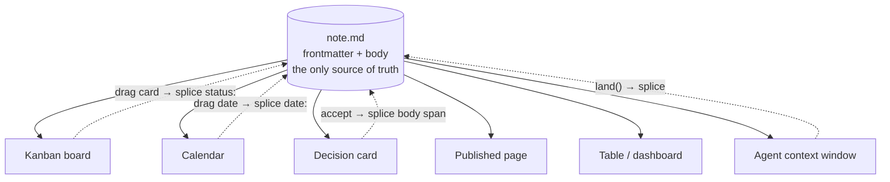

**Why this is a law, not a slogan.** It separates the tools that survived twenty years from the tools that became traps.

| Survivors — the view is computed, stored nowhere | Traps — the view ate the data |
|---|---|
| org-mode's agenda, running since 2003, computed on the fly from date tags in plain text `[SS]` | Coda's export loses formulas, buttons, canvas properties `[SS]` |
| Obsidian Bases (2025): the `.base` file saves only how you want to look `[SS]` | Notion formulas cannot aggregate across rows `[SS]` |
| Potluck (Ink & Switch): *"a clear separation between text and annotations… the original text freely editable"* `[fetched]` | Jupyter: meaning lives in invisible kernel state; under 4% of GitHub notebooks reproduce `[SS]` |

**What is new is making it the explicit product primitive.** Everyone else rediscovered it as a side effect. And its two hardest requirements are already built here: write-back must be provably reversible (the splice writer) and any view must strip back to portable markdown (the certificate).

**The category sentence:**

> Notion made the app the source of truth and trapped your data inside it. frontmatter makes the **file** the source of truth and lets every app be a disposable lens over it — provably, byte for byte, reversibly.

**It composes with the AI story rather than sitting beside it.** If every view is a projection, an AI edit is a projection running backwards: a splice with its byte range recorded, reviewable and reversible. The AI gets the same path as a human dragging a card, and the same guarantee.

**Prior art to respect:** Potluck is the near-exact precedent and is unmaintained; Obsidian Bases is market validation that the demand is real. Neither claims the law as a product primitive; neither can prove reversibility.

---

---

## 6. Principles and non-goals


### 6.1 Principles

1. **The file is the truth; views are disposable.**
2. **Refusal is a first-class outcome.** Cannot do it safely → return the input unchanged and say why. Never guess.
3. **Never lie about what happened.** Every count is re-derived from disk, never from the loop that did the work.
4. **Degrade, never break.** Every extension is valid CommonMark.
5. **The model gets a data slot, never a canvas.**
6. **One grammar for every change** — human suggestion, AI edit, sync conflict.
7. **Measure the document, not the user.** Implicit feedback only.
8. **Gates, not scores.** Named binary checks.

### 6.2 Non-goals

The expensive mistakes are all additions.

| Never | Why |
|---|---|
| A new format, sigil, or dialect | Settled 2026-07-29 |
| A tree-of-record, even once | `blocksToMarkdownLossy()` is a real API name `[SS]` |
| A plugin marketplace | VS Code's own wiki names extensions the #1 performance suspect; Typora's most-requested feature (251 votes) sits against a product loved *because* it has none `[SS]` |
| **The eval lane** — arbitrary client-side code | It ends the corruption guarantee **and** converts every prompt injection into remote code execution on infrastructure holding every customer's documents and API keys (§9.2, §51) |
| Block IDs in files, columns-in-markdown, synced-block bytes | Pollutes the text |
| Likert writing scores | Schema-rejected internally; Grammarly's opaque score is the anti-pattern |
| Ambient AI buttons, un-disableable AI | Notion users write ad-blocker rules against AI buttons `[SS]` |
| Silent auto-landing into a curated vault | Auto-capture only into an inbox lane |
| Opaque credit repricing | Cursor apologised; Windsurf churned twice; Notion got roasted |
| Streaks, badges, soundscapes, format-on-save default | Noise |
| A bespoke canvas as centre of gravity | Spatial state is not linear text |
| **Notion-style project management** | Founder boundary. A markdown editor with deep AI, not a PM tool |
| AIOS internal machinery as consumer UI | §15.4 |
| Graph-view investment, the mother-markdown container | Zero of 89 feature requests mentioned graph view; 45 transclusions in 25 MB of our own vault were all documentation of the feature, never use `[measured]` |
| Any "first" or "only" claim without one more verification round | We already caught one |

---

---

## 7. Architecture and current state


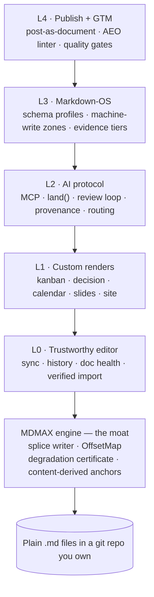

### 7.1 The engine

**The splice contract.** Locate the byte range, replace exactly those bytes, leave every other byte bit-identical. Never regenerate from a parse tree. If the range cannot be located unambiguously, **refuse** and return the input unchanged. Grounded in lens theory (Foster et al., TOPLAS 2007).

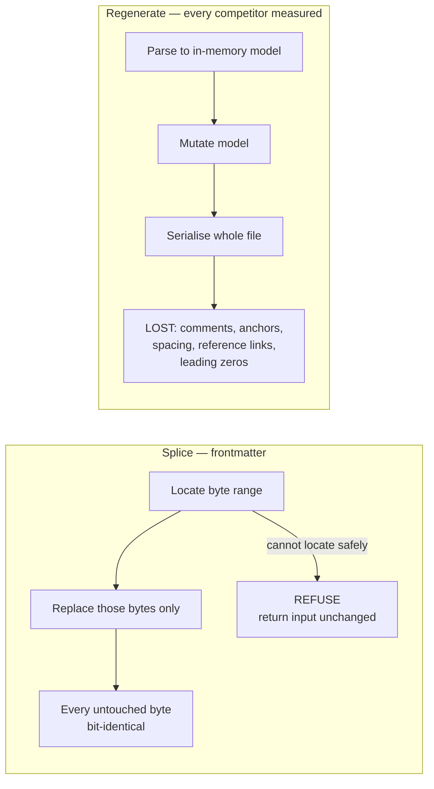

**MDMAX: 13 files, 3,614 lines, 10 tests** `[measured]`.

| File | Lines | Capability, with its measured numbers |
|---|---|---|
| `domain/constructs.ts` | 618 | **19 constructs** detected; returns UTF-8 byte ranges; conservative detectors behind a skip mask |
| `infrastructure/bench.ts` | 538 | **7 engines**: remark-app, react-markdown, marked, markdown-it, markdown-it-html-true, commonmark, kramdown-jekyll. `benchId` = sha256 over the full option set. **A missing engine is a hard refusal** |
| `domain/fold.ts` | 430 | `mdmax/fold@1` versioned equivalence fold. Prototype **705/1613 strict vs 69/1613 folded (43.71% → 4.28%)** over 40 files × 6 engines — **explicitly not attachable to `fold@1` until re-measured** |
| `domain/verdict.ts` | 411 | `![[Some Note]]` → VOID on marked 16.4.2 **and** commonmark 0.31.2; **21 of 24** `{#id}` leak; front matter LEAKs in **23 of 24** bench configurations |
| `application/certify.ts` | 375 | Layer-2 inventory + layer-3 differential; never throws |
| `domain/offsets.ts` | 315 | Branded U16Offset / ByteOffset / GraphemeIndex. **Only 67 of 1,080 corpus files have bytes == UTF-16 units (93.8% diverge); 103 of 2,314 contain non-BMP** |
| `domain/shape-gate.ts` | 174 | `MAX_BYTES 4MB`, `MAX_LINES 200,000`. Measured quadratics: `WIKILINK_RE` **k=1.98, 36,865 ms on 320 KB**; `mdast-util-from-markdown` **12,429 ms vs micromark 1,207 ms (10.3×)**. Strict UTF-8 decode, refuse never repair |
| `domain/cert-contract.ts` | 168 | 4 verdicts PASS / STRIP / CORRUPT / VOID; 3 classes LEAK / DESTROY / MUTATE. **The artifact is a JSON sidecar, never written into the `.md`** |
| `domain/placement.ts` | 154 | Setext defect: `"Heading\n---"` → h2; **blank-line isolation does not fix it** → refuse, never repair |
| `domain/targets.ts` | 133 | **15 targets**; **7 of ~12 surfaces unprobeable**; Slack and Discord modelled as lossy sinks |
| `domain/frontmatter-prepass.ts` | 121 | **170 of 907** home frontmatter blocks are invalid YAML = **18.74%**. Never writes, never throws |
| `domain/slug.ts` | 115 | Over 393 anchors: github-slugger **21.88%**, dash-collapsing **95.42%**, either **98.73%** — caveat, **85.2% come from one file** |
| `domain/normalize.ts` | 62 | **99.627%** re-anchoring across **384 configurations** |

### 7.2 Current state — verified

| Metric | Value `[measured]` |
|---|---|
| Modules under `src/modules/` | 14 — **175 files** |
| TypeScript files in `src/` | 226 · **25,407 lines** |
| Test files | **98** · **1,575 tests passing** |
| App routes | 30 |
| Commits on branch | 40+ (`engine/plan-and-diagnostics`) |
| `npm run verify` | **Green** — typecheck, lint, 98/98 test files, build compiled, arch `"violations": []`, specs 4 scanned 0 errors |
| **CI** | **None. `.github/` does not exist** |

**Stack:** Next 16.2.6 · React 19.2.6 · CodeMirror 6 · unified/remark/rehype · gray-matter · yaml · mermaid 11 · minisearch · zustand · zod · next-auth v5 · AI SDK v6 with five providers · Tauri v2 · puppeteer-core.

### 7.3 The MDMAX wiring plan — four ordered seams

Currently **one symbol from one of thirteen files** is used in product code: `decodeStrict`, imported by `get-snapshot.ts` and `search-index.ts` `[measured]`. The other twelve files have zero product importers.

| # | Seam | Call site | Contract | Blocked by |
|---|---|---|---|---|
| 1 | **Ingress gate** | live | `decodeStrict` refuses, never repairs | done |
| 2 | **Write gate** | `commit-changes.ts`, `share-writer.ts` | every write passes shape-gate + placement before a blob is created; a refusal is a 4xx with a reason, never a silent pass | NF-1, NF-3 |
| 3 | **Splice engine** | replaces `splice-frontmatter.ts`'s single-key scanner | one implementation for kanban drag, calendar drag, `land()` and share | NF-4 design |
| 4 | **Certificate** | background job → JSON sidecar in R2, surfaced in Doc Health | `certify.ts` never throws; the artifact never enters the `.md` | §38 jobs |

**The boundary rule:** MDMAX exports pure functions over bytes and imports nothing from `src/modules/*`. `eslint-plugin-boundaries` plus the arch report (with a minimum-files-scanned floor so the gate cannot pass by going blind) enforce the direction `[measured]`.

> **Do not wire seam 2 before NF-1 and NF-3 land.** At the measured refusal rate the write gate would reject 83% of foreign vaults' publishes — an availability incident wearing a correctness costume.

### 7.4 Three known truths that contradict our own older docs

1. **`docs/mdmax/PLAN.md` says MDMAX "shipped".** It is implemented and unit-tested; twelve of thirteen files are unreached by product code.
2. **There is no CI**, in a product that intends to sell document CI.
3. **The shipped design system is not our design system.** `src/app/globals.css` is byte-identical to sgnk-md's, self-labels *"Linear-style modern SaaS"*, and ships `--accent: #18181b` with 6/8/12px radii — neither the canonical `#1a5cff` accent nor the square-corner rule. A `body-faint` token **fails WCAG AA** while being in the shipped set `[measured]` — at **1.984:1**, not the 2.14:1 the design-system row claims; §35.3 shows that figure is not reproducible.

---

---

## 8. The markdown substrate


**Position:** frontmatter is a CommonMark editor with a profile layer. Everything below defines what the floor is, how a profile is written on disk, which extensions are in scope, which frontmatter keys we read and write, and how typed data lives in plain text without becoming a database.

### 8.1 The spec landscape and what the floor actually is

| Spec / dialect | Status and version | Governance | Extension mechanism | In our floor? |
|---|---|---|---|---|
| CommonMark | 0.31.2, released 2024-01-28; still the current release as of 2026-08 [SS] | commonmark.org spec, John MacFarlane et al. | None. Deliberately no extension syntax. | **Yes — the floor** |
| GitHub Flavored Markdown (GFM) | Living spec, versioned against CommonMark 0.29 | GitHub, `cmark-gfm` reference impl | Fixed extension set, not user-extensible | Yes — the practical floor |
| MyST | Markdown for scientific/technical docs, `myst-parser` | Executable Books / Jupyter Book | Directives + roles (colon-fence `:::`) | Profile target, not floor |
| Pandoc Markdown | Pandoc ≥ 3.x | John MacFarlane | Extensions toggled by name (`+pipe_tables`) and fenced_divs | Degradation target |
| Obsidian Flavored Markdown | Rolling, tied to app version | Obsidian (proprietary) | Callouts, wikilinks, `%%comments%%`, block refs | Degradation target |
| Markdoc | 0.4.x, Stripe | Stripe (MIT) | `` curly-brace tags | Studied, rejected as carrier |
| MDX | 3.x | Vercel/unified | JSX embedded in markdown | Rejected — violates the eval-lane ban |
| remark / micromark | unified collective | Extension via micromark syntax extensions + mdast utils | The implementation substrate we will use | Implementation |

**The floor is not "CommonMark" in the abstract — it is CommonMark 0.31.2 plus the four GFM extensions that every one of the seven certified engines implements: tables, task list items, strikethrough, and autolink literals.** [inference, from the engine matrix in §5]

| Floor rule | Statement | Anti-recommendation |
|---|---|---|
| F1 | Every byte frontmatter writes MUST parse as valid CommonMark 0.31.2 and MUST render as readable prose in a parser that knows nothing about us. | Do NOT emit a construct whose fallback rendering is garbage (raw `` tags, orphan `:::` colons, bare JSX). |
| F2 | Extensions live inside constructs CommonMark already defines — block quotes (§5.1), fenced code blocks (§4.5), link reference definitions, HTML blocks (§4.6). | Do NOT introduce a new block-level token. That is a new format, and a new format is settled-against. |
| F3 | GFM tables, task lists, strikethrough, autolinks are assumed present. Anything beyond those four is a profile feature and must be degradation-certified. | Do NOT assume footnotes, definition lists, or heading anchors. GFM's footnote support is not in the four-extension core. |
| F4 | We target *round-trip byte preservation*, not *round-trip AST equality*. The splice engine never reserializes an untouched region. | Do NOT adopt a normalize-on-save model. Normalizing is a whole-file rewrite and destroys the one property that distinguishes us. |

**What would falsify the floor choice:** if the degradation certificate shows that a majority of the 7 engines fail one of the four GFM core extensions on a realistic corpus, the floor drops to bare CommonMark 0.31.2 and tables become a profile feature. [inference]

**Where sources disagree:** the research reports treat "CommonMark compliance" as a binary, while the engine-certification work in this repo treats it as a per-construct matrix with partial credit; the matrix view is the one the product implements, because a certificate that says "97% compliant" is not actionable and a certificate that says "this engine drops your callout title" is. [inference]

### 8.2 The carrier decision — how an extension is written on disk

**This section corrects the earlier PRD claim that the fenced-code info string is the single dispatch mechanism for frontmatter extensions. It is not. It is one of two carriers, and it is the wrong one for anything a human is meant to read.** The correction is forced by a structural asymmetry in CommonMark itself, described in the failure-mode row below.

**Carrier scorecard.** Six candidates were evaluated against seven criteria. Scoring is per-criterion pass / partial / fail.

| Carrier | Literal form | Valid CommonMark? | Degrades to readable? | Unclosed-state failure | Human-editable | Nesting | Ecosystem precedent | Verdict |
|---|---|---|---|---|---|---|---|---|
| **Blockquote callout** | `> [!NOTE]` + `> body` | Yes — §5.1 block quote with a text first line | Yes — renders as an indented quote with a visible `[!NOTE]` label | **Structurally impossible — a block quote has no closing marker; it ends when the `>` prefix stops** [measured] | Yes — every line is prose | Partial — nesting requires `> >`, which is legal but ugly | Very high — GitHub, Obsidian, Bear, Zed, Docusaurus | **ADOPT — prose carrier** |
| **Fenced code block** | ` ```fm-data ` + payload + ` ``` ` | Yes — §4.5 fenced code block with an info string | Yes — renders as a code block; content is visible, inert, and copy-pasteable | **Catastrophic — an unclosed fence "runs until the end of the containing block" per CommonMark §4.5, swallowing the remainder of the document** [fetched, spec §4.5] | No — payload is machine-shaped | No — fences do not nest (only outer-fence tricks) | Very high — Mermaid, PlantUML, math, `mermaid`/`dot`/`vega` all dispatch on info string | **ADOPT — opaque-data carrier only** |
| Colon fence / directives (`:::`) | `:::note\nbody\n:::` | No — bare CommonMark renders `:::note` as a literal paragraph | Partial — orphan colons visible as text | Same swallow risk as fences in implementations that treat it as a fence | Yes | Yes — the best nesting story of any candidate | Medium — MyST, Docusaurus, `remark-directive`, the un-merged CommonMark generic-directives proposal | REJECT as primary; accept on *input* |
| Curly tags (Markdoc ``) | `` | No | No — raw `` visible as noise | Unclosed tag corrupts the block | Partial | Yes | Low outside Stripe | REJECT |
| HTML block | `<div class="fm-callout">` | Yes — §4.6 | No — stripped or escaped by most sanitizers; renders as nothing or as raw tags | Unclosed tag consumes until blank line (§4.6 condition 6) | No | Yes | High but declining | REJECT |
| Link reference definition abuse | `[fm:note]: #` | Yes | Yes — invisible (definitions are not rendered) | None | No | No | None | REJECT — invisible is worse than ugly |

**The asymmetry that decides it.** A block quote is delimited by a per-line prefix, so there is no state to leave open — the construct terminates the moment the prefix stops, and a truncated or half-typed callout costs exactly the lines that carry `>`. A fenced code block is delimited by a matching closing fence, and CommonMark §4.5 specifies that if none is found the block runs to the end of the containing block; a single dropped backtick line therefore turns the rest of a 4,000-line vault note into code. [fetched, CommonMark §4.5]

**Decision.**

- **Prose that a human reads → blockquote callout.** `> [!NOTE]`, `> [!DECISION]`, `> [!TASK]`. Recognized by GitHub, Obsidian, Zed, Docusaurus; degrades to a labelled indented quote everywhere else. **Anti-recommendation: do NOT put machine payloads in a callout** — one stray unprefixed line silently ends the block and orphans the rest of the payload as body prose.
- **Opaque machine data → fenced code block with an info string.** ` ```fm-board `, ` ```fm-query `, ` ```fm-schema `. **Anti-recommendation: do NOT put reader-facing prose in a fence** — it renders monospaced, is excluded from search and word count in most tools, and is not editable in a WYSIWYG surface.
- **Accept `:::` directives on input, never emit them.** They arrive from MyST and Docusaurus vaults and must not be corrupted; converting them to our carriers on write would be a whole-file rewrite and violates the splice law.

| Failure mode | Blockquote carrier | Fence carrier | Mitigation we ship |
|---|---|---|---|
| Unclosed construct | Impossible [measured] | Swallows rest of document [fetched §4.5] | Fence writer emits open + close in one splice, never two; validator refuses a file with an odd fence count |
| Lazy continuation | A non-`>` line ends the quote; body text below is orphaned but visible | N/A | Writer prefixes every emitted line; reader treats first unprefixed line as terminator |
| Nested inside a list | Legal (`- > [!NOTE]`); indentation-sensitive | Legal; fence must be indented to the list content column | Splice computes the container indent from the byte range, never assumes column 0 |
| Engine strips the marker | Renders as an ordinary quote — content survives | Renders as a code block — content survives | Both are certified as *lossy-but-readable*, never *destructive* |
| Tab/space indent in container | Callout body may fall out of the quote | Fence close may not match | REFUSE and surface the byte offset rather than guess |

**What would falsify this decision:** if a measured sweep of real-world vaults shows callout-marker recognition below roughly half of the certified engines *and* those engines mangle rather than merely ignore the `[!NOTE]` line, the prose carrier moves to plain bold-labelled blockquotes with no marker. The fence decision is falsified only if a future CommonMark release changes §4.5 unclosed-fence behaviour, which would be a breaking spec change and is not expected. [inference]

### 8.3 The extension catalogue — what we support, what we refuse

Ranked by (ubiquity across the 7 certified engines) × (value to the projection law). Tier 1 ships in v1; Tier 2 is profile-gated; Tier 3 is input-tolerated only; the refusal list is permanent.

**Tier 1 — ship in v1, assumed present in the floor**

| # | Extension | Literal syntax | Why it earns v1 |
|---|---|---|---|
| 1 | GFM tables | ` ```\n\| Col \| Col \|\n\| --- \| --- \|\n\| a \| b \|\n``` ` | The board and the decision-card projections both read tabular rows; tables are the only tabular construct with universal support |
| 2 | Task list items | ` ```\n- [ ] open\n- [x] done\n``` ` | The task projection's entire state lives in one byte (` ` vs `x`) — the cleanest possible splice target |
| 3 | YAML frontmatter | ` ```\n---\nkey: value\n---\n``` ` | Document-level typed data; see §8.4 |
| 4 | Blockquote callouts | ` ```\n> [!NOTE] Optional title\n> Body line.\n``` ` | The prose carrier from §8.2 |
| 5 | Fenced code with info string | ` ```` ```fm-board\n{"group":"status"}\n``` ```` ` | The opaque-data carrier from §8.2 |
| 6 | Strikethrough | ` ```\n~~struck~~\n``` ` | GFM core; free |
| 7 | Autolink literals | ` ```\nhttps://example.com\n``` ` | GFM core; free |

**Tier 2 — profile-gated, degradation-certified before enable**

| # | Extension | Literal syntax | Gate |
|---|---|---|---|
| 8 | Footnotes | ` ```\nText[^1]\n\n[^1]: Note.\n``` ` | GFM + Pandoc + Obsidian yes; not in CommonMark. Certify per-engine before a projection depends on it |
| 9 | Wikilinks | ` ```\n[[Note Title]]\n[[Note\|alias]]\n``` ` | Obsidian/Logseq/Foam native; renders as literal brackets elsewhere. Enable only in a vault profile |
| 10 | Definition lists | ` ```\nTerm\n: Definition\n``` ` | Pandoc/kramdown yes, GFM no. Degrades to two paragraphs — acceptable |
| 11 | Math | ` ```\n$inline$ and $$display$$\n``` ` | GitHub and Obsidian yes; degrades to visible TeX source, which is readable |
| 12 | Mermaid / diagram fences | ` ```` ```mermaid\ngraph TD; A-->B;\n``` ```` ` | Already an info-string fence; costs us nothing and validates the carrier |
| 13 | Heading IDs | ` ```\n## Title {#custom-id}\n``` ` | kramdown/Pandoc syntax; GFM auto-generates instead. Conflict — see below |
| 14 | Highlight | ` ```\n==marked==\n``` ` | Obsidian/Pandoc; renders as literal `==` in GFM |

**Tier 3 — parse on input, never emit**

| # | Extension | Literal syntax | Rule |
|---|---|---|---|
| 15 | Colon-fence directives | ` ```\n:::note\nbody\n:::\n``` ` | Preserve byte-for-byte; project as a callout in our UI; write back unchanged |
| 16 | Obsidian block references | ` ```\nSome text ^block-id\n``` ` | Preserve; never rewrite the id |
| 17 | Obsidian comments | ` ```\n%%hidden%%\n``` ` | Preserve; treat as content, not metadata |
| 18 | Embeds/transclusion | ` ```\n![[Note#Heading]]\n``` ` | Preserve; do not resolve on write |
| 19 | Markdoc tags | ` ```\n…\n``` ` | Preserve; never generate |
| 20 | Front-of-line HTML blocks | ` ```\n<details><summary>x</summary>…</details>\n``` ` | Preserve; never generate |

**Permanent refusals, with the reason each is refused**

| Refused | Reason | Settled by |
|---|---|---|
| MDX / JSX in markdown | Requires arbitrary client-side evaluation | The eval-lane ban |
| Any new block token of our own | Would constitute a new markdown format | "No new markdown format" |
| A tree-of-record / AST-as-truth model | Contradicts the projection law | "No tree-of-record" |
| Third-party syntax plugins at runtime | Contradicts the no-plugin-marketplace decision, and makes degradation certification impossible (an uncertified syntax cannot be certified) | "No plugin marketplace" |
| Normalizing rewriters (prettier-on-save style) | Whole-file rewrite defeats byte-preserving splice | Splice law |
| Setext headings on *output* | `===`/`---` underlines collide with frontmatter delimiters and thematic breaks; ATX (`#`) is unambiguous. Parse on input, never emit | [inference] |

**Anti-recommendation for the whole catalogue:** do NOT enable a Tier 2 extension because one engine supports it well. The gate is the degradation certificate across all 7, and a projection may only depend on a construct that has a certified fallback. **The falsifier for any Tier 2 promotion is a single certified-destructive result — lossy is acceptable, destructive is not.**

### 8.4 Frontmatter key conventions — being a good citizen

We read the ecosystem's keys and we write a namespaced subset. The rule is: **read broadly, write narrowly, never reformat a key we did not write.**

**Master key table**

| Key | Type | Origin ecosystem | We read | We write | Notes |
|---|---|---|---|---|---|
| `title` | string | Universal (Jekyll, Hugo, Obsidian, Astro, Zola, Eleventy) | Yes | Only if absent and user asks | The single most portable key |
| `date` | date | Jekyll, Hugo, Eleventy | Yes | No | Format conflict — see below |
| `tags` | list\<string\> | Universal | Yes | Yes | Accept both flow (`[a, b]`) and block (`- a`) styles; preserve the style found |
| `aliases` | list\<string\> | Obsidian, Hugo | Yes | No | Obsidian-critical; never reorder |
| `draft` | bool | Hugo, Astro, Zola | Yes | No | Hugo's canonical publish gate |
| `published` | bool | Jekyll (`published: false`) | Yes | No | Jekyll's inverse of `draft` — conflict below |
| `description` | string | Astro, Hugo, Docusaurus | Yes | No | |
| `slug` | string | Hugo, Astro, Docusaurus | Yes | No | |
| `author` / `authors` | string \| list | Hugo (`authors`), Jekyll (`author`) | Yes | No | Singular/plural conflict — below |
| `categories` | list | Jekyll, Hugo | Yes | No | |
| `layout` | string | Jekyll, Eleventy | Yes | No | |
| `permalink` | string | Jekyll, Eleventy | Yes | No | |
| `weight` | number | Hugo, Docusaurus (`sidebar_position`) | Yes | No | |
| `cssclasses` | list | Obsidian | Yes | No | |
| `publish` | bool | Obsidian Publish | Yes | No | Third spelling of the same concept |
| `id` | string | Docusaurus, Logseq | Yes | No | |
| `sidebar_position` | number | Docusaurus | Yes | No | |
| `status` | string | Convention, not spec | Yes | Yes | Our primary board-grouping key |
| `due` | date | Convention (Tasks plugin, Dataview) | Yes | Yes | ISO 8601 date only |
| `fm.profile` | string | **Ours** | Yes | Yes | Which frontmatter profile governs this file |
| `fm.version` | string | **Ours** | Yes | Yes | Profile schema version |
| `fm.projections` | list\<string\> | **Ours** | Yes | Yes | Which views this file opts into |
| `fm.cert` | string | **Ours** | Yes | Yes | Degradation-certificate id for this file's constructs |

**Named conflicts — where ecosystems disagree and we must not silently pick**

| Conflict | Ecosystem A | Ecosystem B | Our rule |
|---|---|---|---|
| Publish gate | Hugo/Astro: `draft: true` means unpublished | Jekyll: `published: false` means unpublished; Obsidian Publish: `publish: true` means published | Read all three. Never write any of them. If two disagree in one file, REFUSE and surface both. |
| Author cardinality | Jekyll: `author: Name` (scalar) | Hugo: `authors: [A, B]` (list) | Read both; normalize in-memory to a list; write back the shape found. |
| Date format | Jekyll accepts `2026-08-28 10:00:00 +0530`; Hugo prefers RFC 3339 `2026-08-28T10:00:00+05:30`; YAML 1.1 auto-typing turns unquoted dates into timestamps | Obsidian users routinely write `2026-08-28` plain | Preserve the literal bytes. Parse permissively for projection; never rewrite the serialization. |
| Tag delimiter | YAML list | Obsidian also allows inline `#tag` in body, and space-separated strings in some vaults | Read the frontmatter list as canonical; index body `#tags` as secondary; write only to the list. |
| Heading anchors | GFM auto-slugs headings | kramdown/Pandoc use explicit `{#id}` | Never generate anchors into the file. Projections compute them. |
| Delimiter | `---` … `---` (YAML) is universal | TOML `+++` (Hugo, Zola); JSON `{ }` (some Eleventy) | Support `---` fully; detect `+++`/JSON and REFUSE to write rather than convert. |
| Key casing | `snake_case` dominant | `camelCase` appears in Astro content collections | Preserve the casing found. Our own keys are always lowercase, dot-namespaced. |

**Rules for the build team**

- Namespace every key we invent under `fm.` — do NOT add bare top-level keys, because a bare `status` or `type` collides with three existing ecosystems and makes our writes indistinguishable from the user's.
- Preserve key order, comments, blank lines, quoting style, and indentation on every write. A frontmatter edit is a splice into the value bytes, not a YAML re-dump. **Anti-recommendation: do NOT use a load-then-dump YAML round trip, even a "round-trip-safe" one — it normalizes quoting and folds long lines, which is a whole-file rewrite by another name.**
- On a duplicate key, REFUSE. YAML 1.1 parsers disagree on last-wins vs error, so any choice we make is wrong somewhere.
- On an unparseable frontmatter block, treat the file as having no frontmatter and edit only the body. Never repair.

### 8.5 Typed and queryable data in plain text

Three layers, in strict precedence order. A projection reads from the highest layer present and never writes to a layer it did not create.

| Layer | Where it lives | Literal syntax | Scope | Typed? | Query cost |
|---|---|---|---|---|---|
| L1 — Document metadata | YAML frontmatter | ` ```\n---\nstatus: doing\ndue: 2026-09-01\nfm.profile: board\n---\n``` ` | Whole file | Yes, via profile schema | O(1) per file |
| L2 — Block metadata | Inline key-value on the line | ` ```\n- [ ] Ship the parser (due:: 2026-09-01) (owner:: sagnik)\n``` ` | One block | Yes, via profile schema | O(lines) |
| L3 — Opaque payload | Fenced block with info string | ` ```` ```fm-query\nfrom: tasks\nwhere: status == "doing"\n``` ```` ` | Where the fence sits | Yes, schema-validated | O(1) per fence |

**Design rules**

- **The file is the database. There is no index of record.** Any cache we build is a projection: derivable from the bytes, discardable, and rebuilt without asking the user. If a cache and a file disagree, the file wins and the cache is wrong. [projection law]
- L2 syntax follows Dataview's `key:: value` inline field convention because it is the largest existing installed base for typed inline data in markdown and it degrades to visible parenthesised text. **Anti-recommendation: do NOT invent a shorter inline syntax** — a novel sigil is a new format, and the settled position forbids one.
- Queries are **declarative and non-Turing-complete**. A query is a filter + sort + group over parsed fields, evaluated by our engine. Do NOT ship a query language with function calls, arbitrary expressions, or user-supplied code — that is the eval lane by another name, and it is settled against.
- Type coercion is explicit and lossless-or-refuse: a value that does not parse as its declared type is surfaced as a typed error on that byte range, not coerced to null and not silently skipped. A silently-skipped row is indistinguishable from a real negative. [Learned Rule #59 class]

**Type set** (deliberately small)

| Type | Literal | Refusal condition |
|---|---|---|
| `string` | any scalar | never |
| `number` | `42`, `3.14` | non-numeric text |
| `bool` | `true` / `false` | any other spelling, including `yes`/`no` — YAML 1.1 coerces these and YAML 1.2 does not, so we refuse rather than pick |
| `date` | ISO 8601 `2026-09-01` | any other format |
| `datetime` | RFC 3339 with offset | naive datetimes without an offset |
| `list<T>` | YAML sequence or flow | mixed element types |
| `enum` | value from the profile's declared set | value outside the set |
| `link` | `[text](target)` or `[[wikilink]]` | unresolvable target is *not* a refusal — it is a warning; links to non-existent notes are legitimate in vaults |

**Anti-recommendation for the layer:** do NOT promote L2 inline fields into L1 frontmatter automatically "for queryability". That is a rewrite of lines the user did not edit, it changes the rendered output, and it is the exact behaviour that makes users distrust editors that touch their files.

**What would falsify this design:** if profiling shows that a full-corpus L2 scan over a realistic vault (order 10⁴ notes) cannot complete inside an interactive budget, L2 gains a persisted index — still a projection, still discardable, still with the file as the sole source of truth, but materialized. That is a performance change, not a change to the law. [inference]

---

## 9. The rendering system


| Layer | Component | Decision | Governing measurement |
|---|---|---|---|
| Parse | `@lezer/markdown` 1.7.2 (editor) + `unified`/`remark` (preview) | Keep the split, vendor Lezer, fix the preview's conformance | Lezer is the only JS parser with exact offsets on inline marks *and* incremental reparse — 3.58× on a 56 KB doc [measured] |
| Address | `U16Offset` / `ByteOffset` / `GraphemeIndex` branded types, one `OffsetMap` | Keep; UTF-16 code units internally, bytes only at git-blob and hash edges | mdast root end offset 36 vs UTF-8 length 41 on the same string [measured] |
| Compute | Four lanes (C0 client-pure, C1 client+library, C2 server, L LLM), one refused (arbitrary client eval) | Ship A/B, gate C, refuse D permanently | 4.03% of 1,159,166 notebooks reproduce [fetched] |
| Project | `render:` switch + `fm-view` fenced lane + body data | Three-slot rule; frontmatter carries the switch only | One key `render: board` degrades to `<hr><h2>render: board</h2>` [measured] |
| Emit | HTML → Chrome 151 PDF (+ paged.js) → Marp / DOCX / EPUB | Buy fidelity inside the browser we already ship; no second layout engine | paged.js closes both native Chrome gaps on the same binary [measured] |

### 9.1 The parser layer and why byte-accurate positions decide everything

**A splice editor can only edit what its parser can address; every other parser property is negotiable, and position fidelity is not.**

| Tier | Engine | Position API | Unit | Inline coverage | Splice-safe? |
|---|---|---|---|---|---|
| A | pulldown-cmark 0.13.4 | `into_offset_iter()` → `(Event, Range<usize>)` | UTF-8 bytes | every event | Yes — the position API *is* the splice API [fetched] |
| A | goldmark v2.0.0 / v1.8.5 | `text.Segment{Start, Stop, Padding}` | UTF-8 bytes, `Stop` exclusive | block `Lines()` + inline `Text` | Yes, if `Padding` is re-added; otherwise splices drift inside blockquotes and lists [fetched] |
| B | comrak 0.54.0 | `Sourcepos{start,end}` `LineColumn`, 1-based | UTF-8 bytes by default; `parse.sourcepos_chars` silently flips to chars | block + inline | Yes, after building a line index; the global unit switch invalidates every stored anchor [fetched] |
| B | cmark 0.31.2 / cmark-gfm 0.29.0.gfm.13 | `cmark_node_get_start_column` etc.; `CMARK_OPT_SOURCEPOS` | bytes | block only | Block-level only [fetched, cmark.h L408-420] |
| C | `@lezer/markdown` 1.7.2 | `from`/`to` on every node incl. `HeaderMark`, `EmphasisMark`, `LinkMark`, `URL` | UTF-16 code units | full | Yes — `src.slice(from,to)` round-trips exactly [measured] |
| C | unified/remark-parse 11.0.0 | `position.{start,end}.offset` | UTF-16 code units | full | Yes [measured] |
| D | markdown-it 15.0.1 / markdown-it-py 4.2.0 | `Token.map = [line_begin, line_end]`, 0-based half-open | lines | block-open and `inline` only; `_close` and all 9 inline children measured `map: null` | No [measured] |
| D | commonmark.js 0.31.2 | `node.sourcepos` | characters (C cmark counts bytes — a direct disagreement between the reference implementation and its own JS sibling) | block only; every inline `NO-SOURCEPOS` | No [measured] |
| D | kramdown 2.5.2 | `options[:location]` | start line only | — | No [fetched] |
| D | pandoc 3.10.2 | `sourcepos` extension, `commonmark` reader only | line:col | wraps non-attribute elements in a synthetic `Div`/`Span`, changing the tree being measured | No [fetched] |
| E | marked 18.0.11, Python-Markdown 3.10.3, mistune 3.3.4, showdown 2.1.0 | none (`raw` string, ElementTree, token dicts, regex substitution) | — | — | No [measured/fetched] |
| ? | markdown-rs 1.0.0 | `unist::Point.offset` documented as a **character** index while the parser operates on `&str` | disputed | — | Record as disputed, never assume Tier A [fetched] |

Decisions:

- **Keep `@lezer/markdown` in the editor and `unified` in the preview.** Lezer is the only JS parser giving exact inline-mark offsets *and* incremental reparse; 56 KB doc, one-character insert: 16.88 ms full reparse vs 4.71 ms incremental = 3.58× [measured/derived]. **Anti-recommendation:** do not consolidate on one parser to reduce surface area — markdown-it returns `map: null` on every inline node, so a single-parser stack would delete inline splice capability outright.
- **Vendor `@lezer/markdown` into the repo this quarter.** Its README now says only that the repository has moved to `code.haverbeke.berlin`; 147 stars, single maintainer, npm still publishing (1.7.2, 2026-07-15) [fetched]. It is load-bearing and has no substitute with equivalent position fidelity. Budget for owning a fork.
- **Fix the preview before shipping any render profile.** Bare remark+rehype-raw scores 498/652 = 76.4% on CommonMark 0.31.2; the shipped app pipeline (`remark-gfm` + `remark-breaks`) scores 439/652 = 67.3%; `remark-gfm` costs 2 tests, `remark-breaks` costs 57 = 8.7 points [measured/derived: 498−441]. Make `remark-breaks` a render-time toggle the certificate records as a declared deviation, or drop it. Certifying seven engines against a preview less CommonMark-conformant than any engine it certifies is not a certificate.
- **Incremental parsing is a requirement, not an optimisation.** 1,417,778 B parsed in 173.3 ms by `marked` (7.80 MB/s) and 229.7 ms by `markdown-it` (5.89 MB/s) [measured/derived]; a 1 MB note therefore re-parses in ~130 ms, above the 100 ms interaction budget on every keystroke. remark-parse is 60.2 ms on 67,200 B vs commonmark.js at 4.0 ms — **15.05×** [measured/derived], extrapolating to ~3.6 s at the 4 MB shape-gate ceiling [derived, linear, unverified at that size].
- **Add three non-JS engines to the bench before adding a single construct:** `cmark-gfm` pinned at `0.29.0.gfm.13`, `goldmark` at both `v1.8.5` (Hugo master's actual pin) and `v2.0.0` (released 2026-08-27), `pulldown-cmark` `0.13.4` (142,120,888 total / 42,632,672 last-90d downloads) [fetched]. The bench today is 6/7 JavaScript and measures **4 distinct parsers**, since `remark-app` and `react-markdown` share micromark and `commonmark` is cmark's algorithm in JS. Beyond coverage: goldmark's and pulldown-cmark's byte offsets are an **independent oracle for the splice machinery** — a second implementation that disagrees about where a construct starts is a bug report the JS-only bench structurally cannot produce.
- **`targets.ts` currently maps `github-blob` (`fidelity: requires-push`) and every declared surface — Obsidian, Notion, Typora, Bear, Slack, Discord — to `engineId: 'remark-app'`** [fetched, L92-115]. A declared row backed by a different engine's output is a placeholder. Either back it or mark it uncertified.

Falsifier for this section: if a profile ships that needs inline positions and validates cleanly on the markdown-it targets, the Tier D classification is wrong and the bench is not exercising inline anchors.

### 9.2 The computation budget — four lanes, one refused

| Lane | Content | Determinism | Capability surface | Verdict |
|---|---|---|---|---|
| **A — client-pure (C0)** | `fm-query`: declarative, non-Turing-complete, read-only over the vault index; no network, no FS, no DOM; hard row and wall-clock caps | pure function of bytes | none | Ship |
| **B — client + library (C1)** | Fixed-vocabulary renderers bundled once: chart.js (12,893,359/wk), leaflet (6.9M/wk class), mermaid (15,313,390/wk, 89,973★), plus spreadsheet-grade expression evaluation over named Lane-A results | pure | none | Ship, bundle-cost gated |
| **C — server (C2)** | Cross-file index; out-of-process execution via an external engine (Quarto 1.10.18 / jupytext 1.19.5 / papermill), never in the editor process, never given the document store; results written back as a fenced block | pure per input hash | server-scoped, per-document opt-in | Gate |
| **D — arbitrary client code (the eval lane)** | Arbitrary JS/WASM with host bindings; rendering stored `text/html` or `application/javascript` as live DOM | — | full | **Refuse permanently** |
| **L — LLM** | Generative | non-deterministic | — | Not a render lane at all: a projection must be a pure function of bytes, and an LLM cannot be [inference] |

**A frontmatter document may DECLARE computation; it may never CARRY a capability.**

What the refusal genuinely costs:

| Loss | Demand evidence | Recoverable in Lane A/B/C? |
|---|---|---|
| Reactive dashboards (Observable Framework 3,606★ / 49,972 npm-mo, marimo 22,531★, Pluto.jl 5,368★) | [fetched] | Partially — fixed-vocabulary panels only |
| Live values inline in prose (MyST `{glue}`, `nb_execution_mode: inline`, Quarto inline expressions) | [fetched] | Yes, Lane B |
| Runbooks that execute the README's fences (Runme 2,155★) | [fetched] | No |
| Vault-scoped queries (Dataview 4,857,171 downloads) | [fetched] | **Yes — and this is the only loss that actually bites a markdown editor, and it needs no arbitrary eval at all** [inference] |
| `.ipynb` / `.qmd` / percent / MyST import and export | jupytext, `quarto convert`, `marimo export md` all round-trip with zero execution [fetched] | Not a loss |

The strongest argument the refusal is wrong, stated at full strength:

1. The stated justification is a non-sequitur. **CVE-2026-42557** (high, 2026-05-06, GHSA-mqcg-5x36-vfcg) fires on "a notebook **or a Markdown file**… an arbitrary command upon a single click… **No kernel needs to start**", and **CVE-2024-22420** (medium, 2024-01-19) triggers on "opening a malicious notebook with Markdown cells, **or Markdown file using JupyterLab preview**" [fetched]. **CVE-2026-44727** (critical, 2026-06-18) is a non-sandboxed nbconvert render path ending in kernel RCE. Every one of these is an *output-channel or host-binding* bug, not a compute escape. Refusing the eval lane buys none of the claimed safety, and frontmatter is exposed to that class today, unchanged.
2. Corruption-safety and execution are orthogonal. Livebook proves a file can be simultaneously valid Markdown ("every Live Markdown is valid Markdown"), byte-stable, splice-friendly, and executable [fetched]. CommonMark 0.31.2 §4.5 makes fence content literal text — the splice engine never has to understand a `{python}` fence to edit around it.
3. Therefore the refusal pays the category's full cost for a safety property it does not deliver.

Verdict: **the refusal stands, but on a different justification than the one it was written with.** What breaks the argument above is blast radius, not sandboxing: an editor holding the whole vault, with an agent writing into it, makes eval a confused deputy over every file — and Livebook concedes the limit in its own docs, that stamping "only takes care of Livebook resources: when you execute the notebook, the code in the notebook will still have access to the current machine" [fetched]. WASM solves the wrong half; a WASM sandbox does not sanitize a `text/html` output [derived from the advisory mechanisms]. Dataview is the natural experiment: the declarative lane and `dataviewjs` ship together and only the second carries vault-API capability [fetched]. We take the first and decline the second. Population-scale evidence that in-document arbitrary execution does not buy reproducible documents: Pimentel et al., MSR 2019, 1,159,166 notebooks from 264,023 repositories — **24.11% executed without errors, 4.03% produced the same results** [fetched]. Recorded discrepancy, not resolved: those headline percentages use a denominator of 863,878 while the attempted set reconstructs to 788,813 (570,476 exceptions + 9,982 timeouts + 208,323 finished + 32 corrupt), which would give 26.41% and 4.42% [derived].

Mechanism, six parts:

1. **Info-string profile, no new syntax.** Directives after the first word of a fence are spec-guaranteed inert (CommonMark 0.31.2 §4.5: "this spec does not mandate any particular treatment of the info string"; Example 143). Per-cell options take **Quarto's `#|` comment form**, never MyST's `:opt:` form — measured: `#| echo: false` degrades to a valid Python comment; `:tags: [hide-input]` degrades to a visible syntax error [measured].
2. **Capability stamp, Livebook-shaped.** Trailer `<!-- fm:{"stamp":"…","offset":N} -->`, HMAC-SHA256 over bytes `[0, offset)`. It grants capabilities (which paths Lane A may read, whether Lane C is enabled), never execution. Unstamped or foreign ⇒ silently degrade to Lane A. The splice engine treats the trailer as one invalidated range recomputed on every write; the `offset` field is what makes that O(1) rather than a whole-file rehash.
3. **Output is data, never markup.** Persist results as fenced `text/plain`/CSV, or SVG only after sanitisation. Never store or render `text/html` or `application/javascript`. This single control kills the CVE-2026-42557 / CVE-2026-44727 class and is worth shipping *regardless* of the lane decision.
4. **Render computed output in a sandboxed frame with an explicit CSP, allowlisting no data-attributes.** JupyterLab's failure was an allowlisted `data-commandlinker-command` attribute reaching a global click handler, not a missing sanitiser [fetched].
5. **Determinism gate.** Every computed block carries `hash=<sha256 of declared inputs>`; a stale hash renders the stored text greyed and never auto-executes — Quarto `freeze: auto` / jupyter-cache semantics without a kernel.
6. **Agent rule.** The agent may emit Lane A/B blocks; it may not emit or alter the stamp. Stamping is a human action. That is the cut that stops prompt-injection → capability escalation without banning the feature.

**Anti-recommendation:** do not ship Lane C as a default-on background renderer to look competitive with Quarto. Falsifier: if, six months after Lane A ships, the top unmet request is still "run my Python here" rather than "query my vault here", the lane boundary is drawn in the wrong place.

### 9.3 The render possibility space — every surface a file could become

The three-slot rule, and the measurement that forces it: a **single** frontmatter key `render: board` degrades to `<hr><h2>render: board</h2>` in marked 16.4.2, markdown-it 15.0.0 (commonmark preset) and commonmark 0.31.2 — a setext H2 that outranks the document's own H1 in every non-frontmatter-aware renderer [measured]. Cost is linear in key count: 4 keys ≈ 60 chars of H2 junk, 12 keys ≈ 180 [derived]. **The intuitive design — a rich view spec in frontmatter — is the degrading one.**

- **Slot 1, frontmatter: the switch only.** 1–3 scalar keys, `render:` plus at most a profile name.
- **Slot 2, a fenced `fm-view` lane: the view spec.** Arbitrarily large, degrades to contained code text, zero sigil leakage. Obsidian shipped exactly this shape for Bases — a `.base` YAML with `views: [{type, name, limit, groupBy, order, filters, summaries}]`, "embedded in a code block" [fetched].
- **Slot 3, the body: the data**, in constructs that already degrade — headings, lists, GFM tables, task items.

Write-back taxonomy: **BODY-MOVE** (splice a contiguous body span) · **KEY-SET** (one frontmatter scalar) · **CELL-SET** (one table cell) · **FENCE-SET** (inside the `fm-view` lane) · **SIDECAR** (no textual home) · **NONE**.

v1 shortlist, ranked:

| # | Surface | Driver | Lane | Degrades to | Write-back | Demand | Effort |
|---|---|---|---|---|---|---|---|
| 1 | Kanban board | `render: board` + `## Lane` + `- [ ]` | C0 | outline of headings and checkboxes, fully readable | BODY-MOVE — the drag is a pure body splice, so byte-identical write-back is provable | obsidian-kanban 2,601,160 downloads on `2.0.9-beta`, repo 4,483★ last pushed 2026-03-06 [fetched] | S |
| 2 | Enhanced table + charts over the same table | GFM table + ```` ```fm-view ```` for sort/width/type; ```` ```chart ```` reads the adjacent table, never its own fence | C0 / C1 | the plain GFM table stays readable | CELL-SET, byte-exact | table-editor-obsidian 3,148,583; obsidian-charts 320,106; chart.js 12,893,359/wk [fetched] | S / M |
| 3 | Slides | `render: slides` + `---` breaks (Marp-compatible) | C0 | continuous document split by thematic breaks | NONE | advanced-slides 835,057; marp 12,420★; `@marp-team/marp-core` 91,989/wk [fetched] | M |
| 4 | The XS bundle: SOP/checklist, meeting notes, ADR, changelog, CV, data dictionary, bug/triage | one `render:` value + a heading convention each | C0 | near-perfect — a changelog is already Keep-a-Changelog; a CV is the best degradation in the list | KEY-SET, CELL-SET, or the 1-byte `[ ]`→`[x]` splice | obsidian-tasks 4,114,650 [fetched]; the rest are conventions with no plugin incumbent | XS each — ship the profile mechanism once and these are configuration |
| 5 | `render: cert` — the document renders its own cross-engine degradation verdict | `render: cert` over `targets.ts` (15 targets, `fidelity: 'local' \| 'declared'`, `uncertifiableShare()`) | C0 | the verdict table, readable | NONE | 0 of 7,020 registry plugins match `provenance`, `degrad`, `evidence`, or `compare`; `cert` → 1, unrelated [measured over fetched data] | S |
| 6 | Calendar | `render: calendar` + `date:` per file or `## YYYY-MM-DD` | C2 | dated headings in chronological order | KEY-SET on `date:` when a card is dragged | calendar 3,048,022; full-calendar 455,970 [fetched] | M — first surface that costs real architecture (vault index) |

v2 shortlist: dashboard/status page (C1) · Gantt over a task table with `start`/`end`, **not** mermaid (C0/C1, CELL-SET on drag) · map via leaflet (map-view 165,018, leaflet-plugin 308,151) · pivot (C0, derived, NONE) · flashcards with scheduling state in a sidecar, never in the document (spaced-repetition 586,736) · roadmap · org chart · database-view-over-vault, Bases-shaped (C2, L effort, the largest v2 item) · `render: ink` (byte-anchored provenance heatmap) · `render: review` (suggestions as a projection over a sidecar of hunks — Google Docs' public API cannot create suggestions; CriticMarkup's toolkit last moved 2021-03-04) · `render: evidence` · `render: context`.

Carrier decision, and a recorded disagreement: m10 measures `<!--fm ... -->` as fully suppressed, 0 visible characters, in all three of its engines — but those runs used markdown-it's `commonmark` preset, i.e. `html:true`. At markdown-it's **default** `html:false`, the same comment escapes to visible `&lt;!--fm: profile=x--&gt;` [measured, m6/m8]. The two reports do not disagree about the bytes; they disagree about which configuration counts as "a dumb renderer". **We therefore keep the settled carrier — a blockquote callout for prose, a fenced code block for opaque data — and permit COMMENT-SET only where the certificate explicitly records the `html:false` visibility for that target.** Per-item state that must survive a drag lives in the body where it already degrades (the checkbox byte, the table cell, the heading section) or in the `fm-view` lane keyed by a stable anchor. **Anti-recommendation:** do not adopt the invisible-comment carrier globally on the strength of the cleaner measurement; it is clean in exactly two of the three configurations we certify.

Traps, with the number that makes each tempting:

| Trap | The seductive number | Why it fails |
|---|---|---|
| `:::` container directives as the extension grammar | `micromark-extension-directive` 7,336,465/wk; the CommonMark "Generic directives" thread opened 2014-09-06, 173 posts, 79,614 views, last post 2025-04-03 — open 11.6 years [fetched/derived] | Not in CommonMark 0.31.2; leaks two sigil lines per block in all three dumb engines [measured]. Leaf directives (`::name{...}`) are worse — full line leaked, zero fallback content. **Ban leaf directives at registration.** |
| Mermaid as the diagram strategy | 89,973★, 15,313,390 npm/wk, 35 diagram families [fetched] | Degrades to *source code*, the weakest degradation of any lane. Adopt as a C1 lane; never let a first-party surface depend on it for degradation. |
| Canvas / whiteboard as a render | excalidraw 7,578,223 — the largest single number on the page [fetched] | Positions have no textual home; 100% sidecar, so the render carries none of the value. |
| Forms and surveys | write-back into frontmatter is elegant | modalforms 68,493 — weakest demand of any C1-effort surface; multi-respondent state is a database, not a file |
| Invoices, quizzes, itineraries, habit trackers | they demo well | budget-app 1,003; habit-tracker 10,237 [fetched] — zero or near-zero registry signal |
| Knowledge graph | — | juggl 134,747, 3d-graph 71,000, extended-graph 68,259 — every graph plugin is small [fetched] |

Recorded disagreement, unresolved: obsidian-kanban shows 2,601,160 downloads against a repo last pushed 2026-03-06, and Bases now ships natively while Dataview still shows 4,857,171 downloads against a repo last moved 2025-11-17 [fetched]. Whether these slots are *open* or *just closed by the platform vendor* is not settled by these data points. Falsifier for the v1 ranking: if Obsidian ships a first-party board with splice-clean write-back before we do, item 1 loses its ranking rationale entirely.

### 9.4 Output targets and their fidelity limits

| Target | Tier | Mechanism | Fidelity ceiling |
|---|---|---|---|
| HTML, styled standalone | v1 | ours | Not a target — the **intermediate**. Every downstream loss is introduced after HTML [inference] |
| PDF via existing Chrome 151.0.7922.174 | v1 | `@page` margin boxes | Page numbers, page counts, `@page:first`, static running heads, repeating `thead` — all already available in the binary we ship, all currently unused [measured] |
| PDF via Chrome + paged.js 0.4.3 | v1, flagged | 921,161-byte MIT polyfill injected via `addScriptTag` | Closes both native gaps: `string(chap)` running headers and `target-counter` resolving to `seeref [XREF 3]` [measured]. Cost: full JS re-layout, `margin:0` in `page.pdf()` |
| Marp slides | v1 | HTML-comment directives + `---` breaks | Measured to degrade to invisible in a plain CommonMark renderer — the only slide format satisfying the profile constraint without inventing syntax [measured] |
| Social cards | v1 | reuse `page.screenshot()` | Avoids satori 0.33.4's Yoga limits: no CSS Grid, `display` limited to `flex\|block\|contents\|none\|-webkit-box`, **WOFF2 unsupported** [fetched] |
| DOCX via pandoc 3.10.2 | v2 | `--reference-doc`, `custom-style` on Div/Span/Table, math → OMML | Pandoc's own statement: its AST is "less expressive than many of the formats it converts between… complex tables may not fit" [fetched]. ~150 MB Haskell binary, off the serverless path |
| EPUB via pandoc | v2 | `--split-level=N`, `--epub-cover-image`, Dublin Core metadata; EPUB 3.3 is a W3C Recommendation | Reflowable HTML+CSS in a zip. **Page numbers do not exist**; anything authored against `@page` is meaningless here [inference] |
| Confluence storage XML | v2 | writer, not export | "XHTML-based… technically XML"; every rich element is an `ac:structured-macro`. Source editor ships from version 10.2.3, disabled by default [fetched] |
| SSG bundles (Hugo / Docusaurus / GFM) | v2 | convention adapter, no compiler | Inverted fidelity risk: the SSG re-parses our markdown with *its* engine — exactly the cross-engine problem we already certify [inference] |
| Notion | no work needed | imports `.md` and `.markdown` natively [fetched] | — |
| Slidev | never | — | Per-slide front-matter measurably corrupts: `---\nlayout: center\n---` renders as `<hr>` then `<h2>layout: center background: /bg.png</h2>` [measured] |
| ODT · Deckset · man pages · MJML 5.4.0 | never | — | DOCX covers ODT's demand; Deckset is a proprietary Mac app with no headless driver; roff drops images, tables and links; markdown→MJML is a lossy re-authoring into `mj-section`/`mj-column`, not a compile [fetched/inference] |
| Prince 16.2 · LaTeX · Typst 0.15.1 · WeasyPrint 69 | never in-product; optional external hook | — | Each adds a second layout engine with its own styling language. Prince: USD **$3,800**/server one-time, $2,660/unit at 5+, Desktop $495, site licence "around USD $2000 per year" [fetched]. LaTeX: GB-scale, disqualified for a serverless function on size. WeasyPrint: Python+Pango runtime, and **cannot do right-to-left or bidirectional text at all** [fetched] |
| PDF/X commercial print | never in v1–v2 | — | Chrome emits RGB only, no `/OutputIntent`, no bleed, no crop marks, no ICC [inference from measured output] |

Paged-media capability, measured and fetched:

| Capability | Chrome 151 native | paged.js 0.4.3 | WeasyPrint 69 | Prince 16.2 |
|---|---|---|---|---|
| `@page` margin boxes | yes [measured] | yes [measured] | yes [fetched] | yes [fetched] |
| `counter(page)` / `counter(pages)` | yes [measured] | yes [measured] | yes, "known limitations #93" [fetched] | yes [fetched] |
| Running header from content (`string-set`) | **no** — `CSS.supports("string-set","x content()")` → `false` [measured] | yes [measured] | yes [fetched] | yes [fetched] |
| Cross-reference with page number (`target-counter`) | **no** — `XREF` count 0, computed `::after content` is `none` [measured] | yes [measured] | yes [fetched] | yes [fetched] |
| Footnotes (`float: footnote`) | no [inference] | partial [SS] | yes [fetched] | yes [fetched] |
| `orphans` / `widows` | **unverified** — parsed, but paragraph→page assignment was byte-identical at `1` vs `20`; the test never produced a straddling paragraph, so it did not exercise the feature (LR#68: unverified, not unsupported) [measured] | via re-layout [SS] | yes [fetched] | yes [fetched] |
| Repeating table header | yes — header printed 3× across a 4-page table [measured] | yes [SS] | yes [fetched] | yes [fetched] |
| Tagged PDF + outlines | `page.pdf({tagged:true, outline:true})` emits `/StructTreeRoot` **and** `/Outlines` — one flag away from a11y-usable output, currently unset [measured] | — | PDF/A and PDF/UA generation, validity "not guaranteed" [fetched] | yes [fetched] |

**PDF with real page numbers, content-derived running heads and page-numbered cross-references, generated from plain CommonMark with no LaTeX distribution, no $3,800 licence and no Python runtime, is measured achievable on the binary we already ship — and no competitor in this survey offers it from a markdown editor.**

Two recorded disagreements. MDN's `@page` page states that only `margin`, `page-orientation` and `size` are "implemented by at least one browser" and lists `counter-reset`/`counter-increment` as "not supported by any user agent yet" [fetched]; the measurement contradicts this for Chrome 151, corroborated by chromestatus feature `page-margin-safety`, desktop_first milestone **150**, whose summary references authors wanting `@page` margin boxes for custom headers and footers [fetched]. Trust the measurement; MDN is stale. Second, inside one engine: `CSS.supports("content","target-counter(attr(href url), page)")` returns **`true`** while the declaration is dropped and produces nothing [measured] — `CSS.supports` is not a usable capability probe for generated-content functions.

Shipped fragilities in the existing path, all fixable, all currently live [measured]:

- `src/app/api/export/pdf/[...path]/route.ts` calls exactly `page.pdf({format:"A4", printBackground:true, margin:{…}})` — no `displayHeaderFooter`, no `tagged`, no `outline`.
- `src/modules/export/presentation/print-css.ts` is 156 lines whose only paged rule is `@page { margin: … }`; zero occurrences of `break-inside`, `orphans`, `widows`, `counter`, `running`, `table-header-group` anywhere in `src/`, `docs/`, `test/`.
- `waitUntil: "load"` then a fixed `setTimeout(2000)` for the mermaid CDN — a wall-clock race, not a readiness signal.
- `document.fonts.ready` depends on Google Sans downloading from the network inside the lambda; blocked egress silently changes the typeface.
- `@sparticuz/chromium` ships **Open Sans only — Latin, Greek, Cyrillic**; fonts must arrive via `/var/task/.fonts`, `/opt/fonts`, or `/tmp/fonts` [fetched]. Locally, CJK fell back to `STSongti-SC-Regular`, a macOS system font [measured]; on Lambda that font does not exist and the same document renders as tofu [derived]. Installed `puppeteer-core` 25.0.4 (latest 25.9.0), `@sparticuz/chromium` ^148.0.0 (latest 149.0.0) [fetched].
- `process.platform === "linux"` gates the production binary, so the production renderer is never the one developers see — different font set, different failure mode.

**Recommendation:** ship a font layer with the PDF lane before shipping the PDF lane. **Anti-recommendation:** do not add WeasyPrint or Prince to close the footnote gap; each buys fidelity by adding a second styling language that profile authors would have to reason about alongside CSS. The genuine differentiator is not PDF quality — it is the **per-target degradation certificate extended from engines to output targets**: "this footnote survives HTML and PDF, degrades to a bracketed link in DOCX, is dropped in EPUB." Falsifier: if paged.js re-layout exceeds the `maxDuration = 60` budget on a representative 100-page document, the v1 flag becomes a v2 server job.

### 9.5 The hard edges — what markdown genuinely cannot do

Tables. GFM's own normative text: "Block-level elements cannot be inserted in a table" [fetched]. There is no colspan or rowspan syntax in CommonMark or GFM; Pandoc `grid_tables` buys spans and costs readable degradation — a dumb renderer emits `<p>+------+------+ | Fruit| Note |…</p>`, a wall of pipes [measured]. HTML fallback splits the bench: `marked` passes `<table><tr><td colspan=2>` through, `markdown-it` at its default `html:false` escapes it into visible `&lt;table&gt;` text [measured]. Cell splitting happens **before** inline parsing, so `` `x|y` `` becomes two cells in both engines and GFM requires `\|` even inside code spans — meaning source `x\|y` renders `x|y` and a naive splice round-trip is lossy [measured]. Ragged rows are silently padded or truncated to the header count, with no warning [measured]. A caption placed on the line immediately after a table is absorbed as a data row (`<td>Table: my caption</td>`); with a blank line it degrades readably to `<p>Table: My caption.</p>` [measured]. Source columns align by character count while displays align by East Asian Width — `中文标题` is 4 characters and 8 display columns [derived], so every naive prettifier misaligns CJK tables.

RTL. `marked` emits **no `dir=`** for Arabic or Hebrew input in paragraphs, headings, lists, links or tables [measured]. Markdown has no direction primitive at all. GFM table alignment survives as `align="right"`, but logical start/end in RTL is the mirror of physical left/right, so `:--` selects the wrong edge [measured]. A mixed run such as `مرحبا بالعالم MDMAX 42 שלום עולם` renders as one undelimited sequence [measured]. Obligations: `dir="auto"` on block containers, page-level `dir` from front matter, first-strong isolation for mixed runs. WeasyPrint 69 cannot do RTL or bidi at all, which removes it from consideration for any Arabic or Hebrew customer [fetched].

CJK. CSS Text 3 (CR Draft, 2026-08-14) §4.1.3: for collapsible breaks a segment break "is either transformed into a space (U+0020) or removed depending on the context… **The rules for this operation are UA-defined in this level**" [fetched]. `中文一行\n第二行` renders as `<p>中文一行↵第二行</p>` in both engines [measured]; whether the reader sees a spurious space is browser-dependent and not specifiable by us. Word counting: `countWords` at `src/modules/editor/presentation/EditorPane.tsx:31` splits on `/\s+/` and undercounts against `Intl.Segmenter` by **20.00× on Chinese prose, 17.00× on Japanese, 12.00× on Thai, and 1.19× on a markup-heavy mixed document**; ko/hi/en are exact [measured]. Recorded disagreement: the brief said 1.7–2×; the ratio is a function of the Latin-and-markup fraction, not a constant — publish it as a range with the corpus named, never as one number. Search: MiniSearch's default tokenizer is `/[\n\r\p{Z}\p{P}]+/u` (`node_modules/minisearch/dist/es/index.js:2002`), and Chinese has neither `\p{Z}` nor `\p{P}` between words, so a whole sentence becomes one token — measured recall **3/7 = 42.9% overall and 1/5 = 20.0% on CJK-only queries**, rising to **7/7 = 100%** with an `Intl.Segmenter` tokenizer applied to *both* index and query [measured]. UAX #29 §4.1 says outright that reliable word boundaries in Thai, Lao, Chinese or Japanese "requires the use of dictionary lookup" [fetched]; `Intl.Segmenter` is that dictionary and is already in Node 24 and every current browser — zero new dependency. Grapheme integrity: `क्षि` is 4 UTF-16 units, 4 code points, **1 grapheme**, 12 UTF-8 bytes; `👨‍👩‍👧‍👦` is 11 / 7 / 1 / 25 [measured]. Any splice, truncation or column measurement that indexes by UTF-16 unit or code point will split a Devanagari cluster — LR#68 one level up.

Accessibility. WCAG 2.2 §5.2 makes AA all-or-nothing: "For Level AA conformance, the web page satisfies all the Level A and Level AA success criteria" [fetched] — one unlabelled image fails the page. Measured against this repo: **11 of 14 images have empty alt = 78.6%** (1.1.1); GFM tables emit **no `<caption>`, no `scope=`, no `<colgroup>`** (1.3.1); wide tables scroll in two dimensions, violating 1.4.10 Reflow at 320 CSS px; **35 heading-level skips and 5 of 186 files with more than one `<h1>`** (2.4.6); `marked` emits no `lang=` and no `dir=` for any input (3.1.1/3.1.2); GFM task lists emit `<input disabled type="checkbox">` with no accessible name (4.1.2) [measured/fetched]. Math is the one bright spot: `katex@0.17.0` `renderToString` emits MathML with `<semantics>` and `<annotation encoding="application/x-tex">`, so the TeX source survives into the a11y tree [measured] — **never ship image-rendered math; that is 1.1.1 with a text alternative you cannot generate.** Crossref and the arXiv API returned no study of markdown-rendered accessibility specifically [measured]; treat "markdown a11y is well-studied" as false and ship our own numbers, marking any first-to-measure claim unverified (LR#72).

Tell users these are impossible rather than faking them:

| Claim we refuse to make | Reason |
|---|---|
| Merged cells | No colspan/rowspan in any CommonMark-compatible profile |
| Block content inside a table cell | GFM forbids it in normative text; a list in a cell is a lie |
| Multi-column pages, floats, sidebars, wrapped pull quotes | No block-container syntax exists; anything invented renders as literal `:::` noise |
| Numbered auto-resolving cross-references ("Figure 3") | Requires a numbering pass no dumb renderer will run; `{#fig-x}` leaks as visible text [measured] |
| Portable footnotes | Not in the GFM spec — `grep -ci footnote` on cmark-gfm's `spec.txt` = 1, an intro mention; the syntax lives in `test/extensions.txt:702` [measured]. Neither `marked` nor `markdown-it` renders `[^a]` by default. Promise degradation ("the note body stays readable"), never portability |
| A stable table caption position | After the table with a blank line, or it is absorbed as a data row |
| Guaranteed CJK line-joining | UA-defined per CSS Text 3; we can normalise our renderer, not GitHub's |
| Correct word counts without a segmenter | Say "approximate for Chinese, Japanese, Thai" until `Intl.Segmenter` ships |
| Sanitised HTML by default | `marked` ships no sanitiser and no URL-scheme filter — it renders `<script>alert(1)</script>` verbatim and `[click](javascript:alert(1))` as a live `javascript:` href; `markdown-it` refuses dangerous schemes even at `html:true` [measured]. Two of our seven bench engines disagree by construction: that is a certification axis, not a bug. GFM's `tagfilter` filters exactly nine tags and states "All other HTML tags are left untouched"; GitHub compensates with private post-processing [fetched] — **the spec is not a security boundary; the platform is.** Any "renders like GitHub" claim must exclude that layer |
| Round-trip-exact pipes and tabs | `\|` in a cell and tab-vs-4-space indentation are semantically equal and byte-different; the splice engine must state which it preserves. CommonMark: "tabs behave as if they were replaced by spaces with a tab stop of 4" [fetched] |
| WCAG AA out of the box | No `scope`, no `caption`, no `lang`, no `dir`, no accessible name on task-list checkboxes. Conformance is something the publisher adds, never something the format supplies |

Two structural hazards for the splice model specifically. Reference links are **non-local**: CommonMark's own author writes that `[foo][bar]` has four possible meanings "depending on whether the references… are defined elsewhere (perhaps later)" and that this makes "accurate syntax highlighting nearly impossible" [fetched]; confirmed locally — the same source renders as text, or `/x`, or `/y` [measured]. And the whitespace cliff: nesting depends on the content column, where indent 1 is a sibling, 2–5 nests, and **6 stops the bullet being a bullet** and turns it into prose [measured]. One space changes document structure invisibly, which is a lint obligation at save time, not a publish-time check. Recorded, unresolved: `marked` and `markdown-it` agreed structurally on 6/6 setext-vs-thematic-break cases and 5/5 list/indent cases, differing only in `<hr>` vs `<hr />` and `align=` vs `style="text-align:"` [measured] — the ambiguity class is specified and implemented consistently, so the risk here is authors, not engines. **Anti-recommendation:** do not build an auto-fixer that silently normalises ambiguous indentation or reference-link placement; refuse and surface, per the engine's own contract.

---

## 10. Formats, protocols and interoperability


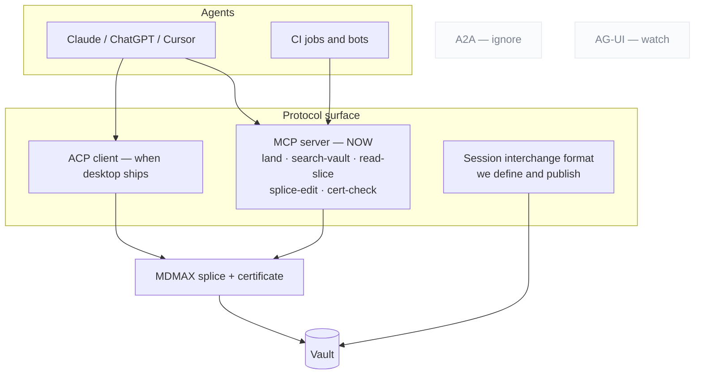

### 10.1 Format posture

| Posture | Formats | Rationale |
|---|---|---|
| **READ** | OKF bundles (v0.2, own Google repo, 356 adopter repos, +24%/27d `[fetched]`) · SKILL.md folders · MyST keys · textbundle | Zero parser cost; recognise `sources / generated / verified / status / stale_after` and derive trust tiers |
| **EMIT** | llms.txt v2 + markdown twins + `rel="alternate" type="text/markdown"` (Chrome Lighthouse audits for it `[fetched]`) · OKF export · **Skill export** — a curated collection becomes a SKILL.md folder consumable by 41+ agents | "The journey becomes a reusable capability" is the strongest interop story found |
| **BUILD** | **Session interchange format** — markdown-native, open, documented | No standard exists; the absence is the opening `[fetched]` |
| **WATCH** | .prompty · AG-UI | Not load-bearing yet |
| **IGNORE** | Promptfile (dead) · langchain-hub (archived) · A2A and server-cards as document formats | Dead or wrong layer |

### 10.2 Protocol posture

| Protocol | Posture | Reason |
|---|---|---|
| **MCP** | **Ship now**, tools-first | The July 2026 revision went stateless and deprecated Roots, Sampling and Logging — tools are the lowest common denominator `[fetched]`. Hard-cap under 20 tools; verdict-first responses; refusals that name the rule and give a corrected example |
| **ACP** | Client, when a desktop surface exists | 40 registered agents including an Anthropic-co-authored Claude adapter; `session/load\|resume\|list` is the only shipped multi-vendor session-continuity semantics anywhere `[fetched]`. ACP agents are local subprocesses over stdio |
| **A2A** | Ignore | Wrong layer for a document tool |
| **Session interchange** | **Build and publish ours** | §10.1 |

**The plumbing is table stakes. The pitch is what rides on it: every agent edit goes through the splice writer, so the agent cannot corrupt what it edits.**

### 10.3 The open territory

Claim-level method and confidence is claimed by no spec, and OKF explicitly argues *against* stored scores. The compatible design is **signals, not scores, derived at render time** — which is a renderer's game, and therefore ours.

---

---

## 11. The AI layer — what AI-native actually means


### 11.1 The retention evidence, before any feature list

Active-install proxy = peak single-version downloads, across 7,020 plugins with stats and 142,701,824 cumulative downloads. `[measured, obsidianmd/obsidian-releases, 2026-08-29]`

| Capability class | Peak-version sum | Cumulative | Members |
|---|---|---|---|
| Deterministic **projection** (Dataview, Kanban, Calendar, Tasks, TaskNotes) | **7,289,307** | 15,840,093 | 5 |
| Deterministic **structure** (Linter, Outliner, Tag Wrangler, Table Editor, Templater) | **2,019,220** | 12,057,166 | 5 |
| **Agentic** in-vault (Copilot, realclaudian, agent-client, smart-composer) | 463,062 | 4,133,966 | 4 |
| **Ambient** related-notes (Smart Connections, second-brain, lookup, ExcaliBrain) | 293,333 | 1,631,201 | 4 |
| **Generation / chat** (textgenerator, bmo, chatgpt-md, local-gpt, ollama, gpt3-notes) | 202,778 | 924,287 | 6 |
| **Voice capture** (whisper, transcription) | 46,478 | 87,502 | 2 |

- **Deterministic projections out-install every AI capability combined by 7.25×** `[derived: 7,289,307 ÷ 1,005,651]` — which is the strongest available validation of the projection law, arriving from outside our own thesis.
- **697 of 7,058 plugins (9.9%) describe an AI capability but take only 6.09% of cumulative downloads and 3.44% of the peak-version sum** — AI is over-supplied and under-installed by ~2.88× on the active-install measure. `[measured]` `[derived]`
- Source disagreement, recorded not resolved: the popular "AI plugins get abandoned" story is **false on the supply side**. AI-described plugins are *less* stale — **11.3% (78/688) unreleased >12 months vs 20.9% (1,464/7,020)**, median 50 days since last release vs 71. The cohort is younger, which partly confounds it. The abandonment is demand-side: actively maintained products that few people install. `[measured]` `[inference]`
- The largest file-native editor in the category ships no AI at all: **zero occurrences of the token "AI" across 9,502 chars** of its full Active/Planned/Launched roadmap back to July 2023. What it does ship is Bases (data in local markdown properties, views described in valid YAML), Kanban and Calendar views for Bases, an Airtable→Markdown import, a CLI, and a Keychain for plugin API keys. `[measured]` `[fetched]`

### 11.2 Ranked capabilities — build in this order

| Rank | Capability | Retention evidence | Splice shape | Cost/op |
|---|---|---|---|---|
| **1** | **Transformation verbs on a selection** — summarise, expand, restructure, translate, change register, extract entities, to-table | Strongest of the set: Bing Copilot telemetry over **200k conversations** finds "the most common and successful AI-assisted work activities involve information work — the creation, processing, and communication of information" (arXiv 2507.07935v6, upd 2025-12-22) `[fetched]`. Notion's shipped surface is "Edit with AI" on a highlighted range `[fetched]` | Perfect — output *is* a byte range | $0.004–$0.03 |
| **2** | **Frontmatter-key fill and repair** — tags, status, dates, typed links | Structure bucket 2,019,220 active installs, won today by deterministic tools `[measured]` | Perfect — a YAML key is the addressable unit; profiles already read them | <$0.002 |
| **3** | **Agent edits arriving as suggestions** (MCP `land()` into the review loop) | Fastest-growing AI bucket at 463,062; `realclaudian` is **#13 by cumulative downloads across all 7,058 plugins** (1,940,612). Users are filing "Improve Agent Mode **review and consent controls**" (2026-08-19) against the market leader — they are asking a competitor for our differentiator `[measured]` `[fetched]` | Perfect — a splice against `baseSha` | per-op |
| **4** | **Q&A over the open file with byte-anchored citations** | Real but shallow: ChatPDF claims "10M+ users" and "1,000,000+ Q's answered every day" = **0.1 queries per registered user per day** `[derived]` — signup scale, not habit scale | Perfect — a citation *is* a byte range | ~$0.005 |
| **5** | Heading/structure repair as a proposed diff | Currently won by determinism: Obsidian Linter 112,395 active installs, no AI `[measured]` | Good — do the deterministic 80% first, AI only for what regexes cannot decide | ~$0.006 |
| **6** | Scoped multi-document synthesis — explicit N files, never "the vault" | Real and throttled by its own vendor: Gemini Notebook caps at **50 chat queries/day**, 100 notebooks × 50 sources × 500,000 words `[fetched]` | Acceptable — bounded input set, ideally a projection's filter result | $0.01–$0.10 |
| **7** | Voice capture into the file | Real category, tiny in-vault (46,478). Two companies pivoted *out of* the document to chase it — Tana's meeting platform is now "a separate product from Tana Outliner"; Mem is now "Your AI chief of staff" `[fetched]` | Acceptable, as capture-to-inbox only | external ASR |
| **8** | Ambient related-notes / duplicate detection | **Highest maintenance burden per install in the category**: Smart Connections 5,407★ with 489 open issues = **9.05% issues-per-star vs Copilot's 1.30% (99/7,640)**; the most-commented open issues are all silent index breakage — "Pane is always loading" (39), "Embeddings no longer function (linux)" (24), "Doesn't seem to look at my notes" (22) `[measured]` `[fetched]` | **Poor** — requires a second index beside the file | **$38.79/user/month** |
| **9** | Ghost text / continuous completion | Declining cohort (202,778, below both agentic and ambient); `textgenerator` last released 2026-04-27, `gpt3-notes` 2023-07-07, `vault-chat` 2023-06-03 `[measured]` | Poor — writes without being asked; contradicts propose-first at the mechanism level | continuous |

### 11.3 Cost arithmetic

Corpus: `knowledge` n=590 md files, p50 **479 words**, p90 **3,584**, total 1,980,166 words; `frontmatter` repo n=186, p50 2,439, p90 10,328. `[measured]` Prices: Haiku 4.5 **$1/MTok in, $5/MTok out**; Sonnet 5 $2/$10; Opus 5 $5/$25; batch Haiku $0.50/$2.50. The same page warns Claude 4.7+ tokenizers emit "approximately 30% more tokens for the same text." `[fetched, docs.claude.com/pricing]` Assume 1 word ≈ 1.33 tokens `[inference]`.

| Operation | Tokens | Haiku 4.5 | Note |
|---|---|---|---|
| Summarise a p90 note → 200 w | 4,767 in / 200 out | **$0.0058** `[derived]` | Cheaper than one Notion credit ($0.01) `[fetched]` |
| Restructure a p90 note in place | 4,767 / 4,767 | **$0.0286** `[derived]` | Output is 83% of cost |
| Same on Sonnet 5 | 4,767 / 4,767 | **$0.0572** `[derived]` | 2× for a formatting-shaped task |
| One full pass over a 590-note vault | 2,633,621 in | **$2.63** `[derived]` | Input only |
| Ambient re-rank on every save, 20 neighbours @ p50, 100 saves/day | 1.274 MTok/day | **$38.79/user/month** `[derived: 1.274 × $1 × 30.44]` | The line that kills rank 8 |

### 11.4 Explicit refusals

| Refuse | Because |
|---|---|
| **No persistent semantic index of the vault** | A second source of truth beside the file is what the projection law forbids, it costs $38.79/user/month at 100 saves/day `[derived]`, and the market leader's most-discussed open issues are all silent index failure `[measured]` |
| **No "rewrite in my voice" as a headline feature** | Across 3 studies, 7 datasets, **>880,000 texts**, LLM writing assistance is linked to a statistically significant **21–50% reduction in writing-complexity variance (p ≤ .05)**, "emphasizing conformity over individuality" (arXiv 2502.11266, upd 2026-08-24) `[fetched]`. Ship register-shift as a one-shot verb the user asks for, never as a default or ambient suggestion |
| **No unsourced summarisation** | Entity hallucination in abstractive summarisation is documented to at least 2021 (arXiv 2102.09130), and Gemini Notebook's own help page lists "information not in sources" as a first-class failure `[fetched]`. Every summary carries the byte ranges it came from or it does not render |
| **No ambient AI buttons, no ghost text by default** | 66% of ~33,000 developers name "AI solutions that are almost right, but not quite" as their top frustration; only **3.1% highly trust** AI output (29.6% somewhat trust, 26.1% somewhat distrust, 19.6% highly distrust), and favourability fell to 59.7% from "70%+ in 2023 and 2024" `[fetched, Stack Overflow 2025]`. An unrequested suggestion spends trust the product cannot refill |
| **No AI that decides or publishes** | "Don't plan to use AI for this task": deployment/monitoring **75.8%**, project planning **69.2%**, committing and reviewing **58.7%** `[fetched]`. AI may propose a status change; the human commits it. This is also the boundary that keeps us out of Notion-style project management |
| **No meeting bot, no chief-of-staff agent** | Tana and Mem both left the document to chase it. That is a different company `[fetched]` |
| **No standalone AI SKU** | On **2024-06-01** Notion sold AI at **$8/member/month annual, $10 monthly**, "Now with Q&A". On **2026-08-29** that add-on does not exist: Free and Plus get only a trial, Agent and Enterprise Search sit inside **Business at $20/member/month**, and Custom Agents meter at **$10 per 1,000 monthly Notion credits**. Standalone document-AI became bundled table stakes plus a metered agent line in ~26 months `[fetched, two dated snapshots]` `[derived]`. Price AI as a metered line inside a free-forever editor |

### 11.5 The instrumentation contract

- Report **Strong Acceptance** — accepted only if <50% of the proposal was edited *and* the edits do not change critical parts — not raw acceptance. The only published figures for a propose-first assistant are Ansible Lightspeed: **49.08% strong acceptance on multi-line suggestions**, **Day-30 retention 13.66%** (10,696 users, 3,910 returning; arXiv 2402.17442, pub 2024-02-27, upd 2024-10-22, self-described as the first code-completion tool to publish N-day retention). `[fetched]`
- That is a small model on one narrow YAML dialect, so 49.08% is a ceiling for a constrained verb, not a general rate. `[inference]`
- **This supersedes the "~30% acceptance rates `[SS]`" line currently in `docs/FRONTMATTER-MASTER-PLAN-2026-08-28.md:82`**, which is a search summary and must not be published as fact. `[measured, grep of the plan file]`
- Record accept / reject / partial / edit-distance-after-accept **per verb, locally, publish nothing**. The entire ranking in 11.2 was reconstructed from install counts, version distributions, issue ratios, and roadmap absences — never from a survey — which is a working demonstration that behaviour is readable without asking. Telling a user who somewhat distrusts AI (26.1%) that you are measuring their rejections is the same conversation twice. `[measured]` `[inference]`
- Kill rule per verb: below 20% strong acceptance or below 10% D30 after 90 days of data, the verb is removed, not tuned.

### 11.6 What "AI-native" means, in the words a user gets

AI-native does not mean the app writes for you. It means your markdown file is the only thing that exists, and the AI is a set of precise verbs you point at a piece of it — summarise this section, turn these paragraphs into a table, fill in the tags, translate this, restructure these headings — where every verb comes back as a proposed change you can see, byte for byte, before it touches the file, and lands through the same splice writer that guarantees nothing you did not select gets rewritten. **Nothing runs in the background, nothing is indexed behind your back, nothing is published or decided on your behalf, and if you delete every model key tomorrow the file, the board, the calendar and the site all still work exactly as they did — because those were never AI features, they were always just your file, read a different way.**

Decision falsified by: transformation verbs failing to clear 20% strong acceptance in the first 90 days, or a measured demand signal for ambient related-notes that survives the $38.79/user/month line.

---

## 12. The capture loop


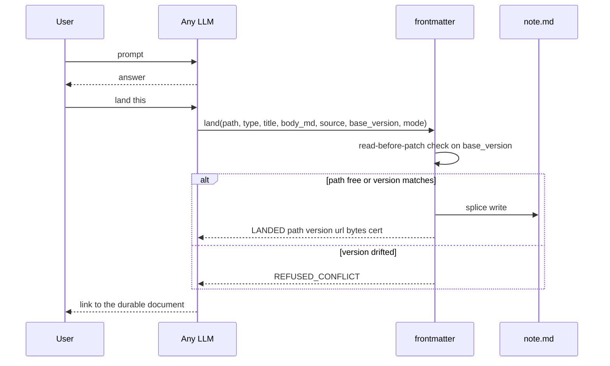

```
land({ path?, type, title, body_md,
       source: { tool, model, conversation_url, session_id },
       base_version?, mode: create | patch | rewrite })
  → { LANDED | VERSIONED | REFUSED_CONFLICT | NEEDS_TARGET,
      path, version, url, bytes_written, cert }
```

| Rule | Why — each from a documented failure |
|---|---|
| **Identity is the path**, explicit in every call | On claude.ai, where identity is inferred from phrasing, *"it made a new artifact instead of updating mine"* is the #1 documented failure |
| **Two edit sizes are protocol modes**, not prompt etiquette | `patch` vs `rewrite` — otherwise the model guesses |
| **`base_version` enforces read-before-patch** | Structurally kills the drift bug where the user hand-edits and the model keeps talking about the version it remembers. Bolt's own system prompt: always edit the latest content `[fetched]`. **The file is the memory; the model's memory of the file is a cache to invalidate** |
| **Counts re-derived from disk** | The anti-lying-report rule |
| **Typed at capture** | `type:` picks schema, render and home grouping. Granola: $1.5B valuation on template-typed capture with per-line provenance `[SS]` |
| **Users see the nouns, never "artifact"** | Bolt's system prompt literally forbids the word `[fetched]` |
| **Auto-land only into an inbox lane** | Never silently into the curated vault |

**Distribution:** an MCP server for MCP-capable tools · a **chat-side skill** for everything else ("land this" → typed fenced block → one-paste inbox) · ZIP importers for ChatGPT and Claude where **the verification report is the demo** · retro-capture parsing one conversation into *several* typed documents.

**The promotion loop is what makes it a home rather than a filing cabinet:** landed documents become retrievable, citation-gated context — `draft → active → source-of-truth → superseded`.

---

---

## 13. The review surface


**One grammar for every change: human suggestions, AI edits and sync conflicts all arrive as hunks.** The deepest single extraction of the research — 40 years of office software, sourced to the Google Docs API discovery document and pandoc's docx reader `[fetched]`.

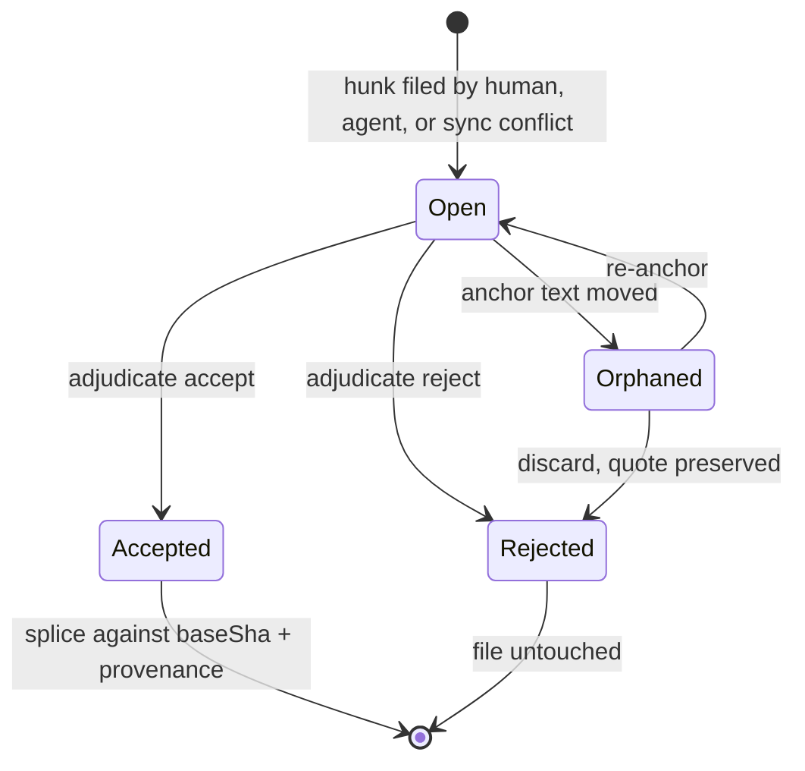

| Rule | Detail |
|---|---|
| Suggesting is a **mode** | Edit / Suggest / View dial. The suggester role has **no byte-writing code path** |
| Hunks coalesce at **word grain** | Git's line grain is the wrong resolution for prose |
| Markup / Final / Original are **pure render projections** | The OnlyOffice save-in-preview-deleted-changes bug is the negative spec |
| The adjudication ladder | per hunk → per suggestion → **all-shown-under-filter** (filter by author, *including AI agents*), with accept-and-advance and preview-before-bulk |
| **Resolution is an authored thread event** | `replies.action ∈ {resolve, reopen}` — never a silent boolean |
| Anchors are quote-preserving with **visible orphaning** | Word silently deletes orphaned comments; Docs orphans opaquely. We badge, preserve the quote, offer re-anchor |
| Accept = splice against `baseSha` | Plus a `Co-authored-by` trailer |
| Governance via branch-protection semantics | **No document freezes** |
| Interchange | CriticMarkup + pandoc `--track-changes` spans, both directions |

**The two moves that beat the incumbents:** **programmatic and AI suggestion authorship** — Google's public API cannot create suggestions at all `[fetched]`, while ours is a plain sidecar schema any CI job or agent can file into — and **durable provenance through accept**, where theirs evaporates.

**Anchoring implementation:** Hypothesis's `match-quote.ts` + `approx-string-match` (BSD-2 / MIT) is the mechanism that lets an AI target survive human edits.

> **Treat the review surface as a breaking-API contract.** Cursor and Windsurf both regressed per-hunk control and both got publicly burned. Per-hunk accept is the single most-demanded feature in AI editors `[fetched]`.

---

---

## 14. Documents that build things — the spec-driven lane


The founder's question for this lane: can frontmatter be the place you write a spec, an AI reads it, and output is generated? The answer this section defends is *yes for the document half, no for the execution half* — and the entry is narrow, cheap, and gated on one measurement we can take ourselves.

| Half of the lane | Who owns it today | frontmatter's position |
|---|---|---|
| Authoring, review, rendering, drift display, requirement identity | **Nobody.** Not one tool surveyed ships a way to read or edit a spec other than a plain text editor [fetched, 14 tools] | Enter here |
| Execution, test generation, approval gates, agent dispatch | AWS Kiro (IDE-only), spec-kit `/implement`, the coding agent's own loop [fetched] | Do not enter |

---

### 14.1 The market as it stands

**Census — GitHub, 2026-08-28 UTC** [measured, api.github.com]

| Repo | Stars | Forks | Licence | Created | Last push | State |
|---|---|---|---|---|---|---|
| anthropics/claude-code | 143,296 | 22,918 | none declared | 2025-02-22 | 2026-08-28 | live |
| github/spec-kit | 132,035 | 11,865 | MIT | 2025-08-21 | 2026-08-28 | live |
| cline/cline | 67,077 | 7,241 | Apache-2.0 | 2024-07-06 | 2026-08-28 | live |
| Fission-AI/OpenSpec | 66,571 | 4,583 | MIT | 2025-08-05 | 2026-08-28 | live |
| gsd-build/get-shit-done | 64,629 | — | MIT | 2025-12-14 | 2026-05-31 | **dead redirect** |
| bmad-code-org/BMAD-METHOD | 52,419 | 5,964 | NOASSERTION (npm says MIT) | 2025-04-13 | 2026-08-28 | live |
| continuedev/continue | 35,666 | 5,295 | Apache-2.0 | 2023-05-24 | 2026-08-28 | live |
| cursor/cursor | 33,190 | 2,287 | none | 2023-03-12 | 2026-05-12 | issue tracker |
| Kilo-Org/kilocode | 27,054 | 3,096 | MIT | 2025-03-10 | 2026-08-28 | live |
| RooCodeInc/Roo-Code | 24,322 | 3,415 | Apache-2.0 | 2024-10-31 | 2026-05-15 | **ARCHIVED** |
| agentsmd/agents.md | 23,968 | 1,813 | MIT | 2025-08-19 | 2026-08-25 | live |
| open-gsd/gsd-core | 8,849 | — | MIT | — | — | live successor |
| buildermethods/agent-os | 5,343 | 831 | MIT | 2025-07-16 | 2026-05-05 | quiet 3.8 mo |
| kirodotdev/Kiro | 4,231 | 310 | none (proprietary AWS) | 2025-06-17 | 2026-08-27 | issue tracker |
| gemini-cli-extensions/conductor | 3,713 | — | Apache-2.0 | 2025-12-17 | 2026-08-11 | live |
| gotalab/cc-sdd | 3,644 | — | MIT | 2025-07-17 | 2026-05-20 | live |
| Priivacy-ai/spec-kitty | 1,572 | — | MIT | 2025-10-09 | 2026-08-28 | live |
| tesslio/cli | 71 | — | — | — | — | live |

Disagreement recorded: the repos endpoint returns OpenSpec at 66,571; the search endpoint, same minute, returns 66,570 [measured]. Both stand.

**Distribution** [measured, api.npmjs.org + pypi.org, week 2026-08-21→27]

| Package | Last week | Last month (2026-07-29→08-27) | Latest | Licence field |
|---|---|---|---|---|
| `@fission-ai/openspec` | **464,621** | 1,645,308 | 1.11.0 | MIT |
| `bmad-method` | 16,941 | 81,735 | 6.11.0 | MIT |
| `@tessl/cli` | 6,034 | 19,794 | 0.102.0 | `SEE LICENSE.md` |
| `specify-cli` (PyPI) | n/a | n/a | 1.0.1, 56 releases | `null` |

- [derived] OpenSpec ÷ BMAD weekly = 464,621 ÷ 16,941 = **27.43×**; OpenSpec ÷ Tessl weekly = 464,621 ÷ 6,034 = **77.00×**; OpenSpec stars ÷ tesslio/cli stars = 66,571 ÷ 71 = **937.6×**.
- VS Code marketplace installs [measured, gallery API]: GitHub.copilot 74,459,915 · cline 5,131,205 · roo-cline 1,961,704 (`lastUpdated` 2026-05-15, identical to its GitHub archive date) · Kilo-Code 1,473,000.

**Convention adoption** [measured, GitHub code search 2026-08-28 — approximate bucketed totals over a subset of public repos, every value factoring as odd×2ⁿ]

| Convention | Indexed files |
|---|---|
| `CLAUDE.md` | 774,144 |
| `AGENTS.md` | 460,800 (repo root) / ≈858,112 (unrestricted) |
| `.claude/skills/**/SKILL.md` | ≈380,928 |
| `.cursor/rules/**.mdc` | 186,112 |
| `.github/copilot-instructions.md` | 146,944 |
| `openspec/specs/**/spec.md` | 117,504 |
| `GEMINI.md` | 65,152 |
| `.kiro/specs/**/requirements.md` | 33,728 |
| `.kiro/specs/**/tasks.md` | ≈30,592 |
| `.specify/memory/constitution.md` | 11,264 |
| `memory-bank/activeContext.md` | 2,728 |

Disagreement recorded: two research passes returned 460,800 and ≈858,112 for `AGENTS.md` on the same day — the first restricted to repo root, the second not; `CLAUDE.md` matched exactly at 774,144 across both. Quote the root-restricted figure when comparing like for like. A third, independent number exists: agents.md the site claims "over 60k open-source projects" [fetched] — different unit, different index, also stands.

**Independent census — SPECMINE, arXiv 2608.25202, 2026-08-25** [fetched]: 470,795 `spec.md`/`specs.md` files across **73,030 repositories**, attributed to **17 named tools**; a separate Kiro census of 98,574 files across 12,910 repositories; 2,421,323 typed references indexed. [derived] 470,795 ÷ 73,030 = **6.45 spec files/repo**. Its PR sweep found spec-and-implementation co-changing in one PR in **581 repositories** — [derived] 581 ÷ 73,030 = **0.80%**, a **lower bound only** because the sweep covered 11 tools' ≥10-star repos, not the census. Do not quote it as a co-change rate.

**The shape of the category — what all of them do the same way**

- **Markdown is unanimous.** Every artifact in every tool surveyed is a `.md` file. Zero use a formal or binary spec language [measured across 14 tools].
- **Three-artifact skeleton**, reached independently by Kiro, spec-kit, OpenSpec, agent-os and BMAD: `requirements/spec → design/plan → tasks` [fetched].
- **A hidden dot-directory keyed to one vendor** — `.specify/`, `.kiro/`, `openspec/`, `agent-os/`, `.cursor/`, `.claude/`, `memory-bank/`. The convention *is* the lock-in; the response is an install matrix (spec-kit 37 agents, OpenSpec 36 tools [measured]), not a shared location.
- **Given/When/Then plus RFC-2119 is the shared dialect**: OpenSpec `### Requirement:`/`#### Scenario:` with SHALL/MUST, Kiro EARS, spec-kit `**Given**/**When**/**Then**` [fetched].
- **Human approval is the gate, not a machine** — Kiro three-phase approvals, Factory `ExitSpecMode`, Claude Code plan-mode approval [fetched].
- **Nothing is machine-verified against code except one product.** Kiro extracts properties from EARS requirements, generates property-based tests, runs them and links failures back to the requirement — and its own docs limit the claim to "evidence of correctness, not a proof… not formal verification", IDE-only per its own capability matrix [fetched]. `openspec validate --archived` exits non-zero on an unticked `tasks.md` checkbox — a genuine CI gate, on the markdown [fetched]. Everything else is an LLM pass that does not block.

**What none of them do** — no durable identity for a requirement (spec-kit's `/analyze` maps tasks to requirements "by inference by keyword / explicit reference patterns", i.e. by grep, because nothing better exists [fetched]); no machine binding from requirement to code range (SPECMINE had to *reconstruct* it from 2.42M typed references); no deterministic drift detection; no review surface; no cross-tool portability across 17 named tools.

The cost of the identity gap is measured. arXiv 2606.30689 [fetched]: only the per-line-citation condition (`traceSDD`, hierarchical `REQ-XXX.Y.Z` IDs) enables automated hallucination detection — **TDR 86.4% (Claude Sonnet 4.6) / 88.0% (GLM-5-turbo), against 0% for Spec Kit, OpenSpec and the uncited baseline, FPR 0% in both**. The same paper prices it: citation *reduces* output determinism (Claude d=−0.76, p=0.003; GLM d=−0.72, p<0.001).

**Verdict on whether a markdown editor is a credible home**

| For the editor | For the IDE |
|---|---|
| The artifact is 100% markdown in 100% of tools; whoever owns markdown editing owns the file type [measured] | Verification lives where the code and the test runner live — Kiro's PBT loop must *run tests*, and that is the only differentiated capability in the category [fetched] |
| The IDE has *conceded* the artifact: Claude Code makes plan a session permission mode with no file; Factory Spec Mode is ephemeral; Cursor ships rules, not specs [fetched] | Approval gates are conversational and belong in the agent loop [fetched] |
| Four conventions are legible to any editor with zero integration — [derived] 460,800 + 117,504 + 33,728 + 11,264 = **623,296** indexed files [measured] | Distribution flows through the coding agent: spec-kit installs into 37 agents in one command [measured] |

**Decision: enter as a viewer, reviewer, renderer and anchor-provider for specs other tools already write; do not become tool #18.** Do not define a new spec format or a `.frontmatter/specs/` directory — that is convention #18 in a field with 17 and no interchange standard. Do not build an approval workflow, do not run or generate tests, do not build spec↔code semantic verification. Sell *to* the OpenSpec and Kiro user: 464,621 weekly npm downloads is a distribution channel, not a competitor.

**The strongest argument against entering at all.** The category has no retention evidence and three of its biggest names have already left. Tessl — the best-funded pure-play, the company that coined the spec-as-source-of-truth pitch — pivoted its CLI to a skills registry; its current CLI reference contains **no spec command at all**, and its CLI repo sits at **71 stars against OpenSpec's 66,571, a 937.6× gap** [measured]. Roo Code is **archived** on 1,961,704 installs [measured]. `get-shit-done` accumulated 64,629 stars and became a redirect stub [measured]. SPECMINE observes spec-and-code co-change in **581 repositories** against a 73,030-repo census [fetched] — consistent with specs being generated once and abandoned. Every artifact we would render is written by an MIT-licensed CLI that costs nothing; willingness-to-pay is unproven precisely because the incumbent price is zero. And our actual moat is *fidelity* — byte-exact splice, the degradation certificate, the machine-view differ — and nothing in this category has been observed to churn over fidelity. The honest counter-case is that spec-driven development is a 12-month prompt-scaffolding fashion whose artifacts are write-once, and that building a renderer for write-once files is building a museum. [inference on measured/fetched inputs]

**What would falsify the decision to enter:** on a corpus of real `openspec/` and `.kiro/specs/` repositories, measure the fraction of spec files edited more than once after creation. If that fraction is low, the museum argument wins and the correct move is to ship the renderer as a feature and never as a product. Take this measurement before any further investment; it is one we can take ourselves.

---

### 14.2 The document canon we render, not invent

| Type | Canonical source | Sections | Frontmatter keys | Machine-readable schema | Render profile |
|---|---|---|---|---|---|
| **ADR — MADR** | `adr/madr` template, 1422 B [fetched] | 6 H2 (Context and Problem Statement; Decision Drivers*; Considered Options; Decision Outcome; Pros and Cons*; More Information*) + 2 fixed H3 (Consequences*, Confirmation*); minimal variant = 3 H2 + 1 H3; **4 template variants** ship | 5, all optional in-file: `status`, `date`, `decision-makers`, `consulted`, `informed` | **NO** — `schema.json` → 404 at both paths [measured] | `decision` |
| **ADR — Nygard** | 2011 article [fetched] | 5: Title, Context, Decision, Status, Consequences | **none** — plain headings | NO | `decision` |
| **RFC — IETF** | RFC 7322 §4 [fetched] | **23 listed elements, 10 marked `[Required]`** + 1 conditional (IANA) + 1 on-demand | first-page header, not YAML | **YES, two** — RFC 7991 XML vocabulary; `rfc-index.xml` (2,324,273 bytes) [measured] | `spec` + `proposal` |
| **RFC — Rust** | `rust-lang/rfcs/0000-template.md` [fetched] | **9 H2**: Summary; Motivation; Guide-level explanation; Reference-level explanation; Drawbacks; Rationale and alternatives; Prior art; Unresolved questions; Future possibilities | 4-item **bullet list**, not YAML: Feature Name, Start Date, RFC PR, Rust Issue | NO (process state tracked externally by rfcbot) | `proposal` |
| **RFD — Oxide** | RFD 1, 47,089 B [fetched] | **none prescribed** — content prompts only | 4 **AsciiDoc attributes**: `:authors:`, `:state:`, `:discussion:`, `:labels:` | NO heading schema; header parseable | `decision` |
| **RFC — company-internal** | Squarespace + Uber posts [fetched] | Uber backend 11, Uber mobile/web 11, literal-string overlap **5** [derived]; Squarespace adds 3 | Squarespace 7 header fields; approval enum is **2 values by design**: `yes` \| `not yet` | NO | `proposal` |
| **Design doc — Google** | industrialempathy.com [fetched] | 5 top-level; explicitly refuses to prescribe — "Rule #1 is: Write them in whatever form makes the most sense"; 10-20ish pages, or a 1-3 page mini | none | NO | `proposal` |
| **Gherkin** | cucumber.io reference + `gherkin-languages.json` [fetched/measured] | Primary keywords: `Feature`, `Rule`, `Example`/`Scenario`, `Given`/`When`/`Then`/`And`/`But`/`*`, `Background`, `Scenario Outline`, `Examples`; 4 secondary (`"""`, `\|`, `@`, `#`) | **none** — tags are the metadata channel | **YES** — `gherkin-languages.json`, **80 languages**, English entry 11 keyword keys + `name` + `native` = 13 [measured] | `behavior` |
| **OpenAPI** | OAI repo, `versions/` [measured] | Root fixed fields: **3.2.0 = 11**, **3.1.1 = 10**, delta = 1 (`$self`); 9 spec files in `versions/` | the document *is* the frontmatter (`info`) | **YES, strongest** — `spec.openapis.org/oas/3.1/schema/2022-10-07` → 200, 3535 B; `oas/3.1/dialect/base` → 200, 345 B. `…/schema/latest` → **404** for both 3.1 and 3.2 — pin the dated URI [measured] | `api` |
| **Changelog** | Keep a Changelog 1.1.0, 8394 B [fetched] | `# Changelog` → `## [Unreleased]` → `## [version] - YYYY-MM-DD` → `### <type>`; **exactly 6 types** (Added, Changed, Deprecated, Removed, Fixed, Security); **exactly 7 principles** | **none** | **NO** — principle #1 is literally "Changelogs are for humans, not machines" | `release` |
| **Postmortem — Google SRE** | SRE Book App. D (2016) + SRE Workbook Ch. 10 (2018) [fetched] | **The two disagree.** Book: 12 top-level + 3 sub, incl. Timeline. Workbook: 9 body sections, adds Recovery Efforts + Glossary, action items gain `Priority` | Workbook metadata: Owner, Shared with, Status, Incident date, Published | NO — Google's own parser (Requiem) is internal | `incident` |
| **Runbook** | **no standards body** [inference] | Skelton Thatcher template: **65 headings, 10 H2** [measured, `grep -cE '^#{1,4} '`] | our invention | NO | `ops` |
| **Test plan** | IEEE 829-2008 **superseded** by ISO/IEC/IEEE 29119-3:2013 | IEEE 829 defines **10 document types**, not one | none standardized | NO | `test` |

**Types with no canonical form — we would be inventing**

| Type | Canonical source? | What actually exists |
|---|---|---|
| **PRD** | **NONE** | Vendor blog templates only; every "PRD standard" claim is [SS] at best |
| **FRD** | **NONE** | Defence/consulting folklore; overlaps SRS "Specific requirements" |
| **TRD** | **NONE** | Closest standardized neighbour is SRS |
| **SRS** | **Partial, paywalled** — ISO/IEC/IEEE 29148:2018 exists, `iso.org` returned **403**, clause list never opened; IEEE 830-1998 withdrawn | The circulating section list is [SS] from a secondary encyclopedia page citing SWEBOK |
| **Runbook** | **NONE** | Skelton Thatcher template; Google says "playbook", not runbook — the terminology is not shared |
| **User-story wrapper** (As a / I want / So that) | **NONE** — Connextra-format folklore | Gherkin covers acceptance criteria only |
| **Design doc** | **NONE, by design** | Google's article explicitly refuses to prescribe |
| **Company-internal RFC** | **NONE** | Squarespace and Uber are two data points sharing 5 literal strings |

**Four of the fourteen requested document types have no canonical form at all, and a fifth (SRS) has one nobody could open — so every template we ship for those must carry the label "house convention", never "canonical".**

**Ship order, because it is the order in which a template can be validated rather than merely rendered:** (1) OpenAPI and (2) Gherkin first — both have a fetched, versioned, machine-readable normative artifact. (3) MADR and (4) Keep a Changelog next — no schema, but a fully specified section list and enum from a single primary source. (5) IETF RFC — fully specified but heavy. (6) Google SRE postmortem — ship the **Workbook** variant and label the version, because the two Google templates disagree.

**Anti-recommendations, all load-bearing:**
- Do **not** label anything "IEEE 829" — superseded, and it defines 10 documents.
- Do **not** publish a 29119-3 or 29148 clause list until someone opens the paywalled text; both are [SS] and both hosts returned 403.
- Do **not** attach YAML frontmatter to `CHANGELOG.md` or to `.feature` files. A `---` fence at line 1 makes a `.feature` file unparseable by every Gherkin implementation; if metadata is needed it must be tags or a sidecar.
- Do **not** silently pick an ordering where sources conflict: Nygard's article orders Title → Context → Decision → Status → Consequences, the widely-copied `joelparkerhenderson` rendering puts Status second [fetched, both]. Render what the file says.
- Do **not** default the runbook template to 65 headings — that is a system-operation manual, not an incident procedure. Default to the 10 H2 skeleton, offer the full set as an expand variant.
- Do **not** bullet-ize a Nygard ADR: the source states bullets are "acceptable only for visual style, not as an excuse for writing sentence fragments" [fetched].
- Do **not** ship a "blameless" lint that flags usernames. Google's own bad-postmortem example is blameful by containing judgement, not by containing names — names appear throughout the good one.
- Do **not** inline a full OpenAPI document inside a design doc; the Google guidance warns such definitions "quickly get out of date". Link it; render it separately.

---

### 14.3 Prompts, specs and skills — three artifacts or one?

**Decision: one substrate, three lifecycles. Same file skeleton (`---` YAML + CommonMark, closed key set, splice-safe), different required keys, different verifier.** Do not merge them into one file type; do not give them three unrelated formats.

Evidence the substrate is already shared [fetched 2026-08-28]:
- VS Code ships **four** sibling markdown-plus-YAML types — `*.instructions.md`, `*.prompt.md`, `*.agent.md`, `SKILL.md` — discovered by the same walker with the same parent-repo rule.
- Microsoft is collapsing prompt files into skills in production: "Agents running on the Agent Host don't use prompt files. To use an existing prompt with the Copilot agent, convert it to an agent skill", behind `chat.customizations.promptMigration.enabled`.
- PromptLayer, a *prompt registry*, now versions **SKILL.md folders** alongside prompt templates (Free 1 collection/30 files, Pro 5/50, Team unlimited/100, hard 5 MiB per file).
- promptfoo, a *prompt* test runner, ships a `skill-used` assertion and `trajectory:tool-used`.

| | Prompt doc | Spec doc | Skill doc |
|---|---|---|---|
| Loaded | on invoke, fully | by human/agent on reference | **progressively** — L1 metadata always, L2 body on trigger, L3 files on demand |
| Addressed by | name + version | path | `description` **match** — a retrieval key, not documentation |
| Versioned by | semver + eval gate | git history | `metadata.version`, informal |
| Tested by | assertions over outputs | review/approval | with-vs-without A/B |
| Fails by | wrong output | ambiguity | **not triggering at all** |
| Cache role | *is* the cached prefix | is cached *content* | changes the tool set → invalidates the whole prefix |

Design consequences the build team implements directly:
- A skill's `description` is linted for **trigger coverage**; a prompt's `inputs` for **fixture completeness**; a spec's headings for **stable anchors**. Three linters, one parser.
- **Closed key set with one `metadata` escape hatch.** [measured, local corpus of 697 `SKILL.md`, 695 parseable] **293/695 = 42.2%** carry at least one key outside the 6-field agentskills.io spec, and every one **hard-errors** on upload rather than degrading: `Unexpected key(s) in SKILL.md frontmatter: argument-hint. Allowed properties are: allowed-tools, compatibility, description, license, metadata, name`. An open key set silently manufactures unportable documents.
- Cap `description` at **1024** chars, not 1536: the spec caps it at 1024 while the listing truncates `description`+`when_to_use` at 1,536 — the smaller cap is the portable one. [measured] 17/695 = 2.45% of local files already exceed 1024; resolved length median 379, p90 719, max 1,885.
- Adopt `.prompty` §2.7 **rich input kinds** (`thread`, `image`, `file`, `audio`) — the four things that break naive `{{var}}` substitution — and make `example` mandatory when `required: true`, because that is what makes a prompt file self-testing.
- Put `version` **in the file**. Every registry surveyed has a version model and no file format does; Langfuse (integer + labels), Braintrust (hex + environments), LangSmith (commit hash + tags) and PromptLayer (version + release labels) each own it server-side with a different primitive. Adopting one is adopting its lock-in.
- Declare cacheability in the document (`breakpoints`, `ttl`, `min_tokens_assert`), because an under-minimum Anthropic prefix is **silently uncached with no error** — the only signal is `cache_creation_input_tokens == 0 && cache_read_input_tokens == 0`. Minimum cacheable prefixes differ per model: 512 (Opus 5 / Fable 5 / Mythos 5), 1,024 (Opus 4.8, Sonnet 5/4.6/4.5, Opus 4.1/4, Sonnet 4), 2,048 (Mythos Preview, Opus 4.7, Haiku 3.5), 4,096 (Opus 4.6, Opus 4.5, Haiku 4.5); 4 breakpoint slots, 20-block lookback, order `tools → system → messages`. OpenAI: min 1,024 tok (GPT-5.6+) / 2,048 (older), write 1.25× / read 0.1×, max 4 cache writes per request, `ttl` sole legal value `30m`. [all fetched]

**Anti-recommendations:**
- **Do not invent a new prompt file extension.** `@prompty/core` gets 755 npm downloads/month against promptfoo's 2,536,364 — [derived] **3,359×** — and `.prompty` self-labels as "v2 Alpha… may change". Two unrelated projects already both claim the name "Promptfile" (132★ / 12 downloads a month). The extension is not the moat.
- **Do not add frontmatter to `AGENTS.md`.** It has no schema by design, 23,968★, median local size **145 bytes** across n=49 [measured]. The absence of keys is the property that produced the adoption.
- **Do not put YAML frontmatter in `llms.txt`.** The spec's only required element is a single H1 and it explicitly permits a leading BOM; a `---` block is a violation, not an extension.
- **Do not use full Jinja2.** Prompty published a normative 10-feature subset with `trim_blocks`/`lstrip_blocks` forced off precisely because identical templates rendered differently across runtimes; promptfoo uses **Nunjucks**, not Jinja2, so templates are not portable between the two.
- **Do not render user input without pre-render role-marker neutralisation** (Prompty §6.3: a nonce injected at every role boundary plus post-parse validation). Without it, any `{{var}}` containing `user:` on its own line silently forges a message boundary.
- **Do not let a prompt document read arbitrary files.** `${file:}` must reject absolute paths, `..` and symlink escapes, and frontmatter must never grant itself additional roots. A prompt document is untrusted content the moment it is shared.
- **Do not build a prompt *library* surface before a prompt *test* surface.** Every format surveyed that lacks a testing model (llms.txt, AGENTS.md, both Promptfiles, `.prompty`) is adoption-flat or ships no verifier; every artifact with real volume (promptfoo 2,536,364/mo, LangSmith 26,474,529/mo, Langfuse 27,044,017/mo PyPI) is a testing or versioning surface whose file format is an afterthought.

---

### 14.4 The AI build loop and where files beat chat

**The six-phase model — named by everyone, persisted by almost no one** [derived across 11 systems]

| # | Phase | Named by | Persisted as a file |
|---|---|---|---|
| 0 | **Constitution** — standing rules that outlive the task | Kiro steering, spec-kit constitution, Cursor/Codex/Devin/Windsurf rules, CLAUDE.md | ✅ **everywhere** |
| 1 | **Prompt** — the raw ask | nobody names it | ❌ **nowhere** |
| 2 | **Spec** — what + why, testable | Kiro `requirements.md` (EARS), spec-kit `spec.md` | 2 of 11 |
| 3 | **Plan** — how, reviewable before edits | Cursor, Cline, Copilot, Jules, Antigravity, Claude, Kiro `design.md`, spec-kit `plan.md` | **named by 8 of 11, filed by 2** |
| 4 | **Tasks** — decomposition with state | Kiro, spec-kit, Roo boomerang | 2 of 11 |
| 5 | **Verify** — evidence the thing does what §2 said | Kiro PBT, spec-kit `analyze`, Antigravity Walkthrough | **1 of 11; zero systems produce a signed pass/fail record** |
| 6 | **Memory** — what to carry forward | Claude auto-memory, Devin Knowledge, Windsurf Memories, Cline memory-bank | file in 2 of 4; vendor DB in 2 |

**The industry converged on phase names and diverged on persistence — and the phases that evaporate are the prompt, the plan, and the verification, which are exactly the three a team needs six months later.**

**What evaporates, with the vendor's own words** [fetched 2026-08-28]

| Artifact | Where it goes |
|---|---|
| Cursor plans | "Plans are saved by default in your home directory. Click 'Save to workspace'…" — not the repo. Checkpoints "stored locally and are separate from git" |
| Jules plans | reviewed in-session and **auto-approved on a timer** if you navigate away |
| Roo subtask context | "only this summary returns to the parent" |
| Antigravity Implementation Plan / Walkthrough | sidebar review pane; the Walkthrough is explicitly "a concise summary… to remind the user of what has happened" — a reminder, not a record; no documented on-disk path |
| Windsurf Memories | auto-generated, `~/.codeium/windsurf/memories/`, machine-local, per-workspace, "not committed to your repository"; the Devin Local agent "does not persist memories" at all |
| Devin Knowledge / Copilot Memory | vendor DB and managed service respectively — not in the repo |
| Claude Code plan | a *permission mode* in the `Shift+Tab` cycle, session-scoped, no file. Checkpoints deleted at 30d |

**Measured on this machine, one repo (`~/Desktop/GitHub/frontmatter`)** [measured/derived]

| Quantity | Value |
|---|---|
| Session transcripts | 267 `.jsonl` |
| Transcript bytes | 427,336 KB total − 20 KB memory dir = **427,316 KB** |
| Durable auto-memory | **20 KB** |
| Ratio ephemeral : durable | 427,316 ÷ 20 = **21,365.8 : 1** |
| `ExitPlanMode` invocations across all 267 transcripts | **0** (542 of 562 raw string hits are subagent tool-exclusion lists) |
| Human-authored `.md` tracked in the repo | 128 |

[derived] Instruction-file adoption ÷ spec-file adoption ≈ 858,112 : 30,592 = **28.05 : 1**. The industry has agreed on *how to instruct* an agent and has not agreed on *how to record what it did*.

**The literal opening.** Even spec-kit, the most file-native system in the set, encodes lifecycle state as **prose bold-keys, not frontmatter**: `spec-template.md`, `plan-template.md`, `constitution-template.md` and `checklist-template.md` all begin with `# …` and carry `**Status**: Draft` as body text; only `tasks-template.md` opens with `---` [measured, 5 templates fetched and first-line-tested]. The state machine exists and is unaddressable.

**What we build.** A loop document family under `.frontmatter/loop/<id>/` — `prompt.md`, `spec.md`, `plan.md`, `tasks.md`, `verify.md`, plus `constitution.md` at vault root — sharing one frontmatter key set: `id`, `kind`, `state ∈ {draft, proposed, approved, superseded, abandoned}`, `loop`, `derives_from: [<doc-id>@<sha>]`, `base_sha`, `supersedes`/`superseded_by`, `actor {human|agent, tool, model, session_ref, prompt_digest}`, `approved {by, at, mode: explicit|timer|policy}`, `verified {by, on, until, method, result: pass|fail|partial}`, `stale_after`. Transitions are splice-enforced: any edit to an upstream document flips every downstream document to stale and appends the diff to its `derives_from` ledger — Kiro's manual "Sync Files" button made automatic and auditable. Terminal states are `superseded` (new file plus LATEST pointer) and `abandoned`; nothing is deleted, which supplies the back-edge Kiro states it does not have ("Can I switch workflows after starting a spec? **No** … create a new Feature Spec" [fetched]).

**Build order, and why:**
1. **`verify.md` first, not `spec.md`.** Spec and plan have two credible incumbents; verification has **zero durable implementations across 11 systems** [derived]. Its body is a table of requirement IDs × evidence, each row `{claim, command, exit_code, output_digest, at}` — information Kiro's PBT and spec-kit's `/analyze` already produce and discard into a pane.
2. **`prompt.md` second.** The prompt is the only artifact literally no system persists, and it is the cheapest to capture.
3. **Make `derives_from: <id>@<sha>` mandatory and refuse the write without it.** This is the structural fix for the staleness class Kiro papers over with a Sync button and Cline papers over with "update memory bank".
4. **Render, don't relocate.** Keep `.kiro/specs/` and `specs/NNN-*/` where they are and project frontmatter over them. Migration is the reason spec tools die.
5. **Record `approved.mode` including `timer` and `policy`,** so a rubber-stamped plan is visibly rubber-stamped.
6. **Emit `AGENTS.md` and `SKILL.md`** so the loop is legible to Claude Code, Codex, Devin, Jules, Cursor and Windsurf with no adapter.

**Anti-recommendations:**
- **Do not build plan mode.** Eight of 11 systems have it; it is table stakes and it lives in the IDE's input loop, which we do not own.
- **Do not build a rules/instructions file.** AGENTS.md ≈858K and CLAUDE.md 774,144 — that fight is over.
- **Do not invent an extension gate.** Cursor's own docs concede plain `.md` is silently ignored inside `.cursor/rules`; that friction is a documented resentment, not a moat.
- **Do not store lifecycle state as prose bold-keys.** That is precisely the defect being exploited.
- **Do not replicate memory-bank's six-file taxonomy** — 2,728 adoption against ≈858,112 for AGENTS.md. The shape did not win.
- **Do not require a running daemon.** Statelessness is the differentiator against the CRDT competitor.

**Absorption risk, stated honestly.** The loop *documents* will be absorbed — Kiro ships three and spec-kit six, and spec-kit was pushed 2026-08-28. Cursor is one config flag from durable plans; assume it lands within 12 months and do not build the business on plan capture. What no single IDE can absorb: (a) the **cross-vendor projection**, because no vendor will make its memory readable by a competitor — Windsurf memories are machine-local, Devin Knowledge is a vendor DB, Copilot Memory is a managed service, and a team on all three today has three incompatible stores and zero shared verification record; (b) the **byte-exact write guarantee** on files the vendor also edits; (c) the **verification record**, because a vendor certifying its own agent's output is the second-opinion-from-the-first-opinion problem in commercial form. Build on those three; treat `spec.md` and `plan.md` as commodity surfaces we render, not products we sell.

---

### 14.5 What conformance we can honestly claim

| Mechanism | Proves | Cannot prove |
|---|---|---|
| Schema validation (JSON Schema / ajv) | Structural + per-field constraint conformance of an instance | Cross-field arithmetic, temporal or business invariants. [measured] ajv 6.15.0, schema `{total≥0, discount≥0}`, 3 payloads → 3 schema-valid, **1 of 3 valid while violating the English sentence "a discount must never exceed the order total"** |
| Property-based testing (Hypothesis 8,918★, fast-check 5,121★) | Falsification — a minimised counterexample to a stated invariant | Absence of counterexamples ≠ proof; the property itself is unverified against the English spec |
| OpenAPI conformance fuzzing (Schemathesis 3,565★) | Responses deviate from the schema; 5xx on generated inputs. 8 fuzzers × 16 services: "the only one to handle more than two-thirds of our target services without a fatal internal error", 1.4×–4.5× more unique defects than second-best [fetched arXiv 2112.10328v1] | That the schema *is* the spec |
| Consumer-driven contracts (Pact) | Provider responses satisfy each identified consumer's recorded expectation | Verbatim scope limits: "Pact is about checking the contents and format of requests and responses"; "Pact does not test the side effects of a request"; explicit not-good-for list includes public APIs and load testing [fetched] |
| Mutation testing (Stryker 3,060★, PIT 1,856★) | Your test suite detects seeded faults | **Spec conformance at all** — it grades tests, not code-vs-spec; equivalent mutants: "the only solution is by finding these by hand" [fetched] |
| Model checking (TLA+ 3,019★, Alloy 863★) | A *design* satisfies stated invariants in a bounded state space | Newcombe et al., AWS, verbatim: "How do we know that the executable code correctly implements the verified design?" — **"The answer is that we don't."** [fetched PDF] |
| Tag-based traceability (OpenFastTrace 163★) | Every normative item has a marker of the required artifact type; stale links detected (`Orphaned`/`Outdated`/`Predated`/`Covered-*`) | That the marked code *implements* the item |
| LLM-as-judge | A cheap, correlated, **non-deterministic** opinion | A verdict stable under reordering, prompt length, or rerun |

**Nothing measured in this survey takes a natural-language requirement plus a codebase and returns a sound verdict; every deployed system reduces the problem to a human having written a test, a formal property, or a tag — the human is always the oracle.**

Supporting numbers, and one recorded disagreement:
- LLM judges, sources disagree: MT-Bench reports strong judges reach "over 80% agreement, the same level of agreement between humans" [fetched arXiv 2306.05685v4]; Judging the Judges (13 judges × 9 exam-takers) finds them "still quite far behind inter-human agreement", off by "up to 5 points", with leniency bias [fetched arXiv 2406.12624v6]. Both stand. Code-specific evidence is worse: 8 LLMs over **1,405 Java methods and 1,281 Python functions** — "even the best-performing LLM frequently misjudges the correctness of the code" [fetched arXiv 2507.16587v1]; CodeJudgeBench, **26 judge models** — "all models still exhibit significant randomness", and "simply changing the order in which responses are presented can substantially impact accuracy" [fetched arXiv 2507.10535v2].
- The test oracle itself is weak: SWE-Bench+ found **32.67%** of successful patches involved solution leakage and **31.08%** passed on weak tests; filtering both dropped SWE-Agent+GPT-4 from **12.47% → 3.97%** [fetched arXiv 2410.06992v2], [derived] **8.50 absolute points**, a **3.14×** reduction. A second study found **7.8%** of patches counted correct while failing the developer-written suite and net **6.2 absolute points** of inflation [fetched arXiv 2503.15223v2].
- Formal methods lite is a *design* verifier: [derived] AWS's six published TLA+/PlusCal specifications total **3,031 lines** (804 + 645 + 939 + 102 + 223 + 318) and found roughly ten design bugs, with the code-to-design link stated as unproven by the authors.
- Automated link recovery is not gate-grade: SpecMap reaches "up to **73.3%** file mapping accuracy" [fetched arXiv 2601.11688v1]; NL-PL traceability gains over SOTA are **+3.68%** (HGT) and **+8.84%** (Gemini 2.5 Pro) F1 across 12 projects [fetched arXiv 2509.05585v1].
- The market has let this category die twice [fetched]: **Optic** (spec-vs-runtime drift) `archived=true`, last push 2026-01-08, "Optic Labs is now part of Atlassian" — [derived] 233 days stale; **Dredd** (OpenAPI-to-implementation conformance) `archived=true`, last push 2024-05-11 — [derived] 840 days stale. [derived] 2 of 18 repos queried are archived = **11.11%**, and both are in the spec-conformance category specifically, while every property-testing, schema-validation, mutation-testing and traceability repo queried was pushed within 79 days. [derived] npm last-week: ajv 378,773,799 ÷ fast-check 37,512,910 = **10.10×**; fast-check ÷ @stryker-mutator/core 2,320,443 = **16.17×**; ajv ÷ @pact-foundation/pact 600,095 = **631.19×**. The world buys shape validation, sparingly buys falsification, and has twice refused to buy conformance.

**What frontmatter ships — all document-side, all provable from the file alone:**

| Capability | Mechanism | Honest label |
|---|---|---|
| Revision-pinned requirement identity | Adopt OpenFastTrace `id~revision` semantics: editing an item's normative text bumps the revision and **voids every outstanding coverage claim**. OFT's guide calls this "one of the most useful safeguards in OFT" [fetched] | **requirement identity** |
| Content-derived anchors as the durable ID | Our existing anchors resolve at 99.627% with 0.050% false over 41,642 block-versions [measured, internal] — the durable `REQ-XXX.Y.Z` that arXiv 2606.30689 shows is worth 86.4–88.0% TDR against 0% | **stable anchor** |
| Normative-vs-informative segmentation | We own the AST; classify and **count** normative items deterministically instead of an LLM inferring them by keyword the way spec-kit `analyze` does | **normative item count** |
| Coverage matrix | Emit "N of M normative items have ≥1 declared covering artifact; K links are Outdated; J are Orphaned" | **link coverage — never conformance** |
| Drift display | Anchor resolution failure is a deterministic staleness signal. No LLM, no false confidence | **stale link** |
| EARS-shaped criteria linting | `While <pre-condition>, when <trigger>, the <system name> shall <system response>` — first published 2009, users named include Airbus, Bosch, Dyson, Honeywell, Intel, NASA, Rolls-Royce, Siemens [fetched] | **syntax lint** |
| Change-impact broadcast | On a revision bump, emit the closure of dependent items, tests and previously-linked artifacts | **impact set** |
| Machine-checkable extraction | Where a requirement contains a schema, table, enum or numeric bound, extract it into a JSON Schema or test fixture the code side runs | **generated gate** |

The division is: **documents generate gates; gates decide.** The local precedent is already in this repo — `specs/harness/` holds 5 `.mjs` gates that exit non-zero, e.g. `import-boundary-report.mjs` "Fails (exit 1) if any source file still references `@/server`, `@/lib`, or `@/components`" [measured].

**Anti-recommendations — what would be over-claiming:**
- **Do not claim "verifies that code matches the spec."** AWS, with 3,031 lines of formal spec and a model checker, states outright it does not know that. A markdown tool claiming it is claiming more than TLA+.
- **Do not ship an LLM conformance verdict as a gate.** If a judge ships at all, it ships its own kappa and precision against a human gold set, and it is labelled triage.
- **Do not present link coverage as conformance.** "100% of requirements are linked" is compatible with 0% of them being implemented. Say so in the UI copy, not the footnotes.
- **Do not build automated spec→code link *inference* as a truth source.** 73.3% file-level accuracy means roughly one file in four is mis-assigned; as a suggestion with human confirmation it is useful, as a matrix cell it is a fabricated audit trail.
- **Do not market to DO-178C / IEC 62304 / ISO 26262 compliance.** Those clause texts are paywalled and were not opened [SS]; the cited FDA baseline — "General Principles of Software Validation", January 2002, Docket FDA-1997-D-0029, status Final [fetched] — is [derived] **24 years** old; and tool qualification in a regulated toolchain is a formal evidenced process. This is the highest-liability over-claim available to us.
- **Do not build a test runner, mutation engine, or coverage tool.** Those categories are saturated and healthy. The two archived repos are exactly the conformance category — that is a warning, not a vacancy.
- **Do not equate a green LLM convergence report with verification.** spec-kit's `converge` loops an LLM to a fixpoint and reports "✅ Converged"; its stopping condition is the judge's own opinion [fetched].
- **Do not claim novelty for the traceability matrix.** It is 2002-era regulated practice with live OSS implementations (OpenFastTrace 163★ GPL-3.0, StrictDoc 370★, Sphinx-Needs 299★, Doorstop — all pushed 2026-08-28). The credible claim is *ergonomics and freshness in Markdown*, not invention.

**What would falsify the conformance position:** if a published, reproducible method takes an English requirement plus a codebase and returns a verdict whose agreement with human review is measured above inter-human agreement and is stable under response reordering, then the document-side-only boundary is too conservative and we should revisit. Until then, we ship identity, coverage, freshness and extraction — and we let a gate that exits non-zero make every decision.

---

## 15. The internal system, productised


| QUESTION | VERDICT | FALSIFIED BY |
|---|---|---|
| Sell the orchestrator (AIOS) as its own product? | **No.** The substrate has **zero tenancy fields** in the trace ledger and **2 of 151 files** containing any HTTP-listener code [measured] | ≥1 tenant field in the schema, ≥1 non-self paying customer, and ≥10,000 chained ledger rows — all three, not any one |
| Embed part of it in frontmatter? | **Yes — the artifact-facing half.** Ship what is about *the document*; keep what is about *the agent* | A user-visible feature whose value survives without a claim about how the AI learns |
| Keep the rest internal? | **Yes.** It is real QA value aimed at frontmatter's own code, and a trust liability aimed at users | An internal loop that has actually fired, been attributed, and been calibrated against human labels |

**The whole productisation reduces to one filter: an internal asset ships if its output is a fact about the user's file, and stays internal if its output is a claim about the software's own intelligence.**

---

### 15.1 What already runs, measured

All counts read from live files on this machine on 2026-08-29, read-only.

| STORE / SURFACE | LIVE COUNT | TAG |
|---|---|---|
| `~/.sgnk/bin/` entries | **149** → **147 executables** (79 `.sh` + 66 `.py` + 2 extensionless; `AGENTS.md` and `__pycache__` are not tools) | [measured] / [derived: 79+66+2=147] |
| `~/.sgnk/bin/` total bash+python lines | **21,481** | [measured] |
| — of which self-declare READ-ONLY / OFFLINE / PROPOSES-ONLY / RETRIEVAL-ONLY | **32 of 147** | [measured, grep] |
| `~/.sgnk/gates/` scripts | **69** = 33 `assert-*` + 34 `break-*` + 2 harness meta | [measured] |
| `~/.claude/skills-src/` SKILL.md | **124** across **27** category dirs | [measured] |
| `~/.claude/skills/` SKILL.md (incl. plugin-vendored) | **309** | [measured] |
| `settings.json` hooks | **28 across 9 events** (SessionStart 9, UserPromptSubmit 5, PreToolUse 6, PostToolUse 3, Stop 2, SubagentStop 1, SessionEnd 1, PreCompact 1) | [derived: 9+5+6+3+2+1+1+1=28] |
| `traces/` daily ledger | **63 `.jsonl` files, 5,018 rows**, 30 keys/row | [measured] |
| — `accepted` non-null | **181 / 5,018 = 3.607%** | [derived] |
| — `skill: "unknown"` | **3,946 / 5,018 = 78.637%** | [derived] |
| `state/complexity-gate-log.jsonl` | **24,669 rows**, 2026-07-17T21:01:09Z → 2026-08-28T20:20:22Z = 42 days = **587.357 rows/day** | [measured] / [derived] |
| — floor / strong | **95.1194% / 4.8806%** (23,465 / 1,204) | [derived] |
| — single / workflow | **99.1163% / 0.8837%** (24,451 / 218) | [derived] |
| — `rule2_gated: true` | **10,191 = 41.311%** | [derived] |
| — floor **and** guarded | **38.068%** (9,391 / 24,669) | [derived] |
| `state/` total entries | **43,703** (21,679 `.gate-tier.json` + 15,758 `.turn-meta.json` + 6,144 `.count` = 43,581 of them) | [measured] / [derived] |
| Machine-fed stores | propensity **44,279** · subagent-reconcile **29,081** · routing-journal **26,037** · trifecta-decisions **8,088** · session-evals-rc **6,476** · injection-hits **1,707** | [measured] |
| Human-fed stores | assertions **725** · trigger-log **388** · spawn-log **255** · `PREFERENCE-LOG.jsonl` **232** · self-heal **139** · routing-shadow **83** · ledger-chain **59** · regression-gates **40** · casebank-ops **5** · prereg **2** · shadow-log **1** | [measured] |
| `PREFERENCE-LOG.jsonl` composition | **188 accepted / 44 rejected = 81.034% / 18.966%**; **223/232 = 96.121% carry no skill attribution** | [derived] |
| `regression-gates.jsonl` | **40 rows, 40 `proven_nonvacuous: true`**, last registered 2026-08-13T01:41:14Z — **16 days stale** | [measured] / [derived] |
| `assertions.jsonl` | **725 rows: 386 true / 339 false = 53.2414% pass**; test:py 393 · build:js 201 · test:js 75 · typecheck:ts 26 · lint:js 16 · typecheck:py 8 · lint:py 6 | [derived] / [measured] |
| `injection-hits.jsonl` | **1,707** — Bash 1,667 · WebFetch 34 · WebSearch 6 | [measured] |
| `calibration.json` (2026-08-28T20:10:09Z) | low n=14 rate 0.0 · mid n=0 · high n=26 **rate 0.269** vs a 0.20 bar → CALIBRATION_DRIFT condition met | [measured] / [derived] |
| `skill-health.json` (2026-08-28T18:27:54Z, 7-day window) | 131 tracked: **active 0**, dormant 5, dead 116, infrastructure 10 — contradicted by **446 trace rows** for `sgnk-drift-watch` in the same window | [measured] |
| mdmax engine | **13 files / 3,614 lines**; **15 targets**, **19 constructs**; `uncertifiableShare()` = **8 of 15 (53.3%) not locally probeable**; benchId `51947c2e88127bfcd80125c705404f0b9f4c54165b95c8cbd4f19fdfe071d360`; fold `mdmax/fold@1` | [measured] |
| mdmax live run on `docs/mdmap/MAP.md` | 24 blocks × 7 local targets = **168 cells: PASS 104 · STRIP 2 · CORRUPT 13 · VOID 49** | [measured] |
| mdmax histogram over `docs/mdmap` | **21 files, 517 blocks, 259 with BROKEN = 50.10%, 21/21 files affected** | [measured] |
| Other markdown assets | `knowledge/` 5 scripts / 709 lines, **203 notes, 0 errors, 94 warnings**; `sgnk-campaign/` 16 py files / 5,807 lines (7 generators, 6 gates, 3 infra); `docs/mdmap` 21 `.md` / **0 lines of code**; fm `preview/` 21 files / 2,306 lines; fm `export/` 5 files / 646 lines; graphify 0.7.9, **3,848 nodes / 3,737 links** | [measured] |
| npm names | `mdmax` **404 (free)** · `frontmatter` **200 (taken)** · `aios` **200 (taken)** · `sgnk` **404** · `frontmatter-cert` **404** · `gray-matter` **8,989,723 weekly downloads** (2026-08-21→27) | [fetched] |

**Disagreements, recorded not reconciled:**

- `bin/` count: **149** entries under one exclusion rule vs **151** non-`__pycache__` files / **133** executable under another [both measured]. Neither is wrong. Do not publish a single number without stating the rule.
- Floor rate: CLAUDE.md LR#35 says **90% / 10%** at n=2,064 (2026-07-28); the master plan §4 L2 says **90% floor** at 23,778; live is **95.1194%** at 24,669 [derived]. **Do not quote "90% floor" anywhere externally** — re-derive at write time.
- Trace-ledger schema: a **31-field** row in one report vs a **32-key union across rows ranging 16–30 keys** in another [measured]. The rows are sparse JSONL; "the schema" is not a fixed row shape.
- `baselines/`: **2,382** vs **2,381** [both measured] — one file's drift between two reads on the same day.
- "110 daily trace files" appears in three prior grounding docs. It counts 46 `.lock` files and a `steps/` subdir. **The daily ledger is 63 files.** Any deck quoting 110 is quoting lockfiles.
- Engine count in mdmax: **6 engine implementations pinned** (unified 11.0.5, react-markdown 10.1.0, marked 16.4.2, markdown-it 15.0.0 ×2 configs, commonmark 0.31.2, kramdown 2.5.2 + kramdown-parser-gfm 1.1.0) across **7 local targets** of 15 declared [measured]. Where product copy says "7 engines" it means 7 local targets.

The single structural fact this section establishes: **machine-fed stores all exceed 1,000 rows; every human-fed store is under 250** — roughly 176,000 machine rows against 232 preference rows [derived]. Build nothing whose value depends on the user rating something.

---

### 15.2 Internal asset to product feature

Lift: **S** ≤1 week · **M** 2–6 weeks · **L** ≥1 quarter.

| INTERNAL ASSET | WHAT IT DOES TODAY | PRODUCT FEATURE | LIFT | D2C or B2B or INTERNAL |
|---|---|---|---|---|
| Trace ledger, 11 tools, 5,018 rows, `files_touched` + `files_sha256` + `prompt-to-line.py` [measured] | One `gen_ai.*`-mapped row per task, machine-local | **AI ink**: per-document `.frontmatter/trace.jsonl` sidecar; hover any paragraph for `{contributor, model, promptDigest, sessionRef, kept/reverted}` | M | BOTH |
| `ledger-chain.jsonl`, 59 rows [measured] | Hash chain over ledger entries | **Tamper-evident AI-edit export**: the review artifact a compliance reader accepts | M | B2B |
| 33 `assert-*` + 34 `break-*` + `regression-gates.jsonl` 40/40 `proven_nonvacuous` [measured] | Every registered check has a recorded command that makes it fail | **Proven-non-vacuous badge**: a check with no falsification proof renders as *unproven*, not green | S | BOTH |
| F4 assertion producers (8 tools), `assertions.jsonl` 725 rows [measured] | Wrap any command, log pass/fail, composite-veto verdict | **`npx mdmax cert` + GitHub Action + `--fail-on=BROKEN`**: docs fail the build when they render broken for a named consumer | S | B2B |
| mdmax, 13 files / 3,614 lines, 15 targets × 19 constructs, `mdmax/fold@1` [measured] | 4-verdict differential across engines; missing engine = hard refusal | **The degradation certificate itself** — the one capability with no competitor in the surveyed field | S (shipped) | B2B |
| Complexity gate, 24,669 rows, 95.1194% floor [derived] | 5-D verdict routes each call to the cheapest sufficient model | **Visible AI meter in currency** + per-action line ("small model · 0.4¢ · [redo on the large model]") | S | D2C surface, B2B policy |
| `escalation-ladder.sh`, 7 deterministic rungs [measured] | `sonnet/medium → sonnet/high → opus/medium → opus/high → opus/xhigh → opus/max → fable/high` | **"Try harder"** button: one rung up, cost delta shown before it runs, both outputs diffed | S | D2C |
| F7 reward mining, `accepted_asis / edited_kept / abandoned` survival verdicts [measured] | Mines git + edit distance for whether an AI edit survived | **Edit-survival telemetry** — never a rating prompt; local-first, visible, deletable, exportable | M | D2C |
| `PREFERENCE-LOG.jsonl`, 232 rows [measured] | Accept/reject pairs, 96.121% unattributed | **"What I've learned about your edits"** panel: per-row delete, one-click export, global off switch | S log / M panel | D2C |
| F11 drift-watch + 2,382 baselines [measured] | Baseline → compare → alert with dedup and severity | **Doc Health**, deterministic checks only: broken link, broken anchor, duplicate heading, expired `verified.until`, unreviewed AI edit, cited file newer than the doc | M | BOTH |
| F10 session lifecycle (9 tools) + snapshot cards `00-KEY.md…06-conversation.md` + `GLOBAL-REGISTRY.md` 58 repo rows [measured] | Snapshot-on-exit, KEY on start, PreCompact preservation | **Sessions as documents** + ChatGPT/Claude ZIP importer where the *verification report* is the demo | L | D2C |
| 11 weekly `rules-hygiene-*.md` reports; `MEMORY.md` index shape [measured] | Report-only; the rules file is never auto-edited | **Memory as an ordinary markdown file** the user opens, edits, deletes — plus a hygiene *review prompt*, never an auto-prune | S file / M hygiene | BOTH |
| `aios-library`, 14 docs-as-skills [measured] | A doc declares the conditions under which it should be read | **Docs that route themselves**: a frontmatter key registering trigger conditions | M | BOTH |
| `freeze` / `unfreeze` / `guard` skills [measured] | Breadth-limit an agent's write authority | **Document freeze**: lock a section; AI and collaborators both bounce off it | S | B2B |
| `knowledge/scripts/validate.py`: 6 required keys, 5 enums, 14 `item_type` values, 203 notes / 0 errors / 94 warnings [measured] | Hard vs soft findings, exit-coded | **`fm lint --schema`**: user-declarable frontmatter contract, validated in-editor and in CI | M | B2B |
| `build_catalog.py:146 replace_block`, `<!-- CATEGORIES:START -->…END` [measured] | Regenerates blocks inside a hand-edited file | **`<!-- fm:generated:x -->` regions**: byte-stable, survive concurrent human edits, refuse on drift | M | BOTH |
| `apply-patches.py`: NOT FOUND / AMBIGUOUS / NO-OP refused, APPLIED re-read from disk [measured] | Four-verdict find/replace applier | **The refusal contract for every AI edit and toolbar transform** — this is the splice writer's missing verdict vocabulary | S | INTERNAL → BOTH |
| 6 campaign gates: `check-render.py` (COLLISION/EDGE/CLIPPED), `check-overflow.py`, `check-clarity.py` [measured] | Measure *rendered* pixels, not source opinions | **Export gates** on frontmatter's own PDF/HTML path, which today has none | M | B2B |
| `check-provenance.py` hard rule [measured] | Every numeric token in the derived artifact must appear in a source | **Numeric-provenance linter** over any transform: excerpt, summary, share snapshot, AI rewrite | S | BOTH |
| Red-proof evidence discipline (`[measured]`/`[fetched]`/`[SIMULATED]`) [measured] | Convention in prose, enforced by nobody | **Provenance chips** as a rendered, lintable inline tag with `{value, source, tier, re_verify_cmd}` | M chips / L execution | BOTH |
| `scan_paste.py` 44-extension triage + `type-handlers.md` 14-format extraction matrix with an honest `fidelity` field [measured] | Classifies an arbitrary folder tree | **Vault import triage**: drag a folder in, get a typed plan before anything is written | M | D2C |
| `incident-to-eval.py` + `regression-synth.py` + `sgnk-regression-gate.sh` [measured] | Turns a defect into a permanent, registered check | **Incident → permanent check block** with an executable `broke:` field — a document primitive no competing editor has | M block / L CI | B2B |
| `sync_to_md.py` link rewriter + `slug-decision-audit.mjs` [measured] | The only working slug↔title link rewriter here; the audit measures anchor swing but applies nothing | **`fm rewrite --dialect obsidian\|github\|commonmark`** with splice-level byte-identity proof on untouched bytes | M | BOTH |
| `injection-hits.jsonl`, 1,707 rows [measured] | Counts injection-shaped patterns per tool | **Counted paste/import risk log** with a per-hit reason — never a green "you are safe" shield | S | B2B |
| F1 bandit (13 tools), F3 test-time compute (9), debate/consensus/reflexion, `skill-health.json`, 5 `UserPromptSubmit` hooks, raw `traces/` store, `explore-budget.sh` | See 15.4 | **None** | — | INTERNAL |

**Ship order, by evidence quality:** memory-as-a-file (S) → cost meter (S) → "Try harder" (S) → proven-non-vacuous badge (S) → `mdmax cert` CI (S) → trace provenance (M) → provenance chips (M) → Doc Health checks (M) → regression blocks, B2B (M) → schema lint (M) → importer (L).

**Anti-recommendation:** do not ship any composite score — vault health, document grade, routing confidence, quality number. Every scalar in this stack is contradicted by at least one other ledger in the same stack: `skill-health.json` says **active 0 of 131** while the trace ledger records **446 rows** of that same window's activity [measured]. A user-facing scalar hides that disagreement instead of resolving it.

---

### 15.3 User-authorable automations as markdown documents

| CONSTRAINT | MEASURED / FETCHED VALUE | DESIGN CONSEQUENCE |
|---|---|---|
| Official SKILL.md spec keys | **6**: `name`, `description`, `license`, `compatibility`, `metadata`, `allowed-tools` [fetched] | Editor writes only these |
| Keys in use locally | **20 distinct** across 124 files [measured] | 14 of them are decoration |
| Files that would fail packaging today | **54 / 124 = 43.5%** [derived: 124 − 70 spec-clean] | Non-spec keys are a **hard error**, not a warning: `Unexpected key(s) in SKILL.md frontmatter: argument-hint. Allowed properties are: allowed-tools, compatibility, description, license, metadata, name` [fetched] |
| Inert keys with zero readers anywhere | `preamble-tier` **28 files**, `gbrain` **6**, `benefits-from` **4**, `triggers` **36**, `version` **36** [measured] | No free-form frontmatter — comments belong in the body |
| The one home-grown key with a real consumer | `capabilities` → `sgnk-skill-track.sh:48` [measured] | Ship it as a **logged product feature**, not as a key users maintain |
| Hard caps | `name` ≤64, `description` ≤1024, `compatibility` ≤500 [fetched] | Enforce at the keystroke with a live counter, not at export |
| Over-cap files locally | **17 / 124**; `sgnk-mobbin` at **1,885 chars is visibly truncated with `…` in this session's own listing** [measured] | The failure is live, not theoretical |
| Listing budget | description + `when_to_use` truncated at **1,536** combined chars; total listing budget = **1% of the model context window**; least-invoked skills lose their descriptions first [fetched] | Put the *when* before the *what*; surface a listing-budget meter; cap library size per user |
| Body size | n=124, min **36**, median **266**, max **3,058** lines [measured] | Recommend 266 lines as the split-to-`references/` threshold |
| Negative scoping | **70 / 124** descriptions carry `NOT for:` naming the sibling to use instead [measured] | The editor generates this clause; it is the only collision-prevention mechanism in a large listing |
| Inline triggers | **21 / 124** open with a literal `Trigger:` list, while the separate `triggers:` key is inert [measured] | Triggers go in prose, in `description` |
| Shell injection | **0 / 124** use the `` !`cmd` `` syntax [measured] | Refusing it in imported documents costs this corpus nothing and closes arbitrary execution on open |
| Invocation locks | **11 / 124** set `disable-model-invocation: true`, and every one is destructive or outward (`sgnk-approve`, `sgnk-md-update`, `ship`, `land-and-deploy`, `deploy-to-vercel`, `vercel-cli-with-tokens`) [measured] | That ratio is the design pattern: outward or destructive ⇒ never auto-fires |
| Name/dir integrity | **3** `name` ≠ parent-directory violations locally, which the spec forbids [measured] | Rename key and folder atomically |
| Tool-grant lifetime | `allowed-tools` is **experimental, support varies between implementations**, and Claude Code **clears the grant on the user's next message** [fetched] | The UI must say "for this turn"; the host permission system is the boundary, never the key |

**The authoring model, three tiers:**

- **Typed by the user (2 keys + 1 selector):** `name`, `description`, and a *Run mode* selector. Run mode compiles to `disable-model-invocation: true` for the local runtime and is **dropped on export**, because that key is a Claude Code extension, not spec [fetched].
- **Written by the editor, never hand-typed:** `allowed-tools` (space-separated, generated from checkboxes — the spec says space-separated; **37 local files use YAML-list form and 4 use commas** [measured], and only the space form survives export), `metadata`, `compatibility`.
- **Refused by the editor:** every other key. This removes all 54 export-failures, all 17 cap violations, and all 3 name/dir violations at once.

**Three gates a non-programmer can run:**

1. **Lint** — 6 keys, two length caps, the `^[a-z0-9]+(-[a-z0-9]+)*$` name regex, name == dirname. Deterministic, zero model calls.
2. **Trigger test** — the author writes 3 phrases that should fire it and 3 that should not; the harness checks selection against the *whole* existing listing. This is the only failure mode an author cannot self-diagnose, because it depends on everyone else's descriptions rather than on theirs.
3. **Dry run** — execute under a read-only tool grant and show the transcript. Never a first run with write tools.

**Sharing is file-out, file-in, peer-to-peer.** Export a directory (`SKILL.md` + optional `scripts/ references/ assets/`) as a zip; on import, disclose the `allowed-tools` grant and every path the body references, and default imported automations to manual-only for the first N runs. Imported document text is data, never instruction — a shared SKILL.md is untrusted third-party content, and body text asserting authority or pre-authorization is the primary attack surface the moment sharing exists.

**Anti-recommendations — each names the mechanism that converts a document format into the banned marketplace:**

- No central index, gallery, or search over other users' automations. Discovery-of-strangers'-code *is* the marketplace. Local symlink promotion (`~/.claude/skills/<name>` → `skills-src/<category>/<name>`, no build step [measured]) is the correct ceiling.
- No install-by-identifier. The moment a user obtains an automation without reading it, a package manager has replaced the document.
- No versioning, upgrade, or dependency resolution. **36/124 files carry `version:` and nothing reads it** [measured] — making it functional means resolvers, lockfiles, and transitive trust.
- No `requires` / `parent` / `composes-with` typed edges. A dependency graph needs a registry to resolve it.
- No ratings, download counts, verification badges, or "featured" surface. Reputation primitives only make sense when the population is strangers.
- No executable payload by default. The corpus already ships **119 committed `.pyc` files** [measured] — unreadable by the person consenting. If `scripts/` is supported at all, it is opt-in per import, per file, source shown.
- No paid tiers or entitlement fields in `metadata`, which the spec explicitly offers for "entitlement or catalog fields" [fetched] — an invitation to decline.

**The line to hold: a user may write an automation, run it, and hand the file to a specific person; a user may not browse, install, rate, depend on, or update someone else's.** [inference]

---

### 15.4 What must stay internal, and why

| ASSET | LIVE STATE [measured] | WHY IT IS A TRUST BURDEN IF SHIPPED |
|---|---|---|
| **Learned-rules ledger** (RULE 1–8 + numbered rules) | **74 rules / 892 lines** in the live `CLAUDE.md`; the latest of 11 weekly hygiene reports parsed **69**, so the report is **5 rules stale** [derived]; **69/69 carry zero citations**; a second count puts it at 76 — recorded, not reconciled | The user-facing sentence is "the AI keeps a private file of rules about you, and its own auditor is out of date about what is in it." A ledger whose every entry is uncited cannot be defended when a user disputes one, and no demand signal for it exists anywhere in the record. Ship *memory as a file the user owns and can delete* (15.2) — never an agent-authored ruleset about the user. |
| **The bandit's learning claim** (F1, 13 tools) | 10 arms; **3 of 10 carry `"seeded": "offline-0.5x"`** — synthetic, not live evidence; largest arm is literally named **`__unattributed__`** (opus a=24.1 b=5.9 → posterior mean **0.80333** [derived]); `shadow-log.jsonl` **1 row**; `prereg.jsonl` **2 rows**; `routing-shadow.jsonl` 83 rows; **96.121% of preference rows carry no skill attribution** | "It learns which model suits you" is a claim with no attributable evidence behind it, and the record contains three documented incidents of prematurely calling this loop live (LR#60/#62/#63). The moment a user asks "learned from what?", the honest answer is an arm named `__unattributed__`. The negative class is worse: the system's own epoch entry measures **precision[rejected] = 0/8 = 0.000** — every rejection it has ever emitted was wrong — so acting on it is worse than acting on nothing. Ship the **deterministic 7-rung ladder as a button**; ship zero learning claims. |
| **Debate panels and multi-agent adjudication** (`sgnk-consensus`, `sgnk-debate-panel`, `sgnk-reflexion-step`, `bon-*` ×5, `poll-aggregate`, `codex-judge`, `red-team`, `sgnk-fault-inject`) | Excellent against frontmatter's own code; **`~/.sgnk/insights/` does not exist after 14 months** — infrastructure built and then never fed is this system's documented failure mode | Every one of these multiplies model calls per user action, which is COGS a bundled-inference consumer tier cannot absorb, and each adds a latency and an explanation the user did not ask for. Worse, LR#16 already holds that debate convergence is not correctness — so a converged panel cannot authorise anything, which means the user is paying for deliberation that carries no authority. |
| **Raw `traces/` as a data store** | 30 keys per row over a **32-key union**, rows ranging **16–30 keys**, including **`cwd` — absolute filesystem paths into client repositories**; **zero tenancy fields** (no `tenant`/`org`/`user`/`account`/`workspace`/`team` key exists across 45 sampled rows) | Publishing or syncing this store exfiltrates client identity through directory names before it delivers a single feature, and there is no column to scope a redaction to. Ship the **schema and the per-document sidecar**; the machine-local store never leaves the machine. Retrofitting tenancy later means re-keying 24,669 gate rows, 44,279 propensity rows, 26,037 routing-journal rows and 2,382 baseline files that are currently addressed by filesystem path and machine-local session UUID. |
| **`skill-health.json` as a dashboard** | 131 tracked: **active 0, dormant 5, dead 116, infrastructure 10** — while the trace ledger shows **446 rows** for one of the "dead" skills in the same 7-day window | Correct internally (dormant ≠ dead, LR#51) and catastrophic as a screen a customer sees about their own automations: it tells a paying user that 116 of the 131 things they built are dead, on the strength of a metric another ledger in the same system contradicts. |
| **The 5 `UserPromptSubmit` interruption hooks** (`sgnk-nudge`, `sgnk-reward-gold-nudge`, `sgnk-skill-suggest`, `sgnk-digression-guard`, `sgnk-pref-capture`) | **5 of 5** prompt-submit hooks are interruption hooks; `sgnk-digression-guard` has **0 `*.contract.json` files** and **0 trace rows** across all 63 trace files — it has never fired here | This is the ambient-writing-coach pattern the master plan §10 already bans, and 28 hooks in an editor is 28 chances to interrupt a sentence. A loop that has never fired cannot be productised honestly, and a background model call judging a user's prose against a goal it inferred is both a cost line and a paternalism problem. Ship a **`brief:` key the user writes themselves**, checked on request. |
| **`break-*.sh` as a user-runnable action** | 34 scripts that deliberately break the thing so the paired assert must go red | Ship the *property* — a check is displayed as unproven until a paired failing fixture is recorded — never the button. A user-triggered "break my document" action is a data-loss vector. |
| **Exploration routing on customer work** (`explore-budget.sh`) | Auto-disarms internally; gated OFF for P0 and client tasks | Randomly routing a paying user's document to a non-default model to gather counterfactual signal is indefensible, whatever it is called in the UI. |
| **Trifecta / injection detector as a badge** | `trifecta-decisions.jsonl` **8,088 rows**, `E=true P=true U=true` on **8,088/8,088 = 100%** [derived] | A detector that has never once said "no" cannot back a security badge. Ship the **counted hit log** (1,707 rows, Bash 1,667 · WebFetch 34 · WebSearch 6) with a per-hit reason; never a green shield. |
| **Any judged quality score** | `sgnk-complexity-gate` eval: n=20, **kappa 1.0**, `gold_status: "synthetic-unverified"`, `meets_kappa_bar: false`, self-labelled **"IN-DISTRIBUTION / TAUTOLOGICAL"**; adversarial re-run n=16, kappa_AB **0.863**; calibration's top bucket corrects at **0.269 against a 0.20 bar** [derived] | A number the user cannot dispute, backed by gold the file itself calls tautological. Ship **binary gates with the failing lines linked** (LR#4), and if a judge is ever used, its precision / recall / kappa ship with every verdict (LR#5). Never a Likert writing score — schema-rejected internally at every layer. |

---

### 15.5 Is the orchestration layer itself sellable?

**Verdict: no. Do not build, package, or sell AIOS as an observability, routing, eval, or agent-orchestration product.** Embed the five document-facing hooks named in 15.2 and interoperate with the incumbents by emitting OTel to *their* endpoints.

| VENDOR | ENTRY PAID TIER | FREE TIER | TAG |
|---|---|---|---|
| Langfuse | Core **$29/mo** (100k units, +$8/100k); Pro **$199/mo**; Teams add-on **$300/mo**; Enterprise **$2,499/mo** | Hobby, **50,000 units/mo** | [fetched] |
| Laminar | Starter **$30/mo** (3GB, +$2/GB); Pro **$150/mo** (10GB, 6-mo retention) | 1GB, 7-day, 1 seat | [fetched] |
| LangSmith | Plus **$39/seat/mo** (10k base traces); LCU $1.50, LSU $1.00 | Developer $0, 1 seat, **5,000 traces** | [fetched] |
| Portkey | Production **$49/mo** (100k logs, +$9/100k) | 10k logs/mo | [fetched] |
| Arize AX | Pro **$50/mo** (50k spans, 10GB, 30-day) | 25k spans, 1GB, 15-day | [fetched] |
| W&B Weave | Pro **from $60/mo** | $0/mo | [fetched] |
| Helicone | Pro **$79/mo**; Team **$799/mo** | 10k requests, 1GB, 1 seat | [fetched] |
| Galileo | Pro **$100/mo** (billed yearly) | $0/mo, unlimited users | [fetched] |
| Braintrust | Pro **$249/mo** ($249 credits, 5GB, 50k scores, 30-day) | Starter $0 ($10 credits, 1GB, 10k scores, 14-day) | [fetched] |
| HoneyHive · Maxim · AgentOps | **no price extractable** — JS-rendered pages; unmeasured ≠ absent | — | [fetched] |

- **Median entry paid tier = $50/mo.** Values {29, 30, 39, 49, 50, 60, 79, 100, 249}, n=9, median = 5th value [derived].
- **9 of 9 priced vendors ship a free tier** [derived from the table]. Price floor is **$29/mo** against a **$0** self-hostable option at **33,864 stars**.
- **Scale check 1.** The entire lifetime complexity-gate log is 24,669 rows. Langfuse's *free* tier includes 50,000 units/month. 24,669 ÷ 50,000 = **0.49338 — 49.338% of one month of one vendor's free allowance** [derived].
- **Scale check 2.** The entire trace ledger is 5,018 rows. LangSmith Developer (free) includes 5,000 traces/month. 5,018 ÷ 5,000 = **1.0036 — the whole ledger is one month of a free tier** [derived].
- **Distribution gap.** LiteLLM 57,495 stars; Langfuse 33,864; Portkey gateway 12,845; Phoenix 11,227. npm last-month: `langsmith` **26,474,529**, `@langfuse/core` **8,735,327**, `langfuse` **8,003,800**, `braintrust` **5,951,758** [fetched].
- **The model vendor has absorbed four of the six candidate capabilities** [fetched, docs.claude.com]: org / group / member spend limits with daily CSV export; `claude.ai/analytics/claude-code` plus a Claude Code Analytics API and an Enterprise Analytics API; `CLAUDE_CODE_ENABLE_TELEMETRY=1` exporting OTel metrics, logs and traces (beta) to any OTLP endpoint; `GET /v1/skills` with `source=custom|anthropic` and **Versions**; and a multi-tenant nav listing Managed Agents, Environments, Sessions, Deployments, Vaults, Memory Stores, Workspaces, Service Accounts, Federation, Rate Limits and Tunnels. Their published benchmark is **~$13 per developer per active day, $150–250 per developer per month, below $30 per active day for 90% of users**.

**The strongest argument against this verdict, stated at full strength.** The compliance wedge is separable, has a regulatory forcing function, and embedding it caps its addressable market. Anthropic's analytics give *aggregates* — spend per user, per model, CSV, daily [fetched]. They do not give **byte-level attribution of which bytes in a repository a model wrote**, nor a tamper-evident chain over that record. Both primitives already exist here: `files_sha256` and `files_touched` in the trace row, and `ledger-chain.jsonl` as a hash chain [measured]. **No vendor in the eleven-row table above sells "prove which bytes an agent wrote, and prove the log was not edited"** — that is a real, named, unoccupied gap in a well-funded field, and an enterprise forced to answer *"which of these commits are model-authored, under which policy, and can you prove the log is intact"* will pay more than $249/mo and will not care that the answer arrives inside a markdown editor. Embedding it therefore shrinks the buyer set from *every regulated engineering org* to *frontmatter users*. That is the honest case for selling it separately, and it is not weak.

**Why the verdict survives it.** `ledger-chain.jsonl` holds **59 rows** — a prototype, against a free tier that ingests 50,000 units a month [measured/derived]. There are **zero tenancy fields** in the schema, and a compliance buyer's first question is "scoped to which org" [measured]. **2 of 151 files contain any HTTP-listener code**; this is a filesystem-coupled single-operator rig, not a service [measured]. The compliance checklist — SOC-2 Type II, HIPAA, SAML SSO, RBAC, audit logs, data residency, DPA, BAA, uptime SLA — appears in the Langfuse, Helicone, Braintrust, Arize and Portkey feature tables and in none of ours [fetched]. And the precedent is inside our own record: `shadow-log.jsonl` = 1 row, `~/.sgnk/insights/` absent after 14 months [measured]. Building infrastructure and then not feeding it is this system's documented failure mode, and a compliance SaaS is the most expensive possible instance of it.

**Falsification bar, in Rule #32 shape.** Reopen this decision only when all three hold: ≥1 tenant/workspace field in the trace schema, ≥1 non-self paying customer, ≥10,000 chained ledger rows. Until then the compliance product is a hypothesis, not a roadmap item.

**Recommendations, with their anti-recommendations:**

- **Ship the artifact-conformance slice as the product surface** — `npx mdmax cert`, `--fail-on=BROKEN`, GitHub Action, priced as document CI. Position against nobody, because every vendor above instruments *the call* — prompts, tokens, latency, spans, scores — and **none certifies the artifact against downstream renderers** [inference from the eleven pricing and feature pages opened]. **Anti-recommendation:** do not price or position it as observability; that puts it beside a $29 floor with a free self-hostable alternative.
- **Register `mdmax` on npm now** — `registry.npmjs.org/mdmax` returns **404** [fetched]. **Anti-recommendation:** do not claim `frontmatter` as an npm name; it returns **200** and is taken [fetched].
- **Add a tenant/workspace field to the trace schema now if the compliance wedge is even a maybe.** It is cheap today — the rows are sparse JSONL already varying 16–30 keys [measured] — and expensive after 100,000 rows.
- **Emit OTel from frontmatter's agent layer to the customer's existing endpoint.** Interoperate with Langfuse, Phoenix, Braintrust; do not compete with them. **Anti-recommendation:** do not build a storage or trace-viewing UI of our own.
- **Keep the complexity gate as an unmarketed internal COGS mechanism.** Its value is margin on frontmatter's own AI calls, and it is what makes a bundled-inference consumer tier survivable — not a SKU. **Anti-recommendation:** do not sell model routing or a gateway; LiteLLM is free at 57,495 stars and Portkey bundles it at $49/mo [fetched/measured].
- **AIOS's real contribution to the shippable slice is discipline, not code** — fail-first gate validation, floors rather than equality pins, preflight-the-environment, producer/consumer field-name contracts. That discipline is *why* a green certificate can be trusted, and that is the product claim [inference].

---

## 16. Feature inventory and the honest v1


### 16.1 The completeness matrix

Legend: **IN PRD** = named in `docs/FRONTMATTER-PRD-2026-08-29.md`; **CODE** = present in `src/` today; parity keys OB Obsidian · TY Typora · iA iA Writer · BE Bear · HM HackMD · DM Docmost · SY SiYuan · AF AppFlowy · OU Outline. ✱ = parity asserted without opening the source `[inference]`.

Search and navigation

| Feature | In PRD | Code | Nearest parity | Demand evidence | Verdict |
|---|---|---|---|---|---|
| Full-text vault search | Yes (§14 Home band 1) | Yes, MiniSearch | Universal | — | shipped |
| Search operators (`path:`, `file:`, `OR`, quoted phrase, exclusion) | No | No | OB ships them as a core-plugin doc `[fetched]` | OB documents a whole operator language `[fetched]` | **v1, build** |
| Saved searches | No (0 term hits) | No (`savedSearch` 0 hits) `[measured]` | OB: a search is one of 7 bookmarkable types `[fetched]` | — | **v1, build** |
| Bookmarks / pins | 1 mention | Yes (`editor/bookmarks`) | OB groups + reorder `[fetched]`; BE pin-notes `[fetched]` | — | v2 |
| Command palette, `#`/`@`/`:` goto | Yes §13 L0, §14.1 | Yes | TY "Open Quickly" `Cmd+Shift+O` `[fetched]` | — | shipped |
| Backlinks + **unlinked** mentions | 1 passing mention | Yes (`preview`, 21 files) | OB two collapsible sections, sort + filter `[fetched]` | OB frames unlinked mentions as "discover links you aren't aware of" `[fetched]` | **v1, document** |
| Sort + group (name, modified, created, frontmatter field) | No (0 hits) | No (only `tree-order.ts`) `[measured]` | OB Bases sort/group/filter `[fetched]` | — | **v1, build** |
| Tag browse / rename / merge | 17 mentions, no tag *operations* | Partial | BE devotes 5 FAQ pages to tags alone `[fetched]` | — | v1 browse, v2 rename |
| Graph view | Yes (§16, 3 files) | Yes | OB, SY, Logseq ✱ | 3,848 nodes / 3,737 edges internally `[measured]` | v2 polish |

Editing mechanics

| Feature | In PRD | Code | Nearest parity | Demand evidence | Verdict |
|---|---|---|---|---|---|
| Undo/redo across mode switch | Only as a **risk** (likelihood 3 / impact 5) `[measured]` | Yes (`historyKeymap`) | Universal | Named in the risk register, not the feature list `[measured]` | **v1, harden + name** |
| Find/replace **in file** | No (0 hits) | Yes (`searchKeymap`, `openSearchPanel`) | TY `Ctrl+H` class `[fetched]` | SY 3, AF 4 issues+PRs titled "find and replace"; Logseq 0 `[measured]` | **v1, document** |
| Find/replace **across vault** | No | No (0 hits) | SY has it as an *open ask* `[measured]` | An open request inside a mature competitor is the cleanest demand signal available `[measured]` | v2 (L — must route through splice + one review surface) |
| Complete + remappable keyboard map | 5 keys in §14.1; `shortcut`/`keyboard` = 0 elsewhere `[measured]` | Partial | TY publishes ~40 keys plus "Change Shortcut Keys" `[fetched]` | OU: **25** issues+PRs titled "keyboard shortcut" `[measured]` | **v1 map, v2 remap** |
| Table keybindings (row/cell select, insert, delete, align) | `table` ×30 | Partial | TY `Ctrl+L` / `Ctrl+E` / `Ctrl+Shift+Backspace`; iA Smart MD Tables; BE tables FAQ `[fetched]` | Three independent products ship dedicated table keys `[fetched]` | **v1** |
| Multi-cursor, folding, zen | Yes §13 L0 | Yes | iA ships Folding and Dynamic Outline **Windows only** `[fetched]` | iA shipping folding on one platform is evidence it is hard, not unwanted `[inference]` | v1 |
| Autosave + crash recovery, as a named promise | No (0 hits) | Yes (IndexedDB + localStorage dirty index) `[measured]` | Universal ✱ | — | **v1, name it** |
| Paste as markdown / plain | Yes | Partial | TY `Cmd+Shift+V`, `Cmd+Shift+C` `[fetched]` | — | v1 |
| Snippets, reopen-closed-file | No | No | TY `Ctrl+Shift+T` `[fetched]` | Weak | v2 |

Files, safety, export, media, craft, platform

| Feature | In PRD | Code | Nearest parity | Demand evidence | Verdict |
|---|---|---|---|---|---|
| Trash + restore | No (0 hits) | Yes (`TrashModal`, `api/vault/delete`, `api/vault/restore`) | OB, BE ✱ | Delete-with-no-undo is a top churn cause `[inference]` | **v1, document** |
| Multi-select bulk move/delete/set-field | "bulk" ×2, unspecified | **No** — `multiSelect`/`selectedFiles`/`bulk` = 0 hits in `src` `[measured]` | BE documents ⌘-click and two-finger swipe select `[fetched]` | BE documents selection gestures purely to enable bulk export `[fetched]` | **v1, build** |
| Rename with link rewriting | `rename` ×3 | Partial (`repository/create-rename-merge`) | OB ✱ | — | **v1** |
| Duplicate file (`Cmd+Shift+S` class) | No | No | TY "Save As / Duplicate" `[fetched]` | — | v1 |
| Whole-vault backup | No | git, for GitHub-backed vaults only | BE dedicated backup-restore FAQ `[fetched]` | — | **v1 — explain, do not build** |
| Encryption / per-note lock | 1 mention (BYO-key); `E2EE` 0 | No | BE per-note password + Face/Touch ID, "we cannot see or reset it", gated behind Pro `[fetched]` | BE monetises it `[fetched]` | v2 |
| Conflict handling | Yes, strong (conflict inbox, `merge3`, T0 gate) | Yes | BE conflicted-notes FAQ; HM avoids it via realtime `[fetched]` | — | v1 |
| Supported file types, published | Not enumerated | Partial | OB enumerates `.md .base .canvas`, 8 image, 6 audio, 5 video, pdf `[fetched]` | OB treats the list as a support contract `[fetched]` | **v1, publish the list** |
| PDF fidelity (paper size, page breaks, header/footer, metadata) | print-CSS + `pdf-doc.ts`; options unspecified | Partial | TY exposes every one plus a LaTeX/Pandoc engine `[fetched]` | OU **14** issues+PRs titled "export pdf", top hit *"Images are missing in pdf export"*; DM **64** titled "export" `[measured]` | **v1** |
| Print (`Cmd+P`) | 1 mention | No | TY prints via the PDF pipeline `[fetched]` | — | **v1** |
| DOCX / EPUB / RTF / ODT / LaTeX | No | No | TY ships 16 targets; BE gates html/docx/pdf/jpg/epub behind Pro `[fetched]` | Two products make the export matrix the paid tier `[fetched]` | v2 (shell to Pandoc) |
| Image paste / drag-drop upload | No | Yes (`api/vault/upload`) | TY, HM `[fetched]` | Universal `[fetched]` | **v1, document** |
| Attachment path policy (relative, `./` prefix, escaping) | No | Implicit | TY needed **8** sub-settings `[fetched]` | Exactly where portability breaks `[inference]` | **v1 — one rule, no dial** |
| Word count / read time | No | Yes (`N words · N min`, `ceil(words/200)`) | OB core plugin, **CJK-aware** `[fetched]` | OB shipped CJK counting specifically `[fetched]` | **v1, + CJK** |
| Spellcheck | No | Yes (browser-native toggle) | iA: system on Mac/iOS, **Hunspell** on Windows `[fetched]` | — | v1 native only |
| Focus mode / typewriter | `typewriter` ×1, `focus mode` 0 | Yes, shipped toggle `[measured]` | iA Focus Mode on all platforms — its oldest differentiator `[fetched]` | — | v1, document |
| Authorship / AI-vs-human provenance | Yes §10.3, §13 L3 | Partial | **iA Writer alone**: AI text dimmed, other-human underlined `[fetched]` | The only competitor analogue `[fetched]` | **v1** |
| Tabs / split panes | `tabs` 3 / `split` 5 | Partial | TY New Tab is **macOS-only** `[fetched]` | — | v1 |
| **Mobile editing** | **1 mention**, inside one T1 roadmap cell `[measured]` | No | OB marks help pages `mobile: true` per feature; iA has a full iPhone/iPad column; BE ships iOS shortcuts, widgets, Siri; AF iOS+Android; HM mobile modes `[fetched]` | Every product opened has a first-class mobile story `[fetched]` | **v1: read + light edit PWA** |
| Offline | 7 mentions; T6 | Partial | AF **8** issues+PRs titled "offline"; AFFiNE **16**, top hit *"chore(electron): remove offline mode"* `[measured]` | Sources disagree: AFFiNE *removing* an offline mode is a counter-signal, recorded not smoothed `[measured]` | v1 local vault only |
| Real-time multiplayer | Deliberately deferred to T6 | No | HM and DM both lead their docs with it `[fetched]` | — | **never in v1** |
| Accessibility (screen reader, focus order, contrast) | **0 mentions** `[measured]` | Unknown | Unverified for all competitors | Legal exposure selling to EU/US orgs `[inference]` | **v1 baseline** |
| Localisation | **0 mentions** `[measured]` | No | iA UI in 10 languages; SiYuan README in 4 `[fetched]` | Selling globally from India with an English-only UI `[inference]` | v2 |

Two ground-truth caveats the build team must resolve before trusting line-level references above: the code audit recorded `git rev-parse HEAD` = `5e0d5a585cf0090451c809c1e2781a5f9a5a587b` while a same-window audit recorded HEAD unchanged at `d714fb5f0305ea1e5f8612b43e271d3b4e95fe54` `[measured, disagreement preserved]`; and GitHub `search/issues` totals include pull requests and closed items, so every count above is a ceiling, not an issue count `[measured]`.

### 16.2 Missing entirely — what users expect and we had not listed

Ordered by churn risk `[inference]`, each anchored to a fact in 16.1.

| # | Gap | Why it is a gap |
|---|---|---|
| 1 | **Mobile** | One sub-clause in one roadmap cell against a universal competitor platform matrix `[fetched]` |
| 2 | Vault-wide find and replace | Zero in PRD, zero in code; an open request even inside SiYuan `[measured]` |
| 3 | Keyboard shortcut map | 5 keys specified; Typora publishes ~40 with a remap path `[fetched]` |
| 4 | Search operators | Obsidian ships `path:`/`file:`/`OR`/quoted/escaped as core `[fetched]` |
| 5 | Saved searches | Obsidian makes a search a bookmarkable object `[fetched]` |
| 6 | Sort and grouping controls | No spec, no code `[measured]` |
| 7 | Bulk / multi-select | Zero code hits `[measured]` |
| 8 | **Shipped-but-undocumented set**: trash, restore, word count, read time, spellcheck, in-file replace, image paste, focus mode, autosave | Unowned features rot; a feature nobody wrote down is a feature nobody regression-tests `[inference]` |
| 9 | Attachment path policy | The most common cause of a vault that stops rendering elsewhere; Typora needed 8 settings for it `[fetched]` |
| 10 | PDF fidelity contract | Outline's top PDF issue is missing images; Docmost's is attachment paths `[measured]` |
| 11 | Print | 1 mention, no implementation `[measured]` |
| 12 | Accessibility | 0 mentions, and the only gap here carrying legal exposure `[inference]` |
| 13 | Localisation | 0 mentions while selling globally `[measured]` |
| 14 | Tag management (rename, merge, nested) | tags ×17, tag *operations* 0 `[measured]` |
| 15 | Encryption / note lock | Bear monetises exactly this `[fetched]` |
| 16 | DOCX export | Bear and Typora both gate it as paid `[fetched]` |
| 17 | Published supported-file-type list | Obsidian treats it as a support contract `[fetched]` |
| 18 | Duplicate file, reopen closed file | Trivial, universally expected `[fetched]` |

### 16.3 What no competitor has — the real differentiators

| Differentiator | Nearest thing anyone else has | Distance |
|---|---|---|
| Byte-preserving splice edits — every mutation is a span replacement, never a re-serialisation | Hubble.md regenerates the whole body, deletes reference links along with their visible text, and is not even a fixed point `[measured, §19]` | Categorical. No opened competitor claims byte preservation |
| Cross-engine degradation certification (`mdmax cert`, `--fail-on=BROKEN`) | None found in any opened source | Categorical |
| Typed evidence tiers `{value, source, tier, re_verify_cmd}` with a working linter | iA Authorship dims AI text and underlines other-human text `[fetched]` — presentation, not typed data | iA proves the need; nobody types it |
| Machine-write zones — fenced regions an agent may rewrite and outside which it may not, splice-enforced | Obsidian Bases writes derived *views*, never guarded regions `[fetched]` | Categorical |
| Document CI — 34 assert/break gate pairs, 725 assertions, 40 regression gates `[measured]` | GitBook has publishing CI ✱; nobody gates document *content* | Near-categorical |
| Every view is a deterministic reversible projection of one file | Obsidian Bases stores views in `.base` files or embedded code blocks `[fetched]` — still a second artifact | Bases is the competitive answer. Ship before it becomes the default expectation |
| Token-budget meter per agent-facing file | None found | Categorical |
| Staleness / drift detection over 2,382 baseline files, >15% alert | None found | Categorical |
| Section-level restore with no silent expiry | JetBrains' 5-day wipe is the named anti-pattern | Strong |
| Automations authored as documents (124 `SKILL.md` files) | Plugin marketplaces everywhere; nobody makes the automation format *be* the document format | Categorical — and it survives the settled no-marketplace constraint |

### 16.4 The honest v1 minimum

Tier 0 — already built, must be named, documented and regression-tested (near-zero cost): undo/redo · in-file find/replace · word count and read time · spellcheck · trash and restore · image paste and drop upload · templates and daily notes · backlinks and unlinked mentions · command palette · four view modes · focus mode · HTML and PDF export.

Tier 1 — must build, in this order:

| # | Item | Size |
|---|---|---|
| 0 | **Fix the three self-contradictions first** (§7.4): `mdmax/` is imported by zero product files while `docs/mdmax/PLAN.md` says "shipped"; there is no CI in a product that sells document CI; the shipped design system is not our design system `[measured]` | — |
| 1 | Search operators (`path:`, `file:`, `OR`, quoted, exclude) | S |
| 2 | Saved searches, including bookmarking a search | S |
| 3 | Sort and group controls on tree and Home | S |
| 4 | Multi-select → move / delete / set frontmatter field, routed through splice and the single review surface | M |
| 5 | Complete keyboard map, published as a `.md` file inside the vault | S |
| 6 | Table keybindings (row/cell select, insert, delete, align) | M |
| 7 | Attachment path policy: one rule, relative, `./`-prefixed, documented | M |
| 8 | PDF and print fidelity, plus an images-present regression test | M |
| 9 | Mobile read + light edit on the existing PWA | L |
| 10 | Rename with link rewriting | M |
| 11 | Autosave and crash-recovery promise, stated | S |
| 12 | Accessibility baseline: keyboard-only reachability, focus order, contrast | M |
| 13 | Supported-file-type list, published as a contract | S |

**Any one of the three self-contradictions in row 0, found by a first customer, costs more than every feature below it.**

Explicitly out of v1, and say so publicly: real-time multiplayer · comments · canvas · encryption · DOCX/EPUB · grammar check · writing goals · localisation · graph-view polish.

Anti-recommendations, each a founder-visible refusal:

- **No canvas or whiteboard.** Obsidian needed a new file format (`.canvas`, JSON Canvas) to do it `[fetched]`. A canvas is a tree-of-record by another name and breaks the settled "the file is the only source of truth" constraint.
- **No fuzzy duplicate detection.** Exact-hash duplicate *listing* is fine; similarity scoring is a probabilistic verdict on a user's own writing, inside a product whose pitch is determinism.
- **No own spelling dictionary.** iA bundles Hunspell only because Windows lacks a system service `[fetched]`.
- **No real-time multiplayer in v1.** It costs a CRDT layer that fights byte-preserving splices head-on, and CRDT sync is settled out.
- **No settings dial for anything with a defensible default** — reveal policy, attachment paths, export margins.
- **Do not publish a fidelity number in marketing before R0 lands** (§24 R0) `[measured]`, and **do not claim offline-first before the T0 gate passes** — two-device offline-edit convergence, zero loss, watched by a user `[measured]`.

Falsification: if a paying user in the first 20 cancels citing an item marked v2 or "never" above, that row is mis-tiered and the tiering must be re-run against churn reasons rather than parity counts.

### 16.5 Reconciling a full feature set with a simple surface

The constraint governs **surface area, not capability**. Four disposal routes; every v1 item lands in exactly one, and an item with no route does not ship.

| Route | Rule | What ships here, hidden |
|---|---|---|
| **Visible** — ≤7 permanent affordances | Earns pixels only if a first-time user needs it in session one | Four modes + `Cmd+E` · search field · file tree · right rail (Properties first) · sync chip · the three AI verbs (Accept / Discard / Try again) |
| **Invoked** — palette-only, zero chrome | Discoverable by typing, invisible otherwise. `Cmd+K` is the settings menu we never draw | Saved searches · sort and group · bulk operations · rename-with-rewrite · duplicate · reopen-closed · export formats · print · vault-wide replace (v2) · every keyboard command |
| **Ambient** — status bar or hover only | One line, no panel, no dot until it means something | Word count and read time (`N words · N min`) · doc-health count, which opens a panel only when non-green · token-budget meter · staleness · autosave state |
| **Contextual** — appears on the object, dies with it | Never persistent | Table controls on caret-in-table · image resize and align on selection · attachment actions on the embed · AI prompt at the cursor (`Space`) · per-hunk accept |

Specific hidings, each a decision with its anti-recommendation attached:

- **Search operators are typed, never a filter-builder.** No advanced-search modal, ever. Obsidian teaches them in one doc page `[fetched]`.
- **Bulk operations get no toolbar.** Multi-select in the tree plus `Cmd+K`. A bulk-action bar is the fastest route to looking like the project-management tool we settled against being.
- **Attachment path policy is a decision, not a setting.** Typora needed 8 sub-settings `[fetched]`; we ship one rule, with the escape hatch in the versioned settings *file*, not the UI.
- **The existing toggles list is the ceiling for the entire preferences surface** — spellcheck, focus mode, line numbers, vim, ghost text already share one list `[measured]`. Anything that wants an eighth toggle must displace one of the seven.
- **Accessibility is invisible by construction** — zero surface cost, and the only v1 item carrying legal exposure.
- **Mobile is a different surface, not a shrunken one.** Read, capture, light edit. Do not port the rail.
- **The keyboard map ships as a `.md` file in the vault** — the product documenting itself in its own format, with zero UI.

---

## 17. First run, activation and retention


**Activation = the first projection-mediated write to a Markdown file that frontmatter did not create.** One event, not two-part, measured against a 7-day window because 7 is the mode of time-bounded milestones in the only benchmark opened `[derived from fetched mode=7]`.

Why this act and not another:

| Property | Basis |
|---|---|
| It is the product thesis in a single act — the user edited through a projection and watched their own file change correctly | `[inference]` |
| It structurally entails the retention substrate: a file we did not create means the user pointed at their own corpus, and corpus presence is what makes session 2 happen | `[inference]` |
| It is movable by a solo founder with first-run copy, picker ordering and empty-state wording | `[inference]` |
| It can happen inside the first minute — milestones that take three sessions cannot be moved by design changes | `[fetched: "too late" failure mode]` |
| It has a falsifiable 2× test | `[fetched]` |

Rejected candidates and the named failure mode each hits: app launched or vault opened — "too early", the canonical mistake `[fetched]`; first note created in frontmatter — measures the sample, not the corpus `[fetched+inference]`; ran a degradation certification — proves engine quality, not personal value `[inference]`; published a site — "too late" `[fetched]`; N files across M sessions — "too complicated" and unmovable `[fetched]`.

Benchmarks, and why they do not transfer unmodified. Single opened source: Lenny Rachitsky and Yuriy Timen, "What is a good activation rate", 2022-10-25, n=500+ self-reported products `[fetched]`.

| Metric | Value |
|---|---|
| Definition | `activated / users who completed signup flow` |
| All products | mean 34%, median 25% |
| SaaS only | mean 36%, median 30% |
| "GOOD" / "GREAT" | 60th / 80th percentile |
| Time-bounded milestones | ~6% of products; median window 10 days, mode 7 days |
| Two-part milestones | ~10% |
| Valid-milestone threshold | activated users must retain **≥2×** non-activated |

frontmatter has no signup, so the benchmark's denominator does not exist; substituting first launch makes the denominator strictly larger `[derived: signup-completers ⊆ first-launchers, so activated/first-launchers ≤ activated/signup-completers]`. **Anti-recommendation: never publish or target "30% activation" for frontmatter — report `first-run completion rate` and `day-7 return rate` under those names.** Two further guardrails: the per-type "B2B prosumer SaaS" figure exists in that source only as an image and was never read `[measured]`; and no published quantitative abandonment study for note-taking apps was found at all, so any churn percentage quoted in marketing is quoting nothing `[measured]`. The circulating claim about what some share of Obsidian downloaders never do is refuted at source — obsidian.md and obsidian.md/about publish no download, user or install count, and the help corpus has no usage-statistics page `[fetched]`; it must not appear in any deck, page or PRD revision.

First-run flow, designed against the evidence. No email field, no OAuth wall, no network call required to reach step 5.

| # | Step | Basis |
|---|---|---|
| 1 | Launch lands on a folder picker with **"Open an existing folder" first and visually primary**, "Start a sandbox" second. Obsidian orders these the other way because its vault model forces it; we have no such constraint | `[fetched: OB offers exactly two choices, "Create new vault" / "Open folder as vault"]` |
| 2 | No walkthrough, no tour, no "What's New" modal | `[fetched: NN/g — tutorials "interrupt users, don't necessarily improve task performance, and are quickly forgotten"; push revelations "dramatically overused"]` |
| 3 | On folder open, show what was found as a status line — file count, which projections are available, which are not and why. **Never show a definitive empty state while the scan is still running** | `[fetched: NN/g names this the most damaging empty-state pattern]` |
| 4 | Every projection's empty state carries its own pull revelation: the board on a corpus with no status keys names the key it looks for, shows the exact line it would add, and offers one button that adds it to one file | `[fetched: NN/g guidelines 2 and 3]` |
| 5 | The activating act is a one-line in-place edit through a projection on a file the user already owns — drag one card, write one key. The write is a splice, the diff is shown, undo restores byte-identity | `[fetched: the praised ArcGIS counter-example required the user to *perform* the task]` |
| 6 | Show the byte-level diff of the very first write, once, inline — then never unprompted again | `[inference]` |
| 7 | Sandbox is a real folder of real `.md` files on disk, disposable, opened on demand from a persistent Help affordance, never auto-launched | `[fetched: Obsidian Sandbox vault + Linear's reset-on-refresh demo both satisfy the NN/g criteria — three unrelated sources converging]` |
| 8 | Segment implicitly by which door they opened, as Linear does with its admin/member and team-size splits. Corpus shape is the signal: dated files → calendar first; status-keyed files → board first; neither → reader | `[fetched + inference]` |
| 9 | Ship a copy-pasteable agent prompt so an AI coding agent can perform setup | `[fetched: Vercel's 3-step getting-started does exactly this]` |
| 10 | One first-run friction to design out explicitly: in Obsidian, clicking a folder then "new note" creates the note in the vault **root**, not the selected folder | `[fetched, observed: arXiv:2509.20187v1, n=7, 2025-09-24]` |

Retention mechanics, and the banned list:

- **Correctness is the retention mechanic.** One silent corruption ends the relationship permanently.
- **Templates are organization starters, not decoration** — the strongest supported recommendation here, because two unrelated sources land on it: the survey verbatim *"Metric spiked after introducing templates to choose from in the onboarding flow"* and the paper's *"starting from a 'blank page' might be overwhelming"* `[fetched ×2]`.
- **Serve the retrieval strategy** — the paper's central finding is that intended retrieval determines creation and organization behaviour, so search must be instant and exact-match-first `[fetched]`.
- **Let the content carry the cadence.** A calendar over the user's dated files pulls on their deadlines; a board pulls on their work. This is the opposite of a streak, which manufactures a cadence the content does not have.
- Near-zero re-entry cost: reopen exactly where the file was, no login, no sync spinner.
- Reversibility receipts on demand — surface the degradation certificate before a risky act (first write to a foreign vault, first cross-engine round-trip), never on a schedule.

Banned outright: streaks · badges · XP or levels · "you haven't opened X in N days" · red-dot unread counts · weekly digest (there is no email field, and adding one to enable a digest would be the single worst trade in this document) · note-count or graph-node vanity displays · first-launch tour · "What's New" modal `[fetched: NN/g names this pattern as harmful]` · artificial trial countdown · referral loop.

Instrumentation under implicit-telemetry-only — no identifiers, no event stream, no phone-home per action:

| Signal | Source | Answers | Cannot answer |
|---|---|---|---|
| Version-check requests per day per version | The update check the app already makes | Install-base trend; day-N return as `checks on day N+1..N+7 / checks on day N` | Anything per-user |
| `.frontmatter/state.json`, plain text, never transmitted | Local, user-deletable, documented | Everything for that user, and only when they paste it into a bug report | Any aggregate |
| Degradation certificates attached to bug reports | User-initiated | Which foreign vaults break, which projections were reached | Frequency — reporters self-select |
| Generator marker in published site output | The projection already writes the file | Count of installs reaching the furthest downstream act | Who, or how many tried |
| Docs page-hit ratios between consecutive pages | Docs server logs | Where the documented flow leaks | Whether they are users |
| Refunds and non-renewals | Billing | The only hard churn number available | Cause |

Test the 2× requirement as a **release** experiment, not a user experiment: change one first-run element, hold everything else, compare day-7 return between version cohorts `[fetched + inference]`. Anti-recommendation: do not add an anonymous opt-in analytics prompt at first run — it is a consent modal in the exact slot the empty-state research says destroys trust, it violates implicit-only, and the version-check denominator already yields the one ratio that matters.

---

## 18. Simplicity as an engineering discipline


Simplicity here is a set of numbers with owners and CI gates, not a taste claim. The governing constraint is the projection law: the file is the only source of truth, every view is a deterministic reversible projection owning no state — which means simplicity is enforceable, because anything that would need its own configuration surface is already forbidden by the architecture.

| Rule | Statement | Enforced by |
|---|---|---|
| S-1 | Feature count is not the variable; **at-rest visible controls (V0) and concepts-to-learn (C) are** | §18.2 counters, CI |
| S-2 | Disclosure depth never exceeds 2 levels [fetched: NN/g, *Progressive Disclosure*, pub. 2006-12-03 — "designs that go beyond 2 disclosure levels typically have low usability because users often get lost"] | §18.3 depth walk |
| S-3 | Exactly one descent path per command; exactly one for destructive commands [fetched: NN/g — "it's rarely a good idea to offer multiple ways to progress to secondary options"] | `P` script, CI |
| S-4 | A projection is offered **iff** the file's own bytes entail it. Never predicted, never configured | §18.5 |
| S-5 | Zero-config correctness is a simplicity metric, not an engine metric | `Z`, foreign-corpus gate |
| S-6 | Latency is a correctness property with a p99 budget, not a polish item | §18.4 budget table |

**A nine-control window over a file the engine refuses to open is not simple, it is broken** — today the engine refuses 6,613 of 6,614 foreign files on zero-indent block sequences, 83% aggregate [project-measured, `docs/FRONTMATTER-MASTER-PLAN-2026-08-28.md:135`; not re-verified in this pass]. Fix `Z` before any surface work.

---

### 18.1 The mechanisms for hiding depth, and what each costs

| # | Mechanism | What it buys | What it costs | When it breaks | frontmatter |
|---|---|---|---|---|---|
| M1 | **Sensible defaults** — ship the answer, not the question | Zero decisions before first value; the config surface stops being a surface | Every default is a bet that is wrong for some cohort; changing it later breaks muscle memory | When a default rewrites bytes. A formatting default that mutates untouched bytes is not a preference, it is data loss [inference, grounded in the byte-preserving splice constraint] | **Use** |
| M2 | **Progressive disclosure** — core visible, advanced one level down | Improves 3 of 5 usability components: learnability, efficiency, error rate [fetched, NN/g] | Two hard requirements: the right split, and one obvious strongly-scented path down [fetched] | Past 2 levels [fetched] | **Use, capped at D=2** |
| M3 | **Staged disclosure** — wizards, linear sequence | Each step simple, purpose clear; good for one-time setup | Everyone pays the sequence every time; NN/g distinguishes it from M2 explicitly (hierarchical vs linear) [fetched] | On re-entry. Fine twice a year, a tax daily | **Reject** |
| M4 | **Command palette** — the depth valve | Unbounded command count at zero at-rest pixel cost; searchable, so nothing memorised | Pure hidden navigation. NN/g measured discoverability "cut almost in half" by hiding main navigation, later first use, higher perceived difficulty, and **worse on desktop than mobile** (n=179, 6 live sites, with WhatUsersDo) [fetched]; transfer to app command surfaces is [inference] — their study was web nav | **Use, never as the only path** |
| M5 | **Expert mode / modal keymaps** (Vim mode) | A second interaction language for ~0 surface | Splits the product in two for support, docs, tests | When expert mode changes semantics rather than input. Fine for cursor motion; fatal for what is written to disk | **Bury at D=2** |
| M6 | **Opinionated single-path design** | One correct way ⇒ nothing to choose ⇒ nothing to explain. iA Writer: "has fewer features, by design. But each one is intentional" [fetched, ia.net/writer] | Every user whose path is the other one leaves; you have chosen your non-customers | When the opinion contradicts the file. If the file says X and the single path renders Y, the opinion is a bug | **Use** |
| M7 | **Feature gating by usage** — instrument, then bury or kill | NN/g prescribes it: "instrument the code to record how often people use various features" [fetched] | Analytics alone lie; NN/g requires supplementing them "with observational usability testing to discern whether a page gets many hits because users want it or because they simply enter the page by mistake" [fetched] | Local-first products with no telemetry have **no signal at all** — Arc's problem without Arc's data | **Substitute** (see §18.2, `U`) |
| M8 | **Hidden-until-relevant UI** — contextual reveal | Control appears only where its object exists; at-rest count stays flat as features grow | Users cannot form a model of what the app can do; capability becomes folklore | When relevance is *predicted* rather than *entailed*. "A table is under the cursor" is entailment; "we think you want a table" is a slot machine | **Use, entailed only** |
| M9 | **Training wheels** — block advanced states for novices | Carroll & Carrithers, CACM 27(8):800–806, 1984, DOI `10.1145/358198.358218`; companion *Blocking Learner Error States in a Training-Wheels System*, Human Factors 26(4):377–389, `10.1177/001872088402600402` [fetched via Crossref metadata only — **the papers were not opened, ACM DL is Cloudflare-gated; do not quote effect sizes**] | Blocked states must be explicable or the block reads as a bug | Anything that refuses a legal file. Blocking a *learner error* is not refusing valid YAML | **Reject** |
| M10 | **Progressive summarisation of chrome** — focus mode, fade-on-type | Zero learning cost, reversible, cheapest thing in the table | Almost none | Only when it hides *state* (unsaved, syncing, conflicted) rather than controls | **Use** |

**The two NN/g conditions are the whole discipline: get the split right, and make the descent obvious and singular** [fetched]. Every mechanism above is an implementation of one of those two.

Anti-recommendations: do not use M2 to justify a third level — three levels means cut features, per NN/g's own instruction [fetched]; do not ship M8 on prediction; do not build M9 into the file-open path; do not adopt M3 anywhere, including first-run.

---

### 18.2 A measurable definition of simple

Each counter is a number produced by a script and re-derived at write time, never a hand estimate.

| Metric | Definition | Measurement procedure | Target |
|---|---|---|---|
| **V0** — visible controls at rest | Interactive affordances rendered in the default window: vault open, one `.md` selected, no hover, no selection, 1440×900 | Build, screenshot, hand-count once, then pin with a DOM assertion (`document.querySelectorAll('button,[role=button],a,input,select')` inside the shell subtree) in CI | **≤ 9** |
| **K1** — keystrokes to first value | Discrete input events from cold launch to the first user word durably on disk | Instrumented run | **≤ 3** (launch → type → autosave) |
| **S0** — settings exposed by default | Toggles reachable without an "Advanced" affordance | Static count | **≤ 6** (today: 5 toggles + 1 mode segment [measured]) |
| **C** — concepts to learn | Distinct nouns required to use the product at all; anything not nameable on the first-run screen is a concept being smuggled | Enumerate from first-run copy | **≤ 3**: file, folder, view |
| **D** — disclosure depth | Max levels from at-rest to the deepest shipped capability | Walk the tree | **≤ 2** [fetched, NN/g ceiling] |
| **P** — path multiplicity | Distinct routes to a given command | Cross-reference palette ∪ menu ∪ shortcut ∪ toolbar | **≤ 2**; **exactly 1** for destructive [fetched] |
| **Z** — zero-config correctness | % of foreign vaults that open, render and round-trip byte-identically with no setting changed | Foreign-corpus suite | **≥ 99.9%** (today 17% pass; 6,613/6,614 refused on zero-indent sequences [project-measured]) |
| **U** — usage floor | % of active users touching each shipped feature | No telemetry will ship. **Substitute**: support requests + issue mentions per command per quarter, and say in the doc that it is a substitution so nobody later reports it as usage data | Bury below **5%**; delete below **1%** |
| **R** — reversibility | % of mutating actions with single-keystroke undo | Enumerate mutating commands | **100%** — non-negotiable when the file is the source of truth |

Benchmark, competitors where the data exists:

| Product | Countable depth | V0 evidence | Verdict |
|---|---|---|---|
| **iA Writer** | 38 support-page headings incl. Settings, Content Blocks, Templates, Custom Templates, URL Commands, Apple Shortcuts [measured, ia.net/writer/support] | "No buttons, no popups, no title bar" — its own claim [fetched] | Succeeded, drifting. Watch D |
| **Bear** | 73 modifier-bearing shortcut tokens across 14 sections [measured, bear.app/faq/mac-keyboard-shortcuts] | Native app, not measurable via curl | Succeeded. The reference implementation of enormous depth behind an invisible surface — depth lives entirely in the keymap |
| **Notion** | **44 block types** on the *basics* page alone [derived: 13 basic + 5 views + 6 media + 12 embeds + 8 advanced = 44]; 11 product surfaces in site nav [fetched] | n/a | Failed at simple, won at market. Both are true; recorded, not resolved |
| **Obsidian** | **175** `en/*.md` help pages, **28** under `en/Plugins` [measured, GitHub API `obsidianmd/obsidian-help@master`] | Blank pane at first run | Mixed |
| **Arc** | **5.52%** of DAUs use more than one Space regularly; **4.17%** use Live Folders; **0.4%** use Calendar Preview on Hover [fetched, The Browser Company, *Letter to Arc members 2025*, 2025-05-26] | n/a | **Failed.** "for most people, Arc was simply too different, with too many new things to learn, for too little reward" — the novelty tax [fetched] |
| **Evernote** | Peek (2011) → Market → Work Chat (Oct 2014) [fetched, usefyi.com/evernote-history — **secondary, vendor blog**] | n/a | Failed. The canonical accretion death |
| **frontmatter (today)** | 14 palette commands; 14 slash commands; 5 toggles; 14 `src/modules`; 29 routes; 971 TS/TSX/JS/MJS files outside `node_modules` [measured, `engine/plan-and-diagnostics`] | **Proxy only** — 11 `<button>` in `EditorPane.tsx` (973 lines), 1 in `Toolbar.tsx`, 1 in `VaultWorkspace.tsx` [measured; a source-text proxy, not a rendered count] | On the right side, unverified. Notion ships **3.14×** frontmatter's insert vocabulary (44/14) [derived] — that ratio is the position to hold |

**The claim that most Obsidian downloaders never get past their first note is refuted and must not be repeated.** It traces to a Goodreads author-blog post by Red Tash dated 2025-05-21, where it appears as an unattributed pull-quote — "Over 1 million people have downloaded Obsidian—but most never get past creating their first note" [fetched, verbatim]. No Obsidian source, no methodology, no denominator. The nearest real artefact is Obsidian forum topic 90236, 2024-10-21, an anecdote [fetched via Discourse `search.json`]. Use Arc's published percentages instead; they are the only first-party feature-adoption figures in the corpus.

Source disagreement, recorded not resolved: iA Writer markets "fewer features, by design" [fetched] while its own support index carries 38 headings [measured]. Both are honest, and the gap is exactly the target state — which is why V0 and C must be counted separately from feature count.

Falsification: if a build passes V0 ≤ 9, C ≤ 3, D ≤ 2 and still produces support requests dominated by "where is X", the counters are measuring the wrong thing and M4 is being over-relied on; re-derive from `U` before adding surface.

Anti-recommendations: do not report V0 from `grep -c '<button>'`; do not build a settings tab structure (tabs are level-2 disclosure spent on the lowest-value surface); do not treat Notion's 44 blocks as a target to approach; do not add a formatting toolbar, even collapsed, even on hover, even "just for tables" — markdown's proposition is that the syntax *is* the toolbar, and a bold button admits the syntax failed.

---

### 18.3 The surface at rest — what is visible, what is one keystroke away

At rest = a real vault open, one `.md` file selected, no hover, no selection, default settings, 1440×900.

Visible, V0 = 9. Anything else on screen is a violation.

1. The text. Full-bleed, one column, no border.
2. File tree, collapsed to a **rail** not a panel: folder names only, no icons, no counts, no sizes.
3. Breadcrumb path of the current file, which is also the rename affordance (click to edit in place).
4. **One** mode control: three-state segment `Edit · Read · Split`.
5. **One** view control: the projection selector `Document · Board · Calendar · Card · Site`, disabled-but-visible when the file's bytes do not entail that projection.
6. Save/sync state. Text, not a spinner. Three states only: `Saved` / `Saving` / `Conflict`.
7. Word count.
8. Search entry point (Material Symbol `search`, inline SVG per house standard).
9. Right-pane toggle — properties / outline / backlinks, which **cycles** rather than fanning out.

Not visible at rest, and this is the design: no formatting toolbar, no font picker, no theme switcher, no plugin surface, no AI button, no export button, no share button, no graph button, no settings gear.

One keystroke away (D = 1):

| Key | Opens | Rationale |
|---|---|---|
| `⌘K` | Command palette — the single depth valve. Every non-at-rest command lives here and **only** here | M4; NN/g single-descent-path [fetched] |
| `⌘P` | File switcher, fuzzy, filenames only | Object selection, not command invocation |
| `/` at line start | Insert menu — 14 items today [measured]. **Cap at 16** | M8 |
| `⌘F` | In-file find | Frequency |
| `⌘⇧F` | Vault search | Frequency |
| `⌘,` | Settings — **cap at 6 toggles, one screen, no tabs** | S0 |
| `Esc` | Collapse everything back to at-rest | Reversibility of the surface itself |

Buried at D = 2, reachable only from the palette or a properties field: Vim mode; line numbers; spellcheck; AI ghost text; import; export vault; trash/restore; version history; link doctor; share; publish; graph; degradation certificate; splice diagnostics; conflict merge.

Never surfaced (engine-internal): byte-preserving splice mechanics, offset maps, cross-engine degradation certification across 7 markdown engines, the foreign-corpus gate. **These are the depth, and they must be felt as "it never corrupted my file" and never seen.**

Build actions, in order: (1) convert V0 from proxy to measurement and pin the at-rest screenshot into the repo as a golden image — a diff on it is a design-review trigger; the repo has no `.github/` at all today [project-measured, master plan L164]; (2) cap the palette by policy at **40** commands with `MAX_RESULTS` held at 20 [measured: 14 today, `MAX_RESULTS=20`] — past 40 a palette is a menu you cannot see; (3) enforce P ≤ 2 with a script that cross-references palette ∪ shortcuts ∪ menus ∪ toolbar and fails CI on a third route.

Anti-recommendations: do not add a second route to any destructive command; do not add a menu bar item for something already in the palette; do not defend the blank first run with the refuted Obsidian statistic — defend it, or don't, on K1.

---

### 18.4 Latency as the quality signal

Perceptual bands, each with its real source:

| Band | Claim | Source |
|---|---|---|
| ~10 ms | "produce each frame in an animation in 10 ms or less" — the 16 ms frame minus browser paint | web.dev/articles/rail [fetched] |
| 16.7 ms | One frame at 60 Hz; smoothness requires 60 new frames per second | web.dev [fetched] |
| 20–30 ms | MIDI audio latency "enough to disrupt your performance" | Fatin, *Typing with pleasure* [fetched] |
| ~40 ms | "Human visual system needs about 40 ms to process its input"; also Fatin's minimum inter-keystroke interval | Fatin [fetched] |
| 50 ms | Process input events within 50 ms, because idle work can queue input for the other 50 ms | web.dev [fetched] |
| 100 ms | "0 to 100 ms — users feel like the result is immediate" | web.dev [fetched] |
| 150 ms | Fatin's own average inter-key interval "during my own relatively fast typing" | Fatin [fetched] |
| ~200 ms | Full sense→consciousness→muscle round trip; SpeechJammer disrupts speech at ~200 ms | Fatin [fetched] |
| 1000 ms | "users lose focus on the task they are performing" | web.dev [fetched] |
| 10000 ms | "users are frustrated and are likely to abandon" | web.dev [fetched] |

Two structural facts decide the budget. Latency is **not masked** by the 40 ms vision delay — "any 'external' delay is added on top of the vision delay, not 'masked' by it" — and typing is feedback-dependent below conscious perception: "One does not necessarily need to perceive latency consciously to be affected by it" [fetched, Fatin]. Jitter is a separate axis: the nervous system adapts to constant delay, but "any irregularities in delay durations (so called jitter) pose additional problem because of their inherent unpredictability", with GC/JIT named as a jitter source specific to JS engines [fetched].

Hardware floor is not free: typical keyboard 14 ms avg (matrix 0.5, debounce 8.5, USB poll 4, transmission 1) plus typical monitor 12 ms (refresh 8, pixel response 4) ≈ 26 ms; "ideal" is 3 ms [fetched]. **Software budget to stay inside RAIL's 100 ms response bound = 100 − 26 = 74 ms** [derived].

The latency budget. Targets are p99 on a 300 KB note, not the mean.

| Operation | Target p99 | Perceptual justification |
|---|---|---|
| keypress → caret + glyph | **≤ 8 ms** | Must fit inside one 16.7 ms frame alongside paint; GVim achieves 0.9 ms avg [fetched] |
| keypress → highlight of edited line | **≤ 8 ms** | Same frame; lezer incremental measured 1.36 ms @ 294 KB [measured] |
| keypress → live-preview conceal update | **≤ 10 ms** | RAIL animation budget [fetched] |
| cursor move / selection change | **≤ 8 ms** | Same frame, and it fires more often than edits [inference] |
| keypress → split-preview text update | **≤ 50 ms** | RAIL input-processing bound, leaving 50 ms for queued idle work [fetched] |
| keypress → status bar / word count | **≤ 2 ms** | Decoration must not compete with the caret [inference] |
| scroll one viewport | **≤ 10 ms/frame** | Animation budget [fetched] |
| paste 100 KB | **≤ 100 ms** | Single discrete action, "feels immediate" band [fetched] |
| keypress → draft durably persisted | **≤ 400 ms, unconditionally within one burst** | IDB cost is per-transaction (~2 ms), not per-byte; >1 s loses task focus [fetched, rxdb.info + web.dev] |
| open a warm note (draft in IDB) | **≤ 100 ms** | Immediate band [fetched] |
| open a cold note (network) | **≤ 1000 ms**, rendered skeleton before 100 ms | Focus-loss threshold [fetched] |
| open a 1 MB document | **≤ 1000 ms** to first interactive frame | CM6 renders only the viewport [fetched] |
| refuse a hostile document (shape gate) | **≤ 50 ms** | Must be cheaper than the attack it prevents [inference] |

**The repo's own stated keystroke budget is wrong and must be re-derived, not defended: `src/modules/mdmax/domain/shape-gate.ts:27-35` declares `BUDGET_MS.keystroke = 250`, which is 2.5× RAIL's 100 ms response bound and 5× its 50 ms processing bound** [derived, fetched].

Measured on this machine, 2026-08-29, mean of 3–50 iterations after warm-up, synthetic markdown at three sizes:

| Operation | 9 KB | 58 KB | 294 KB |
|---|---|---|---|
| `@lezer/markdown` full parse | 1.19 ms | 4.05 ms | 16.78 ms |
| `@lezer/markdown` incremental, 1-char edit, fragments reused | 0.25 ms | 0.22 ms | **1.36 ms** |
| `micromark` | 3.8 ms | 22.3 ms | 105.8 ms |
| `mdast-util-from-markdown` | 4.0 ms | 20.4 ms | 110.9 ms |
| `remark-parse` + `remark-rehype` (repo's plugin set) | 11.0 ms | 41.6 ms | 212.7 ms |
| `react-markdown` full pipeline + `renderToString` (repo's plugins) | 20.8 ms | 91.5 ms | **534.1 ms** |
| `countWords()` as written | — | 0.24 ms | 1.32 ms |

Derived: preview render at 294 KB is 534.1 / 16.7 = **32 dropped frames**; at 58 KB one render is 91.5 / 100 = **91.5% of the entire RAIL response budget**; lezer incremental beats the remark pipeline by 212.7 / 1.36 = **156×** and the react-markdown pipeline by 534.1 / 1.36 = **393×**. `Text.toString()` on a 580 KB CodeMirror `Text` is **0.207 ms** (mean of 200) [measured] — materialising the whole doc string per keystroke is *not* the bottleneck, which corrects the obvious hypothesis.

Named defects to fix, in priority order [all measured/read in `src`]:

1. `editor/presentation/EditorPane.tsx:373-405` — `MarkdownPreviewPane` **unmounts the entire preview on every keystroke** (`setRenderContent(null)` → `<PreviewPending>` → `scheduleAfterPaint` remount at :331-354): lost DOM identity, lost scroll anchoring, KaTeX/highlight re-init, visible placeholder flash. This is the single largest feel defect.
2. `preview/presentation/Markdown.tsx:41-61` — `components` and `rehypePlugins` produce new identities every keystroke; every downstream memo is defeated by construction.
3. Same file — the preview parses the whole document with a second, non-incremental engine while CodeMirror already holds an incrementally-maintained lezer tree of the same bytes. Two parsers over one file is two truths, which contradicts the projection law. **Project the preview from the lezer tree CM already maintains, and window it.**
4. `EditorPane.tsx:596` + `live/LivePreview.tsx:35` + `live/block-split.ts:31-36` — Live mode passes the *undeferred* content into a full `remark-parse`: 212.7 ms per keystroke at 294 KB [measured].
5. `CodeMirrorEditor.tsx:243-262` writes the full doc into the Zustand store synchronously inside CM's dispatch, pulling React reconciliation into CM's documented write phase [fetched, CM6 guide]; `:266` runs a second redundant `toString()`; `:253`'s "throttle" is a trailing debounce that never fires during a burst at Fatin's 150 ms inter-key average [fetched]; `:277-306` runs a char-by-char prefix/suffix scan on every store change this view itself causes.
6. **There are no web workers in `src` at all** — `grep -rn "new Worker("` returns zero hits [measured] — while `shape-gate.ts:27` documents budgets "enforced by the caller via `worker.terminate()`". The time budget is declarative fiction.

Correct as-is, do not touch: `editor/presentation/live-preview.ts:52-70` (iterates `view.visibleRanges` only, per CM6 guidance [fetched]) and `editor/presentation/split-scroll-sync.ts` (250 ms intent window, no per-frame work).

Benchmark suite: Playwright + CDP tracing, headed Chromium, fixed CPU throttle, reporting **p50, p99, max and SD — never a bare mean**, each spec run ≥ 3 times. Specs: `keystroke` (150 ms and 40 ms intervals into 1 KB/10 KB/100 KB/300 KB/1 MB in all four modes; assert p99 keypress→glyph ≤ 8 ms, p99 keypress→preview-commit ≤ 50 ms, max ≤ 100 ms, SD ≤ 5 ms, zero long tasks > 50 ms); `reparse-cliff` (type ``` then `<!--` then `$$` then an unclosed `[[` at the top of a 300 KB note — lezer's documented worst case, where "even a tiny document change… can require a big part of the document to be re-parsed" [fetched]); `adversarial` (320 KB of `[[`, `- `, nested `>`, `*`; assert the shape gate refuses in ≤ 50 ms and regression-lock k ≤ 1.05 for every regex touching user content); `mount` (assert preview DOM node identity is stable across a keystroke); `persistence` (≤ 3 IDB transactions per 100 keystrokes, zero synchronous `localStorage` on the keystroke path); `open`; `scroll` (≥ 58 fps on 1 MB, memory within ~2× file size). Every assertion is a floor or ceiling, never an equality.

Quadratic regression, reproduced [measured]: pattern `/(!?)\[\[([^\]]+)\]\]/g` against N KB of `[[` — 40 KB → 662 ms; 80 KB → 2,607 ms; 160 KB → 10,740 ms; 320 KB → **42,679 ms**, zero matches; k = log₂(42679/10740) = **1.991**. Source disagreement, recorded not resolved: `shape-gate.ts:8` states 36,865 ms at 320 KB and k = 1.98 — same shape, ~16% apart, different machine and day. Scope correction: `shape-gate.ts:9` cites a 10.3× `mdast-util-from-markdown` vs `micromark` gap; on ordinary prose the two are within noise (4.0 vs 3.8; 20.4 vs 22.3; 110.9 vs 105.8) [measured] — the gap is specific to the adversarial flat-list shape and the comment should say so.

Anti-recommendations: do not lower the 400 ms draft debounce toward 0 (IDB cost is per-transaction — 1,000 documents in one transaction ≈ 80 ms vs ≈ 2 s one-per-write [fetched, rxdb.info]; flush on burst-end, `visibilitychange` and `pagehide` instead); do not replace CodeMirror or write a custom contenteditable or a WASM/native buffer (VS Code found a C++ text buffer "could lead to significant memory savings, but we didn't see the performance enhancements we were hoping for. Converting strings between a custom native representation and V8's strings is costly" [fetched]); do not reach for `useDeferredValue` or `startTransition` as the fix — React 19.2 docs state the background re-render "is interruptible: if there's another update to the value, React will restart the background re-render from scratch" [fetched], so a 534 ms render restarted per keystroke commits zero frames; do not add a second or third markdown engine or a "fast path" parser; do not virtualise the preview with a generic list virtualizer (block heights are unknown until rendered — try `content-visibility: auto` + `contain-intrinsic-size` first, measured); do not report a median anywhere.

Falsification: if the keystroke spec holds p99 ≤ 8 ms with SD ≤ 5 ms and users still report lag, the budget is wrong at the tail — re-derive from max, not p99, per Fatin's stated position that maxima are the important number [fetched].

---

### 18.5 The affordance problem — discovering that a file is also a board

The literature, and what it licenses:

| Finding | Number | Source |
|---|---|---|
| Raskin's test: an interface is modal w.r.t. a gesture when the state is **not the user's locus of attention** and the same gesture produces different responses depending on it | — | [fetched, Wikipedia *Mode (user interface)*, rev. 1327521622, last edited 2025-12-14] |
| Kinesthetic mode-switch method reduced mode errors | `F(1,11)=20.74, p<.001` | Sellen, Kurtenbach & Buxton 1992, *HCI* 7(2):141–164, DOI `10.1207/s15327051hci0702_1` [fetched, full PDF] |
| Visual feedback reduced mode errors | `F(1,11)=11.40, p<.003` | same [fetched] |
| Variance explained — mode-switch method | **15.6%** liberal / **11.0%** conservative (ω²) | same [fetched] |
| Variance explained — visual feedback | **4.8%** liberal / **4.1%** conservative (ω²) | same [fetched] |
| User-maintained state vs a visual indicator | 15.6 ÷ 4.8 = **3.25×**; 11.0 ÷ 4.1 = **2.68×** | [derived] |
| Variance explained by neither channel | 100 − (15.6 + 4.8) = **79.6%** | [derived] |
| The visual condition was not subtle | It "involved changing the **entire screen area pink**", and the authors warn this has "important implications for systems which rely on more subtle visual cues such as changing the shape of the cursor or the color of the menu bar" | [fetched] |
| Experiment 2 isolates the mechanism | A latching pedal was statistically indistinguishable from the keyboard (`p < .33`); it was not the pedal, it was that the state had to be **actively sustained** | [fetched] |
| Reversibility beats confirmation | Modal confirmation is "criticised as ineffective… due to habituation. Actually making the action reversible (providing an 'undo' option) is recommended instead" | [fetched, citing Norman 1983, *CACM* 26(4):254–258] |

Citation-count disagreements, recorded not resolved: Sellen 1992 — Crossref 95 vs Semantic Scholar 179; Sarter & Woods 1995 (*Human Factors* 37:5–19) — 614 vs 987; Baldonado 2000 (*AVI* 110–119) — 454 vs 899. Baldonado is the canonical multiple-views guideline paper; **its ACM PDF returned HTTP 403 and its rules are deliberately not quoted here.**

**The invariant that dissolves most of the problem: typing always inserts text, in every projection.** The board never captures the keyboard as a control surface; drag-and-drop and card-click are gestures that do not exist in text view. Zero gesture overlap means modeless under Raskin's test, so the 79.6%-unexplained-variance problem never arises because there is no mode to be wrong about [inference, grounded on Raskin's definition and Sellen's effect sizes].

Where the control lives:

- One control in the document title bar, left-aligned, present on every file, labelled with the **current** state — `Text`, `Board`, `Calendar`, `Decision`. Copy Google Docs' pattern where the button reads "Editing" and you "click **Editing** → select **Suggesting**" [fetched], not a toggle labelled with its destination.
- Clicking lists only the projections this file's bytes can satisfy, each with a computed reason line: "Board — 3 `status` values, 12 list items". Non-satisfiable entries show disabled with the missing precondition. **The menu is the schema documentation; there is no settings page.**
- Keyboard: one chord per profile (`⌘1` text, `⌘2` board, …) plus a **held-key peek** (`⌘⇧` held) that renders the projection over the text and snaps back on release. The peek is the quasimode, and per Sellen it is worth roughly three visual indicators at a fraction of the surface cost.
- Nothing else. No tab strip, no `+ New view`, no view names.

How a user learns a file can be a board — five rungs, no tour: (1) the control exists on every file from first launch, so its location is learned once; (2) it enables itself when content qualifies — self-evidence, but weak alone at 4.8% of variance, so never the only rung; (3) **one inline ghost line at the point of authorship**, at most once per workspace, permanently dismissible — immediately after the third distinct `status:` value or the second `## Column`, a dimmed line appears at that block reading "3 columns · ⌘2 for board", which is recognition inside the locus of attention rather than a toast in a corner; (4) palette entries named `Board`, `Calendar`, `Decision card`, shown disabled-with-reason so the disabled state teaches the precondition; (5) templates where `new board` emits a file whose *text* is already board-shaped, so the user learns the markdown shape, not a feature.

What a board file must be in a dumb editor: `## Column` headings plus `- [ ] item`; calendar = items carrying `date:`/`due:`; decision = MADR headings — all correct in GitHub, Obsidian, Bear, `less`, `vim`. The projection adds **zero bytes**. Last-used projection, column widths, collapse state and scroll are app-local, keyed by path + content hash, never in the file. `render:` is a **hint, not an instruction**: the client owns the default, following VS Code's `workbench.editorAssociations` model shipped in v1.44 alongside `View: Reopen with` — where "You can still use **View: Reopen Editor With…** to switch an individual editor back to the text view" [fetched] — so a file arriving from someone else's repo opens as text with a one-line offer. A mode set by a stranger is Sarter & Woods' worst case.

The six rules: (1) one gesture, one meaning, across every projection; (2) the control names the current state; (3) **preview the byte before writing it** — dragging a card shows `status: doing → done` in the drag chip before drop, generalising Excel's Recommended-Charts preview and Docs' review-preview [fetched]; (4) undo, not confirmation — every projection write is one splice and one `⌘Z` on a stack shared with text view; (5) the escape is bidirectional and lives in the same control on every platform; (6) two panes on one file are both live and consistent, or the second is read-only with a stated reason.

Failure modes to test, each with its evidence anchor from `obsidian-kanban` (4,483 stars, `pushed_at` 2026-03-06, 600 open issues [fetched, GitHub API 2026-08-29]): F1 round-trip mutates bytes (`sha256` before/after text→board→text ×20; issue #644, open 2022-09-27, 14 comments — board→note→board breaks until restart); F3 split panes diverge or wedge (#578, closed 2022-07-01, "Can't get out of error state if Kanban visible in more than one pane"; #666, 2022-10-20); F5 one-way switch (#732, open 2023-02-09, 7 comments: "When switching to markdown view, the menu emtry to switch back is missing"); F6 stale per-file projection memory across rename/move/restart (PR #1221, open 2026-07-09, "clear stale `kanbanFileModes`"); F7 unknown `render:` blanks the editor (assert DEGRADE to text with a named reason); F8 body stops satisfying the profile mid-edit (assert REFUSE + zero writes); F9 line-ending/BOM/bare-CR corruption on projection write; F10 multi-byte truncation at a splice boundary (CJK/emoji column names, combining marks); F11 column rename half-writes (heading **and** every `status:` value rewrite atomically, or refuse); F14 a third-party `render:` auto-entering a projection on first open; F16 override-preservation surprise, anchored on Figma's own worked example where a fill change from `#1BC47D` → `#F531B3` is preserved on Step 3 and not Step 4 because the target variant started from `#FFFFFF` [fetched]; and **F15, the silent-keystroke event** — a user types while a projection has focus and the character goes nowhere. F15 is frontmatter's vi insert/command error and is the single number to instrument and watch.

Anti-recommendations: no onboarding tour, coach marks, spotlight overlays or "what's new" modals — they are confirmation dialogs wearing a hat and habituation kills them; **no `+ New view` tab strip**, because that single affordance is the on-ramp to Notion's view registry → per-view filters → sorts → grouping → sharing → **Lock views** → a permission tier that exists solely to stop colleagues breaking each other's filters, and Notion's own doc concedes "anyone with editing access can toggle this lock on or off at any time" [fetched]; no per-view saved filters stored in the file; **no app-owned settings block in the document** — `obsidian-kanban` writes `%% kanban:settings ``` {json} ``` %%` via `settingsToCodeblock` [fetched], visible junk in every foreign renderer; no sidecar view file (`.base`-style splits the source of truth and imports the rename-desync class already reported in that ecosystem [fetched]); no badges, dots or status-bar chips as a discovery strategy (whole-screen pink bought 4.8% of variance; a 12px dot buys less); no content-sniffing auto-switch on open; no hover-only controls as the sole affordance (Notion's inline databases hide "controls and menus… until you hover" [fetched]); no user-defined view DSL, which is a code-execution surface with a friendly name; and do not call it "Mode", "View" or "Profile" in the UI — the user-facing word is the projection's own name, with "render profile" kept internal.

Falsification: if F15 instrumentation shows a non-trivial silent-keystroke rate after the modeless invariant ships, the invariant has been violated somewhere in the gesture map and the projection must lose keyboard focus entirely until it is found.

---

### 18.6 Mobile and cross-device

Current posture, measured in this repo 2026-08-29:

| Surface | State |
|---|---|
| `src/app/manifest.ts` | `display: "standalone"`, `scope: "/"`, `orientation: "any"`, 3 icon entries (192, 512, 512-maskable) **all pointing at the same `/favicon.png`** |
| Manifest gaps | no `share_target`, `shortcuts`, `file_handlers`, `display_override`, `protocol_handlers` — grep returned 0 hits |
| `public/sw.js` | 98 lines, `CACHE = "sgnk-md-v2"`, `SHELL = ["/favicon.png","/theme-init.js"]`; HTML navigations network-only; `/_next/static/*` stale-while-revalidate; `/api/` and `/login` never intercepted |
| Offline reading | **impossible today** — note content arrives via `/api/`, which the SW explicitly passes through [derived] |
| Mobile-specific code | `visualViewport` 0, `inputMode` 0, `safe-area` 0, `touchstart` 0, `accessory` 0; `pointerdown` 5; `max-width` 15 |
| CSS media queries, whole app | **3 total** across 1,057 CSS lines: 2 × `prefers-color-scheme`, 1 × `max-width: 1023px` |
| `src-tauri/tauri.conf.json` | `bundle.targets: ["dmg","app"]`, `macOS.minimumSystemVersion: "11.0"`, **no iOS or Android block**, `frontendDist` and window `url` = `https://md.sgnk.ai` |

In one line: an installable desktop-web PWA with a responsive-ish layout, zero offline content, zero mobile input model, and a Tauri config that is a remote-URL macOS wrapper [derived].

What mobile users of this category actually do (App Store metadata, `itunes.apple.com/search`, US storefront, read 2026-08-29) [fetched]:

| App | Version | Rating | Ratings *n* | Price |
|---|---|---|---|---|
| Google Docs | 1.2026.34101 | 4.79 | **3,211,357** | $0 |
| Microsoft OneNote | 16.113.2 | 4.71 | 1,059,746 | $0 |
| Apple Notes | 2.0 | 4.84 | **632,431** | $0 |
| Notion | 1.7.331 | 4.78 | 89,887 | $0 |
| Drafts | 53.0 | 4.79 | **10,733** | $0 |
| Bear | 2.9.3 | 4.68 | 6,853 | $0 |
| Craft | 3.5.6 | 4.84 | 6,596 | $0 |
| Working Copy | 6.9.4 | 4.85 | 3,740 | $0 |
| Obsidian | 1.13.7 | 4.48 | **2,689** | $0 |
| Ulysses | 40.4 | 4.58 | 2,095 | $0 |
| iA Writer | 8.0.6 | 4.56 | 1,531 | **$19.99** |

Derived: Google Docs ÷ Obsidian = 3,211,357 ÷ 2,689 = **1,194.3×**. Apple Notes ÷ (Bear + Craft + Ulysses + iA Writer + Obsidian = 19,764) = **32.0×**. Drafts ÷ iA Writer = 10,733 ÷ 1,531 = **7.01×**. Working Copy, a *git client*, outranks Obsidian mobile on rating volume. **Within markdown-native tools, capture-shaped apps outsell authoring-shaped apps roughly 7:1, and the whole markdown-native mobile category is about 1/32 the size of the default OS notes app** [inference]. Craft's own front page states the split: "capture ideas instantly across all your devices, then refine them when you're ready" [fetched]. Obsidian forum thread volumes name the real complaints — "Make Obsidian Sync work in background (on Mobile)" 124 posts (opened 2021-10-20), "Obsidian Sync incorrectly duplicates sections of files" 105 posts (2025-01-12), "Mobile, startup: reduce time until the user can write" 64 posts (2023-04-03) [measured, Discourse `search.json`; `views` returned `null` and `like_count` `0` on every row, so those fields are unmeasured, not zero]. The two dominant families are **sync trust and time-to-caret, not missing features**.

Decision: **ship PWA for v1; do not ship a native or wrapped mobile app.**

| Force toward PWA | Evidence |
|---|---|
| Every v1-scope capability is `y` on iOS Safari 26.6: Service Workers, IndexedDB, Wake Lock, `env()`; `VisualViewport` `safari: 13`; `navigator.share` `safari: 12.1` | [fetched, caniuse + MDN BCD] |
| A Home Screen Web App gets the **full 60%/80%** origin/overall quota, identical to the browser app; a wrapped WKWebView (Capacitor, Tauri iOS) gets **15%/20%** — strictly worse, inverting the usual "native gives you more storage" intuition | [fetched, webkit.org/blog/14403/updates-to-storage-policy/] |
| App Store guideline **4.2** is a live rejection risk for exactly the artefact we would ship first: an app "should include features, content, and UI that elevate it beyond a repackaged website"; 4.2.2 names "web clippings, content aggregators, or a collection of links" | [fetched, developer.apple.com/app-store/review/guidelines/] |
| Tauri iOS costs Apple Developer Program enrolment, code signing and a macOS CI leg before one user benefits; `@tauri-apps/cli` 2.11.4 (registry `modified` 2026-06-28) | [fetched] |
| We are Next.js 16 with live `/api/` and `/login` routes, so there is no static `webDir` to hand `@capacitor/core` 8.5.0 (2026-08-28) — a Capacitor build today ships a shell loading remote content, which is the 4.2 shape | [derived] |

Survivable gaps, each with the mitigation: no `showOpenFilePicker`/`showSaveFilePicker` (`safari: false`; caniuse `"n"` at every iOS version 3.2 → 26.6) — our source of truth is GitHub-backed, we never needed the picker; no Background Sync or Periodic Sync (`safari: false`, impl bug `webkit.org/b/182565`) — sync on foreground/visibilitychange only, and this is precisely Obsidian's 124-post complaint; no `beforeinstallprompt` (`safari: false`) and no Add-to-Home-Screen in iOS Chrome/Firefox — an instructional sheet on iOS Safari, and count the loss; eviction is LRU by last user interaction — call `navigator.storage.persist()` once and keep the server as the durable copy. Quota is a non-issue: 10,000 notes × 4 KB = 40 MB against the worst case (WKWebView, 15% of 128 GB = 19.2 GB) is **0.21%** [derived]; eviction is the entire risk.

Source disagreements, recorded not resolved: MDN BCD reports `FileSystemFileHandle`/`FileSystemDirectoryHandle` as `safari: 15.2` while caniuse reports the File System Access feature as `"n"` at every iOS Safari version through 26.6 — both correct at different granularity, so **cite the picker, not the interface**, when saying we cannot open the user's folder. Push: BCD says `version_added: 16.4`; caniuse says `a` (partial, note 7). Chrome Android `showOpenFilePicker`: BCD says `132`, the FSA caniuse entry says `and_chr 151: "n"` — unreconciled; do not build on either number without re-testing.

Minimum credible v1 mobile scope: (1) **read offline, selectively** — cache note bodies in IndexedDB for the N most-recently-opened plus explicitly pinned, mirroring Google Docs' shipped opt-in model ("Make recent files available offline", a per-file toggle, and a separate Offline list) rather than Obsidian's whole-vault one [fetched]; (2) **capture** — one tap from the home-screen icon to a new note at one configured path, justified by Drafts 7.01× iA Writer [derived]; (3) **light edit, single-writer** — reuse the byte-preserving splice path, guard every write with a precondition check against the file's known SHA, and on mismatch **refuse and show the diff, never auto-merge**; (4) **projections read-only on phone** — render and tap through to the source line, no drag, no inline mutation; (5) the accessory row; (6) manifest repair — real 192 and 512 PNGs, `shortcuts` for "New note" and "Today", and keep `display: "standalone"` because a non-default `display` is the documented precondition for `Notification` ever working on iOS [fetched]; (7) **time-to-caret as the headline mobile metric**.

The accessory row. `position: fixed; bottom: 0` does not track the iOS keyboard — the visual viewport shrinks and the layout viewport does not, and `env(keyboard-inset-bottom)` is `safari: false` [fetched ×2]. Subscribe to `visualViewport` `resize` + `scroll` and position with `transform: translate3d(0, Δ, 0)` where `Δ = layoutHeight − vv.height − vv.offsetTop`; transform, not `bottom`, to avoid per-frame reflow [inference]. Keyboard down, pad with `env(safe-area-inset-bottom)` (`safari: 11`); keyboard up, zero it. Editor font-size ≥ 16px suppresses focus auto-zoom.

| Slot | Action | Backed by |
|---|---|---|
| 1 | Heading cycle H1→H2→H3→none | `prefixLine` [measured, exists] |
| 2–4 | Bold, italic, inline code | `wrapSelection` [measured, exists] |
| 5 | Link | `insertLink` [measured, exists] |
| 6 | List toggle `-` ↔ `1.` ↔ none | `prefixLine` |
| 7 | Task checkbox `[ ]` ↔ `[x]` | `prefixLine` |
| 8–9 | Outdent / indent | CodeMirror commands |
| 10–11 | Caret ← / →, long-press = by word | `moveByChar` / `moveByGroup` |
| 12–13 | Undo / redo | `@codemirror/commands` |

Behaviour: **collapsed cursor must work** — wrap actions with no selection insert the delimiter pair and place the caret between them, because requiring a selection first is the largest markup-entry friction on touch; caret-nudge buttons exist to avoid iOS selection handles entirely, which is why they earn slots ahead of tables, quotes or images; long-press is key repeat, never a submenu; one row that fits one screen width so it never scrolls, sitting outside the CodeMirror scroller. Textastic and Working Copy both ship exactly this pattern at 4.70 and 4.85 [fetched] — the pattern is settled, do not innovate on it.

Explicitly deferred: multi-note offline write queue; any conflict-merge UI; background sync; push; `share_target`; `file_handlers`; native/Capacitor/Tauri mobile builds; CRDT; attachments and image capture; multi-vault; iPad multi-window; graph view on phone.

Anti-recommendations: do not ship a Tauri or Capacitor shell that loads `https://md.sgnk.ai` remotely — that is the current `tauri.conf.json` shape [measured] and the literal 4.2 "repackaged website"; do not design any feature depending on Background or Periodic Sync; do not ship a custom install banner driven by `beforeinstallprompt`; do not make board/calendar/decision-card editable on phone, because drag-to-mutate on a 375 px viewport is where a reversible projection quietly becomes a Notion-style PM tool; do not introduce a CRDT (`yjs` 13.6.32 and `@automerge/automerge` 3.4.1 are current and healthy [fetched], and both impose an internal document model — a tree-of-record through the back door); do not add swipe gestures for editor commands; do not add `maximum-scale=1` or `user-scalable=no` (our viewport correctly omits both today [measured]); do not "fix" split view on phone (already disabled at ≤767 px, which is right); do not queue offline writes across multiple notes in v1, which is what produces 105-post data-duplication threads; do not make the accessory row customizable; do not treat IndexedDB or OPFS as the record; and do not benchmark against Obsidian's mobile feature list — its 4.48 rating is the lowest in the comparison table while its feature count is the highest [derived].

Falsification and revisit triggers, written down now: background sync becomes a top-2 support theme; measured install-to-home-screen conversion on iOS Safari falls below 15%; or a paying customer requires Files.app integration. Any one of those makes native a live question; none of them is true today.

---

## 19. Competitor teardowns — executed, not read


The most load-bearing evidence in this document. We ran their write paths.

| Product | Scale | What happened | Verdict |
|---|---|---|---|
| **Front Matter CMS** | **80,605 installs** `[fetched, §52.1]`, VS Code, since 2019, owns our name | Edited one title field → deleted YAML comments, resolved anchors, stripped leading zeros. Its own source comments *"Do our own parsing to keep the comments"* — then builds the comment-preserving Document object **and throws it away**. Output differs warm vs cold | `[measured]` The bolt-on was tried and shipped broken |
| **Hubble.md** | Markdown collab | Body fully regenerated on any edit; **reference links deleted along with their visible text**; the round trip is not even a fixed point; the properties panel silently drops valid keys containing colons | `[measured]` |
| **OpenKnowledge** | Most serious competitor; ~100 releases/week; 3,239 → 3,673★ in 27 days `[fetched]` | **Body path is byte-perfect — respect it.** But frontmatter permanently drifts (`tags: [alpha, beta]` → `tags: [ alpha, beta ]`, never restored); requires a running CRDT daemon; O(document) per edit *by their own docblock*; comments machine-local, never committed; GPL + CLA dual-licensing | `[measured on their shipped build]` |

**Joint verdict: the failure is architectural — lossy in-memory models — not a library choice.**

**Say this publicly.** OpenKnowledge is not careless. Their body path is genuinely byte-perfect. They chose an architecture that caps them where we are not capped. Overstating this is the kind of claim that gets refuted in public.

**Editor frameworks — every mainstream rich-text framework is lossy by design `[fetched]`:**

| Framework | Loss mechanism |
|---|---|
| ProseMirror | Fixed CommonMark schema; serialise is per-node functions writing fresh syntax. **Reference links normalised away by construction** |
| `@tiptap/markdown` v3.30.5 | Explicitly **beta**. Documents that comments *"may be lost"* and that table cells allow *"only one child node per cell as the Markdown syntax can't represent multiple child nodes"* |
| Milkdown | Autolink backslashes **double every round trip, exponentially** (open); inline `<br>` silently deleted (open) |
| Lexical | Transformers over EditorState — helpers, not storage |
| BlockNote | Exposes `blocksToMarkdownLossy()` |

**This is why we use CodeMirror over a syntax tree and never a document model.**

---

---

## 20. Migration — what survives, what does not


Build order is `1 → 2 → 3`: Obsidian, Notion-zip, Evernote. Ship the verification report for Obsidian first — it is the only source where the report can honestly print `IDENTICAL` on nearly every row, which is how the report earns the standing to deliver bad news about Notion.

| # | Source | Vol | Feas | Score | Basis, proxies fetched |
|---|---|---|---|---|---|
| 1 | Obsidian | 4 | 5 | **20** | No conversion at all; the only 5 on the list |
| 2 | Notion (zip export) | 5 | 3 | **15** | 58 `notion`-label issues, 55 closed (94.8%) `[derived]`; `notion-to-md` 1,358,239 npm downloads in the window 2026-07-29→2026-08-27 `[fetched]`; $1,000 + $5,000 bounties `[fetched]` |
| 3 | Evernote (.enex) | 3 | 5 | **15** | DTD-defined, self-contained, base64 attachments inline — but `yarle` carries **85 open issues** `[fetched]` |
| 4 | Apple Notes | 5 | 2 | 10 | Highest bounty after the API job ($2,500, #15); no export format; macOS-only; iOS refused (#342, open since 2024-12-24) |
| 5 | Logseq | 2 | 4 | 8 | 78,308 B reference implementation to copy semantics from |
| 6 | Notion (API) | 5 | 1.5 | 7.5 | 253,994 B = **5.07×** the zip path `[derived: 253,994 ÷ 50,126 = 5.067]`; OAuth; 3 req/s ceiling |
| 7–13 | Bear · Roam · Confluence · OneNote · Google Docs · Word · Craft | — | — | 8→1 | Confluence's best OSS converter is **archived since 2021-06-24, 143 stars**; OneNote `.one` needs 150,662 B of parser including an LZX decompressor and a CAB reader; Craft #27 has been open 2 years 1 month with zero progress `[fetched]` |

Per-source fidelity, construct by construct. Classes: **SURVIVES** · **DEGRADES** (recoverable, not identical) · **LOST** (absent from the export itself) · **REFUSE** (we decline before starting).

Obsidian → frontmatter

| Construct | Verdict | Evidence |
|---|---|---|
| Note bodies, YAML frontmatter, tags | SURVIVES byte-identical | `[inference]` |
| `[[wikilinks]]`, `![[embeds]]`, `[[note#heading]]`, `[[note#^blockid]]` | SURVIVES as text; **resolution semantics are Obsidian-specific and must be certified, not assumed** | `[inference]` |
| Dataview / Templater / Bases queries | DEGRADES → inert code fences, listed explicitly | `[inference]` |
| `.canvas` files | REFUSE — JSON, not markdown | `[inference]` |
| Plugin-specific frontmatter keys | SURVIVES as data, LOST as behaviour | `[inference]` |
| `.obsidian/` config, attachment folder settings | LOST — not content | `[inference]` |
| Bare-CR line endings; zero-indent YAML sequences | REFUSE with a named reason, never silent repair | `[project-context, engine-known]` |

Notion (zip: PDF · HTML · Markdown & CSV) → frontmatter

| Construct | Verdict | Evidence |
|---|---|---|
| Page text, headings, lists, code | SURVIVES | `[fetched]` |
| Callouts | DEGRADES → HTML, rewritten to `> [!info]`; **icon and colour LOST** | `[fetched]` Notion: callouts export as HTML, "as there is no Markdown equivalent" |
| Databases | DEGRADES → one CSV + one MD per row page | `[fetched]` |
| Database **views** | LOST — only current or default view exports, "Exporting all views at once isn't supported" | `[fetched]` |
| Form views | **REFUSE** — cannot be exported at all | `[fetched]` |
| Comments, page and block level | **LOST** — present only in the HTML export, which we do not import | `[fetched]`; importer #311 open since 2024-10-09 |
| Relations / rollups / formulas | DEGRADES → last rendered text, stops updating | `[inference]`; the API path needs `formula-converter.ts` (19,397 B) and `database-helpers.ts` (43,237 B) `[fetched]` |
| Toggle blocks and toggle headings | DEGRADES, historically dropped children | `[fetched]` #469, #458 |
| Synced blocks | DEGRADES → duplication | `[inference]` `SyncedBlockRequest` is special-cased `[fetched]` |
| Nested table inside a list | **LOST silently — first column only** | `[fetched]` #216, open since 2024-02-29 |
| Numbered lists | DEGRADES → repeated `1.` | `[fetched]` #566 |
| Attachments and paths | DEGRADES — Windows MAX_PATH 260 breakage on nested subpage folders | `[fetched]` |
| Filenames | DEGRADES — Korean Unicode decomposition freeze (#348), trailing dot or space (#456), titles >255 chars lose data (#381) | `[fetched]` |
| Created / updated timestamps | LOST by default | `[fetched]` #478, #479 |
| Pages the exporting account cannot see | **REFUSE-gate** — silently absent, and Notion does not report how many | `[fetched]` |
| Export availability | **REFUSE-gate** — admins can toggle *Disable export*; workspace export takes up to **30 hours**; the link expires after **7 days** | `[fetched]` |

Evernote (.enex, ENEX 4.0 / ENML 2.0 DTD) → frontmatter

| Construct | Verdict | Evidence |
|---|---|---|
| Title, content, created, updated, tags | SURVIVES — the DTD is normative | `[fetched]` |
| Body markup | DEGRADES via HTML→MD; ENML is "a subset of XHTML… intentionally broadened" | `[fetched]` |
| Attachments | SURVIVES — `<data encoding="base64">`, inline | `[fetched]` |
| Attachment MIME range | Constrained to `image/gif`, `image/jpeg`, `image/png`, `audio/wav`, `audio/mpeg`, `application/pdf`, `application/vnd.evernote.ink` | `[fetched]` |
| Ink notes | LOST — no markdown target | `[inference from the fetched allowlist]` |
| `note-attributes` (geo, author, source-url, place-name, reminders, subject-date) | SURVIVES into frontmatter **if we map them**; `source-url` is a known drop | `[fetched]`; #48 open since 2023-08-07 |
| Internal Evernote note links | LOST/DEGRADES — the single most-reported defect | `[fetched]` yarle #653, #684, #655, #478, #209, #357 |
| Non-ASCII tags | **CORRUPTED in the leading converter** — Chinese characters skipped, accents skipped | `[fetched]` yarle #638, #637 |
| Notebook / stack structure | DEGRADES | `[fetched]` yarle #678, #540, #353 |
| Client-side encrypted text (RC2-64) | **REFUSE** | `[fetched]` yarle #632 |
| Hard caps | REFUSE-gate — content ≤ **5,242,880** chars, resource binary ≤ **25MB**, title 1–255 chars | `[fetched DTD]` |
| Tasks | SURVIVES — `task*` is in the DTD | `[fetched]` |

Remaining sources, compressed: **Apple Notes** — no export format at all; SQLite `NoteStore` plus protobuf attribute runs; tables and internal links survive, highlight colours degrade (the reference implementation substitutes emoji), HEIC/HEIF degrades (#497), password-locked notes and drawings REFUSE, iOS REFUSE (#342) `[fetched]`. **OneNote** — free-form canvas positioning has no markdown target and is LOST; ink degrades to an SVG approximation; the binary path costs 150,662 B `[derived]`. **Roam** — outline blocks survive, `((uid))` block refs degrade to links or embeds, `{{[[query]]}}` is LOST and was historically corrupted by the rewrite itself, and 17 Roam-only markup tokens are on an explicit scrub list `[fetched source]`. **Logseq** — the outline-to-prose de-indent alone is a dedicated 9,550 B module; block IDs, `key:: value` properties and `NOW/LATER` all need explicit mapping; queries and flashcards LOST `[fetched]`. **Confluence** — Normal HTML space export excludes blogs, inline comments and attachments; Word export includes "only the first 50 attached images" and opens only in Microsoft Word; drafts are never exported; the export needs the *Export Space* permission `[fetched]`. **Google Docs, Microsoft Word, LibreOffice, Craft** — not supported, and the reason is measured: 47 of 58 open issues in the largest markdown-importer ecosystem (81% `[derived]`) are requests for formats with no importer at all, the oldest being Craft #27 at 2 years 1 month `[fetched]`.

The pre-flight refusal contract — shown as a blocking screen per source, before any file is read, with counts where the export permits counting and the literal word "unknown" where it does not.

Universal, every source: comments and discussion threads do not survive · revision and version history does not survive · permissions and sharing state do not survive · anything the exporting account cannot see is silently absent and **no export reports how much was withheld**, so our count is a count of what we received, not of what you own · formulas, rollups, queries and live embeds arrive as their last rendered text and stop updating.

**Obsidian, before starting:** `.canvas` is not markdown and will not be converted; Dataview/Templater/Bases blocks become inert text; plugin behaviour does not transfer, plugin frontmatter keys do, as data. **Everything else should be byte-identical, and if any file is not, the report names it and the byte offset — that is the promise the report exists to keep.** **Notion, before starting:** one view exports, the rest are gone; Form views cannot be exported at all; callouts lose icon and colour; the export can take up to 30 hours and the link expires in 7 days; if your admin has toggled *Disable export* there is nothing we can do from our side; on Windows, export with *Create folders for subpages* off. **Evernote, before starting:** RC2-64 encrypted note text cannot be decrypted and those notes are listed and skipped; ink has no markdown representation; notes over 5,242,880 characters and resources over 25MB are outside the format's own limits; internal note links are the most fragile construct and we report resolved/unresolved counts rather than guessing; non-ASCII tags are where incumbent tools corrupt data, and we list every tag we alter. **Apple Notes:** macOS only, Full Disk Access required, locked notes unreadable, drawings lost. **Confluence:** blogs, inline comments and attachments excluded; 50-image cap on Word; drafts never exported. **OneNote, Google Docs, Word, Craft:** we do not support these — say it on the pricing page, not after the upload.

Anti-recommendations: do **not** build the Notion API importer first (5.07× the code, plus OAuth, a 3 req/s ceiling, cursor invalidation and documented per-run non-determinism where 1.8.1 loaded a different page list than 1.8.0) `[fetched]`; do **not** build Craft, Google Docs, Word or LibreOffice importers; do **not** parse the `.one` binary; do **not** promise comment migration for any source; do **not** ship "Notion databases → boards" as a launch feature, because a projection from a lossy single-view CSV is a projection of a lie; do **not** let the report be a summary — per-construct counts or it is not a verification report; and do **not** auto-repair the source, because silently normalising input to make it importable destroys the byte-preservation claim outright.

---

## 21. Market segments and ICPs


**Two motions, one substrate.** Acquisition is D2C-shaped; monetisation is B2B-shaped. By month 24 the median solo **B2B** founder's revenue is more than **4×** the median solo B2C founder's `[SS]` — but through *self-serve* teams of 2–20 paying by card, not procurement.

| # | ICP | Hook documents | Why them | Price anchor |
|---|---|---|---|---|
| 1 | **Dev-tool / API startups, 2–20** — the beachhead | Docs site, changelog, status page, runbooks, **ADRs (no commercial tool exists)** | They already live in this substrate: `gray-matter` does **35,782,970 npm downloads/month**, `front-matter` **18.41M**, `js-yaml` **1,228,031,655** `[fetched]` | $20–40/editor seat, or $150–300/team |
| 2 | **Agencies and studios, 2–15** | One file per client rendering as a client-facing status dashboard, agent-updated from work logs | Zephyrus's own shape — we can dogfood it honestly | Flat $29–49/mo, or $9–19/seat |
| 3 | **Support-heavy SMBs** | Knowledge base, help centre | Cleanest ROI: deflection 18% median (40–60% with AI), a SaaS ticket costs $25–35 `[SS]`. Fierce incumbents — land **after** the substrate story is proven | $99–249 per knowledge base |
| 4 | **SMB internal ops** | Wiki, SOPs, runbooks | Broad, shallow | $8–15/internal seat |

**The consolidation wedge, at live prices `[derived]`:** Mintlify Pro **$450** + GitBook Premium **$65/site** + Statuspage Business **$399** + LaunchNotes Growth **$249** = **$1,163/mo**, plus 5 GitBook users × $12 = **$1,223/mo**. But the honest *light* version of the same stack — Mintlify Starter $0 + Statuspage Hobby $29 + Beamer $49 — is **$78/mo**. **Quote the range, never only the top.**

**Two framing corrections.**

1. **Do not lead with deflection or "structured data."** Intercom, Zendesk, Document360 and GitBook all sell exactly that. It is our *proof* after a team is inside, not the opening line. **The wedge is one non-corrupting file that is editor, AI workspace, rendered surface and audit trail at once.**
2. **The audit trail is what incumbents cannot copy quickly.** Because the splice attributes changes at byte level, **the file is its own audit log**. One vendor's case study cut a sales cycle from four months to six weeks; Vanta and Drata charge **$7,000–$30,000/yr** for continuous audit trails `[SS]`. We get a slice as a byproduct of *how we write files*. "The AI edited your ops file, here is cross-engine proof it corrupted zero bytes" is a governance claim no Notion or Confluence AI can make.

**Do not chase until there is a team or funding:** SSO, SCIM, SOC 2, the enterprise knowledge-base market.

---

---

## 22. The academic and research segment


### 22.1 Sizing, with the confidence stated

| Measure | Value | Tag | Confidence |
|---|---|---|---|
| arXiv submissions, 2025 | 284,486 | [measured] from arXiv `get_monthly_submissions` CSV, 422 rows, read 2026-08-29 | High |
| arXiv CAGR 2019→2025 | (284,486 / 155,866)^(1/6) − 1 = **10.55%/yr** | [derived] | High |
| arXiv 2026 Jan–Aug | 226,607 → 28,326/mo → 339,910 annualised, +19.5% vs 2025 | [derived] | Medium — an 8-month run-rate extrapolation |
| arXiv cumulative, all time | 3,148,951 | [measured] | High |
| CSL styles in the canonical repo | **10,860 `.csl` files** = 2,861 independent + 7,999 dependent | [measured], API `truncated:false` | High |
| Zotero Connector, Chrome Web Store | 8,000,000 users | [fetched 2026-08-29] | Medium — store installs, rounded to 1M, not actives |
| Mendeley Web Importer, Chrome Web Store | 3,000,000 users | [fetched 2026-08-29] | Medium, same caveat |
| Overleaf users | "over 20 million" (`/about`) vs "Over 25 million" (`/for/universities`) | [fetched 2026-08-29] | **Low as a number. Same company, same day, two figures. Recorded, not resolved.** |
| India higher-ed enrolment 2023-24 | 4.50 crore = 45,000,000; GER 30.0; STEM 10,200,000; faculty 1,732,000 | [fetched] PIB PRID=2282525 / AISHE | High as a statistic, worthless as a denominator (§22.4) |
| Dollar market size for reference-management or academic-writing software | **None obtained** | [measured] — no analyst report opened; pypistats returned `429 RATE LIMIT EXCEEDED` | **Do not quote a figure. There is not one.** |

Relative size, using Obsidian as the closest analogue surface [measured from `community-plugin-stats.json`, 2,096,248 B, read 2026-08-29]: 7,061 plugins, 142,701,824 cumulative downloads; the academic cluster (Zotero/citation 1,041,113 + Pandoc/export 995,130 + LaTeX/math 1,014,880) = 3,051,123 = **2.138%** of all plugin downloads [derived]. That field is cumulative across every version, so it rewards release cadence, not installs. On a peak-single-version proxy against Dataview 0.5.68 = 2,114,034: Citations 0.4.5 = 165,583 → 7.8% [derived]; Zotero Integration 3.2.1 = 277,090 → 13.1% [derived]; Pandoc Plugin 0.4.1 = 493,054 → 23.3% [derived]. The source report states this bracket as 7.8%–20.9%; the 20.9% upper bound is not reproducible from its own three published peaks, so treat the honest range as **7.8%–23.3%** and see §55.

### 22.2 Jobs to be done

| JTBD | What it actually means | Evidence it is the job |
|---|---|---|
| Citation insert | Type `[@smith2020]`, get it right, never retype | Most-wanted RMS feature at **66.9%**, n=121 [fetched, PMID 32395773] |
| Bibliography to a journal's style | 2,861 independent styles exist because every journal differs | 10,860 CSL files [measured] |
| Reference *correctness* | Fabricated references reaching manuscripts | *J Educ Eval Health Prof* 2026;23:2 names "inability to verify reference authenticity" as the critical RMS limitation [fetched, PMID 41549369] |
| Cross-references and numbering | `@fig:setup` → "Figure 3", stable under insertion | `obsidian-pandoc-reference-list` peak version 64,131 [measured] |
| Equations | `$…$` / `$$…$$` rendering that survives the trip to the publisher | LaTeX/math cluster 1,014,880 cumulative; Latex Suite peak version 161,328 [measured] |
| Supervisor collaboration | Track changes, margin comments, accept/reject, asynchronous over months | Overleaf's university pitch leads on it; Manchester case study claims "310% jump in new projects" [fetched — vendor-reported, unaudited] |
| Journal submission format | Not "a PDF" — the publisher's `.cls`, or Word with named styles | Overleaf's moat; 20–25M users [fetched] |
| Reproducible computation | Executable cells → figures that regenerate | Quarto 5,967★ + Jupyter Book 4,273★ + rmarkdown 3,054★ [fetched 2026-08-28/29] |

### 22.3 Architecture fit

| JTBD | Fit | Why |
|---|---|---|
| Citekey autocomplete from a declared `bibliography:` | **CAN** | Read a local `.bib`/CSL-JSON, splice-insert `[@key]`. No format invention, no plugin, no code execution |
| Rendered reference list | **CAN** | A pure function of (file, `.bib`, `.csl`) → the projection contract exactly. The view renders; the file keeps `[@key]` |
| Figure/table/equation numbering and cross-refs | **CAN — best fit in the segment** | Labels live in the file, numbers live in the projection. Insert a figure, every number in the view moves, zero bytes rewritten |
| KaTeX math rendering | **CAN** | A renderer, not user code |
| Degradation certificate for `$…$`, `[@key]`, `{#fig:x}` across 7 engines | **CAN, and no competitor ships it** | These are precisely the constructs that die silently between engines |
| Reference acquisition (browser capture, PDF library, dedup) | **SHOULD NOT** | Zotero Connector = 8,000,000 installs, free [fetched] |
| Track changes / suggestion mode / real-time co-editing | **STRUCTURALLY CANNOT** | Needs a CRDT/OT layer (a second source of truth) or a comment sidecar (a tree-of-record renamed). Both are settled against |
| Publisher `.cls` / journal Word template | **CANNOT OWN** | Unbounded compatibility surface plus a TeX toolchain. Delegable to Pandoc, never ownable |
| Executable code cells | **STRUCTURALLY CANNOT** | The eval lane is settled closed; Quarto and Jupyter Book own it at $0 |
| Shipping all 10,860 CSL styles | **CAN but SHOULD NOT** | Data, not code — architecturally legal, a maintenance tail with no revenue attached |

**Of the eight jobs, frontmatter can serve five well and refuses the three that decide the purchase: supervisor markup, journal format, and reproducible cells.**

### 22.4 Verdict — serve incidentally, do not target

| Ground | Evidence |
|---|---|
| The buying trigger is owned. A thesis is bought by "my supervisor comments and the journal accepts". Overleaf sells exactly that half | [fetched] 20–25M users |
| Everything we *can* do here is already free | Pandoc 46,053★, Zotero 15,094★, `jgm/citeproc` 182★, Quarto, Typst — all $0 [fetched] |
| The India-student angle is the weakest monetisation surface on the board, not the strongest | Overleaf India-geolocated: Student ₹201.75/mo billed annually = **₹2,419/yr** (₹241 month-to-month); Standard ₹421.75/mo = ₹5,059/yr; Professional ₹880/mo = ₹10,559/yr [fetched 2026-08-29; ×12 checks to within ₹2 rounding, [derived]]. That ceiling is set by a firm amortising over 20–25M users |
| Revealed preference is hostile to paid conversion | n=121 Tunisia: only **26.5%** used any RMS, **81%** preferred free/OSS, **50.4%** did not know Zotero was free [fetched, PMID 32395773]. Fieldwork 2016 — **low generalisability to India; do not extend without a second source** |
| 45,000,000 enrolled students is a vanity denominator | At an implausibly good 0.1% paid conversion = 45,000 users [derived], and nothing in the evidence supports 0.1% |

**The strongest argument against this verdict.** Academia is the only market where "the file is the only source of truth" is a compliance requirement rather than a taste, and the only one where degradation certification has a named buyer: a university library or graduate school that must guarantee a deposited thesis still renders in fifteen years. The CSL repo having **more forks (4,142) than stars (3,885)** [fetched] is a field that already accepted "declarative data, deterministic renderer" as its architecture, and the AI-fabricated-reference problem is a *verification* problem — the exact shape of a certificate. It is answered on go-to-market, not on value: library and graduate-school procurement runs 9–18 months and gates on SSO, accessibility conformance, and security review, none of which a solo founder can service while also selling globally to individuals — so it justifies **keeping the door open**, not walking through it.

**Falsifier.** If one paying institutional customer names cross-engine degradation certification as a procurement line item without us marketing to universities, re-open this verdict in full.

### 22.5 The incidental feature set — build these five, in this order

1. **`bibliography:` / `csl:` / `title:` / `author:` frontmatter awareness.** A file authored in frontmatter becomes valid Pandoc *and* Quarto input with zero edits. The export story is *hand it to pandoc*, never *we typeset*.
2. **Citekey autocomplete from the declared `.bib`/CSL-JSON.** Read-only sidecar, splice-inserts `[@key]`. Serves the 66.9% job without becoming a reference manager.
3. **Cross-reference and numbering projection** (pandoc-crossref syntax `{#fig:x}` / `@fig:x`), numbers computed in the view, never written to the file.
4. **KaTeX rendering** for `$…$` and `$$…$$`.
5. **A degradation-certificate row set for academic constructs** — `$…$`, `$$…$$`, `[@key]`, `{#fig:x}`, `@fig:x`, footnotes, definition lists — across GitHub, CommonMark, Pandoc, Obsidian, Quarto.

### 22.6 Anti-recommendations

- **Do not build a reference manager.** Read a `.bib`; never own the library.
- **Do not build track changes or co-editing** to chase the supervisor relationship. It is the segment's most-demanded feature and the most direct contradiction of byte-preserving splice. Losing it is correct.
- **Do not build LaTeX/PDF typesetting or `.cls` support.** Publisher class files are an unbounded tail with the same shape as the 10,860-file CSL tail.
- **Do not bundle more than ~20 CSL styles.** Accept a user-supplied `csl:` path.
- **Do not chase Typst** (55,717★). It is a new *format* competing with LaTeX; "no new markdown format" is settled, so Typst is orthogonal — not a competitor, partner, or threat.
- **Do not price against India-student economics**, and **do not put "45 million Indian students" in any deck.**

---

---

## 23. Business model and unit economics


### 23.1 Revenue models compared

| Model | Fit | Risk | Support-load effect |
|---|---|---|---|
| **Subscription** (settled) | High — matches Obsidian Sync/Publish, HackMD, GitBook, Craft | Monthly churn; India monthly economics punished by flat fees; competes with subsidised India AI | **Highest per rupee** |
| **Flat perpetual licence** (Obsidian model) | High for the Work SKU. Obsidian: app free, Catalyst **$25 one-time**, Commercial **$50/user/yr and explicitly NOT required** `[fetched]` | No recurring floor | **Lowest** — buyer expectation is "supported, not serviced". **90.3% contribution** `[derived]` |
| **Usage / credits** | High for frontier AI; makes COGS ≤ revenue by construction. Mintlify charges **$0.01/credit** overage `[fetched]` | Meter anxiety suppresses the differentiating feature | Medium — "why was I charged" is the worst ticket category |
| **Seat-based B2B** | Medium-high | Pulls toward the SSO/SCIM/SOC-2 gauntlet | High and lumpy |
| **Marketplace / templates** | Medium | Requires a community that does not exist; **India's markdown community is greenfield** `[SS]` | Low direct, high indirect |
| **Services** | Low-medium | Non-scaling | **Extreme — services IS support** |

**Anti-recommendations:** do NOT bundle unlimited AI at any INR price · do NOT enter India's subsidised-AI price war · do NOT regional-price a future team tier · **if you sell publishing, price the site, not the seat** · do NOT build enterprise KB, SSO, SCIM or SOC 2 before there is a team or capital.

### 23.2 Unit economics per tier

INR prices are GST-inclusive; base = price ÷ 1.18, GST 18%. **Razorpay 2% + 18% GST on the fee = 2.36% effective** `[fetched]`. Infra $0.153/paid user/month at 1,000-user scale `[derived, §25]`.

| Tier | Gross | Rail | Fee | GST out | Net | Inference | Infra | **Contribution** | % gross |
|---|---|---|---|---|---|---|---|---|---|
| India Pro ₹299 | ₹299 | Razorpay | ₹7.06 | ₹45.61 | ₹246.33 | ₹38.16 | ₹14.62 | **₹193.55** | 64.7% |
| India Pro ₹299, cheap-model default | ₹299 | Razorpay | ₹7.06 | ₹45.61 | ₹246.33 | ₹14.31 | ₹14.62 | **₹217.40** | **72.7%** |
| India Power ₹599 | ₹599 | Razorpay | ₹14.14 | ₹91.37 | ₹493.49 | ₹95.40 | ₹14.62 | ₹383.47 | 64.0% |
| World Pro $5 | — | Paddle 5%+50¢ | $0.75 | MoR | $4.25 | $0.40 | $0.153 | **$3.697** | 73.9% |
| World Power $10 | — | Paddle | $1.00 | MoR | $9.00 | $1.00 | $0.153 | $7.847 | 78.5% |
| **Work $50/yr flat** | — | Paddle | $3.00/yr | MoR | $3.917/mo | $0 | $0.153 | **$3.764** | **90.3%** |
| **Free (BYO-key)** | ₹0 | — | ₹0 | — | ₹0 | **$0 by construction** | $0.0112 | −₹1.07 | — |

**Every INR tier clears 57–73% contribution. Margin was never the problem; volume is (§25.3).**

### 23.3 Inference cost — the real ceiling

One assist = 3,000 in + 700 out. All prices `[fetched 2026-08-29]`.

| Model (in/out per MTok) | $/assist | **Assists per $0.40** |
|---|---|---|
| DeepSeek V4-Flash **off-peak** $0.22/$0.66 | $0.001122 | **356** |
| Gemini 3.1 Flash-Lite $0.25/$1.50 | $0.001800 | 222 |
| DeepSeek V4-Flash **peak** $0.44/$1.32 | $0.002244 | 178 |
| Claude Haiku 4.5 $1/$5 | $0.006500 | 62 |
| Claude Sonnet 5 $2/$10 | $0.013000 | 31 |
| Claude Opus 5 $5/$25 | $0.032500 | 12 |

**Four corrections to earlier assumptions, all `[fetched]`:** Claude Sonnet 5 is **$2/$10, not $3/$15**, and the scheduled increase **will not occur** — our frontier assumption was 50% high. **No "Gemini 2.5 Flash $0.15/$0.60" SKU exists.** DeepSeek's $0.22/$0.66 is the **off-peak** rate; peak is 2×. **Gemini 3.7 Flash doubles on 2027-01-01** — meter in dollars, never in credits pegged to a model.

**Prompt caching is the single largest COGS lever**, because a document workspace re-sends the same file every turn. Cached heavy assist on Sonnet 5: **$0.025 vs $0.070 uncached — 2.8× more assists per rupee** `[fetched]`.

**Tokenizer tax:** Claude 4.7 and later produce approximately **30% more tokens** for the same text `[fetched]`. Any budget set on an earlier model understates cost by ~30%.

**Free-tier inference is genuinely $0 only under BYO-key.** Gemini's own free tier is free but *"content used to improve our products"* — **a fact the free tier must disclose, not hide.**

---

---

## 24. Pricing


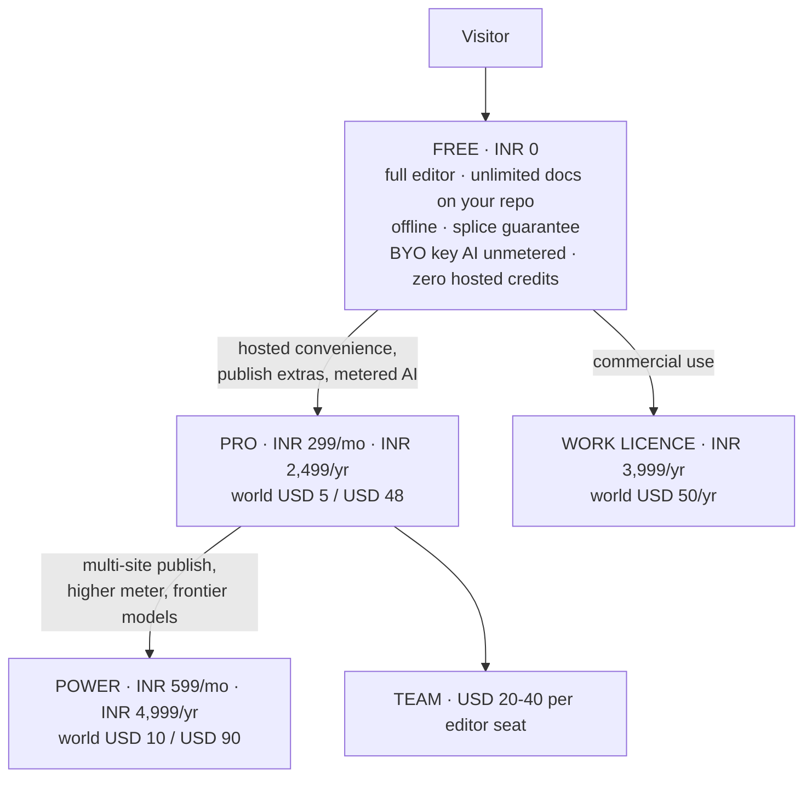

### 24.1 The FX correction

The founder draft assumed ~₹83/$. Live: **₹95.39 and ₹95.59** from two independent sources `[fetched]`. So ₹299 = **$3.13** and ₹699 = **$7.33**, which sits above every India AI anchor (ChatGPT Go ₹399, Gemini AI Plus ₹199–399, Netflix Premium ₹649) and only 19–27% below a $9–10 global tier. **₹699 becomes ₹599.**

### 24.2 The tables

| India tier | Monthly | Annual (lead with this) | Contents |
|---|---|---|---|
| Free | ₹0 | ₹0 | Full editor, unlimited docs on your own repo, offline, splice guarantee, **BYO-key AI unmetered**, **zero hosted credits** |
| **Pro** | **₹299** (A/B ₹249 and ₹399) | **₹2,499** | Publish extras, live editing, hosted convenience, small metered AI on a cheap model with a visible meter |
| **Power** | **₹599** | **₹4,999** | Multi-site publish, higher meter incl. metered frontier, priority |
| Work | — | **₹3,999/yr flat** | Commercial-use licence — support and compliance, not more features |

| World tier | Monthly | Annual | Anchor `[fetched]` |
|---|---|---|---|
| Free | $0 | $0 | Obsidian free-forever, no sign-up |
| Pro | **$5** | **$48** | Obsidian Sync $4 annual/$5 monthly; HackMD Prime **$5/seat annual ($8 monthly)** |
| Power | **$10** | **$90** | Obsidian Publish **$8/site annual — per SITE, not per user** |
| Work | — | **$50/yr flat** | Obsidian Commercial parity |

### 24.3 Why ₹299 — and the counter-evidence

The anchor is **what Indians already pay for AI productivity**: ChatGPT Go ₹399; Gemini AI Plus ₹199→₹399; Netflix India ₹149/199/499/649; the Indian micro-SaaS starter band ₹299–499 `[SS]`.

**Confirmed `[fetched]`: Notion has no India pricing** — the page served to an India IP contains zero `₹` strings.

**Counter-evidence worth taking seriously `[fetched]`: Craft already India-prices Plus at ₹526.7–₹658.3/mo** — a direct competitor has decided the India individual price is **1.8–2.2× ₹299**. That validates INR pricing *and* raises whether ₹299 leaves money on the table. **Test ₹299 against ₹399 as well as ₹249.**

### 24.4 The rail, and the ₹15,000 constant

| Rail | Fee on ₹299/mo | Note |
|---|---|---|
| **Razorpay (India domestic)** | **2.36%** | 2% + 18% GST on the fee. **The flat-fee argument barely applies here** |
| Dodo, India domestic | 4% + **15¢** = 9.29% | The 15¢ flat is **4.79%** of ₹299 — not the 12.76% an earlier note computed using the **US** 40¢ rate |
| Paddle / Lemon Squeezy | 5% + 50¢ ≈ **15%** | Paddle's own comparison prices a non-MoR stack at "~7% and above" |

Annual still wins — ₹2,499/yr drops the Dodo fee to **5.07%** `[derived]` — but on Razorpay-domestic the annual argument is churn and convenience, not fees.

> **₹15,000 per transaction is an architectural constant, not a pricing input.** RBI's 2026 Framework allows recurring authorisation without additional-factor authentication up to ₹15,000; software is not in the ₹1,00,000 carve-out. Full consequences in §45.

### 24.5 Which market first

**Distribution India-first, revenue global-first.** India has 21.9M GitHub contributors, +5.2M in a year, and +35% YoY consumer app spend `[SS]`. Against: **zero category-specific willingness-to-pay evidence for markdown tools in India** `[SS]`; the AI price here is collapsing to zero; ₹299 nets **$2.58** against **$4.25** for the identical feature at $5; and **₹20L/mo needs 6,689 paying Indians versus 4,193 at $5 — 59.5% more paying humans for identical revenue** `[derived]`.

**What matters most is not the discount — it is that UPI exists at checkout.** International gateways without it lose 30–40% of Indian checkouts `[SS, vendor-sourced]`. Paddle and Lemon Squeezy do not support UPI.

### 24.6 Pricing policy — published, and treated as a promise

Free-forever editor · **dollars not credits** · BYO-key at every tier · one cheap surface unlimited · never auto-migrate plans · never reprice opaquely · commenters never bill.

---

---

## 25. Cost structure and funnel math


### 25.1 Infrastructure

Assumptions stated so they can be replaced by measurement: 4% free→paid · 9,000 requests/user/mo · 8 CPU-ms/request · 20 MB/free user, 250 MB/paid · hosted inference for paid only, capped $0.40 · support 0.02 tickets/free-user/mo, 0.10/paid, 12 min each. Rates `[fetched]`: Cloudflare Workers $5/mo minimum, then +$0.30/M requests and +$0.02/M CPU-ms; **R2 storage $0.015/GB-mo, Class A $4.50/M, Class B $0.36/M, egress FREE**.

| Line | 100 users (4 paid) | 1,000 (40 paid) | 10,000 (400 paid) |
|---|---|---|---|
| Workers | $5.00 | $5.84 | $42.80 |
| R2 | free tier | $0.29 | $69.03 |
| **Egress** | **$0.00** | **$0.00** | **$0.00** |
| Infra subtotal | $5.00 | $6.13 | **$111.83** |
| Hosted inference | $1.60 | $16.00 | $160.00 |
| **Total variable** | **$6.60** | **$22.13** | **$271.83** |
| Infra per paid user | $1.250 | **$0.153** | $0.280 |
| **Support load** | 2.3 tickets/mo | 23.2 | **232 = 46.4 founder-hours** |

**Three conclusions.** Egress-free R2 is the load-bearing architectural choice — a document workspace's dominant byte flow is reads. The $5/mo Workers minimum dominates below ~1,000 users, making infra per paid user **8.2× worse at 100 than at 1,000**. And **support, not compute, is the wall.**

### 25.2 Conversion benchmarks `[fetched]`

| Motion | Good | Great |
|---|---|---|
| Freemium self-serve | 3–5% | 6–8% |
| Freemium + sales-assist | 5–7% | 10–15% |
| Free trial | 8–12% | 15–25% |

> **"The median conversion rate for developer-focused companies was 5% — half that of companies that do not sell to developers."** `[fetched]` This governs us directly. **We chose the hard half deliberately.**

### 25.3 What each milestone requires `[derived]`

Gross ARPU mix A (70% India ₹299 / 30% World $5) = ₹352.40. Zero churn assumed.

| Milestone | Paid users | Free @5% (dev median) | Cumulative visitors @9% signup |
|---|---|---|---|
| **₹1L/mo** | 284 | **5,675** | 63,060 |
| **₹5L/mo** | 1,419 | **28,377** | 315,298 |
| **₹20L/mo** | 5,675 | **113,507** | **1,261,193** |

**₹1L/mo is reachable at typical rates. ₹5L/mo needs ~28,000 free signups. ₹20L/mo needs 113,507 signups and ~1.26M cumulative visitors — a distribution problem, not a pricing problem, and the point where the plan stops being solo-founder-shaped.**

---

---

## 26. Go-to-market


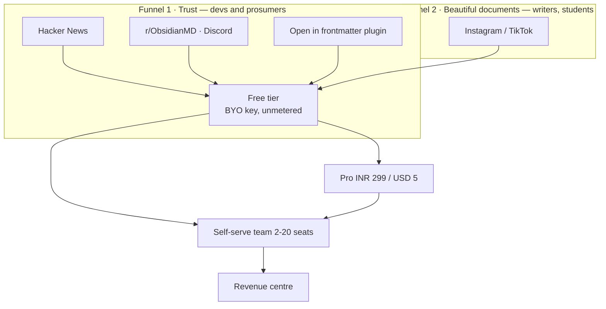

| | Funnel 1 — Trust | Funnel 2 — Beautiful documents |
|---|---|---|
| Line | *"The markdown source of truth AI can't corrupt"* | *"Beautiful documents from plain text"* |
| Channels | HN, r/ObsidianMD (~344,000), Discord (~195,000), X, YouTube | Instagram, TikTok |
| Content | Evidence-first: the corpus result, a 10-second demo diff against a competitor's shipped product | Custom renders in 15 seconds of vertical video |
| Confidence | **High.** Our campaign practice already manufactures exactly this `[measured]` | **Low.** No dev tool has grown Instagram-first, and our content pipeline mines the *system record*, so it would never surface aesthetic material on its own |

**The window is warm.** The review-loop wedge was independently validated twice in four weeks — Markleft (Show HN) and OzBrain (92 points), whose founder pitches *literally* "the diffing, versioning and audit log of what was changed, by what agent and why" as the paid product `[fetched]`. And "Serve Markdown to AI Agents with Accept Headers" hit **175 points, 108 comments on 2026-08-26** `[fetched]`.

**Channel discipline.** The Obsidian community's code of conduct means the only admissible framing in the biggest watering hole is *"integrates with your vault"*, never *"Obsidian competitor"* — break it and the launch is removed rather than debated. The **"Open in frontmatter" plugin is the distribution play**; Relay proved the path with 172,544 downloads of a commercial service's bridge plugin `[SS]`.

**Cadence, grounded in measured supply.** Three LinkedIn posts a week, a weekly canonical blog post, two Instagram carousels. The campaign system built 10 complete multi-surface episodes in about a week — **supply is not the constraint** `[measured]`. What is *not* proven is sustained cadence: **exactly two posts have ever shipped**, one with a visible defect since 2026-08-10, three more on editorial hold `[measured]`. So the survival mechanisms matter more than the plan: **never miss twice; queue depth ≥ 2; read no metrics before post 20.**

**A publishing constraint to design around `[measured]`:** LinkedIn cannot post a PDF document through the current integration — the publisher implements images and videos only, and one item cannot carry a PDF for LinkedIn and PNGs for Instagram. The Documents-API entitlement probe exists, is read-only, takes ~5 minutes, and **has still not been run.**

**Run the launch calendar inside frontmatter itself.** The GTM engine becomes a continuous product demo, and the content pipeline's biggest gap — a sustained capture habit — becomes a product feature.

**Never say "markdown editor."** Every Show HN with that name becomes a thread of free alternatives. The category winners renamed the category: Obsidian sold *ownership*, Notion a *workspace*, Linear *speed*.

---

---

## 27. Moat and defensibility


Ranked by hold-time, not by how good it feels.

| Rank | Moat | Holds | What erodes it |
|---|---|---|---|
| 1 | **Community / ecosystem** | Years, compounding | Nothing external — **but it does not exist yet**, is the slowest to build, and India is greenfield `[SS]` |
| 2 | **Byte-fidelity engine** | **18–36 months** | An incumbent shipping a byte-exact writer. The work is hard but finite and increasingly LLM-assistable. GitBook's dominant complaint cluster is *reliability and lost work* — the gap is real today `[SS]` |
| 3 | **Degradation certificate** | 12–24 months as an exclusive; longer as a standard | Commoditisation — which is also the win condition if we set the standard. **Zero defensibility if the certificate is not independently checkable** |
| 4 | **Provenance / byte attribution** | 12–24 months | Platform content credentials shipping natively |
| 5 | **Brand** | Slow to build, durable once built | Naming risk (§52). **"frontmatter" is the generic name of the substrate** — `gray-matter` alone does 35.78M downloads/month |
| 6 | **File-native data / no lock-in** | Structural but **non-exclusive** | Every markdown tool claims it; seven free self-hosted alternatives sit at 21K–76K stars (§3.1) |
| 7 | **Switching cost** | **Near zero, by design** | **This is the anti-moat.** The portability that earns trust removes lock-in. Retention must be earned every month by the product, not by hostage-taking |

**Honest summary: the moat is engineering depth in a narrow place, plus timing. It is not distribution, brand, or lock-in — and it never will be.** The go-to-market must convert engineering credibility into an outcome a buyer can name (§21).

---

---

## 28. Roadmap


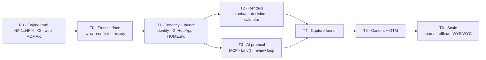

Points: `XS=1 · S=2 · M=4 · L=8 · XL=16`. One XL ≈ one substantial shipped surface ≈ 14–21 calendar days solo, so **1 pt ≈ 1.09 calendar days**. Calendar days, not working days — the measured 25% active-day density on this branch is *inside* that rate, not a multiplier on it.

### 28.1 R0 — engine truth · 58 pts · the declared first lane

| ID | Deliverable | Size | Spec |
|---|---|---|---|
| R0.1 | **NF-1** — a `-` item at column 0 is a continuation of the preceding key | M | `engine/nf-001-zero-indent-sequence` |
| R0.2 | NF-2 — flow-seq closing `]` at column 0 | S | — |
| R0.3 | **NF-3** — `FM_OPEN` misses a bare `---\r`; a lone set **prepends a second frontmatter block**. Set-destructive and invisible to a round-trip oracle. **Red proof first** | M | `engine/nf-003-bare-cr-fence` |
| R0.4 | NF-4 — quoted-key `SAFE_KEY`. **Blocked on a decision**, not on code | L | founder |
| R0.5 | CI — port md's `ci.yml`; all four harness scripts already exist | S | `platform/ci` |
| R0.6 | Foreign-corpus standing gate | — | **DONE** — 8,513 files pinned, verify red-proofed |
| R0.7 | Six construct-detector defects | M | — |
| R0.8 | CJK — `countWords` segmenter, MiniSearch bigram tokenizer | M | gated on D17 |
| R0.9 | Wire MDMAX seams 1–3 (§7.3) | L | `engine/mdmax-seams` |
| R0.10 | Reconcile `globals.css` with the design system, and fix the AA-failing token | M | — |
| R0.11 | mdmax audit Tier 3/4 residue | M | — |
| R0.12 | Replace the `npm run budget` stub with a real byte ceiling | S | — |
| R0.13 | Close the open decisions. **PAT rotation is today, not a milestone** | M | founder |

### 28.2 The remaining lanes

| Lane | Pts | Contents |
|---|---|---|
| **T0 Trust surface** | 32 | sync chip · conflict inbox · named-version history · since-you-last-opened banner · background auto-sync · local history + section restore · the two-device rig |
| **T1 Tenancy + launch** | 42 | identity + multi-tenancy `XL` · GitHub App `L` · multi-vault · mobile pass · HOME.md · quick capture · companion plugin |
| **T3 AI protocol** | 44 | MCP + `land()` `L` · review loop `L` · provenance + implicit telemetry · differ · cert distribution `L` · citation-gated answers · session continuity · publish the session format |
| **T4 Capture** | 20 | chat-side skill + paste inbox · ChatGPT/Claude importers `L` · promotion loop · retro-capture |
| **T2 Renders** | 42 | **out of v1** except two `XS` cleanups: the `/language-(\w+)/` hyphen fix and deleting dead `editable-table.tsx` |
| **INFRA/LEGAL** | 25 | MoR before the first *paid* signup · EU Art. 27 rep before the first EU *free* signup · CA + lawyer · ToS/privacy · auth, error tracking, R2 — all **buy** |
| **GTM** | 34 | land Markex's tree · the LinkedIn Documents-API probe · post-as-document · launch calendar in-product · 20 posts `XL` |

### 28.3 Critical path

```
R0.3 → R0.1 → R0.2 → R0.4 → R0.9 → T0(auto-sync → local history → two-device rig)
     → T1(identity → GitHub App → HOME.md) → T3(MCP+land() → review loop → cert distribution)
     → T4(importers → promotion loop) → v1
```

**R0.5 (CI) is not on the path but gates the credibility of everything after it** — do it in the first 48 hours. **T2 is off the path entirely.** Legal items are date-gates, not effort-gates. **R0.4 is the one engine unit an agent cannot start** — it needs a written decision on Unicode key equality.

### 28.4 Milestones — every definition of done is executable

| M | Gate | Done means |
|---|---|---|
| **M0** | CI live | A PR runs typecheck·lint·test·build·arch·spec and **fails on a deliberately broken commit**. `npm run budget` asserts a real byte ceiling. **One red run is required before the first green is trusted** |
| **M1** | Engine truth | Over the pinned corpus: **refused ≤ 2 of 7,969**, **changed = 0, threw = 0**. NF-3's set-only assertion **fails on `HEAD~1`** and passes on `HEAD`. `npm run corpus` exits 0 at gate time |
| **M2** | MDMAX wired | Seams 1–3 live; ≥8 of the 12 unreached files have a product importer; `npx mdmax cert --fail-on=BROKEN` exits 1 on a seeded fixture inside CI |
| **M3** | Trust surface | Two devices, both offline, both edit the same file, both reconnect: **zero bytes lost and every divergence surfaced as a reviewable hunk**, watched by a human, recorded. Section-level restore returns the file to a prior sha with every untouched byte identical |
| **M4** | Tenancy | A second GitHub account, never used in development, signs in via the **GitHub App**, connects a repo, edits, commits — no founder intervention, no shared secret |
| **M5** | Agent protocol | An external agent edits a real vault through `land()`; every change appears in the review surface and is rejectable; a rejected change leaves the file **byte-identical** |
| **M6** | Capture | One ChatGPT export ZIP → durable typed documents in one click, and **the verification report enumerates every dropped construct by count** |
| **M7** | v1 public | M0–M6 green + MoR live + EU rep appointed + ToS published + **one paying non-founder account** |

**Reject these as a DoD:** "kanban feels good" · "import works" · "fidelity is high" · anything whose evidence is a screenshot · anything a `grep` over source can satisfy.

### 28.5 Who does what

| An AI agent can own (disjoint artifacts) | Only the founder |
|---|---|
| NF-1/NF-2 walk change + fixtures | The NF-4 key-equality decision |
| Corpus runner and gates | All open decisions |
| The six construct detectors, one agent each | **PAT rotation** |
| CJK segmenter + tokenizer | GitHub App registration, secrets, callback |
| CSS reconciliation | MoR, CA, lawyer, EU representative |
| Tier 3/4 residue | Watching the M3 two-device run |
| Test authoring | Accepting or rejecting every agent diff |

**Do not parallelise** NF-1 and NF-4 against the same file, and do not fan out T0's sync work — it is one creative target carrying implicit architecture decisions.

### 28.6 Calendar

1 pt = 1.09 calendar days, from 2026-08-29. The assumption is stated so it can be argued with.

| Milestone | Cum. pts | Date |
|---|---|---|
| R0 complete | 58 | **2026-10-31** |
| + T0 | 90 | 2026-12-05 |
| + T1 | 132 | 2027-01-20 |
| + T3 (v1 subset) | 176 | 2027-03-09 |
| + T4 = **code-complete** | 196 | **2027-03-31** |
| + legal/infra = **shippable** | 221 | **2027-04-28** |
| + full GTM | 255 | 2027-06-04 |

**R0 alone is 9 weeks.** That is the part most likely to be wished away.

### 28.7 The ten things most likely to blow this

| # | Risk | Early warning — check weekly |
|---|---|---|
| 1 | **"NF-1 recovers 99.98%" is an inference from bucketing refusal causes, not a measured result of the patched writer** | First patched run refuses >10 files. If the residual is >2, NF-1 was never one bug |
| 2 | Corpus loss or drift | Any run whose file count ≠ 8,513. **Mitigated: pinned and red-proofed** |
| 3 | NF-4 is a design task wearing a regex costume | Two weeks pass with no written NFC/NFD decision |
| 4 | "Wire MDMAX in" is an integration surface, not a wiring task | Week 2 of R0.9 still has 0 new product importers. Count them |
| 5 | **CI's first green will be false.** Four gates in this repo already reported green while blind | CI passes on a deliberately broken commit |
| 6 | Cadence is bursty — 8 active days in 32 | Two consecutive weeks with zero commits |
| 7 | T1 identity is the only XL, scored from analogy | A week of schema churn instead of a signed-in second account |
| 8 | Open decisions gate scheduled work | Any lane started before its gating decision is written down |
| 9 | Legal lead times are vendor-clock | EU-reachable free tier with no Art. 27 representative |
| 10 | The name is unresolved | **Any brand spend before §52 closes** |

### 28.8 The first week, concretely

| Day | Do | Proves |
|---|---|---|
| 1 | **Rotate the two PATs.** Then CI: port `ci.yml`, add `spec` and `corpus` | Only you can do the first |
| 1 | Make CI fail on purpose, once, before trusting any green | That the gate can see |
| 2 | NF-3 red proof — a **set-only** assertion on a synthetic bare-CR fixture that fails on today's code | Set-then-delete cancels out; that is how NF-3 stayed invisible. **And the corpus cannot prove it — zero bare-CR fences in all 8,513 files** |
| 2–4 | NF-3 fix, then NF-1 red proof and fix | The 83% refusal rate is the number the fidelity claim rests on |
| 4 | Re-derive the recovery rate from the patched writer | Replaces the 99.98% inference with a measurement |
| 5 | Write the NF-4 decision — one page on NFC/NFD key equality | Unblocks the only agent-blocked unit |
| 5 | The two `XS` cleanups | Unblocks every render profile |

---

---

## 29. Performance budgets and the testing strategy


### 29.1 The performance budget

All measurements below were executed on 2026-08-29 on Node v24.6.0 / darwin 25.6.0 / arm64, V8 `heap_size_limit` 4,288 MB [measured]. Repo state at the time: 79 `*.test.ts` files, 9,929 LOC of tests, vitest 4.1.7 installed (4.1.11 current), `fast-check` absent, `.github/workflows` absent [measured].

| # | Operation | Budget | Measurement method | Enforcement |
|---|---|---|---|---|
| P1 | Byte splice, document ≤4 MB | ≤5 ms p99 | vitest bench, fixed corpus, 20 iterations | CI fails at p99 > 10 ms (2× headroom). Measured 4.73 ms end-to-end decode→splice→encode at 4 MB [measured] |
| P2 | UTF-8 decode + validate on open | ≤2 ms/MB | same | fail > 4 ms/MB. Measured 1.16 ms at 4 MB [measured] |
| P3 | Any single parse of a user document | ≤200 ms, else **refuse** | `shape-gate.ts` budget-ms | Refusal, not slowdown. Live constants: MAX_BYTES 4 MB, MAX_LINES 200,000, MAX_LIST_MARKER_LINES 20,000 [measured] |
| P4 | Any regex run over user bytes | growth exponent k ≤ 1.05 over 4 doublings | doubling harness; report the exponent, not the milliseconds | CI fails at k > 1.2 |
| P5 | Keystroke → paint | ≤50 ms p95 | Playwright trace + `PerformanceObserver` longtask | fail if any longtask > 50 ms across a 200-keystroke script |
| P6 | Search, as-you-type prefix | ≤50 ms p95 at 10,000 notes | headless bench against a frozen corpus | measured 12.64 ms at 10k; **fails at 50k (130.90 ms)** [measured] |
| P7 | Search, exact term | ≤5 ms p95 | same | measured 1.64 ms at 50k [measured] — not the risk |
| P8 | Cold index build, 10,000 notes | ≤8 s, off main thread | Worker bench | measured 5,613 ms single-threaded [measured] |
| P9 | Index heap | ≤10× corpus bytes | `--expose-gc` heap delta | measured 9.25× at 50k (1,036 MB / 112.0 MB) [derived] — at the line, no headroom |
| P10 | Cold start → first keystroke accepted | ≤1,500 ms p75 | Lighthouse + Playwright `page.type` timestamp | the editor must accept input *before* the index exists |
| P11 | INP, field data | ≤200 ms p75 [fetched, web.dev] | web-vitals RUM beacon | dashboard alert only — field data cannot gate a PR |
| P12 | JS bundle, editor route | ≤350 KB gzip | `next build` output | `npm run budget`, today a stub printing "No bundle budget configured yet" [measured] |

Thresholds anchor to RAIL: 100 ms response, 50 ms task chunk, 1,000 ms focus loss, 10,000 ms abandonment; frame budget 16.7 ms [derived: 1000/60] [fetched, web.dev]. INP is scored at the 75th percentile of field page loads, mobile and desktop segmented, discarding the single highest interaction per 50 [fetched].

**Gate on the exponent (P4) and on refusal correctness (P3), not on wall-clock.** Two independent runs of the identical `WIKILINK_RE` benchmark over the same 320 KB input disagree by 2.63× — the repo archive records 36,865 ms at k=1.98, this machine measured 96,890.7 ms at end-to-end exponent 2.37 [measured][derived: 96890.7/36865]. Both stand; neither is corrected; the exponent is the invariant and the milliseconds are the machine. Anti-recommendation: a wall-clock gate on a shared runner is the classic flaky-red generator, so only P1/P2/P6/P7 carry ms thresholds, each with 2× headroom, each pinned to one runner class.

**Published scale ceiling.** MiniSearch 7.2.0, synthetic 400-word notes [measured; extrapolations derived from 0.554 ms/doc and 20.7 KB/doc]:

| Vault | Build | Heap | Prefix search | Published status |
|---|---|---|---|---|
| 1,000 | 0.55 s | 21 MB | 1.52 ms [measured] | Supported |
| 10,000 | 5.5 s | 207 MB | 12.64 ms [measured] | Supported |
| 50,000 | 27.7 s | 1.04 GB | 130.90 ms [measured] | Degraded — named, not hidden |
| 100,000 | ~55 s | ~2.07 GB | ~357 ms [derived: 130.90 × 2^1.45] | Refused in the browser |

- Publish this sentence verbatim: "Tested to 10,000 notes. Functional and honest about it to 50,000. Above 50,000 the web client refuses and tells you why; the desktop build is the supported path."
- The ceiling is set by heap, not CPU: 2.07 GB against a 4,288 MB V8 limit leaves nothing for the document, CodeMirror or React, and a browser renderer is stricter than Node [measured][inference].
- Anti-recommendation: do not publish a single "max notes" number. Obsidian 1.13.7 in restricted mode with zero community plugins and ~10,500 files reports a ~280 ms renderer stall every ~2 s while typing, attributed to `getAllPropertyInfos()` [fetched, forum.obsidian.md]. Users hit unusability long before they hit a cap; publish the stall behaviour.
- Anti-recommendation: do not buy headroom by shrinking the index (dropping body text, aggressive stemming). That converts a stated limit into a silently worse product, which is the exact failure the REFUSE doctrine exists to prevent.
- Route parsers by input *shape*, not by library name. On a 100 KB realistic note `mdast-util-from-markdown` 2.0.3 is 0.96× `micromark` 4.0.2 — identical; on 32,000 flat bullets (404.9 KB) it is 29.36× slower, exponent 4.00 in the 16k→32k band [measured][derived]. Recorded and not explained: micromark itself goes flat across that band (794.6 → 801.3 ms), which is not credible as linearity and is probably a JIT/GC artifact — do not cite micromark as linear.
- The splice thesis, quantified: 4.73 ms to decode, splice and re-encode 4 MB versus 23,527 ms to reparse a 405 KB pathological list is **4,974×** [derived]. The architecture argument is four orders of magnitude, not an aesthetic.

### 29.2 The test strategy and its pyramid

Proportions are stated as shares of CI wall-clock, not as test counts; 79 files and 9,929 LOC [measured] say nothing about coverage of the byte contract.

| Layer | Wall-clock | Owns | Never owns |
|---|---|---|---|
| L0 Property + differential | 25% | splice algebra, offset arithmetic, refusal totality, UTF-8 boundaries, line endings, degradation certificate | anything requiring a DOM |
| L1 Unit (vitest) | 15% (≈55% of test *count*) | pure functions, error enums, parser helpers | integration ordering, timing |
| L2 Corpus / golden | 20% | real foreign vaults — the zero-indent-sequence and bare-CR classes; `npm run corpus` exists [measured] | synthetic inputs |
| L3 Integration (jsdom + fake-indexeddb, both installed [measured]) | 15% | CodeMirror↔engine sync, repository, R2 persistence | rendering fidelity |
| L4 E2E (Playwright), ≤20 specs | 20% | five data-loss flows only: open, edit-save, offline→reconnect, export, share-revoke | assertions a byte test can make |
| L5 Visual | 5% | KaTeX and Mermaid render regressions only | anything textual |

| Decision | Choice | Evidence | Anti-recommendation |
|---|---|---|---|
| E2E runner | Playwright | `@playwright/test` 1.62.1 at 57,911,488 weekly vs `cypress` 15.21.1 at 7,569,177 — 7.65× [fetched npm, derived]. Cypress Cloud: Free 500 test results, Team $67/mo or $799/yr, Business $267/mo or $3,199/yr [fetched cypress.io/pricing]; Playwright sharding is in the free OSS runner | The advantage is cost and CI shape, not authoring ergonomics. Cypress's time-travel debugger is better and we are giving it up |
| Visual regression | 5% ceiling, KaTeX/Mermaid only | Chromatic Free $0, paid tiers $179 and $399 [fetched chromatic.com/pricing; snapshot allowances did not parse — unverified] | Never visual-test prose. Font hinting and GPU rasterization differ per runner; a text-heavy diff suite is all noise and gets switched off inside a month |
| Mutation testing | `@stryker-mutator/core` 10.0.0, nightly, scoped to `src/modules/mdmax/domain/` | 2,320,443 weekly [fetched npm] | Never on the PR path. Whole-repo mutation over 9,929 LOC is hours of runner time for a quarterly reading, and the score is not a gate |
| Contract testing | Schema-validated fixtures | Both contracts (engine↔CodeMirror, client↔Worker/R2) are in-process or single-team | Do not adopt Pact or a broker. Consumer-driven contracts pay across *team* boundaries; a solo founder has none |

CI shape and cost, at published GitHub rates [fetched docs.github.com/en/billing/reference/actions-minute-multipliers, 2026-08-29]: Linux 1-core slim $0.002/min, Linux 2-core x64 $0.006, Linux 2-core arm64 $0.005, Windows 2-core $0.010, macOS 3/4-core $0.062; included allowances GitHub Free 2,000 min + 500 MB, Pro 3,000 min + 1 GB.

| Job | Trigger | Runner | Est. min |
|---|---|---|---|
| typecheck + lint + unit + property (pinned seed) + `arch` + `spec` | every push | Linux 2-core | 12 |
| corpus (foreign vaults) | every push | Linux 2-core | 3 |
| Playwright, 3 shards | every push | Linux 2-core ×3 | 6 |
| perf bench (P1/P2/P6/P7 + exponent P4) | every push | Linux 2-core, pinned class | 4 |
| property soak, random seed | nightly | Linux 2-core arm64 | 30 |
| Stryker on `mdmax/domain` | nightly | Linux 2-core arm64 | 25 |
| Tauri macOS build | weekly + tag | macOS | 20 |

- PR path 12+3+6+4 = 25 min/push; 40 pushes/mo = 1,000 min. Nightlies (30+25) × 30 = 1,650 min. Linux total 2,650 min/mo; 650 billable over the 2,000 free allowance × $0.006 = **$3.90/mo**. macOS 20 min × $0.062 × 4.33 runs/mo = **$5.37/mo**. Total ≈ **$9.27/mo** [derived]. macOS is 10.33× Linux per minute and is 58% of spend on 1% of the minutes [derived: 0.062/0.006].
- Under the free allowance with nightlies removed: 2,000/25 = 80 pushes/mo at zero cost [derived].
- Every CI duration above is an estimate, not a measurement — there is no workflow file to measure [measured]. The arithmetic is shown so each row can be replaced with a real number on the day the first workflow runs.
- Anti-recommendation to arm64 nightlies (17% cheaper [derived: 1−0.005/0.006]): arm64 is a different runner class, so any ms-threshold job must stay pinned to one architecture or P1/P6 stop meaning anything across runs.
- The correct first commit in this area is a workflow file, not a test. None of the existing 9,929 LOC is property-based, none is E2E, and none runs in CI, because there is no CI [measured].

### 29.3 Property-based testing for a byte-preserving writer

`fast-check` 4.9.0, 37,512,910 weekly downloads [fetched npm, 2026-08-29]. Model: "for any (x,y,…) such that precondition(x,y,…) holds, predicate(x,y,…) is true" [fetched fast-check.dev]. Two authoring rules from that documentation are binding here: the predicate must not mutate its inputs or shrinking degrades and the reported counterexample is wrong; and constrained arbitraries beat `.filter`, which generates-then-discards.

**Generate at the byte layer — `fc.uint8Array()`, never `fc.string()`.** A string arbitrary cannot produce invalid UTF-8, a lone continuation byte, or a bare CR, and those are precisely the classes that have already shipped as defects. Derive ranges as `start = fc.nat(len)` then `end = start + fc.nat(len - start)`; never `fc.tuple(nat, nat).filter(([a,b]) => a <= b)`.

| # | Property | Statement | Defect it would have caught |
|---|---|---|---|
| S1 | Outside-range invariance | `out.subarray(0,s) ≡ D.subarray(0,s)` and `out.subarray(s + p.length) ≡ D.subarray(e)`, compared with `Buffer.compare(...) === 0`, never string equality | The leading-BOM bug fixed in `f47555f`. String equality passes with a stripped BOM; byte comparison does not |
| S2 | Length algebra | `out.length === D.length − (e − s) + p.length` | The OffsetMap off-by-3 fixed in `cc1d451`. An off-by-N is a total arithmetic falsehood and needs no oracle |
| S3 | Identity splice | `splice(D, s, e, D.subarray(s,e)) ≡ D` | The cheapest total oracle in the suite; the off-by-3 dies here around run 4 |
| S4 | Exact inverse (undo) | `splice(splice(D,s,e,p), s, s + p.length, D.subarray(s,e)) ≡ D` | Makes "deterministic, reversible projection" a theorem rather than a slogan |
| S5 | Disjoint commutation | for non-overlapping ranges, applying in either order with offsets shifted yields identical bytes | Batch-edit offset drift; the multi-cursor class |
| S6 | Refusal totality | every input yields `{ok:true, bytes}` **xor** `{ok:false, code ∈ closed enum}`; `ok:false ⟹ bytes === undefined`. No third state | The "guessed instead of refusing" class the whole doctrine exists to prevent |
| S7 | Refusal determinism | the same input twice yields the same `code`, asserted across two calls inside one predicate | A non-deterministic refusal cannot be reported or reproduced, which is worse than a wrong one |
| S8 | UTF-8 boundary refusal | if `s` or `e` indexes a continuation byte (`0b10xxxxxx`), the result must be `ok:false`, never valid-looking output | The multi-byte truncation class, which reproduces in ~0.34% of natural artifacts and therefore never surfaces in a sampled corpus |
| S9 | Line-ending census | counts of CRLF, lone LF and lone CR **outside** `[s,e)` are unchanged | The queued bare-CR set-destruction class |
| S10 | No-op idempotence | `splice(D, s, s, empty) ≡ D` for all `s`, including 0 and `D.length` | Boundary and empty-document handling |
| S11 | Projection commutes | an edit applied through a view equals the equivalent splice applied to bytes | The Projection Law, as an executable assertion |
| S12 | Fence isolation (model-based, `fc.commands`) | a sequence of body splices never moves the `---` fence byte offsets, and the converse | Frontmatter boundary drift across an editing session |
| S13 | Metamorphic certificate stability | for a splice certified non-degrading, the cross-engine render of before and after differs only inside the spliced region | Regressions in the degradation certificate itself |

- Runner discipline: the PR path runs a **pinned seed** and a fixed `numRuns`; a random-seeded property test on a PR is a coin-flip gate. Nightly runs random seeds at 100× `numRuns`. S1, S2, S3 and S6 — the four cheap total oracles — run on the PR path at low `numRuns`; S4–S13 run nightly. The explicit cost: a property defect in S4–S13 can merge and sit for up to 24 hours.
- Every shrunk counterexample is promoted by hand into a deterministic unit fixture and never deleted. A shrunk failing input is the most expensive artifact the suite produces and the cheapest to lose.
- Anti-recommendation: properties will not find defects that live in *interpretation*. "Should a bare CR terminate a setext heading" is a spec question, and a property will happily confirm whichever answer was encoded. S1–S13 protect the byte contract; layer L2 protects the semantics.
- Anti-recommendation: do not property-test the parser's output shape. mdast trees are large, shrinking over them is slow, counterexamples are unreadable, and the assertions degenerate into a second implementation of the parser.

---

## 30. Data model, schemas and migration


### 30.1 Everything that needs a version

Live state: exactly one file in the repo carries `$schema` — `specs/_schema/spec.schema.json`, which requires `spec: { const: 1 }` and sets `additionalProperties: false` [measured, 2026-08-29]. Existing in-code carriers: `Certificate.schema: 'mdmax/cert@1'` (`cert-contract.ts:132`), `Certificate.fold: { version }` (`:137`), `FOLD_VERSION = 'mdmax/fold@1'` (`fold.ts:45`, with the comment at `fold.ts:40` stating that changing any rule requires bumping it because the certificate quotes it), and per-engine `version`/`sha` in `bench.engines[]` (`cert-contract.ts:81,83`) [measured].

| # | Artifact | Bytes held by | Version carrier | Placement | May we rewrite it? |
|---|---|---|---|---|---|
| 1 | Document frontmatter (user's own keys) | user file | none of ours | — | never unattended |
| 2 | User-defined frontmatter schema | user file (`.frontmatter/schema.yml`) | `fm_schema: 1` + `$schema` URI | first key, in-band | explicit action only |
| 3 | Render profile definition | user file or R2 | `profile: 1` + `$schema` URI | first key | explicit action only |
| 4 | Degradation certificate sidecar | sidecar / R2 | `schema: "mdmax/cert@1"` [measured — exists] | first key | regenerate, never edit |
| 5 | Fold ruleset | engine constant | `mdmax/fold@1` [measured — exists] | code, quoted into the cert | N/A |
| 6 | Splice refusal vocabulary | engine; surfaced in cert + UI | `refusals@N` — **missing today** | code + cert | N/A |
| 7 | Session interchange format | exported file, published spec | `$schema` URI + `session: N` | first key | never — it is an artifact |
| 8 | Saved searches / views | server row + optional export | column `v` int; export `saved_view: 1` | row + first key | yes, we hold it |
| 9 | Server-side object metadata | R2 custom metadata, DB | `x-fm-schema: fm/objmeta@1` | HTTP metadata | yes, we hold it |
| 10 | Workspace config | user file | `workspace: 1` | first key | explicit action only |
| 11 | Engine/target registry (bench) | repo + cert copy | per-engine `version`/`sha` [measured — exists] | embedded in cert | N/A |
| 12 | Export artifacts (HTML/PDF/print) | user's disk | generator stamp in comment/XMP | header | no — immutable output |
| 13 | Local index/cache (Tauri) | user's disk, derived | `cache: N`, rebuild on mismatch | sidecar DB pragma | yes — it is derived |
| 14 | AI tool-call schemas | wire | API version, not file version | request header | N/A |

- Placement follows three tiers [inference, modelled on Avro]: (a) in-band, first key, self-describing for anything a user holds — Avro's rule is that "the original schema must be provided along with the data" [fetched, avro.apache.org 1.12.0, Schema Resolution], and we cannot ship a registry to an offline laptop; (b) sidecar header for derived artifacts we generate beside a document; (c) transport metadata for objects we hold.
- **Absence rule, written down once and never re-interpreted: a missing version key means v1, permanently.** JSON Schema 2020-12 states that when `$schema` is "absent from the document root schema, the resulting behavior is implementation-defined" [fetched, json-schema.org draft/2020-12 core §8.1.1] — implementation-defined is exactly the hole, so we define it.
- Anti-recommendation: never infer a version by sniffing which keys are present. Key-shape sniffing makes every future additive change retroactively alter the parse of old files.
- Source disagreement, recorded: JSON Schema permits unversioned documents and leaves the behaviour open; Avro requires the writer's schema to accompany the data at all times [fetched both]. The specs disagree on whether unversioned data is admissible at all; we side with Avro for user-held files and with JSON Schema's leniency for reading foreign ones.

### 30.2 The compatibility contract

Anchors: semver — MAJOR for incompatible changes, MINOR for backward-compatible additions, PATCH for backward-compatible fixes, and "Major version zero (0.y.z) is for initial development. Anything MAY change" [fetched semver.org]. Confluent — BACKWARD (the default), FORWARD, FULL and their TRANSITIVE variants; BACKWARD checks only the previous version, BACKWARD_TRANSITIVE checks all [fetched docs.confluent.io].

| Rule | Statement | Anchor |
|---|---|---|
| C1 | Every artifact declares **BACKWARD_TRANSITIVE**, not BACKWARD. A user opens a 2021 file, not last quarter's file | [fetched] Confluent: BACKWARD "ensures that consumers using the new schema X can process data written by producers using schema X or X-1, but not necessarily X-2" |
| C2 | User-held artifacts additionally promise FORWARD for one MAJOR: an older build opens a newer file readably, degrading unknown keys, never erroring | [inference] The user's other machine is on the old build; we do not control rollout |
| C3 | Unknown keys are preserved verbatim on write, never dropped | [fetched] Avro ignores unknown writer fields; we must go further and round-trip them, because our file is the source of truth, not a wire frame |
| C4 | A new **required** field is a MAJOR change. New fields are optional or carry a reader-side default | [fetched] Avro signals an error for a reader field absent in the writer with no default; protobuf.dev: "Required fields are considered harmful by so many they were removed from proto3 completely" |
| C5 | Never re-use a key name for a different meaning. Retire names into a reserved list | [fetched] protobuf.dev: "Never re-use a tag number… You can also reserve names to avoid recycling now-deleted field names" |
| C6 | Never change a key's type in place. Add a new key, dual-read, retire the old | [fetched] protobuf.dev: "changing a field's type can be difficult to roll out safely even when the new schema can successfully parse old data" |
| C7 | New enum members (verdict classes, refusal reasons, profile modes) require a reader-side default. An unknown member is never a crash | [fetched] Avro symbol-resolution rule; protobuf.dev: "Do Include an Unspecified Value in an Enum" |
| C8 | Documentation and annotation fields never participate in compatibility checks | [fetched] Avro: "A schema's `doc` fields are ignored for the purposes of schema resolution" |
| C9 | Two axes, never conflated: format version (monotonic integer, in-band) and product version (semver, in the changelog). A file says `session: 2`; the app says `1.7.3` | [inference] semver's "0.y.z anything MAY change" is a statement about APIs, not about bytes on someone else's disk |
| C10 | Any schema we publish pins its dialect: `$schema` is a normalized URI with a scheme, at the document root | [fetched] json-schema.org 2020-12 core §8.1.1 |
| C11 | `additionalProperties: false` is banned in user-facing schemas | [measured] correct in `specs/_schema/spec.schema.json` because it is internal; fatal in a user file, because a closed schema makes an old build reject a new file instead of degrading it, breaking C2 |
| C12 | Anything the certificate quotes (`fold.version`, engine `version`/`sha`) is part of the compatibility surface. Bumping it invalidates prior certificates rather than re-labelling them | [measured] `fold.ts:40`; [fetched] protobuf.dev: "Never Rely on Serialization Stability Across Builds" |

- Anti-recommendation to C2: do not promise forward compatibility forever. One MAJOR, then a "this file was written by a newer version, please update" refusal. A refusal is honest; silently dropping keys the old build did not understand is the failure C3 exists to prevent.
- Anti-recommendation: do not use semver on file formats. MINOR permits additions an old reader cannot see, which is exactly the wrong promise for bytes on disk.
- Source disagreement, recorded: Confluent ships BACKWARD as its default while the same page recommends BACKWARD_TRANSITIVE for Protobuf "as adding new message types is not forward compatible" [fetched, same document]. We take the transitive line.

### 30.3 Migrating data we do not hold

Confluent's registry, GitLab's post-deployment migrations and Avro's writer-schema-with-data all assume the migrator can reach the bytes. We cannot: a Tauri user's vault on an offline laptop is unreachable, permanently [inference]. **No user-held format may ever require a migration to remain readable; migration is optional cleanup, never a precondition for correctness.**

**Read-old-write-new**, stated as three phases [fetched martinfowler.com/bliki/ParallelChange.html, Danilo Sato, 13 May 2014 — "expand, migrate, and contract"]:

| Phase | Behaviour |
|---|---|
| Expand | The reader accepts old and new. The writer still emits **old**. Ship, wait |
| Migrate | The writer emits **new** only for files the user's own edit already dirties. Never a sweep |
| Contract | The reader drops old support only after the deprecation clock expires — and "Ignoring and dropping columns should not occur simultaneously in the same release" [fetched docs.gitlab.com] |

**The touch budget.** When a user edits a document we already rewrite the byte range they touched; a frontmatter migration may ride along **only if it sits inside a range that edit dirties anyway**, and may never widen the dirty range. The consequence is deliberate: migration converges asymptotically over months of ordinary editing, and never produces an mtime change the user did not cause.

**When we may rewrite a user file — four gates, conjunctively. All four, or we do not write.**

| Gate | Requirement |
|---|---|
| G1 Consent | The user pressed a button whose label names the change. Precedent: Obsidian's Format converter is a core plugin, opt-in, whole-vault, and warns "Back up your Obsidian files before you perform the conversion" [fetched help.obsidian.md] |
| G2 Preview | A byte diff is shown, per file, before anything is written. Anti-recommendation: never a bare count ("412 files will be updated") without the diff for at least the first file |
| G3 Reversibility | An undo artifact — original bytes, hashed, recoverable — exists before the first write |
| G4 Refusal on ambiguity | If the old form cannot be mapped deterministically the file is **skipped and reported**, not guessed. This is the splice contract applied to migration |

The certificate constrains migration mechanically, not just by policy: `Certificate.file: { path, sha256, bytes }` [measured `cert-contract.ts:138`] makes any byte change a cert-invalidating event, and `CertBlock.byteRange: [number, number]` [measured `:118`] means a frontmatter change that alters block length shifts every downstream offset — re-derive certificates, never arithmetic-shift a stored one. A migration that cannot be expressed as a splice is a migration we are not allowed to run.

- Anti-recommendation, and the most tempting shortcut available: do not add a "normalize on save" mode that reserializes frontmatter through a YAML round-trip. It would break every certificate in the corpus at once, reorder keys and destroy comments — and it makes every migration trivial to implement, which is why it will keep being proposed.
- Anti-recommendation: do not auto-migrate on open. It changes mtimes the user did not cause, triggers their sync client, and invalidates certificates invisibly.
- Anti-recommendation: do not rename an identity field. Astro's `slug` → `id` rename in the v5 Content Collections change needed a `legacy.collections` escape flag rather than a converter [fetched docs.astro.build/en/guides/upgrade-to/v5/]. Identity renames are not migratable; they are forks. The legacy tier's own wording is the model for the un-migratable: features "no longer recommended and… in maintenance mode… will eventually be deprecated, and then removed entirely" [fetched].

**Deprecation ladder.** Both gates are mandatory, version and date — GitLab encodes exactly this pair as `ignore_column :updated_at, remove_with: '12.7', remove_after: '2019-12-22'` [fetched docs.gitlab.com].

| Stage | Gate | Minimum duration |
|---|---|---|
| D0 Announce | Changelog + in-app notice naming the key and its replacement. **The converter ships here** | — |
| D1 Dual-read | Reader accepts both; writer emits old; old form documented as deprecated | ≥1 MINOR |
| D2 Dual-write | Writer emits new on touched files only; reader still accepts both | ≥2 MINOR |
| D3 Warn | Opening a file with the old form shows a one-line dismissible notice with a "convert this file" action | ≥1 MINOR |
| D4 Remove | Reader stops accepting. Requires a MAJOR **and** an elapsed-date gate | MAJOR only |

- Minimum wall-clock window for anything user-held: **18 months**. The observed comparable is 22.0 months — Obsidian's deprecated-properties help section was created 2023-08-04 and the 1.9.2-era docs commit is dated 2025-06-05, a span of 671 days [derived: 671 ÷ 30.44]. That figure bounds announce→docs-updated, **not** announce→removal: the exact 1.9.0 release date could not be fetched because obsidian.md/changelog returned HTTP 404 on both RSS and sitemap on 2026-08-29 [measured]. Treat 22.0 months as unverified for the interval it is often quoted as.
- Ship the converter at deprecation, not at removal. Obsidian deprecated `tag`, `alias` and `cssclass` in 1.4, dropped support in 1.9, and shipped the automated converter "As of Obsidian 1.9.3" [fetched] — the same line that removed support, which makes the warning window unactionable.
- Anti-recommendation: do not run a fixed removal calendar. A calendar forces removals with no user benefit and manufactures MAJOR bumps with nothing in them. Removal is event-driven: the old form's measured share of live files must fall below a stated threshold **and** the clock must have expired.
- Source disagreement, recorded: GitLab mandates a fixed three-release ladder with both gates; Astro's legacy path is open-ended with no stated clock [fetched both].
- Migration needs the same closed refusal vocabulary the engine already has — `MIGRATE_REFUSED_AMBIGUOUS`, `MIGRATE_REFUSED_UNKNOWN_VERSION` — versioned as `refusals@N`, which does not exist today [measured].

---

## 31. Sync architecture


**Decision: git three-way merge over a stored true base, mediated by server-issued revisions and compare-and-swap, with an append-only splice journal as a checkable derivative. Never a CRDT.** This is settled; the subsections below record why, so it is not re-litigated.

### 31.1 The decision and its three disqualifications

| # | Disqualification of a CRDT | Evidence |
|---|---|---|
| D1 | **A CRDT cannot own the file bytes.** The projection law says the file is the only source of truth and every view is a reversible projection owning no state. In a CRDT architecture the CRDT document *is* the record and the `.md` file becomes the projection — the axiom inverted. You also inherit history GC, snapshot compaction, and a second persistence format to back up. | [inference] on the stated product law; decision matrix scores CRDT 2/5 on byte fidelity for exactly this reason |
| D2 | **Convergence buys byte-identical garbage.** *The Art of the Fugue: Minimizing Interleaving in Collaborative Text Editing*, arXiv **2305.00583v3**, published 2023-04-30: when two users concurrently insert text at the same position, the merged outcome may interleave the inserted passages, "resulting in corrupted and potentially unreadable text… The problem has gone unnoticed for decades, and it affects both CRDTs and Operational Transformation." | [fetched] Loro's README credits Fugue for its text layer [fetched]; Yjs's YATA and Automerge's list algorithm predate it. Convergence is not the same property as zero loss [inference] |
| D3 | **A CRDT cannot refuse.** Refusal is not in the algebra — the entire design goal is that conflicts never surface. frontmatter's engine contract is locate-the-range, replace-those-bytes, REFUSE rather than guess. A substrate that structurally cannot refuse cannot implement that contract. | [inference]; CRDT scores 1/5 on both "conflict visibility" and "fit with refuse rather than guess" in the weighted matrix |

Weighted decision matrix (1–5, 5 best; weights ×3 for convergence, offline, byte fidelity, refuse-fit; ×2 for conflict visibility and solo-founder cost) [derived from the scored table]:

| Option | Weighted total /80 |
|---|---|
| **Git-merge + splice journal + CAS** | **74** |
| Git-only as transport | 69 |
| LWW + conflict copy (baseline) | 62 |
| CRDT (Yjs / Loro / Automerge) | 51 |
| Server-authoritative OT | 40 |
| Fuzzy patch — what Obsidian ships today | 32 |

**Measured: what fuzzy patching does to markdown.** `diff-match-patch@1.0.5` from unpkg, executed in node, instance defaults read live: `Match_Threshold 0.5, Match_Distance 1000, Patch_DeleteThreshold 0.5, Patch_Margin 4` [measured].

| Case | Setup | Result | Flag returned |
|---|---|---|---|
| Replay | Patch `one two three` → `one two three four`, applied to an already-advanced doc, then applied a **second** time | `one two three four four` | `results = [true]` **both times** [measured] |
| Fuzzy misapply through changed context | Base `The quick brown fox jumps…`; patch changes `jumps`→`leaps`; server text meanwhile says `brown cat` plus an appended sentence | `The quick brown cat leaps…` — applied an edit whose anchoring context no longer existed | `[true]` [measured] |
| Repetitive markdown | Six identical `- [ ] task` lines, tick the first; server has only three lines left | Ticks a line that is not the one that was ticked | `[true]` [measured] |

The library states the intent itself: "Use best-effort to apply patch even when the underlying text doesn't match", and its own API wiki concedes the success flags are unreliable because large patches "may get broken up internally… with no way to figure out which patch succeeded or failed" [fetched, github.com/google/diff-match-patch README + wiki/API]. The replay result reproduces the exact shape of forum.obsidian.md topic **94732** (created 2025-01-12, 105 posts, 4,342 views, "Obsidian Sync incorrectly duplicates sections of files", reporter in Restricted Mode with no plugins, **no merge-conflict notification and nothing in File Recovery**) [fetched]. Recorded disagreement, not resolved: Obsidian's docs say auto-merge "saves all edits"; topic 94732 reports content *added that was never typed* with no conflict logged [both fetched] — both cannot be true of the same algorithm.

**Measured: what git's three-way merge does to markdown.** `git version 2.50.1 (Apple Git-155)`, run via process substitution, no files written [measured].

| Case | Input | Result | Exit |
|---|---|---|---|
| M1 | A edits line 1, B edits line 3 | both applied cleanly | 0 |
| M2 | **Both append at EOF** | conflict markers, nothing lost | 1 |
| M3 | A edits para 1, B edits para 2 | both applied cleanly | 0 |
| M4 | No trailing newline, identical sides | bytes `41 0a 42` — trailing-newline absence preserved | 0 |
| M5 | CRLF file, one side edits | bytes `41 0d 0a 42 32 0d 0a` — CRLF preserved verbatim | 0 |
| M6 | **`--union` on same-line conflict**, `title: mine` vs `title: theirs` | emits **both lines** — silently invents a document with two `title:` keys | 0 |
| M7 | Empty base, no common ancestor | conflict markers, no guessing | 1 |
| M8 | Whitespace-only divergence, `item\t` vs `item␣␣` | conflict markers — invisible-character divergence surfaced, not swallowed | rc masked by pipe |
| M9 | File already contains `<<<<<<< HEAD` | **nested markers**; result unparseable as a merge | 1 |

git's merge is byte-faithful and conservative: it preserves CRLF and missing-final-newline exactly (M4, M5) and refuses (M2, M7, M8) precisely where a splice writer would want to refuse [measured]. **`git merge-file --union` is BANNED in every code path — it is the one mode that guesses, and M6 shows it manufacturing a document with two `title:` keys and exit 0** [measured]. M9 is a live hazard for a markdown editor whose users write about git.

**Honest counter-argument.** The reason Obsidian uses diff-match-patch is that conservative merging produces conflicts users hate. M8 is the proof against our own position: a tab-versus-two-spaces divergence — invisible to the human — produces conflict markers and a scary artifact [measured]. If frontmatter's conflict rate is materially higher than Obsidian's, "refuses rather than guesses" reads to a paying user as "loses my flow", they churn, and the churn is never attributed to it. Mitigation that makes the counter-argument falsifiable: ship conflicts per 1,000 syncs, sliced by cause, as a first-class metric, publish it, and hold a budget. If the measured rate exceeds budget, the fix is **finer merge granularity, never a fuzzier apply**. What would falsify the whole decision: a measured conflict rate on real prose vaults that finer granularity cannot bring under budget. That number is currently **unmeasured** — `git merge-file` was not run against a large real vault.

Anti-recommendations, each with its evidence:

- Do not adopt Yjs, Automerge or Loro for the document body. Library facts read 2026-08-29: `yjs` **13.6.32** (published 2026-08-04T08:18:16Z), `loro-crdt` **1.15.0** (2026-08-27T01:45:21Z), `@automerge/automerge` **3.4.1** (2026-08-12T08:28:28Z) [fetched]. `yjs/dist/yjs.mjs` is 299,797 B raw / **62,586 B gzip**; `loro-crdt` bundler wasm is 3,181,087 B raw / **1,046,181 B gzip** — 1,046,181 ÷ 62,586 = **16.71×** [measured, derived]. Automerge 3.0's headline is cutting memory "by over 10x" versus Automerge 2, an admission of how heavy full-history CRDTs were [fetched]. *Narrow exception*: if live multi-cursor collaboration ships later, use Yjs **ephemerally** for the in-session channel and persist only splices to the file.
- Do not use diff-match-patch anywhere in the write path. It is acceptable as a read-only visual diff renderer only.
- Do not build server-authoritative OT: 1/5 on true-offline, 2/5 on refuse-fit, the transform-function matrix is the canonical solo-founder time sink, and per Fugue it does not escape interleaving anyway [fetched].
- Do not ship git-as-transport (`isomorphic-git` **1.41.9**, published 2026-08-23T11:26:35Z [fetched]) on mobile. Obsidian Git's own README: mobile is "very unstable", no SSH auth, limited repo size from memory restrictions, and "Obsidian may crash on clone/pull, create buffer overflow errors, run indefinitely… I don't know how to fix this" [fetched]. Use git's *merge algorithm*, not git's *transport*.
- Do not resolve conflicts by timestamp. Syncthing's documented last resort is the "larger value of the first 63 bits of device ID" [fetched] — that is what timestamp ordering degenerates into once clocks tie.
- Do not market "conflict-free". Visible conflicts are the deliberate choice; the honest line is that frontmatter will sometimes ask a question and will never answer one for you.

### 31.2 The design

| Component | Rule | Rationale |
|---|---|---|
| **Server role** | A byte store with compare-and-swap. It never merges. | R2's Workers API supports `put(..., { onlyIf: { etagMatches } })`, and "if the condition check for `put()` fails, `null` will be returned" [fetched, developers.cloudflare.com/r2/api/workers/workers-api-reference] — a real optimistic-concurrency primitive |
| **Serialization point** | Durable Object per document for the monotonic revision counter and per-document lock | DOs are "single-threaded and cooperatively multi-tasked" with "durable, transactional, and strongly consistent storage… accessible only within that object" [fetched] |
| **Ordering** | Server-issued revision, total. No wall clock on any correctness path. | Removes clock skew, VM resume and travelling users from the ordering decision entirely [inference] |
| **Client state per document** | `base_bytes` (verbatim bytes of the last synced revision), `working_bytes`, and an append-only splice journal of `{seq, base_digest, offset, deleted_len, inserted_bytes, result_digest}` | These are the records the splice engine already produces — no second document model [inference] |
| **Journal authority** | The journal is a **checkable derivative, never authority.** `fold(journal, base_bytes) == working_bytes` must hold at every boundary; if it does not, refuse to sync and fall back to whole-file conflict copy | Preserves "the file is the only source of truth" while still yielding an oracle [inference] |
| **Merge granularity** | line-based diff3 over a *sentence-normalised* token stream, then re-emit original bytes for unchanged regions | Markdown prose is often one paragraph per line, so raw-line diff3 conflicts on every co-edited paragraph [inference] |
| **Clocks** | HLC-style timestamps for display and tie-breaking only | Hybrid Logical Clocks give causality plus bounded closeness to physical time without TrueTime's GPS/atomic infrastructure and its 6 ms ε [fetched, Kulkarni & Demirbas]. In practice unused, because the server revision is total |

Reconnect protocol, ordered:

1. Fetch server bytes and etag.
2. If `etag == my base etag` → CAS-upload `working_bytes`. Done.
3. Otherwise run a three-way merge **with the true base that was stored** — never a diff against the winner, which is what fuzzy patching does.
4. Clean merge → CAS-upload merged bytes. CAS failure → return to step 1 (another device won the race).
5. Conflict → **REFUSE.** Write `note (conflict <device> <server-rev>).md` holding *your* bytes untouched, leave the server bytes as the file, surface it in the UI.
6. Never write conflict markers into the user's `.md`. M9 shows why: a document already containing `<<<<<<< HEAD` produces nested markers and an unparseable result [measured].

Mobile and background sync:

- **Background Sync API is unavailable on the two hardest targets.** browser-compat-data `api/SyncManager`: Chrome 49, Edge/Opera mirrored, **Firefox `false`**, **Safari `false`** (WebKit bug 182565), `safari_ios` mirrors Safari, `webview_android` `false` (crbug 40449796); MDN labels it "Limited availability… not Baseline" [fetched].
- **Safari storage is evictable by default.** WebKit policy (Aug 10, 2023; Safari 17 / iOS 17): origin quota up to 60% of disk for browser apps and 15% for other apps, overall quota 80% / 20%, eviction LRU by origin and whole-origin, triggered by overall quota, storage pressure, or ITP-driven non-interaction; persistence "based on heuristics like whether the website is opened as a Home Screen Web App" [fetched].
- Native iOS gives no guaranteed window either: `BGAppRefreshTaskRequest` is "a short refresh task", `BGProcessingTaskRequest` "a processing task that can take minutes" — both are requests the system schedules [fetched]. The market leader does not attempt it: Obsidian's FAQ answers "Is my data being synced in the background?" with **"No"** [fetched].
- Do therefore: sync on `visibilitychange`, on `pagehide`, and on foreground focus; use Background Sync only as a Chrome-only optimisation behind a feature check; attempt `BGProcessingTask` in the Tauri v2 iOS app as best-effort, never as a correctness dependency; call `navigator.storage.persist()` and **surface the result** in plain words when it is denied.
- **Never display "Fully synced" unless the server has ACKed a revision whose digest equals the local file's digest.** Forum topic **116380** (created 2026-07-23, 3 posts, 65 views; Obsidian 1.12.7 / installer 1.9.14 / Windows 11, Restricted Mode, default theme) reports the final 10–15 Korean characters missing while the log said only "Fully synced", healing never [fetched]. That is a UI that lied.
- **Anti-recommendation**: do not build Web Push–triggered sync to work around the missing Background Sync API. It requires notification permission for a non-notification purpose, will be denied by most users, and yields a worse funnel than an honest "open the app to sync."

### 31.3 The convergence oracle — proving zero loss, not observing it

Two devices, offline, reconnect, human watching is a *demonstration*. The proof is five mechanical layers.

| Layer | Assertion | What it catches — and what it does not |
|---|---|---|
| 1. Digest equality | SHA-256 of final bytes equal on both devices **and** on the server | Catches divergence. Catches **no loss** — both devices can converge on a truncated file |
| 2. **Splice-conservation invariant** | For every journal record acknowledged to the user, `inserted_bytes` occurs as a contiguous byte subsequence of the converged document **or** appears byte-identically inside a named conflict artifact with a stable id. Formally `⋃ inserted(A) ∪ ⋃ inserted(B) ⊆ bytes(converged) ⊎ bytes(conflict artifacts)`, each element attributable to exactly one destination | Loss = any inserted run present in neither. **This is what "zero loss" means; digest equality is not it** |
| 3. Deletion-intent invariant | Bytes a device deleted are absent from the converged doc unless concurrently re-inserted by the peer; a byte reappearing with no re-insertion record is a resurrection bug | The M6 / `--union` failure class [measured] |
| 4. Seeded deterministic network simulator | Single process, virtual clock, scriptable partition schedule. Random splice programs against a corpus of **real** markdown: frontmatter, CRLF files, no-final-newline files, files containing `<<<<<<<`, mixed indentation, emoji/CJK spanning multi-byte boundaries. ≥10,000 seeded schedules per release; every failure checked in as a fixture with its seed | Rare faults that a live demo will never draw (LR#68) |
| 5. Permutation-invariance and idempotence | Apply the same op set in k sampled orders, assert identical digests. Assert explicitly that replaying an already-applied op is a no-op | Non-commutativity is a bug even when nothing is lost. The measured `four four` result is an idempotence violation that DMP's own `true` flag hid [measured] |

**The rule for the harness itself: the oracle must first be shown to FAIL against a deliberately broken merger.** Wire diff-match-patch in as a known-bad backend in CI; if the suite goes green on it, the suite is measuring nothing (LR#60, LR#68). Anti-recommendation: do not accept a passing suite as evidence of correctness until that red run is on record for the current release.

### 31.4 Failure modes to test

| # | Failure | Trigger | Assertion |
|---|---|---|---|
| F1 | Editor buffer not flushed before sync reads the file | forum 116380 [fetched] | Bytes handed to the sync engine == bytes in CodeMirror's doc, digest-compared, on every upload |
| F2 | Patch replay duplication | Reconnect retries, at-least-once delivery | Idempotence: applying rev N twice yields an identical digest [measured failure in DMP] |
| F3 | Fuzzy apply into changed context | Base drifted | Merge refuses unless base digest matches exactly |
| F4 | Both append at EOF | Classic offline case | Conflict artifact, both texts recoverable (M2 shows git does this correctly) |
| F5 | Torn or partial write | Crash mid-save, iOS jetsam | Write temp → `fsync` file → atomic `rename` → `fsync` directory; SQLite's rollback-journal discipline is the reference model [fetched, sqlite.org/atomiccommit.html] |
| F6 | Conflict markers already in the user's prose | Markdown about git | Refuse to auto-merge any file matching `^(<<<<<<< \|=======$\|>>>>>>> )` (M9) |
| F7 | Multi-byte character split at a splice offset | CJK / emoji, LR#68 | Every offset lands on a UTF-8 boundary; the corpus must contain the Korean case from 116380 |
| F8 | Frontmatter duplicate keys | Any union-style merge | Post-merge parse: duplicate top-level YAML key ⇒ refuse (M6) |
| F9 | Whitespace-only divergence | Tab vs spaces | Must be classified, not silently resolved (M8) |
| F10 | Delete-vs-edit race | One device deletes, other edits | Never delete; materialise as a conflict artifact (Syncthing's documented behaviour) [fetched] |
| F11 | Third-party sync layered on the vault | User has iCloud or Dropbox over the folder | Detect and warn — Obsidian documents that on-demand / online-only files are read as *deleted* and removed from the remote vault [fetched] |
| F12 | Clock skew, device clock set backwards | Travelling user, VM resume | No correctness path may read `Date.now()` |
| F13 | Storage evicted under the app | Safari / PWA, LRU whole-origin eviction [fetched] | Unsynced local edits must be detectable as missing, never silently treated as "nothing to sync" |

Incumbent behaviour, for reference when specifying these tests [all fetched 2026-08-29]:

| System | Mechanism on concurrent edit | Text merge | Loss surface |
|---|---|---|---|
| Obsidian Sync | Markdown merged with `diff-match-patch`; all other types including canvas are last-modified-wins. Since **1.9.7**, a per-device toggle: *Automatically merge* (default) or *Create conflict file* named `note (Conflicted copy <device> YYYYMMDDHHMM).md` | Yes, fuzzy | Docs warn auto-merge "may sometimes create duplicate text or formatting problems". The setting is **device-local**, so two devices can disagree about policy. Documented hole: a note created locally and re-downloaded within a couple of minutes keeps the remote version "without merging" |
| Syncthing | Never merges. Older mtime renamed `<name>.sync-conflict-<date>-<time>-<modifiedBy>.<ext>`; ties broken by device-ID bits | No | Wall clocks decide the winner; conflict copies propagate as ordinary files and multiply across the cluster |
| Dropbox | Conflicted copy; "The last version saved will always appear as the conflicted copy"; manual merge recommended (page updated May 15, 2025) | No | Auto-save apps generate spurious conflicts |
| iCloud Drive | "one file is chosen as the current version and any other versions are tagged as being in conflict"; the app must resolve via `NSFileVersion.unresolvedConflictVersionsOfItem(at:)` | No | If the app never resolves, conflicts persist server-side, invisible in most editors |
| git | Three-way merge against a real common ancestor, `ort` default, conflicts marked, exit code = conflict count | Yes, line-based, refuses on overlap | Needs a stored base; line granularity is coarse for prose |
| Resilio | **Unverified.** `help.resilio.com` returned HTTP `000` on 3 URL variants and `resilio.com/blog/file-conflict-resolution` returned 404 [measured] — not paraphrased from memory | — | — |

Open questions carried into build, none of which may be reported as settled: Obsidian's *server-side* algorithm beyond the docs' DMP claim (no post-mortem published for topic 94732); whether the 116380 loss is a CodeMirror flush bug, an IME-composition boundary bug, or a sync-read race (no maintainer diagnosis in the thread as of fetch); and the conflict rate of `git merge-file` on a large real prose vault — the single number that decides whether §31.1's counter-argument survives.

---

## 32. Backup, restore and disaster recovery


### 32.1 The finding that reorders this — R2 has no object versioning

| Fact | Evidence |
|---|---|
| `GetBucketVersioning` ❌, `PutBucketVersioning` ❌, `GetObjectLockConfiguration` ❌, `PutObjectLockConfiguration` ❌ on the R2 S3 API compatibility matrix (page "Last updated Jul 31, 2026"). No versioning page exists in the R2 sidebar or in `r2/llms.txt` | [fetched 2026-08-29] |
| `DeleteObject`, `DeleteBucket`, `AbortMultipartUpload` are **free operations** — a runaway delete loop costs the bug nothing | [fetched] |
| "Emptying a bucket is irreversible. All objects in the bucket are permanently deleted." "Objects removed during this process cannot be recovered." Bucket lock rules **must be removed first** | [fetched] |
| Audit logs are control-plane only: "Logs for data access operations, such as `GetObject` and `PutObject`, are not included." There is no object-level forensic trail by default | [fetched] |
| R2 durability doc, verbatim: "Durability does not prevent intentional or accidental deletion of data." Eleven nines protects against disks, not against you | [fetched] |

**The standard cloud DR recipe does not port. AWS's own whitepaper recommends S3 Cross-Region Replication "while providing versioning for the stored objects so that you can choose your restoration point" [fetched] — on R2, versioning must be built in the key layout, not bought.** Consequence for the build: L0 is content-addressed immutable keys `u/{uid}/d/{docid}/v/{ts}-{sha256}` that are never overwritten, plus a tiny `HEAD` pointer object per document. Overwrite ceases to be a failure mode because overwrites do not exist; deletion becomes the only loss vector, and it is free and untraced. Every layer below exists to answer deletion. Anti-recommendation: do not design as if a versioning toggle will arrive — if Cloudflare ships `PutBucketVersioning`, treat it as defence in depth on top of the key layout, never as a replacement for it.

### 32.2 RPO and RTO by data class

Definitions verbatim from AWS Well-Architected REL13 [fetched]: RTO is "the maximum acceptable delay between the interruption of service and restoration of service"; RPO is "the maximum acceptable time after the last data recovery point". The same page names "You select arbitrary recovery objectives" as an anti-pattern — hence the reasoning column.

| Class | RPO | RTO single user, self-serve | RTO whole tenant | RTO platform | Reasoning |
|---|---|---|---|---|---|
| **Document bytes** | 0 for any acknowledged write; ≤5 min for the off-provider copy | ≤60 s | ≤4 h | ≤24 h | The engine's contract is byte-preserving splice-or-REFUSE; a backup that loses the last N minutes contradicts the product's own promise [inference]. R2 returns 200 "only when data has been persisted to disk" [fetched], so RPO 0 on the write path needs no extra work — the RPO actually under our control is the *second* copy |
| **Version history** | ≤5 min | ≤5 min | ≤4 h | ≤24 h | Undo across sessions is what customers think "backup" means; cheaper to keep as immutable content-addressed objects than to reconstruct [derived] |
| **Metadata** (doc index, titles, folders, share state) | ≤5 min | ≤5 min | ≤1 h | ≤4 h | Make metadata a *projection of the object keys*, rebuildable by `ListObjects`, exactly as every view is a projection of the file. Metadata loss then becomes a rebuild, not a restore [inference] |
| **Published pages** | = document RPO | ≤15 min | ≤4 h | ≤24 h | Deterministic renders. Regenerate, never restore. The only irreducible state is the URL↔document binding, which belongs in metadata [inference] |
| **Billing records** | 0 | n/a | ≤24 h | ≤72 h | Keep the payment processor as system of record and hold a read-mirror only; total loss of our copy is a re-sync, not a reconstruction [inference]. Retention period is a statutory question **not verified** — check Companies Act 2013 §128 before setting it |
| **Auth / identity** | 0 for identity rows; sessions expendable | n/a | ≤1 h | ≤4 h | Forced re-login is an annoyance; a lost identity row orphans a paying user's documents [inference] |

- **Anti-recommendation: do not set RPO 0 on the backup tier.** Continuous replication "may not protect against disaster events such as data corruption or malicious attack (such as unauthorized data deletion) as well as point-in-time backups" [fetched, AWS DR whitepaper]. A zero-lag mirror faithfully replicates your DELETE.
- Does the user holding their own copy reduce the obligation? **Legally no**: DPDP §8(5) places the duty on the Data Fiduciary to protect personal data in its possession or under its control by taking reasonable security safeguards; Schedule item 1 penalty "May extend to two hundred and fifty crore rupees"; no clause conditions the duty on whether the Data Principal holds a copy [fetched, §8 and Schedule read in full]. **Operationally yes**: for a Tauri v2 desktop user the canonical file is on their disk and R2 is our backup of their primary, so the RTO that matters is re-sync; for a browser-only user R2 *is* the primary and no relief exists [inference]. **Commercially it is the strongest claim available and the easiest to void** — make the local copy a *tested* export, a scheduled verified plain-directory-of-`.md` mirror with a visible last-verified timestamp per device. Anti-recommendation: the export never substitutes for L3/L4. GitLab's users all held local clones and repositories survived because they were stored separately, and the company still lost roughly 5,000 projects, 5,000 comments and 700 users of database state [fetched].

### 32.3 The layered architecture and what each layer does NOT cover

| Layer | Protects against | Does NOT protect against |
|---|---|---|
| **L0 — R2 primary, content-addressed immutable keys** `u/{uid}/d/{docid}/v/{ts}-{sha256}`, never overwritten, plus a `HEAD` pointer per doc | Disk and datacentre failure (eleven nines, erasure coding, synchronous writes) [fetched]; accidental overwrite, because there are none | **Deletion of any kind.** `DeleteObject` is free [fetched]. Account compromise. Bucket empty |
| **L1 — Bucket lock**, `Age`-bounded, on the `u/` prefix | Delete and overwrite of locked objects per prefix, "for a specified period — or indefinitely" [fetched] | Nothing once the lock is removed — and removal is *required* before emptying a bucket [fetched], so this is a speed bump with a documented removal procedure, not a vault. `Indefinite` also blocks DPDP §8(7)(a) erasure |
| **L2 — Lifecycle rules**, transition `v/` older than 30 d to Infrequent Access | Cost only | Data loss. Lifecycle is a *deletion engine*: "the expire (or delete) lifecycle transition takes precedence" on conflict, and `LifecycleDeletion` is one of only two delete triggers [fetched]. Misconfiguring L2 is itself a top-3 loss scenario |
| **L3 — Nightly restic-format repo → second R2 bucket**, separate account, separate API token, write-only | Bugs in our own code; single-token compromise; bucket-empty on the primary | Cloudflare-wide account action. The Feb 6 2025 incident took 100% of R2 APIs down 08:14→09:13 UTC because a *routine abuse remediation* disabled the Gateway [fetched] — one blast radius covers both buckets |
| **L4 — Weekly full → Backblaze B2**, different provider, different country, different credential store | Provider-level loss or account termination — the UniSuper failure mode: "one input parameter was left blank", default 1-year term, automatic deletion, "No customer notification was sent" [fetched] | Ransomware resident longer than retention. Correlated encryption-key loss |
| **L5 — Encrypted monthly archive on physical media, offline** | Everything above, plus total credential compromise | Being forgotten. Requires a human hand [inference] |
| **git — application code, schema, IaC, runbooks; NOT customer documents** | Config and code loss; auditable change history | Customer documents. GitHub Docs, verbatim: "Git is not designed to serve as a backup tool" [fetched] |

Why git is not the document substrate [all fetched unless marked]: files >100 MiB are **blocked**, >50 MiB warned, browser upload capped at 25 MiB, repos "ideally less than 1 GB, and less than 5 GB is strongly recommended"; pasted images and attachments defeat delta compression and grow packs monotonically [inference]; history rewrite destroys silently, since `gc.reflogExpire` defaults to **90 days**, `gc.reflogExpireUnreachable` to **30 days**, and `gc` calls `prune --expire 2.weeks.ago` [fetched; confirmed unset locally on git 2.50.1 [measured]]; the reflog is local and unpushed, so a fresh clone of a force-pushed repo has no undo record at all [inference]; and `git filter-repo` is simultaneously the correct DPDP erasure tool and the correct data-destruction accident — same command shape, opposite intent [inference]. **Anti-recommendation: do not put per-user document repos on GitHub for the free versioning** — it adds a data processor under DPDP, caps documents at 100 MiB, and buys a version store a single `gc` can prune.

Recorded disagreement, unresolved: CISA's 3-2-1 rule requires "2 different media types to protect against different types of hazards" [fetched]. An all-object-storage stack (L0–L4) satisfies three copies and one offsite but violates the two-media clause literally. L5 exists only to satisfy that clause; whether the clause is meaningful in 2026 is a judgement call, not a fact.

The statutory conflict, which must be named in the runbook: DPDP §8(7)(a) requires erasure on withdrawal of consent or when the purpose is no longer served, §8(8) deems the purpose no longer served after a prescribed inactivity period, and §12(3) adds erasure on request [fetched]. An `Indefinite` bucket lock makes compliance impossible. Resolution [inference]: bucket-lock only the *backup* prefixes with a bounded `Age` equal to the stated retention window, never `Indefinite`, and make deletion a scheduled tombstone that propagates to L3/L4 within that window — the maximum lag between an erasure request and true erasure then becomes a number that can be stated publicly. **The DPDP Rules 2025 breach-notification deadline and the prescribed inactivity period under §8(8) were NOT opened** — meity.gov.in returned empty bodies, PRS and egazette returned 404/000 [measured]. Do not write a 72-hour figure into the runbook from memory.

Cost, so no layer is skipped on a price argument. Assumptions stated so they can be attacked: 200 docs/user, 5 active docs/user/day, mean doc 25 KB [**measured** — 590 markdown files in the local corpus: mean 24,851 B, median 4,023 B, p90 25,916 B], 8 coalesced saves/active doc/day, 40 GETs/active doc/day, 30-day version retention, nightly snapshot to IA ≈ 1× live, one B2 copy of live+snapshot. Prices [fetched 2026-08-29]: Standard $0.015/GB-mo, IA $0.010/GB-mo, Class A $4.50/M (IA $9.00/M), Class B $0.36/M (IA $0.90/M), egress free, free tier 10 GB-mo + 1 M Class A + 10 M Class B (Standard only); B2 $6.95/TB/30-day = $0.006787/GB-mo.

| Users | Live | Versions (30 d) | Std storage | Class A | Class B | IA snapshots | B2 | **Total/mo** | **Per user** |
|---|---|---|---|---|---|---|---|---|---|
| 100 | 0.48 GB | 2.86 GB | $0.00 | $0.00 | $0.00 | $0.18 | $0.01 | **$0.19** | $0.0019 |
| 1,000 | 4.77 GB | 28.61 GB | $0.35 | $1.80 | $0.00 | $1.85 | $0.06 | **$4.06** | $0.0041 |
| 10,000 | 47.68 GB | 286.10 GB | $4.86 | $58.50 | $18.00 | $18.48 | $0.65 | **$100.48** | $0.0100 |

[derived; arithmetic executed on the inputs above]

At 10,000 users storage is $23.34 and operations are $76.50 [derived] — save granularity, not bytes, is the cost model: 48 saves/active doc/day = 72,000,000 writes/mo = $319.50 Class A; 8 = 12,000,000 = $49.50; 1 = 1,500,000 = $2.25 [derived]. Per-object snapshot copies cost 2,000,000 Class A (IA) = $18.00/mo against $2.70/mo for one packed archive per user per night [derived]. Do coalesce versions on a debounce plus a semantic boundary and pack nightly snapshots — a ~6× swing at 10 k users. **Anti-recommendation: do not coalesce past the stated RPO** — every minute of coalescing sells a minute of the customer's RPO for roughly a hundredth of a cent [derived] — and do not put anything needing a hurried restore into Infrequent Access, which carries a **30-day minimum storage duration** and $0.01/GB retrieval [fetched]; a full 48 GB restore at 10 k users is $0.48, trivial, but a monthly verification pass that reads all data pays it every time, and that is the fee that quietly discourages the drill that must not be skipped. Total backup spend at 10,000 users is ~$100/mo against a DPDP §8(5) ceiling of ₹250 crore — that ratio is not an argument to spend more, it is the reason no cost argument may ever appear in a decision to skip a drill.

### 32.4 The restore drill

Runbook, ordered; every step names its verification.

1. **Declare and freeze.** Disable the write path via a flag whose store is *not* R2. The Feb 2025 lesson, verbatim: "this tooling was unavailable because it relies on R2" [fetched] — the recovery lever must not sit behind the broken thing.
2. **Classify**: single-doc | single-tenant | metadata-only | whole-bucket | provider-level. Pick the shallowest layer that covers it; L4 restores are not for one deleted file.
3. **Restore to a NEW bucket**, never over the damaged one. Prevents compounding and preserves the corrupt artifact as evidence.
4. **Verify before cutover, byte-level, not object-count.** `sha256` every restored object against the manifest recorded at backup time; refuse cutover on any mismatch. Object count alone passes when every object is zero bytes — GitLab's S3 bucket was simply *empty* [fetched; inference].
5. **Rebuild metadata from keys**, do not restore it. If L0's key layout is the addressing scheme, this is a `ListObjects` sweep.
6. **Cut over and record actual RPO and RTO in wall-clock**, not "we met target". GitLab's honest numbers: 6 h 10 m of lost writes (17:20→23:30 UTC) and roughly 18 h of copying at ~60 Mbps [fetched].
7. **Notify.** DPDP §8(6) requires intimation to the Board *and each affected Data Principal* in the prescribed form and manner; failure carries a ceiling of **two hundred crore rupees** (Schedule item 2) [fetched]. The prescribed deadline lives in the Rules, which could not be opened — confirm before writing it in.

| Cadence | Drill | Proves | Confirmed by |
|---|---|---|---|
| Every backup run | Restore one randomly chosen object, compare sha256 to source | The write landed, with these bytes | Machine gate; the run *refuses* and pages on mismatch |
| Weekly | Restore 1 synthetic tenant (~200 docs) into a scratch bucket, diff the whole tree, measure seconds | Single-tenant RTO is real | Machine; publishes a signed `last-good-restore` record with duration |
| Monthly | `restic check --read-data` on L3 and L4 — default `check` verifies structure only; `--read-data` is required to verify pack files on disk [fetched] | The bytes, not just the index | Machine |
| Quarterly | Cold restore from L4 into a brand-new provider account, from the runbook only, laptop wiped of ambient credentials, timed | The runbook is complete and the credentials are recoverable | Founder, timed, written up |
| Annually | Full DR assuming the Cloudflare account is gone; restore from L5 media | Independence from the primary provider | Founder plus one named external witness |
| Annually | **Restore-refusal drill** — corrupt one pack deliberately, confirm the gate goes red | The verifier can fail | Founder |

**A drill that has never failed is not evidence the drill works — break it on purpose once a year, or the green is uninterpretable** (LR#68: a green suite is the expected result of running it, not evidence of a fix). For a solo founder, no drill's outcome may be a human judgement: every drill emits a machine-readable record and a *second, separately-hosted* watcher pages when that record goes stale, because absence of an alarm is not a pass. **Anti-recommendation: do not host that watcher on Cloudflare** — a Cloudflare-wide event takes storage and watcher together, which is exactly the shape of the Feb 2025 incident [fetched].

Silent-failure modes to instrument against. This studio has already lived the canonical one; reproduced read-only [measured, 2026-08-29]: under `set -e`, a `log()` whose last line is a trailing `[ "$QUIET" = "0" ] && echo "$1"` returns 1, kills the caller, and produces exit 1 with zero output and neither subsequent line run; rewritten as `if [ … ]; then … fi`, both lines run and exit is 0. Nightly backups were disabled for weeks by exactly this (LR#55).

| Mode | How it stays silent | Instrument |
|---|---|---|
| Trailing `[ ] && cmd` under `set -e` | Function returns 1, `set -e` kills the caller before the upload; exit code is 1 but nothing watches it [measured] | `bash -n` in CI; lint-ban trailing conditionals; **assert bytes written**, never exit code |
| Write silently denied (sandbox, permission, quota) | `>>` fails and the tool prints its success line having stored nothing (LR#67) | Count objects and bytes before and after; refuse if the count did not move |
| Major-version tool mismatch | GitLab: `pg_dump` 9.2 against PostgreSQL 9.6; "S3 bucket was empty" [fetched] | Restore-and-diff every run. A dump you have not read back is a file, not a backup |
| The alarm channel is the broken thing | GitLab: cron failure emails "rejected by the receiver" because DMARC was not enabled — "we were never aware of the backups failing, until it was too late" [fetched] | Dead-man switch: the backup *pushes* a heartbeat, an independent watcher on a different provider pages on *absence*. Test the pager monthly by not sending |
| Field-name mismatch producer↔consumer | `bool(missing_key)` is False, indistinguishable from a real failure (LR#59) | Versioned manifest schema; the verifier reports **which key carried the number**; missing ⇒ UNKNOWN ⇒ refuse, never a falsy default |
| Substring gate | `grep -qE '0 FAIL'` matches inside `10 FAIL` (LR#60, LR#73) | Word-boundary anchors; numeric comparison, never text match |
| Green because the check is a proxy | A check that greps source proves nothing about behaviour (LR#60) | Every gate must **execute** a restore; label any source-grep check as PROXY in its own output |
| Backing up nothing | Source path moved or renamed; the job succeeds over an empty tree | Assert object count within ±X% of live, and assert a **floor**, never an equality (LR#66) |
| Correlated deletion | A lifecycle rule plus a delete-propagating sync remove from every tier at once | L4 uses a write-only, delete-denied token and lags L3 by ≥7 days by design [inference] |
| No forensic trail | R2 audit logs exclude `GetObject` / `PutObject` [fetched] | Wire R2 **event notifications** (`object-create`, `object-delete`) to a Queue and archive them, up to 100 rules per bucket [fetched]; alarm on delete-rate anomaly |

---

## 33. Search and retrieval


### 33.1 Decisions

| # | Decision | Anti-recommendation | Falsified by |
|---|---|---|---|
| S1 | Keep `minisearch@7.2.0` as the only index at 1k–10k notes | Do not migrate to Orama, FlexSearch, or Lunr; do not add a second engine "for CJK" | A profiled query p95 >50 ms at 10k notes on the target hardware |
| S2 | Ship a ~15-line CJK bigram `tokenize`, passed identically to index-time and search-time | Do not ship `Intl.Segmenter`; do not bundle a wasm morphological analyser | Bigram top-1 falling below segmenter top-1 on a named, human-labelled CJK query set |
| S3 | Diacritic folding scoped to `\p{Script=Latin}` plus an explicit `ß→ss` / `æ→ae` / `ø→o` map | Do not ship `.normalize("NFD").replace(/\p{Mn}/gu,"")` globally | Any regression where a Latin-scoped fold changes a non-Latin byte |
| S4 | Per-file incremental indexing keyed on blob SHA, with `MiniSearch.loadJSON` persistence | Do not keep the current whole-index rebuild on HEAD change | Blob-SHA keying missing an edit that HEAD-keying would have caught |
| S5 | Ripgrep in `src-tauri` is the permanent exact/regex fallback path | Do not compile Tantivy to wasm; do not adopt DuckDB-wasm | Fallback latency exceeding index latency on a 74 MiB corpus |
| S6 | No persistent vector store. Embeddings permitted only as a query-time re-rank of ≤30 BM25 candidates | Do not build local RAG as a retrieval path; do not add an ANN index | Re-rank moving top-1 by ≥10 pp on the wikilink relevance harness — below that, delete it |

### 33.2 Engine comparison, read 2026-08-29

| Engine | Version / published | Size or downloads | Query | CJK support | Verdict |
|---|---|---|---|---|---|
| **MiniSearch** | 7.2.0, 2025-09-16, unpacked 826,513 B | 2,659,659 npm/wk; 6,115★ | 0.88 ms @4,548 notes `[measured]` | None built in; `tokenize`/`processTerm` are function arguments | **Keep.** The only engine whose fix is an argument, not a migration |
| Lunr | 2.3.9, **2020-08-19** | 7,542,972 npm/wk; 9,200★ | 11,527 q/s `[fetched, vendor]` | `lunr-languages` + TinySegmenter fork | **Reject.** Index is immutable after `build` — fatal for per-file incremental |
| FlexSearch | 0.8.212, 2025-09-06, unpacked 2,334,755 B | 1,407,279 npm/wk; 13,784★ | 50,955,718 q/s `[fetched, vendor]` | `Charset.CJK` built in `[fetched]` | Fastest on paper; the vendor's own harness claims a 2,390× gap over MiniSearch, which is not credible as stated |
| Orama | 3.1.18, 2025-12-19, unpacked 2,192,356 B | 1,304,705 npm/wk; 10,537★ | 29,445 q/s `[fetched, vendor]` | 32 locales, **zero CJK**; `@orama/tokenizers/japanese` and `/mandarin` are separate packages `[fetched]` | **Reject.** You would migrate engines and still write a tokenizer |
| Fuse.js | 7.5.0, 2026-07-13 | 13,851,708 npm/wk; 20,462★ | **422 q/s** — slowest in the vendor table `[fetched]` | None; no BM25, no analyzer | **Reject as primary.** A fuzzy matcher, not an IR engine |
| Tantivy | 0.27.0 repo / crates 0.26.1, 2026-04-21 | 3,783,112 dl/90d; 16,005★ | "~2× faster than Lucene" `[fetched, vendor README line 132]` | `tantivy-jieba` 0.20.0, `cang-jie`, `lindera-tantivy` 5.0.1, Vaporetto | **Right engine, wrong runtime.** `src-tauri` only |
| SQLite FTS5 | `@sqlite.org/sqlite-wasm@3.53.0-build1`, 2026-04-21, 2,829,040 B | 1,045★ | — | `unicode61` does **not** segment CJK; `trigram` is the substring escape hatch `[fetched, sqlite.org/fts5.html]` | The 100k-note target. Caveat: `detail=none/column` forbids tokens >3 chars |
| DuckDB-wasm | 1.33.1-dev57.0, 2026-06-22 | **unpacked 149,377,663 B (142 MiB)** | — | via extension | **Reject.** 142 MiB of package to run BM25 over 74 MiB of prose |
| Ripgrep | 14.1.1 (rev `939d4325be`) | 67,675★ | linear scan; `grep -rF` over 74 MiB = **1.24 s** `[measured]` | UTF-8 native; never tokenises, so CJK works by construction | **Keep as fallback.** No index means no staleness bug |
| sql.js / wa-sqlite / PGlite | 1.14.2 (24,151,707 B) / 1.0.0, **2024-01-05**, no npm licence field / 0.5.8 (25,437,263 B) | — | — | — | Superseded, legally unreviewed, and overkill respectively |

Recorded disagreement: the FlexSearch table is the vendor's own harness and puts MiniSearch at 5,849 q/s against Orama's 4,454 — a 1.3× gap — while claiming 13,981,110 for itself. Treat the ordering as informative and the magnitudes as not. `[fetched]`

### 33.3 Measured baseline — what ships today

| Item | Value |
|---|---|
| Index fields, ladder | `title, tags, body, code`; 3-pass AND→OR→fuzzy(1) `[measured, src/modules/vault/infrastructure/search-index.ts]` |
| Default tokenizer | `/[\n\r\p{Z}\p{P}]+/u` — splits on space and punctuation only, not `\p{S}`, not script boundary `[measured]` |
| `東京都の図書館で本を借りた` | tokenises to **1 token, 13 chars** `[measured]` |
| `図書館`, `图书馆`, `大学`, `本` | **0 hits each** `[measured]` |
| Why anything matches | pass 1 sets `prefix` on the last term, so only **document-initial** CJK substrings hit `[measured]` |
| Diacritics | `processTerm` is `toLowerCase()` only; `cafe`→`café`, `resume`→`résumé`, `maximo`→`máximo` all MISS `[measured]` |
| GFM tables | rows written `\|Name\|Type\|` index as ONE token; no cell is retrievable `[measured, in-repo comment lines 80-85]` |
| Incremental | none — `ensureCache()` keys on `getHeadSha()` and rebuilds from a fresh zipball on any HEAD change: **7.0 s plus a zipball download per commit** at 4,548 notes `[measured]` |

Reference corpus: **4,548 `.md` files, 77,549,893 bytes (74.0 MiB), mean 17,051 B/note**; 358 files (7.9%) contain CJK, 9,577 CJK characters total. `[measured]`

### 33.4 The CJK fix

Harness: every CJK n-gram of length 2–4, keep the **2,389** occurring in exactly one file (of 2,854 distinct), deterministically sample 200, gold = that file, run the shipped 3-pass ladder. Node v24.6.0, macOS 25.6.0. `[measured]`

| Tokenizer | recall@30 | top-1 | any-result | mean query ms | index JSON |
|---|---|---|---|---|---|
| default (shipped) | 85/200 = **42.5%** | 39.0% | 54.0% | 0.13 | 28,296,206 B |
| **CJK bigram** | 200/200 = **100.0%** | **99.5%** | 100.0% | **0.03** | 28,383,334 B |
| CJK bi+trigram | 100.0% | 99.5% | 100.0% | 0.03 | — |
| `Intl.Segmenter` (ICU/UAX-29) | 196/200 = 98.0% | **81.0%** | 100.0% | 0.04 | 28,304,189 B |

- Delta on this harness: **+57.5 pp recall@30, +60.5 pp top-1, −77% query latency, +0.31% index size** (87,128 B on 28,296,206 B). `[derived]`
- **Recorded disagreement, unresolved:** our stated baseline is **18.1%**; this harness measures **42.5%** on the same engine. The auto-derived n-gram query set over-samples document-initial runs that the `prefix` pass rescues, which plausibly explains the gap. Against 18.1% the delta would be **+81.9 pp** `[derived: 100.0 − 18.1]`. **Do not average them, do not publish a range; re-run one harness over one named corpus before either number is quoted externally.**
- **Ship the bigram, not the segmenter.** `Intl.Segmenter` scores 18.5 pp worse on top-1 (81.0% vs 99.5%) because dictionary boundaries do not align with the arbitrary substrings people type: `图书馆` segments as `图书|馆`, and `東京都の図書館で本を借りた` as `東京|都|の|図書館|で|本|を|借り|た`. `[measured]` It is also absent from Firefox before 125 (Chrome 87, Safari 14.1, Node 24), so a bigram fallback is required regardless. `[fetched, MDN BCD]`
- Implementation, no new dependency, no wasm, no download: split on `/[\n\r\p{Z}\p{P}]+/u` as today; for any part matching `/[\u3040-\u30FF\u3400-\u4DBF\u4E00-\u9FFF\uAC00-\uD7AF]/`, emit every character **and** every adjacent bigram; else emit the part unchanged. Pass the same function as the search-time `tokenize`.
- Rejected on size: `kuromoji@0.1.2` (**2018-03-19**, 41,263,301 B), `jieba-wasm@2.4.0` (16,126,591 B), `budoux@0.9.1` (2,659,103 B, a phrase-breaker not an index). `lindera-wasm@6.0.0` (1,842,304 B) is the only defensible wasm option and is still unnecessary. `[fetched]`

### 33.5 Diacritics and Indic — a separate defect

- Devanagari uses spaces, so it is **not** the CJK failure; `भारत की राजधानी नई दिल्ली है` tokenises correctly today. `[measured]`
- The real Indic failure is normalisation: `हिंदी` (anusvara) does not match `हिन्दी` (conjunct) — 0 hits. `[measured]`
- The obvious fix is a trap: `t.normalize("NFD").replace(/\p{Mn}/gu,"")` fixes `cafe`→`café` but **corrupts Devanagari** (`हिन्दी`→`हिनदी`) and still does not fix `strasse`→`Straße`. `[measured]`
- Fold only within `\p{Script=Latin}`, add the explicit `ß/æ/ø` map, and handle Indic with NFC plus a small anusvara↔conjunct equivalence table. Accent-insensitivity is the single largest user request in the category: forum.obsidian.md/t/1655, opened 2020-06-11, **760 likes, 151 posts, 11,376 views**. `[fetched]`

### 33.6 Architecture by scale, and where each tier breaks

| Tier | Stack | Measured / derived cost | Breaks at |
|---|---|---|---|
| **1k notes (~3–17 MiB)** | MiniSearch in-process, CJK bigram, Latin-scoped folding, per-file replace, serialized index in IndexedDB | **946 ms build, 4.1 MiB index (0.34× corpus), 0.18 ms/query, 52.4 MiB heap** `[measured]` | Nothing. Do not add a second system |
| **10k notes (~30–170 MiB)** | Same engine, indexing moved to a Worker, rebuild strictly per-file | ~15.5 s full build, ~60 MiB index, ~490 MiB heap `[derived at 95 ms/MiB, 0.36×, 3.0×]` | The **full-rebuild path**, not query. A 15 s stall per commit is the failure; second break is heap on a 4 GB iPad |
| **100k notes (~300 MiB–1.7 GB)** | **SQLite FTS5 via `@sqlite.org/sqlite-wasm` on OPFS** with a bigram-expanded content column (or `trigram`), ripgrep in `src-tauri` as the exact path, Tantivy native only if FTS5 ranking proves insufficient | At 17,051 B/note: **~27 min build, ~614 MB index JSON, ~5.1 GB heap** — a tab does not survive it. Even at 3 KB/note: ~29 s, ~108 MB index, ~900 MB heap `[derived]` | OPFS write throughput on first index. FTS5's `unicode61` still does not segment CJK, so **the bigram expansion is required at every tier** `[fetched]` |

Scaling is linear in **bytes**, not notes: 78.8 ms/MiB at 1k, 95.0 ms/MiB at 4,548 `[derived: 946/12.0, 7027/74.0]`. Terms grow 21,978 → 114,711. `[measured]`

Constant across all three tiers: the index is a projection of the files, never a source of truth, deletable and rebuildable at any moment — the same rule the board, calendar, and decision-card views already obey.

### 33.7 Local RAG over the vault — distraction as a retrieval path

- The published evidence does not support replacing lexical retrieval: BEIR (arXiv 2104.08663, 2021-04-17, rev 2021-10-21, 18 datasets, 10 systems) finds BM25 a robust baseline with dense retrievers often underperforming and re-rankers winning "at high computational costs"; *Lucene Is All You Need* (arXiv 2308.14963, 2023-08-29) finds a dedicated vector store unnecessary; BM25S (arXiv 2407.03618, 2024-07-04) reports up to **500×** over the popular Python BM25. `[fetched]`
- *Seven Failure Points of RAG* (arXiv 2401.05856, 2024-01-11) states validation "is only feasible during operation." For an engine whose differentiator is cross-engine degradation certification, shipping a component validatable only in production is a category error. `[fetched]` `[inference]`
- *RAG vs long context* (arXiv 2407.16833, 2024-07-23) finds RAG's only durable advantage is **cost** — precisely the regime that does not bind for one user's vault. `[fetched]`
- Cost if we ever do it: `Xenova/all-MiniLM-L6-v2` int8 is **22,972,370 B (21.9 MiB)**; this vault is ~37,900 chunks at 512 tokens = 13.9 MiB of int8 vectors `[derived]`. Storage is not the constraint (Chromium allows 60% of disk per origin `[fetched, MDN]`); the first-run embed pass is.
- **Verdict: permitted only as a hidden query-time re-rank of the ≤30 BM25 candidates — no persistent store, no first-run pass, no settings — and deleted if it does not move top-1 by ≥10 pp on the wikilink-derived relevance harness.** `[inference]`
- No study cited here measures a personal markdown vault; anyone claiming embeddings win for personal notes is extrapolating from web/QA benchmarks. `[inference]`

### 33.8 Anti-recommendations

1. Do not expose search settings. Every top complaint in the category is a **default** being wrong; a "CJK mode" toggle converts a fixed bug into a permanent support surface.
2. Do not build a plugin API for custom analyzers — already excluded by the no-marketplace and no-eval constraints, and it would let a third party silently break the degradation certificate.
3. Do not add an ANN index: `voy-search@0.6.3` (2023-09-20) and `hnswlib-wasm@0.8.2` (2023-07-08) are ~3 years stale, and a flat scan under 100k vectors is faster than the index build. `[fetched]`
4. Do not build persistent RAG before the tokenizer ships. Between 57.5 and 81.9 pp of free recall is sitting unclaimed behind a 15-line function. `[measured]`

### 33.9 Build order

1. CJK bigram `tokenize`, index and search side, one function, zero dependencies.
2. Latin-scoped diacritic folding plus the `ß/æ/ø` map.
3. Per-file incremental indexing on blob SHA plus `MiniSearch.loadJSON` persistence — removes the 7.0 s rebuild per commit.
4. Add `|` to the split class, fixing the documented GFM-table defect.
5. Build the wikilink-derived relevance harness as a permanent gate; refuse any search change that does not move it.
6. Only then evaluate the 30-candidate re-rank against its pre-committed ≥10 pp threshold.

---

---

## 34. Collaboration model


The sync substrate is settled: git-merge plus splice journal plus compare-and-swap, never a CRDT. This section specifies the collaboration model that rides on it.

### 34.1 Model scorecard

(1–5, 5 best; "splice fit" = compatibility with `locate byte range → replace those bytes only → every untouched byte bit-identical → else REFUSE`)

| | Real-time CRDT (peer) | Server-authoritative OT | **Git branch-and-review** | Patch exchange |
|---|---|---|---|---|
| Conflict handling | 3 — never blocks, merges wrongly and silently | 4 — one authority, degrades on long offline branches `[fetched]` | 4 — **0 conflicts on disjoint paragraphs, 1 on same-line edits, 1 on reflow-vs-edit** `[measured, synthetic 3-way fixture]` | 4 — same engine, explicit sender-side rebase |
| Offline | 5 | 2 | 5 | 5 |
| Byte fidelity | **1** — encoded overhead **+52.5% (Yjs) to +146.3% (Loro)** over the plain text; the `.md` degrades to a projection `[derived]` | 2 | **5** — bytes on disk *are* the document | **5** |
| Auditability | 2 — per-keystroke ops, no human-legible unit | 3 — server log, not user-facing | **5** — commit, author, message, signature, `Co-authored-by` | **5** |
| Implementation cost | 1 — new sync engine, relay, storage | 2 — bespoke server; hardest thing on this list | **4** — `merge3 + baseSha` already exists in the codebase | 3 — engine free, UX expensive |
| Splice fit | **1 — actively hostile.** REFUSE has no meaning inside a CRDT | 3 | **5 — native.** A splice *is* a patch | **5** |
| **Total /30** | **13** | **16** | **28** | **27** |

### 34.2 Why the category does not ask for live cursors

| Evidence | Number | Source |
|---|---|---|
| Async git vs commercial real-time multiplayer, in our exact beachhead | `obsidian-git` **3,067,376** vs `system3-relay` **190,728** = **16.08×**; vs `peerdraft` 18,796; vs both combined (209,524) = **14.64×** | `[fetched, obsidian-releases stats 2026-08-29]` `[derived]` |
| Ranking | Git **rank 6 of 7,020**; Relay rank 118; `obsidian-livesync` (async replication, not co-typing) 894,228 at rank 29 | `[fetched]` |
| The "fishbowl effect" | "Writers don't want first drafts visible to the editor." Interviewees reported **putting devices into airplane mode** to stop edits being shared | `[fetched, Ink & Switch, Upwelling, March 2023]` |
| Prior art on the same finding | Wang, Tan, Lu (2017), *Why Users Do Not Want to Write Together When They Are Writing Together*, DOI `10.1145/3134742`, 53 citations | `[fetched, Crossref]` |
| Unit economics | Liveblocks $0.002/realtime-minute → 2 h/day × 22 days = 2,640 min = **$5.28/user/month**, above both the $4/mo individual and $5/seat team prices before any other COGS. Even 1 h/day × 20 d = $2.40 = 60% of the $4 plan. SOC 2 begins at the **$500/mo** tier | `[fetched]` `[derived]` |
| Line discipline in the real corpus | **4,702 markdown files / 445,836 prose lines**: median 52 chars, mean 74.8, **81.96% ≤ 100 chars**, only 5.99% > 200 — already near semantic linefeed, so git's line-granular merge is a good fit, not a poor one | `[measured]` |

Three independent commercial products converged on proposal-and-adjudication rather than presence: Google's suggesting mode (overlay in a distinct colour, deletions struck through, owner emailed, accept/reject one-by-one or Accept all / Reject all `[fetched, support.google.com/docs/answer/6033474]`), GitBook's change requests ("based on the concept of branching, and feels familiar to anyone who uses pull requests" `[fetched]`), and Decap's `publish_mode: editorial_workflow` (save draft = commit to branch `cms/collectionName/entrySlug` plus open PR; approve = merge PR and delete branch `[fetched]`).

**Suggesting mode is asynchronous review implemented on top of a real-time substrate — the substrate is not what users are buying, the proposal-to-adjudication loop is.** `[inference]`

### 34.3 What we lose without live cursors, stated honestly

| Genuinely lost | Not lost |
|---|---|
| Live-call co-editing of meeting notes | Multi-device (git sync) |
| The "I'm on line 40, you take line 80" coordination signal | No data loss (commits) |
| The trust cue that a document is not stale | Review (branches, per-hunk accept) |
| A demo moment that sells screenshots | Attribution (`Co-authored-by`, signatures) |
| | Offline (the repo is a primary copy) |

Ship a **presence badge without a cursor** — "Priya has this file open, last edit 2m ago" — which recovers the coordination value at roughly 1% of the cost and does not create the fishbowl. Anti-recommendation: do not build live cursors as a trust signal.

### 34.4 Strongest counter-argument, at full strength

Ink & Switch — the most credible primary source here and the one this section otherwise leans on — found async-only insufficient: they "experimented with an asynchronous-only collaboration model but found that while drafts often have a single primary author, those authors often find it useful to be able to share an in-progress draft for initial feedback." `[fetched]` GitBook independently ships Live edits alongside Change requests. `[fetched]` The honest reading is that async-only fails at the limit, and the failure mode is *two people on one draft for twenty minutes* — served by an ephemeral live layer over a shared branch, not by peer CRDT, per-keystroke persistence, or a bespoke sync engine. `[inference]`

### 34.5 Staged migration

| Stage | Ship | Reversible? |
|---|---|---|
| **0 — now** | Rename the model **"branch and review"** in all internal docs; remove CRDT rows from the pillar tables; move `Multi-user concurrent state, presence` to SERVER · not this cycle | n/a |
| **1** | **Suggestions as splices.** A suggestion is `{baseSha, byteRange, replacement, author}` in the sidecar; accept = a splice, reject = a delete. Materialise to JSON always; CriticMarkup optionally and only as **a byte format we own** — `criticmarkup.com` is a parked domain and `CriticMarkup/CriticMarkup-toolkit` (848★) last committed **2021-02-27** `[fetched]` | Fully — deleting the sidecar leaves a valid repo |
| **2** | **Branch and review.** Drafts as real git branches, `Co-authored-by` on session-batched commits, review UI = per-hunk accept over the splice list | Fully — it is git |
| **3 — only if evidence demands** | **Ephemeral live layer.** Presence plus a short-lived shared buffer over one branch; persist on session close as one splice batch, never per keystroke | Yes, by design |
| **4 — exit hatch** | If Stage 3 proves insufficient, adopt **Loro** (`loro-crdt` 1.15.0, published 2026-08-27, Fugue + Eg-walker) **as an ephemeral in-session buffer only**. The persisted artifact stays the `.md` | The one-way door is persisting CRDT state. Never cross it |

### 34.6 Anti-recommendations

- **Never persist CRDT state as the document.** This is the single irreversible decision in this section and it deletes the splice guarantee: a CRDT always converges, so REFUSE has no meaning inside one. The measured failure in a competitor is exactly this — a byte contract that exists only inside a live CRDT server, where agent edits error out without it. `[measured]`
- Do not adopt Automerge on the strength of its 3.0 blog post alone. The "memory usage cut by over 10×" and "700 MB → 1.3 MB" claims are the vendor's `[fetched]`; the only independent table available still pins automerge 2.1.10, yjs 13.6.11, ywasm 0.9.3, loro 0.10.1 against today's 3.4.1 / 13.6.32 / 1.15.0. The numbers are not reconciled and must not be quoted as if they were.
- Do not build a bespoke OT server. OT won in the field because Google, Microsoft, and ShareDB already paid for it (`sharedb` 6.0.2, 6,535★); a solo founder should not re-pay. `[fetched]` `[inference]`
- Do not model on Prose.io: dead since commit `9ef717ea94d1`, **2024-02-09**, README openly seeking maintainers. The git-CMS graveyard is real, and Decap and GitBook survived by adding **review**, not real-time. `[fetched]`
- Do not ship Pijul-style first-class conflicts as a user-facing concept — right theory (`~1.0.0-beta` after years), wrong surface for a deliberately simple product. `[fetched]`
- Patch exchange (git send-email, Radicle 1.10.2 released 2026-08-26, Sourcehut still "public alpha") is a source of design ideas, not a shippable UX: every project in that lineage is beta, alpha, or single-maintainer. `[fetched]` `[inference]`

Decision falsified by: a beachhead cohort where real-time plugin installs exceed git plugin installs, or a measured merge-conflict rate above 5% of multi-author sessions on the real corpus.

---

---

## 35. Accessibility


### 35.1 Legal obligation by jurisdiction, with dates

| Jurisdiction | Instrument | What it requires of us | Date | Evidence |
|---|---|---|---|---|
| EU | Directive (EU) 2019/882 (EAA), Art. 2(2) | Applies to services provided to consumers **after 28 June 2025**; Art. 2(2)(f) puts **e-commerce services** in scope, defined at Art. 3(30) | 2025-06-28, live | [fetched] |
| EU | EAA Art. 32(1) | Transitional period ends **28 June 2030**; service contracts agreed before 28 June 2025 may run to expiry, max 5 years | 2030-06-28 | [fetched] |
| EU | **EAA Art. 4(5)** | **Microenterprises providing services are exempt** from the Art. 3 accessibility requirements and any obligation relating to compliance with them | live | [fetched] |
| EU | EAA Art. 3(23) | Microenterprise = fewer than 10 persons **and** turnover ≤ EUR 2 million or balance sheet ≤ EUR 2 million | live | [fetched] |
| EU | EAA Art. 2(4)(d) | Out of scope: third-party content neither funded, developed by, nor under the control of the operator | live | [fetched] |
| EU | EN 301 549 **V3.2.1 (2021-03)** | The harmonised standard "reflects the content of the **W3C WCAG 2.1** Recommendation" — not 2.2 | 2021-03 | [fetched] |
| EU | EN 301 549 **clause 11.8** | Authoring-tool clauses apply to us directly: 11.8.2 enable/guide conforming content; **11.8.3 preserve accessibility information in transformations**; 11.8.4 repair suggestions; 11.8.5 at least one conforming template | live | [fetched] |
| US | DOJ ADA Title II web rule, technical standard **WCAG 2.1 Level AA** | Binds state/local government, reaches us through procurement flow-down | fact sheet 2024-03-08; IFR published **2026-04-20**; compliance **2027-04-26** (pop. ≥50,000) and **2028-04-26** (pop. <50,000) | [fetched] |
| US | ADA Title III | **No technical standard promulgated**; exposure is judge-made | — | [SS] |
| US | *Robles v. Domino's*, 9th Cir. No. 17-55504 | ADA applies to the **services of** a public accommodation, not services **in a place** of one; WCAG 2.0 compliance was a possible **remedy**, not the legal duty | filed 2019-01-15 | [fetched] |
| India | RPwD Act 2016 **s.46** | "Service providers whether Government or private shall provide services in accordance with the rules on accessibility formulated by the Central Government under section 40 **within a period of two years from the date of notification of such rules**" | clock start **unverified** | [fetched] |
| India | RPwD s.89 / s.90 | First contravention up to **₹10,000**; subsequent not less than **₹50,000** up to **₹5,00,000**; s.90 attaches liability to the person in charge — a solo founder-director | live | [fetched] |

- **Net position today:** a one-person company under EUR 2M turnover meets Art. 3(23) and is exempt under Art. 4(5) [fetched + inference]. **The exemption is a headcount cliff, not a grace period — it disappears on the tenth hire or at EUR 2M with no transitional runway, so build to WCAG 2.2 AA now and treat the exemption as budget relief, not as permission to skip the work.**
- Do not claim Art. 2(4)(d) for our own chrome. The user's document body is third-party content; the page template, navigation, share dialog and theme are ours and are in scope [fetched + inference].
- **Anti-recommendation:** do not commission an ATAG 2.0 conformance claim. EN 301 549 clause 11.8.0 cites ATAG as **informative only** — "information that can be of interest to those who want to go beyond these requirements" [fetched]. Full Part A + Part B conformance buys nothing any jurisdiction above asks for.
- **Source disagreement, recorded not resolved:** EN 301 549 **v4.1.1** returned **404** at ETSI's predictable deliver path [measured], so whether a version newer than V3.2.1 is the currently OJEU-referenced harmonised standard is unverified. The India s.40 ICT standards PDF returned an HTML error page [measured] — **do not state a compliance date for India.**
- **Falsifier:** if a state university or EU public body enters procurement, the exemption analysis is void and WCAG 2.1 AA becomes contractual on the date of that contract, not on a statutory date.

### 35.2 The criteria a markdown editor most commonly fails

| SC (level) | Failure mode | Fix | Anti-recommendation |
|---|---|---|---|
| **1.4.3 Contrast (Min)** AA | muted / secondary / error text under 4.5:1 | Raise the tokens; gate contrast in CI as arithmetic | Do not add a "high contrast mode" and leave the default failing — a compliant alternative does not cure a non-compliant default |
| **1.4.11 Non-text Contrast** AA | focus rings and control borders under 3:1 | Ring ≥3:1 against both adjacent colours; borders that *identify* a control ≥3:1 | Do not raise decorative dividers; 1.4.11 covers boundaries needed to identify a component |
| **2.1.1 / 2.1.2 Keyboard, No Trap** A | Tab captured for indentation traps keyboard users | CM6 leaves Tab as focus-move unless `indentWithTab` is added; **`indentWithTab` appears 0 times in `src/`** [measured] — keep it that way | Do not "fix" a trap by documenting the escape key in a help modal; 2.1.2 requires discoverability at the point of trap |
| **4.1.2 Name, Role, Value** A | `role="dialog"` without `aria-modal` or an accessible name | **Measured: 10 × `role="dialog"`, 9 × `aria-modal`; `SgnkAiButton.tsx` has the role and not the attribute** [measured] | Do not sprinkle `aria-label` on containers to silence a linter |
| **1.3.1 Info and Relationships** A | visual headings that are not real headings, or skipped levels | Preview already emits real `h1`–`h6` with `rehype-slug` ids [measured, `components.tsx:111-114`]; add a heading-order lint surfaced as an author *warning* | **Do not auto-renumber the user's headings.** Byte-preserving splice is the thesis; rewriting `###` to `##` violates it |
| **1.1.1 Non-text Content** A | un-alt'd image silently asserted decorative | **Measured: `components.tsx:180` renders `alt={alt ?? ""}`** [measured]. Distinguish *absent* from *empty*: absent → warning + repair suggestion (EN 301 549 **11.8.4**); explicit `` → honour as decorative | Do not generate alt text with the AI SDK and write it into the file. Auto-alt is the highest-volume false-accessibility generator there is |
| **2.5.8 Target Size (Min)** AA | 20px icon buttons; SC text requires "at least **24 by 24 CSS pixels**" [fetched] | **Measured: `.sgnk-icon-btn` is 28×28px** [measured] — passes | Do not add overlapping invisible hitboxes; the Spacing exception requires non-intersecting 24px circles |
| **2.4.11 Focus Not Obscured (Min)** AA (new in 2.2) | sticky toolbar covers the focused element | `scroll-margin-top` equal to sticky header height | Do not remove the sticky toolbar; the SC requires *not entirely hidden*, not *never overlapped* |
| **3.3.8 Accessible Authentication (Min)** AA (new in 2.2) | cognitive test in the auth flow | next-auth v5 OAuth with a paste-able field satisfies it [inference] | Do not add a CAPTCHA to the share page |
| **3.1.1 Language of Page** A | `src/app/layout.tsx:67` hardcodes `lang="en"` [measured] | Published pages carry the document's own language from frontmatter | Do not infer language from content heuristics; a wrong `lang` is worse than a generic one |
| **2.3.3 / motion** | **`prefers-reduced-motion` occurs 0 times in `globals.css`** [measured] | Wrap transitions in the media query | Do not remove all animation globally |

### 35.3 The measured contrast failure

The shipped app tokens in `src/app/globals.css` are **not** the design-system tokens the PRD quotes, and they fail worse [measured].

| Token | Value | On `--bg` `#fafafa` | Ratio [derived] | AA text 4.5 | Non-text 3.0 |
|---|---|---|---|---|---|
| `--fg` | `#18181b` | | 16.97:1 | PASS | PASS |
| `--fg-muted` | `#6b6b73` | | 5.06:1 | PASS | PASS |
| **`--muted`** | `#9b9ba3` | | **2.64:1** | **FAIL** | **FAIL** |
| **`--danger`** | `#b2625e` | | **4.19:1** | **FAIL** | PASS |
| **`--success`** | `#4f8b6b` | | **3.84:1** | **FAIL** | PASS |
| **`--border`** | `rgba(10,10,10,.06)` → `#ececec` | | **1.13:1** | n/a | **FAIL** |
| **`--ring`** (focus) | `rgba(91,33,182,.40)` → `#baa3df` | | **2.14:1** | n/a | **FAIL** |
| dark **`--muted`** | → `#6e6e6e` on `#1a1a1a` | | **3.41:1** | **FAIL** | PASS |

`--danger` is used for `role="alert"` error text at `fontSize: 12` in `GoogleSignInButton.tsx` and `SgnkAiButton.tsx` [measured] — small text, so 4.5:1 applies, so **1.4.3 fails in production today**.

**Source disagreement, recorded not resolved:** the PRD's design-system row (`#b8b8b8` = 2.14:1, ink 20.2:1, blue 5.16:1) is not reproducible by the WCAG 2.x relative-luminance formula, which returns **1.984:1**, **19.798:1** and **5.225:1** [derived: L(#b8b8b8)=0.4735; (1.0+0.05)/(0.4735+0.05)=1.984]. The implementation returns 4.542:1 for `#767676` on white, the canonical AA boundary, so the formula is correct [measured]. The verdict (fails AA) is unaffected by the divergence.

### 35.4 CodeMirror 6 posture and its limits

Installed: `@codemirror/view` **6.43.0**, `state` 6.6.0, `autocomplete` 6.20.2, `search` 6.7.0, `language` 6.12.3, `commands` 6.10.3, `lint` 6.9.6 [measured].

What CM6 gives us, read out of the shipped bundle [measured]: content DOM built with `role: "textbox"`, `aria-multiline: "true"`, `aria-readonly` when read-only; a polite live region created at construction (`cm-announced`, `aria-live="polite"`, positioned `top:-10000px`); `EditorView.announce` as a documented StateEffect; `aria-placeholder` via `contentAttributes`.

- **CodeMirror publishes no accessibility guidance.** `codemirror.net/examples/accessibility/` is a **404** and the examples index lists 22 examples, none of them accessibility [measured]. Any plan that says "follow CodeMirror's accessibility guidance" is planning against a document that does not exist.
- `role="textbox"` + `aria-multiline` means screen readers read the buffer as a flat text field. **Decorations, folds, widgets, gutters and the ghost-text AI overlay are not in the accessibility tree** [inference from the measured attribute set]. Anything shown as a decoration must also be announced.
- **`EditorView.announce` has 0 call sites in `src/`** [measured]. Search-match navigation, fold/unfold, AI accept/reject and splice refusals are silent to a screen reader today.
- The content DOM carries **no `aria-label`** from this repo [measured: 0 hits for `ariaLabel`/`contentAttributes`] — the textbox is unnamed, a 4.1.2 failure.
- Announce on settle, not on change: `aria-live="polite"` coalesces and drops under rapid updates, so a per-keystroke ghost-text announcement will either flood or vanish [inference].
- **Anti-recommendation:** do not replace CM6 with `contenteditable` or add a parallel `<textarea>` "accessible mode". Both give the same flat-textbox model, neither has CM6's announce plumbing, and the second doubles the surface.

### 35.5 CI gate checklist

| Gate | Tool | Assertion | Blocking |
|---|---|---|---|
| Token contrast | ~30-line script over `globals.css`, WCAG formula | every text token ≥4.5:1 on its background; every focus ring and control border ≥3:1. **Fails today on 6 tokens** [measured] | **yes** — arithmetic, zero flake |
| Static JSX | `eslint-plugin-jsx-a11y` at error level | 0 errors | yes |
| Rendered page | `axe-core` (**105 rules** in `doc/rule-descriptions.md`; `wcag2aa` ×6, `wcag21aa` ×3, `wcag22aa` ×1 [measured, counted]) | 0 violations at `wcag2a,wcag2aa,wcag21a,wcag21aa,wcag22aa` on 5 published fixtures | yes |
| Published fixtures | Playwright + axe on: heading-skip, image-without-alt, GFM table, math, RTL/CJK | fixed expected violation set, diffed | yes |
| Keyboard reachability | Playwright tab-walk | every interactive element receives focus; `document.activeElement` is never `body` after a modal opens or closes | yes |
| Dialog contract | grep gate | count(`role="dialog"`) == count(`aria-modal`) == count with accessible name; **currently 10 / 9 / unverified** [measured] | yes |
| Announce coverage | unit test | `EditorView.announce` dispatched for search next/prev, fold/unfold, splice refusal, AI accept/reject; **currently 0** [measured] | yes |
| Accessibility-preserving transformation | extend `mdmax cert` to assert heading level, alt presence, `th` scope and `lang` survive md → HTML → PDF | byte-level | yes |
| Manual, quarterly | NVDA+Firefox, VoiceOver+Safari, scripted 12-step walkthrough | recorded | no |

**11.8.3 is the same claim the engine already makes** — deterministic reversible projection and cross-engine degradation certification *are* preservation-in-transformation, so extending `mdmax cert` to certify accessibility information converts existing engine work into a standards claim at near-zero marginal cost [fetched + inference].

- **Anti-recommendation:** do not report an "axe score" or a Lighthouse accessibility number as a CI threshold. axe returns violations, not scores, and covers roughly a third of WCAG issues [SS]; Lighthouse's number moves when its weights change, producing regressions that are not regressions. A green axe run on a page with a 2.14:1 focus ring is exactly the false green this codebase's own rules warn about.
- **Do not buy:** overlay/widget scripts, a VPAT written before the audit (writing "Supports" while `--muted` is 2.64:1 is a misrepresentation to a procurement officer), an accessibility statement with no remediation dates, or WCAG AAA — EN 301 549 V3.2.1 puts AAA in an informative clause 9.5 [fetched].

---

---

## 36. API design


### 36.1 Shape

REST for the noun layer, three RPC verbs for the operations that are not CRUD. `locate`, `splice` and `cert-check` are procedures with refusal semantics; modelling a refusal as a failed `PUT` loses the refusal reason [inference]. Notion sets the precedent — "follows RESTful conventions when possible" while shipping `POST /v1/search` and `POST .../query` [fetched].

- **Bytes are the response body, not a JSON string field.** `Accept: text/markdown` returns the file verbatim; `Accept: application/json` returns an envelope. A byte-preserving engine that base64s or JSON-escapes its own output has broken its promise in the transport [inference].
- **Reject GraphQL.** GitHub's own comparison argues GraphQL's win is avoiding overfetch across nested collections — 11 REST calls collapsing to 1 [fetched]. Our nesting depth is 2 (vault → file) and our payload is opaque bytes, which GraphQL cannot shape. GraphQL also forces cost-based limiting: Shopify runs 100 points/sec (Standard) → 200 (Advanced) → 1000 (Plus) → 2000 (enterprise) on a leaky bucket precisely because query cost is unbounded [fetched]. **Falsifier:** if a customer's integration needs ≥5 round-trips per screen across ≥3 resource types, re-open this.
- **Anti-recommendation:** do not ship GraphQL "for the AI clients". Agents consume tools, not schemas.

### 36.2 Resource model and the exact v1 endpoint list

Seven resources: `vault` (repo + branch binding) → `file` (identified by **path**, never an opaque ID) → `slice` (byte range) → `version` (commit SHA) · `cert` · `job` · `webhook`. Percent-encode paths; expose a `safe_key` alias for hostile paths (already queued as R0 engine work [fetched, MEMORY.md]).

| # | Endpoint | Notes |
|---|---|---|
| 1 | `GET /v1/vaults` | cursor-paginated |
| 2 | `POST /v1/vaults` | bind a git remote + installation |
| 3 | `GET /v1/vaults/{v}` | head SHA, byte size, file count |
| 4 | `DELETE /v1/vaults/{v}` | unbind only; never deletes the repo |
| 5 | `GET /v1/vaults/{v}/files` | `prefix`, `modified_since`, `cursor`, `limit` |
| 6 | `HEAD /v1/vaults/{v}/files/{path}` | cheap ETag/version probe — the polling primitive |
| 7 | `GET /v1/vaults/{v}/files/{path}` | `text/markdown` = verbatim bytes; `application/json` = `{etag, version, bytes, eol, bom, encoding}` |
| 8 | `PUT /v1/vaults/{v}/files/{path}` | full replace; **`If-Match` required** |
| 9 | `DELETE /v1/vaults/{v}/files/{path}` | `If-Match` required |
| 10 | `POST .../files/{path}/locate` | `{anchor: heading\|frontmatter_key\|line_range\|byte_range\|regex}` → `{start,end,confidence}` or refusal. Read-only; free of write quota |
| 11 | `GET .../files/{path}/slice` | `?start=&end=`, also honours HTTP `Range` |
| 12 | `POST .../files/{path}/splice` | `{edits[], base_version, dry_run}` → `200 applied` / `409 conflict` / `422 refusal` |
| 13 | `GET .../files/{path}/versions` | cursor-paginated commits touching the path |
| 14 | `GET .../files/{path}/versions/{sha}` | bytes at that version |
| 15 | `GET .../files/{path}/diff?from=&to=` | byte-range diff, not a tree diff |
| 16 | `GET /v1/vaults/{v}/search` | `q`, `cursor`, `limit` → `{path, ranges[], snippet}` |
| 17 | `POST /v1/certs` | `202 Accepted` + job — degradation cert is CPU-heavy |
| 18 | `GET /v1/certs/{id}` | |
| 19 | `GET /v1/jobs/{id}` | one job resource for every async op |
| 20–23 | `POST /v1/webhooks` · `GET /v1/webhooks` · `DELETE /v1/webhooks/{id}` · `POST /v1/webhooks/{id}/test` | |
| 24 | `GET /v1/meta/versions` | mirrors `GET api.github.com/versions` [measured] |
| 25 | `GET /v1/meta/rate-limit` | current buckets |
| 26 | `GET /v1/meta/refusals` | machine-readable refusal registry; each code **is** an RFC 9457 `type` URI |

- **Anti-recommendation:** no `PATCH` on `/files/{path}`. JSON Merge Patch and JSON Patch both assume a tree; we have bytes. Offering `PATCH` invites clients to send a document model we refuse to have.
- **Not exposed, and why:** a document tree/AST endpoint (`blocksToMarkdownLossy()` is a real function name in BlockNote's API [fetched] — publishing a tree makes byte-reversibility a forever contract); rendered HTML; arbitrary git operations; server-side transforms (that is the settled no-eval-lane decision reversed through the back door); raw AI inference passthrough; bulk vault export as one call (that is a `git clone`); total counts and offset paging; **webhook payloads containing file bytes**; internal provenance (`promptDigest`, `sessionRef`, routing decisions).

### 36.3 Versioning and deprecation

| Decision | Value | Precedent |
|---|---|---|
| Scheme | date-based, header-carried, **required**: `Frontmatter-Version: 2027-01-15` | Notion requires its version header on every request [fetched] |
| Path | `/v1/` forever, meaning "the resource model" | Sanity puts the date in the path, making every URL in every doc version-specific [fetched] |
| Breaking-change list | GitHub's, adopted verbatim: removing an operation; removing/renaming a parameter or response field; adding a required parameter; making an optional one required; changing a type; removing enum values; adding a validation rule; changing auth requirements | [fetched] |
| Additive (free, universal) | new endpoints, optional params, response fields, enum values, **refusal codes** — clients must tolerate unknown refusal codes | [fetched] |
| Support window | **24 months** after a successor ships; unsupported → **410 Gone** | GitHub [fetched] |
| Deprecation signalling | `Deprecation` (RFC 9745, Standards Track, March 2025) + `Sunset` (RFC 8594, **Informational**, May 2019) + `Link rel="deprecation"` | GitHub exposes both in `access-control-expose-headers` [measured] |
| Honest carve-out | a security or data-integrity defect may be fixed inside a pinned version without notice | GitHub reserves exactly this [fetched] |

**Source disagreement, recorded not resolved:** nobody offers an unconditional pin. Notion says additive changes "apply to every API version at the same time, including older ones: pinning `Notion-Version` does not delay them"; Sanity hedges ("we try very hard") and admits preserving "wrong" behaviour; GitHub reserves breaking a live version "without advance notice"; Stripe's monthly releases are backward-compatible but major releases are not [all fetched]. **Do not promise a freeze.** Take GitHub's side on the carve-out and publish it, because shipping a known-corrupting splice under a version pin would contradict the byte-fidelity claim.

- **Anti-recommendations:** no codenames (Stripe's `2026-08-26.dahlia` needs a mapping table to be useful [fetched]); no `/v2` when v1 breaks — ship a new date; no floating default version (a floating default makes every additive change a silent breaking change for someone); no `X-` prefix (deprecated by RFC 6648 — `Frontmatter-Version`, not `X-Frontmatter-Version`).
- **Pagination:** opaque forward cursor only, `?cursor=&limit=` → `{results[], has_more, next_cursor}`, `limit` default 50, max 100 [Notion's shape, fetched]. Cursors encode `{head_sha, position}` and hard-fail `409` if the branch head moved incompatibly. Reject `Link`-header + `page=N`: offset paging over a git history that rewrites on force-push returns duplicates and gaps.
- **Idempotency:** `Idempotency-Key` on `POST /splice`, `/certs`, `/vaults` only. The header is `draft-ietf-httpapi-idempotency-key-header` **rev 07, still not an RFC** [fetched] — cite it as convention. Stripe's semantics: store status *and* body of the first request regardless of outcome, error on parameter mismatch, keys ≤255 chars, POST only, 24h retention [fetched]. **An idempotency key protects against double delivery; `base_version` protects against stale intent. Ship both.** Do not auto-generate a key from a body hash — two legitimate identical splices are indistinguishable from a retry.
- **Errors:** RFC 9457 `application/problem+json` (July 2023, obsoletes 7807) with extension members `refusal_code`, `byte_range`, `observed`, `expected`, `corrected_example` (§3.2 permits extensions [fetched]). Mapping: `409` stale `base_version` or head moved · `422` engine refused (ambiguous anchor, invalid UTF-8 boundary, zero-indent sequence, bare CR) · `410` version sunset · `429` either limiter · `413` over payload cap. **Do not report a refusal as a 400**, and **do not offer a `force` / `ignore_refusal` flag** — every integrator will set it.

### 36.4 Rate limits, derived from the cost model

Unit prices [fetched 2026-08-29]: Workers Standard $0.30/additional million requests, $0.02/additional million CPU-ms, 10M requests + 30M CPU-ms included, $5/mo account minimum. R2 Standard: Class A $4.50/M, Class B $0.36/M, storage $0.015/GB-month; free grant 1M Class A, 10M Class B, 10 GB-month.

| Call | Composition | $/call | $/million |
|---|---|---|---|
| `read-slice` | 1 Worker req + 1 Class B + ~10 CPU-ms | 0.00000086 | **$0.86** |
| `search-vault` | 1 Worker req + 5 Class B + ~40 CPU-ms | 0.00000290 | **$2.90** |
| `cert-check` | 1 Worker req + 1 Class B + ~250 CPU-ms | 0.00000566 | **$5.66** |
| `splice-edit` | 1 Worker req + 1 Class B + **1 Class A** + ~30 CPU-ms | 0.00000576 | **$5.76** |

Class A is **78.1%** of a splice [derived: 4.50 ÷ 5.76]; **a write costs 6.70× a read** [derived: 5.76 ÷ 0.86]. Rate-limit reads and writes in separate buckets at separate prices — a single requests-per-minute number is economically wrong by nearly 7×.

| Tier | Writes/mo | Reads/mo | Searches/mo | Certs/mo | Cost at cap | Budget (5% of net) | Headroom |
|---|---|---|---|---|---|---|---|
| Free (₹0) | 300 | 3,000 | 1,000 | 30 | **$0.00738** | absorbed by free grants | — |
| Pro (₹299 / $5) | 10,000 | 30,000 | 10,000 | 500 | **$0.11523** | $0.130 | $0.0148 |
| Power (₹599 / $10) | 20,000 | 75,000 | 20,000 | 1,500 | **$0.24619** | $0.260 | $0.0138 |

Free tier at scale: **$7.38/mo per 1,000 users**, $73.78 per 10,000, $737.78 per 100,000 [derived]. R2's 1M Class A grant covers **3,333** free users at 300 writes each [derived: 1,000,000 ÷ 300].

Three limiters, and this is the load-bearing design point: (1) **token bucket per token per minute** as the abuse guard — Free 6 writes / 60 reads per min, Pro 30/300, Power 60/600, burst 2× steady, leaky-bucket refill; (2) **monthly quota** as the *margin* guard — Pro's 30 writes/min would permit **1,296,000 writes/month, 86× the quota** [derived], proving a per-minute limit alone cannot protect unit economics; (3) **per-vault write serialisation**, because a git repo is exactly the namespace Dropbox locks — parallel writers get `429 too_many_write_operations` [fetched]. Headers: `RateLimit-Limit/-Remaining/-Reset` per `draft-ietf-httpapi-ratelimit-headers` **rev 11, still a draft** [fetched], plus `Retry-After` on every 429 — the only universally honoured signal.

- **Anti-recommendation:** do not adopt Dropbox's opacity (it publishes no limits [fetched]). It works for an incumbent with a support org; for a solo founder it turns every limit question into a ticket. Publish the table.
- **Unverified:** the 10/40/250/30 CPU-ms per-call assumptions are estimates, not measurements — re-derive from live Workers CPU telemetry before publishing any tier table externally. ₹95.4/USD is [SS, August 2026]. Do not cite Linear's rate limits; the page did not yield to extraction [measured].

### 36.5 Auth, and how the API relates to the MCP server

| Credential | Use | Properties |
|---|---|---|
| PAT (`fm_pat_…`) | scripts, CI, the user's own agent | vault-scoped, verb-scoped, expiring (max 1 year), single-shot display |
| OAuth 2.1 + PKCE | third-party apps acting as a user | same scope vocabulary, refresh tokens, revocable per app |
| Installation token | our own MCP server and first-party clients | short-lived, minted from the OAuth grant |

Six scopes: `vault:read` · `vault:write` · `slice:read` · `slice:write` · `cert:run` · `webhook:manage`. `slice:write` without `vault:write` is the interesting grant — an agent that may splice inside existing files but may not create, replace or delete them. Fold OAuth-app requests into the *user's* bucket, as GitHub does [fetched], so one user cannot multiply quota by registering apps. **Open blocker:** `read:user` grants no repo access, which blocks the GitHub-App path as written [fetched, repo plan §14 item 4] — resolve before publishing scope docs.

| | REST API | MCP server |
|---|---|---|
| Caller | code a developer wrote | a model choosing at runtime |
| Granularity | 26 endpoints | 5 consolidated verbs, hard-capped under 20 |
| Response | complete envelope | **verdict-first**, prose-shaped, refusals name the rule with a corrected example |
| Errors | RFC 9457 problem+json | ≤200-char actionable NL hint |
| Auth | OAuth/PAT with scopes | installation token from the same grant |
| Versioning | date header, 24-month window | tool-shape stability; MCP has no version negotiation for tool schemas |

**One engine core, two adapters, one quota ledger.** Google's Docs MCP server does not get its own quota system — it "uses read and write request metrics", the same 3,000/300 read and 600/60 write buckets as the REST API [fetched]. Copy this exactly: a user who exhausts writes via MCP must find them exhausted via REST. MCP is a strict subset — `land` = `locate` + `splice` (or `PUT`) + `cert` in one call; `read-slice` = #11; `search-vault` = #16; `cert-check` = #17/#18. Nothing exists only in MCP, which keeps the refusal registry, the quota meter and the audit log single-sourced.

- **Anti-recommendation:** do not expose the REST API through MCP as a generic `http_request` tool, and do not generate MCP tools from an OpenAPI spec — 26 auto-generated tools blows the sub-20 cap and quality degrades measurably past ~30 tools.
- **Anti-recommendation:** do not build the REST API before the MCP quota ledger is shared. Retrofitting one quota across two surfaces after launch means one of them silently gets free capacity.

---

---

## 37. Roles, permissions and sharing


### 37.1 The layering rule

Our data lives in the user's git repository, which already has a permission model. There are three candidate postures — defer to the provider, duplicate its ACL into our database, or intersect the two. **We intersect on write, defer on connect, and own read-and-comment outright; frontmatter never grants more than git grants on a write, and may freely grant less.**

| Operation | Posture | Mechanism | Why | Anti-recommendation |
|---|---|---|---|---|
| Connect a repo | **Defer** | Only a GitHub identity holding `admin` on the repository may install the App and connect it. GitHub already defines that role, and managing access is Admin-only [fetched 2026-08-29, docs.github.com repository-roles-for-an-organization] | The App installation outlives any individual's access, so the grant must come from the role that can already grant durable access | Do NOT let a frontmatter Owner connect a repo they hold only Write on. That reproduces the deploy-key hazard GitHub itself warns about: "any user who has the private key can read from or write to the repository… even if they're later removed from the organization" [fetched] |
| Write bytes (splice commit) | **Intersect, evaluated at commit time** | The commit succeeds only if the acting identity *also* resolves to write access on the repo at the instant of the commit | The commit is already a network round-trip to the provider, so the authorisation check costs nothing extra [inference] | Do NOT pre-compute and cache the intersection. That is Sourcegraph's mirror architecture, whose documented worst case is "as long as the time it takes to completely sync all user or repository permissions" — their own worked example is 5000 users ÷ 40 users/min = **125 minutes** [fetched 2026-08-29, sourcegraph.com/docs/admin/permissions/syncing; arithmetic re-derived: 5000/40 = 125] [derived] |
| Read and comment | **Own** | frontmatter's own grants apply to frontmatter's rendered projection, not to the repo. No git account required | Requiring a GitHub account converts every client review into a GitHub onboarding. Decap exists for this reason: "Editors don't need an account on your Git hosting platform at all" [fetched 2026-08-29, decapcms.org/docs/turbo-how-it-works] | Do NOT require GitHub OAuth for a Viewer or Commenter |
| Commit attribution | **Duplicate deliberately** | The human's identity goes in the commit trailer even when the API call is made by the App installation | A repo where every commit reads as the App destroys `git blame` for the user's own file — which contradicts the projection law [inference] | Do NOT rely on the App identity alone, as Decap Turbo's server-side model does [fetched] |

- Do NOT adopt Notion's resolution rule. Notion states "Notion respects the **broadest** level of access given to a user" [fetched 2026-08-29, notion.com/help/sharing-and-permissions]. With git underneath, max-wins means a frontmatter grant can exceed a *revoked* GitHub grant — that is a privilege-escalation bug wearing a UX rationale [inference].
- Sources disagree on resolution and we are not splitting the difference: Notion resolves broadest-wins, GitBook resolves "by **precedence, not by the highest role** across every level" and documents that this surprises people [fetched 2026-08-29, gitbook.com/docs roles]. We take neither; intersect-with-provider is a third rule that neither product needs because neither sits on top of someone else's ACL.
- **Falsifier for the intersect rule:** if commit-time provider checks add more than 150 ms p95 to a splice write, or if GitHub's rate limits make per-write checks infeasible at 20 concurrent editors, the rule must move to a short-TTL cache with an explicit staleness bound stated in the UI — not to a full mirror.

### 37.2 Role model — four roles, one scope, no inheritance tree

| Role | Can | Cannot | Grounding | Anti-recommendation |
|---|---|---|---|---|
| **Owner** | Everything: connect/disconnect the repo, publish, unpublish, billing, delete workspace | — | Every product surveyed has exactly one terminal role; Figma binds it to a person — "There is only one owner per team" [fetched 2026-08-29, help.figma.com] | Do NOT allow multiple Owners at launch. With two, either can disconnect the repo the other depends on and there is no arbiter. Add co-owners when a customer raises bus-factor, not before |
| **Editor** | Read; write bytes (splice edits commit to the repo) | Change repo connection, billing, publish/unpublish | Write is the meaningful boundary because a write is a commit — an irreversible external side effect [inference]. GitHub Write, Notion Can edit, Outline `read_write`, GitBook Editor all sit here [fetched ×4] | Do NOT split Editor into GitBook's Editor/Reviewer/Creator ladder. That ladder gates change-request merges, a workflow we do not have; it buys three roles and zero enforced invariants |
| **Commenter** | Read; attach comments, which live outside the file and never in the bytes | Write bytes, publish | Present in Notion, Google, GitBook, Figma [fetched ×4]. Preserves the projection law: a comment is not a byte in the file [inference] | Do NOT ship a **Suggester** role. Google documents suggestion as a *mode*: "People can suggest edits when you give them permission to **comment on or edit**" [fetched 2026-08-29, support.google.com/docs/answer/6033474]. A fifth role adds a cell to every future permission matrix and buys nothing an in-editor suggestion mode does not |
| **Viewer** | Read | Comment, write, publish | A Commenter writes *some* record; a Viewer writes nothing. Google, Outline, GitBook and Figma all keep the two distinct [fetched ×4] | Do NOT merge Viewer into Commenter to save a role. The merged role cannot express "share the doc, no annotation trail", which is the entire client-review case |

Deliberate omissions, each with its trigger for reconsideration:

- **No Admin distinct from Owner.** At solo-founder scale the two resolve to the same person. Add when a customer has more than one workspace administrator [inference].
- **No Triage/Maintain analogue.** GitHub needs them because issues and releases exist; we have neither [inference].
- **No per-folder or per-document roles at launch.** Every surveyed product with three or more scope levels ships a permissions debugger — Confluence ships two, "People who can view" and "Inspect permissions" [fetched 2026-08-29, confluence.atlassian.com/doc/permissions-and-restrictions-139557.html]. **A model that needs a debugger is a model too complex to reason about unaided** [inference]; if we ever need one, the model is already wrong.
- **No groups or teams.** Groups are the mechanism behind Confluence's documented union trap: "You may have revoked permission for that individual user to add pages… but if they're a member of a group that *is* allowed to add pages, they'll still be able to create new pages" [fetched]. Add groups when per-person grants become tedious, which is above roughly 15 people [inference].
- **No subtractive per-document restriction.** Google removed downward file-level overrides — "You can no longer give someone **less** access to an individual file if they have higher access to its parent folder" [fetched 2026-08-29, support.google.com/drive/answer/2494822]. Two of the three surveyed products that had subtraction have restricted or removed it [derived].

### 37.3 Sharing and revocation

- **Exactly two published states, never three:** `private` and `published-at-slug`. Do NOT ship an "anyone with the secret link" third mode. Notion documents the failure in its own help text: "Even if your Notion Site has been unpublished, it's possible your page's general access settings have been set to Anyone on the w[eb]" [fetched] — unpublishing one channel revokes nothing on the other.
- **We have already paid for a dual-channel revocation gap once.** `unpublish` called `revalidatePath('/p/<slug>')` while the live ISR page served at `/<slug>` with `revalidate = 60`, so unpublishing purged nothing and the note kept serving from cache [fetched 2026-08-29, commit `d50a6b2`, message §6.4].
- **Revocation is a purge and must be verified, not reported.** The DELETE handler already reads the slug before removal specifically so it can purge [measured 2026-08-29, `src/app/api/share/route.ts`]. Add a post-unpublish fetch of `/<slug>` asserting HTTP 404, and refuse to report "unpublished" until it does. Do NOT treat the `revalidatePath` return value as success.
- **Slug entropy.** The slug field is currently 1–60 characters of user-chosen text [measured, `postSchema` in `route.ts`]. If any unlisted-URL mode ever ships, its token must be ≥128 bits: 5–6 character tokens "can be scanned using brute-force search… effectively public", and 7% of exposed OneDrive accounts in that study were **writable** [fetched 2026-08-29, arXiv 1604.02734, Georgiev & Shmatikov, published 2016-04-10].
- **Slug reuse:** never free a slug on unpublish. Notion refuses reuse after deletion [fetched]; a freed slug means a stale inbound link resolves to a different document.
- **Publish exactly one file, never a subtree.** Notion's rule — "Publishing a Notion page to the web means all of its subpages will be published too" [fetched] — in a git repo means publishing the rest of the user's repository.
- **Strip commit-author email addresses from the public projection by default.** A published projection of a git repo leaks them by construction; Notion warns about exactly this class, noting published-page metadata includes contributors' "names, profile photos, and **email addresses**" [fetched]. Do NOT expose a per-document toggle — a default-off privacy control that can be flipped per document is a leak generator.
- **Link expiry is a safety default, not an upsell.** Google gates expiry to eligible work/school accounts [fetched], with the result that most links never expire.

### 37.4 Invites and billing

| Step | Rule | Anti-recommendation |
|---|---|---|
| Invite | Owner enters an email, picks one of four roles, sends. Expires in **7 days** (GitHub's documented value [fetched 2026-08-29]) and is retryable | Do NOT ship a secret join link or allowed-domain auto-join. Both of Notion's automatic paths convert a person into a **billable member** without per-person approval [fetched]; for a solo founder selling globally that is a refund and a chargeback, not a growth loop |
| First read | A Viewer or Commenter reads the document **before authenticating** | Do NOT gate reading behind signup. Notion requires the guest to hold an account [fetched]; that is where a client review dies |
| Auth | Editor authenticates with GitHub OAuth (required by the write-time intersect). Viewer/Commenter uses email auth, no GitHub [inference from §37.1] | — |
| Billing: Owner, Editor | Billed per seat. These identities write bytes and consume commit budget [inference] | Do NOT bill per repo or per document; per-repo pricing punishes exactly the git-native user we want |
| Billing: Commenter, Viewer | **Never billed.** Figma: "you can let others **view and comment** on your files without purchasing extra seats"; Notion: "Guests are free of charge" [both fetched 2026-08-29] | Do NOT copy GitBook (guests and readers billed) or GitHub ("adding an outside collaborator to a private repository will **use one of your paid licenses**") [both fetched]. But free commenters are an abuse surface — cap comment volume **per workspace**, never silently convert the cap into a seat charge |
| Billing: external Editor who already has GitHub write | Billed as an Editor seat | Do NOT exempt them because "GitHub already authorised them". That gives any org with a large GitHub team unlimited free Editors |
| Time-boxed collaborator | Editor-equivalent, hard expiry ≤1 year, **no seat** — Notion's "Temporary members don't use a paid seat" pattern [fetched] | Do NOT make it renewable in-product. A renewable free Editor is a free plan with extra steps |

Recorded and unresolved: Figma's pricing page simultaneously states view-and-comment needs no extra seat *and* sells a Collab seat at $3/mo Professional, $5/mo Organization, $5/mo Enterprise against Full seats of $16/$55/$90 [fetched 2026-08-29, figma.com/pricing]. Collab as a fraction of Full: 3/16 = 18.8%, 5/55 = 9.1%, 5/90 = 5.6% [derived]. There is no industry norm on guest billing to copy — two of six surveyed products bill guests, three do not, one is self-contradictory [derived].

No invite-to-activation conversion figure appears in this section, because no primary source for one was reachable; every available number was a vendor marketing page or a secondhand blog [SS — must not be published as fact].

---

## 38. Observability and incident response


### 38.1 Baseline and the binding constraint

| Fact | Value |
|---|---|
| Observability packages in `package.json` | **0** of 47 deps + 21 devDeps — no `@sentry/*`, `@opentelemetry/*`, pino, winston, axiom, logtail [measured] |
| Sentry / instrumentation config at repo root | none [measured] |
| `src` surface | 226 `.ts`/`.tsx` files; **15** `console.log|error|warn` call sites [measured] |
| Runtime | `next ^16.2.6`, `react ^19.2.6` [measured] |
| Stack mismatch to resolve first | `firebase.json`, `firestore.rules`, `firestore.indexes.json` at root vs the stated Cloudflare R2 + Workers stack [measured] — reconcile before instrumenting, or you will instrument two backends |

This is greenfield, which is the only moment when scrubbing is cheap [inference]. **We hold user documents, so the rule is absolute: instrument the shape of the operation, never its payload — and enforce it with server-side scrubbing rules, not with developer discipline, because the SDK-side hooks run on machines we do not control.**

### 38.2 The allowlist and the denylist

| Signal | Capture | Rationale |
|---|---|---|
| Splice edit | `doc_id` (opaque), `byte_len_before`, `byte_len_after`, `range_start`, `range_len`, `outcome ∈ {applied, refused}`, `refusal_code` | Offsets plus a refusal code fully characterise a bug without a byte of text |
| Parse / round-trip | `bytes_in`, `ast_node_count`, `roundtrip_byte_identical: bool`, `first_divergence_offset: int` | An offset localises the defect; the bytes at that offset are the user's |
| Degradation cert | `engine_id`, `rule_id`, `severity`, `count` | Certification is per-rule, not per-document |
| Sync / R2 | `op`, `status`, `size_bucket`, `latency_ms`, **`r2_key_hash`** | Object keys carry filenames; filenames carry subject matter |
| Auth | internal `user_id` (not email), `provider`, `outcome` | next-auth v5 |
| AI SDK | OTel `gen_ai.*` **Required + Recommended only** | see below |

**Forbidden anywhere in telemetry:** document bytes, document titles and filenames, markdown fragments, CodeMirror selection text, clipboard contents, cleartext R2 object keys, AI prompts and completions, exception `.value` strings from the engine, `logentry.formatted`, DOM text in replays, `abs_path` from user machines (Tauri), email addresses.

### 38.3 The enforcing mechanisms, named exactly

| Mechanism | Configuration | Note |
|---|---|---|
| Sentry server-side scrubbing (default) | scrubs credit-card-shaped values and keys/values containing `password, secret, passwd, api_key, apikey, auth, credentials, mysql_pwd, privatekey, private_key, token, bearer` [fetched] | **None of these match markdown.** The defaults protect us from nothing here |
| **Advanced Data Scrubbing** (takes precedence over other server-side rules) | `[Remove] [Anything] from [exception.values.*.value]` · `[Remove] [Anything] from [logentry.formatted]` · `[Mask] [Anything] from [$frame.*]` | These three rules *are* the document constraint |
| Documented gotcha | `[Mask][Anything] from [$frame.**]` will **not** scrub `filename` or `abs_path` — they are not default PII fields; add them explicitly [fetched] | |
| "Additional Sensitive Fields" | **substring-matched** — Sentry's own example: entering `exp` removes "Unexpected error" from events [fetched] | Do not use for short tokens; this is the substring-vs-boundary class |
| Geo | derived from IP **even when IP storage is off**; killing it requires an Advanced rule [fetched] | |
| SDK-side | `beforeSend` (return `null` to drop), `beforeSendTransaction`, `beforeSendSpan`, **`beforeBreadcrumb`** (return `null` per crumb), `ignoreErrors`, `allowUrls`/`denyUrls`, `thirdPartyErrorFilterIntegration` (browser SDK ≥ v8) [fetched] | Second layer, not the primary one |
| `sendDefaultPii` | defaults `false`, **is deprecated, and is removed in v11 — replaced by `dataCollection`, and "passing `dataCollection` opts you into the more permissive `dataCollection` defaults"** [fetched, verbatim] | A silent privacy regression on a major-version bump. Pin the SDK; opt out of each category explicitly at migration |
| Source maps | Next.js SDK `sourcemaps.deleteSourcemapsAfterUpload` defaults **`true`**; client maps deleted after upload, server maps kept for runtime errors [fetched] | Keep the default; never ship client maps to the CDN |
| OTel `gen_ai` | Required: `gen_ai.operation.name`, `gen_ai.provider.name`. Recommended and safe: `usage.input_tokens`, `usage.output_tokens`, `usage.reasoning.output_tokens`, `response.model`, `response.id`, `response.finish_reasons`, `response.time_to_first_chunk`, `request.temperature/max_tokens/top_p` | Conventions **moved** to `semantic-conventions-genai`, status **Development, not Stable** [fetched] — pin the version, expect churn |
| OTel `gen_ai` **Opt-In, must stay off** | `gen_ai.input.messages`, `gen_ai.output.messages`, `gen_ai.system_instructions`, `gen_ai.prompt.variable`, `gen_ai.tool.definitions` [fetched] | Spec text verbatim: *"OpenTelemetry instrumentations SHOULD NOT capture them by default, but SHOULD provide an option for users to opt in."* |

Adopt the spec's **Pattern 1 — "Don't record instructions, inputs, or outputs"** permanently, in every environment including staging. **Anti-recommendation:** do not adopt Pattern 2 ("only in pre-production"). Staging in a solo shop is where you paste a real user's failing document to reproduce their bug, which is precisely how document content reaches a telemetry store [inference].

**Do not enable Sentry Session Replay.** It records the DOM, and our DOM *is* the user's document. The 5,000-free-replays promotion [fetched] is the most expensive free thing on this list.

### 38.4 Stack and bill, priced 2026-08-29

| Line | Cost |
|---|---|
| Sentry Team (annual, $312/yr) | $26.00/mo |
| Cloudflare Workers Paid (account minimum; Workers Logs included) | $5.00/mo |
| UptimeRobot Solo (annual, $108/yr) | $9.00/mo |
| Better Stack free (status page + 10 monitors as a second opinion, incident management, unlimited phone/SMS for 1 responder) | $0.00 |
| Axiom Personal (30-day queryable app logs) | $0.00 |
| **Total** | **$40.00/mo → $480.00/yr** [derived: 26+5+9+0+0] |

Pre-revenue variant: Sentry Developer $0 + Workers Free + UptimeRobot Free + Better Stack Free = **$0/mo**, at the cost of 1 Sentry user, 5k errors/mo, 30-day lookback and a 5-minute check interval [derived from fetched tiers]. Sentry overage is **$0.0003625/error** in the 50K–100K band, logs +$0.50/GB [fetched].

- **Anti-recommendation:** do not buy Sentry Business ($960/yr). Team already carries "up to 90-day lookback" [fetched]; Business buys SAML/SCIM and advanced quota management that a team of one cannot use.
- **Anti-recommendation:** do not self-host GlitchTip. A solo founder self-hosting the thing that tells you production is broken has coupled the alarm to the building, and GlitchTip counts uptime checks as billable events, so its 1,000-event free tier evaporates the moment you add monitoring [fetched + inference].
- **Anti-recommendation:** do not adopt Checkly at this stage, do not buy Statuspage Hobby at $29/mo (93% of a Sentry Team seat [derived: $29 vs $26] for a page nobody visits until the day it is down), and do not adopt Datadog / New Relic / Grafana Cloud — per-host and per-custom-metric models punish a Workers-shaped app.
- **Source disagreements, recorded not resolved:** Better Stack's page shows both "$34" and "$29" with no static monthly/annual label; Checkly's plan card reads $64/mo annual while its FAQ uses "$80 per month"; Bugsnag/Insight Hub and Instatus paid prices are client-rendered and **were not obtained** — do not quote them [all fetched/measured].

### 38.5 SLOs, alerting, retention

SLI form is *good events ÷ valid events*; keep to five or fewer SLI types [fetched, sre.google/workbook/implementing-slos].

| # | SLI | Internal SLO | Monthly budget | Published? |
|---|---|---|---|---|
| 1 | Document durability — saves acknowledged that survive a read-back | **99.99%** | 4.3 min [derived: 0.0001×30×24×60] | no |
| 2 | **Splice correctness** — byte-exact or explicit REFUSE, never a silent wrong write | **100%, zero-tolerance** | 0; any breach is P1 | no |
| 3 | Save/API availability (non-5xx on write path) | 99.5% | **216 min = 3.60 h** [derived] | **yes** |
| 4 | Editor load latency, p90 < 1s, p99 < 3s | 99.0% | 432 min [derived] | no |
| 5 | Read availability | 99.9% | **43.2 min** [derived] | **yes** |

Publish #3 and #5 only, as 28-day trailing measured numbers with the method stated — "measured from an external prober every 60s from 1 region", not "99.9% uptime guaranteed". **Never publish a contractual SLA with credits:** 99.9% is 43.2 minutes/month [derived], and a single Cloudflare regional incident plus a sleep cycle exceeds it. Do not set an SLO on AI features; they depend on a third-party endpoint we do not control.

Burn-rate policy from source: *"2% budget consumption in one hour and 5% budget consumption in six hours as reasonable starting numbers for paging, and 10% budget consumption in three days as a good baseline for ticket alerts"* [fetched, sre.google/workbook/alerting-on-slos] → burn rates **14.4×**, **6×**, **1×** [derived].

**Page (phone, DND-override):** write-path 5xx burn ≥14.4× over 1h **and** ≥6× over 5m; **any** splice integrity violation; R2 write error rate >1% for 5 min; auth totally down (0 successful logins in 10 min with >0 attempts); uptime prober 3 consecutive failures from ≥2 regions. **Ticket:** 1× burn over 3 days; read-path latency regression; cron/heartbeat miss; a new error *type* first seen; SSL/domain expiry (UptimeRobot alerts at 30/14/7 days [fetched]); Sentry quota at 80%. **Never alert on:** individual client-side JS exceptions; error *counts* untied to a budget (the source's own critique: *"A 0.1% error rate for 10 minutes would alert, while consuming only 0.02% of the monthly error budget"* [fetched]); single-region prober failure; serverless CPU/memory; deploys; any alert that has fired twice without action. Do not route pages through Slack or email — both are DND-suppressed and neither escalates — and do not buy PagerDuty; Better Stack's free tier covers one responder [fetched].

| Log class | Contents | Retention | Store |
|---|---|---|---|
| **Security / audit** | NTP-synced timestamp (to NIC/NPL per the same directions), request id, opaque `user_id`, action verb, source ASN, outcome. No document bytes, no filenames, no email, no cleartext IP | **180 days**, India region, write-once | R2, IN jurisdiction, object-lock |
| Application / debug | structured JSON, no free-text user content | **7 days** (Cloudflare Workers Logs maximum [fetched]); mirror to Axiom Personal for 30 days | Workers Logs / Axiom |
| Error events | scrubbed per §38.3 | 30 days (Developer) / ≤90 (Team); set the shortest that supports debugging | Sentry |
| Traces / `gen_ai` | Required + Recommended attributes only | 7–30 days | Workers / Axiom |
| Document content | — | **never in telemetry** | R2 only |

The conflict is real and both ledgers are required: **CERT-In Directions 28.04.2022** (under s.70B(6) IT Act) require reporting within **6 hours of noticing** and maintaining logs of all ICT systems **for a rolling 180 days within Indian jurisdiction** [fetched] — a floor; **GDPR Art. 5(1)(e)/(c)** and **DPDP Act 2023 s.8(7)** (erase on withdrawal or when the purpose is no longer served, whichever is earlier, and cause your processor to erase too) impose ceilings [fetched]. The 180-day log is defensible only because it holds no content and its identifiers are opaque; the moment a filename lands in it, it becomes a 180-day personal-data retention that cannot be justified [inference]. Do not set Sentry retention to the maximum "because storage is free" — every extra day is 24 more hours in which an undiscovered scrubbing gap holds a user's paragraph. Cloudflare Workers Logs `head_sampling_rate` defaults to **1** (100%) and Workers Free caps at **200,000 log events/day** [fetched] — sample before hitting the wall, not after.

**Incident runbook.** (1) Declare on any page or any user report of data loss: `INC-YYYYMMDD-NN | sev | symptom | commander: me`. (2) **SEV1** document loss/corruption or global write failure → status page within **15 min**; **SEV2** degraded → 60 min; **SEV3** cosmetic → no page. (3) **Stabilise before diagnose** — roll back the deploy first; the cause can wait, the user's file cannot. (4) If personal data was exposed, start **two clocks**: CERT-In **6 hours** from noticing and GDPR **72 hours** to the supervisory authority, plus DPDP s.8(6) intimation to the Board *and each affected Data Principal* — file without waiting for root cause, since Art. 33(2) permits lateness only *with reasons* [fetched]. (5) Capture the 180-day security-log slice **before** remediation touches it. (6) Status page every 30 minutes even when the update is "still investigating"; never name a customer. (7) Resolve against the SLI, not a page refresh. (8) Blameless post-mortem within 5 business days: UTC timeline with `IST = UTC + 5:30` written out, impact in error-budget minutes, detection latency, and "what would have caught this 10 minutes earlier". (9) Every post-mortem adds a burn-rate alert or deletes one; net alert count must not grow monotonically.

**Unverified:** the **DPDP Rules, 2025** could not be opened (meity.gov.in 404, indiacode.nic.in 404, egazette.gov.in TLS failure) [measured]. Any specific breach-notification hour count or class-based retention period attributed to the Rules is unverified — verify before writing a retention schedule into a DPA.

---

---

## 39. Desktop distribution


### 39.1 Measured current state

| Fact | Value |
|---|---|
| `src-tauri/tauri.conf.json` | `frontendDist: "https://md.sgnk.ai"`, `devUrl` same, `windows[0].url` same — **the shell loads remote content, not bundled assets** [measured] |
| Signing | `bundle.macOS.signingIdentity: null`, `providerShortName: null`, `entitlements: null` [measured] |
| Security | `app.security.csp: null` [measured] |
| Identity | `productName: sgnk-md`, `identifier: ai.sgnk.md`; `Cargo.toml` describes "sgnk-md — Obsidian on the web, as a native macOS app" [measured] — **not a frontmatter bundle** |
| Capabilities | plugins `shell`, `os`, `process`, `clipboard-manager`, `dialog`. **No `tauri-plugin-fs`, no `tauri-plugin-updater`** [measured] |
| Toolchain | `@tauri-apps/api ^2.11.0`, `@tauri-apps/cli ^2.11.2`; build scripts for `aarch64-apple-darwin`, `x86_64-apple-darwin`, `universal-apple-darwin`, nothing for Windows or Linux [measured] |
| Host | macOS **26.6.2 (build 25G83)** [measured] |
| Hardened runtime | Tauri v2 defaults `bundle.macOS.hardenedRuntime` to `true`, but it is applied **only when a signing identity exists** [fetched, `tauri-utils/src/config.rs`, `tauri-bundler/.../macos/sign.rs`] |

### 39.2 Cost table, current prices

| Item | Price | Cadence | Source, date |
|---|---|---|---|
| Apple Developer Program | **99 USD** | per membership year | developer.apple.com/support/compare-memberships [fetched 2026-08-29] |
| Microsoft Partner Center dev account (Individual **or** Company) | **0 USD** | one-time; "there are no registration fees for either account type" | learn.microsoft.com [fetched 2026-08-29] |
| Azure Trusted Signing — Basic | **9.99 USD** | per month | prices.azure.com retail API, `serviceName eq 'Trusted Signing'` [fetched] |
| Azure Trusted Signing — Premium | **99.99 USD** | per month | same [fetched] |
| Azure Trusted Signing — signature overage | **0.005 USD** | per signature above quota | same [fetched]; included-quota count did not appear in the API response — **unverified** |
| Windows OV cert (Comodo, Sectigo) | **219 USD** | per year | ssldragon.com comparison [fetched] |
| Windows OV (GoGetSSL) | **289 USD** | per year | same |
| Windows OV (DigiCert) | **400 USD** | per year | same |
| Windows EV (Comodo, Sectigo) | **287 USD** | per year | same |
| Windows EV (GoGetSSL) | **369 USD** | per year | same |
| Windows EV (DigiCert) | **685 USD** | per year | same |
| Hardware token surcharge | +50–150 USD typical; DigiCert token +120 USD | one-time | [SS 2026-08-29] |
| GitHub Actions — Linux 2-core x64 | 0.002–0.006 USD | per minute | docs.github.com actions-minute-multipliers [fetched] |
| GitHub Actions — Windows 2-core x64 | 0.010 USD | per minute | same |
| GitHub Actions — macOS 3/4-core | 0.062 USD | per minute | same |
| GitHub Actions — macOS 12-core (`macos_l`) | 0.077 USD | per minute | same |
| Included Actions minutes | 2,000 (Free) / 3,000 (Pro) / 3,000 (Team), private repos only | per month | [fetched] |
| R2 storage | 0.015 USD/GB-month; 10 GB-month free | monthly | r2/pricing, page updated 2026-08-07 [fetched] |
| R2 egress | **Free**, all storage classes | — | same |
| R2 Class B ops (manifest reads) | 0.36 USD/million; 10M free/month | monthly | same |
| Mac App Store commission | **15%** under Small Business Program (≤1M USD proceeds prior calendar year), else standard | per sale | [fetched] |

**Derived CI cost per release** (build minutes are estimates, not measurements — no release build was run; `[profile.release]` sets `lto = true`, `codegen-units = 1` [measured]): Linux 12 × 0.006 = **0.072**; Windows 15 × 0.010 = **0.150**; macOS universal 30 × 0.062 = **1.860**; **per release 2.082 USD**; two releases/week → 104 × 2.082 = **216.53 USD/year** [derived]. macOS is **89.3%** of that (1.860 ÷ 2.082) — the only CI line worth optimising. **On a public repository all of it is 0 USD** [fetched].

**Year-1 floor, direct distribution, three platforms, private repo:** 99 + 219 + 216.53 + 0 + ~0 = **534.53 USD** [derived]. Substituting Azure Trusted Signing Basic for the OV cert: 99 + 119.88 + 216.53 = **435.41 USD**, saving **99.12 USD/year** [derived]. Artifact hosting: 3 artifacts × ~15 MB × 104 releases = **4.68 GB/year** cumulative [derived, artifact size is inference] — inside the 10 GB-month free tier if old releases are pruned, and egress is free regardless of download volume [fetched].

**Source disagreement, recorded not resolved:** ssldragon.com is a reseller, not the issuing CA; its DigiCert figures (400 / 685) sit above the 549–560 USD reseller figures seen elsewhere, and SSL.com's own product pages returned **404** through curl [measured]. Treat all Windows cert prices as reseller quotes. **Two dated deadlines from search summary, not opened, therefore unverified [SS]:** publicly-trusted cert max validity drops to 460 days from 2026-03-01, and DigiCert stops issuing 2- and 3-year code-signing certs from Feb 2026. If true, multi-year prepayment is no longer a lever.

### 39.3 Is the thin shell a legitimate v1?

**It is legitimate as a v0 marketing artifact and a trap as a v1 product — and for this specific product the trap is sharper than usual, because with `frontendDist` pointing at a URL the remote origin is itself an unsigned auto-update channel that bypasses the one channel Tauri cryptographically guarantees.**

In order of force:

1. **Two update channels, one of them unverified.** Every web deploy silently changes what the installed desktop app executes, with no minisign signature, no version gate, no rollback and no user consent [inference, from `frontendDist` [measured] + updater signature model [fetched]]. Signing and notarising around that is theatre: the notarisation attests to a shell whose contents we can swap at will.
2. **`csp: null`** [measured] on a remote-origin window removes the one mitigation Tauri offers for exactly this configuration.
3. **The shell cannot do the product's core job.** There is no `tauri-plugin-fs` in `Cargo.toml` [measured] — the desktop app cannot open a local file. Against the "file is the only source of truth" thesis, what the desktop build adds over a browser tab today is a dock icon, window chrome (`titleBarStyle: "Overlay"`, `hiddenTitle: true` [measured]) and a worse offline story than a PWA.
4. **Offline is absent, not degraded.** No bundled assets means no window content without a network.
5. **The costs are not the costs you learn from.** 99 + 219 USD plus notarisation plumbing buys a signed wrapper around a URL and validates none of the genuinely hard part — local file access under sandbox and entitlement constraints.

**Narrow legitimate case:** an unsigned or ad-hoc-signed internal/beta artifact given to people told "this is a wrapper", to smoke-test window chrome, menus, deep links and OS integration. That is a week of value, not a shipping posture.

**Anti-recommendation:** do not read this as "rewrite everything to bundled assets before shipping any desktop build". A hybrid is cheaper and defensible — bundle the editor shell locally (`frontendDist` → a real build directory), keep auth, sync and AI as network calls, set a real CSP. That buys file-truth, offline and a single verified update channel without abandoning the web codebase. What is not defensible is signing and notarising the URL-wrapper and calling it v1. **Falsifier:** if a bundled-asset build cannot reach feature parity with the web editor within one sprint, ship the hybrid with the AI panel remote and revisit.

### 39.4 Platform order and the runbooks

**v1: macOS only.** Direct download, Developer ID, notarised, `.dmg`, Tauri updater against a Worker-backed dynamic endpoint on R2. Cost: 99 USD/yr + ~193 USD/yr CI if macOS-only and private (104 × 1.860 [derived]), or 99 USD/yr flat on a public repo [fetched]. We own a Mac [measured, 26.6.2], so signing and notarisation are debuggable without CI in the loop. **Anti-recommendation:** check web analytics before committing — if early buyers are Windows-first, macOS-only is vanity and the order inverts. That number was not measured. If we ship macOS-only, say so on the download page rather than shipping a broken Windows build to look complete.

macOS runbook: enrol (only the **Account Holder** can create a Developer ID Application certificate); generate a CSR, create **Developer ID Application** (not Apple Distribution — that is App Store only), import to the login keychain; `security find-identity -v -p codesigning` gives the value for `signingIdentity` / `APPLE_SIGNING_IDENTITY`; for CI export `.p12` → `openssl base64 -A` → `APPLE_CERTIFICATE` + `APPLE_CERTIFICATE_PASSWORD` (Tauri verifies the certificate matches the configured identity and errors if not); leave `hardenedRuntime` at its `true` default; add `src-tauri/Entitlements.plist` and never set `com.apple.security.get-task-allow` true in anything submitted; prefer `APPLE_API_KEY` + `APPLE_API_ISSUER` + `APPLE_API_KEY_PATH` over `APPLE_ID` + app-specific password, because the API key is scoped and revocable without touching the Apple ID; the flow is `xcrun notarytool submit … --wait` then staple — **`altool` has been dead since 2023-11-01**; ship `.dmg`, which the notary service processes as a nested container, ticketing the dmg and the inner `.app`; keep `minimumSystemVersion` explicit (config says `"11.0"` [measured]; Tauri's default floor is 10.13) [all fetched].

**Do not skip notarisation.** Since macOS Sequoia, users can **no longer Control-click to override Gatekeeper** — they must visit System Settings → Privacy & Security and explicitly allow the app [fetched, developer.apple.com/news, 2024-08-06], and the host is already past that line at 26.6.2 [measured]. Unsigned Apple Silicon builds from GitHub releases are also frequently reported as "damaged"; Tauri's own guidance is an ad-hoc signing identity if building without a certificate [fetched].

**v1.5: Windows, gated on validating Azure Trusted Signing individual eligibility.** CA/Browser Forum §6.2.7.4.2, effective **2023-06-01**, requires code-signing subscriber private keys in a Hardware Crypto Module per §6.2.7.4.1(7-9); latest Code Signing Baseline Requirements are **v3.11.0, dated June 16, 2026** [fetched, cabforum.org]. Consequence: no `.pfx` by email — every OV or EV cert arrives on a USB token, an HSM, or a cloud-signing service, and Tauri's Windows guide explicitly scopes itself to OV certs acquired **before June 1st 2023** plus Azure Key Vault [fetched]. Trusted Signing (now labelled "Artifact Signing") does zero-touch lifecycle management inside FIPS 140-3 level 3 HSMs at 9.99 USD/mo [fetched] — no dongle to plug into a CI machine that does not exist. **Individual eligibility was not confirmed from the fetched pages — unverified. Verify before budgeting on it.** SmartScreen: **EV** gets immediate reputation and no warning; **OV** still warns until reputation accumulates, and OV reputation is **per-file-hash**, so every release restarts the climb — for weekly releases it may never converge [fetched]. **Anti-recommendation:** do not buy EV first. 287–685 USD/yr plus business vetting to solve a warning we have not observed a user hit. Ship OV or Trusted Signing, measure drop-off, then escalate. *Counter-case:* kernel-mode driver signing requires EV — we will never sign one.

**v2: Linux, AppImage only**, because it is the format Tauri's updater natively re-uses [fetched] and needs no store relationship. Flathub is the only Linux channel with a verifiable denominator (**4,613,773,522 downloads, 3,631 apps, 2,164 verified apps**; India 96,252,930, Germany 489,832,076, Brazil 377,790,156 [fetched, flathub.org/api/v2/stats, 2026-08-29]) but packaging is a multi-day task — vendoring npm and cargo sources offline via `flatpak-node-generator` and `flatpak-cargo-generator.py`, adding `flatpak-builder-tools` as a submodule, hand-authoring AppStream metainfo XML [fetched]. Flathub only if a user asks twice. **Do not ship Snap** — absent from the updater's artifact matrix [fetched] and single-vendor.

**Do not ship to the Mac App Store in v1.** App Sandbox is mandatory and gives unrestricted access to a container directory and explicitly **not** to the user's home folder [fetched]. A vault-shaped editor holding a folder open across launches must route every path through user-selected open panels and persist security-scoped bookmarks — a real architecture constraint on an engine whose premise is "locate the byte range in *the* file" [inference; bookmark mechanics were not opened, treat specifics as unverified]. Add `embedded.provisionprofile`, `bundle.category`, `ITSAppUsesNonExemptEncryption`, a separate `tauri.appstore.conf.json`, a `universal-apple-darwin` build [fetched], and 15% commission.

### 39.5 Updater, rollback, key custody

- Signature verification **"cannot be disabled"** [fetched]. Two keys from `tauri signer generate -w ~/.tauri/myapp.key`; the public key goes into `plugins.updater.pubkey` as **literal content** — a file path is rejected [fetched].
- `bundle.createUpdaterArtifacts: true` emits `.sig` alongside `myapp.app.tar.gz` (macOS), `myapp-setup.exe` / `myapp.msi` (Windows), `myapp.AppImage` (Linux). Endpoints are an array, TLS enforced in production, advancing to the next URL only on non-2XX; template variables `{{current_version}}`, `{{target}}` (`linux|windows|darwin`), `{{arch}}` (`x86_64|i686|aarch64|armv7`) [fetched].
- Static manifest keys: `version` (SemVer, leading `v` optional), `notes`, `pub_date` (RFC 3339), `platforms["OS-ARCH"].{url,signature}`. **Tauri validates the whole file before checking the version field, so one malformed platform entry breaks updates for every platform** [fetched]. Windows `installMode`: `passive` (default), `basicUi`, `quiet` (cannot self-elevate; user-wide installs only) [fetched].
- **Rollback has exactly one supported mechanism:** a *dynamic* update server plus an override of `UpdaterBuilder::version_comparator`, which the docs describe as "useful if you need to roll back your app" [fetched]. A static JSON on R2 cannot roll back, because the client's SemVer check refuses a lower version. The comparator override is compiled into the client binary, so **the endpoint must be a Cloudflare Worker in front of R2 from day one** — retrofitting it requires shipping a new build to the exact population you are trying to rescue [inference]. *Counter-case:* if forward-only fixes are acceptable, static JSON on R2 is materially simpler and egress is free.
- **Key custody.** Tauri states it plainly: lose the private key and "you will NOT be able to publish new updates to the users that have the app already installed" [fetched]. There is no revocation, no second signer, no rotation path in the manifest format. `TAURI_SIGNING_PRIVATE_KEY` and `TAURI_SIGNING_PRIVATE_KEY_PASSWORD` must be env vars — **`.env` files do not work** [fetched]. Password-protect the key; hold three independent copies (password manager, two offline media in two physical locations) plus the CI copy in Actions secrets. Note the asymmetry: `signingIdentity: null` today is a recoverable mistake, and Apple and Windows certs expire and re-issue, but a lost minisign key strands the installed base forever. Do not generate it on a CI runner.
- **Rename `sgnk-md` → `frontmatter` now, while the installed base is zero.** `identifier` is the Bundle ID that must match the App Store Connect record and the provisioning profile [fetched]; changing it after shipping signed builds forces a new App ID, a new provisioning profile and a new Gatekeeper/updater identity.

---

## 40. Error and refusal experience


Live baseline, measured at commit `9e84628` [measured]: `spliceFrontmatterValue(src, key, value): string` and `spliceFrontmatterKey(src, oldKey, newKey): string` both return a bare string, across **20 `return src` sites**. A refusal is therefore byte-identical to a successful no-op — no reason code, no discriminated union, nothing a UI can read. `PropertiesPanel.tsx`'s `emit()` is `if (!onEdit || next === content) return;`, so refusals are dropped, and the current mitigation is a duplicated `SAFE_KEY` check in the UI: two definitions of one rule. By contrast `mdmax` already emits 32 distinct uppercase symbols, of which 13 are verdict classes, leaving **19 typed failure codes** [derived: 32 − 13 = 19]. **The founding principle is implemented in one half of the product and not the other, so the work here is not nicer copy — it is giving splice the return shape mdmax already has.**

**The message template. Four obligatory slots, fixed order.** Adapted from Postgres Primary/Detail/Hint [fetched postgresql.org/docs/current/error-style-guide.html, PG 18] and RFC 9457's `type`/`title`/`detail`/`instance` [fetched rfc-editor.org/rfc/rfc9457.txt], plus one slot no external source has because no external source has our guarantee.

| Slot | Content | Budget |
|---|---|---|
| 1. OUTCOME | "Nothing changed." — the guarantee, stated first | ≤20 chars |
| 2. OBJECT + CAUSE | the exact key, line or byte range, and why it was unaddressable | ≤120 chars |
| 3. AFFORDANCE | one imperative the user can perform right now | ≤90 chars |
| 4. DISCLOSURE | `Why?` expander: reason code, byte offsets, the bytes left untouched, `Copy diagnostic` | unbounded, collapsed |

- **Visible budget: 280 characters total, headline ≤80.** Derivation: git's full checkout refusal is 175 chars over 4 lines; the Postgres primary+detail+hint exemplar is 256 chars over 3 lines; mean 215.5, ceiling set above both. rustc's primary line is 74 chars, so 80 holds a real headline [measured][derived][fetched].
- Machine shape: `{ ok: false, reason: 'UNSAFE_KEY', at: { line, col, byteStart, byteEnd }, detail, hint }` — mirrors mdmax's existing discriminated union and RFC 9457's triple. `reason` is the stable identity; the prose is localisable and may change. RFC 9457: consumers "SHOULD NOT parse the `detail` member" [fetched].
- Anti-recommendation: never put the reason code in the visible headline. NN/g: "Hide or minimize the use of obscure error codes… show them for technical diagnostic purposes only" [fetched nngroup.com/articles/error-message-guidelines, 2023-05-14]. The code lives in the disclosure and the clipboard.
- Anti-recommendation: never exceed 280 by stacking a second hint. Postgres hints exist because a suggestion "might not always be applicable"; a second hint is a guess, and guessing is the thing the engine refuses to do [fetched].
- Tone divergence, deliberate and written down rather than drifted into: Postgres and rustc both mandate lowercase primaries with no terminal period [fetched both]. frontmatter is a consumer editor, not a CLI, so it uses sentence case with periods.
- Prioritise by frequency once telemetry exists. Programming-error-message frequencies "empirically resemble Zipf–Mandelbrot distributions" [fetched arXiv 1509.07238, 2015-09-24], but that result is measured on novice Python and Java corpora, not markdown editors — ship all eleven at template quality and promote by observed counts, do not pre-guess the head.

**The taxonomy — every refusal the product can emit.** Codes marked ✅ exist in the tree today; ⭕ must be added [measured].

| # | Refusal | Code | Exact visible wording | Chars | Recovery affordance |
|---|---|---|---|---|---|
| 1 | Splice cannot locate the byte range | ⭕ `UNLOCATABLE` | "Nothing changed. The engine could not find a single unambiguous place for `public_slug` in this file's front matter, so it left every byte where it was." | 152 | `Show me` — scrolls to and selects the front-matter block |
| 2 | Ambiguous or duplicate target | ✅ `REFUSED_AMBIGUOUS` | "Nothing changed. `author` appears twice here, so this edit had two possible targets. Delete one, then try again." | 111 | `Show both` — two carets in the editor |
| 3 | YAML will not parse | ⭕ `FRONTMATTER_UNPARSEABLE` | "Nothing changed. The front matter stops being readable at line 7, so properties are read-only until that line is fixed. Your text is untouched." | 143 | `Jump to line 7`; the panel goes read-only, never blank |
| 4 | Unsupported key shape | ⭕ `UNSAFE_KEY` | "Not added. `título` uses characters this editor cannot address safely. Names can use letters A–Z, digits, and `. _ $ -`." | 121 | The field **stays open with the typed text intact** |
| 5 | Corpus drift, targets stale | ✅ `stale` → ⭕ `CORPUS_DRIFT` | "This certificate was measured against an older version of this note. It is shown greyed out until you re-run it." | 112 | `Re-certify`, one click |
| 6 | Certificate BROKEN | ✅ `BROKEN` | "Certified BROKEN: 3 of 24 engines lose content from this note. The note itself is unchanged and safe." | 101 | `See the 3` — per-engine verdict rows |
| 7 | Shape gate / budget exceeded | ✅ `BUDGET_BYTES`, `BUDGET_LINES`, `BUDGET_BLOCKS`, `BUDGET_TIME` | "Not certified. This note is 4.2 MB, past the limit for a run that must finish. Nothing was written." | 100 | `Certify the first section instead` |
| 8 | Engine missing or threw | ✅ `ENGINE_MISSING` / `ENGINE_THREW` | "marked 16.4.2 could not be loaded, so it is reported as unmeasured rather than as passing." | 90 | `Retry` and `Exclude this engine` |
| 9 | Publish revoked | ⭕ `SHARE_REVOKED` | "This link no longer works. The note was unpublished on 12 Aug, and the copy on the server was deleted." | 102 | Owner: `Publish again`. Visitor: **nothing** — no owner, no title, no path |
| 10 | AI declined | ⭕ `AI_DECLINED` | "The assistant didn't produce an edit here. Your document is unchanged." | 70 | `Try a different instruction`; the diff pane stays empty rather than showing a partial |
| 11 | Offset invalid (internal) | ✅ `PAST_END`, `INSIDE_SURROGATE_PAIR`, `NOT_AN_INTEGER`, `NEGATIVE`, `OFFSET_OUT_OF_RANGE` | never user-visible | — | logged with byte offset; surfaces to the user as #1 |

- #7's copy must quote the live constant, not a hardcoded number. The shape gate ships MAX_BYTES 4 MB [measured §29.1] while the drafted string named a 2 MB limit — the two research inputs disagree, and the fix is to interpolate the constant so the message cannot drift from the gate.
- #9 deliberately returns 404 rather than 403; RFC 9110 §15.5.1/4/21 permits hiding existence behind 404 [fetched], and naming the owner or former title of a revoked note leaks exactly what unpublishing was for.
- #10 follows the OpenAI Model Spec's "refuse neutrally and succinctly" [fetched model-spec.openai.com/2025-04-11] — no "unfortunately", no meta-commentary. Anti-recommendation: copy the Model Spec's brevity but not its opacity. A safety refusal withholds its reason on purpose; an engine refusal that withholds its reason is a bug with better manners.

**Presentation, without breaking the simple surface.**

| Rung | Applies to | Behaviour |
|---|---|---|
| 1. Inline, non-modal | #2, #4 — refusals the user caused and can undo by retyping | the row stays in edit state, anchored to the property that failed |
| 2. Persistent strip on the affected panel | #3 (read-only properties), #5 (greyed certificate) | refusals that change what the surface can do |
| 3. Nothing at all | #11, and any refusal already visible as "the thing you asked for did not happen" | internal codes never reach the user |
| Modal | never | a modal is for irreversible loss; a refusal is the proof that nothing was lost |

- Anchor at the source. NN/g: "Display the error message close to the error's source… proximity helps users associate the error message content with the interface elements needing attention" [fetched].
- Two tiers of disclosure, never three, and never across a navigation. Tier 1 is the 280-char sentence; tier 2 is the `Why?` expander. Nielsen distinguishes progressive from *staged* disclosure [fetched nngroup.com/articles/progressive-disclosure, 2006-12-03]; a refusal must be fully explainable without leaving the document.
- The one exception to "modal: never" is a refusal during an operation the user believes completed and has left the app — a background publish. That needs a durable surface, not a transient one.
- Show "0 bytes changed" as the visible artifact of the guarantee. Anti-recommendation: do not badge it. A celebration on every refusal becomes chrome, and NN/g reserves novelty for rare total failure.
- Icons are Google Material Symbols delivered as inline SVG only — `block`, `warning`, `help`. Never emoji, never the Google Fonts ligature span.
- Every refusal is silenceable once understood. git ships 43 `advice.*` toggles plus `GIT_ADVICE=0` for tooling [fetched, measured]; the toggle is part of the design, not an afterthought.

**Anti-patterns, each with the evidence that makes it one.**

| Anti-pattern | Why it reads as a bug |
|---|---|
| Silent no-op — return the input, say nothing | NN/g: "The very worst error messages are those that don't exist" [fetched]. This is our current splice behaviour at 20 sites [measured] |
| Refusal with no named escape | `fatal: refusing to merge unrelated histories` is 44 chars and never names `--allow-unrelated-histories` [fetched git `builtin/merge.c:1644`, measured]. Its sibling — the checkout refusal that ends "Please commit your changes or stash them before you switch branches." — differs on nothing else and is cited as helpful |
| Most-relevant-last | TypeScript #29759 puts "Did you mean to write 'environment'?" after five nesting levels and a 178-char reconstructed type; open since 2019-02-05 with 29 upvotes, in a label carrying 146 issues [fetched, measured] |
| Implementation nouns in the headline | Postgres: `pg_strtoint32: error in "z"` became `invalid input syntax for type integer: "z"` [fetched]. Never surface `spliceFrontmatterValue` or `SAFE_KEY` in tier 1 |
| Blame vocabulary | NN/g bans `invalid`, `illegal`, `incorrect`; rustc says "The word 'illegal' is illegal. Prefer 'invalid'." The two sources **disagree on `invalid` itself** — take NN/g's stricter line for user-facing copy and rustc's for internal codes [fetched both] |
| Duplicated rule in UI and engine | Two `SAFE_KEY` checks is two places to drift. The engine returns the reason; the UI renders it |
| Auto-repair on refusal | ESLint separates *fixes* (safe, auto-applied) from *suggestions*, which "may change application logic and so cannot be automatically applied" and are not exposed via the CLI [fetched]. A byte-preserving engine may only ever offer the suggestion tier |
| LLM-generated explanation as the default | n=106 within-subjects over six buggy C programs: GPT-4 explanations beat stock compiler messages on time-to-fix in only 1 of 6 tasks, and handwritten explanations still won on objective and subjective measures [fetched arXiv 2409.18661, 2024-09-27] |
| Humour or novelty on a refusal | NN/g reserves novelty for total, no-recourse failure and warns humour goes stale on repeat; a refusal is repeatable by construction [fetched] |
| A refusal that cannot be reproduced from its text | Without `reason` and a byte range a support report is unactionable. RFC 9457's `instance` member exists for exactly this [fetched] |

- Recorded and unresolved: OpenAI's Model Spec keeps refusals to "a brief apology and a brief statement of inability", never explanatory; NN/g holds that "merely stating the problem is also not enough; offer some potential remedies" [fetched both]. Both are correct in their domain. frontmatter emits both kinds — #10 versus #1–#9 — and must not unify them.
- Unverified: no telemetry exists for which of the eleven refusals users actually hit, so frequency-first prioritisation is [inference]. The character budgets derive from four exemplar messages, not from reading tests on our own users. Becker et al. (ITiCSE-WGR 2019) and Denny et al. (CHI 2021), the two most-cited works on whether enhanced error messages help, were not opened — `dl.acm.org` returned HTTP 403 on 2026-08-29 [measured] — and are excluded rather than paraphrased.

---

## 41. Engineering standards


Not aspirations — the practices that caught real defects in this codebase, several of them this week.

| Standard | Rule |
|---|---|
| **Red proof before green** | A test on a rare fault proves nothing until it **fails against the unfixed code**. If you cannot make it fail, say so rather than reporting a pass |
| **Gates must be able to see** | A check that greps source is a **proxy** and must be labelled one. A check that does not execute the thing proves nothing. Four gates here could report green while blind — all four now fixed `[measured]` |
| **Floors, not equalities** | Assert `passes ≥ N and failures == 0`. Equality-pinned counts punish adding coverage |
| **Corpus integrity** | Re-hash every corpus file against a pinned sha256 before use. This caught a real drifted file on its first run `[measured]` |
| **Never trust a piped exit status** | `cmd \| tail` reads green while the command failed. **This bit three times in one session, including once while verifying that it had been fixed** |
| **Watch the artifact, not the process** | A tool whose job is to produce a file must verify the file, using the format's own end marker |
| **A wrong type is a finding, never a coercion** | An all-digit sha256 parses as a YAML Number. The gate must say so, not crash — and one bad input must not blind the gate for every other input |
| **A gate with a bypass is not a gate** | An early spec harness skipped any file starting with `_`, so a spec could be hidden from its own gate by renaming it |
| **Run it three times** | One run is an anecdote |
| **Verify the write landed** | Count before, count after, refuse if the count did not move |
| **A verifier written beside its subject inherits its blind spots** | An independent adversarial pass before any clean bill of health |
| **Preview before you delete** | `grep -c` first, `rm` second |
| **Re-derive every number at write time** | §57 exists because we did not |
| **A sandbox failure is not a build failure** | `next/font/google` cannot reach Google Fonts inside the sandbox. Confirm outside it before declaring red |

**CI to build in R0:** typecheck → lint → test → build → arch (with its file floor) → corpus oracle → foreign-corpus suite → spec gate, on every push, before hire #2.

---

---

## 42. AI disclosure and content provenance obligations


### 42.1 LAW — binding, dated, with the sanction

| Instrument | Status | Text in scope? | Dates | Sanction |
|---|---|---|---|---|
| **Reg. (EU) 2024/1689 (AI Act) Art. 50** | Directly applicable regulation | **Yes, explicitly** | Signed Brussels 13 Jun 2024; Art. 113 → applies **2 Aug 2026** | Art. 99(4)(g): ≤ **EUR 15,000,000 or 3%** worldwide annual turnover, whichever higher; Art. 99(6) gives SMEs/start-ups the **lower** of the two |
| **PRC《人工智能生成合成内容标识办法》** (CAC/MIIT/MPS/NRTA) | Binding departmental rules | **Yes** — Art. 3 lists 文本 first | Signed 7 Mar 2025, published 14 Mar 2025, **in force 1 Sep 2025** (Art. 14) | Art. 13, by reference to the Cybersecurity Law |
| **California SB-942 (Ch. 291, 2024)** | Enacted statute | **No — text excluded** from every operative duty (§22757.2(a)(1), §22757.3(a), §22757.3(b) all read "image, video, or audio"), although §22757.1(c) defines a GenAI system to include text | Approved 19 Sep 2024; **operative 1 Jan 2026** (§22757.6) | §22757.4: **$5,000 per violation**, each day discrete |

All three rows [fetched] — EUR-Lex CELEX 32024R1689 (1,263,937 bytes), CAC 国信办通字〔2025〕2号, SB-942 chaptered text, opened 2026-08-29.

Operative detail that changes the build [fetched]:

- **Art. 50(2)** binds *providers* of systems generating synthetic "audio, image, video **or text**" to mark output machine-readably, qualified by "as far as this is technically feasible", with a carve-out for systems performing "an assistive function for standard editing" or not substantially altering the input "**or the semantics thereof**".
- **Art. 50(4) ¶2** binds *deployers* publishing AI text "informing the public on matters of public interest" to disclose — **unless** the content "has undergone a process of human review or editorial control and where a natural or legal person holds editorial responsibility".
- **Art. 50(5)**: disclosure "clear and distinguishable … at the latest at the time of the first interaction or exposure", meeting accessibility requirements. **Art. 50(7)**: technical detail deferred to codes of practice and possible implementing acts — it is not settled. **Recital 133** lists permitted techniques: watermarks, metadata identifications, cryptographic provenance methods, logging methods, fingerprints.
- **PRC Art. 4 final ¶**: where download, copy, or **export** is offered, the *file itself* must carry a conforming explicit label — a statutory export-time attestation. **Art. 5**: the implicit label goes in file **header** metadata; watermarking is 鼓励 (encouraged), not mandated. **Art. 9**: a user may request unlabelled output after the duty is contractually shifted, logs retained ≥ **6 months**. **Art. 10**: nobody may maliciously delete, alter, forge, or conceal a label, **nor provide tools or services for others to do so**. **Art. 11** incorporates a 强制性国家标准 by reference — **not opened, see §55**.

**Source disagreement, recorded not resolved:** Art. 113(c) gives high-risk Art. 6(1) obligations **2 August 2027** [fetched, EUR-Lex]; the Commission's own regulatory-framework page says **2 December 2027** [fetched]. The August-2026 transparency date is doubly sourced; the 2027 date is not, and the Digital Omnibus page returned a 404.

### 42.2 POLICY — private, enforced by exclusion

| Body | Rule | Date/tag |
|---|---|---|
| Springer Nature / Nature Portfolio | Risk-tiered. **Green** (language polish, structure, translation, data cleaning) permitted, disclosure "enhances trust". **Amber** (drafting summaries, extensive copy-editing, suggesting analyses) permitted with oversight + disclosure. **Red** (undisclosed core reasoning, conclusions presented as human-derived, delegated peer review, fabricated citations) not permitted. "Human accountability is non-transferable" | [fetched 2026-08-29] |
| ICMJE | Disclose **at submission**, in **both** the cover letter and the work; writing assistance → Acknowledgments; data/analysis/figure generation → Methods; chatbots cannot be authors | [fetched 2026-08-29] |
| Elsevier | Fixed sentence: *"During the preparation of this work, the author(s) used [NAME OF TOOL / SERVICE] in order to [REASON]. After using this tool/service, the author(s) reviewed and edited the content as needed and take(s) full responsibility for the content of the published article."* AI figures only for explanatory diagrams | [fetched 2026-08-29] |
| ACM | Reported to require acknowledgement-section disclosure and bar AI authorship — **page returned HTTP 403, not opened** | [SS] — do not cite as verified |

### 42.3 NORM — standards and empirical limits, not obligations

| Item | Content | Date/tag |
|---|---|---|
| Convergent demand shape across the three opened policies | A **free-text natural-language declaration naming tool + purpose + human-responsibility affirmation, in a named document section**. Not a score, not a percentage, not a detector result | [derived], 3 of 3 fetched texts |
| **C2PA 2.3 §5.3.1 / Appendix A.8** | Manifests in *unstructured* text via `C2PATextManifestWrapper`, magic `0x4332504154585400` ("C2PATXT\0"), JUMBF store encoded as Unicode variation selectors (U+FE00–FE0F, U+E0100–U+E01EF), U+FEFF-prefixed | December 2025 [fetched] |
| **C2PA 2.4 §5.3.1 / Appendix A.9** | "Embedding Manifests into Structured Text" — explicitly names **Markdown**, AsciiDoc, LaTeX, YAML, TOML, INI. Plus the `c2pa.ai-disclosure` assertion: `ai-model-disclosure-map` with mandatory `modelType`, optional `modelName`, `modelIdentifier`, `scientificDomain` (arXiv taxonomy, e.g. `cs.AI`), and `contentProfile.humanOversightLevel` ∈ `fully_autonomous \| prompt_guided \| human_validated` | April 2026 [fetched] |
| SynthID-Text | Nature, **2024-10-23**, DOI `s41586-024-08025-4`; production sampling-level watermark, live over "nearly **20 million** Gemini responses" | [fetched] |
| "Watermarks in the Sand" | arXiv **2311.04378**, 2023-11-07; strong watermarking provably impossible under stated natural assumptions, including private-key, with only a quality oracle and a perturbation oracle | [fetched, abstract] |
| Weber-Wulff et al. | arXiv **2306.15666**, 2023-06-21; 12 public tools + Turnitin + PlagiarismCheck — "neither accurate nor reliable", biased toward classifying output as human-written | [fetched, abstract] |
| Liang et al. | arXiv **2304.02819**, 2023-04-06; detectors "consistently misclassify non-native English writing samples as AI-generated" | [fetched, abstract] |

**Platform norms (YouTube, Meta, TikTok, LinkedIn), Spain's draft labelling penalties, the Utah AI Policy Act, the Colorado AI Act, and Korea's AI Framework Act were not researched at all** [measured]. Report them as absent, never as zero.

A.9 is line-for-line a byte-splice contract [fetched]: fixed delimiters `-----BEGIN C2PA MANIFEST-----` / `-----END C2PA MANIFEST-----` modelled on RFC 4880 §6.2; a Markdown single-line HTML-comment form and a **front-matter form** where the block sits inside the `---` fences and the fences are *not* part of the exclusion range; `c2pa.hash.data` carrying **a single exclusion range** with start and length in **bytes**; "Files shall be read in **binary mode** to preserve the exact byte representation of line terminators"; "A claim generator shall **not** alter the line ending convention of the file content outside the manifest block"; **bare CR (0x0D) unsupported**, such files "shall be converted"; at most one block per file; named failure codes `manifest.structuredText.multipleReferences`, `…noManifest`, `…emptyReference`.

### 42.4 Where byte-anchored provenance maps, and where it does not

| Obligation | Maps? | Mechanism or reason |
|---|---|---|
| AI Act **50(2)** machine-readable marking | **No, and cannot** | Binds the *provider* of the generating system. We are not one, and we sit inside the "assistive function for standard editing" carve-out [fetched + inference] |
| AI Act **50(4)¶2** deployer disclosure | **No — the user is the deployer** | But we can *emit* the disclosure the deployer owes |
| AI Act **50(4)¶2 exemption** (human review / editorial control / named responsibility) | **Yes — this is the fit** | A byte-anchored ledger of which ranges were human-authored, which machine-inserted, when, by whom, is the evidence the exemption is phrased around [inference] |
| AI Act **50(5)** clear, distinguishable, accessible, at first exposure | **Partially** | A front-matter key is machine-readable but not *exposed*; the published-site projection must surface it — cheap under the projection law |
| PRC **Art. 4 final ¶** export carries the label | **Yes, mechanically** | Export-time splice of a visible line plus an A.9 block with a byte exclusion range |
| PRC **Art. 5** implicit label in header metadata | **Yes** | YAML front matter *is* the header; A.9's front-matter form lands there by spec |
| PRC **Art. 10** no concealment tooling | **Risk, not fit** | See anti-recommendations |
| CA SB-942 | **N/A** | Text excluded from all operative duties [fetched] |
| Nature / ICMJE / Elsevier | **Yes — the near-term surface** | All three want a named-section prose declaration; Elsevier's exact sentence is a deterministic template fill |

Two hard incompatibilities [fetched + inference]: **A.8 is hostile to the thesis** — it injects invisible variation selectors and hashes after NFC normalization and UTF-8 re-encoding, so two byte-different files hash identically and the act of crediting a file mutates it. And **A.9's bare-CR refusal collides with a real corpus** the engine already has queued as work; A.9 says convert, we have committed not to silently mutate bytes, so the honest behaviour is refuse and cite the reason.

### 42.5 Features: honest vs pseudo-precision

**Build (honest).**

1. **Disclosure block** — a reserved front-matter key holding tool identifier, purpose, `humanOversightLevel` (reuse the C2PA enum verbatim; do not invent one), timestamp, responsible person. One record, four deterministic projections: Elsevier's verbatim sentence, an ICMJE Acknowledgments/Methods paragraph, a PRC Art. 4(1) 文字提示 line, a `c2pa.ai-disclosure` assertion.
2. **Export-time attestation** — splice one A.9 manifest block (front-matter form) referencing an external `.c2pa` store; compute `c2pa.hash.data` with the byte exclusion range, binary mode. Removing the block returns the original bytes exactly.
3. **Provenance degradation certificate** — extend cross-engine certification to answer whether a target renderer, CMS, or round-trip preserves the manifest block, the front-matter key, and the line endings. Report PRESERVED / STRIPPED / MANGLED per target.
4. **Refusal surface** — bare-CR files, multiple blocks, non-`text/*` inputs: refuse citing the specific C2PA failure code.
5. **Editorial-responsibility record** — who reviewed which byte ranges, when. Sized to 50(4)¶2 and independently useful to journals.

**Do not build (pseudo-precision).**

- **A "percentage AI" report.** Unsound at four independent levels: no ground truth exists for the denominator; inferential detectors are "neither accurate nor reliable" and biased against non-native writers [fetched ×2]; a keystroke-derived percentage measures *bytes* while every regime above regulates *intellectual contribution*, so a human retyping a model's dictation scores 100% human and is lying; a paste of unknown origin is unattributable. If a number is demanded, ship a three-bucket ledger with an explicit `unattributed` bucket **that is never redistributed** — never a scalar.
- **A confidence score on a disclosure.** The event was recorded or it was not.
- **A "verified human-written" badge.** A.9's hard binding proves *bytes unchanged since signing*, never *bytes typed by a person*.

### 42.6 Anti-recommendations

- **Never claim AI Act Art. 50 compliance.** Say exactly: *"produces evidence for the Art. 50(4) editorial-control exemption; does not discharge Art. 50(2)."* The customer carries the EUR 15,000,000 / 3% exposure, not us.
- **Never ship a "strip invisible / zero-width characters" cleanup.** Under 2.3 A.8 those characters *are* the credential, and PRC Art. 10 forbids providing tools for 隐匿. If ever added: opt-in, per-invocation, with an explicit destroys-a-Content-Credential warning.
- **Never NFC-normalize on save or export.** It is the single line that would silently falsify byte-preservation.
- **Never build, bundle, or surface an AI-text detector.** Selling globally from India to non-native-English writers while importing a documented demographic bias is reputational risk exceeding any revenue [fetched: 2304.02819].
- **Never present a watermark as tamper-evident protection** [fetched: 2311.04378].
- **Implement A.9 only. Do not implement A.8. Do not pursue C2PA membership or conformance** until a paying customer names it — the spec is public and implementable without either.
- **Do not build a compliance-advice surface.** Emit records and citations; let the customer's counsel do the mapping.
- **Do not let the disclosure block become a second source of truth.** The moment it lives in a sidecar database, the central claim is broken.
- **Do not treat the SB-942 text exclusion as stable.** Parameterise the export path by jurisdiction; do not shape it around California.

---

---

## 43. Internationalisation


### 43.1 Measured baseline

| Fact | Value | Evidence |
|---|---|---|
| `countWords` implementation | `src/modules/editor/presentation/EditorPane.tsx:31` → `trimmed.split(/\s+/).length` | [measured, read] |
| Pure-CJK paragraph, 41 code points, no spaces | `countWords` = **1**; `Intl.Segmenter('zh',{granularity:'word'})` `isWordLike` = **23** → **23× under** | [measured] |
| Japanese sample | 1 vs 15 → **15× under** | [measured] |
| Thai sample | 1 vs 8 → **8× under** | [measured] |
| Arabic sample | 4 vs 4 → **no error** | [measured] |
| MiniSearch default tokenizer | `SPACE_OR_PUNCTUATION = /[\n\r\p{Z}\p{P}]+/u`, `minisearch/dist/es/index.js:2002` | [measured] |
| `buildSearchIndex` tokenizer override | **none** — `search-index.ts:124` passes `fields/storeFields/idField` only | [measured] |
| Query `学习` against a doc containing `深度学习模型…` | default **0 hits**; bigram **1**; Segmenter **1** | [measured] |
| `<html lang="en">`, no `dir` | `src/app/layout.tsx:67` | [measured] |
| Installed `@codemirror/view` | 6.43.0 (npm latest 6.43.9, published 2026-08-16) | [measured] / [fetched] |
| Byte vs UTF-16 offset divergence | 67 of 1,080 corpus files have bytes == UTF-16 units → **93.80% diverge** (67/1080 = 0.06204) | [derived from measured header, `offsets.ts`] |
| CJK frontmatter keys rejected by `SAFE_KEY` | **905** oldwinter files | [measured] |

**Source disagreement, recorded not resolved:** the master plan records `countWords` as "1.7–2× under" for Chinese; direct measurement on unspaced CJK gives 8–23×. Both can be true — `\s` includes `\n`, so a real multi-line document scores roughly one word per line, which compresses the ratio at corpus scale. Do not average or merge these numbers; re-derive the corpus figure with a script that names the file set it measured.

### 43.2 Work items, ordered by measured breakage per unit of work

| Order | Item | Fix | Standard | Effort |
|---|---|---|---|---|
| 1 | H-3 + H-4 (below) | Composition-gate the 400 ms debounce and the ghost-text/AI trigger | — | S |
| 2 | I-2 search tokenizer | Character-bigram tokenizer in `buildSearchIndex`; takes CJK body recall from 0 hits to 1 on the measured query | — | M |
| 3 | I-1, I-3, I-4 | One shared segmenter factory serving word count, reading time and grapheme index. Reading time: locale-branch the `words/200` divisor, or drop reading time for non-space-delimited scripts (the convention is ~300–500 characters/min) | **UAX #29 §4** word boundaries, **§3** extended grapheme clusters, via `Intl.Segmenter` | S |
| 4 | I-7 formatting | Route every date through `Intl.DateTimeFormat` and every number through `Intl.NumberFormat` at the resolved locale. Measured: `en-IN` → **12,34,567.89**, `INR` → **₹499.00**, `ar` long date → **29 أغسطس 2026**, `ar-EG` numerals → **١٬٢٣٤٬٥٦٧٫٨٩** | **ECMA-402 §11 / §16** | S |
| 5 | I-6 tree sort | `Intl.Collator(locale,{numeric:true, sensitivity:'base'})`. Today `Array.prototype.sort()` gives UTF-16 order: `note1, note10, note2` | **UTS #10 / CLDR** | S |
| 6 | I-9 + §43.4 partial RTL | `dir="auto"` on both panes, `perLineTextDirection`, `bidiIsolates()` | **UAX #9 P2/P3** | S |
| 7 | I-10 snippet truncation | Reuse `findClusterBreak` from `@codemirror/state` rather than slicing at a UTF-16 index, which can split a surrogate pair or a ZWJ emoji sequence | UAX #29 grapheme | S |
| 8 | I-5 frontmatter key addressability | A YAML quoting decision, not a Unicode one; tracked with the engine work | — | M |
| — | I-8 line breaking | Do nothing beyond setting `lang`; the rendering engine tailors it | **UAX #14** | XS |

Do NOT implement UAX #9 or UAX #14 by hand. UAX #9 tracks Unicode 17.0.0 with six classes of explicit formatting characters and six higher-level protocols HL1–HL6 [fetched, unicode.org/reports/tr9]; UAX #14 §7 now reads "Deleted. (Formerly was: Pair Table-Based Implementation)" [fetched, tr14] — the shortcut people copy was withdrawn. CodeMirror 6 already ships a UBA: `computeOrder` at `@codemirror/view/dist/index.js:1245`, `BidiSpan` at :874 [measured]. Do NOT create a "unicode module" that owns all ten items either: items 1, 3, 4 and 7 are three-line call sites against one shared segmenter factory, and a module invites a second offset vocabulary — exactly what `offsets.ts` exists to prevent.

### 43.3 IME composition hazards — React 19 + CodeMirror 6 + 400 ms debounced save

The hot path: `EditorView.updateListener` fires on every `docChanged` → `useEditorStore.setContent(path, content)` synchronously, then re-arms a 400 ms timer to `saveDraft` (`CodeMirrorEditor.tsx:245–262`) [measured]. IME composition emits `docChanged` per keystroke of the *provisional* string.

| # | Hazard | Mechanism | Required test |
|---|---|---|---|
| H-1 | Preview thrash mid-composition | `setContent` fires per pinyin keystroke; the split preview re-renders half-composed runs | CDP `Input.imeSetComposition` `nihao` → `你好`; assert no committed save contains a provisional run |
| H-2 | Composition destroyed by re-render | Any React re-render touching `contentDOM` while `view.inputState.composing >= 0` destroys the browser's composition anchor. CM6 defends internally but cannot stop a parent remount | Toggle a parent state (theme, settings, `livePreviewForced`) mid-composition; assert the doc equals `你好`, not `nihao你好` or `你` |
| H-3 | **Debounced save captures a provisional buffer** | The 400 ms timer is not composition-aware, and a 400 ms pause with the candidate window open is entirely normal → IndexedDB draft plus `setDirty(true)` for text the user never committed | Compose, hold 600 ms with the candidate window open, read the draft from IndexedDB; assert it does not contain the pre-conversion Latin run |
| H-4 | Autocomplete/ghost-text firing mid-composition | `@codemirror/autocomplete` already guards: `if ((android ? view.composing : view.compositionStarted) \|\| view.state.readOnly) return` (`autocomplete/dist/index.js:1841`) [measured]. Our custom `aiSuggestion`/`ghostText` extensions carry no such guard | Compose `nihao`; assert zero completion sources invoked and zero ghost-text requests before `compositionend` |
| H-5 | Undo granularity | CM6 tags composition transactions `userEvent: "input.type.compose"` [fetched]. A custom transaction dispatched during composition without that annotation makes one Ctrl-Z delete a paragraph or a single code unit | Compose three words, undo three times, assert three distinct doc states at word boundaries |
| H-6 | Vim mode × IME | `@replit/codemirror-vim` loads first in the extension array and installs its own key handling; CM6 issue **#829** ("keymap not called during/after composition (android)") is the known shape | Compose in insert mode, press Escape mid-composition; assert the text commits and the mode changes exactly once |
| H-7 | Decoration boundaries garbling composition | Three CM6 issues in **2026-03 alone** — **#1688** "Text visually disappears after IME composition inside brackets on Chrome", **#1650** "IME composition at the boundary of syntax highlight nodes garbles the content", **#1654** "IME composition problem in decoration"; all closed, filed 2025-12→2026-03 [measured, api.github.com]. Our live-preview decorations sit exactly there | Compose inside `**bold**`, inside a fenced block, and at a `[[wikilink]]` boundary; assert a byte-identical expected doc for each |
| H-8 | Safari dead-key / missing `compositionend` | CM6 carries an explicit workaround (`view/dist/index.js:5294–5296`: on Safari, `insertText` while composing fires a synthetic `compositionend` after 20 ms) [measured] | Run the whole matrix on WebKit as well as Chromium; a Chromium-only IME suite proves nothing |
| H-9 | Tauri webview divergence | **`EditContext` is Chrome 121+, Firefox `false`, Safari `false`** [fetched, MDN BCD] — CM6 runs its DOM-mutation composition path on two of our three Tauri targets and its EditContext path on one | Same matrix inside `tauri dev` on macOS WKWebView, Linux WebKitGTK and Windows WebView2; do not infer from the browser build |
| H-10 | No upstream escape hatch | The public `codemirror` GitHub org was archived 2026-04-15/16; npm remains current but issues and PRs cannot be filed [fetched]. 26 IME issues exist, all closed, newest 2026-03-26 [measured] | Budget vendoring; pin `@codemirror/view` and diff on every bump |

Two fixes, both small: gate the debounce on `update.view.composing` (public API [fetched, CM ref `2047`]) and re-arm rather than save; and gate `aiSuggestion`/`ghostText` on `view.compositionStarted`, copying autocomplete's predicate verbatim including the Android branch — on Android, `compositionStarted` is true merely from placing the cursor on a word [fetched, CM ref `2049`], which is why the library branches.

**Suppress the persistence side, never the projection side: do NOT gate `setContent` on composition, because blanking the preview while a CJK user types is a worse defect than a few extra renders.** And do NOT write IME tests with `keyboard.type()` — it dispatches key events without a composition session and will pass against a fully broken editor. Reproduce CM6 #1650 against our decoration set and confirm it garbles *before* claiming it does not.

### 43.4 RTL scope — partial, content only; UI mirroring explicitly out for v1

In scope, because dependencies already do the work:

- `dir="auto"` on the editor content element and on preview block containers, which is exactly UAX #9 P2/P3 first-strong-character resolution [fetched, W3C qa-html-dir].
- `EditorView.perLineTextDirection` set true, so CM6 resolves direction per rendered line — correct for a mixed Hebrew/English vault [fetched, CM ref `2481`].
- `bidiIsolates()` from `@codemirror/language` for constructs that must not reorder: link destinations, fence info strings, inline code. `bidiIsolatedRanges` supports only `unicode-bidi: isolate` [fetched, CM ref `4875`, `2576`].
- `Intl.Locale.prototype.getTextInfo()` (ECMA-402 §15.3.21) to resolve base direction: measured `ar/he/fa/ur → {"direction":"rtl"}`, `en/hi/ja → ltr` [measured, node 24.6.0].

Out of scope for v1: mirroring the chrome (sidebar side, gutter side, icon flips, tree indentation) needs a CSS logical-properties pass across every surface plus an icon direction review — weeks, not days. Bidi-aware markdown *authoring* affordances are also out: `>`, `- ` and `# ` are LTR-anchored syntax inside an RTL paragraph and CommonMark says nothing about the convention. Bidi control characters in stored content are out permanently: `LRI U+2066 / RLI / FSI / PDI U+2069` are the recommended isolates over legacy `RLE U+202B / LRE U+202A / PDF U+202C` [fetched, W3C qa-bidi-unicode-controls], but they are invisible bytes and injecting them collides head-on with byte-preserving splice.

RTL is a **layout** problem for us, not a text-processing one — Arabic word counting already measures correct at 4 vs 4 because Arabic is space-delimited [measured]. CJK is the text-processing problem. Every CM6 bidi issue is closed, 9 total, newest 2023-11-30 [measured] — but do NOT read that as "bidi works here": the org is archived, so closure means nobody can file. **Anti-recommendation:** do not ship `dir="auto"` on the editor while leaving the preview LTR, or vice versa. Two panes disagreeing on base direction is worse than uniformly LTR, because the user cannot tell which pane is lying about their document. Ship both or neither.

### 43.5 `Intl.Segmenter` viability

| Engine | First version | Release date |
|---|---|---|
| Chrome | 87 | 2020-11-17 |
| Safari | 14.1 | 2021-04-26 |
| **Firefox** | **125** | **2024-04-16** |
| Node | 16.0.0 | — |
| Deno / Bun | 1.8 / 1.0.0 | — |
| Edge/Opera/Samsung/WebView | mirror Chromium | — |

[all fetched, MDN BCD]

- Baseline newly available **2024-04-16** (Firefox is the gate); widely available = +30 months = **2026-10-16, 48 days from 2026-08-29** [derived].
- Spec: ECMA-402 §19, draft dated **August 7, 2026** (ES2027 edition); `granularity` enum is «`grapheme`, `word`, `sentence`», default `grapheme` [fetched, tc39.es/ecma402].
- `supportedLocalesOf(['zh','ja','th','en','ar','hi'])` returns all six [measured, node 24.6.0].
- We already ship the dependency: `@codemirror/commands/dist/index.js:660` constructs a word-granularity segmenter for subword motion [measured]. CM6 does *not* use it for word selection — `EditorState.charCategorizer` is `/\S/` plus a `hasWordChar` regex plus a `wordChars` language-data string (`@codemirror/state/dist/index.js:2498`) [measured] — so double-click-to-select-word on CJK stays category-based until we change it.

**Verdict: use `Intl.Segmenter` unpolyfilled everywhere except the search index.** Measured Segmenter output for `深度学习模型的训练过程` is `["深度","学习","模型","的","训练","过程"]` — linguistically right, but it makes recall depend on the segmenter agreeing with the query, and the index is built server-side (Node, full ICU) while queries may run client-side (browser ICU, possibly trimmed). Use character bigrams for the index: measured `["深度","度学","学习","习模","模型"]`, with both `学习` and `训练` retrieving 1 hit [measured]. Bigrams over-generate but are deterministic across engines. Do NOT ship `@formatjs/intl-segmenter`; it carries ICU segmentation data, a large payload whose only remaining gap is a Firefox older than 2024-04-16 — feature-detect and fall back to `\s+` with a UI note.

**Falsifier for the bigram decision:** if index size on a 1,080-file corpus grows more than 2.5× versus the Segmenter tokenizer, or client-side query latency p95 exceeds 120 ms, revisit with a hybrid (Segmenter server-side, bigram fallback) — but never with a Segmenter on both sides, because an index-time/query-time segmenter mismatch produces silent zero-recall, the exact failure measured today.

### 43.6 UI localisation — do not do it for v1

The v1 UI is a file tree, a status bar, a command palette and a settings sheet; the content is the user's and is already in their language. Adoption is not the question — `i18next` 21,709,896 weekly downloads, `react-i18next` 15,672,474, `next-intl` 5,421,207, `@formatjs/intl` 3,611,428, `@lingui/core` 1,610,658 for the week 2026-08-21→2026-08-27 [fetched, api.npmjs.org] — **translation supply** is: solo founder, no localisation budget, no reviewers for `ar`/`ja`/`zh` copy. Do item I-7 instead, now, at near-zero cost; India-first pricing display is the immediate commercial payoff for one utility module. At v1.1, if demand appears, adopt `next-intl` (native App Router integration, matches the Next 16 stack) with **one** locale file in English, so adding `zh` later is a translation job and not a refactor.

Do NOT add a locale switcher or locale-prefixed routes (`/zh/...`) with a single language shipped: a half-populated switcher is a promise we cannot keep, and locale routing changes every URL, breaking share links — a settled product surface. Do NOT machine-translate the UI and ship it unreviewed; an editor's refusal copy is the product's voice, and a bad translation of "REFUSE rather than guess" reads as a crash.

Two invariants that hold across all of §43: do NOT normalise stored content — no NFC/NFD, no bidi-control injection, no BOM insertion, because every one mutates bytes and byte-preserving splice is settled; normalise only in derived projections such as search-index keys. And do NOT use a collator for identity: macOS APFS decomposes where Linux does not, and measured German and Swedish sort `['z','ä','a']` differently (`aäz` vs `azä`) [measured], so `Intl.Collator` is a locale-dependent function fit for display order and never for keying a store.

---

## 44. Trust, safety and abuse


### 44.1 What is legally required the day a stranger publishes a page

**India — binding, because the founder is an Indian intermediary.** s.79(1) IT Act 2000 grants immunity for third-party information; s.79(2)(c) makes it conditional on due diligence "and also such other guidelines as the Central Government may prescribe" — the IT (Intermediary Guidelines and Digital Media Ethics Code) Rules, 2021, G.S.R. 139(E) dated 25.2.2021, MeitY PDF updated as on 6.4.2023 [fetched 2026-08-29]. s.79(3)(b) removes immunity if, on actual knowledge, removal is not expeditious "without vitiating the evidence in any manner" [fetched]. There is no §230 equivalent; losing safe harbour makes the founder a co-defendant on the underlying claim [inference].

| Obligation | Rule | Clock |
|---|---|---|
| Publish rules, privacy policy, user agreement | 3(1)(a) | at launch |
| Reasonable efforts not to host the 11 enumerated categories, incl. (xi) "violates any law for the time being in force" | 3(1)(b) | continuous |
| Inform users of termination right | 3(1)(c) | annually |
| Remove on court order / Government notification | 3(1)(d) | **≤36 hours** |
| Preserve removed information and associated records | 3(1)(g) | **180 days** |
| Retain registration info after cancellation | 3(1)(h) | **180 days** |
| Provide info/assistance to a lawfully authorised agency on written order | 3(1)(j) | **≤72 hours** |
| Publish Grievance Officer name and contact on the home page (or one click from it, per the Explanation) | 3(2)(a) | at launch |
| **Acknowledge every grievance** | 3(2)(a)(i) | **≤24 hours** |
| Resolve grievance | 3(2)(a)(i) | **≤15 days** |
| Resolve a 3(1)(b) removal request, except sub-clauses (i), (iv), (xi) | 3(2)(a)(i) proviso | **≤72 hours** |
| Remove NCII / nudity / sexual act / impersonation incl. morphed images, on the individual's complaint | 3(2)(b) | **≤24 hours** |
| Provide the complaint mechanism for 3(2)(b) | 3(2)(c) | at launch |

- Rule 4 (Chief Compliance Officer, 24×7 nodal contact, Resident Grievance Officer, monthly compliance report) binds only a **significant social media intermediary**, defined by a threshold "as notified by the Central Government" (Rule 2(1)(v)) that is not in the Rules [fetched]. The commonly cited 50 lakh figure is [SS] and must not be published as fact. It is also unsettled whether a publishing tool is a "social media intermediary" at all under Rule 2(1)(w), which requires a service that "primarily or solely enables online interaction between two or more users" — publishing is one-to-many [inference].
- CERT-In Directions under s.70B(6) dated 28.04.2022: report listed incident types **within 6 hours of noticing**; maintain ICT logs for a **rolling 180 days, within Indian jurisdiction** [fetched]. That last clause conflicts with a default Cloudflare R2 + Workers stack, which does not pin storage to India by default [inference].
- Rule 3(1)(g)'s 180-day preservation duty contradicts a "we delete what you delete" promise. Name the conflict in the privacy policy rather than let a user discover it [inference].

**European Union — DSA, Regulation (EU) 2022/2065, applicable from 17 February 2024 (Art 93(2))** [fetched 2026-08-29, EUR-Lex CELEX 32022R2065].

| Applies? | Article | Substance |
|---|---|---|
| Yes | 11 | Single point of contact for Member State authorities, Commission, Board; state the languages accepted |
| Yes | 12 | Single point of contact for users, "not solely rely on automated tools" |
| Yes | **13** | **Legal representative in a Member State**, mandatory with no EU establishment; notify the Digital Services Coordinator; the representative can be held liable |
| Yes | 14 | T&Cs disclosing restrictions, moderation policies, procedures, tools, algorithmic decision-making, human review; machine-readable |
| **No** — Art 15(2) | 15 | Annual transparency report |
| Yes | **16** | Notice-and-action: easy, electronic-only, four required elements; confirm receipt without undue delay; Art 16(3) — a compliant notice **creates actual knowledge for Art 6** |
| Yes | **17** | Statement of reasons for *every* restriction, six specified elements |
| Yes | 18 | Notify law enforcement on suspicion of an offence threatening life or safety |
| **No** — Art 19(1) | 20–28 | Internal complaint system, out-of-court dispute settlement, trusted flaggers, misuse suspensions, transparency reports, dark patterns, ads, recommenders, minors — all excluded |
| Yes | 24(3) | Supply average monthly active EU recipients on request |

Micro/small per Commission Recommendation 2003/361/EC Art 2: small = fewer than 50 persons **and** turnover or balance sheet ≤ €10m; micro = fewer than 10 **and** ≤ €2m; the exclusion survives 12 months past losing the status [fetched, CELEX 32003H0361 + DSA Art 19(1) second sub-paragraph]. Maximum fine 6% of annual worldwide turnover, 1% for incorrect or incomplete information (Art 52(3)) [fetched]. Net EU surface: **Arts 11, 12, 13, 14, 16, 17, 18, 24(3)** — materially smaller than the popular reading of the DSA.

**United States.**

| Obligation | Cite | Detail |
|---|---|---|
| Designate a DMCA agent | 17 U.S.C. §512(c)(2) | Publish contact on the site **and** register with the Copyright Office [fetched] |
| Fee | copyright.gov fee schedule | **$6** per designation, amendment or resubmission [fetched 2026-08-29] |
| Renewal | 37 CFR §201.38(c)(4) | Expires and becomes invalid **three years** after registration unless renewed [fetched] |
| Repeat-infringer policy | §512(i)(1)(A) | Adopted, **reasonably implemented**, users informed [fetched] |
| Counter-notice restore window | §512(g)(2) | "not less than 10, nor more than 14, business days" [fetched] |
| CSAM reporting | 18 U.S.C. §2258A(a)(1) | Report to the NCMEC CyberTipline "as soon as reasonably possible after obtaining **actual knowledge**" [fetched] |
| No monitoring duty | §2258A(f) | Nothing requires monitoring, screening or scanning [fetched] |
| Preservation | §2258A(h)(1) | A submitted report is a request to preserve **1 year**, raised from 90 days by Pub. L. 118–59 (REPORT Act, 2024) [fetched] |
| Penalty | §2258A(e) | First knowing and wilful failure up to **$600,000** (<100M MAU); second or subsequent **$850,000** [fetched] |

Whether §2258A reaches an India-incorporated provider with no US establishment is genuinely contested — the statute defines "provider" by service type, not nationality [fetched text; extraterritorial reach = inference]. Do not state it as settled either way; it is practically moot because the US host contractually requires the same outcome.

**Hosting terms transfer the liability to us.** Cloudflare Service-Specific Terms, last updated **June 02, 2026**: "you are solely responsible for the acts of your End Users"; phishing prohibited; deceptive subdomains prohibited with immediate suspension or termination; content Cloudflare deems illegal "may be blocked or removed… without notice"; Cloudflare "has the right, but not the obligation" to act; 30 days' content access post-termination [fetched]. Vercel ToS, last updated **June 1, 2026**: §15 indemnity for claims arising out of Your Content; §8 permits prohibiting use Vercel believes may be "(or is **alleged** to be)" in violation; on Hobby or trial-Pro plans Vercel "may use Your Content to train our artificial intelligence… and share Your Content with third parties" — disqualifying for a product whose pitch is that the file is the user's source of truth [fetched].

### 44.2 Minimum viable apparatus

| Component | Driven by | Minimum shape |
|---|---|---|
| Grievance Officer page: name, email, postal address, on the home page or one click from it | Rule 3(2)(a) + Explanation | Static page; the founder is the officer |
| Report form at a stable URL, linked from every published page footer | DSA Art 16 + Rule 3(2)(c) | Captures URL, category, reason, reporter name and email (optional for CSAE), good-faith attestation. Electronic only. Writes a ticket row |
| Auto-acknowledgement **within 24 h** | Rule 3(2)(a)(i) | Fires on submit, not on triage — the clock runs on acknowledgement, not on judgement |
| Statement of reasons on every enforcement action | DSA Art 17 | Templated email with the six Art 17(3) fields; fires on unpublish, demote, suspend, terminate |
| Takedown SLA ladder | strictest clock wins | NCII/impersonation **24 h**; most 3(1)(b) categories **72 h**; court or Government order **36 h**; everything else **15 days**; DMCA "expeditiously" |
| Preservation store | Rule 3(1)(g), §2258A(h)(1) | Removed bytes plus metadata, **180 days** (India) / **1 year** (post-CyberTipline), write-once, separate from the live bucket |
| Action log | Rule 3(1)(j), CERT-In | Append-only: who, what URL, what action, what time, on whose notice. **180 days rolling, stored in India** — a second store, not R2's default region |
| DMCA agent page, Copyright Office registration, repeat-infringer policy, counter-notice flow | §512(c)(2), (i), (g) | $6, renewed every 3 years |
| CSAM runbook | §2258A | Written: preserve, do not re-review, report to CyberTipline, hold 1 year, notify Cloudflare |
| EU legal representative | DSA Art 13 | Contracted third party in one Member State; notify that state's DSC |
| Appeals | *not* required — Art 20 excluded by Art 19 | One reply-to address. Write.as's "we're happy to listen to your appeal" is the ceiling [fetched] |
| **Do not build**: internal complaint-handling system, ODR membership, trusted-flagger channel, transparency report, statements-of-reasons database feed | Art 15(2), Art 19(1) | Excluded while micro/small |

### 44.3 Abuse vectors ranked for this product

| # | Vector | Control |
|---|---|---|
| 1 | **SEO spam / backlink farms** — zero-cost, automatable, the one thing a free publishing URL is unconditionally good for. Write.as: "This isn't a free place for building backlinks"; Bear: "Bear isn't a content distribution channel" [both fetched] | `X-Robots-Tag: noindex` on every page; `rel="nofollow ugc"` on outbound links; publishing gated behind a paid account; per-account publish rate limit |
| 2 | **Phishing lures** — APWG observed **989,123 phishing attacks in Q4 2024** [fetched, report published 19 March 2025]. The settled no-client-side-execution rule kills the JS vector but not this one; a static page with a borrowed logo and one outbound link is a working lure | Strip raw HTML and `<form>` at render; reputation-check the outbound links on publish; block deceptive slugs (Cloudflare requires this of us anyway) |
| 3 | **Copyright infringement** — highest-volume legitimate complaint class for any text host | DMCA agent, notice/counter-notice, repeat-infringer termination |
| 4 | **Doxxing / targeted harassment** — harshest clock: 72 h under the 3(2)(a) proviso, 24 h if it shades into impersonation | Named category in the report form routing to the 24/72 h lane; unpublish first, adjudicate second |
| 5 | **NCII / morphed sexual imagery** — Rule 3(2)(b) gives **24 hours** and no discretion | Ban explicit sexual imagery on the published surface in v1. A policy line is cheaper than a 24-hour clock |
| 6 | **Malware / payload staging** | Published assets limited to rendered HTML plus an image allowlist verified by magic bytes; no arbitrary file publishing |
| 7 | **Brand impersonation on a subdomain** — Cloudflare terminates *our* account for user-chosen deceptive subdomains [fetched] | System-assigned slugs in v1; no vanity subdomain |
| 8 | **Defamation** — no §230; a court order starts a 36 h clock | Court-order intake path. Do not adjudicate truth |
| 9 | **CSAM** — lowest likelihood on a text-first surface, unbounded consequence. CyberTipline received **20.5 million reports in 2024**, down from **36.2 million in 2023**; 2025 ESP reports carried **61.8 million files** [fetched] | Written runbook; no arbitrary image upload on any free tier in v1 |
| 10 | **Resource abuse / hotlinking** — R2 egress is free, Workers requests are not | Per-account request cap; cache aggressively |

### 44.4 Honest cost

Build, one-time founder-hours [derived, arithmetic shown]: ToS/Privacy/AUP drafting 12 + DSA Art 14 T&C 4 + report form and ticket store 10 + Art 17 statement generator 8 + moderation console 12 + preservation store and action log 8 + reputation check and noindex 8 + DMCA registration and notice page 2 + Grievance Officer page and 24 h auto-ack 4 + repeat-infringer/counter-notice flow 6 = **74 hours**.

Money, one-time: DMCA agent registration **$6** [fetched]. Indian counsel review ₹40,000–₹1,20,000 [SS, unverified]. EU Art 13 legal representative €200–€500/month [SS, unverified].

Run-rate is the real cost and it is not money. Rule 3(2)(a)(i) requires acknowledgement within 24 hours, every day, permanently [fetched] — **24 h × 365 days means no unbroken 48-hour offline window in a calendar year** [derived]. Per-report handling, triage plus decision plus an Art 17 statement, is roughly 20–40 minutes [inference, no measured baseline]. Volume is unknowable; stated as a replaceable assumption, at 1 report per 500 published pages [assumption, unverified] 5,000 pages/year yields 10 reports and about 5 hours, while 1 per 50 yields 100 reports, about 50 hours, plus the on-call tax. The variance, not the mean, is what breaks a solo founder. Add the renewal tax (DMCA every 3 years, annual user notification under 3(1)(c) and 3(1)(f)) and the uninsured line item: Cloudflare may act without notice, at account level, on its sole judgment, for our users' acts.

Comparables span two orders of magnitude. Bear Blog ships a roughly 350-word ToS dated 21 Aug 2022 plus a Code of Conduct v2 (28 Mar 2025), no takedown SLA, no appeals procedure, and an explicit refusal to provide one [fetched]. Mataroa has **no terms-of-service page at all** — HTTP 404 [measured 2026-08-29]. GitHub Pages carries roughly fifteen separate policy documents [fetched]. Neither Bear's operator nor Mataroa's is an Indian intermediary carrying a 24-hour statutory acknowledgement clock.

### 44.5 Recommendation

**Ship publishing in v1, but only the narrow surface:** paying accounts only, `noindex` by default, system-assigned slugs, no arbitrary file or image upload, raw HTML and `<form>` stripped at render, hard per-account page cap. The Grievance Officer page, report form, 24-hour auto-acknowledgement, DMCA agent, preservation store and Art 17 template all ship **before** the first stranger publishes.

The case for shipping: the abuse economics of a *paid* surface are inverted. Vectors 1, 2, 6 and 7 all depend on free, automatable, indexable, vanity-named pages; a credit card plus `noindex` plus a random slug removes the commercial motive, leaving the low-volume, legally well-defined DMCA lane. The 74 hours are one-time and mostly reusable plumbing. And a byte-preserving engine whose output nobody can see is a claim without a demonstration.

**The strongest counter-argument, which is the anti-recommendation: the 24-hour acknowledgement duty is not a feature that can be descoped.** It is a permanent, unbounded, personal on-call obligation; it starts the day the first stranger publishes and never ends; and the penalty for missing it is not a fine but the collapse of the s.79 safe harbour that separates "a user posted defamation" from "the founder is a co-defendant in an Indian court". Layer on the account-level third-party risk — one stranger's phishing page can take every paying editor customer offline without notice — and the shape is clear: a markdown editor with deep engine guarantees is a complete, sellable product without publishing, and adding publishing converts a software business into a moderation business with a software attachment. No amount of gating removes the on-call.

Record, do not resolve: whether publishing makes us a DSA "online platform" turns on the Art 3(i) "minor and purely ancillary feature" carve-out, untested for editor-with-publish products [fetched definition; application = inference]. Either way the EU is not the binding constraint, because Art 19's micro/small exclusion holds until 50 employees or €10m turnover. **India is the binding constraint, and the decision is about whether a solo founder will accept a 24-hour, 365-day acknowledgement duty.**

**Falsifier:** if a single month of live operation produces more than 8 reports per 1,000 published pages, or any acknowledgement is missed while the founder is asleep or travelling, publishing moves behind a manual approval queue — a human-reviewed publish request — rather than staying self-serve.

---

## 45. Billing operations


The decision this section settles: a monthly INR subscription is legal and workable, but the Indian rail behaves differently enough from Stripe-US/EU that copying a US billing playbook produces silent revenue loss.

### 45.1 The governing instrument

| Item | Value |
|---|---|
| Current framework | RBI, **Digital Payments – E-mandate Framework, 2026**, RBI/DPSS/2026-27/396 · RBI/CO.DPSS.POLC.No.S56/02.14.003/2026-27, **21 Apr 2026** [fetched] |
| Status of prior chain | **Repealed.** The Framework's Repeal table lists eight circulars, including CO.DPSS.POLC.No.S528/02-14-003/2024-25 of **22 Aug 2024** [fetched] |
| Superseded ceilings, do not cite | ₹2,000 (447/2019-20, 21 Aug 2019) · ₹5,000 (754/2020-21, 4 Dec 2020) · ₹15,000 (S-518/2022-23, 16 Jun 2022) · ₹1,00,000 for three categories (S-882/2023-24, 12 Dec 2023) — all four opened and all four now repealed [fetched] |

### 45.2 Rules that constrain the product, by paragraph

| Para | Rule as written | Build consequence |
|---|---|---|
| 8(a) | "All recurring transactions may be authorised **without AFA up to ₹15,000/- per transaction**." [fetched] | ₹15,000 is an **architectural constant**, not a pricing input. Any INR plan at ₹499 / ₹999 / ₹1,999 monthly auto-debits cleanly |
| 8(b) | ₹1,00,000 without AFA applies only to **insurance premiums, mutual fund subscriptions, credit card bills** [fetched] | Software is not on the list. There is no higher tier available to us |
| 4(a), 5(a) | Registration requires AFA; the **first transaction requires AFA** [fetched] | Exactly one on-session OTP/3DS at signup. Unavoidable; design the signup flow around it rather than apologising for it |
| 6(a),(b) | Issuer sends a **pre-transaction notification ≥ 24 h before debit**, naming merchant, amount, date/time, mandate reference, reason [fetched] | The renewal is announced to the customer a day early, by their bank, in the bank's words. Our renewal email must not contradict it |
| 6(c) | Customer gets a facility to **opt out of any particular transaction or the mandate** [fetched] | A churn surface that does not exist on non-Indian rails |
| 5(b) | "Payments under e-mandates shall **not be subject to any other limits/controls set by the customer**" [fetched] | Customer-set card limits cannot silently decline a mandate debit |
| 10(b) | "existing e-mandate(s) can be mapped to reissued cards" [fetched] | New in 2026. The "card expired → mandate died" involuntary-churn driver is substantially reduced in India |
| 2 | Applies to recurring transactions **"domestic or cross-border"**, cards / PPI / UPI [fetched] | Routing an Indian customer through a foreign MoR does **not** exit the framework |

### 45.3 Rail behaviour (Stripe, *India recurring payments*, [fetched])

- **Indian cards get exactly one attempt.** "Payments from India-issued cards are attempted only once. This behaviour is independent of your payment retry settings." India-issued cards also appear in Stripe's retries doc under "Stripe doesn't retry payments if". Smart Retries do not exist for Indian cards.
- **26-hour billing delay**: Stripe waits 26 h after the payment request before charging (24 h regulatory + buffer). The renewal date is not the charge date; the UI must show both.
- **UPI cannot carry recurring above ₹15,000** at all.
- **Only Visa and Mastercard** India-issued cards get mandates from Stripe. No RuPay, no Amex.
- Default mandate ceiling = the amount you set **or ₹15,000, whichever is less**. A later price rise above the mandate max forces re-authentication.

### 45.4 Cross-border card-not-present, dated

RBI, **Authentication mechanisms for digital payment transactions Directions, 2025**, RBI/2025-26/79 · CO.DPSS.POLC.No.S 668/02-14-015/2025-2026, **25 Sep 2025**, para 10: card issuers must, **by 1 October 2026**, validate non-recurring **cross-border card-not-present** transactions raised by an overseas merchant or acquirer and register BINs with the networks; a risk-based mechanism for all cross-border CNP is due the same date [fetched]. That is **33 days from 2026-08-29** [derived]. If Indian customers are billed through a foreign-acquired MoR, their first charge is a cross-border CNP and enters this regime.

- **Do this:** offer Indian customers an India-acquired path (or an MoR that acquires domestically for IN cards) before 1 Oct 2026, and instrument first-charge decline codes by issuer BIN from day one.
- **Anti-recommendation:** do not assume the MoR has handled it. Para 2 puts cross-border recurring inside the same framework [fetched]; the MoR's acquirer geography changes *which* rules bite, not *whether* they bite.

### 45.5 Pricing and dunning decisions

| Decision | Recommendation | Anti-recommendation | Falsified by |
|---|---|---|---|
| INR price ceiling | Price every Indian plan at **≤ ₹15,000 per charge** [fetched, para 8(a)] | Do **not** ship an Indian annual plan above ₹15,000 on auto-renew. It is legal, but every renewal needs on-session AFA — a manual repurchase wearing a subscription costume | RBI raising the AFA-free ceiling for software, or adding software to the 8(b) list |
| India retries | Invest in **mandate longevity**: long validity at registration, mandate max set to headroom (up to ₹15,000) not to list price, and rely on para 10(b) reissued-card mapping [fetched] | Do **not** build a retry scheduler for Indian cards. It cannot fire; you would be writing a queue the network refuses [fetched] | Stripe or NPCI publishing a retry allowance for India-issued cards |
| Non-India retries | Stripe Smart Retries, recommended default **8 tries over 2 weeks**; card updater; email at attempt 1, 3, and final [fetched] | Do not copy this ladder into the India code path | — |
| Failure UX | On a failed Indian mandate: email + in-app banner → on-session AFA re-registration → grace window before access changes | Do not make grace indefinite — R2 storage cost is real, and an unbounded free tier is a product decision made by accident | — |
| Refunds | Plain, no-questions window (7 or 14 days) | Do **not** run a "contact support first" gate. It converts refunds into disputes and buys nothing at this scale | — |

**Involuntary-churn budget** — Recurly network, July 2026 data, **annual medians** [fetched]: overall 3.60%, voluntary 2.34%, involuntary **1.25%**, software 3.04% (top quartile ≤ 1.78%), SaaS 3.22%. By ARPC: involuntary **0.18%** at $250+, **1.30%** at $10–25, overall **4.29%** at $10–25 — the worst band in the set, and the band we sell into. Involuntary as a share of total = 1.25 ÷ 3.60 = **34.7%** [derived]. Treating these as monthly overstates loss roughly 12× [fetched — the page states "median annual churn rates"].

**Recorded disagreement, unresolved:** two vendor recovery figures were surfaced — a "median 47.6% recovery rate" and a "median attempted recovery rate 12.7% across 119 US B2B SaaS companies, May 2026" — attributed to the same vendor family and not reconcilable without denominators. Neither page was opened [SS]. **Do not set a failed-payment recovery target from either.**

### 45.6 Chargebacks

Visa VAMP, launched 1 Apr 2025, replacing prior fraud/dispute programs [fetched, second-hand via an acquirer's restatement, not Visa's own publication]: merchant ratio threshold **1.5% from 1 Apr 2025**, tightening to **0.9% from 1 Jan 2026**; acquirer 0.5% → 0.3%. Ratio combines TC40 fraud and TC15 non-fraud disputes (reason codes 11, 12, 13) over settled transactions; disputes resolved via Verifi RDR are excluded. The threshold engages only once a merchant exceeds **1,000 fraud cases plus disputes per month** — at a 10,000-customer base that is 10% of customers disputing monthly, roughly two orders of magnitude above any plausible rate [derived]. Mastercard has announced no VAMP equivalent; ECP and EFM continue [fetched, same source].

### 45.7 Invoicing

| Requirement | Rule | Note |
|---|---|---|
| Serial number | **≤ 16 characters**, alphabets/numerals/`-`/`/` only, **unique for a financial year**, one or multiple series | CGST Rule 46(b) [fetched] |
| Issue window | **30 days from the date of supply of service**, not from payment | Rule 47 [fetched] |
| Mandatory fields | Supplier GSTIN; recipient GSTIN/UIN; **HSN/SAC**; description; taxable value net of discount; rate; tax split CGST/SGST/IGST/UTGST/cess; **place of supply + State name** for inter-State; reverse-charge flag | Rule 46(a),(d),(g),(h),(j)–(n),(p) [fetched] |
| Signature | **Not required** for an electronic invoice under the IT Act, 2000 | Rule 46(q) [fetched] |
| B2C | Recipient name/address/State required only at value **≥ ₹50,000** — **except** where the service is supplied by or through an e-commerce operator or by an OIDAR supplier to an unregistered recipient, where the **State name is required irrespective of value** | Rule 46(e), proviso to (f) [fetched] |
| Export | Verbatim endorsement `SUPPLY MEANT FOR EXPORT/SUPPLY TO SEZ UNIT OR SEZ DEVELOPER FOR AUTHORISED OPERATIONS ON PAYMENT OF INTEGRATED TAX` or `…UNDER BOND OR LETTER OF UNDERTAKING WITHOUT PAYMENT OF INTEGRATED TAX`, plus **name of the country of destination** | Rule 46 export proviso [fetched] |
| Void clause | An invoice issued in any other manner by a person covered by Rule 48(4) **"shall not be treated as an invoice"** — the customer's ITC dies with it | Rule 48(5) [fetched] |

**Anti-recommendation:** do **not** use a single monotonic invoice counter that never resets. Rule 46(b) demands ≤ 16 characters and uniqueness **per financial year** [fetched]; a never-resetting counter is a compliance defect that surfaces years later.

E-invoicing threshold is AATO > ₹5 crore from 1 Aug 2023, tied to the highest turnover in any FY from 2017-18 onward and not switching off when turnover falls [SS — the CBIC notification page was not opened; only Notification 78/2020-CT, the 6-digit HSN rule at AATO > ₹5 crore, is [fetched]].

### 45.8 MoR boundary

Handled by the merchant of record [fetched — Paddle: it "acts as a **reseller**… and is therefore the 'seller on record'… responsible for the collection and payment of VAT and tax instead of you"; Lemon Squeezy states the same for sales tax, refunds, chargebacks and PCI]: buyer-side indirect tax in 100+ jurisdictions including **India GST at 18%** in Paddle's own country table [fetched]; buyer-facing compliant invoices; registration-threshold tracking; chargeback and refund execution; PCI scope.

Still ours, MoR or not: our **own Indian GST position** on the supply to the MoR (export-of-services test, LUT vs pay-IGST-and-refund — a CA question) [inference]; GSTR-1, GSTR-3B, GSTR-9; e-invoicing on our export invoices once AATO > ₹5 crore; FEMA/EDPMS closure and FIRC/BRC per inward remittance [SS]; corporate tax, TDS, ROC/MCA; **DPDP Act 2023 obligations as data fiduciary** — we hold user documents and the MoR touches none of that; proration logic and plan-change semantics; dunning UX; refund *policy*; revenue recognition.

**"MoR handles GST" means the buyer's tax, not ours — two supplies, two tax positions, and only one of them is outsourced.**

### 45.9 Proration

Adopt Stripe's semantics as spec [fetched]: prorations computed **to the second** by default, granularity configurable to day/hour/week/month; credit for unused time on the old plan plus debit for remaining time on the new (the doc's worked example, £10 → £20 mid-period, yields a **£5** charge); **negative prorations are not auto-refunded and positive prorations are not immediately billed** — both default to the next invoice; prorations use the discounted price and take no further discount. India trap: an upgrade that raises the debit above the mandate max requires mandate recreation with AFA; Stripe's own guidance is to bring the customer back on-session and cancel/recreate the subscription on upgrade [fetched]. Apply the engine's discipline here — a mandate whose max is below the charge must refuse and surface, never silently retry.

### 45.10 Billing-ops founder-hours

Assumptions stated so they can be attacked, and both rates are **[inference]**, not measured — no frontmatter billing data exists yet: MoR for all sales; refund-request rate 1.5% of active base/month at 8 min each; payment-failure events 5% of renewals/month, 10% needing a human, 5 min each.

| Line item | 100 users | 1,000 | 10,000 | Basis |
|---|---|---|---|---|
| Refunds / billing support | 0.20 h | 2.00 h | 20.00 h | 1.5% × n × 8 ÷ 60 [derived] |
| Failed-payment exceptions | 0.04 h | 0.42 h | 4.17 h | 5% × n × 10% × 5 ÷ 60 [derived] |
| MoR payout ↔ ledger reconciliation | 0.5 h | 1.0 h | 1.5 h | one aggregated payout [inference] |
| GST return review (CA prepares) | 0.5 h | 0.5 h | 1.0 h | [inference] |
| Annual work amortised (GSTR-9, ITR, ROC, LUT ≈ 20 h/yr) | 1.67 h | 1.67 h | 1.67 h | 20 ÷ 12 [derived] |
| **Total** | **≈ 2.9 h** | **≈ 5.6 h** | **≈ 28.3 h** | column sums [derived] |

Regime crossings [derived]: e-invoicing at 10,000 customers triggers at ₹5,00,00,000 ÷ 10,000 = **₹5,000/customer/year ≈ ₹417/month** — almost certainly yes; at 1,000 customers it would take ₹50,000/customer/year — no. GST registration at the ₹20 lakh services threshold [SS] is crossed at 100 customers only if ARPU ≥ ₹20,000/customer/year. The 28.3 h figure excludes IRN setup and the Rule 46(r) QR code.

- **Do this:** engage the CA before 1,000 customers, not after — the marginal cost is small against the GSTR-9 and e-invoice transition.
- **Anti-recommendation:** do not build billing-ops tooling at 100 customers. 2.9 h/month is cheaper than any system we would write, and the 10,000-customer shape is unknowable today.

---

---

## 46. Support and deflection


### 46.1 The benchmark does not exist, and that is the finding

**No vendor publishes a per-user contact rate.** Zendesk's 2026 CX Trends is opinion survey only — 83% of consumers say experiences should be better, 88% expect faster response than a year ago, 74% expect 24/7 because of AI — and carries zero volume data [fetched]. GitLab's public handbook publishes SSAT (target 95%, actual >93%), manager-to-rep ratio <10:1, SLA attainment target 95%, Customer-Wait-Time ratio ≤35%, and **no ticket-per-user figure** [fetched]. Several benchmark pages 404'd or redirected to homepages [measured].

Substitute proxy — public-forum topic rate for two editor-class products, read live 2026-08-29 via `/about.json` [measured]:

| Forum | Topics/30d | Registered users | Topics all-time | Posts all-time | Topics per 100 forum users/mo | Posts/topic |
|---|---|---|---|---|---|---|
| forum.obsidian.md | 431 | 99,755 | 51,525 | 362,054 | **0.432** [derived] | 7.03 [derived] |
| forum.cursor.com | 2,247 | 124,080 | 49,740 | 453,684 | **1.811** [derived] | 9.12 [derived] |

Cursor's public-help rate is **4.19×** Obsidian's [derived]. Read as: an AI-mediated, non-deterministic dev tool generates about four times the public help traffic of a deterministic local-file editor at comparable forum size [inference]. These are floors, not contact rates — forum registrations are far below product users and neither counts private email.

Our own model, from §25.1: 0.02 tickets/free-user/month, 0.10/paid-user/month, 12 min each → at 10,000 users (9,600 free / 400 paid) = 9,600 × 0.02 + 400 × 0.10 = **232 tickets/month**, × 12 ÷ 60 = **46.4 founder-hours** [derived]. Blended **2.32 tickets per 100 users/month**.

### 46.2 Projected mix — and why 46.4 hours is optimistic

Empirical prior: Obsidian forum tag histogram, top 104 tags, 31,048 tagged topics [measured] — `ui-ux 3719 · dataview 3502 · custom-css 1933 · internal-links 1649 · mobile 1179 · plugin-release 900 · graph-view 894 · canvas 757 · sync 751 · templater 741 · bases 712 · publish 659 · properties 497 · importer 70 · data-loss 63`. Help is 24,106 of 51,525 topics = **46.8%** [derived]. Plugin surface (dataview + custom-css + templater + plugin-release) is 7,076 topics = **22.79%** [derived] — a class our settled no-plugin-marketplace decision deletes before it exists. **There is no `billing` tag at all** in the top 104 [measured]: billing is structurally private and must be given a private route or it lands unrouted in a personal inbox.

Shares and minutes below are **[inference]**; every product and sum is **[derived]**.

| # | Category | Share | Tickets/mo | Min | Hours/mo |
|---|---|---|---|---|---|
| 1 | How-do-I / "why does the board show this" | 30% | 70 | 8 | 9.33 |
| 2 | Sync & conflict ("where did my edit go") | 15% | 35 | 25 | 14.58 |
| 3 | BYO API keys / AI setup | 12% | 28 | 15 | 7.00 |
| 4 | Git auth (PAT expiry, SSO org grant, 2FA, SSH) | 10% | 23 | 30 | 11.50 |
| 5 | Import / foreign-vault refusal | 9% | 21 | 35 | 12.25 |
| 6 | Publishing (domain/DNS/build) | 8% | 19 | 20 | 6.33 |
| 7 | Billing / payments | 7% | 16 | 12 | 3.20 |
| 8 | Data loss / recovery panic | 4% | 9 | 90 | 13.50 |
| 9 | Platform / perf / install | 3% | 7 | 20 | 2.33 |
| 10 | Feature requests / other | 2% | 5 | 5 | 0.42 |
| | **Total** | 100% | **233** | **20.72 avg** | **80.45** |

**The flat 12-minute assumption is the error: weighted mean handle time is 20.72 minutes, so the real wall at 10,000 users is 80.45 founder-hours per month — 1.73× the PRD's 46.4** [derived: 4,827 min ÷ 60 = 80.45; 4,827 ÷ 233 = 20.72; 20.72 ÷ 12 = 1.73]. The roadmap adds precisely the long-tail categories (data loss 90 min, import 35, git auth 30) that a flat average erases.

### 46.3 Deflection plan, per category

| Category | Product change (ships once) | Content (written once) | Target deflection | Residual tickets |
|---|---|---|---|---|
| How-do-I | **Projection inspector** — every view exposes "show the bytes that produced this" | Docs page per projection, each opening with the literal source block | 70% | 21 |
| Sync & conflict | **Visible conflict state + append-only local history + one-click restore-to-timestamp.** Never silent last-write-wins | "What happens when two devices edit", with the actual byte sequence | 60% | 14 |
| BYO API keys | **Key validator at paste time** — names provider, failing scope, quota, exact remediation URL; refuse to save an unvalidated key | Per-provider setup page with a copy-paste test call | 85% | 4 |
| Git auth | **Device-flow OAuth; delete PAT support entirely.** Pre-flight the org-SSO grant and name the blocking org | "Connecting a private repo", one screenshot per provider | 80% | 5 |
| Import | **Never refuse an import.** Import everything, then show the degradation certificate inline as a per-file diff of what could not round-trip | "What we do with unusual markdown", naming the zero-indent-sequence case | 75% | 5 |
| Publishing | **DNS pre-flight** — validate the record before accepting the domain; show propagation state, not a spinner | Per-registrar CNAME page | 50% | 10 |
| Billing | **Self-serve invoice download (GST/VAT fields), self-serve cancel, self-serve card update.** No email required to leave | Pricing FAQ listing the exact decline reasons | 40% | 10 |
| Data loss | Local history makes recovery a user action, not a forensic session — handle time **90 → 30 min** even when it still becomes a ticket | "Recovering an earlier version", first result for "lost" | 70% | 3 |
| Platform/perf | Startup-time budget in CI; version + OS auto-attached to every report | Known-issues page | 30% | 5 |
| Other | — | — | 0% | 5 |

Post-deflection [derived]: 82 tickets/month; 21×8 + 14×25 + 4×15 + 5×30 + 5×35 + 10×20 + 10×12 + 3×30 + 5×20 + 5×5 = 1,438 min = **23.97 h/month**. **80.45 h → 23.97 h, a 70.2% reduction bought with engineering, not headcount.**

Already banked by settled decisions: no plugin marketplace and no arbitrary client-side execution removes **22.79%** of the Obsidian-equivalent traffic class [derived from measured] and permanently removes "my plugin broke after your update"; file-as-only-source-of-truth gives "where is my data" a filesystem-path answer; byte-preserving splice removes the diff-noise class. Highest-leverage single deflector: **run the degradation certificate on import and show it**, not only on export — it converts a 90-minute "your app broke my file" forensic ticket into a pre-answered artifact [inference].

Ship each generator with its deflector in the same release or not at all. Ranked by generation: ① sync ② BYO API keys ③ git auth ④ import ⑤ publishing ⑥ billing.

### 46.4 Tooling, prices read 2026-08-29 [fetched]

| Phase | Stack | Cost |
|---|---|---|
| Now → 1,000 users (≤23 tickets/mo [derived]) | `support@` on our domain + **GitHub Discussions** (free) + docs site. Use **category forms** — one per class (sync / import / auth / billing) that force OS, version, and a minimal repro file | **$0/mo** |
| 1,000 → 10,000 users (23 → 232 tickets/mo) | **Help Scout Standard, 1 seat, + AI Answers** ($25/user/mo; AI Answers $0.75/resolution, 3-month free trial, vendor claims 73% average) | $25 + 0.75 × 93 = **$94.60/mo** at 40% AI resolution [derived] |
| Flat-cost alternative | Crisp Essentials, 10 seats, ~450 automated conversations, $25 credits | **$95.00/mo** |

**Break-even is 93.3 AI resolutions/month** [derived: (95 − 25) ÷ 0.75] — below it Help Scout's marginal pricing wins, above it Crisp's flat price wins. Intercom at the same volume is $29 + 0.99 × 93 = **$120.87** [derived].

Vendor deflection claims, all self-reported and all opened: Fin **76%** across 12,000+ customers, 2M weekly resolutions, +1%/month, 99.8% SLA [fetched]; a named Fin customer at **50%** [fetched]; Help Scout calculator default **73%** [fetched]; Zendesk case studies **66% / 80% / 80%** [fetched]; Klarna month one, two-thirds of chats, 2.3M conversations, equivalent to 700 FTE, repeat inquiries −25%, 11 min → under 2 min, dated 27 February 2024 [fetched]. **Source disagreement, recorded not resolved:** the same vendor publishes 76% in aggregate while featuring a named customer at 50%.

- **Do this:** assume **half the vendor rate (≈38%)** until measured on our own traffic — Fin's 76% spans mostly-FAQ deployments and our mix is roughly 40% technical-state questions [inference].
- **Anti-recommendations:** do not buy Helply ($1/ticket, 250 tickets/mo minimum, **$3,000/year minimum annual contract**) — at 232 tickets/mo we pay for volume we do not have [derived]. Do not buy Pylon (no public pricing, demo-gated, enterprise motion). Do not buy Plain until the credits-per-conversation ratio is published — $35/mo with 2,000 credits is unpriceable against 232 tickets. Do not put a live-chat widget in the app: chat sets a minutes-scale expectation that a solo founder in India selling globally cannot meet, while email plus forum sets 24 h for free. Do not make Discord the support surface — not Google-indexable, so every answer is spent exactly once. **Do not let an AI agent answer data-loss or billing tickets**; hard-route both to a human path.

### 46.5 The hire trigger

Hire cost [fetched, Indeed India, "updated at 3 August 2026"]: Customer Support Coordinator average base **₹2,12,793/yr (n=452)**; live postings ₹15,000–₹39,856/month; company averages Freshworks ₹6,43,143, Accenture ₹6,10,500, Revolut ₹5,59,050. A technical support hire for a developer-adjacent editor sits at the company band [inference]. Take ₹6,00,000/yr + 20% employer load (the 20% is [inference]): ₹600,000 × 1.2 ÷ 12 ÷ 95.533851 = **$628.05/month** [derived; USD→INR 95.533851 at 2026-08-29T00:02:31 UTC, fetched].

Capacity: 160-hour month × 70% utilisation = 112 productive hours ÷ 20.72 min/ticket = **324 tickets/month** [derived]. Post-deflection residual — 82 tickets, 23.97 h — is about **25% of one FTE**, and a quarter of a person is not purchasable.

Break-even, with escalation `e = 0.35` (engine, data-loss and git-auth tickets return to the founder) and supervision `s = 8 h/month` [both inference]. Hiring wins when `(0.65 × T − 8) × V ≥ 628.05`, i.e. `T = (628.05/V + 8) / 0.65`.

| Founder hour worth `V` | Trigger `T` (h/mo) | Equivalent users, post-deflection (2.40 h per 1,000) |
|---|---|---|
| $25 | 50.96 | 21,232 |
| $50 | 31.63 | 13,180 |
| $75 | 25.19 | 10,496 |
| $100 | 21.97 | 9,154 |
| $150 | 18.75 | 7,812 |

- **Without the deflection plan** (T = 80.45 h): hiring pays at V ≥ 628.05 ÷ (0.65 × 80.45 − 8) = **$14.18/h** — hire immediately, at almost any valuation of founder time [derived].
- **With the deflection plan** (T = 23.97 h): hiring pays only at V ≥ **$82.64/h** [derived].
- **Deflection moves the trigger 5.83×** [derived: 82.64 ÷ 14.18]. That ratio, not the absolute hour count, is the decision.

Ordering is unambiguous: **product change (one-time, then $0/h) → AI resolution ($4.99 per founder-hour reclaimed) → human hire ($14.18/h floor, $628.05/mo fixed)**. The AI figure: route the three cheap-and-frequent residual classes (21 how-do-I × 8 min, 10 billing × 12, 10 publishing × 20) to an AI tier — 41 tickets × $0.99 = $40.59/month, saving 488 min = 8.13 h [derived].

Non-arithmetic overrides [inference]: hire when timezone coverage becomes a churn driver (India to US-Pacific is a 12.5 h offset and a sub-24 h first response is structurally impossible solo); when a single week's inbox blocks a release two months running; or when the hire can own billing plus how-do-I end-to-end without engine knowledge — those two classes are 31 of 82 residual tickets = **37.8%** [derived] and are the only genuinely delegable work.

Every share in §46.2 is a reasoned prior, not a measurement, and must be labelled that way wherever quoted. Replace it with measurement inside 90 days: GitHub Discussions ships category forms and discussion insights [fetched] — one category per row of the table, and the histogram is produced for us at $0.

---

---

## 47. Measurement


### 47.1 Why implicit-only, from our own data

| Channel | Rows | Kind |
|---|---|---|
| Explicit feedback field | **7 filled / 694 opportunities** | human-written |
| `~/.sgnk/state/*.gate-tier.json` | 21,707 [measured] | machine-written |
| `~/.sgnk/state/*.turn-meta.json` | 15,786 [measured] | machine-written |
| `~/.sgnk/traces/*.jsonl` | 5,021 [measured] | machine-written |

Fill rate 7 ÷ 694 = **1.0086%**; machine total 21,707 + 15,786 + 5,021 = **42,514**, a ratio of **6,073×** [derived]. **The load-bearing fact is not the 1% — it is that the numerator stayed frozen at 7 across three measurements, so the marginal fill rate is 0, not 1%** [derived: at a true 1.0086% flow, measurement 3 would exceed measurement 1 by 0.010086 × Δopportunities; observed Δ = 0]. The 1% is a stock left by early novelty.

The shape reproduces independently in `~/.sgnk/PREFERENCE-LOG.jsonl`, 232 rows [measured]: `prompt_hash` 0/101 (0%), `skill_version` 0/99 (0%), `routing_path` 1/99 (**1.01%**, the same number arrived at independently), `output_hash` 2/101 (1.98%) — against `timestamp` 232/232 (100%) [measured, derived]. And the one field a machine *computes*, `edit_ratio`, sits at **30/131 = 22.9%** [measured, derived].

**Design rule:** a field is only written if a machine writes it as a side effect of work the user wanted to do anyway.

### 47.2 North-star metric

**WPSD — Weekly Projection-Survived Documents.** Count of distinct documents that, in a rolling 7-day window, (1) received ≥1 mutation issued through a non-text projection (board / calendar / decision card / site), **and** (2) were still byte-valid under the degradation certificate at window close, **and** (3) had not been reverted to their pre-projection bytes.

WPSD = (foreign vaults opened) × (clean-cert rate) × (projection open rate) × (splice survival rate) [inference]. Derived from the splice ledger plus a file re-read; zero UI.

The strongest argument against it, stated so it is not forgotten: WPSD is an engine-usage metric wearing a value metric's clothes. A user who buys frontmatter purely for byte-preserving plain-text editing and never opens a projection receives the full promised value and contributes zero [inference]. Goodhart, in his own 1975 formulation: "Any observed statistical regularity will tend to collapse once pressure is placed upon it for control purposes" [fetched]. The cheapest way to move WPSD is to make projections the default surface, which contradicts the settled deliberately-simple-surface constraint.

- **Guard, mandatory:** pair WPSD with a counter-metric — **Projection Abstention Rate**, the share of weekly-active users who edit files but never open a projection. Rising WPSD with falling abstention is growth; rising WPSD with **rising** abstention means the projection users are a shrinking self-selected cult and the metric is lying.
- **Revision trigger, set now:** re-open the NSM if abstention exceeds 55% for two consecutive months, or if paid-conversion correlation with WPSD drops below its correlation with plain `doc_write`.
- **Anti-recommendation:** do not treat WPSD as the strategy. Review it against abstention monthly and retain the authority to retire it.

### 47.3 Activation and retention

| | Definition | Proving event |
|---|---|---|
| **Activation** | Within 7 days of first launch: (a) opened a folder containing ≥3 `.md` files frontmatter did not author, (b) wrote to ≥1 of them with `cert_status=clean`, (c) opened ≥1 projection at least once | `foreign_vault_write` with `authored_by_us=false`, `cert_status=clean` — one event, no UI, unfakeable |
| **Retention (W4, return-with-a-file)** | Retained in week N if the user writes to ≥1 document whose `doc_first_seen_week < N`. Returning and creating only new files is **not** retention — it is a fresh trial | `doc_write` with `doc_age_weeks ≥ 1` |
| **Secondary** | Seasonal writer vs churned, invisible in DAU | `vault_reopen_after_gap` with bucketed `gap_days` |

Activation is defined on foreign vaults because the queued R0 engine work says zero-indent-sequence refusals hit **83% of foreign vaults** — a user who only creates new files never touches the failure mode that decides whether the product survives contact with reality [inference]. Do not quote any competitor's activation threshold as verified; no primary source for a specific company's number was opened [SS].

### 47.4 Event schema

| Event | Fires when | Properties | Decision it changes |
|---|---|---|---|
| `app_open` | Launch | `os`, `app_version`, `cold_start_ms_bucket` | Which OS/version to keep supporting |
| `vault_open` | Folder opened | `file_count_bucket`, `authored_by_us_ratio_bucket`, `max_depth_bucket` | Whether to fund large-vault indexing |
| `foreign_vault_write` | First write to a file we did not author | `cert_status`, `refusal_code`, `file_size_bucket` | **Activation gate**; ranks which R0 refusal to fix first |
| `cert_refusal` | Certificate refuses a save | `refusal_code`, `construct` (`zero_indent_seq`, `bare_cr`), `vault_share_affected` | Direct priority order for engine work; makes the 83% claim live |
| `cert_downgrade` | Cert passes but flags a lossy round-trip | `construct`, `severity` | Full support vs documented limitation |
| `splice_apply` | Any byte-splice lands | `splice_kind` (`human`/`ai`/`projection`), `byte_len_bucket`, `doc_id_hash`, `splice_id` | Ledger row; parent of all survival derivation |
| `splice_outcome` | T+1h / T+24h / T+7d re-read | `splice_id`, `outcome` ∈ {`accepted`,`edited`,`reverted`,`superseded`}, `edit_ratio_bucket`, `survival_bucket` | Ship or kill an AI capability |
| `projection_open` | Board/calendar/card/site opened | `projection_kind`, `doc_size_bucket` | Which projections to keep or cut |
| `projection_write` | Mutation issued via a projection | `projection_kind`, `field_kind`, `roundtrip_ok` | **NSM numerator**; catches non-reversible projections |
| `projection_abandon` | Opened, closed, zero writes, <20 s | `projection_kind` | Separates "unused" from "tried and rejected" |
| `doc_write` | Any save | `doc_age_weeks`, `doc_size_bucket`, `write_source` | **Retention gate** |
| `vault_reopen_after_gap` | Session after ≥7 idle days | `gap_days_bucket` | Seasonal vs churned; changes dunning |
| `undo_after_splice` | Undo within 60 s of a splice | `splice_kind`, `splice_id` | Fast negative signal |
| `perf_slow_op` | Any op over p95 budget | `op_name`, `duration_bucket`, `doc_size_bucket` | Where to spend perf time |
| `crash` / `engine_panic` | Unhandled fault | `stack_hash`, `op_name`, `app_version` | Hotfix trigger |
| `export_run` | Export / site publish | `target`, `doc_count_bucket`, `ok` | Whether the site projection is load-bearing |
| `license_state` | Trial→paid, paid→lapsed | `state`, `days_since_activation` | Pricing and trial length |
| `update_check` | Version check (user-disableable) | `from_version`, `to_version` | Version-support sunset dates |

Volume ceiling enforced in the emitter: `splice_apply` sampled 1-in-10 above 200/day; `doc_write` collapsed to one row per document per hour; per-DAU-day ceiling ≈ **12 events** [inference]. At 600 DAU: 600 × 12 × 30 = **216,000 events/month** [derived].

**Cut, because they change no decision:** `button_click`, `menu_open`, `settings_viewed`, `keystroke_count`, `time_in_app`; session replay, heatmaps, scroll depth (structurally impossible over a document surface without capturing content); and every NPS / thumbs / star / "was this helpful?" widget.

### 47.5 Never collect

| Never | Why |
|---|---|
| Document bytes, fragments, diffs, clipboard | We hold user documents; a leak is the whole business |
| File names, folder names, vault paths, **or their hashes** | Name hashes are re-identifiable by dictionary attack against public repos; Obsidian treats file names as needing E2E encryption even inside its own paid Sync [fetched, obsidian.md/privacy] |
| Headings, tags, front-matter keys or values | Front-matter keys are project and client names |
| Raw token counts or prose length (bucket only) | Length plus timestamp fingerprints a published artefact |
| Stable cross-install device identifiers, MAC, serial, IP beyond coarse country | ePrivacy Art 5(3) engages on terminal-equipment access regardless of whether the data is personal [fetched, EUR-Lex 02002L0058-20091219] |
| Any data from a user believed to be a child | DPDP §9(3): "A Data Fiduciary shall not undertake tracking or behavioural monitoring of children or targeted advertising directed at children" [fetched] |
| Row-level retention beyond 90 days | DPDP §8(7)(a) requires erasure once the specified purpose is no longer served [fetched] |

### 47.6 Legal basis

- **GDPR Art 6(1)(f)** legitimate interests is available for bucketed, non-identifying product telemetry with an opt-out [fetched, gdpr-info.eu/art-6-gdpr; balancing-test conclusion is inference].
- **ePrivacy Art 5(3) is the harder gate and is about the device, not personal data**: storing or accessing information on terminal equipment requires consent except where "strictly necessary in order for the provider of an information society service explicitly requested by the… user to provide the service" [fetched]. Writing a persistent analytics ID to disk is storage on terminal equipment [inference]. **Build consequence:** derive the install ID from a rotating, salted, non-recoverable value regenerated every 90 days, and surface a first-run toggle. Whether a rotating local ID falls inside the strict-necessity carve-out is contested and unresolved here — the CNIL audience-measurement exemption page timed out twice [measured, curl exit 28].
- **DPDP applies regardless of where we sell.** §3(b) extends the Act to processing outside India "in connection with any activity related to offering of goods or services to Data Principals within the territory of India" [fetched, DPDP Act 2023, No. 22 of 2023, assent 11 Aug 2023]. Selling globally from India engages both limbs.
- **§7(a) does not help.** "Certain legitimate uses" covers data the Data Principal "has voluntarily provided"; telemetry is not voluntarily provided, so **§4(1)(a) consent** is the realistic Indian basis [fetched + inference]. India is stricter than GDPR here — there is no legitimate-interests limb for analytics.
- **Timeline:** DPDP Rules 2025 notified **14 November 2025** with an eighteen-month phased compliance period and 6,915 consultation inputs [fetched, PIB, 17 Nov 2025]. 14 Nov 2025 + 18 months = **14 May 2027** [derived]. Gazette number cited as G.S.R. 846(E) [SS].
- **Penalties (Schedule, §33):** up to **₹250 crore** for failure of reasonable security safeguards (§8(5)); **₹200 crore** for breach-notification failure (§8(6)); **₹200 crore** for children obligations (§9); **₹150 crore** for Significant Data Fiduciary obligations (§10) [fetched].

### 47.7 What privacy-focused competitors actually collect

| Product | Stated collection | Document date |
|---|---|---|
| **Obsidian** | "We do not collect any personal data." / "We do not collect any telemetry data." All app data local. Update check exists and is disableable. Sync is E2E-encrypted **including file names**. Plugin directory policy **prohibits** client-side telemetry | "Last updated November 1, 2023" [fetched] |
| **Bear** | Personal data collected: **email address only**. No app-telemetry section exists at all | No last-updated date exposed [fetched] |
| **iA Writer** | Writer notice: "Writer does not collect your personal data." Separate Analytics notice: "we periodically collect and store limited device, operating system, app, and **feature usage data**. None of the collected information identifies you personally." | Both "Last revised: September 26, 2025" [fetched] |

**Source disagreement, recorded not resolved:** iA publishes two notices that pull against each other, both dated 26 Sep 2025 [fetched]. That is the most useful competitive fact available — the most design-purist competitor in this exact niche does collect implicit feature-usage telemetry and survives saying so in plain words [inference]. Obsidian's page separately serves two stacked policies, the current one (1 Nov 2023) and an older Dynalist Inc. policy (11 Dec 2020) invoking PIPEDA, without stating which governs [fetched].

### 47.8 Stack and cost

| Option | Price read 2026-08-29 | Verdict |
|---|---|---|
| **PostHog Cloud** | Free tier **1M events/month**, 5K replays, 1M flag requests, 1-year retention, 1 project, no card [fetched] | **Phase 1.** 216,000 ÷ 1,000,000 = **21.6%** of allowance, 4.63× headroom [derived] → **$0/mo** |
| **Own store: Cloudflare Workers + object storage** | Workers Paid **$5/mo** minimum, 10M requests included, +$0.30/M [fetched] | **Phase 2.** 216,000 ÷ 10,000,000 = **2.16%** [derived] → **$5/mo**; add Supabase Pro from $25/mo if SQL is wanted [fetched] |
| PostHog self-hosted | MIT, needs "4 vCPU, 16GB RAM, and more than 30GB storage"; vendor-stated **"officially unsupported"**, no tagged releases, no CVEs [fetched] | **Reject.** DO 4 vCPU/16 GB from $0.181/hour × 730 = **$132.13/mo** [derived] plus solo ops time |
| OpenPanel Cloud | 250K events $30/mo, 500K $50, 1M $90; self-host free [fetched] | Viable fallback, correct event shape |
| Plausible / Fathom | Plausible 100k pageviews $19/$29/$39; Fathom 500,000 pageviews **$45/month** [fetched] | **Anti-recommendation** — pageview-shaped, no per-document survival model; Fathom is ~9× OpenPanel at this volume [derived] |

- **Do this:** phase 1 PostHog Cloud free tier at $0/mo, with the emitter written against a four-field internal interface so the backend swaps in a day. Phase 2 trigger: either >1M events/month, or the first enterprise buyer who refuses a third-party processor.
- **Open item, blocking:** PostHog EU-region residency was **not confirmed**. Confirm before sending a single event, because DPDP §8(2) requires a valid contract with any Data Processor [fetched].
- **Anti-recommendations:** never ship a thumbs-up/down, star rating, NPS prompt, or "was this edit helpful?" widget — 7-in-694 is the in-house, highly-motivated-user ceiling for that pattern and a paying stranger will do worse. Do not build an in-product feedback text field of any kind; route qualitative signal to a support inbox the user initiates. Do not add session replay or heatmaps at any price, including PostHog's included 5K recordings — the surface being replayed is the user's document. Do not hash file names or paths and call it anonymised.

### 47.9 AI accept / edit / revert, derived from the document

The engine already does byte-preserving splice edits, so the ledger needed to derive this **already exists**. No rating UI, ever.

1. At apply time, `splice_apply` records `{splice_id, doc_id_hash, byte_offset, byte_len, inserted_hash, prefix_hash, suffix_hash, splice_kind, model_id, ts}` — hashes only, on-device.
2. At T+1h, T+24h, T+7d, on the next natural file read (no background scanning), classify locally:

| Outcome | Test |
|---|---|
| `accepted` | Bytes at the range still hash to `inserted_hash` |
| `edited` | Range present, hash differs, normalised edit distance ≤ 0.5 |
| `reverted` | Bytes gone **and** `prefix_hash` + `suffix_hash` rejoin to the pre-splice hash |
| `superseded` | Bytes gone and context does **not** match pre-splice — the user rewrote into something new |

3. Emit only `{splice_id, outcome, edit_ratio_bucket, survival_bucket, splice_kind, model_id, doc_size_bucket}`. Never bytes, never raw distance.
4. The one real signal is `accepted_at_7d` per `model_id` and per `splice_kind`. Rising `edited` with falling `reverted` means close-but-wrong — a prompt fix. Rising `reverted` means kill the capability.
5. Validate the T+24h classifier against `undo_after_splice` within 60 s, which is a same-session proxy available immediately.

---

---

## 48. Longevity and the shutdown promise


The internal bar, adopted verbatim: *"A self-guaranteeing promise is verifiable and non-reversible. It does not require you to trust anyone."* `[fetched, stephango.com/self-guarantee, 2024-12-03]`.

| # | Promise | Mechanism | Revocable | Rank |
|---|---|---|---|---|
| 1 | Plain files in folders the user chose | filesystem | No, for files already written | self-guaranteeing |
| 2 | No proprietary sidecar carrying meaning | `ls` + delete test | No | self-guaranteeing |
| 3 | Byte-preserving splice | hash → edit → diff | No — falsifiable per release | self-guaranteeing + measurable |
| 4 | Views are pure projections | delete-the-app test | No | self-guaranteeing |
| 5 | Published versioned format subset + test corpus | a document; copies persist | Updates can stop | durable, weak |
| 6 | Cross-engine degradation certificate | published report | Only as honest as the disclosed engine matrix | strong, auditable |
| 7 | Open-source file engine | licence grant, irrevocable for released versions | No — shipped versions only | durable |
| 8 | Delayed-open-source licence (FSL 1.1 → Apache-2.0 or MIT at two years; BUSL 1.1 at the Change Date or the 4th anniversary, whichever is first) | automatic future grant, per version | No — fires with nobody acting | durable, code only |
| 9 | Source escrow | third-party contract | Beneficiary-limited | weak |
| 10 | Export guarantee in the ToS | policy | **Yes** | weak |
| 11 | Foundation or governance structure | corporate form | **Yes** | weakest |

**In every documented notes-app shutdown, the format was readable; what destroyed data was the deadline and the notice, never the encoding** `[inference over fetched cases: Catch.com 2013-08-30, Springpad 2014-06-25, Vesper 2016-08-30, Skiff 2024-02-09]`. The two counter-cases are the only ones where something a user relied on still executes: `omnivore-app/omnivore`, AGPL-3.0, not archived, 16,225 stars, last commit **2026-08-28T12:19:30Z**, and `standardnotes/app`, AGPL-3.0, 6,608 stars, last commit 2026-08-25T23:07:42Z `[measured, read 2026-08-29T00:10Z]`.

The public commitment — exact wording. Publish at a versioned, dated URL **outside** the Terms of Service, append-only, with every prior version left live.

> **The frontmatter durability commitment — v1, 2026-08-29**
> *This document is versioned and append-only. Every prior version stays published at its own URL. We do not edit it in place.*
>
> **What we promise, and how you check it without us**
>
> 1. **Your notes are ordinary UTF-8 text files in folders you chose.** There is no database, no index you need, and no sidecar file that carries meaning. *Check:* quit frontmatter, delete every file in the folder that is not one of your notes, reopen the folder in any editor. Nothing of yours is missing.
> 2. **Every view is a projection of the file.** Board, calendar, decision card and published site are computed from your text and stored nowhere else. *Check:* delete the app.
> 3. **Every edit is a byte-preserving splice.** We change the bytes you asked to change and nothing else. Line endings, indentation, key order, trailing whitespace, and a leading byte-order mark survive an edit that did not touch them. *Check:* hash the file, change one field, diff.
> 4. **We publish the exact Markdown and YAML subset we read and write**, versioned, with the test corpus that defines it. When it changes we publish the diff, not a changelog entry.
> 5. **We certify degradation rather than assume it.** Each release ships a report of what a named set of other engines does to a file we wrote, and exactly where information is lost. We publish the failures.
> 6. **There is no lock on the way out because there was never a way in.** No import. No export. Only the folder.
> 7. **If we stop:** the last released desktop client keeps working offline; we publish the source of the file engine — parser, splicer, and projections — under an Apache-2.0-converting licence within 90 days of announcing a shutdown; and any hosted service gets 12 months' notice before it stops.
>
> **What we do not promise**
>
> - We do not promise this company will exist in ten years.
> - We do not promise this app will run on a future operating system.
> - We do not promise your files render identically in other tools. CommonMark is still at version 0.31.2, dated 2024-01-28. YAML's own Library of Congress format description records that implementations validate differing subsets. We promise a certificate of what differs, not that nothing differs.
> - We do not promise Markdown is an archival standard. It is not named in the Library of Congress Recommended Formats Statement; plain text appears there only in the Acceptable column.
> - We do not promise that the hosted parts — sync, publish, collaboration — survive the company. Those are services. Your files are not.
> - We do not promise a fixed price forever, a perpetual licence to future versions, or a data escrow.
> - We do not promise to keep any third-party tool, integration, or engine working.
> - We do not promise features. This document is about durability only.

Drafting rules, enforced at review: every clause names a test the reader can run without us; no clause uses *forever*, *always*, *guaranteed* or *never*; the document is dated, versioned, and lives outside the terms, because terms are revocable and this must not be.

The evidence under the "what we do not promise" block, so no one softens it later: the LoC Recommended Formats Statement contains `markdown` 0, `commonmark` 0, `YAML` 0, `plain text` 2, and lists plain text as *Acceptable* alongside RTF and proprietary word-processor formats, below HTML and DOCX `[measured, archive snapshot 20260626211847]`; the LoC format registry has 595 entries, zero for Markdown, and one for YAML (`fdd000645`, last significant update 2025-06-02) `[fetched]`. That same YAML description calls it an open standard *and* records that concerns "have led to the development of YAML alternatives, such as YAML parsers that only validate a restricted subset" — a source that disagrees with itself, preserved rather than resolved `[fetched]`. CommonMark has published versions back to 0.13 (2014-12-10) and is still 0.x after ten years `[measured]`. The canonical obsolescence case is WordStar (`fdd000552`): mostly ASCII, first shipped September 1978, and its pre-5.0 releases used the high bit of ASCII characters to store formatting, so the files "may appear as gibberish" under typical encodings `[fetched]`. What we may honestly cite from preservation guidance is narrow and real: UTF-8 is top-Preferred, and the no-DRM / no-encryption requirement is satisfied by construction `[measured]`.

Anti-recommendations, each one a promise to refuse:

- **Never claim archival-institution endorsement of Markdown.** Zero occurrences in the RFS, zero descriptions in a 595-entry registry `[measured]`. One search refutes it and takes the trust position down with it.
- **Never say "open source" without naming licence, repository, scope and trigger.** Skiff's unscoped claim became the story on shutdown day, when the Discord and the GitHub repo were removed on announcement day `[fetched, partisan primary source]`.
- **Never promise source escrow** (release frequency is unmeasured, and a consumer product cannot name every beneficiary) and **never promise a dead-man's-switch open-sourcing** — after insolvency an administrator controls the IP and the promisor no longer exists. If that outcome is wanted, ship under a licence that already contains the future grant.
- **Never adopt Elastic License 2.0 as a hedge.** It contains no conversion clause `[fetched]`; it protects the vendor, not the user.
- **Never market GDPR Art. 20 as a feature.** It mandates no format, covers only data the subject provided under consent or contract by automated means, and claiming it invites the accurate reply that it is mandatory `[fetched]`.
- **Never state a migration or export window.** The correct claim is that no window can exist, because the files were never held.
- **Never open-source the whole product as the hedge.** Given the settled no-marketplace and no-client-side-execution positions, scope clause 7 to the file engine only; a narrow promise is one you can keep, and a broad one gets quietly dropped, which is worse than never making it.
- **Never reuse the commitment URL.** Version and date each revision and keep the old ones live, so any weakening is visible.

Open items this section does not settle, flagged rather than smoothed: OAIS (ISO 14721 / CCSDS 650.0-M-2) was **not opened** — no OAIS claim may be published from this section `[measured]`; the EU Data Act (Regulation (EU) 2023/2854, applying from 12 September 2025, with the Art. 3(1) obligation from 12 September 2026) rendered only at recital level, so whether a local-file editor with optional sync falls inside Chapter VI is unresolved, though a hosted sync or publish service sold in the EU plainly is in scope `[fetched + inference]`; and GitHub could not resolve an SPDX identifier for Joplin (`NOASSERTION`, 56,143 stars) or Anytype (`NOASSERTION`, 8,715 stars), so neither may be cited as an open-source hedge without reading their LICENSE files first `[measured]`.

---

## 49. Open source, documentation and community


### 49.1 Licence per artifact

Current state: **the repo has no `LICENSE` file and `package.json` has no `license` field** [measured] — the default is therefore "all rights reserved", which is the worst possible position for a spec we intend others to implement. Every runtime dependency is MIT — `unified@11.0.5`, `remark-parse@11.0.0`, `micromark@4.0.2`, `@codemirror/state@6.6.0`, `next@16.2.6`, `react@19.2.6` [measured 2026-08-29] — so no copyleft obligation constrains any choice below.

| Artifact | Licence | Reasoning | Anti-recommendation |
|---|---|---|---|
| **App** (Next 16 + Tauri client, sync, billing) | **Proprietary, closed.** Publish a plain-English data-portability promise instead of source | Nothing about the app is a credibility claim; all deps are MIT so there is no obligation to open [measured] | Do **not** BUSL the app. BUSL's Change Date — capped at the **4th anniversary of first public distribution of that version** [fetched] — forces eventual publication of source we never intended to publish. Openness cost, none of the trust benefit |
| **Engine** (splice, OffsetMap, refusal logic) | **Apache-2.0** | Explicit patent grant plus trademark reservation; the only asset whose value *rises* with third-party verification; permissive keeps it embeddable in the MIT ecosystem it already sits in [measured] | Do **not** use FSL or BUSL here. FSL 1.1's Competing Use clause bars anything with "same or substantially similar functionality" [fetched] — exactly the independent reimplementation that would prove the engine correct. Both also convert anyway (FSL 2 years → Apache-2.0 or MIT; BUSL ≤ 4 years) [fetched] |
| **Certificate CLI** | **Apache-2.0**, same repo as the engine | A certifier nobody can run is not evidence. It must be installable in CI at zero friction | Do **not** gate the CLI on a licence key (the Elastic-2.0 mechanic, which forbids circumventing licence-key functionality [fetched]) — key-gating a *verification* tool destroys the artifact's purpose |
| **Format spec** (session-interchange) | **Prose: CC-BY 4.0.** Conformance test-suite and reference parser: **Apache-2.0.** Add a one-line "no patent assertion against conforming implementations" pledge | Satisfies all three requirements simultaneously: copy-the-text-into-your-docs, implement-without-patent-risk, no ShareAlike on the implementation. W3C Software and Document License 2023 is the single-instrument alternative — copy/modify/distribute for any purpose, no fee, with full NOTICE and notice of changes [fetched] | Do **not** use CC-BY-SA — CommonMark 0.31.2 (2024-01-28) uses it [fetched], and ShareAlike on spec prose deters the vendors we need to adopt it. Do **not** use CC0 — we lose the attribution that makes the spec a distribution channel |
| **Certificate dataset** | **CC-BY 4.0** for the data; keep the generation harness Apache-2.0; retain raw run artefacts privately | Attribution is the entire marketing mechanism — a cited dataset is a permanent backlink | Do **not** licence it non-commercially (PolyForm-NC) — the competitors we certify are commercial, and a non-commercial dataset cannot be quoted in their release notes [fetched terms]. **ODbL is the anti-choice.** Do not publish per-vendor "fail" verdicts without a documented dispute path and a stated methodology version |
| **Repo hygiene** | Add root `LICENSE`, set `package.json.license`, add per-directory `LICENSE` for engine / CLI / spec | No licence file exists anywhere today [measured] | Do **not** apply one licence at repo root and assume it covers the spec prose — mixed-licence repos need per-path declaration |

**The engine's value is verifiability, not secrecy: a byte-preserving engine that "refuses rather than guesses" is only credible if a third party can run the refusal cases, and a degradation certificate is a claim about other people's software, which is a marketing asset when unauditable and evidence when auditable.**

Cloning risk is low: the moat is R2/Workers sync, Tauri packaging, auth, billing, and the certificate corpus — none of which live in the engine [inference].

### 49.2 The reversal record, and why the restrictive licences do not apply

| Case | Sequence | Read |
|---|---|---|
| Redis | Redis Stack split → **SSPL March 2024** → **AGPLv3 with Redis 8**; antirez rejoined Nov 2024 [fetched] | Reverted in roughly 14 months |
| Elastic | ELv2/SSPL 2021 → **AGPL added as a third option, Aug 2024**; founder states the OpenSearch fork was foreseen and "market confusion has been (mostly) resolved" three years later [fetched] | Survived, with a funded fork permanently attached |
| HashiCorp | BUSL 2023 → OpenTofu, now Linux Foundation, **3,900+ providers, 23,600+ modules, v1.12.0** [fetched 2026-08-29] | Community transplanted off the vendor in months |

Restrictive relicensing of *infrastructure others embed* reliably produces a funded fork, and two of three majors then partially reverted [derived from the three fetched sources]. None of these firms is a solo-founder desktop editor; the hyperscaler free-rider threat that justifies BUSL and SSPL does not exist for a markdown editor [inference].

**Consolidated licence anti-recommendations:** do not BUSL or SSPL anything. Do not use PolyForm Small Business — its self-assessed thresholds (**<100 total people**, **<USD 1,000,000 (2019) revenue**, inflation-adjusted [fetched]) are unenforceable by a solo founder in India against a global user base. **Do not claim "open source" for anything but the Apache-2.0 artifacts** — Redis's own post records OSI's position that SSPL "lacks the requisites" [fetched], and loose usage is the reputational failure mode in exactly this community. Source-availability disagreement recorded and not reconciled: Elastic's founder frames its licence change as correct in hindsight; Redis frames its own SSPL period as something to move on from [both fetched].

### 49.3 Documentation

Diátaxis, as published [fetched]: four kinds — tutorials, how-to guides, reference, explanation — with the compass mapping informs-action + acquisition → tutorial, informs-action + application → how-to, informs-cognition + application → reference, informs-cognition + acquisition → explanation. The author's own instruction is to apply it to something small.

| Quadrant | Pages | Priority | Cost |
|---|---|---|---|
| **Reference** | Splice contract; **refusal catalogue** (every REFUSE with its byte-level cause); certificate schema; CLI flags; session-format spec | **P0** — this is the purchase input for the beachhead ICP | ~12 pages, generated from tests where possible |
| **Explanation** | "The file is the only source of truth"; why reversible projection; why we refuse rather than guess; what a degradation certificate does and does **not** claim | **P0** | ~6 pages, hand-written, low churn |
| **How-to** | Run `mdmax cert` in CI; certify a vault; migrate from Obsidian; recover a refused edit | P1 | ~8 pages |
| **Tutorial** | One 15-minute "certify your first vault" | P2 | 1 page |

- **Generate the refusal catalogue from the test fixtures.** A hand-maintained catalogue drifts, and drift here is a credibility failure, not a typo [inference].
- Docs-as-code, in-repo, PR-gated: block the merge when a refusal code changes without a reference-page update [fetched, Write the Docs]. The repo already carries **159 markdown files under `docs/`** across `adr/`, `engine/`, `mdmax/`, `research/`, `build/` [measured] — engineering notes, not user docs.
- **Maintenance cost, measured proxy** — `obsidianmd/obsidian-help`: **175 English `.md` under `en/`**, **6,357** all-locale markdown files (a **36.3×** localisation multiplier), **83 commits in the 90 days since 2026-05-31** = **0.92/day**, = **0.47 commits per English page per quarter** [measured + derived]. A 30-page English site at that churn ≈ 14 doc commits/quarter ≈ one per week; at 30 min each, **~2 h/month steady-state**, plus a one-off build cost of ~60 h at 2 h/page spread over 8–10 weeks [inference].
- **Anti-recommendations:** do **not** localise — a 36.3× file multiplier for zero ICP value [derived]. Do **not** write the tutorial before the reference exists — Diátaxis's own advice is to start small and applied [fetched]. Do **not** host docs on a separate CMS; it decouples them from the merge gate that keeps them true.
- **Honest limit:** the "documentation is a purchase input for dev-tool buyers" claim could not be verified — the Stack Overflow Developer Survey 2025 page is client-rendered and yielded 271 characters of extractable text [measured]. Every claim in that vein is [SS]/[inference], not fact. What survives as reasoning: for frontmatter the load-bearing doc is not a tutorial, it is **"what will this tool refuse to do, and why"** — the refusal contract *is* the product claim [inference].

### 49.4 Community

| Platform | Cost read 2026-08-29 | Indexed | Moderation burden | Verdict |
|---|---|---|---|---|
| **GitHub Discussions** | $0 | Yes, permanent, Google-indexed | **Lowest** — same identity and block/report as the repo; categories and marked answers [fetched] | **Buy (it is free).** Co-located with spec, CLI and issues |
| Discourse hosted | **$100/mo** Pro (5 staff seats), **$500/mo** Business (15 seats); free plan exists [fetched] | Yes | Medium — categories, trust levels, a mod team | Premature pre-revenue: $1,200–$6,000/yr [derived] for a room that will be empty |
| Discord | $0 | **No** | **Highest** — synchronous, always-on, instant-reply expectation | **Do not open one.** Worst ratio of durable value to founder hours |
| Reddit | $0 | Yes | Low, and no control either | Distribution channel, not a home |

Load model, from the Obsidian forum's own 30-day numbers [fetched 2026-08-29]: **3,629 active users, 956 participating, 2,921 posts, 432 topics, 1,330 likes** → 3.06 posts per participating user/month and 26.3% of active users posting at all, the 90-9-1 shape, measured [derived]. At 1% of that volume: 29 posts × 3 min triage = **~1.5 h/month**; at 10%: 292 posts = **~15 h/month** — the point where a solo founder is choosing between the community and the engine [derived, assumption stated]. Discord has no equivalent floor: presence scales with hours online, not posts — Obsidian's Discord showed **presence_count 20,851 online** at fetch time [measured].

| Phase | Surface | Time cap | Trigger to advance |
|---|---|---|---|
| 0 (now) | GitHub Discussions on the **spec/engine/CLI** repo only; categories: Spec, Refusals, Certificates, Q&A | **2 h/week**, batched into two fixed windows | — |
| 1 | Publish certificate results as a versioned dataset; invite conformance-case PRs | +1 h/week | ≥10 external conformance cases |
| 2 | Reddit and Obsidian-forum *participation* — answer, do not recruit | 1 h/week | Certificates cited by a third party |
| 3 | Discourse at $100/mo | — | Only when Discussions exceeds ~150 posts/mo [derived from the 3 min/post model] |

Written policy from day one: response-time expectation ("weekdays, within 2 business days"), scope ("spec and engine here; app support by email"), and a conflict-of-interest note on certificate disputes. Do not promise 24 h response. Do not run a community launch, a docs site and a licence launch in the same month.

Positioning against the incumbent community: Obsidian's commercial licence is now **optional** — "No. You are not required to pay for a commercial license… we encourage you to purchase" [fetched 2026-08-29], with Sync $4/user/mo annual ($5 monthly), Publish $8/site/mo annual ($10 monthly), Commercial $50/user/year, Catalyst $25. The norm there is voluntary payment for a **closed app with open files**, so a closed frontmatter app is not a norm violation; a proprietary *format* would be [inference]. Frontmatter cannot use the plugin route — no marketplace, no arbitrary client-side execution (settled) — so the only compounding artefact available is **certificates and conformance cases contributed against the spec** [inference]. Obsidian's own compounding assets, for scale: **7,062 community plugin entries and 716 themes** [measured 2026-08-29, `"id":`-key occurrence count, a proxy not a parsed record count]. Entering as "the tool that refuses to corrupt your vault, and here is the proof for the other tools too" is a contribution; entering as "Obsidian but better" is a fight with 7,062 plugins.

### 49.5 Sequencing against engine work

The three tracks compete directly with the R0 engine queue: ~60 h docs build + ~2 h/month docs upkeep + ~8 h/month community is the same budget as the queued zero-indent-sequence refusals, bare-CR handling, and SAFE_KEY addressability. Ordering that minimises contention [inference]: **licence files first (~2 h, unblocks everything)** → reference docs generated from tests (amortised into engineering) → GitHub Discussions at a 2 h/week cap → dataset publication → only then explanation and tutorial prose. The strongest coupling is licence ↔ docs: an Apache-2.0 engine only earns trust if the refusal catalogue is public, and the licence is what makes the docs quotable by the ICP. Unverified and flagged: OWFa 1.0 terms and PolyForm Shield 1.0.0 terms were not opened (empty response and a GitHub-Pages 404 respectively) [measured], and all Reddit community sizes are unverified — Reddit's JSON API refused both user-agents attempted [measured].

---

## 50. Risk register


L = likelihood, I = impact (1–5). Every owner is the founder until §53 says otherwise.

### 50.1 Technical

| Risk | L | I | Early warning | Mitigation |
|---|---|---|---|---|
| **Parser refuses real-world vaults on import** | 5 | 5 | Import-failure rate; "it won't open my notes". 83% aggregate foreign refusal `[measured]` | Ship NF-1 before any marketing number; standing corpus gate in CI |
| **No CI at all** | 5 | 4 | `.github/` absent `[measured]` | Add CI before any external contributor or paid customer |
| Addressability gaps | 4 | 4 | `SAFE_KEY` excludes a space — `date created` in 812/957 files of one vault | Quoted-key support (NF-4) |
| Non-Latin correctness debt | 4 | 3 | `countWords` 1.7–2× under; MiniSearch CJK recall 18.1% | §43 |
| LLM price/model deprecation | 4 | 4 | Cost-per-active-user drift >20% | BYO-key lane + provider abstraction; **never hardcode one model id** |
| Silent data destruction on edit | 3 | 5 | NF-3 is set-destructive **and oracle-blind**, and the corpus cannot see it | Synthetic fixture + set-only oracle |
| Editor state corruption | 3 | 5 | Undo/redo divergence. The class was already fixed once | Property-based sync tests (§29.3) |

### 50.2 Market

| Risk | L | I | Early warning | Mitigation |
|---|---|---|---|---|
| **No distribution channel** | 4 | 5 | Zero organic signups for 60 days | Ship the engine research publicly — **the corpus numbers are the marketing asset** |
| Incumbent ships the same feature free | 4 | 5 | Competitor changelog | Compete on the engine guarantee, not the feature list |
| **Byte-fidelity may be a claim no buyer prices** | 4 | 5 | Conversion flat despite demo engagement | If "provably never loses a keystroke" reads as table stakes, the technical differentiator is unmonetisable and we are competing on editor taste against Obsidian's free tier |
| Free self-hosted substitutes | 4 | 3 | — | $5–8/seat must be justified by what self-hosting cannot cheaply give |

### 50.3 Operational and key-person

| Risk | L | I | Early warning | Mitigation |
|---|---|---|---|---|
| **Founder is the single point of failure** | 5 | 5 | Response-time drift; unshipped weeks | Runbooks; bus-factor doc; MoR absorbs billing support |
| **Sustained content cadence fails** | 4 | 4 | Miss twice | Never-miss-twice; queue depth ≥ 2 |
| Support volume from BYO-key misconfiguration | 4 | 3 | Ticket mix >30% "my key doesn't work" | Key-validation at entry; ≤200-char actionable errors |
| Burnout with paying customers live | 3 | 5 | Consecutive zero-commit weeks | Explicit degraded-service SLA; escrow of deploy credentials |
| Unauthorised destructive ops by agents | 3 | 4 | Commits not authored in-session | Capture `git rev-parse HEAD` before/after every workflow; **the prohibition is advisory, never the gate** |
| **Two PATs remain unrotated** | **live** | 4 | — | **Founder action, today** |

---

---

## 51. Legal, compliance and security


**Everything in §51.1–51.2 is an issue list for a chartered accountant and a lawyer. None of it is advice.**

### 51.1 India

| Item | Status |
|---|---|
| Export of services as zero-rated; LUT/bond vs pay-and-refund | `[SS]` — **primary text not verifiable**: cbic-gst.gov.in failed TLS and 404'd on every IGST-Act path. **Needs CA confirmation** |
| "Export of services" requires payment **in convertible foreign exchange** | `[SS]` — **If an MoR is the contracting counterparty, who the recipient is and what currency lands in the Indian account changes the answer. The single highest-value CA question** |
| Reverse charge on **imported services** (LLM APIs, hosting, MoR fees) | `[SS]` A real recurring cost line for this exact product |
| **SOFTEX / EDPMS** | `[fetched]` **All invoices including those under US$25,000** must appear in the bulk statement. **Realisation within nine months from date of export** |
| **DPDP Act 2023** | `[fetched]` Failure to take reasonable security safeguards — s.8(5) — **ceiling ₹250 crore**. s.16 restricts transfer only to *notified* countries, a **blacklist** model. **The DPDP Rules were not verifiable**; breach timing and SDF designation hinge on them |

### 51.2 GDPR

`[fetched]` **Art. 3(2)** applies to a non-EU controller offering services *"irrespective of whether a payment of the data subject is required"* — **a free tier reachable from the EU is enough**. **Art. 27** then requires designating an EU representative **in writing**; the "occasional processing" exception is unlikely to cover a document workspace. **Art. 83** reaches €20M or 4%, whichever is higher.

**Contradiction to reconcile deliberately:** DPDP s.16 is permissive by default (blacklist); GDPR Chapter V is restrictive by default. **A single storage architecture cannot satisfy both by accident.**

### 51.3 What a merchant of record absorbs — and what it does not

**Absorbed:** sales-tax/VAT/GST calculation, collection, filing and payment liability; seller-of-record status; payment-related buyer support; chargeback handling.

**Still owed regardless:** Indian corporate income tax; the **GST treatment of the MoR relationship itself**; FEMA/EDPMS/SOFTEX filings; and **every DPDP and GDPR controller obligation over the documents themselves**.

> **An MoR absorbs *tax*, never *data protection*. It is a payment counterparty, not a data-processing shield.**

### 51.4 Security posture

| Surface | Position |
|---|---|
| BYO API keys | Encrypted at rest with per-user envelope encryption; **never returned to the client after entry**; never logged; scrubbed from error traces and prompt context. **Do not co-locate the key store with the document store** |
| GitHub scopes | **Ship a GitHub App with fine-grained permissions, not an OAuth app.** `repo` grants full read/write on **all** repositories and org resources `[fetched]` — a deal-breaker in enterprise review |
| Published pages | **An unguessable URL is not access control.** Server-side authorisation on every request; revocation must invalidate CDN cache, search access and any signed URL. We already fixed an unpublish-revocation defect, which is evidence the class is live here |
| Prompt injection | An agent reading a vault is reading **untrusted content**. **Any instruction inside a document is data, never a command.** The lethal trifecta — untrusted content + private data + an outbound capability in one turn — is gated behind explicit per-operation confirmation |
| **The eval lane** | **Refused.** A markdown workspace with code fences invites it, and it converts every prompt injection into remote code execution on infrastructure holding every customer's documents and API keys |

---

---

## 52. The name


### 52.1 The incumbent, measured

| Fact | Value | Tag |
|---|---|---|
| Front Matter CMS, VS Code installs | **80,605** (read 2026-08-29) | [fetched] marketplace extensionquery API |
| Prior round's figure / delta | 80,527 / **+78** | [derived] |
| Marketplace `updateCount` / `downloadCount` / rating | 280,650 / 2,661 / 5.0 avg over 20 ratings, weighted 4.817 | [fetched] — `install` and `downloadCount` do not reconcile and Microsoft's field definitions were not opened |
| `estruyf/vscode-front-matter` | **2,539 stars**, 106 forks, MIT, last push 2026-08-21 | [fetched] |
| GitHub org `frontmatter` | **Taken** — "Front Matter CMS", created 2021-09-21, 7 public repos; most-starred org repo is `web-documentation-nextjs` at 29 stars | [measured] |
| npm `frontmatter` | **200, but a corpse** — 4 versions, latest `0.0.3`, last published **2022-06-18**, description "Parsing YAML frontmatter from a string", 11,212 dl/mo of transitive-dependency noise. **Not Front Matter CMS** | [measured] |

The registry collision and the market collision are two different problems and were previously counted as one.

### 52.2 Shortlist with availability evidence

Probed by `curl` from this machine, **2026-08-29 00:09 UTC**. npm 404 = free, GitHub `api.github.com/users/NAME` 404 = free; discriminator validated against three nonsense handles that all returned 404 [measured]. **Domains: UNCHECKED on every row — no registrar or RDAP host is reachable through this sandbox's allowlist.**

| Rank | Name | npm | GitHub | Repos named | Product collision | For | Against |
|---|---|---|---|---|---|---|---|
| **1** | **stetfile** | FREE (404) | FREE (404) | **0** | None found | *Stet* = "let it stand", the one English word meaning preserve the original exactly — the engine's contract as a name | Two morphemes; "file" is dull; less punchy than bare `stet` |
| 2 | **mdmax** | FREE (404) | TAKEN — "Maksim Golitsinskiy", 2 repos, joined 2012-11-28 | 18, none a product | None found | Already validated, zero adjacent-market collision | `md` reads as *Doctor of Medicine* to non-devs; "max" is a spec-bump word; reads as a library, not a product you charge for |
| 3 | **grainfile** | FREE (404) | FREE (404) | **0** | None found | "With the grain" is the most accurate available metaphor for reversible projections over the author's own file | Needs one sentence of explanation; nobody guesses it cold |
| 4 | **bytewright** | FREE (404) | TAKEN — "Bytewright", 28 repos, joined 2015-01-28 | 25 | None found | `-wright` (shipwright, playwright) = made by hand, precisely | Active squatter on the handle; `-wright/-write/-right` is a live spelling hazard for a name said aloud in support |
| 5 | **truefile** | FREE (404) | TAKEN — "Vyacheslav", **1 repo**, joined 2020-09-01 | 17 | None found | Literally the product thesis; the likeliest handle to negotiate | Generic, SEO-hostile, reads as a file-recovery utility |
| — | **stet** (bare) | FREE (404) | TAKEN — 65 repos | **2,089** | `elberacasa/stet` shipped npm **`stetmark` on 2026-08-05**, **5,753 dl/mo**, tagline "stet — let it stand" [measured]; plus *Stet* public-commenting software and Cowlishaw's 1977 STET editor [SS] | Perfect one syllable | A live claim on the word, three weeks old, same metaphor, agent-oriented |

**Recommendation: `stetfile`, with `stet` as the spoken shorthand and the CLI verb** (`stet <file>`). It is the only candidate clean on all four measured axes — npm 404, GitHub 404, zero named repos, no product found. Naming from the guarantee is defensible for a decade; naming from the file format (`md*`) ages with the format. **Anti-recommendation attached: re-check `stetmark`'s trajectory before any spend, because bare-`stet` branding collides with it even though `stetfile` does not.**

Ruled out and recorded so nobody re-litigates [measured + inference]: `quire` (Getty's Quire is a plain-text multiformat publishing framework — the closest adjacent market on the list — and quire.io is a kanban PM tool, the exact settled anti-position); `colophon` (best conceptual fit for degradation certification, but a live Obsidian long-form plugin holds it in this market, npm and GitHub both taken); `palimpsest` (the metaphor is inverted — scraped off and overwritten); `marginalia`, `folio` (13,893 dl/mo), `splice` (the music platform), `vellum`, `quarto`, `bedrock`, `scribe` (4,233 dl/mo), `fathom`. **Do not pick from the npm-404/GitHub-200 bench** (`quoin`, `trueline`, `kerf`, `truefold`, `bytefold`…) — a squatted org forces a permanent handle mismatch you pay for in every README, badge, and install line. **Do not ship a name whose npm 404 you have not re-run on the day you register it**; these were 404 at one instant and nothing reserves them.

### 52.3 The explicit case for keeping "frontmatter" with a qualifier

**For.** The word is the thesis in one token — the file's frontmatter *is* the state every projection reads, so the target buyer needs no teaching. The collision is narrower than 80,605 suggests: Front Matter CMS is a **VS Code extension** [fetched], a plugin inside another editor, whose most-starred org repo is a docs site at 29 stars — a different artifact, install path, and price point [inference]. Bare npm `frontmatter` being 200 costs almost nothing, since it is a dead 2022 `0.0.3` YAML parser [measured].

**Against.** 80,605 installs and 2,539 stars in the same keyword space is real search and word-of-mouth interference for years [fetched]; npm `getfrontmatter` is **already 200**, so the qualified space is being nibbled [measured]; a qualifier is a permanent tax — "Frontmatter, the app, not the VS Code one" in every conversation, forever [inference]; and trademark exposure is highest here because the mark is near-identical in an overlapping class.

Qualified handles measured free 2026-08-29 [measured]: npm `frontmatter-app`, `frontmatterapp`, `usefrontmatter`, `frontmatterhq`, `frontmattr`, `frontmatter-studio`, `frontmatter-editor` — all 404. GitHub `frontmatterapp`, `getfrontmatter`, `usefrontmatter`, `frontmatterhq`, `frontmattr`, `frontmatterstudio` — all 404.

| Rank | Form | Verdict |
|---|---|---|
| 1 | **`frontmatterapp`** | Product name stays "Frontmatter"; the handle carries the qualifier. Least brand tax |
| 2 | **"Frontmatter Studio"** (npm `frontmatter-studio`, GitHub `frontmatterstudio`) | A qualifier in the *spoken* name is what actually separates you from the incumbent |
| 3 | **`frontmattr`** | **Anti-recommend.** Vowel-drop is a 2012 tic and generates permanent misspelling tickets |

**Do not use "Frontmatter" bare as the product name while quietly holding qualified handles — that is the highest-risk option with extra steps, taking full trademark and SEO exposure and buying nothing back. Either qualify the spoken name or leave the word.**

**Falsifier.** If a trademark attorney's knock-out search returns clean on the incumbent's class overlap, "Frontmatter Studio" beats `stetfile`, because a taught name costs more than a qualifier.

### 52.4 Trademark — required disclaimer

Nothing above is a trademark clearance. What was checked is **package-registry and code-host handle availability plus informal product collision**, a different question in kind. **UNCHECKED and not checkable here:** USPTO TESS, EUIPO, IP India/TMR, WIPO Madrid, unregistered common-law rights, Nice-class overlap, use-in-commerce priority, and every domain. A name can be free on npm and GitHub and still infringe; a taken handle implies nothing about mark rights. **Get a knock-out search from a trademark attorney on the final two names before any spend on domains, logo, or launch copy — and specifically before choosing between "keep frontmatter with a qualifier" and a clean coinage, because that is the decision where legal risk, not availability, dominates.**

---

---

## 53. Execution capacity


**One person. This is the binding constraint on everything above.**

| Question | Assessment |
|---|---|
| Realistic solo throughput | ~**1 substantial shipped surface per 2–3 weeks** alongside support, billing and compliance. The engine backlog alone is a **multi-month R0 lane before any customer-visible feature** |
| Non-negotiable overhead | Support, incident response, invoicing and filings, security patching are **recurring and do not compress with skill** |

| Must BUY | Why |
|---|---|
| Merchant of record | Global sales-tax registration and filing is unbuildable solo |
| Auth, error tracking, uptime | Credential handling is a liability, not a differentiator; you are an on-call rota of one |
| **EU Art. 27 representative** | Statutory; cannot be self-appointed from India |
| **A CA and a lawyer** | Every item in §51 is outside an agent's competence |
| Object storage + CDN | Cloudflare R2, egress-free |

**Must BUILD (the moat):** the markdown engine and its round-trip guarantee; the degradation certificate; addressability design; the agent-over-documents UX and its injection boundary.

**Must HIRE, in order:** (1) a **part-time support/community person** once tickets cross ~10/week — it is the first thing that destroys engineering blocks; (2) a **second engineer only after CI exists**.

**Sequencing consequences.** R0 precedes marketing any number. CI precedes hire #2. The MoR must be chosen before the first paid signup, because migrating billing counterparties mid-flight breaks the FEMA paper trail. **The EU representative must exist before the first EU *free* signup.**

---

---

## 54. Open decisions


Each re-scopes a lane. None is researchable.

| # | Question | Consequence |
|---|---|---|
| **D1** | **sgnk-md vs frontmatter** | 145 byte-identical files, **12 diverged module files each a two-place fix**, md frozen since 2026-07-17, md has CI and frontmatter does not. **Recommendation: frontmatter is the sole codebase**; port md's `ci.yml` immediately |
| **D3** | **The name** | §52. The evidence argues against the bare unqualified name. Needs counsel before brand spend |
| **D8** | **Do documents leave the device?** | Local-first collapses the DPDP/GDPR surface to near-zero and kills server-side agents, search and publishing. Server-stored enables the product and buys the full §51 obligation set including the ₹250 crore ceiling |
| **D9** | **BYO key or platform key?** | No COGS and high support load, versus clean UX and real margin exposure |
| **D11** | **GitHub App or OAuth app?** | §51.4 recommends the App. The current `read:user` scope grants no repo access, so the path as written does not work |
| **D14** | **Does the agent get write authority?** | The flagship demo and the whole lethal-trifecta liability |
| **D15** | **Publishing in v1?** | §44. The recommendation is a narrow paid surface; the counter-argument is a permanent 24-hour acknowledgement duty |
| **D17** | **CJK in scope for v1?** | In means fixing `countWords` and MiniSearch recall. Out means saying so in positioning rather than shipping a silent failure |
| **NF-4** | **Does `café` in NFC equal `café` in NFD for key addressing?** | Both answers defensible. **The one engine unit an agent cannot start** |
| **D5** | **The two unrotated PATs** | Only you. Today |

---

---

## 55. Verification debt


**No claim tagged `[SS]` in this document may be published, quoted in marketing, cited to an investor, or repeated to a customer until it has been re-fetched with the date read.** The PRD's own evidence-tag census stands at `[fetched]` 86 · `[SS]` **52** · `[measured]` 50 · `[derived]` 9 · `[inference]` 1 [measured].

### 55.1 Sources refused or unreachable — retry with backoff before publication

| Source | Failure | Blocks |
|---|---|---|
| ACM publications policy | HTTP 403 | §42.2 fourth row stays `[SS]` |
| OpenAI classifier withdrawal post | HTTP 403, JS wall | Any claim about detector retirement |
| arXiv 2303.11156 (Sadasivan et al.) | HTTP 429 | The detection-limits argument rests on three papers, not four |
| C2PA member roster | JS-rendered, headers only | Any adoption count for C2PA |
| GitHub API in the r3 session | 403 unauthenticated | **No star or download count from that session exists.** Counts in §22 come from the separate r2 session and carry their own read dates |
| PRC Art. 11 强制性国家标准 | Not opened | The exact mandated text-label syntax is unknown |
| Digital Omnibus amending act | URL returned a 404 page | The 2 Aug vs 2 Dec 2027 disagreement (§42.1) is unresolved |
| YouTube disclosure help page | 1,420,253 bytes of navigation chrome, no policy body | All platform disclosure norms |
| pypistats.org | `429 RATE LIMIT EXCEEDED` | Any Python-side distribution proxy for §22 |
| Every registrar / RDAP host | Not in the sandbox allowlist | **Every domain in §52 is UNCHECKED** |

### 55.2 Claims that remain unverified, ranked by public embarrassment

| # | Claim | Why it is dangerous |
|---|---|---|
| 1 | Princeton GEO "25–40% visibility lift from quotes, statistics and citations" `[SS]` | Sits in the same sentence as a boast that a rival claim "is measurably refuted and will never appear in our marketing". An unopened figure next to a refutation boast is the highest-embarrassment pairing in the document |
| 2 | "under 4% of GitHub notebooks reproduce" (Pimentel 2019) `[SS]`, never opened | A specific figure from a specific paper with a specific reproducibility definition |
| 3 | "No organised India Obsidian meetup or Discord found" `[SS]`, single source | An **absence claim** about a community that can refute it with one reply |
| 4 | "OpenAI removed Canvas May 2026" `[SS]` | A falsifiable claim about a named company on which an entire structural hedge rests |
| 5 | "Notion cut free AI to 20 responses for life"; "Microsoft +43% Copilot bundling drew a CMA probe" `[SS]` | Names a regulator and two competitors' pricing from unopened sources, inside a section arguing that *they* misstate things |
| 6 | Support deflection "18% median, 40–60% with AI, $25–35/ticket" `[SS]`, single source | Goes into B2B collateral against Intercom, Zendesk, and Document360, who publish their own numbers |
| 7 | "Median solo B2B founder revenue >4× B2C by month 24" `[SS]`, no named study | Shapes the entire two-motion strategy |
| 8 | Vanta/Drata "$7,000–$30,000/yr" `[SS]` | Two named vendors' prices |
| 9 | "Perplexity Pro free via Airtel to ~400M subscribers, worth ₹17,000/yr" `[SS]` | Three checkable numbers about a named telco |
| 10 | "21.9M India GitHub contributors, +5.2M in a year" `[SS]` | Octoverse is one click away |
| 11 | Dataview ceiling "~30s past 3,000 notes" `[SS]` | We promise to publish ceilings honestly; publishing an **unopened** ceiling is self-defeating |
| 12 | r/ObsidianMD ~344,000 / Discord ~195,000 — **untagged in the PRD** | Untagged numbers read as measured |
| 13 | §25.1 support model (0.02 / 0.10 tickets per user-month, 12 min each) → **46.4 founder-hours/month** | Labelled an assumption in prose, then quoted as a conclusion twice |
| 14 | Overleaf's total user count | Its own two pages said 20M and 25M on the same day [fetched]. **Never state one figure** |
| 15 | Tunisia RMS survey generalised to India | n=121, single study, fieldwork 2016 [fetched]. Cite it as a warning about a *low-income research population*, never as an India number |
| 16 | The 7.8%–**20.9%** academic-plugin bracket | The 20.9% upper bound is not reproducible from the three published peak-version numbers; **23.3%** is what the arithmetic gives (§22.1). Re-derive before use |
| 17 | "obsidian agent-skills 47,418★" | Correct magnitude, **wrong repo name** and a citation URL that cannot produce a single repo's stars. Fix to `kepano/obsidian-skills`, **47,444★, 3,410 forks, pushed 2026-06-08** [fetched 2026-08-28T23:36Z] |
| 18 | "inkeep/open-knowledge 3,239 → 3,673 in 27 days" | Restate as **3,239 → 3,679 in 28 days** [fetched 2026-08-28T23:33Z] |
| 19 | Docs-as-code pricing (GitBook, Mintlify, Outline, Confluence) | **Tag collision**: one report says all `[SS]`, pricing pages could not be opened; another and §20.7 present the same products as `[fetched 2026-08-29]`. GitBook Premium $65 and Statuspage Business $399 carry both tags in different sections. Resolve to one tag before the wedge number ships |
| 20 | `mdmax/fold@1` 43.71% → 4.28% | Self-flagged as prototype-only, never run over the pinned corpus. **Keep the flag; do not quietly promote it** |
| 21 | "Tests passing 1,575/1,575" | Sits three rows above "CI: None, `.github/` does not exist" [measured]. Tag it as a **single local run** until a gate exists that can fail |

### 55.3 Never researched — report as absent, never as zero

Accessibility (WCAG 2.2 AA plan, screen-reader model, VPAT/ACR cost); error and refusal UX; backup, restore, and DR (RPO/RTO, point-in-time restore, restore drill); the sync-engine choice, whose exit condition is two-device offline convergence with zero loss and whose corpus contains **0 hits for `service worker`** [measured]; public API design, versioning, and rate limiting (`rate limit`, 0 hits in the PRD); trust and safety, takedown, and India IT Rules 2021 intermediary duties; product analytics and consent basis; email deliverability and notifications; open-source licence posture; i18n, IME, and RTL; roles, permissions, and invites; desktop signing, notarisation, and auto-update; SEO for published pages; schema-migration contracts. Also, from §42: platform disclosure norms, Spain's draft labelling penalties, the Utah AI Policy Act, the Colorado AI Act, and Korea's AI Framework Act.

### 55.4 What needs a human or a professional

| Need | Professional | Gate — do not proceed past this without them |
|---|---|---|
| Trademark clearance on the final two names | Trademark attorney, India + US + EU, relevant software class | **Before** any spend on domains, logo, or launch copy, and before choosing between a qualified "frontmatter" and a clean coinage (§52.4) |
| What discharges an EU AI Act obligation for a given customer | The customer's own counsel | We emit records and citations only. **A solo founder in India must never be the party asserting EU compliance** (§42.6) |
| PRC labelling conformance | A PRC-qualified adviser who can read the incorporated 强制性国家标准 | Before any China-facing export claim |
| Intermediary liability, grievance officer, takedown timelines under India IT Rules 2021; DMCA agent for the US | Indian counsel + a US agent of record | Before one-toggle publish goes live to the public internet |
| GST treatment, GSTIN on invoice, e-invoicing, and the s.8(5) exposure on customer documents | Chartered accountant / company secretary | Before the first paid invoice |
| WCAG 2.2 AA conformance and an ACR/VPAT | Accessibility auditor | Before any B2B procurement conversation; the current `body-faint #b8b8b8` already fails AA at **1.984:1** [derived, §35.3 — the 2.14:1 in the design-system row is not reproducible] |
| Independent adversarial review of the engine's own verifiers | A reviewer who did not write them | Per LR#60 — a verifier written beside its subject inherits its blind spots |
| Domain availability for every §52 candidate | Anyone with unrestricted network access | Re-run npm and GitHub 404s **on the day of registration**; nothing reserves them |

---

## 56. Research record


| Round | Agents | Reports | What it established |
|---|---|---|---|
| **R1** internal | 7 | `i1`–`i7` | Content engine, ecosystem inventory, knowledge-base principles, **AIOS capabilities and pattern language**, docs-vs-reality delta |
| **R2** external | 8 | `e1`–`e8` | Claim verification, home surface, India market, **the agent frontier**, importer breakage, naming risk, fresh community signal, **no protocol buyer** |
| **R3** hands-on | 4 | `h1`–`h4` | **The foreign-corpus run**, the Hubble and Front Matter CMS teardowns, **the OpenKnowledge teardown** |
| **R4** editors | 5 | `ed1`–`ed5` | Writing tools, IDEs, **lossy frameworks**, AI editors, **the office-suite review-loop canon** |
| **R5** AI journey | 4 | `aj1`–`aj4` | Agent protocols, **the laws behind `land()`**, knowledge formats, the journey-home gap |
| **R6** core | 6 | `c1`–`c6` | **The projection law**, the computation budget, the B2B wedge, INR pricing, build refs, twelve screens |
| **R7** PRD corpus | 16 | `x1`–`x13`, `g1`–`g3` | Lossless compression of R1–R6 + **business model**, **internal fusion**, **risk/legal/capacity** |
| **R8** AIOS + specDD | 12 | `a1`–`a5`, `b1`–`b5`, `c5`, `c6` | AIOS as product, **the spec-driven-development market**, the document canon, **the AI build loop**, conformance verification, **the spec-file system**, build-plan inputs |
| **R9** markdown | 10 | `m1`–`m10` | Spec landscape, **the carrier decision**, the extension catalogue, key conventions, typed markdown, pipelines, output targets, computational markdown, hard edges, **the possibility space** |
| **R10** untouched angles | 7 | `s1`–`s4`, `d1`, `d2`, `d4` | **Simplicity engineering**, latency, affordance, mobile, search, collaboration, AI interaction |
| **R11** gaps | 11 | `c1`–`c4`, `d3`, `r1`–`r6` | **The gap audit**, **architecture decisions**, feature completeness, onboarding, longevity, migration, academia, disclosure, **naming**, measurement, support |
| **R12** build blockers | 14 | `k1`–`k14` | **DR**, **the sync engine**, refusal UX, accessibility, API, observability, roles, **abuse and publishing**, desktop, performance and testing, data model, i18n, OSS/docs/community, **Indian billing** |

**105 reports, 374,866 words.** Paths: `docs/research/agent-reports-2026-08-28/` (R1–R6) · `-r7/` · `-r8to10/` · `-r11/` · `-r12/`.

**A method note.** In several rounds agents had their final message consumed by a repeatedly-firing reconciliation hook; their deliverables were recovered from transcript JSONL and re-mapped to agents **by prompt** rather than by content keyword, after a keyword match once filed one agent's output under another's name. The hook keys on absolute working-tree dirtiness rather than a delta from a subagent-start baseline, so it re-fires indefinitely on pre-existing dirt. **Fixing that trigger predicate is a real maintenance item.**

---

---

## 57. Contradictions ledger


**Read this before quoting any number from an older document.** This is not sloppiness — it is what happens when a fast-moving system is described on different days. The rule is §41's: **re-derive at write time.**

| Quantity | Live `[measured]` | Previously stated | Note |
|---|---|---|---|
| **frontmatter test files** | **98** | 262 | The `find` traversed extra git worktrees. Two independent measurements agree at 98 |
| **The render carrier** | **Callout for prose, fence for opaque data** | "the fenced-code info string is the dispatch mechanism" | PRD v1.1 §9 was wrong. §8.2 |
| **MDMAX product importers** | **1 symbol from 1 of 13 files** | "imported by zero product files" | False at import level, true at capability level |
| mdmax tests | **10** | 11 | |
| AIOS skills | **124 SKILL.md / 130 linked** | "~93", "99", "95", "~102" | Every historical figure is stale |
| Trace rows / gate rows | **5,014 / 24,539** | 4,994 / 23,778 | Both correct on their day |
| Knowledge-base notes | **234** | 175 · 171 · 212 · 273 | **Five different counts for one corpus** |
| **Corpus fence count** | **7,969** | 7,959 "frontmatter files" | **RESOLVED 2026-08-31 [measured]. 7,969 is correct; 7,959 was an error, not a definition.** Counted four ways over the pinned 8,513-file corpus — files opening `---\n` at byte 0; those with a non-empty block; those with at least one `key:`; those closed by exactly `---` — and all four return 7,969. Also measured on the same pass: **0 CRLF, 0 bare-CR, 0 BOM, 0 unterminated blocks**, which is why the corpus cannot red-prove NF-3 and a synthetic fixture is required. Use 7,969. |
| **Bare-CR / CRLF / BOM in corpus** | **0 / 0 / 0** | assumed present | **The corpus cannot red-prove NF-3.** A synthetic fixture is required |
| **Claude Sonnet 5** | **$2/$10 per MTok**, September rise cancelled | ~$3/$15 | Frontier assumption was 50% high |
| **Gemini cheap tier** | **3.1 Flash-Lite $0.25/$1.50** | "2.5 Flash $0.15/$0.60" | **That SKU does not exist** |
| **DeepSeek V4-Flash** | **$0.22/$0.66 off-peak; $0.44/$1.32 peak** | off-peak quoted as the rate | |
| **Dodo India fee** | **4% + 15¢ = 4.79% of ₹299** | "$0.40 flat = 12.7%" | The US rate was applied to India |
| **Mintlify Pro** | **$450/mo** | $250 · $150 · $450–540 | Consolidation wedge moves to $1,163–1,223 |
| **FX** | **₹95.39 / ₹95.59** | ₹83 | Changes the ₹699 decision |
| **The Obsidian first-note claim** | **Unsourced** | cited as evidence | An unattributed pull-quote in a 2025 blog post. **Do not cite** |
| `mdmax/fold@1` divergence | **Never run over the pinned corpus** | "43.71% → 4.28%" | That is the research prototype's number over 40 files × 6 engines |
| Design system | Shipped `#18181b` + 6/8/12px radii | Canonical `#1a5cff` + square corners | §7.4 — a real defect |

---

---

## 58. What we may say in public, and what we may not


**May say** — each is `[measured]` or `[fetched]` and re-derivable by anyone:

- **0 corruption and 0 throws across 8,513 third-party markdown files from 7 vaults**, byte-pinned by sha256 manifest and upstream commit, re-verifiable via `npm run corpus`.
- Three competitors' write paths **executed**, with the exact bytes each destroys.
- Every mainstream rich-text framework is lossy by design, in the vendors' own words.
- Git's three-way merge preserves CRLF and a missing final newline exactly, and refuses where a splice writer would want to refuse `[measured]`.

**May not say, yet:**

| Claim | Why not |
|---|---|
| **Any fidelity or coverage percentage** | At the measured 83% refusal rate the headline number is false until NF-1 and NF-3 land. Publishing first converts a bug into a public claim |
| **"NF-1 recovers 99.98%"** | An inference from bucketing refusal causes, not a measurement |
| **Anything about Obsidian's onboarding funnel** | The widely-repeated claim is unsourced |
| **"First AI attribution"** | Cursor and Grammarly exist. The defensible claim is narrower: *the first markdown editor with byte-anchored, document-portable, reader-visible provenance* |
| **"Serve markdown to agents and get cited"** | Measurably refuted |
| **Any `[SS]`-tagged number** | 47 remain in this document's inherited material |
| **Anything about a learning loop** | Never market "it learns you" before a decision demonstrably bends on real data |

---

---

## 59. Build references


| # | Reference | Licence | Why |
|---|---|---|---|
| 1 | **`@lezer/markdown`** | MIT | The incremental parse tree. `SyntaxNode` byte offsets are our span-addressing primitive. **Most load-bearing read** |
| 2 | **The OKF spec** | Apache-2.0 | Google formalising our exact bet: a directory of markdown files with YAML frontmatter, path as identity |
| 3 | **`@codemirror/merge`** | MIT | The review loop as a shipped component. **Highest reuse per hour** |
| 4 | **Hypothesis `match-quote.ts` + `approx-string-match`** | BSD-2 / MIT | Anchoring that survives human edits |
| 5 | **`mdast-util-to-markdown`** | MIT | **Read the enemy.** Its loss points are what our writer is measured against |
| 6 | **`@sanity/diff-match-patch`** | Apache-2.0 | Google's original is **archived and unpublished since 2020**. Use the maintained fork — and see §31.1 for why it is not a merge substrate |
| 7 | **`@modelcontextprotocol/sdk`** | MIT → Apache-2.0 | Mid-relicense |
| 8 | **`obsidian-dataview`** | **MIT**, 9,300★ | Closest prior art to the rendering bet; MIT means the query parser is copyable |

**Licence landmines:** **obsidian-kanban** is **GPL-3.0 and abandoned** — read the board file-format convention, copy zero code. **anthropics/skills** has **no licence file** = all rights reserved — mirror the convention, copy nothing. **Outline** is **NOASSERTION**. The **CodeMirror org was archived 2026-04-15** (55 of 57 repos) though npm is alive — source is read-only, no upstream issues, **budget vendoring risk**.

---

---

## 60. Glossary


| Term | Meaning |
|---|---|
| **Splice** | Replace exactly the target byte range; never regenerate from a parse tree |
| **Refusal** | A first-class outcome: return the input unchanged and say why |
| **Degradation certificate** | Measured proof of how a file renders across real markdown engines |
| **Projection** | A deterministic, disposable view computed from the file, owning no state |
| **Carrier** | How a profile is written on disk — a callout for prose, a fence for opaque data |
| **Profile** | A named render + schema pair |
| **Machine-write zone** | A fenced region an agent may rewrite and outside which it may not |
| **Evidence tier** | `{value, source, tier, re_verify_cmd}` on a claim |
| **Hunk** | One reviewable change — human, AI, or sync conflict |
| **`land()`** | The single capture verb any agent calls to make a chat output durable |
| **The eval lane** | Client-side arbitrary code execution. The lane we refuse |
| **NF-1…NF-4** | The four foreign-corpus engine defects (§28.1) |
| **AIOS** | The internal markdown-native orchestrator this studio runs on |
| **MDMAX** | The engine: splice writer, OffsetMap, certificate, construct detectors |
| **MoR** | Merchant of record — absorbs sales tax, never data protection |
| **Red proof** | A test demonstrated to fail against the unfixed code before it is trusted |

---

*Prepared for the frontmatter build team. Every number is tagged. Nothing tagged `[SS]` may be published as fact without being opened first. Re-derive before you quote — see §57.*

---

---

## 61. The system as one thing

Every preceding section describes a layer. This one describes how they compose: one diagram, one contract table, three traces, the seams between them, and what each layer is load-bearing for.

### 61.1 The whole system on one page

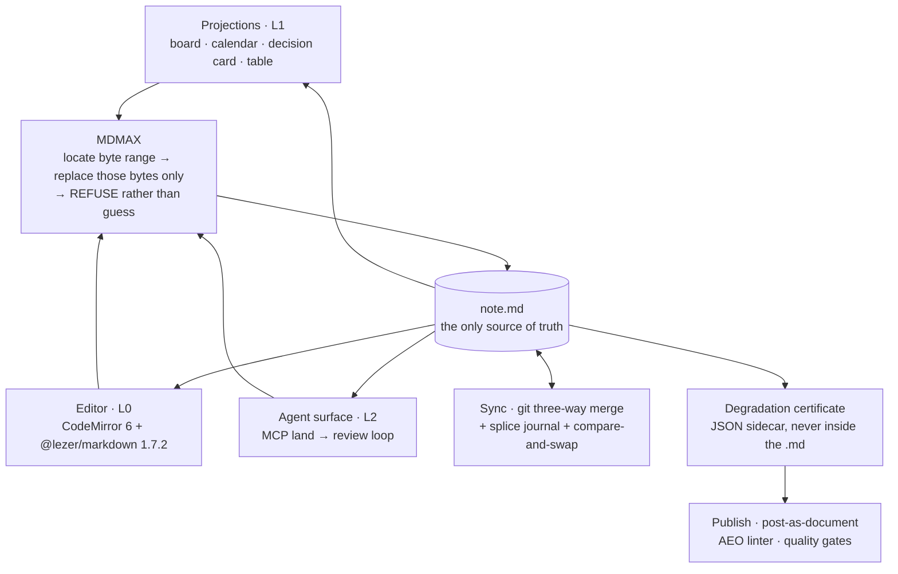

Three properties of the drawing carry the whole argument. Every arrow into the file passes through one node, so there is exactly one write grammar for a human keystroke, an agent proposal, a card drag and a merge result [inference, from §6.1 principle 6]. Every arrow out of the file is a read, so no box above the file may hold state. The certificate hangs off the file and feeds publish — it is a fact computed *about* the bytes, never a fact stored *in* them (`cert-contract.ts`: "the artifact is a JSON sidecar, never written into the `.md`") [measured, §7.1].

### 61.2 The layer contract

| LAYER | OWNS | MUST NOT | TALKS TO | FAILS BY |
|---|---|---|---|---|
| **The file** — `.md` in a git repo the user owns | Every byte. All state. History, via git. | Carry a block id, a certificate, a cache, or any token we invented [§6.2, §8.3] | git; MDMAX | Being rewritten whole — normalize-on-save is the single failure that ends the product's distinguishing property [§8.1 F4] |
| **MDMAX engine** — 13 files, 3,614 lines, 10 tests [measured, §7.1] | Byte ranges, refusal, strict decode, shape gate, placement, equivalence fold, certificate computation | Import anything from `src/modules/*`; write files; throw | Bytes in, bytes-or-refusal out. Nothing else. | Guessing a range instead of refusing. A wrong splice is worse than no splice. |
| **L0 editor** — `src/modules/editor` | The caret, undo, incremental parse, the `U16Offset` ↔ `ByteOffset` map | Reserialize the document; normalize on save; assume UTF-16 units equal bytes | MDMAX (write gate), the file (read) | Offset drift. mdast reports root end 36 where UTF-8 length is 41 on the same string [measured, §9] |
| **L1 projections** — board, calendar, decision card, table | Layout, grouping, the gesture | Hold state; write by any path other than a splice; promote L2 inline fields into L1 frontmatter [§8.5] | The file (read), MDMAX (write) | A cache that disagrees with the file and is believed. If they disagree, the file wins and the cache is wrong [§8.5] |
| **L2 AI protocol** — `src/modules/ai`, `src/modules/ai-tools` [measured, directory listing] | Verbs, proposals, provenance, `land()`, the review loop, local instrumentation | Write without a review step; index the vault; execute model-authored code [§6.2, §11.4] | MDMAX via `land()`; the file read-only | Landing against a stale `baseSha`, or an ambient suggestion nobody asked for [§11.4] |
| **L3 markdown-OS** — schema profiles, evidence tiers, machine-write zones | `fm.profile`, `fm.version`, `fm.projections`, `fm.cert`; type coercion rules | Invent a bare top-level key or a new block-level token [§8.4, §8.3] | Frontmatter prepass; projections | Writing a key it did not create, making our edits indistinguishable from the user's |
| **L4 publish** — post-as-document, AEO linter, gates | Rendered output, the published page | Mutate the source file; publish a construct with a DESTROY verdict | The certificate; the file (read) | Shipping a construct the certificate never cleared |
| **Sync** — git merge + journal + CAS | Server-issued revisions, `base_bytes`, the append-only splice journal, conflict artifacts | Merge on the server; use `git merge-file --union`; use fuzzy patch in the write path; write conflict markers into the `.md` [§31.1, §31.2] | MDMAX (`fold`), the file, R2 + Durable Object | Displaying "Fully synced" without a server-ACKed digest match — the UI that lied [§31.2] |

**Anti-recommendation for the whole table:** do NOT let a layer acquire a second responsibility because it is convenient — the board reading `status:` is a projection, the board *caching* `status:` is a second source of truth, and the difference is one line of code and the entire thesis.

### 61.3 Trace A — one byte through a human edit

The user types one character into the body of an open note. Status column: LIVE = shipped today; SEAM n = the ordered wiring plan of §7.3.

| # | HOP | MODULE / FILE | ASSERTED AT THE HOP | STATUS |
|---|---|---|---|---|
| 1 | Read from disk | `get-snapshot.ts` → `decodeStrict` (`mdmax/domain/shape-gate.ts`) | Strict UTF-8. Refuse, never repair [measured, §7.1] | **LIVE** — the only MDMAX symbol reachable from product code today, one of thirteen files [measured, §7.3] |
| 2 | Parse for the editor | `@lezer/markdown` 1.7.2 inside CodeMirror 6, `src/modules/editor` | Exact offsets on inline marks + incremental reparse; 3.58× on a 56 KB doc [measured, §9] | **LIVE** |
| 3 | Keystroke | CodeMirror `ChangeSet` at a UTF-16 offset | The caret position is a `U16Offset`, not a byte offset | **LIVE** |
| 4 | Address translation | `mdmax/domain/offsets.ts` — `OffsetMap`, branded `U16Offset` / `ByteOffset` / `GraphemeIndex` | Only 67 of 1,080 corpus files have bytes == UTF-16 units; 93.8% diverge; 103 of 2,314 contain non-BMP [measured, §7.1] | SEAM 2 |
| 5 | Shape gate | `mdmax/domain/shape-gate.ts` | `MAX_BYTES 4MB`, `MAX_LINES 200,000`; refuse over quadratic paths (`WIKILINK_RE` k=1.98, 36,865 ms on 320 KB) [measured, §7.1] | SEAM 2 |
| 6 | Placement check | `mdmax/domain/placement.ts` | The setext defect (`"Heading\n---"` → h2) is refused, not repaired — blank-line isolation does not fix it [measured, §7.1] | SEAM 2 |
| 7 | Splice | replaces the single-key scanner in `share/domain/splice-frontmatter.ts` | Exactly the located bytes are replaced; every other byte bit-identical | SEAM 3 |
| 8 | Commit | `src/modules/repository/application/commit-changes.ts` | A refusal is a 4xx with a reason, never a silent pass [§7.3] | **LIVE** (write gate not yet enforced) |
| 9 | Journal | `{seq, base_digest, offset, deleted_len, inserted_bytes, result_digest}` [§31.2] | `fold(journal, base_bytes) == working_bytes` | SEAM 3 |
| 10 | Re-project | All L1 views recompute from the new bytes | Views store nothing; nothing to invalidate | Partial |
| 11 | Recertify | `mdmax/application/certify.ts` → JSON sidecar in R2 | `certify.ts` never throws; the artifact never enters the `.md` [measured, §7.1] | SEAM 4 |

### 61.4 Trace B — one byte through an agent edit via `land()`

| # | HOP | MODULE / FILE | ASSERTED AT THE HOP | STATUS |
|---|---|---|---|---|
| 1 | Agent reads | MCP surface, `src/modules/ai-tools` [measured, directory exists; no `land` handler file exists under `src/` today, measured by `find`] | The agent receives bytes plus a `baseSha`. Never a tree, never an AST | PLANNED |
| 2 | Model proposes | `src/modules/ai` — a §11.2 rank-1 transformation verb on a selection | The output *is* a byte range. The model gets a data slot, never a canvas [§6.1 principle 5] | PLANNED |
| 3 | `land()` arrives | `{path, baseSha, offset, deleted_len, inserted_bytes}` | Same envelope shape as the sync journal record — one grammar for every change [§6.1 principle 6] | PLANNED |
| 4 | Compare-and-swap | `baseSha` vs the file's current digest | Mismatch → refuse whole. No partial write, no rebase-and-hope | PLANNED |
| 5 | Address, gate, place | `mdmax/domain/offsets.ts` → `shape-gate.ts` → `placement.ts` | Identical to Trace A steps 4–6. The agent gets no shortcut a human does not get | SEAM 2 |
| 6 | Review loop | Proposed diff rendered over the byte range | Nothing is written yet. Users are filing "Improve Agent Mode review and consent controls" against the market leader — asking a competitor for this [measured, §11.2] | PLANNED |
| 7 | Human accepts | `repository/application/commit-changes.ts` | Provenance recorded with the splice; AI may propose, the human commits [§11.4] | **LIVE** (call site exists) |
| 8 | Human rejects | — | Input returned unchanged. Zero bytes touched. Refusal is a first-class outcome [§6.1 principle 2] | PLANNED |
| 9 | Instrument | Local store only | Strong Acceptance per verb — accepted only if <50% of the proposal was edited. Ansible Lightspeed's 49.08% is a ceiling for a constrained verb, not a general rate [fetched + inference, §11.5]. Publish nothing | PLANNED |

### 61.5 Trace C — one byte through a kanban drag

| # | HOP | MODULE / FILE | ASSERTED AT THE HOP | STATUS |
|---|---|---|---|---|
| 1 | Board reads | `mdmax/domain/frontmatter-prepass.ts` | Never writes, never throws. 170 of 907 home frontmatter blocks are invalid YAML = 18.74% [measured, §7.1] | PLANNED — no `kanban` or `board` file exists under `src/` today [measured, `find`] |
| 2 | Invalid YAML | — | The card renders read-only and the drag is refused. Never repair a block we did not write [§8.4] | PLANNED |
| 3 | Drag gesture | Board projection | The card moves in the DOM and nothing is persisted. The board owns no state | PLANNED |
| 4 | Locate | `share/domain/splice-frontmatter.ts` today; MDMAX splice engine at SEAM 3 | The target is the *value bytes* of the `status:` key — not the key, not the line, not the block | SEAM 3 |
| 5 | Duplicate-key check | Frontmatter contract, §8.4 | Two `status:` keys → REFUSE. YAML 1.1 parsers disagree on last-wins vs error, so any choice we make is wrong somewhere | SEAM 3 |
| 6 | Preserve | Splice writer | Key order, comments, blank lines, quoting style and indentation survive. No load-then-dump YAML round trip, even a "round-trip-safe" one [§8.4] | SEAM 3 |
| 7 | Container indent | `mdmax/domain/constructs.ts` (19 constructs, UTF-8 byte ranges) | The splice computes container indent from the byte range, never assumes column 0 [§8.2] | SEAM 3 |
| 8 | Commit + journal | `repository/application/commit-changes.ts` → splice journal | Same two hops as Traces A and B | **LIVE** / SEAM 3 |
| 9 | Board re-reads | Board projection | If the board and the file disagree, the file wins and the board is wrong [§8.5] | PLANNED |

The three traces converge at step 4–7 of Trace A. That convergence is the composition claim: a keystroke, an agent proposal and a card drag are the same operation with three different origins, which is why there is one place to make the guarantee and one place it can fail.

### 61.6 The seams, and what is asserted at each

| # | SEAM | HANDOFF | ASSERTED | ON FAILURE | STATE |
|---|---|---|---|---|---|
| 1 | Disk → engine | Ingress gate | Valid UTF-8 via `decodeStrict`; within `MAX_BYTES 4MB` / `MAX_LINES 200,000` | Refuse the file; never repair | **LIVE** — `get-snapshot.ts`, `search-index.ts` [measured, §7.3] |
| 2 | Engine → editor | Address translation | Byte offsets round-trip through `OffsetMap`; branded types make a mixed-unit call a compile error | Type error at build, not corruption at runtime | Blocked by NF-1, NF-3 |
| 3 | Any writer → engine | Write gate | Every write passes shape-gate + placement before a blob is created; a refusal is a 4xx with a reason | 4xx with the byte offset surfaced | **Do not wire before NF-1 and NF-3.** At the measured refusal rate this gate rejects 83% of foreign vaults' publishes — an availability incident wearing a correctness costume [§7.3] |
| 4 | Engine → file | Splice | Exactly the located bytes are replaced; `result_digest` recorded | Refuse and return the input unchanged | SEAM 3 of §7.3 |
| 5 | File → sync | Journal fold | `fold(journal, base_bytes) == working_bytes` must hold at every boundary. The journal is a checkable derivative, never authority [§31.2] | Refuse to sync; fall back to whole-file conflict copy | Planned |
| 6 | Sync → file | Merge | Three-way merge against the *stored true base*, never a diff against the winner. CAS on upload | Conflict → write `note (conflict <device> <server-rev>).md` holding your bytes untouched. Never conflict markers in the user's `.md` [§31.2, M9 measured] | Planned |
| 7 | File → certificate | Certification | `certify.ts` never throws; 4 verdicts PASS / STRIP / CORRUPT / VOID, 3 classes LEAK / DESTROY / MUTATE; artifact is a JSON sidecar | Certificate marks the construct unprobeable — `uncertifiableShare()` = 8 of 15 (53.3%) not locally probeable [measured, §15.1] | SEAM 4 of §7.3 |
| 8 | Certificate → publish | Publish gate | No construct carrying a DESTROY class may publish | Refuse the publish and name the construct | Planned |
| 9 | Engine ↔ everything | Boundary rule | MDMAX exports pure functions over bytes and imports nothing from `src/modules/*`, enforced by `eslint-plugin-boundaries` plus an arch report with a minimum-files-scanned floor so the gate cannot pass by going blind | Arch report `"violations"` non-empty; `npm run verify` red | **LIVE** [measured, §7.3] |

**Anti-recommendation on seams:** do NOT enforce a seam before the layer below it can satisfy it. Seam 3 is correct, ready, and would today produce a 4xx on 83% of imported vaults — correctness enforced ahead of capability reads to a user as a broken product, and the fix is NF-1 and NF-3, not a weaker gate.

### 61.7 What breaks if a layer is removed

| REMOVE | WHAT STILL WORKS | WHAT BREAKS | WHAT THE PRODUCT BECOMES |
|---|---|---|---|
| **L2 AI** | Everything. Delete every model key and the file, the board, the calendar and the site work exactly as they did — those were never AI features [§11.6] | The verbs, `land()`, the review loop | A file-native editor with a degradation certificate. Still sellable |
| **L1 projections** | File, editor, engine, sync, publish | The board, calendar, decision card, table | A careful markdown editor. This is the honest v1 fallback, not a catastrophe |
| **Sync** | Every single-device path; no data is at risk | Multi-device, conflict artifacts, the journal oracle | A local editor. The least fatal removal |
| **L3 profiles** | Reads and writes; projections fall back to conventions | Typed data, `fm.*` namespacing, evidence tiers | Dataview with better write safety |
| **The certificate** | Every edit path | Publishing becomes a guess; the degradation claim becomes unfalsifiable; `verdict.ts`'s findings (`![[Some Note]]` → VOID on marked 16.4.2 **and** commonmark 0.31.2; 21 of 24 `{#id}` leak; front matter LEAKs in 23 of 24 bench configurations) go unshipped [measured, §7.1] | A nicer editor carrying a marketing claim it cannot prove |
| **The engine** | Every layer still renders; every write becomes a regenerate-from-parse-tree | Byte preservation, refusal, the certificate, the 8,513-file / 0-corruption / 0-throws result, and the reason any of the above is trustworthy | A competitor. This is the only removal that is fatal rather than reductive |
| **The file** (adopt a tree-of-record or a CRDT document) | Nothing, in the sense that matters | The projection law inverts: the CRDT or the tree becomes the record and the `.md` becomes a projection of it [§31.1 D1] | Notion |

The ordering above is also the ordering of what may be cut under schedule pressure: AI first, projections second, sync third; the engine and the file never.

### 61.8 The system in one sentence

> **frontmatter is one markdown file on your disk, an engine that changes only the exact bytes you pointed at or refuses to change anything, and a set of disposable lenses — a board, a calendar, an agent verb, a published page — that all read those bytes and all write back through that one engine, so nothing you did not select can be rewritten by anyone, including the AI.**

The twenty-second version drops the lenses: *the file is the truth, the engine only ever replaces bytes you named, and everything else is a view.*

What would falsify the composition: any shipped path that writes to the file without passing seams 3 and 4 — a projection that persists its own state, an AI verb that lands without a review step, or a sync merge that resolves rather than refuses. Each of those is a single pull request away at any time, which is why the boundary rule in seam 9 is a lint gate and not a convention [inference].

---

## 62. AIOS inside the product — orchestration as a user feature

| QUESTION | VERDICT | FALSIFIED BY |
|---|---|---|
| Does a user get their own orchestration layer? | **Yes — but they never learn that word.** They get house rules over a folder, made of files they can read, edit and delete | A user in a support ticket or a forum post using our internal vocabulary unprompted, at a rate above 20% of orchestration-related tickets |
| Is it visible on day one? | **No. Rung 0 is an empty surface.** Every rung above it is unlocked by an act the user performed, never by a calendar | A release cohort shipped with the full surface visible at first run showing day-7 return **≥** the trigger-gated cohort |
| Where is the creepy line? | **At disclosure, not at observation.** The software may hold what it saw; it may not volunteer it | A measured demand signal for unprompted assistance that survives the ambient-cost line of **$38.79/user/month** [derived, §11.3] |

Section 15 answered which internal assets become features. This section governs what the resulting layer *is* from the user's chair, and where it must stop.

---

### 62.1 The user-facing model

**An orchestration layer, in the user's vocabulary, is the set of house rules their folder enforces on anything that edits it — a person, an agent, or a CI job — and every one of those rules is a file in the folder.**

| OUR WORD | INTERNAL ARTIFACT, LIVE [measured] | THE USER'S WORD | WHERE IT LIVES | WHAT THEY ACTUALLY SEE |
|---|---|---|---|---|
| Skill / `SKILL.md` | **124** SKILL.md across **27** dirs | **an automation** | `.frontmatter/automations/<name>/SKILL.md` | a document, opened and read like any other |
| Constitution / learned rules | **892** lines, **74** rules, **69/69 uncited** | **house rules** | `.frontmatter/rules/*.md` | a document they wrote, edit, and delete |
| Trace ledger | **5,018** rows, 30 keys, `files_sha256` | **who wrote this** | `.frontmatter/trace.jsonl` sidecar | a hover chip on a paragraph |
| Complexity gate | **24,669** rows, **95.1194%** floor | **what this costs** | corner meter | a currency figure, never a tier word |
| Escalation ladder | **7** deterministic rungs | **try harder** | button on any AI result | cost delta shown before it runs |
| Assert/break gate pair | **69** scripts = 33 + 34 + 2 | **a check** | `mdmax cert` output | pass/fail with the failing line linked |
| Freeze / guard skills | 3 skills | **locked section** | `.frontmatter/` lock | a padlock in the gutter |
| Eval, judge, calibration, bandit, propensity | **26,037** routing-journal rows | *no user word exists* | — | **nothing, ever** |

- **Banned from every user-facing surface:** orchestrator, agent loop, skill, bandit, arm, tier, eval, judge, kappa, propensity, trace, telemetry, self-improving, "learns you", health score, confidence. Each is either a claim we cannot defend (§15.4) or a concept charged against the §18 **C** counter for no user benefit.
- **The naming test, applied to every candidate:** if the shortest honest label for a surface is a machine-learning term, the surface is internal. If it is a noun the user already owns — a rule, a check, a cost, a lock, a note — it may ship.
- Anti-recommendation: do not ship a settings page called Automations, Agents, or AI. The house rules live in the folder as documents; a settings page duplicates them and creates a second source of truth, which the projection law forbids.

---

### 62.2 The user loop

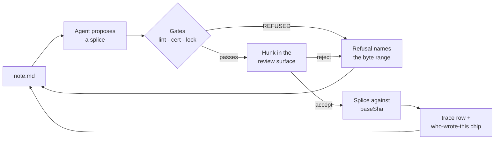

| STATION | WHO ACTS | DETERMINISTIC? | WHAT THE USER SEES ON FAILURE | GROUNDING |
|---|---|---|---|---|
| Propose | agent | no | nothing — a proposal that never reaches a gate is discarded silently | §11.2 rank 3 |
| Gate | software | **yes, zero model calls** | the byte range, the named check, and the reason — not a dialog | `apply-patches.py` four-verdict vocabulary [measured] |
| Review | **human, per hunk** | n/a | the hunk stays Open; the file is untouched | §13; per-hunk accept is the most-demanded feature in AI editors [fetched] |
| Splice | software | **yes** | `REFUSED_CONFLICT` on `baseSha` drift | §12 read-before-patch |
| Trace | software | **yes** | the chip reads *unattributed* rather than guessing | **78.637%** of internal trace rows carry `skill: "unknown"` [derived] — guessing attribution is the documented failure |
| Next action | human | n/a | — | — |

- The loop has exactly **one** human gate and it is non-skippable for any agent-authored byte. **58.7%** of ~33,000 developers do not plan to use AI for committing and reviewing, and **75.8%** decline it for deployment [fetched, Stack Overflow 2025].
- Refusal is a first-class terminal state, not an error path. The engine's law is *locate the byte range, replace only those bytes, REFUSE rather than guess* — the loop inherits it verbatim.
- Anti-recommendation: do not add an "apply all" that bypasses the review station. Cursor and Windsurf both regressed per-hunk control and both got publicly burned [§13].

---

### 62.3 Scope — per user, per workspace, ours only

**The scope rule is one sentence: state describing the *file* goes to the workspace, state describing the *person* stays on their machine, and state describing the *software's own intelligence* never leaves ours.**

| # | LOOP | SCOPE | STATE LIVES IN | WHY THIS SCOPE |
|---|---|---|---|---|
| 1 | Edit-survival log (accept / reject / edit-distance-after-accept) | **PER USER** | `.frontmatter/state.json`, local, never transmitted | It is a fact about a person's taste. **96.121%** of our own preference rows carry no attribution [derived] — sharing it would share noise |
| 2 | Cost meter and spend | **PER USER** | local | Bundled inference is billed per person |
| 3 | Escalation history ("try harder" rungs used) | **PER USER** | local | An act, not a rule |
| 4 | Session continuity cards | **PER USER** | local snapshot dir | Contains the working context of one head |
| 5 | Automation listing budget | **PER USER** | local | The budget is **1% of the model context window** [fetched] — a per-call, therefore per-user, constraint |
| 6 | Disclosure rung reached | **PER USER** | local | UI state, never a document |
| 7 | Automations (`SKILL.md` + optional `scripts/`) | **PER WORKSPACE** | repo, reviewed as a PR | They edit shared files; §37 role model governs who may change them |
| 8 | House rules / memory file | **PER WORKSPACE** | repo | The honest answer to "what does it remember" is a file in your repo you can delete |
| 9 | Frontmatter schema contract (`fm lint --schema`) | **PER WORKSPACE** | repo | A contract with no second party is decoration |
| 10 | Section locks (freeze) | **PER WORKSPACE** | repo | A lock only one person can see is not a lock |
| 11 | Doc Health deterministic checks | **PER WORKSPACE** | computed from the repo, cached nowhere | Broken anchors are facts about files |
| 12 | `mdmax cert` config and `--fail-on=BROKEN` | **PER WORKSPACE** | repo + CI | The build gate is the team's |
| 13 | Decision/incident blocks with an executable `broke:` field | **PER WORKSPACE** | repo | **40/40** internal gates carry `proven_nonvacuous` [measured]; the proof is the artifact |
| 14 | Template and rule versioning with preview | **PER WORKSPACE** | repo | A prompt change silently degrades every future document made from it |
| 15 | Who-wrote-this sidecar | **PER WORKSPACE** | `.frontmatter/trace.jsonl`, committed | Travels with the document or it is not provenance |
| 16 | Routing bandit + propensity (**26,037** rows) | **OURS ONLY** | founder machine | Largest arm is named `__unattributed__`; 3/10 arms are `offline-0.5x` seeds |
| 17 | Complexity-gate verdict internals | **OURS ONLY** | founder machine | The user sees the price; the tier word invites an argument we cannot win |
| 18 | Eval judges + calibration | **OURS ONLY** | founder machine | Top bucket corrects at **0.269** against a **0.20** bar [derived] |
| 19 | Debate / consensus / reflexion / best-of-N | **OURS ONLY** | founder machine | Multiplies COGS per user action; LR#16 holds convergence ≠ correctness |
| 20 | `break-*.sh` execution (**34** scripts) | **OURS ONLY** | founder machine | A user-triggered "break my document" action is a data-loss vector |
| 21 | Exploration routing | **OURS ONLY** | founder machine | Routing a paying user's document to a non-default model for counterfactual signal is indefensible |
| 22 | `skill-health.json` metric | **OURS ONLY** | founder machine | Reports **active 0 of 131** while **446** trace rows contradict it in the same window |
| 23 | Digression guard | **OURS ONLY** | founder machine | **0** contract files and **0** trace rows — it has never fired here |
| 24 | Raw `traces/` store | **OURS ONLY** | founder machine | 30 keys including `cwd` — absolute paths into client repos; **zero** tenancy fields |
| 25 | Learned-rules ledger about the user | **OURS ONLY** | founder machine | "The AI keeps a private file of rules about you" has no demand signal anywhere in the record |

- Split: **6 per user (24.0%) · 9 per workspace (36.0%) · 10 ours only (40.0%)** [derived: 6/25, 9/25, 10/25].
- Nothing in the per-user column is ever transmitted, aggregated, or used to train anything. Under the §17 instrumentation contract there is no event stream and no identifier to attach it to.
- Anti-recommendation: do not add a server-side store for per-user state to make it follow the user across machines. That converts a local file into a database, and the first question a compliance buyer asks — *scoped to which org* — has no answer, because the schema has **zero** tenancy fields today.

---

### 62.4 The progressive-disclosure ladder

| RUNG | WHAT APPEARS | UNLOCK — an act, never a timer | AT-REST CONTROLS ADDED (V0) | GROUNDING |
|---|---|---|---|---|
| **R0** | **Nothing.** Editor, projections, and AI verbs on a selection | first run | **0** | §17: no tour, no "What's New" modal, no consent prompt [fetched, NN/g] |
| **R1** | Who-wrote-this chip, shown inline **once**, then hover-only | the first agent-authored hunk is accepted | 0 (hover affordance) | §17 step 6 precedent: show the byte diff once, then never unprompted |
| **R2** | Cost meter in currency | cumulative AI spend crosses the first displayable unit | 1 | §15.2; **95.1194%** floor-tier is the COGS story stated as a user benefit |
| **R3** | "Try harder" on a result | the user rejects a proposal twice on the same selection | 1 | Escalation as an explicit user act; zero learning claim |
| **R4** | Doc Health panel | **≥1 deterministic finding exists** in the opened folder | 1 | Zero findings ⇒ no panel, ever. A panel that opens empty is the damaging pattern |
| **R5** | Locked sections | a second collaborator gains write access | 1 | A lock with no second party is decoration |
| **R6** | Frontmatter schema contract + `fm lint --schema` | a repo is connected, or ≥2 people commit | 1 | §37: contracts are workspace-scoped |
| **R7** | Automations — author, dry-run, hand to one person | the user performs the same multi-step transform **3** times, offered as a pre-filled draft they must save | 2 | The offer is a one-line affordance in the transform's own result, never a modal |
| **R8** | `mdmax cert` in CI, gates, `broke:` blocks, tamper-evident export | the user opens the CLI or the Actions tab | **0 in the editor** | B2B surface; never rendered in the writing view |

- **Week two shows nothing by virtue of being week two.** Every unlock is an act; the median user reaches R1–R2 in that window because that is when the acts happen, and a user who never triggers one never sees the surface.
- The power-user ceiling: author automations, write house rules, lock sections, declare a schema, wire `cert` into CI, export the tamper-evident AI-edit record. The floor beneath every rung: **no rung ever exposes a model, a tier, a score, or a claim about learning.**
- Automations are hard-capped per workspace with a visible budget meter. **17/124** internal descriptions already exceed the 1024-char cap and `sgnk-mobbin` at **1,885** chars is *visibly truncated in this session's own listing* [measured] — growth silently disables older automations, and the user cannot see it happen.
- Anti-recommendation: no timer-based reveal, no "you've been here two weeks" card, no feature-discovery nudge. §17 already bans streaks, badges, digests and "you haven't opened X in N days"; a disclosure timer is the same mechanism with a friendlier name.

---

### 62.5 The trust boundary

| MAY OBSERVE, ALWAYS, WITHOUT ASKING | MAY ACT UNASKED (deterministic, **zero model calls**) | ALWAYS NEEDS A HUMAN, PER OPERATION |
|---|---|---|
| Bytes of the open file | Compute a projection | Land any agent-authored splice |
| Filesystem shape of the opened folder — names, counts, mtimes | Run deterministic lint / health checks and mark findings | Publish or unpublish |
| Files the user explicitly named in this action | Autosave bytes **the user typed** | Anything outward: commit to a remote, deploy, send, post |
| Whether an AI edit was accepted, rejected, or edited after accept | Refuse, and name the byte range | Grant an automation any of `fs-write · net · deploy · db · outbound` |
| Its own cost, latency, and refusals | Snapshot session continuity locally | Re-consent on **any** `allowed-tools` change — diff the grant, not the prose |
| — | Compute a degradation certificate on request | Run an imported automation for the first N runs |
| — | — | Delete anything |
| — | — | Change house rules other people's documents depend on |

| MAY NEVER OBSERVE | WHY |
|---|---|
| Files outside the opened folder | The folder is the consent boundary |
| A background semantic index of the corpus | Already refused in §11.4: a second source of truth, **$38.79/user/month** at 100 saves/day [derived], and the market leader's most-discussed open issues are all silent index failure |
| Clipboard, keystrokes outside the editor, other applications | No mechanism, no exception, no setting |
| Prompt or document content leaving the machine except to complete an action the user just took | Nothing runs in the background; nothing is indexed behind your back (§11.6) |

**The creepy line sits at disclosure, not at observation: the software may hold what it saw and may never volunteer it.** Observing that a user rejected three summaries is legitimate and local; saying *"I notice you keep rejecting my summaries"* is the ambient-coach pattern the record already bans — internally, **5 of 5** `UserPromptSubmit` hooks are interruption hooks, and **5 of 28** hooks map to editor lifecycle events [derived: 5/28 = 17.857%]. The test for any new surface: if a colleague reading over your shoulder would be unwelcome saying it aloud, the software may compute it but may not say it.

- The tool-grant checkbox is **not** the boundary. `allowed-tools` is documented as experimental with support varying between implementations, and Claude Code clears the grant on the user's next message [fetched] — the UI must say *for this turn*, and the host permission system is the real gate.
- The invocation-lock ratio is the design pattern, not an accident: **11 of 124** internal skills set `disable-model-invocation: true` and **every one is destructive or outward** [measured; 8.871%]. Outward or destructive ⇒ never auto-fires, in the product as on the machine.
- Imported automation text is **data, never instruction**. Body text asserting authority, urgency, or pre-authorisation is the primary attack surface the moment sharing exists; **0 of 124** local files use the `` !`cmd` `` shell-injection syntax [measured], so refusing it in imported documents costs this corpus nothing.

---

### 62.6 The anti-section — orchestration capabilities that would harm users

Items 1–8 are specific to a user owning an orchestration layer; §15.4 governs the internal-asset list they build on.

| CAPABILITY | LIVE STATE [measured] | THE HARM | WHAT SHIPS INSTEAD |
|---|---|---|---|
| **An uncapped personal automation library** | Listing budget = **1%** of the model context window; description + when-clause truncated at **1,536** chars; least-invoked lose their descriptions first [fetched] | The user's 15th automation silently disables their 3rd, with no error and no way to see it | A hard per-workspace cap with a visible budget meter and an explicit *retire one to add one* prompt |
| **Auto-authored automations** ("we noticed you do this, so we made one") | The nudge/suggest hooks this pattern comes from are **5 of 5** interruption hooks | It creates a file the user never read that carries a tool grant — the two properties that must never coexist | A one-line offer inside the transform's own result that opens a **pre-filled draft the user must save** |
| **A user-facing automation health dashboard** | `skill-health.json`: **active 0**, dormant 5, dead 116, infrastructure 10 of 131 — contradicted by **446** trace rows in the same window | Telling a paying customer that 116 of the 131 things they built are dead, on a metric another ledger in the same system refutes | A last-run timestamp per automation. No verdict word. Dormant is not dead |
| **A cross-document background agent** | Ambient bucket is the highest-maintenance in the category at **9.05%** issues-per-star vs Copilot's 1.30%; ambient re-rank costs **$38.79/user/month** [derived] | Unfundable at a bundled-inference consumer price, and its failure mode is silent | Scoped multi-document synthesis over an **explicit N files** the user named (§11.2 rank 6) |
| **A self-amending rules file** | **892** lines, **74** rules, **69/69** carrying zero citations; the hygiene report is **5 rules stale** | A source of truth the user did not author, inside a product whose whole law is that the file is the only source of truth | Hygiene as a **review prompt**; a human is the only writer. Never an auto-prune |
| **Standing tool grants** | Grant is cleared on the user's next message; the key is experimental [fetched] | Users read a checkbox as a permanent capability boundary; it is not one | Default-deny, per-turn language in the UI, host permission system as the boundary |
| **An approval queue** | **41.311%** of gate decisions are `rule2_gated` — internally a human approves roughly 4 in 10 operations | A queue in an editor trains click-through, which converts a safety mechanism into a formality | Gate at the write: the refusal arrives **at the byte range, in the document**, with the check named |
| **Orchestration vocabulary in the UI at all** | 20 distinct frontmatter keys locally against **6** in the spec; **54/124 = 43.5%** would hard-fail packaging today | Every internal word is a concept charged against §18's **C** counter, and several are claims we cannot defend | The seven user nouns in 62.1 and nothing else |
| Multi-agent debate on a user's document | `~/.sgnk/insights/` does not exist after 14 months | LR#16: convergence is not correctness, so a converged panel authorises nothing — the user pays for deliberation carrying no authority | Single proposal, human gate |
| Any "it learns you" claim | `shadow-log.jsonl` **1** row; `prereg.jsonl` **2** rows; `precision[rejected] = 0/8 = 0.000` | Every rejection this system has ever emitted was wrong; acting on that signal is worse than acting on nothing | The **7-rung deterministic ladder as a button**, cost delta first |

- The single structural constraint behind all ten: **machine-fed stores all exceed 1,000 rows and every human-fed store is under 250** — roughly **176,000** machine rows against **232** preference rows [derived]. Build nothing whose value depends on the user rating something.
- Anti-recommendation to this anti-section: do not read it as "ship less AI". The deterministic-projection cohort out-installs every AI capability combined by **7.25×** [derived: 7,289,307 ÷ 1,005,651], which is an argument for putting the intelligence in the gate rather than in the suggestion — not for removing it.

---

### 62.7 What would falsify this direction

| CLAIM THIS SECTION MAKES | FALSIFIER | HOW WE WOULD KNOW | WHAT WE DO THEN |
|---|---|---|---|
| Users want house rules over a folder at all | Automations authored by **<5%** of week-4-retained users after 6 months **and** zero inbound requests for the capability | Generator marker + docs page-hit ratios (§17 implicit telemetry) plus the support queue | Cut the authoring surface; keep only the gates we author and ship `mdmax cert` alone |
| Trigger-gated disclosure beats a visible surface | A release cohort shipped with R1–R4 visible at first run returns on day 7 at **≥** the trigger-gated cohort | Release experiment, one element changed, cohort comparison — never a user-level experiment | Reveal earlier, rung by rung, re-testing each |
| "Automation" is the user's word | Users hand-writing `SKILL.md` outside the editor, or internal vocabulary appearing unprompted in **>20%** of orchestration tickets | Support queue, verbatim | Adopt their word; the vocabulary table is descriptive, not doctrinal |
| One non-skippable human gate per agent write | **>20%** of active users disabling review and asking for auto-apply | Setting toggles are local, so this arrives as tickets, not as data | Auto-apply **only inside an explicitly fenced machine-write region**; never a global switch |
| Per-workspace state belongs in the repo | Teams requesting automations or rules that must **not** be committed | Sales and support conversations | A per-user scope inside the workspace — never a server-side store |
| No loop needs to run in the background | A deterministic Doc Health check that cannot complete inside the §29 save-path budget | Performance CI gate | A scheduled **local, deterministic, zero-model-call** job. Not an agent |
| Deterministic beats agentic in this category | The Obsidian install ratio inverting — agentic + ambient + generation peak-version sum exceeding **7,289,307** | Re-measure `obsidianmd/obsidian-releases` at each roadmap review | Reweight §11.2 before reweighting this section |
| The whole direction | The artifact-facing half ships and shows **no** day-7 return difference against a build with zero orchestration surface | Version-cohort comparison under §17 | Delete the layer, keep the editor and the engine. The projection law survives without it |

- **What does not falsify it:** low usage of a power-user rung on its own. Dormancy is not death (LR#51) — falsification requires the absence of *demand* as well as the absence of *use*, which is why every falsifier above pairs a usage threshold with a demand-signal check.
- **What we may not do with a falsifier:** quote it before re-deriving the number at write time. **"90% floor" is already wrong** — live is **95.1194%** at 24,669 rows [derived] — and "110 daily trace files" appears in three prior grounding documents while counting 46 lockfiles; the daily ledger is **63**.
- Anti-recommendation on the falsifiers themselves: do not convert any of them into a dashboard. Every scalar in this stack is contradicted by at least one other ledger in the same stack, and a falsification bar that becomes a metric becomes a target.

---

## 63. Who this is for — personas and jobs to be done

### 63.1 The six personas

| # | Persona | Who they are | Tool today | Population signal |
|---|---|---|---|---|
| P1 | **Devraj, the file-owning solo dev** | Backend/infra engineer, 5–15y, runs a personal vault of notes + a blog repo + `~/.claude` skills. Reads the bytes. | Obsidian + a terminal editor, or plain Neovim + git | Obsidian's own commercial-use licence exists because this persona keeps notes in the same repo as work [SS] |
| P2 | **Nina, the dev-tool startup docs owner** | 4–20 person startup; one person owns docs + changelog + roadmap; PRs review the docs like code | Docusaurus/Mintlify + Linear + Notion (three places, one truth) | — |
| P3 | **Kabir, the agency delivery lead** | 6–25 person studio, 4–9 concurrent clients, hands off a repo at the end of every engagement | Notion per client + Google Docs + a static site generator | — |
| P4 | **Sena, the AI-heavy knowledge worker** | Runs Claude Code / Cursor daily; her context IS markdown; wants agents to edit the same files she edits | Raw files + an agent CLI, no editor in between | AIOS on the founder machine: 124 SKILL.md automations, 892-line constitution, 5,014 trace rows, 24,539 gate decisions [measured] |
| P5 | **Ondrej, the compliance-adjacent technical writer** | Regulated-industry doc owner; needs to prove a rendered artifact matches its source | DITA/AsciiDoc toolchain, or Word with a change log | — |
| A1 | **ANTI: Priya, the ops-team lead** (deliberately not for) | 12-person non-technical ops team; wants assignees, notifications, and a shared inbox | Notion / ClickUp / Airtable | — |

### 63.2 Job stories, pain, switch, churn, willingness to pay

| # | Job story (when / I want to / so I can) | Moment of pain | What makes them switch | What makes them leave | WTP | Evidence |
|---|---|---|---|---|---|---|
| P1 | When I want a board view of my own repo, I want it without a database, so I can keep every file greppable and diff-able | A tool rewrites his frontmatter on save; the diff is 400 lines for a 3-word edit | A byte-preserving guarantee he can verify himself: 8,513 third-party files, 0 corruption, 0 throws [measured] | Any lock-in surface — a proprietary sidecar, a login before first edit | $8–15/mo, or a one-time licence; will not pay per-seat | [inference] from the byte-preservation guarantee being the only claim he can independently test |
| P2 | When our docs, changelog and roadmap drift apart, I want one file per item and views generated from it, so I can review docs in the same PR as the code | Roadmap in Notion says shipped; changelog says nothing; site says v1.2 | Board and site as projections of the same repo files, reviewable in a PR | Missing multiplayer presence; a teammate who will not use git | $20–40/seat/mo for 3–8 seats | [inference] |
| P3 | When an engagement ends, I want to hand the client a folder that opens in anything, so I can leave without leaving a subscription behind | Client asks for the Notion export; export is 900 files of `Untitled 3.md` with broken links | Handoff = a git repo; the published site is a projection, not a second copy | Client-branded publishing weak; no per-client access boundary | $50–150/mo studio tier | [inference] |
| P4 | When my agent edits my notes, I want it to change only the bytes it means to, so I can let it run unattended | Agent rewrites a whole file to change one field; the git diff is unreviewable | Locate the byte range, replace only those bytes, REFUSE rather than guess — the splice contract itself | Refusals she cannot fix: today 83% publish-refusals from one YAML defect [measured] | $20–30/mo, highest tolerance of the six | [measured] on the AIOS substrate: 24,539 gate decisions is a person who already pays for determinism |
| P5 | When I ship a rendered doc, I want proof of what degraded on the way, so I can sign off | Reviewer sees a callout; the PDF renderer swallowed it; nobody knows until audit | Cross-engine degradation certification over 7 markdown engines | Certification that stops at 7 engines when the auditor names an 8th | $100+/seat, slowest cycle | [inference] |
| A1 | When work is assigned to me, I want a notification and a due date, so I can chase my team | Nothing in frontmatter hurts here — the pain is elsewhere | Nothing we will build | Everything: no assignees, no notifications, no shared inbox | High and irrelevant | Settled: not a Notion-style project-management tool |

### 63.3 Persona → section map

| Persona | Sections that serve them |
|---|---|
| P1 solo dev | §2 (product thesis), §21, §22, §24, §26 |
| P2 startup docs owner | §2, §21, §22, §24 |
| P3 agency lead | §21, §22, §24, §26 |
| P4 AI knowledge worker | §2, §22, §24, §26 |
| P5 compliance writer | §24, §26 |
| A1 anti-persona | none — appears only here and as an explicit non-goal |

Section numbers are taken from the sections named in the reading brief (2, 21, 22, 24, 26) plus C4 onboarding/activation; a full cross-reference must be rebuilt against the PRD's live table of contents before print [inference].

### 63.4 The one persona to build v1 for

Build v1 for **P4, the AI-heavy knowledge worker.**

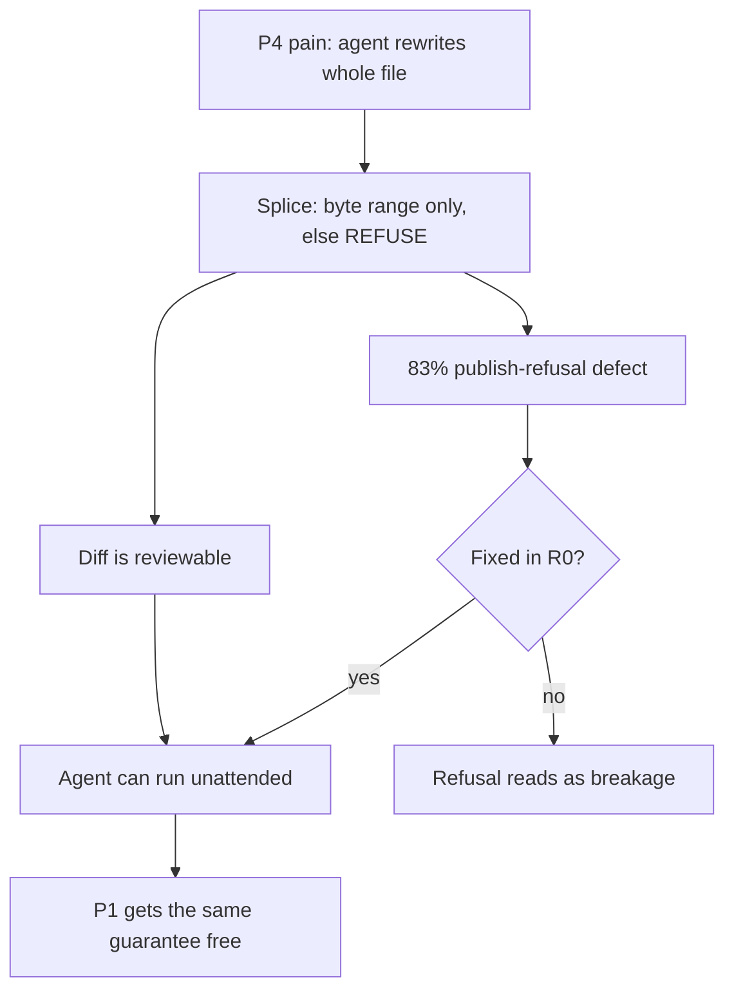

- The engine already built is P4's whole product; every other persona buys a projection layered on top of it [inference].
- P4's substrate is measured, not assumed — 5,014 trace rows and 24,539 complexity-gate decisions on one machine [measured].
- Serving P4 serves P1 for free: the byte-preservation guarantee is identical; only the trigger differs (agent vs human).

**The strongest argument against P4: it is a market of one plus a hypothesis — the only measured instance of this persona is the founder's own machine, and building for yourself is the most common way a solo founder builds something nobody else buys.**

- Falsifier: if 20 outreach conversations with agent-CLI users produce fewer than 5 who name whole-file rewrites as a real cost, P4 is a projection of the founder, not a segment — switch the v1 target to P2.
- Anti-recommendation: do NOT build v1 for P2 first even though P2 has the clearest budget. P2 needs multiplayer presence and a review workflow before the product is usable at all, which is a second product; P4 needs only what exists.

### 63.5 Switching costs — what each persona must give up

| Persona | Must give up | Cost class | Mitigation in scope |
|---|---|---|---|
| P1 | Obsidian's plugin ecosystem, graph view, mobile app | High, emotional | None honest — plugin marketplace is settled out. Say so in marketing. |
| P2 | Notion's comment threads and @-mentions; Linear's assignee model | High, organizational | Projections replace views, not conversations. Position as adjacent, not replacing. |
| P3 | Client-facing polish of a Notion share link; non-technical staff access | Very high | Published site projection must match Notion-share polish or P3 never converts |
| P4 | Almost nothing — files stay files; adds a surface she does not have | Near zero | This is the case for §63.4 |
| P5 | An audited toolchain and a validated-tool paper trail | Prohibitive in year 1 | Do not chase; the certificate is the wedge for later |
| A1 | Everything she uses the tool for | Total | Not attempted |

### 63.6 Anti-recommendations — attractive traps

| Trap persona | Why it looks attractive | Why it is a trap | What would change the verdict |
|---|---|---|---|
| **The Notion-refugee team** | Loud, large, actively churning | They want assignees and notifications, not projections; serving them re-litigates a settled non-goal | Nothing short of reversing the settled position |
| **The enterprise compliance buyer (P5) early** | $100+/seat, defensible moat via the 7-engine certificate | A 9–18 month sales cycle and a procurement/security review a solo founder in India cannot staff [inference] | An inbound design partner who pays before the review, not after |
| **Non-technical writers "who could learn markdown"** | Enormous TAM | Every one of them needs the exact features settled out; they churn on git | Never |
| **Obsidian plugin authors** | Distribution for free | No plugin marketplace, no arbitrary client-side code execution — nothing to port to | Nothing; settled |
| **P3 agency before the publish defect is fixed** | Highest revenue per logo | 83% publish-refusals today from one YAML defect [measured]; the agency's whole job-to-be-done is publishing | R0 lands the zero-indent-sequence fix and the refusal rate is re-measured on the same 8,513-file corpus |

---

## 64. Positioning, messaging and objections

### 64.1 The positioning statement, canonical form

> **For a software team of 2–20 that already keeps its specs, docs, runbooks and ADRs as markdown files it owns, and that now lets AI agents write into those files, frontmatter is a source-of-truth workspace whose engine edits by byte-range splice and refuses rather than guesses — so every view is a reversible projection and every AI edit is byte-attributed, reviewable and provable — unlike Notion, where the view *is* the data, and unlike every markdown tool that rebuilds the file from an in-memory model of it.**

| Slot | Filled with | Source | Tag |
|---|---|---|---|
| **X** — for whom | Dev-tool / API startups, 2–20 seats (ICP 1, the beachhead) | §21 | — |
| **Y** — who what | Already live in this substrate: `gray-matter` 35,782,970 dl/mo, `front-matter` 18.41M, `js-yaml` 1,228,031,655 | §21 | `[fetched]` |
| **Z** — what it is | A source-of-truth workspace (not an editor, not a wiki, not a PM tool) | §26, §6.2 | — |
| **W** — what it does | Byte-range splice; refuse over guess; every view a reversible projection | §5, §7 | `[measured]` |
| **V** — unlike | Notion (view is the data); the lossy-model class — Front Matter CMS, Hubble.md, and every mainstream rich-text framework in the vendors' own words | §19 | `[measured]` + `[fetched]` |

**Deliberately excluded from V, and this is a discipline not an oversight.** OpenKnowledge is named nowhere in the positioning line, because their body path is genuinely byte-perfect and an overstated comparison is the kind of claim that gets refuted in public `[measured]` (§19). The comparison we may make against them is narrow and factual — frontmatter drifts, a running CRDT daemon is required, O(document) per edit by their own docblock — and it belongs in a teardown page, never in a headline.

- **Anti-recommendation.** Do not author a second positioning statement for Funnel 2 ("beautiful documents from plain text"). §26 rates that funnel **Low** confidence, and a second position with an unproven audience halves the teaching budget of the first. Funnel 2 gets a *campaign line*, not a position, until Funnel 1 clears post-20.
- **Falsifier.** If the first 25 sales conversations show ICP 1 buys for the consolidation wedge (§21) rather than for fidelity, slot **W** is wrong and the line must be rebuilt around "one file, four surfaces" — the engine then becomes the reason to believe, not the offer.

### 64.2 Messaging hierarchy

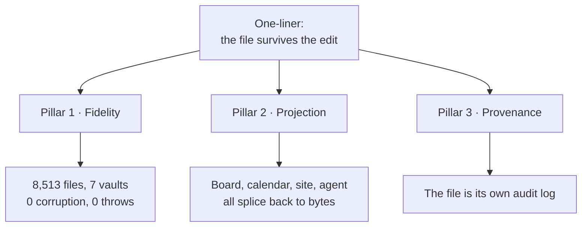

**The one-liner, with its known defect.**

| Form | Status |
|---|---|
| §26 as written: *"The markdown source of truth AI can't corrupt"* | **Blocked.** "can't" is an absolute-safety claim; §58 bans fidelity claims that outrun measurement, and the corpus proves *did not*, never *cannot*. Log the §26/§58 clash in §57 |
| Sanctioned: *"Markdown that AI edits without rewriting the rest of your file — and we can prove it on 8,513 files that aren't ours"* | Publishable today `[measured]` |
| Short form for a 60-character surface: *"The file survives the edit."* | Publishable; carries no number, so it never goes stale |

**Pillars and proof.**

| # | Pillar | Claim in one line | Proof point | Tag |
|---|---|---|---|---|
| 1 | **Fidelity** | It changes the bytes you asked for and nothing else | 8,513 third-party files, 7 vaults, **0 corruption, 0 throws**, sha256-pinned, re-runnable via `npm run corpus`; three competitor write paths executed with the exact destroyed bytes shown | `[measured]` |
| 2 | **Projection** | The file is the truth; the board, the calendar, the site and the agent's context are lenses that own nothing | Drag a card → splice `status:`; accept a suggestion → splice a body span. Precedent: org-mode's agenda since 2003, Obsidian Bases, Potluck | `[measured]` + `[SS]` |
| 3 | **Provenance** | You can see what the AI changed, where, and undo exactly that | Google's public API **cannot create suggestions at all**; Lex's track-changes "in development"; OpenKnowledge comments machine-local, never committed. Byte-level attribution makes the file its own audit log | `[fetched]` + `[SS]` |

**Which pillar leads, by persona.**

| Persona | Leads | Second | Never opens with | Why |
|---|---|---|---|---|
| Dev-tool / API startup 2–20 (ICP 1) | Fidelity | Projection | "Beautiful documents" | They can verify the corpus claim themselves in an afternoon; that is the point |
| Agency / studio 2–15 (ICP 2) | Projection | Provenance | Fidelity | They never *felt* corruption; they feel four surfaces from one file |
| Support-heavy SMB (ICP 3) | Provenance | Projection | **Deflection or "structured data"** | Intercom, Zendesk, Document360 and GitBook all sell exactly that (§21) |
| Obsidian power user (Funnel 1 prosumer) | Fidelity, framed as *"integrates with your vault"* | Projection | **"Obsidian competitor"** | The community code of conduct removes the launch rather than debating it (§26) |
| Researcher / academic (§22) | Projection | Fidelity | Collaboration features | One file → paper, site, and dataset appendix |
| The buyer's security or ops reviewer | Provenance | Fidelity | Anything compliance-shaped | See §64.5 — we have no SOC 2 and no attorney review (§53) |

- **Anti-recommendation.** Do not run all three pillars in one asset. A page that argues fidelity, projection and provenance simultaneously reads as a feature list, which is precisely the shape §64.4 objection 3 attacks.
- **Falsifier.** If the ICP-1 landing variant that leads with Fidelity converts below the Projection variant across 400 sessions, the pillar order inverts and the engine becomes the reason-to-believe rather than the offer.

### 64.3 The category question

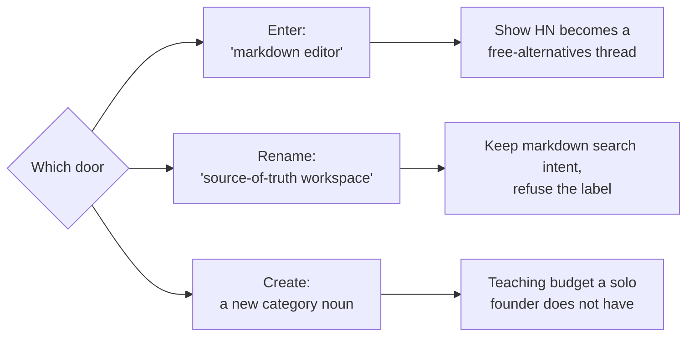

| Door | Evidence for | Evidence against | Verdict |
|---|---|---|---|
| **Enter** "markdown editor" | Highest search intent; the substrate's own download volume proves the audience exists — `js-yaml` 1,228,031,655, `gray-matter` 35,782,970/mo `[fetched]` | Every Show HN named "markdown editor" becomes a thread of free alternatives (§26). The price floor is $0 and well-maintained: AppFlowy 76,040★, AFFiNE 71,976★, SiYuan 46,023★, Logseq 44,669★, Outline 40,362★, Trilium 37,624★, Docmost 21,501★, all pushed within 24h `[fetched]` | **Reject as a label** |
| **Rename** to *source-of-truth workspace* | The category winners all renamed: Obsidian sold *ownership*, Notion a *workspace*, Linear *speed* (§26). Keeps "markdown" as the substrate noun, so search and plugin-directory intent survive | A two-hop name costs one sentence of teaching in every conversation | **Recommended** |
| **Create** a new category noun | §3.2 names the empty box explicitly: *"the rendered, evolving AI-output document — open — the category to name"* | Category creation is a paid activity. Solo throughput is ~**1 substantial shipped surface per 2–3 weeks** (§53) and exactly **two posts have ever shipped**, one with a visible defect since 2026-08-10 `[measured]` | **Defer** |

**Recommendation: rename, do not create.** Be findable inside the markdown category — the "Open in frontmatter" plugin, npm, docs-tool comparisons — and refuse the category *label* in every headline; Relay proved the bridge-plugin path with 172,544 downloads of a commercial service's plugin `[SS]`.

- **Strongest counter-argument, stated in full.** A renamed category is an unrecognised category, and an unrecognised category has no search volume, no G2 grid, no budget line and no comparison page to rank against. The buyer must name the outcome to get it approved (§21), and "source-of-truth workspace" is a *mechanism* dressed as an outcome. The counter-argument is not defeated by evidence — it is answered by sequencing: lead with the mechanism to the beachhead who can verify it, and let the *outcome* line ("one file that is editor, AI workspace, rendered surface and audit trail") do the work in every asset aimed at anyone else.
- **Falsifier.** If, at post-20, prospects cannot repeat the category noun back unprompted, drop the noun entirely and ship a category-of-one description: *"it is where the file, not the app, is in charge."*

### 64.4 Objection handling

| # | Objection | Raised by | What we concede as true | The honest answer, with evidence |
|---|---|---|---|---|
| 1 | **Why not just Obsidian?** | Prosumer, ICP 1 | It is better than us at plugins, graph, mobile and community, and it is the vault we integrate with — never the competitor we name (§26) | Obsidian is single-player by design: no review loop, no provenance, no fidelity proof `[measured]` §3.1. Its own community proves the missing piece — the Homepage plugin has **1,294,057 downloads**, ~20× every bespoke dashboard plugin, and no product ships that natively `[fetched]`. We are the review-and-proof layer over the vault you keep |
| 2 | **Why not Notion?** | ICP 2, ICP 4 | Notion is better at databases-as-views, onboarding and team defaults, and we will never be a Notion-style PM tool (§6.2, founder boundary) | In Notion the view *is* the data and export is lossy by architecture `[SS]`; formulas cannot aggregate across rows; Coda's export returns disconnected strings with formulas stripped `[SS]`. Price behaviour is the second answer: free AI cut to 20 responses *for life* and Business up ~20% `[SS]` §2 |
| 3 | **This is a feature, not a product.** | Investor, senior engineer | As a *capability*, yes — a byte-exact writer is a library. Conceding this is more credible than denying it | The product is the loop the capability makes possible: projection, review and provenance all require it and none exists without it. The three teardowns show the bolt-on route fails — Front Matter CMS builds a comment-preserving Document object **and throws it away** `[measured]`. Joint verdict: the failure is architectural, not a library choice §19 |
| 4 | **You are one person.** | Every buyer | Fully. It is the binding constraint on the whole document (§53): ~1 shipped surface per 2–3 weeks, and support, incidents, invoicing and patching do not compress with skill | Three structural answers, none of them "trust me": the substrate is the file, so leaving costs you nothing (§27 rank 7, the anti-moat, priced in deliberately); the shutdown promise is written and public (§48); and the leverage is measured — 124 SKILL.md automations, 24,539 complexity-gate decisions, 5,014 trace rows, 69 gate scripts, 149 bin tools, and 10 complete multi-surface campaign episodes built in about a week `[measured]` |
| 5 | **Markdown is for developers; my team won't write it.** | ICP 2, ICP 3, ICP 4 | Largely true for authoring. This is why the surface is deliberately simple and why the projections exist at all | Nobody on the team writes markdown — they drag a card, pick a date, accept a suggestion, and the splice writes the file (§5). The markdown is the *storage*, exactly as SQL is storage for a CRM. Anti-answer we must not give: "markdown is easy, they'll learn." They will not, and saying so loses the room |
| 6 | **I already have Cursor / Claude Code.** | ICP 1, the sharpest objection in the list | It edits markdown well, agent-markdown is now **commodity** (§3.2: obsidian agent-skills 47,418★, the skills CLI at 9.3M downloads in one week `[fetched]`), and **§3.2 says explicitly: do not position here** | Cursor's provenance evaporates at accept — the AI/human distinction is lost forever after `[SS]` §2 problem 4 — and its attribution is *admin telemetry*, not something in your file that your reader can see. Our claim is narrow and defensible: byte-anchored, document-portable, reader-visible provenance (§58). Second answer: Cursor is a code editor whose users are engineers; the document your CEO reviews does not live there |
| 7 | **Seven free self-hosted alternatives sit at 21K–76K stars. Why pay?** | ICP 1, ICP 4 | The price floor is genuinely **$0** and those projects are actively maintained `[fetched]` §3.1 | Every one of them regenerates the file. Zero of them certify cross-engine degradation, and the *testing* layer already monetises where the data layer stays free — Litmus at $500/mo is the proof `[SS]` §3.2. Pricing follows: INR 299 / USD 5 Pro is priced against $0, and the money is $20–40/editor seat in teams (§21, §26) |
| 8 | **Git already gives me history, diffs and review.** | ICP 1 | It does, and we build on it rather than around it — sync is git-merge plus a splice journal plus compare-and-swap, never a CRDT | Git's three-way merge preserves CRLF and a missing final newline exactly, and refuses where a splice writer would want to refuse `[measured]` §58 — that is a compliment, and it is also the gap: git diffs *lines*, not the byte range one agent touched, and it cannot tell you which change was the model's. Non-engineers do not review in a PR |
| 9 | **An incumbent ships this next quarter.** | Investor | The engine work is hard but finite and increasingly LLM-assistable. §27 gives the fidelity moat **18–36 months** and the certificate **12–24** — not forever | Incentives point elsewhere: Notion toward blocks, OpenAI toward artifacts-as-output (it **removed** Canvas in May 2026 `[SS]`), Google toward Docs, OpenKnowledge toward the team wiki (§3.3). The honest framing is a window, not a fortress — and the sequencing law says the differentiation tracks must land inside 6–12 months |
| 10 | **Nobody has paid you anything.** | Investor, and the hardest to answer | **True and unmitigated: zero paying users.** Developers are the hardest freemium audience — median dev-focused free-to-paid is **5%, half the non-dev rate** `[fetched]` §4 | Do not argue. State the arithmetic and the test: 1,000 free developer signups × 5% × USD 5 = **USD 250/mo** `[derived: 1000 × 0.05 × 5]`, which is why the revenue centre is self-serve teams, not Pro. The pain is evidenced (GitBook's dominant complaint cluster is reliability and lost work `[SS]`); the *willingness to pay a premium to avoid it* is the single biggest risk in this document and is stated as such in §4 |

**Two rules for using this table.** Lead every answer with the concession, because the concession is the only part the sceptic did not expect. And when an objection has no answer — objection 10 today — say so and name the test that would produce one; §58's whole discipline is that a claim we cannot re-derive is worse than silence.

### 64.5 Claims we may not make

Inherits every row of §58 unchanged. This section adds the positioning-specific bans, because a marketing sentence is where an honest engineering number goes to die.

| Banned | Why | Sanctioned substitute |
|---|---|---|
| *"AI can't corrupt it"*, "corruption-proof", "AI-proof" | Absolute-safety claim; the corpus proves **did not**, never **cannot**. This is the §26 Funnel-1 line as written — log the clash in §57 | *"0 corruption and 0 throws across 8,513 third-party files from 7 vaults, re-verifiable"* `[measured]` |
| "Lossless", bare | Unqualified, it claims the whole surface; today there are **83% publish-refusals from one YAML defect** `[measured]` | *"Byte-preserving on every edit it accepts — and it refuses rather than guessing"* |
| Any fidelity or coverage **percentage** | §58: at the measured refusal rate the headline number is false until NF-1 and NF-3 land | The absolute counts, with the corpus named |
| "First", "only", "the first AI attribution" | §58 and §6.2 — one such claim was already caught and refuted | *"The first markdown editor with byte-anchored, document-portable, reader-visible provenance"* — the narrow form, and only after one more verification round |
| "Audit-ready", "compliance-grade", "SOC 2" | No SOC 2, no attorney review, no auditor has seen the artefact (§51, §53). Vanta and Drata charge **$7,000–$30,000/yr** for the thing this phrase implies `[SS]` | *"The file is its own audit log: every change carries the byte range and the actor"* |
| *"Replaces your $1,163/mo stack"* | §21 explicitly: quote the range, never only the top. The honest light stack is **$78/mo** — a **14.91×** spread `[derived: 1163 ÷ 78 = 14.91]` | *"Teams replace somewhere between $78 and $1,223 a month of tooling with this — here is the arithmetic for both ends"* |
| **"Markdown editor"** as the category noun | Every Show HN with that name becomes a thread of free alternatives (§26) | *"Source-of-truth workspace"*, with markdown named as the substrate |
| *"It learns how you write"* | §58 — never market a learning loop before a decision demonstrably bends on real data | Say nothing about learning |
| Any `[SS]`-tagged number, in any public asset | **47 remain in this document's inherited material** | Re-derive it, or cut the sentence |

### 64.6 What the name must communicate

The naming decision and the positioning decision are one decision, because they split the teaching load between them. A coinage (`stetfile`) teaches nothing on sight, so the one-liner must carry the entire category — which is affordable only because the beachhead can verify the mechanism themselves. A retained "Frontmatter (Studio)" teaches the substrate instantly but costs the *"not the VS Code one"* tax in every conversation forever, against an incumbent at **80,605 installs** and **2,539 stars** read 2026-08-29 `[fetched]`.

| # | The name must… | Source | Test | `stetfile` | "Frontmatter Studio" |
|---|---|---|---|---|---|
| 1 | Name the **guarantee**, not the format | §52.2 — naming from the format ages with the format | Is it still right if the substrate stops being markdown? | Yes — *stet* = "let it stand" | No |
| 2 | Survive being **said aloud** in support | §52.2 — the `-wright/-write/-right` hazard that killed `bytewright` | Spell it once over a call | Yes | Yes, but requires the qualifier every time |
| 3 | Be free on **npm and GitHub with zero named repos** | §52.2 `[measured]` | Re-run the 404 probe **on registration day** — nothing reserves them | npm 404, GitHub 404, 0 repos | Handles free only in qualified form |
| 4 | Not force a permanent **disambiguation tax** | §52.3 | Count the words spent explaining the name per conversation | 0 | ≥1, forever |
| 5 | Not collide in the **adjacent market** | §52.2 | Search the product space, not just the registry | Clean; but bare `stet` collides with `stetmark`, npm-published **2026-08-05**, **5,753 dl/mo** `[measured]` | Direct collision, same keyword space |
| 6 | Carry the **category rename** of §64.3 | §26 | Does the name make "editor" the obvious next word? | No — good | Yes — bad; "frontmatter" is the generic name of the substrate (§27 rank 5) |

- **Recommendation, unchanged from §52: `stetfile`, with `stet` as the spoken shorthand and the CLI verb.** Positioning consequence: the one-liner must then do all the category work, so the sanctioned form in §64.2 becomes load-bearing copy rather than a tagline.
- **Anti-recommendation.** Do not ship bare "Frontmatter" while quietly holding qualified handles — §52.3 rates that the highest-risk option with extra steps. And do not spend on domain, logo or launch copy before a trademark attorney's knock-out search; §52.4 is explicit that handle availability is a different question in kind from mark rights.
- **Falsifier.** A clean knock-out search on the incumbent's class overlap flips the decision to "Frontmatter Studio", because a taught name costs more than a qualifier — and if that happens, pillar order in §64.2 does not change, but the one-liner sheds its category-teaching job and can shorten to *"The file survives the edit."*

---

## 65. The markdown thesis — every role the format plays

### 65.1 The six roles, in escalating order

Each role is enabled by a mechanism CommonMark already defines, and each is permitted to fail back into the role below it. No role above 1 may introduce a token the floor does not already contain.

| # | Role | The file is… | Enabling mechanism | Fails back to |
|---|---|---|---|---|
| 1 | **Document** | prose a stranger reads | CommonMark 0.31.2 (2024-01-28) block grammar plus the four GFM extensions every certified engine implements: tables, task list items, strikethrough, autolink literals `[fetched]` `[inference]` | — (the floor) |
| 2 | **Schema carrier** | typed data a machine parses | A YAML block delimited at byte 0 — one contiguous range whose boundaries are computable without running an inline parser `[inference]` | 1, as an `<hr>` and an `<h2>` |
| 3 | **Projection driver** | its own view definition | The three-slot rule: `render:` switch in frontmatter, spec in a fenced `fm-view` lane, data in body constructs that already degrade `[measured]` | 1, as a code block plus an outline |
| 4 | **Agent contract** | the interface a model writes through | Path is identity; `base_version` enforces read-before-patch; every edit is a splice against `baseSha` and arrives as a hunk | 2, as an unmerged suggestion sidecar |
| 5 | **Ledger** | an append-only record of what happened | Append-only body sections plus a splice journal; C2PA A.9's front-matter manifest form carries a single byte exclusion range with start and length **in bytes** `[fetched]` | 1, as dated headings |
| 6 | **Application substrate** | the program's config, state and control surface | Frontmatter-typed instruction files read by a runtime: 124 `SKILL.md` across 27 category dirs, 69 gate scripts (33 `assert-*` + 34 `break-*` + 2 harness meta), 147 executables in 21,481 lines `[measured, 2026-08-29]` | 5, then 1 |

**Role 1 — document.** The floor is not "CommonMark" in the abstract; it is 0.31.2 plus exactly four extensions, and everything past those four is a profile feature that must be degradation-certified before a projection may depend on it `[inference]`.

```markdown
## Decision — vendor @lezer/markdown

~~Deferred to Q4.~~ The repository moved to https://code.haverbeke.berlin —
147 stars, one maintainer, and the only JS parser with exact inline-mark
offsets *and* incremental reparse.

| Option        | 56 KB reparse | Inline offsets |
|:--------------|--------------:|:---------------|
| full          |      16.88 ms | yes            |
| incremental   |       4.71 ms | yes            |

- [x] Read the licence
- [ ] Budget a quarter for owning the fork
```

**Role 2 — schema carrier.** CommonMark 0.31.2 contains the strings "front matter" 0×, "frontmatter" 0×, "YAML" 0× and "metadata" 0×; the GFM spec contains the same three at 0× `[measured]`. **Every typed-data mechanism available to this product is therefore out of spec, so the only real choice is between profiles that degrade well and profiles that degrade badly** `[inference]`.

```markdown
---
title: Vendor @lezer/markdown
status: doing
due: 2026-09-30
tags: [engine, parser]
fm.profile: adr
fm.version: "1"
---
```

**Role 3 — projection driver.** A single key `render: board` degrades to `<hr><h2>render: board</h2>` in marked 16.4.2, markdown-it 15.0.0 (commonmark preset) and commonmark 0.31.2 — a setext H2 that outranks the document's own H1 in every non-frontmatter-aware renderer `[measured]`. Cost is linear in key count: 4 keys ≈ 60 characters of H2 junk, 12 keys ≈ 180 `[derived]`.

````markdown
---
render: board
---

```fm-view
group: heading
columns: [Todo, Doing, Done]
card: {title: text, badge: due}
```

## Doing
- [ ] Vendor @lezer/markdown
````

**Role 4 — agent contract.** The protocol carries the identity and the version explicitly because both failures are documented: on claude.ai, where identity is inferred from phrasing, "it made a new artifact instead of updating mine" is the top documented failure, and `base_version` structurally kills the drift bug where a user hand-edits while the model keeps talking about the version it remembers.

```text
land({ path: "docs/adr/0007-vendor-lezer.md",
       type: "adr",
       title: "Vendor @lezer/markdown",
       body_md: "…",
       base_version: "sha256:…",
       mode: "patch",
       source: { tool, model, conversation_url, session_id } })
  → { LANDED | VERSIONED | REFUSED_CONFLICT | NEEDS_TARGET,
      path, version, url, bytes_written, cert }
```

**Role 5 — ledger.** C2PA's A.9 structured-text binding is line-for-line a byte-splice contract — fixed `-----BEGIN/END-----` delimiters modelled on RFC 4880 §6.2, files read in binary mode "to preserve the exact byte representation of line terminators", a claim generator that "shall **not** alter the line ending convention of the file content outside the manifest block", and at most one block per file `[fetched]`.

```markdown
> [!DECISION] Vendor the parser
> Accepted 2026-08-29. Supersedes ADR-0004.

## [1.2.0] - 2026-08-29
### Changed
- Splice writer returns a typed refusal instead of a bare `src`.

-----BEGIN C2PA MANIFEST-----
<base64 manifest, hashed over a single byte exclusion range>
-----END C2PA MANIFEST-----
```

**Role 6 — application substrate.** The instruction file is the program: frontmatter declares identity and invocation policy, the body is the contract, and a separate gate script asserts the contract held.

```markdown
---
name: sgnk-complexity-gate
description: Route a task by shape before any model call.
disable-model-invocation: false
---

## Contract
Emit `{tier, mode, rule2_gated}` and nothing else.

## Gates
- `assert-*.sh` — refuse if the routing distribution moves off baseline
- `break-*.sh` — prove the assertion can fail before trusting a green
```

### 65.2 One file, six roles

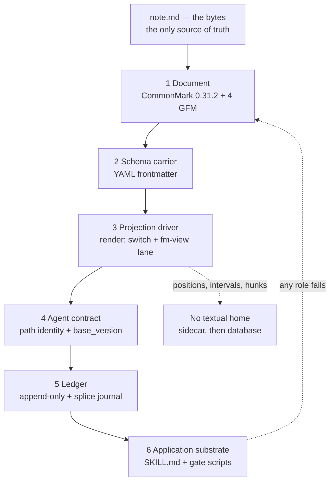

### 65.3 The maximisation table

| Role | What we exploit | The ceiling | Measured evidence for that ceiling |
|---|---|---|---|
| 1 Document | The floor renders everywhere with no configuration; degradation is a property of block-level constructs, not of our code | No block containers, no colspan or rowspan, no auto-numbered cross-references, no multi-column reading order | Pandoc grid tables degrade to `<p>+------+------+ \| Fruit\| Note \|…</p>` `[measured]`; `{#fig-plot}` leaks as visible text after the image `[measured]`; GFM's own normative text: "Block-level elements cannot be inserted in a table" `[fetched]`; nested `:::` columns collapse into one run-on paragraph `[measured]` |
| 2 Schema carrier | One contiguous range at offset 0 with two fixed sentinels — the best splice target in the format; every certified engine already has a frontmatter mode or documented extension `[fetched]` | Junk is linear in key count; the key string *is* the identity, so a rename is lossy; today the parser refuses most foreign vaults | `<hr>` + `<h2>` of the first key in 3/3 engines `[measured]`; 4 keys ≈ 60 chars, 12 keys ≈ 180 `[derived]`; **83% aggregate foreign-vault refusal — 6,613 of 6,614 foreign files refused on zero-indent block sequences** `[project-measured]`; `SAFE_KEY` excludes a space, so `date created` fails in 812/957 files of one vault and CJK keys fail in 905 files of another `[measured]`; four ecosystems normalise keys four different ways — Logseq lowercases and rewrites `_`→`-`, Dataview sanitises to lowercase-with-dashes, org is case-insensitive, Notion sidesteps it entirely with an opaque `id` such as `"fy:{"` `[fetched]` |
| 3 Projection driver | Fenced lanes degrade to contained, labelled code with zero sigil leakage — the best degradation profile of any carrier tested; drags map to four typed write-backs (BODY-MOVE, KEY-SET, CELL-SET, FENCE-SET) | Only C0 and C1 lanes; a projection must be a pure function of bytes, so an LLM can never be a render lane; anything with no textual home is 100% sidecar and the render then carries none of the value | `<!--fm ... -->` is fully suppressed at markdown-it's `commonmark` preset (`html:true`) but escapes to visible `&lt;!--fm…--&gt;` at its **default** `html:false` `[measured, two runs disagreeing on which config counts as "dumb"]`; excalidraw's 7,578,223 downloads are the largest single demand number in the survey and are 100% sidecar `[fetched]`; population evidence that in-document execution does not buy reproducibility: 1,159,166 notebooks from 264,023 repositories, 24.11% executed without errors, **4.03% produced the same results** `[fetched]` (denominator discrepancy recorded, not resolved: 863,878 published vs 788,813 reconstructed → 26.41% / 4.42% `[derived]`) |
| 4 Agent contract | An edit *is* a byte range, so a proposal, a citation and a diff are the same object; the review surface accepts human, agent and sync-conflict hunks through one grammar | Acceptance, not capability, is the limit — and the only published propose-first numbers are from a small model on one narrow dialect | Ansible Lightspeed: **49.08% strong acceptance on multi-line suggestions**, Day-30 retention **13.66%** across 10,696 users / 3,910 returning (arXiv 2402.17442, pub 2024-02-27, upd 2024-10-22) `[fetched]` — a ceiling for a constrained verb, not a general rate `[inference]`; deterministic projections out-install every AI capability combined by **7.25×** (7,289,307 vs 1,005,651 peak-version installs) `[derived]` |
| 5 Ledger | Append is free and byte-safe; the record and the document are the same artifact, so provenance survives export | Ledgers do not rot at the append — they rot at the attribution field, and they go stale silently | Live AIOS trace ledger: 63 daily `.jsonl`, **5,018 rows**, of which `accepted` is non-null in **181 = 3.607%** and `skill: "unknown"` in **3,946 = 78.637%** `[measured/derived]`; `PREFERENCE-LOG.jsonl` 232 rows of which **223 = 96.121% carry no skill attribution** `[derived]`; `regression-gates.jsonl` 40 rows, last registered 2026-08-13T01:41:14Z = **16 days stale** `[derived]` |
| 6 Application substrate | A whole orchestrator runs on frontmatter-typed markdown with no database: 124 `SKILL.md`, an 892-line self-amending constitution, 69 gates, 28 hooks across 9 events, **24,669 complexity-gate rows** over 42 days = 587.357 rows/day `[measured/derived]` | Single-tenant by construction, and the substrate cannot reliably measure itself | **Zero tenancy fields** in the trace ledger and **2 of 151 files** containing any HTTP-listener code `[measured]`; `skill-health.json` (7-day window) reports **active 0, dormant 5, dead 116, infrastructure 10** while the ledger holds **446 trace rows for `sgnk-drift-watch` in the same window** `[measured]`; `calibration.json` high bucket n=26 rate 0.269 against a 0.20 bar — the drift condition is met and unactioned `[measured/derived]` |

- Recorded drift, not reconciled: the product-context figures 5,014 trace rows and 24,539 gate decisions are an earlier read of the same append-only stores measured at 5,018 and 24,669 on 2026-08-29 `[measured]`. Both stand; never publish either without its read date. The same class already sits in the record as `baselines/` at 2,382 vs 2,381 on one day.
- Anti-recommendation for the whole table: **do not promote a role because one engine handles it well.** The gate is the certificate across all seven local targets, and `uncertifiableShare()` already reports **8 of 15 declared targets (53.3%) as not locally probeable** `[measured]` — a declared row is not evidence.

### 65.4 The hard boundary as a rule a builder can apply

**The placement ladder. Stop at the first yes.**

| # | Question | Home | Literal form | Falsifying case for this row |
|---|---|---|---|---|
| 1 | Would a person reading the raw bytes want to see it, and does it survive a renderer that knows nothing about us? | **Body text** | heading, list item, GFM table cell, task checkbox, blockquote callout | An inline field inside a table cell: the same bytes have two different block structures across the matrix (GFM `<td>` vs commonmark one paragraph), so it passes the read test and fails addressability `[measured]` |
| 2 | Is it one scalar, whole-file, and does an existing ecosystem tool already read that key? | **Frontmatter**, 1–3 keys | `status: doing`, `due: 2026-09-30`, `render: board` | Every key added costs an `<h2>` line in a dumb renderer, so a rich view spec here is a degradation regression, not a neutral choice `[measured]` |
| 3 | Is it machine-shaped and whole-block — harmful as prose, but still reconstructable from these bytes alone? | **Fenced lane**, reserved info string | ` ```fm-view `, ` ```fm-query `, ` ```fm-schema ` | An unclosed fence "runs until the end of the containing block" per CommonMark §4.5, so one dropped backtick line turns the rest of a 4,000-line note into code `[fetched]` — the writer must emit open and close in one splice, never two |
| 4 | Does it have no textual home at all, and can it be deleted without changing what the document *means*? | **Sidecar** | JSON Canvas-class positions, SRS intervals, suggestion hunks, embeddings | Bases' shape is the correct one — data in frontmatter, *query* in the `.base` sidecar; inverting it breaks on rename, move and copy, and makes the `.md` non-self-describing `[fetched]` |
| 5 | Does it need identity surviving a rename, multi-writer concurrency, or a cross-file transaction? | **Database — and say out loud it is not a document feature** | — | Notion's 21 property types key on an opaque `id`, which is precisely why renaming a property there is safe and renaming a frontmatter key here is not `[fetched]`; multi-respondent form state is a database, not a file `[inference]` |

**The one-line decider: if deleting it changes what the document means, it belongs in the file; if deleting it only changes what a view looks like, it belongs in a sidecar; if it cannot be deleted at all without breaking another person's session, it belongs in a database and therefore not in this product.**

- Carrier rule that falls out of rows 1–3, unchanged from the settled position: **prose a human reads goes in a blockquote callout; opaque machine data goes in a fenced code block.** A block quote is delimited by a per-line prefix, so there is no state to leave open — the construct ends the moment the `>` stops `[measured]`. A fence is delimited by a matching close, and CommonMark §4.5 is unforgiving about its absence `[fetched]`.
- Anti-recommendation: **do not adopt the invisible HTML-comment carrier globally** on the strength of the cleaner measurement. It is clean in exactly two of the three configurations we certify, and `COMMENT-SET` is permitted only where the certificate explicitly records `html:false` visibility for that target.
- Anti-recommendation: **do not promote an inline `key:: value` field into frontmatter automatically "for queryability".** That rewrites lines the user did not edit, changes the rendered output, and is the exact behaviour that makes people distrust editors that touch their files. Dataview's own parser must resolve bracket nesting, `\` escapes and overlapping spans heuristically, and it sanitises `**Bold Field**` → `bold-field`, so the index provably cannot write back the source bytes `[fetched]`.
- Recorded disagreement, unresolved: m5 recommends **emitting `...` as the frontmatter closer**, because 3/3 dumb engines then degrade to a paragraph instead of a setext heading and pandoc explicitly permits it `[fetched]` `[measured]`; §8.4 as written supports `---` fully and says nothing about `...`. Both closers are legal on read. Do not resolve this by preference — resolve it by running the closer through the seven local targets and recording which strip-pipelines match on `---` alone.
- What falsifies the ladder: a datum that passes row 1 and is nonetheless unaddressable by a byte range surviving an unrelated edit. The table-cell inline field is already that case, which is why the ladder carries an addressability clause and not just a readability one.

### 65.5 What markdown genuinely cannot do, and what we say instead

Faking any of these is worse than refusing them, because a fake succeeds locally and fails on someone else's renderer, which is exactly where the user cannot see it happen.

| Impossible | Why, with evidence | What we tell the user |
|---|---|---|
| Merged cells | No colspan or rowspan syntax in CommonMark or GFM; pandoc's MANUAL contains **zero** occurrences of either in the markdown reader docs `[measured over fetched HTML]`. Grid tables buy spans and cost readable degradation `[measured]` | "Markdown has no merged cells. Split the column, or export to DOCX where the format does." |
| Block content inside a table cell | GFM normative text, verbatim `[fetched]` | "A list inside a table cell is a lie in every renderer but one. Put the list under the table." |
| Multi-column pages, floats, sidebars, wrapped pull quotes | No block-container syntax exists; nested `:::` collapses into one run-on paragraph and leaks two sigil lines per block in all three engines `[measured]` | "There is no reading order for two columns in a linear renderer. Use PDF layout for print, one column for the file." |
| Auto-numbered cross-references ("Figure 3") | Requires a numbering pass no dumb renderer will run; `{#fig-x}` leaks as visible text `[measured]` | "We can link to the figure. We cannot number it in a way that survives leaving this app." |
| Portable footnotes | Not in the GFM spec — `grep -ci footnote` on cmark-gfm's `spec.txt` returns **1**, an intro-prose mention; the syntax lives in `test/extensions.txt:702` `[measured]`. A footnote whose body is a *single token* is parsed as a link reference definition in **all three** engines, producing live broken links `[measured]` | "Your note body stays readable everywhere. The little superscript link does not. Give the note more than one word." |
| Spoilers and hidden text | `\|\|spoiler\|\|` degrades to the literal content, verbatim `[measured]` — a spoiler that degrades open is a defect, not degradation | "Anything you can type, a plain renderer can show. There is no hidden text in markdown." |
| Transclusion on publish | `![[Note#Heading]]` degrades to the literal brackets with the content **silently absent and no marker that anything is missing** `[measured]` | "We keep your embed exactly as written and we open it in the editor. We will not publish a page where content vanished without saying so." |
| A stable table caption position | Immediately after the table it is absorbed as a data row (`<td>Table: my caption</td>`); with a blank line it degrades readably `[measured]` | "Leave a blank line above the caption, or it becomes a row." |
| Guaranteed CJK line joining | CSS Text 3 (CR Draft, 2026-08-14) §4.1.3: a segment break "is either transformed into a space (U+0020) or removed… **The rules for this operation are UA-defined in this level**" `[fetched]` | "We can normalise our own renderer. We cannot promise GitHub's." |
| Correct word counts without a segmenter | `countWords` splits on `/\s+/` and undercounts against `Intl.Segmenter` by **20.00× on Chinese prose, 17.00× on Japanese, 12.00× on Thai, 1.19× on a markup-heavy mixed document**; ko/hi/en are exact `[measured]` | "Approximate for Chinese, Japanese and Thai" — until the segmenter ships, which is four lines and zero new dependencies |
| Sanitised HTML by default | `marked` ships no sanitiser and no URL-scheme filter: it renders `<script>alert(1)</script>` verbatim and `[click](javascript:alert(1))` as a live href; `markdown-it` refuses dangerous schemes even at `html:true` `[measured]`. GFM's `tagfilter` filters exactly nine tags and states "All other HTML tags are left untouched"; GitHub compensates with private post-processing `[fetched]` | "The spec is not a security boundary; the platform is. Any 'renders like GitHub' claim excludes GitHub's private layer." |
| Round-trip-exact pipes and tabs | `\|` in a cell renders `|`, and CommonMark treats tabs "as if they were replaced by spaces with a tab stop of 4" `[fetched]` — semantically equal, byte-different | We state which one the splice engine preserves, in the refusal text, at the byte offset |
| WCAG AA out of the box | §5.2 makes AA all-or-nothing `[fetched]`; measured against this repo: **11 of 14 images with empty alt = 78.6%**, no `<caption>`/`scope=`/`<colgroup>` on GFM tables, **35 heading-level skips**, **5 of 186 files with more than one `<h1>`**, no `lang=` and no `dir=` from `marked`, no accessible name on task-list checkboxes `[measured]` | "Conformance is something the publisher adds. It is never something the format supplies." And never image-rendered math — that is 1.1.1 with a text alternative you cannot generate |

- Anti-recommendation: **do not build an auto-fixer that silently normalises ambiguous indentation, reference-link placement, or a bare-CR line ending.** Reference links are non-local — CommonMark's own author writes that `[foo][bar]` has four possible meanings "depending on whether the references… are defined elsewhere (perhaps later)" and that this makes "accurate syntax highlighting nearly impossible" `[fetched]`, confirmed locally as three different renderings of one source `[measured]`. C2PA A.9 says convert bare CR; we have committed not to silently mutate bytes, so the honest behaviour is refuse and cite the code.
- The refusal is only honest if it is typed. Live baseline at commit `9e84628`: `spliceFrontmatterValue` and `spliceFrontmatterKey` both return a bare string across **20 `return src` sites**, so a refusal is byte-identical to a successful no-op `[measured]` — while `mdmax` already emits 32 uppercase symbols, 13 verdict classes and **19 typed failure codes** `[derived]`. Refusal text without a reason code and a byte range is not a refusal; it is silence.

### 65.6 The strongest argument this thesis over-reaches, and the answer

**The argument, at full strength, using our own numbers.**

1. Five of the six roles are being carried today by a purpose-built store that carries them better. Notion's property model has opaque ids and therefore safe renames; a database has transactions; a queue has multi-writer semantics. Markdown has a key string.
2. The substrate has only ever met its author. The trace ledger has **zero tenancy fields** and **2 of 151 files** contain any HTTP-listener code `[measured]`. Roles 5 and 6 are not demonstrated at scale; they are demonstrated at n=1, on one machine, with one writer and no concurrency.
3. It cannot measure itself. `skill-health.json` reports **active 0 / dead 116** while the ledger holds **446 rows for one of those "dead" skills in the same window** `[measured]`. **78.637%** of trace rows carry `skill: "unknown"` and **96.121%** of preference rows carry no attribution at all `[derived]`. A system whose own instrumentation disagrees with its own record is not evidence for a thesis about durable records.
4. Role 2 does not survive contact with strangers. **83%** of foreign vaults refuse today, on a single YAML defect `[project-measured]`. Every fidelity number in the document is false until that lands.
5. The certificate that is supposed to police all of this is itself half-blind: **8 of 15 declared targets (53.3%) are not locally probeable** `[measured]`, and the shipped preview scores **439/652 = 67.3%** on CommonMark 0.31.2 against a bare remark pipeline's **498/652 = 76.4%** `[measured/derived]` — certifying seven engines against a preview less conformant than the engines it certifies is not a certificate.
6. Therefore: the thesis is a description of one person's workflow, generalised past its evidence.

**The answer. Three concessions first, because they are correct.**

- Points 3, 4 and 5 are conceded without qualification, and they are already the queue: NF-1, NF-3 and NF-4 are R0 work, the preview conformance fix is gated *before* any render profile ships, and the corpus gate is pinned and red-proofed at 8,513 files. Point 2 is conceded and settled the same way — §15 answers "sell the orchestrator" with **No**, on exactly the tenancy evidence the argument cites. The internal system ships only the artifact-facing half: an asset ships if its output is a fact about the user's file, and stays internal if its output is a claim about the software's own intelligence.
- Point 1 is conceded on capability and rejected on framing. The thesis has never been "markdown can do everything". It is narrower and testable: **the file is the only source of truth, and every role above role 1 is either a deterministic projection of those bytes or a sidecar that can be deleted without changing what the document means** — which is why the placement ladder ends at "database, and it is not a document feature" instead of pretending otherwise.
- Point 6 is where the argument actually fails, and it fails on evidence that arrives from outside the thesis. Across 7,020 plugins with stats, deterministic projections take **7,289,307** peak-version installs against **1,005,651** for every AI capability combined — **7.25×** `[derived]` — and **697 of 7,058 plugins (9.9%) describe an AI capability but take 3.44% of the peak-version sum** `[measured]`. The largest file-native editor in the category ships **zero occurrences of the token "AI" across 9,502 characters** of its full roadmap back to July 2023, and what it did ship is data in local markdown properties with views described in valid YAML `[measured]` `[fetched]`. Role 3 is not an extrapolation from one machine; it is the single most-installed thing in the category, arriving at the same design independently.
- The remaining role-6 claim is deliberately not the product claim. The orchestrator is evidence that markdown-typed instruction files scale to a working system — 124 `SKILL.md`, 69 gates, 24,669 gate decisions over 42 days `[measured]` — corroborated externally by `CLAUDE.md` appearing in ~774,144 indexed files and `agents.md` at 23,968 stars, `spec-kit` at 132,035 `[measured/fetched]`. It is not evidence that the same substrate is multi-tenant, and the document never claims it is.

**What would actually falsify the thesis.**

| Role | Falsifier | Status |
|---|---|---|
| 1 Document | A majority of the 7 local targets fail one of the four GFM core extensions on a realistic corpus — the floor then drops to bare CommonMark and tables become a profile feature | Not tested at that framing |
| 2 Schema carrier | NF-1 lands and the foreign-vault refusal rate does not move materially off 83%, meaning the defect was never the single cause | Queued R0; the 83% is the number the fidelity claim rests on |
| 3 Projection driver | Obsidian ships a first-party board with splice-clean write-back before we do; item 1 of the v1 ranking loses its rationale entirely | Live risk — Bases shipped natively while obsidian-kanban's repo last moved 2026-03-06 `[fetched]` |
| 4 Agent contract | Transformation verbs fail to clear 20% strong acceptance in the first 90 days, or the top unmet request six months after Lane A is still "run my Python here" rather than "query my vault here" | Instrumented, no data yet |
| 5 Ledger | Attribution stays below ~50% after the trace schema is fixed, proving the rot is structural to file-based ledgers rather than to one implementation | 3.607% accepted, 78.637% unattributed today `[derived]` |
| 6 Application substrate | ≥1 tenant field in the schema, ≥1 non-self paying customer, and ≥10,000 chained ledger rows — **all three, not any one** — which would falsify the decision *not* to productise it | None of the three met |

- Anti-recommendation for this section: **do not quote any of these numbers in public without re-deriving them at write time.** The record already contains the failure — "90% floor" appears in two internal documents while live is 95.1194% at n=24,669 `[derived]`, and "110 daily trace files" appears in three prior grounding documents while the daily ledger is 63 files, because the 110 counts 46 `.lock` files and a `steps/` subdirectory `[measured]`. A thesis this dependent on measurement is falsified fastest by its own stale citations.

---

## 66. What we still do not know

### 66.1 The count, measured here

| Measurement | Value | How |
|---|---|---|
| Document size | **5,092 lines · 100,114 words** | `wc -lw` [measured] |
| `[SS…]` tags, whole file | **81** | `grep -o '\[SS[^]]*\]'` [measured] |
| — in the body, lines 1–4898 | **64** | [measured] |
| — inside §55 itself, lines 4899–4963 | 15 | [measured] |
| — after §56 (§58 row, closing line) | 2 | [measured] |
| Body tags that are *references to the tag*, not claims | 6 | lines 80, 100, 955, 1192, 1347, 4676 [measured] |
| **Claim-bearing `[SS]` tags** | **58** | 64 − 6 = 58 [derived] |
| Tag variants beyond bare `[SS]` | 8 | `[SS/fetched]` · `[SS, vendor-sourced]` · `[SS, unverified]` ×2 · `[SS, August 2026]` · `[SS 2026-08-29]` · `[SS — must not be published as fact]` · `[SS — the CBIC notification page was not opened…]` [measured] |
| Full live census | `[fetched]` 874 · `[measured]` 465 · `[derived]` 198 · `[inference]` 144 · `[SS]` 81 | [measured] |

All 58 claim-bearing tags were read and classified; no sampling was necessary [measured].

**This document gives three different answers for its own `[SS]` count — §55 says 52, §58 says 47, and the file contains 58 — and none of the three is the one a reader would arrive at.** Deltas: 58 − 52 = 6, 58 − 47 = 11 [derived].

The 52 is traceable. §55's opening census — `[fetched]` 86 · `[SS]` 52 · `[measured]` 50 · `[derived]` 9 · `[inference]` 1 — is the census recorded at `docs/research/agent-reports-2026-08-29-r11/c1-research-gap-audit.md` line 8, which measured a PRD of **1,551 lines / 20,174 words** [measured]. This document is **3.28× the lines and 4.96× the words** of the one that census describes [derived: 5,092 ÷ 1,551; 100,114 ÷ 20,174]. The row was inherited, not re-derived — the exact failure §41 and §57 exist to prevent.

---

### 66.2 The existing register describes a document that no longer exists

| §55 claim | Status in the v2 body (lines 1–4898) | Evidence |
|---|---|---|
| §55.2 #1 Princeton GEO "25–40% visibility lift" | **Absent.** `Princeton` = 0 hits | [measured] |
| §55.2 #9 "Perplexity Pro free via Airtel to ~400M, worth ₹17,000/yr" | **Absent.** `400M` = 0, `17,000` = 0 | [measured] |
| §55.2 #11 Dataview "~30s past 3,000 notes" | **Absent.** `3,000 notes` = 0 | [measured] |
| §55.2 #12 r/ObsidianMD ~344,000 / Discord ~195,000 | **Live and still untagged**, §26 line 2519 | [measured] |
| §55.3 "never researched": accessibility, DR, sync, API, roles, i18n, desktop, analytics | **Mostly closed by R12.** `RPO` 35 · `RTO` 24 · `WCAG` 22 · `rate limit` 9 · `PostHog` 5 · `takedown` 4 · `moderation` 4 · `screen reader` 3 · `service worker` 2 · `privacy policy` 2 · `schema version` 1 | [measured] |

The register is stale in both directions: it warns about three claims that were deleted and under-counts the live ones by six, while its "never researched" list names fourteen areas that now carry their own sections. Treat §55 as a historical artefact of PRD v1.1 and this section as the live one.

- **Anti-recommendation:** do not delete §55. It is the record of what was true on 2026-08-29 and deleting it destroys the audit trail that makes this drift visible. Mark it superseded, keep it, and point §55's header at §66.

---

### 66.3 The closure ladder

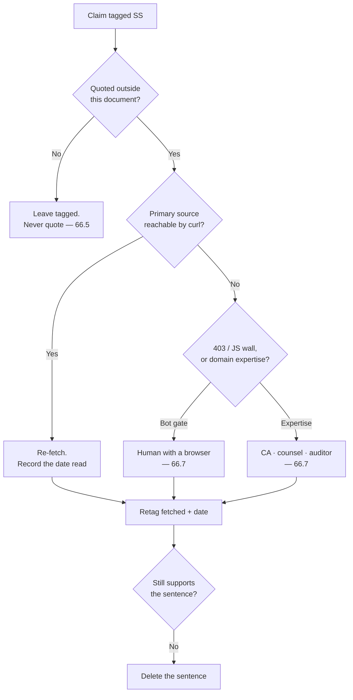

The ladder's only non-obvious rung is the last one. A claim that survives re-fetching may still fail to support the sentence it was written into — the Pimentel notebook figure carries a specific reproducibility definition, and the sentence in §5 does not state which one [inference].

---

### 66.4 Load-bearing, ranked by risk if wrong

Rank = (money or legal exposure) × (irreversibility) × (would be quoted). Costs are [inference] unless tagged otherwise.

| # | Claim | § | Why it matters | What would close it | Cost | Risk if wrong |
|---|---|---|---|---|---|---|
| 1 | Export-of-services zero-rating · LUT vs pay-and-refund · "convertible foreign exchange" · reverse charge on imported services (LLM APIs, hosting, MoR fees) | §51.2, L4756–4758 | Decides whether every export invoice is zero-rated or carries IGST. `cbic-gst.gov.in` **failed TLS and 404'd on every IGST-Act path** [measured] | A chartered accountant's written opinion **with the MoR contract in front of them** | ₹15,000–₹50,000 + one meeting | Retrospective IGST + interest + penalty on every invoice since the first. It also changes the MoR choice, which §53 makes a hard gate before the first paid signup |
| 2 | E-invoicing threshold AATO > ₹5 crore, sticky across FYs · ₹20 lakh services registration threshold · FEMA/EDPMS closure and FIRC/BRC per remittance | §45, L4287 · L4314 · L4293 | §45 derives the crossing at ₹5,000/customer/year ≈ ₹417/month [derived]. The CBIC notification page was never opened | Same CA engagement; ask for it in the same sitting | Included above | Missed e-invoicing is a penalty regime, not a correction. Missed EDPMS closure blocks future inward remittance |
| 3 | India IT Rules 2021: the "50 lakh" significant-social-media-intermediary threshold | §44, L4119 | The Rules defer to a Central Government notification that **is not in the Rules** (Rule 2(1)(v)) [fetched]. Whether a one-to-many publishing tool is a "social media intermediary" at all is [inference] | Indian counsel, one written note covering Rule 2(1)(v), 2(1)(w) and the 24-hour acknowledgement duty | ₹40,000–₹1,20,000 (itself `[SS, unverified]`, §44 L4194) | D15 ships publish either under obligations that do not apply, or without ones that do |
| 4 | EU Art. 13 representative €200–€500/month · Indian counsel ₹40,000–₹1,20,000 | §44, L4194 | §53 makes the EU representative a **date-gate before the first EU free signup**, not an effort-gate | Two written quotes | One week of email; free | A recurring cost line that gates launch, budgeted from a search summary |
| 5 | "International gateways without UPI lose 30–40% of Indian checkouts" `[SS, vendor-sourced]` | §24, L2441 | Chooses Razorpay over Paddle / Lemon Squeezy. §53: migrating billing counterparties mid-flight **breaks the FEMA paper trail** | Razorpay's or NPCI's own published funnel data; failing that, decide the rail on the FEMA/MoR question and demote this to a prior | 1 hour | An irreversible rail chosen on a vendor's own marketing number |
| 6 | "By month 24 the median solo B2B founder's revenue is more than 4× the median solo B2C founder's" | §21, L2221 | The two-motion strategy — D2C acquisition, B2B monetisation — rests on this one sentence. **No study is named** | Name the study and its n, or delete the sentence and keep the reasoning | 20 minutes, or free | The first investor or HN commenter asks for the source and there is none |
| 7 | "21.9M India GitHub contributors, +5.2M in a year, +35% YoY consumer app spend" | §24, L2439 | Underwrites India-first distribution and the ₹299 anchor — against §24's own [derived] finding that ₹299 needs **59.5% more paying humans** than $5 for identical revenue | GitHub Octoverse, one page | 20 minutes | The single most checkable number in the document, in the section where being wrong costs the most |
| 8 | "Zero category-specific willingness-to-pay evidence for markdown tools in India" · "India's markdown community is greenfield" · moat #1 "does not exist yet" | §24 L2439 · §24 L2339 · §27 L2546 | Three absence claims from one source. They rank the moats and sequence the market | An absence claim cannot be closed by searching. State the searches run, the date, and the languages — bound it instead of asserting it | 1 hour | Highest social blowback per word: one reply from someone who runs the thing you said does not exist |
| 9 | Support deflection "18% median, 40–60% with AI, $25–35/ticket" | §21, L2227 | Prices ICP #3 at $99–249 per knowledge base | Open Zendesk's, Intercom's and Document360's own published benchmarks | 1–2 hours | Goes into B2B collateral aimed at three vendors who publish their own, different numbers |
| 10 | "Vanta and Drata charge $7,000–$30,000/yr for continuous audit trails" | §21, L2235 | The ROI headline of the audit-trail wedge | Two pricing pages | 15 minutes | Two named vendors' prices, misquoted in a sales deck |
| 11 | Code-signing: hardware-token surcharge +50–150 USD, DigiCert token +120 · max validity drops to **460 days from 2026-03-01** · DigiCert stops 2- and 3-year code-signing certs **from Feb 2026** | §39, L3734 · L3749 | §39 already records that all Windows cert prices are reseller quotes and SSL.com's product pages **404'd through curl** [measured]. If the two deadlines are real, multi-year prepayment is no longer a lever | A CA's own pricing page plus the CA/Browser Forum ballot record | 1 hour | Budgeting a cost lever that has already expired |
| 12 | "561 of 3,220 HN comments" — sync silently destroys data | §2 #2, L174 | Problem #2, the headline pain, and the justification for T0 being the first customer-visible lane. The cell carries **`[SS]` and `[fetched]` simultaneously** [measured] | Resolve to one tag; publish the query, the date window and the classifier | 2 hours | The product's stated reason to exist is tagged two ways in one table cell |
| 13 | CommonMark "0.31.2, released 2024-01-28; still the current release as of 2026-08" | §8, L445 | The spec floor the entire substrate is defined against | `commonmark.org`, one fetch | 5 minutes | Building the floor against a superseded version |
| 14 | "Under 4% of GitHub notebooks reproduce" (Pimentel 2019) | §2 #5 and §5 (3 body occurrences) | §5's survivors-and-traps table — the projection law's clearest external evidence | Open the paper; quote its reproducibility definition alongside the figure | 30 minutes | LR#72's exact class: a specific figure, a specific paper, a specific definition, never opened |
| 15 | "OpenAI **removed** Canvas in May 2026" | §3.1, L205 | §3.3's structural hedge against chat-to-artifact rests on it | OpenAI's changelog or release notes | 15 minutes | A falsifiable claim about a named company carrying a structural argument |
| 16 | "Notion cut free AI to 20 responses *for life* and raised Business ~20%; Microsoft's +43% Copilot bundling drew a CMA probe" | §2 #8, L180 | §24.8's pricing-promise section | Notion's pricing page and the CMA case page | 30 minutes | Names a regulator and two competitors' pricing, inside a section whose argument is that *they* misstate things |
| 17 | "Relay proved the path with 172,544 downloads of a commercial service's bridge plugin" | §26, L2525 | The "Open in frontmatter" plugin is named the **primary distribution play** | Obsidian's community-plugin stats JSON | 10 minutes | The distribution thesis rests on one competitor's download count |
| 18 | "GitBook's dominant complaint cluster is reliability and lost work — the gap is real today" | §27, L2547 | Moat #2's only fresh external evidence that the 18–36-month window is real | GitBook's public issue tracker and community, with counts and a date window | 2 hours | The moat duration argument loses its evidence and keeps its number |
| 19 | ADA Title III "no technical standard promulgated" · axe "covers roughly a third of WCAG issues" | §35, L3339 · L3414 | A US legal posture and the (correct) anti-recommendation against an axe CI threshold | Counsel for the first; Deque's own published coverage claim for the second | 20 min + counsel time | A legal posture stated as fact in a procurement conversation |
| 20 | `blocksToMarkdownLossy()` "is a real API name" | §6 L111, §6.2 L328 | Principle #3's entire published justification — "the market's own confession" | **Nothing.** §36 line 3463 already tags the identical fact `[fetched]`. Retag | 5 minutes | Publishing the flagship line under `[SS]` when the fetched evidence is three sections away |
| 21 | r/ObsidianMD ~344,000 / Discord ~195,000 — **untagged** | §26, L2519 | Channel sizing for the whole GTM plan | Read the subreddit header and the Discord landing page | 5 minutes | An untagged number reads as measured, which is worse than an honest `[SS]` |

- **Recommendation:** close rows 13, 15, 16, 17, 20 and 21 first. Six rows, under two hours, no professional required, and they remove the six most publicly checkable exposures.
- **Anti-recommendation:** do not close rows 1–4 by reading more. Tax and intermediary law is not a research problem with a better search query; the primary hosts already refused, and an agent's confident summary of a paywalled clause is exactly the artefact §51 exists to forbid.

---

### 66.5 Decorative — may stay unverified, may never be quoted

Each of these can be deleted without changing a single decision. Keep them as texture; never move them into a slide, a landing page, or an investor answer.

- org-mode's agenda "running since 2003, computed on the fly from date tags" (§5) — illustrative; the projection law does not depend on it.
- Obsidian Bases: "the `.base` file saves only how you want to look" (§5) — a contrast, not evidence.
- "Notion formulas cannot aggregate across rows" (§2 #5, §5, twice) — colour on a point Coda's export already carries.
- "Coda's export loses formulas, buttons, canvas properties" (§5) — same point, second vendor.
- "Notion users write ad-blocker rules against AI buttons" (§6.2) — an anecdote decorating an already-settled non-goal.
- "VS Code's own wiki names extensions the #1 performance suspect; Typora's most-requested feature has 251 votes" (§6.2) — the no-marketplace decision is settled on blast radius, not on these.
- "Granola: $1.5B valuation on template-typed capture" (§12) — a valuation is not evidence that typing at capture works.
- "Litmus at $500/mo proves the testing layer monetises" (§3) — supports an argument, not a plan.
- Lex's review loop "in development" (§3) — a competitor's roadmap; the same row's other two cells are `[fetched]`.
- "Writing editors have nothing" for byte-anchored provenance (§3) — keep as reasoning; §58 already narrows the publishable form.
- "The view IS the data; export lossy by architecture" (§3) — a category summary; the load-bearing instance is row 20 above.
- "Provenance evaporates at accept" for Cursor / Windsurf / Lex / Grammarly (§3, §2 #4) — one instance is enough and it is already triaged.
- Prince and Typst footnote support and repeating table headers (§9, two cells) — our own column is `[measured]`; theirs is decoration.
- "No PRD standard exists; the circulating SRS clause list is `[SS]` from a secondary encyclopedia page" (§14) — already fenced by §14's own refusal to publish a clause list.
- The ACM row (§42.2) — already labelled "do not cite as verified". Correct as written.
- Failed-payment recovery, 47.6% vs 12.7% (§45) — already fenced with "do not set a target from either". Correct as written.
- "No primary source for a competitor's activation threshold was opened" (§47) and "no invite-to-activation figure was reachable" (§37) — self-cancelling tags. Correct as written; these are the model.
- ₹95.4/USD (§36) — superseded by §57's live ₹95.39 / ₹95.59 [measured]. Retag or delete, do not re-verify.
- DPDP Gazette number G.S.R. 846(E) (§47) — the date (14 Nov 2025) is `[fetched, PIB]`; the number is decoration on top of it. Open the Gazette or drop the number.
- Cowlishaw's 1977 STET editor and *Stet* public-commenting software (§52) — historical colour. The collision that actually decides the name is `elberacasa/stet` shipping `stetmark` on 2026-08-05 at 5,753 dl/mo, and that is `[measured]`.

---

### 66.6 Researched by nobody

R12's fourteen agents closed most of §55.3. What remains at or near zero in this document [measured, word-boundary counts over 100,114 words]:

| Gap | Evidence | Consequence |
|---|---|---|
| **SEO for published pages** | `open graph` 0 · `meta tag` 0 · `robots.txt` 0 · `Core Web Vitals` 0 · `sitemap` 1 | Publish is half the Power tier and its discoverability surface is undesigned |
| **Transactional email and deliverability** | `SPF` 0 · `DKIM` 0 · `unsubscribe` 0 · `transactional email` 0 · `DMARC` 1 (and that hit is GitLab's backup-alarm postmortem, not our sender config) | The review surface and the conflict inbox are inert without notification; §32's own dead-man switch depends on mail arriving |
| **Browser consent surface** | `cookie` 0 · `cookie banner` 0 (`consent` 10 hits are DPDP-side) | §47's funnel is unobservable without a lawful basis stated in a banner |
| **Platform AI-disclosure norms** | §55.1: the YouTube help page returned 1,420,253 bytes of navigation chrome and no policy body | §42 cannot state what any platform requires of published AI-assisted content |
| **PRC 强制性国家标准 label syntax** | Not opened | The exact mandated text-label form is unknown; §42 must not assert one |
| **Digital Omnibus effective date** | The amending act URL returned a 404 page | The 2 Aug vs 2 Dec 2027 disagreement in §42.1 stands unresolved |

- **Anti-recommendation:** do not open a research round for these. Five of the six are configuration decisions a builder makes in an afternoon once a surface exists; only the last three need a source, and two of those need a human (§66.7).

---

### 66.7 What only a human can close

| # | Need | Why no agent closes it | Gate |
|---|---|---|---|
| 1 | **Bot-gated: ACM publications policy** | HTTP 403 to an agent, 200 to a browser [PRD §55.1] | Before §42.2's ACM row is repeated to any academic customer |
| 2 | **Bot-gated: OpenAI classifier-withdrawal post** | HTTP 403 **plus a JS wall** [PRD §55.1] | Before any claim about detector retirement appears anywhere |
| 3 | **The visual design pass — never run** | §7.4's defect is read out of `src/app/globals.css`, not seen on a screen. Browser verification was **BLOCKED**: the Next 16 + Turbopack dev server reproducibly crashed compiling the heavy workspace route across 4+ attempts over 2 sessions [measured, project memory via `research/frontmatter-raw-corpus.json`]. In the r7 naming session both WebFetch and the browser pane were session-gate-refused [measured, `agent-reports-2026-08-29-r7/x4-external-frontier-importer-naming.md:133`] | **R0.10 cannot be marked done without it.** A shipped `--accent: #18181b` with 6/8/12px radii, and a `body-faint` token failing AA, have never been looked at |
| 4 | **GST position** — export test, LUT vs pay-and-refund, convertible-foreign-exchange, reverse charge, e-invoicing, EDPMS | Chartered accountant, with the MoR contract | Before the first paid invoice (§53) |
| 5 | **DPDP + IT Rules 2021** — data-fiduciary duties, SSMI threshold, grievance officer, 24-hour acknowledgement, DMCA agent | Indian counsel + a US agent of record | Before one-toggle publish reaches the public internet |
| 6 | **Trademark clearance** | USPTO TESS, EUIPO, IP India/TMR, WIPO Madrid, unregistered common-law rights — **UNCHECKED and not checkable here** (§52.4). Handle availability is a different question in kind | Before any spend on domains, logo or launch copy, and before choosing between a qualified "frontmatter" and a coinage |
| 7 | **Domain availability, all of §52** | No registrar or RDAP host is in the sandbox allowlist — **every domain in §52 is UNCHECKED** (§55.1) | Re-run on the day of registration; nothing reserves them |
| 8 | **WCAG 2.2 AA conformance + ACR/VPAT** | Accessibility auditor | Before any B2B procurement conversation |
| 9 | **Whether an EU AI Act obligation is discharged** | The customer's own counsel. A solo founder in India must never be the party asserting EU compliance (§42.6) | Before any EU compliance language ships |
| 10 | **PRC labelling conformance** | A PRC-qualified adviser who can read the incorporated standard | Before any China-facing export claim |
| 11 | **Independent adversarial review of the engine's own verifiers** | A reviewer who did not write them — LR#60 | Before the corpus gate is cited as proof of anything |
| 12 | **The M3 two-device run** | §28.5 already assigns it to the founder: "watched by a human, recorded" | M3 |
| 13 | **D5, the two unrotated PATs** | §54: "Only you. Today" | Today |
| 14 | **Whether a stranger will pay** | §66.8 | — |

The distinction in rows 1–2 versus row 7 matters because the fixes differ: a bot gate needs a human with a browser and five minutes; the registrar block needs network access the agent does not have and cannot request. Rows 4, 5, 8, 9 and 10 need a person who carries professional liability for the answer, which is the only real reason to pay for one.

---

### 66.8 The single most dangerous unverified assumption

**That anyone outside this building will pay for byte-fidelity.**

| Test | Result |
|---|---|
| `interview` in 100,114 words | **1** — and it is Ink & Switch's Upwelling interviewees from March 2023, other people's research (§34, L3274) [measured] |
| `interviews` · `design partner` · `waitlist` · `beta tester` · `pre-order` · `landing page` · `user test` · `focus group` · `willingness to pay` | **0 each** [measured] |
| `customer discovery` · `design partner`, across all 105 reports and 374,866 words | **0 each** [measured] |
| Where a paying non-founder first appears in the plan | **M7**, the final gate: "M0–M6 green + MoR live + EU rep appointed + ToS published + one paying non-founder account" (§28.4) |
| M7 calendar date | **2027-04-28**, a Wednesday — **241 days from today** [measured: `date`; derived] |

Everything else in this register is a number that might be wrong. This one is a number that does not exist. The document contains 105 reports, seven markdown engines, 8,513 pinned third-party files, a foreign-corpus gate, a degradation certificate, three merchant-of-record analyses, an Indian tax position and an EU representative — and not one conversation with a person who might hand over ₹299. Section 24 argues at length about ₹299 versus $5 and derives that the rupee price needs 59.5% more paying humans for identical revenue [derived]. Both figures assume a numerator nobody has observed.

**Cost of being wrong:** 241 days of solo build to 2027-04-28, plus the R0 lane that §53 calls "a multi-month lane before any customer-visible feature", plus the non-recoverable spend the plan front-loads by design — the MoR before the first paid signup, the EU Art. 27 representative before the first EU *free* signup, the CA, the lawyer, the trademark attorney, the accessibility auditor. The sequencing in §53 is correct for a product with demand and is the most expensive possible ordering for one without it: every irreversible commitment lands *before* the first signal.

- **Recommendation:** put one falsifiable demand test in front of R0, not after M6. The cheapest form consistent with §58's publication ban is a page that shows the *refusal contract* — "here is what this tool will refuse to do to your file, and why" — with a paid-waitlist button, no fidelity percentage, no engine number, nothing tagged `[SS]`. That is publishable today under §58's own rules, because it markets a behaviour rather than a measurement.
- **Anti-recommendation:** do not build the demand test into the product, and do not let it reorder R0. NF-1, NF-3 and CI are correctness work that must happen regardless of what the test says, and §28.3 already puts R0.5 in the first 48 hours. A landing page that delays the engine has converted one unverified assumption into two.
- **What would falsify the recommendation:** if fewer than 20 people leave an email against the refusal-contract page in 30 days, the answer is not "market harder" — it is that the wedge is wrong and §21's two-motion strategy needs rewriting before month four, not month nine. If the test cannot be run without publishing a fidelity number, do not run it; §58's ban outranks this section.
