# frontmatter
## The product, the evidence, and the plan

> Amit — this is everything, in the order it makes sense to read it. We start with what people are actually struggling with, then what already exists in the market, then what we have that nobody else does, then what I think we should build and why. The critique is not at the end as a formality; it runs through the whole thing, because a lot of what we believed six weeks ago turned out to be wrong and I would rather you see that than be sold to. Every number here came from a source I opened myself. Where we were wrong, I have said so plainly and shown the correction.

::keyfigures
109 — research reports behind this, over 26 rounds
23.7% — of all AI complaints are about slop. Growing 149% a year
4 / 12,556 — complaints about the thing we originally planned to sell
88.6% — of the codebase already exists and works
62% — of our own load-bearing claims were wrong when checked
::

## PART I — What is actually broken

### 1. The problem, in one page

People now write a lot of their documents and code with an AI. That part works. What does not work is everything around it.

- **You cannot tell what the machine wrote.** A week later, looking at a spec or a README, nobody knows which paragraphs were typed by a person and which were generated and never read properly.
- **You cannot hand the work over.** Starting a new session means re-explaining everything. Working with a teammate means they inherit decisions with no record of why.
- **The output quality is dropping in a specific way.** People call it "slop" — technically correct, verbose, generic, and unmaintainable. It passes review because reviewing it properly takes longer than writing it did.

We measured this rather than assumed it. Across the complaint corpora we mined:

::exhibit 1 | What people complain about, counted

| Rank | Complaint | Share | Model or workflow? |
|---|---|---|---|
| 1 | Sync and losing work across devices | 16.5% of loved/hated mentions | WORKFLOW |
| 2 | **Output quality / slop / unmaintainable** | **23.7% of AI complaints, +149% in 20 months** | **WORKFLOW** |
| 3 | Price | 15.7% of weekly posts | — |
| 4 | Losing context between sessions | high, but declining | MODEL |
| 5 | Hallucination, wrong file edits | declining 19–67% in 20 months | MODEL |

> [!note] **That last column is the most useful thing in this document.** A "model" problem gets fixed by Anthropic or OpenAI within a year or two, for free, and building for it is throwing money away. A "workflow" problem is the mess around the model, and it is ours to solve. Slop is a workflow problem, it is the fastest-growing complaint anywhere in the corpus, and nobody is working on it.

### 2. What changed, in one table

::exhibit 2 | Every belief we tested, and what the evidence returned

| # | What we believed | Verdict | What the source actually says |
|---|---|---|---|
| 1 | Byte-exactness makes people switch | REFUTED | 4 of 12,556 HN comments · 1 of 3,749 launch comments · once in 1,000 Reddit posts (0.1%) · `line endings` in 1 of 43,656 GitHub issues · one switch in 11 years |
| 2 | Per-hunk review is our demo | REFUTED | Zed docs: *"accept or reject each individual change hunk, or the whole set"* — I opened the page myself |
| 3 | Handovers and context packs are the wedge | REFUTED | 89 launches in 20 months, median 2 points, 88 of 89 never reached 50. Four were called *Handoff* |
| 4 | Decision-flow renders are the obvious first render | REFUTED | 563 of 143,283,562 Obsidian downloads. 0.0004%. 3 plugins of 7,079. 0 of 1,600 Reddit posts |
| 5 | ₹299 is a fair price | REFUTED | Obsidian gives the editor away and charges $4 for sync alone. We priced a whole editor at $3.13 |
| 6 | The engine is the differentiator | CONFIRMED | Cursor staff, three days before I looked: destroyed carriage returns on CRLF is *"a known issue we're tracking"* |
| 7 | The correctness work is real | CONFIRMED | 8,513-file pinned corpus, byte-identical verification, 1,575 tests |
| 8 | Sync is out of scope | REFUTED | #1 loved feature, #3 hated, #1 switching trigger, 1,251 of 43,656 issues |

> [!good] Read row 6 and 7 together. The incumbents have the defect we fixed, they know it, and they have not fixed it. That is a real edge. We were just selling it with the wrong sentence.

## PART II — The research, and who this is for

### 3. What we actually researched, and what it cost

Twenty-six rounds, 109 reports, ~282,000 words of research behind a 40-page document. This is what was covered, so the depth is visible rather than claimed.

::exhibit 3 | The research programme

| Round group | What it asked | Reports | Headline finding |
|---|---|---|---|
| R1–R6 | Markdown as a substrate · competitors · formats · AEO · knowledge formats | 35 | The projection law; markdown is the right base |
| R7 | Cost and payment rails, re-derived | 16 | Margin was never the problem; **distribution is** |
| R8–R10 | Engine, sync, rendering, protocol | 29 | Never a CRDT — they interleave; git merge is byte-faithful |
| R11–R12 | Perf, data, DR, search, a11y, API, roles, i18n, billing | 25 | 20 unresearched areas closed |
| R13–R14 | System view, personas, positioning, gap sweep | 13 | Found 14 gaps nobody had asked about |
| R15–R16 | MDMAX audited and redesigned | 14 | 11 real engine defects, all scoped |
| R17 | Comms, churn, refunds, ops, plugins, distribution | 7 | **No channel existed to tell a user anything** |
| R18 | War-game + 21 load-bearing claims verified | 9 | **62% of our own claims needed correction** |
| R19 | AI economics, offline/online, features, MVP staging | 8 | "MVP" appeared **zero times** in the record until here |
| R20 | The fusion thesis, provider keys, repo access | 7 | *"It turns your repo into the prompt"* |
| R21 | **What actually makes AI hard** — permitted to refute us | 7 | Slop +149%; handover products already launched 89× |
| R22 | Niche problem · ecosystem fusion · money | 3 | **frontmatter IS sgnk-md** (202/228 identical) |
| R23 | AIOS audited · 5,135 traces mined · consulting | 4 | Instrumentation alive, **learning loop not running** |
| R24 | The editor as an editor · the USP | 4 | **Byte-exactness is not what users talk about** |
| R25 | Reddit recovered · AI-editor teardown · WTP · retention | 5 | **Zed already ships our demo** |
| R26 | Twelve adversarial audits + the plan | 12 | Two mutually exclusive buyers, never chosen |

**Sources opened directly:** Hacker News (Algolia API, 22,662 comments), Reddit JSON, GitHub API (43,656 issues), arXiv, vendor pricing pages, Indian tax statute, EU regulation, RBI circulars, CommonMark spec, CA/Browser Forum.

**Measured on our own machines:** the 8,513-file corpus run · the table-editor byte destruction · 5,135 trace rows · the `sgnk-md` file-by-file comparison · four independent counts of the corpus.

### 4. The twenty insights that changed something

Not everything we found — the things that changed a decision.

::exhibit 4 | The findings that moved the plan

| # | Insight | What it changed |
|---|---|---|
| 1 | Byte-exactness: 4 complaints in 12,556 | Killed it as the pitch, kept it as the mechanism |
| 2 | Zed ships per-hunk review, documented | Killed our MVP-0 demo |
| 3 | Slop: 23.7% of complaints, **+149%** | Became the problem we aim at |
| 4 | Half of AI complaints are *model* problems, declining 19–67% | Stopped us building for hallucination |
| 5 | Obsidian: editor free, sync $4 | Inverted the pricing model |
| 6 | 89 handover products, median 2 points | Killed the context-pack wedge |
| 7 | Decision renders: 0.0004% of downloads | Killed the flagship render |
| 8 | Nested live preview: 501 likes | Became the free wedge |
| 9 | Broken links on rename: 86 likes | Became MVP-1 |
| 10 | Sync: #1 loved, #1 switching trigger | Pulled back into scope |
| 11 | Cursor staff admit CRLF destruction | Proved the defect is real and unfixed |
| 12 | 62% of our claims needed correction | Forced the verification pass |
| 13 | frontmatter *is* sgnk-md, 202/228 identical | Settled D1; parked a codebase |
| 14 | 83% of foreign vaults refused, one bug | Made NF-1 the first thing we fix |
| 15 | Output tokens = 75.8% of AI spend | Cap output, not input |
| 16 | RCM has **no** turnover floor | GST registration starts at the first API purchase |
| 17 | Learning loop: 1 label per 6,884 decisions | Stopped us calling AIOS self-improving |
| 18 | 87 words of docs per line of code | Diagnosed our own behaviour under uncertainty |
| 19 | Obsidian runs B2B with **zero** B2B features | Killed the enterprise-feature roadmap |
| 20 | Two mutually exclusive buyers | The decision still open |

> [!note] **Nine of twenty killed something we planned to build.** That is the argument for having done the research: it is much cheaper to delete a feature from a document than from a codebase.

### 5. What people are actually struggling with

We did not guess at this. We mined Hacker News, Reddit, and GitHub issues and counted, with denominators, so that a number here means something.

::exhibit 5 | The pain, ranked, with what it is really about

| Rank | What they say | How often | Is it the model, or the work around it? |
|---|---|---|---|
| 1 | "It loses context, I have to re-explain everything" | Highest volume, **declining** | Model. The labs are fixing it |
| 2 | **"The output is slop — verbose, generic, unmaintainable"** | **23.7%, +149% in 20 months** | **The work around it. Ours** |
| 3 | "I can't review it fast enough to trust it" | Rising alongside slop | Ours |
| 4 | "Sync broke / I lost work" | 16.5% of all editor sentiment | Ours |
| 5 | "It hallucinated a file that doesn't exist" | **Declining 19–67%** | Model. Do not build for it |
| 6 | "It edited the wrong file" | Declining | Model |
| 7 | "It's too expensive" | 15.7% of weekly posts in our market | Market condition |

**The single most useful line in all of our research** is that split in the last column. Roughly half of what people complain about is getting better on its own, for free, because Anthropic and OpenAI are spending billions on it. Building a product aimed at hallucination in 2026 is building a product with a two-year shelf life.

The other half is not getting better, because it is not a model problem. It is the mess around the model: what you gave it, what it gave back, who checked, and what happens next week when nobody remembers.

**What people do about it today.** This matters more than the complaints, because the existing workaround is the real competitor.

- They keep a `CLAUDE.md` or `AGENTS.md` file by hand, and it goes stale. We sampled real ones from public repos — most are written once and never updated.
- They paste large chunks of their repo into a chat window and hope.
- They re-read everything the AI wrote, which costs more time than writing it would have.
- Many simply accept the slop, ship it, and deal with it later. This is the most common answer and the most expensive one.

> [!warn] **The uncomfortable one.** We looked hard for people complaining that their editor mangled a file. In 12,556 comments about editors, four. In 1,000 Reddit posts, once. Across 43,656 GitHub issues, the phrase "line endings" appears once. **Nobody is asking for byte-exactness.** We spent months building an argument for a feature the market has never requested.

### 6. Who has this problem badly enough to pay

Not everyone with the problem will pay for a fix. These are the people who might.

::exhibit 6 | The candidate buyers, ranked by how much it costs them

| Who | What breaks for them | Would they pay? |
|---|---|---|
| **The solo builder shipping with Claude Code** | Ships slop, finds out in production. High volume, low budget | Maybe, and cheaply |
| **A 2–5 person team with no PM** | Nobody knows why a decision was made. Onboarding takes weeks | **Yes. This is the wedge** |
| **An agency handing projects between people and clients** | Handover is the product. A bad one costs a relationship | **Yes, and more per seat** |
| A platform or DX team maintaining docs | Docs rot; nobody notices until a customer does | Yes, but slow to buy |
| A regulated or audited team | Must show who wrote what and when | Yes, and most of all — but hardest to reach |
| An individual note-taker | Nothing breaks. They are happy with Obsidian | No |

**We have never chosen between the first group and the last two, and that is a real problem.** The developer who ships fast wants speed and will not pay much. The agency and the regulated team want *proof* and will pay properly. They need different products. Building for both is how you build for neither.

### 7. Market segments, and who we actually serve

::exhibit 7 | The segments, sized and ranked

| # | Segment | Size signal | Pain | Will they pay? | Verdict |
|---|---|---|---|---|---|
| 1 | Developers using an AI agent daily | Large and growing fast | Slop, review load | A little, reluctantly | **Free tier. Our volume** |
| 2 | Two-to-five person product teams | Very large | Nobody knows why a decision was made | **Yes, per seat** | **The wedge** |
| 3 | Agencies and consultancies | Large | Handover *is* the deliverable | **Yes, and more** | Second target |
| 4 | Docs and DX teams | Medium | Docs rot silently | Yes, slowly | Later, via gates |
| 5 | Regulated or audited teams | Smaller | Must evidence who wrote what | **Most of all** | Hardest to reach. Design for, do not chase |
| 6 | Individual note-takers | Huge | None. Obsidian works | No | Not our buyer |

**The wedge user, specific enough to email ten of this week:** a technical founder or lead engineer in a two-to-five person team, shipping with Claude Code or Cursor daily, keeping specs and decisions in a git repo, who has been burned at least once by a document nobody realised was machine-written. They are in r/ClaudeAI, r/ExperiencedDevs and the Obsidian forum, and they will tell you exactly what they think within an hour of trying something.

### 8. The two buyers, and why we must choose

This is the deepest problem in our plan and it is not a research gap — it is a decision nobody made.

::exhibit 8 | The same product, sold to two different people

| | **The AI-native developer** | **The person who is liable** |
|---|---|---|
| Who | Solo builder or small team shipping with Claude Code, Cursor, Codex | Agency, consultancy, regulated team, anyone whose document goes to a client or an auditor |
| What they feel | "This is slow and I re-read too much" | "If this is wrong, it is my name on it" |
| What they want | Speed. Fewer keystrokes | **Proof.** A record of who wrote what |
| What they pay | Little, reluctantly, and they churn | Properly, and they stay |
| How many | Many | Fewer |
| How to reach them | HN, Reddit, plugin stores, word of mouth | Referral, and almost nothing else |
| What kills the sale | Any friction at all | No audit trail, no SSO, no entity they recognise |

**Why we cannot serve both at once.** The developer wants provenance to be invisible and fast. The liable buyer wants it to be exportable, signed, and defensible in a dispute. The first is a keyboard shortcut. The second is a compliance feature with a report. Same engine, different products.

**My reading, and it is a recommendation not a finding:** start with the developer because they are reachable and will tell us quickly whether the idea is any good, and design the provenance record so it *could* become the liable buyer's audit trail later without a rewrite. That is a technical decision we make now — store enough, sign nothing yet.

> [!warn] If we do not pick, the roadmap will drift toward whoever complains loudest, which is always the developer, who is also the one who will not pay.

### 9. Positioning, and the objections we will actually hear

**The positioning statement.** For teams building software with AI, frontmatter is the markdown editor that records which bytes the machine wrote — so you can review what matters instead of re-reading everything. Unlike Cursor or Zed, which rewrite whole files and cannot tell you what they changed, we only ever write an exact byte range.

::exhibit 9 | Objections, and honest answers

| Objection | Our answer | Is the answer good enough? |
|---|---|---|
| "Obsidian is free and I like it" | So is ours, and it does something Obsidian does not | Yes |
| "Cursor already shows me diffs" | A diff is a moment. Provenance is a state that persists until someone deals with it | Yes, but it needs demonstrating, not explaining |
| "I trust my own review" | Then this changes nothing for you, and you should keep your workflow | Honest, and it loses the sale. Correctly |
| "Another editor to learn" | It reads your existing folder as-is. No import, no migration, no new format | Yes |
| "What if you shut down?" | Your files are your files. There is nothing to export because nothing was ever taken | **Our strongest answer** |
| "Why should I trust byte-exactness?" | There is a test, it runs on 8,513 real files, and it fails if one byte changes | Yes |
| "Zed has per-hunk review already" | It does. It also has no idea what a wikilink or a frontmatter key is | Adequate, not crushing |
| "I don't have this problem" | Then we are not for you today | The right answer, and we should give it |

### 10. What happens if we stop

A shutdown promise is normally marketing. Ours is architectural, which means it holds whether or not we are around to honour it.

::exhibit 10 | The promises, and whether we could break them

| # | Promise | Mechanism | Could we revoke it? |
|---|---|---|---|
| 1 | Your files stay plain files in folders you chose | The filesystem | **No.** Not for anything already written |
| 2 | No proprietary sidecar carrying meaning you would lose | Delete our files; your documents still work | **No** |
| 3 | Byte-preserving edits | Hash, edit, diff — testable per release | **No.** Falsifiable on every build |
| 4 | Your git history is yours | It is in your repo | **No** |
| 5 | Provenance data is readable without us | Plain text sidecar, documented format | No, provided we document it — and we will |

**Why this is a commercial argument, not just an ethical one.** The single most common objection to a small vendor is "what if you disappear". Our answer is not a promise, it is a property of the design: there is nothing to take back. That is worth more in a B2B conversation than any feature.

### 11. What the market has today

We tore down every serious tool in two categories — the markdown editors and the AI coding tools — by opening their docs, pricing pages and changelogs.

::exhibit 11 | The landscape, and where each one stops

| Tool | What it is | What it does well | Where it stops |
|---|---|---|---|
| **Obsidian** | The category leader. Local markdown files | Free, beloved, huge plugin ecosystem | No real AI editing. Sync is a paid add-on and it has duplicated file sections |
| **Notion** | The default for teams | Collaboration, databases, polish | Files are not files. Its own export API is named `blocksToMarkdownLossy` |
| **Cursor** | AI-first code editor | The strongest agent editing for code | Rewrites whole files. Staff publicly acknowledge destroying carriage returns on CRLF |
| **Zed** | Fast editor with an agent panel | **Ships per-hunk accept/reject already** | Code-first. No markdown vault semantics — no wikilinks, tags, or frontmatter |
| **Claude Code / Codex** | Terminal agents | Where the work actually happens now | No document surface at all. You read diffs in a terminal |
| **GitBook / Mintlify** | Docs-as-code for teams | Publishing, teams, review | Not an editor you write in. Reliability complaints |

**Three things this told us that we did not expect.**

- **Zed already ships the demo we had planned as our flagship.** Their documentation says: *"You can accept or reject each individual change hunk, or the whole set of changes made by the agent."* I opened the page. That was sixteen of our thirty-eight planned MVP points, building something a funded competitor has already shipped.
- **The incumbents genuinely have the corruption defect we fixed.** Cursor's own staff described doubled blank lines and destroyed carriage returns on CRLF files as *"a known issue we're tracking"* three days before I looked. They know. They have not fixed it.
- **In this category the editor is free.** Obsidian gives the whole editor away and charges $4/user/month for sync alone. We had planned to charge ₹299 (~$3.13) for the entire editor — less than one competitor charges for a single add-on.

### 12. Where each competitor stops, in detail

We opened every one of these — docs, pricing, changelogs — rather than describing them from memory.

::exhibit 12 | The teardown

| Tool | Price today | How it writes files | What it cannot do |
|---|---|---|---|
| **Obsidian** | Editor **free**. Sync $4/user/mo. Publish per site | You write; it does not generate | No AI editing worth the name. Its own sync has duplicated file sections |
| **Notion** | ~$10/user/mo | Blocks in a database, exported on request | Files are not files. Its export function is literally named `blocksToMarkdownLossy` |
| **Cursor** | ~$20/user/mo | Whole-file rewrite | Staff acknowledge destroying carriage returns on CRLF. Code-first; markdown is an afterthought |
| **Zed** | Free, AI usage billed | **Per-hunk accept/reject — already shipped** | No vault semantics. No wikilinks, tags or frontmatter awareness |
| **Claude Code** | Inside a $20–200 plan | Diffs in a terminal | No document surface. You are reading patches, not writing |
| **GitHub Copilot** | $10–39/user/mo | Suggestions and PRs | Not a writing surface |
| **Logseq / Reflect / Craft** | $0–15/user/mo | Manual | No AI provenance, no byte guarantees |
| **GitBook / Mintlify** | $6.70–$300+/mo | Publishing pipeline | Not where you write. Complaints cluster on feature gaps, not reliability |

**What the price column tells us, and it is not what we assumed.**

- The editor itself is worth **₹0** in this category. Obsidian proved it and everyone has priced accordingly.
- What people *do* pay for is **sync** ($4) and **teams** ($50/user/year in Obsidian's commercial licence).
- Developers already spend $20/month on Cursor and $20–200 on Claude. Our ₹299 (~$3.13) does not read as good value; it reads as **not serious**.

> [!risk] **The finding that changed our plan most.** Zed's documentation says: *"You can accept or reject each individual change hunk, or the whole set of changes made by the agent."* That was our flagship demo — sixteen of thirty-eight planned points. It is shipped, documented, and free. We would have found this out at launch.

### 13. So where is the actual opening

Three facts, laid next to each other:

- Every AI editor **rewrites whole files**, which is why they cannot tell you what they changed and why they corrupt line endings.
- The one that reviews per-hunk is a **code** editor with no idea what a wikilink or a frontmatter key is.
- The fastest-growing complaint in the market — slop, 23.7% and rising — is about **not being able to review output fast enough to trust it**.

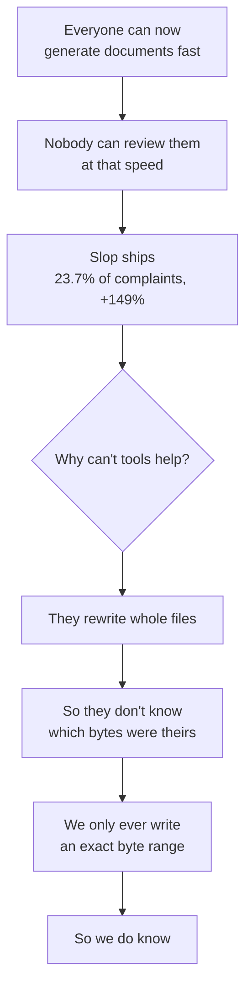

> [!good] **The opening: be the editor that can tell you which parts a machine wrote.** No tool that regenerates files can follow us there, because they genuinely do not have the information.

## PART III — What we already have

### 14. The engine, in plain terms

The thing we have built and that nobody else has is a way of editing a file that changes only the exact bytes you asked to change, and refuses when it cannot be certain.

**How everyone else does it.** Parse the file into a tree, modify the tree, write the whole file back out. This is why Notion's export is lossy, why Cursor destroys line endings, and why block editors mangle files. The rewrite touches everything, so any imperfection in the parser becomes a change in your document.

**How ours does it.** Find the byte range the change applies to. Replace exactly those bytes. Every other byte in the file is bit-identical afterwards. If the range cannot be located unambiguously, refuse and change nothing.

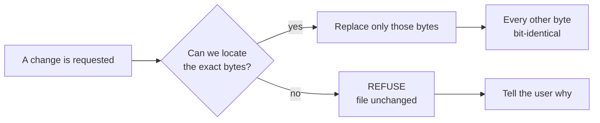

**Why this is hard and therefore worth something.** Getting it right means handling every way a markdown file can be strange: Windows line endings, byte-order marks, tabs, unusual YAML, non-English text, files written by other tools. We tested it against 8,513 real markdown files pulled from seven strangers' public vaults — pinned by checksum so the test cannot drift — and it does not corrupt them.

::exhibit 13 | What is already built and proven

| | |
|---|---|
| Source | 25,407 lines of TypeScript across 226 files |
| Tests | 1,575 tests in 98 files |
| Test corpus | 8,513 real markdown files, byte-pinned by checksum |
| Corpus result | Zero corruption, zero crashes |
| Shared with sgnk-md | 202 of 228 files byte-identical — this is not a new codebase |

> [!warn] **What is not built, and we should be honest about it.** No CI at all, in a product that wants to sell document checking. Four of our own quality gates have reported "green" while actually being blind. One symbol from one of thirteen engine files reaches the product code — the engine is largely not wired in yet. And 83% of foreign vaults are currently *refused* because of one bug, which means the front door does not open for most people.

### 15. How the engine actually works

Worth understanding properly, because everything we are selling rests on it.

**The contract, in one sentence:** locate the exact byte range, replace only those bytes, leave every other byte in the file bit-identical — and if the range cannot be located unambiguously, refuse and change nothing.

**What that rules out.** We never parse the document into a tree and write the tree back. That single decision is why we do not have the defects the others have, and it is also why our engine is harder to write than theirs.

::exhibit 14 | What happens to a file, by tool

| Operation | A regenerating editor | Ours |
|---|---|---|
| Change one frontmatter value | Rewrites the whole block; may reorder keys, requote strings, normalise dates | Replaces the value's bytes. Key order, quoting and comments untouched |
| Change one table cell | Rewrites every row; may re-pad columns and change line endings | Replaces the cell's bytes |
| Windows line endings | Frequently normalised to Unix, silently | Preserved exactly |
| A file with no trailing newline | Usually gains one | Stays as it was |
| An ambiguous target | Guesses, and usually gets it right | **Refuses** |

**The proof it works.** We pulled 8,513 real markdown files from seven strangers' public vaults, pinned every one by checksum so the test cannot silently drift, and ran the writer over all of them. Zero corruption, zero crashes. The checksum pinning matters more than it sounds: it means the test fails if a single byte anywhere in the corpus changes, so we cannot accidentally "fix" a test by changing the data.

**Where it is currently broken, and this is the honest part.**

| Defect | What happens | Effect |
|---|---|---|
| **NF-1** | A list item at column zero in frontmatter is not recognised as belonging to the key above it | **83% of real vaults are refused.** The most common way of writing a YAML list |
| **NF-2** | A closing bracket at column zero, same family | Smaller share of the same problem |
| **NF-3** | A frontmatter fence ending in a bare carriage return is not recognised | The writer thinks there is no frontmatter and **adds a second block.** Structurally destructive |
| **NF-4** | Keys with spaces or non-English characters cannot be addressed | 942 files have at least one. A fix design exists that recovers 936 of them |

> [!warn] **Read NF-1 again.** Eighty-three percent of the vaults we tested are refused today, for one bug, with a known fix. That is not a research problem or a design problem. It is four days of work standing between us and a product that opens.

### 16. Why refusing is the hard part

Every other tool guesses. Guessing looks better in a demo and is worse in practice.

- The industry-standard fuzzy patch library, run here: applied the same patch twice and produced corrupted text — **and reported success both times.** It also applied an edit whose anchoring context no longer existed and reported success. Its own documentation describes this as intended behaviour.
- Git's three-way merge, measured on the same inputs, preserves Windows line endings and a missing final newline, and produces a conflict exactly where a careful writer would want to stop.
- We chose the second behaviour. It is why we can promise what we promise.

**The counter-argument, recorded rather than dismissed:** conservative merging produces conflicts, and users hate conflicts. That is precisely why competitors ship fuzzy patching. Our mitigation is to make conflict rate a shipped, published metric with a budget — if we are refusing too often, we should know before our users tell us.

### 17. Where we sit, drawn

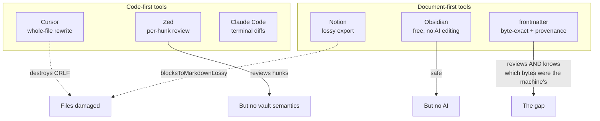

**Read the diagram as one sentence:** the code-first tools review changes but do not understand a markdown vault; the document-first tools understand the vault but either damage files or have no AI at all. Nothing occupies the corner where both are true.

### 18. What we got wrong

We ran a verification pass over the twenty-one claims the plan leaned on hardest, opening a primary source for each.

::exhibit 15 | Our own review, against our own case

| Verdict | Count | Meaning |
|---|---|---|
| CONFIRMED | 13 | The source says what we said |
| REVISED | 13 | Right idea, wrong number or scope |
| REFUTED | 5 | False. Deleted from the record |
| UNVERIFIABLE | 3 | No openable source exists |

**Eight of twenty-one survived unchanged.** The corrections that matter to you:

| # | What we believed | The correction |
|---|---|---|
| 1 | Byte-exactness makes people switch | Four complaints in 12,556. Once in 1,000 Reddit posts. One switch in eleven years |
| 2 | Per-hunk review is our unique demo | Zed ships it. I opened their docs |
| 3 | Generating handovers is the wedge | 89 such products launched in 20 months. Median score: 2 points |
| 4 | Decision-flow renders are the first thing to build | 563 of 143,283,562 Obsidian downloads want it. 0.0004% |
| 5 | GST reverse charge starts after ₹20 lakh | **No turnover floor.** Buying Claude API access starts it at the first rupee |
| 6 | Our table editor is fine | It rewrites 3 of 4 lines and destroys 3 of 4 carriage returns. Measured |

> [!risk] I want to be direct about this. **We spent months building an argument for something users do not care about.** The engine is right. The sentence we attached to it was wrong. That is a recoverable mistake and it is much cheaper to find now than after launch — but it is a real mistake and it came from believing our own reasoning instead of checking it.

### 19. Corrections to the record

::exhibit 16 | Our own review, against our own case

| # | What we believed | The correction | Effect |
|---|---|---|---|
| C1 | RCM starts after ₹20 lakh | **CGST §24(iii): no turnover floor.** Buying Claude API access is importing a service | GST registration starts at the first rupee, not at ₹20 lakh |
| C2 | IT Rules set a 50 lakh threshold | The Rules carry **no number** — "as notified by the Central Government" | The threshold is not ours to plan against |
| C3 | EU representative under GDPR Art. 27 | **DSA Art. 13** is a separate mandate with no small-enterprise exemption | Different obligation, different cost |
| C4 | Vanta/Drata charge $7,000–30,000 | **Neither publishes a price.** drata.com/pricing returns 403 | Our B2B ROI headline had no source |
| C5 | GitBook's top complaint is lost work | Of 1,190 discussions, **51.3% are feature requests** | Moat #2's only external evidence |
| C6 | frontmatter and sgnk-md are siblings | **202 of 228 files byte-identical. 0 files exist only in `md`** | They are one codebase. Park `md` |
| C7 | The corpus holds 7,959 frontmatter files | **7,969.** Counted four ways | Not definitional. Just wrong |
| C8 | Our table editor is fine | **It rewrites 3 of 4 lines and destroys 3 of 4 carriage returns** [measured here] | Dead code. Keep the measurement as a test |
| C9 | Ghost text is refused | It ships, defaulting to **off**, exactly as specified | No contradiction. An agent got this wrong; I checked |

> [!note] **62% of our load-bearing claims needed correction** when someone opened a primary source: 13 confirmed, 13 revised, 5 refuted, 3 unverifiable. Re-derive before quoting anything in the record.

### 20. What we take from everything else we have built

We have shipped roughly twenty things. The temptation is to combine them. That temptation is how a focused product becomes a platform nobody buys, so the default answer was **no** and each yes had to be earned by a real mechanism — a shared format, a shared engine, or a shared buyer. "They are both AI" is not a mechanism.

::exhibit 17 | The ecosystem, item by item

| Project | Fuses? | The reasoning |
|---|---|---|
| **sgnk-md** | **It is the same product** | 202 of 228 source files byte-identical. Zero files exist only in `md`. Frontmatter is a strict superset. One codebase; park `md`, port its CI first |
| **AIOS** — skills, hooks, gates, traces | **Internal only** | How we work, not what we sell. Its learning loop is not running: 6,884 routing decisions in a week produced **one** feedback label |
| **The gates** from AIOS | **Yes, later, as a feature** | Cross-reference checking, derived-document building, drift detection. These caught real errors in this document set. That is document CI, which is a product |
| **skills-registry** | No | Structurally the same problem — one canonical source projected to many surfaces — but a different product and buyer |
| **HQ** | Later | Could be the team admin surface eventually. Not now |
| **AEO / content work** | **Partly** | The published-page surface and its SEO is the one owned distribution channel available to us. Worth keeping alive as a channel, not as a product line |
| CareerOS · Markex · Advox · INW · Brand OS · Travox · GearUp · stock · trade · pdf | No | They share a founder and nothing else. Combining any of them costs focus and buys nothing |

**What this means practically.** Two things move: `sgnk-md` is parked and its CI comes here. The AIOS gates become a product feature much later, when teams pay us to check their documents. Everything else stays where it is, and **anything not being developed still costs us hosting, domains and attention** — worth an explicit decision about what to shut down.

> [!note] **The AIOS honesty note.** We have built a genuinely large orchestration substrate — 131 skills, 149 scripts, 69 automated gates, 65 days of measured traces. It is impressive and it is *ours*, not a product. Its own measurements say the learning loop is not closing. We should stop describing it as self-improving until it is, and we should not ship it to users who do not have our problems.

## PART IV — What we should build

### 21. The product, in one sentence

> [!good] **frontmatter is a markdown editor that knows which bytes a machine wrote.** Every AI edit is recorded as a byte range with the prompt, the model and the time. Machine-written spans look different from yours on screen. One keystroke reverts any of them. Nothing else in the file moves.

**Why this and not the twenty other things we considered.**

- It is the **only** use of our engine that answers a complaint people are actually making, in volume, today.
- **It cannot be copied by anyone who rewrites files.** Cursor and Zed do not know which bytes were theirs, because they regenerate the whole document. We know because we only ever wrote a range.
- It reuses about **90%** of the code that already exists.
- It is a feature of an editor, which is what we have decided to build.

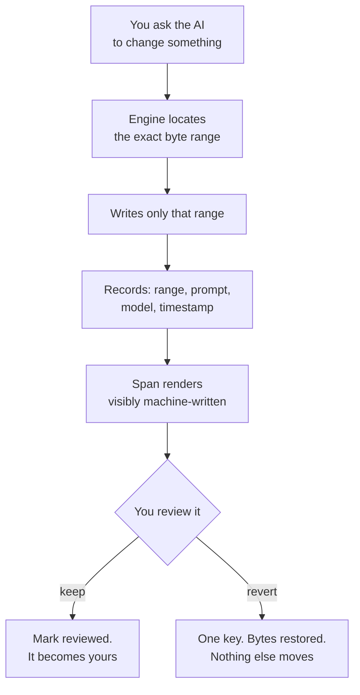

### 22. The principles, and the things we will never do

Five rules that settle arguments before they start. Each one has a cost, and the cost is stated.

::exhibit 18 | The principles

| # | Principle | What it means in practice | What it costs |
|---|---|---|---|
| 1 | **The file is the only source of truth** | Every view is a projection. No view owns state the file does not have | We cannot build features that need hidden state — no comment threads that live only in our database |
| 2 | **Refuse rather than guess** | If we cannot locate a change unambiguously, we change nothing and say why | Some edits fail that a fuzzier tool would complete |
| 3 | **Never hold the user's documents** | Files stay in their repo. We store identity, teams and billing, nothing else | Exit is free, so retention must be earned every month |
| 4 | **No arbitrary code execution, ever** | No plugins, no eval, no user scripts | We refuse the exact moat that made Obsidian unassailable |
| 5 | **Every claim must be falsifiable** | If we say "byte-preserving", there is a test that fails when it is not | Slower to ship, and much harder to be wrong in public |

**The non-goals, stated so nobody proposes them again.**

- **Not a project manager.** No kanban, no sprints, no assignees. This is a founder boundary, not a resourcing decision.
- **Not a chat interface.** The user already has an agent. Duplicating it badly helps nobody.
- **Not a plugin platform.** See principle 4. This is the most expensive refusal we make and we make it knowingly.
- **Not a publishing platform**, at least not in v1. It is a permanent, personal, unbounded on-call obligation the day the first stranger publishes.
- **Not a knowledge graph.** Graph views are beautiful and almost nobody uses them twice.

### 23. How the markdown itself is designed

You asked how the markdown will be designed. This is the most consequential design decision in the product and almost nobody outside engineering thinks about it.

**The rule: we add nothing to markdown that breaks it somewhere else.** A file we touch must render correctly on GitHub, in Obsidian, in a plain text editor, and in whatever the user opens it with next year.

::exhibit 19 | How we store things markdown has no syntax for

| What we need to store | How we store it | Why not the alternative |
|---|---|---|
| **Document metadata** | YAML frontmatter, the existing convention | Nothing else is universally understood |
| **A prose annotation** (a note, a decision card) | A blockquote callout — `> [!kind]` | It has **no closing marker to lose.** An unclosed fence swallows the rest of the document; a callout cannot |
| **Opaque data** (provenance ranges) | A fenced code block with an info string, written open-and-close in one atomic splice | A fence is unambiguous for data, and writing both ends together means it can never be left open |
| **Where provenance lives** | A sidecar file next to the document, in the user's repo | Inline would pollute the prose. A database would mean holding their data |
| Nothing | Custom syntax, HTML, `:::` directives | Every one of them degrades on some renderer. We accept `:::` on input and normalise it away on save |

**Why the callout decision matters more than it sounds.** We tested this across four markdown engines plus GitHub live. An unclosed fence is catastrophic — the CommonMark spec mandates that it swallows everything after it, so one lost closing line destroys the whole document downstream. A callout has no closer to lose. That single measured difference chose our carrier format, and it corrects an earlier decision in our own record.

**What a file looks like after we touch it.** Identical, except for the bytes you asked to change. Same line endings, same key order, same quoting, same trailing whitespace, same missing final newline if that is how you had it. **If you `git diff` after an edit, you see only your edit.** That is the whole promise, and it is testable on every release.

### 24. How the text and the tags are structured

::exhibit 20 | What we put in a file, and where

| Thing | Where it lives | Format |
|---|---|---|
| Document metadata | YAML frontmatter at the top | The existing convention, byte-preserved |
| Tags | A `tags:` key in frontmatter | Flow or block list — whichever the file already uses |
| Status, dates, owners | Frontmatter keys | Plain scalars. No custom types |
| Links between documents | Wikilinks or standard markdown links | Both read; we never rewrite one into the other |
| Provenance | A sidecar beside the document | Plain text, documented, readable without us |
| Anything else we invent | **Nowhere** | If markdown has no syntax for it, we do not add one |

**The tag rule that matters:** we read whatever shape the file already uses and write back the same shape. A vault that writes `tags: [a, b]` keeps flow form; one that writes a block list keeps block form. **Converting between them is a rewrite of bytes the author chose**, and that is exactly what we exist not to do.

### 25. How it feels to use

Six flows. Every one names the step most likely to lose the user, because that is where the work actually is.

**Flow 1 — first run.** Open the app, point it at a folder you already have. It reads it as-is; we impose no structure. You are editing within about thirty seconds.

- *Riskiest step:* the folder read. Today **83% of real vaults get refused** because of one frontmatter bug. That is why NF-1 is the first thing we fix and not a backlog item.
- No sign-up. No account. Nothing to fill in. The single change most likely to hurt adoption is a form on first run.

**Flow 2 — an AI edit.**

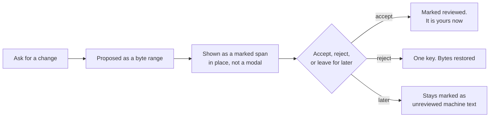

- *Riskiest step:* review fatigue. A forty-hunk change is a chore. Our answer is that you do not have to review it now — unreviewed machine text stays visibly marked until you do. **That is the difference from a diff view: a diff is a moment, provenance is a state.**

**Flow 3 — coming back a week later.** Open a document. The parts nobody has checked are still marked. You can see at a glance how much of this file has actually been read by a human.

**Flow 4 — a vault-wide rename.** Rename a tag or a heading. Every file that will change is listed as a reviewable hunk. Anything ambiguous is refused rather than guessed. Accept all, or go one by one.

**Flow 5 — two devices.** Git merge, with divergence surfaced as a reviewable conflict rather than silently resolved. What we will never do is guess which version you meant.

**Flow 6 — a teammate picks it up.** They open the repo and can see which parts of the work were machine-written and never reviewed. Today that information does not exist anywhere, in any tool.

### 26. The onboarding, minute by minute

The first five minutes decide everything, and we have historically under-designed them.

| Minute | What happens | What must not happen |
|---|---|---|
| 0 | Open the app. A single button: choose a folder | No sign-up. No account. No email field |
| 0–1 | It reads the vault as-is. No import, no migration, no restructure | No "we are indexing your vault" progress bar for minutes |
| 1 | You are editing. Everything looks like your files, because they are your files | No onboarding tour |
| 2 | You ask the AI for a change. It appears as a marked span | No modal. No diff screen you have to leave the document for |
| 3 | You hit one key. It is gone, and `git diff` proves nothing else moved | Nothing else moved. Ever |
| 5 | You realise you can see which parts of this document nobody has read | This is the moment. Everything before it is in service of it |

> [!warn] **The single change most likely to hurt us is a form at first run.** We collect nothing until there is something to collect it for.

### 27. Intuitivity — how we know it is understandable

Not a feeling. Four things we can observe.

| Test | Pass condition |
|---|---|
| **The unassisted first minute** | A new user opens a folder and edits, with no tour, no docs, no prompt |
| **The five-second explanation** | Someone who has seen the screen for five seconds can say what the tinted text means |
| **The seven-concept budget** | A first session introduces no more than seven ideas: folder, document, machine span, revert, quick-switch, search, settings |
| **The no-manual rule** | If a feature needs documentation to be understood, it is designed wrong — remove it or redesign it |

**The specific intuitivity risk in this product:** tinted text could read as "highlighted", "selected", or "an error". If a first-time user thinks a machine span is a problem rather than information, the whole metaphor fails. **That is the single thing the prototype must test**, and it is cheap to test — show five people a screenshot and ask what the blue means.

### 28. The features, and why each one exists

Every feature below names the person who uses it and how often. Anything that could not name one was cut, and the cuts are listed after.

::exhibit 21 | What ships, and the reason it ships

| Feature | Who uses it, how often | Why it exists | Stage |
|---|---|---|---|
| **Provenance store and rendering** | Anyone reviewing AI output, daily | The product. Answers slop — 23.7% of complaints, nobody else can do it | MVP-0 |
| **One-key revert of a machine span** | Same person, several times a day | Makes provenance actionable rather than decorative | MVP-0 |
| **Engine fixes NF-1/2/3** | Everyone, invisibly | 83% of vaults are refused today. Five of six user flows start here | MVP-0 |
| **Quick-switch, command palette, search** | Everyone, constantly | Table stakes. Without them a reviewer stops reviewing | MVP-0 |
| **CI, with a deliberate red run first** | Us | Four of our gates have reported green while blind | MVP-0 |
| **Vault-wide refactor with reviewable diff** | Anyone with 100+ notes, monthly | Rename a tag or heading; every affected link shows as a hunk; refuse on ambiguity. 86 likes on this bug | MVP-1 |
| **Team provenance** | Teams reviewing each other's AI work | The first thing worth charging for | MVP-1 |
| **Nested-construct live preview** | Every Obsidian user, constantly | 501 likes — the most-voted bug in the category's history. Our free wedge | MVP-2 |
| **Sync, provably safe** | Everyone, daily | #1 loved feature, #1 switching trigger, and the only price this category has proven | MVP-2 |

### 29. Each feature, specified

Enough detail that you can argue with the design, not just the idea.

**F1 · The provenance store**

- *What:* every write the engine makes on behalf of an agent is recorded as `{start_byte, end_byte, prompt, model, timestamp, session}`. Stored in a sidecar file inside the user's own repo, not on our servers.
- *Why a sidecar and not a database:* the file is the source of truth. If provenance lived on our servers it would be lost the moment someone cloned the repo elsewhere, and we would be holding user data we promised not to hold.
- *Why it works:* our engine already computes the exact byte range for every write. Nobody else has this information to record.
- *Hard part:* keeping ranges valid as the document is edited around them. This is the anchor problem, and it is the same problem our engine already solves for splices.
- *Who uses it:* invisible. It powers everything else.

**F2 · Machine-span rendering**

- *What:* text the machine wrote and nobody has reviewed renders with a subtle background. Reviewed text renders normally. Hovering shows the prompt, the model and when.
- *Why subtle and not loud:* a document where half the text is highlighted in yellow is unreadable. This has to be information you can ignore until you want it.
- *Who uses it:* everyone, constantly, without thinking about it.

**F3 · One-key revert**

- *What:* cursor inside a machine span, one keystroke, the original bytes return. Nothing else in the file moves.
- *Why this and not undo:* undo is chronological and breaks the moment you have typed anything since. This is spatial — revert *that thing*, whenever it was written.
- *Who uses it:* anyone reviewing, several times a session.

**F4 · The review state**

- *What:* a document knows what fraction of it has been read by a human. A file that is 80% unreviewed machine text looks different in the file tree.
- *Why it matters:* this is the difference between a diff and provenance. A diff is a moment you either handle or lose. **Provenance is a state that persists until someone deals with it.**
- *Who uses it:* the person picking up work a week later, and the teammate inheriting it.

**F5 · Vault-wide refactor**

- *What:* rename a tag, a heading or a property key. Every file that will change appears as a reviewable hunk. Ambiguous targets are refused, not guessed.
- *Why it belongs to us:* this is a byte-exact operation across hundreds of files. Anyone who regenerates would rewrite every file it touches. The most-liked complaint in this space — 86 likes — is links breaking on rename.
- *Who uses it:* anyone with more than a hundred notes, monthly. Painful when it happens.

**F6 · Nested-construct live preview**

- *What:* code blocks, quotes and callouts inside list items render correctly while you type.
- *Why it is here at all:* it is the most-voted bug in the category's history — 501 likes, with siblings at 96, 82, 50, 36 and 33. It is not our differentiator. It is the cheapest way to be *noticed* by people who already have this pain.
- *Who uses it:* every Obsidian user, constantly. Which is exactly the point.

**F7 · The gates, later**

- *What:* automated checks over a repo of markdown — do all cross-references resolve, is anything stale, which sections are unreviewed machine text.
- *Why later:* it is a team product with a team sale, and we should not be selling to teams before we have individuals.
- *Evidence it works:* we run four of these on ourselves and they caught real errors in this document.

::exhibit 22 | The build order, and the reasoning

| | Feature | Weeks | Why it is in this stage |
|---|---|---|---|
| MVP-0 | Engine fixes + F1 + F2 + F3 | 10 | Without the fixes, 83% of people cannot open the app. Without F1–F3 there is no product |
| MVP-0 | Table stakes: quick-switch, palette, search | (inside) | A reviewer who cannot navigate stops reviewing |
| MVP-1 | F4 + F5 + billing + teams | 8 | The first things worth money, and the first things that need money to exist |
| MVP-2 | F6 free + sync | 12 | Distribution and the only proven price in the category |

### 30. Why provenance and not the other twenty ideas

We scored nine serious options against evidence of demand, time to revenue, defensibility, fit with our size, and how much of the existing code they reuse.

::exhibit 23 | The options we considered, scored

| Option | Demand | Time to revenue | Reuses engine | Verdict |
|---|---|---|---|---|
| **Provenance in the editor** | 9/10 | ~5 months | ~90% | **Build this** |
| Vault-wide refactor | 5/10 | ~5 months | ~90% | Ships with it, MVP-1 |
| Sync, provably safe | 9/10 | ~12 months | ~60% | The only proven price. Later |
| Nested-construct live preview | 8/10 | Free | ~15% | **The free wedge. Ship week 2** |
| Document CI for teams | 4/10 | ~6 months | ~70% | Later, and it may be the B2B line |
| Engine as a library / MCP server | 4/10 | ~9 months | 100% | Feeds competitors. Not yet |
| One-time $49 licence | 3/10 | ~4 months | ~90% | A pricing option, not a product |
| Services, productised | 9/10 | **This month** | ~10% | **Funds everything. Not an asset** |
| Redeploy to another product | 6/10 | ~12 months | ~30% | The honest fallback if tests fail |

**Why provenance wins on the axis that matters.** It is the only option where the thing that makes it hard to build — knowing exactly which bytes changed — is a thing we already solved and nobody else has. Every other option on that list could be built by a competitor in a quarter.

### 31. What we deliberately will not build

A refusal with no cost is not a real refusal, so each one names what we give up.

::exhibit 24 | The no list

| Not building | Why | What we lose |
|---|---|---|
| **Decision-flow renders** | 0.0004% of the market wants them | An idea we liked. Nothing else |
| Degradation certificate as a user feature | Technically lovely, commercially irrelevant | A talking point |
| Byte-level time travel, two-way renders | Nobody asked | Engineering fun |
| Project management, kanban, calendars | We are not Notion and cannot win that fight | Some team buyers |
| Plugins and arbitrary code execution | Ends the corruption guarantee; turns every prompt injection into remote code execution | The ecosystem moat Obsidian has. This is the most expensive refusal on the list |
| A chat sidebar | Duplicates the agent the user already runs | Nothing. It is table stakes done badly |
| Mobile, at first | Cost and focus | Real users. Roughly 15% of complaints are mobile |

> [!warn] **The plugin refusal deserves a proper argument.** Obsidian's moat *is* its plugin ecosystem. Refusing plugins means refusing the thing that made the category leader unassailable. We refuse it because arbitrary third-party code in the editor makes "we never corrupt your file" unprovable, and that guarantee is the entire product. But we should be clear-eyed: this closes the most proven growth path in the category, and we need the free live-preview plugin *in their store* partly to compensate.

### 32. Markdown as output — sites, decks, and visual projections

A markdown file already contains everything a small website needs: headings, prose, links, images, tables, code, and metadata in the frontmatter. Turning that into a site is not a new product — **it is the projection law pointed at the output side.** Same file, another deterministic view, owning no state.

**The distinction that decides everything here.** Three things get bundled under "publishing" and they have completely different costs:

::exhibit 25 | Three things people call publishing

| | What it is | What it costs us | Verdict |
|---|---|---|---|
| **Generate** | Turn a folder into a static site, a deck, or a one-pager. The user gets files | Compute, once, on their machine. **No liability, no hosting, no moderation** | **SHIP** |
| **Host** | We serve those pages at our domain | Intermediary duties, a permanent 24-hour complaint clock, spam and abuse moderation | **REFUSE in v1** |
| **Assist** | One command to push the generated site to Vercel, Netlify, or GitHub Pages | A button. The user's account, the user's terms | **SHIP** |

> [!warn] **Why hosting is refused and generation is not.** The moment we serve a stranger's page from our domain we become an intermediary, and the acknowledgement duty that comes with it is not a feature that can be descoped — it is a permanent, unbounded, personal on-call obligation starting the day the first stranger publishes. Generation carries none of that: we hand the user files and they choose where those files live.

**What we generate, in priority order.**

| Output | From | Why it earns its place |
|---|---|---|
| **A static site** | A folder, using the existing tree as navigation | The most-asked-for output. Docs sites, handbooks, personal wikis |
| **A single shareable page** | One document | The common case: send someone a spec without sending them a repo |
| **A slide deck** | H2s become slides, bullets become bullets | Zero new syntax. People already write decks as markdown outlines |
| **A one-page brief** | A document plus its frontmatter | This document is one. The generator is the thing that made it |
| **Diagrams** | Existing mermaid blocks | Already standard. We render, we do not invent |

**The rules that keep it honest.**

- **The site is a projection, never a source.** Edits happen in the markdown. There is no site editor, no theme builder, no page composer — those would each need their own state, and state is what the architecture forbids.
- **Themes are files, not a gallery.** A handful of good defaults. Anything custom is CSS in the repo, versioned like everything else.
- **It runs locally and offline.** Static generation is cheap compute — templating and file writing, no model, no network. This is exactly the kind of capability that costs us nothing per user.
- **Output is plain and portable.** HTML, CSS and assets in a folder. Deployable anywhere, readable without us, and it keeps working if we disappear.

**Where it sits in the plan.** Not MVP-0 — that is the engine and provenance. **Generation is MVP-1**, because it is the cheapest thing on the roadmap that produces something a user can show someone else, and a shared artefact is the only distribution mechanism this product has that compounds.

> [!good] **The strategic reason to build it, beyond the feature.** Every generated page can carry a small, honest mark. That makes the output itself a channel — the one growth loop available to a product with no advertising budget and no community. The research was blunt that every channel we identified is borrowed; **this is the only one we would own.**

**The honest caveat.** Static site generators are a crowded, mature category — Hugo, Eleventy, Astro, MkDocs, Docusaurus and dozens more, all free and all better at this than we will be in v1. **We are not competing with them and should not pretend to.** What we offer is that it is already inside the editor, it reads the vault you already have, and it needs no configuration file. That is a convenience argument, not a superiority one, and the copy should say so.

### 33. Simplicity, as something we enforce rather than intend

Every product intends to stay simple. This is how we make it structural.

- **The surface budget.** A new user may meet no more than **seven** top-level concepts in their first session: the folder, the document, the machine span, revert, quick-switch, search, settings. Anything that would be the eighth has to displace one of them.
- **The admission test.** A proposed feature must name the person who uses it and how often. If it cannot, it is cut, and the cut is recorded so nobody re-proposes it in three months.
- **The settings rule.** Every toggle is a decision we failed to make. The settings page is one screen and stays one screen.
- **The projection law does the heavy lifting.** Because every view must be a deterministic projection of the file owning no state, anything requiring its own hidden state is *already* forbidden by the architecture. Most feature bloat is state bloat, and we made that structurally impossible.
- **What this costs us:** we will say no to things customers ask for. Some will leave. That is the trade, and it is the reason the product can stay comprehensible.

### 34. How the product should be designed

The design job here is unusual: the most important thing on screen is information *about* the text, shown without making the text harder to read.

**The governing rule.** A document with provenance on must be as readable as one with it off. If a user turns provenance off to read comfortably, we have failed.

::exhibit 26 | The visual language

| Element | Decision | Why |
|---|---|---|
| Machine-written, unreviewed | A very light tinted background, no border, no icon | It has to be ignorable. A border or icon fragments the line and destroys reading rhythm |
| Machine-written, reviewed | Nothing. It renders as normal text | Once you have read it, it is yours. Permanent marking would be noise |
| Hover | A small panel: prompt, model, when, and a revert control | On demand only. Nothing hovers into view by itself |
| Document-level state | A thin bar in the file tree showing unreviewed share | Glanceable. Never a number you have to interpret |
| Refusal | An inline note where the change would have gone, in plain words | Never a modal. A modal for a refusal makes a normal outcome feel like an error |
| Conflict | Two versions side by side, with what differs marked | The one place we may interrupt, because the cost of guessing is losing work |

**The typography and the surface.** Google Sans for interface, Google Sans Code for the editor, on white. One accent colour. Square corners. Hairline borders. One elevation rule. This is our existing design system and it is already written down — the important thing is that we actually apply it, since the shipped `globals.css` is currently a different system inherited from a sibling project and self-describes as *"Linear-style modern SaaS"*. That is a real inconsistency and it is on the fix list.

**Icons: inline SVG only, from one set.** Never emoji, never a web font. An icon font that fails to load renders the literal ligature text or a blank box, and it will fail to load on a slow connection or a strict content policy. Inline SVG carries the vector in the markup and renders every time.

**What the interface must not become.**

- No sidebar of panels. The document is the interface.
- No settings page that grows. Every toggle we add is a decision we failed to make.
- No dashboard. Nobody opens an editor to look at a dashboard.
- No chat window. The user already has an agent; duplicating it badly helps nobody.

### 35. Every screen, and what it is for

The product is deliberately small. Eleven screens, and four of them are dialogs.

::exhibit 27 | The screen inventory

| # | Screen | What it does | Why it exists | Stage |
|---|---|---|---|---|
| S1 | **Open a folder** | One button. Pick a directory or connect a repo | The entire first run. No account, no form | MVP-0 |
| S2 | **The editor** | The document, full width. File tree collapsible on the left | This is 95% of the product. Everything else serves it | MVP-0 |
| S3 | **The provenance layer** | Not a screen — an overlay on S2. Machine spans tinted, hover for detail | The differentiator. It must live *inside* the document, not beside it | MVP-0 |
| S4 | **Review panel** | A list of unreviewed machine spans in this document, keyboard-navigable | For someone catching up on a document they did not watch being written | MVP-0 |
| S5 | **Quick switcher** | Fuzzy file search, keyboard-first | Table stakes. Its absence ends a review before it starts | MVP-0 |
| S6 | **Command palette** | Every action, searchable | Table stakes, and it is how power users learn a product | MVP-0 |
| S7 | **Search** | Across the vault, with results in context | Table stakes | MVP-0 |
| S8 | **Refactor preview** | Rename something; every affected file listed as an accept/reject hunk | The 86-like problem. Our engine's most visible capability | MVP-1 |
| S9 | **Conflict view** | Two versions side by side, differences marked, you choose | The only place we interrupt, because guessing here loses work | MVP-1 |
| S10 | **Team view** | Who wrote what across a shared repo; unreviewed share per document | The paid surface. Nothing else in the product is per-seat | MVP-1 |
| S11 | **Settings** | One short page. Theme, keymap, AI key, provenance on/off | Deliberately small. Every toggle is a decision we failed to make | MVP-0 |

**Four dialogs, and no more:** connect a repo · enter an AI key · a refusal explanation · the update prompt.

**What we are not building, and it is a long list on purpose:** no dashboard, no analytics screen, no template gallery, no plugin browser, no onboarding tour, no chat sidebar, no kanban, no calendar, no graph view, no publish console.

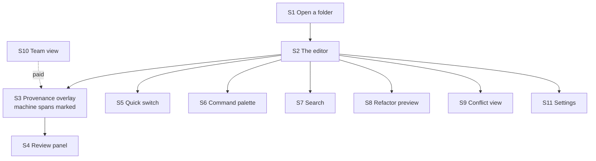

### 36. What is in each screen

Screen by screen, the actual elements, so this can be designed from.

::exhibit 28 | S2 — the editor, the 95% screen

| Region | What is in it | Behaviour |
|---|---|---|
| Left rail, collapsible | File tree. Each file shows a thin bar for unreviewed machine share | Collapses to nothing. Keyboard-toggleable. Remembers state |
| Centre, always | The document. Full measure, generous line height | This is the product. Nothing overlays it uninvited |
| Provenance layer | Tinted spans for unreviewed machine text | Toggleable. No borders, no icons, no gutter marks |
| Top, minimal | Breadcrumb path, sync state, one overflow menu | No toolbar. Formatting is markdown, typed |
| Bottom, thin | Word count, cursor position, unreviewed count for this file | Ambient. Never demands attention |
| On hover over a span | Small panel: prompt, model, timestamp, revert | On demand only, after a delay, dismissible with Escape |

::exhibit 29 | The other screens, and their elements

| Screen | Elements |
|---|---|
| **S1 Open a folder** | One button. A recent-folders list if any. A line explaining nothing leaves your machine. No account, no email |
| **S4 Review panel** | Ordered list of unreviewed spans · each with its first line, model, age · accept / revert / skip · keyboard j-k-a-r · a counter that goes to zero |
| **S5 Quick switcher** | Input, fuzzy-ranked results, path shown, recent-first when empty. Enter opens, Escape closes |
| **S6 Command palette** | Input, grouped commands, keyboard hints beside each. Shows what a command does before you run it |
| **S7 Search** | Query, results grouped by file with two lines of context, count. Replace is a separate deliberate mode |
| **S8 Refactor preview** | What is changing, stated in one line · the affected-file list with per-file hunks · accept all / per file / cancel · a refusal list with the reason for each |
| **S9 Conflict view** | Two panes, differences marked, a third pane for the result · take-mine / take-theirs / edit · never auto-resolves |
| **S10 Team view** | Repo picker · per-document unreviewed share · per-person contribution · a filter for "machine-written, nobody reviewed" |
| **S11 Settings** | One page, six groups, no tabs: appearance · keymap · AI provider and key · provenance defaults · git identity · about |

### 37. How the screens talk to each other

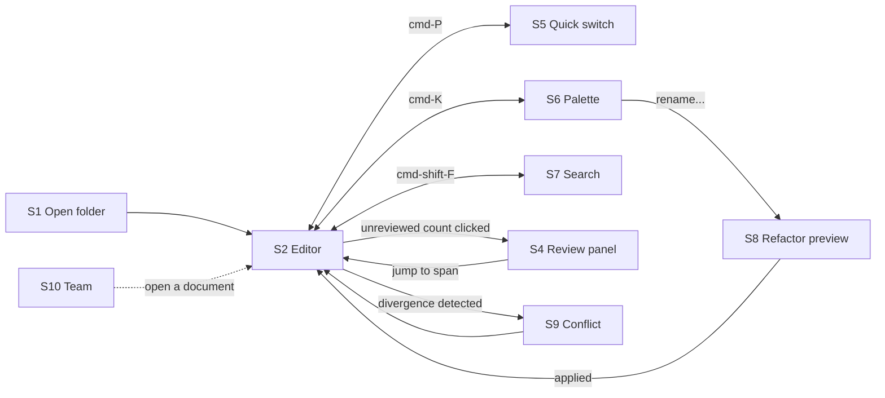

**Three rules the navigation obeys.**

- **Everything returns to S2.** No screen is a destination; each is a detour that hands you back to the document.
- **Escape always goes back one step**, and never loses work.
- **No modal blocks the document** except the conflict view, which blocks because proceeding without a decision would lose data.

### 38. The screens, drawn

Mid fidelity: enough to argue about what goes where, not enough to argue about corner radii.

::exhibit 30 | S0 · The launcher — what you see before a document is open

<svg viewBox="0 0 760 452" xmlns="http://www.w3.org/2000/svg" style="width:100%;max-width:760px;height:auto"><rect x="1" y="1" width="758" height="430" fill="#fff" stroke="#14161a" stroke-width="1.5" rx="4"/><rect x="1" y="1" width="758" height="34" fill="#fafbfc"/><line x1="1" y1="35" x2="759" y2="35" stroke="#c9cfda" stroke-width="1"/><rect x="12" y="9" width="34" height="18" fill="#14161a" stroke="#c9cfda" stroke-width="1" rx="3"/><text x="29" y="21" font-family="system-ui,-apple-system,sans-serif" font-size="7.5" fill="#fff" font-weight="700" text-anchor="middle">fm</text><rect x="56" y="9" width="570" height="18" fill="#fff" stroke="#c9cfda" stroke-width="1" rx="9"/><text x="66" y="22" font-family="system-ui,-apple-system,sans-serif" font-size="8" fill="#8a93a3">⌕  Search every document</text><rect x="634" y="9" width="46" height="18" fill="#fff" stroke="#c9cfda" stroke-width="1" rx="3"/><text x="657" y="21" font-family="system-ui,-apple-system,sans-serif" font-size="7.5" fill="#14161a" text-anchor="middle">Open…</text><rect x="688" y="9" width="60" height="18" fill="#1a5cff" stroke="#1a5cff" stroke-width="1" rx="3"/><text x="718" y="21" font-family="system-ui,-apple-system,sans-serif" font-size="7.5" fill="#fff" font-weight="600" text-anchor="middle">New</text><text x="20" y="60" font-family="system-ui,-apple-system,sans-serif" font-size="7.5" fill="#8a93a3" font-weight="700">START SOMETHING</text><rect x="20" y="70" width="132" height="84" fill="#f2f6ff" stroke="#1a5cff" stroke-width="1" rx="4"/><text x="34" y="100" font-family="system-ui,-apple-system,sans-serif" font-size="9.5" fill="#1a5cff" font-weight="600">Blank</text><text x="34" y="114" font-family="system-ui,-apple-system,sans-serif" font-size="9.5" fill="#1a5cff" font-weight="600">document</text><text x="34" y="142" font-family="system-ui,-apple-system,sans-serif" font-size="7" fill="#8a93a3">empty file</text><rect x="166" y="70" width="132" height="84" fill="#fff" stroke="#c9cfda" stroke-width="1" rx="4"/><text x="180" y="100" font-family="system-ui,-apple-system,sans-serif" font-size="9.5" fill="#14161a" font-weight="600">Handover</text><text x="180" y="142" font-family="system-ui,-apple-system,sans-serif" font-size="7" fill="#8a93a3">markdown skeleton</text><rect x="312" y="70" width="132" height="84" fill="#fff" stroke="#c9cfda" stroke-width="1" rx="4"/><text x="326" y="100" font-family="system-ui,-apple-system,sans-serif" font-size="9.5" fill="#14161a" font-weight="600">Decision</text><text x="326" y="114" font-family="system-ui,-apple-system,sans-serif" font-size="9.5" fill="#14161a" font-weight="600">record</text><text x="326" y="142" font-family="system-ui,-apple-system,sans-serif" font-size="7" fill="#8a93a3">markdown skeleton</text><rect x="458" y="70" width="132" height="84" fill="#fff" stroke="#c9cfda" stroke-width="1" rx="4"/><text x="472" y="100" font-family="system-ui,-apple-system,sans-serif" font-size="9.5" fill="#14161a" font-weight="600">Spec</text><text x="472" y="142" font-family="system-ui,-apple-system,sans-serif" font-size="7" fill="#8a93a3">markdown skeleton</text><rect x="604" y="70" width="132" height="84" fill="#fff" stroke="#c9cfda" stroke-width="1" rx="4"/><text x="618" y="100" font-family="system-ui,-apple-system,sans-serif" font-size="9.5" fill="#14161a" font-weight="600">Changelog</text><text x="618" y="142" font-family="system-ui,-apple-system,sans-serif" font-size="7" fill="#8a93a3">markdown skeleton</text><line x1="20" y1="176" x2="740" y2="176" stroke="#c9cfda" stroke-width="1"/><text x="20" y="196" font-family="system-ui,-apple-system,sans-serif" font-size="7.5" fill="#8a93a3" font-weight="700">RECENT</text><text x="740" y="196" font-family="system-ui,-apple-system,sans-serif" font-size="7.5" fill="#1a5cff" text-anchor="end">unreviewed first  ▾</text><rect x="20" y="208" width="168" height="78" fill="#fff" stroke="#c9cfda" stroke-width="1" rx="4"/><text x="32" y="228" font-family="system-ui,-apple-system,sans-serif" font-size="9" fill="#14161a" font-weight="600">auth.md</text><text x="32" y="242" font-family="system-ui,-apple-system,sans-serif" font-size="7.5" fill="#8a93a3">specs/</text><rect x="32" y="252" width="144" height="3" fill="#e4e7ec"/><rect x="32" y="259" width="86.39999999999999" height="3" fill="#e4e7ec"/><rect x="32" y="270" width="144" height="4" fill="#eceff4"/><rect x="32" y="270" width="92.16" height="4" fill="#1a5cff"/><text x="32" y="282" font-family="system-ui,-apple-system,sans-serif" font-size="7" fill="#1a5cff">64% unreviewed</text><rect x="202" y="208" width="168" height="78" fill="#fff" stroke="#c9cfda" stroke-width="1" rx="4"/><text x="214" y="228" font-family="system-ui,-apple-system,sans-serif" font-size="9" fill="#14161a" font-weight="600">0004-sync.md</text><text x="214" y="242" font-family="system-ui,-apple-system,sans-serif" font-size="7.5" fill="#8a93a3">adr/</text><rect x="214" y="252" width="144" height="3" fill="#e4e7ec"/><rect x="214" y="259" width="86.39999999999999" height="3" fill="#e4e7ec"/><rect x="214" y="270" width="144" height="4" fill="#eceff4"/><rect x="214" y="270" width="126.72" height="4" fill="#1a5cff"/><text x="214" y="282" font-family="system-ui,-apple-system,sans-serif" font-size="7" fill="#1a5cff">88% unreviewed</text><rect x="384" y="208" width="168" height="78" fill="#fff" stroke="#c9cfda" stroke-width="1" rx="4"/><text x="396" y="228" font-family="system-ui,-apple-system,sans-serif" font-size="9" fill="#14161a" font-weight="600">pricing.md</text><text x="396" y="242" font-family="system-ui,-apple-system,sans-serif" font-size="7.5" fill="#8a93a3">notes/</text><rect x="396" y="252" width="144" height="3" fill="#e4e7ec"/><rect x="396" y="259" width="86.39999999999999" height="3" fill="#e4e7ec"/><rect x="396" y="270" width="144" height="4" fill="#eceff4"/><rect x="396" y="270" width="44.64" height="4" fill="#a8c4f5"/><text x="396" y="282" font-family="system-ui,-apple-system,sans-serif" font-size="7" fill="#1a5cff">31% unreviewed</text><rect x="566" y="208" width="168" height="78" fill="#fff" stroke="#c9cfda" stroke-width="1" rx="4"/><text x="578" y="228" font-family="system-ui,-apple-system,sans-serif" font-size="9" fill="#14161a" font-weight="600">billing.md</text><text x="578" y="242" font-family="system-ui,-apple-system,sans-serif" font-size="7.5" fill="#8a93a3">specs/</text><rect x="578" y="252" width="144" height="3" fill="#e4e7ec"/><rect x="578" y="259" width="86.39999999999999" height="3" fill="#e4e7ec"/><rect x="578" y="270" width="144" height="4" fill="#eceff4"/><rect x="578" y="270" width="17.28" height="4" fill="#a8c4f5"/><text x="578" y="282" font-family="system-ui,-apple-system,sans-serif" font-size="7" fill="#1a5cff">12% unreviewed</text><rect x="20" y="300" width="168" height="78" fill="#fff" stroke="#c9cfda" stroke-width="1" rx="4"/><text x="32" y="320" font-family="system-ui,-apple-system,sans-serif" font-size="9" fill="#14161a" font-weight="600">README.md</text><text x="32" y="334" font-family="system-ui,-apple-system,sans-serif" font-size="7.5" fill="#8a93a3">root</text><rect x="32" y="344" width="144" height="3" fill="#e4e7ec"/><rect x="32" y="351" width="86.39999999999999" height="3" fill="#e4e7ec"/><rect x="32" y="362" width="144" height="4" fill="#eceff4"/><text x="32" y="374" font-family="system-ui,-apple-system,sans-serif" font-size="7" fill="#0d8a4f">all reviewed</text><rect x="202" y="300" width="168" height="78" fill="#fff" stroke="#c9cfda" stroke-width="1" rx="4"/><text x="214" y="320" font-family="system-ui,-apple-system,sans-serif" font-size="9" fill="#14161a" font-weight="600">0003-scope.md</text><text x="214" y="334" font-family="system-ui,-apple-system,sans-serif" font-size="7.5" fill="#8a93a3">adr/</text><rect x="214" y="344" width="144" height="3" fill="#e4e7ec"/><rect x="214" y="351" width="86.39999999999999" height="3" fill="#e4e7ec"/><rect x="214" y="362" width="144" height="4" fill="#eceff4"/><rect x="214" y="362" width="64.8" height="4" fill="#a8c4f5"/><text x="214" y="374" font-family="system-ui,-apple-system,sans-serif" font-size="7" fill="#1a5cff">45% unreviewed</text><rect x="384" y="300" width="168" height="78" fill="#fff" stroke="#c9cfda" stroke-width="1" rx="4"/><text x="396" y="320" font-family="system-ui,-apple-system,sans-serif" font-size="9" fill="#14161a" font-weight="600">onboarding.md</text><text x="396" y="334" font-family="system-ui,-apple-system,sans-serif" font-size="7.5" fill="#8a93a3">notes/</text><rect x="396" y="344" width="144" height="3" fill="#e4e7ec"/><rect x="396" y="351" width="86.39999999999999" height="3" fill="#e4e7ec"/><rect x="396" y="362" width="144" height="4" fill="#eceff4"/><text x="396" y="374" font-family="system-ui,-apple-system,sans-serif" font-size="7" fill="#0d8a4f">all reviewed</text><rect x="566" y="300" width="168" height="78" fill="#fff" stroke="#c9cfda" stroke-width="1" rx="4"/><text x="578" y="320" font-family="system-ui,-apple-system,sans-serif" font-size="9" fill="#14161a" font-weight="600">api.md</text><text x="578" y="334" font-family="system-ui,-apple-system,sans-serif" font-size="7.5" fill="#8a93a3">specs/</text><rect x="578" y="344" width="144" height="3" fill="#e4e7ec"/><rect x="578" y="351" width="86.39999999999999" height="3" fill="#e4e7ec"/><rect x="578" y="362" width="144" height="4" fill="#eceff4"/><rect x="578" y="362" width="31.68" height="4" fill="#a8c4f5"/><text x="578" y="374" font-family="system-ui,-apple-system,sans-serif" font-size="7" fill="#1a5cff">22% unreviewed</text><rect x="1" y="404" width="758" height="25" fill="#fafbfc"/><line x1="1" y1="404" x2="759" y2="404" stroke="#c9cfda" stroke-width="1"/><text x="14" y="420" font-family="system-ui,-apple-system,sans-serif" font-size="7.5" fill="#8a93a3">3 projects · 128 documents · 7 unreviewed</text><text x="746" y="420" font-family="system-ui,-apple-system,sans-serif" font-size="7.5" fill="#8a93a3" text-anchor="end">⌘K commands   ⌘P files</text><text x="2" y="447" font-family="system-ui,-apple-system,sans-serif" font-size="7.5" fill="#4a5160">Templates are markdown skeletons, not a gallery. Five, and they are the document types the research found actually recur.</text></svg>

**The bar at the bottom of every card is the product showing itself before you open anything.** Recent documents sort by unreviewed share, so the thing most likely to need you is first.

::exhibit 31 | S2 · The editor — every region named

<svg viewBox="0 0 900 542" xmlns="http://www.w3.org/2000/svg" style="width:100%;max-width:900px;height:auto"><rect x="1" y="1" width="898" height="520" fill="#fff" stroke="#14161a" stroke-width="1.5" rx="4"/><rect x="1" y="1" width="898" height="30" fill="#fafbfc"/><line x1="1" y1="31" x2="899" y2="31" stroke="#c9cfda" stroke-width="1"/><rect x="10" y="7" width="28" height="17" fill="#14161a" stroke="#c9cfda" stroke-width="1" rx="3"/><text x="24" y="18.5" font-family="system-ui,-apple-system,sans-serif" font-size="7.5" fill="#fff" font-weight="700" text-anchor="middle">fm</text><text x="46" y="19" font-family="system-ui,-apple-system,sans-serif" font-size="9" fill="#8a93a3">⌸  ⟲  ⟳</text><rect x="92" y="5" width="108" height="22" fill="#fff" stroke="#c9cfda" stroke-width="1" rx="3"/><rect x="92" y="5" width="108" height="2" fill="#1a5cff"/><text x="102" y="20" font-family="system-ui,-apple-system,sans-serif" font-size="8" fill="#14161a" font-weight="600">auth.md</text><text x="190" y="20" font-family="system-ui,-apple-system,sans-serif" font-size="8" fill="#8a93a3" text-anchor="end">×</text><rect x="208" y="5" width="108" height="22" fill="transparent" stroke="transparent" stroke-width="1" rx="3"/><text x="218" y="20" font-family="system-ui,-apple-system,sans-serif" font-size="8" fill="#4a5160">0004-sync.md</text><text x="306" y="20" font-family="system-ui,-apple-system,sans-serif" font-size="8" fill="#8a93a3" text-anchor="end">×</text><rect x="324" y="5" width="108" height="22" fill="transparent" stroke="transparent" stroke-width="1" rx="3"/><text x="334" y="20" font-family="system-ui,-apple-system,sans-serif" font-size="8" fill="#4a5160">pricing.md</text><text x="422" y="20" font-family="system-ui,-apple-system,sans-serif" font-size="8" fill="#8a93a3" text-anchor="end">×</text><rect x="440" y="5" width="108" height="22" fill="transparent" stroke="transparent" stroke-width="1" rx="3"/><text x="450" y="20" font-family="system-ui,-apple-system,sans-serif" font-size="8" fill="#4a5160">README.md</text><text x="538" y="20" font-family="system-ui,-apple-system,sans-serif" font-size="8" fill="#8a93a3" text-anchor="end">×</text><rect x="690" y="7" width="118" height="17" fill="#fff" stroke="#c9cfda" stroke-width="1" rx="9"/><text x="698" y="20" font-family="system-ui,-apple-system,sans-serif" font-size="7.5" fill="#8a93a3">⌕ Search</text><rect x="816" y="7" width="30" height="17" fill="#fff" stroke="#c9cfda" stroke-width="1" rx="3"/><text x="831" y="18.5" font-family="system-ui,-apple-system,sans-serif" font-size="7.5" fill="#14161a" text-anchor="middle">sh</text><rect x="852" y="7" width="38" height="17" fill="#fff" stroke="#c9cfda" stroke-width="1" rx="3"/><text x="871" y="18.5" font-family="system-ui,-apple-system,sans-serif" font-size="7.5" fill="#14161a" text-anchor="middle">Pf</text><rect x="1" y="32" width="176" height="487" fill="#f4f6fa"/><line x1="176" y1="32" x2="176" y2="519" stroke="#c9cfda" stroke-width="1"/><text x="12" y="50" font-family="system-ui,-apple-system,sans-serif" font-size="7.5" fill="#8a93a3" font-weight="700">‹  TREE</text><rect x="130" y="41" width="34" height="14" fill="#fff" stroke="#c9cfda" stroke-width="1" rx="3"/><text x="147" y="51" font-family="system-ui,-apple-system,sans-serif" font-size="7.5" fill="#14161a" text-anchor="middle">FP+</text><rect x="0" y="59" width="176" height="21" fill="#eef1f6"/><text x="10" y="74" font-family="system-ui,-apple-system,sans-serif" font-size="7.6" fill="#2c3038" font-weight="700">product-docs</text><text x="162" y="74" font-family="system-ui,-apple-system,sans-serif" font-size="10" fill="#8a93a3" text-anchor="end">+</text><text x="18" y="95" font-family="system-ui,-apple-system,sans-serif" font-size="8" fill="#3a4048">▾  adr</text><line x1="23" y1="102" x2="23" y2="121" stroke="#c9cfda" stroke-width="1"/><text x="28" y="116" font-family="system-ui,-apple-system,sans-serif" font-size="8" fill="#3a4048">0003-scope.md</text><line x1="23" y1="123" x2="23" y2="142" stroke="#c9cfda" stroke-width="1"/><text x="28" y="137" font-family="system-ui,-apple-system,sans-serif" font-size="8" fill="#3a4048">0004-sync.md</text><text x="18" y="158" font-family="system-ui,-apple-system,sans-serif" font-size="8" fill="#3a4048">▾  specs</text><rect x="6" y="165" width="164" height="19" fill="#fff" stroke="#1a5cff" stroke-width="1" rx="3"/><line x1="23" y1="165" x2="23" y2="184" stroke="#c9cfda" stroke-width="1"/><text x="28" y="179" font-family="system-ui,-apple-system,sans-serif" font-size="8" fill="#1a5cff" font-weight="700">auth.md</text><line x1="23" y1="186" x2="23" y2="205" stroke="#c9cfda" stroke-width="1"/><text x="28" y="200" font-family="system-ui,-apple-system,sans-serif" font-size="8" fill="#3a4048">billing.md</text><text x="18" y="221" font-family="system-ui,-apple-system,sans-serif" font-size="8" fill="#3a4048">▾  notes</text><line x1="23" y1="228" x2="23" y2="247" stroke="#c9cfda" stroke-width="1"/><text x="28" y="242" font-family="system-ui,-apple-system,sans-serif" font-size="8" fill="#3a4048">pricing.md</text><rect x="0" y="248" width="176" height="21" fill="#eef1f6"/><text x="10" y="263" font-family="system-ui,-apple-system,sans-serif" font-size="7.6" fill="#2c3038" font-weight="700">engine</text><text x="162" y="263" font-family="system-ui,-apple-system,sans-serif" font-size="10" fill="#8a93a3" text-anchor="end">+</text><text x="18" y="284" font-family="system-ui,-apple-system,sans-serif" font-size="8" fill="#3a4048">▾  src</text><line x1="23" y1="291" x2="23" y2="310" stroke="#c9cfda" stroke-width="1"/><text x="28" y="305" font-family="system-ui,-apple-system,sans-serif" font-size="8" fill="#3a4048">splice.md</text><rect x="0" y="311" width="176" height="21" fill="#eef1f6"/><text x="10" y="326" font-family="system-ui,-apple-system,sans-serif" font-size="7.6" fill="#2c3038" font-weight="700">website</text><text x="162" y="326" font-family="system-ui,-apple-system,sans-serif" font-size="10" fill="#8a93a3" text-anchor="end">+</text><rect x="177" y="32" width="548" height="28" fill="#fff"/><line x1="177" y1="60" x2="724" y2="60" stroke="#c9cfda" stroke-width="1"/><rect x="186" y="39" width="48" height="16" fill="#fff" stroke="#c9cfda" stroke-width="1" rx="3"/><text x="210" y="50" font-family="system-ui,-apple-system,sans-serif" font-size="7.5" fill="#3a4048" text-anchor="middle">Edit</text><rect x="238" y="39" width="48" height="16" fill="#1a5cff" stroke="#1a5cff" stroke-width="1" rx="3"/><text x="262" y="50" font-family="system-ui,-apple-system,sans-serif" font-size="7.5" fill="#fff" font-weight="600" text-anchor="middle">Live</text><rect x="290" y="39" width="48" height="16" fill="#fff" stroke="#c9cfda" stroke-width="1" rx="3"/><text x="314" y="50" font-family="system-ui,-apple-system,sans-serif" font-size="7.5" fill="#3a4048" text-anchor="middle">Split</text><rect x="342" y="39" width="48" height="16" fill="#fff" stroke="#c9cfda" stroke-width="1" rx="3"/><text x="366" y="50" font-family="system-ui,-apple-system,sans-serif" font-size="7.5" fill="#3a4048" text-anchor="middle">Read</text><line x1="400" y1="38" x2="400" y2="56" stroke="#c9cfda" stroke-width="1"/><text x="412" y="50" font-family="system-ui,-apple-system,sans-serif" font-size="8.5" fill="#4a5160">B  I  “  ≡  ⌗  ⌗⌗  ⟨⟩  ⊞  ⛓  ☑</text><rect x="690" y="39" width="26" height="16" fill="#fff" stroke="#c9cfda" stroke-width="1" rx="3"/><text x="703" y="50" font-family="system-ui,-apple-system,sans-serif" font-size="7.5" fill="#14161a" text-anchor="middle">↓</text><text x="202" y="96" font-family="system-ui,-apple-system,sans-serif" font-size="16" fill="#14161a" font-weight="700">Authentication</text><text x="202" y="118" font-family="system-ui,-apple-system,sans-serif" font-size="7.6" fill="#3a4048">We use the GitHub App installation flow rather than an OAuth app, because the App</text><text x="202" y="129.5" font-family="system-ui,-apple-system,sans-serif" font-size="7.6" fill="#3a4048">grants permission per repository instead of across the whole account.</text><rect x="196" y="138" width="496" height="30" fill="#e3edff"/><text x="202" y="151" font-family="system-ui,-apple-system,sans-serif" font-size="7.6" fill="#2c4a86">The installation token is scoped to the repositories the user selected and expires</text><text x="202" y="162.5" font-family="system-ui,-apple-system,sans-serif" font-size="7.6" fill="#2c4a86">after one hour, which means a leaked token has a bounded blast radius.</text><text x="696" y="156" font-family="system-ui,-apple-system,sans-serif" font-size="7" fill="#1a5cff">◆</text><text x="202" y="186" font-family="system-ui,-apple-system,sans-serif" font-size="7.6" fill="#3a4048">Refresh happens transparently on the next request; the user never sees it.</text><text x="202" y="216" font-family="system-ui,-apple-system,sans-serif" font-size="11.5" fill="#14161a" font-weight="700">Scopes we request</text><rect x="196" y="228" width="496" height="62" fill="#fff" stroke="#e4e7ec" stroke-width="1"/><rect x="196" y="228" width="496" height="18" fill="#fafbfc"/><line x1="196" y1="246" x2="692" y2="246" stroke="#c9cfda" stroke-width="1"/><line x1="344.79999999999995" y1="228" x2="344.79999999999995" y2="290" stroke="#e4e7ec" stroke-width="1"/><text x="206" y="241" font-family="system-ui,-apple-system,sans-serif" font-size="7" fill="#8a93a3" font-weight="700">scope</text><text x="354.79999999999995" y="241" font-family="system-ui,-apple-system,sans-serif" font-size="7" fill="#8a93a3" font-weight="700">what it lets us do</text><text x="206" y="261" font-family="ui-monospace,monospace" font-size="7.4" fill="#14161a">contents:read</text><text x="354.79999999999995" y="261" font-family="system-ui,-apple-system,sans-serif" font-size="7.4" fill="#14161a">read the file tree and file contents</text><line x1="196" y1="270" x2="692" y2="270" stroke="#e4e7ec" stroke-width="1"/><text x="206" y="283" font-family="ui-monospace,monospace" font-size="7.4" fill="#14161a">contents:write</text><text x="354.79999999999995" y="283" font-family="system-ui,-apple-system,sans-serif" font-size="7.4" fill="#14161a">commit a splice, only when you ask</text><rect x="196" y="302" width="496" height="42" fill="#f4f6fa" stroke="#e4e7ec" stroke-width="1" rx="3"/><text x="204" y="318" font-family="ui-monospace,monospace" font-size="7.4" fill="#2c3038">gh api /repos/:owner/:repo/installation</text><text x="204" y="332" font-family="ui-monospace,monospace" font-size="7.4" fill="#6b7280">  --jq .permissions</text><text x="202" y="362" font-family="system-ui,-apple-system,sans-serif" font-size="7.6" fill="#3a4048">If the installation is revoked the next call fails cleanly and we surface it once,</text><text x="202" y="373.5" font-family="system-ui,-apple-system,sans-serif" font-size="7.6" fill="#3a4048">rather than retrying silently and appearing broken.</text><rect x="190" y="424" width="508" height="58" fill="#efe7fd" stroke="#7c4dff" stroke-width="1" rx="4"/><text x="204" y="446" font-family="system-ui,-apple-system,sans-serif" font-size="8.5" fill="#4a2a8a" font-weight="600">Ask, or select text and transform</text><rect x="204" y="454" width="418" height="18" fill="#fff" stroke="#c9b8f0" stroke-width="1" rx="9"/><text x="212" y="467" font-family="system-ui,-apple-system,sans-serif" font-size="7.5" fill="#8a93a3">Document the token refresh flow…</text><rect x="632" y="454" width="60" height="18" fill="#7c4dff" stroke="#7c4dff" stroke-width="1" rx="3"/><text x="662" y="466" font-family="system-ui,-apple-system,sans-serif" font-size="7.5" fill="#fff" font-weight="600" text-anchor="middle">Propose</text><text x="204" y="494" font-family="system-ui,-apple-system,sans-serif" font-size="7" fill="#6b5a9a">Proposals arrive as marked spans. Nothing is written until you keep it.</text><rect x="724" y="32" width="175" height="487" fill="#f4f6fa"/><line x1="724" y1="32" x2="724" y2="519" stroke="#c9cfda" stroke-width="1"/><text x="736" y="50" font-family="system-ui,-apple-system,sans-serif" font-size="7.5" fill="#8a93a3" font-weight="700">OUTLINE</text><rect x="732" y="58" width="158" height="178" fill="#f2f6ff" stroke="#c9cfda" stroke-width="1" rx="3"/><text x="742" y="78" font-family="system-ui,-apple-system,sans-serif" font-size="7.5" fill="#3a4048" font-weight="600">Authentication</text><text x="742" y="100" font-family="system-ui,-apple-system,sans-serif" font-size="7.5" fill="#3a4048">  The GitHub App</text><text x="742" y="122" font-family="system-ui,-apple-system,sans-serif" font-size="7.5" fill="#3a4048">  Scopes</text><text x="742" y="144" font-family="system-ui,-apple-system,sans-serif" font-size="7.5" fill="#1a5cff">  Token refresh</text><text x="742" y="166" font-family="system-ui,-apple-system,sans-serif" font-size="7.5" fill="#3a4048" font-weight="600">Sessions</text><text x="742" y="188" font-family="system-ui,-apple-system,sans-serif" font-size="7.5" fill="#3a4048">  Expiry</text><text x="742" y="210" font-family="system-ui,-apple-system,sans-serif" font-size="7.5" fill="#3a4048" font-weight="600">Open questions</text><rect x="732" y="248" width="158" height="20" fill="#fff" stroke="#c9cfda" stroke-width="1" rx="3"/><text x="742" y="262" font-family="system-ui,-apple-system,sans-serif" font-size="7.5" fill="#14161a">Tags &amp; bookmarks</text><text x="886" y="262" font-family="system-ui,-apple-system,sans-serif" font-size="7.5" fill="#8a93a3" text-anchor="end">›</text><rect x="732" y="274" width="158" height="20" fill="#fff" stroke="#c9cfda" stroke-width="1" rx="3"/><text x="742" y="288" font-family="system-ui,-apple-system,sans-serif" font-size="7.5" fill="#14161a">Document history</text><text x="886" y="288" font-family="system-ui,-apple-system,sans-serif" font-size="7.5" fill="#8a93a3" text-anchor="end">›</text><rect x="732" y="300" width="158" height="20" fill="#fff" stroke="#c9cfda" stroke-width="1" rx="3"/><text x="742" y="314" font-family="system-ui,-apple-system,sans-serif" font-size="7.5" fill="#14161a">Comments</text><text x="886" y="314" font-family="system-ui,-apple-system,sans-serif" font-size="7.5" fill="#1a5cff" text-anchor="end">2  ›</text><rect x="732" y="332" width="74" height="20" fill="#fff" stroke="#c9cfda" stroke-width="1" rx="3"/><text x="769" y="345" font-family="system-ui,-apple-system,sans-serif" font-size="7.5" fill="#14161a" text-anchor="middle">Add file</text><rect x="812" y="332" width="80" height="20" fill="#fff" stroke="#c9cfda" stroke-width="1" rx="3"/><text x="852" y="345" font-family="system-ui,-apple-system,sans-serif" font-size="7.5" fill="#14161a" text-anchor="middle">Shortcuts</text><rect x="732" y="362" width="158" height="26" fill="#efe7fd" stroke="#7c4dff" stroke-width="1" rx="3"/><text x="812" y="379" font-family="system-ui,-apple-system,sans-serif" font-size="9" fill="#4a2a8a" font-weight="700" text-anchor="middle">AI edit</text><rect x="732" y="396" width="158" height="60" fill="#fff" stroke="#c9cfda" stroke-width="1" rx="3"/><text x="742" y="412" font-family="system-ui,-apple-system,sans-serif" font-size="7" fill="#8a93a3" font-weight="700">UNREVIEWED</text><text x="742" y="432" font-family="system-ui,-apple-system,sans-serif" font-size="18" fill="#1a5cff" font-weight="700">2</text><text x="768" y="432" font-family="system-ui,-apple-system,sans-serif" font-size="7" fill="#4a5160">spans in this file</text><text x="742" y="448" font-family="system-ui,-apple-system,sans-serif" font-size="7.5" fill="#1a5cff">Review them  ›</text><rect x="177" y="494" width="548" height="25" fill="#fafbfc"/><line x1="176" y1="494" x2="724" y2="494" stroke="#c9cfda" stroke-width="1"/><text x="188" y="510" font-family="system-ui,-apple-system,sans-serif" font-size="7.5" fill="#8a93a3">2,140 words · Ln 84, Col 12</text><text x="712" y="510" font-family="system-ui,-apple-system,sans-serif" font-size="7.5" fill="#0d8a4f" text-anchor="end">main ✓ · saved</text><text x="2" y="537" font-family="system-ui,-apple-system,sans-serif" font-size="7.5" fill="#4a5160">Tabs across the top, project tree left, outline and tools right, AI at the bottom of the document rather than in a sidebar.</text></svg>

**The AI strip sits under the document, not in a sidebar.** A sidebar makes AI a separate place you go; under the document it is a thing you do to what you are looking at. It collapses to one line when idle.

::exhibit 32 | The four modes — how the same file looks in each

<svg viewBox="0 0 900 352" xmlns="http://www.w3.org/2000/svg" style="width:100%;max-width:900px;height:auto"><rect x="1" y="1" width="898" height="330" fill="#fff" stroke="#14161a" stroke-width="1.5" rx="4"/><text x="12" y="26" font-family="system-ui,-apple-system,sans-serif" font-size="9.5" fill="#14161a" font-weight="600">Edit \ Live \ Split \ Read — the same document, four ways of looking at it</text><rect x="12" y="44" width="212.5" height="270" fill="#fff" stroke="#c9cfda" stroke-width="1" rx="3"/><rect x="12" y="44" width="212.5" height="22" fill="#fafbfc"/><text x="22" y="59" font-family="system-ui,-apple-system,sans-serif" font-size="8.5" fill="#14161a" font-weight="700">Edit</text><text x="214.5" y="59" font-family="system-ui,-apple-system,sans-serif" font-size="7" fill="#8a93a3" text-anchor="end">raw</text><text x="22" y="86" font-family="ui-monospace,monospace" font-size="7.5" fill="#1a5cff"># Authentication</text><text x="22" y="102" font-family="system-ui,-apple-system,sans-serif" font-size="7.5" fill="#14161a"></text><text x="22" y="114" font-family="ui-monospace,monospace" font-size="7.5" fill="#14161a">We use the &#42;&#42;GitHub App&#42;&#42;</text><text x="22" y="128" font-family="ui-monospace,monospace" font-size="7.5" fill="#14161a">flow, not OAuth.</text><text x="22" y="152" font-family="ui-monospace,monospace" font-size="7.5" fill="#1a5cff">## Scopes</text><text x="22" y="170" font-family="ui-monospace,monospace" font-size="7.5" fill="#3a4048">| scope | why |</text><text x="22" y="182" font-family="ui-monospace,monospace" font-size="7.5" fill="#8a93a3">|---|---|</text><text x="22" y="194" font-family="ui-monospace,monospace" font-size="7.5" fill="#3a4048">| read | tree |</text><text x="22" y="218" font-family="ui-monospace,monospace" font-size="7.5" fill="#8a93a3">&#96;&#96;&#96;bash</text><text x="22" y="230" font-family="ui-monospace,monospace" font-size="7.5" fill="#3a4048">gh api /repos</text><text x="22" y="242" font-family="ui-monospace,monospace" font-size="7.5" fill="#8a93a3">&#96;&#96;&#96;</text><text x="22" y="272" font-family="system-ui,-apple-system,sans-serif" font-size="7" fill="#8a93a3">Every character</text><text x="22" y="284" font-family="system-ui,-apple-system,sans-serif" font-size="7" fill="#8a93a3">you typed.</text><rect x="232.5" y="44" width="212.5" height="270" fill="#fff" stroke="#1a5cff" stroke-width="1.4" rx="3"/><rect x="232.5" y="44" width="212.5" height="22" fill="#1a5cff"/><text x="242.5" y="59" font-family="system-ui,-apple-system,sans-serif" font-size="8.5" fill="#fff" font-weight="700">Live</text><text x="435" y="59" font-family="system-ui,-apple-system,sans-serif" font-size="7" fill="#cfe0ff" text-anchor="end">default</text><text x="242.5" y="88" font-family="system-ui,-apple-system,sans-serif" font-size="12" fill="#14161a" font-weight="700">Authentication</text><rect x="242.5" y="100" width="188.5" height="3" fill="#e4e7ec"/><rect x="242.5" y="108" width="113.1" height="3" fill="#e4e7ec"/><rect x="238.5" y="122" width="200.5" height="26" fill="#e3edff"/><rect x="242.5" y="130" width="188.5" height="3" fill="#a8c4f5"/><rect x="242.5" y="138" width="113.1" height="3" fill="#a8c4f5"/><text x="242.5" y="168" font-family="system-ui,-apple-system,sans-serif" font-size="9.5" fill="#14161a" font-weight="700">Scopes</text><rect x="238.5" y="178" width="200.5" height="34" fill="#fafbfc" stroke="#e4e7ec" stroke-width="1"/><line x1="238.5" y1="190" x2="439" y2="190" stroke="#c9cfda" stroke-width="1"/><text x="244.5" y="187" font-family="system-ui,-apple-system,sans-serif" font-size="6.5" fill="#8a93a3" font-weight="600">scope</text><text x="244.5" y="204" font-family="system-ui,-apple-system,sans-serif" font-size="6.5" fill="#14161a">read</text><rect x="238.5" y="220" width="200.5" height="26" fill="#f4f6fa" stroke="#e4e7ec" stroke-width="1"/><text x="244.5" y="236" font-family="ui-monospace,monospace" font-size="6.5" fill="#14161a">gh api /repos</text><text x="242.5" y="272" font-family="system-ui,-apple-system,sans-serif" font-size="7" fill="#1a5cff">Rendered, and</text><text x="242.5" y="284" font-family="system-ui,-apple-system,sans-serif" font-size="7" fill="#1a5cff">still editable.</text><rect x="453" y="44" width="212.5" height="270" fill="#fff" stroke="#c9cfda" stroke-width="1" rx="3"/><rect x="453" y="44" width="212.5" height="22" fill="#fafbfc"/><text x="463" y="59" font-family="system-ui,-apple-system,sans-serif" font-size="8.5" fill="#14161a" font-weight="700">Split</text><text x="655.5" y="59" font-family="system-ui,-apple-system,sans-serif" font-size="7" fill="#8a93a3" text-anchor="end">both</text><line x1="559.25" y1="66" x2="559.25" y2="314" stroke="#c9cfda" stroke-width="1" stroke-dasharray="3 2"/><text x="461" y="84" font-family="ui-monospace,monospace" font-size="6" fill="#1a5cff"># Authentication</text><text x="461" y="98" font-family="ui-monospace,monospace" font-size="6" fill="#14161a">We use the</text><text x="461" y="110" font-family="ui-monospace,monospace" font-size="6" fill="#14161a">&#42;&#42;GitHub App&#42;&#42;</text><text x="461" y="130" font-family="ui-monospace,monospace" font-size="6" fill="#1a5cff">## Scopes</text><text x="461" y="148" font-family="ui-monospace,monospace" font-size="6" fill="#3a4048">| scope |</text><text x="567.25" y="86" font-family="system-ui,-apple-system,sans-serif" font-size="8.5" fill="#14161a" font-weight="700">Authentication</text><rect x="567.25" y="96" width="88.25" height="3" fill="#e4e7ec"/><rect x="567.25" y="103" width="52.949999999999996" height="3" fill="#e4e7ec"/><text x="567.25" y="132" font-family="system-ui,-apple-system,sans-serif" font-size="7.5" fill="#14161a" font-weight="700">Scopes</text><rect x="565.25" y="140" width="92.25" height="22" fill="#fafbfc" stroke="#e4e7ec" stroke-width="1"/><text x="461" y="262" font-family="system-ui,-apple-system,sans-serif" font-size="7" fill="#8a93a3">Source left,</text><text x="461" y="274" font-family="system-ui,-apple-system,sans-serif" font-size="7" fill="#8a93a3">result right,</text><text x="461" y="286" font-family="system-ui,-apple-system,sans-serif" font-size="7" fill="#8a93a3">scroll-locked.</text><rect x="673.5" y="44" width="212.5" height="270" fill="#fff" stroke="#c9cfda" stroke-width="1" rx="3"/><rect x="673.5" y="44" width="212.5" height="22" fill="#fafbfc"/><text x="683.5" y="59" font-family="system-ui,-apple-system,sans-serif" font-size="8.5" fill="#14161a" font-weight="700">Read</text><text x="876" y="59" font-family="system-ui,-apple-system,sans-serif" font-size="7" fill="#8a93a3" text-anchor="end">clean</text><text x="685.5" y="92" font-family="system-ui,-apple-system,sans-serif" font-size="12" fill="#14161a" font-weight="700">Authentication</text><rect x="685.5" y="106" width="184.5" height="3" fill="#e4e7ec"/><rect x="685.5" y="115" width="184.5" height="3" fill="#e4e7ec"/><rect x="685.5" y="124" width="110.7" height="3" fill="#e4e7ec"/><text x="685.5" y="152" font-family="system-ui,-apple-system,sans-serif" font-size="9.5" fill="#14161a" font-weight="700">Scopes</text><rect x="685.5" y="164" width="184.5" height="3" fill="#e4e7ec"/><rect x="685.5" y="173" width="110.7" height="3" fill="#e4e7ec"/><rect x="681.5" y="190" width="196.5" height="32" fill="#fafbfc" stroke="#e4e7ec" stroke-width="1"/><rect x="685.5" y="236" width="184.5" height="3" fill="#e4e7ec"/><rect x="685.5" y="245" width="184.5" height="3" fill="#e4e7ec"/><rect x="685.5" y="254" width="110.7" height="3" fill="#e4e7ec"/><text x="685.5" y="272" font-family="system-ui,-apple-system,sans-serif" font-size="7" fill="#8a93a3">No cursor, no</text><text x="685.5" y="284" font-family="system-ui,-apple-system,sans-serif" font-size="7" fill="#8a93a3">chrome. Print</text><text x="685.5" y="296" font-family="system-ui,-apple-system,sans-serif" font-size="7" fill="#8a93a3">from here.</text><text x="2" y="347" font-family="system-ui,-apple-system,sans-serif" font-size="7.5" fill="#4a5160">One file, four projections. Nothing about the bytes on disk changes between them.</text></svg>

**Live is the default and the one that matters.** Edit is for when the markdown itself is the thing you are working on. Split is for learning the syntax or checking a render. Read is for review and printing. Provenance tinting shows in Live, Split and Read — it is information about the document, not about the source.

::exhibit 33 | S3 · The provenance panel — the interaction nothing else can do

<svg viewBox="0 0 820 322" xmlns="http://www.w3.org/2000/svg" style="width:100%;max-width:820px;height:auto"><rect x="1" y="1" width="818" height="300" fill="#fff" stroke="#14161a" stroke-width="1.5" rx="4"/><text x="40" y="44" font-family="system-ui,-apple-system,sans-serif" font-size="7.6" fill="#3a4048">We use the GitHub App installation flow rather than an OAuth app, because the App</text><text x="40" y="55.5" font-family="system-ui,-apple-system,sans-serif" font-size="7.6" fill="#3a4048">grants permission per repository instead of across the whole account.</text><rect x="36" y="66" width="728" height="30" fill="#e3edff"/><text x="40" y="80" font-family="system-ui,-apple-system,sans-serif" font-size="7.6" fill="#2c4a86">The installation token is scoped to the repositories the user selected and expires</text><text x="40" y="91.5" font-family="system-ui,-apple-system,sans-serif" font-size="7.6" fill="#2c4a86">after one hour, which means a leaked token has a bounded blast radius.</text><rect x="150" y="106" width="460" height="132" fill="#fff" stroke="#14161a" stroke-width="1.2" rx="4"/><rect x="150" y="106" width="460" height="26" fill="#f2f6ff"/><line x1="150" y1="132" x2="610" y2="132" stroke="#c9cfda" stroke-width="1"/><text x="164" y="124" font-family="system-ui,-apple-system,sans-serif" font-size="9" fill="#1a5cff" font-weight="700">Written by claude-opus-5</text><text x="596" y="124" font-family="system-ui,-apple-system,sans-serif" font-size="9" fill="#8a93a3" text-anchor="end">✕</text><text x="164" y="152" font-family="system-ui,-apple-system,sans-serif" font-size="7" fill="#8a93a3" font-weight="700">PROMPT</text><text x="164" y="168" font-family="system-ui,-apple-system,sans-serif" font-size="8.5" fill="#14161a">"Document the token refresh flow and note the 8-hour</text><text x="164" y="182" font-family="system-ui,-apple-system,sans-serif" font-size="8.5" fill="#14161a"> expiry we settled on."</text><text x="164" y="204" font-family="system-ui,-apple-system,sans-serif" font-size="8" fill="#4a5160">Tue 09:14  ·  312 bytes  ·  not reviewed  ·  span 4 of 6</text><rect x="164" y="212" width="122" height="19" fill="#1a5cff" stroke="#1a5cff" stroke-width="1" rx="3"/><text x="225" y="224.5" font-family="system-ui,-apple-system,sans-serif" font-size="7.5" fill="#fff" font-weight="600" text-anchor="middle">Keep — mark reviewed</text><rect x="294" y="212" width="74" height="19" fill="#fff" stroke="#c9cfda" stroke-width="1" rx="3"/><text x="331" y="224.5" font-family="system-ui,-apple-system,sans-serif" font-size="7.5" fill="#14161a" text-anchor="middle">Revert  ⌘Z</text><rect x="376" y="212" width="92" height="19" fill="#fff" stroke="#c9cfda" stroke-width="1" rx="3"/><text x="422" y="224.5" font-family="system-ui,-apple-system,sans-serif" font-size="7.5" fill="#14161a" text-anchor="middle">Show the diff</text><text x="478" y="226" font-family="system-ui,-apple-system,sans-serif" font-size="7.5" fill="#1a5cff">Next span  ⇥</text><text x="40" y="262" font-family="system-ui,-apple-system,sans-serif" font-size="7.6" fill="#3a4048">If the installation is revoked the next call fails cleanly and we surface it once,</text><text x="40" y="273.5" font-family="system-ui,-apple-system,sans-serif" font-size="7.6" fill="#3a4048">rather than retrying silently and appearing broken.</text><text x="2" y="317" font-family="system-ui,-apple-system,sans-serif" font-size="7.5" fill="#4a5160">Hover only, after a delay, dismissible with Escape.</text></svg>

**"Show the diff" is the trust control.** A sceptical user clicks it once, sees that only those bytes differ, and never clicks it again. That single interaction is what converts the claim into belief.

::exhibit 34 | S4 · The review drawer, and an AI proposal arriving

<svg viewBox="0 0 900 402" xmlns="http://www.w3.org/2000/svg" style="width:100%;max-width:900px;height:auto"><rect x="1" y="1" width="898" height="380" fill="#fff" stroke="#14161a" stroke-width="1.5" rx="4"/><rect x="1" y="1" width="898" height="26" fill="#fafbfc"/><line x1="1" y1="27" x2="899" y2="27" stroke="#c9cfda" stroke-width="1"/><text x="12" y="18" font-family="system-ui,-apple-system,sans-serif" font-size="8" fill="#4a5160">specs / auth.md</text><text x="588" y="18" font-family="system-ui,-apple-system,sans-serif" font-size="7.5" fill="#1a5cff" font-weight="600" text-anchor="end">Live</text><text x="28" y="60" font-family="system-ui,-apple-system,sans-serif" font-size="7.6" fill="#3a4048">We use the GitHub App installation flow rather than an OAuth app, because the App</text><text x="28" y="71.5" font-family="system-ui,-apple-system,sans-serif" font-size="7.6" fill="#3a4048">grants permission per repository instead of across the whole account.</text><text x="28" y="83" font-family="system-ui,-apple-system,sans-serif" font-size="7.6" fill="#3a4048">The installation token is scoped to the repositories the user selected and expires</text><rect x="24" y="96" width="548" height="44" fill="#efe7fd" stroke="#7c4dff" stroke-width="1" rx="3"/><text x="34" y="112" font-family="system-ui,-apple-system,sans-serif" font-size="7" fill="#4a2a8a" font-weight="700">PROPOSED — not written</text><text x="34" y="122" font-family="system-ui,-apple-system,sans-serif" font-size="7.6" fill="#5a3a9a">after one hour, which means a leaked token has a bounded blast radius.</text><text x="34" y="133.5" font-family="system-ui,-apple-system,sans-serif" font-size="7.6" fill="#5a3a9a">Refresh happens transparently on the next request; the user never sees it.</text><rect x="34" y="142" width="54" height="16" fill="#7c4dff" stroke="#7c4dff" stroke-width="1" rx="3"/><text x="61" y="153" font-family="system-ui,-apple-system,sans-serif" font-size="7" fill="#fff" font-weight="600" text-anchor="middle">Keep</text><rect x="94" y="142" width="54" height="16" fill="#fff" stroke="#c9cfda" stroke-width="1" rx="3"/><text x="121" y="153" font-family="system-ui,-apple-system,sans-serif" font-size="7" fill="#14161a" text-anchor="middle">Discard</text><text x="158" y="154" font-family="system-ui,-apple-system,sans-serif" font-size="7" fill="#6b5a9a">nothing has touched the file yet</text><text x="28" y="182" font-family="system-ui,-apple-system,sans-serif" font-size="7.6" fill="#3a4048">If the installation is revoked the next call fails cleanly and we surface it once,</text><text x="28" y="193.5" font-family="system-ui,-apple-system,sans-serif" font-size="7.6" fill="#3a4048">rather than retrying silently and appearing broken.</text><rect x="24" y="208" width="548" height="30" fill="#e3edff"/><text x="34" y="222" font-family="system-ui,-apple-system,sans-serif" font-size="7.6" fill="#2c4a86">The installation token is scoped to the repositories the user selected and expires</text><text x="34" y="233.5" font-family="system-ui,-apple-system,sans-serif" font-size="7.6" fill="#2c4a86">after one hour, which means a leaked token has a bounded blast radius.</text><text x="28" y="258" font-family="system-ui,-apple-system,sans-serif" font-size="7.6" fill="#3a4048">grants permission per repository instead of across the whole account.</text><text x="28" y="269.5" font-family="system-ui,-apple-system,sans-serif" font-size="7.6" fill="#3a4048">The installation token is scoped to the repositories the user selected and expires</text><text x="28" y="281" font-family="system-ui,-apple-system,sans-serif" font-size="7.6" fill="#3a4048">after one hour, which means a leaked token has a bounded blast radius.</text><rect x="600" y="27" width="299" height="352" fill="#f4f6fa"/><line x1="600" y1="27" x2="600" y2="379" stroke="#c9cfda" stroke-width="1"/><text x="614" y="50" font-family="system-ui,-apple-system,sans-serif" font-size="7" fill="#8a93a3" font-weight="700">UNREVIEWED IN THIS FILE</text><text x="884" y="52" font-family="system-ui,-apple-system,sans-serif" font-size="13" fill="#1a5cff" font-weight="700" text-anchor="end">4</text><rect x="610" y="66" width="274" height="58" fill="#fff" stroke="#1a5cff" stroke-width="1.4" rx="3"/><text x="620" y="83" font-family="system-ui,-apple-system,sans-serif" font-size="8" fill="#14161a" font-weight="600">"Document the token refresh…"</text><text x="620" y="97" font-family="system-ui,-apple-system,sans-serif" font-size="7" fill="#4a5160">claude-opus-5 · 312 B · Tue 09:14</text><rect x="620" y="104" width="46" height="14" fill="#1a5cff" stroke="#1a5cff" stroke-width="1" rx="3"/><text x="643" y="114" font-family="system-ui,-apple-system,sans-serif" font-size="7" fill="#fff" text-anchor="middle">Keep</text><rect x="672" y="104" width="46" height="14" fill="#fff" stroke="#c9cfda" stroke-width="1" rx="3"/><text x="695" y="114" font-family="system-ui,-apple-system,sans-serif" font-size="7" fill="#14161a" text-anchor="middle">Revert</text><text x="728" y="114" font-family="system-ui,-apple-system,sans-serif" font-size="7" fill="#1a5cff">Go to  ›</text><rect x="610" y="134" width="274" height="58" fill="#fff" stroke="#c9cfda" stroke-width="1" rx="3"/><text x="620" y="151" font-family="system-ui,-apple-system,sans-serif" font-size="8" fill="#14161a">"Add the rate-limit note"</text><text x="620" y="165" font-family="system-ui,-apple-system,sans-serif" font-size="7" fill="#4a5160">claude-opus-5 · 312 B · Tue 09:14</text><rect x="620" y="172" width="46" height="14" fill="#fff" stroke="#c9cfda" stroke-width="1" rx="3"/><text x="643" y="182" font-family="system-ui,-apple-system,sans-serif" font-size="7" fill="#14161a" text-anchor="middle">Keep</text><rect x="672" y="172" width="46" height="14" fill="#fff" stroke="#c9cfda" stroke-width="1" rx="3"/><text x="695" y="182" font-family="system-ui,-apple-system,sans-serif" font-size="7" fill="#14161a" text-anchor="middle">Revert</text><text x="728" y="182" font-family="system-ui,-apple-system,sans-serif" font-size="7" fill="#1a5cff">Go to  ›</text><rect x="610" y="202" width="274" height="58" fill="#fff" stroke="#c9cfda" stroke-width="1" rx="3"/><text x="620" y="219" font-family="system-ui,-apple-system,sans-serif" font-size="8" fill="#14161a">"Clarify the scope wording"</text><text x="620" y="233" font-family="system-ui,-apple-system,sans-serif" font-size="7" fill="#4a5160">claude-opus-5 · 312 B · Tue 09:14</text><rect x="620" y="240" width="46" height="14" fill="#fff" stroke="#c9cfda" stroke-width="1" rx="3"/><text x="643" y="250" font-family="system-ui,-apple-system,sans-serif" font-size="7" fill="#14161a" text-anchor="middle">Keep</text><rect x="672" y="240" width="46" height="14" fill="#fff" stroke="#c9cfda" stroke-width="1" rx="3"/><text x="695" y="250" font-family="system-ui,-apple-system,sans-serif" font-size="7" fill="#14161a" text-anchor="middle">Revert</text><text x="728" y="250" font-family="system-ui,-apple-system,sans-serif" font-size="7" fill="#1a5cff">Go to  ›</text><rect x="610" y="270" width="274" height="58" fill="#fff" stroke="#c9cfda" stroke-width="1" rx="3"/><text x="620" y="287" font-family="system-ui,-apple-system,sans-serif" font-size="8" fill="#14161a">"List the error codes"</text><text x="620" y="301" font-family="system-ui,-apple-system,sans-serif" font-size="7" fill="#4a5160">claude-opus-5 · 312 B · Tue 09:14</text><rect x="620" y="308" width="46" height="14" fill="#fff" stroke="#c9cfda" stroke-width="1" rx="3"/><text x="643" y="318" font-family="system-ui,-apple-system,sans-serif" font-size="7" fill="#14161a" text-anchor="middle">Keep</text><rect x="672" y="308" width="46" height="14" fill="#fff" stroke="#c9cfda" stroke-width="1" rx="3"/><text x="695" y="318" font-family="system-ui,-apple-system,sans-serif" font-size="7" fill="#14161a" text-anchor="middle">Revert</text><text x="728" y="318" font-family="system-ui,-apple-system,sans-serif" font-size="7" fill="#1a5cff">Go to  ›</text><line x1="610" y1="334" x2="884" y2="334" stroke="#c9cfda" stroke-width="1"/><text x="614" y="352" font-family="system-ui,-apple-system,sans-serif" font-size="7" fill="#8a93a3">j / k move    a keep    r revert    ⇧A keep all</text><text x="614" y="368" font-family="system-ui,-apple-system,sans-serif" font-size="7" fill="#0d8a4f">Keeping does not change bytes — only the review flag.</text><text x="2" y="397" font-family="system-ui,-apple-system,sans-serif" font-size="7.5" fill="#4a5160">Left: the document with a proposal in place. Right: everything waiting for you.</text></svg>

**Two states that look similar and are not.** Purple is *proposed* and has not touched the file. Blue is *written but unreviewed* — the bytes are on disk, nobody has read them. Keeping a blue span changes no bytes at all; it only flips a flag.

::exhibit 35 | S8 · Refactor preview — the engine made visible

<svg viewBox="0 0 820 402" xmlns="http://www.w3.org/2000/svg" style="width:100%;max-width:820px;height:auto"><rect x="1" y="1" width="818" height="380" fill="#fff" stroke="#14161a" stroke-width="1.5" rx="4"/><rect x="1" y="1" width="818" height="34" fill="#f2f6ff"/><line x1="1" y1="35" x2="819" y2="35" stroke="#c9cfda" stroke-width="1"/><text x="14" y="16" font-family="system-ui,-apple-system,sans-serif" font-size="7" fill="#8a93a3" font-weight="700">RENAME HEADING</text><text x="14" y="28" font-family="system-ui,-apple-system,sans-serif" font-size="9.5" fill="#14161a" font-weight="600">"Token refresh"  →  "Refreshing tokens"</text><text x="806" y="24" font-family="system-ui,-apple-system,sans-serif" font-size="8" fill="#1a5cff" text-anchor="end">11 files · 14 changes · 2 refused</text><rect x="12" y="46" width="796" height="48" fill="#fff" stroke="#c9cfda" stroke-width="1" rx="3"/><text x="24" y="63" font-family="system-ui,-apple-system,sans-serif" font-size="8.5" fill="#14161a" font-weight="600">specs/auth.md</text><text x="180" y="63" font-family="system-ui,-apple-system,sans-serif" font-size="7.5" fill="#8a93a3">3 changes</text><text x="24" y="78" font-family="system-ui,-apple-system,sans-serif" font-size="8" fill="#a51c1c">−</text><rect x="34" y="74" width="380" height="4" fill="#fde0e0"/><text x="24" y="88" font-family="system-ui,-apple-system,sans-serif" font-size="8" fill="#0d6b3f">+</text><rect x="34" y="84" width="360" height="4" fill="#d9f2e3"/><rect x="652" y="60" width="56" height="18" fill="#1a5cff" stroke="#1a5cff" stroke-width="1" rx="3"/><text x="680" y="72" font-family="system-ui,-apple-system,sans-serif" font-size="7.5" fill="#fff" font-weight="600" text-anchor="middle">Accept</text><rect x="714" y="60" width="46" height="18" fill="#fff" stroke="#c9cfda" stroke-width="1" rx="3"/><text x="737" y="72" font-family="system-ui,-apple-system,sans-serif" font-size="7.5" fill="#14161a" text-anchor="middle">Skip</text><text x="770" y="73" font-family="system-ui,-apple-system,sans-serif" font-size="7.5" fill="#1a5cff">View ›</text><rect x="12" y="102" width="796" height="48" fill="#fff" stroke="#c9cfda" stroke-width="1" rx="3"/><text x="24" y="119" font-family="system-ui,-apple-system,sans-serif" font-size="8.5" fill="#14161a" font-weight="600">adr/0003-auth-scope.md</text><text x="180" y="119" font-family="system-ui,-apple-system,sans-serif" font-size="7.5" fill="#8a93a3">2 changes</text><text x="24" y="134" font-family="system-ui,-apple-system,sans-serif" font-size="8" fill="#a51c1c">−</text><rect x="34" y="130" width="380" height="4" fill="#fde0e0"/><text x="24" y="144" font-family="system-ui,-apple-system,sans-serif" font-size="8" fill="#0d6b3f">+</text><rect x="34" y="140" width="360" height="4" fill="#d9f2e3"/><rect x="652" y="116" width="56" height="18" fill="#1a5cff" stroke="#1a5cff" stroke-width="1" rx="3"/><text x="680" y="128" font-family="system-ui,-apple-system,sans-serif" font-size="7.5" fill="#fff" font-weight="600" text-anchor="middle">Accept</text><rect x="714" y="116" width="46" height="18" fill="#fff" stroke="#c9cfda" stroke-width="1" rx="3"/><text x="737" y="128" font-family="system-ui,-apple-system,sans-serif" font-size="7.5" fill="#14161a" text-anchor="middle">Skip</text><text x="770" y="129" font-family="system-ui,-apple-system,sans-serif" font-size="7.5" fill="#1a5cff">View ›</text><rect x="12" y="158" width="796" height="48" fill="#fff" stroke="#c9cfda" stroke-width="1" rx="3"/><text x="24" y="175" font-family="system-ui,-apple-system,sans-serif" font-size="8.5" fill="#14161a" font-weight="600">README.md</text><text x="180" y="175" font-family="system-ui,-apple-system,sans-serif" font-size="7.5" fill="#8a93a3">1 change</text><text x="24" y="190" font-family="system-ui,-apple-system,sans-serif" font-size="8" fill="#a51c1c">−</text><rect x="34" y="186" width="380" height="4" fill="#fde0e0"/><text x="24" y="200" font-family="system-ui,-apple-system,sans-serif" font-size="8" fill="#0d6b3f">+</text><rect x="34" y="196" width="360" height="4" fill="#d9f2e3"/><rect x="652" y="172" width="56" height="18" fill="#1a5cff" stroke="#1a5cff" stroke-width="1" rx="3"/><text x="680" y="184" font-family="system-ui,-apple-system,sans-serif" font-size="7.5" fill="#fff" font-weight="600" text-anchor="middle">Accept</text><rect x="714" y="172" width="46" height="18" fill="#fff" stroke="#c9cfda" stroke-width="1" rx="3"/><text x="737" y="184" font-family="system-ui,-apple-system,sans-serif" font-size="7.5" fill="#14161a" text-anchor="middle">Skip</text><text x="770" y="185" font-family="system-ui,-apple-system,sans-serif" font-size="7.5" fill="#1a5cff">View ›</text><rect x="12" y="214" width="796" height="48" fill="#fff" stroke="#c9cfda" stroke-width="1" rx="3"/><text x="24" y="231" font-family="system-ui,-apple-system,sans-serif" font-size="8.5" fill="#14161a" font-weight="600">notes/auth-questions.md</text><text x="180" y="231" font-family="system-ui,-apple-system,sans-serif" font-size="7.5" fill="#8a93a3">4 changes</text><text x="24" y="246" font-family="system-ui,-apple-system,sans-serif" font-size="8" fill="#a51c1c">−</text><rect x="34" y="242" width="380" height="4" fill="#fde0e0"/><text x="24" y="256" font-family="system-ui,-apple-system,sans-serif" font-size="8" fill="#0d6b3f">+</text><rect x="34" y="252" width="360" height="4" fill="#d9f2e3"/><rect x="652" y="228" width="56" height="18" fill="#1a5cff" stroke="#1a5cff" stroke-width="1" rx="3"/><text x="680" y="240" font-family="system-ui,-apple-system,sans-serif" font-size="7.5" fill="#fff" font-weight="600" text-anchor="middle">Accept</text><rect x="714" y="228" width="46" height="18" fill="#fff" stroke="#c9cfda" stroke-width="1" rx="3"/><text x="737" y="240" font-family="system-ui,-apple-system,sans-serif" font-size="7.5" fill="#14161a" text-anchor="middle">Skip</text><text x="770" y="241" font-family="system-ui,-apple-system,sans-serif" font-size="7.5" fill="#1a5cff">View ›</text><rect x="12" y="274" width="796" height="54" fill="#fffbf0" stroke="#b8860b" stroke-width="1.2" rx="3"/><text x="24" y="292" font-family="system-ui,-apple-system,sans-serif" font-size="8" fill="#8a5a06" font-weight="700">REFUSED — 2 files</text><text x="24" y="308" font-family="system-ui,-apple-system,sans-serif" font-size="7.5" fill="#8a5a06">drafts/old-auth.md — the heading appears twice; we cannot tell which one you meant.</text><text x="24" y="320" font-family="system-ui,-apple-system,sans-serif" font-size="7.5" fill="#8a5a06">archive/2024.md — inside a code fence. Changing it would alter an example.</text><rect x="12" y="346" width="128" height="22" fill="#1a5cff" stroke="#1a5cff" stroke-width="1" rx="3"/><text x="76" y="360" font-family="system-ui,-apple-system,sans-serif" font-size="8" fill="#fff" font-weight="600" text-anchor="middle">Apply 12 changes</text><rect x="148" y="346" width="60" height="22" fill="#fff" stroke="#c9cfda" stroke-width="1" rx="3"/><text x="178" y="360" font-family="system-ui,-apple-system,sans-serif" font-size="7.5" fill="#14161a" text-anchor="middle">Cancel</text><text x="220" y="361" font-family="system-ui,-apple-system,sans-serif" font-size="7.5" fill="#4a5160">Nothing else in any file will change. Reversible as one commit.</text><text x="2" y="397" font-family="system-ui,-apple-system,sans-serif" font-size="7.5" fill="#4a5160">Rename once; every file that would change is a reviewable hunk.</text></svg>

**The amber box is the feature, not the failure.** A competitor silently renames both and you find out later. We stop, name the file, and say exactly why — which is the entire product argument in one panel.

::exhibit 36 | S10 · Team view — the only screen behind the paywall

<svg viewBox="0 0 820 362" xmlns="http://www.w3.org/2000/svg" style="width:100%;max-width:820px;height:auto"><rect x="1" y="1" width="818" height="340" fill="#fff" stroke="#14161a" stroke-width="1.5" rx="4"/><rect x="1" y="1" width="818" height="30" fill="#fafbfc"/><line x1="1" y1="31" x2="819" y2="31" stroke="#c9cfda" stroke-width="1"/><text x="14" y="20" font-family="system-ui,-apple-system,sans-serif" font-size="9.5" fill="#14161a" font-weight="700">product-docs · Team</text><text x="806" y="20" font-family="system-ui,-apple-system,sans-serif" font-size="8" fill="#8a93a3" text-anchor="end">4 seats · $8/seat</text><rect x="14" y="44" width="252" height="56" fill="#fff" stroke="#c9cfda" stroke-width="1" rx="3"/><text x="28" y="72" font-family="system-ui,-apple-system,sans-serif" font-size="18" fill="#1a5cff" font-weight="700">7</text><text x="28" y="88" font-family="system-ui,-apple-system,sans-serif" font-size="7.5" fill="#4a5160">documents nobody has reviewed</text><rect x="280" y="44" width="252" height="56" fill="#fff" stroke="#c9cfda" stroke-width="1" rx="3"/><text x="294" y="72" font-family="system-ui,-apple-system,sans-serif" font-size="18" fill="#1a5cff" font-weight="700">18%</text><text x="294" y="88" font-family="system-ui,-apple-system,sans-serif" font-size="7.5" fill="#4a5160">of all text is unread machine output</text><rect x="546" y="44" width="252" height="56" fill="#fff" stroke="#c9cfda" stroke-width="1" rx="3"/><text x="560" y="72" font-family="system-ui,-apple-system,sans-serif" font-size="18" fill="#1a5cff" font-weight="700">42</text><text x="560" y="88" font-family="system-ui,-apple-system,sans-serif" font-size="7.5" fill="#4a5160">spans reviewed this week</text><text x="14" y="122" font-family="system-ui,-apple-system,sans-serif" font-size="7" fill="#8a93a3" font-weight="700">DOCUMENTS</text><text x="806" y="122" font-family="system-ui,-apple-system,sans-serif" font-size="7.5" fill="#1a5cff" text-anchor="end">sorted by risk  ▾</text><rect x="14" y="134" width="792" height="26" fill="#fff" stroke="#c9cfda" stroke-width="1" rx="3"/><text x="26" y="151" font-family="system-ui,-apple-system,sans-serif" font-size="8.5" fill="#14161a">adr/0004-sync.md</text><text x="190" y="151" font-family="system-ui,-apple-system,sans-serif" font-size="8" fill="#4a5160">Sagnik</text><rect x="280" y="144" width="130" height="5" fill="#eceff4"/><rect x="280" y="144" width="114.4" height="5" fill="#1a5cff"/><text x="422" y="151" font-family="system-ui,-apple-system,sans-serif" font-size="7.5" fill="#8a93a3">88% machine</text><text x="794" y="151" font-family="system-ui,-apple-system,sans-serif" font-size="7.5" fill="#a51c1c" text-anchor="end">unread</text><rect x="14" y="166" width="792" height="26" fill="#fff" stroke="#c9cfda" stroke-width="1" rx="3"/><text x="26" y="183" font-family="system-ui,-apple-system,sans-serif" font-size="8.5" fill="#14161a">specs/auth.md</text><text x="190" y="183" font-family="system-ui,-apple-system,sans-serif" font-size="8" fill="#4a5160">Sagnik</text><rect x="280" y="176" width="130" height="5" fill="#eceff4"/><rect x="280" y="176" width="83.2" height="5" fill="#1a5cff"/><text x="422" y="183" font-family="system-ui,-apple-system,sans-serif" font-size="7.5" fill="#8a93a3">64% machine</text><text x="794" y="183" font-family="system-ui,-apple-system,sans-serif" font-size="7.5" fill="#a51c1c" text-anchor="end">unread</text><rect x="14" y="198" width="792" height="26" fill="#fff" stroke="#c9cfda" stroke-width="1" rx="3"/><text x="26" y="215" font-family="system-ui,-apple-system,sans-serif" font-size="8.5" fill="#14161a">notes/pricing.md</text><text x="190" y="215" font-family="system-ui,-apple-system,sans-serif" font-size="8" fill="#4a5160">Amit</text><rect x="280" y="208" width="130" height="5" fill="#eceff4"/><rect x="280" y="208" width="40.3" height="5" fill="#a8c4f5"/><text x="422" y="215" font-family="system-ui,-apple-system,sans-serif" font-size="7.5" fill="#8a93a3">31% machine</text><text x="794" y="215" font-family="system-ui,-apple-system,sans-serif" font-size="7.5" fill="#8a5a06" text-anchor="end">read by partly</text><rect x="14" y="230" width="792" height="26" fill="#fff" stroke="#c9cfda" stroke-width="1" rx="3"/><text x="26" y="247" font-family="system-ui,-apple-system,sans-serif" font-size="8.5" fill="#14161a">specs/billing.md</text><text x="190" y="247" font-family="system-ui,-apple-system,sans-serif" font-size="8" fill="#4a5160">Amit</text><rect x="280" y="240" width="130" height="5" fill="#eceff4"/><rect x="280" y="240" width="15.6" height="5" fill="#a8c4f5"/><text x="422" y="247" font-family="system-ui,-apple-system,sans-serif" font-size="7.5" fill="#8a93a3">12% machine</text><text x="794" y="247" font-family="system-ui,-apple-system,sans-serif" font-size="7.5" fill="#0d8a4f" text-anchor="end">read by Sagnik</text><rect x="14" y="262" width="792" height="26" fill="#fff" stroke="#c9cfda" stroke-width="1" rx="3"/><text x="26" y="279" font-family="system-ui,-apple-system,sans-serif" font-size="8.5" fill="#14161a">README.md</text><text x="190" y="279" font-family="system-ui,-apple-system,sans-serif" font-size="8" fill="#4a5160">Amit</text><rect x="280" y="272" width="130" height="5" fill="#eceff4"/><text x="422" y="279" font-family="system-ui,-apple-system,sans-serif" font-size="7.5" fill="#8a93a3">0% machine</text><text x="794" y="279" font-family="system-ui,-apple-system,sans-serif" font-size="7.5" fill="#0d8a4f" text-anchor="end">read by Sagnik</text><rect x="14" y="296" width="792" height="30" fill="#f2f6ff" stroke="#1a5cff" stroke-width="1" rx="3"/><text x="26" y="315" font-family="system-ui,-apple-system,sans-serif" font-size="8" fill="#1a5cff" font-weight="600">Machine-written and nobody has read it  —  7 documents, 3 of them decisions</text><text x="2" y="357" font-family="system-ui,-apple-system,sans-serif" font-size="7.5" fill="#4a5160">One repo, everyone, and what nobody has read.</text></svg>

**The blue bar is why a team lead opens this screen.** Not the numbers at the top — the filter that says which decisions were written by a machine and never read by a human.

::exhibit 37 | S5, S6, S11 · Quick switch, command palette, settings

<svg viewBox="0 0 900 322" xmlns="http://www.w3.org/2000/svg" style="width:100%;max-width:900px;height:auto"><rect x="1" y="1" width="898" height="300" fill="#fff" stroke="#14161a" stroke-width="1.5" rx="4"/><rect x="12" y="34" width="282" height="240" fill="#fafbfc" stroke="#c9cfda" stroke-width="1" stroke-dasharray="4 3" rx="3"/><text x="24" y="52" font-family="system-ui,-apple-system,sans-serif" font-size="8" fill="#8a93a3" font-weight="700">⌘P  Quick switch</text><rect x="22" y="62" width="262" height="176" fill="#fff" stroke="#14161a" stroke-width="1.2" rx="3"/><text x="36" y="84" font-family="system-ui,-apple-system,sans-serif" font-size="9.5" fill="#14161a">auth</text><rect x="36" y="88" width="30" height="1" fill="#1a5cff"/><line x1="22" y1="96" x2="284" y2="96" stroke="#c9cfda" stroke-width="1"/><rect x="22" y="100" width="262" height="30" fill="#f2f6ff"/><text x="36" y="120" font-family="system-ui,-apple-system,sans-serif" font-size="8" fill="#1a5cff" font-weight="600">specs/auth.md</text><text x="36" y="150" font-family="system-ui,-apple-system,sans-serif" font-size="8" fill="#14161a">adr/0003-auth-scope.md</text><text x="36" y="180" font-family="system-ui,-apple-system,sans-serif" font-size="8" fill="#14161a">notes/auth-questions.md</text><rect x="308" y="34" width="282" height="240" fill="#fafbfc" stroke="#c9cfda" stroke-width="1" stroke-dasharray="4 3" rx="3"/><text x="320" y="52" font-family="system-ui,-apple-system,sans-serif" font-size="8" fill="#8a93a3" font-weight="700">⌘K  Commands</text><rect x="318" y="62" width="262" height="176" fill="#fff" stroke="#14161a" stroke-width="1.2" rx="3"/><text x="332" y="84" font-family="system-ui,-apple-system,sans-serif" font-size="9.5" fill="#14161a">ren</text><rect x="332" y="88" width="30" height="1" fill="#1a5cff"/><line x1="318" y1="96" x2="580" y2="96" stroke="#c9cfda" stroke-width="1"/><rect x="318" y="100" width="262" height="30" fill="#f2f6ff"/><text x="332" y="120" font-family="system-ui,-apple-system,sans-serif" font-size="8" fill="#1a5cff" font-weight="600">Rename heading across vault</text><text x="332" y="150" font-family="system-ui,-apple-system,sans-serif" font-size="8" fill="#14161a">Review unreviewed spans</text><text x="332" y="180" font-family="system-ui,-apple-system,sans-serif" font-size="8" fill="#14161a">Switch to Split</text><rect x="604" y="34" width="284" height="240" fill="#fff" stroke="#14161a" stroke-width="1.2" rx="3"/><rect x="604" y="34" width="284" height="24" fill="#fafbfc"/><line x1="604" y1="58" x2="888" y2="58" stroke="#c9cfda" stroke-width="1"/><text x="616" y="50" font-family="system-ui,-apple-system,sans-serif" font-size="8" fill="#14161a" font-weight="700">S11 · Settings — one page</text><text x="616" y="76" font-family="system-ui,-apple-system,sans-serif" font-size="8.5" fill="#14161a" font-weight="600">Appearance</text><text x="616" y="88" font-family="system-ui,-apple-system,sans-serif" font-size="7" fill="#4a5160">theme, font size</text><line x1="616" y1="96" x2="876" y2="96" stroke="#e4e7ec" stroke-width="1"/><text x="616" y="110" font-family="system-ui,-apple-system,sans-serif" font-size="8.5" fill="#14161a" font-weight="600">Keyboard</text><text x="616" y="122" font-family="system-ui,-apple-system,sans-serif" font-size="7" fill="#4a5160">keymap, vim mode</text><line x1="616" y1="130" x2="876" y2="130" stroke="#e4e7ec" stroke-width="1"/><text x="616" y="144" font-family="system-ui,-apple-system,sans-serif" font-size="8.5" fill="#14161a" font-weight="600">AI provider</text><text x="616" y="156" font-family="system-ui,-apple-system,sans-serif" font-size="7" fill="#4a5160">Anthropic · key stored locally</text><line x1="616" y1="164" x2="876" y2="164" stroke="#e4e7ec" stroke-width="1"/><text x="616" y="178" font-family="system-ui,-apple-system,sans-serif" font-size="8.5" fill="#14161a" font-weight="600">Provenance</text><text x="616" y="190" font-family="system-ui,-apple-system,sans-serif" font-size="7" fill="#4a5160">show spans  ●━</text><line x1="616" y1="198" x2="876" y2="198" stroke="#e4e7ec" stroke-width="1"/><text x="616" y="212" font-family="system-ui,-apple-system,sans-serif" font-size="8.5" fill="#14161a" font-weight="600">Git identity</text><text x="616" y="224" font-family="system-ui,-apple-system,sans-serif" font-size="7" fill="#4a5160">name, email, signing</text><line x1="616" y1="232" x2="876" y2="232" stroke="#e4e7ec" stroke-width="1"/><text x="616" y="246" font-family="system-ui,-apple-system,sans-serif" font-size="8.5" fill="#14161a" font-weight="600">About</text><text x="616" y="258" font-family="system-ui,-apple-system,sans-serif" font-size="7" fill="#4a5160">version, licence</text><line x1="616" y1="266" x2="876" y2="266" stroke="#e4e7ec" stroke-width="1"/><text x="2" y="317" font-family="system-ui,-apple-system,sans-serif" font-size="7.5" fill="#4a5160">Two overlays and one page. Escape always returns you to the document.</text></svg>

**Settings is one page with six groups and no tabs.** Every toggle we add is a decision we failed to make, so the page staying short is a design constraint rather than an aspiration.

::exhibit 38 | How the screens connect

<svg viewBox="0 0 860 442" xmlns="http://www.w3.org/2000/svg" style="width:100%;max-width:860px;height:auto"><rect x="1" y="1" width="858" height="420" fill="#fff" stroke="#14161a" stroke-width="1.5" rx="4"/><rect x="20" y="30" width="150" height="56" fill="#fff" stroke="#14161a" stroke-width="1.2" rx="4"/><text x="30" y="47" font-family="system-ui,-apple-system,sans-serif" font-size="7.5" fill="#1a5cff" font-weight="700">S0</text><text x="30" y="62" font-family="system-ui,-apple-system,sans-serif" font-size="8.5" fill="#14161a" font-weight="600">Launcher</text><text x="30" y="76" font-family="system-ui,-apple-system,sans-serif" font-size="7" fill="#8a93a3">templates + recent</text><rect x="340" y="170" width="180" height="70" fill="#f2f6ff" stroke="#1a5cff" stroke-width="2" rx="4"/><text x="350" y="187" font-family="system-ui,-apple-system,sans-serif" font-size="7.5" fill="#1a5cff" font-weight="700">S2</text><text x="350" y="202" font-family="system-ui,-apple-system,sans-serif" font-size="8.5" fill="#14161a" font-weight="600">The editor</text><text x="350" y="216" font-family="system-ui,-apple-system,sans-serif" font-size="7" fill="#8a93a3">Edit / Live / Split / Read</text><rect x="20" y="170" width="150" height="56" fill="#fff" stroke="#14161a" stroke-width="1.2" rx="4"/><text x="30" y="187" font-family="system-ui,-apple-system,sans-serif" font-size="7.5" fill="#1a5cff" font-weight="700">S1</text><text x="30" y="202" font-family="system-ui,-apple-system,sans-serif" font-size="8.5" fill="#14161a" font-weight="600">Open a folder</text><text x="30" y="216" font-family="system-ui,-apple-system,sans-serif" font-size="7" fill="#8a93a3">first run only</text><rect x="20" y="300" width="150" height="56" fill="#fff" stroke="#14161a" stroke-width="1.2" rx="4"/><text x="30" y="317" font-family="system-ui,-apple-system,sans-serif" font-size="7.5" fill="#1a5cff" font-weight="700">S5 · S6</text><text x="30" y="332" font-family="system-ui,-apple-system,sans-serif" font-size="8.5" fill="#14161a" font-weight="600">Switch / palette</text><text x="30" y="346" font-family="system-ui,-apple-system,sans-serif" font-size="7" fill="#8a93a3">⌘P   ⌘K</text><rect x="340" y="30" width="180" height="56" fill="#fff" stroke="#14161a" stroke-width="1.2" rx="4"/><text x="350" y="47" font-family="system-ui,-apple-system,sans-serif" font-size="7.5" fill="#1a5cff" font-weight="700">S3</text><text x="350" y="62" font-family="system-ui,-apple-system,sans-serif" font-size="8.5" fill="#14161a" font-weight="600">Provenance panel</text><text x="350" y="76" font-family="system-ui,-apple-system,sans-serif" font-size="7" fill="#8a93a3">on hover</text><rect x="340" y="310" width="180" height="56" fill="#fff" stroke="#14161a" stroke-width="1.2" rx="4"/><text x="350" y="327" font-family="system-ui,-apple-system,sans-serif" font-size="7.5" fill="#1a5cff" font-weight="700">S7</text><text x="350" y="342" font-family="system-ui,-apple-system,sans-serif" font-size="8.5" fill="#14161a" font-weight="600">Search</text><text x="350" y="356" font-family="system-ui,-apple-system,sans-serif" font-size="7" fill="#8a93a3">vault-wide</text><rect x="620" y="30" width="200" height="56" fill="#fff" stroke="#14161a" stroke-width="1.2" rx="4"/><text x="630" y="47" font-family="system-ui,-apple-system,sans-serif" font-size="7.5" fill="#1a5cff" font-weight="700">S4</text><text x="630" y="62" font-family="system-ui,-apple-system,sans-serif" font-size="8.5" fill="#14161a" font-weight="600">Review drawer</text><text x="630" y="76" font-family="system-ui,-apple-system,sans-serif" font-size="7" fill="#8a93a3">everything unreviewed</text><rect x="620" y="120" width="200" height="56" fill="#fff" stroke="#14161a" stroke-width="1.2" rx="4"/><text x="630" y="137" font-family="system-ui,-apple-system,sans-serif" font-size="7.5" fill="#1a5cff" font-weight="700">S8</text><text x="630" y="152" font-family="system-ui,-apple-system,sans-serif" font-size="8.5" fill="#14161a" font-weight="600">Refactor preview</text><text x="630" y="166" font-family="system-ui,-apple-system,sans-serif" font-size="7" fill="#8a93a3">rename → hunks</text><rect x="620" y="210" width="200" height="56" fill="#fff" stroke="#a51c1c" stroke-width="1.2" rx="4"/><text x="630" y="227" font-family="system-ui,-apple-system,sans-serif" font-size="7.5" fill="#a51c1c" font-weight="700">S9</text><text x="630" y="242" font-family="system-ui,-apple-system,sans-serif" font-size="8.5" fill="#14161a" font-weight="600">Conflict</text><text x="630" y="256" font-family="system-ui,-apple-system,sans-serif" font-size="7" fill="#8a93a3">the only blocking modal</text><rect x="620" y="300" width="200" height="56" fill="#f1faf5" stroke="#0d8a4f" stroke-width="1.2" rx="4"/><text x="630" y="317" font-family="system-ui,-apple-system,sans-serif" font-size="7.5" fill="#0d8a4f" font-weight="700">S10</text><text x="630" y="332" font-family="system-ui,-apple-system,sans-serif" font-size="8.5" fill="#14161a" font-weight="600">Team view</text><text x="630" y="346" font-family="system-ui,-apple-system,sans-serif" font-size="7" fill="#8a93a3">paid</text><line x1="170" y1="58" x2="340" y2="62" stroke="#8a93a3" stroke-width="1.2"/><text x="255" y="56" font-family="system-ui,-apple-system,sans-serif" font-size="6.5" fill="#8a93a3" text-anchor="middle">open</text><line x1="170" y1="198" x2="340" y2="200" stroke="#8a93a3" stroke-width="1.2"/><text x="255" y="195" font-family="system-ui,-apple-system,sans-serif" font-size="6.5" fill="#8a93a3" text-anchor="middle">first run</text><line x1="170" y1="320" x2="340" y2="224" stroke="#8a93a3" stroke-width="1.2"/><text x="255" y="268" font-family="system-ui,-apple-system,sans-serif" font-size="6.5" fill="#8a93a3" text-anchor="middle">⌘P ⌘K</text><line x1="430" y1="170" x2="430" y2="86" stroke="#8a93a3" stroke-width="1.2"/><text x="430" y="124" font-family="system-ui,-apple-system,sans-serif" font-size="6.5" fill="#8a93a3" text-anchor="middle">hover</text><line x1="430" y1="240" x2="430" y2="310" stroke="#8a93a3" stroke-width="1.2"/><text x="430" y="271" font-family="system-ui,-apple-system,sans-serif" font-size="6.5" fill="#8a93a3" text-anchor="middle">⌘⇧F</text><line x1="520" y1="190" x2="620" y2="70" stroke="#8a93a3" stroke-width="1.2"/><text x="570" y="126" font-family="system-ui,-apple-system,sans-serif" font-size="6.5" fill="#8a93a3" text-anchor="middle">unreviewed</text><line x1="520" y1="200" x2="620" y2="148" stroke="#8a93a3" stroke-width="1.2"/><text x="570" y="170" font-family="system-ui,-apple-system,sans-serif" font-size="6.5" fill="#8a93a3" text-anchor="middle">rename</text><line x1="520" y1="215" x2="620" y2="238" stroke="#a51c1c" stroke-width="1.2"/><text x="570" y="222.5" font-family="system-ui,-apple-system,sans-serif" font-size="6.5" fill="#a51c1c" text-anchor="middle">divergence</text><line x1="620" y1="328" x2="520" y2="228" stroke="#0d8a4f" stroke-width="1.2" stroke-dasharray="4 3"/><text x="570" y="274" font-family="system-ui,-apple-system,sans-serif" font-size="6.5" fill="#0d8a4f" text-anchor="middle">open a doc</text><rect x="20" y="374" width="820" height="34" fill="#fafbfc" stroke="#c9cfda" stroke-width="1" rx="3"/><text x="32" y="394" font-family="system-ui,-apple-system,sans-serif" font-size="8" fill="#3a4048">Three rules:  everything returns to S2  ·  Escape goes back one step and never loses work  ·  no modal blocks the document except S9</text><text x="2" y="437" font-family="system-ui,-apple-system,sans-serif" font-size="7.5" fill="#4a5160">Everything returns to the editor. Escape never loses work.</text></svg>

**S2 is the only destination.** Every other screen is a detour that hands you back to the document — which is why there is no navigation chrome, no breadcrumbs beyond the file path, and no back button.

::exhibit 39 | S12 · Generate — a site, a page, or a deck from the folder you already have

<svg viewBox="0 0 860 422" xmlns="http://www.w3.org/2000/svg" style="width:100%;max-width:860px;height:auto"><rect x="1" y="1" width="858" height="400" fill="#fff" stroke="#14161a" stroke-width="1.5" rx="4"/><rect x="1" y="1" width="858" height="32" fill="#fafbfc"/><line x1="1" y1="33" x2="859" y2="33" stroke="#c9cfda" stroke-width="1"/><text x="14" y="21" font-family="system-ui,-apple-system,sans-serif" font-size="9.5" fill="#14161a" font-weight="700">Generate from  product-docs</text><text x="846" y="21" font-family="system-ui,-apple-system,sans-serif" font-size="8" fill="#8a93a3" text-anchor="end">128 documents · 3 projects</text><text x="16" y="52" font-family="system-ui,-apple-system,sans-serif" font-size="7" fill="#8a93a3" font-weight="700">OUTPUT</text><rect x="16" y="60" width="194" height="62" fill="#f2f6ff" stroke="#1a5cff" stroke-width="1" rx="4"/><text x="28" y="82" font-family="system-ui,-apple-system,sans-serif" font-size="9" fill="#1a5cff" font-weight="600">Static site</text><text x="28" y="98" font-family="system-ui,-apple-system,sans-serif" font-size="7" fill="#8a93a3">the whole folder, tree as navigation</text><text x="28" y="113" font-family="system-ui,-apple-system,sans-serif" font-size="7" fill="#1a5cff">selected</text><rect x="222" y="60" width="194" height="62" fill="#fff" stroke="#c9cfda" stroke-width="1" rx="4"/><text x="234" y="82" font-family="system-ui,-apple-system,sans-serif" font-size="9" fill="#14161a" font-weight="600">Single page</text><text x="234" y="98" font-family="system-ui,-apple-system,sans-serif" font-size="7" fill="#8a93a3">one document, one file to send</text><text x="234" y="113" font-family="system-ui,-apple-system,sans-serif" font-size="7" fill="#1a5cff"></text><rect x="428" y="60" width="194" height="62" fill="#fff" stroke="#c9cfda" stroke-width="1" rx="4"/><text x="440" y="82" font-family="system-ui,-apple-system,sans-serif" font-size="9" fill="#14161a" font-weight="600">Slide deck</text><text x="440" y="98" font-family="system-ui,-apple-system,sans-serif" font-size="7" fill="#8a93a3">H2 becomes a slide</text><text x="440" y="113" font-family="system-ui,-apple-system,sans-serif" font-size="7" fill="#1a5cff"></text><rect x="634" y="60" width="194" height="62" fill="#fff" stroke="#c9cfda" stroke-width="1" rx="4"/><text x="646" y="82" font-family="system-ui,-apple-system,sans-serif" font-size="9" fill="#14161a" font-weight="600">One-page brief</text><text x="646" y="98" font-family="system-ui,-apple-system,sans-serif" font-size="7" fill="#8a93a3">document plus its frontmatter</text><text x="646" y="113" font-family="system-ui,-apple-system,sans-serif" font-size="7" fill="#1a5cff"></text><text x="16" y="148" font-family="system-ui,-apple-system,sans-serif" font-size="7" fill="#8a93a3" font-weight="700">WHAT GOES IN</text><rect x="16" y="156" width="410" height="118" fill="#fff" stroke="#c9cfda" stroke-width="1" rx="3"/><rect x="28" y="168" width="10" height="10" fill="#1a5cff" stroke="#1a5cff" stroke-width="1" rx="2"/><text x="30" y="177" font-family="system-ui,-apple-system,sans-serif" font-size="7" fill="#fff">✓</text><text x="46" y="177" font-family="system-ui,-apple-system,sans-serif" font-size="8" fill="#14161a" font-weight="600">product-docs</text><rect x="42" y="189" width="10" height="10" fill="#1a5cff" stroke="#1a5cff" stroke-width="1" rx="2"/><text x="44" y="198" font-family="system-ui,-apple-system,sans-serif" font-size="7" fill="#fff">✓</text><text x="60" y="198" font-family="system-ui,-apple-system,sans-serif" font-size="8" fill="#14161a">  adr  (4 files)</text><rect x="42" y="210" width="10" height="10" fill="#1a5cff" stroke="#1a5cff" stroke-width="1" rx="2"/><text x="44" y="219" font-family="system-ui,-apple-system,sans-serif" font-size="7" fill="#fff">✓</text><text x="60" y="219" font-family="system-ui,-apple-system,sans-serif" font-size="8" fill="#14161a">  specs  (6 files)</text><rect x="42" y="231" width="10" height="10" fill="#fff" stroke="#8a93a3" stroke-width="1" rx="2"/><text x="60" y="240" font-family="system-ui,-apple-system,sans-serif" font-size="8" fill="#14161a">  notes  (9 files)</text><rect x="42" y="252" width="10" height="10" fill="#fff" stroke="#8a93a3" stroke-width="1" rx="2"/><text x="60" y="261" font-family="system-ui,-apple-system,sans-serif" font-size="8" fill="#14161a">  drafts  (3 files)</text><text x="28" y="264" font-family="system-ui,-apple-system,sans-serif" font-size="7" fill="#8a93a3">13 of 22 documents · drafts excluded by default</text><text x="444" y="148" font-family="system-ui,-apple-system,sans-serif" font-size="7" fill="#8a93a3" font-weight="700">PREVIEW</text><rect x="444" y="156" width="400" height="118" fill="#fff" stroke="#c9cfda" stroke-width="1" rx="3"/><rect x="444" y="156" width="400" height="20" fill="#fafbfc"/><line x1="444" y1="176" x2="844" y2="176" stroke="#c9cfda" stroke-width="1"/><text x="456" y="170" font-family="system-ui,-apple-system,sans-serif" font-size="7.5" fill="#14161a" font-weight="700">product-docs</text><text x="834" y="170" font-family="system-ui,-apple-system,sans-serif" font-size="7" fill="#8a93a3" text-anchor="end">Home   Decisions   Specs</text><rect x="444" y="176" width="96" height="98" fill="#fcfdff"/><line x1="540" y1="176" x2="540" y2="274" stroke="#e4e7ec" stroke-width="1"/><text x="454" y="194" font-family="system-ui,-apple-system,sans-serif" font-size="6.8" fill="#3a4048">Decisions</text><text x="454" y="210" font-family="system-ui,-apple-system,sans-serif" font-size="6.8" fill="#3a4048">  Sync</text><text x="454" y="226" font-family="system-ui,-apple-system,sans-serif" font-size="6.8" fill="#3a4048">  Engine</text><text x="454" y="242" font-family="system-ui,-apple-system,sans-serif" font-size="6.8" fill="#3a4048">Specs</text><text x="454" y="258" font-family="system-ui,-apple-system,sans-serif" font-size="6.8" fill="#1a5cff">  Auth</text><text x="552" y="198" font-family="system-ui,-apple-system,sans-serif" font-size="10" fill="#14161a" font-weight="700">Authentication</text><text x="552" y="216" font-family="system-ui,-apple-system,sans-serif" font-size="6.4" fill="#3a4048">We use the GitHub App installation flow rather than an OAuth app, because the App</text><text x="552" y="225" font-family="system-ui,-apple-system,sans-serif" font-size="6.4" fill="#3a4048">grants permission per repository instead of across the whole account.</text><text x="552" y="234" font-family="system-ui,-apple-system,sans-serif" font-size="6.4" fill="#3a4048">The installation token is scoped to the repositories the user selected and expires</text><rect x="552" y="248" width="286" height="18" fill="#f4f6fa" stroke="#e4e7ec" stroke-width="1"/><text x="560" y="260" font-family="ui-monospace,monospace" font-size="6.2" fill="#3a4048">gh api /repos/:owner/:repo</text><rect x="16" y="292" width="828" height="56" fill="#f4f6fa" stroke="#c9cfda" stroke-width="1" rx="3"/><text x="28" y="310" font-family="system-ui,-apple-system,sans-serif" font-size="7" fill="#8a93a3" font-weight="700">WHERE IT GOES</text><rect x="28" y="318" width="106" height="20" fill="#1a5cff" stroke="#1a5cff" stroke-width="1" rx="3"/><text x="81" y="331" font-family="system-ui,-apple-system,sans-serif" font-size="7.5" fill="#fff" font-weight="600" text-anchor="middle">A folder on disk</text><rect x="144" y="318" width="106" height="20" fill="#fff" stroke="#c9cfda" stroke-width="1" rx="3"/><text x="197" y="331" font-family="system-ui,-apple-system,sans-serif" font-size="7.5" fill="#14161a" text-anchor="middle">GitHub Pages</text><rect x="260" y="318" width="106" height="20" fill="#fff" stroke="#c9cfda" stroke-width="1" rx="3"/><text x="313" y="331" font-family="system-ui,-apple-system,sans-serif" font-size="7.5" fill="#14161a" text-anchor="middle">Vercel</text><rect x="376" y="318" width="106" height="20" fill="#fff" stroke="#c9cfda" stroke-width="1" rx="3"/><text x="429" y="331" font-family="system-ui,-apple-system,sans-serif" font-size="7.5" fill="#14161a" text-anchor="middle">Netlify</text><text x="500" y="332" font-family="system-ui,-apple-system,sans-serif" font-size="7.5" fill="#4a5160">Your account, your domain. We never host it.</text><rect x="16" y="366" width="132" height="24" fill="#1a5cff" stroke="#1a5cff" stroke-width="1" rx="3"/><text x="82" y="381" font-family="system-ui,-apple-system,sans-serif" font-size="8.5" fill="#fff" font-weight="700" text-anchor="middle">Generate</text><text x="160" y="382" font-family="system-ui,-apple-system,sans-serif" font-size="7.5" fill="#0d8a4f">Runs locally. No network, no model, no upload.</text><text x="2" y="417" font-family="system-ui,-apple-system,sans-serif" font-size="7.5" fill="#4a5160">Static output, generated locally. We hand you files; you choose where they live.</text></svg>

**A site is another projection of the same file.** There is no site editor and no theme builder — those would each need their own state, and state is what the architecture forbids. Edits happen in the markdown; the site is regenerated.

### 39. The components, and who owns each

::exhibit 40 | The system, by component

| Component | What it is | Where it runs | Risk |
|---|---|---|---|
| **Splice engine** | Locate byte range, replace, or refuse | Client and server, pure functions over bytes | The offset boundary. Bytes vs UTF-16 |
| **Provenance store** | Byte ranges + prompt + model + time, in a sidecar in the user's repo | Client, written to their disk | Keeping ranges valid as text moves around them |
| **Offset map** | Translates byte positions to editor positions | Client | Highest-risk seam in the product |
| **Construct detectors** | Recognises the 19 markdown constructs we handle | Client and server | Six known defects, all scoped |
| **Editor shell** | CodeMirror 6, four modes | Client | Well understood |
| **Repo connector** | GitHub App; read, propose, commit | Server | Token scope and consent-screen friction |
| **Control plane** | Identity, teams, entitlements, billing. **Zero document bytes** | Postgres | Nothing sensitive lives here by design |
| **AI gateway** | Routes to the user's provider or ours | Server | Cost control lives here |
| **Certificate** | Cross-engine render comparison | Server, batch | Internal only for now |
| **Gates** | Reference checks, drift detection over a repo | CI | Becomes the team product later |

### 40. How we play with the tools people already use

We are joining a workflow, not replacing one. That means interoperating with things that already have adoption rather than inventing a format and hoping.

::exhibit 41 | What we interoperate with, and how

| Thing | Status | Our position |
|---|---|---|
| **Plain markdown / CommonMark** | The substrate | Everything we write must render correctly everywhere. Non-negotiable |
| **YAML frontmatter** | Universal convention | We read and write it byte-exactly, preserving key order and quoting |
| **`AGENTS.md` / `CLAUDE.md`** | Real, adopted conventions | **Read them, respect them, never compete with them.** Inventing a rival file would be a mistake |
| **`.cursorrules` and similar** | Tool-specific | Read where useful. Do not write |
| **MCP (Model Context Protocol)** | Growing standard | **Strong candidate: be an MCP server the user's existing agent connects to.** Feeds the agent they already run rather than duplicating it |
| **Git** | The transport and the history | We are a git client. We never invent our own versioning |
| **GitHub App** | Repo access | The connector, never the identity |
| **Obsidian vault conventions** | Wikilinks, tags, properties | Read and preserve. Their users are our audience |
| **Mermaid** | Diagrams in markdown | Render. Do not extend |
| **Our own provenance sidecar** | New | **Documented and plain text.** If it is not readable without us, we have broken our own promise |

**The strategic question inside this table.** Do we compete with the terminal agent the user already runs, or feed it? Feeding it is cheaper, and it may be the whole product: frontmatter as the place where the agent's work becomes reviewable, rather than as another place to talk to an agent. **That is the MCP answer and I think it is right**, but it is a decision, not a conclusion, and it belongs in the session.

### 41. What documents we understand, and where those definitions come from

We do not invent document formats. We render the ones that already exist, and we researched which of those are real standards and which are folklore — because promising to "support ADRs" means nothing if the format is undefined.

::exhibit 42 | The document canon, with its actual provenance

| Document | Is there a real standard? | What we do |
|---|---|---|
| **ADR** | Yes — MADR template and the Nygard structure | Render both. They are the most-used decision formats |
| **RFC (IETF)** | Yes — RFC 7322, 23 elements, 10 required | Render. Precise and stable |
| **RFC (Rust)** | Yes — 9 sections, a real template | Render |
| **Changelog** | Yes — Keep a Changelog 1.1.0 | Render. Widely used and unambiguous |
| **OpenAPI** | Yes — versioned spec | Recognise, do not render |
| **Gherkin** | Yes — Cucumber keywords | Recognise |
| **Postmortem** | Partly — Google SRE, but their two books disagree with each other | Render loosely, prescribe nothing |
| **Runbook** | **No standard body at all** | Offer a structure, do not claim a standard |
| **PRD / FRD / TRD** | **None. Vendor blog templates only** | Do not pretend otherwise. Every "PRD standard" claim is unsourced |
| **SRS** | Partly — ISO 29148 exists but is paywalled and returned 403 | Do not claim conformance we cannot verify |

> [!note] **Why this table is in a product document.** It is the difference between "we support decision records" and "we render MADR and Nygard, and we will not pretend PRD has a standard because it does not". The second is credible to the exact buyer we want. The first is marketing.

### 42. Accessibility, and text that is not English

Both were absent from our plan and both are cheap now and expensive later.

**Accessibility.**

- Target WCAG 2.2 AA. It is all-or-nothing — a single failing contrast pair fails the whole conformance claim, so this cannot be retrofitted selectively.
- Our own shipped design tokens currently include a `body-faint` colour that **fails AA** at a measured 1.984:1 against white. Fixing it is a one-line change and it is on the MVP-0 list.
- Provenance marking must never be *only* a colour. A colour-blind or low-vision user needs the same information from the hover panel and from keyboard navigation.
- Every provenance action must be reachable from the keyboard, because the people most likely to review large volumes of machine text are keyboard users.
- Automated tools catch roughly a third of real issues. We should not report an "accessibility score" as a CI gate; we should fix the specific violations it names.

**Text that is not English.**

- The engine works in **bytes**; the editor works in UTF-16 code units. Anything crossing that boundary without the mapping layer will corrupt Chinese, Japanese, Korean, Arabic or Indic text — silently, which is the worst kind.
- Our word count under-counts CJK substantially. Search recall for CJK collapses mid-clause because the tokeniser splits on whitespace and these languages do not use it.
- The fix is a character-bigram tokeniser for the search index rather than a dictionary segmenter — cheaper, no large data file, and measurably better recall for our case.
- **The decision to make now:** whether CJK is in scope for v1. In means fixing word count and search. Out means saying so plainly rather than shipping something that quietly does not work. Note that some of the vaults in our own test corpus are Chinese, so we already have real data to test against.

## PART V — The honest assessment

### 43. Strengths, weaknesses, opportunities, threats

I ran twelve separate adversarial audits against our own case. This is what survived.

::exhibit 43 | Where we actually stand

| | |
|---|---|
| **STRENGTHS** | The engine is real, tested against 8,513 foreign files, and correct in a way no competitor is · 88.6% of a shipping editor already exists · the incumbents have the defect and have publicly admitted it · we can ship without permission from anyone · two founders and a team, funded by services rather than a clock |
| **WEAKNESSES** | Zero users, zero revenue · no CI in a product about correctness · every distribution channel is borrowed · we own no audience, no list, no store presence · 83% of vaults refused today · our own gates have lied to us · we priced the one thing the category gives away free |
| **OPPORTUNITIES** | Slop is 23.7% and growing 149%/year with nobody on it · provenance is uncopyable by any tool that regenerates files · the 501-like live-preview bug is an audience we can buy for one week of work · teams reviewing AI output is a budget that did not exist two years ago |
| **THREATS** | Zed or Cursor adding markdown vault semantics — one sprint for them · Obsidian shipping first-party AI editing · the labs making review unnecessary by making output trustworthy · us running out of attention before revenue |

### 44. The twelve audits, in one table

We ran twelve separate adversarial reviews against our own case. Each had to steelman the idea first, rank severity, and say what evidence would change its mind.

::exhibit 44 | What each audit concluded

| # | Angle | Worst finding | Severity |
|---|---|---|---|
| 1 | The premise | Two mutually exclusive buyers, never chosen between | SEVERE |
| 2 | Market fit | The differentiator maps onto almost none of the top complaints | SEVERE |
| 3 | Competition | Zed ships our flagship demo already | CRITICAL |
| 4 | Features | Most of the feature list has no named user; the table-stakes gap is larger than the novel features | SERIOUS |
| 5 | Execution | No CI, four gates blind, engine unwired, estimate 2.5× optimistic | SERIOUS |
| 6 | Unit economics | Priced below the category's credibility floor, on the wrong axis entirely | SEVERE |
| 7 | D2C | Zero lock-in by design; the category leader is free | SERIOUS |
| 8 | B2B | The closest analogue runs a large B2B business with **no B2B features** | OPEN |
| 9 | Capacity | Months went into tooling for ourselves rather than product for a customer | SERIOUS |
| 10 | The kill case | Two years of success equals 78 hours a month of consulting | CRITICAL |
| 11 | What to build | Not a different product — a different **claim** on the same code | — |
| 12 | The plan | Test for two weeks before building for ten | — |

### 45. The critique in full, audit by audit

Each of the twelve had to steelman our position first, then take it apart, rank severity, and say what evidence would change its mind. These are their findings, not mine.

**Audit 1 · The premise — SEVERE**

- The chain we rely on is: markdown is the right substrate → byte-exact editing is the differentiator → AI-native developers are the buyer → an editor is the form factor → a subscription is the model. **We have never tested the links separately, and a chain fails at its weakest.**
- Links 1 and 4 hold. Link 2 is true but unfelt. Link 3 is open. **Link 5 is false** — the category gives the editor away.
- The finding that matters: two mutually exclusive buyers, never chosen between.
- *What would change its mind:* evidence that one buyer segment is large enough alone.

**Audit 2 · Market fit — SEVERE**

- Applied honestly, the Sean Ellis test — would 40% be very disappointed without this? — almost certainly fails today for byte-exactness, because 4 people in 12,556 mentioned the problem at all.
- Kano-classified, most of our feature list is **indifferent**: users neither miss it nor delight in it.
- The category "byte-exact markdown editor" is not one anybody searches for. We compete, as far as a buyer is concerned, in "markdown editor" — where the leader is free.
- *What would change its mind:* provenance testing as a *performance* attribute rather than indifferent.

**Audit 3 · Competition — CRITICAL**

- Zed ships per-hunk accept/reject, documented, today. Our flagship demo was not novel.
- The asymmetry is stark: Cursor, Zed, GitHub and Anthropic have teams, distribution and capital. Adding markdown vault semantics is roughly one sprint for any of them.
- The "we are more correct" defence has a poor historical record in prosumer tools. Being right is not a moat if nobody can perceive the difference in the first session.
- *What survives:* they cannot do provenance without abandoning whole-file rewriting, which is architectural, not a sprint.

**Audit 4 · Features — SERIOUS**

- Most of the original feature list could not name a user and a frequency. Those were cut.
- **The table-stakes gap is bigger than the novel-feature gap.** A reviewer who cannot find quick-switch stops writing the review before reaching anything clever.
- Diff review is *work*, and we had been treating it as a feature. A forty-hunk change is a chore.
- Refusal is a "no" to a paying user. If the answer to a refusal is "edit it by hand", we added a step rather than removing one.

**Audit 5 · Execution — SERIOUS**

- 25,407 lines, 1,575 tests, and **no CI at all** in a product that wants to sell document checking.
- Four of our own gates have reported green while blind. That is a trust problem, not a process one.
- One symbol from one of thirteen engine files reaches product code. The engine is largely not wired in.
- The 41-day estimate assumed full-time work. At our real availability it is roughly **2.5×**.

**Audit 6 · Unit economics — SEVERE**

- Priced below the category's credibility floor, and on the wrong axis entirely.
- With no paid channel, CAC is founder-hours, and founder-hours have a market price we can look up: ₹1,400–2,000.
- The free tier with hosted AI is the largest uncontrolled cost. BYO key first is the structural answer, not a policy one.

**Audit 7 · D2C — SERIOUS**

- **We made exit free by design.** Files stay on the user's disk. Ethically right, commercially hostile, and the record had never said so.
- Obsidian is free and beloved. The only thing that has ever successfully charged individuals in this category is sync.
- Developer free-to-paid is the hard half of freemium, and we have zero paying users to calibrate against.

**Audit 8 · B2B — OPEN**

- The closest analogue runs a substantial B2B business with **zero B2B features**.
- Our genuine B2B asset is architectural: documents live in the customer's repo, so data residency and exit are already solved — normally an enterprise feature costing months.
- The procurement wall (SOC 2, SSO, questionnaires) is real but late. Do not build it before a customer refuses to pay without it.

**Audit 9 · Capacity — SERIOUS**

- Substantial founder-months went into infrastructure for ourselves — 131 skills, 149 scripts, 69 gates, a book — rather than product for a customer.
- The learning loop those support is not running: 6,884 routing decisions produced one feedback label.
- **2,219,390 words of documentation against 25,407 lines of code — 87 words per line.** That ratio is what someone does when they are uncertain and writing feels like progress.

**Audit 10 · The kill case — CRITICAL**

- Two years of success equals 78 hours a month of consulting. Stated without rebuttal, as instructed.
- Opportunity cost: the same skills could build something with a shorter path to revenue, and several candidates exist inside our own ecosystem.
- Its one sentence to us: *build the thing that pays now, and let the asset follow if the evidence supports it.*

**Audit 11 · What to build**

- The reconstruction is not a different product. It is a different **claim** on the same code.
- Nine options scored. Services scored highest and is not a product. **Provenance scored highest among things we could build**, at ~90% reuse.

**Audit 12 · The plan**

- Test for two weeks before building for ten.
- Rotate the tokens on day one — an action, not a decision.
- Every phase needs an observable outcome, and every bet needs a date by which it is settled.

> [!note] **What the critique did not find.** No audit concluded the engine was wrong, the code was bad, or the correctness work was wasted. Every severe finding was about the *claim*, the *buyer*, the *price* or the *channel* — never the machine. That is a repairable position.

### 46. Risks, ranked, with what we do about each

::exhibit 45 | The risk register

| # | Risk | Severity | What we do |
|---|---|---|---|
| 1 | Provenance turns out to be a nice-to-have | CRITICAL | Two-week test before any code. Kill gate at 4 of 10 |
| 2 | Zed or Cursor add vault semantics | CRITICAL | One sprint for them. Our answer is depth in markdown, not speed |
| 3 | We never solve distribution | CRITICAL | The free plugin is the only owned channel we can build cheaply. Ship it week 2 |
| 4 | Obsidian ships first-party AI editing | HIGH | We would become a plugin. Plan for that outcome rather than deny it |
| 5 | The engine work overruns | HIGH | It is 5 defects and 8 days of wiring, all scoped. Red proofs exist for two |
| 6 | Client work crowds out product | HIGH | Cap at 78 hours/month between us. Written down, not assumed |
| 7 | Slop stops being a problem | MEDIUM | If models stop producing slop we lose the wedge. Watch the trend quarterly |
| 8 | We build for both buyers and serve neither | HIGH | Decide in week 1. It is decision #1 for a reason |
| 9 | GST registration triggered unexpectedly | MEDIUM | Reverse charge has **no turnover floor** — registration starts with the first API purchase |
| 10 | Support load with two founders and a team | MEDIUM | Free tier has no SLA. Say so on the page |

### 47. The war-game — what happens when someone bigger moves

Not a risk list. Specific scenarios, what breaks, and whether our response is credible for two founders.

::exhibit 46 | Six moves, and our answer to each

| Scenario | How long we would have | What breaks | What we do | Credible for us? |
|---|---|---|---|---|
| **Obsidian ships first-party AI editing** | 6–12 months | Our reason to exist as a separate editor | Become excellent *inside* Obsidian via the plugin, and keep the standalone for teams | **Yes** — the plugin is already our week-2 move |
| **Zed or Cursor add markdown vault semantics** | One sprint for them | Our differentiation narrows to provenance alone | Go deeper on provenance: signing, export, audit. They will not follow into compliance | Partly. It is a real squeeze |
| **GitHub ships an editor over repo markdown** | 12+ months | They own the substrate, auth and distribution | Be the thing their agent writes *into*, not a competitor to their editor | Yes, but it caps us |
| **A lab ships a filesystem-backed document surface** | Unknowable | Possibly everything | Nothing. This is unhedgeable and we should say so | **No** |
| **A funded startup ships the same thesis with eight engineers** | 3–6 months | Our lead | Ship faster on the narrow thing, and lean on the corpus and tests we already have | Partly |
| **Nobody moves and the category never forms** | — | The quiet one nobody war-games | This is the most likely failure and the two-week test is aimed directly at it | Yes — it is why we test first |

::exhibit 47 | Our claimed advantages, stress-tested

| What we claim | Obsidian moves | Zed adds markdown | A lab ships it |
|---|---|---|---|
| Byte-exact engine | SURVIVES | SURVIVES | SURVIVES |
| Provenance | SURVIVES | ERODES | GONE |
| Refuse rather than guess | SURVIVES | SURVIVES | ERODES |
| Reads any existing vault | ERODES | SURVIVES | ERODES |
| Files never leave the user | SURVIVES | SURVIVES | ERODES |
| Being small and fast to ship | SURVIVES | ERODES | GONE |
| Community and ecosystem | GONE | GONE | GONE |

**Read the last row honestly.** We have no community advantage and cannot build one while refusing plugins. Every scenario takes it away because we never had it.

**The one that should worry us most** is not a competitor. It is scenario six — that byte-exactness and provenance are things we find interesting and the market does not. Every other row has a response. That one only has a test.

### 48. The three arguments I cannot fully answer

> [!risk] **One. The money.** If everything goes right — 502 paying users, 171,200 cumulative visitors, two years — this produces about **₹1,09,135 a month.** That is the same as roughly **78 hours of consulting**, billable next week. Building this is not the fast route to that number. It is the route to owning something that keeps paying after we stop. That is a real reason. It is also the *only* reason, and we should both say it out loud before committing two years.

> [!risk] **Two. We have never picked a buyer.** Every plan serves the developer who works with AI all day. Every problem statement that survived our filtering serves someone who is liable when a document is wrong. Speed versus proof. Different products.

> [!risk] **Three. Distribution.** Every channel we have belongs to someone else. HN is one shot. The plugin store is Obsidian's. Our name is the generic word for the thing. **We have a product thesis and no distribution thesis**, and the second is harder than the first.

## PART VI — How we build it

### 49. The stack, and why each choice

Everything here is chosen for two people plus a team who must operate it without a dedicated ops person.

::exhibit 48 | The stack

| Layer | Choice | Why this one |
|---|---|---|
| **Frontend** | Next.js 16 · React 19 · server components at the edges, one hydrated island for the editor | The editor is irreducibly client-side; everything around it is not. A server round-trip per note switch is indefensible |
| **Editor** | CodeMirror 6 | Already integrated. The byte-offset boundary is the risky seam and it is already mapped |
| **State** | Zustand, three stores | Readable from outside React, which the engine and the desktop bridge both need |
| **Documents** | **The user's own git repo. Never moves** | This is the whole architecture. Data residency, export and trust are solved by never holding the file |
| **Control plane** | One Postgres 18, holding zero document bytes | Identity, teams, billing, entitlements, audit. Nothing else |
| **Blobs** | Cloudflare R2 | Free egress, which is load-bearing at our margins. Note: no object versioning, so DR lives in the key layout |
| **Desktop** | Tauri v2 | Already scaffolded. Gives real filesystem access without shipping a browser |
| **Repo access** | GitHub App, PR-based writes by default | Proposing a change is architecturally honest for a product whose promise is not corrupting files |
| **AI** | User's own key first, ours as an option | Solves our budget problem and their trust problem in one decision |
| **CI** | GitHub Actions, ported from the other repo | One day of work. Currently absent |

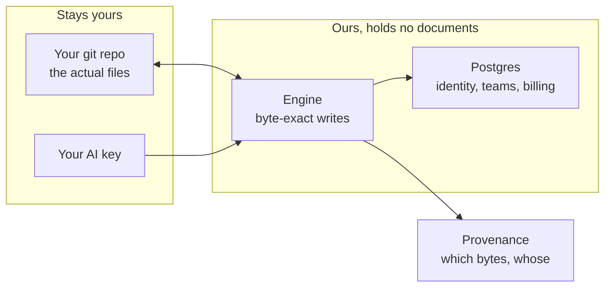

> [!note] **The one rule that governs the architecture: we never hold your documents.** It is the right thing ethically, it removes most of our legal surface, and it is commercially awkward because it means leaving us costs a user nothing. We accept that trade knowingly.

### 50. Every layer, decided

The full engineering plan runs to thirteen sections in the record. This is each decision and the reason, so you can argue with any of them.

::exhibit 49 | The eleven layers

| Layer | What we picked | What we rejected, and why |
|---|---|---|
| **Rendering** | Server components at the edges, one hydrated island for the editor | Full client SPA — loses the free public reader and forces an auth waterfall. Server-render per note — a round trip per tab switch is indefensible in an editor |
| **State** | Zustand, three stores, plus one deliberate non-store | Redux (ceremony), Jotai (fragments the outbox invariants), Context (re-renders on every keystroke). The `EditorView` is held in a module singleton because putting a mutable object in a store causes a render loop |
| **Editor core** | CodeMirror 6 | Already integrated. The real risk is the boundary: the engine speaks **bytes**, CodeMirror speaks **UTF-16 code units**. Every offset crosses a mapping layer or we corrupt multi-byte text |
| **API** | REST with idempotency keys on every write | A retried commit on flaky mobile must not duplicate a note. Error format is RFC 9457 |
| **Data** | One Postgres 18 as a control plane, **zero document bytes** | Supabase rejected: we write RLS and SQL functions by hand anyway, so the abstraction earns nothing. Documents never enter the database — that is the architecture, not an optimisation |
| **Auth** | GitHub App, not an OAuth app | An OAuth `repo` scope asks for everything. The App asks per-repository, and the consent screen is a conversion surface |
| **Writes** | PR-based by default | Architecturally honest for a product whose promise is not corrupting files. Direct commits are opt-in |
| **Blobs** | Cloudflare R2 | Free egress is load-bearing at our margins. Caveat: **R2 has no object versioning**, so disaster recovery must live in the key layout |
| **Hosting** | Vercel for the app, Cloudflare for the edge | Boring, managed, swappable. Two founders cannot run a cluster |
| **Desktop** | Tauri v2 | Already scaffolded. Today it is a thin wrapper pointing at a hosted URL — that is **not** a local-first app and turning it into one is real work |
| **Offline** | Service worker via `@serwist/next` | The hand-rolled one already caused a stale-chunk incident. Replace it |
| **AI** | User's own key first, ours as a paid option | Solves our budget and their trust in one decision. CORS means a browser may not be able to call some providers directly — this is checked per provider, not assumed |
| **CI** | GitHub Actions, ported from the sibling repo | One day. Currently absent entirely |

### 51. The things that will bite us

Named now so they are not surprises.

- **Byte offsets versus UTF-16 offsets.** The single riskiest seam. We already fixed one off-by-three here. Anything that crosses it without going through the mapping layer will corrupt non-English text, and it will do so silently.
- **Serverless connection pooling to Postgres.** A classic trap. Needs a pooler chosen deliberately, not discovered under load.
- **The GitHub App consent screen.** It is a conversion surface. Ask for too much and people bounce before they see the product.
- **R2 has no versioning.** If we overwrite a derived artifact wrongly, it is gone. Recovery has to be designed into how we name keys.
- **Our own CI does not exist.** Four gates in this repo reported green while blind. Until CI runs on a deliberately broken commit and fails, we do not actually know that our checks work.

### 52. Cost, security, and running it

| Concern | Position |
|---|---|
| **Infra cost at 100 users** | Near zero. Vercel + Neon free tiers + R2 grants cover it |
| **At 10,000 users** | Predictable and small, because we store no documents — the expensive thing in most SaaS is the thing we deliberately do not have |
| **The real cost** | Inference, if we host it. Which is why BYO key comes first |
| **Security posture** | No arbitrary code execution, ever. No plugins. This is why we can promise the file is safe |
| **Data protection** | Documents never leave the user's repo. Most of our compliance surface disappears by construction |
| **Reverse charge** | **Starts at the first rupee.** Buying Claude API access is importing a service; registration is compelled with no turnover floor |
| **On call** | Two founders and a team, no rotation. The free tier gets no SLA and we say so publicly |

### 53. The AI layer, and what AIOS actually contributes

We built an orchestration substrate for ourselves over four months — 131 skills, 149 scripts, 69 automated gates, 27 hooks, and 65 days of measured traces. The honest verdict earlier in this document is that **it does not ship as a product**. That is still true. But it is not nothing: it is four months of learning about how to make AI output reliable, and several of its parts become the AI layer inside frontmatter.

**The distinction that matters:** AIOS is a *way of working* we built for one power user with 74 written rules. Frontmatter needs a *product* for someone who has none. What transfers is the mechanism, never the machinery.

::exhibit 50 | What crosses over, and what stays behind

| AIOS part | What it does for us | Does it become product? | The shipped form |
|---|---|---|---|
| **Trace ledger** | Records every AI turn: model, tokens, latency, accepted or not, failure mode | **Yes** | The provenance store. Same idea, narrowed to one question: which bytes, by whom |
| **Complexity gate** | Classifies a task, routes to a cheap or expensive model | **Yes** | Model routing. A frontmatter fill is not a reasoning task and must never hit a frontier model |
| **Gates** (69 assertions) | Checks that run before anything is trusted | **Yes, later** | Document CI — link integrity, stale sections, unreviewed machine text |
| **Skills** (131) | Reusable, versioned instructions for recurring work | **Partly** | The five document templates. Not a gallery, not user-authored |
| **Hooks** (27) | Fire automatically on events | **No** | A user should never author a hook. That is a power-user surface |
| **Evals + judge** | Scores output quality against a rubric | **No, not yet** | Interesting internally. No user has asked to grade their AI |
| **Learned rules** | Accumulated corrections that stop repeat mistakes | **Maybe** | A project that remembers its own decisions is a real idea. Not v1 |
| **Shadow-promote ladder** | Runs a new path in parallel before serving it | **No** | Our own release discipline |

> [!warn] **The honest caveat, restated.** AIOS's own learning loop is not closing: 6,884 routing decisions in one week produced a single feedback label. We may not describe any of this as self-improving, and we should not ship a loop to users that does not yet work for us.

### 54. How the AI actually runs — local first, their key, their machine

This is the architectural answer to three problems at once: our AI budget, their trust, and working without a network.

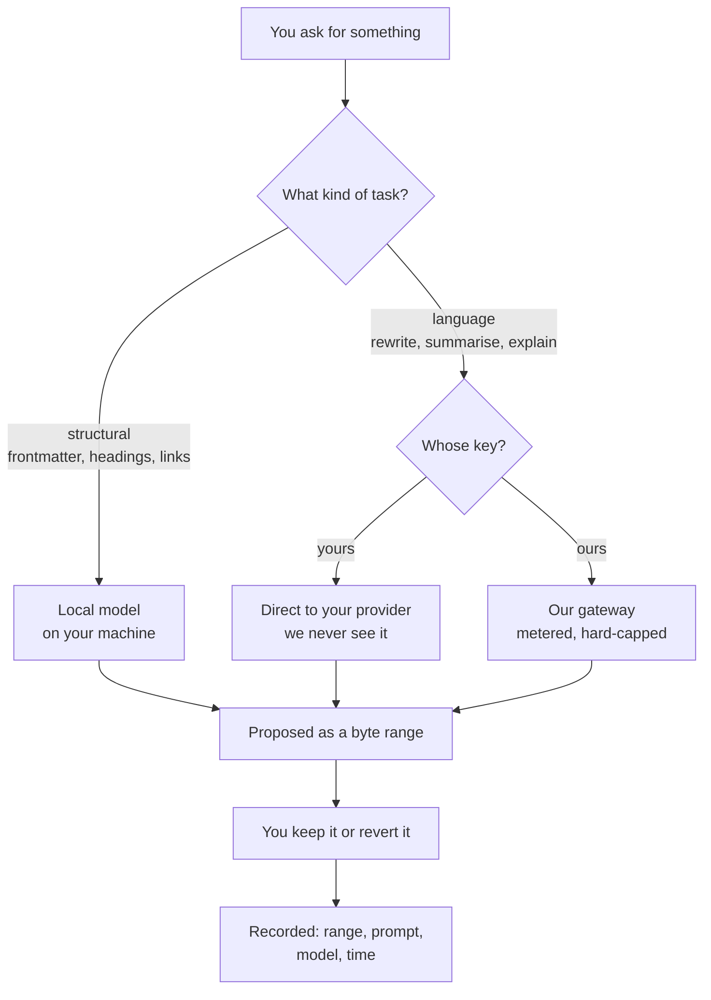

**The four rules this topology follows.**

- **Structural work never leaves the machine.** Filling a frontmatter key, fixing a link, generating a heading slug, proposing a table row — these need pattern matching, not reasoning. A small local model or plain code does them, offline, free.
- **Language work uses their key by default.** Their provider, their spend, their terms. **The request goes from their machine to their provider; it does not pass through us.** That removes a liability we do not want and a cost we cannot carry.
- **Our hosted option exists and is never the default.** Metered, hard-capped, and priced at cost plus a margin. A user who wants zero setup can have it; a user who wants zero trust in us can avoid it entirely.
- **No network, still a product.** Everything except language generation works offline: the editor, the engine, provenance, review, revert, refactor, search, git. **The AI is a feature of the product, not its precondition.**

::exhibit 51 | What works with no network and no key

| Capability | Offline? | Why |
|---|---|---|
| Editing, all four modes | YES | It is a local file |
| Provenance display and revert | YES | The record is a sidecar in your repo |
| Vault-wide refactor | YES | The engine is local code |
| Search | YES | Local index |
| Git commit, branch, diff | YES | Git is local |
| Structural AI — frontmatter, links, slugs | YES | Local model or plain rules |
| Language AI — rewrite, summarise, draft | NO | Needs a provider |
| Sync, team view | NO | Needs the network |

### 55. How the AI decides what to do — the routing model

Taken directly from the complexity gate we run on ourselves, simplified to something a user never has to see.

::exhibit 52 | Task class to model

| Task class | Example | Where it runs | Why |
|---|---|---|---|
| **Mechanical** | Slugify a heading · fix a broken link target · reorder frontmatter keys | Plain code, no model | It is a transformation, not a judgement |
| **Structural** | Fill a frontmatter field · propose a table row · suggest a tag | Local small model | Pattern work. Cheap, private, instant |
| **Language** | Rewrite a paragraph · summarise a section · draft from a template | Their provider, mid-tier model | Real generation, and the user is paying |
| **Reasoning** | "Is this decision record consistent with the spec?" | Their provider, frontier model, only on request | Expensive and rare. Never automatic |

**Three rules that keep the cost predictable.**

- **Nothing runs in the background.** No ambient passes, no automatic indexing with a model, no "while you were away". Every call is something a person asked for, which makes spend a function of use rather than of time.
- **Cap the output, not the input.** Our own measurement across 2,333 turns: **output tokens are 75.8% of spend**. Context is nearly free; generation is the cost.
- **Escalation is explicit.** If a cheap model refuses or produces something the user rejects, we say so and offer the expensive one. We never silently upgrade and bill them for it.

### 56. How the pieces fit together

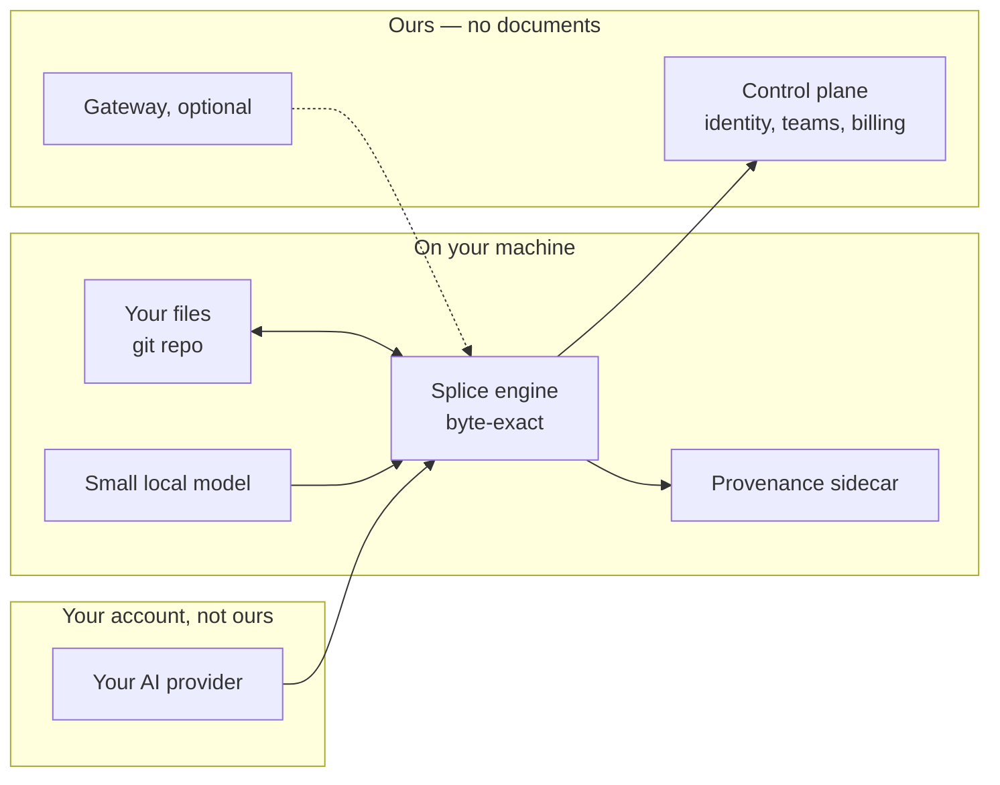

**Read the diagram for what is missing from it.** No document ever reaches the box on the right. The control plane knows who you are, what you pay for and who is on your team. It does not know what you wrote, what you asked the AI, or what it said back. That is not a policy we could change later — it is how the thing is built.

**Where AIOS's four months actually paid off.** Not in code we can lift, but in three lessons that shaped this design: route by task class rather than by model preference; measure acceptance rather than accuracy; and never ship a loop you cannot prove is closing. The first two are in the product. The third is why AIOS itself is not.

### 57. The architecture, front to back

::exhibit 53 | Every layer, what it owns, and where it runs

| Layer | Owns | Runs where | Talks to |
|---|---|---|---|
| **Editor shell** | Tabs, tree, modes, keyboard | Browser or desktop | Engine, provenance store |
| **Splice engine** | Byte ranges, refusal, round-trip safety | Same process as the editor | The file, the offset map |
| **Offset map** | Byte ↔ UTF-16 translation | Same process | Everything that moves text |
| **Provenance store** | Range, prompt, model, time, review flag | Sidecar file in the user's repo | Engine, review UI |
| **Local model** | Structural suggestions | The user's machine | Engine only |
| **AI gateway** | Routing, metering, caps | Our server, optional | Their provider or ours |
| **Repo connector** | Read tree, propose, commit | Our server | GitHub App |
| **Control plane** | Identity, teams, entitlements, billing | One Postgres | Everything except documents |
| **Gates** | Reference and staleness checks | CI, or locally | The repo |

**The one rule that shapes all of it:** documents move between the editor, the engine and the user's own git. They never enter the control plane. That is why a security review of this product is short.

### 58. Offline, online, and whether there is a phone app

::exhibit 54 | The three shapes

| | **Desktop (Tauri)** | **Web** | **Mobile** |
|---|---|---|---|
| Files | Direct filesystem access | Through a git repo | Repo only, read-mostly |
| Works offline | **Fully, minus language AI** | Editing only, via cache | Barely |
| Local model | Yes | No | No |
| Install friction | A download and a first-launch warning | None | App store review |
| Who it is for | The daily user | The trial, and the reader | Capture and review |
| When | MVP-0 | MVP-0, same build | **Not in v1** |

**The recommendation on mobile, and it is a refusal.** Roughly 15% of complaints in this category are about mobile, so the demand is real. But a byte-exact editor on a phone keyboard is not what anyone wants, and the two things a phone is genuinely good for — capturing a thought, and reviewing what the machine wrote while you are away from your desk — are a *different product* with a different surface. **Not in v1, and when it comes it should be a reader and a reviewer, not an editor.**

**The web and desktop are the same build.** Tauri wraps the same application; the difference is a filesystem adapter. That is a deliberate architectural choice so we never maintain two products.

### 59. Roles, permissions, and sharing

::exhibit 55 | Who can do what, and how it is enforced

| Operation | Our posture | Enforced by |
|---|---|---|
| Connect a repository | **Defer to GitHub.** Only someone with admin on the repo can install the App | GitHub, not us |
| Write bytes | **Intersection, checked at commit time.** The commit succeeds only if the acting identity has push rights *and* our own grant allows it | Both, evaluated together |
| Read and comment | **Ours.** Our grants apply to our rendered projection, not to the repo | Us |
| Commit attribution | **Deliberately duplicated.** The human's identity goes in the commit trailer even when an agent made the change | Git trailer + our provenance record |
| Team seats | Ours | Control plane |

**The principle underneath:** we never grant access to a repository that GitHub would not grant. We can only ever be *more* restrictive, never less. That means a security question about us becomes a question about GitHub's model, which is a much easier conversation.

### 60. Trust, safety, and the abuse surface

| Surface | The risk | What we do |
|---|---|---|
| Prompt injection in a document | A malicious document instructs the agent to exfiltrate other files | The AI never gets ambient repo access. Every read is scoped to what the user opened |
| A malicious repository | Someone connects a repo designed to break our parser | Shape gate: 4 MB and 200,000 line ceilings, strict UTF-8 decode, refuse rather than repair |
| Abuse of hosted AI | One account, an automation loop, a large bill | Hard caps, no background jobs, per-account ceilings |
| Publishing abuse | If we ever publish, a free indexable page is a spam magnet | Publishing is out of v1. If it returns: paid accounts only, noindex by default, system-assigned slugs |
| Our own supply chain | A dependency compromise reaching user files | No plugin system at all is the largest single mitigation we have |

### 61. Auth, hosting, caching and the rest of the plumbing

The parts nobody asks about until they break.

::exhibit 56 | The operational layers

| Layer | Decision | The reason, and the trap |
|---|---|---|
| **Authentication** | GitHub App installation, plus NextAuth for session. **Delete the second identity path** | Two auth paths is two session-fixation surfaces for one operator. We currently have an unused Firebase import in the client bundle |
| **Authorisation** | `workspace_id` on every row, pooled row-level security, from day one | **Retrofitting tenancy after launch is the highest-cost change on the board.** Not a later decision |
| **Hosting** | Vercel for the app, Cloudflare for edge and storage | Boring, managed, swappable. Two founders cannot run a cluster |
| **Environments** | Preview per pull request, one staging, one production | Preview environments are where the document gates actually run |
| **Caching** | Render cache keyed by content hash; nothing user-specific at the edge | A cache that can serve one user's document to another is the worst bug this product could have. Content-hash keys make it structurally impossible |
| **CDN** | Static assets only. Never documents | Documents do not leave the user's machine to be cached |
| **Rate limiting** | Per identity and per installation, not per IP | GitHub App installation tokens have their own limits we must live inside |
| **Search** | Postgres full-text and trigram server-side; MiniSearch client-side only | We currently ship the whole vault to the client — 77 MB parsed per cold start. That has to stop |
| **Backups** | The user's git repo *is* the backup for documents. Postgres has PITR | The thing normally hardest to back up is the thing we do not hold |
| **Disaster recovery** | R2 has **no object versioning** — recovery must be designed into the key layout | This is a real constraint, discovered by reading their docs rather than assuming |
| **Error tracking** | Sentry, with document content scrubbed at the SDK before send | **No session replay, ever.** The DOM we would be replaying is the user's private document |

### 62. Incremental parsing, and why it matters to a user

A technical decision that shows up as something a person feels.

- Re-parsing a large document on every keystroke is what makes editors feel heavy. Incremental parsing re-parses only what changed.
- The candidate is `@lezer/markdown`, which CodeMirror already uses. **Vendoring it is the recorded decision** rather than depending on it loosely, because we need to control exactly which constructs it recognises.
- **Why it is not optional:** our provenance spans have to survive edits happening around them. That means knowing precisely which byte ranges moved and by how much, on every keystroke, cheaply.
- **The user-visible measure:** time to first keystroke on a cold start, and typing latency on a 10,000-word document. We publish both.

### 63. What has to be fixed before anything else

These are not features. They are the reasons the product does not currently work.

| # | Problem | Effect today | Size |
|---|---|---|---|
| 1 | **NF-1** — a list item at column zero in frontmatter | **83% of real vaults are refused.** The front door does not open | 4 days |
| 2 | **NF-3** — a bare carriage-return fence | Silently adds a *second* frontmatter block. Destroys structure | 3 days |
| 3 | **No CI** | We have shipped on trust, and four gates have reported green while blind | 1 day |
| 4 | **Engine not wired in** | One symbol from one of thirteen files reaches product code | 8 days |
| 5 | **Byte budget is a stub** | Literally an `echo` command, in a product about correctness | 2 days |

## PART VII — The plan

### 64. Before we write any code — two weeks, zero rupees

This is the highest-value fortnight available to us, and it is the part I most want you to agree to.

::exhibit 57 | The four tests, and what kills each

| # | Test | What it costs | Kill signal |
|---|---|---|---|
| 1 | Show 10 AI-heavy developers a clickable mock of provenance. Ask what they would pay | 3 days | Fewer than 4 of 10 call it useful unprompted |
| 2 | Ship the nested-construct live-preview fix as a free Obsidian plugin | 4 days | Under 200 installs in 14 days |
| 3 | Ask 5 people who bill for documents whether "which part did the machine write" is a real problem | 2 days | Nobody has ever been asked for it |
| 4 | Three landing pages: free, $8/seat, $20/seat. Measure email capture | 2 days | No captures at any price |

- If **1 and 3 both fail**, the provenance thesis is dead and we should say so in week two rather than month six.
- If **2 succeeds**, we have an audience before we have a product. That has never been true for us before, and it is the cheapest distribution we will ever get.

### 65. MVP-0 — the proof

**Ten weeks elapsed** at our real availability, not six. The estimate assumes full-time work and we do not have it.

**The demo, in fifteen seconds:** open a document an agent has been editing. Machine-written spans are visibly marked. Hover shows the prompt and the model. One key reverts one. `git diff` shows nothing else changed.

| Ships | Days |
|---|---|
| NF-1, NF-2, NF-3 engine fixes | 8 |
| Provenance store — byte range, prompt, model, time | 6 |
| Provenance rendering — machine spans marked, hover detail | 5 |
| One-key revert | 3 |
| Engine wired behind every write path | 8 |
| Quick-switch, command palette, search | 6 |
| CI, with a deliberate red run first | 1 |
| Byte budget, real | 2 |

**Not in it:** sign-up, billing, sync, mobile, publishing, hosted AI, any render.

**Exit criterion:** ten strangers, their own repositories. **Six of ten say they would keep using it.** Not "like it" — keep it.

### 66. MVP-1 — the first money

- **Vault-wide refactor.** Rename a tag, a heading, a property key. Every link that will change shows as a reviewable hunk. Refuse when a target is ambiguous. This is the 86-like problem and it is the strongest asked-for capability our engine uniquely enables.
- **The editor stays free forever.** We charge for teams.
- **Team provenance** is the first paid line: shared repos, who-wrote-what across a team, per-seat. The model is Obsidian's commercial licence — $50/user/year with no enterprise features at all, which is what a nine-figure-logo B2B business actually looks like in this category.
- The unglamorous half: billing, a support inbox, terms of service, and a way to tell users about a breaking change. **None of these exist and all are required before the first paid signup.**

### 67. MVP-2 — the moat

- **Sync, done provably safely.** The #1 loved feature and #1 switching trigger. A competitor's sync duplicates sections of files; ours structurally cannot, and we can demonstrate it. This is also the only price this category has ever proven.
- **The free live-preview plugin** in Obsidian's store, permanently. 501 likes on the bug it fixes. It is the cheapest audience available to us and it should ship in week two regardless.

### 68. Money

| Line | Number |
|---|---|
| Monthly cost, the two of us plus infrastructure | ~₹1.09L |
| Consulting hours that cover it | 54–78/month |
| Hours left for product, per founder | ~120/month |
| Funding model | **Services. Four fixed-scope engagements a year at ₹3,00,000** |
| Why not a raise | ₹4 Cr is 367 months of our nut, from a fund with a 7-year horizon |

> [!test] **The pricing decision, which inverts our original plan.** The editor is free. Teams pay per seat. Sync is a separate paid service later. We charge for the two things this category has proven people pay for, and we give away the thing it has proven they do not.

### 69. The cost model, and how we avoid a surprise bill

| Where money goes | At 100 users | At 10,000 users |
|---|---|---|
| Hosting and edge | ~free tier | small, predictable |
| Database | free tier | modest — we store no documents |
| Object storage | free grants | low, egress is free on our provider |
| **AI inference** | **the only real cost** | **the only real risk** |
| Code signing | ~$250/year | same |
| Support | our hours | the binding constraint |

**How we make an unexpected bill structurally impossible.**

- **Bring your own key is the default.** Their key, their spend, our engine. This removes the risk entirely for the users who choose it.
- **A hard cap, not a soft one**, on any hosted usage. When it is reached we stop and say so, rather than continuing and invoicing.
- **Cheap models for cheap jobs.** Filling in a frontmatter field is not a reasoning task and should never touch a frontier model. Routing by task type is the single biggest lever on cost.
- **Nothing runs in the background.** No ambient AI, no automatic passes over the vault. Every call is something a person asked for, which makes the cost predictable by construction.
- **Measured, not guessed:** in our own usage data, output tokens are 75.8% of spend across 2,333 measured turns. Context is nearly free; generation is the cost. That tells us where to optimise and it is why we cap output length rather than input.

### 70. Where the money goes

::exhibit 58 | Cost, at three sizes

| | 100 users | 1,000 users | 10,000 users |
|---|---|---|---|
| Hosting and edge | free tier | ~$20/mo | ~$120/mo |
| Postgres control plane | free tier | ~$25/mo | ~$90/mo |
| Object storage | free grant | ~$5/mo | ~$40/mo |
| Email | free tier | ~$20/mo | ~$60/mo |
| Error tracking | free tier | ~$26/mo | ~$80/mo |
| **Infrastructure subtotal** | **~$0** | **~$96/mo** | **~$390/mo** |
| Hosted AI, if used | pass-through, capped | pass-through, capped | pass-through, capped |
| Code signing | ~$250/yr | same | same |
| **Support, in founder-hours** | ~2/mo | ~14/mo | **~90/mo — the real cost** |

**Read the last row.** Infrastructure at ten thousand users is under ₹35,000 a month, which is nothing. Support at ninety founder-hours is more than half a person. **The constraint on this business is attention, not servers**, which is why the free tier carries no service commitment and why we say so publicly.

**Why our costs stay flat where others' do not:** we store no documents, run nothing in the background, and pass inference through to the user's own provider by default. The three things that usually make a SaaS bill grow with usage are all absent by design.

### 71. Pricing, worked through properly

Our original ₹299/₹599 was set with evidence from zero humans. Here is what the category actually shows.

::exhibit 59 | What this market charges, opened and dated

| Product | Editor | Sync | Teams | What that tells us |
|---|---|---|---|---|
| **Obsidian** | **Free, no limits** | $4/user/mo | $50/user/yr commercial | The editor is worth nothing; sync and commercial use are worth money |
| Notion | — | included | ~$10/user/mo | Bundled, and not comparable |
| Cursor | — | — | ~$20/user/mo | What developers already pay for AI editing |
| Claude Code | — | — | inside $20–200 | The budget our buyer already has |
| Bear / Ulysses / iA Writer | $15–50/yr | — | — | One-time or cheap annual for a writing tool |
| GitBook / Mintlify | — | — | $6.70–$300+/mo | What teams pay for docs infrastructure |

**Four conclusions.**

- **Charging for the editor is charging for the free thing.** Obsidian settled this and everyone priced around it.
- **₹299 (~$3.13) is below the credibility floor.** A whole editor for less than one competitor's single add-on does not read as good value. It reads as unserious.
- **The two proven prices in this category are sync (~$4) and a commercial team licence (~$50/user/year).** Those are the two things we should charge for.
- **The buyer already spends $20–40/month on AI tooling.** We are not asking for a new budget line; we are asking for a share of one that exists.

::exhibit 60 | What I propose

| Tier | Price | What it is |
|---|---|---|
| **Individual** | **Free, forever, no limits** | The whole editor, provenance included. This is the distribution strategy |
| **Team** | **$8/user/month** | Shared provenance across a repo, review state visible across people, admin |
| **Sync** | $4/user/month, later | Only when it is provably safe. The one price this category has proven |
| BYO AI key | Free | Their key, their cost, our engine |
| Hosted AI | Metered, at cost plus a margin | Optional, and never the default |

**The arithmetic that matters.** At $8/seat, **114 paying seats** covers the monthly nut of ₹1.09L. That is roughly twenty small teams. It is a much more reachable number than 502 individuals at ₹299, and the churn on a team licence is far lower than on a personal subscription.

> [!test] **The pricing decision in one line: give away the thing the category has proven is free, and charge for the two things it has proven people pay for.** That inverts our original plan and it is better supported by evidence than anything we had.

### 72. Refunds, cancellation, and what happens to your data

Boring, and it is in the checkout flow, so it must be written before the first paid signup rather than after the first complaint.

| Situation | What happens |
|---|---|
| Cancel a team plan | Runs to the end of the paid period. No pro-rata clawback |
| Refund request inside 14 days | Granted, no questions. EU withdrawal rights make this mandatory for consumers anyway |
| After 14 days | Case by case, and generous. The reputational cost of a fight exceeds the money |
| Payment fails | Retry, then email, then a grace period, then downgrade to free. **Never delete anything** |
| Downgrade to free | Team features stop. **The editor keeps working and every file stays exactly where it is** |
| Account deleted | We erase identity and billing. Your documents were never ours to delete |

**The one that matters:** downgrading loses you features, never files. A user who stops paying keeps a working editor. That is unusual, it is a consequence of never holding their data, and it should be said out loud in the pricing page.

### 73. What comes in which plan

::exhibit 61 | The feature-to-tier map

| | **Free** | **Team — $8/user/mo** | **Sync — +$4/user/mo** |
|---|---|---|---|
| The whole editor | YES | YES | YES |
| Provenance: see what the machine wrote | YES | YES | YES |
| One-key revert | YES | YES | YES |
| Review state per document | YES | YES | YES |
| Vault-wide refactor | YES | YES | YES |
| Bring your own AI key | YES | YES | YES |
| Unlimited local vaults | YES | YES | YES |
| **Provenance across a shared repo** | NO | YES | YES |
| **Who on the team reviewed what** | NO | YES | YES |
| **Team admin, seats, roles** | NO | YES | YES |
| **Commercial-use licence** | NO | YES | YES |
| **Document gates in CI** | NO | YES | YES |
| **Multi-device sync, provably safe** | NO | NO | YES |
| Hosted AI, metered | optional | optional | optional |
| Support | community | published response window | published response window |

**The reasoning behind the split.** Everything an individual needs is free, permanently, including the differentiator. We charge the moment there is a *second person*, because that is where the value changes shape — provenance for one person is a convenience; provenance across a team is a record. And sync is separate because it is the one thing this category has proven people will pay for on its own.

> [!warn] **The obvious objection: we are giving away our differentiator.** Yes. Deliberately. Provenance free is what makes anyone try it at all, and a product nobody tries has no team to sell to. The paid thing is not the feature — it is the feature *across people*.

### 74. B2B and D2C, decided rather than described

**The counter-intuitive finding that shaped this.** The closest structural analogue to us runs a substantial business selling to companies **with no enterprise features whatsoever.** Obsidian's entire commercial offering is a $50/user/year licence; their own FAQ answers the "do I have to pay for commercial use" question and that is essentially the whole product.

That tells us our B2B strategy is probably not SSO, SCIM, audit exports and a SOC 2 report. It is a commercial licence and a clear answer about where the data lives.

::exhibit 62 | The two motions, honestly

| | **D2C** | **B2B** |
|---|---|---|
| The product | Free editor with provenance | Team provenance, shared review state |
| Price | ₹0 | $8/user/month |
| Who decides | One person, in a minute | One person, in a week |
| What they ask | "Is it fast?" | "Where does our data live?" |
| Our answer | Yes, and it is free | **In your own repository. We never hold it** |
| Cost to serve | Nearly zero | Support, and eventually a security questionnaire |
| Churn | High. Zero lock-in by design | Much lower. It becomes how the team works |
| Our readiness | Ready after MVP-0 | Needs billing, terms, and a support channel |

**What we can honestly sell to a company today**, because the architecture already does it:

- **Data residency, solved.** Their documents never leave their repository. This is normally an enterprise feature that costs months.
- **Exit, solved.** If they stop paying, they keep everything, because we were never holding it. That is unusual and worth saying out loud.
- **An audit trail of machine-written text.** Nobody else can offer this at all.

**What will stop a deal, priced:**

| Blocker | When it bites | Cost to fix |
|---|---|---|
| No SOC 2 | Above ~50 seats, or any regulated buyer | Months and real money. Defer |
| No SSO | Around 20+ seats | Weeks. Do it when asked, not before |
| One-person support expectation | The first incident | A published response window and honesty about the free tier having none |
| Indian entity selling to EU/US enterprise | Procurement, at larger sizes | A merchant of record handles most of it |

> [!note] **The recommendation: D2C free to build the audience, B2B paid to build the revenue, and do not build a single enterprise feature until a customer refuses to pay without it.** Obsidian's precedent says that can go a very long way.

### 75. Distribution — our weakest area, stated honestly

Everything above is a product argument. This is the part where I have least to offer, and I would rather say that than dress it up.

**What we have today:** no email list, no audience, no store presence, no inbound. Every channel we have identified belongs to someone else.

::exhibit 63 | Channels, and who actually owns them

| Channel | Who owns it | Compounds? | Our honest read |
|---|---|---|---|
| **The free Obsidian plugin** | Obsidian's store, under their rules | **Yes** | The cheapest audience we will ever buy. 501 likes on the bug it fixes. Ship it in week 2 regardless of everything else |
| Published pages with SEO | Us, if we build it | Yes, slowly | The only fully owned channel. Long payback |
| Hacker News | Nobody. One shot | No | Good for a spike, useless as a plan |
| GitHub presence | Partly ours | Yes | Open-sourcing the engine would earn trust and feed competitors. Real trade, not obvious |
| Content and writing | Us | Yes | Slow, and it is founder-time we do not have much of |
| Word of mouth | Earned | Yes | Requires a product people want to talk about. Provenance might be that; byte-exactness never was |

**The thing that would actually make it spread.** A shared artefact that carries a visible mark — a document where anyone can see which parts were machine-written. That is a product feature and a distribution mechanism at the same time, and it is the closest thing to virality this product has.

> [!warn] **Say this out loud: a good product does not find its own users.** We have assumed it will. The plugin is the one cheap, ownable move on the table, and it costs about four days.

### 76. Marketing — who, where, and what we say

We have never written this down and it is our weakest area, so this is a first draft to argue with rather than a plan to execute.

**The one-line message, by audience.**

| Audience | What we say |
|---|---|
| The developer using Claude Code daily | *"See which parts of your file the AI wrote. Undo any of them. Nothing else moves."* |
| A small team | *"Know what nobody has reviewed yet, across the whole repo."* |
| An agency or consultancy | *"Prove which parts of the deliverable were machine-written."* |
| Someone who just wants a markdown editor | *"It is free, it is fast, and it never touches a byte you did not ask it to."* |

**Where these people actually are**, ranked by how cheaply we can reach them.

::exhibit 64 | Channels, honestly rated

| Channel | Size / reach | Cost to us | Do we own it? | Verdict |
|---|---|---|---|---|
| **Obsidian plugin store** | Every Obsidian user | 4 days | No — their rules | **Do it in week 2.** Best value available |
| r/ObsidianMD, r/ClaudeAI, r/ChatGPTCoding | Large, active, sceptical | Founder hours | No | Participate honestly; never launch-post |
| Hacker News | One shot, high variance | One day | No | Save it for something finished |
| Our own published docs and SEO | Slow to build | Ongoing | **Yes** | The only fully owned channel. Start now, expect nothing for 6 months |
| GitHub — the engine as an open library | Developers who will never buy | Weeks | Partly | Trust and credibility; also feeds competitors |
| Writing about what we learned | Small but compounding | Founder hours | **Yes** | The research behind this document is genuinely interesting and almost none of it is public |
| Paid ads | — | Money we do not have | No | Not now, and possibly never |

**The asset we already have and have not used.** We ran 26 research rounds and found things nobody has published — that byte-exactness is almost never discussed, that 89 context-pack products launched in 20 months with a median score of 2, that slop is 23.7% of complaints and rising. **That research is the marketing.** It is honest, it is specific, and it makes the case for the product without selling it.

**What we do not do:** no launch countdown, no waitlist theatre, no "we are building in public" posting that is really just posting. If we have nothing to show, we say nothing.

### 77. Positioning — how we say it

**The rule: lead with the problem, never the mechanism.** "Byte-preserving splice engine" is what we built. "You can see what the AI wrote" is what someone buys.

::exhibit 65 | The message ladder

| Length | The message |
|---|---|
| 5 words | **See what the AI wrote.** |
| 1 line | A markdown editor that shows which parts of your document a machine wrote — and lets you undo any of them. |
| 1 paragraph | You write with AI now. A week later nobody knows which paragraphs were generated and never properly read. frontmatter records every AI edit as an exact byte range, marks it in the document, and reverts it with one key — leaving every other byte untouched. |
| The proof | `git diff` after an edit shows your change and nothing else. Tested on 8,513 real files, every release. |

**What we never say:** "revolutionary", "seamless", "powerful", "AI-native", "10x". Also never "byte-preserving" in a headline — it is the reason, not the pitch.

**Objection-led positioning.** Our audience is sceptical of AI tooling, so lead with what we *refuse* to do: no plugins, no code execution, no holding your files, no lock-in. **The refusals are more persuasive than the features** to this buyer.

### 78. What we actually say when we sell it

::exhibit 66 | The selling points, in order of how much they land

| # | The point | Who it lands with | Evidence behind it |
|---|---|---|---|
| 1 | **See which parts the AI wrote, and undo any of them** | Anyone reviewing AI output | Slop is 23.7% of complaints and rising 149% |
| 2 | **Rename across nine hundred files and see every change first** | Anyone with a real vault | 86 likes on broken-links-on-rename |
| 3 | **Your files never leave your machine** | Sceptical and regulated buyers | It is architectural, not a promise |
| 4 | **If we disappear, you lose nothing** | Every small-vendor objection | There is nothing to take back |
| 5 | **It reads the folder you already have** | Everyone | No import, no migration, no new format |
| 6 | **Free for one person, forever** | The whole top of funnel | The category has settled this |
| 7 | It refuses rather than guessing | Engineers, once they understand it | Needs demonstrating, not explaining |

**The one we lead with changes by audience** — but never lead with the engine. "Byte-preserving splice" is the reason all seven are true; it is not one of the seven.

### 79. Launch — Product Hunt and the rest

::exhibit 67 | The launch surfaces, ranked

| Surface | When | What we need ready | Realistic outcome |
|---|---|---|---|
| **Obsidian plugin store** | **Week 2, before anything else** | The live-preview fix, a README, a GIF | The only compounding channel. Measure installs at day 14 |
| **Show HN** | After 6 of 10 strangers keep it | Working binary, a 20-second GIF, one honest paragraph | One-shot. High variance. Good for a spike, not a plan |
| **Product Hunt** | MVP-1, when there is something to pay for | Gallery, a 60-second video, a hunter, a first comment that is not marketing | A day of traffic; converts poorly for developer tools but earns durable backlinks |
| **r/ObsidianMD, r/ClaudeAI** | Continuously, never as a launch | Genuine participation for weeks first | These communities punish launch-posting and reward being useful |
| **GitHub** | When the engine is stable | The engine as a readable open library | Credibility with the exact people we want; also feeds competitors |
| **Our own writing** | Start now | The research in this document | **Slowest and the only one we own** |

**The Product Hunt specifics**, since you asked: ship on a Tuesday or Wednesday, have the first comment written before launch (it should explain what you *refused* to build, not what you built), reply to every comment within the hour for the first six, and treat the day as backlinks and a spike — not as a growth strategy.

**What we launch with is not the product, it is the demo.** Fifteen seconds: a document with machine spans marked, one key pressed, `git diff` showing nothing else moved. If that clip is not compelling, no launch surface will save it — and if it is, they all work.

### 80. How users hear from us, and how they reach us

The record found we had **no route to tell a user anything** — not a breaking change, not a price change, not a security incident. That is an operational defect, not a marketing gap.

| Message | Trigger | How it reaches them |
|---|---|---|
| Security or data incident | Any unauthorised access | Email if we have one, and the in-product notice ledger regardless |
| Breaking change | Any change to how files are written | In-product notice, two weeks ahead |
| Price change | Before it takes effect | Email, always, before the next charge |
| Payment failure | Card declined | Email plus in-product |
| Team invite | Someone invites them | Email — it is the only contact point |
| Account recovery | They ask | Email |
| Release notes | Every release | In-product, dismissible, never a modal |

**The identity rule.** We collect an email **only when an obligation is created** — enabling sync, paying, being invited, or asking for recovery. Never at first run. A user who never gives us an address is a permanently supported state, not a funnel leak.

**The in-product notice ledger.** A small, quiet list the user can open, where every notice we have ever sent them lives. Not a modal, not a badge that nags. It exists so that "we told you" is verifiable by them, not just by us.

**How they reach us:** one email address, a published response window, and an honest statement that the free tier has no service commitment. One person on call cannot promise more than that, and promising more is how you get a reputation for silence.

### 81. How people actually get it, and keep it updated

You asked how users install it. This is the part of a desktop product that quietly decides whether anyone uses it.

::exhibit 68 | Distribution, by surface

| Surface | How they get it | What it costs us |
|---|---|---|
| **Web** | Visit a URL. Nothing to install. Works with a GitHub repo | Nothing. This is the trial |
| **macOS desktop** | Download a `.dmg`, drag to Applications | **Apple notarisation and a Developer ID certificate — $99/year and a build step.** Without it macOS shows a scary warning and most people stop |
| **Windows desktop** | Download an `.exe` | **Code-signing certificate. Roughly $150–400/year, now requiring a hardware token, and certificate validity has dropped to 460 days** |
| **Linux** | AppImage or a `.deb` | Nearly free. Small audience, high goodwill |
| **Obsidian plugin** | Their community store, one click | Free, and it is our best channel — but they own the rules |
| **Updates** | Tauri's built-in updater, signed | Must be set up correctly from the first release or you cannot ship a fix |

**The sequence I would follow.**

- **Web first.** Zero install friction, and it lets someone try the product in a browser tab before committing.
- **macOS second**, notarised properly. Our audience skews Mac-heavy and an unsigned app reads as unsafe.
- **The Obsidian plugin in parallel**, week two, because it is free distribution and independent of everything else.
- **Windows and Linux when asked for**, not before. The code-signing cost and the hardware-token requirement make Windows the most expensive platform to enter.

> [!warn] **Two things that will catch us out.** Code-signing certificates now require a physical hardware token and renew on a shorter cycle than they used to — that is a recurring cost and an operational chore, not a one-off. And the auto-updater has to be signed and configured before the first public build; retrofitting it means asking every early user to manually re-download, which is exactly how you lose them.

### 82. How we know what we know

So you can judge the evidence rather than take it on trust.

| | |
|---|---|
| Research rounds | 26 |
| Agent reports | 109 |
| Words of research banked | ~282,000 |
| The full record | 137 sections, 338,194 words, 325 pages |
| Sources opened directly | Hacker News API, Reddit JSON, GitHub API, arXiv, vendor pricing pages, Indian tax and EU regulation primary texts |
| Things measured on our own machine | The corpus run, the table-editor byte destruction, the trace ledger, the code comparison with `sgnk-md` |

**Where the evidence is weak, and you should discount accordingly:**

- **Reddit was intermittently blocked.** One round got through, another got 403 on every endpoint. Some of our sentiment data is Hacker News only, which skews toward launches and strong opinions rather than daily use.
- **Zero user interviews.** Not one. Everything about demand is inferred from public complaints. That is why the two-week test exists.
- **Some numbers are still unverified.** We opened primary sources for the twenty-one that mattered most; 62% of those needed correction. The rest of the record has not had that treatment.
- **No pricing has been tested with a human.** ₹299 came from us, not from anyone who would pay it.

> [!note] **The most important methodological point.** We ran adversarial rounds specifically permitted to refute our own thesis, and they did — twice. That is the reason to trust the rest of it. A research process that never contradicts its sponsor is marketing.

### 83. What we have not done, and would do next

Being explicit about the edges of this document.

| Not done | Why it matters | Cost to close |
|---|---|---|
| **Zero user interviews** | Every demand claim is inferred from public complaints | Two weeks. It is test #1 |
| No pricing tested with a human | ₹299 came from us, not a buyer | Included in the two weeks |
| No visual design work | We have a design system and no screens drawn | One week with the system we already own |
| Reddit access was intermittent | Some sentiment data is Hacker News only, which skews to launches | Re-run when access is stable |
| No performance benchmark against Obsidian | Speed is the most-loved attribute in the category and we have not measured ours | Two days |
| Sync is designed but unproven | It is MVP-2 and the hardest thing on the list | Deliberately deferred |
| No security review by anyone outside | We are asserting our own safety | A paid review before the first team customer |

### 84. The words we use, defined

Because half of these mean different things to different people.

| Term | What we mean by it |
|---|---|
| **Splice** | Replacing an exact byte range and nothing else |
| **Provenance** | The record of which bytes a machine wrote, with prompt, model and time |
| **Span** | One contiguous byte range with a provenance record attached |
| **Reviewed** | A human has looked at a span and accepted it. It then renders as ordinary text |
| **Refusal** | We could not locate a change unambiguously, so we changed nothing and said why |
| **The corpus** | 8,513 real markdown files from strangers' public vaults, pinned by checksum |
| **Red proof** | A test that fails against the unfixed code. Until it fails, it does not cover the bug |
| **Carrier** | How we write something markdown has no syntax for — a callout for prose, a fence for data |
| **The gates** | Automated checks over a repo of documents: references resolve, nothing is stale |
| **Vault** | A folder of markdown the user already had. We never create one |

### 85. What we measure, and what we refuse to measure

| We measure | Why |
|---|---|
| Time to first keystroke, cold | The most-cited reason people love or leave an editor |
| Corpus refusal rate | Our front door. Must fall from 83% to near zero |
| Conflict rate on merges | If we refuse too often we will hear it from users first unless we watch it |
| Share of a document that is unreviewed machine text | The product's own core metric |
| Plugin installs | Our only owned channel |
| Team conversations to conversion | The real B2B funnel |

| We refuse to measure | Why |
|---|---|
| Session replay | The DOM we would be replaying is the user's private document |
| Keystroke-level telemetry | Same reason |
| Document content, ever | We never hold documents. That is the promise |
| Vanity metrics — signups, stars, page views | They move without the business moving |

### 86. The ninety days, week by week

Assumes both of us, part-time on product, with client work continuing to fund everything.

::exhibit 69 | The plan, with an observable outcome every fortnight

| Weeks | What happens | Observable outcome |
|---|---|---|
| **0** | Rotate the two access tokens. Answer decision #1: which buyer | Tokens rotated. Buyer written down |
| **1–2** | The four tests. Build nothing | 10 developer conversations, a plugin shipped, 5 liable-buyer conversations, 3 landing pages live |
| **2** | **Ship the free live-preview plugin regardless of anything else** | Installs measurable by day 14 |
| **3** | Read the results. Go or no-go on provenance | A written decision, either way |
| **3–4** | CI, with a deliberate red run. NF-3, then NF-1 | CI fails on a broken commit. Corpus refusals drop from 83% |
| **5–7** | Provenance store and rendering | A document shows machine spans |
| **8–9** | One-key revert, review state, engine wired behind every write | The demo works end to end |
| **10–12** | Table stakes: quick-switch, palette, search. Ten strangers try it | 6 of 10 say they would keep it |
| **13** | Decide MVP-1 scope on what the ten said | Written scope |

### 87. What we decide, and when we stop

::exhibit 70 | Decisions with owners

| # | Decision | Owner | By |
|---|---|---|---|
| 1 | **Which buyer** — the AI-native developer, or the person liable when a document is wrong | Both of us | Week 1 |
| 2 | Accept provenance as the product, byte-exactness as the mechanism | Both | Week 1 |
| 3 | Editor free, charge for teams | Both | Week 2 |
| 4 | The two unrotated access tokens | Sagnik | **Today** |
| 5 | Do we ship the free plugin regardless of test 1 | Both | Week 2 |

::exhibit 71 | The kill switches, dated

| Bet | Falsified when | By |
|---|---|---|
| Provenance is wanted | Fewer than 4 of 10 developers call it useful unprompted | Day 14 |
| The 83% refusal is one bug, not a class | First patched corpus run still refuses more than 10 of 7,969 | Day 24 |
| Our gates can see | CI passes on a deliberately broken commit | Day 3 |
| The audience is reachable | Under 200 plugin installs in 14 days | Day 14 |
| Anyone pays | 60 days with a working checkout and zero non-founder paid signups | Day 150 |
| Teams pay | No team converts after 20 qualified conversations | Day 180 |

### 88. The decisions only you can make

| # | Decision | Why it is first |
|---|---|---|
| 1 | **One founder or two?** | Every calendar and cost number depends on it. The record contradicts itself |
| 2 | **Which buyer** — the AI-native developer, or the person who is liable when a document is wrong? | They want different products. We have been building for both |
| 3 | **Do you accept provenance as the product**, and byte-exactness as the mechanism rather than the pitch? | It changes the demo, the copy and the price |
| 4 | Editor free, charge for teams and sync? | Inverts the revenue plan |
| 5 | The two unrotated PATs | Not a decision. An action. Today |

> [!risk] **What would make me tell you to stop.** If the two-week tests come back with fewer than 4 of 10 developers calling provenance useful, and nobody who bills for documents has ever been asked for it, then there is no product here — only an engine, a consulting business, and a free plugin that makes people happy. That is not a failure. It is a smaller, truer version of the same work, and it pays better sooner.

### 89. Everything we are betting on, in one place

::exhibit 72 | The bets, and the evidence that would settle each

| # | The bet | Falsified when | When we know |
|---|---|---|---|
| 1 | People want to know what the machine wrote | Under 4 of 10 developers say it unprompted | Day 14 |
| 2 | We can reach anyone at all | Under 200 plugin installs in 14 days | Day 14 |
| 3 | The 83% refusal is one bug, not a class | Patched corpus still refuses over 10 of 7,969 | Day 24 |
| 4 | Our own gates can see | CI passes a deliberately broken commit | Day 21 |
| 5 | The demo lands | Under 6 of 10 strangers keep it | Day 84 |
| 6 | Teams pay | No team converts after 20 qualified conversations | Day 180 |
| 7 | Slop stays a problem | The complaint rate falls two quarters running | Ongoing |
| 8 | We stay funded | Client work exceeds 78 hours/month for two months | Monthly |

> [!good] **Why I think this is worth doing, stated plainly.** We have built the only editing engine in this category that does not damage files, and the incumbents have publicly admitted they have the defect. We were describing it wrongly — as a promise about bytes rather than as a capability nobody else can offer. Provenance is that capability. It answers the fastest-growing complaint in the market, it reuses ninety percent of what exists, and it cannot be copied by anyone who rewrites whole files. The two weeks of tests cost nothing and will tell us whether that reasoning survives contact with real people. If it does not, we will have lost a fortnight and gained the most valuable thing we could have bought.

### 90. If I am wrong, here is how we will know early

The failure mode I most want to avoid is spending ten weeks and learning nothing. Every phase has a signal that arrives before the money runs out.

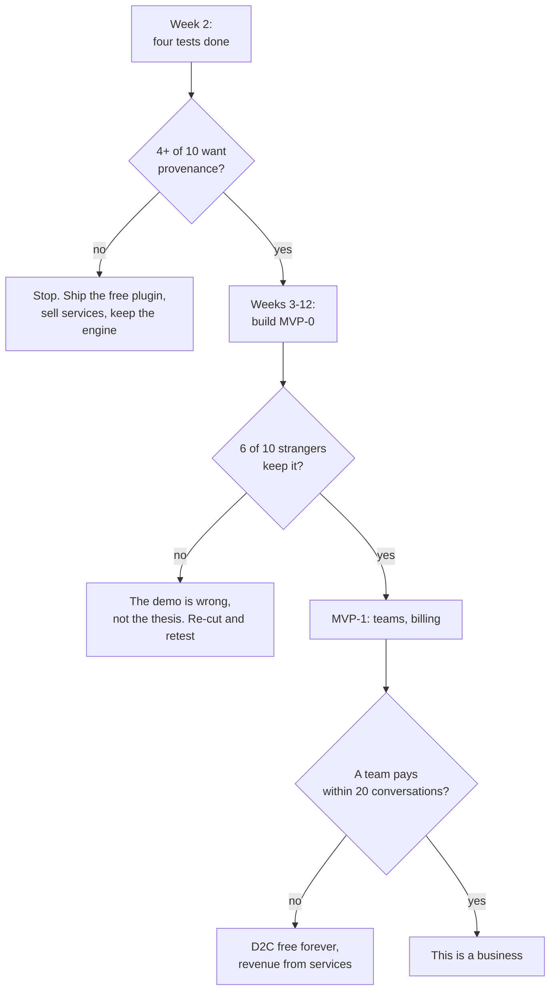

**Note what the "no" branches are.** None of them is "we wasted two years". Every one lands somewhere useful — a free tool people like, an engine that works, a services business already paying our bills. **That asymmetry is the actual argument for trying.**

### 91. What I actually think

- **The engine is the best thing either of us has built.** It is correct in a way the funded competitors are not, and they have admitted the defect in public.
- **We were selling it wrong.** "We don't corrupt your bytes" is a promise nobody asked for. "You can see which parts the machine wrote, and undo any of them" is the same engine answering the fastest-growing complaint in the market.
- **The two weeks of testing matter more than the ten weeks of building.** If provenance is not wanted, we will know in a fortnight for nothing, and the alternative — an engine, a services business, and a free plugin people love — is not a failure.
- **The thing I am least sure about is distribution**, and I would rather we spend a real week on that question than assume a good product finds its own users. It does not.

> [!good] **My recommendation.** Run the four tests. Ship the free plugin in week two whatever happens. If provenance clears the bar, build MVP-0 over ten weeks funded by services, keep the editor free, and charge teams. If it does not clear the bar, we will have spent two weeks and learned the most valuable thing available to us.

