# frontmatter
## Product and technical plan — pilot, pro, max

> Technical documentation, Studio Zephyrus. Market figures re-checked against 157 primary sources on 2026-09-06; browser support, repo-tooling and hosting figures added 2026-09-08. Corrections to earlier versions are marked where they apply. Features are labelled by their evidence: **public evidence**, **founder user test**, or **untested**.

::keyfigures
75–85k — public repos hold superpowers specs and plans; 22–30k touched in the last 30 days
11,072 — public repos hold a spec-kit constitution; about 1,660 touched their specs in 30 days
0 — of the tools that write those files is an editor, and none keeps review state
2 — browsers that can open a local folder without an install: desktop Chrome and Edge
6 — AI routes already live in the repo, on a five-provider fallback chain
::

## PART I — Product

### 1. Definition

> [!good] **frontmatter is a markdown editor that shows what an agent changed and what nobody has reviewed yet, on files that stay in the user's own repo.** Every span changed since a person last read it is tinted. One key reverts any span. Author and prompt are shown when the write carried them. The file is edited byte-exactly: only the requested range changes.

**Core loop**

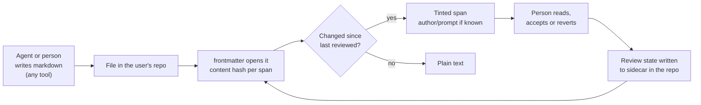

**Not in the product:** no plugins or code execution, no hosting of user content, no vendor database holding document bytes, no project management, no chat sidebar, no mobile editor in v1.

**Demo, fifteen seconds.** Run the agent's spec command. Open the spec in frontmatter: every paragraph tinted. Read one, it clears. Revert one, `git diff` shows only that line. The panel lists what is still unread.

### 2. Feature specification

Each feature: what it does, how it works, what it needs, when it ships, and whether it works online without an install and offline in the desktop app. Days are engineering estimates for the current team; they assume the engine fixes in §9 land first.

::exhibit 1 | Features, specified

| # | Feature | What it does | How it works | Needs | Ships | Web, no install | Desktop, offline | Evidence |
|---|---|---|---|---|---|---|---|---|
| F1 | **Editor** | Live, Edit, Split, Read. Tree, tabs, quick-switch, palette, search, properties panel for frontmatter | CodeMirror 6 over the splice engine; every write is a byte-range replacement | Exists. NF-1/NF-3 fixes (7d), engine wiring (8d) | MVP-0 | Yes | Yes | Public: editor is table stakes |
| F2 | **Review state** | Tints every span changed since a person last read it; one-key revert; review panel with a counter | Per-span content hash in `.frontmatter/review.jsonl` beside the files, in the repo. Spans anchored by byte range + hash, relocated by the splice locator when the file changes | Store 6d, rendering 5d, revert 3d, panel 4d | MVP-0 | Yes | Yes | Public: unrequested-change pain (262 reactions on diff review). **Untested as a product** — the two-week test |
| F3 | **Attribution** | Author, model, time and prompt on hover | Read from what the write carried: an MCP write (F11), a commit trailer, a git-ai note, signed provenance metadata. Absent when none exists, and the card says so | Reader for trailers/notes 3d | MVP-0 (readers), MVP-1 (MCP) | Yes | Yes | Public: authorship marking alone did not sell (iA Writer 7) |
| F4 | **Answer in place** | Answers `[NEEDS CLARIFICATION]` and `Q: → A:` markers inline; one line changes | Marker detection + splice into the marker's byte range | 3d | MVP-0 | Yes | Yes | Public: ~1,500 live public files, spec-kit only |
| F5 | **Idea mode** | Generates a PRD, FRD, BRD, product note or spec from a typed idea or from the repo (README + specs) | Exists: `generate-document`, five prompt kinds, `/api/ai/generate-doc`. Output arrives as tinted spans; nothing written until kept | Structured output in the port 2d; "from repo" input 2d | MVP-0 | Yes, with the user's key | Needs network for the model; offline: no | **Founder user test** (reported). Public: standalone PRD generators have no traction — top repo 57 stars of 512 |
| F6 | **Decision flow** | Before generating, asks the questions the idea leaves open; answers are written into the frontmatter and shape the document | Structured question list from the LLM port; answers stored as frontmatter keys the generator reads | 4d, after F5's structured output | MVP-0, inside F5 | Yes, with key | No | **Founder user test** (reported). Public: `/speckit.clarify`, Kiro and Claude Code plan mode ship the same step free — the difference is that ours writes into the document and stays reviewable |
| F7 | **Repo docs scan** | Reads every markdown file in a repo and proposes: stale sections (doc older than the code it cites), broken links, missing standard docs (AGENTS.md, CHANGELOG), and offers to generate them | No model for the scan: git dates per file, `package.json` scripts, link resolution (`link-doctor` exists). Generation reuses F5. Shows exactly what was read | Staleness heuristic 4d, missing-doc templates 2d, S13 UI 4d | MVP-0 | Yes: scan runs in the browser on fetched bytes | Yes: scan needs no network | **Founder direction.** Public: Vale 6,087 stars and markdownlint 6,326 are the incumbents for lint; no incumbent proposes edits with review state. README generators: 11,131 stars, abandoned 2022 |
| F8 | **File-scoped AI** | Two verbs on the open file: fix or critique this selection; summarise this file. Collapsed by default; a hide-all switch | Bring-your-own key, request from the user's machine to the provider. Proposals arrive as tinted spans | BYO key UI + keychain 3d | MVP-0 | Yes, with key | No | Public: editing supplied text is 10.6% of ChatGPT messages; incumbents hide AI until invoked |
| F9 | **Vault-wide refactor** | Rename a tag, heading or key across the vault; every hunk reviewable; ambiguity refused | Engine splice across files; refusal on fenced or ambiguous matches | 8d | MVP-1 | Yes | Yes | Public: 86 likes on broken-links-on-rename |
| F10 | **Shared review state, comments** | What each person has read, across a team; comments anchored to spans | Same sidecar, per-person entries; comments as a sidecar too, never in the file (every in-file syntax renders as garbage on GitHub) | 10d | MVP-1 | Yes | Local only until push | Public: GitHub Team sells reviewers at $4; **untested** whether teams pay for this |
| F11 | **MCP server** | The user's agent writes through frontmatter, so writes carry the prompt | Local MCP server in the desktop app; agents connect by config | 6d | MVP-1 | No: needs a local process | Yes | **Untested** whether agents route writes through a third-party tool |
| F12 | **Sync** | Multi-device, provably safe | Git merge, never a CRDT; conflicts surfaced, never guessed | 15d+ | MVP-2 | Yes | Local edits, sync on reconnect | Public: sync is the one proven individual price |
| F13 | **Export** | Single document or folder to HTML, PDF, copy-as-HTML; decks only if a pilot user asks | Templating, no model | 5d | MVP-2 | Yes | Yes | Public: export beats decks 2:1; sites are wanted hosted, which is refused |

**Founder-validated features.** F5 and F6 were reported as tested with users by the founders. Public evidence for them is weak as standalone tools and does not contradict an in-editor test. They ship in MVP-0 on that basis, inside the review-state loop: generated text arrives tinted and is not written until kept.

### 3. Access model

Two ways to use frontmatter. What each can do is fixed by the browser and the platform, not by the plan.

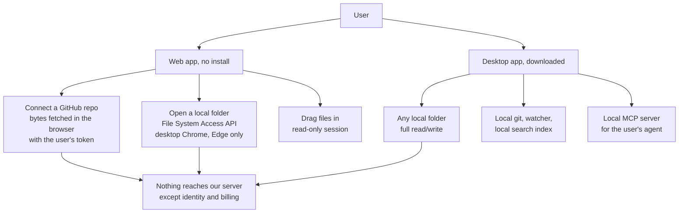

::exhibit 2 | What works where

| Capability | Web, GitHub repo | Web, local folder (Chrome, Edge) | Web, Firefox, Safari, mobile | Desktop app |
|---|---|---|---|---|
| Open and edit files | Yes; writes become commits or PRs | Yes, direct writes with a per-folder permission | Repo connect or drag-in only | Yes |
| Review state (F2) | Yes; sidecar committed with the files | Yes | Repo connect only | Yes |
| Repo docs scan (F7) | Yes, on fetched bytes | Yes | Repo connect only | Yes, offline |
| Idea mode, AI panel (F5, F6, F8) | With the user's key | With key | With key | With key; needs network for the model |
| MCP server (F11) | No | No | No | Yes |
| Offline | Cached open files only | Cached | No | Everything except the model |
| Local git, watcher, index | No | No | No | Yes |

**Browser support, fetched 2026-09-08 (caniuse):** the File System Access API is supported in desktop Chrome and Edge and in none of Firefox, Safari, iOS Safari, Android Chrome or Samsung Internet. **GitHub's REST API supports CORS**, so a repo's bytes can be fetched in the browser with the user's token; the vendor server never sees them.

**What the user downloads.** A Tauri v2 desktop app: macOS `.dmg` (notarised, Apple Developer ID $99/year), Windows `.exe` (code-signed, $150–400/year, hardware token required), Linux AppImage. It contains the editor, the engine, a git client, the MCP server and the search index. It contains no model. Tauri reuses the operating system's webview instead of bundling a browser; the installer size is measured at the first build. The auto-updater must be signed and configured before the first public build. Note: the current `src-tauri` config still carries the sibling app's identity (`productName` sgnk-md, `ai.sgnk.md`) and must be re-identified.

**If the user does not download.** They get F1–F8 in the browser against a GitHub repo, or against a local folder on Chrome and Edge. They do not get MCP, local git, a background watcher, or offline beyond cached files. The web app is the trial; the desktop app is the daily surface. Both are one build with a filesystem adapter, so there is one product to maintain.

### 4. Architecture

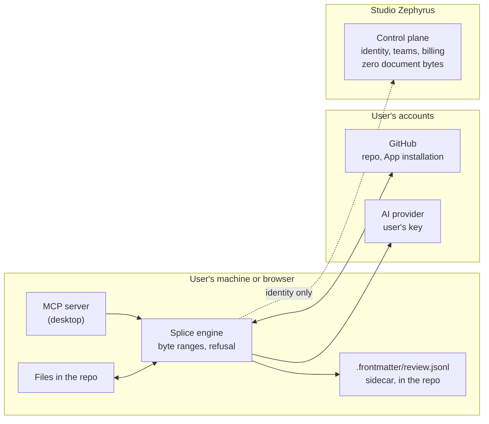

**Data path.** Document bytes move between the editor, the engine and the user's git. In the web app they are fetched from GitHub in the browser. The control plane holds identity, team membership, entitlements and billing, and no document bytes. The AI request goes from the user's machine to their provider. Hosted AI, if ever enabled, is metered and hard-capped and never the default.

**Sidecar format.** `.frontmatter/review.jsonl`, one JSON line per span: file path, byte start, byte end, content hash, reviewed-by, reviewed-at, and, when known, author, model, prompt. Plain text, documented, readable without frontmatter. Spans are relocated by the splice locator on every edit; the journal is not the anchor, because git, other editors and agents bypass it. The nearest shipped pattern is SpecKit Companion's `.spec-context.json` (9,367 installs); frontmatter's must be visibly better: per-span, per-person, any tool.

**Cost rules.** Nothing runs in the background; spend follows use. Output tokens are 75.8% of model spend, so output is capped, not input. Infrastructure is about $0 at 100 users and about $390/month at 10,000 because no documents are stored. Support is the real cost at scale, about 90 founder-hours a month at 10,000 users.

## PART II — Market

### 5. Who does what, and where each stops

::exhibit 3 | Fetched 2026-09-06 and 2026-09-08

| | Tool | Reach | What it does | Where it stops |
|---|---|---|---|---|
| **Spec writers** | obra/superpowers | 75–85k public repos; 22–30k active in 30 days; marketplace counter 1,009,371 (cached) | Brainstorm, design, write the spec, commit it | Terminal. No editor, no review state |
| | github/spec-kit | 11,072 public repos; about 1,660 active | `/speckit.specify`, `/speckit.clarify` (in chat), plan, tasks, implement | Writes markdown, then leaves |
| | Plan mode, Claude Code and Cursor | Out-scores both named tools on Reddit (1,776 / 1,409 / 1,329 points vs 38 or fewer) | Plans as markdown files | Where the files live is untested |
| **Review surfaces** | Claude Code, VS Code extension | 24.89M installs | Plans as a markdown document with inline comments since 2.1.70 (2026-03-06) | Per session. Diff-review UI open at 262 reactions |
| | git-ai; VS Code 1.118 | 61,517 installs; AI co-author trailers by default | Line attribution after the fact; commit trailers | Commit granularity, nothing per span |
| | SpecKit Companion | 9,367 installs | Review state in `.spec-context.json` per spec | Spec-kit only |
| **Docs tooling** | Vale, markdownlint | 6,087 and 6,326 stars | Prose and markdown lint | Lint only; no proposals, no review state |
| | readme-md-generator, readme-ai | 11,131 (abandoned 2022), 2,980 | Generate a README | One file, no repo context |
| | PRD generators | 512 repos on GitHub; the top has 57 stars | Generate a PRD from a prompt | No traction as standalone tools |
| **Editors** | Obsidian | Free; Sync $4; Publish $8/site; Commercial $50/yr | AI via plugins: Copilot 1.83M downloads, Claudian 2.02M | None records what changed or was reviewed |
| | Cursor, Zed | ~$20; free | Agent editing for code; Zed reviews per hunk | Whole-file rewrite; no vault semantics |
| **Browser** | Obsidian Web Clipper, Markdown Viewer | 1,000,000 and 500,000 Chrome users | Capture and read markdown | A distribution channel |
| **Hosted sites** | mdown.ai, Obsidian Publish | Non-engineers; $8/site/month | Markdown to a hosted website | The host role frontmatter refuses |

**Prices.** The editor is worth ₹0 in this category. The one proven individual price is sync, about $4. Obsidian's $50/year commercial licence confers no functional benefit, became optional in February 2025, and is bought by 25+ seat organisations; it is not evidence of what a five-person team pays.

### 6. Vocabulary audit

::exhibit 4 | Terms from earlier plans, checked

| Term | Finding | Status |
|---|---|---|
| Context packs, handover generation | Free from GitHub and Anthropic; the "median 2 points" graveyard was the Hacker News baseline | Cut |
| Decision-flow renders | 0.30 of the median plugin, wrong buyer | Cut |
| Kickoff prompt, vendor CDN | Worse than a slash command; breaks "no document bytes on our server" | Cut |
| Self-improving AIOS | One feedback label from 6,884 decisions | Internal tooling only |
| Local LLM fallback | Five cloud free tiers, not local; constrained small models fabricate in 10 of 13 | Deferred |
| Byte-exactness as the headline | 4 complaints in 12,556 | Mechanism, not pitch |
| "See what the AI wrote" | Shipped by iA Writer 7 in 2023; 208 downloads for the Obsidian port; best VS Code extension 366 installs; one Reddit ask | Attribution is shown when available, not the headline |
| "496,000 stars" as channel size | Stars measure attention to a CLI | Replaced by active-repo counts |
| "Uncopyable" | Trailers and git-ai attribute at commit level | Struck |
| "62,976 unanswered markers" | 49,408 were spec-kit's own checklist line | About 1,500 live markers |

### 7. Evidence status per feature

::exhibit 5 | What is proven, what is reported, what is untested

| Status | Features | What settles it |
|---|---|---|
| **Public evidence** | Editor table stakes (F1), unrequested-change pain (F2 motive), attribution-alone does not sell (F3), marker counts (F4), AI hidden until invoked (F8), sync as a price (F12), export over decks (F13) | Done |
| **Founder user test, reported** | Idea mode (F5), decision flow (F6), the docs-scan direction (F7) | The founders' test notes, attached to the plan; then the ten-stranger pilot |
| **Untested** | Review state as a product (F2), teams paying for shared review (F10), agents writing through MCP (F11), the web byte-path decision, the MVP-0 exit measure | Weeks 1–2 tests (§14) |

## PART III — Delivery

### 8. Tiers

::exhibit 6 | MVP-0 pilot, MVP-1 pro, MVP-2 max

| | MVP-0 pilot, free forever | MVP-1 pro, teams | MVP-2 max |
|---|---|---|---|
| Engine | NF-1, NF-3 fixed; CI with a deliberate red run; engine wired behind every write; real byte budget | Vault-wide refactor (F9) | Sync (F12) |
| Editor | F1, all modes and navigation | Conflict view | Multi-device |
| Review | F2 review state; F3 attribution from trailers and notes; F4 answer in place | F10 shared state, comments; F3 with prompts via F11 MCP | Version-history retention |
| Generation | F5 idea mode; F6 decision flow; F7 repo docs scan and missing-doc generation | | F13 export |
| AI | F8 panel, BYO key, two verbs, hide-all switch; structured output in the port | Hosted AI, metered, capped, off by default | Document gates in CI |
| Surfaces | Web app (repo, local folder on Chrome/Edge) and desktop app, one build | Chrome extension; MCP server | |
| Channels | Free Obsidian live-preview plugin, week 2; kill: under 200 installs in 14 days | superpowers and spec-kit docs; plan-mode files | |
| Absent | Sign-up, billing, sync, mobile, hosting, hosted AI, local model | Mobile, plugins, chat sidebar | Plugins |
| Exit test | 6 of 10 strangers still using it after two weeks, by the measure written in week 0 | A team pays within 20 conversations | Corpus passes byte-identical after sync |

### 9. Technical plan

**Fix first.** These block everything else.

| # | Problem | Effect | Days |
|---|---|---|---|
| 1 | NF-1: column-zero list item in frontmatter | 83% of real vaults refused | 4 |
| 2 | NF-3: bare-CR frontmatter fence | A second frontmatter block is added | 3 |
| 3 | No CI; four gates have reported green while blind | Shipped on trust | 1 |
| 4 | Engine unwired: one symbol from one of thirteen files reaches product code | Product does not use the engine | 8 |
| 5 | Byte budget is an `echo` | No correctness gate | 2 |
| 6 | No bring-your-own key; every AI request bills the operator | Cannot expose AI to a stranger | 3 |
| 7 | LLM port returns a bare string; JSON is sliced between brackets | No structured output for F5, F6, F7 | 2 |
| 8 | Web byte path undecided | "Zero document bytes on our server" is unverified for the web app | Decision |
| 9 | `src-tauri` carries the sibling app's identity | Desktop build ships as sgnk-md | 1 |

**Sequence.** Fix-first (24 days) → review state F2 (18 days) → attribution readers F3 and answer in place F4 (6 days) → idea mode with structured output and decision flow F5, F6 (8 days) → repo docs scan F7 (10 days) → AI panel F8 (3 days) → table stakes and polish. About 70 engineering days for MVP-0, or ten weeks at the team's real availability; the earlier 41-day figure assumed full-time work and was 2.5× optimistic.

**Resources.** Two founders and the existing team. Infrastructure at pilot scale: free tiers (Vercel, Postgres, R2). Model cost: zero, all AI on the user's key. Certificates: $99/year Apple, $150–400/year Windows plus a hardware token. No new hires for MVP-0. The pilot's ten users bring their own repos and their own agents.

**Engine work beyond the fixes.** Vendored `@lezer/markdown` for incremental parsing, so review spans survive every keystroke cheaply. The byte-to-UTF-16 offset map, the highest-risk seam: an unmapped crossing corrupts Chinese, Japanese, Korean and Arabic text silently. Search: the whole vault currently ships to the client, 77 MB parsed per cold start; move to server full-text search in the web app and a local index on desktop. Published measures: time to first keystroke cold, typing latency on a 10,000-word document, corpus refusal rate, merge conflict rate.

### 10. Screens

Built from the two hand-drawn layouts. Clickable prototype, public: [frontmatter-prototype-sagnik.vercel.app](https://frontmatter-prototype-sagnik.vercel.app). Same file in the repo at `docs/prototype/frontmatter-prototype.html`. Screens are on the strip at the bottom of the page.

::exhibit 7 | S0 launcher: blank, four templates, existing edits sorted unreviewed-first

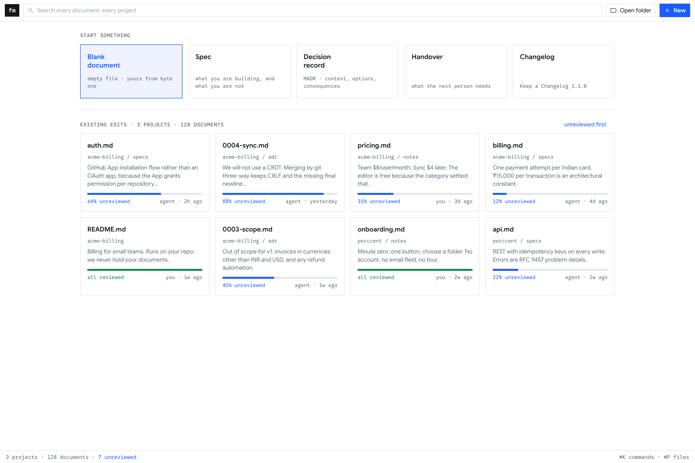

::exhibit 8 | S2 editor: tree, tabs, four modes, review tint, AI panel collapsed

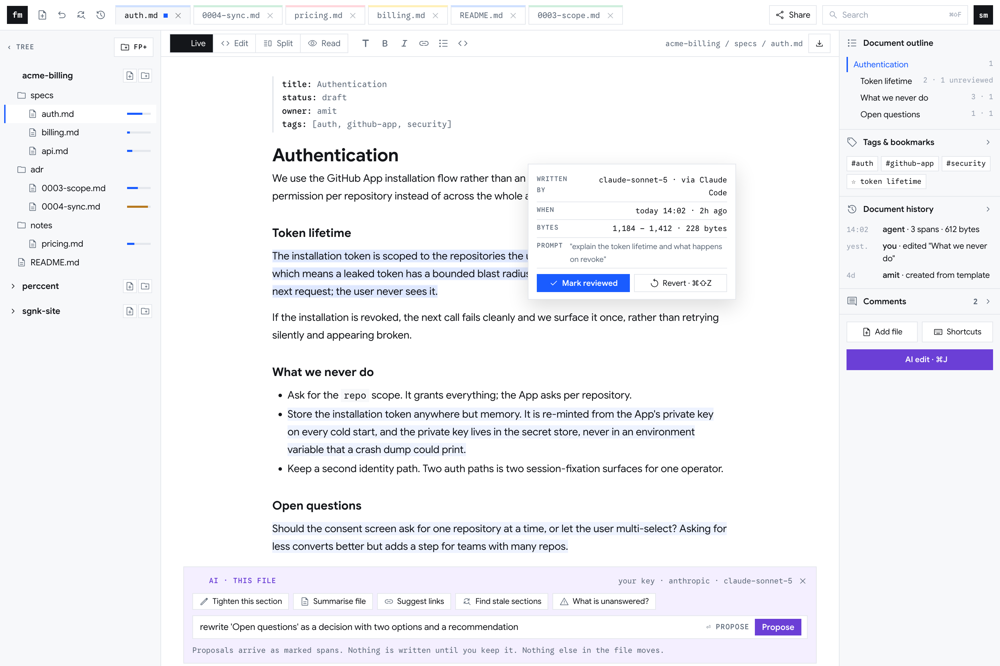

Changed-since-reviewed spans carry a light tint and nothing else. The hover card shows when it changed, which bytes, the author from the commit trailer, and "prompt not recorded" when the write did not carry one. The AI panel is one collapsed line; nothing runs until asked.

::exhibit 9 | S13 repo docs scan: stale, broken, missing, and what was read to decide

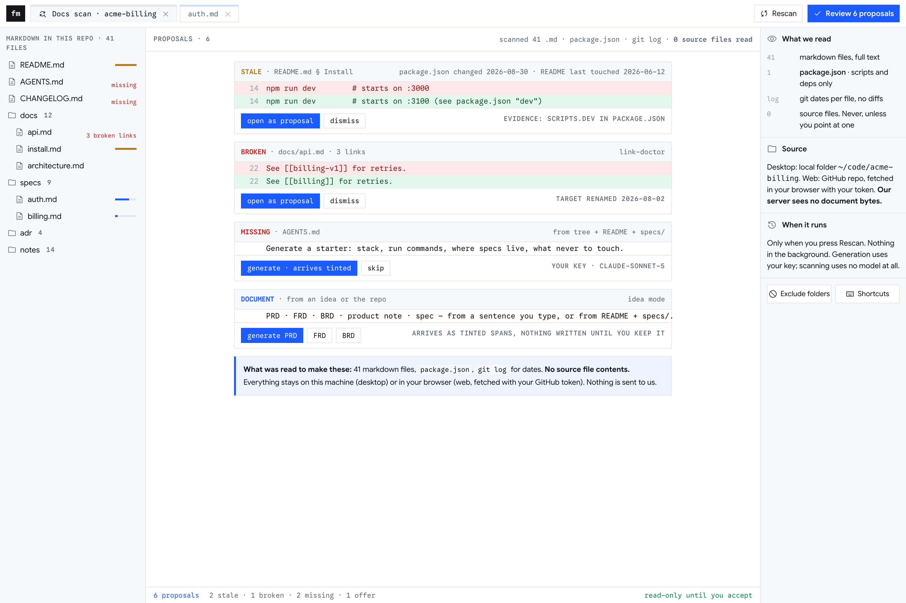

Every proposal names its evidence. The right rail lists exactly what was read: 41 markdown files, `package.json` scripts, git dates, zero source files. Scanning uses no model; generation uses the user's key.

::exhibit 10 | S3 answer in place

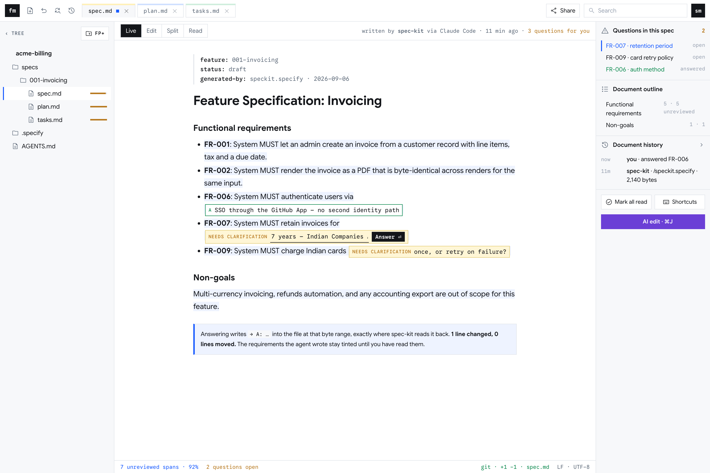

::exhibit 11 | S4 review panel

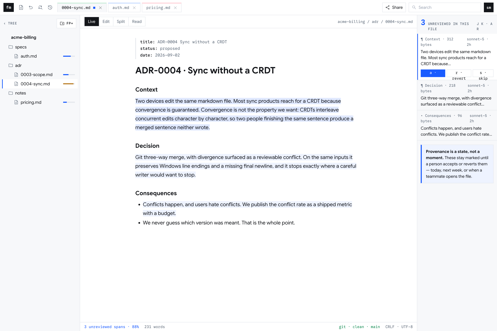

::exhibit 12 | S2 split: source and rendered, the same bytes

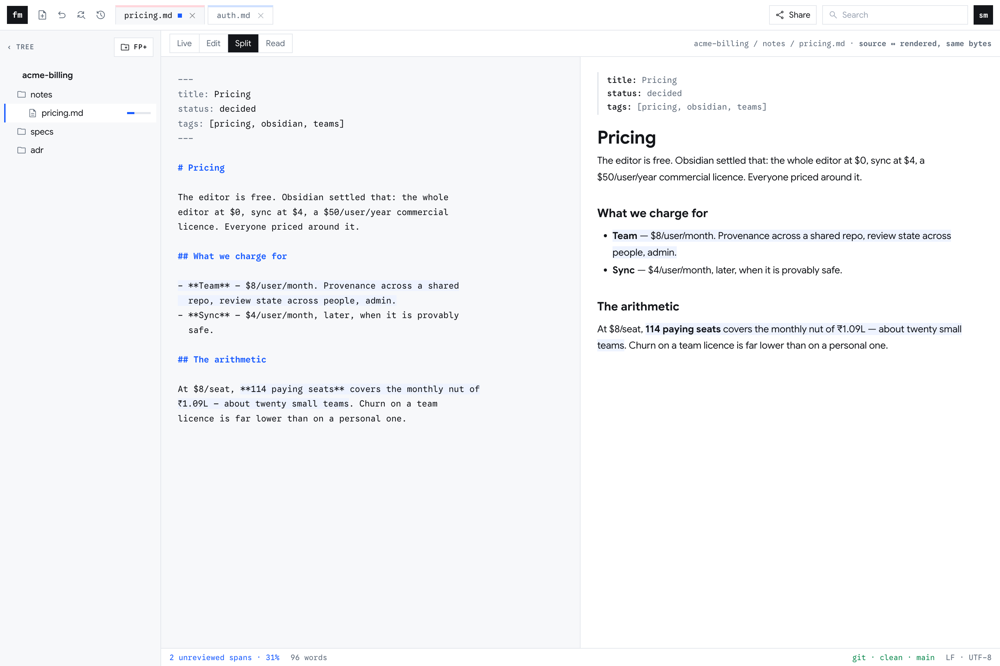

::exhibit 13 | S11 settings: hide-all-AI switch, the key field that does not exist yet

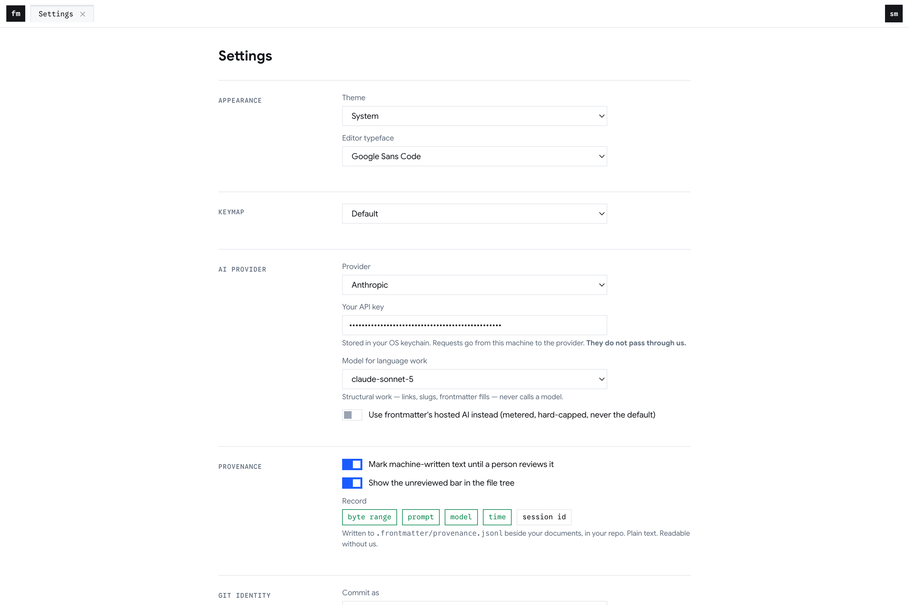

::exhibit 14 | S8 refactor preview, MVP-1

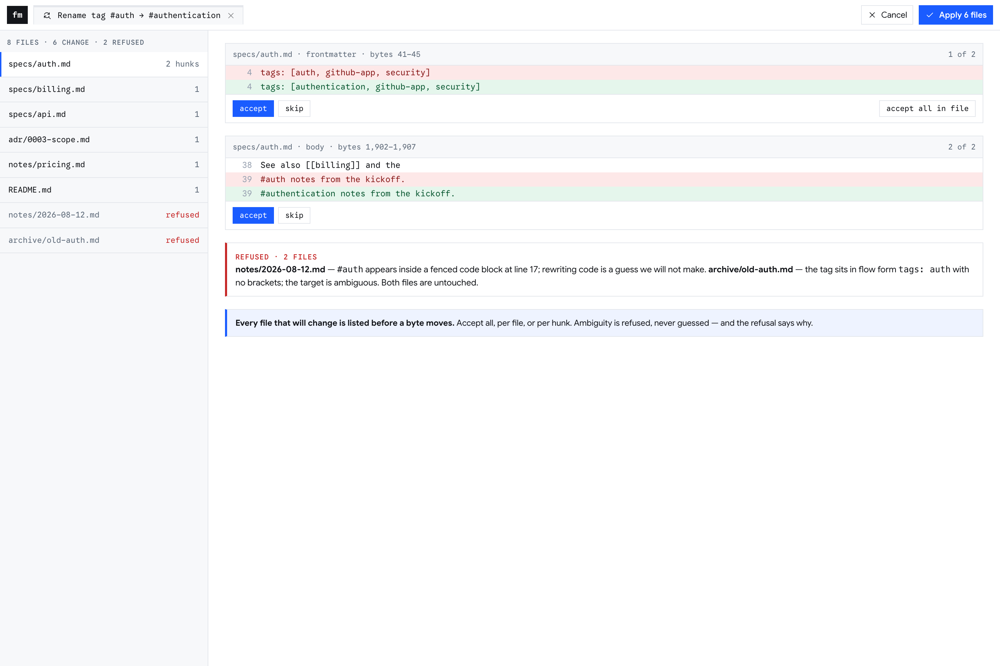

::exhibit 15 | S12 export, MVP-2

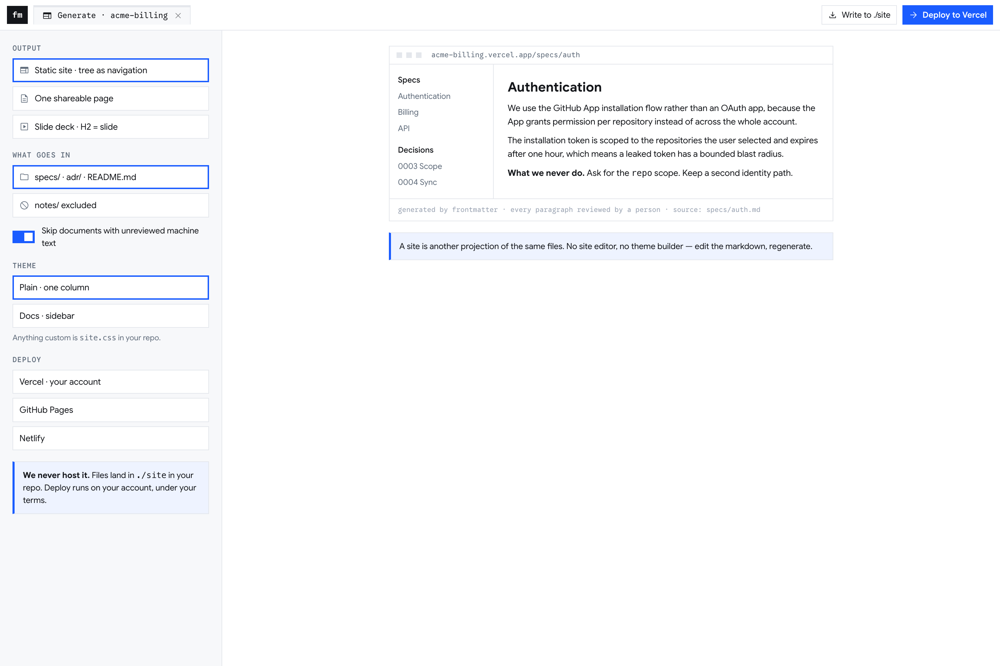

## PART IV — Commercial

### 11. Pricing

::exhibit 16 | Tiers and prices

| Tier | Price | Contents |
|---|---|---|
| Individual | Free, no limits | F1–F8, own key |
| Pro, team | $4–5 per user per month, priced against GitHub Team $4, Obsidian Sync $4, HackMD $5, Confluence $6.70 | Shared-vault sync, version-history retention, shared review state, comments, MCP. Not "who reviewed what" alone: GitHub sells reviewers at $4 |
| Max | Per team, later | Document gates in CI, retention beyond a year, admin |
| Hosted AI | Metered at cost plus margin | Optional, off by default |

**Retention.** Accounts under $50/month sit in the worst-retaining band: top-quartile annual gross retention 60–70% (ChartMogul, 2,100 businesses), 23% for AI-native products under $50. No comparable editor publishes retention; Obsidian states on record that it does not measure churn. The earlier "114 seats at $8 covers the nut" is withdrawn: the feature was GitHub's at $4 and the band would require replacing 34–46 of 114 seats a year. **The paid tier is a hypothesis until 20 team conversations return seat counts and what teams are gated on.** Monthly nut: about ₹1.09L, covered by 54–78 consulting hours.

### 12. Go-to-market

**Headline, three variants tested in weeks 1–2:** *See what the AI wrote* · *See what the agent changed without asking* · *Know what nobody has reviewed yet.* Reddit's top twenty "AI wrote" posts contain no request for authorship marking; the upvoted pain matches the second and third. Proof line under any of them: `git diff` after an edit shows the change and nothing else; tested on 8,513 real files every release.

**Positioning.** Lead with refusals: no plugins, no code execution, no holding files, no lock-in, and a hide-all-AI switch, which Zed, VS Code and Telegram each shipped only after 412-, 30- and 181-reaction issues.

::exhibit 17 | Channels, in order

| When | Channel | Size | Action |
|---|---|---|---|
| Week 2 | Free Obsidian plugin, the 501-like live-preview fix | 501 likes, 117 posts, open since 2022; Obsidian patches live preview monthly | Ship; kill under 200 installs in 14 days |
| Week 2 on | superpowers docs first, spec-kit second, plan-mode files third | 22–30k, then about 1,660 active public projects a month | README line, MCP entry, "open the spec in frontmatter". Maintainer PRs are outbound; approval per PR |
| Now | Published research | Unpublished so far | The 157-source dataset |
| MVP-0 exit | Show HN | Zed's scored 43, Cursor's 9 | One shot, after 6 of 10 |
| MVP-1 | Chrome extension, Product Hunt | 1.5M browser readers | Backlinks, spike |
| MVP-2 | Exported pages with a mark | No deploy count yet | Not a channel until measured |

**Users as evidence.** The ten pilot strangers are the first interviews. Accept and revert events are logged in a local sidecar the user can read; no vendor usage database.

### 13. Risks

::exhibit 18 | Ranked by cost if wrong

| Risk | Response |
|---|---|
| Review state is a nice-to-have | Two-week test, three headlines; kill under 4 of 10 unprompted |
| Anthropic ships persistent review; plan-as-markdown exists since 2.1.70, diff review open at 262 reactions | Persistence across sessions, people and tools is what they do not build; re-check at week 12 |
| No team pays | 20 conversations in weeks 1–2, on seats and gating |
| MVP-0 exit unmeasurable under the architecture | Written opt-in measurement decision before week 10 |
| F5/F6 founder tests do not replicate with strangers | Include both in the ten-stranger pilot with a stated measure |
| Zed or Cursor add vault semantics | Depth in markdown and the state they do not keep |
| The 83% refusal is a class, not a bug | Patched corpus still refusing over 10 of 7,969 by day 24 falsifies it |
| Every AI call bills the operator | BYO key before any stranger |
| Client work crowds out product | Capped at 78 hours a month |
| GST | Reverse charge under CGST §24(iii) has no turnover floor |

### 14. Ninety days and decisions

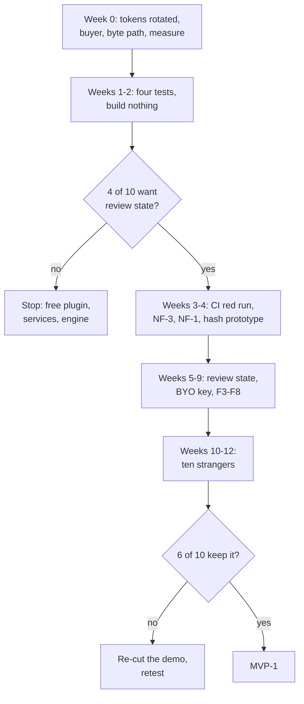

::exhibit 19 | Fortnightly outcomes

| Weeks | Work | Observable outcome |
|---|---|---|
| 0 | Rotate the two access tokens; decide the buyer; write the web byte path and the exit measure; attach the founder test notes for F5/F6 | Written |
| 1–2 | Ten developers shown the review mock in both framings; plugin shipped; five people who bill for documents asked about approval; three landing pages; 20 team conversations | Kill signals at day 14 |
| 3 | Go or no-go | Written decision |
| 3–4 | CI red run; NF-3, NF-1; content-hash review state prototyped on one spec-kit and one superpowers repo | Tint works on files frontmatter did not write |
| 5–7 | Review state store and rendering; BYO key; structured output; F5/F6 | Stranger's key, stranger's repo, tinted spans |
| 8–9 | Revert, panel, answer in place, repo docs scan, engine wired behind every write | The fifteen-second demo |
| 10–12 | Polish; ten strangers | 6 of 10 by the week-0 measure |

::exhibit 20 | Decisions

| # | Decision | By |
|---|---|---|
| 1 | Review state as the product; attribution as a detail; F5/F6/F7 as MVP-0 features on founder evidence; the team tier as a hypothesis | The meeting |
| 2 | First buyer: AI-native developer, or the person liable when a document is wrong | Week 1 |
| 3 | Share: hosted read-only viewer (a hosting obligation) or permalink plus export (no state; nothing for plain folders or private repos) | Week 2 |
| 4 | Web byte path: browser-side fetch with the user's token, or through the server | Week 0 |
| 5 | The two unrotated access tokens | Today |

## PART V — Reference

### 15. Rendering and markdown rules

| | |
|---|---|
| Modes | Live, Edit, Split, Read. Nested constructs in list items render correctly (the 501-like bug, shipped first as the free plugin) |
| Rendered | Callouts `> [!kind]`; Mermaid, rendered not extended; MADR and Nygard decision records; RFC 7322; Keep a Changelog 1.1.0; frontmatter as a properties panel |
| Not claimed | Runbooks and PRDs have no standard body; a structure is offered and labelled as such |
| Rule | Nothing is added to markdown that breaks it elsewhere; a touched file still renders on GitHub, in Obsidian, in a plain editor |
| Storage | Prose annotations as callouts (no closing marker to lose; an unclosed fence swallows the document). Tags and links written back in the shape the file uses. Review state and comments in the plain-text sidecar |
| Interop | Read `AGENTS.md` and `CLAUDE.md`, never replace them; MCP server for the user's agent; git as the only versioning; Obsidian conventions preserved |

### 16. Operating rules

| | |
|---|---|
| D2C / B2B | Free to build the audience; paid for teams. No enterprise feature until a customer refuses to pay without it: SSO at about 20 seats, SOC 2 above about 50 or for regulated buyers, a merchant of record for EU/US procurement |
| Communication | Email collected only when an obligation exists (payment, invite, recovery); never at first run. Breaking changes: two weeks' notice in product. Price changes: email before the next charge. All notices kept in an in-product list the user can check |
| Support | One address, a published response window; the free tier has no service commitment, stated on the page |
| Not measured | Session replay, keystroke telemetry, document content. Usage counts stay in a local sidecar |
| Mobile | About 15% of complaints; not in v1; later a reader and reviewer, not an editor |
| Accessibility, non-English | WCAG 2.2 AA; the `body-faint` token fails at 1.984:1 and is fixed in MVP-0; the tint is never colour alone. CJK: the byte map, a bigram search tokeniser, a written v1 scope decision |
| Security | No plugins, no code execution; the AI never gets ambient repo access; malformed repos refused, not repaired; 4 MB and 200,000-line ceilings per file |

### 17. Where the plan stands

| | |
|---|---|
| Strengths | The engine is correct where incumbents admit they are not; 88.6% of a shipping editor exists; six AI routes live; two founders funded by services |
| Weaknesses | Zero users; no CI, no BYO key, no structured output; 83% of vaults refused today; every channel borrowed; no evidence yet for the paid tier |
| Opportunities | Tens of thousands of active projects generating specs with nowhere to review them; review state is the one thing no incumbent persists; a 501-like bug fixable in a week; a hide-all-AI switch incumbents shipped only after backlash |
| Threats | Anthropic shipping persistent review; Zed or Cursor adding vault semantics in a sprint; Obsidian shipping first-party AI editing; attention running out before revenue |
