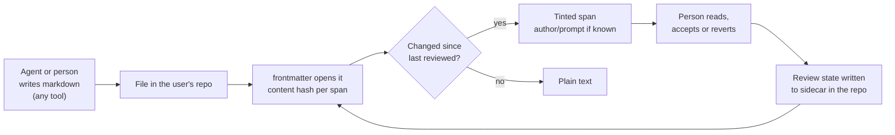
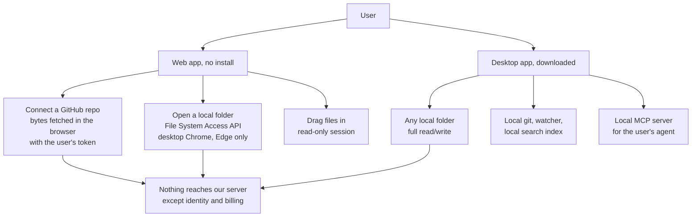
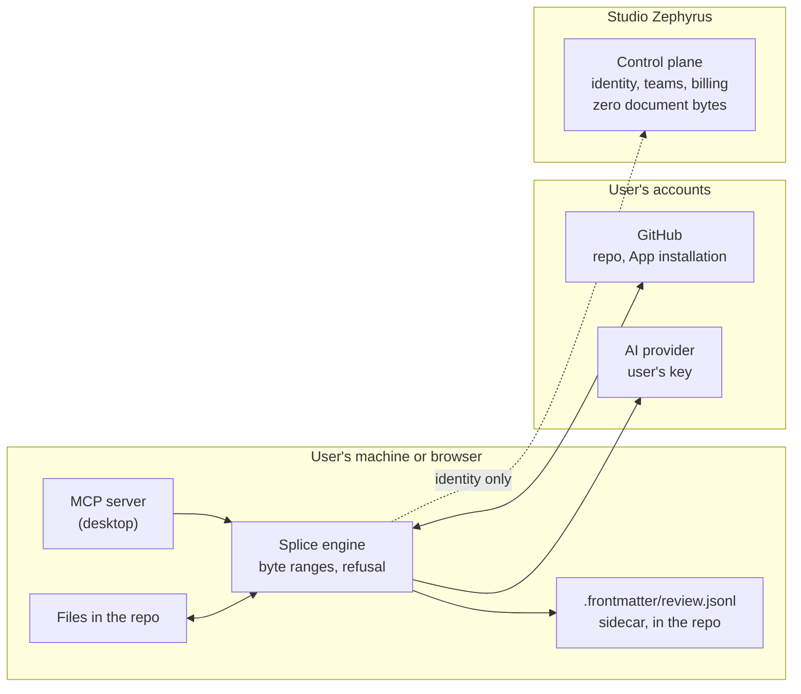
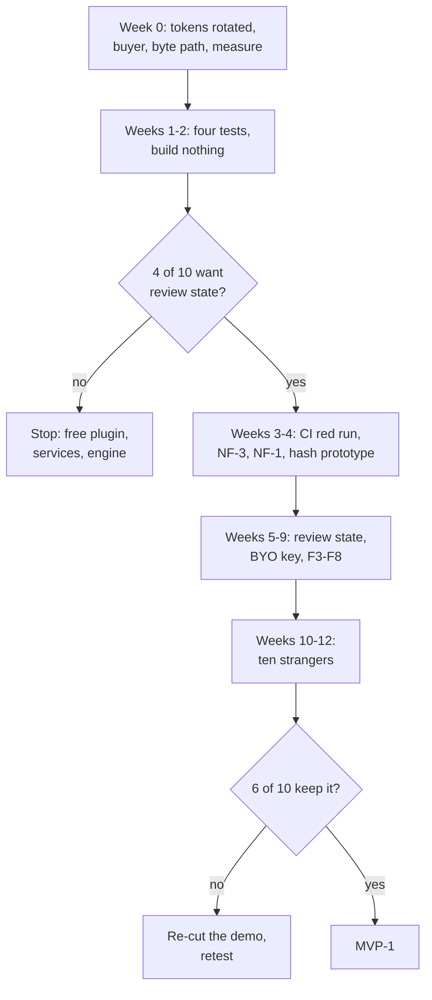
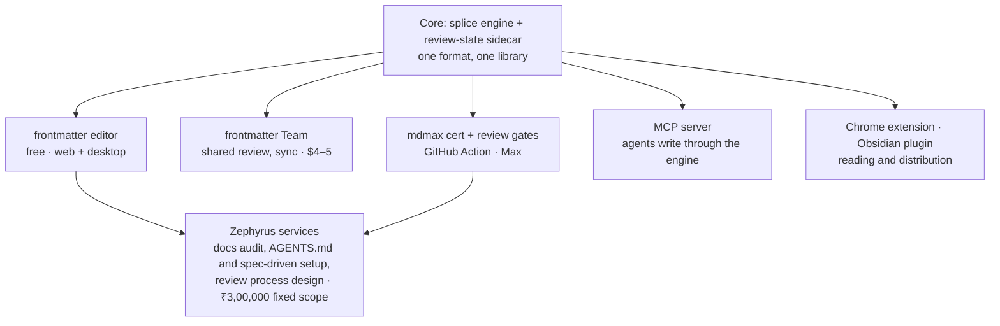

# frontmatter
## Product and technical plan — pilot, pro, max

> Technical documentation, Studio Zephyrus. Re-checked 2026-09-08 by an adversarial round of 23 agents over 11 gaps: **152 findings — 75 confirmed, 60 revised, 16 refuted.** Corrections are marked where they apply. Features carry their evidence class: **public evidence**, **founder user test**, or **untested**.
>
> **Read §1 first. The plan's own headline was attacked in that round and did not survive as written**, and three structural facts changed with it: the schedule was arithmetically impossible, the team is one person on the commit record, and the editor shell is a fork of a sibling product rather than an asset.

::keyfigures
1,217 — total installs of all 13 markdown-review extensions in the VS Code store. Ceiling 400
501 vs 0 — Obsidian forum likes: the rendering bug we call a channel, against review state
1.21 — measured engineering days per calendar week. The old schedule needed 7.0
80 of 80 — commits by a single author. The plan said two founders
82,265 — installs of the "Front Matter" extension that already owns the name
::

## PART I — Product

### 1. Definition

> [!good] **frontmatter is a markdown editor for repositories whose documents are written by agents.** It shows what changed on a **working tree that has no pull request** — the one container GitHub, Google Docs, Reviewable and Graphite all require and an agent writing into a local repo does not have. Every span changed since a person last read it is tinted; one key reverts any span; the file is edited byte-exactly.

> [!risk] **This is a hypothesis under test, not a finding, and the test has already gone against it.** An adversarial round on 2026-09-08 attacked this headline the way the previous three were attacked, and it did not survive as written:
> - The **266-reaction** request behind it (`anthropics/claude-code#33932`, re-checked 2026-09-08) asks for a **per-session accept/reject panel** in one vendor's VS Code extension, and names GitHub Copilot Edits Review as its own reference implementation. **0 of its 36 texts ask for anything to persist**; 18 of 36 name a tool that already does it; "markdown" appears in 1.
> - **Thirteen purpose-built markdown-review extensions** exist in the VS Code Marketplace, summing to **1,217 installs**, ceiling 400. One of them — *mddiff, "High-Fidelity Markdown Review and Diff for the AI Era"*, published 2026-06-03 — **is this sentence, shipped three months ago, at 74 installs.**
> - In the Obsidian forum, the closest existing request to this feature has **0 likes, 251 views, 1 post in three years**. The rendering bug this plan treats as a week-2 channel has **501 likes, 117 posts, 18,331 views**. In the only document population measurable with a vote, **the product and the channel are the wrong way round.**
>
> What the same evidence leaves standing is narrow and real: **nobody persists review state across people and across tools on a working tree with no pull request.** Decision 1 is now to confirm that narrowed claim, or to demote it (§14).

**Core loop**

**Not in the product:** no plugins or code execution, no hosting of user content, no vendor database holding document bytes, no project management, no chat sidebar, no mobile editor in v1.

**Demo, fifteen seconds.** Run the agent's spec command. Open the spec in frontmatter: every paragraph tinted. Read one, it clears. Revert one, `git diff` shows only that line. The panel lists what is still unread.

### 2. Feature specification

Each feature: what it does, how it works, what it needs, when it ships, and whether it works online without an install and offline in the desktop app. Days are engineering estimates for the current team; they assume the engine fixes in §9 land first.

::exhibit 1 | Features, specified

| # | Feature | What it does | How it works | Needs | Ships | Web, no install | Desktop, offline | Evidence |
|---|---|---|---|---|---|---|---|---|
| F1 | **Editor** | Live, Edit, Split, Read. Tree, tabs, quick-switch, palette, search, properties panel for frontmatter | CodeMirror 6 over the splice engine; every write is a byte-range replacement | Exists. NF-1/NF-3 fixes (7d), engine wiring (8d) | MVP-0 | Yes | Yes | Public: editor is table stakes |
| F2 | **Review state** | Tints every span changed since a person last read it; one-key revert; review panel with a counter | Per-span content hash in `.frontmatter/review.jsonl` beside the files, in the repo. Spans anchored by byte range + hash, relocated by the splice locator when the file changes | Store 6d, rendering 5d, revert 3d, panel 4d | MVP-0 | Yes | Yes | **REFUTED AS HEADLINE, RETAINED AS FEATURE.** 266 reactions (2026-09-08) on a request for a *per-session* panel; 0 of 36 texts ask for persistence. Free incumbents ship the per-person form: GitHub's per-file Viewed state with a progress bar, auto-unmarked when content changes, free at every tier but **private to each reviewer** (zero cross-person language in its docs); Google Docs' file-level blue dot; Reviewable free forever for public repos. 13 VS Code extensions have tried the markdown case; ceiling 400 |
| F3 | **Attribution** | Author, model, time and prompt on hover | Read from what the write carried: an MCP write (F11), a commit trailer, a git-ai note, signed provenance metadata. Absent when none exists, and the card says so | Reader for trailers/notes 3d | MVP-0 (readers), MVP-1 (MCP) | Yes | Yes | Authorship alone did not sell as a **consumer** feature (iA Writer 7; 208-download Obsidian port; best extension 366 installs). It **is** sold as a **team** feature: Google gates span-level authorship behind Workspace Business Standard and above — *"See who changed a part of a document… available to only Google Workspace Business Standard, Business Plus, Enterprise Standard, Enterprise Plus, and Education Plus customers"* (2026-09-08) — while the file-level blue dot stays free. **The only live paid precedent for F2/F3, and it sits at exactly our intended tier** |
| F4 | **Answer in place** | Answers `[NEEDS CLARIFICATION]` markers inline; one line changes. **The `Q: → A:` half is CUT** — spec-kit writes that bullet only *after* the user has answered (*"Append a bullet line immediately after acceptance"*), so a Q/A line in the wild is a closed record by construction | Marker detection + splice into the marker's byte range | 2d | MVP-0 | Yes | Yes | Measured 2026-09-08: **3,368** public `spec.md` files carry the marker; a read-every-hit sample of 50 found **42% genuinely live** ≈ 1,400 files. Spec-kit only |
| F5 | **Idea mode** | Generates a PRD, FRD, BRD, product note or spec from a typed idea or from the repo (README + specs) | Exists: `generate-document`, five prompt kinds, `/api/ai/generate-doc`. Output arrives as tinted spans; nothing written until kept | Structured output in the port 2d; "from repo" input 2d | MVP-0 | Yes, with the user's key | Needs network for the model; offline: no | **Founder user test** (reported). Public: standalone PRD generators have no traction — top repo 57 stars of 512 |
| F6 | **Decision flow** | Before generating, asks the questions the idea leaves open; answers are written into the frontmatter and shape the document | Structured question list from the LLM port; answers stored as frontmatter keys the generator reads | 4d, after F5's structured output | MVP-0, inside F5 | Yes, with key | No | **Founder user test** (reported). Public: `/speckit.clarify`, Kiro and Claude Code plan mode ship the same step free — the difference is that ours writes into the document and stays reviewable |
| F7 | **Repo docs scan** | Reads every markdown file in a repo and proposes: stale sections (doc older than the code it cites), broken links, missing standard docs (AGENTS.md, CHANGELOG), and offers to generate them | No model for the scan: git dates per file, `package.json` scripts, link resolution (`link-doctor` exists). Generation reuses F5. Shows exactly what was read | Staleness heuristic 4d, missing-doc templates 2d, S13 UI 4d | MVP-0 | Yes: scan runs in the browser on fetched bytes | Yes: scan needs no network | **Founder direction.** Public: Vale 6,087 stars and markdownlint 6,326 are the incumbents for lint; no incumbent proposes edits with review state. README generators: 11,131 stars, abandoned 2022 |
| F8 | **File-scoped AI** | Two verbs on the open file: fix or critique this selection; summarise this file. Collapsed by default; a hide-all switch | Bring-your-own key, request from the user's machine to the provider. Proposals arrive as tinted spans | BYO key UI + keychain 3d | MVP-0 | Yes, with key | No | Public: editing supplied text is 10.6% of ChatGPT messages; incumbents hide AI until invoked |
| F9 | **Vault-wide refactor** | Rename a tag, heading or key across the vault; every hunk reviewable; ambiguity refused | Engine splice across files; refusal on fenced or ambiguous matches | 8d | MVP-1 | Yes | Yes | Public: 86 likes on broken-links-on-rename |
| F10 | **Shared review state, comments** | What each person has read, across a team; comments anchored to spans | Same sidecar, per-person entries; comments as a sidecar too, never in the file (every in-file syntax renders as garbage on GitHub) | 10d | MVP-1 | Yes | Local only until push | Public: GitHub Team sells reviewers at $4; **untested** whether teams pay for this |
| F11 | **MCP server** | The user's agent writes through frontmatter, so writes carry the prompt | Local MCP server in the desktop app; agents connect by config | 6d | MVP-1 | No: needs a local process | Yes | **Untested** whether agents route writes through a third-party tool |
| F12 | **Sync** | Multi-device, provably safe | Git merge, never a CRDT; conflicts surfaced, never guessed | 15d+ | MVP-2 | Yes | Local edits, sync on reconnect | Public: sync is the one proven individual price |
| F13 | **Export** | Single document to HTML, PDF, Word, .md — **already built and never run** | 945 lines across 8 files, wired at `EditorPane.tsx:907`, inherited from sgnk-md in `0c1b427`. **Not** built: copy-as-HTML (0 occurrences in `src/`) and folder-to-HTML/PDF (the folder path filters to `.md` only) | **0d + 1h to verify it runs** (the server PDF route needs a Vercel Linux chromium binary, which contradicts this row's own offline claim) | **MVP-0** (verify) · folder-to-one-PDF 4d MVP-1 | Yes | Yes | Export beats decks **4.8:1** on VS Code installs (4,107,590 vs 851,533). Folder-to-one-PDF is the only export with demonstrated demand: `docusaurus#969`, 79 reactions, open since 2018 |

**Founder-validated features.** F5 and F6 were reported as tested with users by the founders. Public evidence for them is weak as standalone tools and does not contradict an in-editor test. They ship in MVP-0 on that basis, inside the review-state loop: generated text arrives tinted and is not written until kept.

### 3. Access model

Two ways to use frontmatter. What each can do is fixed by the browser and the platform, not by the plan.

::exhibit 2 | What works where

| Capability | Web, GitHub repo | Web, local folder (Chrome, Edge) | Web, Firefox, Safari, mobile | Desktop app |
|---|---|---|---|---|
| Open and edit files | Yes; writes become commits or PRs | Yes, direct writes with a per-folder permission | Repo connect or drag-in only | Yes |
| Review state (F2) | Yes; sidecar committed with the files | Yes | Repo connect only | Yes |
| Repo docs scan (F7) | Yes, on fetched bytes | Yes | Repo connect only | Yes, offline |
| Idea mode, AI panel (F5, F6, F8) | With the user's key | With key | With key | With key; needs network for the model |
| MCP server (F11) | No | No | No | Yes |
| Offline | Cached open files only | Cached | No | Everything except the model |
| Local git, watcher, index | No | No | No | Yes |

**Browser support, fetched 2026-09-08 (caniuse):** the File System Access API is supported in desktop Chrome and Edge and in none of Firefox, Safari, iOS Safari, Android Chrome or Samsung Internet. **GitHub's REST API supports CORS**, so a repo's bytes can be fetched in the browser with the user's token; the vendor server never sees them.

**What the user downloads.** A Tauri v2 desktop app: macOS `.dmg` (notarised, Apple Developer ID $99/year), Windows `.exe` (code-signed, $150–400/year, hardware token required), Linux AppImage. It contains the editor, the engine, a git client, the MCP server and the search index. It contains no model. Tauri reuses the operating system's webview instead of bundling a browser; the installer size is measured at the first build. The auto-updater must be signed and configured before the first public build. Note: the current `src-tauri` config still carries the sibling app's identity (`productName` sgnk-md, `ai.sgnk.md`) and must be re-identified.

**If the user does not download.** They get F1–F8 in the browser against a GitHub repo, or against a local folder on Chrome and Edge. They do not get MCP, local git, a background watcher, or offline beyond cached files. The web app is the trial; the desktop app is the daily surface. Both are one build with a filesystem adapter, so there is one product to maintain.

### 4. Architecture

**Data path.** Document bytes move between the editor, the engine and the user's git. In the web app they are fetched from GitHub in the browser. The control plane holds identity, team membership, entitlements and billing, and no document bytes. The AI request goes from the user's machine to their provider. Hosted AI, if ever enabled, is metered and hard-capped and never the default.

**Sidecar format.** `.frontmatter/review.jsonl`, one JSON line per span: file path, byte start, byte end, content hash, reviewed-by, reviewed-at, and, when known, author, model, prompt. Plain text, documented, readable without frontmatter. Spans are relocated by the splice locator on every edit; the journal is not the anchor, because git, other editors and agents bypass it. The nearest shipped pattern is SpecKit Companion's `.spec-context.json` (9,367 installs); frontmatter's must be visibly better: per-span, per-person, any tool.

**Cost rules.** Nothing runs in the background; spend follows use. Output tokens are 75.8% of model spend, so output is capped, not input. Infrastructure is about $0 at 100 users and about $390/month at 10,000 because no documents are stored. Support is the real cost at scale, about 90 founder-hours a month at 10,000 users.

## PART II — Market

### 5. Who does what, and where each stops

::exhibit 3 | Fetched 2026-09-06 and 2026-09-08

| | Tool | Reach | What it does | Where it stops |
|---|---|---|---|---|
| **Spec writers** | obra/superpowers | 75–85k public repos; 22–30k active in 30 days; marketplace counter 1,009,371 (cached) | Brainstorm, design, write the spec, commit it | Terminal. No editor, no review state |
| | github/spec-kit | 11,072 public repos; about 1,660 active | `/speckit.specify`, `/speckit.clarify` (in chat), plan, tasks, implement | Writes markdown, then leaves |
| | Plan mode, Claude Code and Cursor | Out-scores both named tools on Reddit (1,776 / 1,409 / 1,329 points vs 38 or fewer) | Plans as markdown files | Where the files live is untested |
| **Review surfaces** | Claude Code, VS Code extension | 24.89M installs | Plans as a markdown document with inline comments since 2.1.70 (2026-03-06) | Per session. Diff-review UI open at 262 reactions |
| | git-ai; VS Code 1.118 | 61,517 installs; AI co-author trailers by default | Line attribution after the fact; commit trailers | Commit granularity, nothing per span |
| | SpecKit Companion | 9,367 installs | Review state in `.spec-context.json` per spec | Spec-kit only |
| **Docs tooling** | Vale, markdownlint | 6,087 and 6,326 stars | Prose and markdown lint | Lint only; no proposals, no review state |
| | readme-md-generator, readme-ai | 11,131 (abandoned 2022), 2,980 | Generate a README | One file, no repo context |
| | PRD generators | 512 repos on GitHub; the top has 57 stars | Generate a PRD from a prompt | No traction as standalone tools |
| **Editors** | Obsidian | Free; Sync $4; Publish $8/site; Commercial $50/yr | AI via plugins: Copilot 1.83M downloads, Claudian 2.02M | None records what changed or was reviewed |
| | Cursor, Zed | ~$20; free | Agent editing for code; Zed reviews per hunk | Whole-file rewrite; no vault semantics |
| **Browser** | Obsidian Web Clipper, Markdown Viewer | 1,000,000 and 500,000 Chrome users | Capture and read markdown | A distribution channel |
| **Hosted sites** | mdown.ai, Obsidian Publish | Non-engineers; $8/site/month | Markdown to a hosted website | The host role frontmatter refuses |

**Prices.** The editor is worth ₹0 in this category. The one proven individual price is sync, about $4. Obsidian's $50/year commercial licence confers no functional benefit, became optional in February 2025, and is bought by 25+ seat organisations; it is not evidence of what a five-person team pays.

### 6. Vocabulary audit

::exhibit 4 | Terms from earlier plans, checked

| Term | Finding | Status |
|---|---|---|
| Context packs, handover generation | Free from GitHub and Anthropic; the "median 2 points" graveyard was the Hacker News baseline | Cut |
| Decision-flow renders | 0.30 of the median plugin, wrong buyer | Cut |
| Kickoff prompt, vendor CDN | Worse than a slash command; breaks "no document bytes on our server" | Cut |
| Self-improving AIOS | One feedback label from 6,884 decisions | Internal tooling only |
| Local LLM fallback | Five cloud free tiers, not local; constrained small models fabricate in 10 of 13 | Deferred |
| Byte-exactness as the headline | 4 complaints in 12,556 | Mechanism, not pitch |
| "See what the AI wrote" | Shipped by iA Writer 7 in 2023; 208 downloads for the Obsidian port; best VS Code extension 366 installs; one Reddit ask | Attribution is shown when available, not the headline |
| "496,000 stars" as channel size | Stars measure attention to a CLI | Replaced by active-repo counts |
| "Uncopyable" | Trailers and git-ai attribute at commit level | Struck |
| "62,976 unanswered markers" | 49,408 were spec-kit's own checklist line | About 1,500 live markers |

### 7. Evidence status per feature

::exhibit 5 | What is proven, what is reported, what is untested

| Status | Features | What settles it |
|---|---|---|
| **Public evidence** | Editor table stakes (F1), unrequested-change pain (F2 motive), attribution-alone does not sell (F3), marker counts (F4), AI hidden until invoked (F8), sync as a price (F12), export over decks (F13) | Done |
| **Founder user test, reported** | Idea mode (F5), decision flow (F6), the docs-scan direction (F7) | The founders' test notes, attached to the plan; then the ten-stranger pilot |
| **Untested** | Review state as a product (F2), teams paying for shared review (F10), agents writing through MCP (F11), the web byte-path decision, the MVP-0 exit measure | Weeks 1–2 tests (§14) |

## PART III — Delivery

### 8. Tiers

::exhibit 6 | MVP-0 pilot, MVP-1 pro, MVP-2 max

| | MVP-0 pilot, free forever | MVP-1 pro, teams | MVP-2 max |
|---|---|---|---|
| Engine | NF-1, NF-3 fixed; CI with a deliberate red run; engine wired behind every write; real byte budget | Vault-wide refactor (F9) | Sync (F12) |
| Editor | F1, all modes and navigation | Conflict view | Multi-device |
| Review | F2 review state; F3 attribution from trailers and notes; F4 answer in place | F10 shared state, comments; F3 with prompts via F11 MCP | Version-history retention |
| Generation | F5 idea mode; F6 decision flow; F7 repo docs scan and missing-doc generation | | F13 export |
| AI | F8 panel, BYO key, two verbs, hide-all switch; structured output in the port | Hosted AI, metered, capped, off by default | Document gates in CI |
| Surfaces | Web app (repo, local folder on Chrome/Edge) and desktop app, one build | Chrome extension; MCP server | |
| Channels | Free Obsidian live-preview plugin, week 2; kill: under 200 installs in 14 days | superpowers and spec-kit docs; plan-mode files | |
| Absent | Sign-up, billing, sync, mobile, hosting, hosted AI, local model | Mobile, plugins, chat sidebar | Plugins |
| Exit test | 6 of 10 strangers still using it after two weeks, by the measure written in week 0 | A team pays within 20 conversations | Corpus passes byte-identical after sync |

### 9. Technical plan

**Fix first.** These block everything else.

| # | Problem | Effect | Days |
|---|---|---|---|
| 1 | NF-1: column-zero list item in frontmatter | 83% of real vaults refused | 4 |
| 2 | NF-3: bare-CR frontmatter fence | A second frontmatter block is added | 3 |
| 3 | No CI; four gates have reported green while blind | Shipped on trust | 1 |
| 4 | Engine unwired: one symbol from one of thirteen files reaches product code | Product does not use the engine | 8 |
| 5 | Byte budget is an `echo` | No correctness gate | 2 |
| 6 | No bring-your-own key; every AI request bills the operator | Cannot expose AI to a stranger | 3 |
| 7 | LLM port returns a bare string; JSON is sliced between brackets | No structured output for F5, F6, F7 | 2 |
| 8 | Web byte path undecided | "Zero document bytes on our server" is unverified for the web app | Decision |
| 9 | `src-tauri` carries the sibling app's identity | Desktop build ships as sgnk-md | 1 |
| **0** | **The editor shell is a fork of sgnk-md, not an asset** | **41 of 43** files in `src/modules/editor` and `src/modules/app-shell` are byte-identical to the sibling repo and **zero are unique to frontmatter**; across `src/`, 181 of 226 are identical and **25 have already diverged**. `src/modules/mdmax` is the only thing this product owns. Every table-stakes day not budgeted is either a fork tax or an upstream merge | Decision: merge, vendor, or fork-and-own |
| 10 | **`mdmax cert` was never wired to a runnable command** | `node scripts/mdmax-cert.mjs` exits 1 with `ERR_MODULE_NOT_FOUND`, 37 days after the commit whose message claims it landed "inside its two-day cap"; `cert` is not one of `package.json`'s 26 scripts | 1 |
| 11 | **`entities` is an undeclared dependency of the engine** | One of the engine's two external imports is absent from `package.json` and resolves out of hoisted `node_modules`. Any claim that the engine drops into another host unchanged fails here first | 0.5 |

**Sequence.** Fix-first (24 days) → review state F2 (18 days) → attribution readers F3 and answer in place F4 (6 days) → idea mode with structured output and decision flow F5, F6 (8 days) → repo docs scan F7 (10 days) → AI panel F8 (3 days) → table stakes and polish. **About 70 engineering days of authoring content. The elapsed time depends on a density this plan must state.** Measured on this repo 2026-07-13 → 2026-09-08: **10 of 58 calendar days** touched `src/`, `src-tauri/` or `test/` = **1.21 engineering days per calendar week**. The sibling `md` repo's best-ever regime was **1.91/week**; the last 30 days here were **0.23/week**. At 1.91 that is **37 calendar weeks**; at 1.21, **58 weeks**.

**The previous "ten weeks" is withdrawn as arithmetically impossible:** 70 engineering days in 10 calendar weeks is 7.0 engineering days per week — seven days a week, no days off — which is 5.8× this repo's measured rate, 3.7× the best rate ever observed, and *shorter* than the same 70 days at ordinary five-day full-time (14 weeks). **The "2.5× optimistic" correction is also withdrawn:** `CRITIQUE.md` line 783 records that the 41-day figure already had a 25% active-day density baked in, so it was 10.4 *focused* engineering days, and the move to 70 is 6.7× more effort, not an availability adjustment. Report engineering days achieved against the assumed density weekly, so the schedule is falsifiable on day 7 rather than at week 10.

**Resources. One person, on the evidence.** `git log` gives **80 of 80** commits on this repo and **416 of 416** on the sibling by a single author. `BRIEF.md` line 115 flagged this contradiction on 2026-08-31 and it is still open. Every density figure above is a one-person rate and is **not additive**; if a second person is real, name them and re-derive before the sequence is quoted again. Infrastructure at pilot scale: free tiers (Vercel, Postgres, R2). Model cost: zero, all AI on the user's key. Certificates: $99/year Apple, $150–400/year Windows plus a hardware token. No new hires for MVP-0. The pilot's ten users bring their own repos and their own agents.

**Engine work beyond the fixes.** Vendored `@lezer/markdown` for incremental parsing, so review spans survive every keystroke cheaply. The byte-to-UTF-16 offset map, the highest-risk seam: an unmapped crossing corrupts Chinese, Japanese, Korean and Arabic text silently. Search: the whole vault currently ships to the client, 77 MB parsed per cold start; move to server full-text search in the web app and a local index on desktop. Published measures: time to first keystroke cold, typing latency on a 10,000-word document, corpus refusal rate, merge conflict rate.

### 10. Screens

Built from the two hand-drawn layouts. Clickable prototype, public: [frontmatter-prototype-sagnik.vercel.app](https://frontmatter-prototype-sagnik.vercel.app). Same file in the repo at `docs/prototype/frontmatter-prototype.html`. Screens are on the strip at the bottom of the page.

::exhibit 7 | S0 launcher: blank, four templates, existing edits sorted unreviewed-first

::exhibit 8 | S2 editor: tree, tabs, four modes, review tint, AI panel collapsed

Changed-since-reviewed spans carry a light tint and nothing else. The hover card shows when it changed, which bytes, the author from the commit trailer, and "prompt not recorded" when the write did not carry one. The AI panel is one collapsed line; nothing runs until asked.

::exhibit 9 | S13 repo docs scan: stale, broken, missing, and what was read to decide

Every proposal names its evidence. The right rail lists exactly what was read: 41 markdown files, `package.json` scripts, git dates, zero source files. Scanning uses no model; generation uses the user's key.

::exhibit 10 | S3 answer in place

::exhibit 11 | S4 review panel

::exhibit 12 | S2 split: source and rendered, the same bytes

::exhibit 13 | S11 settings: hide-all-AI switch, the key field that does not exist yet

::exhibit 14 | S8 refactor preview, MVP-1

::exhibit 15 | S12 export, MVP-2

## PART IV — Commercial

### 11. Pricing

::exhibit 16 | Tiers and prices

| Tier | Price | Contents |
|---|---|---|
| Individual | Free, no limits | F1–F8, own key |
| **Pro, team** | **$4–5 per user per month** | **Retention and enforcement — the only two things the comparables actually charge for.** (1) A **retained splice journal**: every engine write with byte range, content hash, author, model, prompt and timestamp, kept 90 days, where the free tier keeps current state only. **Git cannot supply this**, because the agent writes it records are overwritten or reverted before any commit exists. It prices like Obsidian's 1-month → 12-month step (+100% for 12× retention) and HackMD's "Recent 10 versions" → unlimited. (2) **Review gates that block**: `mdmax cert` and review-state checks as a required GitHub Action on named paths — pulled forward from Max, because enforcement is what GitHub sells at $4. Shared review state, comments and MCP are *included*; they are the reason seats exist, not the gate |
| **Max** | Per team, later | Retention beyond a year, admin, SSO when asked. **A conflict this resolves:** Exhibit 6 put version-history retention in the Max column, Exhibit 16 listed it under Pro, and **no feature row builds retention at all** — the sidecar spec is current state, not history. Retention must become an F-row before this price is quoted |
| Hosted AI | Metered at cost plus margin | Optional, off by default |

**Retention.** Accounts under $50/month sit in the worst-retaining band: top-quartile annual gross retention 60–70% (ChartMogul, 2,100 businesses), 23% for AI-native products under $50. No comparable editor publishes retention; Obsidian states on record that it does not measure churn. The earlier "114 seats at $8 covers the nut" is withdrawn: the feature was GitHub's at $4 and the band would require replacing 34–46 of 114 seats a year. **The paid tier is a hypothesis until 20 team conversations return seat counts and what teams are gated on.** Monthly nut: about ₹1.09L, covered by 54–78 consulting hours.

### 12. Go-to-market

**Headline, three variants tested in weeks 1–2:** *See what the AI wrote* · *See what the agent changed without asking* · *Know what nobody has reviewed yet.* Reddit's top twenty "AI wrote" posts contain no request for authorship marking; the upvoted pain matches the second and third. Proof line under any of them: `git diff` after an edit shows the change and nothing else; tested on 8,513 real files every release.

**Positioning.** Lead with refusals: no plugins, no code execution, no holding files, no lock-in, and a hide-all-AI switch, which Zed, VS Code and Telegram each shipped only after 412-, 30- and 181-reaction issues.

::exhibit 17 | Channels, in order

| When | Channel | Size | Action |
|---|---|---|---|
| ~~Week 2~~ | **Free Obsidian plugin — CUT** | The parse is unreachable: Obsidian's Live Preview tree is a CodeMirror `StreamLanguage` tree, **depth-1 by construction** (verified twice, independently), so "this fence is inside a list item" does not exist in it and everything downstream stays wrong. A plugin can repaint appearance only, on undocumented DOM classes Obsidian has already deleted once (`cm-hmd-list-indent`, v1.9.1). The two plugins that *do* change nested-construct behaviour write `U+200C` into the user's files — which a byte-exact product cannot ship. **The closest measured analogue landed 115 installs in its true first 14 days, against our own 200 kill line.** "Obsidian patches live preview monthly" is false for 2025 (9 changelog lines across 5 of 12 months), and where it is true it argues against us: Obsidian shipped the neighbouring nested-in-list fix twice in 2026 | **Cut.** If any Obsidian surface ships, ship the *additive* one — review state as a CodeMirror extension over the sidecar's byte ranges, which needs no containment at all |
| **Week 2** | **superpowers, first and alone** | The only toolchain that halts, names a path inside the repo, and asks the human to review a file it has already committed, with no review surface of its own: *"Spec written and committed to &lt;path&gt;. Please review it…"* **Two caveats size it down:** only the *architectural* path writes a document (spikes stay in chat; bounded says "no plan document"), and the *plan* document gets no review gate — only the spec does | A README line and an MCP entry. A maintainer PR is outbound; approval first |
| Then | **spec-kit, reframed** | The pitch is not "you have no review state" but **"your checklist is green because the agent ticked it."** Its default artefact `checklists/requirements.md` is written by the agent at step 8a and ticked by the agent at step 8c (*"If all items pass: Mark checklist complete"*). Measured 2026-09-08: population 49,664; of 20 sampled files with boxes, **19 fully checked, 354 of 355 boxes ticked = 99.7%**. The reviewer-owned checklist is 11× rarer (population 4,536) | Same approach, second |
| — | **Kiro dropped, plan mode demoted** | Kiro already stages line comments at the point of need (`Ctrl+X` at a phase checkpoint; `]`/`[` walk them), so a second editor is strictly worse than the key they already press. Plan mode writes to `~/.claude/plans/<slug>.md` — **outside the repo** — and deletes it after 30 days | Plan mode is at most a `plansDirectory` onboarding step |
| Now | Published research | Unpublished so far | The 157-source dataset |
| MVP-0 exit | Show HN | Zed's scored 43, Cursor's 9 | One shot, after 6 of 10 |
| MVP-1 | ~~Chrome extension~~ **CUT** · Product Hunt | GitHub already renders markdown and ships rich diff plus per-file Viewed state free at the exact surface the extension would target; `raw.githubusercontent.com` sends `access-control-allow-origin: *`, so the web app can open any public `.md` URL with **no extension**. The "1.5M browser readers" figure summed a 500,000-user reader with a 1,000,000-user *clipper* whose tracker holds zero requests to read a `.md` URL; the real reading population is ~647,000 and its leader has not shipped a store build in over two years | Replace with a `?src=<raw url>` parameter on the web app: hours, no store listing, no Manifest V3. Product Hunt unchanged |
| MVP-2 | Exported pages with a mark | No deploy count yet | Not a channel until measured |

**Users as evidence.** The ten pilot strangers are the first interviews. Accept and revert events are logged in a local sidecar the user can read; no vendor usage database.

### 13. Risks

::exhibit 18 | Ranked by cost if wrong

| Risk | Response |
|---|---|
| Review state is a nice-to-have | Two-week test, three headlines; kill under 4 of 10 unprompted |
| Anthropic ships persistent review; plan-as-markdown exists since 2.1.70, diff review open at 262 reactions | Persistence across sessions, people and tools is what they do not build; re-check at week 12 |
| No team pays | 20 conversations in weeks 1–2, on seats and gating |
| MVP-0 exit unmeasurable under the architecture | Written opt-in measurement decision before week 10 |
| F5/F6 founder tests do not replicate with strangers | Include both in the ten-stranger pilot with a stated measure |
| Zed or Cursor add vault semantics | Depth in markdown and the state they do not keep |
| The 83% refusal is a class, not a bug | Patched corpus still refusing over 10 of 7,969 by day 24 falsifies it |
| Every AI call bills the operator | BYO key before any stranger |
| Client work crowds out product | Capped at 78 hours a month |
| GST | Reverse charge under CGST §24(iii) has no turnover floor |

### 14. Ninety days and decisions

::exhibit 19 | Fortnightly outcomes

| Weeks | Work | Observable outcome |
|---|---|---|
| 0 | Rotate the two access tokens; decide the buyer; write the web byte path and the exit measure; attach the founder test notes for F5/F6 | Written |
| 1–2 | Ten developers shown the review mock in both framings; plugin shipped; five people who bill for documents asked about approval; three landing pages; 20 team conversations; five people shown the S2 screenshot for five seconds and asked what the tint means | Kill signals at day 14 |
| 3 | Go or no-go | Written decision |
| 3–4 | CI red run; NF-3, NF-1; content-hash review state prototyped on one spec-kit and one superpowers repo | Tint works on files frontmatter did not write |
| 5–7 | Review state store and rendering; BYO key; structured output; F5/F6 | Stranger's key, stranger's repo, tinted spans |
| 8–9 | Revert, panel, answer in place, repo docs scan, engine wired behind every write | The fifteen-second demo |
| 10–12 | Polish; ten strangers | 6 of 10 by the week-0 measure |

::exhibit 20 | Decisions

| # | Decision | By |
|---|---|---|
| 1 | **Review state as the product — the adversarial round has now been run and came back negative.** Confirm it, narrow it to the working-tree-with-no-pull-request case (the only container no incumbent covers), or demote it to a feature and lead with the spec-kit self-certification line instead | The meeting |
| 6 | **Form factor: standalone editor, VS Code extension, or both from one core.** Now measured — an extension **can** write byte-exactly into an open editor (94/94 and 156/156 bytes, two independent harnesses, VS Code 1.135.0); the engine is portable (3,614 lines, no DOM, UTF-16-native, the same unit VS Code and CodeMirror both use); VS Code supplies the model picker and MCP registration free, deleting fix #6 and F8's key UI; the review-state niche in that store is empty at a ceiling of 400 installs. **Against:** the host's save pipeline rewrites the file when the buffer is dirty; there is no view-zone API, so Live mode is standalone-only; the raw-write bypass has an **untested data-loss path** when an agent writes while a human types; and the name is taken in that store by an 82,265-install incumbent | The meeting |
| 7 | **Does the Firebase document-holding design ship?** `firestore.rules` (committed) designs 900 KB note bodies, an append-only revision history with `allow delete: if false`, and **unauthenticated public reads** of content snapshots. PRD v2 line 4295 says *"we hold user documents"*; line 4204 plans to **ship publishing in v1** at 74 founder-hours. This plan says the opposite in three places. Verified **unbuilt today** (zero Firestore writes across 226 source files). **Every legal rule in §22 is a function of this one answer**, and it also confers intermediary status under IT Act §2(1)(w) | The meeting, before §22 is finalised |
| 2 | First buyer: AI-native developer, or the person liable when a document is wrong | Week 1 |
| 3 | Share: hosted read-only viewer (a hosting obligation) or permalink plus export (no state; nothing for plain folders or private repos) | Week 2 |
| 4 | Web byte path: browser-side fetch with the user's token, or through the server | Week 0 |
| 5 | The two unrotated access tokens | Today |

## PART V — Research: interface, attention, retention, upsell, product family, format

### 15. Editor interfaces, benchmarked against shipped products

**Scope of what was checked.** The competitor teardown so far opened documentation, pricing pages and changelogs. A screen-level benchmark against shipped products through the Mobbin library was attempted on 2026-09-08 and **was not conducted**: every Mobbin call was refused by the session's injection-taint gate (the session had fetched pages carrying prompt-injection content; the gate blocks outbound connectors for the rest of that session, including read-only subagents). Nothing below is attributed to a Mobbin screen. The benchmark is scheduled as a week-0 task in a fresh session, with the query list in Exhibit 22.

::exhibit 21 | What the incumbents' own documentation and trackers establish about interface placement

| Question | Finding, from sources opened this session | Consequence for frontmatter |
|---|---|---|
| Is the AI affordance visible at rest? | No incumbent opens an AI panel expanded on load. Google Docs: *"By default, the Gemini bar automatically minimizes to clear your screen."* Notion: invoked by shortcut, space, or highlight, with an AI face on every page and no documented hide. Cursor: Cmd+K and Cmd+I. Zed and Obsidian Copilot: hidden until invoked. The incumbents' norm is a collapsed affordance present on load, not absence | The AI panel is one collapsed line at the bottom of S2; no model call on load |
| Do users want a global off switch? | Zed shipped `disable_ai` on 2025-07-23 after a 412-reaction issue; VS Code shipped `chat.disableAIFeatures` in 1.104 after a 30-reaction issue; Telegram hid its AI button in 6.7.4 after a 181-reaction, 154-comment issue | A hide-all-AI switch ships in S11 on day one and is named in the positioning |
| Where does review of agent output happen today? | Claude Code's VS Code extension opens plans as a full markdown document with inline comments (2.1.70, 2026-03-06); VS Code previews range-based feedback on markdown in an experimental agents window; the diff-review UI request is open at 262 reactions | The review panel (S4) is a persistent list, not a per-session diff; the tint is in the document, not in a side view |
| How do document tools scope AI context? | Five of six incumbents scope by file; Claude Code reduces a directory to *"file listings, not contents"* | S13 treats a folder as a pointer and lists what was read |
| What do editors ship in a first version? | Zed's launch page carried no AI; Obsidian's first public build had none | The free tier is the editor; AI is a panel, not the product |

::exhibit 22 | The screen benchmark to run in a fresh session (Mobbin, web, limit 6, batches of 2)

| Maps to | Query |
|---|---|
| S0 launcher | "empty state for a new workspace with template cards to start from" · flow: "onboarding for a document or notes app that starts with opening or importing existing content" |
| S2 editor, AI placement | "Notion page with the AI writing assistant open, prompt input and suggestion chips" · "document editor with a collapsible page tree on the left, the document in the centre, and a properties or outline panel on the right" · "Craft document editor showing the sidebar and a page with blocks" |
| S2 right rail, S13 evidence rail | "Linear issue page with a right-hand properties panel and activity history" |
| S4 review panel | "code review screen showing a diff with accept and reject controls per change" |
| S11 settings | "settings page for AI features with an API key input field and a toggle to disable AI" |
| Pricing and upsell (§18) | section: "pricing section with a free tier and a team tier compared side by side" · "upgrade prompt shown when a user invites a teammate on a free plan" |

Output required from that run: for each screen, the two or three distinct approaches found with a link to each; what every reference agrees on (convention) against where they diverge (a real choice); one borrow and one reject for frontmatter; and a ranked top five of changes to the prototype, each citing the reference that shows the better treatment.

### 16. Attention: what the evidence says about where to put things

No eye-tracking has been run on frontmatter's screens. Two primary sources apply, and one test in the plan closes the gap.

::exhibit 23 | Evidence and the placement rules derived from it

| Source | Finding | Rule for frontmatter |
|---|---|---|
| Tang et al., 2024, arXiv 2405.16081. Lab study, 28 developers validating Copilot-generated code, eye tracking plus IDE actions; one group told which code was LLM-generated, one not | *"Without explicit information, developers often fail to identify the LLM origin of the code."* Provenance awareness *"led to improved performance, increased search efforts, more frequent Copilot usage, and higher cognitive workload"* | The tint is justified by measurement: reviewers who know what the machine wrote validate better. The cost is workload, so the tint must be ignorable at rest (no border, no icon) and the detail must be on demand (hover, panel) |
| Nielsen Norman Group, F-shaped reading pattern | Fixations concentrate at the top and the left; *"include the most important points in the first two paragraphs"* | Every proposal card in S13 opens with its verdict and evidence on the first line. The review counter sits top-left of the panel. The file tree, where the unreviewed bars live, is on the left. The AI affordance is bottom and collapsed, where scanning does not reach until asked for |
| **Obsidian forum, one population, one metric, 2026-09-08** | The closest existing request to review state — *"List of changes made to shared vault since last view"* — has **0 likes, 251 views, 1 post in nearly three years**. *"Tracking changes within notes"* has 1 like; *"Suggestion Mode like Google Docs/Word"* has 3. In the same forum the nested-code-block **rendering bug has 501 likes, 117 posts, 18,331 views** | In the only document-editor population measurable with a vote, **rendering fidelity outranks review state by two orders of magnitude.** Either the five-second test overturns this, or the product and the channel are the wrong way round |
| The five-second screenshot test, weeks 1–2 (§14) | Untested | Five people see the S2 screenshot for five seconds and say what the blue tint means. If they say "highlighted" or "error", the tint is wrong before any build |

**Predicted attention on S2, not measured.** Top bar and left rail first (tabs, tree, the unreviewed bars); the document's first heading and opening lines second; the right rail last. The two things the product most needs seen, the tint and the review counter, are on that path. The thing it least wants to compete for attention, the AI panel, is off it. This is a prediction from the F-pattern, to be replaced by the five-second test.

### 17. Retention strategy

**What is known.** No comparable editor publishes retention. Accounts under $50/month sit in the worst band (top-quartile annual gross retention 60–70%; 23% for AI-native products). Obsidian states it does not measure churn, and frontmatter's architecture is the same: no vendor usage database, so retention is observed only through opt-in, local, user-readable counts (§22, operating rules).

**What the architecture allows.** Files are the user's and exit is free, so retention cannot come from lock-in. It has to come from a reason to return.

::exhibit 24 | Retention levers, each tied to a mechanism already in the plan

| Lever | Mechanism | Why it fits |
|---|---|---|
| **The counter** | Every agent run leaves unreviewed spans; the launcher and the tree show the count. Opening frontmatter is how the count goes to zero | The return trigger is created by the user's own agent, daily, without any message from us |
| **The scan** | Repo docs scan finds stale sections and broken links after code changes | A second reason to return that does not depend on AI use at all |
| **Answer in place and missing docs** | Open questions and missing `AGENTS.md`/`CHANGELOG` are visible until closed | Small, finishable tasks |
| **The plugin** | The Obsidian live-preview fix stays installed in a vault the user already opens daily | Re-entry from a surface we do not own but they already use |
| **First-session design** | Open a folder, edit in thirty seconds, no account; the seven-concept budget | The first week decides retention; nothing is asked before value |
| **No re-engagement email** | Email is collected only on an obligation, never at first run | Retention is in-product or not at all; this is a constraint, stated |
| **Measurement** | Opt-in local counts: days-opened, spans reviewed, proposals accepted. The user can read the file | The MVP-0 exit test ("6 of 10 keep it") is observable only this way |

### 18. Upsell and cross-sell

Every paid step is attached to a moment the product can see, and priced against what a comparable already charges for the same gate.

::exhibit 25 | Upsell moments

| Moment the product sees | Offer | Comparable gate | Tier |
|---|---|---|---|
| A second person opens the same repo | Shared review state: what each person has read; comments | GitHub Team, $4, sells reviewers and code owners | Pro |
| A second device | Sync, provably safe | Obsidian Sync, $4–5 | Pro or Max |
| A repo with document gates wanted in CI | `mdmax cert` and review-state checks as a GitHub Action | Docs-as-code tooling; CI seats | Max |
| A user pastes a key, then asks for more than their free quota allows | Hosted AI, metered, hard-capped | Every AI product | Add-on, never default |
| The docs scan returns more proposals than one person will work through | A Zephyrus engagement: docs audit, `AGENTS.md` and spec-driven setup, review process design | The studio's fixed-scope engagements | Services |

**Cross-sell across the family.** The editor is free and is the top of the funnel for everything else. The order is fixed: editor → team → CI → services. Each step uses the same sidecar and the same engine, so the upsell is more of the same thing across more people or more machines, not a different product. The one thing not cross-sold is anything outside the markdown core (§19).

**Rules.** No upgrade prompt before the moment exists. No nag: an offer appears once at the moment and lives afterwards in Settings. Downgrading loses features, never files. Unverified: whether small teams pay for shared review state at all; this is decided by the 20 conversations in weeks 1–2, not by the pricing page.

### 19. The product family, designed from the markdown core

The earlier ecosystem review (R22) asked which existing Zephyrus projects fuse with frontmatter and answered no for almost all of them, because they share a founder and nothing else. This section asks the other question: what family can be built around the one thing frontmatter owns, so that several things sell as one connected offering.

**The coupling is a file format and an engine, not a brand.** Every member reads and writes the same markdown, the same `.frontmatter/review.jsonl` sidecar, and goes through the same splice engine. That is what makes them one product to a buyer.

::exhibit 26 | Family members, and what each sells

| Member | What it is | Sold as | Status |
|---|---|---|---|
| Editor | The free product | Distribution | MVP-0 |
| Team | Same sidecar across people and devices | $4–5 per user per month | MVP-1/2 |
| `mdmax cert` and gates | Renders-the-same certification across consumers, review-state and link checks in CI | Max, per team; the B2B line | MVP-2 |
| MCP server | The write path for agents; carries prompts into the sidecar | Included; the integration that makes Team valuable | MVP-1 |
| Chrome extension, Obsidian plugin | Read any `.md` with review state; the live-preview fix | Free; channels | MVP-1, week 2 |
| Zephyrus services | Setting a team up: docs audit from the scan, `AGENTS.md` and spec-driven workflow, review process, migration from Notion | Fixed-scope engagements; the consultancy's productised entry point | Now, using the scan as the diagnostic |
| sgnk-md | The same codebase (202 of 228 files identical) | Merged, not sold separately | Parked |
| HQ, Markex, CareerOS, Brand OS, Advox, and the rest | Different buyers, different formats | Not coupled | Unchanged |

**The consultancy angle, stated plainly.** The repo docs scan is a diagnostic that runs in the free editor and produces a list of things wrong with a team's documentation. Most teams will fix a few and ignore the rest. That list is the brief for a fixed-scope engagement, and the engagement leaves the team on frontmatter Team with CI gates. The product does the selling the studio cannot afford to do by hand. This is the one place where the AI-consultancy business and the product are the same funnel.

### 20. The markdown format: what MDMAX did, what it proves, and what "improvement" means

**Verdict unchanged: no new format.** The reference point any reviewer will raise is **Djot**, the improved-markdown design by CommonMark's own author, and it must be named. **The reason not to follow it is adoption, not architecture:** `@djot/djot` drew **4,984 npm downloads** in the month to 2026-09-06 against `marked`'s **275,363,833** — **55,250:1** — with 2,038 GitHub stars, 247 installs for the best VS Code extension, **0 of 7,422** Obsidian community plugins, and zero feature requests at Hugo, Astro or Jekyll.

Djot is nevertheless *right* about CommonMark, and the diagnosis bears on us: seventeen numbered emphasis rules of which five are pure tie-breakers, and — quoting the design notes — *"`[foo][bar]` might be `[foo]` followed by a link with text `bar`… depending on whether the references are defined elsewhere (perhaps later) in the document. This non-locality makes accurate syntax highlighting nearly impossible."*

**Do not argue that Djot's smart punctuation is incompatible with byte-exactness.** That argument was tested on 2026-09-08 and fails: it is a render-time transform over an AST that retains the source bytes, source-to-source round-trips are byte-identical, and the reference renderer exposes a per-node override.

**MDMAX as built** (from the line-level audit in `docs/ENGINE.md`): 3,614 lines across 13 files; 19 construct detectors over UTF-8 byte ranges with a skip mask; a degradation certificate that renders each block through 7 real engines against 15 (product, surface) targets and reports PASS, MUTATE or CORRUPT per cell; the byte-to-UTF-16 offset map; the splice writer. Verified on 8,513 pinned files. The artefact is a JSON sidecar, never written into the `.md` (proven).

::exhibit 27 | What MDMAX proves, and what is still broken

| Proven | Broken, measured |
|---|---|
| Byte-range splices leave every other byte identical, on 8,513 real files | The certificate CLI cannot start (`ERR_MODULE_NOT_FOUND`); one symbol of thirteen files reaches product code |
| The certificate never writes into the document | The consensus reference is wrong: on `~~gone~~` the engines split 3/2/2 and all seven cells report PASS; on task lists the four engines that do not implement GFM outvote the three that render correctly, so the correct ones are marked MUTATE |
| Callouts survive where fences do not: an unclosed fence swallows the document, a callout has no closer to lose (tested on four engines and GitHub) | `certify` drops the block after frontmatter when no blank line follows it; two fence grammars disagree inside one module |
| Tags and links can be written back in the file's own shape | `OffsetMap.toU16` returns end-of-document at lengths that are multiples of 512, and reports `ok: true` |
| 8 of 15 target surfaces are uncertifiable and the code computes that share | 6 of 19 construct detectors carry `provenance: invented`; six false-positive shapes reproduce |

**What "improving markdown" means here.** Not syntax. Four things, all already in the engine's scope:

1. **Certified rendering.** A file passes when the engines that implement the spec defining each construct agree, not when a majority of arbitrary engines does. Replace the modal reference with a declared per-construct expectation named in `targets.ts`. This turns MDMAX into `mdmax cert`: a CI check that a team's docs render the same on GitHub, Obsidian and the consumers they name.
2. **Byte-safe writes, including frontmatter.** NF-1 through NF-4 are the writer's remaining refusals on real vaults; fixing them is the difference between 17% and near-100% of files the engine will touch.
3. **One sidecar beside the file.** Review state, comments and provenance live in `.frontmatter/`, plain text, anchored by byte range plus content hash. This is the only thing frontmatter adds, and it is not in the markdown.
4. **Non-English correctness.** The offset map is the seam; the D1 defect and the CJK tokeniser are the work.
5. **Non-locality as a declared refusal.** The engine must refuse, not guess, wherever identical bytes mean different things because of bytes *elsewhere* in the file. Measured 2026-09-08 across four CommonMark engines, unanimous in both directions: `[foo][bar]` with a definition at the bottom renders as a link; the same ten bytes without it render as literal text. **Deleting a definition at the bottom of a file silently changes the meaning of prose at the top, with no byte in the edited range changing.** Same class: HTML block condition 7, and setext underlines, where the spec itself records *"One can find four different interpretations."* These are the splice engine's real refusal conditions and **none is currently declared.**

> [!risk] **The challenge this plan must answer before selling the certificate.** `docs/ENGINE.md` line 899 (committed 2026-08-31, eight days before this round) records that on the pinned corpus kill condition (4) fires at **99.8%**; three constructs — HTML comments, YAML frontmatter, pipes in prose — cover **93.8%** of attributions; and **DESTROY, the only verdict class whose name survives contact with a customer, occurs zero times in 10,176 blocks.** Its own conclusion: *"the honest product is a 200-line linter with five rules and no ruby dependency."* The test is named there and costs a day — build the five-regex linter, run both over the same 800 files, and **if agreement exceeds 95% the certificate's product claim is the residual.** Measure it before Max is priced on it.

**A caveat on the corpus.** `test/corpus/foreign/SOURCES.json` is **seven Obsidian vaults**, and one wiki is 77% of the 8,513 files. Every engine claim here — the 83% refusal rate, byte-exactness, NF-1..4 — is measured on the audience the VS Code route would abandon. The refusal rate is a property of those vaults, not of markdown in the wild.

**Fix order for MDMAX** (from the audit): make the CLI run (extensions and the `@/` alias, one day); run the certificate end to end once with real engines; land the four detector and offset tests that fail today; replace the consensus reference; then publish fidelity and refusal rates as one fraction, never fidelity alone.

## PART VI — Reference

### 21. Rendering and markdown rules

| | |
|---|---|
| Modes | Live, Edit, Split, Read. Nested constructs in list items render correctly (the 501-like bug, shipped first as the free plugin) |
| Rendered | Callouts `> [!kind]`; Mermaid, rendered not extended; MADR and Nygard decision records; RFC 7322; Keep a Changelog 1.1.0; frontmatter as a properties panel |
| Not claimed | Runbooks and PRDs have no standard body; a structure is offered and labelled as such |
| Rule | Nothing is added to markdown that breaks it elsewhere; a touched file still renders on GitHub, in Obsidian, in a plain editor |
| Storage | Prose annotations as callouts (no closing marker to lose; an unclosed fence swallows the document). Tags and links written back in the shape the file uses. Review state and comments in the plain-text sidecar |
| Interop | Read `AGENTS.md` and `CLAUDE.md`, never replace them; MCP server for the user's agent; git as the only versioning; Obsidian conventions preserved |

### 22. Operating rules

| | |
|---|---|
| D2C / B2B | Free to build the audience; paid for teams. No enterprise feature until a customer refuses to pay without it: SSO at about 20 seats, SOC 2 above about 50 or for regulated buyers, a merchant of record for EU/US procurement |
| Communication | Email collected only when an obligation exists (payment, invite, recovery); never at first run. Breaking changes: two weeks' notice in product. Price changes: email before the next charge. All notices kept in an in-product list the user can check |
| Support | One address, a published response window; the free tier has no service commitment, stated on the page |
| Not measured | Session replay, keystroke telemetry, document content. Usage counts stay in a local sidecar |
| Mobile | About 15% of complaints; not in v1; later a reader and reviewer, not an editor |
| Accessibility, non-English | WCAG 2.2 AA; the `body-faint` token fails at 1.984:1 and is fixed in MVP-0; the tint is never colour alone. CJK: the byte map, a bigram search tokeniser, a written v1 scope decision |
| **Legal timeline** | **DPDP §§3–17 and the whole penalty chapter §§28–34 commence 13 May 2027** per G.S.R. 843(E) of 13 Nov 2025 — 247 days out. §2 and §§18–26 are live now; §6(9) and §27(1)(d) at 13 Nov 2026. Claim neither compliance nor exposure before those dates |
| **The live Indian regime today** | **IT Act §43A and the SPDI Rules 2011.** DPDP §44(2)(a) omits §43A, and §44(2) is itself in the 18-month tranche, so the predecessor survives until 2027-05-13. It names *"password"* and *"payment instrument details"* as sensitive personal data — exactly what we hold. Due **now**: a published privacy policy, consent before collection, a named Grievance Officer redressing **within one month**, and a transfer gate requiring the recipient to ensure the same level of protection |
| **The live breach clock is six hours** | Any breach or leak to **CERT-In within 6 hours of noticing** (`incident@cert-in.org.in`, 1800-11-4949). Binds every body corporate with **no size floor**; IT Act §70B(7) carries up to one year's imprisonment or ₹1 lakh, though §70B(8) requires a CERT-In officer's complaint before a court takes cognizance. **Missing everywhere in our record: the Annexure II Point-of-Contact filing** |
| **Log residency** | 180 days of ICT logs, rolling, inside Indian jurisdiction; NTP sync to NIC or NPL. Already priced in PRD v2 §3689 as R2, IN jurisdiction, object-lock |
| **Retention has a floor, not only a ceiling** | Never delete below 180 days (CERT-In) now; from 2027-05-13, one year of access logs plus the personal data they concern (Rule 6(1)(e)) and one year of processing logs surviving account deletion (Rule 8(3)). **Delete the record's "no row-level retention beyond 90 days" rule** — the notified text refutes it |
| **Do not build an inactivity-erasure timer** | The Third Schedule reaches only e-commerce and social media above 2 crore Indian users and gaming above 50 lakh. §8(8) prescribes no period for us. §8(7)(a) erasure on withdrawal still applies from 2027 |
| **Security is a checklist, not a standard** | Rule 6(1)(a)–(g): encryption/masking/tokens, access control, access logging with review, backups, the one-year retention, a security clause in every processor contract, technical and organisational measures. **§8(5) carries the Act's highest ceiling — "may extend to two hundred and fifty crore rupees"** — above the ₹200 crore for failing to notify |
| **Grievance** | One named person published on the site and repeated in every rights response. One month today under SPDI Rule 5(9); a published window not exceeding ninety days from 2027-05-13. §13(3) makes our own channel the mandatory first stop before the Board, so it is a shield |
| **Cross-border** | DPDP needs no mechanism (India runs a negative list; Rule 15 permits transfer by default — no SCCs, no adequacy). But **SPDI Rule 7 is live now** and conditions transfer of passwords and payment data on the recipient ensuring the same level of protection plus contractual necessity or consent — so **processor agreements with Firebase, Vercel and the payment provider are due today, not in 2027** |
| **EU posture is a choice** | GDPR Art 3(2)(a) catches a free tool regardless of payment; Recital 23 makes targeting a multi-factor indication, not a switch — price in USD/INR only, do not localise into an EU language, do not name EU users. That addresses limb (a) **only**: Art 3(2)(b) monitoring is a separate trigger, and our own telemetry plan (a persistent rotating install ID) is the fact pattern Recital 24 describes. Both small-operator escapes fail on *"occasional"*, so an Art 27 representative and an Art 30 record are due from the first EU seat |
| Security | No plugins, no code execution; the AI never gets ambient repo access; malformed repos refused, not repaired; 4 MB and 200,000-line ceilings per file |

### 23. Where the plan stands

| | |
|---|---|
| Strengths | The engine is correct where incumbents admit they are not; 88.6% of a shipping editor exists; six AI routes live; two founders funded by services |
| Weaknesses | Zero users; no CI, no BYO key, no structured output; 83% of vaults refused today; every channel borrowed; no evidence yet for the paid tier |
| Opportunities | Tens of thousands of active projects generating specs with nowhere to review them; review state **across people and across tools** is the one thing no incumbent persists — narrowed on evidence. GitHub, Google, Reviewable and Graphite all persist a *per-person* form and give it away; Anthropic ships persisted unread state in its own extension; Google *sells* the span-level half. None carries it across people, across tools, on a working tree with no pull request. Real, narrow, and small: thirteen VS Code extensions and seven Obsidian plugins already sit in it, none above 1,540 downloads; a 501-like bug fixable in a week; a hide-all-AI switch incumbents shipped only after backlash |
| Threats | **Anthropic already ships half of it** — its VS Code extension maintains persisted unread state (CHANGELOG 2.1.261 fixes *"a missing unread dot"* and *"the editor tab badge showing unread"*; 2.1.260 added a `/diff` panel). What is unbuilt by them is persistence **across people and tools**; re-check monthly, not at week 12. Zed or Cursor adding vault semantics in a sprint; Obsidian shipping first-party AI editing; attention running out before revenue |
