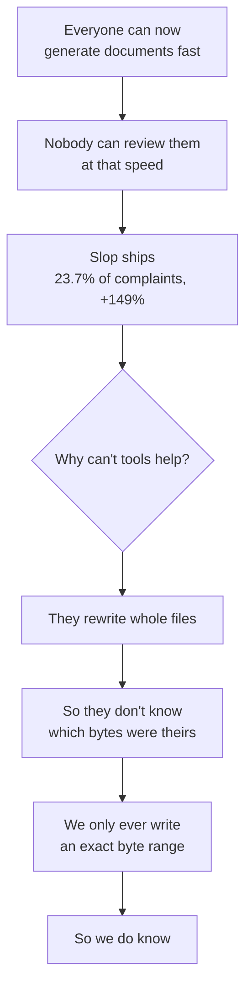
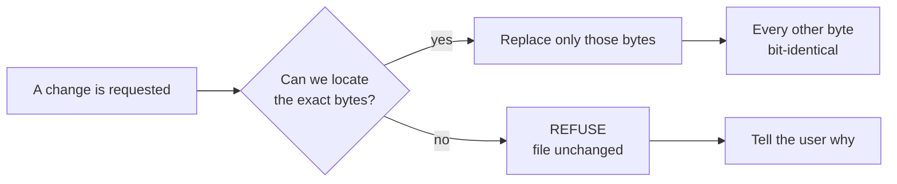
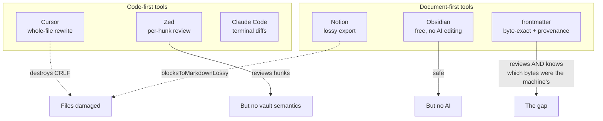
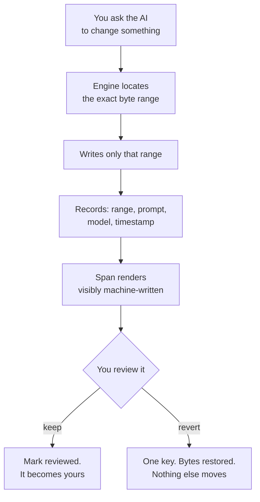
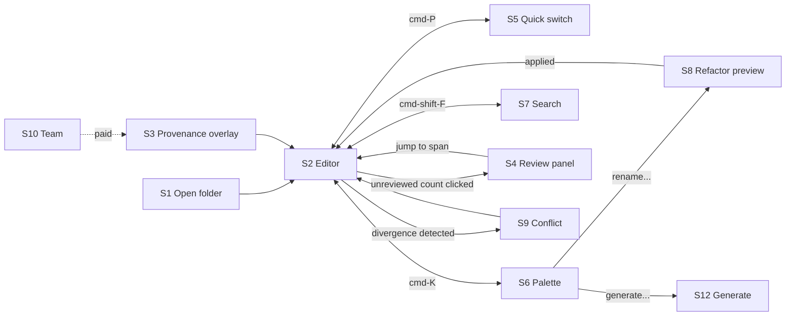
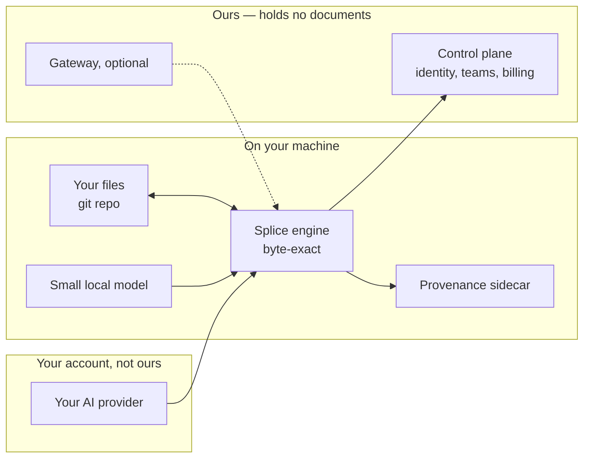
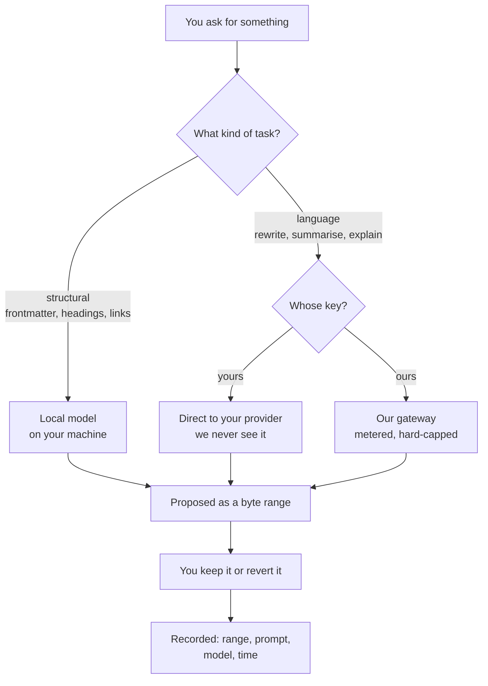
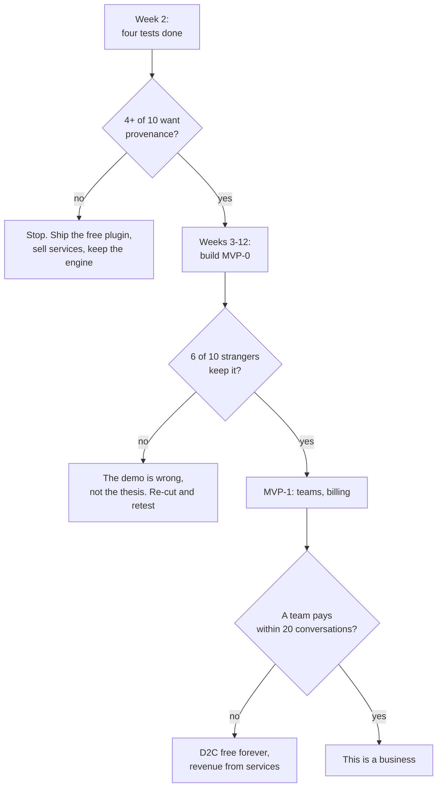

# frontmatter
## The product, the evidence, and the plan

> Amit — everything, in the order it makes sense to read. What people are struggling with, what already exists, what we have that nobody else does, and what I think we should build. The critique is not a section at the end; it runs through the whole thing, because a lot of what we believed six weeks ago turned out to be wrong and I would rather you see that than be sold to. Every number came from a source I opened myself, and each one is stated once, where it does the most work.

::keyfigures
109 — research reports behind this, over 26 rounds
23.7% — of all AI complaints are about slop. Growing 149% a year
4 / 12,556 — complaints about the thing we originally planned to sell
88.6% — of the codebase already exists and works
62% — of our own load-bearing claims were wrong when checked
::

## PART I — What is actually broken

### 1. The problem, counted

People write a lot of their documents and code with an AI now. That part works. Everything around it does not.

- **You cannot tell what the machine wrote.** A week later, nobody knows which paragraphs were typed and which were generated and never read properly.
- **You cannot hand the work over.** A new session means re-explaining everything; a teammate inherits decisions with no record of why.
- **The output quality is dropping in a specific way.** People call it "slop" — technically correct, verbose, generic, unmaintainable. It passes review because reviewing it properly takes longer than writing it did.

We mined Hacker News, Reddit and GitHub issues and counted, with denominators, so a number here means something.

::exhibit 1 | What people complain about, and whether it is the model or the work around it

| Rank | What they say | How often | Model, or the work around it? |
|---|---|---|---|
| 1 | "It loses context, I have to re-explain everything" | Highest volume, **declining** | Model. The labs are fixing it |
| 2 | **"The output is slop — verbose, generic, unmaintainable"** | **23.7% of AI complaints, +149% in 20 months** | **The work around it. Ours** |
| 3 | "I can't review it fast enough to trust it" | Rising alongside slop | Ours |
| 4 | "Sync broke, I lost work" | 16.5% of all editor sentiment | Ours |
| 5 | "It hallucinated a file that doesn't exist" | **Declining 19–67%** | Model. Do not build for it |
| 6 | "It edited the wrong file" | Declining | Model |
| 7 | "It's too expensive" | 15.7% of weekly posts | Market condition |

> [!note] **That last column is the most useful thing in this document.** A model problem gets fixed by Anthropic or OpenAI within a year or two, for free, and building for it is throwing money away. A workflow problem is the mess around the model, and it is ours. Slop is a workflow problem, it is the fastest-growing complaint anywhere in the corpus, and nobody is working on it.

**What people do instead today** — the existing workaround is the real competitor.

- They keep a `CLAUDE.md` or `AGENTS.md` by hand and it goes stale. We sampled real ones from public repos; most are written once and never updated.
- They paste large chunks of their repo into a chat window and hope.
- They re-read everything the AI wrote, which costs more time than writing it would have.
- Most simply accept the slop, ship it, and deal with it later. The most common answer and the most expensive one.

### 2. Every belief we tested, and what came back

Seven of our beliefs were tested against primary sources, and a separate pass re-opened a source for each of the twenty-one claims the plan leaned on hardest. **13 confirmed · 13 revised · 5 refuted · 3 unverifiable — 62% needed correction.** This one table replaces four that used to say the same things in different orders.

::exhibit 2 | The ledger — belief, verdict, source, and what it changed

| What we believed | Verdict | What the source actually says | What it changed |
|---|---|---|---|
| Byte-exactness makes people switch | REFUTED | 4 of 12,556 HN comments · 1 of 3,749 launch comments · 1 in 1,000 Reddit posts · `line endings` in 1 of 43,656 GitHub issues · one switch in 11 years | Killed it as the pitch. Kept it as the mechanism |
| Per-hunk review is our demo | REFUTED | Zed's docs: *"accept or reject each individual change hunk, or the whole set"* — I opened the page | Killed 16 of 38 planned MVP-0 points |
| Handovers and context packs are the wedge | REFUTED | 89 launches in 20 months, median 2 points, 88 of 89 never reached 50. Four were called *Handoff* | Killed the context-pack wedge |
| Decision-flow renders are the first render | REFUTED | 563 of 143,283,562 Obsidian downloads — 0.0004%. 3 plugins of 7,079. 0 of 1,600 Reddit posts | Killed the flagship render |
| ₹299 is a fair price | REFUTED | Obsidian gives the editor away and charges $4 for sync alone. We priced a whole editor at $3.13 | Inverted the pricing model |
| Sync is out of scope | REFUTED | #1 loved feature, #3 hated, #1 switching trigger, 1,251 of 43,656 issues | Pulled back into scope, MVP-2 |
| GST reverse charge starts after ₹20 lakh | REFUTED | **CGST §24(iii) has no turnover floor.** Buying Claude API access is importing a service | Registration starts at the first rupee |
| The engine is the differentiator | CONFIRMED | Cursor staff, three days before I looked: destroyed carriage returns on CRLF is *"a known issue we're tracking"* | Proved the defect is real and unfixed |
| The correctness work is real | CONFIRMED | 8,513-file pinned corpus, byte-identical verification, 1,575 tests | Kept the engine as the asset |
| Slop is a niche annoyance | REFUTED | **23.7% of complaints, +149% in 20 months.** Classified workflow, not model | Became the problem we aim at |
| Nested live preview is a nice-to-have | REVISED | **501 likes** — the most-voted bug in the category's history | Became the free wedge |
| Links breaking on rename is minor | REVISED | 86 likes. The most-liked rename complaint | Became MVP-1 |
| Our table editor is fine | REFUTED | It rewrites 3 of 4 lines and destroys 3 of 4 carriage returns [measured here] | Dead code. The measurement became a test |
| `frontmatter` and `sgnk-md` are siblings | REFUTED | **202 of 228 files byte-identical. 0 files exist only in `md`** | One codebase. Park `md`, port its CI |
| AIOS is self-improving | REFUTED | 6,884 routing decisions in a week produced **one** feedback label | Stopped us calling it that |
| IT Rules set a 50 lakh threshold | REFUTED | The Rules carry **no number** — "as notified by the Central Government" | Not ours to plan against |
| EU obligation is GDPR Art. 27 | REVISED | **DSA Art. 13** is a separate mandate with no small-enterprise exemption | Different obligation, different cost |
| Vanta/Drata charge $7,000–30,000 | UNVERIFIED | **Neither publishes a price.** drata.com/pricing returns 403 | Our B2B ROI headline had no source |
| GitBook's top complaint is lost work | REFUTED | Of 1,190 discussions, **51.3% are feature requests** | Removed the only external evidence for one moat |
| The corpus holds 7,959 frontmatter files | REVISED | **7,969.** Counted four independent ways | Not definitional. Just wrong |
| Output tokens are a minor cost | REVISED | **75.8% of spend** across 2,333 measured turns | Cap output, not input |

> [!risk] **Nine of these killed something we planned to build, and it is much cheaper to delete a feature from a document than from a codebase.** But be direct about what it means: we spent months building an argument for something users do not talk about. The engine is right. The sentence attached to it was wrong. That is recoverable, and it came from believing our own reasoning instead of checking it. **Re-derive before quoting any number in the record.**

## PART II — The market, and who this is for

### 3. How we know what we know

Twenty-six rounds, 109 reports, ~282,000 words of research behind this document. So you can judge the evidence rather than take it on trust.

::exhibit 3 | The research programme

| Rounds | What they asked | Reports | Headline finding |
|---|---|---|---|
| R1–R6 | Markdown as a substrate · competitors · formats · AEO · knowledge formats | 35 | The projection law; markdown is the right base |
| R7 | Cost and payment rails, re-derived | 16 | Margin was never the problem; **distribution is** |
| R8–R10 | Engine, sync, rendering, protocol | 29 | Never a CRDT — they interleave; git merge is byte-faithful |
| R11–R12 | Perf, data, DR, search, a11y, API, roles, i18n, billing | 25 | 20 unresearched areas closed |
| R13–R16 | System view, personas, positioning, gap sweep, MDMAX audit | 27 | 14 unasked gaps; 11 real engine defects, all scoped |
| R17–R18 | Comms, churn, refunds, ops, plugins · war-game · claim verification | 16 | **No channel existed to tell a user anything.** 62% of claims needed correction |
| R19–R20 | AI economics, offline/online, MVP staging, provider keys, repo access | 15 | "MVP" appeared **zero times** in the record until here |
| R21–R23 | What actually makes AI hard · ecosystem fusion · AIOS audited | 14 | Slop +149%; handovers launched 89×; **frontmatter IS sgnk-md** |
| R24–R26 | The editor as an editor · WTP · retention · twelve adversarial audits | 21 | **Zed already ships our demo.** Two buyers, never chosen |

**Sources opened directly:** Hacker News (Algolia API, 22,662 comments), Reddit JSON, GitHub API (43,656 issues), arXiv, vendor pricing pages, Indian tax statute, EU regulation, RBI circulars, the CommonMark spec, CA/Browser Forum.

**Measured on our own machines:** the 8,513-file corpus run · the table-editor byte destruction · 5,135 trace rows · the `sgnk-md` file-by-file comparison.

**Where the evidence is weak, and you should discount accordingly:**

- **Zero user interviews.** Not one. Every demand claim is inferred from public complaints. That is why the two-week test exists and why it is first in the plan.
- **No price tested with a human.** ₹299 came from us, not from anyone who would pay it.
- **Reddit was intermittently blocked** — 403 on every endpoint in one round. Some sentiment data is Hacker News only, which skews toward launches and strong opinions rather than daily use.
- **Only 21 claims got the primary-source treatment.** The rest of the record has not had it.
- **No performance benchmark against Obsidian**, and speed is the most-loved attribute in this category. Two days to close.
- **No outside security review.** We are asserting our own safety. A paid review belongs before the first team customer.

> [!note] **The methodological point that matters.** We ran adversarial rounds explicitly permitted to refute our own thesis, and they did, twice. That is the reason to trust the rest of it. A research process that never contradicts its sponsor is marketing.

### 4. Who has the problem badly enough to pay

::exhibit 4 | The segments, sized, ranked, and decided

| # | Who | What breaks for them | Will they pay? | Verdict |
|---|---|---|---|---|
| 1 | Solo builder shipping with an agent daily | Ships slop, finds out in production | A little, reluctantly | **Free tier. Our volume** |
| 2 | **A 2–5 person team with no PM** | Nobody knows why a decision was made. Onboarding takes weeks | **Yes, per seat** | **The wedge** |
| 3 | Agency or consultancy | Handover *is* the deliverable. A bad one costs a relationship | **Yes, and more per seat** | Second target |
| 4 | Docs or DX team | Docs rot; nobody notices until a customer does | Yes, slowly | Later, via gates |
| 5 | Regulated or audited team | Must evidence who wrote what | **Most of all** | Hardest to reach. Design for, do not chase |
| 6 | Individual note-taker | Nothing. Obsidian works | No | Not our buyer |

**The wedge user, specific enough to email ten of this week:** a technical founder or lead engineer in a two-to-five person team, shipping with Claude Code or Cursor daily, keeping specs and decisions in a git repo, burned at least once by a document nobody realised was machine-written. They are in r/ClaudeAI, r/ExperiencedDevs and the Obsidian forum, and they will tell you exactly what they think within an hour of trying something.

### 5. The two buyers, and why we must choose

The deepest problem in our plan, and it is not a research gap — it is a decision nobody made.

::exhibit 5 | The same product, sold to two different people

| | **The AI-native developer** | **The person who is liable** |
|---|---|---|
| Who | Solo or small team shipping with Claude Code, Cursor, Codex | Agency, consultancy, regulated team — anyone whose document goes to a client or an auditor |
| What they feel | "This is slow and I re-read too much" | "If this is wrong, it is my name on it" |
| What they want | Speed. Fewer keystrokes | **Proof.** A record of who wrote what |
| What they pay | Little, reluctantly, and they churn | Properly, and they stay |
| How many | Many | Fewer |
| How to reach them | HN, Reddit, plugin stores, word of mouth | Referral, and almost nothing else |
| What kills the sale | Any friction at all | No audit trail, no SSO, no entity they recognise |

**Why we cannot serve both at once.** The developer wants provenance invisible and fast — a keyboard shortcut. The liable buyer wants it exportable, signed and defensible in a dispute — a compliance feature with a report. Same engine, different products.

**My reading, and it is a recommendation not a finding:** start with the developer, because they are reachable and will tell us quickly whether the idea is any good — and design the provenance record so it *could* become the liable buyer's audit trail later without a rewrite. Store enough, sign nothing yet.

> [!warn] If we do not pick, the roadmap drifts toward whoever complains loudest, which is always the developer, who is also the one who will not pay.

### 6. What the market has, and where each one stops

We opened every one of these — docs, pricing pages, changelogs — rather than describing them from memory.

::exhibit 6 | The teardown

| Tool | Price today | How it writes files | Where it stops |
|---|---|---|---|
| **Obsidian** | Editor **free, no limits**. Sync $4/user/mo. $50/user/yr commercial | You write; it does not generate | No AI editing worth the name. Its own sync has duplicated sections of files |
| **Notion** | ~$10/user/mo | Blocks in a database, exported on request | Files are not files. Its export function is literally named `blocksToMarkdownLossy` |
| **Cursor** | ~$20/user/mo | Whole-file rewrite | Staff acknowledge destroying carriage returns on CRLF. Code-first; markdown is an afterthought |
| **Zed** | Free, AI usage billed | **Per-hunk accept/reject — already shipped** | No vault semantics. No wikilinks, tags or frontmatter awareness |
| **Claude Code / Codex** | Inside a $20–200 plan | Diffs in a terminal | No document surface. You read patches, you do not write |
| **GitHub Copilot** | $10–39/user/mo | Suggestions and PRs | Not a writing surface |
| **Logseq / Reflect / Craft** | $0–15/user/mo | Manual | No AI provenance, no byte guarantees |
| **GitBook / Mintlify** | $6.70–$300+/mo | Publishing pipeline | Not where you write. Complaints cluster on feature gaps |

**Three things this told us that we did not expect.**

- **Zed already ships the demo we had planned as our flagship** — documented, free, today. That was sixteen of our thirty-eight planned MVP-0 points, and we would have found out at launch.
- **The incumbents genuinely have the corruption defect we fixed, and they know.** Cursor's own staff called it *"a known issue we're tracking"* three days before I looked, and it is still open.
- **In this category the editor is worth ₹0.** Obsidian settled it. What people pay for is **sync (~$4)** and a **commercial team licence (~$50/user/year)** — and our buyer already spends $20–40/month on AI tooling, so we are asking for a share of a budget that exists rather than a new line.

### 7. So where is the actual opening

Three facts, laid next to each other:

- Every AI editor **rewrites whole files**, which is why they cannot tell you what they changed and why they corrupt line endings.
- The one that reviews per-hunk is a **code** editor with no idea what a wikilink or a frontmatter key is.
- The fastest-growing complaint in the market is about **not being able to review output fast enough to trust it**.

> [!good] **The opening: be the editor that can tell you which parts a machine wrote.** No tool that regenerates files can follow us there, because they genuinely do not have the information.

### 8. Positioning, and the objections we will actually hear

**The positioning statement.** For teams building software with AI, frontmatter is the markdown editor that records which bytes the machine wrote — so you can review what matters instead of re-reading everything. Unlike Cursor or Zed, which rewrite whole files and cannot tell you what they changed, we only ever write an exact byte range.

::exhibit 7 | Objections, and honest answers

| Objection | Our answer | Good enough? |
|---|---|---|
| "Obsidian is free and I like it" | So is ours, and it does something Obsidian does not | Yes |
| "Cursor already shows me diffs" | A diff is a moment. Provenance is a state that persists until someone deals with it | Yes, but it needs demonstrating, not explaining |
| "Zed has per-hunk review already" | It does. It also has no idea what a wikilink or a frontmatter key is | Adequate, not crushing |
| "Another editor to learn" | It reads your existing folder as-is. No import, no migration, no new format | Yes |
| "Why should I trust byte-exactness?" | There is a test, it runs on 8,513 real files, and it fails if one byte changes | Yes |
| "I trust my own review" | Then this changes nothing for you, and you should keep your workflow | Honest, and it loses the sale. Correctly |
| "I don't have this problem" | Then we are not for you today | The right answer, and we should give it |
| **"What if you shut down?"** | **Nothing to export, because nothing was ever taken** | **Our strongest answer — see below** |

**The shutdown answer is architectural, not a promise**, which is why it holds whether or not we are around to honour it: your files stay plain files in folders you chose (the filesystem); no proprietary sidecar carries meaning you would lose (delete our files, your documents still work); edits are byte-preserving (falsifiable on every build); your git history is in your repo; the provenance format is plain text and documented. **None of those is revocable for anything already written.** The most common objection to a small vendor is "what if you disappear", and our answer is a property of the design rather than a pledge. That is worth more in a B2B conversation than any feature.

## PART III — What we already have

### 9. The engine

The thing we have built and nobody else has is a way of editing a file that changes only the exact bytes you asked to change, and refuses when it cannot be certain.

**The contract, in one sentence:** locate the exact byte range, replace only those bytes, leave every other byte bit-identical — and if the range cannot be located unambiguously, refuse and change nothing.

**Everyone else parses the file into a tree, modifies the tree, and writes the whole file back.** That is why Notion's export is lossy, why Cursor destroys line endings, and why block editors mangle files: the rewrite touches everything, so any imperfection in the parser becomes a change in your document. We never build a tree and write it back. That single decision is why we do not have their defects, and why our engine is harder to write than theirs.

::exhibit 8 | What happens to a file, by tool

| Operation | A regenerating editor | Ours |
|---|---|---|
| Change one frontmatter value | Rewrites the block; may reorder keys, requote strings, normalise dates | Replaces the value's bytes. Key order, quoting and comments untouched |
| Change one table cell | Rewrites every row; may re-pad columns and change line endings | Replaces the cell's bytes |
| Windows line endings | Frequently normalised to Unix, silently | Preserved exactly |
| A file with no trailing newline | Usually gains one | Stays as it was |
| An ambiguous target | Guesses, and usually gets it right | **Refuses** |

**The proof.** 8,513 real markdown files pulled from seven strangers' public vaults, every one pinned by checksum so the test cannot silently drift — meaning it fails if a single byte anywhere in the corpus changes, so we cannot "fix" a test by changing the data. Zero corruption, zero crashes. **If you `git diff` after an edit, you see only your edit.** That is the whole promise and it is testable on every release.

::exhibit 9 | What is built, and what is broken

| Built | |
|---|---|
| Source | 25,407 lines of TypeScript across 226 files |
| Tests | 1,575 tests in 98 files |
| Corpus | 8,513 real markdown files, byte-pinned, zero corruption |
| Shared with `sgnk-md` | 202 of 228 files byte-identical — not a new codebase |

| Broken | What happens | Effect |
|---|---|---|
| **NF-1** | A list item at column zero in frontmatter is not recognised as belonging to the key above | **83% of real vaults are refused.** The most common way of writing a YAML list |
| **NF-2** | A closing bracket at column zero, same family | Smaller share of the same problem |
| **NF-3** | A frontmatter fence ending in a bare carriage return is not recognised | The writer thinks there is no frontmatter and **adds a second block.** Structurally destructive |
| **NF-4** | Keys with spaces or non-English characters cannot be addressed | 942 files affected. A fix design exists that recovers 936 |
| **No CI at all** | We ship on trust | Four of our own gates have reported green while blind |
| **Engine not wired in** | One symbol from one of thirteen engine files reaches product code | The engine is largely not connected to the product |

> [!warn] **Read NF-1 again.** Eighty-three percent of the vaults we tested are refused today, for one bug, with a known fix. Five of six user flows begin at that step. It is not a research problem or a design problem — it is four days of work standing between us and a product that opens.

### 10. Why refusing is the hard part

Every other tool guesses. Guessing looks better in a demo and is worse in practice.

- The industry-standard fuzzy patch library, run here: applied the same patch twice and produced corrupted text — **and reported success both times.** It also applied an edit whose anchoring context no longer existed, and reported success. Its own documentation describes this as intended.
- Git's three-way merge, on the same inputs, preserves Windows line endings and a missing final newline, and produces a conflict exactly where a careful writer would want to stop. We chose that behaviour.
- **The counter-argument, recorded rather than dismissed:** conservative merging produces conflicts and users hate conflicts — which is precisely why competitors ship fuzzy patching. Our mitigation is to publish the conflict rate as a shipped metric with a budget, so we know before our users tell us.

### 11. Where we sit, drawn

**One sentence:** the code-first tools review changes but do not understand a markdown vault; the document-first tools understand the vault but either damage files or have no AI at all. Nothing occupies the corner where both are true.

### 12. What we take from everything else we have built

We have shipped roughly twenty things. Combining them is how a focused product becomes a platform nobody buys, so the default was **no** and each yes had to earn it with a real mechanism — a shared format, a shared engine, or a shared buyer. "They are both AI" is not a mechanism.

::exhibit 10 | The ecosystem, item by item

| Project | Fuses? | The reasoning |
|---|---|---|
| **sgnk-md** | **It is the same product** | 202 of 228 source files byte-identical; zero files exist only in `md`. One codebase — park `md`, port its CI first |
| **AIOS** — skills, hooks, gates, traces | **Internal only** | How we work, not what we sell. 131 skills, 149 scripts, 69 gates, 65 days of traces. Genuinely large, genuinely ours, and **its learning loop is not closing: 6,884 routing decisions produced one feedback label.** We may not call it self-improving |
| **The gates** from AIOS | **Yes, later, as a feature** | Cross-reference checking, derived-document building, drift detection. They caught real errors in this document set. That is document CI, and document CI is a product |
| **AEO / content work** | **Partly** | The published-page surface and its SEO is the one owned distribution channel available to us. A channel, not a product line |
| **skills-registry** | No | Structurally the same problem — one source projected to many surfaces — but a different product and buyer |
| **HQ** | Later | Could be the team admin surface eventually. Not now |
| CareerOS · Markex · Advox · INW · Brand OS · Travox · GearUp · stock · trade · pdf | No | They share a founder and nothing else |

**Two things move:** `sgnk-md` is parked and its CI comes here; the AIOS gates become a feature much later, when teams pay us to check documents. Everything else stays, and **anything not being developed still costs us hosting, domains and attention** — worth an explicit decision about what to shut down.

## PART IV — What we should build

### 13. The product, and why this rather than the twenty other ideas

> [!good] **frontmatter is a markdown editor that knows which bytes a machine wrote.** Every AI edit is recorded as a byte range with the prompt, the model and the time. Machine-written spans look different from yours on screen. One keystroke reverts any of them. Nothing else in the file moves.

One line for someone who will not read that one: **it turns your repo into the prompt.**

**What it is not:** not Notion, not a project manager, not a chat wrapper, not an IDE. Those are refusals, not omissions.

We scored nine serious options against demand, time to revenue, defensibility, and how much existing code they reuse.

::exhibit 11 | The options we considered, scored

| Option | Demand | Time to revenue | Reuses engine | Verdict |
|---|---|---|---|---|
| **Provenance in the editor** | 9/10 | ~5 months | ~90% | **Build this** |
| Vault-wide refactor | 5/10 | ~5 months | ~90% | Ships with it, MVP-1 |
| Sync, provably safe | 9/10 | ~12 months | ~60% | The only proven price. Later |
| Nested-construct live preview | 8/10 | Free | ~15% | **The free wedge. Ship week 2** |
| Document CI for teams | 4/10 | ~6 months | ~70% | Later, and it may be the B2B line |
| Engine as a library / MCP server | 4/10 | ~9 months | 100% | Feeds competitors. Not yet |
| One-time $49 licence | 3/10 | ~4 months | ~90% | A pricing option, not a product |
| Services, productised | 9/10 | **This month** | ~10% | **Funds everything. Not an asset** |
| Redeploy to another product | 6/10 | ~12 months | ~30% | The honest fallback if the tests fail |

**Why provenance wins on the axis that matters.** It is the only option where the hard part — knowing exactly which bytes changed — is a thing we already solved and nobody else has. **Cursor and Zed cannot copy it without abandoning whole-file rewriting**, which is architectural, not a sprint. Every other option on that list could be built by a competitor in a quarter. It also answers a complaint people are making in volume today, and reuses about 90% of what exists.

### 14. The principles, the refusals, and how we keep it simple

Five rules that settle arguments before they start. Each has a cost, and the cost is stated.

::exhibit 12 | The principles

| # | Principle | In practice | What it costs |
|---|---|---|---|
| 1 | **The file is the only source of truth** | Every view is a projection. No view owns state the file does not have | No features that need hidden state — no comment threads living only in our database |
| 2 | **Refuse rather than guess** | If we cannot locate a change unambiguously, we change nothing and say why | Some edits fail that a fuzzier tool would complete |
| 3 | **Never hold the user's documents** | Files stay in their repo. We store identity, teams and billing, nothing else | Exit is free, so retention must be earned every month |
| 4 | **No arbitrary code execution, ever** | No plugins, no eval, no user scripts | We refuse the exact moat that made Obsidian unassailable |
| 5 | **Every claim must be falsifiable** | If we say byte-preserving, a test fails when it is not | Slower to ship, much harder to be wrong in public |

::exhibit 13 | The no-list, with what each refusal costs us

| Not building | Why | What we lose |
|---|---|---|
| **Plugins and arbitrary code execution** | Ends the corruption guarantee; turns every prompt injection into remote code execution | **The ecosystem moat Obsidian has. The most expensive refusal on this list** |
| Project management — kanban, sprints, assignees | We are not Notion and cannot win that fight | Some team buyers. A founder boundary, not a resourcing decision |
| A chat sidebar | The user already runs an agent; duplicating it badly helps nobody | Nothing. Table stakes done badly |
| **Hosting published pages** | A permanent, personal, unbounded on-call obligation from the day the first stranger publishes | A growth surface. We still *generate* — see §18 |
| Decision-flow renders | 0.0004% of the market wants them | An idea we liked. Nothing else |
| Knowledge-graph views | Beautiful, and almost nobody uses them twice | A screenshot |
| Degradation certificates, byte-level time travel, two-way renders | Technically lovely, commercially irrelevant | Engineering fun |
| Mobile, at first | Cost and focus | Real users. Roughly 15% of complaints are mobile |

> [!warn] **The plugin refusal deserves a proper argument.** Obsidian's moat *is* its plugin ecosystem, and refusing plugins means refusing the thing that made the category leader unassailable. We refuse because third-party code in the editor makes "we never corrupt your file" unprovable, and that guarantee is the entire product. But be clear-eyed: this closes the most proven growth path in the category, which is part of why we need the free live-preview plugin *in their store* to compensate.

**Simplicity, made structural rather than intended.**

- **The surface budget.** A new user meets no more than **seven** top-level concepts in the first session: folder, document, machine span, revert, quick-switch, search, settings. An eighth has to displace one.
- **The admission test.** A proposed feature must name the person who uses it and how often. If it cannot, it is cut, and the cut is recorded so nobody re-proposes it in three months.
- **The settings rule.** Every toggle is a decision we failed to make. The settings page is one screen and stays one screen.
- **The projection law does the heavy lifting.** Since every view must be a deterministic projection owning no state, anything needing hidden state is *already* forbidden. Most feature bloat is state bloat, and we made that structurally impossible.
- **What it costs:** we will say no to things customers ask for, and some will leave. That is the trade, and it is why the product stays comprehensible.

### 15. How the markdown itself is designed

The most consequential design decision in the product, and almost nobody outside engineering thinks about it. **The rule: we add nothing to markdown that breaks it somewhere else.** A file we touch must render correctly on GitHub, in Obsidian, in a plain text editor, and in whatever the user opens it with next year.

::exhibit 14 | How we store things markdown has no syntax for

| What we need to store | How | Why not the alternative |
|---|---|---|
| **Document metadata** | YAML frontmatter, the existing convention | Nothing else is universally understood |
| **A prose annotation** (a note, a decision card) | A blockquote callout — `> [!kind]` | It has **no closing marker to lose.** An unclosed fence swallows the rest of the document; a callout cannot |
| **Opaque data** (provenance ranges) | A fenced code block with an info string, written open-and-close in one atomic splice | Unambiguous for data, and writing both ends together means it can never be left open |
| **Where provenance lives** | A sidecar file beside the document, in the user's repo | Inline would pollute the prose. A database would mean holding their data |
| **Tags** | A `tags:` key — flow or block list, **whichever the file already uses** | Converting between them rewrites bytes the author chose, which is what we exist not to do |
| **Links** | Wikilinks or standard links, both read | We never rewrite one form into the other |
| Anything else we invent | **Nowhere** | Custom syntax, HTML and `:::` directives all degrade on some renderer. We accept `:::` on input and normalise it away |

**Why the callout decision matters more than it sounds.** We tested this across four markdown engines plus GitHub live. An unclosed fence is catastrophic — the CommonMark spec mandates that it swallows everything after it, so one lost closing line destroys the document downstream. A callout has no closer to lose. That measured difference chose our carrier format, and it corrects an earlier decision in our own record.

**What a file looks like after we touch it.** Identical, except the bytes you asked to change. Same line endings, same key order, same quoting, same trailing whitespace, same missing final newline if that is how you had it.

### 16. How it feels to use

Six flows. Each names the step most likely to lose the user, because that is where the work is.

- **1 · First run.** Open the app, point it at a folder you already have. It reads it as-is; we impose no structure. No sign-up, no account, no form. You are editing within about thirty seconds. *Riskiest step: the folder read — 83% of real vaults are refused today, which is why NF-1 is first and not a backlog item.*
- **2 · An AI edit.** Proposed as a byte range, shown as a marked span in place rather than a modal. Accept, reject, or leave for later. *Riskiest step: review fatigue — a forty-hunk change is a chore. Our answer is that you do not have to review it now; unreviewed machine text stays visibly marked until you do.* **That is the difference from a diff view: a diff is a moment, provenance is a state.**
- **3 · Coming back a week later.** The parts nobody has checked are still marked. You can see at a glance how much of this file a human has actually read.
- **4 · A vault-wide rename.** Every file that will change is listed as a reviewable hunk. Anything ambiguous is refused rather than guessed.
- **5 · Two devices.** Git merge, with divergence surfaced as a reviewable conflict. We never guess which version you meant.
- **6 · A teammate picks it up.** They can see which parts were machine-written and never reviewed. Today that information does not exist in any tool.

::exhibit 15 | The first five minutes, which decide everything

| Minute | What happens | What must not happen |
|---|---|---|
| 0 | Open the app. One button: choose a folder | No sign-up, no account, no email field |
| 0–1 | It reads the vault as-is. No import, no migration | No "indexing your vault" progress bar |
| 1 | You are editing. It looks like your files, because they are your files | No onboarding tour |
| 2 | You ask the AI for a change. It appears as a marked span | No modal, no diff screen you must leave the document for |
| 3 | One key. It is gone, and `git diff` proves nothing else moved | Nothing else moved. Ever |
| 5 | You realise you can see which parts nobody has read | This is the moment. Everything before it serves it |

**How we know it is understandable — four observable tests, not a feeling.** A new user opens a folder and edits with no tour or docs (*the unassisted first minute*); someone who has seen the screen for five seconds can say what the tinted text means (*the five-second explanation*); a first session introduces no more than seven ideas (*the surface budget*); and if a feature needs documentation to be understood it is designed wrong (*the no-manual rule*).

> [!warn] **The specific intuitivity risk.** Tinted text could read as "highlighted", "selected" or "an error". If a first-time user thinks a machine span is a problem rather than information, the whole metaphor fails. **That is the single thing the prototype must test**, and it is cheap — show five people a screenshot and ask what the blue means. The other risk is a form at first run: we collect nothing until there is something to collect it for.

### 17. The features, specified

Every feature names the person who uses it and how often. Anything that could not is in the no-list above.

**F1 · The provenance store** — MVP-0, invisible, powers everything else.
- Every write the engine makes for an agent is recorded as `{start_byte, end_byte, prompt, model, timestamp, session}`, in a sidecar inside the user's own repo.
- *Why a sidecar, not a database:* the file is the source of truth. On our servers it would be lost the moment someone cloned the repo elsewhere, and we would be holding data we promised not to hold.
- *Why it works:* the engine already computes the exact byte range for every write. Nobody else has this information to record.
- *Hard part:* keeping ranges valid as the document is edited around them. Same anchor problem the engine already solves for splices.

**F2 · Machine-span rendering** — MVP-0, everyone, constantly.
- Machine-written, unreviewed text renders with a subtle background; reviewed text renders normally. Hover shows prompt, model and time.
- *Why subtle:* a document where half the text is highlighted is unreadable. This must be information you can ignore until you want it.

**F3 · One-key revert** — MVP-0, anyone reviewing, several times a session.
- Cursor inside a machine span, one keystroke, original bytes return, nothing else moves.
- *Why not undo:* undo is chronological and breaks the moment you have typed since. This is spatial — revert *that thing*, whenever it was written.

**F4 · The review state** — MVP-1, the person picking up work a week later.
- A document knows what fraction of it a human has read. A file that is 80% unreviewed machine text looks different in the tree.
- *Why it matters:* this is the difference between a diff and provenance. A diff is a moment you handle or lose; provenance persists until someone deals with it.

**F5 · Vault-wide refactor** — MVP-1, anyone with 100+ notes, monthly.
- Rename a tag, heading or property key. Every affected file appears as a reviewable hunk; ambiguous targets are refused, not guessed.
- *Why it belongs to us:* a byte-exact operation across hundreds of files. Anyone who regenerates rewrites every file it touches. 86 likes on the broken-links-on-rename complaint — the most-liked in this space.

**F6 · Nested-construct live preview** — MVP-2 in the product, week 2 as a free plugin.
- Code blocks, quotes and callouts inside list items render correctly while you type.
- *Why it is here at all:* 501 likes, the most-voted bug in the category's history, with siblings at 96, 82, 50, 36 and 33. **It is not our differentiator — it is the cheapest way to be noticed by people who already have this pain.**

**F7 · The gates** — later, teams.
- Automated checks over a repo of markdown: do cross-references resolve, is anything stale, which sections are unreviewed machine text.
- *Why later:* a team product with a team sale, and we should not sell to teams before we have individuals. *Evidence it works:* four of these run on ourselves and caught real errors in this document.

**Plus the table stakes, which are not optional:** quick-switch, command palette and search ship in MVP-0, because a reviewer who cannot navigate stops reviewing before reaching anything clever. **The table-stakes gap is bigger than the novel-feature gap.**

::exhibit 16 | The build order, and the reasoning

| | Ships | Weeks | Why this stage |
|---|---|---|---|
| MVP-0 | Engine fixes · F1 · F2 · F3 · table stakes · CI | 10 | Without the fixes 83% cannot open the app. Without F1–F3 there is no product |
| MVP-1 | F4 · F5 · generation · billing · teams | 8 | The first things worth money, and the first that need money to exist |
| MVP-2 | F6 free in Obsidian's store · sync | 12 | Distribution, and the only proven price in the category |

### 18. Markdown as output — sites, decks, and visual projections

A markdown file already contains everything a small website needs. Turning that into a site is not a new product — **it is the projection law pointed at the output side.** Same file, another deterministic view, owning no state.

::exhibit 17 | Three things people call publishing, with completely different costs

| | What it is | What it costs us | Verdict |
|---|---|---|---|
| **Generate** | A folder becomes a static site, a deck, or a one-pager. The user gets files | Compute, once, on their machine. **No liability, no hosting, no moderation** | **SHIP** |
| **Host** | We serve those pages from our domain | Intermediary duties, a permanent 24-hour complaint clock, spam and abuse moderation | **REFUSE in v1** |
| **Assist** | One command to push to Vercel, Netlify or GitHub Pages | A button. Their account, their terms | **SHIP** |

**What we generate, in priority order:** a **static site** from a folder, using the existing tree as navigation (docs sites, handbooks, personal wikis — the most-asked-for output) · a **single shareable page** from one document, so you can send someone a spec without sending them a repo · a **slide deck**, where H2s become slides and bullets become bullets, with zero new syntax · a **one-page brief** from a document plus its frontmatter — this document is one, and the generator is the thing that made it · **diagrams** from existing mermaid blocks, which we render rather than invent.

**The rules that keep it honest.** The site is a projection, never a source — edits happen in the markdown, and there is **no site editor, no theme builder, no page composer**, because each would need its own state and state is what the architecture forbids. Themes are files, not a gallery. It runs locally and offline, because static generation is templating and file-writing with no model and no network. Output is plain HTML, CSS and assets in a folder — deployable anywhere, readable without us, still working if we disappear.

> [!good] **The strategic reason, beyond the feature.** Every generated page can carry a small, honest mark, which makes the output itself a channel — the one growth loop available to a product with no advertising budget and no community. Every other channel we identified is borrowed. **This is the only one we would own**, which is why generation is MVP-1 and not later.

> [!warn] **The honest caveat.** Static site generators are a crowded, mature category — Hugo, Eleventy, Astro, MkDocs and dozens more, all free and all better at this than we will be in v1. **We are not competing with them and should not pretend to.** What we offer is that it is already inside the editor, reads the vault you already have, and needs no configuration file. That is a convenience argument, not a superiority one, and the copy should say so.

### 19. Design, and every screen

The design job is unusual: the most important thing on screen is information *about* the text, shown without making the text harder to read. **The governing rule — a document with provenance on must be as readable as one with it off.** If a user turns provenance off to read comfortably, we have failed.

::exhibit 18 | The visual language

| Element | Decision | Why |
|---|---|---|
| Machine-written, unreviewed | A very light tinted background. No border, no icon | It has to be ignorable. A border fragments the line and destroys reading rhythm |
| Machine-written, reviewed | Nothing. Normal text | Once you have read it, it is yours. Permanent marking would be noise |
| Hover | A small panel: prompt, model, when, revert | On demand only. Nothing hovers into view by itself |
| Document-level state | A thin bar in the file tree showing unreviewed share | Glanceable. Never a number you have to interpret |
| Refusal | An inline note where the change would have gone, in plain words | Never a modal. A modal makes a normal outcome feel like an error |
| Conflict | Two versions side by side, differences marked | The one place we may interrupt, because guessing here loses work |

**Type and surface:** Google Sans for interface, Google Sans Code for the editor, on white. One accent colour, square corners, hairline borders, one elevation rule. This is our existing design system — the thing to fix is that the shipped `globals.css` is currently a *different* system inherited from a sibling project, self-describing as "Linear-style modern SaaS". **Icons are inline SVG from one set, never emoji and never a web font**, because an icon font that fails to load renders the literal ligature text or a blank box, and it will fail on a slow connection or a strict content policy.

**What the interface must not become:** no sidebar of panels (the document is the interface), no growing settings page, no dashboard (nobody opens an editor to look at one), no chat window.

::exhibit 19 | Eleven screens, four of them dialogs — what each is and what is in it

| # | Screen | What it is for | What is in it | Stage |
|---|---|---|---|---|
| S1 | **Open a folder** | The entire first run | One button · a recent-folders list · one line saying nothing leaves your machine. No account, no email | MVP-0 |
| S2 | **The editor** | 95% of the product | Collapsible left rail with a per-file unreviewed bar · the document at full measure · minimal top bar (breadcrumb, sync state, one overflow menu — no toolbar; formatting is markdown, typed) · a thin ambient status line · hover panel on a span | MVP-0 |
| S3 | **The provenance layer** | The differentiator. An overlay on S2, not a screen | Tinted spans for unreviewed machine text. Toggleable. No borders, no icons, no gutter marks | MVP-0 |
| S4 | **Review panel** | Catching up on a document you did not watch being written | Ordered list of unreviewed spans · first line, model, age · accept / revert / skip · keyboard j-k-a-r · a counter that goes to zero | MVP-0 |
| S5 | **Quick switcher** | Table stakes. Its absence ends a review before it starts | Input, fuzzy-ranked results, path shown, recent-first when empty | MVP-0 |
| S6 | **Command palette** | Table stakes, and how power users learn a product | Input, grouped commands, keyboard hints, and what a command does before you run it | MVP-0 |
| S7 | **Search** | Table stakes | Query, results grouped by file with two lines of context, a count. Replace is a separate deliberate mode | MVP-0 |
| S8 | **Refactor preview** | The engine made visible — the 86-like problem | What is changing in one line · affected files with per-file hunks · accept all / per file / cancel · a refusal list with reasons | MVP-1 |
| S9 | **Conflict view** | The only place we interrupt, because guessing loses work | Two panes, differences marked, a third for the result · take-mine / take-theirs / edit · never auto-resolves | MVP-1 |
| S10 | **Team view** | The paid surface. Nothing else is per-seat | Repo picker · per-document unreviewed share · per-person contribution · a filter for "machine-written, nobody reviewed" | MVP-1 |
| S11 | **Settings** | Deliberately small | One page, six groups, no tabs: appearance · keymap · AI provider and key · provenance defaults · git identity · about | MVP-0 |
| S12 | **Generate** | A site, page or deck from the folder | Output type · what goes in · live preview · deploy targets · "we never host it" stated on screen | MVP-1 |

**Four dialogs and no more:** connect a repo · enter an AI key · a refusal explanation · the update prompt. **And a long deliberate absence:** no dashboard, no analytics screen, no template gallery, no plugin browser, no onboarding tour, no chat sidebar, no kanban, no calendar, no graph view.

**Three rules the navigation obeys.** Everything returns to S2 — no screen is a destination, each is a detour that hands you back to the document. Escape always goes back one step and never loses work. No modal blocks the document except the conflict view, which blocks because proceeding without a decision would lose data.

### 20. The screens, drawn

Mid fidelity: enough to argue about what goes where, not enough to argue about corner radii.

Mid fidelity: enough to argue about what goes where, not enough to argue about corner radii.

::exhibit 20 | S0 · The launcher — what you see before a document is open

<svg viewBox="0 0 760 452" xmlns="http://www.w3.org/2000/svg" style="width:100%;max-width:760px;height:auto"><rect x="1" y="1" width="758" height="430" fill="#fff" stroke="#14161a" stroke-width="1.5" rx="4"/><rect x="1" y="1" width="758" height="34" fill="#fafbfc"/><line x1="1" y1="35" x2="759" y2="35" stroke="#c9cfda" stroke-width="1"/><rect x="12" y="9" width="34" height="18" fill="#14161a" stroke="#c9cfda" stroke-width="1" rx="3"/><text x="29" y="21" font-family="system-ui,-apple-system,sans-serif" font-size="7.5" fill="#fff" font-weight="700" text-anchor="middle">fm</text><rect x="56" y="9" width="570" height="18" fill="#fff" stroke="#c9cfda" stroke-width="1" rx="9"/><text x="66" y="22" font-family="system-ui,-apple-system,sans-serif" font-size="8" fill="#8a93a3">⌕  Search every document</text><rect x="634" y="9" width="46" height="18" fill="#fff" stroke="#c9cfda" stroke-width="1" rx="3"/><text x="657" y="21" font-family="system-ui,-apple-system,sans-serif" font-size="7.5" fill="#14161a" text-anchor="middle">Open…</text><rect x="688" y="9" width="60" height="18" fill="#1a5cff" stroke="#1a5cff" stroke-width="1" rx="3"/><text x="718" y="21" font-family="system-ui,-apple-system,sans-serif" font-size="7.5" fill="#fff" font-weight="600" text-anchor="middle">New</text><text x="20" y="60" font-family="system-ui,-apple-system,sans-serif" font-size="7.5" fill="#8a93a3" font-weight="700">START SOMETHING</text><rect x="20" y="70" width="132" height="84" fill="#f2f6ff" stroke="#1a5cff" stroke-width="1" rx="4"/><text x="34" y="100" font-family="system-ui,-apple-system,sans-serif" font-size="9.5" fill="#1a5cff" font-weight="600">Blank</text><text x="34" y="114" font-family="system-ui,-apple-system,sans-serif" font-size="9.5" fill="#1a5cff" font-weight="600">document</text><text x="34" y="142" font-family="system-ui,-apple-system,sans-serif" font-size="7" fill="#8a93a3">empty file</text><rect x="166" y="70" width="132" height="84" fill="#fff" stroke="#c9cfda" stroke-width="1" rx="4"/><text x="180" y="100" font-family="system-ui,-apple-system,sans-serif" font-size="9.5" fill="#14161a" font-weight="600">Handover</text><text x="180" y="142" font-family="system-ui,-apple-system,sans-serif" font-size="7" fill="#8a93a3">markdown skeleton</text><rect x="312" y="70" width="132" height="84" fill="#fff" stroke="#c9cfda" stroke-width="1" rx="4"/><text x="326" y="100" font-family="system-ui,-apple-system,sans-serif" font-size="9.5" fill="#14161a" font-weight="600">Decision</text><text x="326" y="114" font-family="system-ui,-apple-system,sans-serif" font-size="9.5" fill="#14161a" font-weight="600">record</text><text x="326" y="142" font-family="system-ui,-apple-system,sans-serif" font-size="7" fill="#8a93a3">markdown skeleton</text><rect x="458" y="70" width="132" height="84" fill="#fff" stroke="#c9cfda" stroke-width="1" rx="4"/><text x="472" y="100" font-family="system-ui,-apple-system,sans-serif" font-size="9.5" fill="#14161a" font-weight="600">Spec</text><text x="472" y="142" font-family="system-ui,-apple-system,sans-serif" font-size="7" fill="#8a93a3">markdown skeleton</text><rect x="604" y="70" width="132" height="84" fill="#fff" stroke="#c9cfda" stroke-width="1" rx="4"/><text x="618" y="100" font-family="system-ui,-apple-system,sans-serif" font-size="9.5" fill="#14161a" font-weight="600">Changelog</text><text x="618" y="142" font-family="system-ui,-apple-system,sans-serif" font-size="7" fill="#8a93a3">markdown skeleton</text><line x1="20" y1="176" x2="740" y2="176" stroke="#c9cfda" stroke-width="1"/><text x="20" y="196" font-family="system-ui,-apple-system,sans-serif" font-size="7.5" fill="#8a93a3" font-weight="700">RECENT</text><text x="740" y="196" font-family="system-ui,-apple-system,sans-serif" font-size="7.5" fill="#1a5cff" text-anchor="end">unreviewed first  ▾</text><rect x="20" y="208" width="168" height="78" fill="#fff" stroke="#c9cfda" stroke-width="1" rx="4"/><text x="32" y="228" font-family="system-ui,-apple-system,sans-serif" font-size="9" fill="#14161a" font-weight="600">auth.md</text><text x="32" y="242" font-family="system-ui,-apple-system,sans-serif" font-size="7.5" fill="#8a93a3">specs/</text><rect x="32" y="252" width="144" height="3" fill="#e4e7ec"/><rect x="32" y="259" width="86.39999999999999" height="3" fill="#e4e7ec"/><rect x="32" y="270" width="144" height="4" fill="#eceff4"/><rect x="32" y="270" width="92.16" height="4" fill="#1a5cff"/><text x="32" y="282" font-family="system-ui,-apple-system,sans-serif" font-size="7" fill="#1a5cff">64% unreviewed</text><rect x="202" y="208" width="168" height="78" fill="#fff" stroke="#c9cfda" stroke-width="1" rx="4"/><text x="214" y="228" font-family="system-ui,-apple-system,sans-serif" font-size="9" fill="#14161a" font-weight="600">0004-sync.md</text><text x="214" y="242" font-family="system-ui,-apple-system,sans-serif" font-size="7.5" fill="#8a93a3">adr/</text><rect x="214" y="252" width="144" height="3" fill="#e4e7ec"/><rect x="214" y="259" width="86.39999999999999" height="3" fill="#e4e7ec"/><rect x="214" y="270" width="144" height="4" fill="#eceff4"/><rect x="214" y="270" width="126.72" height="4" fill="#1a5cff"/><text x="214" y="282" font-family="system-ui,-apple-system,sans-serif" font-size="7" fill="#1a5cff">88% unreviewed</text><rect x="384" y="208" width="168" height="78" fill="#fff" stroke="#c9cfda" stroke-width="1" rx="4"/><text x="396" y="228" font-family="system-ui,-apple-system,sans-serif" font-size="9" fill="#14161a" font-weight="600">pricing.md</text><text x="396" y="242" font-family="system-ui,-apple-system,sans-serif" font-size="7.5" fill="#8a93a3">notes/</text><rect x="396" y="252" width="144" height="3" fill="#e4e7ec"/><rect x="396" y="259" width="86.39999999999999" height="3" fill="#e4e7ec"/><rect x="396" y="270" width="144" height="4" fill="#eceff4"/><rect x="396" y="270" width="44.64" height="4" fill="#a8c4f5"/><text x="396" y="282" font-family="system-ui,-apple-system,sans-serif" font-size="7" fill="#1a5cff">31% unreviewed</text><rect x="566" y="208" width="168" height="78" fill="#fff" stroke="#c9cfda" stroke-width="1" rx="4"/><text x="578" y="228" font-family="system-ui,-apple-system,sans-serif" font-size="9" fill="#14161a" font-weight="600">billing.md</text><text x="578" y="242" font-family="system-ui,-apple-system,sans-serif" font-size="7.5" fill="#8a93a3">specs/</text><rect x="578" y="252" width="144" height="3" fill="#e4e7ec"/><rect x="578" y="259" width="86.39999999999999" height="3" fill="#e4e7ec"/><rect x="578" y="270" width="144" height="4" fill="#eceff4"/><rect x="578" y="270" width="17.28" height="4" fill="#a8c4f5"/><text x="578" y="282" font-family="system-ui,-apple-system,sans-serif" font-size="7" fill="#1a5cff">12% unreviewed</text><rect x="20" y="300" width="168" height="78" fill="#fff" stroke="#c9cfda" stroke-width="1" rx="4"/><text x="32" y="320" font-family="system-ui,-apple-system,sans-serif" font-size="9" fill="#14161a" font-weight="600">README.md</text><text x="32" y="334" font-family="system-ui,-apple-system,sans-serif" font-size="7.5" fill="#8a93a3">root</text><rect x="32" y="344" width="144" height="3" fill="#e4e7ec"/><rect x="32" y="351" width="86.39999999999999" height="3" fill="#e4e7ec"/><rect x="32" y="362" width="144" height="4" fill="#eceff4"/><text x="32" y="374" font-family="system-ui,-apple-system,sans-serif" font-size="7" fill="#0d8a4f">all reviewed</text><rect x="202" y="300" width="168" height="78" fill="#fff" stroke="#c9cfda" stroke-width="1" rx="4"/><text x="214" y="320" font-family="system-ui,-apple-system,sans-serif" font-size="9" fill="#14161a" font-weight="600">0003-scope.md</text><text x="214" y="334" font-family="system-ui,-apple-system,sans-serif" font-size="7.5" fill="#8a93a3">adr/</text><rect x="214" y="344" width="144" height="3" fill="#e4e7ec"/><rect x="214" y="351" width="86.39999999999999" height="3" fill="#e4e7ec"/><rect x="214" y="362" width="144" height="4" fill="#eceff4"/><rect x="214" y="362" width="64.8" height="4" fill="#a8c4f5"/><text x="214" y="374" font-family="system-ui,-apple-system,sans-serif" font-size="7" fill="#1a5cff">45% unreviewed</text><rect x="384" y="300" width="168" height="78" fill="#fff" stroke="#c9cfda" stroke-width="1" rx="4"/><text x="396" y="320" font-family="system-ui,-apple-system,sans-serif" font-size="9" fill="#14161a" font-weight="600">onboarding.md</text><text x="396" y="334" font-family="system-ui,-apple-system,sans-serif" font-size="7.5" fill="#8a93a3">notes/</text><rect x="396" y="344" width="144" height="3" fill="#e4e7ec"/><rect x="396" y="351" width="86.39999999999999" height="3" fill="#e4e7ec"/><rect x="396" y="362" width="144" height="4" fill="#eceff4"/><text x="396" y="374" font-family="system-ui,-apple-system,sans-serif" font-size="7" fill="#0d8a4f">all reviewed</text><rect x="566" y="300" width="168" height="78" fill="#fff" stroke="#c9cfda" stroke-width="1" rx="4"/><text x="578" y="320" font-family="system-ui,-apple-system,sans-serif" font-size="9" fill="#14161a" font-weight="600">api.md</text><text x="578" y="334" font-family="system-ui,-apple-system,sans-serif" font-size="7.5" fill="#8a93a3">specs/</text><rect x="578" y="344" width="144" height="3" fill="#e4e7ec"/><rect x="578" y="351" width="86.39999999999999" height="3" fill="#e4e7ec"/><rect x="578" y="362" width="144" height="4" fill="#eceff4"/><rect x="578" y="362" width="31.68" height="4" fill="#a8c4f5"/><text x="578" y="374" font-family="system-ui,-apple-system,sans-serif" font-size="7" fill="#1a5cff">22% unreviewed</text><rect x="1" y="404" width="758" height="25" fill="#fafbfc"/><line x1="1" y1="404" x2="759" y2="404" stroke="#c9cfda" stroke-width="1"/><text x="14" y="420" font-family="system-ui,-apple-system,sans-serif" font-size="7.5" fill="#8a93a3">3 projects · 128 documents · 7 unreviewed</text><text x="746" y="420" font-family="system-ui,-apple-system,sans-serif" font-size="7.5" fill="#8a93a3" text-anchor="end">⌘K commands   ⌘P files</text><text x="2" y="447" font-family="system-ui,-apple-system,sans-serif" font-size="7.5" fill="#4a5160">Templates are markdown skeletons, not a gallery. Five, and they are the document types the research found actually recur.</text></svg>

**The bar at the bottom of every card is the product showing itself before you open anything.** Recent documents sort by unreviewed share, so the thing most likely to need you is first.

::exhibit 21 | S2 · The editor — every region named

<svg viewBox="0 0 900 542" xmlns="http://www.w3.org/2000/svg" style="width:100%;max-width:900px;height:auto"><rect x="1" y="1" width="898" height="520" fill="#fff" stroke="#14161a" stroke-width="1.5" rx="4"/><rect x="1" y="1" width="898" height="30" fill="#fafbfc"/><line x1="1" y1="31" x2="899" y2="31" stroke="#c9cfda" stroke-width="1"/><rect x="10" y="7" width="28" height="17" fill="#14161a" stroke="#c9cfda" stroke-width="1" rx="3"/><text x="24" y="18.5" font-family="system-ui,-apple-system,sans-serif" font-size="7.5" fill="#fff" font-weight="700" text-anchor="middle">fm</text><text x="46" y="19" font-family="system-ui,-apple-system,sans-serif" font-size="9" fill="#8a93a3">⌸  ⟲  ⟳</text><rect x="92" y="5" width="108" height="22" fill="#fff" stroke="#c9cfda" stroke-width="1" rx="3"/><rect x="92" y="5" width="108" height="2" fill="#1a5cff"/><text x="102" y="20" font-family="system-ui,-apple-system,sans-serif" font-size="8" fill="#14161a" font-weight="600">auth.md</text><text x="190" y="20" font-family="system-ui,-apple-system,sans-serif" font-size="8" fill="#8a93a3" text-anchor="end">×</text><rect x="208" y="5" width="108" height="22" fill="transparent" stroke="transparent" stroke-width="1" rx="3"/><text x="218" y="20" font-family="system-ui,-apple-system,sans-serif" font-size="8" fill="#4a5160">0004-sync.md</text><text x="306" y="20" font-family="system-ui,-apple-system,sans-serif" font-size="8" fill="#8a93a3" text-anchor="end">×</text><rect x="324" y="5" width="108" height="22" fill="transparent" stroke="transparent" stroke-width="1" rx="3"/><text x="334" y="20" font-family="system-ui,-apple-system,sans-serif" font-size="8" fill="#4a5160">pricing.md</text><text x="422" y="20" font-family="system-ui,-apple-system,sans-serif" font-size="8" fill="#8a93a3" text-anchor="end">×</text><rect x="440" y="5" width="108" height="22" fill="transparent" stroke="transparent" stroke-width="1" rx="3"/><text x="450" y="20" font-family="system-ui,-apple-system,sans-serif" font-size="8" fill="#4a5160">README.md</text><text x="538" y="20" font-family="system-ui,-apple-system,sans-serif" font-size="8" fill="#8a93a3" text-anchor="end">×</text><rect x="690" y="7" width="118" height="17" fill="#fff" stroke="#c9cfda" stroke-width="1" rx="9"/><text x="698" y="20" font-family="system-ui,-apple-system,sans-serif" font-size="7.5" fill="#8a93a3">⌕ Search</text><rect x="816" y="7" width="30" height="17" fill="#fff" stroke="#c9cfda" stroke-width="1" rx="3"/><text x="831" y="18.5" font-family="system-ui,-apple-system,sans-serif" font-size="7.5" fill="#14161a" text-anchor="middle">sh</text><rect x="852" y="7" width="38" height="17" fill="#fff" stroke="#c9cfda" stroke-width="1" rx="3"/><text x="871" y="18.5" font-family="system-ui,-apple-system,sans-serif" font-size="7.5" fill="#14161a" text-anchor="middle">Pf</text><rect x="1" y="32" width="176" height="487" fill="#f4f6fa"/><line x1="176" y1="32" x2="176" y2="519" stroke="#c9cfda" stroke-width="1"/><text x="12" y="50" font-family="system-ui,-apple-system,sans-serif" font-size="7.5" fill="#8a93a3" font-weight="700">‹  TREE</text><rect x="130" y="41" width="34" height="14" fill="#fff" stroke="#c9cfda" stroke-width="1" rx="3"/><text x="147" y="51" font-family="system-ui,-apple-system,sans-serif" font-size="7.5" fill="#14161a" text-anchor="middle">FP+</text><rect x="0" y="59" width="176" height="21" fill="#eef1f6"/><text x="10" y="74" font-family="system-ui,-apple-system,sans-serif" font-size="7.6" fill="#2c3038" font-weight="700">product-docs</text><text x="162" y="74" font-family="system-ui,-apple-system,sans-serif" font-size="10" fill="#8a93a3" text-anchor="end">+</text><text x="18" y="95" font-family="system-ui,-apple-system,sans-serif" font-size="8" fill="#3a4048">▾  adr</text><line x1="23" y1="102" x2="23" y2="121" stroke="#c9cfda" stroke-width="1"/><text x="28" y="116" font-family="system-ui,-apple-system,sans-serif" font-size="8" fill="#3a4048">0003-scope.md</text><line x1="23" y1="123" x2="23" y2="142" stroke="#c9cfda" stroke-width="1"/><text x="28" y="137" font-family="system-ui,-apple-system,sans-serif" font-size="8" fill="#3a4048">0004-sync.md</text><text x="18" y="158" font-family="system-ui,-apple-system,sans-serif" font-size="8" fill="#3a4048">▾  specs</text><rect x="6" y="165" width="164" height="19" fill="#fff" stroke="#1a5cff" stroke-width="1" rx="3"/><line x1="23" y1="165" x2="23" y2="184" stroke="#c9cfda" stroke-width="1"/><text x="28" y="179" font-family="system-ui,-apple-system,sans-serif" font-size="8" fill="#1a5cff" font-weight="700">auth.md</text><line x1="23" y1="186" x2="23" y2="205" stroke="#c9cfda" stroke-width="1"/><text x="28" y="200" font-family="system-ui,-apple-system,sans-serif" font-size="8" fill="#3a4048">billing.md</text><text x="18" y="221" font-family="system-ui,-apple-system,sans-serif" font-size="8" fill="#3a4048">▾  notes</text><line x1="23" y1="228" x2="23" y2="247" stroke="#c9cfda" stroke-width="1"/><text x="28" y="242" font-family="system-ui,-apple-system,sans-serif" font-size="8" fill="#3a4048">pricing.md</text><rect x="0" y="248" width="176" height="21" fill="#eef1f6"/><text x="10" y="263" font-family="system-ui,-apple-system,sans-serif" font-size="7.6" fill="#2c3038" font-weight="700">engine</text><text x="162" y="263" font-family="system-ui,-apple-system,sans-serif" font-size="10" fill="#8a93a3" text-anchor="end">+</text><text x="18" y="284" font-family="system-ui,-apple-system,sans-serif" font-size="8" fill="#3a4048">▾  src</text><line x1="23" y1="291" x2="23" y2="310" stroke="#c9cfda" stroke-width="1"/><text x="28" y="305" font-family="system-ui,-apple-system,sans-serif" font-size="8" fill="#3a4048">splice.md</text><rect x="0" y="311" width="176" height="21" fill="#eef1f6"/><text x="10" y="326" font-family="system-ui,-apple-system,sans-serif" font-size="7.6" fill="#2c3038" font-weight="700">website</text><text x="162" y="326" font-family="system-ui,-apple-system,sans-serif" font-size="10" fill="#8a93a3" text-anchor="end">+</text><rect x="177" y="32" width="548" height="28" fill="#fff"/><line x1="177" y1="60" x2="724" y2="60" stroke="#c9cfda" stroke-width="1"/><rect x="186" y="39" width="48" height="16" fill="#fff" stroke="#c9cfda" stroke-width="1" rx="3"/><text x="210" y="50" font-family="system-ui,-apple-system,sans-serif" font-size="7.5" fill="#3a4048" text-anchor="middle">Edit</text><rect x="238" y="39" width="48" height="16" fill="#1a5cff" stroke="#1a5cff" stroke-width="1" rx="3"/><text x="262" y="50" font-family="system-ui,-apple-system,sans-serif" font-size="7.5" fill="#fff" font-weight="600" text-anchor="middle">Live</text><rect x="290" y="39" width="48" height="16" fill="#fff" stroke="#c9cfda" stroke-width="1" rx="3"/><text x="314" y="50" font-family="system-ui,-apple-system,sans-serif" font-size="7.5" fill="#3a4048" text-anchor="middle">Split</text><rect x="342" y="39" width="48" height="16" fill="#fff" stroke="#c9cfda" stroke-width="1" rx="3"/><text x="366" y="50" font-family="system-ui,-apple-system,sans-serif" font-size="7.5" fill="#3a4048" text-anchor="middle">Read</text><line x1="400" y1="38" x2="400" y2="56" stroke="#c9cfda" stroke-width="1"/><text x="412" y="50" font-family="system-ui,-apple-system,sans-serif" font-size="8.5" fill="#4a5160">B  I  “  ≡  ⌗  ⌗⌗  ⟨⟩  ⊞  ⛓  ☑</text><rect x="690" y="39" width="26" height="16" fill="#fff" stroke="#c9cfda" stroke-width="1" rx="3"/><text x="703" y="50" font-family="system-ui,-apple-system,sans-serif" font-size="7.5" fill="#14161a" text-anchor="middle">↓</text><text x="202" y="96" font-family="system-ui,-apple-system,sans-serif" font-size="16" fill="#14161a" font-weight="700">Authentication</text><text x="202" y="118" font-family="system-ui,-apple-system,sans-serif" font-size="7.6" fill="#3a4048">We use the GitHub App installation flow rather than an OAuth app, because the App</text><text x="202" y="129.5" font-family="system-ui,-apple-system,sans-serif" font-size="7.6" fill="#3a4048">grants permission per repository instead of across the whole account.</text><rect x="196" y="138" width="496" height="30" fill="#e3edff"/><text x="202" y="151" font-family="system-ui,-apple-system,sans-serif" font-size="7.6" fill="#2c4a86">The installation token is scoped to the repositories the user selected and expires</text><text x="202" y="162.5" font-family="system-ui,-apple-system,sans-serif" font-size="7.6" fill="#2c4a86">after one hour, which means a leaked token has a bounded blast radius.</text><text x="696" y="156" font-family="system-ui,-apple-system,sans-serif" font-size="7" fill="#1a5cff">◆</text><text x="202" y="186" font-family="system-ui,-apple-system,sans-serif" font-size="7.6" fill="#3a4048">Refresh happens transparently on the next request; the user never sees it.</text><text x="202" y="216" font-family="system-ui,-apple-system,sans-serif" font-size="11.5" fill="#14161a" font-weight="700">Scopes we request</text><rect x="196" y="228" width="496" height="62" fill="#fff" stroke="#e4e7ec" stroke-width="1"/><rect x="196" y="228" width="496" height="18" fill="#fafbfc"/><line x1="196" y1="246" x2="692" y2="246" stroke="#c9cfda" stroke-width="1"/><line x1="344.79999999999995" y1="228" x2="344.79999999999995" y2="290" stroke="#e4e7ec" stroke-width="1"/><text x="206" y="241" font-family="system-ui,-apple-system,sans-serif" font-size="7" fill="#8a93a3" font-weight="700">scope</text><text x="354.79999999999995" y="241" font-family="system-ui,-apple-system,sans-serif" font-size="7" fill="#8a93a3" font-weight="700">what it lets us do</text><text x="206" y="261" font-family="ui-monospace,monospace" font-size="7.4" fill="#14161a">contents:read</text><text x="354.79999999999995" y="261" font-family="system-ui,-apple-system,sans-serif" font-size="7.4" fill="#14161a">read the file tree and file contents</text><line x1="196" y1="270" x2="692" y2="270" stroke="#e4e7ec" stroke-width="1"/><text x="206" y="283" font-family="ui-monospace,monospace" font-size="7.4" fill="#14161a">contents:write</text><text x="354.79999999999995" y="283" font-family="system-ui,-apple-system,sans-serif" font-size="7.4" fill="#14161a">commit a splice, only when you ask</text><rect x="196" y="302" width="496" height="42" fill="#f4f6fa" stroke="#e4e7ec" stroke-width="1" rx="3"/><text x="204" y="318" font-family="ui-monospace,monospace" font-size="7.4" fill="#2c3038">gh api /repos/:owner/:repo/installation</text><text x="204" y="332" font-family="ui-monospace,monospace" font-size="7.4" fill="#6b7280">  --jq .permissions</text><text x="202" y="362" font-family="system-ui,-apple-system,sans-serif" font-size="7.6" fill="#3a4048">If the installation is revoked the next call fails cleanly and we surface it once,</text><text x="202" y="373.5" font-family="system-ui,-apple-system,sans-serif" font-size="7.6" fill="#3a4048">rather than retrying silently and appearing broken.</text><rect x="190" y="424" width="508" height="58" fill="#efe7fd" stroke="#7c4dff" stroke-width="1" rx="4"/><text x="204" y="446" font-family="system-ui,-apple-system,sans-serif" font-size="8.5" fill="#4a2a8a" font-weight="600">Ask, or select text and transform</text><rect x="204" y="454" width="418" height="18" fill="#fff" stroke="#c9b8f0" stroke-width="1" rx="9"/><text x="212" y="467" font-family="system-ui,-apple-system,sans-serif" font-size="7.5" fill="#8a93a3">Document the token refresh flow…</text><rect x="632" y="454" width="60" height="18" fill="#7c4dff" stroke="#7c4dff" stroke-width="1" rx="3"/><text x="662" y="466" font-family="system-ui,-apple-system,sans-serif" font-size="7.5" fill="#fff" font-weight="600" text-anchor="middle">Propose</text><text x="204" y="494" font-family="system-ui,-apple-system,sans-serif" font-size="7" fill="#6b5a9a">Proposals arrive as marked spans. Nothing is written until you keep it.</text><rect x="724" y="32" width="175" height="487" fill="#f4f6fa"/><line x1="724" y1="32" x2="724" y2="519" stroke="#c9cfda" stroke-width="1"/><text x="736" y="50" font-family="system-ui,-apple-system,sans-serif" font-size="7.5" fill="#8a93a3" font-weight="700">OUTLINE</text><rect x="732" y="58" width="158" height="178" fill="#f2f6ff" stroke="#c9cfda" stroke-width="1" rx="3"/><text x="742" y="78" font-family="system-ui,-apple-system,sans-serif" font-size="7.5" fill="#3a4048" font-weight="600">Authentication</text><text x="742" y="100" font-family="system-ui,-apple-system,sans-serif" font-size="7.5" fill="#3a4048">  The GitHub App</text><text x="742" y="122" font-family="system-ui,-apple-system,sans-serif" font-size="7.5" fill="#3a4048">  Scopes</text><text x="742" y="144" font-family="system-ui,-apple-system,sans-serif" font-size="7.5" fill="#1a5cff">  Token refresh</text><text x="742" y="166" font-family="system-ui,-apple-system,sans-serif" font-size="7.5" fill="#3a4048" font-weight="600">Sessions</text><text x="742" y="188" font-family="system-ui,-apple-system,sans-serif" font-size="7.5" fill="#3a4048">  Expiry</text><text x="742" y="210" font-family="system-ui,-apple-system,sans-serif" font-size="7.5" fill="#3a4048" font-weight="600">Open questions</text><rect x="732" y="248" width="158" height="20" fill="#fff" stroke="#c9cfda" stroke-width="1" rx="3"/><text x="742" y="262" font-family="system-ui,-apple-system,sans-serif" font-size="7.5" fill="#14161a">Tags &amp; bookmarks</text><text x="886" y="262" font-family="system-ui,-apple-system,sans-serif" font-size="7.5" fill="#8a93a3" text-anchor="end">›</text><rect x="732" y="274" width="158" height="20" fill="#fff" stroke="#c9cfda" stroke-width="1" rx="3"/><text x="742" y="288" font-family="system-ui,-apple-system,sans-serif" font-size="7.5" fill="#14161a">Document history</text><text x="886" y="288" font-family="system-ui,-apple-system,sans-serif" font-size="7.5" fill="#8a93a3" text-anchor="end">›</text><rect x="732" y="300" width="158" height="20" fill="#fff" stroke="#c9cfda" stroke-width="1" rx="3"/><text x="742" y="314" font-family="system-ui,-apple-system,sans-serif" font-size="7.5" fill="#14161a">Comments</text><text x="886" y="314" font-family="system-ui,-apple-system,sans-serif" font-size="7.5" fill="#1a5cff" text-anchor="end">2  ›</text><rect x="732" y="332" width="74" height="20" fill="#fff" stroke="#c9cfda" stroke-width="1" rx="3"/><text x="769" y="345" font-family="system-ui,-apple-system,sans-serif" font-size="7.5" fill="#14161a" text-anchor="middle">Add file</text><rect x="812" y="332" width="80" height="20" fill="#fff" stroke="#c9cfda" stroke-width="1" rx="3"/><text x="852" y="345" font-family="system-ui,-apple-system,sans-serif" font-size="7.5" fill="#14161a" text-anchor="middle">Shortcuts</text><rect x="732" y="362" width="158" height="26" fill="#efe7fd" stroke="#7c4dff" stroke-width="1" rx="3"/><text x="812" y="379" font-family="system-ui,-apple-system,sans-serif" font-size="9" fill="#4a2a8a" font-weight="700" text-anchor="middle">AI edit</text><rect x="732" y="396" width="158" height="60" fill="#fff" stroke="#c9cfda" stroke-width="1" rx="3"/><text x="742" y="412" font-family="system-ui,-apple-system,sans-serif" font-size="7" fill="#8a93a3" font-weight="700">UNREVIEWED</text><text x="742" y="432" font-family="system-ui,-apple-system,sans-serif" font-size="18" fill="#1a5cff" font-weight="700">2</text><text x="768" y="432" font-family="system-ui,-apple-system,sans-serif" font-size="7" fill="#4a5160">spans in this file</text><text x="742" y="448" font-family="system-ui,-apple-system,sans-serif" font-size="7.5" fill="#1a5cff">Review them  ›</text><rect x="177" y="494" width="548" height="25" fill="#fafbfc"/><line x1="176" y1="494" x2="724" y2="494" stroke="#c9cfda" stroke-width="1"/><text x="188" y="510" font-family="system-ui,-apple-system,sans-serif" font-size="7.5" fill="#8a93a3">2,140 words · Ln 84, Col 12</text><text x="712" y="510" font-family="system-ui,-apple-system,sans-serif" font-size="7.5" fill="#0d8a4f" text-anchor="end">main ✓ · saved</text><text x="2" y="537" font-family="system-ui,-apple-system,sans-serif" font-size="7.5" fill="#4a5160">Tabs across the top, project tree left, outline and tools right, AI at the bottom of the document rather than in a sidebar.</text></svg>

**The AI strip sits under the document, not in a sidebar.** A sidebar makes AI a separate place you go; under the document it is a thing you do to what you are looking at. It collapses to one line when idle.

::exhibit 22 | The four modes — how the same file looks in each

<svg viewBox="0 0 900 352" xmlns="http://www.w3.org/2000/svg" style="width:100%;max-width:900px;height:auto"><rect x="1" y="1" width="898" height="330" fill="#fff" stroke="#14161a" stroke-width="1.5" rx="4"/><text x="12" y="26" font-family="system-ui,-apple-system,sans-serif" font-size="9.5" fill="#14161a" font-weight="600">Edit \ Live \ Split \ Read — the same document, four ways of looking at it</text><rect x="12" y="44" width="212.5" height="270" fill="#fff" stroke="#c9cfda" stroke-width="1" rx="3"/><rect x="12" y="44" width="212.5" height="22" fill="#fafbfc"/><text x="22" y="59" font-family="system-ui,-apple-system,sans-serif" font-size="8.5" fill="#14161a" font-weight="700">Edit</text><text x="214.5" y="59" font-family="system-ui,-apple-system,sans-serif" font-size="7" fill="#8a93a3" text-anchor="end">raw</text><text x="22" y="86" font-family="ui-monospace,monospace" font-size="7.5" fill="#1a5cff"># Authentication</text><text x="22" y="102" font-family="system-ui,-apple-system,sans-serif" font-size="7.5" fill="#14161a"></text><text x="22" y="114" font-family="ui-monospace,monospace" font-size="7.5" fill="#14161a">We use the &#42;&#42;GitHub App&#42;&#42;</text><text x="22" y="128" font-family="ui-monospace,monospace" font-size="7.5" fill="#14161a">flow, not OAuth.</text><text x="22" y="152" font-family="ui-monospace,monospace" font-size="7.5" fill="#1a5cff">## Scopes</text><text x="22" y="170" font-family="ui-monospace,monospace" font-size="7.5" fill="#3a4048">| scope | why |</text><text x="22" y="182" font-family="ui-monospace,monospace" font-size="7.5" fill="#8a93a3">|---|---|</text><text x="22" y="194" font-family="ui-monospace,monospace" font-size="7.5" fill="#3a4048">| read | tree |</text><text x="22" y="218" font-family="ui-monospace,monospace" font-size="7.5" fill="#8a93a3">&#96;&#96;&#96;bash</text><text x="22" y="230" font-family="ui-monospace,monospace" font-size="7.5" fill="#3a4048">gh api /repos</text><text x="22" y="242" font-family="ui-monospace,monospace" font-size="7.5" fill="#8a93a3">&#96;&#96;&#96;</text><text x="22" y="272" font-family="system-ui,-apple-system,sans-serif" font-size="7" fill="#8a93a3">Every character</text><text x="22" y="284" font-family="system-ui,-apple-system,sans-serif" font-size="7" fill="#8a93a3">you typed.</text><rect x="232.5" y="44" width="212.5" height="270" fill="#fff" stroke="#1a5cff" stroke-width="1.4" rx="3"/><rect x="232.5" y="44" width="212.5" height="22" fill="#1a5cff"/><text x="242.5" y="59" font-family="system-ui,-apple-system,sans-serif" font-size="8.5" fill="#fff" font-weight="700">Live</text><text x="435" y="59" font-family="system-ui,-apple-system,sans-serif" font-size="7" fill="#cfe0ff" text-anchor="end">default</text><text x="242.5" y="88" font-family="system-ui,-apple-system,sans-serif" font-size="12" fill="#14161a" font-weight="700">Authentication</text><rect x="242.5" y="100" width="188.5" height="3" fill="#e4e7ec"/><rect x="242.5" y="108" width="113.1" height="3" fill="#e4e7ec"/><rect x="238.5" y="122" width="200.5" height="26" fill="#e3edff"/><rect x="242.5" y="130" width="188.5" height="3" fill="#a8c4f5"/><rect x="242.5" y="138" width="113.1" height="3" fill="#a8c4f5"/><text x="242.5" y="168" font-family="system-ui,-apple-system,sans-serif" font-size="9.5" fill="#14161a" font-weight="700">Scopes</text><rect x="238.5" y="178" width="200.5" height="34" fill="#fafbfc" stroke="#e4e7ec" stroke-width="1"/><line x1="238.5" y1="190" x2="439" y2="190" stroke="#c9cfda" stroke-width="1"/><text x="244.5" y="187" font-family="system-ui,-apple-system,sans-serif" font-size="6.5" fill="#8a93a3" font-weight="600">scope</text><text x="244.5" y="204" font-family="system-ui,-apple-system,sans-serif" font-size="6.5" fill="#14161a">read</text><rect x="238.5" y="220" width="200.5" height="26" fill="#f4f6fa" stroke="#e4e7ec" stroke-width="1"/><text x="244.5" y="236" font-family="ui-monospace,monospace" font-size="6.5" fill="#14161a">gh api /repos</text><text x="242.5" y="272" font-family="system-ui,-apple-system,sans-serif" font-size="7" fill="#1a5cff">Rendered, and</text><text x="242.5" y="284" font-family="system-ui,-apple-system,sans-serif" font-size="7" fill="#1a5cff">still editable.</text><rect x="453" y="44" width="212.5" height="270" fill="#fff" stroke="#c9cfda" stroke-width="1" rx="3"/><rect x="453" y="44" width="212.5" height="22" fill="#fafbfc"/><text x="463" y="59" font-family="system-ui,-apple-system,sans-serif" font-size="8.5" fill="#14161a" font-weight="700">Split</text><text x="655.5" y="59" font-family="system-ui,-apple-system,sans-serif" font-size="7" fill="#8a93a3" text-anchor="end">both</text><line x1="559.25" y1="66" x2="559.25" y2="314" stroke="#c9cfda" stroke-width="1" stroke-dasharray="3 2"/><text x="461" y="84" font-family="ui-monospace,monospace" font-size="6" fill="#1a5cff"># Authentication</text><text x="461" y="98" font-family="ui-monospace,monospace" font-size="6" fill="#14161a">We use the</text><text x="461" y="110" font-family="ui-monospace,monospace" font-size="6" fill="#14161a">&#42;&#42;GitHub App&#42;&#42;</text><text x="461" y="130" font-family="ui-monospace,monospace" font-size="6" fill="#1a5cff">## Scopes</text><text x="461" y="148" font-family="ui-monospace,monospace" font-size="6" fill="#3a4048">| scope |</text><text x="567.25" y="86" font-family="system-ui,-apple-system,sans-serif" font-size="8.5" fill="#14161a" font-weight="700">Authentication</text><rect x="567.25" y="96" width="88.25" height="3" fill="#e4e7ec"/><rect x="567.25" y="103" width="52.949999999999996" height="3" fill="#e4e7ec"/><text x="567.25" y="132" font-family="system-ui,-apple-system,sans-serif" font-size="7.5" fill="#14161a" font-weight="700">Scopes</text><rect x="565.25" y="140" width="92.25" height="22" fill="#fafbfc" stroke="#e4e7ec" stroke-width="1"/><text x="461" y="262" font-family="system-ui,-apple-system,sans-serif" font-size="7" fill="#8a93a3">Source left,</text><text x="461" y="274" font-family="system-ui,-apple-system,sans-serif" font-size="7" fill="#8a93a3">result right,</text><text x="461" y="286" font-family="system-ui,-apple-system,sans-serif" font-size="7" fill="#8a93a3">scroll-locked.</text><rect x="673.5" y="44" width="212.5" height="270" fill="#fff" stroke="#c9cfda" stroke-width="1" rx="3"/><rect x="673.5" y="44" width="212.5" height="22" fill="#fafbfc"/><text x="683.5" y="59" font-family="system-ui,-apple-system,sans-serif" font-size="8.5" fill="#14161a" font-weight="700">Read</text><text x="876" y="59" font-family="system-ui,-apple-system,sans-serif" font-size="7" fill="#8a93a3" text-anchor="end">clean</text><text x="685.5" y="92" font-family="system-ui,-apple-system,sans-serif" font-size="12" fill="#14161a" font-weight="700">Authentication</text><rect x="685.5" y="106" width="184.5" height="3" fill="#e4e7ec"/><rect x="685.5" y="115" width="184.5" height="3" fill="#e4e7ec"/><rect x="685.5" y="124" width="110.7" height="3" fill="#e4e7ec"/><text x="685.5" y="152" font-family="system-ui,-apple-system,sans-serif" font-size="9.5" fill="#14161a" font-weight="700">Scopes</text><rect x="685.5" y="164" width="184.5" height="3" fill="#e4e7ec"/><rect x="685.5" y="173" width="110.7" height="3" fill="#e4e7ec"/><rect x="681.5" y="190" width="196.5" height="32" fill="#fafbfc" stroke="#e4e7ec" stroke-width="1"/><rect x="685.5" y="236" width="184.5" height="3" fill="#e4e7ec"/><rect x="685.5" y="245" width="184.5" height="3" fill="#e4e7ec"/><rect x="685.5" y="254" width="110.7" height="3" fill="#e4e7ec"/><text x="685.5" y="272" font-family="system-ui,-apple-system,sans-serif" font-size="7" fill="#8a93a3">No cursor, no</text><text x="685.5" y="284" font-family="system-ui,-apple-system,sans-serif" font-size="7" fill="#8a93a3">chrome. Print</text><text x="685.5" y="296" font-family="system-ui,-apple-system,sans-serif" font-size="7" fill="#8a93a3">from here.</text><text x="2" y="347" font-family="system-ui,-apple-system,sans-serif" font-size="7.5" fill="#4a5160">One file, four projections. Nothing about the bytes on disk changes between them.</text></svg>

**Live is the default and the one that matters.** Edit is for when the markdown itself is the thing you are working on. Split is for learning the syntax or checking a render. Read is for review and printing. Provenance tinting shows in Live, Split and Read — it is information about the document, not about the source.

::exhibit 23 | S3 · The provenance panel — the interaction nothing else can do

<svg viewBox="0 0 820 322" xmlns="http://www.w3.org/2000/svg" style="width:100%;max-width:820px;height:auto"><rect x="1" y="1" width="818" height="300" fill="#fff" stroke="#14161a" stroke-width="1.5" rx="4"/><text x="40" y="44" font-family="system-ui,-apple-system,sans-serif" font-size="7.6" fill="#3a4048">We use the GitHub App installation flow rather than an OAuth app, because the App</text><text x="40" y="55.5" font-family="system-ui,-apple-system,sans-serif" font-size="7.6" fill="#3a4048">grants permission per repository instead of across the whole account.</text><rect x="36" y="66" width="728" height="30" fill="#e3edff"/><text x="40" y="80" font-family="system-ui,-apple-system,sans-serif" font-size="7.6" fill="#2c4a86">The installation token is scoped to the repositories the user selected and expires</text><text x="40" y="91.5" font-family="system-ui,-apple-system,sans-serif" font-size="7.6" fill="#2c4a86">after one hour, which means a leaked token has a bounded blast radius.</text><rect x="150" y="106" width="460" height="132" fill="#fff" stroke="#14161a" stroke-width="1.2" rx="4"/><rect x="150" y="106" width="460" height="26" fill="#f2f6ff"/><line x1="150" y1="132" x2="610" y2="132" stroke="#c9cfda" stroke-width="1"/><text x="164" y="124" font-family="system-ui,-apple-system,sans-serif" font-size="9" fill="#1a5cff" font-weight="700">Written by claude-opus-5</text><text x="596" y="124" font-family="system-ui,-apple-system,sans-serif" font-size="9" fill="#8a93a3" text-anchor="end">✕</text><text x="164" y="152" font-family="system-ui,-apple-system,sans-serif" font-size="7" fill="#8a93a3" font-weight="700">PROMPT</text><text x="164" y="168" font-family="system-ui,-apple-system,sans-serif" font-size="8.5" fill="#14161a">"Document the token refresh flow and note the 8-hour</text><text x="164" y="182" font-family="system-ui,-apple-system,sans-serif" font-size="8.5" fill="#14161a"> expiry we settled on."</text><text x="164" y="204" font-family="system-ui,-apple-system,sans-serif" font-size="8" fill="#4a5160">Tue 09:14  ·  312 bytes  ·  not reviewed  ·  span 4 of 6</text><rect x="164" y="212" width="122" height="19" fill="#1a5cff" stroke="#1a5cff" stroke-width="1" rx="3"/><text x="225" y="224.5" font-family="system-ui,-apple-system,sans-serif" font-size="7.5" fill="#fff" font-weight="600" text-anchor="middle">Keep — mark reviewed</text><rect x="294" y="212" width="74" height="19" fill="#fff" stroke="#c9cfda" stroke-width="1" rx="3"/><text x="331" y="224.5" font-family="system-ui,-apple-system,sans-serif" font-size="7.5" fill="#14161a" text-anchor="middle">Revert  ⌘Z</text><rect x="376" y="212" width="92" height="19" fill="#fff" stroke="#c9cfda" stroke-width="1" rx="3"/><text x="422" y="224.5" font-family="system-ui,-apple-system,sans-serif" font-size="7.5" fill="#14161a" text-anchor="middle">Show the diff</text><text x="478" y="226" font-family="system-ui,-apple-system,sans-serif" font-size="7.5" fill="#1a5cff">Next span  ⇥</text><text x="40" y="262" font-family="system-ui,-apple-system,sans-serif" font-size="7.6" fill="#3a4048">If the installation is revoked the next call fails cleanly and we surface it once,</text><text x="40" y="273.5" font-family="system-ui,-apple-system,sans-serif" font-size="7.6" fill="#3a4048">rather than retrying silently and appearing broken.</text><text x="2" y="317" font-family="system-ui,-apple-system,sans-serif" font-size="7.5" fill="#4a5160">Hover only, after a delay, dismissible with Escape.</text></svg>

**"Show the diff" is the trust control.** A sceptical user clicks it once, sees that only those bytes differ, and never clicks it again. That single interaction is what converts the claim into belief.

::exhibit 24 | S4 · The review drawer, and an AI proposal arriving

<svg viewBox="0 0 900 402" xmlns="http://www.w3.org/2000/svg" style="width:100%;max-width:900px;height:auto"><rect x="1" y="1" width="898" height="380" fill="#fff" stroke="#14161a" stroke-width="1.5" rx="4"/><rect x="1" y="1" width="898" height="26" fill="#fafbfc"/><line x1="1" y1="27" x2="899" y2="27" stroke="#c9cfda" stroke-width="1"/><text x="12" y="18" font-family="system-ui,-apple-system,sans-serif" font-size="8" fill="#4a5160">specs / auth.md</text><text x="588" y="18" font-family="system-ui,-apple-system,sans-serif" font-size="7.5" fill="#1a5cff" font-weight="600" text-anchor="end">Live</text><text x="28" y="60" font-family="system-ui,-apple-system,sans-serif" font-size="7.6" fill="#3a4048">We use the GitHub App installation flow rather than an OAuth app, because the App</text><text x="28" y="71.5" font-family="system-ui,-apple-system,sans-serif" font-size="7.6" fill="#3a4048">grants permission per repository instead of across the whole account.</text><text x="28" y="83" font-family="system-ui,-apple-system,sans-serif" font-size="7.6" fill="#3a4048">The installation token is scoped to the repositories the user selected and expires</text><rect x="24" y="96" width="548" height="44" fill="#efe7fd" stroke="#7c4dff" stroke-width="1" rx="3"/><text x="34" y="112" font-family="system-ui,-apple-system,sans-serif" font-size="7" fill="#4a2a8a" font-weight="700">PROPOSED — not written</text><text x="34" y="122" font-family="system-ui,-apple-system,sans-serif" font-size="7.6" fill="#5a3a9a">after one hour, which means a leaked token has a bounded blast radius.</text><text x="34" y="133.5" font-family="system-ui,-apple-system,sans-serif" font-size="7.6" fill="#5a3a9a">Refresh happens transparently on the next request; the user never sees it.</text><rect x="34" y="142" width="54" height="16" fill="#7c4dff" stroke="#7c4dff" stroke-width="1" rx="3"/><text x="61" y="153" font-family="system-ui,-apple-system,sans-serif" font-size="7" fill="#fff" font-weight="600" text-anchor="middle">Keep</text><rect x="94" y="142" width="54" height="16" fill="#fff" stroke="#c9cfda" stroke-width="1" rx="3"/><text x="121" y="153" font-family="system-ui,-apple-system,sans-serif" font-size="7" fill="#14161a" text-anchor="middle">Discard</text><text x="158" y="154" font-family="system-ui,-apple-system,sans-serif" font-size="7" fill="#6b5a9a">nothing has touched the file yet</text><text x="28" y="182" font-family="system-ui,-apple-system,sans-serif" font-size="7.6" fill="#3a4048">If the installation is revoked the next call fails cleanly and we surface it once,</text><text x="28" y="193.5" font-family="system-ui,-apple-system,sans-serif" font-size="7.6" fill="#3a4048">rather than retrying silently and appearing broken.</text><rect x="24" y="208" width="548" height="30" fill="#e3edff"/><text x="34" y="222" font-family="system-ui,-apple-system,sans-serif" font-size="7.6" fill="#2c4a86">The installation token is scoped to the repositories the user selected and expires</text><text x="34" y="233.5" font-family="system-ui,-apple-system,sans-serif" font-size="7.6" fill="#2c4a86">after one hour, which means a leaked token has a bounded blast radius.</text><text x="28" y="258" font-family="system-ui,-apple-system,sans-serif" font-size="7.6" fill="#3a4048">grants permission per repository instead of across the whole account.</text><text x="28" y="269.5" font-family="system-ui,-apple-system,sans-serif" font-size="7.6" fill="#3a4048">The installation token is scoped to the repositories the user selected and expires</text><text x="28" y="281" font-family="system-ui,-apple-system,sans-serif" font-size="7.6" fill="#3a4048">after one hour, which means a leaked token has a bounded blast radius.</text><rect x="600" y="27" width="299" height="352" fill="#f4f6fa"/><line x1="600" y1="27" x2="600" y2="379" stroke="#c9cfda" stroke-width="1"/><text x="614" y="50" font-family="system-ui,-apple-system,sans-serif" font-size="7" fill="#8a93a3" font-weight="700">UNREVIEWED IN THIS FILE</text><text x="884" y="52" font-family="system-ui,-apple-system,sans-serif" font-size="13" fill="#1a5cff" font-weight="700" text-anchor="end">4</text><rect x="610" y="66" width="274" height="58" fill="#fff" stroke="#1a5cff" stroke-width="1.4" rx="3"/><text x="620" y="83" font-family="system-ui,-apple-system,sans-serif" font-size="8" fill="#14161a" font-weight="600">"Document the token refresh…"</text><text x="620" y="97" font-family="system-ui,-apple-system,sans-serif" font-size="7" fill="#4a5160">claude-opus-5 · 312 B · Tue 09:14</text><rect x="620" y="104" width="46" height="14" fill="#1a5cff" stroke="#1a5cff" stroke-width="1" rx="3"/><text x="643" y="114" font-family="system-ui,-apple-system,sans-serif" font-size="7" fill="#fff" text-anchor="middle">Keep</text><rect x="672" y="104" width="46" height="14" fill="#fff" stroke="#c9cfda" stroke-width="1" rx="3"/><text x="695" y="114" font-family="system-ui,-apple-system,sans-serif" font-size="7" fill="#14161a" text-anchor="middle">Revert</text><text x="728" y="114" font-family="system-ui,-apple-system,sans-serif" font-size="7" fill="#1a5cff">Go to  ›</text><rect x="610" y="134" width="274" height="58" fill="#fff" stroke="#c9cfda" stroke-width="1" rx="3"/><text x="620" y="151" font-family="system-ui,-apple-system,sans-serif" font-size="8" fill="#14161a">"Add the rate-limit note"</text><text x="620" y="165" font-family="system-ui,-apple-system,sans-serif" font-size="7" fill="#4a5160">claude-opus-5 · 312 B · Tue 09:14</text><rect x="620" y="172" width="46" height="14" fill="#fff" stroke="#c9cfda" stroke-width="1" rx="3"/><text x="643" y="182" font-family="system-ui,-apple-system,sans-serif" font-size="7" fill="#14161a" text-anchor="middle">Keep</text><rect x="672" y="172" width="46" height="14" fill="#fff" stroke="#c9cfda" stroke-width="1" rx="3"/><text x="695" y="182" font-family="system-ui,-apple-system,sans-serif" font-size="7" fill="#14161a" text-anchor="middle">Revert</text><text x="728" y="182" font-family="system-ui,-apple-system,sans-serif" font-size="7" fill="#1a5cff">Go to  ›</text><rect x="610" y="202" width="274" height="58" fill="#fff" stroke="#c9cfda" stroke-width="1" rx="3"/><text x="620" y="219" font-family="system-ui,-apple-system,sans-serif" font-size="8" fill="#14161a">"Clarify the scope wording"</text><text x="620" y="233" font-family="system-ui,-apple-system,sans-serif" font-size="7" fill="#4a5160">claude-opus-5 · 312 B · Tue 09:14</text><rect x="620" y="240" width="46" height="14" fill="#fff" stroke="#c9cfda" stroke-width="1" rx="3"/><text x="643" y="250" font-family="system-ui,-apple-system,sans-serif" font-size="7" fill="#14161a" text-anchor="middle">Keep</text><rect x="672" y="240" width="46" height="14" fill="#fff" stroke="#c9cfda" stroke-width="1" rx="3"/><text x="695" y="250" font-family="system-ui,-apple-system,sans-serif" font-size="7" fill="#14161a" text-anchor="middle">Revert</text><text x="728" y="250" font-family="system-ui,-apple-system,sans-serif" font-size="7" fill="#1a5cff">Go to  ›</text><rect x="610" y="270" width="274" height="58" fill="#fff" stroke="#c9cfda" stroke-width="1" rx="3"/><text x="620" y="287" font-family="system-ui,-apple-system,sans-serif" font-size="8" fill="#14161a">"List the error codes"</text><text x="620" y="301" font-family="system-ui,-apple-system,sans-serif" font-size="7" fill="#4a5160">claude-opus-5 · 312 B · Tue 09:14</text><rect x="620" y="308" width="46" height="14" fill="#fff" stroke="#c9cfda" stroke-width="1" rx="3"/><text x="643" y="318" font-family="system-ui,-apple-system,sans-serif" font-size="7" fill="#14161a" text-anchor="middle">Keep</text><rect x="672" y="308" width="46" height="14" fill="#fff" stroke="#c9cfda" stroke-width="1" rx="3"/><text x="695" y="318" font-family="system-ui,-apple-system,sans-serif" font-size="7" fill="#14161a" text-anchor="middle">Revert</text><text x="728" y="318" font-family="system-ui,-apple-system,sans-serif" font-size="7" fill="#1a5cff">Go to  ›</text><line x1="610" y1="334" x2="884" y2="334" stroke="#c9cfda" stroke-width="1"/><text x="614" y="352" font-family="system-ui,-apple-system,sans-serif" font-size="7" fill="#8a93a3">j / k move    a keep    r revert    ⇧A keep all</text><text x="614" y="368" font-family="system-ui,-apple-system,sans-serif" font-size="7" fill="#0d8a4f">Keeping does not change bytes — only the review flag.</text><text x="2" y="397" font-family="system-ui,-apple-system,sans-serif" font-size="7.5" fill="#4a5160">Left: the document with a proposal in place. Right: everything waiting for you.</text></svg>

**Two states that look similar and are not.** Purple is *proposed* and has not touched the file. Blue is *written but unreviewed* — the bytes are on disk, nobody has read them. Keeping a blue span changes no bytes at all; it only flips a flag.

::exhibit 25 | S8 · Refactor preview — the engine made visible

<svg viewBox="0 0 820 402" xmlns="http://www.w3.org/2000/svg" style="width:100%;max-width:820px;height:auto"><rect x="1" y="1" width="818" height="380" fill="#fff" stroke="#14161a" stroke-width="1.5" rx="4"/><rect x="1" y="1" width="818" height="34" fill="#f2f6ff"/><line x1="1" y1="35" x2="819" y2="35" stroke="#c9cfda" stroke-width="1"/><text x="14" y="16" font-family="system-ui,-apple-system,sans-serif" font-size="7" fill="#8a93a3" font-weight="700">RENAME HEADING</text><text x="14" y="28" font-family="system-ui,-apple-system,sans-serif" font-size="9.5" fill="#14161a" font-weight="600">"Token refresh"  →  "Refreshing tokens"</text><text x="806" y="24" font-family="system-ui,-apple-system,sans-serif" font-size="8" fill="#1a5cff" text-anchor="end">11 files · 14 changes · 2 refused</text><rect x="12" y="46" width="796" height="48" fill="#fff" stroke="#c9cfda" stroke-width="1" rx="3"/><text x="24" y="63" font-family="system-ui,-apple-system,sans-serif" font-size="8.5" fill="#14161a" font-weight="600">specs/auth.md</text><text x="180" y="63" font-family="system-ui,-apple-system,sans-serif" font-size="7.5" fill="#8a93a3">3 changes</text><text x="24" y="78" font-family="system-ui,-apple-system,sans-serif" font-size="8" fill="#a51c1c">−</text><rect x="34" y="74" width="380" height="4" fill="#fde0e0"/><text x="24" y="88" font-family="system-ui,-apple-system,sans-serif" font-size="8" fill="#0d6b3f">+</text><rect x="34" y="84" width="360" height="4" fill="#d9f2e3"/><rect x="652" y="60" width="56" height="18" fill="#1a5cff" stroke="#1a5cff" stroke-width="1" rx="3"/><text x="680" y="72" font-family="system-ui,-apple-system,sans-serif" font-size="7.5" fill="#fff" font-weight="600" text-anchor="middle">Accept</text><rect x="714" y="60" width="46" height="18" fill="#fff" stroke="#c9cfda" stroke-width="1" rx="3"/><text x="737" y="72" font-family="system-ui,-apple-system,sans-serif" font-size="7.5" fill="#14161a" text-anchor="middle">Skip</text><text x="770" y="73" font-family="system-ui,-apple-system,sans-serif" font-size="7.5" fill="#1a5cff">View ›</text><rect x="12" y="102" width="796" height="48" fill="#fff" stroke="#c9cfda" stroke-width="1" rx="3"/><text x="24" y="119" font-family="system-ui,-apple-system,sans-serif" font-size="8.5" fill="#14161a" font-weight="600">adr/0003-auth-scope.md</text><text x="180" y="119" font-family="system-ui,-apple-system,sans-serif" font-size="7.5" fill="#8a93a3">2 changes</text><text x="24" y="134" font-family="system-ui,-apple-system,sans-serif" font-size="8" fill="#a51c1c">−</text><rect x="34" y="130" width="380" height="4" fill="#fde0e0"/><text x="24" y="144" font-family="system-ui,-apple-system,sans-serif" font-size="8" fill="#0d6b3f">+</text><rect x="34" y="140" width="360" height="4" fill="#d9f2e3"/><rect x="652" y="116" width="56" height="18" fill="#1a5cff" stroke="#1a5cff" stroke-width="1" rx="3"/><text x="680" y="128" font-family="system-ui,-apple-system,sans-serif" font-size="7.5" fill="#fff" font-weight="600" text-anchor="middle">Accept</text><rect x="714" y="116" width="46" height="18" fill="#fff" stroke="#c9cfda" stroke-width="1" rx="3"/><text x="737" y="128" font-family="system-ui,-apple-system,sans-serif" font-size="7.5" fill="#14161a" text-anchor="middle">Skip</text><text x="770" y="129" font-family="system-ui,-apple-system,sans-serif" font-size="7.5" fill="#1a5cff">View ›</text><rect x="12" y="158" width="796" height="48" fill="#fff" stroke="#c9cfda" stroke-width="1" rx="3"/><text x="24" y="175" font-family="system-ui,-apple-system,sans-serif" font-size="8.5" fill="#14161a" font-weight="600">README.md</text><text x="180" y="175" font-family="system-ui,-apple-system,sans-serif" font-size="7.5" fill="#8a93a3">1 change</text><text x="24" y="190" font-family="system-ui,-apple-system,sans-serif" font-size="8" fill="#a51c1c">−</text><rect x="34" y="186" width="380" height="4" fill="#fde0e0"/><text x="24" y="200" font-family="system-ui,-apple-system,sans-serif" font-size="8" fill="#0d6b3f">+</text><rect x="34" y="196" width="360" height="4" fill="#d9f2e3"/><rect x="652" y="172" width="56" height="18" fill="#1a5cff" stroke="#1a5cff" stroke-width="1" rx="3"/><text x="680" y="184" font-family="system-ui,-apple-system,sans-serif" font-size="7.5" fill="#fff" font-weight="600" text-anchor="middle">Accept</text><rect x="714" y="172" width="46" height="18" fill="#fff" stroke="#c9cfda" stroke-width="1" rx="3"/><text x="737" y="184" font-family="system-ui,-apple-system,sans-serif" font-size="7.5" fill="#14161a" text-anchor="middle">Skip</text><text x="770" y="185" font-family="system-ui,-apple-system,sans-serif" font-size="7.5" fill="#1a5cff">View ›</text><rect x="12" y="214" width="796" height="48" fill="#fff" stroke="#c9cfda" stroke-width="1" rx="3"/><text x="24" y="231" font-family="system-ui,-apple-system,sans-serif" font-size="8.5" fill="#14161a" font-weight="600">notes/auth-questions.md</text><text x="180" y="231" font-family="system-ui,-apple-system,sans-serif" font-size="7.5" fill="#8a93a3">4 changes</text><text x="24" y="246" font-family="system-ui,-apple-system,sans-serif" font-size="8" fill="#a51c1c">−</text><rect x="34" y="242" width="380" height="4" fill="#fde0e0"/><text x="24" y="256" font-family="system-ui,-apple-system,sans-serif" font-size="8" fill="#0d6b3f">+</text><rect x="34" y="252" width="360" height="4" fill="#d9f2e3"/><rect x="652" y="228" width="56" height="18" fill="#1a5cff" stroke="#1a5cff" stroke-width="1" rx="3"/><text x="680" y="240" font-family="system-ui,-apple-system,sans-serif" font-size="7.5" fill="#fff" font-weight="600" text-anchor="middle">Accept</text><rect x="714" y="228" width="46" height="18" fill="#fff" stroke="#c9cfda" stroke-width="1" rx="3"/><text x="737" y="240" font-family="system-ui,-apple-system,sans-serif" font-size="7.5" fill="#14161a" text-anchor="middle">Skip</text><text x="770" y="241" font-family="system-ui,-apple-system,sans-serif" font-size="7.5" fill="#1a5cff">View ›</text><rect x="12" y="274" width="796" height="54" fill="#fffbf0" stroke="#b8860b" stroke-width="1.2" rx="3"/><text x="24" y="292" font-family="system-ui,-apple-system,sans-serif" font-size="8" fill="#8a5a06" font-weight="700">REFUSED — 2 files</text><text x="24" y="308" font-family="system-ui,-apple-system,sans-serif" font-size="7.5" fill="#8a5a06">drafts/old-auth.md — the heading appears twice; we cannot tell which one you meant.</text><text x="24" y="320" font-family="system-ui,-apple-system,sans-serif" font-size="7.5" fill="#8a5a06">archive/2024.md — inside a code fence. Changing it would alter an example.</text><rect x="12" y="346" width="128" height="22" fill="#1a5cff" stroke="#1a5cff" stroke-width="1" rx="3"/><text x="76" y="360" font-family="system-ui,-apple-system,sans-serif" font-size="8" fill="#fff" font-weight="600" text-anchor="middle">Apply 12 changes</text><rect x="148" y="346" width="60" height="22" fill="#fff" stroke="#c9cfda" stroke-width="1" rx="3"/><text x="178" y="360" font-family="system-ui,-apple-system,sans-serif" font-size="7.5" fill="#14161a" text-anchor="middle">Cancel</text><text x="220" y="361" font-family="system-ui,-apple-system,sans-serif" font-size="7.5" fill="#4a5160">Nothing else in any file will change. Reversible as one commit.</text><text x="2" y="397" font-family="system-ui,-apple-system,sans-serif" font-size="7.5" fill="#4a5160">Rename once; every file that would change is a reviewable hunk.</text></svg>

**The amber box is the feature, not the failure.** A competitor silently renames both and you find out later. We stop, name the file, and say exactly why — which is the entire product argument in one panel.

::exhibit 26 | S10 · Team view — the only screen behind the paywall

<svg viewBox="0 0 820 362" xmlns="http://www.w3.org/2000/svg" style="width:100%;max-width:820px;height:auto"><rect x="1" y="1" width="818" height="340" fill="#fff" stroke="#14161a" stroke-width="1.5" rx="4"/><rect x="1" y="1" width="818" height="30" fill="#fafbfc"/><line x1="1" y1="31" x2="819" y2="31" stroke="#c9cfda" stroke-width="1"/><text x="14" y="20" font-family="system-ui,-apple-system,sans-serif" font-size="9.5" fill="#14161a" font-weight="700">product-docs · Team</text><text x="806" y="20" font-family="system-ui,-apple-system,sans-serif" font-size="8" fill="#8a93a3" text-anchor="end">4 seats · $8/seat</text><rect x="14" y="44" width="252" height="56" fill="#fff" stroke="#c9cfda" stroke-width="1" rx="3"/><text x="28" y="72" font-family="system-ui,-apple-system,sans-serif" font-size="18" fill="#1a5cff" font-weight="700">7</text><text x="28" y="88" font-family="system-ui,-apple-system,sans-serif" font-size="7.5" fill="#4a5160">documents nobody has reviewed</text><rect x="280" y="44" width="252" height="56" fill="#fff" stroke="#c9cfda" stroke-width="1" rx="3"/><text x="294" y="72" font-family="system-ui,-apple-system,sans-serif" font-size="18" fill="#1a5cff" font-weight="700">18%</text><text x="294" y="88" font-family="system-ui,-apple-system,sans-serif" font-size="7.5" fill="#4a5160">of all text is unread machine output</text><rect x="546" y="44" width="252" height="56" fill="#fff" stroke="#c9cfda" stroke-width="1" rx="3"/><text x="560" y="72" font-family="system-ui,-apple-system,sans-serif" font-size="18" fill="#1a5cff" font-weight="700">42</text><text x="560" y="88" font-family="system-ui,-apple-system,sans-serif" font-size="7.5" fill="#4a5160">spans reviewed this week</text><text x="14" y="122" font-family="system-ui,-apple-system,sans-serif" font-size="7" fill="#8a93a3" font-weight="700">DOCUMENTS</text><text x="806" y="122" font-family="system-ui,-apple-system,sans-serif" font-size="7.5" fill="#1a5cff" text-anchor="end">sorted by risk  ▾</text><rect x="14" y="134" width="792" height="26" fill="#fff" stroke="#c9cfda" stroke-width="1" rx="3"/><text x="26" y="151" font-family="system-ui,-apple-system,sans-serif" font-size="8.5" fill="#14161a">adr/0004-sync.md</text><text x="190" y="151" font-family="system-ui,-apple-system,sans-serif" font-size="8" fill="#4a5160">Sagnik</text><rect x="280" y="144" width="130" height="5" fill="#eceff4"/><rect x="280" y="144" width="114.4" height="5" fill="#1a5cff"/><text x="422" y="151" font-family="system-ui,-apple-system,sans-serif" font-size="7.5" fill="#8a93a3">88% machine</text><text x="794" y="151" font-family="system-ui,-apple-system,sans-serif" font-size="7.5" fill="#a51c1c" text-anchor="end">unread</text><rect x="14" y="166" width="792" height="26" fill="#fff" stroke="#c9cfda" stroke-width="1" rx="3"/><text x="26" y="183" font-family="system-ui,-apple-system,sans-serif" font-size="8.5" fill="#14161a">specs/auth.md</text><text x="190" y="183" font-family="system-ui,-apple-system,sans-serif" font-size="8" fill="#4a5160">Sagnik</text><rect x="280" y="176" width="130" height="5" fill="#eceff4"/><rect x="280" y="176" width="83.2" height="5" fill="#1a5cff"/><text x="422" y="183" font-family="system-ui,-apple-system,sans-serif" font-size="7.5" fill="#8a93a3">64% machine</text><text x="794" y="183" font-family="system-ui,-apple-system,sans-serif" font-size="7.5" fill="#a51c1c" text-anchor="end">unread</text><rect x="14" y="198" width="792" height="26" fill="#fff" stroke="#c9cfda" stroke-width="1" rx="3"/><text x="26" y="215" font-family="system-ui,-apple-system,sans-serif" font-size="8.5" fill="#14161a">notes/pricing.md</text><text x="190" y="215" font-family="system-ui,-apple-system,sans-serif" font-size="8" fill="#4a5160">Amit</text><rect x="280" y="208" width="130" height="5" fill="#eceff4"/><rect x="280" y="208" width="40.3" height="5" fill="#a8c4f5"/><text x="422" y="215" font-family="system-ui,-apple-system,sans-serif" font-size="7.5" fill="#8a93a3">31% machine</text><text x="794" y="215" font-family="system-ui,-apple-system,sans-serif" font-size="7.5" fill="#8a5a06" text-anchor="end">read by partly</text><rect x="14" y="230" width="792" height="26" fill="#fff" stroke="#c9cfda" stroke-width="1" rx="3"/><text x="26" y="247" font-family="system-ui,-apple-system,sans-serif" font-size="8.5" fill="#14161a">specs/billing.md</text><text x="190" y="247" font-family="system-ui,-apple-system,sans-serif" font-size="8" fill="#4a5160">Amit</text><rect x="280" y="240" width="130" height="5" fill="#eceff4"/><rect x="280" y="240" width="15.6" height="5" fill="#a8c4f5"/><text x="422" y="247" font-family="system-ui,-apple-system,sans-serif" font-size="7.5" fill="#8a93a3">12% machine</text><text x="794" y="247" font-family="system-ui,-apple-system,sans-serif" font-size="7.5" fill="#0d8a4f" text-anchor="end">read by Sagnik</text><rect x="14" y="262" width="792" height="26" fill="#fff" stroke="#c9cfda" stroke-width="1" rx="3"/><text x="26" y="279" font-family="system-ui,-apple-system,sans-serif" font-size="8.5" fill="#14161a">README.md</text><text x="190" y="279" font-family="system-ui,-apple-system,sans-serif" font-size="8" fill="#4a5160">Amit</text><rect x="280" y="272" width="130" height="5" fill="#eceff4"/><text x="422" y="279" font-family="system-ui,-apple-system,sans-serif" font-size="7.5" fill="#8a93a3">0% machine</text><text x="794" y="279" font-family="system-ui,-apple-system,sans-serif" font-size="7.5" fill="#0d8a4f" text-anchor="end">read by Sagnik</text><rect x="14" y="296" width="792" height="30" fill="#f2f6ff" stroke="#1a5cff" stroke-width="1" rx="3"/><text x="26" y="315" font-family="system-ui,-apple-system,sans-serif" font-size="8" fill="#1a5cff" font-weight="600">Machine-written and nobody has read it  —  7 documents, 3 of them decisions</text><text x="2" y="357" font-family="system-ui,-apple-system,sans-serif" font-size="7.5" fill="#4a5160">One repo, everyone, and what nobody has read.</text></svg>

**The blue bar is why a team lead opens this screen.** Not the numbers at the top — the filter that says which decisions were written by a machine and never read by a human.

::exhibit 27 | S5, S6, S11 · Quick switch, command palette, settings

<svg viewBox="0 0 900 322" xmlns="http://www.w3.org/2000/svg" style="width:100%;max-width:900px;height:auto"><rect x="1" y="1" width="898" height="300" fill="#fff" stroke="#14161a" stroke-width="1.5" rx="4"/><rect x="12" y="34" width="282" height="240" fill="#fafbfc" stroke="#c9cfda" stroke-width="1" stroke-dasharray="4 3" rx="3"/><text x="24" y="52" font-family="system-ui,-apple-system,sans-serif" font-size="8" fill="#8a93a3" font-weight="700">⌘P  Quick switch</text><rect x="22" y="62" width="262" height="176" fill="#fff" stroke="#14161a" stroke-width="1.2" rx="3"/><text x="36" y="84" font-family="system-ui,-apple-system,sans-serif" font-size="9.5" fill="#14161a">auth</text><rect x="36" y="88" width="30" height="1" fill="#1a5cff"/><line x1="22" y1="96" x2="284" y2="96" stroke="#c9cfda" stroke-width="1"/><rect x="22" y="100" width="262" height="30" fill="#f2f6ff"/><text x="36" y="120" font-family="system-ui,-apple-system,sans-serif" font-size="8" fill="#1a5cff" font-weight="600">specs/auth.md</text><text x="36" y="150" font-family="system-ui,-apple-system,sans-serif" font-size="8" fill="#14161a">adr/0003-auth-scope.md</text><text x="36" y="180" font-family="system-ui,-apple-system,sans-serif" font-size="8" fill="#14161a">notes/auth-questions.md</text><rect x="308" y="34" width="282" height="240" fill="#fafbfc" stroke="#c9cfda" stroke-width="1" stroke-dasharray="4 3" rx="3"/><text x="320" y="52" font-family="system-ui,-apple-system,sans-serif" font-size="8" fill="#8a93a3" font-weight="700">⌘K  Commands</text><rect x="318" y="62" width="262" height="176" fill="#fff" stroke="#14161a" stroke-width="1.2" rx="3"/><text x="332" y="84" font-family="system-ui,-apple-system,sans-serif" font-size="9.5" fill="#14161a">ren</text><rect x="332" y="88" width="30" height="1" fill="#1a5cff"/><line x1="318" y1="96" x2="580" y2="96" stroke="#c9cfda" stroke-width="1"/><rect x="318" y="100" width="262" height="30" fill="#f2f6ff"/><text x="332" y="120" font-family="system-ui,-apple-system,sans-serif" font-size="8" fill="#1a5cff" font-weight="600">Rename heading across vault</text><text x="332" y="150" font-family="system-ui,-apple-system,sans-serif" font-size="8" fill="#14161a">Review unreviewed spans</text><text x="332" y="180" font-family="system-ui,-apple-system,sans-serif" font-size="8" fill="#14161a">Switch to Split</text><rect x="604" y="34" width="284" height="240" fill="#fff" stroke="#14161a" stroke-width="1.2" rx="3"/><rect x="604" y="34" width="284" height="24" fill="#fafbfc"/><line x1="604" y1="58" x2="888" y2="58" stroke="#c9cfda" stroke-width="1"/><text x="616" y="50" font-family="system-ui,-apple-system,sans-serif" font-size="8" fill="#14161a" font-weight="700">S11 · Settings — one page</text><text x="616" y="76" font-family="system-ui,-apple-system,sans-serif" font-size="8.5" fill="#14161a" font-weight="600">Appearance</text><text x="616" y="88" font-family="system-ui,-apple-system,sans-serif" font-size="7" fill="#4a5160">theme, font size</text><line x1="616" y1="96" x2="876" y2="96" stroke="#e4e7ec" stroke-width="1"/><text x="616" y="110" font-family="system-ui,-apple-system,sans-serif" font-size="8.5" fill="#14161a" font-weight="600">Keyboard</text><text x="616" y="122" font-family="system-ui,-apple-system,sans-serif" font-size="7" fill="#4a5160">keymap, vim mode</text><line x1="616" y1="130" x2="876" y2="130" stroke="#e4e7ec" stroke-width="1"/><text x="616" y="144" font-family="system-ui,-apple-system,sans-serif" font-size="8.5" fill="#14161a" font-weight="600">AI provider</text><text x="616" y="156" font-family="system-ui,-apple-system,sans-serif" font-size="7" fill="#4a5160">Anthropic · key stored locally</text><line x1="616" y1="164" x2="876" y2="164" stroke="#e4e7ec" stroke-width="1"/><text x="616" y="178" font-family="system-ui,-apple-system,sans-serif" font-size="8.5" fill="#14161a" font-weight="600">Provenance</text><text x="616" y="190" font-family="system-ui,-apple-system,sans-serif" font-size="7" fill="#4a5160">show spans  ●━</text><line x1="616" y1="198" x2="876" y2="198" stroke="#e4e7ec" stroke-width="1"/><text x="616" y="212" font-family="system-ui,-apple-system,sans-serif" font-size="8.5" fill="#14161a" font-weight="600">Git identity</text><text x="616" y="224" font-family="system-ui,-apple-system,sans-serif" font-size="7" fill="#4a5160">name, email, signing</text><line x1="616" y1="232" x2="876" y2="232" stroke="#e4e7ec" stroke-width="1"/><text x="616" y="246" font-family="system-ui,-apple-system,sans-serif" font-size="8.5" fill="#14161a" font-weight="600">About</text><text x="616" y="258" font-family="system-ui,-apple-system,sans-serif" font-size="7" fill="#4a5160">version, licence</text><line x1="616" y1="266" x2="876" y2="266" stroke="#e4e7ec" stroke-width="1"/><text x="2" y="317" font-family="system-ui,-apple-system,sans-serif" font-size="7.5" fill="#4a5160">Two overlays and one page. Escape always returns you to the document.</text></svg>

**Settings is one page with six groups and no tabs.** Every toggle we add is a decision we failed to make, so the page staying short is a design constraint rather than an aspiration.

::exhibit 28 | How the screens connect

<svg viewBox="0 0 860 442" xmlns="http://www.w3.org/2000/svg" style="width:100%;max-width:860px;height:auto"><rect x="1" y="1" width="858" height="420" fill="#fff" stroke="#14161a" stroke-width="1.5" rx="4"/><rect x="20" y="30" width="150" height="56" fill="#fff" stroke="#14161a" stroke-width="1.2" rx="4"/><text x="30" y="47" font-family="system-ui,-apple-system,sans-serif" font-size="7.5" fill="#1a5cff" font-weight="700">S0</text><text x="30" y="62" font-family="system-ui,-apple-system,sans-serif" font-size="8.5" fill="#14161a" font-weight="600">Launcher</text><text x="30" y="76" font-family="system-ui,-apple-system,sans-serif" font-size="7" fill="#8a93a3">templates + recent</text><rect x="340" y="170" width="180" height="70" fill="#f2f6ff" stroke="#1a5cff" stroke-width="2" rx="4"/><text x="350" y="187" font-family="system-ui,-apple-system,sans-serif" font-size="7.5" fill="#1a5cff" font-weight="700">S2</text><text x="350" y="202" font-family="system-ui,-apple-system,sans-serif" font-size="8.5" fill="#14161a" font-weight="600">The editor</text><text x="350" y="216" font-family="system-ui,-apple-system,sans-serif" font-size="7" fill="#8a93a3">Edit / Live / Split / Read</text><rect x="20" y="170" width="150" height="56" fill="#fff" stroke="#14161a" stroke-width="1.2" rx="4"/><text x="30" y="187" font-family="system-ui,-apple-system,sans-serif" font-size="7.5" fill="#1a5cff" font-weight="700">S1</text><text x="30" y="202" font-family="system-ui,-apple-system,sans-serif" font-size="8.5" fill="#14161a" font-weight="600">Open a folder</text><text x="30" y="216" font-family="system-ui,-apple-system,sans-serif" font-size="7" fill="#8a93a3">first run only</text><rect x="20" y="300" width="150" height="56" fill="#fff" stroke="#14161a" stroke-width="1.2" rx="4"/><text x="30" y="317" font-family="system-ui,-apple-system,sans-serif" font-size="7.5" fill="#1a5cff" font-weight="700">S5 · S6</text><text x="30" y="332" font-family="system-ui,-apple-system,sans-serif" font-size="8.5" fill="#14161a" font-weight="600">Switch / palette</text><text x="30" y="346" font-family="system-ui,-apple-system,sans-serif" font-size="7" fill="#8a93a3">⌘P   ⌘K</text><rect x="340" y="30" width="180" height="56" fill="#fff" stroke="#14161a" stroke-width="1.2" rx="4"/><text x="350" y="47" font-family="system-ui,-apple-system,sans-serif" font-size="7.5" fill="#1a5cff" font-weight="700">S3</text><text x="350" y="62" font-family="system-ui,-apple-system,sans-serif" font-size="8.5" fill="#14161a" font-weight="600">Provenance panel</text><text x="350" y="76" font-family="system-ui,-apple-system,sans-serif" font-size="7" fill="#8a93a3">on hover</text><rect x="340" y="310" width="180" height="56" fill="#fff" stroke="#14161a" stroke-width="1.2" rx="4"/><text x="350" y="327" font-family="system-ui,-apple-system,sans-serif" font-size="7.5" fill="#1a5cff" font-weight="700">S7</text><text x="350" y="342" font-family="system-ui,-apple-system,sans-serif" font-size="8.5" fill="#14161a" font-weight="600">Search</text><text x="350" y="356" font-family="system-ui,-apple-system,sans-serif" font-size="7" fill="#8a93a3">vault-wide</text><rect x="620" y="30" width="200" height="56" fill="#fff" stroke="#14161a" stroke-width="1.2" rx="4"/><text x="630" y="47" font-family="system-ui,-apple-system,sans-serif" font-size="7.5" fill="#1a5cff" font-weight="700">S4</text><text x="630" y="62" font-family="system-ui,-apple-system,sans-serif" font-size="8.5" fill="#14161a" font-weight="600">Review drawer</text><text x="630" y="76" font-family="system-ui,-apple-system,sans-serif" font-size="7" fill="#8a93a3">everything unreviewed</text><rect x="620" y="120" width="200" height="56" fill="#fff" stroke="#14161a" stroke-width="1.2" rx="4"/><text x="630" y="137" font-family="system-ui,-apple-system,sans-serif" font-size="7.5" fill="#1a5cff" font-weight="700">S8</text><text x="630" y="152" font-family="system-ui,-apple-system,sans-serif" font-size="8.5" fill="#14161a" font-weight="600">Refactor preview</text><text x="630" y="166" font-family="system-ui,-apple-system,sans-serif" font-size="7" fill="#8a93a3">rename → hunks</text><rect x="620" y="210" width="200" height="56" fill="#fff" stroke="#a51c1c" stroke-width="1.2" rx="4"/><text x="630" y="227" font-family="system-ui,-apple-system,sans-serif" font-size="7.5" fill="#a51c1c" font-weight="700">S9</text><text x="630" y="242" font-family="system-ui,-apple-system,sans-serif" font-size="8.5" fill="#14161a" font-weight="600">Conflict</text><text x="630" y="256" font-family="system-ui,-apple-system,sans-serif" font-size="7" fill="#8a93a3">the only blocking modal</text><rect x="620" y="300" width="200" height="56" fill="#f1faf5" stroke="#0d8a4f" stroke-width="1.2" rx="4"/><text x="630" y="317" font-family="system-ui,-apple-system,sans-serif" font-size="7.5" fill="#0d8a4f" font-weight="700">S10</text><text x="630" y="332" font-family="system-ui,-apple-system,sans-serif" font-size="8.5" fill="#14161a" font-weight="600">Team view</text><text x="630" y="346" font-family="system-ui,-apple-system,sans-serif" font-size="7" fill="#8a93a3">paid</text><line x1="170" y1="58" x2="340" y2="62" stroke="#8a93a3" stroke-width="1.2"/><text x="255" y="56" font-family="system-ui,-apple-system,sans-serif" font-size="6.5" fill="#8a93a3" text-anchor="middle">open</text><line x1="170" y1="198" x2="340" y2="200" stroke="#8a93a3" stroke-width="1.2"/><text x="255" y="195" font-family="system-ui,-apple-system,sans-serif" font-size="6.5" fill="#8a93a3" text-anchor="middle">first run</text><line x1="170" y1="320" x2="340" y2="224" stroke="#8a93a3" stroke-width="1.2"/><text x="255" y="268" font-family="system-ui,-apple-system,sans-serif" font-size="6.5" fill="#8a93a3" text-anchor="middle">⌘P ⌘K</text><line x1="430" y1="170" x2="430" y2="86" stroke="#8a93a3" stroke-width="1.2"/><text x="430" y="124" font-family="system-ui,-apple-system,sans-serif" font-size="6.5" fill="#8a93a3" text-anchor="middle">hover</text><line x1="430" y1="240" x2="430" y2="310" stroke="#8a93a3" stroke-width="1.2"/><text x="430" y="271" font-family="system-ui,-apple-system,sans-serif" font-size="6.5" fill="#8a93a3" text-anchor="middle">⌘⇧F</text><line x1="520" y1="190" x2="620" y2="70" stroke="#8a93a3" stroke-width="1.2"/><text x="570" y="126" font-family="system-ui,-apple-system,sans-serif" font-size="6.5" fill="#8a93a3" text-anchor="middle">unreviewed</text><line x1="520" y1="200" x2="620" y2="148" stroke="#8a93a3" stroke-width="1.2"/><text x="570" y="170" font-family="system-ui,-apple-system,sans-serif" font-size="6.5" fill="#8a93a3" text-anchor="middle">rename</text><line x1="520" y1="215" x2="620" y2="238" stroke="#a51c1c" stroke-width="1.2"/><text x="570" y="222.5" font-family="system-ui,-apple-system,sans-serif" font-size="6.5" fill="#a51c1c" text-anchor="middle">divergence</text><line x1="620" y1="328" x2="520" y2="228" stroke="#0d8a4f" stroke-width="1.2" stroke-dasharray="4 3"/><text x="570" y="274" font-family="system-ui,-apple-system,sans-serif" font-size="6.5" fill="#0d8a4f" text-anchor="middle">open a doc</text><rect x="20" y="374" width="820" height="34" fill="#fafbfc" stroke="#c9cfda" stroke-width="1" rx="3"/><text x="32" y="394" font-family="system-ui,-apple-system,sans-serif" font-size="8" fill="#3a4048">Three rules:  everything returns to S2  ·  Escape goes back one step and never loses work  ·  no modal blocks the document except S9</text><text x="2" y="437" font-family="system-ui,-apple-system,sans-serif" font-size="7.5" fill="#4a5160">Everything returns to the editor. Escape never loses work.</text></svg>

**S2 is the only destination.** Every other screen is a detour that hands you back to the document — which is why there is no navigation chrome, no breadcrumbs beyond the file path, and no back button.

::exhibit 29 | S12 · Generate — a site, a page, or a deck from the folder you already have

<svg viewBox="0 0 860 422" xmlns="http://www.w3.org/2000/svg" style="width:100%;max-width:860px;height:auto"><rect x="1" y="1" width="858" height="400" fill="#fff" stroke="#14161a" stroke-width="1.5" rx="4"/><rect x="1" y="1" width="858" height="32" fill="#fafbfc"/><line x1="1" y1="33" x2="859" y2="33" stroke="#c9cfda" stroke-width="1"/><text x="14" y="21" font-family="system-ui,-apple-system,sans-serif" font-size="9.5" fill="#14161a" font-weight="700">Generate from  product-docs</text><text x="846" y="21" font-family="system-ui,-apple-system,sans-serif" font-size="8" fill="#8a93a3" text-anchor="end">128 documents · 3 projects</text><text x="16" y="52" font-family="system-ui,-apple-system,sans-serif" font-size="7" fill="#8a93a3" font-weight="700">OUTPUT</text><rect x="16" y="60" width="194" height="62" fill="#f2f6ff" stroke="#1a5cff" stroke-width="1" rx="4"/><text x="28" y="82" font-family="system-ui,-apple-system,sans-serif" font-size="9" fill="#1a5cff" font-weight="600">Static site</text><text x="28" y="98" font-family="system-ui,-apple-system,sans-serif" font-size="7" fill="#8a93a3">the whole folder, tree as navigation</text><text x="28" y="113" font-family="system-ui,-apple-system,sans-serif" font-size="7" fill="#1a5cff">selected</text><rect x="222" y="60" width="194" height="62" fill="#fff" stroke="#c9cfda" stroke-width="1" rx="4"/><text x="234" y="82" font-family="system-ui,-apple-system,sans-serif" font-size="9" fill="#14161a" font-weight="600">Single page</text><text x="234" y="98" font-family="system-ui,-apple-system,sans-serif" font-size="7" fill="#8a93a3">one document, one file to send</text><text x="234" y="113" font-family="system-ui,-apple-system,sans-serif" font-size="7" fill="#1a5cff"></text><rect x="428" y="60" width="194" height="62" fill="#fff" stroke="#c9cfda" stroke-width="1" rx="4"/><text x="440" y="82" font-family="system-ui,-apple-system,sans-serif" font-size="9" fill="#14161a" font-weight="600">Slide deck</text><text x="440" y="98" font-family="system-ui,-apple-system,sans-serif" font-size="7" fill="#8a93a3">H2 becomes a slide</text><text x="440" y="113" font-family="system-ui,-apple-system,sans-serif" font-size="7" fill="#1a5cff"></text><rect x="634" y="60" width="194" height="62" fill="#fff" stroke="#c9cfda" stroke-width="1" rx="4"/><text x="646" y="82" font-family="system-ui,-apple-system,sans-serif" font-size="9" fill="#14161a" font-weight="600">One-page brief</text><text x="646" y="98" font-family="system-ui,-apple-system,sans-serif" font-size="7" fill="#8a93a3">document plus its frontmatter</text><text x="646" y="113" font-family="system-ui,-apple-system,sans-serif" font-size="7" fill="#1a5cff"></text><text x="16" y="148" font-family="system-ui,-apple-system,sans-serif" font-size="7" fill="#8a93a3" font-weight="700">WHAT GOES IN</text><rect x="16" y="156" width="410" height="118" fill="#fff" stroke="#c9cfda" stroke-width="1" rx="3"/><rect x="28" y="168" width="10" height="10" fill="#1a5cff" stroke="#1a5cff" stroke-width="1" rx="2"/><text x="30" y="177" font-family="system-ui,-apple-system,sans-serif" font-size="7" fill="#fff">✓</text><text x="46" y="177" font-family="system-ui,-apple-system,sans-serif" font-size="8" fill="#14161a" font-weight="600">product-docs</text><rect x="42" y="189" width="10" height="10" fill="#1a5cff" stroke="#1a5cff" stroke-width="1" rx="2"/><text x="44" y="198" font-family="system-ui,-apple-system,sans-serif" font-size="7" fill="#fff">✓</text><text x="60" y="198" font-family="system-ui,-apple-system,sans-serif" font-size="8" fill="#14161a">  adr  (4 files)</text><rect x="42" y="210" width="10" height="10" fill="#1a5cff" stroke="#1a5cff" stroke-width="1" rx="2"/><text x="44" y="219" font-family="system-ui,-apple-system,sans-serif" font-size="7" fill="#fff">✓</text><text x="60" y="219" font-family="system-ui,-apple-system,sans-serif" font-size="8" fill="#14161a">  specs  (6 files)</text><rect x="42" y="231" width="10" height="10" fill="#fff" stroke="#8a93a3" stroke-width="1" rx="2"/><text x="60" y="240" font-family="system-ui,-apple-system,sans-serif" font-size="8" fill="#14161a">  notes  (9 files)</text><rect x="42" y="252" width="10" height="10" fill="#fff" stroke="#8a93a3" stroke-width="1" rx="2"/><text x="60" y="261" font-family="system-ui,-apple-system,sans-serif" font-size="8" fill="#14161a">  drafts  (3 files)</text><text x="28" y="264" font-family="system-ui,-apple-system,sans-serif" font-size="7" fill="#8a93a3">13 of 22 documents · drafts excluded by default</text><text x="444" y="148" font-family="system-ui,-apple-system,sans-serif" font-size="7" fill="#8a93a3" font-weight="700">PREVIEW</text><rect x="444" y="156" width="400" height="118" fill="#fff" stroke="#c9cfda" stroke-width="1" rx="3"/><rect x="444" y="156" width="400" height="20" fill="#fafbfc"/><line x1="444" y1="176" x2="844" y2="176" stroke="#c9cfda" stroke-width="1"/><text x="456" y="170" font-family="system-ui,-apple-system,sans-serif" font-size="7.5" fill="#14161a" font-weight="700">product-docs</text><text x="834" y="170" font-family="system-ui,-apple-system,sans-serif" font-size="7" fill="#8a93a3" text-anchor="end">Home   Decisions   Specs</text><rect x="444" y="176" width="96" height="98" fill="#fcfdff"/><line x1="540" y1="176" x2="540" y2="274" stroke="#e4e7ec" stroke-width="1"/><text x="454" y="194" font-family="system-ui,-apple-system,sans-serif" font-size="6.8" fill="#3a4048">Decisions</text><text x="454" y="210" font-family="system-ui,-apple-system,sans-serif" font-size="6.8" fill="#3a4048">  Sync</text><text x="454" y="226" font-family="system-ui,-apple-system,sans-serif" font-size="6.8" fill="#3a4048">  Engine</text><text x="454" y="242" font-family="system-ui,-apple-system,sans-serif" font-size="6.8" fill="#3a4048">Specs</text><text x="454" y="258" font-family="system-ui,-apple-system,sans-serif" font-size="6.8" fill="#1a5cff">  Auth</text><text x="552" y="198" font-family="system-ui,-apple-system,sans-serif" font-size="10" fill="#14161a" font-weight="700">Authentication</text><text x="552" y="216" font-family="system-ui,-apple-system,sans-serif" font-size="6.4" fill="#3a4048">We use the GitHub App installation flow rather than an OAuth app, because the App</text><text x="552" y="225" font-family="system-ui,-apple-system,sans-serif" font-size="6.4" fill="#3a4048">grants permission per repository instead of across the whole account.</text><text x="552" y="234" font-family="system-ui,-apple-system,sans-serif" font-size="6.4" fill="#3a4048">The installation token is scoped to the repositories the user selected and expires</text><rect x="552" y="248" width="286" height="18" fill="#f4f6fa" stroke="#e4e7ec" stroke-width="1"/><text x="560" y="260" font-family="ui-monospace,monospace" font-size="6.2" fill="#3a4048">gh api /repos/:owner/:repo</text><rect x="16" y="292" width="828" height="56" fill="#f4f6fa" stroke="#c9cfda" stroke-width="1" rx="3"/><text x="28" y="310" font-family="system-ui,-apple-system,sans-serif" font-size="7" fill="#8a93a3" font-weight="700">WHERE IT GOES</text><rect x="28" y="318" width="106" height="20" fill="#1a5cff" stroke="#1a5cff" stroke-width="1" rx="3"/><text x="81" y="331" font-family="system-ui,-apple-system,sans-serif" font-size="7.5" fill="#fff" font-weight="600" text-anchor="middle">A folder on disk</text><rect x="144" y="318" width="106" height="20" fill="#fff" stroke="#c9cfda" stroke-width="1" rx="3"/><text x="197" y="331" font-family="system-ui,-apple-system,sans-serif" font-size="7.5" fill="#14161a" text-anchor="middle">GitHub Pages</text><rect x="260" y="318" width="106" height="20" fill="#fff" stroke="#c9cfda" stroke-width="1" rx="3"/><text x="313" y="331" font-family="system-ui,-apple-system,sans-serif" font-size="7.5" fill="#14161a" text-anchor="middle">Vercel</text><rect x="376" y="318" width="106" height="20" fill="#fff" stroke="#c9cfda" stroke-width="1" rx="3"/><text x="429" y="331" font-family="system-ui,-apple-system,sans-serif" font-size="7.5" fill="#14161a" text-anchor="middle">Netlify</text><text x="500" y="332" font-family="system-ui,-apple-system,sans-serif" font-size="7.5" fill="#4a5160">Your account, your domain. We never host it.</text><rect x="16" y="366" width="132" height="24" fill="#1a5cff" stroke="#1a5cff" stroke-width="1" rx="3"/><text x="82" y="381" font-family="system-ui,-apple-system,sans-serif" font-size="8.5" fill="#fff" font-weight="700" text-anchor="middle">Generate</text><text x="160" y="382" font-family="system-ui,-apple-system,sans-serif" font-size="7.5" fill="#0d8a4f">Runs locally. No network, no model, no upload.</text><text x="2" y="417" font-family="system-ui,-apple-system,sans-serif" font-size="7.5" fill="#4a5160">Static output, generated locally. We hand you files; you choose where they live.</text></svg>

**A site is another projection of the same file.** There is no site editor and no theme builder — those would each need their own state, and state is what the architecture forbids. Edits happen in the markdown; the site is regenerated.

### 21. What we join, and what documents we understand

We are joining a workflow, not replacing one — which means interoperating with things that already have adoption rather than inventing a format and hoping.

::exhibit 30 | What we interoperate with

| Thing | Our position |
|---|---|
| **Plain markdown / CommonMark** | The substrate. Everything we write must render correctly everywhere. Non-negotiable |
| **YAML frontmatter** | Read and written byte-exactly, preserving key order and quoting |
| **`AGENTS.md` / `CLAUDE.md`** | Real, adopted conventions. **Read them, respect them, never compete with them.** A rival file would be a mistake |
| **`.cursorrules` and similar** | Read where useful. Do not write |
| **MCP** | **Strong candidate: be an MCP server the user's existing agent connects to** — feed the agent they already run rather than duplicating it |
| **Git** | We are a git client. We never invent our own versioning |
| **GitHub App** | The connector, never the identity |
| **Obsidian vault conventions** | Wikilinks, tags, properties — read and preserved. Their users are our audience |
| **Mermaid** | Render. Do not extend |
| **Our provenance sidecar** | **Documented and plain text.** If it is not readable without us, we have broken our own promise |

**The strategic question inside that table:** do we compete with the terminal agent the user already runs, or feed it? Feeding it is cheaper and it may be the whole product — frontmatter as the place where the agent's work becomes reviewable, rather than another place to talk to an agent. **That is the MCP answer and I think it is right**, but it is a decision, not a conclusion.

::exhibit 31 | The document canon, with its actual provenance

| Document | Is there a real standard? | What we do |
|---|---|---|
| **ADR** | Yes — MADR and the Nygard structure | Render both. The most-used decision formats |
| **RFC (IETF)** | Yes — RFC 7322, 23 elements, 10 required | Render. Precise and stable |
| **RFC (Rust)** | Yes — 9 sections, a real template | Render |
| **Changelog** | Yes — Keep a Changelog 1.1.0 | Render. Widely used, unambiguous |
| **OpenAPI · Gherkin** | Yes — versioned spec / Cucumber keywords | Recognise. Do not render |
| **Postmortem** | Partly — Google SRE, whose two books disagree with each other | Render loosely, prescribe nothing |
| **Runbook** | **No standard body at all** | Offer a structure, do not claim a standard |
| **PRD / FRD / TRD** | **None. Vendor blog templates only** | Do not pretend otherwise. Every "PRD standard" claim is unsourced |
| **SRS** | Partly — ISO 29148 exists, is paywalled, returned 403 | Do not claim conformance we cannot verify |

> [!note] **Why this belongs in a product document.** It is the difference between "we support decision records" and "we render MADR and Nygard, and we will not pretend PRD has a standard because it does not". The second is credible to the exact buyer we want. The first is marketing.

### 22. Accessibility, and text that is not English

Both were absent from our plan, and both are cheap now and expensive later.

- **Target WCAG 2.2 AA, and it is all-or-nothing** — one failing contrast pair fails the whole conformance claim, so it cannot be retrofitted selectively. Our own shipped tokens include a `body-faint` colour that **fails AA at a measured 1.984:1** against white; it is a one-line fix and it is on the MVP-0 list.
- **Provenance marking must never be only a colour.** The same information has to come from the hover panel and from the keyboard — and every provenance action must be keyboard-reachable, because the people most likely to review large volumes of machine text are keyboard users.
- **Automated tools catch roughly a third of real issues.** We should fix the violations they name, not report a score as a CI gate.
- **The engine works in bytes; the editor works in UTF-16 code units.** Anything crossing that boundary without the mapping layer corrupts Chinese, Japanese, Korean, Arabic or Indic text — silently, which is the worst kind.
- **Our word count under-counts CJK substantially**, and search recall collapses mid-clause because the tokeniser splits on whitespace. The fix is a character-bigram tokeniser rather than a dictionary segmenter — cheaper, no large data file, measurably better recall for our case.
- **The decision to make now:** is CJK in scope for v1? In means fixing word count and search. Out means saying so plainly rather than shipping something that quietly does not work. Some vaults in our own corpus are Chinese, so we already have real data to test against.

## PART V — The honest assessment

### 23. Where we actually stand

::exhibit 32 | Strengths, weaknesses, opportunities, threats

| | |
|---|---|
| **STRENGTHS** | The engine is real, tested against 8,513 foreign files, and correct in a way no competitor is · 88.6% of a shipping editor already exists · the incumbents have the defect and have admitted it publicly · we can ship without permission from anyone · two founders and a team, funded by services rather than a clock |
| **WEAKNESSES** | Zero users, zero revenue · no CI in a product about correctness · every distribution channel is borrowed · we own no audience, no list, no store presence · 83% of vaults refused today · our own gates have lied to us · we priced the one thing the category gives away free |
| **OPPORTUNITIES** | Slop is 23.7% and growing 149%/year with nobody on it · provenance is uncopyable by any tool that regenerates files · the 501-like live-preview bug is an audience we can buy for one week of work · teams reviewing AI output is a budget that did not exist two years ago |
| **THREATS** | Zed or Cursor adding markdown vault semantics — one sprint for them · Obsidian shipping first-party AI editing · the labs making review unnecessary by making output trustworthy · us running out of attention before revenue |

### 24. The twelve audits

Twelve adversarial reviews of our own case. Each had to steelman the idea first, rank severity, and say what evidence would change its mind. These are their findings, not mine.

**1 · The premise — SEVERE.** The chain is: markdown is the right substrate → byte-exact editing is the differentiator → AI-native developers are the buyer → an editor is the form factor → a subscription is the model. **We never tested the links separately, and a chain fails at its weakest.** Links 1 and 4 hold; link 2 is true but unfelt; link 3 is open; **link 5 is false** — the category gives the editor away. *Would change its mind:* evidence that one buyer segment is large enough alone.

**2 · Market fit — SEVERE.** Applied honestly, the Sean Ellis test — would 40% be very disappointed without this? — almost certainly fails today for byte-exactness, because four people in 12,556 mentioned the problem at all. Kano-classified, most of the feature list is **indifferent**. And "byte-exact markdown editor" is not a category anyone searches for: as far as a buyer is concerned we compete in "markdown editor", where the leader is free. *Would change its mind:* provenance testing as a *performance* attribute rather than indifferent.

**3 · Competition — CRITICAL.** Zed ships per-hunk accept/reject, documented, today. The asymmetry is stark — Cursor, Zed, GitHub and Anthropic have teams, distribution and capital, and adding markdown vault semantics is roughly one sprint for any of them. "We are more correct" has a poor historical record in prosumer tools; being right is not a moat if nobody perceives the difference in the first session. *What survives:* they cannot do provenance without abandoning whole-file rewriting.

**4 · Features — SERIOUS.** Most of the original list could not name a user and a frequency, and those were cut. **The table-stakes gap is bigger than the novel-feature gap.** Diff review is *work* and we had been treating it as a feature. And refusal is a "no" to a paying user — if the answer to a refusal is "edit it by hand", we added a step rather than removing one.

**5 · Execution — SERIOUS.** 25,407 lines, 1,575 tests, **no CI at all** in a product that wants to sell document checking. Four of our own gates have reported green while blind — a trust problem, not a process one. One symbol from one of thirteen engine files reaches product code. The 41-day estimate assumed full-time work; at our real availability it is roughly **2.5×**.

**6 · Unit economics — SEVERE.** Priced below the category's credibility floor and on the wrong axis entirely. With no paid channel, CAC is founder-hours, and founder-hours have a market price we can look up: ₹1,400–2,000. The free tier with hosted AI is the largest uncontrolled cost, and BYO key first is the structural answer, not a policy one.

**7 · D2C — SERIOUS.** **We made exit free by design** — ethically right, commercially hostile, and the record had never said so. Obsidian is free and beloved; the only thing that has ever charged individuals successfully in this category is sync. Developer free-to-paid is the hard half of freemium and we have zero paying users to calibrate against.

**8 · B2B — OPEN.** The closest analogue runs a substantial B2B business with **zero B2B features**. Our genuine B2B asset is architectural: documents live in the customer's repo, so data residency and exit are already solved — normally an enterprise feature costing months. The procurement wall (SOC 2, SSO, questionnaires) is real but late.

**9 · Capacity — SERIOUS.** Substantial founder-months went into infrastructure for ourselves rather than product for a customer, and the loop it supports is not running. **2,219,390 words of documentation against 25,407 lines of code — 87 words per line.** That ratio is what someone does when they are uncertain and writing feels like progress.

**10 · The kill case — CRITICAL.** Two years of success equals 78 hours a month of consulting, stated without rebuttal as instructed. The same skills could build something with a shorter path to revenue, and candidates exist inside our own ecosystem. Its one sentence to us: *build the thing that pays now, and let the asset follow if the evidence supports it.*

**11 · What to build.** Not a different product — a different **claim** on the same code. Nine options scored; services scored highest and is not a product; **provenance scored highest among things we could build**, at ~90% reuse.

**12 · The plan.** Test for two weeks before building for ten. Rotate the tokens on day one — an action, not a decision. Every phase needs an observable outcome and every bet a date by which it is settled.

> [!note] **What the critique did not find.** No audit concluded the engine was wrong, the code was bad, or the correctness work was wasted. Every severe finding was about the *claim*, the *buyer*, the *price* or the *channel* — never the machine. That is a repairable position.

### 25. Risks, and what happens when someone bigger moves

::exhibit 33 | Six moves, what breaks, and whether our answer is credible for two founders

| Scenario | How long we would have | What breaks | What we do | Credible? |
|---|---|---|---|---|
| **Obsidian ships first-party AI editing** | 6–12 months | Our reason to exist as a separate editor | Become excellent *inside* Obsidian via the plugin, keep the standalone for teams | **Yes** — the plugin is already our week-2 move |
| **Zed or Cursor add markdown vault semantics** | One sprint for them | Differentiation narrows to provenance alone | Go deeper: signing, export, audit. They will not follow into compliance | Partly. A real squeeze |
| **GitHub ships an editor over repo markdown** | 12+ months | They own the substrate, auth and distribution | Be the thing their agent writes *into* | Yes, but it caps us |
| **A lab ships a filesystem-backed document surface** | Unknowable | Possibly everything | Nothing. Unhedgeable, and we should say so | **No** |
| **A funded startup ships the same thesis with eight engineers** | 3–6 months | Our lead | Ship faster on the narrow thing; lean on the corpus and tests | Partly |
| **Nobody moves and the category never forms** | — | The quiet one nobody war-games | **The most likely failure, and the two-week test aims directly at it** | Yes — it is why we test first |

::exhibit 34 | Our claimed advantages, stress-tested

| What we claim | Obsidian moves | Zed adds markdown | A lab ships it |
|---|---|---|---|
| Byte-exact engine | SURVIVES | SURVIVES | SURVIVES |
| Provenance | SURVIVES | ERODES | GONE |
| Refuse rather than guess | SURVIVES | SURVIVES | ERODES |
| Reads any existing vault | ERODES | SURVIVES | ERODES |
| Files never leave the user | SURVIVES | SURVIVES | ERODES |
| Being small and fast to ship | SURVIVES | ERODES | GONE |
| Community and ecosystem | GONE | GONE | GONE |

**Read the last row honestly.** We have no community advantage and cannot build one while refusing plugins. Every scenario takes it away because we never had it.

::exhibit 35 | The risks that are not competitors, and what we do about each

| Risk | Severity | What we do |
|---|---|---|
| Provenance turns out to be a nice-to-have | CRITICAL | Two-week test before any code. Kill gate at 4 of 10 |
| We never solve distribution | CRITICAL | The free plugin is the only cheap owned channel. Ship it week 2 |
| We build for both buyers and serve neither | HIGH | Decide in week 1. It is decision #1 for a reason |
| The engine work overruns | HIGH | Five defects and eight days of wiring, all scoped. Red proofs exist for two |
| Client work crowds out product | HIGH | Cap at 78 hours/month between us. Written down, not assumed |
| Slop stops being a problem | MEDIUM | If models stop producing it we lose the wedge. Watch the trend quarterly |
| GST registration triggered unexpectedly | MEDIUM | Reverse charge has no floor. Registration starts with the first API purchase |
| Support load with two founders | MEDIUM | Free tier has no SLA. Say so on the page |

### 26. The three arguments I cannot fully answer

> [!risk] **One. The money.** If everything goes right — 502 paying users, 171,200 cumulative visitors, two years — this produces about **₹1,09,135 a month.** That is roughly **78 hours of consulting**, billable next week. Building this is not the fast route to that number. It is the route to owning something that keeps paying after we stop. That is a real reason. It is also the *only* reason, and we should both say it out loud before committing two years.

> [!risk] **Two. We have never picked a buyer.** Every plan serves the developer who works with AI all day. Every problem statement that survived our filtering serves someone who is liable when a document is wrong. Speed versus proof. Different products.

> [!risk] **Three. Distribution.** Every channel we have belongs to someone else. HN is one shot. The plugin store is Obsidian's. Our name is the generic word for the thing. **We have a product thesis and no distribution thesis**, and the second is harder than the first.

## PART VI — How we build it

### 27. The architecture, every layer decided

Chosen for two people plus a team who must operate it without a dedicated ops person. **The one rule that shapes all of it: documents move between the editor, the engine and the user's own git, and never enter our control plane.** That is why a security review of this product is short — and it is commercially awkward, because leaving us costs a user nothing. We accept that knowingly.

::exhibit 36 | Every layer: what it owns, what we picked, and what we rejected

| Layer | Owns / runs where | What we picked, and what we rejected |
|---|---|---|
| **Documents** | The user's own git repo. Never moves | This is the whole architecture. Data residency, export and trust are solved by never holding the file |
| **Splice engine** | Byte ranges, refusal, round-trip safety. Same process as the editor | Pure functions over bytes. The risk is the offset boundary — bytes vs UTF-16 |
| **Offset map** | Byte ↔ UTF-16 translation. Client | **The highest-risk seam in the product.** Everything that moves text goes through it |
| **Provenance store** | Range, prompt, model, time, review flag. Sidecar in the user's repo | Keeping ranges valid as text moves around them |
| **Editor core** | Tabs, tree, modes, keyboard. Browser or desktop | CodeMirror 6, already integrated. Incremental parsing via a **vendored** `@lezer/markdown` — vendored rather than depended on loosely, because we need to control exactly which constructs it recognises, and because provenance spans must survive edits happening around them on every keystroke, cheaply |
| **Construct detectors** | The 19 markdown constructs we handle | Six known defects, all scoped |
| **Frontend** | Next.js 16 · React 19 | Server components at the edges, one hydrated island for the editor. Rejected: full client SPA (loses the free public reader, forces an auth waterfall); server-render per note (a round trip per tab switch is indefensible in an editor) |
| **State** | Zustand, three stores, plus one deliberate non-store | Rejected: Redux (ceremony), Jotai (fragments the outbox invariants), Context (re-renders on every keystroke). The `EditorView` lives in a module singleton because a mutable object in a store causes a render loop |
| **API** | REST with idempotency keys on every write | A retried commit on flaky mobile must not duplicate a note. Errors are RFC 9457 |
| **Control plane** | Identity, teams, entitlements, billing. **Zero document bytes.** One Postgres 18 | Supabase rejected: we write RLS and SQL functions by hand anyway, so the abstraction earns nothing |
| **Auth** | GitHub App installation, not an OAuth app | An OAuth `repo` scope asks for everything; the App asks per-repository — and the consent screen is a conversion surface. **Delete the second identity path**: two auth paths is two session-fixation surfaces for one operator |
| **Authorisation** | `workspace_id` on every row, pooled row-level security, **from day one** | Retrofitting tenancy after launch is the highest-cost change on the board |
| **Writes** | PR-based by default; direct commits opt-in | Architecturally honest for a product whose promise is not corrupting files |
| **Blobs** | Cloudflare R2 | Free egress is load-bearing at our margins. **No object versioning**, so disaster recovery must live in the key layout |
| **Hosting** | Vercel for the app, Cloudflare for edge. Preview per PR, one staging, one production | Boring, managed, swappable. Two founders cannot run a cluster. Preview environments are where the document gates actually run |
| **Caching** | Render cache keyed by content hash; nothing user-specific at the edge; CDN for static assets only | A cache that can serve one user's document to another is the worst bug this product could have. Content-hash keys make it structurally impossible |
| **Search** | Postgres full-text and trigram server-side; MiniSearch client-side only | We currently ship the whole vault to the client — **77 MB parsed per cold start.** That has to stop |
| **Rate limiting** | Per identity and per installation, not per IP | GitHub App installation tokens have their own limits we must live inside |
| **Backups / DR** | The user's git repo *is* the document backup. Postgres has PITR | The thing normally hardest to back up is the thing we do not hold |
| **Error tracking** | Sentry, document content scrubbed at the SDK before send | **No session replay, ever.** The DOM would be the user's private document |
| **Desktop** | Tauri v2 | Already scaffolded, but today it is a thin wrapper pointing at a hosted URL — that is **not** a local-first app, and turning it into one is real work |
| **Offline** | Service worker via `@serwist/next` | The hand-rolled one already caused a stale-chunk incident |
| **AI** | User's own key first, ours as a paid option | Solves our budget and their trust in one decision. CORS means a browser may not be able to call some providers directly — checked per provider, not assumed |
| **CI** | GitHub Actions, ported from the sibling repo | One day of work. Currently absent entirely |

**The five things that will bite us, named now so they are not surprises:** the byte/UTF-16 seam (we already fixed one off-by-three there, and anything crossing it without the mapping layer corrupts non-English text silently) · serverless connection pooling to Postgres, which needs a pooler chosen deliberately rather than discovered under load · the GitHub App consent screen, which is a conversion surface where asking for too much loses people before they see the product · R2 having no versioning, so recovery must be designed into how we name keys · **and our own CI not existing** — until it runs on a deliberately broken commit and fails, we do not actually know our checks work.

**The user-visible measure of all this:** time to first keystroke on a cold start, and typing latency on a 10,000-word document. We publish both.

### 28. The AI layer — local first, their key, their machine

Four months of building an orchestration substrate for ourselves does not ship as a product. **What transfers is the mechanism, never the machinery:** AIOS is a *way of working* built for one power user with 74 written rules; frontmatter needs a *product* for someone who has none.

::exhibit 37 | What crosses over, and what stays behind

| AIOS part | Becomes product? | The shipped form |
|---|---|---|
| **Trace ledger** — every AI turn: model, tokens, latency, accepted or not | **Yes** | The provenance store. Same idea, narrowed to one question: which bytes, by whom |
| **Complexity gate** — classify a task, route cheap or expensive | **Yes** | Model routing. A frontmatter fill is not a reasoning task and must never hit a frontier model |
| **Gates** (69 assertions) | **Yes, later** | Document CI — link integrity, stale sections, unreviewed machine text |
| **Skills** (131) | **Partly** | Five document templates. Not a gallery, not user-authored |
| **Hooks** (27) | **No** | A user should never author a hook. That is a power-user surface |
| **Evals + judge** | **No, not yet** | Interesting internally. No user has asked to grade their AI |
| **Learned rules** | **Maybe** | A project that remembers its own decisions is a real idea. Not v1 |
| **Shadow-promote ladder** | **No** | Our own release discipline |

::exhibit 38 | Task class to model, and where the work runs

| Task class | Example | Where | Why |
|---|---|---|---|
| **Mechanical** | Slugify a heading · fix a broken link target · reorder frontmatter keys | Plain code, no model | A transformation, not a judgement |
| **Structural** | Fill a frontmatter field · propose a table row · suggest a tag | **Local small model, offline, free** | Pattern work. Cheap, private, instant |
| **Language** | Rewrite a paragraph · summarise · draft from a template | **Their provider, mid-tier.** Their machine to their provider — it does not pass through us | Real generation, and the user is paying |
| **Reasoning** | "Is this decision record consistent with the spec?" | Their provider, frontier model, **only on request** | Expensive and rare. Never automatic |

**Three rules that keep cost predictable, and one that keeps trust.** **Nothing runs in the background** — no ambient passes, no automatic indexing with a model, so spend is a function of use rather than of time. **Cap the output, not the input** — output tokens are 75.8% of spend, so context is nearly free and generation is the cost. **Escalation is explicit** — if a cheap model refuses or produces something rejected, we say so and offer the expensive one; we never silently upgrade and bill for it. And **our hosted option is never the default**: metered, hard-capped, priced at cost plus a margin, so a user who wants zero setup can have it and a user who wants zero trust in us can avoid it entirely.

::exhibit 39 | What works with no network and no key

| Capability | Offline? | Why |
|---|---|---|
| Editing, all four modes | YES | It is a local file |
| Provenance display and revert | YES | The record is a sidecar in your repo |
| Vault-wide refactor · search · git | YES | The engine, the index and git are all local |
| Site and deck generation | YES | Templating and file-writing. No model, no network |
| Structural AI — frontmatter, links, slugs | YES | Local model or plain rules |
| Language AI — rewrite, summarise, draft | NO | Needs a provider |
| Sync, team view | NO | Needs the network |

> [!good] **The AI is a feature of the product, not its precondition.** Everything except language generation works with no network and no key — and where AIOS's four months actually paid off is three lessons, not code: route by task class rather than model preference, measure acceptance rather than accuracy, and never ship a loop you cannot prove is closing. The first two are in the product. The third is why AIOS itself is not.

### 29. Offline, mobile, and how people actually install it

::exhibit 40 | The three shapes, and what each costs us

| | **Desktop (Tauri)** | **Web** | **Mobile** |
|---|---|---|---|
| Files | Direct filesystem access | Through a git repo | Repo only, read-mostly |
| Works offline | **Fully, minus language AI** | Editing only, via cache | Barely |
| Local model | Yes | No | No |
| How they get it | macOS `.dmg` — **notarisation and a Developer ID, $99/yr**, without which macOS shows a scary warning · Windows `.exe` — **code-signing, $150–400/yr, now requiring a hardware token, validity down to 460 days** · Linux AppImage or `.deb`, nearly free | Visit a URL. Nothing to install | App store review |
| Who it is for | The daily user | The trial, and the reader | Capture and review |
| When | MVP-0 | MVP-0, same build | **Not in v1** |

**The sequence:** web first, because zero install friction lets someone try it in a browser tab before committing · macOS second, notarised properly, because our audience skews Mac-heavy and an unsigned app reads as unsafe · **the Obsidian plugin in parallel in week two**, because it is free distribution independent of everything else · Windows and Linux when asked for, not before.

**The recommendation on mobile is a refusal.** Roughly 15% of complaints in this category are about mobile, so the demand is real — but a byte-exact editor on a phone keyboard is not what anyone wants, and the two things a phone is genuinely good for (capturing a thought, reviewing what the machine wrote while away from a desk) are a *different product* with a different surface. When it comes, it should be a reader and a reviewer, not an editor. **Web and desktop are the same build** — Tauri wraps the same application and the difference is a filesystem adapter, deliberately, so we never maintain two products.

> [!warn] **Two things that will catch us out.** Code-signing certificates now require a physical hardware token and renew on a shorter cycle than they used to — a recurring cost and an operational chore, not a one-off. And **the auto-updater has to be signed and configured before the first public build**; retrofitting it means asking every early user to manually re-download, which is exactly how you lose them.

### 30. Roles, sharing, and the abuse surface

::exhibit 41 | Who can do what, and how it is enforced

| Operation | Our posture | Enforced by |
|---|---|---|
| Connect a repository | **Defer to GitHub.** Only someone with admin can install the App | GitHub, not us |
| Write bytes | **Intersection, at commit time.** The commit succeeds only if the acting identity has push rights *and* our grant allows it | Both, together |
| Read and comment | **Ours.** Our grants apply to our rendered projection, not to the repo | Us |
| Commit attribution | **Deliberately duplicated.** The human's identity goes in the commit trailer even when an agent made the change | Git trailer + provenance record |
| Team seats | Ours | Control plane |

**The principle underneath:** we never grant access to a repository that GitHub would not grant — we can only ever be *more* restrictive, never less. That turns a security question about us into a question about GitHub's model, which is a much easier conversation.

::exhibit 42 | The abuse surface

| Surface | The risk | What we do |
|---|---|---|
| Prompt injection in a document | A malicious document instructs the agent to exfiltrate other files | **The AI never gets ambient repo access.** Every read is scoped to what the user opened |
| A malicious repository | A repo designed to break our parser | Shape gate: 4 MB and 200,000 line ceilings, strict UTF-8 decode, refuse rather than repair |
| Abuse of hosted AI | One account, an automation loop, a large bill | Hard caps, no background jobs, per-account ceilings |
| Publishing abuse | A free indexable page is a spam magnet | Publishing is out of v1. If it returns: paid accounts only, noindex by default, system-assigned slugs |
| Our own supply chain | A dependency compromise reaching user files | **No plugin system at all is the largest single mitigation we have** |

### 31. What has to be fixed before anything else

Not features. The reasons the product does not currently work.

| # | Problem | Effect today | Size |
|---|---|---|---|
| 1 | **NF-1** — a list item at column zero in frontmatter | **83% of real vaults are refused.** The front door does not open | 4 days |
| 2 | **NF-3** — a bare carriage-return fence | Silently adds a *second* frontmatter block. Destroys structure | 3 days |
| 3 | **No CI** | We have shipped on trust, and four gates have reported green while blind | 1 day |
| 4 | **Engine not wired in** | One symbol from one of thirteen files reaches product code | 8 days |
| 5 | **Byte budget is a stub** | Literally an `echo` command, in a product about correctness | 2 days |

## PART VII — The plan

### 32. Before we write any code — two weeks, zero rupees

The highest-value fortnight available to us, and the part I most want you to agree to.

::exhibit 43 | The four tests, and what kills each

| # | Test | Cost | Kill signal |
|---|---|---|---|
| 1 | Show 10 AI-heavy developers a clickable mock of provenance. Ask what they would pay | 3 days | Fewer than 4 of 10 call it useful unprompted |
| 2 | Ship the nested-construct live-preview fix as a free Obsidian plugin | 4 days | Under 200 installs in 14 days |
| 3 | Ask 5 people who bill for documents whether "which part did the machine write" is a real problem | 2 days | Nobody has ever been asked for it |
| 4 | Three landing pages — free, $8/seat, $20/seat. Measure email capture | 2 days | No captures at any price |

- If **1 and 3 both fail**, the provenance thesis is dead and we say so in week two rather than month six.
- If **2 succeeds**, we have an audience before we have a product. That has never been true for us, and it is the cheapest distribution we will ever get.

### 33. What we ship, stage by stage

**MVP-0 — the proof. Ten weeks elapsed** at our real availability, not the six the estimate assumed.

*The demo, in fifteen seconds:* open a document an agent has been editing. Machine-written spans are visibly marked. Hover shows the prompt and the model. One key reverts one. `git diff` shows nothing else changed.

| Ships | Days |
|---|---|
| NF-1, NF-2, NF-3 engine fixes | 8 |
| Provenance store — byte range, prompt, model, time | 6 |
| Provenance rendering — machine spans marked, hover detail | 5 |
| One-key revert | 3 |
| Engine wired behind every write path | 8 |
| Quick-switch, command palette, search | 6 |
| CI, with a deliberate red run first | 1 |
| Byte budget, real | 2 |

*Not in it, and we say so on the page:* sign-up, billing, sync, mobile, hosting, hosted AI, any render. *Exit criterion:* ten strangers, their own repositories, **six of ten say they would keep using it** — not "like it", keep it.

**MVP-1 — the first money.** Vault-wide refactor (the 86-like problem, and the strongest asked-for capability our engine uniquely enables) · site and deck **generation**, because it is the only distribution loop we would own · **the editor stays free forever; we charge for teams** · team provenance as the first paid line, on Obsidian's model of a commercial licence with no enterprise features · and the unglamorous half — billing, a support inbox, terms of service, and a way to tell users about a breaking change. **None of those exist and all are required before the first paid signup.**

**MVP-2 — the moat.** Sync, done provably safely: the #1 loved feature, the #1 switching trigger, and the only price this category has ever proven. A competitor's sync duplicates sections of files; ours structurally cannot, and we can demonstrate it. Plus **the free live-preview plugin in Obsidian's store, permanently** — which ships in week two regardless of everything else.

### 34. Money — what it costs, what we charge, and what happens if someone stops paying

::exhibit 44 | Where the money goes, at three sizes

| | 100 users | 1,000 users | 10,000 users |
|---|---|---|---|
| Hosting and edge | free tier | ~$20/mo | ~$120/mo |
| Postgres control plane | free tier | ~$25/mo | ~$90/mo |
| Object storage | free grant | ~$5/mo | ~$40/mo |
| Email · error tracking | free tier | ~$46/mo | ~$140/mo |
| **Infrastructure subtotal** | **~$0** | **~$96/mo** | **~$390/mo** |
| Hosted AI, if used | pass-through, capped | pass-through, capped | pass-through, capped |
| Code signing | ~$250/yr | same | same |
| **Support, in founder-hours** | ~2/mo | ~14/mo | **~90/mo — the real cost** |

**Read the last row.** Infrastructure at ten thousand users is under ₹35,000 a month, which is nothing. Support at ninety founder-hours is more than half a person. **The constraint on this business is attention, not servers**, which is why the free tier carries no service commitment and why we say so publicly. Our costs stay flat where others' do not because we store no documents, run nothing in the background, and pass inference through to the user's provider by default — the three things that usually make a SaaS bill grow with usage are all absent by design.

**How an unexpected AI bill becomes structurally impossible:** BYO key is the default, which removes the risk entirely for anyone who chooses it · a **hard** cap on hosted usage, where we stop and say so rather than continuing and invoicing · cheap models for cheap jobs, routed by task type · nothing in the background · and capping output rather than input, because output is 75.8% of spend.

::exhibit 45 | What this market actually charges, opened and dated

| Product | Editor | Sync | Teams | What it tells us |
|---|---|---|---|---|
| **Obsidian** | **Free, no limits** | $4/user/mo | $50/user/yr commercial | The editor is worth nothing; sync and commercial use are worth money |
| Notion | — | included | ~$10/user/mo | Bundled, not comparable |
| Cursor | — | — | ~$20/user/mo | What developers already pay for AI editing |
| Claude Code | — | — | inside $20–200 | The budget our buyer already has |
| Bear / Ulysses / iA Writer | $15–50/yr | — | — | One-time or cheap annual for a writing tool |
| GitBook / Mintlify | — | — | $6.70–$300+/mo | What teams pay for docs infrastructure |

::exhibit 46 | What I propose, and what comes in each plan

| | **Free, forever** | **Team — $8/user/mo** | **Sync — +$4/user/mo, later** |
|---|---|---|---|
| The whole editor, no limits | YES | YES | YES |
| Provenance, revert, review state | YES | YES | YES |
| Vault-wide refactor · generation | YES | YES | YES |
| Bring your own AI key · unlimited local vaults | YES | YES | YES |
| **Provenance across a shared repo** | NO | YES | YES |
| **Who on the team reviewed what** | NO | YES | YES |
| **Team admin, seats, roles** | NO | YES | YES |
| **Commercial-use licence** | NO | YES | YES |
| **Document gates in CI** | NO | YES | YES |
| **Multi-device sync, provably safe** | NO | NO | YES |
| Hosted AI, metered | optional | optional | optional |
| Support | community, no SLA | published response window | published response window |

**The arithmetic.** At $8/seat, **114 paying seats** covers the monthly nut of ₹1.09L — roughly twenty small teams. That is a far more reachable number than 502 individuals at ₹299, and churn on a team licence is much lower than on a personal subscription. The monthly nut itself is ~₹1.09L for the two of us plus infrastructure, covered by **54–78 consulting hours a month**, leaving roughly 120 hours each for product. **We fund this with four fixed-scope engagements a year at ₹3,00,000, not a raise** — ₹4 Cr is 367 months of our nut from a fund with a seven-year horizon.

> [!test] **The pricing decision in one line: give away the thing the category has proven is free, and charge for the two things it has proven people pay for.** That inverts our original plan and it is better supported by evidence than anything we had. **The obvious objection — we are giving away our differentiator — is answered by "yes, deliberately":** provenance free is what makes anyone try it at all, and a product nobody tries has no team to sell to. The paid thing is not the feature, it is the feature *across people*.

**Refunds and cancellation, which live in the checkout flow and must be written before the first paid signup rather than after the first complaint.** Cancel and it runs to the end of the paid period, no pro-rata clawback. Refund inside 14 days, granted, no questions — EU withdrawal rights make it mandatory for consumers anyway. After 14 days, case by case and generous, because the reputational cost of a fight exceeds the money. Payment fails: retry, email, grace period, downgrade to free, **never delete anything.** Account deleted: we erase identity and billing; **your documents were never ours to delete.**

> [!good] **The one that matters:** downgrading loses you features, never files. A user who stops paying keeps a working editor. That is unusual, it is a consequence of never holding their data, and it should be said out loud on the pricing page.

### 35. B2B and D2C, decided rather than described

**The counter-intuitive finding that shaped this.** The closest structural analogue to us runs a substantial business selling to companies **with no enterprise features whatsoever** — Obsidian's entire commercial offering is a $50/user/year licence, and their own FAQ answering "do I have to pay for commercial use" is essentially the whole product. So our B2B strategy is probably not SSO, SCIM, audit exports and a SOC 2 report. It is a commercial licence and a clear answer about where the data lives.

::exhibit 47 | The two motions, honestly

| | **D2C** | **B2B** |
|---|---|---|
| The product | Free editor with provenance | Team provenance, shared review state |
| Price | ₹0 | $8/user/month |
| Who decides | One person, in a minute | One person, in a week |
| What they ask | "Is it fast?" | "Where does our data live?" |
| Our answer | Yes, and it is free | **In your own repository. We never hold it** |
| Cost to serve | Nearly zero | Support, and eventually a security questionnaire |
| Churn | High. Zero lock-in by design | Much lower. It becomes how the team works |
| Our readiness | Ready after MVP-0 | Needs billing, terms, and a support channel |

**What we can honestly sell a company today, because the architecture already does it:** data residency solved (their documents never leave their repository — normally an enterprise feature costing months) · exit solved (stop paying, keep everything, because we were never holding it) · and an audit trail of machine-written text that **nobody else can offer at all**.

**What will stop a deal, priced:** no SOC 2 bites above ~50 seats or with any regulated buyer and costs months and real money, so defer it · no SSO bites around 20+ seats and takes weeks, so do it when asked, not before · the one-person support expectation bites at the first incident, answered with a published response window and honesty about the free tier having none · and an Indian entity selling to EU/US enterprise bites in procurement at larger sizes, which a merchant of record handles most of.

> [!note] **The recommendation: D2C free to build the audience, B2B paid to build the revenue, and do not build a single enterprise feature until a customer refuses to pay without it.** Obsidian's precedent says that can go a very long way.

### 36. Distribution, marketing, and launch — our weakest area, stated honestly

Everything above is a product argument. This is where I have least to offer, and I would rather say that than dress it up. **What we have today: no email list, no audience, no store presence, no inbound.** Every channel we have identified belongs to someone else.

::exhibit 48 | Channels, who owns them, and what to do

| Channel | Who owns it | Compounds? | What we do |
|---|---|---|---|
| **The free Obsidian plugin** | Obsidian's store, under their rules | **Yes** | **Week 2, before anything else.** 501 likes on the bug it fixes. The cheapest audience we will ever buy. Needs the fix, a README and a GIF. Measure installs at day 14 |
| **Generated pages with an honest mark** | **Us** | Yes | The only fully owned channel. A shared artefact carrying a visible mark is a product feature and a distribution mechanism at once — the closest thing to virality this product has |
| Our own writing and SEO | **Us** | Yes, slowly | Start now, expect nothing for six months. **The research in this document is the marketing** |
| r/ObsidianMD, r/ClaudeAI, r/ChatGPTCoding | Nobody | No | Participate honestly for weeks. These communities punish launch-posting and reward being useful |
| **Show HN** | Nobody. One shot | No | After 6 of 10 strangers keep it. Working binary, a 20-second GIF, one honest paragraph. Good for a spike, useless as a plan |
| **Product Hunt** | Nobody | No | At MVP-1, when there is something to pay for. Tuesday or Wednesday, first comment written in advance and explaining what we *refused* to build, reply within the hour for the first six. Treat it as backlinks and a spike, never as a growth strategy |
| GitHub — the engine as an open library | Partly ours | Yes | Credibility with exactly the people we want; also feeds competitors. A real trade, not an obvious one |
| Paid ads | Nobody | No | Money we do not have. Not now, possibly never |

> [!warn] **Say this out loud: a good product does not find its own users.** We have assumed it will. The plugin costs about four days and is the one cheap ownable move on the table.

**The message, by audience.** To the developer using Claude Code daily: *"See which parts of your file the AI wrote. Undo any of them. Nothing else moves."* To a small team: *"Know what nobody has reviewed yet, across the whole repo."* To an agency: *"Prove which parts of the deliverable were machine-written."* To someone who just wants an editor: *"Free, fast, and it never touches a byte you did not ask it to."*

::exhibit 49 | The message ladder, and the selling points in order of how much they land

| Length | The message |
|---|---|
| 5 words | **See what the AI wrote.** |
| 1 line | A markdown editor that shows which parts of your document a machine wrote — and lets you undo any of them |
| 1 paragraph | You write with AI now. A week later nobody knows which paragraphs were generated and never properly read. frontmatter records every AI edit as an exact byte range, marks it in the document, and reverts it with one key — leaving every other byte untouched |
| The proof | `git diff` after an edit shows your change and nothing else. Tested on 8,513 real files, every release |

| # | What we say | Who it lands with | The evidence behind it |
|---|---|---|---|
| 1 | See which parts the AI wrote, and undo any of them | Anyone reviewing AI output | Slop is 23.7% of complaints, +149% |
| 2 | Rename across nine hundred files and see every change first | Anyone with a real vault | 86 likes on broken-links-on-rename |
| 3 | Your files never leave your machine | Sceptical and regulated buyers | Architectural, not a promise |
| 4 | If we disappear, you lose nothing | Every small-vendor objection | There is nothing to take back |
| 5 | It reads the folder you already have | Everyone | No import, no migration, no new format |
| 6 | Free for one person, forever | The whole top of funnel | The category has settled this |
| 7 | It refuses rather than guessing | Engineers, once they understand it | Needs demonstrating, not explaining |

**The rule: lead with the problem, never the mechanism.** "Byte-preserving splice engine" is what we built; "you can see what the AI wrote" is what someone buys. Never say *revolutionary*, *seamless*, *powerful*, *AI-native* or *10x* — and never *byte-preserving* in a headline, because it is the reason all seven of those land, not one of them. **Our audience is sceptical of AI tooling, so lead with what we refuse to do** — no plugins, no code execution, no holding your files, no lock-in. The refusals are more persuasive than the features to this buyer.

**What we do not do:** no launch countdown, no waitlist theatre, no "building in public" posting that is really just posting. If we have nothing to show, we say nothing. **And what we launch with is not the product, it is the demo** — fifteen seconds of a document with machine spans marked, one key pressed, `git diff` showing nothing else moved. If that clip is not compelling, no launch surface saves it; if it is, they all work.

**How users hear from us, and how they reach us.** The record found we had **no route to tell a user anything** — not a breaking change, not a price change, not a security incident. That is an operational defect, not a marketing gap. A security incident goes out by email if we have one and to the in-product notice ledger regardless; a breaking change gets two weeks' in-product notice; a price change is always emailed before the next charge; payment failures, invites and recovery are email. **We collect an email only when an obligation is created** — sync, payment, an invite, or a recovery request — never at first run, and a user who never gives us an address is a permanently supported state rather than a funnel leak. The **notice ledger** is a small quiet list where every notice we have sent lives, so "we told you" is verifiable by them rather than only by us. They reach us at one address, with a published response window and an honest statement that the free tier has no service commitment — one person on call cannot promise more, and promising more is how you get a reputation for silence.

### 37. The ninety days

Assumes both of us part-time on product, with client work continuing to fund everything.

::exhibit 50 | The plan, with an observable outcome every fortnight

| Weeks | What happens | Observable outcome |
|---|---|---|
| **0** | Rotate the two access tokens. Answer decision #1: which buyer | Tokens rotated. Buyer written down |
| **1–2** | The four tests. Build nothing | 10 developer conversations · a plugin shipped · 5 liable-buyer conversations · 3 landing pages live |
| **2** | **Ship the free live-preview plugin regardless of anything else** | Installs measurable by day 14 |
| **3** | Read the results. Go or no-go on provenance | A written decision, either way |
| **3–4** | CI with a deliberate red run. NF-3, then NF-1 | CI fails on a broken commit. Corpus refusals drop from 83% |
| **5–7** | Provenance store and rendering | A document shows machine spans |
| **8–9** | One-key revert, review state, engine wired behind every write | The demo works end to end |
| **10–12** | Table stakes, then ten strangers try it | 6 of 10 say they would keep it |
| **13** | Decide MVP-1 scope on what the ten said | Written scope |

### 38. What we measure, and what we refuse to measure

| We measure | Why |
|---|---|
| Time to first keystroke, cold | The most-cited reason people love or leave an editor |
| Corpus refusal rate | Our front door. Must fall from 83% to near zero |
| Conflict rate on merges | If we refuse too often we hear it from users first unless we watch it |
| Share of a document that is unreviewed machine text | The product's own core metric |
| Plugin installs | Our only owned channel |
| Team conversations to conversion | The real B2B funnel |

| We refuse to measure | Why |
|---|---|
| Session replay · keystroke telemetry | The DOM we would be replaying is the user's private document |
| Document content, ever | We never hold documents. That is the promise |
| Signups, stars, page views | They move without the business moving |

### 39. The decisions, the bets, and the dates they are settled

::exhibit 51 | The decisions only the two of us can make

| # | Decision | Why it is first | By |
|---|---|---|---|
| 1 | **Which buyer** — the AI-native developer, or the person liable when a document is wrong | They want different products, and we have been building for both | Week 1 |
| 2 | **Do we accept provenance as the product**, and byte-exactness as the mechanism rather than the pitch | It changes the demo, the copy and the price | Week 1 |
| 3 | Editor free, charge for teams and sync | Inverts the revenue plan | Week 2 |
| 4 | Do we ship the free plugin regardless of test 1 | It is our only owned channel | Week 2 |
| 5 | **The two unrotated access tokens** | Not a decision. An action | **Today** |

::exhibit 52 | Everything we are betting on, and what would falsify each

| # | The bet | Falsified when | When we know |
|---|---|---|---|
| 1 | People want to know what the machine wrote | Under 4 of 10 developers say it unprompted | Day 14 |
| 2 | We can reach anyone at all | Under 200 plugin installs in 14 days | Day 14 |
| 3 | Our own gates can see | CI passes a deliberately broken commit | Day 21 |
| 4 | The 83% refusal is one bug, not a class | A patched corpus run still refuses over 10 of 7,969 | Day 24 |
| 5 | The demo lands | Under 6 of 10 strangers keep it | Day 84 |
| 6 | Anyone pays | 60 days with a working checkout and zero non-founder paid signups | Day 150 |
| 7 | Teams pay | No team converts after 20 qualified conversations | Day 180 |
| 8 | Slop stays a problem | The complaint rate falls two quarters running | Ongoing |
| 9 | We stay funded | Client work exceeds 78 hours/month for two months | Monthly |

> [!risk] **What would make me tell you to stop.** If the two-week tests come back with fewer than 4 of 10 developers calling provenance useful, and nobody who bills for documents has ever been asked for it, then there is no product here — only an engine, a consulting business, and a free plugin that makes people happy. That is not a failure. It is a smaller, truer version of the same work, and it pays better sooner.

### 40. If I am wrong, we find out early

**Note what the "no" branches are.** None of them is "we wasted two years". Every one lands somewhere useful — a free tool people like, an engine that works, a services business already paying our bills. **That asymmetry is the actual argument for trying.**

### 41. What I actually think

- **The engine is the best thing either of us has built.** It is correct in a way the funded competitors are not, and they have admitted the defect in public.
- **We were selling it wrong.** "We don't corrupt your bytes" is a promise nobody asked for. "You can see which parts the machine wrote, and undo any of them" is the same engine answering the fastest-growing complaint in the market.
- **The two weeks of testing matter more than the ten weeks of building.** If provenance is not wanted we will know in a fortnight for nothing, and the alternative — an engine, a services business, and a free plugin people love — is not a failure.
- **The thing I am least sure about is distribution**, and I would rather we spend a real week on that question than assume a good product finds its own users. It does not.

> [!good] **My recommendation.** Run the four tests. Ship the free plugin in week two whatever happens. If provenance clears the bar, build MVP-0 over ten weeks funded by services, keep the editor free, and charge teams. If it does not clear the bar, we will have spent two weeks and learned the most valuable thing available to us.

### 42. The words we use, defined

| Term | What we mean by it |
|---|---|
| **Splice** | Replacing an exact byte range and nothing else |
| **Provenance** | The record of which bytes a machine wrote, with prompt, model and time |
| **Span** | One contiguous byte range with a provenance record attached |
| **Reviewed** | A human has looked at a span and accepted it. It then renders as ordinary text |
| **Refusal** | We could not locate a change unambiguously, so we changed nothing and said why |
| **The corpus** | 8,513 real markdown files from strangers' public vaults, pinned by checksum |
| **Red proof** | A test that fails against the unfixed code. Until it fails, it does not cover the bug |
| **Carrier** | How we write something markdown has no syntax for — a callout for prose, a fence for data |
| **The gates** | Automated checks over a repo of documents: references resolve, nothing is stale |
| **Vault** | A folder of markdown the user already had. We never create one |
| **The projection law** | The file is the only source of truth; every view is a deterministic, reversible projection that owns no state |
