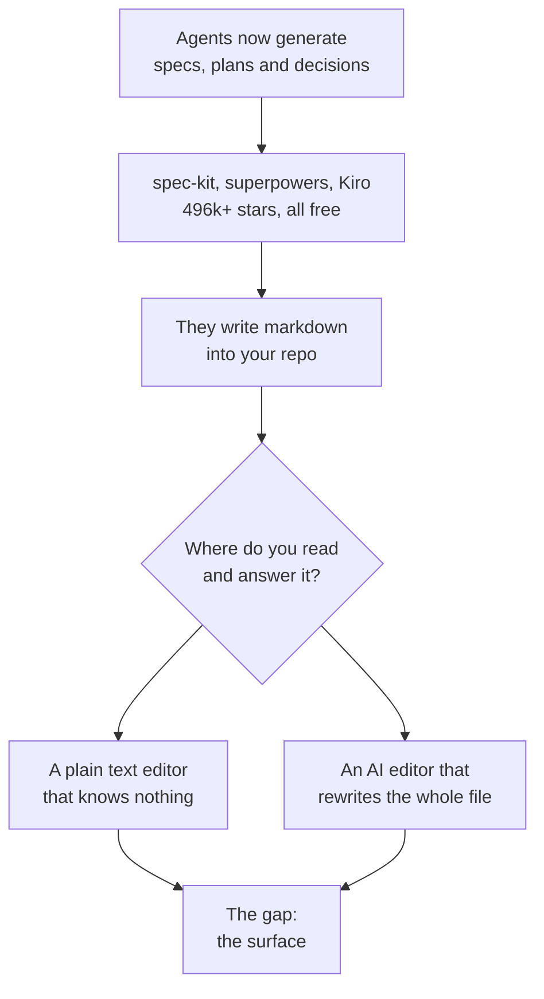
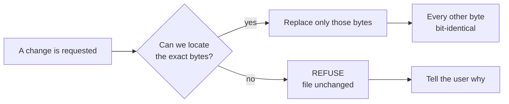

# frontmatter
## What to build, what the evidence says, and what to do in the first run

> Amit — this replaces the long version. Every number was opened from a primary source, most of them twice, and where a number we published before turned out to be wrong I have said so rather than quietly dropped it. Read the first two sections and you will have the argument; the rest is detail you can check.

::keyfigures
133,660 — stars on the free GitHub toolkit that already ships our proposed pilot flow
23.7% — of AI complaints are about slop. Growing 149% a year
62% — of our own load-bearing claims needed correction when a source was opened
88.6% — of the codebase already exists and works
6 — AI routes already live in our repo, wired to a 5-provider fallback chain
::

## PART I — Where we stand

### 1. The problem, counted

People write their documents and code with an AI now. That works. The mess around it does not: you cannot tell what the machine wrote, you cannot hand the work over, and the output is getting worse in a specific way people call **slop** — technically correct, verbose, generic, unmaintainable, and it passes review because reviewing it properly takes longer than writing it did.

::exhibit 1 | What people complain about, and whether it fixes itself

| What they say | How often | Model, or the work around it? |
|---|---|---|
| "It loses context, I re-explain everything" | Highest volume, **declining** | Model. The labs are fixing it free |
| **"The output is slop"** | **23.7% of AI complaints, +149% in 20 months** | **The work around it. Ours** |
| "I can't review it fast enough to trust it" | Rising alongside slop | Ours |
| "Sync broke, I lost work" | 16.5% of editor sentiment | Ours |
| "It hallucinated / edited the wrong file" | **Declining 19–67%** | Model. Do not build for it |
| "It's too expensive" | 15.7% of weekly posts | Market condition |

> [!note] **That last column is the most useful line in this document.** Half of what people complain about is being fixed for free by Anthropic and OpenAI. Building for hallucination in 2026 buys a two-year shelf life. The other half is the mess around the model, and slop is its fastest-growing form with nobody working on it.

### 2. What the evidence killed, and what it corrected

Twenty-six research rounds, then a verification pass that re-opened a primary source for every load-bearing claim — including our own. **123 findings checked in the latest round: 47 confirmed, 56 revised, 18 refuted, 2 unverifiable.**

::exhibit 2 | The ledger — one row per belief, with what actually happened

| What we believed | Verdict | What the source says | What it changed |
|---|---|---|---|
| Byte-exactness makes people switch | REFUTED | 4 of 12,556 HN comments · `line endings` in 1 of 43,656 GitHub issues · one switch in 11 years | Killed as the pitch. Kept as the mechanism |
| Per-hunk review is our demo | REFUTED | Zed's docs: *"accept or reject each individual change hunk"* | Killed 16 of 38 planned MVP-0 points |
| **The pilot flow is ours to build** | **REFUTED** | **`github/spec-kit`: 133,660 stars, MIT, free. Ships `/speckit.clarify`, `[NEEDS CLARIFICATION]` markers, and a go/kill assess extension** | **Rewrote the pilot. See §8** |
| ₹299 is a fair price | REFUTED | Obsidian gives the editor away and charges $4 for sync alone | Inverted the pricing model |
| Sync is out of scope | REFUTED | #1 loved, #3 hated, #1 switching trigger, 1,251 of 43,656 issues | Back in scope, MVP-2 |
| GST reverse charge starts at ₹20 lakh | REFUTED | **CGST §24(iii) has no turnover floor** | Registration starts at the first rupee |
| The engine is the differentiator | CONFIRMED | Cursor staff: destroyed carriage returns on CRLF is *"a known issue we're tracking"* | The defect is real and unfixed |
| The correctness work is real | CONFIRMED | 8,513-file pinned corpus, byte-identical, 1,575 tests | Kept the engine as the asset |
| Slop is a niche annoyance | REFUTED | 23.7%, +149%, classified workflow not model | Became the problem we aim at |
| Nested live preview is nice-to-have | REVISED | **501 likes** — the most-voted bug in the category's history | Became the free wedge |
| Our table editor is fine | REFUTED | It rewrites 3 of 4 lines and destroys 3 of 4 carriage returns [measured] | Dead code; the measurement became a test |
| `frontmatter` and `sgnk-md` are siblings | REFUTED | 202 of 228 files byte-identical; 0 files unique to `md` | One codebase. Park `md` |
| AIOS is self-improving | REFUTED | 6,884 routing decisions produced **one** feedback label | Stopped saying it |
| Output tokens are a minor cost | REVISED | **75.8% of spend** across 2,333 measured turns | Cap output, not input |

**Two corrections to things we ourselves published**, because they were quoted back at us and they were wrong:

- **"89 handover launches, median 2 points" was never evidence of a graveyard.** A baseline was finally run: **all Show HN, n=4,000 — median 2.0, 85% at or under 5 points.** Median 2 *is* the platform baseline. The handover finding survives only on its tail: 1 of 89 cleared 100 points against a 3.8% baseline, which is 4.7× worse than normal. That is still bad, but it is a much weaker claim than the one we made.
- **The "0.0004% wants decision renders" number is arithmetically right and was measured against the wrong denominator.** Recomputed live: 7,336 plugins, 145,337,729 downloads, and the decision-render slice is 8 plugins totalling 1,455. Age-matched against comparable plugins the category runs at **0.30× the median** — weak, but not the 750× catastrophe we implied. And it measured Obsidian note-takers, who are not the people running coding agents.

> [!risk] **We have now twice published a number that did not survive a control.** The discipline that follows is not optional: **no number leaves this document without its denominator and the date it was fetched.**

## PART II — The market

### 3. What exists, and where each one stops

::exhibit 3 | The editors

| Tool | Price | How it writes files | Where it stops |
|---|---|---|---|
| **Obsidian** | Editor **free**. Sync $4/user/mo. $50/user/yr commercial | You write; it does not generate | No AI editing worth the name. Its own sync has duplicated file sections |
| **Notion** | ~$10/user/mo | Blocks in a database | Files are not files. Its export is named `blocksToMarkdownLossy` |
| **Cursor** | ~$20/user/mo | Whole-file rewrite | Staff acknowledge destroying CRLF. Markdown is an afterthought |
| **Zed** | Free, AI billed | **Per-hunk accept/reject, shipped** | No vault semantics — no wikilinks, tags or frontmatter |
| **Claude Code / Codex** | Inside a $20–200 plan | Diffs in a terminal | No document surface at all |
| **GitBook / Mintlify** | $6.70–$300+/mo | Publishing pipeline | Not where you write |

::exhibit 4 | The spec-driven toolchain — the market the pilot walks into

| Tool | Reach | What it does | Price |
|---|---|---|---|
| **obra/superpowers** | **282,242 stars — the #13 most-starred repository on GitHub** | Brainstorm → design → **writes the spec to `docs/superpowers/specs/…-design.md`, commits it to git, blocks on a User Review Gate** | Free, MIT |
| **github/spec-kit** | **133,660 stars.** Only 73 repos on all of GitHub have more | `/speckit.constitution` · `/speckit.specify` · **`/speckit.clarify`** · `/speckit.plan` · `/speckit.tasks` · `/speckit.implement` · `/speckit.converge` · `/speckit.analyze` · `/speckit.checklist` | Free, MIT |
| **BMAD-METHOD** | 52,719 stars | Agent-driven planning and task breakdown | Free |
| **claude-task-master** | 28,053 stars | AI task management from a spec | Free |
| **Kiro (AWS)** | GA | Idea → `requirements.md`, `design.md`, `tasks.md` → `/spec run`, with an *Analyze Requirements* step that catches ambiguities | **$0 tier** |
| **Claude Code plan mode** | Bundled | Gates edits before they touch disk | Included |

> [!risk] **This is the Zed finding again, at ten times the scale, and it lands on the pilot rather than on one demo.** `/speckit.clarify` is documented as asking *"up to 5 highly targeted clarification questions and encoding answers back into the spec"*, and writes `- Q: <question> → A: <final answer>` into the file. `spec-template.md` ships `[NEEDS CLARIFICATION: …]` markers inline in the markdown for the user to answer in place. The bundled `assess` extension turns *"any idea"* into a **go / needs-clarification / kill** decision. That is the pilot's steps 2 and 3, verbatim, free, MIT, from GitHub — installed **inside the agent**, where the work already happens.

### 4. Who buys it

::exhibit 5 | The segments, decided

| Who | What breaks for them | Pays? | Verdict |
|---|---|---|---|
| Solo builder shipping with an agent daily | Ships slop, finds out in production | A little, reluctantly | **Free tier. Our volume** |
| **A 2–5 person team with no PM** | Nobody knows why a decision was made | **Yes, per seat** | **The wedge** |
| Agency or consultancy | Handover *is* the deliverable | **Yes, and more** | Second target |
| Docs / DX team | Docs rot silently | Yes, slowly | Later, via gates |
| Regulated or audited team | Must evidence who wrote what | **Most of all** | Design for, do not chase |
| Individual note-taker | Nothing. Obsidian works | No | Not our buyer |

**The wedge user, specific enough to email ten of this week:** a technical founder or lead engineer in a two-to-five person team, shipping with Claude Code or Cursor daily, keeping specs and decisions in a git repo, burned once by a document nobody realised was machine-written.

**And the choice we still have not made:** the AI-native developer wants speed and will not pay much; the person who is *liable* when a document is wrong wants proof and will pay properly. Speed versus proof — different products from the same engine. My recommendation is to start with the developer because they are reachable, and store the provenance record so it *could* become the liable buyer's audit trail later without a rewrite. Store enough, sign nothing yet.

### 5. The opening

Three facts, laid next to each other:

- Half a million stars of free tooling now **runs** spec-driven development, all of it inside a terminal or an agent.
- **None of it is an editor.** The markdown it writes gets opened somewhere else, and that somewhere else does not know an agent wrote it.
- Every AI editor rewrites whole files, so none of them can tell you which bytes were the machine's.

> [!good] **The opening is the surface, not the flow.** Be the editor where an agent's spec gets read, answered and reviewed — with provenance, so you can see which parts it wrote. The flow is commoditised and we should treat 496,000 stars as an input rather than a competitor.

## PART III — What we already have

### 6. The engine

**The contract, in one sentence:** locate the exact byte range, replace only those bytes, leave every other byte bit-identical — and if the range cannot be located unambiguously, **refuse and change nothing.**

Everyone else parses to a tree and writes the tree back, which is why Notion's export is lossy and why Cursor destroys line endings: the rewrite touches everything, so any parser imperfection becomes a change in your document. We never build a tree.

**The proof:** 8,513 real markdown files from seven strangers' public vaults, every one pinned by checksum so the test fails if a single byte of the corpus changes. Zero corruption, zero crashes. **`git diff` after an edit shows your edit and nothing else** — testable on every release.

**Why this matters more now than it did last month:** answering a `[NEEDS CLARIFICATION]` marker in place, inside a spec an agent wrote, is exactly a byte-range replacement in a file you must not otherwise disturb. The engine stopped being a promise about bytes and became the mechanism for a job people are already doing.

### 7. What is built, and what is broken

::exhibit 6 | Built — verified by reading the code, not the plan

| | |
|---|---|
| Source · tests | 25,407 lines of TypeScript, 226 files · 1,575 tests in 98 files |
| Corpus | 8,513 files, byte-pinned, zero corruption |
| **AI, already live** | **Six auth-gated routes** — `complete`, `generate-doc`, `refine`, `summarize`, `suggest-links`, `link-doctor` — wired through the DI container |
| **The provider chain** | **Five providers**, each joining only if its free-tier key is set: Google `gemini-2.5-flash` → Groq `llama-3.3-70b-versatile` → Cerebras `llama-3.3-70b` → Mistral `mistral-small-latest` → OpenRouter. Two orderings (speed-first for ghost text, quality-first otherwise), hedged racing, per-provider timeouts |
| **Idea mode already ships** | `generate-document` turns a raw idea into a **PRD, FRD, BRD, product note or spec** — five kinds, reachable from a Cmd-J panel with insert / replace / undo |
| Editor surface | Ghost text, AI menu, properties panel for frontmatter, link-doctor modal, 20+ vault routes |
| Shared with `sgnk-md` | 202 of 228 files byte-identical — not a new codebase |

::exhibit 7 | Broken, and it is the reason the product does not work today

| # | Problem | Effect | Size |
|---|---|---|---|
| 1 | **NF-1** — a list item at column zero in frontmatter | **83% of real vaults are refused.** The front door does not open | 4 days |
| 2 | **NF-3** — a bare carriage-return fence | Silently adds a *second* frontmatter block. Structurally destructive | 3 days |
| 3 | **No CI at all** | We ship on trust, and four of our own gates have reported green while blind | 1 day |
| 4 | **Engine not wired in** | One symbol from one of thirteen engine files reaches product code | 8 days |
| 5 | **Byte budget is a stub** | Literally an `echo`, in a product about correctness | 2 days |

> [!warn] **Four things about the AI layer you should know before planning on it.** It arrived in a single commit — `0c1b427`, *"clone md app into frontmatter"*, 2026-07-17 — and has not been touched since; it is inherited `sgnk-md` code, not code written for this product. **There is no bring-your-own-key**: settings expose one boolean, and every AI request is billed to us. **There is no structured output anywhere** — the LLM port returns a bare `string`, and the one place we need JSON parses it by slicing between brackets in a try/catch. And **no test covers the provider chain file at all**, while its own header comment documents four providers where the code has five.

**On the local model, plainly:** the five-provider chain is five *cloud* providers on free tiers. That is exactly the right way to test before we go live at zero cost, and it is what you should keep using. It is not local, it gives no offline and no privacy property, and it cannot carry a "runs on your machine" claim.

## PART IV — The pilot, decided

### 8. The seven pieces, each with a verdict

Every component of the proposed pilot, tested against what is already shipped and free. **Three survive, two are cut, two are reshaped.**

::exhibit 8 | The pilot, component by component

| # | Proposed | Verdict | Why |
|---|---|---|---|
| 1 | **The markdown editor** — four modes, byte-exact | **KEEP** | The whole free tier. Every comparable that built its own engine shipped the editor before the AI: Zed's launch page carried **zero AI words across 6,851 characters** and added a BYO-key assistant **105 days later**; Obsidian's first public build was 18 core plugins and shipped no AI through 2026 |
| 2 | **The design system** | **KEEP** | It exists and is written down. The job is to *apply* it — the shipped `globals.css` is a different system inherited from a sibling project, self-describing as "Linear-style modern SaaS" |
| 3 | **Decision flow — generate decisions from the idea** | **RESHAPE** | Demand is real and **growing 40% year over year**, and the research supports it (ClarifyGPT moves 70.96 → 80.80). But `/speckit.clarify`, Kiro's *Analyze Requirements*, superpowers' review gate and Claude Code plan mode all ship it free. **Do not generate the flow. Be the surface where its output is answered** |
| 4 | **Idea in frontmatter → generate all project files** | **CUT the generation** | `/speckit.plan` + `/speckit.tasks` and Kiro's three-file output do this free, inside the agent. Note that **our own idea mode already ships** five document kinds — keep that, it is one document from one idea, which is a different and smaller claim |
| 5 | **Kickoff prompt for your agentic tool** | **CUT** | The slash commands *are* the kickoff prompt, installed into the agent. A prompt you copy-paste is strictly worse than a command already in the tool |
| 6 | **Agent reads the files from our CDN** | **CUT** | See below. This is the one I would refuse even if it tested well |
| 7 | **AI scoped to folder / file** | **RESHAPE** | Table stakes — 5 of 6 incumbents document it, so shipping without it reads as missing. But scope **by file**, and treat a folder as a *pointer*, not a content dump |

**Why the CDN step is cut, and it is not the reason I first reached for.** I assumed the argument was liability, and when that was tested properly most of it did not hold up — the statutory clocks are real but attach differently than we claimed, and the outrage precedent we were going to cite turns out to be about silently executing downloaded binaries, with the word "CDN" appearing in exactly 1 of 146 comments, asking *for* one. The honest reasons are simpler and they are enough:

- **It buys nothing.** spec-kit writes `.specify/` and `specs/` into the user's own project. Every agent already reads the repo, with no domain to approve and no permission prompt.
- **It adds a hop that fails by default.** Codex ships with `network.enabled` defaulting to `false`.
- **The one comparable deliberately refuses it.** `upstash/context7`, at 61,691 stars, is the largest hosted-context product there is, and it ships an MCP server or a local CLI rather than files at a URL.
- **It contradicts the one promise the architecture rests on.** We tell people we never hold their documents. Serving their generated files from our domain makes that untrue for the exact artefacts they care most about.

> [!warn] **On the local model, the finding is sharper than "it is not good enough".** The capability objection is refuted — an 8B model scores **70.00% on BFCL multi-turn, second on the entire leaderboard**, above Claude Opus 4.5. The real problem is the opposite of capability: **PhantomFill measured that required schema fields drive fabrication to 100% in ten of thirteen models, and that all nine open-weight models ignore an explicit "insufficient evidence" option.** A schema-constrained small model is a machine for **never refusing** — which is the precise inverse of this product's identity. Defer the local model; keep the free-tier cloud chain for pre-launch testing.

### 9. What the reshaped pilot actually is

> [!good] **frontmatter is the editor where your agent's specs and decisions get read, answered and reviewed.** The agent writes `[NEEDS CLARIFICATION: auth method not specified — email/password, SSO, OAuth?]` into your spec. You open it here, answer it **in place** — one byte range replaced, nothing else in the file moved — and the parts the machine wrote stay visibly marked until a human has looked at them.

**Why this is defensible where the pilot as drawn was not.**

- **Nobody owns the surface.** 496,000 stars of tooling generate markdown and then hand it to whatever editor you happen to use. That editor does not know an agent wrote it.
- **Answering in place is a byte-range replacement.** It is the one job our engine does better than anything else, and a whole-file rewriter cannot do it without disturbing the document around the answer.
- **It makes the incumbents an input.** spec-kit is MIT and agent-agnostic. Being the best place to read its output turns 133,660 stars from a competitor into a channel — and the record's honest weak spot is that every channel we have is borrowed.
- **It aims at slop**, the one complaint that is large, growing and nobody's.

**The demo, in fifteen seconds:** run `/speckit.specify` in your agent. Open the spec it wrote, here. Three `[NEEDS CLARIFICATION]` markers are highlighted; answer one inline. `git diff` shows one line changed. The paragraphs the agent wrote are still tinted, because nobody has read them yet.

### 10. First run, pilot, and the free tier

::exhibit 9 | The three questions you asked, answered

| | **First run** (internal, now) | **Pilot** (10–20 strangers) | **Free tier** (public, forever) |
|---|---|---|---|
| **Editor**, four modes, byte-exact | YES | YES | YES |
| **NF-1 + NF-3 fixes** | YES — nothing works without them | YES | YES |
| **CI with one deliberate red run** | YES | YES | — |
| Quick-switch, palette, search | YES | YES | YES |
| **Provenance: see what the machine wrote** | YES | YES | **YES — free forever. It is the distribution strategy** |
| One-key revert | YES | YES | YES |
| **Answer-in-place for `[NEEDS CLARIFICATION]`** | YES — this is the pilot's point | YES | YES |
| **File-scoped AI panel** | Reuse what ships | YES, **bring-your-own-key** | BYO key only |
| Idea mode (already built) | Keep, unchanged | Keep | Keep |
| Vault-wide refactor | — | Later | Later |
| **Bring-your-own-key** | — | **Required before any stranger** | Required |
| Decision *generation* | **NO** | NO | NO |
| Multi-file generation, kickoff prompt | **NO** | NO | NO |
| **Vendor CDN** | **NO** | NO | **Never** |
| Local model | NO — free-tier cloud chain instead | NO | NO |
| Sign-up, billing, sync, mobile, hosting | NO | NO | NO |

**Three things that must be true before a stranger touches it.** BYO key, because today every request bills us and settings expose no key field. Structured output in the LLM port, because the current port returns a string and the one JSON path slices between brackets in a try/catch. And CI, because four gates have reported green while blind.

**Exit criterion for the pilot, observable rather than felt:** ten people who are not friends, family or in our Discord, each with their own repo and their own agent. **Six of ten keep using it after two weeks.** Not "like it" — keep it.

## PART V — What it looks like

### 11. The rules, and the screens

Five rules that settle arguments before they start, each with its cost stated.

::exhibit 10 | The principles

| Principle | In practice | What it costs |
|---|---|---|
| **The file is the only source of truth** | Every view is a projection owning no state | No feature that needs hidden state |
| **Refuse rather than guess** | Cannot locate it unambiguously → change nothing, say why | Some edits fail that a fuzzier tool completes |
| **Never hold the user's documents** | Files stay in their repo | Exit is free, so retention is earned monthly |
| **No arbitrary code execution, ever** | No plugins, no eval, no user scripts | **The exact moat that made Obsidian unassailable** |
| **Every claim falsifiable** | "Byte-preserving" has a test that fails when it is not | Slower to ship, much harder to be wrong in public |

**The no-list, with what each refusal costs:** plugins (the proven growth path in this category — the most expensive refusal we make) · project management and kanban (we cannot win that fight) · a chat sidebar (the user already runs an agent) · **hosting published pages** (a permanent personal on-call obligation; we still *generate*) · decision-flow renders · graph views · mobile in v1 (~15% of complaints, and a phone is for reading and reviewing, not byte-exact editing).

**And simplicity made structural:** a new user meets no more than **seven** concepts in the first session; a feature must name its user and their frequency or it is cut; every toggle is a decision we failed to make; and because every view must be a stateless projection, most feature bloat is *already* forbidden by the architecture.

**The visual language.** Machine-written and unreviewed gets a very light tint — no border, no icon, because it must be ignorable. Reviewed text renders normally: once you have read it, it is yours. Hover gives prompt, model, time and revert, on demand only. A refusal is an inline note where the change would have gone, never a modal. A conflict is the one place we interrupt, because guessing there loses work. Google Sans and Google Sans Code on white, one accent, square corners, hairline borders. **Icons are inline SVG from one set — never emoji, never a web font**, because a font that fails to load renders the literal ligature text.

::exhibit 11 | Twelve screens, four of them dialogs

| # | Screen | What is in it | Stage |
|---|---|---|---|
| S1 | **Open a folder** | One button · recent folders · one line saying nothing leaves your machine. No account | Pilot |
| S2 | **The editor** | Collapsible tree with a per-file unreviewed bar · the document at full measure · breadcrumb, sync state, one overflow menu — no toolbar · thin ambient status line | Pilot |
| S3 | **Provenance overlay** | Tinted spans on S2. Toggleable. No borders, no gutter marks | Pilot |
| S4 | **Review panel** | Unreviewed spans in order · first line, model, age · accept / revert / skip · `j k a r` · a counter that reaches zero | Pilot |
| S5–S7 | **Quick switch · palette · search** | Table stakes. Their absence ends a review before it starts | Pilot |
| S8 | **Refactor preview** | What changes in one line · affected files as hunks · accept all / per file / cancel · refusals with reasons | Later |
| S9 | **Conflict view** | Two panes, differences marked, a third for the result. Never auto-resolves | Later |
| S10 | **Team view** | Repo picker · unreviewed share per document · per-person contribution | Paid |
| S11 | **Settings** | One page, six groups, no tabs — including **the AI key field that does not exist yet** | Pilot |
| S12 | **Generate** | A site, page or deck from the folder. "We never host it", on screen | Later |

**Navigation obeys three rules:** everything returns to S2, so no screen is a destination; Escape always goes back one step and never loses work; no modal blocks the document except the conflict view, which blocks because proceeding would lose data.

### 12. The screens, drawn

Mid fidelity: enough to argue about what goes where, not enough to argue about corner radii.

::exhibit 12 | S0 · The launcher — what you see before a document is open

<svg viewBox="0 0 760 452" xmlns="http://www.w3.org/2000/svg" style="width:100%;max-width:760px;height:auto"><rect x="1" y="1" width="758" height="430" fill="#fff" stroke="#14161a" stroke-width="1.5" rx="4"/><rect x="1" y="1" width="758" height="34" fill="#fafbfc"/><line x1="1" y1="35" x2="759" y2="35" stroke="#c9cfda" stroke-width="1"/><rect x="12" y="9" width="34" height="18" fill="#14161a" stroke="#c9cfda" stroke-width="1" rx="3"/><text x="29" y="21" font-family="system-ui,-apple-system,sans-serif" font-size="7.5" fill="#fff" font-weight="700" text-anchor="middle">fm</text><rect x="56" y="9" width="570" height="18" fill="#fff" stroke="#c9cfda" stroke-width="1" rx="9"/><text x="66" y="22" font-family="system-ui,-apple-system,sans-serif" font-size="8" fill="#8a93a3">⌕  Search every document</text><rect x="634" y="9" width="46" height="18" fill="#fff" stroke="#c9cfda" stroke-width="1" rx="3"/><text x="657" y="21" font-family="system-ui,-apple-system,sans-serif" font-size="7.5" fill="#14161a" text-anchor="middle">Open…</text><rect x="688" y="9" width="60" height="18" fill="#1a5cff" stroke="#1a5cff" stroke-width="1" rx="3"/><text x="718" y="21" font-family="system-ui,-apple-system,sans-serif" font-size="7.5" fill="#fff" font-weight="600" text-anchor="middle">New</text><text x="20" y="60" font-family="system-ui,-apple-system,sans-serif" font-size="7.5" fill="#8a93a3" font-weight="700">START SOMETHING</text><rect x="20" y="70" width="132" height="84" fill="#f2f6ff" stroke="#1a5cff" stroke-width="1" rx="4"/><text x="34" y="100" font-family="system-ui,-apple-system,sans-serif" font-size="9.5" fill="#1a5cff" font-weight="600">Blank</text><text x="34" y="114" font-family="system-ui,-apple-system,sans-serif" font-size="9.5" fill="#1a5cff" font-weight="600">document</text><text x="34" y="142" font-family="system-ui,-apple-system,sans-serif" font-size="7" fill="#8a93a3">empty file</text><rect x="166" y="70" width="132" height="84" fill="#fff" stroke="#c9cfda" stroke-width="1" rx="4"/><text x="180" y="100" font-family="system-ui,-apple-system,sans-serif" font-size="9.5" fill="#14161a" font-weight="600">Handover</text><text x="180" y="142" font-family="system-ui,-apple-system,sans-serif" font-size="7" fill="#8a93a3">markdown skeleton</text><rect x="312" y="70" width="132" height="84" fill="#fff" stroke="#c9cfda" stroke-width="1" rx="4"/><text x="326" y="100" font-family="system-ui,-apple-system,sans-serif" font-size="9.5" fill="#14161a" font-weight="600">Decision</text><text x="326" y="114" font-family="system-ui,-apple-system,sans-serif" font-size="9.5" fill="#14161a" font-weight="600">record</text><text x="326" y="142" font-family="system-ui,-apple-system,sans-serif" font-size="7" fill="#8a93a3">markdown skeleton</text><rect x="458" y="70" width="132" height="84" fill="#fff" stroke="#c9cfda" stroke-width="1" rx="4"/><text x="472" y="100" font-family="system-ui,-apple-system,sans-serif" font-size="9.5" fill="#14161a" font-weight="600">Spec</text><text x="472" y="142" font-family="system-ui,-apple-system,sans-serif" font-size="7" fill="#8a93a3">markdown skeleton</text><rect x="604" y="70" width="132" height="84" fill="#fff" stroke="#c9cfda" stroke-width="1" rx="4"/><text x="618" y="100" font-family="system-ui,-apple-system,sans-serif" font-size="9.5" fill="#14161a" font-weight="600">Changelog</text><text x="618" y="142" font-family="system-ui,-apple-system,sans-serif" font-size="7" fill="#8a93a3">markdown skeleton</text><line x1="20" y1="176" x2="740" y2="176" stroke="#c9cfda" stroke-width="1"/><text x="20" y="196" font-family="system-ui,-apple-system,sans-serif" font-size="7.5" fill="#8a93a3" font-weight="700">RECENT</text><text x="740" y="196" font-family="system-ui,-apple-system,sans-serif" font-size="7.5" fill="#1a5cff" text-anchor="end">unreviewed first  ▾</text><rect x="20" y="208" width="168" height="78" fill="#fff" stroke="#c9cfda" stroke-width="1" rx="4"/><text x="32" y="228" font-family="system-ui,-apple-system,sans-serif" font-size="9" fill="#14161a" font-weight="600">auth.md</text><text x="32" y="242" font-family="system-ui,-apple-system,sans-serif" font-size="7.5" fill="#8a93a3">specs/</text><rect x="32" y="252" width="144" height="3" fill="#e4e7ec"/><rect x="32" y="259" width="86.39999999999999" height="3" fill="#e4e7ec"/><rect x="32" y="270" width="144" height="4" fill="#eceff4"/><rect x="32" y="270" width="92.16" height="4" fill="#1a5cff"/><text x="32" y="282" font-family="system-ui,-apple-system,sans-serif" font-size="7" fill="#1a5cff">64% unreviewed</text><rect x="202" y="208" width="168" height="78" fill="#fff" stroke="#c9cfda" stroke-width="1" rx="4"/><text x="214" y="228" font-family="system-ui,-apple-system,sans-serif" font-size="9" fill="#14161a" font-weight="600">0004-sync.md</text><text x="214" y="242" font-family="system-ui,-apple-system,sans-serif" font-size="7.5" fill="#8a93a3">adr/</text><rect x="214" y="252" width="144" height="3" fill="#e4e7ec"/><rect x="214" y="259" width="86.39999999999999" height="3" fill="#e4e7ec"/><rect x="214" y="270" width="144" height="4" fill="#eceff4"/><rect x="214" y="270" width="126.72" height="4" fill="#1a5cff"/><text x="214" y="282" font-family="system-ui,-apple-system,sans-serif" font-size="7" fill="#1a5cff">88% unreviewed</text><rect x="384" y="208" width="168" height="78" fill="#fff" stroke="#c9cfda" stroke-width="1" rx="4"/><text x="396" y="228" font-family="system-ui,-apple-system,sans-serif" font-size="9" fill="#14161a" font-weight="600">pricing.md</text><text x="396" y="242" font-family="system-ui,-apple-system,sans-serif" font-size="7.5" fill="#8a93a3">notes/</text><rect x="396" y="252" width="144" height="3" fill="#e4e7ec"/><rect x="396" y="259" width="86.39999999999999" height="3" fill="#e4e7ec"/><rect x="396" y="270" width="144" height="4" fill="#eceff4"/><rect x="396" y="270" width="44.64" height="4" fill="#a8c4f5"/><text x="396" y="282" font-family="system-ui,-apple-system,sans-serif" font-size="7" fill="#1a5cff">31% unreviewed</text><rect x="566" y="208" width="168" height="78" fill="#fff" stroke="#c9cfda" stroke-width="1" rx="4"/><text x="578" y="228" font-family="system-ui,-apple-system,sans-serif" font-size="9" fill="#14161a" font-weight="600">billing.md</text><text x="578" y="242" font-family="system-ui,-apple-system,sans-serif" font-size="7.5" fill="#8a93a3">specs/</text><rect x="578" y="252" width="144" height="3" fill="#e4e7ec"/><rect x="578" y="259" width="86.39999999999999" height="3" fill="#e4e7ec"/><rect x="578" y="270" width="144" height="4" fill="#eceff4"/><rect x="578" y="270" width="17.28" height="4" fill="#a8c4f5"/><text x="578" y="282" font-family="system-ui,-apple-system,sans-serif" font-size="7" fill="#1a5cff">12% unreviewed</text><rect x="20" y="300" width="168" height="78" fill="#fff" stroke="#c9cfda" stroke-width="1" rx="4"/><text x="32" y="320" font-family="system-ui,-apple-system,sans-serif" font-size="9" fill="#14161a" font-weight="600">README.md</text><text x="32" y="334" font-family="system-ui,-apple-system,sans-serif" font-size="7.5" fill="#8a93a3">root</text><rect x="32" y="344" width="144" height="3" fill="#e4e7ec"/><rect x="32" y="351" width="86.39999999999999" height="3" fill="#e4e7ec"/><rect x="32" y="362" width="144" height="4" fill="#eceff4"/><text x="32" y="374" font-family="system-ui,-apple-system,sans-serif" font-size="7" fill="#0d8a4f">all reviewed</text><rect x="202" y="300" width="168" height="78" fill="#fff" stroke="#c9cfda" stroke-width="1" rx="4"/><text x="214" y="320" font-family="system-ui,-apple-system,sans-serif" font-size="9" fill="#14161a" font-weight="600">0003-scope.md</text><text x="214" y="334" font-family="system-ui,-apple-system,sans-serif" font-size="7.5" fill="#8a93a3">adr/</text><rect x="214" y="344" width="144" height="3" fill="#e4e7ec"/><rect x="214" y="351" width="86.39999999999999" height="3" fill="#e4e7ec"/><rect x="214" y="362" width="144" height="4" fill="#eceff4"/><rect x="214" y="362" width="64.8" height="4" fill="#a8c4f5"/><text x="214" y="374" font-family="system-ui,-apple-system,sans-serif" font-size="7" fill="#1a5cff">45% unreviewed</text><rect x="384" y="300" width="168" height="78" fill="#fff" stroke="#c9cfda" stroke-width="1" rx="4"/><text x="396" y="320" font-family="system-ui,-apple-system,sans-serif" font-size="9" fill="#14161a" font-weight="600">onboarding.md</text><text x="396" y="334" font-family="system-ui,-apple-system,sans-serif" font-size="7.5" fill="#8a93a3">notes/</text><rect x="396" y="344" width="144" height="3" fill="#e4e7ec"/><rect x="396" y="351" width="86.39999999999999" height="3" fill="#e4e7ec"/><rect x="396" y="362" width="144" height="4" fill="#eceff4"/><text x="396" y="374" font-family="system-ui,-apple-system,sans-serif" font-size="7" fill="#0d8a4f">all reviewed</text><rect x="566" y="300" width="168" height="78" fill="#fff" stroke="#c9cfda" stroke-width="1" rx="4"/><text x="578" y="320" font-family="system-ui,-apple-system,sans-serif" font-size="9" fill="#14161a" font-weight="600">api.md</text><text x="578" y="334" font-family="system-ui,-apple-system,sans-serif" font-size="7.5" fill="#8a93a3">specs/</text><rect x="578" y="344" width="144" height="3" fill="#e4e7ec"/><rect x="578" y="351" width="86.39999999999999" height="3" fill="#e4e7ec"/><rect x="578" y="362" width="144" height="4" fill="#eceff4"/><rect x="578" y="362" width="31.68" height="4" fill="#a8c4f5"/><text x="578" y="374" font-family="system-ui,-apple-system,sans-serif" font-size="7" fill="#1a5cff">22% unreviewed</text><rect x="1" y="404" width="758" height="25" fill="#fafbfc"/><line x1="1" y1="404" x2="759" y2="404" stroke="#c9cfda" stroke-width="1"/><text x="14" y="420" font-family="system-ui,-apple-system,sans-serif" font-size="7.5" fill="#8a93a3">3 projects · 128 documents · 7 unreviewed</text><text x="746" y="420" font-family="system-ui,-apple-system,sans-serif" font-size="7.5" fill="#8a93a3" text-anchor="end">⌘K commands   ⌘P files</text><text x="2" y="447" font-family="system-ui,-apple-system,sans-serif" font-size="7.5" fill="#4a5160">Templates are markdown skeletons, not a gallery. Five, and they are the document types the research found actually recur.</text></svg>

**The bar at the bottom of every card is the product showing itself before you open anything.** Recent documents sort by unreviewed share, so the thing most likely to need you is first.

::exhibit 13 | S2 · The editor — every region named

<svg viewBox="0 0 900 542" xmlns="http://www.w3.org/2000/svg" style="width:100%;max-width:900px;height:auto"><rect x="1" y="1" width="898" height="520" fill="#fff" stroke="#14161a" stroke-width="1.5" rx="4"/><rect x="1" y="1" width="898" height="30" fill="#fafbfc"/><line x1="1" y1="31" x2="899" y2="31" stroke="#c9cfda" stroke-width="1"/><rect x="10" y="7" width="28" height="17" fill="#14161a" stroke="#c9cfda" stroke-width="1" rx="3"/><text x="24" y="18.5" font-family="system-ui,-apple-system,sans-serif" font-size="7.5" fill="#fff" font-weight="700" text-anchor="middle">fm</text><text x="46" y="19" font-family="system-ui,-apple-system,sans-serif" font-size="9" fill="#8a93a3">⌸  ⟲  ⟳</text><rect x="92" y="5" width="108" height="22" fill="#fff" stroke="#c9cfda" stroke-width="1" rx="3"/><rect x="92" y="5" width="108" height="2" fill="#1a5cff"/><text x="102" y="20" font-family="system-ui,-apple-system,sans-serif" font-size="8" fill="#14161a" font-weight="600">auth.md</text><text x="190" y="20" font-family="system-ui,-apple-system,sans-serif" font-size="8" fill="#8a93a3" text-anchor="end">×</text><rect x="208" y="5" width="108" height="22" fill="transparent" stroke="transparent" stroke-width="1" rx="3"/><text x="218" y="20" font-family="system-ui,-apple-system,sans-serif" font-size="8" fill="#4a5160">0004-sync.md</text><text x="306" y="20" font-family="system-ui,-apple-system,sans-serif" font-size="8" fill="#8a93a3" text-anchor="end">×</text><rect x="324" y="5" width="108" height="22" fill="transparent" stroke="transparent" stroke-width="1" rx="3"/><text x="334" y="20" font-family="system-ui,-apple-system,sans-serif" font-size="8" fill="#4a5160">pricing.md</text><text x="422" y="20" font-family="system-ui,-apple-system,sans-serif" font-size="8" fill="#8a93a3" text-anchor="end">×</text><rect x="440" y="5" width="108" height="22" fill="transparent" stroke="transparent" stroke-width="1" rx="3"/><text x="450" y="20" font-family="system-ui,-apple-system,sans-serif" font-size="8" fill="#4a5160">README.md</text><text x="538" y="20" font-family="system-ui,-apple-system,sans-serif" font-size="8" fill="#8a93a3" text-anchor="end">×</text><rect x="690" y="7" width="118" height="17" fill="#fff" stroke="#c9cfda" stroke-width="1" rx="9"/><text x="698" y="20" font-family="system-ui,-apple-system,sans-serif" font-size="7.5" fill="#8a93a3">⌕ Search</text><rect x="816" y="7" width="30" height="17" fill="#fff" stroke="#c9cfda" stroke-width="1" rx="3"/><text x="831" y="18.5" font-family="system-ui,-apple-system,sans-serif" font-size="7.5" fill="#14161a" text-anchor="middle">sh</text><rect x="852" y="7" width="38" height="17" fill="#fff" stroke="#c9cfda" stroke-width="1" rx="3"/><text x="871" y="18.5" font-family="system-ui,-apple-system,sans-serif" font-size="7.5" fill="#14161a" text-anchor="middle">Pf</text><rect x="1" y="32" width="176" height="487" fill="#f4f6fa"/><line x1="176" y1="32" x2="176" y2="519" stroke="#c9cfda" stroke-width="1"/><text x="12" y="50" font-family="system-ui,-apple-system,sans-serif" font-size="7.5" fill="#8a93a3" font-weight="700">‹  TREE</text><rect x="130" y="41" width="34" height="14" fill="#fff" stroke="#c9cfda" stroke-width="1" rx="3"/><text x="147" y="51" font-family="system-ui,-apple-system,sans-serif" font-size="7.5" fill="#14161a" text-anchor="middle">FP+</text><rect x="0" y="59" width="176" height="21" fill="#eef1f6"/><text x="10" y="74" font-family="system-ui,-apple-system,sans-serif" font-size="7.6" fill="#2c3038" font-weight="700">product-docs</text><text x="162" y="74" font-family="system-ui,-apple-system,sans-serif" font-size="10" fill="#8a93a3" text-anchor="end">+</text><text x="18" y="95" font-family="system-ui,-apple-system,sans-serif" font-size="8" fill="#3a4048">▾  adr</text><line x1="23" y1="102" x2="23" y2="121" stroke="#c9cfda" stroke-width="1"/><text x="28" y="116" font-family="system-ui,-apple-system,sans-serif" font-size="8" fill="#3a4048">0003-scope.md</text><line x1="23" y1="123" x2="23" y2="142" stroke="#c9cfda" stroke-width="1"/><text x="28" y="137" font-family="system-ui,-apple-system,sans-serif" font-size="8" fill="#3a4048">0004-sync.md</text><text x="18" y="158" font-family="system-ui,-apple-system,sans-serif" font-size="8" fill="#3a4048">▾  specs</text><rect x="6" y="165" width="164" height="19" fill="#fff" stroke="#1a5cff" stroke-width="1" rx="3"/><line x1="23" y1="165" x2="23" y2="184" stroke="#c9cfda" stroke-width="1"/><text x="28" y="179" font-family="system-ui,-apple-system,sans-serif" font-size="8" fill="#1a5cff" font-weight="700">auth.md</text><line x1="23" y1="186" x2="23" y2="205" stroke="#c9cfda" stroke-width="1"/><text x="28" y="200" font-family="system-ui,-apple-system,sans-serif" font-size="8" fill="#3a4048">billing.md</text><text x="18" y="221" font-family="system-ui,-apple-system,sans-serif" font-size="8" fill="#3a4048">▾  notes</text><line x1="23" y1="228" x2="23" y2="247" stroke="#c9cfda" stroke-width="1"/><text x="28" y="242" font-family="system-ui,-apple-system,sans-serif" font-size="8" fill="#3a4048">pricing.md</text><rect x="0" y="248" width="176" height="21" fill="#eef1f6"/><text x="10" y="263" font-family="system-ui,-apple-system,sans-serif" font-size="7.6" fill="#2c3038" font-weight="700">engine</text><text x="162" y="263" font-family="system-ui,-apple-system,sans-serif" font-size="10" fill="#8a93a3" text-anchor="end">+</text><text x="18" y="284" font-family="system-ui,-apple-system,sans-serif" font-size="8" fill="#3a4048">▾  src</text><line x1="23" y1="291" x2="23" y2="310" stroke="#c9cfda" stroke-width="1"/><text x="28" y="305" font-family="system-ui,-apple-system,sans-serif" font-size="8" fill="#3a4048">splice.md</text><rect x="0" y="311" width="176" height="21" fill="#eef1f6"/><text x="10" y="326" font-family="system-ui,-apple-system,sans-serif" font-size="7.6" fill="#2c3038" font-weight="700">website</text><text x="162" y="326" font-family="system-ui,-apple-system,sans-serif" font-size="10" fill="#8a93a3" text-anchor="end">+</text><rect x="177" y="32" width="548" height="28" fill="#fff"/><line x1="177" y1="60" x2="724" y2="60" stroke="#c9cfda" stroke-width="1"/><rect x="186" y="39" width="48" height="16" fill="#fff" stroke="#c9cfda" stroke-width="1" rx="3"/><text x="210" y="50" font-family="system-ui,-apple-system,sans-serif" font-size="7.5" fill="#3a4048" text-anchor="middle">Edit</text><rect x="238" y="39" width="48" height="16" fill="#1a5cff" stroke="#1a5cff" stroke-width="1" rx="3"/><text x="262" y="50" font-family="system-ui,-apple-system,sans-serif" font-size="7.5" fill="#fff" font-weight="600" text-anchor="middle">Live</text><rect x="290" y="39" width="48" height="16" fill="#fff" stroke="#c9cfda" stroke-width="1" rx="3"/><text x="314" y="50" font-family="system-ui,-apple-system,sans-serif" font-size="7.5" fill="#3a4048" text-anchor="middle">Split</text><rect x="342" y="39" width="48" height="16" fill="#fff" stroke="#c9cfda" stroke-width="1" rx="3"/><text x="366" y="50" font-family="system-ui,-apple-system,sans-serif" font-size="7.5" fill="#3a4048" text-anchor="middle">Read</text><line x1="400" y1="38" x2="400" y2="56" stroke="#c9cfda" stroke-width="1"/><text x="412" y="50" font-family="system-ui,-apple-system,sans-serif" font-size="8.5" fill="#4a5160">B  I  “  ≡  ⌗  ⌗⌗  ⟨⟩  ⊞  ⛓  ☑</text><rect x="690" y="39" width="26" height="16" fill="#fff" stroke="#c9cfda" stroke-width="1" rx="3"/><text x="703" y="50" font-family="system-ui,-apple-system,sans-serif" font-size="7.5" fill="#14161a" text-anchor="middle">↓</text><text x="202" y="96" font-family="system-ui,-apple-system,sans-serif" font-size="16" fill="#14161a" font-weight="700">Authentication</text><text x="202" y="118" font-family="system-ui,-apple-system,sans-serif" font-size="7.6" fill="#3a4048">We use the GitHub App installation flow rather than an OAuth app, because the App</text><text x="202" y="129.5" font-family="system-ui,-apple-system,sans-serif" font-size="7.6" fill="#3a4048">grants permission per repository instead of across the whole account.</text><rect x="196" y="138" width="496" height="30" fill="#e3edff"/><text x="202" y="151" font-family="system-ui,-apple-system,sans-serif" font-size="7.6" fill="#2c4a86">The installation token is scoped to the repositories the user selected and expires</text><text x="202" y="162.5" font-family="system-ui,-apple-system,sans-serif" font-size="7.6" fill="#2c4a86">after one hour, which means a leaked token has a bounded blast radius.</text><text x="696" y="156" font-family="system-ui,-apple-system,sans-serif" font-size="7" fill="#1a5cff">◆</text><text x="202" y="186" font-family="system-ui,-apple-system,sans-serif" font-size="7.6" fill="#3a4048">Refresh happens transparently on the next request; the user never sees it.</text><text x="202" y="216" font-family="system-ui,-apple-system,sans-serif" font-size="11.5" fill="#14161a" font-weight="700">Scopes we request</text><rect x="196" y="228" width="496" height="62" fill="#fff" stroke="#e4e7ec" stroke-width="1"/><rect x="196" y="228" width="496" height="18" fill="#fafbfc"/><line x1="196" y1="246" x2="692" y2="246" stroke="#c9cfda" stroke-width="1"/><line x1="344.79999999999995" y1="228" x2="344.79999999999995" y2="290" stroke="#e4e7ec" stroke-width="1"/><text x="206" y="241" font-family="system-ui,-apple-system,sans-serif" font-size="7" fill="#8a93a3" font-weight="700">scope</text><text x="354.79999999999995" y="241" font-family="system-ui,-apple-system,sans-serif" font-size="7" fill="#8a93a3" font-weight="700">what it lets us do</text><text x="206" y="261" font-family="ui-monospace,monospace" font-size="7.4" fill="#14161a">contents:read</text><text x="354.79999999999995" y="261" font-family="system-ui,-apple-system,sans-serif" font-size="7.4" fill="#14161a">read the file tree and file contents</text><line x1="196" y1="270" x2="692" y2="270" stroke="#e4e7ec" stroke-width="1"/><text x="206" y="283" font-family="ui-monospace,monospace" font-size="7.4" fill="#14161a">contents:write</text><text x="354.79999999999995" y="283" font-family="system-ui,-apple-system,sans-serif" font-size="7.4" fill="#14161a">commit a splice, only when you ask</text><rect x="196" y="302" width="496" height="42" fill="#f4f6fa" stroke="#e4e7ec" stroke-width="1" rx="3"/><text x="204" y="318" font-family="ui-monospace,monospace" font-size="7.4" fill="#2c3038">gh api /repos/:owner/:repo/installation</text><text x="204" y="332" font-family="ui-monospace,monospace" font-size="7.4" fill="#6b7280">  --jq .permissions</text><text x="202" y="362" font-family="system-ui,-apple-system,sans-serif" font-size="7.6" fill="#3a4048">If the installation is revoked the next call fails cleanly and we surface it once,</text><text x="202" y="373.5" font-family="system-ui,-apple-system,sans-serif" font-size="7.6" fill="#3a4048">rather than retrying silently and appearing broken.</text><rect x="190" y="424" width="508" height="58" fill="#efe7fd" stroke="#7c4dff" stroke-width="1" rx="4"/><text x="204" y="446" font-family="system-ui,-apple-system,sans-serif" font-size="8.5" fill="#4a2a8a" font-weight="600">Ask, or select text and transform</text><rect x="204" y="454" width="418" height="18" fill="#fff" stroke="#c9b8f0" stroke-width="1" rx="9"/><text x="212" y="467" font-family="system-ui,-apple-system,sans-serif" font-size="7.5" fill="#8a93a3">Document the token refresh flow…</text><rect x="632" y="454" width="60" height="18" fill="#7c4dff" stroke="#7c4dff" stroke-width="1" rx="3"/><text x="662" y="466" font-family="system-ui,-apple-system,sans-serif" font-size="7.5" fill="#fff" font-weight="600" text-anchor="middle">Propose</text><text x="204" y="494" font-family="system-ui,-apple-system,sans-serif" font-size="7" fill="#6b5a9a">Proposals arrive as marked spans. Nothing is written until you keep it.</text><rect x="724" y="32" width="175" height="487" fill="#f4f6fa"/><line x1="724" y1="32" x2="724" y2="519" stroke="#c9cfda" stroke-width="1"/><text x="736" y="50" font-family="system-ui,-apple-system,sans-serif" font-size="7.5" fill="#8a93a3" font-weight="700">OUTLINE</text><rect x="732" y="58" width="158" height="178" fill="#f2f6ff" stroke="#c9cfda" stroke-width="1" rx="3"/><text x="742" y="78" font-family="system-ui,-apple-system,sans-serif" font-size="7.5" fill="#3a4048" font-weight="600">Authentication</text><text x="742" y="100" font-family="system-ui,-apple-system,sans-serif" font-size="7.5" fill="#3a4048">  The GitHub App</text><text x="742" y="122" font-family="system-ui,-apple-system,sans-serif" font-size="7.5" fill="#3a4048">  Scopes</text><text x="742" y="144" font-family="system-ui,-apple-system,sans-serif" font-size="7.5" fill="#1a5cff">  Token refresh</text><text x="742" y="166" font-family="system-ui,-apple-system,sans-serif" font-size="7.5" fill="#3a4048" font-weight="600">Sessions</text><text x="742" y="188" font-family="system-ui,-apple-system,sans-serif" font-size="7.5" fill="#3a4048">  Expiry</text><text x="742" y="210" font-family="system-ui,-apple-system,sans-serif" font-size="7.5" fill="#3a4048" font-weight="600">Open questions</text><rect x="732" y="248" width="158" height="20" fill="#fff" stroke="#c9cfda" stroke-width="1" rx="3"/><text x="742" y="262" font-family="system-ui,-apple-system,sans-serif" font-size="7.5" fill="#14161a">Tags &amp; bookmarks</text><text x="886" y="262" font-family="system-ui,-apple-system,sans-serif" font-size="7.5" fill="#8a93a3" text-anchor="end">›</text><rect x="732" y="274" width="158" height="20" fill="#fff" stroke="#c9cfda" stroke-width="1" rx="3"/><text x="742" y="288" font-family="system-ui,-apple-system,sans-serif" font-size="7.5" fill="#14161a">Document history</text><text x="886" y="288" font-family="system-ui,-apple-system,sans-serif" font-size="7.5" fill="#8a93a3" text-anchor="end">›</text><rect x="732" y="300" width="158" height="20" fill="#fff" stroke="#c9cfda" stroke-width="1" rx="3"/><text x="742" y="314" font-family="system-ui,-apple-system,sans-serif" font-size="7.5" fill="#14161a">Comments</text><text x="886" y="314" font-family="system-ui,-apple-system,sans-serif" font-size="7.5" fill="#1a5cff" text-anchor="end">2  ›</text><rect x="732" y="332" width="74" height="20" fill="#fff" stroke="#c9cfda" stroke-width="1" rx="3"/><text x="769" y="345" font-family="system-ui,-apple-system,sans-serif" font-size="7.5" fill="#14161a" text-anchor="middle">Add file</text><rect x="812" y="332" width="80" height="20" fill="#fff" stroke="#c9cfda" stroke-width="1" rx="3"/><text x="852" y="345" font-family="system-ui,-apple-system,sans-serif" font-size="7.5" fill="#14161a" text-anchor="middle">Shortcuts</text><rect x="732" y="362" width="158" height="26" fill="#efe7fd" stroke="#7c4dff" stroke-width="1" rx="3"/><text x="812" y="379" font-family="system-ui,-apple-system,sans-serif" font-size="9" fill="#4a2a8a" font-weight="700" text-anchor="middle">AI edit</text><rect x="732" y="396" width="158" height="60" fill="#fff" stroke="#c9cfda" stroke-width="1" rx="3"/><text x="742" y="412" font-family="system-ui,-apple-system,sans-serif" font-size="7" fill="#8a93a3" font-weight="700">UNREVIEWED</text><text x="742" y="432" font-family="system-ui,-apple-system,sans-serif" font-size="18" fill="#1a5cff" font-weight="700">2</text><text x="768" y="432" font-family="system-ui,-apple-system,sans-serif" font-size="7" fill="#4a5160">spans in this file</text><text x="742" y="448" font-family="system-ui,-apple-system,sans-serif" font-size="7.5" fill="#1a5cff">Review them  ›</text><rect x="177" y="494" width="548" height="25" fill="#fafbfc"/><line x1="176" y1="494" x2="724" y2="494" stroke="#c9cfda" stroke-width="1"/><text x="188" y="510" font-family="system-ui,-apple-system,sans-serif" font-size="7.5" fill="#8a93a3">2,140 words · Ln 84, Col 12</text><text x="712" y="510" font-family="system-ui,-apple-system,sans-serif" font-size="7.5" fill="#0d8a4f" text-anchor="end">main ✓ · saved</text><text x="2" y="537" font-family="system-ui,-apple-system,sans-serif" font-size="7.5" fill="#4a5160">Tabs across the top, project tree left, outline and tools right, AI at the bottom of the document rather than in a sidebar.</text></svg>

**The AI strip sits under the document, not in a sidebar.** A sidebar makes AI a separate place you go; under the document it is a thing you do to what you are looking at. It collapses to one line when idle.

::exhibit 14 | The four modes — how the same file looks in each

<svg viewBox="0 0 900 352" xmlns="http://www.w3.org/2000/svg" style="width:100%;max-width:900px;height:auto"><rect x="1" y="1" width="898" height="330" fill="#fff" stroke="#14161a" stroke-width="1.5" rx="4"/><text x="12" y="26" font-family="system-ui,-apple-system,sans-serif" font-size="9.5" fill="#14161a" font-weight="600">Edit \ Live \ Split \ Read — the same document, four ways of looking at it</text><rect x="12" y="44" width="212.5" height="270" fill="#fff" stroke="#c9cfda" stroke-width="1" rx="3"/><rect x="12" y="44" width="212.5" height="22" fill="#fafbfc"/><text x="22" y="59" font-family="system-ui,-apple-system,sans-serif" font-size="8.5" fill="#14161a" font-weight="700">Edit</text><text x="214.5" y="59" font-family="system-ui,-apple-system,sans-serif" font-size="7" fill="#8a93a3" text-anchor="end">raw</text><text x="22" y="86" font-family="ui-monospace,monospace" font-size="7.5" fill="#1a5cff"># Authentication</text><text x="22" y="102" font-family="system-ui,-apple-system,sans-serif" font-size="7.5" fill="#14161a"></text><text x="22" y="114" font-family="ui-monospace,monospace" font-size="7.5" fill="#14161a">We use the &#42;&#42;GitHub App&#42;&#42;</text><text x="22" y="128" font-family="ui-monospace,monospace" font-size="7.5" fill="#14161a">flow, not OAuth.</text><text x="22" y="152" font-family="ui-monospace,monospace" font-size="7.5" fill="#1a5cff">## Scopes</text><text x="22" y="170" font-family="ui-monospace,monospace" font-size="7.5" fill="#3a4048">| scope | why |</text><text x="22" y="182" font-family="ui-monospace,monospace" font-size="7.5" fill="#8a93a3">|---|---|</text><text x="22" y="194" font-family="ui-monospace,monospace" font-size="7.5" fill="#3a4048">| read | tree |</text><text x="22" y="218" font-family="ui-monospace,monospace" font-size="7.5" fill="#8a93a3">&#96;&#96;&#96;bash</text><text x="22" y="230" font-family="ui-monospace,monospace" font-size="7.5" fill="#3a4048">gh api /repos</text><text x="22" y="242" font-family="ui-monospace,monospace" font-size="7.5" fill="#8a93a3">&#96;&#96;&#96;</text><text x="22" y="272" font-family="system-ui,-apple-system,sans-serif" font-size="7" fill="#8a93a3">Every character</text><text x="22" y="284" font-family="system-ui,-apple-system,sans-serif" font-size="7" fill="#8a93a3">you typed.</text><rect x="232.5" y="44" width="212.5" height="270" fill="#fff" stroke="#1a5cff" stroke-width="1.4" rx="3"/><rect x="232.5" y="44" width="212.5" height="22" fill="#1a5cff"/><text x="242.5" y="59" font-family="system-ui,-apple-system,sans-serif" font-size="8.5" fill="#fff" font-weight="700">Live</text><text x="435" y="59" font-family="system-ui,-apple-system,sans-serif" font-size="7" fill="#cfe0ff" text-anchor="end">default</text><text x="242.5" y="88" font-family="system-ui,-apple-system,sans-serif" font-size="12" fill="#14161a" font-weight="700">Authentication</text><rect x="242.5" y="100" width="188.5" height="3" fill="#e4e7ec"/><rect x="242.5" y="108" width="113.1" height="3" fill="#e4e7ec"/><rect x="238.5" y="122" width="200.5" height="26" fill="#e3edff"/><rect x="242.5" y="130" width="188.5" height="3" fill="#a8c4f5"/><rect x="242.5" y="138" width="113.1" height="3" fill="#a8c4f5"/><text x="242.5" y="168" font-family="system-ui,-apple-system,sans-serif" font-size="9.5" fill="#14161a" font-weight="700">Scopes</text><rect x="238.5" y="178" width="200.5" height="34" fill="#fafbfc" stroke="#e4e7ec" stroke-width="1"/><line x1="238.5" y1="190" x2="439" y2="190" stroke="#c9cfda" stroke-width="1"/><text x="244.5" y="187" font-family="system-ui,-apple-system,sans-serif" font-size="6.5" fill="#8a93a3" font-weight="600">scope</text><text x="244.5" y="204" font-family="system-ui,-apple-system,sans-serif" font-size="6.5" fill="#14161a">read</text><rect x="238.5" y="220" width="200.5" height="26" fill="#f4f6fa" stroke="#e4e7ec" stroke-width="1"/><text x="244.5" y="236" font-family="ui-monospace,monospace" font-size="6.5" fill="#14161a">gh api /repos</text><text x="242.5" y="272" font-family="system-ui,-apple-system,sans-serif" font-size="7" fill="#1a5cff">Rendered, and</text><text x="242.5" y="284" font-family="system-ui,-apple-system,sans-serif" font-size="7" fill="#1a5cff">still editable.</text><rect x="453" y="44" width="212.5" height="270" fill="#fff" stroke="#c9cfda" stroke-width="1" rx="3"/><rect x="453" y="44" width="212.5" height="22" fill="#fafbfc"/><text x="463" y="59" font-family="system-ui,-apple-system,sans-serif" font-size="8.5" fill="#14161a" font-weight="700">Split</text><text x="655.5" y="59" font-family="system-ui,-apple-system,sans-serif" font-size="7" fill="#8a93a3" text-anchor="end">both</text><line x1="559.25" y1="66" x2="559.25" y2="314" stroke="#c9cfda" stroke-width="1" stroke-dasharray="3 2"/><text x="461" y="84" font-family="ui-monospace,monospace" font-size="6" fill="#1a5cff"># Authentication</text><text x="461" y="98" font-family="ui-monospace,monospace" font-size="6" fill="#14161a">We use the</text><text x="461" y="110" font-family="ui-monospace,monospace" font-size="6" fill="#14161a">&#42;&#42;GitHub App&#42;&#42;</text><text x="461" y="130" font-family="ui-monospace,monospace" font-size="6" fill="#1a5cff">## Scopes</text><text x="461" y="148" font-family="ui-monospace,monospace" font-size="6" fill="#3a4048">| scope |</text><text x="567.25" y="86" font-family="system-ui,-apple-system,sans-serif" font-size="8.5" fill="#14161a" font-weight="700">Authentication</text><rect x="567.25" y="96" width="88.25" height="3" fill="#e4e7ec"/><rect x="567.25" y="103" width="52.949999999999996" height="3" fill="#e4e7ec"/><text x="567.25" y="132" font-family="system-ui,-apple-system,sans-serif" font-size="7.5" fill="#14161a" font-weight="700">Scopes</text><rect x="565.25" y="140" width="92.25" height="22" fill="#fafbfc" stroke="#e4e7ec" stroke-width="1"/><text x="461" y="262" font-family="system-ui,-apple-system,sans-serif" font-size="7" fill="#8a93a3">Source left,</text><text x="461" y="274" font-family="system-ui,-apple-system,sans-serif" font-size="7" fill="#8a93a3">result right,</text><text x="461" y="286" font-family="system-ui,-apple-system,sans-serif" font-size="7" fill="#8a93a3">scroll-locked.</text><rect x="673.5" y="44" width="212.5" height="270" fill="#fff" stroke="#c9cfda" stroke-width="1" rx="3"/><rect x="673.5" y="44" width="212.5" height="22" fill="#fafbfc"/><text x="683.5" y="59" font-family="system-ui,-apple-system,sans-serif" font-size="8.5" fill="#14161a" font-weight="700">Read</text><text x="876" y="59" font-family="system-ui,-apple-system,sans-serif" font-size="7" fill="#8a93a3" text-anchor="end">clean</text><text x="685.5" y="92" font-family="system-ui,-apple-system,sans-serif" font-size="12" fill="#14161a" font-weight="700">Authentication</text><rect x="685.5" y="106" width="184.5" height="3" fill="#e4e7ec"/><rect x="685.5" y="115" width="184.5" height="3" fill="#e4e7ec"/><rect x="685.5" y="124" width="110.7" height="3" fill="#e4e7ec"/><text x="685.5" y="152" font-family="system-ui,-apple-system,sans-serif" font-size="9.5" fill="#14161a" font-weight="700">Scopes</text><rect x="685.5" y="164" width="184.5" height="3" fill="#e4e7ec"/><rect x="685.5" y="173" width="110.7" height="3" fill="#e4e7ec"/><rect x="681.5" y="190" width="196.5" height="32" fill="#fafbfc" stroke="#e4e7ec" stroke-width="1"/><rect x="685.5" y="236" width="184.5" height="3" fill="#e4e7ec"/><rect x="685.5" y="245" width="184.5" height="3" fill="#e4e7ec"/><rect x="685.5" y="254" width="110.7" height="3" fill="#e4e7ec"/><text x="685.5" y="272" font-family="system-ui,-apple-system,sans-serif" font-size="7" fill="#8a93a3">No cursor, no</text><text x="685.5" y="284" font-family="system-ui,-apple-system,sans-serif" font-size="7" fill="#8a93a3">chrome. Print</text><text x="685.5" y="296" font-family="system-ui,-apple-system,sans-serif" font-size="7" fill="#8a93a3">from here.</text><text x="2" y="347" font-family="system-ui,-apple-system,sans-serif" font-size="7.5" fill="#4a5160">One file, four projections. Nothing about the bytes on disk changes between them.</text></svg>

**Live is the default and the one that matters.** Edit is for when the markdown itself is the thing you are working on. Split is for learning the syntax or checking a render. Read is for review and printing. Provenance tinting shows in Live, Split and Read — it is information about the document, not about the source.

::exhibit 15 | S3 · The provenance panel — the interaction nothing else can do

<svg viewBox="0 0 820 322" xmlns="http://www.w3.org/2000/svg" style="width:100%;max-width:820px;height:auto"><rect x="1" y="1" width="818" height="300" fill="#fff" stroke="#14161a" stroke-width="1.5" rx="4"/><text x="40" y="44" font-family="system-ui,-apple-system,sans-serif" font-size="7.6" fill="#3a4048">We use the GitHub App installation flow rather than an OAuth app, because the App</text><text x="40" y="55.5" font-family="system-ui,-apple-system,sans-serif" font-size="7.6" fill="#3a4048">grants permission per repository instead of across the whole account.</text><rect x="36" y="66" width="728" height="30" fill="#e3edff"/><text x="40" y="80" font-family="system-ui,-apple-system,sans-serif" font-size="7.6" fill="#2c4a86">The installation token is scoped to the repositories the user selected and expires</text><text x="40" y="91.5" font-family="system-ui,-apple-system,sans-serif" font-size="7.6" fill="#2c4a86">after one hour, which means a leaked token has a bounded blast radius.</text><rect x="150" y="106" width="460" height="132" fill="#fff" stroke="#14161a" stroke-width="1.2" rx="4"/><rect x="150" y="106" width="460" height="26" fill="#f2f6ff"/><line x1="150" y1="132" x2="610" y2="132" stroke="#c9cfda" stroke-width="1"/><text x="164" y="124" font-family="system-ui,-apple-system,sans-serif" font-size="9" fill="#1a5cff" font-weight="700">Written by claude-opus-5</text><text x="596" y="124" font-family="system-ui,-apple-system,sans-serif" font-size="9" fill="#8a93a3" text-anchor="end">✕</text><text x="164" y="152" font-family="system-ui,-apple-system,sans-serif" font-size="7" fill="#8a93a3" font-weight="700">PROMPT</text><text x="164" y="168" font-family="system-ui,-apple-system,sans-serif" font-size="8.5" fill="#14161a">"Document the token refresh flow and note the 8-hour</text><text x="164" y="182" font-family="system-ui,-apple-system,sans-serif" font-size="8.5" fill="#14161a"> expiry we settled on."</text><text x="164" y="204" font-family="system-ui,-apple-system,sans-serif" font-size="8" fill="#4a5160">Tue 09:14  ·  312 bytes  ·  not reviewed  ·  span 4 of 6</text><rect x="164" y="212" width="122" height="19" fill="#1a5cff" stroke="#1a5cff" stroke-width="1" rx="3"/><text x="225" y="224.5" font-family="system-ui,-apple-system,sans-serif" font-size="7.5" fill="#fff" font-weight="600" text-anchor="middle">Keep — mark reviewed</text><rect x="294" y="212" width="74" height="19" fill="#fff" stroke="#c9cfda" stroke-width="1" rx="3"/><text x="331" y="224.5" font-family="system-ui,-apple-system,sans-serif" font-size="7.5" fill="#14161a" text-anchor="middle">Revert  ⌘Z</text><rect x="376" y="212" width="92" height="19" fill="#fff" stroke="#c9cfda" stroke-width="1" rx="3"/><text x="422" y="224.5" font-family="system-ui,-apple-system,sans-serif" font-size="7.5" fill="#14161a" text-anchor="middle">Show the diff</text><text x="478" y="226" font-family="system-ui,-apple-system,sans-serif" font-size="7.5" fill="#1a5cff">Next span  ⇥</text><text x="40" y="262" font-family="system-ui,-apple-system,sans-serif" font-size="7.6" fill="#3a4048">If the installation is revoked the next call fails cleanly and we surface it once,</text><text x="40" y="273.5" font-family="system-ui,-apple-system,sans-serif" font-size="7.6" fill="#3a4048">rather than retrying silently and appearing broken.</text><text x="2" y="317" font-family="system-ui,-apple-system,sans-serif" font-size="7.5" fill="#4a5160">Hover only, after a delay, dismissible with Escape.</text></svg>

**"Show the diff" is the trust control.** A sceptical user clicks it once, sees that only those bytes differ, and never clicks it again. That single interaction is what converts the claim into belief.

::exhibit 16 | S4 · The review drawer, and an AI proposal arriving

<svg viewBox="0 0 900 402" xmlns="http://www.w3.org/2000/svg" style="width:100%;max-width:900px;height:auto"><rect x="1" y="1" width="898" height="380" fill="#fff" stroke="#14161a" stroke-width="1.5" rx="4"/><rect x="1" y="1" width="898" height="26" fill="#fafbfc"/><line x1="1" y1="27" x2="899" y2="27" stroke="#c9cfda" stroke-width="1"/><text x="12" y="18" font-family="system-ui,-apple-system,sans-serif" font-size="8" fill="#4a5160">specs / auth.md</text><text x="588" y="18" font-family="system-ui,-apple-system,sans-serif" font-size="7.5" fill="#1a5cff" font-weight="600" text-anchor="end">Live</text><text x="28" y="60" font-family="system-ui,-apple-system,sans-serif" font-size="7.6" fill="#3a4048">We use the GitHub App installation flow rather than an OAuth app, because the App</text><text x="28" y="71.5" font-family="system-ui,-apple-system,sans-serif" font-size="7.6" fill="#3a4048">grants permission per repository instead of across the whole account.</text><text x="28" y="83" font-family="system-ui,-apple-system,sans-serif" font-size="7.6" fill="#3a4048">The installation token is scoped to the repositories the user selected and expires</text><rect x="24" y="96" width="548" height="44" fill="#efe7fd" stroke="#7c4dff" stroke-width="1" rx="3"/><text x="34" y="112" font-family="system-ui,-apple-system,sans-serif" font-size="7" fill="#4a2a8a" font-weight="700">PROPOSED — not written</text><text x="34" y="122" font-family="system-ui,-apple-system,sans-serif" font-size="7.6" fill="#5a3a9a">after one hour, which means a leaked token has a bounded blast radius.</text><text x="34" y="133.5" font-family="system-ui,-apple-system,sans-serif" font-size="7.6" fill="#5a3a9a">Refresh happens transparently on the next request; the user never sees it.</text><rect x="34" y="142" width="54" height="16" fill="#7c4dff" stroke="#7c4dff" stroke-width="1" rx="3"/><text x="61" y="153" font-family="system-ui,-apple-system,sans-serif" font-size="7" fill="#fff" font-weight="600" text-anchor="middle">Keep</text><rect x="94" y="142" width="54" height="16" fill="#fff" stroke="#c9cfda" stroke-width="1" rx="3"/><text x="121" y="153" font-family="system-ui,-apple-system,sans-serif" font-size="7" fill="#14161a" text-anchor="middle">Discard</text><text x="158" y="154" font-family="system-ui,-apple-system,sans-serif" font-size="7" fill="#6b5a9a">nothing has touched the file yet</text><text x="28" y="182" font-family="system-ui,-apple-system,sans-serif" font-size="7.6" fill="#3a4048">If the installation is revoked the next call fails cleanly and we surface it once,</text><text x="28" y="193.5" font-family="system-ui,-apple-system,sans-serif" font-size="7.6" fill="#3a4048">rather than retrying silently and appearing broken.</text><rect x="24" y="208" width="548" height="30" fill="#e3edff"/><text x="34" y="222" font-family="system-ui,-apple-system,sans-serif" font-size="7.6" fill="#2c4a86">The installation token is scoped to the repositories the user selected and expires</text><text x="34" y="233.5" font-family="system-ui,-apple-system,sans-serif" font-size="7.6" fill="#2c4a86">after one hour, which means a leaked token has a bounded blast radius.</text><text x="28" y="258" font-family="system-ui,-apple-system,sans-serif" font-size="7.6" fill="#3a4048">grants permission per repository instead of across the whole account.</text><text x="28" y="269.5" font-family="system-ui,-apple-system,sans-serif" font-size="7.6" fill="#3a4048">The installation token is scoped to the repositories the user selected and expires</text><text x="28" y="281" font-family="system-ui,-apple-system,sans-serif" font-size="7.6" fill="#3a4048">after one hour, which means a leaked token has a bounded blast radius.</text><rect x="600" y="27" width="299" height="352" fill="#f4f6fa"/><line x1="600" y1="27" x2="600" y2="379" stroke="#c9cfda" stroke-width="1"/><text x="614" y="50" font-family="system-ui,-apple-system,sans-serif" font-size="7" fill="#8a93a3" font-weight="700">UNREVIEWED IN THIS FILE</text><text x="884" y="52" font-family="system-ui,-apple-system,sans-serif" font-size="13" fill="#1a5cff" font-weight="700" text-anchor="end">4</text><rect x="610" y="66" width="274" height="58" fill="#fff" stroke="#1a5cff" stroke-width="1.4" rx="3"/><text x="620" y="83" font-family="system-ui,-apple-system,sans-serif" font-size="8" fill="#14161a" font-weight="600">"Document the token refresh…"</text><text x="620" y="97" font-family="system-ui,-apple-system,sans-serif" font-size="7" fill="#4a5160">claude-opus-5 · 312 B · Tue 09:14</text><rect x="620" y="104" width="46" height="14" fill="#1a5cff" stroke="#1a5cff" stroke-width="1" rx="3"/><text x="643" y="114" font-family="system-ui,-apple-system,sans-serif" font-size="7" fill="#fff" text-anchor="middle">Keep</text><rect x="672" y="104" width="46" height="14" fill="#fff" stroke="#c9cfda" stroke-width="1" rx="3"/><text x="695" y="114" font-family="system-ui,-apple-system,sans-serif" font-size="7" fill="#14161a" text-anchor="middle">Revert</text><text x="728" y="114" font-family="system-ui,-apple-system,sans-serif" font-size="7" fill="#1a5cff">Go to  ›</text><rect x="610" y="134" width="274" height="58" fill="#fff" stroke="#c9cfda" stroke-width="1" rx="3"/><text x="620" y="151" font-family="system-ui,-apple-system,sans-serif" font-size="8" fill="#14161a">"Add the rate-limit note"</text><text x="620" y="165" font-family="system-ui,-apple-system,sans-serif" font-size="7" fill="#4a5160">claude-opus-5 · 312 B · Tue 09:14</text><rect x="620" y="172" width="46" height="14" fill="#fff" stroke="#c9cfda" stroke-width="1" rx="3"/><text x="643" y="182" font-family="system-ui,-apple-system,sans-serif" font-size="7" fill="#14161a" text-anchor="middle">Keep</text><rect x="672" y="172" width="46" height="14" fill="#fff" stroke="#c9cfda" stroke-width="1" rx="3"/><text x="695" y="182" font-family="system-ui,-apple-system,sans-serif" font-size="7" fill="#14161a" text-anchor="middle">Revert</text><text x="728" y="182" font-family="system-ui,-apple-system,sans-serif" font-size="7" fill="#1a5cff">Go to  ›</text><rect x="610" y="202" width="274" height="58" fill="#fff" stroke="#c9cfda" stroke-width="1" rx="3"/><text x="620" y="219" font-family="system-ui,-apple-system,sans-serif" font-size="8" fill="#14161a">"Clarify the scope wording"</text><text x="620" y="233" font-family="system-ui,-apple-system,sans-serif" font-size="7" fill="#4a5160">claude-opus-5 · 312 B · Tue 09:14</text><rect x="620" y="240" width="46" height="14" fill="#fff" stroke="#c9cfda" stroke-width="1" rx="3"/><text x="643" y="250" font-family="system-ui,-apple-system,sans-serif" font-size="7" fill="#14161a" text-anchor="middle">Keep</text><rect x="672" y="240" width="46" height="14" fill="#fff" stroke="#c9cfda" stroke-width="1" rx="3"/><text x="695" y="250" font-family="system-ui,-apple-system,sans-serif" font-size="7" fill="#14161a" text-anchor="middle">Revert</text><text x="728" y="250" font-family="system-ui,-apple-system,sans-serif" font-size="7" fill="#1a5cff">Go to  ›</text><rect x="610" y="270" width="274" height="58" fill="#fff" stroke="#c9cfda" stroke-width="1" rx="3"/><text x="620" y="287" font-family="system-ui,-apple-system,sans-serif" font-size="8" fill="#14161a">"List the error codes"</text><text x="620" y="301" font-family="system-ui,-apple-system,sans-serif" font-size="7" fill="#4a5160">claude-opus-5 · 312 B · Tue 09:14</text><rect x="620" y="308" width="46" height="14" fill="#fff" stroke="#c9cfda" stroke-width="1" rx="3"/><text x="643" y="318" font-family="system-ui,-apple-system,sans-serif" font-size="7" fill="#14161a" text-anchor="middle">Keep</text><rect x="672" y="308" width="46" height="14" fill="#fff" stroke="#c9cfda" stroke-width="1" rx="3"/><text x="695" y="318" font-family="system-ui,-apple-system,sans-serif" font-size="7" fill="#14161a" text-anchor="middle">Revert</text><text x="728" y="318" font-family="system-ui,-apple-system,sans-serif" font-size="7" fill="#1a5cff">Go to  ›</text><line x1="610" y1="334" x2="884" y2="334" stroke="#c9cfda" stroke-width="1"/><text x="614" y="352" font-family="system-ui,-apple-system,sans-serif" font-size="7" fill="#8a93a3">j / k move    a keep    r revert    ⇧A keep all</text><text x="614" y="368" font-family="system-ui,-apple-system,sans-serif" font-size="7" fill="#0d8a4f">Keeping does not change bytes — only the review flag.</text><text x="2" y="397" font-family="system-ui,-apple-system,sans-serif" font-size="7.5" fill="#4a5160">Left: the document with a proposal in place. Right: everything waiting for you.</text></svg>

**Two states that look similar and are not.** Purple is *proposed* and has not touched the file. Blue is *written but unreviewed* — the bytes are on disk, nobody has read them. Keeping a blue span changes no bytes at all; it only flips a flag.

::exhibit 17 | S8 · Refactor preview — the engine made visible

<svg viewBox="0 0 820 402" xmlns="http://www.w3.org/2000/svg" style="width:100%;max-width:820px;height:auto"><rect x="1" y="1" width="818" height="380" fill="#fff" stroke="#14161a" stroke-width="1.5" rx="4"/><rect x="1" y="1" width="818" height="34" fill="#f2f6ff"/><line x1="1" y1="35" x2="819" y2="35" stroke="#c9cfda" stroke-width="1"/><text x="14" y="16" font-family="system-ui,-apple-system,sans-serif" font-size="7" fill="#8a93a3" font-weight="700">RENAME HEADING</text><text x="14" y="28" font-family="system-ui,-apple-system,sans-serif" font-size="9.5" fill="#14161a" font-weight="600">"Token refresh"  →  "Refreshing tokens"</text><text x="806" y="24" font-family="system-ui,-apple-system,sans-serif" font-size="8" fill="#1a5cff" text-anchor="end">11 files · 14 changes · 2 refused</text><rect x="12" y="46" width="796" height="48" fill="#fff" stroke="#c9cfda" stroke-width="1" rx="3"/><text x="24" y="63" font-family="system-ui,-apple-system,sans-serif" font-size="8.5" fill="#14161a" font-weight="600">specs/auth.md</text><text x="180" y="63" font-family="system-ui,-apple-system,sans-serif" font-size="7.5" fill="#8a93a3">3 changes</text><text x="24" y="78" font-family="system-ui,-apple-system,sans-serif" font-size="8" fill="#a51c1c">−</text><rect x="34" y="74" width="380" height="4" fill="#fde0e0"/><text x="24" y="88" font-family="system-ui,-apple-system,sans-serif" font-size="8" fill="#0d6b3f">+</text><rect x="34" y="84" width="360" height="4" fill="#d9f2e3"/><rect x="652" y="60" width="56" height="18" fill="#1a5cff" stroke="#1a5cff" stroke-width="1" rx="3"/><text x="680" y="72" font-family="system-ui,-apple-system,sans-serif" font-size="7.5" fill="#fff" font-weight="600" text-anchor="middle">Accept</text><rect x="714" y="60" width="46" height="18" fill="#fff" stroke="#c9cfda" stroke-width="1" rx="3"/><text x="737" y="72" font-family="system-ui,-apple-system,sans-serif" font-size="7.5" fill="#14161a" text-anchor="middle">Skip</text><text x="770" y="73" font-family="system-ui,-apple-system,sans-serif" font-size="7.5" fill="#1a5cff">View ›</text><rect x="12" y="102" width="796" height="48" fill="#fff" stroke="#c9cfda" stroke-width="1" rx="3"/><text x="24" y="119" font-family="system-ui,-apple-system,sans-serif" font-size="8.5" fill="#14161a" font-weight="600">adr/0003-auth-scope.md</text><text x="180" y="119" font-family="system-ui,-apple-system,sans-serif" font-size="7.5" fill="#8a93a3">2 changes</text><text x="24" y="134" font-family="system-ui,-apple-system,sans-serif" font-size="8" fill="#a51c1c">−</text><rect x="34" y="130" width="380" height="4" fill="#fde0e0"/><text x="24" y="144" font-family="system-ui,-apple-system,sans-serif" font-size="8" fill="#0d6b3f">+</text><rect x="34" y="140" width="360" height="4" fill="#d9f2e3"/><rect x="652" y="116" width="56" height="18" fill="#1a5cff" stroke="#1a5cff" stroke-width="1" rx="3"/><text x="680" y="128" font-family="system-ui,-apple-system,sans-serif" font-size="7.5" fill="#fff" font-weight="600" text-anchor="middle">Accept</text><rect x="714" y="116" width="46" height="18" fill="#fff" stroke="#c9cfda" stroke-width="1" rx="3"/><text x="737" y="128" font-family="system-ui,-apple-system,sans-serif" font-size="7.5" fill="#14161a" text-anchor="middle">Skip</text><text x="770" y="129" font-family="system-ui,-apple-system,sans-serif" font-size="7.5" fill="#1a5cff">View ›</text><rect x="12" y="158" width="796" height="48" fill="#fff" stroke="#c9cfda" stroke-width="1" rx="3"/><text x="24" y="175" font-family="system-ui,-apple-system,sans-serif" font-size="8.5" fill="#14161a" font-weight="600">README.md</text><text x="180" y="175" font-family="system-ui,-apple-system,sans-serif" font-size="7.5" fill="#8a93a3">1 change</text><text x="24" y="190" font-family="system-ui,-apple-system,sans-serif" font-size="8" fill="#a51c1c">−</text><rect x="34" y="186" width="380" height="4" fill="#fde0e0"/><text x="24" y="200" font-family="system-ui,-apple-system,sans-serif" font-size="8" fill="#0d6b3f">+</text><rect x="34" y="196" width="360" height="4" fill="#d9f2e3"/><rect x="652" y="172" width="56" height="18" fill="#1a5cff" stroke="#1a5cff" stroke-width="1" rx="3"/><text x="680" y="184" font-family="system-ui,-apple-system,sans-serif" font-size="7.5" fill="#fff" font-weight="600" text-anchor="middle">Accept</text><rect x="714" y="172" width="46" height="18" fill="#fff" stroke="#c9cfda" stroke-width="1" rx="3"/><text x="737" y="184" font-family="system-ui,-apple-system,sans-serif" font-size="7.5" fill="#14161a" text-anchor="middle">Skip</text><text x="770" y="185" font-family="system-ui,-apple-system,sans-serif" font-size="7.5" fill="#1a5cff">View ›</text><rect x="12" y="214" width="796" height="48" fill="#fff" stroke="#c9cfda" stroke-width="1" rx="3"/><text x="24" y="231" font-family="system-ui,-apple-system,sans-serif" font-size="8.5" fill="#14161a" font-weight="600">notes/auth-questions.md</text><text x="180" y="231" font-family="system-ui,-apple-system,sans-serif" font-size="7.5" fill="#8a93a3">4 changes</text><text x="24" y="246" font-family="system-ui,-apple-system,sans-serif" font-size="8" fill="#a51c1c">−</text><rect x="34" y="242" width="380" height="4" fill="#fde0e0"/><text x="24" y="256" font-family="system-ui,-apple-system,sans-serif" font-size="8" fill="#0d6b3f">+</text><rect x="34" y="252" width="360" height="4" fill="#d9f2e3"/><rect x="652" y="228" width="56" height="18" fill="#1a5cff" stroke="#1a5cff" stroke-width="1" rx="3"/><text x="680" y="240" font-family="system-ui,-apple-system,sans-serif" font-size="7.5" fill="#fff" font-weight="600" text-anchor="middle">Accept</text><rect x="714" y="228" width="46" height="18" fill="#fff" stroke="#c9cfda" stroke-width="1" rx="3"/><text x="737" y="240" font-family="system-ui,-apple-system,sans-serif" font-size="7.5" fill="#14161a" text-anchor="middle">Skip</text><text x="770" y="241" font-family="system-ui,-apple-system,sans-serif" font-size="7.5" fill="#1a5cff">View ›</text><rect x="12" y="274" width="796" height="54" fill="#fffbf0" stroke="#b8860b" stroke-width="1.2" rx="3"/><text x="24" y="292" font-family="system-ui,-apple-system,sans-serif" font-size="8" fill="#8a5a06" font-weight="700">REFUSED — 2 files</text><text x="24" y="308" font-family="system-ui,-apple-system,sans-serif" font-size="7.5" fill="#8a5a06">drafts/old-auth.md — the heading appears twice; we cannot tell which one you meant.</text><text x="24" y="320" font-family="system-ui,-apple-system,sans-serif" font-size="7.5" fill="#8a5a06">archive/2024.md — inside a code fence. Changing it would alter an example.</text><rect x="12" y="346" width="128" height="22" fill="#1a5cff" stroke="#1a5cff" stroke-width="1" rx="3"/><text x="76" y="360" font-family="system-ui,-apple-system,sans-serif" font-size="8" fill="#fff" font-weight="600" text-anchor="middle">Apply 12 changes</text><rect x="148" y="346" width="60" height="22" fill="#fff" stroke="#c9cfda" stroke-width="1" rx="3"/><text x="178" y="360" font-family="system-ui,-apple-system,sans-serif" font-size="7.5" fill="#14161a" text-anchor="middle">Cancel</text><text x="220" y="361" font-family="system-ui,-apple-system,sans-serif" font-size="7.5" fill="#4a5160">Nothing else in any file will change. Reversible as one commit.</text><text x="2" y="397" font-family="system-ui,-apple-system,sans-serif" font-size="7.5" fill="#4a5160">Rename once; every file that would change is a reviewable hunk.</text></svg>

**The amber box is the feature, not the failure.** A competitor silently renames both and you find out later. We stop, name the file, and say exactly why — which is the entire product argument in one panel.

::exhibit 18 | S10 · Team view — the only screen behind the paywall

<svg viewBox="0 0 820 362" xmlns="http://www.w3.org/2000/svg" style="width:100%;max-width:820px;height:auto"><rect x="1" y="1" width="818" height="340" fill="#fff" stroke="#14161a" stroke-width="1.5" rx="4"/><rect x="1" y="1" width="818" height="30" fill="#fafbfc"/><line x1="1" y1="31" x2="819" y2="31" stroke="#c9cfda" stroke-width="1"/><text x="14" y="20" font-family="system-ui,-apple-system,sans-serif" font-size="9.5" fill="#14161a" font-weight="700">product-docs · Team</text><text x="806" y="20" font-family="system-ui,-apple-system,sans-serif" font-size="8" fill="#8a93a3" text-anchor="end">4 seats · $8/seat</text><rect x="14" y="44" width="252" height="56" fill="#fff" stroke="#c9cfda" stroke-width="1" rx="3"/><text x="28" y="72" font-family="system-ui,-apple-system,sans-serif" font-size="18" fill="#1a5cff" font-weight="700">7</text><text x="28" y="88" font-family="system-ui,-apple-system,sans-serif" font-size="7.5" fill="#4a5160">documents nobody has reviewed</text><rect x="280" y="44" width="252" height="56" fill="#fff" stroke="#c9cfda" stroke-width="1" rx="3"/><text x="294" y="72" font-family="system-ui,-apple-system,sans-serif" font-size="18" fill="#1a5cff" font-weight="700">18%</text><text x="294" y="88" font-family="system-ui,-apple-system,sans-serif" font-size="7.5" fill="#4a5160">of all text is unread machine output</text><rect x="546" y="44" width="252" height="56" fill="#fff" stroke="#c9cfda" stroke-width="1" rx="3"/><text x="560" y="72" font-family="system-ui,-apple-system,sans-serif" font-size="18" fill="#1a5cff" font-weight="700">42</text><text x="560" y="88" font-family="system-ui,-apple-system,sans-serif" font-size="7.5" fill="#4a5160">spans reviewed this week</text><text x="14" y="122" font-family="system-ui,-apple-system,sans-serif" font-size="7" fill="#8a93a3" font-weight="700">DOCUMENTS</text><text x="806" y="122" font-family="system-ui,-apple-system,sans-serif" font-size="7.5" fill="#1a5cff" text-anchor="end">sorted by risk  ▾</text><rect x="14" y="134" width="792" height="26" fill="#fff" stroke="#c9cfda" stroke-width="1" rx="3"/><text x="26" y="151" font-family="system-ui,-apple-system,sans-serif" font-size="8.5" fill="#14161a">adr/0004-sync.md</text><text x="190" y="151" font-family="system-ui,-apple-system,sans-serif" font-size="8" fill="#4a5160">Sagnik</text><rect x="280" y="144" width="130" height="5" fill="#eceff4"/><rect x="280" y="144" width="114.4" height="5" fill="#1a5cff"/><text x="422" y="151" font-family="system-ui,-apple-system,sans-serif" font-size="7.5" fill="#8a93a3">88% machine</text><text x="794" y="151" font-family="system-ui,-apple-system,sans-serif" font-size="7.5" fill="#a51c1c" text-anchor="end">unread</text><rect x="14" y="166" width="792" height="26" fill="#fff" stroke="#c9cfda" stroke-width="1" rx="3"/><text x="26" y="183" font-family="system-ui,-apple-system,sans-serif" font-size="8.5" fill="#14161a">specs/auth.md</text><text x="190" y="183" font-family="system-ui,-apple-system,sans-serif" font-size="8" fill="#4a5160">Sagnik</text><rect x="280" y="176" width="130" height="5" fill="#eceff4"/><rect x="280" y="176" width="83.2" height="5" fill="#1a5cff"/><text x="422" y="183" font-family="system-ui,-apple-system,sans-serif" font-size="7.5" fill="#8a93a3">64% machine</text><text x="794" y="183" font-family="system-ui,-apple-system,sans-serif" font-size="7.5" fill="#a51c1c" text-anchor="end">unread</text><rect x="14" y="198" width="792" height="26" fill="#fff" stroke="#c9cfda" stroke-width="1" rx="3"/><text x="26" y="215" font-family="system-ui,-apple-system,sans-serif" font-size="8.5" fill="#14161a">notes/pricing.md</text><text x="190" y="215" font-family="system-ui,-apple-system,sans-serif" font-size="8" fill="#4a5160">Amit</text><rect x="280" y="208" width="130" height="5" fill="#eceff4"/><rect x="280" y="208" width="40.3" height="5" fill="#a8c4f5"/><text x="422" y="215" font-family="system-ui,-apple-system,sans-serif" font-size="7.5" fill="#8a93a3">31% machine</text><text x="794" y="215" font-family="system-ui,-apple-system,sans-serif" font-size="7.5" fill="#8a5a06" text-anchor="end">read by partly</text><rect x="14" y="230" width="792" height="26" fill="#fff" stroke="#c9cfda" stroke-width="1" rx="3"/><text x="26" y="247" font-family="system-ui,-apple-system,sans-serif" font-size="8.5" fill="#14161a">specs/billing.md</text><text x="190" y="247" font-family="system-ui,-apple-system,sans-serif" font-size="8" fill="#4a5160">Amit</text><rect x="280" y="240" width="130" height="5" fill="#eceff4"/><rect x="280" y="240" width="15.6" height="5" fill="#a8c4f5"/><text x="422" y="247" font-family="system-ui,-apple-system,sans-serif" font-size="7.5" fill="#8a93a3">12% machine</text><text x="794" y="247" font-family="system-ui,-apple-system,sans-serif" font-size="7.5" fill="#0d8a4f" text-anchor="end">read by Sagnik</text><rect x="14" y="262" width="792" height="26" fill="#fff" stroke="#c9cfda" stroke-width="1" rx="3"/><text x="26" y="279" font-family="system-ui,-apple-system,sans-serif" font-size="8.5" fill="#14161a">README.md</text><text x="190" y="279" font-family="system-ui,-apple-system,sans-serif" font-size="8" fill="#4a5160">Amit</text><rect x="280" y="272" width="130" height="5" fill="#eceff4"/><text x="422" y="279" font-family="system-ui,-apple-system,sans-serif" font-size="7.5" fill="#8a93a3">0% machine</text><text x="794" y="279" font-family="system-ui,-apple-system,sans-serif" font-size="7.5" fill="#0d8a4f" text-anchor="end">read by Sagnik</text><rect x="14" y="296" width="792" height="30" fill="#f2f6ff" stroke="#1a5cff" stroke-width="1" rx="3"/><text x="26" y="315" font-family="system-ui,-apple-system,sans-serif" font-size="8" fill="#1a5cff" font-weight="600">Machine-written and nobody has read it  —  7 documents, 3 of them decisions</text><text x="2" y="357" font-family="system-ui,-apple-system,sans-serif" font-size="7.5" fill="#4a5160">One repo, everyone, and what nobody has read.</text></svg>

**The blue bar is why a team lead opens this screen.** Not the numbers at the top — the filter that says which decisions were written by a machine and never read by a human.

::exhibit 19 | S5, S6, S11 · Quick switch, command palette, settings

<svg viewBox="0 0 900 322" xmlns="http://www.w3.org/2000/svg" style="width:100%;max-width:900px;height:auto"><rect x="1" y="1" width="898" height="300" fill="#fff" stroke="#14161a" stroke-width="1.5" rx="4"/><rect x="12" y="34" width="282" height="240" fill="#fafbfc" stroke="#c9cfda" stroke-width="1" stroke-dasharray="4 3" rx="3"/><text x="24" y="52" font-family="system-ui,-apple-system,sans-serif" font-size="8" fill="#8a93a3" font-weight="700">⌘P  Quick switch</text><rect x="22" y="62" width="262" height="176" fill="#fff" stroke="#14161a" stroke-width="1.2" rx="3"/><text x="36" y="84" font-family="system-ui,-apple-system,sans-serif" font-size="9.5" fill="#14161a">auth</text><rect x="36" y="88" width="30" height="1" fill="#1a5cff"/><line x1="22" y1="96" x2="284" y2="96" stroke="#c9cfda" stroke-width="1"/><rect x="22" y="100" width="262" height="30" fill="#f2f6ff"/><text x="36" y="120" font-family="system-ui,-apple-system,sans-serif" font-size="8" fill="#1a5cff" font-weight="600">specs/auth.md</text><text x="36" y="150" font-family="system-ui,-apple-system,sans-serif" font-size="8" fill="#14161a">adr/0003-auth-scope.md</text><text x="36" y="180" font-family="system-ui,-apple-system,sans-serif" font-size="8" fill="#14161a">notes/auth-questions.md</text><rect x="308" y="34" width="282" height="240" fill="#fafbfc" stroke="#c9cfda" stroke-width="1" stroke-dasharray="4 3" rx="3"/><text x="320" y="52" font-family="system-ui,-apple-system,sans-serif" font-size="8" fill="#8a93a3" font-weight="700">⌘K  Commands</text><rect x="318" y="62" width="262" height="176" fill="#fff" stroke="#14161a" stroke-width="1.2" rx="3"/><text x="332" y="84" font-family="system-ui,-apple-system,sans-serif" font-size="9.5" fill="#14161a">ren</text><rect x="332" y="88" width="30" height="1" fill="#1a5cff"/><line x1="318" y1="96" x2="580" y2="96" stroke="#c9cfda" stroke-width="1"/><rect x="318" y="100" width="262" height="30" fill="#f2f6ff"/><text x="332" y="120" font-family="system-ui,-apple-system,sans-serif" font-size="8" fill="#1a5cff" font-weight="600">Rename heading across vault</text><text x="332" y="150" font-family="system-ui,-apple-system,sans-serif" font-size="8" fill="#14161a">Review unreviewed spans</text><text x="332" y="180" font-family="system-ui,-apple-system,sans-serif" font-size="8" fill="#14161a">Switch to Split</text><rect x="604" y="34" width="284" height="240" fill="#fff" stroke="#14161a" stroke-width="1.2" rx="3"/><rect x="604" y="34" width="284" height="24" fill="#fafbfc"/><line x1="604" y1="58" x2="888" y2="58" stroke="#c9cfda" stroke-width="1"/><text x="616" y="50" font-family="system-ui,-apple-system,sans-serif" font-size="8" fill="#14161a" font-weight="700">S11 · Settings — one page</text><text x="616" y="76" font-family="system-ui,-apple-system,sans-serif" font-size="8.5" fill="#14161a" font-weight="600">Appearance</text><text x="616" y="88" font-family="system-ui,-apple-system,sans-serif" font-size="7" fill="#4a5160">theme, font size</text><line x1="616" y1="96" x2="876" y2="96" stroke="#e4e7ec" stroke-width="1"/><text x="616" y="110" font-family="system-ui,-apple-system,sans-serif" font-size="8.5" fill="#14161a" font-weight="600">Keyboard</text><text x="616" y="122" font-family="system-ui,-apple-system,sans-serif" font-size="7" fill="#4a5160">keymap, vim mode</text><line x1="616" y1="130" x2="876" y2="130" stroke="#e4e7ec" stroke-width="1"/><text x="616" y="144" font-family="system-ui,-apple-system,sans-serif" font-size="8.5" fill="#14161a" font-weight="600">AI provider</text><text x="616" y="156" font-family="system-ui,-apple-system,sans-serif" font-size="7" fill="#4a5160">Anthropic · key stored locally</text><line x1="616" y1="164" x2="876" y2="164" stroke="#e4e7ec" stroke-width="1"/><text x="616" y="178" font-family="system-ui,-apple-system,sans-serif" font-size="8.5" fill="#14161a" font-weight="600">Provenance</text><text x="616" y="190" font-family="system-ui,-apple-system,sans-serif" font-size="7" fill="#4a5160">show spans  ●━</text><line x1="616" y1="198" x2="876" y2="198" stroke="#e4e7ec" stroke-width="1"/><text x="616" y="212" font-family="system-ui,-apple-system,sans-serif" font-size="8.5" fill="#14161a" font-weight="600">Git identity</text><text x="616" y="224" font-family="system-ui,-apple-system,sans-serif" font-size="7" fill="#4a5160">name, email, signing</text><line x1="616" y1="232" x2="876" y2="232" stroke="#e4e7ec" stroke-width="1"/><text x="616" y="246" font-family="system-ui,-apple-system,sans-serif" font-size="8.5" fill="#14161a" font-weight="600">About</text><text x="616" y="258" font-family="system-ui,-apple-system,sans-serif" font-size="7" fill="#4a5160">version, licence</text><line x1="616" y1="266" x2="876" y2="266" stroke="#e4e7ec" stroke-width="1"/><text x="2" y="317" font-family="system-ui,-apple-system,sans-serif" font-size="7.5" fill="#4a5160">Two overlays and one page. Escape always returns you to the document.</text></svg>

**Settings is one page with six groups and no tabs.** Every toggle we add is a decision we failed to make, so the page staying short is a design constraint rather than an aspiration.

::exhibit 20 | How the screens connect

<svg viewBox="0 0 860 442" xmlns="http://www.w3.org/2000/svg" style="width:100%;max-width:860px;height:auto"><rect x="1" y="1" width="858" height="420" fill="#fff" stroke="#14161a" stroke-width="1.5" rx="4"/><rect x="20" y="30" width="150" height="56" fill="#fff" stroke="#14161a" stroke-width="1.2" rx="4"/><text x="30" y="47" font-family="system-ui,-apple-system,sans-serif" font-size="7.5" fill="#1a5cff" font-weight="700">S0</text><text x="30" y="62" font-family="system-ui,-apple-system,sans-serif" font-size="8.5" fill="#14161a" font-weight="600">Launcher</text><text x="30" y="76" font-family="system-ui,-apple-system,sans-serif" font-size="7" fill="#8a93a3">templates + recent</text><rect x="340" y="170" width="180" height="70" fill="#f2f6ff" stroke="#1a5cff" stroke-width="2" rx="4"/><text x="350" y="187" font-family="system-ui,-apple-system,sans-serif" font-size="7.5" fill="#1a5cff" font-weight="700">S2</text><text x="350" y="202" font-family="system-ui,-apple-system,sans-serif" font-size="8.5" fill="#14161a" font-weight="600">The editor</text><text x="350" y="216" font-family="system-ui,-apple-system,sans-serif" font-size="7" fill="#8a93a3">Edit / Live / Split / Read</text><rect x="20" y="170" width="150" height="56" fill="#fff" stroke="#14161a" stroke-width="1.2" rx="4"/><text x="30" y="187" font-family="system-ui,-apple-system,sans-serif" font-size="7.5" fill="#1a5cff" font-weight="700">S1</text><text x="30" y="202" font-family="system-ui,-apple-system,sans-serif" font-size="8.5" fill="#14161a" font-weight="600">Open a folder</text><text x="30" y="216" font-family="system-ui,-apple-system,sans-serif" font-size="7" fill="#8a93a3">first run only</text><rect x="20" y="300" width="150" height="56" fill="#fff" stroke="#14161a" stroke-width="1.2" rx="4"/><text x="30" y="317" font-family="system-ui,-apple-system,sans-serif" font-size="7.5" fill="#1a5cff" font-weight="700">S5 · S6</text><text x="30" y="332" font-family="system-ui,-apple-system,sans-serif" font-size="8.5" fill="#14161a" font-weight="600">Switch / palette</text><text x="30" y="346" font-family="system-ui,-apple-system,sans-serif" font-size="7" fill="#8a93a3">⌘P   ⌘K</text><rect x="340" y="30" width="180" height="56" fill="#fff" stroke="#14161a" stroke-width="1.2" rx="4"/><text x="350" y="47" font-family="system-ui,-apple-system,sans-serif" font-size="7.5" fill="#1a5cff" font-weight="700">S3</text><text x="350" y="62" font-family="system-ui,-apple-system,sans-serif" font-size="8.5" fill="#14161a" font-weight="600">Provenance panel</text><text x="350" y="76" font-family="system-ui,-apple-system,sans-serif" font-size="7" fill="#8a93a3">on hover</text><rect x="340" y="310" width="180" height="56" fill="#fff" stroke="#14161a" stroke-width="1.2" rx="4"/><text x="350" y="327" font-family="system-ui,-apple-system,sans-serif" font-size="7.5" fill="#1a5cff" font-weight="700">S7</text><text x="350" y="342" font-family="system-ui,-apple-system,sans-serif" font-size="8.5" fill="#14161a" font-weight="600">Search</text><text x="350" y="356" font-family="system-ui,-apple-system,sans-serif" font-size="7" fill="#8a93a3">vault-wide</text><rect x="620" y="30" width="200" height="56" fill="#fff" stroke="#14161a" stroke-width="1.2" rx="4"/><text x="630" y="47" font-family="system-ui,-apple-system,sans-serif" font-size="7.5" fill="#1a5cff" font-weight="700">S4</text><text x="630" y="62" font-family="system-ui,-apple-system,sans-serif" font-size="8.5" fill="#14161a" font-weight="600">Review drawer</text><text x="630" y="76" font-family="system-ui,-apple-system,sans-serif" font-size="7" fill="#8a93a3">everything unreviewed</text><rect x="620" y="120" width="200" height="56" fill="#fff" stroke="#14161a" stroke-width="1.2" rx="4"/><text x="630" y="137" font-family="system-ui,-apple-system,sans-serif" font-size="7.5" fill="#1a5cff" font-weight="700">S8</text><text x="630" y="152" font-family="system-ui,-apple-system,sans-serif" font-size="8.5" fill="#14161a" font-weight="600">Refactor preview</text><text x="630" y="166" font-family="system-ui,-apple-system,sans-serif" font-size="7" fill="#8a93a3">rename → hunks</text><rect x="620" y="210" width="200" height="56" fill="#fff" stroke="#a51c1c" stroke-width="1.2" rx="4"/><text x="630" y="227" font-family="system-ui,-apple-system,sans-serif" font-size="7.5" fill="#a51c1c" font-weight="700">S9</text><text x="630" y="242" font-family="system-ui,-apple-system,sans-serif" font-size="8.5" fill="#14161a" font-weight="600">Conflict</text><text x="630" y="256" font-family="system-ui,-apple-system,sans-serif" font-size="7" fill="#8a93a3">the only blocking modal</text><rect x="620" y="300" width="200" height="56" fill="#f1faf5" stroke="#0d8a4f" stroke-width="1.2" rx="4"/><text x="630" y="317" font-family="system-ui,-apple-system,sans-serif" font-size="7.5" fill="#0d8a4f" font-weight="700">S10</text><text x="630" y="332" font-family="system-ui,-apple-system,sans-serif" font-size="8.5" fill="#14161a" font-weight="600">Team view</text><text x="630" y="346" font-family="system-ui,-apple-system,sans-serif" font-size="7" fill="#8a93a3">paid</text><line x1="170" y1="58" x2="340" y2="62" stroke="#8a93a3" stroke-width="1.2"/><text x="255" y="56" font-family="system-ui,-apple-system,sans-serif" font-size="6.5" fill="#8a93a3" text-anchor="middle">open</text><line x1="170" y1="198" x2="340" y2="200" stroke="#8a93a3" stroke-width="1.2"/><text x="255" y="195" font-family="system-ui,-apple-system,sans-serif" font-size="6.5" fill="#8a93a3" text-anchor="middle">first run</text><line x1="170" y1="320" x2="340" y2="224" stroke="#8a93a3" stroke-width="1.2"/><text x="255" y="268" font-family="system-ui,-apple-system,sans-serif" font-size="6.5" fill="#8a93a3" text-anchor="middle">⌘P ⌘K</text><line x1="430" y1="170" x2="430" y2="86" stroke="#8a93a3" stroke-width="1.2"/><text x="430" y="124" font-family="system-ui,-apple-system,sans-serif" font-size="6.5" fill="#8a93a3" text-anchor="middle">hover</text><line x1="430" y1="240" x2="430" y2="310" stroke="#8a93a3" stroke-width="1.2"/><text x="430" y="271" font-family="system-ui,-apple-system,sans-serif" font-size="6.5" fill="#8a93a3" text-anchor="middle">⌘⇧F</text><line x1="520" y1="190" x2="620" y2="70" stroke="#8a93a3" stroke-width="1.2"/><text x="570" y="126" font-family="system-ui,-apple-system,sans-serif" font-size="6.5" fill="#8a93a3" text-anchor="middle">unreviewed</text><line x1="520" y1="200" x2="620" y2="148" stroke="#8a93a3" stroke-width="1.2"/><text x="570" y="170" font-family="system-ui,-apple-system,sans-serif" font-size="6.5" fill="#8a93a3" text-anchor="middle">rename</text><line x1="520" y1="215" x2="620" y2="238" stroke="#a51c1c" stroke-width="1.2"/><text x="570" y="222.5" font-family="system-ui,-apple-system,sans-serif" font-size="6.5" fill="#a51c1c" text-anchor="middle">divergence</text><line x1="620" y1="328" x2="520" y2="228" stroke="#0d8a4f" stroke-width="1.2" stroke-dasharray="4 3"/><text x="570" y="274" font-family="system-ui,-apple-system,sans-serif" font-size="6.5" fill="#0d8a4f" text-anchor="middle">open a doc</text><rect x="20" y="374" width="820" height="34" fill="#fafbfc" stroke="#c9cfda" stroke-width="1" rx="3"/><text x="32" y="394" font-family="system-ui,-apple-system,sans-serif" font-size="8" fill="#3a4048">Three rules:  everything returns to S2  ·  Escape goes back one step and never loses work  ·  no modal blocks the document except S9</text><text x="2" y="437" font-family="system-ui,-apple-system,sans-serif" font-size="7.5" fill="#4a5160">Everything returns to the editor. Escape never loses work.</text></svg>

**S2 is the only destination.** Every other screen is a detour that hands you back to the document — which is why there is no navigation chrome, no breadcrumbs beyond the file path, and no back button.

::exhibit 21 | S12 · Generate — a site, a page, or a deck from the folder you already have

<svg viewBox="0 0 860 422" xmlns="http://www.w3.org/2000/svg" style="width:100%;max-width:860px;height:auto"><rect x="1" y="1" width="858" height="400" fill="#fff" stroke="#14161a" stroke-width="1.5" rx="4"/><rect x="1" y="1" width="858" height="32" fill="#fafbfc"/><line x1="1" y1="33" x2="859" y2="33" stroke="#c9cfda" stroke-width="1"/><text x="14" y="21" font-family="system-ui,-apple-system,sans-serif" font-size="9.5" fill="#14161a" font-weight="700">Generate from  product-docs</text><text x="846" y="21" font-family="system-ui,-apple-system,sans-serif" font-size="8" fill="#8a93a3" text-anchor="end">128 documents · 3 projects</text><text x="16" y="52" font-family="system-ui,-apple-system,sans-serif" font-size="7" fill="#8a93a3" font-weight="700">OUTPUT</text><rect x="16" y="60" width="194" height="62" fill="#f2f6ff" stroke="#1a5cff" stroke-width="1" rx="4"/><text x="28" y="82" font-family="system-ui,-apple-system,sans-serif" font-size="9" fill="#1a5cff" font-weight="600">Static site</text><text x="28" y="98" font-family="system-ui,-apple-system,sans-serif" font-size="7" fill="#8a93a3">the whole folder, tree as navigation</text><text x="28" y="113" font-family="system-ui,-apple-system,sans-serif" font-size="7" fill="#1a5cff">selected</text><rect x="222" y="60" width="194" height="62" fill="#fff" stroke="#c9cfda" stroke-width="1" rx="4"/><text x="234" y="82" font-family="system-ui,-apple-system,sans-serif" font-size="9" fill="#14161a" font-weight="600">Single page</text><text x="234" y="98" font-family="system-ui,-apple-system,sans-serif" font-size="7" fill="#8a93a3">one document, one file to send</text><text x="234" y="113" font-family="system-ui,-apple-system,sans-serif" font-size="7" fill="#1a5cff"></text><rect x="428" y="60" width="194" height="62" fill="#fff" stroke="#c9cfda" stroke-width="1" rx="4"/><text x="440" y="82" font-family="system-ui,-apple-system,sans-serif" font-size="9" fill="#14161a" font-weight="600">Slide deck</text><text x="440" y="98" font-family="system-ui,-apple-system,sans-serif" font-size="7" fill="#8a93a3">H2 becomes a slide</text><text x="440" y="113" font-family="system-ui,-apple-system,sans-serif" font-size="7" fill="#1a5cff"></text><rect x="634" y="60" width="194" height="62" fill="#fff" stroke="#c9cfda" stroke-width="1" rx="4"/><text x="646" y="82" font-family="system-ui,-apple-system,sans-serif" font-size="9" fill="#14161a" font-weight="600">One-page brief</text><text x="646" y="98" font-family="system-ui,-apple-system,sans-serif" font-size="7" fill="#8a93a3">document plus its frontmatter</text><text x="646" y="113" font-family="system-ui,-apple-system,sans-serif" font-size="7" fill="#1a5cff"></text><text x="16" y="148" font-family="system-ui,-apple-system,sans-serif" font-size="7" fill="#8a93a3" font-weight="700">WHAT GOES IN</text><rect x="16" y="156" width="410" height="118" fill="#fff" stroke="#c9cfda" stroke-width="1" rx="3"/><rect x="28" y="168" width="10" height="10" fill="#1a5cff" stroke="#1a5cff" stroke-width="1" rx="2"/><text x="30" y="177" font-family="system-ui,-apple-system,sans-serif" font-size="7" fill="#fff">✓</text><text x="46" y="177" font-family="system-ui,-apple-system,sans-serif" font-size="8" fill="#14161a" font-weight="600">product-docs</text><rect x="42" y="189" width="10" height="10" fill="#1a5cff" stroke="#1a5cff" stroke-width="1" rx="2"/><text x="44" y="198" font-family="system-ui,-apple-system,sans-serif" font-size="7" fill="#fff">✓</text><text x="60" y="198" font-family="system-ui,-apple-system,sans-serif" font-size="8" fill="#14161a">  adr  (4 files)</text><rect x="42" y="210" width="10" height="10" fill="#1a5cff" stroke="#1a5cff" stroke-width="1" rx="2"/><text x="44" y="219" font-family="system-ui,-apple-system,sans-serif" font-size="7" fill="#fff">✓</text><text x="60" y="219" font-family="system-ui,-apple-system,sans-serif" font-size="8" fill="#14161a">  specs  (6 files)</text><rect x="42" y="231" width="10" height="10" fill="#fff" stroke="#8a93a3" stroke-width="1" rx="2"/><text x="60" y="240" font-family="system-ui,-apple-system,sans-serif" font-size="8" fill="#14161a">  notes  (9 files)</text><rect x="42" y="252" width="10" height="10" fill="#fff" stroke="#8a93a3" stroke-width="1" rx="2"/><text x="60" y="261" font-family="system-ui,-apple-system,sans-serif" font-size="8" fill="#14161a">  drafts  (3 files)</text><text x="28" y="264" font-family="system-ui,-apple-system,sans-serif" font-size="7" fill="#8a93a3">13 of 22 documents · drafts excluded by default</text><text x="444" y="148" font-family="system-ui,-apple-system,sans-serif" font-size="7" fill="#8a93a3" font-weight="700">PREVIEW</text><rect x="444" y="156" width="400" height="118" fill="#fff" stroke="#c9cfda" stroke-width="1" rx="3"/><rect x="444" y="156" width="400" height="20" fill="#fafbfc"/><line x1="444" y1="176" x2="844" y2="176" stroke="#c9cfda" stroke-width="1"/><text x="456" y="170" font-family="system-ui,-apple-system,sans-serif" font-size="7.5" fill="#14161a" font-weight="700">product-docs</text><text x="834" y="170" font-family="system-ui,-apple-system,sans-serif" font-size="7" fill="#8a93a3" text-anchor="end">Home   Decisions   Specs</text><rect x="444" y="176" width="96" height="98" fill="#fcfdff"/><line x1="540" y1="176" x2="540" y2="274" stroke="#e4e7ec" stroke-width="1"/><text x="454" y="194" font-family="system-ui,-apple-system,sans-serif" font-size="6.8" fill="#3a4048">Decisions</text><text x="454" y="210" font-family="system-ui,-apple-system,sans-serif" font-size="6.8" fill="#3a4048">  Sync</text><text x="454" y="226" font-family="system-ui,-apple-system,sans-serif" font-size="6.8" fill="#3a4048">  Engine</text><text x="454" y="242" font-family="system-ui,-apple-system,sans-serif" font-size="6.8" fill="#3a4048">Specs</text><text x="454" y="258" font-family="system-ui,-apple-system,sans-serif" font-size="6.8" fill="#1a5cff">  Auth</text><text x="552" y="198" font-family="system-ui,-apple-system,sans-serif" font-size="10" fill="#14161a" font-weight="700">Authentication</text><text x="552" y="216" font-family="system-ui,-apple-system,sans-serif" font-size="6.4" fill="#3a4048">We use the GitHub App installation flow rather than an OAuth app, because the App</text><text x="552" y="225" font-family="system-ui,-apple-system,sans-serif" font-size="6.4" fill="#3a4048">grants permission per repository instead of across the whole account.</text><text x="552" y="234" font-family="system-ui,-apple-system,sans-serif" font-size="6.4" fill="#3a4048">The installation token is scoped to the repositories the user selected and expires</text><rect x="552" y="248" width="286" height="18" fill="#f4f6fa" stroke="#e4e7ec" stroke-width="1"/><text x="560" y="260" font-family="ui-monospace,monospace" font-size="6.2" fill="#3a4048">gh api /repos/:owner/:repo</text><rect x="16" y="292" width="828" height="56" fill="#f4f6fa" stroke="#c9cfda" stroke-width="1" rx="3"/><text x="28" y="310" font-family="system-ui,-apple-system,sans-serif" font-size="7" fill="#8a93a3" font-weight="700">WHERE IT GOES</text><rect x="28" y="318" width="106" height="20" fill="#1a5cff" stroke="#1a5cff" stroke-width="1" rx="3"/><text x="81" y="331" font-family="system-ui,-apple-system,sans-serif" font-size="7.5" fill="#fff" font-weight="600" text-anchor="middle">A folder on disk</text><rect x="144" y="318" width="106" height="20" fill="#fff" stroke="#c9cfda" stroke-width="1" rx="3"/><text x="197" y="331" font-family="system-ui,-apple-system,sans-serif" font-size="7.5" fill="#14161a" text-anchor="middle">GitHub Pages</text><rect x="260" y="318" width="106" height="20" fill="#fff" stroke="#c9cfda" stroke-width="1" rx="3"/><text x="313" y="331" font-family="system-ui,-apple-system,sans-serif" font-size="7.5" fill="#14161a" text-anchor="middle">Vercel</text><rect x="376" y="318" width="106" height="20" fill="#fff" stroke="#c9cfda" stroke-width="1" rx="3"/><text x="429" y="331" font-family="system-ui,-apple-system,sans-serif" font-size="7.5" fill="#14161a" text-anchor="middle">Netlify</text><text x="500" y="332" font-family="system-ui,-apple-system,sans-serif" font-size="7.5" fill="#4a5160">Your account, your domain. We never host it.</text><rect x="16" y="366" width="132" height="24" fill="#1a5cff" stroke="#1a5cff" stroke-width="1" rx="3"/><text x="82" y="381" font-family="system-ui,-apple-system,sans-serif" font-size="8.5" fill="#fff" font-weight="700" text-anchor="middle">Generate</text><text x="160" y="382" font-family="system-ui,-apple-system,sans-serif" font-size="7.5" fill="#0d8a4f">Runs locally. No network, no model, no upload.</text><text x="2" y="417" font-family="system-ui,-apple-system,sans-serif" font-size="7.5" fill="#4a5160">Static output, generated locally. We hand you files; you choose where they live.</text></svg>

**A site is another projection of the same file.** There is no site editor and no theme builder — those would each need their own state, and state is what the architecture forbids. Edits happen in the markdown; the site is regenerated.

## PART VI — The honest assessment

### 13. Where we stand, and what twelve audits found

::exhibit 22 | Strengths, weaknesses, opportunities, threats

| | |
|---|---|
| **STRENGTHS** | The engine is real, tested on 8,513 foreign files, correct in a way no competitor is · 88.6% of a shipping editor exists · six AI routes already live · the incumbents have the defect and admit it · two founders funded by services, not a clock |
| **WEAKNESSES** | Zero users, zero revenue · no CI in a product about correctness · **no BYO key, so every AI call bills us** · every channel is borrowed · 83% of vaults refused today · our own gates have lied to us · **we have twice published a number that failed a control** |
| **OPPORTUNITIES** | Slop 23.7% and growing with nobody on it · provenance is uncopyable by anything that regenerates files · **496,000 stars of free tooling generating markdown that has no good home** · the 501-like live-preview bug is an audience for a week of work |
| **THREATS** | Zed or Cursor adding vault semantics — one sprint · Obsidian shipping first-party AI · **spec-kit or Kiro shipping a review surface of their own** · us running out of attention before revenue |

**The twelve audits, compressed to what each concluded.** *Premise (SEVERE):* five links in the chain, never tested separately; link 5 — that a subscription is the model — is false, because the category gives the editor away. *Market fit (SEVERE):* the Sean Ellis test almost certainly fails today for byte-exactness. *Competition (CRITICAL):* the incumbents ship our demos; what survives is that they cannot do provenance without abandoning whole-file rewriting. *Features (SERIOUS):* the table-stakes gap is bigger than the novel-feature gap. *Execution (SERIOUS):* no CI, four blind gates, the engine largely unwired, and the 41-day estimate is **2.5× optimistic** at our real availability. *Unit economics (SEVERE):* priced below the credibility floor and on the wrong axis. *D2C (SERIOUS):* we made exit free by design — right, and commercially hostile. *B2B (OPEN):* the closest analogue runs a large B2B business with **zero B2B features**. *Capacity (SERIOUS):* **2,219,390 words of documentation against 25,407 lines of code — 87 words per line**, which is what someone does when uncertain and writing feels like progress. *Kill case (CRITICAL):* two years of success equals 78 hours a month of consulting. *What to build:* not a different product, a different **claim** on the same code. *The plan:* test for two weeks before building for ten.

> [!note] **What no audit found:** that the engine was wrong, the code bad, or the correctness work wasted. Every severe finding was about the claim, the buyer, the price or the channel — never the machine. That is a repairable position.

### 14. The three arguments I cannot answer

> [!risk] **One. The money.** If everything goes right this produces about **₹1,09,135 a month** — roughly **78 hours of consulting**, billable next week. Building this is not the fast route to that number. It is the route to owning something that keeps paying after we stop. That is a real reason, and it is the *only* one.

> [!risk] **Two. We have never picked a buyer.** Speed versus proof. Different products from one engine, and the roadmap drifts toward whoever complains loudest — always the developer, who will not pay.

> [!risk] **Three. Distribution.** Every channel belongs to someone else. **The reshaped pilot is the first thing we have found that turns someone else's channel into ours**, and it is still unproven.

## PART VII — How, and when

### 15. The architecture, and the AI layer

**The rule that shapes everything: documents move between the editor, the engine and the user's own git, and never enter our control plane.** That is why a security review here is short, and it is commercially awkward because leaving us costs nothing.

::exhibit 23 | Every layer, and what we rejected

| Layer | Choice | What we rejected, and the trap |
|---|---|---|
| **Documents** | The user's own git repo. Never moves | The whole architecture. Residency, export and trust solved by not holding the file |
| **Splice engine · offset map** | Byte ranges, refusal, round-trip safety | **The byte ↔ UTF-16 seam is the highest-risk thing in the product.** Anything crossing it without the mapping layer corrupts non-English text silently |
| **Editor** | CodeMirror 6, **vendored** `@lezer/markdown` | Vendored, not loosely depended on, because provenance spans must survive edits around them on every keystroke |
| **Frontend** | Next.js 16, server components at the edges, one hydrated island | Rejected: full SPA (loses the free reader, forces an auth waterfall); server-render per note (a round trip per tab switch) |
| **Control plane** | One Postgres 18, **zero document bytes** | Supabase rejected: we hand-write RLS and SQL anyway. `workspace_id` + RLS **from day one** — retrofitting tenancy is the costliest change on the board |
| **Auth** | GitHub App, per-repository | An OAuth `repo` scope asks for everything. **Delete the second identity path** — two auth paths is two session-fixation surfaces |
| **AI** | **User's own key first**, ours metered and hard-capped | Does not exist yet and is the pilot's blocker. Route by task class: mechanical work needs no model, structural work a cheap one, reasoning only on request |
| **Blobs · hosting** | R2, Vercel, Cloudflare | **R2 has no object versioning**, so recovery lives in the key layout |
| **Caching** | Content-hash keys, nothing user-specific at the edge | A cache that serves one user's document to another is the worst bug available to us |
| **Search** | Postgres FTS server-side, MiniSearch client-side | We currently ship the whole vault to the client — **77 MB parsed per cold start** |
| **Errors** | Sentry, content scrubbed at the SDK | **No session replay, ever.** The DOM is the user's private document |
| **CI** | GitHub Actions, ported from the sibling repo | One day. Currently absent entirely |

**Three rules keep AI cost predictable:** nothing runs in the background, so spend follows use rather than time; **cap output, not input**, because output is 75.8% of spend; and escalation is explicit — we never silently upgrade a model and bill for it. **Everything except language generation works offline:** editing, provenance, revert, refactor, search, git and site generation are all local.

### 16. Money

::exhibit 24 | Cost, and what we charge

| | 100 users | 1,000 | 10,000 |
|---|---|---|---|
| Infrastructure, all in | **~$0** | ~$96/mo | ~$390/mo |
| Hosted AI | pass-through, capped | pass-through, capped | pass-through, capped |
| **Support, in founder-hours** | ~2/mo | ~14/mo | **~90/mo — the real cost** |

**Infrastructure at ten thousand users is under ₹35,000 a month, which is nothing. Support at ninety founder-hours is more than half a person.** The constraint is attention, not servers, which is why the free tier carries no service commitment and we say so publicly. Our costs stay flat because we store no documents, run nothing in the background, and pass inference to the user's provider by default.

| Tier | Price | What it is |
|---|---|---|
| **Individual** | **Free, forever, no limits** | The whole editor, provenance included. This is the distribution strategy |
| **Team** | **$8/user/month** | Provenance across a shared repo, review state across people, admin, commercial licence |
| **Sync** | $4/user/month, later | The one price this category has proven |
| BYO AI key | Free | Their key, their cost, our engine |

**At $8/seat, 114 paying seats covers the monthly nut of ₹1.09L** — about twenty small teams, and a far more reachable number than 502 individuals at ₹299. We fund it with four fixed-scope engagements a year at ₹3,00,000, not a raise: ₹4 Cr is 367 months of our nut from a fund with a seven-year horizon.

> [!test] **Give away what the category has proven is free, and charge for the two things it has proven people pay for.** Yes, that gives away the differentiator — deliberately. Provenance free is what makes anyone try it, and a product nobody tries has no team to sell to. **Downgrading loses you features, never files.**

### 17. Distribution — still our weakest area

::exhibit 25 | Channels, and who owns them

| Channel | Owner | What we do |
|---|---|---|
| **The spec-driven toolchain** | Them, but MIT and agent-agnostic | **The new one, and the best one.** Be the editor their output is read in. 496,000 stars of people already producing the artefact we are good at |
| **The free Obsidian plugin** | Obsidian's store | **Week 2 regardless.** 501 likes on the bug it fixes. Four days of work |
| Generated pages with an honest mark | **Us** | The only fully owned channel. A shared artefact is a feature and a channel at once |
| Our writing and SEO | **Us** | Start now, expect nothing for six months. **The research in this document is the marketing** |
| Show HN | One shot | After 6 of 10 strangers keep it. Zed's own Show HN scored 43 and Cursor's scored 9 — **launch points are close to worthless as a signal** |
| Product Hunt | — | At the first paid tier. Backlinks and a spike, not a strategy |

**The message ladder.** Five words: *"See what the AI wrote."* One line: *"A markdown editor that shows which parts of your document a machine wrote — and lets you undo any of them."* The proof: *"`git diff` after an edit shows your change and nothing else. Tested on 8,513 real files, every release."* **Lead with the problem, never the mechanism** — never say "byte-preserving" in a headline, and never *revolutionary*, *seamless*, *powerful* or *AI-native*. Our audience is sceptical of AI tooling, so **lead with the refusals**: no plugins, no code execution, no holding your files, no lock-in.

**And the operational gap that is not marketing:** we have **no route to tell a user anything** — not a breaking change, not a price change, not a security incident. We collect an email only when an obligation is created, never at first run, and every notice we send lives in a quiet in-product ledger so "we told you" is verifiable by them.

### 18. The plan, the decisions, and the bets

::exhibit 26 | Ninety days, with an observable outcome every fortnight

| Weeks | What happens | Observable outcome |
|---|---|---|
| **0** | Rotate the two access tokens. Decide the buyer | Tokens rotated. Buyer written down |
| **1–2** | Four tests, **build nothing**: 10 developers shown a provenance mock · ship the free live-preview plugin · 5 conversations with people who bill for documents · 3 landing pages at different prices | Plugin installs measurable at day 14. Kill signal: fewer than 4 of 10 call provenance useful unprompted |
| **3** | Read the results. Go / no-go | A written decision, either way |
| **3–4** | CI with a deliberate red run · NF-3 then NF-1 | CI fails on a broken commit. Refusals fall from 83% |
| **5–7** | Provenance store and rendering · **BYO key** · structured output in the port | A document shows machine spans. A stranger can use their own key |
| **8–9** | One-key revert · answer-in-place · engine wired behind every write | The pilot demo works end to end |
| **10–12** | Table stakes, then ten strangers with their own repos and agents | **6 of 10 keep it** |

::exhibit 27 | Decisions only the two of us can make

| # | Decision | By |
|---|---|---|
| 1 | **Which buyer** — the AI-native developer, or the person who is liable | Week 1 |
| 2 | **Do we accept the reshape** — the editor for spec-driven work, rather than the generator of it | **Week 1. Everything else follows from this** |
| 3 | Editor free, charge for teams | Week 2 |
| 4 | Ship the free plugin regardless of test 1 | Week 2 |
| 5 | **The two unrotated access tokens** — an action, not a decision | **Today** |

::exhibit 28 | What we are betting, and what falsifies each

| The bet | Falsified when | We know by |
|---|---|---|
| People want to know what the machine wrote | Under 4 of 10 developers say so unprompted | Day 14 |
| We can reach anyone at all | Under 200 plugin installs in 14 days | Day 14 |
| Our own gates can see | CI passes a deliberately broken commit | Day 21 |
| The 83% refusal is one bug, not a class | A patched corpus still refuses over 10 of 7,969 | Day 24 |
| **Answering a spec in place is worth switching editors for** | Under 6 of 10 strangers keep it | Day 84 |
| Teams pay | No team converts after 20 qualified conversations | Day 180 |
| Slop stays a problem | The complaint rate falls two quarters running | Ongoing |

### 19. What I actually think

- **The engine is the best thing either of us has built**, and the funded competitors have publicly admitted the defect it fixes.
- **We were selling it wrong twice.** First as a promise about bytes, which nobody asked for. Then, in the pilot, as a generator competing with 496,000 stars of free tooling that installs inside the agent where the work already happens.
- **The third framing is the first one that is ours.** Everyone can now generate a spec; nobody has a good place to read and answer one. That is a surface, surfaces are sticky, and answering a question in place without disturbing the file is precisely what our engine does and a whole-file rewriter cannot.
- **The two weeks of testing matter more than the ten weeks of building.** If it fails we will know in a fortnight for nothing, and what remains — an engine, a services business, a free plugin people like — is not a failure.
- **The thing I am least sure about is still distribution**, but for the first time we have a channel with a plausible claim to being ours.

> [!good] **My recommendation.** Run the four tests. Ship the free plugin in week two whatever happens. Build the pilot as the *surface*, not the generator: editor, provenance, answer-in-place, BYO key. Cut the CDN permanently, cut the kickoff prompt and multi-file generation, defer the local model, and keep the free-tier cloud chain for testing. If provenance clears the bar, ten weeks funded by services; keep the editor free and charge teams.

| Term | What we mean |
|---|---|
| **Splice** | Replacing an exact byte range and nothing else |
| **Provenance** | Which bytes a machine wrote, with prompt, model and time |
| **Refusal** | We could not locate the change unambiguously, so we changed nothing and said why |
| **The corpus** | 8,513 real markdown files from strangers' vaults, pinned by checksum |
| **Red proof** | A test that fails against the unfixed code. Until it fails, it does not cover the bug |
| **Answer-in-place** | Replacing a `[NEEDS CLARIFICATION]` marker with its answer, moving no other byte |
