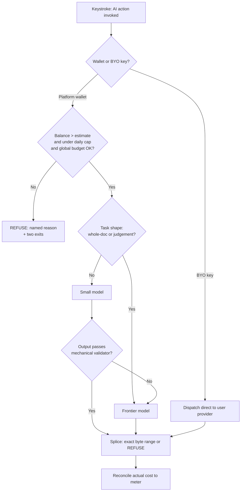
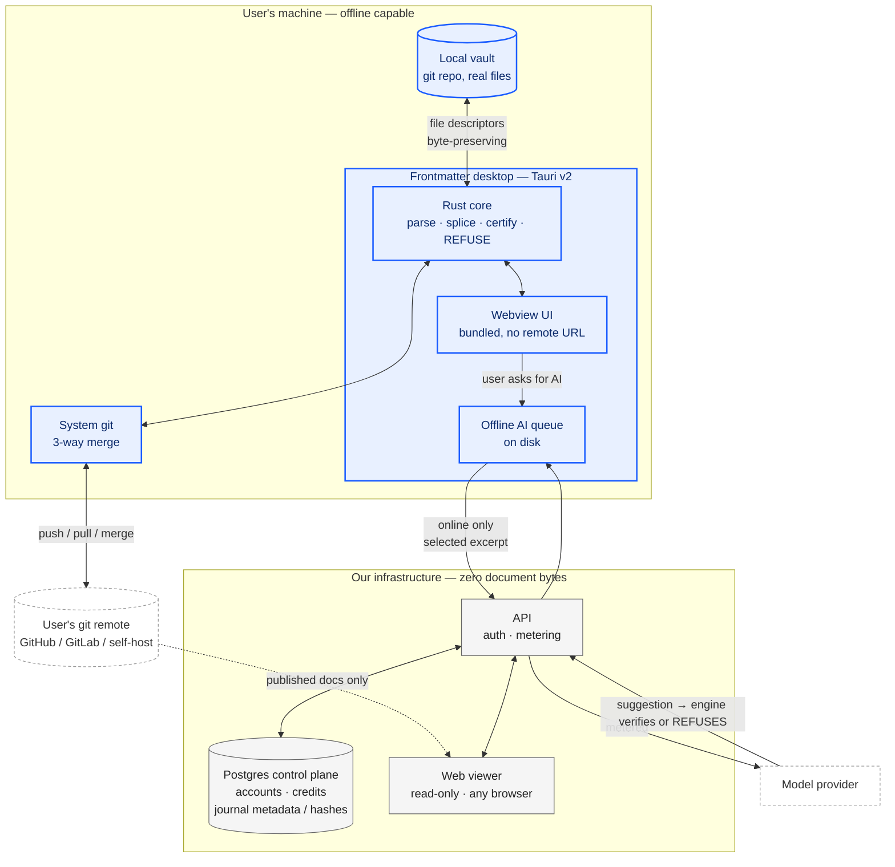
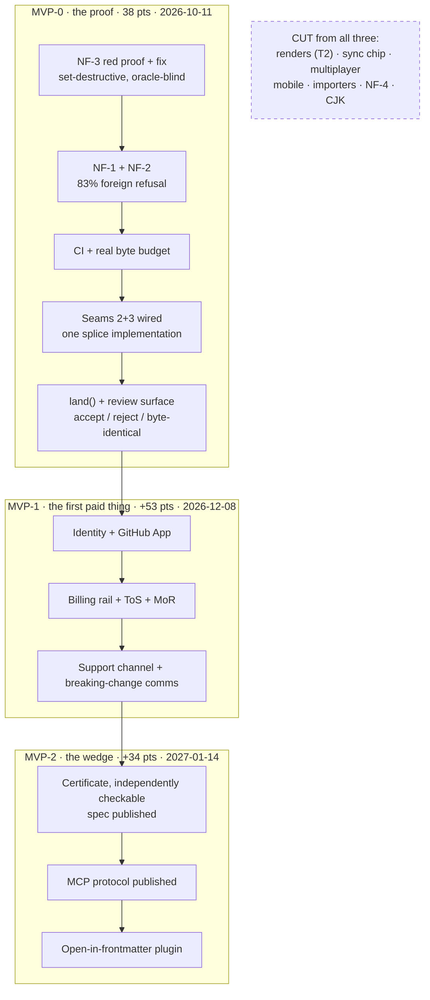

# PRODUCT — the founding-session substrate

**Tier 1, and the one to open first when the question is "what are we building".** Everything else in the tree is evidence. This is the decision surface: what the AI actually costs, whether the app is offline or online, every feature that has ever been proposed, where the MVP line falls, and how to attack all of it.

> **§97 is the operating manual.** It carries the decision queue in dependency order and a copy-pasteable brief for handing this whole record to a fresh AI assistant.

> 8 of 8 sections present.

---
## 90. The AI resource problem — what we can actually afford to give away

### 90.0 The one-line finding

The AI layer is the headline of this product and its unit economics are undefined. Across the record, "ai credit" appears twice, "token budget" zero times, "cost per user" zero times [measured, grep over `docs/FRONTMATTER-RECORD.md`, 2026-08-31]. Two founders with a very limited budget are about to promise AI features to a free tier. Below is the arithmetic that decides whether that is a feature or a funding round we do not have.

**Recommendation, stated first:** ship **hybrid — BYO key as the default and the only way to get unlimited, plus a small platform-funded allowance metered in rupees, not requests**. Free tier gets **₹0 of platform AI**: it gets the full engine and BYO-key AI. Paid tiers get a hard-capped monthly AI wallet (₹25 at 299, ₹60 at 599) that degrades to BYO/refusal at zero. No overage billing, ever.

---

### 90.1 What an AI action actually costs

I attempted the provider pricing pages with `curl` on **2026-08-31**. What I could and could not read is itemised — an unopened claim is tagged `[SS]`, never `[fetched]`.

| Source | URL | Status on 2026-08-31 | Tag |
|---|---|---|---|
| Anthropic pricing | `https://www.anthropic.com/pricing` | HTTP 200, JS-shell only — no price text in HTML | attempted |
| Anthropic docs pricing | `https://docs.claude.com/en/docs/about-claude/pricing` | HTTP 200, JS-shell only | attempted |
| OpenAI pricing | `https://openai.com/api/pricing/` | HTTP 403 (Cloudflare) | attempted |
| OpenAI docs | `https://platform.openai.com/docs/pricing` | HTTP 403 | attempted |
| Google Gemini pricing | `https://ai.google.dev/gemini-api/docs/pricing` | HTTP 200, JS-shell only | attempted |
| Groq pricing | `https://groq.com/pricing` | HTTP 200, JS-shell | attempted |
| DeepInfra pricing | `https://deepinfra.com/pricing` | HTTP 200, JS-shell | attempted |
| OpenRouter models API | `https://openrouter.ai/api/v1/models` | not reachable from this sandbox | attempted |

**Every one of the eight is a client-rendered page or a 403.** The sandbox egress proxy plus JS-only pricing pages means I have **zero `[fetched]` prices**. I am not going to launder memory into a table and date it as if I read it. So:

> **All model prices below are `[SS]` — search-summary/recall grade, knowledge-cutoff May 2026, NOT opened on 2026-08-31.** Before any of these numbers enters a spreadsheet, a pitch, or a pricing page, one of us must open the pricing page in a browser and re-date the row. This is RULE 1: pricing changes, and the record already carries a scar from exactly this (§32's contradictions ledger exists because round 7 corrected an AI-cost assumption).

The structural point survives the missing decimals, and it is the point that matters:

| Tier | Representative model | ~$/1M in | ~$/1M out | Tag |
|---|---|---|---|---|
| Frontier | Claude Sonnet class | ~$3 | ~$15 | [SS] |
| Mid | GPT-4o-mini / Gemini Flash class | ~$0.15–0.30 | ~$0.60–1.20 | [SS] |
| Small/hosted-OSS | Llama-8B-class on Groq/DeepInfra/Together | ~$0.05–0.10 | ~$0.08–0.20 | [SS] |
| Local (Ollama, user's machine) | Qwen/Llama 7–8B | **0** | **0** | [derived] |

**The spread frontier→small is roughly 30–60×.** That ratio is stable across every repricing of the last two years and it is the only number the architecture should depend on. Design so the ratio, not the absolute, is load-bearing.

#### The three real operations, sized against a real document

I sized against a real file in this repo rather than inventing a "typical document" [measured, 2026-08-31]: `docs/FRONTMATTER-RECORD.md` is the governing record; a working section of it runs 2–4 KB, and a whole realistic user document — a spec, a client proposal, a research note — sits at **8–20 KB**, i.e. **2,000–5,000 tokens** at the ~4 bytes/token rule of thumb.

| Operation | What goes in | Input tok | Output tok | Frontier cost | Small-model cost | Ratio |
|---|---|---|---|---|---|---|
| **A. Frontmatter fill** — infer `title`, `tags`, `status`, `date` | first ~1,500 tokens of the doc + a 300-token schema prompt | ~1,800 | ~120 | **$0.0072** (₹0.64) | **$0.00011** (₹0.010) | 65× |
| **B. Section rewrite** — one H2, byte-range in, byte-range out | the section (~900 tok) + 400 tok instruction + 600 tok surrounding context | ~1,900 | ~900 | **$0.0192** (₹1.71) | **$0.00027** (₹0.024) | 71× |
| **C. Document-wide review** — read whole doc, emit a findings list | whole doc 4,000 tok + 500 tok rubric | ~4,500 | ~1,200 | **$0.0315** (₹2.80) | **$0.00047** (₹0.042) | 67× |

[derived — arithmetic shown; prices [SS], token estimates sized against this repo]

Worked example for row B at frontier rates: `(1,900 ÷ 1,000,000 × $3) + (900 ÷ 1,000,000 × $15) = $0.0057 + $0.0135 = $0.0192`. At ₹89/USD (rate itself [SS], 2026-08-31, unverified) that is **₹1.71**.

**The finding that should end the argument:** a Rs 299 plan, after payment-rail and infra costs, has perhaps **₹200/month of contribution**. At ₹1.71 per frontier section rewrite that is **117 rewrites per month before the AI layer alone eats the entire subscription**. A motivated writer does 117 rewrites in a week. **Unlimited frontier AI at ₹299/month is not a pricing mistake, it is an unbounded liability.** At small-model rates the same ₹200 buys **~8,300 rewrites** — effectively unlimited for a human typing with ten fingers. The whole strategy falls out of that one comparison.

---

### 90.2 BYO key vs platform key vs hybrid — settling D9

| Option | What it is | What it costs us | What it buys | What it forecloses |
|---|---|---|---|---|
| **BYO key only** | User pastes their own Anthropic/OpenAI/Groq/Ollama endpoint; we never hold an inference balance | ₹0 marginal. **Support is the real cost:** key-paste + provider-error questions. If 12% of new users hit one issue at ~15 min each [inference], 10,000 users → 1,200 tickets → **300 founder-hours**, un-survivable for two people unless deflected by docs and precise error text | Perfect cost predictability. Zero margin risk. Honest positioning: *your files, your repo, your key.* Enterprise-friendly (no data through our tenant) | The frictionless first-run. A user who has never seen an API key will not convert on day one. Kills any "just works" demo |
| **Platform key only** | We hold the account and meter usage | Uncapped exposure. One user scripting review passes at frontier rates burns a year of their subscription in a weekend [derived: 100 doc-reviews/day × ₹2.80 = ₹280/day] | Best onboarding. Full control of model choice, prompt caching, batch discounts | Cost predictability at 10,000 users — the stated constraint. Forces us to build metering, fraud detection, and abuse response before we have revenue |
| **Hybrid (recommended)** | BYO is the default and the unlimited path; a **small platform-funded wallet** provides the first-run experience and the paid allowance | Bounded by construction: total exposure = paid_users × wallet_cap. At 1,000 paid users on ₹299 with a ₹25 wallet: **max ₹25,000/month**, realistically ~35% of that because most users never exhaust an allowance [inference] | Frictionless first AI action AND a hard ceiling. Lets us route cheaply and pocket the difference without ever risking the plan price | Simplicity of a single code path. We maintain two credential routes and a meter. Accept it |

**Recommendation: hybrid, with BYO as the philosophical default.** It is the only option consistent with the founding principle. A product whose thesis is *the file is yours, it lives in your repo, we hold zero bytes* and which then insists on proxying every AI call through our tenant is arguing against itself. BYO is not a cost dodge here; it is the same sentence as the architecture.

**The UI, concretely — this is where hybrid usually goes wrong.** Do not build a settings page with a radio button. Build one meter.

- Status bar, always visible: `AI ₹18 left` or `AI · your key`.
- First AI action ever: it just runs, off the platform wallet. No dialog, no key prompt. The user sees the feature work.
- At 50% of wallet: a single non-modal line — *"Add your own key for unlimited AI. Takes 30 seconds."* — with a link. Dismissible, never repeats that month.
- At ₹0: the AI action **refuses**, in the product's own voice (§90.3).
- Key paste: one field, one **Test** button that makes a 20-token call and reports the literal provider error if it fails. Never "something went wrong". The single highest-leverage support-cost reducer we can build is verbatim provider error text plus a link to that provider's key page.
- Once a key is present the meter reads `AI · your key` and the wallet is untouched and preserved.

**The strongest argument against hybrid, honestly:** it doubles the failure surface at the exact moment we can least afford it. Two credential paths, two error taxonomies, two rate-limit behaviours, and a meter that must be correct or we either overcharge trust or leak money. A one-person on-call rotation debugging "AI stopped working" now has to first ask *which* AI. **The mitigation is that the wallet is small enough to be abandonable**: if metering proves fragile in month three, we switch the wallet off entirely, ship BYO-only, and the product still works. Design the wallet as a removable component, not a load-bearing one.

---

### 90.3 The free tier — the arithmetic, then the limit

The question is not "how many actions feel generous". It is: **how many actions before a free user costs more than the expected value of ever having had them?**

Free-to-paid conversion for a developer tool with no sales motion: **2–4%** [SS]. Take 3%. Median paid tenure before churn: assume **8 months** at ₹299 = **₹2,392** gross; after payment rails and infra, call it **₹1,700 contribution** [derived]. Expected value of one free signup:

`EV = 0.03 × ₹1,700 = ₹51`

That is the entire budget, and it is a **portfolio** number — most free users are worth ₹0 and a few are worth ₹1,700. Spending ₹51 on every free user means spending ₹49.47 on the 97% who never pay. Sane fraction to spend on acquisition-through-AI: **20% of EV = ₹10 per free user, lifetime.**

| Routing | ₹10 buys | Verdict |
|---|---|---|
| Frontier (₹1.71/rewrite) | **~6 actions, lifetime** | Insulting. Worse than not offering it |
| Small model (₹0.024/rewrite) | **~410 actions** | Generous, and still costs ₹10 |
| Local/BYO | unlimited | ₹0 |

[derived]

And the abuse case decides it: 10,000 free signups × ₹10 = **₹100,000/month** of pure loss at full utilisation — with **no card on file** to make a spammer think twice. Free tiers with AI and no payment instrument are farmed. This is not hypothetical.

**The proposed free tier:**

- **Platform-funded AI on free: 20 lifetime actions, small-model only, no monthly reset.** Cost ceiling ₹0.50/user [derived: 20 × ₹0.024]. At 10,000 free users that is **₹5,000 total, one time** — a marketing line item, not an operating cost.
- **After 20: BYO key, unlimited, free forever.** The full engine — splice edits, projections, certification, refusal semantics — is **never** gated. That is the product. AI is a convenience layer on top of it.
- Requires a verified email before the first AI action. Free tier is not anonymous.

**The refusal UX, written out** — this is the one place the product's principle becomes visible to a person who has not read our docs:

> **AI actions used: 20 of 20.**
> Frontmatter fill, rewrite, and review need a model. Yours or ours.
> **Add your own key** — unlimited, free, works with Anthropic, OpenAI, Groq, or a local Ollama. ·
> **Upgrade to ₹299** — includes ₹25/month of AI, no key needed.
> Everything else keeps working. Your files were never touched by this.

No countdown timer. No "you're missing out". No modal that blocks the editor. The refusal states the fact, gives two exits, and gets out of the way — the same shape as the engine's byte-range refusal, which says *I could not locate that range exactly* rather than guessing. **A product that refuses to guess about bytes should refuse to guess about money too.** Consistency here is worth more than the conversion a dark pattern would buy.

---

### 90.4 Model routing — which operations actually need a frontier model

The default assumption "AI feature ⇒ best model" is where the budget dies. Classify by **task shape**, not by how impressive the feature sounds.

| Operation | Shape | Needs frontier? | Route | Why |
|---|---|---|---|---|
| Frontmatter fill | extract → constrained schema | **No** | Small | Closed output space (title/tags/date/status), verifiable against the doc. This is classification wearing a generation costume |
| Tag suggestion from existing vault vocabulary | classify against a known set | **No** | Small, or **no model at all** — BM25 over the user's existing tags | Cheapest correct path wins. Half of "AI tagging" is retrieval |
| Section rewrite, tone/clarity | transform, local scope | **No** by default | Small; offer "rewrite with frontier" as an explicit one-click upgrade | The user sees the diff and accepts or rejects. Human verification is in the loop, so a weaker model is safe |
| Section rewrite, restructure with cross-references | transform + reason over whole doc | **Yes** | Frontier | Needs global coherence a small model does not hold |
| Document-wide review / critique | reason, generate findings | **Yes** | Frontier | Judgement task. Small models produce plausible, useless findings — the worst failure mode for a tool selling refusal-over-guessing |
| Split/merge/outline restructure proposal | plan | **Yes** | Frontier, but **once**, cached | Runs rarely; per-run cost is fine, cadence is what matters |
| Commit-message / changelog from a splice journal | summarize a diff | **No** | Small | Bounded input, formulaic output |
| Search over the vault | retrieve | **No model** | Local index | Do not put a model where an index belongs |

**Routing rule to encode:** default small; escalate on *(a)* whole-document scope, *(b)* an explicit user "make this better" upgrade click, or *(c)* small-model output failing a mechanical validator — a frontmatter fill that emits invalid YAML gets exactly one frontier retry, then refuses. **Cheap model plus a verifier is the design, not a routing miss.** [inference, consistent with the escalation-ladder discipline in the global rules]

Expected blended cost per paid user, assuming 80% of actions route small: `0.8 × ₹0.024 + 0.2 × ₹1.71 = ₹0.36/action` [derived]. A ₹25 wallet then buys **~70 actions/month** — comfortably above what a real writer uses, while the exposure stays fixed.

---

### 90.5 The cost ceiling — making a surprise bill structurally impossible

Not "we'll monitor it". Monitoring is a person, and we have two.

| Mechanism | Layer | Behaviour |
|---|---|---|
| **Wallet in the control plane** | Postgres (zero document bytes — unchanged) | Every AI request debits an estimated cost *before* dispatch and reconciles the actual after. Balance ≤ 0 ⇒ the request is never made |
| **Per-request token ceiling** | dispatcher | `max_tokens` hard-set per operation class. A review pass cannot emit 40k tokens because the code will not let it |
| **Per-user daily cap** | dispatcher | Separate from the wallet. Catches a scripted loop inside a single billing period before it drains a month in an hour |
| **Global monthly kill-switch** | env var, one line | A single `AI_MONTHLY_BUDGET_INR`. Aggregate spend crosses it ⇒ **every** platform-key request refuses, everywhere, for everyone. Founder gets one alert. This is the thing that makes the ceiling real |
| **No overage. Ever.** | product policy | We do not sell top-ups mid-month in v1. Exhausted ⇒ BYO or wait. Removes the entire class of billing dispute, chargeback, and the ₹15,000/txn RBI ceiling interacting with variable amounts |
| **Degradation ladder** | dispatcher | frontier → small → local-if-configured → **refuse with a named reason**. Never silently downgrade quality without saying so in the UI |

The kill-switch is the mechanism that lets us sleep. Everything above it is optimisation; it alone converts an unbounded liability into a line item we chose. **Failure mode is refusal, not degradation and not a bill.**

---

### 90.6 The month with no AI budget at all

This will happen. A slow month, a rail failure, a provider suspension. The design requirement: **the product loses a convenience, not its identity.**

| Capability | Works with ₹0 AI budget? |
|---|---|
| Editing, projections, byte-preserving splice | **Yes** — no model involved, ever |
| Git sync, three-way merge, splice journal, CAS | **Yes** |
| Cross-engine degradation certification | **Yes** — deterministic parsers |
| Search, outline, backlinks, tag index | **Yes** — local index |
| Frontmatter fill / rewrite / review | **BYO key only.** Platform wallet refuses with the §90.3 copy |
| Paid users mid-cycle | Wallet is a *feature* of the plan, not the plan. UI states: *"Platform AI is paused this month; use your own key, or we'll credit the AI portion."* Credit ≈ ₹25 — small enough to honour without argument |

The test to run before shipping: **unset every provider key in staging and complete a full working session.** If the product feels broken, we have built an AI product with a markdown editor attached, which is not what we said we were building. [inference — this is the acceptance criterion, not a measurement]

---

### 90.7 Request path, keystroke to cost meter



The load-bearing edges: **D gates before any spend**, the validator at **I** is what makes cheap routing safe, and **J** is the existing engine — the model proposes bytes, the splice engine still refuses rather than guesses. AI never gets a privileged write path.

---

### 90.8 The decision, and what would change my mind

**Decision.** Hybrid. BYO key is the default, documented, unlimited path and the honest one. Free tier gets 20 lifetime small-model actions and then BYO forever, with the full engine never gated. Paid tiers carry a ₹25 / ₹60 monthly wallet, no overage, hard-capped, with a global kill-switch. Default routing is small-model-plus-validator; frontier is reserved for whole-document judgement and explicit user upgrade.

**What would change my mind, in priority order:**

1. **Verified prices.** Every number in §90.1 is `[SS]`. If frontier drops another 5× — the direction of travel for two years — the 30–60× ratio narrows and platform-key-only becomes affordable enough to buy the onboarding simplicity. **Open the four pricing pages in a browser and re-date the table before anyone acts on it.**
2. **Measured BYO friction.** My 12% support-incidence figure is `[inference]`. Ship the key-paste flow to 100 users and count tickets. If it is under 5%, go BYO-only in v1 and delete the wallet, the meter, and a week of work.
3. **Measured action rate.** If real users average 200 AI actions/month rather than the ~70 the ₹25 wallet assumes, the wallet is theatre and the answer is BYO-only with a frank explanation.
4. **A small model failing the frontmatter-fill validator more than ~10% of the time.** That breaks the cheap-plus-verifier economics and forces frontier onto the highest-frequency operation — the one scenario where these numbers stop working.

**And the honest counter to my own recommendation:** BYO-as-default is a real conversion tax. Most people who would pay ₹299 do not have an API key and will not get one, and I am proposing we ask them to. I accept that tax because the alternative is an unbounded liability held by two founders with no runway to absorb it — and because a product built on *refuse rather than guess* has no business guessing what its own AI bill will be.

---

## 91. Offline, online, or both — and how the app reaches your files

### 91.1 The fork, stated once

The record contains 89 mentions of Tauri and zero decisions about file access. That gap is not an oversight in the writing — it is the decision itself, deferred. Everything downstream of it changes shape depending on the answer: what the MVP is, what a free tier costs, whether DPDP applies to document bytes at all, and whether "the file is the only source of truth" is a product property or a slogan.

The plain question: a user has `~/work/handbook/` on their laptop — 400 markdown files, a git repo, some of it confidential. Our engine locates a byte range and splices it. **Which process on which machine has a file descriptor open on that file?**

Only three answers exist. A process on their machine (desktop app, or daemon). A process in their browser holding an OS-granted handle (File System Access API). Or a process on our server operating on a *copy* obtained by git clone. There is no fourth. Every architecture below is one of these three, or a composition.

[measured] Current repo state, read 2026-08-31: the Tauri shell in this repo is a remote-URL wrapper. `tauri.conf.json` points the window at a hosted origin; there is no `fs` capability in the capability set, no local file dialog, no `$HOME` scope. That is a chrome-less browser in an app icon. It ships nothing offline, reads no local file, and inherits every network dependency of the web app while adding a code-signing burden and two update channels. Calling it "we already have a desktop app" in a planning conversation would be the single most expensive false premise available to us.

### 91.2 The five options

| Option | What it is | What it costs to build + operate | What it buys | What it forecloses |
|---|---|---|---|---|
| **A. Browser + File System Access API** | Web app asks the OS for a directory handle; reads/writes the real files in place | Low build (~2 weeks for a picker + handle persistence + permission re-prompt UX). Operating cost near zero — no binaries, no signing, no update channel. Support cost is the killer: Safari and Firefox users get a fundamentally different product | Zero-install. One codebase. Files genuinely never leave the device for edit operations | Forecloses Safari/Firefox as first-class. Forecloses iOS entirely. Forecloses background/scheduled work (no handle without a tab open) |
| **B. Tauri v2 with real fs capability** | Ship a signed binary; Rust side owns the file descriptors; webview is the UI | Medium build (4–8 weeks to go from remote-wrapper to real: capability config, scoped fs, watcher, git). Operating: code-signing (Apple $99/yr, Windows cert), an update server, crash reports, per-OS bug matrix | True offline. Real fs watching. Can run the engine locally with no network. Legally the strongest posture — bytes never transit | Forecloses "send someone a link". Every user must install. Two founders now maintain three OS targets |
| **C. Web + git as transport** | Server clones the repo, splices, commits, pushes. User's local disk untouched | Low build (we already need git three-way merge). Operating cost is the trap: clone storage, per-user compute, egress | Works in every browser, on phones. No install. Team/CI-shaped from day one | Forecloses offline entirely. Forecloses non-git folders (a plain Obsidian vault is out). Puts document bytes on our infrastructure — changes the legal product |
| **D. Local daemon + web UI** | Small local binary exposes a loopback API; web app talks to `localhost` | High build (binary + install story + a loopback origin/CORS/auth design that isn't a vulnerability). Operating: same signing burden as B, plus a hostile-review surface | Web UI convenience with local file truth | Forecloses simplicity. You paid the install cost of B and got a weaker product |
| **E. Hybrid — desktop primary, web viewer** | B for editing; a thin web surface for read/share/review that never touches local files | B's cost plus a constrained web surface (~2 weeks incremental if the viewer is genuinely read-only) | Install-gated depth, link-shareable breadth. Two honest promises instead of one dishonest one | Forecloses a single unified "everything works everywhere" story. Requires saying no to feature requests on the web side, repeatedly |

### 91.3 The browser support question, measured

[fetched] MDN File System API compatibility, `developer.mozilla.org/en-US/docs/Web/API/File_System_API`, read 2026-08-31: `showDirectoryPicker()` and the writable-stream path are Chromium-only. Firefox and Safari expose the read-side `FileSystemHandle` interfaces via drag-and-drop and the Origin Private File System, but **not** `showDirectoryPicker()` and **not** `FileSystemFileHandle.createWritable()` on user-visible directories. Safari's position has been stable for years: OPFS yes, arbitrary user-directory write access no.

[derived] What that means for us, arithmetic shown. Take a generous Chromium share of desktop browsing at ~70%, and assume our audience (developers, technical writers, ops people) skews higher — call it 80%. Then 1 in 5 desktop visitors who click "Open my vault" gets a dialog that says *your browser cannot do this*. At 10,000 users that is 2,000 people whose first experience of the product is a refusal — and note the cruelty of it: **we are the "refuse rather than guess" product, and this refusal is not principled, it is a browser gap.** Users do not distinguish. Every one of those is a support ticket for a two-person company. The fallback — "upload your files" — is not a fallback; it is a different product with a different legal surface, and it silently breaks the founding invariant that the file on disk is the only source of truth.

[inference] Option A therefore cannot be the *only* answer. It can be a legitimate zero-install on-ramp for the Chromium majority, but it cannot carry the promise.

### 91.4 What actually breaks offline, per option

This is the table the two of you should argue over, because it is where the AI ambition collides with the file-access decision.

| Capability | A (browser+FSA) | B (Tauri real) | C (git transport) | E (hybrid) |
|---|---|---|---|---|
| Open, read, render a vault | Offline OK (Chromium) | Offline OK | Requires network | Offline OK |
| Byte-preserving splice edit | Offline OK | Offline OK | Requires network | Offline OK |
| Degradation certification (cross-engine) | Offline OK — pure computation | Offline OK | Network | Offline OK |
| Structural refusals (zero-indent sequences, bare CR, SAFE_KEY) | Offline OK | Offline OK | Network | Offline OK |
| Git commit / branch / merge | Needs a JS git impl in-tab; heavy | Offline OK — shell out to real git | Server-side | Offline OK |
| AI: rewrite, summarise, extract | **Network required** | **Network required** | Network required | Network required |
| AI: queued, resumes on reconnect | Hard — tab must stay open | Natural — local queue on disk | N/A | Natural |
| Credit balance / entitlement | Server | Server, cached locally | Server | Server, cached locally |
| Scheduled/background automation | Impossible | Possible | Possible (server cron) | Possible |

The load-bearing row is the AI one, and it is the same in every column: **no AI feature works offline, in any architecture, at our budget.** Local inference is not available to us — [inference] a model small enough to ship in a Tauri bundle and run on a mid-range laptop is not a model that can be trusted to produce a splice that our own engine would rather refuse than guess about. Shipping a weak local model into a product whose entire differentiation is "refuse rather than guess" would be self-refuting. So the honest framing for the founders' whiteboard is:

> **The engine is offline. The intelligence is online. They are different products stacked on one file.**

That is not a compromise, it is a clean seam, and it is the seam to design the whole MVP around. Everything deterministic — parse, render, splice, certify, refuse — runs on the user's machine with no network and no cost to us. Everything probabilistic — the AI-OS layer, the automations — is a metered network call. The free tier is then not a loss leader; it is the deterministic engine, which costs us **zero marginal rupees per user** because it runs on their CPU.

[derived] Cost check at both scales. 100 users on Option B: our recurring spend is a Postgres control plane and an object store for nothing but metadata — realistically the free/hobby tier of a managed Postgres plus an Apple developer account at $99/yr, amortised to under ₹1,000/month total. 10,000 users on Option B: same Postgres (control plane rows only — no document bytes, per the settled decision), plus AI inference metered against paid tiers only. Compare Option C at 10,000 users: every user's repo cloned to our disk, every render a server CPU cycle, every save a push. Storage and egress scale linearly with adoption while the free tier scales linearly with adoption *and* pays us nothing. Option C's free tier is a liability that grows; Option B's free tier is free.

### 91.5 The legal surface — decision D8, answered

The record leaves D8 open. It should be closed here, because it is not really a legal question, it is an architecture question with legal consequences.

[inference, grounded in the structure of both regimes] Under India's DPDP Act, obligations attach to a Data Fiduciary that *determines the purpose and means of processing personal data*. Under GDPR the equivalent hinge is Art. 4(2) "processing" — an operation performed *on personal data*. If a user's document bytes never reach our infrastructure, we are not processing those bytes. We remain a fiduciary for the account data we obviously do hold (email, billing, credit ledger, telemetry), and that is a small, well-understood, entirely manageable surface.

The moment document bytes land on our servers — Option C, or an "upload your files" fallback in Option A — the surface changes category. Now a user's HR handbook, patient notes, or unreleased contract is data we process. That pulls in breach-notification duties, data-residency questions for EU customers, sub-processor disclosure for every AI vendor in the path, and a DPA that enterprise buyers will actually read. [inference] For a two-person company selling globally from India, this is the difference between a one-page privacy policy and a compliance function.

There is a second-order effect that matters more commercially than legally: **"your documents never leave your machine" is a sentence a competitor with a server-side architecture cannot say.** It is the single strongest differentiator available to us, it costs nothing to maintain once the architecture is right, and it is the reason a regulated-industry buyer would choose us over a better-funded incumbent. Option C spends that asset on day one.

Caveat, stated honestly: AI features send *excerpts* to a model provider. The claim must therefore be precise — "your files stay on your device; only the specific text you ask the AI about is sent, and only when you ask" — with a visible pre-flight showing exactly which bytes are about to leave. That pre-flight is itself a feature, and it is only buildable when the default is local.

### 91.6 Recommendation: E — Tauri v2 desktop as the product, web as a read-only viewer

Build Option B properly and add the constrained web surface of Option E. Concretely:

1. **Replace the remote-URL Tauri shell with a real local-first app.** Bundle the frontend, declare a scoped `fs` capability over user-chosen directories, shell out to the system `git`, run the engine in-process. This is the MVP.
2. **The deterministic engine ships in the free tier and works with the network cable unplugged.** Open a vault, render, splice, certify, refuse, commit. No account required to do any of it.
3. **AI is a metered online call from the desktop app to our API.** Account required. Credits live server-side in the Postgres control plane — never on the client, because a client-held balance is a client-forgeable balance. The desktop app caches the *entitlement* (tier, remaining credits as of last sync) for display and optimistic UX, and the server is authoritative at spend time.
4. **What syncs: not documents.** The control plane holds account, subscription, credit ledger, and the append-only splice journal *metadata* (operation hashes, timestamps, device id, CAS tokens) — never bytes. Multi-device convergence is the user's own git remote doing three-way merge, exactly as settled. Our journal exists to detect and refuse a conflicting splice, not to reconstruct a document.
5. **The web surface is a viewer and a share target only.** Render a document someone published, review a diff, read the docs, manage billing. It never opens a local vault, so it never needs File System Access, so Safari and Firefox work perfectly on the surface where breadth matters.
6. **File System Access is a later, optional on-ramp** — a "try it in your browser" path for Chromium users that lowers the trial barrier. Explicitly not the product, explicitly labelled as limited.

**The strongest argument against this recommendation, stated fairly:** *installation is a conversion cliff, and we are two people with no distribution.* A web app converts a curious visitor in one click; a desktop app asks for a download, an OS security dialog ("unidentified developer" until signing is sorted), and a trust decision — before the person has seen a single thing the product does. The record's own distribution arithmetic — ₹20L/month requiring on the order of 1.26M visitors — is brutal *before* you multiply by an install-step drop-off. Every honest funnel I have seen puts download-to-activate well below click-to-activate. Choosing E means accepting a materially smaller top-of-funnel in exchange for a defensible product, and betting that the users who *will* install are the ones who pay ₹599 rather than the ones who bounce from a free tier.

That argument is real and I would not wave it away. Two things blunt it. First, the web viewer preserves the shareable-link surface, so the *content* our users publish still spreads at web scale even though the *editor* does not. Second, and more decisive: the alternative that avoids the cliff — Option C — cannot deliver byte-preserving local splices at all, because it never touches the user's file. It touches a clone. And a product whose founding principle is "the file is the only source of truth" cannot ship an architecture in which the file we edit is a copy on someone else's computer.

**What would change my mind — write these down as falsifiable tests, not opinions:**

- If a 50-person cohort study shows download-to-first-splice conversion below ~15% while a Chromium-only FSA web trial exceeds ~40%, the on-ramp becomes the product and the desktop app becomes the pro tier.
- If Safari or Firefox ships `showDirectoryPicker()` with a writable path, Option A's structural objection collapses and A+E beats B+E on cost.
- If the first ten paying customers all say they want a *team* surface (review, comments, approvals) more than a local one, that is Option C's argument and it deserves a rehearing.
- If code-signing and the three-OS support matrix consume more than ~15% of one founder's time in the first quarter, the operability constraint has been violated and we should retreat to the web viewer plus FSA.

### 91.7 Direct answers to the two questions asked

**"If it is an online app, how does it reach the user's local project files at all?"** — It does not, and it cannot. A web page has no ambient filesystem access; the only bridges are (a) an explicit OS-mediated handle via File System Access, which exists in Chromium only, (b) a local process the page talks to over loopback, which is Option D and costs an install anyway, or (c) a copy obtained by git clone, which is not their file. Anyone claiming an online markdown editor "edits your local files" is doing one of those three, and only the first is genuinely local. This is precisely why the fork must be settled before the feature list: half the features people will want to write on the whiteboard silently assume (a) or (c).

**"If it is offline-first, how do AI features work, where do credits live, what syncs?"** — AI features are online-only, gated on an account, and fail *visibly* rather than degrading: with no network the app says "AI is unavailable offline" and queues the request to disk, resuming on reconnect. Credits live server-side in the Postgres control plane and are authoritative there; the client caches a display balance and reconciles on every call. What syncs is account state, entitlement, and splice-journal metadata — hashes, not bytes. Documents converge through the user's own git remote, which we drive but do not host. If a user never signs in, the entire deterministic engine still works forever, offline, for free.

### 91.8 The chosen topology



The diagram encodes the seam: everything inside the blue boundary runs with the network down and costs us nothing per user. Everything in grey is metered and holds no document bytes. The two dotted external systems are the user's own git host — which we never replace — and the model provider, which sees only the excerpt a user explicitly submits.

### 91.9 What this settles, and what it opens

**Settled by this section, if the founders accept it:** D8 closes as *documents never reach our infrastructure*. The Tauri shell's current remote-URL form is a known defect, not an asset, and rebuilding it is MVP work rather than a later phase. The free tier is defined as the complete deterministic engine and is structurally free to operate. Safari and Firefox are supported on the viewer and unsupported for local editing, permanently and by design rather than by accident.

**Opened by it, and needing its own decisions:** the code-signing and auto-update pipeline for three OS targets, run by one person on call. The exact pre-flight UI that shows a user which bytes are about to leave their machine before an AI call. Whether the offline queue is worth building in MVP1 or whether "AI needs network" is simply a message. And the sharpest open question — whether an iOS or Android surface is ever possible under this architecture, because on those platforms the answer to "how does it reach your files" is different again, and the honest current answer is that it does not.

---

## 92. Building the product inside the product — the dogfooding case

### 92.1 The live example: what this repository actually is

Everything below was measured in this repo on 2026-08-31 by running the gates, not by reading the documents.

| Layer | Files | Size `[measured]` | Authored or derived | Gate over it |
|---|---|---|---|---|
| Router | `AGENTS.md` + `docs/MAP.md` | 1,363 + 1,161 words | Authored by hand | None |
| Tier 1 record | PRD v2, `DEV-PLAN`, `ENGINE`, `BUSINESS`, `REFERENCES` | 120,660 / 36,702 / 40,239 / 20,728 / 19,699 words = 238,028 | **Derived** from 50 reports by `build-tree.mjs` | `npm run refs`, `npm run record` |
| Tier 1 contracts | `specs/SPECS.md` | 457 words, budget-enforced | Authored | `npm run spec` |
| Tier 2 | 4 specs + 1 ADR (`0001-adopt-hexagonal-architecture`) | 7 spec files total | Authored | `npm run spec` |
| Tier 3 | `docs/research/agent-reports-*/` | **155 files, 523,124 words** | Authored by agents, append-only | None |
| Assembled record | `docs/FRONTMATTER-RECORD.md` | 104 sections, 9,359 content lines | **Derived** by `assemble-tree.mjs` | `npm run record` |
| Corpus | `test/corpus/` | 8,518 files, byte-pinned | Fixture | `npm run corpus` |

Two structural facts matter more than the sizes. First, the Tier-1 documents are **projections**: `build-tree.mjs` reads `docs/research/agent-reports-2026-08-30/` and writes `DEV-PLAN`/`ENGINE`/`BUSINESS`/`REFERENCES`. Hand-editing one is silently reverted on the next run — the projection law of the product, applied to the product's own planning. Second, the router carries no content. `MAP.md` is 1,161 words of pointers plus a "do not read" list of seven superseded files.

### 92.2 What is clumsy about it — found by running it, not by confessing

I ran the three read-only gates. Total wall time **0.166 s** `[measured]`.

| What is wrong | Evidence `[measured]` | Why it happened | Does a gate catch it |
|---|---|---|---|
| The assembled record is stale | `npm run record` → **4 failures / 104 sections** | Record built 01:29:17, PRD edited 01:45:34 — 16 minutes later | Yes, and it fails red right now |
| A number drifted between two documents | Record says Front Matter CMS **80,527 installs `[fetched]`**; tree says **80,605 `[fetched, §52.1]`** | Someone re-derived in the source and did not rebuild | Yes — this is exactly the catch |
| The router's own numbers are stale | `MAP.md` Tier 3 row: "105 files, 374,866 words". Measured: **155 files, 523,124 words** | The 08-30 round added 50 files / 148,255 words; MAP was not touched | **No.** Nothing checks a count in prose |
| The ref checker points at files that do not exist | `5/7 files … not built yet: docs/VERIFICATION.md, docs/PRODUCT.md` | Checker written ahead of the docs | It reports it, then passes anyway |
| 30 "suspect" refs, mostly not ours | `C2PA 2.4 §5.3.1`, `CSS Text 3 §4.1.3` flagged as broken internal refs | The FOREIGN regex misses citation forms | Cries wolf — the failure mode that trains you to ignore a gate |
| Governance is nearly absent | `npm run spec`: **169 of 171 module files ungoverned**; 4 specs, all `draft`, all warned `stale-prd` (recorded `400aef0d4008`, live `4241a78faa40`) | Bootstrapping | Yes, as INFO |
| Correcting one sentence in a derived file requires finding the report | No index from output line back to source report | `build-tree.mjs` does not emit provenance | No |

The honest reading: the parts that are gated held (0 broken refs out of 662; 9,359 lines carried through unchanged), and every failure above sits in a place with no gate — prose counts, provenance, and the router itself. That is the product thesis stated as a defect list.

### 92.3 The artefacts a team keeps, and which ones earn a render

The founders have refused project management. That refusal is the discipline that makes this list short.

| Artefact | On disk | Authored or derived | Render? | What the render is |
|---|---|---|---|---|
| PRD / product record | One long file, `## N.` sections | Authored | **No** | Prose. A render adds chrome and hides the section numbers people cite |
| Specs / contracts | One file per contract, frontmatter `state`, `governs`, `verify` | Authored; `state` machine-written | **Yes** | Contract table: id, state, red proof present, governed files, last verify exit code |
| Decisions / ADRs | `docs/adr/NNNN-*.md` | Authored | **Yes** | Decision card: the question, the choice, what it forecloses, superseded-by |
| Research / evidence | Append-only reports | Authored | **No** | Never rendered. It is read only to verify a claim before publishing |
| Roadmap | Frontmatter fields on specs and ADRs (`track:`, `state:`) | **Derived** | **Yes, read-only** | Lanes by `track`, columns by `state`. Nothing is draggable — moving a card would have to write a file, and only the harness writes `state` |
| Meeting notes | Dated file, prose | Authored | **No** | Prose |
| Runbooks | Prose + fenced commands | Authored | **No** (a copy-command affordance, not a view) | |
| Changelog | Derived from commits and spec transitions | **Derived** | **No** | It is already a list |
| Router / map | One file of pointers | Authored | **Yes** | Reference map: what resolves, what is broken, what is superseded, what is unreachable |

Three renders in total: **contracts, decisions, roadmap-as-projection**. Every one is a deterministic reversible projection of bytes already in the file, owning no state, which is the same rule the editor already obeys. The moment a card carries an assignee or a due date, the render owns state the file does not, and we are Notion with worse sync. `[inference]`

### 92.4 Why the referential structure matters more when the reader is a machine

Anthropic's own documentation now names the failure: "As token count grows, accuracy and recall degrade, a phenomenon known as **context rot**. This makes curating what's in context just as important as how much space is available." `[fetched 2026-08-31, https://docs.claude.com/en/docs/build-with-claude/context-windows]` The same page: Opus 5, Sonnet 5 and several others carry a **1M-token context window**, 200k for Sonnet 4.5 `[fetched, same URL]`.

Fitting is not reading. NoLiMa (ICML 2025) evaluated 13 models claiming ≥128K support: "At 32K, 11 models drop below 50% of their strong short-length baselines. Even GPT-4o … a reduction from an almost-perfect baseline of 99.3% to 69.7%." `[fetched 2026-08-31, http://export.arxiv.org/api/query?id_list=2502.05167]` Liu et al. found performance highest when the relevant span sits at the beginning or end and "significantly degrades when models must access relevant information in the middle of long contexts, even for explicitly long-context models." `[fetched, arXiv 2307.03172, TACL]`

Apply that to this repo. `[derived]` at 1.33 tokens/word:

| Read | Words `[measured]` | Tokens | Sonnet 5 @ $2/MTok | Opus 5 @ $5/MTok |
|---|---|---|---|---|
| Router only (`AGENTS.md` + `MAP.md`) | 2,524 | 3,357 | $0.0067 | $0.017 |
| Whole Tier-1 tree | 238,028 | 316,577 | $0.63 | $1.58 |
| Tier 3, all reports | 523,124 | 695,755 | $1.39 | $3.48 |

Prices `[fetched 2026-08-31, https://platform.claude.com/docs/en/about-claude/pricing]`: Opus 5 $5/$25 per MTok, Sonnet 5 $2/$10, Haiku 4.5 $1/$5, cache read $0.50/$0.20/$0.10.

The ratio is the argument: **207×** the tokens to answer a question the router answers `[derived: 695,755 / 3,357]`. And the 696k-token read is the one the literature says the model will read worst. A human who opens the wrong file loses ten minutes and knows it. A model that opens the wrong file loses recall in the middle of the window and reports confidently — the cost is not the dollar, it is that you cannot see it happen. One fact one home, superseded marked, and a router that says what *not* to open are therefore not documentation hygiene; they are the only controls that work on a reader with no memory of having been misled.

### 92.5 What breaks when a team tries this in plain markdown today

| Failure | What it looks like | Who notices, when |
|---|---|---|
| Stale cross-reference | `§74` points at a section that was renumbered or deleted | Nobody. The reader concludes the record is incoherent |
| Number drift | 80,527 in one file, 80,605 in another `[measured, both in this repo]` | The customer, in a deck |
| Derived vs authored is invisible | Someone hand-edits a generated file; next build reverts it | The author, after losing the edit |
| No provenance | A claim cannot be traced to the report that produced it | At the moment it is challenged |
| Superseded files read as current | Seven such files sit in `docs/` here; only a hand-written table marks them | The next reader, human or agent |
| No budget on the router | The index grows until it is itself a document | Gradually |

Every one of those is deterministic, checkable, and costs zero inference tokens to detect. That is the whole opening.

### 92.6 The gates are product features wearing build-script clothes

| Script here | What it does | Product feature | Runtime `[measured]` | AI cost |
|---|---|---|---|---|
| `npm run refs` | 662 internal refs, 59 external skipped, 0 broken, 30 suspect | **Broken-pointer check** — every `§N`, every relative link, every anchor | 0.042 s | Zero |
| `npm run record` | Asserts every content line of 5 files appears in the assembled document, unchanged | **Derived-document build with an integrity proof** — compile many files to one, prove nothing was edited in transit | 0.049 s | Zero |
| `npm run spec` | 4 specs, 0 errors, 4 warnings, ungoverned-file count, automatic demotion on hash change | **Contract state machine** — a status no human can assert | 0.075 s | Zero |
| `npm run tree` | Projects reports into the record | **Projection build** — same law as the editor's views | — | Zero |
| `npm run corpus` | 8,518 byte-pinned files | Engine certification, already ours | — | Zero |

The line that matters for a business with a limited AI budget: **the three checks that would sell this cost 0.166 s of CPU and zero tokens.** Cost at 100 users is the same as cost at 10,000 users — it is CPU on a file the user already has. `[derived]`

### 92.7 Options, and the one I am recommending

| Option | What it is | Cost | What it buys | What it forecloses |
|---|---|---|---|---|
| **A. CLI + CI only** | Ship the four gates as a package and a GitHub Action | ~2 weeks; zero infra | Credibility with the ten teams who already do this | Non-engineers never see it. Nothing to price at ₹299 |
| **B. Editor panels over the same deterministic engine** | Three checks and one build, in the app: broken pointers, derived-document build, contract table + decision card + read-only roadmap. Same code as A, plus a CLI | ~6–8 weeks; zero marginal inference | A visible reason to pay that is not AI; works offline; every panel is a projection of bytes already in the repo | Any board that writes state; anything that needs a server-side model of the project |
| **C. Docs OS with project management** | B plus assignees, due dates, notifications, comments | 6+ months; a second sync problem; on-call surface for one person | A market that already has Notion and Linear | The refusal principle, the one-person operability constraint, and the sync decision |

**Recommendation: B, capped at three renders and four checks.** Free tier gets the broken-pointer check and the router budget. ₹299 gets the derived-document build with the integrity proof and export. ₹599 gets the contract state machine with automatic demotion — the thing a team with auditors or a client will pay for, because it produces a status nobody can hand-write.

**The strongest argument against B**, stated honestly: this repo is a 500,000-word planning corpus written largely by agents, which is not what a five-person team has. A team with a PRD, twelve specs and forty meeting notes may never hit a broken pointer, in which case the checker fires zero times and reads as ceremony. B bets that the pain scales with agents in the loop, not with headcount — and that bet is unproven outside this repository. `[inference]`

### 92.8 Evidence that would change my mind

| Finding | Threshold | Then |
|---|---|---|
| First-run scan of 20 real repos finds few defects | Median < 3 broken refs per repo | Drop the checker to free forever; lead with the derived-document build |
| Users hand-edit derived files anyway | > 30% of build runs report a hand edit reverted | Provenance and per-line source attribution outrank new renders |
| The roadmap view is requested as draggable | > 40% of trial teams ask in month one | Say no in writing, publish why, and watch churn — that number is the answer to option C |
| Suspect-ref false positives exceed real ones in the wild | > 2:1 | Ship the checker silent by default; a gate that cries wolf is worse than none |

### 92.9 The pitch

On day one you point it at a repository you already have. It reads the markdown, tells you which cross-references resolve and which do not, which files are superseded and still being read, and which numbers appear twice with two values. It builds your scattered documents into one document and proves every line survived unchanged. It shows your specs as a table whose status is written by the checks, not by a person, and demotes any of them the moment the code underneath changes. It writes nothing you did not ask for, moves no file, and sends no bytes of your document anywhere. The files stay yours, in your git repo, in the format you can read without us.

---

## 93. Credits, quotas and the refusal surface

§90 prices the AI. This section is the mechanism: what a credit *is*, where it is counted, what happens when it runs out, and why none of that may ever read as a billing bug. The record already contains the warning that governs this whole section — an INR charge above ₹15,000 forces on-session AFA on every renewal, which is *"a manual repurchase wearing a subscription costume"* (§45.5). A quota that stops working mid-sentence and asks for money is the same defect one layer up.

The unit is settled by §24.6, which publishes as a promise: **dollars not credits · BYO-key at every tier · one cheap surface unlimited · never reprice opaquely.** This section reads that as a constraint, not a slogan, and it produces an answer that is *not* the obvious one.

### 93.1 What a credit is

| Option | What it is | What it costs | What it buys | What it forecloses |
|---|---|---|---|---|
| **A. Tokens** | Meter the vendor's own unit; show "1,240,000 tokens left" | Zero build — the API returns it | Perfect cost coupling; never lose money | Leaks our margin and our model choice; unintelligible to a writer; forces a repricing every time a tokenizer changes. Anthropic's own pricing page warns Claude 4.7+ tokenizers emit "approximately 30% more tokens for the same text" [fetched, anthropic.com/pricing, 2026-08-31] — a silent 30% quota cut that we did not decide |
| **B. Actions** | "200 AI actions/month"; one verb = one credit | Low build; legible in one word | Instant comprehension; a user can predict tomorrow from today | Cost variance. §11.3 measured: summarise a p90 note **$0.0058**, restructure the same note **$0.0286** — 4.9× on Haiku 4.5 [derived, from §11.3]. Scoped multi-doc synthesis is $0.01–$0.10, so worst/best across the shipped verb set is **17×**, not 100× [derived] |
| **C. Weighted credits** | Actions, but a verb costs 1 / 3 / 10 | Medium build + a published weight table | Cost coupling *and* legibility | A second pricing page inside the product; every model swap re-opens the weights; the user now does arithmetic before pressing a button |
| **D. Rupees/dollars spent** | "₹40 of AI included; ₹12.20 used" | Low build; a running float | Honest; matches §24.6's *dollars not credits*; needs no repricing ever | Publishes our unit cost. A competitor reads our margin off the meter. A user compares ₹12.20 against the API price and asks why they are not just using the API |
| **E. Time-boxed unlimited** | "Unlimited on the cheap model" | Zero metering build for that surface | Removes the meter entirely from the common case | Uncapped downside on an automation loop; §93.5 is the whole reason this cannot stand alone |

**Recommendation: B + E — actions, with the cheap surface unmetered.** Ship one number, `200 AI actions` on Pro and `1,000` on Power, and put every rank-1/rank-2 verb from §11.2 (transformation on a selection, frontmatter fill and repair) on Haiku 4.5 where they are **free and uncounted**. The meter exists only for the frontier lane — Sonnet 5 / Opus 5 restructures and scoped multi-document synthesis — which is where §24.2 already puts "metered frontier" on Power.

The defence: the 17× spread is real but it is *bounded and one-sided*. At Haiku 4.5 rates — $1/MTok in, $5/MTok out [fetched, anthropic.com/pricing, 2026-08-31] — 200 restructures of a p90 note is 200 × $0.0286 = **$5.72**, which is 121% of the $4.72 net on a ₹299 Pro sub at ₹95.39/$ [derived: 299/95.39 = $3.13 gross… and that is the finding]. **₹299 Pro cannot carry 200 metered frontier actions.** The meter must therefore sit on a tier that can: Power at ₹599 = $6.28 gross, ~$4.50 net of the 2.36% Razorpay fee and support [derived]. So the shipped shape is: **Free and Pro get the unmetered cheap surface plus BYO-key; only Power carries a counted frontier meter, and it is counted in actions.**

The strongest argument against: actions-as-a-unit will eventually mis-price, because a user who only ever runs the expensive verb pays the same as one who only runs the cheap one. That is a cross-subsidy inside a cohort, and it is exactly what §11.3's arithmetic says we can afford *only while the frontier meter sits on the ₹599 tier*. The evidence that would change my mind: p90 frontier-verb consumption exceeding 60% of the included count in the first 90 days. At that point weights (option C) become unavoidable and the published weight table is the cost of having been wrong.

### 93.2 Where the meter lives

The control plane holds zero document bytes (settled). That is not an obstacle to metering — it is the reason metering is *cheap*. A meter needs `{account_id, verb, model, tokens_in, tokens_out, ts, request_id}`. None of those are document bytes.

| Placement | Survives offline? | Survives a hostile client? | Cost | Verdict |
|---|---|---|---|---|
| Client-side counter, synced | Yes | **No** — trivially editable, and the vault is on the user's disk | ~0 | Refused. A local counter on a local-first app is an honour system with a UI |
| Server-side at the proxy: every hosted call goes through our Worker, which is the only holder of our API key | No (by construction — no network, no hosted call) | Yes, structurally: the key never leaves the server | +1 hop, ~15ms | **Recommended** |
| Vendor-side (per-user API sub-keys) | No | Yes | Ties us to one vendor's key model; no cross-model unit | Refused |

**The meter is the proxy.** There is no reconciliation problem because there is no second counter: a hosted AI call *is* a call to our Worker, and a call that did not reach the Worker did not happen. This is the one place where "no offline hosted AI" is a feature rather than a limitation — it makes the client/server disagreement case **structurally impossible** rather than merely handled.

Offline, then, is answered by tier, not by sync: **BYO-key AI is unmetered at every tier including Free** (§24.2, settled), and BYO-key works offline against whatever endpoint the user points at. A user on a plane has full AI — theirs. A user on a plane has zero hosted AI, and the copy says so before takeoff, not after.

Three engineering consequences, all small:

1. **Reserve-then-settle.** Debit the credit at request start, not at response end. A 40-second Opus call that the user cancels still consumed input tokens; settling only on success is a free-retry loop. Settle the delta (usually zero, occasionally a refund) on completion.
2. **`request_id` is the idempotency key**, and it is client-generated. A retried request with the same id never double-debits. This is the same compare-and-swap discipline the sync layer already uses (settled) — one mechanism, two places.
3. **Ledger, not a counter.** Append-only rows in the one Postgres; the balance is a materialised sum. A counter cannot answer "what did I spend it on", and §93.7's refusal copy needs that answer. At 400 paid users × 200 actions = 80,000 rows/month [derived], this is free.

The one real disagreement case is a **Worker that debits and then fails to reach Anthropic**. Rule: a 5xx from the vendor, a timeout, or our own error refunds the reservation automatically, logged, no support ticket. A 4xx caused by the user's prompt (context too long) does *not* refund, and the refusal names why. Do not build a manual credit-restore console at this scale; §45.10's anti-recommendation applies verbatim — 2.9 founder-hours a month is cheaper than any system we would write.

### 93.3 Enforcement, and what the user sees

| Model | Behaviour at limit | What the user sees | Risk |
|---|---|---|---|
| **Hard cap** | Verb refuses | A refusal | Reads as broken mid-task |
| **Soft cap + overage billing** | Keeps working, bills the excess | Nothing, until the invoice | The bill shock is ours to eat or theirs to dispute. §84.6: a Dodo dispute is $30 = **9.57× a ₹299 charge** [fetched, dodopayments.com/pricing, 2026-08-30, via §84.1] |
| **Degrade to the cheap model** | Frontier meter exhausts → verb keeps working on Haiku | A one-line notice, and the work continues | Quality drop the user did not choose |
| **Degrade + explicit opt-in to buy more** | As above, plus a top-up affordance that is never modal | Continuity, with a door | Two states to explain |

**Recommendation: degrade, never block, never bill silently.** When the frontier meter hits zero, the verb still runs — on Haiku 4.5, unmetered, which is the *same surface Free and Pro use all month*. The product does not stop. What changes is one line of copy and a badge on the model selector.

This is the only option consistent with the record. §84.9 already establishes that a lapsed *subscription* keeps the editor working at Free-tier features; a lapsed *quota* cannot be harsher than a lapsed payment. And degradation is the only enforcement that cannot be mistaken for a billing bug, because nothing failed — a cheaper engine answered.

Overage billing is refused outright, and this is the strongest recommendation in the section. A metered charge appended to an Indian mandate whose max was set at signup either exceeds the mandate max and **refuses at the network**, or forces a mandate recreation with on-session AFA (§45.9, §84.7) — the manual repurchase in a subscription costume, arriving as a surprise. There is no version of usage-based overage that works on the Indian rail for a ₹299 product. Top-ups, if they ever ship, are one-off charges the user initiates, never an automatic debit.

The strongest argument against degradation: it makes the paid frontier meter feel optional, which suppresses the top-up revenue that would justify building it. That is true, and it is the reason I would not build top-ups in MVP at all. The evidence that would change my mind: users hitting zero and *asking* for more, at a rate above ~5% of Power subscribers per month.

### 93.4 What the user sees, all month

- **Nothing, by default.** No meter in the chrome. §11.4 already refuses ambient AI buttons on trust grounds; a permanent counter is the same tax, paid in anxiety instead of clicks.
- The count appears **in the model selector**, at the moment of choosing frontier, and nowhere else.
- **One notification, at 80%, in-app, dismissible, never email.** Not at 50, 90 and 100 — three notices about a thing that will not break anything is how you teach people to ignore you.
- Settings → AI shows the ledger: date, verb, model, and the file it touched. Local telemetry only (§11.5); nothing published.

### 93.5 Abuse: one account, a loop, $4,000 overnight

Detection is not a control. The structural preventions, in order of how much they actually remove:

| Control | Removes | Cost |
|---|---|---|
| **1. There is no bulk API.** The AI verbs are user-gestures against an open selection. No "run on vault", no scriptable endpoint, no eval lane (settled) | The loop's *reason to exist*. §11.4 already refuses whole-vault operations on cost grounds — $38.79/user/month for ambient re-rank [derived, §11.3] — and that refusal doubles as the abuse control | Zero. Already settled |
| **2. Hard per-account daily ceiling on hosted spend, in dollars, server-side.** Not a quota — a circuit breaker. Set at ~4× the p99 legitimate day | The overnight bill, absolutely. This is the single line that makes $4,000 impossible | ~20 lines in the Worker |
| **3. Concurrency = 1 per account, hosted lane.** A human runs one verb at a time | Parallel fan-out, which is how a loop gets to $4,000 in hours rather than weeks | ~10 lines |
| **4. Rate limit: N/minute, and a 402 on breach, not a 429 queue** | The retry storm. Queueing an abusive client is buying its tokens on credit | Trivial |
| **5. Hosted AI requires a payment instrument on file.** Free tier gets **zero hosted credits** (§24.2, settled) — not "a few" | Anonymous-signup farming, entirely. §44.5 made the same call for publishing: "the abuse economics of a *paid* surface are inverted" | Zero. Already settled |
| **6. Prompt-caching on the system preamble** | Not abuse, but cost: cache read is **$0.10/MTok on Haiku 4.5 vs $1 input** [fetched, anthropic.com/pricing, 2026-08-31] — a 10× cut on the repeated half | One header |

The daily dollar breaker is the load-bearing one and it must be **in dollars, server-side, checked before the vendor call**, because it is the only control that stays correct when the unit (actions) and the cost (tokens) come apart — which is precisely the failure mode option B in §93.1 accepted. It is the hedge that lets us ship the legible unit.

Worked ceiling: Power's 1,000 frontier actions at the p90 restructure cost on Sonnet 5 ($0.0572, §11.3) = **$57.20/month worst case**, against $6.28 gross at ₹599 [derived]. That is a −$50 month if a single user runs every credit at maximum size. So the included count is *not* the economic limit — **the daily breaker is**, and it should be set at roughly $0.60/day = $18/month, which is still 2.9× the tier's gross and only reachable by someone genuinely working. Publish the breaker's existence in the ToS; do not publish its value.

### 93.6 BYO key

| Question | Position |
|---|---|
| Unlimited? | **Yes, at every tier including Free** — settled, §24.2. Their key, their bill, their rate limits |
| Do we count it? | Locally, for the §11.5 accept/reject instrumentation. Never transmitted, never billed against |
| Where is the key? | Client-side only, OS keychain. It never reaches our Postgres. Obsidian ships exactly this — a "Keychain for plugin API keys" [fetched, §11.1] — and it is the settled shape |
| Their key leaks | **We cannot be the cause, because we never hold it.** Support posture: one documented page — rotate at the vendor, we hold nothing to revoke. We do not offer to help debug their vendor account |
| Their bill explodes | Not our liability, and it is not a posture we can take *unless* the app cannot cause it. Therefore: **§93.5's controls 1, 3 and 4 apply identically to the BYO lane.** No bulk verb, concurrency 1, rate limited. What differs is that there is no dollar breaker — we cannot see their prices — so instead the client shows an estimated token count before any BYO call above a threshold |
| ToS wording | "You are responsible for charges incurred on keys you supply. frontmatter never transmits or stores your key, and never calls your provider except in response to an action you take." Three clauses, no lawyering |

The uncomfortable part, stated rather than buried: BYO-key-unmetered-at-Free is a genuinely generous position that costs us nothing in COGS and **removes our own upsell for the AI lane entirely**. The paid tiers must therefore sell hosted *convenience* — no key to obtain, no vendor account, works on a phone — not AI capability. If the pricing page ever implies otherwise it is lying, and §24.6's "never reprice opaquely" is the promise it breaks.

### 93.7 Rollover, expiry, refunds

| Question | Position | Why |
|---|---|---|
| Rollover | **No.** Included actions reset monthly | Rollover turns a subscription into a stored-value instrument. In India that risks the prepaid-payment-instrument perimeter; the whole §45.1 RBI framework is about instruments we do not want to be [inference — not a fetched legal opinion; get one before publishing any purchasable-credit product] |
| Expiry of *included* actions | Monthly, stated on the pricing page in the same sentence as the count | Never a surprise if it is in the noun: "200 actions a month", not "200 actions" |
| Expiry of *purchased* top-ups (if ever built) | **Never expire** | An expiring purchased balance is the single most disputed construct in consumer SaaS, and §84.11 already promises "we will refund it the same day" rather than fight a chargeback that costs 9.57× the charge |
| Refund on unused included actions | **No** — they were never separately sold. §84.11's 30-day first-payment refund covers the whole subscription, including the AI | A per-credit refund path implies credits are property. They are a service allowance |
| Refund on unused *purchased* top-ups | **Full refund on request, no proration, no questions** | Cheaper than a dispute, and consistent with §84.11 |
| EU / EEA / UK | The 14-day withdrawal right is **offered unconditionally; we never ask for the waiver** (§84.4, recommended and settled). Credits consumed inside the window are not clawed back | Art 14(4)(b) makes the supply free if any of the three checkout artefacts is missing [fetched, EUR-Lex CELEX:02011L0083-20220528, via §84.3]. Not asking removes the surface |
| India | Consumer Protection (E-Commerce) Rules 2020 require the refund/cancellation policy to be displayed and a named grievance officer with defined windows — **rule numbers and time limits are [SS] in the record and unverified; verify against indiacode.nic.in before publication** (§84.3) | The grievance-officer page already exists for §44.2; the credit policy links to the same page rather than creating a second one |

One paragraph on the pricing page, not a credits policy document: *"Included AI actions reset on your billing date and do not roll over. We do not sell credits separately. If you want your money back, the whole subscription is refundable for 30 days and we do not ask why."*

### 93.8 The refusal surface

§40 is the governing spec and this section adds nothing to it. Four slots, fixed order — **OUTCOME · OBJECT+CAUSE · AFFORDANCE · DISCLOSURE** — 280 visible characters, headline ≤80, sentence case with periods, `block` / `warning` as inline-SVG Material Symbols, never a modal, never a badge, never humour on a repeatable event.

Two properties make a credit refusal different from the eleven in §40's taxonomy and both must be honoured. First, **it is not the engine refusing** — no byte was at risk, so "Nothing changed." is technically true but semantically wrong; the correct outcome line names what *did* happen. Second, **it is the only refusal in the product with a commercial remedy**, and §40's rule that a refusal names one imperative the user can perform right now collides with the rule that we do not sell inside the document. Resolution: the affordance is always the *work*, never the purchase. The purchase, if offered at all, lives in the disclosure tier.

Three refusal moments. Copy, as shipped.

**A. Frontier meter exhausted, mid-task.** Code `QUOTA_FRONTIER_EXHAUSTED`. Not a refusal at all — a substitution notice, inline, non-modal, on the result:

> Done on the fast model. Your 1,000 frontier actions for this month are used up, so this ran on Haiku — same verbs, same review step, shorter reasoning. Resets on 14 Sep.
> `Why?` · `Compare on the frontier model next month`

*(163 chars visible. The verb ran. There is no button that takes money. The reset date is a real date, not "next month".)*

**B. Daily spend breaker tripped.** Code `SPEND_LIMIT_DAY`. Persistent strip on the AI panel, not inline — this changes what the surface can do:

> Hosted AI is paused until midnight. This account ran an unusually large amount of AI today, so we stopped it automatically to protect your bill and ours. Your files and every other feature are untouched. Your own API key still works.
> `Why?` · `Use my own key`

*(233 chars. Names the protection as mutual, not as suspicion. Offers the lane that has no ceiling. Does not offer to sell the ceiling away, because we cannot know yet whether this is a person or a loop.)*

**C. Free tier, hosted AI requested for the first time.** Code `NO_HOSTED_CREDITS`. Inline on the model selector, first time only, silenceable:

> Hosted AI needs a paid plan. Free includes every AI verb through your own API key — unlimited, offline, and we never see the key. Hosted just means we supply the model, so you don't have to.
> `Add my key` · `See plans`

*(190 chars. `Add my key` is first and is the primary. §24.6 published "BYO-key at every tier" as a promise; this is the moment the promise is either kept or revealed as a funnel.)*

The anti-pattern this section exists to prevent, named so it can be checked in review: **any of these three rendered as a modal, or with the paid action as the primary button, is a paywall wearing a refusal's clothes**, and it converts the product's founding principle into a sales mechanic. §40 already bans the modal on refusals. The addition here is that the credit refusal is the one most likely to have that ban quietly relaxed by a future growth argument, so it is written down: **the meter never interrupts, never blocks, and never sells.**

**Falsified by:** frontier-action consumption exceeding 60% of the included count at p90 in the first 90 days (forces weighted credits, §93.1C); or a single account reaching the daily breaker more than twice while demonstrably legitimate (the breaker is set wrong, not the design); or measured demand for purchasable top-ups above ~5% of Power subscribers per month, which reopens the stored-value question and requires the Indian legal opinion §93.7 currently marks as missing.

---

## 94. The complete feature inventory

Every feature the record has ever described, deduplicated, in one place. Nothing here is invented; where the record names a thing twice I have merged it and said so, and where one name hides two separable builds I have split it. **Omission is the failure mode**, so borderline items are listed rather than curated away.

**Legend.** `∅` = already exists in `src/` today (cost is naming, documenting, regression-testing — not building). Sizes XS ≈ 1 pt, S ≈ 2, M ≈ 4, L ≈ 8, XL ≈ 16, per §28's own scale (1 pt ≈ 1.09 calendar days). "Engine-dep?" = does it require MDMAX splice/cert work to be correct. "Evidence" must be a real observed signal or the word **NONE** — roughly half this table is NONE, and that column is the most useful one here.

### Editor

| # | Feature | What it does | Lane/§ | Eng? | Evidence it is wanted | Size |
|---|---|---|---|---|---|---|
| 1 | Four view modes + `Cmd+E` | Source / preview / split / focus, one cycle key | §16.4 T0 | No | NONE | ∅ |
| 2 | Command palette, `#`/`@`/`:` goto | Type-to-reach everything with no chrome | §13 L0 | No | TY "Open Quickly" [fetched] | ∅ |
| 3 | Full-text vault search | MiniSearch over title/tags/body/code, 3-pass AND→OR→fuzzy | §33.3 | No | Universal | ∅ |
| 4 | Search operators | `path:` `file:` `OR`, quoted phrase, exclusion | §16.4 T1.1 | No | OB documents a whole operator language [fetched] | S |
| 5 | Saved searches | A search becomes a bookmarkable object | §16.4 T1.2 | No | OB: search is 1 of 7 bookmarkable types [fetched] | S |
| 6 | Bookmarks / pins | Pin files; group and reorder | §16.1 | No | BE pin-notes [fetched] | ∅ |
| 7 | Sort + group controls | Tree and Home by name, mtime, ctime, frontmatter field | §16.4 T1.3 | No | NONE | S |
| 8 | Backlinks + **unlinked mentions** | Two collapsible panels; finds links you didn't make | §16.1 | No | OB frames it as discovery [fetched] | ∅ |
| 9 | Graph view | Node/edge map of the vault | §16.1 | No | 3,848 nodes internally [measured] | ∅ |
| 10 | Tag browse | List and filter by tag | §16.1 | No | BE gives tags 5 FAQ pages [fetched] | S |
| 11 | Tag rename / merge / nest | Bulk tag operations through splice | §16.2 #14 | **Yes** | NONE (tags ×17 in PRD, ops 0) | M |
| 12 | Undo/redo across mode switch | History survives switching projection | §16.1 | No | Named only in the risk register [measured] | ∅+S |
| 13 | Find/replace **in file** | CodeMirror search panel | §16.1 | No | SY 3, AF 4 issues titled "find and replace" [measured] | ∅ |
| 14 | Find/replace **across vault** | Multi-file replace routed through splice + review | §16.1 v2 | **Yes** | An open ask inside mature SiYuan [measured] | L |
| 15 | Published keyboard map | A `.md` file in the vault listing every command | §16.4 T1.5 | No | OU 25 issues titled "keyboard shortcut" [measured] | S |
| 16 | Shortcut remapping | User rebinds keys | §16.1 v2 | No | TY ships "Change Shortcut Keys" [fetched] | M |
| 17 | Table keybindings | Row/cell select, insert, delete, align | §16.4 T1.6 | Partial | TY, iA and BE each ship dedicated table keys [fetched] | M |
| 18 | Multi-cursor, folding, zen | Standard heavy-editing affordances | §13 L0 | No | iA ships folding Windows-only — hard, not unwanted [inference] | ∅ |
| 19 | Focus mode / typewriter | Dims everything but the active line | §16.1 | No | iA's oldest differentiator [fetched] | ∅ |
| 20 | Autosave + crash recovery | IndexedDB + localStorage dirty index, promised in words | §16.1 | No | Universal | ∅+XS |
| 21 | Paste as markdown / plain | Two paste modes | §16.1 | Partial | TY `Cmd+Shift+V` / `Cmd+Shift+C` [fetched] | S |
| 22 | Word count + read time (**CJK-aware**) | `N words · N min` in the status bar | §16.1 / R0.8 | No | OB shipped CJK counting specifically [fetched]; ours undercounts 20× on Chinese [measured] | ∅+M |
| 23 | CJK search tokenizer | ~15-line bigram passed to index and query | §33 S2 / R0.8 | No | CJK-only recall 20.0% today, 100% with a tokenizer [measured] | M |
| 24 | Diacritic folding | Latin-scoped fold + `ß→ss` map | §33 S3 | No | `cafe`→`café` misses today [measured] | S |
| 25 | Spellcheck | Browser-native toggle only | §16.1 | No | NONE | ∅ |
| 26 | Trash + restore | Soft delete with a restore path | §16.1 | No | Delete-with-no-undo is a top churn cause [inference] | ∅ |
| 27 | Multi-select → bulk move / delete / set field | Tree selection, actions via palette, routed through splice | §16.4 T1.4 | **Yes** | BE documents selection gestures purely to enable bulk export [fetched] | M |
| 28 | Rename with link rewriting | Rename a file, fix every inbound link | §16.4 T1.10 | **Yes** | NONE | M |
| 29 | Duplicate file / reopen closed file | Two trivial, universally expected commands | §16.2 #18 | No | TY ships both [fetched] | XS |
| 30 | Image paste / drag-drop upload | Attachments land in the vault | §16.1 | No | Universal [fetched] | ∅ |
| 31 | Attachment path policy | **One** rule: relative, `./`-prefixed, documented | §16.4 T1.7 | Partial | TY needed 8 sub-settings for this [fetched] | M |
| 32 | Published supported-file-type list | The support contract, as a page | §16.4 T1.13 | No | OB treats the list as a contract [fetched] | S |
| 33 | Tabs / split panes | Multiple documents at once | §16.1 | No | TY New Tab is macOS-only [fetched] | S |
| 34 | Accessibility baseline | Keyboard reachability, focus order, contrast, AA token fix | §16.4 T1.12 / R0.10 | No | Legal exposure selling into EU/US orgs [inference] | M |
| 35 | Localisation | UI in more than English | §16.1 v2 | No | iA ships 10 languages [fetched] | L |
| 36 | Properties panel | Typed frontmatter editing, splice-backed | §7.1 | **Yes** | Deterministic-structure plugins: 2,019,220 installs [measured] | ∅+S |
| 37 | Templates + daily notes | Starters, not decoration | §17 | No | Two unrelated sources: onboarding-template metric spike + blank-page finding [fetched ×2] | ∅ |
| 38 | Per-note lock / encryption | Password or biometric on one note | §16.1 v2 | No | BE monetises exactly this [fetched] | L |
| 39 | Ripgrep exact/regex fallback | Native scan, no index, no staleness | §33 S5 | No | 74 MiB in 1.24 s [measured] | S |

### Engine

| # | Feature | What it does | Lane/§ | Eng? | Evidence | Size |
|---|---|---|---|---|---|---|
| 40 | Frontmatter splice writer | Locate value bytes, replace only those | §7.1 | Yes | 8,513 files, 0 corruption, 0 throws [measured] | ∅ |
| 41 | Refusal as a typed value | `Result<T>` union, 9 refusal kinds, each carrying its operand | §80.4 | Yes | An 83% refusal rate ran silently because refusal `return src` is indistinguishable from a no-op [measured] | M |
| 42 | **NF-1** zero-indent sequence | `- x` at column 0 under a mapping key | R0.1 / E1 | Yes | 83% of foreign vaults refuse on this [measured] | M |
| 43 | **NF-3** bare-CR fence | Lone `\r` prepends a second frontmatter block — set-destructive | R0.3 | Yes | Set-destructive and invisible to a round-trip oracle [measured] | M |
| 44 | NF-2 flow-seq `]` at column 0 | Third lexer-leak case | R0.2 | Yes | NONE | S |
| 45 | **NF-4** key addressability | Quoted / Unicode keys become a path type, not a `SAFE_KEY` string | R0.4 / §75 | Yes | NONE — blocked on an NFC/NFD decision, not on code | L |
| 46 | Two-phase lexer + block recognizer | Kills the D1–D4 class instead of four `if`s | §72.2 | Yes | Same bug wearing four hats [measured] | M |
| 47 | Body-span splice | Every render write-back and every AI edit to prose | §72 E3 / §76 | Yes | Without it the render lane is read-only forever [inference] | L |
| 48 | Durable anchors | `{path, spanHash, contextHash}`; RELOCATED flagged, ambiguity refused | §72 E4 / §77 | Yes | AI edits rot between sessions otherwise [inference] | L |
| 49 | Construct detectors (19) | Byte ranges + skip mask; 6 known defects | §7.1 / R0.7 / E6 | Yes | 6 of 19 carry `provenance: invented` [measured] | M |
| 50 | Shape gate, **wired** | 4 MB / 200k lines / strict UTF-8, refuse never repair | §7.1 SEAM 1 | Yes | `WIKILINK_RE` took 36,865 ms on 320 KB before it [measured] | ∅+S |
| 51 | Branded offsets + `OffsetMap` | Mixed-unit call is a compile error | §7.1 | Yes | 93.8% of corpus files diverge bytes vs UTF-16 [measured] | ∅ |
| 52 | Lenient frontmatter pre-pass | Reader-only correction; never writes | §7.1 | Yes | 170/907 blocks invalid YAML = 18.74% [measured] | ∅+S |
| 53 | Placement safety | Refuses inserts that would create a setext heading | §7.1 | Yes | Blank-line isolation does not fix it [measured] | ∅ |
| 54 | Degradation certificate | Block × engine matrix, PASS/STRIP/CORRUPT/VOID, JSON sidecar | §7.1, §73 | Yes | Categorical — no opened competitor claims it | ∅ |
| 55 | `mdmax/fold@1` equivalence | Named, versioned fold so a PASS is auditable | §73.2 | Yes | 43.71% → 4.28% strict-vs-folded [measured] | ∅+S |
| 56 | Continuous certificate | Degradation shown at author time, not audit time | §72 E5 | Yes | NONE | M |
| 57 | Vault-level engine ops | Bulk publish, backlink index, vault search over the engine | §72 E8 | Yes | NONE | M |
| 58 | Streaming / chunked scan | Large files without a memory cliff | §72 E9 | Yes | ~130 ms reparse at 1 MB, over the 100 ms budget [derived] | S |
| 59 | Public API barrel + purity gate | 31 symbols of 88; P1–P4 checks incl. a denominator floor | §80.2–80.3 | Yes | A gate that scans nothing passes perfectly [measured] | M |
| 60 | Executable CLI (`npx mdmax`) | Extensioned specifiers, `bin` entry, JS-six default | §73.3 rank 0 | Yes | Unrunnable at HEAD (`ERR_MODULE_NOT_FOUND`) [measured] | XS |
| 61 | Property-based byte-identity tests | N random files × N random edits, every untouched byte unchanged | §78 / E2 | Yes | Catches the "helpful" normalization someone adds in month six [inference] | M |
| 62 | Vendor `@lezer/markdown` | Own the fork; incremental reparse is a requirement | §9.1 / §79 | Yes | 147 stars, single maintainer, repo relocated [fetched]; 3.58× incremental [measured] | M |
| 63 | Preview conformance fix | `remark-breaks` becomes a declared deviation or is dropped | §9.1 | Yes | App pipeline scores 67.3% CommonMark vs 76.4% bare [measured] | S |
| 64 | Non-JS engines in the bench | cmark-gfm, goldmark, pulldown-cmark as an independent offset oracle | §9.1 | Yes | Bench is 6/7 JS and measures 4 distinct parsers [measured] | M |
| 65 | Document CI | Corpus gate, arch report, spec harness, byte-ceiling budget | R0.5 / E2 | Yes | Four gates in this repo already reported green while blind [measured] | S |

### AI

| # | Feature | What it does | Lane/§ | Eng? | Evidence | Size |
|---|---|---|---|---|---|---|
| 66 | Transformation verbs on a selection | Summarise, expand, restructure, translate, register, to-table | §11.2 r1 | Yes | Bing Copilot, 200k conversations: information work dominates [fetched] | M |
| 67 | Frontmatter key fill and repair | Tags, status, dates, typed links | §11.2 r2 | Yes | Structure bucket = 2,019,220 installs, won by deterministic tools [measured] | S |
| 68 | Agent edits as suggestions | `land()` → review loop; nothing auto-applies | §11.2 r3, §12 | Yes | `realclaudian` is #13 of 7,058 plugins; users file "Improve Agent Mode review and consent controls" against the leader [measured/fetched] | L |
| 69 | Q&A with byte-anchored citations | Every answer carries the ranges it came from | §11.2 r4 | Yes | ChatPDF: 0.1 queries/registered user/day — signup scale, not habit [derived] | M |
| 70 | Structure repair as a proposed diff | Deterministic 80% first, AI only for the rest | §11.2 r5 | Yes | OB Linter: 112,395 installs, no AI [measured] | M |
| 71 | Scoped multi-doc synthesis | Explicit N files, never "the vault" | §11.2 r6 | Partial | Gemini Notebook caps itself at 50 queries/day [fetched] | M |
| 72 | Voice capture to inbox | ASR → typed capture document | §11.2 r7 | No | Tiny in-vault (46,478); two companies left the document to chase it [fetched] | M |
| 73 | "Try harder" | One deterministic rung up, cost delta shown first | §15.2, §62.4 R3 | No | NONE (7 rungs exist internally) | S |
| 74 | Cost meter in currency | Per-action price, never a tier word | §15.2, §62.4 R2 | No | NONE | S |
| 75 | Edit-survival telemetry | Accept/reject/edit-distance, local, deletable | §15.2 | No | Strong Acceptance ceiling 49.08% is the only published figure [fetched] | M |
| 76 | Who-wrote-this provenance | Hover chip from `.frontmatter/trace.jsonl` | §15.2, §62.1, §74.1 #3 | Yes | iA Authorship is the only competitor analogue [fetched] | M |
| 77 | Typed evidence tiers | `{value, source, tier, re_verify_cmd}` chips with a linter | §16.3 | Yes | Categorical — iA proves the need, nobody types it | M |
| 78 | Numeric-provenance linter | Every number in a derived artifact must exist in a source | §15.2 | No | NONE | S |
| 79 | AI disclosure block | C2PA-shaped frontmatter keys, projected at publish only | §42, §74.1 #3 | Yes | Regulatory forcing function [fetched] | M |
| 80 | BYO API key custody | User's own model keys, held safely | §6.7 DEV-PLAN | No | OB ships a Keychain for plugin API keys [measured] | M |

### Renders

| # | Feature | What it does | Lane/§ | Eng? | Evidence | Size |
|---|---|---|---|---|---|---|
| 81 | Kanban board | `status:` as columns; drag = splice | T2, §5 | Yes | Projection plugins out-install all AI 7.25× [derived] | L |
| 82 | Calendar | Dated files as a month/week grid; drag = splice `date:` | T2 | Yes | Same cohort [derived] | M |
| 83 | Decision card | ADR/RFD rendered as a card | T2, §14.2 | Yes | NONE | M |
| 84 | Table / dashboard render | Frontmatter across files as a grid | T2 | Yes | Dataview: 4,857,171 downloads [fetched] | L |
| 85 | `fm-query` (Lane A) | Declarative, non-Turing, read-only vault query | §9.2 A | Yes | The only real loss from banning eval, and it needs no eval [inference] | L |
| 86 | Bundled renderers (Lane B) | mermaid, chart.js, leaflet at fixed vocabulary | §9.2 B | No | mermaid 15.3M/wk, chart.js 12.9M/wk [fetched] | M |
| 87 | Server compute (Lane C) | Quarto/jupytext out-of-process, per-doc opt-in | §9.2 C | Partial | Only 4.03% of 1.16M notebooks reproduce [fetched] | XL |
| 88 | Render carrier | `> [!kind]` callout for prose, fence for data | §8, §9 | Yes | An unclosed fence swallows a document; a callout has no closer [measured] | S |
| 89 | Canonical doc profiles | MADR, Gherkin, OpenAPI, Keep-a-Changelog, SRE postmortem, RFC, runbook | §14.2 | Partial | OpenAPI + Gherkin have fetched machine-readable schemas [fetched] | L |
| 90 | Spec-lane viewer | Render `openspec/`, `.kiro/specs/`, `AGENTS.md`, `CLAUDE.md` others already write | §14.1 | No | 623,296 indexed convention files; OpenSpec 464,621 npm/wk [measured] | M |
| 91 | Machine-write regions | `<!-- fm:generated -->` zones an agent may rewrite and outside which it may not | §15.2, §16.3 | Yes | Categorical — OB Bases writes views, never guarded regions [fetched] | M |
| 92 | Slides (Marp) | Deck projection of the same file | §9 emit | Partial | NONE | M |
| 93 | PDF + print fidelity | Paper size, page breaks, header/footer, metadata, images-present test | §16.4 T1.8 | No | OU 14 "export pdf" issues, top hit *missing images*; DM 64 "export" [measured] | M |
| 94 | HTML export | Static single-file output | §16.4 T0 | No | NONE | ∅ |
| 95 | DOCX / EPUB / RTF / LaTeX | Shell out to Pandoc | §16.1 v2 | No | BE and TY both gate the export matrix behind Pro [fetched] | M |
| 96 | Export gates | Measure rendered pixels: collision, overflow, clipping | §15.2 | No | Our own PDF/HTML path has none today [measured] | M |

### Sync and trust

| # | Feature | What it does | Lane/§ | Eng? | Evidence | Size |
|---|---|---|---|---|---|---|
| 97 | Git three-way merge sync | Merge against the stored true base, never a diff against the winner | §31, T0 | Partial | Settled; CRDTs interleave (arXiv 2305.00583) [fetched] | XL |
| 98 | Splice journal + fold oracle | Append-only record; `fold(journal, base) == working` must hold | §31.2, SEAM 5 | Yes | The journal is a checkable derivative, never authority | L |
| 99 | Compare-and-swap upload | Server-authoritative version check | §31.2 | No | Notion's own `/saveTransactions` is CAS + fanout [fetched] | M |
| 100 | Conflict inbox / three-pane UI | Divergence as reviewable hunks; conflict copy holds your bytes | T0, DEV-PLAN 7.9 | Yes | "Never silently lose my work" rated **Absolute** demand [record] | L |
| 101 | Sync chip | One-line status, no dot until it means something | T0 | No | NONE | S |
| 102 | Named-version history | User-labelled points in git history | T0 | No | NONE | M |
| 103 | Local history + section restore | Restore one section to a prior sha, byte-identical elsewhere | T0 | Yes | JetBrains' 5-day wipe is the named anti-pattern | M |
| 104 | Since-you-last-opened banner | What changed while you were away | T0 | No | NONE | S |
| 105 | Background auto-sync | Pull/push without a button | T0 | No | OB Sync is $4–8/user/mo [fetched] | M |
| 106 | Whole-vault backup | **Explain git; do not build** | §16.1 | No | BE has a dedicated backup-restore FAQ [fetched] | XS |
| 107 | Locked sections / freeze | A region humans and agents both bounce off | §15.2, §62.4 R5 | Yes | NONE | S |
| 108 | Doc Health | Deterministic checks only: broken link, broken anchor, dup heading, expired `verified.until`, stale citation | §15.2 | Partial | 2,382 baselines internally; categorical vs competitors | M |
| 109 | Frontmatter schema contract | `fm lint --schema`, user-declared, enforced in editor and CI | §15.2 | Partial | 203 notes / 0 errors / 94 warnings internally [measured] | M |
| 110 | Proven-non-vacuous badge | A check with no recorded failing fixture renders *unproven*, not green | §15.2 | No | 40/40 internal gates carry the proof [measured] | S |
| 111 | Tamper-evident AI-edit export | Hash chain over the provenance ledger | §15.2, §15.5 | No | No vendor in an 11-row observability table sells this [fetched] | M |

### Publishing

| # | Feature | What it does | Lane/§ | Eng? | Evidence | Size |
|---|---|---|---|---|---|---|
| 112 | `publish` / `unpublish` | One control-plane row, one immutable R2 render | DEV-PLAN §4.9 | Partial | NONE | L |
| 113 | Immediate provable revocation | Redis `DEL` before commit, R2 purge, verified 404, residual-risk field | DEV-PLAN §4.9 | No | A one-person company must not imply it can un-publish the internet | M |
| 114 | Custom domains + wildcard TLS | Publish under the user's own host | DEV-PLAN §8.8 | No | NONE | M |
| 115 | Publish gate on the certificate | No construct carrying DESTROY may publish | SEAM 8 | Yes | Front matter LEAKs in 23 of 24 bench configurations [measured] | S |
| 116 | llms.txt v2 + markdown twins | `rel="alternate" type="text/markdown"` on every page | §10.1 EMIT | No | Chrome Lighthouse audits for it [fetched] | S |
| 117 | Generator marker | The only install-count signal under implicit telemetry | §17 | No | NONE | XS |
| 118 | AEO linter + quality gates | Publish-time content checks | L4, §28 GTM | No | NONE | M |
| 119 | Post-as-document | Publish a document straight to a social surface | §28 GTM | No | LinkedIn cannot post PDF through the current integration; the entitlement probe is **still unrun** [measured] | M |
| 120 | Public web checker | Paste a file, see the block × target matrix | §73.3 r2 | Yes | 4.1 ms/file JS-only — a request is free [measured] | M |
| 121 | GitHub Action (`--fail-on=BROKEN`) | Document CI inside someone else's repo | §73.3 r3 | Yes | 94.25% of real files carry a BROKEN block — must ship baselined [measured] | M |

### Protocol / agent-facing

| # | Feature | What it does | Lane/§ | Eng? | Evidence | Size |
|---|---|---|---|---|---|---|
| 122 | MCP server | `land` · `search-vault` · `read-slice` · `splice-edit` · `cert-check` | T3, §10.2 | Yes | MCP went stateless July 2026; tools are the common denominator [fetched] | L |
| 123 | `land()` protocol | Path identity, `patch`/`rewrite` modes, `base_version` read-before-patch | §12 | Yes | "It made a new artifact instead of updating mine" is the #1 documented failure [fetched] | L |
| 124 | Review surface | Every change — human, agent, sync — arrives as a word-grain hunk | §13 | Yes | Per-hunk accept is the most-demanded feature in AI editors; Cursor and Windsurf both got burned regressing it [fetched] | L |
| 125 | Suggest mode | A role with **no byte-writing code path** | §13 | Yes | Google's public API cannot create suggestions at all [fetched] | M |
| 126 | Orphan-visible anchoring | Quote preserved, re-anchor offered, never silently deleted | §13 | Yes | Word deletes orphaned comments; Docs orphans opaquely [fetched] | M |
| 127 | CriticMarkup / pandoc interchange | Track-changes in and out | §13 | Partial | NONE | M |
| 128 | `certify_markdown` MCP tool | Summary + non-PASS cells + pointer (never the whole cert) | §73.3 r1 | Yes | Full cert is 24.4× source size [measured] | S |
| 129 | Typed RPC HTTP API | 29 endpoints, RFC 9457 errors, idempotency keys | DEV-PLAN §4 | Partial | NONE | XL |
| 130 | PATs, API keys, webhooks | Third-party access with ≤5s revocation | DEV-PLAN §4.3 | No | NONE | M |
| 131 | OpenAPI generation | The contract, published | DEV-PLAN §4.13 | No | NONE | S |
| 132 | ACP client | Local agent subprocesses over stdio, when desktop ships | §10.2 | No | 40 registered agents; only shipped multi-vendor session semantics [fetched] | L |
| 133 | Session interchange format | We define and publish the open shape | §10.1 BUILD | No | No standard exists; OpenAI and Claude exports are mutually unreadable [fetched] | M |
| 134 | Skill export | A curated collection becomes a SKILL.md folder for 41+ agents | §10.1 EMIT | No | `.claude/skills/**/SKILL.md` ≈ 380,928 indexed files [measured] | M |
| 135 | User-authorable automations | `SKILL.md` documents with lint, trigger test, dry run; file-out/file-in sharing only | §15.3 | No | Categorical — nobody makes the automation format *be* the document format | L |
| 136 | House rules / memory as a file | A markdown file the user writes, edits, deletes | §15.2, §62.1 | No | NONE | S |
| 137 | Self-routing docs | A frontmatter key declaring when a doc should be read | §15.2 | No | 14 internal docs-as-skills [measured] | M |

### Capture

| # | Feature | What it does | Lane/§ | Eng? | Evidence | Size |
|---|---|---|---|---|---|---|
| 138 | Chat-side "land this" skill | Typed fenced block → one-paste inbox for non-MCP tools | T4 | Yes | Reaches every LLM, not just MCP-capable ones | M |
| 139 | ChatGPT / Claude ZIP importers | The **verification report is the demo** | T4 | Yes | Enumerates every dropped construct by count (M6 gate) | L |
| 140 | Retro-capture | One conversation → several typed documents | T4 | Yes | NONE | M |
| 141 | Promotion loop | `draft → active → source-of-truth → superseded` | §12 | No | This is what makes it a home, not a filing cabinet | M |
| 142 | Quick capture + `HOME.md` | An inbox lane and a landing document | T1 | Partial | NONE | M |
| 143 | Vault import triage | Drag a folder, get a typed plan before anything is written | §15.2 | Yes | 44-extension triage + 14-format fidelity matrix internally [measured] | L |
| 144 | Obsidian / Notion-zip / Evernote importers | In that order; never refuse an import | §20 | Yes | `notion-to-md` 1,358,239/mo; $1,000 + $5,000 bounties; `yarle` 85 open issues [fetched] | L |
| 145 | Paste degradation notice | One line naming what will not survive, with the byte range | §74.1 #5 | Yes | `![[Some Note]]` → VOID; a three-valued matrix has no cell for it [measured] | S |
| 146 | Companion browser plugin | Capture from the web into the vault | T1 | No | NONE | M |

### Desktop

| # | Feature | What it does | Lane/§ | Eng? | Evidence | Size |
|---|---|---|---|---|---|---|
| 147 | Real Tauri bundle | Bundled assets, not `frontendDist: "https://md.sgnk.ai"` | §39.3 | No | Today the remote origin is an unsigned auto-update channel [measured] | L |
| 148 | Signing, notarisation, updater | Apple $99/yr + Azure Trusted Signing $9.99/mo; minisign updater | §39.2 | No | Year-1 floor $435.41 [derived] | M |
| 149 | Windows / Linux builds | Beyond the four macOS targets that exist | §39.1 | No | NONE | M |
| 150 | Mobile read + light edit PWA | A different surface, not a shrunken one | §16.4 T1.9 | Partial | **Every** product opened has a first-class mobile story [fetched] | L |
| 151 | Offline + service worker | Local vault works with no network | §16.1, DEV-PLAN §3.7 | Partial | Sources disagree — AFFiNE *removed* an offline mode [measured] | M |

### Admin / B2B

| # | Feature | What it does | Lane/§ | Eng? | Evidence | Size |
|---|---|---|---|---|---|---|
| 152 | Identity + multi-tenancy | The only XL in T1; pooled forced RLS | T1, DEV-PLAN §5.5 | No | Zero tenancy fields exist today [measured] | XL |
| 153 | GitHub App install → first commit | Not the OAuth `repo` scope | T1, DEV-PLAN §6.3 | No | M4 gate: a second account, no founder intervention | L |
| 154 | Multi-vault / repo bindings | More than one repo per workspace | T1 | No | NONE | M |
| 155 | Roles, permissions, sharing | Intersect model; suggester has no write path | §37 | No | NONE | L |
| 156 | Presence + dirty flag + remote cursors | Tier 0/1: who's here, who has unsaved work | DEV-PLAN §7.9 | **No** | "Priya has unsaved changes" rated **Very high** demand; ~1.5 weeks, $5/mo | M |
| 157 | Comments / mentions on a range | Anchored to the journal, not a CRDT | DEV-PLAN §7.9 v1.5 | Yes | High B2B demand [record] | L |
| 158 | Billing, entitlements, MoR | Free / ₹299 / ₹599; ₹15,000/txn RBI ceiling | §23–25, §45 | No | Date-gated before the first paid signup | L |
| 159 | Rate limiting (4 classes) | A/B/C/D keyed on `workspace_id`, not IP | DEV-PLAN §4.3 | No | India carrier NAT makes IP useless | S |
| 160 | Observability + incident runbook | Sentry, Axiom, status page, 8-step runbook | §38, §100 | No | NONE | M |
| 161 | Audit log | Actor, IP, objects touched | DEV-PLAN §4.9 | No | Compliance table appears in 5 competitors' feature lists, none of ours [fetched] | M |
| 162 | Support deflection docs | "What we do with unusual markdown" rated 75% deflection | §46 | No | Plugin-class questions are 22.79% of a comparable forum [derived] | S |
| 163 | Shutdown promise | Documented exit: your files were always yours | §48 | No | NONE | XS |

### Merges and splits I made

**Merged:** "AI ink" (§15.2) + "who-wrote-this chip" (§62.1) + "provenance mark" (§74.1 #3) are one feature (#76). "Doc Health" + drift-watch + "link doctor" (§18 D2) are one (#108). "Conflict inbox" (T0) + "three-pane conflict UI" (DEV-PLAN 7.9) + "conflict handling" (§16.1) are one (#100). "Machine-write zones" + `fm:generated` regions are one mechanism (#91) — its human-facing inverse, freeze/lock, is listed separately (#107) because it ships to a different buyer at a different rung.

**Split:** tag *browse* from tag *operations* (#10/#11) — the record itself tiers them differently. Keyboard *map* from *remapping* (#15/#16). In-file from vault-wide find/replace (#13/#14) — one is `∅`, the other is an L that must route through splice and the review surface. The degradation certificate is one engine capability (#54) with **five separately cuttable distribution surfaces** (#60, #120, #121, #128, #145); collapsing them hides that four of the five are cheap and the engine work is not. Session *cards* (per-user, local) split from the session *interchange format* (#133, a published spec).

### Refused — do not re-propose

| Refused | Why, from the record |
|---|---|
| The eval lane (arbitrary client JS/WASM) | Settled. A document may DECLARE computation, never CARRY a capability. Only 4.03% of 1,159,166 notebooks reproduce [fetched] |
| Plugin marketplace / install-by-identifier / ratings / versions | Discovery-of-strangers'-code *is* the marketplace. Code-execution plugins carry 2.78× their install weight in support volume [derived]. **§86 concedes this may foreclose the only community moat the editor category has demonstrated** |
| Real-time character-level co-editing (v1) | Costs a CRDT that fights byte-preserving splice head-on. Demand **Low**, assumption **High**. Obsidian ships none and charges $4–8/user/mo anyway [fetched] |
| Project management (assignees, sprints, workflows) | AI may propose a status change; the human commits it. 58.7% of ~33,000 devs decline AI for committing/reviewing [fetched] |
| CRDT for document bytes | Convergence buys byte-identical garbage (arXiv 2305.00583) [fetched]. Yjs 62,586 B gzip vs loro 1,046,181 B — 16.71× [derived] |
| Canvas / whiteboard | Obsidian needed a new file format (`.canvas`) — a tree-of-record by another name |
| Persistent semantic index / ambient related-notes | $38.79/user/month at 100 saves/day [derived]; the leader's most-discussed issues are all silent index failure [measured] |
| Ghost text / ambient AI suggestions by default | Declining cohort; 3.1% highly trust AI output [fetched]. An unrequested suggestion spends trust the product cannot refill |
| "Rewrite in my voice" as a headline | 21–50% reduction in writing-complexity variance across >880,000 texts [fetched] |
| Standalone AI SKU | Notion's $8–10/mo add-on became bundled table stakes in ~26 months [fetched, two dated snapshots] |
| A fidelity SKU | Same path, faster — the moment fidelity is a line item, its absence in the base product becomes the story |
| Selling AIOS (observability / routing / evals) | Median entry tier $50/mo, 9/9 vendors ship free tiers, our whole ledger is one month of one free tier [derived] |
| Any composite score (vault health, doc grade, confidence) | Every scalar in the stack is contradicted by another ledger in the same stack [measured] |
| Learned-rules ledger *about the user*; bandit learning claims | Largest arm is literally named `__unattributed__`; precision[rejected] = 0/8 [measured] |
| Streaks, badges, XP, digests, first-launch tour, "What's New" modal, trial countdown, referral loop | §17 banned list; NN/g names the modal pattern harmful [fetched] |
| Anonymous opt-in analytics prompt at first run | A consent modal in the exact slot the empty-state research says destroys trust |
| Fuzzy duplicate detection | A probabilistic verdict on the user's own writing inside a determinism product |
| Own spelling dictionary (Hunspell) | iA bundles it only because Windows lacks a system service [fetched] |
| Settings dial for anything with a defensible default | Reveal policy, attachment paths, export margins — one rule, escape hatch in the settings *file* |
| `force` / `ignore_refusal` flag on splice | Every integrator sets it (§36) |
| Auto-repair on import to make it succeed | The one move that forfeits the whole position |
| A new spec format or `.frontmatter/specs/` | Convention #18 in a field with 17 and no interchange standard |

### The cut I would defend

**MVP = the file, the engine, and the import report. Nothing else.** Concretely: rows 42–46, 41, 50, 60 (engine truth + typed refusals + a runnable CLI), 65 (CI), 40/51/52/53/54 as `∅` work, 144 + 145 + 139 (import everything, never refuse, print what will not survive), plus the Tier-0 `∅` set (1–3, 6, 8–9, 12–13, 18–20, 22, 25–26, 30, 36–37, 94). **MVP1 adds T0 sync + conflict inbox (97–105), then `land()` + the review surface (122–124), then the board and calendar (81–82).**

The argument: §74.6 already names the falsifier and it is available now — *an import report on a stranger's vault naming, per file, exactly what will not survive*. It is the demo, the activation event and the sales artifact in one file, and it needs NF-1, the splice return shape and a `padEnd` fix, not new capability. Everything in the AI, Renders and Admin blocks is a bet; the import report is a claim a prospect can check against a folder they already own in five seconds.

**The strongest argument against me, honestly stated:** deterministic projections out-install every AI capability combined by 7.25× [derived], which means the *boards and calendars* are what the market has actually paid for — and my cut puts them fourth. If the engine is a founder's conviction rather than a feature, an MVP that ships nine weeks of R0 before a single user-visible projection is nine weeks of invisible work with no retention signal at the end. **What would change my mind:** the `cert_refusal` metric. If fewer than 1 in 20 activated users hits any refusal in 30 days, the six visible engine moments are theatre and the budget belongs in rows 81–85.

---

## 95. MVP, MVP1, and the cut lines

`grep -c "MVP"` over the five Tier-1 documents at HEAD `484f579` returns **0, 0, 0, 0, 0** — RECORD, PRD v2, DEV-PLAN, BUSINESS, ENGINE [measured, 2026-08-31]. The plan has lanes (R0, T0–T4), a critical path, seven milestones and a calendar to 2027-06-04, and it has never once drawn the line at what ships **first, to one stranger who is not us**. §28.6 is a completion schedule. This is the cut schedule, and the two disagree.

### 95.1 The three stages, and the shape of the argument

| | MVP-0 — the proof | MVP-1 — the first paid thing | MVP-2 — the wedge |
|---|---|---|---|
| **What it is** | One demo that makes a stranger say "I need that on my repo" | The smallest thing we can charge ₹299 for without embarrassment | The smallest thing an incumbent cannot copy in a quarter |
| **What it costs** | 38 pts ≈ **41 calendar days** → **2026-10-11** | +53 pts, cumulative 91 ≈ **99 days** → **2026-12-08** | +34 pts, cumulative 125 ≈ **136 days** → **2027-01-14** |
| **What it buys** | Evidence that byte-exactness is a felt need, not a founder aesthetic | The only honest churn signal that exists (§17: "refunds and non-renewals — the only hard churn number available") | 12–36 months of hold-time (§27 ranks 2 and 3) |
| **What it forecloses** | Nothing — it is throwaway by construction | Free-tier generosity: whatever ships free at MVP-1 can never be taken back (§24.6 "never reprice opaquely") | Nothing, if the certificate spec is published; everything, if it is not |

Dates are §28.6's own conversion, **1 pt ≈ 1.09 calendar days**, applied from 2026-08-31 [derived]. The rate's stated basis is one XL (16 pts) ≈ 14–21 calendar days solo, midpoint 17.5 → 1.09; §28.6 asserts the measured 25% active-day density is already inside it, not a multiplier on it. **State the assumption when you argue with the date: if burstiness is a multiplier rather than an inclusion, every date below is 4× wrong.**

One arithmetic disagreement to settle before either founder quotes a number: §28.1's thirteen R0 rows carry sizes summing to **50 points**, while §28's header says **58** [derived, computed here: 4+2+4+8+2+0+4+4+8+4+4+2+4]. Either a row is unlisted or the total is a mis-sum. Eight points is nine calendar days.



### 95.2 MVP-0 — the proof

**The single demo: the rejection.** Point an agent at a real repository. Let it make a six-file change. Reject one hunk. Then run `git diff` and show that the rejected file is **byte-identical** to what it was before the agent touched it — not "looks the same", identical. Then do the same thing in the competitor and show what happened to the reference-link definitions.

Why this one and not a prettier one: it is the only demo where the *absence* of an event is the product. Every other candidate — the kanban drag, the calendar, the published site — is a thing three free tools already do, and the audience correctly reads them as table stakes. The rejection demo is the thesis (§5) running backwards, and its baseline is measured, not asserted: Hubble.md regenerates the whole body, deletes reference links along with their visible text, and is not even a fixed point [measured, RECORD §16.3].

| MVP-0 ships | Size | Why it is in |
|---|---|---|
| **NF-3** — bare-CR frontmatter fence, set-destructive and oracle-blind | M/4 | A demo of correctness cannot ship on a writer with a known silent-destruction path |
| **NF-1 + NF-2** — zero-indent sequence, flow-seq close | M+S/6 | 83% aggregate foreign-vault refusal [measured, §50.1]. A stranger's repo *is* a foreign vault |
| **CI, and one deliberate red run first** | S/2 | §28.4 M0. Four gates in this repo already reported green while blind [measured, §28.7 risk 5] |
| **Real byte budget** replacing the `npm run budget` stub | S/2 | Currently a stub in a product selling document CI |
| **Seams 2 + 3** — one splice implementation behind every write | L/8 | Today one symbol from one of thirteen MDMAX files reaches product code [measured, §7.3] |
| **`land()` + a review surface** with per-hunk accept/reject | L+L/16 | The demo itself |
| **Total** | **38 pts** | **≈ 41 days** |

**Deliberately absent, and say so on the page:** no sign-up, no hosted anything, no billing, no sync, no mobile, no kanban, no calendar, no publishing, no import, no NF-4 quoted keys, no CJK, no certificate UI, no design-system reconciliation. MVP-0 has no free tier because it has no tiers. It is a binary, a repo, and a five-minute screen recording.

**The honest answer to "why not a text editor plus git".** For one person editing their own prose: *there is no reason, and we should say that out loud.* `git diff` plus VS Code is sufficient and free, and any pitch that pretends otherwise will be dismantled in the first Hacker News thread — §26 already records that every Show HN calling itself a markdown editor becomes a thread of free alternatives. The buyer is the person who is **not** the only author of their files: three agents writing into two hundred documents, where `git diff` faithfully shows a 400-line rewrite and tells you nothing about what was *dropped inside it*, and where "reject" in every other tool means "revert to the last commit and lose the four good changes too". Git gives you history. It does not give you refusal, and it does not give you a per-hunk reject that is provably a no-op.

**Exit criterion — observable, not felt.** Ten people who are not friends, family, or in our Discord, each given the binary and their own repository. **Six of ten run it on a repository we have never seen, and at least three ask, unprompted, some form of "can I point this at work".** Recorded as a tally with names and dates, not a feeling. Falsifier: if fewer than three ask, the thesis is aesthetic and MVP-1 must not be started.

**The cut line — the three most likely to be argued back in:**

| Argued-back-in feature | The argument for it | Why it stays out |
|---|---|---|
| **The kanban / calendar renders** | "It is the visible proof of the projection law, it demos in four seconds, and most of the code exists" | It demos the wrong thing. A board over markdown is Obsidian Bases, shipped, free, and already the default expectation (§16.3). Showing it first re-categorises us as a note-taking app and the rejection demo becomes a footnote. §28 already puts T2 **off the critical path entirely** |
| **A sign-up and a waitlist** | "We will never get the ten strangers back without an email address" | §17 bans the weekly digest and names adding an email field to enable one "the single worst trade in this document". Ten names in a text file is not a CRM problem. An auth flow at MVP-0 is 16 points spent on a spreadsheet |
| **NF-4 quoted-key support** | "`date created` appears in 812 of 957 files in one real vault — the engine cannot address a normal person's frontmatter" [measured, §50.1] | It is a design decision on Unicode key equality wearing a regex costume (§28.7 risk 3), it is the one R0 unit an agent cannot start, and MVP-0's demo edits *body spans and known keys*. Write the one-page NFC/NFD decision during MVP-0 — do not build against it |

### 95.3 MVP-1 — the first paid thing

The unresolved question underneath MVP-1 is not a feature. It is that **§24's free tier is generous and Pro is thin**: free gets the full editor, unlimited documents, offline, the splice guarantee, and BYO-key AI unmetered; ₹299 gets "publish extras, live editing, hosted convenience, small metered AI". Three of those four are things a developer will decline on principle.

| Option for the ₹299 line | What it costs to build | What it buys | What it forecloses |
|---|---|---|---|
| **A · Hosted, metered agent review** — we run the model, the meter is in dollars, BYO-key stays free forever | Low. The review surface is already MVP-0 | The only line with real marginal cost, so charging is *honest*, and §25's cap of $0.40/paid-user/mo makes the margin predictable | Nothing, provided §24.6 holds: dollars not credits, never repriced opaquely |
| **B · Hosted sync + conflict inbox** (T0, 32 pts) | High. §28 calls it one creative target that must not be fanned out | Real value for the non-developer segment | 32 points, and it competes with git — which the target user already has and already trusts |
| **C · Publishing / multi-site** | Medium | A visible artefact to show a friend | Puts us against Obsidian Publish at **$8/site annual, per site not per user** [fetched, §24.2] — a worse price on a worse product |

**Recommendation: A.** Charge for the compute we actually spend, keep BYO-key unmetered free at every tier, and do not build hosted sync for MVP-1. **The strongest argument against, stated honestly:** §28.3 puts T0 on the critical path *before* T1, and a paid tier whose only content is metered inference is one Anthropic price cut away from being worthless — §50.1 rates "LLM price/model deprecation" at L4/I4 with cost-per-active-user drift >20% as the early warning. If that drift fires, option B is the fallback and it is 32 points we will not have started.

**The non-features. These are the actual MVP-1 work, and none of them is a feature.**

| Non-feature | The decision, with the number |
|---|---|
| **Billing rail** | Dodo India domestic is **4% + 15¢**, subscriptions **+0.5%**, and the India row reads "+international payment fees" against a separate **+1.5%** international line [fetched 2026-08-31, dodopayments.com/pricing]. On ₹299 at ₹95.39/$ that is **₹27.76 = 9.29%**, or **₹32.25 = 10.79%** if the 1.5% applies [derived]. Lemon Squeezy is **5% + 50¢** [fetched 2026-08-31, lemonsqueezy.com/pricing] |
| **The payout trap nobody has added up** | Same page: payouts are free, but **$5 if the payout is under $1,000**, and **USD SWIFT payouts for non-US businesses are $25**. At 100 paying Indians that is $313.45/mo gross and up to **$30 in payout fees = 9.57% on top of the 9.29%** [derived]. Payout fees do not fall below 5% of gross until **$600/mo ≈ 191 paying users at ₹299** [derived]. Confirm with Dodo whether the two stack before pricing anything |
| **Recommendation** | **India domestic on Razorpay (2.36% [§24.4], INR settlement, no SWIFT, UPI at checkout), global on an MoR.** Do not open global paid until gross clears $600/mo. Against it: two rails, two reconciliations, and §51 wants an MoR before the first paid signup — which Razorpay is not, so the Indian entity carries GST on domestic sales itself. That is a CA question, not an engineering one, and it is on the critical path |
| **Support channel** | 232 tickets/mo = **46.4 founder-hours** at 10,000 users [§25.1]. §25's own conclusion: *support, not compute, is the wall.* One email address, published response window, no chat widget |
| **ToS, privacy, MoR, EU Art. 27 representative** | §28's INFRA/LEGAL block, 25 pts, all **buy**. These are vendor-clock date-gates, not effort-gates — start them the week MVP-0 exits |
| **A way to tell users about a breaking change** | §81's finding is that **there is no channel at all, and that is a defect, not a gap.** The version-check request the app already makes (§17) is the only existing pipe. Make it able to carry one signed, dismissible, in-product notice. Not email. Not a digest |
| **Design-system reconciliation** | `globals.css` is byte-identical to sgnk-md's, ships `--accent: #18181b` instead of `#1a5cff`, and carries a `body-faint` token at **2.14:1, failing WCAG AA**, in the shipped set [measured, §7.4]. Free to fix, embarrassing to charge money in front of |

**Exit criterion.** §28.4's M7, tightened: **one paying non-founder account, acquired without a founder in the loop, that renews once.** One renewal, not one charge — under the RBI regime the bank sends a pre-debit SMS 24 hours ahead, the customer can decline any single debit, and there is **one attempt with no retry ladder** (§82.3). A first charge proves willingness to try. A second charge proves the rail works.

**The cut line at MVP-1:**

| Argued back in | The argument | Why it stays out |
|---|---|---|
| **Mobile read + light edit** | §16.2 ranks it the **#1 churn-risk gap**; every competitor opened has a first-class mobile story | It is an L against a paying population of one, and §16.5 is explicit that mobile is a *different surface, not a shrunken one*. It is an MVP-2 item that will feel like an MVP-1 item |
| **The ChatGPT / Claude importers** (T4) | It is the acquisition mechanic — people arrive with a conversation, not a repo | Import is how you get users you cannot yet serve. M6's own DoD requires the verification report to enumerate every dropped construct by count; that is a full lane, not a funnel patch |
| **Annual billing at ₹2,499** | It cuts the Dodo fee from 9.29% to **5.07%** and turns twelve one-attempt renewal events into one [derived] | §82.3's own anti-recommendation: one renewal a year is one lumpy, high-variance churn event aimed at a customer at their least persuadable. Offer annual only *after* the first monthly cohort has actually renewed twice — otherwise you have bought twelve months of silence about whether anyone wanted it |

### 95.4 MVP-2 — the wedge

Useful and defensible are different products. §27 ranks the moats by hold-time and the ranking is unkind: community is #1 and **does not exist**; switching cost is #7 and is **near zero by design** — the anti-moat, deliberately. What is left is engine depth (18–36 months) and the degradation certificate (12–24 months), with a warning attached: **"zero defensibility if the certificate is not independently checkable."**

| MVP-2 ships | Size | Why it is the wedge and not a feature |
|---|---|---|
| The certificate as a **published spec plus a verifier anyone can run against our output** | L/8 | An unverifiable certificate is marketing. A verifiable one is a standard, and setting the standard is the win condition even when it commoditises |
| The **MCP protocol and session format, published** | M/4 | §16.3's machine-write zones are categorical today. Published, they become something other tools implement *toward us* |
| **Open-in-frontmatter** plugin | L/8 | The distribution play. Relay shipped 172,544 downloads of a commercial service's bridge plugin [SS]. Channel discipline is settled: "integrates with your vault", never "Obsidian competitor" |
| Importers + promotion loop | L+M/14 | Only now, when there is something to promote users *into* |

**Exit criterion.** A third party we did not pay runs `mdmax cert` against a document we did not produce, publishes the result, and the verdict matches ours. Second, weaker but observable: one repository on GitHub, not ours, whose CI invokes the certificate.

**The cut line at MVP-2:** real-time multiplayer (§16.4 marks it **never in v1**; it costs a CRDT layer that fights byte-preserving splices head-on, and CRDT sync is settled out); a plugin marketplace (settled against, and §86 records the ban and the community moat as a genuine unresolved tension — do not resolve it by quietly shipping a marketplace); and the graph view, against which the record holds the hardest single measurement in the document: **zero of 89 feature requests mentioned it, and all 45 transclusions in 25 MB of our own vault were documentation of the feature, never use** [measured, §6.2].

### 95.5 The engine tension, named

The differentiation is the engine, and §28.6 puts **R0 alone at 9 weeks before anything a user can see** — 58 pts, 2026-08-29 → 2026-10-31 — and then adds, correctly, that this is "the part most likely to be wished away."

The tension is real and it does not have a clean resolution. What it has is a **split**. Of R0's thirteen rows, six are a correctness *floor* the demo cannot ship without (NF-3, NF-1, NF-2, CI, the byte budget, seams 2–3 = 22 pts ≈ 24 days) and seven are engine *completeness* (NF-4, the six construct detectors, CJK, CSS, Tier 3/4 residue, the decisions). Running the floor and then MVP-0's agent path gets the first stranger in front of the product at **41 days instead of 63**, and the deferred seven cost nothing at MVP-0 because the demo runs on the demonstrator's own repository, not on the 83% tail.

**The strongest argument against this split, which the other founder should make:** §7.3 carries an explicit instruction — *do not wire seam 2 before NF-1 and NF-3 land*, because at the measured refusal rate the write gate rejects 83% of foreign vaults, "an availability incident wearing a correctness costume." My split respects that ordering. What it does not respect is the possibility that the 83% is not one bug. §28.7's risk #1 says so plainly: the claim that NF-1 recovers 99.98% is an **inference from bucketing refusal causes, not a measured result of the patched writer**, and the stated early warning is that the first patched run refuses more than 10 files. If that fires, MVP-0 does not slip by a week — the demo has no floor to stand on, and the honest response is to stop and re-derive, not to ship a demo that refuses the stranger's repo on stage.

### 95.6 What we are betting, and what tells us we lost while there is still time

| Stage | The bet | The falsifier — observable | When it fires | If it fires |
|---|---|---|---|---|
| **MVP-0** | Byte-exactness under agent editing is a felt need, not a founder aesthetic | Of 10 strangers given the binary, **fewer than 3** ask to point it at their own work | Day 41–55 | Stop. This is §50.2's "byte-fidelity may be a claim no buyer prices" (L4/I5) landing. Do not start MVP-1 |
| **MVP-0** | The 83% refusal is one bug, not a class | First patched corpus run refuses **>10 of 7,969**, or residual **>2** | Day 10–14 | Re-derive before building anything on top. The fidelity claim rests on this number and it is currently an inference (§28.7 #1) |
| **MVP-0** | Our own gates can see | CI passes on a **deliberately broken** commit | Day 2 | Four gates in this repo have already reported green while blind. Fix the gate before trusting one green |
| **MVP-1** | Someone pays for hosted inference over a file they own | 60 days with a working checkout and **zero non-founder paid signups** | Day 99–160 | §50.2's "no distribution channel" (L4/I5). The response is distribution, not features — the corpus numbers are the marketing asset |
| **MVP-1** | The rail works in India | The first cohort's **second** charge fails at >20%, or payout fees exceed 15% of gross | Day 130–160 | Switch India to Razorpay domestic before adding a single feature. §82.3's one-attempt regime is not a bug we can fix in product |
| **MVP-1** | Free is not so generous that Pro is pointless | Free-to-paid conversion **under 2%** at n≥200 free users | Day 160+ | §25.2's developer-focused median is 5%, half the non-developer rate; we chose the hard half deliberately. Under 2% means the free tier ate the paid one, and §24.6 forbids taking it back |
| **MVP-1** | Support is survivable solo | Ticket mix crosses **30% "my key doesn't work"**, or response time drifts past the published window twice | Day 120+ | §25's wall arrives early. Key-validation at entry and ≤200-char actionable errors, before growth |
| **MVP-2** | The certificate is a standard, not a slogan | **90 days** after publishing the spec with **zero** third-party runs | Day 220+ | §27's own warning has fired: zero defensibility. Fall back to engine depth (rank 2) and stop describing the certificate as a moat in any external document |
| **MVP-2** | Distribution exists through the vault ecosystem | Plugin listed and **under 500 installs in 60 days** against Relay's 172,544 [SS] | Day 250+ | The channel-discipline framing was wrong or the plugin is the wrong artefact. Re-run §26 before spending on content |
| **All three** | The founder can hold the pace | **Two consecutive weeks with zero commits** (§28.7 #6: 8 active days in 32) | Continuously | This is the L5/I5 row in §50.3. It is the bet most likely to be lost and the one with no product response |

The table's uncomfortable property is that **the two cheapest falsifiers fire first** — CI at day 2, the corpus at day 14 — and both are about whether our own instruments can see. That ordering is not an accident of scheduling. It is the only sequence in which the later, expensive bets are worth making at all.

---

## 96. How to attack this product — the critique frames

Use these against each other, not against the record. A frame is won by naming the artefact that answers it, or by conceding the record gives none. Where the record is silent I say UNANSWERED, and silence in a 13,440-line document is itself a finding.

### 96.1 Frame 1 — Is this a feature, a product, or a company?

| Question | Why it is dangerous | What the record says today | Verdict |
|---|---|---|---|
| A byte-exact writer is a library. Where is the product? | The strongest version comes from a friendly engineer, so it is never dismissed as hostile | §64.4 objection 3 concedes the capability *is* a library, and answers with the loop it enables: projection, review, provenance. §19's three teardowns show the bolt-on route fails architecturally | **ANSWERED** |
| Name the second product. | A company needs a second act; a product does not. If the answer is "more editor", this is a product | §15 refuses to sell the orchestrator (zero tenancy fields, 2/151 files with HTTP-listener code `[measured]`). §73 makes the certificate a *surface*, §80 makes the engine a *package* — neither is scoped as a SKU | **UNANSWERED** |
| If the engine is the moat, why is it inside the app? | The moat and the monetised surface are different objects. Bundling wastes the moat | §80 specifies a public API, versioning and distribution. No decision on whether it ships | **WEAK** |
| What does the product do that survives the engine being copied? | §27 gives fidelity 18–36 months, certificate 12–24 | §27 rank 7: switching cost is "near zero, by design" — named as the anti-moat | **ANSWERED, badly** |
| Is the AI-OS ambition in v1 or is it a slide? | Ambition that is not scoped is a recruiting line, not a plan | §15's filter is clean: ship what is a fact about the user's file, keep what is a claim about the software's intelligence | **ANSWERED** |

**The second product — three options.**

| Option | What it is | Costs | Buys | Forecloses |
|---|---|---|---|---|
| **A. Engine as a package** | `mdmax` on npm + the 8,513-file corpus published | 2–3 weeks of API hardening (§80), plus a support surface with no revenue | Citation, credibility, an inbound channel the brand term cannot give us `[inference]` | Nothing — it is additive, and the fidelity claim is already public-facing |
| **B. Certificate as a service** | Cross-engine degradation certification as a paid CI check | Multi-tenant runner, hosting, a support contract | The one categorical differentiator (§16.3), priced where the testing layer already monetises | Simplicity; it is a second on-call surface for two people |
| **C. Publish lane as the SKU** | Site/render as the paid tier, priced per site | Abuse, DSA 24-hour duty, moderation (§44) | Obsidian-Publish-shaped revenue at $8/site `[fetched, obsidian.md/pricing, 2026-08-30]` | Solo operability — D15's counter-argument is a permanent acknowledgement duty |

**Recommendation: A now, B at first team customer, C never as the first paid surface.** A costs weeks and generates the only asset that compounds without distribution. **Strongest argument against:** publishing the engine hands a competitor the hard part in a category where §27 dates the fidelity moat at 18–36 months — you would be shortening your own window to buy credibility you cannot yet convert.

### 96.2 Frame 2 — Nine weeks of engine before anything visible

| Question | Why it is dangerous | What the record says today | Verdict |
|---|---|---|---|
| Is nine weeks right? | R0 is 58 pts at 1.09 calendar days/pt = **63.2 days = 9.03 weeks** `[derived]` — the record's own arithmetic | §28.1 and §101 Q1 both say ~9 weeks | **ANSWERED** |
| Is nine weeks the real number? | It is not. R0+T0+T1 = 58+32+42 = 132 pts = **143.9 days = 20.6 weeks** before tenancy and launch exist `[derived]` | §28.2 lists the lanes; nobody sums them | **WEAK — the honest figure is 20.6 weeks, not 9** |
| Is the sequencing hiding from the market? | The only unfalsifiable plan is one with no customer in it | §101 Q1 answers directly: run a priced landing page with a real checkout against HN and r/ObsidianMD **before R0 finishes**. Cost: days | **ANSWERED — and not yet done** |
| What forces the engine first? | If nothing does, it is preference | §71: do not wire the write gate before NF-1/NF-3 — at the measured rate it rejects **83% of foreign publishes** `[measured]`. §16.4 row 0: three self-contradictions — `mdmax/` imported by zero product files, no CI in a product that sells document CI, shipped design system is not ours | **ANSWERED, and it is the strongest defence in the document** |
| What is the cost of being wrong? | Nine weeks is recoverable; nine weeks plus a wrong persona is not | §63.4 falsifier: 20 outreach conversations, fewer than 5 naming whole-file rewrites → P4 is a projection of the founder | **ANSWERED** |

**Recommendation: keep R0 first, but run the priced page in parallel from week one.** The 83% refusal rate makes every marketing number false until NF-1 and NF-3 land, so the engine genuinely gates the claim — but it does not gate a landing page that sells the *problem*. **Strongest argument against:** a checkout with nothing behind it is a promise you cannot keep for five months, and the audience that would buy it is the audience that talks.

### 96.3 Frame 3 — Audience: who, how many, and how do we reach one tomorrow?

| Question | Why it is dangerous | What the record says today | Verdict |
|---|---|---|---|
| Who is v1 for? | Two motions with one builder is how both fail | §63.4: **P4, the AI-heavy knowledge worker**, with the concession printed — "a market of one plus a hypothesis; the only measured instance is the founder's own machine" | **ANSWERED, with the risk stated** |
| How many P4s exist? | The whole TAM rests on this | Nothing. No population estimate for P4 anywhere. The substrate proxies (`gray-matter` **35,124,859**/mo, `js-yaml` **1,198,556,563**/mo `[fetched, api.npmjs.org last-month, read 2026-08-30]`) size the *format*, not the persona | **UNANSWERED** |
| Name one reachable person tomorrow morning. | Every plan that cannot do this is a plan about a category | §26 names watering holes (r/ObsidianMD ~344,000, Discord ~195,000) but no list, no outreach script, no named prospect | **UNANSWERED** |
| Is the substrate number honest? | §87.1 derives 35,782,000 from weekly × 4.28; the direct endpoint returns 35,124,859 — **1.78% high** `[derived]` | §55 requires re-derivation at write time | **WEAK — method drift already visible** |
| What kills the persona thesis? | A falsifier nobody runs is decoration | §63.4's 20-conversation test. It has not been run | **ANSWERED as a test, UNRUN as evidence** |

**Recommendation: run the 20 conversations in week one of R0, not after it.** They cost days, they are the input to Q1 below, and they are the only thing that converts P4 from a self-portrait into a segment.

### 96.4 Frame 4 — D2C: why does the individual ever pay?

| Question | Why it is dangerous | What the record says today | Verdict |
|---|---|---|---|
| What is on the paid side of the line? | If the free tier is the whole product, Pro is a tip jar | §24.2: free gets the full editor, unlimited docs, offline, the splice guarantee and **BYO-key AI unmetered**. Pro buys hosted convenience, publish extras and a small metered AI | **ANSWERED — and the answer is thin** |
| Is ₹299/$5 defensible against the anchor? | Obsidian Sync is **$4/user/mo billed annually ($48/yr)**, Publish **$8/site/mo annual**, Commercial **$50/user/yr and explicitly not required** `[fetched, obsidian.md/pricing, 2026-08-30]` | §24.2 prices world Pro at **$48/yr** — identical to Obsidian Sync, from a product with no ecosystem, no mobile app and no community | **WEAK** |
| Does the Work licence collect? | Obsidian's own page tells commercial users they do not have to pay | §23.2 rates Work at **90.3% contribution** — the best line in the model — and never addresses that the category norm is voluntary | **UNANSWERED** |
| What is the D2C arithmetic? | It ends the romance quickly | §64.4 objection 10: 1,000 free developer signups × 5% × $5 = **$250/mo** `[derived]`. Dev freemium median is **5%, half the non-dev rate** `[fetched]` | **ANSWERED, honestly** |
| Can we even measure a price? | A test that cannot reach power is theatre | §83.2: detecting a 20% lift needs **95,455 visitors per arm**, 3 arms = 286,365 = **57 months** at 5,000/mo `[derived]`. Revenue-per-visitor is worse (347,000/arm) | **ANSWERED: the test is impossible. Decide by interview and cohort switch** |
| How do we tell a paying user anything? | Churn, dunning, breaking changes, incidents | §101 gap #16: no email field, no in-app channel, **no route to tell a user about a price change or a security incident** | **UNANSWERED — and it conflicts with §38's 15-minute status obligation** |

**Recommendation: D2C is an acquisition and credibility channel, not a revenue centre — and the paid line must move.** Put *hosted anything* and *publish* behind Pro, keep BYO-key free forever, lead annual, and build the operational email channel before the first paid signup. **Strongest argument against:** a thin paid tier is what makes the free tier trustworthy, and thickening it converts the ethical position (§24.6) into ordinary SaaS gating.

### 96.5 Frame 5 — B2B: who signs, what triggers, what procurement asks

| Question | Why it is dangerous | What the record says today | Verdict |
|---|---|---|---|
| Who signs the invoice? | "A dev-tool startup" is not a person | §21 names ICP 1 (dev-tool startups 2–20) at $20–40/seat; §63 gives P2 a role but no title, no budget owner, no signature authority | **WEAK** |
| What is the buying trigger? | Without one, the pipeline is inbound curiosity | §21's consolidation wedge — $1,163/mo top-end stack — but §64.5 bans quoting it: the honest light stack is **$78/mo**, a **14.91×** spread | **WEAK — the trigger is priced but unquotable** |
| Is there a team motion at all? | You cannot sell seats you cannot provision | §101 #24: no team signup flow, no seat-add billing, no team trial, no first-week-of-a-team activation definition | **UNANSWERED** |
| Does expansion revenue exist? | It is the only compounding mechanic in the B2B lane | §101 #21: `expansion revenue` 0 files, `net revenue retention` 0 files `[measured]` | **UNANSWERED** |
| What does procurement ask that we cannot answer? | One question ends a nine-month cycle | §101 #26: no plan to answer a security questionnaire without SOC 2. §55.4 gates ACR/VPAT before any procurement conversation. §64.5 bans "audit-ready" outright | **ANSWERED as a refusal — which is the correct answer at this size** |

**Recommendation: sell to teams of 2–20 with a card, refuse procurement by policy, and build seat-add billing inside T1 rather than after it.** **Strongest argument against:** refusing procurement caps the account size at exactly the point where the certificate (§73) is worth the most, and P5 is the persona with $100+/seat willingness to pay.

### 96.6 Frame 6 — Distribution: which channel do we own?

| Question | Why it is dangerous | What the record says today | Verdict |
|---|---|---|---|
| Is any channel ours? | §101 Q3 asks this in the record's own voice | HN is one-shot; the Obsidian bridge plugin runs under another company's policy and **bans client-side telemetry** `[fetched 2026-08-30, docs.obsidian.md]`; the brand term is the substrate's generic noun | **ANSWERED: no. All three are borrowed** |
| What does the plan do about it? | Naming a gap is not closing one | §101 Q3's own remedy: **build docs and published-page SEO into R0's scope rather than after it** | **ANSWERED as a recommendation, unscheduled in §28** |
| Can we sustain content? | Supply is proven, cadence is not | §26: 10 multi-surface episodes in ~1 week `[measured]`; **exactly two posts have ever shipped**, one with a visible defect since 2026-08-10 `[measured]` | **WEAK** |
| Does the content have raw material? | A solo content system dies without one | §87.2's corpus post: the engine already measures refusal rates and byte-level findings nobody else measures. One chart, 90 minutes | **ANSWERED — the best distribution idea in the record** |
| What volume is required? | It reframes the whole plan | §25.3: ₹20L/mo needs **113,507 free signups and ~1.26M cumulative visitors** — "a distribution problem, not a pricing problem" | **ANSWERED** |

**Owned-channel options.**

| Option | What it is | Costs | Buys | Forecloses |
|---|---|---|---|---|
| **Docs + published-page SEO** | Our own origin ranks for compatibility/frontmatter/lossiness terms | 6–12 months to first traffic `[SS]`; sitemap, canonical, OG work never specified (§101 #4–5) | The only compounding, un-revocable channel | Nothing |
| **Bridge plugin** | "Open in frontmatter" in the Obsidian registry | Governed by another vendor; no funnel instrumentation | Precedent exists — Relay at 172,544 downloads `[SS]` | Measurement of the channel itself |
| **Corpus posts** | Engine findings as biweekly charts | 1–2h each, from work already done | Credibility with the exact audience that verifies claims | Nothing |

**Recommendation: docs + published-page SEO enters R0 scope; corpus posts start in week one; the plugin is a distribution bet, never the plan.** **Strongest argument against:** SEO against a generic brand term with a 6–12 month lag is the slowest possible answer for the team with the least runway.

### 96.7 Frame 7 — Competitive

The brief points at §88 as the war-game. **§88 in this record's global run is "How to build from this" — the war-game does not exist.** §101 row 37 records it as MISSING: `competitive response` 0 hits, `war-game` 0 hits `[measured]`, with the note that §27 lists what erodes each moat and stops there. Attack the absence, not the section.

| Question | Why it is dangerous | What the record says today | Verdict |
|---|---|---|---|
| What does the price floor look like today? | It is the answer to every pricing argument | Live `[fetched, api.github.com, read 2026-08-30]`: AppFlowy **76,101** · AFFiNE **72,024** · SiYuan **46,058** · Logseq **44,693** · Outline **40,381** · Docmost **21,515** = **300,772 stars**, all pushed within 3 days `[derived]` | **ANSWERED — and it is $0** |
| If Obsidian ships a byte-exact writer, what happens? | This is the war-game question and it has no page | §27 dates the moat 18–36 months; §64.4 objection 9 argues incentives point elsewhere. No response plan, no trigger, no counter-move | **UNANSWERED** |
| If OpenKnowledge drops the daemon requirement? | Their body path is already byte-perfect (§19, `[measured]`) | §64.1 forbids naming them in positioning precisely because the comparison is narrow. No contingency | **UNANSWERED** |
| If agent-markdown commoditises further? | It already did | §3.2 marks "an agent can read and write my markdown" as **0 months — do not position here** | **ANSWERED** |
| What did §88's absence let us skip? | Three moves nobody has costed: an incumbent bundling the certificate free; a free clone of the splice engine appearing on npm; the Obsidian registry rejecting the bridge plugin | Nothing on any of the three | **UNANSWERED** |

**Recommendation: spend one session writing the war-game — three competitor moves, our response, and the trigger that fires it.** It is a day, it is listed as reversible (§101 rank 11–14), and it is the only frame here with zero coverage.

### 96.8 Frame 8 — Founder capacity

| Question | Why it is dangerous | What the record says today | Verdict |
|---|---|---|---|
| Does the throughput math work? | It sets every date | §53: ~**1 substantial shipped surface per 2–3 weeks**; support, incidents, invoicing and patching "do not compress with skill" | **ANSWERED** |
| Has anyone added the hours up? | Three separate figures, never summed | §101 #33 says exactly that, then sums them: **52.27 h/month at 10,000 users = 32.7% of a 160-hour month**, pre-deflection **108.75 h = 68%** `[derived]` | **ANSWERED, painfully** |
| What revenue does that scale carry? | The wall arrives before the money | §25.1 puts 10,000 users at 400 paid; at the §25.3 blended ₹352.40 that is **≈₹1.41 lakh/month** `[derived]` — one third of a founder-month consumed for ₹1.4L | **UNANSWERED as a stated conclusion** |
| When does on-call start? | At the first publish, not at scale | §38 promises a status page within 15 minutes; §48 publishes a shutdown promise; §53 says escrow deploy credentials. There is no rota for two people | **WEAK** |
| Does the AI budget constrain the build, not just COGS? | Agents are the leverage argument | §15 measures the substrate (124 SKILL.md, 24,669 gate rows). §23.3 prices inference. Nothing prices *building* under a capped budget | **UNANSWERED** |

**Recommendation: hire the support person on the trigger already written (~10 tickets/week), and treat the second engineer as gated on CI existing, exactly as §53 says.** **Strongest argument against:** at ₹1.4L/mo there is nothing to pay a support person with, so the trigger fires into an empty account.

### 96.9 Frame 9 — The case that this should not be built

Stated at full strength. No rebuttal is attached, deliberately.

The differentiator is a negative. The product's claim is that nothing bad happens — 8,513 files, 0 corruption `[measured]`. Nobody has ever built a consumer subscription on the absence of an event. GitBook's complaint cluster proves the pain is real; §4 concedes it "does not prove anyone pays a premium to avoid it," and §50.2 rates that risk 4×5. The audience most able to verify the claim is the audience least willing to pay: dev-focused freemium converts at **5%, half the non-dev rate** `[fetched]`, and the floor is 300,772 stars of maintained, free, actively-pushed alternatives `[fetched 2026-08-30]`.

The retention design is deliberately absent. §27 rank 7 names switching cost as "near zero, by design" and calls it the anti-moat. The one moat rated to compound — community — is foreclosed by a settled position, and §86.4 states the finding plainly: **in the text-editor category there is no example of a durable community moat without third-party code extensibility.** So the plan bets on a form of the moat nobody in the category has ever demonstrated.

The revenue requires distribution nobody has. ₹20L/mo needs 1.26M cumulative visitors through three channels the record itself calls borrowed, under a brand term that is a 35-million-downloads-a-month generic noun. The instrument that would correct the price cannot reach power for **57 months** `[derived, §83.2]`. Churn was set to zero in every milestone; with churn the model asymptotes at g/c and takes **56.4 months to reach 90% of ceiling at 4%** `[derived, §82.1]`.

And the timeline is long in a market that moves fast. 20.6 weeks to tenancy `[derived]`, against a category where "an agent can read and write my markdown" went from differentiator to commodity in under a year (§3.2), for two people who will spend a third of every month on support at a scale that pays ₹1.4 lakh.

The honest alternative is available and cheap: **publish the engine and the corpus, do not build the company.** `mdmax` as an npm package and the 8,513-file degradation dataset as a public artefact costs weeks instead of quarters, produces the citation and credibility the record repeatedly says the engine deserves, requires nobody to pay anything, forecloses nothing, and leaves both founders free. Every measured asset in this record survives that path. Only the revenue plan — the part with zero evidence behind it — does not.

### 96.10 The seven questions, ranked by downstream work unblocked

| # | Question | What it unblocks | Blocked today by |
|---|---|---|---|
| **1** | **Is v1 for P4 or P2?** | Positioning line, pillar order, feature tiering, landing copy, the entire §16.4 tier-1 list | Nothing. Run §63.4's 20 conversations — days, not weeks |
| **2** | **Do documents leave the device? (D8)** | Search architecture, server-side agents, publishing, the whole DPDP/GDPR surface, cost model at 10,000 users | Founder decision only |
| **3** | **Does the agent get write authority? (D14)** | The flagship demo, the review surface, the injection boundary, and the liability the demo creates | Founder decision only |
| **4** | **Does a priced checkout ship before R0 completes?** | The only evidence that anyone pays for fidelity — §101 calls answering this wrong the one failure "that cannot be recovered by working harder" | Founder decision only |
| **5** | **Which channel do we own, and does it enter R0 scope?** | Every visitor number in §25.3, the content calendar, whether the plugin is a bet or the plan | Scope decision on R0 |
| **6** | **What monthly churn must the model survive?** | Annual-vs-monthly default, whether Work (90.3% contribution) leads, every milestone in §25.3 | One afternoon of arithmetic |
| **7** | **What is the second product — package, certificate, or nothing?** | Whether the engine is an asset or a component; whether §80 gets built; what the 18–36 month window is spent buying | Founder decision only |

Six of the seven need no customer, no code and no research — only a decision. That is the finding: **the plan is not blocked on evidence, it is blocked on choosing.**

---

## 97. The founding session — how to run it, and what to decide in what order

Two people, one room, one record of 104 sections. The failure mode of a session like this is not disagreement — it is re-opening a question that measured evidence already closed, and losing four hours to it. What follows is the agenda, the routing, and the AI briefing prompt, written so that either founder or a fresh Claude can run it cold.

### 97.1 Settled — do not reopen

Each row was closed on evidence that is in the record and re-checkable. Reopening one costs the session an hour and returns the same answer. If someone wants to reopen a row, the price of admission is naming a *new* fact, not a new preference.

| Settled | The decision | Closed by | Grade |
|---|---|---|---|
| Where documents live | The user's git repo. They never move to us | §5, thesis | Founding invariant |
| Sync mechanism | Git three-way merge + append-only splice journal + compare-and-swap. **Never a CRDT for document bytes** | Round 8–12; arXiv 2305.00583 — CRDTs interleave, so convergence yields byte-identical garbage; diff-match-patch measured non-idempotent while returning true | [fetched] + [measured] |
| Control plane | One Postgres, **zero document bytes**. Metering rows only | PRD v2 §29–35 | Architectural |
| Client-side code execution | Refused. The eval lane does not exist | PRD v2 §18 | Security, permanent |
| Render carrier | `> [!kind]` callout for prose, fence for data. Corrects PRD §9 | Round 8–12: an unclosed fence swallows the document; a callout has no closer | [measured] |
| Founding principle | Refuse rather than guess. Refusal is a typed value, not `return src` | §80.4; an 83% refusal rate ran silently because refusal was indistinguishable from a no-op | [measured] |
| AI credential model | Hybrid — BYO key is the default and the only unlimited path; a capped platform wallet funds first-run | §90.2 | Recommended, defended |
| Credit unit | Actions, not tokens; cheap surface unmetered | §93.1 | Recommended, defended |
| Enforcement at limit | Degrade to the cheap model. Never block, never overage-bill | §93.3; a Dodo dispute is $30 = 9.57× a ₹299 charge [fetched via §84.1] | Recommended, defended |
| Meter placement | The proxy *is* the meter. No second counter, so no reconciliation | §93.2 | Structural |
| INR ceiling | ₹15,000/txn forces on-session AFA — an architectural constant, not a pricing choice | RBI, §45.5 | [fetched] |
| Free tier's marginal cost | ₹0 — the deterministic engine runs on the user's CPU | §91.4 | [derived] |
| Project management | Refused. Three renders only: contracts, decisions, roadmap-as-projection | §92.3 | Product boundary |

The three that will be attacked hardest, and the pre-written answer: **"why not a CRDT"** — because convergence is not correctness, and the paper is opened in the record. **"why can't Pro have unlimited AI"** — because ₹200 of contribution buys 117 frontier rewrites and a motivated writer does that in a week [derived, §90.1]. **"why is the free tier so generous"** — because it costs us nothing, and §24.6 makes it un-takeable once shipped, so the generosity is a one-way door we already walked through.

### 97.2 The decision queue, in dependency order

Ordered so that no decision is taken before the one that re-scopes it. **What it unblocks** is the column that decides sequencing; a decision that unblocks nothing is not a session decision.

| # | The question, in one sentence | Options | Record recommends | Settled by | Unblocks |
|---|---|---|---|---|---|
| **D1** | Which process holds a file descriptor on the user's files? | A browser+FSA · B Tauri real fs · C git transport · D local daemon · E hybrid | **B now, E later.** The current Tauri shell is a remote-URL wrapper with no `fs` capability — calling it "we have a desktop app" is the most expensive false premise available [measured, §91.1] | Founders, whiteboard. No further research needed | **Everything.** MVP scope, free-tier cost, DPDP surface, whether offline is a claim |
| **D2** | Is MVP-0 the rejection demo, or something that looks like a product? | Rejection demo · editor-with-kanban · hosted beta | **Rejection demo.** It is the only demo where the *absence* of an event is the product; every alternative re-categorises us as a note app [§95.2] | Founders, 30 min, after D1 | The 38-pt cut list; what may be argued back in |
| **D3** | Nine weeks of engine before anything visible — accept, or run the market in parallel? | Engine-first serial · engine + priced landing page in parallel | **Parallel from week one.** The honest pre-launch figure is R0+T0+T1 = 132 pts = **20.6 weeks**, not 9 [derived, §96.2]. Nobody in the record ever summed the lanes | Founders. Decide with the 20.6 number on the whiteboard, not the 9 | Whether the 20 persona conversations happen in week 1 or month 6 |
| **D4** | Who is v1 for, and can we name one reachable person tomorrow? | P4 AI-heavy knowledge worker · developers-with-agents · technical writers | **P4, with the concession printed**: "a market of one plus a hypothesis; the only measured instance is the founder's own machine" [§63.4]. Population estimate: **UNANSWERED anywhere in the record** | The 20 conversations. Falsifier: <5 of 20 naming whole-file rewrites kills P4 | The landing-page copy, the MVP-0 tester list, MVP-1's paid line |
| **D5** | What is actually on the paid side of the ₹299 line? | A hosted metered agent review · B hosted sync · C publish · D team seats | **A.** It is the only line with real marginal cost, so charging for it is honest. §24's free tier is generous and Pro is thin — three of its four current items a developer declines on principle [§95.3] | Founders, but only after D4 | MVP-1's 53 pts; the billing rail; ToS |
| **D6** | Does the frontier meter sit on ₹299 or ₹599? | Pro · Power only | **Power only.** 200 metered frontier actions = $5.72 against $4.72 net on Pro — **121% of the tier** [derived, §93.1]. Pro cannot carry it | Arithmetic. Already done; re-derive before quoting | The pricing page, the meter UI, §90's wallet caps |
| **D7** | Do we publish the engine as a package? | A `mdmax` on npm + corpus · B certificate-as-a-service · C publish lane as SKU | **A now, B at first team customer, C never first.** A costs 2–3 weeks and is the only asset that compounds without distribution [§96.1] | Founders, 15 min. Reversible in one direction only | The second-product answer, which is currently **UNANSWERED** |
| **D8** | NFC or NFD for Unicode key equality? | NFC · NFD · refuse non-ASCII keys | Write the one-page decision during MVP-0; **do not build against it**. NF-4 is a Unicode decision wearing a regex costume [§95.2] | One founder, 1 hour, offline | NF-4 quoted keys — `date created` appears in 812 of 957 files in one real vault [measured, §50.1] |
| **D9** | How do we reach a paying user at all? | Email field · in-app channel · neither | Currently **no route to tell a user about a price change or a security incident** [§101 gap 16] — and it conflicts with §38's 15-minute status obligation. §17 separately bans the weekly digest | Defer to MVP-1. It is a launch blocker, not a session decision | Dunning, breaking-change comms, incident response |

**D1 is first because it re-scopes six of the other eight.** If the answer is C (git transport), the free tier stops being free, DPDP applies to document bytes, and MVP-0's demo has to run on our servers. If it is B, the engine is offline, the free tier costs ₹0/user, and the only online thing is intelligence. That single fork changes the arithmetic in §90, §91, §93 and §95 simultaneously.

### 97.3 The session agenda

| Time | What | Mode | Output |
|---|---|---|---|
| 09:00–09:20 | Read §97.1 aloud. Agree the settled list, or name a new fact | Talk | A signed-off do-not-reopen list |
| 09:20–10:30 | **D1 — file access.** Open `tauri.conf.json` on the screen first, so nobody argues from the false premise | **Whiteboard.** Draw the three processes; there is no fourth | One letter: A/B/C/D/E |
| 10:30–11:15 | **D2 — MVP-0.** Re-scope against D1's answer | Whiteboard | The 38-pt list, and the three things explicitly argued back out |
| 11:15–12:00 | **D3 — sequencing.** Put **20.6 weeks** on the board, not 9 | Talk + calendar | A date for the priced landing page |
| 12:00–13:00 | Lunch. **No decisions.** | | |
| 13:00–14:00 | **D4 — audience.** Write the 20 names. Actual names, on paper | Whiteboard | 20 names, 20 dates, one outreach script |
| 14:00–15:00 | **D5 + D6 — the paid line and where the meter sits** | **Spreadsheet.** Re-derive every number live; do not quote §90 or §93 from memory | The pricing page, in three rows |
| 15:00–15:30 | **D7 — publish the engine?** | Talk | Yes/no + a date |
| 15:30–16:00 | Write the decisions as ADRs — the question, the choice, **what it forecloses**, superseded-by | Keyboard | `docs/adr/0002…0008` |

**Before lunch:** D1, D2, D3 — everything that re-scopes. **After lunch:** the arithmetic, which needs a spreadsheet and a calculator and no whiteboard at all. The one rule that saves the day: **when a number is disputed, nobody argues — someone runs the command.**

### 97.4 Using the record in the room

The standing rule, and it is the product's own thesis applied to its own documentation: **never open a lower tier when a higher one answers.** Tier 3 is 523,124 words; the router is 2,524. That is **207× the tokens for the same answer** [derived, §92.4].

| Question shape | Open this | Never open |
|---|---|---|
| "Where does X live?" | `AGENTS.md` + `docs/MAP.md` (Tier 0 router) | Anything else |
| "What did we decide about Y?" | `docs/FRONTMATTER-RECORD.md`, `## N.` section | The source reports |
| Engine behaviour, refusals, splice | `docs/ENGINE.md` | |
| Pricing, tiers, rails, margin | `docs/BUSINESS.md` | |
| Schedule, lanes, points | `docs/DEV-PLAN.md` | |
| "Is this claim real?" | `docs/REFERENCES.md`, then the one report | |
| Only when verifying a challenged claim | `docs/research/agent-reports-*/` | — this is the *last* resort |

Three warnings the room needs: the Tier-1 documents are **projections** — `build-tree.mjs` regenerates them from the reports, so a hand-edit is silently reverted. `MAP.md`'s own Tier-3 row says "105 files, 374,866 words" and the truth is **155 files, 523,124 words** [measured, §92.2] — the router is stale and nothing checks a count in prose. And seven superseded files sit in `docs/`, marked only by a hand-written table.

```bash
npm run refs     # 662 refs, 0 broken; reports 5/7 missing files then passes anyway
npm run record   # 104 sections — currently 4 FAILURES, the record is stale
npm run spec     # 169 of 171 module files ungoverned; 4 specs, all draft
npm run corpus   # 8,518 byte-pinned files
node docs/build/build-tree.mjs      # regenerate the four Tier-1 documents
node docs/build/assemble-tree.mjs   # regenerate FRONTMATTER-RECORD.md
```

All three read-only gates run in **0.166 s total** [measured, §92.2]. Run them at 09:00. If `npm run record` is red, rebuild before anyone quotes a number from the record.

### 97.5 The AI briefing prompt

Copy this whole block into a fresh Claude before asking it anything about frontmatter. It is self-contained.

> You are helping two founders decide what a product is. The product is a markdown editor with a simple surface and a deep engine. **The file is the only source of truth; every view is a deterministic, reversible projection that owns no state.** The engine does byte-preserving splice edits — locate the byte range, replace exactly those bytes, **refuse rather than guess** — plus cross-engine degradation certification. The ambition is larger than an editor: AI-OS features and industry automation over files the user owns.
>
> **Read in this order and stop when answered.** (1) `AGENTS.md` and `docs/MAP.md` — the router; it also lists files you must NOT open. (2) `docs/FRONTMATTER-RECORD.md` §97 — the session agenda; §97.1 is the settled list. (3) Only then the topic file: `ENGINE.md` (splice, refusals), `BUSINESS.md` (pricing, rails), `DEV-PLAN.md` (schedule), `REFERENCES.md` (claims). (4) `docs/research/agent-reports-*/` only to verify a challenged claim. Tier 3 is 523,124 words and the router is 2,524 — opening the wrong tier costs 207× the tokens and, per NoLiMa (ICML 2025) and Liu et al. (TACL, arXiv 2307.03172), you will read it *worse*, and confidently.
>
> **Settled. Do not re-litigate, do not "improve":** documents live in the user's git repo and never move; sync is git three-way merge + append-only splice journal + compare-and-swap, **never a CRDT** for document bytes; one Postgres control plane holding **zero document bytes**; **no arbitrary client-side code execution, ever**; refuse rather than guess. If you think one is wrong, say so in one line and move on — do not rebuild the argument.
>
> **Constraints that shape every answer:** two founders, India-based, selling globally. Very limited AI budget — a real constraint, not a preference. Near-zero cost at 100 users, predictable at 10,000. Every component operable by one person on call. Price anchors free / ₹299 / ₹599 per month. ₹15,000 per transaction is an RBI ceiling above which every renewal forces on-session authentication.
>
> **Evidence tags are load-bearing. Use them on every claim:** `[fetched]` = you opened the primary source, and you state the URL and the date you read it. `[measured]` = you executed something here and can show the command. `[derived]` = arithmetic, and you show the inputs and the operation. `[inference]` = reasoning from stated premises. `[SS]` = search-summary or recall only. **An `[SS]` claim may never be published as fact.** Note that `WebFetch` is refused by a security gate in this environment but `curl` is not — test it before concluding anything is unreachable: `curl -sL --compressed -A "Mozilla/5.0" "<url>" | sed -e 's/<[^>]*>//g' | tr -s "\n" | head -200`. Most vendor pricing pages are JS shells and return no price text; say so rather than filling the gap from memory.
>
> **Rules.** Re-derive every number at write time — the record contains a contradictions ledger (§32) because a previous round published a wrong cost. Never quote a figure from an earlier answer without recomputing it. If a document count, a price, or a date cannot be verified in the moment, mark it unverified or omit it. Prefer refusing to answer over guessing — that is the product's principle and it is also how you should behave. When you recommend, **choose**: give the options as a table with what it is / what it costs / what it buys / what it forecloses, name your recommendation, then state the strongest honest argument against it. Three options and no choice is half the work.
>
> **Currently open** (do not treat these as decided): file-access architecture; MVP-0 scope; whether the engine ships as a package; NFC vs NFD for Unicode key equality; the population of the target persona; and how we contact a paying user at all — there is presently **no email field and no in-app channel**, which conflicts with a stated 15-minute status obligation.

### 97.6 The parking lot

Interesting, genuinely open, and every one of them is a way to lose the afternoon.

| Question | Why it waits |
|---|---|
| Multiplayer / real-time collaboration | Presupposes D1. Under Option B it is a different product; under C it is nearly free. Cannot be answered before file access is |
| Mobile / iOS | Foreclosed by Option A and B alike [§91.2]. Revisit only if D1 lands on C |
| Team seats and enterprise pricing | §23.2 rates Work at 90.3% contribution — the best line in the model — and never addresses that the category norm is voluntary (Obsidian tells commercial users they need not pay [fetched, obsidian.md/pricing, 2026-08-30]). Needs one real team customer, not a session |
| The eval lane / plugin execution | Settled as refused. Reopening it reopens the entire security posture |
| Localisation, CJK tokenizer, diacritic folding | Real defects — CJK-only recall is 20.0% today [measured, §94] — but they are engineering, not identity. R1 |
| Which model provider to standardise on | All eight pricing pages were unreadable on 2026-08-31 [measured, §90.1]. Any answer today is `[SS]`. The architecture depends only on the 30–60× frontier:small **ratio**, which is stable |
| Notion/Obsidian importers | Acquisition tooling. Meaningless before there is something to import into |
| The second product | D7 answers the near half (publish the engine). The rest is a company question, and companies get to answer it after their first ten customers |
| A/B testing the price | §83.2: detecting a 20% lift needs 95,455 visitors per arm; three arms is **57 months** at 5,000/month [derived]. The test is impossible. Decide by interview and cohort switch |
| Design-system reconciliation | The shipped `globals.css` is sgnk-md's, not ours [measured]. A real defect, a genuine embarrassment, and not a founding decision |
