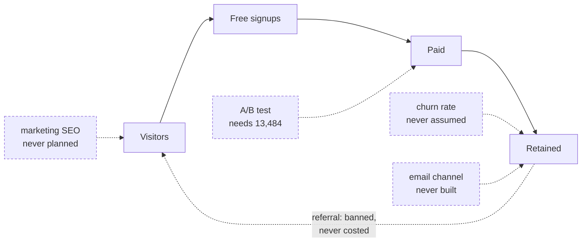
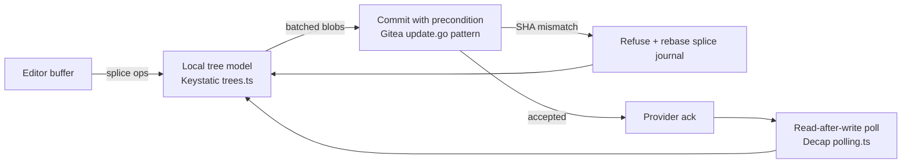
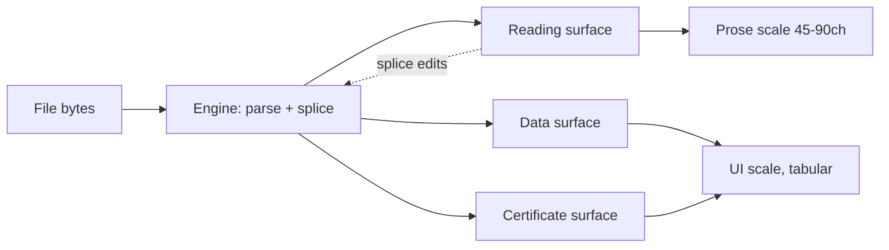
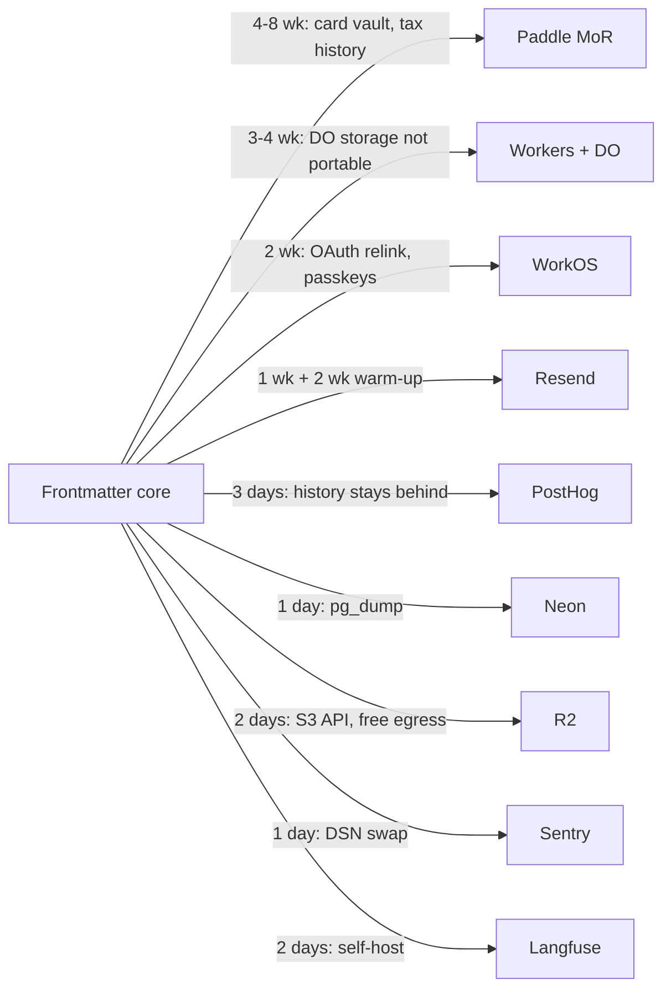
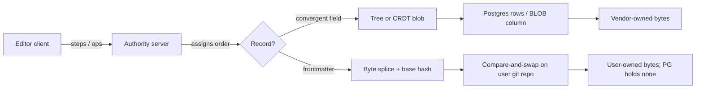
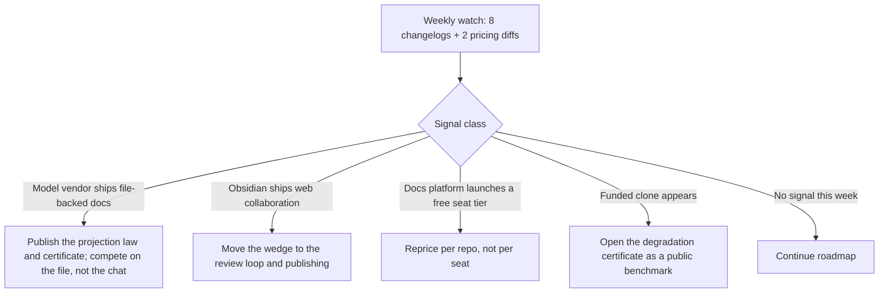
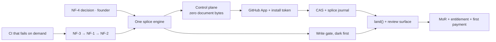

# REFERENCES — what to read, what to copy, what to buy

**Tier 1.** The output of the round-14 sweep: the codebases worth reading, the design work worth stealing from, the components we should buy rather than build, and what the sweep found we had never researched at all.

> Sections here are a **local** run. Cite as `REFERENCES §3`, never a bare `§3`.

---
## 1. What is still unresearched

The corpus is **105 agent reports across 13 rounds**, plus 16 PRD section drafts and 5 standing analyses — 126 `.md` files under `docs/research/` `[measured 2026-08-30: agent-reports-2026-08-28 35 · -r7 16 · -r8to10 29 · -r11 11 · -r12 14]`. Round 11's `c1-research-gap-audit.md` named 15 build-blocking gaps; Round 12's `k1`–`k14` closed fourteen of them. The one it did not close is gap #9, email and notifications `[measured: no `k` report covers it; PRD hits — `SPF` 0, `DKIM` 0, `DMARC` 1 (a GitLab DR anecdote), `transactional email` 0, `lifecycle email` 0]`. Everything below was found by grepping the PRD and the corpus for the vocabulary a topic cannot be discussed without, then reading the hits.

### 2.1 Coverage table

Status is assigned against the standard the corpus sets for itself elsewhere: a topic is COVERED when a named report or PRD section reaches a decision with dated primary sources and an anti-recommendation.

| # | Topic | Status | What exists | What is absent |
|---|---|---|---|---|
| 1 | Positioning, category naming | COVERED | §52, `e6`, `r4` | — |
| 2 | Launch channels | COVERED | §26, two funnels, channel-discipline rule | — |
| 3 | Content strategy **beyond launch** | PARTIAL | `i1`, `x1` describe the content *engine*; §26 sets cadence | No editorial map past week 8; no evergreen/pillar plan; no content→signup attribution. §26's own `[measured]` admission: two posts have ever shipped |
| 4 | SEO — **marketing site** | MISSING | `SEO` 4 hits in PRD, all naming-risk or AEO `[measured]` | No keyword map. Compounded by §27: `gray-matter` alone does 35.78M npm downloads/month `[fetched, per PRD]`, so the brand term is the substrate's generic name |
| 5 | SEO — published pages | MISSING | Named in §55.3 as never researched `[fetched]` | Sitemap, canonical, OG tags, custom-domain indexing policy. r11 ranked it #14 and R12 did not take it |
| 6 | AEO / GEO | PARTIAL | §13 L4 | Rests on the Princeton "25–40%" figure, `[SS]`, ranked the #1 public-embarrassment risk in §55.2 |
| 7 | Referral mechanics | MISSING | 1 hit in PRD, 2 files in corpus — both the ban `[measured]` | "No referral loop" appears in a banned-patterns list beside streaks and XP. Never costed against the 1.26M-visitor requirement |
| 8 | Affiliate / creator program | MISSING | `affiliate` 0 hits, PRD and corpus `[measured]` | — |
| 9 | Partnerships and integrations | MISSING | `partnership` 0 hits in PRD, 2 files in corpus `[measured]` | The "Open in frontmatter" bridge plugin is the named distribution play and gets one paragraph. No integration surface beyond it |
| 10 | The plugin/extension ban | PARTIAL | §46.2 quantifies the *saving*: 22.79% of Obsidian-equivalent forum traffic `[derived from measured]` | The cost is never quantified. §27 ranks community/ecosystem as **moat #1**; Obsidian's ecosystem *is* its plugin ecosystem. That tension is unexamined |
| 11 | Community | COVERED | §49.4, `k13` | — |
| 12 | Price levels, FX, rails | COVERED | §24, `c4`, `k14` | — |
| 13 | Pricing **experimentation** | MISSING | §24.2 says "A/B ₹249 and ₹399"; §24.3 says "Test ₹299 against ₹399" `[fetched]` | `sample size` 0, `significance` 0 in PRD; `A/B test` 0 files in corpus `[measured]`. No power analysis, no exposure unit, no stopping rule |
| 14 | Pricing page as a conversion surface | MISSING | 24 corpus files mention competitors' pricing pages `[measured]` | Our own is never designed: no tier-comparison layout, no annual toggle default, no FAQ, no objection handling |
| 15 | Trial vs freemium | PARTIAL | §25.2's benchmark table gives free-trial 8–12% vs freemium 3–5% `[fetched]` | The harder-converting model was chosen; no decision record explains why, and no reverse-trial variant was considered |
| 16 | In-product messaging | MISSING | §17 bans weekly digest, What's-New modal, trial countdown `[fetched]` | With no email field and no in-app channel, there is **no route to tell a user about a breaking change, a price change, or a security incident** |
| 17 | Refunds, EU right of withdrawal | MISSING | `refund policy` 0, `right of withdrawal` 0 `[measured]` | Directive 2011/83/EU Art. 16(m) removes withdrawal for digital content only where performance began with prior express consent *and* acknowledged loss of the right `[fetched 2026-08-30, EUR-Lex CELEX:32011L0083]`. That is a checkout-flow requirement, not a policy page |
| 18 | Retention definition | COVERED | §47.3, return-with-a-file | — |
| 19 | **Churn rate and steady state** | MISSING | §25.3: "Zero churn assumed" `[fetched]` | Every milestone in the plan is a gross-additions figure. No monthly-churn assumption exists anywhere |
| 20 | Cancel, downgrade, win-back | MISSING | §46.3 promises self-serve cancel as a *deflector*; `win-back` 0 hits `[measured]` | No exit survey, no pause option, no reactivation path |
| 21 | Expansion revenue | MISSING | `expansion revenue` 0 files, `net revenue retention` 0 files `[measured]` | Seat growth inside 2–20-person teams is the only compounding revenue mechanic in the B2B lane |
| 22 | Email infrastructure and deliverability | MISSING | r11 gap #9, never closed `[measured]` | Gmail requires SPF+DKIM+DMARC alignment, spam rate < 0.30% in Postmaster Tools, and one-click unsubscribe on subscribed mail; the 5,000/day tier adds DMARC as mandatory `[fetched 2026-08-30, support.google.com/a/answer/81126]`. Invites (§37.4), dunning (§45.5) and DSA Art. 17 statements of reasons (§44.1) are all email-delivered |
| 23 | ICP definition | COVERED | §21, `c3` | — |
| 24 | Self-serve B2B **motion** | PARTIAL | `c3` picks the 2–20 band and refuses enterprise | No team signup flow, no seat-add billing, no team trial, no first-week-of-a-team activation definition |
| 25 | Enterprise procurement | COVERED-as-refusal | `c3`; §55.4 sets the ACR/VPAT gate before any procurement conversation | Deliberate. The gate is stated |
| 26 | Security questionnaires / SOC 2 | PARTIAL | Vanta/Drata "$7,000–$30,000/yr" `[SS]`, flagged in §55.2 #8 | No plan for answering a questionnaire without a SOC 2, which is the actual solo-founder path |
| 27 | Contracts — ToS, DPA, MSA, SLA | PARTIAL | §51 is an issue list for counsel | No template source, no cost, no sequencing against first paid signup |
| 28 | Support tooling and deflection | COVERED | §46, `r6` — deflection plan, hire trigger, tooling priced | — |
| 29 | Billing operations, India | COVERED | §45, `k14` — RBI framework read paragraph by paragraph | — |
| 30 | Accounting and bookkeeping | MISSING | `bookkeep` 0, `accounting` 0 in PRD `[measured]` | §45.10 buys CA *hours*; no ledger system, no revenue recognition for annual plans, no MoR-payout-to-books reconciliation design |
| 31 | Insurance and liability transfer | MISSING | `insurance` 1 hit, and it is RBI's carve-out list `[measured]` | No professional indemnity, no cyber liability, no tech E&O, against a DPDP s.8(5) ceiling of ₹250 crore `[fetched, per §51.1]` |
| 32 | Hiring and contractor management | PARTIAL | §46.5 prices the hire and derives the trigger `[derived]` | `contractor` 0 hits `[measured]`. No IP-assignment clause, no PF/ESI, no appointment letter, no access-revocation runbook |
| 33 | **Founder time budget, aggregate** | MISSING | §53 gives throughput; §46 gives 23.97 h; §45.10 gives 28.3 h | Nobody has added them up |
| 34 | FX exposure | MISSING | `FX risk` 0, `hedge` 6 hits all unrelated `[measured]` | Revenue is INR-denominated at fixed price points; Cloudflare, Anthropic, Help Scout, Apple and the MoR all bill USD |
| 35 | Model-vendor concentration | PARTIAL | §50.1 has a risk row; §23.3 prices six models `[fetched]` | No second-source runbook, no contractual terms review, no plan for a mid-quarter price move |
| 36 | App-store distribution tax | MISSING | `App Store` 6 hits, all competitor context `[measured]` | Apple takes 15% under $1M/yr proceeds via the Small Business Program, 30% above, and 10% on EU alternative terms after year one `[fetched 2026-08-30, developer.apple.com/app-store/small-business-program]`. On ₹299 that is ₹44.85 against a ₹193.55 contribution `[derived]` |
| 37 | Competitive war-game | MISSING | `competitive response` 0, `war-game` 0 `[measured]` | §27 lists what erodes each moat and stops there |
| 38 | PPP pricing beyond India | MISSING | `PPP` 0, `purchasing power` 0 `[measured]` | One India tier, one world tier. Brazil, Indonesia, Nigeria, Vietnam are priced as the US |

### 2.2 MISSING, ranked by what it costs to discover late

Ranked by (irreversibility of the retrofit) × (months of work already committed when the truth arrives).

| Rank | Gap | Cost of late discovery | Cost of answering now |
|---|---|---|---|
| 1 | **Churn** | At 5% monthly churn, holding 5,675 paid users requires 284 paid additions/month, 5,675 free signups/month, **63,056 visitors/month, forever** `[derived: N = a/c; a = 0.05 × 5,675; free = a ÷ 0.05 conv; visitors = free ÷ 0.09]` — within 0.01% of the PRD's *cumulative* visitor requirement for the ₹1L/mo milestone. Discovered at month 12, it invalidates §25.3 and the roadmap it justifies | One afternoon of derivation, plus a decision to lead with annual |
| 2 | Email infrastructure | A cold sending domain warms over weeks. Discovered the day invites, dunning or a DSA statement of reasons must go out, it is an outage | Resend is $0/mo to 3,000 emails/month at 100/day, $20/mo to 50,000, $90/mo to 100,000 `[fetched 2026-08-30, resend.com/pricing]`. DNS records cost nothing |
| 3 | Founder time, aggregate | Post-deflection support 23.97 h + billing-ops 28.3 h at 10,000 users = **52.27 h/month, 32.7% of a 160-hour month, before engineering, content or incidents** `[derived from §46.3 and §45.10]`. Pre-deflection it is 108.75 h, 68% `[derived]` | Arithmetic already done above |
| 4 | Pricing experimentation feasibility | Detecting ₹299 vs ₹399 at a 4%→5% conversion difference needs **6,742 exposures per arm, 13,484 total** at α=0.05, 80% power `[derived, two-proportion z-test]` — more than the entire free-signup base at the ₹1L/mo milestone (5,675). A quarter spent waiting for significance that cannot arrive | Decide by price-sensitivity interview and cohort switch instead; cost is admitting the test is impossible |
| 5 | Partnership surface | The bridge plugin is the distribution play and lives under someone else's rules: commercial plugins are permitted **with README disclosure** of payment, account, network use and server-side telemetry, but **client-side telemetry is banned outright** and the Obsidian trademark may not be used confusingly `[fetched 2026-08-30, docs.obsidian.md/Developer+policies]` | One read, now done. The consequence — the acquisition channel cannot instrument its own funnel — is a measurement-design input, not a launch-day surprise |
| 6 | Refunds and withdrawal | Sits in the checkout flow and the ToS, both written once and referenced by every payment | One clause, drafted before the first paid signup |
| 7 | Insurance | Cover is not retroactive. Both India sources probed refused: icicilombard.com **HTTP 403**, godigit.com **HTTP 404** `[measured 2026-08-30]` — this remains verification debt, not a finding | A broker conversation |
| 8 | Incident and breaking-change channel | §17's no-email-field decision and §38's "status page within 15 min" obligation are in direct conflict. Retrofitting an email field after promising there is none is a trust event | Decide now that operational mail is a separate, consented channel from marketing mail |
| 9 | Accounting and revenue recognition | Annual plans create deferred revenue in year one; correcting the books afterwards is a CA-billed cleanup | Engage the CA before 1,000 customers, as §45.10 already recommends |
| 10 | App-store tax | Decides whether the mobile lane is a PWA or a native app, which is an architecture decision | One arithmetic pass against §23.2 |
| 11–14 | Marketing-site SEO · competitive war-game · PPP tiers · affiliate and referral | Each costs months of misallocated content or pricing work, none is irreversible | Days each |

- **Do this:** answer #1, #3 and #4 with arithmetic this week — all three are derivations over numbers the PRD already contains, and none needs a customer.
- **Anti-recommendation:** do not research #11–#14 before R0 ships. They are real gaps and they are all reversible; committing engine weeks to them is the failure mode this audit could easily cause.

### 2.3 Where the corpus is thin rather than absent

§55.2 already ranks 21 unverified claims by public embarrassment, and that list stands. These are different: places where a decision rests on a single un-adversarial source, and the PRD does not flag it.

| Claim | Weakness | What it is load-bearing for |
|---|---|---|
| "Median solo B2B founder revenue >4× B2C by month 24" | `[SS]`, no named study `[fetched, §55.2 #7]` | The entire two-motion strategy |
| Support deflection 18% / 40–60% / $25–35 per ticket | `[SS]`, single source `[fetched, §55.2 #6]` | B2B pricing at $99–249 |
| Vendor AI-deflection rates 73–76% | All `[fetched]` and all vendor self-reported; §46.4 already halves them to 38% | The $94.60/mo support-stack decision |
| Obsidian forum tag histogram as our ticket-mix prior | `[measured]` on the right corpus, but it is a *forum topic* distribution standing in for a *support ticket* distribution, and §46.2 says so | The entire 80.45 h/month wall |
| Relay's "172,544 downloads" as bridge-plugin precedent | `[SS]` `[fetched, §26]` | The primary distribution play |
| Craft India pricing ₹526.7–658.3 | `[fetched]` but single-IP, single-moment geo-price `[fetched, r11 c1]` | The "₹299 leaves money on the table" argument |
| §21.1's 0.02/0.10 tickets per user-month | Assumption stated once, then quoted as a conclusion twice `[fetched, §55.2 #13]` | Every founder-hour figure, including #3 above |
| WPSD north-star | Single-author construct, no external precedent opened, and §47.2 argues against it in its own text | The measurement plan |

### 2.4 The three questions that waste the most months

| # | Question | Why it dominates | How to answer without building |
|---|---|---|---|
| **Q1** | Does anyone pay for fidelity? | §50.2 already names it as a 4×5 risk `[fetched]`. What is unresearched is the *test*. R0 is ~9 weeks `[fetched, §28]` and everything downstream assumes the answer is yes | A priced landing page with the corpus result and a real checkout, run against HN and r/ObsidianMD, before R0 finishes. Cost: days |
| **Q2** | What monthly churn does the model survive? | The plan's spine is gross additions with churn set to zero `[fetched, §25.3]`. At 3% the ₹20L/mo milestone needs 37,833 visitors/month in perpetuity; at 7%, 88,278 `[derived]` | Derivation, then a structural response: lead annual, price the Work licence hard (90.3% contribution, no monthly churn surface `[fetched, §23.2]`) |
| **Q3** | Is any acquisition channel one we control? | HN is a one-shot; the Obsidian plugin is governed by another company's policy and forbids client-side telemetry `[fetched 2026-08-30]`; the brand term is the substrate's generic name `[fetched, §27]`. If all three are borrowed, the 1.26M cumulative visitors never arrive `[fetched, §25.3]` | Read the policies (done), then build one owned surface — docs and published-page SEO — into R0's scope rather than after it |

**Answering Q1 wrong is the only one of the three that cannot be recovered by working harder.**

### 2.5 What was checked and found genuinely complete

This audit went looking for holes in the following and did not find ones worth reporting. Each was opened and read, not inferred from the table of contents.

| Area | Why it passes | Adversarial check applied |
|---|---|---|
| Sync engine (§31, `k2`) | Three independent disqualifications for CRDTs, a convergence oracle, and a named failure-mode list | Looked for the missing offline story: §31.4 has it, and r11's `service worker` 0-hit complaint is closed |
| Backup and DR (§32, `k1`) | Leads with the finding that inverts the standard recipe — R2 has no object versioning — and states what each layer does *not* cover | Looked for an untested restore: §32.4 is a drill, not a policy |
| Support economics (§46, `r6`) | Rebuilds the PRD's own 46.4-hour figure to 80.45 and says the flat 12-minute assumption was the error | Looked for vendor-claim laundering: §46.4 halves the vendor rates explicitly |
| India billing (§45, `k14`) | RBI framework read by paragraph; the ₹15,000 ceiling treated as an architectural constant, not a price input | Looked for a US retry ladder copied into the India path: §45.5 forbids it by name |
| Observability (§38, `k6`) | A denylist of what may never enter telemetry, and a "never alert on" list with the source's own critique quoted | Looked for alert-fatigue design: §38.5 has the net-alert-count rule |
| Accessibility (§35, `k4`) | A measured live failure — `body-faint #b8b8b8` at 2.14:1 — not a checklist | Looked for a VPAT promise without a cost: §55.4 gates it behind an auditor |
| Evidence discipline itself | §0.1 tag definitions, §55 verification debt, §57 contradictions ledger, §58 a publication denylist | Looked for untagged numbers presented as measured: §55.2 #12 catches its own |

Three things this audit did **not** verify and is therefore not asserting: the India insurance market (both sources refused, above); whether any competitor has published churn for a markdown editor (not searched); and whether the 105 reports contain a partnerships discussion under vocabulary I did not grep for — the search was `partnership`, `integration`, `affiliate`, `referral`, `alliance` and the finding is an absence of those terms, which is weaker evidence than reading all 105.

---

## 2. Reference implementations — the codebases to read

### 22.1 How to read a licence before you read the code

All repository metadata in this section was read from `api.github.com` on **2026-08-30** [fetched]. Star counts and push dates move; the licence text moves rarely, and it is the field that decides whether a repo is a teacher or a trap.

Three contagion tiers apply to us specifically, because we ship a hosted SaaS *and* a desktop build:

| Tier | Licences | What it means for us | Rule |
|---|---|---|---|
| **Red — read-only** | AGPL-3.0, GPL-3.0, GPL-2.0 | AGPL reaches through the network: a hosted service built on modified AGPL code owes source to its users. GPL reaches through the desktop binary. | Read for architecture. Never paste a line. Never vendor a package. [inference] |
| **Amber — read the fine print** | BUSL-1.1 (Outline), AFFiNE EE, Any Source Available License 1.0 (Anytype) | Outline's Additional Use Grant forbids use "for a Document Service… a commercial offering that allows third parties… to access the functionality of the Licensed Work" [fetched, `outline/outline` LICENSE, 2026-08-30]. That is a description of our product. | Read-only, same discipline as Red, and do not depend on it operationally. |
| **Green — usable** | MIT, Apache-2.0, BSD-3-Clause, MPL-2.0 | Copy with attribution; MPL is file-level copyleft only. | Safe to lift patterns and, where sane, code. |

AFFiNE is split: everything outside `packages/backend` and `packages/common/native` is MIT, the backend is under the "AFFiNE Enterprise Edition (EE) license" requiring a paid subscription for production use [fetched, both LICENSE files, 2026-08-30]. Joplin defaults to AGPL-3.0-or-later with per-directory overrides — `packages/server` carries its own [fetched, `laurent22/joplin` LICENSE, 2026-08-30]. None of this is legal advice; the tiers are an engineering triage, and a lawyer confirms before anything ships.

### 22.2 The register

Stars / last push read 2026-08-30 [fetched]. "Learn" and "Avoid" are judgement calls on top of directory listings actually opened [inference].

| Repo | Stars | Last push | Licence | Tier | Stack | Learn (named subsystem) | Avoid |
|---|---|---|---|---|---|---|---|
| `go-gitea/gitea` | 57,676 | 2026-08-30 | MIT | Green | Go | `services/repository/files/update.go` — compare-and-swap file writes against a git tree | The whole forge; you want ~600 lines, not the app |
| `decaporg/decap-cms` | 19,327 | 2026-08-28 | MIT | Green | JavaScript | `packages/decap-cms-backend-github/` — browser-side commits via the GitHub Tree API, plus `polling.ts` for eventual-consistency waits | Its Redux/Immutable core; a decade of accreted state management |
| `sveltia/sveltia-cms` | 2,768 | 2026-08-30 | MIT | Green | Svelte/JS | `src/lib/services/backends/git/{github,gitlab,gitea,shared}` — the same problem solved cleanly a decade later, with a `shared/` layer that is the real lesson | Svelte-specific reactivity; port the boundary, not the runes |
| `Thinkmill/keystatic` | 2,326 | 2026-08-26 | MIT | Green | TypeScript | `app/trees.ts` + `app/object-cache.ts` + `app/shell/BatchCommits.tsx` — a client-side git tree model with content-addressed caching and batched multi-file commits | Its form/schema DSL; we are not a structured-content CMS |
| `payloadcms/payload` | 44,491 | 2026-08-29 | MIT | Green | TypeScript | `packages/payload/src/auth/getAccessResults.ts`, `executeAccess.ts`, `extractAccessFromPermission.ts` — field-level access resolved to a permission object per request | Its DB adapters and admin UI; our control plane holds zero document bytes |
| `tinacms/tinacms` | 13,764 | 2026-08-28 | Apache-2.0 | Green | TypeScript | `packages/@tinacms/graphql/src/{git,database,level}` — indexing a git repo into a queryable KV store without becoming the source of truth | The GraphQL layer; a schema API over markdown is a product we settled against |
| `estruyf/vscode-front-matter` | 2,539 | 2026-08-21 | MIT | Green | TypeScript | `src/parsers`, `src/panelWebView`, `src/listeners` — a panel UI driven entirely by the file on disk, no shadow model | VS Code webview plumbing; not portable |
| `silverbulletmd/silverbullet` | 5,956 | 2026-08-30 | MIT | Green | Rust + TypeScript | Its "Space" model: markdown pages as the only store, with a derived object/query index rebuilt from them [fetched README, 2026-08-30] | Space Lua — arbitrary client-side scripting is settled against |
| `jackyzha0/quartz` | 13,136 | 2026-08-18 | MIT | Green | TypeScript | Its transformer/emitter plugin pipeline over remark/rehype | Static-site concerns; render pipelines are already researched |
| `toeverything/blocksuite` | 5,997 | 2026-08-26 | MPL-2.0 | Green | TypeScript | Block-editor internals as an isolable package | The block model itself — it is a tree-of-record, which we settled against |
| `toeverything/AFFiNE` | 72,019 | 2026-08-28 | MIT + EE backend | Amber | TypeScript | Frontend/backend licence split as a commercial pattern | The backend, on both licence and architecture grounds |
| `outline/outline` | 40,380 | 2026-08-29 | BUSL-1.1 | **Amber — the grant excludes us by name** | TypeScript | `server/collaboration/{PersistenceExtension,AuthenticationExtension,ConnectionLimitExtension}.ts` — a Hocuspocus deployment that is honest about persistence, auth and connection caps | Everything; the licence makes this a museum visit |
| `laurent22/joplin` | 56,167 | 2026-08-30 | AGPL-3.0-or-later | Red | TypeScript | `packages/lib/services/synchronizer/` — `LockHandler.ts` (15.8 KB), `syncInfoUtils.ts` (23.3 KB), and eleven dedicated conflict/e2ee/revision test files | Copying anything; also its item-based sync model, which is not git |
| `siyuan-note/siyuan` + `siyuan-note/dejavu` | 46,053 / 67 | 2026-08-30 / 2026-08-23 | AGPL-3.0 | Red | TS + Go | DejaVu: "Git-like version control, file deduplication in chunks, data compression, AES encrypted" cloud sync, entities keyed by SHA-1 [fetched README, 2026-08-30] | Its stated limits — no folders, no permission attributes, no symlinks — and the whole block-kernel model |
| `logseq/logseq` | 44,687 | 2026-08-29 | AGPL-3.0 | Red | Clojure | The file-is-truth-but-we-also-have-a-DB tension, and what it cost them | Their DB-version migration; a cautionary tale, not a template |
| `TriliumNext/Trilium` | 37,634 | 2026-08-30 | AGPL-3.0 | Red | TypeScript | Note attributes and inheritance | Everything else; it is not markdown-first |
| `docmost/docmost` | 21,514 | 2026-08-29 | AGPL-3.0 | Red | TypeScript | `apps/server/src/collaboration/` — the smallest readable Yjs-server deployment (gateway, handler, adapter, processors) | The CRDT for document bytes; settled against |
| `hedgedoc/hedgedoc` | 7,386 | 2026-08-28 | AGPL-3.0 | Red | TypeScript | `backend/src/permissions`, `backend/src/revisions`, `backend/src/api-token` — clean NestJS module boundaries for exactly our three hard control-plane problems | Its realtime layer |
| `standardnotes/app` | 6,612 | 2026-08-25 | AGPL-3.0 | Red | TypeScript | E2EE key rotation and the protocol-version upgrade path | Their editor; encryption forecloses server-side AI |
| `Zettlr/Zettlr` | 13,451 | 2026-08-29 | GPL-3.0 | Red | TypeScript | `source/common/modules/markdown-editor/` — a serious CodeMirror 6 markdown build with `parser/`, `renderers/`, `linters/`, `table-editor/` as separate concerns | Copying; GPL reaches our desktop binary |
| `AppFlowy-IO/AppFlowy` | 76,077 | 2026-08-28 | AGPL-3.0 | Red | Dart + Rust | Rust-core / thin-client split | The Notion clone surface |
| `streetwriters/notesnook` | 14,482 | 2026-08-29 | GPL-3.0 | Red | TypeScript | Cross-platform packaging discipline | Copying |
| `anyproto/anytype-ts` | 8,724 | 2026-08-29 | Any Source Available 1.0 | Amber | TypeScript | Local-first identity | Non-commercial-only grant; do not read while implementing |

### 22.3 The ranked six, and the file to open first

1. **`go-gitea/gitea` — `services/repository/files/update.go`.** Open at line 380. `if file.SHA != "" { if file.SHA != fromEntryIDString { return ErrSHADoesNotMatch }}`, then the `LastCommitID` branch at 389 that calls `FileChangedSinceCommit`, then `ErrSHAOrCommitIDNotProvided` at 349 — a hard refusal to write without a precondition [fetched, `main`, 2026-08-30]. That is our compare-and-swap, already debugged by a forge with 57,676 stars. Read `temp_repo.go` (13.9 KB) next for how it stages a tree without a working copy. *Anti-recommendation: do not read `routers/web/repo/editor.go` for the pattern — the HTTP layer will pull you into Gitea's context objects.*

2. **`Thinkmill/keystatic` — `packages/keystatic/src/app/trees.ts` (7.2 KB), then `shell/BatchCommits.tsx` (10.6 KB).** This is the closest existing thing to our client: a browser holding a git tree, diffing local edits against it, and committing several files atomically. `object-cache.ts` (4.8 KB) is the content-addressed blob cache we will otherwise invent badly [fetched listing, 2026-08-30]. *Anti-recommendation: `ItemPage.tsx` is 31.7 KB of schema-form UI. Skip it entirely; it solves a problem we chose not to have.*

3. **`sveltia/sveltia-cms` — `src/lib/services/backends/git/shared/`, before any provider directory.** Four providers (`github`, `gitlab`, `gitea`, plus `fs`) forced a shared abstraction, and reading the shared layer first tells you which operations are genuinely provider-independent [fetched listing, 2026-08-30]. Then `backends/save.js` (5.7 KB) with its 28 KB test file — the test file is the specification. *Anti-recommendation: do not read Decap first and Sveltia second; Decap's ten years of Redux will contaminate your model of what is essential.*

4. **`payloadcms/payload` — `packages/payload/src/auth/getAccessResults.ts`.** We need a permission model over documents whose bytes we do not store, which means permissions attach to paths and repos, not rows. Payload resolves access to a serializable permission object per request rather than scattering checks — `executeAccess.ts`, `extractAccessFromPermission.ts`, `defaultAccess.ts` [fetched listing, 2026-08-30]. MIT, so this one can be copied. *Anti-recommendation: ignore `packages/payload/src/auth/sessions.ts` and the DB adapters; our control plane is Postgres-only by design.*

5. **`decaporg/decap-cms` — `packages/decap-cms-backend-github/src/polling.ts` (12.6 KB).** Not the commit code — the *waiting* code. A browser that commits to GitHub must then survive GitHub's read-after-write lag, and 12.6 KB of dedicated polling is the honest measure of that problem [fetched, 2026-08-30]. `API.ts` is 65.5 KB and should be skimmed for its Tree API usage only. *Anti-recommendation: `GraphQLAPI.ts` (21.5 KB) is a partial migration that was never finished; it will mislead you about which API to use.*

6. **`hedgedoc/hedgedoc` — `backend/src/permissions/`, then `backend/src/revisions/`, then `backend/src/api-token/`.** AGPL, so read-only, but the module decomposition is the cleanest small example of the three control-plane subsystems we need and it is written in a stack we can restate from scratch [fetched listing, 2026-08-30]. *Anti-recommendation: `backend/src/realtime/` — it is a websocket document model, which is the architecture we settled against.*

### 22.4 Subsystem to best reference

| Our subsystem | Best reference | Why it wins | Second opinion |
|---|---|---|---|
| Compare-and-swap write to git | Gitea `files/update.go` [fetched] | Refuses the write without a precondition, rather than warning | Keystatic `BatchCommits.tsx` for the multi-file case |
| Browser-side git tree model | Keystatic `app/trees.ts` [fetched] | Tree + content-addressed cache, no server round-trip per node | Sveltia `backends/git/shared` |
| Read-after-write consistency | Decap `polling.ts` [fetched] | Only implementation that treats provider lag as a first-class state | — |
| Multi-provider git abstraction | Sveltia `backends/git/shared` [fetched] | Four providers, so the abstraction is falsified not assumed | Decap's `implementation.tsx` |
| Permission model (control plane) | Payload `getAccessResults.ts` [fetched] | Access resolves to data, not scattered guards; MIT | HedgeDoc `backend/src/permissions` (AGPL, read-only) |
| Splice journal / conflict semantics | Joplin `synchronizer/LockHandler.ts` + `Synchronizer.conflicts.test.ts` [fetched] | Twelve years of conflict edge cases, encoded as tests | DejaVu's SHA-1 index model |
| Content-addressed snapshot store | `siyuan-note/dejavu` [fetched README] | Chunked dedup + index-per-operation, in 67-star readable Go | — |
| CodeMirror 6 markdown surface | Zettlr `markdown-editor/` [fetched] | `parser/`, `renderers/`, `linters/`, `table-editor/` cleanly separated | Front Matter's `panelWebView` for panel-follows-file |
| Derived index over files-of-record | TinaCMS `@tinacms/graphql/src/{database,level}` [fetched] | Indexes git without claiming to own it | SilverBullet's Space objects |
| Licence-split commercial model | AFFiNE MIT + EE backend [fetched] | The exact split we would use if we ever open a client | Outline BUSL — as a cautionary example |

### 22.5 The git-backed editor problem, specifically

Almost nothing solves it end to end. Three repos solve pieces, and the pieces compose:

The unusual part of our design — that the file is the only source of truth and the server stores none of its bytes — has exactly two prior implementations at product scale: **Keystatic and Sveltia both put the git tree in the browser and let the user's own credentials do the writing, which is our architecture with a CMS-shaped UI on top** [fetched listings, 2026-08-30]. Keystatic is the closer relative because it models the tree explicitly; Sveltia is the better-factored one. Neither does byte-preserving splices — both write whole files — so the splice journal is genuinely ours to build, and Joplin's conflict test suite is the nearest thing to a specification for the failure modes [fetched, eleven test files under `packages/lib/services/synchronizer/`, 2026-08-30].

One dead end worth knowing: `netlify/git-gateway` (431 stars, MIT, Go) is the credential-proxy pattern that lets a browser commit without holding a token, and it has been unmaintained for **838 days** [fetched 2026-08-30; derived: 2026-08-30 − 2024-05-14]. The pattern is right and the code is abandoned; read it in an afternoon, do not deploy it.

### 22.6 Anti-recommendations — repos that look relevant and will mislead

| Repo | Why it looks relevant | Why it will mislead |
|---|---|---|
| `outline/outline` | Best-in-class collaborative document editor, TypeScript, readable | Its BUSL Additional Use Grant names "a Document Service" as the excluded use [fetched LICENSE, 2026-08-30]. Reading it while building a competing document service is the worst possible evidentiary posture. |
| `dendronhq/dendron` | Markdown-first, git-backed, Apache-2.0 — sounds ideal | **290 days** since last push [derived, 2026-08-30 − 2025-11-13]. Its architecture reflects a product that stopped; you would inherit its dead ends without its living corrections. |
| `prose/prose` | The original browser git-backed markdown editor | **921 days** stale [derived, 2026-08-30 − 2024-02-21]. Predates the GitHub Tree API patterns everything current uses. |
| `AppFlowy-IO/AppFlowy` | 76,077 stars, Rust core, local-first | It is a Notion-style workspace with databases and boards. AGPL, and every architectural decision serves a product we explicitly are not building. |
| `toeverything/blocksuite` | MPL-2.0, so legally usable, and a real editor engine | Block-tree-of-record is the model we settled against. Adopting it would silently reintroduce a tree of record through the editor layer. |
| `logseq/logseq`, `siyuan-note/siyuan`, `TriliumNext/Trilium` | Large, active, file-adjacent | All AGPL; all resolved the file-versus-database tension *toward the database*. Read Logseq's DB migration as a warning, not a design. |
| `Milkdown/milkdown`, `Vanessa219/vditor`, `marktext/marktext` | Markdown editors with stars | Libraries and a desktop app, not products with a sync engine, permission model, or control plane. Out of scope for this section by construction. |
| `obsidianmd/obsidian-releases` | The plugin ecosystem to learn from | It is a submission registry for a closed-source host. There is no engine to read, and a plugin marketplace is settled against. |
| `AFFiNE` backend | Same problem space, active | EE-licensed: production use requires an AFFiNE subscription [fetched, `packages/backend/server/LICENSE`, 2026-08-30]. Read the frontend split, not the server. |
| `docmost/docmost`, `hedgedoc/hedgedoc` realtime | Small, modern, readable Yjs servers | They will make CRDT-for-document-bytes feel inevitable. It is not; read their permission and revision modules and close the tab before `collaboration/`. |

---

## 3. Design references and the visual language

### 23.1 The reference set

Every row below was opened with `curl` on 2026-08-30 (the visual-pattern MCP was gate-refused; `curl` was not — tested before concluding, per the rule that a blocked tool is one tool's policy). Star counts and versions are from `api.github.com` and `registry.npmjs.org` the same day.

| Reference | URL | What it is evidence for | Live state read 2026-08-30 |
|---|---|---|---|
| Vercel Geist | vercel.com/geist | Content rules for dense UI, empty-state taxonomy, named type scale | Active docs; theme switcher system/light/dark [fetched] |
| GitHub Primer | primer.style/product | Empty-state anatomy; `DataTable`; UI-pattern layer above components | `primer/react` 3,895★, MIT, pushed 2026-08-28 [fetched] |
| Shopify Polaris | polaris.shopify.com | What happens when you depend on a vendor system | `Shopify/polaris` → redirects to `Shopify/polaris-react-archive`, 6,172★; `@shopify/polaris` frozen at 13.9.5, published 2025-03-26 [fetched] |
| Atlassian Design System | atlassian.design | A mature system still hedging on tables | Ships `Dynamic table`; its plain `Table`, `Page`, `Drawer`, `Inline dialog` are all labelled **Caution** [fetched] |
| IBM Carbon | carbondesignsystem.com | The only system publishing exact table density numbers | 9,394★, Apache-2.0, pushed 2026-08-30 [fetched] |
| Radix Primitives / Colors | radix-ui.com | Unstyled behaviour; a 12-step colour scale with role bands | Primitives 19,222★, MIT, pushed 2026-08-08 [fetched] |
| shadcn/ui | ui.shadcn.com | Copy-in distribution instead of a runtime dependency | 122,549★, MIT, pushed 2026-08-30 [fetched] |
| TanStack Table / Virtual | tanstack.com | Headless table behaviour, actively maintained | `@tanstack/react-table` 9.2.4 published 2026-08-28; Virtual 7,089★ [fetched] |
| Glide Data Grid | github.com/glideapps/glide-data-grid | Canvas-rendered grid at spreadsheet scale | 5,322★, MIT, last pushed 2026-01-21 [fetched] |
| CodeMirror 6 | codemirror.net | The editing surface itself | `@codemirror/view` 6.43.9 published 2026-08-16, MIT [fetched] |
| cmdk | github.com/dip/cmdk | Command palette — and a maintenance warning | 12,926★, MIT, last pushed 2025-10-29; npm 1.1.1 from 2025-03-14 [fetched] |
| iA Writer | ia.net | Typography as the product | Mac $49.99 / Windows $29.99 / iOS $49.99, one-time per platform; "One Time ≠ Lifetime" [fetched] |
| Obsidian | obsidian.md/pricing | Local-file positioning and a paid-sync ladder | Free, no sign-up; Sync $4/user/mo annual; Publish $8/site/mo annual; Commercial $50/user/yr [fetched] |
| Craft | craft.do/pricing | Block-metered freemium (INR shown from an India IP) | Plus ₹526.7/mo yearly; free tier capped at 1,500 blocks, 1 GB, 25 MB media [fetched] |
| Notion | notion.com/pricing, developers.notion.com/reference/block | The block-of-record model, stated in its own API | Plus $10/member/mo; every block carries `id`, `parent`, `created_by`, `has_children`, `in_trash` [fetched] |
| Butterick, *Practical Typography* | practicaltypography.com/line-length.html | Measure | "45–90 characters… two and three alphabets on a line" [fetched] |
| NN/g, Kaplan (2021-09-19) | nngroup.com/articles/empty-state-interface-design | Empty states as system status, not decoration | "Totally empty states cause confusion" [fetched] |
| WCAG 2.2 SC 1.4.3 | w3.org/WAI/WCAG22/Understanding/contrast-minimum | Contrast floor, both themes | 4.5:1 body, 3:1 large text [fetched] |
| Stripe Apps | docs.stripe.com/stripe-apps/design | Constrained component grammar for third parties | Ships "component hierarchy constraints" and prop validation [fetched] |

`ag-grid.com/license-pricing` returned HTTP 403 from CloudFront [measured] — no AG Grid price is stated in this section, and none should be quoted from memory.

### 23.2 Visual principles, derived

| # | Principle | Derived from | Anti-recommendation |
|---|---|---|---|
| 1 | Two type systems in one shell: a reading surface bound by measure, an app surface bound by density | Geist separates `text-copy-*` ("multiple lines… higher line height") from `text-label-*` ("single-lines"), and calls Label 14 "the most common text style of all" [fetched]; Butterick's 45–90ch governs prose only [fetched] | Do not run one modular scale everywhere; a 16px/1.6 body style inside a 40px table row wastes a third of the viewport |
| 2 | Absence is typed, never coerced | Geist Table: "Render — in cells where a value is unknown or not applicable. Don't substitute N/A, null, or an empty string" [fetched]; Primer names three distinct empty causes — never used, temporarily empty, error [fetched] | Do not let a missing frontmatter key, an unparseable value, and a value that is genuinely empty render identically |
| 3 | Every control states the byte effect before it runs | Geist: sortable headers "are buttons… announce the next sort state" [fetched]; the engine's splice edits are reversible only if the user knew what moved [inference] | Do not silently normalise on save — no reflowing tables, no rewriting `*` to `-`, no reordering frontmatter keys as a side effect of a UI action |
| 4 | Borrow tokens and behaviour; do not take a runtime dependency on a design system | Polaris React is archived and its npm package has not moved since 2025-03-26 [fetched]; cmdk has not been pushed since 2025-10-29 [fetched]; shadcn states "This is not a component library. It is how you build your component library" [fetched] | Do not `npm i` a vendor's component layer for a product with a ten-year file-format promise |
| 5 | Density is a user setting with published numbers | Carbon publishes five row heights: xs 24, sm 32, md 40, lg 48, xl 64 px, with a 48px toolbar paired to lg/xl [fetched] | Do not ship a single comfortable density and call it opinionated; a 300-row frontmatter table at 48px is 14,400px tall [derived: 300 × 48] |
| 6 | Contrast floor is a hard gate in both themes | WCAG 2.2 SC 1.4.3: 4.5:1 body, 3:1 large [fetched]; Radix ships paired light/dark scales with a documented "Accessible text" band at steps 11–12 [fetched] | Do not use a 3.0:1 grey for secondary metadata because it photographs well |
| 7 | Keyboard parity before visual polish | Geist ships a `Command Menu` primitive; Linear publishes a whole method site on building practice [fetched] | Do not make the palette the only route to an action — Geist's own rule is that a CTA "must be a real Button or Link, not an onClick div, so it joins the tab order" [fetched] |

### 23.3 Component inventory, mapped to a reference implementation

Claude implements each of these from the reference's *documented behaviour*, not from its package.

| Component | Reference implementation | Why that one | Anti-recommendation |
|---|---|---|---|
| Text editing surface | CodeMirror 6, `@codemirror/view` 6.43.9 [fetched] | Byte-offset native; decorations do not own the document | Not Lexical (23,813★) or Tiptap (38,197★) [fetched] — both centre a node tree, which is the settled-out model |
| Command palette | cmdk's list/filter semantics, reimplemented | The behaviour is right; the package is 10 months stale [fetched] | Do not adopt cmdk as a dependency |
| Empty state | Geist `Empty State` variants: blank-slate, informational, educational, guide, plus no-results / cleared / permission / error [fetched] | It is the only public taxonomy that separates "no rows after filtering" from "nothing created yet" | Geist's own rule: "Cap at one primary CTA… Three CTAs is a smell" [fetched] |
| Data table | TanStack Table 9.2.4 headless + Geist content rules + Carbon density scale [fetched] | Behaviour, prose, and metrics from three sources that each do one well | Do not adopt a grid product; see §23.5 |
| Row virtualisation | TanStack Virtual, 7,089★ MIT [fetched] | Required above ~200 rows | Do not virtualise the prose editor's document; CodeMirror already does viewport rendering |
| Key/value metadata block | Geist `Description` — explicitly not a two-column table [fetched] | Frontmatter on a document page is metadata, not a dataset | Do not render single-document frontmatter as a table |
| Row-with-one-action | Geist `Entity` [fetched] | Repos, integrations, collaborators | Do not use a table when only one column is comparable |
| Relative time | Geist `Relative Time Card`: `2m ago` up to 7 days, then `Mar 14, 2026` [fetched] | Journals and diffs are time-dense | Never show "3 months ago" where a date matters for a legal or audit read |
| Truncation | Geist `MiddleTruncate` [fetched] | Paths and branch names differ at the tail | Do not tail-ellipsis a file path |
| Status | Geist `Status Dot` + Primer `StateLabel` [fetched] | Certification results are enumerable states | Do not encode state in colour alone |
| Diff / degradation report | Primer `DataTable` + its "Degraded experiences" UI pattern [fetched] | Primer is the only system with a named pattern for a knowingly reduced experience | Do not present a degradation certificate as an error toast |
| Blank/loading | Primer `SkeletonText` / `SkeletonBox`, Geist `Skeleton` [fetched] | Only for network-bound views | Never skeleton a local file read; see §23.8 |
| Colour tokens | Radix 12-step role bands: 1–2 backgrounds, 3–5 interactive, 6–8 borders, 9–10 solid, 11–12 accessible text [fetched] | Roles survive a palette change | Do not hand-pick hexes per component |
| Numeric/mono type | Geist Mono or `tabular-nums`, per Geist's table rule [fetched] | Digit alignment across rows | Do not set a whole table in mono to get aligned digits |
| Overlays, menus, focus | Radix Primitives 19,222★ MIT [fetched] | Focus trapping and typeahead are where hand-rolled UI fails | Do not hand-roll a focus trap |

### 23.4 Typography and spacing for the reading surface

The reading surface and the app surface disagree about almost every value, and the disagreement is the design.

| Decision | Reading surface | App surface | Source |
|---|---|---|---|
| Measure | 45–90 characters; target ~68ch, hard cap 90ch | full width, column-bounded | Butterick, 45–90 or 2–3 alphabets [fetched] |
| Face | Duospace-class for source view; proportional for the projection | one UI sans; mono only in numeric columns and code | iA built Writer Mono/Duo/Quattro on IBM Plex, keeping "large word spacing and monospaced punctuation" [fetched, article dated 2018-12-14] |
| Why duospace | Markdown source is punctuation-load-bearing: `#`, `-`, `|`, `>`, `` ` `` must align down the left edge and inside table pipes; full mono taxes prose, full proportional breaks the pipes | n/a | [inference] from iA's stated rationale for Duo/Quattro [fetched] |
| Size | 16–17px body | 14px default, 13px secondary | Geist names Label 14 "the most common text style of all" and Label 13 for "a secondary line" [fetched] |
| Line height | ~1.6 | ~1.45 single-line, 1.3 in table cells | Geist splits Copy (higher line height, multi-line) from Label (single-line) [fetched] |
| Numerals | proportional in prose | `font-variant-numeric: tabular-nums` in every numeric column | Geist: "Apply tabular-nums (or Geist Mono) to numeric columns so digits align across rows" [fetched] |
| Vertical spacing | derived per markdown block type; paragraph gap ≈ 0.75 × line-height | 4px base unit; Carbon's `$spacing-05` = 16px, `$spacing-09` = 48px [fetched] | [derived] |

The one hard constraint the file model imposes: vertical spacing in the editor must be a pure function of block type, because the same bytes must produce the same layout on every device. Quantising paragraph gaps to an 8px grid looks tidy in a static comp and produces visible drift the moment a heading's line-box rounds differently at 1.25× zoom [inference].

**Set the source view in a duospace face and the projection in a proportional one, and never let a font change alter a byte offset the splice engine depends on.**

### 23.5 The dense-table problem

Most design systems are bad at this, and several admit it. Atlassian ships `Dynamic table` alongside a plain `Table` marked *Caution* [fetched]. Carbon's own guidance says not to use a data table "as a replacement for a spreadsheet application" [fetched]. Polaris's React table implementation is in an archive repo [fetched].

Who does it well, and what they actually do:

| Who | What they do that others do not | Read |
|---|---|---|
| IBM Carbon | Publishes the metrics: five row heights (24/32/40/48/64px), checkbox 20px, cell padding 16px, expanded-panel left padding 48px, and a per-release accessibility test status (default state, advanced states, screen reader, keyboard) | [fetched] |
| Vercel Geist | Publishes the *content* rules, which is the part everyone skips: em dash for unknown values; Title Case noun headers (`Last Used`, `Requests (7d)`); `Page 2 of 7` or `21–40 of 142` with an en dash; empty state rendered outside `Table.Body`, never as an empty body | [fetched] |
| TanStack Table | Headless — sorting, grouping, column sizing, pagination as state, zero markup. 9.2.4 published two days before this was read | [fetched] |
| Glide Data Grid | Canvas rendering, which is the only way past a few thousand visible cells; 5,322★ MIT, but last pushed 2026-01-21 — seven months quiet | [fetched] |
| Primer | A `Degraded experiences` UI pattern sitting above the table components, so a partial data load has a designed presentation rather than an error | [fetched] |

The recommendation: compose Carbon's density numbers, Geist's content rules, and TanStack Table's headless state, rendered as DOM until a measured frame budget is missed, and only then evaluate canvas. The anti-recommendation is the obvious move — adopting a commercial grid. It buys column virtualisation and pivoting that this product does not need, and it takes ownership of the one surface where the product's differentiation lives: the mapping from a cell back to a byte range in a file. AG Grid's pricing page was unreachable for verification [measured], which is itself a reason not to design a dependency around it in a section a founder will build from.

### 23.6 Dark mode

It matters, and the cost is bounded if it is a token swap rather than a second design.

| Question | Answer | Evidence |
|---|---|---|
| Do the references treat it as default-tier? | Yes. Geist's docs expose system/light/dark; Primer offers a dark-mode switch; Radix ships paired light and dark 12-step scales; Obsidian's community theme ecosystem is dark-dominant | [fetched] |
| Does the contrast floor change? | No. SC 1.4.3's 4.5:1 / 3:1 applies identically | [fetched] |
| What is the actual work? | One token set with role bands (Radix 1–2 background, 6–8 border, 11–12 text; Geist's parallel 1–3 backgrounds, 4–6 borders, 9–10 text and icons), redefined once per theme | [fetched] |
| Where does it break? | Syntax highlighting, diff colours, and the degradation certificate's pass/warn/fail semantics must be re-derived per theme, not filtered | [inference] |
| Where does it not apply? | Print, PDF export, and shared read-only links default to light regardless of the viewer's theme | [inference] |

Anti-recommendation: do not implement dark mode as a CSS filter or a colour inversion, and do not use pure `#000` with pure `#fff` text — Geist defines two distinct background tokens with "Background 2… used sparingly when a subtle background differentiation is needed" precisely because a single flat extreme leaves no room for elevation [fetched]. Also do not define any colour *only* inside a `prefers-color-scheme` block; the light palette is the base and dark redefines a subset.

### 23.7 What not to copy from Notion

Notion's API states the model plainly: "A block object represents a piece of content within Notion," each carrying `id`, `parent`, `created_by`, `last_edited_by`, `has_children`, and `in_trash` [fetched]. That is a tree of record with server-assigned identity — the exact model this product has settled against. The UI affordances are not separable from it.

| Notion move | Why it fails here |
|---|---|
| Per-block drag handle and hover-revealed block menu | It advertises that blocks are addressable objects with identity. Here a "block" is a byte range that renumbers when the line above it changes [inference] |
| Slash menu that inserts a block *type* | The correct affordance inserts markdown *text* the user could have typed. A menu that inserts an object the user cannot type breaks the promise that the file is the source of truth [inference] |
| Page properties as a database row UI | Frontmatter is an ordered YAML mapping whose key order and comments are preserved bytes; a properties panel that reorders or re-types keys on save silently violates the splice contract [inference] |
| Toggle blocks, column layouts, synced blocks | None has a stable markdown byte representation; every one of them creates content that cannot round-trip [inference] |
| Everything-is-a-page nesting | Files and folders already have a hierarchy, and it is the user's git repo [inference] |
| Cover images and per-page emoji identity | Emoji render differently across OS and font versions and are a control-surface failure in any exported or printed artefact [inference] |

What to take instead: the *speed* of Notion's block manipulation — arrow-key movement, `Cmd+Shift+↑/↓` to move a line or list item, backspace-at-start to outdent. Those are text operations with exact byte semantics, and they are the reason Notion feels fast [inference].

### 23.8 Anti-recommendations: moves that photograph well and fail in daily use

| Move | Why it survives a screenshot | What breaks by week two |
|---|---|---|
| Hover-revealed row actions | Screenshots are captured mid-hover | Zero discoverability, no touch equivalent, no tab stop — Geist requires the CTA "be a real Button or Link… so it joins the tab order" [fetched] |
| Icon-only toolbar | Clean | Every icon becomes a memory test; Geist's table rule is that headers are "Title Case nouns or noun phrases… Never sentences" — words, not glyphs, carry meaning in dense UI [fetched] |
| Low-contrast secondary text | Photographs as refined | Fails SC 1.4.3's 4.5:1 and is unreadable on a laptop outdoors [fetched] |
| Skeleton loaders everywhere | Implies speed | A local file read completes in under a frame; a skeleton adds a mandatory flash of fake content. Reserve skeletons for network-bound views [inference] |
| Animated page transitions between documents | Looks expensive | At 30 document switches an hour, a 250ms transition costs 7.5 seconds an hour of pure waiting [derived: 30 × 0.25s] |
| Command palette as the primary path | One screenshot shows the whole product | Nothing is discoverable to a new user; the palette should be the fast path to actions that also exist in the UI [inference] |
| Auto-hiding sidebar | Maximises the canvas in a comp | Position becomes unpredictable; users lose the file tree they came for [inference] |
| Full-bleed gradient app chrome | Marketing-ready | Competes with the document for attention on every session; Geist's whole background system is two near-neutral tokens [fetched] |
| Toast on every save | Reads as responsive | Byte-preserving autosave fires constantly; the correct signal is a persistent state indicator, not an interruption. Geist: "Don't put critical persistent warnings" in transient surfaces [fetched] |
| Infinite scroll on a data table | Feels modern | No end-of-list, no position, no shareable page. Geist specifies `Page 2 of 7` / `21–40 of 142` [fetched] |
| One comfortable density | Consistent-looking | Power users hit the viewport ceiling immediately; Carbon ships five row heights for this reason [fetched] |
| Emoji as status or control icons | Colourful, free | Renders differently per OS, font version, and export target; use a single inline-SVG icon set with the vector in the markup [inference] |
| Celebration animation on completion | Delightful once | Delightful zero times on the two-hundredth document [inference] |

The one move worth the screenshot cost: an empty state that does real work. NN/g's finding is that intentionally designed empty states "communicate system status, increase learnability… and provide direct pathways for key tasks," while totally empty states "cause confusion and decrease user confidence" [fetched, Kaplan 2021-09-19] — and Primer's rule is that when the emptiness is an error, "the graphic should not attempt to bring delight" [fetched].

---

## 4. Build versus buy, component by component

### 24.1 The decision table

Scale assumption throughout: **1,000 registered users, 8% paid, $12/mo ARPU → $960 MRR** [derived, §24.2]. Founder-weeks assume Claude as the implementer at roughly 3× a human's line rate but the same review and debugging burden, so a "week" is a week of *your* attention, not of typing. All prices read 2026-08-30 unless stated.

| # | Component | Verdict | Vendor and price at our scale | Build cost | Switching cost later | Reason |
|---|---|---|---|---|---|---|
| 1 | Auth | BUY | WorkOS AuthKit — free up to 1M users, then $2,500/mo per additional 1M; SSO connections $125/ea (1–15) [fetched workos.com/pricing] | 5 wk | 2 wk — export users, re-link OAuth, re-enrol passkeys | Free to a million users, and the SSO/SCIM path the self-serve B2B tier needs already exists |
| 2 | Payments + MoR | BUY | Paddle — 5% + 50¢ per checkout transaction, no monthly fee [fetched paddle.com/pricing]. Alt: Polar — Starter 5% + 50¢, Pro $20/mo at 3.8% + 40¢, international +1.5%, $15/dispute [fetched docs.polar.sh/merchant-of-record/fees] | 14 wk + registrations | 4–8 wk, plus card-vault migration and churn | An India-domiciled seller taking global consumer cards inherits VAT/GST/sales-tax registration in ~100 jurisdictions; MoR is the only lawful shortcut |
| 3 | Email (transactional) | BUY | Resend — Free 3,000/mo (100/day, 3 domains); Pro $20/mo 50,000 emails, overage $0.90/1,000; Scale $90/mo 100,000; dedicated IP $30/mo [fetched resend.com/pricing] | 4 wk + reputation | 1 day to swap, 2 wk DKIM/IP warm-up | Deliverability is a reputation asset you cannot build in software |
| 4 | Email (marketing) | BUY, deferred | Loops — free to 4,000 sends/mo, priced on subscribed contacts, sending not metered separately [fetched loops.so/pricing] | 3 wk | 1 day (CSV) | Sequences are worth nothing until there is a funnel to sequence |
| 5 | Error tracking | BUY | Sentry Developer $0 (one user, 5k errors); Team $26/mo billed annually — 50k errors, 5 GB logs, 50 replays, 1 uptime + 1 cron monitor; PAYG errors 50K–100K at $0.0003625 each [fetched sentry.io/pricing] | 6 wk | 1 day (DSN swap) | Solo founder = one seat = the free tier is the correct tier for a year |
| 6 | Uptime + status page | BUY | Better Stack — free plan includes 10 monitors; paid tiers observed from $29 [fetched betterstack.com/uptime/pricing; the plan grid is JS-rendered and only partly readable]. OSS alt: OpenStatus, AGPL-3.0, 9,032★, pushed 2026-08-29 [fetched] | 2 wk | 1 day | A status page hosted on your own infrastructure is a status page that lies during the only incident that matters |
| 7 | Analytics | BUY | PostHog free tier — 1M events, 5K session replays, 1M feature-flag requests/mo, no credit card [fetched posthog.com/pricing]. Alt: Plausible Starter $9/mo to 10k pageviews [fetched plausible.io] | 8 wk | 3 days, history stays behind | One free tier covers analytics, replays and flags; three vendors collapse into one line |
| 8 | Search | BUILD | $0 — SQLite FTS5 on the client over the working copy, Postgres FTS over metadata only. Deferred alt: Meilisearch Cloud from $20/mo [fetched meilisearch.com/pricing]; Typesense GPL-3.0, 26,491★ [fetched] | 3 wk | n/a | A hosted index stores document text, and the architecture says zero document bytes cross our boundary |
| 9 | Real-time + presence | BUILD | Cloudflare Durable Objects on Workers Paid — $5/mo account minimum, 1M requests/mo then $0.15/M, 30M CPU-ms then $0.02/M [fetched developers.cloudflare.com/workers/platform/pricing] | 4 wk | 3–4 wk (DO storage has no portable equivalent) | Presence is cursors and locks, not document state; every collaboration vendor prices and models for CRDT documents we have settled against |
| 10 | File storage / blobs | ALREADY HAVE | Cloudflare R2 — $0.015/GB-month, Class A $4.50/M, Class B $0.36/M, zero egress; free 10 GB-month, 1M Class A, 10M Class B [fetched developers.cloudflare.com/r2/pricing, page last updated 2026-08-07] | — | 2 days (S3-compatible, and egress is free by design) | Settled |
| 11 | CDN | ALREADY HAVE | Cloudflare, bundled with the zone — $0 marginal | — | 1 day | Buying a second CDN in front of the first is a common and expensive reflex |
| 12 | Database hosting | BUY | Neon Launch — $0.106/CU-hour, $0.35/GB-month, up to 16 CU [fetched neon.tech/pricing]. Alt: Supabase Pro from $25/mo incl. $10 compute credits, 8 GB disk then $0.125/GB, 250 GB egress then $0.09/GB [fetched supabase.com/pricing] | 6 wk (ops, not code) | 1 day — `pg_dump`, `pg_restore` | It is plain Postgres holding a control plane with zero document bytes; it stays small and it stays portable |
| 13 | Background jobs + queues | BUILD | $0 — `SELECT … FOR UPDATE SKIP LOCKED` on the control-plane Postgres. Alt: Inngest free 50k executions / Pro from $99/mo, 1M executions [fetched inngest.com/pricing] | 2 wk | n/a (buying later is easy; leaving Inngest is not) | Job payloads carry GitHub App installation tokens and repo coordinates; a third boundary buys nothing and costs an audit |
| 14 | Feature flags | BUY | PostHog, included in the free tier above — 1M flag requests/mo [fetched]. OSS alt: Unleash AGPL-3.0 13,770★, Flagsmith BSD-3-Clause 6,533★ [fetched] | 1 wk | ~0 — a flag is a boolean behind an interface | Already paid for at $0; building it wins nothing |
| 15 | Support desk | BUY, deferred | `support@` in a mail client at $0 until roughly 300 paying users; then Plain Foundation $35/mo, 1 seat, +$35/seat [fetched plain.com/pricing]. OSS alt: Chatwoot 36,306★ [fetched] | 5 wk | 1 wk (thread export) | Ticket volume below one per day is a mailbox, not a desk |
| 16 | Documentation site | BUILD | $0 — Astro Starlight MIT 9,153★ [fetched] or Docusaurus MIT 66,123★ [fetched], on Cloudflare Pages | 1 wk | ~0 | Docs are markdown in a git repo rendered by a pipeline; if ours cannot do it, the product claim is false |
| 17 | AI gateway + observability | BUY | Langfuse Cloud Core $29/mo — 100k units, +$8/100k, 90-day retention; Pro $199/mo [fetched langfuse.com/pricing]; self-hostable, 33,928★. Alt: Helicone Pro $79/mo [fetched helicone.ai/pricing] | 7 wk | 2 days (self-host the same schema) | Prompt/trace storage becomes a columnar-store problem within a quarter; the gateway itself stays out of the hot path until there is a second model |
| 18 | Rate limiting | SPLIT | Policy: BUILD. State: BUY Upstash Redis PAYG — $0.20/100K commands, $0.25/GB after 1 GB free, bandwidth free to 200 GB then $0.03/GB [fetched upstash.com/pricing]. Cloudflare WAF rules are bundled | 1 wk | 1 day (Redis protocol) | The limits encode product policy; the counters are a commodity |
| 19 | PDF generation | BUILD on OSS | Gotenberg MIT, 12,962★, pushed 2026-08-21 [fetched], one container ≈ $5/mo. Alt: Browserless Prototyping $25/mo billed annually [fetched browserless.io/pricing] | 2 wk | 1 wk | PDF is a projection of our own render pipeline and must be byte-deterministic across runs; a vendor upgrading Chrome silently breaks that |
| 20 | Image processing | BUY | Cloudflare Images — $0.50/1,000 unique transformations after 5,000 free, $5/100k stored/mo, $1/100k delivered/mo [fetched developers.cloudflare.com/images/pricing]. OSS alt: imgproxy Apache-2.0, 11,033★ [fetched] | 2 wk | 3 days (URL scheme rewrite) | It sits directly in front of R2, which we already run |
| 21 | Markdown engine | BUILD | $0 in licence, everything in time. Nearest OSS: comrak 1,688★, markdown-it MIT 21,861★, remark MIT 8,987★, cmark-gfm 1,125★ (pushed 2026-07-13) [fetched] | 12+ wk, partly sunk | Infinite | Every one of them parses to an AST and re-renders, which destroys the source bytes; byte-preserving splice and cross-engine degradation certification exist nowhere to buy |
| 22 | Editor surface | ADOPT OSS | CodeMirror 6 — 7,820★ on `codemirror/dev` [fetched] | 20+ wk to replace | 8+ wk | Buy the text widget, build the engine behind it; the reverse is the classic inversion |

### 24.2 The monthly vendor bill, with arithmetic

Paid conversion 8%, ARPU $12/mo, all three scales [derived].

| Line | 100 users ($96 MRR) | 1,000 users ($960 MRR) | 10,000 users ($9,600 MRR) |
|---|---|---|---|
| MoR (Paddle 5% + 50¢) | 0.05×96 + 0.50×8 = **$8.80** | 0.05×960 + 0.50×80 = **$88.00** | 0.05×9,600 + 0.50×800 = **$880.00** |
| Auth (WorkOS) | $0 | $0 | $0 |
| Postgres (Neon Launch) | 60 CU-h×$0.106 + 2 GB×$0.35 = **$7.06** | 300 CU-h×$0.106 + 10 GB×$0.35 = **$35.30** | 1,080 CU-h×$0.106 + 50 GB×$0.35 = **$132.00** |
| Workers + Durable Objects | $5 base = **$5.00** | $5 + (6M−1M)×$0.15/M = **$5.75** | $5 + (60M−1M)×$0.15/M + DO duration ≈ **$40.00** [inference on DO duration] |
| R2 | free tier = **$0** | (20−10) GB×$0.015 = **$0.15** | (200−10)×$0.015 + (100M−10M)×$0.36/M = **$35.25** |
| Email (Resend) | Free = **$0** | Pro = **$20.00** | Scale = **$90.00** |
| Sentry | Developer = **$0** | Team = **$26.00** | Team + PAYG ≈ **$50.00** [inference] |
| Uptime (Better Stack) | $0 | $0 | **$29.00** |
| PostHog | free (≈40k events) = **$0** | free (≈400k events) = **$0** | ≈4M events ≈ **$200.00** [inference — the per-event overage rate was not readable on the fetched page] |
| Support desk (Plain) | $0 | Foundation 1 seat = **$35.00** | Foundation + 2 seats = **$105.00** |
| Langfuse | Hobby = **$0** | Core = **$29.00** | Core + 4×$8/100k units = **$61.00** |
| Upstash | 0.3M cmds = **$0.60** | 3M cmds = **$6.00** | 30M cmds = **$60.00** |
| Gotenberg container | **$5.00** | **$5.00** | 2 containers = **$20.00** |
| Cloudflare Images | free tier = **$0** | (30k−5k)/1,000×$0.50 + $1.50 + $3.00 = **$17.00** | (300k−5k)/1,000×$0.50 + $15 + $30 = **$192.50** |
| **Total** | **$26.46** | **$267.20** | **$1,894.75** |
| **As % of MRR** | 27.6% | 27.8% | 19.7% |

Two readings [derived]. First, MoR is 33% of the bill at 100 users and 46% at 10,000 — it is the only line that scales linearly with revenue, so every other decision on this page is rounding error next to the payments decision. Second, the Paddle-versus-Polar crossover: at $12 ARPU, Paddle costs 0.05×12 + 0.50 = $1.100 per transaction and Polar Pro costs (0.038+0.015)×12 + 0.40 = $1.036, a saving of $0.064; $20 ÷ $0.064 = **313 paying transactions per month** before Polar Pro's fixed fee pays for itself. Start on Paddle, revisit at 313.

LLM inference is deliberately excluded from this table. It is not a build-versus-buy question — there is nothing to build — and at 10,000 users it will exceed every line above combined.

### 24.3 The three obvious buys and the three obvious builds

**Buy: merchant of record, email deliverability, error tracking.** Payments because the failure mode is a tax authority rather than a bug, and 14 founder-weeks plus registrations in 100 jurisdictions is not a project a solo founder finishes. Email because deliverability is a reputation accrued over months in systems you cannot see, and no amount of correct SMTP code substitutes for it. Error tracking because Sentry's own self-hosted distribution (9,534★, `getsentry/self-hosted` [fetched]) requires Kafka, ClickHouse and roughly 8 GB of RAM to run the thing that tells you your 512 MB service is down. Anti-recommendation for all three: do not buy the *adjacent* upsell — not Paddle's churn-recovery add-on before you have churn data, not Resend's $30/mo dedicated IP below 3,000 sends/day (a cold dedicated IP has worse deliverability than a warm shared pool), not Sentry Business at $80/mo for features that presuppose a team.

**Build: the markdown engine, the queue, the docs site.** The engine because byte-preserving splice and degradation certification are the product, and every buyable parser is an AST round-tripper that discards the bytes we promise to preserve. The queue because two weeks of `SKIP LOCKED` against a Postgres you already operate avoids sending repo tokens across a third vendor boundary, and because Inngest's step model rewrites the shape of your code — that rewrite, not the $99/mo, is the switching cost. The docs site because a company selling a markdown engine that renders its own documentation with someone else's has published a review of itself. Anti-recommendation: building the engine does not license building the *editor* — CodeMirror 6 is 20+ founder-weeks you should not spend, and building the queue does not license building a cron scheduler, a retry-with-jitter library, or an observability stack around it.

### 24.4 Lock-in map and exit cost

Ranked exit cost [inference, from the migration mechanics in each vendor's export path]: Paddle 4–8 weeks and irreducible churn, because subscriptions and the payment-method vault live on their side and moving cards requires a network-token transfer both processors must agree to; Cloudflare Durable Objects 3–4 weeks, because DO storage has no equivalent at any other vendor and the Workers runtime is not Node; WorkOS 2 weeks; Plain 1 week; Resend 1 day of code and 2 weeks of reputation warm-up; PostHog, Sentry, Langfuse, Upstash, R2 and Neon between one day and three, all of them by design. The mitigation that costs nothing today: keep an internal `users.id` that no vendor issues, and never let a vendor's identifier become a foreign key anywhere in the control plane.

### 24.5 The rule for future decisions

Apply in order; stop at the first gate that fires.

1. **Does it touch document bytes?** Build. No exception, no pilot, no "just for the index."
2. **Is it on the projection law's critical path — parse, splice, render, certify?** Build.
3. **Does its outage take the editor down, or only degrade it?** If down, build it or make it optional at runtime.
4. **Is its failure mode regulatory** — tax, PCI, deliverability, SOC 2 evidence? Buy, and buy the boring incumbent.
5. **Otherwise compare build cost against 24 months of vendor spend at the 10,000-user scale — then buy anyway**, because that comparison omits maintenance, which runs 20–40% of original build cost per year [inference] and lands entirely on the one person who is also selling.
6. **Write the migration runbook before signing.** If it does not fit on one page, the lock-in is priced higher than the invoice.

**Never buy a component whose meter is your free users, and never build a component whose failure mode is a tax filing.**

### 24.6 Anti-recommendations

Commonly built, should be bought: authentication with password reset, session rotation, MFA and OAuth (5 weeks, and the bugs are security bugs); the billing state machine with proration, dunning and tax (14 weeks, and the bugs are refunds); a text editor widget (20+ weeks against CodeMirror 6); an analytics pipeline (8 weeks to reach what PostHog gives away); a status page (2 weeks to build a thing that must survive your own outage); outbound email infrastructure (4 weeks of code and an unbuyable reputation); an admin panel from scratch, when Postgres plus a read-only internal route covers the first year.

Commonly bought, should be built or skipped: a documentation vendor, for a company whose product renders markdown; a real-time collaboration vendor — Liveblocks, Ably, PartyKit, or Yjs directly (22,721★ [fetched]) — when sync is settled as git-merge plus splice journal plus compare-and-swap, so their per-connected-user pricing buys a CRDT we have refused; a hosted search index that stores document text, which contradicts zero-document-bytes and is also the most expensive line on most editors' bills; a workflow engine before there are workflows; an AI gateway in the request path before there is a second model to route to; product-tour software, because in an editor the empty document is the tour; managed Kubernetes, for a workload that is one Workers script, one Postgres and one container. The pattern in every case is the same: founders buy the things that feel like infrastructure and build the things that feel like product, when the correct test is which of the two, done badly, ends the company.

---

## 5. How comparable products are actually built

### 25.1 The eleven systems, opened

Every row below was read from the source named, on 2026-08-30. Star counts and versions are the values the GitHub API returned that day [measured].

| System | Storage model | Sync model | Editor core | Collaboration | Scaling story | Source |
|---|---|---|---|---|---|---|
| **Google Docs** | Revision log + current state on server | OT; client tracks 4 items (last server revision, unsent, sent-unacked, local state), server tracks 3 (queue, full revision log, current state) | Proprietary | Character-level, always converges | Not published | [fetched] `drive.googleblog.com/2010/09/whats-different-about-new-google-docs.html`, 2010-09-23 |
| **Jupiter (the ancestor)** | Central server holds world state | Centralised OCC + operation transformation, derived from Ellis & Gibbs | Widget toolkit | Serialised update streams | n/a | [fetched] Nichols, Curtis, Dixon, Lamping, Xerox PARC, *UIST '95*, PDF 175,773 B |
| **Figma** | `Map<ObjectID, Map<Property, Value>>` tree; comments/teams/projects in **Postgres, separate system** | Not OT, not "true CRDTs"; per-property last-writer-wins, server defines order | Custom canvas | Property-atomic; concurrent text edits do **not** merge | One server process per document; Rust | [fetched] Evan Wallace, 2019-10-16 |
| **Linear** | Models + properties + references; IndexedDB per workspace | Transactions → server → delta packets; global monotonic `lastSyncId` = DB version; total order | n/a (issue tracker) | Object-graph sync, not document sync | Lazy hydration, 5 load strategies, permission-scoped `syncGroups` | [fetched] `wzhudev/reverse-linear-sync-engine`, 2,158 ★, endorsed by Linear's CTO |
| **Notion** | Every unit is a block row: UUID v4, type, properties, `content[]`, `parent` | Server-authoritative | Proprietary | Block-level | 480 logical shards / 32 physical Postgres DBs, partitioned by workspace ID; re-sharded 2023 | [fetched] Notion blog 2021-05-18, 2021-10-06, 2023-07-17 |
| **Obsidian** | Plain files on the user's disk; no server copy required | Optional paid Sync, E2E encrypted, version history | CodeMirror | Shared vaults (file-level) | 7,115 community plugins [measured, `community-plugins.json`]; Sync $4/user/mo annual, Publish $8/site/mo annual | [fetched] `obsidian.md/pricing`, `stephango.com/file-over-app` |
| **Outline** | Three columns per document: `text` (markdown, **@deprecated**), `content` (ProseMirror JSONB), `state` (Yjs BLOB) | Yjs 13.6.31 + y-prosemirror 1.3.7 | ProseMirror | CRDT | Hard cap `maxStateLength` 1,536,000 B | [fetched] 40,380 ★, **BSL 1.1** with a "Document Service" use restriction, v1.9.1 |
| **HedgeDoc / CodiMD** | Markdown text is the record | Classic ot.js: `text-operation.js`, `wrapped-operation.js`, `editor-socketio-server.js` over socket.io 2.2 | CodeMirror | OT on markdown source | Per-pad state in a Node process | [fetched] 10,136 ★ / 7,386 ★, AGPL-3.0 |
| **AppFlowy** | Rust `collab-*` crates over `yrs` 0.21, SQLite via diesel, RocksDB, tantivy search | CRDT | Custom (Dart/Rust) | Yjs-compatible | Local-first desktop | [fetched] 76,077 ★, AGPL-3.0 |
| **AFFiNE** | BlockSuite docs in Yjs (patched 13.6.21) | CRDT | Custom | Yjs | v0.27.0; MIT frontend, separate backend licence | [fetched] 72,019 ★ |
| **Docmost** | Postgres via Kysely, BullMQ/Redis, pgvector 0.2.1; `collaboration/yjs.util.ts` | Yjs | Tiptap/ProseMirror | CRDT | v0.95.0 | [fetched] 21,514 ★, AGPL-3.0 |

Two more that set the priors: **ProseMirror** (8,702 ★, MIT) ships a collab module whose documented algorithm is "a central authority which determines in which order changes are applied… the other's changes will not be accepted, and… it'll have to rebase" [fetched, `prosemirror.net/docs/guide/`] — that is compare-and-swap with a different name. **Dropbox** rewrote its sync engine in Rust over four years because "Sync Engine Classic represents moves as pairs of deletes at the old location and adds at the new location", so a half-delivered move made a file disappear from the server and every other device [fetched, `dropbox.tech`, 2020-03-09].

### 25.2 The pattern table

| Converged practice | Who does it | Count |
|---|---|---|
| A central server assigns a total order | Google Docs, Jupiter, Figma, Linear, ProseMirror, Etherpad (18,514 ★, Apache-2.0), CodiMD; and every Yjs deployment above runs one authoritative server | 11/11 [fetched] |
| The record is a structured tree or binary blob, not document text | Notion, Figma, Outline, AFFiNE, AppFlowy, Docmost, Linear | 7/11 [fetched] |
| Document text is the record | Obsidian, HedgeDoc/CodiMD | 2/11 [fetched] |
| Relational DB as the control plane, holding metadata not document bytes | Figma explicitly ("comments, users, teams, projects… stored in Postgres, not our multiplayer system") | [fetched] |
| CRDT chosen by open-source projects; hand-rolled LWW/OT chosen by the well-funded | Outline/AFFiNE/AppFlowy/Docmost vs Figma/Linear/Google | [fetched] |
| Shard the control plane by tenant | Notion: workspace ID → one of 480 logical shards | [fetched] |

The two systems that reject CRDTs give the same reason in different words. Figma: "CRDTs are designed for decentralized systems where there is no single central authority… we can simplify our system by removing this extra overhead." Linear's documented rationale: CRDTs "introduce metadata overhead and become challenging to manage in scenarios involving partial syncing or permission controls" [both fetched].

The cost they are avoiding is measurable. On Kleppmann's 260k-operation editing trace, Automerge's own published table gives 107,121 bytes of plain text, 129,062 bytes for Automerge 2.0, and 146,406,415 bytes for Automerge 0.14 [fetched, `automerge.org/blog/automerge-2/`]. [derived] 129,062 ÷ 107,121 = 1.205, a 20.5% steady-state overhead; 146,406,415 ÷ 107,121 = 1,366.8×, the amplification before the Rust rewrite. Yjs on the same trace: 1,074 ms, 10,141,696 bytes resident [fetched].

### 25.3 Where we are conventional, and where we are genuinely unusual

| Our decision | Verdict | Evidence |
|---|---|---|
| Server is the total-order authority; writes are compare-and-swap | **Conventional.** Identical in shape to ProseMirror's authority and Linear's `lastSyncId` | [fetched] |
| Postgres as a control plane holding zero document bytes | Conventional. Figma runs exactly this split | [fetched] |
| Blobs in object storage (R2), out of the DB | Conventional | [inference] |
| No arbitrary client-side plugin execution | Conventional among web products; Obsidian is the outlier at 7,115 plugins, and that is a desktop trust model we cannot copy | [measured] |
| Deterministic simulation testing of the engine | Conventional at the top end only — Dropbox runs "millions of scenarios every day" from seeds | [fetched] |
| The byte sequence of a markdown file is the record | **Unusual.** Only Obsidian, and Obsidian does no server-side collaborative editing of those bytes | [fetched] |
| git merge as the document merge function in a live editor | Unusual to the point of unique in this set | [inference] |
| Documents live in the user's own repo | No comparable product does this | [inference] |
| Cross-engine degradation certification | No published equivalent found | [inference] |

The moat and the risk are the same fact. Outline's source marks its markdown column `@deprecated` and directs callers to `DocumentHelper.toMarkdown` "if exporting **lossy markdown**" [fetched, `server/models/Document.ts`]. The market's most-starred open collaborative editor concluded markdown could not be the record; if they are right, our whole surface is a smaller product than theirs. If they are wrong, we own the only exit-proof record in the category. Anti-recommendation: if a design partner's first three requests are merged table cells, block-anchored comments that survive reflow, and a database view, the tree is correct and this section is an argument against us, not for us.

The second unusual risk is dependency, not design. Notion owns its 32 Postgres hosts and pages itself when they hit 90% CPU [fetched]. We would own none of the storage our customers' documents sit in, which means a GitHub outage or a rate-limit change is an incident we can neither page nor fix. Conventional products cannot have that outage; we can.

### 25.4 What the ones who lost data did wrong, and whether we have the same hole

| Incident | Mechanism | Do we have it? |
|---|---|---|
| **GitLab, 2017-01-31** — ~300 GB removed from the primary; modifications from 17:20–00:00 UTC lost; ~5,000 projects, 5,000 comments, 700 accounts gone [fetched] | Five recovery paths, all dead: `pg_dump` running the 9.2 binary against a 9.6 cluster and failing silently for months; the cron failure emails rejected by DMARC so nobody knew; Azure snapshots never enabled on DB hosts; LVM snapshots not intended for DR; replication already broken. Recovery came from a manual snapshot an engineer happened to take 6 hours earlier | **Yes, in the same shape.** Our restore path is R2 + the splice journal + the user's remote, and none of it is proven until a restore is executed. Fix: a monthly drill that reconstructs a random document from R2 plus journal and byte-compares against the repo; alert on a *channel that fails loudly*, never email |
| **Dropbox Sync Engine Classic** [fetched] | Files had no stable identifier across moves; a move was a delete plus an add, so a partial delivery removed the file everywhere | **No, if the journal is disciplined.** A splice must be one atomic record carrying the base content hash and both offsets. The moment a rename or move is expressed as two records, we have rebuilt the exact bug |
| **Dropbox, 2014-01-10** [fetched] | An OS-upgrade script's state check was buggy and reinstalled live master-replica pairs. Fix shipped: machines "locally verify their state before executing incoming commands" and refuse destructive ops | Partially. Our control plane holds no document bytes, so the blast radius is metadata — but the same self-verification rule should gate any job that touches R2 or a customer remote |
| **Outline** [fetched] | `maxStateLength` = 1,536,000 B, with the user-facing error "Document collaborative state is too large, you must create a new document". [derived] against `maxRecommendedLength` 250,000 characters, that is 6.1 bytes of CRDT state permitted per recommended content character | Not for document bytes — we store none. But the splice journal grows without bound, so compaction must be provably byte-identical and must run before any cap is reachable |
| **Figma** [fetched] | Deleted objects' properties are kept nowhere on the server — only "in the undo buffer of the client that performed the delete", which is a deliberate trade to stop documents growing forever | Latent. Never let the only copy of pre-edit bytes live on a client. Pre-image goes to R2 before the CAS, or the edit does not happen |
| **Automerge 0.14** [fetched] | 146 MB on disk for a 107 KB document; the maintainers' own words: "much too slow and used too much memory for most production use cases" | No — we are refusing the mechanism that caused it |

### 25.5 The three converged decisions we are contradicting

**One — the record should be a structured tree, not text.** Seven of eleven systems store a tree or a CRDT blob, and Outline has actively demoted markdown to a deprecated column [fetched]. Our justification is that the projection law is the product: portability, diffability, git-mergeability and AI-legibility all fall out of the bytes being the record, and every one of them dies the moment a tree becomes canonical. The honest price is expressive ceiling, which we pay explicitly by refusing features markdown cannot carry and by shipping the degradation certificate so the ceiling is a published number rather than a surprise. *Anti-recommendation:* if a paying segment needs merged cells, reflow-surviving block anchors, or relational views, build the tree — and if you build it, do not keep a markdown column alongside it, because Outline's three-representation row is the strongest published argument that dual records rot.

**Two — concurrent editing must converge at character level.** Every system here except Obsidian either runs OT (Google Docs, CodiMD, Etherpad) or a CRDT (Outline, AFFiNE, AppFlowy, Docmost). We run git merge plus a splice journal plus CAS. The justification is that the field's own leaders already broke this rule where it cost too much: Figma states plainly that if one client changes text B to AB while another changes it to BC, "the end result will be either AB or BC but never ABC" [fetched], and Linear rejected CRDTs over partial-sync and permission cost [fetched]. ProseMirror's central authority is reject-and-rebase, which is CAS wearing a different hat [fetched]. *Anti-recommendation:* two people typing in the same paragraph is exactly the case we lose. If pilot telemetry shows same-paragraph concurrency above a few percent of sessions, adopt Yjs for the live editing buffer only — never for the record — and accept a second representation with all the rot risk named above.

**Three — the vendor should own the bytes.** Ten of eleven do. Our zero-byte control plane collapses the DPDP and GDPR surface, removes storage COGS from unit economics, and makes the moat something other than lock-in. It also imports an availability dependency we cannot page and, for some enterprise buyers, fails a retention or eDiscovery requirement outright. *Anti-recommendation:* for those buyers, offer a managed repo — the identical engine pointed at a remote we operate — rather than bending the D2C architecture toward custody it was designed to avoid.

---

## 6. Remaining market and audience questions

### 26.1 Segment table

All prices, star counts and API counts below were read on 2026-08-30 unless stated. "WTP/yr" is the realistic annual contract value per buying unit, not per person.

| # | Segment | Size evidence | WTP/yr | Reachability | Effort to serve | Verdict |
|---|---|---|---|---|---|---|
| 1 | AI-native non-developer knowledge worker (analyst, PM, solo researcher, indie consultant) | Evernote's free tier is capped at 50 notes / 1 notebook / 1 device / 1 GB and it now ships an MCP connector to "Claude, ChatGPT, and any MCP-compatible AI tool" [fetched, evernote.com/compare-plans]; Notion Plus $10, Business $20 per member/month [fetched, notion.com/pricing] | $120–240 (1 seat) | High — same channels as D2C launch, no new motion | Low; it is the default product | Primary D2C target |
| 2 | Technical writer / documentation engineer as an individual | "technical writer" appears in 1,241 HN comments all-time vs 28 for "documentation engineer" and 104 for "docs as code" [measured, hn.algolia.com/api/v1/search] | $180–600 (1–3 seats) | High — Write the Docs, r/technicalwriting, docs-as-code conference circuit | Low | Beachhead; see 26.2 |
| 3 | Docs team at an API-first company (team budget) | Mintlify Pro $450/mo, Starter free at 5 editor seats [fetched, mintlify.com/pricing]; ReadMe Pro $250/mo annual + Ask AI add-on $150/mo [fetched, readme.com/pricing]; GitBook Premium $65/site/mo + $12/user/mo annual [fetched, gitbook.com/pricing] | $900–5,400 | Medium — they already have a vendor | Medium; needs publish targets we have | Self-serve B2B core |
| 4 | Developer relations / advocacy teams | "developer relations" 1,087 and "developer advocate" 806 HN comment hits all-time [measured] | $300–1,200 | Medium-high — DevRel is publicly visible and answers DMs | Low | Influence, not budget — see 26.5 |
| 5 | Open-source maintainers | 472,539 GitHub repos at ≥100 stars, 64,391 at ≥1,000, 5,515 at ≥10,000 [measured, api.github.com/search/repositories]; distinct maintainer accounts are materially fewer because owners hold many repos [inference] | $0–120 | Very high — the repo is the contact surface | Low, if the free tier is honest | Distribution channel, not revenue |
| 6 | Boutique consultancies and agencies (client deliverables) | Management consulting is defined as fee-for-outcome advisory work delivered to client organisations [fetched, en.wikipedia.org REST summary, Management_consulting]; the deliverable is a document whose provenance the client audits [inference] | $600–3,000 (3–10 seats) | Medium — no single watering hole | Medium; needs per-client repo isolation and branded export | Underrated; see 26.2 |
| 7 | Regulated industries needing audit trails (GxP, broker-dealer, clinical, ISO/QMS) | 21 CFR 11.10(b) requires "accurate and complete copies of records in both human readable and electronic form" and 11.10(e) requires "secure, computer-generated, time-stamped audit trails… Record changes shall not obscure previously recorded information" [fetched, ecfr.gov, title 21 part 11]; SEC 17a-4(f)(1)(ii) defines an electronic recordkeeping system as one that "preserves records in a digital format in a manner that permits the records to be viewed and downloaded" [fetched, ecfr.gov, title 17 §240.17a-4] | $2,000–15,000 | Low — gated by procurement and vendor questionnaires | High; SOC 2, validation pack, DPA | Underrated technically, dangerous commercially; see 26.2 and 26.5 |
| 8 | Note-taking refugees off Evernote / Notion | Evernote is owned by Bending Spoons, which "acquires products with existing product-market fit" and became public on 2026-07-01 [fetched, en.wikipedia.org REST summary, Bending_Spoons]; Obsidian is free with Sync at $4/user/mo annual and Publish at $8/site/mo annual [fetched, obsidian.md/pricing] | $0–96 | Very high — the loudest, cheapest audience on the internet | Low to acquire, high to retain | Traffic, mostly not revenue — see 26.5 |
| 9 | Non-English markets beyond India, Japan first | 46 of the 100 most recent Zenn articles carry a non-null `source_repo_updated_at`, i.e. were authored in a linked GitHub repo rather than the web editor [measured, zenn.dev/api/articles?count=100&order=latest]; Zenn documents the GitHub-repo workflow as a first-class mode [fetched, zenn.dev/zenn/articles/connect-to-github]; Qiita's public API reports 1,219,224 items [measured, `total-count` header, qiita.com/api/v2/items]; Obsidian ships 15 UI languages including 日本語, 한국어, Português (Brasil), Deutsch, 简体中文 [fetched, obsidian.md/pricing] | $120–360 | Medium — needs one local voice, not a localisation project | Medium | Most underrated; see 26.2 |
| 10 | Education as buyer (departments, labs, MOOC producers) | 3,931 Title IV degree-granting institutions in the US alone [fetched, en.wikipedia.org REST summary, Higher_education_in_the_United_States]; iA Writer offers a 20% educational discount and Apple Business Manager volume purchasing [fetched, ia.net/writer/pricing] | $500–5,000 per department | Low — purchase orders, annual windows | High; VPAT, SSO, invoicing | Anti-recommend for 24 months — see 26.5 |
| 11 | Paid technical authors and course producers | Zenn lets authors price a book from ¥0 to ¥5,000 and pays out cash or Amazon gift cards [fetched, zenn.dev/about] | $120–300 | Medium | Low | Adjacent to 9; free rider on the same build |

Reachability note that changes the ranking: geography-priced consumer competitors are already discriminating. Craft's pricing page served INR to this machine — Plus ₹526.7/month billed yearly, Family ₹986.7, Team ₹3,792 [fetched, craft.do/pricing]. Selling globally from India means choosing whether to mirror that or hold one USD price; the incumbents have already answered.

### 26.2 The two segments the previous thirteen rounds most underrate

**Japan is the one market on earth that has already been trained to accept this product's hardest premise — that your documents live as markdown files in your own git repo — and 46% of the last hundred Zenn articles prove it in production, not in a survey.** [measured, 2026-08-30]

The rounds covered India billing and i18n as a compliance and rendering problem. They did not ask where the premise is already normal. Zenn's own documentation describes linking a GitHub repository so that "creating and updating posted content is all done inside the repository" [fetched, zenn.dev/zenn/articles/connect-to-github, page dated 2020-09-06, last updated 2026-08-26]. Qiita, the older and larger Japanese platform, is at 1,219,224 public items [measured]. The onboarding objection that costs the most everywhere else — "why is my document a file?" — does not have to be argued there. What has to be argued instead is Japanese typography, line breaking, and IME behaviour in the editor, which are engine problems, not market problems.

Recommendation: after the English D2C launch stabilises, run one Japanese landing page and one Zenn article written by a paid native technical writer, and instrument signup-by-locale. Anti-recommendation: do not localise the product UI first. Obsidian ships 15 languages [fetched] and that is the output of a large community, not the input to one; a solo founder who localises before a single Japanese paying user exists has bought a maintenance burden with no signal attached.

The second underrated segment is the boutique consultancy, and the reason is the engine, not the editor. A consultancy's product is a document that a client will later dispute. Row 7's regulatory language is the general case of the same need: 21 CFR 11.10(e) demands audit trails where "record changes shall not obscure previously recorded information" [fetched, eCFR]. A byte-preserving splice edit with a journal is that sentence implemented. Every other document tool in the segment either rewrites the file on save or stores the truth in a proprietary block database.

Recommendation: sell the splice journal to consultancies as "prove what changed and when, per client, in a repo you hand over at the end of the engagement", priced per client-workspace rather than per seat. Anti-recommendation: do not pursue the regulated-industry version of this in the first 24 months. The compliance buyer needs a validation package, a SOC 2 report, a signed DPA and a vendor security questionnaire before the first dollar; that is a two-person compliance function, and a solo founder who takes the first pharma pilot will spend the following six months not shipping.

### 26.3 Threat map, 24 months

| Entrant | What they would have to build | Trigger that starts it | Early-warning signal a solo founder can actually watch | Lead time |
|---|---|---|---|---|
| Anthropic / OpenAI | A durable, file-backed artifact store so agent output survives the session | Agent output volume outgrows chat transcripts; enterprise customers demand retention | This session's own harness already exposes a first-party publish-a-document surface with versioning and comments [measured, tool surface available here, 2026-08-30]. Watch docs.claude.com changelog and the OpenAI release notes for a *file-on-disk* or repo-connected doc store, not a hosted page | 6–12 months |
| GitHub / Microsoft | WYSIWYG + collaboration on top of the existing web editor | Copilot needs a review surface for prose diffs, not just code diffs | A "docs" SKU appearing on github.com/pricing; github.dev gaining a rendered-edit mode; job posts for "documentation product" roles | 12–24 months |
| Google | Native `.md` storage in Drive rather than import/export conversion | Gemini output needs a home that engineers accept | workspaceupdates.googleblog.com RSS; the tell is Drive storing markdown as the stored bytes rather than converting into a Docs blob | 12–24 months |
| Obsidian | Real-time collaboration and a web editor on top of local files | Their own Sync page already advertises "Collaborate on shared vaults" and priority support at $4/user/mo annual [fetched, obsidian.md/pricing] | obsidian.md/changelog and the Discord release channel; watch for git-native branching, merge UI, or any browser editor | 6–18 months — highest-overlap incumbent |
| Docs platforms moving down-market | A cheap generic editor untied to a published site | Seat-based competition; their floors are high — Mintlify Pro $450/mo, ReadMe Pro $250/mo, GitBook $65/site + $12/user [fetched] | Pricing-page diffs, weekly. A new free or sub-$10 tier that does not require publishing a site is the signal | 6–12 months |
| IDE vendors (Cursor, Zed) | A prose mode with review-oriented diffs | Agents generate more prose than code in some repos | zed-industries/zed is at 89,451 stars and pushed 2026-08-30 [measured]; watch release notes for "markdown", "docs mode", "prose diff" | 12–24 months |
| A funded clone | The surface only; the engine takes longer than a seed round | Our own public traction becomes legible | Seed announcements using the phrase "Google Docs for markdown"; new npm packages implementing byte-preserving markdown splices | 3–9 months |
| Bending Spoons | Acquisition-led consolidation of the notes category | Public since 2026-07-01 [fetched], with an acquire-and-optimise model [fetched] | Acquisition press releases naming a markdown or notes asset | 12–24 months |

Recommendation: automate the eight changelog feeds and two pricing-page diffs as a cron job that opens an issue on change; the whole watch costs one afternoon. Anti-recommendation: do not build a competitive-intelligence dashboard or a scored threat model — a solo founder cannot act on more than one competitive signal per quarter, and the instrumentation will outlive the attention available to read it.

### 26.4 What would have to be true for each segment to become the main business

Each condition below is falsifiable within one quarter with instrumentation already planned.

| Segment | What must be true | Test | Kill criterion |
|---|---|---|---|
| 1. AI-native non-developer | People who never chose markdown will accept a file-backed document because their AI already emits markdown | ≥25% of signups declare a non-engineering role and reach week-4 retention within 5 points of engineers | Non-engineer week-4 retention more than 15 points below engineers |
| 2. Individual technical writer | The individual can buy without their team's docs-platform vendor being displaced | ≥50 self-serve seats sold to people whose employer runs Mintlify/ReadMe/GitBook | Fewer than 10 in a quarter, or all churn at renewal |
| 3. Docs team | We win on price plus review loop against a $4,800/yr ReadMe Pro + Ask AI bundle [derived: $250 + $150 = $400/mo × 12] while a 5-seat plan at $15/seat/mo costs $900/yr [derived: $15 × 5 × 12], i.e. 18.75% of it [derived: 900 ÷ 4,800] | ≥5 teams migrate a live docs site and keep publishing for 90 days | Migrations complete but publishing stops — we sold an editor, not a pipeline |
| 4. DevRel | DevRel holds or can trigger a budget line, not just influence | ≥3 paid team plans originated by a DevRel title | All DevRel-sourced deals stall at "I'll ask engineering" |
| 5. OSS maintainers | Free maintainer usage converts downstream at the maintainer's employer | ≥15% of paid team accounts trace to a maintainer who used the free tier first | Under 5% attribution after 2 quarters |
| 6. Consultancies | Per-client workspace isolation plus handover export is worth 3–10 seats | ≥10 firms paying for ≥3 client workspaces each | Firms buy 1 seat and use it as a personal editor |
| 7. Regulated | A compliance partner carries SOC 2, validation and questionnaires so the founder does not | A signed reseller or MSP partner exists before the first pilot | Any pilot that requires us to author a validation package ourselves |
| 8. Note refugees | Refugees pay rather than route to the free tier | Paid conversion from import-flow signups ≥8% | Under 3%, which is the honest expectation [inference] |
| 9. Japan | The git-authoring premise transfers to paid subscription, not just free publishing | ≥100 Japanese paying users from one landing page and one Zenn article | Traffic without signup — a rendering or IME defect, fix before concluding market failure |
| 10. Education | An institution can buy without an RFP | ≥3 departments purchase by card under a delegated budget | First deal requires a purchase order, a VPAT and a security review |
| 11. Paid authors | Publishing targets are good enough to replace a bespoke pipeline | ≥20 authors ship a paid book or course from the product | Authors export and finish elsewhere |

### 26.5 Anti-recommendations

Segments that will absorb effort and not convert, with the specific failure mode.

Education as an institutional buyer, for 24 months. 3,931 US degree-granting institutions [fetched] is a large number attached to the slowest purchasing process in software. The failure mode is not rejection, it is a nine-month cycle ending in a request for accessibility conformance documentation, SSO, and invoicing in a currency and instrument a solo Indian founder cannot easily issue. Serve education only through the same self-serve card flow as everyone else, with the discount iA Writer already normalises at 20% [fetched, ia.net/writer/pricing]. Do not build procurement.

DevRel as a buyer. DevRel is the highest-leverage audience in the table and one of the weakest budgets. They are reachable, publicly visible, generous with amplification, and almost never able to sign. Treat DevRel as the distribution channel for segment 3 and price nothing to them directly.

Evernote and Notion refugees as a revenue segment. They convert to traffic reliably and to payment poorly. Evernote's free tier at 50 notes and 1 device [fetched] manufactures a stream of people whose defining preference is not paying; the ones who do pay have already gone to Obsidian, where the app is free and Sync is $4/user/mo [fetched]. Build the import path because it is cheap and it feeds segment 1, and forecast nothing from it.

Open-source maintainers as revenue. 472,539 repos at ≥100 stars [measured] is a distribution surface, not a market. Maintainers are the most vocal free-tier population in software and the most likely to file feature requests that serve nobody who pays. Give them a genuinely unlimited free tier for public repos, and refuse every roadmap item that only a free public repo would need.

Regulated enterprise without a partner. The 21 CFR Part 11 language maps to the engine almost word for word [fetched], which is exactly why this is a trap: the technical fit is so good that it is tempting to chase before the commercial apparatus exists. The failure mode is a single pharma pilot consuming two quarters of build capacity to produce one logo and no repeatable motion.

China. Yuque and Feishu own the equivalent territory, and the payments, hosting and content-compliance requirements are not addressable by a solo founder in India. Japan, Korea and Brazil are the reachable non-English markets; treat China as out of scope rather than deferred.

Product-UI localisation ahead of demand. See 26.2. One landing page and one native-language article per market, then measure; the UI translation is the reward for a market that already paid, never the bet that opens it.

---

## 7. The build sequence, given the stack

§28 sequences features. This sequences *layers*. The ordering constraint is not "what does a user want next" but "what physically cannot be built until something else is true", and the stack has six places where that constraint bites: bytes (MDMAX), domain (`src/modules/`), the Next 16.2.6 app surface, the Postgres control plane, the user's own git repo reached through a GitHub App, and Cloudflare R2. Every item below names the layer it touches and the item it cannot start without.

### 27.1 Dependency-ordered work breakdown — empty CI to first payment

Layer codes: **ENG** bytes · **DOM** `src/modules/` · **APP** Next route or server action · **UI** CodeMirror 6 / React 19 · **CP** Postgres control plane (zero document bytes) · **BLOB** R2 · **GIT** GitHub App and the user's repo · **CI** GitHub Actions · **PAY/LEGAL** money and identity.

| # | Item | Layer | Cannot start until | Owner |
|---|---|---|---|---|
| E0 | Rotate the two PATs | credential | — | founder |
| E1 | `ci.yml`: typecheck · lint · test · build · arch · spec | CI | E0 | agent |
| E2 | Red-proof the workflow on a deliberately broken commit | CI | E1 | agent |
| E3 | Replace `npm run budget` — today literally `echo 'No bundle budget configured yet — skipping'` `[measured 2026-08-30]` — with a byte ceiling that exits 1 | CI | E1 | agent |
| E4 | `npm run corpus` as a CI job, pinned at the 8,513-file count the runner already hard-codes `[measured: literal 8,513 in scripts/corpus-foreign.mjs]` | CI+ENG | E2 | agent |
| E5 | NF-3 **red proof**: a set-only assertion on a synthetic bare-CR fence that fails at HEAD | ENG | E4 | agent |
| E6 | NF-3 fix: `FM_OPEN` accepts `---\r`; a lone set stops prepending a second block | ENG | E5 | agent |
| E7 | NF-1 red proof, then fix: column-0 `-` is a continuation of the preceding key | ENG | E6 | agent |
| E8 | NF-2: flow-seq closing `]` at column 0 | ENG | E7 | agent |
| E9 | Re-derive the recovery rate from the *patched* writer; commit the run's own JSON | ENG | E7, E8 | agent |
| E10 | NF-4 decision: one page on NFC/NFD key equality | spec | — (start day 1) | founder |
| E11 | `SAFE_KEY` quoted-key implementation | ENG | E10 | agent |
| E12 | Seam 3 — one splice engine replacing `splice-frontmatter.ts`'s single-key scanner | ENG→DOM | E8, E11 | agent |
| E13 | Seam 2 — write gate **dark**, behind a flag defaulting off | DOM→APP | E9 (residual ≤2/7,969) | agent |
| E14 | Write gate default-on | APP | E13 + 7 days of dark telemetry | founder call |
| E15 | Control-plane schema: repos, installations, entitlements, journal rows. Zero document bytes | CP | E12 (journal row shape) | agent |
| E16 | Register the GitHub App; private key, callback URL, permissions | GIT | E15 (needs a deployed callback) | founder |
| E17 | Installation-token git adapter | GIT+APP | E16 | agent |
| E18 | Compare-and-swap write path keyed on blob sha | GIT+CP | E12, E17 | agent |
| E19 | Splice journal writes | CP | E18 | agent |
| E20 | Conflict inbox | UI | E19 | agent, founder-reviewed |
| E21 | Two-device offline rig | test | E20 | founder witnesses |
| E22 | Identity and multi-tenancy | CP+APP | E17 | agent |
| E23 | MCP server + `land()` | APP | E12, E18 | agent |
| E24 | Review surface; reject leaves the file byte-identical | UI | E23, E20 | agent |
| E25 | Seam 4 — certificate sidecar job to R2 | BLOB | E12 | agent |
| E26 | ChatGPT / Claude importers + drop report | APP | E13 | agent |
| E27 | MoR, ToS, privacy, EU Art. 27 representative | LEGAL | — (vendor clock; start at E15) | founder |
| E28 | Paywall and entitlement check | CP+PAY | E22, E27 | agent |
| E29 | First paying non-founder account | — | E28 + M0–M6 | founder |

**Nothing measured before E2 is evidence, because a gate that has never been seen to fail has not been seen at all** — the repo already carries a commit named for four gates that reported green while blind (`9e84628`) `[measured: git log]`.

*Anti-recommendation:* do not front-load E15 (the control plane) because it feels like "real product". Written before E12, the journal row shape is a guess, and a schema guess costs a migration on live tenant data — the most expensive kind.

### 27.2 The critical path

Ten nodes. Renders (kanban, decision, calendar) appear nowhere on it, which is the single biggest difference between the feature roadmap and the engineering one.

### 27.3 The first ten commits

Every proof below is falsifiable in the same way: run the check at the parent commit and it must produce the opposite result. A check that passes at both commits is measuring the shell, not the system.

| # | Commit | What it does | How you know it worked |
|---|---|---|---|
| 1 | `chore(ci): add ci.yml — typecheck, lint, test, build, arch, spec` | Creates `.github/`, which does not currently exist `[measured]`. Six jobs, no `continue-on-error`, no path filters | `gh run list --json conclusion,headSha` shows a completed run for the head sha. Free-tier private repos get 2,000 CI/CD minutes/month `[fetched github.com/pricing 2026-08-30]` — a 6-job matrix must stay well inside it |
| 2 | `test(ci): deliberately break typecheck, observe red, revert` | Two commits' worth of history in one PR: a `const x: number = "a"`, then its revert | The run on the broken sha has `conclusion: failure`; the revert's run is `success`. If the first is green, the workflow is blind and every later number is void |
| 3 | `chore(ci): budget asserts a real byte ceiling` | Replaces the echo stub with a measured `.next` output ceiling | `npm run budget` exits 0 at the current size and exits 1 when the ceiling constant is lowered by one byte |
| 4 | `ci(corpus): run npm run corpus on engine/** and nightly` | Wires the existing runner into the workflow; asserts the file count, not just the exit code | The job fails when the pinned count is edited from 8,513 to 8,512. A corpus gate that cannot notice its own corpus shrinking is decorative |
| 5 | `test(engine): red proof — bare-CR fence set-only (NF-3)` | A set-only assertion on a synthetic fixture. Set-then-delete cancels the defect out, which is why a round-trip oracle never saw it | The new test **fails** at this commit. `git stash list` empty, `npm run test -- nf-003` exits 1 |
| 6 | `fix(engine): FM_OPEN accepts ---\r; a lone set no longer prepends a block` | The fix for #5 | #5's test passes here and fails at `HEAD~1`. The corpus cannot corroborate — zero bare-CR fences exist in all 8,513 files — so the synthetic fixture *is* the evidence |
| 7 | `test(engine)+fix: column-0 '-' is a continuation (NF-1)` | Red proof then fix, same commit-pair discipline | The corpus refusal count printed by the runner drops; the number is read out of the run's JSON, never typed by hand |
| 8 | `chore(engine): re-derive the recovery rate from the patched writer` | Commits the artifact the runner emitted, replacing the 99.98% inference with a count | `refused ≤ 2 of 7,969`, `changed = 0`, `threw = 0`, all three read from the committed JSON. If refused > 10, NF-1 was never one bug |
| 9 | `fix(engine): flow-seq closing ] at column 0 (NF-2)` | The last of the three walk defects | Its own red proof fails at `HEAD~1`; corpus residual does not regress |
| 10 | `refactor(vault): route writes through shape-gate + placement behind FM_WRITE_GATE (default off)` | Seam 2 lands dark | With the flag off, a known-refusable fixture still saves. With it on, the same request returns 4xx with a named reason. `npm run arch` still reports `"violations": []`, and no file under `src/modules/mdmax/` imports from `src/modules/*` |

*Anti-recommendation:* do not batch commits 5–9 into one "engine fixes" PR. The red-proof discipline only works if each fix has a parent commit at which its test fails; a squashed PR destroys exactly that evidence.

### 27.4 Agent-ownable versus founder-only

| An agent owns end to end | Why it can | Founder only | Why it cannot be delegated |
|---|---|---|---|
| `ci.yml`, budget gate, corpus job | Mechanical verifier; the artifact is one file | PAT rotation (E0) | The agent must never hold or print a credential; rotation is also the only item with a live blast radius today |
| NF-1/2/3 walk changes and fixtures | Disjoint files, each with a red proof | NF-4 key-equality decision (E10) | It is a written spec about Unicode normalisation, not code. An agent that guesses NFC vs NFD produces a plausible wrong answer |
| The six construct detectors, one agent each | Genuinely disjoint artifacts | GitHub App registration, private key, callback (E16) | Organisation identity plus a secret. No agent path exists that does not put the key in a transcript |
| CJK segmenter and MiniSearch bigram tokenizer | Test-verifiable against fixtures | MoR, CA, lawyer, EU Art. 27 rep (E27) | KYC binds a legal person. Lead times are vendor-clock, so start them the week the control plane starts |
| `globals.css` reconciliation, including the 2.14:1 token that fails WCAG AA | Contrast is computable; the check is a number | Watching the E21 two-device run | The gate *is* a human witness; a rig that scripts both devices in one process proves nothing |
| Importers, MCP scaffold, `land()` transport, test authoring | Contract-shaped; the verifier is byte-identity | Accepting or rejecting every agent diff | Write authority requires the full trace, not a task summary |

*Anti-recommendation:* do not fan agents out across the sync surface (E18–E20). It is one creative target carrying implicit architecture decisions — the conflict unit, the base-sha contract, the journal's replay semantics — and parallel agents will each settle them differently. Conversely, do not let the founder hand-write the corpus gate's numbers: a hand-computed count has no way to notice it is wrong.

### 27.5 Milestone gates, executable

| M | Command that decides it | Pass condition | How this gate could still lie |
|---|---|---|---|
| **M0** CI live | `gh run view <broken-sha> --json conclusion` then `<fixed-sha>` | `failure` then `success`; `npm run budget` exits 1 on a one-byte-lower ceiling | `continue-on-error`, path filters, or a job that only runs on `main` |
| **M1** Engine truth | `npm run corpus` → read its JSON | `refused ≤ 2 / 7,969`, `changed = 0`, `threw = 0`; NF-3's test fails at `HEAD~1` | Corpus count drifts off 8,513; assert it explicitly |
| **M2** MDMAX wired | `grep -rln "modules/mdmax" src \| grep -v "^src/modules/mdmax"` | ≥ 8 distinct files. Today it is exactly **2** — `get-snapshot.ts` and `search-index.ts` `[measured 2026-08-30]`. Plus `npx mdmax cert --fail-on=BROKEN` exits 1 on a seeded fixture inside CI | Type-only imports inflate the count; count value imports |
| **M3** Trust surface | Two machines, both offline, both edit, both reconnect; `sha256sum` before and after restore | Zero bytes lost; every divergence appears as a reviewable hunk; section restore reproduces the prior sha exactly | Both "devices" share a process, a clock, or a filesystem |
| **M4** Tenancy | A second GitHub account performs 100 sequential contents reads via an installation token | No 403. Unauthenticated reads cap at **60/hour** `[measured: api.github.com/rate_limit, 2026-08-30]`; authenticated at **5,000/hour** `[fetched docs.github.com REST rate limits, 2026-08-30]`. Files over 1 MB return only `raw`, and over 100 MB the contents endpoint is unsupported `[fetched docs.github.com/rest/repos/contents, 2026-08-30]` — the adapter must fall back to blobs before M4, not after | The founder's PAT is still in the environment; unset it and re-run |
| **M5** Agent protocol | External agent lands a change; reject it; diff | Post-reject sha256 equals pre-land sha256 | The reject path normalises line endings on the way out |
| **M6** Capture | One ChatGPT export ZIP through the importer | The drop report names a *seeded* lossy construct by count | A report that always prints zero is indistinguishable from a perfect import |
| **M7** v1 public | One non-founder card settles; entitlement flips | Webhook replayed in staging first, then live | A test-mode webhook flipping a production entitlement |

*Anti-recommendation:* do not add Playwright (v1.62.1, published 2026-07-30 `[fetched 2026-08-30]`) before M3. A browser suite written against a UI that is about to gain a conflict inbox is throwaway. Do add `fast-check` 4.9.0, MIT `[fetched registry.npmjs.org 2026-08-30]` at M1 — splice is exactly the shape property tests are for, and it is currently absent. Pin vitest while you are there: `^4.1.7` is installed, 4.1.11 is current `[measured / fetched 2026-08-30]`.

### 27.6 The three sequencing mistakes that cost the most

| Mistake | Why it is expensive | Early-warning signal, checkable weekly |
|---|---|---|
| **Seam 2 before E9** — turning the write gate on before the residual refusal rate is re-measured | At the measured foreign-vault refusal rate the gate rejects the large majority of publishes. It is an availability incident wearing a correctness costume, and it lands on new users first | The dark-mode counter shows any refusal on a non-founder account, or the corpus residual is above 2 of 7,969 while the flag is on anywhere |
| **Sync before CAS** — building the conflict UI before the compare-and-swap and journal contract exist | The conflict unit silently becomes "the file". Retrofitting a splice-level journal underneath a file-level inbox is a rewrite of E18–E20, after tenant data exists | Any migration adding a `content`, `body`, or `text` column to Postgres; any conflict record without a base blob sha. `grep -riE "add column .*(content\|body\|text)"` over migrations |
| **User PATs before the GitHub App** — shipping repo access on user-supplied tokens because `next-auth` v5 beta is already installed `[measured: ^5.0.0-beta.31]` | You become a credential custodian on day one, inherit the disclosure obligations that come with it, and owe every early user a migration when the App arrives | Any schema field, env var, or log line that could hold a `ghp_`/`github_pat_` string; any onboarding copy containing the words "paste your token" |

### 27.7 What v1 deliberately does not contain

| Not built | Why | What it costs |
|---|---|---|
| Kanban, decision and calendar renders | Off the critical path entirely | The demo is an editor. The "deep engine" claim has no visual proof, so the whole pitch rests on the certificate and the review loop landing well |
| Real-time multiplayer cursors | Settled: no CRDT for document bytes | Every head-to-head against Google Docs and Notion is lost on the feature grid. The counter-argument — byte preservation — must be *shown*, not asserted |
| Plugin marketplace and client-side code execution | Settled | No third-party long tail. Every integration is founder-built, which caps integration count at founder throughput |
| WYSIWYG | T6 | The non-technical half of D2C cannot be sold in v1; the addressable market in year one is people who already accept a markdown surface |
| Teams, roles beyond owner, SSO | T6 | Self-serve B2B lands single-seat. Expansion revenue is deferred a full release, and any buyer with a security questionnaire is out of scope |
| Full offline vault | Tauri v2 is in dependencies `[measured: ^2.11.0]` but offline is T6 | The "your files, your repo" promise is weaker while the app needs the network to open them |
| SOC 2 | Cost and calendar | Caps deal size. The ceiling is the buyer who does not run vendor review — which is the self-serve buyer, so this is deliberate, not accidental |

The cheapest item on the deferral question is the certificate job (E25), which is *not* deferred and costs almost nothing: one JSON sidecar per document per nightly re-certification is one Class A operation, priced at $4.50 per million with 1,000,000 free per month `[fetched developers.cloudflare.com/r2/pricing, page last updated 2026-08-07, read 2026-08-30]`. At 30 nights that is free up to 33,333 documents re-certified nightly `[derived: 1,000,000 ÷ 30 = 33,333]`, against $0.015/GB-month storage with free egress `[fetched, same source]`.

*Anti-recommendation:* do not treat this list as permanently settled. Renders and WYSIWYG are deferred on *sequence*, not on merit — the moment M5 is green and an agent can land reviewable changes, a render is the cheapest surface to build on top of the splice engine, and it moves ahead of T4.
