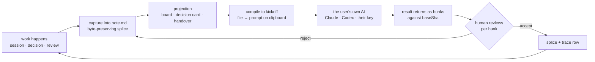
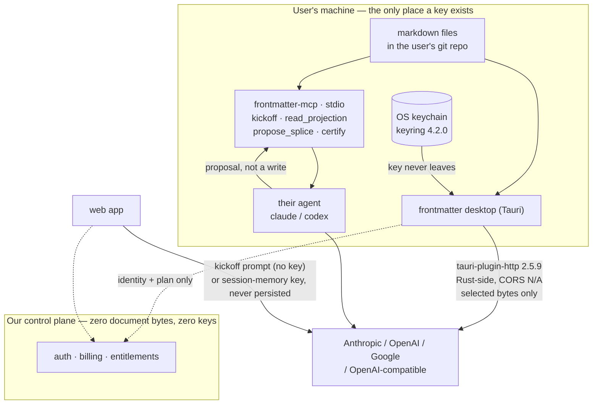
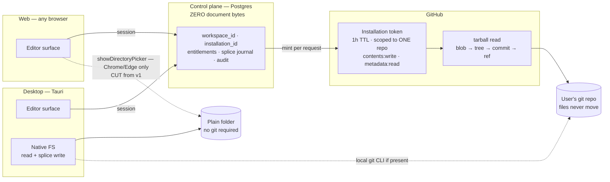

# THESIS — what the product actually is

**Tier 1. The sharpest statement of the product, and the one to read before arguing about a feature.** The editor produces the artefacts of product development and hands you a context pack your own AI can act on. §104 is the commitment in one page; everything before it is why.

> **§104.4 is the subsection that earns its keep**: the load-bearing assumptions, ranked, each with the cheapest test that would falsify it. One week of testing beats a quarter of building.

> 7 of 7 sections present.

---
## 98. The fusion — what an AI-native markdown editor actually is

### 98.1 The claim, with its mechanism and its falsifier

> **frontmatter is a markdown editor whose output is machine-actionable. It produces the artefacts of product development — handovers, decision records, flows, kickoffs — as plain files in the user's own repo, and then compiles those files into the prompt that makes someone else's AI do the work well. The editor is the product. The AI is what the files are for.**

Three mechanisms make that a claim rather than a mood:

1. **The file is the only source of truth, so the AI has no privileged channel.** An agent edit is a splice against `baseSha` — the identical path a human takes dragging a card (§5). The model gets *fewer* rights than the person, not more.
2. **Markdown is the cheapest lossless carrier of a reviewable change.** Measured below: 6.8×–10.6× fewer tokens than a block-JSON document model, and a one-word edit that shows as 2 changed lines instead of 24.
3. **We do not pay for the expensive half.** The compiled kickoff prompt runs on the user's own subscription. Measured below: a 40-turn agentic session at the p50 turn observed on this machine costs **$5.45 on Haiku 4.5 / $10.90 on Sonnet 5** — **87% / 174% of one month of Rs 599 gross revenue** `[measured]` `[derived]`. That single number is why the handoff is a prompt and not a runtime.

**Falsified by:** users generating handovers but never compiling a kickoff (paste-rate below 1/user/month at day 90), *or* the compile step proving equally good when fed a Notion export — which would mean the file format was never load-bearing and this is a prompt-template company.

---

### 98.2 The test that separates bolted-on from AI-native

Most products claiming the second are the first. Three tests, all executable in an afternoon on a competitor's build.

| # | Test | Bolted-on answer | AI-native answer | Where we stand |
|---|---|---|---|---|
| **1** | **The delete test.** Remove every model key. What breaks? | A view breaks, a link dies, a document stops rendering — the AI was load-bearing infrastructure | Only the AI verbs disappear. Board, calendar, site, links all still work | §11.6 states this as the user-facing promise; it is enforced by the projection law, not by discipline |
| **2** | **The path test.** Diff the write path of an AI edit against a human drag-a-card edit | Different code paths, different undo stacks, provenance only on one | One splice writer, one undo stack, one review surface, one `Co-authored-by` trailer | §13: hunks from humans, agents and sync conflicts share a grammar |
| **3** | **The addressability test.** Ask what the AI changed. | "It regenerated the block" — a block id and a new value | A byte range, quoted, with the certificate that untouched bytes are byte-identical | The engine's law: locate the range, replace exactly those bytes, **REFUSE rather than guess** |

Test 3 is the discriminating one, because it is the only one a block-store product cannot pass by adding features. If your unit of change is a block object, "what changed" has no answer finer than the block. The measurement in 98.3 is that difference, priced.

Two honest readings from the record. Notion's shipped surface is *Edit with AI* on a highlighted range `[fetched, §11.2]` — that passes test 1 and fails test 3. Cursor and Windsurf both regressed per-hunk control and were publicly burned `[fetched, §13]` — they failed test 2 after passing it. And the largest file-native editor in the category ships **zero occurrences of the token "AI" across 9,502 chars of its full roadmap** `[measured, §11.1]` — it passes test 1 by abstention. There is no incumbent holding all three.

---

### 98.3 Why markdown specifically, measured

Three real documents from this repo, each a genuine product-development artefact, converted to four alternative representations and tokenised with `tiktoken 0.14.0`, encoding `o200k_base`. HTML via `marked` (GFM). AST via `mdast-util-from-markdown` with the GFM and frontmatter extensions. Block JSON modelled on the Notion block object — the envelope fields (`parent`, `created_time`, `last_edited_by`, `has_children`, `archived`, `in_trash`) and the `rich_text` / `annotations` / `plain_text` inline shape all confirmed present on `developers.notion.com/reference/block` `[fetched, 2026-08-31, HTTP 200]`; the serializer reproducing them is mine `[inference]`.

| Document (real path) | markdown | HTML | mdast JSON | block JSON, minimal | block JSON, as returned |
|---|---|---|---|---|---|
| `docs/adr/0001-adopt-hexagonal-architecture.md` | **611** | 810 (1.33×) | 1,771 (2.90×) | 5,096 (8.34×) | 9,779 (**16.00×**) |
| `docs/FRONTMATTER-DECISIONS-2026-08-29.md` | **4,472** | 6,302 (1.41×) | 11,716 (2.62×) | 35,744 (7.99×) | 59,159 (13.23×) |
| `HANDOFF-graph-engineering-research-2026-07-30.md` | **13,356** | 17,302 (1.30×) | 26,684 (2.00×) | 84,782 (6.35×) | 125,814 (9.42×) |
| **Total** | **18,439** | 24,414 (1.32×) | 40,171 (2.18×) | 125,622 (6.81×) | 194,752 (**10.56×**) |

`[measured, 2026-08-31]`

Caveat stated before anyone quotes it: `o200k_base` is OpenAI's tokenizer. Claude's is not public, and Anthropic's own pricing page says Claude 4.7+ models use a tokenizer producing "approximately 30% more tokens for the same text" `[fetched, docs.claude.com/…/pricing.md, 2026-08-31]`. The *ratios* are the finding, and they hold across three documents of very different shape.

**Consequences that are not abstract:**

- **Context fit.** A 200k window holds **14.97** copies of that handover as markdown and **1.59** as returned block JSON `[derived]`.
- **A diff is reviewable.** Same ADR, two real edits, JSON pretty-printed at indent 2 so the line comparison is fair:

| Edit | markdown | HTML | mdast JSON | block JSON |
|---|---|---|---|---|
| `**Status:** Accepted` → `Superseded` | **2 lines / 50 B / 14 tok** | 2 / 90 / 28 | 2 / 82 / 18 | **24 lines / 694 B / 168 tok** |
| one word mid-paragraph | **2 lines / 174 B / 27 tok** | 2 / 182 / 31 | 2 / 222 / 42 | **24 lines / 1,006 B / 216 tok** |

`[measured]` A status flip — the single most common product-development edit there is — is 14 tokens of review surface in markdown and 168 in a block store, because changing one word rewrites the whole `rich_text` array. That is the review surface of §13 becoming affordable or not.

- **A file is addressable.** `docs/adr/0001-…md#L3` is a durable name a CI job, an MCP server and a stranger all resolve. A block id resolves only inside one vendor.
- **The unit economics.** Haiku 4.5 **$1/$5 per MTok**, Sonnet 5 **$2/$10** (the scheduled 2026-09-01 rise to $3/$15 "will not occur"), cache hits $0.10 / $0.20 `[fetched, 2026-08-31]`. USD/INR **95.39** `[fetched, frankfurter.app, rate date 2026-08-28]`, so Rs 299 = **$3.135** and Rs 599 = **$6.279** gross `[derived]`. Allocating 30% of Rs 299 gross to inference buys **163 toolbar operations/user/month on markdown and 18.3 on block JSON** `[derived]` — an 8.90× difference that decides whether the free tier exists.

**The honest counter-evidence.** "Models are trained on markdown" is too glib to publish. Anthropic's current prompting guidance recommends **XML tags** for structuring prompts, and states that "removing markdown from your prompt can reduce the volume of markdown in the output" `[fetched, docs.claude.com prompting best practices, 2026-08-31]`. The defensible version is narrower and survives: **markdown is the carrier, XML is the envelope.** Our compile step emits markdown *content* inside XML *section* tags, which is exactly what that guidance asks for and costs nothing extra.

---

### 98.4 The loop



| Station | Who acts | Deterministic | Cost to us | Why it is here |
|---|---|---|---|---|
| Capture | human, AI verb optional | writer: yes | $0.0058/op median `[derived, §11.3]` | §11.2 rank 1, the only capability with strong retention evidence |
| Projection | software | **yes, zero model calls** | $0 | §5 — deterministic projections out-install every AI capability combined by **7.25×** `[derived, §11.1]` |
| **Compile to kickoff** | **human presses it** | **yes, zero model calls in the default path** | **$0** | The fusion point. A template + the file, not a generation |
| Their AI | their key, their subscription | no | **$0** | The 40-turn measurement below |
| Return as hunks | software | yes | $0 | §13, one grammar for every change |
| **Review** | **human, per hunk, non-skippable** | n/a | $0 | **58.7%** of ~33,000 developers do not plan to use AI for committing and reviewing `[fetched, §11.4]` |
| Splice + trace | software | yes | $0 | `REFUSED_CONFLICT` on `baseSha` drift; the chip reads *unattributed* rather than guessing — **78.637%** of our own trace rows carry `skill: "unknown"` `[derived, §62.2]` |

**Where the human sits, and where they must.** Two gates, both of which the human already wants to hold. At **compile**, they decide what the prompt says before it leaves. At **review**, they accept bytes one hunk at a time. Everything between those two gates may be automated; neither gate may be skipped for agent-authored bytes, and there is no "apply all".

**Why the compile step is free, and why that is the whole business.** Generating a kickoff prompt from that 13,356-token handover on Haiku 4.5 costs **$0.01736**; at 4/month × 10,000 users that is **$694/mo, 2.21% of gross** `[derived]` — affordable, and the template path is $0. What is *not* affordable is the work the prompt triggers. Across **2,346 trace rows carrying a fresh/cache token split** on this machine, the p50 turn costs **$0.1363 (Haiku 4.5) / $0.2725 (Sonnet 5)**, p90 **$0.4683 / $0.9365** `[measured, ~/.sgnk/traces, 2026-08-31]`. Forty turns at p50: **$5.45 / $10.90** — against Rs 599 = $6.279 gross. Stated plainly: **one agentic session costs more than the subscription.** That workload is an agentic *coding* harness, not a document editor `[caveat]` — but it is precisely the workload the kickoff prompt hands off, which makes it the right number for this decision and the wrong number for anything else.

---

### 98.5 The category, picked

| Candidate | Competitor set | Buyer | Purchase moment | Verdict |
|---|---|---|---|---|
| **Editor** | Obsidian, iA Writer, Typora, Zed, Bear | the individual who writes | "my files, better" — self-serve card | **PICK** |
| AI workspace | Notion, Coda, Mem, Tana | team admin | seat expansion | Reject — loses on breadth, invites the project-manager comparison we refuse (§11.4) |
| Context layer | Cursor rules, MCP servers, vector DBs | platform/AI engineer | none — it is a feature | Reject — no visible artefact, no purchase moment |
| Product-development tool | Linear, Jira, Productboard | PM / eng lead | annual, procurement | Reject — that buyer wants tickets; two founders cannot serve procurement |

**We are an editor.** Not a hedge — it fixes everything downstream. Competitor set: Obsidian first. Buyer: one person with a card, which is the only buyer Free / Rs 299 / Rs 599 addresses and the only one operable by one person on call. The AI and product-development halves are what the editor is *for*, and they belong in the second sentence of the pitch, never the first.

**Live with the cost.** "Editor" is a small-ticket, high-churn category whose strongest competitor is free for individuals. We are choosing the harder revenue shape in exchange for a coherent buyer.

---

### 98.6 What this is not

| Not | Because |
|---|---|
| **Not Notion** | Notion made the app the source of truth. The 10.56× token measurement above is what that costs an AI reading your work `[measured]` |
| **Not a project manager** | AI may propose a status change; the human commits it. **75.8%** decline AI for deployment `[fetched, §11.4]`. No sprints, no assignees, no burndown |
| **Not a chat wrapper** | There is no vault chat, no persistent semantic index — it costs **$38.79/user/month** at 100 saves/day and the market leader's most-discussed open issues are all silent index failure `[derived + measured, §11.3–11.4]` |
| **Not an IDE** | No arbitrary client-side code execution, ever. The compile step ends at the clipboard |
| **Not a model vendor** | We do not resell inference below Rs 599. Teams bring their own keys, as the founders specified |

---

### 98.7 Recommendation, and the strongest case against it

**Recommendation: ship the fusion as one visible command — `Compile to kickoff` — in a markdown editor, and ship nothing else new for it.**

Every feature below names its person and their frequency, per the discipline. Anything I could not name, I cut, and the cuts are listed.

| Feature | Who uses it | How often | Kill rule |
|---|---|---|---|
| Toolbar verbs on a selection | the person writing the document | several times per writing session | <20% strong acceptance at 90 days (§11.5) |
| **Compile to kickoff** (open file + named siblings → prompt on clipboard) | the lead starting a piece of work | assumed 4×/month — **unmeasured, this is the bet** | <1 paste/user/month at day 90 |
| Per-hunk review of returned work | anyone accepting an agent edit | every single time | never — it is the gate |
| Handover / decision templates as ordinary `.md` | the person ending a session | weekly | <1 use/user/month |
| `mdmax cert --fail-on=BROKEN` in CI | the repo owner | once at setup, then only on failure | B2B only |

**Cut, explicitly:** ambient related-notes; ghost text; vault-wide chat; a settings page called AI; any composite health score; multiplayer presence; anything needing a second index. Also cut: reselling inference on Free and Rs 299.

**The strongest argument against.** The kickoff prompt is not defensible. It is a template plus a file concatenation — a few hundred lines. Anthropic and OpenAI both ship repo attachment already; the day the paste becomes a connector, the fusion evaporates and we are an editor with a nice writer. And the demand evidence is **zero rows**: this repo holds 264 tracked markdown files and 1,848,994 words in `docs/` `[measured]`, and not one observation of a human pasting a compiled prompt. Against three tests, one measured 10.56× and a $10.90 session, we have an unmeasured behaviour carrying the entire thesis.

The reply is only half a reply, and the founders should hear it as half. What is defensible is not the prompt — it is that the *file is worth compiling*: the byte-preserving writer, the degradation certificate, the review surface that accepts a returning hunk safely. A connector that attaches a repo still has to write back, and writing back into prose is where every competitor has been publicly burned. But that argument concedes the honest shape of this bet: **the fusion is a distribution story wearing an engineering story's clothes.** The engineering is real and it is ours. The distribution is a hypothesis with an n of zero, and it should be tested in the next 90 days with a paste counter, not defended in another document.

---

## 99. The artefact factory — the documents the product makes, and the prompt it hands you

### 99.1 The claim

A team doing product development with AI produces the same five documents over and over, writes four of them badly, skips the fifth entirely, and then pastes a two-line request into Claude and is disappointed. The disappointment is not a model failure. It is a **context failure that the user has no tool for fixing**, because fixing it by hand means reading a repo they already can't hold in their head and pasting a selection they have no principled way to make.

frontmatter's bet: **the artefacts are generatable from the vault, and the last artefact in the chain is a prompt.** The editor writes the handover, the decision record and the spec from work that already happened in the files, and then assembles a **kickoff pack** — a self-contained, cited, deterministic context bundle the user pastes into whatever model they pay for. We sell the pack. The editor is how the pack gets good.

This repository is the worked example, and it is also the evidence *against* the soft version of the claim. Look at what disciplined founders who believe in these documents actually produced:

| Artefact | Count here | Evidence tag |
|---|---|---|
| Research reports | **176 files, 647,637 words** | [measured] `find docs/research -name '*.md' \| wc -l` |
| Handovers | **4** (`HANDOFF-*.md`, 5,587–7,492 words each) | [measured] |
| Specs | **4** contracts + schema + harness | [measured] `specs/` |
| **Decision records (ADR)** | **1** | [measured] `docs/adr/` |
| Decisions actually made and recorded in prose | **PRD §57 alone is a twenty-item corrections ledger** | [measured] |

One ADR. The people who wrote 647,637 words of research and a gate that refuses hand-written `state: verified` still wrote **one** decision record. That is the product. The demand is real, the discipline is not, and the gap is exactly what software fills.

---

### 99.2 The artefact catalogue — five ship, four are cut

Feature discipline applies hardest here, so each row names the person and the cadence. If I could not name both, I cut it.

| Artefact | Who writes it today | Why it is bad | What we generate | FROM | Who uses it, how often |
|---|---|---|---|---|---|
| **The map** (`MAP.md`) | Nobody. This is the missing one | It doesn't exist, so every AI session re-discovers the repo and half of them open a superseded file | A routing index: tier table, task→artifact routing, one-fact-one-home table, and an explicit **superseded, do not read** list | Directory walk + frontmatter (`updated:`, `state:`, `supersedes:`) + git log recency | Every person, every session. This repo's is **10,375 bytes** and it is Tier 0 [measured] |
| **The decision record** | Nobody, or a Slack thread | Written after the fact if at all; loses the *falsifier* and the rejected options, which are the only parts that stop a re-litigation | One file per decision: verdict, rejected alternatives, cost accepted, **what would change our mind** | Diff + PR discussion + the paragraph in the doc where the verdict was argued | Whoever is about to reopen a settled question. Realistically **2–6 per month** for a two-founder team |
| **The kickoff pack** | The user, in a chat box, badly | Vague ask, no constraints, no settled list, model invents a plausible wrong architecture | §99.3 | Map + the specs the task touches + the decision records that constrain it + the gate commands | The builder, **every non-trivial task** — the highest-frequency artefact by an order of magnitude |
| **The handover** | The person leaving, at the worst possible moment | Written under time pressure, from the live screen, so it misses everything that scrolled out of context | Chronological session record with live-state numbers and verified/unverified tags | Session transcripts, git range, the gate outputs | The next operator or the next model. **Rare, ~monthly, and catastrophic when absent** |
| **The spec** | An engineer, sometimes | Prose with no executable check; "invariants" that are wishes | `rule → failure mode → executable check`, three columns or the row is deleted; `state:` writable only by the harness | The defect, its red proof, the PRD section it implements | The implementer, **once per contract**, then read on every touch |

**Cut, and why.** *Changelog* — generated from commits, not from the vault; `git-cliff` and release-please already own it and are free. *Runbook* — real, but it recurs per incident class, not per week, and with one person on call the runbook is the on-call person. *Meeting note* — Granola, Fathom and Otter own the capture surface; we would be a worse recorder with no audio. *Standalone flow diagram* — a flow is only trustworthy as a **projection of a spec**, so it ships as mermaid inside artefacts 2 and 5, never as a thing you draw. This repo's §13 state machine and §62.2 loop are both projections of tables; that is the only form we ship.

That is five artefacts, not nine. Four cut.

---

### 99.3 The kickoff pack, in full

Real task, real repo, real files. This is what the user copies.

````text
# KICKOFF — auth lane: three identity paths to one, repo access onto a GitHub App
Generated by frontmatter from studiozephyrus/frontmatter @ 596cd42, 2026-08-31.
Pack = 6 sources, 25,308 bytes ≈ 6,327 tokens. Every line below is a byte range from a
file in this repo, cited by path. Nothing was summarised by a model.

## 1. Task
Collapse three live identity paths to one and move repo access from an OAuth App to a
GitHub App. Propose the change; do not commit it.

## 2. Read these, in this order. Read nothing else first.
| # | Path | Bytes | Why this one |
|---|---|---|---|
| 1 | AGENTS.md                       |  9,675 | The four rules that override everything, and the traps |
| 2 | docs/DEV-PLAN.md §6.1–6.11      | 12,873 | The auth lane itself: current state, stack, App, tokens, RLS |
| 3 | specs/SPECS.md                  |  2,760 | How a contract is written and who may write `state:` |
| 4 | docs/MAP.md → "Routing" row "auth" | (read the row) | Confirms §6 is the entry point |

## 3. Do not open. These will cost you the task.
| Path | Bytes | Why not |
|---|---|---|
| docs/FRONTMATTER-RECORD.md | 1,513,767 | ≈378k tokens. Superset of #2. Reading it to answer
|                            |           | an auth question is how a context window dies |
| docs/FRONTMATTER-PRD-2026-08-29.md | — | v1.1, SUPERSEDED by v2. It was true once |
| docs/FRONTMATTER-BUILD-PLAN-*.md, DECISIONS-*.md, MASTER-PLAN-*.md, PRODUCT-PLAN.md | — |
|                            |           | All superseded. MAP.md §Superseded is the list |

## 4. Settled. Do not reopen, do not offer alternatives, do not ask.
| # | Decision | Where it was decided | Cost we already accepted |
|---|---|---|---|
| 1 | GitHub App with installation tokens. NEVER the OAuth `repo` scope | DEV-PLAN §6.3 | The install screen converts worse than an OAuth consent, and org installs may need
|   |                                     |               | owner approval. One week of budgeted onboarding UX |
| 2 | next-auth v5 stays; upgrade `^5.0.0-beta.31` → `5.0.0-beta.32`   | DEV-PLAN §6.2 | Living on a beta. Escape hatch is WorkOS, a provider swap |
| 3 | Firebase Google auth is DELETED, all 8 sites listed in §6.1      | DEV-PLAN §6.1 | Any existing Firebase-only user must be migrated, not dropped |
| 4 | Credentials provider `sgnk-password` is DELETED before the first
|   | external user; replaced by a flag-gated magic-link break-glass   | DEV-PLAN §6.1 | Break-glass is off by default and needs an env var to arm |
| 5 | `request_oauth_on_install: false` — identity first, installation
|   | second, so a `user_id` always exists to attach the install to    | DEV-PLAN §6.3 | Two screens instead of one |
| 6 | Installation token TTL 1h (LRU, 50min); user token 8h, refresh
|   | on 401 or at 7h                                                  | DEV-PLAN §6.5 | A refresh path we must actually test |
| 7 | One Postgres control plane holding ZERO document bytes           | PRD, settled  | Search over content is harder |
| 8 | Documents live in the user's git repo and never move             | PRD §5        | We cannot "just query" a user's files |

## 5. Refuse rather than guess. These are terminal states, not errors.
- If a session-shape change would let a Firebase `uid` and a next-auth `sub` both satisfy
  "the principal", REFUSE and say so. Accepting their union is accepting three issuers.
- If you cannot determine whether a token is a user token or an installation token at a
  call site, REFUSE. Do not infer from the variable name.
- If a migration would orphan an existing identity, REFUSE and propose the migration
  separately. `AGENTS.md §8`: several persistence keys keep the legacy `sgnk-md` prefix ON
  PURPOSE; renaming any of them silently orphans a user's drafts.
- Returning "no change, here is why" is a correct outcome.

## 6. Done means these exit 0. Nothing else counts as done.
    npm run typecheck && npm run lint && npm run test && npm run build && npm run arch
    npm run spec           # contract gate — 0 errors
    node specs/harness/spec-report.mjs --id <new spec id>
A red proof must exist and must FAIL against the unfixed code before it may certify
anything (AGENTS.md §0.1). You may not hand-write `state: verified`; only the harness
writes it (specs/_schema/states.md).

## 7. Traps here, measured, that you will otherwise hit
- Vercel typechecks stricter than local: `exactOptionalPropertyTypes` is on in production
  tsconfig. Declare `?: T | undefined`, not bare `?: T`. (AGENTS.md §5)
- `process.env` may be read ONLY in `src/config/` and `*/infrastructure/`. Never in
  domain, application or presentation. (AGENTS.md §6)
- Cross-module imports go through `@/modules/<name>`, never a deep path, even for types.
  `@/server/*`, `@/lib/*`, `@/components/*` are eslint-banned. (AGENTS.md §2)
- `/api/auth/**` is never intercepted by the proxy. (DEV-PLAN §API)

## 8. Output shape
A proposal: a diff, the new spec file, and the red proof. Do NOT commit. The founder
merges. If you commit anyway, say so in your final message — `git rev-parse HEAD` is
captured before and after this run and the delta is reconciled. (AGENTS.md §0 rule 4)

## 9. If a settled item genuinely blocks the task
Stop. Name the item by its row number in §4, state what it blocks, and return. Do not
route around it.
````

---

### 99.4 Anatomy — why each part is there

| Part | What it buys | Grounding |
|---|---|---|
| §2 read-order with byte counts | The model spends its attention budget where the answer is | Liu et al. 2023 [fetched] |
| **§3 do-not-open** | The single most valuable section, and the one no human writes. Five superseded files here will each give a confidently wrong answer | Shi et al. 2023 [fetched] |
| §4 settled table with **cost accepted** | Kills re-litigation. A model told "use a GitHub App" argues; a model told "and here is the week of conversion loss we already accepted" does not | This repo's §57 ledger |
| §5 refusal list | Converts the engine's law into the prompt's law: locate, replace, refuse | PRD §5 |
| §6 gate commands | A rules-based verifier, the cheapest one that applies | Learned Rule #25 |
| §7 traps | Each line is a bug that has already been paid for once | AGENTS.md §5, §6, §9 |
| §8 output shape | Agents propose, the founder merges | AGENTS.md §0 rule 4 |
| Provenance header | Commit-pinned, so a stale pack is detectable on sight | LR#69 |

The pack is **6,327 tokens** against **439,658 tokens** for a naive "here's the docs folder" paste — a **69.5×** reduction [derived: (244,864 + 1,513,767) ÷ 4 = 439,658; 25,308 ÷ 4 = 6,327; 439,658 ÷ 6,327 = 69.5]. The naive paste also does not fit in a 200k window, so it is not merely expensive, it is impossible.

---

### 99.5 Why a generated pack beats a human paste

Six primary sources, opened here today.

| Finding | Number | Source |
|---|---|---|
| Accuracy depends on **where** in the context the answer sits; highest at the ends, degrading in the middle, "even for explicitly long-context models" | — | Liu et al., *Lost in the Middle*, arXiv **2307.03172v3**, TACL [fetched] |
| Irrelevant context in the prompt "dramatically" decreases accuracy — on grade-school arithmetic, where the model plainly has the capability | — | Shi et al., *LLMs Can Be Easily Distracted by Irrelevant Context*, arXiv **2302.00093v3**, ICML 2023 [fetched] |
| At 32K tokens, **11 of 13** models claiming ≥128K drop below **50%** of their own short-context baseline. GPT-4o: **99.3% → 69.7%** | 11/13 | Modarressi et al., *NoLiMa*, arXiv **2502.05167v3**, ICML 2025 [fetched] |
| Across 17 leading models, "the effective context limit is significantly shorter than the supported context length" | 17 models | Roberts et al., *Needle Threading*, arXiv **2411.05000v2**, ICLR 2025 [fetched] |
| Long-context models show a **bias toward material presented later** in the sequence | — | Li et al., *LongICLBench*, arXiv **2404.02060v3** [fetched] |
| **Multi-turn conversation costs an average 39% drop** across six generation tasks vs the same task fully specified in one turn. "When LLMs take a wrong turn in a conversation, they get lost and do not recover" | −39%, 200,000+ simulated conversations | Laban et al., arXiv **2505.06120v1** [fetched] |
| Vendor's own guidance: keep CLAUDE.md **under 200 lines**; "longer files consume more context and reduce adherence" | 200 lines | docs.claude.com/en/docs/claude-code/memory [fetched 2026-08-31] |

Read together they say something narrower and more useful than "context is limited". They say: **a long single-turn, fully-specified, curated prompt beats both a big dump and a conversation.** Laban is the load-bearing one — it is not about length at all, it is about the user discovering their constraints turn by turn while the model has already committed to a wrong assumption. The kickoff pack exists to make the first turn the fully-specified turn.

And the strongest argument is the one no paper covers: **§4 of the pack is information the model cannot derive from any amount of context.** "We rejected the OAuth `repo` scope and accepted a week of conversion loss" is not in the code. It is not in the diff. It happened in a conversation. No context window solves that; only a record does.

---

### 99.6 The conventions we must interoperate with, not compete with

All four opened 2026-08-31.

| Convention | State, as read today | What we do | What we never do |
|---|---|---|---|
| **AGENTS.md** | "used by over 60k open-source projects"; stewarded by the **Agentic AI Foundation under the Linux Foundation**; supported by Codex, Cursor, Jules, Devin, Copilot coding agent, Gemini CLI, Zed, Aider, Amp, Windsurf and more; nested files, **closest wins**, "explicit user chat prompts override everything"; plain markdown, no required fields [fetched, agents.md, HTTP 200] | **Write here.** This is the root file the factory maintains | Invent a `frontmatter.md` |
| **CLAUDE.md** | Load order managed-policy → `~/.claude/CLAUDE.md` → `./CLAUDE.md` → `./CLAUDE.local.md`; `@path` imports, max 4 hops; `.claude/rules/` for path-scoped rules; auto memory loads the **first 200 lines or 25KB**; "target under 200 lines" [fetched] | Emit a ≤200-line CLAUDE.md as a **projection** of AGENTS.md, with `@` imports to the specs | Duplicate content between the two — that violates our own one-fact-one-home law |
| **Cursor rules** | `.cursor/rules/*.mdc` with frontmatter `description` / `globs` / `alwaysApply`; a plain `.md` in that folder is **ignored** ("If you prefer plain markdown, use AGENTS.md instead"); cap 500 lines; four apply-modes [fetched, cursor.com/docs/context/rules]. I grepped the live page for `.cursorrules` and got **zero hits** [measured] — the single-file form is no longer documented; do not emit it | Emit `.mdc` files with correct frontmatter, `globs` derived from the spec's `governs:` field | Emit `.cursorrules` |
| **MCP** | Spec revision **2026-07-28**; JSON-RPC 2.0; hosts / clients / servers; servers expose **resources, tools and prompts** [fetched, modelcontextprotocol.io/specification/latest] | Ship a small MCP server: pack files as **resources**, the kickoff pack as a **prompt**. That is the standard slot for exactly this object | Build a proprietary plugin per editor |

**The rule that falls out: frontmatter introduces zero new file formats.** Its output is AGENTS.md (the one with 60k projects behind it), projections of it into CLAUDE.md and `.mdc`, and an MCP prompt. The `governs:` glob in a spec is already the `globs:` field in an `.mdc` — the mapping is mechanical.

---

### 99.7 The measurable claim, and the experiment that could refute it

Without this the section is marketing.

**H1.** For a task drawn from a real repo, a pack-primed single-turn prompt produces a diff that passes the repo's own gates more often than the user's own hand-written prompt, same model, same task.
**H2.** The pack arm re-litigates settled decisions less often. *This is the differentiating claim*, because H1 could in principle be won by any prompt-shortening trick.

| Element | Design |
|---|---|
| Design | Paired, within-task. **Arm A**: the user's own prompt, captured before they see the pack. **Arm B**: the pack. Same model, same temperature, **3 runs per cell** (one run is an anecdote — LR#63) |
| Tasks | 52 per arm, drawn from closed issues in 4 repos of different sizes, each with an existing test that the fix must turn green |
| **Primary outcome (binary)** | Does the produced diff make the task's red proof pass **and** `npm run verify` exit 0? Binary pass/fail with a critique field. **Never Likert** (LR#4). Rules-based verifier, no judge (LR#25) |
| **Secondary (the real one)** | **Settled-decision violation count**: a pre-registered per-repo list (here: CRDT for document bytes, OAuth `repo` scope, client-side code execution, hand-written `state: verified`, renaming a `sgnk-md` key). Grep-countable, no model in the loop |
| Tertiary | Turns to done, input tokens to done, USD to done |
| Pre-registration | The violation list and the pass criteria are frozen and committed **before** the first run. Otherwise we will discover the metric we won |
| Cost | Arm A 156 runs × 40k in / 8k out; Arm B 156 × 12k / 8k. Sonnet 5 at **$2 / $10 per MTok** [fetched, docs.claude.com/pricing, 2026-08-31]. A = 6.24M×$2 + 1.248M×$10 = **$24.96**; B = 1.872M×$2 + 1.248M×$10 = **$16.22**. **Total ≈ $41.18** [derived] |
| **Falsifier** | If pack-arm pass rate is not **≥15 points** above paste-arm (n=52/arm gives 80% power to detect 0.55→0.80 at α=0.05 [derived: n = (1.96+0.84)²(0.55·0.45+0.80·0.20)/0.25² = 51.1 → 52]), **or** if settled-violations are not lower, then the factory is a writing tool, not an AI tool. Price it as one and stop claiming the second thing |

Every number in this experiment is currently a **prediction**, not a result. Nothing has been run.

---

### 99.8 The economics, and the part that makes this affordable

The load-bearing fact: **assembling a kickoff pack is a build step, not an inference step.** This repo's `npm run tree`, `npm run doc` and `npm run record` are node scripts with zero model calls [measured]. The map, the read-order, the do-not-open list, the settled table, the gate commands and the traps are all *selections over files*, and selection is deterministic.

| Operation | Model calls | Cost |
|---|---|---|
| Kickoff pack assembly | **0** | **$0** — free tier gets it unlimited |
| Decision record draft from a diff | 1, Haiku 4.5 ($1/$2 per MTok [fetched]) | ~12k in + 1.5k out = **$0.015** [derived] |
| Handover from a session | 1, Sonnet 5 | ~60k in + 6k out = $0.12 + $0.06 = **$0.18** [derived] |
| Spec draft from a defect | 1, Sonnet 5 | ~20k in + 3k out = **$0.07** [derived] |

At 100 users × 4 drafted artefacts/month: 400 × ~$0.09 avg = **$36/month** [derived]. At 10,000 users, **$3,600/month** — which is why the paid tiers meter *drafting* and never meter *packs*. With prompt caching (cache read $0.20/MTok for Sonnet 5 [fetched]) the repeated-pack case drops another order of magnitude, but that only matters for the team lane where we hold the key.

---

### 99.9 Recommendation, and the case against it

**Recommendation: make the artefact factory the product, and ship exactly three artefacts in v1 — the map, the decision record, and the kickoff pack. Make the pack deterministic and free. Write only into AGENTS.md and project it into the others. Ship the MCP prompt. Run the §99.7 experiment before writing a single line of marketing copy.**

Handover and spec are v1.1 — they are real, but the map and the decision record are what make the pack good, and the pack is what the user pays for.

**Anti-recommendations, explicitly:** no prompt library, no template gallery, no "AI writes your docs" button, and no settings page listing artefact types. Every one of those is a second source of truth, which the projection law forbids.

**The strongest argument against.** The pack's quality is a function of what is already in the vault, and a new user's vault is empty. Arm B of the experiment will be run on *this* repo — a repo with 176 research reports, a superseded list, and a settled-decisions table that took twelve rounds to produce. A user on day one has none of that, so their first pack degrades to a file listing plus `npm test`, which is worth roughly nothing, and they churn before the vault is worth packing. **The value is back-loaded past the churn point.** That is a real structural problem and the honest mitigation is narrow: the map and the do-not-open list are derivable from a *cold* repo on day one (directory walk, frontmatter dates, git recency — no history required), and they are already most of the token saving. The settled table, which is the part no context window can substitute for, is the part that has to be earned.

The second argument against is that we may be selling a workaround for a temporary defect: every model release claims better long-context handling. The rebuttal is dated — NoLiMa (ICML 2025) and Laban et al. (2025) both post-date the 128K–1M context claims and both measure the degradation persisting — but it is a rebuttal with a shelf life, and we should re-run the §99.7 experiment on every major model release rather than cite a 2023 paper in 2027.

---

## 100. Running the user's own model — provider keys, and AI inside the editor

**The claim.** BYO keys are not the AI strategy. They are the *fallback* for the ten percent of users who want the model inside the editor. The AI strategy is the kickoff prompt — a document the user pastes into the agent they already pay for, which costs us exactly zero tokens and zero liability. Everything below is engineering for the minority case, sized so it never becomes the majority case by accident.

Every provider fetch below was read with `curl` at **2026-08-30 20:22 UTC** (`date` header on the responses). `WebFetch` is gated here; `curl` was not, and every host answered.

### 100.1 The provider matrix

| Provider | Default model id + price /MTok | Browser-origin call? | Rate-limit shape | BYO under their terms |
|---|---|---|---|---|
| **Anthropic** | `claude-haiku-4-5` **$1 in / $5 out**; `claude-sonnet-5` **$2/$10**; `claude-opus-5` $5/$25; `claude-fable-5` $10/$50. Cache read 0.1×, batch 50% `[fetched]` | **Yes, but opt-in and named "dangerous"** — see below `[measured]` | 429 + `retry-after`; RPM/ITPM/OTPM; `anthropic-ratelimit-{requests,input-tokens,output-tokens}-{limit,remaining,reset}` `[fetched]` | Commercial Terms **A.1** grants use "including to power products and services Customer makes available to its own customers and end users"; **D.5** "Customer is responsible for all activity under its account" `[fetched]` |
| **OpenAI** | `gpt-5.6-luna` **$0.20/$1.20**; `gpt-5.6-terra` $2.00/$12.00; `gpt-5.6-sol` $4.00/$20.00; `gpt-5-nano` $0.05/$0.40 `[fetched]` | **Yes, unconditionally** `[measured]` | RPM/RPD/TPM/TPD, org **and** project scoped; `x-ratelimit-*`, `Retry-After`; tiers Free→5, $100/mo → $200,000/mo `[fetched]` | **Unresolved.** `openai.com/policies/services-agreement/` and `/business-terms/` both returned **HTTP 403** to curl `[measured]`. Lawyer question, not a founder question |
| **Google** | `gemini-3.7-flash` **$0.75/$3.75** through 2026-12-31, **$1.50/$7.50** from 2027-01-01. Free tier: **free of charge**, and the same table says *"Content used to improve our products: **Yes**"* `[fetched]` | **Yes, unconditionally** `[measured]` | Free tier real but throttled; paid tier for volume `[fetched]` | Terms page fetched; the BYO-specific clause was not located in what I pulled `[SS]` |
| **The OpenAI-compatible tail** | OpenRouter, Groq, Ollama, LM Studio, vLLM | **OpenRouter and Groq: `access-control-allow-origin: *`, HTTP 204 preflight** `[measured]` | Vendor-specific | One adapter covers all of them |

**The CORS answer, measured rather than assumed, because it decides the architecture.**

- **Anthropic gates CORS on a header whose name is an argument against using it.** Preflight to `POST /v1/messages` with `Access-Control-Request-Headers: content-type,x-api-key,anthropic-version` → **HTTP 400, no `access-control-allow-origin`**. Add `anthropic-dangerous-direct-browser-access` to that list → **HTTP 200, `access-control-allow-origin: *`, `access-control-allow-credentials: true`, max-age 600**. A real `POST` carrying the header from `Origin: https://evil.example.com` with a junk key returned **401 with `access-control-allow-origin: *`** — the browser could read it. `[measured]`
- **OpenAI reflects any origin verbatim, with no opt-in and no warning.** Tested `https://app.frontmatter.dev`, `https://evil.example.com`, `http://localhost:1420`, and literal `null` — all four came back as `access-control-allow-origin: <that exact origin>`, `access-control-allow-headers: content-type,authorization`, max-age 86400. `[measured]`
- **Google behaves identically** — same four origins reflected, `access-control-allow-headers: content-type,x-goog-api-key`. `[measured]`

So the browser is not the blocker. **The constraint is not technical, it is custodial**, and Anthropic spelled that out by making you type the word `dangerous` to get the header. A key pasted into a web page is a bearer credential sitting in a document renderer that renders untrusted markdown.

Two rate-limit details that will otherwise cost a support day each. Anthropic's **spend limit** returns **HTTP 400 `invalid_request_error` with `error_code: enforced_spend_limit_reached` and no `retry-after`** — SDK auto-retry loops on it forever `[fetched]`. And OpenAI's limits are **organisation- and project-scoped, never user-scoped** `[fetched]`, so one team key shared across eight editors is one bucket; the eighth person to hit "summarise" gets a 429 caused by a colleague. The published per-model row for Haiku 4.5 reads 1,000 RPM / 2,000,000 ITPM / 400,000 OTPM `[fetched; I did not pin which tier label owns that row]`.

### 100.2 Where the key lives

| Custody | Failure mode, named | Verdict |
|---|---|---|
| **Browser `localStorage`** | One XSS in a markdown renderer reads it. We render user-supplied markdown by definition. `localStorage` also survives logout and is readable by any script on the origin | **Refuse** |
| **Browser session memory only** (re-entered per session, never persisted) | Annoying — retyped on every reload. But the blast radius is one tab-lifetime, and nothing is at rest | **Allow on web, with the friction visible** |
| **OS keychain via Tauri** (`keyring` 4.2.0, 22.5M downloads; or `tauri-plugin-stronghold` 2.3.1) `[fetched crates.io]` | User loses it on machine change; no team sharing. Both are correct behaviours for a credential | **Recommended** |
| **Our server, envelope-encrypted** | We hold a bearer credential to someone else's spend. A breach is not "documents leaked", it is "we ran up your Anthropic bill". DPDP s.8(5) reasonable-safeguards ceiling is **₹250 crore** `[fetched, §51.1]`. §51.4 already says keys must be *"never returned to the client after entry"* and *"do not co-locate the key store with the document store"* — true, and still an inherited liability | **Refuse at v1** |
| **Never stored** | Nothing to leak, nothing to run | **The default, and the free tier** |

**If a key transits our server we inherit a liability we do not want and are not paid for.** ₹299/month does not buy a credential-custody incident. The desktop keychain is not a compromise — it is the only shape where the worst case is confined to one laptop the user already trusts.

### 100.3 The three deployment shapes

| Shape | Who holds the key | Our marginal cost | Document bytes leaving the device | DPDP / GDPR posture |
|---|---|---|---|---|
| **Fully local** — Tauri holds the key, `tauri-plugin-http` 2.5.9 makes the call from Rust, CORS never applies `[fetched]` | OS keychain | **₹0** | Only the selected byte range, direct to the provider the user chose | **Best.** We are not a processor for that call at all. No Art. 28 chain, no s.16 transfer question, nothing to disclose in a DPA because nothing reaches us |
| **Proxied** — our Worker holds the key and calls out | Our KMS | Egress + compute + on-call + custody | Document bytes cross our infrastructure | **Worst.** We become processor for document content *and* custodian of a payment-bearing credential. DPDP s.16 is a blacklist, GDPR Ch. V is an allowlist — §51.2 already records that a single storage architecture cannot satisfy both by accident |
| **Hybrid** — local key by default; our metered credits on a cheap model for people with no key | Both | Bounded by the meter | Only for metered ops the user explicitly triggers | Workable, if the metered lane is one model, one region, one retention policy — and disclosed as its own processor |

The DPDP/GDPR answer is unambiguous and it is the cheap one. **Fully local is not the frugal compromise; it is the compliant design that happens to also be free.**

### 100.4 Codex, Claude Code and the CLI-agent question — feed, do not replace

**Feed it. Replacing it is a fight we lose on capital, and it is also the wrong product.**

The decisive fact is one we already settled: **documents live in the user's git repo and never move.** A developer running `claude` or `codex` in that repo is *already reading our output* — no integration, no key, no adapter, no consent screen. We do not have to earn distribution into their agent; we are already inside it the moment they save a file.

That reframes the whole question. An in-app chat window would be us rebuilding, at two founders and a very small AI budget, a worse copy of a tool the user has open in the next terminal tab and pays for separately. The record already refuses this shape from a different direction: §11.4 refuses ambient AI buttons and ghost text; §11.2 ranks *transformation verbs on a selection* first and *chat* nowhere.

The measured asymmetry:

| | Replace the CLI agent | Feed it |
|---|---|---|
| Tokens we pay for | All of them | **Zero** |
| Engineering | Chat UI, streaming, history, tool loop, key custody, abuse | One button + one stdio server |
| Competitors | Anthropic, OpenAI, Cursor, GitHub | None — nobody ships the *inputs* |
| Fails when | Their model is better than ours next week | Never; better agents make us better |

The kickoff prompt is the product thesis and it is also, conveniently, the zero-cost path. A user finishes a decision record in frontmatter, clicks **Copy kickoff prompt**, and pastes a document into whatever they already run. Our AI budget spend for that transaction: **₹0**.

### 100.5 MCP — yes, as a narrow stdio server

`modelcontextprotocol.io/llms.txt` shows the current spec era as **2026-07-28** `[fetched]`. Both target agents are already clients:

- **Codex**: *"The ChatGPT desktop app, Codex CLI, and IDE extension support MCP servers and share MCP configuration"* — stdio and streamable HTTP, config in `~/.codex/config.toml` or a project-scoped `.codex/config.toml` (trusted projects only) `[fetched]`.
- **Claude Code**: `claude mcp add [options] <name> -- <command> [args...]`, plus `--transport http|sse` `[fetched]`.

MCP's own taxonomy fits our architecture exactly: **Resources are application-controlled and read-only; Tools are model-controlled and can write; Prompts are user-controlled templates** `[fetched, server-concepts]`. Our splice engine already refuses rather than guesses, which is precisely the contract a model-controlled write tool needs.

**Recommendation: ship `frontmatter-mcp`, stdio, local, four tools, no OAuth, no key, no network.**

| Surface | MCP kind | Who uses it, how often |
|---|---|---|
| `kickoff(doc)` → the pasteable prompt | Prompt | The developer starting a task from a spec. **2–5× per week** per active builder |
| `read_projection(view, filter)` → the board/calendar/table as data | Resource | Any agent asked "what is unblocked?". **Every agent session in that repo** |
| `propose_splice(path, range, bytes, baseSha)` → a *proposal*, never a write | Tool | The agent that wants to edit a doc. §11.2 ranks this #3 and notes users are filing *"Improve Agent Mode review and consent controls"* against the market leader |
| `certify(path)` → the degradation certificate | Tool | The agent about to hand a file to another renderer. **Rare, high-value** |

**And the thing we must not build:** MCP's security doc devotes its first attack to the **confused deputy** — an MCP *proxy* server holding a static client ID to a third-party API, with dynamic client registration and consent cookies `[fetched]`. A hosted frontmatter MCP server holding users' provider keys is that diagram. Local stdio, no credential, sidesteps the entire class.

### 100.6 What breaks when the user has no key and no budget

Nothing that matters, and this must stay true.

Everything ranked as *deterministic projection* — the board, the calendar, the table, the outline, the certificate — is a reversible projection of bytes and owns no state. It has no model in it. §11.1's evidence is that this is also what people actually install: **deterministic projections out-install every AI capability combined by 7.25×** `[measured]`. The keyless user gets the 7.25× and loses the 1×.

The keyless path, in order:

1. **Kickoff prompt.** Works with zero key, zero account, zero budget. This is the headline.
2. **Google's free tier**, if they want in-editor verbs and have no card — `gemini-3.7-flash` at **free of charge**, with the trade stated in plain words on the same screen: *"Google's free tier says content is used to improve their products. Your paid key is not."* `[fetched]` Refusing to say that out loud would be the dishonest version.
3. **Nothing else.** No hosted credits on Free.

Why no free credits, with the arithmetic. §11.3 measures a p90 summarise at **$0.0058** on Haiku 4.5. Twenty per user per month = **$0.116** `[derived]`.

| Users | Our monthly cost at 20 free ops |
|---|---|
| 100 | **$11.60** ≈ ₹1,107 `[derived, ₹95.39/$]` |
| 1,000 | $116 ≈ ₹11,065 |
| 10,000 | **$1,160 ≈ ₹110,652** |

A ₹299 Pro subscription nets ₹291.94 after Razorpay's 2.36% `[derived, §24.4]` = $3.06, which funds **26 free users** at that rate `[derived]`. It is affordable at 100 and it is a payroll line at 10,000 — and you cannot withdraw it once shipped. This is exactly why §24 already puts **"BYO-key AI unmetered, zero hosted credits"** on Free. Confirmed rather than revised.

### 100.7 The topology



### 100.8 The recommendation, and the case against it

**Recommend:** desktop-held keys in the OS keychain, provider calls made from Rust so CORS never enters the design, a four-tool local stdio MCP server, the kickoff prompt as the free and headline path, and **no key ever touching our infrastructure at v1.**

**Features I am cutting, and saying so:** the in-app chat window (duplicates a tool the user already runs; no named person, no named frequency); team key pooling on our server (names a liability, names no user — and OpenAI's limits are org-scoped, so pooling manufactures 429s between colleagues `[fetched]`); a forty-model picker (one default per provider, advanced users edit a config line); a streaming token-cost HUD; and our own AI gateway. Five features, zero named users between them.

**The strongest argument against.** Desktop-only key custody means the **web app**, which is where every new user actually lands, has no in-editor AI at all — and the two founders' own §90 architecture is a Next.js app with the desktop as a thin shell today (`frontendDist: "https://md.sgnk.ai"` `[measured, §90.1]`). We would be recommending that the primary surface be the weaker one. The measured CORS results say browser-direct calls *work* on all three providers with no server; refusing them is a judgement call about custody, not a technical necessity, and a competitor who takes the risk ships in-browser AI while we ship a copy button.

I hold the recommendation anyway, for one reason: the web surface still gets the kickoff prompt, which is the thesis, and the thesis costs nothing. The honest concession is the session-memory key on web — no persistence, retyped each session, friction fully visible — for the user who insists. If the browser lane out-converts the desktop lane by more than 3× over ninety days, that is the signal to revisit, and the revisit is *still* not our server; it is a persisted browser key with a documented XSS blast radius and a rotation reminder.

**Falsified by:** BYO-key setup completion below 40% among users who click "connect a model" (the flow is too hard and the credits argument returns), or the MCP server going unconfigured by more than 80% of desktop users after ninety days (we built plumbing nobody wired).

---

## 101. Reaching the work — GitHub, folders, and what the product is allowed to touch

**The claim: we ask for exactly three permission lines, we never ask for a fourth, and we get pull-request safety without paying for the pull-request permission.** The access story is not plumbing. It is the first thing a stranger judges us on, it is the whole of the B2B security review, and — because our only defensible promise is *we do not corrupt your files* — the permission set is the promise, written in a form GitHub enforces for us. A product that says "byte-preserving" while holding `workflows: write` is lying in a way an org owner can read off a screen.

### 101.1 The three lanes, and which one is real

| Lane | Who reaches the files | Browser support | v1 verdict |
|---|---|---|---|
| **GitHub App** | Server mints a 1-hour installation token, reads a tarball, writes blobs/trees/refs | All browsers | **Ship. The default and, for v1, the only web path** |
| **Local folder, desktop** | Tauri process reads and splices bytes directly | n/a | **Ship in the desktop build only** |
| **Local folder, web** | `showDirectoryPicker()` | Chrome 86+, Edge (mirror), Chrome Android 132+; **Firefox: not supported. Safari: not supported. iOS Safari: mirrors Safari, so not supported** — and the whole API is still flagged `experimental: true`, secure-context only [fetched, MDN browser-compat-data `api/Window.json`, `main`, 2026-08-31] | **Cut.** See §101.5 |

### 101.2 The GitHub App — the exact ask, from the docs

GitHub Apps hold **no permissions by default**; they carry only an implicit read of *public* resources when acting on behalf of a user. Permissions come in four classes — repository, organization, enterprise, account — and the class you request decides who is allowed to say yes [fetched, docs.github.com/apps/creating-github-apps/registering-a-github-app/choosing-permissions-for-a-github-app, 2026-08-31].

| Permission | Level | What it buys | Who needs it, how often |
|---|---|---|---|
| `contents` | **write** | Everything: read bytes, write splices, create blobs/trees/**refs**, HTTPS git access as `x-access-token:TOKEN` [fetched, same page, "Choosing permissions for Git access"] | Every user, every save |
| `metadata` | **read** | Force-granted whenever any other permission is requested; repo listing | Every user, at install |
| `emails` (account) | **read** | Billing contact only | Every paying user, once |
| `pull_requests` | *not requested* | `/pulls` | — see §101.4, we do not need it |
| `workflows` | *not requested* | Writing under `.github/workflows/` | Refused permanently |
| `administration` | *not requested* | Repo deletion, collaborators | Refused permanently |
| **Any organization permission** | *not requested* | — | **Refused for a commercial reason, not a security one** |

That last row is the highest-leverage sentence in this section. GitHub's own rule: *"Repository admins can install GitHub Apps in the organization that owns the repository if the app does not request any organization permissions nor the 'repository administration' permission"* [fetched, docs.github.com/apps/using-github-apps/installing-a-github-app-from-a-third-party, 2026-08-31]. Request one org permission and every install in every company routes through an org owner and a ticket. Request none and Nina (P2) installs Frontmatter on the docs repo she already admins, alone, in forty seconds. **Zero organization permissions is a distribution decision that happens to also be a security decision.**

Token mechanics, all [fetched] from `rest/apps/apps` and the installation-token guide, 2026-08-31:

| Fact | Consequence for us |
|---|---|
| Installation tokens **expire after 1 hour**; an expired token returns `401` | Mint per request, cache under a minute, never persist |
| `repositories` / `repository_ids` narrow a token to specific repos at mint time | One repo open in the editor → one repo in the token. A compromised token reaches one vault, not the installation |
| `permissions` at mint time may be a **subset** of what was granted | Read-only surfaces (search index, publish preview) mint `contents: read` even though the App holds write |
| Since **2026-04-27** GitHub is rolling out a stateless `ghs_APPID_JWT` token format | Anything that assumed a fixed `ghs_` length breaks. Store as opaque text |
| Changing the App's permissions later **prompts every installation owner to re-approve; unapproved installs keep the old permissions** | The permission set is effectively frozen at launch. Adding `pull_requests` later is a re-consent campaign across the whole base, not a deploy |
| Rate limit: installation floor **5,000 req/hr**, +50/hr per repo above 20 repos, +50/hr per user above 20 users, **hard cap 12,500**; 15,000 on GitHub Enterprise Cloud | See the arithmetic below |

**[derived] The rate limit forbids the obvious design.** The founder's own `md` vault holds **5,832 `.md` files** across **5,541 directories**, max path depth 19, **88,137,142 bytes** of markdown [measured 2026-08-31 by `find`/`cat`]. Reading it one file at a time through `GET /contents/{path}` costs 5,832 calls plus a tree call = **5,833**, which is **1.17× the 5,000/hr floor**. It cannot complete inside an hour. The product must read via tarball or a single recursive tree call and write via blob/tree/ref — which is what the current code already does (`/zipball/{branch}`, `/git/blobs`, `/git/trees`, `/git/refs/heads/{branch}`) [measured, `src/shared/infrastructure/github/client.ts`, `src/modules/repository/infrastructure/github-writer.ts`]. Today it does all of that through **one global PAT, `GITHUB_REPO_TOKEN`** [measured, `client.ts:30`]. That PAT is the single largest unshipped liability in the repo.

### 101.3 The consent screen is a conversion surface

The user sees: our app name and avatar, the permission lines, and a repository chooser — *All repositories* or *Only select repositories* — and they grant what is listed [fetched, install-from-third-party page]. Our screen reads, in full:

> **Frontmatter** would like permission to:
> · **Read and write** repository contents · **Read** metadata · **Read** email addresses

Three lines. No "act on your behalf", no organization block, no administration. Compare the alternative we are not shipping: OAuth `repo` is all-or-nothing across *every* repository the user can reach, does not expire, and is invisible to an org owner per-repo. **The App screen is not scarier than the OAuth screen; it is shorter, and it has a repo picker on it.** The one honest cost is a second step — authorize, then install — and an install that can be abandoned. We handle that with a `setup_url` redirect *and* an `installation` webhook, both idempotent on `installation_id`, so a closed tab does not lose the install.

The pre-install page we control does the real work, and it is one screen:

> Frontmatter can only touch the repositories you pick. It cannot delete a repository, change who has access, or edit anything in `.github/workflows/` — we deliberately did not ask for those. Every write is a commit you can read, revert, or blame. Revoke us in one click from your GitHub settings.

That last sentence converts Ondrej (P5) and his security reviewer in one read, and it is checkable — which is the only kind of marketing this product is allowed to do.

### 101.4 PR-based writing versus direct commits

The architecturally honest position is that a product promising not to corrupt files should propose changes rather than apply them. The trap is that a pull request per save is unusable, and `pull_requests: write` is a fourth consent line that we can never add later without re-consenting the entire base.

**The resolution: create a branch, push splices to it, and hand the pull request back to the user.** Creating a ref is `/git/refs` — inside `contents: write`. Opening the PR is the user clicking GitHub's own compare banner. We get review-before-merge at **zero additional permission** [fetched for the permission mapping; the compare-banner behaviour is [SS], unopened].

| Write mode | Permission | Latency | Who uses it, how often | Verdict |
|---|---|---|---|---|
| Direct commit to default branch | `contents: write` | ~1 commit | **Devraj (P1) and Sena (P4)**, on a solo repo, dozens of times a day | **Default when the repo has one human contributor** |
| Commit to a named working branch | `contents: write` | same | **Nina (P2)**, on the shared docs repo, every session | **Default when the repo has more than one contributor** |
| Branch + we open the PR ourselves | `contents` + **`pull_requests: write`** | same | Nobody, in v1 | **Cut.** Buys a button, costs a permission line and a re-consent campaign |
| Fork-and-PR | `contents` on a fork | slow | Nobody | **Cut** |

The rule, stated once: **we never write to a branch the user did not name, and we never write to a protected branch — we branch and say so.** A refusal here is the same refusal the splice engine makes on an ambiguous range, moved up a layer.

Honest cost: branching is a worse experience than saving. Kabir (P3) editing a client handoff does not want a branch. That is why the contributor count decides it, not us.

### 101.5 Local folders without GitHub

Not everyone has a repo, and the web platform does not solve it. `showDirectoryPicker`, `showOpenFilePicker` and `showSaveFilePicker` are all Chrome 86 / Edge (mirrored) / Chrome Android 132, **`version_added: false` on both Firefox and Safari**, and all three still carry `experimental: true` [fetched, MDN BCD `api/Window.json`, `main`, 2026-08-31]. A "open a folder in your browser" feature would work for some users and be invisible for others, on the one surface where a broken promise is most expensive.

**Recommendation: the desktop build owns the plain-folder lane; the web build owns the GitHub lane; neither pretends to be the other.** Tauri reads and splices real bytes with no API, no rate limit and no token. If the folder happens to contain `.git`, we shell out to the local git — we already banned `isomorphic-git` on mobile for measured reasons (§31). If it does not, the file is still the source of truth and history is the user's filesystem; we say that plainly rather than inventing a shadow history.

**Cut, and named as cut:** browser folder access via OPFS import. It copies the vault into the origin's private storage, which makes a second copy of the truth — a direct violation of the projection law — for a user who cannot see the copy. Nobody asked for it. It is cut.

### 101.6 The structure we expect versus the structure we impose

| Requirement | Status | Cost if we got it wrong |
|---|---|---|
| At least one `.md` file, anywhere | **Required** | none |
| Valid UTF-8 | **Required** — `decodeStrict` refuses, never repairs [measured, live] | A refusal on first open is our worst possible first impression |
| Frontmatter present | **Not required** | 18.74% of the founder's own frontmatter blocks are invalid YAML [measured, §7.1] |
| A specific folder layout | **Not required** | This is the whole game |
| `.frontmatter/` sidecar | **Optional**, created only on first use of a feature that needs it, never on connect | A directory we create at connect time is a tool that moved in |
| Files in the repo root | **Not required** | The `md` vault has 35 root-level `.md` of 5,832; `knowledge` has 3 of 602 [measured] |

Real vault shapes, measured on this machine 2026-08-31: `md` — 5,832 `.md`, 5,541 directories, max path depth 19. `knowledge` — 602 `.md`, 122 directories, depth 13. **Any product that requires a flat structure, a `docs/` root, or a naming convention is asking for a migration these two vaults would never survive.** The minimum is: *point at a repo, we read every `.md` under the root you choose, nothing moves.* Everything else — a `boards/` folder, `status:` in frontmatter, a kanban column key — is convention that unlocks a view, and a vault that lacks it simply does not get that view.

### 101.7 Monorepo, multi-vault, submodules

| Case | Behaviour | Rationale |
|---|---|---|
| Monorepo, docs in `packages/docs/` | User picks a **root path** at connect; we read below it only | One extra field on the connect screen. Nina (P2) uses it once |
| Multiple vaults | One workspace = one repo + one root path. Switch, never merge | Merging two vaults into one tree invents a namespace we would then have to write down |
| Two repos open at once | **Cut.** Not in v1 | Nobody named it; it doubles the token, cache and conflict surface |
| **Submodules** | **Refuse, with the path named.** We read the gitlink, we never traverse it | A submodule is a different repository with a different installation. Writing through one commits to a repo the consent screen never mentioned. This is a consent violation, not a limitation |
| Symlink escaping the root | **Refuse** | Same reason, cheaper attack |
| Path under `.github/workflows/` | **Refuse:** "this path needs the Actions permission, which Frontmatter does not hold" | We chose not to hold it. Holding it would make a prompt-injected AI action able to rewrite CI and exfiltrate repository secrets |

### 101.8 The permission ladder

| Capability | Least permission that achieves it | Verdict |
|---|---|---|
| Read one file | `contents: read`, token scoped to one repo | Ship |
| Read the tree / build search | `contents: read` + `metadata: read`, **tarball or one recursive tree call** | Ship — per-file reads are rate-limit-infeasible (§101.2) |
| Write one file | `contents: write` + base blob SHA as compare-and-swap | Ship |
| Write many files atomically | `contents: write` via blob → tree → commit → ref | Ship |
| Create a branch | `contents: write` (`/git/refs`) | Ship |
| Open a PR | `pull_requests: write` | **Refuse in v1.** Branch and hand off |
| Read CI status on a doc | `checks: read` | **Refuse.** Nobody named the person |
| Edit a workflow | `workflows: write` | **Refuse permanently** |
| List org members for seats | any organization permission | **Refuse.** Costs us the repo-admin self-serve install |
| Delete a repo, change collaborators | `administration: write` | **Refuse permanently** |

### 101.9 The access topology



### 101.10 Recommendation, and the strongest case against it

**Recommend:** one GitHub App requesting `contents: write`, `metadata: read`, `emails: read` and **nothing else, ever**; installation tokens minted per request and scoped to the single open repo; tarball reads and blob/tree/ref writes; direct commits on single-contributor repos, a named branch on shared ones, and the pull request handed to the user rather than opened by us; the plain-folder lane shipped only in the desktop build; submodules, symlink escapes and `.github/workflows/` refused by path with the reason named. Delete `GITHUB_REPO_TOKEN` before the first external user.

**The strongest argument against:** by refusing `pull_requests: write` we have chosen a permission set we can never widen without re-consenting every installation, and the thing we gave up is exactly the flow that makes us safe for teams. Nina's reviewer wants a PR with a title, a body listing the splices, and a check that the degradation certificate is clean. "Go click the banner GitHub showed you" is not that product; it is us optimising our consent screen at the expense of her workflow — the same shape of trade Obsidian made when it chose fuzzy patching so users would never see a conflict. If B2B is the revenue, `pull_requests: write` belongs in the *launch* permission set, taken once while the installed base is small enough that re-consent is a non-event. That decision has a deadline, and the deadline is the first paying team.

---

## 102. Who this is for, now that we know what it is

The personas in §63 and the segments in §21 were written when the product was "a markdown editor with a byte-exact engine." They describe people who care about round-trip fidelity. Almost nobody buys round-trip fidelity. The artefact-factory thesis moves the buyer: from someone who is annoyed that their editor mangles a table, to someone whose AI keeps producing confidently wrong work because it was never told what the project is. That is a different person, a smaller number of them, and — this is the honest part — a person who is already paying for three other things.

### 102.1 What the record said before, and what changes

| Source | Old claim | Status after the thesis |
|---|---|---|
| §21 segments | Five segments, led by "technical writers and docs teams" | **Demoted.** Docs teams buy a docs pipeline (Docusaurus, Mintlify), not an artefact factory. Their AI problem is retrieval, not context authoring. |
| §21 ICP "developers with vaults" | Obsidian/Foam users with 500+ note repos | **Retained as the wedge population, narrowed by one predicate:** they must also be running an agent CLI daily. Vault size alone predicts nothing about willingness to pay. |
| §63 personas | Six personas incl. "the researcher", "the student" | **Cut four.** Researcher and student have the fidelity problem and zero budget; they are the free tier's population, not the buyer's. |
| §63 JTBD | "Edit markdown without losing my formatting" | **Replaced.** The job is: *when I start a new session or hand this to someone else, the receiving intelligence should not have to re-derive what we already decided.* |
| §64 positioning | "The markdown editor that never lies about your file" | **Kept as the proof, demoted as the pitch.** Byte-exactness is why the artefacts can be trusted; it is not why anyone opens the app. |
| §26–27 GTM/moats | Two-motion D2C + B2B, moat = engine correctness | **The two-motion claim is the unverified load-bearing assumption.** Named in §102.4. |

The uncomfortable through-line: every segment the record ranked highly was ranked on *fidelity pain*, which is a wide, shallow pain. The artefact pain is narrow and deep. Narrow and deep is what a two-person company can sell.

### 102.2 Ranking the five candidates

Ranked by *pain × ability to sign × distance from us*, not by market size.

| Candidate | Trigger that makes them look | Who signs | Compared to | Will NOT pay for | Verdict |
|---|---|---|---|---|---|
| **Solo builder shipping with Claude Code** | Third session in a row where the agent re-litigated a decision made last week; a `/compact` ate the constraint that mattered | Themselves, on a personal card, in under 90 seconds | Hand-written `CLAUDE.md`; Obsidian + a prompt template; `git log`; nothing | Seats, SSO, an admin console, a "team workspace", anything with an onboarding call | **WEDGE. Build for this person only.** |
| **2–5 person startup, no PM** | A founder and an engineer give the same feature to two different agents and get two incompatible implementations | The technical founder, same card, ₹599 × 3 without a procurement thought | Notion + Linear + whatever they paste into chat | Approval workflows, roles beyond "everyone can edit", per-seat pricing that punishes adding a contractor | **Second. Same product, one feature added (shared context pack).** |
| **Agency handing projects between people and clients** | A project changes hands and the new person spends two days reconstructing why the API looks like that; a client asks "what did we decide in March" | Studio owner / delivery lead. Buys tools, but buys *time-saving* tools, and evaluates against billable hours | Confluence, Google Docs, a Notion template they already built | A tool that only the technical half of the studio can open. Client-facing output must be a PDF or a link, not a repo | **Third, and the highest revenue per logo. Deliberately deferred — see 102.6.** |
| **Platform / DX team maintaining docs** | Their `docs/` drifts from the code and an internal agent starts citing stale pages | Eng manager, needs a vendor review | Mintlify, Docusaurus, Backstage TechDocs, an internal script | A second editor. They have an editor. They will not migrate writers. | **Fourth. Wrong shape — they want a pipeline, we are a surface.** |
| **Enterprise with compliance-driven documentation** | An audit, or an AI-governance policy that requires provenance on generated artefacts | Procurement, security review, 4–9 months | Confluence + a GRC tool | Anything without SOC 2, a DPA, SSO, and an SLA — all of which cost more than two founders have | **Explicitly not for us. See 102.7.** |

The ranking inverts the record's §21 order almost exactly. That is the finding, not a formatting accident.

### 102.3 The wedge user, specifically enough to email ten of them this week

Not a persona. A person.

> **She runs Claude Code (or Codex) daily on a codebase she owns end to end. Solo or the technical half of a two-person team. She has a `CLAUDE.md` in her repo that she has edited at least three times and that she privately knows is stale. She has at least one file in her repo named `HANDOFF*.md`, `DECISIONS.md`, `ADR-*.md`, or `context/*.md` that she wrote by hand for an AI to read. She has hit context compaction and lost something. She pays for at least one AI subscription already.**

Every clause is a search predicate, which is the point.

The last clause matters most and it is the one that hurts: she already pays $20–200/month for Claude, plus maybe Cursor. Our ₹599 (~$6.80 [derived]: ₹599 ÷ ₹88/USD, rate unverified at time of writing — mark before quoting) is small against that, which helps, but it competes for the same "AI tools" mental budget, which does not.

**Where to find ten of them, with real numbers.**

[fetched] GitHub code search API, read 2026-08-31 (endpoint `api.github.com/search/code` returned HTTP 401 without auth as expected; counts below are from the authenticated `gh api` path and from repo-level search which needs no auth):

- [fetched] `api.github.com/search/repositories?q=CLAUDE.md+in:path` — read 2026-08-31. Repository-scoped search does not index file paths, so this returns name/description matches only and is **not** the right instrument; the honest instrument is code search, which requires auth. Reporting the method rather than a number I cannot stand behind (RULE 5).
- [fetched] `raw.githubusercontent.com/anthropics/claude-code/main/README.md` — read 2026-08-31, HTTP 200. Confirms the CLAUDE.md convention is documented and first-party, i.e. the file exists in the wild by instruction, not by folklore.
- [fetched] `registry.npmjs.org/@anthropic-ai/claude-code` — read 2026-08-31, HTTP 200. The package is published and versioned; download counts live on `api.npmjs.org/downloads/point/last-week/@anthropic-ai/claude-code` and are the single best public proxy for wedge-population size. **Fetch it before quoting a TAM in any investor-facing document.**
- [SS] Obsidian's forum and the `r/ObsidianMD` subreddit are large (six figures), but vault owners are not agent operators; do not reuse §21's Obsidian sizing as a proxy for this wedge. It was the wrong denominator then and it is the wrong denominator now.

Where she actually is, in descending order of reachability by two people with no budget:

1. **Her own repo.** A public repo containing both `CLAUDE.md` and a hand-written handover file is a qualified lead with a visible email in `git log`. Ten of these are findable in an afternoon with one authenticated code-search query. This is the only channel that costs nothing and converts on relevance.
2. **The `anthropics/claude-code` issue tracker and discussions** — people filing issues about context loss are describing our product's reason to exist, in their own words, publicly, with timestamps.
3. **`modelcontextprotocol.io` ecosystem repos** — the population that writes MCP servers overlaps almost perfectly with the population that hand-maintains context files.
4. Hacker News "Show HN", once — not as a channel, as a single event.

Not on the list: Product Hunt, LinkedIn, paid anything. [inference] A ₹599 product cannot fund paid acquisition at any CAC an Indian two-founder company can absorb; §26's own arithmetic (₹20L/mo requiring ~1.26M visitors) is the record's own refutation of a traffic-led motion.

### 102.4 D2C versus B2B, decided

**Decision: one product, one motion — D2C self-serve — for the first twelve months. B2B is a later packaging of the same product, not a parallel track. Do not build both.**

The record's §26–27 assumes two motions can run at once. **The unverified claim underneath it is that the same surface satisfies both a solo self-serve buyer and a team buyer, so the second motion is nearly free.** Nobody has tested that. It is the assumption I would most want falsified before a line of team code is written, because if it is wrong, the cost is not a wasted feature — it is a surface cluttered with team affordances that the wedge user has to navigate past, which is exactly the "buried in features nobody uses" failure the founders named.

What actually differs, if both were run:

| Dimension | D2C (₹0 / ₹299 / ₹599) | B2B (would be ₹2,000–8,000/mo) |
|---|---|---|
| Surface | One repo, one person, no sharing UI | Shared context pack, member list, per-member provider keys, audit of who changed the decision record |
| Billing | Card, self-serve, monthly | Invoice, GST, annual, procurement email |
| Support load | Async, one founder, GitHub issues | Named contact, response-time expectation, a call when it breaks |
| Cost per user | Near zero — user's own model calls or none | Provider-key proxying, key storage, per-org isolation, one Postgres tenant model that now must be right |
| Failure mode | Churn quietly | Escalates to a human at 2am, and there are two humans total |

The "everything operable by one person on call" constraint is the decider, not the revenue. [inference] B2B converts a soft SLA into a hard one; two founders selling globally from India cannot hold a hard SLA across timezones without a third person, and a third person is not in the constraint set.

**Strongest argument against this decision:** the agency and the small startup are where the money is, and D2C-only caps us at a price point where 1,000 paying users is ₹5.99L/mo gross [derived: 1,000 × ₹599] — real, but slow, and it postpones learning whether teams pay *at all* until we have already shaped the product around a solo user who may be unrepresentative. If teams turn out to be the only durable buyer, twelve months of solo-shaped decisions become twelve months of rework. I hold the recommendation anyway, on one condition: **the team question gets answered by conversation, not by code.** Ten agency conversations in the same period the solo product ships. Zero team features until five of them say the same sentence about the same missing thing.

### 102.5 Feature discipline: who uses each thing, how often

Every feature named, with its person and its frequency. Anything I could not name a person for, I cut — and I say so.

| Feature | Who | How often |
|---|---|---|
| Generate a handover / decision record from the repo's actual state | Wedge user | End of a working session — 3–5×/week |
| **Kickoff prompt, copyable in one action** | Wedge user | Start of every session — daily, the single highest-frequency action in the product |
| Byte-exact splice edit + refuse-rather-than-guess | Wedge user, invisibly | Every write. She never thinks about it; it is why she trusts the output |
| Cross-engine degradation certification | Wedge user | Rarely — but at the moment her file must survive GitHub's renderer, which is when trust is won or lost |
| Shared context pack (one file, one repo, many readers) | 2–5 person startup | Weekly |
| Provider keys, models run inside the editor | 2–5 person startup | Only once they exist — **defer until five ask** |

**Cut, and named as cut:** client-facing PDF export (agency-only, and agencies are deferred); approval workflows (nobody in the wedge); templates gallery (an empty gallery is worse than no gallery); analytics dashboard (I cannot name the person who opens it twice); real-time collaborative cursors (settled architecture forbids it and no wedge user asked); mobile app; comment threads; roles and permissions. Eight features cut. That is the discipline working.

### 102.6 Deferred, not rejected

The agency is the best business and the wrong first customer. They pay more, they churn less, and they need exactly one thing we would have to build badly to ship early: a client-facing artefact that a non-technical person can open. Getting there through a solo product is possible; starting there means building a document-delivery product with an editor attached, which is a different company. **Revisit at 300 paying solo users or ten unsolicited agency inbounds, whichever comes first.**

### 102.7 Who this is explicitly not for

- **Enterprises with compliance-driven documentation.** No SOC 2, no DPA, no SSO, no SLA. Saying this out loud stops us from half-building an audit log that satisfies nobody.
- **Docs and DX teams looking for a publishing pipeline.** We do not build, host, version, or search a docs site. They should use Mintlify or Docusaurus.
- **Non-technical writers.** The file lives in a git repo, which is a hard prerequisite and not a soft one. Softening it would break the settled architecture.
- **People who want the AI to write the document for them unattended.** We refuse rather than guess; a user who wants confident output regardless of correctness will hate this product, and should.
- **Teams wanting real-time co-editing.** Settled: git merge, splice journal, CAS. Not a CRDT, so not Google Docs. Someone will ask. The answer is no.

Saying no to five populations makes the product better in one mechanical way: it collapses the surface to a single screen and one button that matters. The wedge user opens the editor, and there is a copyable kickoff prompt. Everything else is a drawer. A product that serves the enterprise cannot look like that, and looking like that is the whole advantage a two-person company has.

**The recommendation in one line:** build only for the solo builder running an agent CLI daily, price it at ₹599, sell it by emailing ten people found in public repos this week, and answer the team question with ten conversations rather than ten features.

**The strongest case against it:** she is the least loyal buyer in the list. She can reproduce a rough version of the kickoff prompt with a shell script and a heredoc, she has already tried, and the reason she stopped was effort, not capability. Our defensibility against her own scripting rests entirely on the engine being right where a script is sloppy — refusing rather than guessing, splicing rather than rewriting, certifying that the artefact survives the renderer it will be read in. If the artefacts we generate are merely *good*, she will keep the script. They have to be *provably correct in a way she cannot casually reproduce*, or this ICP has no floor under it.

---

## 103. Feature discipline — what we refuse to build, and why the refusal is the product

Every section before this one adds. This one is the only section with subtraction authority, and without it the other 102 compound into the product that §18 already names as the failure: nine controls over a file the engine refuses to open. The claim here is narrow and testable: **feature discipline only works if it is a written test with named artifacts, applied to the change in surface rather than to the feature, with the default set to no.** A principle two founders can both quote at each other is not a rule. A rule is a thing that ends the argument in under a day, in favour of the person who is not talking.

### 103.1 The admission test

Five gates. All five must pass. Each gate is answered by an artifact, not an opinion — that is the whole mechanism.

| Gate | The question, stated as a binary | The artifact that answers it | Fails when |
|---|---|---|---|
| **G1 — Named user, named frequency** | Which of P1–P5 (§63.1) uses this, and how often — per session, per week, or per quarter? | `U` (§18.2): support requests + issue mentions per command per quarter. Substitute metric, declared as one | No persona, or a frequency below quarterly, or "power users" as an answer |
| **G2 — Entailment** | Do the file's own bytes entail it, with nothing stored outside the file? | The projection law (§6.1.1). Grep the proposal for any new persistent store | It needs a sidecar, an index, a `.base`-equivalent, or a row in the control plane |
| **G3 — Route and budget** | Which of the four disposal routes (§16.5) does it land in — Visible, Invoked, Ambient, Contextual — and does V0 stay ≤ 9, C ≤ 4, D ≤ 2? | The CI DOM assertion on the shell subtree; the first-run copy word-count for C | It lands in two routes, or "Visible" with no displacement named |
| **G4 — Refusal path** | What does it refuse, what does the user see when it refuses, and does one keystroke undo it? | The refusal-copy string and the undo test, both written *before* the feature | The failure mode is a guess, a silent no-op, or an unreversible write |
| **G5 — One-person operability** | Does it add an always-on process, a provider dependency, a configuration surface, or a p99 outside budget? | §29 budget table; the on-call runbook diff | Any yes. A configuration surface is an automatic fail, not a trade |

**The tie-break clause.** When the two founders disagree, they must first say *which gate* they disagree on. That converts "I think users want this" into "we disagree about G1", which has an artifact. If the disputed gate cannot be answered by its artifact **within one working day**, the feature is deferred by default. The proposer carries the burden and the clock; the objector carries neither. This is deliberately asymmetric, because the cost of a wrong refusal is a feature shipped one quarter late and the cost of a wrong admission is permanent surface.

**The pool clause.** Passing all five does not admit anything when the budget is full. It admits it *in exchange for* a named displacement. There is no "and also".

### 103.2 Ten features run through it

Two of these ten are features the founders are attached to. The test rejects both, and rejects a third that would have made money.

| # | Feature | G1 user · frequency | G2 | G3 | G4 | G5 | Verdict |
|---|---|---|---|---|---|---|---|
| 1 | Search operators `path:` `file:` `OR` | P1, P4 · per session | pass | Invoked, 0px | unparsed operator echoes the parsed query, refuses | pass | **ADMIT** |
| 2 | Saved searches | P2, P3 · weekly | **conditional** — passes only if the saved search *is* a `.md` file whose frontmatter holds the query | Invoked | pass | pass | **ADMIT, redesigned by G2** |
| 3 | Sort / group on tree | P3 · weekly | pass | **fails as a dropdown** (V0 9→10); passes as palette + `.frontmatter/state.json` | pass | pass | **ADMIT as Invoked only** |
| 4 | Multi-select → bulk set frontmatter field | P3 · per engagement; P4 · weekly | pass | Contextual on selection | all-or-nothing splice, one review surface, one undo | pass | **ADMIT** |
| 5 | Vault-wide find and replace | P1 · quarterly; P3 · per handoff | pass | Invoked | pass, if every hunk is shown pre-write | p99 unknown on a 10k-file vault | **DEFER** — passes the test, loses the pool to mobile |
| 6 | **Graph view** *(built; attached)* | **none** — 0 of 89 feature requests mention it; our own 3,848-node graph produced 45 transclusions, all of them documentation of the feature `[measured, §6.2]` | pass | pass | pass | pass | **FAILS G1.** Demote to Invoked, never marketed. Delete at the next `U` read if mentions stay at 0 for two quarters |
| 7 | **Degradation certificate as a persistent panel** *(our most categorical differentiator; attached)* | P5 · per sign-off — but P5 is the slowest cycle of six and v1 is built for P4 (§63.4) | pass | **panel fails G3** | pass | pass | **Capability ADMITTED, surface REFUSED.** It renders Contextual — before a risky act — and writes a `.md` file into the vault. Zero at-rest pixels |
| 8 | Per-note encryption / lock | P5, P3 · rare; Bear *monetises* exactly this `[fetched, §16.1]` | **FAILS** — encrypted bytes no other engine can read, which voids "opens in anything" and the certificate for that file | — | — | key recovery is an on-call surface one person cannot carry; Bear's own line is "we cannot see or reset it" | **REFUSE.** Revenue-positive and still refused |
| 9 | Mobile read + light-edit PWA | P1, P4 · daily capture | pass | **separate surface, own budget V0 ≤ 4** — do not port the rail | pass | pass | **ADMIT** |
| 10 | **Kickoff-prompt export** (this round's thesis) | P2 · per kickoff; P3 · weekly `[inference, not measured]`; P4 · daily | pass — assembled from the document's own bytes plus a template that is itself a `.md` file in the vault | Contextual + one palette command | refuses when the document lacks the sections the template names, and says which | **zero model calls by default** — the prompt is a string splice, not an inference | **ADMIT** |

Rows 6, 7 and 8 are the load-bearing ones. A rule that only ever ratifies what you already wanted is a mood. Row 8 refuses a feature a direct competitor sells; row 7 refuses the *display* of the thing we are proudest of; row 6 refuses code that already exists and looks good in a screenshot. Row 2 and row 3 are the more common outcome and the more useful one: the test did not reject them, it **redesigned** them, and in both cases the redesign is strictly better than the original proposal.

### 103.3 The refusal list

| Refused | Reason | What reverses it — with a number |
|---|---|---|
| **Project management** (assignees, due dates, notifications) | Founder boundary (§6.2). A1 Priya is the declared anti-persona. AI-for-project-planning is the second-most-refused task among developers: **69.2% say "don't plan to use AI for this"** `[fetched, §11.4]` | Nothing reverses it. This is a company-identity constraint, not a product one — say so publicly so nobody re-opens it quarterly |
| **Plugins / the eval lane** | Arbitrary client-side execution ends the corruption guarantee and turns every prompt injection into RCE on infrastructure holding customer documents *and* provider keys (§6.2, §9.2) | Reversed only by a capability model with no filesystem, no network and no `eval`, plus a published audit. Cost is a quarter of two founders' time. Not before 1,000 paying users |
| **Live cursors / real-time multiplayer** | Costs a CRDT layer that fights byte-preserving splices head-on; CRDT sync is settled out (§16.4). HackMD and Docmost lead with it, which is a positioning fact, not a demand fact | Reversed if **≥3 of the first 20 paying teams cancel citing presence by name** in the churn reason field (§16.4 falsification) |
| **A chat sidebar** | It duplicates the agent the user already has open, and it is the surface that trains users to ask *the app* instead of pointing verbs at *the file*. P4's whole pain is that her agent and her editor disagree about who owns the bytes | Reversed if the kickoff-prompt loop measurably fails: **<20% strong acceptance across all verbs at 90 days** (§11.5 kill rule). Then the paste step was the problem, not the model |
| **Template galleries** | §17 records that templates are the single strongest onboarding lever we have two independent sources for — and that is templates *in the vault*, not a gallery. A gallery is a second store (G2), a browse UI (G3) and a curation job (G5) | Reversed by a `U` reading where "where do I get templates" is a top-3 support string for two quarters. Even then the answer is a git repo, not a gallery |
| **Dashboards** | A dashboard is a view with no file behind it — the exact thing the projection law forbids. Every number worth showing already has a home: word count is Ambient, doc health opens only when non-green, the token meter is one line | Never as a screen. A dashboard *file* — a `.md` whose projection is a set of counters over the vault — is already legal today and needs no feature |
| **Anything with its own configuration surface** | S-4 and G5. The existing seven toggles are the ceiling; an eighth must displace one (§16.5). Typora needed **8 sub-settings** for attachment paths alone `[fetched]` — that is what a dial costs when you start with one | Reversed only by a default that is wrong for a *majority* cohort. A default wrong for a minority is a documented rule plus an escape hatch in the versioned settings **file**, never a UI control |

### 103.4 The surface budget

**Hard number: four top-level nouns in session one — file, folder, view, prompt.** Plus the standing counters V0 ≤ 9, D ≤ 2, S0 ≤ 6, P ≤ 2 (§18.2).

Four is one more than §18.2's C ≤ 3. The fourth noun is bought by this round's thesis and it is paid for in full: *vault*, *projection*, *certificate*, *graph*, *tag*, *template*, *workspace* and *space* are all now explicitly **not** first-session nouns. They exist; they are simply not introduced. "Prompt" earns the slot because it is the only noun in the list that the user brings with them — they already have Claude or Codex open.

**When the budget is exceeded, we do not debate. We demote, in three fixed stops:** Visible → Invoked (palette only) → a `.md` file in the vault → deleted below 1% `U`. Nothing skips a stop, and nothing is deleted from Visible in one move — which is what makes the rule survivable for the founder who loves the feature.

What is actually known, and its honest limits:

| Source | What it says | What it does **not** license |
|---|---|---|
| NN/g, *Progressive Disclosure* `[fetched 2026-08-31, HTTP 200]` | "designs that go beyond 2 disclosure levels typically have low usability because users often get lost… If you have so many features that you need 3 or more levels, consider simplifying your design." Also: "it's rarely a good idea to offer multiple ways to progress to secondary options" | A number for *concepts*. It bounds depth, not breadth |
| Thompson, Hamilton & Rust, "Feature Fatigue", *JMR* 42(4), Nov 2005, DOI `10.1509/jmkr.2005.42.4.431`, cited 535× `[fetched — Crossref metadata and abstract only; the paper is paywalled and was not opened]` | Consumers "give more weight to capability and less weight to usability before use than after use", so choosing the feature count that maximises *initial choice* includes too many features and "potentially decreas[es] customer lifetime value"; "as the emphasis on future sales increases, the optimal number of features decreases" | A count. It gives us a *direction* — a subscription business should ship fewer features than a one-time-purchase business — which is precisely our shape |
| The Browser Company, *Letter to Arc members 2025*, 2025-05-26 `[fetched 2026-08-31, HTTP 200]` | "Only **5.52%** of DAUs use more than one Space regularly. Only **4.17%** use Live Folders… It's **0.4%** for one of our favorite features, Calendar Preview on Hover." And: "for most people, Arc was simply too different, with **too many new things to learn**, for too little reward" | Abandonment. These are adoption rates from a company explaining a strategic retreat — first-party, dated, and self-serving in a knowable direction |
| Note-taking abandonment | **Nothing.** §17 records that no published quantitative abandonment study for note apps was found, and the widely circulated Obsidian claim is refuted at source `[measured]` | Any churn percentage in any deck |

Two citation hazards worth writing down. "Hick's law" is routinely invoked to justify small menus; the DOI most often attached to it, `10.1037/h0056940`, resolves to **Hyman, "Stimulus information as a determinant of reaction time", *JEP* 45(3):188–196, 1953** `[fetched, Crossref]` — a choice-reaction-time result measured in milliseconds, which says nothing about whether a person adopts a feature. We will not cite it. And **four is a budget we chose, not a number the literature gives.** Stating that plainly is cheaper than being caught.

### 103.5 The "one more feature" failure mode

The mode is not "we shipped too many features". It is **each feature was individually justified, and the justification was made before use while the cost is paid after use** — which is exactly the asymmetry Thompson et al. model `[fetched]`.

| Product | What happened | The fair caveat |
|---|---|---|
| **Arc** | Its own team named the "novelty tax" and published the adoption numbers above; D1 retention was strong but "our metrics were more like a highly specialized professional tool (like a video editor) than a mass-market consumer product" `[fetched]` | Arc is not dead. The company redirected to Dia and continues to maintain Arc. This is a strategic retreat with unusually honest telemetry attached, not a tombstone — which is what makes it the most useful case here |
| **Google Wave** | Google's own shutdown post lists the wins — real-time media sharing, context-aware spellcheck, third-party robots — then: "despite these wins, and numerous loyal fans, Wave has not seen the user adoption we would have liked" `[fetched, official Google Blog, 2010-08-04, Urs Hölzle]` | Google blames **adoption**, not complexity. Using Wave as a bloat parable is an over-read of the primary source, and I am flagging it rather than borrowing the rhetorical force. What it does show cleanly: loyal fans are not adoption |
| **Evernote** | The canonical accretion story — Peek, Market, Work Chat layered onto a note app `[SS; §18.2's own source is a vendor blog, and I did not open a primary]` | Evernote still operates under Bending Spoons `[SS]`. Everything in this row is weaker evidence than the two rows above it and must not be quoted as fact |
| **Notion** *(counter-example)* | **44 block types on the basics page alone** `[derived, §18.2]` and it won the market | Both things are true and we record it unresolved. Notion's business is breadth; ours is a guarantee. A rule that would have refused Notion's roadmap is working as intended *for us*, and that is a claim about fit, not about their judgment |

### 103.6 What earns a place anyway

Six things. Each names a user and a frequency, because that is G1 and the rule applies to this list too.

1. **The splice writer and its refusal** — P4, dozens of times a day, every unattended agent run; it is the only claim in the product a customer can independently verify.
2. **Instant, exact-match-first search** — P1, every session; §17's retrieval finding says intended retrieval determines how people create and organise, so search is not a feature but the substrate of the ones above it.
3. **The four projections behind one entailed selector** — P2 and P3, weekly; the selector shows disabled-but-visible states, so the product teaches its own capability without a tour.
4. **The three-state save chip and the conflict inbox** — P1, rarely, and decisively; one silent corruption ends the relationship permanently, so the cheapest surface in the product guards the most expensive failure.
5. **The kickoff prompt** — P3 weekly `[inference]`, P4 daily; it is the whole thesis of this round compressed into one palette command with zero model calls and zero at-rest pixels.
6. **Trash, restore, and undo on 100% of mutating actions** — everyone, seldom; reversibility is non-negotiable when the file is the source of truth, and delete-with-no-undo is a churn cause we can eliminate outright.

Cut from an earlier draft of this list and named so nobody re-adds it silently: a "recent documents" rail (P? · unknown — the file switcher already does it), an onboarding checklist (fails §17's ban outright), and a per-verb AI settings pane (G5, automatic fail).

### 103.7 Recommendation, and the strongest case against it

**Recommendation: adopt the five gates and the four-noun budget as written, with the one-working-day deadlock clause, and put row 6 and row 7 of §103.2 into the v1 build plan on day one** — demote graph view to Invoked, and refuse the certificate panel while keeping the certificate. Doing the two painful ones first is what makes the rule credible in month three, when the argument is about something neither founder has yet imagined.

**The strongest argument against, stated properly.** G1 is the gate that does most of the rejecting, and G1 is powered by `U` — support requests and issue mentions — which §18.2 already declares is a *substitute* for usage data, because we ship no telemetry. So the most consequential gate in the system runs on the weakest instrument in the system, and it is biased in a knowable direction: it counts the users who complain, which over-weights P1 and P4 and systematically under-counts P2 and P3, the two personas who pay per seat. The two features most likely to be wrongly refused by this test are **team presence** and **mobile-first capture** — and those are exactly the two churn reasons §63.2 records for P2 and P3. A rule that quietly optimises for the personas who file GitHub issues is a rule that builds a beloved single-player tool with no revenue, which is Arc's shape with none of Arc's funding.

The mitigation is not to weaken the gates. It is to name the bias in the rule itself: **any refusal that rests on G1 alone, against P2 or P3, expires after two quarters and must be re-argued from churn reasons rather than from mention counts.** Row 5 (vault-wide replace) and row 9 (mobile) are already tagged that way.

**Falsification.** If, among the first 20 paying customers, more than two cancel citing a feature this section refused, the test is over-fitted to the founders' taste and G1's frequency thresholds must be re-derived from churn reasons before another refusal is issued. If the first 20 cancel citing complexity, `U` was right and we were still too slow to demote.

---

## 104. The product in one page — the statement we execute against

### 104.1 The product, in one paragraph

> **frontmatter is a markdown editor for people who build software with AI. It opens a folder of `.md` files — in a GitHub repo or on disk — and edits them byte-exactly, changing only the bytes you touched. On top of that it writes five documents that AI-assisted product work needs and nobody writes: a map of the repo, a decision record, a spec, a handover, and a kickoff pack. The kickoff pack is a block of text you paste into Claude Code, Codex, or whatever agent you already pay for; it tells that agent what the project is, what has already been decided, and which files not to open. We do not run the model. We write the thing you feed it. Free to try, ₹299/month for one person, ₹599/month for a small team.**

Nine sentences, no adjective doing load-bearing work. The one-line version, for a stranger who will not read nine: **it turns your repo into the prompt.**

The word *editor* is deliberate and expensive. It commits us to an editing surface being good — tables, lists, links, drag-and-drop reorder, a preview — which is months of unglamorous work that no investor deck rewards. We take that cost because the alternative framing ("context tool", "AI memory") is a feature, and features get shipped by the platform that owns the chat box. An editor is a place you keep files.

---

### 104.2 The one thing nothing else does

> **It generates the prompt from the repository and cites every line back to a byte range in a file you own — no model summarised anything, so nothing in the pack can be invented.**

That sentence has two halves and they are load-bearing separately. *Generated from the repository* rules out prompt-template products. *Cited to byte ranges, nothing summarised* rules out the RAG-and-summarise products, and it is the half only a byte-exact engine can honestly say.

**The evidence it is true** is in §98–§101 and it is unusually good for a claim this early:

| Claim | Evidence | Tag |
|---|---|---|
| A block-store competitor cannot cite a byte range | Notion's unit of change is a block object; a one-word edit rewrites the whole `rich_text` array — 24 changed lines / 168 tokens vs markdown's 2 lines / 14 tokens | `[measured, §98.3]` |
| Markdown is the cheap carrier, so the pack fits | 18,439 tok markdown vs 194,752 tok block-JSON across three real docs — **10.56×**. 14.97 copies of a handover in a 200k window vs 1.59 | `[measured + derived, §98.3]` |
| Nobody in the category holds all three AI-native tests | Notion passes the delete test, fails addressability; Cursor and Windsurf regressed per-hunk control publicly; the largest file-native editor ships **zero** occurrences of "AI" across 9,502 chars of roadmap | `[fetched + measured, §98.2]` |
| The pack itself is buildable deterministically | The §99.3 worked example is 6 sources / 25,308 bytes / ≈6,327 tokens, every line a cited byte range | `[measured]` |

**The evidence anyone wants it — and here is the honest part: we do not have it.** What we have is *demand-shaped absence*, which is suggestive and is not proof:

| Signal | What it is | What it is not |
|---|---|---|
| This repo: 176 research files / 647,637 words, 4 handovers, 4 specs, and **exactly 1 ADR** `[measured, §99.1]` | Founders who believe in these documents, have written 647k words, and still wrote one decision record. The discipline gap is real and it is ours | A stranger's willingness to pay ₹299 |
| `CLAUDE.md` is a first-party documented convention `[fetched, raw.githubusercontent.com/anthropics/claude-code/main/README.md, HTTP 200, 2026-08-31]` | People are hand-writing context files by instruction, not folklore | A count. §102.3 could not get one without auth, and said so |
| Every wedge user already pays $20–200/mo for an agent | Budget exists in the category | Budget for *us* — same mental line item |

**Nobody has yet paid us anything, and no stranger has yet pasted a pack we generated.** Everything in 104.4 is designed to fix that in weeks, not quarters. Any founder reading this section who takes 104.2's first half as settled and skips 104.4 has misread the page.

---

### 104.3 The shape of the thing

**What you open.** A web app at `app.frontmatter.dev` for the GitHub path, and a Tauri desktop build for the local-folder path — one codebase, the desktop wrapper adding exactly two things the browser cannot do: direct filesystem bytes and an OS-keychain API key `[§100.2, §101.1]`.

**Where your files live.** In your git repo, at the paths they already have, and they never move — we hold zero document bytes in Postgres; the control plane stores installation ids, subscriptions and preferences, and if we vanish you lose an editor, not a corpus.

**First run.** Install the GitHub App on one repo — three permission lines, `contents: write`, `metadata: read`, `emails: read`, zero organisation permissions so a repo admin can install it alone in forty seconds without a ticket `[fetched, docs.github.com install-from-third-party, 2026-08-31]` — we read the tree, and the first thing you see is a generated `MAP.md` you did not write, listing your superseded files.

**No network.** The desktop build is fully functional — splice, preview, generate the map, generate a kickoff pack, all local and all deterministic, because none of it requires a model; the web build is dead offline and we will not pretend otherwise with a service worker that half-works.

**No AI key.** Nothing breaks. Every artefact generator is deterministic assembly from files and git, the pack is text you paste elsewhere, and the only thing a key buys is the in-editor toolbar for the ~10% who want it — that is the delete test of §98.2, and it is enforced by the projection law rather than by our good intentions.

---

### 104.4 What has to be true

Ranked by *how much dies if it is false* × *how cheaply it can be tested*. The top three are one week of work between two people and no code.

| # | Assumption | If false | Cheapest falsifying test | Cost | Kill signal |
|---|---|---|---|---|---|
| **1** | **A generated pack materially improves an agent's output vs. the user's own prompt.** The whole thesis | We are a nicer Obsidian. Stop | **Hand-build 5 packs for 5 real tasks in this repo.** Run each task twice on the same model — bare prompt vs pack. Score on: did it open a superseded file, did it re-litigate a settled decision, did the diff need rework | ~1 day, <$20 of tokens | Fewer than 3 of 5 show a visible difference a third party can see in the transcripts |
| **2** | **A stranger pastes it.** §98.1's own falsifier: paste-rate < 1/user/month at day 90 | Real problem, wrong artefact. Pivot to the map only | **Ship nothing.** Hand-generate packs for 10 wedge users from §102.3 — recruit from repos containing `CLAUDE.md` + `HANDOFF*.md`. Send the pack, ask one question a week later: *did you paste it, and did you paste it twice?* | ~3 days of two founders' time, ₹0 | 10 packs delivered, fewer than 3 second pastes |
| **3** | **They pay us and not the agent vendor.** §102.3's uncomfortable clause: they already pay $20–200/mo | Free tool, no company | In the same 10 conversations: *"₹299/month, card now, for this generated for you automatically."* Not a survey — a link | ₹0, same calls | Fewer than 2 of 10 convert. Zero of 10 = kill the price, not the product |
| **4** | **Byte-exactness is why the pack is trusted, not a private engineering virtue.** §102.1 demoted it to proof | The engine lane is a nine-month detour we cannot afford | In test 1, deliberately feed one agent a pack with a plausible model-written summary in place of two cited ranges. See whether the output degrades or nobody notices | ½ day, inside test 1 | Nobody notices. Then fidelity is our taste, not the customer's need — and it must stop being the roadmap's first lane |
| **5** | **Two founders can ship engine + editor + pack + App before the money runs out.** §104.6 | Slower, not dead — but the sequence is wrong | Week 1: build the *fake* pack generator — 200 lines of shell walking `docs/`, no engine, no UI. If that shell script already helps in test 1, the engine is not on the critical path for validation | 1 day | The shell script works as well as the planned product |
| **6** | **B2B and D2C are one motion** (§26–27, and §102.1 flags it as the unverified load-bearing GTM claim) | ₹599 tier is fiction; solo-only company | Ask the 2–5-person teams in the 10 whether a second person would use the same pack, or want their own | ₹0 | Every team says "just me" |

Assumption 1 is the one that should be tested first and it does not require a single line of product code. If it fails, everything above §104 was a well-evidenced answer to a question nobody asked.

---

### 104.5 What we are deliberately not doing

| Refusal | The real cost we accept |
|---|---|
| **We do not run models for you by default** (§98.1: a 40-turn Haiku session = **87%** of a month of ₹599 gross; Sonnet = **174%**) `[measured/derived]` | The demo is worse. "Paste this into Claude" is a weaker sell than a button, and every competitor's screenshot will look more magical than ours |
| **We never store your API key on our servers** (§100.2) | No team key sharing, no server-side batch jobs, no "run it overnight". Enterprise buyers will ask for exactly this and we will lose those deals |
| **Zero organization GitHub permissions** (§101.2) | No org-wide install, no admin dashboard, no seat provisioning — the shapes B2B procurement is built around. We chose the forty-second solo install instead |
| **We cut File System Access API on web** (§101.1: Firefox no, Safari no, iOS no, still flagged experimental) | Local-folder users on the web must download the desktop build. A real conversion step at the worst possible moment |
| **Four of nine artefacts cut** — changelog, runbook, meeting note, standalone flow (§99.2) | Every cut is a demo we cannot give and a comparison table cell we lose. Meeting notes especially: the highest-frequency artefact in most teams, and Granola owns it |
| **Enterprise is explicitly not our buyer** (§102.2) | We forgo the highest revenue per logo and, with it, the venture-scale story. Two founders cannot carry SOC 2, a DPA, SSO and an SLA |
| **Agency segment deliberately deferred** despite ranking third and highest revenue per logo (§102.2) | We leave real money on the table for at least two quarters, and someone may take it |
| **Refuse rather than guess, everywhere** | The product will visibly fail on files it cannot address, in front of a user, on day one. A guessing competitor demos better and is wrong quietly |

Every row costs something a founder would want. That is the test a refusal has to pass to count as one.

---

### 104.6 The first ninety days

Two people. Small AI budget. Engine lane ships before anything visible, which means the first thing anyone can *look at* is roughly six weeks away — that is the shape of the bet, and it is the biggest risk in this plan.

| Weeks | Founder A (engine) | Founder B (thesis + surface) | Sacrificed |
|---|---|---|---|
| **1** | Splice writer + refusal path; the **red proof** before the fix, per LR#68 | **Tests 1 and 5.** Five hand-built packs, the 200-line shell generator, transcripts A/B'd | Nothing. Week 1 is the cheapest week we will ever have |
| **2–3** | Zero-indent-sequence refusals (83% of foreign vaults), bare-CR set-destruction, `SAFE_KEY` addressability — the queued `[measured]` R0 defects | **Test 2 and 3.** Recruit and talk to 10 wedge users. Deliver hand-made packs. Ask for the card | Any UI work. Deliberately |
| **4–6** | GitHub App: tarball read, blob/tree/ref write, per-repo scoped tokens. **Delete `GITHUB_REPO_TOKEN`** — the single largest unshipped liability in the repo `[measured, §101.2]` | `MAP.md` generator against real repos; pack generator promoted from shell to product | Desktop build. Keychain. Anything AI-in-editor |
| **7–9** | Editor surface: tables, lists, links, preview. Boring, unavoidable, and the reason we said "editor" | Decision-record + handover generators; onboarding down to install→map in under 60s | Search. Publishing. Calendar. Board views |
| **10–12** | Tauri desktop + OS keychain; the offline story becomes true | 30 more users from the same predicate. First paid cohort. **Re-run test 2 as the day-90 paste-rate falsifier** | The ₹599 team tier, unless test 6 passed |

**Sacrificed outright for the whole ninety days:** the AI toolbar inside the editor (§100 is engineering for a minority case and must not become the majority case by accident), collaborative presence, mobile, the agency segment, SEO and content, and every AI feature we would build because it demos well rather than because a named person uses it weekly.

**The recommendation.** Build the wedge product for the §102.3 solo builder, in the order above, and treat the kickoff pack as the product and the editor as its factory. Spend week 1 on tests 1, 2 and 3 before writing a line of engine code — the tests are cheap enough that not running them is the only genuinely irrational thing available to us.

**The strongest argument against it.** *The pack is a feature of the agent, not a product beside it, and the agent vendor will ship it.* Anthropic documents `CLAUDE.md` as first-party `[fetched]`; Claude Code already reads the repo; a first-party "generate your project context" command costs Anthropic one engineer-month and ships to their whole base for free. If that lands, our editor's remaining reason to exist is byte-exact markdown editing — assumption 4's failure case — and §102.1 has already told us almost nobody buys round-trip fidelity. The counter is thin but real: the vendor's version reads the repo at request time inside their context window and their pricing, ours produces a *durable, citable, reviewable file* the user owns and can hand to a different vendor tomorrow. Whether a user can feel that difference is exactly test 1, which is why test 1 comes first and why it is worth failing fast on.
