# frontmatter: the MVP 0 plan

Version 3, 16 September 2026. Four parts: what the product is, the screens to sign off, what it does, how we build it.

**Signal tags on every decision.** `[Z]` we decided it. `[M]` a market page opened and quoted, 15 or 16 September. `[R]` our own research, cited by file and line. `[O]` measured on our machines this session. `[L]` a constraint with no choice. `[P]` follows from another decision here.

Computed numbers are marked estimates and show their working. The dollar was ₹95.96 on 15 September.

---

# Part one: the product

## 1. What it is

**An agent does better work when it is briefed properly. frontmatter writes the brief.**

Before a coding agent writes a line, it reads something: a spec, an instructions file, a plan, a glossary, a map of what connects to what. Call that the preprocessing layer. Today people assemble it by hand, or let a tool emit three files and walk away. frontmatter is the editor that produces that layer, keeps it correct as the build moves, and hands it to any agent at a plain link.

**One sentence to sell.** The best AI blueprints for your agentic development. `[Z]`

**Two audiences, in this order** `[R]`: people who build with coding agents and start from an idea, not a repository; then anyone who writes markdown and wants AI that respects the file `[Z]`.

**The rule for the first five minutes** `[Z]`. The editor is the landing page. No wall, no tour, no puzzle. One sign-in prompt, once, at the first action that needs it. The draft made before signing in comes along. Saving is never a button. In the founders' words: "I don't want these captchas and all. I want a very simple, simple-to-use tool", "a great editor that feels like home".

## 2. The job, precisely

The preprocessing layer is not one file. It is nine things, and the value is in all nine agreeing with each other.

The artefact | What it answers for the agent
---|---
A brief | What is being built, for whom, and what counts as done
A product document | What ships first and what is cut
A data and API contract | The entities and operations, named once
Per-area specs | Which files each area governs, the commands that verify it, the exit condition
Decision records | Why the structure is this way, so the agent does not undo it
An instructions file | House rules: setup commands, style, what never to do
A glossary | The domain words, so two documents do not drift apart
A map | How all of the above connect, and what governs what
A manifest with checksums | Proof the agent fetched the right thing

**Nobody ships all nine.** Section 4 shows who ships what. That gap is the product.

**Why the map matters, from our own work** `[O]`. One of the studio's products carries a machine-readable map of its whole system: 4,600 nodes, 6,367 edges, 350 communities across 420 files and roughly 582,000 words. Its README states the reason plainly: it exists "so an agent arriving cold can query the system's structure instead of reading 46,000 lines to find one relationship." Its edges are the useful part: `contains`, `imports`, `calls`, `references`, `rationale_for`, `conceptually_related_to`, `implements`. The rebuild is read from the files, so it costs no model tokens. We have already proved the artefact is worth having. MVP 0 produces a small version of it for every blueprint (S22).

## 3. What the research decided

Seven signals, each one deciding something.

Signal | Evidence | What it decides
---|---|---
Editing the spec is the unmet need | Spec Kit leads at 137,046 stars. Its most-reacted issue ever, 115 reactions: "Can't Easily Update or Refine Existing Specs" `[O]` | The editor leads; the generator is the way in (§1, §8)
Generation is commodity; transport is not | Four platforms generate plans free. None serves them cold at an unauthenticated URL `[M]` | The blueprint sits at a plain link with checksums (§8)
The instructions file became a standard | AGENTS.md: "used by over 60k open-source projects", Linux Foundation stewarded, ~23 adopters `[M]`. Spec-kit's top open issue is "Claude.md vs constitution.md" `[O]`. Our note: "Nobody serves this well" `[R]` | The instructions editor ships in MVP 0 (S19)
Rendering is where markdown users vote | Obsidian: Excalidraw 7,974,073, Charts 324,208 `[O]`. VS Code: markdownlint 12,172,880, Github Styling 2,913,661 `[O]`. A rendering complaint drew 501 likes `[R]` | Chart blocks, the problems panel, the elsewhere preview (§10, S16, S20)
Nobody charges for the editor | Of eleven compared, the money is in sync, publishing and seats `[R]`. HackMD caps free pushes at 20 a month `[M]` | Freemium with caps (§7, §14)
India is the largest supply of developers | Octoverse 2025: "India added more than 5.2 million developers in 2025", the largest source, "on track to account for one in every three new developers on GitHub by 2030" `[M]` | India first, rupee price, UPI (§14)
We are two people at 1.21 engineering days a week | Ten of 58 calendar days touched code; the last thirty measured 0.70 `[R]`. Our own standard is "5 to 8 weeks for an MVP" `[O]` | Every cut line in §18, and the largest open question

## 4. Where we sit

Five genres, because the competition is not one shelf. Everything opened 13 to 16 September.

### 4.1 Markdown editors, where people write today

Product | Live preview | Git sync | Publish | AI in the editor | Offline | Price
---|---|---|---|---|---|---
Obsidian | Yes | Plugin only | Publish $8 | No first-party | Local files | Free; Sync $4
HackMD | Yes, 3 modes | Yes, 20 pushes free | Yes, profile pages | No | "does not currently support a full offline mode" | Free; $4 personal, $5 a seat
Typora | Yes, one mode | No | No | No | Local | $14.99 once
StackEdit | Yes, split | GitHub, Drive, Dropbox | Blogger, WordPress | No | Yes | Free, last updated 2022
HedgeDoc | Yes | No | Share link | No | Self-host | Free
Simplenote | Yes | No | Yes, free | No | Yes | Free
Inkdrop | Yes | No | No | Inline assistant | Yes | $9.98, no free plan
Bear, and Lettera in beta | Yes | No | No | No | Yes | $2.99
VS Code | Yes | Native | No | Copilot | Yes | Free
Dillinger | Yes | 5 providers free | No | No | Yes | Free
**frontmatter** | **4 modes** | **1 repo free, unlimited Pro** | **5 pages free** | **Edit as suggestion** | **Browser, PWA, desktop** | **₹299**

Reading: live preview, git sync and publishing are table stakes. We match all three and lead on AI and offline. None of it is why anyone switches.

### 4.2 Docs and wiki platforms, where teams end up

Product | Free plan | Git sync | AI | Notable
---|---|---|---|---
GitBook | 1 site, 1 user | Free, two-way | Agent at $249 a site | "GitBook MCP" shipped
Outline | None | No | AI answers | "$10 per month" for 1 to 10
Docmost | Self-host free | No | Business tier | "Read confirmation, Coming soon"
Slite | None | No | "30 AI edits/month/user" | Doc verification workflow
Nuclino | 50 items | No | Business only | "$6/user/month"
Superhuman Docs, was Coda | Yes | No | Pro beta | Rupee pricing: "Pro ₹ 983 / month per Doc Maker"
Mintlify | 5 seats | Repo-sourced | Agent on Pro | **"$450/mo"** for repo-to-docs

Reading: seats, with AI gated high. Mintlify proves repo-sourced documentation is worth $450 a month to somebody, which is the ceiling above our reverse-blueprint idea.

### 4.3 AI-first note tools

Product | Markdown native | Metering | Price
---|---|---|---
Notion | Export only | "$10 per 1,000 monthly Notion credits" | Free, $10, $20
Mem | Exports .md | "25 Messages to Mem" free | $9, $29
Tana | No | "50 AI queries" free | $20 early bird
Capacities | Import and export | Monthly AI budget | $9.99
Heptabase | No | "100 AI credits/month" Pro | $8.99, no free plan
Reflect | No | GPT-4 included | $10, no free plan
AFFiNE | No | "AFFiNE AI … $8.9 / month" | Free, 3 members

Reading: per-task credits are normal here, so ours will read as familiar. Nobody in this genre is markdown-first.

### 4.4 The vendor canvases, where AI writing actually happens

Surface | Free | Markdown file out | Public link | Hands to an agent
---|---|---|---|---
ChatGPT writing blocks | Varies by plan | No | Code blocks only | No
Claude artifacts | Yes | **Yes**, "Documents (Markdown or plain text)" | Yes, publish | Partly, the reverse direction
Gemini Canvas | Signed-in | No, exports to Docs and PDF | Yes | Colab and Replit only
Copilot Pages | Licence needed | No, ".page and .loop files" | Tenant only | No
Notion AI | Trial only | Workspace export | Yes | Workers

Reading, and it matters: **OpenAI retired canvas on 28 May 2026** for inline blocks whose share link covers code only. The largest vendor moved backwards on the persistent document. The writing box is table stakes; the file under it is not. Only Claude gives you a markdown file you keep.

### 4.5 The preprocessing layer: the real competition

Who produces which of the nine artefacts from §2.

Artefact | Spec Kit | Kiro | Cursor | Claude Code | Copilot Spaces | ChatPRD | CodeGuide | **frontmatter**
---|---|---|---|---|---|---|---|---
Brief and product doc | Yes | Yes | Partly | Partly | No | Yes | Yes | **Yes**
Data and API contract | No | Partly | No | No | No | No | Partly | **Yes**
Per-area specs | Yes | Yes | No | No | No | No | No | **Yes**
Verify commands in specs | No | No | No | No | No | No | No | **Yes**
Decision records | constitution | steering | rules | CLAUDE.md | No | No | **Yes**
Instructions file | Partly | AGENTS.md | AGENTS.md | CLAUDE.md | Free text | No | No | **Yes, editable**
Glossary | No | No | No | No | No | No | No | MVP 1
A map of what connects | No | No | No | No | No | No | No | **Yes**
Manifest with checksums | No | No | No | No | No | No | No | **Yes**
Fetchable cold, no account | No | No | No | No | View-only | No | No | **Yes**
Editable afterwards | No | In the IDE | In the IDE | In the CLI | No | In the app | In the app | **Yes, the product**
Price a month | Free | $20 | $20 | $17 | Free tier | $15 | $24 | **₹299, $3.12**

Verbatim where it matters. Kiro: "Every spec generates three key files … `requirements.md` … `design.md` … `tasks.md`", living in `.kiro/specs/<feature>/` `[M]`. Cursor Plan Mode: "generates a reviewable plan you can edit before building" `[M]`. Copilot Spaces: "Copilot Spaces let you organize the context that Copilot uses"; it generates nothing `[M]`. CodeGuide: "Describe your idea in plain English. Get a complete documentation kit, PRDs, tech stack, wireframes", "Trusted by 41,450+ Developers" `[M]`.

**The three columns nobody else fills**: a map, a manifest, and a link an outside agent can fetch with no account. Plus the one that pays: it stays editable, which is the leader's most-wanted issue.

**The honest counter.** CodeGuide sells this flow at $24 a month to a claimed 41,450 developers, and Spec Kit gives a thinner version away to 137,046 stars. Demand is proven. Ours is not.

---

# Part two: the screens

## 5. The design system

Not invented. Measured from the shipped app on 16 September `[O]`: `globals.css`, the vault layout, `VaultWorkspace`, `Toolbar`, `EditorPane`, `RightPane`.

Element | The shipped value
---|---
Header | 52px, `--panel`, 14px side padding, 1px bottom border
The mark | 26px square, 7px radius, accent fill, 13px at weight 800
Wordmark | 15.2px, weight 650, tracking -0.02em
Columns | 264px left, flexible centre, 304px right; both side panes on `--bg-subtle`
Tabs | 38px tall, 13px at weight 450, right border, 2px accent underline when active
Toolbar | One row, 6px by 10px padding, 2px gaps, twelve buttons in a fixed order
Tool button | 28px minimum width, 26px tall, 12px mono, transparent border
Mode control | Segmented, Edit, Live, Reading, Split, 12px at weight 500
Tree row | 13px, 4px by 8px padding; the active row gets a 2px inset accent bar
Right pane | 12px padding, uppercase 12px semibold section headings
Colours | `#fafafa` ground, `#18181b` ink and accent, `#0044cc` links, `#1a1a1a` dark ground
Shadows | None. `--shadow-sm` is literally `none`

Every screen below is drawn to those numbers. Icons are Material Symbols, inline. Desktop 1440 by 900, phone 390 by 844. Source in `docs/mvp0/screens/`, one command to re-render, so a changed decision is a changed screen.

**The layout follows the founders' drawing** `[Z]`: mark and wordmark at the top left, Share, Search and profile at the right; open documents as coloured tabs; projects in the tree with new file and new folder; the mode control and formatting row above the document; the AI box on an empty document; outline, panels, Add file, Shortcuts and AI edit on the right.

## 6. The twenty-two screens

Each one: what it is, what must be on it, the signal, and what is still open.

### S01. First run

<figure class="shot">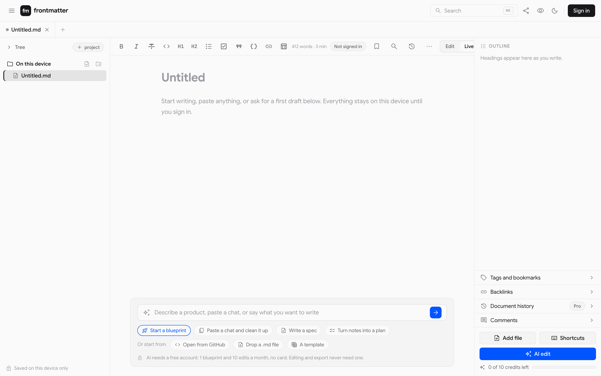<figcaption>S01 · The editor is the landing page.</figcaption></figure>

**Must have.** Opens in under two seconds, empty, box focused, every keystroke saved to this device, export without an account. Four chips: blueprint, clean up a paste, write a spec, notes into a plan. A second row: open from GitHub, drop a .md file, a template. Any chip, AI edit, Share or Save to cloud opens S02.
**Signal.** The three editors a developer reaches for show an editor on arrival with zero sign-in words; HackMD shows sixteen `[R]`. The second row is HackMD's own empty-note offer, which the founders liked `[Z]`. **Open.** Whether the template chip opens a gallery or the last three used.

### S02. Sign in

<figure class="shot">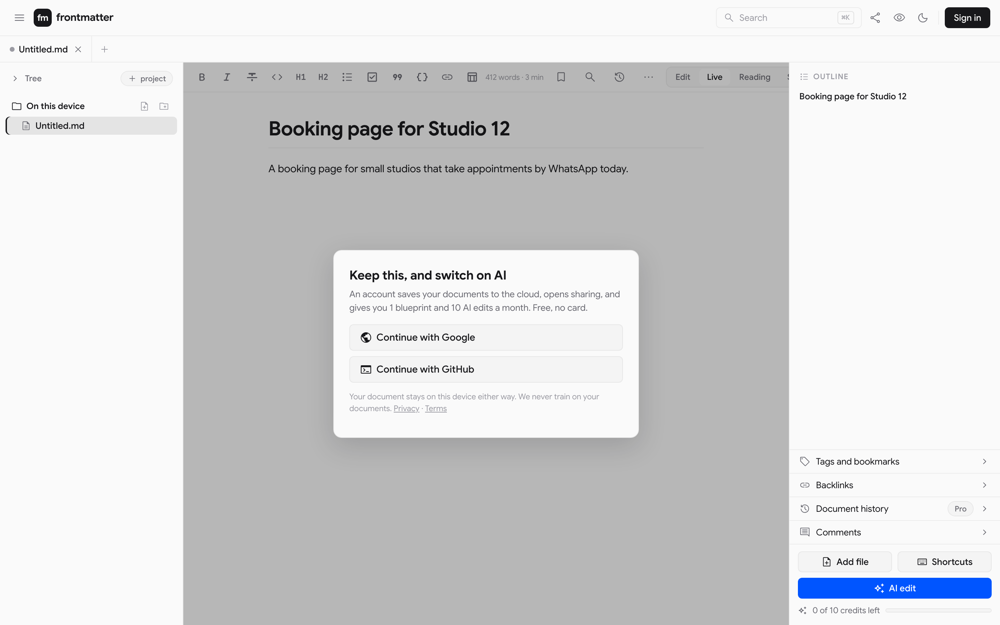<figcaption>S02 · Shown once, at the first action that needs an account.</figcaption></figure>

**Must have.** Say what an account adds and what it does not change. Google first, GitHub second. The local draft moves in. "We never train on your documents", here and in the policy.
**Signal.** Google first because the non-technical half has no GitHub `[Z]`.

### S03. The workspace

<figure class="shot">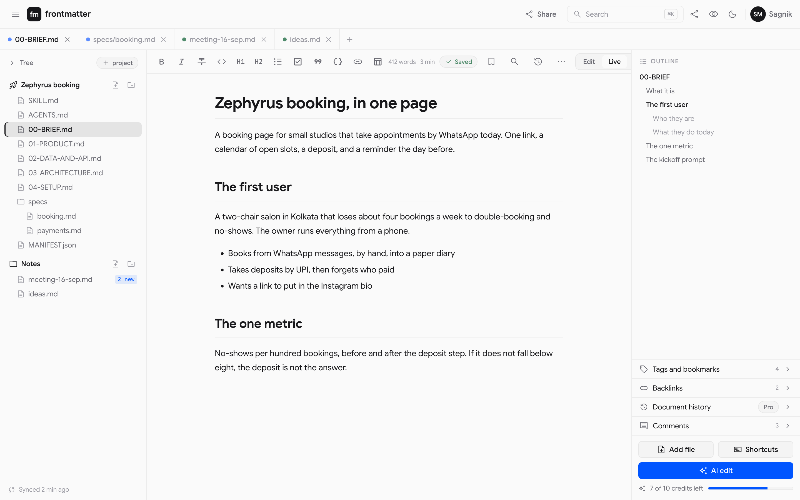<figcaption>S03 · The shape everything else inherits.</figcaption></figure>

**Must have.** Projects, folders, files, a badge for unread changes. Tabs coloured by project. Modes Edit, Live, Reading, Split. The twelve formatting buttons in the shipped order. Word count, bookmark, find, history, more. Right: outline always visible, then tags and bookmarks, backlinks, history (Pro), comments; Add file, Shortcuts, AI edit and the credits meter at the foot.
**Signal.** The layout is the founders' drawing `[Z]` rendered in the shipped design system `[O]`.
**Open.** Whether project colour is chosen or assigned.

### S04. The AI writing box

<figure class="shot">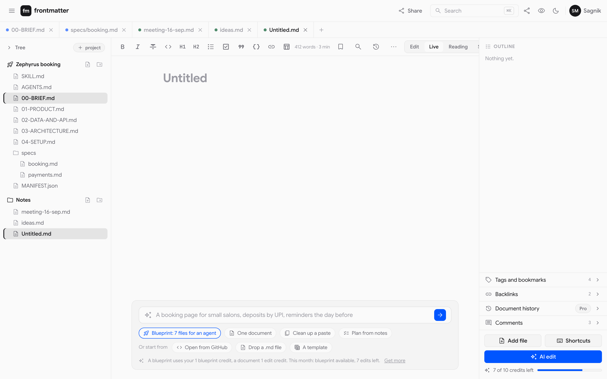<figcaption>S04 · Only while the document is empty.</figcaption></figure>

**Must have.** Appears on an empty document and disappears at the first character. The price in credits before anything is spent.
**Signal.** Google Docs, Claude and Gemini all do this `[Z]`. It is table stakes: three of five vendor canvases give an AI writing box at zero `[M]`. What is not table stakes is the file underneath.

### S05. Idea mode

<figure class="shot">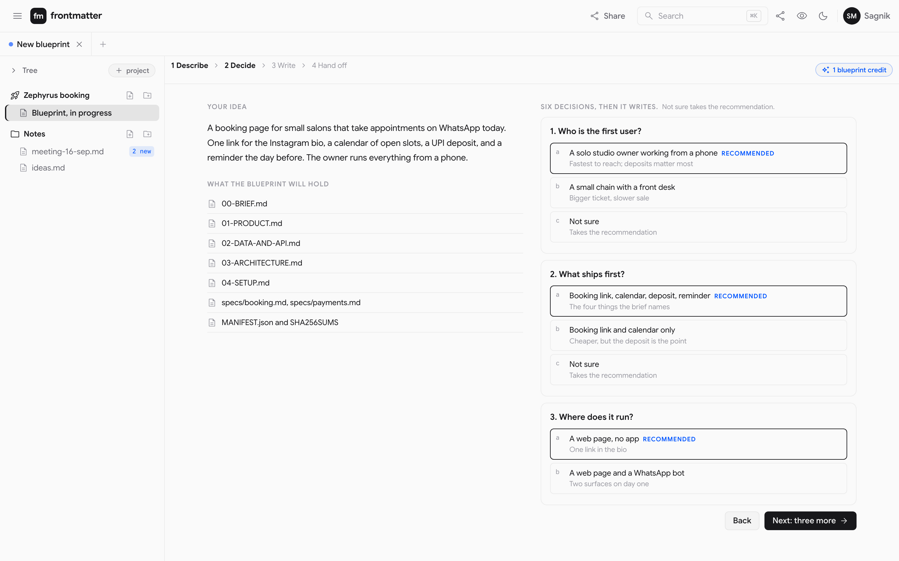<figcaption>S05 · Six decisions, each with a recommendation. "Not sure" takes it.</figcaption></figure>

**Must have.** Four steps across the top. Left: the idea and the files that will be written. Right: six decisions, two or three options, what each buys and costs, one marked recommendation.
**Signal.** 84 percent of developers use or plan to use AI tools, 46 percent distrust the output, and 69 percent keep it away from project planning `[R]`, so the questions keep the choice with the person. The card shape is our own decisions-site pattern, shipped on two products `[O]`. **Honest:** clarifying questions are not unique. Cursor Plan Mode asks them and Antigravity ships `/grill-me` `[M]`.

### S06. The blueprint, ready

<figure class="shot">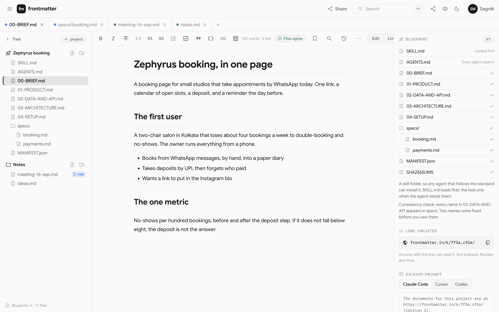<figcaption>S06 · A skill folder: index first, instructions, documents, specs, manifest, checksums.</figcaption></figure>

**Must have.** Eleven files as a folder. `SKILL.md` is the index an agent loads first; `AGENTS.md` is emitted every time. The rail carries the file list, the consistency result in one sentence, the unlisted link, the kickoff prompt, and the version. Publishing v2 writes a new path; a version never changes in place.
**Signal.** Skills "are organized collections of files … they're folders", and "keeping the paths separate reduces token usage" `[R]`. Claude Code follows the Agent Skills standard `[M]`, and AGENTS.md is the one filename Codex, Cursor, Jules, Kiro and Copilot's agent all read unprompted `[M]`. **Open.** One folder, or one per area on larger projects.

### S07. AI edit

<figure class="shot"><figcaption>S07 · A proposal in the document. Accept or reject on the span.</figcaption></figure>

**Must have.** AI never rewrites; it proposes. The strike-and-highlight uses the app's existing suggestion colour. The verb menu is the one already in the code.
**Signal.** 46 percent distrust AI output `[R]`. Tiptap sells this exact shape to other builders, "Display AI rewrites as reviewable suggestions", with tracked changes at "+$249 / month" `[M]`.

### S08. Document review

<figure class="shot">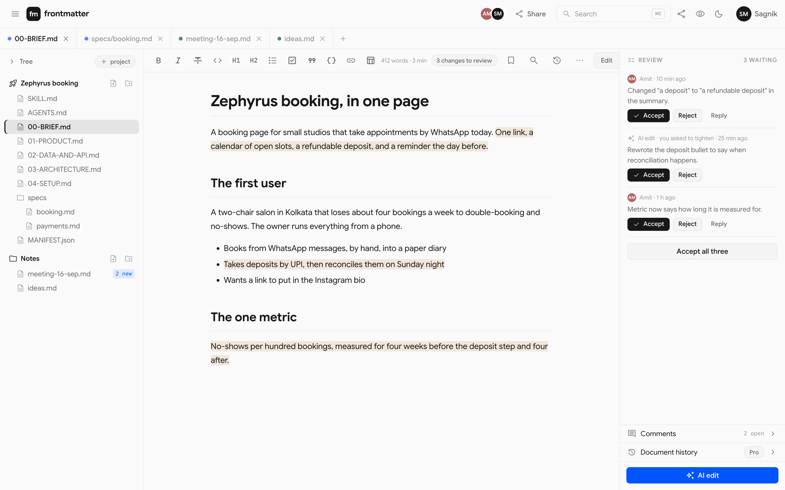<figcaption>S08 · Everything waiting, from people and from AI, in one list.</figcaption></figure>

**Must have.** One list: collaborator suggestions and undecided AI edits, with who, when, what, accept, reject. Accept all is one button.
**Signal.** Review means document review, not code review `[Z]`. "Changed since you last read" waits for MVP 1, where history makes it a diff rather than a new store `[P]`.

### S09. Share

<figure class="shot">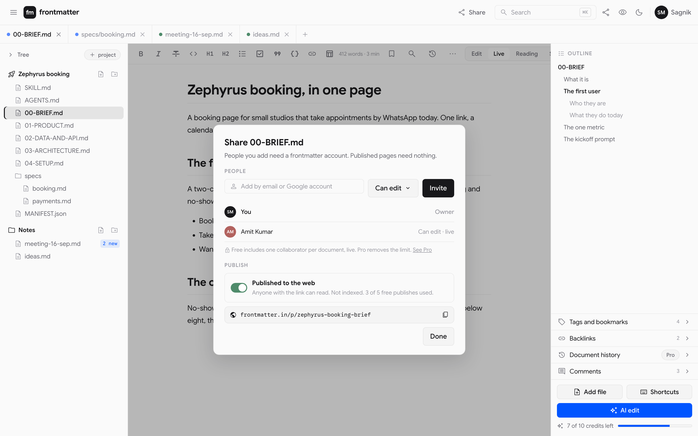<figcaption>S09 · People need accounts. Publishing needs nothing.</figcaption></figure>

**Must have.** Two halves: people by account with can-edit or can-suggest, and publish with a switch, the link and the count used. Each cap states what Pro changes in one line, with no modal.
**Signal.** "Everyone needs an account even to do that" `[Z]`.

### S10. A published page

<figure class="shot">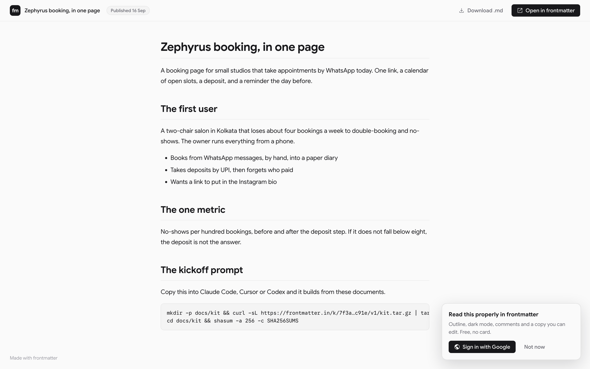<figcaption>S10 · Renders like the public page we already ship. No comments.</figcaption></figure>

**Must have.** `noindex` by default with an owner switch. A dismissable "sign in with Google for a better view". A made-with line on free. Open in frontmatter, download .md.
**Signal.** No comments on public pages `[Z]`. Backlink farms are the zero-cost abuse of any public page `[R]`. The badge-on-free pattern is what Lovable, Carrd and Framer run `[R]`.

### S11. Live collaboration

<figure class="shot">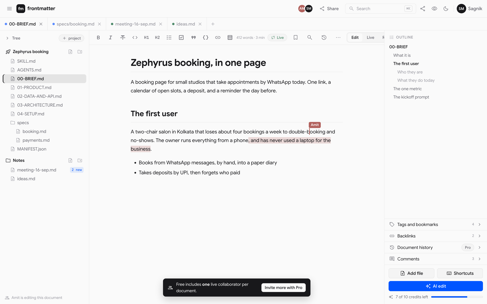<figcaption>S11 · Presence, named cursors, and the cap as a toast rather than a wall.</figcaption></figure>

**Must have.** One collaborator on free; the second invite shows the upgrade.
**Signal.** Overleaf free is "1 collaborator per project", and Overleaf is the founders' own comparison `[M]` `[Z]`. Mechanism in §12, and it does not reopen the settled sync decision.

### S12. Plan and usage

<figure class="shot">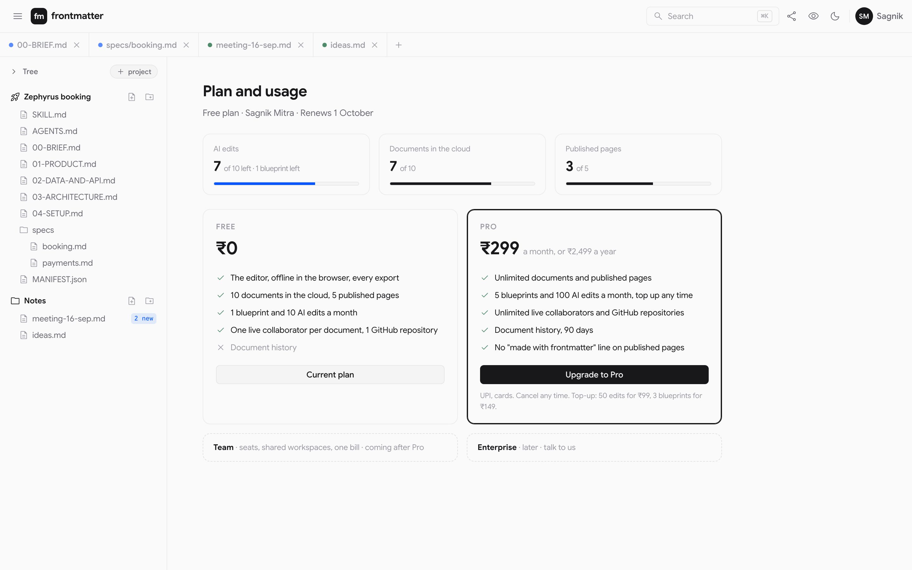<figcaption>S12 · Three meters, two plans, Team and Enterprise as coming.</figcaption></figure>

**Must have.** Meters for AI edits with the blueprint credit beside it, cloud documents, published pages. Two plans with the caps from §7. Team and Enterprise visible but unpriced.
**Signal.** Show the ladder from day one without a number nobody has researched `[Z]`.

### S13. Offline

<figure class="shot">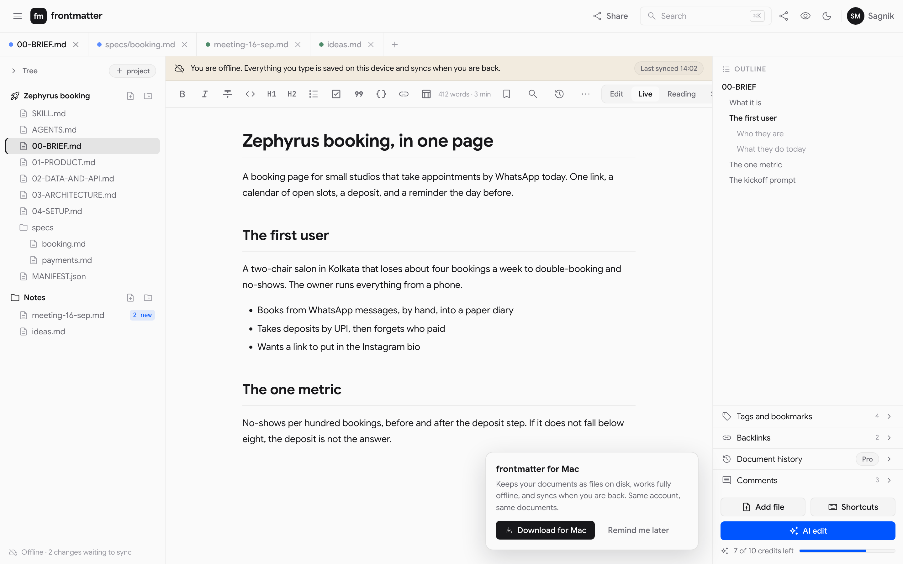<figcaption>S13 · A banner, not a modal. The desktop prompt on a schedule.</figcaption></figure>

**Must have.** Editing keeps working. Say where the text is and when it last synced. Surface a conflict; never merge silently.
**Signal.** The settled sync rule `[R]`. The desktop nudge is Notion's pattern `[Z]`; the fourteen-day cadence is our proposal, since Notion's is not published.

### S14. The desktop app

<figure class="shot">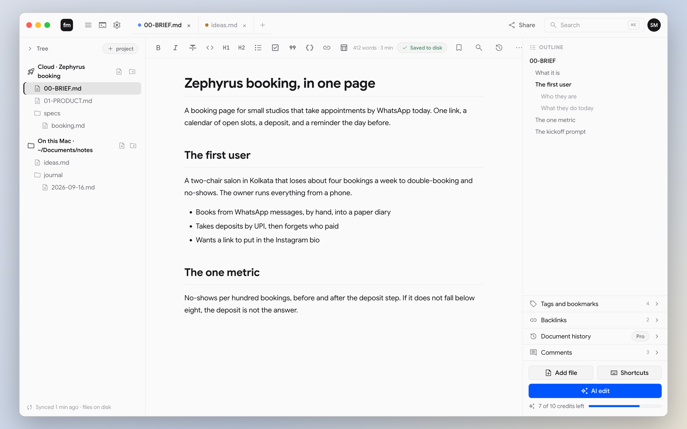<figcaption>S14 · The same interface, signed, with a folder on this Mac beside the cloud projects.</figcaption></figure>

**Must have.** One codebase, bundled. A local folder as a project. Files on disk written by the splice engine. Offline is complete here.
**Signal.** macOS and Linux in MVP 0; Windows waits, because India is absent from Microsoft's cheap signing programme `[M]`.

### S15. Document history

<figure class="shot">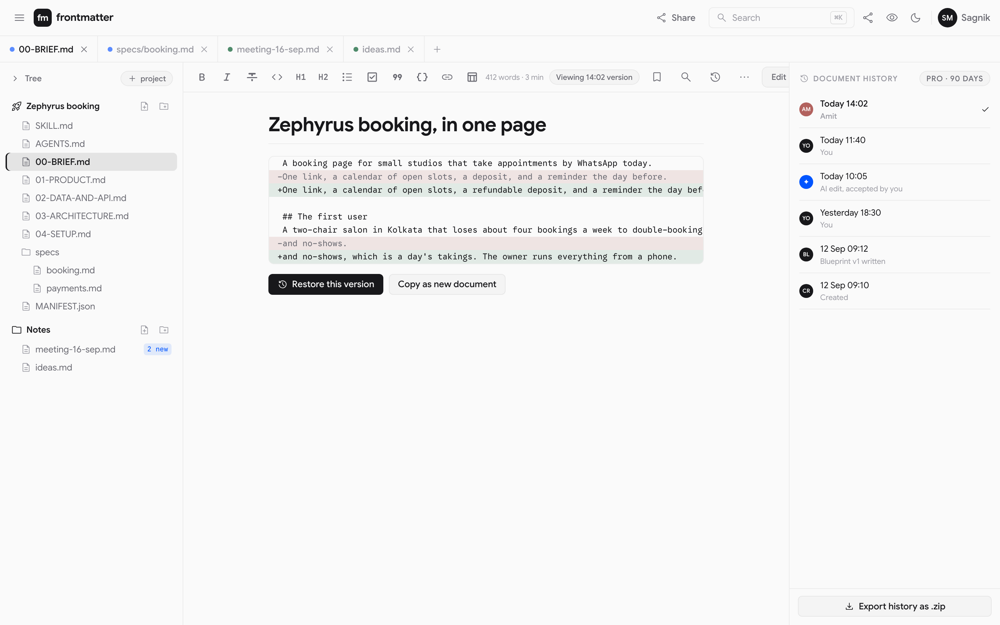<figcaption>S15 · Pro. Every save is a version; a version is a diff you can restore.</figcaption></figure>

**Must have.** Versions with who and when, which were AI edits, a diff, restore, copy. Ninety days on Pro. Free sees the row and the pill.
**Signal.** Notion free gives 7 days, Craft 7, Obsidian Sync a month `[M]`. The store is the same content-addressed layout as everything else, so history costs no extra design `[P]`.

### S16. Custom blocks

<figure class="shot">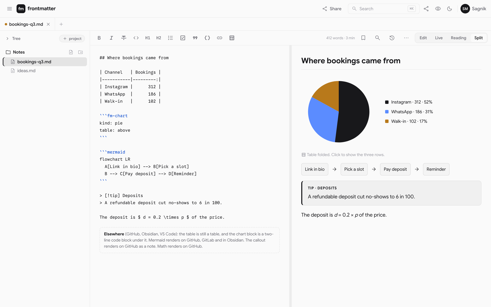<figcaption>S16 · A plain table, a chart block that reads it, Mermaid, a callout, maths.</figcaption></figure>

**Must have.** Split view, the source on the left and the render on the right, plus a note on how each block looks elsewhere.
**Signal.** Obsidian's Charts plugin has 324,208 downloads and Markdown Preview Github Styling has 2,913,661 VS Code installs `[O]`. Syntax and reasoning in §10.

### S17. The phone

<figure class="shot">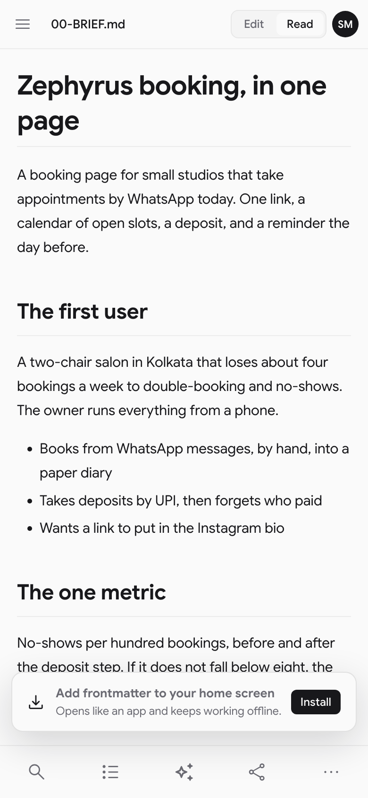<figcaption>S17 · Read, edit, outline, AI on a selection, share. Nothing else.</figcaption></figure>

**Must have.** Installable. Chrome prompts when the manifest, icons at 192 and 512, HTTPS and thirty seconds of engagement are met `[M]`; Safari needs an instruction sheet `[R]`.

### S18. Dark

<figure class="shot">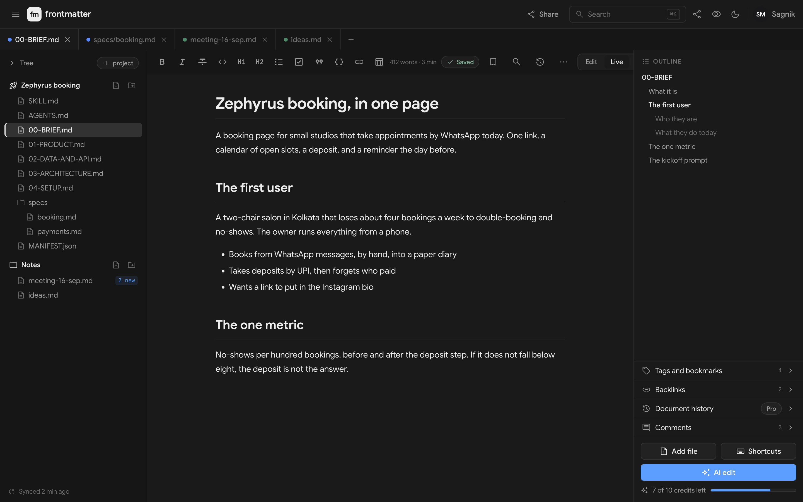<figcaption>S18 · The dark ground the app already ships.</figcaption></figure>

Both themes ship. Nothing in this plan is light-only.

### S19. Instruction files

<figure class="shot">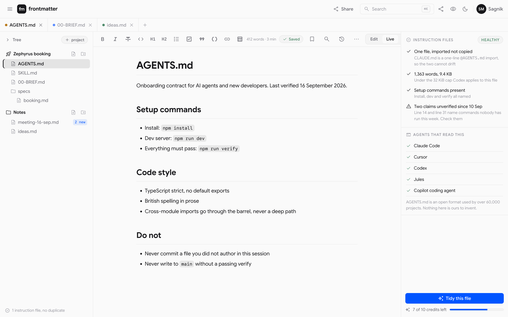<figcaption>S19 · The instructions file with a health panel and the agents that read it.</figcaption></figure>

**Must have.** See and edit `AGENTS.md`, `CLAUDE.md` and rules files in the tree. A health panel: one file rather than two, size against Codex's 32 KiB cap, setup commands present, claims not verified recently. The agents that read it, listed. "Tidy this file" is one AI edit.
**Signal,** three ways: our own note says "days" and "Nobody serves this well" `[R]`; spec-kit's top open issue is "Claude.md vs constitution.md" `[O]`; AGENTS.md is Linux Foundation stewarded at 60k projects `[M]`. **And the health rule is our practice, not a guess:** of 138 instruction files across the studio, the six repositories carrying both files **all use the `@AGENTS.md` import** `[O]`. So the tool teaches the import; it does not diff two copies.

### S20. The problems panel

<figure class="shot">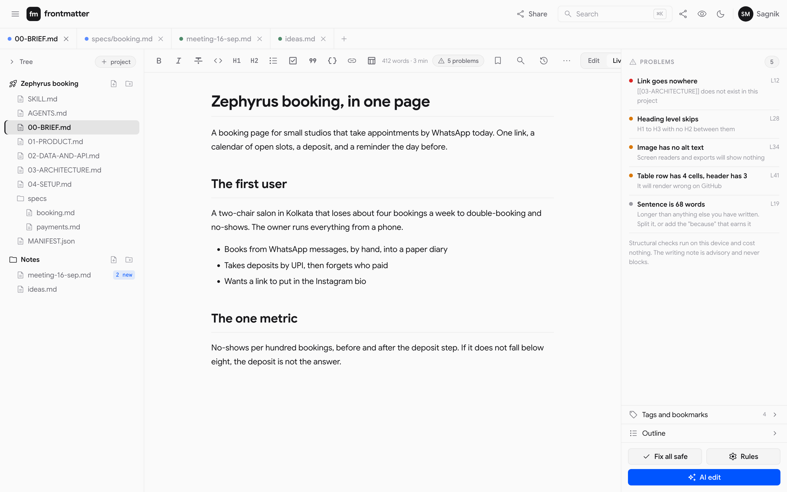<figcaption>S20 · Structural problems with line numbers, and one advisory writing note.</figcaption></figure>

**Must have.** Broken wiki links, heading skips, missing alt text, table column mismatches, unknown front-matter keys. Structural checks run on the device and cost nothing. The writing note never blocks.
**Signal.** markdownlint has 12,172,880 VS Code installs, second among markdown extensions only to Markdown All in One, and no product in either sweep ships a linter `[O]`. We own the engine already: `gate.py` exposes `run(text)`, `simplicity.py` exposes `check(text)`, standard library only `[O]`.

### S21. A drawing on the idea

<figure class="shot">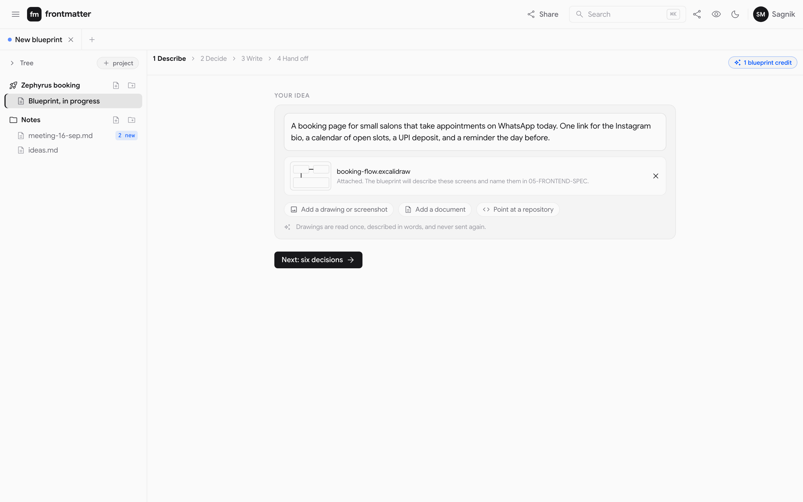<figcaption>S21 · Attach a sketch, a screenshot or a repository before the questions.</figcaption></figure>

**Must have.** The drawing is read once, described in words in the front-end spec, and never sent again, so the token cost is bounded and the privacy line stays honest.
**Signal.** Three ways: Excalidraw is Obsidian's largest plugin at 7,974,073 downloads and Draw.io has 4,139,157 VS Code installs `[O]`; spec-kit's second most-reacted open issue is "Best Practices for Providing UI Designs and Mockups to Spec-Kit Agent" `[O]`; and this plan was itself briefed with a drawing `[Z]`.

### S22. The map

<figure class="shot">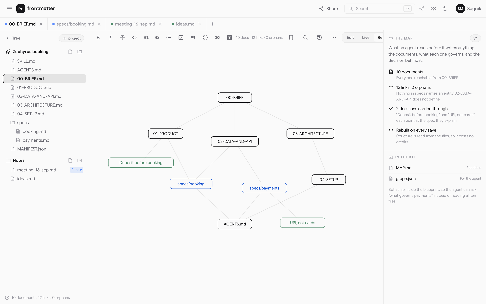<figcaption>S22 · What governs what, and which decision explains which spec.</figcaption></figure>

**Must have.** The documents as nodes, what each governs as edges, and the decisions attached to the specs they explain. Counts that mean something: documents, links, orphans. Two files ship in the kit: `MAP.md` for a person and `graph.json` for an agent. Structure is read from the files, so it rebuilds on every save at no credit cost.
**Signal.** Our own 4,600-node map exists "so an agent arriving cold can query the system's structure instead of reading 46,000 lines to find one relationship" `[O]`. Nobody in the thirty products swept ships anything like it (§4.5).
**Open.** Whether the map is a view only, or also a document the agent is told to read first.

---

# Part three: what it does

## 7. Free and Pro, every feature

Free is free to try. Pro is do it properly `[Z]`. Caps are server-side and change without a release.

### The editor

Feature | Where | Free | Pro | Signal
---|---|---|---|---
Four modes | Mode control, S03 | Yes | Yes | 8 of 11 editors have it `[R]`
Twelve formatting buttons, shipped order | Toolbar, S03 | Yes | Yes | The row we ship `[Z]`
Undo, redo, export to .md, HTML, PDF | Toolbar right, S03 | Yes | Yes | Markdown PDF: 4,132,694 installs `[O]`
Tree with projects, folders, unread badge | Left, S03 | Yes | Yes | "like VS Code does it" `[Z]`
Tabs coloured by project | Tab strip, S03 | Yes | Yes | `[Z]`
Search across documents | Header, S03 | Yes | Yes | HackMD gates search to Prime; we do not `[M]`
Outline, tags, bookmarks, backlinks, properties | Right, S03 | Yes | Yes | Ships today `[R]`
Light and dark | S18 | Yes | Yes | Ships today `[R]`
Autosave on every keystroke | Silent, S01 | Yes | Yes | Google Docs: "every change is saved automatically" `[M]`
Problems panel | Right, S20 | Yes | Yes | markdownlint: 12,172,880 installs `[O]`

### Documents and storage

Feature | Where | Free | Pro | Signal
---|---|---|---|---
Documents in the cloud | Tree | 10 | Unlimited | Holds one blueprint plus notes; blocks a second project `[Z]`
Image uploads | In the document | 5 MB a file, 100 MB an account | 25 MB, 5 GB | Notion free caps at 5 MB `[M]`; 100 MB costs under ₹0.15 a month, estimate
Every save is a version | Silent | Yes | Yes | R2 has no object versioning; the key layout carries it `[R]`
History, diff, restore | S15 | No | 90 days | Notion 7 days free; Obsidian Sync a month `[M]`
Trash | Tree | 30 days | 30 days | HackMD free trash: 3 days `[M]`

### AI

Feature | Where | Free | Pro | Signal
---|---|---|---|---
Writing box on an empty document | S04 | Yes | Yes | Three of five vendor canvases give it free `[M]`
AI edit on a selection, eight verbs | S07 | 10 edits a month | 100 | Slite: "30 AI edits/month/user" at $10 `[M]`
Every AI change is a suggestion | S07 | Yes | Yes | 46 percent distrust AI output `[R]`
Careful mode, larger model, two credits | S07 | Yes | Yes | Sonnet is twice Haiku `[M]`
Blueprints | S05, S06 | 1 a month | 5 | About ₹30 in tokens each, estimate
Top-ups | S12 | 50 edits ₹99, 3 blueprints ₹149 | Same | Kiro: "$0.04/credit", about ₹3.84. Ours is ₹1.98 `[M]`
Daily spend breaker, per user and global | Server | Yes | Yes | `[R]`
Attach a drawing, document or repository | S21 | Yes | Yes | Three independent signals (S21) `[O]`

### The blueprint

Feature | Where | Free | Pro | Signal
---|---|---|---|---
Describe, then six decisions with recommendations | S05 | Yes | Yes | 69 percent keep AI off planning `[R]`
Eleven files as a skill folder, consistency-checked | S06 | Yes | Yes | Separate paths reduce token use `[R]`
`SKILL.md` index, loaded first | S06 | Yes | Yes | Agent Skills standard `[M]`
`AGENTS.md` emitted every time | S06 | Yes | Yes | 60k projects, Linux Foundation stewarded `[M]`
Verify commands and an exit condition in each spec | S06 | Yes | Yes | Our research: "the strongest pattern found" `[R]`
The map: `MAP.md` and `graph.json` | S22 | Yes | Yes | Our own 4,600-node map `[O]`
Unlisted link, manifest, tarball, checksums, revoke | S06 | Yes | Yes | Nobody else serves a kit cold `[M]`
Kickoff prompt for Claude Code, Cursor, Codex | S06 | Yes | Yes | One setup note each `[R]`
Push the blueprint to a GitHub branch | S06 | Within the cap | Yes | Cloud agents read the repo, with no approval step `[R]`
Publish v2; a version never changes in place | S06 | Yes | Yes | `[R]`
Kit expiry when unvisited | Silent | 30 days | Never | `[R]`

### Sharing, review, live editing

Feature | Where | Free | Pro | Signal
---|---|---|---|---
Invite by account, can edit or can suggest | S09 | Yes | Yes | `[Z]`
Comments on a span, threaded | S08 | Yes | Yes | Craft and HackMD give these away `[M]`
Suggestions from collaborators | S08 | Yes | Yes | Google Docs suggesting mode `[M]`
Review panel | S08 | Yes | Yes | `[Z]`
Live editing with presence | S11 | 1 collaborator | Unlimited | Overleaf free: "1 collaborator per project" `[M]`

### Publishing

Feature | Where | Free | Pro | Signal
---|---|---|---|---
Publish a page | S09, S10 | 5 | Unlimited | Every hosted editor charges for this `[M]`
`noindex` by default | S10 | Yes | Yes | Backlink farms `[R]`
Custom slug | S10 | No | Yes | HackMD gives permalinks free; Notion charges per domain `[M]`
Made-with line | S10 | Shown | Removed | `[R]`
Reader sign-in prompt, dismissable | S10 | Yes | Yes | `[Z]`
Opt-in listing on the public index | S10 | Yes | Yes | §21
Comments on public pages | S10 | Never | Never | `[Z]`

### Integrations

Feature | Where | Free | Pro | Signal
---|---|---|---|---
Connect a GitHub repository, open its markdown | S01, tree | 1 repository | Unlimited | HackMD free: "GitHub integration" `[M]`
Push to a branch with a compare link | S06 | 20 a month | Unlimited | HackMD's exact cap `[M]`
Open any public GitHub markdown at `/gh/owner/repo/path.md` | URL | Yes | Yes | Raw GitHub returns `access-control-allow-origin: *` `[O]`
Import a Google Doc | S01 chip | Yes | Yes | Drive exports "Markdown, text/markdown, .md", 10 MB cap `[M]`
Import a Word .docx | S01 chip | Yes | Yes | mammoth converts in the browser, 6.4M downloads a week `[O]`
Serve pages and kits as markdown at `page.md`, by `Accept: text/markdown`, plus `/llms.txt` | URL | Yes | Yes | llms.txt asks for `.md` twins; Anthropic, Cloudflare, Stripe and Vercel serve them `[O]`
Open a folder on disk, including an Obsidian vault | S14 | Yes | Yes | `[Z]`
Paste from ChatGPT or Claude and clean it up | S01 chip | Yes | Yes | OpenAI retired canvas; chat output has no file `[M]`

### Instruction files

Feature | Where | Free | Pro | Signal
---|---|---|---|---
See and edit the instruction files | S19 | Yes | Yes | "Nobody serves this well", days of work `[R]`
Health panel | S19 | Yes | Yes | Our 138 files and six import stubs `[O]`; Codex caps it at 32 KiB `[M]`
The agents that read it, listed | S19 | Yes | Yes | ~23 named adopters `[M]`
Tidy this file | S19 | 1 credit | 1 credit | `[P]`

### Offline, PWA, desktop

Feature | Where | Free | Pro | Signal
---|---|---|---|---
Offline editing, sync on return, conflicts surfaced | S13 | Yes | Yes | The settled sync rule `[R]`
Installable PWA | S17 | Yes | Yes | Chrome's install criteria `[M]`
Periodic desktop prompt | S13 | Yes | Yes | "just like Notion does it" `[Z]`
macOS app, signed and notarised | S14 | Yes | Yes | $99 a year; notarisation cannot be skipped `[M]`
Linux app, six formats | S14 | Yes | Yes | Tauri needs **no certificate** on Linux; cost is a CI runner `[M]`
Version check, no auto-updater | S14 | Yes | Yes | A lost signing key strands every user `[R]`

### Accounts and money

Feature | Where | Free | Pro | Signal
---|---|---|---|---
Google or GitHub sign-in | S02 | Yes | Yes | `[Z]`
Plan and usage, Team and Enterprise as coming | S12 | Yes | Yes | `[Z]`
Razorpay: UPI AutoPay and cards, GST invoice, manual retry | S12 | | Yes | An Indian card gets one attempt `[R]`
Policy, terms, grievance officer, 18-plus line | Footer | Yes | Yes | `[L]`

### Deliberately absent

Not built | Why
---|---
Code review | `[Z]`
Per-span "changed since you last read" | Almanac shipped it, raised $43M, shut in January 2025 `[R]`. Returns in MVP 1 as a diff over history
Book mode, slide mode, note insights | HackMD has all three `[M]`; none is why anyone switches
Multi-column layouts via raw HTML and CSS | The founders dislike HackMD's `[Z]`. Counter-evidence: Multi-Column Markdown has 218,817 downloads `[O]`, so the demand is real and the mechanism is wrong
An image puzzle anywhere | `[Z]`. HackMD's is AWS WAF's, a symptom of unlimited free notes with anonymous reading `[M]`
A student tier | `[Z]`, 16 September: not needed
A community beyond a seed | "A ten-user public forum reads as an empty room" `[R]`

## 8. The blueprint, in detail

**Shape.** A skill folder `[Z]`:

````
booking-blueprint/
  SKILL.md              the index: what this is, when to load what
  AGENTS.md             house rules every agent reads
  00-BRIEF.md           the project in one page, the first user, the one metric
  01-PRODUCT.md         what ships first, what is cut
  02-DATA-AND-API.md    entities, relationships, operations
  03-ARCHITECTURE.md    one short decision record per structural choice
  04-SETUP.md           environment, local setup, the commands that gate a commit
  specs/booking.md      files governed, verify commands, an exit condition
  specs/payments.md
  MAP.md + graph.json   what governs what, and which decision explains which spec
  MANIFEST.json + SHA256SUMS
````

**Why this spine.** It is ours, validated three times `[O]`: 33 numbered files at 119,284 words, 12 at 37,056, and 16 at 57,472, all on the same `00-EXECUTIVE-SUMMARY / 01-PRODUCT-AND-DOMAIN / 02-ARCHITECTURE / 03-DATA-MODEL / 04-API-REFERENCE` spine, with numbered decision records beside them. Eleven files is the subset an agent needs to start. Caveat: those document products already built, so they prove the structure, not the generation.

**The link.** An unlisted address of at least 120 bits, `noindex`, `no-referrer`, revocable, never edited in place `[R]`. A free kit unvisited for 30 days expires. `curl` needs no account, and that is the point.

## 9. AI, credits, cost

**Two credit types** `[Z]`. An edit credit buys one AI edit, one generated document, one summary, one link suggestion. A blueprint credit buys one blueprint with its questions, writing and consistency pass.

**Why visible credits.** Claude sells none: "there's no fixed message count" `[M]`. Cursor bills included usage with overage in arrears `[M]`. Notion sells "$10 per 1,000 monthly Notion credits" `[M]`. A per-task credit is our choice, and it is the one a non-technical buyer understands in a sentence.

**Cost.** Sonnet 5 is $2 and $10 per million tokens; Haiku 4.5 is $1 and $5 `[M]`. Token counts are assumed, so every line is an estimate.

Task | Tokens in / out | Sonnet | Haiku
---|---|---|---
One edit | 4,000 / 800 | $0.016, ₹1.54 | $0.008, ₹0.77
One document | 2,000 / 1,500 | $0.019, ₹1.82 | $0.0095, ₹0.91
One blueprint, eleven files plus a review pass | 60,000 / 23,000 `[R]` | $0.35, ₹33.6 | $0.175, ₹16.8
Blueprint, mixed: Haiku questions, Sonnet writing | 20,000 / 3,000 then 40,000 / 20,000 | $0.315, ₹30.2 |

**Prompt caching, which v1 missed.** Cache reads are $0.20 per million against $2 input for Sonnet `[M]`. The instructions, question set and file templates are identical on every blueprint, so that part is cached and the marginal blueprint costs materially less than ₹30. The exact saving is measured in week one, not estimated here.

**Caps.** Free: 1 blueprint and 10 edits, so about ₹37.9 a month for a fully active free user on Haiku, estimate. Pro: 5 blueprints and 100 edits, about ₹305 on Sonnet against ₹246 net, so edits run on Haiku by default with a two-credit careful option, bringing it to about ₹228, estimate. Re-derive from measured usage after month one.

**Controls that ship with the credits** `[R]`: a daily spend breaker per user and one global, a per-task token ceiling, rate limits, and the six AI routes behind sign-in, since today any signed-in user can call them unmetered `[R]`.

**Reuse.** The whole schema exists in another studio product: `user_credits`, `plans`, `plan_entitlements`, the billing tables, a three-tier AI cost model with usage logs, and a runtime feature registry with kill switches `[O]`.

## 10. Rendering

**The rule, already settled here.** A callout for prose, a fenced block for data, non-standard kinds prefixed `fm-` `[R]`.

**Why not a custom marker pair** `[Z]` asked for `---pi`. Three reasons `[R]`: three hyphens already mean a thematic break and the front-matter fence; an unclosed custom pair swallows every later line; and every renderer that matters already tolerates a fenced block with an info string, which GitHub, GitLab and Obsidian all render `[M]`.

**The chart block.** The table stays a plain table. The block sits under it and reads it:

````
| Channel   | Bookings |
|-----------|---------:|
| Instagram |      312 |
| WhatsApp  |      186 |

```fm-chart
kind: pie
table: above
```
````

Here the chart draws and the table folds. Anywhere else the table is still a table and the block is two lines of code `[R]`. Kinds: pie, bar, line.

**Cheaper than v1 assumed** `[O]`. Our decisions-site renderer is a working ten-primitive inline SVG engine with computed geometry, shipped on two products. Its funnel primitive is already a horizontal bar chart; a line chart needs only a polyline emitter; only pie is new code.

**The catalogue, and how each degrades.**

Block | Here | GitHub | Obsidian
---|---|---|---
Mermaid | Rendered, exists today | Rendered | Rendered
`fm-chart` over a table | Chart, table folded | Table then two lines of code | Same
Callout | Rendered, exists today | Rendered for five kinds | Rendered
Maths | Rendered, exists today | Rendered | Rendered
Tasks, tables, images, wiki links, properties | Exist today | Standard parts render | Rendered

**Convert to Mermaid** on any chart block writes the portable version, since GitHub, GitLab and Obsidian all render Mermaid pie charts `[M]`.

## 11. Storage

**R2 is the bucket, Firestore is the database, never the reverse** `[L]`. R2 has no query, no transactions and no bucket versioning, which its own S3 page lists as unimplemented `[M]`. Firestore cannot hold a body past 1 MiB and charges per read `[M]`.

Thing | Where | Shape
---|---|---
Document bytes, every version | R2 | `u/<uid>/d/<docId>/v/<n>-<sha256>.md`, never overwritten
Uploads | R2 | `u/<uid>/a/<sha256>.<ext>`
Kit files, map, tarball | R2 | `k/<kitId>/v<n>/…` plus checksums
Users, plan, credits ledger | Firestore, Mumbai | One ledger row per credit with task, model, tokens, cost
Index, projects, shares, publishes, comments | Firestore | Records only
Live session state | Durable Objects, one per open document | Yjs while the session lives
Security logs, 180 days | Mumbai | `[L]`

Mumbai because CERT-In wants logs held in India `[R]`, and the Firestore pricing page lists Mumbai and Delhi as regions `[O]`.

**Cost is not the constraint.** R2 is $0.015 per GB-month with no egress fee `[M]`. A markdown document is about 20 KB, so a thousand free users at ten documents each is 0.2 GB; a thousand filling the upload cap is about $1.35 a month. Estimates. The model is the cost (§9).

**Two risks.** Cloudflare sits on a personal account while Firebase is under the company; the bucket moves before the first stranger's document lands in it `[L]`. And our record shows Durable Objects used zero times, R2 only for images, Firestore on one product, with Supabase as the default `[O]`: three unfamiliar things at once for two people.

## 12. Offline, sync, live editing, desktop

**Offline.** This device first, cloud second. The service worker caches the shell. Saving compares versions: if the cloud moved, both are shown and the person chooses. Nothing merges silently `[R]`. Two limits stated rather than hidden: Safari deletes script-writable storage "after seven days of Safari use without user interaction on the site" while home-screen apps "have their own counter" `[M]`, so on Safari the promise holds only for the installed app; Chrome allows up to 60 percent of the disk `[M]`, matching "Chrome first" `[Z]`.

**Live editing without reopening the settled decision.** The document of record stays markdown bytes, one version per save. A live session is a shared document in a Durable Object that exists only while two people have the file open; every save writes a new version; when the last person leaves it is gone. It never owns the bytes, never decides a conflict between versions, never touches files on disk. That is the exception the record already allowed `[R]`. Parts are maintained `[M]`. Durable Objects gives 100,000 requests a day free, paid from $5 a month; Liveblocks at $25 is the buy option `[M]`.

**Desktop.** Today the shell loads a remote URL with no content policy, no file-system scope, no signing identity and the old identifier `[R]`. Shipping means bundling, scoping, signing and notarising. Windows waits: India is absent from Microsoft's country list for the cheap programme, and the alternative is a hardware-token certificate at about $219 a year `[M]` `[R]`.

**No offline outbox exists in any of our repositories** `[O]`. Four service workers, none with a replay queue. That item is a real build, not a lift.

## 13. Accounts, sharing, publishing

Google first, GitHub second, both through the auth client already in this repository `[O]`. Everyone who edits or comments needs an account `[Z]`, which is also what makes suggestions attributable. Editing without an account exists only for the local draft and export: it is the front door, not a tier. A published page is readable by anyone with the link, `noindex` by default, five free, custom slug on Pro, made-with line on free.

## 14. Money

**Price** `[Z]`: ₹299 a month, ₹2,499 a year. Max later, unpriced. No dollar price in MVP 0.

Anchor | Price
---|---
ChatGPT Go, India | ₹399
Google AI Plus, India | ₹399
HackMD personal | "$4 per month ($48 per year)", about ₹384
Overleaf Standard, India | ₹421.75 billed yearly
Superhuman Docs, India | "Pro ₹ 983 / month per Doc Maker"
ChatPRD | "$15 / mo", about ₹1,439
Kiro Pro | "$20 per user / month", about ₹1,919
CodeGuide Pro | "$24.00 /mo", about ₹2,303
Zoho Workplace Standard | "₹99 /User /Month"
Google Workspace Starter, India | "₹270 /user/month"

**The honest reading.** ₹299 is below every AI-product and document-tool anchor, and above India's productivity-suite anchors, where ₹99 buys a whole suite. Zoho Writer is free "for both individual users and organizations" with AI included `[M]`, though its features page contains zero occurrences of "markdown" `[O]`, so it is a word processor rather than a rival. Build at ₹299; carry both ₹299 and ₹399 into the twenty conversations `[R]`.

**What ₹299 nets.** A consumer price includes GST at 18 percent: 299 ÷ 1.18 = ₹253.39. Razorpay is "2% + GST per transaction" `[M]`: ₹5.98 plus 18 percent is ₹7.06. Net about ₹246. Annual ₹2,499 nets about ₹172 a month. Working shown.

**Payments** `[L]`. Card mandates register "up to a maximum of ₹15,000 without any intervention"; above that every debit needs a fresh authorisation, and RuPay recurring debits above ₹15,000 "are not allowed" `[M]`. Both prices clear it. UPI AutoPay needs a notice "at least 24 hours prior to initiating each debit" `[M]`, so the product emails before every charge and offers a manual retry. There is a launch offer of "0% platform fees for first 90 days" `[M]`.

**Dollar pricing is not a same-week switch** `[L]`. International payments need bank approval, video identity checks, and four published pages: "Terms and Conditions, Privacy policy, Refund and Cancellation policy, Shipping policy", without which "International payments cannot be enabled for your account" `[M]`.

**One Pro seat.** Net ₹246, model cost at full use about ₹228 and far less typically, infrastructure under ₹5 at pilot scale, support unmeasured `[R]`. Products under $50 a month sit in the worst retention band, 23 percent for AI-native `[R]`. That is the number to beat, and the reason the desktop app and a blueprint that stays alive matter more than any editor feature.

**Reuse.** A complete payment integration already exists in another studio product: order verification, webhook signing, refunds, and a browser test `[O]`.

## 15. The legal floor

Holding documents brings this in before the first stranger `[L]`.

Due before launch | What
---|---
Privacy policy, terms, consent | The 2011 rules are live now; the newer act's penalties start 13 May 2027 `[R]`
Named grievance officer | The page and the address
Breach contact filed, six-hour runbook | Six hours from noticing, no size floor; up to a year or ₹1 lakh `[R]`
Security logs, 180 days, in India | Minimal append-only log
Processor agreements | Cloudflare, Google, Anthropic, Razorpay `[R]`
Report form, 24-hour acknowledgement, takedown, preservation log, moderation page | Public pages by strangers make us an intermediary. The record prices the apparatus at 74 founder-hours, with acknowledgement "within 24 hours, every day, permanently", all shipping "before the first stranger publishes" `[R]`
Retention table, 18-plus line | One sentence now, awkward later
Four policy pages for international payments | `[M]`
EU sign-ups blocked | A representative costs €39 to €160 a month
GST position confirmed by a chartered accountant | Reverse charge on imported AI services
Cloudflare moved to the company | §11

The founders chose the funnel and Pro over the zero-bytes rule knowingly `[Z]`. The rules that keep the surface small: never train on documents, free kits expire, delete on request, and a published page is the only thing a stranger can read.

## 16. Security

frontmatter renders untrusted markdown, runs a model over private documents, and writes to GitHub. That is all three legs of the prompt-injection problem, and our own base carries the mechanism: "any outbound HTTP, image fetch, **markdown image render**, or PR/issue create can leak the data" `[R]`. Six controls ship in MVP 0.

1. **Untrusted content is never instruction.** Document text reaches the model inside a delimited data block with a standing rule that content inside it is data `[P]`.
2. **No silent outbound fetch from a document.** Remote images in a shared document are proxied or click-to-load. The published page allows no third-party image or script origin.
3. **The AI proposes, never acts** `[Z]`. No AI-initiated share, push or publish, ever.
4. **A GitHub push is always explicit**, always to a branch, never a merge `[P]`.
5. **The daily spend breaker** bounds an injection loop `[R]`.
6. **No puzzle at the door** `[Z]`. Abuse checks run invisibly: app attestation on the AI routes, free for 10,000 checks a month `[M]`; an invisible challenge on anonymous publishing only if abuse appears, free with unlimited challenges `[M]`.

---

# Part four: how we build it

## 17. What we already have

Measured on our machines, 16 September `[O]`.

Already built | Where | What it saves
---|---|---
Complete payment integration: order verification, webhook signing, refunds, a browser test | another studio product | Most of the payments item
The credit engine: plans, entitlements, billing tables, a three-tier AI cost model, kill switches | another studio product | The ledger and server-side caps
A ten-primitive inline SVG renderer, one of them already a bar chart | this repository and one more | Most of `fm-chart`
19 browser-side PDF tools, no uploads | another studio product | The browser export path
Two scoring engines, standard library only, one already imports the other | the scoring repository | The problems panel
A named-app auth client with a refresh guard | this repository | Sign-in
A numbered document convention proved on three sets, 61 files, 213,812 words | this repository and one more | The kit spine
A 4,600-node map of a whole system, rebuilt from files at no token cost | another studio product | The map (S22)
A public skills registry with 184 skills and a sync engine | ours, live | The community route (§21)

Genuinely new: the offline outbox, live editing, the GitHub App, the kit writer, the consistency check.

## 18. The build

**S** is 1 to 2 engineering days, **M** 3 to 5, **L** 6 to 10. Every phase ends green, with a failing test first for anything that fixes a defect.

**Phase 0, weeks 0 to 2, before code.** Settle §23. Move Cloudflare to the company. File the breach contact, publish policy, terms and grievance pages, sign the processor agreements, ask the accountant, publish the four payment policy pages. Fix the repository default that still points at the sibling's vault `[R]`. Publish the pace every Friday. Make twenty blueprints by hand for twenty people outside the studio and watch whether five run the kickoff `[R]`.

Phase A, the launch core | Size
---|---
Editor at the root with a local draft, no wall | S
Google and GitHub sign-in for strangers, a users record | M
Per-user storage: versions, index, projects, documents | L
Projects in the tree, tabs with project colours | M
Right pane: history and comments rows, shortcuts, AI edit, credits | M
AI writing box on an empty document | S
Export: wire the browser PDF path, delete the server route | S
Published page, noindex, sign-in card, made-with line | M
Report form, 24-hour acknowledgement, takedown, moderation page | M
Markdown twins and `/llms.txt` | S
Problems panel | M
**27 to 46 days** |

Phase B, AI and credits | Size
---|---
Suggestion mode: proposals in place, accept and reject per span | L
Credits ledger, two types, caps, breaker (schema lifted) | M
Routes behind sign-in and metering, model routing, prompt caching | S
Injection controls: delimited data block, image proxy, page policy | S
**11 to 19 days** |

Phase C, the blueprint | Size
---|---
Six decisions from a prompt, in the card shape | L
Kit writer: eleven files, one review pass, consistency check | L
Skill folder, index file, instructions file, verify arrays | S
The map: `MAP.md` and `graph.json`, rebuilt on save | M
Storage, link, manifest, tarball, checksums, revoke, expiry | M
Kickoff prompt, agent picker, copy | S
A kit opens as a project; edit then publish v2 | S
Attach a drawing, document or repository to an idea | M
GitHub App: connect, open a repository, push to a branch, caps | L
**30 to 51 days** |

Phase D, sharing and collaboration | Size
---|---
Share dialog, roles, invites by account | M
Comments on spans | M
Suggestions from collaborators into the review panel | M
Live editing: shared session per document, presence, the cap | L
**15 to 25 days** |

Phase E, offline, PWA, desktop | Size
---|---
Local-first outbox, compare-and-swap save, conflict prompt | L
PWA: cached shell and documents, icons, install prompt, Safari sheet | S
Desktop nudge on its schedule | S
Bundle, file-system scope, content policy, identifier, macOS signing and notarisation, version check | L
Linux targets on a CI runner | S
**15 to 26 days** |

Phase F, Pro and the rest | Size
---|---
Subscriptions, webhooks, GST invoices, one-attempt retry (lifted) | S
Plan and usage page, upgrade, top-ups | M
Document history, 90 days, diff, restore | M
`fm-chart` over a table, convert to Mermaid, elsewhere preview | M
Instruction-file editor with the health panel | M
Imports: Google Docs and Word | M
Retention table, 18-plus line, EU block | S
**17 to 29 days** |

**The sums.**

- Everything: **115 to 196 engineering days.**
- The launch core, what a stranger meets on day one: A, B, C plus payments and the plan page: **72 to 123 days.**
- At the measured 1.21 days a week: core 60 to 102 weeks, everything 95 to 162.
- At three days a week: core 24 to 41 weeks, everything 38 to 65.
- At five days a week: core 14 to 25 weeks, everything 23 to 39.

The studio's own standard is "5 to 8 weeks for an MVP" `[O]`. The distance between that and 72 to 123 days is the honest measure of how much bigger this is than a client build.

**If the date slips**, cut from the bottom: live editing, then the desktop build, then GitHub, into releases after launch. The PWA covers the download prompt.

## 19. Risks and kill lines

Risk | What limits it | Kill line
---|---|---
Nobody keeps a blueprint alive after the first build | The editor, the consistency check, the map, versions | Fewer than two of ten pilot users edit a kit after its first build: keep the editor, stop the generator `[R]`
CodeGuide, Kiro and ChatPRD already sell this | The editor, the plain link, the map, a rupee price a tenth of CodeGuide's | Same kill line. Their existence proves demand, not ours
A platform absorbs the kit | Ours needs no repository and no licence | If a major platform ships a public shareable project link, the pitch narrows to the editor and the desktop app
Free AI costs more than assumed | Haiku on free, one blueprint a month, prompt caching, the breaker | Model cost per active free user over ₹60 in a month: halve the free caps that week
Pro loses money at full use | Haiku edits, five blueprints, top-ups | Measured cost per Pro seat over ₹200: ₹399 for new seats
Three unfamiliar technologies at once | Free tiers, and a buy option for live editing | If the live-editing spike runs past ten days, buy it
Injection through a shared document | §16 | One confirmed leak: sharing goes invite-only until fixed
A breach in the first month | The legal floor, no training on documents | Six hours to the authority; the runbook is written before launch
An unchecked trademark | No extension, so no store collision | A letter arrives: coin a name; the identifier is name-free by design `[R]`
Pace | §18 | Launch core not done in 30 weeks: cut blueprint automation, launch the editor with hand-made kits

## 20. What we measure

The funnel: visits, documents created, sign-ups, blueprints started, finished, kickoff copied, kit fetched by an agent, **kit edited again within seven days**, pages published, second collaborator invited, Pro.

**The one number: blueprints edited after their first build, per week.** It tests the only claim that separates us from every generator.

**Add, and v1 missed it:** the acceptance rate of AI suggestions. Our own base calls user feedback the moat and names these signals exactly, "explicit (thumbs, ratings, corrections) versus implicit (acceptance, edits, regeneration, churn)" `[R]`. It is the cheapest early read on whether the AI is good enough.

**The pilot passes** on the existing test plus: three of ten strangers name the problem unprompted, two of ten still editing at day 30, one call booked, five of ten run the kickoff `[R]`.

**Published every Friday:** engineering days, the running rate, the re-forecast date, model cost per active user, suggestion acceptance, and conversion once it exists.

## 21. The community

**What we want** `[Z]`: people share markdown, share agent skills, post agentic writing, later something like a paid circle.

**What the record says.** "A ten-user public forum reads as an empty room" `[R]`, and our own cards already caught this plan claiming community as a moat with no mechanism behind it `[R]`. Every public page by a stranger carries the 24-hour clock in §15.

**Three steps.** *MVP 0:* a published page gets an opt-in "list this" switch; listed pages appear on one index after a founder approves each from a queue; support runs on GitHub Discussions, so the empty room is never on our domain. *MVP 1:* profiles at `frontmatter.in/@handle`. A post is a published document and a shared skill is a published blueprint, already a skill folder (§8), so one object serves both, routed through **our own registry of 184 skills** `[O]` rather than someone else's. *MVP 2:* comments, collections, a digest. A paid circle is not ours to build: Skool charges "$9/month" to "$99/month" plus a fee `[M]`.

**Team and Enterprise** `[Z]` are shown as coming on S12 and built after Pro. Seat-price comparables when it comes: HackMD "$ 5 per seat/mo", Docmost "$6 /seat/mo" with a ten-seat minimum, Nuclino "$6/user/month", Slite "$10 per user/month" `[M]`.

## 22. Parked, with the evidence

Not in MVP 0, each already rated by our own record. These are the next arguments, not forgotten ideas.

Idea | Evidence | Size
---|---|---
Per-span review state | "none of the eleven editors checked here has a per-span review-state feature" `[R]`, against Almanac's shutdown `[R]` | not sized
Per-span attribution of what an agent wrote | "No platform shipped it" `[R]` | not sized
Nested constructs rendering correctly in lists | 501 likes, 117 posts, 18,331 views `[R]` | not sized
A glossary generated from the documents | The ninth artefact in §2; nobody ships it | days
One-command deck export, one template | "days of work" `[R]` | days
Repository docs scan with no model | evidence-backed `[R]` | not sized
Bring-your-own key and a hide-all-AI switch | evidence-backed `[R]` | not sized
Answer in place | evidence-backed, "small" `[R]` | small
A public forkable gallery of kits | ranked second of three in the promotion research `[R]` | not sized
Changelog from the git log, decision records from decisions | each "days, Small" `[R]` | days
An MCP server | Eleven products shipped one in 2026 `[M]`; table stakes by launch | first item of MVP 1
Two-way GitHub sync | The merge rule is settled `[R]`; others charge by volume `[M]` | MVP 1, Pro
Reverse blueprint from a repository | Mintlify charges "$450/mo" for repo-sourced docs `[M]`; spec-kit's reverse-engineering issue drew 39 reactions `[O]` | MVP 1, Pro
Windows signed build | India is absent from the cheap programme's country list `[M]` | MVP 1

## 23. Open questions

Each with the default this plan is written against.

1. **The pace, and who builds.** Default: the measured 1.21 days a week, which puts the launch core a year out. The largest decision here, and only the founders can make it.
2. **₹299 or ₹399.** Default: build at ₹299, carry both into the conversations, move if month one says so.
3. **The name.** Default: keep frontmatter with a name-free identifier. **No trademark search succeeded**: India's register needs a login and a puzzle, the international ones returned empty shells `[O]`. Treat it as unchecked, not clear. Free right now if we coin: `getfrontmatter.com`, `usefrontmatter.com`, `mdmax.in`, `mdmax.ai`, and the `mdmax` package name `[O]`. The colliding extension is at 82,819 installs and was updated 21 August 2026 `[O]`.
4. **Windows.** Default: the PWA now, a certificate in MVP 1.
5. **EU sign-ups.** Default: blocked for MVP 0.
6. **The templates source.** The founders named a "box project"; no repository by that name exists on this machine `[O]`, and the closest worked example is the numbered convention in §8. Default: the eleven-file kit.
7. **The free caps.** Default: as written; all server-side.
8. **Who makes the twenty hand-made blueprints, and by when.** Default: the founders, in phase 0.
9. **Which of the 184 skills may be public**, for §21.
10. **The map's role.** Default: a view plus two files in the kit. Open: whether the kickoff prompt tells the agent to read the map first.

## 24. Sources

Every page below was opened on 15 or 16 September 2026. Links are live.

**Pricing and platform limits we priced against**

Source | What it settles
---|---
[claude.com/pricing](https://claude.com/pricing) | Model rates: Sonnet 5 at $2 and $10 per million, Haiku 4.5 at $1 and $5, cache reads at $0.20. Pro at $17 annual, $20 monthly
[cursor.com/pricing](https://cursor.com/pricing) · [docs](https://cursor.com/docs/models-and-pricing) | Included usage billed in arrears; the India-only plan appears in the docs, not the pricing page
[kiro.dev/pricing](https://kiro.dev/pricing) | "50 credits" free, "1,000 credits" at $20, add-ons at "$0.04/credit"
[codeguide.dev/pricing](https://codeguide.dev/pricing) | The nearest blueprint competitor: "$24.00 /mo", "Complete 15 Projects per Month"
[chatprd.ai/pricing](https://chatprd.ai/pricing) | "$15 / mo Billed $179 / year"
[hackmd.io/pricing](https://hackmd.io/pricing) · [personal plan](https://hackmd.io/@docs/Personal-Prime-subscription-management-en) | "20 GitHub pushes per month" free, "$ 5 per seat/mo", "$4 per month ($48 per year)"
[notion.com/pricing](https://www.notion.com/pricing) | "$10 per 1,000 monthly Notion credits", 5 MB free uploads, history tiers
[overleaf.com plans](https://www.overleaf.com/user/subscription/plans) · [GitHub sync](https://www.overleaf.com/learn/how-to/GitHub_Synchronization) | "1 collaborator per project" free; "GitHub synchronization is a premium feature"
[obsidian.md/pricing](https://obsidian.md/pricing) · [gitbook.com/pricing](https://www.gitbook.com/pricing) · [mintlify.com/pricing](https://mintlify.com/pricing) | Sync at $4, Git Sync free on GitBook, "$450/mo" for repo-sourced docs
[slite.com/pricing](https://www.slite.com/pricing) · [nuclino.com/pricing](https://www.nuclino.com/pricing) · [getoutline.com/pricing](https://www.getoutline.com/pricing) · [docmost.com/pricing](https://docmost.com/pricing) | Seat pricing and free caps in the wiki genre
[affine.pro/pricing](https://affine.pro/pricing) · [inkdrop.app/pricing](https://www.inkdrop.app/pricing) · [heptabase.com/pricing](https://heptabase.com/pricing) · [tana.inc/pricing](https://tana.inc/pricing) · [get.mem.ai/pricing](https://get.mem.ai/pricing) · [capacities.io/pricing](https://capacities.io/pricing) | AI-first note tools and their metering
[superhuman.com/plans/docs](https://superhuman.com/plans/docs) · [zoho.com/writer/pricing](https://www.zoho.com/writer/pricing.html) · [zoho workplace India](https://www.zoho.com/en-in/workplace/pricing.html) · [workspace India](https://workspace.google.com/pricing?hl=en_in) · [chatgpt.com/pricing](https://chatgpt.com/pricing) | India anchors in rupees
[tiptap.dev/pricing](https://tiptap.dev/pricing) | "Display AI rewrites as reviewable suggestions", tracked changes at "+$249 / month"
[skool.com/pricing](https://www.skool.com/pricing) | "$9/month" to "$99/month" plus a transaction fee

**The preprocessing layer, and who ships what**

Source | What it settles
---|---
[agents.md](https://agents.md/) | "used by over 60k open-source projects", "stewarded by the Agentic AI Foundation under the Linux Foundation"
[agentskills.io](https://agentskills.io/) | A skill is a folder with a `SKILL.md`
[Spec Kit](https://github.com/github/spec-kit) · [issues by reactions](https://github.com/github/spec-kit/issues?q=is%3Aissue+sort%3Areactions-%2B1-desc) · [#1191](https://github.com/github/spec-kit/issues/1191) · [#620](https://github.com/github/spec-kit/issues/620) | 137,046 stars; the 115-reaction editing issue; the consistency thread
[kiro.dev/docs/specs](https://kiro.dev/docs/specs/) | "Every spec generates three key files … `requirements.md` … `design.md` … `tasks.md`"
[Cursor plan mode](https://cursor.com/docs/agent/planning) · [rules](https://cursor.com/docs/context/rules) | "generates a reviewable plan you can edit before building"; AGENTS.md support
[Claude Code memory](https://docs.claude.com/en/docs/claude-code/memory) · [plan mode](https://docs.claude.com/en/docs/claude-code/permission-modes) · [skills](https://docs.claude.com/en/docs/claude-code/skills) | CLAUDE.md, plan mode, shareable skills
[Copilot Spaces](https://docs.github.com/en/copilot/concepts/context/spaces) | "let you organize the context that Copilot uses"; it generates nothing
[Codex instructions](https://developers.openai.com/codex/) · [Antigravity artifacts](https://antigravity.google/docs/artifacts) · [Jules](https://jules.google/docs) | AGENTS.md precedence and the 32 KiB cap; "rich markdown plans"

**The vendor canvases**

Source | What it settles
---|---
[ChatGPT writing blocks](https://help.openai.com/en/articles/9624314-chatgpt-canvas) | "canvas will no longer be available", 28 May 2026
[Claude artifacts](https://support.anthropic.com/en/articles/9487310) · [publishing](https://support.anthropic.com/en/articles/9547008) | "Documents (Markdown or plain text)"; publish to a link
[Gemini Canvas](https://support.google.com/gemini/answer/16047321) · [Copilot Pages](https://support.microsoft.com/en-us/microsoft-365-copilot/how-microsoft-365-copilot-pages-works) | Export targets and licence gating

**Google Docs, the standard for how it should feel**

[autosave](https://support.google.com/a/users/answer/9300503) · [version history](https://support.google.com/docs/answer/190843) · [suggesting](https://support.google.com/docs/answer/6033474) · [sharing](https://support.google.com/docs/answer/2494822) · [templates](https://support.google.com/docs/answer/148833) · [offline](https://support.google.com/docs/answer/6388102) · [markdown](https://support.google.com/docs/answer/12014036)

**Infrastructure we build on**

Source | What it settles
---|---
[R2 pricing](https://developers.cloudflare.com/r2/pricing/) · [R2 S3 API](https://developers.cloudflare.com/r2/api/s3/api/) | $0.015 per GB-month, no egress; bucket versioning unimplemented
[Firestore pricing](https://cloud.google.com/firestore/pricing) · [quotas](https://firebase.google.com/docs/firestore/quotas) | Mumbai and Delhi regions; the 1 MiB document limit
[Durable Objects pricing](https://developers.cloudflare.com/durable-objects/platform/pricing/) · [Liveblocks](https://liveblocks.io/pricing) | 100,000 requests a day free; the $25 buy option
[Drive API export formats](https://developers.google.com/workspace/drive/api/guides/ref-export-formats) · [scopes](https://developers.google.com/workspace/drive/api/guides/api-specific-auth) · [picker](https://developers.google.com/workspace/drive/picker/guides/overview) | "Markdown, text/markdown, .md"; `drive.file` is non-sensitive
[GitHub contents API](https://docs.github.com/en/rest/repos/contents) · [github.com/pricing](https://github.com/pricing) | 1 MB inline, 100 MB raw; unlimited private repositories free
[llmstxt.org](https://llmstxt.org/) | The `.md` twin proposal, and who already serves one
[Tauri distribute](https://v2.tauri.app/distribute/) · [Linux signing](https://v2.tauri.app/distribute/sign/linux/) · [macOS](https://v2.tauri.app/distribute/sign/macos/) | Six Linux formats, no certificate; macOS notarisation
[Apple Developer Program](https://developer.apple.com/programs/enroll/) · [Microsoft Artifact Signing](https://learn.microsoft.com/en-us/azure/artifact-signing/quickstart) | $99 a year; the country list India is absent from
[WebKit storage eviction](https://webkit.org/blog/10218/full-third-party-cookie-blocking-and-more/) · [web.dev storage](https://web.dev/articles/storage-for-the-web) · [install criteria](https://web.dev/articles/install-criteria) | The seven-day rule; 60 percent of disk; the install prompt
[Firebase App Check](https://firebase.google.com/docs/app-check) · [Turnstile](https://developers.cloudflare.com/turnstile/) · [AWS WAF captcha](https://docs.aws.amazon.com/waf/latest/developerguide/waf-captcha-puzzle-examples.html) | Invisible abuse checks; the puzzle HackMD shows
[Vercel Python runtime](https://vercel.com/docs/functions/runtimes/python) · [limits](https://vercel.com/docs/functions/limitations) | Python 3.12 to 3.14, 500 MB, 300 seconds

**Payments and the legal floor**

[razorpay.com/pricing](https://razorpay.com/pricing/) · [subscriptions](https://razorpay.com/docs/payments/subscriptions/) · [international cards](https://razorpay.com/docs/payments/payment-methods/cards/international-cards/) · [stripe.com/in/pricing](https://stripe.com/in/pricing) · [dodopayments.com/pricing](https://dodopayments.com/pricing)

**Counted demand**

Source | What it settles
---|---
[Obsidian plugin statistics](https://raw.githubusercontent.com/obsidianmd/obsidian-releases/master/community-plugin-stats.json) | Excalidraw 7,974,073; Charts 324,208; Multi-Column 218,817
[VS Code marketplace](https://marketplace.visualstudio.com/search?term=markdown&target=VSCode&sortBy=Installs) | markdownlint 12,172,880; Github Styling 2,913,661
[Octoverse 2025](https://github.blog/news-insights/octoverse/) | "India added more than 5.2 million developers in 2025"
[Front Matter CMS](https://marketplace.visualstudio.com/items?itemName=eliostruyf.vscode-front-matter) | 82,819 installs, updated 21 August 2026
[mermaid pie syntax](https://mermaid.js.org/syntax/pie.html) · [GitHub diagrams](https://docs.github.com/en/get-started/writing-on-github/working-with-advanced-formatting/creating-diagrams) | The portable chart fallback

**Measured on our machines, 16 September.** Three numbered document sets, 61 files at 213,812 words. 138 instruction files and the six `@AGENTS.md` stubs. The 184-skill registry. The 4,600-node map and its edge types. Two inline renderers. The scoring engines' signatures. The Zoho Writer features page, zero occurrences of "markdown". And this app's own layout, toolbar, editor pane, right pane, routes, auth, AI routes, desktop config and stylesheet, which §5 is drawn from.

**Our corpus,** cited by file and line throughout: the 13 September plan, the product brief, the gap register, the September research rounds, the feature and generation-surface studies, the requirements document, the engine and development plans, the render carrier spec, the decision cards, and the knowledge base.

**Unverified after trying.** The trademark registers, behind logins or empty shells. HackMD's "Scribe", absent from every public page. Firestore's Mumbai unit prices. Whether CodeGuide's kit sits at a plain URL. Zoho Notebook's paid price. The package scope owner for the colliding name. One caveat: our ecosystem record is 102 days stale and has no card for this product, so its capacity lines describe June.
