# frontmatter, the product plan

**This is the plan the build follows.**

**Revision 6 records two founder decisions**, both taken on 17 September after revision 5 was read.

- The stack is the Next.js app we already run, with Cloudflare R2 and Firestore, not Supabase.
- Tier contents are set from a configuration panel, not from constants in the source.

**Revision 5, which this keeps in full**, followed the independent audit of revision 4 (`verify/2026-09-17/CLAUDE-AUDIT-REPORT.md`, 77 findings) and answers every one of them in `verify/2026-09-17/RESPONSE.jsonl`.

**What did not change:** the product, the sign-in-first door, the screens' shape, the engine. What changed is in section 0.

**Every decision carries its signal.**

Signal | What it means
`[Z]` | The founders decided it
`[M]` | A market or standards page was opened and quoted
`[R]` | Our own earlier research
`[O]` | Measured this session
`[L]` | A constraint, with no choice in it
`[P]` | Follows from another decision

**Sixteen decisions the plan cannot take** are in `docs/mvp0/DECISIONS-FOR-FOUNDERS-2026-09-17.md`, each with a default. Five were answered on 18 September, section 0. The rest are still written to their defaults.

## 0. What changed, and why

**19 September, the founders' new asks** `[Z]`, recorded in `docs/pack/56-OPEN-DECISIONS.md` section 0.

- **Sheets and Boards**, bare-bone, alongside documents, on **one platform** that joins docs, sheets,
  boards, notes and sites, with presentations later. Sections 1, 6 and 26; specs
  `docs/pack/68-SHEETS-SPEC.md`, `69-BOARDS-SPEC.md` and `70-PLATFORM-AND-TYPES.md`.
- **Voice typing widened into a full feature** (D14): English only, restructured by default with a
  raw setting, three levels and a tone, and a command mode. Sections 7, 13, 14 and 26; spec
  `docs/pack/71-VOICE-SPEC.md`.
- **PDF to Markdown**, a converter with three ways in and text recognition for scanned pages.
  Sections 11, 13, 14 and 26; spec `docs/pack/72-PDF-TO-MARKDOWN-SPEC.md`.
- **A correction.** Section 7 listed voice typing as a Doc mode row as though it existed. No voice
  code exists in `src/`; it is specified, not built.
- **The build grows to fifteen batches** and about 201 to 296 calendar weeks, from 134 to 209.
  Section 26 shows the sum; every new appetite is proposed.

**18 September, five founder answers** `[Z]`, recorded in `docs/pack/56-OPEN-DECISIONS.md` section 0 and carried here.

- **D01.** The broad editor. Internally the product is `fmd`, which stands for nothing. Three taglines go to a test, section 1.
- **D02.** Everything is built, in batches, one at a time, section 26. Fifteen batches since 19 September.
- **D03.** Our copy in R2 and Firestore is canonical. The person's GitHub or Drive holds a full mirror on both plans, sections 11, 12, 13 and 15.
- **D10.** Every account in section 24 moves to the company. **D11.** The Free document cap is a panel value, A/B tested, section 29.

**Revision 6, the founders' two decisions.** Both were taken on 17 September, after revision 5 was read end to end.

- **The stack is Next.js, Cloudflare R2 and Firestore** `[Z]`. Revision 5 recommended Supabase Pro for records and auth, and the founders chose otherwise. It is the cheaper of the two rows section 15 costed, $43.07 a month against $65.19 at 1,000 users, and it is what the shipped code already runs, so phase A stops being a migration and becomes a hardening. The structural objections revision 5 raised are carried as build constraints in sections 15 and 18, not as arguments to reopen. Two consequences: the fixed monthly cost falls from $54.50 to $29.50, recomputed through section 22, and the proposal to delete `firestore.rules` (F045) is withdrawn, because that file is now live work.
- **Tier contents are set from a configuration panel** `[Z]`, which is the new section 30 and screens S35 to S38. Eleven of the eighteen founder questions stop being decisions before the build and become rows in a table the panel edits. What a panel cannot hold is named there too: a promise made on the sign-in page, an age floor someone has already signed up under, and whether bytes are held at all.

**Deferred on purpose, to be settled during the build** `[Z]`: the tagline, the positioning and the product-market read.

- None of them blocks a phase.
- None of them changes a screen.
- Each is better answered with twenty people using the thing than with another research round now.

**What revision 5 changed from revision 4**, kept here because the audit's corrections still stand.

The three blockers first.

- **Pro's model cost was wrong by a factor of three** (F001). Revision 4 said 100 edits and 5 blueprints on Sonnet 5 cost about ₹120 of a ₹299 month. Re-derived in section 14 with the working shown: ₹383 on Sonnet for everything with the fifteen-file blueprint, against ₹246 net of GST and Razorpay. The default routing is now Haiku 4.5 for edits and Sonnet 5 through the batch API for blueprints, about ₹191, and the price and routing are founder question 2.
- **The free chain carried a link whose data terms were never opened** (F006, F005, F007). OpenRouter's free endpoints are out of the chain until their providers' terms are opened and quoted. Cerebras is named as the 30-day trial it is. The three pools are stated as one shared budget each, and the number of active free users the chain can serve is computed: about 200 after the trial.
- **The legal floor revision 3 carried had been dropped without a word** (F008, F054, F068, F069, F077). It is back as section 23 with an owner and a date per row. The live site sent /privacy, /terms, /pricing and /refunds to the sign-in wall; placeholder pages now serve on the branch and a public-face section names who writes them. The name question is back in section 29.

**Then the numbers the fact check marked mismatch or stale**, each corrected where it appears.

Correction | Finding
Doc mode splits 20, 15 and 29 of 64 classified features, with the table in section 7 | F002
Notion's blocks are 27 covered of 32 | F011
The Obsidian request arithmetic is four ship or by design, eleven small, one medium | F012
The research rounds are listed by date, and the source count is 244 unique pages | F013
The Drive quota is re-derived with polling included | F027
Craft, Docmost and the cheaper note apps join the pricing ladder | F004, F059
The slides signal belongs to slides-from-markdown, not to Marp | F061
The Semantic Scholar clause is gone, and four API conditions are added | F062
The Model Context Protocol is "a Series of LF Projects, LLC" | F064
The decision cards number 210 | F065
The blueprint is fifteen files, and its token cost is re-derived for fifteen | F017, F025
Two shortened quotations are quoted in full | F042

**Then the sections the audit said were missing**, all added.

- A data model, section 18.
- A permission matrix, section 19.
- The format specifications, section 20.
- Performance targets, section 21.
- The financial model, section 22.
- The legal floor, section 23.
- Ownership and accounts, section 24.
- Closure of the earlier findings, section 25.
- The pilot, with its stop and continue lines and the metric definitions, section 28.

**And these positions were restored or declared.**

- Phase 0, with the twenty hand-made kits, is back (F009).
- Review state is declared dropped in favour of the change queue (F058).
- The Yjs exception paragraph is restored beside the no-CRDT rule (F055).
- Obsidian Multiplayer and Obsidian for Work have risk rows (F060).
- Max and community are named as Later (F023).

**Four screens were added:** the conflict screen, the AI box with every provider down, the over-cap wall, and the Ideas empty state. Every screen change is in section 5 with its finding id.

# Part one. What we are building, and how we got here

## 1. The product in one page

**frontmatter is a markdown editor for people whose documents are increasingly written with, and for, AI agents.**

- A web app, a desktop app and a phone app, on one account.
- A document is a markdown file that stays the person's own.
- **The editor is the thing we sell. The files never are.**

That sentence is K1. **The founders confirmed it on 18 September as the broad editor, option a** `[Z]`, and said more than it carried.

- **One editor, two modes.** Doc mode and Markdown mode, switchable, rendering markdown in ways it was not rendered before.
- **Ideas become concrete.** A rough idea is sharpened through questions into blueprints and flows. Plain text can become other things, a command line among them.
- **One file, every feature.** From one markdown file a person can publish, share and use everything built on it.

**One platform, many kinds of file** `[Z]` (19 September). The product now spans docs, sheets, boards
and notes, with sites and presentations later.

- **Every kind is a text file on disk.** A note or doc is `.md`, a sheet is a markdown table or a
  `.csv`, a board is a board file over a folder of card files.
- **One registry decides a file's kind**, so search, links, history, the change queue and the mirror
  work the same for all of them (`docs/pack/70-PLATFORM-AND-TYPES.md` sections 1 and 2).
- **The projection law still holds.** A sheet, a board or a view is a projection of files, and an
  edit in one is a splice that can refuse.

**The internal name is `fmd`** `[Z]`. It stands for nothing. The public name stays frontmatter.

- `fmd` is taken as an npm package and as a markdown renderer's command, so no binary, package or public handle uses it.
- Source: `docs/research/2026-09-18-name/TAGLINE-AND-FMD.md` section 5.

**The tagline is not decided.** Three lines go to the five-second and next-day recall test of that file's section 4.1, one line per person `[Z]`.

- Everything starts as one markdown file.
- Looks like a document. Saves as markdown.
- From rough idea to blueprint.

**The promise, in the founders' words** `[Z]`.

- No captchas, no puzzles, no tour.
- A simple tool with a great editor that feels like home.
- **The acceptance test for every screen:** a person who knows Google Docs or Obsidian needs nothing explained.

**What it does, in six sentences.**

1. You sign in with Google or GitHub and land on your documents. Nothing is reachable without an account, exactly as Google Docs works `[Z]`.
2. You write in Markdown mode or Doc mode. Doc mode looks like Google Docs. The file underneath is the same markdown either way.
3. You describe an idea, answer questions at the depth you choose, and get a brief and a blueprint an agent can build from.
4. You share by link, with an expiry or a password, publish a page, or invite people to edit live.
5. You bring in a folder, a Google Doc, a Word file, a Notion export or an Obsidian vault. A full mirror of your documents sits in your own GitHub repository or Google Drive folder, section 11.
6. It works offline in the browser, without limits on the desktop, and from the phone's share sheet.

**Who it is for.**

- **Founders, product people and developers** who brief agents.
- **Writers** who want Google Docs comfort with markdown files.
- **Obsidian and Notion people** who want their notes on the web, shared, and readable by their agents.

**The audit's reading of the evidence** is that only the third group is proven to pay today. Section 28's pilot recruits ten of them out of twenty.

**What it is not.**

- **Not a new format.**
- **Not a plugin platform** in year one.
- **Not a chat app** with a document attached.

Those three were decided, and the reasons are in sections 6, 8 and 17.

**And not the review-state product of the 9 September plan.** The change queue on S20 replaces the per-span read state, and section 17 says so.

## 2. What we researched, and what it found

The rounds, by date, every one read from the pages named and none from memory `[O]`.

Date | What ran
29 August | The technical PRD, twelve rounds of its own
6 to 8 September | The pilot reshape, and the adversarial round
9 September | Nine lenses
13 September | The reset, three rounds
15 and 16 September | Twelve agents
17 September | Nine branches

Section 30 lists 244 unique pages.

**Why anyone would switch** `[O]`. Obsidian's own forum is the clearest statement of demand anyone has published.

**The requests.** 6,051 feature requests are open. Of the thirty most-liked, frontmatter answers sixteen.

- Four ship today or are true by design: a web version, a visual editor, one settings set on the account, server-side sync.
- Eleven are small builds. One is medium.

**The three that matter most.**

Request | Hearts | Where it stands
A web version | 949 | Absent from Obsidian's published roadmap
Editing an embedded note in place | 1,078 | Their most-liked; an extension of the Live mode we already ship
Global search and replace | 650 | Still does not exist in Obsidian

**What the plugin registry says.**

- 7,638 plugins, 147,920,815 downloads.
- Sixty plugins take 59.2 percent of all downloads, and the plan builds those capabilities in.
- The fastest-growing plugin is Claudian, an agent panel: 2,112,607 downloads since 5 December 2025.
- Obsidian's chief executive publishes an agent-skills repository with 48,440 stars since 2 January 2026.

**What they are building back** `[M]`. The roadmap now lists Multiplayer as Planned and Obsidian for Work as Active. Section 27 carries both as risks.

**What people love and lack** `[O]`.

**Complaints, across 156 phone-app reviews.**

Complaint | Count
Clumsy editing | 35
Sync | 26
Slow start | 13
Lost data | 13

**Praise, in the same set.** Design 35, simplicity 34, sync 18.

**In the lowest-rated Notion reviews**, unwanted AI appeared 13 times in 33.

**The ten switching drivers**, by mentions across every source.

Driver | Mentions
Own files | 28
Setup burden | 24
Databases and migration | 23
AI edits you cannot switch off | 21
Price and metering | 20
Sync | 19
Speed | 19
Offline and longevity | 19
Open source | 17
Teams | 16

**The market split** `[O]`.

- Everything that stores a person's knowledge for an agent, and charges for it, keeps the data in its own database at $8 to $375 a month.
- Everything that keeps knowledge in files the person owns is free and open source.
- **Nobody sells the writing surface.**

**The standards** `[M]`. These are the formats the blueprint ships in, and not one of them is ours to invent.

- **AGENTS.md** is used by over 60,000 projects. Claude Code does not read it, and needs a one-line import in CLAUDE.md.
- **The Model Context Protocol** is "a Series of LF Projects, LLC", with a current specification dated 2026-07-28.
- **The skills guide** asks for a SKILL.md under 500 lines.

**What the research never did** `[O]`. Read this list before trusting anything above it.

- No customer was interviewed.
- No prototype was tested with a user.
- No price was tested.
- No legal review, no accessibility audit, no security test.
- No performance measurement of the shipped editor.

Section 28's pilot and Phase 0's twenty hand-made kits are the first of those.

**This round, nine branches, each from primary pages opened on 17 September** `[M]`:

1. **Free tiers and metering across 40 products.** A cap of 5 free documents sits below every document cap found. The floor is 50. Local-first peers do not count documents at all. Section 13.
2. **The stack.** R2 is right for bytes on every stack. Firestore is the weak piece, for structural reasons rather than cost. Vercel's Hobby plan forbids commercial use, so the first bill is $20 a seat from user one. Section 15.
3. **Free model providers for the pilot.** Groq, Cloudflare Workers AI and SambaNova's production models state no training. Cerebras is a 30-day trial. Gemini's free tier trains and asks you not to send confidential text. GitHub Models was retired on 30 July 2026. Section 14.
4. **Doc mode against Google Docs.** Of 64 Google Docs features classified, 20 are plain markdown, 15 need an extension, and 29 cannot live in a text file at all. Section 7.
5. **What a markdown document can become.** Slides, mind maps and flow views need no new syntax. Kanban and charts from a table have no open renderer, so those blocks are ours. Section 8.
6. **Public APIs an editor can use.** Twenty were worth keeping, seven of them run entirely in the browser with no key. Section 11.
7. **What people bolt on elsewhere.** Twenty capabilities are top add-ons in three or more ecosystems, and the plan ships every one of them by default. Section 6.
8. **Principles from primary sources.** Nielsen, Apple, Material, PAIR and Martin. Four of five sources argue against sign-in first, one argues for it if Google Docs is the reference class. Section 16.
9. **Sharing, folder upload, Drive and GitHub mechanics.** Password links are a paid feature at Dropbox, Figma and Loom, and Notion has none. Folder upload works in every browser since Safari 11.1 and iOS 18.4. Write-back to a folder works only in Chrome and Edge. Sections 10 and 11.

## 3. The decisions, each with its signal

Where it lands | Decision | Signal
Front door | Sign in first. No anonymous editing. Google or GitHub, one tap, no password, no puzzle | `[Z]` the founders chose the Google Docs model. `[M]` four of five UX sources argue for delaying sign-in, so the sign-in must cost one tap and nothing else
Free and Pro | Every editing feature is free. Sharing controls (password links), idea depth (Medium and High), identity (the portfolio) and branding removal are Pro. Quantities are capped on Free | `[Z]` the founders' rule was "every feature free, quantities capped"; the plan narrows it to these four exceptions and records that in section 29 (F003)
Free caps | 50 cloud documents, 1 GB of uploads at 5 MB a file, 5 published pages, 1 live collaborator, 7-day history, 1 GitHub repository with 20 pushes a month, 1 Low blueprint and 10 AI edits a month | `[M]` 50 is the market floor (Nuclino, Evernote, UpNote); 1 GB is Craft's free storage; 1 live collaborator is the founders' decision of 18 September on cost, below HackMD's "3 invitees" and AFFiNE's "Up to 3 members"; 7 days is Notion's, Craft's and AFFiNE's history; 20 pushes is HackMD's exact free quota. The founders' candidates of 5, 2 and 1 are below every comparable, section 13
Pro | ₹299 a month or ₹2,499 a year, GST inclusive. Unlimited documents, pages and collaborators, 25 MB a file and 10 GB, 90-day history, password links, 5 blueprints at any depth and 100 edits, the portfolio. Edits on Haiku 4.5, blueprints on Sonnet 5 through the batch API | `[Z]` price. `[M]` the first paid tier across peers runs from $1.99 to $10; ₹299 is about $3.12, section 13. `[O]` the routing is the default that keeps a margin, section 14 and founder question 2
Idea mode | Three depths. Low is free with 10 to 15 questions and a recommendation each. Medium is Pro with 20 to 30 questions, each showing where it stands and what forces the choice. High adds a research pass with sources opened and dated. Not sure is recorded as open, not as a decision | `[Z]` the founders' Low, Medium and High. `[R]` the decision-card shape is our own decisions site. `[M]` PAIR on not laundering the model's choice
Doc mode | A Google-Docs-shaped surface inside Live. Ships the 20 lossless features and 15 extensions, refuses the 29 that cannot live in a text file. Font face and size sit on the Doc mode bar itself, from a short list of fonts; colour, highlight and alignment sit behind More | `[M]` Google's own rule when exporting to markdown: "Font colors, highlights, and text alignment are removed" (F020)
Sharing | Expiring links are free. Password links are Pro. Every published page carries Report, Privacy and Terms | `[M]` Dropbox, Figma and Loom sell passwords; Bitwarden gives free expiry with a 7-day default. `[L]` the intermediary duties in section 23
GitHub | Free with a quota, unlimited on Pro, as a GitHub App with the Contents permission, which GitHub grants for the whole repository; frontmatter writes only under docs/ by its own rule, tested | `[M]` HackMD's exact model. `[M]` GitHub: "select the minimum permissions required for the app" (F034)
Google Drive | Free. Two-way sync of the files the app created or you picked, with the `drive.file` scope, polled every five minutes | `[M]` the scope is non-sensitive; at a five-minute poll one project serves 13,201 connected users (F027)
Stack | The Next.js app on Vercel, Cloudflare R2 for bytes, Firestore for records and the ledger, Firebase Auth for sign-in, Durable Objects with hibernation for live sessions. Decided by the founders on 17 September, and already what the shipped code runs | `[Z]` costed in section 15 (F016)
AI for the pilot | Free providers whose no-training clause was opened and quoted, in a fallback chain: Groq, Cloudflare Workers AI, Cerebras while its trial lasts, SambaNova. No OpenRouter endpoint. Claude for Pro from day one | `[M]` Groq, Cloudflare and SambaNova state no training. Gemini's free tier and Mistral's free plan train. OpenRouter's free endpoints carry their providers' terms, unopened (F006)
Review | The change queue on S20 replaces the review-state sidecar of the 9 September plan. Attribution stays as a mark in the version record | `[Z]` the 13 September reset. `[R]` section 25 closes the earlier claim (F058)
Plugins | No in-process plugin system in year one. An API and an MCP server instead. The server reads and proposes, never writes, and is the Max tier, scheduled as batch 10a (D04, 18 September); the API follows in batch 10 | `[M]` Obsidian: "cannot reliably restrict plugins to specific permissions". VS Code: "the same permissions as VS Code itself"
Representations | Mermaid, Excalidraw, Marp and markmap are embedded. Flow, kanban and table-to-chart are ours as `fm-` blocks. Shapes, never code, from the two copyleft precedents | `[M]` licences and download counts in section 8 (F063)
Portfolio | One markdown file with front matter, served at frontmatter.in/@handle. Pro, and late | `[Z]` late. `[M]` every site generator wants a folder and a build; a one-file page is the thing nobody offers
Phone | Every screen has a phone layout. A bottom bar with five actions, drawers for the tree and the right pane | `[M]` Material: compact width under 600 dp uses a navigation bar with three to five destinations
Legal | The floor in section 23 ships before the first stranger publishes and before the first rupee. Placeholder public pages serve today | `[L]` (F008)
Engine | The twelve invariants of revision 3 stand unchanged | `[R]`
Later, named | A Max tier above Pro; a community as an opt-in index plus GitHub Discussions; the MCP server and API; Team; a custom domain. **Since 18 September none of it is Later:** D02 builds everything, and D04 makes the MCP server the Max tier and schedules it | `[Z]` asks 27 and 30 (F023), D02, D04

# Part two. The product

## 4. The journeys

**The first five minutes.**

1. Sign in with one tap.
2. Land on Home, with five ways to start and nothing else.
3. Type in a blank document, describe an idea, or drop a folder.
4. The document saves as you type.

**No tour appears.** A tip appears only the first time you hover a control you have not used. `[M]` Nielsen: "Tutorials interrupt users, don't necessarily improve task performance, and are quickly forgotten."

**Writing.**

- **Markdown mode** for people who type markdown. **Doc mode** for people who type in Google Docs. One switch in the Live toolbar.
- Edit, Live, Reading and Split stay as they are today.

**The editor helps in exactly four places.**

1. The AI box on an empty document.
2. The AI menu on a selection.
3. The problems panel.
4. The instruction-file set: every file an agent reads, which tool reads it, and whether the copies agree.

**Ideas.** A collapsed section at the foot of the workspace tree, the way the outline sits on the right. There is no separate tab or route `[Z]`.

- Ideas are listed in that section, with their state. Opening one expands the section and folds the projects above it.
- The idea, its attachments and the industry template sit in the middle.
- **Choose a depth. Answer.**
- The blueprint is written, checked for consistency, and published at an unlisted link.
- The kickoff prompt verifies the kit's hash before it unpacks anything.

**Sharing.** People, a link, a published page. The link can expire, or need a password on Pro. A published page reads without an account, carries a `.md` twin for agents, and carries Report, Privacy and Terms in its footer.

**Bringing things in.** Drop files or a whole folder. Connect GitHub or Google Drive. Import Google Docs, Word, Notion exports and Obsidian vaults. Nothing is converted unless it has to be.

**Everywhere.** Offline in the browser with the honest limits stated. The desktop app with files on disk and no document limit. The phone with a share sheet into an inbox note on Android.

## 5. The screens

**Forty-two screens, each on desktop and on the phone.** Thirty-eight are the product. Four are the configuration panel of section 30, which only a founder sees. S39 and S40 are the sheet and the board, drawn on 19 September for the founders' ask to hold sheets and boards on one platform. S41 and S42, voice and PDF to Markdown, were drawn the same day for the founders' voice and PDF asks.

**The phone follows the shipped code.**

- A 52 px bar, the editor full width.
- The tree and the right pane as drawers.
- The bottom bar is the one new thing.

**How to read each entry.** Every screen names what is on it, why, and the finding it answers where it changed in this revision.

**Two tokens are not in the shipped app yet**, an `--ai` blue and the Google Sans Code face. Phase B adds both to globals.css (F044).

### S01. Sign in

- The wordmark, one line of promise, Continue with Google, Continue with GitHub.
- The fine print says what we do not do: no password, no puzzle, no tour, no training on documents, and links the provider list that makes that true.
- Privacy and Terms link to pages that serve without an account (F054). The right half shows the editor once, so the page is not a wall.

**Why.**

- `[Z]` Sign-in first.
- `[M]` Apple: "People often abandon apps when they're forced to sign in before they can do anything useful". So the sign-in is one tap, and the page shows the product behind it.
- `[L]` No captcha, ever.
- The muted text token is retuned to 4.5:1 on every screen (F030).

### S02. Home, first time

- Five ways to start: a blank document, from an idea, import, from GitHub, a template.
- Three tabs: Documents, Ideas, Shared with me.
- The empty state names the free caps once and says you can drop a folder anywhere.

**Why.** `[M]` Nielsen on empty states: "Provide direct pathways (i.e., links) to getting started with key tasks related to populating the empty state." `[M]` Hick's law: five choices, one of them highlighted.

### S03. Home

- Recent documents with project, opened and owner. The Ideas count sits on the home tabs; in the workspace, ideas are a section of the tree.
- A quiet pill shows cloud documents used against the cap.
- The phone shows four starts and the list.

**Why.** `[M]` Apple: "Restore the previous state when your app restarts so people can continue where they left off", so the most recent document is first. `[P]` the caps are visible without a plan page.

### S04. Workspace

- Tabs at the top, then one toolbar row, then the document. Share is an icon. The workspace carries the mark and not the wordmark, because the wordmark is for the front door and the published page.
- **The left rail is where things are made and put.** Two buttons, Add file and Add idea. Upload lives inside Add file, next to New document and Import from, and the whole tree is a drop target with the hint always visible. There is no third button competing with those two (F073).
- **Ideas is a collapsed section at the foot of the tree**, the way the outline sits on the right. Notes stays open, Ideas stays shut until it is wanted `[Z]`.
- **Every collapsible is at the top of the right rail**, closed, so the outline takes the height and the AI panel has room to open below `[Z]`.
- Shortcuts is gone. The tree shows all fifteen blueprint files (F019). The history row reads "7 days" on Free (F018).
- The phone keeps the toolbar to seven tools and puts the mode segment in the header.
- **The AI launch works like Notion's.** A small Ask AI button floats at the bottom right of the document, and Space on an empty line does the same. It opens the AI box over the workspace, anchored under the block being worked on, rather than taking a row of the layout. The rail keeps only the credit meter `[Z]`.

- **The Add file menu:** New document, Upload files, Upload a folder, and Import from. On the phone it is a sheet with Add idea at the foot.

- **The AI box open over the workspace.** The paragraph it will touch is tinted, the first line names the document and the section, and the common verbs sit under the input with their cost.

**Why.** `[Z]` the founder's review of 18 September, in full in `SCREEN-CHANGES-2026-09-18.md`. `[R]` this is md.sgnk.ai as shipped. `[M]` Material: a single pane under 600 dp.

### S05. Doc mode

- The Google-Docs-shaped toolbar's first level: style, bold, italic, underline, strikethrough, lists, checklist, image, table, link, comment, page break. **Font face and size sit on this first level**, a short list of fonts and a size stepper `[Z]`. Colour, highlight and alignment sit behind More (F020).
- A paper surface with a ruler. Comments in the margin. Suggesting mode.
- One toast, once: Doc mode is a view; the file is still 00-BRIEF.md; page setup lives in its front matter; colours and fonts render here and export to PDF only.

**Why.** `[Z]` "Google Docs features in the doc mode so that people don't have to switch." `[M]` the honest scope in section 7 says which buttons write markdown, which write front matter, and which do not exist.

### S06. AI writing box

- **The box names its target on its own first line**, so there is never a question about what is about to be touched: writing a new document, editing a named one, or working on a named idea. Change is one click away `[Z]` (F074).
- When an idea is in progress that line is pinned and does not scroll away `[Z]`.
- The box anchors to the content, below it when there is room and to the right when there is not `[Z]`.
- One box on an empty document. Four chips for the common asks. A second row for the other ways to start.
- The cost is stated before the click: one edit credit, seven of ten left. The rail counts are zero on an empty document (F022).
- Taking it to Ideas is a chip, not a second product.

- **Beside the content, on an idea.** On a page that already has text the box opens to the right of it. Working on an idea, the first line reads Idea and the idea's name, and it stays pinned while the idea is open. The idea itself is open from the Ideas section of the tree.

**Why.** `[R]` the funnel is the box. `[M]` PAIR: "allow users to adapt the output to their needs, edit it, or turn it off."

### S07. AI edit

- Seven verbs on a selection. The suggestion appears in place with Accept and Reject of equal weight next to it.
- The menu says which provider the month runs on.
- On the phone the menu is a sheet.

**Why.** `[M]` Nielsen's direct manipulation: "physical, incremental, and reversible actions whose effects are immediately visible on the screen." `[R]` the switching driver "AI edits you cannot switch off" at 21 mentions, so nothing is applied without a click.

### S08. Custom blocks

- Split view. A table, a chart block that reads the table above it, a Mermaid flowchart, a callout, maths.
- The left pane states what each block becomes elsewhere: GitHub, Obsidian, VS Code.
- The phone shows the rendered side.

**Why.**

- `[R]` Settled: callouts for prose, fences for data.
- `[M]` The table-to-chart pattern exists in the wild in obsidian-charts, whose block points at a block id on the table, so the table stays a plain table.
- **The shape is copied, the code is not**, because that plugin is AGPL (F063).

### S09. Flow view

- **Deferred to Later by the founder, 18 September.** Drawn for the record, not built in MVP 0 `[Z]`.
- View as: Page, Flow, Slides, Mind map, Kanban, Outline.
- Flow reads the document as phases and steps: an H2 is a phase, an H3 is a step, a bracketed first word is the tag, a trailing line is the reference.
- A legend for the lanes. Scrolls sideways with the arrow keys.

**Why.** `[Z]` the founders' flow site is the reference. `[M]` slides and mind maps need no new syntax: Marp splits on a rule, markmap reads the outline. `[P]` every view is a projection of the same bytes.

### S10. Problems

- **A filter across the top: All, Checks, Writing**, so a deterministic finding and a model's opinion are never mixed into one list `[Z]`.
- Broken links, heading skips, missing alt text, table shape, and one advisory writing note, each true of the document shown (F022).
- **Spelling with a project dictionary, and a front matter schema check**, because those are the two most-installed checks in the world and neither needs a model `[O]`.
- Fix all safe. Rules.
- **Structural checks run on the device and cost nothing.** That is the sales line: eleven separate tools, four package managers and nine configuration files to get this elsewhere, or open the file `[O]`.

**Why.** `[M]` markdownlint has 12,180,750 installs on VS Code and Prettier 71,626,148, so a checker and a formatter are expected. `[R]` the plain-language note never blocks, as our own gate works.

### S11. Instruction files

- **The whole instruction-file set, not one file** `[Z]`: AGENTS.md as the source, CLAUDE.md as a one-line import, and the copies for Copilot, Cursor and Gemini, each with the tools that read it.
- A copy that has drifted from the source is flagged, and a missing one is named. The tree shows the full kit (F019).
- The panel says a file is correct. It never claims that tidying it makes an agent better, because two studies found these files do not raise task success `[O]`.
- Tidy this file, one credit.

**Why.** `[M]` AGENTS.md is used by over 60,000 projects. `[O]` all six of our own dual-file repositories use the import, so the tool teaches the import rather than diffing two copies.

### S12. Ideas

- **Inside the workspace.** Ideas is the collapsed section at the foot of the tree; opening it lists the ideas with their state (draft, decided so far, blueprint version), and a new idea opens as a tab like a document `[Z]`.
- One centred column and one input, the way Claude and ChatGPT start. No step breadcrumb.
- The idea, an attached drawing, a document or a repository. An industry template, or one generated for your industry. The drawing is described in the frontend spec the kit now carries (F025).
- The depth chooser: Low free, Medium Pro, High Pro plus credits. Start at Low and go deeper later without losing answers.

**Why.** `[Z]` ideas as a section of the workspace, collapsed until wanted, answered on 18 September. `[Z]` the three depths. `[M]` Nielsen's progressive disclosure has two levels at most, and this is the second.

### S13. Idea mode, Low

**The question set is generated, and it changes as you answer.** New on 18 September `[Z]`.

- **Ten to fifteen questions**, the count set by how complex the idea is, **four to a page at most**.
- **The whole set is generated once**, from the idea, in one call, so the first page appears with everything already planned and nothing to wait for.
- **Each question carries a branching flag.** Only an answer to a branching question rewrites the later pages. Most answers do not, so most page turns are instant and cost nothing.
- **When a rewrite fires, the affected card blurs and says why**, naming the answer that caused it. It means something because it is rare (F075).
- Rewrites are capped at three a blueprint on Free and unbounded on Pro. Costed in section 14.
- **Skip and Choose the recommendation on every page. Skip all from page two**, behind a modal that says plainly that every remaining question takes its recommendation, and that the brief, the blueprint and the kickoff prompt all follow those defaults `[Z]`.
- Only the recommended option carries its reason. Not sure is a quiet link, not a third option in every card.
- Not sure records the question as open and takes the recommendation for now; DECISIONS.md carries it as open, not as decided.
- The blueprint's fifteen files are listed before a credit is spent.
- **Use a standard question set** is a switch under the page controls, off by default. It is the fallback when the model layer is degraded or the rewrites are spent, and it shows how many rewrites are left on Free.
- **The phone carries the same controls as the desktop**: Skip and Choose recommendation, then Next, pinned to the foot of the screen, with Skip all added from page two.

**Why.** `[Z]` the founders' review of 18 September. `[Z]` 10 to 15 questions on the free plan. `[M]` PAIR: show alternatives rather than confidence, "Showing multiple options prompts the user to rely on their own judgement."

### S14. Idea mode, Medium and High

**The same layout as Low, deliberately.** There is no second route to learn `[Z]`.

- The same progress line, the same selector pill, the same Skip, Choose the recommendation and Next.
- A decision card: where it stands, what forces the choice, options with gains and costs, evidence rows, the recommendation. On Medium the web rows are labelled as the template's sources with the date they were last checked; only High opens pages (F037).
- The answer is recorded in DECISIONS.md with its evidence.
- High adds a research pass before this step, run in the background.

**Why.** `[Z]` the founders' review of 18 September: Medium and High must not fork the interface. `[Z]` "proper insights and all evidence." `[R]` the card is the shape of our decisions site, which holds 210 decisions.

### S15. Blueprint ready

- Fifteen files in a skill folder: SKILL.md loads first, AGENTS.md, the numbered documents including the frontend spec, specs, DECISIONS.md, MAP.md, graph.json, the manifest and checksums.
- A consistency check ran before you saw it. An unlisted link. A kickoff prompt for Claude Code, Cursor or Codex that verifies the tarball against the hash printed on this page before it unpacks, and reads before it builds (F028).
- Edit, then publish v2.

**Why.**

- `[Z]` The kit is a skill-shaped folder.
- `[M]` SKILL.md and AGENTS.md are the two formats agents read today.
- `[P]` A checksum file inside the tarball it verifies proves only that the transfer was intact. **The out-of-band hash proves the kit is the one we published.**

### S16. The map

- The documents, what each governs, the decisions behind them, and the instruction file, as a graph. The map counts twelve markdown documents; the three data files are not nodes (F038).
- Rebuilt on every save from the files, so it costs no credits.
- MAP.md and graph.json ship inside the kit.

**Why.** `[R]` our own knowledge graph in advox: 4,600 nodes so an agent can query the structure instead of reading 46,000 lines. `[P]` the map is a projection, never a second source of truth.

### S17. Share

- People, added **by their frontmatter email address**, with a role from the matrix in section 19.
- **If the address is not a frontmatter account, the screen says so and offers an invite.** Both sides get 5 AI credits when the invited person signs in for the first time. The same modal is reused for referrals afterwards `[Z]`.
- **One live collaborator on Free**, several on Pro `[Z]`. The free number is a cost decision, and section 13 carries it.
- A link that can read, expire, or need a password on Pro.
- The published page toggle, with pages used against the cap.

- **The same modal after sign-up.** The invited person lands on the shared document with a welcome that says both sides got the credits, and a field to invite someone of their own. Nothing is sent until they press Send `[Z]`.

**Why.** `[Z]` password-protected sharing. `[M]` password is paid at Dropbox, Figma and Loom; expiry is free at Bitwarden with a seven-day default.

### S18. Published page

- **The page renders first, with no gate, no redirect and no probe.** It reads without an account.
- **After it has painted, a dismissible bar offers where to open it**: the desktop app when the app has registered its protocol handler, frontmatter on the web otherwise, or stay here. It is an offer, and dismissal is remembered `[Z]`.
- **`page.md` and `llms.txt` are never gated, never redirected and never given an interstitial.** That rule is absolute and covers every non-HTML route (F076).
- **The sign-in boundary is editing, not reading.** A reader who presses Edit meets sign-in, which costs nothing at the top of the funnel.
- The footer carries Report, Privacy, Terms and the `.md` twin (F033).
- On the phone the same bar opens out into the ladder: open in the app, open in frontmatter, or continue in browser `[Z]`.

- **A password link**, which is Pro: the gate a reader meets on a protected link, with the same footer. The published page itself never has one.

**Why.** `[R]` the published page is the funnel. `[M]` llms.txt and the `.md` twin pattern are what Anthropic, Cloudflare, Stripe and Vercel serve. `[L]` a page a stranger publishes needs a report route, section 23.

### S19. Live collaboration

- Presence avatars, a named cursor, the other person's text highlighted as it lands.
- The toast states the free limit once: **one live collaborator on Free**, several on Pro `[Z]`.
- On the phone, presence sits in the header.

**Why.** `[M]` Obsidian's Multiplayer is Planned, not shipped, and section 27 carries it as a risk. `[R]` the session is the exception the no-CRDT rule allows, section 15.

### S20. Document review

- **A filter across the top: All, People, AI, Agents.** Human work and machine work are never combined into one undifferentiated list, and an AI edit someone asked for is kept apart from an agent writing on its own `[Z]`.
- Changes waiting, each with who made it: a person, an AI edit you asked for, or an agent that edited the file on disk through the desktop folder.
- Accept, Reject and Reply of equal weight. Accept all applies only to a named person's edits and asks you to confirm the count first; AI and agent items are accepted one by one with the diff shown (F029).
- Changed spans highlighted in the document.

**Why.**

- `[R]` The proposal is a first-class object: agents propose, people accept.
- `[M]` Buçinca 2021, Jakesch 2023, Doshi and Hauser 2024, and Draxler 2023, on over-acceptance of AI text, in the note-research report.
- `[M]` iA Writer now leads with authorship display, so the market has caught up with the need.

### S21. Document history

- Every version with its author, including the AI edit and the blueprint write.
- A diff against the current version. Restore, or copy as a new document.
- Seven days on Free, 90 on Pro.
- **A People and AI filter**, the same as S20's, because history mixes the two `[Z]`.

**Why.** `[R]` every save is a new immutable key. `[M]` Notion, Craft and AFFiNE give 7 days free and 30 paid, so 90 is a visible reason to pay.

### S22. Import

- Drop files or a folder. A folder keeps its structure and becomes a project.
- Six sources: a folder, GitHub, Google Drive, Google Docs, Word, a Notion export. A Google Doc over 10 MB is refused with the reason (F024).
- The progress panel says what was kept byte for byte, what was uploaded, and what needs a look. On the phone, sharing from another app is offered after install on Android and said plainly to be absent on iOS (F036).

**Why.** `[Z]` file and folder upload. `[M]` folder input works everywhere since Safari 11.1 and iOS 18.4. `[M]` Word converts in the browser with mammoth, so nothing is uploaded.

### S23. Connections

- Google Drive: the folder, the scope, the conflict rule, "a change in Drive shows up here within a few minutes" (F027). Change folder, pause, disconnect.
- GitHub: "GitHub grants this app the whole repository; frontmatter only ever writes under docs/" (F034). Pushes used, revocable on GitHub.
- Both are labelled as a mirror: our copy is the one the editor works on, and this is a full copy in the person's own account (D03, 18 September).
- An edit made in the mirror arrives as a change to accept, never a silent overwrite.
- Your agents: the MCP server, which reads and proposes and never writes. It is the Max tier, built in batch 10a, no longer marked Later (F035; D04, 18 September).

**Why.** `[Z]` connect Drive and GitHub with the user's authorisation. `[M]` GitHub Apps carry "narrow, specific permissions" and installation tokens "expire after 1 hour". `[R]` permissions attach to the operation.

### S24. Offline

- A banner, last synced time, changes waiting.
- AI edit is disabled with a one-line reason; on the desktop the local model takes over (F039).
- The desktop card: files on disk, fully offline, no document limit.

**Why.** `[Z]` offline in the browser with browser storage. `[M]` Safari deletes script-writable storage after seven days without a visit unless the app is installed, so the banner is honest and the desktop app is promoted.

### S25. Desktop app

- Cloud projects and folders on this Mac in one tree. Saved to disk.
- The same header, tabs and toolbar as the web.
- The phone page emails you the download link: Mac now, Linux unsigned, Windows coming (F047).

**Why.** `[Z]` the offline app is the one promoted. `[M]` Azure Artifact Signing's public trust is closed to organisations in India; Apple's programme is 99 USD a year.

**Windows** `[Z]` (D09). The desktop comes early, so commercial certificates for Windows are now priced in `docs/pack/35-RELEASE-AND-VERSIONING.md` section 6.2a (F071).

### S26. Quick capture

- A global shortcut opens one box that saves into an inbox note. No credits.
- On the phone, the share sheet from any app lands in the same inbox, on Android after install.
- The install card appears once.

**Why.** `[R]` QuickAdd has 2,113,472 downloads, fast capture is named in 4 or 5 of the 9 note-taking methods we read. `[M]` the share target works only in installed Chromium apps, so the phone card asks to install.

### S27. Dark mode

- The same workspace on the dark tokens from globals.css.
- One toggle in the header, remembered on the account.

**Why.** `[R]` design praised 35 times in the reviews we counted, and dark mode is expected of every editor.

### S28. Settings

- Ten sections, from Account and Appearance through Editor, Writing, AI, Connections and Sharing to Data and export, Shortcuts and Plan and usage.
- Spellcheck says it is the browser's own (F048). Two AI switches: ghost text as you type, off by default, and AI on a selection or in the box (F049). Mark AI text in the version record.
- Settings live on the account, so every device agrees.

**Why.** `[Z]` a proper settings page. `[M]` the sections are the union of Notion's and Obsidian's. `[M]` Obsidian's request for one settings set across vaults has 520 hearts, and ours is by design.

### S29. Plan and usage

- Four meters: edits, blueprints, cloud documents, published pages. "Allowances reset 1 October" (F053).
- Free and Pro side by side, the price marked GST inclusive (F051). Team and Enterprise named as coming.
- UPI and cards, cancel any time, top-ups.

**Why.** `[Z]` Team and Enterprise are shown from day one. `[L]` Razorpay mandates are capped at ₹15,000 by RBI circular RBI/2022-23/73 of 16 June 2022, and Indian cards get one attempt (F074).

### S30. Portfolio

- One file, portfolio.md. The front matter keys are name, handle, title, links, projects, writing and theme, the same list section 10 specifies (F052). The H2 sections are the page, the writing folder is the blog.
- Published at frontmatter.in/@handle, served from the stored file, no build step. No Follow button; there is no social feature in this plan.
- Pro, and late.

**Why.** `[Z]` a portfolio in Pro, like the reference site. `[M]` sayak.dev is Quarto markdown plus a config file and a build on GitHub Pages. Every generator opened wants a folder and a build. A one-file page is the gap.

### S31. Conflict

- Two versions of the same document side by side, each with its author, device and time. Nothing was merged.
- **Accept this version** under each side, or keep both as two files. The other version is always in history. `[Z]` 18 September: the per-side control reads Accept this version, where it read Keep this one.
- **Let AI decide** is offered alongside those, not hidden. It proposes a merge as one change queue item and shows the merged result as a preview on this screen `[Z]`. It never writes straight to the file, because no silent merge is a law and this is exactly the case it exists for.
- **Accept AI suggestion** sits beside Let AI decide `[Z]` 18 September. It is the person accepting that one previewed item, and it writes exactly the bytes shown. Until a preview exists it is disabled, with the reason under it.
- **Review span by span** opens the same item in the change queue, S20, to accept or reject each span.
- The same screen serves a Drive edit against a web edit and a desktop edit against a GitHub change.
- The phone carries Let AI decide beside Keep both, and Accept AI suggestion under them, so neither is hidden there. The phone view shows it disabled, before a preview; the desktop view shows the preview.

**Why.** `[R]` settled: no silent merge, ever. The audit found the plan's central promise had no screen.

### S32. AI unavailable

- The AI box when every provider in the chain has refused or timed out: the document is untouched, nothing was charged, try again in a minute, or on the desktop use the local model.
- The status of each provider in the chain, in its real order with OpenRouter in it, so the person knows it is not their document.
- For an idea, one more path: use the standard question set, which needs no model.

**Why.** `[M]` PAIR: "Provide paths forward from failure." `[P]` the chain has four links and the plan says what happens when the fourth fails.

### S33. Over the cap

- What happened: the 50th cloud document, or the tenth edit, or the fifth page. What still works: every document opens, edits and exports.
- What to do: delete or export something, wait for the reset, or move to Pro. The desktop app has no cap and is named.
- A downgraded account meets the same screen: nothing is deleted, nothing new is created until under the cap.
- Storage is a soft cap (D03, 18 September). Text always saves; only new uploads stop. Three ways out: prune history, move uploads to the Drive mirror, or upgrade. Past 10 GB on Pro, storage blocks are offered.

**Why.** `[M]` Nielsen: "Users often perform actions by mistake. They need a clearly marked "emergency exit"." `[Z]` founder question 9 on the caps and the downgrade.

### S34. Ideas, empty

- The Ideas section before the first idea, drawn in the workspace like S12: the same centred column and input with the depth selector, what a blueprint is in one line, and no step breadcrumb.
- The empty state says in plain words that a folder of notes can be dropped here to start from.
- One hand-made example kit to open and read, so the person sees the fifteen files before spending a credit.

**Why.** `[M]` Nielsen: "Do not default to totally empty states." `[R]` the example kit is one of the twenty hand-made ones from Phase 0.

## 5b. The configuration panel, which only a founder sees

### S35. Configuration, plans and limits

- Every limit in one table, Free against Pro, each cell editable. This row is what the product reads; there is no second copy in the source.
- Saving says how many accounts the change moves over their cap, and names them, before it writes.
- Each row carries its own last change: who, from what, to what, and when.
- **Three rows from the review of 18 September:** question rewrites a blueprint (3 on Free, unlimited on Pro), invite credits to each side (5), and the standard question set, which is the fallback and on for both plans.

**Why.** `[Z]` the founders' decision of 17 September. `[P]` section 30 names one read path, `limitsFor(account)`, so a cap that appears anywhere else in the product is a defect the architecture gate should fail on.

### S36. Configuration, models and providers

- The free chain in fallback order, each provider on or off, with what is left of today's pool beside it.
- Routing per call type and per plan: an edit, a document, a blueprint, each naming its model and what one call costs.
- A provider whose terms nobody has opened cannot be switched on. The control is disabled and says so on the row.

**Why.** `[Z]` question 3 turns on keeping the sign-in promise true. `[L]` a provider list anyone can extend without reading terms is exactly how that promise breaks quietly.

### S37. Configuration, features and flags

- Four flags: live editing, bring-your-own key, the email magic link, and whether a published page is indexed by default.
- Each flag names the screens it turns on or off and the plans it reaches, so nobody has to guess what a switch does.
- Two rows are shown and locked: the training promise and the age floor. The reason sits on the row rather than in a document nobody opens.

**Why.** `[Z]` questions 8, 10, 17 and 18 become flags instead of decisions the build waits on. `[L]` section 30 says why the locked two cannot be flags: one is a promise, the other has already been consented to.

### S38. Configuration, accounts and usage

- Find one account, see it against every limit, and grant a time-boxed exception without moving the plan for everyone else.
- That account's ledger: what it spent, on which model, and what it cost us.
- The audit log across every setting, newest first, read-only in the panel.

**Why.**

- `[P]` The ledger of section 18 is the counter every cap check reads, so this screen is a view of it rather than a second store.
- `[Z]` An exception is the honest answer to one support mail, and section 30 requires it to expire.

## 5c. Sheets and boards

### S39. Sheet

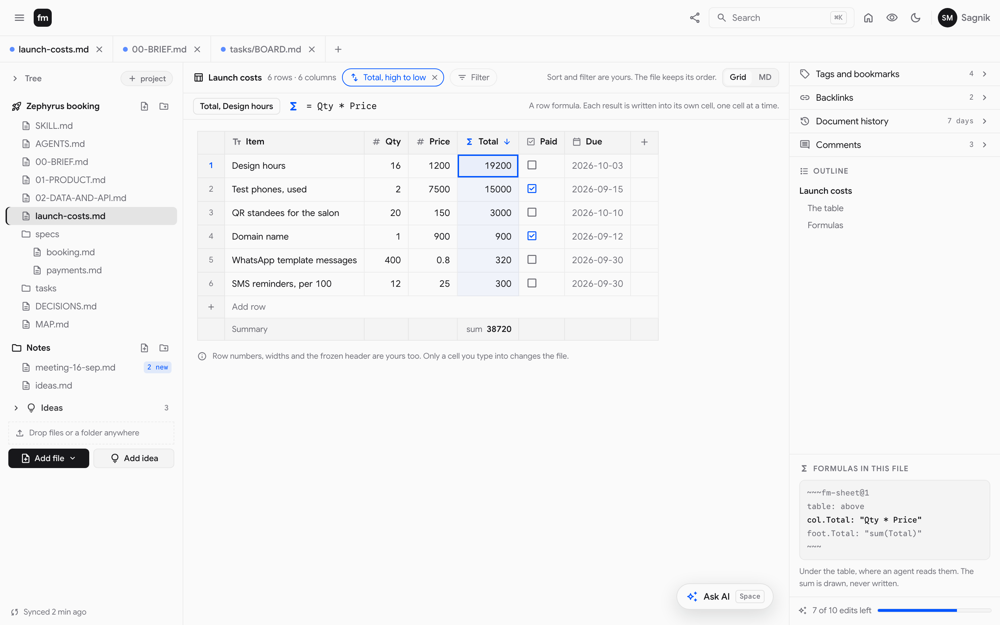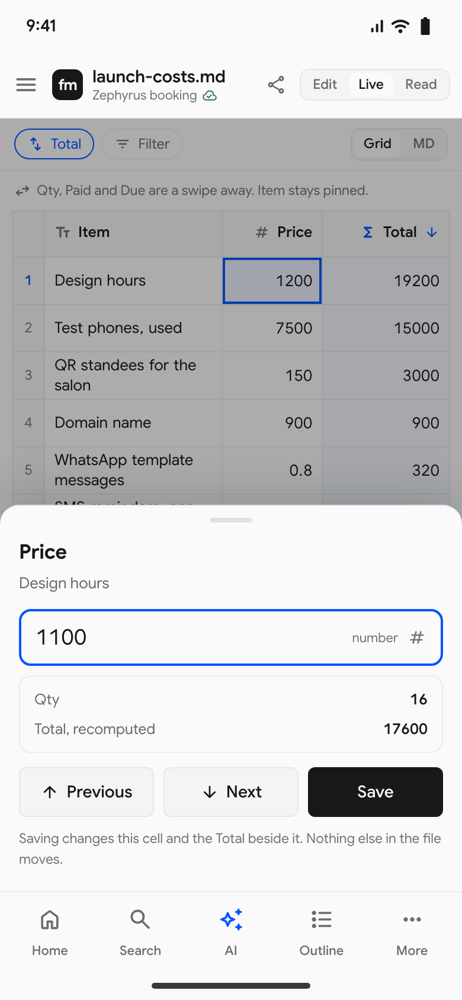

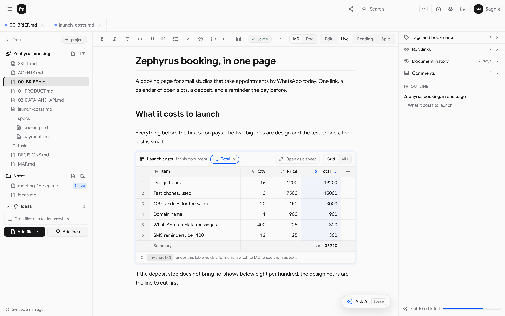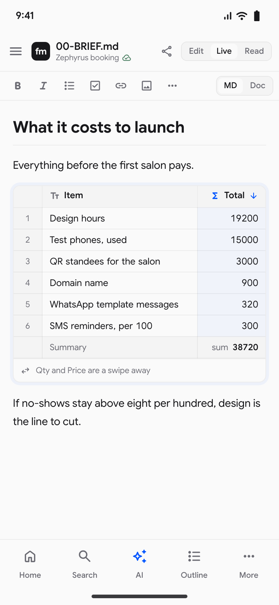

- A table in a document, worked as a grid: column headers with a type mark, row numbers, a computed Total column, and a sum under the grid.
- A formula bar names the focused cell by its column and row, never by an address like `B2`, and shows the column's formula: `= Qty * Price`.
- Sort and filter chips, with one line saying they are the viewer's own and the file keeps its order. Add a row, add a column, and a Grid and MD switch to see the table's source.
- The second frame is the same kind of table inside `00-BRIEF.md`, with Open as a sheet, and a line naming the formula block under it.
- On the phone the first column is pinned, the rest are a swipe away, and a cell is edited in a bottom sheet that shows what the change recomputes.

**Why.**

- `[P]` The table stays a plain GFM table that every other tool reads, with its formulas in an `fm-sheet@1` block under it (`docs/pack/68-SHEETS-SPEC.md` sections 2 and 3). A cell edit is a one-line diff.
- `[M]` Google Sheets, Notion and Airtable set the expectations drawn here: a formula bar, a plus to add a column, a type per column, a filter view that is not saved (`docs/research/2026-09-18-sheets-boards/SCREEN-REFERENCES.md` section 2).
- `[L]` Formulas name columns, because a cell address goes stale when a row is added to a text file.

### S40. Board

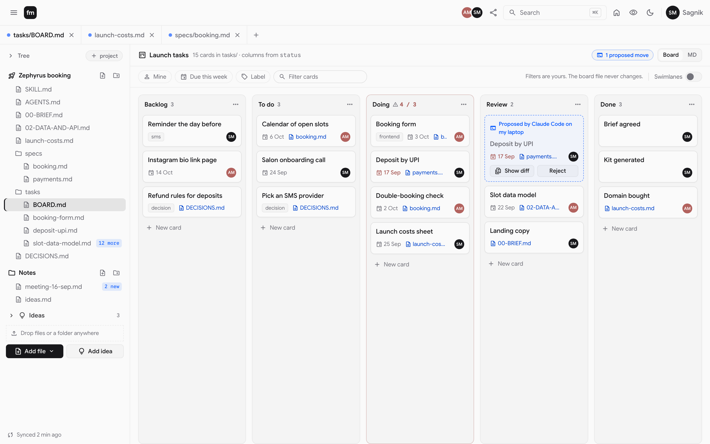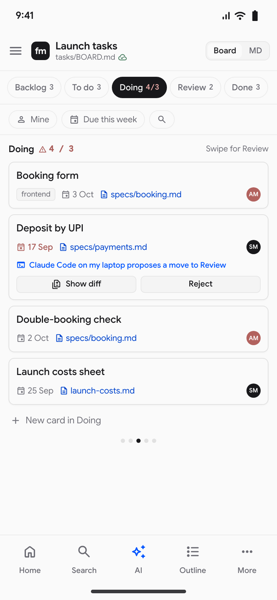

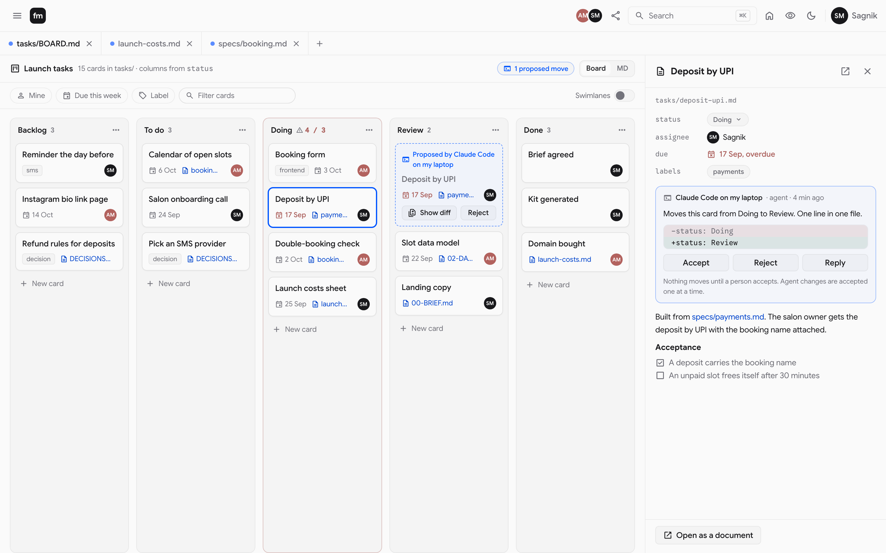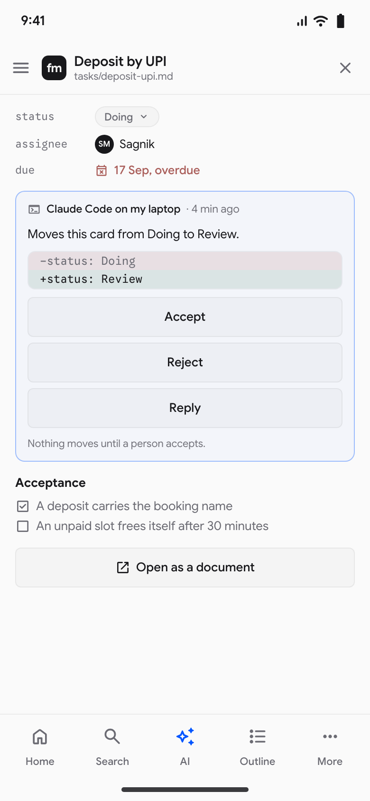

- Columns from each card's `status`: Backlog, To do, Doing, Review, Done, each with its count. Doing has a limit of 3 and holds 4, so its count reads `4 / 3` in the warning colour. Nothing is blocked.
- A card shows its title, labels, due date, one document link and the assignee. No body text. An overdue date is in the warning colour.
- A quick filter row: Mine, Due this week, a label, and text search, never written. Swimlanes are drawn off.
- The second frame opens a card in a side panel. An agent's proposed move, Doing to Review, is ghosted in Review and shown in the panel as a one-line diff with Accept, Reject and Reply at equal weight.
- On the phone one column shows at a time, with a switcher of pills and counts, and the pending move sits inside the real card.

**Why.**

- `[P]` One card is one markdown file, so a move is one line in one file and two people moving two cards never conflict (`docs/pack/69-BOARDS-SPEC.md` sections 2 and 3).
- `[M]` Jira and GitHub Projects both say a column limit warns and does not block; Linear keeps descriptions off the card face (`docs/research/2026-09-18-sheets-boards/SCREEN-REFERENCES.md` section 3).
- `[L]` An agent never moves a card. Its move waits in the change queue, and the diff comes before any accept, as on S20.

## 5d. Voice and PDF to Markdown

### S41. Voice

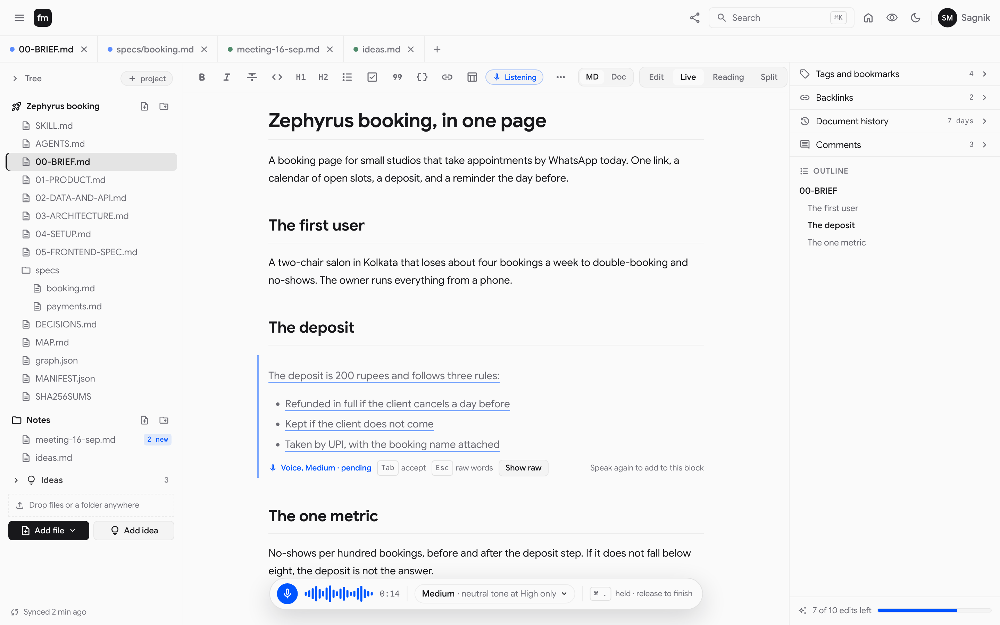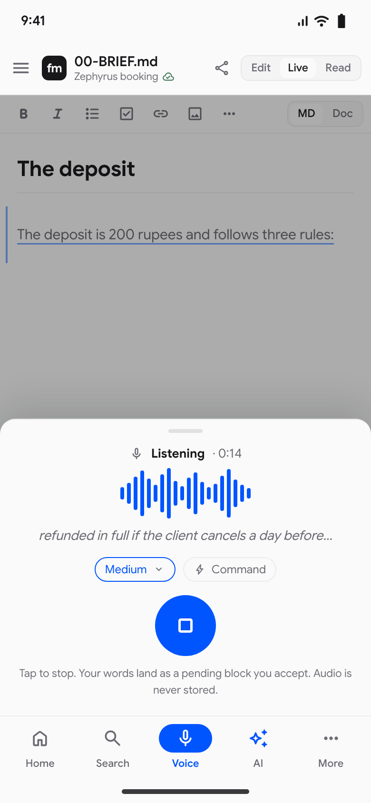

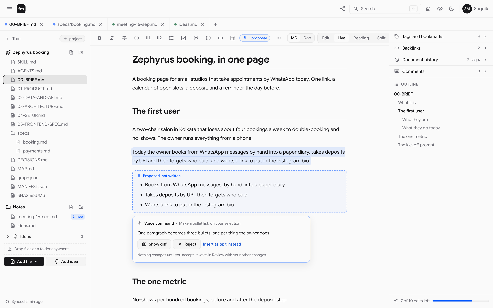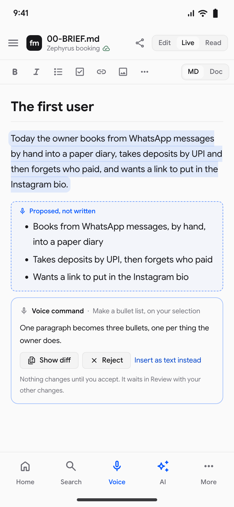

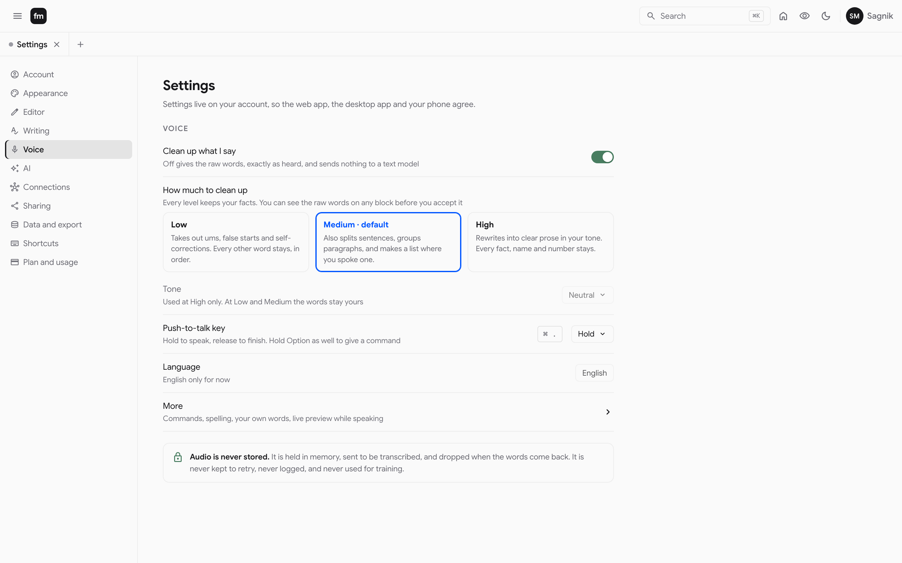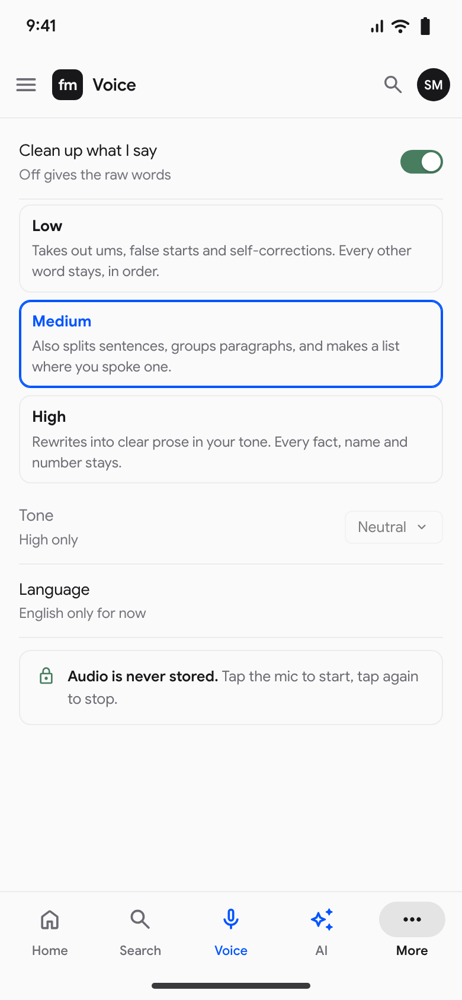

- Dictating in `00-BRIEF.md`: a small listening pill at the foot of the page with a live waveform, the time, the level (Medium, changeable from the pill) and the push-to-talk key, held.
- The words land as a pending block, grey and underlined. Tab accepts it, Esc swaps it to the raw words, and Show raw compares the two. Speaking again adds to the same block.
- The second frame is a command. A paragraph is selected and the person said "make this a list". The list is ghosted under it, and a proposal card offers Show diff, Reject and Insert as text instead. Nothing in the file changes until it is accepted.
- The third frame is the Voice group in settings: clean up on or off (off is the raw setting), Low, Medium and High with one line each, the tone, the key, English only, and a note that audio is never stored.
- On the phone the mic sits in the middle of the bottom bar, and Outline steps out of the bar on these screens. A tap opens a listening sheet with the waveform, the level, a Command chip and a stop button.

**Why.**

- `[Z]` The founders asked for free speech to text, English only, cleanup with a raw setting, three levels and a tone, and a command mode that reads intent from context (`docs/pack/71-VOICE-SPEC.md`, the founder's ask).
- `[P]` Cleaned-up dictation is a model's rewrite of the person's words, so it waits as one pending block for one key, not a delay (`docs/pack/71-VOICE-SPEC.md` section 8.2). A command becomes a proposal on S20 (section 7.3).
- `[P]` Tone applies at High only, so it is drawn greyed at Medium (`docs/pack/71-VOICE-SPEC.md` section 5.2). Audio lives in memory and is dropped when the words come back (section 13).

### S42. PDF to Markdown

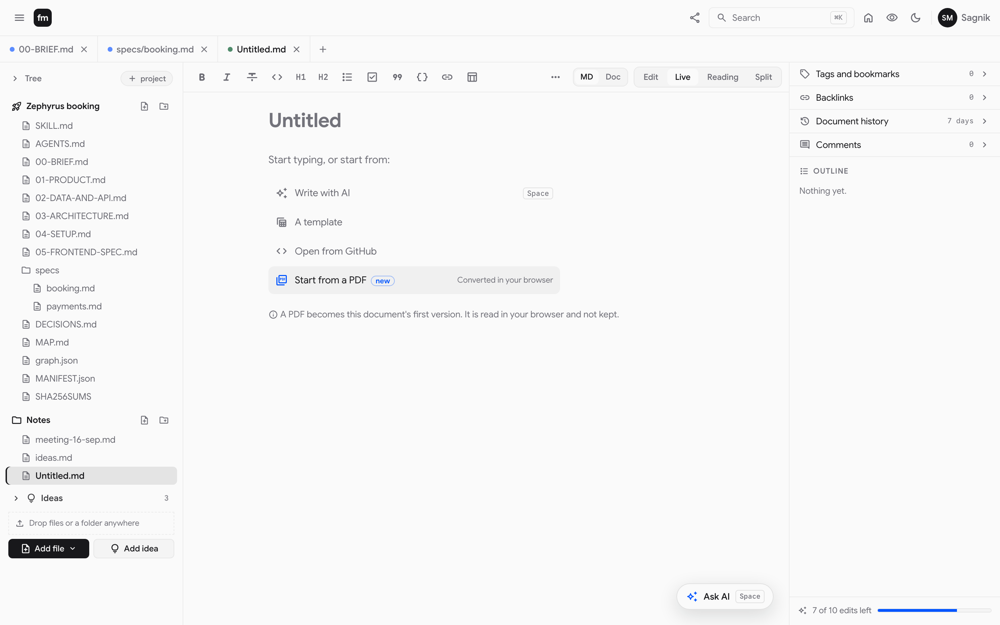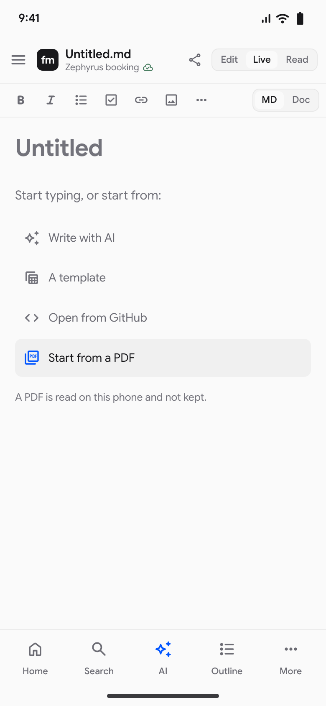

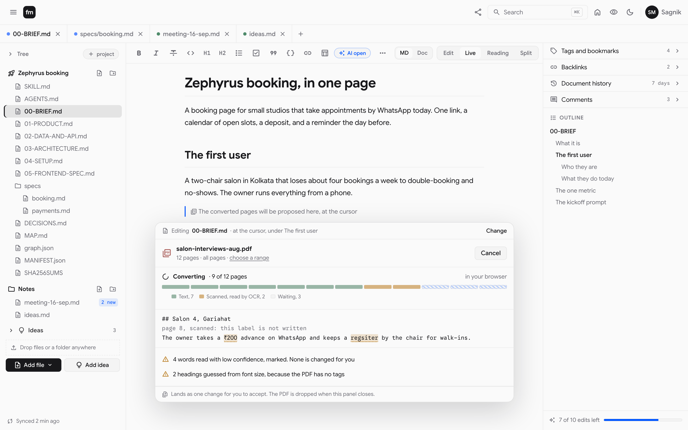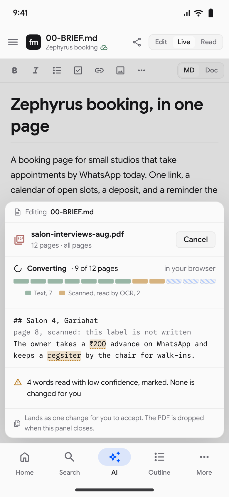

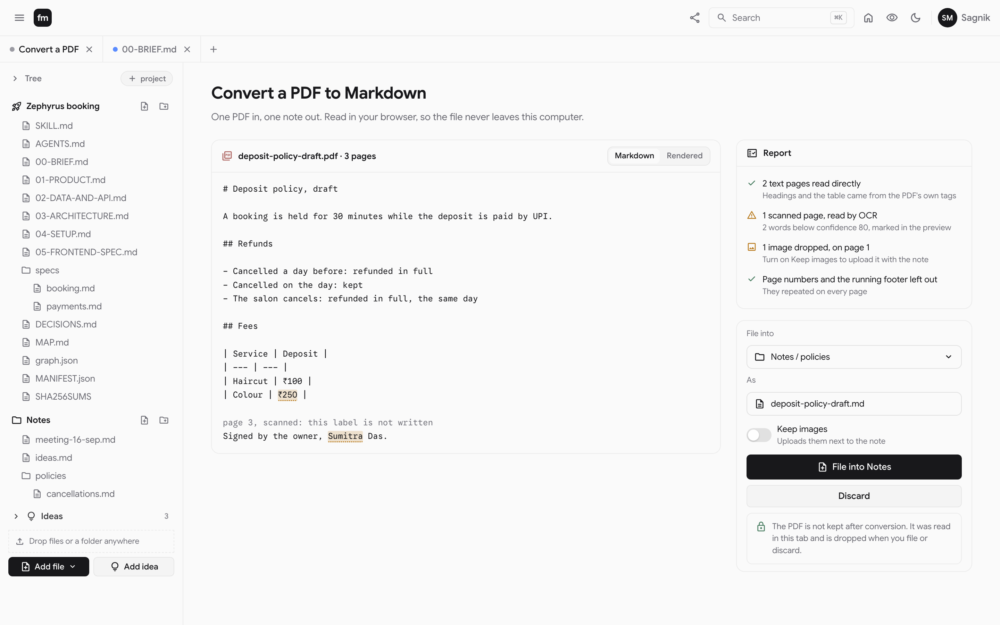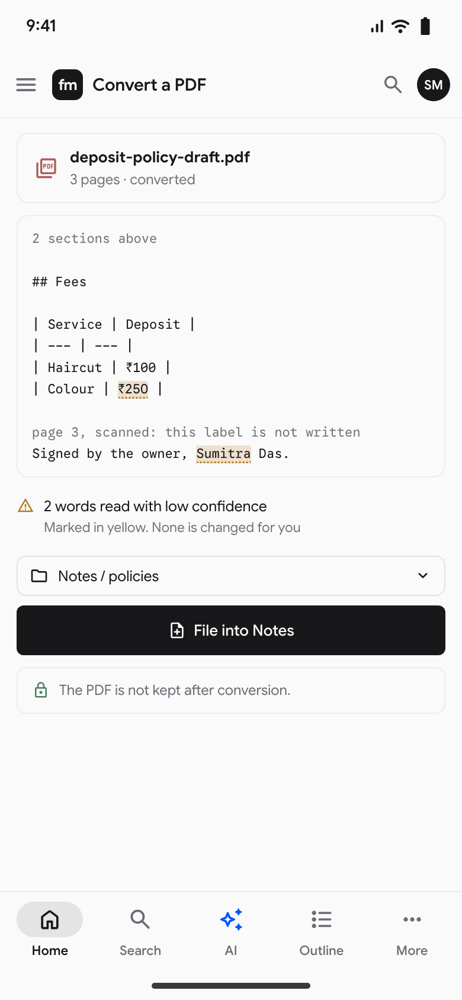

- An empty document offers Start from a PDF beside Write with AI, a template and GitHub. The PDF becomes the document's first version.
- The second frame is the AI panel over the workspace with a 12-page PDF dropped in. It shows pages done by kind, text or scanned, a preview of the markdown with low-confidence OCR words marked, and a line saying the result lands at the cursor as one change to accept. Cancel is always there.
- The third frame is the standalone tool, Convert a PDF to Markdown: the markdown preview with its flags, a report, a folder picker in notes, Keep images, File into Notes and Discard, and the line "The PDF is not kept after conversion".
- On the phone the tool is one column: the file, the preview, the flag line, the folder and one button.

**Why.**

- `[Z]` The founders asked for a PDF in and markdown out, with three ways in, and no chat over the PDF (`docs/research/2026-09-19-pdf/PDF-TO-MARKDOWN.md` section 0).
- `[P]` A text PDF is read in the browser and a scanned page by Tesseract on the device, so the file never leaves the machine (`docs/pack/72-PDF-TO-MARKDOWN-SPEC.md` section 3). Flags are shown and listed, never written into the file (section 6).
- `[P]` Entry 2 lands as one queue item and changes no byte of the document until it is accepted (`docs/pack/72-PDF-TO-MARKDOWN-SPEC.md` section 4.2).

## 6. Built in by default, so nobody needs a plugin

The rule: if a capability is a top add-on in three or more of the ecosystems we counted, it ships built in. Twenty pass `[M]`.

Capability | Where it is a top add-on | Where it lives in frontmatter
AI assistant and agent access | Docs, VS Code, Joplin, Logseq, Craft, Notion | The AI box, the AI menu; the agents card and the MCP server in batch 10a, as the Max tier (D04)
Maths and LaTeX | Docs 52M+ installs, VS Code, Joplin, Typora | KaTeX in every mode
Diagrams | VS Code 5.3M, Docs 47M+, Joplin, Logseq | Mermaid in every mode, Excalidraw as a block
Tasks and to-do views | Joplin, Logseq, Craft, Notion, VS Code | Checklists, the tasks panel, the kanban view
Templates | Joplin, Logseq, Craft, Notion 70,000+ | Home, the slash menu, the idea templates
Editable tables | Joplin, Typora, Notion, Bear | Shipped today
Outline and table of contents | Joplin, Typora, VS Code, Notion | The rail, a `[toc]` marker
Export | VS Code 4.1M, Bear, Typora, iA | Markdown, HTML, Word, PDF, and the `.md` twin on every page
Themes | Joplin, Typora, Bear, Logseq, VS Code | Appearance settings, dark mode
Calendar and daily notes | Joplin, Logseq, Craft | The month panel, daily notes
Kanban | Joplin, Notion, Obsidian 2,668,372 | View as Kanban, read-only, and a board over a folder of card files from 19 September, below
Backlinks and link graph | Joplin, Logseq, Typora, Notion | Shipped today, plus the map
Tags | Joplin, Bear, Craft, Logseq | Shipped today, rename and merge added
Lint, style and spelling | VS Code 12.2M and 71.6M, Docs, iA | The problems panel, the formatter, the browser's spellcheck
Image paste and resize | VS Code, Typora, Bear, Notion | Paste, resize, compress
Note tabs | Joplin, Logseq, VS Code, Obsidian | Shipped today
Slides | VS Code, Joplin, Obsidian | View as Slides
Drawing | Joplin, Craft, Bear, Obsidian 7,974,073 | The Excalidraw block
Version history and diff | Joplin, Craft, Notion, Docs | Document history
Citations | Logseq, Docs, VS Code | A DOI lookup in the slash menu

**Added on 19 September, on the founders' ask rather than the three-ecosystem rule** `[Z]`. Each is
built in, with no plugin, and none exists in the code yet.

Capability | What it is | Spec | Batch in `docs/pack/50-ROADMAP.md`
Sheets | A grid over any markdown table or `.csv`, with row formulas and column summaries, where an edit changes only that cell's bytes | `docs/pack/68-SHEETS-SPEC.md` | 9a
Boards | A board file over a folder of card files; a move changes one key in one card, through the change queue | `docs/pack/69-BOARDS-SPEC.md` | 9a
Views over front matter | A table of files with front matter keys as columns (D13) | `docs/pack/70-PLATFORM-AND-TYPES.md` section 3 | 9a
Embeds across types | A sheet or board shown inside a document; an edit in it lands on the source file | `docs/pack/70-PLATFORM-AND-TYPES.md` section 4 | 4
Voice | Dictation, restructured or raw, and ten voice commands | `docs/pack/71-VOICE-SPEC.md` | 4a
PDF to Markdown | A converter with three ways in; scans read on the device | `docs/pack/72-PDF-TO-MARKDOWN-SPEC.md` | 5 and 7

**What the earlier plan did not mention, now placed** `[O]`.

- A table of contents marker, footnotes, emoji input.
- Link previews for external links.
- OCR search inside images and PDFs, through Tesseract.js. The PDF converter reuses the same engine (`docs/pack/72-PDF-TO-MARKDOWN-SPEC.md` section 1.2).
- A formatter, an accessibility check on the document, and a stated API rate limit.

**Two are refused.** Meeting notes, and a sandboxed HTML block. The second because the plan bans third-party scripts on published pages.

**Notion's block inventory as a checklist** `[M]`. Notion's API enum lists 32 block types, and Code is documented outside the enum. **frontmatter covers 27 of the 32**, in plain markdown or a shipped block.

Notion block | How we carry it
Paragraph, headings 1 to 4, bulleted and numbered items, to-do, quote, divider | Plain markdown
Toggle | A details block
Callout | A callout block
Table and rows | A markdown table
Image, video, file, PDF, embed, child page, child database | Links
Bookmark, link preview | Previews
Equation | KaTeX
Table of contents | A marker
Breadcrumb | From the tree
Template | A template
Code | A fence

**Not covered, on purpose:** column list, column, synced block, transcription, and the unsupported type. None of them survives a plain markdown reader (F011).

**Obsidian's plugins.** The parity table of revision 3 stands.

When | Plugin capabilities
Already ship | 15
Built in MVP 0 | 21
MVP 1 | 8

**The big six:** the Excalidraw block, templates, tasks, calendar, quick capture, ranked search and the importer.

## 7. Doc mode, the honest scope

**The research classified 64 Google Docs features**, one row each, from Google's own help pages `[M]`.

Verdict | Count
Plain markdown | 20
Needs an extension | 15
Cannot live in a text file | 29

The table below is the specification a contractor builds from (F002).

Feature | Column | Carrier or reason
Bold, italic | N | CommonMark
Strikethrough | N | GFM
Text capitalisation | N | Rewrites the letters
Headings 1 to 6 | N | CommonMark ATX headings
Bulleted, numbered, nested lists | N | CommonMark
Checklist | N | GFM task list items
Table, column alignment, sort rows | N | GFM tables
Image, in line | N | CommonMark
Emojis, special characters | N | Unicode text
Links | N | CommonMark
Outline, rulers, non-printing characters, zoom, dark theme, RTL view, shortcuts, copy and paste | N | Editor chrome, no file impact
The @ menu | N | A command palette; what it inserts is classified per row
Custom building blocks | N | Snippets of ordinary markdown
Spelling and grammar, personal dictionary, autocorrect, Smart Compose | N | Tools over text
Find and replace, word count | N | Tools
Translate, voice typing | N | Tools; output is text. Voice typing is kept `[Z]` (D14, 18 September) and widened on 19 September, below. **Specified, not built**
Screen reader, braille | N | A property of the editor
Offline | N | A local file is offline by nature
Templates | N | A markdown file
Download formats | N | A tool
Underline | E | Pandoc `[text]{.underline}`
Superscript, subscript | E | Pandoc `^` and `~`
Font family, font size | E | A raw HTML span; Google drops it on export
Text colour, highlight | E | Colour a raw span; highlight `==text==`
Title, subtitle | E | Front matter
Alignment | E | Raw HTML or a span attribute; removed by Google on export
Paragraph borders and shading | E | A Pandoc fenced div; plain elsewhere
Column widths | E | Pandoc multiline tables
Resize image | E | `{width=}` attribute
Equations | E | `$math$`
Footnotes | E | `[^1]`, rendered by GitHub, Obsidian and Typora, not in the GFM spec
Table of contents | E | A `[toc]` marker
Bookmarks, internal links | E | A heading id and `[text](#id)`
Variable chips | E | Front-matter keys and a placeholder substituted at export
Citations | E | Pandoc's citation syntax
Line and paragraph spacing | X | A theme property
Indentation, tab stops | X | Four leading spaces are code
Custom bullet glyphs | X | List markers are fixed syntax
Merge cells | X | Neither GFM nor Pandoc has them
Cell background, borders, padding | X | No carrier in any specification
Pinned header rows | X | Pagination
Wrap, break, behind, in front of text | X | Google itself has none in pageless
Crop and adjust | X | A pixel edit; save the file
Drawings | X | A Google Drawings object; embed an image
Linked charts, tables, slides | X | Live links to Sheets
Page numbers, headers, footers | X | Pagination; front matter for export
Page break | X | An export marker only
Section breaks | X | Pagination
Margins, page setup, orientation | X | Front matter for export
Columns | X | Google itself has none in pageless
Pages or pageless | X | Markdown is pageless
Watermarks | X | Pagination
Line numbers | X | A view
Smart chips | X | Live data; Google's rule: "Smart chips change to text or links"
Dropdowns | X | Live state
Building blocks | X | Gmail and Calendar integrations
AppSheet and third-party chips | X | External state
Document tabs | X | One file per tab, or H1 sections
Comments, action items, reactions | X | The version record and the change queue
Suggesting mode | X | Editor state; a proposal in the queue
Version history | X | Document history
Assign tasks | X | Google Tasks; the checklist item itself is N
eSignature, Meet, Keep, add-ons | X | External services
Publish to web | X | Hosting state

**Voice typing, corrected and widened on 19 September** `[Z]`.

- **The correction.** The row above sat in the table as though voice typing existed. It does not:
  `docs/pack/71-VOICE-SPEC.md` records that a search of `src` for voice code returned nothing. It is
  specified, not built.
- **The widened feature.** Free speech-to-text services, English only. Transcripts are restructured
  automatically, the way Wispr Flow does, with a setting for raw text.
- **Three levels and a tone.** Low, medium and high restructuring, and a tone of neutral, formal,
  friendly or concise.
- **A command mode** that tells dictation from an instruction by context, with ten commands in v1.
- **The change queue holds.** Restructured text lands as a pending insertion, a real proposal that
  `Tab` accepts; raw text lands as the person's own typing (`71` section 8).
- **Audio is never stored.** On the desktop, speech is recognised locally by default (`71` sections
  10.3 and 13).
- Where it is built: batch 4a in `docs/pack/50-ROADMAP.md`. Its screen is S41.

**The substitutes for the twenty-nine** `[P]`: a page-break marker and page setup as front matter honoured only by export; comments and suggestions in the change queue and the version record; versions in history; tabs as files.

**The refusal rule** `[P]`. Doc mode carries a feature only if a stranger's plain markdown parser, with no editor and no export theme, still shows the author's meaning from the bytes on disk.

**What the rich editors admit** `[M]`.

Tool | What its own page says
Tiptap's markdown extension | "a early release", and "Comments are not supported yet"
Typora | "Custom fonts in Typora are set by CSS."
Google's markdown export | "Font colors, highlights, and text alignment are removed."

**We are not inventing a limit. We are naming the one every tool has.**

## 8. What a document can become

Representation | Renderer | Licence | Signal | Ships
Flow view | Ours: H2 as phase, H3 as step, bracketed tag, trailing reference | Ours | `[Z]` the founders' flow site | Later, deferred by the founder on 18 September
Diagrams | Mermaid, 90,268 stars, 12,122,962 weekly downloads, block, architecture and kanban types now exist | MIT | Renders on GitHub, Obsidian and HackMD | Ships today
Drawing and canvas | Excalidraw, 132,141 stars, saved beside the note as JSON Canvas 1.0 | MIT | 7,974,073 plugin downloads | MVP 0
Slides | Marp core, splits on a horizontal rule, no new syntax | MIT | Slides from markdown: Advanced Slides at 837,129 Obsidian downloads renders with reveal.js; Marp's own signal is marp-vscode at 857,640 installs (F061) | MVP 0
Mind map | markmap, reads the outline, no new syntax | MIT | 885,474 plugin downloads | MVP 0
Kanban | Ours: headings as columns, task items as cards, the obsidian-kanban shape | Ours | 2,668,372 downloads, no open renderer | MVP 1
Charts from a table | Ours: an `fm-chart` block that points at the table above it | Ours | 324,208 downloads | MVP 1
Portfolio | Ours: one file with front matter at frontmatter.in/@handle | Ours | No comparable | Late, Pro
Maths | KaTeX, 18,887,573 weekly downloads | MIT | Universal | Ships today
Music | abcjs | MIT | HackMD renders it | Later
PDF and print | Paged.js for the browser, Pandoc on the server | MIT, GPL | Universal | MVP 0

**Two things we will not embed** `[M]`.

- **tldraw**, whose licence forbids production use without a key, and which phones home.
- **D2**, which is MPL and duplicates Mermaid.

**One thing we build early, and build ourselves** `[Z]` (D13, 18 September). Database views over front matter, as Obsidian's Bases, have no open renderer, so we write one.

It is batch 9a in `docs/pack/50-ROADMAP.md`, straight after the desktop. It was "one thing that waits" until D13.

**Two things we copy the shape of, and none of the code.** The kanban and chart blocks follow obsidian-kanban and obsidian-charts. The first is GPL, the second AGPL, and both are unmaintained (F063).

## 9. Idea mode, three depths

Depth | Who | Questions | What each answer carries | What it costs us
Low | Free | 10 to 15 | A recommendation and one line of reason; Not sure recorded as open | About fifteen model calls per blueprint on the free chain
Medium | Pro | 20 to 30 | Where it stands, what forces the choice, options with gains and costs, evidence from the person's own documents and the template's sources, dated when the template last checked them | The same calls on Sonnet through the batch API, plus a retrieval pass over the project
High | Pro, 3 blueprint credits | 20 to 30 | Medium, plus a research pass before the questions: sources opened, dated and quoted, a decision record you can publish | A background job of about an hour, with web fetches; about 150,000 tokens in and 40,000 out on Sonnet, assumed until measured

**The blueprint** `[Z]` `[P]`. Fifteen files in a skill folder: twelve markdown documents and three data files.

Kind | Files
Markdown | SKILL.md, AGENTS.md, 00-BRIEF.md, 01-PRODUCT.md, 02-DATA-AND-API.md, 03-ARCHITECTURE.md, 04-SETUP.md, 05-FRONTEND-SPEC.md, specs/booking.md, specs/payments.md, DECISIONS.md, MAP.md
Data | graph.json, MANIFEST.json, SHA256SUMS

**The frontend spec** is the founders' ask 4, and the file S12 promises (F025).

**Its cost model, assumed until measured** (F017): one call per file at 5,455 tokens in and 2,091 out, so 81,825 in and 31,365 out per blueprint.

**Templates** `[Z]`. Seven industry templates ship.

- Local service business, SaaS, marketplace, internal tool, mobile app, content site, agency.
- Each carries its question bank, its comparables and its sources.
- **Generate one for my industry** writes a new template from the idea, and marks it as generated.
- Section 26 costs the writing.

**What a template holds** `[R]`.

- The question order.
- The recommendation rules.
- The file list, and the consistency checks.
- The sources a Medium answer may cite.

**Templates are markdown files in a folder**, so a person can read, edit and share them.

**The rule that keeps it honest** `[P]`.

Depth | What it may cite
Low | Never shows evidence it did not read
Medium | Only the person's documents and the template, and says when the template last checked a source
High | Only pages it opened, with the date

- **A recommendation is never a percentage.** `[M]` PAIR: do not show confidence when "The confidence level isn't impactful".
- **Not sure is never written as the founder's decision.**

## 10. Sharing, publishing, portfolio

**The four ways out.**

1. **People**, with a role from section 19.
2. **A link**, read or edit, with an expiry, and on Pro a password.
3. **A published page** at frontmatter.in/p/slug, with a `.md` twin, a Made with frontmatter line on Free, and Report, Privacy and Terms in its footer.
4. **The portfolio** at frontmatter.in/@handle, on Pro.

**Password links** `[M]`. Every one of these is paid, or absent.

Product | What its page says
Dropbox | "add a password to a shared link" on Professional and above, not on Basic or Plus
Figma | "Available on all paid plans"
Loom | "Business, Business + AI, or Enterprise"
Notion | "Can I password protect a page? Unfortunately, not at the moment."

**Ours:** we store a hash, ask once per browser, and put it on Pro.

**Expiring links** `[M]`. Bitwarden gives every user a deletion date with a default of seven days. Google Drive allows expiry only on Workspace editions and never on anyone-with-the-link. Ours is free, with a seven-day default and no upper bound.

**Published pages** `[M]`.

- **No product opened caps public pages at a small number.** Notion says "Unlimited published pages", and gates one custom domain instead.
- **The market's gate is the domain and the branding**, not the count.
- **Ours:** five pages on Free with the line, unlimited and unbranded on Pro, and a custom domain later.
- **Pages are not indexed today.** Whether they should be is an open question in section 29, because the audit is right that not indexing removes search as a channel.

**Portfolio** `[M]`.

- **What the reference sites need.** sayak.dev is a Quarto project: one `.qmd` per page, a `_quarto.yml`, a build, GitHub Pages. Astro wants a content folder and a schema.
- **What we do instead.** We serve the stored file.
- **The front matter keys** are name, handle, title, links, projects, writing and theme.
- All of them are ignorable by any other tool, **so the file stays portable**. Section 20 specifies them.

## 11. Bringing things in and out

**Folder upload** `[M]`.

- **Reading a folder in** works in Chrome 7, Edge 13, Firefox 50, Safari 11.1, iOS Safari 18.4 and Android Chrome 132.
- **Dragging a folder in** works on desktop through the entries API.
- **Writing back to the person's own folder** works only in Chrome and Edge, through the directory picker, and MDN marks that API as not baseline.

**So:** every browser imports, Chromium browsers can keep a live folder, and everyone else gets Drive, GitHub or a download for the way back.

**An Obsidian vault imports as it is.** Its `.obsidian` folder is read for the daily-note path and the templates folder, and for nothing else.

**Where documents live, decided on 18 September** `[Z]` (D03).

- **Our copy is canonical.** R2 holds every version and upload, and Firestore holds the head pointer and the queue.
- **The person's own storage holds a full mirror, on both plans.** A GitHub sign-in mirrors to one repository through a GitHub App. A Google sign-in mirrors to a visible `frontmatter` Drive folder through `drive.file`.
- **An edit made in the mirror comes back as a change queue item**, never a silent overwrite of our head.
- **Why ours and not theirs.** The queue, per-save history, offline and refusal each need one head we can compare-and-swap against. Drive's v3 reference showed no write precondition, so it cannot be that head.
- Evidence: `docs/research/2026-09-18-storage/STORAGE-BENCHMARK.md` sections 4.3 and 6. The sync and conflict mechanics are in `docs/pack/67-SYNC-AND-CONFLICT.md`.
- **Before the Drive mirror ships**, the benchmark's two falsification tests run: a byte round trip of the corpus through Drive, and a 100-edit concurrency test (its section 6.7).

**Google Drive** `[M]`.

**The scope.** `drive.file` covers files the app created or the person picked, and needs only basic verification. Both `changes.list` and `files.watch` accept it.

**The full `drive` scope is never requested.** Our server holds the bytes, so it would bring Google's annual third-party security assessment (CASA), every 12 months, for as long as we held it (benchmark section 2.2).

**Why we poll rather than subscribe.** A change channel lasts a week at most, has no automatic renewal, and carries no content. So the app polls the change list from a stored page token.

**The benchmark proposes the other way round**: a watch channel renewed weekly that wakes a read of the change list (its section 2.5). The two are not reconciled here. `docs/pack/67-SYNC-AND-CONFLICT.md` settles it, and the cost below assumes the poll.

**The cost per user per day, re-derived with the poll included** (F027).

Item | Working | Units
30 saves a day | 30 × 50 | 1,500
A poll every five minutes | 288 × 100 | 28,800
Total | | 30,300

**What that buys.**

- Google's daily project threshold is 400,000,000 units, so 400,000,000 / 30,300 = **13,201 connected users** before the quota increase, which the limits page now says is billed.
- A one-minute poll would cost 145,500 units a day and serve 2,749 users. That is why S23 promises "within a few minutes".

**Conflicts are never merged silently.** Both versions are kept, the mirror's side enters the change queue, and the person chooses on S31.

**GitHub** `[M]`. A GitHub App, not a personal token.

- **It asks for the Contents permission, read and write, and nothing else.**
- GitHub grants that for the whole repository, so the promise to write only under `docs/` is frontmatter's own rule, enforced server-side and tested (F034).
- Installation tokens expire after an hour and carry their own 5,000 requests an hour.
- Every update sends the file's blob sha and treats a 409 as a re-read. That is the splice engine's compare-and-swap rule, in GitHub's words.
- **Free:** one repository, 20 pushes a month. **Pro:** unlimited.
- **Markdown only goes to GitHub.** Uploads stay in R2 and are linked, because GitHub blocks files over 100 MiB and recommends repositories under 5 GB (benchmark section 3.4).
- `INFERENCE:` a Free push carries every changed file, so 20 pushes a month still leave a full mirror, current as of the last push.

**Google Docs and Word** `[M]`.

- **Google Docs.** Drive exports as `text/markdown`, and "Exported content is limited to 10 MB", which S22 states when it refuses (F024).
- **Word.** Converts in the browser with mammoth, so the file never leaves the machine.
- **Both lose the same things**, in Google's own words: colours, highlights and alignment are removed.

**Notion** `[M]`. The export zip imports as a project. The API allows 180 requests a minute on a non-business workspace, which is enough to pull a workspace page by page as a later feature.

**Sheets in** `[Z]` (19 September). A `.csv` or `.tsv` opens as a sheet, and a `.csv` or `.xlsx`
imports as a proposal into one.

`.xlsx` is never edited in place, because a binary file has no bytes
to splice (`docs/pack/70-PLATFORM-AND-TYPES.md` sections 14 and 15).

**PDF to Markdown** `[Z]` (19 September). A converter, not a chat feature. The contract is
`docs/pack/72-PDF-TO-MARKDOWN-SPEC.md`, and the screen is S42.

Way in | Where | Where the result lands
An empty document | S04, "Start from a PDF" | That document, as its first version
The AI panel, while editing | S06, "Convert a PDF", with a page range | At the cursor, as one change-queue item. The PDF is held only for the session
The standalone tool | S22, a seventh source card, and "Convert a PDF to Markdown" in the palette | A new note in the chosen folder

- **The PDF is read in the tab or on the desktop and never uploaded**, on the text path and the scan
  path. pdf.js through `unpdf` reads text pages; Tesseract reads scanned pages, page by page.
- **Only permissive licences ship.** Marker, Surya, Nougat, PyMuPDF4LLM and Scribe.js are refused on
  their licences (`72` section 2).
- **Flagged, never guessed.** Low-confidence words, headings guessed from font size and rebuilt tables
  are listed in a report and marked in the preview. Nothing flagged is written into the file.
- **An optional Pro vision pass** reads a scanned page through a model, off by default until its
  fixture bench has run. Sections 13 and 14.
- **A PDF inside a folder import is not converted.** It is stored as an upload, and converted only
  when a person asks through one of the three doors.
- Where it is built: batch 5, with the vision pass in batch 7, in `docs/pack/50-ROADMAP.md`.

**The twenty public APIs worth using** `[M]`. Grouped by what leaves the machine, because that is the only grouping that matters here.

**Seven run entirely in the browser, with no key, and send no text anywhere.** KaTeX, Mermaid, Tesseract.js for OCR, pdf.js, pdf-lib, the DiceBear library, and self-hosted Google Fonts.

**Key-less and remote, sending only the query.**

Service | Limit on the page
Wikipedia and Wiktionary | 200 requests a minute, with a user agent
The Free Dictionary | none stated
Datamuse | 100,000 a day until 1 January 2027, then a key is mandatory; customer-facing use needs prior contact
Crossref and OpenAlex | for a DOI
Open Library | for an ISBN
arXiv | one request every three seconds
Frankfurter | for currency

**Behind our proxy, because they need a secret.**

Service | Limit on the page
Unsplash | 50 an hour in demo, 1,000 after approval, with attribution and a download ping
Pexels | 200 an hour, 20,000 a month
DeepL, developer plan | a million characters
iframely | 2,000 hits a month, billed once an hour per URL

**Never sent document text.**

- **LanguageTool's public endpoint** says "Do not send automated requests" and caps a request at 20 KB, an address at 20 requests and 75 KB a minute (F062). Grammar beyond spelling waits for a self-hosted LanguageTool.
- **Semantic Scholar** receives DOIs and titles only, as good practice. Its licence page carries no clause about training on what is sent, and the earlier sentence that said so is withdrawn (F062).

## 12. Offline, desktop, phone

**In the browser** `[M]`. Every keystroke goes to IndexedDB or the origin private file system, which has been baseline since March 2023.

Browser | What it allows
Chrome | About 60 percent of the disk, per origin
Firefox | The smaller of 10 percent or 10 GiB
Safari | About 60 percent since macOS 14 and iOS 17, but deletes all script-writable storage after seven days of Safari use without a visit, unless the app is on the home screen

**Background sync and the share target exist only in Chromium.**

**The one rule: never let the browser be the only copy.** Persist is requested inside a user gesture, and the first connection pushes everything to the server.

**Three copies, one of them canonical** `[Z]` (D03, 18 September).

Copy | Where | Canonical?
Ours | R2 for bytes, Firestore for the head | Yes
The device | IndexedDB in the browser, disk in Tauri | No. Reconciled against the head on reconnect
The mirror | The person's GitHub repository or Drive folder | No. Written by us, and read back through the change queue

How the device and the mirror reconcile is in `docs/pack/67-SYNC-AND-CONFLICT.md`.

**The desktop app** `[Z]` `[M]`.

- **What it gives.** Files on disk, no document limit, fully offline, and agents can read the folder.
- **It is the one we promote**, and the web app stays.
- **It comes early** `[Z]` (D09, 18 September): straight after the web editor, as batch 8 at step 4, not after sync.
- **Each target builds on its own runner in CI.** Tauri says cross-compiling Windows from macOS is "a last resort", and signing it needs an external tool (F072).

**Signing, per platform.**

Platform | What we do | Why
macOS | Signed on the Apple programme, 99 USD a year | Available to us
Linux | Unsigned, by choice | Nothing to gain
Windows | Signed in batch 8, once a founder buys a route. Shown as coming until then | Azure Artifact Signing's public trust is closed to organisations in India (F071). Commercial certificates are priced in `docs/pack/35-RELEASE-AND-VERSIONING.md` section 6.2a (D09)

**The phone** `[M]`.

- **Material's rule**, confirmed on developer.android.com: under 600 dp use a navigation bar with three to five destinations, and one pane.
- **Ours has five:** Home, Search, AI, Outline, More.
- **The tree and the right pane are drawers**, as the shipped code already does.
- **Targets are large and spaced**, which is Fitts's law. The number is Material's, not Fitts's (F015).

## 13. Free and Pro

**The founders' candidates and the market** `[M]`. Forty pricing pages opened on 17 September; Craft, Docmost and the Obsidian roadmap re-opened on the 17th by this revision.

Cap | Founders' candidate | Market | Recommendation
Cloud documents on Free | 5 | Unlimited at Google Docs, Notion for one person, Obsidian, HackMD, Bear and 15 others. Metered by size at Craft (1,500 blocks, 1 GB), Anytype (100 MB), AFFiNE (10 GB), Nuclino (2 GB). Counted at 50 by Nuclino, Evernote and UpNote. Figma's 3 files is the only lower number, and it comes with unlimited drafts | 50, and 1 GB of uploads at 5 MB a file. A blueprint alone is 15 files and an imported vault is hundreds, so 5 would block both funnels on the first day
Published pages on Free | 2 | No product caps public pages at a small number. Notion: "Unlimited published pages". The market gates the custom domain and the branding | 5 with the Made with line. Pro unbranded and unlimited
Live collaborators on Free | 1 | HackMD "3 invitees", AFFiNE "Up to 3 members per Workspace", Notion 10 guests, Confluence 10 users | **1 person per document.** The market says 3 and the founders chose 1 on 18 September, on cost: a live session is a Durable Object held open for as long as two people are in it, and that is the one free-tier cost that scales with time rather than with calls `[Z]`
History on Free | none | Notion, Craft and AFFiNE 7 days free and 30 paid | 7 days free, 90 on Pro
Uploads | none stated | Obsidian Sync Standard 1 GB and 5 MB a file, Plus 10 GB | Free 1 GB at 5 MB a file; Pro 10 GB at 25 MB a file; a 30-day trash on both (F026). **A soft cap** `[Z]` (D03, 18 September): text always saves, only new uploads stop, and past 10 GB Pro buys storage in blocks priced from the configuration panel
AI on Free | credits | Every free tier with AI puts a number on it: Kiro 50 credits, Tana 50 queries, Mem 25 messages, Canva 20 uses, Craft 15 credits, GitBook 10 messages a week, ChatPRD 3 chats | 10 edits and 1 Low blueprint a month, top-ups on Pro
GitHub on Free | open question | HackMD: free with "20 GitHub pushes per month", unlimited at $5. GitBook: Git Sync free. Notion gates GitHub to Business at $20 | Free with 20 pushes and 1 repository. Pro unlimited. The connection is the product, so it cannot sit behind a higher tier
Password links | asked for | Paid at Dropbox, Figma and Loom. None at Notion | Pro
Google Drive | asked for | Notion gates Drive to Plus at $10. It is the person's own storage and costs us nothing | Free. **A full mirror on both plans** `[Z]` (D03, 18 September), through `drive.file` only; our copy stays canonical
Downgrade | not stated | Figma keeps files readable over the cap | Every document stays readable, editable and exportable over a cap; nothing new is created until under the cap (S33). **The one exception is a trial that ended unpaid**, below `[Z]` (D08, 18 September)

**Voice and PDF caps, proposed on 19 September** `[R]`. Values from the specs, awaiting the founders.
Their home is `docs/pack/53-PRICING-AND-ENTITLEMENTS.md`, and until they are written there these are
proposals, not limits.

Cap | Free | Pro | Why | Source
Voice minutes a month, refilling daily | 60 | 300 | Wispr's free plan is "2,000 words per week", about 60 minutes a month at 130 to 150 words a minute, `UNVERIFIED:` the speaking rate. Pro stops at 300 because 600 would take up to 85 per cent of Pro's margin at full caps, SIMULATED | `docs/pack/71-VOICE-SPEC.md` sections 12 and 17.2, awaiting V4
Longest voice turn | 120 seconds | 300 seconds | Bounds one upload | `71` section 17.2
Voice commands that call a model | spend AI edits | spend AI edits | Otherwise voice is a side door around the edit cap | `71` section 12, awaiting V3
Pages in one PDF conversion | 1,000 | 1,000 | Leaves room under the 4 MiB output gate | `docs/pack/72-PDF-TO-MARKDOWN-SPEC.md` section 9
Size of a PDF | 100 MB | 100 MB | The file is never uploaded; `INFERENCE:` to be measured on a phone | `72` section 9
Scanned pages read in the browser, per conversion | 100 | 100 | About 42 seconds on a laptop at the measured 0.42 seconds a page | `72` section 9
Pages read by the vision pass, a month | 0 | 200 | Free's neurons already serve every Free AI edit | `72` section 9

- **The browser paths cost us nothing**, so the PDF caps are the same on both plans and protect the
  tab, not our bill. Only the vision pass is counted on the server.
- **A PDF conversion that used no model spends no AI edit** (`72` section 4.2).
- **The desktop's local speech recognition is unlimited** (`71` section 3.1), and PDF conversion
  on the desktop has no cap (`72` section 9). Both run on the person's machine.

**Pricing** `[Z]` `[M]`.

- **Free at ₹0.**
- **A one-month Pro trial for every new account** `[Z]` (D08, 18 September). No card at the start. The rest is in the paragraph on the trial below.
- **Pro at ₹299 a month, or ₹2,499 a year**, both GST inclusive. That is ₹253.39 before GST and about ₹246 after Razorpay's fee, section 22, or about $3.12 at ₹95.96 to the dollar.

**The first paid tier across peers**, corrected this revision (F004, F059).

Product | First paid tier
UpNote | $1.99
Bear | $2.99
Joplin Cloud | 2.99 euro
Obsidian Sync, Anytype | $4
HackMD | $5
Craft | ₹526.7 a month, on its India page
Confluence | $5.42
AFFiNE | $6.75
Standard Notes | $7.50
Nuclino | $8
Mem | $9
Capacities | $9.99
Notion, Slite, Outline, Linear, Reflect | $10
Docmost | $6 a seat, ten-seat minimum, so $60 a month
AI-forward tools | $15 to $20

**One the audit read and this revision could not re-open:** Notesnook's India page sits below ₹299.

**So ₹299 sits under every collaboration and AI tool, above the single-user note apps, with more in the box than either.**

**The rest of the ladder.**

- **Top-ups:** 50 edits for ₹99, 3 blueprints for ₹149.
- **Team**, with seats and one bill, after Pro. **Enterprise** later.
- **Max**, a tier above Pro whose core is the MCP server, reading and proposing and never writing. Scheduled as batch 10a, no longer later `[Z]` (D04, 18 September). Unpriced (F023).
- **No student tier** `[Z]`.

**What Pro buys, in one line** `[P]`. Unlimited documents, pages and collaborators, 10 GB, 90-day history, password links, Medium and High ideas, 100 edits and 5 blueprints on Claude, the portfolio, no branding.

**Proposed on 19 September:** 300 voice minutes and 200 vision pages a month on Pro.

**The storage cap, decided on 18 September** `[Z]` (D03).

- **The cap measures what we hold**, not what sits in the person's GitHub or Drive.
- **It is soft.** Text always saves. New uploads stop, with three ways out on S33: prune history, move uploads to the Drive mirror, or upgrade.
- **Past 10 GB on Pro, storage is sold in blocks.** The block size and price are configuration-panel rows, not set here.
- **What holding costs us** `[O]`: $0.015 a GB-month on R2, so ₹1.44 a month at 1 GB and ₹14.39 at 10 GB, at ₹95.96 to the dollar. Working: GB × 0.015 × 95.96.
- **A GitHub mirror past 5 GB is a warning, not a block**, because 5 GB is GitHub's own recommended ceiling.

**The trial, decided on 18 September** `[Z]` (D08).

- **One month of Pro for every new account, once per account.** The length and the reminder days are configuration-panel rows, `trial.length.days` at 30 and `trial.reminders.days` at 15, 10, 5, 3 and 2 days before the end (`docs/pack/28-CONFIGURATION-PANEL-SPEC.md` section 4.2).
- **If the trial ends unpaid, editing locks, and copy and export lock too. Reading stays.** Nothing is deleted, and shared links and published pages keep serving (`docs/pack/53-PRICING-AND-ENTITLEMENTS.md` section 5.5).
- **The mirror is untouched.** Under D03 every document is also in the person's own GitHub or Drive, and the in-app lock does not remove it. `proposed (founder review)`: sync pauses in both directions while locked, and resumes through the change queue on payment.
- **This is not dunning.** A paying account whose debit fails follows the ladder in `docs/pack/53-PRICING-AND-ENTITLEMENTS.md` section 5.2 and is never locked.
- `UNVERIFIED:` whether locking export is lawful against data-portability rights under the DPDP Act 2023 and GDPR Article 20. needs: legal opinion.

**The standing promise, reworded for D08** `[Z]`. It was "every document stays readable and exportable". It is now: **every document stays readable in every state, and nothing is deleted. Editing, copy and export stay open on every plan and over any cap, and pause only when a trial ends unpaid.** The founder was told the old promise breaks and chose the trial lock anyway.

**The Free document cap is a panel value** `[Z]` (D11, 18 September). The 50 above is where it starts. It is A/B tested on real accounts before it is fixed, per `docs/pack/28-CONFIGURATION-PANEL-SPEC.md` section 10.3.

## 14. AI for the pilot, and after

**The three tasks** `[R]` `[P]`.

Task | Tokens in | Tokens out
An edit on a selection | about 4,000 | 800
A document | 2,000 | 1,500
A blueprint, fifteen calls | 81,825 | 31,365

The blueprint figures are assumed until measured (F017).

**Who allows a free pilot, verbatim from their pages** `[M]`.

Provider | Free models | Free limits | Trains on prompts | In the chain
Groq | gpt-oss-120b, gpt-oss-20b, qwen3.8-27b, compound | 30 requests a minute, 1,000 a day, 8,000 tokens a minute, 200,000 a day, per organisation | No: "Groq is not permitted to use Inputs or Outputs for training" | Yes
Cloudflare Workers AI | Any non-gated model, qwen3-30b among them | 10,000 neurons a day, 300 requests a minute | No: "Cloudflare does not use your Customer Content to (1) train any AI models made available on Workers AI or (2) improve any Cloudflare or third-party services" | Yes
Cerebras | gpt-oss-120b, qwen-3.8-27b | A trial: "$5 in free credits after adding a verified payment method. These credits expire 30 days after they're granted"; 5 requests a minute, 1,000,000 tokens a day | No | While the trial lasts (F005)
SambaNova | DeepSeek-V3.1, Llama 3.3 70B, gpt-oss-120b | 20 requests a day per model | No | Yes, production models only
OpenRouter free endpoints | 21 ids ending `:free`, plus 3 more at zero, counted from its own `/api/v1/models` on 18 September | 50 requests a day, and **1,000 a day once any credit has been bought**, minimum purchase $5 | Logging is off by default: "Unless explicitly opted in to prompt logging, we do not store your Inputs after categorizing them". And it enforces our own rule for us: "If you opt out of training in your account settings, OpenRouter will not route to providers that train" | **Yes. F006's condition is met**, the terms were opened and quoted on 18 September `[O]`. The chain's shape is still founder question 3
Gemini API | Ten Flash and Pro models | Per-model numbers not public | Yes: "Google uses the content you submit to the Services and any generated responses to provide, improve, and develop Google products", and "Do not submit sensitive, confidential, or personal information to the Unpaid Services" | No
Mistral Free | $10 a month of credit | In the admin panel only | The free plan's training row is ticked with no opt-out | No
GitHub Models | none | "fully retired" on 30 July 2026 | n/a | No
Ollama on the desktop | llama3.2:3b at 2.0 GB, qwen3:4b at 2.5 GB, gemma3:4b at 3.3 GB, qwen3:8b at 5.2 GB fit an 8 GB machine | None | No: runs locally | Yes, desktop only

**The routing** `[P]`.

Call | Order it tries
An edit | Groq gpt-oss-120b, then Cloudflare qwen3-30b, then Cerebras while the trial lasts, then SambaNova
A document | Cloudflare first, then Groq
A blueprint | Cerebras while the trial lasts, then Cloudflare, then paid Cloudflare neurons
On the desktop | A local model for edits, with nothing leaving the machine
Voice, speech to text | Groq `whisper-large-v3-turbo`, then Cloudflare `@cf/openai/whisper-large-v3-turbo`, then paid Cloudflare neurons. Proposed 19 September
Voice, restructuring and command detection | Groq `openai/gpt-oss-20b` at low reasoning effort, then Cloudflare `@cf/qwen/qwen3-30b-a3b-fp8`, then Cerebras while the trial lasts, then paid Cloudflare. The same chain on Pro. Proposed 19 September
Voice commands that rewrite text | The edit chain above, one AI edit each
Voice on the desktop | Local `whisper.cpp`, `small.en` by default, so speech never leaves the machine; restructuring on the chain, or a local Ollama model if the person chooses
PDF text and scanned pages | No model. pdf.js and Tesseract on the device
PDF vision pass, Pro only | Cloudflare `@cf/google/gemma-4-26b-a4b-it`, one page image a call, falling back to Tesseract. Off until its fixture bench has run. Proposed 19 September

**Voice and PDF routing, why** `[R]`. From `docs/pack/71-VOICE-SPEC.md` sections 3 and 5.6 and
`docs/pack/72-PDF-TO-MARKDOWN-SPEC.md` section 3.4.

- **Every call goes through the one router**, its ledger, bucket, breaker and failover. Voice and the
  vision pass add call types, not a second router (`docs/pack/27-MODEL-ROUTING-SPEC.md`).
- **Restructuring uses Groq's 20b, not the 120b**, because its daily pool is separate from the one
  the edit chain uses. Cloudflare is second for speech so voice does not drain the neurons AI edits
  depend on.
- **Restructuring stays on the free chain on Pro.** `INFERENCE:` a cleanup call does not need the
  paid model; `71` section 5.6 asks for confirmation.
- **Text recognition never calls a model** unless a Pro person turns on the vision pass for a scan.

**Never in the chain, and the list grew on 18 September** `[O]`. Gemini's unpaid tier, Mistral Free, and anything whose terms were not opened. **Newly disqualified, each in its own words, for training on inputs: Cohere's trial keys, NVIDIA NIM and DeepSeek.** None of the three was in the earlier chain, and recording them stops somebody reaching for an obvious free provider later. GitHub Models was retired on 30 July 2026.

**OpenRouter comes off that list.** It is not a provider; it routes to 88 of them, and it gives us three things nothing else does.

- A **machine-readable register of which providers train on prompts**, so our own policy becomes a query rather than a reading exercise.
- A **routing switch that enforces the policy**, quoted in the table above, with a separate setting for free models.
- **The only free budget a router can read before it spends it**, through `free_model_daily_requests` on `GET /api/v1/key`. Every other provider has to be discovered exhausted by failing a call.

That last one is the answer to the hardest part of the routing problem, so it is worth the $5.

**The whole free chain, aggregated** `[O]`. Roughly **13,000 requests and 9.7 million tokens a day** for a one-off $10. **But only about 355 requests a minute**, and every provider pools its limit across the whole account. The minute rate is the real ceiling, not the token count, and the pooling is why section 14's abuse controls are not optional: one abusive account drains the pool for everybody.

The founders confirm the chain's shape as question 3.

**What the free pools carry, as one shared budget each, SIMULATED from the caps** `[O]` (F007).

**The unit.** At the caps a free user takes 10 edits and 1 blueprint a month, which is a third of an edit and a thirtieth of a blueprint a day.

Provider | Cost per user a day | Users the free pool serves
Cloudflare | 14.3 + 44.5 = 58.8 neurons | 170, from 10,000 neurons
Groq | 1,600 + 3,773 = 5,373 tokens | 37, from 200,000 tokens
Cerebras | same shape | 186, while the trial lasts
SambaNova | 20 requests a day | a smoke test, not a tier

**The Cloudflare working.** An edit costs 42.9 neurons, a blueprint 1,334, from 81,825 × 4,625 / 1e6 + 31,365 × 30,475 / 1e6.

**A caveat on Groq.** Its 8,000 tokens a minute make a blueprint a fourteen-minute job there.

**So the chain carries about 200 active free users** at the caps once the Cerebras trial ends, and about 390 while it lasts.

**Past that**, the cheapest paid step is Cloudflare's overage at $0.011 per 1,000 neurons, which is $0.0194 (₹1.86) per free user a month at full caps.

**Cost when the free pools are gone, 1,000 free users at their caps, per month, SIMULATED** `[M]`.

**The volume.** Input is 1,000 × (10 × 4,000 + 81,825) = 121.8 million tokens. Output is 1,000 × (10 × 800 + 31,365) = 39.4 million.

Model | In, per 1M | Out, per 1M | The month
Cloudflare qwen3-30b | $0.051 | $0.335 | $6.21 + $13.19 = $19.40
Groq gpt-oss-20b | $0.075 | $0.30 | $9.14 + $11.81 = $20.95
gpt-oss-120b, Groq or Together | $0.15 | $0.60 | $18.27 + $23.62 = $41.89
Anthropic Haiku 4.5 | $1 | $5 | $121.83 + $196.83 = $318.66
Sonnet 5 | $2 | $10 | $243.65 + $393.65 = $637.30, or half with batch

**Pro's model cost, re-derived with the working shown, SIMULATED** `[O]` (F001). At the Pro caps that is 100 edits and 5 blueprints a month.

**Sonnet 5 for everything, which is what revision 4 assumed.**

- An edit: 4,000 × $2 / 1e6 + 800 × $10 / 1e6 = $0.016, so 100 edits are $1.60.
- A blueprint: 81,825 × $2 / 1e6 + 31,365 × $10 / 1e6 = $0.164 + $0.314 = $0.477, so 5 are $2.39.
- **Total $3.99**, which is ₹383 at ₹95.96, against ₹246 net of GST and Razorpay.
- **That loses ₹137 on every fully active Pro user.** Revision 4's "about ₹120" was wrong and is withdrawn.

**The default routing now.**

- Haiku 4.5 for edits: 4,000 × $1 / 1e6 + 800 × $5 / 1e6 = $0.008, so $0.80 for 100.
- Sonnet 5 through the batch API for blueprints at half price: $0.239 each, so $1.19 for 5.
- **Total $1.99**, ₹191, leaving about ₹55 on a fully active Pro user before fixed costs.
- Haiku for everything comes to the same ₹191.

**The dynamic question set, costed** `[O]`. New on 18 September. The set is generated once from the idea, and only a branching answer rewrites the later pages.

Rewrites | Extra tokens | Extra cost per blueprint, free model | 200 free users a month
0 | 1,500 in, 2,500 out | $0.0009 | $3.12
3, the cap on Free | 10,500 in, 7,000 out | $0.0029 | $3.51
4 | 13,500 in, 8,500 out | $0.0035 | $3.64

- The working: generation is 1,500 in and 2,500 out; each rewrite is 3,000 in and 1,500 out; priced at Cloudflare qwen3-30b, $0.051 and $0.335 per million.
- **So it is about three tenths of a cent a blueprint, and it is not a Pro feature.** Making it one would mean the free product asks worse questions, and the free product is the funnel.
- **The real cost is latency and request count** against per-organisation pools, not money. Hence the cap of three rewrites on Free.
- The fallback, when the model layer is degraded or a person is over their cap, is a standard question set rather than an apology. That is what S32 offers.

**Two notes.** Prompt caching is measured in week one and is not counted here. The price and the routing are founder question 2.

**Voice and the PDF vision pass, costed, SIMULATED** `[O]`, re-derived in the specs from the
research's list prices, with no live usage.

- **A paid voice minute**, both halves on paid Cloudflare: $0.000636 at one turn a minute, $0.000818
  at four 15-second turns (`71` section 12.1).
- **At the proposed caps, if every minute were paid:** Free $0.038 to $0.049 a month, Pro $0.19 to
  $0.25. Most minutes are free, because Groq's free 480 minutes a day are spent first.
- **200 vision pages on Pro:** 200 at $0.047 per 100 is $0.094 a month, about ₹9 (`72` section 9).

**Work that never touches a model** `[P]`. This is most of what the editor does in a day, and it costs nothing per use.

- Structural checks, the formatter, search, the map.
- Table-to-chart, word counts, spellcheck, OCR, the dictionary, and PDF conversion off the vision pass.
- Citations, currency, link previews, folder import, and every representation.

**Security** `[R]` `[M]`. We render untrusted markdown, run a model over private documents, and write to GitHub. A memory vendor put the risk plainly this month: "Persistent memory makes prompt injection durable."

**Eight controls ship.** The last two were restored from revision 3 at the audit's finding (A21).

1. No third-party scripts on published pages.
2. Agent tokens that may propose but never apply.
3. A per-account budget and breaker on every model call.
4. Every model call attributed and logged.
5. Documents sent to a model only when the person asks, with ghost text off by default.
6. The change queue, so every agent change is read before it lands.
7. Document text reaches a model inside a delimited data block, under a standing rule that content inside it is data.
8. Remote images in a shared document are proxied or click-to-load.

**Two more, outside the eight.**

- The kickoff prompt verifies the kit's tarball against a hash printed on the published page before it unpacks anything, and tells the agent to read before it builds (F028).
- Logs go to an append-only store in India, section 15 and section 23 (F069).

## 15. The stack, costed

**The question** `[Z]`. Cloudflare R2 with a Firestore database: is it free to start, does it scale, and what is the perfect stack?

**Three stacks at 1,000 users, per month, SIMULATED** `[M]`. Every figure below rests on these assumptions.

- 10 documents of 20 KB each.
- 30 saves a day, stored as full immutable copies.
- 100 MB of uploads each.
- 200 live sessions a day, of an hour, with two people.
- Two developer seats on Vercel.

Stack | Month one | Where it stops being free | Hard limits
R2 plus Firestore in Mumbai, Firebase Auth, Durable Objects, Vercel Pro | $43.07 with WebSocket hibernation, $85.57 without, on the research's Mumbai prices; about $43.15 on the audit's | R2 at 100 users, Firestore at 333 users and then only on a Blaze billing account | 1 MiB per Firestore document, quotas reset at midnight Pacific; Mumbai storage $0.165 a GiB-month by the research's reading of the page, $0.104 by the audit's, and the page is a script shell to curl so neither can be reproduced (F040)
R2 plus Supabase Pro in Mumbai for records, ledger and auth, Durable Objects, Vercel Pro | $65.19 | Supabase Pro is $25 from day one; its Free tier pauses "after 1 week of inactivity" and holds 1 GB of files | 8 GB disk then $0.125 a GB, 100 GB of files included, 100,000 monthly active users
Cloudflare only: R2, D1, Durable Objects, Workers | $1.49 to $6.49, plus $40 if the app stays on Vercel | Workers Paid at $5 for any splice over 10 ms of CPU | D1 is 10 GB per database and single-threaded, so tenants shard from the start, and Next.js would have to move to Workers

**The verdict, and the decision** `[Z]` (F016).

- **R2 is right for the bytes on every stack.** $0.015 a GB-month, free egress, no minimum, and the 1,000-user workload never leaves its free operation tiers.
- **On the database, revision 5 recommended Supabase Pro, and on 17 September the founders decided otherwise.**
- **The stack is the Next.js app we already run, Cloudflare R2 for bytes, and Firestore for records, with Firebase Auth for sign-in.**
- It is the cheaper row above: $43.07 against $65.19 at 1,000 users.
- It is what the shipped code already initialises, so phase A stops being a migration.

The objections revision 5 raised against Firestore do not disappear. They are carried as build constraints, each with the place it is handled, and none of them is an argument to reopen the decision:

Objection | How the build handles it
A Blaze billing account is required, and Google's FAQ links a page for when an Indian card is not accepted | Phase 0, with the company card, before any code depends on it
A document cannot exceed 1 MiB | Document bytes live in R2 and never in Firestore; a Firestore document holds only metadata and a content hash, section 18
The free quota resets at midnight Pacific, not midnight in India | The caps the product enforces are ours, in the ledger, not Google's; Google's quota is a floor we stay well under, and the panel of section 30 can lower a limit if it is ever approached
A credits ledger wants transactional writes | Ledger entries are append-only and never updated, so the balance is a sum over a collection rather than a row that two writers race for, section 18

**So: the Next.js app on Vercel, R2 for bytes, Firestore for records and the ledger, Firebase Auth for sign-in, Durable Objects with the Hibernation API for live sessions.**

- The first bill is $20 for one Vercel seat, plus Firestore and R2 usage, which at 1,000 users is about $2 and under $1.
- **It is not free to start.** Vercel writes: "Our Hobby plan is for personal, non-commercial use."
- A product that charges through Razorpay is commercial from its first rupee.

**What the code runs today, and what phase A keeps** `[O]` (F031).

**The shipped app already:**

- Signs in through GitHub with Auth.js, and through Google with Firebase Auth.
- Initialises a Firestore client.
- Carries a prototype firestore.rules that designs document holding in Firestore.

**Under the founders' decision all of that stays.** Phase A then:

- Hardens firestore.rules from a prototype into the rules the product runs on.
- Keeps both sign-in paths.
- Migrates the local drafts the shipped app holds under its legacy keys into the signed-in account (section 25, A33).

**The audit's proposal to delete firestore.rules (F045) is withdrawn.** The file is live work now, not dead code. This is the one place where a founder decision made the build smaller rather than larger.

**Live editing without reopening the settled decision** `[R]` (F055).

- The document of record stays markdown bytes, one version per save.
- A live session is a shared document in a Durable Object, and it exists only while two people have the file open.
- Yjs holds that shared state and nothing else.
- Every save writes a new version through the splice engine.
- The session's state is discarded when the last person leaves.
- **No CRDT state is ever persisted, or merged into a file.**

That is the exception the record already allowed. The written rebuttal to Zed Delta is due before phase D, and whether to keep live editing at all is question 8.

**Where the objects live** `[M]` (F041).

- Durable Objects offer jurisdictions for the EU and the US only.
- The apac hint is "a best effort and not a guarantee", and an object does not move after creation.
- R2 likewise takes only an apac hint.

**So:**

- A session object is created from the first participant's request, with the apac hint.
- Its round trip from Mumbai is measured in the pilot.
- **The plan says plainly that the bytes sit under an apac hint, not in India.**

**Constraints the plan must respect whichever stack is chosen** `[M]`.

- **Budget a Vercel seat from day one.**
- **Use the Durable Object Hibernation API.** Without it, live sessions are the largest line at $42.50, and the free plan fails at 28 sessions a day.
- **Send 100 MB uploads straight to R2 with a presigned URL**, because Workers cap a request body at 100 MB.
- **Store deltas, or deduplicate versions.** Full-copy saves grow 18 GB a month per 1,000 users, and that is the only line that compounds.
- **Keep an append-only security log for 180 days in Indian jurisdiction.** Sentry's and PostHog's free tiers may not pin to India, so the log store is its own line at R2 in Mumbai (F069).

**The rest of the stack** `[M]`.

Need | What serves it | The free allowance
Auth | Firebase Auth for Google, Auth.js for GitHub, both already shipped | an email magic link is the fallback the founders decide on (A50)
Email | Resend | 3,000 a month, for the 24-hour notices Razorpay mandates need
Errors | Sentry | 5,000 a month
Analytics | PostHog | a million events
Search | The browser, across the open workspace, because Firestore has no full-text index | Typesense when a server-side index is needed
Live editing | Yjs on Durable Objects | Liveblocks as the fallback if we want a vendor, 10 connections a room free
The GitHub mirror | A GitHub App, one repository per person, push webhooks | `UNVERIFIED:` no GitHub charge was checked; the installation token carries 5,000 requests an hour, up to 12,500
The Drive mirror | `drive.file` and the changes feed | 400,000,000 quota units a day per project; past that, Google says billing details come later in 2026

**What D03 changes in the cost** `[Z]` `[O]` (18 September).

- **R2 is canonical, so it is a cost on every account**, not only on connected ones: ₹1.44 a person a month at the Free 1 GB cap, ₹14.39 at Pro's 10 GB, section 13.
- **The mirror adds a worker, not a storage bill.** The bytes sit in the person's own account.
- **Never the full `drive` scope.** It would add an annual CASA assessment whose price no page opened on 18 September stated. `UNVERIFIED:` that price.
- The mirror's sources are the benchmark's sections 2.4, 3.1 and 4.1, each opened on 18 September.

## 16. Principles, applied

Every rule below is quoted from the page it came from, and each names the screen it governs `[M]`.

- **Progressive disclosure, two levels at most.** Nielsen: "designs that go beyond 2 disclosure levels typically have low usability". The toolbar has its twelve buttons and one More. The AI box has four chips and one second row. Settings has ten sections and no sub-sections.
- **No tour.** Nielsen: "Tutorials interrupt users, don't necessarily improve task performance, and are quickly forgotten." Apple: "Consider providing a collection of context-specific tips instead of a single onboarding flow." A tip appears on the first hover of a control, once.
- **Empty states are pathways.** Nielsen: "Do not default to totally empty states." Home shows five starts. The review queue, when empty, says what would appear. The Ideas section has S34.
- **Sign-in first, named honestly.** Apple: "Delay sign-in for as long as possible." Nielsen: "Users want to start using the product right away." Jakob's law is the one source that supports the founders' choice: "users prefer your site to work the same way as all the other sites they already know", if the reference class is Google Docs and Notion. It is. So the sign-in is one tap, the page shows the editor, and published pages need no account.
- **Reversible, visible, confirmable.** Nielsen's direct manipulation: "physical, incremental, and reversible actions whose effects are immediately visible on the screen." Every AI proposal previews in place, applies on a click, and undoes in one step.
- **No confidence numbers.** PAIR: do not show confidence when "The confidence level isn't impactful"; prefer alternatives, which "prompts the user to rely on their own judgement". Idea mode shows options and a recommendation, never a percentage.
- **An off switch.** PAIR: "allow users to adapt the output to their needs, edit it, or turn it off." Settings has it, and ghost text is off by default.
- **Speed.** Nielsen: 0.1 seconds feels instant, 1.0 second keeps the flow, 10 seconds needs a progress bar. Section 21 turns those into targets of our own.
- **Phone.** Material, read in a rendered browser on 17 September because the site is a script shell to curl: a navigation bar with three to five destinations under 600 dp, "Don't use navigation bars for desktop layouts", and the 600 dp compact breakpoint confirmed on developer.android.com (F043). Apple: "show no more than two levels of hierarchy in a sidebar", and do not hide it by default on desktop.
- **Accessibility.** WCAG 2.2 AA is the plan's target for every screen; the muted, danger and success tokens are retuned to 4.5:1 and the generator asserts it (F030). Whether the Rights of Persons with Disabilities Act 2016 section 46 reaches a private browser product turns on rule 15 of its rules, which is a counsel question in section 23 (F075). The draft amendment of 23 July 2026 would settle it the wide way: IS 17802 for every website, app or piece of software offered to persons in India, with a published conformance report. So the plan tests to IS 17802 alongside WCAG from the first screen rather than waiting for the rule to land.
- **Appetite, not estimate.** Shape Up: "Appetites start with a number and end with a design." Each phase in section 26 carries an appetite in weeks.
- **SOLID, as it applies here.** Martin: "Gather together the things that change for the same reasons." Each block kind is its own module. Adding a block or an AI verb is a registration, never an edit to the splicer. Every block honours one contract: parse a byte range, render, serialise byte-exact, report its splice range. Ports are small and client-specific. The engine depends on abstract ports for storage, the model and the change queue, and the R2, Firestore, GitHub and model adapters depend on those ports, which is the repository's existing rule.

## 17. The engine baseline

**The twelve invariants of revision 3 stand** `[R]`.

1. The file is the record.
2. Splice-only writes, which refuse when a range is ambiguous.
3. Content-addressed versions.
4. Every change carries an author and an intent.
5. A proposal is a first-class object.
6. Everything has a stable address.
7. Machine-readable exits: `Accept: text/markdown`, a `.md` twin, a manifest and checksums.
8. A capability surface, not a screen surface, so the MCP server, the command line and the API are thin adapters.
9. Permissions attach to the operation.
10. Budgets and breakers sit at the operation layer.
11. Deterministic rendering, and any block we invent degrades to readable text.
12. **No silent merge, ever.**

**Two measured defects are fixed before any public claim** `[O]`.

- **A column-zero list item in front matter** refuses 83 percent of real vaults. About four days of work.
- **A trailing comment is deleted on a set.**

The audit read the engine and confirmed both, and names a third, unlabelled defect in its A16. Section 25 carries it.

**Review state is dropped** `[Z]` (F058).

- The 9 September plan's headline was a per-span read state in a sidecar, `.frontmatter/review.jsonl`.
- **It never existed in the code, and it failed an adversarial round.**
- The 13 September reset replaced the product, and this plan's S20 is a change queue instead: who changed what, accept or reject, one by one.
- Attribution survives as a mark in the version record, section 20.
- CLAUDE.md's "Review state" paragraph is rewritten on this branch to say so.
- **Almanac, which shipped read receipts and shut down, is the precedent** section 25 records.

**What this makes the product** `[P]`.

Piece | What it is to an agent
The vault | Its memory
The map | Its index
The instruction file | Its policy
The blueprint | Its brief
The change queue | How it is supervised

Doc mode, the flow view, the portfolio and Drive sync are all projections and adapters over the same bytes. That is why none of them needed a new format.

## 18. The data model

The entities the features imply, where each lives, and its rules `[P]`. Sizes are per record; retention is what the person can rely on; deletion is what happens on account deletion.

**Records live in Firestore and bytes in R2** `[Z]`, the stack decision of 17 September.

- Revision 6 still said Postgres in this table. It was corrected on 18 September.
- The full collection tree, field caps and indexes are in `docs/pack/21-DATA-MODEL.md`. That file is the home for the schema, and this table is its summary.

Entity | Lives in | Size and limit | Retention | On account deletion | Who can read
Account | Firebase Auth and a profile document | one | until deleted | removed within 30 days | the person
Workspace and project | Firestore `vaults/{vaultId}` | 50 cloud documents on Free | until deleted | removed | owner and members by role
Document head | Firestore `vaults/{vaultId}/docs/{docId}`, pointing at the current version key in R2 | one per document | until deleted; 30 days in trash | removed | by role
Version | R2 object keyed by document id and content hash | 5 MB a file on Free, 25 MB on Pro | 7 days on Free, 90 on Pro, then pruned to the head | removed | by role
Upload | R2 object under the document | 1 GB an account on Free, 10 GB on Pro | with the document | removed | by role
Share link | Firestore `shares/{slug}`: token, role, expiry, password hash | one per link | until expiry or revocation | removed | anyone with the token
Published page | Firestore `shares/{slug}` and a rendered R2 object | 5 on Free | until unpublished | removed and the URL goes dark | anyone
Collaborator | Firestore `vaults/{vaultId}/members/{uid}`, mirrored in the vault's `memberUids` array because Firestore has no join | 1 live on Free, capped at 100 members a vault | until removed | their rows removed, documents stay with the owner | owner
Comment | Firestore `.../docs/{docId}/comments/{commentId}`, keyed by document and content hash | text only | with the document | removed | by role
Change queue item | Firestore `.../docs/{docId}/queue/{itemId}`: author, source, span; proposed bytes inline up to 64 KiB, otherwise an R2 key, because a Firestore document is capped at 1 MiB | one per proposal | until accepted or rejected, then a version | removed | by role
Idea, decision, blueprint | markdown files in the project, plus a Firestore record for state | fifteen files a blueprint | as documents | removed | by role
Template | markdown files, ours or the person's | one folder | ours forever, theirs as documents | theirs removed | the person, or anyone for ours
Connection | Firestore `users/{uid}/connections/{provider}` with the encrypted OAuth or installation token | one per provider | until disconnected | revoked at the provider and removed | the person
Agent token | Firestore `agentTokens/{tokenId}` with a hash and a scope | many | until revoked | revoked | the person
Ledger entry | Firestore `usage/{uid}/ledger/{entryId}`: account, kind, delta, model, cost; the balance is a sharded counter, because Firestore has no trusted SUM | one per call or grant | 180 days, then aggregated | aggregates kept without the account id | the person
Plan and invoice | Firestore `billing/{uid}` and Razorpay's records | one per period | as the accountant requires, at least the statutory period | kept as the law requires, unlinked from the profile | the person
Security log | an append-only store in Mumbai | one line per event | 180 days rolling | kept for the period | the operators
Local draft | IndexedDB or the origin private file system, and the desktop folder | the device's quota | until synced or evicted | not ours | the device

**Export.** Everything under Documents, Ideas and Settings leaves as files a stranger's tool reads.

- Markdown, and the uploads.
- The versions, as a folder of files.
- Comments and change-queue items, as a JSON file beside each document.
- Decisions and blueprints, as they are.

**One thing is not among them.** Section 25 records that the review sidecar of the earlier plan does not exist, so it cannot be exported.

## 19. Permissions and roles

Role | Read | Edit | Propose | Apply | Comment | Share | Publish | Export | History | Invite | Delete
Owner | yes | yes | yes | yes | yes | yes | yes | yes | yes | yes | yes
Editor | yes | yes | yes | yes | yes | no | no | yes | yes | no | no
Commenter | yes | no | no | no | yes | no | no | no | no | no | no
Viewer | yes | no | no | no | no | no | no | own copy | no | no | no
Link, read | yes | no | no | no | no | no | no | own copy | no | no | no
Link, edit | yes | yes | yes | yes | yes | no | no | yes | no | no | no
Published-page reader | yes | no | no | no | no | no | no | own copy | no | no | no
Agent token | yes | no | yes | never | no | no | never | yes | yes | no | no

**Four rules the table does not show.**

- A collaborator on Free sharing a Pro owner's document has **the owner's limits, not their own**.
- Ownership transfers to another account on request, **never by an agent**.
- A revoked collaborator keeps nothing but the exports they already made.
- Sharing a project shares every document in it at the same role. Sharing a document shares that document alone.

**A link that edits needs an account** `[Z]` (D12, 18 September). Editing through a link asks for the one-tap sign-in; reading through a link asks for nothing. Every change in the queue keeps a named author.

## 20. Format specifications

**Every format the plan invents or adopts carries four things** `[P]` (A34, F050).

- A version field.
- A rule for unknown fields.
- A stated degradation in a plain markdown reader.
- A test.

The full text of each lives in `specs/formats/` from phase A.

Format | Version field | Unknown fields | In a plain reader | Test
`fm-chart`, `fm-flow`, `fm-draw` and any `fm-` block | the info string, `fm-chart@1` | ignored, kept | a code block; the table above a chart stays a table | a fixture per block, byte-exact round trip
Doc mode front matter keys (`title`, `subtitle`, `page`, `margins`) | `frontmatter: 1` | ignored, kept | front matter, invisible in most renderers | export fixtures
Flow view conventions | none, they are headings | n/a | headings and lists | a fixture document
MANIFEST.json | `"version": 1` | ignored | a JSON file | a schema test
SHA256SUMS | the format's own | n/a | a text file | verified on every publish; the root hash printed on the page
DECISIONS.md | `decisions: 1` in front matter | ignored | a document with one heading per decision and an `open` marker for Not sure | a fixture
MAP.md and graph.json | `graph: 1` | ignored | a document and a JSON file | rebuilt from files, compared to the fixture
The review sidecar | dropped; see section 17 | | |
The AI mark | in the version record: `author`, `source` (person, ai, agent), `model`, `ask`, `accepted_by`, `at` | ignored | nothing in the file by default; if the person turns inline marking on, an HTML comment `<!-- ai: model, ask -->` beside the span, invisible when rendered, visible in source | a fixture with and without inline marking; export strips the comment unless asked to keep it
The portfolio front matter | `portfolio: 1` | ignored | front matter; the page still renders as a document | a fixture
The kit tarball | `MANIFEST.json` version | n/a | a folder | the kickoff test in section 28

**When a specification changes after kits exist.**

- The version field rises.
- The old version is still read.
- The map shows which version a kit carries.

**Two formats are not ours.** SKILL.md follows the skills guide's size limits, AGENTS.md follows agents.md, and both are checked on S11.

## 21. Performance and reliability targets

Targets of our own, measured in the pilot, with the sources they come from `[M]` `[P]`.

Measure | Target | Source of the threshold
Keystroke echo | under 100 ms | Nielsen's 0.1 s
AI request acknowledged | under 1 s; first token under 3 s | Nielsen's 1 s, Doherty's 400 ms
A blueprint written | progress shown past 10 s; done in under three minutes on Low | Nielsen's 10 s
Save latency, web | under 500 ms to the server on 4G | our own
Sync latency, Drive | within five minutes | section 11
First load on a mid-range Android over 4G | LCP under 2.5 s at p75, INP under 200 ms, CLS under 0.1 | web.dev
Editor with a 10 MB document | opens under 3 s, keystroke under 100 ms | our own, measured in the pilot
Import of 2,000 files | under two minutes, byte-exact | our own
Bundle | a real budget replaces the `npm run budget` echo: 250 KB of JavaScript on the first load of the editor, measured in CI | our own
Availability | 99.5 percent a month; the browser keeps every draft when we are down | our own
Durable Object round trip from Mumbai | measured in the pilot; over 250 ms is a finding | section 15

## 22. The financial model

Every price read from the provider's page on 17 September; every line shows its arithmetic. SIMULATED: computed from the caps and list prices, not from live usage `[O]` `[M]`.

**Inputs.**

**What ₹299 actually becomes.**

Step | Working | Result
Gross | ₹299 | ₹299
Less GST at 18 percent | 299 / 1.18 | ₹253.39
Less Razorpay, 2 percent plus GST on the fee | 2.36 percent of ₹299 | ₹7.06
**Net** | | **₹246.33**, which is $2.57

The annual plan at ₹2,499 nets ₹171.57 a month.

**What a user costs.**

- **A Pro user at full caps:** $1.99 in model fees on the default routing (section 14).
- **A free user at full caps:** $0.0194 on paid Cloudflare neurons once the free pools are exhausted, and nothing before.

**Fixed a month, $29.50.**

- One Vercel seat, $20.
- The domain at $15 a year and Apple at $99 a year, together $9.50.
- A second Vercel seat would add $20. The Windows certificate is not yet in this model; its options are priced in `docs/pack/35-RELEASE-AND-VERSIONING.md` section 6.2a.

**Outside that line.** Firestore and R2 are usage rather than subscription, about $2 and under $1 at 1,000 users, as they always were.

**Why the number moved.** Revision 5 carried $54.50 here because Supabase Pro was $25 of it. The stack decision removes that subscription, and every row below is recomputed.

**Monthly result at full-cap use, one seat, default routing.**

Signed-in users | Pro at 1 percent | Pro at 2 percent | Pro at 5 percent
1,000 | 10 Pro: $25.67 revenue, $19.90 Pro AI, $19.21 free AI, $29.50 fixed, result −$42.94 | 20 Pro: $51.34 − $39.80 − $19.01 − $29.50 = −$36.97 | 50 Pro: $128.35 − $99.50 − $18.43 − $29.50 = −$19.08
10,000 | 100 Pro: $256.70 − $199.00 − $192.06 − $29.50 = −$163.86 | 200 Pro: $513.40 − $398.00 − $190.12 − $29.50 = −$104.22 | 500 Pro: $1,283.50 − $995.00 − $184.30 − $29.50 = +$74.70
100,000 | 1,000 Pro: $2,567 − $1,990 − $1,920.60 − $29.50 = −$1,373.10 | 2,000 Pro: $5,134 − $3,980 − $1,901.20 − $29.50 = −$776.70 | 5,000 Pro: $12,835 − $9,950 − $1,843 − $29.50 = +$1,012.50

**The same at half use**, where Pro AI is $1.00 and free AI $0.0097, re-derived line by line at the new fixed cost.

Users | Conversion | Result
1,000 | 2 percent | $51.34 − $20.00 − $9.51 − $29.50 = −$7.67
10,000 | 2 percent | +$188.84
10,000 | 5 percent | +$661.85
100,000 | 2 percent | +$2,153.90

**What the table says** `[O]`.

- **At full-cap use the product loses money below about 5 percent conversion, at any scale.** The loss is the free users' model cost, not the fixed costs.
- **At half use it breaks even around 1,350 signed-in users at 2 percent.** Each such user nets $0.021834 a month, and $29.50 / $0.021834 = 1,351.
- **The stack decision moved that point**, because revision 5 needed 2,496 users to clear $54.50.

**Three levers move it.**

Lever | Effect
The routing | Sonnet for everything turns every row negative
The free caps | 5 edits instead of 10 cuts the free line by a third
Prompt caching | Not counted anywhere here

**Break-even Pro users against fixed costs alone**, at the new $29.50. At full use, $29.50 / $0.58 margin = 51. At half use, $29.50 / $1.57 = 19. Revision 5 needed 94 and 35 against $54.50.

**What is not in any of these lines.** The founders' time. At ₹1,500 an hour, 1.2 days a week is about ₹62,000 a month.

**A High blueprint.**

- It adds an assumed research pass of 150,000 tokens in and 40,000 out on Sonnet: $0.70, or ₹67, on top of the blueprint.
- Five High a month is ₹504 of model cost, against 15 credits, which is three top-ups at ₹149 for ₹447 gross.
- **So High is priced under its cost at list.** The batch API halves it.
- The credits price is a founder question if High ships before the pilot measures it.

## 23. The legal floor

**Three things bring this in before the first stranger and the first rupee** `[L]`: holding documents, publishing strangers' pages, and taking money.

- Each row below has an owner and a date.
- Statutory details are marked unverified where no primary page could be opened from this network on 17 September. The audit's readings are given with their URLs in section 31.
- Placeholder pages for the four public routes serve on this branch, and say the text is pending and due by 15 October 2026.

Due | What | Owner | Date | Verified
Before the first stranger | Privacy notice, terms, consent wording; the age floor stated (default eighteen, founder question 12) | Sagnik | 15 Oct 2026 | DPDP Act 2023 section 9 read by the audit on indiacode. Commencement opened by this revision from the Gazette: G.S.R. 843(E) of 13 November 2025, CG-DL-E-14112025-267647, brings sections 7 to 10, section 9 among them, into force "eighteen months from the date of publication of this gazette", published 14 November 2025, so 14 May 2027. The Rules, G.S.R. 846(E), CG-DL-E-14112025-267650, rule 1: rules 1, 2 and 17 to 21 at once, rule 4 after one year, rules 3, 5 to 16, 22 and 23 after eighteen months. The pilot runs before the duty bites; the terms carry the floor from day one
Before the first stranger | Named grievance officer with a published address on every public page; 24-hour acknowledgement, 15-day resolution, 72-hour and 36-hour removal clocks; a report link on S18 | Sagnik as officer of record | 15 Oct 2026 | IT Rules 2021 rule 3 as the audit read the MeitY PDF; not re-opened by this revision
Before the first deploy that holds a document | Breach contact filed; a six-hour incident runbook; an append-only security log kept 180 days in Indian jurisdiction | Amit | 15 Oct 2026 | CERT-In directions of 28 April 2022 as the audit read them; not re-opened
Before the first rupee | GST position confirmed by a chartered accountant; the price shown GST inclusive; invoice lines | Sagnik | 31 Oct 2026 | Opened by this revision on CBIC's tax information portal, since cbic-gst.gov.in refused curl: Notification 11/2017-Central Tax (Rate) of 28 June 2017, serial 22, "Heading 9984 Telecommunications, broadcasting and information supply services", central tax 9, so 18 percent with the state half; the two 2025 amendments, 05/2025 of 16 January and 15/2025 of 17 September, carry no entry for heading 9984. The single 2026 rate notification and the chartered accountant's reading of which heading a subscription editor falls under remain open
Before the first rupee | Razorpay mandates under ₹15,000 and one attempt on Indian cards; refund and cancellation page | Amit | 31 Oct 2026 | RBI/2022-23/73 of 16 June 2022 re-opened by this revision
Before the first rupee | Processor agreements: Cloudflare, Google for Firebase Auth and Firestore, Anthropic, Razorpay; each provider's terms for commercial use read | Amit | 31 Oct 2026 | Opened by this revision, not a lawyer's reading. Cloudflare's self-serve agreement, clause 2.2.1(h): you may not "process or collect personal or business credit card information on any web property that is receiving Free Services", so card entry stays on Razorpay's own checkout or the zone moves to a paid plan; its developer platform terms: "Unless otherwise agreed, Cloudflare does not use any Customer Content to train generative AI tools". Supabase's terms restrict reselling the Services themselves, not building a paid product on them. The GitHub Marketplace Developer Agreement "sets forth the terms that govern a Developer publishing Listings on GitHub Marketplace", and the plan lists nothing there. Firebase's terms page did not render outside a browser, and Firebase leaves the stack in phase A
Before the first stranger | Accounts moved to the company: the Cloudflare zone, the domain, Razorpay | Sagnik | 15 Oct 2026 | section 24
Before Razorpay goes live | A trademark search for "frontmatter" on the Indian register by a founder (it needs an OTP login); the Front Matter CMS collision at 82,819 installs recorded | Sagnik | 31 Oct 2026 | Unverified; question 7
Before the pilot | EU sign-ups blocked, or a representative engaged | Sagnik | 15 Oct 2026 | carried from revision 3
Before the pilot | A counsel question on the Rights of Persons with Disabilities Act section 46 with rule 15; WCAG 2.2 AA adopted meanwhile, and IS 17802 (Part 1): 2021 tested to (Part 2): 2022 added as the target the draft rule names | Amit | 31 Oct 2026 | Section 46 read by the audit. Rule 15 opened by this revision through the Gazette (F075): the draft Rights of Persons with Disabilities (Amendment) Rules, 2026, CG-DL-E-23072026-274669 of 23 July 2026, replace rule 15(1)(c) with accessibility standards for "websites, mobile applications, tablet applications, other touch-based applications, softwares" made available "to persons in India for public or consumer use, whether such establishment is located within India or outside India", on IS 17802, with an Accessibility Conformance Report "in both human-readable and machine-readable formats". A draft under consultation, not yet law
Before the pilot | Consumer Protection (E-Commerce) Rules 2020, rule 4 duties built in whether or not counsel says they bind: a nodal contact resident in India, the legal name and address on the platform, a grievance officer who acknowledges in 48 hours and resolves in a month, consent by explicit action and never a pre-ticked box, refunds within the RBI's period, and the National Consumer Helpline partnership | Sagnik | 31 Oct 2026 | Opened by this revision from the Gazette, since consumeraffairs.nic.in refused every route. G.S.R. 462(E), CG-DL-E-23072020-220661: rule 2(1)(a) covers "all goods and services bought or sold over digital or electronic network including digital products" and rule 3(1)(b) defines an e-commerce entity as "any person who owns, operates or manages digital or electronic facility or platform for electronic commerce". The amendment of 10 September 2026, CG-DL-E-10092026-276125, turns the helpline partnership from an endeavour into a duty. Whether a subscription editor is an e-commerce entity is a counsel question
Now | Third-party notices: the OFL texts and the Apache notices in THIRD-PARTY-NOTICES.md; the OFL line atop the screens' font file; Mosvita no longer embedded in the PDFs | done on this branch | 17 Sep 2026 | OFL texts for Google Sans Code and Google Sans Flex opened; the "Google Sans" family's own licence file unverified (F070, F073)

## 24. Ownership and accounts

**Decided on 18 September** `[Z]` (D10): **every row below moves to the company before the first stranger's document is stored.**

Where a row's date is later than that, D10 wins. An account not yet opened is opened in the company's name.

Asset | Held by today | Moves to | By
GitHub repository `studiozephyrus/frontmatter` | the studio's user account | the company's organisation | before the pilot
Vercel project | team `zsco` | the company's team | before the pilot
Firebase project `frontmatter-md` | a studio Gmail account | retired in phase A | phase A
Cloudflare zone `frontmatter.in` | a founder's personal account, by deliberate choice | the company | before the first stranger
Domain registration | unverified | the company | before the first stranger
Razorpay | not opened | the company | before the first rupee
Apple Developer Program | not opened | the company | phase F, now batch 8 at step 4 (D09)
Model provider accounts | not opened | the company | phase B
Analytics and error accounts | unverified | the company | phase A
Intellectual property between the founders | unverified | a written agreement | before the first rupee

## 25. Closure of the earlier findings

Finding | Where recorded | State in this plan
Almanac shipped read receipts, raised $45 million, shut down 31 January 2025 | 9 September briefing | Named here for the first time; the review-state product is dropped, section 17
Zed Delta stakes span attribution on CRDTs; a written rebuttal is owed | CLAUDE.md, card E35 | Still owed; due before phase D, section 15
The attention literature is hostile to an unreviewed-percentage badge | 9 September briefing | No such badge in this plan
A research agent fabricated VS Code quotations | 9 September briefing | Every quotation re-fetched by the audit; two shortened ones restored in full (F042)
Review state does not exist in code; the engine is unwired | 9 September briefing | Review state dropped; the engine's wiring is phase B; the two named defects and the audit's third are fixed before any public claim
`GITHUB_REPO` defaults to a sibling project's vault | 9 September briefing | Fixed in Phase 0, as revision 3 had it
The twenty hand-made kits gate | 13 September plan | Restored as Phase 0 (F009)
The extension form factor | earlier plans | Not planned
Bring-your-own key | card F10 | Founder question 10 (F056)
The community | revision 3 | Later, named (F023)
The Max tier | revision 3 | Later, named (F023). Scheduled on 18 September as batch 10a, the MCP server's tier (D04)
The 8 September gap register's Firestore contradiction | GAPS-2026-09-08 | Settled by the founders on 17 September: Firestore is the database, and firestore.rules is live work, so the removal proposed as F045 is withdrawn
The shipped app's local drafts under legacy keys | AGENTS.md section 8 | Migrated in phase A, section 15 (A33)
The image proxy and the delimited data block | revision 3 security | Restored, section 14

## 26. The build, in appetites

The dev plan follows approval. Its shape, in fixed-time phases with variable scope `[M]` Shape Up.

**Decided on 18 September** `[Z]` (D02): **everything is built, in batches, one at a time.** Fourteen
batches on 18 September, fifteen since 19 September.

A batch is built, used and tested internally, its issues fixed, and only then does the next start. The order, the gates and the calendar are in `docs/pack/50-ROADMAP.md`.

**The phases below keep their appetites.** Each maps to one batch, per that file's section 4. Nothing moves to Later any more; Later becomes batches 10a, 10, 11 and 12.

Batches 9a and 10a are new since the answers of 18 September. Batch 4a, voice, is new on 19 September.

Phase | Appetite | What ships
0 · Before code | 2 weeks | The legal floor's first rows; the accounts moved; the public pages written; the pace published every Friday; the `GITHUB_REPO` default fixed; the format specifications drafted; twenty blueprints made by hand for twenty people outside the studio, watched for whether five run the kickoff and two of ten edit a kit again; the Windows signing route priced (D09)
A · The door and the home | 3 weeks | Sign-in through Firebase Auth and Auth.js as already shipped, firestore.rules hardened from prototype to product, the local drafts migrated; Home, settings, plan page; the entitlements layer, the usage ledger and the configuration panel of section 30; Firestore and R2 adapters
B · The editor as shipped, plus Doc mode | 4 weeks | The workspace on the new stack; the two engine defects and the audit's third fixed with red proofs; Doc mode with the 20 and the 15; problems and formatter; the AI box and menu on the free chain with the breaker; the `--ai` token and the code face in globals.css; bring-your-own key if question 10 says so
C · Ideas | 4 weeks | The ideas tab, Low, the fifteen-file blueprint, the consistency check, the unlisted link, the kickoff prompt with the out-of-band hash, the map; gated on Phase 0's result
D · Sharing | 3 weeks | People with the matrix, links with expiry, published pages with the `.md` twin, the footer and the grievance route; the change queue; history; live editing on Durable Objects under section 15's rule, or Later if question 8 says so; the Zed rebuttal written; the `verified: [{by, at}]` stamp on accept (D06); sign-in to edit through a link (D12)
E · In and out | 3 weeks | Folder upload, Obsidian and Notion import, Google Docs and Word with the 10 MB refusal, the GitHub and Drive mirrors of D03, whose mechanics are in `docs/pack/67-SYNC-AND-CONFLICT.md`. **Gains on 19 September:** PDF to Markdown, and the mirror for every type
F · Everywhere | 3 weeks | Offline in the browser, the desktop app on the new stack built on per-platform CI runners, signed for macOS at 99 USD a year, the phone layouts, quick capture, dark mode. **Runs straight after B** `[Z]` (D09), and gains a signed Windows build
G · Views and blocks | 3 weeks | Flow, slides, mind map, Excalidraw, Mermaid types, KaTeX, templates, tasks, calendar
H · Pro | 2 weeks | Razorpay with the mandate rules, Medium and High, the Claude routing of section 14, password links, 90-day history
Later | | Kanban, now a read-only view, and table-to-chart blocks, the portfolio, the API and the command line, Team, the community, a custom domain, Notion API import. **Moved out on 18 September** `[Z]`: the MCP server with the agents card, as Max (D04, batch 10a); a signed Windows build (D09, phase F)

**Twenty-seven weeks of appetite at full time**, one more than revision 5. Phase A grew by a week for the configuration panel, and shrank by the Supabase migration it no longer has to do.

**At the measured pace**, which the audit recomputed at 0.93 to 1.21 days a week, that is 99 to 129 calendar weeks.

**The batches, in order** `[Z]` `[P]`, from `docs/pack/50-ROADMAP.md` section 2. Batch numbers are ids, so they keep their numbers; the step is the order they run in.

Step | Batch | Name | Phase | Appetite
1 | 1 | Before code | 0 | 2 weeks
2 | 2 | The door, the home and the panel | A | 3 weeks
3 | 3 | The editor and Doc mode | B | 4 weeks plus 13 days
4 | 8 | Everywhere, with the desktop | F | 3 weeks plus 2 days
5 | 9a | Database views, boards and sheets | new, D13 and 19 Sep | 25 days, proposed
6 | 4 | Sharing and the change queue | D | 3 weeks plus 12 days
7 | 4a | Voice | new, D14 widened | 21 days, proposed
8 | 10a | The agent server, read and propose | Later, D04 | 2 to 3 weeks plus 4 days
9 | 5 | In and out, with PDF to Markdown | E | 3 weeks plus 19 days
gate | The pilot | Twenty people outside the studio | none | at least 2 weeks
10 | 6 | Ideas | C | 4 weeks plus 10 to 12.5 days
11 | 7 | Pro, and Max on sale | H | 2 weeks plus 2 days
12 | 9 | Views and blocks, with decks | G | 3 weeks plus 3 days
13 | 10 | The API and the command line | Later | unset
14 | 11 | Later blocks and imports | Later | 1 day known, the rest unset
15 | 12 | Portfolio, Team, community and sites | Later | 13 days known, the rest unset

**What was added on 19 September** `[Z]`, placed in `docs/pack/50-ROADMAP.md` section 2.3. Every
appetite below is proposed, a budget chosen, not an estimate.

Batch | Addition | Days | Where the number comes from
3 | The type registry | 2 | `docs/pack/70-PLATFORM-AND-TYPES.md` section 14
9a | Views and boards 15, sheets v1 10 | 25 | `70` section 14. It fills an appetite that was unset
4 | Embeds, backlinks and search across types | 5 | `70` section 14
4a | Voice, the whole of `docs/pack/71-VOICE-SPEC.md` | 21 | `50-ROADMAP.md` section 3.7a, itemised
10a | Every type through the agent server | 2 | `70` section 14
5 | Every type mirrored 3; PDF to Markdown 16 | 19 | `70` section 14; `50-ROADMAP.md` section 3.8, itemised
7 | The PDF vision pass, Pro | 2 | `50-ROADMAP.md` section 3.11
9 | Decks on the slides view | 3 | `70` section 14
11 and 12 | A chart reading a sheet 1; sites 10 and the slide player 3 | 14 | `70` section 14, in batches still otherwise unpriced

- **Voice is its own batch, 4a, after sharing.** Its restructured text and commands land as queue
  proposals, and its desktop default is local, so it waits for batch 4's queue and batch 8's desktop.
- **PDF to Markdown sits in batch 5 whole**, because its third door is a card on the Import screen
  that batch builds. The Pro vision pass waits for batch 7.
- **A board from a blueprint** sits in batch 6 with no appetite (`docs/pack/69-BOARDS-SPEC.md`
  section 6). **Canvas** sits after batch 12 with none.

**What moved on 18 September, after D04 to D14** `[Z]`.

- **D09:** phase F, the desktop with it, runs straight after the editor instead of after sync. A signed Windows build moves in from Later, and its certificate is priced in batch 1.
- **D13:** database views over front matter become batch 9a, straight after the desktop. No appetite exists for them yet.
- **D04:** the MCP server, reading and proposing and never writing, becomes batch 10a straight after the change queue. It is the Max tier, which goes on sale in batch 7.
- **D06, D12 and D14** add work to batches that already exist: the stamp on accept and sign-in to edit through a link in batch 4, voice typing in batch 3.
- **Voice left batch 3 on 19 September** for batch 4a, above.

**The new calendar** `[P]`, re-derived in `docs/pack/50-ROADMAP.md` sections 5.5 and 5.8.

- **About 201 to 296 calendar weeks** for the twelve priced batches, the use windows and the pilot.
  That is roughly 3.9 to 5.7 years.
- The low end is (120 + 8.9 + 20 + 79) days / 1.21 + 11 windows + 2 pilot weeks = 201.3.
- The high end is (135 + 15 + 34.5 + 79) days / 0.93 + 11 + 2 = 296.3.
- **It grew by about 67 to 87 weeks** from 18 September's 134 to 209: the 79 proposed days, 79 / 1.21
  = 65.3 to 79 / 0.93 = 84.9 weeks, plus two use windows for batches 9a and 4a.
- **About 226 to 329 weeks** with the thirty days of content below, if the same hands write it.
- **Batch 10, and the rest of 11 and 12, have no appetite**, so every figure is a floor.
- **The pilot now starts about 170 to 224 calendar weeks in**, against about 107 to 143 on 18
  September. Views, boards, sheets, voice and PDF to Markdown all run before it.
- `INFERENCE:` moving batch 4a after the pilot would start it about 18 to 24 weeks sooner, because
  the pilot's script uses no voice.
- The additions of 18 and 19 September are appetites, not measurements, in that file, sections 5.2
  and 5.8.

**What the batches replace.** The old default built phases 0, A, B, D and H, about 60 to 79 calendar weeks, with E, F and G in Later and a contractor for D and F.

**A contractor now speeds one batch; it no longer runs beside another.**

**Where D03 may land.** `INFERENCE:` the storage key layout and the `connections` record belong in batch 2 under any answer.

The mirror worker stays in batch 5 unless the founders want the mirror from the first document, per `docs/pack/50-ROADMAP.md` section 6.1.

**Content is costed too.** The seven templates with their question banks, the consistency checks, the kickoff prompts, the help text and the empty states are about thirty days of writing the earlier plan did not count (A44).

## 27. Risks

Risk | What we do
Sign-in first costs sign-ups | Measure the drop between the sign-in page and the first save. If it is over a third, publish an editor-first path for shared pages only
Obsidian ships Multiplayer, listed as Planned on its roadmap | Our live editing competes with an announced feature; sharing by link, the change queue and the blueprint carry the collaboration story, and question 8 may cut live editing until a pilot asks
Obsidian for Work, listed as Active | Their team story lands before ours; Team stays after Pro and the plan says so
Obsidian ships a web version | Their third most-liked request, not on their roadmap. Our opening narrows to AI, collaboration and the blueprint
Obsidian takes the agent position | Its chief executive's skills repository has 48,440 stars. We win on the editor a person pays to open, on collaboration, and on the brief
A free provider changes its terms | The chain has four providers and the desktop has a local model. Terms are re-read monthly and the date is recorded, with the RBI circular
Free-tier abuse of the model pools | Pools are per organisation, so one abuser drains everyone. Per-account budgets, a breaker, sign-in first, and bring-your-own key if question 10 says so
Pro loses money at full use | The default routing keeps ₹55 a user; Sonnet for everything loses ₹137; the price and routing are question 2 and caching is measured in week one
Safari evicts local drafts | The banner says so, persist is requested, the first connection pushes, the home-screen install exempts the app
The Google OAuth app or the GitHub App is suspended | Every user is locked out or the write-back dies; an email magic link is the fallback sign-in (question 10 and section 15) and exports never need a connection
The name collides with Front Matter CMS | The search is run before Razorpay goes live; the screens change in a day if the name changes
Windows cannot be signed from India | Windows is shown as coming until a route is bought; commercial certificates are priced in `docs/pack/35-RELEASE-AND-VERSIONING.md` section 6.2a, in batch 1, because D09 brought phase F forward
The scope is too large for the pace | The Later column is the release valve. Nothing in phases 0 to B is optional

## 28. What we measure, and the pilot

**Definitions** `[P]` (F067). Each one is written so two people counting cannot disagree.

Term | What counts
An active user | Opened a document they own on two distinct days in seven
A finished blueprint | Reached Hand off with all fifteen files present and the consistency check passing
A conversion | A Razorpay mandate approved, not a click on Pro
An accepted proposal | An item accepted individually in the change queue; Accept all counts separately
A byte-exact import | The bytes compare equal after a round trip

**Measures.**

- Signed in to first save, under two minutes.
- Documents per active user.
- Blueprints started and finished, by depth, and edited again within seven days.
- Imported vaults, and the share of files that imported byte for byte.
- Published pages, and the sign-ups they bring.
- Free to Pro conversion, and which cap tripped first.
- Proposals accepted against rejected, individually against Accept all.
- Model spend per active user, against the pools.
- Sync conflicts shown against merges attempted, **which must be zero**.

**The pilot, twenty people.**

Who | How many | Qualifier
Obsidian users | 10 | A vault of at least 200 files, and a post in the web-version or sync threads
Founders and product people | 5 | Have run Claude Code, Cursor or Codex on a project in the last month
Google Docs writers | 5 | Write there and share by link

**How they are recruited.** A founder's own posts and the studio's network. Each receives a hand-made kit for a real idea of theirs, which is the offer that earns the hour.

**The first five minutes are scripted.**

1. Sign in.
2. Import a vault, or write a document.
3. Share it by link.
4. Run one AI edit, and accept or reject it.
5. Group one fetches the kit and runs the kickoff.

**The first week is open**, with three prompts on days 2, 4 and 7.

**Stop.** Any one of these three stops the next phase.

- Fewer than four of twenty active in week two.
- Fewer than two of ten kit recipients run the kickoff.
- Fewer than three of twenty name the problem the product solves, without being prompted.

**Continue.**

- Six of twenty active in week two.
- Three of ten run the kickoff and edit the kit again.
- One person asks how to pay before being told the price.

**Reading it.** All three justify phase C and the Pro build. Two of three justify phase C alone.

## 29. Questions for the founders

**Decided on 17 September, and written into this revision** `[Z]`.

- **The stack** is Next.js with R2 and Firestore, section 15.
- **Tier contents** are set from the configuration panel, section 30.

**Answered on 18 September** `[Z]`, recorded in `docs/pack/56-OPEN-DECISIONS.md` section 0.

Id | Question here | The answer
D01 | 5 · K1, the one-sentence definition | The broad editor, option a. Internal name `fmd`, standing for nothing. Three taglines tested, section 1
D02 | 1 · The pace | Everything, in batches, one at a time, section 26. Fourteen then, fifteen since 19 September
D03 | 6 · K2, which bytes we hold | Ours in R2 and Firestore, canonical; a full mirror in the person's GitHub or Drive on both plans; a soft storage cap with blocks past 10 GB on Pro, sections 11 to 13
D10 | 13 · The accounts that move | All of them, before the first stranger, section 24
D11 | 9 · The free caps, in part | The Free document cap is a panel value, A/B tested before it is fixed, section 13

**Answered later on 18 September** `[Z]`, D04 to D14, recorded in `docs/pack/56-OPEN-DECISIONS.md` section 0.

Id | Question here | The answer
D04 | Not among the eighteen: whether the MCP server leaves Later | Yes. It reads and proposes, never writes, and is the Max tier. Batch 10a, sections 3 and 26
D05 | 7 · K3, the name | Keep frontmatter now. The trademark search is no longer a precondition
D06 | Not among the eighteen: authorship marking | Yes. Stamp `verified: [{by, at}]` into front matter on accept, batch 4, section 26
D07 | 14 · The twenty-kit gate | Keep it
D08 | Not among the eighteen: trial and dunning | Answered. Written into this plan by separate work, and recorded in `docs/pack/56-OPEN-DECISIONS.md` section 0
D09 | 11 · Desktop before or after sync, and who signs Windows | Desktop early, alongside the web editor, section 12. The Windows certificate is priced in `docs/pack/35-RELEASE-AND-VERSIONING.md` section 6.2a
D12 | Not among the eighteen: whether a link-edit holder needs an account | Yes. Editing through a link needs the one-tap sign-in; reading needs nothing, section 19
D13 | Not among the eighteen: database views over front matter | Build them early, batch 9a, sections 8 and 26
D14 | Not among the eighteen: voice typing | Keep it in Doc mode, section 7. **Widened on 19 September**, below

**Asked on 18 and 19 September** `[Z]`, recorded in `docs/pack/56-OPEN-DECISIONS.md` section 0.

Ask | The answer | Where it is written
Sheets and Boards | Bare-bone, alongside documents | Sections 6 and 26; `docs/pack/68-SHEETS-SPEC.md`, `69-BOARDS-SPEC.md`
One platform | Docs, sheets, boards, notes and sites on one platform; presentations later | Section 1; `docs/pack/70-PLATFORM-AND-TYPES.md`
Voice, widened from D14 | Free speech-to-text, English only; restructured with a raw setting; three levels and a tone; a command mode; 1 to 2 seconds of model time is acceptable | Sections 7, 13, 14 and 26; `docs/pack/71-VOICE-SPEC.md`
PDF to Markdown | A converter with three ways in; free tools preferred; OCR for scans | Sections 11, 13, 14 and 26; `docs/pack/72-PDF-TO-MARKDOWN-SPEC.md`

**Still open from those asks**, each written to its default until answered.

Question | Default | Where
V1 to V5: pending insertion, a sure command key, commands spending AI edits, Free 60 and Pro 300 minutes, local recognition on the desktop | Yes to each | `docs/pack/71-VOICE-SPEC.md` section 1
Does the Kanban view become read-only, and does a board take a new feature id | Yes to both | `docs/pack/69-BOARDS-SPEC.md` section 8
The default board columns, whether Make a board spends a blueprint credit, the phone board | `Todo, Doing, Done`; the rest open | `69` section 8
Whether an empty document's PDF import skips the queue, and whether a conversion's `source` is `ai` or a new `convert` | Skips it; `ai` | `docs/pack/72-PDF-TO-MARKDOWN-SPEC.md` section 15
Every appetite added on 19 September | As proposed | `docs/pack/50-ROADMAP.md` section 2.3

**Deferred on purpose**, to be settled while phase A is built rather than before it: the tagline, the positioning and the product-market read.

**What the configuration panel absorbs.** Eleven of the eighteen below stop being decisions the build waits on, because the panel sets them at run time.

- The Pro price and the model routing.
- The provider chain.
- The free caps.
- The age floor's number.
- The pilot thresholds.
- The grievance officer's name.
- The indexing default.
- The four feature flags.

**They still need answers before the pilot meets a stranger.** They no longer need answers before phase A starts.

**What the panel cannot absorb, and still gates the build.**

Question | Why a setting cannot hold it
6 · Which bytes we hold, and from which phase | It is an architecture, not a value. **Answered 18 September, D03**
5 · The one-sentence definition | It decides build order. **Answered 18 September, D01**
1 · The pace | It decides which phases are Later. **Answered 18 September, D02**
14 · The twenty-kit gate | It is a gate on phase C, not a switch. **Answered 18 September, D07: kept**
11 · The desktop's timing | It reorders phases E and F. **Answered 18 September, D09: desktop early**
7 · The name | It changes the domain and every published URL. **Answered 18 September, D05: frontmatter**
13 · The accounts that move to the company | It is ownership, not configuration. **Answered 18 September, D10**

**The eighteen, in order.** The first sixteen are in `docs/mvp0/DECISIONS-FOR-FOUNDERS-2026-09-17.md`, each with a default this revision is written to.

1. The pace, and which phases are Later. Answered, D02.
2. The Pro price and the routing.
3. The free chain and the sign-in promise.
4. The legal floor and the grievance officer.
5. K1, what the product is in one sentence. Answered, D01.
6. K2, which bytes we hold, and from which phase. Answered, D03.
7. K3, the name. Answered, D05.
8. Live editing and the CRDT ban.
9. The free caps and the downgrade. The document cap answered, D11.
10. Bring-your-own key.
11. Desktop before or after sync, and who signs Windows. Answered, D09: before.
12. The age floor.
13. The accounts that move to the company. Answered, D10.
14. The twenty hand-made kits. Answered, D07: kept.
15. The pilot's stop and continue lines.
16. Which earlier positions stand.
17. Whether published pages are indexed. Added from the audit's growth angle, because not indexing removes search as a channel and the plan has no other.
18. The fallback sign-in beside Google and GitHub.

**Where this revision narrowed a founder ask, and says so** `[Z]`.

- **"Every feature free, quantities capped"** became "every editing feature free; password links, Medium and High, the portfolio and branding removal are Pro" (F003).
- **The free caps** are the market's 50, 5 and 3, not the candidates' 5, 2 and 1.
- **K1 and K2** were taken implicitly by revision 4 and answered by the founders on 18 September, D01 and D03 above.
- D01 took option a, so the 23 cards in `decisions/v2` that depend on K1 re-open. **K3, the name**, was answered on 18 September, D05: keep frontmatter.

## 30. The configuration panel

**Why it exists** `[Z]`.

- The founders decided on 17 September that what a tier allows is set from a panel, not from constants in the source.
- **That turns most of the open questions from decisions before the build into settings after it.** Eleven of the eighteen on the decision sheet become rows in a table this panel edits.
- **It is built in phase A**, before the features that read it, because retrofitting it later means finding every hard-coded cap in the product.

**What it sets** `[P]`. Every row is read at run time. Nothing here needs a deploy.

Setting | What it holds | Read by
Plan limits | Documents, published pages, live collaborators, history days, upload size and total, AI edits, blueprints, repositories, pushes, per plan | Every cap check, through one function
Prices | The monthly and annual price, per plan, and the top-up prices | The plan page and the Razorpay call
Model routing | Which model serves edits, documents and blueprints, per plan | The AI router of section 14
Provider chain | The free chain's order, and whether each provider is enabled | The free-tier router
Feature flags | Live editing, bring-your-own key, the email magic link, the indexing default | The feature gate
Pilot thresholds | The stop and continue lines of section 28 | The measurement dashboard
Exceptions | A temporary limit granted to one account, with an expiry | The same cap check

**One read path** `[P]`.

- A single function, `limitsFor(account)`, resolves a plan row plus any exception into the limit set.
- **Nothing else in the product reads a cap.**
- A number that appears anywhere else is a defect. The architecture gate of `npm run arch` is the place to catch it, the same way it already catches a `process.env` read outside config and infrastructure.
- The usage ledger of section 18 is the counter each check runs against.

**A limit that falls is a downgrade** `[L]`.

- **Raising** a limit takes effect on the next read, and nobody notices.
- **Lowering** one below what an account already holds puts that account into the over-cap state of S33: everything stays readable, editable and exportable, nothing new is created until it is under the cap. No panel change can put an account into the trial lock of section 13, which is a separate state.
- **So the panel says how many accounts a change puts over the line, and names them, before it saves.**

**What the panel cannot do** `[L]`. Three things stay outside it, because a setting cannot undo a promise:

- **The training promise.** The sign-in page says we never train on documents. That is a claim about which providers are in the chain, not a number, and adding a provider whose terms permit training changes the sentence, not a row. Question 3 on the decision sheet.
- **The age floor, once someone has signed up under it.** The panel can hold the number. It cannot re-consent the people who accepted the old terms. Question 12.
- **Whether bytes are held at all.** That is section 18's architecture and phase A's shape, not a setting. Question 6.

**Who holds it** `[Z]`.

- Super admin is a flag on an account, not a plan, and both founders hold it.
- It is checked server-side on every write, never in the browser.
- **Every change writes an audit row:** who, which setting, from what, to what, when, and how many accounts it moved.
- That log is read-only in the panel, and kept as long as the security log of section 23.

**Screens** S35 to S38.

## 31. Sources

Every page below was opened on the date shown and quoted verbatim in this plan. Pages this revision opened on 17 September to confirm a finding are marked so.

**Re-opened by this revision, 17 September.**

- [Craft pricing](https://www.craft.do/pricing)
- [Docmost pricing](https://docmost.com/pricing)
- [Obsidian roadmap](https://obsidian.md/roadmap)
- [GitHub App permissions](https://docs.github.com/en/apps/creating-github-apps/registering-a-github-app/choosing-permissions-for-a-github-app)
- [GitHub installation tokens](https://docs.github.com/en/apps/creating-github-apps/authenticating-with-a-github-app/generating-an-installation-access-token-for-a-github-app)
- [RBI circular RBI/2022-23/73](https://www.rbi.org.in/Scripts/NotificationUser.aspx?Id=12341&Mode=0)
- [Google Sans Code OFL](https://raw.githubusercontent.com/google/fonts/main/ofl/googlesanscode/OFL.txt)
- [Google Sans Flex OFL](https://raw.githubusercontent.com/google/fonts/main/ofl/googlesansflex/OFL.txt)
- [OpenRouter privacy and logging](https://openrouter.ai/docs/features/privacy-and-logging)
- [OpenRouter endpoints API](https://openrouter.ai/api/v1/models/nvidia/nemotron-3-super-120b-a12b:free/endpoints)
- [DiceBear HTTP API](https://www.dicebear.com/how-to-use/http-api/)
- [Cloudflare website terms](https://www.cloudflare.com/website-terms/)
- [Supabase terms](https://supabase.com/terms)
- [Firebase terms](https://firebase.google.com/terms)
- [frontmatter.in/privacy](https://frontmatter.in/privacy) and the three sibling paths, 307 to /login on the deployed app

**Opened by the audit, 17 September, not re-opened here.**

- [IT Rules 2021, MeitY](https://www.meity.gov.in/static/uploads/2024/02/Information-Technology-Intermediary-Guidelines-and-Digital-Media-Ethics-Code-Rules-2021-updated-06.04.2023-.pdf)
- [CERT-In directions, 28 April 2022](https://www.cert-in.org.in/PDF/CERT-In_Directions_70B_28.04.2022.pdf)
- [Rights of Persons with Disabilities Act 2016](https://www.indiacode.nic.in/bitstream/123456789/15939/1/the_rights_of_persons_with_disabilities_act,_2016.pdf)
- [Azure Artifact Signing quickstart](https://learn.microsoft.com/en-us/azure/artifact-signing/quickstart)
- [Apple Developer Program](https://developer.apple.com/programs/)
- [Tauri Windows installer](https://v2.tauri.app/distribute/windows-installer/)
- [Durable Objects data location](https://developers.cloudflare.com/durable-objects/reference/data-location/)
- [R2 data location](https://developers.cloudflare.com/r2/reference/data-location/)
- [Semantic Scholar licence](https://api.semanticscholar.org/license)
- [MCP governance](https://modelcontextprotocol.io/community/governance)
- [Notesnook pricing](https://notesnook.com/pricing)

**Free tiers and metering, 17 September.**

- [Google Docs](https://workspace.google.com/products/docs)
- [Google storage](https://support.google.com/drive/answer/2375123)
- [Notion pricing](https://www.notion.com/pricing)
- [Superhuman Docs](https://superhuman.com/plans/docs)
- [Bear](https://bear.app)
- [Obsidian](https://obsidian.md/pricing)
- [HackMD](https://hackmd.io/pricing)
- [Dropbox Paper](https://help.dropbox.com/organize/dropbox-paper-faqs)
- [Slite](https://slite.com/pricing)
- [Nuclino](https://www.nuclino.com/pricing)
- [Outline](https://www.getoutline.com/pricing)
- [GitBook](https://www.gitbook.com/pricing)
- [Confluence](https://www.atlassian.com/software/confluence/pricing)
- [Anytype](https://anytype.io/pricing)
- [AFFiNE](https://affine.pro/pricing)
- [Notesnook](https://notesnook.com)
- [Joplin Cloud](https://joplinapp.org/plans)
- [Simplenote](https://simplenote.com)
- [Standard Notes](https://standardnotes.com/plans)
- [Capacities](https://capacities.io/pricing)
- [Mem](https://get.mem.ai/pricing)
- [Tana](https://tana.inc/pricing)
- [Reflect](https://reflect.app)
- [UpNote](https://getupnote.com)
- [Evernote](https://evernote.com/compare-plans)
- [Tolaria](https://tolaria.md)
- [CodeGuide](https://codeguide.dev/pricing)
- [ChatPRD](https://www.chatprd.ai/pricing)
- [Kiro](https://kiro.dev/pricing)
- [Cursor](https://cursor.com/pricing)
- [Claude](https://claude.com/pricing)
- [ChatGPT](https://chatgpt.com/pricing)
- [Canva](https://www.canva.com/pricing)
- [Figma](https://www.figma.com/pricing)
- [Linear](https://linear.app/pricing)
- [Vercel](https://vercel.com/pricing)
- [Loom](https://www.loom.com/pricing)

**The stack, 17 September.**

- [R2 pricing](https://developers.cloudflare.com/r2/pricing/)
- [D1 pricing](https://developers.cloudflare.com/d1/platform/pricing/)
- [Durable Objects pricing](https://developers.cloudflare.com/durable-objects/platform/pricing/)
- [Workers pricing](https://developers.cloudflare.com/workers/platform/pricing/)
- [Firestore pricing](https://cloud.google.com/firestore/pricing)
- [Firestore quotas](https://firebase.google.com/docs/firestore/quotas)
- [Firebase pricing](https://firebase.google.com/pricing)
- [Supabase pricing](https://supabase.com/pricing)
- [Supabase regions](https://supabase.com/docs/guides/platform/regions)
- [Neon](https://neon.tech/pricing)
- [Turso](https://turso.tech/pricing)
- [PlanetScale](https://planetscale.com/pricing)
- [Vercel Hobby](https://vercel.com/docs/plans/hobby)
- [Vercel Blob](https://vercel.com/docs/vercel-blob/usage-and-pricing)
- [Clerk](https://clerk.com/pricing)
- [Auth.js](https://authjs.dev)
- [Liveblocks](https://liveblocks.io/pricing)
- [PartyKit](https://www.partykit.io)
- [Algolia](https://www.algolia.com/pricing)
- [Meilisearch](https://www.meilisearch.com/pricing)
- [Typesense](https://cloud.typesense.org/pricing)
- [Resend](https://resend.com/pricing)
- [Sentry](https://sentry.io/pricing/)
- [PostHog](https://posthog.com/pricing)

**Model providers, 17 September.**

- [Groq rate limits](https://console.groq.com/docs/rate-limits)
- [Groq models](https://console.groq.com/docs/models)
- [Groq data](https://console.groq.com/docs/your-data)
- [Groq services agreement](https://console.groq.com/docs/legal/services-agreement)
- [Gemini rate limits](https://ai.google.dev/gemini-api/docs/rate-limits)
- [Gemini pricing](https://ai.google.dev/gemini-api/docs/pricing)
- [Gemini terms](https://ai.google.dev/gemini-api/terms)
- [OpenRouter limits](https://openrouter.ai/docs/api-reference/limits)
- [OpenRouter models](https://openrouter.ai/api/v1/models)
- [OpenRouter privacy](https://openrouter.ai/privacy)
- [GitHub Models](https://docs.github.com/en/github-models)
- [NVIDIA build](https://build.nvidia.com)
- [NVIDIA terms](https://developer.nvidia.com/legal/terms)
- [Cerebras rate limits](https://inference-docs.cerebras.ai/support/rate-limits)
- [Cerebras terms](https://cerebras.ai/terms-of-service)
- [Together pricing](https://www.together.ai/pricing)
- [Together privacy](https://www.together.ai/privacy)
- [Mistral pricing](https://mistral.ai/pricing)
- [Mistral usage limits](https://docs.mistral.ai/admin/billing-usage/usage-limits)
- [Mistral terms](https://legal.mistral.ai/terms/commercial-terms-of-service)
- [Hugging Face providers](https://huggingface.co/docs/inference-providers/pricing)
- [Workers AI pricing](https://developers.cloudflare.com/workers-ai/platform/pricing/)
- [Workers AI limits](https://developers.cloudflare.com/workers-ai/platform/limits/)
- [Workers AI data](https://developers.cloudflare.com/workers-ai/platform/data-usage/)
- [SambaNova rate limits](https://docs.sambanova.ai/docs/en/models/rate-limits)
- [SambaNova pricing](https://cloud.sambanova.ai/plans/pricing)
- [Anthropic pricing](https://claude.com/pricing)
- [Anthropic rate limits](https://platform.claude.com/docs/en/api/rate-limits)
- [Ollama](https://ollama.com)
- [Ollama FAQ](https://docs.ollama.com/faq)

**Doc mode, 17 September.**

- [Google Docs help](https://support.google.com/docs/topic/9046002)
- [Google Docs formatting not supported in Markdown](https://support.google.com/docs/answer/18289341)
- [CommonMark 0.31.2](https://spec.commonmark.org/0.31.2/)
- [GFM](https://github.github.com/gfm/)
- [Pandoc manual](https://pandoc.org/MANUAL.html)
- [Tiptap extensions](https://tiptap.dev/docs/editor/extensions)
- [Tiptap markdown](https://tiptap.dev/docs/editor/markdown)
- [Typora support](https://support.typora.io)
- [Bear Lettera](https://lettera.md)
- [Milkdown](https://github.com/Milkdown/milkdown)
- [tui.editor](https://github.com/nhn/tui.editor)
- [Obsidian editing modes](https://help.obsidian.md/edit-and-read)

**Representations, 17 September.**

- [Marp core](https://github.com/marp-team/marp-core)
- [Marpit markdown](https://github.com/marp-team/marpit/blob/main/docs/markdown.md)
- [reveal.js markdown](https://revealjs.com/markdown/)
- [Slidev](https://sli.dev/guide/syntax)
- [markmap](https://markmap.js.org/docs/markmap)
- [Mermaid](https://mermaid.js.org/intro/)
- [Mermaid kanban](https://mermaid.js.org/syntax/kanban.html)
- [D2](https://github.com/terrastruct/d2)
- [obsidian-kanban](https://github.com/community-archive/obsidian-kanban)
- [vis-timeline](https://github.com/visjs/vis-timeline)
- [Chart.js](https://github.com/chartjs/Chart.js)
- [Vega-Lite](https://github.com/vega/vega-lite)
- [obsidian-charts](https://github.com/phibr0/obsidian-charts)
- [JSON Canvas](https://jsoncanvas.org/spec/1.0/)
- [tldraw licence](https://github.com/tldraw/tldraw/blob/main/LICENSE.md)
- [Excalidraw](https://github.com/excalidraw/excalidraw)
- [Obsidian Bases](https://help.obsidian.md/bases)
- [Astro content collections](https://docs.astro.build/en/guides/content-collections/)
- [sayak.dev](https://sayak.dev/)
- [sayakpaul/portfolio](https://github.com/sayakpaul/portfolio)
- [Quarto](https://github.com/quarto-dev/quarto-cli)
- [Pandoc](https://github.com/jgm/pandoc)
- [Paged.js](https://github.com/pagedjs/pagedjs)
- [Typst](https://github.com/typst/typst)
- [abcjs](https://github.com/paulrosen/abcjs)
- [KaTeX](https://github.com/KaTeX/KaTeX)
- [HackMD features](https://hackmd.io/s/features)
- [marp-vscode](https://marketplace.visualstudio.com/items?itemName=marp-team.marp-vscode)

**Public APIs, 17 September.**

- [public-apis](https://github.com/public-apis/public-apis)
- [free-apis](https://free-apis.github.io/)
- [Unsplash](https://unsplash.com/documentation)
- [Pexels](https://www.pexels.com/api/documentation/)
- [Openverse](https://api.openverse.org/v1/)
- [Pixabay](https://pixabay.com/api/docs/)
- [Wikimedia rate limits](https://www.mediawiki.org/wiki/Wikimedia_APIs/Rate_limits)
- [Free Dictionary](https://dictionaryapi.dev)
- [Datamuse](https://www.datamuse.com/api/)
- [LanguageTool API](https://dev.languagetool.org/public-http-api)
- [DeepL](https://developers.deepl.com/docs/api-reference/usage-and-quota)
- [LibreTranslate](https://libretranslate.com)
- [Crossref](https://github.com/CrossRef/rest-api-doc)
- [OpenAlex](https://github.com/ourresearch/openalex-docs)
- [Open Library](https://openlibrary.org/developers/api)
- [arXiv terms](https://info.arxiv.org/help/api/tou.html)
- [Semantic Scholar](https://www.semanticscholar.org/product/api)
- [Zotero](https://www.zotero.org/support/dev/web_api/v3/basics)
- [Google Fonts](https://developers.google.com/fonts/docs/developer_api)
- [Gravatar](https://docs.gravatar.com/api/avatars/)
- [Frankfurter](https://frankfurter.dev)
- [OSM policies](https://operations.osmfoundation.org/policies/)
- [OCR.space](https://ocr.space/ocrapi)
- [Tesseract.js](https://github.com/naptha/tesseract.js)
- [QuickChart](https://quickchart.io/documentation/faq/)
- [iframely](https://iframely.com/pricing)
- [Google Docs API](https://developers.google.com/workspace/docs/api/how-tos/overview)
- [Google Docs API limits](https://developers.google.com/workspace/docs/api/limits)
- [Notion request limits](https://developers.notion.com/reference/request-limits)
- [Confluence REST v2](https://developer.atlassian.com/cloud/confluence/rest/v2/intro/)

**Ecosystems, 17 September.**

- [Notion integrations](https://www.notion.com/integrations)
- [Notion templates](https://www.notion.com/templates)
- [Notion API](https://developers.notion.com/)
- [Notion blocks](https://developers.notion.com/reference/block)
- [Workspace Marketplace](https://workspace.google.com/marketplace)
- [VS Code marketplace](https://marketplace.visualstudio.com/)
- [Logseq marketplace](https://github.com/logseq/marketplace)
- [Joplin plugins](https://joplinapp.org/plugins/)
- [Craft](https://www.craft.do)
- [Typora](https://typora.io)
- [iA Writer](https://ia.net/writer)
- [Obsidian plugin security](https://help.obsidian.md/plugin-security)
- [VS Code extension host](https://code.visualstudio.com/api/advanced-topics/extension-host)
- [Figma plugin sandbox](https://www.figma.com/plugin-docs/how-plugins-run/)
- [Cloudflare isolates](https://developers.cloudflare.com/workers/reference/security-model/)
- [Deno permissions](https://docs.deno.com/runtime/fundamentals/security/)

**Principles, 17 September.**

- [Progressive disclosure](https://www.nngroup.com/articles/progressive-disclosure/)
- [Ten heuristics](https://www.nngroup.com/articles/ten-usability-heuristics/)
- [Empty states](https://www.nngroup.com/articles/empty-state-interface-design/)
- [Onboarding tutorials](https://www.nngroup.com/articles/onboarding-tutorials/)
- [Direct manipulation](https://www.nngroup.com/articles/direct-manipulation/)
- [Response times](https://www.nngroup.com/articles/response-times-3-important-limits/)
- [Laws of UX](https://lawsofux.com/)
- [Apple HIG](https://developer.apple.com/design/human-interface-guidelines/)
- [Material breakpoints](https://m3.material.io/foundations/layout/breakpoints/overview)
- [Material navigation bar](https://m3.material.io/components/navigation-bar/guidelines)
- [Android window size classes](https://developer.android.com/develop/ui/compose/layouts/adaptive/use-window-size-classes)
- [Web Vitals](https://web.dev/articles/vitals)
- [Shape Up](https://basecamp.com/shapeup/1.2-chapter-03)
- [Jobs to be done](https://www.christenseninstitute.org/theory/jobs-to-be-done/)
- [PAIR explainability](https://pair.withgoogle.com/chapter/explainability-trust/)
- [PAIR feedback and controls](https://pair.withgoogle.com/chapter/feedback-controls/)
- [PAIR errors](https://pair.withgoogle.com/chapter/errors-failing/)
- [Principles of OOD](http://butunclebob.com/ArticleS.UncleBob.PrinciplesOfOod)
- [SOLID relevance](https://blog.cleancoder.com/uncle-bob/2020/10/18/Solid-Relevance.html)

**Sharing, upload, Drive and GitHub, 17 September.**

- [Dropbox link permissions](https://help.dropbox.com/share/set-link-permissions)
- [Drive sharing](https://developers.google.com/workspace/drive/api/guides/manage-sharing)
- [Drive permissions](https://developers.google.com/workspace/drive/api/reference/rest/v3/permissions)
- [Notion public pages](https://www.notion.com/help/public-pages-and-web-publishing)
- [Figma link passwords](https://help.figma.com/hc/en-us/articles/5726720100247)
- [Loom passwords](https://support.loom.com/hc/en-us/articles/360002235698)
- [HackMD permissions](https://hackmd.io/@docs/note-permission-en)
- [Craft sharing](https://support.craft.do/hc/en-us/articles/360019332337)
- [Bitwarden Send](https://bitwarden.com/help/create-send/)
- [webkitdirectory](https://developer.mozilla.org/en-US/docs/Web/API/HTMLInputElement/webkitdirectory)
- [webkitGetAsEntry](https://developer.mozilla.org/en-US/docs/Web/API/DataTransferItem/webkitGetAsEntry)
- [showDirectoryPicker](https://developer.mozilla.org/en-US/docs/Web/API/Window/showDirectoryPicker)
- [caniuse directory input](https://caniuse.com/input-file-directory)
- [caniuse file system access](https://caniuse.com/native-filesystem-api)
- [OPFS](https://developer.mozilla.org/en-US/docs/Web/API/File_System_API/Origin_private_file_system)
- [StorageManager](https://developer.mozilla.org/en-US/docs/Web/API/StorageManager)
- [Storage for the web](https://web.dev/articles/storage-for-the-web)
- [Storage quotas](https://developer.mozilla.org/en-US/docs/Web/API/Storage_API/Storage_quotas_and_eviction_criteria)
- [WebKit seven days](https://webkit.org/blog/10218/full-third-party-cookie-blocking-and-more/)
- [Background Sync](https://developer.mozilla.org/en-US/docs/Web/API/Background_Synchronization_API)
- [share_target](https://developer.mozilla.org/en-US/docs/Web/Progressive_web_apps/Manifest/Reference/share_target)
- [Drive push](https://developers.google.com/workspace/drive/api/guides/push)
- [Drive changes](https://developers.google.com/workspace/drive/api/guides/manage-changes)
- [Drive scopes](https://developers.google.com/workspace/drive/api/guides/api-specific-auth)
- [Drive limits](https://developers.google.com/workspace/drive/api/guides/limits)
- [Drive Picker](https://developers.google.com/workspace/drive/picker/reference/picker.docsview)
- [GitHub Apps](https://docs.github.com/en/apps/creating-github-apps/about-creating-github-apps/about-creating-github-apps)
- [GitHub App rate limits](https://docs.github.com/en/rest/using-the-rest-api/rate-limits-for-the-rest-api)
- [Contents API](https://docs.github.com/en/rest/repos/contents)
- [Notion settings](https://www.notion.com/help/account-settings)
- [Obsidian settings](https://help.obsidian.md/settings)

**Carried from revision 3, opened 15 and 16 September.**

- [Obsidian feature requests](https://forum.obsidian.md/c/feature-requests/8)
- [Obsidian plugin stats](https://github.com/obsidianmd/obsidian-releases)
- [Obsidian sync help](https://help.obsidian.md/sync)
- [kepano/obsidian-skills](https://github.com/kepano/obsidian-skills)
- [Claudian](https://github.com/YishenTu/claudian)
- [Tolaria](https://github.com/refactoringhq/tolaria)
- [AGENTS.md](https://agents.md/)
- [MCP specification](https://modelcontextprotocol.io/specification/2026-07-28)
- [Skills guide](https://docs.claude.com/en/docs/agents-and-tools/agent-skills)
- [llms.txt](https://llmstxt.org/)
- [mem0 pricing](https://mem0.ai/pricing)
- [Zep pricing](https://www.getzep.com/pricing)
- [Anthropic API pricing](https://claude.com/pricing)
- [Razorpay pricing](https://razorpay.com/pricing/)
- [Razorpay subscriptions and mandates](https://razorpay.com/docs/payments/subscriptions/)
- [mammoth](https://www.npmjs.com/package/mammoth)
- [Drive export formats](https://developers.google.com/workspace/drive/api/guides/ref-export-formats)
- [decisions/questions.js, 210 cards](https://frontmatter-decisions-sagnik.vercel.app)
