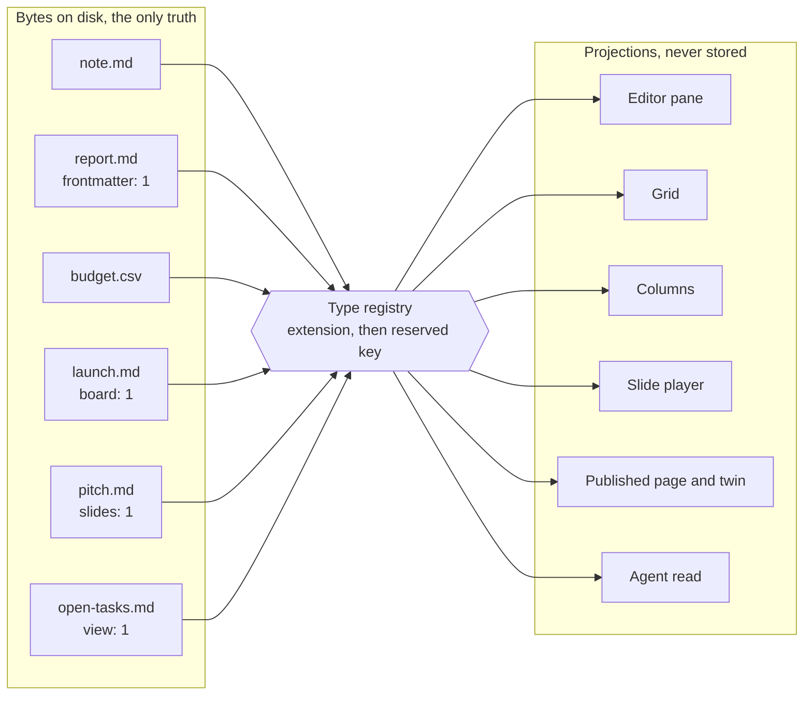

# frontmatter, the review

# Part one. What to review

## 1. How to read this document

- **Section 3 is the only one that needs you.** Every item there has a recommendation written beside it.
- Every other open point in the pack was resolved as a proposal and marked where it sits. `grep -rn "resolved (proposed" docs/pack` lists them in context.
- Parts two and three say what exists. Part four onwards is every screen, desktop and phone.
- Nothing in this document is typed by hand. `docs/mvp0/tools/make-review-md.py` lifts each section from the file that owns it, so the pack stays the one home for every fact.

## 2. What the founders have decided

Id | Decision | Blocks | Recommendation
`D01` | **What the product is, in one sentence.** And the contradiction in our own documents about which answer we took | Build order, and 23 other decision cards | **Decided 18 September `[Z]`: the broad editor, option a, sharpened.** See section 0
`D02` | The pace, and which phases sit in Later | Every calendar date | **Decided 18 September `[Z]`: everything, built in batches**, each used internally before the next. See section 0
`D03` | Which bytes we hold, and from which phase | The architecture of phase A | **Decided 18 September `[Z]`: our copy is canonical, the person's GitHub or Drive holds a full mirror.** See section 0
`D04` | **Whether the Model Context Protocol server moves out of Later** and becomes the Max tier | The Max tier's existence | **Decided 18 September `[Z]`: yes.** A read-and-propose MCP server, never writing directly, becomes the Max tier
`D05` | The name | The domain and every published URL | **Decided 18 September `[Z]`: keep frontmatter now**, without waiting for the trademark search
`D06` | **Whether to reopen authorship marking**, now that Google's Open Knowledge Format defines `generated` and `verified` | A small amount of phase D | **Decided 18 September `[Z]`: yes.** Stamp `verified: [{by, at}]` into front matter on accept
`D07` | The twenty-kit gate | Phase C | **Decided 18 September `[Z]`: keep the twenty-kit gate**
`D08` | Trial and dunning behaviour | Phase H | **Decided 18 September `[Z]`: a one-month Pro trial**, countdown reminders, and editing, copy and export locked if unpaid. See section 0
`D09` | The desktop's timing, and who signs Windows | The order of phases E and F | **Decided 18 September `[Z]`: desktop early**, alongside the web editor. The Windows certificate is still unpriced
`D10` | Which accounts move to the company | Phase 0 | **Decided 18 September `[Z]`: all of them**, before the first stranger
`D11` | **The free document cap against the pilot cohort.** 50 documents, and a qualifying vault is 200 files | The pilot, before it recruits anybody | **Decided 18 September `[Z]`: set from the configuration panel and A/B tested on real accounts before it is fixed.** See `28-CONFIGURATION-PANEL-SPEC.md` section 10.3
`D12` | **Whether a link-edit holder needs an account.** The front door forbids anonymous editing and the permission matrix grants it | Phase D | **Decided 18 September `[Z]`: yes, sign in to edit.** Reading a link needs nothing
`D13` | **Database views over front matter.** Table stakes in one round, deferred in the plan | Phase G | **Decided 18 September `[Z]`: build views early**
`D14` | **Voice typing.** A shipped Doc mode row, and the research's clearest negative | Phase B, one contractor row | **Decided 18 September `[Z]`: keep voice typing** in Doc mode
`D15` | **The data model says Postgres and the stack decision says Firestore** | Phase A, all of it | **Closed 18 September.** Section 18 now names Firestore collections and points at `21-DATA-MODEL.md`
`D16` | Where Sort the file lives on S39: the column menu only, or also beside the sort chip | S39 | Open. Drawn in the column menu only
`D17` | Whether a phone may set a sheet formula at all | S39 on the phone | Open. Drawn for values only
`D18` | Whether the sheet grid shows `1200` or `1,200` | S39 | Open. Drawn as `1200`, so the grid agrees with the file
`D19` | The default columns for a new board | S40, and `F306` from a blueprint | Open. Drawn as Backlog, To do, Doing, Review, Done; `69-BOARDS-SPEC.md` names Todo, Doing, Done
`D20` | Whether a person's own board drag lands at once or waits in the queue | S40, and the queue rule of plan v5 | Open. Drawn as landing at once
`D21` | Whether the card panel edits the body, or shows it and sends the person to the document | S40 | Open. Drawn read-only for the body
`D22` | Whether the mic replaces Outline in the phone's bottom bar, or a sixth item is added | S41 on the phone | Open. Drawn as a replacement
`D23` | Whether the listening pill shows the tone at all below High | S41 | Open. Drawn as a greyed note
`D24` | Whether a voice command's proposal offers Accept before the diff is opened | S41 | Open. Drawn with Show diff and Reject only, as S20 draws agent items
`D25` | Start from a PDF, or Upload a PDF, as the label | S42 and S04 | Open. Drawn with `72-PDF-TO-MARKDOWN-SPEC.md` section 4's words
`D26` | Whether a conversion's queue item is `ai` or a new `convert` | S42, S20 and `21-DATA-MODEL.md` | Open. `72-PDF-TO-MARKDOWN-SPEC.md` section 4.4 writes `ai` until it is settled
`D27` | Whether entry 1 of the PDF converter skips the queue | S42, and ADR-0008 | Open. `72-PDF-TO-MARKDOWN-SPEC.md` section 4.1 reads the preview's Accept as the owner's decision

---

Source: `docs/pack/56-OPEN-DECISIONS.md`.

## 3. What needs the founders

Log | Where | The point | What was proposed or done
---|---|---|---
[66-formats.md](66-formats.md) | 66 section 3.10 (line 383). | What `by` holds in the `verified` stamp. | Needs founder, recommendation written: `human:<handle>`. Rejected: an email (published with every page) and a uid (meaningless to a reader). A privacy promise to users, so the founder decides.
[67-14-adr.md](67-14-adr.md) | 67 section 7.2, `open:` | Does an automatic mirror push on Free spend the 20-push quota. | Resolved (proposed): Free has no automatic GitHub push; each push is pressed by the person and counts. Drive on Free stays automatic. The cadence table is adopted. Rejected automatic Free pushes against the quota.
[67-14-adr.md](67-14-adr.md) | 67 section 15 row | The mirror cadence table. | Closed with the 7.2 item above: adopted as proposed by the benchmark.
[67-14-adr.md](67-14-adr.md) | 67 section 10.1, `open:` | A moved upload lives only in Drive, against "our copy is canonical". | Resolved (proposed): the moved upload becomes a link we no longer guarantee, told before the move; checksum-verified copy, link rewrite, logged key delete, a tombstone record per upload; offered only with a Drive connection. Rejected keeping an R2 copy.
[67-14-adr.md](67-14-adr.md) | 67 section 13, `open:` | Does a hard deletion in our copy ever delete the mirror file. | Resolved (proposed): never. At trash expiry our mirror record goes and the file stays with the person; the confirmation says so. Corrected the section 13 bullet that said the delete reached the mirror. Rejected deleting the mirror after 30 days.
[67-14-adr.md](67-14-adr.md) | ADR-0005 Two disagreements, `UNVERIFIED:` | Does Razorpay also allow only one attempt. | Checked. False: Razorpay Subscriptions retry automatically from the next day until `halted`, and the card recurring API allows a manual retry every 36 hours. The RBI framework has no attempt rule, so the rule is Stripe's. Fixed the claim, flagged the decision bullet as corrected, narrowed the build rule to "no scheduler of our own", and updated the limits.
[67-14-adr.md](67-14-adr.md) | ADR-0013 Inventory, IP row, `UNVERIFIED:` | Intellectual property agreement between the founders. | Cannot be checked from here; kept `UNVERIFIED:` with a needs naming the founders.
[files-01-39.md](files-01-39.md) | 38 334, limits. | Which clock governs, IT Rules or consumer rules, or both. | A legal reading. Kept `UNVERIFIED:` with a needs (a lawyer's opinion); the stricter reading stays meanwhile.
[files-01-39.md](files-01-39.md) | 37 333, limits. | Retention rows not cross-checked against the legal section. | Cross-checked. All rows match plan section 18. Two conflict with rule 8(3): security log raised to 365 days, resolved (proposed 18 Sep, founder review); keeping processing logs a year after account deletion needs founder, since it changes a promise to users.
[files-01-39.md](files-01-39.md) | 30 297, rotation. | No rotation schedule, owner or runbook for the eleven secrets. | Confirmed absent. Found two exposed, unrotated tokens recorded in the 13 September handover. Proposed a policy (on leak, on departure, yearly; owner as the plan's security-log row), resolved (proposed 18 Sep, founder review). The two exposed tokens need the founder.
[files-01-39.md](files-01-39.md) | 18 section 12, row 1. | A third sign-in route (magic link) and second 2. | Recommended: flag off at launch; when on, a third button, never a form. Needs founder, since it is his question 18.
[files-01-39.md](files-01-39.md) | 18 section 12, row 3. | Whether the age floor appears in the first sixty seconds. | Recommended one line under the buttons, no birth date. Needs founder, since it is legal risk and his question 12.
[files-01-39.md](files-01-39.md) | 08 47, section 1. | Whether a separate `frontmatter` project exists on the personal team. | Checked read-only with the CLI's login: it exists, id matches the local link, newest deployment 48 days old, so it is the pre-migration project. Deleting it is destructive, so the recommendation (re-link to `zsco`, then retire it) needs founder. Limits list updated.
[files-40-65.md](files-40-65.md) | 54 113, section 3.3 | IT Rules 2021 rule 3 clocks not re-opened. | **Fixed.** Re-opened the MeitY consolidated text of 10 February 2026. G.S.R. 120(E) cut resolution to 7 days, complaint removal to 36 hours, order removal to 3 hours, intimate imagery to 2 hours. Table and `L02` rewritten. Whether we are an intermediary kept `UNVERIFIED:` with needs legal opinion.
[files-40-65.md](files-40-65.md) | 54 145, section 3.5 | R2 and Durable Objects data-location pages not re-opened. | **Fixed.** Both pages re-opened. Neither offers India: R2 has an `apac` hint only, and both have only `eu` and `fedramp` jurisdictions. Firestore lists `asia-south1` Mumbai. Proposed that the CERT-In security log lives in Firestore `asia-south1`, not R2. The plan's "R2 in Mumbai" is therefore wrong, outside this file.
[files-40-65.md](files-40-65.md) | 53 238, section 5.2 | Every number in the dunning ladder. | Resolved as proposed: days 0, 3, 7, 14 adopted. Rejected a 7-day downgrade.
[files-40-65.md](files-40-65.md) | 53 300, section 6.2 | Which tax heading a subscription editor falls under. | Kept `UNVERIFIED:` and added needs chartered accountant's opinion.
[files-40-65.md](files-40-65.md) | 53 344, limits | The tax heading. | Kept `UNVERIFIED:`, needs chartered accountant.
[files-40-65.md](files-40-65.md) | 54 291, section 5.1 | The 2026 rate notification and the tax heading. | Notification closed as in 53; heading kept `UNVERIFIED:` with needs.
[files-40-65.md](files-40-65.md) | 54 390, limits | The tax heading. | Kept, needs chartered accountant.
[files-40-65.md](files-40-65.md) | 54 391 and section 4.3 | Mistral free-tier training default unresolved, page 404. | **Resolved.** Opened the help article and commercial terms 4.2: Studio Free mode trains by default with an opt-out, and Labs or Preview models always train. Proposed: Mistral disqualified from the chain. Rejected: enabling with the opt-out recorded.
[files-40-65.md](files-40-65.md) | 54 section 3.6, Deletion row | "Not yet a founder decision": whether account deletion removes the mirror. | Resolved as proposed: mirror files left in place, our grant revoked. Rejected deleting the mirror first. Also clears the `INFERENCE:` in the section 3.4 table row by reference.
[files-40-65.md](files-40-65.md) | 57 280, limits | The 90-day shutdown notice has no founder agreement. | Recommended 90 days, rejected 30. Marked needs founder, a promise to users.
[files-40-65.md](files-40-65.md) | 50 206, batch 3 | The 11 days added. | Marked as an appetite, proposed. Nothing to verify until built.
[files-40-65.md](files-40-65.md) | 50 248, batch 4 | The 7 days added. | Same treatment.
[files-40-65.md](files-40-65.md) | 50 313, batch 6 | The 10 to 12.5 days for the idea redesign. | Same treatment.
[files-40-65.md](files-40-65.md) | 50 360, batch 8 | The 2 days for phone theming. | Same treatment.
[files-40-65.md](files-40-65.md) | 50 400, batch 10 | The 2 days for `wait_for_change`. | Same treatment.
[files-40-65.md](files-40-65.md) | 50 623, limits, and section 5.2 | Every 18 September addition in days; the brief's headline is lower. | Traced the headline: it is this file's own revision `f237ece` (3 to 4 weeks, about 1 week), so both figures are ours. Adopted the itemised rows as the appetite, proposed. Kept the range floor at 20 days so `ADR-0011` and section 5.4 stay consistent. Rejected re-deriving the total, which would split this file from `ADR-0011`.
[files-40-65.md](files-40-65.md) | 51 363, limits | The Max price: none exists. | Confirmed there is none. Proposed: metered per agent request, the rate set in the configuration panel from measured cost when batch 10 starts. Rejected a flat price now.
[files-40-65.md](files-40-65.md) | 51 364, limits | Whether the tagline test can tell three lines apart; no sample size. | Derived: 15 a line to tell 80 from 30 per cent, 39 for 80 from 50, at 5 per cent significance and 80 per cent power. The pilot gives about 7 a line, so the test can only screen. Proposed: retire any line that 2 or fewer of 7 pass. Rejected ranking lines at that size.
[files-40-65.md](files-40-65.md) | 58 447, section 7.4 | What "the same theme treatment" for phone means. | Proposed three concrete changes: surface layering, desktop heading steps, desktop density. Rejected a phone palette. Needs his confirmation, it is taste.
[files-40-65.md](files-40-65.md) | 41 223, section 7, NF-4 | Open question: does an NFC key equal its NFD form for addressing. | Resolved as proposed: equal only when bytes are equal; a normalised near-match is refused with the match named. Rejected NFC equality, which guesses. Unblocks the NF-4 fixture. Found by `grep -n -i "open question"`, not by the brief's grep.
[screens-S01-S13.md](screens-S01-S13.md) | S04 D01 | Where does the wordmark sit?. | needs founder (brand). Recommendation: mark alone in the workspace and in-app headers; wordmark on the front door and published page only.
[screens-S01-S13.md](screens-S01-S13.md) | S01 resolutions, wordmark note | The plan's S01 line puts the wordmark on the card; S01 and the generator draw the mark. | recorded in S01 and carried with S04 D01.
[screens-S01-S13.md](screens-S01-S13.md) | S04 D11 | Which five collapsibles?. | needs founder on "Commands" only. Recommendation: the four drawn rows plus Outline; Commands read as the existing Command K palette.
[screens-S14-S26.md](screens-S14-S26.md) | S17 D38 | The invite credit value, and its abuse. | Needs founder for the number. Recommended: keep 5 as the panel default, add a monthly per-inviter ceiling. A panel row is needed in file 28 for that ceiling, for its owner.
[screens-S14-S26.md](screens-S14-S26.md) | S18 D42 | Are published pages indexed by default. | Needs founder: a promise to users, and plan section 29 wants it answered before the pilot. Recommended: keep `flag.publish.indexed` true, say "findable" on S17's publish row. File 66 section 5.2 sends `noindex` on the twin and should follow the flag, for its owner.
[screens-S14-S26.md](screens-S14-S26.md) | S25 D63 | Who signs Windows, and at what price. | Needs founder: money, and D09 in file 56 is open. Recommended two written quotes in batch 1; Windows stays "coming" until signed. Price kept `UNVERIFIED:` with what would check it.
[screens-S27-S38.md](screens-S27-S38.md) | S29 `D60` | Annual offered here?. | needs founder. Recommend offering it as a choice. Flagged that annual loses 19.39 rupees a month per user at full caps (171.57 - 190.96), SIMULATED.
[screens-S27-S38.md](screens-S27-S38.md) | S30 `D61` | Valid handle, and who arbitrates a dispute. | Format resolved (proposed 18 Sep, founder review): reuse `validateSlug`. Dispute outcome needs founder, routed through the grievance process.
[screens-S27-S38.md](screens-S27-S38.md) | S34 `D81` | Over the blueprint allowance: standard set or block?. | needs founder. Recommend: questions allowed on the standard set, files wait for the reset or a top-up. Named the clash with `53` section 5.3.
[screens-S27-S38.md](screens-S27-S38.md) | S37 S37 `D92` | Indexing flag global or per page. | needs founder on the default. Shape proposed: global default plus a per-page choice on S17. Recommend off; three sources disagree.
[screens-S27-S38.md](screens-S27-S38.md) | S37 S37 `D86` | Does turning off bring-your-own key revoke stored keys?. | needs founder. Recommend: stop using, keep stored, tell people, restore on re-enable. It moves calls onto our cost.

**44 items need the founder.** Everything else below is resolved as a
proposal or checked, and is listed in its log for review.

Source: `docs/pack/review/00-FOUNDER-REVIEW.md`.

## 4. The audit of 19 September

Ranked by `docs/pack/65-CONVENTIONS.md` section 7. There is no CRITICAL finding: no API route leaked data signed out, no route returned a 500 in production, and no certificate is near expiry. Nothing below was fixed by the auditor.

| Id | Severity | Finding | Command that shows it | Proposed fix |
|---|---|---|---|---|
| F-01 | HIGH | Production sends `/privacy`, `/terms`, `/pricing` and `/refunds` to `/login`. A stranger cannot read the price, the terms or the refund policy before signing in, which is the core job of those four pages. The fix exists on `audit-response/2026-09-17` (commit `b2f5897`) and is not what production serves. | `curl -sI https://frontmatter.in/pricing` prints `307` and `location: /login`. | Founder merges the branch to `main`, or cherry-picks the `src/proxy.ts` hunk of `b2f5897`, then re-runs the same four `curl -sI` checks and expects 200. |
| F-02 | MEDIUM | On every app page except `/p/<slug>`, production sends the CSP only as `content-security-policy-report-only`, with `'unsafe-inline' 'unsafe-eval'` in `script-src`. The browser enforces nothing, so an injected script would run. No injection was found; this is a missing defence, not an open hole. | `curl -sI https://frontmatter.in/login` shows only `content-security-policy-report-only`. | Move the proxy header to an enforced `Content-Security-Policy`, first dropping `'unsafe-eval'` if the editor runs without it, and keep a report endpoint for the first week. |
| F-03 | MEDIUM | `frontmatter-decisions-founders.vercel.app` answers 200 to anyone, with no `x-robots-tag: noindex`, while the sibling site sends one. The founders' open decisions can be indexed by a search engine. | `curl -sI https://frontmatter-decisions-founders.vercel.app` has no `x-robots-tag` line. | Add the same `X-Robots-Tag: noindex` header to that project's `vercel.json`, and decide whether it should sit behind Vercel deployment protection. |
| F-04 | MEDIUM | A missing note returns HTTP 200 with a "not found" body, locally and in production; `/p/<slug>` also returns 200 and redirects inside the streamed HTML instead of by status. Crawlers see a soft 404, and a link checker cannot tell a dead share link from a live one. The likely cause is the root `src/app/loading.tsx`, which starts streaming before `notFound()` or `permanentRedirect()` runs; that cause is **unverified**. | `curl -sI https://frontmatter.in/audit-probe-slug` prints `200` with `x-matched-path: /[slug]`. | Remove the root `loading.tsx` from the `(public)` tree, or resolve the note before any Suspense boundary, then expect 404 and 308. Add a test that asserts the status code, not the body. |
| F-05 | MEDIUM | The local environment lacks `AUTH_SECRET` (Auth.js `MissingSecret`), `GITHUB_REPO` and `GITHUB_REPO_TOKEN`. Every `/api/auth/*` route returns 500 locally, so a developer cannot sign in. Production is not affected: the live auth route did not return 500. | `npm run dev`, then `curl -s -o /dev/null -w '%{http_code}' http://localhost:3000/api/auth/session` prints `500`, and the dev log prints `MissingSecret`. | The founder runs the `vercel env pull` step from `AGENTS.md` section 6 with the Zephyrus token, then re-runs this section. Add a start-up check that names each missing variable once, instead of a 500 per request. |
| F-06 | MEDIUM | Where `GITHUB_REPO` is missing, the note page throws `Invalid repo environment` and the visitor sees "not found" with a 200. A configuration fault is shown as an ordinary missing note, which is guessing rather than refusing (`AGENTS.md` section 0, rule 2). | The dev log after `curl http://localhost:3000/audit-probe-slug` shows `Invalid repo environment` next to `GET /audit-probe-slug 200`. | Let the configuration error reach `error.tsx` with a 500 and a plain message, and keep `notFound()` for a note that truly does not exist. |
| F-07 | LOW | `/decisions/` and `/prototype/` redirect to the form without a slash, which then matches the app's `[slug]` page, so the copy of the decisions site in `public/decisions/` is reachable only at `/decisions/index.html`. In production even that 307s to `/login`, because the live build predates the allowlist. | `curl -sI https://frontmatter.in/decisions` prints `x-matched-path: /[slug]`. | Add rewrites from `/decisions` and `/prototype` to their `index.html` in `next.config.ts`, then check both with and without the slash. |
| F-08 | LOW | `docs/pack/59-CODEMAP.md` is stale: it lists 1,196 files at `c2b51ea`, and the tree now has 1,240 tracked files. | `node docs/pack/tools/gen-codemap.mjs --check` exits 1. | Regenerate with `node docs/pack/tools/gen-codemap.mjs` in the next pack commit, and add the `--check` to the pack's own validation run. |
| F-09 | LOW | The docs gate fails: its declared marker `4ad10b2` is not a commit in this repo, and there is no `AI-LAYER` spec. The staleness verdict falls back to file times, so it cannot be read as a real measurement until the marker is fixed. | `~/.sgnk/bin/sgnk-docs-gate.sh /Users/sagnikmitra/Desktop/GitHub/frontmatter` prints `GATE: FAIL`. | Point the marker at a real commit, then either add the AI layer spec or record that the pack's own files cover it. |
| F-10 | LOW | `public/decisions/build-questions.py`, a build script, is served as a public file by the app (200 locally). Its opening comment names the location of a 1.5 MB agent transcript kept outside the repo. Live, it is not served today, but it would be once `b2f5897` ships. | `curl -s http://localhost:3000/decisions/build-questions.py` returns the source. | Stop copying `.py` files into `public/decisions/`, or exclude them in the copy step. |
| F-11 | LOW | `www.frontmatter.in` redirects with 307, a temporary redirect, where `AGENTS.md` section 8 says 301. The apex HSTS also lacks `includeSubDomains`. | `curl -sI https://www.frontmatter.in` prints `307`. | Set the `www` domain to a permanent redirect in the Vercel domain settings, and correct `AGENTS.md` if 307 is intended. |
| F-12 | LOW | The decisions validator passes with 5 warnings: US "color" in D21 and P3, and three 29 to 30 word option sentences in E1, G22 and N3. | `python3 decisions/tools/validate.py decisions/v2`. | Change "color" to "colour" in both cards and split the three sentences, then rebuild with `python3 decisions/tools/build-v2.py decisions/v2`. |
| F-13 | LOW | `robots.txt` carries `Disallow: /(vault)`, which is a route group name, not a URL, so it blocks nothing. | `curl -s http://localhost:3000/robots.txt` during section 1. | Remove that line from `src/app/robots.ts`, or replace it with the real signed-in paths. |

Source: `docs/pack/review/AUDIT-2026-09-19.md`.

| Section | Checks | Pass | Fail |
|---|---|---|---|
| 1. Local routes | 67 | 58 | 9. |
| 2. Gates and the pack prose gate | 152 | 150 | 2. |
| 3. Live deployments | 21 | 10 | 11. |
| 4. TLS certificates | 5 | 5 | 0. |

Findings: 0 CRITICAL, 1 HIGH, 5 MEDIUM, 7 LOW.

This report itself passes `python3 ~/Desktop/GitHub/sgnkai/scoring/gate.py --file docs/pack/review/AUDIT-2026-09-19.md --strict` and `python3 docs/pack/tools/validate-pack.py`.

Source: `docs/pack/review/AUDIT-2026-09-19.md`.

# Part two. What was added on 18 and 19 September

## 5. Sheets

1. **The canonical sheet is a GFM pipe table inside a markdown document.** Its formulas live in an
   `fm-sheet@1` fence directly below it, and computed values are written into the cells.
2. **A `.csv` file opens in the same grid**, edited by splice, never re-quoted as a whole.
3. **Rows that are notes, one file per row, are D13's database view**, not a sheet. The sheet grid
   is reused as that view's table layout.
4. **Formulas name columns, never cell addresses.** `Qty * Price` and `sum(Total)`, a dozen
   functions, evaluated by our own small evaluator.
5. **On a published page a sheet is a read-only table** that a reader may sort and filter for
   themselves. Nothing a reader does is saved, and filtering never hides data.

Source: `docs/research/2026-09-18-sheets-boards/SHEETS.md`.

## 6. Boards

**One card is one markdown file with a `status` key. The board is a markdown file whose front matter names the folder, the key and the column order.**

Why B, in order of weight:

1. **The engine can write it today.** `25-ENGINE-SPEC.md` 25.9 states a drag has a write path only into front matter. Option A waits on body-span addressing, which is specified and not built.
2. **It merges.** Different cards never conflict in git; the same card conflicts only when two people truly disagree.
3. **The largest body of demand asks for it**, and Obsidian, the closest competitor in files, shipped it on 4 September 2026.
4. **It is the batch 9a table, grouped.** Rows are files, columns are keys. Sheets and boards become two layouts of one dataset, as in Linear, GitHub and Notion.
5. **Agents write small files well** and large shared files badly.

**What B costs, stated plainly.**

- A board is many files, so it is heavier to email or paste than one file. INFERENCE: export can write a one-file snapshot in shape A, read-only.
- Manual order needs an order key, so a reorder writes a line. Use a sparse number, as Backlog.md's `ordinal: 318000` does, so one move writes one file.
- `F184`'s shape changes. See 4.5.

Source: `docs/research/2026-09-18-sheets-boards/BOARDS.md`.

## 7. One platform for every type

The vocabulary comes from Anytype (section 1.5). The storage rule comes from fmd.

Noun | What it is in fmd | Where it lives
**Type** | The format of a file, chosen from one registry the product owns | The extension, then a reserved front matter key
**Property** | A named value on a file | Front matter for markdown, a column for a sheet
**View** | A deterministic, stateless projection of one or more files | A screen, a published page, an agent's read, or a view file

**The rule.** A type has exactly one canonical byte format. Every view is computed from those bytes
and holds nothing they do not hold. Every write is a splice into those bytes, and it can refuse.

Source: `docs/research/2026-09-18-sheets-boards/ONE-PLATFORM.md`.

## 8. Voice typing

**Speech-to-text chain, for the web and the phone.**

Step | Provider and model | Why
1 | Groq `whisper-large-v3-turbo` | Fastest opened option, `$0.04` an hour paid, 8 hours of audio a day free per organisation, no training on inputs
2 | Cloudflare Workers AI `@cf/openai/whisper-large-v3-turbo` | Same model, `$0.0005` an audio minute, draws on the neuron pool the text chain already uses
3 | Paid Cloudflare neurons | The last link, so voice never says "unavailable" while a paid key exists
Desktop | Local `whisper.cpp` through the Rust binding `whisper-rs`, `small.en` by default | Nothing leaves the machine

**Refused:** the browser's Web Speech API in its default mode, OpenRouter audio, AssemblyAI, and
Deepgram as a chain link. Reasons are in section 2.

**The three levels, one line each.**

- **Low.** Remove fillers, false starts and self-corrections; add punctuation and capitals; change no
  other word.
- **Medium.** Low, plus sentences and paragraphs tidied, and a list made wherever a list was spoken.
- **High.** Restructured into clear prose in the chosen tone, keeping every fact, name and number
  the person said.

**The command set for v1** is ten commands in four groups, listed in section 4.3: shape, rewrite,
remove and undo the last change. Every command that changes the document becomes a proposal in the
change queue. None writes silently.

**Cost.** One paid minute of voice at medium costs `$0.00064` to `$0.00082`, about 5 to 7 paise.
Most minutes cost nothing, because the free pools serve them first. Section 5.6 shows the arithmetic.

**Three things the founder should know before reading on.**

1. **Wispr Flow's Command Mode is not context detection.** It is a separate hold-key, and editing
   commands must start with "Hey Flow". The ask for pure context detection goes further than the
   product it names. Section 4 recommends a hybrid.
2. **Wispr Flow trains on dictation by default.** Its onboarding pre-selects "Improve the model for
   everyone". Our gate A forbids that shape, which is a real difference we can state.
3. **Restructuring a person's own words is an AI edit.** The product's rule says every AI edit enters
   the change queue. Section 5.3 proposes how to keep that rule without making dictation slow.

---

Source: `docs/research/2026-09-19-voice/VOICE.md`.

## 9. PDF to Markdown

**The ask.** Upload a PDF, get markdown. Not a conversational engine.

Three ways in: an empty document, the AI panel while editing (the PDF kept for that session only),
and a standalone "Convert a PDF to Markdown" tool that files the result into notes.
`docs/pack/56-OPEN-DECISIONS.md:118`.

**Recommended chain for PDFs that carry a text layer.** Everything runs in the browser, so the PDF
never leaves the machine.

Step | Tool | Licence | Why
1 | pdf.js, through `unpdf` 1.8.1 | Apache-2.0 (pdf.js), MIT (unpdf) | Reads the text layer, font sizes and, when the PDF is tagged, its structure tree
2 | Our own markdown writer over that output | ours | Headings from the structure tree or font sizes, lists, pipe tables from tags or ruling lines, escaping, and a flag wherever a rule cannot decide
3 | Our format gate, `66-FORMAT-SPECIFICATIONS.md` section 2.5 | ours | The result must pass the same shape gate as any document before it lands

**Recommended chain for scanned PDFs.** Detected per page, because a PDF can mix both kinds.

Step | Tool | Licence | Where
1 | pdf.js renders each page to an image | Apache-2.0 | browser
2 | Tesseract, as `tesseract.js` 7.0.0 in the browser or the native binary on the desktop, with a per-word confidence | Apache-2.0 | browser or desktop, nothing sent
3, optional, Pro | A vision model on Workers AI, `@cf/google/gemma-4-26b-a4b-it`, one page image per call | Gemma 4 page titled Apache License 2.0; Cloudflare does not train on inputs | a Cloudflare Worker, page image held in memory only

**Why not the famous converters.** Marker and Surya code is now Apache-2.0, but their weights carry
a licence that bars any entity over five million dollars of revenue or funding, and any product that
competes with Datalab's. PyMuPDF4LLM is AGPL-3.0.

Nougat's weights are non-commercial. Section 2.

**What the accuracy evidence says, in one line.** On olmOCR-Bench the best open systems score 75 to
83, and every one is a GPU pipeline or a vision model.

Nothing that runs in a browser tab appears on either public benchmark. Section 4.

**The caps proposed.** Both browser paths cost us nothing, so they are the same on Free and Pro:
1,000 pages and 100 MB a conversion, 100 scanned pages a conversion, no monthly OCR cap.

Only the Pro vision pass is metered, at 200 pages a month. The desktop has no caps. Section 5.4.

**What we ran.** Seven free tools on one fixture in three forms, and pdf.js on 182 real pages.
pdf.js kept reading order where Docling and markitdown lost it; tesseract.js dropped a whole table.
Section 4.4.

---

Source: `docs/research/2026-09-19-pdf/PDF-TO-MARKDOWN.md`.

## 10. Storage and the mirror

**Our copy is canonical. The person's GitHub or Drive holds a complete, readable mirror of their markdown, written by us and read back through the change queue.**

Source: `docs/research/2026-09-18-storage/STORAGE-BENCHMARK.md`.

## 11. The roadmap and the calendar

**Everything takes longer than the old default, and says so here.** The old default built five
phases in about 60 to 79 calendar weeks.

Building all of it, one batch at a time, is **about 201 to 296 calendar weeks** for the twelve
batches that now have an appetite.

**That is 67 to 87 weeks more than the 134 to 209 of 18 September.** The 19 September features add
79 proposed working days to priced batches, and two use windows. Section 5.8 shows the sum.

**Three batches still have no full appetite**: 10, 11 and 12. Batches 11 and 12 carry 14 proposed
days for the new types, and nothing else in them is costed. The range above is a floor, not a total.

**At the measured pace that is roughly 3.9 to 5.7 years**, before the thirty days of content
writing and before the unpriced batches. Section 5 shows every step of the arithmetic.

---

Source: `docs/pack/50-ROADMAP.md`.

# Part three. Every pre-development file

## 12. The pack, file by file

### 00 to 09. Orient

File | What it is | Mode | Tier | Status
`00-README.md` | Start here. | reference | canonical | living
`01-EXECUTIVE-SUMMARY.md` | Executive summary. | explanation | canonical | draft
`02-PRODUCT-AND-DOMAIN.md` | The product and its domain. | explanation | canonical | draft
`03-GLOSSARY.md` | Glossary. | reference | canonical | living
`04-PERSONAS-AND-JOBS.md` | Personas and jobs. | explanation | canonical | draft
`05-USER-EVIDENCE.md` | User evidence. | reference | canonical | living
`06-COMPETITIVE-LANDSCAPE.md` | Competitive landscape. | reference | canonical | living
`07-CLAIMS-REGISTER.md` | Claims register. | reference | canonical | living
`08-ECOSYSTEM.md` | Ecosystem. | reference | canonical | living
`09-CHANGELOG.md` | Changelog. | reference | canonical | living

### 10 to 19. Specify

File | What it is | Mode | Tier | Status
`10-FEATURE-REGISTER.md` | Feature register. | reference | canonical | living
`11-SCREEN-INDEX.md` | Screen index. | reference | canonical | living
`13-SCREEN-STATE-MATRIX.md` | Screen state matrix. | reference | canonical | living
`14-COMPONENT-INVENTORY.md` | Component inventory. | reference | canonical | living
`15-INTERACTION-AND-KEYBOARD.md` | Interaction and keyboard. | reference | canonical | living
`16-COPY-DECK.md` | Copy deck. | reference | canonical | living
`17-ERROR-AND-REFUSAL-CATALOGUE.md` | Error and refusal catalogue. | reference | canonical | living
`18-FIRST-RUN-AND-EMPTY.md` | First run and empty states. | how-to | canonical | living
`19-ACCEPTANCE-CRITERIA.md` | Acceptance criteria. | reference | canonical | living
`12-screens/` | One specification per screen, S01 to S42, 42 files. | reference | canonical | specified

### 20 to 29. Engineer

File | What it is | Mode | Tier | Status
`20-ARCHITECTURE.md` | Architecture. | explanation | canonical | living
`21-DATA-MODEL.md` | Data model. | reference | canonical | living
`22-API-REFERENCE.md` | API reference. | reference | derived | living
`23-WEB-APP-SPEC.md` | Web app specification. | reference | canonical | living
`24-SERVER-SPEC.md` | Server specification. | reference | canonical | living
`25-ENGINE-SPEC.md` | Engine specification. | reference | canonical | living
`26-ENGINE-REFUSAL-CATALOGUE.md` | Engine refusal catalogue. | reference | canonical | living
`27-MODEL-ROUTING-SPEC.md` | The model routing layer. | reference | canonical | living
`28-CONFIGURATION-PANEL-SPEC.md` | The configuration panel. | reference | canonical | living
`29-PLATFORM-AND-DESKTOP-SPEC.md` | Platform, desktop and phone. | reference | canonical | living

### 30 to 39. Run

File | What it is | Mode | Tier | Status
`30-ENVIRONMENT-AND-CONFIG.md` | Environment and configuration. | reference | canonical | living
`31-LOCAL-SETUP.md` | Local setup. | tutorial | canonical | living
`32-DEPLOYMENT-AND-OPS.md` | Deployment and operations. | how-to | canonical | living
`33-RUNBOOK.md` | Runbook. | how-to | canonical | living
`34-INTEGRATIONS.md` | Integrations. | reference | canonical | living
`35-RELEASE-AND-VERSIONING.md` | Release and versioning. | how-to | canonical | living
`36-DATA-MIGRATION-PLAN.md` | Data migration plan. | how-to | canonical | living
`37-BACKUP-AND-RECOVERY.md` | Backup and recovery. | how-to | canonical | living
`38-INCIDENT-AND-SEVERITY.md` | Incident and severity. | how-to | canonical | living
`39-SHARING-A-BUILD.md` | Sharing a build. | how-to | canonical | living

### 40 to 49. Judge

File | What it is | Mode | Tier | Status
`40-TESTING-STRATEGY.md` | Testing strategy. | explanation | canonical | living
`41-FIXTURE-REGISTER.md` | Fixture register. | reference | canonical | living
`42-SECURITY-REVIEW.md` | Security review. | explanation | canonical | living
`43-THREAT-MODEL.md` | Threat model. | explanation | canonical | living
`44-TECH-DEBT-REGISTER.md` | Technical debt register. | explanation | canonical | living
`45-UX-AUDIT.md` | Screens audit. | explanation | canonical | living
`46-ACCESSIBILITY-SPEC.md` | Accessibility specification. | reference | canonical | living
`47-PERFORMANCE-BUDGET.md` | Performance budget. | reference | canonical | living
`48-PRODUCT-MATURITY.md` | Product maturity. | explanation | canonical | living
`49-BUILD-STATUS-AUDIT.md` | Build status audit. | reference | canonical | living

### 50 to 59. Steer

File | What it is | Mode | Tier | Status
`50-ROADMAP.md` | Roadmap. | explanation | canonical | living
`51-PRODUCT-PLAN.md` | Product plan. | explanation | canonical | living
`52-MARKET-RESEARCH.md` | Market research. | explanation | canonical | living
`53-PRICING-AND-ENTITLEMENTS.md` | Pricing and entitlements. | reference | canonical | living
`54-COMPLIANCE-AND-LEGAL.md` | Compliance and legal. | reference | canonical | living
`55-MEASUREMENT-AND-EVENTS.md` | Measurement and events. | reference | canonical | living
`56-OPEN-DECISIONS.md` | Open decisions. | explanation | canonical | living
`57-SUPPORT-AND-LIFECYCLE.md` | Support and lifecycle. | how-to | canonical | living
`58-DESIGN-SYSTEM.md` | Design system. | reference | canonical | living
`59-CODEMAP.md` | Codemap. | reference | derived | living

### 60 to 69. Trace and meta

File | What it is | Mode | Tier | Status
`60-TRACEABILITY.md` | Traceability. | reference | canonical | living
`61-DOCUMENTATION-PRACTICE.md` | Documentation practice. | explanation | canonical | living
`62-DOC-SCHEMA.md` | The front matter contract. | reference | canonical | living
`63-AGENT-CONTRACT.md` | Agent contract. | reference | canonical | living
`64-PORTABILITY-AND-HANDOVER.md` | Portability and handover. | how-to | canonical | living
`65-CONVENTIONS.md` | Conventions. | reference | canonical | living
`66-FORMAT-SPECIFICATIONS.md` | Format specifications. | reference | canonical | draft
`67-SYNC-AND-CONFLICT.md` | Sync and conflict. | reference | canonical | draft
`68-SHEETS-SPEC.md` | Sheets specification. | reference | canonical | draft
`69-BOARDS-SPEC.md` | Boards specification. | reference | canonical | draft

### 70 to 79. Content types and capture

File | What it is | Mode | Tier | Status
`70-PLATFORM-AND-TYPES.md` | One platform, many content types. | reference | canonical | draft
`71-VOICE-SPEC.md` | Voice typing, restructuring and voice commands. | reference | canonical | living
`72-PDF-TO-MARKDOWN-SPEC.md` | PDF to Markdown, the converter. | reference | canonical | living

### Decision records

File | What it is | Mode | Tier | Status
`adr/ADR-0001-compiler-not-format.md` | Build a compiler and an IDE, not a new markdown format. | explanation | canonical | decided
`adr/ADR-0002-render-carrier.md` | Callouts carry prose, fenced blocks carry opaque data. | explanation | canonical | decided
`adr/ADR-0003-sync-without-crdt.md` | Sync is git-merge plus a splice journal plus compare-and-swap, never a CRDT. | explanation | canonical | decided
`adr/ADR-0004-r2-recovery-in-key-layout.md` | R2 has no object versioning, so recovery lives in the key layout. | explanation | canonical | decided
`adr/ADR-0005-inr-mandate-ceiling.md` | ₹15,000 a transaction is an architectural constant, and an Indian card gets one attempt. | explanation | canonical | decided
`adr/ADR-0006-projection-law-and-splice-only.md` | The projection law and splice-only writing, refuse rather than guess. | explanation | canonical | decided
`adr/ADR-0007-stack.md` | Next.js on Vercel, R2 for bytes, Firestore for records, Firebase Auth. | explanation | canonical | decided
`adr/ADR-0008-change-queue-replaces-review-state.md` | The change queue replaces review state. | explanation | canonical | decided
`adr/ADR-0009-sign-in-first-no-captcha-no-tour.md` | Sign in first, with no captcha and no tour. | explanation | canonical | decided
`adr/ADR-0010-broad-editor-internal-name-fmd.md` | The product is the broad markdown editor, and its internal name is fmd. | explanation | canonical | decided
`adr/ADR-0011-everything-in-batches.md` | Build everything, one batch at a time, each used internally before the next. | explanation | canonical | decided
`adr/ADR-0012-canonical-copy-with-mirror.md` | Our copy is canonical, and the person's GitHub or Drive holds a full mirror. | explanation | canonical | decided
`adr/ADR-0013-accounts-to-the-company.md` | Every account moves to the company before the first stranger's document is stored. | explanation | canonical | decided
`adr/ADR-0014-free-cap-as-tested-panel-value.md` | The Free document cap is a panel value, A/B tested before it is fixed. | explanation | canonical | decided
`adr/ADR-0015-one-live-collaborator-on-free.md` | One live collaborator on Free. | explanation | canonical | decided
`adr/ADR-0016-free-model-chain-and-training-gate.md` | A free-model fallback chain, behind a training gate. | explanation | canonical | decided
`adr/ADR-0017-sheet-format.md` | A sheet is a pipe table with a formula fence below it. | explanation | canonical | open
`adr/ADR-0018-board-format.md` | A board is a folder of card files and one board file. | explanation | canonical | open
`adr/ADR-0019-type-registry-and-embedding.md` | One type registry, and embedding by reference. | explanation | canonical | open
`adr/ADR-0020-voice-typing.md` | Voice typing on free speech-to-text, restructured through the change queue. | explanation | canonical | decided
`adr/ADR-0021-pdf-to-markdown.md` | PDF to Markdown as an on-device converter, with three entry points. | explanation | canonical | decided

Every file lives under `docs/pack/`. The entry point is `00-README.md`, then `64-PORTABILITY-AND-HANDOVER.md`.

## 13. The research behind it

Folder | Files
---|---
`docs/research/2026-09-13` | 13: `KICKOFF-ROUND-1.md`, `KICKOFF-ROUND-2.md`, `README.md`, `round2-code-vs-wireframes.md`, `round2-conflicts.md`, `round2-doc-kit.md`, `round2-link-delivery-storage.md`, `round2-prompt-to-spec-market.md` and more.
`docs/research/2026-09-18` | 15: `A-agent-tool-gaps.md`, `B-spec-driven.md`, `BRIEF.md`, `C-instruction-files.md`, `D-editor-demand.md`, `E-provenance.md`, `F-complaints.md`, `G-docs-quality.md` and more.
`docs/research/2026-09-18-llm` | 4: `L1-free-providers.md`, `L2-abuse-guardrails.md`, `L3-router-design.md`, `L4-advox-pack-anatomy.md`.
`docs/research/2026-09-18-name` | 1: `TAGLINE-AND-FMD.md`.
`docs/research/2026-09-18-sheets-boards` | 4: `BOARDS.md`, `ONE-PLATFORM.md`, `SCREEN-REFERENCES.md`, `SHEETS.md`.
`docs/research/2026-09-18-storage` | 1: `STORAGE-BENCHMARK.md`.
`docs/research/2026-09-19-pdf` | 1: `PDF-TO-MARKDOWN.md`.
`docs/research/2026-09-19-voice` | 1: `VOICE.md`.

## 14. The tools that keep it true

Tool | What it does
---|---
`docs/pack/tools/apply-id-maps.py` | Rewrite the ids cited in the 38 screen specs from the reconcilers' maps, in one pass per file.
`docs/pack/tools/build-review.py` | Assemble docs/pack/review/00-FOUNDER-REVIEW.md from the resolution logs beside it.
`docs/pack/tools/fix-pack.py` | Apply the mechanical fixes the pack validator asks for.
`docs/pack/tools/gen-index.py` | Fill the generated index block inside 00-README.md.
`docs/pack/tools/rewrite-id-notes.py` | One-off, 18 Sep 2026: replace the id-scheme notes at the top of each screen spec.
`docs/pack/tools/stabilise-citations.py` | Turn fragile line citations into stable section citations.
`docs/pack/tools/state-coverage.py` | Coverage of 13-SCREEN-STATE-MATRIX.md against the screen files that exist.
`docs/pack/tools/validate-pack.py` | Validate the documentation pack against 62-DOC-SCHEMA.md.
`docs/pack/tools/gen-api-reference.mjs` | ---------------------------------------------------------------- utilities.
`docs/pack/tools/gen-codemap.mjs` | gen-codemap.mjs.
`docs/mvp0/tools/check-pdf.py` | Pre-print check for a PDF built by docs/mvp0/build-pdf.mjs.
`docs/mvp0/tools/make-review-md.py` | Assemble the founders' review document from the pack, then append every screen.
`docs/mvp0/tools/make-screens-md.py` | Generate docs/mvp0/SCREENS.md from the screen sections of PRODUCT-PLAN.md.

# Part four. What is in the product

## 15. In one page

**frontmatter is a markdown editor for people whose documents are increasingly written with, and for, AI agents.**

- One account, on the web, the desktop and the phone.
- Every editing feature is free, with quantities capped.
- Password links, Medium and High ideas, and the portfolio are on Pro.

Area | What is in it
The door | Sign in with Google or GitHub, one tap. Home with five ways to start. Settings on the account
Writing | Markdown mode and Doc mode in one Live editor. Four modes: Edit, Live, Reading, Split. The twelve-button toolbar. Tabs. A rail with the outline, tags, backlinks and comments in it. Dark mode
Help while writing | An AI box on an empty document. Seven AI verbs on a selection, with accept and reject in place. A problems panel and a formatter. The whole set of instruction files an agent reads
Blocks and views | Tables, callouts, Mermaid, maths, a chart block that reads the table above it, an Excalidraw drawing block. A document viewed as a page, slides, a mind map, a kanban or an outline; the flow view is deferred. The project map
Ideas | A collapsed section at the foot of the workspace tree. Ideas listed with their state. An industry template. Three depths: Low free, Medium and High on Pro. A blueprint of fifteen files in a skill folder, with a consistency check, an unlisted link, a hash printed on the page and a kickoff prompt that checks it
Sharing | People with roles. Links that expire, and on Pro need a password. Published pages with a markdown twin. Live editing with one collaborator on Free. A change queue for every change by a person, an AI edit or an agent. Document history
In and out | Drop files or a whole folder. Import from Obsidian, Notion, Google Docs or Word. GitHub connected as an app, Google Drive as two-way sync. Export to markdown, HTML, Word or PDF
Everywhere | Offline in the browser. The desktop app, with files on disk and no document limit. The phone, with a bottom bar, drawers, quick capture and the share sheet
Configuration | What each plan allows, the model routing, the provider chain and four feature flags, all set from a panel rather than from the source. Founders only
Money | Free: 50 cloud documents, 1 GB of uploads, 5 published pages, 1 live collaborator, 7-day history, 1 repository with 20 pushes, 1 Low blueprint and 10 AI edits a month. Pro at ₹299 a month: unlimited, 90-day history, password links, Medium and High, 100 edits and 5 blueprints on Claude, the portfolio
Voice and PDF | Push-to-talk dictation in English, cleaned up at three levels or left raw, and spoken commands that wait as proposals. A PDF read into markdown in the browser, from an empty document, the AI panel or its own tool
Later | The portfolio at frontmatter.in/@handle, the MCP server and API, Team, a custom domain, kanban and chart blocks

## 16. Reading the screens

- **Forty-two screens.** Thirty-eight are the product. Four are the configuration panel, which only a founder sees. The sheet, the board, voice and PDF to Markdown were drawn on 19 September. Eight screens carry a second or third frame for a state the founders asked to see.
- **Each screen** shows the desktop at 1,440 by 900 beside the phone at 390 by 844, both drawn from the design tokens of the shipped app, and then lists what is on it.
- **The phone follows the shipped code and carries the desktop's theme:** the mark, the title with its project, the editor full width, and the tree and the right pane as drawers.
- **The bottom bar** carries five actions at thumb height: Home, Search, AI, Outline and More, in that order. On the voice screens the mic takes the middle place and Outline steps out.
- **The order follows a person's day:** sign in, write, decide, share, bring things in, use it everywhere, and then the states nobody wants to see.
- **The reasons behind each screen** are in the product guide, sections 21 and 22. This sheet shows only what a person sees.

# Part five. The screens

## 17. Getting in

### S01. Sign in

- The wordmark, one line of promise, Continue with Google, Continue with GitHub.
- The fine print says what we do not do: no password, no puzzle, no tour, no training on documents, and links the provider list that makes that true.
- Privacy and Terms link to pages that serve without an account (F054). The right half shows the editor once, so the page is not a wall.

### S02. Home, first time

- Five ways to start: a blank document, from an idea, import, from GitHub, a template.
- Three tabs: Documents, Ideas, Shared with me.
- The empty state names the free caps once and says you can drop a folder anywhere.

### S03. Home

- Recent documents with project, opened and owner. The Ideas count sits on the home tabs; in the workspace, ideas are a section of the tree.
- A quiet pill shows cloud documents used against the cap.
- The phone shows four starts and the list.

## 18. Writing

### S04. Workspace

- Tabs at the top, then one toolbar row, then the document. Share is an icon. The workspace carries the mark and not the wordmark, because the wordmark is for the front door and the published page.
- **The left rail is where things are made and put.** Two buttons, Add file and Add idea. Upload lives inside Add file, next to New document and Import from, and the whole tree is a drop target with the hint always visible. There is no third button competing with those two (F073).
- **Ideas is a collapsed section at the foot of the tree**, the way the outline sits on the right. Notes stays open, Ideas stays shut until it is wanted `[Z]`.
- **Every collapsible is at the top of the right rail**, closed, so the outline takes the height and the AI panel has room to open below `[Z]`.
- Shortcuts is gone. The tree shows all fifteen blueprint files (F019). The history row reads "7 days" on Free (F018).
- The phone keeps the toolbar to seven tools and puts the mode segment in the header.
- **The AI launch works like Notion's.** A small Ask AI button floats at the bottom right of the document, and Space on an empty line does the same. It opens the AI box over the workspace, anchored under the block being worked on, rather than taking a row of the layout. The rail keeps only the credit meter `[Z]`.

- **The Add file menu:** New document, Upload files, Upload a folder, and Import from. On the phone it is a sheet with Add idea at the foot.

- **The AI box open over the workspace.** The paragraph it will touch is tinted, the first line names the document and the section, and the common verbs sit under the input with their cost.

### S05. Doc mode

- The Google-Docs-shaped toolbar's first level: style, bold, italic, underline, strikethrough, lists, checklist, image, table, link, comment, page break. **Font face and size sit on this first level**, a short list of fonts and a size stepper `[Z]`. Colour, highlight and alignment sit behind More (F020).
- A paper surface with a ruler. Comments in the margin. Suggesting mode.
- One toast, once: Doc mode is a view; the file is still 00-BRIEF.md; page setup lives in its front matter; colours and fonts render here and export to PDF only.

### S06. AI writing box

- **The box names its target on its own first line**, so there is never a question about what is about to be touched: writing a new document, editing a named one, or working on a named idea. Change is one click away `[Z]` (F074).
- When an idea is in progress that line is pinned and does not scroll away `[Z]`.
- The box anchors to the content, below it when there is room and to the right when there is not `[Z]`.
- One box on an empty document. Four chips for the common asks. A second row for the other ways to start.
- The cost is stated before the click: one edit credit, seven of ten left. The rail counts are zero on an empty document (F022).
- Taking it to Ideas is a chip, not a second product.

- **Beside the content, on an idea.** On a page that already has text the box opens to the right of it. Working on an idea, the first line reads Idea and the idea's name, and it stays pinned while the idea is open. The idea itself is open from the Ideas section of the tree.

### S07. AI edit

- Seven verbs on a selection. The suggestion appears in place with Accept and Reject of equal weight next to it.
- The menu says which provider the month runs on.
- On the phone the menu is a sheet.

### S08. Custom blocks

- Split view. A table, a chart block that reads the table above it, a Mermaid flowchart, a callout, maths.
- The left pane states what each block becomes elsewhere: GitHub, Obsidian, VS Code.
- The phone shows the rendered side.

### S09. Flow view

- **Deferred to Later by the founder, 18 September.** Drawn for the record, not built in MVP 0 `[Z]`.
- View as: Page, Flow, Slides, Mind map, Kanban, Outline.
- Flow reads the document as phases and steps: an H2 is a phase, an H3 is a step, a bracketed first word is the tag, a trailing line is the reference.
- A legend for the lanes. Scrolls sideways with the arrow keys.

### S10. Problems

- **A filter across the top: All, Checks, Writing**, so a deterministic finding and a model's opinion are never mixed into one list `[Z]`.
- Broken links, heading skips, missing alt text, table shape, and one advisory writing note, each true of the document shown (F022).
- **Spelling with a project dictionary, and a front matter schema check**, because those are the two most-installed checks in the world and neither needs a model `[O]`.
- Fix all safe. Rules.
- **Structural checks run on the device and cost nothing.** That is the sales line: eleven separate tools, four package managers and nine configuration files to get this elsewhere, or open the file `[O]`.

### S11. Instruction files

- **The whole instruction-file set, not one file** `[Z]`: AGENTS.md as the source, CLAUDE.md as a one-line import, and the copies for Copilot, Cursor and Gemini, each with the tools that read it.
- A copy that has drifted from the source is flagged, and a missing one is named. The tree shows the full kit (F019).
- The panel says a file is correct. It never claims that tidying it makes an agent better, because two studies found these files do not raise task success `[O]`.
- Tidy this file, one credit.

## 19. Ideas

### S12. Ideas

- **Inside the workspace.** Ideas is the collapsed section at the foot of the tree; opening it lists the ideas with their state (draft, decided so far, blueprint version), and a new idea opens as a tab like a document `[Z]`.
- One centred column and one input, the way Claude and ChatGPT start. No step breadcrumb.
- The idea, an attached drawing, a document or a repository. An industry template, or one generated for your industry. The drawing is described in the frontend spec the kit now carries (F025).
- The depth chooser: Low free, Medium Pro, High Pro plus credits. Start at Low and go deeper later without losing answers.

### S13. Idea mode, Low

**The question set is generated, and it changes as you answer.** New on 18 September `[Z]`.

- **Ten to fifteen questions**, the count set by how complex the idea is, **four to a page at most**.
- **The whole set is generated once**, from the idea, in one call, so the first page appears with everything already planned and nothing to wait for.
- **Each question carries a branching flag.** Only an answer to a branching question rewrites the later pages. Most answers do not, so most page turns are instant and cost nothing.
- **When a rewrite fires, the affected card blurs and says why**, naming the answer that caused it. It means something because it is rare (F075).
- Rewrites are capped at three a blueprint on Free and unbounded on Pro. Costed in section 14.
- **Skip and Choose the recommendation on every page. Skip all from page two**, behind a modal that says plainly that every remaining question takes its recommendation, and that the brief, the blueprint and the kickoff prompt all follow those defaults `[Z]`.
- Only the recommended option carries its reason. Not sure is a quiet link, not a third option in every card.
- Not sure records the question as open and takes the recommendation for now; DECISIONS.md carries it as open, not as decided.
- The blueprint's fifteen files are listed before a credit is spent.
- **Use a standard question set** is a switch under the page controls, off by default. It is the fallback when the model layer is degraded or the rewrites are spent, and it shows how many rewrites are left on Free.
- **The phone carries the same controls as the desktop**: Skip and Choose recommendation, then Next, pinned to the foot of the screen, with Skip all added from page two.

### S14. Idea mode, Medium and High

**The same layout as Low, deliberately.** There is no second route to learn `[Z]`.

- The same progress line, the same selector pill, the same Skip, Choose the recommendation and Next.
- A decision card: where it stands, what forces the choice, options with gains and costs, evidence rows, the recommendation. On Medium the web rows are labelled as the template's sources with the date they were last checked; only High opens pages (F037).
- The answer is recorded in DECISIONS.md with its evidence.
- High adds a research pass before this step, run in the background.

### S15. Blueprint ready

- Fifteen files in a skill folder: SKILL.md loads first, AGENTS.md, the numbered documents including the frontend spec, specs, DECISIONS.md, MAP.md, graph.json, the manifest and checksums.
- A consistency check ran before you saw it. An unlisted link. A kickoff prompt for Claude Code, Cursor or Codex that verifies the tarball against the hash printed on this page before it unpacks, and reads before it builds (F028).
- Edit, then publish v2.

### S16. The map

- The documents, what each governs, the decisions behind them, and the instruction file, as a graph. The map counts twelve markdown documents; the three data files are not nodes (F038).
- Rebuilt on every save from the files, so it costs no credits.
- MAP.md and graph.json ship inside the kit.

## 20. Sharing

### S17. Share

- People, added **by their frontmatter email address**, with a role from the matrix in section 19.
- **If the address is not a frontmatter account, the screen says so and offers an invite.** Both sides get 5 AI credits when the invited person signs in for the first time. The same modal is reused for referrals afterwards `[Z]`.
- **One live collaborator on Free**, several on Pro `[Z]`. The free number is a cost decision, and section 13 carries it.
- A link that can read, expire, or need a password on Pro.
- The published page toggle, with pages used against the cap.

- **The same modal after sign-up.** The invited person lands on the shared document with a welcome that says both sides got the credits, and a field to invite someone of their own. Nothing is sent until they press Send `[Z]`.

### S18. Published page

- **The page renders first, with no gate, no redirect and no probe.** It reads without an account.
- **After it has painted, a dismissible bar offers where to open it**: the desktop app when the app has registered its protocol handler, frontmatter on the web otherwise, or stay here. It is an offer, and dismissal is remembered `[Z]`.
- **`page.md` and `llms.txt` are never gated, never redirected and never given an interstitial.** That rule is absolute and covers every non-HTML route (F076).
- **The sign-in boundary is editing, not reading.** A reader who presses Edit meets sign-in, which costs nothing at the top of the funnel.
- The footer carries Report, Privacy, Terms and the `.md` twin (F033).
- On the phone the same bar opens out into the ladder: open in the app, open in frontmatter, or continue in browser `[Z]`.

- **A password link**, which is Pro: the gate a reader meets on a protected link, with the same footer. The published page itself never has one.

### S19. Live collaboration

- Presence avatars, a named cursor, the other person's text highlighted as it lands.
- The toast states the free limit once: **one live collaborator on Free**, several on Pro `[Z]`.
- On the phone, presence sits in the header.

### S20. Document review

- **A filter across the top: All, People, AI, Agents.** Human work and machine work are never combined into one undifferentiated list, and an AI edit someone asked for is kept apart from an agent writing on its own `[Z]`.
- Changes waiting, each with who made it: a person, an AI edit you asked for, or an agent that edited the file on disk through the desktop folder.
- Accept, Reject and Reply of equal weight. Accept all applies only to a named person's edits and asks you to confirm the count first; AI and agent items are accepted one by one with the diff shown (F029).
- Changed spans highlighted in the document.

### S21. Document history

- Every version with its author, including the AI edit and the blueprint write.
- A diff against the current version. Restore, or copy as a new document.
- Seven days on Free, 90 on Pro.
- **A People and AI filter**, the same as S20's, because history mixes the two `[Z]`.

## 21. Bringing things in and out

### S22. Import

- Drop files or a folder. A folder keeps its structure and becomes a project.
- Six sources: a folder, GitHub, Google Drive, Google Docs, Word, a Notion export. A Google Doc over 10 MB is refused with the reason (F024).
- The progress panel says what was kept byte for byte, what was uploaded, and what needs a look. On the phone, sharing from another app is offered after install on Android and said plainly to be absent on iOS (F036).

### S23. Connections

- Google Drive: the folder, the scope, the conflict rule, "a change in Drive shows up here within a few minutes" (F027). Change folder, pause, disconnect.
- GitHub: "GitHub grants this app the whole repository; frontmatter only ever writes under docs/" (F034). Pushes used, revocable on GitHub.
- Both are labelled as a mirror: our copy is the one the editor works on, and this is a full copy in the person's own account (D03, 18 September).
- An edit made in the mirror arrives as a change to accept, never a silent overwrite.
- Your agents: the MCP server, which reads and proposes and never writes. It is the Max tier, built in batch 10a, no longer marked Later (F035; D04, 18 September).

## 22. Everywhere

### S24. Offline

- A banner, last synced time, changes waiting.
- AI edit is disabled with a one-line reason; on the desktop the local model takes over (F039).
- The desktop card: files on disk, fully offline, no document limit.

### S25. Desktop app

- Cloud projects and folders on this Mac in one tree. Saved to disk.
- The same header, tabs and toolbar as the web.
- The phone page emails you the download link: Mac now, Linux unsigned, Windows coming (F047).

### S26. Quick capture

- A global shortcut opens one box that saves into an inbox note. No credits.
- On the phone, the share sheet from any app lands in the same inbox, on Android after install.
- The install card appears once.

### S27. Dark mode

- The same workspace on the dark tokens from globals.css.
- One toggle in the header, remembered on the account.

## 23. Account

### S28. Settings

- Ten sections, from Account and Appearance through Editor, Writing, AI, Connections and Sharing to Data and export, Shortcuts and Plan and usage.
- Spellcheck says it is the browser's own (F048). Two AI switches: ghost text as you type, off by default, and AI on a selection or in the box (F049). Mark AI text in the version record.
- Settings live on the account, so every device agrees.

### S29. Plan and usage

- Four meters: edits, blueprints, cloud documents, published pages. "Allowances reset 1 October" (F053).
- Free and Pro side by side, the price marked GST inclusive (F051). Team and Enterprise named as coming.
- UPI and cards, cancel any time, top-ups.

### S30. Portfolio

- One file, portfolio.md. The front matter keys are name, handle, title, links, projects, writing and theme, the same list section 10 specifies (F052). The H2 sections are the page, the writing folder is the blog.
- Published at frontmatter.in/@handle, served from the stored file, no build step. No Follow button; there is no social feature in this plan.
- Pro, and late.

## 24. The states nobody wants, drawn anyway

### S31. Conflict

- Two versions of the same document side by side, each with its author, device and time. Nothing was merged.
- **Accept this version** under each side, or keep both as two files. The other version is always in history. `[Z]` 18 September: the per-side control reads Accept this version, where it read Keep this one.
- **Let AI decide** is offered alongside those, not hidden. It proposes a merge as one change queue item and shows the merged result as a preview on this screen `[Z]`. It never writes straight to the file, because no silent merge is a law and this is exactly the case it exists for.
- **Accept AI suggestion** sits beside Let AI decide `[Z]` 18 September. It is the person accepting that one previewed item, and it writes exactly the bytes shown. Until a preview exists it is disabled, with the reason under it.
- **Review span by span** opens the same item in the change queue, S20, to accept or reject each span.
- The same screen serves a Drive edit against a web edit and a desktop edit against a GitHub change.
- The phone carries Let AI decide beside Keep both, and Accept AI suggestion under them, so neither is hidden there. The phone view shows it disabled, before a preview; the desktop view shows the preview.

### S32. AI unavailable

- The AI box when every provider in the chain has refused or timed out: the document is untouched, nothing was charged, try again in a minute, or on the desktop use the local model.
- The status of each provider in the chain, in its real order with OpenRouter in it, so the person knows it is not their document.
- For an idea, one more path: use the standard question set, which needs no model.

### S33. Over the cap

- What happened: the 50th cloud document, or the tenth edit, or the fifth page. What still works: every document opens, edits and exports.
- What to do: delete or export something, wait for the reset, or move to Pro. The desktop app has no cap and is named.
- A downgraded account meets the same screen: nothing is deleted, nothing new is created until under the cap.
- Storage is a soft cap (D03, 18 September). Text always saves; only new uploads stop. Three ways out: prune history, move uploads to the Drive mirror, or upgrade. Past 10 GB on Pro, storage blocks are offered.

### S34. Ideas, empty

- The Ideas section before the first idea, drawn in the workspace like S12: the same centred column and input with the depth selector, what a blueprint is in one line, and no step breadcrumb.
- The empty state says in plain words that a folder of notes can be dropped here to start from.
- One hand-made example kit to open and read, so the person sees the fifteen files before spending a credit.

## 25. The configuration panel, which only a founder sees

### S35. Configuration, plans and limits

- Every limit in one table, Free against Pro, each cell editable. This row is what the product reads; there is no second copy in the source.
- Saving says how many accounts the change moves over their cap, and names them, before it writes.
- Each row carries its own last change: who, from what, to what, and when.
- **Three rows from the review of 18 September:** question rewrites a blueprint (3 on Free, unlimited on Pro), invite credits to each side (5), and the standard question set, which is the fallback and on for both plans.

### S36. Configuration, models and providers

- The free chain in fallback order, each provider on or off, with what is left of today's pool beside it.
- Routing per call type and per plan: an edit, a document, a blueprint, each naming its model and what one call costs.
- A provider whose terms nobody has opened cannot be switched on. The control is disabled and says so on the row.

### S37. Configuration, features and flags

- Four flags: live editing, bring-your-own key, the email magic link, and whether a published page is indexed by default.
- Each flag names the screens it turns on or off and the plans it reaches, so nobody has to guess what a switch does.
- Two rows are shown and locked: the training promise and the age floor. The reason sits on the row rather than in a document nobody opens.

### S38. Configuration, accounts and usage

- Find one account, see it against every limit, and grant a time-boxed exception without moving the plan for everyone else.
- That account's ledger: what it spent, on which model, and what it cost us.
- The audit log across every setting, newest first, read-only in the panel.

## 26. Sheets and boards

### S39. Sheet

- A table in a document, worked as a grid: column headers with a type mark, row numbers, a computed Total column, and a sum under the grid.
- A formula bar names the focused cell by its column and row, never by an address like `B2`, and shows the column's formula: `= Qty * Price`.
- Sort and filter chips, with one line saying they are the viewer's own and the file keeps its order. Add a row, add a column, and a Grid and MD switch to see the table's source.
- The second frame is the same kind of table inside `00-BRIEF.md`, with Open as a sheet, and a line naming the formula block under it.
- On the phone the first column is pinned, the rest are a swipe away, and a cell is edited in a bottom sheet that shows what the change recomputes.

### S40. Board

- Columns from each card's `status`: Backlog, To do, Doing, Review, Done, each with its count. Doing has a limit of 3 and holds 4, so its count reads `4 / 3` in the warning colour. Nothing is blocked.
- A card shows its title, labels, due date, one document link and the assignee. No body text. An overdue date is in the warning colour.
- A quick filter row: Mine, Due this week, a label, and text search, never written. Swimlanes are drawn off.
- The second frame opens a card in a side panel. An agent's proposed move, Doing to Review, is ghosted in Review and shown in the panel as a one-line diff with Accept, Reject and Reply at equal weight.
- On the phone one column shows at a time, with a switcher of pills and counts, and the pending move sits inside the real card.

## 27. Voice and PDF to Markdown

### S41. Voice

- Dictating in `00-BRIEF.md`: a small listening pill at the foot of the page with a live waveform, the time, the level (Medium, changeable from the pill) and the push-to-talk key, held.
- The words land as a pending block, grey and underlined. Tab accepts it, Esc swaps it to the raw words, and Show raw compares the two. Speaking again adds to the same block.
- The second frame is a command. A paragraph is selected and the person said "make this a list". The list is ghosted under it, and a proposal card offers Show diff, Reject and Insert as text instead. Nothing in the file changes until it is accepted.
- The third frame is the Voice group in settings: clean up on or off (off is the raw setting), Low, Medium and High with one line each, the tone, the key, English only, and a note that audio is never stored.
- On the phone the mic sits in the middle of the bottom bar, and Outline steps out of the bar on these screens. A tap opens a listening sheet with the waveform, the level, a Command chip and a stop button.

### S42. PDF to Markdown

- An empty document offers Start from a PDF beside Write with AI, a template and GitHub. The PDF becomes the document's first version.
- The second frame is the AI panel over the workspace with a 12-page PDF dropped in. It shows pages done by kind, text or scanned, a preview of the markdown with low-confidence OCR words marked, and a line saying the result lands at the cursor as one change to accept. Cancel is always there.
- The third frame is the standalone tool, Convert a PDF to Markdown: the markdown preview with its flags, a report, a folder picker in notes, Keep images, File into Notes and Discard, and the line "The PDF is not kept after conversion".
- On the phone the tool is one column: the file, the preview, the flag line, the folder and one button.

