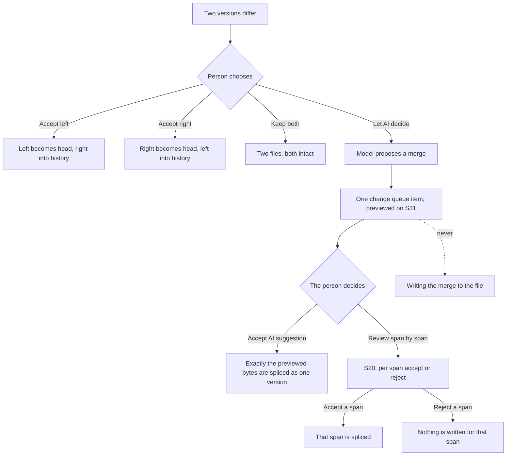

# S31. Conflict

> **Where the ids come from.** Every `C`, `E`, `A` and `K` id below lives in its register:
> `14-COMPONENT-INVENTORY.md`, `17-ERROR-AND-REFUSAL-CATALOGUE.md`, `19-ACCEPTANCE-CRITERIA.md` and
> `16-COPY-DECK.md`. The ids this screen first proposed were reconciled into those registers on 18
> September 2026. The old-to-new mapping is in `tools/error-map.json`, `tools/component-map.json`
> and `tools/acceptance-map.json`, and `tools/validate-pack.py` fails if any id here has no home.
> Entitlement and event ids below point at the real entries in `53-PRICING-AND-ENTITLEMENTS.md` and
> `55-MEASUREMENT-AND-EVENTS.md`, and an id with no equivalent there is a proposal. Copy ids are
> namespaced `K.s31.*`. Decision ids across S27 to S38 run `D53` to `D92`, above the `D01` to `D15`
> in `56-OPEN-DECISIONS.md` and above the `D30` to `D47` the other screen writers hold.

> **Citations.** `docs/mvp0/PRODUCT-PLAN.md` is being edited in parallel and grew by 12
> lines while this file was written, so it is cited by **section**, which does not rot. Files
> that are not being edited are cited by line, and the source tree is cited at `0af3c90`.

## Purpose

Two versions of my document changed the same place, nothing was merged behind my back, and I choose
what happens.

## Entry and exit

How a person arrives | Route or control
The tree footer, which reads that there is a conflict to resolve | The document opens on this screen instead of the editor
Opening a document that is in conflict | The same. A conflicted document never opens straight into the editor
Coming back online after S24 | The reconcile finds a divergence and lands here
A Google Drive edit against a web edit | The same screen, with Drive named as one side's origin
A desktop edit against a GitHub change | The same screen again. `docs/mvp0/PRODUCT-PLAN.md` section 5

How they leave | What happens
Accept this version, either side | The chosen version becomes the head. The other is in history
Keep both as two files | Two documents, both intact, neither chosen for the other
Let AI decide | Stays here. One proposal enters the change queue and its merged result is previewed on this screen. Nothing is written
Accept AI suggestion | The person accepts that one proposal. Its previewed bytes become the head, and both sides stay in history
Review span by span | Goes to the change queue, S20, opened on the proposal, to accept or reject each span
Close the tab | The conflict stays. Nothing is resolved by walking away, and nothing is lost

**Two founder decisions of 18 September 2026 shape this screen.** `[Z]` Each side's control reads
**Accept this version**, where it read Keep this one. And **Accept AI suggestion** sits on this
screen beside Let AI decide. Both close `D66` below.

**This is the screen the product's central promise is made of.** `[R]` no silent merge, ever,
`docs/mvp0/PRODUCT-PLAN.md` section 16. The audit found the promise had no screen, which is why
this one exists.

## Anatomy

region | component | what it holds | notes
Conflict banner | `C075` | Which document, which paragraph, why the two diverged, and that nothing was merged | The generator's banner names the offline half of the pair
Left pane | `C120` | One version, with its origin, its author and its time above it | Drawn with the `devices` symbol for a browser
Right pane | `C120` | The other version, same shape | Drawn with `add_to_drive` when the origin is Drive
Changed-span mark | `C120` | The span that differs, marked inside otherwise identical text | The `chg` mark in the generator. The unchanged text stays visible on both sides
Accept control | `C061` | One per pane, directly under that version, reading Accept this version | Two of them, so a choice is never made from a menu. `[Z]` renamed from Keep this one on 18 September
Keep both | `C061` | One control in the footer bar | Makes two files, and names them
Let AI decide | `C061` | One control in the footer bar, beside Keep both | Available, never hidden. `[Z]` `docs/mvp0/SCREEN-CHANGES-2026-09-18.md:202`. Once pressed it asks for a proposal and draws the preview. It writes nothing
AI suggestion preview | `C120` | The merged result the proposal would write, with the changed span marked, and the line that nothing is written yet | Drawn between the panes and the footer bar once the proposal exists. `docs/mvp0/screens/gen.mjs:1872`
Accept AI suggestion | `C061` | One control in the footer bar, directly after Let AI decide, marked as the AI action | `[Z]` 18 September. Disabled, with the reason under it, until the preview exists. `docs/mvp0/screens/gen.mjs:1873` and `:1878`
Review span by span | `C061` ghost | One control in the footer bar, after Accept AI suggestion | Opens S20 on the same proposal. Live only once the proposal exists
Consequence line | `C130` | The line stating that whichever is chosen, the other stays in history | It also names the desktop and GitHub case
Proposal review | `C119` | The change queue, opened on the proposal the AI made | Not a part of this screen. It is where Review span by span sends you

**Four resolutions, all on one surface.** Accept left, accept right, keep both as two files, and
let AI decide. `docs/mvp0/PRODUCT-PLAN.md` section 5. The fourth never resolves the conflict by
itself. It produces a proposal, and the person resolves by accepting it here or span by span in S20.

**What the generator draws.** The desktop view shows the state after Let AI decide, with the preview
and Accept AI suggestion live. The phone view shows the state before it, with Accept AI suggestion
disabled and its reason. `docs/mvp0/screens/gen.mjs:1864` to `:1878`.

## Data contract

what | direction | port or store | shape | when
The conflict | read | `ConflictReader.get(documentId)` | two version ids, their origins, authors and times, and the differing spans | On opening a conflicted document
Both versions | read | `VaultReader.getFileAtSha(path, sha)` | the bytes of each side | On render. The interface exists at `src/modules/vault/application/ports.ts`
Resolution | write | `ConflictWriter.resolve(documentId, choice)` | one of keep-left, keep-right, keep-both | On a keep control
Proposed merge | read | `AiMergeProposer.propose(left, right)` | a list of spans, each with the bytes it would write and which side it came from | On Let AI decide, once
Merge proposal | write | `ChangeQueueWriter.propose(item)` | **one** item: author AI, source conflict, the spans it carries, the proposed bytes of each, and the merged result's hash | On Let AI decide, after the proposer answers
Preview | read | `ChangeQueueReader.get(itemId)` | the merged result rendered from the item's spans over the base, plus the hash | On render, while the item is pending
Accept AI suggestion | write | `ChangeQueueWriter.accept(itemId, { expectedHash })` | one item, and the hash of the preview the person saw | On Accept AI suggestion. Refused if the hash no longer matches
Queue decision | write | `ChangeQueueWriter.acceptSpan(itemId, spanId)` or `.rejectSpan(itemId, spanId)` | one span of the item | On each span the person accepts or rejects, in S20

**The change queue row already has the right shape.** `docs/mvp0/PRODUCT-PLAN.md` section 18 defines it as
author, source, span and proposed bytes, held until accepted or rejected and then becoming a
version. An AI merge proposal is **one** such row that carries several spans.

**Why one item, not one per span.** `[Z]` 18 September: Let AI decide produces the merge as one
proposal, so that Accept AI suggestion is a single accept of a single item. `INFERENCE:` S20 must
therefore let a person open that one item and decide its spans one by one, which `A681` requires.
`UNVERIFIED:` whether `12-screens/S20.md` already draws span-level decisions inside one item. It
describes rows, not spans within a row.

**`acceptSpan`, `rejectSpan`, `ChangeQueueReader` and the `expectedHash` option are specified, not
built.** No change queue exists in the code at `0af3c90`.

**`listConflicts` exists in the code and this screen does not.** `[O]`
`src/modules/share/application/list-conflicts.ts` is present at `0af3c90`. `UNVERIFIED:` whether it
carries the shape this screen needs, because it was not read in this session.

## Actions

action | trigger | what happens | failure behaviour | event id
Show the conflict | Opening a conflicted document | Both versions render side by side, neither marked as preferred | `E850` when one side's bytes cannot be read. The other side is still shown and no choice is offered | `conflict.shown`
Accept this version, left | The left pane's control | That version becomes the head. The other becomes a history entry | `E106` on a failed write. Nothing changes and the conflict stands | `conflict.resolved`
Accept this version, right | The right pane's control | The same, mirrored | `E106` | `conflict.resolved`
Keep both as two files | The footer control | Two documents, each with a name that says which is which | `E550` when a name is taken. It asks rather than silently renaming | `conflict.resolved`
Let AI decide | The footer control | A merge is proposed and entered as **one** change queue item. Its merged result is drawn as a preview on this screen. **The file is not written.** The person stays here | `E080` when no provider answers, which is S32's condition. The other resolutions stay available and nothing is spent | `conflict.ai.merge.proposed`
Accept AI suggestion | The footer control, live once the preview exists | The person accepts that one item. Exactly the previewed bytes are spliced as one version, authored AI and accepted by this person. Both sides stay in history | `E106` on a failed write, and nothing changes. If the item or the file changed after the preview was drawn, the accept is refused, the preview is redrawn, and nothing is written | `doc.change.accepted`
Review span by span | The footer control, live once the preview exists | S20 opens on the same item, with its spans listed | None. Leaving S20 without deciding leaves the item pending and the conflict open | none
Accept a proposed span | In S20, per span of the item | That one span is spliced. The item's other spans stay pending | The splice writer refuses rather than guess on an ambiguous range, and says which span it refused | `doc.change.accepted`
Reject a proposed span | In S20, per span of the item | That span is dropped. Nothing is written | None | `doc.change.rejected`

**Accept AI suggestion is not a bulk accept.** `12-screens/S20.md` rules that AI items are never
accepted in bulk and never applied without a person pressing accept. This control is one person's
accept of one item, pressed with the whole result on screen. Nothing is accepted that was not shown.

**The disabled state.** Before Let AI decide has run, while the proposer is still answering, and when
no provider answered, Accept AI suggestion and Review span by span are drawn disabled. The reason is
stated under them in words, `K.s31.acceptai.off`, never only by a greyed control.

**The path Let AI decide takes.** The one thing on this screen a builder can get wrong.

**The dotted edge is the law.** No path from a model's proposal to the file exists without a
person's accept, either of the whole previewed item on this screen or of one span in S20.

## States

state | when | what is shown | what the person can do
first-run | The person's first conflict ever | The same screen, with the consequence line doing the explaining | Choose
empty | n/a | A conflict screen with no conflict is not reachable. The document opens in the editor instead | n/a
loading | Both versions are being fetched | The banner and both pane headers, with the bodies held | Wait. No control is live until both sides are readable
partial | One side read, the other failed | The readable side, and `E850` in the other pane. **No keep control is offered at all** | Retry, or open the document read-only
offline | No network | The local side renders. The remote side says it cannot be read here | Wait, or go online. A conflict is not resolved from one side only
unauthorised | The person is not the owner | The conflict is shown read-only, with who must resolve it | Read, comment
over-cap | The account is over a cap | Resolution still works. Keeping both makes a new file, which is the one action a cap can block, and it says so | Keep one of the two, or get under the cap
AI-unavailable | Every provider refused | The Let AI decide control is disabled with the reason, and points at S32. Accept AI suggestion stays disabled with its reason | Use the other three, which never need a model
before-proposal | Let AI decide has not been pressed | Accept AI suggestion and Review span by span drawn disabled, with `K.s31.acceptai.off` under them. The phone view draws this state | Any resolution, or Let AI decide
proposing | The proposer is answering | The preview region holds a working line. Accept AI suggestion stays disabled with the same reason | Wait, or choose another resolution. Nothing is written either way
preview | The proposal is one pending queue item | The merged result under the panes, `K.s31.preview`, with the changed span marked. Accept AI suggestion is live. The desktop view draws this state | Accept AI suggestion, Review span by span, or any other resolution. Choosing another rejects the pending item
stale-preview | The file or the item changed after the preview was drawn | Accept AI suggestion is refused, the preview is redrawn from the current item, and one line says it changed | Look again, then accept or choose
conflict | This is that state | See above | See above
error | The conflict record itself cannot be read | The document opens read-only with one line saying it is in conflict and cannot be shown yet | Retry
degraded | The AI proposal arrived partly | The spans that were proposed enter the one item. The ones that were not are named as not proposed, never as agreed. **Accept AI suggestion stays disabled**, because a partial merge is not a result | Review span by span, or choose another resolution
three-way | More than two versions diverged | `UNVERIFIED:` not drawn and not specified. See `D65`| n/a

## Copy

id | what it carries
`K.s31.banner` | Which document, which paragraph, and that nothing was merged.
`K.s31.origin.browser` | The provenance line for a browser edit, with author and time.
`K.s31.origin.drive` | The same for a Google Drive edit.
`K.s31.origin.desktop` | The same for a desktop edit.
`K.s31.origin.github` | The same for a GitHub change.
`K.s31.keep` | The control under each pane, reading Accept this version since 18 September.
`K.s31.keepboth` | The keep-both control, and what the two files will be called.
`K.s31.letai` | The Let AI decide control.
`K.s31.letai.explain` | The sentence stating that it proposes and never writes, reviewed span by span.
`K.s31.preview` | The label over the merged result: a preview, nothing written yet, one change in the queue.
`K.s31.acceptai` | The Accept AI suggestion control.
`K.s31.acceptai.off` | The reason under the disabled Accept AI suggestion control.
`K.s31.reviewspans` | The Review span by span control.
`K.s31.consequence` | The line that the other version stays in history whichever is chosen.
`K.s31.aidown` | The line on the disabled Let AI decide control when no provider answered.
`K.s31.readonly` | The line shown to a person who may read the conflict but not resolve it.

## Keyboard and focus

- Focus lands on the banner, so what happened is read before what can be done.
- Left and right arrows move between the two panes. The pane header is read with the body.
- Enter on a focused pane accepts that version, after a confirmation, because it is not reversible
  without going to history.
- The footer controls follow the two panes in tab order: Keep both, Let AI decide, Accept AI
  suggestion, Review span by span. The preview is read before Accept AI suggestion is reached.
- Enter on Accept AI suggestion asks for the same confirmation as a pane, for the same reason.
- **No shortcut resolves a conflict.** A chord that could be hit by accident must not choose one
  version over another.
- `UNVERIFIED:` no conflict could be checked against `15-INTERACTION-AND-KEYBOARD.md`.

## Responsive

- The two panes stack, left above right, each keeping its own provenance header and its own Accept
  this version control directly underneath. The generator draws exactly this.
- Accept AI suggestion sits full width under Keep both and Let AI decide, with its reason under it
  while disabled. `docs/mvp0/screens/gen.mjs:1878`.
- The banner is shortened on the phone to the document and the fact that nothing was merged.
- Keep both and the consequence line sit under the second pane.
- **Nothing is removed at phone width**, including Let AI decide, because a conflict is most likely
  to be met on the device that was offline.
- `[Z]` the phone view takes the same theme treatment as the desktop,
  `docs/mvp0/SCREEN-CHANGES-2026-09-18.md:19`.

## Desktop differences

- The desktop build adds one origin: a file changed on disk by an agent or by another editor, which
  arrives through the watched folder.
- The pane header names the path on disk rather than a device.
- Everything else is identical, including the four resolutions.

## Acceptance

id | criterion | test id
`A680` | A conflicted document never opens into the editor. It opens on this screen | `T-S31-no-silent-open`.
`A128` | No resolution writes to the file until the person chooses one. A conflict left alone changes nothing | `T-S31-nothing-on-arrival`.
`A129` | Let AI decide writes zero bytes to the document. Every span it proposes is a change queue item | `T-S31-proposal-writes-nothing`.
`A681` | Accepting one span writes that span and leaves the other proposed spans pending | `T-S31-span-by-span`.
`A113` | Rejecting every span leaves the file byte-identical to the version it started from | `T-S31-reject-all-is-a-no-op`.
`A682` | The version not chosen is retrievable from history after every one of the four resolutions | `T-S31-loser-in-history`.
`A501` | An ambiguous span in a proposal is refused by the splice writer and named, never guessed | `T-S31-refuse-rather-than-guess`.
`A683` | With one side unreadable, no keep control is offered | `T-S31-no-half-choice`.
`A684` | With every provider down, the other three resolutions still work and nothing is deducted | `T-S31-ai-down-still-usable`.
`A685` | The merges-attempted counter is zero across the whole suite | `T-S31-merges-attempted-zero`.
`A726` | Accept AI suggestion writes exactly the previewed bytes, as one change queue item accepted by the person who pressed it, and nothing else | `T-S31-accept-ai-is-the-preview`.
`A727` | Before a preview exists, and in the degraded state, Accept AI suggestion is disabled and pressing it writes zero bytes | `T-S31-accept-ai-needs-a-preview`.
`A728` | When the file or the item changed after the preview was drawn, Accept AI suggestion is refused and writes zero bytes | `T-S31-accept-ai-stale-refused`.

**`A129` stays true after the 18 September change.** Let AI decide still writes zero bytes. The only
write on the AI path is the person's own accept, which `A726` pins to the bytes they were shown.

**`A685` is the measure the plan already keeps.** `docs/mvp0/PRODUCT-PLAN.md` section 28 lists sync
conflicts shown against merges attempted, and says the second must be zero.

**None of these tests exist at `0af3c90`.** Verified with `find . -name '*.test.ts*' -not -path
'./node_modules/*'`, which returns 264 files.

## What this screen must never do

- **Never merge.** Not automatically, not on a timer, not when the two sides look compatible, not
  when only one side changed a paragraph. This is the law the product is built around,
  `docs/mvp0/PRODUCT-PLAN.md` section 16.
- **Never let a model write to the file.** Let AI decide produces a proposal. A proposal is written
  only by a person's accept: Accept AI suggestion for the whole previewed item, or one span at a
  time in the change queue. `docs/mvp0/PRODUCT-PLAN.md` section 5.
- **Never accept bytes the person was not shown.** Accept AI suggestion writes the preview's bytes or
  nothing. A changed file or item since the preview means a refusal and a redraw.
- **Never hide Let AI decide.** `[Z]` it is offered alongside the other three,
  `docs/mvp0/SCREEN-CHANGES-2026-09-18.md:202`. A useful option behind a menu is a worse answer
  than a bad option in the open.
- **Never mark one side as recommended.** Neither pane is the default and neither is pre-selected.
- **Never discard the version not chosen.** Every resolution leaves the other in history.
- **Never resolve a conflict by guessing which version is newer.** Time is shown so the person can
  judge it. It is not an input to a decision the product makes.
- **Never reach for a CRDT here.** Settled: sync is git-merge plus a splice journal and content
  addressing, never a CRDT, because convergence on interleaved text produces byte-identical
  nonsense rather than a document anyone wrote.
- **Never charge for a failed proposal.** A proposal that no provider answered deducts nothing, the
  same rule S32 states.

## Open questions

id | question | why it is open
`D65` | What happens when three or more versions diverge? | Two panes are drawn and the plan describes two. A third device makes this screen wrong rather than crowded
`D66` | **Decided 18 September 2026.** What did the founders mean by **Accept**? | `[Z]` Accept is the per-side control, renamed from Keep this one to Accept this version. Accept AI suggestion is a control on this screen, beside Let AI decide, that accepts the one previewed proposal. Recorded in Anatomy, Actions, States and `A726` to `A728` above
`D67` | Who resolves a conflict on a shared document, the owner or any editor? | `docs/mvp0/PRODUCT-PLAN.md` section 19 gives Editor both Propose and Apply, which implies an editor may resolve. The plan does not say it
`D68` | What are the two files called after Keep both? | The control is specified, the naming is not, and a silent rename would be its own small violation

**What is not specified here.** How the conflict is detected is section 17's engine baseline and
section 15's sync design, not this file. The visual treatment of a differing span beyond the mark is
not specified. Nothing here was checked against a running sync, because none exists. What would
falsify this file: a decision that the product may merge when the two sides touch different
paragraphs, which would remove the reason the screen exists.
