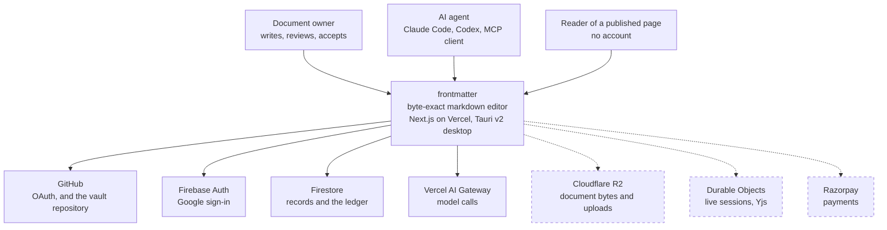
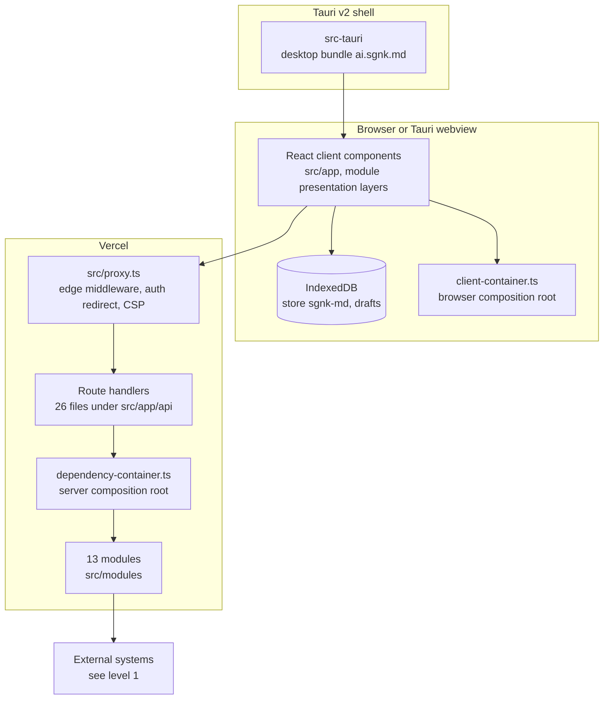
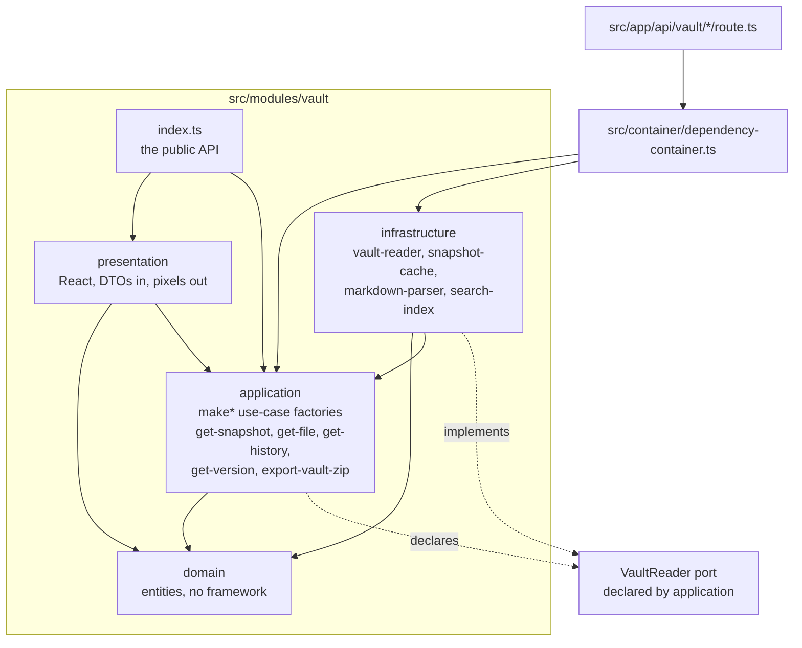
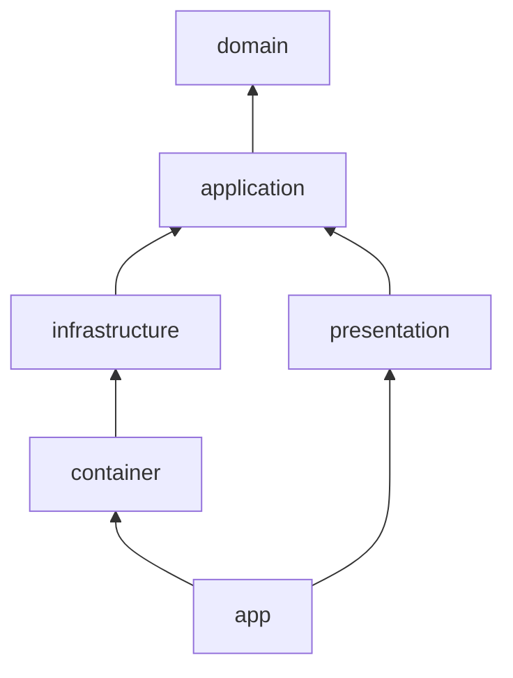

# 20. Architecture

frontmatter is a **hexagonal modular monolith**. One deployable Next.js application, split into
bounded-context modules, each of which carries its own four layers. Nothing is a microservice, and
nothing is a shared god folder.

Two sentences carry the whole design:

- **Dependencies point inward only.** A layer may import the layers inside it and never the ones
  outside it.
- **The outside world is reached through a port.** Application code declares the shape it needs.
  Infrastructure implements that shape. The composition root joins the two.

The rule exists so that the parts that matter most, the splice engine and the change queue, can be
tested without a network, a database or a browser.

## 20.1 The gate result, run for this file

`[O]` Run on 2026-09-18 at commit `f237ece`, in `/Users/sagnikmitra/Desktop/GitHub/frontmatter`.

```
$ npm run arch

> frontmatter@0.1.0 arch
> node specs/harness/clean-architecture-report.mjs

{
  "total": 0,
  "filesScanned": 214,
  "summary": {},
  "violations": []
}
```

Exit code 0. `total` counts violations. `filesScanned` is the denominator, and it matters.

The script's own header records that this gate once reported `{"total":0,"violations":[]}` whether
it had scanned 208 files or none, because a gate with nothing to scan has no violations by
definition. `MIN_SCANNED_FILES` is set to 50, and the gate refuses rather than passing silently when
the count collapses (`specs/harness/clean-architecture-report.mjs:35`).

The other two gates named in `AGENTS.md:76` were run by hand in the same session:

Gate | Command | Output | Exit
`server-folder-blocklist` | `node specs/harness/server-folder-blocklist.mjs` | `{"blocked": []}` | 0
`import-boundary-report` | `node specs/harness/import-boundary-report.mjs` | `{"serverImports": [], "libImports": [], "componentImports": []}` | 0

**A gap, and it is real.** `AGENTS.md:76` calls all three "always-green", but only the first has an
npm script.

`npm run arch` runs `clean-architecture-report.mjs` alone. So the other two are green today because
somebody ran them, not because a gate ran them. They are not in `npm run verify` either.

## 20.2 C4 level 1, system context

Drawn as a Mermaid flowchart rather than the `C4Context` dialect, because the flowchart renders in
every viewer and the C4 dialect is still marked experimental. The diagram diffs as text either way,
which is the rule in `65-CONVENTIONS.md` section 10.

Dashed boxes are **specified, not built**. Everything else is in the shipped source tree.



**How the dashed boxes were decided.** `grep -rln "R2\|S3Client\|aws-sdk" src/` returns one file,
`src/modules/share/presentation/DuplicateConflictModal.tsx`, and the match there is not an R2 client.
There is no R2 adapter, no Durable Object and no Razorpay call in `src/` at `f237ece`.

## 20.3 C4 level 2, containers



The Tauri build compiles the same source tree. There is no second application.

## 20.4 C4 level 3, components inside one module

`vault` is drawn because it is the largest module at 30 TypeScript files and it exercises every
layer. Every other module has the same shape, minus the layers it does not need.



Read the two dotted edges together. `application` names the port. `infrastructure` satisfies it.
Neither one imports the other's implementation, which is why `makeGetSnapshot` can be tested with a
fake reader and no GitHub token.

## 20.5 The six layers

Layer | Folder pattern | May import | May not import | May read `process.env`
`domain` | `src/modules/*/domain`, `src/shared/domain` | `domain`, `shared-domain` | everything else, including React and Next | no
`application` | `src/modules/*/application`, `src/shared/application` | `domain`, `application`, `config` | any infrastructure, any database client, React, Next | no
`infrastructure` | `src/modules/*/infrastructure`, `src/shared/infrastructure` | `domain`, `application`, `infrastructure`, `config` | `presentation`, `app` | yes
`presentation` | `src/modules/*/presentation`, `src/shared/presentation` | `domain`, `application`, `presentation` | `infrastructure`, `container` | no
`container` | `src/container` | everything except `app` and `presentation` internals | nothing it needs | yes
`app` | `src/app` | `domain`, `application`, `presentation`, `container`, `config` | any infrastructure folder directly | yes, in a route handler

`src/proxy.ts` is its own element type, `middleware`, and is deliberately thin. It may import
`application`, `infrastructure`, `shared-*` and `config`, and nothing else.

Every row above is transcribed from the `boundaries/elements` and `boundaries/dependencies` blocks
in `eslint.config.mjs`, lines 97 to 172. The linter is the authority, not this table. If they
disagree, the linter is right and this table is stale.

## 20.6 The dependency direction



Every arrow points at what a thing is allowed to depend on. There is no arrow back. The two
consequences that get broken most often:

- **Application never imports infrastructure.** It declares a port and takes the implementation as
  an argument. `makeGetSnapshot({ reader, cache, parseNote })` is the pattern, and it appears
  fourteen times in `src/container/dependency-container.ts`.
- **App routes never import infrastructure directly.** They import `container` from
  `@/container/dependency-container` and call a use case on it.

`presentation` cannot import `container` either. The header of `src/container/client-container.ts`
records the workaround: "a gateway reaches a presentation component as a prop or through context".

## 20.7 The thirteen modules

`[O]` `ls src/modules/` at `f237ece`, excluding `README.md`. File counts are
`find src/modules/<m> -type f \( -name '*.ts' -o -name '*.tsx' \) | wc -l`.

Module | Layers present | Files | Barrel | What it owns
`ai` | application, infrastructure | 11 | yes | The five LLM use cases and the gateway client
`ai-tools` | presentation | 2 | yes | AI controls surfaced in the editor
`app-shell` | presentation | 21 | yes | Chrome, navigation, layout
`auth` | domain, application, infrastructure, presentation | 14 | yes | Sessions, the Firebase gateway, the sign-in screen
`drafts` | infrastructure | 2 | yes | Local draft persistence
`editor` | presentation | 22 | yes | CodeMirror and the writing surface
`export` | presentation | 5 | yes | Export controls
`graph` | presentation | 3 | yes | The link graph view
`mdmax` | domain, application, infrastructure | 13 | **no** | The splice engine. See `25-ENGINE-SPEC.md`
`preview` | presentation | 21 | yes | The rendered projection
`repository` | domain, application, infrastructure, presentation | 12 | yes | Writes: commit, create, rename, merge, upload
`share` | domain, application, infrastructure, presentation | 15 | yes | Slugs, public pages, conflicts
`vault` | domain, application, infrastructure, presentation | 30 | yes | Reads: snapshot, file, history, version, search

**`mdmax` has no `index.ts`.** Twelve of thirteen modules have a barrel; the engine does not. The
repository's own harness agrees: `node specs/harness/analyze.mjs` returns
`{"count": 13, "barrels": 12, "deepCrossModuleImports": 38}`. Two files reach into it by deep path,
both for the same symbol:

- `src/modules/vault/application/get-snapshot.ts:13`
- `src/modules/vault/infrastructure/search-index.ts:16`

Both read `import { decodeStrict } from "@/modules/mdmax/domain/shape-gate";`. That is the entire
wiring of the engine into the product at `f237ece`.

## 20.8 The module barrel rule

**Cross-module imports go through `@/modules/<name>`, never a deep path.** Add the export to the
barrel instead of deep-importing, and do it even for a type (`AGENTS.md:81`).

`[O]` Measured at `f237ece` by walking `src/` and comparing each file's owning module against the
module it imports from:

Shape | Count
Barrel imports, `from "@/modules/<name>"` | 110
Cross-module deep imports, `from "@/modules/<name>/<layer>/..."` | 38

The 38 split by importer:

Importer | Count | Standing
`src/container/dependency-container.ts` | 22 | The composition root. Its job is to reach into infrastructure and wire it
`src/app/api/**` | 5 | Should go through the container or a barrel
`src/container/client-container.ts` | 2 | Composition root, browser side
`src/modules/vault/**` | 2 | The two `mdmax` reads above, unavoidable while `mdmax` has no barrel
`src/proxy.ts` | 1 | Imports `RESERVED_SLUGS` from `@/modules/share/domain/slug`
`src/auth.ts` | 1 | Auth wiring
one each in `app/(public)`, `graph`, `ai-tools`, `preview`, `editor` | 5 | Should go through a barrel

**No gate enforces the barrel rule.** `grep -rn "barrel" specs/harness/ eslint.config.mjs` finds it
only in `analyze.mjs`, which counts and reports without failing.

So the barrel rule is a convention with a counter attached, and the 38 above are not lint errors.
Treat the count as a budget that must not grow, and record here if it does.

## 20.9 The banned god folders

Never create `src/server/`, `src/lib/` or `src/components/`. Never import from `@/server/*`,
`@/lib/*` or `@/components/*`.

The ban is enforced in two independent places, which is deliberate:

- `eslint.config.mjs:167` sets `no-restricted-imports` with patterns `@/server/*`, `@/lib/*`,
  `@/components/*`. A violating import is a lint error, and `npm run lint` runs with
  `--max-warnings=0`.
- `specs/harness/server-folder-blocklist.mjs` checks the folders do not exist, and
  `specs/harness/import-boundary-report.mjs` reports the three import kinds separately.

Shared code that genuinely has no owner goes in `src/shared/<layer>/`, which has its own element
types and its own inward-only rules. At `f237ece` that is three domain files, an empty
`application/ports` folder, `infrastructure/firebase/client.ts`, `infrastructure/github/client.ts`
and three presentation files.

## 20.10 Where the architecture and the plan disagree

`docs/mvp0/PRODUCT-PLAN.md` section 15 decides the stack is "the Next.js app we already run, Cloudflare R2
for bytes, and Firestore for records, with Firebase Auth for sign-in". The shipped tree is not there
yet, and a reader should not be told otherwise.

Plan says | Code at `f237ece` | Status
Firestore holds records | `getFirestore` is initialised in `src/shared/infrastructure/firebase/client.ts`, and `firestore.rules` exists at the repository root, 17,304 bytes | **partly built.** No collection is read or written from a use case
R2 holds document bytes | No R2 adapter in `src/` | **specified, not built.** Bytes live in a GitHub repository today, through `githubVaultReader` and `githubWriter`
Durable Objects hold live sessions | Nothing | **specified, not built**
Razorpay takes payment | Nothing | **specified, not built**
Firebase Auth for Google, Auth.js for GitHub | Both present. `makeFirebaseAuthGateway` in `auth/infrastructure`, Auth.js at `src/app/api/auth/[...nextauth]/route.ts` | **built**

The consequence for the layering is small, and worth saying plainly. When the R2 and Firestore
adapters arrive they are **new files in `infrastructure`, plus new lines in the composition root,
and nothing else**.

The ports the application declares do not change, because they never named GitHub. That is the whole
return on the rule.

## 20.11 How to check any claim in this file

Claim | Command
The gate is green | `npm run arch`
The module list | `ls src/modules/`
The module and barrel counts | `node specs/harness/analyze.mjs`
The layer rules | `sed -n '97,172p' eslint.config.mjs`
The god-folder ban | `sed -n '167,170p' eslint.config.mjs`
The composition root | `cat src/container/dependency-container.ts`
Deep imports from a module | `grep -rn "@/modules/<name>/" src/ --include='*.ts' --include='*.tsx'`
Everything at once | `npm run verify`

## 20.12 Limits of this file

- **What was not assessed.** Runtime behaviour. Every number here comes from reading the source tree
  and running the static gates. Nothing was measured against a running server.
- **What could not be verified.** Whether the 38 deep cross-module imports are each individually
  justified. They were counted and grouped by importer, not reviewed one by one.
- **What is not established.** That the hexagonal shape survives the R2 and Firestore work. It is an
  argument in section 20.10, not a measurement, and it is falsifiable: if adding the R2 adapter
  requires a change to any file under `application/` or `domain/`, the port was wrong.
- **What would falsify this file.** `npm run arch` returning a non-zero `total`, `filesScanned`
  dropping below 214 without files being deleted, or the barrel count in `analyze.mjs` moving while
  this file still says 110 and 38.
- **Freshness.** Every count is pinned to `f237ece`. Re-derive before quoting, per `AGENTS.md:15`.
