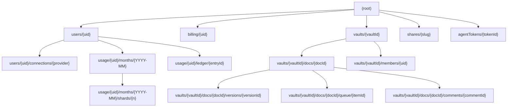

# 21. Data model

## 21.1 Open with the contradiction, because it blocks phase A

The plan of record disagrees with itself about where records live, and the disagreement is not a
wording slip. It is two different databases.

Where | What it says | Evidence
`docs/mvp0/PRODUCT-PLAN.md`, section 15 | "The stack is the Next.js app we already run, Cloudflare R2 for bytes, and Firestore for records, with Firebase Auth for sign-in." A founders' decision of 17 September | `[Z]`.
`docs/mvp0/PRODUCT-PLAN.md`, section 18 | The entity table assigns twelve entities to **Postgres rows** | `[O]`.

`[O]` The count was made, not remembered. Re-derive it before quoting it:

```
$ grep -c 'Postgres' docs/mvp0/PRODUCT-PLAN.md
12
$ awk "NR>=$(grep -n '^## 18\.' docs/mvp0/PRODUCT-PLAN.md | cut -d: -f1) && NR<=$(grep -n '^## 19\.' docs/mvp0/PRODUCT-PLAN.md | cut -d: -f1)" \
    docs/mvp0/PRODUCT-PLAN.md | grep -o 'Postgres row' | wc -l
      12
```

All twelve are inside section 18. The word appears nowhere else in the plan. Section 18 is the
Supabase model of revision 5, left standing after section 15 changed the database underneath it.

**Why this file cites the plan by section and not by line.** `docs/mvp0/PRODUCT-PLAN.md` was edited
twice while this file was being written, on 18 September, and every line number after the insertion
point moved. A section number survives that. Quote the phrase and grep for it.

**Firestore is a document store, so the model has to change and not just the word.** Three of
section 18's rows cannot be transliterated:

Section 18 row | Why a rename is not enough
`Change queue item, Postgres row: author, source, span, proposed bytes` | Proposed bytes are unbounded. A Firestore document is capped at 1 MiB, so a proposal that replaces a large span will not fit
`Collaborator, Postgres row: account, document, role` | A join table. Firestore has no join, so "every document this person can reach" becomes a query Firestore cannot answer in that shape
`Ledger entry, Postgres row: account, kind, delta, model, cost`, read as a balance | A balance is `SUM(delta)`. Firestore has no aggregate a security rule can trust, and a single counter document has a write-contention ceiling

**The verified limits.** `[M]` Opened 2026-09-18 at
`https://firebase.google.com/docs/firestore/quotas`, the page reporting itself last updated
2026-09-17 UTC.

Limit | Value
Maximum size for a document | 1 MiB (1,048,576 bytes)
Maximum size of a field value | 1 MiB less 89 bytes (1,048,487 bytes)
Maximum size for a document name | 6 KiB
Document id length | no longer than 1,500 bytes, and it cannot contain a forward slash
Maximum depth of subcollections | 100
Maximum index entries per document | 40,000

The forward-slash constraint decides more than it looks. A vault path such as
`Projects/HQ/Foo.md` **cannot be a document id**. Either the id is a hash of the path or the id is
an auto-id and the path is a field. This model takes the second, which is what the prototype rules
already do.

**A second contradiction, inside the repository.** `firestore.rules` at the repository root is
17,304 bytes and its header describes a model where note content lives **in** Firestore:

- `content: string (required, <=900000)` with the comment "under the 1 MiB document ceiling"
  (`firestore.rules:61`)
- `storagePath: string|null (optional, <=1024)` with the comment "overflow to Cloud Storage"
  (`firestore.rules:62`)

That is Firebase Cloud Storage, not R2, and it contradicts `docs/mvp0/PRODUCT-PLAN.md` section 15, which
says document bytes "live in R2 and never in Firestore". The plan is newer and it is a founders'
decision, so **the plan wins and `firestore.rules` is the file that changes**. The rules file is
marked PROTOTYPE in its own first lines, and the plan already schedules it for hardening in phase A
(`docs/mvp0/PRODUCT-PLAN.md` section 26).

**What this file is.** The Firestore version of section 18, written so that phase A can start. Where
it departs from section 18 it says so. Where it proposes something neither document decided, it says
`INFERENCE:`.

## 21.2 Three stores, and the rule that decides between them

Store | Holds | Mutable | Per device or shared
Firestore | Records: who, what role, which key, how much, when | yes | shared.
Cloudflare R2 | Bytes: document versions, uploads, rendered pages, the security log | no, write once | shared.
IndexedDB and `localStorage` | The unsynced draft and the editor's own settings | yes | per device, per browser.

**The rule.** A thing goes to R2 when any of these is true:

- It is the content of a document, a version of one, or a file a person uploaded.
- It can exceed 1 MiB, or its size is chosen by the person rather than by us.
- It is append-only evidence that must never be edited, such as the security log.

Everything else goes to Firestore, and nothing in Firestore is allowed to grow without a stated cap.

**The consequence to hold on to.** Firestore never holds a document's bytes. It holds a pointer to
them, a content hash and enough metadata to list, sort and permission the thing without fetching it.
That is what keeps a Firestore document small enough that the 1 MiB ceiling is never the binding
constraint.

## 21.3 The Firestore tree



Every path above is a **proposal for phase A**, not a shipped schema. Nothing in `src/` reads or
writes any of it at `f237ece`. The three collections that exist in the prototype rules under
different names are mapped in section 21.12.

## 21.4 Every Firestore collection

Sizes are per record. Where a size is an estimate it is written `INFERENCE:` and the arithmetic is
shown. Retention is what the person can rely on. Deletion is what happens on account deletion.

### users/{uid}

Field | Type | Cap | Notes
`email` | string | from the auth token | immutable after create.
`displayName` | string or null | 200 chars | Optional.
`photoURL` | string or null | 2,000 chars | https only.
`providers` | array of string | 8 | `google`, `github`.
`plan` | string | one of `free`, `pro`, `team` | **server-owned.** A client may only ever write `free`.
`defaultVaultId` | string | 128 chars | Optional.
`createdAt` | timestamp | | immutable.
`lastSeenAt` | timestamp | | Required.

- **Size.** `INFERENCE:` about 400 bytes. Eight fields, two of them capped at 200 and 2,000 chars,
  the rest short. The ceiling if both strings are at their cap is about 2.3 KB.
- **Retention.** Until deleted.
- **On account deletion.** Removed within 30 days (`docs/mvp0/PRODUCT-PLAN.md` section 18).
- **Read by.** The person. Nobody else.

The field list is transcribed from the prototype header at `firestore.rules:18` to `firestore.rules:27`.

### billing/{uid}

Field | Type | Notes
`status`, `priceId`, `currentPeriodEnd`, `provider`, `customerId` | as the provider returns | Razorpay in this plan.

- **Size.** `INFERENCE:` under 500 bytes.
- **Access.** Owner read only. **No client write at all**, ever. The billing webhook writes with the
  Admin SDK, which bypasses rules.
- **Retention.** As the accountant requires, at least the statutory period
  (`docs/mvp0/PRODUCT-PLAN.md` section 18).
- **On account deletion.** Kept as the law requires, unlinked from the profile.

### users/{uid}/connections/{provider}

One document per connected provider: `github`, `google-drive`.

Field | Type | Notes
`provider` | string | the document id too.
`encryptedToken` | string | the OAuth or installation token, encrypted at rest by us before it is written.
`scopes` | array of string | What the token may do at the provider.
`connectedAt`, `lastUsedAt` | timestamp | Required.

- **Size.** `INFERENCE:` under 4 KB, dominated by the encrypted token.
- **Retention.** Until disconnected.
- **On account deletion.** Revoked at the provider first, then removed
  (`docs/mvp0/PRODUCT-PLAN.md` section 18).
- **Never** readable by a client. Server reads only.

### agentTokens/{tokenId}

Field | Type | Notes
`ownerUid` | string | immutable.
`hash` | string | the token is stored hashed, never in clear.
`scope` | array of string | the operations this token may perform.
`vaultIds` | array of string | which vaults it reaches.
`createdAt`, `lastUsedAt`, `revokedAt` | timestamp | `revokedAt` stays null until the token is revoked.

- **Size.** `INFERENCE:` under 1 KB.
- **Retention.** Until revoked. A revoked row stays, with `revokedAt` set, so the security log can be
  read against it.
- **Permissions.** An agent token may read, propose and export. It may **never** apply or publish
  (`docs/mvp0/PRODUCT-PLAN.md` section 19).

### vaults/{vaultId}

Field | Type | Cap | Notes
`ownerUid` | string | | immutable.
`name` | string | 1 to 200 chars | Required.
`rev` | number | | monotonic, for optimistic concurrency.
`memberUids` | array of string | 100 | **denormalised on purpose.** See 21.5.
`createdAt`, `updatedAt` | timestamp | | `createdAt` is immutable.

- **Size.** `INFERENCE:` about 4 KB at the 100-member cap. 100 uids of about 28 bytes is 2.8 KB, plus
  the rest.
- **Retention.** Until deleted.
- **Read by.** Members. Only the owner may change `memberUids` or `ownerUid`.

**The change from the prototype.** `firestore.rules:46` also carries a `roles` map of up to 100 keys
inside the vault document. That is dropped here, because a role change then rewrites the vault
document and races every other member change. Roles move to their own subcollection.

### vaults/{vaultId}/members/{uid}

This is section 18's `Collaborator` row, reshaped.

Field | Type | Notes
`role` | string | one of `owner`, `editor`, `commenter`, `viewer`.
`invitedBy` | string | uid.
`addedAt` | timestamp | Required.
`liveSessionsAllowed` | bool | derived from the owner's plan, not the member's.

- **Size.** `INFERENCE:` under 200 bytes.
- **Cap.** 1 live collaborator on Free, decided by the founders on 18 September on cost
  (`docs/mvp0/PRODUCT-PLAN.md` section 13). Unlimited on Pro.
- **Retention.** Until removed. A revoked collaborator keeps nothing but the exports they already
  made (`docs/mvp0/PRODUCT-PLAN.md` section 19).
- **On account deletion.** Their member rows are removed. The documents stay with the owner.

### vaults/{vaultId}/docs/{docId}

The document head. Section 18's `Document head`. It points at the current version and holds nothing
a reader would call content.

Field | Type | Cap | Notes
`path` | string | 1,024 chars | vault-relative, `Projects/HQ/Foo.md`.
`pathLower` | string | 1,024 chars | for case-insensitive lookup and uniqueness.
`title` | string | 300 chars | Re-derived from the bytes on save.
`headVersionId` | string | | the id of the current version document.
`headKey` | string | 1,024 chars | the R2 key of the current bytes.
`headHash` | string | 64 chars | SHA-256 of the bytes, hex.
`size` | number | | bytes, so a list view can show size without a fetch.
`tags` | array of string | 200 | Re-derived from the bytes on save.
`outbound`, `backlinks`, `embeds` | array of string | 500 each | Re-derived from the bytes on save. See the size note below.
`frontmatterKeys` | array of string | 100 | **keys only, never values**.
`excludeFromGraph` | bool | | Set by the person.
`publicSlug` | string or null | 60 chars | Mirrors the `shares` document id.
`createdAt`, `updatedAt` | timestamp | | `createdAt` is immutable.
`deletedAt` | timestamp or null | | soft delete, the 30-day trash.

- **Size.** `INFERENCE:` about 8 KB at the caps, dominated by three link arrays of up to 500 entries.
  500 paths of about 40 bytes is 20 KB for one array alone, which is **over a sensible budget**, so
  the caps need re-cutting in phase A. Flagged, not silently reduced.
- **Retention.** Until deleted, then 30 days in trash (`docs/mvp0/PRODUCT-PLAN.md` section 18).
- **Cap on Free.** 50 cloud documents (`docs/mvp0/PRODUCT-PLAN.md` section 13).

**Two departures from the prototype, both deliberate.**

- **`content` is gone.** `firestore.rules:61` allows up to 900,000 characters of content inside the
  note document. Bytes live in R2. `headKey` and `headHash` replace it.
- **`frontmatter` becomes `frontmatterKeys`.** `firestore.rules:58` stores the parsed front matter
  map, up to 100 keys of arbitrary user YAML, inside the note document. Storing values here breaks
  the projection law: the file on disk stops being the only source of truth, and a stale map becomes
  a second answer to the same question. Keys alone are enough to drive a filter, and are re-derived
  from the bytes on every save.

### vaults/{vaultId}/docs/{docId}/versions/{versionId}

Append-only. No update, no delete, matching `firestore.rules:71`.

Field | Type | Notes
`key` | string | the R2 key of the bytes.
`hash` | string | SHA-256 hex, and the content address.
`size` | number | bytes.
`parentVersionId` | string or null | Null for the first version.
`author` | string | uid, or the agent token id.
`source` | string | one of `person`, `ai`, `agent`. This is the AI mark of `docs/mvp0/PRODUCT-PLAN.md` section 20.
`model` | string or null | when `source` is not `person`.
`ask` | string or null | the instruction that produced it.
`acceptedBy` | string or null | uid of whoever accepted it from the queue.
`message` | string or null | 300 chars.
`createdAt` | timestamp | Immutable.

- **Size.** `INFERENCE:` about 600 bytes. Eleven short fields, the largest a 300-char message.
- **Retention.** **7 days on Free, 90 on Pro, then pruned to the head**
  (`docs/mvp0/PRODUCT-PLAN.md` section 18). Pruning deletes the Firestore version document and the R2
  object together, and the head version is never pruned.
- **Growth, and the reason it is capped.** The plan's own arithmetic: full-copy saves grow 18 gigabytes a
  month per 1,000 users, "the only line that compounds"
  (`docs/mvp0/PRODUCT-PLAN.md` section 15). The instruction there is to store deltas or deduplicate.
  Content-addressed keys give the deduplication for free: a save that changes nothing writes no new
  object, because the hash is the key.

### vaults/{vaultId}/docs/{docId}/queue/{itemId}

The change queue. This is the entity section 18 could not transliterate.

Field | Type | Cap | Notes
`baseHash` | string | 64 chars | the version the proposal was computed against.
`spanStart`, `spanEnd` | number | | the byte range the splice replaces.
`proposedInline` | string or null | **65,536 bytes** | present only when the replacement is small.
`proposedKey` | string or null | 1,024 chars | the R2 key, when it is not.
`proposedHash` | string | 64 chars | always present, whichever of the two above carries the bytes.
`proposedSize` | number | | bytes.
`author` | string | | uid or agent token id.
`source` | string | | `person`, `ai`, `agent`.
`model`, `ask` | string or null | | Null when `source` is `person`.
`state` | string | | `open`, `accepted`, `rejected`, `stale`.
`resultVersionId` | string or null | | set when accepted.
`createdAt`, `decidedAt` | timestamp | | `decidedAt` stays null while `state` is `open`.

**The 64 KiB cut is a proposal, and it needs confirming.** `INFERENCE:` Two facts set the range. A
field value may hold 1,048,487 bytes, so anything up to about a megabyte would technically fit. A
proposal that fits inline is decided in one read, with no R2 round trip, which is what makes the
queue feel instant. 64 KiB leaves a 16-times margin under the field ceiling for the other fields and
any future one, and covers an ordinary paragraph or section rewrite comfortably. Anything larger is
a document-sized rewrite, and those are exactly the proposals that should cost a fetch.

This does **not** contradict `docs/mvp0/PRODUCT-PLAN.md` section 15. That line says a **document's** bytes
never sit in Firestore. A pending proposal is not a document, and it becomes one only when it is
accepted, at which point its bytes are written to R2 as a version.

- **Retention.** Until accepted or rejected, then a version (`docs/mvp0/PRODUCT-PLAN.md` section 18). A
  decided item is kept for the history window of its plan and pruned with the versions.
- **`stale`.** An item whose `baseHash` no longer matches the head. The engine refuses to apply it
  rather than guessing, which is the rule in `26-ENGINE-REFUSAL-CATALOGUE.md`.

### vaults/{vaultId}/docs/{docId}/comments/{commentId}

Field | Type | Cap | Notes
`anchorHash` | string | 64 chars | keyed by content hash, not by offset, so it survives edits.
`body` | string | 4,000 chars | text only.
`author` | string | | uid.
`resolved` | bool | | Never written by an agent token.
`createdAt` | timestamp | | Immutable.

- **Size.** `INFERENCE:` up to about 4.2 KB.
- **Retention.** With the document (`docs/mvp0/PRODUCT-PLAN.md` section 18).

### shares/{slug}

The document id **is** the public URL segment, which is what makes a slug globally unique without a
uniqueness index.

Field | Type | Cap | Notes
`vaultId`, `docId`, `ownerUid` | string | | immutable.
`title` | string | 300 chars | Copied from the document head at publish time.
`renderedKey` | string | 1,024 chars | the R2 key of the rendered page.
`renderedHash` | string | 64 chars | SHA-256 of the rendered bytes, hex.
`visibility` | string | | `public` or `unlisted`.
`passwordHash` | string or null | | Pro only (`docs/mvp0/PRODUCT-PLAN.md` section 13).
`expiresAt` | timestamp or null | | Null means no expiry.
`createdAt`, `renderedAt` | timestamp | | `renderedAt` moves on every re-publish.

- **Size.** `INFERENCE:` under 2 KB.
- **Cap on Free.** 5 published pages with the Made with line
  (`docs/mvp0/PRODUCT-PLAN.md` section 13).
- **Access.** Unauthenticated `get` is allowed when `visibility` is `public`. **`list` is owner
  only**, so a stranger cannot list the share set. That rule is already in the prototype
  (`firestore.rules:84`) and it survives unchanged.
- **Retention.** Until unpublished or expired. On account deletion the URL goes dark
  (`docs/mvp0/PRODUCT-PLAN.md` section 18).

**Changed from the prototype.** `firestore.rules:78` stores a `contentSnapshot` of up to 900,000
characters inside the share document, so a public reader never touches the vault. The isolation is
right and is kept. The snapshot moves to R2 under `renderedKey`, for the same reason all other bytes
do.

**Slug reservation is not in the rules file.** `RESERVED_SLUGS` lives in
`src/modules/share/domain/slug.ts` and is used by both the validator and the edge proxy
(`src/proxy.ts`). The rules header says plainly that the list is too large for a rules file. Keep it
in one place and keep importing it in both.

## 21.5 The two shapes Firestore cannot do

### The join, replaced by denormalisation

Section 18 gives `Collaborator` as a row of account, document and role. The question a screen asks
is "which vaults may this person open", and in SQL that is a join. Firestore has none.

The replacement is two writes for one fact:

- `vaults/{vaultId}.memberUids` holds the uid array. A query
  `where('memberUids', 'array-contains', uid)` answers the screen in one read.
- `vaults/{vaultId}/members/{uid}` holds the role and the audit fields.

**The cost is honest and should be written down.** The two must be changed together or the security
rules and the screens disagree. Both writes go in one `runTransaction`, and only the owner may
perform it. The array is capped at 100, which is well inside the document ceiling and is the cap the
prototype already chose.

### The aggregate, replaced by a distributed counter

A balance is `SUM(delta)` over the ledger. Firestore cannot compute that inside a security rule, and
a single counter document has a contention ceiling.

`[M]` Opened 2026-09-18 at `https://firebase.google.com/docs/firestore/solutions/counters`, the page
reporting itself last updated 2026-09-17 UTC. The documented pattern: a counter is a document with a
subcollection of shards, and the counter's value is the sum of the shards. Write throughput rises
linearly with the shard count, so ten shards take ten times the writes of a single document.

The page states its own two costs, and both matter here:

- Too few shards and some transactions retry before succeeding, which slows writes.
- Too many shards and reads get slower and more expensive, because the whole shards subcollection
  must be loaded. The page's own remedy is a roll-up document updated at a slower cadence.

**Applied to the AI quota.** The cap on Free is 10 edits and 1 Low blueprint a month
(`docs/mvp0/PRODUCT-PLAN.md` section 13).

Path | What it holds
`usage/{uid}/months/{YYYY-MM}` | `numShards`, and the roll-up fields `aiEdits`, `blueprints`, `bytesUsed`, `rolledUpAt`
`usage/{uid}/months/{YYYY-MM}/shards/{n}` | `{ aiEdits: number, blueprints: number }`
`usage/{uid}/ledger/{entryId}` | The append-only entry: `kind`, `delta`, `model`, `costMicros`, `correlationId`, `createdAt`

- **`INFERENCE:` shard count of 3, not 10.** The documented tradeoff is write contention against
  read cost, and this counter is written at most tens of times a month per person rather than
  hundreds of times a second. Three shards cost three reads to total, and still remove the
  single-document contention. Revisit if a Team tier shares one counter.
- **The ledger is the evidence, the counter is the fast path.** The plan already says entries are
  append-only and never updated, "so the balance is a sum over a collection rather than a row that
  two writers race for" (`docs/mvp0/PRODUCT-PLAN.md` section 15). The counter is a cache of that sum. When
  they disagree, the ledger is right and the counter is rebuilt from it.
- **Ledger retention.** 180 days, then aggregated. The aggregates are kept without the account id
  (`docs/mvp0/PRODUCT-PLAN.md` section 18).
- **Size.** `INFERENCE:` a ledger entry is under 300 bytes. A shard document is about 100 bytes.

**No client writes either of them.** The metering is server-side, as the prototype header already
requires for `usage`.

## 21.6 Indexes

Firestore indexes every field singly by default. Only the composite ones need declaring, and each
one costs write throughput and storage, so the list is kept short and each entry names its screen.

Collection group | Fields | Serves
`docs` | `deletedAt` asc, `updatedAt` desc | The document list, newest first, trash excluded.
`docs` | `tags` array-contains, `updatedAt` desc | Filter by tag.
`docs` | `pathLower` asc | Case-insensitive path lookup and the rename collision check.
`versions` | `createdAt` desc | The history panel.
`queue` | `state` asc, `createdAt` asc | The change queue, oldest open item first.
`comments` | `resolved` asc, `createdAt` asc | The comments panel.
`ledger` | `createdAt` desc | The usage view of `docs/mvp0/PRODUCT-PLAN.md` section 5b.
`shares` | `ownerUid` asc, `createdAt` desc | The owner's list of published pages.

**Two limits to respect.** A document may carry at most 40,000 index entries, which an array field
of 500 entries eats into quickly. And Firestore has **no full-text index**, which the plan already
records: search runs in the browser across the open workspace, with Typesense held in reserve for a
server-side index (`docs/mvp0/PRODUCT-PLAN.md` section 15).

## 21.7 What goes to R2, and why

Object | Why not Firestore
A document version, the bytes | Unbounded. A 10 MB document is a stated performance target (`docs/mvp0/PRODUCT-PLAN.md` section 21), and that is ten times the whole Firestore document ceiling
An upload | 5 MB a file on Free, 25 MB on Pro (`docs/mvp0/PRODUCT-PLAN.md` section 18). Both exceed 1 MiB
A rendered published page | Isolation. A public reader must never touch the vault, and a rendered copy is regenerated rather than edited
A large queue proposal | Over the 64 KiB inline cut of 21.4
An export bundle | Built on request, read once, then expired
The security log | Append-only for 180 days in Indian jurisdiction (`docs/mvp0/PRODUCT-PLAN.md` section 15). Its own store, because Sentry's and PostHog's free tiers may not pin to India

**Uploads do not pass through the application.** `docs/mvp0/PRODUCT-PLAN.md` section 15 requires a
presigned URL straight to R2, because a Worker caps a request body at 100 MB. The server issues the
presigned PUT, the browser uploads to R2, and only then is the Firestore record written. The order
matters: a record written first would point at an object that may never arrive.

## 21.8 The R2 key layout, and why it carries disaster recovery

**The constraint, settled and not up for re-litigation.** `CLAUDE.md:124`: "R2 has no object
versioning, so disaster recovery must be built into the key layout."

Read it as a consequence rather than a preference. **Overwriting a key destroys the previous object
with nothing to roll back to.** There is no bucket setting that recovers it. So the layout has one
rule above all others.

**Never overwrite a key. Ever.** Every key contains something that changes when the bytes change,
which means a write either creates a new object or is a no-op on an identical one.

Purpose | Key | Immutable because
Document version | `v/{vaultId}/{docId}/{sha256}` | The key **is** the content hash. Different bytes, different key. Identical bytes, same key, and the write is free deduplication.
Queue proposal over the inline cut | `q/{vaultId}/{docId}/{itemId}/{sha256}` | Same, plus the item id so an abandoned proposal is collectable.
Upload | `u/{vaultId}/{docId}/{uploadId}/{filename}` | `uploadId` is minted per upload. Re-uploading the same filename makes a new key.
Rendered published page | `p/{slug}/{renderedHash}` | Re-publishing writes a new object. The old one is deleted only after the Firestore pointer has moved.
Export bundle | `x/{uid}/{requestId}.zip` | One per request, lifecycle-expired.
Security log | `log/{YYYY}/{MM}/{DD}/{hour}-{ulid}.jsonl` | One object per writer per hour. Never appended to, never rewritten.

**What the layout buys, stated as recovery properties:**

- **A bad write cannot destroy a good version,** because it cannot land on the same key unless the
  bytes are identical, in which case nothing was lost.
- **A deletion is the only destructive act left,** so deletion is the only operation that needs a
  delay, a confirmation and a log line. Pruning a version writes the log line before the delete, not
  after.
- **The Firestore pointer and the R2 object can be reconciled in either direction.** Every version
  document carries `hash`, and every version key ends in that hash, so a sweep can list the bucket
  and find orphans, or walk Firestore and find dangling pointers, without a third index.
- **A restore is a pointer move, not a copy.** Restoring an old version sets `headVersionId` and
  `headKey` back. The bytes were never gone.
- `{vaultId}` leads every key, so a single-tenant restore or a single-tenant delete is a prefix
  operation.

**Two limits, stated rather than assumed.** `UNVERIFIED:` R2's own per-object and per-bucket limits
were not re-opened in this session; the plan's R2 figures in section 15 carry their own `[M]` tags
and dates. And R2 takes only an apac location hint, so the plan says plainly that the bytes sit
under a hint and not in India (`docs/mvp0/PRODUCT-PLAN.md` section 15).

The restore drill itself, how often it runs and how it is proved, belongs in
`37-BACKUP-AND-RECOVERY.md` and is not duplicated here.

## 21.9 The browser stores, and the legacy keys that may not be renamed

These are per device and per browser. Nothing here is a source of truth, and nothing here is ours on
account deletion (`docs/mvp0/PRODUCT-PLAN.md` section 18).

`[O]` Every key below was found in the source at `f237ece` with
`grep -rn "sgnk-md" src/`.

Key | Store | Holds | Source
`sgnk-md` database, `drafts` object store | IndexedDB, via `idb-keyval` | `{ content, baseSha, updatedAt }` per path, keyed `draft:{path}` | `src/modules/drafts/infrastructure/draft-store.ts:19`.
`sgnk-md:dirty` | `localStorage` | A JSON array of paths with unsaved drafts, for synchronous lookup on a keystroke | `src/modules/drafts/infrastructure/draft-store.ts:14`.
`sgnk-md-bookmarks` | `localStorage`, Zustand persist | Bookmarked paths | `src/modules/editor/presentation/bookmarks.ts:31`.
`sgnk-md-editor` | `localStorage`, Zustand persist | Editor state, open tabs | `src/modules/editor/presentation/editor-store.ts:226`.
`sgnk-md-editor-settings` | `localStorage`, Zustand persist | Editor preferences | `src/modules/editor/presentation/editor-settings.ts:46`.

**They keep the legacy `sgnk-md` prefix on purpose.** The user-facing brand is `frontmatter`, and
these five are not renamed with it. `AGENTS.md:186`: renaming any of them "silently orphans a user's
local drafts and settings". Change them only behind a real migration. The Tauri bundle id
`ai.sgnk.md` is unchanged for the same reason.

**The dirty index has a recovery path already, and it is worth not breaking.** If the `localStorage`
array is corrupt, `readDirtyIndex()` wipes the bad value and schedules
`rebuildDirtyIndexFromIDB()`, because silently returning an empty array would orphan every unsaved
draft (`src/modules/drafts/infrastructure/draft-store.ts`). The IndexedDB store is the record and the
`localStorage` array is the index over it. Keep that direction.

**Phase A owes these a migration.** The plan carries it as A33: the local drafts the shipped app
holds under its legacy keys are migrated into the signed-in account
(`docs/mvp0/PRODUCT-PLAN.md` section 15, and `docs/mvp0/PRODUCT-PLAN.md` section 25). A migration reads the
IndexedDB store and writes versions. It does not rename the keys.

**Quota.** `INFERENCE:` the device's own, and it is evictable. A browser may clear
best-effort storage under pressure, so a draft that has never reached R2 is the one class of data
this product can lose. That is the argument for saving early rather than for a larger local cap.

## 21.10 Retention and deletion, in one table

Entity | Retention | On account deletion
Account profile | Until deleted | Removed within 30 days.
Billing record | At least the statutory period | Kept as the law requires, unlinked from the profile.
Vault, members | Until deleted | Vault removed. A departing member's rows go, the documents stay with the owner.
Document head | Until deleted, then 30 days in trash | Removed.
Version, Firestore record and R2 object together | 7 days on Free, 90 on Pro, then pruned to the head | Removed.
Upload | With the document | Removed.
Queue item | Until decided, then with the versions | Removed.
Comment | With the document | Removed.
Share, and the rendered R2 object | Until unpublished or expired | Removed, and the URL goes dark.
Connection | Until disconnected | **Revoked at the provider first**, then removed.
Agent token | Until revoked. The revoked row stays | Revoked.
Ledger entry | 180 days, then aggregated | Aggregates kept without the account id.
Security log | 180 days rolling, Indian jurisdiction | Kept for the period.
Local draft, IndexedDB and `localStorage` | Until synced or evicted | Not ours.

Every row is `docs/mvp0/PRODUCT-PLAN.md` section 18, with the store
corrected from Postgres to Firestore or R2 per this file.

**One rule the table cannot show.** Deleting a Firestore document does **not** delete its
subcollections. Deleting a vault means walking `members`, `docs`, and each document's `versions`,
`queue` and `comments`, and then the R2 prefix. That walk is a server job with a log line per step,
not a client call.

## 21.11 What exists in code today

`[O]` At `f237ece`.

Piece | State
Firestore client | **Built.** `getFirestore` is exported from `src/shared/infrastructure/firebase/client.ts`, lazily, so importing it costs nothing at build time
`firestore.rules` | **Prototype.** 17,304 bytes. Its own header says it is "not yet exercised against the emulator or a live client. Harden before taking paid signups"
Any Firestore read or write from a use case | **Does not exist.** No collection in this file is read or written anywhere in `src/`
R2 | **Does not exist.** No adapter, no key, no client
The bytes today | A GitHub repository, through `githubVaultReader` and `githubWriter`, wired in `src/container/dependency-container.ts`
IndexedDB drafts and the four `localStorage` keys | **Built**, and listed with line numbers in 21.9

**So the honest summary is one line.** The store that holds the bytes today is GitHub, the store the
plan chose is R2 and Firestore, and the only part of the chosen pair that is initialised is the
Firestore client. Phase A is where the gap closes
(`docs/mvp0/PRODUCT-PLAN.md` section 26).

**The prototype's names, mapped to this file's.** Keep the mapping when hardening the rules, because
a renamed collection with the old rules attached is an open database.

Prototype path | This file | Note
`users/{uid}` | unchanged | `plan` stays server-owned.
`billing/{uid}` | unchanged | still Admin SDK only.
`usage/{uid}/months/{month}` | unchanged, plus a `shards` subcollection and a sibling `ledger` | 21.5.
`vaults/{vaultId}` | unchanged, minus the `roles` map | roles move to `members`.
`vaults/{vaultId}/notes/{noteId}` | `vaults/{vaultId}/docs/{docId}` | `content` and `frontmatter` removed, `headKey` and `headHash` added.
`vaults/{vaultId}/notes/{noteId}/revisions/{revId}` | `.../docs/{docId}/versions/{versionId}` | append-only rule unchanged, `content` replaced by `key` and `hash`.
`shares/{slug}` | unchanged | `contentSnapshot` replaced by `renderedKey`.
none | `.../docs/{docId}/queue/{itemId}` | new. The change queue has no prototype.
none | `.../docs/{docId}/comments/{commentId}` | new.
none | `agentTokens/{tokenId}`, `users/{uid}/connections/{provider}` | new.

## 21.12 How to check any claim in this file

Claim | Command
The Postgres count | `grep -c 'Postgres' docs/mvp0/PRODUCT-PLAN.md`
The founders' stack decision | `sed -n '1290p' docs/mvp0/PRODUCT-PLAN.md`
The prototype's assumed model | `sed -n '1,90p' firestore.rules`
The collections the rules guard | `grep -n 'match /' firestore.rules`
The legacy browser keys | `grep -rn "sgnk-md" src/ --include='*.ts' --include='*.tsx'`
That no Firestore call exists in a use case | `grep -rn "getFirestore\|collection(\|doc(" src/modules/ \| head`
That no R2 adapter exists | `grep -rln "S3Client\|R2Bucket\|aws-sdk" src/`.
The section 18 table | `sed -n '1426,1458p' docs/mvp0/PRODUCT-PLAN.md`

## 21.13 Limits of this file

- **What was not assessed.** Cost. Every figure in `docs/mvp0/PRODUCT-PLAN.md` section 15 is marked
  SIMULATED there, and nothing here re-derives it. The shard count, the index list and the inline
  cut all have a cost consequence that has not been priced.
- **What could not be verified.** R2's own object and bucket limits were not re-opened from
  Cloudflare in this session, so section 21.8 rests on `CLAUDE.md:124` and on the plan's dated
  readings rather than on a page opened today. The Firestore limits **were** re-opened, and carry
  their URL and date.
- **What is inference, marked as such.** The size estimates, the 64 KiB inline cut, the three-shard
  count, and the judgement that the 500-entry link arrays need re-cutting. None of them is a
  founders' decision and none should be quoted as one.
- **What is not established.** That this model survives the Team tier. Every path here is keyed on a
  vault owned by one uid, and a shared bill across seats is a different ownership shape.
- **What would falsify this file.** A change-queue proposal that does not fit the inline cut and
  cannot reach R2 in the latency budget of `docs/mvp0/PRODUCT-PLAN.md` section 21. Or a document head that
  exceeds 1 MiB in practice, which would mean the link-array caps were the wrong place to economise.
- **The contradiction in 21.1 is not resolved by this file.** It is named. Section 18 of the plan
  still says Postgres, and only the founders can retire that text. Until they do, a reader of the
  plan alone will build the wrong thing.
