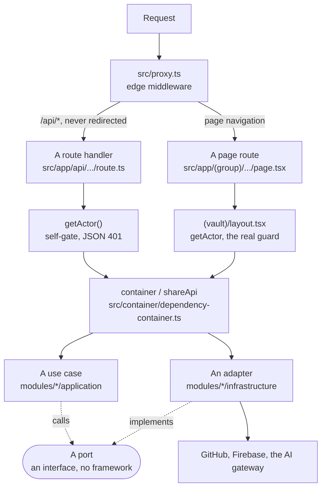

# 24. Server specification

Everything that runs on Vercel: the shape every route handler takes, the composition root that wires
it, the ports and adapters underneath, what the environment rule really enforces, and the auth flow
end to end.

The per-route table is in `22-API-REFERENCE.md`, which is generated. This file is the pattern those
26 routes follow, and the parts a generator cannot read.

## 24.1 A request, end to end



**The proxy never gates `/api/*`.** It redirects page navigations only. `src/proxy.ts:105` says
why: a redirect would hand a `fetch()` an HTML login page instead of an error, so API routes
self-gate and return a JSON 401.

The consequence is worth stating in one line, because it is the security posture of the whole
server. **Every API route gates itself.** A handler that forgets is not
caught by anything upstream. `22-API-REFERENCE.md` has an Auth column for exactly this reason, and a
route whose value there is not a session check is a finding.

## 24.2 The route handler pattern

All 26 handlers follow the same six steps in the same order. Keep the order: an unauthenticated
caller should never reach the body parser, let alone the use case.

Step | What it does | The shape
1. Runtime flags | `export const dynamic = "force-dynamic"`, and `runtime`, `maxDuration` where the work is long | module scope, above the imports in most files
2. Auth | `const actor = await getActor(); if (!actor) return 401` | JSON body `{ error: "unauthorized" }`
3. Input | `searchParams.get(...)` for a GET, `await req.json()` for a POST | wrapped in try/catch, because a malformed body throws
4. Validation | a zod schema, `safeParse`, bounded | 400 with `{ error: "bad_request", detail }`
5. The use case | `await container.X(...)` or `await shareApi.X(...)` | never an infrastructure call
6. Errors | a typed domain error becomes its own status, everything else becomes 502 | `{ error: "<code>", detail }`

**Step 4 is not optional and the bounds are not decoration.** `src/app/api/commit/route.ts` caps a
path at 1,024 characters, content at 10 MB a file, 500 files a commit and a message at 5 KB, and its
comment says the bounds exist so a pathological client cannot send a 10 GB blob. Copy that habit
into every new handler.

**The status vocabulary in use**, read out of the source by the generator:

Status | Meaning here
200 | Success.
304 | Not modified. One route uses it.
400 `bad_request` | The body or the query failed validation.
401 `unauthorized` | No session.
404 `not_found` | The path does not exist in the vault.
409 `conflict`, `exists`, `slug_conflict` | Optimistic concurrency lost, or a name is taken.
413 `too_large` | Input over a stated cap.
422 `invalid_slug`, `not_a_file` | Well formed, but not acceptable.
502 `<verb>_failed`, `upstream_failure` | GitHub or the model provider failed.

**There is no 403 and no 429 anywhere.** No route distinguishes authenticated-but-not-permitted from
unauthenticated, and no route rate limits. Both follow from the single-tenant auth of section 24.7,
and both are phase A work.

## 24.3 The composition root

`src/container/dependency-container.ts` is the only wiring module `app` and `presentation` may
import. Its own README says the per-concern files stay internal.

`[O]` At `f237ece`, counted with a command rather than by eye:

```
$ awk '/^export const container = \{/,/^\} as const;/' src/container/dependency-container.ts \
    | grep -cE '^  (async )?[A-Za-z_$][A-Za-z0-9_$]*\s*[:(,]'
21
```

Export | Keys | What it is
`container` | 21 | The server use cases, eagerly constructed at import.
`shareApi` | 5 | The share use cases, wired after `container` because they depend on `commitChanges` and `getSnapshot`.

The 21: `clearSnapshotCache`, `commitChanges`, `createNote`, `exportVaultZip`, `findUnlinkedMentions`,
`generateDocument`, `getBlobSha`, `getFile`, `getNoteHistory`, `getNoteVersion`, `getRawFile`,
`getSnapshot`, `linkDoctor`, `mergeNote`, `refineText`, `renameNote`, `searchNotes`, `suggestLinks`,
`summarize`, `uploadAttachment`, `validateNotePath`.

The 5: `listConflicts`, `listShares`, `removeShare`, `resolvePublicNote`, `setShare`.

**The wiring shape.** Every use case is a factory that takes its dependencies and returns a
function:

```ts
getSnapshot: makeGetSnapshot({
  reader: githubVaultReader,
  cache: snapshotCache,
  parseNote: parseMarkdown,
}),
```

`makeGetSnapshot` lives in `application` and names three ports. `githubVaultReader`, `snapshotCache`
and `parseMarkdown` live in `infrastructure`. Neither side imports the other. The container is the
only file that knows both names, which is what makes a use case testable with fakes.

**There is a second, smaller root.** `src/container/client-container.ts` exists because the Firebase
gateway needs a browser window, and the server root is an eagerly constructed singleton. Its header
records the constraint the architecture gate imposes: presentation may not import the container, so
a gateway reaches a component as a prop or through context.

**Two things in the container deserve a flag.**

- `AUTHOR` is a constant: `{ name: "Sagnik Mitra", email: "sagnikmitra123@gmail.com" }`. Every commit
  the app makes on a person's behalf carries it. `AGENTS.md:173` says the same value must match the
  commit author, and it does, but it is single-tenant by construction.
- `shareApi.setShare` reads `process.env["NEXT_PUBLIC_SITE_URL"]` inline with a
  `"https://frontmatter.in"` fallback, rather than going through `src/config/env.ts`. It is legal
  under the gate, because the container may read env. It is still the only direct read in the file
  and it should move.

## 24.4 Ports and adapters, worked

A port is an interface declared by `application`. An adapter is a value in `infrastructure` that
satisfies it. The use case receives the adapter as an argument and never names it.

`[O]` Five modules declare ports at `f237ece`:

Module | File | Ports
`vault` | `src/modules/vault/application/ports.ts` | `VaultReader`, `NoteParserFn`, plus the `VaultHistoryEntry` shape they return.
`repository` | `src/modules/repository/application/ports.ts` | `RepositoryWriter`, `TreeItem`.
`share` | `src/modules/share/application/ports.ts` | `ShareWriter`, `ShareSnapshotPort`.
`ai` | `src/modules/ai/application/ports.ts` | `LlmClient`.
`auth` | `src/modules/auth/application/ports.ts` | `AuthGateway`.

`src/shared/application/ports/` exists and is **empty**. Nothing is shared across modules at the port
level yet.

### A worked port

`src/modules/vault/application/ports.ts`. Its header says what makes it a port: pure interfaces, no
framework imports, no env reads.

```ts
export interface VaultReader {
  getHeadSha(): Promise<string>;
  getZipball(): Promise<ArrayBuffer>;
  getFile(path: string): Promise<{ content: string; sha: string }>;
  listHistory(path: string, limit?: number): Promise<VaultHistoryEntry[]>;
  getFileAtSha(path: string, sha: string): Promise<string | null>;
}
```

**Read what is missing.** No `repo`, no `branch`, no token, no `Octokit`. The word GitHub does not
appear. `VaultHistoryEntry` is a domain shape, and its own comment says no GitHub-specific field
leaks through the port. That is the property that lets R2 replace GitHub later without touching a
single line of `application`.

### The adapter that satisfies it

`src/modules/vault/infrastructure/vault-reader.ts`, in full:

```ts
export const githubVaultReader: VaultReader = {
  getHeadSha, getZipball, getFile, listHistory, getFileAtSha,
};
export const githubMergeReader = { getFile, getBlobContent };
```

Twenty-odd lines, of which the interesting part is the header comment: `process.env` is never
accessed here, because `@/shared/infrastructure/github/client` handles the lazy env read. The
adapter is a name change and nothing else, which is the sign of a well cut port.

`githubMergeReader` is a **narrow** second port for the three-way merge use case. It takes two
methods rather than five. `docs/mvp0/PRODUCT-PLAN.md`, section 16, states the principle as ports
being small and client-specific.

### A port with a different shape

`NoteParserFn` is a type alias, not an interface:

```ts
export type NoteParserFn = (path: string, raw: string) => ParsedNote;
```

A port with one operation is a function type. Do not wrap it in an object to look consistent.

### The client-side port

`AuthGateway` in `src/modules/auth/application/ports.ts` is the only port whose adapter runs in a
browser. It declares `signInWithGoogle`, `signOut`, `currentUser`, `observeUser` and `getIdToken`,
and `makeFirebaseAuthGateway` in `src/modules/auth/infrastructure/firebase-auth-gateway.ts`
implements it. See section 24.7 for what is and is not wired behind it.

### How to add a new adapter, in order

1. **Write the port first**, in `application`, naming only domain shapes.
2. **Write the use case against it**, taking it as an argument.
3. **Write the adapter** in `infrastructure`.
4. **Wire it** in `src/container/dependency-container.ts`.
5. **Run `npm run arch`.** A non-zero `total` means step 1 or step 2 leaked.

When the R2 adapter arrives it is steps 3 and 4 only, because `VaultReader` never named GitHub.

## 24.5 The environment rule, and what is actually enforced

**The rule as written** (`AGENTS.md:137`): `process.env` reads only in `src/config/` and
`*/infrastructure/`. Never in domain, application, or presentation.

**What the gate enforces** is narrower, and the difference matters because six files depend on it.
`specs/harness/clean-architecture-report.mjs` flags a `process.env` reference in **domain,
application or presentation**. It does not check `app`, `container` or `middleware`.

`[O]` Every `process.env` read at `f237ece`, from
`grep -rn "process\.env" src/ --include='*.ts' --include='*.tsx'`:

File | Reads | Layer | Standing
`src/config/env.ts` | 18 | `config` | The intended home. Zod-validated, lazily parsed.
`src/modules/auth/infrastructure/auth-options.ts` | 3 | `infrastructure` | Allowed. Request-time reads only, never at module load.
`src/proxy.ts` | 2 | `middleware` | Allowed. The dev-bypass gate.
`src/modules/ai/infrastructure/gateway-client.ts` | 2 | `infrastructure` | Allowed.
`src/app/api/export/pdf/[...path]/route.ts` | 2 | `app` | Legal under the gate. Outside the sentence.
`src/shared/infrastructure/firebase/client.ts` | 1 | `shared-infrastructure` | Allowed.
`src/modules/vault/infrastructure/vault-reader.ts` | 1 | `infrastructure` | Allowed.
`src/modules/vault/infrastructure/search-index.ts` | 1 | `infrastructure` | Allowed.
`src/modules/vault/infrastructure/markdown-parser.ts` | 1 | `infrastructure` | Allowed.
`src/modules/mdmax/infrastructure/bench.ts` | 1 | `infrastructure` | Allowed.
`src/container/dependency-container.ts` | 1 | `container` | Legal under the gate. See 24.3.
`src/app/sitemap.ts` | 1 | `app` | Legal under the gate.
`src/app/robots.ts` | 1 | `app` | Legal under the gate.
`src/app/layout.tsx` | 1 | `app` | Legal under the gate.

Zero reads in domain, application or presentation, which is why the gate is green.

**The second rule, and it is the one that breaks builds.** Never read env at module load time.
`src/config/env.ts` wraps every value in a `Proxy` that parses on first property access, so
importing the module during a build or a test costs nothing. `auth-options.ts` says the same thing
in capitals at the top of the file: do not reference `authEnv` or `process.env` at module load,
because NextAuth reads the credentials at request time itself.

A module-load read turns a missing variable into a build failure rather than a request failure, and
on Vercel that means a deploy that never starts.

**How to add a variable.** Add it to the right zod schema in `src/config/env.ts`, export a reader,
and call the reader from infrastructure. Do not add a bare `process.env["X"]` to a new file.

## 24.6 Background work

**There is none on the server.** `[O]` `grep -rn "waitUntil\|cron\|setInterval\|queue" src/` at
`f237ece` returns three matches and not one of them is server-side background work:

- `src/app/api/export/pdf/[...path]/route.ts:139` uses `waitUntil: "load"`, which is a Puppeteer
  page option, not the Vercel `waitUntil`.
- `src/modules/app-shell/presentation/PWARegister.tsx:49` sets a 60-second `setInterval` in the
  browser to poll for a service-worker update.
- `src/modules/share/domain/slug.ts:128` lists `cron`, `jobs` and `queue` as reserved slugs.

There is no `vercel.json` cron, no queue and no job runner. Every long operation runs inside the
request, which is why `maxDuration` is raised per route: 300 seconds for the link doctor, 60 for the
other AI routes and the PDF export, 30 for completion.

**This is a gap, not a design.** `docs/mvp0/PRODUCT-PLAN.md`, section 9, describes a High-depth
blueprint as a background job of about an hour with web fetches. An hour does not fit in a request.
Whatever runs it is new infrastructure, and the plan's section 26 places it after phase A.

Until then, two rules hold:

- **A request-bound operation must show progress past 10 seconds**, per the target in
  `docs/mvp0/PRODUCT-PLAN.md`, section 21.
- **Nothing may be scheduled by a client.** A `setInterval` in the browser is a poll, not a job, and
  it stops when the tab closes.

## 24.7 The auth flow, end to end

There are **three** sign-in paths in the shipped code and they do not grant the same thing. Reading
this section before touching auth will save a day.

### The three paths

Path | Where it runs | What it produces | Grants API access
GitHub OAuth, through Auth.js | server | an Auth.js session cookie | **yes**
Username and password, `sgnk-password` | server | the same Auth.js session cookie | **yes**
Google, through Firebase Auth | browser | a Firebase ID token | **no**

### 1. GitHub OAuth

`src/auth.ts` is three lines: it calls `NextAuth(authOptions)` and exports `handlers`, `auth`,
`signIn` and `signOut`. `src/app/api/auth/[...nextauth]/route.ts` re-exports `GET` and `POST` from
those handlers and contains nothing else.

`src/modules/auth/infrastructure/auth-options.ts` configures the provider with
`authorization: { params: { scope: "read:user" } }`, the minimum scope for an identity check.

**The gate is an allowlist of exactly one login.** `src/modules/auth/infrastructure/auth-options.ts:82`:

```ts
return isAllowed(ghProfile?.login, authEnv.ALLOWED_GH_LOGIN);
```

`ALLOWED_GH_LOGIN` is a single string with a default of `"sagnikmitra"` (`src/config/env.ts`), and
`src/modules/auth/domain/allowlist.ts` compares one login to one allowed value, case-insensitively.

**So the shipped application admits one person.** Everything else in this pack describes a
multi-tenant product. That is the single largest gap between the code and the plan, and
`21-DATA-MODEL.md` section 21.11 records the matching gap on the data side.

### 2. Username and password

A second Auth.js provider, `id: "sgnk-password"`, exists as a fallback for environments where the
GitHub OAuth callback is unreachable. It reads `SGNK_AUTH_USER` and `SGNK_AUTH_HASH` at request
time, verifies a scrypt hash in `src/modules/auth/infrastructure/password.ts`, and returns a user
whose `login` mirrors the GitHub provider so downstream code is unchanged.

Its `authorize` runs the key derivation on every path before comparing, which is the right shape for
a timing-safe check.

### 3. Google, through Firebase Auth

`makeFirebaseAuthGateway` implements `AuthGateway` against the Firebase client SDK, and
`src/container/client-container.ts` constructs it lazily so nothing initialises Firebase at import
time.

**Nothing on the server verifies what it produces.** `[O]` At `f237ece`:

- `grep -rn "verifyIdToken\|firebase-admin" src/` returns **nothing**.
- `firebase-admin` is **not a dependency**. `package.json` lists `firebase` alone.
- `getIdToken` is declared in the port and implemented in the gateway, and **no caller consumes it**.

A person who signs in with Google gets a Firebase session in the browser and **no Auth.js cookie**,
so `getActor()` returns null and every API route answers 401. Google sign-in is wired as far as the
button and no further.

Phase A must close this, and there are two honest ways to do it. Either add `firebase-admin` and
verify the ID token in a server helper that `getActor()` can also accept, or issue an Auth.js session
from a verified Firebase token so there stays exactly one session mechanism. **Pick one and write it
down**, because two session mechanisms is how authorisation bugs are made.

### The server-side session read

`getActor()` in `src/modules/auth/presentation/session.ts` is what every route calls. It returns an
`ActorContext` or null.

**The dev bypass is triple-gated**, and the gating is worth preserving exactly:

1. `NODE_ENV === "development"`
2. `DEV_BYPASS_AUTH === "1"`, an explicit opt-in
3. The request host is loopback or RFC1918 private

Missing any gate falls through to the normal session check. The flag reads go through
`readDevBypassFlags()` in `src/config/env.ts`, and the file's comment explains why the host check
stays local: it is request-scoped state, not configuration.

`src/proxy.ts` carries a mirror of the same three gates in `isLocalDevBypass`, so the edge redirect
does not bounce a local developer through GitHub. **The two copies must agree.** They are in
different layers and nothing enforces the mirror, which puts it in the same family as the
`PUBLIC_STATIC_RE` pair in `23-WEB-APP-SPEC.md` section 23.5.

## 24.8 The edge middleware

`src/proxy.ts` does three things and should never do a fourth.

Job | Detail
An optimistic redirect | Page navigations without a session cookie go to `/login`. Never `/api/*`. Never a public path.
The public path list | `isPublicPath()`, plus `PUBLIC_STATIC_RE` by extension, plus `isPublicSlugPath()` filtered by `RESERVED_SLUGS`.
A report-only Content Security Policy | Set on dynamic routes. The enforced one for public pages lives in `next.config.ts`.

It checks for a cookie, not a valid session. `SESSION_COOKIE_NAMES` is
`["authjs.session-token", "__Secure-authjs.session-token"]`, and a forged cookie gets past the
proxy and is then rejected by the layout or the route. That is correct for an optimistic redirect
and would be wrong for a guard.

**`RESERVED_SLUGS` is imported from `@/modules/share/domain/slug`**, which is a cross-module deep
import from middleware. It is deliberate: the reserved list has one home, and the validator and the
proxy both read it. `20-ARCHITECTURE.md` section 20.8 counts it among the 38 deep imports.

## 24.9 How to check any claim in this file

Claim | Command
The container's exports | `awk '/^export const container = \{/,/^\} as const;/' src/container/dependency-container.ts`
The ports | `ls src/modules/*/application/ports.ts`
Every env read, by file | `grep -rn "process\.env" src/ --include='*.ts' --include='*.tsx'`
That no layer violates the env rule | `npm run arch`
That no Firebase token is verified | `grep -rn "verifyIdToken\|firebase-admin" src/ package.json`
The allowlist | `grep -n "isAllowed" src/modules/auth/infrastructure/auth-options.ts`
Background work | `grep -rn "waitUntil\|cron\|setInterval\|queue" src/`
The route surface | `node docs/pack/tools/gen-api-reference.mjs --check`

## 24.10 Limits of this file

- **What was not assessed.** Runtime behaviour, latency and cold starts. Nothing was executed
  against a deployment. The `maxDuration` values are read from source, not measured.
- **What could not be verified.** Whether the credentials provider is enabled in production, which
  depends on `SGNK_AUTH_USER` and `SGNK_AUTH_HASH` being set in Vercel. Environment variables were
  not read, by policy.
- **What is not established.** That the three auth paths can be reconciled without a migration.
  Section 24.7 offers two options and picks neither, because that is a founders' decision.
- **What is inference.** The reading that 403 and 429 are absent *because* the app is single-tenant.
  The absence is measured; the cause is an inference.
- **What would falsify this file.** A second value appearing in `ALLOWED_GH_LOGIN`, a
  `process.env` read landing in domain, application or presentation, or a route reaching
  infrastructure without passing through the container.
- **Freshness.** Pinned to `f237ece`. Re-derive every count before quoting it.
