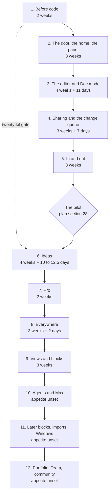

# 50. Roadmap

**What this file is.** The order the work happens in, as twelve batches built one at a time.

Each batch names what it contains, what it waits on, its appetite, and the internal gate it must
pass before the next batch starts.

**What it is not.** A promise of dates. An appetite is a fixed amount of time with variable scope,
not an estimate with variable time.

**Why it changed on 18 September.** The founder answered D02 `[Z]`: build everything, every phase
including those the default left in Later, and phase C with them, in batches.

One module is built, used and tested internally, fixed, and only then does the next start.

**Where it comes from.**

- `docs/mvp0/PRODUCT-PLAN.md` section 26 for the phases and appetites.
- `docs/mvp0/PRODUCT-PLAN.md` section 28 for the pilot and its stop lines.
- `docs/pack/56-OPEN-DECISIONS.md` section 0 for the founder's answers of 18 September.
- `docs/mvp0/SCREEN-CHANGES-2026-09-18.md` for the founders' screen review of the same day.
- `10-FEATURE-REGISTER.md` for feature ids, `19-ACCEPTANCE-CRITERIA.md` for criterion ids.

---

## 1. The short answer

**Everything takes longer than the old default, and says so here.** The old default built five
phases in about 60 to 79 calendar weeks.

Building all of it, one batch at a time, is **about 126 to
192 calendar weeks** for the nine batches the plan prices.

**Three more batches have no appetite at all.** The plan puts them in Later and never costs them.
The range above is therefore a floor, not a total.

**At the measured pace that is roughly 2.4 to 3.7 years**, before the thirty days of
content writing and before the unpriced batches. Section 5 shows every step of the arithmetic.

---

## 2. The batches, in order

Twelve batches, run strictly in sequence. The pilot sits between batch 5 and batch 6, because the
plan's section 28 reads the pilot as the thing that justifies phase C and the Pro build.



Batch | Name | Old phase | Plan appetite | 18 Sep additions | Depends on
1 | Before code | 0 | 2 weeks | none | nothing
2 | The door, the home and the panel | A | 3 weeks | none | 1
3 | The editor and Doc mode | B | 4 weeks | 11 days | 2
4 | Sharing and the change queue | D | 3 weeks | 7 days | 3
5 | In and out | E | 3 weeks | none | 3, and 4 for the queue
The pilot | Twenty people outside the studio | none | at least 2 weeks | none | 2 to 5
6 | Ideas | C | 4 weeks | 10 to 12.5 days | 3, the kit gate from 1, the pilot
7 | Pro | H | 2 weeks | none | 2, 4, 6
8 | Everywhere | F | 3 weeks | 2 days | 3, and 5 for sync
9 | Views and blocks | G | 3 weeks | none | 3
10 | Agents and Max | Later | unset | 2 days | 4, 7
11 | Later blocks, imports and Windows | Later | unset | none | 5, 8, 9
12 | Portfolio, Team and community | Later | unset | none | 4, 7

**The pilot's two weeks come from the plan, not from here.** Section 28 measures "active in week
two", so the pilot cannot read out in less than two weeks.

**The 18 September additions are not the plan's.** They are carried from the previous revision of
this file, which itemised the screen review and the research round. **They are appetites, a budget
we set, not measurements**, so there is nothing to verify until a batch is built. Section 5.2.

### 2.1 Why this order and not the phase letters

The old spine let C, D, E, F and G run in parallel after B. D02 removes the parallelism, so an
order has to be chosen. Each choice below names its reason.

Choice | Reason
D before C | The change queue is one of the three load-bearing ideas, and the old default already built D ahead of C
E before the pilot | The pilot's scripted step 2 is "Import a vault", and ten of twenty recruits are Obsidian users with 200 files or more. Plan section 28
The pilot before C and H | Section 28 says "All three justify phase C and the Pro build". The previous revision of this file put the pilot after H, which contradicts that line
C before H | Medium and High depth are Pro rows, so Pro cannot ship without them
F after E | The plan's question 11 is "Desktop before or after sync", and D09 recommends desktop after sync
G after F | Nothing in G is on the pilot's path, and nothing else waits on G
The Later work last | The plan never costs it, so it cannot be scheduled with a date

`INFERENCE:` the order of batches 8 and 9 could swap at no cost. Neither depends on the other.

---

## 3. Each batch in full

Every batch lists its feature ids from `10-FEATURE-REGISTER.md`, its screens, its appetite, and its
internal acceptance gate.

### 3.0 The gate every batch shares

**These hold for every batch from 2 onward, and a batch-specific gate adds to them.**

Check | How it is run
The build is green | `npm run verify`, which runs typecheck, lint, test, build, arch and spec
The contract gate is clean | `npm run spec` reports 0 errors
The engine has not moved a byte | `npm run corpus` exits 0
The batch's criteria pass | Every `A` id named in the batch's row passes, or is marked `Not yet checkable` in `19-ACCEPTANCE-CRITERIA.md` with its reason
No serious defect is open | Zero `CRITICAL` and zero `HIGH` defects open against the batch, severity per `65-CONVENTIONS.md` section 7
The founders used it | Both founders, Sagnik and Amit, did their own real work in the batch for the use window below

**The use window is a proposal, not the plan's.** `INFERENCE:` it is one seven-day window in which
each founder uses the batch on at least two distinct days.

That borrows the plan's own definition
of an active user from section 28.

**Fixing sits inside the appetite.** `INFERENCE:` the appetite is fixed time with variable scope,
so the fixes found in the use window come out of the batch's own weeks.

If they do not fit, scope is cut, and the cut is written down.

**The founder can change the window.** Each extra week per batch adds eight calendar weeks across
batches 2 to 9. Batch 1 has nothing to use.

### 3.1 Batch 1. Before code. 2 weeks

Old phase 0. Nothing is built for a user, so the gate is a checklist, not a use window.

What | Feature or source
The legal floor's first rows | `54-COMPLIANCE-AND-LEGAL.md`
Every account moved to the company, before the first stranger's document | D10, answered `[Z]`, and `docs/mvp0/PRODUCT-PLAN.md` section 24
The four public pages written: privacy, terms, pricing, refunds | `F104`
The pace published every Friday | So the measured pace stays measured
The `GITHUB_REPO` default fixed | It points at a sibling project's vault today
The format specifications drafted | `docs/mvp0/PRODUCT-PLAN.md` section 20
Twenty blueprints made by hand, for twenty people outside the studio | The start of the twenty-kit gate on batch 6

**Screens:** none. **Depends on:** nothing.

**Internal gate.**

- Every account in plan section 24 shows the company as owner, checked by a founder in each console.
- The four public pages answer 200 signed out: `A004`, `A005`.
- The twenty kits are delivered. Their result is read later, at batch 6, not here.

### 3.2 Batch 2. The door, the home and the panel. 3 weeks

Old phase A. **This is the batch the storage answer can change**, section 6.

What | Feature ids | Screens
Sign-in, the no-friction promise | `F101`, `F102`, `F103` | S01
Home, first run and returning, with its tabs | `F105`, `F106`, `F107` | S02, S03
Account settings | `F108` | S28
The entitlements layer, the usage ledger, meters, over the cap, safe downgrade | `F257`, `F258`, `F259`, `F260`, `F261` | S29, S33
Plans side by side, without checkout | `F265` | S29
The configuration panel, with hardcoded defaults | `F266` to `F275` | S35, S36, S37, S38
`firestore.rules` from prototype to product | none | none
The local drafts migrated off the legacy `sgnk-md` keys | none | none
Firestore and R2 adapters | none | none

**Depends on:** batch 1, for the Blaze billing account and the moved domain.

**Internal gate.**

- **Use:** both founders sign in with each provider, on a phone and a desktop, and change one limit,
  one routing cell and one flag in the panel, then see the change take effect.
- **Criteria:** `A001` to `A008`, `A140` to `A151`, `A505` to `A525`, `A642`, `A663` to `A672`,
  `A695` to `A698`, `A705` to `A725`.

### 3.3 Batch 3. The editor and Doc mode. 4 weeks plus 11 days

Old phase B. The largest single batch in the plan.

What | Feature ids | Screens
Markdown mode, the views, toolbar, tabs, tree, rail, links, search and the rest of the workspace | `F111`, `F113`, `F114`, `F116`, `F117`, `F118`, `F122` to `F134`, `F138`, `F139`, `F142` to `F147` | S04, S05
Doc mode, with the 20 lossless and 15 partial features of plan section 7, and font controls | `F112`, `F115` | S05
The AI box and menu on the free chain, with the breaker and the unavailable state | `F150`, `F151`, `F152`, `F154` to `F159`, `F161` | S06, S07, S32
Bring your own key, if the plan's question 10 says so | `F164` | S28, S37
Problems, the formatter and the checks | `F140`, `F141`, `F148`, `F165` to `F170` | S10
The instruction-file set, rebuilt from the one-file panel | `F171`, `F172`, `F173` | S11
The engine: splice-only writing, the two refusals, the projection law, with the two measured defects and the audit's third fixed | `F276`, `F277`, `F278`, `F279` | every editing screen
The `--ai` token and the code face in `globals.css` | none | none

**The 11 days added on 18 September**, an appetite, `resolved (proposed 18 Sep, founder review)`.

Item | Days | Source
The workspace rearranged | 3 | `docs/mvp0/SCREEN-CHANGES-2026-09-18.md:31` to `:47`
The AI box made unambiguous, with a pinned context line | 2 | `docs/mvp0/SCREEN-CHANGES-2026-09-18.md:57` to `:63`
Font controls in Doc mode | 1 | `docs/mvp0/SCREEN-CHANGES-2026-09-18.md:52`
Human and AI toggles wherever the two mix | 2 | `docs/mvp0/SCREEN-CHANGES-2026-09-18.md:296`
S11 rebuilt as the whole instruction-file set | 3 | `docs/mvp0/SCREEN-CHANGES-2026-09-18.md:303`

**Depends on:** batch 2, for `limitsFor(account)`, the ledger and the adapters. Every AI call
decrements a ledger that does not exist until batch 2.

**Internal gate.**

- **Use:** both founders write their own working documents in the product, in both modes, and run
  AI edits against them, accepting some and rejecting some.
- **Criteria:** `A010` to `A024`, `A030` to `A043`, `A050` to `A064`, `A070` to `A075`, `A200` to `A204`, `A500`,
  `A501`, `A504`, `A526` to `A553`, `A569` to `A582`, `A686` to `A694`.
- `A500`, `A501` and `A504` are the differentiation criteria. **Each needs its red proof before it
  counts**, per `AGENTS.md` section 0.

### 3.4 Batch 4. Sharing and the change queue. 3 weeks plus 7 days

Old phase D.

What | Feature ids | Screens
Roles and permissions | `F110` | S17, S20
People, invites and invite credits, the referral modal | `F208` to `F211` | S17
Read and edit links, with expiry | `F212`, `F213` | S17
Published pages with the markdown twin, `llms.txt`, the open-in bar, the branding line and the footer | `F215` to `F220` | S18
Live collaboration, and one collaborator on Free | `F221`, `F222` | S19
The change queue, people and machines split, bounded Accept all, highlighted spans | `F223` to `F226` | S20
History, diff and restore, and the history window | `F227`, `F228`, `F229` | S21
Mark AI text | `F162` | S21, S28
The conflict screen, with Let AI decide | `F231`, `F232`, `F233` | S31
No silent merge | `F280` | S20, S31
The Zed Delta rebuttal, written | none | none

**Live editing is in, not in Later.** D02 builds everything, so the plan's question 8 no longer
decides whether live editing is built. `INFERENCE:` it may still decide whether it waits for its
own batch.

**The 7 days added on 18 September**, an appetite, `resolved (proposed 18 Sep, founder review)`.

Item | Days | Source
Share by frontmatter address, with an invite that earns credits | 2 | `docs/mvp0/SCREEN-CHANGES-2026-09-18.md:136` to `:139`
The open-in bar, after first paint | 1 | `docs/mvp0/SCREEN-CHANGES-2026-09-18.md:322` to `:330`
Conflict gains Accept and Accept AI suggestions | 1 | `docs/mvp0/SCREEN-CHANGES-2026-09-18.md:201` to `:203`
Stamp `generated` and `verified` into front matter on accept | 2 | `docs/research/2026-09-18/raw/H-2026-launches.md:734`
Emit `llms.txt` beside every published page | 1 | `docs/research/2026-09-18/raw/H-2026-launches.md:351`

**Depends on:** batch 3, for the change queue's first form and the version record.

**Internal gate.**

- **Use:** each founder shares a real document with the other, edits it live, publishes one page,
  and clears a queue that holds a person's edit, an AI edit and a conflict.
- **Criteria:** `A100` to `A115`, `A128`, `A129`, `A502`, `A503`, `A609` to `A630`, `A680` to `A685`.

### 3.5 Batch 5. In and out. 3 weeks

Old phase E.

What | Feature ids | Screens
Drop anywhere, and drop a folder | `F121`, `F234` | S04, S22
Obsidian, Notion, Google Docs and Word import, with the progress panel | `F235` to `F239` | S22
Export, and export of the whole project | `F240`, `F241` | S04, S28
The GitHub App, and its push quota | `F242`, `F243` | S23
Google Drive sync at a five-minute poll | `F244` | S23
The connections screen | `F245` | S23

**Depends on:** batch 3 for the engine, and batch 4 so an inbound change enters the queue rather
than overwriting.

**Internal gate.**

- **Use:** each founder imports a real vault of their own, connects a GitHub repository and a Drive
  folder, and edits the same file from both sides.
- **Criteria:** `A023`, `A116`, `A120` to `A127`, `A631` to `A638`.

### 3.6 The pilot. At least 2 weeks

Not a batch. A gate the world answers, and it can fail. `docs/mvp0/PRODUCT-PLAN.md` section 28.

- **Who:** twenty people. Ten Obsidian users, five founders and product people, five Google Docs
  writers.
- **Stop:** fewer than four of twenty active in week two; fewer than two of ten kit recipients run
  the kickoff; fewer than three of twenty name the problem unprompted.
- **Continue:** six of twenty active in week two; three of ten run the kickoff and edit the kit
  again; one person asks how to pay before being told the price.

**The stop lines and D02 disagree, and this file does not pick.** Section 28 says any one stop line
"stops the next phase". D02 says every phase is built. Section 6 lists it as open.

### 3.7 Batch 6. Ideas. 4 weeks plus 10 to 12.5 days

Old phase C.

What | Feature ids | Screens
Add idea, and ideas as a tree section | `F119`, `F120` | S04, S12
The ideas tab, depth selector, question set, branching rewrite, skip and recommend | `F188` to `F196` | S12, S13, S14
Pinned idea context in the AI box | `F153` | S06, S13
Industry templates, and attach to an idea | `F199`, `F200` | S12
The fifteen-file blueprint, consistency check, unlisted link, out-of-band hash, kickoff prompt, versions | `F201` to `F206` | S15
The ideas empty state | `F207` | S34
The map, rebuilt on save | `F186`, `F187` | S16

**The 10 to 12.5 days added on 18 September**, an appetite, `resolved (proposed 18 Sep, founder review)`, are one item: idea mode rebuilt as one
column with a dynamic question flow, 2 to 2.5 weeks. Source:
`docs/mvp0/SCREEN-CHANGES-2026-09-18.md:99` to `:124`.

**Depends on:** batch 3 for the AI box, the free chain and the breaker; batch 1 for the kit gate;
the pilot for its reading.

**Internal gate.**

- **Use:** each founder turns one real idea of their own into a blueprint at Low depth, and runs the
  kickoff prompt from it in their own agent.
- **Criteria:** `A080` to `A095`, `A583` to `A595`, `A598` to `A608`, `A699` to `A704`.

### 3.8 Batch 7. Pro. 2 weeks

Old phase H.

What | Feature ids | Screens
Claude routing for Pro, per plan section 14 | `F160` | S07, S36
Medium and High depth: decision cards and the research pass | `F197`, `F198` | S14
Password links | `F214` | S17, S18
Razorpay checkout, the mandate ceiling, top-ups | `F262`, `F263`, `F264` | S29
The 90-day history window switched on for Pro | `F229`, set in batch 4 | S21, S35

**Depends on:** batch 2 for the panel's prices, batch 4 for password links and history, batch 6
for Medium and High.

**Internal gate.**

- **Use:** each founder pays for Pro with their own card, runs one Medium and one High blueprint, and
  cancels. Under 15,000 rupees, one attempt on Indian cards.
- **Criteria:** `A057`, `A058`, `A059`, `A596`, `A597`, `A669` to `A672`, `A206`.
- `F262`, `F263` and `F264` have no criterion yet. **Writing them is part of this batch.**

### 3.9 Batch 8. Everywhere. 3 weeks plus 2 days

Old phase F.

What | Feature ids | Screens
Offline in the browser, the banner, never the only copy | `F247`, `F248`, `F249` | S24
The desktop app, the watched folder, macOS signing at 99 US dollars a year | `F250`, `F251`, `F252` | S25
A local model on the desktop | `F163` | S24, S25
The phone layout and the bottom bar | `F253`, `F254` | every phone panel
The progressive web app and the protocol handler | `F255`, `F256` | S18, S22, S25, S26
Quick capture | `F149` | S26
Dark mode | `F109` | S27

**The 2 days added on 18 September**, an appetite, `resolved (proposed 18 Sep, founder review)`: phone views given the desktop theme treatment,
`docs/mvp0/SCREEN-CHANGES-2026-09-18.md:19`.

**Depends on:** batch 3 for the editor, and batch 5 for sync.

**Internal gate.**

- **Use:** each founder works a full day offline in the browser and a full day in the desktop app,
  and captures from a phone.
- **Criteria:** `A130` to `A135`, `A639` to `A641`, `A643` to `A662`.

### 3.10 Batch 9. Views and blocks. 3 weeks

Old phase G.

What | Feature ids | Screens
Flow, slides, mind map and outline views | `F181`, `F182`, `F183`, `F185` | S09
Mermaid, KaTeX, callouts, details, code fences, Excalidraw | `F174` to `F179` | S08
Templates, daily notes and calendar, tasks | `F135`, `F136`, `F137` | S02, S04, S08

**Flow was deferred by the founders on 18 September** and stays in this batch. D02 builds it.

**Depends on:** batch 3, for the block contract. Each block kind registers against the splicer.

**Internal gate.**

- **Use:** each founder presents one real document as slides and keeps a week of daily notes.
- **Criteria:** `A044`, `A045`, `A046`, `A554` to `A568`.
- D13, database views over front matter, is still open and may add to this batch.

### 3.11 Batch 10. Agents and Max. Appetite unset

Was Later. The plan puts "the MCP server and API with the agents card" and "Max" in Later.

What | Feature ids | Screens
The agents card | `F246` | S23
The Model Context Protocol server and the API | none yet | none yet
The Max tier | none yet | S29
A `wait_for_change` equivalent, so an agent parks instead of leaving | none yet | none

**The 2 days**, an appetite, `resolved (proposed 18 Sep, founder review)`, are for `wait_for_change`, from
`docs/research/2026-09-18/raw/Z2-position-taken.md`. The rest has no appetite.

**Depends on:** batch 4 for the queue an agent proposes into, batch 7 for billing.

**Internal gate.** Each founder points their own coding agent at a project through the server and
reviews its proposals in the queue. **No criterion exists yet**, and writing them is the batch's
first task.

**D04 may move this batch.** It recommends a read-and-propose server inside batch 4. If accepted,
this batch shrinks to the API and Max.

### 3.12 Batch 11. Later blocks, imports and Windows. Appetite unset

What | Feature ids | Screens
Kanban view | `F184` | S09
Chart from a table | `F180` | S08
Notion import through its API | none yet | S22
A signed Windows build | none yet | S25

**Depends on:** batch 5 for import, batch 8 for the desktop, batch 9 for the views.

**Internal gate.** Use as batches 5, 8 and 9. `A044` covers kanban as a view. Nothing covers the
rest yet. D09 asks who signs Windows, and a certificate is unpriced.

### 3.13 Batch 12. Portfolio, Team and community. Appetite unset

What | Feature ids | Screens
The portfolio | `F230` | S30
The Team tier | none yet | none yet
The community | none yet | none yet
A custom domain | none yet | none yet

**Depends on:** batch 4 for publishing, batch 7 for billing.

**Internal gate.** Each founder publishes a portfolio of their own work. Criteria: `A673` to `A679`
for the portfolio; nothing yet for the rest.

---

## 4. Where the old phases went

Nobody should lose an old reference. Every phase letter maps to exactly one batch.

Old phase | Old appetite | Batch | What changed
0. Before code | 2 weeks | 1 | Nothing but the number
A. The door and the home | 3 weeks | 2 | The storage answer may add to it, section 6
B. The editor as shipped, plus Doc mode | 4 weeks | 3 | S11 moves in; the 18 Sep additions total 11 days
C. Ideas | 4 weeks | 6 | Now after the pilot, and no longer optional
D. Sharing | 3 weeks | 4 | Live editing is in; conflict and research items add 7 days
E. In and out | 3 weeks | 5 | Moved out of Later and ahead of the pilot
F. Everywhere | 3 weeks | 8 | Moved out of Later
G. Views and blocks | 3 weeks | 9 | Moved out of Later
H. Pro | 2 weeks | 7 | Now after C, as before, but after the pilot
Later | unset | 10, 11, 12 | Built, per D02, still without an appetite

**Two corrections to the previous revision of this file.**

- It placed the pilot after H. Plan section 28 reads the pilot as what justifies C and H, so the
  pilot now sits before both.
- It said the screen review's per-item breakdown "sums to about 19 days". Section 5.2 re-derives it
  at 27 to 29.5 days.

---

## 5. The calendar, re-derived

### 5.1 The plan's appetites

Checked at write time `[O]` with `sed -n '/^## 26/,/^## 27/p' docs/mvp0/PRODUCT-PLAN.md`.

```
0 + A + B + C + D + E + F + G + H
2 + 3 + 4 + 4 + 3 + 3 + 3 + 3 + 2 = 27 weeks
```

The plan's measured pace is **0.93 to 1.21 days a week**, and its calendar is 99 to 129 weeks.
Those two figures imply a base of about 120 working days, not 135.

```
99 x 1.21 = 119.8 days     129 x 0.93 = 120.0 days     27 x 5 = 135 days
```

`INFERENCE:` the plan's "full time" is about 4.44 days a week. Nothing in the plan says so. This
file carries both bases rather than choosing, and the range spans them.

### 5.2 The 18 September additions

Two figures exist and they disagree `[O]`.

Source | Screen review | Research items | Total
The brief's headline | 3 to 4 weeks | about 1 week | 20 to 25 days
This file's itemised rows | 17 days, plus 10 to 12.5 for the idea redesign | 2 + 1 + 2 = 5 days | 32 to 34.5 days

```
screen items: 3 + 2 + 2 + 3 + 1 + 2 + 1 + 2 + 1 = 17 days
with the idea redesign: 17 + 10 = 27, or 17 + 12.5 = 29.5 days
with research: 27 + 5 = 32, or 29.5 + 5 = 34.5 days
by batch: 11 (B3) + 7 (B4) + 10 to 12.5 (B6) + 2 (B8) + 2 (B10) = 32 to 34.5
```

**The range below uses the low headline and the high itemisation**, 20 to 34.5 days. Neither figure
has been checked against anybody building anything.

**Where the headline came from** `[O]`: `git show f237ece:docs/pack/50-ROADMAP.md`, this file's own
earlier revision, whose section 2 gave "3 to 4 weeks" and "about 1 week" before the rows were
itemised. So both figures are ours. **The itemised rows are the appetite**, `resolved (proposed 18
Sep, founder review)`, because each names its screen and its source line. The range keeps the
headline as its floor so that `ADR-0011` and section 5.4 stay one set of numbers.

### 5.3 Per batch, at the measured pace

Five days a week of appetite, divided by the measured pace `[O]`.

Batch | Working days | At 1.21 days a week | At 0.93 days a week
1 | 10 | 8.3 weeks | 10.8 weeks
2 | 15 | 12.4 weeks | 16.1 weeks
3 | 20 + 11 = 31 | 25.6 weeks | 33.3 weeks
4 | 15 + 7 = 22 | 18.2 weeks | 23.7 weeks
5 | 15 | 12.4 weeks | 16.1 weeks
6 | 20 + 10 to 12.5 = 30 to 32.5 | 24.8 weeks | 34.9 weeks
7 | 10 | 8.3 weeks | 10.8 weeks
8 | 15 + 2 = 17 | 14.0 weeks | 18.3 weeks
9 | 15 | 12.4 weeks | 16.1 weeks
10 | 2, and the rest unset | 1.7 weeks and more | 2.2 weeks and more
11 | unset | unset | unset
12 | unset | unset | unset

**Batch 3 alone is six to eight months of calendar.** That is the editor, before anybody else sees it.

### 5.4 The total

```
build, low:  (120 + 20) days  / 1.21 = 115.7 weeks
build, high: (135 + 34.5) days / 0.93 = 182.3 weeks
use windows: 8 batches (2 to 9) x 1 week = 8 weeks
the pilot:   at least 2 weeks
total:       115.7 + 8 + 2 = 125.7 weeks,  to  182.3 + 8 + 2 = 192.3 weeks
```

**So the nine priced batches take about 126 to 192 calendar weeks**, roughly 2.4 to 3.7 years at
52 weeks a year.

**Two things sit on top of that, and both are real.**

- **Content, about thirty days** of writing, from plan section 26. If the same hands write it, that
  is 30 / 1.21 = 24.8 to 30 / 0.93 = 32.3 more weeks. The total becomes about **151 to 225 weeks**.
- **Batches 10, 11 and 12** have no appetite. Whatever they cost is added to every figure here.

### 5.5 Against what was said before

Plan | Calendar weeks | What it built
The old default, plan section 26 | about 60 to 79 | Phases 0, A, B, D, H
The previous revision's "everything" | about 116 to 151 | Phases 0 to H, no use windows, no pilot
**This file, D02** | **about 126 to 192**, 151 to 225 with content | Batches 1 to 9, use windows, the pilot, and three unpriced batches still to add

**Why it is longer.** Every phase is built, the use windows serialise what could have overlapped,
and the itemised additions are larger than the headline the old file used.

**A second engineer shortens a batch, not the queue.** D02 allows one batch at a time. A contractor
for D and F, which the old default proposed, now speeds batches 4 and 8 rather than running them
beside batch 3.

---

## 6. The decisions still open that move this order

From `56-OPEN-DECISIONS.md`. Silence is not agreement.

Decision | What it moves
**D03, where bytes live.** Answered in part `[Z]`; research running in `docs/research/2026-09-18-storage/` | **Batch 2, and possibly batch 5 into batch 2.** See below
**The pilot's stop lines against D02.** Plan section 28 against D02's "everything" | Whether a failed pilot stops batch 6, or only informs it
D04, the MCP server | Batch 10 moves partly into batch 4
D05, the name | Must land before batch 4 publishes a URL
D06, authorship marking | The 2-day stamp in batch 4
D07, the twenty-kit gate | Whether batch 6 is gated or only informed, now that D02 builds it regardless
D08, trial and dunning | Batch 7
D09, desktop timing and Windows signing | Batches 8 and 11
D11, the free cap against the pilot | Must be answered before the pilot recruits, because a qualifying vault is 200 files
D12, whether a link-edit holder needs an account | Batch 4
D13, database views | Batch 9
D14, voice typing | Batch 3

### 6.1 Why the storage answer may change batch 2

- **The founder's answer** `[Z]`: a GitHub sign-in keeps documents in the person's GitHub, a Google
  sign-in keeps them in their Drive, and we keep a synced copy.
- **The draft benchmark** `docs/research/2026-09-18-storage/STORAGE-BENCHMARK.md` recommends our copy
  as canonical, with the person's GitHub or Drive as a written mirror read back through the queue.
- **Either way, the mirror is a batch 2 concern if the promise holds from the first document.** The
  GitHub App and Drive sync sit in batch 5 today.

**What would move.** `INFERENCE:` the storage key layout and the `connections` record belong in
batch 2 under any answer.

The mirror worker moves from batch 5 into batch 2 only if the founder
wants the person's own storage from day one. Neither is costed.

**The benchmark is a draft.** Its own falsification tests, a byte round trip through Drive and a
100-edit concurrency test, have not run. Until they do, batch 2's appetite stays the plan's 3 weeks.

---

## 7. What would change this roadmap

Event | What moves
The pace doubles | Every calendar figure halves; the appetites do not move
The use window changes | Each extra week per batch adds 8 calendar weeks to the priced total
The pilot fails a stop line | Batch 6 onward, if the founder reads section 28 over D02
The twenty-kit gate fails | Batch 6, if D07 keeps the gate as a gate
D03 puts the mirror in batch 2 | Batch 2 grows and batch 5 shrinks, by an amount nobody has costed
D04 moves the MCP server | Part of batch 10 lands in batch 4
Obsidian ships a web version | `docs/mvp0/PRODUCT-PLAN.md` section 27 names this; batch 5 gets more valuable, not less

---

## 8. Limits of this file

**What was not assessed.**

- Whether the appetites are right. They are the plan's, taken as given; no batch was costed from
  the code.
- Whether 0.93 to 1.21 days a week still holds. It comes from the audit of 17 September and has not
  been remeasured.
- The cost of batches 10, 11 and 12, and of the fixes each use window finds.
- Who writes the thirty days of content. Nobody is named.

**What could not be verified.**

- Every 18 September addition in days is an appetite, not a measurement, and is now marked as a
  proposed resolution. The headline traces to this file's revision `f237ece`, section 5.2.
- The feature-to-batch assignment for features the plan does not name by phase, such as `F145` to
  `F147`, `resolved (proposed 18 Sep, founder review)`: **a feature with no phase goes in the batch
  of the screen it sits on.** `F145` to `F147` sit on S04 in `10-FEATURE-REGISTER.md`, so batch 3.
  Rejected: parking them in batch 11, which would split one screen across two batches and two use
  windows.
- 43 features have no acceptance criterion, per `10-FEATURE-REGISTER.md` section 0. A batch gate
  that names none is weaker than one that does.

**What is proposal, not source.**

- The one-week use window, the batch order after batch 5, and fixes coming out of the appetite.
  Each is marked `INFERENCE:` where it appears, and each is the founder's to change.

**What would falsify it.**

- Batch 2 taking materially more or less than three weeks would move the base every figure scales
  from.
- A measured pace outside 0.93 to 1.21 would move every number in section 5 at once.
- Any batch finding that its dependency in section 2 was not the real one. The spine is reasoned
  from the plan, not from a build.
