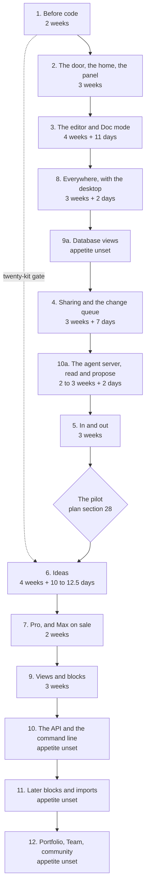

# 50. Roadmap

**What this file is.** The order the work happens in, as fourteen batches built one at a time.

Each batch names what it contains, what it waits on, its appetite, and the internal gate it must
pass before the next batch starts.

**What it is not.** A promise of dates. An appetite is a fixed amount of time with variable scope,
not an estimate with variable time.

**Why it changed on 18 September, twice.**

- The founder answered D02 `[Z]`: build everything, every phase including those the default left in
  Later, one batch at a time, each built, used, tested and fixed before the next starts.
- Later the same day he answered D04 to D14 `[Z]`. Three of those answers move work earlier: D09,
  D13 and D04. Section 2.2 says what moved and why.

**Where it comes from.**

- `docs/mvp0/PRODUCT-PLAN.md` section 26 for the phases and appetites.
- `docs/mvp0/PRODUCT-PLAN.md` section 28 for the pilot and its stop lines.
- `docs/pack/56-OPEN-DECISIONS.md` section 0 for the founder's answers of 18 September.
- `docs/mvp0/SCREEN-CHANGES-2026-09-18.md` for the founders' screen review of the same day.
- `10-FEATURE-REGISTER.md` for feature ids, `19-ACCEPTANCE-CRITERIA.md` for criterion ids.

---

## 1. The short answer

**Everything takes longer than the old default, and says so here.** The old default built five
phases in about 60 to 79 calendar weeks.

Building all of it, one batch at a time, is **about 134 to 209 calendar weeks** for the ten batches
that now have an appetite.

**Four batches have no appetite at all**: 9a, 10, 11 and 12. Nobody has costed them. The range above
is therefore a floor, not a total.

**At the measured pace that is roughly 2.6 to 4.0 years**, before the thirty days of content
writing and before the unpriced batches. Section 5 shows every step of the arithmetic.

---

## 2. The batches, in order

**Batch numbers are ids, not positions.** Other files in this pack cite "batch 8" and "batch 10",
so the numbers stay put and the run order changes, per `65-CONVENTIONS.md` section 1, rule 3.

Two batches are new and take a suffix letter: **9a** for database views, and **10a** for the agent
server. Read the `Step` column for the order.



Step | Batch | Name | Old phase | Plan appetite | 18 Sep additions | Depends on
1 | 1 | Before code | 0 | 2 weeks | none | nothing
2 | 2 | The door, the home and the panel | A | 3 weeks | none | 1
3 | 3 | The editor and Doc mode | B | 4 weeks | 11 days | 2
4 | 8 | Everywhere, with the desktop | F | 3 weeks | 2 days | 3
5 | 9a | Database views over front matter | none, new | unset | none | 3
6 | 4 | Sharing and the change queue | D | 3 weeks | 7 days | 3
7 | 10a | The agent server, read and propose | Later | 2 to 3 weeks, from D04 | 2 days | 4
8 | 5 | In and out | E | 3 weeks | none | 3, and 4 for the queue
gate | The pilot | Twenty people outside the studio | none | at least 2 weeks | none | every step before it
9 | 6 | Ideas | C | 4 weeks | 10 to 12.5 days | 3, the kit gate from 1, the pilot
10 | 7 | Pro, and Max on sale | H | 2 weeks | none | 2, 4, 6, 10a
11 | 9 | Views and blocks | G | 3 weeks | none | 3
12 | 10 | The API and the command line | Later | unset | none | 10a
13 | 11 | Later blocks and imports | Later | unset | none | 5, 9
14 | 12 | Portfolio, Team and community | Later | unset | none | 4, 7

**The pilot's two weeks come from the plan, not from here.** Section 28 measures "active in week
two", so the pilot cannot read out in less than two weeks.

**The 18 September additions are not the plan's.** They are carried from the previous revision of
this file, which itemised the screen review and the research round. **They are appetites, a budget
we set, not measurements.** Section 5.2.

**Batch 10a's two to three weeks are not the plan's either.** They are the cost this pack gave the
read-and-propose option in `56-OPEN-DECISIONS.md` section 3, D04, which the founder chose `[Z]`.

### 2.1 Why this order and not the phase letters

The old spine let C, D, E, F and G run in parallel after B. D02 removes the parallelism, so an
order has to be chosen. Each choice below names its reason.

Choice | Reason
F straight after B | D09 answered `[Z]`: desktop early, alongside the web editor, not after sync
9a straight after F | D13 answered `[Z]`: database views over front matter built early, not deferred
D after 9a | The change queue is one of the three load-bearing ideas; the old default built D ahead of C
10a straight after D | D04 answered `[Z]`. The option chosen was read and propose in phase D; an agent proposal is a queue item with a different `source`, so it waits only on the queue
E before the pilot | The pilot's scripted step 2 is "Import a vault", and ten of twenty recruits are Obsidian users with 200 files or more. Plan section 28
The pilot before C and H | Section 28 says "All three justify phase C and the Pro build"
C before H | Medium and High depth are Pro rows, so Pro cannot ship without them
H before G | Nothing left in G is on the pilot's path, and nothing else waits on G
The rest of Later last | The plan never costs it, so it cannot be scheduled with a date

`INFERENCE:` "alongside the web editor" is read as the batch straight after the editor, because D02
allows one batch at a time. Running the desktop inside batch 3 would break D02's gate.

`INFERENCE:` phase F moves whole, offline and phone included, because the plan prices F as one
3-week appetite. Splitting it would need a number nobody has. The founder can split it.

### 2.2 What moved on 18 September, and why

Move | From | To | Why
Batch 8, Everywhere | Step 8, after sync | Step 4, after the editor | D09 `[Z]`
The signed Windows build | Batch 11 | Batch 8 | D09 `[Z]`: the certificate "is now needed sooner"
Pricing the Windows certificate | Nowhere | Batch 1 | An unpriced requirement at step 4 is a surprise. Prices found are in `35-RELEASE-AND-VERSIONING.md` section 6.2a
Database views over front matter | "One thing that waits", plan section 8 | New batch 9a, step 5 | D13 `[Z]`
The agent server, the agents card, `wait_for_change` | Batch 10, Later | New batch 10a, step 7 | D04 `[Z]`
The Max tier going on sale | Batch 10 | Batch 7 | Checkout is built in batch 7, and D04 makes the server the Max tier
Batch 10 | Agents and Max | The API and the command line | What is left after 10a
Batch 9 | Step 9 | Step 11 | Nothing in it is needed sooner

**What did not move but is now decided.**

- **D06 `[Z]`:** the 2-day stamp of `verified: [{by, at}]` on accept stays in batch 4, now decided
  rather than proposed.
- **D12 `[Z]`:** editing through a link needs the one-tap sign-in, and reading needs nothing. Batch
  4, no appetite added. `INFERENCE:` it reuses batch 2's sign-in.
- **D14 `[Z]`:** voice typing stays in Doc mode, batch 3, as the plan's section 7 table already
  lists it. No appetite added.

**The cost of moving work forward.** The pilot, the first stranger, now starts later. Section 5.6
puts it at about 107 to 143 calendar weeks in, against about 81 to 104 before this revision.

---

## 3. Each batch in full

Every batch lists its feature ids from `10-FEATURE-REGISTER.md`, its screens, its appetite, and its
internal acceptance gate. **They are listed in run order**, not in number order.

### 3.0 The gate every batch shares

**These hold for every batch from 2 onward, and a batch-specific gate adds to them.**

Check | How it is run
The build is green | `npm run verify`, which runs typecheck, lint, test, build, arch and spec
The contract gate is clean | `npm run spec` reports 0 errors
The engine has not moved a byte | `npm run corpus` exits 0
The batch's criteria pass | Every `A` id named in the batch's row passes, or is marked `Not yet checkable` in `19-ACCEPTANCE-CRITERIA.md` with its reason
No serious defect is open | Zero `CRITICAL` and zero `HIGH` defects open against the batch, severity per `65-CONVENTIONS.md` section 7
The founders used it | Both founders, Sagnik and Amit, did their own real work in the batch for the use window below

**The use window is a proposal, not the plan's.** `INFERENCE:` it is one seven-day window in which
each founder uses the batch on at least two distinct days.

That borrows the plan's own definition of an active user from section 28.

**Fixing sits inside the appetite.** `INFERENCE:` the appetite is fixed time with variable scope,
so the fixes found in the use window come out of the batch's own weeks.

If they do not fit, scope is cut, and the cut is written down.

**The founder can change the window.** Each extra week per batch adds nine calendar weeks across
the nine priced batches after batch 1. Batch 1 has nothing to use.

### 3.1 Step 1. Batch 1, before code. 2 weeks

Old phase 0. Nothing is built for a user, so the gate is a checklist, not a use window.

What | Feature or source
The legal floor's first rows | `54-COMPLIANCE-AND-LEGAL.md`
Every account moved to the company, before the first stranger's document | D10, answered `[Z]`, and `docs/mvp0/PRODUCT-PLAN.md` section 24
The four public pages written: privacy, terms, pricing, refunds | `F104`
The pace published every Friday | So the measured pace stays measured
The `GITHUB_REPO` default fixed | It points at a sibling project's vault today
The format specifications drafted | `docs/mvp0/PRODUCT-PLAN.md` section 20
Twenty blueprints made by hand, for twenty people outside the studio | The start of the twenty-kit gate on batch 6
**The Windows signing route chosen and priced** | D09 `[Z]`. The options and prices are in `35-RELEASE-AND-VERSIONING.md` section 6.2a

**Screens:** none. **Depends on:** nothing.

**Internal gate.**

- Every account in plan section 24 shows the company as owner, checked by a founder in each console.
- The four public pages answer 200 signed out: `A004`, `A005`.
- The twenty kits are delivered. Their result is read later, at batch 6, not here.
- A Windows signing route is chosen and its yearly cost written into `35-RELEASE-AND-VERSIONING.md`.
  Buying it is a founder's paid action, not an agent's.

### 3.2 Step 2. Batch 2, the door, the home and the panel. 3 weeks

Old phase A. **This is the batch the storage answer can change**, section 6.1.

What | Feature ids | Screens
Sign-in, the no-friction promise | `F101`, `F102`, `F103` | S01
Home, first run and returning, with its tabs | `F105`, `F106`, `F107` | S02, S03
Account settings | `F108` | S28
The entitlements layer, the usage ledger, meters, over the cap, safe downgrade | `F257`, `F258`, `F259`, `F260`, `F261` | S29, S33
Plans side by side, without checkout | `F265` | S29
The configuration panel, with hardcoded defaults | `F266` to `F275` | S35, S36, S37, S38
`firestore.rules` from prototype to product | none | none
The local drafts migrated off the legacy `sgnk-md` keys | none | none
Firestore and R2 adapters | none | none

**Depends on:** batch 1, for the Blaze billing account and the moved domain.

**Internal gate.**

- **Use:** both founders sign in with each provider, on a phone and a desktop, and change one limit,
  one routing cell and one flag in the panel, then see the change take effect.
- **Criteria:** `A001` to `A008`, `A140` to `A151`, `A505` to `A525`, `A642`, `A663` to `A672`,
  `A695` to `A698`, `A705` to `A725`.

### 3.3 Step 3. Batch 3, the editor and Doc mode. 4 weeks plus 11 days

Old phase B. The largest single batch in the plan.

What | Feature ids | Screens
Markdown mode, the views, toolbar, tabs, tree, rail, links, search and the rest of the workspace | `F111`, `F113`, `F114`, `F116`, `F117`, `F118`, `F122` to `F134`, `F138`, `F139`, `F142` to `F147` | S04, S05
Doc mode, with the 20 lossless and 15 partial features of plan section 7, and font controls | `F112`, `F115` | S05
Voice typing in Doc mode, kept by D14 `[Z]` | inside `F112`, per plan section 7's row "Translate, voice typing" | S05
The AI box and menu on the free chain, with the breaker and the unavailable state | `F150`, `F151`, `F152`, `F154` to `F159`, `F161` | S06, S07, S32
Bring your own key, if the plan's question 10 says so | `F164` | S28, S37
Problems, the formatter and the checks | `F140`, `F141`, `F148`, `F165` to `F170` | S10
The instruction-file set, rebuilt from the one-file panel | `F171`, `F172`, `F173` | S11
The engine: splice-only writing, the two refusals, the projection law, with the two measured defects and the audit's third fixed | `F276`, `F277`, `F278`, `F279` | every editing screen
The `--ai` token and the code face in `globals.css` | none | none

`INFERENCE:` voice typing has no feature id of its own. It is a row of the Doc mode table that
`F112` builds from, so it sits under `F112` until the register gives it one.

**The 11 days added on 18 September**, an appetite, `resolved (proposed 18 Sep, founder review)`.

Item | Days | Source
The workspace rearranged | 3 | `docs/mvp0/SCREEN-CHANGES-2026-09-18.md:31` to `:47`
The AI box made unambiguous, with a pinned context line | 2 | `docs/mvp0/SCREEN-CHANGES-2026-09-18.md:57` to `:63`
Font controls in Doc mode | 1 | `docs/mvp0/SCREEN-CHANGES-2026-09-18.md:52`
Human and AI toggles wherever the two mix | 2 | `docs/mvp0/SCREEN-CHANGES-2026-09-18.md:296`
S11 rebuilt as the whole instruction-file set | 3 | `docs/mvp0/SCREEN-CHANGES-2026-09-18.md:303`

**Depends on:** batch 2, for `limitsFor(account)`, the ledger and the adapters. Every AI call
decrements a ledger that does not exist until batch 2.

**Internal gate.**

- **Use:** both founders write their own working documents in the product, in both modes, and run
  AI edits against them, accepting some and rejecting some.
- **Criteria:** `A010` to `A024`, `A030` to `A043`, `A050` to `A064`, `A070` to `A075`, `A200` to `A204`, `A500`,
  `A501`, `A504`, `A526` to `A553`, `A569` to `A582`, `A686` to `A694`.
- `A500`, `A501` and `A504` are the differentiation criteria. **Each needs its red proof before it
  counts**, per `AGENTS.md` section 0.

### 3.4 Step 4. Batch 8, everywhere, with the desktop. 3 weeks plus 2 days

Old phase F. **Moved from step 8 to step 4 by D09** `[Z]`: desktop early, alongside the web editor,
not after sync.

What | Feature ids | Screens
The desktop app, the watched folder, macOS signing at 99 US dollars a year | `F250`, `F251`, `F252` | S25
**A signed Windows build**, moved in from batch 11 | inside `F252` | S25
A local model on the desktop | `F163` | S24, S25
Offline in the browser, the banner, never the only copy | `F247`, `F248`, `F249` | S24
The phone layout and the bottom bar | `F253`, `F254` | every phone panel
The progressive web app and the protocol handler | `F255`, `F256` | S18, S22, S25, S26
Quick capture | `F149` | S26
Dark mode | `F109` | S27

**The 2 days added on 18 September**, an appetite, `resolved (proposed 18 Sep, founder review)`: phone views given the desktop theme treatment,
`docs/mvp0/SCREEN-CHANGES-2026-09-18.md:19`.

**The Windows build has no appetite.** The plan's 3 weeks for phase F priced macOS signing and left
Windows in Later. `UNVERIFIED:` the extra work of a Windows signing step in CI is not costed.

**Depends on:** batch 3 for the editor and for the change queue's first form. **It no longer waits
on batch 5.**

**What the desktop cannot do yet, at this step.** `INFERENCE:` each gap closes when its batch lands.

Gap | Closes at
No sharing, links or published pages from the desktop | Batch 4, step 6
No agent proposals from outside the watched folder | Batch 10a, step 7
No mirror to the person's GitHub or Drive | Batch 5, step 8

**The watched folder at this step.** `INFERENCE:` an agent editing a file on disk feeds the change
queue in the first form batch 3 builds. Batch 4 later gives that queue its full form without
changing the watched folder's contract.

**Internal gate.**

- **Use:** each founder works a full day offline in the browser and a full day in the desktop app on
  macOS, installs the signed Windows build on one Windows machine, and captures from a phone.
- **Criteria:** `A130` to `A135`, `A639` to `A641`, `A643` to `A662`.
- `A645` and `A646` cover desktop signing. `UNVERIFIED:` whether either names Windows was not
  checked; if not, a Windows criterion is written in this batch.

### 3.5 Step 5. Batch 9a, database views over front matter. Appetite unset

New. **D13 `[Z]`: build database views over front matter early, not deferred.** The plan's
section 8 had them as "one thing that waits", because they have no open renderer.

What | Feature ids | Screens
A table view whose rows are files and whose columns are front matter keys | none yet | none yet
Filter and sort on those keys | none yet | none yet
An edit in a cell written back as a splice into that file's front matter | none yet | none yet

`INFERENCE:` the rows above are the smallest reading of "database views over front matter", the
shape of Obsidian's Bases, which plan section 8 names. The founder has not specified more.

**The rule this batch must keep.** The view is a projection of the files on disk, per the projection
law. It holds no state of its own, and a cell edit is a splice that can refuse like any other.

**No open renderer exists**, per plan section 8, so the view is built, as the kanban and chart
blocks are. `INFERENCE:` like those, it may copy the shape of a plugin but none of its code.

**Depends on:** batch 3, for the front matter parser, the splicer and the block contract.

**Internal gate.**

- **Use:** each founder builds one view over a real folder of their own and edits a value from it,
  then checks the file on disk changed only in that key.
- **Criteria:** none exist yet. **Writing them, and a feature id in `10-FEATURE-REGISTER.md`, is the
  batch's first task.**

### 3.6 Step 6. Batch 4, sharing and the change queue. 3 weeks plus 7 days

Old phase D.

What | Feature ids | Screens
Roles and permissions | `F110` | S17, S20
People, invites and invite credits, the referral modal | `F208` to `F211` | S17
Read and edit links, with expiry. **Editing through a link needs the one-tap sign-in; reading needs nothing**, D12 `[Z]` | `F212`, `F213` | S17
Published pages with the markdown twin, `llms.txt`, the open-in bar, the branding line and the footer | `F215` to `F220` | S18
Live collaboration, and one collaborator on Free | `F221`, `F222` | S19
The change queue, people and machines split, bounded Accept all, highlighted spans | `F223` to `F226` | S20
History, diff and restore, and the history window | `F227`, `F228`, `F229` | S21
Mark AI text | `F162` | S21, S28
The conflict screen, with Let AI decide | `F231`, `F232`, `F233` | S31
No silent merge | `F280` | S20, S31
The Zed Delta rebuttal, written | none | none

**Live editing is in, not in Later.** D02 builds everything, so the plan's question 8 no longer
decides whether live editing is built. `INFERENCE:` it may still decide whether it waits for its
own batch.

**The 7 days added on 18 September**, an appetite, `resolved (proposed 18 Sep, founder review)`.

Item | Days | Source
Share by frontmatter address, with an invite that earns credits | 2 | `docs/mvp0/SCREEN-CHANGES-2026-09-18.md:136` to `:139`
The open-in bar, after first paint | 1 | `docs/mvp0/SCREEN-CHANGES-2026-09-18.md:322` to `:330`
Conflict gains Accept and Accept AI suggestions | 1 | `docs/mvp0/SCREEN-CHANGES-2026-09-18.md:201` to `:203`
Stamp `generated` and `verified` into front matter on accept. **Decided, D06 `[Z]`** | 2 | `docs/research/2026-09-18/raw/H-2026-launches.md:734`
Emit `llms.txt` beside every published page | 1 | `docs/research/2026-09-18/raw/H-2026-launches.md:351`

**The stamp, as D06 words it:** `verified: [{by, at}]` is written into front matter when a person
accepts a change.

It is a splice into front matter, never the per-span read state on the never-build list in
`51-PRODUCT-PLAN.md` section 5.1.

**Depends on:** batch 3, for the change queue's first form and the version record.

**Internal gate.**

- **Use:** each founder shares a real document with the other, edits it live, publishes one page,
  and clears a queue that holds a person's edit, an AI edit and a conflict.
- **Sign in to edit:** one founder opens an edit link signed out and is asked to sign in first.
- **Criteria:** `A100` to `A115`, `A128`, `A129`, `A502`, `A503`, `A609` to `A630`, `A680` to `A685`.

### 3.7 Step 7. Batch 10a, the agent server, read and propose. 2 to 3 weeks plus 2 days

New, split from batch 10. **D04 `[Z]`: the MCP server reads and proposes, never writes, and is the
Max tier.**

What | Feature ids | Screens
The Model Context Protocol server: read the vault, propose changes into the queue, never write | none yet | none yet
Agent tokens, propose scope, staleness anchors, the multi-file reviewable change | none yet | S20
The agents card, no longer marked Later | `F246` | S23
A `wait_for_change` equivalent, so an agent parks instead of leaving | none yet | none
The meter for agent calls | events in `55-MEASUREMENT-AND-EVENTS.md` section 6.13 | S29

**The appetite.** Two to three weeks is the cost of the read-and-propose option in
`56-OPEN-DECISIONS.md` section 3, D04. The 2 days for `wait_for_change` come from
`docs/research/2026-09-18/raw/Z2-position-taken.md`, carried from batch 10.

**Why it is cheaper than it looks.** An agent proposal is a queue item with a different `source`,
per D04's first reason. Most of the work is batch 4's.

**It needs a meter before it needs a price.** Every Max call is our compute and egress, on a
schedule nobody watches. The meter ships here; the price ships in batch 7.

**Depends on:** batch 4 for the queue an agent proposes into.

**Internal gate.**

- **Use:** each founder points their own coding agent at a project through the server, and reviews
  and accepts or rejects its proposals in the queue. The agent never writes a byte directly.
- **Criteria:** `A638` for the agents card. **No criterion exists for the server**, and writing
  them is the batch's first task. `F246`'s register row still says Later and needs updating.

### 3.8 Step 8. Batch 5, in and out. 3 weeks

Old phase E.

What | Feature ids | Screens
Drop anywhere, and drop a folder | `F121`, `F234` | S04, S22
Obsidian, Notion, Google Docs and Word import, with the progress panel | `F235` to `F239` | S22
Export, and export of the whole project | `F240`, `F241` | S04, S28
The GitHub App, and its push quota | `F242`, `F243` | S23
Google Drive sync at a five-minute poll | `F244` | S23
The connections screen | `F245` | S23

**Depends on:** batch 3 for the engine, and batch 4 so an inbound change enters the queue rather
than overwriting.

**Internal gate.**

- **Use:** each founder imports a real vault of their own, connects a GitHub repository and a Drive
  folder, and edits the same file from both sides, one of them from the desktop app.
- **Criteria:** `A023`, `A116`, `A120` to `A127`, `A631` to `A638`.

### 3.9 The pilot. At least 2 weeks

Not a batch. A gate the world answers, and it can fail. `docs/mvp0/PRODUCT-PLAN.md` section 28.

- **Who:** twenty people. Ten Obsidian users, five founders and product people, five Google Docs
  writers.
- **Stop:** fewer than four of twenty active in week two; fewer than two of ten kit recipients run
  the kickoff; fewer than three of twenty name the problem unprompted.
- **Continue:** six of twenty active in week two; three of ten run the kickoff and edit the kit
  again; one person asks how to pay before being told the price.

**The stop lines and D02 disagree, and this file does not pick.** Section 28 says any one stop line
"stops the next phase". D02 says every phase is built. Section 6 lists it as open.

`INFERENCE:` the pilot now meets a desktop app, database views and an agent server, which the plan's
section 28 did not script. Whether its script grows is the founder's call.

### 3.10 Step 9. Batch 6, ideas. 4 weeks plus 10 to 12.5 days

Old phase C.

What | Feature ids | Screens
Add idea, and ideas as a tree section | `F119`, `F120` | S04, S12
The ideas tab, depth selector, question set, branching rewrite, skip and recommend | `F188` to `F196` | S12, S13, S14
Pinned idea context in the AI box | `F153` | S06, S13
Industry templates, and attach to an idea | `F199`, `F200` | S12
The fifteen-file blueprint, consistency check, unlisted link, out-of-band hash, kickoff prompt, versions | `F201` to `F206` | S15
The ideas empty state | `F207` | S34
The map, rebuilt on save | `F186`, `F187` | S16

**The 10 to 12.5 days added on 18 September**, an appetite, `resolved (proposed 18 Sep, founder review)`, are one item: idea mode rebuilt as one
column with a dynamic question flow, 2 to 2.5 weeks. Source:
`docs/mvp0/SCREEN-CHANGES-2026-09-18.md:99` to `:124`.

**Depends on:** batch 3 for the AI box, the free chain and the breaker; batch 1 for the kit gate,
which D07 keeps `[Z]`; the pilot for its reading.

**Internal gate.**

- **Use:** each founder turns one real idea of their own into a blueprint at Low depth, and runs the
  kickoff prompt from it in their own agent.
- **Criteria:** `A080` to `A095`, `A583` to `A595`, `A598` to `A608`, `A699` to `A704`.

### 3.11 Step 10. Batch 7, Pro, and Max on sale. 2 weeks

Old phase H.

What | Feature ids | Screens
Claude routing for Pro, per plan section 14 | `F160` | S07, S36
Medium and High depth: decision cards and the research pass | `F197`, `F198` | S14
Password links | `F214` | S17, S18
Razorpay checkout, the mandate ceiling, top-ups | `F262`, `F263`, `F264` | S29
The 90-day history window switched on for Pro | `F229`, set in batch 4 | S21, S35
**The Max tier on sale**, the agent server of batch 10a behind it | none yet | S29

**Max adds no appetite here.** `INFERENCE:` it is one more plan row on a checkout this batch already
builds, priced from the configuration panel like Pro. Its price is not set in this file.

**Trial and dunning belong to D08**, which is answered but owned elsewhere. This file does not
restate them.

**Depends on:** batch 2 for the panel's prices, batch 4 for password links and history, batch 6
for Medium and High, batch 10a for what Max sells.

**Internal gate.**

- **Use:** each founder pays for Pro with their own card, runs one Medium and one High blueprint,
  upgrades to Max and runs their agent through it, and cancels. Under 15,000 rupees, one attempt on
  Indian cards.
- **Criteria:** `A057`, `A058`, `A059`, `A596`, `A597`, `A669` to `A672`, `A206`.
- `F262`, `F263` and `F264` have no criterion yet, and neither has Max. **Writing them is part of
  this batch.**

### 3.12 Step 11. Batch 9, views and blocks. 3 weeks

Old phase G.

What | Feature ids | Screens
Flow, slides, mind map and outline views | `F181`, `F182`, `F183`, `F185` | S09
Mermaid, KaTeX, callouts, details, code fences, Excalidraw | `F174` to `F179` | S08
Templates, daily notes and calendar, tasks | `F135`, `F136`, `F137` | S02, S04, S08

**Flow was deferred by the founders on 18 September** and stays in this batch. D02 builds it.

**Database views are no longer here.** D13 moved them to batch 9a, step 5.

**Depends on:** batch 3, for the block contract. Each block kind registers against the splicer.

**Internal gate.**

- **Use:** each founder presents one real document as slides and keeps a week of daily notes.
- **Criteria:** `A044`, `A045`, `A046`, `A554` to `A568`.

### 3.13 Step 12. Batch 10, the API and the command line. Appetite unset

Was "Agents and Max". The server, the agents card, `wait_for_change` and Max moved to batches 10a
and 7. What is left is the plan's "API", and the command line D04's fourth option names.

What | Feature ids | Screens
The public API over the same ports as the server | none yet | none yet
The command line, a thin adapter over the same ports | none yet | none

**Depends on:** batch 10a, whose ports both adapters reuse, per plan section 17's principle of a
capability surface.

**Internal gate.** Each founder drives one real project from the command line. **No criterion
exists yet**, and writing them is the batch's first task.

### 3.14 Step 13. Batch 11, later blocks and imports. Appetite unset

Was "Later blocks, imports and Windows". The Windows build moved to batch 8.

What | Feature ids | Screens
Kanban view | `F184` | S09
Chart from a table | `F180` | S08
Notion import through its API | none yet | S22

**Depends on:** batch 5 for import, batch 9 for the views.

**Internal gate.** Use as batches 5 and 9. `A044` covers kanban as a view. Nothing covers the rest
yet.

### 3.15 Step 14. Batch 12, portfolio, Team and community. Appetite unset

What | Feature ids | Screens
The portfolio | `F230` | S30
The Team tier | none yet | none yet
The community | none yet | none yet
A custom domain | none yet | none yet

**Depends on:** batch 4 for publishing, batch 7 for billing.

**Internal gate.** Each founder publishes a portfolio of their own work. Criteria: `A673` to `A679`
for the portfolio; nothing yet for the rest.

---

## 4. Where the old phases went

Nobody should lose an old reference. Every phase letter maps to exactly one batch.

Old phase | Old appetite | Batch | Step | What changed
0. Before code | 2 weeks | 1 | 1 | Gains the Windows certificate's pricing, D09
A. The door and the home | 3 weeks | 2 | 2 | The storage answer may add to it, section 6.1
B. The editor as shipped, plus Doc mode | 4 weeks | 3 | 3 | S11 moves in; the 18 Sep additions total 11 days; voice typing kept, D14
C. Ideas | 4 weeks | 6 | 9 | After the pilot, and no longer optional
D. Sharing | 3 weeks | 4 | 6 | Live editing is in; 7 days added; the stamp decided, D06; sign in to edit a link, D12
E. In and out | 3 weeks | 5 | 8 | Out of Later and ahead of the pilot
F. Everywhere | 3 weeks | 8 | 4 | **Moved to straight after the editor, D09**, with the signed Windows build
G. Views and blocks | 3 weeks | 9 | 11 | After Pro; database views split out to 9a
H. Pro | 2 weeks | 7 | 10 | After C and the pilot; Max goes on sale here, D04
Later | unset | 10a, 10, 11, 12 | 7, 12, 13, 14 | 10a has an appetite from D04; the rest still has none
none | none | 9a | 5 | **New, D13**: database views over front matter

**Two corrections carried from the previous revision**, still true.

- An earlier revision placed the pilot after H. Plan section 28 reads the pilot as what justifies C
  and H, so the pilot sits before both.
- An earlier revision said the screen review's per-item breakdown "sums to about 19 days". Section
  5.2 re-derives it at 27 to 29.5 days.

---

## 5. The calendar, re-derived

Every figure below was computed at write time `[O]` with `python3`, from the inputs shown.

### 5.1 The plan's appetites

Checked at write time `[O]` with `sed -n '/^## 26/,/^## 27/p' docs/mvp0/PRODUCT-PLAN.md`.

```
0 + A + B + C + D + E + F + G + H
2 + 3 + 4 + 4 + 3 + 3 + 3 + 3 + 2 = 27 weeks
```

The plan's measured pace is **0.93 to 1.21 days a week**, and its calendar is 99 to 129 weeks.
Those two figures imply a base of about 120 working days, not 135.

```
99 x 1.21 = 119.8 days     129 x 0.93 = 120.0 days     27 x 5 = 135 days
```

`INFERENCE:` the plan's "full time" is about 4.44 days a week, 120 / 27. Nothing in the plan says
so. This file carries both bases rather than choosing, and the range spans them.

### 5.2 The 18 September additions

Two figures exist and they disagree `[O]`.

Source | Screen review | Research items | Total
The brief's headline | 3 to 4 weeks | about 1 week | 20 to 25 days
This file's itemised rows | 17 days, plus 10 to 12.5 for the idea redesign | 2 + 1 + 2 = 5 days | 32 to 34.5 days

```
screen items: 3 + 2 + 2 + 3 + 1 + 2 + 1 + 2 + 1 = 17 days
with the idea redesign: 17 + 10 = 27, or 17 + 12.5 = 29.5 days
with research: 27 + 5 = 32, or 29.5 + 5 = 34.5 days
by batch: 11 (B3) + 7 (B4) + 10 to 12.5 (B6) + 2 (B8) + 2 (B10a) = 32 to 34.5
```

**The 2 days for `wait_for_change` moved from batch 10 to batch 10a.** The total does not change.

**The range below uses the low headline and the high itemisation**, 20 to 34.5 days. Neither figure
has been checked against anybody building anything.

**Where the headline came from** `[O]`: `git show f237ece:docs/pack/50-ROADMAP.md`, this file's own
earlier revision, whose section 2 gave "3 to 4 weeks" and "about 1 week" before the rows were
itemised. So both figures are ours.

**The itemised rows are the appetite**, `resolved (proposed 18 Sep, founder review)`, because each
names its screen and its source line. The range keeps the headline as its floor so that `ADR-0011`
and section 5.4 stay one set of numbers.

### 5.3 Batch 10a, the one new appetite

D04's read-and-propose option costs "About 2 to 3 weeks" in `56-OPEN-DECISIONS.md` section 3. It is
added to the base in the same units each end of the range already uses.

```
low end, at the plan's implied 4.44 days a week:  2 weeks x (120 / 27) = 8.9 days
high end, at 5 days a week:                       3 weeks x 5          = 15 days
```

### 5.4 Per batch, at the measured pace, in run order

Five days a week of appetite, divided by the measured pace `[O]`.

Step | Batch | Working days | At 1.21 days a week | At 0.93 days a week
1 | 1 | 10 | 8.3 weeks | 10.8 weeks
2 | 2 | 15 | 12.4 weeks | 16.1 weeks
3 | 3 | 20 + 11 = 31 | 25.6 weeks | 33.3 weeks
4 | 8 | 15 + 2 = 17 | 14.0 weeks | 18.3 weeks
5 | 9a | unset | unset | unset
6 | 4 | 15 + 7 = 22 | 18.2 weeks | 23.7 weeks
7 | 10a | 10 to 15, + 2 = 12 to 17 | 9.9 weeks | 18.3 weeks
8 | 5 | 15 | 12.4 weeks | 16.1 weeks
9 | 6 | 20 + 10 to 12.5 = 30 to 32.5 | 24.8 weeks | 34.9 weeks
10 | 7 | 10 | 8.3 weeks | 10.8 weeks
11 | 9 | 15 | 12.4 weeks | 16.1 weeks
12 | 10 | unset | unset | unset
13 | 11 | unset | unset | unset
14 | 12 | unset | unset | unset

**Batch 3 alone is six to eight months of calendar.** That is the editor, before anybody else sees
it. The desktop now follows it directly.

### 5.5 The total

```
base, low:   120 days + 8.9 (10a)  = 128.9 days
base, high:  135 days + 15  (10a)  = 150   days
build, low:  (128.9 + 20)   days / 1.21 = 123.0 weeks
build, high: (150   + 34.5) days / 0.93 = 198.4 weeks
use windows: 9 batches (2, 3, 4, 5, 6, 7, 8, 9, 10a) x 1 week = 9 weeks
the pilot:   at least 2 weeks
total:       123.0 + 9 + 2 = 134.0 weeks,  to  198.4 + 9 + 2 = 209.4 weeks
```

**So the ten priced batches take about 134 to 209 calendar weeks**, roughly 2.6 to 4.0 years at
52 weeks a year: 134.0 / 52 = 2.58, and 209.4 / 52 = 4.03.

**Three things sit on top of that, and all are real.**

- **Content, about thirty days** of writing, from plan section 26. If the same hands write it, that
  is 30 / 1.21 = 24.8 to 30 / 0.93 = 32.3 more weeks.
- With content, the total is about **159 to 242 weeks**: 134.0 + 24.8 = 158.8, and
  209.4 + 32.3 = 241.7.
- **Batch 9a** has no appetite, and it now sits at step 5. Whatever it costs, plus its one-week use
  window, lands before the pilot.
- **Batches 10, 11 and 12** have no appetite. Whatever they cost is added to every figure here.

### 5.6 When the pilot starts

The pilot is the first time anybody outside the studio uses the product, so its start is the
number the reordering moves most. Computed from the section 5.4 rows, plus one use window per batch
from batch 2.

```
before this revision, steps 1 to 5 (batches 1, 2, 3, 4, 5):
  days 10 + 15 + 31 + 22 + 15 = 93;   windows 4
  93 / 1.21 + 4 = 80.9 weeks    93 / 0.93 + 4 = 104.0 weeks
this revision, steps 1 to 8 (adds batch 8 and batch 10a; 9a unset):
  low  93 + 17 + 12 = 122 days;   high 93 + 17 + 17 = 127 days;   windows 6
  122 / 1.21 + 6 = 106.8 weeks   127 / 0.93 + 6 = 142.6 weeks
```

**So the pilot now starts about 107 to 143 calendar weeks in**, against about 81 to 104 before, and
later still by whatever batch 9a costs.

`INFERENCE:` if the founder wants the first stranger sooner, batch 10a is the one to move after the
pilot. It is Max, and the pilot's section 28 script does not use it.

### 5.7 Against what was said before

Plan | Calendar weeks | What it built
The old default, plan section 26 | about 60 to 79 | Phases 0, A, B, D, H
An earlier revision's "everything" | about 116 to 151 | Phases 0 to H, no use windows, no pilot
The previous revision, D02 only | about 126 to 192 | Batches 1 to 9, use windows, the pilot
**This revision, D02 and D04 to D14** | **about 134 to 209**, 159 to 242 with content | Batches 1 to 9 and 10a, use windows, the pilot, and four unpriced batches still to add

**Why it grew.** Batch 10a now has an appetite, 8.9 to 15 days, and one more use window. Nothing
else changed in size; D09 and D13 changed the order, not the sum.

```
low:  134.0 - 125.7 = 8.3 weeks   = 8.9 / 1.21 = 7.4, plus 1 window, rounded
high: 209.4 - 192.3 = 17.1 weeks  = 15 / 0.93 = 16.1, plus 1 window
```

**A second engineer shortens a batch, not the queue.** D02 allows one batch at a time. A contractor
for D and F, which the old default proposed, now speeds batches 4 and 8 rather than running them
beside batch 3.

---

## 6. The decisions still open that move this order

From `56-OPEN-DECISIONS.md`. Silence is not agreement. D04 to D14 were answered on 18 September
`[Z]`, so most rows below now say where the answer landed.

Decision | State | What it moves
**D03, where bytes live** | Decided `[Z]` | **Batch 2, and possibly batch 5 into batch 2.** Section 6.1
**The pilot's stop lines against D02** | Open | Whether a failed pilot stops batch 6, or only informs it
D04, the MCP server | Answered `[Z]` | New batch 10a at step 7; Max on sale in batch 7
D05, the name | Answered `[Z]`: keep frontmatter | Nothing moves
D06, authorship marking | Answered `[Z]` | The 2-day stamp in batch 4 is decided
D07, the twenty-kit gate | Answered `[Z]`: keep it | Batch 6 stays gated
D08, trial and dunning | Answered `[Z]` | Batch 7. Owned outside this file
D09, desktop timing and Windows signing | Answered `[Z]` | Batch 8 to step 4; Windows into batch 8; pricing into batch 1
D11, the free cap against the pilot | Answered in part `[Z]` | Must be settled before the pilot recruits, because a qualifying vault is 200 files
D12, whether a link-edit holder needs an account | Answered `[Z]` | Batch 4, no appetite added
D13, database views | Answered `[Z]` | New batch 9a at step 5
D14, voice typing | Answered `[Z]`: keep it | Batch 3, no appetite added

### 6.1 Why the storage answer may change batch 2

- **The decision** `[Z]`, `56-OPEN-DECISIONS.md` section 0, D03: our copy in R2 and Firestore is
  canonical, and the person's GitHub or Drive holds a full mirror, read back through the queue.
- **The mirror is a batch 2 concern if the promise holds from the first document.** The GitHub App
  and Drive sync sit in batch 5 today, step 8.

**What would move.** `INFERENCE:` the storage key layout and the `connections` record belong in
batch 2 under any answer.

The mirror worker moves from batch 5 into batch 2 only if the founder wants the person's own
storage from day one. Neither is costed.

**The benchmark's own tests have not run.** A byte round trip through Drive and a 100-edit
concurrency test come first. Until they do, batch 2's appetite stays the plan's 3 weeks.

**The desktop step changes one thing here.** `INFERENCE:` with batch 8 at step 4, a desktop user's
files sit on their own disk three batches before the mirror exists.

That is the desktop's normal state, so nothing breaks. But the mirror's first real test is now a
desktop user's folder.

---

## 7. What would change this roadmap

Event | What moves
The pace doubles | Every calendar figure halves; the appetites do not move
The use window changes | Each extra week per batch adds 9 calendar weeks to the priced total
The pilot fails a stop line | Batch 6 onward, if the founder reads section 28 over D02
The twenty-kit gate fails | Batch 6, since D07 keeps the gate as a gate
D03 puts the mirror in batch 2 | Batch 2 grows and batch 5 shrinks, by an amount nobody has costed
Batch 9a gets an appetite | The pilot's start and every total move by it, plus a use window
The founder moves 10a after the pilot | The pilot starts sooner by 10a's weeks and one window; the total does not change
No Windows signing route is available to an Indian company at a price the founder accepts | Batch 8 ships macOS and Linux, and Windows stays "coming", per `35-RELEASE-AND-VERSIONING.md` section 6.2a
Obsidian ships a web version | `docs/mvp0/PRODUCT-PLAN.md` section 27 names this; batch 5 gets more valuable, not less

---

## 8. Limits of this file

**What was not assessed.**

- Whether the appetites are right. They are the plan's, taken as given; no batch was costed from
  the code. Batch 10a's is this pack's own estimate from D04, not the plan's.
- Whether 0.93 to 1.21 days a week still holds. It comes from the audit of 17 September and has not
  been remeasured.
- The cost of batches 9a, 10, 11 and 12, of the Windows build, and of the fixes each use window
  finds.
- Who writes the thirty days of content. Nobody is named.

**What could not be verified.**

- Every 18 September addition in days is an appetite, not a measurement. The headline traces to
  this file's revision `f237ece`, section 5.2.
- Whether moving phase F whole was what D09 meant. The answer names the desktop, not offline or the
  phone. Section 2.1 says why the whole phase moved.
- What D13's "database views" contain beyond a table over front matter keys. Section 3.5 writes the
  smallest reading and marks it.
- Whether `A645` and `A646` cover Windows signing.
- Features the plan does not name by phase, such as `F145` to `F147`, `resolved (proposed 18 Sep,
  founder review)`: **a feature with no phase goes in the batch of the screen it sits on.**
- `F145` to `F147` sit on S04, so batch 3.
- 43 features have no acceptance criterion, per `10-FEATURE-REGISTER.md` section 0. Batches 9a, 10a
  and 10 have no feature ids for most of their rows. A gate that names none is weaker than one that
  does.

**What is proposal, not source.**

- The one-week use window, the order of steps after the founders' answers, fixes coming out of the
  appetite, and 10a's place at step 7 rather than after the pilot.
- Each is marked `INFERENCE:` where it appears, and each is the founder's to change.

**What would falsify it.**

- Batch 2 taking materially more or less than three weeks would move the base every figure scales
  from.
- A measured pace outside 0.93 to 1.21 would move every number in section 5 at once.
- The desktop needing batch 4 or 5 to be useful at all, which would mean D09's early placement buys
  a batch nobody can use until step 8.
- Any batch finding that its dependency in section 2 was not the real one. The spine is reasoned
  from the plan and the founder's answers, not from a build.
