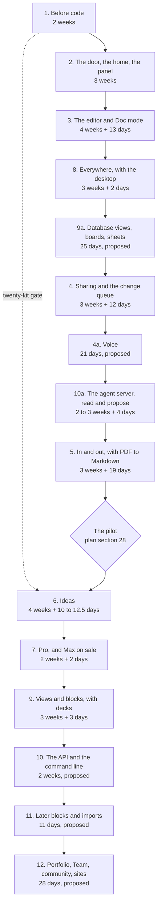

# 50. Roadmap

**What this file is.** The order the work happens in, as fifteen batches built one at a time.

Each batch names what it contains, what it waits on, its appetite, and the internal gate it must
pass before the next batch starts.

**What it is not.** A promise of dates. An appetite is a fixed amount of time with variable scope,
not an estimate with variable time.

**Why it changed on 18 September, twice, and again on 19 September.**

- The founder answered D02 `[Z]`: build everything, every phase including those the default left in
  Later, one batch at a time, each built, used, tested and fixed before the next starts.
- Later the same day he answered D04 to D14 `[Z]`. Three of those answers move work earlier: D09,
  D13 and D04. Section 2.2 says what moved and why.
- On 18 and 19 September he asked for Sheets, Boards, one platform for every type, a widened voice
  feature and PDF to Markdown `[Z]`. Section 2.3 places each, with a proposed appetite.

**Where it comes from.**

- `docs/mvp0/PRODUCT-PLAN.md` section 26 for the phases and appetites.
- `docs/mvp0/PRODUCT-PLAN.md` section 28 for the pilot and its stop lines.
- `docs/pack/56-OPEN-DECISIONS.md` section 0 for the founder's answers of 18 and 19 September.
- `68-SHEETS-SPEC.md`, `69-BOARDS-SPEC.md`, `70-PLATFORM-AND-TYPES.md`, `71-VOICE-SPEC.md` and
  `72-PDF-TO-MARKDOWN-SPEC.md` for the new features, and
  `docs/research/2026-09-18-sheets-boards/ONE-PLATFORM.md` section 4 for their build order.
- `docs/mvp0/SCREEN-CHANGES-2026-09-18.md` for the founders' screen review of the same day.
- `10-FEATURE-REGISTER.md` for feature ids, `19-ACCEPTANCE-CRITERIA.md` for criterion ids.

---

## 1. The short answer

**Everything takes longer than the old default, and says so here.** The old default built five
phases in about 60 to 79 calendar weeks.

Building all of it, one batch at a time, is **about 201 to 296 calendar weeks** for the twelve
batches that now have an appetite.

**That is 67 to 87 weeks more than the 134 to 209 of 18 September.** The 19 September features add
79 proposed working days to priced batches, and two use windows. Section 5.8 shows the sum.

**On 19 September the last three batches took proposed appetites**: 10, 11 and 12, at 10, 11 and
28 days. With them, **everything asked for takes about 245 to 352 calendar weeks**, 4.7 to 6.8 years
at the measured pace. Section 5.5 shows the sum.

**At the measured pace the twelve batches priced before that are roughly 3.9 to 5.7 years**, before
the thirty days of content writing. Section 5 shows every step of the arithmetic.

**The calendar itself is a founder question**, section 5.9: accept it, raise the weekly pace, or move
named work to after launch. Each option is computed there.

---

## 2. The batches, in order

**Batch numbers are ids, not positions.** Other files in this pack cite "batch 8" and "batch 10",
so the numbers stay put and the run order changes, per `65-CONVENTIONS.md` section 1, rule 3.

Three batches are new and take a suffix letter: **9a** for database views, **10a** for the agent
server, and **4a** for voice. Read the `Step` column for the order.



Step | Batch | Name | Old phase | Plan appetite | 18 Sep additions | 19 Sep additions, proposed | Depends on
1 | 1 | Before code | 0 | 2 weeks | none | none | nothing
2 | 2 | The door, the home and the panel | A | 3 weeks | none | none | 1
3 | 3 | The editor and Doc mode | B | 4 weeks | 11 days | 2 days, the type registry | 2
4 | 8 | Everywhere, with the desktop | F | 3 weeks | 2 days | none | 3
5 | 9a | Database views, boards and sheets | none, new | unset | none | 25 days: views and boards 15, sheets 10 | 3
6 | 4 | Sharing and the change queue | D | 3 weeks | 7 days | 5 days, embeds and cross-type search | 3
7 | 4a | Voice | none, new | none | none | 21 days | 3, 4, 8
8 | 10a | The agent server, read and propose | Later | 2 to 3 weeks, from D04 | 2 days | 2 days, every type | 4
9 | 5 | In and out | E | 3 weeks | none | 19 days: every type mirrored 3, PDF to Markdown 16 | 3, and 4 for the queue
gate | The pilot | Twenty people outside the studio | none | at least 2 weeks | none | none | every step before it
10 | 6 | Ideas | C | 4 weeks | 10 to 12.5 days | a board from a blueprint, inside the appetite | 3, the kit gate from 1, the pilot
11 | 7 | Pro, and Max on sale | H | 2 weeks | none | 2 days, the PDF vision pass | 2, 4, 6, 10a
12 | 9 | Views and blocks | G | 3 weeks | none | 3 days, decks | 3
13 | 10 | The API and the command line | Later | unset; 2 weeks proposed on 19 Sep | none | none | 10a
14 | 11 | Later blocks and imports | Later | unset; 2 weeks proposed on 19 Sep | none | 1 day, a chart reading a sheet | 5, 9
15 | 12 | Portfolio, Team and community | Later | unset; 3 weeks proposed on 19 Sep | none | 13 days: sites 10, the slide player 3 | 4, 7
after 15 | none | Canvas | none | unset | none | unset | 12

**The pilot's two weeks come from the plan, not from here.** Section 28 measures "active in week
two", so the pilot cannot read out in less than two weeks.

**The 18 September additions are not the plan's.** They are carried from the previous revision of
this file, which itemised the screen review and the research round. **They are appetites, a budget
we set, not measurements.** Section 5.2.

**Batch 10a's two to three weeks are not the plan's either.** They are the cost this pack gave the
read-and-propose option in `56-OPEN-DECISIONS.md` section 3, D04, which the founder chose `[Z]`.

### 2.1 Why this order and not the phase letters

The old spine let C, D, E, F and G run in parallel after B. D02 removes the parallelism, so an
order has to be chosen. Each choice below names its reason.

Choice | Reason
F straight after B | D09 answered `[Z]`: desktop early, alongside the web editor, not after sync
9a straight after F | D13 answered `[Z]`: database views over front matter built early, not deferred
D after 9a | The change queue is one of the three load-bearing ideas; the old default built D ahead of C
4a straight after D | Voice lands its text as queue proposals, so it waits for batch 4's queue; section 2.3
10a after 4a | D04 answered `[Z]`. The option chosen was read and propose in phase D; an agent proposal is a queue item with a different `source`, so it waits only on the queue
E before the pilot | The pilot's scripted step 2 is "Import a vault", and ten of twenty recruits are Obsidian users with 200 files or more. Plan section 28. PDF to Markdown rides with it, section 2.3
The pilot before C and H | Section 28 says "All three justify phase C and the Pro build"
C before H | Medium and High depth are Pro rows, so Pro cannot ship without them
H before G | Nothing left in G is on the pilot's path, and nothing else waits on G
The rest of Later last | The plan never costs it, so it cannot be scheduled with a date

`INFERENCE:` "alongside the web editor" is read as the batch straight after the editor, because D02
allows one batch at a time. Running the desktop inside batch 3 would break D02's gate.

`INFERENCE:` phase F moves whole, offline and phone included, because the plan prices F as one
3-week appetite. Splitting it would need a number nobody has.

**Phase F stays whole**, `resolved (proposed 19 Sep, founder review)`. Rejected: moving only the
desktop to step 4 and leaving offline and the phone at step 8, which would need two new appetites
carved out of one with no evidence for the split.

### 2.2 What moved on 18 September, and why

**The step numbers in this table are those of 18 September.** Section 2.3 inserted batch 4a at step 7,
so every step from 7 onward is now one higher. The batch numbers did not change.

Move | From | To | Why
Batch 8, Everywhere | Step 8, after sync | Step 4, after the editor | D09 `[Z]`
The signed Windows build | Batch 11 | Batch 8 | D09 `[Z]`: the certificate "is now needed sooner"
Pricing the Windows certificate | Nowhere | Batch 1 | An unpriced requirement at step 4 is a surprise. Prices found are in `35-RELEASE-AND-VERSIONING.md` section 6.2a
Database views over front matter | "One thing that waits", plan section 8 | New batch 9a, step 5 | D13 `[Z]`
The agent server, the agents card, `wait_for_change` | Batch 10, Later | New batch 10a, step 7 | D04 `[Z]`
The Max tier going on sale | Batch 10 | Batch 7 | Checkout is built in batch 7, and D04 makes the server the Max tier
Batch 10 | Agents and Max | The API and the command line | What is left after 10a
Batch 9 | Step 9 | Step 11 | Nothing in it is needed sooner

**What did not move but is now decided.**

- **D06 `[Z]`:** the 2-day stamp of `verified: [{by, at}]` on accept stays in batch 4, now decided
  rather than proposed.
- **D12 `[Z]`:** editing through a link needs the one-tap sign-in, and reading needs nothing. Batch
  4, no appetite added. `INFERENCE:` it reuses batch 2's sign-in.
- **D14 `[Z]`:** voice typing stays in Doc mode, batch 3, as the plan's section 7 table already
  lists it. No appetite added.
- **Superseded on 19 September** by the widened voice feature, which section 2.3 places in its own
  batch, 4a.

**The cost of moving work forward.** The pilot, the first stranger, started later. Section 5.6 put
it at about 107 to 143 calendar weeks in, against about 81 to 104 before. Section 2.3 moves it again.

### 2.3 What was added on 19 September, and where it sits

**The asks, `[Z]`**, from `56-OPEN-DECISIONS.md` section 0:

- Sheets and Boards, bare-bone, alongside documents, on one platform joining docs, sheets, boards,
  notes and sites, with presentations later.
- Voice typing widened into a full feature: restructuring levels, a tone, a raw setting and a
  command mode, English only.
- PDF to Markdown, a converter with three ways in, and text recognition (OCR) for scanned pages.

**Every appetite in this section is proposed**, `resolved (proposed 19 Sep, founder review)`. An
appetite is a budget we choose, not an estimate, and none of these has met anybody building anything.

**Where the order comes from.** The types follow `ONE-PLATFORM.md` section 4.2, carried into
`70-PLATFORM-AND-TYPES.md` section 14. Voice and PDF have no placement in any source, so this file
proposes one and says why.

What | Batch, step | Proposed appetite | Where the number comes from | Why here
The type registry, note and doc; the `.md` checks become one lookup | 3, step 3 | 2 days | `70` section 14 | The cheapest moment to remove a hard-coded extension, before more batches add checks
Database views: `view: 1`, `fm-view@1`, table layout | 9a, step 5 | 15 days, with boards | `70` section 14 | D13 `[Z]` already put views here
Boards: a board file over a folder of card files, one key per move | 9a, step 5 | inside the 15 | `70` section 14; `69` section 8 | A board is the batch 9a table, grouped by a key (`69` section 1)
Sheets v1: the grid, `fm-sheet@1`, `.csv`, `locate()` for a field, ragged-row refusal | 9a, step 5 | 10 days | `70` section 14 | The grid exists by now, so a sheet is a parser and a locator
`fm-embed@1`, the seven embed rules, backlinks and search across types | 4, step 6 | 5 days | `70` section 14 | The embed rules are queue and permission rules, built in this batch
Voice v1, all of `71-VOICE-SPEC.md` | 4a, step 7 | 21 days | This file, section 3.7a | Its proposals need batch 4's queue; its desktop default needs batch 8
`read`, `read_view` and `propose` for every registered type | 10a, step 8 | 2 days | `70` section 14 | The registry does the work; the server only exposes it
The mirror carries every text type; `.csv` and `.xlsx` import as proposals | 5, step 9 | 3 days | `70` section 14 | `67` section 7.1 is rewritten before strangers mirror anything
PDF to Markdown: both device chains, the three entry points, the desktop's Tesseract | 5, step 9 | 16 days | This file, section 3.8 | Entry 3 is an Import source on S22, which this batch builds
A board from a blueprint | 6, step 10 | inside the batch's appetite, section 3.10 | `69` section 6 | It reads the kit that batch 6 builds
The PDF vision pass, Pro only | 7, step 11 | 2 days | This file, section 3.11 | It is a Pro row, and Pro ships here
Decks: `slides: 1`, speaker view, PDF, on `F182` | 9, step 12 | 3 days | `70` section 14 | `F182` is already here
A chart reading a sheet by path; `F184` becomes the read-only Kanban view | 11, step 14 | 1 day | `70` section 14; `69` section 7 | Board files came first, in 9a
Sites, and the published slide player | 12, step 15 | 10 and 3 days | `70` section 14 | The custom domain is already here
Canvas, JSON Canvas 1.0 | after 15 | unset | `70` section 14 | Not in the founder's list

**The day counts for the types are not ours.** They are `ONE-PLATFORM.md` section 4.2's, re-derived
in `70-PLATFORM-AND-TYPES.md` section 14.

The voice and PDF counts are this file's, itemised in
sections 3.7a, 3.8 and 3.11 so each can be cut on its own.

**Why voice left batch 3.** `INFERENCE:` D14 kept it in batch 3 while it was one row of Doc mode. The
widened feature lands restructured dictation and every command as queue proposals (`71` section 8).

- A walked-away proposal appears on S20, which batch 4 builds.
- The desktop defaults to local speech recognition (`71` section 1, V5), and the desktop is batch 8.
- So step 7 is the first point where everything voice needs exists.
- Putting 21 days into batch 3 would also make the editor's gate wait on a speech test bench.

**Why PDF to Markdown sits in batch 5 whole.** `INFERENCE:` entry 3 is a seventh source card on S22,
the Import screen batch 5 builds (`72` section 4).

Entries 1 and 2 need only S04 and S06, which exist by then. So one batch ships all three doors at
once, as the founder described them.

**What the pilot now meets.** `INFERENCE:` boards, sheets, voice and PDF to Markdown sit before the
pilot, and the plan's section 28 script uses none of them.

Moving 4a after the pilot is the cheapest way
to start it sooner, section 5.8.

---

## 3. Each batch in full

Every batch lists its feature ids from `10-FEATURE-REGISTER.md`, its screens, its appetite, and its
internal acceptance gate. **They are listed in run order**, not in number order.

### 3.0 The gate every batch shares

**These hold for every batch from 2 onward, and a batch-specific gate adds to them.**

Check | How it is run
The build is green | `npm run verify`, which runs typecheck, lint, test, build, arch and spec
The contract gate is clean | `npm run spec` reports 0 errors
The engine has not moved a byte | `npm run corpus` exits 0
The batch's criteria pass | Every `A` id named in the batch's row passes, or is marked `Not yet checkable` in `19-ACCEPTANCE-CRITERIA.md` with its reason
No serious defect is open | Zero `CRITICAL` and zero `HIGH` defects open against the batch, severity per `65-CONVENTIONS.md` section 7
The founders used it | Both founders, Sagnik and Amit, did their own real work in the batch for the use window below

**The use window is a proposal, not the plan's**, `resolved (proposed 19 Sep, founder review)`.
`INFERENCE:` it is one seven-day window in which each founder uses the batch on at least two distinct
days. Rejected: a two-week window, which adds a week to every batch, section 7.

That borrows the plan's own definition of an active user from section 28.

**Fixing sits inside the appetite.** `INFERENCE:` the appetite is fixed time with variable scope,
so the fixes found in the use window come out of the batch's own weeks.

If they do not fit, scope is cut, and the cut is written down.

**The founder can change the window.** Each extra week per batch adds fourteen calendar weeks, one
for each batch after batch 1 with an appetite: 2, 3, 4, 4a, 5, 6, 7, 8, 9, 9a, 10a, 10, 11 and 12.

Batch 1 has nothing to use.

### 3.1 Step 1. Batch 1, before code. 2 weeks

Old phase 0. Nothing is built for a user, so the gate is a checklist, not a use window.

What | Feature or source
The legal floor's first rows | `54-COMPLIANCE-AND-LEGAL.md`
Every account moved to the company, before the first stranger's document | D10, answered `[Z]`, and `docs/mvp0/PRODUCT-PLAN.md` section 24
The four public pages written: privacy, terms, pricing, refunds | `F104`
The pace published every Friday | So the measured pace stays measured
The `GITHUB_REPO` default fixed | It points at a sibling project's vault today
The format specifications drafted | `docs/mvp0/PRODUCT-PLAN.md` section 20
Twenty blueprints made by hand, for twenty people outside the studio | The start of the twenty-kit gate on batch 6
**The Windows signing route chosen and priced** | D09 `[Z]`. The options and prices are in `35-RELEASE-AND-VERSIONING.md` section 6.2a

**Screens:** none. **Depends on:** nothing.

**Internal gate.**

- Every account in plan section 24 shows the company as owner, checked by a founder in each console.
- The four public pages answer 200 signed out: `A004`, `A005`.
- The twenty kits are delivered. Their result is read later, at batch 6, not here.
- A Windows signing route is chosen and its yearly cost written into `35-RELEASE-AND-VERSIONING.md`.
  Buying it is a founder's paid action, not an agent's.

### 3.2 Step 2. Batch 2, the door, the home and the panel. 3 weeks

Old phase A. **This is the batch the storage answer can change**, section 6.1.

What | Feature ids | Screens
Sign-in, the no-friction promise | `F101`, `F102`, `F103` | S01
Home, first run and returning, with its tabs | `F105`, `F106`, `F107` | S02, S03
Account settings | `F108` | S28
The entitlements layer, the usage ledger, meters, over the cap, safe downgrade | `F257`, `F258`, `F259`, `F260`, `F261` | S29, S33
Plans side by side, without checkout | `F265` | S29
The configuration panel, with hardcoded defaults | `F266` to `F275` | S35, S36, S37, S38
`firestore.rules` from prototype to product | none | none
The local drafts migrated off the legacy `sgnk-md` keys | none | none
Firestore and R2 adapters | none | none

**Depends on:** batch 1, for the Blaze billing account and the moved domain.

**Internal gate.**

- **Use:** both founders sign in with each provider, on a phone and a desktop, and change one limit,
  one routing cell and one flag in the panel, then see the change take effect.
- **Criteria:** `A001` to `A008`, `A140` to `A151`, `A505` to `A525`, `A642`, `A663` to `A672`,
  `A695` to `A698`, `A705` to `A725`.
- **Spec lanes:** `auth/sign-in`, `auth/session`, `app-shell/home`, `app-shell/settings`,
  `entitlements/limits-for`, `config/panel`, `data/firestore-rules`, `data/storage-adapters` and
  `drafts/legacy-migration`, each `draft` in `specs/` and indexed in `specs/SPECS.md`.

### 3.3 Step 3. Batch 3, the editor and Doc mode. 4 weeks plus 13 days

Old phase B. The largest single batch in the plan.

What | Feature ids | Screens
Markdown mode, the views, toolbar, tabs, tree, rail, links, search and the rest of the workspace | `F111`, `F113`, `F114`, `F116`, `F117`, `F118`, `F122` to `F134`, `F138`, `F139`, `F142` to `F147` | S04, S05
Doc mode, with the 20 lossless and 15 partial features of plan section 7, and font controls | `F112`, `F115` | S05
The type registry with two entries, note and doc; the three hard-coded `.md` checks become one lookup | none yet, `new:type-registry` in `70` section 16 | none
The AI box and menu on the free chain, with the breaker and the unavailable state | `F150`, `F151`, `F152`, `F154` to `F159`, `F161` | S06, S07, S32
Bring your own key, if the plan's question 10 says so | `F164` | S28, S37
Problems, the formatter and the checks | `F140`, `F141`, `F148`, `F165` to `F170` | S10
The instruction-file set, rebuilt from the one-file panel | `F171`, `F172`, `F173` | S11
The engine: splice-only writing, the two refusals, the projection law, with the two measured defects and the audit's third fixed | `F276`, `F277`, `F278`, `F279` | every editing screen
The `--ai` token and the code face in `globals.css` | none | none

**Voice typing left this batch on 19 September.** The widened feature is batch 4a, step 7, section
3.7a. The plan's section 7 row "Translate, voice typing" keeps translate here.

**The 11 days added on 18 September**, an appetite, `resolved (proposed 18 Sep, founder review)`.

Item | Days | Source
The workspace rearranged | 3 | `docs/mvp0/SCREEN-CHANGES-2026-09-18.md:31` to `:47`
The AI box made unambiguous, with a pinned context line | 2 | `docs/mvp0/SCREEN-CHANGES-2026-09-18.md:57` to `:63`
Font controls in Doc mode | 1 | `docs/mvp0/SCREEN-CHANGES-2026-09-18.md:52`
Human and AI toggles wherever the two mix | 2 | `docs/mvp0/SCREEN-CHANGES-2026-09-18.md:296`
S11 rebuilt as the whole instruction-file set | 3 | `docs/mvp0/SCREEN-CHANGES-2026-09-18.md:303`

**The 2 days added on 19 September**, proposed: the type registry, `70-PLATFORM-AND-TYPES.md`
section 2. The day count is `ONE-PLATFORM.md` section 4.2's.

**Depends on:** batch 2, for `limitsFor(account)`, the ledger and the adapters. Every AI call
decrements a ledger that does not exist until batch 2.

**Internal gate.**

- **Use:** both founders write their own working documents in the product, in both modes, and run
  AI edits against them, accepting some and rejecting some.
- **Criteria:** `A010` to `A024`, `A030` to `A043`, `A050` to `A064`, `A070` to `A075`, `A200` to `A204`, `A500`,
  `A501`, `A504`, `A526` to `A553`, `A569` to `A582`, `A686` to `A694`.
- `A500`, `A501` and `A504` are the differentiation criteria. **Each needs its red proof before it
  counts**, per `AGENTS.md` section 0.
- **The registry changes nothing visible.** Its criterion, still to be written: `npm run corpus`
  stays at changed 0 and the snapshot's file count is unchanged (`70` section 16).

### 3.4 Step 4. Batch 8, everywhere, with the desktop. 3 weeks plus 2 days

Old phase F. **Moved from step 8 to step 4 by D09** `[Z]`: desktop early, alongside the web editor,
not after sync.

What | Feature ids | Screens
The desktop app, the watched folder, macOS signing at 99 US dollars a year | `F250`, `F251`, `F252` | S25
**A signed Windows build**, moved in from batch 11 | inside `F252` | S25
A local model on the desktop | `F163` | S24, S25
Offline in the browser, the banner, never the only copy | `F247`, `F248`, `F249` | S24
The phone layout and the bottom bar | `F253`, `F254` | every phone panel
The progressive web app and the protocol handler | `F255`, `F256` | S18, S22, S25, S26
Quick capture | `F149` | S26
Dark mode | `F109` | S27

**The 2 days added on 18 September**, an appetite, `resolved (proposed 18 Sep, founder review)`: phone views given the desktop theme treatment,
`docs/mvp0/SCREEN-CHANGES-2026-09-18.md:19`.

**The Windows build has no appetite of its own.** The plan's 3 weeks for phase F priced macOS signing
and left Windows in Later.

**It sits inside batch 8's appetite**, `resolved (proposed 19 Sep, founder review)`. The appetite is
fixed and the scope varies, so if Windows does not fit, it is the first thing cut. Batch 8 then ships
macOS, and Windows stays "coming", as section 7's last Windows row already allows.

- Rejected: a new number of days for Windows, which nothing in the corpus supports.
- `UNVERIFIED:` the extra work of a Windows signing step in CI. needs: the signing route chosen in
  batch 1, since the vendor's key storage decides what the CI step does.

**Depends on:** batch 3 for the editor and for the change queue's first form. **It no longer waits
on batch 5.**

**What the desktop cannot do yet, at this step.** `INFERENCE:` each gap closes when its batch lands.

Gap | Closes at
No sharing, links or published pages from the desktop | Batch 4, step 6
No voice, and no local Whisper | Batch 4a, step 7
No agent proposals from outside the watched folder | Batch 10a, step 8
No mirror to the person's GitHub or Drive, and no PDF conversion | Batch 5, step 9

**The watched folder at this step.** `INFERENCE:` an agent editing a file on disk feeds the change
queue in the first form batch 3 builds. Batch 4 later gives that queue its full form without
changing the watched folder's contract.

**Internal gate.**

- **Use:** each founder works a full day offline in the browser and a full day in the desktop app on
  macOS, installs the signed Windows build on one Windows machine, and captures from a phone.
- **Criteria:** `A130` to `A135`, `A639` to `A641`, `A643` to `A662`.
- `A645` and `A646` cover desktop signing, and **neither names Windows** `[O]`. `A645` is an update
  whose signature does not verify; `A646` is the platform rows on S25. So a Windows criterion is
  written in this batch, `grep -n -i windows docs/pack/19-ACCEPTANCE-CRITERIA.md` having returned
  nothing on 19 September.

### 3.5 Step 5. Batch 9a, database views, boards and sheets. 25 days, proposed

New. **D13 `[Z]`: build database views over front matter early, not deferred.** The plan's
section 8 had them as "one thing that waits", because they have no open renderer.

On 19 September
the founder's Sheets and Boards `[Z]` joined them here, per `70-PLATFORM-AND-TYPES.md` section 14.

What | Feature ids | Spec
A view file, `view: 1`, and the `fm-view@1` fence | none yet, `new:database-view` | `70` section 3.1
A table view whose rows are files and whose columns are front matter keys, with filter and sort | none yet, `new:database-view-table` | `70` section 3.1; `68` section 9, SH16
An edit in a cell written back as a splice into that file's front matter | none yet | `70` section 3.1
**Boards**: a board file naming a folder of card files; a move changes one key in one card | none yet, `new:board` and the rows of `69` section 10 | `69` sections 2, 3 and 8
Proposed moves from an agent drawn on the board, decided in place | none yet, `new:board-pending-moves` | `69` section 5
**Sheets v1**: the grid over any GitHub-flavoured markdown table, `fm-sheet@1`, `.csv` and `.tsv` in the registry, `locate()` for a field, RFC 4180 re-quoting, ragged-row refusal | none yet, `new:sheet-grid` and the rows of `68` section 11 | `68` sections 2 to 5 and 9

**The 25 days, proposed**, `ONE-PLATFORM.md` section 4.2 as re-derived in `70` section 14:

Item | Days
Views, `fm-view@1`, table and board layouts, cell edits spliced into front matter | 15
Sheets v1 | 10

**This fills an appetite the roadmap left unset**, so the 25 days are new to every total, not
added to an old one.

`INFERENCE:` the 15 days were written for a board as a view layout.
`69-BOARDS-SPEC.md` since made the board a folder of card files, and nobody has re-costed it.

**The 15 days stand**, `resolved (proposed 19 Sep, founder review)`. `70-PLATFORM-AND-TYPES.md`
section 3.2 makes a board file a view with its query fixed, drawn by the one renderer.

- The view no longer offers `layout: board`, so the work the estimate gave that layout now reads a
  folder instead.
- `INFERENCE:` the swap is roughly even. If it is not, boards' pending moves, `F305`, are cut first.
- Rejected: adding days before anybody has built the view, which would be a guess on a guess.

**The rule this batch must keep.** Every view, board and sheet is a projection of the files on disk,
per the projection law, and holds no state of its own.

A cell edit or a card move is a splice that can refuse like any other.

**No open renderer exists**, per plan section 8, so the view is built, as the kanban and chart
blocks are. `INFERENCE:` like those, it may copy the shape of a plugin but none of its code.

**Screens:** S39, Sheet, and S40, Board, both `specified`.

**Depends on:** batch 3, for the front matter parser, the splicer, the block contract and the type
registry.

**Internal gate.**

- **Use:** each founder builds one view over a real folder of their own and edits a value from it,
  then checks the file on disk changed only in that key.
- **Boards:** each founder runs one real project from a board for a week. Every card move changes one
  key in one file, checked by byte diff (`ONE-PLATFORM.md` section 4.3).
- **Sheets:** each founder keeps one real ledger as a `.csv` for a week. A cell edit changes only that
  field's bytes; a ragged record refuses.
- **Criteria:** none exist yet. **Writing them, and feature ids in `10-FEATURE-REGISTER.md`, is the
  batch's first task.**

### 3.6 Step 6. Batch 4, sharing and the change queue. 3 weeks plus 12 days

Old phase D.

What | Feature ids | Screens
Roles and permissions | `F110` | S17, S20
People, invites and invite credits, the referral modal | `F208` to `F211` | S17
Read and edit links, with expiry. **Editing through a link needs the one-tap sign-in; reading needs nothing**, D12 `[Z]` | `F212`, `F213` | S17
Published pages with the markdown twin, `llms.txt`, the open-in bar, the branding line and the footer | `F215` to `F220` | S18
Live collaboration, and one collaborator on Free | `F221`, `F222` | S19
The change queue, people and machines split, bounded Accept all, highlighted spans | `F223` to `F226` | S20
History, diff and restore, and the history window | `F227`, `F228`, `F229` | S21
Mark AI text | `F162` | S21, S28
The conflict screen, with Let AI decide | `F231`, `F232`, `F233` | S31
No silent merge | `F280` | S20, S31
The Zed Delta rebuttal, written | none | none
`fm-embed@1` and the seven embed rules: an edit in an embed lands on the source file | none yet, `new:embed` | none yet
Backlinks and one search across every registered type | none yet, `new:cross-type-search`, `new:cross-type-backlinks` | none yet

**Live editing is in, not in Later.** D02 builds everything, so the plan's question 8 no longer
decides whether live editing is built. `INFERENCE:` it may still decide whether it waits for its
own batch.

**It stays in batch 4**, `resolved (proposed 19 Sep, founder review)`: phase D's appetite already
priced it. Rejected: a batch of its own, which adds a use window and prices nothing new.

**The 7 days added on 18 September**, an appetite, `resolved (proposed 18 Sep, founder review)`.

Item | Days | Source
Share by frontmatter address, with an invite that earns credits | 2 | `docs/mvp0/SCREEN-CHANGES-2026-09-18.md:136` to `:139`
The open-in bar, after first paint | 1 | `docs/mvp0/SCREEN-CHANGES-2026-09-18.md:322` to `:330`
Conflict gains Accept and Accept AI suggestions | 1 | `docs/mvp0/SCREEN-CHANGES-2026-09-18.md:201` to `:203`
Stamp `generated` and `verified` into front matter on accept. **Decided, D06 `[Z]`** | 2 | `docs/research/2026-09-18/raw/H-2026-launches.md:734`
Emit `llms.txt` beside every published page | 1 | `docs/research/2026-09-18/raw/H-2026-launches.md:351`

**The stamp, as D06 words it:** `verified: [{by, at}]` is written into front matter when a person
accepts a change.

It is a splice into front matter, never the per-span read state on the never-build list in
`51-PRODUCT-PLAN.md` section 5.1.

**The 5 days added on 19 September**, proposed: embeds, backlinks and search across types,
`70-PLATFORM-AND-TYPES.md` sections 4 to 6. The day count is `ONE-PLATFORM.md` section 4.2's.

`INFERENCE:` a published sheet (`68` section 6.3) belongs here with publishing, and no source costs
it.

**It sits inside this batch's appetite**, `resolved (proposed 19 Sep, founder review)`. A published
sheet is the published page's own HTML table plus a neutralised CSV download. If it does not fit, it
moves to batch 12 with sites. Rejected: a day count with no source.

**Depends on:** batch 3, for the change queue's first form and the version record.

**Internal gate.**

- **Use:** each founder shares a real document with the other, edits it live, publishes one page,
  and clears a queue that holds a person's edit, an AI edit and a conflict.
- **Sign in to edit:** one founder opens an edit link signed out and is asked to sign in first.
- **Embeds:** one real report embeds one real sheet. An edit in the embed lands as a queue item on
  the sheet; an unshared sheet shows a placeholder to a reader.
- **Criteria:** `A100` to `A115`, `A128`, `A129`, `A502`, `A503`, `A609` to `A630`, `A680` to `A685`.

### 3.7a Step 7. Batch 4a, voice. 21 days, proposed

New on 19 September. **D14 widened `[Z]`:** free speech-to-text APIs, English only; transcripts
restructured automatically, with a raw setting; levels low, medium and high, plus a tone; a command
mode that tells dictation from an instruction by context.

The contract is `71-VOICE-SPEC.md`.

**Nothing of it exists.** `71` records that `grep` for voice code in `src` returned nothing.

What | Feature ids | Screens
A test bench of fifty clips before any button, `flag.voice` off until it has run | none | none
Recording in memory, hold and hands-free on `Cmd/Ctrl + .`, silence trimmed on the device | none yet, `new:voice-dictation` | S41, S05
The speech chain through the one router, and the four `/api/voice/*` routes | none yet | none
Restructuring at three levels with a tone, the checks that refuse, the raw setting | none yet, `new:voice-restructure` | S41
Restructured text as a pending insertion, a real queue proposal, `Tab` to accept | none yet | S41, S20
Command detection, three stages, and the ten commands of v1 | none yet, `new:voice-commands` | S41
The Voice settings group, the fourteen failure states, the phone's Command chip | none yet | S28, S41
Local Whisper on the desktop, `small.en` downloaded on first use | none yet, `new:voice-desktop-local` | S25, S41

**The 21 days, proposed by this file.** `71` sets no appetite and neither does its research. Each
row is a budget sized to the spec section it builds, so each can be cut on its own.

Item | Days | Spec section of `71`
The test bench: word error, latency, check failures, classifier agreement | 2 | 15
Recording, keys, both modes, the transcribe route, the speech chain, the caps | 5 | 2, 3, 6, 12
Restructuring: levels, tone, prompts, checks, the raw setting | 4 | 4, 5
The pending insertion and its proposal fields | 2 | 8
Commands: the rule, the classifier, ten commands, targets and refusals | 4 | 7
Settings, failure states and the phone | 2 | 9, 10.2, 11
The desktop's local engine | 2 | 10.3

```text
2 + 5 + 4 + 2 + 4 + 2 + 2 = 21 days
```

`INFERENCE:` the rows are sized against items this file already carries: the S11 rebuild at 3 days
and sheets v1 at 10. Nobody has built any of it, so the total is a budget, not a forecast.

**Cut first, if the batch runs over.** `INFERENCE:` commands, 4 days. Dictation with restructuring
stands without them, and the founder's ask names command mode last.

**Depends on:** batch 3 for the router, the ledger and the AI edit call; batch 4 for the queue a
proposal lands in and S20 where a walked-away one appears; batch 8 for the desktop.

**Internal gate.**

- **Bench:** the section 15 bench has run on the founders' own clips, and its numbers set the chain
  order, the timeouts and the check thresholds. The clips never enter the repository.
- **Use:** each founder dictates a real document at each level for a week, accepts and rejects
  pending insertions, runs commands, and dictates once on the desktop with the network off.
- **Criteria:** none exist yet. `71` section 17.4 lists them: one per check with its red proof, one
  per failure state, "audio never reaches disk", and "no voice log line holds text".

### 3.7 Step 8. Batch 10a, the agent server, read and propose. 2 to 3 weeks plus 4 days

New, split from batch 10. **D04 `[Z]`: the MCP server reads and proposes, never writes, and is the
Max tier.**

What | Feature ids | Screens
The Model Context Protocol server: read the vault, propose changes into the queue, never write | none yet | none yet
Agent tokens, propose scope, staleness anchors, the multi-file reviewable change | none yet | S20
The agents card, no longer marked Later | `F246` | S23
A `wait_for_change` equivalent, so an agent parks instead of leaving | none yet | none
The meter for agent calls | events in `55-MEASUREMENT-AND-EVENTS.md` section 6.13 | S29
`read`, `read_view` and `propose` answer for every registered type | none yet | none

**The appetite.** Two to three weeks is the cost of the read-and-propose option in
`56-OPEN-DECISIONS.md` section 3, D04. The 2 days for `wait_for_change` come from
`docs/research/2026-09-18/raw/Z2-position-taken.md`, carried from batch 10.

**The 2 days added on 19 September**, proposed: every type through the server,
`70-PLATFORM-AND-TYPES.md` section 10. The day count is `ONE-PLATFORM.md` section 4.2's.

**Why it is cheaper than it looks.** An agent proposal is a queue item with a different `source`,
per D04's first reason. Most of the work is batch 4's.

**It needs a meter before it needs a price.** Every Max call is our compute and egress, on a
schedule nobody watches. The meter ships here; the price ships in batch 7.

**Depends on:** batch 4 for the queue an agent proposes into.

**Internal gate.**

- **Use:** each founder points their own coding agent at a project through the server, and reviews
  and accepts or rejects its proposals in the queue. The agent never writes a byte directly.
- **Across types:** each founder's agent proposes one change spanning a document and a sheet. It
  arrives as two items, grouped, decided one at a time.
- **Criteria:** `A638` for the agents card. **No criterion exists for the server**, and writing
  them is the batch's first task. `F246`'s register row still says Later and needs updating.

### 3.8 Step 9. Batch 5, in and out, with PDF to Markdown. 3 weeks plus 19 days

Old phase E.

What | Feature ids | Screens
Drop anywhere, and drop a folder | `F121`, `F234` | S04, S22
Obsidian, Notion, Google Docs and Word import, with the progress panel | `F235` to `F239` | S22
Export, and export of the whole project | `F240`, `F241` | S04, S28
The GitHub App, and its push quota | `F242`, `F243` | S23
Google Drive sync at a five-minute poll | `F244` | S23
The connections screen | `F245` | S23
The mirror carries every registered text type; `.csv` and `.xlsx` import as proposals into sheets | none yet | S22, S23
**PDF to Markdown**, the three entry points, the text and scanned chains, the preview and its report | none yet, `new:pdf-convert-text`, `new:pdf-convert-ocr` and the entry rows of `72` section 14.4 | S42, S04, S06, S22
Native Tesseract on the desktop, bundled with English data | none yet | S25

**The 3 days for the mirror**, proposed, are `ONE-PLATFORM.md` section 4.2's, re-derived in
`70-PLATFORM-AND-TYPES.md` section 14.

**PDF to Markdown, 16 days, proposed by this file.** `72-PDF-TO-MARKDOWN-SPEC.md` sets no appetite
and neither does its research. Each row is sized to the spec section it builds.

Item | Days | Spec section of `72`
The fixture bench, each escape fixture failing first | 2 | 13
The text chain: `unpdf`, page classification, headings, blocks, the writer, the escaper, running furniture, the format gate | 5 | 3.1, 3.2, 5
The scanned chain: `tesseract.js` in a worker, self-hosted, per-word confidence | 2 | 3.3
The preview with its report, and the progress sheet | 2 | 6
The three entry points and the attribution fields | 3 | 4
The desktop's native Tesseract command, and bundling it | 2 | 3.3

```text
2 + 5 + 2 + 2 + 3 + 2 = 16 days
```

`INFERENCE:` the scanned chain shares its `OcrEngine` port with `F146` (`72` section 1.2). If `F146`
has landed by then, that row shrinks. The Pro vision pass is batch 7, section 3.11.

**Depends on:** batch 3 for the engine, and batch 4 so an inbound change enters the queue rather
than overwriting.

**Internal gate.**

- **Use:** each founder imports a real vault of their own, connects a GitHub repository and a Drive
  folder, and edits the same file from both sides, one of them from the desktop app.
- **Mirror:** one vault with a sheet mirrors to GitHub and to Drive. The mirrored `.csv` is
  byte-identical to R2's head.
- **PDF:** the section 13 fixtures of `72` pass, and each founder converts one real text PDF and one
  real scan through each of the three doors.
- **Criteria:** `A023`, `A116`, `A120` to `A127`, `A631` to `A638`. The PDF and mirror criteria are
  listed in `72` section 14.4 and `70` section 16, and are not yet written.

### 3.9 The pilot. At least 2 weeks

Not a batch. A gate the world answers, and it can fail. `docs/mvp0/PRODUCT-PLAN.md` section 28.

- **Who:** twenty people. Ten Obsidian users, five founders and product people, five Google Docs
  writers.
- **Stop:** fewer than four of twenty active in week two; fewer than two of ten kit recipients run
  the kickoff; fewer than three of twenty name the problem unprompted.
- **Continue:** six of twenty active in week two; three of ten run the kickoff and edit the kit
  again; one person asks how to pay before being told the price.

**The stop lines and D02 disagree, and this file does not pick.** Section 28 says any one stop line
"stops the next phase". D02 says every phase is built. It is `needs founder`, because it decides
whether money keeps being spent after strangers say no.

- **Recommended: a failed stop line pauses the build**, for one meeting of both founders before
  batch 6 starts. They then continue, change the order, or stop. Nothing continues by default.
- Rejected in the recommendation: continuing whatever the pilot shows, which makes the pilot a
  ceremony, and stopping automatically, which D02 rules out.

`INFERENCE:` the pilot now meets a desktop app, database views and an agent server, which the plan's
section 28 did not script.

**The script does not grow**, `resolved (proposed 19 Sep, founder review)`. Its three stop lines
and three continue lines measure the core: people active in week two, the kickoff, the problem named.
Each pilot interview adds one question, which of the newer features the person used, unprompted.
Rejected: new scripted steps, which would measure features the stop lines do not read.

### 3.10 Step 10. Batch 6, ideas. 4 weeks plus 10 to 12.5 days

Old phase C.

What | Feature ids | Screens
Add idea, and ideas as a tree section | `F119`, `F120` | S04, S12
The ideas tab, depth selector, question set, branching rewrite, skip and recommend | `F188` to `F196` | S12, S13, S14
Pinned idea context in the AI box | `F153` | S06, S13
Industry templates, and attach to an idea | `F199`, `F200` | S12
The fifteen-file blueprint, consistency check, unlisted link, out-of-band hash, kickoff prompt, versions | `F201` to `F206` | S15
The ideas empty state | `F207` | S34
The map, rebuilt on save | `F186`, `F187` | S16
Make a board from a blueprint, as one grouped proposal of card files | none yet, `new:board-from-blueprint` | S15, S40

**The 10 to 12.5 days added on 18 September**, an appetite, `resolved (proposed 18 Sep, founder review)`, are one item: idea mode rebuilt as one
column with a dynamic question flow, 2 to 2.5 weeks. Source:
`docs/mvp0/SCREEN-CHANGES-2026-09-18.md:99` to `:124`.

**A board from a blueprint has no appetite of its own.** `69-BOARDS-SPEC.md` section 6 specifies it
and costs nothing.

`INFERENCE:` it is a model call over the kit plus a grouped `create` proposal, both of which
exist by this batch.

- **It sits inside this batch's appetite**, `resolved (proposed 19 Sep, founder review)`, and is cut
  first if the batch runs over. Rejected: a day count with no source.
- **Whether it spends a blueprint credit is `needs founder`**, because it is money (`69` section 6).
  Recommended: no extra credit.

**Depends on:** batch 3 for the AI box, the free chain and the breaker; batch 1 for the kit gate,
which D07 keeps `[Z]`; the pilot for its reading.

**Internal gate.**

- **Use:** each founder turns one real idea of their own into a blueprint at Low depth, and runs the
  kickoff prompt from it in their own agent.
- **Criteria:** `A080` to `A095`, `A583` to `A595`, `A598` to `A608`, `A699` to `A704`.

### 3.11 Step 11. Batch 7, Pro, and Max on sale. 2 weeks plus 2 days

Old phase H.

What | Feature ids | Screens
Claude routing for Pro, per plan section 14 | `F160` | S07, S36
Medium and High depth: decision cards and the research pass | `F197`, `F198` | S14
Password links | `F214` | S17, S18
Razorpay checkout, the mandate ceiling, top-ups | `F262`, `F263`, `F264` | S29
The 90-day history window switched on for Pro | `F229`, set in batch 4 | S21, S35
**The Max tier on sale**, the agent server of batch 10a behind it | none yet | S29
The PDF vision pass, Pro only, behind `flag.pdf.vision`, with its own fixture run | none yet, `new:pdf-convert-vision` | S42

**Max adds no appetite here.** `INFERENCE:` it is one more plan row on a checkout this batch already
builds, priced from the configuration panel like Pro. Its price is not set in this file.

**The Max price is already a founder item** from 18 September, in `51-PRODUCT-PLAN.md` section 7:
metered per agent request, its rate set from the panel when batch 10a measures the cost. Nothing new
is asked here.

**The 2 days for the vision pass, proposed by this file.** `72-PDF-TO-MARKDOWN-SPEC.md` sections 3.4
and 3.5 ask for one route through the model layer, a fixed prompt and a fallback to Tesseract.

The scan fixtures run through the model before the flag turns on.

`INFERENCE:` sized like the 2-day rows of
section 3.8, since the chain it falls back to is already built.

**Trial and dunning belong to D08**, which is answered but owned elsewhere. This file does not
restate them.

**Depends on:** batch 2 for the panel's prices, batch 4 for password links and history, batch 6
for Medium and High, batch 10a for what Max sells.

**Internal gate.**

- **Use:** each founder pays for Pro with their own card, runs one Medium and one High blueprint,
  upgrades to Max and runs their agent through it, and cancels. Under 15,000 rupees, one attempt on
  Indian cards.
- **Criteria:** `A057`, `A058`, `A059`, `A596`, `A597`, `A669` to `A672`, `A206`.
- `F262`, `F263` and `F264` have no criterion yet, and neither has Max. **Writing them is part of
  this batch.**

### 3.12 Step 12. Batch 9, views and blocks, with decks. 3 weeks plus 3 days

Old phase G.

What | Feature ids | Screens
Flow, slides, mind map and outline views | `F181`, `F182`, `F183`, `F185` | S09
Mermaid, KaTeX, callouts, details, code fences, Excalidraw | `F174` to `F179` | S08
Templates, daily notes and calendar, tasks | `F135`, `F136`, `F137` | S02, S04, S08

**Decks, 3 days, proposed**: `slides: 1`, a speaker view and PDF, on top of `F182`,
`70-PLATFORM-AND-TYPES.md` section 13. The day count is `ONE-PLATFORM.md` section 4.2's.

**Flow was deferred by the founders on 18 September** and stays in this batch. D02 builds it.

**Database views are no longer here.** D13 moved them to batch 9a, step 5.

**Depends on:** batch 3, for the block contract. Each block kind registers against the splicer.

**Internal gate.**

- **Use:** each founder presents one real document as slides and keeps a week of daily notes.
- **Decks:** each founder presents one real deck. The deck file needs no syntax a plain markdown
  reader cannot show.
- **Criteria:** `A044`, `A045`, `A046`, `A554` to `A568`.

### 3.13 Step 13. Batch 10, the API and the command line. 2 weeks, proposed

Was "Agents and Max". The server, the agents card, `wait_for_change` and Max moved to batches 10a
and 7. What is left is the plan's "API", and the command line D04's fourth option names.

What | Feature ids | Screens
The public API over the same ports as the server | none yet | none yet
The command line, a thin adapter over the same ports | none yet | none

**The appetite, 2 weeks**, `resolved (proposed 19 Sep, founder review)`. It is the plan's smallest
phase appetite, that of phases 0 and H, because both adapters are thin layers over ports batch 10a
already built. `INFERENCE:` a budget chosen, not an estimate.

- Cut first if it runs over: the command line, since the server already serves agents.
- Rejected: leaving it unset, which keeps every total a floor.

**Depends on:** batch 10a, whose ports both adapters reuse, per plan section 17's principle of a
capability surface.

**Internal gate.** Each founder drives one real project from the command line. **No criterion
exists yet**, and writing them is the batch's first task.

### 3.14 Step 14. Batch 11, later blocks and imports. 11 days, proposed

Was "Later blocks, imports and Windows". The Windows build moved to batch 8.

What | Feature ids | Screens
Kanban view of one document, **read-only** since `69-BOARDS-SPEC.md` section 7 | `F184` | S09
Chart from a table, and **a chart reading a sheet by path** | `F180` | S08
Notion import through its API | none yet | S22

**The 1 day, proposed**, is the chart reading a sheet: `fm-chart@1` with `table: <path>#<anchor>`,
`70-PLATFORM-AND-TYPES.md` section 4.3. The day count is `ONE-PLATFORM.md` section 4.2's.

**The rest, 2 weeks**, `resolved (proposed 19 Sep, founder review)`: the read-only Kanban view, the
chart from a table and Notion's API import. The plan's smallest phase appetite again, because the
first two are views over parts that exist, and Notion import extends batch 5's importer.

```text
1 day (a chart reading a sheet) + 10 days (the rest) = 11 days
```

- Cut first if it runs over: Notion's API import, since batch 5 already imports from Notion.
- Rejected: leaving it unset.

**Depends on:** batch 5 for import, batch 9 for the views, batch 9a for sheets.

**Internal gate.** Use as batches 5 and 9. `A044` covers kanban as a view. Nothing covers the rest
yet.

### 3.15 Step 15. Batch 12, portfolio, Team, community and sites. 28 days, proposed

What | Feature ids | Screens
The portfolio | `F230` | S30
The Team tier | none yet | none yet
The community | none yet | none yet
A custom domain | none yet | none yet
**Sites**: a folder with `site: 1`, navigation, a markdown twin per page | none yet, `new:site` | none yet
The published slide player | none yet | none yet

**The 13 days, proposed**: sites 10, the slide player 3, `70-PLATFORM-AND-TYPES.md` section 13. The
day counts are `ONE-PLATFORM.md` section 4.2's. The rest of the batch is still unset.

**The rest, 3 weeks**, `resolved (proposed 19 Sep, founder review)`: the portfolio, the Team tier,
the community and a custom domain. Three weeks is the plan's most common phase appetite, and Team is
the one new billing shape in the batch.

```text
13 days (sites 10, the slide player 3) + 15 days (the rest) = 28 days
```

- Cut first if it runs over: the community, which no file in the pack yet defines.
- Rejected: leaving it unset.

**After this batch, canvas** (JSON Canvas 1.0) has no batch and no appetite. It is not in the
founder's list (`70` section 14). **It stays out of every total**, `resolved (proposed 19 Sep,
founder review)`, until the founder asks for it. Rejected: pricing a feature nobody asked for.

**Depends on:** batch 4 for publishing, batch 7 for billing.

**Internal gate.** Each founder publishes a portfolio of their own work, and one real site of three
or more pages where every page has a working twin. Criteria: `A673` to `A679`
for the portfolio; nothing yet for the rest.

---

## 4. Where the old phases went

Nobody should lose an old reference. Every phase letter maps to exactly one batch.

Old phase | Old appetite | Batch | Step | What changed
0. Before code | 2 weeks | 1 | 1 | Gains the Windows certificate's pricing, D09
A. The door and the home | 3 weeks | 2 | 2 | The storage answer may add to it, section 6.1
B. The editor as shipped, plus Doc mode | 4 weeks | 3 | 3 | S11 moves in; the 18 Sep additions total 11 days; the type registry adds 2 on 19 Sep; voice typing left for 4a
C. Ideas | 4 weeks | 6 | 10 | After the pilot, and no longer optional; a board from a blueprint, inside the appetite
D. Sharing | 3 weeks | 4 | 6 | Live editing is in; 7 days added; the stamp decided, D06; sign in to edit a link, D12; embeds and cross-type search add 5 on 19 Sep
E. In and out | 3 weeks | 5 | 9 | Out of Later and ahead of the pilot; every type mirrored, 3 days, and PDF to Markdown, 16 days, on 19 Sep
F. Everywhere | 3 weeks | 8 | 4 | **Moved to straight after the editor, D09**, with the signed Windows build
G. Views and blocks | 3 weeks | 9 | 12 | After Pro; database views split out to 9a; decks add 3 days on 19 Sep
H. Pro | 2 weeks | 7 | 11 | After C and the pilot; Max goes on sale here, D04; the PDF vision pass adds 2 days on 19 Sep
Later | unset | 10a, 10, 11, 12 | 8, 13, 14, 15 | 10a has an appetite from D04, plus 2 days for every type; on 19 Sep 10, 11 and 12 took proposed appetites of 10, 11 and 28 days
none | none | 9a | 5 | **New, D13**: database views over front matter; boards and sheets v1 join it on 19 Sep, 25 days
none | none | 4a | 7 | **New, D14 widened on 19 Sep**: voice, 21 days

**Two corrections carried from the previous revision**, still true.

- An earlier revision placed the pilot after H. Plan section 28 reads the pilot as what justifies C
  and H, so the pilot sits before both.
- An earlier revision said the screen review's per-item breakdown "sums to about 19 days". Section
  5.2 re-derives it at 27 to 29.5 days.

**Where each 19 September feature went**, for anybody holding the spec rather than a phase letter.

Feature | Spec | Batches
The type registry | `70-PLATFORM-AND-TYPES.md` | 3; every later type registers against it
Sheets | `68-SHEETS-SPEC.md` | 9a for v1; 4 for embeds; 5 for `.csv` and `.xlsx` import; 11 for a chart reading a sheet
Boards | `69-BOARDS-SPEC.md` | 9a for boards; 6 for a board from a blueprint; 11 for `F184` read-only
Voice | `71-VOICE-SPEC.md` | 4a, whole, the desktop's local engine included
PDF to Markdown | `72-PDF-TO-MARKDOWN-SPEC.md` | 5 for the converter and the desktop's Tesseract; 7 for the Pro vision pass
Decks, sites, the slide player | `70` section 13 | 9 for decks; 12 for sites and the player

---

## 5. The calendar, re-derived

Every figure below was computed at write time `[O]` with `python3`, from the inputs shown.

### 5.1 The plan's appetites

Checked at write time `[O]` with `sed -n '/^## 26/,/^## 27/p' docs/mvp0/PRODUCT-PLAN.md`.

```
0 + A + B + C + D + E + F + G + H
2 + 3 + 4 + 4 + 3 + 3 + 3 + 3 + 2 = 27 weeks
```

The plan's measured pace is **0.93 to 1.21 days a week**, and its calendar is 99 to 129 weeks.
Those two figures imply a base of about 120 working days, not 135.

```
99 x 1.21 = 119.8 days     129 x 0.93 = 120.0 days     27 x 5 = 135 days
```

`INFERENCE:` the plan's "full time" is about 4.44 days a week, 120 / 27. Nothing in the plan says
so. This file carries both bases rather than choosing, and the range spans them.

### 5.2 The 18 September additions

Two figures exist and they disagree `[O]`.

Source | Screen review | Research items | Total
The brief's headline | 3 to 4 weeks | about 1 week | 20 to 25 days
This file's itemised rows | 17 days, plus 10 to 12.5 for the idea redesign | 2 + 1 + 2 = 5 days | 32 to 34.5 days

```
screen items: 3 + 2 + 2 + 3 + 1 + 2 + 1 + 2 + 1 = 17 days
with the idea redesign: 17 + 10 = 27, or 17 + 12.5 = 29.5 days
with research: 27 + 5 = 32, or 29.5 + 5 = 34.5 days
by batch: 11 (B3) + 7 (B4) + 10 to 12.5 (B6) + 2 (B8) + 2 (B10a) = 32 to 34.5
```

**The 2 days for `wait_for_change` moved from batch 10 to batch 10a.** The total does not change.

**The range below uses the low headline and the high itemisation**, 20 to 34.5 days. Neither figure
has been checked against anybody building anything.

**Where the headline came from** `[O]`: `git show f237ece:docs/pack/50-ROADMAP.md`, this file's own
earlier revision, whose section 2 gave "3 to 4 weeks" and "about 1 week" before the rows were
itemised. So both figures are ours.

**The itemised rows are the appetite**, `resolved (proposed 18 Sep, founder review)`, because each
names its screen and its source line. The range keeps the headline as its floor so that `ADR-0011`
and section 5.4 stay one set of numbers.

### 5.3 Batch 10a, the one new appetite

D04's read-and-propose option costs "About 2 to 3 weeks" in `56-OPEN-DECISIONS.md` section 3. It is
added to the base in the same units each end of the range already uses.

```
low end, at the plan's implied 4.44 days a week:  2 weeks x (120 / 27) = 8.9 days
high end, at 5 days a week:                       3 weeks x 5          = 15 days
```

### 5.4 Per batch, at the measured pace, in run order

Five days a week of appetite, divided by the measured pace `[O]`. Updated on 19 September: each
row now includes its 19 September days, which section 5.8 lists.

Step | Batch | Working days | At 1.21 days a week | At 0.93 days a week
1 | 1 | 10 | 8.3 weeks | 10.8 weeks
2 | 2 | 15 | 12.4 weeks | 16.1 weeks
3 | 3 | 20 + 11 + 2 = 33 | 27.3 weeks | 35.5 weeks
4 | 8 | 15 + 2 = 17 | 14.0 weeks | 18.3 weeks
5 | 9a | 15 + 10 = 25 | 20.7 weeks | 26.9 weeks
6 | 4 | 15 + 7 + 5 = 27 | 22.3 weeks | 29.0 weeks
7 | 4a | 21 | 17.4 weeks | 22.6 weeks
8 | 10a | 10 to 15, + 2 + 2 = 14 to 19 | 11.6 weeks | 20.4 weeks
9 | 5 | 15 + 3 + 16 = 34 | 28.1 weeks | 36.6 weeks
10 | 6 | 20 + 10 to 12.5 = 30 to 32.5 | 24.8 weeks | 34.9 weeks
11 | 7 | 10 + 2 = 12 | 9.9 weeks | 12.9 weeks
12 | 9 | 15 + 3 = 18 | 14.9 weeks | 19.4 weeks
13 | 10 | 10, proposed | 8.3 weeks | 10.8 weeks
14 | 11 | 1 + 10 = 11, proposed | 9.1 weeks | 11.8 weeks
15 | 12 | 13 + 15 = 28, proposed | 23.1 weeks | 30.1 weeks

**Batch 3 alone is six to eight months of calendar.** That is the editor, before anybody else sees
it. The desktop now follows it directly. Batch 5, with PDF to Markdown, is now the same size.

### 5.5 The total

**The 18 September total**, kept as it was derived:

```
base, low:   120 days + 8.9 (10a)  = 128.9 days
base, high:  135 days + 15  (10a)  = 150   days
build, low:  (128.9 + 20)   days / 1.21 = 123.0 weeks
build, high: (150   + 34.5) days / 0.93 = 198.4 weeks
use windows: 9 batches (2, 3, 4, 5, 6, 7, 8, 9, 10a) x 1 week = 9 weeks
the pilot:   at least 2 weeks
total:       123.0 + 9 + 2 = 134.0 weeks,  to  198.4 + 9 + 2 = 209.4 weeks
```

**The 19 September total.** The 79 proposed days of section 5.8 are working days, so they are added
the same at both ends, as the 18 September additions were.

```
build, low:  (128.9 + 20   + 79) days / 1.21 = 188.3 weeks
build, high: (150   + 34.5 + 79) days / 0.93 = 283.3 weeks
use windows: 11 batches (2, 3, 4, 4a, 5, 6, 7, 8, 9, 9a, 10a) x 1 week = 11 weeks
the pilot:   at least 2 weeks
total:       188.3 + 11 + 2 = 201.3 weeks,  to  283.3 + 11 + 2 = 296.3 weeks
```

**So the twelve priced batches take about 201 to 296 calendar weeks**, roughly 3.9 to 5.7 years at
52 weeks a year: 201.3 / 52 = 3.87, and 296.3 / 52 = 5.70.

**Four things sit on top of that, and all are real.**

- **Content, about thirty days** of writing, from plan section 26. If the same hands write it, that
  is 30 / 1.21 = 24.8 to 30 / 0.93 = 32.3 more weeks.
- With content, the total is about **226 to 329 weeks**: 201.3 + 24.8 = 226.1, and
  296.3 + 32.3 = 328.6.
- **The 14 known days in batches 11 and 12** add 14 / 1.21 = 11.6 to 14 / 0.93 = 15.1 weeks. They
  are left out of the total above because both batches were otherwise unpriced on 19 September.
- **Batch 10, and the rest of 11 and 12,** had no appetite. The total below gives them one.

**The total with every batch priced**, from the proposed appetites of sections 3.13 to 3.15. A board
from a blueprint and a published sheet sit inside their batches, and canvas stays out.

```
added days:  batch 10: 10;  batch 11: 1 + 10 = 11;  batch 12: 13 + 15 = 28;  10 + 11 + 28 = 49
build, low:  (128.9 + 20   + 79 + 49) days / 1.21 = 276.9 / 1.21 = 228.8 weeks
build, high: (150   + 34.5 + 79 + 49) days / 0.93 = 312.5 / 0.93 = 336.0 weeks
use windows: 14 batches, the 11 above plus 10, 11 and 12, x 1 week = 14 weeks
the pilot:   at least 2 weeks
total:       228.8 + 14 + 2 = 244.8 weeks,  to  336.0 + 14 + 2 = 352.0 weeks
in years:    244.8 / 52 = 4.71,  to  352.0 / 52 = 6.77
with content: 244.8 + 24.8 = 269.6,  to  352.0 + 32.3 = 384.3 weeks
```

**So everything the founder has asked for takes about 245 to 352 calendar weeks at the measured
pace**, 270 to 384 with the content. The 49 days are budgets this file chose on 19 September, not
estimates. Section 5.9 puts the calendar to the founder.

### 5.6 When the pilot starts

The pilot is the first time anybody outside the studio uses the product, so its start is the
number the reordering moves most. Computed from the section 5.4 rows, plus one use window per batch
from batch 2.

```
before this revision, steps 1 to 5 (batches 1, 2, 3, 4, 5):
  days 10 + 15 + 31 + 22 + 15 = 93;   windows 4
  93 / 1.21 + 4 = 80.9 weeks    93 / 0.93 + 4 = 104.0 weeks
this revision, steps 1 to 8 (adds batch 8 and batch 10a; 9a unset):
  low  93 + 17 + 12 = 122 days;   high 93 + 17 + 17 = 127 days;   windows 6
  122 / 1.21 + 6 = 106.8 weeks   127 / 0.93 + 6 = 142.6 weeks
```

**So on 18 September the pilot started about 107 to 143 calendar weeks in**, against about 81 to 104
before, and later still by whatever batch 9a cost.

**On 19 September**, batch 9a has an appetite and batch 4a exists, both before the pilot:

```
added before the pilot: 2 (3) + 25 (9a) + 5 (4) + 21 (4a) + 2 (10a) + 3 + 16 (5) = 74 days
  low  122 + 74 = 196 days;   high 127 + 74 = 201 days;   windows 6 + 2 = 8
  196 / 1.21 + 8 = 170.0 weeks   201 / 0.93 + 8 = 224.1 weeks
```

**So the pilot now starts about 170 to 224 calendar weeks in**, 63 to 82 weeks later than on
18 September: 170.0 - 106.8 = 63.2, and 224.1 - 142.6 = 81.5.

`INFERENCE:` if the founder wants the first stranger sooner, two batches can move after the pilot,
because the plan's section 28 script uses neither.

- **Batch 4a, voice.** Moving it saves 21 days and one window: 175 / 1.21 + 7 = 151.6, to
  180 / 0.93 + 7 = 200.5 weeks.
- **Batch 10a, the agent server.** It is Max.
- Either move changes when the pilot starts, not the total.

### 5.7 Against what was said before

Plan | Calendar weeks | What it built
The old default, plan section 26 | about 60 to 79 | Phases 0, A, B, D, H
An earlier revision's "everything" | about 116 to 151 | Phases 0 to H, no use windows, no pilot
The previous revision, D02 only | about 126 to 192 | Batches 1 to 9, use windows, the pilot
The revision of 18 September, D02 and D04 to D14 | about 134 to 209, 159 to 242 with content | Batches 1 to 9 and 10a, use windows, the pilot, and four unpriced batches still to add
This revision, 19 September, priced batches only | about 201 to 296, 226 to 329 with content | Batches 1 to 9, 9a, 4a and 10a, use windows, the pilot, and three batches still without a full appetite
**The same revision, every batch priced** | **about 245 to 352**, 270 to 384 with content | All fifteen batches, the three proposed appetites of sections 3.13 to 3.15 included, 14 use windows, the pilot; canvas left out

**Why it grew on 18 September.** Batch 10a gained an appetite, 8.9 to 15 days, and one more use
window. Nothing else changed in size; D09 and D13 changed the order, not the sum.

```
low:  134.0 - 125.7 = 8.3 weeks   = 8.9 / 1.21 = 7.4, plus 1 window, rounded
high: 209.4 - 192.3 = 17.1 weeks  = 15 / 0.93 = 16.1, plus 1 window
```

**Why it grew on 19 September.** Section 5.8.

**A second engineer shortens a batch, not the queue.** D02 allows one batch at a time. A contractor
for D and F, which the old default proposed, now speeds batches 4 and 8 rather than running them
beside batch 3.

### 5.8 The 19 September additions, summed

Every figure computed at write time `[O]` with `python3`. All are proposed appetites, section 2.3.

Batch | Addition | Days | Source of the number
3 | The type registry | 2 | `70` section 14
9a | Views, `fm-view@1`, table and board layouts | 15 | `70` section 14
9a | Sheets v1 | 10 | `70` section 14
4 | Embeds, backlinks and search across types | 5 | `70` section 14
4a | Voice | 21 | This file, section 3.7a
10a | Every type through the server | 2 | `70` section 14
5 | Every type mirrored; `.csv` and `.xlsx` import | 3 | `70` section 14
5 | PDF to Markdown | 16 | This file, section 3.8
7 | The PDF vision pass | 2 | This file, section 3.11
9 | Decks | 3 | `70` section 14
11 | A chart reading a sheet | 1 | `70` section 14, unpriced batch
12 | Sites 10, the slide player 3 | 13 | `70` section 14, unpriced batch

```
priced batches:     2 + 15 + 10 + 5 + 21 + 2 + 3 + 16 + 2 + 3 = 79 days
unpriced batches:   1 + 13 = 14 days
all added:          79 + 14 = 93 days
from 70 section 14: 2 + 15 + 10 + 5 + 2 + 3 + 3 + 1 + 10 + 3 = 54 days
from this file:     21 + 16 + 2 = 39 days;  54 + 39 = 93
```

**The growth, in calendar weeks.** 79 days at each end of the pace, plus the use windows of the two
newly priced batches, 9a and 4a:

```
low:  79 / 1.21 = 65.3,  + 2 windows = 67.3 weeks;   134.0 + 67.3 = 201.3
high: 79 / 0.93 = 84.9,  + 2 windows = 86.9 weeks;   209.4 + 86.9 = 296.3
```

**So the range grows by about 67 to 87 calendar weeks**, from 134 to 209 to 201 to 296.

**Where the growth comes from.** 25 of the 79 days fill batch 9a, which was always missing from the
floor. `INFERENCE:` so about a third of the growth was cost the old range already hid.

```
9a:              25 / 1.21 = 20.7   to  25 / 0.93 = 26.9 weeks, plus 1 window
voice and PDF:   39 / 1.21 = 32.2   to  39 / 0.93 = 41.9 weeks
the other types: 15 / 1.21 = 12.4   to  15 / 0.93 = 16.1 weeks
check:           25 + 39 + 15 = 79 days
```

### 5.9 The calendar, put to the founder

**This is `needs founder`**, because it is time and money. Everything asked for takes **about 245 to
352 calendar weeks at the measured pace**, 4.7 to 6.8 years, section 5.5. Content adds 25 to 32
weeks more.

**Launch, as this section uses the word**, is the end of batch 7, step 11. Free and Pro are then
complete and Pro is on sale (`51-PRODUCT-PLAN.md` section 4). It is computed from section 5.4's rows,
as section 5.6 computes the pilot:

```
days, steps 1 to 11:
  low  10 + 15 + 33 + 17 + 25 + 27 + 21 + 14 + 34 + 30   + 12 = 238   days
  high 10 + 15 + 33 + 17 + 25 + 27 + 21 + 19 + 34 + 32.5 + 12 = 245.5 days
windows: batches 2, 3, 8, 9a, 4, 4a, 10a, 5, 6 and 7 = 10;   the pilot: 2
launch: 238 / 1.21 + 12 = 208.7 weeks,  to  245.5 / 0.93 + 12 = 276.0 weeks
```

So launch is about 209 to 276 weeks away, 4.0 to 5.3 years: 208.7 / 52 = 4.01, 276.0 / 52 = 5.31.

**There are three honest options.**

#### Option A. Accept the full sequence

Nothing changes. The total is 244.8 to 352.0 weeks, and launch is 208.7 to 276.0 weeks in.

#### Option B. Raise the weekly pace

The pace is the days of build work done in a week, measured at 0.93 to 1.21. The use windows and the
pilot are calendar weeks, so they do not shrink: 16 weeks on the total, 12 on the way to launch.

```
total  = build days / pace + 16,   build days 276.9 (low) and 312.5 (high), section 5.5
launch = launch days / pace + 12,  launch days 238 (low) and 245.5 (high)
```

Extra days a week | Pace | Total, weeks | Saved on the total | Launch, weeks
none | 1.21 to 0.93 | 244.8 to 352.0 | none | 208.7 to 276.0
1 | 2.21 to 1.93 | 276.9 / 2.21 + 16 = 141.3, to 312.5 / 1.93 + 16 = 177.9 | 103.5 to 174.1 | 119.7 to 139.2
2 | 3.21 to 2.93 | 276.9 / 3.21 + 16 = 102.3, to 312.5 / 2.93 + 16 = 122.7 | 142.5 to 229.3 | 86.1 to 95.8
3 | 4.21 to 3.93 | 276.9 / 4.21 + 16 = 81.8, to 312.5 / 3.93 + 16 = 95.5 | 163.0 to 256.5 | 68.5 to 74.5
full time | 5 | 276.9 / 5 + 16 = 71.4, to 312.5 / 5 + 16 = 78.5 | 173.4 to 273.5 | 59.6 to 61.1

- **The first extra day saves the most**, 103.5 to 174.1 weeks, because the pace roughly doubles.
  Each later day saves less.
- **A day a week is a person's time**, and nobody has priced it. Who works it is the founder's to say.

#### Option C. Move named work to after launch

**D02 still builds everything**, so a deferral brings launch sooner and leaves the total unchanged.
Each saving below is days / 1.21 + windows, to days / 0.93 + windows.

Work deferred | Days | Windows saved | Launch sooner by, weeks | Reverses a founder answer
Voice, batch 4a | 21 | 1 | 18.4 to 23.6 | No. This file placed it
PDF to Markdown, with the vision pass | 16 + 2 = 18 | 0 | 14.9 to 19.4 | No. This file placed it
Sheets v1 | 10 | 0 | 8.3 to 10.8 | No
Embeds, backlinks and search across types | 5 | 0 | 4.1 to 5.4 | No
Views and boards | 15 | 0 | 12.4 to 16.1 | Yes, D13 built views early
All of batch 9a, views, boards and sheets | 25 | 1 | 21.7 to 27.9 | Yes, D13
The agent server, batch 10a | 14 to 19 | 1 | 12.6 to 21.4 | Yes, D04 put Max on sale in batch 7
The desktop, batch 8 | 17 | 1 | 15.0 to 19.3 | Yes, D09

- Savings add up only for rows that do not overlap. The all-of-9a row already holds sheets, views
  and boards.
- **Voice and PDF to Markdown together** save 39 days and one window: 39 / 1.21 + 1 = 33.2, to
  39 / 0.93 + 1 = 42.9 weeks. Launch then comes 175.5 to 233.0 weeks in, 3.4 to 4.5 years.
- Neither is on the pilot's script, and neither was placed by a founder answer, so they are the two
  cheapest to move.

#### The recommendation

**B and C together.** At the measured pace, even the two cheapest deferrals leave launch 3.4 to 4.5
years away, and only the pace moves the total.

- **Two extra days a week, with voice and PDF to Markdown after launch**, bring launch to
  199 / 3.21 + 11 = 62.0 + 11 = 73.0, to 206.5 / 2.93 + 11 = 70.5 + 11 = 81.5 weeks, 1.4 to 1.6 years.
- The total is then 102.3 to 122.7 weeks, from the option B table.
- The 199 and 206.5 are 238 - 39 and 245.5 - 39, and the 11 weeks are nine windows and the pilot.
- `INFERENCE:` these are appetites divided by a pace, and no batch has been built at any pace but the
  measured one.

---

## 6. The decisions still open that move this order

From `56-OPEN-DECISIONS.md`. Silence is not agreement. D04 to D14 were answered on 18 September
`[Z]`, so most rows below now say where the answer landed.

Decision | State | What it moves
**D03, where bytes live** | Decided `[Z]` | **Batch 2, and possibly batch 5 into batch 2.** Section 6.1
**The pilot's stop lines against D02** | Needs founder, section 3.9. Recommended: a failed line pauses the build for one meeting | Whether a failed pilot stops batch 6, or only informs it
**The calendar** | Needs founder, section 5.9 | Nothing, or the pace, or which work moves to after launch
D04, the MCP server | Answered `[Z]` | New batch 10a, now at step 8; Max on sale in batch 7
D05, the name | Answered `[Z]`: keep frontmatter | Nothing moves
D06, authorship marking | Answered `[Z]` | The 2-day stamp in batch 4 is decided
D07, the twenty-kit gate | Answered `[Z]`: keep it | Batch 6 stays gated
D08, trial and dunning | Answered `[Z]` | Batch 7. Owned outside this file
D09, desktop timing and Windows signing | Answered `[Z]` | Batch 8 to step 4; Windows into batch 8; pricing into batch 1
D11, the free cap against the pilot | Answered in part `[Z]` | Must be settled before the pilot recruits, because a qualifying vault is 200 files
D12, whether a link-edit holder needs an account | Answered `[Z]` | Batch 4, no appetite added
D13, database views | Answered `[Z]` | New batch 9a at step 5, now with boards and sheets and 25 proposed days
D14, voice typing | Answered `[Z]`, widened on 19 Sep | New batch 4a at step 7, 21 proposed days
Sheets, Boards, one platform | Asked `[Z]`, 18 and 19 Sep | Batches 3, 9a, 4, 10a, 5, 9, 11 and 12, section 2.3
PDF to Markdown | Asked `[Z]`, 19 Sep | Batch 5, and the vision pass in batch 7
Voice V1 to V5, `71` section 1 | Open, defaults written | V5 says no: the desktop engine row of 4a shrinks. The rest move no batch
Whether `F184` becomes read-only, `69` section 8 | Resolved as proposed on 19 Sep: yes | Batch 11's row

### 6.1 Why the storage answer may change batch 2

- **The decision** `[Z]`, `56-OPEN-DECISIONS.md` section 0, D03: our copy in R2 and Firestore is
  canonical, and the person's GitHub or Drive holds a full mirror, read back through the queue.
- **The mirror is a batch 2 concern if the promise holds from the first document.** The GitHub App
  and Drive sync sit in batch 5 today, step 9.

**What would move.** `INFERENCE:` the storage key layout and the `connections` record belong in
batch 2 under any answer.

The mirror worker moves from batch 5 into batch 2 only if the founder wants the person's own
storage from day one. Neither is costed.

**Resolved as proposed**, `resolved (proposed 19 Sep, founder review)`: the key layout and the
`connections` record go in batch 2, inside its 3 weeks; the mirror worker stays in batch 5.

- The first stranger arrives at the pilot, after batch 5, so the mirror exists before anybody but the
  founders has a document. D03's promise holds for every stranger.
- Rejected: the mirror worker in batch 2, which adds uncosted work to the batch every later one
  waits on.

**The benchmark's own tests have not run.** A byte round trip through Drive and a 100-edit
concurrency test come first. Until they do, batch 2's appetite stays the plan's 3 weeks.

**The desktop step changes one thing here.** `INFERENCE:` with batch 8 at step 4, a desktop user's
files sit on their own disk four batches before the mirror exists.

That is the desktop's normal state, so nothing breaks. But the mirror's first real test is now a
desktop user's folder.

---

## 7. What would change this roadmap

Event | What moves
The pace doubles | Every calendar figure halves; the appetites do not move
The use window changes | Each extra week per batch adds 14 calendar weeks to the total
The pilot fails a stop line | Batch 6 onward, if the founder reads section 28 over D02
The twenty-kit gate fails | Batch 6, since D07 keeps the gate as a gate
D03 puts the mirror in batch 2 | Batch 2 grows and batch 5 shrinks, by an amount nobody has costed
Batch 9a is re-costed for boards as card files | The pilot's start and every total move by the difference
The founder moves 4a after the pilot | The pilot starts about 18 to 24 weeks sooner; the total does not change
The voice bench shows the free chain cannot serve Indian English | Batch 4a's chain and caps change, `71` section 15; its days may not
The founder cuts voice commands or the PDF vision pass | 4 days from 4a, or 2 from batch 7
The founder moves 10a after the pilot | The pilot starts sooner by 10a's weeks and one window; the total does not change
No Windows signing route is available to an Indian company at a price the founder accepts | Batch 8 ships macOS and Linux, and Windows stays "coming", per `35-RELEASE-AND-VERSIONING.md` section 6.2a
Obsidian ships a web version | `docs/mvp0/PRODUCT-PLAN.md` section 27 names this; batch 5 gets more valuable, not less

---

## 8. Limits of this file

**What was not assessed.**

- Whether the appetites are right. They are the plan's, taken as given; no batch was costed from
  the code. Batch 10a's is this pack's own estimate from D04, not the plan's.
- The 19 September appetites. The types' 54 days are `ONE-PLATFORM.md`'s; the 39 days for voice and
  PDF are this file's. None was checked against the code or a prototype.
- Whether 0.93 to 1.21 days a week still holds. It comes from the audit of 17 September and has not
  been remeasured.
- The cost of batch 10 and the rest of 11 and 12. On 19 September each took a proposed appetite,
  sections 3.13 to 3.15, chosen by analogy to the plan's phases, not costed from the code.
- The cost of a board from a blueprint, a published sheet and the Windows build. Each now sits inside
  its batch's appetite and is cut first; none was costed. Canvas is out of every total.
- The fixes each use window finds.
- **Who writes the thirty days of content** is `needs founder`: nobody is named, and it is a person's
  time. Recommended: the founders write it, each piece in the batch that ships the thing it
  explains, so the help text and templates land with their feature. Its thirty days stay on top of
  the appetites, as section 5.5 counts them.

**What could not be verified.**

- Every 18 September addition in days is an appetite, not a measurement. The headline traces to
  this file's revision `f237ece`, section 5.2.
- Whether moving phase F whole was what D09 meant. The answer names the desktop, not offline or the
  phone. Section 2.1 says why the whole phase moved.
- What D13's "database views" contain beyond a table over front matter keys. Section 3.5 writes the
  smallest reading and marks it.
- `A645` and `A646` do not cover Windows signing, checked on 19 September `[O]`. Section 3.4.
- Features the plan does not name by phase, such as `F145` to `F147`, `resolved (proposed 18 Sep,
  founder review)`: **a feature with no phase goes in the batch of the screen it sits on.**
- `F145` to `F147` sit on S04, so batch 3.
- 43 features have no acceptance criterion, per `10-FEATURE-REGISTER.md` section 0.
- Batches 9a, 4a, 10a and 10 have no feature ids for most of their rows. The 19 September rows in
  every batch cite `new:` ids from their specs.
- A gate that names none is weaker than one that
  does.
- Whether the 15 days `ONE-PLATFORM.md` gave views and board layouts still cover a board built as a
  folder of card files, which `69-BOARDS-SPEC.md` chose after that estimate. Section 3.5 keeps them,
  as a proposal.

**What is proposal, not source.**

- The one-week use window, the order of steps after the founders' answers, fixes coming out of the
  appetite, and 10a's place at step 8 rather than after the pilot.
- Voice in its own batch, 4a, at step 7 rather than in batch 3; PDF to Markdown whole in batch 5;
  and every 19 September appetite, the three for batches 10, 11 and 12 included.
- The meaning of "launch" in section 5.9, the end of batch 7.
- Each is marked `INFERENCE:` where it appears, and each is the founder's to change.

**What would falsify it.**

- Batch 2 taking materially more or less than three weeks would move the base every figure scales
  from.
- A measured pace outside 0.93 to 1.21 would move every number in section 5 at once.
- The desktop needing batch 4 or 5 to be useful at all, which would mean D09's early placement buys
  a batch nobody can use until step 8.
- Any batch finding that its dependency in section 2 was not the real one. The spine is reasoned
  from the plan and the founder's answers, not from a build.
- Voice working with batch 3's first form of the queue, without S20. Then 4a could sit straight
  after batch 3, as D14 first placed it.
