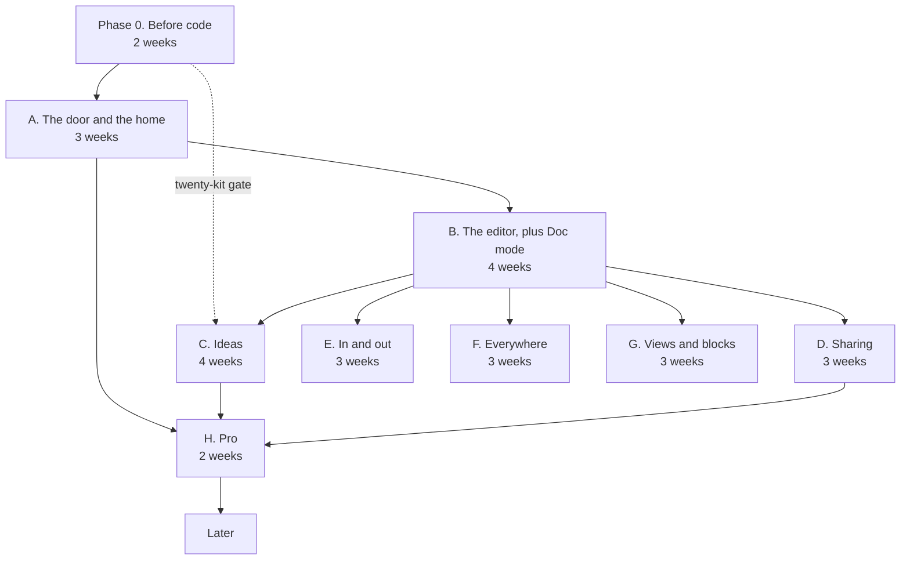

# 50. Roadmap

**What this file is.** The order the work happens in, why that order and not another, and how
long it takes at two different honest answers to "how fast do you actually go".

**What it is not.** A promise of dates. Every phase carries an appetite, which is a fixed amount
of time with variable scope, not an estimate with variable time.

**Where it comes from.** `docs/mvp0/PRODUCT-PLAN.md` section 26, plus the founders' screen review
of 18 September in `docs/mvp0/SCREEN-CHANGES-2026-09-18.md`, plus the research round of the same
morning in `docs/research/2026-09-18/raw/`.

---

## 1. The two numbers, and why both are true

The plan carries two totals and they measure different things. Both are quoted here because
quoting one alone misleads.

Number | What it measures | Source
**27 weeks** | The sum of the phase appetites, at full time | `docs/mvp0/PRODUCT-PLAN.md:1667`
**99 to 129 calendar weeks** | The same work at the pace actually measured, 0.93 to 1.21 days a week | `docs/mvp0/PRODUCT-PLAN.md:1669`

**The appetites sum checked at write time** `[O]`. Phase 0 is 2, A is 3, B is 4, C is 4, D is 3,
E is 3, F is 3, G is 3 and H is 2. That is 27.

```
2 + 3 + 4 + 4 + 3 + 3 + 3 + 3 + 2 = 27
```

**The two numbers do not reconcile at five days a week, and that matters** `[O]`.

Working days | Divided by 1.21 days a week | Divided by 0.93 days a week
27 weeks at 5 days = 135 | 111.6 calendar weeks | 145.2 calendar weeks
120 | 99.2 calendar weeks | 129.0 calendar weeks

`INFERENCE:` the audit's 99 to 129 implies a base of about 120 working days, so its "full time"
is about **4.44 days a week**, not five. Nothing in the plan says so. Anybody re-deriving the
calendar figure from 27 weeks will get 112 to 145 and think one of the two is wrong.

**What to do with that.** Use 99 to 129 as the published range, because it is the one the founders
have seen. Re-derive it from 120 working days, not from 135. If the pace is remeasured, remeasure
the base too.

---

## 2. What the 18 September review added

The founders' review of the screens and the research round of the same morning both landed after
the plan's section 26 was written. Neither is in the 27 weeks.

Addition | Appetite | Why
The founders' screen review | **3 to 4 weeks** | Most of it is one item, the idea-mode redesign
The research items | **about 1 week** | Small, and mostly additions to screens that already exist

**Revised total: 31 to 32 weeks of appetite.** At the same measured pace that is about **116 to
151 calendar weeks**, derived from 140 working days at 4.44 days a week.

```
(27 + 3.5 + 1) weeks x 4.44 days = 140 working days
140 / 1.21 = 115.7 calendar weeks
140 / 0.93 = 150.5 calendar weeks
```

### 2.1 Inside the 3 to 4 weeks of screen review

The heaviest single item is S12 to S14. The instruction was to rethink the whole idea flow, phone
included, not to restyle it.

Item | Screens | Appetite | Source
**Idea mode rebuilt as one column, with a dynamic question flow** | S12, S13, S14 | 2 to 2.5 weeks | `docs/mvp0/SCREEN-CHANGES-2026-09-18.md:99` to `:124`
Workspace rearranged: collapsibles and tabs to the top, Add file to the left rail, Add idea added, Share becomes an icon | S04 | 3 days | `docs/mvp0/SCREEN-CHANGES-2026-09-18.md:31` to `:47`
The AI box made unambiguous, anchored to content, with a pinned context line | S06 | 2 days | `docs/mvp0/SCREEN-CHANGES-2026-09-18.md:57` to `:63`
Human and AI toggles wherever the two mix | S10, S20, and every screen that mixes them | 2 days | `docs/mvp0/SCREEN-CHANGES-2026-09-18.md:296`
S11 rebuilt from a one-file health panel to the whole instruction-file set | S11 | 3 days | `docs/mvp0/SCREEN-CHANGES-2026-09-18.md:303`
Conflict gains Accept, Let AI decide and Accept AI suggestions | S31 | 1 day | `docs/mvp0/SCREEN-CHANGES-2026-09-18.md:201` to `:203`
Phone views given the same theme treatment as desktop | every phone panel | 2 days | `docs/mvp0/SCREEN-CHANGES-2026-09-18.md:19`
Doc mode gains font controls | S05 | 1 day | `docs/mvp0/SCREEN-CHANGES-2026-09-18.md:52`
Share by frontmatter address, with an invite that earns credits | S17 | 2 days | `docs/mvp0/SCREEN-CHANGES-2026-09-18.md:136` to `:139`
Published page gains a dismissible open-in bar, after first paint | S18 | 1 day | `docs/mvp0/SCREEN-CHANGES-2026-09-18.md:322` to `:330`

**One of these is cheaper than it looks and one is dearer.** The open-in bar is one day because
the decision was to put no gate in front of reading. The idea redesign is dear because the dynamic
question flow is a new mechanic, not a new layout.

### 2.2 Inside the one week of research items

Item | Appetite | Source
Stamp `generated` and `verified` into front matter when a change is accepted, following Google's Open Knowledge Format v0.2 | 2 days | `docs/research/2026-09-18/raw/H-2026-launches.md:734`
Emit `llms.txt` beside every published page, and link it from the `.md` twin | 1 day | `docs/research/2026-09-18/raw/H-2026-launches.md:351`
Treat the instruction-file panel as a set rather than one file | folded into the S11 row above | `docs/research/2026-09-18/raw/C-instruction-files.md:249`
A `wait_for_change` equivalent, so an agent parks instead of finishing and leaving | 2 days | `docs/research/2026-09-18/raw/Z2-position-taken.md`

**Why `llms.txt` is one day and worth it.** The source measured a twentyfold improvement in agent
navigation when a markdown page links to `llms.txt`, and up to 60 per cent fewer tokens consumed.
See `52-MARKET-RESEARCH.md` for the quotation and the source.

---

## 3. The dependency spine

Phases are not a queue. Three of them can run in parallel once B is done, and two of them cannot
start at all until a gate outside the code passes.



### 3.1 What each arrow actually is

The spine is only useful if each dependency names the artefact it waits on.

From | To | The dependency, named
Phase 0 | A | The Blaze billing account, the moved Cloudflare zone and the domain. Firestore refuses to leave its free quota without a billing account, so A cannot finish without Phase 0's company card
Phase 0 | C | The twenty-kit gate. Phase 0 makes twenty blueprints by hand for twenty people outside the studio, and C is justified only if five run the kickoff and two of ten edit a kit again
A | B | `limitsFor(account)`, the usage ledger, and the R2 and Firestore adapters. Every AI call in B decrements a ledger that does not exist until A
A | H | The configuration panel. Prices and routing are rows the panel edits, so the Razorpay call reads them rather than a constant
B | C | The AI box, the free chain and the breaker. The blueprint is fifteen model calls and it uses the same router as an edit
B | D | The change queue and the version record. Sharing is a permission over a document that already has a history
B | E | The splice engine with its two measured defects fixed. An import that refuses 83 per cent of real vaults is not an import
B | F | The editor itself. Offline, desktop and phone are the same editor in three shells
B | G | The block contract. Each block kind registers against the splicer rather than editing it
C | H | Medium and High depth. They are Pro, so Pro cannot ship without them
D | H | Password links and 90-day history, both Pro rows

### 3.2 The two gates that are not code

Gate | Where | What it blocks | What passes it
The twenty kits | Phase 0 | Phase C | Five of ten kit recipients run the kickoff, and two of ten edit a kit again
The pilot | After H | Everything in Later | `docs/mvp0/PRODUCT-PLAN.md:1738`, three stop lines and three continue lines

**A gate is not a milestone.** A milestone is passed by doing the work. A gate is passed by the
world answering, and it can fail.

---

## 4. The phases, each with what ships

Taken from `docs/mvp0/PRODUCT-PLAN.md:1655` to `:1665`, with the 18 September additions folded
into the phase they belong to and marked.

### Phase 0. Before code. 2 weeks

What | Note
The legal floor's first rows | `54-COMPLIANCE-AND-LEGAL.md`
The accounts moved to the company | `docs/mvp0/PRODUCT-PLAN.md:1619`
The four public pages written: privacy, terms, pricing, refunds | They currently serve placeholders
The pace published every Friday | So the measured pace stays measured
The `GITHUB_REPO` default fixed | It points at a sibling project's vault today
The format specifications drafted | `docs/mvp0/PRODUCT-PLAN.md:1478`
Twenty blueprints made by hand, for twenty people outside the studio | The gate on Phase C

### Phase A. The door and the home. 3 weeks

What | Note
Sign-in through Firebase Auth and Auth.js | Already shipped; this hardens it
`firestore.rules` from prototype to product | Live work, not a deletion
The local drafts migrated off the legacy `sgnk-md` keys | `AGENTS.md` section 8
Home, settings, the plan page | S02, S03, S28, S29
The entitlements layer and the usage ledger | The one read path, `limitsFor(account)`
The configuration panel | S35 to S38, with hardcoded defaults
Firestore and R2 adapters | The ports already exist

**Changed on 18 September.** The panel was nearly deferred. The founders kept it in phase A and
gave it hardcoded defaults instead, which resolves eleven open questions into rows with values.

### Phase B. The editor as shipped, plus Doc mode. 4 weeks

What | Note
The workspace on the new stack | S04
The two measured engine defects fixed, with red proofs | A column-zero list item in front matter; a trailing comment deleted on a set
The audit's third, unlabelled defect fixed | `docs/mvp0/PRODUCT-PLAN.md:1424`
Doc mode | S05, and the 20 lossless plus 15 partial features of section 7
Problems and the formatter | S10
The AI box and menu on the free chain, with the breaker | S06, S07
The `--ai` token and the code face in `globals.css` | The shipped file is a sibling project's
Bring-your-own key, if founder question 10 says so | `56-OPEN-DECISIONS.md`
**Added 18 Sep:** the workspace rearrangement, the AI box made unambiguous, font controls in Doc mode, the human and AI toggles | 8 days inside the 3 to 4 weeks of section 2.1

### Phase C. Ideas. 4 weeks. Gated on Phase 0

What | Note
The ideas tab, as a bottom tab in the workspace | Decided 18 Sep; notes expanded, ideas collapsed
Low depth, and the fifteen-file blueprint | S13, S15
The consistency check | Runs across the fifteen files
The unlisted link and the kickoff prompt with its out-of-band hash | S15
The map | S16
**Added 18 Sep:** the dynamic question flow, one column, 10 to 15 questions, four a page | 2 to 2.5 weeks, the largest single addition

### Phase D. Sharing. 3 weeks

What | Note
People, with the role matrix | S17, and `docs/mvp0/PRODUCT-PLAN.md:1461`
Links with expiry | S17
Published pages with the `.md` twin, the footer and the grievance route | S18
The change queue | S20
History | S21
Live editing on Durable Objects, or Later if question 8 says so | S19
The Zed Delta rebuttal written | Owed since 9 September; a second name was added on 18 September
**Added 18 Sep:** share by frontmatter address with an invite credit; the open-in bar after first paint; review split by category | 3 days

### Phase E. In and out. 3 weeks

What | Note
Folder upload | Works in every browser since Safari 11.1 and iOS 18.4
Obsidian and Notion import | S22
Google Docs and Word, with the 10 MB refusal | S22
The GitHub App | S23
Google Drive sync at a five-minute poll | S23

### Phase F. Everywhere. 3 weeks

What | Note
Offline in the browser | S24
The desktop app on the new stack, built on per-platform CI runners | S25
Signed for macOS at 99 USD a year | Windows is unpriced and shown as coming
The phone layouts | Every phone panel
Quick capture | S26
Dark mode | S27
**Added 18 Sep:** phone views given the desktop theme treatment | 2 days

### Phase G. Views and blocks. 3 weeks

What | Note
Flow | S09, deferred by the founders on 18 September but still in this phase
Slides, mind map, Excalidraw | Section 6 capabilities
Mermaid types, KaTeX | In every mode
Templates, tasks, calendar | Section 6

### Phase H. Pro. 2 weeks

What | Note
Razorpay with the mandate rules | Under 15,000 rupees, one attempt on Indian cards
Medium and High depth | S14
The Claude routing of section 14 | Haiku 4.5 for edits, Sonnet 5 through the batch API for blueprints
Password links | Pro row
90-day history | Pro row

### Later

Kanban and table-to-chart blocks, the portfolio, Team, Max, the community, a custom domain,
Notion API import, a signed Windows build.

**And the MCP server and the API with the agents card**, which `51-PRODUCT-PLAN.md` argues should
move out of Later and become the Max tier. That is an open decision, D04 in
`56-OPEN-DECISIONS.md`, not a change made here.

---

## 5. The default the plan is written to

`docs/mvp0/PRODUCT-PLAN.md:1673` states it, and founder question 1 can replace it.

- Phases 0, A, B, D and H at the measured pace, with dates published every Friday.
- E, F and G in Later.
- A contractor for D and F if the pace has not doubled by the pilot.

**What that default costs, re-derived** `[O]`. Phases 0, A, B, D and H sum to 14 weeks of
appetite, plus about 11 days of the 18 September additions that fall inside them.

```
2 + 3 + 4 + 3 + 2 = 14 weeks of appetite
14 x 4.44 = 62.2 working days, plus 11 = 73.2
73.2 / 1.21 = 60.5 calendar weeks
73.2 / 0.93 = 78.7 calendar weeks
```

**So the default path is about 60 to 79 calendar weeks**, against 116 to 151 for everything.
Phase C is not in that list, which means the blueprint funnel is not in it either. That is the
single largest consequence of the default and it deserves a decision rather than a drift.

---

## 6. Content is work, and it is not in any appetite

`docs/mvp0/PRODUCT-PLAN.md:1677` costs it at about thirty days of writing the earlier plan did
not count.

What | Where it appears
Seven templates with their question banks | S13, the idea templates
The consistency checks | Phase C
The kickoff prompts | S15
The help text | Every screen
The empty states | S02, S34, and the review queue when empty

**Thirty days at the measured pace is 25 to 32 calendar weeks on its own.** It is not in the 27,
it is not in the 31 to 32, and nobody has been named to write it.

---

## 7. What would change this roadmap

Event | What moves
Founder question 1 answered differently | Which phases sit in Later, and therefore the 60 to 79 week figure
The twenty-kit gate fails | Phase C does not start, and 4 weeks plus the idea redesign leave the plan
The pace doubles | Every calendar figure halves; the appetites do not move
A contractor joins for D and F | Those two phases parallelise against B rather than queueing behind it
The MCP server moves out of Later | A new phase between D and H, appetite unset. See `56-OPEN-DECISIONS.md` D04
Obsidian ships a web version | `docs/mvp0/PRODUCT-PLAN.md:1681` names this; the opening narrows and phase E gets more valuable, not less

---

## 8. Limits of this file

**What was not assessed.**

- Whether the appetites are right. They are the plan's, taken as given, and no phase here has been
  costed from the code.
- Whether the measured pace of 0.93 to 1.21 days a week still holds. It comes from the audit of
  17 September and has not been remeasured.
- The thirty days of content writing has no owner and no place in the spine.

**What could not be verified.**

- `UNVERIFIED:` the 3 to 4 weeks for the screen review is the brief's figure, and the per-item
  breakdown in section 2.1 is mine. It sums to about 19 days, which is 3.8 weeks at five days, so
  the two agree. Neither has been checked against anybody building anything.
- `UNVERIFIED:` the one week for research items is the brief's figure. My breakdown sums to 5 days.

**What would falsify it.**

- Phase A taking materially more or less than three weeks would invalidate the base from which
  every calendar figure here is scaled.
- Any phase discovering that its dependency in section 3.1 was not the real one. The spine is
  reasoned from the plan, not from a build.
- A measured pace outside 0.93 to 1.21 would move every number in sections 1, 2 and 5 at once.
