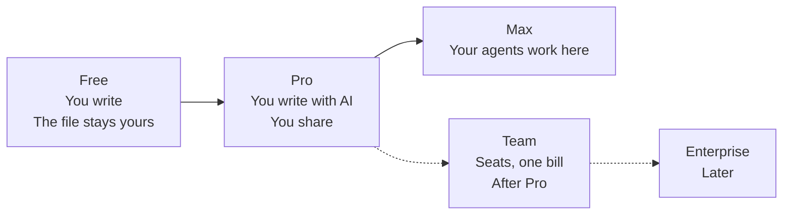

# 51. Product plan

**What this file is.** What the product is, what it can defensibly claim, what of it exists
today, what each paid tier buys, and what will not be built.

**What it is not.** The build order, which is `50-ROADMAP.md`. The evidence for the market
claims, which is `52-MARKET-RESEARCH.md` and is cited here once rather than repeated.

---

## 1. Position

**frontmatter is a markdown editor for people whose documents are increasingly written with, and
for, AI agents.** `docs/mvp0/PRODUCT-PLAN.md` section 1

**The founders confirmed it on 18 September as the broad editor, option a of D01** `[Z]`, and said
more than the sentence carried. `56-OPEN-DECISIONS.md` section 0.

- **One editor, two modes.** Doc mode and Markdown mode, switchable, rendering markdown in ways it
  was not rendered before.
- **Ideas become concrete.** A rough idea is sharpened through questions into blueprints and flows.
  Plain text can become other things, a command line among them.
- **One file, every feature.** From one markdown file a person can publish, share and use
  everything built on it.

**The internal name is `fmd`, and it stands for nothing** `[Z]`. The public name stays frontmatter.

`fmd` is taken as an npm package and as a markdown renderer's command, so no binary, package or
public handle uses it. `docs/research/2026-09-18-name/TAGLINE-AND-FMD.md` section 5.

**The tagline is open, and three lines go to a test** `[Z]`. Each person sees one line, for five
seconds, then is asked the next day what they recall. That file's section 4.1.

Line | Angle
Everything starts as one markdown file. | One file, many outputs
Looks like a document. Saves as markdown. | The editor
From rough idea to blueprint. | Ideas to blueprints

Three sentences carry the whole product.

- **The file on disk is the only source of truth.** Every view is a deterministic, stateless
  projection of it.
- **The engine locates a byte range and replaces exactly those bytes.** It never rewrites a whole
  file, and it refuses rather than guess when a range is ambiguous.
- **Every change by a person, an AI edit or an agent enters a queue** where the owner accepts or
  rejects it one by one. No silent merge, ever.

### 1.1 What the position rests on, in one line each

Claim | The evidence, in `52-MARKET-RESEARCH.md`
Agents now read documents more than people do | Agent requests outnumbered human page loads close to two to one in August 2026
Nobody lets them write unsupervised | 9 per cent of teams let an agent publish without review
Documentation is what people already hand to AI | Documenting code and maintaining documentation are the top two tasks
The review surface that exists is a pull request | Which is a developer tool, and most document owners are not developers

**So the product is the review surface for people who do not use git.** That sentence is the
position. Everything else in this file is downstream of it.

### 1.2 The three groups it is for

Group | What they want | Proven to pay today
Founders, product people and developers who brief agents | The brief, and supervision of what comes back | Not proven
Writers who want Google Docs comfort with markdown files | Doc mode | Not proven
Obsidian and Notion people who want notes on the web, shared, agent-readable | Import, sharing, the map | **Yes**, the audit's reading

**The pilot recruits ten of twenty from the third group** `docs/mvp0/PRODUCT-PLAN.md` section 28.
That is deliberate. It is the only group with a demonstrated wallet.

### 1.3 The sentence was contested, and D01 settled it

**Changed 18 September.** This section said the plan's section 29 was written to K1 recommendation
**b** while its section 1 carried option **a**. The founders took **a** `[Z]`, and the plan's
section 29 now says so.

**The consequence is not finished.** Twenty-three decision cards in `decisions/v2` were closed on
the strength of b. They re-open, per `56-OPEN-DECISIONS.md` section 6, and nobody has re-answered
them yet.

---

## 2. The defensible claims

A claim is defensible here if it can be demonstrated on a machine, not argued. Each row says what
a demonstration looks like.

Claim | What demonstrates it | State
**Refusal rather than a guess** | A vault whose front matter has a column-zero list item. The engine names the ambiguity and changes nothing | Specified, and the refusal exists in `src/modules/mdmax/`. Two measured defects are still open
**Byte-exact round trip** | `npm run corpus` over 8,513 byte-pinned files, exits 1 on one changed byte | **Built.** `package.json` script `corpus`
**Splice-only writing** | Open a 10 MB file, change one heading, diff the bytes. Everything outside the span is identical | Specified, partly built
**A change queue a non-developer can use** | Give an agent's fifteen-file output to somebody who has never opened a pull request, and watch them accept six and reject nine | **Not built.** Phase D
**The markdown route is never gated** | `curl` the `.md` twin of a published page and get markdown, with no redirect and no interstitial | Specified 18 September, not built
**Every view is a projection** | Doc mode, the flow view, the portfolio and the Drive mirror over the same bytes, with no second format | Partly built

### 2.1 What we may not claim

- **Not that the review surface exists.** It does not. `docs/mvp0/PRODUCT-PLAN.md` section 17 records
  that review state never existed in the code, and the 9 September product built on it was
  dropped.
- **Not that the engine is wired.** Wiring it is phase B.
- **Not that refusal is a moat.** OpenMarkdown shipped section-scoped writes with optimistic
  concurrency and a `CONFLICT` return in July 2026. The law is right and it is not exclusive.
  `docs/research/2026-09-18/raw/Z2-position-taken.md`
- **Not that we are first.** Two products shipped in mid-2026 on the same ground.

### 2.2 The one position that is now outnumbered in public

**Sync is git-merge plus a splice journal and content-addressed storage, never a conflict-free
replicated data type.** That was settled and it stays settled. But Zed Delta staked span-level
attribution on one in public, and OpenKnowledge is a second. A written rebuttal that names both
is owed before phase D.

**Being outnumbered is not being wrong.** It does mean the position now has to be argued in
public rather than assumed.

---

## 3. What exists, checked against the repository

Every row below was checked against the working tree at commit `0af3c90` on 18 September. A row
that says **specified, not built** means exactly that.

### 3.1 Modules under `src/modules/`

Module | Files | Layers present | What it is | State
`vault` | 30 | domain, application, infrastructure, presentation | The document tree, the file operations | Built
`editor` | 22 | presentation | The editing surface | Built
`preview` | 21 | presentation | The rendered projection | Built
`app-shell` | 21 | presentation | The frame, tabs, panels | Built
`share` | 16 | domain, application, infrastructure, presentation | Sharing and the duplicate-conflict path | Partly built
`auth` | 14 | domain, application, infrastructure, presentation | Firebase Auth behind Auth.js | Built
`mdmax` | 13 | domain, application, infrastructure | **The engine.** Offsets, placement, the shape gate, the front matter prepass, the verdict | Built as a library, **not wired to the editor**
`repository` | 12 | domain, application, infrastructure, presentation | The GitHub writer, three-way merge, the commit bar | Built
`ai` | 11 | application, infrastructure | The model calls | Built
`export` | 5 | presentation | Export | Built
`graph` | 3 | presentation | Backlinks and the link graph | Built
`drafts` | 2 | infrastructure | Local drafts under the legacy `sgnk-md` keys | Built, migration pending
`ai-tools` | 2 | presentation | AI affordances in the editor | Built

**Counted at write time** `[O]`: `find src/modules/<name> -type f | wc -l` per module.

### 3.2 Routes that exist

Kind | Count | Notes
Pages | 8 | Login, the vault, two public slug routes, and the four public legal pages
API routes | 26 | Six under `api/ai/`, fourteen under `api/vault/`, plus auth, commit, export and share

**The four public legal pages serve placeholders.** They exist at
`src/app/(public)/privacy`, `/terms`, `/pricing` and `/refunds`. See
`54-COMPLIANCE-AND-LEGAL.md` for what has to replace them and by when.

### 3.3 Storage, today against the plan

Layer | The plan | What the code does today
Bytes | Cloudflare R2, **canonical** per D03 | **GitHub.** `src/modules/repository/infrastructure/github-writer.ts`. No R2 adapter exists
The mirror | The person's GitHub repository through a GitHub App, or a Drive folder through `drive.file`. `34-INTEGRATIONS.md` | **Specified, not built.** The writer above uses a token, not a GitHub App, and no Drive code exists
Records | Firestore | `firestore.rules` exists at the repository root, 17,304 bytes. No Firestore data adapter under `src/modules/`
Sign-in | Firebase Auth behind Auth.js | **Built.** `src/modules/auth/infrastructure/firebase-auth-gateway.ts`

`INFERENCE:` phase A is therefore larger than "hardening". Two adapters do not exist at all, and
the plan's own framing at `docs/mvp0/PRODUCT-PLAN.md` section 0 calls phase A a hardening rather than a
migration because the *stack decision* did not change. The *adapters* are still new work.

### 3.4 The gates that run

Command | What it does | Honest state
`npm run verify` | typecheck, lint, test, build, arch, spec | Runs
`npm run corpus` | 8,513 byte-pinned files, exits 1 on one changed byte | Runs
`npm run arch` | The clean-architecture report | Runs
`npm run spec` | The contract gate | Runs
`npm run budget` | **An `echo`.** There is no bundle budget | Named as a gap at `docs/mvp0/PRODUCT-PLAN.md` section 21
`mdmax cert` | Not among the 26 npm scripts | Counted at write time: `node -e "...Object.keys(scripts).length"` returned 26

---

## 4. The release tiers

**Decided 18 September.** Three tiers, and each one is a sentence about what you are doing, not a
list of limits.

Tier | The sentence | Price
**Free** | You write, and the file stays yours | 0 rupees
**Pro** | You write with AI, and you share | 299 rupees a month, or 2,499 a year, both inclusive of tax
**Max** | **Your agents work here** | Unpriced. See section 4.3

**Every entitlement, with its numeric cap, is in `53-PRICING-AND-ENTITLEMENTS.md`.** This file
says what a tier means. That file says what it allows.

**When each tier is released, per D02** `[Z]` `[P]`. Every tier is built, in the batches of
`50-ROADMAP.md`, one at a time. A tier is released when the batch that completes it passes its
internal gate, never on a date.

Tier | Complete after batch | What that batch adds | Caveat
**Free** | 5, In and out, then the pilot | Import, export, the GitHub and Drive mirrors | Batch 8 adds offline and the desktop app later, and batch 9 the views and blocks
**Pro** | 7, Pro | Razorpay, Medium and High, password links, the 90-day window | **The portfolio is a Pro row but ships in batch 12.** Pro is sold without it until then
**Max** | 10, Agents and Max | The MCP server, the API, agent tokens | Appetite unset. D04 may move part of it into batch 4
**Team** | 12, Portfolio, Team and community | Seats and one bill | Appetite unset, unpriced

`INFERENCE:` a tier is "complete" when the last batch its rows need has passed. Nothing in
`50-ROADMAP.md` says a tier cannot open to strangers earlier; the pilot after batch 5 is the first
time any stranger sees the product.

### 4.1 Free: you write, and the file stays yours

The free tier is not a demonstration. It is a whole editor with quantities capped.

- Every editing feature is free. Doc mode, the problems panel, the formatter, import, export,
  offline, the desktop app, tags, backlinks, history.
- The caps are on quantity, not capability. 50 documents, 5 published pages, 1 live collaborator,
  7 days of history, 10 AI edits and 1 Low blueprint a month.
- **The mirror is free, on both plans** `[Z]` (D03). Our copy in R2 is canonical. A full copy sits
  in the person's own GitHub repository or Drive folder.
- An edit made in the mirror comes back as a change queue item. The mechanics are in
  `67-SYNC-AND-CONFLICT.md`.
- **Google Drive is free** because it is the person's own storage and costs us nothing.
- **GitHub is free** at 20 pushes and 1 repository, because the connection is the product and
  cannot sit behind a higher tier.
- **The Free document cap of 50 is a panel value** `[Z]` (D11), A/B tested on real accounts before
  it is fixed. `28-CONFIGURATION-PANEL-SPEC.md` section 10.3.

**One cap changed on 18 September.** Live collaborators went from three to one, on cost. A live
session holds a Durable Object open for as long as two people are in it, and that is the one free
cost that scales with time rather than with calls. `docs/mvp0/SCREEN-CHANGES-2026-09-18.md:305`

### 4.2 Pro: you write with AI, and you share

Pro buys three things and they all sit on the same idea: a document that leaves your machine.

What | Why it is Pro
Unlimited documents, pages and collaborators | Quantity, not capability
100 AI edits and 5 blueprints on Claude, and Medium and High depth | Model cost, which is real and per call
Password links, 90-day history, the portfolio, no branding | The sharing surface
10 GB of uploads at 25 MB a file, a soft cap | Storage cost. Past 10 GB, storage is sold in blocks priced from the panel `[Z]` (D03)

**What Pro does not buy.** It does not buy a better editor. A person on Free and a person on Pro
open the same workspace and see the same features.

### 4.3 Max: your agents work here

This is the tier the 18 September research argues into existence, and the reasoning is the
important part.

**What is in it.**

Item | What it is | Why it is not Free or Pro
**The Model Context Protocol server** | An agent connects to the person's documents over MCP, as a first-class client | Every call is a hosted request. Our compute, our egress
**Propose scope** | An agent token can read and propose, and can never apply or publish | `docs/mvp0/PRODUCT-PLAN.md` section 19 already writes this into the role matrix
**Agent tokens** | Named, scoped, revocable, one per agent, with a hash rather than a secret at rest | Issuing and checking them is per request
**Staleness anchors** | A proposal carries the content hash of the range it was written against, and refuses when that range has moved | This is the refusal law applied to time, and it is what makes an asynchronous agent safe
**The multi-file reviewable change** | Fifteen files proposed together, accepted or rejected as a set or one by one | The blueprint's output shape, and spec-driven development's unsolved problem
**The command line** | The same capability surface without a browser | A thin adapter over the same ports

**Why the price tracks the cost, and this is the whole argument.**

- Every Free and Pro feature is a person typing. The marginal cost of a keystroke is nothing.
- **Every Max item is an agent hitting a hosted endpoint.** That is our compute and our egress,
  and it runs while nobody is watching, at machine speed, on a schedule.
- An agent does not get bored. A person makes ten edits a day and an agent makes ten thousand.
- So Max is metered, and the meter is the honest shape. A flat price on an unbounded machine
  workload is a promise we cannot keep.

**Where Max sits today.** **Changed 18 September:** D02 builds everything, so Max is no longer
Later. It is batch 10 of `50-ROADMAP.md`, after Pro.

The research argues it should come sooner, and
`56-OPEN-DECISIONS.md` D04 carries that decision with its costs. **This file does not move it.**

**What Max is not.** It is not Team. Team is seats and one bill, and it comes after Pro. Max is
about machines, not about headcount.

### 4.4 The ladder, read as one thing

**The dotted lines are the tiers with no price and no appetite.** D02 builds them, in batch 12, and
nothing in the pack should imply a date.

---

## 5. The never-build list

Each row says what it is, why not, and what would reopen it. A never-build list that cannot be
reopened is a dogma rather than a decision.

### 5.1 Refused on the architecture

Never | Why | What would reopen it
**A new markdown format** | Settled. Build a compiler and an editor, not a format. A format splits the reader population and buys nothing the projection law does not already give | Nothing short of the markdown ecosystem itself moving
**A conflict-free replicated data type for sync** | They interleave, so convergence buys byte-identical garbage. Git-merge plus a splice journal and content-addressed storage instead | A measured demonstration that one preserves byte-exactness on a real vault. Two competitors now bet on this, so the rebuttal is owed either way
**A silent merge, ever** | It is the twelfth engine invariant and the product's whole differentiation | Nothing
**A per-span read state in a sidecar** | Never existed in code, failed an adversarial round, and Almanac shipped exactly this and shut down | Nothing. Attribution survives as a mark in the version record
**A percentage-of-repo unreviewed badge** | The attention literature is hostile to it. Clinical override rates of 55 to 98 per cent | Evidence that a badge changes a behaviour rather than being dismissed

### 5.2 Refused on the product

Never | Why | What would reopen it
**A plugin platform in year one** | Section 6 of the plan ships twenty capabilities built in, precisely so nobody needs a plugin | Year two, and a named capability three ecosystems want that we cannot absorb
**A chat app with a document attached** | The document is the product. A chat log is not a document | Nothing
**A sandboxed HTML block** | Published pages ban third-party scripts. A sandboxed block is a script by another name | Nothing, while pages are public
**Meeting notes** | Refused in section 6. It is a different product with a different input | A pilot participant asking for it unprompted
**Notion's column list, column, synced block and transcription blocks** | None survives a plain markdown reader, which breaks the projection law | A plain-reader degradation that is honest
**A browser extension** | Not planned, in any version | Evidence the clipper is the funnel
**A student tier** | A founder decision | A founder decision
**A tour, a captcha or a puzzle** | The founders' standing rule. One tap, like Google Docs | Nothing
**A confidence percentage on any AI output** | Show options and a recommendation instead. Prefer the alternative that makes the person judge | Nothing

### 5.3 Refused on the money

Never | Why
**A free tier whose model spend is unbounded** | Pools are per organisation, so one abuser drains everyone. Per-account budgets, a breaker, sign-in first
**A flat price on an agent workload** | Section 4.3. The cost scales with machine time and the price must too
**Card details entered anywhere but Razorpay's own checkout** | Cloudflare's self-serve agreement forbids processing card information on a property receiving free services. See `54-COMPLIANCE-AND-LEGAL.md`
**A transaction over 15,000 rupees without an additional factor** | A Reserve Bank of India limit, not a preference

---

## 6. What the product is to an agent

`docs/mvp0/PRODUCT-PLAN.md` section 17 puts it in five rows, and it is the clearest statement of the
position in any of our documents.

Piece | What it is to an agent
The vault | Its memory
The map | Its index
The instruction file | Its policy
The blueprint | Its brief
The change queue | How it is supervised

**Read the last row against section 4.3.** Supervision is the thing being sold, and supervision
of a machine is a machine-shaped cost.

---

## 7. Limits of this file

**What was not assessed.**

- Whether the position is right. It is the founders' and the evidence is in `52`, which measures
  demand rather than willingness to pay.
- Whether Max is a tier or a feature of Pro. Section 4.3 argues the cost shape makes it a tier
  and no customer has been asked.
- The Team and Enterprise tiers are named and have no contents.

**What could not be verified.**

- `UNVERIFIED:` the Max price. There is none. Max is batch 10 and unpriced.
- `UNVERIFIED:` whether the tagline test can tell three lines apart. No sample size has been derived.
- `UNVERIFIED:` whether the three groups in section 1.2 are the real segments. The pilot of twenty
  is the first test and it has not run.
- `INFERENCE:` section 3.3's reading that phase A is larger than a hardening. It follows from two
  adapters being absent from the tree, and nobody has costed the difference.

**What would falsify it.**

- A pilot in which nobody uses the change queue would falsify section 1.1 entirely.
- A competitor shipping a non-developer review surface for agent output would remove the gap the
  whole position sits in. Two competitors already ship the refusal law.
- A measured willingness to pay in group one or two would change which group the product is built
  for, and therefore the order in `50-ROADMAP.md`.
- D01 took **a** on 18 September. If it were ever reversed to **b**, the position would narrow to
  instruction files and this file's section 1 would be wrong rather than incomplete.
- A byte changed in the Drive round trip of `STORAGE-BENCHMARK.md` section 6.7 would remove the
  Drive half of the free mirror in section 4.1.
