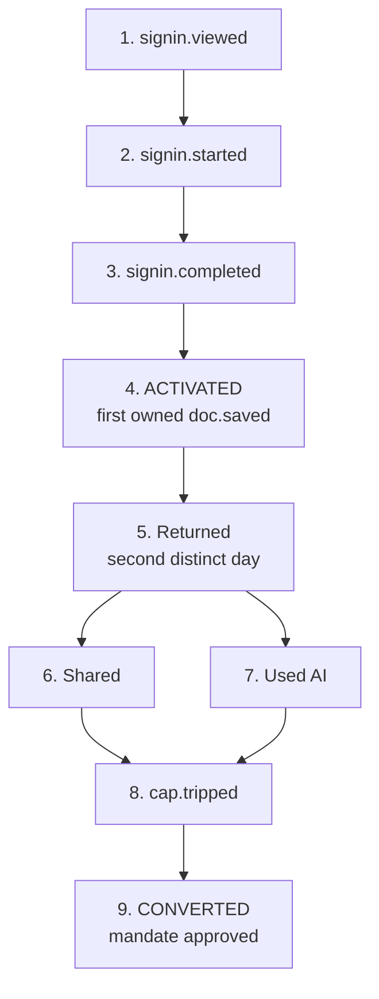

# 55. Measurement and events

**What this file is.** Every definition, the activation metric, the funnel, and every event name
with its property schema. Screen files in `12-screens/` cite event ids from here.

**The standard this file holds itself to**, from `docs/mvp0/PRODUCT-PLAN.md` section 28: each definition
is written so that **two people counting cannot disagree**.

**Naming.** Event names are dotted and lower case, per `65-CONVENTIONS.md` section 3. An event id
is never reused and never renamed. A withdrawn event keeps its row and says so.

---

## 1. Definitions

These are the plan's, at `docs/mvp0/PRODUCT-PLAN.md` section 28, carried without change.

Term | What counts
**An active user** | Opened a document they own on two distinct days in seven
**A finished blueprint** | Reached Hand off with all fifteen files present and the consistency check passing
**A conversion** | A Razorpay mandate approved, not a click on Pro
**An accepted proposal** | An item accepted individually in the change queue. Accept all counts separately
**A byte-exact import** | The bytes compare equal after a round trip

**Four more this file adds**, because the events below need them and the plan does not define them.

Term | What counts | Tag
**A session** | Activity with no gap longer than 30 minutes. A new day always starts a new session | `INFERENCE:`
**A save** | A version written to storage with a content hash that differs from the previous head | `INFERENCE:`
**A refusal** | The engine declined an operation and changed no bytes, carrying an `nf-` id | `[P]`
**An agent action** | A request authenticated by an agent token rather than a session cookie | `[P]`

---

## 2. The activation metric

**Activation is: signed in, and saved a document of their own, in the first session.**

Part | Exact rule
Who counts | An account created in the measurement window
What counts | At least one `doc.saved` where the account is the document owner
When | In the same session as `auth.signin.completed`, by the session rule in section 1
What does not count | Opening a shared document. Viewing a published page. Saving a document somebody else owns

**`INFERENCE:` this definition is mine.** The plan does not name an activation metric. It names a
target that implies one, at `docs/mvp0/PRODUCT-PLAN.md` section 28: **signed in to first save, under two
minutes.**

**Why first save and not first open.** A save is the first moment the person has put something of
their own into the product. An open can be an accident, a shared link or a bounce.

**Why the first session and not seven days.** A person who comes back a week later to save has
been activated by something outside the product, and the metric should not take credit for it.

**The target.** `docs/mvp0/PRODUCT-PLAN.md` section 28 sets the time, not the rate. **No activation rate
target has been set by anybody**, and inventing one here would be a number with no source.

---

## 3. The funnel

Each step is an event, so the drop between any two is a subtraction rather than an argument.

Step | Event | What the drop to the next step means
1. Arrived at the door | `auth.signin.viewed` | |
2. Started signing in | `auth.signin.started` | **The founders' named risk.** If this drop is over a third, publish an editor-first path for shared pages
3. Signed in | `auth.signin.completed` | The identity provider failed, or the person abandoned the consent screen
4. **Activated** | `doc.saved`, first, owned | The empty state did not give them a start
5. Came back | `doc.opened` on a second distinct day | The product did not earn a second visit
6. Shared something | `share.link.created` or `share.person.added` or `page.published` | The document had no audience
7. Used AI | `ai.request.sent` | The AI box was not found, or not wanted
8. Hit a cap | `cap.tripped` | **Not a drop. The upgrade moment**
9. **Converted** | `plan.upgrade.completed` | The price, the moment, or the value

**The one rule that keeps this honest.** Step 2 is the drop the founders' sign-in-first decision
is betting on, and `docs/mvp0/PRODUCT-PLAN.md` section 27 commits to measuring it and to changing course
if it is over a third. **So it has to be an event, not an impression.**

---

## 4. What the plan says we measure

From `docs/mvp0/PRODUCT-PLAN.md` section 28, with the event that produces each.

Measure | Events it comes from
Signed in to first save | `auth.signin.completed` to the first owned `doc.saved`
Documents per active user | `doc.created` grouped by account
Blueprints started and finished, by depth, and edited again within seven days | `blueprint.started`, `blueprint.finished`, then `doc.saved` on a blueprint file
Imported vaults, and the share that imported byte for byte | `import.completed`, `import.byte.exact`
Published pages, and the sign-ups they bring | `page.published`, `page.viewed`, `auth.signin.completed` with a referrer
Free to Pro conversion, and which cap tripped first | `cap.tripped` then `plan.upgrade.completed`
Proposals accepted against rejected, individually against Accept all | `doc.change.accepted` with `mode`
Model spend per active user, against the pools | `ai.request.sent` with `cost_paise`
**Sync conflicts shown against merges attempted, which must be zero** | `conflict.shown`, `merge.attempted`

**The last row is an invariant, not a metric.** No silent merge, ever. A non-zero
`merge.attempted` without a matching `conflict.shown` is a defect at `CRITICAL`.

---

## 5. The event envelope

Every event carries these properties. A screen file cites the event id and does not repeat the
envelope.

Property | Type | Always present | Notes
`event` | string | yes | The dotted id
`at` | instant | yes | Recorded server side. A client clock is never trusted
`account_id` | string | no | Absent on a published-page view by a stranger
`session_id` | string | yes | By the session rule in section 1
`surface` | enum | yes | `web`, `desktop`, `phone`, `api`, `mcp`
`screen` | string | no | The screen id, `S04`, where one applies
`plan` | enum | no | `free`, `pro`, `max`, at the moment of the event
`actor` | enum | yes | `person`, `ai`, `agent`
`correlation_id` | string | no | Ties a chain of events from one intent

**`actor` is the property that makes the product measurable.** Everything else in this pack rests
on being able to separate a person's change from a machine's, so it is required on every event and
never inferred.

**What is never a property.** Document content, a document title, a file path, a share token, an
email address, a model prompt or a model response. **An event says that a thing happened, never
what the thing said.**

---

## 6. The events

### 6.1 Getting in, S01 to S03

Event | When | Extra properties
`auth.signin.viewed` | The sign-in page rendered. | `referrer_kind`: `direct`, `published_page`, `share_link`, `unknown`
`auth.signin.started` | A provider button was pressed. | `provider`: `google`, `github`, `email`
`auth.signin.completed` | An account is signed in. | `provider`, `is_new_account`
`auth.signin.failed` | The provider returned an error. | `provider`, `reason`
`auth.signout` | Signed out. | |
`home.viewed` | Home rendered. | `is_first_time`, `doc_count`
`home.start.chosen` | A start on the empty state was pressed. | `start`: `blank`, `template`, `upload`, `import`, `idea`

### 6.2 Writing, S04 to S08

Event | When | Extra properties
`doc.created` | A new document exists. | `origin`: `blank`, `template`, `upload`, `import`, `blueprint`, `capture`
`doc.opened` | A document was opened. | `is_owner`, `role`
`doc.saved` | A version was written with a new content hash. | `is_owner`, `bytes`, `is_first_save`
`doc.renamed` |  | |
`doc.deleted` | Moved to trash. | |
`doc.restored` | Recovered from trash. | |
`doc.tab.opened` | A tab was opened. | `tab_count`
`doc.tab.closed` |  | `tab_count`
`workspace.panel.toggled` | A collapsible or a rail panel changed state. | `panel`, `to`: `open`, `closed`
`file.added` | The Add file menu produced a document. | `via`: `new`, `upload_files`, `upload_folder`, `import`
`idea.added` | The Add idea button was pressed. | |
`upload.started` |  | `file_count`, `bytes`
`upload.completed` |  | `file_count`, `bytes`, `duration_ms`
`upload.refused` | A file was refused. | `reason`: `too_large`, `over_cap`, `unsupported`
`docmode.entered` | Doc mode opened. | |
`docmode.exited` |  | |
`docmode.font.changed` | A font control was used. | `font`
`docmode.properties.edited` | The properties panel wrote front matter. | `key_count`, `has_nested`
`block.inserted` | A custom block was inserted. | `kind`: `fm-chart`, `fm-flow`, `fm-draw`, and the rest
`block.degraded` | A block could not render and fell back to text. | `kind`, `reason`

### 6.3 AI, S06, S07, S32

Event | When | Extra properties
`ai.box.opened` | The AI box appeared. | `anchor`: `below`, `right`; `target_kind`: `document`, `selection`, `idea`
`ai.request.sent` | A model call left us. | `task`: `edit`, `document`, `blueprint_call`, `questions`; `provider`; `model`; `tokens_in`; `tokens_out`; `cost_paise`; `is_free_chain`
`ai.request.failed` | A model call errored. | `provider`, `reason`, `fell_back_to`
`ai.response.shown` | A proposal was rendered. | `task`, `latency_ms`, `first_token_ms`
`ai.edit.proposed` | A change entered the queue from AI. | `span_bytes`
`ai.edit.accepted` |  | `mode`: `individual`, `all`
`ai.edit.rejected` |  | `mode`
`ai.edit.undone` | Undone after acceptance. | `seconds_after_accept`
`ai.unavailable.shown` | S32 rendered. | `reason`: `chain_exhausted`, `breaker_open`, `over_cap`
`ai.fallback.used` | The standard question set served instead of the dynamic one. | `reason`
`ai.breaker.opened` | The circuit breaker tripped. | `scope`: `account`, `organisation`
`ai.breaker.closed` |  | `open_seconds`

**`cost_paise` is the property the whole financial model rests on**, so it is required on every
`ai.request.sent` and is never null. A missing cost is a defect, not a zero. See
`53-PRICING-AND-ENTITLEMENTS.md` section 4.3.

### 6.4 The engine and refusals

Event | When | Extra properties
`engine.refusal.raised` | The engine declined and changed no bytes. | `refusal_id`: the `nf-` id; `operation`; `screen`
`engine.splice.applied` | A splice landed. | `span_bytes`, `file_bytes`
`engine.roundtrip.checked` | A byte-exact check ran. | `passed`

**The refusal event is a product metric, not an error metric.** Refusing is a correct outcome. A
rising refusal rate on a named `refusal_id` means an engine gap worth fixing, and a falling one
after a fix is the proof that it worked.

### 6.5 Problems and instruction files, S10, S11

Event | When | Extra properties
`problems.opened` | The panel opened. | `count`, `by_severity`
`problems.filtered` | A toggle changed. | `filter`: `human`, `ai`, `other`; `to`: `on`, `off`
`problem.fixed` | A fix was applied. | `rule_id`, `by`: `person`, `ai`
`instructions.opened` | S11 opened. | `file_count`
`instructions.file.added` | Another instruction file joined the set. | `filename`
`instructions.check.run` | The health check ran. | `file_count`, `finding_count`

### 6.6 Ideas and blueprints, S12 to S16, S34

Event | When | Extra properties
`idea.created` | An idea exists. | |
`idea.depth.chosen` | Low, Medium or High picked. | `depth`
`idea.questions.generated` | The question set came back. | `question_count`, `branching_count`, `latency_ms`
`idea.question.answered` |  | `page`, `index`, `is_branching`
`idea.questions.rewritten` | A branching answer rewrote later pages. | `pages_changed`, `rewrite_number`
`idea.question.skipped` | Skip was pressed. | `page`
`idea.recommendation.taken` | Choose recommendation was pressed. | `page`
`idea.skipall.opened` | The Skip all modal opened. | `remaining`
`idea.skipall.confirmed` |  | `remaining`
`ideas.empty.viewed` | S34 rendered. | |
`blueprint.started` | Generation began. | `depth`
`blueprint.consistency.checked` | The check across the fifteen files ran. | `passed`, `finding_count`
`blueprint.finished` | **A finished blueprint**, by the section 1 definition. | `depth`, `duration_ms`, `file_count`
`blueprint.link.created` | The unlisted link was made. | |
`kickoff.copied` | The kickoff prompt was copied. | |
`kickoff.ran` | The out-of-band hash was seen at our end. | `hours_after_handoff`
`map.opened` | S16 opened. | `node_count`

**`kickoff.ran` is the Phase 0 gate's measurement.** The gate is five of ten recipients running the
kickoff, and this event is the only way to know. **It depends on the out-of-band hash, so if that
is cut, the gate becomes unmeasurable.**

### 6.7 Sharing and publishing, S17 to S19, S30

Event | When | Extra properties
`share.opened` | S17 opened. | |
`share.person.added` | Somebody was given a role. | `role`, `was_existing_user`
`share.invite.sent` | An invitation left. | `credits_granted`
`share.invite.accepted` | The invited person created an account. | `days_after_invite`
`share.link.created` |  | `role`, `has_expiry`, `has_password`
`share.link.opened` | Somebody used the link. | `role`, `is_signed_in`
`share.link.revoked` |  | |
`page.published` | A page went live. | `has_branding`
`page.unpublished` |  | `days_live`
`page.viewed` | The HTML page rendered. | `referrer_kind`
`page.md.fetched` | **The markdown twin or `llms.txt` was fetched**. | `route`: `md`, `llms_txt`; `is_agent`
`page.openin.shown` | The dismissible bar appeared, after first paint. | `has_protocol_handler`
`page.openin.taken` |  | `target`: `desktop`, `web`
`page.openin.dismissed` |  | |
`page.report.opened` | The grievance route was used. | |
`collab.session.started` | A live session opened a Durable Object. | |
`collab.session.joined` | A second person joined. | `participant_count`
`collab.session.ended` |  | `duration_seconds`, `peak_participants`
`portfolio.published` |  | `item_count`

**`page.md.fetched` with `is_agent` is how section 1.1 of `52-MARKET-RESEARCH.md` becomes our own
number rather than a vendor's.** It is the single most valuable event in this file for deciding
what to build next.

**`collab.session.ended` with `duration_seconds` is the cost measurement** behind the one free
collaborator. See `53-PRICING-AND-ENTITLEMENTS.md` section 3.1.

### 6.8 The change queue and history, S20, S21

Event | When | Extra properties
`review.queue.opened` | S20 opened. | `pending_count`
`review.filtered` | A category toggle changed. | `filter`: `human`, `ai`, `other`; `to`
`doc.change.proposed` | A change entered the queue. | `source`: `person`, `ai`, `agent`; `span_bytes`; `file_count`
`doc.change.accepted` | **An accepted proposal**. | `mode`: `individual`, `all`; `source`; `seconds_in_queue`
`doc.change.rejected` |  | `mode`; `source`; `seconds_in_queue`
`doc.change.stale` | A proposal's anchor range had moved and it refused. | `source`
`history.opened` | S21 opened. | `version_count`
`history.compared` | Two versions were compared. | |
`history.restored` | A version was restored. | `versions_back`

**`mode` on accept and reject is not optional.** The plan's definition counts Accept all
separately, and a queue everybody accepts wholesale is a queue nobody is reading.

### 6.9 In and out, S22, S23

Event | When | Extra properties
`import.started` |  | `kind`: `folder`, `obsidian`, `notion`, `gdocs`, `word`; `file_count`
`import.completed` |  | `kind`, `file_count`, `duration_ms`
`import.byte.exact` | **A byte-exact import**, by the section 1 definition. | `kind`, `exact_count`, `total_count`
`import.file.refused` |  | `reason`, `refusal_id` where the engine raised one
`connection.added` |  | `provider`: `github`, `drive`
`connection.removed` |  | `provider`
`github.push.made` |  | `file_count`
`drive.sync.ran` | A poll completed. | `changed_count`, `lag_seconds`

### 6.10 Everywhere, S24 to S27

Event | When | Extra properties
`offline.entered` |  | `pending_drafts`
`offline.exited` |  | `pending_drafts`, `offline_seconds`
`draft.saved.local` | A draft was written to the device. | `store`: `indexeddb`, `opfs`, `filesystem`
`draft.evicted` | **The browser threw a draft away**. | `store`, `age_seconds`
`desktop.launched` |  | `version`, `platform`
`desktop.folder.watched` | A watched folder was set. | |
`capture.made` | Quick capture produced a document. | `via`: `share_sheet`, `shortcut`
`theme.changed` |  | `to`: `light`, `dark`, `system`

**`draft.evicted` is the event nobody wants and everybody needs.** Safari evicting local drafts is
a named risk, and this is how it stops being anecdotal.

### 6.11 Account, plan and the states, S28 to S33

Event | When | Extra properties
`settings.opened` |  | `section`
`settings.changed` |  | `setting`, `to`
`account.export.requested` |  | |
`account.export.completed` |  | `bytes`, `file_count`
`account.deletion.requested` |  | |
`account.deletion.completed` |  | `days_after_request`
`plan.viewed` | S29 opened. | `plan`, `usage_percent_of_cap`
`plan.upgrade.started` | Razorpay was opened. | `from`, `to`, `period`
`plan.upgrade.completed` | **A conversion**, by the section 1 definition. | `to`, `period`, `amount_paise`
`plan.upgrade.failed` |  | `reason`, `attempt` (always 1 on an Indian card)
`plan.downgraded` |  | `from`, `to`, `cause`: `cancelled`, `dunning`, `panel_change`
`topup.purchased` |  | `product_id`, `amount_paise`
`cap.tripped` | **Somebody hit a limit**. | `entitlement_id`, `current`, `cap`, `is_first_ever`
`cap.upgrade.clicked` | The upgrade path was taken from S33. | `entitlement_id`
`conflict.shown` | S31 rendered. | `kind`
`conflict.resolved` |  | `by`: `keep_mine`, `keep_theirs`, `accept`, `let_ai_decide`, `accept_ai_suggestions`
`merge.attempted` | **Must never fire without a matching `conflict.shown`**. | `kind`

**`cap.tripped` with `entitlement_id` and `is_first_ever` answers "which cap tripped first",**
which the plan lists as a measure and which decides whether the caps in
`53-PRICING-AND-ENTITLEMENTS.md` are the right ones.

### 6.12 The configuration panel, S35 to S38

Event | When | Extra properties
`config.viewed` |  | `section`
`config.setting.changed` | A value was edited, not yet saved. | `setting`, `from`, `to`
`config.change.saved` | Saved. | `change_count`, `accounts_moved_over_cap`
`config.change.discarded` |  | `change_count`
`config.exception.granted` | A per-account exception was created. | `entitlement_id`, `value`, `expires`
`config.provider.toggled` | A free-chain provider was enabled or disabled. | `provider`, `to`

**`accounts_moved_over_cap` is required on every save.** The panel must name the damage before it
saves, and the number it named is the number this event records.

### 6.13 Agents, which is the Max tier

Event | When | Extra properties
`agent.token.issued` | A scoped token was created. | `scope`, `name`
`agent.token.revoked` |  | `scope`, `age_days`
`agent.request.made` | An agent-authenticated request arrived. | `operation`, `scope`
`agent.proposal.made` | An agent put something in the queue. | `file_count`, `span_bytes_total`
`agent.proposal.refused` | Refused before it entered the queue. | `reason`: `out_of_scope`, `stale_anchor`, `over_budget`
`mcp.tool.called` | A Model Context Protocol tool ran. | `tool`, `duration_ms`, `bytes_out`

**Every row here is unbuilt.** The Model Context Protocol server sits in Later, and whether it
moves is D04 in `56-OPEN-DECISIONS.md`. The events are specified now so that the tier can be
measured from its first day rather than instrumented afterwards.

---

## 7. The pilot, and its stop and continue lines

From `docs/mvp0/PRODUCT-PLAN.md` section 28. These are thresholds on twenty people, not on a population.

### 7.1 Stop. Any one of these stops the next phase

Line | The events behind it
Fewer than four of twenty active in week two | `doc.opened`, by the active-user definition
Fewer than two of ten kit recipients run the kickoff | `kickoff.ran`
Fewer than three of twenty name the problem the product solves, unprompted | **Not an event.** A person asks and writes down the answer

### 7.2 Continue

Line | The events behind it
Six of twenty active in week two | `doc.opened`
Three of ten run the kickoff and edit the kit again | `kickoff.ran`, then `doc.saved` on a blueprint file
One person asks how to pay before being told the price | **Not an event.** A person notices

**Reading it**: all three justify phase C and the Pro build. Two of three justify phase C alone.

**Two of the six lines are not measurable by any event**, and that is correct rather than a gap. A
person naming the problem in their own words is the strongest signal in the whole pilot and no
event can capture it.

---

## 8. Rules for adding an event

1. **Name it before you build the screen.** A screen file cites event ids, so the id exists first.
2. **Dotted, lower case, noun then verb in the past tense.** `doc.change.accepted`, not
   `acceptChange`.
3. **Never rename.** Add a new id and mark the old one withdrawn in its row.
4. **Never put content in a property.** Section 5 lists what is banned, and it is not exhaustive:
   if a property could embarrass somebody in a log, it does not go in.
5. **Every count property is a count, not a list.** `file_count`, never `files`.
6. **A property that decides money is required and never null.** `cost_paise` is the example.
7. **If two people could disagree about when it fires, the definition is not finished.**

---

## 9. Limits of this file

**What was not assessed.**

- **Which analytics tool receives these.** No tool is named anywhere in the plan, and the event
  schema is deliberately tool-agnostic.
- Sampling. Every event above is specified as fired every time, which is affordable at pilot scale
  and may not be at any other.
- Retention of the event store. The ledger's 180 days is specified in the data model and events
  are a different store with no stated retention.
- Consent. Whether analytics needs its own consent under the data-protection rules is a counsel
  question, `L12` in `54-COMPLIANCE-AND-LEGAL.md`.

**What could not be verified.**

- `INFERENCE:` the activation metric in section 2, the session and save definitions in section 1,
  and the funnel order in section 3 are all mine. The plan implies them and states none.
- **`UNVERIFIED:` no event in section 6 is implemented.** This is a specification. Nothing in
  `src/` emits any of it.
- `UNVERIFIED:` `kickoff.ran` depends on an out-of-band hash reaching us, and that mechanism is
  specified in the plan and not built.

**What would falsify it.**

- A pilot in which the two unmeasurable lines in section 7 disagree with every event would say the
  events measure the wrong thing.
- If `cap.tripped` shows a cap nobody expected tripping first, the caps are wrong rather than the
  event.
- If `doc.change.accepted` is almost entirely `mode: all`, the change queue is not being read and
  the product's central claim needs rethinking rather than the metric.
