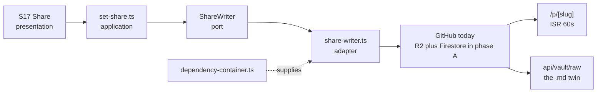

# 60. Traceability

**What this file is.** The join between a feature, the screen that carries it, the route that
serves it, the module that owns it, the port it depends on, the adapter behind the port, the
storage underneath, the specification, the acceptance criterion and the test.

**What it is for.** Answering three questions without opening the code: *if I change this module,
what breaks?*, *is this thing actually built?*, and *what has no test?*

**What is authoritative and what is not.**

File | Owns | This file
`10-FEATURE-REGISTER.md` | Every `F` id, its plan, its screens, its acceptance ids and its status | **Reads them. Never redefines them**.
`11-SCREEN-INDEX.md` and `12-screens/` | Every `S` id and its specification | **Reads them**.
`19-ACCEPTANCE-CRITERIA.md` | Every `A` id | **Reads them**.
`26-ENGINE-REFUSAL-CATALOGUE.md` | Every `nf-` id | **Reads them**.

**If a row here disagrees with one of those, they are right and this file is stale.**

---

## 1. How the matrix is keyed, and why not by feature

**It is keyed by screen.** `10-FEATURE-REGISTER.md` carries **268 rows** at the time of writing,
counted at write time `[O]`, and a row per feature would repeat the same route, module, port,
adapter and storage 268 times.

**A screen is the natural join.** It is the unit a person sees, the unit a route serves, and the
unit `12-screens/` specifies. Every feature the register places on a screen is carried by that
screen's row.

**Counted at write time** `[O]`, from the register's `screens` column:

```
268 rows: shipped 45, building 20, planned 115, and 88 rows whose status
cell did not parse as one of the four values
92 rows name no screen at all
```

**Those last two numbers are findings, not noise.** 88 rows with an unparsed status and 92 rows
with no screen are gaps in the register that a validator should count. They are recorded in
section 6.

---

## 2. The master matrix

**Reading the cells.**

- **`none`** means the thing does not exist. Not that it was not looked for.
- A route in `code font` exists in `src/app/` at commit `0af3c90`.
- A module name is a directory under `src/modules/`.
- **Status is this file's own reading of the row**, not the register's per-feature status.

### 2.1 Getting in

S | Features | Route | Module | Port | Adapter | Storage | Spec | Acceptance | Test | Status
`S01` | `F101` to `F104`, 4 | `/login`, `/privacy`, `/terms`, `/pricing`, `/refunds` | `auth` | `AuthGateway` | `firebase-auth-gateway.ts`, `auth-options.ts` | Firebase Auth | `12-screens/S01.md` | `A001` to `A007` | `auth/firebase-auth-gateway.test.ts`, `auth/auth-options.test.ts`, `auth/allowlist.test.ts` | **building**.
`S02` | 3 | `/` | `app-shell`, `vault` | `VaultReader` | `vault-reader.ts` | GitHub | `12-screens/S02.md` | `A008`, `A200` | none | planned.
`S03` | 2 | `/` | `app-shell`, `vault` | `VaultReader` | `vault-reader.ts` | GitHub | `12-screens/S03.md` | none yet | `vault/get-snapshot.test.ts` | planned.

### 2.2 Writing

S | Features | Route | Module | Port | Adapter | Storage | Spec | Acceptance | Test | Status
`S04` | 34 | `/`, `api/vault/*` (14 routes) | `editor`, `vault`, `app-shell`, `graph` | `VaultReader`, `NoteParserFn` | `vault-reader.ts`, `markdown-parser.ts`, `search-index.ts`, `snapshot-cache.ts` | GitHub | `12-screens/S04.md` | `A030` to `A040`, `A203`, `A204` | `editor/*` (7), `vault/*` (16), `graph/graph-data.test.ts` | **partly shipped**.
`S05` | 5 | `/` | `editor`, `preview` | `NoteParserFn` | `markdown-parser.ts` | GitHub | `12-screens/S05.md` | `A041` to `A043` | `preview/frontmatter.test.ts`, `editor/toolbar-transforms.test.ts` | planned.
`S06` | 5 | `api/ai/complete`, `api/ai/generate-doc`, `api/ai/refine` | `ai`, `ai-tools` | `LlmClient` | `gateway-client.ts`, `provider-race.ts` | none, the model is remote | `12-screens/S06.md` | see register | `ai/generate-document.test.ts` | **building**.
`S07` | 6 | `api/ai/refine` | `ai`, `editor` | `LlmClient` | `gateway-client.ts` | none | `12-screens/S07.md` | see register | `editor/ai-suggestion.test.ts` | **building**.
`S08` | 9 | none | `preview` | none | none | GitHub | `12-screens/S08.md` | see register | `preview/callout.test.ts`, `preview/embeds.test.ts` | planned.
`S09` | 5 | none | none | none | none | none | `12-screens/S09.md` | see register | none | **deferred 18 Sep**.
`S10` | 10 | `api/ai/link-doctor` | `ai`, `graph` | `LlmClient` | `gateway-client.ts` | GitHub | `12-screens/S10.md` | see register | `graph/graph-data.test.ts` | planned.
`S11` | 3 | none | none | none | none | GitHub | `12-screens/S11.md` | see register | none | planned.

### 2.3 Ideas

S | Features | Route | Module | Port | Adapter | Storage | Spec | Acceptance | Test | Status
`S12` | 7 | none | none | none | none | none | `12-screens/S12.md` | see register | none | planned.
`S13` | 9 | none | none | `LlmClient` when built | none | none | `12-screens/S13.md` | see register | none | planned.
`S14` | 6 | none | none | `LlmClient` when built | none | none | `12-screens/S14.md` | see register | none | planned.
`S15` | 6 | none | none | none | none | none | `12-screens/S15.md` | `A201` to `A206` | none | planned.
`S16` | 2 | none | `graph` | none | none | GitHub | `12-screens/S16.md` | see register | `graph/graph-data.test.ts` | planned.
`S34` | 2 | none | none | none | none | none | `12-screens/S34.md` | see register | none | planned.

### 2.4 Sharing

S | Features | Route | Module | Port | Adapter | Storage | Spec | Acceptance | Test | Status
`S17` | 8 | `api/share` | `share` | `ShareWriter`, `ShareSnapshotPort` | `share-writer.ts`, `share-snapshot-port.ts` | GitHub | `12-screens/S17.md` | see register | `share/*` (8), `api/share-route.test.ts` | **partly shipped**.
`S18` | 9 | `/p/[slug]`, `/[slug]`, `api/vault/raw/[...path]` | `share`, `preview` | `ShareSnapshotPort` | `share-snapshot-port.ts` | GitHub, ISR at 60s | `12-screens/S18.md` | `A205`, `A206` | `share/resolve-public-note.test.ts`, `vault/raw-content-type.test.ts`, `vault/snapshot-public-slug.test.ts` | **partly shipped**.
`S19` | 2 | none | none | none | none | Durable Objects, planned | `12-screens/S19.md` | see register | none | planned.
`S20` | 8 | none | none | none | none | none | `12-screens/S20.md` | see register | none | **planned. This is the product**.
`S21` | 5 | `api/vault/history`, `api/vault/version`, `api/vault/restore` | `vault` | `VaultReader` | `vault-reader.ts` | GitHub commits | `12-screens/S21.md` | see register | `vault/get-history.test.ts` | **partly shipped**.
`S30` | 1 | none | none | none | none | none | `12-screens/S30.md` | see register | none | planned.

### 2.5 In and out

S | Features | Route | Module | Port | Adapter | Storage | Spec | Acceptance | Test | Status
`S22` | 11 | `api/vault/upload`, `api/vault/create`, `api/vault/folder` | `vault`, `repository` | `RepositoryWriter` | `github-writer.ts` | GitHub | `12-screens/S22.md` | `A120` to `A123` | `repository/upload-attachment.test.ts`, `api/folder-route.test.ts` | **building**.
`S23` | 5 | `api/commit` | `repository` | `RepositoryWriter` | `github-writer.ts` | GitHub | `12-screens/S23.md` | see register | `repository/commit-changes.test.ts`, `repository/github-writer.test.ts`, `shared/github-client.test.ts` | **partly shipped**.

### 2.6 Everywhere

S | Features | Route | Module | Port | Adapter | Storage | Spec | Acceptance | Test | Status
`S24` | 4 | none | `drafts` | none | `draft-store.ts` | IndexedDB, `sgnk-md` keys | `12-screens/S24.md` | see register | `drafts/draft-store.test.ts` | **partly shipped**.
`S25` | 5 | none, it is a shell | `src-tauri/` | none | Tauri v2 | the device | `12-screens/S25.md` | see register | none | **partly shipped**.
`S26` | 2 | none | none | none | none | none | `12-screens/S26.md` | see register | none | planned.
`S27` | 1 | `/` | `app-shell` | none | none | the account | `12-screens/S27.md` | see register | none | **shipped**.

### 2.7 Account and the states

S | Features | Route | Module | Port | Adapter | Storage | Spec | Acceptance | Test | Status
`S28` | 8 | `/` | `app-shell` | none | none | the account | `12-screens/S28.md` | see register | none | **partly shipped**.
`S29` | 9 | none | none | none | none | none | `12-screens/S29.md` | see register | none | planned.
`S31` | 4 | `api/vault/merge`, `api/share/conflicts` | `repository`, `share` | `RepositoryWriter` | `github-writer.ts` | GitHub | `12-screens/S31.md` | see register | `repository/merge3.test.ts`, `repository/merge-note.test.ts`, `share/list-conflicts.test.ts`, `api/share-conflicts-route.test.ts` | **partly shipped**.
`S32` | 4 | `api/ai/*` | `ai` | `LlmClient` | `provider-race.ts` | none | `12-screens/S32.md` | see register | `ai/provider-race.test.ts` | **building**.
`S33` | 3 | none | none | none | none | the ledger, planned | `12-screens/S33.md` | see register | none | planned.

### 2.8 The configuration panel

S | Features | Route | Module | Port | Adapter | Storage | Spec | Acceptance | Test | Status
`S35` | 8 | none | none | none | none | Firestore, planned | `12-screens/S35.md` | see register | none | planned.
`S36` | 6 | none | none | none | none | Firestore, planned | `12-screens/S36.md` | see register | none | planned.
`S37` | 4 | none | none | none | none | Firestore, planned | `12-screens/S37.md` | see register | none | planned.
`S38` | 3 | none | none | none | none | Firestore, planned | `12-screens/S38.md` | see register | none | planned.

### 2.9 The engine, which no screen owns

The engine is `src/modules/mdmax/` and it is a library. **It is reachable from no route.**

Spec | What it is | Module file | Test | Red proof | Status
`specs/engine/nf-001-zero-indent-sequence.md` | A column-zero list item in front matter | `frontmatter-prepass.ts` | `mdmax/frontmatter-prepass.test.ts` | **`corpus/foreign/nf-001-red-proof.test.ts`** | **defect open**.
`specs/engine/nf-003-bare-cr-fence.md` | A bare carriage return in a fence | `shape-gate.ts` | `mdmax/shape-gate.test.ts` | **`corpus/foreign/nf-003-red-proof.test.ts`** | **defect open**.
`specs/engine/splice-writer.md` | Splice-only writing | `placement.ts`, `offsets.ts` | `mdmax/placement.test.ts`, `mdmax/offsets.test.ts` | none | specified.
`specs/render/carrier.md` | The callout carrier for prose, the fence for data | `preview/` | `preview/callout.test.ts` | none | specified.
`specs/_schema/spec.schema.json` | The shape every spec file takes | `specs/harness/spec-report.mjs` | `npm run spec` | n/a | **enforced**.

**The two red proofs are the most valuable rows in this file.** A test on a rare fault proves
nothing until it fails against the unfixed code, and these two do.

---

## 3. Reverse index

### 3.1 Module to screens

Change this module, and these screens change.

Module | Files | Screens it serves
`vault` | 30 | S02, S03, S04, S16, S21, S22.
`editor` | 22 | S04, S05, S07.
`preview` | 21 | S05, S08, S18.
`app-shell` | 21 | S02, S03, S04, S27, S28.
`share` | 16 | S17, S18, S31.
`auth` | 14 | **S01, and every screen behind it**.
`mdmax` | 13 | **none. The engine is not wired to a screen**.
`repository` | 12 | S22, S23, S31.
`ai` | 11 | S06, S07, S10, S32, and S13 to S15 when built.
`export` | 5 | S18, S28.
`graph` | 3 | S04, S10, S16.
`drafts` | 2 | S24.
`ai-tools` | 2 | S06.

**The `mdmax` row is the finding.** The engine is 13 files, 10 test files, and no screen. Wiring
it is phase B.

### 3.2 Port to adapter to storage

Port | Module | Adapter | Storage today | Storage in the plan
`AuthGateway` | `auth` | `firebase-auth-gateway.ts` | Firebase Auth | **unchanged**.
`VaultReader` | `vault` | `vault-reader.ts`, `snapshot-cache.ts` | GitHub | **R2 for bytes, Firestore for records**.
`NoteParserFn` | `vault` | `markdown-parser.ts` | n/a, it is pure | unchanged.
`RepositoryWriter` | `repository` | `github-writer.ts` | GitHub | **stays, as a connection rather than as the store**.
`ShareWriter` | `share` | `share-writer.ts` | GitHub | **Firestore**.
`ShareSnapshotPort` | `share` | `share-snapshot-port.ts` | GitHub, ISR at 60s | **R2 plus Firestore**.
`LlmClient` | `ai` | `gateway-client.ts`, `provider-race.ts` | remote | unchanged.

**Five of seven ports change their adapter in phase A.** The ports do not change, which is the
whole point of having them, and it is the strongest argument that phase A is tractable.

### 3.3 Route to module

Route group | Count | Module
`api/vault/*` | 14 | `vault`, `repository`.
`api/ai/*` | 6 | `ai`.
`api/share/*` | 2 | `share`.
`api/export/*` | 2 | `export`.
`api/auth/[...nextauth]` | 1 | `auth`.
`api/commit` | 1 | `repository`.
Pages | 8 | `app-shell`, `share`, `auth`

**Counted at write time** `[O]`: 26 API routes and 8 pages, from
`find src/app -name 'page.tsx' -o -name 'route.ts'`.

---

## 4. One worked path, end to end

**Publishing a page, which is the only path that runs all the way through today.**

Step | What happens | The artefact
1 | A person presses Share on S17 | `12-screens/S17.md`
2 | The presentation layer calls into `share` | `src/modules/share/index.ts`, the barrel
3 | The application layer runs the use case | `src/modules/share/application/set-share.ts`
4 | It depends on a port, never on an adapter | `ShareWriter` in `application/ports.ts`
5 | The composition root supplies the adapter | `src/container/dependency-container.ts`
6 | The adapter writes | `infrastructure/share-writer.ts`
7 | The bytes land | GitHub, today. R2 and Firestore in phase A
8 | A route serves the page | `src/app/(public)/p/[slug]/page.tsx`, ISR at 60 seconds
9 | The markdown twin serves beside it | `src/app/api/vault/raw/[...path]/route.ts`
10 | A test holds each step | `share/set-share.test.ts`, `share/share-writer.test.ts`, `api/share-route-revalidate.test.ts`, `vault/raw-content-type.test.ts`

**What this path demonstrates, and it is the thing to copy.**

- The application layer names a port. It never imports `infrastructure/`.
- The route imports the barrel, never a deep path.
- The adapter is supplied at the composition root, so swapping GitHub for R2 in phase A touches
  one file plus the new adapter.
- **Every step has a test.** No other path in the product can say that.



---

## 5. Coverage gaps by layer

**Counted at write time** `[O]` from the tree at commit `0af3c90`.

Layer | What exists | The gap
**Domain** | `mdmax` 11 files, `vault`, `share`, `auth`, `repository` each have one | **No domain model for an account, a plan, an entitlement or a ledger entry.** Every one of those is phase A
**Application** | 5 port files, use cases in `vault`, `share`, `repository`, `ai`, `auth` | **No use case for a cap check.** `limitsFor(account)` does not exist
**Infrastructure** | 15 adapters | **No R2 adapter. No Firestore data adapter.** Firebase Auth is the only Firebase thing wired
**Presentation** | `editor` 22, `preview` 21, `app-shell` 21 | **No change queue, no review surface, no idea mode, no configuration panel**
**App** | 8 pages, 26 API routes | **19 of 38 screens have no route at all**
**Container** | 2 files | Fine. It is the one place that changes when the adapters do
**Specs** | 5 spec files, 7 harness scripts | **3 engine spec files against 5 `nf-` ids in the catalogue**
**Tests** | **81 files** | See section 5.1

### 5.1 Where the tests are, and where they are not

Area | Test files | Reading
`mdmax`, the engine | **10** | **The best-covered area in the repository, and it is the part no screen uses**.
`vault` | 17 | Good.
`share` | 8 | Good.
`repository` | 9 | Good.
`preview` | 8 | Good.
`editor` | 7 | Good.
`api` | 4 | Thin against 26 routes.
`ai` | 3 | Thin.
`auth` | 3 | Adequate.
`config` | 2 | Adequate.
`corpus/foreign` | **2** | **The two red proofs**.
`drafts`, `graph`, `export`, `shared`, `app-shell`, `proxy` | 1 each | Thin.
**Everything in phases C, D, G and H** | **0** | Nothing exists to test

**The shape of that table is the whole project in one picture.** The engine is tested and unused.
The product that is planned is untested and unbuilt.

---

## 6. What a person sees against what is actually there

**This is the table to read before believing any screen picture.**

What a person is shown | What exists at `0af3c90` | The honest gap
38 screen pictures, desktop and phone | **Pictures.** `docs/mvp0/screens/gen.mjs` renders static HTML | No screen picture is a running interface
A workspace with tabs, tree, outline, backlinks | **Built**, `editor`, `vault`, `app-shell`, `graph` | On GitHub as the store, not R2 and Firestore
Doc mode | **Not built** | Planned, phase B
An AI box that edits a selection | **Partly built.** `api/ai/refine` exists | On the free chain, with no breaker and no ledger
A change queue where you accept or reject | **Not built. Nothing** | **This is the product, and it is the largest single gap**
Idea mode and a fifteen-file blueprint | **Not built. Nothing** | Phase C, gated on twenty hand-made kits
A published page with a markdown twin | **Built**, `/p/[slug]` plus `api/vault/raw` | No `llms.txt`, no open-in bar
Live collaboration | **Not built** | Durable Objects, phase D, and question 8 may cut it
A configuration panel setting every cap | **Not built. `limitsFor` does not exist** | Phase A, and eleven founder questions ride on it
Plan, usage and an upgrade | **Not built.** No Razorpay anywhere | Phase H
A desktop app | **Partly built.** `src-tauri/`, 63 files | On the old stack
Offline drafts | **Partly built.** `drafts`, IndexedDB under legacy keys | Migration pending
An engine that refuses rather than guesses | **Built as a library, wired to nothing** | Phase B. **Two measured defects still open**
Privacy, terms, pricing and refunds | **Routes exist. They serve placeholders** | `54-COMPLIANCE-AND-LEGAL.md`, due 15 October

**The one-line version.** **The editor is real, the engine is real and unwired, and everything the
product is sold on is a specification.** Anybody reading this pack should hold that sentence in
front of every screen picture.

### 6.1 Gaps in the registers themselves

Found while building this matrix `[O]`, and each is a defect in a file another writer owns.

What | Count | Where
Register rows whose status cell did not parse as `planned`, `building`, `shipped` or `withdrawn` | **88** | `10-FEATURE-REGISTER.md`
Register rows naming no screen | **92** | The same
Features with `none yet` in the acceptance column | **43**, by that file's own section 0 | The same
Engine refusal specs on disk against `nf-` ids in the catalogue | **3 against 5** | `specs/engine/` against `26-ENGINE-REFUSAL-CATALOGUE.md`

**These are reported, not fixed.** The registers are owned elsewhere and this file is read-only
against them.

---

## 7. Limits of this file

**What was not assessed.**

- **Whether any test is a good test.** A test file is counted, never read.
- Whether a `shipped` row in the register is shipped against the plan rather than against the
  prototype. The register's own section 0 warns about exactly this.
- The `decisions/`, `verify/` and `docs/` trees. This matrix covers the product, not the corpus.
- Coverage percentage. **No coverage tool is configured**, so the tests are counted by file and
  never by line.

**What could not be verified.**

- `UNVERIFIED:` the acceptance cells that read `see register`. `19-ACCEPTANCE-CRITERIA.md` was
  being written while this matrix was being built, and joining every row would have produced a
  number that was wrong by the afternoon.
- `INFERENCE:` the status column in section 2 is my reading of what exists, not the register's
  per-feature status. Where they disagree, the register is authoritative.
- `UNVERIFIED:` the storage-in-the-plan column of section 3.2. It follows from the stack decision
  and no adapter exists to check it against.

**What would falsify it.**

- Building any phase A adapter and finding a port has to change would falsify section 3.2's claim
  that the ports survive the stack move, which is the load-bearing claim in this file.
- A screen in section 2 turning out to have a route nobody found would mean the matrix was built
  from the wrong side, from the specification rather than from the code.
- If `10-FEATURE-REGISTER.md` renumbers anything, every `F` reference here breaks at once, which
  is why `65-CONVENTIONS.md` forbids renumbering.
