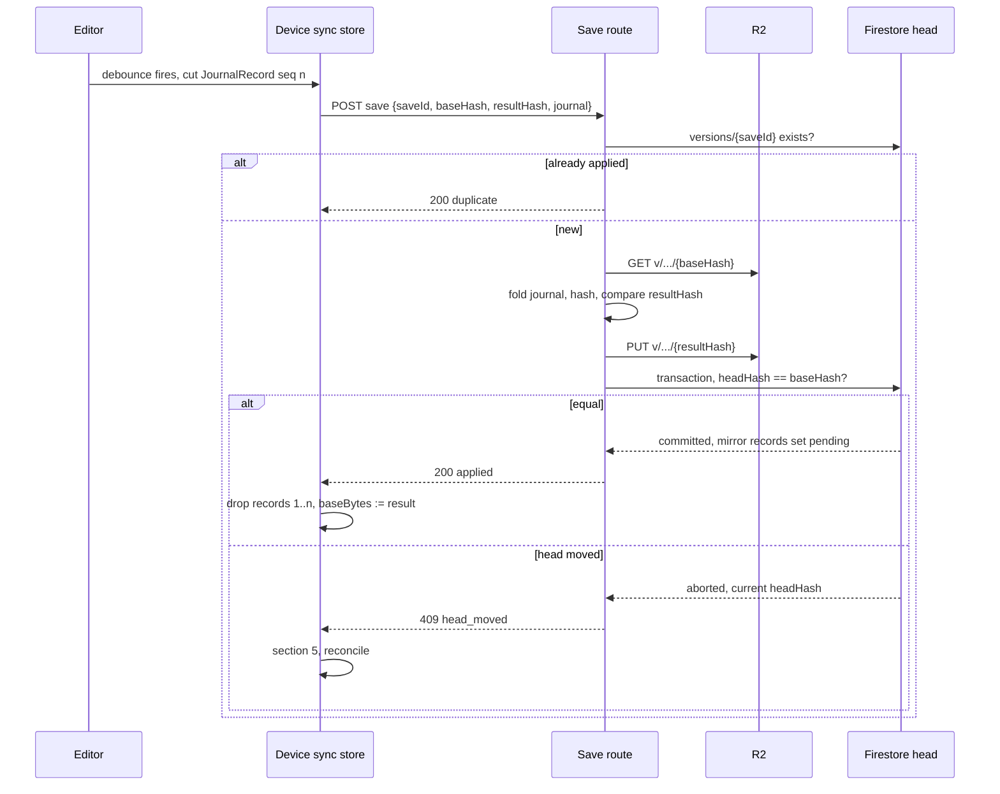
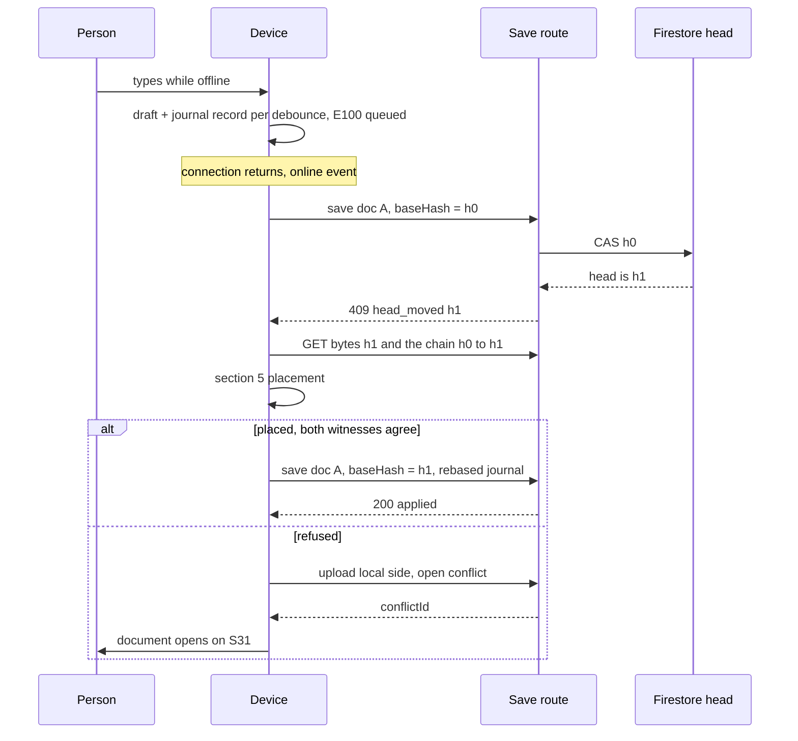
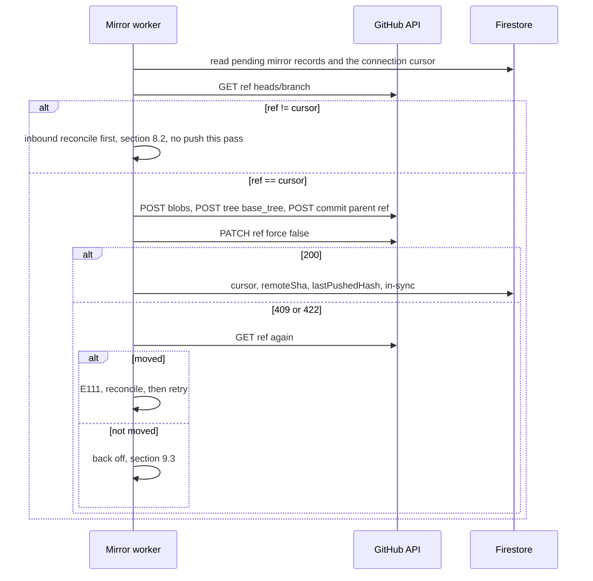
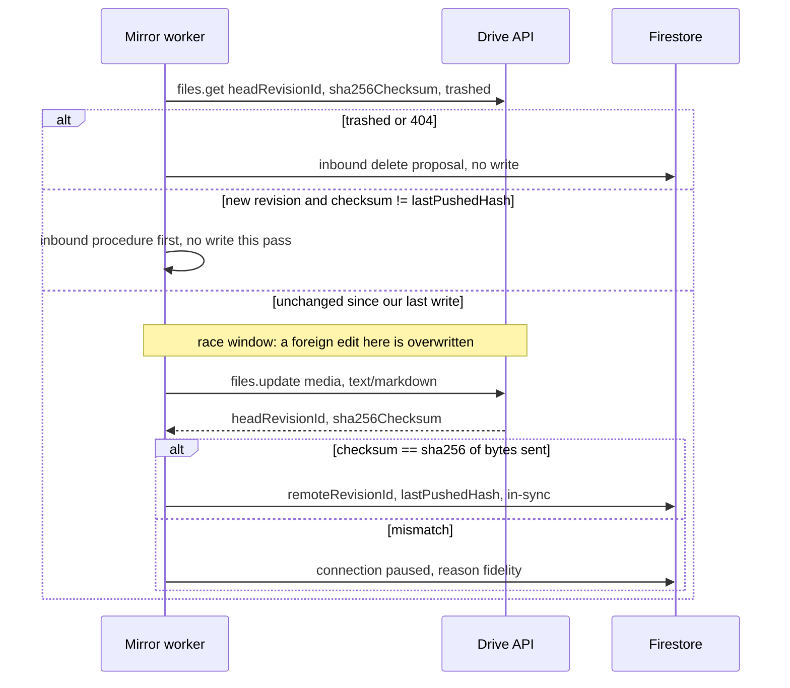
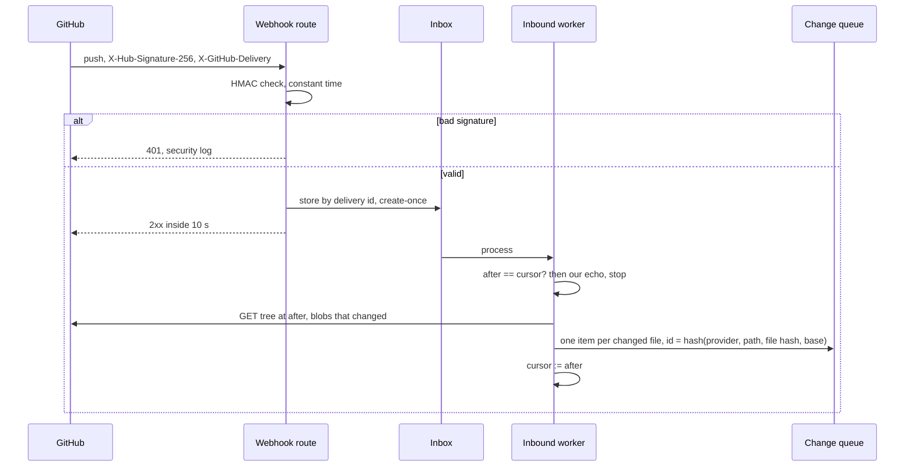
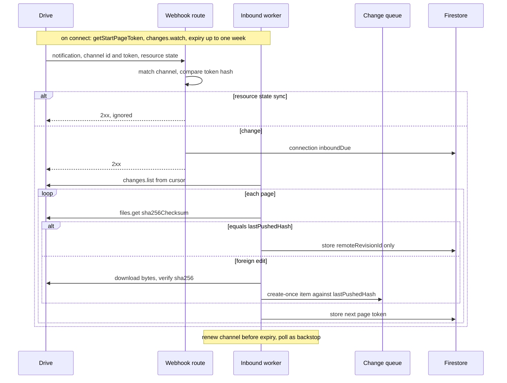

# 67. Sync and conflict

The sync specification that `10-FEATURE-REGISTER.md` section 8 records as missing. It was first
pointed at as `44-SYNC-AND-CONFLICT.md`, and the register now points here. The two decision
records behind it are `adr/ADR-0003-sync-without-crdt.md` and
`adr/ADR-0012-canonical-copy-with-mirror.md`, with recovery in `adr/ADR-0004-r2-recovery-in-key-layout.md`.

**Everything below is specified, not built**, except the pieces section 12 names with a path.

## 0. The three positions this file carries

Position | Tag | Source
**Sync is git-merge plus a splice journal and compare-and-swap, never a CRDT (conflict-free replicated data type).** | `[R]` settled, do not re-litigate | `CLAUDE.md:121`, and the full reasoning at `docs/FRONTMATTER-PRD-v2-2026-08-29.md:2904`
**R2 has no object versioning, so recovery is built into the key layout.** | `[L]` settled | `CLAUDE.md:124`, `21-DATA-MODEL.md` section 21.8
**Our copy is canonical. The person's GitHub repository or a visible Drive folder holds a full mirror on both plans. Mirror edits come back as change queue items. Storage has a soft cap.** | `[Z]` D03, 18 September 2026 | `56-OPEN-DECISIONS.md` section 0, `docs/research/2026-09-18-storage/STORAGE-BENCHMARK.md` section 6

**What "canonical" means in one line.** R2 holds the bytes of every version, and the Firestore
document head decides which version is current. Every other copy is a device draft or a mirror.

**The law every section obeys.** No silent merge, ever. It is invariant 12 of
`docs/mvp0/PRODUCT-PLAN.md` section 17. Section 5 below says exactly where the line between placing
a person's own edit and merging two people's edits is drawn.

## 1. The copies, and which one wins

Copy | Holds | Canonical | Written by | Read back by
R2, `v/{vaultId}/{docId}/{sha256}` | Every version's bytes, write once | **Yes, for bytes** | The save path, section 3 | Everything
Firestore `vaults/{vaultId}/docs/{docId}` | `headVersionId`, `headKey`, `headHash` | **Yes, for which version is current** | The save transaction only | Everything
Device draft, IndexedDB `sgnk-md` / `drafts` | The working copy, `{ content, baseSha, updatedAt }` | No | The editor, on every debounce | The sync client
Device sync store, IndexedDB `fmd-sync` | The base bytes and the splice journal | No. A checkable derivative | The sync client | The sync client
The person's GitHub repository | Head bytes of each document under `docs/` | No. A mirror, and a source of proposals | The mirror worker, section 7 | The inbound worker, section 8
The person's Drive folder `frontmatter` | Head bytes of each document | No. A mirror, and a source of proposals | The mirror worker, section 7 | The inbound worker, section 8
Desktop watched folder | The files on disk | No. A source of proposals | The desktop app | The desktop watcher

- The first two rows are `21-DATA-MODEL.md` sections 21.4 and 21.8. This file adds no field to
  them without saying so in section 11.
- The draft key and its shape are shipped at `src/modules/drafts/infrastructure/draft-store.ts:12`.
  `AGENTS.md` section 8 forbids renaming it. So the journal lives in a **new** database, `fmd-sync`,
  and the draft store is left exactly as it is.
- `INFERENCE:` a new database rather than a new object store in `sgnk-md`, because `idb-keyval`'s
  `createStore("sgnk-md", "drafts")` opens the database without a version bump, and a second store
  needs one.

## 2. The splice journal

### 2.1 What it is for

The journal is the device's record of what the person typed since the last acknowledged save. The
design is `docs/FRONTMATTER-PRD-v2-2026-08-29.md:2969`: base bytes, working bytes, and an
append-only journal between them.

**It is a checkable derivative, never authority** (`docs/FRONTMATTER-PRD-v2-2026-08-29.md:2970`).
The rule that makes it checkable:

```
fold(journal, base_bytes) == working_bytes     at every record boundary
```

If that fails, the journal is thrown away and the save falls back to sending whole working bytes
(section 3.4). The working bytes are what the person sees, so they win over their own journal.

### 2.2 The record

```ts
export const JOURNAL_VERSION = 'fmd/journal@1'

export interface JournalRecord {
  readonly v: typeof JOURNAL_VERSION
  readonly opId: string          // ULID minted on the device. The record's idempotency key
  readonly docId: string         // Firestore doc id, never the path. A rename does not break it
  readonly deviceId: string      // minted once per browser profile or desktop install
  readonly seq: number           // per (deviceId, docId). Starts at 1, rises by 1, no gaps
  readonly author: string        // uid of the signed-in person
  readonly baseHash: string      // SHA-256 hex of the bytes before this record
  readonly splices: readonly Splice[]  // applied in array order
  readonly resultHash: string    // SHA-256 hex of the bytes after the last splice
  readonly resultSize: number    // bytes
  readonly createdAt: number     // device clock. Display only. Never used for ordering
}

export interface Splice {
  readonly offset: number        // byte offset into the bytes after the previous splice
  readonly deleteLen: number     // bytes removed at offset. 0 for a pure insertion
  readonly deletedHash: string   // SHA-256 hex of the removed bytes. Hash of empty input when 0
  readonly insert: Uint8Array    // bytes inserted at offset. Base64 on the wire
}
```

Field rules a builder must keep:

- **Offsets are bytes, not UTF-16 code units.** The editor works in JavaScript strings. Convert at
  the edge with `TextEncoder`, and decode with
  `new TextDecoder('utf-8', { fatal: true, ignoreBOM: true })`.
- **Why those two options.** `[O]` run in this session under node v24.6.0: the default decoder
  strips a byte-order mark (`EF BB BF 41 0D 0A` decodes to `"A\r\n"`), and `ignoreBOM: true` keeps
  it.
- `fatal: true` throws a `TypeError` on the byte `FF` instead of substituting a replacement
  character. Invariant 4 of `25-ENGINE-SPEC.md` section 25.4 needs both.
- **`deletedHash` is not optional.** It is what lets a replay on a moved head refuse instead of
  deleting the wrong bytes (section 5.3), and it carries the deletion-intent check of
  `docs/FRONTMATTER-PRD-v2-2026-08-29.md:2999`.
- **A record is cut at the draft debounce, not per keystroke.** Digests are computed at record
  boundaries only. `INFERENCE:` hashing a 10 MB document on every keystroke would fight the 100 ms
  keystroke target of `docs/mvp0/PRODUCT-PLAN.md` section 21.

### 2.3 The device store

Database `fmd-sync`, one object store `docs`, keyed by `docId`:

```ts
interface DeviceSyncState {
  docId: string
  path: string              // for display and for the legacy draft key only
  baseHash: string          // headHash of the last save the server acknowledged
  baseVersionId: string
  baseBytes: Uint8Array     // verbatim bytes of that version
  journal: JournalRecord[]  // records after baseHash, in seq order
  nextSeq: number
  dirtySince: number | null // device clock, display only
  conflictId: string | null // set when section 5.7 raised S31
  lastAckAt: number | null  // for the banner's last-synced time, K.s24.lastsync
}
```

- **Truncation.** When a save returns `headHash == resultHash` of record `n`, records `1..n` are
  dropped and `baseBytes` becomes those bytes. Only an acknowledged save, the fallback of section
  3.4, or a resolution on S31 removes a record.
- **The banner never says synced on a guess.** "Synced" is shown only when the server has
  acknowledged a `headHash` equal to the SHA-256 of the working bytes
  (`docs/FRONTMATTER-PRD-v2-2026-08-29.md:2989`).
- **Legacy drafts.** A draft written before this store existed has a GitHub blob sha in `baseSha`
  and no `fmd-sync` entry. It is not synced by this path.
- A legacy draft goes through the A33 migration named
  in `21-DATA-MODEL.md` section 21.9, which writes versions and renames no key.

## 3. The save path, device to head

### 3.1 The route

`POST /api/docs/{docId}/save`. **Specified, not built.** The shipped routes live under
`/api/vault/` and write to GitHub (`34-INTEGRATIONS.md` section 4).

Request field | Type | Rule
`saveId` | string | ULID minted by the device for this save. **Reused unchanged on every retry of the same save**
`baseHash` | string | The device's `baseHash`. This is the compare-and-swap token
`resultHash` | string | SHA-256 hex of the working bytes the device wants to become the head
`resultSize` | number | bytes
`journal` | `JournalRecord[]` | Records after `baseHash`. Empty when `bytes` is sent instead
`bytes` | base64 or absent | Whole working bytes. Sent only on the fallback of section 3.4
`deviceId` | string | For the version record and for S31's origin line

Response | Meaning
`200 { status: "applied", headHash, headVersionId }` | The head is now `resultHash`
`200 { status: "duplicate", headHash, headVersionId }` | This `saveId` was already applied. Treat exactly as applied
`409 { status: "head_moved", headHash, headVersionId }` | Nothing was written. Go to section 5
`422 { status: "journal_mismatch" }` | The fold did not produce `resultHash`. Nothing was written. Resend with `bytes`
`409 { status: "conflict_open", conflictId }` | The document is in conflict. Nothing was written. Open S31

### 3.2 The steps, in order

1. **Authorise.** Session required (`E050`). The person must hold Apply on the document
   (`docs/mvp0/PRODUCT-PLAN.md` section 19). A Viewer gets `E053`, a Commenter `E054`.
2. **Idempotency.** If `vaults/{vaultId}/docs/{docId}/versions/{saveId}` exists, return
   `duplicate` with that version's hash. The version id **is** the `saveId`, so a retried save can
   never make two versions.
3. **Build the bytes.** Read the base bytes from R2 at `v/{vaultId}/{docId}/{baseHash}`. Fold the
   journal over them. If the SHA-256 of the result is not `resultHash`, return `journal_mismatch`.
   With `bytes` present, hash them instead and require the same equality.
4. **Validate.** Fatal UTF-8 decode (`E019` on failure), then the shape gate budgets (`E016`,
   `E017`). A refused save writes nothing and the draft stays on the device.
5. **Write the bytes first.** `PUT v/{vaultId}/{docId}/{resultHash}`. Identical bytes give an
   identical key, so a repeat is a no-op, never an overwrite (`21-DATA-MODEL.md` section 21.8).
6. **Flip the pointer, conditionally.** One Firestore transaction, section 3.3.
7. **Return** `applied`.

**Bytes before pointer, always.** The same order `21-DATA-MODEL.md` section 21.7 sets for uploads.
A crash between steps 5 and 6 leaves an orphan object and an unchanged head.

The orphan is
collectable by the sweep of section 21.8 because its key ends in its own hash.

### 3.3 The compare-and-swap

```
transaction:
  head = get(vaults/{vaultId}/docs/{docId})
  if head.deletedAt != null         -> abort, E042
  if head.conflictOpen == true      -> abort, 409 conflict_open
  if head.headHash != baseHash      -> abort, 409 head_moved (return head.headHash)
  create versions/{saveId} {
    key, hash: resultHash, size, parentVersionId: head.headVersionId,
    author: uid, source: "person", model: null, ask: null,
    acceptedBy: null, message: null, createdAt: serverTime }
  update head { headVersionId: saveId, headKey, headHash: resultHash, size,
                title, tags, outbound, backlinks, embeds, frontmatterKeys,
                updatedAt: serverTime }
  for each provider with an active connection and a record not `excluded`:
    update docs/{docId}/mirror/{provider} { status: "pending" }
```

- **The derived fields are computed from the result bytes before the transaction opens**, so the
  transaction does no parsing and stays short.
- **The mirror mark is inside the same transaction.** A head that moved without a mirror mark would
  be a mirror that silently falls behind.
- The record is `vaults/{vaultId}/docs/{docId}/mirror/{provider}`
  of `21-DATA-MODEL.md` section 21.4, and `pending` is its own status value. A record in `conflict`
  stays in `conflict`: its open queue item decides first.
- **`headHash` is the only compare token**, per D03's wording.
- `INFERENCE:` the case where the head
  goes A, then B, then back to A by a restore is harmless here, because the device's
  splices were computed against bytes A and the head is bytes A again.
- **Ordering is the version chain, never a clock.** `parentVersionId` is the order. No wall clock
  sits on any correctness path (`docs/FRONTMATTER-PRD-v2-2026-08-29.md:2967` sets the same rule).

### 3.4 The fallback to whole bytes

On `journal_mismatch` the device checks its own fold. If `fold(journal, baseBytes)` equals the
working bytes, the server's base differs from the device's, which is a defect: report it to Sentry
and resend with `bytes`.

If the device's own fold fails, drop the journal and resend with `bytes`.

**Either way the person's working bytes are what get saved.** They are what the person sees.

### 3.5 The sequence



## 4. Offline edits and reconnect

### 4.1 While offline

- Every debounce writes the draft, exactly as the shipped `saveDraft` does, and appends one journal
  record to `fmd-sync`. Both writes are local.
- **A failed local write interrupts at once** with `E107`, the one interruption S24 allows.
- A save attempted with no connection is `E100`, unchanged `queued`. Nothing is shown beyond the
  banner of S24.
- **AI edit is refused offline** with `E087`. Nothing is sent and nothing is charged.
- Persistence is requested inside a user gesture. A refusal is `E104`, silent by design.

### 4.2 The reconnect triggers

Background Sync exists only in Chromium (`docs/mvp0/PRODUCT-PLAN.md` section 12). So the page
drives sync itself, on each of these:

- the `online` event
- `visibilitychange` to visible, and page focus
- `pagehide`, as a last attempt before the tab goes
- a successful sign-in after `unauthorised`, S24's state
- Background Sync, only as a Chromium optimisation behind a feature check

These are `docs/FRONTMATTER-PRD-v2-2026-08-29.md` section 31.2, carried over. No correctness rule
depends on any one of them firing.

### 4.3 The drain

1. List documents with a non-empty journal, oldest `dirtySince` first.
2. For each, run the save path of section 3 with the device's `baseHash`.
3. `applied` or `duplicate`: truncate, lower the waiting count, go to the next.
4. `head_moved`: section 5 for that document, then the next.
5. `conflict_open`: leave the journal intact, route the document to S31, go to the next.
6. A network failure stops the drain and schedules a retry by section 9.3.

**One document at a time per device.** `INFERENCE:` parallel saves would be correct, because each
is its own compare-and-swap, but serial draining keeps the waiting count honest and the backoff
simple.



## 5. The three-way rule

### 5.1 Who merges

**The server never merges.** It is a byte store with compare-and-swap
(`docs/FRONTMATTER-PRD-v2-2026-08-29.md:2966`). Every merge computation in this file runs on the
device that holds the unsynced work, or in the accept step of the change queue.

### 5.2 Inputs

Name | What | Where it comes from
`B` | Base bytes | `fmd-sync` `baseBytes`, the true stored base. Never re-derived from the winner
`L` | Local working bytes | The draft
`H` | Current head bytes | `GET` from R2 at the `headHash` the 409 returned
`J` | The journal, `B` to `L` | `fmd-sync`
`C` | The version chain from `B` to `H` | Walk `parentVersionId` back from the head

### 5.3 The rule

Step | Check | If it fails
0 | `H == L` | Not a conflict. Adopt `H` as base, clear the journal, done
0b | `H == B` | Not a conflict. Retry the save; the 409 was a race that has cleared
1 | `B`, `L`, `H` all decode under fatal UTF-8 | Refuse placement. Raise S31
2 | No line of `B`, `L` or `H` begins `<<<<<<<`, `=======` or `>>>>>>>` | Refuse placement. Raise S31. Git's own merge nests markers on such input (M9, `docs/FRONTMATTER-PRD-v2-2026-08-29.md:2981`)
3 | `C` reaches `B` inside the history window | Refuse placement. Raise S31. A pruned base is not a base
3b | Every version in `C` has `author` equal to the saver's uid, the stricter rule of section 5.6 | Refuse placement. Raise S31
4 | The merge budget holds, section 5.5 | Refuse placement. Raise S31 with `E504`
5 | `M = merge3(B, L, H)`, run on the three texts decoded as in section 2.2, reports zero conflicts | Discard `M`. Raise S31. **Markers are never kept, never shown, never saved**
6 | `P = replay(J, H)` places every splice, section 5.4 | Raise S31
7 | `sha256(P) == sha256(M)` | Raise S31. Two methods disagreeing means one of them guessed
8 | Save `P` with `baseHash = hash(H)` and the rebased journal | A second 409 returns to step 0 with the new head, up to `SYNC_PLACE_MAX_ROUNDS`, then the drain backs off by section 9.3

**The two witnesses in steps 5 to 7 are the heart of it.** `merge3` is line-based
(`src/modules/repository/domain/merge3.ts:26` splits on `"\n"`). The replay is byte-based and
refusal-capable. A result is saved only when both produce the same bytes.

**`git merge-file --union` and diff-match-patch are banned in this path**
(`docs/FRONTMATTER-PRD-v2-2026-08-29.md:2949` and section 31.1). Both guess.

### 5.4 The replay

For each splice in `J`, in order:

1. Map its range from `B`-space to `H`-space through the diff `B` to `H`. Only ranges inside regions
   the diff marks unchanged can be mapped.
2. **The deleted range must sit wholly inside one unchanged region.** Touching a changed region, or
   a pure insertion at the exact point where `H` also inserted, refuses. The second case is git's
   M2: both sides appending at the end.
3. The bytes at the mapped range in the buffer being built must hash to `deletedHash`.
4. Splice. Continue with the next.

Any refusal stops the replay. No splice is partially kept.

### 5.5 The budget

`merge3` fills an `(n+1) × (m+1)` table of line counts. `INFERENCE:` two files of 10,000 lines each
is 10,000 × 10,000 = 100,000,000 cells, which a phone tab should not be asked for.

The guard is a
named constant, `MERGE_CELL_BUDGET`, checked for both `B` against `L` and `B` against `H` before
either diff runs. Over it, step 4 refuses.

**Resolved (proposed 18 Sep, founder review): `MERGE_CELL_BUDGET` is 4,000,000 cells per diff, and
the merge runs in a Web Worker.** The pilot's measured document sizes may move the value; it is one
constant in `src/config/`.

`[O]` the shipped `merge3` timed on this development Mac, Node v24.6.0, one process per size, with
`node --experimental-strip-types` over a copy of `src/modules/repository/domain/merge3.ts`:

Lines on each side | Cells per diff | Time for one `merge3` | Resident memory added
1,000 | 1,000,000 | 51 ms | 36 MiB
2,000 | 4,000,000 | 123 ms | 101 MiB
3,000 | 9,000,000 | 313 ms | 254 MiB
6,000 | 36,000,000 | 1,450 ms | 599 MiB

- The table is `number[][]` (`merge3.ts`, `diffRegions`), so memory grows with the cells, not with
  the bytes. 4,000,000 is the largest measured size that stays near 100 MiB on a desktop.
- **The worker** keeps the editor responsive while the table fills. It does not reduce memory.
- Rejected: no budget, because the shape gate allows 200,000 lines (`MAX_LINES`,
  `src/modules/mdmax/domain/shape-gate.ts:24`), which is 40,000,000,000 cells.
- Rejected for now: replacing the table with a linear-space diff. It would remove the budget, but it
  rewrites a shipped, tested witness, and that is a change to `merge3`, not to sync.
- `UNVERIFIED:` the figures on a phone. needs: the same script run in a mid-range Android browser.

### 5.6 Where placement ends and merging begins

This is the line the product's law depends on, so it is stated as rules.

- **Placement is allowed** when every byte of `P` came either from `H` unchanged or from the
  person's own journal `J`. Step 7 proves that. This is S24's "queued changes are spliced in order".
- **Merging is never allowed.** Combining two authors' edits to the same region, choosing one side
  by time, or keeping a marked result.
- **Only the author's own journal is ever placed.** A collaborator's, an AI's, an agent's or a
  mirror's change is never placed by sync. It is a queue item, section 8.
- **Every refusal lands on S31 with both sides intact.** Nothing is lost and nothing is chosen.

**Two sources disagree here, and this file does not pick silently.**

- `docs/FRONTMATTER-PRD-v2-2026-08-29.md` section 31.2, step 4, uploads a clean merge.
- `17-ERROR-AND-REFUSAL-CATALOGUE.md` section 8.1 says that if merge code ever writes a merged
  result to a version rather than a draft, the invariant is broken.

This file satisfies both readings as written: `M` never reaches a version, and what is saved is `P`,
the person's own splices replayed. But the S31 file's rule "not when only one side changed a
paragraph" could be read as forbidding even placement.

**Resolved (proposed 18 Sep, founder review): the stricter rule is the rule.** Placement happens only
when every version in `C` has `author` equal to the saver's uid. Anything else raises S31.

- Why: placing one person's splices over another person's version combines two authors' work
  without either accepting it. Invariant 12 (`docs/mvp0/PRODUCT-PLAN.md` section 17) forbids that
  `[P]`, and S31's rule reads the same way.
- Rejected: placement across authors when the two edits touch disjoint regions. It is the one change
  section 16 names as falsifying this file, and it would make step 3b meaningless.
- What would reopen it: the pilot's conflict rate between collaborators, measured, proving too high
  for S31 to carry (section 16).

### 5.7 Raising S31

1. Upload `L` as a **side version**: bytes to `v/{vaultId}/{docId}/{hash(L)}`, and a version record
   with `parentVersionId` set to `B`'s version and a `side: true` mark. The head does not move.
2. Create a conflict record, section 11, with the head's version as left and the side version as
   right, `origin` set to `browser`, `desktop`, `github` or `drive`.
3. Set `conflictOpen: true` on the head. S31's `A680` needs this: a conflicted document opens on S31,
   not in the editor, and `E851` blocks AI edits.
4. Keep the device journal. Clear it only when S31 resolves.

**Why upload the local side.** It makes the server hold both versions, so S31 can render on any
device, and the browser stops being the only copy of the person's work (`E104`'s rule).

## 6. Conflict resolution, as writes

S31 owns the screen. This section owns what each control writes.

Control | Write | Compare-and-swap token
Accept this version, left | Clear `conflictOpen`. The head stays. The side version stays in history | Head `headHash` equals the left hash drawn
Accept this version, right | New version whose bytes are the side's, parent the current head. Head moves to it. Clear `conflictOpen` | Same
Keep both | New document with the side's bytes, named per `D68`. Head unchanged. Clear `conflictOpen` | Same, plus `E070` at the document cap
Let AI decide | **One** queue item, `source: "ai"`, `baseHash` = head, carrying the merged spans. Nothing else | None. It writes no document bytes (`A129`)
Accept AI suggestion | `accept(itemId, { expectedHash })`. The previewed bytes become one version authored AI, `acceptedBy` the person. Clear `conflictOpen` | `expectedHash` equals the preview's hash, and head equals the item's `baseHash`
Review span by span | Nothing. S20 opens on the item | n/a

- **The left side is always the current head at render.** If another device saved after the
  conflict opened, S31 redraws with the new head.
- A keep pressed on the old drawing is refused. That is S31's `stale-preview` state, and `A728`.
- **The loser is always in history** (`A682`), because both sides are content-addressed versions
  and nothing here deletes a key.
- **Resolved (proposed 18 Sep, founder review): `D65` of S31, three or more diverged versions.** A
  second device's conflict on an already open conflict appends a second side version to the same
  record's `sideVersionIds[]`. S31 still draws two panes: the head on the left, **one side at a
  time** on the right, with a plain "side 1 of 2" switch.
  - Each side is resolved on its own, with the controls above, against the current head.
  - Resolving one side redraws S31 against the new head with the sides that remain. `conflictOpen`
    clears only when no side is left.
  - Why: every write in the table above already compares against the head at render, so one side at
    a time needs no new write. A third pane does not fit a phone, and the phone view is drawn.
  - Rejected: three panes, and folding the sides into one before showing them, which is a merge.
  - S31 owns the drawing. This is the data-side proposal, for S31's owner to adopt or redraw.

## 7. The mirror, outbound

### 7.1 What is mirrored

- **Markdown only.** Uploads stay in R2 and are linked. GitHub blocks files over 100 MiB and asks
  repositories to stay under 5 GB (`STORAGE-BENCHMARK.md` section 3.4).
- **The head, not every version.** The mirror is a readable copy, not the history. History stays in
  R2 for the plan's window.
- **Paths.** A document at vault path `Projects/HQ/Foo.md` mirrors to `docs/Projects/HQ/Foo.md` in
  the repository and to `frontmatter/Projects/HQ/Foo.md` in Drive.

D03 says "a full mirror in one repository", and `F242` with `E056` restricts every GitHub write to
`docs/`.

**Resolved (proposed 18 Sep, founder review): `docs/` stays, in every repository, including one we
create.** "A full mirror" is read as every document, under one prefix.

- Why: one rule, enforced server-side and tested by `A124`. A repository we create is still the
  person's, and they may add a README or code beside `docs/` without our worker touching it.
- Rejected: dropping the prefix for a repository we create. It makes `pathPrefix` depend on who
  made the repository, and doubles the tests `E056` needs.

### 7.2 When

**All of this is proposal.** The benchmark marks its cadence table `INFERENCE:` for the founders
(`STORAGE-BENCHMARK.md` section 6.4).

Event | Free | Pro
Mirror to GitHub | On an explicit push, inside the plan's 20 pushes a month | Batched, after `MIRROR_IDLE` of no saves
Mirror to Drive | On close of a document, and once a day | Batched, same cadence as GitHub
Inbound edits | Enter the queue | Enter the queue

**Resolved (proposed 18 Sep, needs founder): Free has no automatic GitHub push, so nothing automatic
spends the quota.** A Free push happens only when the person presses it, and each one counts
against the 20 of `F243`.

- Each push carries every changed document, so the mirror is complete and current as of the last
  push. The plan says the same: `docs/mvp0/PRODUCT-PLAN.md` section 11, marked `INFERENCE:` there.
- Drive on Free stays automatic, on close and once a day, because Drive has no push quota.
- The cadence table above is adopted as written, as the benchmark proposed it.
- Rejected: automatic Free pushes counted against the quota. A busy writer would spend the month's
  20 in a day, and then the mirror stops without the person having chosen anything.
- **Needs founder** because it bounds what "a full mirror on both plans" promises a Free person on
  GitHub: full, but only as fresh as their last push.

### 7.3 The mirror worker

- Scans mirror records with `status: "pending"`, through the `mirror` index of `21-DATA-MODEL.md`
  section 21.6. The save transaction sets `pending`, section 3.3.
- **Pushes the head's current bytes**, never the bytes that were current when `pending` was set.
- Sets `in-sync` only inside a transaction that reads the head and finds `headHash` equal to the
  hash just pushed. A save during the push leaves the record `pending`.
- **Skips a record in `conflict`.** Its `conflictItemId` is an open inbound item. Pushing over it
  would overwrite the person's change in their own mirror before they decided on it. When the item
  is decided, the record returns to `pending`.
- **Where it runs was not decided.** `24-SERVER-SPEC.md` section 24.6: there is no background work on
  the server today, no cron and no queue.
- **Resolved (proposed 18 Sep, founder review): both workers run as one Cloudflare Durable Object
  per connection**, keyed `{uid}:{provider}`, with the Durable Object alarm as its clock.
  - The save transaction marks a record `pending` and pings that object. The alarm runs the batch
    after `MIRROR_IDLE`, the Drive backstop poll, and channel renewal, from one schedule it keeps
    in storage.
  - The webhook routes stay on Vercel. They verify, write `webhookInbox`, reply 2xx, and ping the
    object.
  - Why: Durable Objects are already in the stack (ADR-0007). One object per connection makes
    every write to that repository or folder serial, which GitHub asks for (section 7.4). An alarm
    retries on its own.
  - `[M]` "Only one instance of alarm() will ever run at a given time per Durable Object instance",
    and alarms "have guaranteed at-least-once execution", with automatic retries.
    `https://developers.cloudflare.com/durable-objects/api/alarms/`, opened 18 September 2026.
  - At-least-once means a batch can run twice. The create-once ids of section 9.2 and the
    `cursor` check of 7.4 step 3 already absorb that.
  - Rejected: Vercel Cron calling a route. It adds a scheduler that knows nothing of per-connection
    order, and 24.6 records no cron today. Cost is not re-derived here.

### 7.4 GitHub push

The shipped writer already uses the Git Data API with `force: false`
(`src/modules/repository/infrastructure/github-writer.ts:176`). A batch is one commit, as the
benchmark requires (`STORAGE-BENCHMARK.md` section 3.3).

1. Mint an installation token, or reuse a cached one before its one-hour expiry. Expiry mid-batch is
   `E092`, internal, refreshed and retried.
2. `GET /repos/{o}/{r}/git/ref/heads/{branch}`. Call the result `R`.
3. **If `R` is not the connection's `cursor`, somebody else pushed.** `cursor` is the last commit sha
   we wrote or reconciled (`21-DATA-MODEL.md`, `users/{uid}/connections/{provider}`). Run the inbound
   reconcile of section 8.2 first, and do not push in this pass.
4. For each `pending` record: check the mirror path starts with the connection's `pathPrefix`,
   `docs/`, else refuse with `E056`. Create a blob of the head bytes.
5. `POST /git/trees` with `base_tree` = `R`'s tree. `POST /git/commits` with parent `R`.
6. `PATCH /git/refs/heads/{branch}` with `force: false`. GitHub documents 409 and 422 on this call.
7. On 409 or 422: re-read the ref. **If it moved**, this is `E111`, compare-and-swap in GitHub's
   words: go to step 3. If it did not move, it is a validation failure: back off by section 9.3.
8. On success: set the connection's `cursor` to the new commit, and on each record `remoteSha` (the
   blob sha), `lastPushedHash`, `lastPushedVersionId` and `lastPushedAt`. Set `in-sync` per 7.3.

- **One batch at a time per repository.** GitHub: concurrent contents writes "will conflict", use
  them "serially" (`STORAGE-BENCHMARK.md:194`).
- **Pace.** GitHub recommends at most 6 pushes a minute per repository
  (`STORAGE-BENCHMARK.md:202`), and its secondary limit is 80 content-generating requests a minute
  and 500 an hour (section 3.1). A 403 or 429 is `E093`. Honour `retry-after` when present.
- **Free's quota.** A push with the monthly quota spent is `E075`. The document still saves.
- **A single-file batch may use the contents API** with the stored blob `sha`. A stale `sha`
  returns 409 (`STORAGE-BENCHMARK.md:193`), and the handling is the same as step 7.

`[O]` the blob sha is git's, not ours: `printf 'A\n' | git hash-object --stdin` printed
`f70f10e4db19068f79bc43844b49f3eece45c4e8`, the SHA-1 of `blob 2\0A\n`. So the record keeps both,
`remoteSha` for git and `lastPushedHash` for ours, and each is compared only with its own kind.



### 7.5 Drive push, read before write

Drive offered no write precondition in the pages the benchmark opened
(`STORAGE-BENCHMARK.md:148`). So the write is guarded by a read, and the guard has a known hole.

1. `files.get(remoteId, fields="headRevisionId,sha256Checksum,trashed")`. `remoteId` is the Drive
   file id on the mirror record.
2. Trashed, or 404: do not write. It becomes an inbound delete proposal, section 8.4.
3. **If `headRevisionId` differs from the record's `remoteRevisionId` and `sha256Checksum` differs
   from `lastPushedHash`, somebody else edited.** Run the inbound procedure of section 8.3 for this
   file first. Do not write in this pass.
4. A new revision with an unchanged checksum is not an edit. Store the revision id and carry on.
5. `files.update` with media upload of the head bytes, `mimeType: text/markdown`, asking for
   `headRevisionId,sha256Checksum` in the response.
6. **The response's `sha256Checksum` must equal the SHA-256 of the bytes sent.** Drive's checksum
   and our `headHash` are the same function over the same bytes, so equality is the fidelity test.
7. If not equal, set the connection's `status` to `paused` with `statusReason: "fidelity"`, and page the
   operator. This is falsification test 1 running in production.
8. Store `remoteRevisionId`, `lastPushedHash`, `lastPushedVersionId`, `lastPushedAt`, and `in-sync`
   per section 7.3.

`[M]` field meanings, from the v3 `files` reference fetched 18 September 2026
(`https://developers.google.com/workspace/drive/api/reference/rest/v3/files`):

- `sha256Checksum`: "only populated for files with content stored in Google Drive; it's not
  populated for Docs Editors or shortcut files". A `text/markdown` upload is content stored in Drive.
- `version`: "A monotonically increasing version number for the file", which "reflects every change
  made to the file on the server, even those not visible to the user".
- So a version jump alone does not prove a foreign edit, and this file does not use `version`.
- `headRevisionId`: "currently only available for files with binary content". `INFERENCE:` a
  `text/markdown` upload is binary content in this sense, as it is not a Docs Editors file. If it
  is absent, step 3 falls back to the checksum alone.

**The known race.** A foreign edit landing between step 1 and step 5 is overwritten, and step 6
cannot see it because the checksum it reads is our own.

`INFERENCE:` the only recovery is to list
the file's revisions after the write and look for one between the step-1 revision and ours that we
did not write.

Whether Drive keeps such a revision, checked 18 September 2026 against the revisions guide
(`https://developers.google.com/workspace/drive/api/guides/manage-revisions`, page last updated
2026-09-03) `[M]`:

- "The head revision is never auto-purged."
- "Purgeable revisions are typically preserved for 30 days, but can be purged earlier if a file has
  100 revisions that aren't designated as "Keep Forever" and a new revision is uploaded."
- Up to 200 revisions per file can be marked `keepForever`, and they count towards storage.

So an overwritten foreign edit normally survives as a revision for about 30 days, and the worker can
recover it inside that window. **It is a normal outcome, not a guarantee.** A file with 100 or more
revisions can lose it at our next upload.

- `UNVERIFIED:` whether every foreign upload makes its own revision, or Drive groups close ones.
  needs: falsification test 2, which also measures the hole itself.



## 8. The mirror, inbound

### 8.1 The rule

**An edit made in the mirror is a proposal, never a write.** It becomes one queue item in
`vaults/{vaultId}/docs/{docId}/queue/{itemId}`, against the base it was made on, and the person
accepts or rejects it on S20. D03, `[Z]`.

Queue field | Value for a mirror edit
`baseHash` | `lastPushedHash` for that path: the version the mirror last showed
`spanStart`, `spanEnd` | The base range between the common prefix and the common suffix of base and incoming bytes. Exact, byte-level, deterministic
`proposedInline` or `proposedKey` | The incoming bytes of that range, inline up to the 64 KiB cut of `21-DATA-MODEL.md` section 21.4, else R2
`proposedHash` | SHA-256 of the proposed range's bytes
`author` | The connection owner's uid
`source` | See the open point below
`state` | `open`

- **Item id is deterministic**: SHA-256 of `provider`, the mirror path, the incoming file hash and
  `baseHash`. Creating it is a create-once write, so a redelivered notification makes no second item.
- **The mirror record goes to `status: "conflict"`** with `conflictItemId` set to the item, in the
  same write that creates it. Section 7.3 then skips it until the item is decided.
- **One item per file per foreign change.** `INFERENCE:` a single prefix-and-suffix span is exact
  and needs no guessing, at the price of one wide span when edits are scattered.
- The queue's `source` enum is `person`, `ai`, `agent` (`21-DATA-MODEL.md` section 21.4). A mirror
  edit may be the person, a collaborator on their repository, or a bot, and we cannot tell.
- **Resolved (proposed 18 Sep, founder review): a fourth value, `source: "mirror"`**, with the git
  author or Drive `lastModifyingUser` kept as `externalAuthor`, a display string only. S20 treats it
  like an agent row: diff shown first, never bulk-accepted.
  - Why: the enum records who we know wrote it, and for a mirror edit we know only the channel.
  - Rejected: `person`, which claims an identity we cannot check and would let a bot's edit be
    bulk-accepted. Rejected: `agent`, which loses the provider S20 needs for its origin line.
  - The field lands in `21-DATA-MODEL.md` section 21.4 and S20 when their owners adopt section 11.

### 8.2 GitHub, by webhook

1. **Verify before anything else.** GitHub signs each delivery in `X-Hub-Signature-256`, an HMAC hex
   digest that "always starts with `sha256=`", and says to compare with "a method like
   `secure_compare` or `crypto.timingSafeEqual`" `[M]`.

   Source: `https://docs.github.com/en/webhooks/using-webhooks/validating-webhook-deliveries`,
   fetched 18 September 2026. A bad signature gets 401 and a security-log line, and nothing else.
2. **Store, then acknowledge.** Write the delivery to an inbox keyed by `X-GitHub-Delivery`, a
   "globally unique identifier" `[M]`, and answer 2xx. GitHub's own advice is to respond within
   10 seconds and process in the background `[M]`
   (`https://docs.github.com/en/webhooks/using-webhooks/best-practices-for-using-webhooks`).
3. **Filter.** Only `push` events on the mirrored branch. If `after` equals the connection's `cursor`,
   it is our own push: record it and stop.
4. **Reconcile by tree, not by the payload's file lists.** Read the tree at `after` under `docs/`.
   For each mirrored path whose blob sha differs from the record's `remoteSha`, fetch the blob.
5. If the blob's SHA-256 equals `lastPushedHash`, update `remoteSha` only. Otherwise create the queue
   item of section 8.1.
6. New paths under `docs/` become create proposals, missing paths delete proposals, section 8.4.
7. Set `cursor = after` only after every item for this push is durably created.

**Why the tree.** The push payload "includes a maximum of 2048 commits" `[M]`, and a force push
(`forced: true`) rewrites them. The tree at `after` is the state, whatever the history did.

**Missed deliveries.** "GitHub does not automatically redeliver failed webhook deliveries" `[M]`
(`https://docs.github.com/en/webhooks/using-webhooks/handling-failed-webhook-deliveries`).

So the worker also compares the branch ref with `cursor` on a sweep, `GITHUB_SWEEP_INTERVAL`, and
runs steps 4 to 7 when they differ.

The installation token has its own budget, so this does not
spend the person's 5,000 requests an hour (`STORAGE-BENCHMARK.md` section 3.1).



### 8.3 Drive, by changes feed and watch channel

The benchmark's shape: "a cursor plus a webhook we renew weekly" (`STORAGE-BENCHMARK.md:363`).

**On connect.**

1. `changes.getStartPageToken`. Store it as the connection's `cursor`.
2. `changes.watch` with a fresh channel id, a random channel token stored as a hash, our HTTPS
   address, and an expiry. Store `watchChannelId` and `watchExpiresAt` on the connection. The maximum for changes is 604800 seconds, one week
   (`STORAGE-BENCHMARK.md:141`).

**On a notification.**

1. Match `X-Goog-Channel-ID` to a live channel and `X-Goog-Channel-Token` to its stored hash, in
   constant time. Anything else gets 401 and a security-log line.
2. `X-Goog-Resource-State: sync` is the start message and is ignored. Drive's page says it is "safe to
   ignore" `[M]` (`https://developers.google.com/workspace/drive/api/guides/push`, fetched
   18 September 2026).
3. Mark the connection `inboundDue` and answer 2xx. **The notification carries no content**, so
   nothing is decided here.

**The worker.**

1. `changes.list` from `cursor`, page by page.
2. For each change whose file id is a mirror record's `remoteId`: trashed or removed becomes a
   delete proposal. Otherwise `files.get` for `headRevisionId` and `sha256Checksum`.
3. Checksum equal to `lastPushedHash`: our own write, or no content change. Store `remoteRevisionId`,
   stop.
4. Otherwise download the bytes, **check their SHA-256 against `sha256Checksum`**, and create the
   queue item of section 8.1. Store `remoteRevisionId`.
5. Store the next page token only after that page's items are durably created, then
   `newStartPageToken` at the end. A crash replays a page, and create-once ids absorb the replay.

**Renewal.** Before `watchExpiresAt` minus `DRIVE_WATCH_RENEW_BEFORE`, open a new channel, store
it, then `channels.stop` the old one. The overlap is harmless: the cursor, not the notification,
decides what is processed.

**The poll stays as a backstop.** Notifications can be missed and channels can lapse. The worker also
runs step 1 every `DRIVE_POLL_INTERVAL`.

**Two sources disagreed, and `34-INTEGRATIONS.md` section 8 left the choice to this file.**
`docs/mvp0/PRODUCT-PLAN.md` section 11 says "Why we poll rather than subscribe" and sets a five-minute
poll. D03, newer and `[Z]`, says the feed is woken by a watch channel.

**Decided here: both.** The watch channel wakes the worker within seconds of an edit. The poll stays
at the plan's five minutes as the backstop, so the quota arithmetic of `34-INTEGRATIONS.md` section 8
still holds as an upper bound.

**Resolved (proposed 18 Sep, founder review): `DRIVE_POLL_INTERVAL` is 60 minutes**, because the
watch channel now carries the latency and the poll only catches what it missed.

The arithmetic, on `34-INTEGRATIONS.md` section 8's figures of 30 saves at 50 units and a poll call
at 100 units, against the 400,000,000-unit daily project threshold (`STORAGE-BENCHMARK.md`
section 2.4):

Poll | Poll units a day per person | With saves | People before the daily threshold
Five minutes | 288 × 100 = 28,800 | 30,300 | 400,000,000 / 30,300 = about 13,201
Sixty minutes | 24 × 100 = 2,400 | 3,900 | 400,000,000 / 3,900 = about 102,564

- The cost of the change: an edit whose notification is lost reaches the queue within an hour, not
  five minutes. A mirror edit is a proposal, so a late one loses nothing.
- Rejected: keeping five minutes, which spends most of each person's units on a backstop.
- Rejected: no poll at all. Notifications can be missed and channels can lapse, as above.
- `34-INTEGRATIONS.md` section 8 and `F244` carry the five-minute figure. Their owners update them.



### 8.4 Creates, deletes and renames from the mirror

Mirror event | What it becomes | Never
A file deleted, or trashed in Drive | A delete proposal on the document | A deletion of our copy without an accept
A new file under `docs/` in GitHub | A create proposal, at the path it appeared | A new document without an accept. `E070` at the cap, on accept
A new file dropped into the Drive folder by hand | Nothing. See the limit below | Silent import
A rename or move | A delete proposal and a create proposal, paired | A guessed rename

- **The Drive limit.** `drive.file` reaches files our app created or the person picked
  (`STORAGE-BENCHMARK.md` section 2.1). `INFERENCE:` a file the person makes in Drive's own UI, even
  inside our folder, is invisible to us until picked in the Google Picker.
- The connections screen, S23, must say so.
- The queue has no `kind` for create or delete (`21-DATA-MODEL.md` section 21.4 carries a span
  only).
- **Resolved (proposed 18 Sep, founder review): add `kind: "splice" | "create" | "delete"`,
  defaulting to `splice`**, and a `pairId` shared by the two halves of a rename.
  - A `create` carries the whole file as its proposed bytes and a path. A `delete` carries no bytes.
  - S20 shows a paired rename as one row, and accepting it accepts both halves or neither.
  - Rejected: encoding a delete as a splice over the whole file. Accepting it would leave an empty
    document, not a deleted one.
  - Adoption sits with the owners of 21 and S20, through section 11.

### 8.5 Accepting a mirror item on a moved head

The person may keep writing in the app after a mirror edit arrives. Then the item's `baseHash` is no
longer the head.

- **Accept runs the placement of section 5.4 on the item's one span**, from base to current head.
- If it places and the two witnesses agree, the preview on S20 shows the placed result against the
  current head, and accept writes exactly that, with `expectedHeadHash` as the token.
- If it cannot be placed, the item is `stale` and the document raises S31 with the head as left and
  `base + item` as right, origin `github` or `drive`. That is `E112` or `E113`.

`INFERENCE:` this narrows `21-DATA-MODEL.md` section 21.4, where `stale` means only "`baseHash` no
longer matches the head". Here stale means "cannot be placed". Flagged for 21's owner.

### 8.6 The desktop watched folder

A file changed on disk by an agent or another editor arrives through the watcher and follows 8.1
exactly, with `source: "agent"` (S20, desktop differences).

Its base is the last bytes the app wrote
to that path. Nothing on disk is ever read as a save.

## 9. Ordering, idempotency, retries

### 9.1 What orders what

Scope | Order comes from | Never from
Versions of one document | `parentVersionId`, set inside the compare-and-swap | Any clock
One device's journal for one document | `seq`, gapless | `createdAt`
The drain across documents | `dirtySince`, oldest first. Display clock only, and a wrong order costs nothing, because each save is its own compare-and-swap | Correctness
Mirror pushes to one repository | One batch at a time, serially | Parallel workers
Drive inbound | The changes-feed page token, the connection's `cursor` | Notification arrival order
GitHub inbound | The branch ref, compared with the connection's `cursor` | Delivery arrival order

**Clocks show, they never decide.** Time is on S31 so the person can judge it, and S31 forbids using
it to pick a side.

### 9.2 Idempotency keys

Operation | Key | How a repeat is absorbed
A save | `saveId`, ULID, reused across retries | It is the version id. `create` fails on a repeat and the route returns `duplicate`
A journal record | `opId`, and `(deviceId, docId, seq)` | The fold check. A replayed record changes the hash and is caught
An R2 version write | The key is the content hash | Same bytes, same key, no change
A mirror push | `(provider, docId, headHash)` | Pushing a hash the mirror already holds is skipped: blob sha for GitHub, `sha256Checksum` for Drive
A GitHub delivery | `X-GitHub-Delivery` | The inbox write is create-once
A Drive page | The page token, stored after its items | A replayed page recreates nothing
A mirror queue item | SHA-256 of provider, path, incoming hash, base hash | Create-once
A queue accept | `itemId` plus `expectedHeadHash` | A second accept finds the item decided, or the head moved, and writes nothing
A conflict resolution | `conflictId` plus the left hash drawn | Same

### 9.3 Retries and backoff

- **Exponential backoff with full jitter**, capped, per document for saves and per connection for
  mirrors. The base and the cap are `SYNC_BACKOFF_BASE` and `SYNC_BACKOFF_CAP`.
- **A provider's `retry-after` wins** over the local schedule when it is present.
- **Retry:** network failure, timeout (`E102`), 5xx, R2 or provider 429, GitHub 403 marked as a rate
  limit (`E093`), Drive quota (`E094`).
- **Do not retry the same write:** 409 from our save route or from GitHub. That is a moved head, and
  it goes to section 5 or section 7.4 step 3.
- **Stop and surface:** 401 from a provider, an uninstalled App, a revoked Drive grant. The connection
  goes to `revoked`, S23 says so, and no retry runs until the person reconnects.
- **Never retry a refusal.** `E019`, `E016`, `E017`, `E026` and `E056` are answers, not failures.

### 9.4 Named constants

Three have a proposed value from 18 September, each with its basis in the section named. The rest
have no value in any source this file could open, so none is given one here.

Constant | Governs | Decided by
`SYNC_BACKOFF_BASE`, `SYNC_BACKOFF_CAP` | Section 9.3 | Sagnik, after the pilot
`SYNC_PLACE_MAX_ROUNDS` | Section 5.3, step 8 | Sagnik
`MERGE_CELL_BUDGET` | Section 5.5. Proposed 4,000,000 cells per diff, measured | Sagnik, after the pilot measures sizes
`MIRROR_IDLE` | Section 7.2 | Sagnik, a pricing choice per `STORAGE-BENCHMARK.md` section 6.4
`GITHUB_SWEEP_INTERVAL` | Section 8.2 | Sagnik, against the installation's request budget
`DRIVE_POLL_INTERVAL` | Section 8.3. The plan's five minutes; proposed 60 minutes behind the watch channel | Sagnik
`DRIVE_WATCH_RENEW_BEFORE` | Section 8.3. Must be shorter than the one-week channel maximum | Sagnik
`SAVE_INLINE_MAX_BYTES` | When a device sends `bytes` through a presigned R2 upload rather than the request body. Proposed 3 MiB, below | Sagnik

**`SAVE_INLINE_MAX_BYTES`, resolved (proposed 18 Sep, founder review): 3 MiB, 3,145,728 bytes.**

- `[M]` Vercel: "The maximum payload size for the request body or the response body of a Vercel
  Function is 4.5 MB", and past it the function returns "413: FUNCTION_PAYLOAD_TOO_LARGE".
  `https://vercel.com/docs/functions/limitations`, opened 18 September 2026.
- `[O]` the shape gate allows 4 MiB, 4,194,304 bytes (`MAX_BYTES`,
  `src/modules/mdmax/domain/shape-gate.ts:23`). As base64 that is about 5,592,405 bytes, over the
  limit, so a large fallback cannot always ride in the body.
- 3 MiB as base64 is 4,194,304 bytes, under 4.5 MB whether MB means 4,500,000 or 4.5 MiB, with room
  for the other fields. Above it, the bytes go to R2 by presigned upload first.
- Rejected: always presigned. It adds a round trip to every fallback save, most of which are small.

**Every constant lives in the configuration panel or in `src/config/`**, never inline, so a pilot
measurement changes one value and no code.

## 10. Failure states

Every id is a row in `17-ERROR-AND-REFUSAL-CATALOGUE.md`. Where a failure has no row, the cell says
`none yet` and the row is proposed to that file's owner, not minted here.

Where | Failure | Id | What the person's bytes are
Device | Offline, a save attempted | `E100` | Queued on the device
Device | Local storage refused or full | `E107` | The keystroke is not kept. Interrupts at once
Device | Safari evicted storage | `E101` | The server copy survives. Unsynced work since the last save is lost, which is why persistence and early saves matter
Device | Persistence refused | `E104` | Unchanged. Silent
Device | AI edit offline | `E087` | Unchanged
Save route | No session | `E050` | Unchanged, queued on the device
Save route | Viewer or Commenter saves | `E053`, `E054` | Unchanged
Save route | Invalid UTF-8 | `E019` | Unchanged. The draft stays
Save route | Over the byte or line budget | `E016`, `E017` | Unchanged
Save route | Document deleted meanwhile | `E042` | Unchanged. The draft stays on the device and can be kept as a new document
Save route | Timeout | `E102` | Queued
Save route | R2 or Firestore write failed | `E106` | Unchanged. Retried
Save route | Head moved | `E110` | Unchanged. Section 5
Save route | Journal fold mismatch | none yet | Unchanged. Whole-bytes fallback
Placement | Refused at any step of 5.3 | `E112` for a Drive side, `E113` for a GitHub or desktop side, `E115` for a device side | Both sides kept. S31
Placement | Merge budget exceeded | `E504` | Both sides kept. S31
S31 | One side cannot be read | `E850` | Unchanged. No keep control
S31 | AI edit on a conflicted document | `E851` | Unchanged
S31 | Let AI decide chosen | `E114` | Unchanged until an accept
Queue accept | Span cannot be located | `E026` | Unchanged. Item stays
Queue accept | Range stale | `E027` | Unchanged. Section 8.5 decides stale or S31
GitHub push | Ref moved, 409 or 422 | `E111` | Our copy unchanged. Mirror reconciled first
GitHub push | Path outside `docs/` | `E056` | Refused
GitHub push | Installation token expired | `E092` | Internal refresh
GitHub push | Rate limited | `E093` | Mirror waits. Our copy unaffected
GitHub push | Monthly quota spent on Free | `E075` | Mirror waits. Our copy unaffected
GitHub or Drive | App or OAuth client suspended | `E058` | Mirror stops. Our copy unaffected
GitHub or Drive | Repository or folder unreachable, App uninstalled, grant revoked | `E751` | Mirror stops. Our copy unaffected
GitHub or Drive | Consent refused at connect | `E098` | No mirror
GitHub or Drive | Revocation failed at disconnect | `E099` | Our copy unaffected
Drive push | File outside `drive.file` | `E057` | Refused
Drive push | Project quota | `E094` | Mirror waits
Drive push | Checksum after write differs from bytes sent | none yet | Mirror paused, reason `fidelity`
Drive push | Race overwrote a foreign edit | none yet | Recovered from revisions, which Drive typically keeps 30 days, per section 7.5 `[M]`
Webhook | Bad signature or channel token | none yet, security log only | n/a
Upload | Over the account's storage | `E074` | Text still saves. Section 10.1
Queue accept | Create proposal at the document cap | `E070` | Unchanged

**`E115`'s recovery text needs an edit, and it is not this file's to make.** It says genuine
conflicts "come back with markers" in the local draft, which is what the shipped
`src/modules/repository/application/merge-note.ts` does.

This file bans markers anywhere (step 5 of
section 5.3). Proposed to the owner of 17: the recovery reads "Both sides are kept and S31 opens".

### 10.1 The soft storage cap

D03, `[Z]`: over the cap, **text always saves**. New uploads stop, with three ways out: prune history,
move uploads to the Drive mirror, or upgrade.

- **The save path never checks storage.** No row in section 3.2 reads the storage ledger. A save over
  the cap succeeds.
- **Uploads are refused with `E074`** at the presigned-URL step, before any byte moves.
- **Mirrors are not counted.** The cap measures what we hold (`STORAGE-BENCHMARK.md` section 6.5).
- **Pruning history** deletes versions older than the head. It is the one sync-adjacent path that
  deletes keys, so it writes its log line first (`21-DATA-MODEL.md` section 21.8).
- Pruning never removes a version that is either side of an open conflict or the base of an open
  queue item.

"Move uploads to the Drive mirror" makes Drive the only home of those uploads, which contradicts
"our copy is canonical" for them.

**Resolved (proposed 18 Sep, needs founder): a moved upload becomes a link we no longer guarantee,
and the person is told so before it moves.**

- The move copies the upload to the Drive folder, checks the returned `sha256Checksum` against our
  hash, rewrites the markdown link, and only then deletes our R2 key, logging first per 21.8.
- We keep a small record per moved upload: its hash, its Drive file id and when it moved. A missing
  Drive file then shows as a named broken link, never a silent one.
- Our history and recovery promises stop covering it. The confirmation says that in plain words.
- The move is offered only to a person with a Drive connection. A GitHub-only person has two ways
  out, since uploads never go to GitHub (section 7.1).
- Rejected: keeping an R2 copy as well. The person would get no storage back, which is the whole
  point of the way out.
- **Needs founder** because it withdraws a guarantee from content a person already stored with us.

## 11. Data this file needs that the data model does not yet carry

Each row is a proposal to the owner of `21-DATA-MODEL.md`, which is being edited in parallel. This
file does not claim to be the schema's home.

Where | Addition | Why
`docs/{docId}` | `conflictOpen: bool` | Section 3.3 refuses saves, S31 opens instead of the editor, `E851`
`versions/{versionId}` | Version id equals the `saveId` | Section 3.2 step 2, idempotency
`versions/{versionId}` | `side: bool`, `deviceId`, `origin` | Section 5.7. A side version is in history but never the head by default
`docs/{docId}/conflicts/{conflictId}` | `leftVersionIdAtOpen`, `sideVersionIds[]`, `baseVersionId`, `origin`, `state`, `resolution`, `resolvedBy`, `createdAt`, `resolvedAt` | Section 6. S31's `ConflictReader`
`queue/{itemId}` | `kind: "splice" \| "create" \| "delete"`, `source: "mirror"`, `externalAuthor`, `viaRef`, `pairId` | Section 8
`users/{uid}/connections/{provider}` | Drive: `watchTokenHash`, `watchResourceId` | Section 8.3. The token authenticates a notification, and `channels.stop` needs the resource id
`webhookInbox/{deliveryId}` | provider, received time, raw body key, state | Section 8.2

**Already in `21-DATA-MODEL.md`, and used here as it defines them.** The connection record, with
`installationId`, `target`, `status`, `statusReason`, `cursor`, `watchChannelId` and
`watchExpiresAt`.

The per-document mirror record, `vaults/{vaultId}/docs/{docId}/mirror/{provider}`,
with `remoteId`, `lastPushedHash`, `lastPushedVersionId`, `remoteSha`, `remoteRevisionId`, `status`
and `conflictItemId`.

This file writes no field to them that 21 does not list, apart from the two Drive fields in the
table above.

## 12. What exists in code today

`[O]` read at `4de879d`. No file under `src/` or `test/` changed between it and `96d0e12`.

Piece | State
Three-way merge | **Built**, line-based, `src/modules/repository/domain/merge3.ts`, tested by `test/repository/merge3.test.ts`. Writes git-style markers on conflict, `merge3.ts:19` to `:21`
The merge use case | **Built** over GitHub storage, `src/modules/repository/application/merge-note.ts`, wired at `src/container/dependency-container.ts:77`, route `src/app/api/vault/merge/route.ts`
Fast-forward-only ref update | **Built**, `github-writer.ts:176` sends `force: false` and turns a 422 into `ConflictError`
Device draft store | **Built**, `src/modules/drafts/infrastructure/draft-store.ts`. Stores a string, not bytes, keyed by path
Conflict listing | **Exists**, `src/modules/share/application/list-conflicts.ts`, shape not read here
Splice journal, `fmd-sync` | **Specified, not built**
Save route with compare-and-swap on `headHash` | **Specified, not built**. No Firestore write exists in `src/` (`21-DATA-MODEL.md` section 21.11)
R2 adapter | **Specified, not built**
Change queue | **Specified, not built**
GitHub App, webhook, Drive mirror | **Specified, not built**
Any background worker | **Does not exist** (`24-SERVER-SPEC.md` section 24.6)

**The shipped merge is the thing this file most changes.** Today a conflicting sync returns marked
text to the draft.

Under this file, markers are never produced for a person, and S31 opens instead.
`merge3` stays as witness one of section 5.3.

## 13. Recovery, and why the key layout carries it

Settled: R2 has no object versioning, so a key is never overwritten (`21-DATA-MODEL.md` section 21.8).
What that gives sync:

- **A save cannot destroy a version.** Section 3.2 writes a new content-addressed key, then moves a
  pointer. A failed or duplicated save leaves every earlier version where it was.
- **A conflict cannot lose a side.** Both sides are versions under their own hashes before S31 draws.
- **A resolution is a pointer move.** Accepting either side sets the head. Nothing is copied back.
- **A lost device journal loses nothing the server acknowledged.** The journal is a derivative. The
  draft holds the working bytes, and every acknowledged save is a version.
- **The mirror is not a backup.** `37-BACKUP-AND-RECOVERY.md` section 3 warns that "a zero-lag mirror
  faithfully replicates your `DELETE`". So a deletion in our copy never reaches the mirror, as
  resolved below.

**Resolved (proposed 18 Sep, needs founder): a hard deletion in our copy never deletes the mirror
file.** When the 30-day trash expires, we delete our mirror record and stop managing the file. The
file stays in the person's repository or folder, theirs to keep or delete.

- Why: the mirror is D03's answer to "what survives our shutdown", and `37-BACKUP-AND-RECOVERY.md`
  section 3 warns that a mirror replicating a delete is no protection.
- The delete confirmation says in one line that the mirror copy stays where it is.
- The bullet above said a deletion reached the mirror after the trash expired. It now points here.
- Rejected: deleting the mirror file after 30 days. A mistaken delete would then reach the one copy
  we do not hold.
- **Needs founder** because a person may expect "delete" to mean gone everywhere, which is a
  promise the confirmation copy has to make plainly.

**The two files disagree on the key layout.** `21-DATA-MODEL.md` section 21.8 keys versions
`v/{vaultId}/{docId}/{sha256}` with the head in Firestore. `37-BACKUP-AND-RECOVERY.md` section 2
keys them `u/{uid}/d/{docid}/v/{ts}-{sha256}` with a `HEAD` object in R2.

This file follows 21,
because D03 names the Firestore head. The owners of 21 and 37 reconcile.

## 14. Falsification tests

### 14.1 The two the benchmark names, before the Drive mirror ships

D03 makes these a gate: "Before the Drive mirror ships, the two falsification tests of the
benchmark's section 6.7 run" (`56-OPEN-DECISIONS.md` section 0).

Test | Procedure | Pass | Fail means
`T-67-drive-byte-roundtrip` | Write every file of the byte-pinned corpus (`npm run corpus`, 8,513 files per `STORAGE-BENCHMARK.md:404`) to a test Drive through `drive.file` as `text/markdown`. Read each back with `alt=media`. Compare SHA-256 of bytes, and compare the returned `sha256Checksum` with our hash | Zero mismatches | **The Drive half of D03 falls.** Drive cannot hold even a faithful mirror
`T-67-drive-concurrent-edit` | Edit one file 100 times, interleaved, from our mirror worker and from Drive's own UI or a second client (`STORAGE-BENCHMARK.md:407`). Count edits that are neither in the final file nor in a queue item | Zero | Read-before-write is not enough. The Drive mirror does not ship on this design

**Red proof first** (`AGENTS.md` section 0, rule 1). Each harness must fail before it can pass:

- The round trip must be shown to catch a planted defect: run it once through an adapter that turns
  CRLF into LF, and require a failure.
- The concurrent test must be shown to catch a planted defect: run it once with step 3 of section 7.5
  removed, and require a lost edit above zero.

If either harness passes against its broken adapter, it measures nothing, and its green run is not
evidence.

### 14.2 The test that would reopen the design

If Drive v3 `files.update` is shown to honour an `If-Match` precondition, Drive gains a
compare-and-swap and a Drive-canonical design deserves a second look (`STORAGE-BENCHMARK.md:409`).
Test name `T-67-drive-if-match`: send an update with a stale precondition and require a refusal.

### 14.3 The sync tests this file needs

Proposed names, for `19-ACCEPTANCE-CRITERIA.md` and `40-TESTING-STRATEGY.md` to adopt or rename.

Test | Asserts
`T-67-cas-refuses` | A save with a stale `baseHash` writes no version and moves no head
`T-67-save-idempotent` | The same `saveId` sent twice makes one version
`T-67-bytes-before-pointer` | A crash between the R2 write and the transaction leaves the head unchanged
`T-67-bom-crlf-kept` | A file with a byte-order mark and CRLF survives save, placement and mirror byte for byte
`T-67-no-markers` | No path in this file writes `<<<<<<<` into a version, a draft or a mirror
`T-67-two-witnesses` | A planted replay defect that `merge3` disagrees with raises S31
`T-67-placement-own-only` | A collaborator's version in the chain raises S31 under the stricter rule of 5.6
`T-67-splice-conservation` | Every inserted run of every acknowledged record is in the head or in a side version, `docs/FRONTMATTER-PRD-v2-2026-08-29.md:2999`
`T-67-mirror-echo` | Our own push, seen by webhook or changes feed, creates no queue item
`T-67-mirror-edit-queued` | A foreign edit in either mirror creates exactly one item and changes no head
`T-67-merges-attempted-zero` | The pilot measure of `docs/mvp0/PRODUCT-PLAN.md` section 28 stays zero across the suite

The convergence oracle of `docs/FRONTMATTER-PRD-v2-2026-08-29.md` section 31.3 is the harness these
run in: a seeded, deterministic network simulator over real markdown.

## 15. Open points, in one list

The points this file could decide were resolved as proposals on 18 September. The rest belong to
the owners of other files.

Point | Section | Decided by
Placement when another author is in the chain | 5.6 | Resolved (proposed 18 Sep, founder review): own uid only
`MERGE_CELL_BUDGET`, and whether merge runs in a worker | 5.5 | Resolved (proposed 18 Sep, founder review): 4,000,000 cells, in a Web Worker
Three or more diverged versions, `D65` | 6 | Resolved (proposed 18 Sep, founder review): one side at a time. S31's owner draws it
Dropping the `docs/` prefix in a repository we create | 7.1 | Resolved (proposed 18 Sep, founder review): kept everywhere
Whether mirror pushes on Free spend the 20-push quota | 7.2 | Resolved (proposed 18 Sep, needs founder): no automatic Free push
The mirror cadence table | 7.2 | Resolved (proposed 18 Sep, needs founder): adopted as proposed
The host for the mirror and inbound workers | 7.3 | Resolved (proposed 18 Sep, founder review): a Durable Object per connection
A `mirror` source on the queue, and its S20 treatment | 8.1 | Resolved (proposed 18 Sep, founder review). The owners of 21 and S20 adopt it
A queue `kind` for create and delete | 8.4 | Resolved (proposed 18 Sep, founder review). The owners of 21 and S20 adopt it
`stale` meaning "cannot be placed" | 8.5 | The owner of 21
The Drive fields `watchTokenHash` and `watchResourceId` on the connection | 11 | The owner of 21
The queue additions `conflictOpen`, `side`, the conflict record, the webhook inbox | 11 | The owner of 21
`DRIVE_POLL_INTERVAL` now that a watch exists | 8.3 | Resolved (proposed 18 Sep, founder review): 60 minutes
Every named constant | 9.4 | Sagnik. Three now carry a proposed value
Uploads moved to the Drive mirror | 10.1 | Resolved (proposed 18 Sep, needs founder): a link we no longer guarantee
Mirror deletion after a hard delete in our copy | 13 | Resolved (proposed 18 Sep, needs founder): never deleted
`E115`'s recovery text | 10 | The owner of 17
The key layout disagreement between 21 and 37 | 13 | The owners of 21 and 37
`F244` says Drive is "polled every five minutes"; D03 adds the watch | 8.3 | The owner of 10

## 16. Limits of this file

- **Nothing here has run.** No save route, journal, queue, R2 adapter, App or Drive client exists at
  `96d0e12`. Every sequence above is a specification.
- **No provider API was called.** GitHub's and Google's behaviour is as documented on the pages cited,
  fetched 18 September 2026, not as measured. The Drive revisions guide was opened on 18 September,
  so the race recovery in 7.5 is documented for about 30 days. It is not tested.
- **The conflict rate is unmeasured.** The PRD's own counter-argument stands: if conservative
  placement makes conflicts common on real prose, people will read refusal as friction
  (`docs/FRONTMATTER-PRD-v2-2026-08-29.md` section 31.1). The fix it names is finer granularity,
  never a fuzzier apply.
- **`merge3` is line-based, the PRD asked for sentence-normalised merging.** A file with one paragraph
  per line conflicts whenever two people touch the same paragraph. Not changed here.
- **Live collaboration is out of scope.** `F221` and its Durable Object session channel are a
  separate path, and how their writes reach the save path is not specified here.
- **Webhook security was specified from the two providers' pages only.** It has not been through
  `42-SECURITY-REVIEW.md` or `43-THREAT-MODEL.md`.
- **What would falsify this file:**
  - either test in 14.1 failing
  - a measured conflict rate that finer merging cannot bring down
  - a decision that sync may merge two authors' edits when they touch different paragraphs, which
    would remove the reason for the stricter rule in 5.6
