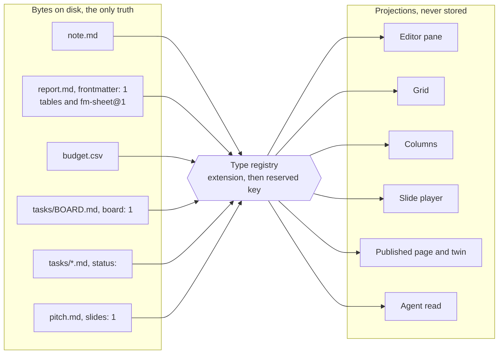
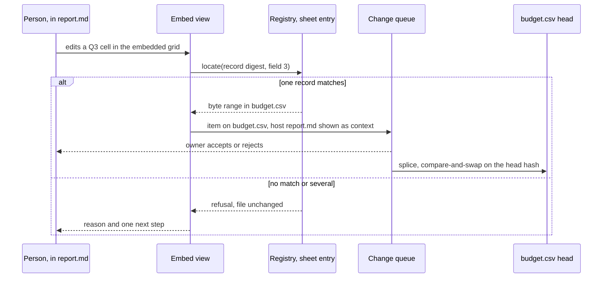
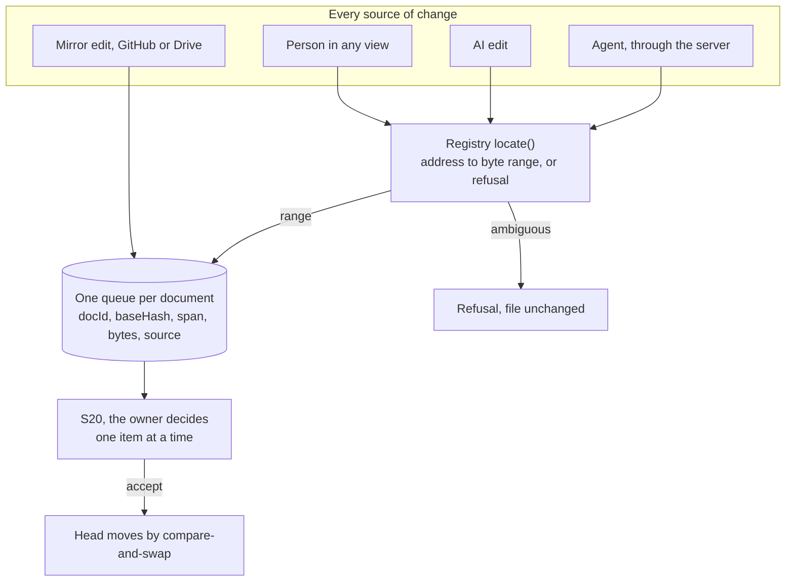

# 70. One platform, many content types

**What this file is.** The single home for how docs, notes, sheets, boards, views, slides and sites
fuse into one product: the type registry, embedding, links, search, the queue, history, the mirror,
agents and the published page.

**Who asked.** The founder, on 18 September 2026 `[Z]`: one platform joining docs, sheets, boards,
notes and sites, with presentations later, fused and calibrated as one thing (`56-OPEN-DECISIONS.md`
section 0).

**State.** Every rule here is `specified, not built` unless a row says `built`. The model is a
proposal from research. Nothing in this file is `[Z]` except the ask.

**The model in one line.** Every content type is a text file with one canonical format, and every
screen is a projection of that file. It extends ADR-0006, the projection law, from one type to several.

## 0. Sources, and where they disagree

Source | What it gives this file
`docs/research/2026-09-18-sheets-boards/ONE-PLATFORM.md` | The fusion model, the survey of all-in-one products, the registry, embedding, the build order
`docs/research/2026-09-18-sheets-boards/SHEETS.md` | The sheet's canonical form; see `68-SHEETS-SPEC.md`
`docs/research/2026-09-18-sheets-boards/BOARDS.md` | The board's canonical form; see `69-BOARDS-SPEC.md`
`66-FORMAT-SPECIFICATIONS.md` sections 3.9, 4.1, 4.3, 4.4 and 5 | Reserved keys, the carrier rule, the `fm-` fence, the chart, the twin
`67-SYNC-AND-CONFLICT.md` sections 1, 7 and 8 | The copies, the mirror out and in

**`ONE-PLATFORM.md` was written before its two companion files landed**, and says in its section 6
that they win where they disagree. This file follows that.

# | `ONE-PLATFORM.md` said | The companion file says | This file
1 | The sheet is a `.csv` (section 3.2) | A GFM table with an `fm-sheet@1` fence; a `.csv` opens in the same grid (`SHEETS.md` section 3.3) | Both are sheet carriers. The table in a document is the canonical sheet. Section 2
2 | A computed value is never a byte in a data file (section 3.3) | A `col.` result is written into the cell (`SHEETS.md` section 3.3) | Written, but only through an accepted queue item. `68-SHEETS-SPEC.md` section 4.6
3 | `board: 1` marks one file with headings as columns (section 3.2) | `board: 1` marks a board file over a folder of card files (`BOARDS.md` section 4.4) | The board file. The one-file shape is `F184`'s read-only view. `69-BOARDS-SPEC.md` section 7

## 1. Three nouns and one rule

The vocabulary is Anytype's type, property and view (`ONE-PLATFORM.md` section 1.5). The storage rule
is fmd's.

Noun | What it is in fmd | Where it lives
Type | The format of a file, chosen from one registry the product owns | The extension, then a reserved front matter key
Property | A named value on a file | Front matter for markdown, a column for a sheet
View | A deterministic, stateless projection of one or more files | A screen, a published page, an agent's read, or a view file

**The rule.** A type has exactly one canonical byte format. Every view is computed from those bytes
and holds nothing they do not hold. Every write is a splice into those bytes, and it can refuse.



**Why fusion by files.** The survey in `ONE-PLATFORM.md` section 1.9 found that deep fusion has
always cost the file, as in Notion, Coda, AFFiNE, Anytype and Craft.

Keeping the file has always cost the fusion, as in Google Workspace and Zoho.

Obsidian keeps files and fuses views, but each plugin owns its own format. `INFERENCE:` fmd's opening
is Obsidian's folder, Loop's single home and Anytype's vocabulary, under one registry, one queue and one
engine.

## 2. The type registry

### 2.1 How a file's type is decided

Each step decides or passes to the next. None of them guesses.

1. **The extension picks the family.** `.md` is markdown. `.csv` and `.tsv` are sheets. `.canvas` is
   JSON Canvas, later. Any other extension is an upload: stored, linked, never edited, as
   `67-SYNC-AND-CONFLICT.md` section 7.1 already treats uploads.
2. **Inside `.md`, one reserved profile key picks the profile.** No key means a note.
3. **Two reserved profile keys in one file is a conflict.** The file opens as a note, and the problems
   panel names both keys. The product never picks one. `E525`.
4. **Content is never sniffed.** Deciding a type by reading content is a guess.

### 2.2 Why a version key and not a `type:` key

The pack already uses one version key per format, such as `portfolio: 1` and `decisions: 1`
(`66-FORMAT-SPECIFICATIONS.md` section 3.9).

**And `type:` is already taken in the wild.** `[O]` re-measured for this file at `cb7c16f`, with a
`python3` walk over the front matter of `test/corpus/foreign`:

Measure | Count
Markdown files in the pinned corpus | 8,513
Files with a front matter block | 7,969
Files using a top-level `type:` key for their own meaning | 34
Files using `board`, `view`, `site` or `slides` as a top-level key | 0 each
Files using `status` as a top-level key | 62
Files carrying `kanban-plugin` | 1

These match `ONE-PLATFORM.md` section 3.2's counts at `ad5d784`. A registry that read `type:` would
misread 34 files. Absence in 8,513 files is weak evidence that the new keys are free, not proof.

**`status` is not a profile key.** It is the board's default card key, and 62 corpus files already use
it. A card is a plain note; only the board file carries a profile key.

### 2.3 The registry

Type | Canonical bytes | Detected by | Views | The unit a write splices | Home
Note | `.md` | extension, no profile key | source, preview, outline | any body span of `25-ENGINE-SPEC.md` section 25.9 | `66` section 2
Doc | `.md` | `frontmatter: 1`, already reserved | Doc mode page, PDF | as a note | `66` section 3.9
Table in a document, the canonical sheet | a GFM table, with an optional `fm-sheet@1` fence below | block kind, `C045` | grid inside the document | one cell of one row | `68-SHEETS-SPEC.md`
Sheet file | `.csv` or `.tsv` | extension | grid, chart, embed | one field of one record | `68-SHEETS-SPEC.md` section 2.2
Board | `.md` board file plus a folder of card files | `board: 1`, new | columns grouped by one key | one front matter key in one card file | `69-BOARDS-SPEC.md`
Kanban view of one document | any `.md` with headings and task items | chosen as a view, `F184` | columns | none. Read-only | `69-BOARDS-SPEC.md` section 7
Database view | `.md` holding one `fm-view@1` fence | `view: 1`, new | table, list | the view's own keys; a cell edit goes to the row's file | section 3
Deck | `.md` split on thematic breaks, the `F182` shape | `slides: 1`, new, or any note presented | slide player, speaker view, PDF | as a note | section 13
Site | a folder whose `index.md` carries `site: 1` | key on the folder's index, new | pages, navigation, a twin per page | as a note, per file | section 13
Canvas | `.canvas`, JSON Canvas 1.0 | extension | two-dimensional board | later | section 14

**Reserved profile keys**, all top level: `frontmatter`, `portfolio`, `decisions`, `graph`, from `66`
section 3.9, and `board`, `view`, `slides`, `site`, new here.

**Import-only formats.** `.xlsx`, `.pptx` and `.docx` are converted into a text type, and the
conversion enters the change queue as a proposal. The original is kept as an upload.

They are never edited in place, because a binary file has no stable byte ranges to splice.

### 2.4 The contract every registry entry signs

`INFERENCE:` the smallest interface that lets one queue, one search and one mirror serve every type
(`ONE-PLATFORM.md` section 3.2). Proposed home: the domain layer of a new module, exported through
its barrel.

```ts
export interface ContentType {
  readonly id: 'note' | 'doc' | 'sheet' | 'board' | 'view' | 'deck' | 'site' | 'canvas'
  readonly version: number                        // the profile key's value, or 1 by extension
  detect(path: string, head: Uint8Array): boolean // extension, then the profile key. Never content
  parse(bytes: Uint8Array): Parsed | Refusal      // strict UTF-8
  locate(p: Parsed, a: Address): ByteRange | Refusal  // the only way a write finds its bytes
  text(p: Parsed): string                         // what search indexes
  links(p: Parsed): readonly LinkRef[]            // what the link index and backlinks read
  publish(p: Parsed, ctx: PublishCtx): Html | Refusal
  readonly mirror: 'text'                         // every registered type mirrors as its own bytes
  readonly refusals: readonly ErrorId[]           // must exist in 17 and 26, checked at build
}
```

**`locate` is the whole of the engine's promise for a new type.** If a type cannot say which bytes an
edit touches, it cannot be edited, and it stays read-only until it can.

### 2.5 Where the code hard-codes one type today

`[O]` read at `cb7c16f`. Each becomes one registry lookup.

Place | Line
Search skips every path not ending `.md` | `src/modules/vault/infrastructure/search-index.ts:168`
The snapshot keeps only `.md` paths | `src/modules/vault/application/get-snapshot.ts:165`
The vault zip exports only `.md` | `src/modules/vault/application/export-vault-zip.ts:62`
The link index strips `.md` to make a name | `src/modules/vault/domain/link-index.ts:74`

## 3. Views over many files

### 3.1 The database view, D13

**D13 `[Z]`: build database views over front matter early**, as batch 9a (`56-OPEN-DECISIONS.md`
section 0, `50-ROADMAP.md`). Rows are files and columns are front matter keys, as Obsidian Bases does.

A view file carries `view: 1` in front matter and one `fm-view@1` fence, from `ONE-PLATFORM.md`
section 3.2:

````markdown
```fm-view@1
from: Projects/
where: status != done
sort: due
group: status
columns: title, status, due, owner
layout: table
```
````

- **The fence stays flat**, per `66-FORMAT-SPECIFICATIONS.md` section 4.3, so the filter is one
  expression string. Obsidian's nested YAML filters are what it declines.
- **A cell edit in the view goes to the row's file**, as a front matter splice into that file.
- **The grid is the sheet's grid** (`68-SHEETS-SPEC.md`), reused as this view's table layout.
- `INFERENCE:` the `where` grammar is not specified here. It belongs with batch 9a's first task.

### 3.2 How a board file relates to a view

**A board file is a view with its query fixed**: `cards` is `from`, `key` is `group`, and the layout is
columns. One renderer serves both.

**Whether `fm-view@1` also offers `layout: board`** is `needs founder`. This file recommends not in v1,
so there is one way to make a board.

## 4. Embedding one type in another

### 4.1 The carrier

**An embed is a reference by path and anchor. It is never a copy.** The host file holds the reference
bytes and nothing else. Loop is the precedent: one home, every appearance a view of it
(`ONE-PLATFORM.md` section 1.4).

The carrier is a new fence, `fm-embed@1`, by ADR-0002's rule that data a machine reads takes a fence.

````markdown
```fm-embed@1
src: Finance/budget-2026.csv
at: rows where quarter = Q3
view: grid
```
````

Key | Required | Rule
`src` | yes | A vault path, so the reference survives in the mirror and reads plainly there
`at` | no | An anchor. A heading path for markdown; a column name for a board; a filter for a sheet
`view` | no | Which projection to draw: `grid`, `columns`, `page`

- **A heading path is almost never ambiguous**: 99.797 per cent of headings are unique by full path
  within their file (`25-ENGINE-SPEC.md` section 25.9, `[measured]`).
- **Row numbers are never an anchor.** A row number moves when a row is inserted above it, the same
  reason `25` rejects parse-tree paths.
- **Obsidian's `![[note#Heading]]` is read as an embed and never written.** `[O]` the repository
  already detects that syntax at `src/modules/mdmax/domain/constructs.ts:485`. fmd writes only the
  fence.

### 4.2 The seven rules

From `ONE-PLATFORM.md` section 3.4, each proposed.

# | Rule | Why
1 | An edit inside an embed becomes a queue item on the **source** file | The host's bytes did not change, so the host has nothing to accept
2 | A viewer sees an embed only if they can read the source | Google's linked objects show the source to readers never given it (`ONE-PLATFORM.md` section 1.3)
3 | Publishing a page never publishes an unpublished source. The embed renders as a placeholder, and the publish screen lists it | The same leak, on the open web
4 | A missing source, or an anchor that resolves to more than one place, shows the reference and the reason | `66` section 4.1: a block that cannot render shows its source
5 | An embed of an embed is followed to a depth set in the configuration panel. A cycle refuses at its second visit | A cycle is otherwise an infinite render
6 | A rename rewrites every `src` that names the old path, as a rename already rewrites wikilinks | `src/modules/repository/application/rename-note.ts` rewrites wikilinks today
7 | The twin `/<slug>.md` returns the host's bytes, so the fence and not the embedded content | The twin is byte-exact by rule, `66` section 5.2

**Rule 7 has a cost, and it is deliberate.** An agent reading the twin sees a reference, not the data.
`INFERENCE:` it follows the reference to the source's own twin, when that is published.

### 4.3 A chart or a sheet formula reading another file

`fm-chart@1` takes `table: above` in version 1 (`66` section 4.4), and `fm-sheet@1` does the same
(`68-SHEETS-SPEC.md` section 3.2).

- **Proposed for a version 2 of each:** `table: <path>#<anchor>`, so a chart in a document can draw
  from a sheet elsewhere.
- **A version-1 reader refuses the new value**, with `E502` for a chart and `E501` for a sheet fence.
  That is the correct outcome.



## 5. Links and backlinks across types

- **One link index for the vault.** Each registry entry reports its outgoing links through `links()`.
  Markdown reports wikilinks, markdown links and embeds. A view or board reports the folder it reads.
- **A sheet reports a link only where a cell holds exactly `[[name]]`.** `INFERENCE:` a table cell has
  no other link syntax that is unambiguous, so anything looser would be a guess.
- **Backlinks list every type, grouped by type.** "Shown in", "counted by" and "links here" are three
  different relations, named apart.
- `[O]` today the link index is markdown only (section 2.5).

## 6. One search

- **Search indexes what `text()` returns** for each type: prose for notes, cell text for sheets, card
  titles and bodies for boards, slide text for decks.
- **A result names its type and opens the view at the hit**: the grid at the cell, the board at the
  card.
- `[O]` today search skips every non-`.md` path (section 2.5). A `.csv` is invisible to it.

## 7. One change queue

**The queue is already type-agnostic.** An item names a document, a base hash and a byte range,
`spanStart` and `spanEnd` (`21-DATA-MODEL.md` section 21.4). Bytes have no type.

What is type-specific is small: how an address becomes a range, which is `locate()`, and how the diff
is drawn. A sheet shows a cell change. A board shows a card moving.

- **A change across files is shown together and decided per item.** An agent that edits a document
  and a sheet makes two items, grouped on S20.
- **Agent and mirror rows are never bulk-accepted** (`67-SYNC-AND-CONFLICT.md` section 8.1).
- **A new file is a `create` item.** The queue has no create kind today. `67` section 8.4 proposes
  `kind: "splice" | "create" | "delete"`; a new card and an imported sheet depend on it.
- **A board move needs no new queue shape.** It changes one key in one file (`69-BOARDS-SPEC.md`
  section 3.1), which is why boards are built as a folder of card files.



## 8. One version history

- **R2 keys are byte-addressed and know nothing of types** (`67-SYNC-AND-CONFLICT.md` section 1), so
  every text type gets history with no change.
- **A view's history is its view file's history.** What it showed on a past date is a projection of
  the files at that date, recomputed, never stored.
- `UNVERIFIED:` that the version records carry enough time data to find every source's head at one
  moment. A document with embeds needs that to be shown as it was. `21-DATA-MODEL.md` owns the answer.

## 9. The mirror to GitHub and Drive

**One change is required.** `67-SYNC-AND-CONFLICT.md` section 7.1 says the mirror carries "Markdown
only". It becomes every registered text type. Uploads stay in R2 and linked, as today.

- **GitHub.** Each file is pushed as its own bytes under `docs/`. GitHub renders a `.csv` as a table,
  within the limits `68-SHEETS-SPEC.md` section 8 records.
- **Drive.** Each file is uploaded as a plain file with its own media type, `text/markdown` or
  `text/csv`. It is never converted to a Google format, because a converted file is no longer our bytes.
- `UNVERIFIED:` that the Drive API leaves a `.csv` unconverted when no Google target type is named.
  The mirror worker must be tested against that before it ships.
- **Inbound edits stay proposals, for every type** (`67` section 8.1). A CSV re-saved by a spreadsheet
  with new line endings arrives as one item, and S20 names the line-ending change as such.

## 10. Agents

The agent server of batch 10a reads and proposes, and never writes (D04 `[Z]`, `50-ROADMAP.md`). The
registry gives it three calls that work for every type.

Call | Returns | Notes
`read(path)` | bytes, type id, version, head hash | The canonical text. CSV and markdown need no SDK to parse
`read_view(path)` | the projection as stable JSON: rows, cards or slides, each with its address | The address is what `propose` takes back
`propose(path, address or span, bytes, baseHash)` | a queue item id, or a refusal with its reason | Never a write. A stale `baseHash` refuses

- **An agent's multi-file change** is a set of `propose` calls sharing one change id, shown together
  on S20 and decided per item.
- **The registry publishes each type's shape**, so an agent learns what `board: 1` means from us, not
  by guessing from one file.

## 11. How a published page renders each type

Type | Published view | Twin
Note, doc | The page, as today | `/<slug>.md`, the bytes
Table in a document | A read-only HTML table with `foot.` summaries, reader sort and filter never saved | the host's `/<slug>.md`
Sheet file | A read-only HTML table | `INFERENCE:` the file's own extension, `/<slug>.csv`
Board | Static columns, no pending moves | `/<slug>.md`, the board file
Deck | A slide player, with the plain page one link away | `/<slug>.md`
Site | Every published page in the folder, with navigation | one twin per page
View | The rows as they stood at publish, from published files only | `/<slug>.md`, the view file

**A published view or board is the hardest case.** It reads many files, and any of them may be
private. Proposed: it shows only rows or cards from files that are themselves published, and says how
many it left out.

## 12. What "calibrated" means

**Calibrated means one of each of the following, shared by every type, with a check that fails when a
type brings its own.** `INFERENCE:` a founder feels it as the absence of surprise.

One | Lives in | The check that keeps it one
Design system | `58-DESIGN-SYSTEM.md` tokens | No colour or spacing literal in a type's renderer outside the token file
Keyboard map | `15-INTERACTION-AND-KEYBOARD.md` | A type may add a shortcut in its own view, never rebind a global one; a build step fails on a collision
Refusal catalogue | `17-ERROR-AND-REFUSAL-CATALOGUE.md` and `26-ENGINE-REFUSAL-CATALOGUE.md` | Every `refusals` id in a registry entry exists there, checked at build
Permission model | the vault's roles, `21-DATA-MODEL.md` | Embeds and views take the source's permission, never the host's; one fixture proves it
Offset unit and hash | bytes and SHA-256, `src/modules/mdmax/domain/offsets.ts` | The branded offset types, already built
Anchor system | `25-ENGINE-SPEC.md` section 25.10 | One resolver for every type, one version stored in every anchor
Clock | server time orders, device time only displays, `67-SYNC-AND-CONFLICT.md` section 2.2 | The journal record's own field rules
Icons | Google Material Symbols as inline SVG, `65-CONVENTIONS.md` section 9 | One icon per type in the registry, no other icon set

## 13. Where slides and sites sit

**Both are views of markdown and need no new file type** (`ONE-PLATFORM.md` section 2.7).

Type | The pattern in the wild | fmd | When
Slides | Marp, Slidev, reveal.js and Obsidian Slides all split one `.md` file on a thematic break (`ONE-PLATFORM.md` section 2.1) | `F182`, Marp core, with no new syntax. `slides: 1` marks a file as a deck; any note can be presented | After the pilot, batch 9, as "eventually" in the ask
Sites | Quartz, Obsidian Publish and Docusaurus compile a folder of markdown (`ONE-PLATFORM.md` section 2.2) | A folder whose `index.md` carries `site: 1`; navigation from the folder; a twin per page | Batch 12, with the custom domain

- **A deck's gate:** the deck file needs no syntax a plain markdown reader cannot show.
- **A site's gate:** every page has a working twin, and no unpublished file appears.
- `INFERENCE:` MDX mixes code into markdown, so fmd reads it as text only (`ONE-PLATFORM.md` section
  2.2).

## 14. The build order, proposed

`ONE-PLATFORM.md` section 4.2 places each addition in the batch order of `50-ROADMAP.md`. It moves no
batch. **`50-ROADMAP.md` owns the order; this table is the proposal handed to it.**

Step | Batch | Adds | Proposed appetite, working days
3 | 3, the editor and Doc mode | The registry with note and doc; the `.md` checks of section 2.5 become one lookup | 2
5 | 9a, database views | `view: 1`, `fm-view@1`, table layout, and boards (`69`) | 15
5 | 9a, database views | Sheets v1 (`68`) | 10
6 | 4, sharing and the queue | `fm-embed@1`, the seven rules, backlinks and search across types | 5
7 | 10a, the agent server | `read`, `read_view`, `propose` for every type | 2
8 | 5, in and out | The mirror carries every text type; `.csv` and `.xlsx` import as proposals | 3
11 | 9, views and blocks | Decks on `F182` | 3
13 | 11, later blocks | A chart reading a table by path; `F184` as the read-only view | 1
14 | 12, portfolio and community | Sites, and the published slide player | 10 and 3
after 14 | none | Canvas, JSON Canvas 1.0 | unset

**The totals, re-derived with `python3` for this file**:

```text
all added days:    2 + 15 + 10 + 5 + 2 + 3 + 3 + 1 + 10 + 3 = 54
before the pilot:  2 + 15 + 10 + 5 + 2 + 3 = 37
```

These match `ONE-PLATFORM.md` section 4.2. **None of these appetites has been checked against anybody
building anything.** An appetite is a budget chosen, not an estimate (`50-ROADMAP.md`).

`ONE-PLATFORM.md` placed board views in 9a and one-file boards in batch 11. `69-BOARDS-SPEC.md` makes
the folder of card files the only writable board, so the batch 11 row keeps only `F184`'s read-only view.

## 15. Never build

- **A private block or object store that holds content**, because the file is the product.
- **A formula result written into a file without an accepted queue item**, because it creates a
  second truth nobody agreed to.
- **Formulas that read the clock, a random source, the network or another vault**, because the view
  stops being deterministic.
- **In-place editing of `.xlsx`, `.pptx` or `.docx`**, because a binary file has no bytes to splice.
- **A conflict-free replicated data type, a CRDT, as the store of any type**, because ADR-0003 is
  settled.
- **An embed that copies content into the host**, because the copy is Google's linked-object leak.
- **A `type:` front matter key as the registry switch**, because 34 corpus files already use it.
- **Row numbers as anchors**, because they move when a row is inserted.
- **Deciding a type by reading content**, because content sniffing is a guess.
- **Nested YAML inside an `fm-` fence**, because `66` section 4.3 forbids it.
- **Converting mirrored files into Google formats**, because a converted file is no longer our bytes.
- **Scripts, macros or MDX inside a document**, because a document that runs code is an application.
- **A third-party plugin API that defines on-disk formats**, at least until the registry has shipped
  four types of its own. `INFERENCE:` that is where Obsidian's formats fray.

## 16. Register rows needed

**Allocated on 19 September**, see `tools/new-ids-allocation.md`. Every id below now has its row in
its register. `F295` also serves `68-SHEETS-SPEC.md` SH16, the same view's table layout. The rows
that ask an owner to change an existing file, such as `21`, `66`, `67` and `50`, are still open for
that owner.

Register | Row | For
`10-FEATURE-REGISTER.md` | `F307`, batch 3 | Section 2
`10-FEATURE-REGISTER.md` | `F295`, batch 9a, D13 | Section 3
`10-FEATURE-REGISTER.md` | `F308`, batch 4 | Section 4
`10-FEATURE-REGISTER.md` | `F309` and `F310`, batch 4 | Sections 5 and 6
`10-FEATURE-REGISTER.md` | `F311` on `F182`; `F312`, batch 12 | Section 13
`17-ERROR-AND-REFUSAL-CATALOGUE.md` | `E525` | Section 2.1
`17-ERROR-AND-REFUSAL-CATALOGUE.md` | `E526`, `E527`, `E528`, `E603` | Section 4.2
`16-COPY-DECK.md` | One string per new error; the embed placeholder; the publish screen's list of unpublished sources | Section 4.2
`19-ACCEPTANCE-CRITERIA.md` | `A832`: `npm run corpus` stays at changed 0 and the snapshot's file count is unchanged after the registry lands | Section 2
`19-ACCEPTANCE-CRITERIA.md` | `A833`: an edit in an embed is a queue item on the source file | Section 4.2 rule 1
`19-ACCEPTANCE-CRITERIA.md` | `A834`: an unshared source shows a placeholder to a reader | Section 4.2 rules 2 and 3
`19-ACCEPTANCE-CRITERIA.md` | `A835`: a mirrored `.csv` equals R2's head byte for byte | Section 9
`19-ACCEPTANCE-CRITERIA.md` | `A836`: an agent change over a document and a sheet is two items, grouped, decided one at a time | Section 10
`21-DATA-MODEL.md` | The queue's `kind` for `create` and `delete`, per `67` section 8.4 | Section 7
`67-SYNC-AND-CONFLICT.md` | Section 7.1's "Markdown only" widened to every registered text type | Section 9
`66-FORMAT-SPECIFICATIONS.md` | `fm-embed@1` and `fm-view@1` added to section 4 when their batches start | Sections 3 and 4
`50-ROADMAP.md` | The placements and appetites of section 14 | Section 14

## 17. Limits of this file

- **Nothing here is built.** The code read confirms only where one type is hard-coded today.
- **The survey was not re-run.** Every claim about Notion, Coda, Google, Loop, AFFiNE, Anytype, Craft,
  Obsidian and Zoho is `ONE-PLATFORM.md`'s, from 18 September 2026. Its own section 6 lists what it
  could not open.
- **Re-measured for this file:** the corpus key counts in section 2.2, and the four `.md` checks in
  section 2.5. Nothing else.
- **Inference:** the registry interface, `fm-view@1`, `fm-embed@1`, the CSV locator, the build order
  and every appetite. None has a prototype or a test.
- **The corpus holds no CSV**, so nothing here is measured about real sheets.
- **What would falsify the model.** A sheet or board operation the founders need that cannot be a
  splice into one text file, or a view that needs state the bytes do not hold.
- Either would mean the projection law does not stretch to that type, and the type should stay out.
