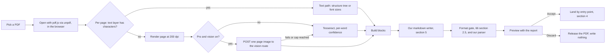

# 72. PDF to Markdown, the converter

**What this file is.** The contract for fmd PDF to Markdown v1: a PDF in, a markdown document or a
change-queue proposal out. A builder implements from this file without asking anybody. Every row is
`specified, not built`.

**What it is not.** It is not the research. The licences, benchmarks, fixture runs and every opened
page live in `docs/research/2026-09-19-pdf/PDF-TO-MARKDOWN.md`. This file takes that research's
recommendations and fixes them as contracts.

**The founder's ask, 19 September 2026 `[Z]`**, recorded at `56-OPEN-DECISIONS.md` section 0, in the
D04 to D14 block (`docs/pack/56-OPEN-DECISIONS.md:118`):

- A converter, and not a chat feature.
- Three ways in: a document in its empty state; the AI panel while editing, with the PDF not stored
  beyond the session; and a standalone "Convert a PDF to Markdown" tool that files the result into notes.
- Free tools preferred, and OCR for scanned pages.

**State of the repository `[O]`.** At `e5fa544`, `grep -rli 'unpdf\|pdfjs\|tesseract\|getStructTree'
src src-tauri` returns nothing. `package.json` names no `unpdf`, `pdfjs-dist` or `tesseract.js`. There
is no `src/modules/import/`, as S22 already records.

**How to read the marks.** `[Z]`, `[M]`, `[R]`, `[O]`, `[L]` and `[P]` mean what `65-CONVENTIONS.md`
section 5 says. `INFERENCE:` is reasoning, `UNVERIFIED:` was not checked. `SIMULATED:` is list
prices times caps. The placeholder ids this file first carried were allocated on 19 September;
`tools/new-ids-allocation.md` maps each slug to its id.

**Record of the decision.** `adr/ADR-0021-pdf-to-markdown.md`.

---

## 1. The shape of the pipeline



**The PDF is read in the tab, or on the desktop, and never uploaded** on the text path and the Tesseract path.

Only the optional Pro vision pass sends anything, and it sends one page image at a time (section 3.4).

**Pages are classified one by one**, because a PDF can mix text pages and scanned pages `[R]`
(research section 5.2).

### 1.1 Where the code goes

Specified, not built. Layout per `AGENTS.md` sections 2 and 3. `INFERENCE:` the module name is this
file's.

Path | Holds
`src/modules/pdf-import/domain/` | Pure logic: page classification (3.1), heading ranking (5.3), block building (5.4), the writer and its escaper (5.5, 5.6), running-furniture detection (5.7), the report (6). No network, no `process.env`, no pdf.js import
`src/modules/pdf-import/application/` | The use case `convertPdf`, and the ports `PdfReader`, `OcrEngine`, `VisionReader`, `Uploads` and `ChangeQueue`
`src/modules/pdf-import/infrastructure/` | Adapters: the `unpdf` reader, the `tesseract.js` worker, the Tauri Tesseract bridge, the vision route client
`src/modules/pdf-import/presentation/` | The picker, the progress sheet, the preview with its report, the three entry-point controls
`src/modules/pdf-import/index.ts` | The barrel. Other modules import `@/modules/pdf-import` only
`src/app/api/pdf/vision-page/route.ts` | The one server route, Pro only, section 3.4, wired through `src/container/dependency-container.ts`
`src-tauri/src/` | A command that runs the native Tesseract binary on a rendered page image, section 3.3

**The domain never sees a `File`.** `PdfReader` hands it plain records: per page, text items with string, font size, x, y, width and height; the structure tree when present; ruling lines; image records.

This keeps every rule in 5 testable without pdf.js.

### 1.2 The one shared engine

`F146`, OCR search on the device, is `planned` and already assumes Tesseract in the browser
(`docs/pack/10-FEATURE-REGISTER.md:109`). **The converter's `OcrEngine` port is the one `F146` uses.**
No second OCR engine is added `[R]` (research section 1).

---

## 2. Licences, and what is refused

**Only permissive licences ship.** Each row was read from the project's own `LICENSE`, or its model
card, by the research on 2026-09-19 `[R]`. Not re-opened for this file.

Component | Code licence | Weights | Use
pdf.js (Mozilla) | Apache-2.0 | none | **Ships.** Browser and desktop
`unpdf` 1.8.1 | MIT, the Massachusetts Institute of Technology licence | none | **Ships.** The pdf.js build we load
`tesseract.js` 7.0.0 | Apache-2.0 | English data ships with it | **Ships.** Browser OCR
Tesseract 5 | Apache-2.0 | English data | **Ships.** Desktop OCR
`@cf/google/gemma-4-26b-a4b-it` on Workers AI | n/a | the linked Gemma 4 page is titled Apache License 2.0 | **Pro only, behind a flag**, section 3.4

**Refused, and why.** A builder who reaches for one of these is stopped here.

Tool | Why refused `[R]`
Marker, and Surya under it | Code is Apache-2.0, but the weights' `MODEL_LICENSE` bars an entity over five million US dollars of revenue or funding, and **any product that competes with Datalab's**. A PDF converter inside fmd competes from the day it ships. `INFERENCE:` the research's reading of clause (c)
Surya alone | Same weights licence; Hugging Face also tags `surya_layout` CC-BY-NC-SA-4.0
Nougat | Weights are CC-BY-NC, non-commercial
PyMuPDF4LLM | AGPL-3.0. `UNVERIFIED:` the price of its commercial licence
Scribe.js | AGPL-3.0
MinerU | Avoided, not strictly refused: an attribution duty for online services, an AGPL-3.0 vision model, and a Python server we do not run
Mistral OCR, LlamaParse, Google Document AI | Fail gate B on paper today, per research section 2.6. None is needed for v1
Cloudflare `toMarkdown` | Free for PDF and passes gate A, but it sends the file off the machine and does no OCR. The browser reads the same structure tree

**Also usable, and not used in v1.** Docling, pdfplumber, olmOCR, PaddleOCR and markitdown are licence-clean `[R]`. Each needs Python or a GPU, and none runs in a tab.

PaddleOCR-VL is the candidate if a server OCR tier is ever built (research section 4.3).

**Licence notices.** The about page and the desktop's third-party notice list pdf.js, `unpdf`,
`tesseract.js` and Tesseract with their licence texts. `INFERENCE:` Apache-2.0 requires the notice
to travel with a redistribution, and the desktop redistributes the Tesseract binary.

---

## 3. The two chains

### 3.1 Classifying a page

Rule | Contract
A page whose text layer yields **zero characters** after whitespace is removed | Scanned. It goes to OCR
Any other page | Text. It goes to the text path, even if it also holds a large image
A text page with a hidden OCR layer made by another tool | Text. We use the layer the PDF carries and do not re-OCR it

The zero-character rule is the research's measured signal: the scan fixture returned 0 characters
and all 182 real pages returned text `[R]` (research sections 4.4 and 5.2).

`UNVERIFIED:` pages that carry a few stray characters over a scanned image, such as a stamped page number.

v1 treats them as text pages, and the report flags any text page under a threshold `pdf.classify.sparseChars` as `sparse-text-page` so the person can see it.

No default is set until a fixture sets one.

### 3.2 The text chain, in the browser

Step | What | Contract
1 | Load | `unpdf` is imported dynamically on the first conversion only. Its pdf.js build is 1,676,063 bytes, 495,781 gzipped `[R]`. The editor bundle never carries it
2 | Open | `getDocumentProxy` over an `ArrayBuffer` held in tab memory. A password, a damaged file or a non-PDF refuses, section 8
3 | Structure | `getStructTree()` per page. A tree with any of the roles `H1` to `H6`, `L`, `LI`, `Lbl`, `Table`, `TR`, `TH`, `TD` makes the page **tagged**
4 | Text items | `getTextContent()` per page: string, font size from the transform, position, and end-of-line flags
5 | Lines | For a table on an untagged page, ruling lines are read from the page's drawn line segments, section 5.4
6 | Blocks | Section 5.4
7 | Write | Section 5

**The desktop runs the same pdf.js in its webview.** No second code path `[R]` (research section 5.1).

**Not a Worker.** A Free Cloudflare Worker has `10 ms` of CPU a request, and the text path measured
about 10 ms a page in Node `[R]`. So text PDFs are never converted on a server (section 12).

### 3.3 The scanned chain, on the device

Step | Where | Contract
Render | browser or desktop | pdf.js draws the page to a canvas at `pdf.ocr.dpi`, default **200**, the resolution of the research fixture `[R]`
Read, browser | a Web Worker | `tesseract.js`, language `eng` only, so the editor stays responsive. One worker per conversion, reused across pages
Read, desktop | a Tauri command | The native Tesseract binary, language `eng`, run on the rendered PNG written to the app's temporary directory and deleted when the page returns
Output | both | Per word: text, confidence 0 to 100, bounding box, and the line, paragraph and block it belongs to

**What the browser downloads for OCR, and only when the first scanned page appears.** One WebAssembly build of Tesseract, 2,855,361 bytes for the smallest the research measured, plus English data `[R]`.

`UNVERIFIED:` which data file `tesseract.js` fetches by default, and its size.

**Self-hosted, never from a third-party CDN.** The engine and data files are served from our origin with long cache headers, so a second use works offline.

`INFERENCE:` a CDN fetch would tell a third party that a scan is being read.

**Why Tesseract and not a stronger engine.** It is the one engine that runs everywhere fmd runs, and it gives a confidence per word.

fmd refuses rather than guesses, so an engine that can say it is unsure fits better than a stronger one that cannot `[R]` (research section 3.1).

**A known weakness, stated.** On the fixture, `tesseract.js` dropped all three table rows that the native binary kept, and read bullets as stray characters `[R]` (research section 4.4). `UNVERIFIED:` why.

So OCR pages get no table or list inference in v1 (section 5.4).

### 3.4 The optional Pro vision pass

**Off by default, Pro only, behind `flag.pdf.vision`**, which stays `false` until the fixture bench of
section 13 has measured it. No vision model has touched our fixtures `[R]`.

Item | Contract
Model | `@cf/google/gemma-4-26b-a4b-it` on Cloudflare Workers AI, the panel row `routing.pdf.vision.pro`
Why this one | `vision: true` in Cloudflare's catalogue; Cloudflare runs Gemma 4 inside `toMarkdown` itself for images `[R]`
Gate A | Passes. Cloudflare's no-training sentence is quoted in `27-MODEL-ROUTING-SPEC.md` section 2.1
Gate B | Passes for Cloudflare. The model's own terms are a separate check, per Cloudflare's third-party model caveat in the same section
Route | `POST /api/pdf/vision-page`, section 3.5
Router | Through the model layer of `27-MODEL-ROUTING-SPEC.md`: its ledger, bucket, breaker and failover. A new call type, not a second router
Per call | One page image, one fixed prompt, one markdown reply
Fallback | Any failure, timeout or exhausted cap uses the Tesseract result for that page, and the report says so

**Tesseract always runs on the page too.** Its result is the fallback and the comparison. `INFERENCE:`
this doubles device work on a vision page, and buys a fallback that needs no second request.

**The reply is data, not markup we trust.** It goes through the writer's checks in 5.8. A reply with
raw HTML, a front matter block, a fence left open, or empty text is rejected, and the page falls back.

**The prompt, fixed and stored as panel row `pdf.vision.prompt`.** `INFERENCE:` this file's text,
to be tuned on fixtures:

```
Transcribe this page image to CommonMark with GitHub pipe tables.
Write only what is printed on the page. Do not summarise, correct,
translate or add anything. Use # headings, - bullets and 1. lists
only where the page shows them. Write mathematics as the printed
characters, not LaTeX. Output no HTML and no code fences.
If a word is illegible, write [illegible].
```

**`[illegible]` is flagged, never kept silently.** The writer replaces it with nothing in the markdown,
and the report lists it by page as `vision-illegible`. `INFERENCE:` the placeholder is this file's.

**What the page's report says for a vision page.** "Read by the AI model.

No per-word confidence is available." A vision page has no low-confidence word list, and the preview says so rather than showing an empty list that looks like a clean read.

### 3.5 The route

`POST /api/pdf/vision-page`. Signed-in session required. Plan checked on the server, never the client.

Direction | Shape
In | `multipart/form-data`: one field `page`, a PNG; one field `pageNumber`, an integer
Out | `{ intent, markdown, pagesLeft }`, where `intent` is `DONE`, `FALLBACK` or `REFUSED`

**Every response puts `intent` first.** A client that reads anything else treats it as `REFUSED` and
uses Tesseract.

**Server rules that do not trust the client.**

- The plan is read from `limitsFor(account)`. Free gets `REFUSED` before any provider call.
- `limits.pdf.visionPages` is decremented only on `DONE`. A fallback costs nothing.
- The PNG is decoded and its dimensions checked before any provider call. A body over
  `pdf.vision.maxImageBytes` is refused unread.
- `UNVERIFIED:` the request body ceiling of the platform the route runs on, and so the default for
  `pdf.vision.maxImageBytes`. Measure a 200 dpi page before setting it.
- The image is held in memory, sent, and dropped when the response ends. Never written to R2, never
  logged (section 10).

**A contradiction with the research, named.** The research routes the page "to our Worker and on to Workers AI". This file routes it through the app's model layer, as voice does in `71-VOICE-SPEC.md`, so there is one router.

`INFERENCE:` either works; one router is the pack's rule in `27`.

---

## 4. The three entry points

**One converter, three doors.** Every door runs the same `convertPdf` and shows the same preview. Only
where the result lands differs.

Entry | Screen | Control | Where the result lands | Queue item
1. Empty document | S04, state `empty` | "Start from a PDF", one line beside the placeholder | This document, as its first version | No, while the document is still empty. See 4.1
2. The AI panel | S06 | "Convert a PDF", with an optional page range | At the cursor, as **one** change-queue item | Yes, always
3. The standalone tool | S22, a seventh source card "PDF", and its own view "Convert a PDF to Markdown" | Drop or choose one PDF, pick a folder | A new note in the chosen folder | No. A new file overwrites nothing

**Entry 3 adds no button to the rail.** S22 forbids a third creation button, so the tool is a source on
the Import screen and a command in the palette `[R]` (research section 6.1).

### 4.1 Entry 1, an empty document

Step | Contract
Shown when | S04 is in its `empty` state, the open file has no bytes, and the person can edit it
Pick | The file picker, `accept="application/pdf"`. One file
Convert | Section 3, with the progress sheet
Preview | Section 6. Accept or Discard
On Accept | A compare-and-swap write of the whole markdown as the first version, against the empty document's hash
Version record | `source` and `model` set per 4.4, `ask` set, `acceptedBy` the person
If the document gained bytes meanwhile | The write is refused, and the preview offers "Add as a proposal", which lands it at the end of the document as entry 2 does
If the person is not the owner | It lands as one queue item for the owner, as entry 2 does

**Why no queue item on an empty document.** The preview's Accept is the owner's decision on that exact text, and nothing is overwritten. The version record still carries the attribution, so the AI mark of ADR-0008 survives.

`INFERENCE:` this reading of ADR-0008 is this file's; section 15 names it.

### 4.2 Entry 2, the AI panel

Step | Contract
Shown when | S06 is open on a document the person can edit
Pick | The file picker, one PDF. **Held in tab memory for the life of the panel**, so a second page range needs no second pick
Page range | Optional, `from` and `to`, both 1-based and inclusive. Blank means every page
Convert | Section 3
Preview | The result is shown in S06's result area with `C093`, Accept and Reject of equal weight, and the report of section 6 beneath it
The item | Created when the conversion finishes, **before** Accept. It is the same item on S20
Insertion point | The cursor's byte offset when the conversion started. With a selection, the end of the selection. **A selection is never replaced**
Accept | A splice at that point, with a compare-and-swap on `baseHash`. Stale means `E027`
Release | The PDF leaves memory when S06 closes, the document closes, or the tab closes

**`limits.ai.edits` is not spent** by a conversion that used no model. A conversion that used the vision
pass spends `limits.pdf.visionPages` only. `INFERENCE:` a converter is not an AI edit unless a model
wrote the text.

**Keep images is not offered on entry 2 in v1.** The item can be accepted from S20 after the tab has closed, and by then the image bytes are gone.

Uploading them before Accept would store images for a proposal that may be rejected. `INFERENCE:` this file's choice.

### 4.3 Entry 3, the standalone tool

Step | Contract
Shown on | S22, as the seventh source card "PDF". Also the palette command "Convert a PDF to Markdown"
Pick | Drop or choose one PDF per run
Folder | A folder picker over the project tree. Default: the folder last used for a conversion, else the project root. `INFERENCE:` the default is this file's
Convert and preview | Sections 3 and 6
On Accept | `ProjectFiles.create` of `<pdf name without .pdf>.md` in that folder, with the markdown as its first version
Name collision | Both kept, the newcomer suffixed, as S22 rules for import
Cap | `limits.docs.cloud` read before the write. At the cap, `E070` and nothing is created
Desktop | The file is written into the chosen folder on disk. No document cap applies

**The result is a note.** The writer adds no front matter, and a `.md` file with no profile key opens
as a note (`docs/pack/70-PLATFORM-AND-TYPES.md:110`). So "files into notes" needs no new type.

**A PDF inside a folder import is not converted.** S22 imports without converting, and stores an
unknown kind as an upload per its `D56`. Conversion happens only when a person asks for it through one
of these three doors.

### 4.4 The attribution fields

The queue item and the version record carry the fields of `21-DATA-MODEL.md`, the `queue` and
`versions` collections.

Field | Value
`author` | The person who asked
`source` | `ai`, until the owner of 21 decides on `convert` (section 15). Never `person`
`model` | The engines that produced the text, joined: `pdf.js text layer`, `tesseract 5`, `tesseract.js 7`, or the vision model's id
`ask` | `Convert PDF: <file name>, pages <a> to <b>`
`spanStart`, `spanEnd` | Both the insertion offset. A conversion inserts; it never replaces
`proposedInline` or `proposedKey` | Per 21's 65,536-byte cut. The markdown is a proposal, not the PDF, so an R2 key for a large one is allowed

**Why never `person`.** A conversion is machine-made text the person did not type. S20's first rule is
that human work and machine work are never combined in one list `[R]` (research section 6.5).

---

## 5. The output contract

**It must pass `66-FORMAT-SPECIFICATIONS.md` sections 2.2 and 2.5**, and use only constructs that
2.2 lists as `built`. Every rule below serves that.

### 5.1 Encoding and layout

Rule | Contract
Encoding | UTF-8, line feed endings, exactly one final newline
Front matter | **None written.** The file is the person's; a converter adds no keys
Raw HTML | None written
Paragraphs | One paragraph on one line. `remark-breaks` renders every soft break as a line break (`66` section 2.3), so a PDF's line wraps would show
Line-end hyphens | A line ending in `-` joins the next line with no space, and the hyphen is kept. `INFERENCE:` this keeps real compound hyphens right and never guesses which hyphens were soft
Block separation | One blank line between blocks
Ligatures | U+FB00 to U+FB06 written as their letters. **Nothing else is normalised** `[R]`
Page breaks | Not written. Pages join in order. `INFERENCE:` a thematic break per page would be print furniture

### 5.2 The constructs written

Construct | Written as | Only when
Heading | `#` to `######` and a space | Section 5.3
Bullet list | `- ` | A tagged `L`/`LI`, or a line starting with U+2022, U+25E6 or U+25AA and a space
Numbered list | `1. `, keeping the PDF's own numbers | A tagged list with numeric `Lbl`, or a text line starting with digits then `.` or `)` and a space
Table | A GFM pipe table | Section 5.4
Paragraph | Plain text | Everything else
Image | `` | Keep images on, section 7

**Nested lists.** From the structure tree's nesting only, two spaces per level. An untagged list is
written flat, and flagged `list-nesting-unknown` when its items sit at more than one x offset.

### 5.3 Headings

Case | Rule
Tagged page | `H1` to `H6` from the structure tree, as given. No flag
Untagged page | Rank font sizes. The body size is the size carrying the most characters in the whole document. Every distinct size larger than the body, largest first, is the next heading level
More than six larger sizes | The largest six map to levels 1 to 6. Text in any smaller heading-sized font is written as a paragraph and flagged `heading-level-overflow`
A heading-sized line over `pdf.heading.maxChars` | Written as a paragraph and flagged. `INFERENCE:` a long line in a large font is usually a pull-quote. No default until a fixture sets one
Every heading from font size | Flagged `heading-from-size`

The research's untagged fixture held four font sizes, 24, 16, 13 and 11 points, one per heading level
plus body, and pdf.js exposed all four `[R]` (research section 4.4).

### 5.4 Tables and lists on each kind of page

Page kind | Tables | Bulleted lists | Numbered lists
Tagged | From `Table`/`TR`/`TH`/`TD`. `TH` cells make the header row | From `L`/`LI` | From `L`/`LI` with numeric `Lbl`
Untagged text | From ruling lines: horizontal and vertical segments that form a closed grid. Flagged `table-from-lines` | From a bullet character only, 5.2 | From leading digits, 5.2
OCR | **Not inferred.** Written as paragraphs in reading order, flagged `ocr-no-structure` per page | Not inferred | Not inferred

**Why bullets need tags or a character.** Chrome draws bullet marks rather than writing them as text,
so an untagged text layer holds a list's numbers but not its bullets `[R]`.

**A table that cannot be rebuilt is not guessed.** Merged cells, a grid that does not close, or rows of
unequal cell count: the cells are written as paragraphs in reading order and flagged `table-not-rebuilt`.

**An untagged table's header row.** GFM needs one. The first row becomes the header, and the table
carries the `table-from-lines` flag already.

**A cell's own line breaks** are joined with one space. A pipe inside a cell is escaped (5.6).

### 5.5 Columns and reading order

**Text is written in the order the PDF stores it.** pdf.js kept reading order on the research
fixture where two other tools lost it `[R]`. `INFERENCE:` Chrome writes column text in order; other
producers may not.

**Flag, do not reorder.** On an untagged page, when text items fall into two or more separate x
bands, the page is flagged `column-order-uncertain`. v1 never reorders text.

### 5.6 Escaping

**Measured against the product's parser stack `[R]`** (research section 6.3):

Text in the PDF | Written as | Unescaped, the stack does this
`It cost $5 and $10` | `It cost \$5 and \$10` | `remark-math` renders `5 and ` as inline maths
`H~2~O` | `H\~2\~O` | GFM strikes the 2 through
`a \| b` in a table cell | `a \\| b`, which a raw reader sees as a backslash before the pipe | The cell splits in two

**Specified, not yet measured.** Each needs a fixture in section 13 before ship. `UNVERIFIED:` none of
these was run against the stack.

Text in the PDF | Written as
A line starting `#`, `>`, `-`, `+` or `*` that is body text | The character preceded by `\`
A line starting digits then `.` or `)` that is not a list item | The `.` or `)` preceded by `\`
`[[` | `\[\[`, so it is not read as a wikilink
`<` | `\<`, so it is not read as raw HTML
`*` and `_` inside text | `\*` and `\_`
A backtick | `` \` ``
A backslash | `\\`

**The rule behind the table.** Anything the PDF printed must render as the same characters. A writer
that lets a printed character become markup has changed the document.

### 5.7 Running headers, footers and page numbers

Rule | Contract
Candidate | The first or last text line of a page
Dropped when | The same line, with digits masked, is the first or last line on more than `pdf.furniture.minShare` of the pages. `INFERENCE:` starting value **50** per cent, the research's "most pages"
Minimum pages | Only on documents of at least `pdf.furniture.minPages` pages, starting value **3**. `INFERENCE:` on a two-page PDF a repeat is not evidence
Reported | The count of lines dropped, and one example line, in the report

### 5.8 The gate, before anything is shown

Check | On failure
The shape gate: 4 MiB, 200,000 lines, 20,000 list-marker lines, valid UTF-8 | Refused with the number, `E016`, `E017`, `E018` or `E019`, and a page-range picker offered
Our parser parses it within budget | `E020` to `E022`, nothing shown
No raw HTML, no front matter block, no unclosed fence | A writer bug. Refused, logged as `outcome: refused`, never shown
Every character the report says was kept is in the output | A writer bug. Same

**The gate runs before the preview**, so a person never accepts text the product would refuse to open.

---

## 6. The preview and its report

**What is flagged is listed in the report and marked in the preview. It is never written into the
file.** The same rule as the AI mark of `66-FORMAT-SPECIFICATIONS.md` section 4.9 `[R]`.

Flag kind | Raised when | In the preview
`ocr-low-confidence` | An OCR word below `pdf.ocr.wordFloor`, starting value **80** from the research fixture `[R]` | The word underlined; the report lists page, word and confidence
`ocr-no-structure` | Every OCR page | A note on the page's first block
`heading-from-size` | 5.3 | The heading's level marker tinted
`heading-level-overflow` | 5.3 | A note on the paragraph
`table-from-lines` | 5.4 | A note on the table
`table-not-rebuilt` | 5.4 | A note on the first paragraph written from it
`list-nesting-unknown` | 5.2 | A note on the list
`column-order-uncertain` | 5.5 | A note on the page's first block
`maths-as-text` | A run of text in a mathematical font, or the tagged role `Formula` | A note. Formulas are kept as printed, never rebuilt into LaTeX
`image-dropped` | Each image when Keep images is off | Listed by page
`sparse-text-page` | 3.1 | A note on the page
`vision-read` | A page read by the vision pass | "Read by the AI model. No per-word confidence is available"
`vision-fallback` | The vision pass failed or its cap was reached | The reason, and that Tesseract was used
`vision-illegible` | 3.4 | Listed by page
`page-omitted` | 6.1 | Listed by page, with its mean confidence

**The confidence floor, as measured once.** Native Tesseract rated 149 words on the fixture. Five fell below 80: two formula misreads at 42, a stray `on` at 64, a stray bar, and a correct `12` at 66 `[R]`.

So the floor catches real errors and some correct words, which is the right direction.

**The preview's two actions** are Accept and Discard, of equal weight. The report is collapsible and
opens by default when any flag is raised.

### 6.1 Pages left out

**A page whose mean OCR confidence is below `pdf.ocr.pageFloor` is left out and named**, and the rest converts. `UNVERIFIED:` the floor.

**Its starting value is 0**, so until a fixture sets it no page is omitted for confidence and every low word is still flagged.

### 6.2 The report's shape

```ts
interface ConversionReport {
  intent: 'DONE' | 'PARTIAL' | 'REFUSED';
  pages: { total: number; text: number; ocr: number; vision: number; omitted: number[] };
  flags: { kind: FlagKind; page: number; detail?: string }[];
  furniture: { dropped: number; example?: string };
  images: { kept: number; dropped: number; failed: { page: number; code: 'E038' }[] };
  engine: { reader: string; ocr?: string; vision?: string };
  ms: { total: number; perPage: number };
  refusal?: { code: string; limit?: number; actual?: number; remedy: string };
}
```

`PARTIAL` means at least one page was omitted or one image failed. The report lives in tab memory
only. It is never stored and never logged, because `detail` can hold the document's words.

---

## 7. Images

**Default: dropped, and each listed by page.** Nothing is uploaded unless the person asks `[R]`.

**Keep images**, a checkbox on the preview, offered on entries 1 and 3 only (4.2):

Step | Contract
Extract | pdf.js image records per page, in reading order
Encode | PNG, in the browser
Upload | On Accept, before the markdown is written, through `Uploads.put` under the project
Reference | ``, one line, where the image sat in reading order
Caps | Each counts against `limits.uploads.file` and `limits.uploads.total`
Over the per-file cap | `E038` names it, its line is not written, the report lists it, and the rest continue
Alt text | "Image from page N". No AI alt text in v1. The alt text says which page, which is true

**Uploads are the one thing that stays**, because the person asked to keep them and they are part of the
document, not the PDF.

---

## 8. Failure states

Every refusal names the limit, the actual value and the remedy. A refusal that does not say why is a
failure.

Condition | What happens | Id
Not a PDF | Named, nothing done | `E560`
Password protected | Refused: "Remove the password in the app that made it, then try again" | `E570`
Damaged or unreadable | Refused, with pdf.js's reason in plain words | `E530`
Over the page cap | Refused with both numbers, and a page-range picker offered | `E656`
Over the size cap | Refused with both numbers | `E657`
Over the scanned-page cap in the browser | Refused with both numbers; the page-range picker offered; the desktop named | `E658`
OCR could not start | Refused: offline on first use, because the OCR files are not yet cached | `E810`
Output over the shape gate | Refused with the number, and a page range offered | `E016`, `E017`, `E018`
Output not valid, or the parser failed | Refused, nothing shown | `E019` to `E022`
Every page omitted | Refused: no page reached the confidence floor | `E531`
Vision pass out of pages, off, or failing | Tesseract used; the report says so | `E704`, a notice not a refusal
Entry 1 and the document is no longer empty | Offered as a proposal, 4.1 | `E852`, a notice
Entry 2 and the range is stale at Accept | Refused; re-open against current bytes | `E027`
Entry 3 at the document cap | Nothing created | `E070`
An image over the per-file cap | That image skipped, the rest continue | `E038`
Cancelled | Nothing written. The PDF is released | none

**One difference from Word import, on purpose.** A failed Word conversion keeps the original as an
attachment, `E561`. **A failed PDF conversion keeps nothing**, because the founder's rule is that the
PDF is not stored `[Z]`.

**Cancel is always available** during a conversion, and stops the OCR worker at the next page.

---

## 9. Caps per plan

**The principle.** The browser paths cost us nothing, so they are capped for the tab's sake, and the same on both plans. Only quantities differ, per `53-PRICING-AND-ENTITLEMENTS.md` section 3.2 `[R]`.

All values are the research's proposal, section 5.4, not yet in the register.

Entitlement id | What it counts | Free | Pro | Desktop | Unit | Resets
`limits.pdf.pages` | Pages in one conversion | **1,000** | **1,000** | none | count | per conversion
`limits.pdf.bytes` | Size of the PDF | **100 MB** | **100 MB** | none | bytes | per conversion
`limits.pdf.scannedPages` | Scanned pages OCR'd in the browser, in one conversion | **100** | **100** | none | count | per conversion
`limits.pdf.visionPages` | Pages read by the vision pass | **0** | **200** | not offered in v1 | count | monthly, see 15
`limits.docs.cloud` | Documents the tool creates | 50 in total | unlimited | none | count | unchanged
`limits.uploads.file`, `limits.uploads.total` | Images kept | 5 MB a file | 25 MB a file | none | bytes | unchanged

**Where each number comes from `[R]`.**

- **1,000 pages.** The 4 MiB shape gate over 2,885 characters a page, the mean of the 182 real pages,
  is 1,453 pages at one byte a character. 1,000 leaves room for markup.
- **100 MB.** `INFERENCE:` the file is not uploaded, so the 5 and 25 MB upload caps do not apply.
  Measure on a phone before ship.
- **100 scanned pages.** At the measured 0.42 s a page, 42 s on a laptop.
- **200 vision pages on Pro.** SIMULATED: 200 pages at $0.047 per 100 is $0.094 a month, about 9
  rupees at the research's 95.98 rupees a dollar, about a sixth of the roughly 55 rupees a fully
  active Pro user leaves (`27-MODEL-ROUTING-SPEC.md` section 3.2).
- **0 on Free.** The 10,000 free neurons a day already serve every Free AI edit.

**Server rules.** Only `limits.pdf.visionPages` is enforced on the server, because only the vision pass touches the server. The other three are enforced in the client, since the file never leaves it.

A client that skips them harms only its own tab.

**The desktop has no vision pass in v1.** The research lists a local model as `UNVERIFIED:`, and
vision on the `gemma3:4b` tag was not checked.

---

## 10. The PDF's life, and training

Path | Where the PDF is | When it goes
Text layer and browser OCR, entries 1 and 3 | Tab memory only. **Never IndexedDB, never the Cache API, never R2, never our server** | When the preview is accepted, discarded or cancelled
The AI panel, entry 2 | Tab memory, for the life of the panel | When S06 closes, the document closes, or the tab closes
Rendered page images | Canvas and worker memory | When the page's OCR returns
Desktop OCR | One PNG per page in the app's temporary directory | Deleted when the page returns, and on app start for any left over
Vision pass, Pro | One page image per request, to our route and on to Workers AI, in memory | When the response ends. Not written to R2, not logged
Desktop | Where the person keeps it. We copy nothing | n/a

**Never trained on.** Gate A bars any provider that trains on inputs, and Cloudflare's terms pass it (`27-MODEL-ROUTING-SPEC.md` section 2.1).

**Our own rule on top**: no PDF, page image or converted output enters an evaluation set, a fixture, a log or an analytics event. Fixtures are built by us from known markdown, never from a person's file.

**No drafts.** The drafts store (`sgnk-md`/`drafts` in IndexedDB) is never written during a
conversion. The converted markdown enters it only after Accept, as any edit does.

**What we log.** One line per conversion, and for the vision route the line of `27` section 10.1 per
attempt with `task` set to `pdf.vision`.

```
{ correlationId, accountId, plan, entry: 1|2|3,
  pages: { total, text, ocr, vision, omitted },
  flags: { <kind>: count }, imagesKept, imagesDropped,
  ms, outcome: 'accepted'|'discarded'|'cancelled'|'refused',
  refusalCode }
```

**Never logged**: the file name, any byte of text, any word the report holds, the page image, or the
model's reply, per `27-MODEL-ROUTING-SPEC.md` section 10.3.

---

## 11. Latency

Path | Measured `[R]` | Not measured
Text layer | About 10 ms a page, in Node, on an arm64 Mac; 182 pages in 1,768 ms | A browser tab; a phone
Tesseract, native | 0.43 s for one 200 dpi page | 300 dpi; dense small print
`tesseract.js` | 0.10 s to load, 0.42 s to read one page, in Node | A browser tab; a phone
Vision pass | nothing | `UNVERIFIED:` the whole round trip

**The contracts that follow.**

- **Progress is per page** once a conversion passes `pdf.progress.afterMs`, and it is cancellable.
  `INFERENCE:` no default until a tab measurement sets one.
- **OCR runs on a worker**, so typing in the editor never waits on it.
- **No latency figure goes into copy** until measured in a tab. `INFERENCE:` a 20-page text PDF in well
  under a second, a 20-page scan in about ten seconds on a laptop.

---

## 12. Never build

Never | Why
**Chat over the PDF.** No questions, no summary, no "ask this document" | The founder's ask: a converter, not a chat feature `[Z]`
**Store the PDF**, in R2, IndexedDB, the Cache API, a drafts store, a retry queue or a log | "Not stored beyond the session" `[Z]`
**Train on the PDF or its output**, by us or any provider | Gate A, and our own rule in 10
**Embed or index a PDF** the person did not keep as a document | It would be a stored copy by another name
**A silent AI clean-up** in the same step | A rewrite is an AI edit with its own ask, afterwards, through the queue
**Convert a text PDF on a server** | The browser does it without the file leaving
**Marker, Surya, Nougat, PyMuPDF4LLM, Scribe.js or MinerU** | Section 2
**Rebuild a formula as LaTeX** in v1 | The text stays as printed, flagged `maths-as-text`
**Guess a table, a heading level beyond six, or a column order** | Flag it. Refuse rather than guess
**Write a flag into the file** | The report and the preview hold flags; the bytes stay clean
**Replace a selection** from entry 2 | A conversion inserts; it never replaces
**Load an OCR file from a third-party CDN** | Section 3.3
**Convert a PDF during a folder import** | Only when asked, through one of the three doors
**Other OCR languages** in v1 | English data only. `UNVERIFIED:` any Indian script
**A captcha, a puzzle or a tour** on any door | The founders' standing rule, ADR-0009

---

## 13. Fixtures, and measuring before the interface

**The bench runs before `flag.pdf` is turned on.** Fixtures are built from known markdown, as the
research built its one page, and live under `test/fixtures/pdf/`. `INFERENCE:` the path is this file's.

Fixture | Built from | Expected
`pdf/tagged` | The research page, printed tagged | H1 to H3, both lists and the table equal to the source markdown, ignoring spacing
`pdf/untagged` | The same page, untagged | Headings from sizes, all flagged; numbered list kept; bullets written as paragraphs, and the table rebuilt from lines or flagged
`pdf/scan` | The same page at 200 dpi, no text layer | Every word below the floor in the report; no word silently changed; `ocr-no-structure` raised
`pdf/mixed` | Two text pages and one scanned page | Three pages classified two text, one OCR
`pdf/dollar` | A line `It cost $5 and $10` | `\$5 and \$10`, renders as text
`pdf/tilde` | `H~2~O` | `H\~2\~O`, renders as text
`pdf/pipe-cell` | A tagged table with `a \| b` in a cell | One cell, escaped
`pdf/escapes` | One line per row of 5.6's unmeasured table | Each renders as the printed characters
`pdf/ligature` | Text set with `fi` and `fl` ligatures | Plain letters in the output
`pdf/furniture` | Ten pages with a running header and page numbers | Header and numbers dropped, count in the report
`pdf/password` | An encrypted PDF | `E570`, nothing written
`pdf/damaged` | A truncated PDF | `E530`
`pdf/over-gate` | Enough pages to pass 4 MiB of output | `E016` with the number
`pdf/panel` | Any PDF through entry 2 | Exactly one queue item; no byte of the document changed
`pdf/no-trace` | Any PDF through each entry | After the run, no IndexedDB entry, Cache API entry or R2 object holds the PDF

**Before `flag.pdf.vision` is turned on.** The same scan fixtures through Gemma 4, with its latency and
its word accuracy against the source. No vision model has read our fixtures yet `[R]`.

**Red proof first.** Each escape fixture must fail against a writer with that escape removed before
its pass counts, per `AGENTS.md` section 0.

---

## 14. Register rows needed

**Allocated on 19 September**, see `tools/new-ids-allocation.md`. Every row below now sits in its
register, except where a note says otherwise. The rows that ask an owner to change an existing file,
such as `21`, `29`, `34`, `47`, `54` and the screens S04, S06, S20 and S22, are still open.

### 14.1 `28-CONFIGURATION-PANEL-SPEC.md`

Columns as 28's section 3. Who: `founder` on every row.

Key | Type | Bounds | Default | Read by | On lowering | Screen
`flag.pdf` | `bool` | n/a | **false** until section 13 has run | The three entry controls | Off hides the doors; a conversion in progress finishes | S37
`flag.pdf.vision` | `bool` | n/a | **false** until 13's vision bench has run | The preview's vision toggle, the route | Next conversion | S37
`routing.pdf.vision.pro` | `list<modelId>` | Gate A and gate B rows with `vision: true` only | `@cf/google/gemma-4-26b-a4b-it` | The route | Next call | S36
`pdf.vision.prompt` | `string` | Non-empty | The text in 3.4 | The route | Next call; audit record kept | S36
`pdf.vision.maxImageBytes` | `int` | `UNVERIFIED:` | `UNVERIFIED:` unset until measured (3.5) | The route | Next call | S36
`pdf.ocr.dpi` | `int` | 100 to 400, `INFERENCE:` | **200** | The renderer | Next conversion | S36
`pdf.ocr.wordFloor` | `int` | 0 to 100 | **80** | The report | Next conversion | S36
`pdf.ocr.pageFloor` | `int` | 0 to 100 | **0** until measured (6.1) | The page filter | Next conversion | S36
`pdf.classify.sparseChars` | `int` | 0 to 1,000, `INFERENCE:` | `UNVERIFIED:` unset | The classifier | Next conversion | S36
`pdf.heading.maxChars` | `int` | 1 to 1,000, `INFERENCE:` | `UNVERIFIED:` unset | The heading ranker | Next conversion | S36
`pdf.furniture.minShare` | `int`, per cent | 1 to 100 | **50**, `INFERENCE:` | The furniture rule | Next conversion | S36
`pdf.furniture.minPages` | `int` | 2 to 100 | **3**, `INFERENCE:` | The furniture rule | Next conversion | S36
`pdf.progress.afterMs` | `int` | 0 to 10,000, `INFERENCE:` | `UNVERIFIED:` unset | The progress sheet | Next conversion | S36

### 14.2 `53-PRICING-AND-ENTITLEMENTS.md`, section 3.1

The four `limits.pdf.*` rows of section 9, with their values. And one capability row, `INFERENCE:` so
the feature can be withheld from a plan without a flag: `features.pdfConvert`, yes on Free and Pro.

### 14.3 `27-MODEL-ROUTING-SPEC.md`, section 3

Call | Tokens in | Tokens out | Calls | Latency matters
`pdf.vision` | One page image, 1,100 to 2,048 image tokens, plus about 300 of prompt | About 800 | 1 per scanned page | somewhat; a person watches the progress

The token figures are the research's section 3.3: the image range is `INFERENCE:` from Groq's figure,
and prompt and output are `INFERENCE:`.

### 14.4 Other registers

Register | Rows needed
`10-FEATURE-REGISTER.md` | `F318`, `F319`, `F320`, `F321`, `F322`, `F323`
`16-COPY-DECK.md` | "Start from a PDF"; "Convert a PDF"; the S22 card "PDF" and its sub-line; the view title "Convert a PDF to Markdown"; Keep images; the page-range labels; every flag's line in section 6; every refusal in section 8; the vision-page line; "Add as a proposal"
`17-ERROR-AND-REFUSAL-CATALOGUE.md` | The nine ids of section 8, `E530`, `E531`, `E570`, `E656` to `E658`, `E704`, `E810` and `E852`. This line said ten; section 8 lists nine
`19-ACCEPTANCE-CRITERIA.md` | One per fixture in section 13; "no request carries the PDF's bytes off the machine on the text or browser OCR path", the shape of `A123`; "entry 2 changes no byte and creates one item"; "no log line or event holds text or a file name"
`55-MEASUREMENT-AND-EVENTS.md` | `pdf.convert.started`, `pdf.convert.previewed`, `pdf.convert.accepted`, `pdf.convert.discarded`, `pdf.convert.refused`, `pdf.vision.served`, `pdf.vision.fellback`. Payloads hold counts, kinds and timings, never text or names
`21-DATA-MODEL.md` | The `source` value `convert` on `queue` and `versions`, or a ruling that `ai` stands (section 15)
`12-screens/S04.md` | "Start from a PDF" in the `empty` state
`12-screens/S06.md` | The "Convert a PDF" action, the page range, and the report under `C093`
`12-screens/S20.md` | Where a `convert` item filters, if 21 adds it
`12-screens/S22.md` | The seventh source card, and the converter view
`14-COMPONENT-INVENTORY.md` | The preview-with-report, and the progress sheet
`29-PLATFORM-AND-DESKTOP-SPEC.md` | Bundling the Tesseract binary and English data, and the temporary-directory rule of section 10
`34-INTEGRATIONS.md` | `unpdf` beside pdf.js in section 12, and Workers AI Gemma 4 as a vision model
`47-PERFORMANCE-BUDGET.md` | The lazy `unpdf` chunk, 495,781 bytes gzipped, off the editor's critical path
`54-COMPLIANCE-AND-LEGAL.md` | The third-party notices of section 2

---

## 15. Contradictions this file found

Where | The disagreement | Owner
ADR-0008 against research section 6.1 | ADR-0008 puts every change in the queue; the research lands entry 1 with no queue item. This file reads the preview's Accept as the owner's decision and keeps attribution in the version record (4.1) | ADR-0008's owner
`21-DATA-MODEL.md` against research section 6.5 | 21 allows `person`, `ai`, `agent`; the research wants a new `convert`. This file writes `ai` until 21 decides | 21
Research section 5.2 against `27` | The research routes the vision page through "our Worker"; this file routes it through the app's model layer (3.5) | This file
`12-screens/S22.md` | It lists six sources and forbids a third creation button; the converter adds a seventh source and no button | S22
`12-screens/S06.md` | It shows a proposal with `C093` but never says the proposal is a queue item on S20 | S06
`53` section 3.1 against `28` section 4.3 | 53 resets AI caps by calendar month; 28 and `27` recommend a bucket. `limits.pdf.visionPages` needs the same ruling | 53

---

## 16. Limits of this document

**What was not re-opened.** Every licence, price, limit and benchmark was copied from the research,
which opened the pages on 2026-09-19. None was re-opened for this file. Re-open before any goes into a
shipped screen or copy.

**What rests on one page.** Every accuracy statement about pdf.js and Tesseract rests on one English
page printed by Chrome, in three forms. No LaTeX paper, no InDesign layout, no phone photo, no skewed
scan, no handwriting, no Indian script.

**What rests on one machine.** Every timing is one arm64 Mac, in Node. None was taken in a browser tab
or on a phone.

**What is inference, restated so it is not missed.**

- The module path, the route name and the fixture path.
- The line-end hyphen rule, the no-page-break rule, the vision prompt and its `[illegible]` placeholder.
- The furniture thresholds, the dpi bounds, and every panel default marked `INFERENCE:`.
- Entry 1 skipping the queue, entry 2 without images, and the default folder of entry 3.
- Eight of the eleven escapes in 5.6.

**What would falsify it.**

- A tab or a phone that cannot hold a 100 MB PDF, or cannot OCR 100 pages without the tab dying.
- The fixture bench finding pdf.js's text order wrong on ordinary producers, which would force a layout
  step this file does not specify.
- `tesseract.js` losing table rows on the bench as it did once, badly enough that browser OCR is worse
  than refusing the page.
- Cloudflare changing its terms to allow training, which removes the vision pass at once.
- A reading of Datalab's clause (c) that does not bar us, which would reopen Marker. `UNVERIFIED:` no
  legal opinion was sought.
