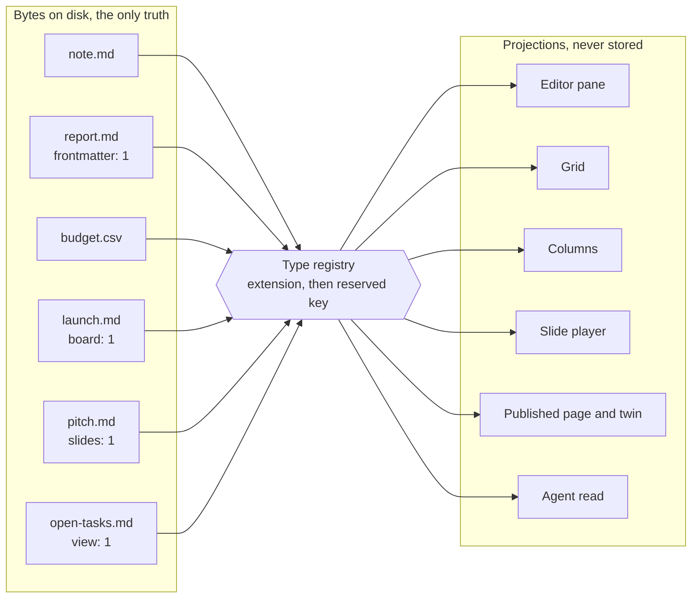
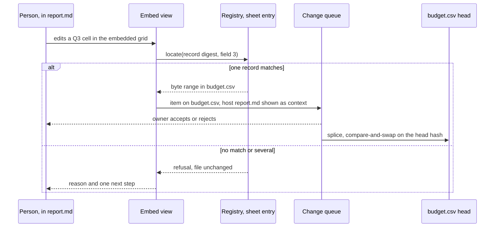
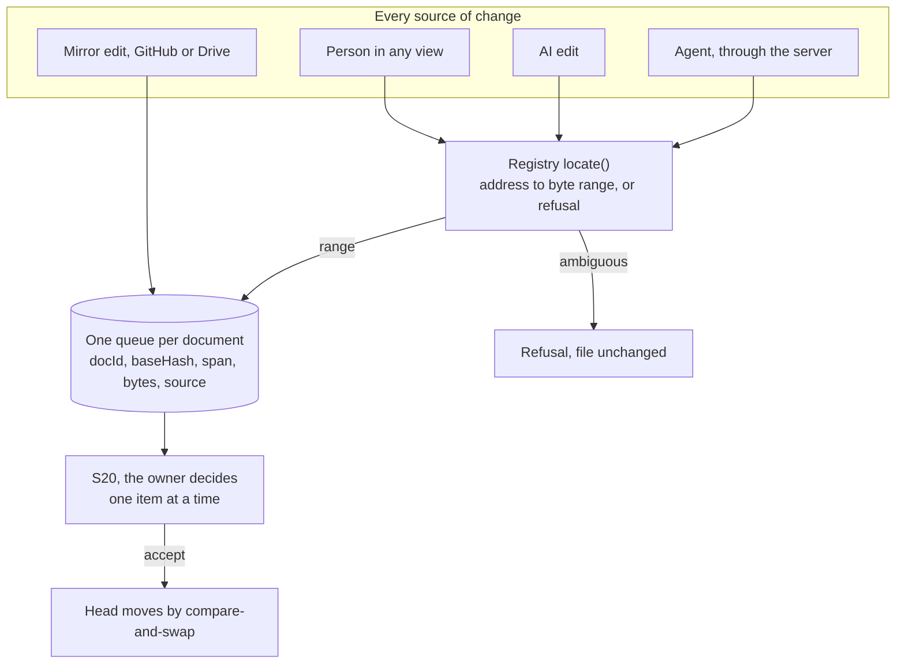
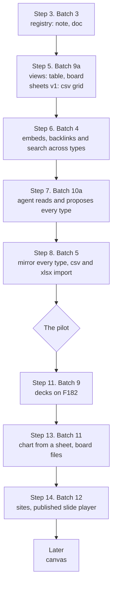

# One platform: how docs, sheets, boards, slides and sites fuse in fmd

**Status.** Research and a proposal, 18 September 2026 (UTC). Nothing here is decided. Every
recommendation is marked `proposed` and waits for the founder.

**The ask, 18 September 2026.** The founder asked for one platform that holds docs, sheets, later
presentations, websites and markdown notes in one place.

He asked how the whole of it can be fused,
connected, synchronised and calibrated as one thing.

**The answer in one line.** Every content type is a text file with one canonical format. Every
screen is a projection of that file. Everything else in this document follows from that sentence.

**How to read the markers.**

- `[S]` a primary source opened in this session, with its URL. Quotations are short and were matched
  against the fetched text.
- `[O]` observed in this repository in this session, with the command.
- `INFERENCE:` reasoning, not a measurement.
- `UNVERIFIED:` a claim this session did not check.

**Repository state.** Read at commit `ad5d784` on branch `audit-response/2026-09-17`. The pack files
cited are `20`, `25`, `50`, `66` and `67` in `docs/pack/`, and the ADR index.

**Companion files.** `SHEETS.md` and `BOARDS.md` were expected in this folder. `[O]`
`ls docs/research/2026-09-18-sheets-boards/` found neither while this was written. Where this file
touches their ground, it says so, and their findings win where they disagree.

---

## 1. How all-in-one products fuse content types

Every product below claims one place for everything. They reach it in four different ways, and the
way matters more than the claim.

Pattern | Products | What is unified | What stays separate
One object model in a private database | Notion, Coda, AFFiNE, Anytype, Craft | Every type is a block or object in one store | Nothing inside the product. Everything outside it
Separate files, joined by links and chips | Google Workspace, Zoho Workplace | Sign-in, storage, sharing and a link format | The editors, the file formats and the data
Portable components that are also files | Microsoft Loop | One live component, shown in many hosts | The hosts themselves: chat, mail, notes
One folder of text files, many views | Obsidian | The folder. Every view reads the same files | Plugins, each with its own on-disk shape

### 1.1 Notion: blocks and databases

- `[S]` https://developers.notion.com/reference/block, opened 18 Sep 2026. A block object "represents
  a piece of content within Notion". Headings, toggles, lists and media are all block types.
- `[S]` https://www.notion.com/help/intro-to-databases, opened 18 Sep 2026. "Databases in Notion are
  collections of pages", and every item "is its own page".
- The same page lists views over a database: a table, list, calendar and chart, among others.
- `[S]` https://www.notion.com/help/synced-blocks, opened 18 Sep 2026. A synced block shows one
  block in several places. An edit in one instance "will also appear in all other places".
- The same page adds the permission rule. A reader without access to the original page cannot see
  the synced block's contents.

**What it unifies.** Everything, inside one proprietary store. A database row is a page, so a sheet
and a doc are the same object.

**Where it is separate apps.** It is not. The cost is that none of it is a file. `INFERENCE:` the
fusion is bought by giving up the file, which is exactly what fmd's projection law refuses to do.

### 1.2 Coda, now Superhuman Docs

- `[S]` https://coda.io/product, opened 18 Sep 2026. The page announces "Coda is now Superhuman
  Docs", and calls itself a platform that "blends the best of docs, spreadsheets, and applications".
- `[S]` The help article on tables that this session tried,
  https://help.coda.io/en/articles/1235680-overview-of-tables, returned a page-not-found. No claim
  about Coda's table model is made from it.
- `UNVERIFIED:` that a Coda table lives inside a doc as a first-class block with formulas. This is
  widely reported and was not opened this session.

**What it unifies.** Docs and tables in one document. **Where it is separate.** Nothing internal.
Like Notion, the whole doc is one record in their store.

### 1.3 Google Workspace: separate files, smart chips, linked objects

- `[S]` https://support.google.com/docs/answer/10710316, opened 18 Sep 2026. Typing "@" inserts a
  smart chip for people, dates, places, and "Other Google Docs, Sheets, or Slides files".
- `[S]` https://support.google.com/docs/answer/7009814, opened 18 Sep 2026. A chart or table from
  Sheets can be linked into Docs or Slides. It is a copy that is refreshed on request.
- On the same page: edits made to the linked copy "won't be copied to the original file", and an
  update from the source overrides them.
- On the same page: readers of the document can "view all linked charts, tables, or slides, even if
  they don't have access" to the source file.

**What it unifies.** One account, one Drive, one share dialog, and a chip that points at another
file.

**Where it is separate apps.** Docs, Sheets and Slides are separate editors with separate
formats. A linked table is a copy, not a transclusion.

**The lesson for fmd.** The linked copy leaks the source to readers who were never given it. fmd's
embed rule in section 3.4 is written against exactly that.

### 1.4 Microsoft Loop: components that live in several places

- `[S]` https://learn.microsoft.com/en-us/microsoft-365/loop/loop-components-teams, opened 18 Sep
  2026. A component, such as a table, task list or paragraph, can be sent into Teams chat, Outlook,
  Whiteboard or OneNote.
- The same page: recipients "see updates instantly, no matter where the changes were made".
- The same page: every component made in chat or mail "is automatically saved to a file in OneDrive".
  Components are `.loop` files, earlier `.fluid`.

**What it unifies.** One component, many hosts, one file behind it.

**Where it is separate.** The
hosts are still separate products, and the `.loop` file is not a format another tool reads as text.
`UNVERIFIED:` that `.loop` is binary. The page says only that it is a file in OneDrive.

**The lesson for fmd.** Loop is the closest precedent for transclusion by reference. The component
has one home, and every appearance is a view of it. Section 3.4 takes that shape and keeps the home
as a plain text file.

### 1.5 AFFiNE and Anytype: objects

- `[S]` https://affine.pro/, opened 18 Sep 2026. It is "a workspace with fully merged docs,
  whiteboards and databases", and calls itself local-first and open source.
- `[S]` https://doc.anytype.io/anytype/basics/overview.md, opened 18 Sep 2026. In Anytype a recipe, a
  meeting note and a photo are each an object, and "Every Object is categorized into a Type".
- The same page: properties describe objects, and views find and arrange them.

**What they unify.** One object graph with types, properties and views on top. It is the most complete
fusion in the list.

**Where it is separate.** Nothing inside. The store is theirs, not a folder of
text a person can open in another editor. `UNVERIFIED:` the on-disk format of either store.

**The lesson for fmd.** Anytype's triple of type, property and view is the right vocabulary.

fmd can
have all three without a private store: the type is the file's format, the properties are front
matter, and the view is a projection.

### 1.6 Craft

- `[S]` https://craft-support.mintlify.app/en/introduction/documents.md, opened 18 Sep 2026. Craft's
  three concepts are blocks, pages and documents, and "Every paragraph in Craft is a Block".
- `[S]` https://www.craft.do/, opened 18 Sep 2026. The home page lists notes, tasks and whiteboards as its uses.
- `[S]` https://support.craft.do/llms.txt, opened 18 Sep 2026. The help index lists import from
  Notion, Evernote, Quip and Google Docs, and a separate export section.

**What it unifies.** Notes, tasks and whiteboards in one block model. **Where it is separate.** As
Notion. The unit is a block in their store, and markdown is an export.

### 1.7 Obsidian: one vault of markdown, plus Canvas, Bases and plugins

This is the precedent closest to fmd, so it gets the most space.

- `[S]` Obsidian's help is published as markdown at `github.com/obsidianmd/obsidian-help`. The files
  below were fetched from its `master` branch on 18 Sep 2026.
- `en/Bases/Introduction to Bases.md`: Bases gives "database-like views of your notes". In a table
  view "each row is a file, and each column is a property".
- The same file: "All the data in Obsidian Bases is stored in your local Markdown files and their
  properties". The view itself is a `.base` file or a code block.
- `en/Bases/Bases syntax.md`: a base "must be valid YAML" and holds views, filters and formulas in one file.
- `en/Bases/Formulas.md`: formulas create "calculated properties". They live in the base, not in the
  notes.
- `en/Bases/Layouts/Kanban view.md`: a Kanban view shows files as cards, one column per value of the
  grouping property. It needs Obsidian 1.14, in early access at the time of fetching.
- `en/Plugins/Canvas.md`: canvases are saved "as `.canvas` files using the open JSON Canvas format".
- `en/Plugins/Slides.md`: "You can use any valid Markdown file as a presentation", split on `---`.
- `en/Linking notes and files/Embed files.md`: `![[Internal links]]` embeds a note, and
  `![[Internal links#^b15695]]` embeds one block of it.
- `en/Obsidian Publish/Introduction to Obsidian Publish.md`: select notes, press Publish, and they
  are hosted at `publish.obsidian.md/your-site`.

**What it unifies.** The folder. Every view, core or plugin, reads the same files, so nothing is
locked in a store.

**Where it is separate.** Each plugin chooses its own on-disk shape. The kanban
plugin, Bases and Canvas are three formats with three owners.

**The lesson for fmd.** Obsidian proves the shape works and shows where it frays. fmd should copy
the folder and the views, and replace plugin-by-plugin formats with one registry the product owns.

### 1.8 Zoho Workplace

- `[S]` https://www.zoho.com/workplace/, opened 18 Sep 2026. The page puts mail, calendar, messaging
  and meetings together with document, spreadsheet and presentation apps, and WorkDrive for files.
- The same page names the apps separately: Zoho Mail, Calendar, Writer, Sheet, Cliq, Meeting and
  WorkDrive.

**What it unifies.** An account, a bill and a drive. **Where it is separate apps.** Everywhere else.
It is the clearest case of separate apps behind one login, and the page does not claim otherwise.

### 1.9 What the survey says, in five lines

1. **Deep fusion has always cost the file.** Notion, Coda, AFFiNE, Anytype and Craft fuse by owning
   a private store.
2. **Keeping the file has always cost the fusion.** Google and Zoho keep separate formats and join
   them with links and a shared login.
3. **Obsidian is the one product that keeps files and still fuses views.** Its weakness is that each
   plugin owns its own format.
4. **Loop is the one that makes a component live in many places while having one home.**
5. **fmd's opening, as `INFERENCE:`** Obsidian's folder, Loop's single home, and Anytype's type and
   view vocabulary, under one registry, one queue and one engine.

---

## 2. Markdown-native precedents, one type at a time

For each type, the question is the same: has anyone already stored it as plain text that another
tool can read? The answer is yes for every type the founder named, with one caution about sheets.

### 2.1 Presentations

Tool | On-disk form | Slide separator | Source opened 18 Sep 2026
Marp, through its core Marpit | one `.md` file | a horizontal rule such as `---` | `[S]` https://raw.githubusercontent.com/marp-team/marpit/main/docs/markdown.md
Slidev | one `.md` file, `slides.md` by default | `---` padded with blank lines | `[S]` https://raw.githubusercontent.com/slidevjs/slidev/main/docs/guide/syntax.md
reveal.js | markdown inside the HTML, or an external `.md` file | set by `data-separator` attributes | `[S]` https://revealjs.com/markdown/
Obsidian Slides | any `.md` note | `---` on a line surrounded by blank lines | `[S]` obsidian-help `en/Plugins/Slides.md`
Advanced Slides for Obsidian | `.md` notes, built on reveal.js | as reveal.js | `[S]` https://raw.githubusercontent.com/MSzturc/obsidian-advanced-slides/main/README.md

- Marpit's own words: it "splits pages of the slide deck by horizontal ruler". Its extra syntax is
  called directives, which set the theme, page numbers, headers and footers of a deck.
- Advanced Slides lists, among its features, embedding notes into slides and export to PDF or HTML.
- **The pattern is settled.** A deck is a markdown file split on a thematic break.
- fmd's own register
  already says so: `F182` is "Marp core, splitting on a horizontal rule, with no new syntax" `[O]`
  (`grep -n F182 docs/pack/10-FEATURE-REGISTER.md`, line 145).

### 2.2 Sites

Tool | What it publishes | Source opened 18 Sep 2026
fmd today | one page per slug, `/<slug>`, with a byte-exact twin at `/<slug>.md` specified | `[O]` `docs/pack/66-FORMAT-SPECIFICATIONS.md` section 5.1
Quartz | a static site from a folder of markdown | `[S]` https://raw.githubusercontent.com/jackyzha0/quartz/v4/docs/index.md
Obsidian Publish | chosen notes from a vault, hosted | `[S]` obsidian-help `en/Obsidian Publish/Introduction to Obsidian Publish.md`
Docusaurus | a documentation site, markdown as the main format | `[S]` https://docusaurus.io/docs/markdown-features

- Quartz describes itself as a static-site generator that "transforms Markdown content into fully
  functional websites".
- Docusaurus: it "uses Markdown as its main content authoring format". It also accepts MDX, which
  mixes React into markdown. `INFERENCE:` MDX is code in a document, so fmd reads it as text only.
- **The pattern is settled.** A site is a folder of markdown plus a small configuration, compiled to
  pages. fmd already has the single page. A site is the same projection applied to a folder.

### 2.3 Sheets

Two text forms exist, and each has a hard limit.

Form | What the standard says | Source opened 18 Sep 2026
GFM pipe table | "Block-level elements cannot be inserted in a table", and the table "is broken at the first empty line" | `[S]` https://github.github.com/gfm/, section 4.10
CSV | each record on its own line, delimited by CRLF, with an optional header line; registers `text/csv` | `[S]` https://www.rfc-editor.org/rfc/rfc4180.txt

- **A GFM table is a sheet with no multi-line cells.** A cell holds inline content only. That suits
  a small table inside a doc, and it is already built in fmd as `C045` `[O]` (`66` section 4.1).
- **A CSV file is a sheet with no types, no formulas and no formatting.** Every value is text. That
  suits data, and every spreadsheet and every agent reads it.
- **RFC 4180 says CRLF.** Real files often end lines with a bare line feed instead. `INFERENCE:` fmd must keep whichever line ending
  the file already has, as invariant 4 of `25-ENGINE-SPEC.md` already requires for markdown.
- **What neither form holds**: formulas, cell styles, merged cells, several tabs in one file. Section
  5 treats each as a risk, not a feature to add.
- **Obsidian's answer to computed columns** is Bases formulas. They live in the view file, never in
  the notes. `[S]` obsidian-help `en/Bases/Formulas.md`. Section 3.3 copies that split.

`SHEETS.md`, when it lands, is the detailed source for this type. This file fixes only where a sheet
sits in the registry and how it is embedded.

### 2.4 Boards

Tool | On-disk form | Source opened 18 Sep 2026
Obsidian Kanban plugin | "markdown-backed Kanban boards"; one `.md` file per board | `[S]` https://raw.githubusercontent.com/mgmeyers/obsidian-kanban/main/README.md
Obsidian Bases, Kanban view | no board file; cards are notes, columns are values of one property | `[S]` obsidian-help `en/Bases/Layouts/Kanban view.md`
fmd `F184` | headings as columns and task items as cards, the plugin's shape and none of its code | `[O]` `docs/pack/10-FEATURE-REGISTER.md` line 147

- **Two different things are called a board.** One is a single file whose headings are columns. The
  other is a view over many files, grouped by a front matter key.
- The plugin's README opens with a call for new maintainers. `INFERENCE:` a format owned by one
  plugin is a format at risk, which is one reason fmd owns its registry.
- `[O]` The pinned corpus of 8,513 foreign markdown files has **1** file with a `kanban-plugin` front
  matter key. Measured with a line walk over the front matter of `test/corpus/foreign`.
- `BOARDS.md`, when it lands, is the detailed source for this type.

### 2.5 Canvases and database views

- **JSON Canvas** is an open format for a two-dimensional board of nodes and edges. `[S]`
  https://jsoncanvas.org/spec/1.0/, opened 18 Sep 2026. "Nodes may be text, files, links, or groups".
- It is JSON, not markdown. `INFERENCE:` it is still a text file with a published schema, so it fits
  the registry. It is not in the founder's list, and section 4 leaves it last.
- **Bases** is the precedent for database views over front matter, which is fmd's batch 9a. Its view
  file is YAML, and its rows are files. `[S]` obsidian-help `en/Bases/Bases syntax.md`.

### 2.6 Notes and docs

These are fmd's home ground. A note is a `.md` file. A doc is a `.md` file with the reserved page
keys `title`, `subtitle`, `page`, `margins` and the version key `frontmatter: 1` `[O]`
(`66-FORMAT-SPECIFICATIONS.md` section 3.9).

### 2.7 What this section says, in four lines

1. **Every type the founder named already has a plain-text form in the wild.** No new format is
   needed, which keeps ADR-0001, a compiler and not a format.
2. **Slides and sites are views of markdown.** They need no new file type at all.
3. **Sheets and boards have two shapes each**: a file of their own, or a view over many files.
4. **Formulas are the one thing no text form carries.** That is the edge of the projection law.

---

## 3. The fusion model for fmd

**Status: proposed, every row.** Nothing in this section is built, and nothing in it changes a
settled record. It extends ADR-0006, the projection law, from one type to several.

### 3.1 Three nouns and one rule

The vocabulary comes from Anytype (section 1.5). The storage rule comes from fmd.

Noun | What it is in fmd | Where it lives
**Type** | The format of a file, chosen from one registry the product owns | The extension, then a reserved front matter key
**Property** | A named value on a file | Front matter for markdown, a column for a sheet
**View** | A deterministic, stateless projection of one or more files | A screen, a published page, an agent's read, or a view file

**The rule.** A type has exactly one canonical byte format. Every view is computed from those bytes
and holds nothing they do not hold. Every write is a splice into those bytes, and it can refuse.



### 3.2 The type registry

**How a file's type is decided, in order.** Each step either decides or passes to the next. None of
them guesses.

1. **The extension picks the family.** `.md` is markdown, `.csv` is a sheet, `.canvas` is JSON Canvas
   later. Any other extension is an upload: stored, linked, never edited, as `67-SYNC-AND-CONFLICT.md`
   section 7.1 already treats uploads.
2. **Inside `.md`, one reserved version key picks the profile.** No key means a note.
3. **Two reserved profile keys in one file is a conflict.** The file opens as a note, and the problems
   panel names both keys. The product never picks one.

**Why a version key and not a `type:` key.** The pack already uses one version key per format, such
as `portfolio: 1` and `decisions: 1` `[O]` (`66-FORMAT-SPECIFICATIONS.md` section 3.9).

**And the measurement that rules `type:` out.** `[O]` In the pinned corpus, 7,969 of 8,513 foreign
files carry front matter, and 34 of those use a top-level `type:` key for their own meaning.

The values found include `movie`, `book`, `project`, `"journalArticle"` and `"[[Conferences]]"`. A
registry that read `type:` would misread every one of those files. Measured with a line walk over
`test/corpus/foreign` in this session.

**The registry, proposed.**

Type | Canonical bytes | Detected by | Views | The unit a write splices
Note | `.md` | extension, no reserved key | source, preview, outline | any body span of `25-ENGINE-SPEC.md` section 25.9
Doc | `.md` | `frontmatter: 1`, already reserved | Doc mode page, PDF | as a note
Sheet | `.csv` | extension | grid, chart, embed | one field of one record
Table in a doc | a GFM table inside `.md` | block kind, already built as `C045` | grid inside the doc | one cell of one row
Board, as a file | `.md`, headings as columns, task items as cards | `board: 1`, new | columns | a card's list item, or a task marker
Board, as a view | a view file over many `.md` files | `view: 1` with `layout: board`, new | columns grouped by one key | one front matter key in one card's file
Database view | `.md` holding one `fm-view@1` fence | `view: 1`, new | table, board, list | the view's own keys; cell edits go to the row's file
Deck | `.md` split on thematic breaks, the `F182` shape | `slides: 1`, new, or any note presented | slide player, speaker view, PDF | as a note
Site | a folder whose `index.md` carries `site: 1` | key on the folder's index, new | pages, navigation, a twin per page | as a note, per file
Canvas | `.canvas`, JSON Canvas 1.0 | extension | two-dimensional board | later, section 4

**Import-only formats.** `.xlsx`, `.pptx` and `.docx` are converted into the text types above, and
the conversion enters the change queue as a proposal. The original is kept as an upload. They are
never edited in place (section 5).

**The contract every registry entry signs.** `INFERENCE:` the smallest interface that lets one queue,
one search and one mirror serve every type.

```ts
export interface ContentType {
  readonly id: 'note' | 'doc' | 'sheet' | 'board' | 'view' | 'deck' | 'site' | 'canvas'
  readonly version: number                        // the reserved key's value, or 1 by extension
  detect(path: string, head: Uint8Array): boolean // extension, then the reserved key. Never content sniffing
  parse(bytes: Uint8Array): Parsed | Refusal      // strict UTF-8, per decodeStrict
  locate(p: Parsed, a: Address): ByteRange | Refusal  // the only way a write finds its bytes
  text(p: Parsed): string                         // what search indexes
  links(p: Parsed): readonly LinkRef[]            // what the link index and backlinks read
  publish(p: Parsed, ctx: PublishCtx): Html | Refusal
  readonly mirror: 'text'                         // every registered type mirrors as its own bytes
  readonly refusals: readonly ErrorId[]           // must exist in 17 and 26, checked at build
}
```

`locate` is the whole of the engine's promise for a new type. If a type cannot say which bytes an
edit touches, it cannot be edited, and it stays read-only until it can.

**A sheet cell, located.** `INFERENCE:` a CSV record is addressed like a task item in section 25.9:
an ordinal, a digest of the record's bytes, and the field index.

A declared key column replaces the
ordinal when the view names one.

- **Writing a value re-quotes it by RFC 4180 rules.** A value containing a comma, a double quote or a
  line break is wrapped in double quotes, with inner quotes doubled. Nothing else in the record moves.
- **A ragged record is refused.** A record whose field count differs from the header's is refused
  for editing, as `E500` already refuses a table row of the wrong shape `[O]` (`66` section 4.8).

**The view fence stays flat.** `66-FORMAT-SPECIFICATIONS.md` section 4.3 says an `fm-` body is "a flat
YAML mapping of scalar values". `fm-view@1` keeps that rule, so its filter is one expression string.

````markdown
```fm-view@1
from: Projects/
where: status != done
sort: due
group: status
columns: title, status, due, owner
layout: board
```
````

`INFERENCE:` one line of filter is enough for a first version, and it keeps the writer that already
exists able to emit and splice every key. Obsidian's nested YAML filters are the thing it declines.

### 3.3 Formulas and computed values

**A computed value is a view, never a byte in a data file.** Obsidian draws the same line: formulas
live in the base, not in the notes (section 2.3).

- A formula lives in a view file as a column definition, such as `total: price * qty`. The grid shows
  the result. The CSV holds only the inputs.
- **Only pure functions are allowed.** No clock, no random number, no network, no other vault. The
  same bytes give the same result on every machine, which is the projection law's word
  "deterministic".
- **A person who wants the result stored** accepts a proposal that writes it as a literal value. It
  enters the queue like any other edit, and from then on it is data, not a formula.

### 3.4 Embedding one type in another

**An embed is a reference by path and anchor. It is never a copy.** The host file holds the
reference bytes and nothing else.

**The carrier.** A new fence, `fm-embed@1`, by ADR-0002's rule that data a machine reads takes a
fence. `[O]` The repository already detects Obsidian's `![[...]]` embed syntax in
`src/modules/mdmax/domain/constructs.ts:485`.

````markdown
```fm-embed@1
src: Finance/budget-2026.csv
at: rows where quarter = Q3
view: grid
```
````

- **`src` is a vault path**, so the reference survives in the GitHub mirror and reads plainly there.
- **`at` is an anchor.** A heading path for markdown, measured unique for 99.797 percent of headings
  `[O]` (`25-ENGINE-SPEC.md` section 25.9). A column heading for a board. A filter for a sheet.
- **Row numbers are never an anchor.** A row number moves when a row is inserted above it, which is
  the same reason `25` rejects parse-tree paths.
- **Obsidian's `![[note#Heading]]` is read as an embed and never written.** fmd writes only the fence.

**Seven rules, proposed.**

# | Rule | Why
1 | An edit inside an embed becomes a queue item on the **source** file | The host's bytes did not change, so the host has nothing to accept
2 | A viewer sees an embed only if they can read the source | Google's linked objects show the source to readers never given it (section 1.3)
3 | Publishing a page never publishes an unpublished source. The embed renders as a placeholder, and the publish screen lists it | The same leak, on the open web
4 | A missing source, or an anchor that resolves to more than one place, shows the reference and the reason | The rule of `66` section 4.1: a block that cannot render shows its source
5 | An embed of an embed is followed to a depth set in the configuration panel. A cycle refuses at its second visit | A cycle is otherwise an infinite render
6 | A rename rewrites every `src` that names the old path, as it already rewrites wikilinks | `[O]` `src/modules/repository/application/rename-note.ts:5`
7 | The twin `/<slug>.md` returns the host's bytes, so the fence, not the embedded content | The twin is byte-exact by rule, `66` section 5.2

**Rule 7 has a cost, and it is deliberate.** An agent reading the twin sees a reference, not the
data. `INFERENCE:` it follows the reference to the source's own twin, when that is published. The
page's `llms.txt` can list both.

**The existing chart block extends the same way.** `fm-chart@1` takes `table: above` today `[O]`
(`66` section 4.4).

Adding `table: <path>#<anchor>` lets a chart in a doc draw from a sheet. A
version-1 reader refuses the new value with `E502`, which is the correct outcome.



### 3.5 Links and backlinks across types

- **One link index for the vault.** Each registry entry reports its outgoing links through `links()`.
  Markdown reports wikilinks, markdown links and embeds. A view reports the folder it reads.
- **A sheet reports a link only where a cell holds exactly `[[name]]`.** `INFERENCE:` CSV has no link
  syntax, so anything looser would be a guess about what a cell means.
- **Backlinks list every type**, grouped by type, with the embed and view relations named apart from
  plain links. "Shown in", "counted by" and "links here" are three different sentences.
- `[O]` Today the index is markdown only: `src/modules/vault/domain/link-index.ts:74` strips `.md`,
  and the snapshot keeps only `.md` paths at `src/modules/vault/application/get-snapshot.ts:165`.

### 3.6 One search

- Search indexes what `text()` returns for each type: prose for notes, cell text for sheets, card
  text for boards, slide text for decks.
- A result names its type and opens the view at the hit: the grid at the cell, the board at the card.
- `[O]` Today `src/modules/vault/infrastructure/search-index.ts:168` skips every path not ending in
  `.md`. That line, and the matching lines in `get-snapshot.ts:165` and `export-vault-zip.ts:62`,
  become one registry lookup.

### 3.7 One change queue across types

**The queue is already type-agnostic.** An item names a document, a base hash and a byte range
`[O]` (`21-DATA-MODEL.md` section 21.4, `spanStart` and `spanEnd`). Bytes have no type.

What is type-specific is small: how an address becomes a range, which is `locate()`, and how the
diff is drawn. A sheet shows a cell change. A board shows a card moving.



- **A change across files is shown together and decided per item.** An agent that edits a doc and a
  sheet makes two items, grouped on S20. `67` section 8.1 already says agent and mirror rows are
  never bulk-accepted.
- **A card moved inside a board file touches two places in one file.** `INFERENCE:` the queue item
  needs an ordered list of spans, applied all or nothing.
- Today an item has one span. That is a data
  model change, and `21` owns it.
- **A card moved in a board view changes one key in one file.** It needs no new queue shape, which
  is one reason section 4 builds board views before board files.

### 3.8 One version history

- R2 keys are `v/{vaultId}/{docId}/{sha256}` `[O]` (`67` section 1). The layout is byte-addressed and
  knows nothing of types, so every text type gets history with no change.
- **A view's history is its view file's history.** What it showed on a past date is a projection of
  the files at that date, recomputed, never stored.
- `UNVERIFIED:` that the version records carry enough time data to find every source's head at one
  moment. A doc with embeds needs that to be shown as it was. `21-DATA-MODEL.md` owns the answer.

### 3.9 The mirror to GitHub and Drive

**One change is required.** `67-SYNC-AND-CONFLICT.md` section 7.1 says the mirror carries
"Markdown only". It becomes every registered text type. Uploads stay in R2 and linked, as today.

- **GitHub.** Each file is pushed as its own bytes under `docs/`. A `.csv` renders as a table on
  GitHub. `UNVERIFIED:` GitHub's CSV rendering limits, not opened this session.
- **Drive.** Each file is uploaded as a plain file with its own media type, `text/markdown` or
  `text/csv`. It is never converted to a Google format, because a converted file is no longer our
  bytes.
- `UNVERIFIED:` that the Drive API leaves a `.csv` unconverted when no Google target type is named.
  The mirror worker must be tested against that before it ships.
- **Inbound edits stay proposals, for every type** (`67` section 8.1). A CSV re-saved by a
  spreadsheet with new line endings arrives as one item, and S20 names the line-ending change as such.
- `INFERENCE:` a person who opens the mirrored CSV in Google Sheets and saves may produce a new Google
  file instead of editing ours. That file is outside the mirror folder's rules and is ignored.

### 3.10 How an agent reads and proposes across types

The agent server of batch 10a reads and proposes, and never writes `[O]` (`50-ROADMAP.md` section
3.7). The registry gives it three calls that work for every type.

Call | Returns | Notes
`read(path)` | bytes, type id, version, head hash | the canonical text. CSV and markdown need no SDK to parse
`read_view(path)` | the projection as stable JSON: rows, cards or slides, each with its address | the address is what `propose` takes back
`propose(path, address or span, bytes, baseHash)` | a queue item id, or a refusal with its reason | never a write. A stale `baseHash` refuses

- **An agent's multi-file change** is a set of `propose` calls sharing one change id, shown together
  on S20 and decided per item.
- **The registry publishes each type's shape**, so an agent learns what `board: 1` means from us, not
  by guessing from one file.

### 3.11 How a published page renders each type

Type | Published view | Twin
Note, doc | the page, as today | `/<slug>.md`, the bytes
Sheet | an HTML table, read-only | `/<slug>.csv`, the bytes. `INFERENCE:` the twin keeps the file's own extension
Board | static columns | `/<slug>.md`
Deck | a slide player, with the plain page one link away | `/<slug>.md`
Site | every published page in the folder, with navigation from the folder | one twin per page
View | the rows as they stood at publish, from published files only | `/<slug>.md`, the view file

**A published view is the hardest case.** It reads many files, and any of them may be private.
Proposed: it shows only rows from files that are themselves published, and says how many it left out.

### 3.12 What "calibrated" means, concretely

Calibrated means one of each of the following, shared by every type, with a check that fails when a
type brings its own.

One | Lives in | The check that keeps it one
Design system | `docs/pack/58-DESIGN-SYSTEM.md` tokens | no colour or spacing literal in a type's renderer outside the token file
Keyboard map | `docs/pack/15-INTERACTION-AND-KEYBOARD.md` | a type may add a shortcut in its own view, never rebind a global one; a build step fails on a collision
Refusal catalogue | `17-ERROR-AND-REFUSAL-CATALOGUE.md` and `26-ENGINE-REFUSAL-CATALOGUE.md` | every `refusals` id in a registry entry exists there, checked at build
Permission model | the vault's roles, `21-DATA-MODEL.md` | embeds and views take the source's permission, never the host's; one fixture proves it
Offset unit and hash | bytes and SHA-256, `src/modules/mdmax/domain/offsets.ts` | the branded offset types, already built
Anchor system | `25-ENGINE-SPEC.md` section 25.10 | one resolver for every type, one version stored in every anchor
Clock | server time orders, device time only displays, `67` section 2.2 | the journal record's own field rules
Icons | Google Material Symbols as inline SVG, `CLAUDE.md` | one icon per type in the registry, no other icon set

`INFERENCE:` a founder feels "calibrated" as the absence of surprise. The same key does the same thing
in a sheet and in a doc, and every refusal reads alike wherever it appears.

---

## 4. What to build in which order

**The frame is fixed.** D02 `[Z]`: everything, in batches, each used internally before the next
`[O]` (`50-ROADMAP.md` section 1).

This section places each type in that run order. It moves no
batch. It adds work to batches, and every added appetite below is `proposed`.

**What an appetite means here.** A budget of working days we choose, not an estimate and not a
measurement, as `50-ROADMAP.md` defines it. None of these numbers has been checked against anybody
building anything.

### 4.1 The principle behind the order

1. **The registry first, while the editor is being built.** `[O]` Three files already hard-code
   `.md` (section 3.6). Each batch built before the registry adds more of those checks to undo.
2. **Views before new files.** A board view and a database view write one front matter key. They
   need no new queue shape, no new mirror rule and no new parser.
3. **Sheets next, because a grid already exists by then.** The CSV grid reuses the database view's
   grid. Only the parser, `locate()` and the re-quoting are new.
4. **Embeds once the queue and sharing exist**, because their rules are queue and permission rules.
5. **Slides and sites last, as the founder asked.** Both are views of markdown and need no new format.

### 4.2 The placement, in run order

Step | Batch | What this proposal adds | Proposed appetite | Why here
3 | 3, the editor and Doc mode | The registry with two entries, note and doc. The three `.md` checks become one lookup | 2 days | The cheapest moment to remove a hard-coded extension
5 | 9a, database views | `view: 1` and `fm-view@1`, table and board layouts, cell edits spliced into front matter | 15 days, filling an appetite the roadmap leaves unset | D13 `[Z]` already put views here; board as a layout is Bases' own shape
5 | 9a, database views | **Sheets v1**: `.csv` in the registry, the grid, `locate()` for a field, RFC 4180 re-quoting, ragged-row refusal | 10 days, same | The grid exists by now, so a sheet is a parser and a locator
6 | 4, sharing and the queue | `fm-embed@1`, the seven embed rules, backlinks and search across types | 5 days | Rules 1 to 3 are queue and permission rules, built in this batch
7 | 10a, the agent server | `read`, `read_view` and `propose` answer for every registered type | 2 days | The registry does the work; the server only exposes it
8 | 5, in and out | The mirror carries every text type; `.csv` and `.xlsx` import as proposals into sheets | 3 days | `67` section 7.1 is rewritten here, before strangers mirror anything
gate | The pilot | nothing added | none | Twenty strangers test what exists
11 | 9, views and blocks | **Decks**: `slides: 1`, speaker view, PDF, on top of `F182` | 3 days | `F182` is already here; presentations are "eventually"
13 | 11, later blocks | `fm-chart@1` reads `table: <path>#<anchor>`; board files, `F184` and `board: 1`, with the multi-span queue item | 1 day for the chart; `F184` is already scheduled here | Board files need the queue shape change, so they come after board views
14 | 12, portfolio and community | **Sites**: a folder with `site: 1`, navigation, a twin per page; the published slide player | 10 days for sites, 3 for the player | The custom domain is already here, and a site wants one
after 14 | none | Canvas, JSON Canvas 1.0 | unset | Not in the founder's list

**The totals, computed.** `[O]` with `python3` at write time.

```
added days: 2 + 15 + 10 + 5 + 2 + 3 + 3 + 1 + 10 + 3 = 54 working days
before the pilot: 2 + 15 + 10 + 5 + 2 + 3 = 37 days, of which 25 fill 9a's unset appetite
added to batches that already had an appetite, before the pilot: 37 - 25 = 12 days
```

At the roadmap's pace of 0.93 to 1.21 working days a calendar week `[O]` (`50` section 5.1):

```
54 days: 54 / 1.21 = 44.6 weeks    54 / 0.93 = 58.1 weeks
12 days: 12 / 1.21 =  9.9 weeks    12 / 0.93 = 12.9 weeks
25 days: 25 / 1.21 = 20.7 weeks    25 / 0.93 = 26.9 weeks
```

**So the pilot moves about 10 to 13 calendar weeks later** from the additions, before counting 9a.
9a was already unpriced, so its 21 to 27 weeks were always missing from the roadmap's floor.



### 4.3 The internal gate each addition must pass

Each follows the roadmap's shape: a founder uses it on real work, then a criterion must hold.

Addition | Use | Criterion to write, as the batch's first task
Registry | Nothing visible changes | `npm run corpus` stays at `changed 0` and the snapshot's file count is unchanged
Views and board layout | Each founder runs one real project from a board view for a week | Every card move changes one key in one file, checked by byte diff
Sheets v1 | Each founder keeps one real ledger as a `.csv` for a week | A cell edit changes only that field's bytes; a ragged record refuses
Embeds | One real report embeds one real sheet | An edit in the embed lands as a queue item on the sheet; an unshared sheet shows a placeholder to a reader
Agent across types | Each founder's agent proposes one change spanning a doc and a sheet | Two items, grouped, decided one at a time
Mirror | One vault with a sheet mirrors to GitHub and to Drive | The mirrored `.csv` is byte-identical to R2's head
Decks | Each founder presents one real deck | The deck file needs no syntax a plain markdown reader cannot show
Sites | Each founder publishes one real site of three or more pages | Every page has a working twin; no unpublished file appears

---

## 5. Risks, and the never-build list

### 5.1 What breaks the projection law

Each risk names the break, what fmd does instead, and how sure this file is.

Risk | How it breaks the law | What fmd does instead
**Formulas with a clock, a random number or a network call** | The same bytes give a different view tomorrow, so the view is not deterministic | Only pure functions. `NOW()`-style functions are refused with a reason
**A formula result written back into the data** | The file now holds a second copy of a fact, and the two can disagree | Results live in the view. Storing one is an accepted proposal that turns it into plain data
**A formula that reads another file** | The view depends on bytes outside the file it claims to project | Allowed only in a view file, which names every file it reads, and renders against one set of head hashes
**A live query over a moving vault** | Two renders a second apart can differ while files change under them | A view renders against a named set of heads and shows which. `INFERENCE:` the published view freezes that set at publish
**Binary formats, `.xlsx`, `.pptx`, `.docx`** | There are no stable byte ranges to splice, and a round trip rewrites the file | Import only, as a proposal into a text type. The original is kept as an upload
**CSV that is not UTF-8** | `decodeStrict` refuses it, so it cannot be shown | Refuse, name the byte, and offer conversion as a proposal. Never decode lossily
**CSV with a semicolon or tab delimiter** | Choosing the delimiter from content is a guess | `INFERENCE:` comma only by extension in v1. A view may declare another. Content sniffing is never used
**Formula injection in exported CSV** | A cell beginning with a formula character runs as a formula when opened in a spreadsheet | Export warns and offers escaping; the canonical bytes are never altered silently
**Embeds in a PDF or a published page** | The output shows a source as it was at render time, which ages | Every such output names the source's head hash it was drawn from
**Live co-editing of a sheet** | It invites a CRDT as the store, which ADR-0003 forbids | A live session is an input method that emits splices. The file stays the store

**On formula injection.** `[S]` https://owasp.org/www-community/attacks/CSV_Injection, opened 18 Sep
2026. OWASP calls it "also known as Formula Injection" and lists the characters that start a formula,
including the equals sign and their full-width variants.

**On live sessions.** `[O]` The architecture diagram already names "Durable Objects, live sessions,
Yjs" as specified and not built (`20-ARCHITECTURE.md` section 20.2). `INFERENCE:` the line above is
the condition under which that stays inside ADR-0003.

### 5.2 Risks that are not about the law

- **Scope.** The roadmap is already 2.6 to 4.0 years for ten priced batches `[O]` (`50` section 1).
  This proposal adds 54 working days and names four types.
- Each new type is a new parser, a new
  `locate()`, and a new set of refusals to keep honest.
- **Becoming Notion without a store.** `INFERENCE:` the pull of "one place for everything" is towards
  a block editor where every paragraph is an object.
- That road ends in a private store, and it gives
  up the file, which is the product.
- **Registry keys colliding with other tools.** `[O]` In the corpus, the proposed keys `board`,
  `view`, `site` and `slides` appear as top-level front matter keys **0** times each, as do the
  existing `frontmatter` and `portfolio`.
- Absence in 8,513 files is weak evidence, not proof.
- **Obsidian compatibility.** A `.base` file and a `kanban-plugin` board are formats fmd reads but
  does not own. `INFERENCE:` fmd reads them as text and offers conversion as a proposal, never as a
  silent rewrite.

### 5.3 The never-build list, proposed

Each line is a thing fmd does not build, with the reason in one clause.

- **A private block or object store that holds content**, because the file is the product.
- **A formula result written into a data file without an accepted proposal**, because it creates a
  second truth.
- **Formulas that read the clock, a random source, the network or another vault**, because the view
  stops being deterministic.
- **In-place editing of `.xlsx`, `.pptx` or `.docx`**, or any binary canonical format, because a
  binary file has no bytes to splice.
- **A CRDT as the store of any type, sheets included**, because ADR-0003 is settled.
- **An embed that copies content into the host**, because the copy is Google's linked-object leak.
- **A `type:` front matter key as the registry switch**, because 34 files in the corpus already use
  it to mean something else.
- **Row numbers as anchors**, because they move when a row is inserted.
- **Deciding a type by reading content**, because content sniffing is a guess.
- **Nested YAML inside an `fm-` fence**, because the writer cannot splice it and `66` section 4.3
  forbids it.
- **Converting mirrored files into Google formats**, because a converted file is no longer our bytes.
- **Several sheets in one file**, because a folder of CSV files already does it in plain text.
- **Scripts, macros or MDX inside a document**, because a document that runs code is an application
  with a document's name.
- **A third-party plugin API that defines on-disk formats**, at least until the registry has shipped
  four types of its own. `INFERENCE:` that is where Obsidian's formats fray (section 1.7).

---

## 6. Limits of this file

- **What was opened.** The primary sources in sections 1, 2 and 5, fetched with `curl` on 18
  September 2026 UTC, and the repository files cited with paths at commit `ad5d784`.
- **What failed to open.** Coda's help article on tables returned a page-not-found. Anytype's older
  docs path returned an empty page, and its current docs were used instead. No claim rests on either
  failure.
- **What is unverified.** Coda's table internals, the Loop file format, both stores' on-disk formats
  for AFFiNE and Anytype.
- **Also unverified.** GitHub's CSV rendering limits, Drive's upload conversion default, and what
  Google Sheets does when it saves a mirrored CSV. Each is marked where it appears.
- **What is inference.** The registry interface, the `fm-view@1` and `fm-embed@1` shapes, the CSV
  locator, the multi-span queue item and every proposed appetite. None has a prototype or a test.
- **What the corpus can and cannot say.** The key counts come from 8,513 foreign markdown files,
  mostly Obsidian vaults. The corpus holds no CSV at all, so nothing here is measured about real
  sheets.
- **A counting caveat.** The `awk` line walk used for the key counts requires `---` on line 1, so a
  file starting with a byte-order mark is skipped.
- The `python3` walk strips the mark, and both gave
  34 for `type` and 6,807 for `tags`.
- **The companion files.** `SHEETS.md` and `BOARDS.md` had not landed when this was written. If they
  disagree with sections 2.3, 2.4 or 3.2, they are the more detailed source and should win.
- **What would falsify the model.** A sheet or board operation the founders need that cannot be
  expressed as a splice into one text file, or a view that needs state the bytes do not hold.
- Either
  would mean the projection law does not stretch to that type, and the type should stay out.
- **Freshness.** Every count is pinned to `ad5d784` and to the fetch date. Re-derive before quoting,
  per `AGENTS.md`.
