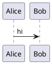
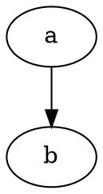

### §0 Method and evidence base

- Harness run locally 2026-08-29 against the repo's own `node_modules`: `commonmark@0.31.2` (jgm reference), `markdown-it@15.0.0` (default, `html:false`), `marked@16.4.2`. [measured]
- Spec versions: CommonMark **0.31.2**; GFM spec masthead still reads **"Version 0.29-"** (unchanged, gfm spec is frozen while GitHub ships features outside it). [fetched spec.commonmark.org, github.github.com/gfm]
- Pandoc MANUAL exposes **85** `id="extension-*"` anchors including `alerts`, `mark`, `attributes`, `wikilinks_title_after_pipe`, `short_subsuperscripts`, `tex_math_gfm`, `grid_tables`, `fenced_divs`, `bracketed_spans`. [fetched pandoc.org/MANUAL.html]
- frontmatter's own target registry (`src/modules/mdmax/domain/targets.ts`) certifies 7 **locally-measured** surfaces: `frontmatter-app` (remark), `commonmark-spec`, `github-pages` (kramdown+Jekyll, `prePipeline: strip-frontmatter`), `markdown-it-safe`, `markdown-it-html`, `marked`, `react-markdown`; plus `github-blob` (requires-push) and `github-comment` (declared, `DECLARED_LAST_VERIFIED = '2026-08-01'`). [measured — read from repo]
- Popularity anchors, all 2026-08-29: weekly npm downloads — `remark-gfm` 39,104,377 · `katex` 24,162,263 · `mermaid` 15,313,390 · `remark-mdx` 12,461,956 · `remark-math` 8,517,043 · `remark-frontmatter` 5,189,330 · `remark-directive` 3,878,616 · `markdown-it-anchor` 3,128,654 · `markdown-it-task-lists` 2,963,614 · `markdown-it-emoji` 724,814 · `markdown-it-footnote` 586,762 · `markdown-it-container` 583,539 · `markdown-it-sup` 551,389 · `markdown-it-sub` 493,573 · `markdown-it-mark` 469,006 · `markdown-it-deflist` 383,753 · `markdown-it-abbr` 331,188 · `markdown-it-attrs` 291,408 · `markdown-it-multimd-table` 48,499. [fetched api.npmjs.org]
- Stars 2026-08-29: mermaid 89,974 · pandoc 46,052 · mkdocs-material 27,343 · markdown-it 21,857 · KaTeX 20,344 · plantuml 13,277 · remark 8,987 · vega-lite 5,463 · quarto-cli 5,965 · Python-Markdown 4,243 · djot 2,033 · cmark 2,025 · cmark-gfm 1,125 · MyST-Parser 885. [fetched api.github.com]
- Degradation column below = literal output of the three parsers above unless tagged otherwise.

### §1A Inline text marks

```markdown
~~strikethrough~~                 <!-- GFM double tilde -->
~single tilde~                    <!-- GFM also accepts one -->
==highlight==                     <!-- markdown-it-mark, pandoc +mark, Obsidian -->
{==highlight==}{>>comment<<}      <!-- CriticMarkup / pymdownx.critic -->
{++inserted++} {--deleted--} {~~a~>b~~}
H~2~O   E=mc^2^                   <!-- pandoc subscript/superscript, pymdownx.caret/tilde -->
x^2 and O~2                       <!-- pandoc +short_subsuperscripts (MMD style) -->
<sub>2</sub> <sup>2</sup>         <!-- GitHub's documented way -->
||spoiler||                       <!-- Discord, Telegram, mkdocs via plugin -->
>!spoiler!<                       <!-- Reddit/old-forum variant -->
<kbd>Ctrl</kbd>+<kbd>C</kbd>      <!-- GitHub, everywhere HTML is allowed -->
++ctrl+alt+delete++               <!-- pymdownx.keys -->
```

| Ext | Engines | Degradation | FM candidate |
|---|---|---|---|
| `~~del~~` | GFM, marked, markdown-it, kramdown, Obsidian | commonmark → literal `~~x~~`; markdown-it → `<s>`; marked → `<del>` [measured] | **Yes** (already GFM) |
| `==mark==` | markdown-it-mark, pandoc `+mark`, Obsidian, mkdocs | all 3 → literal `==x==` [measured] — reads as emphasis-ish noise, harmless | **Yes** |
| `H~2~O` | pandoc, pymdownx.tilde | commonmark/markdown-it → literal; **marked → `H<del>2</del>O`** [measured] — single-tilde strikethrough collision | Yes, but must warn |
| `E=mc^2^` | pandoc, pymdownx.caret | all 3 → literal `^2^` [measured] | Yes |
| CriticMarkup | pymdownx.critic, iA Writer, Marked 2 | `{==x==}{>>note<<}` → literal with `&gt;&gt;` entities [measured] | Editor-internal only |
| `||spoiler||` | Discord, Telegram, GitLab | literal `||spoiler text||` [measured] — **content leaks**, the one thing a spoiler must not do | **Refuse** |
| `<kbd>` | any raw-HTML engine | commonmark/marked pass through; **markdown-it default escapes to `&lt;kbd&gt;`** [measured] | Yes with fallback |
| `++ctrl+c++` | pymdownx.keys only | literal `++ctrl+c++` [measured] | No — use `<kbd>` |

### §1B Notes, definitions, abbreviations

```markdown
Here is a reference.[^1]
[^1]: The footnote body, on its own line.

Here is an inline note.^[body right here]     <!-- pandoc +inline_notes -->

Term
: Definition, colon-led                        <!-- pandoc/PHP Extra/deflist -->

Term
:   Indented definition, blank-line separated

*[HTML]: HyperText Markup Language             <!-- abbr, PHP Extra / markdown-it-abbr -->
```

- Footnotes: GFM (since 2021), pandoc `+footnotes`, markdown-it-footnote (586,762 wk), kramdown, Obsidian, MyST. [fetched/SS]
- **Critical measured hazard**: a footnote whose body is a *single token* is parsed by CommonMark as a link reference definition. `x[^1]\n\n[^1]: note` → `<p>x<a href="note">^1</a></p>` in **all three** engines; two such defs → two live broken links. A multi-word body (`[^1]: the note here`) degrades safely to literal text. [measured] Degradation safety of footnotes is therefore *content-dependent* — a fact no doc states.
- Definition lists → `<p>Term : Definition here</p>` [measured]. Readable, keeps both halves. FM: **yes**.
- Abbreviations → `<p>*[HTML]: HyperText Markup Language</p>` [measured] — an orphan definition line the reader never asked for. FM: low priority, safe-ish.

### §1C Admonitions / callouts / alerts — five incompatible dialects

```markdown
> [!NOTE]                       <!-- GitHub alerts; also Obsidian callouts -->
> Useful information.
> [!TIP] > [!IMPORTANT] > [!WARNING] > [!CAUTION]

> [!note]- Collapsed title      <!-- Obsidian: - folds, + starts open -->
> body

!!! note "Custom title"         <!-- Python-Markdown admonition / mkdocs-material -->
    Indented body
??? note "Collapsible"          <!-- pymdownx.details -->

::: warning                     <!-- VitePress / markdown-it-container -->
Be careful
:::

:::{note}                       <!-- MyST colon-fence directive -->
body
:::
```{note}                        <!-- MyST/Sphinx backtick directive -->
:class: dropdown
body
```

::: {.callout-note collapse="true"}   <!-- Quarto -->
body
:::
```

- GitHub alert set is exactly **NOTE, TIP, IMPORTANT, WARNING, CAUTION** [fetched docs.github.com]. Pandoc added `alerts` for the same syntax [fetched MANUAL].
- MyST admonition names: `attention, caution, danger, error, hint, important, note, seealso, tip, warning, admonition`; colon-fence and `:class: dropdown` both supported [fetched mystmd.org/guide/admonitions]. Quarto: `callout-note/tip/caution` + `collapse=` [fetched quarto.org].
- Degradation [measured]: `> [!NOTE]` → `<blockquote><p>[!NOTE] Useful info.</p></blockquote>` in all three — **body intact, quoted, one stray token**. `!!! note "Title"` → one paragraph, title in quotes, body glued on. `::: warning` → `<p>::: warning Be careful :::</p>`. `:::{note}` fence → `<pre><code class="language-{note}">` (body preserved as code — wrong but legible).
- **Winner on degradation is unambiguous: GFM alerts.** It is the only dialect whose fallback is a semantically correct blockquote in a zero-plugin renderer.

### §1D Tables and every table extension

```markdown
| Left | Center | Right |            <!-- GFM pipe table + alignment -->
|:-----|:------:|------:|
| a    | b      | c     |

: My caption                          <!-- pandoc table_captions, caption AFTER -->
Table: My caption                     <!-- pandoc alt form -->
[Prototype table]                     <!-- MultiMarkdown caption -->

|             |          Grouping           ||   <!-- MMD colspan = extra trailing pipes -->
First Header  | Second Header | Third Header |
------------- | :-----------: | -----------: |
Content       |          *Long Cell*        ||

+---------------+---------------+          <!-- pandoc grid_tables: multiline cells, block content -->
| Fruit         | Advantages    |
+===============+===============+
| Bananas       | - built-in    |
|               | - bright      |
+---------------+---------------+

: Sample grid table.                  <!-- grid caption -->

{ .table-striped }                    <!-- pandoc table_attributes / markdown-it-attrs -->
```

- MMD rules [fetched fletcher.github.io]: separator may contain only `| - = : . +` and spaces; **cell content must be on one line only**; extra pipes at cell end = colspan; caption immediately before or after the table. **No rowspan in MMD.**
- Pandoc MANUAL contains **zero** occurrences of `colspan`/`rowspan` in the markdown reader docs [measured over fetched HTML] — pandoc's AST has spans since 2.10 but no markdown surface syntax expresses them. **Disagreement to record**: markdown-it-multimd-table (48,499 wk) *does* implement rowspan via `^^` cells, so "markdown can't do rowspan" is engine-specific, not universal.
- Degradation [measured]: pipe table → `<p>| a | b | |---|---| | 1 | 2 |</p>` in commonmark; renders correctly in markdown-it and marked. Grid table → one mangled paragraph, `+===+` visible. Caption line → its own paragraph reading `: My caption` (ugly but lossless).
- FM verdict: **pipe tables + alignment yes** (GFM baseline, 2 of 3 engines native). **Captions yes** (degrades to a stray but readable line). **colspan/rowspan/grid: refuse** — the fallback is unreadable ASCII rubble.

### §1E Math

```markdown
Inline: $e^{i\pi}+1=0$          <!-- MyST, Obsidian, Quarto, pandoc +tex_math_dollars -->
$$
\int_0^1 x\,dx
$$
\( inline \)  \[ display \]      <!-- pandoc +tex_math_single_backslash -->
\\( inline \\) \\[ display \\]   <!-- +tex_math_double_backslash -->
$`e=mc^2`$                       <!-- GitHub inline math -->
```math
e=mc^2
```                              <!-- GitHub / pandoc +tex_math_gfm block math -->
```

- `+tex_math_gfm` is documented verbatim as `$`e=mc^2`$` and ```` ```math ```` [fetched MANUAL].
- Degradation [measured]: `$…$` → literal `$e^{i\pi}$` in all three — **readable TeX source, no loss**. ```` ```math ```` → `<pre><code class="language-math">` — **best-in-class fallback**. `$`e=mc^2`$` → `$<code>e=mc^2</code>$` — acceptable. **`\[ x^2 \]` → `[ x^2 ]` and `\( x^2 \)` → `( x^2 )`** — the escapes are consumed and the reader cannot tell it was ever math. Bracket forms are the only *lossy* math dialect.
- KaTeX vs MathJax: KaTeX 20,344★ / 24.1M wk dl, synchronous, no `\label`/`\ref`, no `\newcommand` across blocks by default; MathJax 3 supports full macro/AMS environments and `\require`. GitHub uses MathJax; Obsidian/Quarto/VitePress default to KaTeX. [SS + fetched star/dl counts]
- FM verdict: **`$`/`$$` yes**, ```` ```math ```` **yes**, **`\[ \]` refuse**.

### §1F Diagrams and charts

```markdown



```wavedrom
{ signal: [{ name: "clk", wave: "p......" }] }
```
```vega-lite
{"data":{"values":[]},"mark":"bar"}
```
```chart
{"type":"bar","data":{}}
```
```{mermaid}                     <!-- Quarto/MyST directive form -->
flowchart LR
  A --> B
```
```

- Support: mermaid — GitHub blob+comments, GitLab, Obsidian, VitePress, Quarto, Notion, mkdocs-material via SuperFences (89,974★). PlantUML — server-render only, no native GitHub (13,277★). Graphviz/WaveDrom/BPMN — plugin islands. Vega-Lite (5,463★) — Quarto, Jupyter, Observable. [SS + fetched stars]
- Degradation [measured, all three engines identical]: `<pre><code class="language-mermaid">graph TD;A--&gt;B;</code></pre>` — **the diagram source survives as a labelled code block, which is the single best degradation profile in this entire catalogue.**
- FM verdict: **mermaid yes**; other fence-languages **yes by the same generic mechanism** (no per-language work); Quarto/MyST `{mermaid}` brace form **refuse** — degrades to `class="language-{mermaid}"`, a fake language.

### §1G Containers, layout, tabs, grids, cards, timelines

```markdown
::: {.callout-note}                      <!-- pandoc fenced_divs + attributes -->
body
:::
[inline span]{.class key="val"}          <!-- pandoc bracketed_spans -->
:::: {.columns}
::: {.column width="50%"}
left
:::
::::
::: code-group                           <!-- VitePress -->
```js [config.js] ```
:::
=== "C"                                  <!-- pymdownx.tabbed content tabs -->
    printf("hi");
=== "C++"
    std::cout << "hi";
<div class="grid cards" markdown>         <!-- mkdocs-material grids -->
- **Card title**
</div>
::: timeline                              <!-- no cross-engine standard exists -->
```

- Fenced divs: pandoc `fenced_divs` + `bracketed_spans` [fetched MANUAL]; markdown-it-container 583,539 wk; remark-directive 3,878,616 wk (`:::name[label]{key=val}` — the de-facto JS generic directive, per the still-open CommonMark generic-directives proposal). VitePress ships `info/tip/warning/danger/details/code-group` [fetched vitepress.dev]. mkdocs grids page exists [fetched, HTTP 200].
- Degradation [measured]: `::: {.columns}` nest → **one paragraph containing every colon fence and every cell's text run together**; `=== "Tab A"` under `panel-tabset` splits into `<h2>` headings with body between (accidentally decent); `<div class="grid cards" markdown>` → div passes through in commonmark/marked, **escaped to visible tag text in markdown-it default**.
- FM verdict: **single-level `:::` container yes** (one stray line either side). **Columns/grids/cards/timelines refuse** — nesting depth is what destroys the fallback, and multi-column layout has no reading order in a linear renderer.

### §1H Transclusion, embeds, includes

```markdown
![[Other Note]]                  <!-- Obsidian embed -->
![[Other Note#Heading]]
![[Other Note#^block-id]]
[[Wikilink]]  [[Target|alias]]   <!-- Obsidian/MediaWiki: title AFTER pipe -->
[[title|URL]]                    <!-- pandoc +wikilinks_title_before_pipe -->
Some paragraph. ^block-id        <!-- Obsidian block reference anchor -->
```{include} other.md
```
```{literalinclude} src.py
:lines: 1-10
:emphasize-lines: 3
```
--8<-- "snippet.md"              <!-- pymdownx.snippets -->
             <!-- Jekyll/Liquid, not markdown -->
/path/to/file.md                 <!-- iA Writer Content Blocks: bare path on its own line -->
```

- Pandoc documents **both** wikilink pipe orders as separate extensions [fetched MANUAL] — a genuine unresolved disagreement between Obsidian (`[[URL|title]]`) and older MediaWiki-derived tools.
- Degradation [measured]: `[[Page]]` → literal `[[Page]]`; `![[Note#Section]]` → literal — **the transcluded content is simply absent, with no marker that anything is missing**. `^block-id` → trailing literal token. iA Content Block → a bare path in a paragraph. `{include}` fence → empty `<pre><code class="language-{include}">`.
- FM verdict: **wikilinks yes** (link text survives, reader can search for it). **Transclusion refuse for publish, allow for editor** — silent content omission is the one failure a degradation certificate cannot certify.

### §1I Metadata / frontmatter variants

```markdown
---
title: A
---
+++
title = "A"
+++
---json
{"title": "A"}
---
;;;
{"title": "A"}
;;;
% Title            <!-- pandoc_title_block -->
% Author
Title: A           <!-- mmd_title_block -->
```

- Degradation [measured, commonmark]: YAML `---` → **`<hr />` followed by `<h2>title: A</h2>`** — the first key is promoted to a heading, the worst case in this table. TOML `+++` → an ordinary paragraph showing the literal block (safer!). `---json` → `<h2>---json {"title":"A"}</h2>`.
- Mitigation is a pipeline fact, not a syntax fact: frontmatter's own registry records `github-pages` with `prePipeline: ['strip-frontmatter']` and the comment that Hugo, Docusaurus, Astro, Eleventy, Jekyll **and GitHub's blob viewer** all strip it. [measured — repo]
- FM verdict: **YAML yes (mandatory, universal), TOML/JSON read-only support.**

### §1J Scholarly: citations, cross-refs, glossaries, index

```markdown
Blah blah [@doe2020, pp. 33-35; see @smith2019].
@doe2020 says blah.
[-@doe2020]
::: {#refs}
:::                              <!-- pandoc bibliography placement -->
{cite:p}`doe2020`                <!-- MyST role -->
See {ref}`my-target`, {numref}`fig-1`, {eq}`my-eq`.
(my-target)=                     <!-- MyST target -->
@fig-plot and @tbl-data          <!-- Quarto cross-ref -->
{term}`kernel`                   <!-- MyST glossary ref -->
```{glossary}
kernel
  The core.
```
\index{term}                     <!-- LaTeX passthrough -->
```

- Degradation [measured]: `[@doe2020, p. 33]` → literal `[@doe2020, p. 33]` (readable, honest). `{ref}`my-target`` → `{ref}<code>my-target</code>` — role name leaks as visible text next to code-styled target. `(my-target)=` → literal.
- FM verdict: **citation keys yes** (pure text fallback); **MyST roles refuse** (curly-brace-plus-backtick is visibly broken in every dumb renderer).

### §1K Code block extensions

```markdown
```python {.numberLines startFrom="3"}     <!-- pandoc -->
```python linenums="1" hl_lines="2 3"      <!-- mkdocs-material / pymdownx.highlight -->
```js {1,4-6}                              <!-- VitePress / Shiki line range -->
```ts title="src/index.ts"                 <!-- Docusaurus/Nextra -->
```js twoslash
```{python}                                <!-- Quarto executable cell -->
#| echo: false
```

- Degradation [measured]: **every info-string variant collapses to `class="language-python"` and the code body is byte-preserved** in all three engines. The metadata is dropped, nothing is corrupted.
- Quarto `​```{python}` → `class="language-{python}"` plus `#| echo: false` visible as a code comment (benign, it *is* a comment).
- FM verdict: **info-string attributes yes across the board** — highest degradation safety of any block-level extension family.

### §1L Everything else found

| Ext | Syntax | Engines | CommonMark degradation [measured] | FM |
|---|---|---|---|---|
| Task list | `- [x] done` | GFM, marked, kramdown, Obsidian, Notion | commonmark/markdown-it → `<li>[x] done</li>`; **marked → real `<input checkbox>`** | Yes |
| Heading attrs | `# H {#id .cls}` | pandoc, kramdown (`{: #id}`), markdown-it-attrs | `<h1>H {#id}</h1>` — braces visible in heading | Yes, low |
| Auto heading id | (implicit) | GFM, kramdown, mkdocs, remark-slug | no visible change | Yes |
| Emoji shortcode | `:rocket:` | GitHub, pandoc `+emoji`, markdown-it-emoji, Slack | literal `:rocket:` | Yes |
| Mentions | `@user`, `#123`, `SHA` | GitHub/GitLab only | literal — harmless | Read-only |
| Details/spoiler | `<details><summary>` | any raw-HTML engine | commonmark/marked pass through; **markdown-it default escapes → tags visible as text** | Yes + warn |
| Comment | `<!-- x -->` / `%% x %%` / `% x` | HTML universal / Obsidian / MyST | HTML hidden correctly; **`%%` and `%` render as visible text** | HTML only |
| Page break | `\pagebreak`, `\newpage`, `<div style="page-break-after:always">` | pandoc/LaTeX, print CSS | literal `\pagebreak` | Refuse |
| TOC | `[TOC]` / `[[_TOC_]]` / `{:toc}` / `[[toc]]` | Python-Markdown / GitLab / kramdown / VitePress | `[TOC]` → literal; **`[[_TOC_]]` → `[[<em>TOC</em>]]`** (emphasis corruption) | `[TOC]` only |
| Line block | `\| line one` | pandoc `line_blocks` | joins into one paragraph, pipes visible | Refuse |
| Example list | `(@) first` | pandoc | literal `(@)` | Refuse |
| Fancy list | `A.` `iv)` | pandoc `fancy_lists` | renders as `1.` or literal | No |
| Implicit figure | `` alone in para | pandoc | plain `` — safe | Yes |
| Figure attrs | `{#fig:1 width=50%}` | pandoc, MyST | `{#fig:1 width=50%}` — braces visible after image | Low |
| File tree | plain fenced block | convention only, no ext | perfect (it's a code block) | Yes — no work needed |
| Front-matter-driven `nocite`, `bibliography`, `csl` | YAML keys | pandoc, Quarto | hidden with FM | Yes |
| MDX/JSX | `<Component prop={1} />` | MDX (12.4M wk), Docusaurus, Nextra | markdown-it escapes; others emit unknown tags → **blank output** | Refuse |
| Djot | `{=highlight=}`, `[span]{.c}` | djot only (2,033★) | not markdown | Refuse |

### §2 Top 20 for frontmatter, ranked by demand × degradation safety

Score = `demand (1-5)` × `degradation safety (1-5)`; safety measured against the three parsers above and read against the 7 certified targets. [derived]

| # | Extension | Demand | Safety | Score | Why it survives |
|---|---|---|---|---|---|
| 1 | Fenced code + info-string (`lang`, `title=`, `hl_lines`) | 5 | 5 | 25 | Body byte-preserved everywhere; extras silently dropped [measured] |
| 2 | Pipe tables + alignment | 5 | 5 | 25 | Native in 6 of 7 targets; commonmark fallback is legible pipes [measured] |
| 3 | Mermaid (and any diagram-as-fence) | 5 | 5 | 25 | Falls back to labelled source block, identical in all 3 [measured] |
| 4 | Task lists `- [x]` | 5 | 5 | 25 | Worst case is `[x]` in a bullet; marked renders real checkboxes [measured] |
| 5 | GFM alerts `> [!NOTE]` | 5 | 5 | 25 | Only callout dialect whose fallback is a correct blockquote [measured] |
| 6 | YAML frontmatter | 5 | 4 | 20 | Universal; but `<hr>+<h2>` in a raw renderer — needs the strip-pipeline [measured] |
| 7 | Strikethrough `~~x~~` | 5 | 4 | 20 | GFM baseline; commonmark shows literal tildes [measured] |
| 8 | Block math `$$…$$` / ```` ```math ```` | 4 | 5 | 20 | TeX source stays readable; fence form is class-labelled [measured] |
| 9 | Inline math `$…$` | 4 | 5 | 20 | Literal `$…$` is the conventional plaintext form [measured] |
| 10 | Autolinks (bare URL / www) | 5 | 4 | 20 | marked linkifies; others show the URL text [measured] |
| 11 | Highlight `==x==` | 4 | 4 | 16 | Literal `==` reads as emphasis intent [measured] |
| 12 | Footnotes `[^1]` | 4 | 4 | 16 | Safe **only** for multi-word bodies; single-word bodies become live broken links [measured] |
| 13 | Heading IDs / anchors | 4 | 4 | 16 | Implicit slugs invisible; explicit `{#id}` shows braces [measured] |
| 14 | HTML `<details>`/`<summary>` | 4 | 4 | 16 | Fine in 6 targets; escaped to visible tags in `markdown-it-safe` [measured] |
| 15 | Emoji shortcodes `:rocket:` | 4 | 4 | 16 | Literal colon-form is universally understood [measured] |
| 16 | Definition lists | 3 | 5 | 15 | `Term : Definition` — lossless, reads naturally [measured] |
| 17 | Wikilinks `[[Page]]` | 4 | 3 | 12 | Text survives; **pipe order disputed** (pandoc ships both) [fetched] |
| 18 | Single-level `:::` container | 4 | 3 | 12 | One stray `:::` line each side; nesting is what kills it [measured] |
| 19 | `<kbd>` keys | 3 | 4 | 12 | Escaped in one target; readable everywhere else [measured] |
| 20 | Table captions (`: cap` / `Table: cap`) | 3 | 4 | 12 | Becomes an ordinary paragraph, no loss [measured] |

### §3 Explicitly refuse, with reasons

| Refuse | Reason (evidence) |
|---|---|
| Spoilers `\|\|x\|\|` / `>!x!<` | Fallback **leaks the hidden content verbatim** [measured]; a spoiler that degrades open is a defect, not degradation |
| Transclusion `![[Note]]`, `{include}`, `--8<--`, iA Content Blocks | Content **silently absent** with no marker [measured]; uncertifiable — nothing in the output says something was dropped |
| Grid tables, colspan (`\|\|`), rowspan (`^^`) | Degrade to ASCII rubble `+===+===+` in a paragraph [measured]; pandoc has no colspan/rowspan markdown syntax at all [measured over fetched MANUAL] |
| Columns / grids / cards / timelines | Multi-column has no linear reading order; nested `:::` collapses into one run-on paragraph [measured] |
| `\[ … \]` / `\( … \)` math | Escapes are **consumed** — `\[x^2\]` → `[ x^2 ]`, math becomes indistinguishable from prose [measured] |
| MyST/Sphinx roles `{ref}\`x\`` | Renders role name as literal text beside a code span [measured]; brace-backtick has no fallback story |
| MyST/Quarto brace fences ```` ```{note} ```` | Produces fake `class="language-{note}"` [measured] |
| MDX / JSX components | Non-CommonMark by construction; unknown tags render blank or escaped; violates the settled "profile over valid CommonMark" constraint |
| pymdownx-only marks (`++keys++`, CriticMarkup, `???`) | Single-engine syntax, literal-symbol fallback, ~0 cross-engine reach |
| `[[_TOC_]]` | **Corrupts to `[[<em>TOC</em>]]`** — underscores parsed as emphasis [measured] |
| Non-HTML comments `%%`/`%` | Render as visible body text [measured] — an editor-only comment that publishes itself |
| Page breaks | No CommonMark or HTML-flow representation; `\pagebreak` prints literally [measured] |
| Mentions `@user`, `#123` as *authored* syntax | Host-specific resolution; safe to read, unsafe to emit as a feature |
| Djot constructs | A different language, not a CommonMark profile |

### §4 Recorded source disagreements

- **Wikilink pipe order**: Obsidian/MyST use `[[target|alias]]`; pandoc ships `wikilinks_title_after_pipe` **and** `wikilinks_title_before_pipe` as separate extensions and refuses to pick [fetched MANUAL]. No resolution.
- **Rowspan exists or not**: pandoc markdown has no span syntax [measured over fetched MANUAL]; MultiMarkdown has colspan-by-trailing-pipes but no rowspan [fetched fletcher.github.io]; markdown-it-multimd-table implements both via `^^` (48,499 wk dl) [fetched npm]. Three positions, all current.
- **Single-tilde meaning**: GFM treats `~x~` as strikethrough (marked → `H<del>2</del>O`); pandoc/pymdownx treat `~2~` as subscript [measured + fetched]. Direct, unresolvable collision.
- **Callout dialects**: five mutually incompatible syntaxes shipping simultaneously in tools with >5,000★ each [fetched]. Pandoc's `alerts` extension is the only convergence signal.
- **GFM spec vs GitHub behaviour**: the spec masthead is still "0.29-" while alerts, footnotes and `$`math`$` ship on github.com [fetched both]. The spec is not a description of GitHub.
- **CommonMark generic directives**: `remark-directive` at 3,878,616 wk dl [fetched npm] implements a syntax the CommonMark spec has never adopted — the largest de-facto/de-jure gap in the ecosystem.