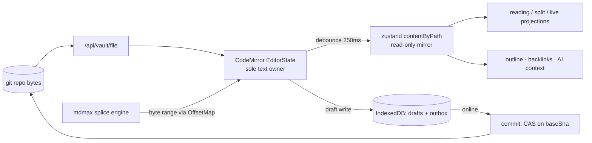

## 3. Frontend architecture

### 3.1 Measured baseline (what already exists, before any of this)

Everything below extends the repo as it stands. These are facts read off disk on 2026-08-30, not recollections.

| Fact | Value | Evidence |
|---|---|---|
| `.tsx` files in `src/` | 74 | [measured] `find src -name '*.tsx' \| wc -l` |
| Files carrying `"use client"` | 63 | [measured] `grep -rl 'use client' src \| wc -l` |
| Route handlers + pages | 4 pages, 26 API routes | [measured] `find src/app -name page.tsx -o -name route.ts` |
| Existing modules | `ai, ai-tools, app-shell, auth, drafts, editor, export, graph, mdmax, preview, repository, share, vault` | [measured] `ls src/modules` |
| Layering already enforced | `eslint-plugin-boundaries` ^6.0.2, `domain → application → infrastructure → presentation`, `default: "disallow"` | [measured] `eslint.config.mjs` L83–L120 |
| Editor modes already modelled | `"edit" \| "live" \| "reading" \| "split"` | [measured] `src/modules/editor/presentation/editor-store.ts` |
| State library already in use | `zustand` ^5.0.13, 4 call sites | [measured] `grep -rln zustand src` |
| Service worker today | hand-written, 98 lines, `CACHE = "sgnk-md-v2"` | [measured] `public/sw.js` |
| Bundle budget today | `"budget": "echo 'No bundle budget configured yet — skipping'"` | [measured] `package.json` |
| Tauri shell today | thin remote-URL wrapper: `frontendDist: "https://md.sgnk.ai"` | [measured] `src-tauri/tauri.conf.json` |

Two of these are load-bearing for the rest of the section. The `budget` script is a literal no-op stub, so the bundle ceiling below is being introduced from zero. And `public/sw.js` carries its own regression note in-file — "v1 → v2 (2026-05): kill HTML caching" after stale chunks produced *"this page couldn't load"* — which is the empirical argument in §3.7 for stopping hand-rolling the precache.

### 3.2 Rendering strategy: server components at the edges, one client island in the middle

The document editor is irreducibly client-side: CodeMirror owns a live `EditorState`, keystrokes are 60fps, and the file bytes are the source of truth held in the user's git repo. RSC buys nothing inside the editor. It buys a great deal at the boundary — the public reader, auth, billing, and the workspace bootstrap payload.

| Route | Rendering | Client JS shipped | Why |
|---|---|---|---|
| `/p/[slug]` (public published note) | RSC, fully server-rendered, `dynamic = "force-static"` + revalidate on publish | ~45 KB gz ceiling, hydration only for theme + copy-link | Anonymous readers, SEO, and the tightest CSP in the app (already enforced in `next.config.ts`) |
| `/(auth)/login` | RSC + two small client forms | ~50 KB | No editor code may enter this graph |
| `/w/[workspace]` (vault shell) | RSC layout → one client island | entry budget, §3.6 | The RSC layout fetches workspace, entitlements, tree manifest **once** and passes them as serialized props — no client fetch waterfall on cold open |
| `/w/[workspace]/n/[...path]` | Same RSC layout, note selection is a **shallow** URL update | no extra RSC roundtrip | Tab switching must not hit the server; `history.replaceState` keeps the note deep-linkable without re-rendering the tree |
| `/w/[workspace]/settings`, `/billing`, `/admin` | RSC, server actions for mutations | ~55 KB | Control-plane surfaces; zero document code |

**Picked:** RSC shell + a single hydrated workspace island. **Rejected:** full client SPA (loses the free public reader and forces an auth waterfall) and RSC-per-note (a server roundtrip per tab switch on a document editor is indefensible). **Cost:** the entitlement payload is snapshotted at page load, so a plan change requires a reload or a control-plane push. **Changes our mind:** if per-note server render ever becomes needed for very large documents (virtualised read mode), we introduce a `/n/[...path]/render` RSC segment rather than converting the shell.

### 3.3 State management: three zustand stores, and one thing that is deliberately not a store

Zustand 5 is already here and stays. The decisive property is not size — it is that a zustand store is readable and writable **from outside React**, which is required because CodeMirror extensions, the splice engine, and the Tauri menu bridge all run outside the React tree.

| Store | File | Holds | Persistence |
|---|---|---|---|
| `useEditorStore` (exists) | `src/modules/editor/presentation/editor-store.ts` | tabs, `activePath`, `secondaryPath`, `mode`, `contentByPath` mirror, `baseShaByPath`, `reloadByPath` | `sessionStorage`, `partialize` excludes `contentByPath` [measured — already correct] |
| `useWorkspaceStore` (new) | `src/modules/workspace/presentation/workspace-store.ts` | `workspaceId`, role, entitlements, connector status, feature flags | none — hydrated from RSC props each load |
| `useSyncStore` (new) | `src/modules/sync/presentation/sync-store.ts` | outbox depth, per-path lifecycle (`clean \| dirty \| queued \| committing \| diverged \| refused`), last CAS error | mirrors IndexedDB; IDB is authoritative |

The thing that is *not* a store: `src/modules/editor/presentation/active-view.ts`, a module-level singleton holding the focused `EditorView`. Its in-repo comment already states the reason — "EditorView is a mutable object and storing it would trigger selector comparisons on every dispatch (render-loop risk)" [measured]. Codify that as a rule: **non-serialisable mutable objects never enter zustand.** Same rule covers the `unified` processor instance and the Tauri `Window` handle.

**Rejected:** Redux Toolkit (ceremony, no benefit at one founder's scale), Jotai (atom-per-path fragments the outbox invariants), React Context for editor state (re-renders the whole island on every keystroke mirror). **Cost:** no free time-travel devtools; every consumer must use a selector or it re-renders on unrelated writes. **Changes our mind:** if cross-store transactional atomicity is ever needed, collapse to one store with slices — not a new library.

### 3.4 The CodeMirror 6 boundary

This is the highest-risk seam in the product, because the engine speaks **bytes** and CodeMirror speaks **UTF-16 code units**, and the whole promise is byte-preserving splices.

Three rules, all enforceable:

1. **`EditorState` is the sole owner of document text during an editing session.** `contentByPath` in zustand is a read-only mirror written on a 250 ms debounce, consumed by preview, outline, backlinks, and AI. Nothing writes to the mirror expecting the editor to follow.
2. **Store → editor is never a plain write.** It happens only through the existing `bumpReload(path)` (full reload, used by history restore) or through an annotated transaction (used by AI apply and engine splices), so local user edits are never silently clobbered.
3. **A byte offset must pass through `OffsetMap` before it touches CodeMirror.** `src/modules/mdmax/domain/offsets.ts` already exists and was the site of a fixed off-by-3 (commit `cc1d451`) — that is exactly the failure this rule prevents.

```ts
// src/modules/editor/presentation/remote-splice.ts
import { Annotation, type EditorState, type TransactionSpec } from "@codemirror/state";
import type { SpliceOp } from "@/modules/mdmax";          // { start: number; end: number; bytes: Uint8Array }
import { byteToChar } from "@/modules/mdmax/domain/offsets";

/** Marks a transaction as NOT user-originated: autosave skips it, undo groups it as one. */
export const RemoteSplice = Annotation.define<{ origin: "ai" | "engine" | "merge" }>();

export function spliceToTransaction(
  state: EditorState,
  op: SpliceOp,
  origin: "ai" | "engine" | "merge",
): TransactionSpec {
  const from = byteToChar(state.doc, op.start);
  const to = byteToChar(state.doc, op.end);
  if (from === null || to === null) {
    // REFUSE, never guess. The engine's contract is the UI's contract.
    throw new SpliceRefused("offset does not land on a character boundary", op);
  }
  return {
    changes: { from, to, insert: new TextDecoder().decode(op.bytes) },
    annotations: RemoteSplice.of({ origin }),
    scrollIntoView: origin !== "engine",
  };
}
```

A `SpliceRefused` surfaces as a non-dismissable inline banner on the affected block with the engine's reason string. It never falls back to a fuzzy match. **Cost:** users occasionally see "we would not apply this" instead of an edit. That is the product.



### 3.5 Routing and the URL contract

| Path | Owner | Notes |
|---|---|---|
| `/w/[workspace]` | `src/app/(workspace)/w/[workspace]/page.tsx` | Consolidates today's `(vault)` and `(workspace)` groups into one [measured: both dirs exist] |
| `/w/[workspace]/n/[...path]` | same segment, shallow-updated | Deep-linkable note; `[...path]` is the vault-relative path, URL-encoded per segment |
| `/p/[slug]` | `src/app/(public)/p/[slug]` (exists) | Publish-slug uniqueness lives in the control-plane Postgres |
| `/api/**` | 26 existing route handlers | Unchanged shape; `workspace_id` becomes a required, server-derived parameter |

Workspace lives in the path, never in a cookie. **Why:** a cookie-scoped tenant makes two open tabs on two workspaces impossible, and it makes every RLS bug invisible in logs. **Cost:** one extra path segment everywhere.

### 3.6 Code splitting and the bundle budget

Measured gzip of the on-disk published `dist` files (these are the *unminified* ESM bundles as npm ships them, so the real shipped cost after minification and tree-shaking is materially lower; the budgets below are set on built output, not on these):

| Package | raw B | gzip B | gzip KB | Tag |
|---|---|---|---|---|
| `mermaid` 11 | 3,312,967 | 904,194 | **883.0** | [measured] |
| 7× `@codemirror/*` in use | 978,890 | 235,875 | **230.3** | [measured, summed] |
| `react-dom` client production | 536,016 | 94,740 | 92.5 | [measured] |
| `katex` | 271,142 | 75,407 | 73.6 | [measured] |
| `minisearch` | 86,348 | 18,611 | 18.2 | [measured] |

Mermaid alone is 883 KB gzipped — 3.8× the entire CodeMirror editor. It is the single fact that shapes the splitting plan.

**The budget** (`budget.json`, gzipped bytes of built output):

| Key | Ceiling | Basis |
|---|---|---|
| `route:/w/[workspace]` first-load JS | **190 KB** | React 19 + Next 16 runtime + shell + zustand; measured `react-dom` dist gz is 92.5 KB unminified [measured], minified lands lower [inference] |
| `route:/p/[slug]` first-load JS | **45 KB** | RSC HTML + a theme toggle. Hard ceiling: no editor, no unified, no mermaid |
| `chunk:editor` | **220 KB** | 230.3 KB unminified-gz measured; minify+treeshake ≈ 140 KB [inference]; 220 leaves ~57% headroom |
| `chunk:markdown-pipeline` | **130 KB** | unified + remark-gfm/math/breaks + rehype-slug/raw/highlight |
| `chunk:katex` | **80 KB** | 73.6 measured |
| `chunk:minisearch` | **25 KB** | 18.2 measured |
| `chunk:graph` | **180 KB** | `react-force-graph-2d` |
| `chunk:mermaid` | **950 KB** | 883.0 measured. **Lazy-only. Never preloaded, never in any route's first-load set.** |
| `total:.next/static/chunks` | **2,400 KB** | Global drift guard |

Cold path to first keystroke = 190 + 220 + 130 = **540 KB gz** [derived]. Publishing a note pre-renders its mermaid diagrams to SVG into R2 at publish time, so `/p/[slug]` readers download **0 KB** of mermaid — which is why the free-egress R2 decision is load-bearing here too.

**Enforcement.** Replace the stub `budget` script with a zero-dependency script that reads Next's own manifests, so it survives a Turbopack/webpack switch:

```js
// scripts/bundle-budget.mjs   — run after `next build`
import { readFileSync } from "node:fs";
import { gzipSync } from "node:zlib";
const budget   = JSON.parse(readFileSync("budget.json", "utf8"));
const manifest = JSON.parse(readFileSync(".next/app-build-manifest.json", "utf8"));
const gz = (f) => gzipSync(readFileSync(`.next/${f}`), { level: 9 }).length;

let failed = 0;
for (const [route, files] of Object.entries(manifest.pages)) {
  const key = `route:${route}`;
  if (!(key in budget)) continue;
  const bytes = files.filter((f) => f.endsWith(".js")).reduce((n, f) => n + gz(f), 0);
  const kb = Math.round(bytes / 1024);
  const ceil = budget[key];
  console.log(`${kb <= ceil ? "PASS" : "FAIL"} ${key} ${kb}KB / ${ceil}KB`);
  if (kb > ceil) failed++;
}
process.exit(failed ? 1 : 0);
```

Plus a lint rule that makes the mermaid ceiling structural rather than aspirational:

```js
// eslint.config.mjs — appended to the existing boundaries block
{
  files: ["src/**/*.{ts,tsx}"],
  ignores: ["src/modules/preview/presentation/lazy/**"],
  rules: {
    "no-restricted-imports": ["error", { paths: [
      { name: "mermaid",              message: "Import only from preview/presentation/lazy/mermaid-lazy.ts" },
      { name: "katex",                message: "Import only from preview/presentation/lazy/katex-lazy.ts" },
      { name: "react-force-graph-2d", message: "Import only from graph/presentation/lazy/graph-lazy.ts" },
    ]}],
  },
}
```

**CI.** The repo has no CI at all. `.github/workflows/ci.yml` gets three jobs: `verify` (the existing `typecheck && lint && test && arch && spec`), `build`, and `budget` (needs: build). GitHub Free includes **2,000 Actions minutes/month for private repositories**, Team 3,000 [fetched 2026-08-30, `github/docs` → `githubs-plans.md`]. At ~3 minutes per PR run and 30 PRs/month that is 90 minutes, **4.5%** of the free allowance [derived: 3 × 30 = 90; 90 ÷ 2000 = 0.045]. Budget enforcement costs nothing.

### 3.7 Offline and the service worker

There is no prior service-worker research in the corpus, so this is stated as a design with its reasoning exposed rather than as a citation.

**Picked:** `@serwist/next` **9.5.12** [fetched 2026-08-30, registry.npmjs.org] to *generate the precache manifest*, with our own handwritten runtime-caching rules injected at `self.__SW_MANIFEST`. **Rejected:** continuing to hand-roll `public/sw.js` (its own header documents a production regression where v1 served stale hashed chunks), and `next-pwa` (unmaintained). **Cost:** the SW now couples to the build. **Changes our mind:** if Serwist lags a Next major by more than one minor release, we vendor its manifest injector — it is ~200 lines.

| Request class | Strategy | Rationale |
|---|---|---|
| HTML navigations | **NetworkFirst**, 3 s timeout → cached shell | A stale shell referencing dead chunk hashes is the exact failure already hit once |
| `/_next/static/**` | **CacheFirst**, immutable, versioned by build id | Content-hashed; safe forever |
| `/p/**` | **StaleWhileRevalidate**, 24 h | Public reader stays readable offline |
| `/api/vault/**` (document bytes) | **NEVER intercepted. Network only.** | A cached GET would hand the editor stale base bytes; a splice against the wrong base is silent corruption. This is the one non-negotiable SW rule |
| `/api/ai/**`, `/api/auth/**`, `/api/commit` | Never intercepted | Mutations and credentials |

Offline *writing* is not the service worker's job — it is IndexedDB's. `idb-keyval` ^6.2.4 already backs `src/modules/drafts/infrastructure/draft-store.ts` [measured]. Add a sibling `outbox-store.ts`: an append-only queue of `{ path, baseSha, splices[], createdAt }` replayed on `online`. Offline the app is fully writable and explicitly *not* committable; the UI says "3 changes waiting to sync", never "saved".

### 3.8 Optimistic UI for a splice-based writer

Optimism has to stop precisely where compare-and-swap begins.

| State | UI | Reversible? |
|---|---|---|
| `dirty` | dot on tab (exists), draft in IDB | yes — local only |
| `queued` | "waiting to sync", outbox count in status bar | yes |
| `committing` | subtle spinner, editor stays fully editable | yes |
| `committed` | dot clears, `baseShaByPath` updated | n/a |
| `diverged` (CAS 409) | banner: "This file changed on GitHub" + Review / Keep mine / Take theirs | user-driven three-way merge |
| `refused` | inline block banner with the engine's reason | never auto-resolved |

We are optimistic about **local application** and pessimistic about **remote acceptance**. `baseShaByPath` already exists in the store for exactly this and already carries a comment about avoiding the `""` create-sentinel that would 409 [measured]. A 409 never triggers an automatic merge: it opens the existing merge path (`/api/vault/merge`) with a diff the user approves. **Cost:** more modals than Google Docs. **Why it is right:** these are the user's own git commits, and a silent wrong merge is unrecoverable in a way a modal never is.

### 3.9 Component architecture: four modes, N render profiles

The four modes already exist in the store as data (`edit | live | reading | split`). Enforce that they stay data: **one** `EditorSurface` component composes panes, and a mode never gets its own component tree.

| Mode | Composition | Owns text? |
|---|---|---|
| `edit` | `<SourcePane>` | CodeMirror |
| `reading` | `<RenderedPane profile>` | nobody — pure projection of `contentByPath` |
| `split` | `<SourcePane> + <RenderedPane>` with existing `split-scroll-sync.ts` | CodeMirror |
| `live` | `<RenderedPane>` + `<InlineBlockEditor>` on the focused block (both exist under `presentation/live/`) | CodeMirror, scoped to one block's byte range |

Render profiles (GitHub, CommonMark, Obsidian, Pandoc) are **pipeline configurations, not component forks** — a frozen list of remark/rehype plugins plus a `DegradationCert` from `src/modules/mdmax/application/certify.ts`. `<RenderedPane>` takes `profile: RenderProfileId`, resolves the pipeline from a registry, and renders the certificate's warnings as a dismissible strip: "In GitHub's renderer, 2 constructs degrade." Adding a profile is a registry entry and a fixture file — never a new component.

### 3.10 Desktop shell: Tauri v2

Today `tauri.conf.json` points `frontendDist` at `https://md.sgnk.ai` — a remote-URL wrapper [measured]. Keep that as the default: one deploy, one codebase, no update channel to operate alone. `TauriBridge.tsx` already translates native menu events into the same DOM `CustomEvent`s the web app listens for, which is the correct sharing boundary — **the desktop app adds capabilities, never a fork of the UI.**

| Concern | Web | Tauri v2 (`@tauri-apps/api` ^2.11.0, latest 2.11.1 [fetched 2026-08-30]) |
|---|---|---|
| Vault storage | GitHub API via `/api/vault/**` | Same, plus optional local filesystem clone behind a capability |
| Menus / shortcuts | DOM events | Native menu → same DOM events (exists) |
| Offline | service worker + IDB | WebView cache + IDB; identical code |
| Updates | deploy | Remote URL means the shell needs updating only for Rust changes |

**Rejected:** bundling the frontend into the app (`frontendDist: "../out"`), which requires a signed update channel and a second release process. **Cost:** the desktop app is offline-degraded on first launch until the SW is warm. **Changes our mind:** the first paying customer on an air-gapped network flips this to a bundled build.

### 3.11 File and folder architecture

Extends `src/modules/*` and stays inside the existing four-layer `eslint-plugin-boundaries` contract.

```
src/
├─ app/
│  ├─ (public)/p/[slug]/               # RSC reader, tight CSP (exists)
│  ├─ (auth)/login/                    # exists
│  ├─ (workspace)/                     # absorbs today's (vault) group
│  │  └─ w/[workspace]/
│  │     ├─ layout.tsx                 # RSC: workspace + entitlements + tree manifest
│  │     ├─ page.tsx
│  │     ├─ n/[...path]/page.tsx       # deep-linkable note (shallow-updated)
│  │     ├─ settings/ · billing/
│  ├─ api/                             # 26 handlers (exists)
│  └─ manifest.ts                      # PWA manifest (exists)
├─ modules/
│  ├─ editor/presentation/
│  │  ├─ EditorSurface.tsx             # NEW — single composer for all 4 modes
│  │  ├─ remote-splice.ts              # NEW — §3.4 byte→char adapter + REFUSE
│  │  ├─ CodeMirrorEditor.tsx · EditorPane.tsx · live/ · active-view.ts   (exist)
│  ├─ preview/presentation/
│  │  ├─ profiles/registry.ts          # NEW — render-profile pipelines
│  │  ├─ RenderedPane.tsx              # NEW — profile-parameterised projection
│  │  └─ lazy/{mermaid,katex}-lazy.ts  # NEW — the ONLY legal import sites
│  ├─ sync/                            # NEW module
│  │  ├─ domain/{outbox-entry,cas-result}.ts
│  │  ├─ application/{enqueue,replay,resolve-divergence}.ts
│  │  ├─ infrastructure/outbox-store.ts        # idb-keyval
│  │  └─ presentation/{sync-store.ts,SyncStatusBar.tsx,DivergenceBanner.tsx}
│  ├─ workspace/                       # NEW — tenancy/entitlements client mirror
│  ├─ offline/presentation/{OfflineBoundary.tsx,useOnline.ts}   # NEW
│  ├─ platform/                        # NEW — web vs Tauri capability adapters
│  └─ …(ai, ai-tools, app-shell, auth, drafts, export, graph, mdmax, preview, repository, share, vault — unchanged)
├─ shared/ · container/ · config/      # exist
budget.json                            # NEW
scripts/bundle-budget.mjs              # NEW
.github/workflows/ci.yml               # NEW — verify · build · budget
sw/index.ts                            # NEW — Serwist source, compiled to public/sw.js
```

`src/modules/sync` and `src/modules/workspace` get boundary entries in `eslint.config.mjs` alongside the existing types so the `default: "disallow"` rule keeps applying — a new module that is not registered silently inherits *no* permissions, which is the correct default.
