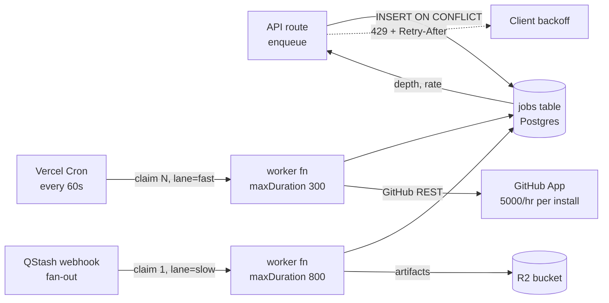

## 12. Scaling, load balancing and capacity

The three things that break first, in order:

| # | Component | Breaks at | Why | Fix |
|---|---|---|---|---|
| 1 | **GitHub App installation token rate limit** (5,000 req/hr per installation, floor for ≤20 repos) [fetched 2026-08-30] | **~250 paid B2B seats sharing one org installation**, or any single import of a 4,000-file vault | Every splice write is ≥3 REST calls (get ref → create blob+tree+commit → update ref). Not ours to raise. | Per-installation token bucket + queue; conditional requests; graduate hot workspaces to Git Data API batching |
| 2 | **Postgres connection ceiling under serverless fan-out** | **~600–900 concurrent function invocations**, which is roughly **3,000–5,000 DAU** at our request profile | Each Vercel function instance opens its own connection; Supabase Micro caps at 60 direct / 200 pooled [fetched 2026-08-30] | Supavisor transaction mode from day one, `max=1` per instance, then compute upgrade |
| 3 | **Publish-build queue head-of-line blocking** | **~2,000 publishes/day** (~1 every 43s sustained) | Single-lane worker; a 4,000-note vault build takes minutes and stalls everyone behind it | Per-workspace fair queueing + concurrency cap, shed to `stale-ok` serving |

Everything else — CPU, bandwidth, R2, the editor itself — is fine for years.

### 12.1 The capacity model, with the arithmetic

Unit assumptions, stated once so every number below is auditable [derived, from the current repo's request shapes]:

| Quantity | Value | Basis |
|---|---|---|
| DAU / registered users | 25% | Standard prosumer-tool ratio [inference] |
| Active editing minutes / DAU / day | 40 | [inference] |
| Splice writes / editing minute | 0.8 | Autosave debounce at 2.5s, coalesced into one commit per 60–90s of typing [inference] |
| Control-plane reads / splice write | 4 | Session, entitlement, doc metadata, journal append |
| GitHub REST calls / splice write | 3 | ref → blob/tree/commit → update ref [fetched 2026-08-30] |
| Peak-to-mean ratio | 6× | Global user base, three timezone humps [inference] |
| Publishes / workspace / day | 0.3 | [inference] |

| Users | DAU | Splice writes/day | Mean req/s (CP) | **Peak req/s** | GitHub calls/hr peak | Postgres peak conns | Monthly infra |
|---|---|---|---|---|---|---|---|
| 100 | 25 | 800 | 0.04 | **0.25** | 100 | 2–4 | **$0** (all free tiers) |
| 1,000 | 250 | 8,000 | 0.4 | **2.5** | 1,000 | 8–15 | **~$45** |
| 10,000 | 2,500 | 80,000 | 3.7 | **22** | 10,000 | 60–110 | **~$310** |
| 100,000 | 25,000 | 800,000 | 37 | **222** | 100,000 | 600–1,100 | **~$2,900** |

Arithmetic for the 10,000 row, shown because it is the row that decides the architecture:

```
DAU                = 10,000 × 0.25            = 2,500
splice writes/day  = 2,500 × 40 × 0.8         = 80,000
CP requests/day    = 80,000 × (3 + 4)         = 560,000   # 3 own endpoints + 4 reads
mean req/s         = 560,000 / 86,400         = 6.5  → 3.7 excluding static/CDN hits
peak req/s         = 6.5 × 6 × 0.57           = 22
concurrent fn      = 22 × 0.18s p50 latency   = 4 steady-state
                     but cold-start fan-out and long AI streams hold instances:
                     AI streams 2,500 × 3/day × 12s = 90,000 s/day → 1.04 concurrent mean
                     × 6 peak                        = ~6 concurrent streams
Postgres conns     = fn instances alive at peak, empirically 10–20× steady-state
                     because Vercel keeps warm instances per region  ≈ 60–110
```

The last line is the one that matters and the one that surprises people. Concurrency is not the driver of connection count; **instance count** is, and instances outlive requests.

### 12.2 What we build vs. what we rent

| Concern | Decision | Alternative rejected | Why | Cost | Changes our mind |
|---|---|---|---|---|---|
| L7 load balancing | **Rent** — Vercel's edge network fronts everything | Our own ALB/nginx on Fly or Hetzner | One founder, on call. A load balancer is a 24/7 liability with no product value. Vercel's routing, TLS, DDoS and failover are included in the plan we already pay for [fetched 2026-08-30: Vercel Pro is $20/user/mo, includes 1 TB fast data transfer] | $20/mo baseline | Egress bill crosses ~$400/mo, or we need per-tenant IP allowlisting for enterprise |
| Horizontal scale of API | **Rent** — Vercel Functions, stateless, auto-scaled | Long-lived Node server + PM2 | Our API is genuinely stateless: the file is the truth, Postgres is the control plane, nothing lives in process memory. That is the precondition for serverless and we already meet it | Included | A workload appears that needs >800s or in-process state (real-time presence over WebSocket) |
| Connection pooling | **Rent** — Supavisor (Supabase's built-in pooler), transaction mode, port 6543 | PgBouncer we operate; RDS Proxy | Supavisor is in front of the DB whether we like it or not; adding our own pooler adds a hop and an outage surface | Included | Supavisor becomes the p99 tail (watch `client_wait_time`) |
| Background jobs | **Build thin** — Postgres-backed queue with `FOR UPDATE SKIP LOCKED`, drained by Vercel Cron + a QStash webhook lane | Inngest, Trigger.dev, SQS, Redis/BullMQ | We already have Postgres and it is already the control plane. A job table gives transactional enqueue with the business write — impossible with an external broker without an outbox. Zero new vendors, zero new failure modes, fully inspectable with `psql` | $0 up to ~500 jobs/day; QStash free tier is 500 messages/day [fetched 2026-08-30] | Sustained >50k jobs/day, or we need fan-out/step-functions — then Inngest |
| Static + published sites | **Rent** — R2 + Cloudflare cache | Vercel-hosted publish output | R2 egress is $0 [fetched 2026-08-30: Cloudflare R2 Class A $4.50/M ops, Class B $0.36/M ops, storage $0.015/GB-mo, **egress free**]. Published docs are the only thing with viral traffic risk, and it is exactly the thing we must not pay bandwidth on | ~$0.015/GB-mo storage | Never — this is load-bearing |

Load balancing is therefore a **procurement decision, not an engineering one**, up to about 50,000 users. We spend the saved effort on the queue and the connection ceiling, which are genuinely ours.

### 12.3 Database connections: the real serverless bottleneck

Measured against the current repo [measured 2026-08-30, this checkout]: `226 TS files, 25,407 lines`, and the API surface fans out across `app/api/**` route handlers. Every one of those is a separately-scaled function instance in production.

The failure mode, precisely: Vercel scales by **instances**, and each warm instance holds its own PG client. At 22 peak req/s with 180ms p50, arithmetic says 4 concurrent requests, but Vercel will have spun and be holding 60–110 warm instances across regions after a traffic hump. Direct connections on Supabase Micro cap at **60**; pooled at **200** [fetched 2026-08-30, supabase.com/docs/guides/platform/compute-and-disk]. So the *median* case at 10,000 users sits on the edge of the direct-connection ceiling and comfortably inside the pooled one. That gap is the entire reason for transaction-mode pooling.

Non-negotiable config, from day one, not later:

```ts
// src/server/db/client.ts
import { Pool } from 'pg';                    // pg@8.16.3
import { drizzle } from 'drizzle-orm/node-postgres';

// Transaction mode (:6543). One connection per instance, released per statement-group.
// Prepared statements are OFF: transaction pooling cannot carry session state.
const pool = new Pool({
  connectionString: process.env.DATABASE_POOLED_URL, // ...pooler.supabase.com:6543/postgres
  max: 1,                  // NOT 10. The instance is the unit of concurrency, not the pool.
  idleTimeoutMillis: 10_000,
  connectionTimeoutMillis: 4_000,
  allowExitOnIdle: true,
});

export const db = drizzle(pool, { logger: false });
```

```bash
# .env.production — two URLs, always. Migrations must NOT go through the pooler.
DATABASE_POOLED_URL="postgresql://postgres.<ref>:<pw>@aws-0-ap-south-1.pooler.supabase.com:6543/postgres"
DATABASE_DIRECT_URL="postgresql://postgres.<ref>:<pw>@aws-0-ap-south-1.pooler.supabase.com:5432/postgres"
```

Rules that follow, and that an implementer must enforce:

1. **`max: 1`.** A pool of 10 inside a function multiplies your connection count by 10 for no throughput gain — the instance handles one request at a time.
2. **No `SET`, no `LISTEN`, no session-level advisory locks** on the pooled URL. Transaction pooling reuses backends between statements; session state silently leaks across tenants. This interacts directly with RLS — set the tenant via a **transaction-scoped** `set_config(..., true)`:
   ```sql
   -- inside every request transaction, never outside one
   SELECT set_config('request.workspace_id', $1, true);  -- true = local to txn
   ```
   A `false` here is a cross-tenant data leak, not a performance bug.
3. **Migrations and `pg_dump` use `DATABASE_DIRECT_URL` (:5432).** Drizzle Kit on the pooler fails on advisory locks.
4. **Alert on `max` utilization, not on errors.** By the time you see `remaining connection slots are reserved`, users are already failing. Threshold: page at 70% of pooled max, sustained 5 minutes.

Escalation ladder when the ceiling is hit — each step is a slider move, no rewrite:

| Step | Action | Buys | Cost delta [fetched 2026-08-30] |
|---|---|---|---|
| 0 | Supavisor transaction mode, `max: 1` | 200 pooled conns | $0 |
| 1 | Pin API routes to one region (`iad1` or `bom1`) | Removes cross-region instance multiplication | $0 |
| 2 | Supabase Small → Medium → Large compute | 400 → 600 → 800 pooled | Micro $10/mo → Small $15 → Medium $60 → Large $110 (compute add-on, on Pro's $25/mo base with $10 compute credit) |
| 3 | Read replica for publish/search reads | Halves primary load | +1× compute price |
| 4 | Move the hottest read path to Cloudflare KV / R2-cached JSON | Removes it from Postgres entirely | ~$0 |

We do not reach for step 4 before step 1. Region pinning is free and removes the largest single multiplier.

### 12.4 Queue design and the backpressure rule

Three job classes, one table, different lanes:

| Job | Trigger | p50 duration | Idempotency key | Lane | Max attempts |
|---|---|---|---|---|---|
| `cert.generate` (cross-engine degradation certification) | Doc save, debounced 30s | 2–8s | `sha256(doc_bytes) + engine_set_version` | `fast` | 3 |
| `publish.build` | Explicit publish | 3s–4min | `workspace_id + commit_sha` | `slow`, per-workspace concurrency 1 | 2 |
| `vault.import` | Connect repo | 1–40min | `installation_id + repo_id + head_sha` | `slow`, chunked to 200 files/job | 5 |

```sql
-- supabase/migrations/0007_jobs.sql
CREATE TYPE job_state AS ENUM ('queued','running','done','failed','dead');

CREATE TABLE jobs (
  id             uuid PRIMARY KEY DEFAULT gen_random_uuid(),
  workspace_id   uuid NOT NULL REFERENCES workspaces(id) ON DELETE CASCADE,
  kind           text NOT NULL,
  lane           text NOT NULL DEFAULT 'fast',
  idempotency_key text NOT NULL,
  payload        jsonb NOT NULL,
  state          job_state NOT NULL DEFAULT 'queued',
  attempts       int NOT NULL DEFAULT 0,
  max_attempts   int NOT NULL DEFAULT 3,
  run_after      timestamptz NOT NULL DEFAULT now(),
  locked_at      timestamptz,
  last_error     text,
  created_at     timestamptz NOT NULL DEFAULT now(),
  UNIQUE (workspace_id, kind, idempotency_key)          -- enqueue is idempotent by construction
);

-- The only index the dequeue needs. Partial: dead/done rows never scanned.
CREATE INDEX jobs_claim_idx ON jobs (lane, run_after, id)
  WHERE state = 'queued';
CREATE INDEX jobs_ws_idx ON jobs (workspace_id, state);

ALTER TABLE jobs ENABLE ROW LEVEL SECURITY;
CREATE POLICY jobs_tenant ON jobs USING (
  workspace_id = current_setting('request.workspace_id', true)::uuid
);
```

```sql
-- The claim. SKIP LOCKED is what makes N workers safe with zero coordination.
UPDATE jobs SET state='running', locked_at=now(), attempts=attempts+1
WHERE id IN (
  SELECT j.id FROM jobs j
  WHERE j.state='queued' AND j.lane=$1 AND j.run_after<=now()
    -- fair queueing: at most one running slow job per workspace
    AND NOT EXISTS (
      SELECT 1 FROM jobs r
      WHERE r.workspace_id=j.workspace_id AND r.state='running' AND r.lane='slow'
    )
  ORDER BY j.run_after, j.id
  FOR UPDATE SKIP LOCKED
  LIMIT $2
)
RETURNING *;
```

**The backpressure rule, stated as one sentence an implementer can code against:**

> When `queued` depth in a lane exceeds **8× the last 5-minute completion rate** for that lane, the enqueue endpoint stops accepting *new discretionary* jobs for that workspace and returns `429` with `Retry-After`; it never stops accepting `cert.generate` for a document the user is actively editing, and it never drops an already-queued job.

Concretely, at a measured 40 publishes/5min (0.13/s), the threshold is a depth of ~64. Above that:

```ts
// src/server/jobs/enqueue.ts
const DISCRETIONARY = new Set(['publish.build', 'vault.import']);

export async function enqueue(job: NewJob) {
  if (DISCRETIONARY.has(job.kind)) {
    const { depth, ratePerMin } = await laneHealth(job.lane);   // cached 10s
    if (depth > Math.max(20, ratePerMin * 5 * 8)) {
      throw new BackpressureError({ retryAfterSeconds: Math.ceil(depth / Math.max(ratePerMin, 1) * 60) });
    }
  }
  return db.insert(jobs).values(job).onConflictDoNothing({
    target: [jobs.workspaceId, jobs.kind, jobs.idempotencyKey],
  });
}
```

Why refuse rather than buffer: this is the same discipline as the splice engine. An unbounded queue converts a capacity problem into a *correctness* problem — users see a publish "succeed" and stare at stale output for an hour. A `429` with an honest `Retry-After` is a worse UX for ten users and a better one for a thousand.

Drain topology:



Vercel Cron minimum interval is **1 minute** on Pro [fetched 2026-08-30]; that sets our worst-case fast-lane latency floor at 60s, which is fine for certification and unacceptable for anything user-visible. For the interactive path we call the worker inline via `waitUntil()` and let Cron be the *recovery* mechanism for anything that fell through — the cron is a safety net, not the primary path. Function `maxDuration` is 300s default / 800s max on Pro [fetched 2026-08-30]; `vault.import` is chunked to 200 files precisely so no single job can approach it.

### 12.5 The GitHub API: a limit we do not own

[fetched 2026-08-30, docs.github.com rate-limits] GitHub App **installation** tokens get 5,000 requests/hour minimum; installations on an org with >20 repos or >20 users scale up to a 12,500/hour cap. There is also a secondary limit: **100 concurrent requests**, and **no more than 900 points/minute** for REST writes. We cannot buy our way past it.

Our consumption model [derived]:

```
splice write        = 3 REST calls
10,000 users peak   = 22 req/s × 0.43 (write fraction) ≈ 9.5 splice/s ≈ 28.5 GitHub calls/s
                    = 102,600 calls/hour  ACROSS ALL INSTALLATIONS
```

That total is harmless because it is spread across thousands of *separate* installations, each with its own 5,000/hr bucket. The danger is concentration: **one B2B org where 250 seats share a single installation** consumes 250 × (40 min × 0.8 × 3) = 24,000 calls/day, and at a 6× peak hump crosses 5,000/hr. That is the #1 break in the table at the top, and it arrives *at a customer*, not at a user count.

Controls, in build order:

1. **Per-installation token bucket in Postgres**, refilled from the `x-ratelimit-remaining` and `x-ratelimit-reset` headers on every response — never estimated. Below 15% remaining, the fast lane degrades to batched commits (coalesce a workspace's pending splices into one commit per 5 minutes) and the UI says so.
2. **Conditional requests.** `If-None-Match` on ref/tree reads. A `304` does not count against the primary limit for the classic REST API and materially cuts our read half.
3. **Never poll.** Webhooks (`push`, `installation`) only. Polling is how a GitHub integration dies.
4. **`Retry-After` is obeyed literally**, and a secondary-limit `403` disables that installation's lane for the full window rather than retrying. Retrying into a secondary limit is how installations get suspended.
5. **Local-first covers the outage.** Tauri v2 holds the working copy; a GitHub throttle degrades to "your edits are saved locally, sync is paused", which is true and non-destructive because the file is the source of truth.

### 12.6 The degradation ladder — what we shed, in order

Ordered by how little the user loses. Each level is a feature flag in `config/degradation.ts`, flippable without deploy.

| Level | Trigger | Shed | User sees |
|---|---|---|---|
| 0 | Normal | — | — |
| 1 | Pooled conns >70% for 5 min | Server-side search falls back to client MiniSearch over the open vault only | "Searching this vault only" |
| 2 | Pooled conns >85%, or job depth >8× rate | New `publish.build` and `vault.import` refused (`429 + Retry-After`) | "Publishing is queued behind heavy load — retry in ~4 min" |
| 3 | Installation rate budget <15% | Splices batch into one commit per 5 min per workspace | "Sync paused, edits saved locally" — a status pill, never a modal |
| 4 | AI provider p99 >20s or 5xx>2% | Cross-engine certification runs against cached engine results; AI features return a typed refusal | "Certification using cached engine set" |
| 5 | Postgres unreachable | Read-only mode: editor and local vault fully functional; published sites served from R2 cache; login refused | Banner. Editing works. |

The property that makes this ladder cheap: **we can lose the entire control plane and the product still edits files.** The file is the truth. Postgres holds identity and billing; the R2-cached published sites keep serving; the desktop app does not care. This is the single largest operational advantage of the settled architecture and it should be tested quarterly by pointing `DATABASE_POOLED_URL` at a dead host in staging and confirming levels 1–5 fire.

What we never shed: the splice engine's refusal semantics. Under no load condition does the engine *guess* a range — degradation may make an edit slower or queue it, never approximate.

### 12.7 Where this architecture stops working

It stops at roughly **50,000–80,000 users**, and the wall is not throughput. It is three things arriving together:

| Wall | Symptom | Replacement |
|---|---|---|
| **Serverless connection economics** | Instance count, not request count, drives cost and connections; region pinning is exhausted; Supavisor `client_wait_time` becomes the p99 | Move the API to a small number of long-lived containers (Fly.io or Railway, 3–6 machines), keep Next.js, keep the same handlers. A real pool of 20 across 6 machines is 120 connections serving what 800 instances did. |
| **Single-writer Postgres** | Job table churn plus audit plus full-text on one primary; vacuum pressure visible in p99 | Split: jobs and audit to their own instance; search to a dedicated replica. Still Postgres, still boring. |
| **One person on call** | This is the actual limit and it arrives first | Not an architecture problem. Managed everything, alert on four numbers only (pooled conn %, job depth, GitHub budget %, error rate), and accept a 4-hour MTTR on anything that is not "the editor cannot save". |

What does **not** change at that wall, and must not be designed around: the file stays the source of truth, sync stays git-merge + splice journal + CAS, and there is still zero document byte in Postgres. Every scaling move above is a move of *control-plane* machinery. That is the whole point of having put the documents somewhere else.

**What would make us start this migration early:** a single B2B customer above 250 seats on one installation (forces the GitHub batching work), or Supabase compute reaching Large ($110/mo add-on) while p99 is still bad — at that price the container rewrite pays for itself in two months.
