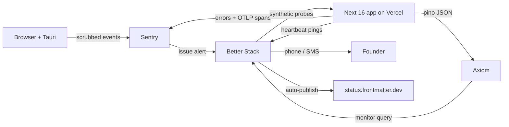

## 13. Observability, availability and disaster recovery

### 13.1 The constraint that shapes the whole section

Every telemetry decision below is downstream of one rule: **no log line, breadcrumb, span attribute, error message, or crash report may ever contain document bytes.** The file is the source of truth and it lives in the customer's git repo; the moment a paragraph of someone's draft appears in Sentry, we have silently created a second, unversioned, foreign-hosted copy of the thing we promised never to move. That is a product-defining breach, not a privacy nit.

The corollary is stricter than it sounds. It bans not just `logger.info(doc)` but: the splice engine's `Expected "## Heading" at byte 4021, found "## Headnig"` refusal message, CodeMirror transaction payloads in breadcrumbs, `fetch` request bodies in HTTP breadcrumbs, filenames (a path like `clients/acme-layoffs-2026/notes.md` is content), and search queries. What we log instead is **shape**: byte offsets, lengths, SHA-256 prefixes, node types, error codes.

### 13.2 Stack selection

| Layer | Pick | Rejected | Why | Cost read 2026-08-30 | Changes our mind |
|---|---|---|---|---|---|
| Errors | Sentry SaaS, `@sentry/nextjs@10.72.0` | Self-hosted Sentry; Bugsnag; Highlight | Best-in-class Next 16 App Router + Tauri coverage; `beforeSend` is a real, testable scrub hook. Self-hosting costs a founder a weekend a month | Free $0 (1 user, the whole team); Team $26/mo annual; Business $80/mo [fetched sentry.io/pricing] | An EU/India data-residency demand from a B2B buyer → move to Sentry EU region, not self-host |
| Logs | Axiom, `@axiomhq/pino@2.0.0` + `pino@10.3.1` | Datadog; Better Stack logs; Vercel log drains only | Axiom Personal is permanently free at a volume we will not exceed for years; APL queries are fast; ingest is a plain HTTPS POST so it is swappable in one file | Personal $0/mo permanent: 500 GB/mo ingest, 10 GB-hrs query, 25 GB storage, 30-day retention. Cloud $25/mo platform fee + usage, with 1 TB / 100 GB-hrs / 100 GB always-free [fetched axiom.co/pricing] | Retention >30d needed for a SOC 2 audit → Axiom Cloud configurable retention at $25/mo, still not Datadog |
| Traces | OpenTelemetry SDK (`@opentelemetry/api@1.9.1`, `@opentelemetry/sdk-node@0.221.0`) exporting **into Sentry** | Standalone Grafana Tempo / Jaeger | One backend to look at during an incident. OTel-native instrumentation means the exporter is a config line, not a rewrite | Included in Sentry quota | Trace volume blows the Sentry quota → point the same OTLP exporter at Axiom |
| Uptime + status page + on-call | Better Stack | UptimeRobot + Instatus (two vendors); PagerDuty | Monitor, alert, escalate and publish from one place. Free tier already covers a solo founder | Free $0: 10 monitors + heartbeats, 1 status page, Slack/email alerts. Responder license $34/mo, $29/mo annual — unlimited phone + SMS alerts [fetched betterstack.com/pricing] | A second human joins on-call → 2 responder licenses, $58/mo |
| Metrics | Sentry + Postgres rollup tables. **No Prometheus.** | Grafana Cloud; Prometheus + Grafana self-hosted | A metrics stack a solo founder must operate is a second product. Business metrics belong in the control-plane Postgres we already back up | $0 | 10k+ users and a real capacity question → Grafana Cloud free tier, read-only |

**Total observability spend: $0/mo at 100 users, $80/mo at 10,000** [derived: 26 + 25 + 29 = 80]. Log volume at 10,000 users, assuming 20 server requests/user/day and a 400-byte structured line: 10,000 × 20 × 400 B = 80 MB/day = 2.4 GB/month [derived] — 0.24% of Axiom Cloud's 1 TB free allowance. Logging is not a cost risk; it is a discipline risk.

### 13.3 Telemetry topology



Better Stack is the single fan-in for anything that can wake a human. Sentry never phones directly; it raises an issue alert that Better Stack decides whether to escalate. That gives one place to silence everything during a planned migration.

### 13.4 The correlation envelope, from day one

Two fields on every log line, span and error, with no exceptions: `workspace_id` and `correlation_id`. Retrofitting these later means re-instrumenting 226 TypeScript files; adding them now costs one module.

`src/lib/obs/context.ts`:

```ts
import { AsyncLocalStorage } from 'node:async_hooks';

export type ObsContext = {
  correlation_id: string;   // uuid v7, generated at edge or accepted from X-Correlation-Id
  workspace_id: string | null;
  user_id: string | null;
  route: string;
};

export const obsStore = new AsyncLocalStorage<ObsContext>();
export const ctx = () => obsStore.getStore();
```

`src/middleware.ts` mints `correlation_id` (uuid v7 — time-sortable, so a log sort is a timeline) and sets it as a response header so a user can paste it into a support ticket. `src/lib/obs/logger.ts` builds the pino instance with a mixin that injects `ctx()` into every line, and — the load-bearing part — a **field-name denylist serializer**:

```ts
// src/lib/obs/logger.ts
import pino from 'pino';
import { ctx } from './context';

const FORBIDDEN = /^(content|text|body|markdown|doc|source|value|query|path|filename)$/i;

function strip(o: unknown, depth = 0): unknown {
  if (depth > 4 || o === null || typeof o !== 'object') return o;
  const out: Record<string, unknown> = {};
  for (const [k, v] of Object.entries(o as Record<string, unknown>)) {
    if (FORBIDDEN.test(k)) { out[k] = `[stripped:${typeof v === 'string' ? v.length : '?'}]`; continue; }
    out[k] = typeof v === 'object' ? strip(v, depth + 1) : v;
  }
  return out;
}

export const log = pino({
  level: process.env.LOG_LEVEL ?? 'info',
  base: { service: 'frontmatter-web', env: process.env.VERCEL_ENV ?? 'dev' },
  mixin: () => ({ ...ctx() }),
  formatters: { log: (o) => strip(o) as Record<string, unknown> },
});
```

An allowlist would be safer than a denylist, and we take the denylist knowingly: an allowlist makes every new log call a two-file change and gets bypassed within a month. The denylist is backed by a CI gate (§13.5), which is the actual enforcement.

Engine refusals — the most valuable log in the product — become shape-only:

```ts
log.warn({
  event: 'splice.refused',
  reason: 'ANCHOR_DRIFT',        // enum, never free text
  doc_sha256_prefix: sha.slice(0, 12),
  byte_start: 4021, byte_len: 37,
  expected_node: 'heading', found_node: 'paragraph',
}, 'splice refused');
```

That is enough to reproduce a refusal against the corpus fixtures without ever holding the document.

### 13.5 The three scrubbing mechanisms, plus the gate

**1. `beforeSend` / `beforeSendTransaction`** in `sentry.server.config.ts`, `sentry.edge.config.ts` and `instrumentation-client.ts`: walk `event.exception.values[].value`, `event.message`, `event.extra`, `event.contexts` and `event.request.data` through the same `strip()` used by pino, and drop the event entirely if `event.request?.data` is a string longer than 512 bytes. Also `sendDefaultPii: false` explicitly — do not rely on the default.

**2. Breadcrumb filtering.** `beforeBreadcrumb` returns `null` for `category === 'console'` (a `console.log(text)` in dev becomes a leak in prod), and strips `data.body`, `data.response_body` and query strings from `category === 'fetch'` and `'xhr'`. CodeMirror is never wired to `Sentry.addBreadcrumb`; the editor reports transaction *counts* and *byte deltas* through our own logger, not keystrokes. `maxBreadcrumbs: 30` — the default 100 widens the window for anything that slips through.

**3. Source maps.** `withSentryConfig` in `next.config.ts` with `sourcemaps: { deleteSourcemapsAfterUpload: true }` and `widenClientFileUpload: false`. Maps go to Sentry so stack traces are readable; they are removed from the deployment so nobody can fetch `/_next/static/chunks/*.map` and read our splice logic. `SENTRY_AUTH_TOKEN` is a Vercel env var only, never in the repo. For Tauri, `@sentry/tauri` uploads Rust debug symbols in the release job; the shipped `.dmg`/`.msi` never carries them.

**4. The gate that makes the above real.** There is no CI today — this is where it starts. `.github/workflows/ci.yml` step:

```bash
# fail if a raw document identifier reaches a log/telemetry sink
rg -n --type ts \
  -e '(log|logger)\.(trace|debug|info|warn|error)\([^)]*\b(content|markdown|docText|value|src)\b' \
  -e 'Sentry\.(captureMessage|setExtra|setContext)\([^)]*\b(content|markdown|docText)\b' \
  src/ && { echo "content leak into telemetry"; exit 1; } || exit 0
```

Plus a unit test `src/lib/obs/__tests__/scrub.test.ts` that feeds a Sentry event containing a 3-paragraph markdown fixture through the real `beforeSend` and asserts the string does not survive. Per LR#68: write that test so it **fails against the un-scrubbed config first**, or it proves nothing.

### 13.6 Retention

| Data | Store | Retention | Basis |
|---|---|---|---|
| Structured logs | Axiom | 30 days | Free-tier default; long enough for a monthly incident review, short enough that a scrub failure has a bounded blast radius |
| Errors + traces | Sentry | 90 days (plan default) | Debugging window for rare engine refusals |
| Audit log (auth, billing, publish, entitlement changes) | Postgres `audit_log` | 7 years | Financial record; survives account deletion by design, holds no document bytes |
| Analytics events | Postgres rollups | 25 months | Year-over-year comparison, then aggregate-only |

DPDP Act 2023 §8(7)(a) requires a Data Fiduciary to **erase personal data upon withdrawal of consent or as soon as it is reasonable to assume the specified purpose is no longer being served, whichever is earlier**, unless retention is necessary for compliance with a law in force; §12(3) requires erasure on request under the same carve-out [fetched: meity.gov.in DPDP Act PDF, 2026-08-30]. GDPR Art. 17 is materially the same shape. Operationally this means the account-deletion job must purge Axiom (`DELETE` by `workspace_id` via the Axiom API) and Sentry (user-deletion API) inside 30 days, not just Postgres. Because logs are shape-only, the residual personal data in telemetry is `user_id` and `workspace_id` — deletable by key, which is exactly why the correlation envelope is a compliance asset and free-text logging is a liability.

**The tension named explicitly** (LR#71): "never delete the raw record" governs documents and journals; it does **not** govern telemetry or leaked secrets. Telemetry expires on schedule; a credential that reaches a log is rotated first and erased second.

### 13.7 SLOs a solo founder can honestly commit to

| SLO | Target | Window | Publish? |
|---|---|---|---|
| API availability (`/api/**` non-5xx) | **99.5%** | 30-day rolling | Yes |
| Editor first-paint p75 | < 2.5 s | 30-day | Yes |
| Splice-commit success (attempts that commit or cleanly refuse; crashes count against) | **99.9%** | 30-day | Yes |
| Control-plane RPO | ≤ 5 min | — | Yes |
| Control-plane RTO | ≤ 4 h | — | Yes |
| Support first response | 1 business day IST | — | Yes |
| Incident acknowledgement | 30 min business hours / 4 h overnight | — | **No** — state "best effort" |

99.5% permits 216 minutes of downtime per 30 days [derived: 43,200 min × 0.005 = 216 min = 3h36m]. 99.9% permits 43 minutes — one person asleep in IST cannot honour that, and publishing it is a lie that a B2B buyer will eventually price. Publish 99.5% and beat it. Refuse contractual SLA credits until there is a second on-call human; when a buyer demands them, the honest answer is "our published SLO is 99.5% and here is 18 months of measured history."

Splice-commit success is the SLO that matters most and is entirely ours to control: a **refusal is a success**, a crash or a silent wrong write is a failure. That framing is the engine's core promise expressed as a number.

### 13.8 Alerting

| SIGNAL | THRESHOLD | PAGES? | RUNBOOK |
|---|---|---|---|
| Synthetic probe `GET /api/health` fails | 3 consecutive failures, 2 regions, 60 s apart | **YES — phone** | `docs/runbooks/site-down.md` |
| 5xx rate on `/api/**` | > 5% of requests over 5 min, min 20 req | **YES — phone** | `docs/runbooks/api-5xx.md` |
| Postgres connection failures | > 10 in 5 min | **YES — phone** | `docs/runbooks/db-unreachable.md` |
| Splice write returned success but CAS post-check mismatch | **any single occurrence** | **YES — phone** | `docs/runbooks/splice-corruption.md` |
| Scrub-gate canary: document-shaped string detected in Axiom (`content_leak` monitor) | any single occurrence | **YES — phone** | `docs/runbooks/telemetry-leak.md` |
| Nightly backup heartbeat missing | 26 h since last ping | **YES — phone** (second consecutive miss only) | `docs/runbooks/backup-missed.md` |
| Payment webhook signature failures | > 3 in 15 min | **YES — phone** | `docs/runbooks/billing-webhook.md` |
| Splice refusal rate | > 15% of attempts over 1 h | No — Slack | `docs/runbooks/refusal-spike.md` |
| p75 editor load | > 4 s for 30 min | No — Slack | `docs/runbooks/latency.md` |
| New Sentry issue, unseen fingerprint | first occurrence | No — Slack digest | triage in daily review |
| R2 4xx/5xx on attachment PUT | > 2% over 15 min | No — Slack | `docs/runbooks/r2-degraded.md` |
| AI provider 429/5xx | any | **No** — degrade to next provider, log only | `docs/runbooks/ai-provider-down.md` |
| Deploy failed | any | No — Slack | — |
| Disk/quota warnings from any vendor | any | No — Slack | — |

The pages-at-3am set is exactly seven signals, and every one of them means either *customers cannot work*, *money is not being collected*, *data is being damaged*, or *we are leaking content*. Everything else waits for morning. An AI provider outage explicitly must not page: the router fails over across the five configured providers, and a woken founder cannot fix Anthropic. **A pager that fires for things you cannot act on at 3am trains you to ignore it, which is the same disease as no pager at all** (LR#65).

### 13.9 Status page and incident comms

`status.frontmatter.dev` on Better Stack's free tier, CNAME'd, showing four components: **Editor**, **Sync (git)**, **AI**, **Publishing**. Probe-driven components update themselves; a human-declared incident overrides. Rules: post within 15 minutes of confirming customer impact even with nothing to say beyond "investigating"; update every 30 minutes; write the resolution note in plain language with no vendor blame; publish a postmortem for anything over 30 minutes or any data-integrity event, within 5 business days.

### 13.10 Incident runbook skeleton

Every file in `docs/runbooks/` uses this shape, because at 3am a founder reads headings, not prose:

```markdown
# <signal name>
## 0. Is this real?           # the 30-second check that rules out a false alert
## 1. Stop the bleeding       # the ONE reversible action: feature flag, rollback, disable route
## 2. Confirm blast radius    # query with workspace_id + time window, paste the numbers
## 3. Communicate             # status page template text, pre-written, copy-paste
## 4. Diagnose                # links: Sentry saved search, Axiom APL query, Vercel deploy list
## 5. Fix or escalate         # vendor support links + account IDs
## 6. Verify recovery         # the assertion that must go green, run it 3 times (LR#63)
## 7. Postmortem stub         # timeline table to fill while it is fresh
```

Step 1 is always a single reversible lever. For `splice-corruption.md` that lever is `FEATURE_SPLICE_WRITES=off`, which puts the engine into read-and-refuse mode — the product degrades to a viewer rather than risking one more bad byte. That flag exists because the file is the source of truth: a corrupt write is worse than an outage.

### 13.11 Backup and restore

| Data class | Where | RPO | RTO | Mechanism |
|---|---|---|---|---|
| Documents | Customer git repo | **0 — not ours** | n/a | Git is the backup. We never hold the only copy. This is the single largest DR advantage of the architecture |
| Splice journal | Postgres, append-only | 5 min | 4 h | Provider PITR + nightly `pg_dump` to R2 |
| Control plane (identity, tenancy, entitlements, billing, slugs, audit) | Postgres | 5 min | 4 h | Provider PITR + nightly `pg_dump --format=custom` to R2, gzip-verified |
| Attachments >1 MB | R2 | 24 h | 24 h | Content-addressed, immutable keys (below) + weekly cross-account copy |
| Derived artifacts (renders, indexes) | R2 | **∞ — rebuildable** | 2 h | Do not back up. Regenerate |
| Secrets | Vercel env + password manager | manual | 1 h | Documented in `docs/runbooks/rebuild-from-zero.md`, values never in repo |

R2 pricing read 2026-08-30: $0.015/GB-month standard, Class A $4.50/M ops, Class B $0.36/M, **egress free**, free tier 10 GB-month + 1M Class A + 10M Class B [fetched developers.cloudflare.com/r2/pricing, page dated Aug 7 2026]. Free egress is what makes a restore drill cost nothing, which is what makes us actually run one.

**R2 has no S3-style object versioning.** The R2 documentation index lists exactly one retention primitive — Object lifecycles — and no versioning page; the data-security and FAQ pages do not mention it [fetched, 2026-08-30]. A `PUT` to an existing key destroys the previous object, silently and irrecoverably. Versioning must therefore live in the **key layout**, and this is a build-time decision that cannot be retrofitted:

```
attach/<workspace_id>/<sha256>/<original_ext>          # content-addressed, write-once
backup/pg/<workspace_scope>/<YYYY>/<MM>/<DD>/<HHMM>Z-<sha256_12>.dump.gz
render/<workspace_id>/<doc_sha256>/<renderer_ver>.html # derived, disposable
```

Three rules enforced in `src/lib/storage/r2.ts`: (a) every write goes to a key containing a content hash or a timestamp, so no key is ever written twice; (b) all writes use `If-None-Match: *` so an accidental overwrite fails loudly instead of destroying; (c) deletion happens only through an R2 lifecycle rule on the `backup/` prefix, never through application code. The "current" pointer is a Postgres row, which is itself covered by PITR — so the mutable state lives in the store that has real point-in-time recovery, and the immutable state lives in the store that does not.

Neon is the control-plane default: Free $0 (0.5 GB storage/project), Launch usage-based at $0.106/CU-hr and $0.35/GB-month, typical spend $15/mo [fetched neon.com/pricing, 2026-08-30]; branch-based instant restore covers operator error, which is the most likely failure. **The provider's PITR is not the backup** — it is co-located with the thing that fails. The nightly `pg_dump` to R2 in a *different* Cloudflare account is the backup, and it emits a Better Stack heartbeat ping on success so a silent failure pages us (LR#55: under `set -e`, a trailing `[ cond ] && cmd` guard returns 1 and kills the caller — that exact bug disabled nightly backups for weeks once already; write `if/then/fi`, and verify the write landed by counting objects before and after, per LR#67).

### 13.12 Restore drills

**A backup that has never been restored is not a backup. It is a file.**

| Drill | Cadence | Pass condition |
|---|---|---|
| Postgres restore to a scratch branch | **Monthly**, first Sunday | Row counts within 0.1% of live for `workspaces`, `users`, `entitlements`; app boots against it; login works |
| R2 attachment fetch from cross-account copy | Monthly | 10 random keys fetch and hash-match |
| Full rebuild-from-zero (new Vercel project, new DB, restored dump, DNS cutover rehearsed but not executed) | **Quarterly** | Serving traffic on a staging domain within the 4 h RTO, timed with a stopwatch |
| Secret-loss rehearsal | Quarterly | Every secret in `rebuild-from-zero.md` is retrievable without reading any file on the founder's laptop |

Each drill writes a dated row to `docs/runbooks/drill-log.md`: date, artifact restored, wall-clock elapsed, what broke. If the last row is more than 45 days old, the deploy pipeline prints a warning. The elapsed time is the real output — an RTO of 4 h that has only ever been asserted is a guess; an RTO of 4 h measured three times is a commitment. Report a drill result as `[measured]` only when it ran against real artifacts; a dry run against modified code is `SIMULATED` and must say so (LR#62).
