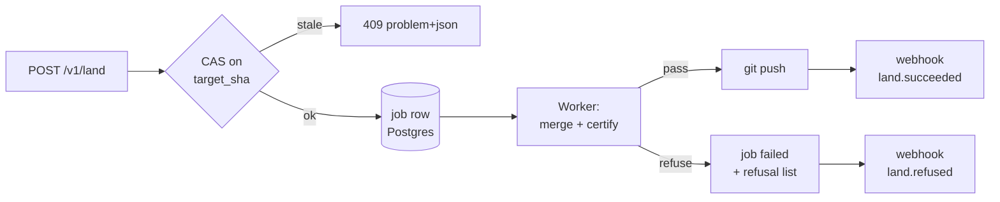

## 4. API design and contracts

### 4.1 Protocol choice: typed RPC over HTTP, not REST, not GraphQL

| Option | Verdict | Why | Cost of the choice | What flips it |
|---|---|---|---|---|
| **Typed RPC over HTTP+JSON** (verb-named POST endpoints under `/api/v1/*`, Zod-validated, OpenAPI-emitted) | **PICKED** | Our operations are not CRUD on rows. `commit`, `land`, `certify`, `unpublish` are *transactions with preconditions* — a base SHA, a splice journal, a CAS token. REST's `PUT /files/{path}` invites last-write-wins semantics, which is exactly the failure mode the engine exists to refuse. | You lose HTTP-native caching on writes (irrelevant — writes aren't cacheable) and "guessability" for casual explorers. Mitigated by OpenAPI + a docs page. | If a third party ever needs a generic CRUD surface for non-git-backed content. Then add a REST façade *over* the RPC core; never replace it. |
| REST-purist resource CRUD | Rejected | A markdown file is not a document *record*; it's bytes at a path in a git tree at a commit. `PUT` has no place to carry `base_sha`, `journal_id`, `expected_blob_oid` without becoming RPC-with-extra-steps. | — | — |
| GraphQL | Rejected | Single founder on call. GraphQL adds a query planner, depth/complexity limiting, persisted-query infrastructure, and N+1 surface area — for a product whose read shape is "give me this file" and "list this tree". Mutations would be RPC anyway. | Would cost ~1 week of infra and permanent operational surface for zero read-shape benefit. | If we ship a public data-explorer product where clients compose arbitrary reads. Not on the roadmap. |
| gRPC / Connect | Rejected | Browser + Tauri + MCP + curl all need to speak it. HTTP/JSON is the lowest-friction universal. | — | If we ever ship a high-throughput server-to-server sync daemon. |

**Reads are GET, writes are POST.** GETs are idempotent, cacheable, and take query params. Writes are POST-only, always take a JSON body, always require an idempotency key. No `PUT`, no `PATCH`, no `DELETE` — deletion is `POST /v1/files.delete` because it needs a base SHA too.

Stack: keep the routes in Next 16.2.6 App Router (`src/app/api/v1/**/route.ts`) — the repo already has 26 route files there [measured, `find . -name route.ts`]. Validation with `zod@4.5.4` (already a dependency at `^4.4.3`) [measured, npm registry, 2026-08-30]. Do **not** introduce Hono (`hono@4.13.5`) — a second HTTP framework inside a Next app is a swappability tax with no payoff at this scale.

### 4.2 Resource model: the file is the resource, the commit is the version

Every addressable thing is a triple: **`(workspace_id, repo_ref, path)`** at a **`sha`**.

| Concept | Wire identifier | Notes |
|---|---|---|
| Workspace | `ws_01J...` (ULID, prefixed) | Tenancy root. On every row, every token, every log line. |
| Repo binding | `rb_01J...` | Maps a workspace to `owner/name@branch` via a GitHub App installation. The installation is the **connector**; `rb_*` is the tenant-scoped handle. Never expose `installation_id` on the wire. |
| File | `path` string, POSIX, no leading slash, NFC-normalized, `..` refused | Not an opaque ID. Renames are git renames; a synthetic file ID would drift from the repo the moment a user renames outside the product. |
| Version | `sha` (40-hex commit) + `blob_oid` (40-hex) | `blob_oid` is the precise CAS token: it changes only when *these bytes* change, so a commit touching other files doesn't false-conflict. |
| Publish | `slug` (globally unique, control plane) | The one piece of state Postgres genuinely owns. |
| Attachment | `at_01J...` → R2 key `ws/{workspace_id}/at/{id}` | >1MB only. Under 1MB goes in the repo. |

Control plane holds `{workspace, repo_binding, slug, entitlement, job, audit}` and **zero document bytes**. Every API response that contains file content read it from git or R2 in that request.

### 4.3 The v1 endpoint list

Rate classes: **A** = 600/min/workspace (reads), **B** = 60/min/workspace (writes), **C** = 10/min/workspace (expensive: certify, export, land), **D** = 20/min/workspace (AI, additionally metered against entitlements). Enforced with `@upstash/ratelimit@2.0.8` + `@upstash/redis@1.38.3` [measured, npm, 2026-08-30], sliding window, key = `workspace_id` not IP (mobile NAT makes IP useless and India-based users share carrier NAT heavily).

Auth column: `S` = session cookie (next-auth v5), `T` = PAT/OAuth bearer (`fmk_live_…`), `M` = MCP token, `W` = webhook HMAC.

| Method | Path | Auth | Idem | Rate | Notes |
|---|---|---|---|---|---|
| GET | `/api/v1/workspaces` | S,T | — | A | |
| GET | `/api/v1/repos` | S,T | — | A | Bindings, not GitHub repos |
| POST | `/api/v1/repos.bind` | S | ✔ | B | Consumes App installation |
| POST | `/api/v1/repos.unbind` | S | ✔ | B | Revokes; keeps audit |
| GET | `/api/v1/tree` | S,T,M | — | A | `?ref=&prefix=&cursor=&limit=` |
| GET | `/api/v1/files` | S,T,M | — | A | `?path=&ref=` → bytes + `blob_oid` |
| GET | `/api/v1/files.history` | S,T,M | — | A | Cursor-paginated commits for one path |
| POST | `/api/v1/files.commit` | S,T,M | **required** | B | §4.7 |
| POST | `/api/v1/files.create` | S,T,M | required | B | Refuses if path exists |
| POST | `/api/v1/files.delete` | S,T,M | required | B | Needs `base_blob_oid` |
| POST | `/api/v1/files.rename` | S,T,M | required | B | git rename, both paths CAS-checked |
| POST | `/api/v1/splice.plan` | S,T,M | — | B | Dry run: returns ranges or `REFUSED` |
| POST | `/api/v1/land` | S,T | required | C | §4.8 |
| GET | `/api/v1/land.status` | S,T | — | A | Poll a `job_*` |
| POST | `/api/v1/certify` | S,T,M | required | C | Cross-engine degradation cert |
| GET | `/api/v1/certify.result` | S,T,M | — | A | |
| GET | `/api/v1/search` | S,T,M | — | A | Postgres FTS + trigram, server-side |
| POST | `/api/v1/publish` | S,T | required | B | §4.9 |
| POST | `/api/v1/unpublish` | S,T | required | B | §4.9, immediate revocation |
| GET | `/api/v1/publications` | S,T | — | A | |
| POST | `/api/v1/attachments.presign` | S,T | required | B | R2 PUT presign, 15-min TTL |
| POST | `/api/v1/ai.complete` | S,T | required | D | Streams; SSE |
| GET | `/api/v1/entitlements` | S,T | — | A | |
| POST | `/api/v1/tokens.create` | S | ✔ | B | Returns secret once |
| POST | `/api/v1/tokens.revoke` | S | ✔ | B | Effective in ≤5s (§4.9 pattern) |
| GET | `/api/v1/webhooks` / POST `.create` / `.rotate` / `.delete` | S | ✔ | B | |
| POST | `/api/v1/hooks/github` | W | — | — | Inbound from GitHub App |
| GET | `/api/v1/openapi.json` | public | — | A | |
| GET | `/api/v1/health` | public | — | A | |

**29 endpoints.** That is the whole v1. Anything not on this list does not exist in v1; adding one is a deliberate act with an OpenAPI diff.

### 4.4 Versioning and deprecation

- **URL-path major version** (`/api/v1/`). Rejected alternative: `Accept: application/vnd.frontmatter.v1+json` header negotiation — correct in theory, hostile to `curl` users and to every AI agent that will call this API. Cost: URL churn on a v2. We accept it; a v2 is years away and can run beside v1.
- **Additive changes ship without a version bump.** New optional request fields, new response fields, new enum members *in response position only*. Clients MUST ignore unknown fields — stated in the docs and enforced in our generated SDK.
- **Breaking** = removing/renaming a field, narrowing a type, adding a required request field, changing an error `type` URI, changing default behavior. Requires v2.
- **Deprecation policy: 180 days minimum.** On a deprecated endpoint or field we emit `Deprecation: @1767225600` (RFC 8594 unix-seconds form) and `Sunset: Wed, 31 Dec 2026 00:00:00 GMT`, plus `Link: <https://docs…>; rel="deprecation"`. A weekly cron reads the access log and emails workspaces still calling the endpoint at day 90, 30, 7.
- **`X-FM-Api-Version: 2026-08-30`** response header on every response, carrying the *deploy* date. Not a dated-version scheme like Stripe's — one founder cannot maintain N behavior branches. It's for debugging: "which build answered you".

### 4.5 Pagination and cursors

Opaque, forward-only, keyset cursors. Never `LIMIT/OFFSET` (skips rows under concurrent insert) and never page numbers.

```ts
// src/lib/api/cursor.ts
type Cursor = { k: string; v: string; d: 'asc'|'desc' }; // k = sort key name
const enc = (c: Cursor) => Buffer.from(JSON.stringify(c)).toString('base64url');
```

Response envelope for every list endpoint:

```json
{ "data": [ ... ],
  "page": { "next_cursor": "eyJrIjoicGF0aCIsInYiOiJkb2NzL2EubWQiLCJkIjoiYXNjIn0",
            "has_more": true, "limit": 100 } }
```

`limit` default 100, max 500. Tree listings sort by `path` ascending (stable, git-native). History sorts by `committed_at desc, sha` — `sha` is the tiebreaker because two commits can share a second. Cursors are **not signed** (they contain no secrets and the query is workspace-scoped by RLS anyway) but they **are** validated: a cursor whose `k` doesn't match the endpoint's sort key returns `422 invalid-cursor` rather than silently re-sorting.

### 4.6 Idempotency keys

Every POST carries `Idempotency-Key: <client-generated UUIDv7>`. Missing key on a write → `400`. This is the single most important header in the API: the founding scenario is a commit fired from a phone on Indian mobile data, the socket dies after the server committed, and the client retries. Without this the user gets a duplicated note and stops trusting the product.

```sql
-- control plane, migration 0012
create table idempotency_key (
  workspace_id   uuid not null,
  key            text not null,
  endpoint       text not null,
  request_hash   bytea not null,           -- sha256 of canonical body
  state          text not null check (state in ('in_flight','done')),
  status_code    int,
  response_body  jsonb,
  locked_at      timestamptz,
  created_at     timestamptz not null default now(),
  primary key (workspace_id, key)
);
create index on idempotency_key (created_at);  -- 24h reaper
alter table idempotency_key enable row level security;
create policy tenant on idempotency_key using (workspace_id = current_setting('app.workspace_id')::uuid);
```

Semantics: insert `in_flight` with `ON CONFLICT DO NOTHING`. If the insert lost, read the row. Same key + **different** `request_hash` → `409 idempotency-key-reuse`. Same key + same hash + `done` → replay the stored response verbatim with `Idempotency-Replayed: true`. Same key + `in_flight` and `locked_at` < 60s ago → `409 request-in-progress`, `Retry-After: 2`. Retention 24h (long enough for any real retry, short enough that the table stays small).

Note the layering: the idempotency key protects against *duplicate delivery of the same intent*; `base_blob_oid` protects against *stale intent*. Both are required. A retry of a commit whose first attempt succeeded is a replay (200, no new commit); a fresh commit against a moved file is a conflict (409). They are different failures and the client handles them differently.

### 4.7 `files.commit` — the exact shape

```http
POST /api/v1/files.commit
Authorization: Bearer fmk_live_…
Idempotency-Key: 018f3c2a-7b1e-7c3d-9a4f-2b6e11c9de01
Content-Type: application/json
```
```json
{
  "repo_binding_id": "rb_01JAV6M2Q7X8YB3F0K",
  "base_sha": "9e846842f0d1c3b7aa10e5c2f4d9a8b1c6e30fd2",
  "changes": [{
    "path": "notes/2026-08-30.md",
    "base_blob_oid": "1c9de0184f3c2a7b1e7c3d9a4f2b6e11c9de0184",
    "op": "splice",
    "splices": [
      { "start": 412, "end": 468,
        "expect_sha256": "b8c1…",            
        "replacement_b64": "IyMgU2hpcHBlZAo=" }
    ],
    "eol": "preserve", "bom": "preserve", "final_newline": "preserve"
  }],
  "message": "note: shipped the splice journal",
  "journal": [{ "seq": 41, "client_id": "cm_ios_9f2", "at": "2026-08-30T14:22:07.113Z" }],
  "author": { "name": "Sagnik Mitra", "email": "dev@perccent.com" }
}
```

`start`/`end` are **byte offsets into the base blob**, half-open, not character offsets and not line/column. `expect_sha256` is the hash of the *bytes currently in that range* — this is the engine's refusal hook. If the range no longer hashes to that value, the server does not guess and does not fuzzy-match; it refuses.

Success `200`:
```json
{ "sha": "3f7ac0…", "committed_at": "2026-08-30T14:22:08.902Z",
  "files": [{ "path": "notes/2026-08-30.md", "blob_oid": "77aa19…", "bytes": 4188 }],
  "journal_ack": { "through_seq": 41 },
  "degradation": { "certified": true, "profile": "gfm-strict", "warnings": [] } }
```

Conflict `409` — and this is the response shape the whole product hangs on. It never contains a merged guess:
```json
{ "type": "https://frontmatter.dev/errors/stale-base",
  "title": "The file changed since your base revision",
  "status": 409, "instance": "/api/v1/files.commit",
  "path": "notes/2026-08-30.md",
  "expected_blob_oid": "1c9de0…", "actual_blob_oid": "b41f77…",
  "actual_sha": "aa02c1…",
  "refusal": { "code": "SPLICE_ANCHOR_MOVED", "splice_index": 0,
               "found_sha256": "0e12…", "engine_will_not_guess": true },
  "resolution": { "strategy": "rebase_splices",
                  "three_way_url": "/api/v1/files?path=notes%2F2026-08-30.md&ref=aa02c1…" } }
```

Refusal codes are a closed enum: `SPLICE_ANCHOR_MOVED`, `RANGE_OUT_OF_BOUNDS`, `BASE_NOT_ANCESTOR`, `BINARY_CONTENT`, `EOL_AMBIGUOUS`, `ZERO_INDENT_SEQUENCE`, `BARE_CR_SET`, `UNSAFE_KEY`. Each maps 1:1 to a documented engine refusal so a client can render a specific instruction instead of "something went wrong".

### 4.8 `land()` — the async one

Landing = fast-forward or three-way merge the workspace branch into the target branch, run degradation certification on every changed file, then push. It can take 30s on a large vault. It is therefore **job-shaped**, and it is the only place a 202 appears.



```http
POST /api/v1/land
Idempotency-Key: 018f3c2b-0000-7c3d-9a4f-2b6e11c9de02
```
```json
{ "repo_binding_id": "rb_01JAV6M2Q7X8YB3F0K",
  "source_ref": "frontmatter/ws-01JAV6/session-4482",
  "target_ref": "main",
  "expected_target_sha": "d50a6b2c8e1f…",
  "strategy": "three_way",
  "certify": { "profile": "gfm-strict", "on_degradation": "refuse" },
  "squash": true,
  "message": "frontmatter: 6 notes from 2026-08-30" }
```

`202 Accepted`, `Location: /api/v1/land.status?job_id=job_01JAV…`:
```json
{ "job_id": "job_01JAV7C3M9QK2", "state": "queued",
  "poll_after_ms": 800, "expires_at": "2026-08-30T15:22:08Z" }
```

Terminal `land.status` on refusal:
```json
{ "job_id": "job_01JAV7C3M9QK2", "state": "refused",
  "target_sha_at_start": "d50a6b2c…", "target_sha_now": "d50a6b2c…",
  "refusals": [
    { "path": "specs/api.md", "code": "ZERO_INDENT_SEQUENCE",
      "byte_range": [1204, 1261], "certifying_engines": ["remark","commonmark","markdown-it"],
      "disagreement": { "remark": "list", "commonmark": "paragraph" } }],
  "applied": [], "hint": "No bytes were written. Fix or set on_degradation=annotate." }
```

**`applied: []` is a contract, not a courtesy.** `land` is all-or-nothing: the push happens once, at the end, after every file certifies. Partial landing would leave a repo the user cannot reason about. The alternative (land what passes, report the rest) was rejected because it makes the git history a record of our failures rather than the user's work. It changes if enterprise users demand per-file landing on 500-file vaults — then it becomes an explicit `strategy: "per_file"` flag, never a default.

`expected_target_sha` mismatch → immediate synchronous `409`, no job created. Cheaper to fail before queuing.

### 4.9 `publish` / `unpublish` with immediate revocation

Publishing writes exactly one row in the control plane and one immutable render to R2. The slug is the only globally-unique namespace we own.

```json
POST /api/v1/publish
{ "repo_binding_id": "rb_01JAV6M2Q7X8YB3F0K",
  "path": "writing/splice-journal.md",
  "sha": "3f7ac0…",
  "slug": "splice-journal",
  "visibility": "public",
  "expires_at": null,
  "theme": "sgnk" }
```
```json
201 { "publication_id": "pub_01JAV7…", "url": "https://fm.sh/p/splice-journal",
      "revision": "rev_01JAV7…", "r2_key": "ws/…/pub/pub_01JAV7…/rev_01JAV7…/index.html",
      "etag": "W/\"rev_01JAV7\"", "cache": { "edge_ttl": 300, "swr": 0 } }
```
Slug collision → `409 slug-taken` with `suggestions: ["splice-journal-2"]`. Uniqueness is a Postgres `unique (slug) where revoked_at is null` partial index — the database is the arbiter, not application code.

**Unpublish must be immediate and provable.** Three things happen in one request, in this order:

```json
POST /api/v1/unpublish
{ "publication_id": "pub_01JAV7…", "reason": "author_request", "purge": true }
```

1. `update publication set revoked_at = now(), revoked_reason = $2 where id = $1` — inside the transaction. The edge worker checks a Redis key `pub:{id}` (TTL 60s, written on publish) and on miss falls through to Postgres, so worst case is 60s of stale serve. To make it **immediate**, unpublish `DEL`s that key *before* committing, and the worker treats a missing key as "must ask Postgres".
2. `DELETE` the R2 objects under the revision prefix when `purge: true`. R2 delete is strongly consistent for the object; Cloudflare cache is purged by tag (`cf-cache-tag: pub_01JAV7…`) via one API call.
3. Audit row with actor, IP, and the R2 keys removed.

Response is `200` only after all three succeed, and it reports what it proved:
```json
{ "publication_id": "pub_01JAV7…", "revoked_at": "2026-08-30T14:41:02.771Z",
  "revocation": { "control_plane": "committed", "edge_cache": "purged",
                  "r2_objects_deleted": 4, "verified_404_at": "2026-08-30T14:41:03.402Z" },
  "residual_risk": "Third-party caches and archives are outside our control." }
```
That last field is deliberate. A one-person company must not imply it can un-publish the internet. If purge fails, the endpoint returns `207`-style partial state in the same shape with `edge_cache: "failed"` and enqueues a retry job — never a bare `200`.

### 4.10 Errors: RFC 9457 problem details

`Content-Type: application/problem+json` on every non-2xx. Fields: `type` (absolute URI at `https://frontmatter.dev/errors/{slug}`, stable forever — changing one is breaking), `title`, `status`, `detail`, `instance`, plus typed extensions. Every response carries `X-Request-Id` (ULID) and problem bodies repeat it as `request_id` so a support email is one grep.

| HTTP | `type` slug | When |
|---|---|---|
| 400 | `malformed-request` | Zod parse failure; `errors[]` carries `{path, code, message}` |
| 401 | `unauthenticated` | |
| 403 | `forbidden` / `entitlement-required` | Latter carries `required_plan`, `upgrade_url` |
| 404 | `not-found` | Also for cross-tenant reads — never 403, never leak existence |
| 409 | `stale-base`, `slug-taken`, `idempotency-key-reuse`, `request-in-progress` | |
| 422 | `engine-refusal`, `invalid-cursor` | Refusal is 422, not 400: the request was well-formed, the *content* is unsafe to touch |
| 429 | `rate-limited` | `Retry-After`, `X-RateLimit-{Limit,Remaining,Reset}` |
| 502 | `upstream-git-failed` | GitHub 5xx passthrough, `upstream_status` |
| 503 | `provider-unavailable` | AI provider down; names which of the five |

### 4.11 Webhooks vs polling

**Both, with a rule:** poll for anything under 10 seconds, webhook for anything a human isn't waiting on.

| Signal | Mechanism | Why |
|---|---|---|
| `land` progress | Poll `land.status`, `poll_after_ms` in the body | The user is staring at a spinner. Server-driven backoff beats a client guess. |
| `land.succeeded/refused`, `publish.*`, `certify.completed`, `repo.drifted` | Outbound webhook | B2B integrations, CI, Slack. No human waiting. |
| AI completion | SSE stream on the same request | Already how AI SDK v6 works in this repo. |

Signing: **do not use Svix** (`svix@2.1.0`, [measured, npm 2026-08-30]) at this scale — it's a per-message-priced dependency for a feature that is 60 lines. Implement the Standard Webhooks spec ourselves: headers `webhook-id`, `webhook-timestamp`, `webhook-signature: v1,{base64(hmac_sha256(secret, id.timestamp.body))}`. Reject timestamps >5 minutes skewed. Two active secrets during rotation. Retries: 6 attempts at 10s, 1m, 5m, 30m, 2h, 12h; 20 consecutive failures disables the endpoint and emails the workspace owner. Delivery log in Postgres, 30-day retention. This flips to Svix if we ever need >100k deliveries/day or SOC2 evidence of delivery — neither is true at 10,000 users.

### 4.12 Public API and MCP: one surface, two adapters

**One surface.** The MCP server is a thin adapter that imports the same handler functions the HTTP routes import — not a parallel implementation, and not an HTTP client of our own API.

```
src/server/ops/            <- the only place logic lives
  filesCommit.ts   export async function filesCommit(ctx: OpCtx, input: CommitInput): Promise<CommitResult>
  land.ts  publish.ts  certify.ts  search.ts …
src/app/api/v1/files.commit/route.ts   <- HTTP adapter: authn -> ctx -> filesCommit -> problem+json
src/mcp/server.ts                      <- MCP adapter: @modelcontextprotocol/sdk@1.30.0
```

Why not two surfaces: divergence is guaranteed and a one-person team cannot maintain two definitions of "what a stale base means". Why not have MCP call our own HTTP API: doubles latency, needs a self-issued token, and turns a type error into a 500.

The MCP adapter differs from HTTP in exactly three documented ways: (1) it exposes a **subset** — no `tokens.*`, no `webhooks.*`, no `repos.unbind`; (2) tool descriptions are prose written for a model, generated from the same Zod schema's `.describe()` calls; (3) every write tool is annotated `destructiveHint: true` and returns the refusal text as *content*, not as an error, so the model can read and act on it. `land` and `unpublish` are **not** MCP tools in v1 — a model should not be able to push to `main` or take a page down without a human in the loop. That is a product decision, revisited only behind an explicit workspace setting.

### 4.13 OpenAPI generation

Schema-first from Zod, never hand-written YAML and never generated-from-runtime.

- `zod@4.5.4` + **`@asteasolutions/zod-to-openapi@9.1.0`** [measured, npm 2026-08-30] to build `openapi.json` at `src/server/openapi/registry.ts`.
- Emitted at build time to `public/openapi.json` and served at `/api/v1/openapi.json`.
- **`openapi-typescript@7.13.0`** [measured, npm 2026-08-30] generates `src/lib/api/types.gen.ts` for the web client, the Tauri client, and the published SDK — one type source for all three.
- CI gate (this repo has **no CI at all** today [measured, stated architecture]; this is the first job to add): regenerate the spec, `git diff --exit-code public/openapi.json`. A drifting spec fails the build. Second gate: `oasdiff breaking` against the spec on `main` — a breaking diff fails unless the commit message contains `api!:`.
- Rejected: `@hono/zod-openapi@1.6.1` (would require adopting Hono); tRPC (no cross-language clients, and our consumers include curl, Python CI scripts, and models).

Docs are Scalar's standalone bundle rendered at `/docs/api`, reading `openapi.json`. Zero build step, self-hosted, no vendor account.
