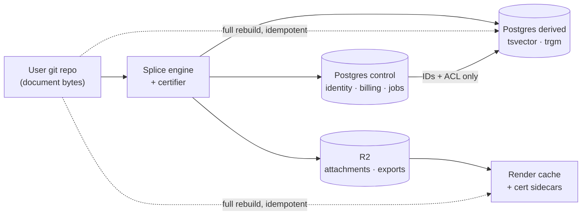

## 5. Data layer — schema, migrations, and the control plane

### 5.1 The boundary rule, stated as an enforceable constraint

The control plane holds **zero document bytes**. This is not a style preference — it is what makes the "file is the only source of truth" claim survivable. If a single markdown body ever lands in Postgres, we now have two sources of truth, a merge problem, a GDPR export problem, and a restore that silently resurrects stale content.

| Data class | Lives in | Never in | Rebuild source |
|---|---|---|---|
| Document bytes, frontmatter, splice journal entries | User git repo | Postgres, R2 | — (it *is* the source) |
| Attachments > 1 MB, derived artifacts (PDF/HTML exports, cert sidecars) | R2 `frontmatter-artifacts` | Postgres | Git + engine, deterministically |
| Identity, tenancy, entitlements, billing mirror, slugs, audit, jobs, AI meter | Postgres `control` DB | R2 | Backups only — this is real state |
| Search tokens, headings, bounded snippets | Postgres `derived` DB (separate database) | `control` DB | Git re-index |
| Render cache (HTML fragments, cert JSON) | R2 + Cache-Control | Postgres | Git re-render |

Two logical databases on one Neon project. `control` is backed up, restored, and treated as irreplaceable. `derived` is `DROP DATABASE`-able at any time and carries a `NOT_BACKED_UP` comment on the database itself. That split is what lets server-side full-text search hold derived text without violating the boundary rule: derived text is a projection, and a projection that cannot be rebuilt from the file is a bug, not a feature.



**Enforcement** (`db/checks/boundary.sql`, run in CI): fail the build if any column in `control` is `bytea`, or is `text` with no length `CHECK`, outside a hand-maintained allowlist.

```sql
select c.table_name, c.column_name, c.data_type
from information_schema.columns c
where c.table_schema = 'app'
  and (c.data_type = 'bytea'
       or (c.data_type = 'text'
           and not exists (select 1 from app.text_column_allowlist a
                           where a.tbl = c.table_name and a.col = c.column_name)))
;  -- non-empty result => exit 1
```

[inference] A type-level check is weak but cheap and it catches the realistic failure: an agent adding `content text` to a table during a feature build at 2am.

### 5.2 Provider — Neon, and what we rejected

All prices read **2026-08-30**.

| | Neon | Supabase | RDS Postgres (self-run) |
|---|---|---|---|
| Free tier | $0, 0.5 GB storage/project, 100 CU-hours/project, 5 GB egress, scale-to-zero after 5 min [fetched] | $0, 500 MB DB, 5 GB egress, **project paused after 1 week idle**, 2 active projects [fetched] | none |
| Paid entry | Launch: pay-as-you-go, no minimum — $0.106/CU-hour, $0.35/GB-month, 500 GB egress/project included then $0.10/GB [fetched] | Pro: from **$25/mo** flat + $10 compute credit (Micro = 1 GB RAM, 2-core ARM) [fetched] | db.t4g.micro Single-AZ **$0.016/hr** us-east-1, **$0.021/hr** ap-south-1 [fetched, AWS pricing API] |
| Monthly at idle | ~$0 (scale-to-zero) | $25 floor | [derived] 0.016 × 730 = **$11.68**/mo us-east-1; 0.021 × 730 = **$15.33**/mo Mumbai — *before* storage, backups, and the pooler you must run yourself |
| Pooler | PgBouncer, managed, `-pooler` host, 10,000 client conns [fetched] | Supavisor, managed | You install and page yourself |
| PITR | Instant restore $0.20/GB-month, 7-day history on Launch [fetched] | Daily backups, 7-day retention on Pro [fetched] | Automated backups, you configure |
| Next tier | Scale: $0.222/CU-hour | Team: **from $599/mo** [fetched] | linear in instance size |

**We pick Neon Launch.** Reasons, in order: (1) scale-to-zero means 100 users costs single-digit dollars and a dormant staging branch costs nothing, which is exactly the "near-zero at 100 users" constraint; (2) database branching gives every migration a real preview environment for $1.50/branch-month [fetched]; (3) it is plain Postgres 17/18 with `pg_trgm` and `pgvector`, so `pg_dump` → any other provider is a Sunday, not a quarter.

**Supabase rejected** on two specifics, not on quality: the $25→$599 cliff is brutal for a solo founder whose first B2B customer asks for SSO, and the free-tier pause-after-7-days breaks the "clone the repo and it works" onboarding demo. We already have next-auth v5 [measured, `package.json`], so Supabase Auth is not a pull.

**RDS rejected** because $11.68/mo buys an instance that is idle 95% of the time, has no pooler, no branching, and hands one person the pager for minor-version upgrades. The arithmetic says RDS is *cheaper than Supabase Pro* and *more expensive than Neon at our load*, while costing the most operator-hours. Operator-hours are the scarce resource here.

**What changes our mind:** sustained compute above ~4 CU average (at $0.106/CU-hour, [derived] 4 × 730 × 0.106 = **$309.52**/mo, which buys a lot of RDS), or a customer contract requiring data residency Neon does not offer in-region. Both are good problems.

**Postgres version: 18** (latest minor 18.6 as of 2026-08-30 [fetched, postgresql.org/versions.json]; 17.11 and 16.15 also supported). Pin the major in `db/README.md`; Neon applies minor releases at the next compute restart and does not support skipping majors [fetched].

### 5.3 Connection pooling — the actual trap

This is the part that silently breaks in production, so it gets its own rules.

Neon's pooler is **PgBouncer in transaction mode**, reached by appending `-pooler` to the host. Pools are sized at 90% of `max_connections`, which is a function of compute size: 0.25 CU / 1 GB RAM → 104, of which 7 are reserved for the superuser, leaving **97** [fetched]. 1 CU / 4 GB → 419. A Vercel function fleet opening one connection per invocation exhausts 97 in a mild traffic spike, and the failure looks like random 500s, not like a connection problem.

**Transaction mode forbids session-level `SET`, temporary tables, and SQL-level `PREPARE`/`DEALLOCATE`; protocol-level prepared statements are supported** [fetched]. That directly threatens the RLS design, because the obvious way to do pooled RLS is `SET app.workspace_id = ...` — which in transaction mode leaks the value to whichever tenant gets that server connection next. That is a cross-tenant data leak, and it is the single highest-severity thing in this section.

**The rule:** the tenant claim is set with `set_config(key, value, true)` — `is_local = true` — **inside the same explicit transaction** as every statement that reads tenant data. A local setting is transaction-scoped, and PgBouncer pins a server connection for the duration of a transaction, so the value cannot outlive it. Never `SET`. Never `set_config(..., false)`.

```ts
// db/tx.ts — the ONLY way app code touches the control plane
import postgres from 'postgres';                    // postgres@3.4.9 [measured 2026-08-30]
const sql = postgres(process.env.DATABASE_URL_POOLED!, {
  max: 4, idle_timeout: 20, connect_timeout: 10, prepare: false,
});
export async function withWorkspace<T>(
  workspaceId: string, userId: string, fn: (tx: postgres.TransactionSql) => Promise<T>,
): Promise<T> {
  return sql.begin(async (tx) => {
    await tx`select set_config('app.workspace_id', ${workspaceId}, true),
                    set_config('app.user_id',      ${userId},      true)`;
    return fn(tx);
  });
}
```

**Acceptance test the implementer must write before shipping** (`db/__tests__/pool-leak.test.ts`): open 2 connections against the *pooled* host with `max: 1`, run `withWorkspace(A)` then a bare `sql\`select current_setting('app.workspace_id', true)\`` outside any transaction, assert it returns `null`. [inference] I have not executed this against a live Neon pooler; treat the `set_config(local)` claim as reasoned from PgBouncer's transaction-pinning semantics and *verify it with this test*, not by trusting this document.

| Connection string | Env var | Used by | Why |
|---|---|---|---|
| Pooled (`...-pooler.<region>.aws.neon.tech`) | `DATABASE_URL_POOLED` | All app request paths | Survives serverless fan-out |
| Direct | `DATABASE_URL_DIRECT` | `drizzle-kit migrate`, `pg_dump`, logical replication, one-off psql | Migrations need session state and advisory locks; the pooler breaks both [fetched] |

**Driver: `postgres` (postgres.js) 3.4.9** with `prepare: false` (required under transaction pooling). Rejected `@neondatabase/serverless` 1.1.0 as the primary driver — its HTTP mode is a single round-trip per query, which cannot express "set_config then N queries in one transaction", which is exactly our RLS contract. It stays available for edge-runtime, non-tenant, read-only endpoints (health, public slug resolution). Rejected `pg` 8.23.0 on ergonomics only; it is a fine fallback. [measured 2026-08-30] the repo currently has **no** database driver in `package.json` at all — this is greenfield.

### 5.4 Schema

`db/migrations/0001_control_plane.sql`. Everything in schema `app`. Every tenant-scoped table carries `workspace_id`, and it is the **first** column of the primary key or of the leading index.

```sql
create extension if not exists pgcrypto;
create extension if not exists pg_trgm;
create schema app;

create table app.workspaces (
  id            uuid primary key default gen_random_uuid(),
  slug          text not null unique check (slug ~ '^[a-z0-9][a-z0-9-]{1,38}[a-z0-9]$'),
  name          text not null check (length(name) between 1 and 120),
  plan          text not null default 'free' check (plan in ('free','pro','team')),
  created_at    timestamptz not null default now(),
  deleted_at    timestamptz
);

create table app.users (
  id            uuid primary key default gen_random_uuid(),
  email         text not null unique check (length(email) <= 320),
  email_lower   text generated always as (lower(email)) stored,
  name          text check (length(name) <= 120),
  image_url     text check (length(image_url) <= 2048),
  created_at    timestamptz not null default now()
);

create table app.memberships (
  workspace_id  uuid not null references app.workspaces(id) on delete cascade,
  user_id       uuid not null references app.users(id) on delete cascade,
  role          text not null check (role in ('owner','admin','editor','viewer')),
  created_at    timestamptz not null default now(),
  primary key (workspace_id, user_id)
);
create index memberships_user_idx on app.memberships (user_id, workspace_id);

-- The GitHub App installation is a CONNECTOR, never the tenant identity.
-- One workspace may hold many; one installation may serve exactly one workspace.
create table app.vault_connections (
  id                uuid primary key default gen_random_uuid(),
  workspace_id      uuid not null references app.workspaces(id) on delete cascade,
  provider          text not null check (provider in ('github','gitlab','local')),
  installation_id   text check (length(installation_id) <= 64),
  repo_full_name    text not null check (length(repo_full_name) <= 200),
  default_branch    text not null default 'main' check (length(default_branch) <= 200),
  vault_root        text not null default '' check (length(vault_root) <= 400),
  status            text not null default 'active'
                      check (status in ('active','revoked','error')),
  last_sync_at      timestamptz,
  last_error        text check (length(last_error) <= 2000),
  created_at        timestamptz not null default now(),
  unique (provider, installation_id, repo_full_name)
);
create index vault_conn_ws_idx on app.vault_connections (workspace_id, status, created_at desc);

-- Globally unique across all tenants. The one asymmetric-RLS table.
create table app.publish_slugs (
  slug          text primary key check (slug ~ '^[a-z0-9][a-z0-9-]{0,62}$'),
  workspace_id  uuid not null references app.workspaces(id) on delete cascade,
  doc_path      text not null check (length(doc_path) <= 1024),
  content_sha   text not null check (content_sha ~ '^[0-9a-f]{40,64}$'),
  visibility    text not null default 'public'
                  check (visibility in ('public','unlisted','revoked')),
  published_at  timestamptz not null default now(),
  revoked_at    timestamptz
);
create index publish_ws_idx on app.publish_slugs (workspace_id, published_at desc);
create unique index publish_ws_path_idx on app.publish_slugs (workspace_id, doc_path);

-- What the app reads. Never queried from Stripe at request time.
create table app.entitlements (
  workspace_id  uuid primary key references app.workspaces(id) on delete cascade,
  seats         int  not null default 1 check (seats between 0 and 10000),
  ai_tokens_mo  bigint not null default 200000 check (ai_tokens_mo >= 0),
  private_publish boolean not null default false,
  sso           boolean not null default false,
  source        text not null default 'default'
                  check (source in ('default','stripe','manual','trial')),
  valid_until   timestamptz,
  updated_at    timestamptz not null default now()
);

-- A cache of Stripe. Authoritative nowhere. Stripe outage must not gate the product.
create table app.billing_subscriptions (
  workspace_id        uuid primary key references app.workspaces(id) on delete cascade,
  stripe_customer_id  text not null check (length(stripe_customer_id) <= 64),
  stripe_sub_id       text unique check (length(stripe_sub_id) <= 64),
  status              text not null check (status in
    ('trialing','active','past_due','canceled','incomplete','unpaid','paused')),
  price_id            text check (length(price_id) <= 64),
  quantity            int check (quantity between 0 and 10000),
  current_period_end  timestamptz,
  synced_at           timestamptz not null default now(),
  raw_event_id        text check (length(raw_event_id) <= 64)
);

create table app.api_keys (
  id            uuid primary key default gen_random_uuid(),
  workspace_id  uuid not null references app.workspaces(id) on delete cascade,
  name          text not null check (length(name) <= 80),
  prefix        text not null check (prefix ~ '^fm_[a-z]{4}_[A-Za-z0-9]{8}$'),
  hash          text not null check (length(hash) between 40 and 200), -- argon2id, never the key
  scopes        text[] not null default '{}',
  last_used_at  timestamptz,
  expires_at    timestamptz,
  revoked_at    timestamptz,
  created_by    uuid references app.users(id),
  created_at    timestamptz not null default now()
);
create unique index api_keys_prefix_idx on app.api_keys (prefix);
create index api_keys_ws_idx on app.api_keys (workspace_id, revoked_at, created_at desc);

create table app.jobs (
  id            bigserial primary key,
  workspace_id  uuid not null references app.workspaces(id) on delete cascade,
  kind          text not null check (length(kind) <= 60),
  payload       jsonb not null default '{}'::jsonb,  -- IDs and paths only, never bytes
  state         text not null default 'queued'
                  check (state in ('queued','running','done','failed','dead')),
  attempts      int not null default 0 check (attempts <= 20),
  run_after     timestamptz not null default now(),
  locked_by     text check (length(locked_by) <= 80),
  locked_at     timestamptz,
  last_error    text check (length(last_error) <= 2000),
  created_at    timestamptz not null default now(),
  constraint jobs_payload_small check (pg_column_size(payload) < 8192)
);
create index jobs_claim_idx on app.jobs (state, run_after, id) where state = 'queued';
create index jobs_ws_idx on app.jobs (workspace_id, created_at desc);

create table app.audit_log (
  id            bigserial primary key,
  workspace_id  uuid not null references app.workspaces(id) on delete cascade,
  actor_user_id uuid references app.users(id),
  actor_key_id  uuid references app.api_keys(id),
  action        text not null check (length(action) <= 80),
  target        text check (length(target) <= 1024),
  meta          jsonb not null default '{}'::jsonb,
  ip            inet,
  created_at    timestamptz not null default now(),
  constraint audit_meta_small check (pg_column_size(meta) < 4096)
);
create index audit_ws_time_idx on app.audit_log (workspace_id, created_at desc);

create table app.ai_usage (
  id              bigserial primary key,
  workspace_id    uuid not null references app.workspaces(id) on delete cascade,
  user_id         uuid references app.users(id),
  provider        text not null check (length(provider) <= 40),
  model           text not null check (length(model) <= 120),
  input_tokens    bigint not null default 0 check (input_tokens  >= 0),
  output_tokens   bigint not null default 0 check (output_tokens >= 0),
  cached_tokens   bigint not null default 0 check (cached_tokens >= 0),
  cost_micros     bigint not null default 0 check (cost_micros >= 0),
  source_field    text not null,   -- WHICH provider key carried the count (LR#59)
  request_id      text check (length(request_id) <= 120),
  created_at      timestamptz not null default now()
);
create index ai_usage_ws_time_idx on app.ai_usage (workspace_id, created_at desc);
```

`ai_usage.source_field` is not decoration. AI SDK v6's five providers do not agree on usage key names; recording which key produced the number is the difference between a billing meter and a plausible-looking guess.

### 5.5 RLS — pooled, forced, and non-owner

```sql
create or replace function app.current_workspace() returns uuid
language sql stable as $$ select nullif(current_setting('app.workspace_id', true),'')::uuid $$;

create role app_user nologin;   -- the role the app connects as
create role migrator nologin;   -- owns nothing at runtime; used only by drizzle-kit

do $$ declare t text; begin
  foreach t in array array['workspaces','memberships','vault_connections','publish_slugs',
                           'entitlements','billing_subscriptions','api_keys','jobs',
                           'audit_log','ai_usage'] loop
    execute format('alter table app.%I enable row level security', t);
    execute format('alter table app.%I force row level security', t);   -- owner is NOT exempt
  end loop;
end $$;

create policy tenant_rw on app.vault_connections
  using (workspace_id = app.current_workspace())
  with check (workspace_id = app.current_workspace());
-- ... repeated per table; workspaces uses id = app.current_workspace()

-- Asymmetric: anyone may READ a live public slug; only the owner may write it.
create policy slug_public_read on app.publish_slugs for select
  using (visibility in ('public','unlisted') and revoked_at is null);
create policy slug_owner_write on app.publish_slugs for all
  using (workspace_id = app.current_workspace())
  with check (workspace_id = app.current_workspace());

grant usage on schema app to app_user;
grant select, insert, update, delete on all tables in schema app to app_user;
revoke update, delete on app.audit_log from app_user;      -- append-only, enforced by grant
```

Three traps closed here: `FORCE ROW LEVEL SECURITY` (a table owner bypasses plain RLS, and the migration role is the owner); a non-owner `app_user` with no `BYPASSRLS`; and `current_setting(..., true)` with the missing-ok flag so an unset claim yields `NULL` — which matches no row — rather than throwing and getting caught by a generous error handler.

### 5.6 Index strategy

Leading `workspace_id` on every tenant index, because every query is already filtered by it via RLS and Postgres will otherwise choose a scan and then filter.

| Table | Index | Serves |
|---|---|---|
| `memberships` | `(workspace_id, user_id)` PK + `(user_id, workspace_id)` | Both directions: "who is in this workspace", "which workspaces am I in" |
| `vault_connections` | `(workspace_id, status, created_at desc)` | Connector list, hot path on every editor load |
| `publish_slugs` | PK `(slug)`; `(workspace_id, doc_path)` unique | Global uniqueness; per-doc republish idempotence |
| `jobs` | partial `(state, run_after, id) where state='queued'` | Claim query stays small as `done` rows accumulate |
| `audit_log` | `(workspace_id, created_at desc)` | Only access pattern; BRIN if it exceeds 50M rows |
| `ai_usage` | `(workspace_id, created_at desc)` | Meter rollups |
| `api_keys` | unique `(prefix)` | Auth lookup by prefix, then argon2 verify |

Rule: no index gets added without an `EXPLAIN (ANALYZE, BUFFERS)` in the migration's PR body. [inference] At 10,000 workspaces the whole control plane is well under 5 GB and most of this is cold-cache theatre; the discipline is for the day it isn't.

### 5.7 Migrations — Drizzle Kit, SQL-first

**Pick: `drizzle-orm` 0.45.2 + `drizzle-kit` 0.31.10** [measured 2026-08-30 via registry.npmjs.org].

| Option | Verdict | Why |
|---|---|---|
| Drizzle Kit | **chosen** | Generates plain `.sql` files into `db/migrations/` with a journal; you can hand-edit them, so RLS policies, partial indexes, and `CHECK` constraints live in the same file as the table. Zero runtime engine. TS types for the query layer. |
| Prisma | rejected | `prisma@8.0.0-rc.12` is a release candidate as of 2026-08-30 [measured]. Its migrate flow does not round-trip RLS policies or roles, so policies would drift into a separate untracked layer — the exact failure this schema is built to avoid. |
| Hand-rolled SQL runner | rejected | ~200 lines to write and then own, for a journal file Drizzle already gives us. |

**Hard rules** (`db/CONVENTIONS.md`):

1. Tables are declared in `db/schema.ts`. **RLS policies, functions, grants, partial indexes, and opclass indexes are hand-written SQL appended to the generated file.** Never re-generate over them; `drizzle-kit generate` produces a new file, always.
2. Migrations run against `DATABASE_URL_DIRECT`. Never the pooler.
3. Expand-contract only. A deploy may add a nullable column and backfill; a *later* deploy makes it `NOT NULL`; a *later still* deploy drops the old one. No migration both writes and destroys.
4. Every migration adding a table must, in the same file, `enable`+`force` RLS and create at least one policy. CI check: `select relname from pg_class c join pg_namespace n on n.oid=c.relnamespace where n.nspname='app' and c.relkind='r' and not c.relrowsecurity` must return zero rows.
5. Preview per PR on a Neon branch ($1.50/branch-month prorated hourly [fetched 2026-08-30]), destroyed on merge.

### 5.8 Read replicas — not yet, and the trigger

No replica at launch. A replica adds a second failure surface, replication lag that will show up as "I just saved and it's gone", and cost, in exchange for capacity we do not need.

**Escalation order, in this sequence:** (1) move the `derived` database onto its own Neon compute so search scans stop competing with auth lookups; (2) add a read replica for analytics and admin dashboards only — never for a read that a write in the same request depends on; (3) raise compute size.

**Trigger to start step 1:** primary CPU above 60% for a sustained hour, or p95 control-plane query time above 50 ms for a day. **Trigger for step 2:** any read query class exceeding 100 ms p95 that provably tolerates 1–2 s staleness. Neon includes read replicas on all plans [fetched 2026-08-30], so this is a config change, not a migration.

### 5.9 Derived stores — where each lives, and the rebuild command

Every derived store must have a **single idempotent command that rebuilds it from git with the service running**. If it does not, it is not derived; it is undeclared state.

| Store | Lives in | Holds | Rebuild | RPO | Cost note |
|---|---|---|---|---|---|
| **Search index** | Postgres `derived` DB, table `search.doc` — `(workspace_id, doc_path)` PK, `tsv tsvector`, `heading_text text`, `snippet text check (length(snippet) <= 512)` | Derived tokens + bounded snippets, never full bodies | `pnpm db:reindex --workspace <id>` — walks the git tree at HEAD, parses with the existing unified/remark pipeline, upserts. Full rebuild = `truncate search.doc` first. | Unbounded; drop it any time | GIN on `tsv`, GIN `gin_trgm_ops` on `heading_text`. Client-side MiniSearch 7.2.0 [measured] stays scoped to the open vault only — no whole-vault snapshot ships. |
| **Render cache** | R2 `frontmatter-artifacts/render/{workspace}/{content_sha}.html` | HTML fragments keyed by content hash | Nothing to rebuild — a miss re-renders on demand. `pnpm cache:warm` pre-renders published slugs only. | Zero, by construction | R2 storage $0.015/GB-month, Class A $4.50/M, Class B $0.36/M, **egress $0**; free tier 10 GB-month + 1M Class A + 10M Class B [fetched 2026-08-30]. At 100 users this is $0. |
| **Certificate sidecars** | R2 `…/cert/{workspace}/{content_sha}.json`, pointer row in `derived` | Degradation certificates per (document, target engine) | `pnpm cert:rebuild --sha <sha>` — deterministic from bytes; a rebuilt cert that differs from the stored one is a certifier regression and must fail CI. | Zero | Content-addressed, so re-running is free and self-verifying |
| **Attachments > 1 MB** | R2 `…/blob/{workspace}/{sha256}` | User bytes | **Not derived.** Lifecycle-protected, versioned, and the only R2 prefix that is backed up. | — | Listed here so nobody mistakes it for cache |

Content-addressing every derived key by `content_sha` is what makes invalidation a non-problem: a changed file produces a new key, and the old one ages out via an R2 lifecycle rule at 30 days. No cache-busting logic, no stale-read window, no invalidation queue.

**The standing drill, quarterly:** `truncate search.doc` on production, run `db:reindex` for the largest workspace, and record wall-clock. If a full re-index of the biggest tenant exceeds 15 minutes, the rebuild path has quietly stopped being a recovery option and needs work before it is needed in anger.
