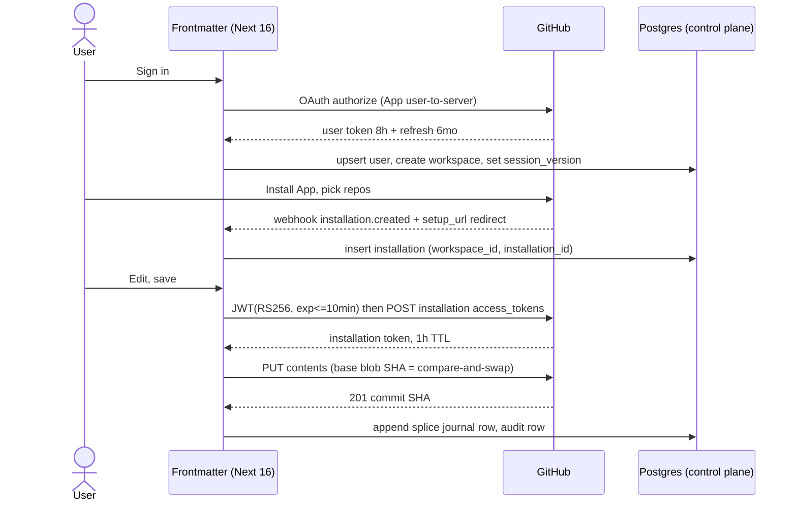

## 6. Authentication, authorisation and permissions

### 6.1 Current state, measured

| What | Where | Verdict |
|---|---|---|
| next-auth `^5.0.0-beta.31`, JWT sessions | `src/modules/auth/infrastructure/auth-options.ts`, `src/auth.ts` | **Keep**, upgrade to `5.0.0-beta.32` [fetched npm dist-tags 2026-08-30] |
| GitHub OAuth provider, `scope: "read:user"` | same file | **Keep the identity half**, move it onto the GitHub App |
| Credentials provider `sgnk-password` (scrypt hash in `SGNK_AUTH_HASH`) | same file + `src/modules/auth/infrastructure/password.ts` | **Delete before first external user** |
| Firebase `^12.16.0` Google popup auth | `src/modules/auth/infrastructure/firebase-auth-gateway.ts`, `src/shared/infrastructure/firebase/client.ts`, `src/modules/auth/application/ports.ts`, `src/modules/auth/domain/auth-user.ts`, `src/container/client-container.ts`, `test/auth/firebase-auth-gateway.test.ts`, `firebase.json`, `src/config/env.ts:183–215` | **Delete entirely** |
| Single global PAT `GITHUB_REPO_TOKEN` | `src/shared/infrastructure/github/client.ts:30`, `src/modules/repository/infrastructure/github-writer.ts:33` | **Delete**, replaced by per-installation tokens |
| Hardcoded allowlist `ALLOWED_GH_LOGIN` default `"sagnikmitra"` | `src/config/env.ts` | **Delete**, replaced by workspace membership |
| Route middleware | none exists | **Add** `src/middleware.ts` |

[measured 2026-08-30, by reading the repo] There are three live identity paths, not two: Firebase Google, GitHub OAuth, and a fixed-username password. Three issuers means three session-fixation surfaces, three revocation paths, and three different notions of "who the principal is" — the Firebase `uid` is not the next-auth `sub`, so any code that accepts either is accepting their union. For one operator that is three times the on-call surface for zero product value. The password provider is worse than the other two: a static credential with no second factor, sitting in front of a multi-tenant control plane. Replace it with a flag-gated magic-link break-glass (`BREAK_GLASS_EMAIL`, default off).

Deletion is a single PR and it must land before any multi-tenant table exists, because every one of these paths would otherwise need a `workspace_id` story.

### 6.2 The stack

| Concern | Pick | Version [fetched 2026-08-30] | Rejected | Why |
|---|---|---|---|---|
| Session + identity | next-auth v5 (Auth.js) | `5.0.0-beta.32` | Clerk, WorkOS, Better Auth | Already integrated and tested; Clerk/WorkOS add a per-MAU bill that is not near-zero at 100 users; Better Auth is a rewrite for no gain |
| Repo access | GitHub App, installation tokens | `@octokit/auth-app` `8.3.0`, `@octokit/rest` `22.0.1` | OAuth App `repo` scope | §6.3 |
| JWT verify (API keys, Tauri) | `jose` | `6.2.10` | `jsonwebtoken` | Web Crypto native, works on Edge runtime |
| Secret custody | AES-256-GCM envelope, KEK in platform secret store | Node `crypto` | AWS KMS from day one | §6.7 |
| Tenant isolation | Postgres RLS, pooled, `set_config(..., local)` | — | app-layer `where workspace_id = ?` | §6.9 |

**What would change our mind on next-auth:** the v5 beta staying beta past Q1 2027, or a second SSO protocol (SAML) landing as a B2B requirement — WorkOS is the escape hatch and it is a provider swap, not a rewrite, because everything downstream reads our own `session.user.id`, never a provider identifier.

### 6.3 The GitHub App, and why not the OAuth `repo` scope

One App does both jobs: user-to-server OAuth for *login*, installation tokens for *repo bytes*. The OAuth App disappears.

**Repository permissions requested** (exact keys from the `app-permissions` schema in GitHub's OpenAPI description) [fetched `raw.githubusercontent.com/github/rest-api-description` 2026-08-30]:

| Permission key | Level | Why we need it | Endpoints unlocked |
|---|---|---|---|
| `contents` | `write` | The entire product. Read file bytes, write splice results, create branches, read blob SHAs for compare-and-swap | `GET/PUT /repos/{o}/{r}/contents/{path}`, `/git/blobs`, `/git/trees`, `/git/refs`, `/commits` |
| `metadata` | `read` | Mandatory — GitHub force-grants it whenever any other permission is requested | `GET /installation/repositories`, repo listing |
| `pull_requests` | `write` | **Phase 2 only.** Review-branch publishing for B2B teams. Not in v1 | `/pulls` |
| `workflows` | *not requested* | Refused deliberately | — |
| `administration` | *not requested* | Would allow repo deletion and collaborator changes. Never | — |
| `single_file` | *not requested* | Evaluated and rejected: scopes to one path, and a vault is a tree | — |

**Account permissions:** `email addresses: read` (verified billing contact only).
**Webhook events subscribed:** `installation`, `installation_repositories`, `push`. Nothing else.

`workflows: write` is the sharpest line. If a user's vault contains a file under `.github/workflows/`, the engine **refuses the write** and surfaces "this path requires the Actions permission, which Frontmatter does not hold." That is the same refuse-rather-than-guess posture the splice engine takes on ambiguous ranges, applied to permissions. Requesting `workflows: write` would mean any prompt-injected AI action could rewrite CI and exfiltrate repository secrets — that single permission converts a document editor into a supply-chain attack surface.

**Why not OAuth `repo`:** classic `repo` is all-or-nothing across *every* repository the user can reach, including private org repos we will never open, and it carries commit statuses, deploy keys, collaborators, and webhooks along with file contents. It cannot be narrowed, the token does not expire by default, and an org owner cannot see or revoke it per-repo. Fine-grained App permissions give the user a per-repo selection screen at install time, tokens that die in 1 hour, org-owner-visible installations, and one-click revocation. Every B2B security review turns on this.

**The cost, stated honestly:** the App install screen converts worse than an OAuth consent, and installing into an org may require owner approval — so we must build a "request installation" flow that shows a pending state and polls the `installation` webhook, not a dead end. Budget one week for onboarding UX that OAuth would not need.

**What would change our mind:** nothing. This is the one decision where the alternative is disqualifying rather than merely worse.

App manifest, committed at `infra/github-app-manifest.json` and used with GitHub's App-from-manifest flow so the App is reproducible per environment:

```json
{
  "name": "Frontmatter",
  "url": "https://frontmatter.app",
  "hook_attributes": { "url": "https://frontmatter.app/api/webhooks/github", "active": true },
  "redirect_url": "https://frontmatter.app/api/auth/callback/github",
  "callback_urls": ["https://frontmatter.app/api/auth/callback/github", "http://127.0.0.1:8976/callback"],
  "setup_url": "https://frontmatter.app/onboarding/installed",
  "setup_on_update": true,
  "public": true,
  "request_oauth_on_install": false,
  "default_permissions": { "contents": "write", "metadata": "read", "emails": "read" },
  "default_events": ["installation", "installation_repositories", "push"]
}
```

`request_oauth_on_install: false` is deliberate: identity comes first, installation second, so we always have a `user_id` to attach the installation to. The `127.0.0.1:8976` callback is the Tauri loopback listener (§6.6).

### 6.4 Install to first commit



The dual signal — webhook *and* `setup_url` redirect — matters: the redirect can be lost (user closes the tab), and the webhook can arrive before the redirect. Both handlers are idempotent on `(installation_id)` with `on conflict do update`.

### 6.5 Token storage and refresh

| Token | TTL [fetched GitHub docs 2026-08-30] | Stored where | Refresh rule |
|---|---|---|---|
| App JWT (RS256) | ≤ 10 min (`exp` ≤ now+600, `iss` = client ID) | Never stored — minted per call | Regenerate every call |
| Installation access token | **1 hour** | In-process LRU keyed by `installation_id`, TTL 50 min | `@octokit/auth-app` regenerates on expiry |
| User access token | **8 hours** | `identity.oauth_token`, encrypted (§6.7) | Refresh on 401 or at 7h |
| Refresh token | **6 months**, single-use — using it invalidates the old refresh *and* the old access token | same row, encrypted | Rotate under `select ... for update` so two concurrent refreshes cannot both consume it |
| Frontmatter session JWT | 30 days, rolling 24h | `__Secure-authjs.session-token` cookie | next-auth `updateAge` |
| Device refresh token (Tauri) | 90 days | OS keychain, `device_session` row | Rotated on use |

The App private key is a PEM in `GITHUB_APP_PRIVATE_KEY` (base64, single line — the multiline PEM breaks Vercel env parsing). The single-use refresh token is the trap: without `for update` row locking, two tabs refreshing at once burn the token and log the user out. Write that test first.

Rate limits: an installation gets a minimum of **5,000 requests/hour**, plus 50/hour per repo above 20 and 50/hour per user above 20, hard-capped at **12,500/hour** (15,000 on GitHub Enterprise Cloud) [fetched 2026-08-30]. Budget per installation, not globally — one heavy tenant cannot starve another because the buckets are separate. Surface remaining quota from `x-ratelimit-remaining` in the workspace admin view.

### 6.6 Sessions: PWA and Tauri shell

**Web/PWA.** JWT strategy, no database session lookup on the happy path. The cookie carries only `{ sub, wid, ver }`. GitHub tokens never enter the cookie.

```ts
// src/modules/auth/infrastructure/auth-options.ts
session: { strategy: "jwt", maxAge: 60 * 60 * 24 * 30, updateAge: 60 * 60 * 24 },
useSecureCookies: true,
cookies: {
  sessionToken: {
    name: "__Secure-authjs.session-token",
    options: { httpOnly: true, sameSite: "lax", path: "/", secure: true },
  },
},
```

**Revocation.** A JWT cannot be revoked, so `ver` in the token is compared against `users.session_version`; bump it on member removal, App uninstall, or break-glass use. The check costs one indexed read, cached in-process for 60 s — so **revocation lag is up to 60 seconds**, and that is the price we accept for not doing a DB round trip per request. Uninstall bumps it synchronously in the webhook handler.

**Tauri v2 desktop.** No cookies: the webview origin is `tauri://localhost` (macOS/Linux) or `http://tauri.localhost` (Windows), so a `__Secure-` cookie for `frontmatter.app` is not sent and never will be.

| Piece | Pick | Version [fetched crates.io 2026-08-30] |
|---|---|---|
| Loopback OAuth listener | `tauri-plugin-oauth` | `2.1.0` |
| Deep-link callback (`frontmatter://`) | `tauri-plugin-deep-link` | `2.4.9` |
| Token at rest | `keyring` (Keychain / Credential Manager / Secret Service) | `4.2.0` |
| Rejected | `tauri-plugin-stronghold` `2.3.1` — needs its own unlock password, duplicating what the OS already does | — |

Flow: PKCE with `code_challenge_method=S256`, loopback on `127.0.0.1:8976`, exchange at `/api/auth/device/exchange`, refresh token into the keychain, access token in memory only. Every desktop session is a `device_session` row (device name, last seen, IP country) so a user can revoke one laptop without killing their phone.

**CSRF.** next-auth guards its own routes. Every other mutating route gets an `Origin` allowlist in `src/middleware.ts`: `https://frontmatter.app`, `tauri://localhost`, `http://tauri.localhost`. Missing that third value is the bug that will make Windows desktop mysteriously 403.

### 6.7 BYO API key custody

**Rule: the key store is not the document store, and they are not reachable from the same database role.** Documents live in the user's git repo (zero bytes in Postgres), so "separate" here means secrets live in a `secrets` schema with its own role that the request-path role cannot read.

```sql
create schema secrets;
revoke all on schema secrets from public, frontmatter_app;
grant usage on schema secrets to frontmatter_secrets;

create table secrets.workspace_dek (
  workspace_id uuid primary key,
  wrapped_dek  bytea not null,
  kek_id       text  not null,          -- 'env:v1' | 'kms:arn:...'
  wrap_alg     text  not null default 'AES-256-GCM',
  created_at   timestamptz not null default now()
);

create table secrets.provider_key (
  id uuid primary key default gen_random_uuid(),
  workspace_id uuid not null,
  provider     text not null,           -- 'anthropic' | 'openai' | 'groq' | ...
  ciphertext   bytea not null,          -- AES-256-GCM under the workspace DEK
  iv           bytea not null,
  auth_tag     bytea not null,
  last4        text  not null,          -- display only
  created_by   uuid  not null,
  revoked_at   timestamptz
);
```

Envelope: KEK wraps a per-workspace DEK; the DEK encrypts each provider key with a fresh 96-bit IV and AAD = `workspace_id || provider`, so a ciphertext moved between rows fails to decrypt rather than decrypting as the wrong tenant's key. Only decrypt inside the AI proxy route; the plaintext key never leaves that function and never reaches a log line or a client bundle.

**KEK location — pick:** a 32-byte value in the platform secret store (`FM_KEK_V1`), behind a `KeyWrapper` port with two adapters, `EnvKeyWrapper` and `KmsKeyWrapper`. **Rejected for v1:** AWS KMS from day one. **Why:** it adds an AWS account and an IAM surface to a Vercel + Cloudflare + Postgres stack that one person has to operate. **Cost of being wrong:** near zero, because `kek_id` and `wrap_alg` are columns — flipping means writing new `kms:` rows and lazily re-wrapping on read. **What changes our mind:** the first B2B security questionnaire that asks where the master key lives, or the first paying team plan. KMS is $1/month per key, prorated hourly, plus $0.03 per 10,000 requests with 20,000 free per month [fetched aws.amazon.com/kms/pricing 2026-08-30]. [derived] At 10,000 workspaces with DEK unwraps bounded by process cold starts, ~200,000 requests/month: (200,000 − 20,000) ÷ 10,000 × $0.03 = $0.54, plus $1.00 key storage = **$1.54/month**. The migration is cheap; doing it prematurely is not.

### 6.8 The permission model: intersect

**Decision: intersect.** Not defer, not duplicate.

| Capability | Authority | Rule |
|---|---|---|
| Read a file | GitHub | Defer — if the installation lacks `contents`, we refuse |
| Write a file | GitHub ∩ Frontmatter role | Intersect — needs `contents: write` **and** role ≥ `editor` |
| Invite a member | Frontmatter only | Ours — GitHub has no opinion |
| Publish to a public slug | Frontmatter only | Ours — slug uniqueness is a control-plane fact |
| Spend workspace AI budget | Frontmatter only | Ours |
| Change billing | Frontmatter only | Ours, `owner` role |

Pure **defer** fails because GitHub has no concept of "may publish this document at `/p/acme-handbook`" or "may spend $40 of AI credit" — those exist nowhere but our control plane. Pure **duplicate** fails worse: a second ACL that mirrors GitHub's is a second thing to keep in sync, and every divergence is a security bug that also reads as a compliance lie. So: **git-provider permission is the ceiling and can only narrow; Frontmatter roles narrow further; product-only capabilities are ours alone.**

```ts
// src/modules/authz/domain/effective.ts
export function can(cap: Capability, ctx: AuthzContext): boolean {
  const roleOk = ROLE_GRANTS[ctx.role].includes(cap);
  if (!roleOk) return false;
  if (ctx.apiKeyScopes && !ctx.apiKeyScopes.includes(SCOPE_FOR[cap])) return false;
  const ceiling = PROVIDER_CEILING[cap];          // undefined = product-only
  if (ceiling === undefined) return true;
  return ctx.providerPermission !== null && ctx.providerPermission >= ceiling;
}
```

Provider permission is cached in `workspace_repo_access(workspace_id, repo_id, permission, checked_at)` with a 10-minute TTL, revalidated immediately on any GitHub 403, and hard-invalidated by the `installation_repositories` and `installation` webhooks. A revoked repo therefore loses write access within 10 minutes at worst, instantly in the normal case.

### 6.9 RLS in Postgres

Pooled RLS from day one, transaction-scoped so a pooled connection cannot leak tenancy:

```sql
create role frontmatter_app login;                 -- NOT the table owner, NO bypassrls
alter table workspace_member enable row level security;
alter table workspace_member force row level security;
create policy tenant_isolation on workspace_member
  using      (workspace_id = current_setting('app.workspace_id', true)::uuid)
  with check (workspace_id = current_setting('app.workspace_id', true)::uuid);
```

```ts
// src/shared/infrastructure/db/with-tenant.ts
export async function withTenant<T>(wid: string, actor: string, fn: (tx: Tx) => Promise<T>) {
  return db.transaction(async (tx) => {
    await tx.execute(sql`select set_config('app.workspace_id', ${wid}, true),
                                set_config('app.actor_id',    ${actor}, true)`);
    return fn(tx);
  });
}
```

The third argument `true` makes the setting **local to the transaction** — that is what makes this safe behind PgBouncer transaction pooling, and it is the single most important character in this section. `force row level security` matters because policies do not apply to the table owner otherwise; migrations run as owner, the app never does.

Two CI gates, both blocking, both new (the repo has no CI at all today):

```sql
-- gate 1: every public table has RLS on
select relname from pg_class c join pg_namespace n on n.oid = c.relnamespace
 where n.nspname = 'public' and c.relkind = 'r' and not c.relrowsecurity;
-- gate 2: the app role cannot bypass
select 1 from pg_roles where rolname = 'frontmatter_app' and rolbypassrls;
```

Both must return zero rows. Plus one integration test that seeds two workspaces, sets `app.workspace_id` to A, and asserts every table returns zero of B's rows — not one table, all of them, enumerated from `information_schema`.

### 6.10 API keys for third-party access

Format `fm_live_<16-char key id>_<43-char base64url secret>` (`fm_test_` in non-production). The distinctive prefix is what makes the key eligible for GitHub's secret-scanning partner programme — apply once the format is frozen, because changing it later invalidates every issued key.

| Property | Choice | Why |
|---|---|---|
| Stored value | `sha256(secret)`, compared with `timingSafeEqual` | Keys are 256 bits of entropy, so a slow KDF buys nothing and costs latency on every request. bcrypt here is cargo cult |
| Lookup | by `key_id` prefix, indexed | Avoids a table scan; the secret half is never indexed |
| Shown | once, at creation | Plus `last4` for display |
| Scopes | `docs:read`, `docs:write`, `publish:write`, `search:read`, `webhooks:manage` | Intersected in `can()` (§6.8) |
| Ceiling | creating member's role at issue time, re-checked at use | A key cannot outlive or out-rank its creator |
| `last_used_at` | bucketed to 60 s | A write per request would be the busiest write in the system |
| Rate limit | per key, sliding window | Separate bucket from session traffic |

Keys authenticate to `/api/v1/*` via `Authorization: Bearer fm_live_...`. They never grant access to the AI proxy with the workspace's BYO provider key — that would let a leaked integration key spend someone else's provider budget. Separate scope, separate decision, default off.

### 6.11 Build order

| # | Work | Gate |
|---|---|---|
| 1 | Delete Firebase + Credentials provider, 8 files listed in §6.1 | `rg -i firebase src/` returns nothing; 1,575 tests still green |
| 2 | Stand up CI (none exists) — typecheck, lint, test, `npm run arch` | Required check on `main` |
| 3 | GitHub App from manifest, `@octokit/auth-app` 8.3.0, delete `GITHUB_REPO_TOKEN` | Install-to-first-commit E2E against a scratch repo |
| 4 | Postgres control plane + RLS + `withTenant` | The two SQL gates, plus cross-tenant integration test |
| 5 | `secrets` schema, envelope encryption, `KeyWrapper` port | Ciphertext moved between rows fails to decrypt |
| 6 | Tauri PKCE + keychain, `device_session` | Revoke-one-device test |
| 7 | API keys + scopes | Scope intersection test; scanning-partner application |
