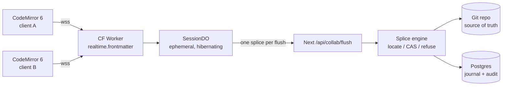

## 7. Live editing, presence and collaboration

### 7.1 The tension, stated precisely, and its resolution

The positioning says "Google Docs for markdown." The architecture says the file is the only source of truth and sync is git three-way merge + splice journal + compare-and-swap, never a CRDT for document bytes. Both are correct, and they are only in conflict if you assume live editing requires a CRDT that *stores* the document.

The resolution is one invariant:

> **A CRDT may exist as a session-scoped scratch buffer. It is seeded from file bytes, it is authoritative for nobody, and its single output is one splice against the exact blob SHA it was seeded from. Nothing ever reads a document out of it.**

Byte-identity is unassertable across a CRDT merge because a merge yields a *document state*, not a byte sequence with a provenance chain you can certify. That objection is about the CRDT being a **store of record**. It is not an objection to a CRDT being an ephemeral coordination device whose result is re-expressed as a splice and re-validated by the existing engine — the same engine, the same CAS, the same refusal path, the same journal row. If the CAS fails at flush, the session does not "merge." It refuses, and the user sees the standard three-way conflict surface (§7.7).

| Property | Store of record (refused) | Ephemeral session (accepted) |
|---|---|---|
| Where document bytes live | CRDT doc, forever | Git repo, always |
| What the CRDT holds | The document | ≤1 editing session, discardable |
| Lifetime | Permanent | Last participant leaves + 60s |
| Failure mode if lost | Data loss | Lose the unflushed tail, same as an unsaved buffer |
| Output | The document | One `Splice{base_sha, from, to, insert}` |
| Byte-identity assertion | Impossible | Asserted by the engine at flush, unchanged |
| Journal row | None | Exactly one per flush, identical shape to a solo edit |

### 7.2 What "live editing" actually means here — demanded vs assumed

Separate these, because they have wildly different cost and risk.

| Capability | Users demand it | Users assume it exists | Cost tier | Ships |
|---|---|---|---|---|
| See who else has this doc open | High | High | Tier 0 | v1 |
| See where their cursor / selection is | Medium | High | Tier 0 | v1 |
| "Priya has unsaved changes in this file" warning before you edit | **Very high** | Medium | Tier 0 | v1 |
| Never silently lose my work to someone else's save | **Absolute** | Total | Tier 1 | v1 |
| Comments / mentions anchored to a range | High (B2B) | High | Tier 1 | v1.5 |
| Two people typing in the same paragraph, same second | **Low** | High | Tier 2 | v2, B2B-gated |
| Live AI agent editing alongside a human | Medium (differentiator) | Low | Tier 2 | v2 |

The gap between column 1 and column 2 on the last-but-two row is the whole finding. Simultaneous character-level co-typing is *assumed* to exist and *rarely used*; what people actually do is take turns and get angry when a turn is lost. Tier 0 + Tier 1 buy ~90% of the felt experience for ~5% of the engineering risk, and neither one touches document bytes.

Precedent, from primary sources: Notion is not CRDT-based for text. Its client batches operations into transactions "committed (or rejected) by the server as a group," queued client-side in IndexedDB/SQLite, POSTed to `/saveTransactions`, with a separate long-lived WebSocket to a fanout service ("MessageStore") for realtime updates [fetched notion.com/blog/data-model-behind-notion, 2026-08-30]. That is server-authoritative CAS + fanout — structurally our design. HackMD's open-source ancestor CodiMD is operational-transform over Socket.IO, not a CRDT [SS]. Obsidian does not do character-level co-editing at all: Sync markets "Work offline, sync later… Sync merges changes for you" and shared vaults that update "in real-time across your team's devices" — file-granular replication, $4/user/mo Standard, $8 Plus [fetched obsidian.md/sync, 2026-08-30]. Character-level Obsidian collaboration exists only as a third-party plugin (Relay, Yjs-based) [fetched relay.md, 2026-08-30].

### 7.3 Topology



The arrow from `DO` to `API` is one-directional and low-frequency. There is no arrow back into the DO carrying document state, and that absence is the design.

### 7.4 Transport: Cloudflare Durable Objects with WebSocket Hibernation

Next.js Route Handlers on Vercel cannot hold a WebSocket, so the realtime plane is a separate deployable regardless of vendor. Given that, put it where the fanout is cheap and the per-room single-threading is free.

**Pick:** one Cloudflare Worker + one Durable Object class, `SessionDO`, SQLite-backed, using the **WebSocket Hibernation API**.

**Cloudflare numbers, all [fetched 2026-08-30]:**

| Dimension | Free | Paid | Source page last-updated |
|---|---|---|---|
| Workers Paid base | — | **$5/mo account minimum**, no egress/bandwidth charge | Workers pricing, 2026-08-28 |
| DO requests | 100k/day | 1M/mo included, then **$0.15/M** | DO pricing, 2026-08-25 |
| Incoming WS messages → requests | **20:1 billing ratio** | same | DO pricing |
| Outgoing WS messages, protocol pings | **free** | free | DO pricing |
| DO duration | 13,000 GB-s/day | 400,000 GB-s/mo included, then **$12.50/M GB-s** | DO pricing |
| Memory billed per DO | 128 MB regardless of use | same | DO pricing, fn.5 |
| Hibernation-eligible idle time | **not billed** | not billed | DO pricing |
| `setWebSocketAutoResponse()` ping/pong | **no wall-clock charge** | same | DO pricing, fn.3 |
| DO SQLite rows written | 100k/day | 50M/mo included, then $1.00/M | DO pricing |
| WS message size | 32 MiB | 32 MiB | DO limits, 2026-06-01 |
| Soft throughput per single DO | ~1,000 req/s | ~1,000 req/s | DO limits |
| Objects per namespace | unlimited | unlimited | DO limits |

**The single load-bearing fact.** `accept()` on a WebSocket bills wall-clock time for the entire connection; hibernation does not. Derived, showing the work:

- Non-hibernating: 1 DO-hour = 3600 s × 0.125 GB = **450 GB-s**. Included 400,000 GB-s ÷ 450 = **888 free DO-hours/mo**; beyond that 450 × $12.50/1e6 = **$0.005625 per DO-hour** (shared across everyone in that room). [derived]
- Hibernating: billed only for handler execution. At ~1 ms wall time per awareness message, 1 message = 0.001 × 0.125 = **0.000125 GB-s**. [derived]

| Scale | Assumption | Non-hibernating | Hibernating |
|---|---|---|---|
| 100 users | 20 live-h/user/mo, 1 room each = 2,000 DO-h; 2 msg/s → 144k msg/user/mo | 2,000×450 = 900k GB-s → 500k billable → **$12.50** + $5 = **$17.50/mo** | 1,800 GB-s (free); 720k billed requests (free) → **$5.00/mo** |
| 10,000 users | same per-user shape | 200,000 DO-h × 450 = 90M GB-s → 89.6M billable → **$1,120** + $5 = **$1,125/mo** | 180,000 GB-s (under 400k, free); 72M billed req − 1M = 71M × $0.15/M = $10.65 → **$15.65/mo** |

Hibernation is a **70× cost difference at 10,000 users** [derived]. Therefore: `state.acceptWebSocket()`, never `ws.accept()`; `setWebSocketAutoResponse()` for heartbeats; identity re-hydrated on wake from `ws.serializeAttachment()` capped at ≤2 KB (`{uid, wsid, base_sha, caps}`). Attachment writes cost rows: 10,000 users × ~40 sessions/mo = 400k rows/mo, inside the 50M included [derived]. **Zero document bytes are ever written to DO storage** — that is a hard review rule, not a preference.

**Alternatives rejected:**

| Option | Why rejected |
|---|---|
| SSE + POST on Vercel | Works for Tier 0 fanout, but needs a second upstream channel, has no per-room single-threaded actor, and burns a Vercel function per subscriber. Genuinely viable if Cloudflare is ever unavailable — keep it as the documented fallback, not the default. |
| Raw WebSocket server on Fly/Railway | A stateful process one person must be on call for. Contradicts "operable by one person." |
| Vercel Route Handler WebSocket | Not supported. |

### 7.5 CRDT selection: Yjs, and only inside Tier 2

All [measured 2026-08-30] by streaming the npm tarball and piping through `gzip -9`:

| Package | Latest | Published | Runtime artifact | raw | gzip -9 |
|---|---|---|---|---|---|
| `yjs` | 13.6.32 | 2026-08-04 | `dist/yjs.mjs` | 299,797 B | **62,586 B** |
| `loro-crdt` | 1.15.1 | 2026-08-29 | `web/loro_wasm_bg.wasm` | 3,179,730 B | **1,046,171 B** |
| `@automerge/automerge` | 3.4.1 | 2026-08-12 | `web/automerge_wasm_bg.wasm` | 3,571,259 B | **1,116,734 B** |
| `y-codemirror.next` | 0.3.6 | 2026-08-18 | — | — | — |
| `y-protocols` | 1.0.7 | 2025-12-16 | — | — | — |
| `lib0` | 0.2.117 | 2025-12-30 | — | — | — |
| `y-websocket` | 3.1.0 | 2026-08-06 | — | — | — |

Yjs core is **16.7× smaller gzipped than Loro's wasm and 17.8× smaller than Automerge's** [derived]. The full y-stack (`yjs` + `lib0` + `y-protocols` + `y-codemirror.next`) realistically lands ~90–110 KB gz [inference]. Loro and Automerge are better engineered for *durable* CRDT storage — richer history, better rich-text semantics — and we have explicitly refused to store CRDTs, so we are paying for a capability we forbid. `y-codemirror.next` is a first-class, currently-maintained CodeMirror 6 binding, which is the integration that actually matters given CodeMirror 6 is already in the repo.

Non-negotiable: the entire y-stack is behind `await import()` inside the Tier 2 code path. A D2C solo user on the free plan downloads **zero bytes** of CRDT.

**Rejected build-partners:**

| Vendor | Cost at 10,000 users (20 h/user/mo) | Verdict |
|---|---|---|
| **Liveblocks** | $0.002/collab-minute × 12M min = **$24,000/mo**; even 100 users = 120k min − 3k free = $234 − $30 credits + $25 Pro ≈ **$229/mo** [fetched liveblocks.io/pricing 2026-08-30, derived] | Refused. 46× our Cloudflare bill at 100 users, ~1,500× at 10,000. Also caps simultaneous connections per room at 10 (Free/Pro) / 50 (Team, $500/mo). |
| **Ably** | $29 Standard + messages 1.44B × $2.50/M = **$3,629/mo**; connection-min $12 + channel-min $12 [fetched ably.com/pricing 2026-08-30, derived] | Refused. Message-metered pricing punishes exactly the cursor traffic we want to be free. |
| **Pusher** | 48M msg/day → Plus tier **$899/mo** [fetched pusher.com/channels/pricing 2026-08-30, derived] | Refused on cost and on message-cap cliff-edges. |
| **PartyKit** | `partykit@0.0.115` last published **2025-05-21** — 15 months stale [measured, npm registry, 2026-08-30] | Refused. `partyserver@0.5.10` (2026-08-03) is the living successor, but it is a thin layer over the DOs we are already using; adopting it adds a dependency without removing work. |
| **Hocuspocus** (`@hocuspocus/server` 4.6.0, 2026-08-10) | Self-host cost only | Reconsider *only* if Tier 2 grows beyond one Worker file. It presumes a Yjs document store of record, which we refuse. |

**Verdict: build on Durable Objects.** ~$5–16/mo covers both 100 and 10,000 users; the cheapest managed alternative is ~$229/mo at 100 users and ~$900–24,000/mo at 10,000. The build is roughly one Worker file plus one DO class — ~500 lines. **What changes our mind:** if Tier 2 usage exceeds 30% of paid seats AND we need comments, notifications, and version history as products rather than features, re-run the Liveblocks comparison including the ~6 engineer-weeks their Comments + Notifications would replace.

### 7.6 Presence and the awareness protocol

Tier 0 does **not** use `y-protocols/awareness` — that would drag `lib0` into the default bundle. Define our own, ~40 lines, and let Tier 2 tunnel Yjs awareness through the same socket under a different tag.

`src/lib/collab/protocol.ts`:

```ts
export type ClientMsg =
  | { t: 'hello';  doc: string; base: string /* blob sha1 */ }
  | { t: 'pos';    base: string; head: number; anchor: number } // byte offsets
  | { t: 'dirty';  base: string; dirty: boolean }
  | { t: 'y';      b64: string };                                // Tier 2 only
export type ServerMsg =
  | { t: 'roster'; peers: Peer[] }
  | { t: 'pos';    wsid: string; base: string; head: number; anchor: number }
  | { t: 'dirty';  wsid: string; dirty: boolean }
  | { t: 'splice'; base: string; next: string; from: number; to: number; ins: number }
  | { t: 'y';      b64: string };
export interface Peer { wsid: string; uid: string; name: string; color: string; dirty: boolean }
export const POS_THROTTLE_MS = 120;   // ≈8/s ceiling
export const HEARTBEAT_MS    = 25_000; // handled by setWebSocketAutoResponse
export const MAX_PEERS       = 25;     // refuse beyond; DO soft cap is ~1k req/s
```

**The cursor-mapping rule.** A cursor is a byte offset into a specific version. A peer's offset is meaningless against a different `base`. Rule:

- `msg.base === myBase` → render the caret at character granularity.
- `msg.base !== myBase` and the intervening splices are in the local journal cache → map through `ChangeSet.mapPos` per splice, in order, and render.
- Otherwise → **degrade, do not guess**: drop the caret and show the peer's avatar on the file row in the tree. Same refusal discipline as the engine.

`src/lib/collab/cm-presence.ts` is a CodeMirror 6 `StateField` + `ViewPlugin` holding decorations; remote carets are widget decorations, remote selections are mark decorations. Local offsets are re-derived on every local transaction via `tr.changes.mapPos(head)` before broadcast.

**Files to create:**

| Path | Contents |
|---|---|
| `workers/realtime/wrangler.jsonc` | DO binding `SESSION`, `new_sqlite_classes: ["SessionDO"]`, `limits.cpu_ms` left at default |
| `workers/realtime/src/index.ts` | `Upgrade: websocket` check, EdDSA JWT verify, DO id derivation, `stub.fetch()` |
| `workers/realtime/src/session-do.ts` | `SessionDO`: `acceptWebSocket`, `setWebSocketAutoResponse`, roster, fanout, flush alarm |
| `src/app/api/collab/token/route.ts` | Mints a 5-minute EdDSA JWT: `{ workspace_id, doc_path, uid, caps: ['presence'\|'coedit'], base }` |
| `src/app/api/collab/flush/route.ts` | Server-to-server, HMAC-signed from the Worker; calls the existing splice engine |
| `src/lib/collab/{protocol,presence-client,cm-presence}.ts` | Client |

**Tenancy.** The DO id is `idFromName(sha256(workspace_id + ':' + repo_id + ':' + path))`. Omitting `workspace_id` from that hash is a cross-tenant room collision — the realtime-plane equivalent of a missing RLS predicate. Add a CI check that greps `idFromName(` in `workers/` and fails if `workspace_id` is not in the same expression.

### 7.7 Conflict surfacing when live editing is off (the v1 path)

This is the feature, not the fallback. Three outcomes, no fourth:

| Server state at save | UI | User action |
|---|---|---|
| `base_sha` matches HEAD | Silent save | none |
| Moved, but git three-way merges cleanly and the splice range is untouched | Toast: "Rebased onto Ana's change" + Undo | optional |
| Moved and the splice range overlaps, or merge conflicts | **Blocking three-pane diff**: base / yours / theirs, with the exact byte ranges highlighted | Keep mine · Take theirs · Edit merged |

Tier 0 makes the third row rare *before* it happens: the moment a second person opens a file someone else has `dirty: true` on, they get an inline banner — "Ana is editing this file (unsaved, 2m)" — with **Read only** / **Edit anyway** / **Ask Ana**. This is a soft lock, advisory, never enforced, and it costs one boolean on the roster.

### 7.8 Tier 2 ephemeral session, when it ships

```
open  → GET /api/collab/token (caps:['coedit'])
      → DO has no Y.Doc → DO fetches bytes via /api/collab/seed at blob_sha S
      → new Y.Doc(); ytext.insert(0, bytes.toString('utf8')); baseSha = S
edit  → y updates fan out to peers; DO holds the doc in memory only
flush → every 10s of quiescence, on 60s max age, or on last-leave:
        next = ytext.toString()
        splice = minimalSplice(seedBytes, Buffer.from(next,'utf8'))   // single range
        POST /api/collab/flush { workspace_id, path, base_sha: S, splice }
        → engine: locate → CAS(S) → journal append → commit
        → on 200: reseed baseSha = newSha, seedBytes = new bytes
        → on 409: broadcast {t:'refused'}; freeze the room read-only; hand every
                  participant the §7.7 three-pane diff. Never auto-merge.
close → last participant leaves + 60s → alarm → final flush → discard Y.Doc
```

Non-negotiables, enforceable as review rules:

1. `SessionDO` never calls `ctx.storage.put` / `sql.exec` with document text. Only ≤2 KB per-connection attachments.
2. `minimalSplice` returns **one** `{from,to,insert}`. If a common-prefix/common-suffix reduction yields a range covering >60% of the file, treat it as a rewrite and refuse the fast path — fall through to a full-file CAS write with an explicit journal reason. Never emit multi-range "patches" the engine cannot certify.
3. UTF-8 only across the boundary: Yjs indexes UTF-16 code units, the engine addresses bytes. Convert at exactly one place, in `minimalSplice`, and unit-test it against the existing multi-byte fixtures. This is the single highest-risk line of the whole tier.
4. If the seed bytes are not valid UTF-8, or the file carries a BOM or bare CR line endings that the engine's normalization would alter, **refuse co-editing on that file** and fall back to Tier 0 + Tier 1. Certification beats coverage.

### 7.9 v1 verdict

**v1 needs Tier 0 and Tier 1. It does not need Tier 2.**

| Item | v1 | Why |
|---|---|---|
| Presence roster, avatars, dirty flag | **Yes** | ~1.5 weeks; $5/mo; delivers most of the perceived "Google Docs" feel; touches zero document bytes |
| Remote cursors with the degrade rule | **Yes** | Rides the same socket; the degrade rule keeps it honest |
| Soft-lock banner + CAS three-pane conflict UI | **Yes** | This is the *actual* demanded feature. Without it, "your repo is the source of truth" reads as "you're on your own." |
| Live character-level co-editing | **No** | ~4–6 weeks, the UTF-8 boundary is the highest-risk code in the product, and it is the least-used demanded capability |
| Comments / mentions | v1.5 | Anchored to the journal, not to a CRDT; sells B2B; independent of Tier 2 |

Market positioning stays intact: Obsidian ships shared vaults with no character-level co-editing at all and charges $4–8/user/mo for it [fetched 2026-08-30]. Shipping presence + honest conflict resolution puts us ahead of the closest local-first competitor on day one, at $5/mo of infrastructure.

**What would move Tier 2 into v1:** three or more B2B pilots naming simultaneous editing as a blocker in writing. Not a survey — a lost deal.

**What would make us abandon Tier 2 permanently:** if `minimalSplice` cannot hold a byte-identity property test over the existing multi-byte and line-ending corpus at 100%. In that case the room stays read-mostly with turn-taking locks, and we say so publicly. A refusal we can explain beats a merge we cannot certify.
