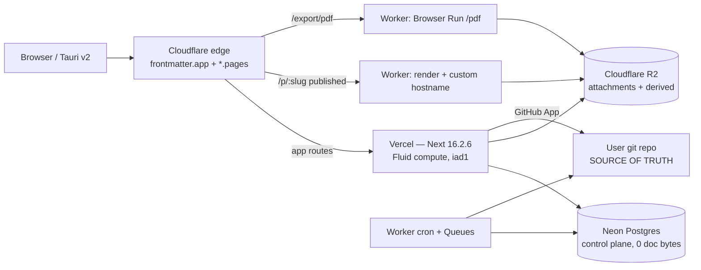

## 8. Hosting, deployment and environments

### 8.1 Topology



| Component | Choice | Rejected alternative | Why | Price (read 2026-08-30 UTC) |
|---|---|---|---|---|
| Next app | Vercel Pro, Fluid compute, region `iad1` | Self-hosted Next on Fly/Railway | Zero ops, instant rollback, preview URLs per PR. Hobby is contractually unusable: "Hobby teams are restricted to non-commercial personal use only" [fetched] | $20/mo platform fee, 1 seat, includes $20 usage credit, 1 TB Fast Data Transfer, 10M edge requests [fetched] |
| Compute rates | `iad1` | `bom1` (Mumbai) | `iad1` Active CPU $0.128/hr vs `bom1` $0.140/hr; Fast Data Transfer $0.15/GB vs $0.20/GB — Mumbai is 9–33% dearer on every line [fetched] | $0.128/CPU-hr, $0.0106/GB-hr memory, $0.60/M invocations [fetched] |
| Postgres | Neon, `aws-us-east-1` | Supabase, RDS | Scale-to-zero after 5 min, per-branch databases for previews, no monthly minimum on Launch [fetched] | Free: 100 CU-h/project, 0.5 GB. Launch: $0.106/CU-hr, $0.35/GB-mo storage, extra branches $1.50/branch-mo [fetched] |
| Object store | Cloudflare R2 | S3, Vercel Blob | Free egress. Vercel Blob data transfer is $0.05/GB in `iad1` — R2 is $0 [fetched] | $0.015/GB-mo, Class A $4.50/M, Class B $0.36/M; free tier 10 GB + 1M A + 10M B [fetched] |
| Edge / published pages / PDF / jobs | Cloudflare Workers Paid | Vercel middleware + Vercel Cron | Workers cron gets 15 min CPU per invocation, no egress charge, and Browser Run gives real Chromium | $5/mo minimum, 10M req + 30M CPU-ms included, then $0.30/M req + $0.02/M CPU-ms [fetched] |
| PDF/Chromium | Cloudflare Browser Run `/pdf` | `@sparticuz/chromium` in a Vercel function (current state) | See §8.7 | 10 browser-hours/mo included on Workers Paid, then $0.09/hr [fetched] |
| Custom domains | Cloudflare for SaaS custom hostnames | Vercel domains API | Keeps published-page egress on R2/Workers, off Vercel Fast Data Transfer | 100 hostnames included, $0.10 each after, max 50,000 [fetched] |
| CI | GitHub Actions, `ubuntu-latest` | None (current state: **no CI at all**) | 1,575 tests exist and nothing runs them | Private repo: 2,000 min/mo on GitHub Free, then $0.006/min for Linux 2-core [fetched] |

### 8.2 Why not one VPS, and why not Kubernetes

**Not a single VPS** ($6–24/mo, cheaper than the $25 floor below). One founder on call cannot be the pager for TLS renewal, kernel patching, log rotation, disk-full, and a Node process that OOMs at 03:00 IST while the customer is in Berlin. The VPS wins on unit cost and loses on the only scarce resource here, which is founder attention. It also has no preview environments, so every PR review is "trust the diff."

**Not Kubernetes** (EKS control plane alone is ~$73/mo before a single node). It buys workload portability we do not need — we have one Next app and three Workers — at the cost of a permanent second job.

**What would change our mind:** if Vercel's bill crosses roughly $600/mo at steady state (see §8.10: that is ~13,000 users on the un-optimised model), the Next app moves to a Hetzner CCX box behind the same Cloudflare edge, with Neon and R2 unchanged. The edge is the abstraction boundary that makes this a two-week migration instead of a rewrite; keep every origin-specific API behind `src/modules/*` and never let a Vercel primitive leak into a domain module.

### 8.3 Regions and residency

| Concern | Position |
|---|---|
| App compute | Single region `iad1`. Multi-region on Pro is available but doubles the cold-start surface and the Postgres round trip. |
| Postgres | `aws-us-east-1`. **Neon region is fixed at project creation and cannot be changed** — moving means create-new-project-and-migrate [fetched]. Pick once, deliberately. Neon has no India region as of 2026-08-30 [fetched]: available AWS regions are us-east-1, us-east-2, us-west-2, eu-central-1, eu-west-2, ap-southeast-1, ap-southeast-2, sa-east-1. |
| Document bytes | Never leave the user's git repo. This is the residency answer that actually matters and it is free: a German customer's documents live wherever their GitHub/GitLab org lives. We hold no copy. |
| Attachments | R2 bucket per residency zone, chosen at workspace creation, stored as `workspaces.r2_region`. Default `auto`; EU customers get an EU-hinted bucket. |
| DPDP / GDPR | The control plane holds identity, entitlements, slugs, audit — personal data, not document content. One Postgres in us-east-1 with SCCs is defensible; if an enterprise deal demands EU-resident control plane, that is a second Neon project plus a `workspaces.control_region` column, not a re-architecture. |

**What would change our mind:** the first paying EU enterprise with a written residency clause. Until then a second region is speculative cost.

### 8.4 Environments

| | local | preview | staging | production |
|---|---|---|---|---|
| Trigger | `npm run dev` | every PR | merge to `main` | manual promote from `main` |
| URL | `localhost:3000` | `<hash>-frontmatter.vercel.app` | `staging.frontmatter.app` | `frontmatter.app` |
| Postgres | Neon branch `dev/<you>` | **ephemeral Neon branch per PR**, deleted on close | Neon branch `staging` | Neon `main` |
| R2 bucket | `fm-local` | `fm-preview` (shared, prefixed by PR number) | `fm-staging` | `fm-prod` |
| GitHub App | `frontmatter-dev` | `frontmatter-dev` | `frontmatter-staging` | `frontmatter` |
| Auth callback | `http://localhost:3000/api/auth/callback/github` | wildcard on the App's dev callback list | staging host | prod host |
| Protection | — | Vercel deployment protection ON | ON | public |

**How previews get data.** Not by copying production. On PR open, CI calls `neon branches create --parent main --name pr-$PR`; the branch is copy-on-write, costs $1.50/branch-month prorated hourly beyond the 10 included per project [fetched], and is deleted on PR close. Then a seeder inserts one synthetic workspace with three synthetic users. Production rows never reach a preview, which means a leaked preview URL leaks nothing. R2 preview objects are written under `preview/$PR/…` and lifecycle-expired at 7 days.

Config lives in `.github/workflows/preview-db.yml` and the branch name is passed to Vercel as a per-deployment env var via `vercel env add DATABASE_URL preview --git-branch`.

**What would change our mind:** nothing. Pointing preview at production is how a solo founder deletes a customer's row at 2am.

### 8.5 The 4.5 MB response cap — this already bites

> "The maximum payload size for the request body or the response body of a Vercel Function is 4.5 MB. If a Vercel Function receives a payload in excess of the limit it will return an error 413: `FUNCTION_PAYLOAD_TOO_LARGE`" [fetched 2026-08-30]

Two shipped routes are on the wrong side of it [measured, read from the repo]:

| Route | What it does now | Failure |
|---|---|---|
| `src/app/api/vault/snapshot/route.ts` | `return new Response(JSON.stringify(snapshot))` — the **entire vault** as one JSON body | A 3,000-note vault at 1.5 KB average is 4.5 MB of markdown before JSON escaping. 413 for exactly the power users we want. |
| `src/app/api/export/vault/route.ts` | returns a whole zip through the function | Same wall, at a smaller vault, because zip-of-markdown still exceeds 4.5 MB fast. |

The settled architecture already says *stop shipping whole-vault snapshots*. The cap is the enforcement mechanism. Replacement contract:

- `GET /api/vault/index` → paths, sizes, SHAs, mtimes only. Bounded: 3,000 notes × ~120 bytes = 360 KB.
- `GET /api/vault/file?path=` → one file, byte-exact. Already exists.
- `GET /api/export/vault` → enqueue a job; the Worker writes `exports/{workspace_id}/{job_id}.zip` to R2 and returns a presigned URL. **The function returns a URL, never bytes.** Uploads use presigned PUT directly to R2, so the 4.5 MB *request* cap never applies to attachments either.

Rule for every new route: if a response body can grow with vault size, it returns a cursor or a URL. Add this as a test in `test/` that asserts every `route.ts` response is either bounded or a redirect.

### 8.6 Cold starts

Fluid compute keeps an instance alive across requests and bills Active CPU only while your code runs, pausing during I/O [fetched] — so a warm instance amortises well and a GitHub API wait costs memory-time but not CPU-time. Cold starts are still dominated by bundle size, and the PDF function is the outlier [measured, `du` on `node_modules`]:

| Package | On-disk size |
|---|---|
| `@sparticuz/chromium@148` | 4.6 MB |
| `puppeteer-core@25.0.4` | 7.7 MB |
| `bin/swiftshader.tar.br` | 3,498,775 B |
| `bin/al2023.tar.br` | 1,075,752 B |
| `bin/fonts.tar.br` | 183,831 B |

Those brotli packs are decompressed into `/tmp` on every cold start before Chromium can launch [inference from the package's runtime design]. Mitigations, in order: keep the app router's non-PDF functions free of AI-provider SDKs (five providers are installed; import them lazily inside handlers, not at module scope); keep `serverExternalPackages` as it is in `next.config.ts`; and move the PDF path off Vercel entirely (§8.7). Measure before tuning further — Vercel Observability reports cold-start rate per function, and anything under 2% at steady traffic is not worth an engineering week.

### 8.7 The PDF path cannot stay in a normal serverless function

Current state, from `vercel.json`:

```json
"functions": {
  "src/app/api/export/pdf/[...path]/route.ts": { "memory": 1769, "maxDuration": 60 }
}
```

and from `next.config.ts`, a comment that is itself the evidence: the narrow `bin/**` glob "wasn't landing the binary in the lambda (runtime: `.../bin does not exist`)", so the fix ships the *whole* `@sparticuz/chromium` package via `outputFileTracingIncludes`. That is a file-tracing workaround for a native binary resolved at runtime — it will break again on a Next minor upgrade, silently, in production only.

| Option | Cost | Verdict |
|---|---|---|
| Keep `@sparticuz/chromium` on Vercel | 1.77 GB memory × 8 s × $0.0106/GB-hr ≈ $0.000042/PDF, plus a fragile trace hack and a 12 MB cold start | Reject |
| Cloudflare Browser Run `/pdf` Quick Action | 10 browser-hours/mo included on the $5 Workers Paid plan, then **$0.09/hr** [fetched]. At 6 s/PDF that is 6,000 PDFs inside the included hours | **Pick** |
| Browserless / self-hosted Chromium container | $50–200/mo and a container to babysit | Reject |

Implementation: a Worker binds `browser` and POSTs the rendered HTML to the `/pdf` Quick Action; output goes to R2 at `derived/{workspace_id}/{doc_sha}.pdf`, keyed by content hash so it is cacheable forever and never overwritten. Note the hard limits: browser timeout 60 s, 200 concurrent browsers per account on Paid, 3 new instances/sec [fetched 2026-08-30]. Long exports must be queued, not synchronous.

**What would change our mind:** if `/pdf` cannot reproduce our KaTeX + Mermaid + custom-font output byte-for-byte against the golden fixtures, we keep Chromium on Vercel and accept the fragility — fidelity beats elegance for a document product. Test this against `test/` fixtures *before* deleting the current route.

### 8.8 Custom domains and wildcard TLS

| Case | Mechanism | Limit |
|---|---|---|
| `*.frontmatter.app` (per-workspace published pages) | Cloudflare Universal SSL on our own zone | Covers apex + one subdomain level. `a.b.frontmatter.app` is **not** covered — enforce single-level slugs in the `publish_slugs` uniqueness constraint. |
| `docs.customer.com` (customer vanity domain) | Cloudflare for SaaS custom hostname, HTTP or delegated-TXT validation | 100 hostnames included, $0.10/hostname after, 50,000 max [fetched] |
| `*.customer.com` | **Not available.** "Wildcard custom hostnames: Enterprise" [fetched] | Refuse the request explicitly in the UI with that reason. Do not promise it. |

Onboarding flow: customer adds a CNAME to `pages.frontmatter.app`; we POST the hostname to the Cloudflare for SaaS API, store `custom_hostname_id` + status on the workspace row, and poll validation. The Worker maps `Host` → `workspace_id` → R2 prefix. Certificate issuance and renewal are Cloudflare's problem, which is the entire point.

### 8.9 Rollback

| Layer | Mechanism | Time |
|---|---|---|
| Next app | Vercel Instant Rollback — promote the previous deployment; it is already built | seconds |
| Workers | `wrangler rollback --message "..."` to the prior version | seconds |
| Postgres schema | **Expand/contract only.** Never a destructive migration in the same deploy as the code that needs it: add column → deploy code that writes both → backfill → deploy code that reads new → drop old, a week later | days, by design |
| R2 objects | **R2 has no object versioning.** Rollback is impossible, so derived artifacts are content-addressed (`{doc_sha}.pdf`) and never overwritten; a bad render writes a new key and the old one is still there | n/a |
| Document bytes | Nothing to roll back. The file is in the user's git repo; `git revert` is their rollback and it is better than ours | n/a |

Instant Rollback only works if the previous deployment can still talk to the current database. That is the whole argument for expand/contract, and it is the one rule in this section that a single careless migration can void.

### 8.10 The bill

**Model** [inference, stated so it can be argued with]: per active user per month — 1,000 function invocations, 120 ms Active CPU each, 400 ms instance-alive at 2 GB, 0.25 GB Fast Data Transfer, 2,500 edge requests, 80 MB R2 storage, 0.5 PDF exports at 6 s.

Vercel at 10,000 users [derived]: CPU 333.3 hr × $0.128 = $42.67; memory 2,222 GB-hr × $0.0106 = $23.56; invocations 10M × $0.60/M = $6.00; Fast Data Transfer (2,500 − 1,000 included) × $0.15 = $225.00; edge requests (25M − 10M) × $2.00/M = $30.00. Raw $327.22; the $20 credit is consumed, so billed = $327.22.

| Line | 100 users | 1,000 users | 10,000 users |
|---|---|---|---|
| Vercel Pro | $20.00 | $20.00 | $327.22 |
| Neon | $0.00 (Free) | $19.78 | $85.63 |
| Cloudflare R2 | $0.00 (free tier) | $1.05 | $11.85 |
| Workers Paid (incl. Browser Run, Queues) | $5.00 | $5.00 | $5.00 |
| Cloudflare for SaaS hostnames | $0.00 | $0.00 | $30.00 |
| GitHub Actions | $0.00 | $0.00 | $2.40 |
| **Total / month** | **$25.00** | **$45.83** | **$462.10** |
| **Per user** | $0.250 | $0.046 | $0.046 |

Neon workings [derived]: 1,000 users = 180 CU-hr × $0.106 + 2 GB × $0.35 = $19.78. 10,000 users = 730 CU-hr × $0.106 + 15 GB × $0.35 + 15 GB instant restore × $0.20 = $85.63. R2: (800 − 10) GB × $0.015 = $11.85, with Class A at ~500k and Class B at ~5M both inside the free tier. Browser Run at 10,000 users is 8.33 browser-hours, inside the 10 included.

**The lever.** At 10,000 users, Fast Data Transfer plus edge requests is $255 of a $462 bill — 55%. Serving `/p/:slug` published pages and hashed static assets from the Worker + R2 (free egress) instead of from Vercel drops Vercel to $72.23 raw and the total to **$207.11/mo, $0.021/user** [derived]. Do this when the Vercel invoice first exceeds $150, not before; the Worker render path is real work and premature at 1,000 users.

Excluded from every figure: AI inference (separately metered per §on AI), payment processor fees, and the domain renewal.
