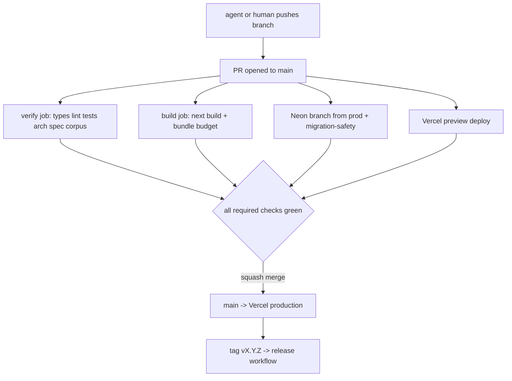

## 9. CI/CD, version control and release

The repo has 223 TypeScript files, 25,214 lines under `src/`, 98 test files, and **zero CI** [measured 2026-08-30: `ls .github` → No such file or directory]. Every gate that exists — `arch`, `spec`, `corpus`, `verify` — runs only when a human or an agent remembers to type it. That is the single highest-leverage gap in the repo, and it is closed by one directory.

### 9.1 What CI must protect

| Invariant | Gate | Command | Fail mode if ungated |
|---|---|---|---|
| Byte-preserving splice never guesses | `test` | `npm run test` (1,575 tests) | Silent corruption of user files in a git repo we do not own |
| Layer direction (no infra imports in domain) | `arch` | `npm run arch` | Architecture rots in 3 weeks of agent commits |
| Every spec has an executable oracle | `spec` | `npm run spec` | Specs become prose |
| Foreign-vault fidelity corpus is byte-pinned | `corpus` | `npm run corpus` | The only cross-author fidelity claim becomes unfalsifiable |
| Editor bundle stays loadable on a 3G phone | `budget` | currently a stub that echoes and exits 0 | Bundle creep, invisible |
| Types and lint | `typecheck`, `lint` | `tsc --noEmit`, `eslint . --max-warnings=0` | — |

`npm run budget` today is `echo 'No bundle budget configured yet — skipping'` [measured]. A gate that always passes is worse than no gate, because it appears in the required-checks list and buys false confidence. It gets a real implementation in §9.4 or it gets deleted from `package.json`.

### 9.2 The pipeline

Two jobs, not seven. Runner minutes are billed per job-minute, so parallelism costs money; we buy wall-clock only where it pays.

**`.github/workflows/ci.yml`**

```yaml
name: ci
on:
  push:
    branches: [main]
  pull_request:
    branches: [main]

concurrency:
  group: ci-${{ github.workflow }}-${{ github.ref }}
  cancel-in-progress: ${{ github.ref != 'refs/heads/main' }}

permissions:
  contents: read

env:
  NODE_VERSION: "24.6.0"
  NEXT_TELEMETRY_DISABLED: "1"

jobs:
  verify:
    name: verify (types, lint, tests, gates)
    runs-on: ubuntu-latest
    timeout-minutes: 15
    steps:
      - uses: actions/checkout@v7        # v7.0.1, published 2026-07-20 [fetched 2026-08-30]
        with:
          fetch-depth: 0                 # corpus + reconcile need real history
      - uses: actions/setup-node@v7      # v7.0.0, published 2026-07-14 [fetched 2026-08-30]
        with:
          node-version: ${{ env.NODE_VERSION }}
          cache: npm
      - run: npm ci --no-audit --no-fund
      - run: npm run typecheck
      - run: npm run lint
      - run: npm run test -- --reporter=default --reporter=junit --outputFile=reports/junit.xml
      - name: arch report (layer direction, with scan floor)
        run: npm run arch | tee reports/arch.json
      - name: spec gate
        run: npm run spec
      - name: corpus oracle
        run: |
          node scripts/corpus-foreign.mjs fetch
          npm run corpus
      - if: always()
        uses: actions/upload-artifact@v7  # v7.0.1 [fetched 2026-08-30]
        with:
          name: verify-reports-${{ github.sha }}
          path: reports/
          retention-days: 14

  build:
    name: build + bundle budget
    runs-on: ubuntu-latest
    timeout-minutes: 15
    steps:
      - uses: actions/checkout@v7
      - uses: actions/setup-node@v7
        with:
          node-version: ${{ env.NODE_VERSION }}
          cache: npm
      - name: restore next build cache
        uses: actions/cache@v6            # v6.1.0 [fetched 2026-08-30]
        with:
          path: .next/cache
          key: next-${{ runner.os }}-${{ hashFiles('package-lock.json') }}-${{ github.sha }}
          restore-keys: |
            next-${{ runner.os }}-${{ hashFiles('package-lock.json') }}-
      - run: npm ci --no-audit --no-fund
      - run: npm run build
      - run: node scripts/ci/bundle-budget.mjs
```

**Why this shape.** We pick two jobs sharing one `npm ci` each, over a matrix of six single-command jobs. The alternative is prettier in the checks UI and roughly 3× the runner minutes, because every job pays the ~50s install tax again. Cost: a lint failure does not tell you whether tests would also have failed, so a red build sometimes needs a second push. We change our mind if median CI wall-clock exceeds 10 minutes, at which point we split `test` out with a shared `actions/cache` on `node_modules`.

**Runner budget** [fetched 2026-08-30, GitHub billing docs]: private repos get **2,000 Linux minutes/month on GitHub Free, 3,000 on Pro and Team, 50,000 on Enterprise Cloud**; Actions cache is a separate **10 GB per repository** allowance not shared with artifacts. [derived] At an estimated 5 min for `verify` and 4 min for `build`, one push costs 9 runner-minutes; 2,000 ÷ 9 = **222 pushes/month**, about 7/day. An agent-driven repo will exceed that, which is exactly why `cancel-in-progress` is set for non-`main` refs — superseded pushes on the same branch stop billing immediately. If we still run out, the next move is GitHub Pro (3,000 min → 333 pushes), not self-hosted runners; a self-hosted runner is a machine one person has to patch, and this is a one-founder company.

### 9.3 The arch report's minimum-files-scanned floor

The most important line in the whole pipeline is already in the repo:

```js
// specs/harness/clean-architecture-report.mjs
const MIN_SCANNED_FILES = 50;
...
if (filesScanned < MIN_SCANNED_FILES) { process.exit(2); }
if (violations.length) process.exit(1);
```

The header documents the exploit it exists to prevent [measured, read from source]: the gate previously reported `{"total":0,"violations":[]}` and exit 0 whether it had scanned 208 files or zero, because `total` counted *violations* and a gate with nothing to scan has none. Renaming `src/modules/` to `src/features/` took a violating tree from exit 1 to exit 0 — **the gate passed by going blind**.

Floor is 50 against ~208 layered files actually scanned [measured] — 4.2× headroom, so ordinary file moves never trip it. CI must distinguish the two failures, because they mean opposite things:

| Exit | Meaning | CI behaviour |
|---|---|---|
| 0 | Scanned enough, no violations | Pass |
| 1 | Real layer violation | Fail — fix the import |
| 2 | Refusing: scanned below floor | Fail loudly — **the gate is broken, not the code** |

Every gate in this repo gets the same treatment: `spec-report.mjs` exits 2 on a malformed spec directory and 1 on spec errors; `corpus-foreign.mjs` exits 2 on a missing manifest and 1 on a hash mismatch [measured, read from source]. A pipeline that collapses 1 and 2 into "red" teaches you to re-run rather than to look. Keep them distinct in the job name and in `reports/`.

### 9.4 Bundle budget

**`scripts/ci/bundle-budget.mjs`** — replaces the echo stub.

```js
// Fails when first-load client JS crosses budget. Reads the manifest Next
// writes, not a glob, so a build that emits nothing FAILS rather than passes.
import { readFileSync } from 'node:fs'
import { gzipSync } from 'node:zlib'
import path from 'node:path'

const BUDGET = { '/': 220_000, '/edit/[...path]': 480_000 } // gzipped bytes
const MIN_ROUTES = 5   // the arch-floor idea, applied here
const app = JSON.parse(readFileSync('.next/app-build-manifest.json', 'utf8'))
const routes = Object.entries(app.pages)
if (routes.length < MIN_ROUTES) {
  console.error(`[budget] refusing: only ${routes.length} routes in manifest (floor ${MIN_ROUTES})`)
  process.exit(2)
}
let failed = 0
for (const [route, files] of routes) {
  const bytes = files
    .filter(f => f.endsWith('.js'))
    .reduce((n, f) => n + gzipSync(readFileSync(path.join('.next', f))).length, 0)
  const cap = BUDGET[route]
  console.log(`${route}\t${bytes}\t${cap ?? '-'}`)
  if (cap && bytes > cap) { console.error(`[budget] ${route}: ${bytes} > ${cap}`); failed++ }
}
process.exit(failed ? 1 : 0)
```

We pick reading `.next/app-build-manifest.json` over `next build --analyze` or `size-limit`. Alternative rejected: `size-limit` needs its own config, its own webpack pass, and a second bundler opinion. Cost: the numbers are gzip-of-emitted-chunks, not real transfer size over Brotli, so budgets are set ~15% loose. We change our mind if CodeMirror + Mermaid + KaTeX push the editor route past 480 KB and we need per-dependency attribution to argue about what to lazy-load.

### 9.5 Branches, protection, required checks

One long-lived branch. `main` is always deployable.

| Branch pattern | Purpose | Lifetime |
|---|---|---|
| `main` | Production truth. Protected. | Forever |
| `engine/*`, `feat/*`, `fix/*` | Human or agent work | Hours to days, squash-merged |
| `claude/*` | Agent-created branches (two exist today: `claude/competent-bassi-5da9a1`, `claude/upbeat-euclid-60dbf4` [measured]) | Delete on merge |
| `release/v*` | Only if a hotfix must ship without `main`'s tip | Rare |

Protection is configured once, as code, so it is auditable:

```bash
gh api -X PUT repos/:owner/frontmatter/branches/main/protection \
  --input .github/branch-protection.main.json
```

**`.github/branch-protection.main.json`**

```json
{
  "required_status_checks": {
    "strict": true,
    "contexts": [
      "verify (types, lint, tests, gates)",
      "build + bundle budget",
      "migration-safety",
      "Vercel – frontmatter"
    ]
  },
  "enforce_admins": false,
  "required_pull_request_reviews": {
    "required_approving_review_count": 0,
    "dismiss_stale_reviews": true
  },
  "required_linear_history": true,
  "allow_force_pushes": false,
  "allow_deletions": false,
  "required_conversation_resolution": true,
  "block_creations": false
}
```

`required_approving_review_count: 0` because there is one founder and a self-approval requirement is theatre that gets disabled at 2am. `enforce_admins: false` for the same reason — an escape hatch used deliberately beats one used by disabling protection entirely. `strict: true` means a PR must be rebased on current `main` before merge; with one author this costs a rebase and buys a guarantee that the gates ran against the bytes that land. `required_linear_history: true` + squash merge means `main`'s history is one commit per PR, which makes `git bisect` over a splice-corruption report actually usable.

### 9.6 Preview deploys and the PR topology



Preview deploys run through **Vercel's native Git integration**, not a `vercel deploy` step in Actions. Alternative rejected: deploying from CI with `vercel@59.10.0` [fetched 2026-08-30] and a token. Why: the native integration already posts the preview URL as a check and a PR comment, handles concurrency, and needs no token in GitHub at all — one fewer secret to rotate. Cost: preview builds are not gated on `verify` passing, so a preview can be green while tests are red. That is acceptable because the preview is for *looking at*, and merge is gated on the checks list, not on the preview.

The repo already ships `scripts/vercel-ignore-build.sh` wired via `vercel.json`'s `ignoreCommand` [measured]. It skips the build unless `src public package.json package-lock.json next.config.ts tsconfig.json eslint.config.mjs postcss.config.mjs vercel.json .nvmrc` changed, and **builds** when the previous SHA is unresolvable. That default direction is correct: an unknown state must build, never skip. Vercel Hobby allows 100 deployments/day, Pro 6,000 [fetched 2026-08-30, `vercel.com/docs/plans/hobby`, page dateModified 2026-08-11]; the ignore command is what keeps a docs-heavy repo under the Hobby ceiling. Note the same page states Hobby is restricted to non-commercial personal use — the moment this repo takes a paying customer, the plan is Pro, and that is a licensing fact, not a resource one.

### 9.7 Database migration safety

The control plane is one Postgres holding zero document bytes. Migrations are **plain numbered SQL** applied by a ~60-line runner using `pg@8.23.0` [fetched 2026-08-30].

| Option | Verdict |
|---|---|
| Plain SQL + tiny runner | **Picked.** RLS policies, `SECURITY DEFINER` functions and partial indexes are written as SQL anyway; nothing translates them |
| Prisma Migrate | Rejected. Owns the schema; hand-written RLS lives outside its model and drifts |
| Drizzle Kit | Rejected, narrowly. Good tool, but couples schema truth to TypeScript, and we already have one hard rule that truth lives in files, not in a generator |
| Supabase CLI | Rejected. Couples the control plane to one host; the architecture says swappable |

**Forward-only, expand → migrate → contract, three separate PRs.** Never one.

```
migrations/
  0007_expand_add_workspace_slug.sql      -- PR 1: additive only
  0008_backfill_workspace_slug.sql        -- PR 2: data, idempotent, batched
  0009_contract_drop_legacy_slug.sql      -- PR 3: destructive, >= 1 release later
```

```sql
-- 0007_expand_add_workspace_slug.sql  (nullable, defaulted, no rewrite lock)
ALTER TABLE workspaces ADD COLUMN IF NOT EXISTS slug text;
CREATE UNIQUE INDEX CONCURRENTLY IF NOT EXISTS workspaces_slug_key
  ON workspaces (slug) WHERE slug IS NOT NULL;
ALTER TABLE workspaces ENABLE ROW LEVEL SECURITY;
CREATE POLICY workspaces_tenant_read ON workspaces
  FOR SELECT USING (id = current_setting('app.workspace_id', true)::uuid);
```

**`.github/workflows/migration-safety.yml`** — runs only when `migrations/**` changes.

```yaml
name: migration-safety
on:
  pull_request:
    paths: ['migrations/**', 'scripts/migrate.mjs']

permissions:
  contents: read

jobs:
  migration-safety:
    runs-on: ubuntu-latest
    timeout-minutes: 10
    steps:
      - uses: actions/checkout@v7
      - uses: actions/setup-node@v7
        with: { node-version: '24.6.0', cache: npm }
      - run: npm ci --no-audit --no-fund
      - name: create ephemeral Neon branch from production
        id: db
        run: |
          npx neonctl@4.13.0 branches create \
            --project-id "$NEON_PROJECT_ID" --name "ci/pr-${{ github.event.number }}" \
            --parent production --output json > branch.json
          echo "url=$(jq -r '.connection_uris[0].connection_uri' branch.json)" >> "$GITHUB_OUTPUT"
        env:
          NEON_API_KEY: ${{ secrets.NEON_API_KEY }}
          NEON_PROJECT_ID: ${{ vars.NEON_PROJECT_ID }}
      - name: forbid destructive statements outside a contract migration
        run: node scripts/ci/migration-lint.mjs
      - name: apply forward
        run: node scripts/migrate.mjs up
        env: { DATABASE_URL: ${{ steps.db.outputs.url }} }
      - name: assert RLS on every tenant table
        run: node scripts/ci/assert-rls.mjs
        env: { DATABASE_URL: ${{ steps.db.outputs.url }} }
      - name: previous release's code against the new schema
        run: |
          git fetch --tags --depth=1 origin
          git checkout "$(git describe --tags --abbrev=0 origin/main)" -- src
          npm run test -- src/**/*.repo.test.ts
        env: { DATABASE_URL: ${{ steps.db.outputs.url }} }
      - if: always()
        run: npx neonctl@4.13.0 branches delete "ci/pr-${{ github.event.number }}" --project-id "$NEON_PROJECT_ID"
        env: { NEON_API_KEY: ${{ secrets.NEON_API_KEY }} }
```

The last real step is the one that matters and the one everybody skips: **run the previous release's repository tests against the new schema.** Expand-migrate-contract only works if N-1 code survives N schema; this proves it in CI instead of at 3am. Neon's Free plan allows **10 branches per project, 0.5 GB storage per project, 5 GB egress, $0/month** [fetched 2026-08-30, `neon.com/docs/introduction/plans`], which is why the branch is deleted in an `if: always()` step — ten stale PR branches and the free tier is full.

`migration-lint.mjs` rejects `DROP COLUMN`, `DROP TABLE`, `ALTER … TYPE`, and `RENAME` in any file whose name does not contain `contract_`, and rejects `CREATE INDEX` without `CONCURRENTLY`. Rollback is **not** by down-migration; a down-migration that drops a column loses data that the expand step's whole point was to keep. Rollback is: revert the application deploy (Vercel Instant Rollback), leave the schema expanded, write a new forward migration.

### 9.8 Secrets

| Secret | Where | Rotation |
|---|---|---|
| `NEON_API_KEY` | GitHub Actions secret, `migration-safety` job only | Quarterly |
| `NEON_PROJECT_ID` | GitHub **variable**, not secret (it is not one) | — |
| Vercel deploy credentials | **None in GitHub.** Native Git integration | — |
| `TAURI_SIGNING_PRIVATE_KEY`, `APPLE_*` | GitHub Environment `desktop-release`, protected, required reviewer = the founder | Annually |
| AI provider keys | Not in CI at all. No test hits a live provider | — |

Rules, in order of how much they save you: no long-lived cloud credential enters CI when an OIDC exchange exists; every release-signing secret sits behind a protected **Environment** so a compromised PR workflow cannot reach it; `permissions:` is declared explicitly on every workflow and defaults to `contents: read`; `pull_request_target` is banned outright in this repo, because it runs base-branch workflow code with write-scoped secrets against fork-authored content. No test may require a real API key — if a test needs one, it is an integration test and belongs in a nightly workflow, not the merge gate.

### 9.9 Versioning and release

`package.json` is at `0.1.0` [measured]. Versioning is **SemVer on the app, with the engine's degradation certification as the compatibility contract.**

| Change | Bump | Gate |
|---|---|---|
| A splice that previously succeeded now REFUSES | **major** | Requires an entry in `specs/engine/` and a corpus delta |
| A previously-refused input now splices correctly | minor | New spec + oracle |
| Render projection output bytes change for any corpus file | **major** | `npm run corpus` diff must be reviewed line by line |
| UI, perf, deps | patch/minor | Normal |

Release is a tag, and the tag is the only thing that triggers it:

```yaml
# .github/workflows/release.yml (excerpt)
on:
  push:
    tags: ['v*.*.*']
permissions:
  contents: write
jobs:
  release:
    runs-on: ubuntu-latest
    environment: production
    steps:
      - uses: actions/checkout@v7
        with: { fetch-depth: 0 }
      - name: refuse a tag that is not an ancestor of main
        run: git merge-base --is-ancestor "$GITHUB_SHA" origin/main
      - run: gh release create "$GITHUB_REF_NAME" --generate-notes --verify-tag
        env: { GH_TOKEN: ${{ github.token }} }
```

Desktop (Tauri v2) builds on macOS runners in a separate `desktop-release` workflow gated on the same tag; macOS runner minutes bill at a multiplier, so it runs on tags only, never on PRs. Web has no release artifact — `main` merging is the release, and rollback is Vercel Instant Rollback, measured in seconds.

### 9.10 The break-it-once rule

**No green CI run is trusted until the pipeline has been made to go red on purpose, once per gate.** This is not optional and it is not a one-time ceremony at setup; it is re-run whenever a gate is added or a workflow file is edited.

Procedure, on a throwaway branch `ci/prove-red`, one commit per row, each pushed and observed:

| # | Deliberate break | Must fail as |
|---|---|---|
| 1 | `const x: number = "s"` in `src/` | `verify` — typecheck |
| 2 | An unused import | `verify` — lint (`--max-warnings=0`) |
| 3 | Invert one splice-boundary assertion | `verify` — test |
| 4 | `import { pool } from '@/shared/infrastructure/db'` inside a domain file | `verify` — arch, **exit 1** |
| 5 | Rename `src/modules/` → `src/features/` | `verify` — arch, **exit 2**, floor refusal |
| 6 | Flip one byte in `test/corpus/foreign/MANIFEST.sha256` | `verify` — corpus, exit 1 |
| 7 | Add `DROP COLUMN` to a non-`contract_` migration | `migration-safety` — migration-lint |
| 8 | Import all of `mermaid` eagerly into the root route | `build` — bundle budget |

Rows 5 and 8 are the ones that catch a *gate* being broken rather than the code. A gate that has never been observed failing is a decoration. Record the run URLs in `docs/ci-proof.md` with dates; when someone later asks "does CI actually check X", the answer is a link, not a belief.

### 9.11 How an AI agent works with this CI

The agent is a contributor with no merge rights and no CI write access.

| Agent may | Agent may not |
|---|---|
| Create branches, commit, open PRs | Push to `main`, force-push any shared branch |
| Read run logs (`gh run view --log-failed`) | Edit `.github/workflows/**` without an explicit human instruction naming the file |
| Re-run a failed job once | Re-run more than once to "get a green" |
| Run all gates locally before pushing | Add `continue-on-error`, `\|\| true`, or `--max-warnings` relaxations to make a gate pass |

The last row is the whole discipline. A gate weakened to get a green is indistinguishable from a gate that never existed, and it is the single most likely thing an agent under time pressure will do. `.github/workflows/**` and `specs/harness/**` are listed in `CODEOWNERS`, and a PR touching them is labelled `gate-change` by a workflow and must be read by a human line by line.

**The reconciliation rule.** Capture `git rev-parse HEAD` immediately before and immediately after every agent run, and diff the range. Prompt-level prohibitions on committing are advisory, not a control: in this workspace, five commits landed from subagents whose prompts explicitly forbade committing [measured, prior incident, commits `b8fd9d1` `2e7ded0` `ec0be22` `7ace826` `7f882d6`]. The prohibition still belongs in the prompt; it is simply not the gate.

**`scripts/ci/agent-run.sh`** — the wrapper every agent invocation goes through:

```bash
#!/usr/bin/env bash
set -euo pipefail
BEFORE="$(git rev-parse HEAD)"
BRANCH="$(git rev-parse --abbrev-ref HEAD)"
printf '%s\n' "$BEFORE" > .git/agent-head-before
trap 'AFTER="$(git rev-parse HEAD)"
      if [ "$BEFORE" != "$AFTER" ]; then
        echo "[reconcile] HEAD moved on $BRANCH: $BEFORE -> $AFTER"
        git --no-pager log --oneline "$BEFORE..$AFTER"
        git --no-pager diff --stat "$BEFORE" "$AFTER"
        echo "[reconcile] review every commit above before pushing."
      else
        echo "[reconcile] HEAD unchanged at $BEFORE"
      fi' EXIT
"$@"
```

Branch guard, as a pre-push hook and mirrored as a CI check on `main`:

```bash
# .git/hooks/pre-push — refuse a direct push to main from any automated run
while read -r _ _ remote_ref _; do
  if [ "$remote_ref" = "refs/heads/main" ] && [ -n "${CLAUDECODE:-}" ]; then
    echo "refusing: agent session pushing directly to main. Open a PR." >&2
    exit 1
  fi
done
```

The agent's definition of done is not "the code looks right" — it is **`npm run verify` passes locally, the PR is open, and every required check on the PR is green**, with the HEAD-delta from `agent-run.sh` pasted into the PR body. `npm run verify` already chains `typecheck && lint && test && build && arch && spec` [measured]; it should be extended to include `corpus` and `budget` so the local command and the remote gate are the same list. Two lists drift; one does not.
