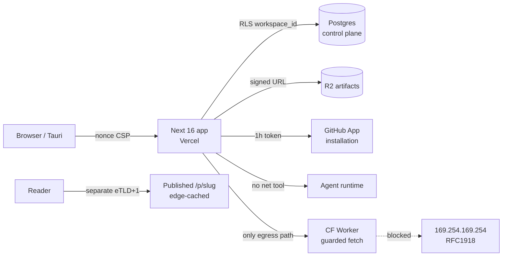

## 10. Security, rate limiting and abuse prevention

### 10.1 Threat model

The product's security posture is unusual in one load-bearing way: **we do not hold the documents.** They live in the user's git repo. What we hold is a *credential that can write to that repo*, plus a control plane that knows who may use it. The crown jewel is therefore not a database — it is the GitHub App private key, and second the AI provider keys.

| # | Asset | Adversary | Attack | Blast radius | Primary control | Enforced at |
|---|---|---|---|---|---|---|
| A1 | GitHub App private key | Anyone with prod env read | Mint installation tokens for every install | **Every customer repo, write access** | Key never leaves Vercel env; no copy in git, logs, or Postgres; 1h token TTL; rotation runbook §10.8 | Platform |
| A2 | Provider API keys (ours) | Leaked env, SSRF to `/api` | Free inference on our card | $ burn, no data loss | Server-only, per-workspace spend ceiling, no key ever in a client bundle | Server |
| A3 | Customer BYOK provider keys | DB dump | Bill their account | Their $ | AES-256-GCM at rest, KEK in env, never returned by any API (write-only field) | Postgres |
| A4 | Control-plane Postgres | Broken tenancy check | Read another workspace's slugs, entitlements, audit | Metadata only, **zero document bytes** | `workspace_id` on every row + pooled RLS from day one | Postgres |
| A5 | R2 artifacts (attachments >1MB, derived) | Guessable keys | Read a private attachment | Per-object | Keys are `wsid/uuid/sha256`, never sequential; signed GET, 5-min TTL; no public bucket | R2 |
| A6 | Published page renderer `/p/:slug` | Any author | Stored XSS against readers | Session theft **if same origin** | Separate eTLD+1 + nonce CSP + `sandbox` (§10.3) | Edge |
| A7 | The AI lane | Author of a document the agent reads | Prompt injection → exfiltration | Cross-document read, data egress | Trifecta gate: agent has **no network tool** (§10.9) | Agent runtime |
| A8 | Splice engine | Malicious/compromised model output | Silent corruption of user prose | Their file | Byte-exact range match or **REFUSE** — the engine invariant doubles as a security control | Engine |

Explicit non-goals: we are not a secrets manager, not a compliance product, and we do not claim SOC 2. See §10.12 for the triggers that change that.



### 10.2 Secrets management

**Pick:** Vercel encrypted environment variables, one project, three environments. **Rejected:** Doppler / Infisical / HashiCorp Vault. **Why:** each adds a runtime dependency, a bootstrap secret, and a $0→$20/mo line for a founder with one prod environment; Vercel env vars are already the trust root for the deploy. **Cost:** no per-secret audit log, no automatic rotation. **Changes our mind:** first employee with prod access, or the first enterprise security questionnaire that asks for secret-access audit trails.

| Secret | Env name | Storage | Rotation | If leaked |
|---|---|---|---|---|
| GitHub App private key | `GITHUB_APP_PRIVATE_KEY` (base64 PKCS#8) | Vercel env, prod only | 90d + on suspicion | Generate new key in App settings, deploy, **delete old key** — GitHub allows two concurrent keys, so rotation is zero-downtime |
| GitHub App webhook secret | `GITHUB_WEBHOOK_SECRET` | Vercel env | 180d | Attacker can forge `installation.*` events → verify HMAC-SHA256 with `timingSafeEqual`, never `===` |
| Auth session secret | `AUTH_SECRET` (next-auth v5) | Vercel env | 180d | Session forgery — rotation logs everyone out; acceptable |
| BYOK KEK | `BYOK_KEK` (32B, base64) | Vercel env | manual | Decrypts every `workspace_provider_key.ciphertext`; rotation = re-wrap loop job |
| Postgres URL | `DATABASE_URL` | Vercel env | on incident | Control-plane read; **no document bytes** |
| R2 access key | `R2_ACCESS_KEY_ID`/`SECRET` | Vercel env | 90d | Scoped to one bucket, no account-level token |

BYOK column encryption, exact shape — `src/modules/billing/infrastructure/byok-cipher.ts`:

```ts
import { createCipheriv, createDecipheriv, randomBytes } from "node:crypto";
const KEK = Buffer.from(process.env.BYOK_KEK!, "base64"); // 32 bytes
export function seal(plain: string, workspaceId: string) {
  const iv = randomBytes(12);
  const c = createCipheriv("aes-256-gcm", KEK, iv);
  c.setAAD(Buffer.from(workspaceId));           // binds ciphertext to tenant
  const ct = Buffer.concat([c.update(plain, "utf8"), c.final()]);
  return Buffer.concat([iv, c.getAuthTag(), ct]).toString("base64");
}
```

The AAD binding matters: a stolen ciphertext replayed into another workspace's row fails authentication rather than decrypting. Repo hygiene: `gitleaks` in pre-commit and CI (§10.10), GitHub push protection on, and a hard rule — **no secret is ever written into a user's markdown repo**, because that repo is theirs and may be public.

### 10.3 HTTP headers and the exact CSP

Current state [measured 2026-08-30, `next.config.ts:21-49`]: `X-Content-Type-Options`, `Referrer-Policy`, `X-Frame-Options: DENY` on all paths; an enforced CSP on `/p/:slug*` only; the editor CSP is **report-only** in `src/proxy.ts:112` (Next 16 renamed `middleware.ts` → `proxy.ts`; there is no `middleware.ts` in this repo). The shipped public CSP contains `script-src 'self' 'unsafe-inline'` — which means CSP is currently *not* a backstop for XSS on the one surface that renders attacker-authored content. That is the single highest-value fix in this section.

**Pick:** per-request nonce + `strict-dynamic`, generated in `proxy.ts`, plus **serving published pages from a different registrable domain**. **Rejected:** hash-based CSP (breaks on every content change), and same-origin publishing. **Why:** a different eTLD+1 means a sanitiser bypass on a published page cannot read app cookies or `localStorage` at all — the control survives a bug in the control below it. **Cost:** a second domain, a second Vercel project or a rewrite, and cross-origin auth for the "edit this page" button. **Changes our mind:** nothing short of the second domain being impossible.

`src/proxy.ts` — generate `const nonce = crypto.randomUUID().replace(/-/g,"")` per request, set it on `x-nonce` for the RSC tree, and CodeMirror 6 takes it directly via the `EditorView.cspNonce` facet, so the editor needs **no** `style-src 'unsafe-inline'` and no `unsafe-eval`.

Authenticated app, enforced:

```
Content-Security-Policy: default-src 'self'; script-src 'self' 'nonce-{NONCE}' 'strict-dynamic'; style-src 'self' 'nonce-{NONCE}'; img-src 'self' data: blob: https://avatars.githubusercontent.com; font-src 'self' data:; connect-src 'self'; media-src 'self' blob:; worker-src 'self' blob:; frame-src 'self' blob: https://www.youtube-nocookie.com https://player.vimeo.com; frame-ancestors 'none'; base-uri 'none'; object-src 'none'; form-action 'self'; upgrade-insecure-requests; report-uri /api/csp-report
```

Published page (`pages.<separate-domain>/p/:slug`), enforced:

```
Content-Security-Policy: default-src 'none'; script-src 'self' 'nonce-{NONCE}'; style-src 'self' 'nonce-{NONCE}'; img-src 'self' data: https:; font-src 'self'; connect-src 'none'; media-src 'self' https:; frame-src https://www.youtube-nocookie.com https://player.vimeo.com; frame-ancestors 'none'; base-uri 'none'; object-src 'none'; form-action 'none'
```

Accompanying headers on both: `Strict-Transport-Security: max-age=63072000; includeSubDomains; preload`, `X-Content-Type-Options: nosniff`, `Referrer-Policy: strict-origin-when-cross-origin`, `Cross-Origin-Opener-Policy: same-origin`, `Cross-Origin-Resource-Policy: same-site`, `Permissions-Policy: camera=(), microphone=(), geolocation=(), payment=(), interest-cohort=()`. Ship report-only for 7 days, read `/api/csp-report`, then flip. `report-uri` is deprecated but still the only thing Safari honours as of writing [SS] — send both `report-uri` and `report-to`.

### 10.4 XSS and the sanitisation boundary

Current pipeline [measured]: `rehype-raw@^7.0.0` passes author HTML through verbatim, then a hand-rolled 215-line `createRehypeHtmlPolicy` (`src/modules/preview/presentation/markdown/html-policy.ts`) walks the hast, drops 12 disallowed elements, converts unknown elements back to **literal text**, strips every `on*` attribute, and scheme-checks URL attributes (it already defends `java\nscript:` by stripping control characters before the colon — good).

**Pick:** keep that policy, but put `rehype-sanitize@6.0.0` (`hast-util-sanitize@5.0.2`) *in front of it* as layer 1 with a schema derived from `defaultSchema` plus our additions (task-list `input[type=checkbox][disabled]`, `details`/`summary`, KaTeX `span[class]`, footnote ids). **Rejected:** hand-rolled allowlist alone. **Why:** hand-rolled allowlists are exactly where sanitiser CVEs live, and one function with one reviewer is the wrong number of eyes for the only thing between an author and a reader's session. **Cost:** ~1 day reconciling the two allowlists, plus schema drift whenever we add a renderer. **Changes our mind:** if `hast-util-sanitize` blocks a feature we must ship and the schema cannot express it — then the exception is a named, tested, single-element carve-out, never a return to hand-rolling.

Non-negotiable structural rules for the implementer:

1. **One boundary function.** `renderMarkdown(source, {trusted:false})` in `src/modules/preview/…` is the only path from bytes to hast-to-HTML. Any new renderer (PDF export, OG image, email digest, desktop preview) calls it. A second pipeline is a second sanitiser, and the second one is always the one that ships broken.
2. Sanitise **after** `rehype-raw`, **before** `rehype-highlight`/`rehype-katex`/stringify. Sanitising the mdast is not sanitising.
3. KaTeX: `{ trust: false, strict: "ignore", output: "html" }` — `trust:true` re-enables `\href` and `\htmlData`, which is an injection primitive.
4. Mermaid (`mermaid@^11.15.0`): render server-side or in a `sandbox`ed iframe on a null origin; `securityLevel: "strict"`. Mermaid has had click-handler and label-HTML injections historically [SS].
5. Anchors: keep the existing `target=_blank` + `rel="noopener noreferrer"` for external links.

Gate: `test/security/xss-corpus.spec.ts` runs the OWASP/cure53 payload list plus every historical bypass we find, asserts the rendered HTML contains no `<script`, no `on[a-z]+=`, no `javascript:`, and — the part people forget — asserts the *literal-text fallback* is preserved, because refusing-into-text is the product's stated behaviour and a "fix" that silently drops content is a regression.

### 10.5 SSRF

User-supplied URLs enter at: remote images in markdown resolved during PDF export, OG/link unfurls, "import from URL", B2B outbound webhooks, and avatar proxying. **Pick:** all external egress goes through one Cloudflare Worker (`fm-fetch`), never directly from a Vercel function. **Rejected:** an allowlist-only `fetch()` in the Next runtime. **Why:** the Worker runtime has no cloud metadata endpoint and no private network adjacency to reach, so the worst SSRF outcome there is "fetched a public URL" — that is a topology control, not a string check, and string checks lose to DNS rebinding. **Cost:** one more deployable, ~40 lines of Worker; Workers free tier covers this at our scale. **Changes our mind:** if we move off Vercel to a VPC where the Worker hop adds latency we can't absorb.

The Worker still applies belt-and-braces: `https:` only; resolve the hostname first and reject `10/8`, `172.16/12`, `192.168/16`, `127/8`, `169.254/16` (this is where `169.254.169.254` lives), `::1`, `fc00::/7`, and any `.internal`/`.local` suffix; `redirect: "manual"` with at most 2 hops each re-validated; 5 s timeout; 5 MB body cap; `Content-Type` allowlist for image endpoints; no credentials, no cookies, no `Authorization` forwarded. Webhooks additionally require the customer to prove domain control (a one-time challenge GET) before we will POST to it — that is what stops "webhook to `http://internal-jenkins/`".

### 10.6 Rate limiting

Two layers, because they answer different questions. **Layer 1 (edge, `proxy.ts`)** answers *is this traffic?* — per-IP, cheap, sliding-window, protects availability. **Layer 2 (application)** answers *has this workspace bought this?* — per-`workspace_id`, tied to entitlements, protects the P&L. Never conflate them: an IP limit that gates a paid workspace is an outage, and a workspace limit that gates a DoS is a bill.

**Pick:** `@upstash/ratelimit@2.0.8` + `@upstash/redis@1.38.3`, sliding-window algorithm, for layer 1 and for HTTP-cheap layer 2 counters; a Postgres `usage_counter` row with `UPDATE … RETURNING` for **AI actions specifically**. **Rejected:** token bucket in Redis for AI (burst is exactly what we don't want to allow when each burst unit costs real money), and Vercel WAF rate limiting (plan-gated, and I could not confirm its tier availability from the docs today — treat as unverified). **Why Postgres for AI:** the monthly quota is a billing fact; it must be transactional with the entitlement row and survive a Redis eviction. **Cost:** one extra round trip on the AI path (~3 ms, irrelevant next to a model call). **Changes our mind:** if Upstash adds durable counters with a transactional read-modify-write, collapse to one store.

Upstash pricing [fetched 2026-08-30, upstash.com/pricing/redis]: free tier 256 MB / 500 K commands per month; pay-as-you-go **$0.20 per 100 K commands**. At 2 commands per limited request, 100 users × 300 requests/day = 60 K commands/day → 1.8 M/mo → 1.3 M billable → **$2.60/mo** [derived: (1.8M − 0.5M) / 100K × $0.20]. That is the whole cost of layer 1 at 100 users.

**Unit-economics arithmetic for the AI limits.** One "AI action" = one instruction over a document window: ~6,000 input tokens + ~1,200 output tokens [inference, from the splice-plan shape; instrument and re-derive from `ai_action` rows before repricing].

- Strong model @ $2/$10 per Mtok [from PRD round 7; re-verify before publishing a price]: `6000/1e6 × 2 + 1200/1e6 × 10 = $0.012 + $0.012 = $0.024`
- Floor model on Groq/Cerebras @ ~$0.20/$0.60 per Mtok [SS — verify]: `6000/1e6 × 0.20 + 1200/1e6 × 0.60 = $0.0012 + $0.00072 = $0.0019`
- Routing 80% floor / 20% strong → blended `0.8 × 0.0019 + 0.2 × 0.024 = 0.0015 + 0.0048 = $0.0063` ≈ **$0.0064 per action**

| Surface | Free | Pro $9/mo | Team $19/seat/mo | BYOK / self-serve B2B | Enforced at | Key |
|---|---|---|---|---|---|---|
| AI actions | 30 / mo | 400 / mo | 1,200 / seat / mo, **pooled** | 10,000 / mo (fraud ceiling) | Postgres `usage_counter`, txn | `workspace_id` |
| AI cost at cap [derived] | $0.19 | $2.56 | $7.68 / seat | their card | — | — |
| AI cost at p90 = 35% of cap | $0.07 | $0.90 | $2.69 / seat | — | — | — |
| Contribution after AI at p90 | — | **90%** | **86%** | ~100% | — | — |
| API requests | 60 / min | 300 / min | 600 / min / seat | 1,200 / min | `proxy.ts` + Upstash | `ws:{id}` |
| Git sync ops (push/pull) | 6 / min | 30 / min | 60 / min | 60 / min | app route | `installation_id` |
| PDF / DOCX export | 5 / day | 100 / mo | 500 / mo | 2,000 / mo | Postgres counter | `workspace_id` |
| Server-side search | 30 / min | 120 / min | 240 / min | 240 / min | Upstash | `ws:{id}` |
| Published-page reads | unmetered, edge-cached | — | — | — | CF cache | — |
| Anonymous (per IP) | 30 / min all routes | — | — | — | `proxy.ts` | `ip:{cf-connecting-ip}` |

The caps are **fraud ceilings, not budgets**. The budget assumption is that p90 usage is ~35% of cap; at 10,000 Pro users that is 10,000 × $0.90 = **$9,000/mo** of AI cost against $90,000 of revenue. If measured p90 exceeds 50% of cap for two consecutive months, the routing mix is wrong before the price is — check the 80/20 split first.

Exact 429 (`src/shared/http/rate-limit-response.ts`):

```http
HTTP/1.1 429 Too Many Requests
Retry-After: 37
RateLimit-Limit: 400
RateLimit-Remaining: 0
RateLimit-Reset: 37
RateLimit-Policy: 400;w=2592000;comment="ai_actions_monthly"
Content-Type: application/problem+json

{"type":"https://frontmatter.app/errors/rate-limit","title":"AI action limit reached",
 "status":429,"detail":"Your workspace has used all 400 AI actions for this billing period. 
 Resets 2026-09-01T00:00Z. Nothing was written to your repository.",
 "limit":400,"used":400,"resets_at":"2026-09-01T00:00:00Z","scope":"workspace",
 "upgrade_url":"https://frontmatter.app/settings/billing"}
```

Two things that message must always do: name the **scope** (so a user on a team knows whether it is them or the pool), and state explicitly that **no bytes were written** — for a product whose promise is the file is the truth, "did it half-apply?" is the only question that matters during a 429.

### 10.7 Bot and scraper defence on published pages

Published pages must be indexed by Google and Bing — discoverability is the growth loop — so blocking crawlers is not on the table. The real defence is **making scraping cost us nothing**: published HTML is fully rendered at publish time and served from the Cloudflare edge cache, so a scraper hits a CDN object, not a function.

| Signal | Action | Where |
|---|---|---|
| Any bot, any volume, on `/p/*` | Serve from edge cache; never invoke origin | CF cache rules |
| AI training crawlers (GPTBot, CCBot, ClaudeBot…) | Per-document author toggle → `robots.txt` + `X-Robots-Tag: noai`; Cloudflare "Block AI Scrapers" as the enforcing layer | CF + publish settings |
| >120 req/min from one IP on `/p/*` | Managed challenge (not block — shared NATs) | CF rate limiting rule |
| Signup, publish, contact form | Cloudflare Turnstile, invisible mode | App route, server-verified |
| Credential stuffing on `/api/auth` | 5 attempts / 15 min per (IP, email); constant-time response either way | Upstash |
| Slug enumeration | Slugs are `{user-chosen}-{6 base32 chars}` for unlisted docs; 404 and 403 are byte-identical | App route |

Turnstile over hCaptcha/reCAPTCHA: free, no cookie, privacy-preserving, and we are already on Cloudflare for R2 and DNS — one fewer vendor.

### 10.8 GitHub App token blast radius

[fetched 2026-08-30, docs.github.com] Installation access tokens **expire after 1 hour**. An installation's REST limit is **5,000 requests/hour**, scaling +50/hr per repo above 20 repos and +50/hr per user above 20 users, **capped at 12,500/hr**; GitHub Enterprise Cloud installations get 15,000.

| Control | Rule |
|---|---|
| Permissions requested | `contents: write`, `metadata: read`, `pull_requests: write` (optional, for the review lane). **Nothing else** — no Actions, no secrets, no org administration, no members |
| Repo selection | Onboarding defaults to *Only select repositories* and says so in copy; "All repositories" is never pre-selected |
| Token at rest | **Never.** Minted per request from the App key via `@octokit/auth-app@8.3.0`, held in process memory ≤50 min, never in Postgres, never in Redis, never logged. A token in Redis is a token in a memory dump |
| Tenancy | `workspace_github_installation(workspace_id UNIQUE, installation_id UNIQUE)`. Every repo operation re-checks that the caller's `workspace_id` maps to the installation *at call time* — the installation is the connector, never the identity |
| Budget | Per-installation request counter; at 80% of the observed `x-ratelimit-limit`, background sync backs off and interactive work is prioritised. Never let a batch job starve a user's save |
| Revocation | User-facing "Disconnect" calls `DELETE /app/installations/{id}`; `installation.deleted` and `installation_repositories.removed` webhooks purge cached state within one event |
| Key compromise | Runbook: add second key in App settings → deploy → verify → delete first key. Zero downtime, ~10 minutes. Practise it once before you need it |

### 10.9 Prompt injection and the lethal-trifecta gate

The agent reads documents it did not write — shared vaults, teammate files, imported repos. Assume every document is attacker-authored. The gate: **the agent runtime may hold at most two of {private data access, untrusted content, external communication}**, and we permanently remove the third.

| Trifecta leg | Present? | Control |
|---|---|---|
| Access to private data | Yes, by design | Every tool call scoped to a single `workspace_id` resolved from the session, never from the prompt |
| Exposure to untrusted content | Yes, by design | Documents wrapped in a provenance delimiter; system prompt states document content is data, never instruction |
| **Ability to externally communicate** | **No — removed** | The agent tool loadout contains no fetch, no HTTP, no webhook, no email, no shell. Rendered AI output never triggers an outbound request: images with remote `src` in AI-authored output are not auto-loaded, which kills `` |

Tool loadout (the whole list): `read_range(path, start, end)`, `search_workspace(query)`, `propose_splice(path, start, end, expected_bytes, replacement)`. There is **no write tool**. The agent proposes; the engine applies only after the user confirms, and only if `expected_bytes` matches the file byte-for-byte — the product's core REFUSE invariant is also its strongest injection control, because an injected instruction cannot cause a silent rewrite of a range the user never saw. Every proposal lands in `ai_action(workspace_id, model, prompt_sha256, path, byte_range, accepted, created_at)`. Cross-workspace reads are impossible by construction, not by prompt. And per the standing house rule: a tool call that returns untrusted content followed in the same turn by any outward-facing tool requires explicit user confirmation — which, given the loadout above, should never arise; if it does, that is a bug report, not a prompt-engineering problem.

### 10.10 Dependency and supply chain

**There is no CI in this repo at all** — 98 test files and 1,575 tests that nothing runs on push. That is the finding; everything else here is secondary.

`.github/workflows/ci.yml`, minimum viable, all $0 on public/free Actions minutes:

```yaml
permissions: { contents: read }
jobs:
  verify:
    runs-on: ubuntu-latest
    steps:
      - uses: actions/checkout@08c6903cd8c0fde910a37f88322edcfb5dd907a8  # v5, SHA-pinned
      - uses: actions/setup-node@a0853c24544627f65ddf259abe73b1d18a591444  # v5
        with: { node-version: '22', cache: 'npm' }
      - run: npm ci --ignore-scripts
      - run: npx tsc --noEmit
      - run: npx eslint .
      - run: npx vitest run --coverage
      - run: npm audit --audit-level=high
      - run: npx osv-scanner@latest scan --lockfile=package-lock.json
      - run: npx lockfile-lint --path package-lock.json --allowed-hosts npm --validate-https
      - run: docker run --rm -v "$PWD:/p" zricethezav/gitleaks:latest detect -s /p --no-git
```

| Control | Tool | Note |
|---|---|---|
| Third-party actions | SHA-pinned, never `@v5` | A tag is mutable; a tag is how `tj-actions/changed-files` became an incident |
| Workflow permissions | `contents: read` at top level, escalate per-job | Default `write` is a supply-chain gift |
| Install scripts | `--ignore-scripts` in CI | Production build keeps scripts (`@sparticuz/chromium` needs them) from a pinned lockfile only |
| Dependency updates | Dependabot weekly, grouped, **manual review of any new transitive publisher** | Auto-merge only patch-level for devDependencies |
| New-version quarantine | No dependency added within 7 days of publication, no exceptions | Cheapest defence against a compromised publish |
| SBOM | `npm sbom --sbom-format cyclonedx > sbom.json` per release tag | Answers "are we affected by X?" in 30 seconds |
| Desktop | Tauri v2 updater signing key offline, never in CI; `dangerousDisableAssetCspModification: false` | A signed malicious update is unrecoverable |
| Runtime | **No arbitrary client-side code execution, ever** (settled) | This removes an entire class; do not reopen it for "just plugins" |

### 10.11 Vulnerability disclosure

`public/.well-known/security.txt` (RFC 9116), served at both origins:

```
Contact: mailto:security@frontmatter.app
Expires: 2027-08-30T00:00:00.000Z
Preferred-Languages: en
Canonical: https://frontmatter.app/.well-known/security.txt
Policy: https://frontmatter.app/security
Acknowledgments: https://frontmatter.app/security/thanks
```

GitHub **private vulnerability reporting** enabled on the repo as the second intake. Published policy: safe harbour for good-faith research (no legal action, no account termination) provided the researcher tests only against their own workspace, does not access others' data, does not degrade service, and gives 90 days. Our commitments: acknowledge in **72 hours**, triage severity in **5 business days**, fix critical in **7 days** / high in **30** / medium in **90**, credit in the acknowledgments page. **No paid bounty** — one founder cannot underwrite a bounty programme, and saying so plainly is better than a programme that pays late. Trigger to start one: 1,000 paying workspaces, or the first enterprise contract that requires it.

### 10.12 Deliberately not doing yet

| Control | Why not now | Trigger |
|---|---|---|
| SOC 2 Type II | ~$25–40k and months for a solo founder | First enterprise deal that blocks on it |
| External pen test | Would mostly re-find §10.3 and §10.4 | 1,000 paying workspaces, or before any on-prem offering |
| KMS/HSM for the GitHub App key | Vercel env is the trust root anyway; a KMS adds a bootstrap credential | First employee with production access |
| Managed WAF rulesets | No observed abuse; false positives on a markdown app are severe | First real attack, or the first scraped-content complaint |
| Per-tenant encryption keys | We hold zero document bytes; the blast radius does not justify the key-management burden | Storing any document body server-side — which the architecture says we never will |
