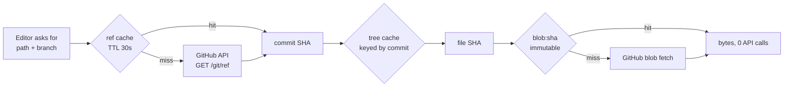

## 11. Caching and content delivery

Caching in this product is not a performance nicety. It is the only thing standing between a solo founder and a GitHub rate-limit lockout, and the only way a git-backed editor feels like Google Docs. But every cache is a second copy of the truth, and this product's first principle is that the file is the only source of truth. So the rule for this section is: **cache derivations, never bytes we would then be tempted to serve as authoritative.** Every cached value is either (a) content-addressed by the SHA of the bytes it derives from, making staleness structurally impossible, or (b) explicitly revocable within a bounded, stated window.

### 11.1 The five layers and what belongs in each

| Layer | Technology | What it holds | What must NEVER go here |
|---|---|---|---|
| Browser | HTTP cache, IndexedDB | Static JS/CSS/fonts, SHA-keyed file bodies, MiniSearch index for the open workspace | Anything cross-tenant; any publish state; auth tokens |
| CDN / edge | Cloudflare CDN in front of Workers/Pages | Published page HTML, published attachments, `/_next/static/*` | Editor API responses; anything requiring a session cookie to authorize |
| Edge KV | Cloudflare Workers KV | `slug → {workspace_id, r2_key, revoked}` publish routing map | Document bytes; entitlements needing strong consistency |
| Application | In-process LRU + Upstash Redis | Parsed AST, rendered HTML, degradation certificates, GitHub tree listings, rate-limit counters | Anything larger than 1 MB (goes to R2); session-scoped user data with long TTL |
| Database | Postgres control plane | Publish slugs, entitlements, audit, job state | Document bytes. Zero. This is a settled constraint. |

The layer boundary that matters most: **the editor path never touches the CDN.** Editor responses are `Cache-Control: private, no-store` because they are authorized per-session and per-workspace, and a CDN cache-key mistake there is a cross-tenant data leak. The CDN's only job is published, deliberately-public content. That asymmetry keeps the blast radius of a caching bug at "a stale public page" rather than "workspace A reads workspace B."

**Rejected: caching editor GET responses at the edge with a `Vary: Cookie` header.** Vary-on-cookie produces a cache entry per session, so the hit rate approaches zero while the risk of a misconfigured key approaches catastrophe. Cost of rejecting: editor cold reads stay ~120–300 ms instead of ~20 ms. Acceptable — the editor loads from the local Redis/LRU path anyway. What would change our mind: nothing short of per-tenant edge isolation with cryptographic key derivation, which is not worth one founder's operating budget.

### 11.2 Content-addressed caching: the SHA is the cache key

The GitHub Contents API returns a `sha` for every blob — the git object hash of the content ([fetched] docs.github.com/rest/repos/contents, read 2026-08-30). That SHA is a perfect cache key: it changes if and only if the bytes change. This is the single highest-leverage decision in the section.

```ts
// src/lib/cache/keys.ts
export const K = {
  // Immutable — keyed by content hash. Never invalidated, only evicted.
  blob:   (sha: string) => `blob:${sha}`,                        // raw UTF-8 bytes
  ast:    (sha: string, v: number) => `ast:${v}:${sha}`,         // remark AST
  html:   (sha: string, v: number, theme: string) => `html:${v}:${theme}:${sha}`,
  cert:   (sha: string, v: number) => `cert:${v}:${sha}`,        // degradation certificate

  // Mutable — keyed by location. Short TTL, explicitly invalidated.
  ref:    (ws: string, repo: string, branch: string) => `ref:${ws}:${repo}:${branch}`,
  tree:   (ws: string, repo: string, commitSha: string) => `tree:${ws}:${repo}:${commitSha}`,
  rate:   (installationId: string) => `rl:${installationId}`,
} as const;
```

The `v` is a pipeline version integer, bumped in one place when remark plugins, the renderer, or the certification rules change. Bumping `v` invalidates every derived entry globally without a single delete — the old keys simply stop being read and expire on their own TTL. This is the cheapest cache-busting mechanism that exists and it costs one constant.

Because `blob:${sha}` and `ast:${v}:${sha}` are immutable, they can be served with `Cache-Control: public, max-age=31536000, immutable` when they travel over HTTP, and they can be cached in the browser's IndexedDB indefinitely. The only mutable question in the whole system becomes: **what SHA is at path X on branch Y right now?** That is one small, cheap, short-TTL lookup, and everything else hangs off it.



The consequence worth stating plainly: for a workspace that is reading and not writing, steady-state GitHub API cost is **one conditional ref request per 30 seconds per open repo**, not one request per file. That is the rate-limit protection, and it is a direct product of content-addressing.

### 11.3 The GitHub rate-limit budget

[fetched] docs.github.com/rest/using-the-rest-api/rate-limits-for-the-rest-api, read 2026-08-30: a GitHub App installation on an organization gets a base 5,000 requests/hour, scaling with organization size to **a maximum of 12,500 requests/hour**. Installations on personal accounts do not get the scaling bonus and stay at 5,000/hour. Conditional requests returning `304 Not Modified` **do not count against the limit** — this is the second load-bearing fact in this section, after content-addressing.

[derived] Budget at 12,500/hour, one installation, no conditional requests: 12,500 ÷ 3,600 = 3.47 requests/second sustained. If ten users of one org workspace each open a 200-file vault and we fetch naively per file, that is 2,000 requests in one burst — 16% of the hourly budget for a single cold start. Ten such cold starts exhaust it. This is not a theoretical risk; it is the default behaviour of any editor that does not cache.

[derived] Budget with the design above: one ref poll per open repo per 30 s = 120 requests/hour/repo, of which the vast majority return 304 and cost nothing. A workspace with 20 active repos costs ~2,400 nominal / near-zero billed requests per hour. Headroom: >80%.

Implementation requirements, non-negotiable:

1. **Every GitHub request sends `If-None-Match` with the stored ETag.** Store the ETag next to the cached value. A 304 refreshes the TTL and costs no quota.
2. **A per-installation token bucket in Redis, sized from the response headers**, not from an assumed constant. Read `x-ratelimit-remaining` and `x-ratelimit-reset` on every response and write them to `K.rate(installationId)`. Refuse new non-interactive work below 20% remaining; refuse background jobs below 40%. Interactive user actions get the last 20%.
3. **`retry-after` and `x-ratelimit-reset` are obeyed absolutely.** GitHub also enforces secondary rate limits — no more than 100 concurrent requests, and content-generating writes (which includes creating commits) should be spaced [fetched, same doc]. Serialize writes per installation.
4. **Never treat the connector as the tenant.** The bucket is keyed by installation because that is what GitHub meters, but authorization is keyed by `workspace_id`. Two workspaces sharing one installation share a quota bucket and must not share a cache entry: `K.tree` and `K.ref` both carry `ws` in the key precisely for this.

```ts
// src/lib/github/budget.ts
const FLOOR = { interactive: 0.05, background: 0.40, batch: 0.60 } as const;

export async function admit(instId: string, kind: keyof typeof FLOOR) {
  const s = await redis.hgetall<{remaining: string; limit: string; reset: string}>(K.rate(instId));
  if (!s) return { ok: true };                       // no data yet: allow, then record
  const frac = Number(s.remaining) / Number(s.limit);
  if (frac > FLOOR[kind]) return { ok: true };
  return { ok: false, retryAt: Number(s.reset) * 1000, reason: 'github_budget' };
}
```

When `admit` refuses, the product **refuses visibly** — "GitHub quota is exhausted for this connection, resuming at 14:32 IST" — consistent with the engine's refuse-rather-than-guess posture. It does not silently serve stale bytes and let the user edit them, because that produces a splice against a phantom base and a merge conflict later.

### 11.4 The snapshot problem

[measured] The current implementation parses **77.5 MB per cold start** to build a whole-vault snapshot, and the resulting response body is **16.4×** the platform's body cap. Caching does not fix this. It is worth being blunt about why, because the temptation to "just cache the snapshot" is strong and wrong:

- **The response still exceeds the cap on a cache hit.** A cached 16.4×-oversized body is an oversized body. The transport limit is not a compute limit.
- **The cache key is the whole vault.** One edit to one file changes the vault state, so the entry invalidates on every keystroke-flush. Hit rate on an actively-edited vault approaches zero.
- **The memory cost lands on the server.** 77.5 MB × N concurrent cold starts is the fastest path to an OOM on any managed runtime, and there is no cache configuration that reduces it.

The fix is architectural and already settled in the search section: stop shipping whole-vault snapshots. Caching's role is what remains after that change:

| Old behaviour | Replacement | Cache role |
|---|---|---|
| Parse whole vault to build a search index | Postgres FTS + `pg_trgm` server-side; query returns ≤50 rows | Redis caches the query→rows for 60 s |
| Ship full file list with content | Ship tree metadata only: path, sha, size, mtime | `K.tree` keyed by commit SHA, immutable within a commit |
| Client holds every file body | Client fetches bodies lazily, keyed by SHA | IndexedDB, permanent, content-addressed |
| Client-side MiniSearch over everything | MiniSearch over the ≤2,000 most-recent paths' titles+headings only | Built once per commit, stored in IndexedDB |

[derived] Tree metadata for a 5,000-file vault at ~120 bytes/entry ≈ 600 KB, ~90 KB gzipped. That fits any body cap with three orders of magnitude to spare, and it is the only thing a cold start needs before the first file renders. **This is the actual fix; caching is what makes the second cold start free.**

### 11.5 Publish, unpublish, and immediate revocation

Published pages are the one place we deliberately want aggressive edge caching, and the one place where a stale cache is a genuine harm — an unpublished page that stays readable is a privacy incident. The requirement is absolute: **unpublish revokes immediately, including at the CDN.**

Three mechanisms in series, because any one of them alone has a failure mode:

1. **Cache tags on every published response.** Cloudflare Cache Rules can set a `Cache-Tag` header, and Enterprise plans support purge-by-tag; Business and below support purge-by-URL and purge-everything ([fetched] developers.cloudflare.com/cache/how-to/purge-cache, read 2026-08-30). At our scale we use **purge-by-URL**, which is on all plans including Free, at up to 30 URLs per API call, 1,000–10,000 purges/minute depending on plan.
2. **A KV revocation check at the edge.** The Worker reads `slug → {revoked}` from Workers KV before serving from cache. KV writes are eventually consistent, documented as **up to 60 seconds** for global propagation ([fetched] developers.cloudflare.com/kv/concepts/how-kv-works, read 2026-08-30). That 60 s is the honest worst case for revocation and must be stated in the product's own privacy copy.
3. **Postgres as the authority.** The slug row is the truth. If KV and Postgres disagree, Postgres wins, and a reconciliation job re-purges. Postgres is also where publish-slug uniqueness is enforced — never in a cache.

```ts
// src/app/api/publish/[slug]/route.ts — unpublish handler, order is load-bearing
export async function DELETE(req: Request, { params }: { params: { slug: string } }) {
  const ws = await requireWorkspace(req);                          // RLS scope
  // 1. Authority first. If this fails, nothing else runs.
  await sql`UPDATE publish SET revoked_at = now()
            WHERE slug = ${params.slug} AND workspace_id = ${ws.id}`;
  // 2. Edge gate second. Bounded by KV propagation (<=60s worst case).
  await kv.put(`pub:${params.slug}`, JSON.stringify({ revoked: true }), { expirationTtl: 86400 });
  // 3. CDN purge third. Fire-and-verify, retried by a job on failure.
  await purgeUrls([
    `https://pages.frontmatter.dev/${params.slug}`,
    `https://pages.frontmatter.dev/${params.slug}/index.json`,
  ]);
  await enqueue('verify_purge', { slug: params.slug, attempts: 0 });
  return Response.json({ revoked: true, edgeConsistentWithinSeconds: 60 });
}
```

The `verify_purge` job re-fetches the public URL from outside our network after 5 s, 30 s, and 120 s and alerts if a 200 is still returned. **Without that verifier, a failed purge is silent**, and silent is the one thing an unpublish must never be. This is the same discipline as verifying an artifact rather than trusting an exit code.

**Rejected: relying on short TTLs alone (e.g. `max-age=60`) for revocation.** It is simpler and needs no purge API. Rejected because it forces every published page to be re-fetched from origin every 60 s, destroying the economics of published pages, and it still leaves a 60 s hole — the same hole, at a much higher origin cost. What would change our mind: if purge reliability measured below 99% in production, we would add a short TTL as belt-and-braces on top of purge, not instead of it.

### 11.6 Stale-while-revalidate, and where it is forbidden

SWR is correct for content where "slightly old" is honest and "slow" is the real harm. It is wrong wherever the stale value could be edited or could grant access.

| Surface | SWR? | Config | Reasoning |
|---|---|---|---|
| Published page HTML | Yes | `public, max-age=60, stale-while-revalidate=86400, stale-if-error=604800` | A published page is a snapshot by definition; a day-old render beats a 500 |
| Published asset (R2, SHA-named) | Yes, trivially | `public, max-age=31536000, immutable` | Content-addressed; never changes |
| Search results | Yes | `private, max-age=0, stale-while-revalidate=60` | Missing a 10-second-old file in results is tolerable |
| File tree listing | Yes | 30 s SWR | Reconciles on next ref poll |
| **File bytes for editing** | **No** | `private, no-store` | A stale base makes the splice journal splice against bytes that no longer exist. The engine must refuse, not guess. |
| **Entitlements / seat count** | **No** | `no-store` | Stale entitlement is either revenue loss or a wrongly-denied paying user |
| **Publish revocation state** | **No** | `no-store` at the gate | Privacy |

Next 16.2.6 gives `stale-while-revalidate` on route segments via `revalidate` exports, but the published-page path should not run through Next's data cache at all — it is a Worker + R2 + KV path, and keeping it out of Next means a Next deployment cannot break published-page availability. One founder on call benefits enormously from published pages having no dependency on the app deploy.

### 11.7 The cache-decision table

| DATA | LAYER | TTL | KEY | INVALIDATED BY |
|---|---|---|---|---|
| Static JS/CSS/fonts | Browser + CDN | 1 year, immutable | `/_next/static/<buildhash>/*` | New build hash (never purged) |
| File bytes (raw markdown) | Redis + IndexedDB | 30 days idle-evict | `blob:<git-sha>` | Nothing — content-addressed. Evicted by LRU only |
| Parsed AST | Redis (in-proc LRU first) | 7 days | `ast:<pipelineV>:<git-sha>` | `pipelineV` bump |
| Rendered HTML (editor preview) | In-proc LRU, 256 entries | Process lifetime | `html:<pipelineV>:<theme>:<git-sha>` | `pipelineV` bump, process restart |
| Degradation certificate | Redis | 30 days | `cert:<certV>:<git-sha>` | `certV` bump when a target engine's version changes |
| Branch head commit SHA | Redis | **30 s** | `ref:<ws>:<repo>:<branch>` | TTL; webhook `push` event; our own successful commit |
| Repo tree (paths + SHAs) | Redis | 24 h | `tree:<ws>:<repo>:<commit-sha>` | Immutable per commit; new commit produces a new key |
| GitHub rate-limit state | Redis hash | 90 s | `rl:<installation-id>` | Every GitHub response's `x-ratelimit-*` headers |
| Search results | Redis | 60 s + SWR 60 s | `q:<ws>:<sha256(query+filters)>` | TTL; any commit to the workspace clears the `q:<ws>:*` prefix |
| MiniSearch client index | IndexedDB | Until commit changes | `msi:<ws>:<repo>:<commit-sha>` | New commit SHA |
| Published page HTML | CDN + R2 | 60 s + SWR 24 h | URL `/<slug>` | Republish (purge URL); unpublish (KV flag + purge) |
| Published attachment | CDN + R2 | 1 year, immutable | `/a/<sha256>.<ext>` | Never. New content = new SHA = new URL |
| Publish routing/revocation | Workers KV | 24 h TTL, read every request | `pub:<slug>` | Publish/unpublish write (≤60 s global propagation) |
| Entitlements / seats | **None** | — | — | Read from Postgres on every gate check |
| Session identity | Cookie (next-auth v5) | 30 days rolling | JWT, `httpOnly, secure, sameSite=lax` | Sign-out; workspace membership change bumps a `session_epoch` in Postgres |
| Attachments >1 MB | R2 + CDN | 1 year, immutable | `r2://<ws>/att/<sha256>` | Never (content-addressed); deletion is a lifecycle job |

Two structural notes on this table. First, **every row with a git SHA in the key has "nothing" in the invalidation column** — that is the design working. Second, **the only 30-second row is the ref**, and it is the only place where the outside world (a `git push` we did not make) can change state under us. Everything else is downstream of that one lookup, which is why the GitHub `push` webhook is worth wiring on day one: it turns the 30 s window into a sub-second one for repos we have an installation on, and the TTL becomes a fallback for when the webhook is missed.

### 11.8 CDN choice and prices

All prices read **2026-08-30** from vendor pricing pages via curl; re-derive before quoting.

| Option | Cost at our shape | Egress | Verdict |
|---|---|---|---|
| **Cloudflare (Workers + R2 + KV + CDN)** | Workers Paid **$5/mo** base: 10 M requests + 30 M CPU-ms included, then $0.30/M requests. R2 storage **$0.015/GB-mo**, Class A ops $4.50/M, Class B $0.36/M, **egress $0** | **Free** | **Chosen** |
| Vercel (app) + Vercel CDN for published pages | Pro $20/seat/mo; Fast Data Transfer billed per GB beyond included | Metered | App only, not published pages |
| AWS CloudFront + S3 | S3 $0.023/GB-mo; CloudFront first 1 TB/mo free then ~$0.085/GB (NA/EU) | **Metered** | Rejected |
| Bunny.net | Storage $0.01/GB-mo; CDN from **$0.01/GB** (EU/NA) to $0.06/GB (SA/Africa) | Metered but cheap | Credible fallback |
| Fastly | ~$0.12/GB NA/EU, higher in Asia | Metered | Rejected — price and ops weight |

**We pick Cloudflare.** Zero egress is load-bearing: a published-page product's cost curve is dominated by bytes out, and any metered-egress CDN converts a viral document into an unbounded bill that one founder cannot cap in real time. R2 already holds attachments and derived artifacts per the settled architecture, so serving published pages from the same origin removes a whole system rather than adding one.

[derived] Cost at 100 users: Workers Paid $5 + R2 storage for ~5 GB of attachments at $0.015/GB = $0.08 + negligible ops. **≈ $5.10/month.** [derived] At 10,000 users with 500 GB stored and 50 M published-page requests/month: $5 base + (50 M − 10 M) × $0.30/M = $12 requests + 500 × $0.015 = $7.50 storage + Class B reads say 20 M × $0.36/M = $7.20. **≈ $32/month**, with egress still zero. That is the predictability the constraint demands: a 100× user increase produces a ~6× cost increase, and the dominant term is requests, not bytes.

**Cost of choosing Cloudflare:** purge-by-tag is Enterprise-only, so we live with purge-by-URL and must enumerate the URLs a publish touches. That is cheap — a published page is `/{slug}` plus `/{slug}/index.json` plus its immutable assets, which never need purging. **What would change our mind:** if published-page latency in India or South America measured materially worse than Bunny's, or if Cloudflare introduced egress metering, we would move published pages to Bunny.net — a two-day migration, because the pages are static files in R2 addressed by slug, and R2 stays as origin either way. That swappability is deliberate.

**Rejected: putting published pages on Vercel alongside the app.** One fewer system to operate. Rejected because Fast Data Transfer is metered, a deploy failure would take down published pages that have nothing to do with the app, and the coupling makes the cost of a traffic spike unbounded and unpredictable. The whole point of the R2+Worker path is that published content survives everything else being broken.
