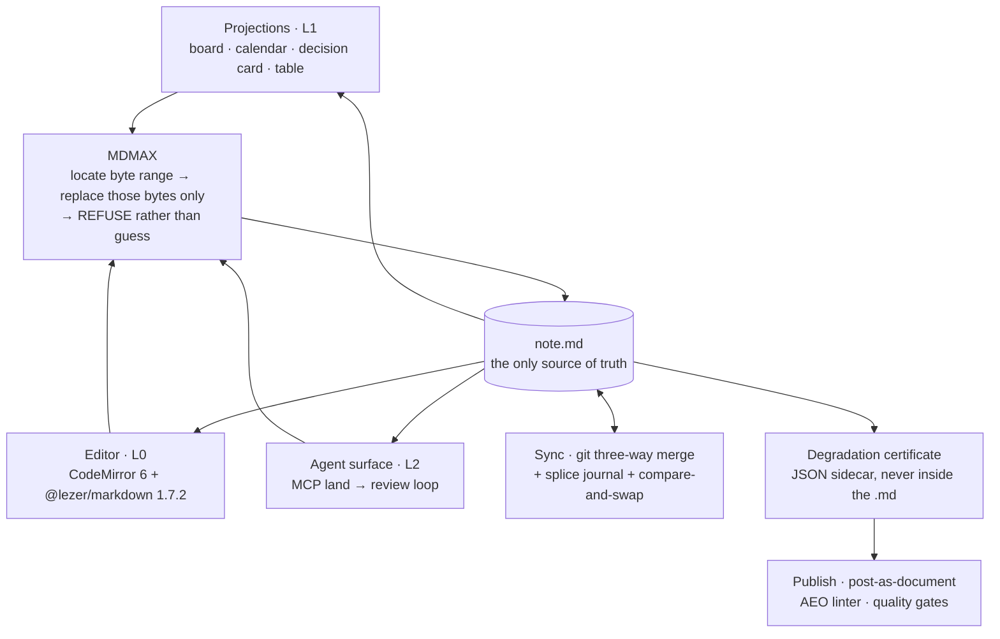

## 61. The system as one thing

Every preceding section describes a layer. This one describes how they compose: one diagram, one contract table, three traces, the seams between them, and what each layer is load-bearing for.

### 61.1 The whole system on one page

Three properties of the drawing carry the whole argument. Every arrow into the file passes through one node, so there is exactly one write grammar for a human keystroke, an agent proposal, a card drag and a merge result [inference, from §6.1 principle 6]. Every arrow out of the file is a read, so no box above the file may hold state. The certificate hangs off the file and feeds publish — it is a fact computed *about* the bytes, never a fact stored *in* them (`cert-contract.ts`: "the artifact is a JSON sidecar, never written into the `.md`") [measured, §7.1].

### 61.2 The layer contract

| LAYER | OWNS | MUST NOT | TALKS TO | FAILS BY |
|---|---|---|---|---|
| **The file** — `.md` in a git repo the user owns | Every byte. All state. History, via git. | Carry a block id, a certificate, a cache, or any token we invented [§6.2, §8.3] | git; MDMAX | Being rewritten whole — normalize-on-save is the single failure that ends the product's distinguishing property [§8.1 F4] |
| **MDMAX engine** — 13 files, 3,614 lines, 10 tests [measured, §7.1] | Byte ranges, refusal, strict decode, shape gate, placement, equivalence fold, certificate computation | Import anything from `src/modules/*`; write files; throw | Bytes in, bytes-or-refusal out. Nothing else. | Guessing a range instead of refusing. A wrong splice is worse than no splice. |
| **L0 editor** — `src/modules/editor` | The caret, undo, incremental parse, the `U16Offset` ↔ `ByteOffset` map | Reserialize the document; normalize on save; assume UTF-16 units equal bytes | MDMAX (write gate), the file (read) | Offset drift. mdast reports root end 36 where UTF-8 length is 41 on the same string [measured, §9] |
| **L1 projections** — board, calendar, decision card, table | Layout, grouping, the gesture | Hold state; write by any path other than a splice; promote L2 inline fields into L1 frontmatter [§8.5] | The file (read), MDMAX (write) | A cache that disagrees with the file and is believed. If they disagree, the file wins and the cache is wrong [§8.5] |
| **L2 AI protocol** — `src/modules/ai`, `src/modules/ai-tools` [measured, directory listing] | Verbs, proposals, provenance, `land()`, the review loop, local instrumentation | Write without a review step; index the vault; execute model-authored code [§6.2, §11.4] | MDMAX via `land()`; the file read-only | Landing against a stale `baseSha`, or an ambient suggestion nobody asked for [§11.4] |
| **L3 markdown-OS** — schema profiles, evidence tiers, machine-write zones | `fm.profile`, `fm.version`, `fm.projections`, `fm.cert`; type coercion rules | Invent a bare top-level key or a new block-level token [§8.4, §8.3] | Frontmatter prepass; projections | Writing a key it did not create, making our edits indistinguishable from the user's |
| **L4 publish** — post-as-document, AEO linter, gates | Rendered output, the published page | Mutate the source file; publish a construct with a DESTROY verdict | The certificate; the file (read) | Shipping a construct the certificate never cleared |
| **Sync** — git merge + journal + CAS | Server-issued revisions, `base_bytes`, the append-only splice journal, conflict artifacts | Merge on the server; use `git merge-file --union`; use fuzzy patch in the write path; write conflict markers into the `.md` [§31.1, §31.2] | MDMAX (`fold`), the file, R2 + Durable Object | Displaying "Fully synced" without a server-ACKed digest match — the UI that lied [§31.2] |

**Anti-recommendation for the whole table:** do NOT let a layer acquire a second responsibility because it is convenient — the board reading `status:` is a projection, the board *caching* `status:` is a second source of truth, and the difference is one line of code and the entire thesis.

### 61.3 Trace A — one byte through a human edit

The user types one character into the body of an open note. Status column: LIVE = shipped today; SEAM n = the ordered wiring plan of §7.3.

| # | HOP | MODULE / FILE | ASSERTED AT THE HOP | STATUS |
|---|---|---|---|---|
| 1 | Read from disk | `get-snapshot.ts` → `decodeStrict` (`mdmax/domain/shape-gate.ts`) | Strict UTF-8. Refuse, never repair [measured, §7.1] | **LIVE** — the only MDMAX symbol reachable from product code today, one of thirteen files [measured, §7.3] |
| 2 | Parse for the editor | `@lezer/markdown` 1.7.2 inside CodeMirror 6, `src/modules/editor` | Exact offsets on inline marks + incremental reparse; 3.58× on a 56 KB doc [measured, §9] | **LIVE** |
| 3 | Keystroke | CodeMirror `ChangeSet` at a UTF-16 offset | The caret position is a `U16Offset`, not a byte offset | **LIVE** |
| 4 | Address translation | `mdmax/domain/offsets.ts` — `OffsetMap`, branded `U16Offset` / `ByteOffset` / `GraphemeIndex` | Only 67 of 1,080 corpus files have bytes == UTF-16 units; 93.8% diverge; 103 of 2,314 contain non-BMP [measured, §7.1] | SEAM 2 |
| 5 | Shape gate | `mdmax/domain/shape-gate.ts` | `MAX_BYTES 4MB`, `MAX_LINES 200,000`; refuse over quadratic paths (`WIKILINK_RE` k=1.98, 36,865 ms on 320 KB) [measured, §7.1] | SEAM 2 |
| 6 | Placement check | `mdmax/domain/placement.ts` | The setext defect (`"Heading\n---"` → h2) is refused, not repaired — blank-line isolation does not fix it [measured, §7.1] | SEAM 2 |
| 7 | Splice | replaces the single-key scanner in `share/domain/splice-frontmatter.ts` | Exactly the located bytes are replaced; every other byte bit-identical | SEAM 3 |
| 8 | Commit | `src/modules/repository/application/commit-changes.ts` | A refusal is a 4xx with a reason, never a silent pass [§7.3] | **LIVE** (write gate not yet enforced) |
| 9 | Journal | `{seq, base_digest, offset, deleted_len, inserted_bytes, result_digest}` [§31.2] | `fold(journal, base_bytes) == working_bytes` | SEAM 3 |
| 10 | Re-project | All L1 views recompute from the new bytes | Views store nothing; nothing to invalidate | Partial |
| 11 | Recertify | `mdmax/application/certify.ts` → JSON sidecar in R2 | `certify.ts` never throws; the artifact never enters the `.md` [measured, §7.1] | SEAM 4 |

### 61.4 Trace B — one byte through an agent edit via `land()`

| # | HOP | MODULE / FILE | ASSERTED AT THE HOP | STATUS |
|---|---|---|---|---|
| 1 | Agent reads | MCP surface, `src/modules/ai-tools` [measured, directory exists; no `land` handler file exists under `src/` today, measured by `find`] | The agent receives bytes plus a `baseSha`. Never a tree, never an AST | PLANNED |
| 2 | Model proposes | `src/modules/ai` — a §11.2 rank-1 transformation verb on a selection | The output *is* a byte range. The model gets a data slot, never a canvas [§6.1 principle 5] | PLANNED |
| 3 | `land()` arrives | `{path, baseSha, offset, deleted_len, inserted_bytes}` | Same envelope shape as the sync journal record — one grammar for every change [§6.1 principle 6] | PLANNED |
| 4 | Compare-and-swap | `baseSha` vs the file's current digest | Mismatch → refuse whole. No partial write, no rebase-and-hope | PLANNED |
| 5 | Address, gate, place | `mdmax/domain/offsets.ts` → `shape-gate.ts` → `placement.ts` | Identical to Trace A steps 4–6. The agent gets no shortcut a human does not get | SEAM 2 |
| 6 | Review loop | Proposed diff rendered over the byte range | Nothing is written yet. Users are filing "Improve Agent Mode review and consent controls" against the market leader — asking a competitor for this [measured, §11.2] | PLANNED |
| 7 | Human accepts | `repository/application/commit-changes.ts` | Provenance recorded with the splice; AI may propose, the human commits [§11.4] | **LIVE** (call site exists) |
| 8 | Human rejects | — | Input returned unchanged. Zero bytes touched. Refusal is a first-class outcome [§6.1 principle 2] | PLANNED |
| 9 | Instrument | Local store only | Strong Acceptance per verb — accepted only if <50% of the proposal was edited. Ansible Lightspeed's 49.08% is a ceiling for a constrained verb, not a general rate [fetched + inference, §11.5]. Publish nothing | PLANNED |

### 61.5 Trace C — one byte through a kanban drag

| # | HOP | MODULE / FILE | ASSERTED AT THE HOP | STATUS |
|---|---|---|---|---|
| 1 | Board reads | `mdmax/domain/frontmatter-prepass.ts` | Never writes, never throws. 170 of 907 home frontmatter blocks are invalid YAML = 18.74% [measured, §7.1] | PLANNED — no `kanban` or `board` file exists under `src/` today [measured, `find`] |
| 2 | Invalid YAML | — | The card renders read-only and the drag is refused. Never repair a block we did not write [§8.4] | PLANNED |
| 3 | Drag gesture | Board projection | The card moves in the DOM and nothing is persisted. The board owns no state | PLANNED |
| 4 | Locate | `share/domain/splice-frontmatter.ts` today; MDMAX splice engine at SEAM 3 | The target is the *value bytes* of the `status:` key — not the key, not the line, not the block | SEAM 3 |
| 5 | Duplicate-key check | Frontmatter contract, §8.4 | Two `status:` keys → REFUSE. YAML 1.1 parsers disagree on last-wins vs error, so any choice we make is wrong somewhere | SEAM 3 |
| 6 | Preserve | Splice writer | Key order, comments, blank lines, quoting style and indentation survive. No load-then-dump YAML round trip, even a "round-trip-safe" one [§8.4] | SEAM 3 |
| 7 | Container indent | `mdmax/domain/constructs.ts` (19 constructs, UTF-8 byte ranges) | The splice computes container indent from the byte range, never assumes column 0 [§8.2] | SEAM 3 |
| 8 | Commit + journal | `repository/application/commit-changes.ts` → splice journal | Same two hops as Traces A and B | **LIVE** / SEAM 3 |
| 9 | Board re-reads | Board projection | If the board and the file disagree, the file wins and the board is wrong [§8.5] | PLANNED |

The three traces converge at step 4–7 of Trace A. That convergence is the composition claim: a keystroke, an agent proposal and a card drag are the same operation with three different origins, which is why there is one place to make the guarantee and one place it can fail.

### 61.6 The seams, and what is asserted at each

| # | SEAM | HANDOFF | ASSERTED | ON FAILURE | STATE |
|---|---|---|---|---|---|
| 1 | Disk → engine | Ingress gate | Valid UTF-8 via `decodeStrict`; within `MAX_BYTES 4MB` / `MAX_LINES 200,000` | Refuse the file; never repair | **LIVE** — `get-snapshot.ts`, `search-index.ts` [measured, §7.3] |
| 2 | Engine → editor | Address translation | Byte offsets round-trip through `OffsetMap`; branded types make a mixed-unit call a compile error | Type error at build, not corruption at runtime | Blocked by NF-1, NF-3 |
| 3 | Any writer → engine | Write gate | Every write passes shape-gate + placement before a blob is created; a refusal is a 4xx with a reason | 4xx with the byte offset surfaced | **Do not wire before NF-1 and NF-3.** At the measured refusal rate this gate rejects 83% of foreign vaults' publishes — an availability incident wearing a correctness costume [§7.3] |
| 4 | Engine → file | Splice | Exactly the located bytes are replaced; `result_digest` recorded | Refuse and return the input unchanged | SEAM 3 of §7.3 |
| 5 | File → sync | Journal fold | `fold(journal, base_bytes) == working_bytes` must hold at every boundary. The journal is a checkable derivative, never authority [§31.2] | Refuse to sync; fall back to whole-file conflict copy | Planned |
| 6 | Sync → file | Merge | Three-way merge against the *stored true base*, never a diff against the winner. CAS on upload | Conflict → write `note (conflict <device> <server-rev>).md` holding your bytes untouched. Never conflict markers in the user's `.md` [§31.2, M9 measured] | Planned |
| 7 | File → certificate | Certification | `certify.ts` never throws; 4 verdicts PASS / STRIP / CORRUPT / VOID, 3 classes LEAK / DESTROY / MUTATE; artifact is a JSON sidecar | Certificate marks the construct unprobeable — `uncertifiableShare()` = 8 of 15 (53.3%) not locally probeable [measured, §15.1] | SEAM 4 of §7.3 |
| 8 | Certificate → publish | Publish gate | No construct carrying a DESTROY class may publish | Refuse the publish and name the construct | Planned |
| 9 | Engine ↔ everything | Boundary rule | MDMAX exports pure functions over bytes and imports nothing from `src/modules/*`, enforced by `eslint-plugin-boundaries` plus an arch report with a minimum-files-scanned floor so the gate cannot pass by going blind | Arch report `"violations"` non-empty; `npm run verify` red | **LIVE** [measured, §7.3] |

**Anti-recommendation on seams:** do NOT enforce a seam before the layer below it can satisfy it. Seam 3 is correct, ready, and would today produce a 4xx on 83% of imported vaults — correctness enforced ahead of capability reads to a user as a broken product, and the fix is NF-1 and NF-3, not a weaker gate.

### 61.7 What breaks if a layer is removed

| REMOVE | WHAT STILL WORKS | WHAT BREAKS | WHAT THE PRODUCT BECOMES |
|---|---|---|---|
| **L2 AI** | Everything. Delete every model key and the file, the board, the calendar and the site work exactly as they did — those were never AI features [§11.6] | The verbs, `land()`, the review loop | A file-native editor with a degradation certificate. Still sellable |
| **L1 projections** | File, editor, engine, sync, publish | The board, calendar, decision card, table | A careful markdown editor. This is the honest v1 fallback, not a catastrophe |
| **Sync** | Every single-device path; no data is at risk | Multi-device, conflict artifacts, the journal oracle | A local editor. The least fatal removal |
| **L3 profiles** | Reads and writes; projections fall back to conventions | Typed data, `fm.*` namespacing, evidence tiers | Dataview with better write safety |
| **The certificate** | Every edit path | Publishing becomes a guess; the degradation claim becomes unfalsifiable; `verdict.ts`'s findings (`![[Some Note]]` → VOID on marked 16.4.2 **and** commonmark 0.31.2; 21 of 24 `{#id}` leak; front matter LEAKs in 23 of 24 bench configurations) go unshipped [measured, §7.1] | A nicer editor carrying a marketing claim it cannot prove |
| **The engine** | Every layer still renders; every write becomes a regenerate-from-parse-tree | Byte preservation, refusal, the certificate, the 8,513-file / 0-corruption / 0-throws result, and the reason any of the above is trustworthy | A competitor. This is the only removal that is fatal rather than reductive |
| **The file** (adopt a tree-of-record or a CRDT document) | Nothing, in the sense that matters | The projection law inverts: the CRDT or the tree becomes the record and the `.md` becomes a projection of it [§31.1 D1] | Notion |

The ordering above is also the ordering of what may be cut under schedule pressure: AI first, projections second, sync third; the engine and the file never.

### 61.8 The system in one sentence

> **frontmatter is one markdown file on your disk, an engine that changes only the exact bytes you pointed at or refuses to change anything, and a set of disposable lenses — a board, a calendar, an agent verb, a published page — that all read those bytes and all write back through that one engine, so nothing you did not select can be rewritten by anyone, including the AI.**

The twenty-second version drops the lenses: *the file is the truth, the engine only ever replaces bytes you named, and everything else is a view.*

What would falsify the composition: any shipped path that writes to the file without passing seams 3 and 4 — a projection that persists its own state, an AI verb that lands without a review step, or a sync merge that resolves rather than refuses. Each of those is a single pull request away at any time, which is why the boundary rule in seam 9 is a lint gate and not a convention [inference].
