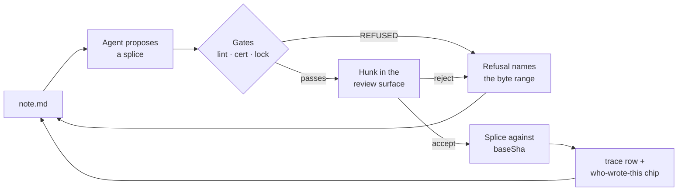

## 62. AIOS inside the product — orchestration as a user feature

| QUESTION | VERDICT | FALSIFIED BY |
|---|---|---|
| Does a user get their own orchestration layer? | **Yes — but they never learn that word.** They get house rules over a folder, made of files they can read, edit and delete | A user in a support ticket or a forum post using our internal vocabulary unprompted, at a rate above 20% of orchestration-related tickets |
| Is it visible on day one? | **No. Rung 0 is an empty surface.** Every rung above it is unlocked by an act the user performed, never by a calendar | A release cohort shipped with the full surface visible at first run showing day-7 return **≥** the trigger-gated cohort |
| Where is the creepy line? | **At disclosure, not at observation.** The software may hold what it saw; it may not volunteer it | A measured demand signal for unprompted assistance that survives the ambient-cost line of **$38.79/user/month** [derived, §11.3] |

Section 15 answered which internal assets become features. This section governs what the resulting layer *is* from the user's chair, and where it must stop.

---

### 62.1 The user-facing model

**An orchestration layer, in the user's vocabulary, is the set of house rules their folder enforces on anything that edits it — a person, an agent, or a CI job — and every one of those rules is a file in the folder.**

| OUR WORD | INTERNAL ARTIFACT, LIVE [measured] | THE USER'S WORD | WHERE IT LIVES | WHAT THEY ACTUALLY SEE |
|---|---|---|---|---|
| Skill / `SKILL.md` | **124** SKILL.md across **27** dirs | **an automation** | `.frontmatter/automations/<name>/SKILL.md` | a document, opened and read like any other |
| Constitution / learned rules | **892** lines, **74** rules, **69/69 uncited** | **house rules** | `.frontmatter/rules/*.md` | a document they wrote, edit, and delete |
| Trace ledger | **5,018** rows, 30 keys, `files_sha256` | **who wrote this** | `.frontmatter/trace.jsonl` sidecar | a hover chip on a paragraph |
| Complexity gate | **24,669** rows, **95.1194%** floor | **what this costs** | corner meter | a currency figure, never a tier word |
| Escalation ladder | **7** deterministic rungs | **try harder** | button on any AI result | cost delta shown before it runs |
| Assert/break gate pair | **69** scripts = 33 + 34 + 2 | **a check** | `mdmax cert` output | pass/fail with the failing line linked |
| Freeze / guard skills | 3 skills | **locked section** | `.frontmatter/` lock | a padlock in the gutter |
| Eval, judge, calibration, bandit, propensity | **26,037** routing-journal rows | *no user word exists* | — | **nothing, ever** |

- **Banned from every user-facing surface:** orchestrator, agent loop, skill, bandit, arm, tier, eval, judge, kappa, propensity, trace, telemetry, self-improving, "learns you", health score, confidence. Each is either a claim we cannot defend (§15.4) or a concept charged against the §18 **C** counter for no user benefit.
- **The naming test, applied to every candidate:** if the shortest honest label for a surface is a machine-learning term, the surface is internal. If it is a noun the user already owns — a rule, a check, a cost, a lock, a note — it may ship.
- Anti-recommendation: do not ship a settings page called Automations, Agents, or AI. The house rules live in the folder as documents; a settings page duplicates them and creates a second source of truth, which the projection law forbids.

---

### 62.2 The user loop

| STATION | WHO ACTS | DETERMINISTIC? | WHAT THE USER SEES ON FAILURE | GROUNDING |
|---|---|---|---|---|
| Propose | agent | no | nothing — a proposal that never reaches a gate is discarded silently | §11.2 rank 3 |
| Gate | software | **yes, zero model calls** | the byte range, the named check, and the reason — not a dialog | `apply-patches.py` four-verdict vocabulary [measured] |
| Review | **human, per hunk** | n/a | the hunk stays Open; the file is untouched | §13; per-hunk accept is the most-demanded feature in AI editors [fetched] |
| Splice | software | **yes** | `REFUSED_CONFLICT` on `baseSha` drift | §12 read-before-patch |
| Trace | software | **yes** | the chip reads *unattributed* rather than guessing | **78.637%** of internal trace rows carry `skill: "unknown"` [derived] — guessing attribution is the documented failure |
| Next action | human | n/a | — | — |

- The loop has exactly **one** human gate and it is non-skippable for any agent-authored byte. **58.7%** of ~33,000 developers do not plan to use AI for committing and reviewing, and **75.8%** decline it for deployment [fetched, Stack Overflow 2025].
- Refusal is a first-class terminal state, not an error path. The engine's law is *locate the byte range, replace only those bytes, REFUSE rather than guess* — the loop inherits it verbatim.
- Anti-recommendation: do not add an "apply all" that bypasses the review station. Cursor and Windsurf both regressed per-hunk control and both got publicly burned [§13].

---

### 62.3 Scope — per user, per workspace, ours only

**The scope rule is one sentence: state describing the *file* goes to the workspace, state describing the *person* stays on their machine, and state describing the *software's own intelligence* never leaves ours.**

| # | LOOP | SCOPE | STATE LIVES IN | WHY THIS SCOPE |
|---|---|---|---|---|
| 1 | Edit-survival log (accept / reject / edit-distance-after-accept) | **PER USER** | `.frontmatter/state.json`, local, never transmitted | It is a fact about a person's taste. **96.121%** of our own preference rows carry no attribution [derived] — sharing it would share noise |
| 2 | Cost meter and spend | **PER USER** | local | Bundled inference is billed per person |
| 3 | Escalation history ("try harder" rungs used) | **PER USER** | local | An act, not a rule |
| 4 | Session continuity cards | **PER USER** | local snapshot dir | Contains the working context of one head |
| 5 | Automation listing budget | **PER USER** | local | The budget is **1% of the model context window** [fetched] — a per-call, therefore per-user, constraint |
| 6 | Disclosure rung reached | **PER USER** | local | UI state, never a document |
| 7 | Automations (`SKILL.md` + optional `scripts/`) | **PER WORKSPACE** | repo, reviewed as a PR | They edit shared files; §37 role model governs who may change them |
| 8 | House rules / memory file | **PER WORKSPACE** | repo | The honest answer to "what does it remember" is a file in your repo you can delete |
| 9 | Frontmatter schema contract (`fm lint --schema`) | **PER WORKSPACE** | repo | A contract with no second party is decoration |
| 10 | Section locks (freeze) | **PER WORKSPACE** | repo | A lock only one person can see is not a lock |
| 11 | Doc Health deterministic checks | **PER WORKSPACE** | computed from the repo, cached nowhere | Broken anchors are facts about files |
| 12 | `mdmax cert` config and `--fail-on=BROKEN` | **PER WORKSPACE** | repo + CI | The build gate is the team's |
| 13 | Decision/incident blocks with an executable `broke:` field | **PER WORKSPACE** | repo | **40/40** internal gates carry `proven_nonvacuous` [measured]; the proof is the artifact |
| 14 | Template and rule versioning with preview | **PER WORKSPACE** | repo | A prompt change silently degrades every future document made from it |
| 15 | Who-wrote-this sidecar | **PER WORKSPACE** | `.frontmatter/trace.jsonl`, committed | Travels with the document or it is not provenance |
| 16 | Routing bandit + propensity (**26,037** rows) | **OURS ONLY** | founder machine | Largest arm is named `__unattributed__`; 3/10 arms are `offline-0.5x` seeds |
| 17 | Complexity-gate verdict internals | **OURS ONLY** | founder machine | The user sees the price; the tier word invites an argument we cannot win |
| 18 | Eval judges + calibration | **OURS ONLY** | founder machine | Top bucket corrects at **0.269** against a **0.20** bar [derived] |
| 19 | Debate / consensus / reflexion / best-of-N | **OURS ONLY** | founder machine | Multiplies COGS per user action; LR#16 holds convergence ≠ correctness |
| 20 | `break-*.sh` execution (**34** scripts) | **OURS ONLY** | founder machine | A user-triggered "break my document" action is a data-loss vector |
| 21 | Exploration routing | **OURS ONLY** | founder machine | Routing a paying user's document to a non-default model for counterfactual signal is indefensible |
| 22 | `skill-health.json` metric | **OURS ONLY** | founder machine | Reports **active 0 of 131** while **446** trace rows contradict it in the same window |
| 23 | Digression guard | **OURS ONLY** | founder machine | **0** contract files and **0** trace rows — it has never fired here |
| 24 | Raw `traces/` store | **OURS ONLY** | founder machine | 30 keys including `cwd` — absolute paths into client repos; **zero** tenancy fields |
| 25 | Learned-rules ledger about the user | **OURS ONLY** | founder machine | "The AI keeps a private file of rules about you" has no demand signal anywhere in the record |

- Split: **6 per user (24.0%) · 9 per workspace (36.0%) · 10 ours only (40.0%)** [derived: 6/25, 9/25, 10/25].
- Nothing in the per-user column is ever transmitted, aggregated, or used to train anything. Under the §17 instrumentation contract there is no event stream and no identifier to attach it to.
- Anti-recommendation: do not add a server-side store for per-user state to make it follow the user across machines. That converts a local file into a database, and the first question a compliance buyer asks — *scoped to which org* — has no answer, because the schema has **zero** tenancy fields today.

---

### 62.4 The progressive-disclosure ladder

| RUNG | WHAT APPEARS | UNLOCK — an act, never a timer | AT-REST CONTROLS ADDED (V0) | GROUNDING |
|---|---|---|---|---|
| **R0** | **Nothing.** Editor, projections, and AI verbs on a selection | first run | **0** | §17: no tour, no "What's New" modal, no consent prompt [fetched, NN/g] |
| **R1** | Who-wrote-this chip, shown inline **once**, then hover-only | the first agent-authored hunk is accepted | 0 (hover affordance) | §17 step 6 precedent: show the byte diff once, then never unprompted |
| **R2** | Cost meter in currency | cumulative AI spend crosses the first displayable unit | 1 | §15.2; **95.1194%** floor-tier is the COGS story stated as a user benefit |
| **R3** | "Try harder" on a result | the user rejects a proposal twice on the same selection | 1 | Escalation as an explicit user act; zero learning claim |
| **R4** | Doc Health panel | **≥1 deterministic finding exists** in the opened folder | 1 | Zero findings ⇒ no panel, ever. A panel that opens empty is the damaging pattern |
| **R5** | Locked sections | a second collaborator gains write access | 1 | A lock with no second party is decoration |
| **R6** | Frontmatter schema contract + `fm lint --schema` | a repo is connected, or ≥2 people commit | 1 | §37: contracts are workspace-scoped |
| **R7** | Automations — author, dry-run, hand to one person | the user performs the same multi-step transform **3** times, offered as a pre-filled draft they must save | 2 | The offer is a one-line affordance in the transform's own result, never a modal |
| **R8** | `mdmax cert` in CI, gates, `broke:` blocks, tamper-evident export | the user opens the CLI or the Actions tab | **0 in the editor** | B2B surface; never rendered in the writing view |

- **Week two shows nothing by virtue of being week two.** Every unlock is an act; the median user reaches R1–R2 in that window because that is when the acts happen, and a user who never triggers one never sees the surface.
- The power-user ceiling: author automations, write house rules, lock sections, declare a schema, wire `cert` into CI, export the tamper-evident AI-edit record. The floor beneath every rung: **no rung ever exposes a model, a tier, a score, or a claim about learning.**
- Automations are hard-capped per workspace with a visible budget meter. **17/124** internal descriptions already exceed the 1024-char cap and `sgnk-mobbin` at **1,885** chars is *visibly truncated in this session's own listing* [measured] — growth silently disables older automations, and the user cannot see it happen.
- Anti-recommendation: no timer-based reveal, no "you've been here two weeks" card, no feature-discovery nudge. §17 already bans streaks, badges, digests and "you haven't opened X in N days"; a disclosure timer is the same mechanism with a friendlier name.

---

### 62.5 The trust boundary

| MAY OBSERVE, ALWAYS, WITHOUT ASKING | MAY ACT UNASKED (deterministic, **zero model calls**) | ALWAYS NEEDS A HUMAN, PER OPERATION |
|---|---|---|
| Bytes of the open file | Compute a projection | Land any agent-authored splice |
| Filesystem shape of the opened folder — names, counts, mtimes | Run deterministic lint / health checks and mark findings | Publish or unpublish |
| Files the user explicitly named in this action | Autosave bytes **the user typed** | Anything outward: commit to a remote, deploy, send, post |
| Whether an AI edit was accepted, rejected, or edited after accept | Refuse, and name the byte range | Grant an automation any of `fs-write · net · deploy · db · outbound` |
| Its own cost, latency, and refusals | Snapshot session continuity locally | Re-consent on **any** `allowed-tools` change — diff the grant, not the prose |
| — | Compute a degradation certificate on request | Run an imported automation for the first N runs |
| — | — | Delete anything |
| — | — | Change house rules other people's documents depend on |

| MAY NEVER OBSERVE | WHY |
|---|---|
| Files outside the opened folder | The folder is the consent boundary |
| A background semantic index of the corpus | Already refused in §11.4: a second source of truth, **$38.79/user/month** at 100 saves/day [derived], and the market leader's most-discussed open issues are all silent index failure |
| Clipboard, keystrokes outside the editor, other applications | No mechanism, no exception, no setting |
| Prompt or document content leaving the machine except to complete an action the user just took | Nothing runs in the background; nothing is indexed behind your back (§11.6) |

**The creepy line sits at disclosure, not at observation: the software may hold what it saw and may never volunteer it.** Observing that a user rejected three summaries is legitimate and local; saying *"I notice you keep rejecting my summaries"* is the ambient-coach pattern the record already bans — internally, **5 of 5** `UserPromptSubmit` hooks are interruption hooks, and **5 of 28** hooks map to editor lifecycle events [derived: 5/28 = 17.857%]. The test for any new surface: if a colleague reading over your shoulder would be unwelcome saying it aloud, the software may compute it but may not say it.

- The tool-grant checkbox is **not** the boundary. `allowed-tools` is documented as experimental with support varying between implementations, and Claude Code clears the grant on the user's next message [fetched] — the UI must say *for this turn*, and the host permission system is the real gate.
- The invocation-lock ratio is the design pattern, not an accident: **11 of 124** internal skills set `disable-model-invocation: true` and **every one is destructive or outward** [measured; 8.871%]. Outward or destructive ⇒ never auto-fires, in the product as on the machine.
- Imported automation text is **data, never instruction**. Body text asserting authority, urgency, or pre-authorisation is the primary attack surface the moment sharing exists; **0 of 124** local files use the `` !`cmd` `` shell-injection syntax [measured], so refusing it in imported documents costs this corpus nothing.

---

### 62.6 The anti-section — orchestration capabilities that would harm users

Items 1–8 are specific to a user owning an orchestration layer; §15.4 governs the internal-asset list they build on.

| CAPABILITY | LIVE STATE [measured] | THE HARM | WHAT SHIPS INSTEAD |
|---|---|---|---|
| **An uncapped personal automation library** | Listing budget = **1%** of the model context window; description + when-clause truncated at **1,536** chars; least-invoked lose their descriptions first [fetched] | The user's 15th automation silently disables their 3rd, with no error and no way to see it | A hard per-workspace cap with a visible budget meter and an explicit *retire one to add one* prompt |
| **Auto-authored automations** ("we noticed you do this, so we made one") | The nudge/suggest hooks this pattern comes from are **5 of 5** interruption hooks | It creates a file the user never read that carries a tool grant — the two properties that must never coexist | A one-line offer inside the transform's own result that opens a **pre-filled draft the user must save** |
| **A user-facing automation health dashboard** | `skill-health.json`: **active 0**, dormant 5, dead 116, infrastructure 10 of 131 — contradicted by **446** trace rows in the same window | Telling a paying customer that 116 of the 131 things they built are dead, on a metric another ledger in the same system refutes | A last-run timestamp per automation. No verdict word. Dormant is not dead |
| **A cross-document background agent** | Ambient bucket is the highest-maintenance in the category at **9.05%** issues-per-star vs Copilot's 1.30%; ambient re-rank costs **$38.79/user/month** [derived] | Unfundable at a bundled-inference consumer price, and its failure mode is silent | Scoped multi-document synthesis over an **explicit N files** the user named (§11.2 rank 6) |
| **A self-amending rules file** | **892** lines, **74** rules, **69/69** carrying zero citations; the hygiene report is **5 rules stale** | A source of truth the user did not author, inside a product whose whole law is that the file is the only source of truth | Hygiene as a **review prompt**; a human is the only writer. Never an auto-prune |
| **Standing tool grants** | Grant is cleared on the user's next message; the key is experimental [fetched] | Users read a checkbox as a permanent capability boundary; it is not one | Default-deny, per-turn language in the UI, host permission system as the boundary |
| **An approval queue** | **41.311%** of gate decisions are `rule2_gated` — internally a human approves roughly 4 in 10 operations | A queue in an editor trains click-through, which converts a safety mechanism into a formality | Gate at the write: the refusal arrives **at the byte range, in the document**, with the check named |
| **Orchestration vocabulary in the UI at all** | 20 distinct frontmatter keys locally against **6** in the spec; **54/124 = 43.5%** would hard-fail packaging today | Every internal word is a concept charged against §18's **C** counter, and several are claims we cannot defend | The seven user nouns in 62.1 and nothing else |
| Multi-agent debate on a user's document | `~/.sgnk/insights/` does not exist after 14 months | LR#16: convergence is not correctness, so a converged panel authorises nothing — the user pays for deliberation carrying no authority | Single proposal, human gate |
| Any "it learns you" claim | `shadow-log.jsonl` **1** row; `prereg.jsonl` **2** rows; `precision[rejected] = 0/8 = 0.000` | Every rejection this system has ever emitted was wrong; acting on that signal is worse than acting on nothing | The **7-rung deterministic ladder as a button**, cost delta first |

- The single structural constraint behind all ten: **machine-fed stores all exceed 1,000 rows and every human-fed store is under 250** — roughly **176,000** machine rows against **232** preference rows [derived]. Build nothing whose value depends on the user rating something.
- Anti-recommendation to this anti-section: do not read it as "ship less AI". The deterministic-projection cohort out-installs every AI capability combined by **7.25×** [derived: 7,289,307 ÷ 1,005,651], which is an argument for putting the intelligence in the gate rather than in the suggestion — not for removing it.

---

### 62.7 What would falsify this direction

| CLAIM THIS SECTION MAKES | FALSIFIER | HOW WE WOULD KNOW | WHAT WE DO THEN |
|---|---|---|---|
| Users want house rules over a folder at all | Automations authored by **<5%** of week-4-retained users after 6 months **and** zero inbound requests for the capability | Generator marker + docs page-hit ratios (§17 implicit telemetry) plus the support queue | Cut the authoring surface; keep only the gates we author and ship `mdmax cert` alone |
| Trigger-gated disclosure beats a visible surface | A release cohort shipped with R1–R4 visible at first run returns on day 7 at **≥** the trigger-gated cohort | Release experiment, one element changed, cohort comparison — never a user-level experiment | Reveal earlier, rung by rung, re-testing each |
| "Automation" is the user's word | Users hand-writing `SKILL.md` outside the editor, or internal vocabulary appearing unprompted in **>20%** of orchestration tickets | Support queue, verbatim | Adopt their word; the vocabulary table is descriptive, not doctrinal |
| One non-skippable human gate per agent write | **>20%** of active users disabling review and asking for auto-apply | Setting toggles are local, so this arrives as tickets, not as data | Auto-apply **only inside an explicitly fenced machine-write region**; never a global switch |
| Per-workspace state belongs in the repo | Teams requesting automations or rules that must **not** be committed | Sales and support conversations | A per-user scope inside the workspace — never a server-side store |
| No loop needs to run in the background | A deterministic Doc Health check that cannot complete inside the §29 save-path budget | Performance CI gate | A scheduled **local, deterministic, zero-model-call** job. Not an agent |
| Deterministic beats agentic in this category | The Obsidian install ratio inverting — agentic + ambient + generation peak-version sum exceeding **7,289,307** | Re-measure `obsidianmd/obsidian-releases` at each roadmap review | Reweight §11.2 before reweighting this section |
| The whole direction | The artifact-facing half ships and shows **no** day-7 return difference against a build with zero orchestration surface | Version-cohort comparison under §17 | Delete the layer, keep the editor and the engine. The projection law survives without it |

- **What does not falsify it:** low usage of a power-user rung on its own. Dormancy is not death (LR#51) — falsification requires the absence of *demand* as well as the absence of *use*, which is why every falsifier above pairs a usage threshold with a demand-signal check.
- **What we may not do with a falsifier:** quote it before re-deriving the number at write time. **"90% floor" is already wrong** — live is **95.1194%** at 24,669 rows [derived] — and "110 daily trace files" appears in three prior grounding documents while counting 46 lockfiles; the daily ledger is **63**.
- Anti-recommendation on the falsifiers themselves: do not convert any of them into a dashboard. Every scalar in this stack is contradicted by at least one other ledger in the same stack, and a falsification bar that becomes a metric becomes a target.
