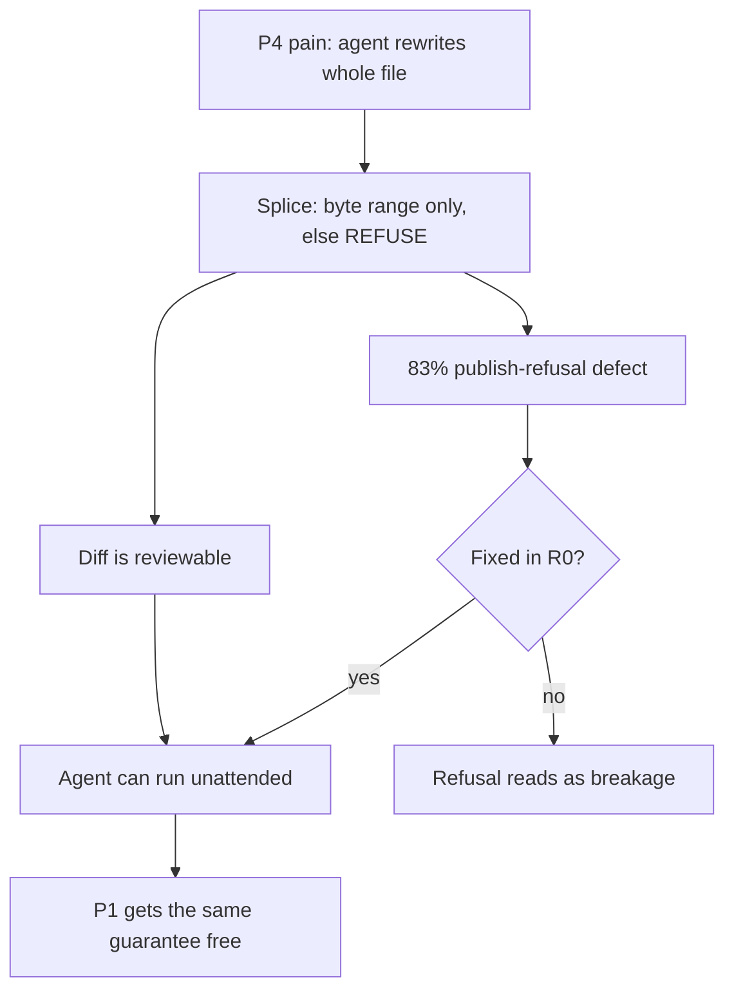

## 63. Who this is for — personas and jobs to be done

### 63.1 The six personas

| # | Persona | Who they are | Tool today | Population signal |
|---|---|---|---|---|
| P1 | **Devraj, the file-owning solo dev** | Backend/infra engineer, 5–15y, runs a personal vault of notes + a blog repo + `~/.claude` skills. Reads the bytes. | Obsidian + a terminal editor, or plain Neovim + git | Obsidian's own commercial-use licence exists because this persona keeps notes in the same repo as work [SS] |
| P2 | **Nina, the dev-tool startup docs owner** | 4–20 person startup; one person owns docs + changelog + roadmap; PRs review the docs like code | Docusaurus/Mintlify + Linear + Notion (three places, one truth) | — |
| P3 | **Kabir, the agency delivery lead** | 6–25 person studio, 4–9 concurrent clients, hands off a repo at the end of every engagement | Notion per client + Google Docs + a static site generator | — |
| P4 | **Sena, the AI-heavy knowledge worker** | Runs Claude Code / Cursor daily; her context IS markdown; wants agents to edit the same files she edits | Raw files + an agent CLI, no editor in between | AIOS on the founder machine: 124 SKILL.md automations, 892-line constitution, 5,014 trace rows, 24,539 gate decisions [measured] |
| P5 | **Ondrej, the compliance-adjacent technical writer** | Regulated-industry doc owner; needs to prove a rendered artifact matches its source | DITA/AsciiDoc toolchain, or Word with a change log | — |
| A1 | **ANTI: Priya, the ops-team lead** (deliberately not for) | 12-person non-technical ops team; wants assignees, notifications, and a shared inbox | Notion / ClickUp / Airtable | — |

### 63.2 Job stories, pain, switch, churn, willingness to pay

| # | Job story (when / I want to / so I can) | Moment of pain | What makes them switch | What makes them leave | WTP | Evidence |
|---|---|---|---|---|---|---|
| P1 | When I want a board view of my own repo, I want it without a database, so I can keep every file greppable and diff-able | A tool rewrites his frontmatter on save; the diff is 400 lines for a 3-word edit | A byte-preserving guarantee he can verify himself: 8,513 third-party files, 0 corruption, 0 throws [measured] | Any lock-in surface — a proprietary sidecar, a login before first edit | $8–15/mo, or a one-time licence; will not pay per-seat | [inference] from the byte-preservation guarantee being the only claim he can independently test |
| P2 | When our docs, changelog and roadmap drift apart, I want one file per item and views generated from it, so I can review docs in the same PR as the code | Roadmap in Notion says shipped; changelog says nothing; site says v1.2 | Board and site as projections of the same repo files, reviewable in a PR | Missing multiplayer presence; a teammate who will not use git | $20–40/seat/mo for 3–8 seats | [inference] |
| P3 | When an engagement ends, I want to hand the client a folder that opens in anything, so I can leave without leaving a subscription behind | Client asks for the Notion export; export is 900 files of `Untitled 3.md` with broken links | Handoff = a git repo; the published site is a projection, not a second copy | Client-branded publishing weak; no per-client access boundary | $50–150/mo studio tier | [inference] |
| P4 | When my agent edits my notes, I want it to change only the bytes it means to, so I can let it run unattended | Agent rewrites a whole file to change one field; the git diff is unreviewable | Locate the byte range, replace only those bytes, REFUSE rather than guess — the splice contract itself | Refusals she cannot fix: today 83% publish-refusals from one YAML defect [measured] | $20–30/mo, highest tolerance of the six | [measured] on the AIOS substrate: 24,539 gate decisions is a person who already pays for determinism |
| P5 | When I ship a rendered doc, I want proof of what degraded on the way, so I can sign off | Reviewer sees a callout; the PDF renderer swallowed it; nobody knows until audit | Cross-engine degradation certification over 7 markdown engines | Certification that stops at 7 engines when the auditor names an 8th | $100+/seat, slowest cycle | [inference] |
| A1 | When work is assigned to me, I want a notification and a due date, so I can chase my team | Nothing in frontmatter hurts here — the pain is elsewhere | Nothing we will build | Everything: no assignees, no notifications, no shared inbox | High and irrelevant | Settled: not a Notion-style project-management tool |

### 63.3 Persona → section map

| Persona | Sections that serve them |
|---|---|
| P1 solo dev | §2 (product thesis), §21, §22, §24, §26 |
| P2 startup docs owner | §2, §21, §22, §24 |
| P3 agency lead | §21, §22, §24, §26 |
| P4 AI knowledge worker | §2, §22, §24, §26 |
| P5 compliance writer | §24, §26 |
| A1 anti-persona | none — appears only here and as an explicit non-goal |

Section numbers are taken from the sections named in the reading brief (2, 21, 22, 24, 26) plus C4 onboarding/activation; a full cross-reference must be rebuilt against the PRD's live table of contents before print [inference].

### 63.4 The one persona to build v1 for

Build v1 for **P4, the AI-heavy knowledge worker.**

- The engine already built is P4's whole product; every other persona buys a projection layered on top of it [inference].
- P4's substrate is measured, not assumed — 5,014 trace rows and 24,539 complexity-gate decisions on one machine [measured].
- Serving P4 serves P1 for free: the byte-preservation guarantee is identical; only the trigger differs (agent vs human).

**The strongest argument against P4: it is a market of one plus a hypothesis — the only measured instance of this persona is the founder's own machine, and building for yourself is the most common way a solo founder builds something nobody else buys.**

- Falsifier: if 20 outreach conversations with agent-CLI users produce fewer than 5 who name whole-file rewrites as a real cost, P4 is a projection of the founder, not a segment — switch the v1 target to P2.
- Anti-recommendation: do NOT build v1 for P2 first even though P2 has the clearest budget. P2 needs multiplayer presence and a review workflow before the product is usable at all, which is a second product; P4 needs only what exists.

### 63.5 Switching costs — what each persona must give up

| Persona | Must give up | Cost class | Mitigation in scope |
|---|---|---|---|
| P1 | Obsidian's plugin ecosystem, graph view, mobile app | High, emotional | None honest — plugin marketplace is settled out. Say so in marketing. |
| P2 | Notion's comment threads and @-mentions; Linear's assignee model | High, organizational | Projections replace views, not conversations. Position as adjacent, not replacing. |
| P3 | Client-facing polish of a Notion share link; non-technical staff access | Very high | Published site projection must match Notion-share polish or P3 never converts |
| P4 | Almost nothing — files stay files; adds a surface she does not have | Near zero | This is the case for §63.4 |
| P5 | An audited toolchain and a validated-tool paper trail | Prohibitive in year 1 | Do not chase; the certificate is the wedge for later |
| A1 | Everything she uses the tool for | Total | Not attempted |

### 63.6 Anti-recommendations — attractive traps

| Trap persona | Why it looks attractive | Why it is a trap | What would change the verdict |
|---|---|---|---|
| **The Notion-refugee team** | Loud, large, actively churning | They want assignees and notifications, not projections; serving them re-litigates a settled non-goal | Nothing short of reversing the settled position |
| **The enterprise compliance buyer (P5) early** | $100+/seat, defensible moat via the 7-engine certificate | A 9–18 month sales cycle and a procurement/security review a solo founder in India cannot staff [inference] | An inbound design partner who pays before the review, not after |
| **Non-technical writers "who could learn markdown"** | Enormous TAM | Every one of them needs the exact features settled out; they churn on git | Never |
| **Obsidian plugin authors** | Distribution for free | No plugin marketplace, no arbitrary client-side code execution — nothing to port to | Nothing; settled |
| **P3 agency before the publish defect is fixed** | Highest revenue per logo | 83% publish-refusals today from one YAML defect [measured]; the agency's whole job-to-be-done is publishing | R0 lands the zero-indent-sequence fix and the refusal rate is re-measured on the same 8,513-file corpus |
