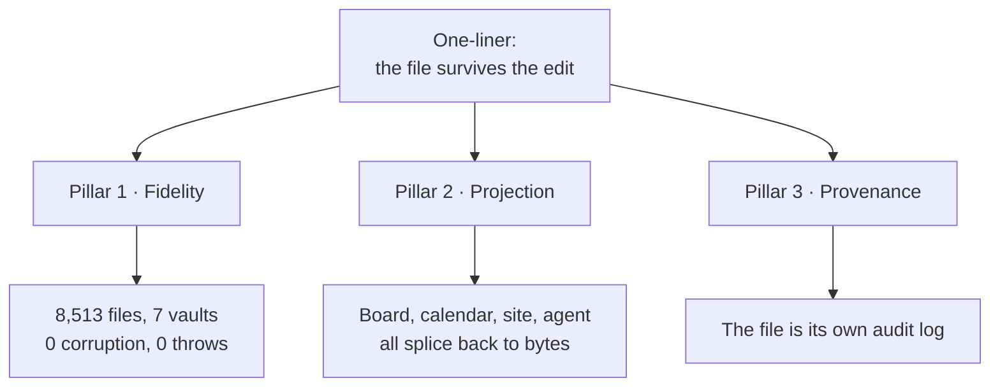
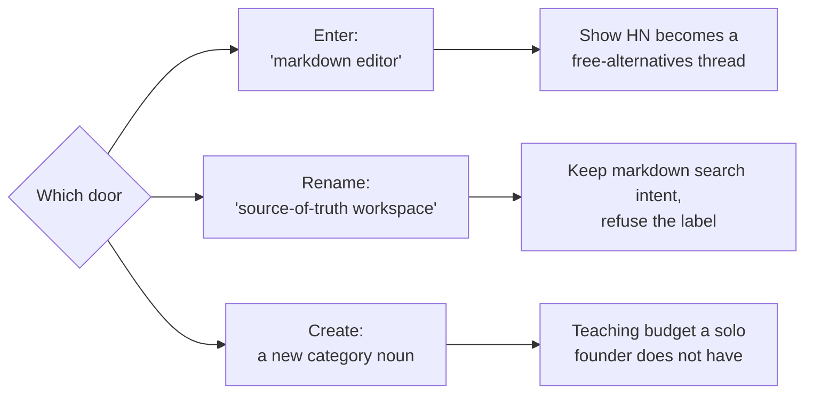

## 64. Positioning, messaging and objections

### 64.1 The positioning statement, canonical form

> **For a software team of 2–20 that already keeps its specs, docs, runbooks and ADRs as markdown files it owns, and that now lets AI agents write into those files, frontmatter is a source-of-truth workspace whose engine edits by byte-range splice and refuses rather than guesses — so every view is a reversible projection and every AI edit is byte-attributed, reviewable and provable — unlike Notion, where the view *is* the data, and unlike every markdown tool that rebuilds the file from an in-memory model of it.**

| Slot | Filled with | Source | Tag |
|---|---|---|---|
| **X** — for whom | Dev-tool / API startups, 2–20 seats (ICP 1, the beachhead) | §21 | — |
| **Y** — who what | Already live in this substrate: `gray-matter` 35,782,970 dl/mo, `front-matter` 18.41M, `js-yaml` 1,228,031,655 | §21 | `[fetched]` |
| **Z** — what it is | A source-of-truth workspace (not an editor, not a wiki, not a PM tool) | §26, §6.2 | — |
| **W** — what it does | Byte-range splice; refuse over guess; every view a reversible projection | §5, §7 | `[measured]` |
| **V** — unlike | Notion (view is the data); the lossy-model class — Front Matter CMS, Hubble.md, and every mainstream rich-text framework in the vendors' own words | §19 | `[measured]` + `[fetched]` |

**Deliberately excluded from V, and this is a discipline not an oversight.** OpenKnowledge is named nowhere in the positioning line, because their body path is genuinely byte-perfect and an overstated comparison is the kind of claim that gets refuted in public `[measured]` (§19). The comparison we may make against them is narrow and factual — frontmatter drifts, a running CRDT daemon is required, O(document) per edit by their own docblock — and it belongs in a teardown page, never in a headline.

- **Anti-recommendation.** Do not author a second positioning statement for Funnel 2 ("beautiful documents from plain text"). §26 rates that funnel **Low** confidence, and a second position with an unproven audience halves the teaching budget of the first. Funnel 2 gets a *campaign line*, not a position, until Funnel 1 clears post-20.
- **Falsifier.** If the first 25 sales conversations show ICP 1 buys for the consolidation wedge (§21) rather than for fidelity, slot **W** is wrong and the line must be rebuilt around "one file, four surfaces" — the engine then becomes the reason to believe, not the offer.

### 64.2 Messaging hierarchy

**The one-liner, with its known defect.**

| Form | Status |
|---|---|
| §26 as written: *"The markdown source of truth AI can't corrupt"* | **Blocked.** "can't" is an absolute-safety claim; §58 bans fidelity claims that outrun measurement, and the corpus proves *did not*, never *cannot*. Log the §26/§58 clash in §57 |
| Sanctioned: *"Markdown that AI edits without rewriting the rest of your file — and we can prove it on 8,513 files that aren't ours"* | Publishable today `[measured]` |
| Short form for a 60-character surface: *"The file survives the edit."* | Publishable; carries no number, so it never goes stale |

**Pillars and proof.**

| # | Pillar | Claim in one line | Proof point | Tag |
|---|---|---|---|---|
| 1 | **Fidelity** | It changes the bytes you asked for and nothing else | 8,513 third-party files, 7 vaults, **0 corruption, 0 throws**, sha256-pinned, re-runnable via `npm run corpus`; three competitor write paths executed with the exact destroyed bytes shown | `[measured]` |
| 2 | **Projection** | The file is the truth; the board, the calendar, the site and the agent's context are lenses that own nothing | Drag a card → splice `status:`; accept a suggestion → splice a body span. Precedent: org-mode's agenda since 2003, Obsidian Bases, Potluck | `[measured]` + `[SS]` |
| 3 | **Provenance** | You can see what the AI changed, where, and undo exactly that | Google's public API **cannot create suggestions at all**; Lex's track-changes "in development"; OpenKnowledge comments machine-local, never committed. Byte-level attribution makes the file its own audit log | `[fetched]` + `[SS]` |

**Which pillar leads, by persona.**

| Persona | Leads | Second | Never opens with | Why |
|---|---|---|---|---|
| Dev-tool / API startup 2–20 (ICP 1) | Fidelity | Projection | "Beautiful documents" | They can verify the corpus claim themselves in an afternoon; that is the point |
| Agency / studio 2–15 (ICP 2) | Projection | Provenance | Fidelity | They never *felt* corruption; they feel four surfaces from one file |
| Support-heavy SMB (ICP 3) | Provenance | Projection | **Deflection or "structured data"** | Intercom, Zendesk, Document360 and GitBook all sell exactly that (§21) |
| Obsidian power user (Funnel 1 prosumer) | Fidelity, framed as *"integrates with your vault"* | Projection | **"Obsidian competitor"** | The community code of conduct removes the launch rather than debating it (§26) |
| Researcher / academic (§22) | Projection | Fidelity | Collaboration features | One file → paper, site, and dataset appendix |
| The buyer's security or ops reviewer | Provenance | Fidelity | Anything compliance-shaped | See §64.5 — we have no SOC 2 and no attorney review (§53) |

- **Anti-recommendation.** Do not run all three pillars in one asset. A page that argues fidelity, projection and provenance simultaneously reads as a feature list, which is precisely the shape §64.4 objection 3 attacks.
- **Falsifier.** If the ICP-1 landing variant that leads with Fidelity converts below the Projection variant across 400 sessions, the pillar order inverts and the engine becomes the reason-to-believe rather than the offer.

### 64.3 The category question

| Door | Evidence for | Evidence against | Verdict |
|---|---|---|---|
| **Enter** "markdown editor" | Highest search intent; the substrate's own download volume proves the audience exists — `js-yaml` 1,228,031,655, `gray-matter` 35,782,970/mo `[fetched]` | Every Show HN named "markdown editor" becomes a thread of free alternatives (§26). The price floor is $0 and well-maintained: AppFlowy 76,040★, AFFiNE 71,976★, SiYuan 46,023★, Logseq 44,669★, Outline 40,362★, Trilium 37,624★, Docmost 21,501★, all pushed within 24h `[fetched]` | **Reject as a label** |
| **Rename** to *source-of-truth workspace* | The category winners all renamed: Obsidian sold *ownership*, Notion a *workspace*, Linear *speed* (§26). Keeps "markdown" as the substrate noun, so search and plugin-directory intent survive | A two-hop name costs one sentence of teaching in every conversation | **Recommended** |
| **Create** a new category noun | §3.2 names the empty box explicitly: *"the rendered, evolving AI-output document — open — the category to name"* | Category creation is a paid activity. Solo throughput is ~**1 substantial shipped surface per 2–3 weeks** (§53) and exactly **two posts have ever shipped**, one with a visible defect since 2026-08-10 `[measured]` | **Defer** |

**Recommendation: rename, do not create.** Be findable inside the markdown category — the "Open in frontmatter" plugin, npm, docs-tool comparisons — and refuse the category *label* in every headline; Relay proved the bridge-plugin path with 172,544 downloads of a commercial service's plugin `[SS]`.

- **Strongest counter-argument, stated in full.** A renamed category is an unrecognised category, and an unrecognised category has no search volume, no G2 grid, no budget line and no comparison page to rank against. The buyer must name the outcome to get it approved (§21), and "source-of-truth workspace" is a *mechanism* dressed as an outcome. The counter-argument is not defeated by evidence — it is answered by sequencing: lead with the mechanism to the beachhead who can verify it, and let the *outcome* line ("one file that is editor, AI workspace, rendered surface and audit trail") do the work in every asset aimed at anyone else.
- **Falsifier.** If, at post-20, prospects cannot repeat the category noun back unprompted, drop the noun entirely and ship a category-of-one description: *"it is where the file, not the app, is in charge."*

### 64.4 Objection handling

| # | Objection | Raised by | What we concede as true | The honest answer, with evidence |
|---|---|---|---|---|
| 1 | **Why not just Obsidian?** | Prosumer, ICP 1 | It is better than us at plugins, graph, mobile and community, and it is the vault we integrate with — never the competitor we name (§26) | Obsidian is single-player by design: no review loop, no provenance, no fidelity proof `[measured]` §3.1. Its own community proves the missing piece — the Homepage plugin has **1,294,057 downloads**, ~20× every bespoke dashboard plugin, and no product ships that natively `[fetched]`. We are the review-and-proof layer over the vault you keep |
| 2 | **Why not Notion?** | ICP 2, ICP 4 | Notion is better at databases-as-views, onboarding and team defaults, and we will never be a Notion-style PM tool (§6.2, founder boundary) | In Notion the view *is* the data and export is lossy by architecture `[SS]`; formulas cannot aggregate across rows; Coda's export returns disconnected strings with formulas stripped `[SS]`. Price behaviour is the second answer: free AI cut to 20 responses *for life* and Business up ~20% `[SS]` §2 |
| 3 | **This is a feature, not a product.** | Investor, senior engineer | As a *capability*, yes — a byte-exact writer is a library. Conceding this is more credible than denying it | The product is the loop the capability makes possible: projection, review and provenance all require it and none exists without it. The three teardowns show the bolt-on route fails — Front Matter CMS builds a comment-preserving Document object **and throws it away** `[measured]`. Joint verdict: the failure is architectural, not a library choice §19 |
| 4 | **You are one person.** | Every buyer | Fully. It is the binding constraint on the whole document (§53): ~1 shipped surface per 2–3 weeks, and support, incidents, invoicing and patching do not compress with skill | Three structural answers, none of them "trust me": the substrate is the file, so leaving costs you nothing (§27 rank 7, the anti-moat, priced in deliberately); the shutdown promise is written and public (§48); and the leverage is measured — 124 SKILL.md automations, 24,539 complexity-gate decisions, 5,014 trace rows, 69 gate scripts, 149 bin tools, and 10 complete multi-surface campaign episodes built in about a week `[measured]` |
| 5 | **Markdown is for developers; my team won't write it.** | ICP 2, ICP 3, ICP 4 | Largely true for authoring. This is why the surface is deliberately simple and why the projections exist at all | Nobody on the team writes markdown — they drag a card, pick a date, accept a suggestion, and the splice writes the file (§5). The markdown is the *storage*, exactly as SQL is storage for a CRM. Anti-answer we must not give: "markdown is easy, they'll learn." They will not, and saying so loses the room |
| 6 | **I already have Cursor / Claude Code.** | ICP 1, the sharpest objection in the list | It edits markdown well, agent-markdown is now **commodity** (§3.2: obsidian agent-skills 47,418★, the skills CLI at 9.3M downloads in one week `[fetched]`), and **§3.2 says explicitly: do not position here** | Cursor's provenance evaporates at accept — the AI/human distinction is lost forever after `[SS]` §2 problem 4 — and its attribution is *admin telemetry*, not something in your file that your reader can see. Our claim is narrow and defensible: byte-anchored, document-portable, reader-visible provenance (§58). Second answer: Cursor is a code editor whose users are engineers; the document your CEO reviews does not live there |
| 7 | **Seven free self-hosted alternatives sit at 21K–76K stars. Why pay?** | ICP 1, ICP 4 | The price floor is genuinely **$0** and those projects are actively maintained `[fetched]` §3.1 | Every one of them regenerates the file. Zero of them certify cross-engine degradation, and the *testing* layer already monetises where the data layer stays free — Litmus at $500/mo is the proof `[SS]` §3.2. Pricing follows: INR 299 / USD 5 Pro is priced against $0, and the money is $20–40/editor seat in teams (§21, §26) |
| 8 | **Git already gives me history, diffs and review.** | ICP 1 | It does, and we build on it rather than around it — sync is git-merge plus a splice journal plus compare-and-swap, never a CRDT | Git's three-way merge preserves CRLF and a missing final newline exactly, and refuses where a splice writer would want to refuse `[measured]` §58 — that is a compliment, and it is also the gap: git diffs *lines*, not the byte range one agent touched, and it cannot tell you which change was the model's. Non-engineers do not review in a PR |
| 9 | **An incumbent ships this next quarter.** | Investor | The engine work is hard but finite and increasingly LLM-assistable. §27 gives the fidelity moat **18–36 months** and the certificate **12–24** — not forever | Incentives point elsewhere: Notion toward blocks, OpenAI toward artifacts-as-output (it **removed** Canvas in May 2026 `[SS]`), Google toward Docs, OpenKnowledge toward the team wiki (§3.3). The honest framing is a window, not a fortress — and the sequencing law says the differentiation tracks must land inside 6–12 months |
| 10 | **Nobody has paid you anything.** | Investor, and the hardest to answer | **True and unmitigated: zero paying users.** Developers are the hardest freemium audience — median dev-focused free-to-paid is **5%, half the non-dev rate** `[fetched]` §4 | Do not argue. State the arithmetic and the test: 1,000 free developer signups × 5% × USD 5 = **USD 250/mo** `[derived: 1000 × 0.05 × 5]`, which is why the revenue centre is self-serve teams, not Pro. The pain is evidenced (GitBook's dominant complaint cluster is reliability and lost work `[SS]`); the *willingness to pay a premium to avoid it* is the single biggest risk in this document and is stated as such in §4 |

**Two rules for using this table.** Lead every answer with the concession, because the concession is the only part the sceptic did not expect. And when an objection has no answer — objection 10 today — say so and name the test that would produce one; §58's whole discipline is that a claim we cannot re-derive is worse than silence.

### 64.5 Claims we may not make

Inherits every row of §58 unchanged. This section adds the positioning-specific bans, because a marketing sentence is where an honest engineering number goes to die.

| Banned | Why | Sanctioned substitute |
|---|---|---|
| *"AI can't corrupt it"*, "corruption-proof", "AI-proof" | Absolute-safety claim; the corpus proves **did not**, never **cannot**. This is the §26 Funnel-1 line as written — log the clash in §57 | *"0 corruption and 0 throws across 8,513 third-party files from 7 vaults, re-verifiable"* `[measured]` |
| "Lossless", bare | Unqualified, it claims the whole surface; today there are **83% publish-refusals from one YAML defect** `[measured]` | *"Byte-preserving on every edit it accepts — and it refuses rather than guessing"* |
| Any fidelity or coverage **percentage** | §58: at the measured refusal rate the headline number is false until NF-1 and NF-3 land | The absolute counts, with the corpus named |
| "First", "only", "the first AI attribution" | §58 and §6.2 — one such claim was already caught and refuted | *"The first markdown editor with byte-anchored, document-portable, reader-visible provenance"* — the narrow form, and only after one more verification round |
| "Audit-ready", "compliance-grade", "SOC 2" | No SOC 2, no attorney review, no auditor has seen the artefact (§51, §53). Vanta and Drata charge **$7,000–$30,000/yr** for the thing this phrase implies `[SS]` | *"The file is its own audit log: every change carries the byte range and the actor"* |
| *"Replaces your $1,163/mo stack"* | §21 explicitly: quote the range, never only the top. The honest light stack is **$78/mo** — a **14.91×** spread `[derived: 1163 ÷ 78 = 14.91]` | *"Teams replace somewhere between $78 and $1,223 a month of tooling with this — here is the arithmetic for both ends"* |
| **"Markdown editor"** as the category noun | Every Show HN with that name becomes a thread of free alternatives (§26) | *"Source-of-truth workspace"*, with markdown named as the substrate |
| *"It learns how you write"* | §58 — never market a learning loop before a decision demonstrably bends on real data | Say nothing about learning |
| Any `[SS]`-tagged number, in any public asset | **47 remain in this document's inherited material** | Re-derive it, or cut the sentence |

### 64.6 What the name must communicate

The naming decision and the positioning decision are one decision, because they split the teaching load between them. A coinage (`stetfile`) teaches nothing on sight, so the one-liner must carry the entire category — which is affordable only because the beachhead can verify the mechanism themselves. A retained "Frontmatter (Studio)" teaches the substrate instantly but costs the *"not the VS Code one"* tax in every conversation forever, against an incumbent at **80,605 installs** and **2,539 stars** read 2026-08-29 `[fetched]`.

| # | The name must… | Source | Test | `stetfile` | "Frontmatter Studio" |
|---|---|---|---|---|---|
| 1 | Name the **guarantee**, not the format | §52.2 — naming from the format ages with the format | Is it still right if the substrate stops being markdown? | Yes — *stet* = "let it stand" | No |
| 2 | Survive being **said aloud** in support | §52.2 — the `-wright/-write/-right` hazard that killed `bytewright` | Spell it once over a call | Yes | Yes, but requires the qualifier every time |
| 3 | Be free on **npm and GitHub with zero named repos** | §52.2 `[measured]` | Re-run the 404 probe **on registration day** — nothing reserves them | npm 404, GitHub 404, 0 repos | Handles free only in qualified form |
| 4 | Not force a permanent **disambiguation tax** | §52.3 | Count the words spent explaining the name per conversation | 0 | ≥1, forever |
| 5 | Not collide in the **adjacent market** | §52.2 | Search the product space, not just the registry | Clean; but bare `stet` collides with `stetmark`, npm-published **2026-08-05**, **5,753 dl/mo** `[measured]` | Direct collision, same keyword space |
| 6 | Carry the **category rename** of §64.3 | §26 | Does the name make "editor" the obvious next word? | No — good | Yes — bad; "frontmatter" is the generic name of the substrate (§27 rank 5) |

- **Recommendation, unchanged from §52: `stetfile`, with `stet` as the spoken shorthand and the CLI verb.** Positioning consequence: the one-liner must then do all the category work, so the sanctioned form in §64.2 becomes load-bearing copy rather than a tagline.
- **Anti-recommendation.** Do not ship bare "Frontmatter" while quietly holding qualified handles — §52.3 rates that the highest-risk option with extra steps. And do not spend on domain, logo or launch copy before a trademark attorney's knock-out search; §52.4 is explicit that handle availability is a different question in kind from mark rights.
- **Falsifier.** A clean knock-out search on the incumbent's class overlap flips the decision to "Frontmatter Studio", because a taught name costs more than a qualifier — and if that happens, pillar order in §64.2 does not change, but the one-liner sheds its category-teaching job and can shorten to *"The file survives the edit."*
