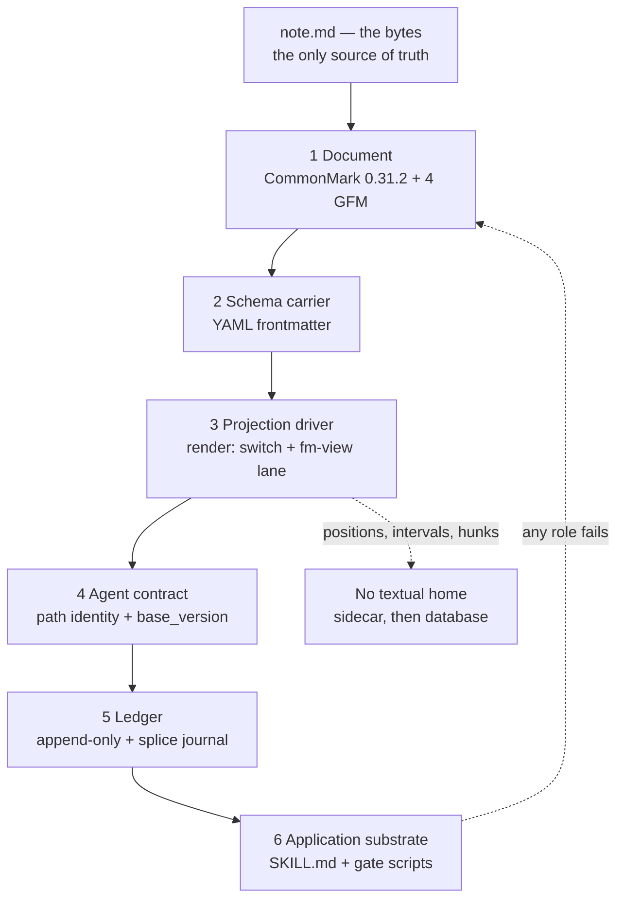

## 65. The markdown thesis — every role the format plays

### 65.1 The six roles, in escalating order

Each role is enabled by a mechanism CommonMark already defines, and each is permitted to fail back into the role below it. No role above 1 may introduce a token the floor does not already contain.

| # | Role | The file is… | Enabling mechanism | Fails back to |
|---|---|---|---|---|
| 1 | **Document** | prose a stranger reads | CommonMark 0.31.2 (2024-01-28) block grammar plus the four GFM extensions every certified engine implements: tables, task list items, strikethrough, autolink literals `[fetched]` `[inference]` | — (the floor) |
| 2 | **Schema carrier** | typed data a machine parses | A YAML block delimited at byte 0 — one contiguous range whose boundaries are computable without running an inline parser `[inference]` | 1, as an `<hr>` and an `<h2>` |
| 3 | **Projection driver** | its own view definition | The three-slot rule: `render:` switch in frontmatter, spec in a fenced `fm-view` lane, data in body constructs that already degrade `[measured]` | 1, as a code block plus an outline |
| 4 | **Agent contract** | the interface a model writes through | Path is identity; `base_version` enforces read-before-patch; every edit is a splice against `baseSha` and arrives as a hunk | 2, as an unmerged suggestion sidecar |
| 5 | **Ledger** | an append-only record of what happened | Append-only body sections plus a splice journal; C2PA A.9's front-matter manifest form carries a single byte exclusion range with start and length **in bytes** `[fetched]` | 1, as dated headings |
| 6 | **Application substrate** | the program's config, state and control surface | Frontmatter-typed instruction files read by a runtime: 124 `SKILL.md` across 27 category dirs, 69 gate scripts (33 `assert-*` + 34 `break-*` + 2 harness meta), 147 executables in 21,481 lines `[measured, 2026-08-29]` | 5, then 1 |

**Role 1 — document.** The floor is not "CommonMark" in the abstract; it is 0.31.2 plus exactly four extensions, and everything past those four is a profile feature that must be degradation-certified before a projection may depend on it `[inference]`.

```markdown
## Decision — vendor @lezer/markdown

~~Deferred to Q4.~~ The repository moved to https://code.haverbeke.berlin —
147 stars, one maintainer, and the only JS parser with exact inline-mark
offsets *and* incremental reparse.

| Option        | 56 KB reparse | Inline offsets |
|:--------------|--------------:|:---------------|
| full          |      16.88 ms | yes            |
| incremental   |       4.71 ms | yes            |

- [x] Read the licence
- [ ] Budget a quarter for owning the fork
```

**Role 2 — schema carrier.** CommonMark 0.31.2 contains the strings "front matter" 0×, "frontmatter" 0×, "YAML" 0× and "metadata" 0×; the GFM spec contains the same three at 0× `[measured]`. **Every typed-data mechanism available to this product is therefore out of spec, so the only real choice is between profiles that degrade well and profiles that degrade badly** `[inference]`.

```markdown
---
title: Vendor @lezer/markdown
status: doing
due: 2026-09-30
tags: [engine, parser]
fm.profile: adr
fm.version: "1"
---
```

**Role 3 — projection driver.** A single key `render: board` degrades to `<hr><h2>render: board</h2>` in marked 16.4.2, markdown-it 15.0.0 (commonmark preset) and commonmark 0.31.2 — a setext H2 that outranks the document's own H1 in every non-frontmatter-aware renderer `[measured]`. Cost is linear in key count: 4 keys ≈ 60 characters of H2 junk, 12 keys ≈ 180 `[derived]`.

````markdown
---
render: board
---

```fm-view
group: heading
columns: [Todo, Doing, Done]
card: {title: text, badge: due}
```

## Doing
- [ ] Vendor @lezer/markdown
````

**Role 4 — agent contract.** The protocol carries the identity and the version explicitly because both failures are documented: on claude.ai, where identity is inferred from phrasing, "it made a new artifact instead of updating mine" is the top documented failure, and `base_version` structurally kills the drift bug where a user hand-edits while the model keeps talking about the version it remembers.

```text
land({ path: "docs/adr/0007-vendor-lezer.md",
       type: "adr",
       title: "Vendor @lezer/markdown",
       body_md: "…",
       base_version: "sha256:…",
       mode: "patch",
       source: { tool, model, conversation_url, session_id } })
  → { LANDED | VERSIONED | REFUSED_CONFLICT | NEEDS_TARGET,
      path, version, url, bytes_written, cert }
```

**Role 5 — ledger.** C2PA's A.9 structured-text binding is line-for-line a byte-splice contract — fixed `-----BEGIN/END-----` delimiters modelled on RFC 4880 §6.2, files read in binary mode "to preserve the exact byte representation of line terminators", a claim generator that "shall **not** alter the line ending convention of the file content outside the manifest block", and at most one block per file `[fetched]`.

```markdown
> [!DECISION] Vendor the parser
> Accepted 2026-08-29. Supersedes ADR-0004.

## [1.2.0] - 2026-08-29
### Changed
- Splice writer returns a typed refusal instead of a bare `src`.

-----BEGIN C2PA MANIFEST-----
<base64 manifest, hashed over a single byte exclusion range>
-----END C2PA MANIFEST-----
```

**Role 6 — application substrate.** The instruction file is the program: frontmatter declares identity and invocation policy, the body is the contract, and a separate gate script asserts the contract held.

```markdown
---
name: sgnk-complexity-gate
description: Route a task by shape before any model call.
disable-model-invocation: false
---

## Contract
Emit `{tier, mode, rule2_gated}` and nothing else.

## Gates
- `assert-*.sh` — refuse if the routing distribution moves off baseline
- `break-*.sh` — prove the assertion can fail before trusting a green
```

### 65.2 One file, six roles



### 65.3 The maximisation table

| Role | What we exploit | The ceiling | Measured evidence for that ceiling |
|---|---|---|---|
| 1 Document | The floor renders everywhere with no configuration; degradation is a property of block-level constructs, not of our code | No block containers, no colspan or rowspan, no auto-numbered cross-references, no multi-column reading order | Pandoc grid tables degrade to `<p>+------+------+ \| Fruit\| Note \|…</p>` `[measured]`; `{#fig-plot}` leaks as visible text after the image `[measured]`; GFM's own normative text: "Block-level elements cannot be inserted in a table" `[fetched]`; nested `:::` columns collapse into one run-on paragraph `[measured]` |
| 2 Schema carrier | One contiguous range at offset 0 with two fixed sentinels — the best splice target in the format; every certified engine already has a frontmatter mode or documented extension `[fetched]` | Junk is linear in key count; the key string *is* the identity, so a rename is lossy; today the parser refuses most foreign vaults | `<hr>` + `<h2>` of the first key in 3/3 engines `[measured]`; 4 keys ≈ 60 chars, 12 keys ≈ 180 `[derived]`; **83% aggregate foreign-vault refusal — 6,613 of 6,614 foreign files refused on zero-indent block sequences** `[project-measured]`; `SAFE_KEY` excludes a space, so `date created` fails in 812/957 files of one vault and CJK keys fail in 905 files of another `[measured]`; four ecosystems normalise keys four different ways — Logseq lowercases and rewrites `_`→`-`, Dataview sanitises to lowercase-with-dashes, org is case-insensitive, Notion sidesteps it entirely with an opaque `id` such as `"fy:{"` `[fetched]` |
| 3 Projection driver | Fenced lanes degrade to contained, labelled code with zero sigil leakage — the best degradation profile of any carrier tested; drags map to four typed write-backs (BODY-MOVE, KEY-SET, CELL-SET, FENCE-SET) | Only C0 and C1 lanes; a projection must be a pure function of bytes, so an LLM can never be a render lane; anything with no textual home is 100% sidecar and the render then carries none of the value | `<!--fm ... -->` is fully suppressed at markdown-it's `commonmark` preset (`html:true`) but escapes to visible `&lt;!--fm…--&gt;` at its **default** `html:false` `[measured, two runs disagreeing on which config counts as "dumb"]`; excalidraw's 7,578,223 downloads are the largest single demand number in the survey and are 100% sidecar `[fetched]`; population evidence that in-document execution does not buy reproducibility: 1,159,166 notebooks from 264,023 repositories, 24.11% executed without errors, **4.03% produced the same results** `[fetched]` (denominator discrepancy recorded, not resolved: 863,878 published vs 788,813 reconstructed → 26.41% / 4.42% `[derived]`) |
| 4 Agent contract | An edit *is* a byte range, so a proposal, a citation and a diff are the same object; the review surface accepts human, agent and sync-conflict hunks through one grammar | Acceptance, not capability, is the limit — and the only published propose-first numbers are from a small model on one narrow dialect | Ansible Lightspeed: **49.08% strong acceptance on multi-line suggestions**, Day-30 retention **13.66%** across 10,696 users / 3,910 returning (arXiv 2402.17442, pub 2024-02-27, upd 2024-10-22) `[fetched]` — a ceiling for a constrained verb, not a general rate `[inference]`; deterministic projections out-install every AI capability combined by **7.25×** (7,289,307 vs 1,005,651 peak-version installs) `[derived]` |
| 5 Ledger | Append is free and byte-safe; the record and the document are the same artifact, so provenance survives export | Ledgers do not rot at the append — they rot at the attribution field, and they go stale silently | Live AIOS trace ledger: 63 daily `.jsonl`, **5,018 rows**, of which `accepted` is non-null in **181 = 3.607%** and `skill: "unknown"` in **3,946 = 78.637%** `[measured/derived]`; `PREFERENCE-LOG.jsonl` 232 rows of which **223 = 96.121% carry no skill attribution** `[derived]`; `regression-gates.jsonl` 40 rows, last registered 2026-08-13T01:41:14Z = **16 days stale** `[derived]` |
| 6 Application substrate | A whole orchestrator runs on frontmatter-typed markdown with no database: 124 `SKILL.md`, an 892-line self-amending constitution, 69 gates, 28 hooks across 9 events, **24,669 complexity-gate rows** over 42 days = 587.357 rows/day `[measured/derived]` | Single-tenant by construction, and the substrate cannot reliably measure itself | **Zero tenancy fields** in the trace ledger and **2 of 151 files** containing any HTTP-listener code `[measured]`; `skill-health.json` (7-day window) reports **active 0, dormant 5, dead 116, infrastructure 10** while the ledger holds **446 trace rows for `sgnk-drift-watch` in the same window** `[measured]`; `calibration.json` high bucket n=26 rate 0.269 against a 0.20 bar — the drift condition is met and unactioned `[measured/derived]` |

- Recorded drift, not reconciled: the product-context figures 5,014 trace rows and 24,539 gate decisions are an earlier read of the same append-only stores measured at 5,018 and 24,669 on 2026-08-29 `[measured]`. Both stand; never publish either without its read date. The same class already sits in the record as `baselines/` at 2,382 vs 2,381 on one day.
- Anti-recommendation for the whole table: **do not promote a role because one engine handles it well.** The gate is the certificate across all seven local targets, and `uncertifiableShare()` already reports **8 of 15 declared targets (53.3%) as not locally probeable** `[measured]` — a declared row is not evidence.

### 65.4 The hard boundary as a rule a builder can apply

**The placement ladder. Stop at the first yes.**

| # | Question | Home | Literal form | Falsifying case for this row |
|---|---|---|---|---|
| 1 | Would a person reading the raw bytes want to see it, and does it survive a renderer that knows nothing about us? | **Body text** | heading, list item, GFM table cell, task checkbox, blockquote callout | An inline field inside a table cell: the same bytes have two different block structures across the matrix (GFM `<td>` vs commonmark one paragraph), so it passes the read test and fails addressability `[measured]` |
| 2 | Is it one scalar, whole-file, and does an existing ecosystem tool already read that key? | **Frontmatter**, 1–3 keys | `status: doing`, `due: 2026-09-30`, `render: board` | Every key added costs an `<h2>` line in a dumb renderer, so a rich view spec here is a degradation regression, not a neutral choice `[measured]` |
| 3 | Is it machine-shaped and whole-block — harmful as prose, but still reconstructable from these bytes alone? | **Fenced lane**, reserved info string | ` ```fm-view `, ` ```fm-query `, ` ```fm-schema ` | An unclosed fence "runs until the end of the containing block" per CommonMark §4.5, so one dropped backtick line turns the rest of a 4,000-line note into code `[fetched]` — the writer must emit open and close in one splice, never two |
| 4 | Does it have no textual home at all, and can it be deleted without changing what the document *means*? | **Sidecar** | JSON Canvas-class positions, SRS intervals, suggestion hunks, embeddings | Bases' shape is the correct one — data in frontmatter, *query* in the `.base` sidecar; inverting it breaks on rename, move and copy, and makes the `.md` non-self-describing `[fetched]` |
| 5 | Does it need identity surviving a rename, multi-writer concurrency, or a cross-file transaction? | **Database — and say out loud it is not a document feature** | — | Notion's 21 property types key on an opaque `id`, which is precisely why renaming a property there is safe and renaming a frontmatter key here is not `[fetched]`; multi-respondent form state is a database, not a file `[inference]` |

**The one-line decider: if deleting it changes what the document means, it belongs in the file; if deleting it only changes what a view looks like, it belongs in a sidecar; if it cannot be deleted at all without breaking another person's session, it belongs in a database and therefore not in this product.**

- Carrier rule that falls out of rows 1–3, unchanged from the settled position: **prose a human reads goes in a blockquote callout; opaque machine data goes in a fenced code block.** A block quote is delimited by a per-line prefix, so there is no state to leave open — the construct ends the moment the `>` stops `[measured]`. A fence is delimited by a matching close, and CommonMark §4.5 is unforgiving about its absence `[fetched]`.
- Anti-recommendation: **do not adopt the invisible HTML-comment carrier globally** on the strength of the cleaner measurement. It is clean in exactly two of the three configurations we certify, and `COMMENT-SET` is permitted only where the certificate explicitly records `html:false` visibility for that target.
- Anti-recommendation: **do not promote an inline `key:: value` field into frontmatter automatically "for queryability".** That rewrites lines the user did not edit, changes the rendered output, and is the exact behaviour that makes people distrust editors that touch their files. Dataview's own parser must resolve bracket nesting, `\` escapes and overlapping spans heuristically, and it sanitises `**Bold Field**` → `bold-field`, so the index provably cannot write back the source bytes `[fetched]`.
- Recorded disagreement, unresolved: m5 recommends **emitting `...` as the frontmatter closer**, because 3/3 dumb engines then degrade to a paragraph instead of a setext heading and pandoc explicitly permits it `[fetched]` `[measured]`; §8.4 as written supports `---` fully and says nothing about `...`. Both closers are legal on read. Do not resolve this by preference — resolve it by running the closer through the seven local targets and recording which strip-pipelines match on `---` alone.
- What falsifies the ladder: a datum that passes row 1 and is nonetheless unaddressable by a byte range surviving an unrelated edit. The table-cell inline field is already that case, which is why the ladder carries an addressability clause and not just a readability one.

### 65.5 What markdown genuinely cannot do, and what we say instead

Faking any of these is worse than refusing them, because a fake succeeds locally and fails on someone else's renderer, which is exactly where the user cannot see it happen.

| Impossible | Why, with evidence | What we tell the user |
|---|---|---|
| Merged cells | No colspan or rowspan syntax in CommonMark or GFM; pandoc's MANUAL contains **zero** occurrences of either in the markdown reader docs `[measured over fetched HTML]`. Grid tables buy spans and cost readable degradation `[measured]` | "Markdown has no merged cells. Split the column, or export to DOCX where the format does." |
| Block content inside a table cell | GFM normative text, verbatim `[fetched]` | "A list inside a table cell is a lie in every renderer but one. Put the list under the table." |
| Multi-column pages, floats, sidebars, wrapped pull quotes | No block-container syntax exists; nested `:::` collapses into one run-on paragraph and leaks two sigil lines per block in all three engines `[measured]` | "There is no reading order for two columns in a linear renderer. Use PDF layout for print, one column for the file." |
| Auto-numbered cross-references ("Figure 3") | Requires a numbering pass no dumb renderer will run; `{#fig-x}` leaks as visible text `[measured]` | "We can link to the figure. We cannot number it in a way that survives leaving this app." |
| Portable footnotes | Not in the GFM spec — `grep -ci footnote` on cmark-gfm's `spec.txt` returns **1**, an intro-prose mention; the syntax lives in `test/extensions.txt:702` `[measured]`. A footnote whose body is a *single token* is parsed as a link reference definition in **all three** engines, producing live broken links `[measured]` | "Your note body stays readable everywhere. The little superscript link does not. Give the note more than one word." |
| Spoilers and hidden text | `\|\|spoiler\|\|` degrades to the literal content, verbatim `[measured]` — a spoiler that degrades open is a defect, not degradation | "Anything you can type, a plain renderer can show. There is no hidden text in markdown." |
| Transclusion on publish | `![[Note#Heading]]` degrades to the literal brackets with the content **silently absent and no marker that anything is missing** `[measured]` | "We keep your embed exactly as written and we open it in the editor. We will not publish a page where content vanished without saying so." |
| A stable table caption position | Immediately after the table it is absorbed as a data row (`<td>Table: my caption</td>`); with a blank line it degrades readably `[measured]` | "Leave a blank line above the caption, or it becomes a row." |
| Guaranteed CJK line joining | CSS Text 3 (CR Draft, 2026-08-14) §4.1.3: a segment break "is either transformed into a space (U+0020) or removed… **The rules for this operation are UA-defined in this level**" `[fetched]` | "We can normalise our own renderer. We cannot promise GitHub's." |
| Correct word counts without a segmenter | `countWords` splits on `/\s+/` and undercounts against `Intl.Segmenter` by **20.00× on Chinese prose, 17.00× on Japanese, 12.00× on Thai, 1.19× on a markup-heavy mixed document**; ko/hi/en are exact `[measured]` | "Approximate for Chinese, Japanese and Thai" — until the segmenter ships, which is four lines and zero new dependencies |
| Sanitised HTML by default | `marked` ships no sanitiser and no URL-scheme filter: it renders `<script>alert(1)</script>` verbatim and `[click](javascript:alert(1))` as a live href; `markdown-it` refuses dangerous schemes even at `html:true` `[measured]`. GFM's `tagfilter` filters exactly nine tags and states "All other HTML tags are left untouched"; GitHub compensates with private post-processing `[fetched]` | "The spec is not a security boundary; the platform is. Any 'renders like GitHub' claim excludes GitHub's private layer." |
| Round-trip-exact pipes and tabs | `\|` in a cell renders `|`, and CommonMark treats tabs "as if they were replaced by spaces with a tab stop of 4" `[fetched]` — semantically equal, byte-different | We state which one the splice engine preserves, in the refusal text, at the byte offset |
| WCAG AA out of the box | §5.2 makes AA all-or-nothing `[fetched]`; measured against this repo: **11 of 14 images with empty alt = 78.6%**, no `<caption>`/`scope=`/`<colgroup>` on GFM tables, **35 heading-level skips**, **5 of 186 files with more than one `<h1>`**, no `lang=` and no `dir=` from `marked`, no accessible name on task-list checkboxes `[measured]` | "Conformance is something the publisher adds. It is never something the format supplies." And never image-rendered math — that is 1.1.1 with a text alternative you cannot generate |

- Anti-recommendation: **do not build an auto-fixer that silently normalises ambiguous indentation, reference-link placement, or a bare-CR line ending.** Reference links are non-local — CommonMark's own author writes that `[foo][bar]` has four possible meanings "depending on whether the references… are defined elsewhere (perhaps later)" and that this makes "accurate syntax highlighting nearly impossible" `[fetched]`, confirmed locally as three different renderings of one source `[measured]`. C2PA A.9 says convert bare CR; we have committed not to silently mutate bytes, so the honest behaviour is refuse and cite the code.
- The refusal is only honest if it is typed. Live baseline at commit `9e84628`: `spliceFrontmatterValue` and `spliceFrontmatterKey` both return a bare string across **20 `return src` sites**, so a refusal is byte-identical to a successful no-op `[measured]` — while `mdmax` already emits 32 uppercase symbols, 13 verdict classes and **19 typed failure codes** `[derived]`. Refusal text without a reason code and a byte range is not a refusal; it is silence.

### 65.6 The strongest argument this thesis over-reaches, and the answer

**The argument, at full strength, using our own numbers.**

1. Five of the six roles are being carried today by a purpose-built store that carries them better. Notion's property model has opaque ids and therefore safe renames; a database has transactions; a queue has multi-writer semantics. Markdown has a key string.
2. The substrate has only ever met its author. The trace ledger has **zero tenancy fields** and **2 of 151 files** contain any HTTP-listener code `[measured]`. Roles 5 and 6 are not demonstrated at scale; they are demonstrated at n=1, on one machine, with one writer and no concurrency.
3. It cannot measure itself. `skill-health.json` reports **active 0 / dead 116** while the ledger holds **446 rows for one of those "dead" skills in the same window** `[measured]`. **78.637%** of trace rows carry `skill: "unknown"` and **96.121%** of preference rows carry no attribution at all `[derived]`. A system whose own instrumentation disagrees with its own record is not evidence for a thesis about durable records.
4. Role 2 does not survive contact with strangers. **83%** of foreign vaults refuse today, on a single YAML defect `[project-measured]`. Every fidelity number in the document is false until that lands.
5. The certificate that is supposed to police all of this is itself half-blind: **8 of 15 declared targets (53.3%) are not locally probeable** `[measured]`, and the shipped preview scores **439/652 = 67.3%** on CommonMark 0.31.2 against a bare remark pipeline's **498/652 = 76.4%** `[measured/derived]` — certifying seven engines against a preview less conformant than the engines it certifies is not a certificate.
6. Therefore: the thesis is a description of one person's workflow, generalised past its evidence.

**The answer. Three concessions first, because they are correct.**

- Points 3, 4 and 5 are conceded without qualification, and they are already the queue: NF-1, NF-3 and NF-4 are R0 work, the preview conformance fix is gated *before* any render profile ships, and the corpus gate is pinned and red-proofed at 8,513 files. Point 2 is conceded and settled the same way — §15 answers "sell the orchestrator" with **No**, on exactly the tenancy evidence the argument cites. The internal system ships only the artifact-facing half: an asset ships if its output is a fact about the user's file, and stays internal if its output is a claim about the software's own intelligence.
- Point 1 is conceded on capability and rejected on framing. The thesis has never been "markdown can do everything". It is narrower and testable: **the file is the only source of truth, and every role above role 1 is either a deterministic projection of those bytes or a sidecar that can be deleted without changing what the document means** — which is why the placement ladder ends at "database, and it is not a document feature" instead of pretending otherwise.
- Point 6 is where the argument actually fails, and it fails on evidence that arrives from outside the thesis. Across 7,020 plugins with stats, deterministic projections take **7,289,307** peak-version installs against **1,005,651** for every AI capability combined — **7.25×** `[derived]` — and **697 of 7,058 plugins (9.9%) describe an AI capability but take 3.44% of the peak-version sum** `[measured]`. The largest file-native editor in the category ships **zero occurrences of the token "AI" across 9,502 characters** of its full roadmap back to July 2023, and what it did ship is data in local markdown properties with views described in valid YAML `[measured]` `[fetched]`. Role 3 is not an extrapolation from one machine; it is the single most-installed thing in the category, arriving at the same design independently.
- The remaining role-6 claim is deliberately not the product claim. The orchestrator is evidence that markdown-typed instruction files scale to a working system — 124 `SKILL.md`, 69 gates, 24,669 gate decisions over 42 days `[measured]` — corroborated externally by `CLAUDE.md` appearing in ~774,144 indexed files and `agents.md` at 23,968 stars, `spec-kit` at 132,035 `[measured/fetched]`. It is not evidence that the same substrate is multi-tenant, and the document never claims it is.

**What would actually falsify the thesis.**

| Role | Falsifier | Status |
|---|---|---|
| 1 Document | A majority of the 7 local targets fail one of the four GFM core extensions on a realistic corpus — the floor then drops to bare CommonMark and tables become a profile feature | Not tested at that framing |
| 2 Schema carrier | NF-1 lands and the foreign-vault refusal rate does not move materially off 83%, meaning the defect was never the single cause | Queued R0; the 83% is the number the fidelity claim rests on |
| 3 Projection driver | Obsidian ships a first-party board with splice-clean write-back before we do; item 1 of the v1 ranking loses its rationale entirely | Live risk — Bases shipped natively while obsidian-kanban's repo last moved 2026-03-06 `[fetched]` |
| 4 Agent contract | Transformation verbs fail to clear 20% strong acceptance in the first 90 days, or the top unmet request six months after Lane A is still "run my Python here" rather than "query my vault here" | Instrumented, no data yet |
| 5 Ledger | Attribution stays below ~50% after the trace schema is fixed, proving the rot is structural to file-based ledgers rather than to one implementation | 3.607% accepted, 78.637% unattributed today `[derived]` |
| 6 Application substrate | ≥1 tenant field in the schema, ≥1 non-self paying customer, and ≥10,000 chained ledger rows — **all three, not any one** — which would falsify the decision *not* to productise it | None of the three met |

- Anti-recommendation for this section: **do not quote any of these numbers in public without re-deriving them at write time.** The record already contains the failure — "90% floor" appears in two internal documents while live is 95.1194% at n=24,669 `[derived]`, and "110 daily trace files" appears in three prior grounding documents while the daily ledger is 63 files, because the 110 counts 46 `.lock` files and a `steps/` subdirectory `[measured]`. A thesis this dependent on measurement is falsified fastest by its own stale citations.
